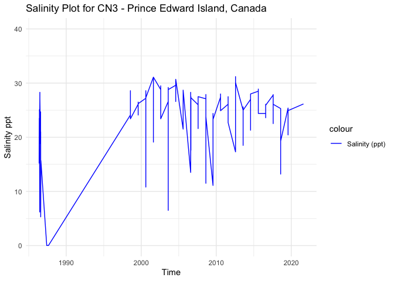
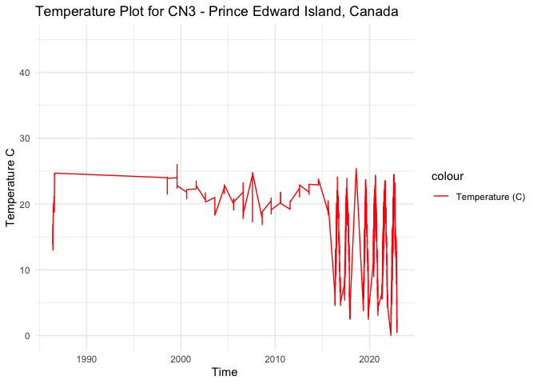

CN3 - Processed Environmental Data
================
Madeline Eppley
3/27/2024

``` r
setwd("/Users/madelineeppley/GitHub/EasternOysterEnvData/2022_SiteEnvironmentData")
```

### Load required packages.

``` r
library("dplyr") #Used for working with data frames
```

    ## 
    ## Attaching package: 'dplyr'

    ## The following objects are masked from 'package:stats':
    ## 
    ##     filter, lag

    ## The following objects are masked from 'package:base':
    ## 
    ##     intersect, setdiff, setequal, union

``` r
library("lubridate") #Used for time-date conversions
```

    ## 
    ## Attaching package: 'lubridate'

    ## The following objects are masked from 'package:base':
    ## 
    ##     date, intersect, setdiff, union

``` r
library("readr") #Used to read the CSV file
library("ggplot2") 
```

### Note the date of data download and source. All available data should be used for each site regardless of year. Note from the CSV file how often the site was sampled, and if there are replicates in the data. Also describe if the sampling occurred at only low tide, only high tide, or continuously.

``` r
#Data was downloaded on 3/27/2024
#Source - https://data.princeedwardisland.ca/Environment-and-Food/Surface-Water-Quality-Map/y8zm-whzm and https://www.princeedwardisland.ca/en/feature/view-oyster-monitoring-results#/service/OysterMonitoring/OysterMonitoringSample;location=Orwell%20River;area=7
# All data was pulled from Orwell River marine water (MW) sites
#The site was sampled intermittently 

#Create text strings with metadata information that we want to include in the final data frame. 
download_date <- ("03-27-2024")
source_description <- ("Prince Edward Island Oyster Monitoring and Government")
site_name <- ("CN3") #Use site code with site number based on lat position and state
collection_type <- ("intermittent")
```

### Use the file path name in your working directory or desktop, see example below. Or, import data set through the “Files” window in R studio. Store the file in a variable with the “raw_ID_Site” format. If salinity and temperature data are in separate files, read in both and store them with “\_sal” or “\_temp” in the variable names.

``` r
#The file we will be working with is from Prince Edward Island, Canada. The ID_Site for this site is CN3. 
raw_CN3_sal <- read_csv("/Users/madelineeppley/GitHub/EasternOysterEnvData/2022_SiteEnvironmentData/CN3-raw_sal.csv")
```

    ## Rows: 216 Columns: 18
    ## ── Column specification ────────────────────────────────────────────────────────
    ## Delimiter: ","
    ## chr  (12): Value Flag, Lab Analysis Date, Station ID, Sample Date, Watershed...
    ## dbl   (5): VMV Code, Value, Sample Type Code, Latitude, Longitude
    ## date  (1): Year-Month-Day
    ## 
    ## ℹ Use `spec()` to retrieve the full column specification for this data.
    ## ℹ Specify the column types or set `show_col_types = FALSE` to quiet this message.

``` r
raw_CN3_temp <- read_csv("/Users/madelineeppley/GitHub/EasternOysterEnvData/2022_SiteEnvironmentData/CN3-raw_temp.csv")
```

    ## Rows: 30099 Columns: 4
    ## ── Column specification ────────────────────────────────────────────────────────
    ## Delimiter: ","
    ## chr (3): reading_datetime, name, site_type
    ## dbl (1): reading_value
    ## 
    ## ℹ Use `spec()` to retrieve the full column specification for this data.
    ## ℹ Specify the column types or set `show_col_types = FALSE` to quiet this message.

``` r
# View how the data is stored. Note the variable names and the format and units that the data are stored in.  
spec(raw_CN3_sal)
```

    ## cols(
    ##   `VMV Code` = col_double(),
    ##   `Value Flag` = col_character(),
    ##   Value = col_double(),
    ##   `Lab Analysis Date` = col_character(),
    ##   `Station ID` = col_character(),
    ##   `Sample Date` = col_character(),
    ##   `Year-Month-Day` = col_date(format = ""),
    ##   `Sample Type Code` = col_double(),
    ##   Watershed = col_character(),
    ##   `Water Type` = col_character(),
    ##   `Station Description` = col_character(),
    ##   Units = col_character(),
    ##   `Variable Name` = col_character(),
    ##   `Variable Group` = col_character(),
    ##   `Method Description` = col_character(),
    ##   Latitude = col_double(),
    ##   Longitude = col_double(),
    ##   Georeference = col_character()
    ## )

``` r
#View(raw_CN3_sal)

spec(raw_CN3_temp)
```

    ## cols(
    ##   reading_datetime = col_character(),
    ##   name = col_character(),
    ##   site_type = col_character(),
    ##   reading_value = col_double()
    ## )

``` r
#View(raw_CN3_temp)
```

### Start with the date and time of collection. We will use the lubridate package to standardize all values into the date-time format called POSIXct. This format stores the date and time in number of seconds since a past point (1/1/1970). This makes comparisons easy and helps to standardizes values.

``` r
#Convert to POSIXct format. Store it into a column named datetime in the data frame.
raw_CN3_sal$datetime <- as.POSIXct(raw_CN3_sal$`Sample Date`, "%m/%d/%Y %H:%M:%S %p", tz = "")
raw_CN3_temp$datetime <- as.POSIXct(raw_CN3_temp$reading_datetime, "%m/%d/%y %H:%M %p", tz = "")

#Print the new data frame and examine to make sure the new datetime column is in the correct format. 
head(raw_CN3_sal)
```

    ## # A tibble: 6 × 19
    ##   `VMV Code` `Value Flag` Value `Lab Analysis Date`   `Station ID` `Sample Date`
    ##        <dbl> <chr>        <dbl> <chr>                 <chr>        <chr>        
    ## 1         30 <NA>          26.1 01/20/2022 10:43:29 … ORB 33       08/11/2021 1…
    ## 2         30 <NA>          26.2 01/20/2022 10:44:33 … ORB 33B      08/11/2021 1…
    ## 3         30 <NA>          25.3 03/08/2021 09:59:48 … ORB 35       08/02/2018 1…
    ## 4         30 <NA>          13.2 03/08/2021 10:03:03 … ORB 32       08/02/2018 1…
    ## 5         30 <NA>          25.3 03/08/2021 09:59:02 … ORB 35B      08/02/2018 1…
    ## 6         30 <NA>          25.1 03/08/2021 10:00:42 … ORB 34       08/02/2018 1…
    ## # ℹ 13 more variables: `Year-Month-Day` <date>, `Sample Type Code` <dbl>,
    ## #   Watershed <chr>, `Water Type` <chr>, `Station Description` <chr>,
    ## #   Units <chr>, `Variable Name` <chr>, `Variable Group` <chr>,
    ## #   `Method Description` <chr>, Latitude <dbl>, Longitude <dbl>,
    ## #   Georeference <chr>, datetime <dttm>

``` r
head(raw_CN3_temp)
```

    ## # A tibble: 6 × 5
    ##   reading_datetime name       site_type reading_value datetime           
    ##   <chr>            <chr>      <chr>             <dbl> <dttm>             
    ## 1 5/4/16 11:00 AM  Orwell Bay MUSSEL             6.81 2016-05-04 11:00:00
    ## 2 5/4/16 12:00 PM  Orwell Bay MUSSEL             5.92 2016-05-04 12:00:00
    ## 3 5/4/16 1:00 PM   Orwell Bay MUSSEL             6.05 2016-05-04 01:00:00
    ## 4 5/4/16 2:00 PM   Orwell Bay MUSSEL             6.33 2016-05-04 02:00:00
    ## 5 5/4/16 3:00 PM   Orwell Bay MUSSEL             6.38 2016-05-04 03:00:00
    ## 6 5/4/16 4:00 PM   Orwell Bay MUSSEL             6.33 2016-05-04 04:00:00

### Analyze the ranges of all of our variables of interest - time, salinity, and temperature. Make sure that the latitude and longitude values are consistent for a static collection site. This is a quick check so we can determine how to conduct the next filtering step.

``` r
#Standardize column and variable names. We will use "temp" for temperature in degrees C, "salinity" for salinity in parts per thousand (ppt), "lat" for latitude in degrees, and "lon" for longitude in degrees. 
#Use the dyplr format to rename multiple columns in the format "dataframe %>% rename("new name 1" = "old name 1", "new name 2", "old name 2")
raw_CN3_sal <- raw_CN3_sal %>% rename("salinity" = "Value")
raw_CN3_temp <- raw_CN3_temp  %>% rename("temp" = "reading_value")

#Store variables that we will include in the final data frame
lat <- 46.1257
lon <- -62.9055
firstyear <- 1986
finalyear <- 2022
```

### Filter any of the variables that have data points outside of normal range. We will use 0-40 as the accepted range for salinity (ppt) and temperature (C) values. Note, in the summer, salinity values can sometimes exceed 40. Check to see if there are values above 40. In this case, adjust the range or notify someone that the site has particularly high salinity values.

``` r
#Filter the data between the values of 0 and 40 for both salinity and temperature. 
filtered_CN3_sal <- raw_CN3_sal %>%
    filter(between(salinity, 0, 42)) 
           
filtered_CN3_temp <- raw_CN3_temp %>%
    filter(between(temp, 0, 40))

# Sanity check - print the ranges to ensure values are filtered properly. We can see that the ranges for both are now in the appropriate range.  
print(summary(filtered_CN3_sal$salinity))
```

    ##    Min. 1st Qu.  Median    Mean 3rd Qu.    Max. 
    ##    0.02   22.70   25.80   23.60   27.60   31.20

``` r
print(summary(filtered_CN3_temp$temp))
```

    ##    Min. 1st Qu.  Median    Mean 3rd Qu.    Max. 
    ##   0.029  10.770  14.787  14.494  19.199  26.000

``` r
#Store our data into a variable name with just the site name. 
CN3_temp <- filtered_CN3_temp
CN3_sal <- filtered_CN3_sal

# check if we have NAs in our salinity datetime column
count.nas_sal <- is.na(CN3_sal$datetime) # store our NAs in a variable
summary(count.nas_sal) # we don't have any NAs, good to go
```

    ##    Mode   FALSE 
    ## logical     216

``` r
# check if we have NAs in our temperature datetime column
count.nas_temp <- is.na(CN3_temp$datetime) # store our NAs in a variable
summary(count.nas_temp) # we don't have any NAs, good to go
```

    ##    Mode   FALSE 
    ## logical   30099

### Visualize the salinity, temperature, and date ranges over time. This can help us see if there are any anomalies or gaps in the data and make sure the filtering was done correctly. Sanity check - do the temperature and salinity ranges look appropriate for the geography of the site (ex. near full ocean salinity for coastal sites, lower salinity for estuaries or near rivers)?

``` r
salplot <- ggplot(CN3_sal, aes(x = datetime)) +
    geom_line(aes(y = salinity, color = "Salinity (ppt)")) +
    ylim(0,40) +
    labs(x = "Time", y = "Salinity ppt", title = "Salinity Plot for CN3 - Prince Edward Island, Canada") +
    scale_color_manual(values = c("Salinity (ppt)" = "blue")) +
    theme_minimal()

salplot
```

<!-- -->

``` r
tempplot <- ggplot(CN3_temp, aes(x = datetime)) +
    geom_line(aes(y = temp, color = "Temperature (C)")) +
    ylim(0, 45) +
    labs(x = "Time", y = "Temperature C", title = "Temperature Plot for CN3 - Prince Edward Island, Canada") +
    scale_color_manual(values = c( "Temperature (C)" = "red")) +
    theme_minimal()


tempplot
```

<!-- -->

### We need to calculate the mean, maximum, and minimum values for salinity and temperature per month and year. First make two data frames to contain each of the annual and monthly averages.

``` r
#Calculate the mean, maximum, and minimum values for salinity and temperature for each month. 
CN3_envrmonth_sal <- CN3_sal %>%
    mutate(year = year(datetime), month = month(datetime)) %>%
    group_by(year, month) %>%
    summarise(
      min_salinity = min(salinity),
      max_salinity = max(salinity),
      mean_salinity = mean(salinity),
      length_salinity = length(salinity))
```

    ## `summarise()` has grouped output by 'year'. You can override using the
    ## `.groups` argument.

``` r
CN3_envrmonth_temp <- CN3_temp %>%
    mutate(year = year(datetime), month = month(datetime)) %>%
    group_by(year, month) %>%
    summarise(      
      min_temp = min(temp),
      max_temp = max(temp),
      mean_temp = mean(temp),
      length_temp = length(temp))
```

    ## `summarise()` has grouped output by 'year'. You can override using the
    ## `.groups` argument.

``` r
print(CN3_envrmonth_sal)
```

    ## # A tibble: 31 × 6
    ## # Groups:   year [25]
    ##     year month min_salinity max_salinity mean_salinity length_salinity
    ##    <dbl> <dbl>        <dbl>        <dbl>         <dbl>           <int>
    ##  1  1986     5        15.2         23.5          19.3                3
    ##  2  1986     6         6.2         28.3          20.7                6
    ##  3  1986     7        18.8         24.7          22.1                4
    ##  4  1986     8         5.3         21            14.3                4
    ##  5  1987     5         0.02         0.02          0.02               2
    ##  6  1987     6         0.02         0.02          0.02               2
    ##  7  1987     7         0.02         0.02          0.02               4
    ##  8  1987     8         0.02         0.02          0.02               2
    ##  9  1998     7        23.4         28.6          26.1               12
    ## 10  1999     8        24.1         26.5          25.9                6
    ## # ℹ 21 more rows

``` r
print(CN3_envrmonth_temp)
```

    ## # A tibble: 68 × 6
    ## # Groups:   year [26]
    ##     year month min_temp max_temp mean_temp length_temp
    ##    <dbl> <dbl>    <dbl>    <dbl>     <dbl>       <int>
    ##  1  1986     5     13.8     16.9      15.8           3
    ##  2  1986     6     13       20.1      17.7           6
    ##  3  1986     7     18.8     21.1      20.1           4
    ##  4  1986     8     24.3     24.7      24.6           4
    ##  5  1998     7     21.5     24.1      23.2          12
    ##  6  1999     8     22.4     26        23.7           6
    ##  7  2000     8     20.8     22.2      21.8           8
    ##  8  2001     8     22.3     23.5      22.8           8
    ##  9  2002     8     20.3     21.7      21.0           8
    ## 10  2003     8     18.3     21        19.4           8
    ## # ℹ 58 more rows

``` r
#Calculate the mean, maximum, and minimum values for salinity and temperature for each year. 
CN3_envryear_sal <- CN3_sal %>%
    mutate(year = year(datetime)) %>%
    group_by(year) %>%
    summarise(
      min_salinity = min(salinity),
      max_salinity = max(salinity),
      mean_salinity = mean(salinity))

CN3_envryear_temp <- CN3_temp %>%
    mutate(year = year(datetime)) %>%
    group_by(year) %>%
    summarise(
      min_temp = min(temp),
      max_temp = max(temp),
      mean_temp = mean(temp))

print(CN3_envryear_sal)
```

    ## # A tibble: 25 × 4
    ##     year min_salinity max_salinity mean_salinity
    ##    <dbl>        <dbl>        <dbl>         <dbl>
    ##  1  1986         5.3         28.3          19.3 
    ##  2  1987         0.02         0.02          0.02
    ##  3  1998        23.4         28.6          26.1 
    ##  4  1999        24.1         26.5          25.9 
    ##  5  2000        10.8         28.6          24.9 
    ##  6  2001        19.1         31.1          28.4 
    ##  7  2002        23.4         29.5          28.1 
    ##  8  2003         6.5         29.2          24.6 
    ##  9  2004        26.6         30.7          29.3 
    ## 10  2005        21.5         28.7          26.7 
    ## # ℹ 15 more rows

``` r
print(CN3_envryear_temp)
```

    ## # A tibble: 26 × 4
    ##     year min_temp max_temp mean_temp
    ##    <dbl>    <dbl>    <dbl>     <dbl>
    ##  1  1986     13       24.7      19.5
    ##  2  1998     21.5     24.1      23.2
    ##  3  1999     22.4     26        23.7
    ##  4  2000     20.8     22.2      21.8
    ##  5  2001     22.3     23.5      22.8
    ##  6  2002     20.3     21.7      21.0
    ##  7  2003     18.3     21        19.4
    ##  8  2004     21.6     22.9      22.4
    ##  9  2005     19.1     20.8      20.0
    ## 10  2006     17.8     23.2      20.2
    ## # ℹ 16 more rows

### Plot the months and years of data collection to check if there are any collection gaps in the data.

``` r
timeplot <- ggplot(CN3_envrmonth_sal, aes(x = year)) +
    geom_point(aes(y = month, color = length_salinity), size = 4) +
    labs(x = "Time", y = "Month", title = "Salinity Timeplot for CN3 - Prince Edward Island, Canada") +
    ylim(1,12) +
    theme_minimal()

timeplot
```

<!-- -->

### Plot the months and years of data collection to check if there are any collection gaps in the data.

``` r
timeplot <- ggplot(CN3_envrmonth_temp, aes(x = year)) +
    geom_point(aes(y = month, color = length_temp), size = 4) +
    labs(x = "Time", y = "Month", title = "Temperature Timeplot for CN3 - Prince Edward Island, Canada") +
    ylim(1,12) +
    theme_minimal()

timeplot
```

<!-- -->

### We can now calculate a list of variables that we will have collected for all sites. This will allow us to compare sites easily. We will calculate the number of observations from each site, the mean annual, maximum annual, and minimum annual value for all variables.

Our list of variables includes:

- Mean_Annual_Temperature_C: average of all available data

- Mean_max_temperature_C: average of maximums for each year

- Mean_min_temperature_C: average of minimums for each year

- Temperature_st_dev: standard deviation of all available data

- Temperature_n: total number of data points

- Temperature_years: number of years in data set

- Mean_Annual_Salinity_ppt: average of all available data

- Mean_min_Salinity_ppt: average of minimums for each year

- Mean_max_Salinity_ppt: average of maximums for each year

- Salinity_st_dev: standard deviation of all available data

- Salinity_n: total number of data points

- Salinity_years: number of years in data set

``` r
#Calculate temperature variables. 
#Calculate temperature variables. 
Mean_Annual_Temperature_C <- mean(CN3_temp$temp)
Mean_max_temperature_C <- mean(CN3_envryear_temp$max_temp)
Mean_min_temperature_C <- mean(CN3_envryear_temp$min_temp)
Temperature_st_dev <- sd(CN3_temp$temp)
Temperature_n <- nrow(CN3_temp)
Temperature_years <- nrow(CN3_envryear_temp)

#Create a data frame to store the temperature results
CN3_temp <- cbind(site_name, download_date, source_description, lat, lon, firstyear, finalyear, Mean_Annual_Temperature_C, Mean_max_temperature_C, Mean_min_temperature_C, Temperature_st_dev, Temperature_n, Temperature_years, collection_type)
print(CN3_temp)
```

    ##      site_name download_date
    ## [1,] "CN3"     "03-27-2024" 
    ##      source_description                                      lat      
    ## [1,] "Prince Edward Island Oyster Monitoring and Government" "46.1257"
    ##      lon        firstyear finalyear Mean_Annual_Temperature_C
    ## [1,] "-62.9055" "1986"    "2022"    "14.4943594685357"       
    ##      Mean_max_temperature_C Mean_min_temperature_C Temperature_st_dev
    ## [1,] "22.9468461538462"     "15.9452692307692"     "5.39629881699465"
    ##      Temperature_n Temperature_years collection_type
    ## [1,] "30099"       "26"              "intermittent"

``` r
# Write to the combined file with all sites 
write.table(CN3_temp, "/Users/madelineeppley/GitHub/EasternOysterEnvData/2022_SiteEnvironmentData/Seascape_Processed/seascape_temperature.csv", sep = ",", append = TRUE, col.names = FALSE, row.names = FALSE) # The column names should be changed to FALSE after 1st row is added to the data frame

# Write to a unique new CSV file
write.csv(CN3_temp, "/Users/madelineeppley/GitHub/EasternOysterEnvData/2022_SiteEnvironmentData/Seascape_Processed/CN3_temperature.csv")
```

``` r
#Calculate the salinity variables
Mean_Annual_Salinity_ppt <- mean(CN3_sal$salinity)
Mean_max_Salinity_ppt <- mean(CN3_envryear_sal$max_salinity)
Mean_min_Salinity_ppt <- mean(CN3_envryear_sal$min_salinity)
Salinity_st_dev <- sd(CN3_sal$salinity)
Salinity_n <- nrow(CN3_sal)
Salinity_years <- nrow(CN3_envryear_sal)


#Create a data frame to store the temperature results
CN3_salinity <- cbind(site_name, download_date, source_description, lat, lon, firstyear, finalyear, Mean_Annual_Salinity_ppt, Mean_max_Salinity_ppt, Mean_min_Salinity_ppt, Salinity_st_dev, Salinity_n, Salinity_years, collection_type)
print(CN3_salinity)
```

    ##      site_name download_date
    ## [1,] "CN3"     "03-27-2024" 
    ##      source_description                                      lat      
    ## [1,] "Prince Edward Island Oyster Monitoring and Government" "46.1257"
    ##      lon        firstyear finalyear Mean_Annual_Salinity_ppt
    ## [1,] "-62.9055" "1986"    "2022"    "23.6008796296296"      
    ##      Mean_max_Salinity_ppt Mean_min_Salinity_ppt Salinity_st_dev    Salinity_n
    ## [1,] "26.774"              "18.1364"             "6.95855315517174" "216"     
    ##      Salinity_years collection_type
    ## [1,] "25"           "intermittent"

``` r
# Write to the combined file with all sites 
write.table(CN3_salinity, "/Users/madelineeppley/GitHub/EasternOysterEnvData/2022_SiteEnvironmentData/Seascape_Processed/seascape_salinity.csv", sep = ",", append = TRUE, col.names = FALSE, row.names = FALSE) # The column names should be changed to FALSE after 1st row is added to the data frame

# Write to a unique new CSV file
write.csv(CN3_salinity, "/Users/madelineeppley/GitHub/EasternOysterEnvData/2022_SiteEnvironmentData/Seascape_Processed/CN3_salinity.csv", row.names = FALSE)
```
