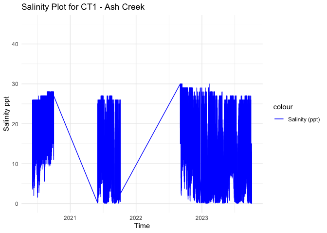
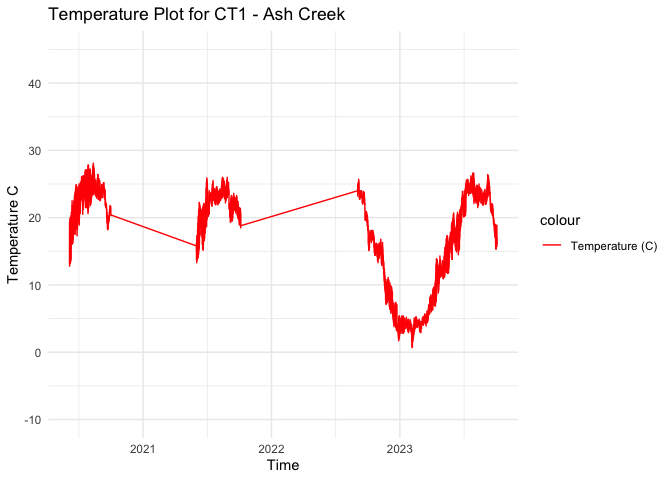
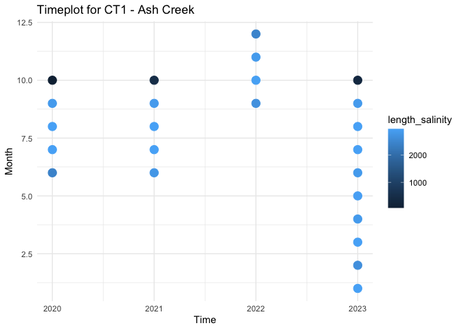

CT1 - Processed Environmental Data
================
Madeline Eppley
3/27/2024

``` r
setwd("/Users/madelineeppley/GitHub/EasternOysterEnvData/2022_SiteEnvironmentData")
```

### Install required packaages

``` r
#install.packages("dataRetrieval")
```

### Load required packages.

``` r
library("dplyr") #Used for working with data frames
```

    ## 
    ## Attaching package: 'dplyr'

    ## The following objects are masked from 'package:stats':
    ## 
    ##     filter, lag

    ## The following objects are masked from 'package:base':
    ## 
    ##     intersect, setdiff, setequal, union

``` r
library("lubridate") #Used for time-date conversions
```

    ## 
    ## Attaching package: 'lubridate'

    ## The following objects are masked from 'package:base':
    ## 
    ##     date, intersect, setdiff, union

``` r
library("readr") #Used to read the CSV file
library("ggplot2") 
library("dataRetrieval") #Used to download USGS data
library("tidyverse") #Used to join data frames
```

    ## ── Attaching core tidyverse packages ──────────────────────── tidyverse 2.0.0 ──
    ## ✔ forcats 1.0.0     ✔ tibble  3.2.1
    ## ✔ purrr   1.0.1     ✔ tidyr   1.3.0
    ## ✔ stringr 1.5.0

    ## ── Conflicts ────────────────────────────────────────── tidyverse_conflicts() ──
    ## ✖ dplyr::filter() masks stats::filter()
    ## ✖ dplyr::lag()    masks stats::lag()
    ## ℹ Use the conflicted package (<http://conflicted.r-lib.org/>) to force all conflicts to become errors

### Note the date of data download and source. All available data should be used for each site regardless of year. Note from the CSV file how often the site was sampled, and if there are replicates in the data. Also describe if the sampling occurred at only low tide, only high tide, or continuously.

``` r
#Data was downloaded on 8/14/2023
#Source - https://waterdata.usgs.gov/monitoring-location/08162675/#parameterCode=00010&period=P365D - Tres Palacios Site Number 08162675

#Create text strings with metadata information that we want to include in the final data frame. 
download_date <- ("03-27-2024")
source_description <- ("USGS Water Data  - Housatonic River NR Nells Island NR Stratford, CT - 01208837")
site_name <- ("CT1") #Use site code with site number based on lat position and state
collection_type <- ("continuous")
```

### Read in the data using the USGS Data Retrieval Package in R. This will skip the step of downloading a .csv file or similar and importing that file from the desktop. We will import the salinity and temperature data separately and store them with “\_sal” or “\_temp” in the variable names. Then we will combine them into one file together.

``` r
siteNumber <- "01208837" # USGS Site Code

# Import our site info and read the associated metdata.
CT1Info <- readNWISsite(siteNumber)
comment(CT1Info)
```

    ##  [1] "#"                                                                                        
    ##  [2] "#"                                                                                        
    ##  [3] "# US Geological Survey"                                                                   
    ##  [4] "# retrieved: 2024-03-27 18:37:43 -04:00\t(sdas01)"                                        
    ##  [5] "#"                                                                                        
    ##  [6] "# The Site File stores location and general information about groundwater,"               
    ##  [7] "# surface water, and meteorological sites"                                                
    ##  [8] "# for sites in USA."                                                                      
    ##  [9] "#"                                                                                        
    ## [10] "# File-format description:  http://help.waterdata.usgs.gov/faq/about-tab-delimited-output"
    ## [11] "# Automated-retrieval info: http://waterservices.usgs.gov/rest/Site-Service.html"         
    ## [12] "#"                                                                                        
    ## [13] "# Contact:   gs-w_support_nwisweb@usgs.gov"                                               
    ## [14] "#"                                                                                        
    ## [15] "# The following selected fields are included in this output:"                             
    ## [16] "#"                                                                                        
    ## [17] "#  agency_cd       -- Agency"                                                             
    ## [18] "#  site_no         -- Site identification number"                                         
    ## [19] "#  station_nm      -- Site name"                                                          
    ## [20] "#  site_tp_cd      -- Site type"                                                          
    ## [21] "#  lat_va          -- DMS latitude"                                                       
    ## [22] "#  long_va         -- DMS longitude"                                                      
    ## [23] "#  dec_lat_va      -- Decimal latitude"                                                   
    ## [24] "#  dec_long_va     -- Decimal longitude"                                                  
    ## [25] "#  coord_meth_cd   -- Latitude-longitude method"                                          
    ## [26] "#  coord_acy_cd    -- Latitude-longitude accuracy"                                        
    ## [27] "#  coord_datum_cd  -- Latitude-longitude datum"                                           
    ## [28] "#  dec_coord_datum_cd -- Decimal Latitude-longitude datum"                                
    ## [29] "#  district_cd     -- District code"                                                      
    ## [30] "#  state_cd        -- State code"                                                         
    ## [31] "#  county_cd       -- County code"                                                        
    ## [32] "#  country_cd      -- Country code"                                                       
    ## [33] "#  land_net_ds     -- Land net location description"                                      
    ## [34] "#  map_nm          -- Name of location map"                                               
    ## [35] "#  map_scale_fc    -- Scale of location map"                                              
    ## [36] "#  alt_va          -- Altitude of Gage/land surface"                                      
    ## [37] "#  alt_meth_cd     -- Method altitude determined"                                         
    ## [38] "#  alt_acy_va      -- Altitude accuracy"                                                  
    ## [39] "#  alt_datum_cd    -- Altitude datum"                                                     
    ## [40] "#  huc_cd          -- Hydrologic unit code"                                               
    ## [41] "#  basin_cd        -- Drainage basin code"                                                
    ## [42] "#  topo_cd         -- Topographic setting code"                                           
    ## [43] "#  instruments_cd  -- Flags for instruments at site"                                      
    ## [44] "#  construction_dt -- Date of first construction"                                         
    ## [45] "#  inventory_dt    -- Date site established or inventoried"                               
    ## [46] "#  drain_area_va   -- Drainage area"                                                      
    ## [47] "#  contrib_drain_area_va -- Contributing drainage area"                                   
    ## [48] "#  tz_cd           -- Time Zone abbreviation"                                             
    ## [49] "#  local_time_fg   -- Site honors Daylight Savings Time"                                  
    ## [50] "#  reliability_cd  -- Data reliability code"                                              
    ## [51] "#  gw_file_cd      -- Data-other GW files"                                                
    ## [52] "#  nat_aqfr_cd     -- National aquifer code"                                              
    ## [53] "#  aqfr_cd         -- Local aquifer code"                                                 
    ## [54] "#  aqfr_type_cd    -- Local aquifer type code"                                            
    ## [55] "#  well_depth_va   -- Well depth"                                                         
    ## [56] "#  hole_depth_va   -- Hole depth"                                                         
    ## [57] "#  depth_src_cd    -- Source of depth data"                                               
    ## [58] "#  project_no      -- Project number"                                                     
    ## [59] "#"

``` r
# Store the parameter codes that we want to collect data for. The USGS codes salinity as 00480 and temperature (C) as 00010. 
parameterCd_sal <- "90860"
parameterCd_temp <- "00010"
 
# We will retrieve the unit values, or the data values collected at regular intervals. Note the regularity of collection, for this site it is every 15 minutes. 
rawUnitValues_sal <- readNWISuv(siteNumber, parameterCd_sal, "2020-06-05", "2023-10-03")
rawUnitValues_temp <- readNWISuv(siteNumber, parameterCd_temp,"2020-06-05", "2023-10-03")

# View how the data is stored. Note the variable names and the format and units that the data are stored in.  
#View(rawUnitValues_sal)
#View(rawUnitValues_temp)
```

### Combine the salinity and temperature data into one common data frame and name it with the appropriate site code using the “raw\_” format. Filter the combined data frame to include no duplicate columns and rename column headers.

``` r
# Join the data frames by common time using the dateTime column
raw_CT1 <- rawUnitValues_sal %>%
  inner_join(rawUnitValues_temp, by = "dateTime")


# We now have "double" columns for site code, agency, time zone, and other parameters. Remove those columns. 
raw_CT1 <- subset(raw_CT1, select = -c(agency_cd.y, X_TOP_90860_00000_cd, site_no.y, X_TOP_00010_00000_cd, tz_cd.x, tz_cd.y))

#Standardize column and variable names. We will use "temp" for temperature in degrees C, "salinity" for salinity in parts per thousand (ppt), "lat" for latitude in degrees, and "lon" for longitude in degrees. 
#Use the dyplr format to rename multiple columns in the format "dataframe %>% rename("new name 1" = "old name 1", "new name 2", "old name 2")
raw_CT1 <- raw_CT1 %>% rename("temp" = "X_TOP_00010_00000", "salinity" = "X_TOP_90860_00000", "site" = "site_no.x", "agency" = "agency_cd.x") 
```

### Start with the date and time of collection. We will use the lubridate package to standardize all values into the date-time format called POSIXct. This format stores the date and time in number of seconds since a past point (1/1/1970). This makes comparisons easy and helps to standardizes values.

``` r
# SKIP combining, date and time of collection is already in a column together 

#Convert to POSIXct format. Store it into a column named datetime in the data frame.
raw_CT1$datetime <- as.POSIXct(raw_CT1$dateTime, "%Y/%m/%d %H:%M:%S", tz = "")

# Drop the old date-time column
raw_CT1 <- subset(raw_CT1, select = -c(dateTime))

#Print the new data frame and examine to make sure the new datetime column is in the correct format. 
summary(raw_CT1)
```

    ##     agency              site              salinity     X_BOTTOM_90860_00000
    ##  Length:81644       Length:81644       Min.   : 0.10   Min.   : 0.10       
    ##  Class :character   Class :character   1st Qu.: 4.90   1st Qu.: 7.90       
    ##  Mode  :character   Mode  :character   Median :12.00   Median :19.00       
    ##                                        Mean   :13.75   Mean   :16.95       
    ##                                        3rd Qu.:24.00   3rd Qu.:26.00       
    ##                                        Max.   :30.00   Max.   :29.00       
    ##                                        NA's   :20918   NA's   :47626       
    ##  X_BOTTOM_90860_00000_cd      temp       X_BOTTOM_00010_00000
    ##  Length:81644            Min.   : 0.70   Min.   : 0.70       
    ##  Class :character        1st Qu.:12.50   1st Qu.: 5.40       
    ##  Mode  :character        Median :20.10   Median :13.30       
    ##                          Mean   :17.29   Mean   :13.27       
    ##                          3rd Qu.:23.20   3rd Qu.:20.60       
    ##                          Max.   :28.10   Max.   :26.40       
    ##                          NA's   :20915   NA's   :47626       
    ##  X_BOTTOM_00010_00000_cd    datetime                     
    ##  Length:81644            Min.   :2020-06-05 16:45:00.00  
    ##  Class :character        1st Qu.:2021-09-05 05:57:15.00  
    ##  Mode  :character        Median :2022-12-29 03:59:30.00  
    ##                          Mean   :2022-08-02 13:13:14.31  
    ##                          3rd Qu.:2023-04-19 01:47:15.00  
    ##                          Max.   :2023-10-04 03:45:00.00  
    ## 

### Analyze the ranges of all of our variables of interest - time, salinity, and temperature. Make sure that the latitude and longitude values are consistent for a static collection site. This is a quick check so we can determine how to conduct the next filtering step.

``` r
#Print the range (minimum and maximum) of dates of data collection. 
print(summary(raw_CT1$datetime))
```

    ##                       Min.                    1st Qu. 
    ## "2020-06-05 16:45:00.0000" "2021-09-05 05:57:15.0000" 
    ##                     Median                       Mean 
    ## "2022-12-29 03:59:30.0000" "2022-08-02 13:13:14.3180" 
    ##                    3rd Qu.                       Max. 
    ## "2023-04-19 01:47:15.0000" "2023-10-04 03:45:00.0000"

``` r
#Print the range (minimum and maximum) of the salinity values. 
print(summary(raw_CT1$salinity))
```

    ##    Min. 1st Qu.  Median    Mean 3rd Qu.    Max.    NA's 
    ##    0.10    4.90   12.00   13.75   24.00   30.00   20918

``` r
#Print the range (minimum and maximum) of the temperature values.
print(summary(raw_CT1$temp))
```

    ##    Min. 1st Qu.  Median    Mean 3rd Qu.    Max.    NA's 
    ##    0.70   12.50   20.10   17.29   23.20   28.10   20915

``` r
#Store variables that we will include in the final data frame. Pull metadata from the USGS website link located above or the site description from the comment function above. 
lat <- 41.1884333
lon <- -73.12125278
firstyear <- 2020
finalyear <- 2023
```

### Filter any of the variables that have data points outside of normal range. We will use 0-40 as the accepted range for salinity (ppt) and temperature (C) values. Note, in the summer, salinity values can sometimes exceed 40. Check to see if there are values above 40. In this case, adjust the range or notify someone that the site has particularly high salinity values.

``` r
#Filter the data between the values of 0 and 40 for both salinity and temperature. 
filtered_CT1<- raw_CT1 %>%
    filter(between(salinity, 0, 40) & between(temp, -1, 40))

# Sanity check - print the ranges to ensure values are filtered properly. We can see that the ranges for both are now in the appropriate range.  
print(summary(filtered_CT1$salinity))
```

    ##    Min. 1st Qu.  Median    Mean 3rd Qu.    Max. 
    ##    0.10    4.90   12.00   13.75   24.00   30.00

``` r
print(summary(filtered_CT1$temp))
```

    ##    Min. 1st Qu.  Median    Mean 3rd Qu.    Max. 
    ##    0.70   12.50   20.10   17.29   23.20   28.10

``` r
#Store our data into a variable name with just the site name. 
CT1 <- filtered_CT1

# check to see if we have NAs in the our salinity data frame in the datetime column
count.nas <- is.na(CT1$datetime) # store our NAs in a variable
summary(count.nas) # we don't have any NAs - good to go
```

    ##    Mode   FALSE 
    ## logical   60726

### Write the final processed data frame to a .csv file to create a reproducible “raw” file

``` r
write.table(CT1, "/Users/madelineeppley/GitHub/EasternOysterEnvData/2022_SiteEnvironmentData/CT1_raw_output.csv", sep = ",", append = TRUE, col.names = TRUE, row.names = FALSE) # The column names should be changed to FALSE after 1st row is added to the data frame
```

    ## Warning in write.table(CT1,
    ## "/Users/madelineeppley/GitHub/EasternOysterEnvData/2022_SiteEnvironmentData/CT1_raw_output.csv", :
    ## appending column names to file

### Visualize the salinity, temperature, and date ranges over time. This can help us see if there are any anomalies or gaps in the data and make sure the filtering was done correctly. Sanity check - do the temperature and salinity ranges look appropriate for the geography of the site (ex. near full ocean salinity for coastal sites, lower salinity for estuaries or near rivers)?

``` r
salplot <- ggplot(CT1, aes(x = datetime)) +
    geom_line(aes(y = salinity, color = "Salinity (ppt)")) +
    ylim(0,45) +
    labs(x = "Time", y = "Salinity ppt", title = "Salinity Plot for CT1 - Ash Creek") +
    scale_color_manual(values = c("Salinity (ppt)" = "blue")) +
    theme_minimal()


salplot
```

<!-- -->

``` r
tempplot <- ggplot(CT1, aes(x = datetime)) +
    geom_line(aes(y = temp, color = "Temperature (C)")) +
    ylim(-10, 45) +
    labs(x = "Time", y = "Temperature C", title = "Temperature Plot for CT1 - Ash Creek") +
    scale_color_manual(values = c( "Temperature (C)" = "red")) +
    theme_minimal()


tempplot
```

<!-- -->

### We need to calculate the mean, maximum, and minimum values for salinity and temperature per month and year. First make two data frames to contain each of the annual and monthly averages.

``` r
#Calculate the mean, maximum, and minimum values for salinity and temperature for each month. 
CT1_envrmonth <- CT1 %>%
    mutate(year = year(datetime), month = month(datetime)) %>%
    group_by(year, month) %>%
    summarise(
      min_salinity = min(salinity),
      max_salinity = max(salinity),
      mean_salinity = mean(salinity),
      length_salinity = length(salinity),
      min_temp = min(temp),
      max_temp = max(temp),
      mean_temp = mean(temp),
      length_temp = length(temp))
```

    ## `summarise()` has grouped output by 'year'. You can override using the
    ## `.groups` argument.

``` r
print(CT1_envrmonth)
```

    ## # A tibble: 24 × 10
    ## # Groups:   year [4]
    ##     year month min_salinity max_salinity mean_salinity length_salinity min_temp
    ##    <dbl> <dbl>        <dbl>        <dbl>         <dbl>           <int>    <dbl>
    ##  1  2020     6          2             26         18.3             2426     12.8
    ##  2  2020     7          1.6           27         18.7             2966     18.9
    ##  3  2020     8          5.6           28         21.2             2965     21.8
    ##  4  2020     9          9.4           28         22.0             2865     18.2
    ##  5  2020    10         11             28         21.3               57     20.3
    ##  6  2021     6          0.2           27         16.1             2793     13.3
    ##  7  2021     7          0.1           27          8.27            2967     19.7
    ##  8  2021     8          0.2           27         13.5             2965     21.9
    ##  9  2021     9          0.1           26          9.19            2871     19.3
    ## 10  2021    10          0.5           26         12.2              463     18.5
    ## # ℹ 14 more rows
    ## # ℹ 3 more variables: max_temp <dbl>, mean_temp <dbl>, length_temp <int>

``` r
#Calculate the mean, maximum, and minimum values for salinity and temperature for each year. 
CT1_envryear <- CT1 %>%
    mutate(year = year(datetime)) %>%
    group_by(year) %>%
    summarise(
      min_salinity = min(salinity),
      max_salinity = max(salinity),
      mean_salinity = mean(salinity),
      min_temp = min(temp),
      max_temp = max(temp),
      mean_temp = mean(temp))

print(CT1_envryear)
```

    ## # A tibble: 4 × 7
    ##    year min_salinity max_salinity mean_salinity min_temp max_temp mean_temp
    ##   <dbl>        <dbl>        <dbl>         <dbl>    <dbl>    <dbl>     <dbl>
    ## 1  2020          1.6           28          20.1     12.8     28.1      22.6
    ## 2  2021          0.1           27          11.7     13.3     26        21.8
    ## 3  2022          0.2           30          16.1      1.7     25.7      14.4
    ## 4  2023          0.1           30          11.0      0.7     26.6      14.1

### Plot the months and years of data collection to check if there are any collection gaps in the data.

``` r
timeplot <- ggplot(CT1_envrmonth, aes(x = year)) +
    geom_point(aes(y = month, color = length_salinity), size = 4) +
    labs(x = "Time", y = "Month", title = "Timeplot for CT1 - Ash Creek") +
    ylim(1,12) +
    theme_minimal()

timeplot
```

<!-- -->

### We can now calculate a list of variables that we will have collected for all sites. This will allow us to compare sites easily. We will calculate the number of observations from each site, the mean annual, maximum annual, and minimum annual value for all variables.

Our list of variables includes:

- Mean_Annual_Temperature_C: average of all available data

- Mean_max_temperature_C: average of maximums for each year

- Mean_min_temperature_C: average of minimums for each year

- Temperature_st_dev: standard deviation of all available data

- Temperature_n: total number of data points

- Temperature_years: number of years in data set

- Mean_Annual_Salinity_ppt: average of all available data

- Mean_min_Salinity_ppt: average of minimums for each year

- Mean_max_Salinity_ppt: average of maximums for each year

- Salinity_st_dev: standard deviation of all available data

- Salinity_n: total number of data points

- Salinity_years: number of years in data set

``` r
#Calculate temperature variables. 
Mean_Annual_Temperature_C <- mean(CT1$temp)
Mean_max_temperature_C <- mean(CT1_envryear$max_temp)
Mean_min_temperature_C <- mean(CT1_envryear$min_temp)
Temperature_st_dev <- sd(CT1$temp)
Temperature_n <- nrow(CT1)
Temperature_years <- nrow(CT1_envryear)

#Create a data frame to store the temperature results
CT1_temp <- cbind(site_name, download_date, source_description, lat, lon, firstyear, finalyear, Mean_Annual_Temperature_C, Mean_max_temperature_C, Mean_min_temperature_C, Temperature_st_dev, Temperature_n, Temperature_years, collection_type)
print(CT1_temp)
```

    ##      site_name download_date
    ## [1,] "CT1"     "03-27-2024" 
    ##      source_description                                                               
    ## [1,] "USGS Water Data  - Housatonic River NR Nells Island NR Stratford, CT - 01208837"
    ##      lat          lon            firstyear finalyear Mean_Annual_Temperature_C
    ## [1,] "41.1884333" "-73.12125278" "2020"    "2023"    "17.2861426736489"       
    ##      Mean_max_temperature_C Mean_min_temperature_C Temperature_st_dev
    ## [1,] "26.6"                 "7.125"                "7.2760533697831" 
    ##      Temperature_n Temperature_years collection_type
    ## [1,] "60726"       "4"               "continuous"

``` r
# Write to the combined file with all sites 
write.table(CT1_temp, "/Users/madelineeppley/GitHub/EasternOysterEnvData/2022_SiteEnvironmentData/Seascape_Processed/seascape_temperature.csv", sep = ",", append = TRUE, col.names = FALSE, row.names = FALSE) # The column names should be changed to FALSE after 1st row is added to the data frame

# Write to a unique new CSV file
write.csv(CT1_temp, "/Users/madelineeppley/GitHub/EasternOysterEnvData/2022_SiteEnvironmentData/Seascape_Processed/CT1_temperature.csv")
```

``` r
#Calculate the salinity variables
Mean_Annual_Salinity_ppt <- mean(CT1$salinity)
Mean_max_Salinity_ppt <- mean(CT1_envryear$max_salinity)
Mean_min_Salinity_ppt <- mean(CT1_envryear$min_salinity)
Salinity_st_dev <- sd(CT1$salinity)
Salinity_n <- nrow(CT1)
Salinity_years <- nrow(CT1_envryear)


#Create a data frame to store the temperature results
CT1_salinity <- cbind(site_name, download_date, source_description, lat, lon, firstyear, finalyear, Mean_Annual_Salinity_ppt, Mean_max_Salinity_ppt, Mean_min_Salinity_ppt, Salinity_st_dev, Salinity_n, Salinity_years, collection_type)
print(CT1_salinity)
```

    ##      site_name download_date
    ## [1,] "CT1"     "03-27-2024" 
    ##      source_description                                                               
    ## [1,] "USGS Water Data  - Housatonic River NR Nells Island NR Stratford, CT - 01208837"
    ##      lat          lon            firstyear finalyear Mean_Annual_Salinity_ppt
    ## [1,] "41.1884333" "-73.12125278" "2020"    "2023"    "13.749254026282"       
    ##      Mean_max_Salinity_ppt Mean_min_Salinity_ppt Salinity_st_dev   Salinity_n
    ## [1,] "28.75"               "0.5"                 "9.6140936764927" "60726"   
    ##      Salinity_years collection_type
    ## [1,] "4"            "continuous"

``` r
# Write to the combined file with all sites 
write.table(CT1_salinity, "/Users/madelineeppley/GitHub/EasternOysterEnvData/2022_SiteEnvironmentData/Seascape_Processed/seascape_salinity.csv", sep = ",", append = TRUE, col.names = FALSE, row.names = FALSE) # The column names should be changed to FALSE after 1st row is added to the data frame

# Write to a unique new CSV file
write.csv(CT1_salinity, "/Users/madelineeppley/GitHub/EasternOysterEnvData/2022_SiteEnvironmentData/Seascape_Processed/CT1_salinity.csv", row.names = FALSE)
```
