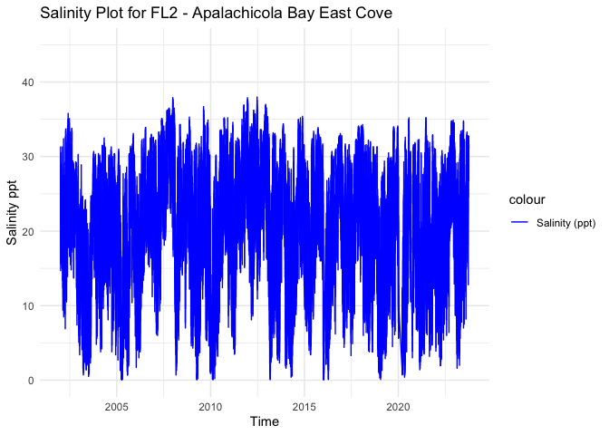
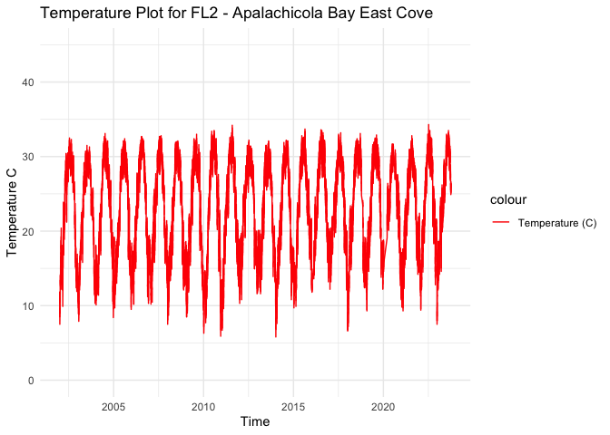
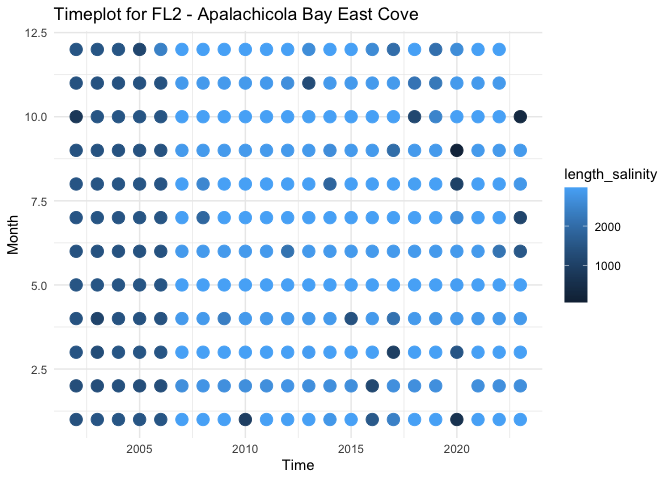

FL2 - Processed Environmental Data
================
Madeline Eppley
3/20/2024

``` r
setwd("/Users/madelineeppley/GitHub/EasternOysterEnvData/2022_SiteEnvironmentData")
```

### Load required packages.

``` r
library("dplyr") #Used for working with data frames
```

    ## 
    ## Attaching package: 'dplyr'

    ## The following objects are masked from 'package:stats':
    ## 
    ##     filter, lag

    ## The following objects are masked from 'package:base':
    ## 
    ##     intersect, setdiff, setequal, union

``` r
library("lubridate") #Used for time-date conversions
```

    ## 
    ## Attaching package: 'lubridate'

    ## The following objects are masked from 'package:base':
    ## 
    ##     date, intersect, setdiff, union

``` r
library("readr") #Used to read the CSV file
library("ggplot2") 
```

### Note the date of data download and source. All available data should be used for each site regardless of year. Note from the CSV file how often the site was sampled, and if there are replicates in the data. Also describe if the sampling occurred at only low tide, only high tide, or continuously.

``` r
#Data was downloaded on 3/20/2024
#Source - https://cdmo.baruch.sc.edu//dges/- Selected Apalachicola Bay, Cat Point Water Quality. The station code is APACPWQ

#Create text strings with metadata information that we want to include in the final data frame. 
download_date <- ("03-20-2024")
source_description <- ("NERR Centralized Data. Apalachicola Bay - Cat Point APACPWQ")
site_name <- ("FL2") #Use site code with site number based on lat position and state
collection_type <- ("continuous")
```

### Use the file path name in your working directory or desktop, see example below. Or, import data set through the “Files” window in R studio. Store the file in a variable with the “raw_ID_Site” format. If salinity and temperature data are in separate files, read in both and store them with “\_sal” or “\_temp” in the variable names.

``` r
#The file we will be working with is from Sapelo Island, GA. The ID_Site for this site is FL2. 
raw_FL2 <- read_csv("/Users/madelineeppley/GitHub/EasternOysterEnvData/2022_SiteEnvironmentData/FL2-raw.csv")
```

    ## Rows: 676192 Columns: 28
    ## ── Column specification ────────────────────────────────────────────────────────
    ## Delimiter: ","
    ## chr (15): Station_Code, isSWMP, DateTimeStamp, F_Record, F_Temp, F_SpCond, F...
    ## dbl (13): Historical, ProvisionalPlus, Temp, SpCond, Sal, DO_pct, DO_mgl, De...
    ## 
    ## ℹ Use `spec()` to retrieve the full column specification for this data.
    ## ℹ Specify the column types or set `show_col_types = FALSE` to quiet this message.

``` r
# View how the data is stored. Note the variable names and the format and units that the data are stored in.  
spec(raw_FL2)
```

    ## cols(
    ##   Station_Code = col_character(),
    ##   isSWMP = col_character(),
    ##   DateTimeStamp = col_character(),
    ##   Historical = col_double(),
    ##   ProvisionalPlus = col_double(),
    ##   F_Record = col_character(),
    ##   Temp = col_double(),
    ##   F_Temp = col_character(),
    ##   SpCond = col_double(),
    ##   F_SpCond = col_character(),
    ##   Sal = col_double(),
    ##   F_Sal = col_character(),
    ##   DO_pct = col_double(),
    ##   F_DO_pct = col_character(),
    ##   DO_mgl = col_double(),
    ##   F_DO_mgl = col_character(),
    ##   Depth = col_double(),
    ##   F_Depth = col_character(),
    ##   cDepth = col_double(),
    ##   F_cDepth = col_character(),
    ##   Level = col_double(),
    ##   F_Level = col_character(),
    ##   cLevel = col_double(),
    ##   F_cLevel = col_character(),
    ##   pH = col_double(),
    ##   F_pH = col_character(),
    ##   Turb = col_double(),
    ##   F_Turb = col_character()
    ## )

``` r
#View(raw_FL2)
```

### Start with the date and time of collection. We will use the lubridate package to standardize all values into the date-time format called POSIXct. This format stores the date and time in number of seconds since a past point (1/1/1970). This makes comparisons easy and helps to standardizes values.

``` r
# SKIP combining, date and time of collection is already in a column together 

# Use unclass to view the way that the time and date are stored 
# unclass(raw_FL2$DateTimeStamp)
# The data is stored in month-day-yearXX hours(12):minutes format

#Convert to POSIXct format. Store it into a column named datetime in the data frame.
raw_FL2$datetime <- as.POSIXct(raw_FL2$DateTimeStamp, "%m/%d/%y %H:%M", tz = "")

#Print the new data frame and examine to make sure the new datetime column is in the correct format. 
summary(raw_FL2)
```

    ##  Station_Code          isSWMP          DateTimeStamp        Historical    
    ##  Length:676192      Length:676192      Length:676192      Min.   :0.0000  
    ##  Class :character   Class :character   Class :character   1st Qu.:1.0000  
    ##  Mode  :character   Mode  :character   Mode  :character   Median :1.0000  
    ##                                                           Mean   :0.9089  
    ##                                                           3rd Qu.:1.0000  
    ##                                                           Max.   :1.0000  
    ##                                                                           
    ##  ProvisionalPlus   F_Record              Temp          F_Temp         
    ##  Min.   :1       Length:676192      Min.   : 5.80   Length:676192     
    ##  1st Qu.:1       Class :character   1st Qu.:17.50   Class :character  
    ##  Median :1       Mode  :character   Median :23.70   Mode  :character  
    ##  Mean   :1                          Mean   :22.96                     
    ##  3rd Qu.:1                          3rd Qu.:28.80                     
    ##  Max.   :1                          Max.   :34.30                     
    ##                                     NA's   :37451                     
    ##      SpCond        F_SpCond              Sal           F_Sal          
    ##  Min.   : 0.10   Length:676192      Min.   : 0.10   Length:676192     
    ##  1st Qu.:26.39   Class :character   1st Qu.:16.10   Class :character  
    ##  Median :35.33   Mode  :character   Median :22.20   Mode  :character  
    ##  Mean   :33.87                      Mean   :21.42                     
    ##  3rd Qu.:42.99                      3rd Qu.:27.60                     
    ##  Max.   :57.21                      Max.   :38.00                     
    ##  NA's   :40972                      NA's   :40972                     
    ##      DO_pct         F_DO_pct             DO_mgl        F_DO_mgl        
    ##  Min.   :  0.00   Length:676192      Min.   : 0.00   Length:676192     
    ##  1st Qu.: 85.80   Class :character   1st Qu.: 6.00   Class :character  
    ##  Median : 93.80   Mode  :character   Median : 7.00   Mode  :character  
    ##  Mean   : 92.33                      Mean   : 7.15                     
    ##  3rd Qu.:100.30                      3rd Qu.: 8.20                     
    ##  Max.   :188.70                      Max.   :15.90                     
    ##  NA's   :66253                       NA's   :69578                     
    ##      Depth          F_Depth              cDepth         F_cDepth        
    ##  Min.   :0.05     Length:676192      Min.   :0.0      Length:676192     
    ##  1st Qu.:1.46     Class :character   1st Qu.:1.4      Class :character  
    ##  Median :1.69     Mode  :character   Median :1.7      Mode  :character  
    ##  Mean   :1.66                        Mean   :1.6                        
    ##  3rd Qu.:1.90                        3rd Qu.:1.9                        
    ##  Max.   :3.95                        Max.   :4.2                        
    ##  NA's   :102099                      NA's   :342769                     
    ##      Level          F_Level              cLevel         F_cLevel        
    ##  Min.   :-0.8     Length:676192      Min.   :-1.0     Length:676192     
    ##  1st Qu.: 0.0     Class :character   1st Qu.:-0.1     Class :character  
    ##  Median : 0.1     Mode  :character   Median : 0.1     Mode  :character  
    ##  Mean   : 0.1                        Mean   : 0.1                       
    ##  3rd Qu.: 0.3                        3rd Qu.: 0.3                       
    ##  Max.   : 0.9                        Max.   : 1.0                       
    ##  NA's   :619054                      NA's   :619082                     
    ##        pH            F_pH                Turb            F_Turb         
    ##  Min.   :6.7     Length:676192      Min.   :  -4.00   Length:676192     
    ##  1st Qu.:7.9     Class :character   1st Qu.:   5.00   Class :character  
    ##  Median :8.0     Mode  :character   Median :   9.00   Mode  :character  
    ##  Mean   :8.0                        Mean   :  15.48                     
    ##  3rd Qu.:8.1                        3rd Qu.:  15.00                     
    ##  Max.   :9.0                        Max.   :3886.00                     
    ##  NA's   :43668                      NA's   :63845                       
    ##     datetime                     
    ##  Min.   :2002-01-01 00:00:00.00  
    ##  1st Qu.:2009-04-18 06:18:45.00  
    ##  Median :2014-02-12 03:22:30.00  
    ##  Mean   :2013-12-16 04:58:17.25  
    ##  3rd Qu.:2018-12-09 01:26:15.00  
    ##  Max.   :2023-10-04 23:45:00.00  
    ##  NA's   :78

### Analyze the ranges of all of our variables of interest - time, salinity, and temperature. Make sure that the latitude and longitude values are consistent for a static collection site. This is a quick check so we can determine how to conduct the next filtering step.

``` r
#Standardize column and variable names. We will use "temp" for temperature in degrees C, "salinity" for salinity in parts per thousand (ppt), "lat" for latitude in degrees, and "lon" for longitude in degrees. 
#Use the dyplr format to rename multiple columns in the format "dataframe %>% rename("new name 1" = "old name 1", "new name 2", "old name 2")
raw_FL2 <- raw_FL2 %>% rename("temp" = "Temp", "salinity" = "Sal") #No lat and long data in this file - check metadata files

#Print the range (minimum and maximum) of dates of data collection. 
print(summary(raw_FL2$datetime))
```

    ##                       Min.                    1st Qu. 
    ## "2002-01-01 00:00:00.0000" "2009-04-18 06:18:45.0000" 
    ##                     Median                       Mean 
    ## "2014-02-12 03:22:30.0000" "2013-12-16 04:58:17.2522" 
    ##                    3rd Qu.                       Max. 
    ## "2018-12-09 01:26:15.0000" "2023-10-04 23:45:00.0000" 
    ##                       NA's 
    ##                       "78"

``` r
#Print the range (minimum and maximum) of the salinity values. 
print(summary(raw_FL2$salinity))
```

    ##    Min. 1st Qu.  Median    Mean 3rd Qu.    Max.    NA's 
    ##    0.10   16.10   22.20   21.42   27.60   38.00   40972

``` r
#Print the range (minimum and maximum) of the temperature values.
print(summary(raw_FL2$temp))
```

    ##    Min. 1st Qu.  Median    Mean 3rd Qu.    Max.    NA's 
    ##    5.80   17.50   23.70   22.96   28.80   34.30   37451

``` r
#Store variables that we will include in the final data frame. Pull metadata from metadata file in download .zip file. 
lat <- 29.70210
lon <- -84.88020
firstyear <- 2002
finalyear <- 2023
```

### We can see that some of the values make sense - the minimum and maximum latitude and longitude values are the same.

Filter any of the variables that have data points outside of normal
range. We will use 0-40 as the accepted range for salinity (ppt) and
temperature (C) values. Note, in the summer, salinity values can
sometimes exceed 40. Check to see if there are values above 40. In this
case, adjust the range or notify someone that the site has particularly
high salinity values.

``` r
#Filter the data between the values of 0 and 40 for both salinity and temperature. 
filtered_FL2 <- raw_FL2 %>%
    filter(between(salinity, 0, 42) & between(temp, 0, 40))

# Sanity check - print the ranges to ensure values are filtered properly. We can see that the ranges for both are now in the appropriate range.  
print(summary(filtered_FL2$salinity))
```

    ##    Min. 1st Qu.  Median    Mean 3rd Qu.    Max. 
    ##    0.10   16.10   22.20   21.42   27.60   38.00

``` r
print(summary(filtered_FL2$temp))
```

    ##    Min. 1st Qu.  Median    Mean 3rd Qu.    Max. 
    ##    5.80   17.50   23.70   22.93   28.70   34.30

``` r
#Store our data into a variable name with just the site name. 
FL2 <- filtered_FL2
```

### Visualize the salinity, temperature, and date ranges over time. This can help us see if there are any anomalies or gaps in the data and make sure the filtering was done correctly. Sanity check - do the temperature and salinity ranges look appropriate for the geography of the site (ex. near full ocean salinity for coastal sites, lower salinity for estuaries or near rivers)?

``` r
salplot <- ggplot(FL2, aes(x = datetime)) +
    geom_line(aes(y = salinity, color = "Salinity (ppt)")) +
    ylim(0,45) +
    labs(x = "Time", y = "Salinity ppt", title = "Salinity Plot for FL2 - Apalachicola Bay East Cove") +
    scale_color_manual(values = c("Salinity (ppt)" = "blue")) +
    theme_minimal()


salplot
```

    ## Warning: Removed 68 rows containing missing values (`geom_line()`).

<!-- -->

``` r
tempplot <- ggplot(FL2, aes(x = datetime)) +
    geom_line(aes(y = temp, color = "Temperature (C)")) +
    ylim(0, 45) +
    labs(x = "Time", y = "Temperature C", title = "Temperature Plot for FL2 - Apalachicola Bay East Cove") +
    scale_color_manual(values = c( "Temperature (C)" = "red")) +
    theme_minimal()


tempplot
```

    ## Warning: Removed 68 rows containing missing values (`geom_line()`).

<!-- -->

### We need to calculate the mean, maximum, and minimum values for salinity and temperature per month and year. First make two data frames to contain each of the annual and monthly averages.

``` r
#Calculate the mean, maximum, and minimum values for salinity and temperature for each month. 
FL2_envrmonth <- FL2 %>%
    mutate(year = year(datetime), month = month(datetime)) %>%
    group_by(year, month) %>%
    summarise(
      min_salinity = min(salinity),
      max_salinity = max(salinity),
      mean_salinity = mean(salinity),
      length_salinity = length(salinity),
      min_temp = min(temp),
      max_temp = max(temp),
      mean_temp = mean(temp),
      length_temp = length(temp))
```

    ## `summarise()` has grouped output by 'year'. You can override using the
    ## `.groups` argument.

``` r
print(FL2_envrmonth)
```

    ## # A tibble: 262 × 10
    ## # Groups:   year [23]
    ##     year month min_salinity max_salinity mean_salinity length_salinity min_temp
    ##    <dbl> <dbl>        <dbl>        <dbl>         <dbl>           <int>    <dbl>
    ##  1  2002     1         14.7         31.3          23.3            1418      7.5
    ##  2  2002     2          9.4         31.3          20.6            1339     12.1
    ##  3  2002     3          8.5         32.4          21.8            1469      9.9
    ##  4  2002     4          6.9         33.7          23.9            1437     18.9
    ##  5  2002     5         13.1         35.8          28.8            1487     21.2
    ##  6  2002     6         16.6         35.1          28.2            1438     26.6
    ##  7  2002     7         14.8         33.3          23.4            1486     28.4
    ##  8  2002     8         17.2         33.8          26.4            1486     27.4
    ##  9  2002     9         13.7         29.2          26.5            1438     25.2
    ## 10  2002    10         17.8         29.3          25.9             763     23.9
    ## # ℹ 252 more rows
    ## # ℹ 3 more variables: max_temp <dbl>, mean_temp <dbl>, length_temp <int>

``` r
#Calculate the mean, maximum, and minimum values for salinity and temperature for each year. 
FL2_envryear <- FL2 %>%
    mutate(year = year(datetime)) %>%
    group_by(year) %>%
    summarise(
      min_salinity = min(salinity),
      max_salinity = max(salinity),
      mean_salinity = mean(salinity),
      min_temp = min(temp),
      max_temp = max(temp),
      mean_temp = mean(temp))

print(FL2_envryear)
```

    ## # A tibble: 23 × 7
    ##     year min_salinity max_salinity mean_salinity min_temp max_temp mean_temp
    ##    <dbl>        <dbl>        <dbl>         <dbl>    <dbl>    <dbl>     <dbl>
    ##  1  2002          5.1         35.8          23.7      7.5     32.5      22.9
    ##  2  2003          0.5         30.7          15.9      7.9     31.5      22.2
    ##  3  2004          3.4         32.5          20.9      8.4     33.1      22.6
    ##  4  2005          0.1         33.1          17.6      9.5     32.4      22.4
    ##  5  2006          1.7         33.9          21.9     10.2     32.7      22.6
    ##  6  2007          6           37.9          27.2     10.2     32.8      22.8
    ##  7  2008          0.7         36.5          22.9      7.5     32.1      21.9
    ##  8  2009          0.1         36.7          20.2      8.5     33        22.5
    ##  9  2010          0.1         35.2          19.7      5.9     33.5      22.5
    ## 10  2011          3.5         37.9          24.6      6.7     34.2      22.7
    ## # ℹ 13 more rows

### Plot the months and years of data collection to check if there are any collection gaps in the data.

``` r
timeplot <- ggplot(FL2_envrmonth, aes(x = year)) +
    geom_point(aes(y = month, color = length_salinity), size = 4) +
    labs(x = "Time", y = "Month", title = "Timeplot for FL2 - Apalachicola Bay East Cove") +
    ylim(1,12) +
    theme_minimal()

timeplot
```

    ## Warning: Removed 1 rows containing missing values (`geom_point()`).

<!-- -->

### We can now calculate a list of variables that we will have collected for all sites. This will allow us to compare sites easily. We will calculate the number of observations from each site, the mean annual, maximum annual, and minimum annual value for all variables.

Our list of variables includes:

- Mean_Annual_Temperature_C: average of all available data

- Mean_max_temperature_C: average of maximums for each year

- Mean_min_temperature_C: average of minimums for each year

- Temperature_st_dev: standard deviation of all available data

- Temperature_n: total number of data points

- Temperature_years: number of years in data set

- Mean_Annual_Salinity_ppt: average of all available data

- Mean_min_Salinity_ppt: average of minimums for each year

- Mean_max_Salinity_ppt: average of maximums for each year

- Salinity_st_dev: standard deviation of all available data

- Salinity_n: total number of data points

- Salinity_years: number of years in data set

``` r
#Calculate temperature variables. 
Mean_Annual_Temperature_C <- mean(FL2$temp)
Mean_max_temperature_C <- mean(FL2_envryear$max_temp)
Mean_min_temperature_C <- mean(FL2_envryear$min_temp)
Temperature_st_dev <- sd(FL2$temp)
Temperature_n <- nrow(FL2)
Temperature_years <- nrow(FL2_envryear)

#Create a data frame to store the temperature results
FL2_temp <- cbind(site_name, download_date, source_description, lat, lon, firstyear, finalyear, Mean_Annual_Temperature_C, Mean_max_temperature_C, Mean_min_temperature_C, Temperature_st_dev, Temperature_n, Temperature_years, collection_type)
print(FL2_temp)
```

    ##      site_name download_date
    ## [1,] "FL2"     "03-20-2024" 
    ##      source_description                                            lat      
    ## [1,] "NERR Centralized Data. Apalachicola Bay - Cat Point APACPWQ" "29.7021"
    ##      lon        firstyear finalyear Mean_Annual_Temperature_C
    ## [1,] "-84.8802" "2002"    "2023"    "22.9266798904317"       
    ##      Mean_max_temperature_C Mean_min_temperature_C Temperature_st_dev
    ## [1,] "32.4"                 "9.28260869565217"     "6.22572742984679"
    ##      Temperature_n Temperature_years collection_type
    ## [1,] "635220"      "23"              "continuous"

``` r
# Write to the combined file with all sites 
write.table(FL2_temp, "/Users/madelineeppley/GitHub/EasternOysterEnvData/2022_SiteEnvironmentData/Seascape_Processed/seascape_temperature.csv", sep = ",", append = TRUE, col.names = FALSE, row.names = FALSE) # The column names should be changed to FALSE after 1st row is added to the data frame

# Write to a unique new CSV file
write.csv(FL2_temp, "/Users/madelineeppley/GitHub/EasternOysterEnvData/2022_SiteEnvironmentData/Seascape_Processed/FL2_temperature.csv")
```

``` r
#Calculate the salinity variables
Mean_Annual_Salinity_ppt <- mean(FL2$salinity)
Mean_max_Salinity_ppt <- mean(FL2_envryear$max_salinity)
Mean_min_Salinity_ppt <- mean(FL2_envryear$min_salinity)
Salinity_st_dev <- sd(FL2$salinity)
Salinity_n <- nrow(FL2)
Salinity_years <- nrow(FL2_envryear)


#Create a data frame to store the temperature results
FL2_salinity <- cbind(site_name, download_date, source_description, lat, lon, firstyear, finalyear, Mean_Annual_Salinity_ppt, Mean_max_Salinity_ppt, Mean_min_Salinity_ppt, Salinity_st_dev, Salinity_n, Salinity_years, collection_type)
print(FL2_salinity)
```

    ##      site_name download_date
    ## [1,] "FL2"     "03-20-2024" 
    ##      source_description                                            lat      
    ## [1,] "NERR Centralized Data. Apalachicola Bay - Cat Point APACPWQ" "29.7021"
    ##      lon        firstyear finalyear Mean_Annual_Salinity_ppt
    ## [1,] "-84.8802" "2002"    "2023"    "21.4234424293945"      
    ##      Mean_max_Salinity_ppt Mean_min_Salinity_ppt Salinity_st_dev    Salinity_n
    ## [1,] "34.7434782608696"    "1.89565217391304"    "7.92873235054378" "635220"  
    ##      Salinity_years collection_type
    ## [1,] "23"           "continuous"

``` r
# Write to the combined file with all sites 
write.table(FL2_salinity, "/Users/madelineeppley/GitHub/EasternOysterEnvData/2022_SiteEnvironmentData/Seascape_Processed/seascape_salinity.csv", sep = ",", append = TRUE, col.names = FALSE, row.names = FALSE) # The column names should be changed to FALSE after 1st row is added to the data frame

# Write to a unique new CSV file
write.csv(FL2_salinity, "/Users/madelineeppley/GitHub/EasternOysterEnvData/2022_SiteEnvironmentData/Seascape_Processed/FL2_salinity.csv")
```
