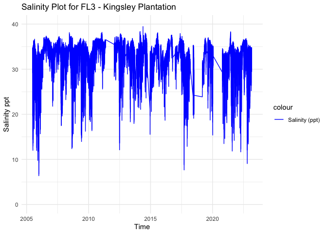
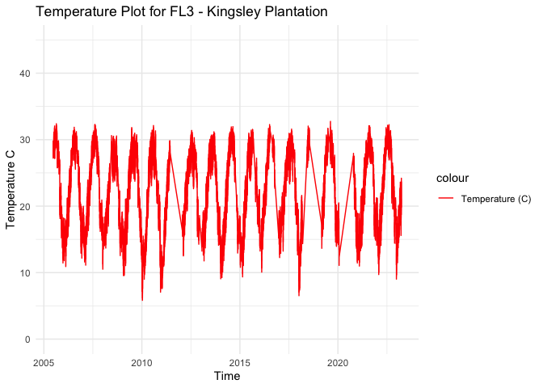

FL3 - Processed Environmental Data
================
Madeline Eppley
9/13/2023

``` r
setwd("/Users/madelineeppley/GitHub/EasternOysterEnvData/2022_SiteEnvironmentData")
```

### Load required packages.

``` r
library("dplyr") #Used for working with data frames
```

    ## 
    ## Attaching package: 'dplyr'

    ## The following objects are masked from 'package:stats':
    ## 
    ##     filter, lag

    ## The following objects are masked from 'package:base':
    ## 
    ##     intersect, setdiff, setequal, union

``` r
library("lubridate") #Used for time-date conversions
```

    ## 
    ## Attaching package: 'lubridate'

    ## The following objects are masked from 'package:base':
    ## 
    ##     date, intersect, setdiff, union

``` r
library("readr") #Used to read the CSV file
library("ggplot2") 
```

### Note the date of data download and source. All available data should be used for each site regardless of year. Note from the CSV file how often the site was sampled, and if there are replicates in the data. Also describe if the sampling occurred at only low tide, only high tide, or continuously.

``` r
#Data was downloaded on 9/13/2023
#Source - https://irma.nps.gov/AQWebPortal/Data/Location/Summary/Location/TIMUking01/Interval/Latest
#The site was sampled every 30 minutes continuously.

#Create text strings with metadata information that we want to include in the final data frame. 
download_date <- ("09-13-2023")
source_description <- ("National Parks Service Continuous Water Data - Timucuan Preserve")
site_name <- ("FL3") #Use site code with site number based on lat position and state
collection_type <- ("continuous")
```

### Use the file path name in your working directory or desktop, see example below. Or, import data set through the “Files” window in R studio. Store the file in a variable with the “raw_ID_Site” format. If salinity and temperature data are in separate files, read in both and store them with “\_sal” or “\_temp” in the variable names.

``` r
#The file we will be working with is from Lower Cedar Point, Maryland. The ID_Site for this site is FL3. 
raw_FL3_sal <- read_csv("/Users/madelineeppley/GitHub/EasternOysterEnvData/2022_SiteEnvironmentData/FL3-raw_sal.csv")
```

    ## Rows: 249752 Columns: 2
    ## ── Column specification ────────────────────────────────────────────────────────
    ## Delimiter: ","
    ## chr (1): Timestamp
    ## dbl (1): PSU
    ## 
    ## ℹ Use `spec()` to retrieve the full column specification for this data.
    ## ℹ Specify the column types or set `show_col_types = FALSE` to quiet this message.

``` r
raw_FL3_temp <- read_csv("/Users/madelineeppley/GitHub/EasternOysterEnvData/2022_SiteEnvironmentData/FL3-raw_temp.csv")
```

    ## Rows: 258086 Columns: 2
    ## ── Column specification ────────────────────────────────────────────────────────
    ## Delimiter: ","
    ## chr (1): Timestamp
    ## dbl (1): Temp
    ## 
    ## ℹ Use `spec()` to retrieve the full column specification for this data.
    ## ℹ Specify the column types or set `show_col_types = FALSE` to quiet this message.

``` r
# View how the data is stored. Note the variable names and the format and units that the data are stored in.  
spec(raw_FL3_sal)
```

    ## cols(
    ##   Timestamp = col_character(),
    ##   PSU = col_double()
    ## )

``` r
View(raw_FL3_sal)

spec(raw_FL3_temp)
```

    ## cols(
    ##   Timestamp = col_character(),
    ##   Temp = col_double()
    ## )

``` r
View(raw_FL3_temp)
```

### Start with the date and time of collection. We will use the lubridate package to standardize all values into the date-time format called POSIXct. This format stores the date and time in number of seconds since a past point (1/1/1970). This makes comparisons easy and helps to standardizes values.

``` r
#Convert to POSIXct format. Store it into a column named datetime in the data frame.
raw_FL3_sal$datetime <- as.POSIXct(raw_FL3_sal$Timestamp, "%m/%d/%y %H:%M", tz = "")
raw_FL3_temp$datetime <- as.POSIXct(raw_FL3_temp$Timestamp, "%m/%d/%y %H:%M", tz = "")

#Print the new data frame and examine to make sure the new datetime column is in the correct format. 
head(raw_FL3_sal)
```

    ## # A tibble: 6 × 3
    ##   Timestamp       PSU datetime           
    ##   <chr>         <dbl> <dttm>             
    ## 1 6/22/05 12:30  32.1 2005-06-22 12:30:00
    ## 2 6/22/05 13:00  31.1 2005-06-22 13:00:00
    ## 3 6/22/05 13:30  30.2 2005-06-22 13:30:00
    ## 4 6/22/05 14:00  29.4 2005-06-22 14:00:00
    ## 5 6/22/05 14:30  29.2 2005-06-22 14:30:00
    ## 6 6/22/05 15:00  29.4 2005-06-22 15:00:00

``` r
head(raw_FL3_temp)
```

    ## # A tibble: 6 × 3
    ##   Timestamp      Temp datetime           
    ##   <chr>         <dbl> <dttm>             
    ## 1 6/22/05 12:30  28.2 2005-06-22 12:30:00
    ## 2 6/22/05 13:00  28.3 2005-06-22 13:00:00
    ## 3 6/22/05 13:30  28.5 2005-06-22 13:30:00
    ## 4 6/22/05 14:00  28.5 2005-06-22 14:00:00
    ## 5 6/22/05 14:30  28.7 2005-06-22 14:30:00
    ## 6 6/22/05 15:00  29.0 2005-06-22 15:00:00

### Analyze the ranges of all of our variables of interest - time, salinity, and temperature. Make sure that the latitude and longitude values are consistent for a static collection site. This is a quick check so we can determine how to conduct the next filtering step.

``` r
#Standardize column and variable names. We will use "temp" for temperature in degrees C, "salinity" for salinity in parts per thousand (ppt), "lat" for latitude in degrees, and "lon" for longitude in degrees. 
#Use the dyplr format to rename multiple columns in the format "dataframe %>% rename("new name 1" = "old name 1", "new name 2", "old name 2")
raw_FL3_sal <- raw_FL3_sal %>% rename("salinity" = "PSU")
raw_FL3_temp <- raw_FL3_temp  %>% rename("temp" = "Temp")

#Print the range (minimum and maximum) of dates of data collection. 
#print(range(raw_FL3_sal$datetime))
#print(range(raw_FL3_temp$datetime))

#Print the range (minimum and maximum) of the salinity values. 
print(range(raw_FL3_sal$salinity))
```

    ## [1]  6.37187 41.22546

``` r
#Print the range (minimum and maximum) of the temperature values.
print(range(raw_FL3_temp$temp))
```

    ## [1]  5.830 32.754

``` r
#Store variables that we will include in the final data frame
lat <- 30.44116
lon <- -81.43908
firstyear <- 2005
finalyear <- 2022
```

### Filter any of the variables that have data points outside of normal range. We will use 0-40 as the accepted range for salinity (ppt) and temperature (C) values. Note, in the summer, salinity values can sometimes exceed 40. Check to see if there are values above 40. In this case, adjust the range or notify someone that the site has particularly high salinity values.

``` r
#Filter the data between the values of 0 and 40 for both salinity and temperature. 
filtered_FL3_sal <- raw_FL3_sal %>%
    filter(between(salinity, 0, 42)) 
           
filtered_FL3_temp <- raw_FL3_temp %>%
    filter(between(temp, 0, 40))

# Sanity check - print the ranges to ensure values are filtered properly. We can see that the ranges for both are now in the appropriate range.  
print(summary(filtered_FL3_sal$salinity))
```

    ##    Min. 1st Qu.  Median    Mean 3rd Qu.    Max. 
    ##   6.372  30.879  33.197  32.352  34.901  41.225

``` r
print(summary(filtered_FL3_temp$temp))
```

    ##    Min. 1st Qu.  Median    Mean 3rd Qu.    Max. 
    ##    5.83   17.25   22.44   22.16   27.52   32.75

``` r
#Store our data into a variable name with just the site name. 
FL3_temp <- filtered_FL3_temp
FL3_sal <- filtered_FL3_sal
```

### Visualize the salinity, temperature, and date ranges over time. This can help us see if there are any anomalies or gaps in the data and make sure the filtering was done correctly. Sanity check - do the temperature and salinity ranges look appropriate for the geography of the site (ex. near full ocean salinity for coastal sites, lower salinity for estuaries or near rivers)?

``` r
salplot <- ggplot(FL3_sal, aes(x = datetime)) +
    geom_line(aes(y = salinity, color = "Salinity (ppt)")) +
    ylim(0,40) +
    labs(x = "Time", y = "Salinity ppt", title = "Salinity Plot for FL3 - Kingsley Plantation") +
    scale_color_manual(values = c("Salinity (ppt)" = "blue")) +
    theme_minimal()

salplot
```

    ## Warning: Removed 34 rows containing missing values (`geom_line()`).

<!-- -->

``` r
tempplot <- ggplot(FL3_temp, aes(x = datetime)) +
    geom_line(aes(y = temp, color = "Temperature (C)")) +
    ylim(0, 45) +
    labs(x = "Time", y = "Temperature C", title = "Temperature Plot for FL3 - Kingsley Plantation") +
    scale_color_manual(values = c( "Temperature (C)" = "red")) +
    theme_minimal()


tempplot
```

    ## Warning: Removed 36 rows containing missing values (`geom_line()`).

<!-- -->

### We need to calculate the mean, maximum, and minimum values for salinity and temperature per month and year. First make two data frames to contain each of the annual and monthly averages.

``` r
#Calculate the mean, maximum, and minimum values for salinity and temperature for each month. 
FL3_envrmonth_sal <- FL3_sal %>%
    mutate(year = year(datetime), month = month(datetime)) %>%
    group_by(year, month) %>%
    summarise(
      min_salinity = min(salinity),
      max_salinity = max(salinity),
      mean_salinity = mean(salinity),
      length_salinity = length(salinity))
```

    ## `summarise()` has grouped output by 'year'. You can override using the
    ## `.groups` argument.

``` r
FL3_envrmonth_temp <- FL3_temp %>%
    mutate(year = year(datetime), month = month(datetime)) %>%
    group_by(year, month) %>%
    summarise(      
      min_temp = min(temp),
      max_temp = max(temp),
      mean_temp = mean(temp),
      length_temp = length(temp))
```

    ## `summarise()` has grouped output by 'year'. You can override using the
    ## `.groups` argument.

``` r
print(FL3_envrmonth_sal)
```

    ## # A tibble: 187 × 6
    ## # Groups:   year [20]
    ##     year month min_salinity max_salinity mean_salinity length_salinity
    ##    <dbl> <dbl>        <dbl>        <dbl>         <dbl>           <int>
    ##  1  2005     6        19.3          34.7          31.4             407
    ##  2  2005     7        12.0          36.3          25.0            1482
    ##  3  2005     8        16.8          36.7          29.6            1487
    ##  4  2005     9        18.6          35.5          29.9            1440
    ##  5  2005    10        12.0          33.9          27.0            1488
    ##  6  2005    11         9.77         35.2          26.2             815
    ##  7  2005    12         6.37         35.7          26.5            1488
    ##  8  2006     1        12.5          33.9          28.8            1488
    ##  9  2006     2        15.7          33.4          27.7            1344
    ## 10  2006     3        20.5          34.3          31.2            1488
    ## # ℹ 177 more rows

``` r
print(FL3_envrmonth_temp)
```

    ## # A tibble: 191 × 6
    ## # Groups:   year [20]
    ##     year month min_temp max_temp mean_temp length_temp
    ##    <dbl> <dbl>    <dbl>    <dbl>     <dbl>       <int>
    ##  1  2005     6     27.2     29.8      28.3         407
    ##  2  2005     7     27.2     32.1      29.5        1482
    ##  3  2005     8     28.6     32.4      30.2        1487
    ##  4  2005     9     25.8     31.3      28.1        1440
    ##  5  2005    10     18.1     29.5      25.1        1488
    ##  6  2005    11     15.2     23.4      19.0         815
    ##  7  2005    12     11.4     18.7      15.0        1488
    ##  8  2006     1     11.8     18.2      15.3        1488
    ##  9  2006     2     10.9     17.9      14.8        1344
    ## 10  2006     3     14.2     21.2      17.5        1488
    ## # ℹ 181 more rows

``` r
#Calculate the mean, maximum, and minimum values for salinity and temperature for each year. 
FL3_envryear_sal <- FL3_sal %>%
    mutate(year = year(datetime)) %>%
    group_by(year) %>%
    summarise(
      min_salinity = min(salinity),
      max_salinity = max(salinity),
      mean_salinity = mean(salinity))

FL3_envryear_temp <- FL3_temp %>%
    mutate(year = year(datetime)) %>%
    group_by(year) %>%
    summarise(
      min_temp = min(temp),
      max_temp = max(temp),
      mean_temp = mean(temp))

print(FL3_envryear_sal)
```

    ## # A tibble: 20 × 4
    ##     year min_salinity max_salinity mean_salinity
    ##    <dbl>        <dbl>        <dbl>         <dbl>
    ##  1  2005         6.37         36.7          27.6
    ##  2  2006        12.5          37.3          33.4
    ##  3  2007        17.5          37.2          33.3
    ##  4  2008        12.4          38.1          31.8
    ##  5  2009        14.0          36.9          31.8
    ##  6  2010        16.4          37.0          32.9
    ##  7  2011        25.6          38.2          34.6
    ##  8  2012        12.1          37.9          34.0
    ##  9  2013        17.9          36.8          32.5
    ## 10  2014        15.5          41.2          33.1
    ## 11  2015        20.6          38.1          32.5
    ## 12  2016        18.7          37.6          32.9
    ## 13  2017         7.66         37.9          32.3
    ## 14  2018        18.8          35.3          30.7
    ## 15  2019        18.7          37.0          33.0
    ## 16  2020        13.5          35.2          29.9
    ## 17  2021        11.8          38.3          30.6
    ## 18  2022         9.07         36.8          31.6
    ## 19  2023        21.3          35.2          31.6
    ## 20    NA        18.0          35.5          30.6

``` r
print(FL3_envryear_temp)
```

    ## # A tibble: 20 × 4
    ##     year min_temp max_temp mean_temp
    ##    <dbl>    <dbl>    <dbl>     <dbl>
    ##  1  2005    11.4      32.4      25.1
    ##  2  2006    10.9      31.9      21.9
    ##  3  2007    11.1      32.3      22.6
    ##  4  2008    10.5      30.6      21.7
    ##  5  2009     9.56     31.8      22.2
    ##  6  2010     5.83     32.1      20.7
    ##  7  2011     7.6      29.9      19.3
    ##  8  2012    12.5      31.4      23.0
    ##  9  2013    11.8      31.2      22.5
    ## 10  2014     9.07     32.0      21.6
    ## 11  2015     9.35     31.6      21.8
    ## 12  2016    10.1      32.3      22.9
    ## 13  2017    12.1      31.6      22.7
    ## 14  2018     6.53     32.0      19.3
    ## 15  2019    13.7      32.8      23.9
    ## 16  2020    11.1      27.9      19.5
    ## 17  2021    11.0      32.1      22.5
    ## 18  2022     9.02     32.3      22.9
    ## 19  2023    11.5      24.2      17.8
    ## 20    NA    13.1      20.5      17.0

### Plot the months and years of data collection to check if there are any collection gaps in the data.

``` r
timeplot <- ggplot(FL3_envrmonth_sal, aes(x = year)) +
    geom_point(aes(y = month, color = length_salinity), size = 4) +
    labs(x = "Time", y = "Month", title = "Salinity Timeplot for FL3 - Kinglsey Plantation") +
    ylim(1,12) +
    theme_minimal()

timeplot
```

    ## Warning: Removed 1 rows containing missing values (`geom_point()`).

<!-- -->

### Plot the months and years of data collection to check if there are any collection gaps in the data.

``` r
timeplot <- ggplot(FL3_envrmonth_temp, aes(x = year)) +
    geom_point(aes(y = month, color = length_temp), size = 4) +
    labs(x = "Time", y = "Month", title = "Temperature Timeplot for FL3 - Kingsley Plantation") +
    ylim(1,12) +
    theme_minimal()

timeplot
```

    ## Warning: Removed 1 rows containing missing values (`geom_point()`).

<!-- -->

### We can now calculate a list of variables that we will have collected for all sites. This will allow us to compare sites easily. We will calculate the number of observations from each site, the mean annual, maximum annual, and minimum annual value for all variables.

Our list of variables includes:

- Mean_Annual_Temperature_C: average of all available data

- Mean_max_temperature_C: average of maximums for each year

- Mean_min_temperature_C: average of minimums for each year

- Temperature_st_dev: standard deviation of all available data

- Temperature_n: total number of data points

- Temperature_years: number of years in data set

- Mean_Annual_Salinity_ppt: average of all available data

- Mean_min_Salinity_ppt: average of minimums for each year

- Mean_max_Salinity_ppt: average of maximums for each year

- Salinity_st_dev: standard deviation of all available data

- Salinity_n: total number of data points

- Salinity_years: number of years in data set

``` r
#Calculate temperature variables. 
#Calculate temperature variables. 
Mean_Annual_Temperature_C <- mean(FL3_temp$temp)
Mean_max_temperature_C <- mean(FL3_envryear_temp$max_temp)
Mean_min_temperature_C <- mean(FL3_envryear_temp$min_temp)
Temperature_st_dev <- sd(FL3_temp$temp)
Temperature_n <- nrow(FL3_temp)
Temperature_years <- nrow(FL3_envryear_temp)

#Create a data frame to store the temperature results
FL3_temp <- cbind(site_name, download_date, source_description, lat, lon, firstyear, finalyear, Mean_Annual_Temperature_C, Mean_max_temperature_C, Mean_min_temperature_C, Temperature_st_dev, Temperature_n, Temperature_years, collection_type)
print(FL3_temp)
```

    ##      site_name download_date
    ## [1,] "FL3"     "09-13-2023" 
    ##      source_description                                                
    ## [1,] "National Parks Service Continuous Water Data - Timucuan Preserve"
    ##      lat        lon         firstyear finalyear Mean_Annual_Temperature_C
    ## [1,] "30.44116" "-81.43908" "2005"    "2022"    "22.1556673008222"       
    ##      Mean_max_temperature_C Mean_min_temperature_C Temperature_st_dev
    ## [1,] "30.6387"              "10.38665"             "5.70766431643303"
    ##      Temperature_n Temperature_years collection_type
    ## [1,] "258086"      "20"              "continuous"

``` r
# Write to the combined file with all sites 
write.table(FL3_temp, "/Users/madelineeppley/GitHub/EasternOysterEnvData/2022_SiteEnvironmentData/Seascape_Processed/seascape_temperature.csv", sep = ",", append = TRUE, col.names = FALSE, row.names = FALSE) # The column names should be changed to FALSE after 1st row is added to the data frame

# Write to a unique new CSV file
write.csv(FL3_temp, "/Users/madelineeppley/GitHub/EasternOysterEnvData/2022_SiteEnvironmentData/Seascape_Processed/FL3_temperature.csv")
```

``` r
#Calculate the salinity variables
Mean_Annual_Salinity_ppt <- mean(FL3_sal$salinity)
Mean_max_Salinity_ppt <- mean(FL3_envryear_sal$max_salinity)
Mean_min_Salinity_ppt <- mean(FL3_envryear_sal$min_salinity)
Salinity_st_dev <- sd(FL3_sal$salinity)
Salinity_n <- nrow(FL3_sal)
Salinity_years <- nrow(FL3_envryear_sal)


#Create a data frame to store the temperature results
FL3_salinity <- cbind(site_name, download_date, source_description, lat, lon, firstyear, finalyear, Mean_Annual_Salinity_ppt, Mean_max_Salinity_ppt, Mean_min_Salinity_ppt, Salinity_st_dev, Salinity_n, Salinity_years, collection_type)
print(FL3_salinity)
```

    ##      site_name download_date
    ## [1,] "FL3"     "09-13-2023" 
    ##      source_description                                                
    ## [1,] "National Parks Service Continuous Water Data - Timucuan Preserve"
    ##      lat        lon         firstyear finalyear Mean_Annual_Salinity_ppt
    ## [1,] "30.44116" "-81.43908" "2005"    "2022"    "32.3522536547562"      
    ##      Mean_max_Salinity_ppt Mean_min_Salinity_ppt Salinity_st_dev    Salinity_n
    ## [1,] "37.2042051805"       "15.4224441766"       "3.71539685491799" "249752"  
    ##      Salinity_years collection_type
    ## [1,] "20"           "continuous"

``` r
# Write to the combined file with all sites 
write.table(FL3_salinity, "/Users/madelineeppley/GitHub/EasternOysterEnvData/2022_SiteEnvironmentData/Seascape_Processed/seascape_salinity.csv", sep = ",", append = TRUE, col.names = FALSE, row.names = FALSE) # The column names should be changed to FALSE after 1st row is added to the data frame

# Write to a unique new CSV file
write.csv(FL3_salinity, "/Users/madelineeppley/GitHub/EasternOysterEnvData/2022_SiteEnvironmentData/Seascape_Processed/FL3_salinity.csv", row.names = FALSE)
```
