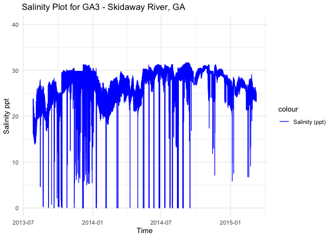
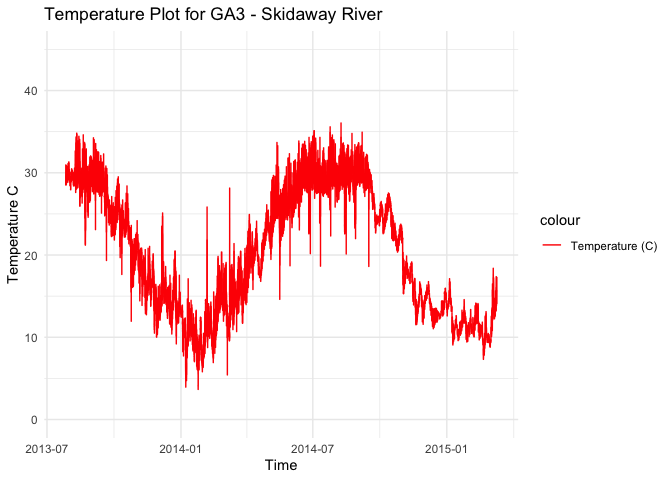

GA3 - Processed Environmental Data
================
Madeline Eppley
4/18/2024

``` r
setwd("/Users/madelineeppley/GitHub/EasternOysterEnvData/2022_SiteEnvironmentData")
```

### Load required packages.

``` r
library("dplyr") #Used for working with data frames
```

    ## 
    ## Attaching package: 'dplyr'

    ## The following objects are masked from 'package:stats':
    ## 
    ##     filter, lag

    ## The following objects are masked from 'package:base':
    ## 
    ##     intersect, setdiff, setequal, union

``` r
library("lubridate") #Used for time-date conversions
```

    ## 
    ## Attaching package: 'lubridate'

    ## The following objects are masked from 'package:base':
    ## 
    ##     date, intersect, setdiff, union

``` r
library("readr") #Used to read the CSV file
library("ggplot2") 
```

### Note the date of data download and source. All available data should be used for each site regardless of year. Note from the CSV file how often the site was sampled, and if there are replicates in the data. Also describe if the sampling occurred at only low tide, only high tide, or continuously.

``` r
#Data was sent on 4/18/2024
#Source - Aron Stubbins and https://www.bco-dmo.org/dataset/682937
#The site was sampled continuously

#Create text strings with metadata information that we want to include in the final data frame. 
download_date <- ("04-18-2024")
source_description <- ("Biological and Chemical Oceanography Data Management Office")
site_name <- ("GA3") #Use site code with site number based on lat position and state
collection_type <- ("continuous")
```

### Use the file path name in your working directory or desktop, see example below. Or, import data set through the “Files” window in R studio. Store the file in a variable with the “raw_ID_Site” format. If salinity and temperature data are in separate files, read in both and store them with “\_sal” or “\_temp” in the variable names.

``` r
#The file we will be working with is from Skidaway River, Georgia. The ID_Site for this site is GA3. 
raw_GA3 <- read_csv("/Users/madelineeppley/GitHub/EasternOysterEnvData/2022_SiteEnvironmentData/GA3-raw.csv")
```

    ## Rows: 302091 Columns: 13
    ## ── Column specification ────────────────────────────────────────────────────────
    ## Delimiter: ","
    ## chr  (1): station
    ## dbl  (9): lat, lon, record, deployment, matlab_datenum, temp, depth, salinit...
    ## dttm (1): ISO_DateTime_UTC
    ## date (1): date
    ## time (1): time
    ## 
    ## ℹ Use `spec()` to retrieve the full column specification for this data.
    ## ℹ Specify the column types or set `show_col_types = FALSE` to quiet this message.

``` r
# View how the data is stored. Note the variable names and the format and units that the data are stored in.  
spec(raw_GA3)
```

    ## cols(
    ##   station = col_character(),
    ##   lat = col_double(),
    ##   lon = col_double(),
    ##   date = col_date(format = ""),
    ##   time = col_time(format = ""),
    ##   ISO_DateTime_UTC = col_datetime(format = ""),
    ##   record = col_double(),
    ##   deployment = col_double(),
    ##   matlab_datenum = col_double(),
    ##   temp = col_double(),
    ##   depth = col_double(),
    ##   salinity = col_double(),
    ##   sonde_id = col_double()
    ## )

``` r
#View(raw_GA3)
```

### Start with the date and time of collection. We will use the lubridate package to standardize all values into the date-time format called POSIXct. This format stores the date and time in number of seconds since a past point (1/1/1970). This makes comparisons easy and helps to standardizes values.

``` r
#Convert to POSIXct format. Store it into a column named datetime in the data frame.
raw_GA3$datetime <- as.POSIXct(raw_GA3$ISO_DateTime_UTC, "%y/%m/%d %H:%M:%S", tz = "")


#Print the new data frame and examine to make sure the new datetime column is in the correct format. 
head(raw_GA3)
```

    ## # A tibble: 6 × 14
    ##   station   lat   lon date       time   ISO_DateTime_UTC    record deployment
    ##   <chr>   <dbl> <dbl> <date>     <time> <dttm>               <dbl>      <dbl>
    ## 1 S2       32.0 -81.0 2013-07-26 17:30  2013-07-26 17:30:00      7          1
    ## 2 S2       32.0 -81.0 2013-07-26 17:35  2013-07-26 17:35:00      8          1
    ## 3 S2       32.0 -81.0 2013-07-26 17:40  2013-07-26 17:40:00      9          1
    ## 4 S2       32.0 -81.0 2013-07-26 17:45  2013-07-26 17:45:00     10          1
    ## 5 S2       32.0 -81.0 2013-07-26 17:50  2013-07-26 17:50:00     11          1
    ## 6 S2       32.0 -81.0 2013-07-26 17:55  2013-07-26 17:55:00     12          1
    ## # ℹ 6 more variables: matlab_datenum <dbl>, temp <dbl>, depth <dbl>,
    ## #   salinity <dbl>, sonde_id <dbl>, datetime <dttm>

### Analyze the ranges of all of our variables of interest - time, salinity, and temperature. Make sure that the latitude and longitude values are consistent for a static collection site. This is a quick check so we can determine how to conduct the next filtering step.

``` r
#Standardize column and variable names. We will use "temp" for temperature in degrees C, "salinity" for salinity in parts per thousand (ppt), "lat" for latitude in degrees, and "lon" for longitude in degrees. 
#Use the dyplr format to rename multiple columns in the format "dataframe %>% rename("new name 1" = "old name 1", "new name 2", "old name 2")
raw_GA3 <- raw_GA3 %>% rename("salinity" = "salinity")
raw_GA3 <- raw_GA3  %>% rename("temp" = "temp")

#Store variables that we will include in the final data frame
lat <- 31.9863317
lon <- -81.0052642
firstyear <- 2013
finalyear <- 2015
```

### Filter any of the variables that have data points outside of normal range. We will use 0-40 as the accepted range for salinity (ppt) and temperature (C) values. Note, in the summer, salinity values can sometimes exceed 40. Check to see if there are values above 40. In this case, adjust the range or notify someone that the site has particularly high salinity values.

``` r
#Filter the data between the values of 0 and 40 for both salinity and temperature. 
filtered_GA3 <- raw_GA3%>%
    filter(between(salinity, 0, 42)) 
           
filtered_GA3 <- raw_GA3 %>%
    filter(between(temp, 0, 40))

# Sanity check - print the ranges to ensure values are filtered properly. We can see that the ranges for both are now in the appropriate range.  
print(summary(filtered_GA3$salinity))
```

    ##     Min.  1st Qu.   Median     Mean  3rd Qu.     Max. 
    ##  0.00772 24.28000 26.91000 26.15428 29.03000 31.70918

``` r
print(summary(filtered_GA3$temp))
```

    ##    Min. 1st Qu.  Median    Mean 3rd Qu.    Max. 
    ##   3.655  13.950  22.624  21.223  28.842  36.056

``` r
print(summary(filtered_GA3$datetime))
```

    ##                       Min.                    1st Qu. 
    ## "2013-07-26 17:30:00.0000" "2013-12-06 20:07:30.0000" 
    ##                     Median                       Mean 
    ## "2014-04-15 14:35:00.0000" "2014-04-21 18:05:52.4535" 
    ##                    3rd Qu.                       Max. 
    ## "2014-08-21 10:32:30.0000" "2015-03-10 17:35:00.0000"

``` r
#Store our data into a variable name with just the site name. 
GA3 <- filtered_GA3
```

### Visualize the salinity, temperature, and date ranges over time. This can help us see if there are any anomalies or gaps in the data and make sure the filtering was done correctly. Sanity check - do the temperature and salinity ranges look appropriate for the geography of the site (ex. near full ocean salinity for coastal sites, lower salinity for estuaries or near rivers)?

``` r
salplot <- ggplot(GA3, aes(x = datetime)) +
    geom_line(aes(y = salinity, color = "Salinity (ppt)")) +
    ylim(0,40) +
    labs(x = "Time", y = "Salinity ppt", title = "Salinity Plot for GA3 - Skidaway River, GA") +
    scale_color_manual(values = c("Salinity (ppt)" = "blue")) +
    theme_minimal()

salplot
```

<!-- -->

``` r
tempplot <- ggplot(GA3, aes(x = datetime)) +
    geom_line(aes(y = temp, color = "Temperature (C)")) +
    ylim(0, 45) +
    labs(x = "Time", y = "Temperature C", title = "Temperature Plot for GA3 - Skidaway River") +
    scale_color_manual(values = c( "Temperature (C)" = "red")) +
    theme_minimal()


tempplot
```

<!-- -->

### We need to calculate the mean, maximum, and minimum values for salinity and temperature per month and year. First make two data frames to contain each of the annual and monthly averages.

``` r
#Calculate the mean, maximum, and minimum values for salinity and temperature for each month. 
GA3_envrmonth_sal <- GA3 %>%
    mutate(year = year(datetime), month = month(datetime)) %>%
    group_by(year, month) %>%
    summarise(
      min_salinity = min(salinity),
      max_salinity = max(salinity),
      mean_salinity = mean(salinity),
      length_salinity = length(salinity))
```

    ## `summarise()` has grouped output by 'year'. You can override using the
    ## `.groups` argument.

``` r
GA3_envrmonth_temp <- GA3 %>%
    mutate(year = year(datetime), month = month(datetime)) %>%
    group_by(year, month) %>%
    summarise(      
      min_temp = min(temp),
      max_temp = max(temp),
      mean_temp = mean(temp),
      length_temp = length(temp))
```

    ## `summarise()` has grouped output by 'year'. You can override using the
    ## `.groups` argument.

``` r
print(GA3_envrmonth_sal)
```

    ## # A tibble: 21 × 6
    ## # Groups:   year [3]
    ##     year month min_salinity max_salinity mean_salinity length_salinity
    ##    <dbl> <dbl>        <dbl>        <dbl>         <dbl>           <int>
    ##  1  2013     7     13.9             23.9          17.5            1518
    ##  2  2013     8      0.279           28.0          21.1           16107
    ##  3  2013     9      0.017           28.3          23.3           18179
    ##  4  2013    10      0.0245          30.2          26.2           18811
    ##  5  2013    11      0.0188          30.4          28.0           17222
    ##  6  2013    12      0.00773         31.4          27.1           17797
    ##  7  2014     1      0.00774         30.5          24.3           18196
    ##  8  2014     2      0.00773         28.2          22.1           16485
    ##  9  2014     3      0.00782         29.8          25.3           19675
    ## 10  2014     4      0.0320          28.9          24.4           11620
    ## # ℹ 11 more rows

``` r
print(GA3_envrmonth_temp)
```

    ## # A tibble: 21 × 6
    ## # Groups:   year [3]
    ##     year month min_temp max_temp mean_temp length_temp
    ##    <dbl> <dbl>    <dbl>    <dbl>     <dbl>       <int>
    ##  1  2013     7    28.5      31.3      29.8        1518
    ##  2  2013     8    21.2      34.8      29.6       16107
    ##  3  2013     9    19.3      34.3      27.9       18179
    ##  4  2013    10    11.9      29.5      23.2       18811
    ##  5  2013    11    10.0      24.2      17.0       17222
    ##  6  2013    12     9.19     25.1      14.6       17797
    ##  7  2014     1     3.66     17.1      10.0       18196
    ##  8  2014     2     6.92     25.8      12.1       16485
    ##  9  2014     3     5.42     28.1      14.4       19675
    ## 10  2014     4    14.2      26.1      20.1       11620
    ## # ℹ 11 more rows

``` r
#Calculate the mean, maximum, and minimum values for salinity and temperature for each year. 
GA3_envryear_sal <- GA3 %>%
    mutate(year = year(datetime)) %>%
    group_by(year) %>%
    summarise(
      min_salinity = min(salinity),
      max_salinity = max(salinity),
      mean_salinity = mean(salinity))

GA3_envryear_temp <- GA3 %>%
    mutate(year = year(datetime)) %>%
    group_by(year) %>%
    summarise(
      min_temp = min(temp),
      max_temp = max(temp),
      mean_temp = mean(temp))

print(GA3_envryear_sal)
```

    ## # A tibble: 3 × 4
    ##    year min_salinity max_salinity mean_salinity
    ##   <dbl>        <dbl>        <dbl>         <dbl>
    ## 1  2013      0.00773         31.4          25.1
    ## 2  2014      0.00772         31.7          26.7
    ## 3  2015      5.86            29.1          25.6

``` r
print(GA3_envryear_temp)
```

    ## # A tibble: 3 × 4
    ##    year min_temp max_temp mean_temp
    ##   <dbl>    <dbl>    <dbl>     <dbl>
    ## 1  2013     9.19     34.8      22.5
    ## 2  2014     3.66     36.1      21.7
    ## 3  2015     7.31     18.4      11.6

### Plot the months and years of data collection to check if there are any collection gaps in the data.

``` r
timeplot <- ggplot(GA3_envrmonth_sal, aes(x = year)) +
    geom_point(aes(y = month, color = length_salinity), size = 4) +
    labs(x = "Time", y = "Month", title = "Salinity Timeplot for GA3 - Deep Water Shoal") +
    ylim(1,12) +
    theme_minimal()

timeplot
```

<!-- -->

### Plot the months and years of data collection to check if there are any collection gaps in the data.

``` r
timeplot <- ggplot(GA3_envrmonth_temp, aes(x = year)) +
    geom_point(aes(y = month, color = length_temp), size = 4) +
    labs(x = "Time", y = "Month", title = "Temperature Timeplot for GA3 - Deep Water Shoal") +
    ylim(1,12) +
    theme_minimal()

timeplot
```

<!-- -->

### We can now calculate a list of variables that we will have collected for all sites. This will allow us to compare sites easily. We will calculate the number of observations from each site, the mean annual, maximum annual, and minimum annual value for all variables.

Our list of variables includes:

- Mean_Annual_Temperature_C: average of all available data

- Mean_max_temperature_C: average of maximums for each year

- Mean_min_temperature_C: average of minimums for each year

- Temperature_st_dev: standard deviation of all available data

- Temperature_n: total number of data points

- Temperature_years: number of years in data set

- Mean_Annual_Salinity_ppt: average of all available data

- Mean_min_Salinity_ppt: average of minimums for each year

- Mean_max_Salinity_ppt: average of maximums for each year

- Salinity_st_dev: standard deviation of all available data

- Salinity_n: total number of data points

- Salinity_years: number of years in data set

``` r
#Calculate temperature variables. 
Mean_Annual_Temperature_C <- mean(GA3$temp)
Mean_max_temperature_C <- mean(GA3_envryear_temp$max_temp)
Mean_min_temperature_C <- mean(GA3_envryear_temp$min_temp)
Temperature_st_dev <- sd(GA3$temp)
Temperature_n <- nrow(GA3)
Temperature_years <- nrow(GA3_envryear_temp)

#Create a data frame to store the temperature results
GA3_temp <- cbind(site_name, download_date, source_description, lat, lon, firstyear, finalyear, Mean_Annual_Temperature_C, Mean_max_temperature_C, Mean_min_temperature_C, Temperature_st_dev, Temperature_n, Temperature_years, collection_type)
print(GA3_temp)
```

    ##      site_name download_date
    ## [1,] "GA3"     "04-18-2024" 
    ##      source_description                                            lat         
    ## [1,] "Biological and Chemical Oceanography Data Management Office" "31.9863317"
    ##      lon           firstyear finalyear Mean_Annual_Temperature_C
    ## [1,] "-81.0052642" "2013"    "2015"    "21.2232697994975"       
    ##      Mean_max_temperature_C Mean_min_temperature_C Temperature_st_dev
    ## [1,] "29.7556666666667"     "6.71966666666667"     "7.51412559586478"
    ##      Temperature_n Temperature_years collection_type
    ## [1,] "302091"      "3"               "continuous"

``` r
# Write to the combined file with all sites 
write.table(GA3_temp, "/Users/madelineeppley/GitHub/EasternOysterEnvData/2022_SiteEnvironmentData/Seascape_Processed/seascape_temperature.csv", sep = ",", append = TRUE, col.names = FALSE, row.names = FALSE) # The column names should be changed to FALSE after 1st row is added to the data frame

# Write to a unique new CSV file
write.csv(GA3_temp, "/Users/madelineeppley/GitHub/EasternOysterEnvData/2022_SiteEnvironmentData/Seascape_Processed/GA3_temperature.csv")
```

``` r
#Calculate the salinity variables
Mean_Annual_Salinity_ppt <- mean(GA3$salinity)
Mean_max_Salinity_ppt <- mean(GA3_envryear_sal$max_salinity)
Mean_min_Salinity_ppt <- mean(GA3_envryear_sal$min_salinity)
Salinity_st_dev <- sd(GA3$salinity)
Salinity_n <- nrow(GA3)
Salinity_years <- nrow(GA3_envryear_sal)


#Create a data frame to store the temperature results
GA3_salinity <- cbind(site_name, download_date, source_description, lat, lon, firstyear, finalyear, Mean_Annual_Salinity_ppt, Mean_max_Salinity_ppt, Mean_min_Salinity_ppt, Salinity_st_dev, Salinity_n, Salinity_years, collection_type)
print(GA3_salinity)
```

    ##      site_name download_date
    ## [1,] "GA3"     "04-18-2024" 
    ##      source_description                                            lat         
    ## [1,] "Biological and Chemical Oceanography Data Management Office" "31.9863317"
    ##      lon           firstyear finalyear Mean_Annual_Salinity_ppt
    ## [1,] "-81.0052642" "2013"    "2015"    "26.1542786361548"      
    ##      Mean_max_Salinity_ppt Mean_min_Salinity_ppt Salinity_st_dev    Salinity_n
    ## [1,] "30.71770026"         "1.95848213833333"    "3.90278891624631" "302091"  
    ##      Salinity_years collection_type
    ## [1,] "3"            "continuous"

``` r
# Write to the combined file with all sites 
write.table(GA3_salinity, "/Users/madelineeppley/GitHub/EasternOysterEnvData/2022_SiteEnvironmentData/Seascape_Processed/seascape_salinity.csv", sep = ",", append = TRUE, col.names = FALSE, row.names = FALSE) # The column names should be changed to FALSE after 1st row is added to the data frame

# Write to a unique new CSV file
write.csv(GA3_salinity, "/Users/madelineeppley/GitHub/EasternOysterEnvData/2022_SiteEnvironmentData/Seascape_Processed/GA3_salinity.csv", row.names = FALSE)
```
