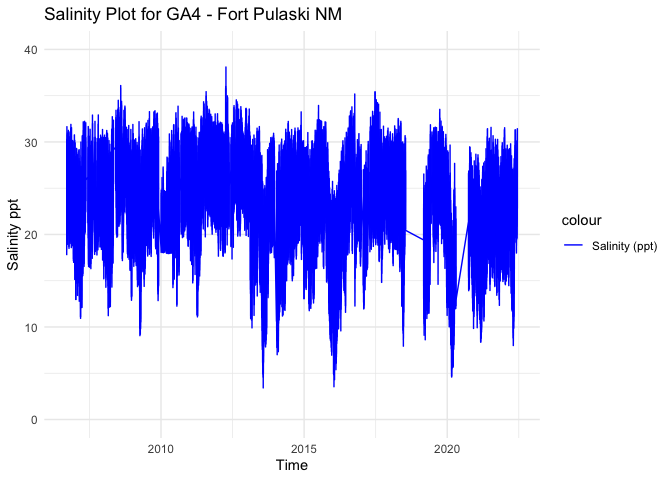
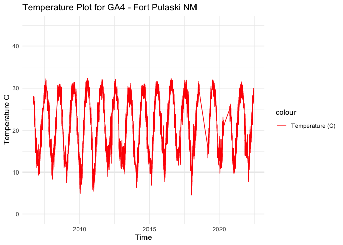

GA4 - Processed Environmental Data
================
Madeline Eppley
9/13/2023

``` r
setwd("/Users/madelineeppley/GitHub/EasternOysterEnvData/2022_SiteEnvironmentData")
```

### Load required packages.

``` r
library("dplyr") #Used for working with data frames
```

    ## 
    ## Attaching package: 'dplyr'

    ## The following objects are masked from 'package:stats':
    ## 
    ##     filter, lag

    ## The following objects are masked from 'package:base':
    ## 
    ##     intersect, setdiff, setequal, union

``` r
library("lubridate") #Used for time-date conversions
```

    ## 
    ## Attaching package: 'lubridate'

    ## The following objects are masked from 'package:base':
    ## 
    ##     date, intersect, setdiff, union

``` r
library("readr") #Used to read the CSV file
library("ggplot2") 
```

### Note the date of data download and source. All available data should be used for each site regardless of year. Note from the CSV file how often the site was sampled, and if there are replicates in the data. Also describe if the sampling occurred at only low tide, only high tide, or continuously.

``` r
#Data was downloaded on 3/20/2024
#Source - https://irma.nps.gov/aqwebportal/Data/Location/Summary/Location/FOPUlazz01
#The site was sampled every 30 minutes continuously.
#Data was downloaded with a custom range from first available time point to 6/14/2022, the GA4 site collection date. 

#Create text strings with metadata information that we want to include in the final data frame. 
download_date <- ("03-20-2024")
source_description <- ("National Parks Service Continuous Water Data - Fort Pulaski NM - Lazaretto Creek Dock")
site_name <- ("GA4") #Use site code with site number based on lat position and state
collection_type <- ("continuous")
```

### Use the file path name in your working directory or desktop, see example below. Or, import data set through the “Files” window in R studio. Store the file in a variable with the “raw_ID_Site” format. If salinity and temperature data are in separate files, read in both and store them with “\_sal” or “\_temp” in the variable names.

``` r
#The file we will be working with is from Fort Pulaski National Monument, Georgia. The ID_Site for this site is GA4. 
raw_GA4_sal <- read_csv("/Users/madelineeppley/GitHub/EasternOysterEnvData/2022_SiteEnvironmentData/GA4-raw_sal.csv")
```

    ## Rows: 235400 Columns: 2
    ## ── Column specification ────────────────────────────────────────────────────────
    ## Delimiter: ","
    ## chr (1): Timestamp
    ## dbl (1): PSU
    ## 
    ## ℹ Use `spec()` to retrieve the full column specification for this data.
    ## ℹ Specify the column types or set `show_col_types = FALSE` to quiet this message.

``` r
raw_GA4_temp <- read_csv("/Users/madelineeppley/GitHub/EasternOysterEnvData/2022_SiteEnvironmentData/GA4-raw_temp.csv")
```

    ## Rows: 242852 Columns: 2
    ## ── Column specification ────────────────────────────────────────────────────────
    ## Delimiter: ","
    ## chr (1): Timestamp
    ## dbl (1): Temp
    ## 
    ## ℹ Use `spec()` to retrieve the full column specification for this data.
    ## ℹ Specify the column types or set `show_col_types = FALSE` to quiet this message.

``` r
# View how the data is stored. Note the variable names and the format and units that the data are stored in.  
#View(raw_GA4_sal)
#View(raw_GA4_temp)
```

### Start with the date and time of collection. We will use the lubridate package to standardize all values into the date-time format called POSIXct. This format stores the date and time in number of seconds since a past point (1/1/1970). This makes comparisons easy and helps to standardizes values.

``` r
#Convert to POSIXct format. Store it into a column named datetime in the data frame.
raw_GA4_sal$datetime <- as.POSIXct(raw_GA4_sal$Timestamp, "%m/%d/%y %H:%M", tz = "")
raw_GA4_temp$datetime <- as.POSIXct(raw_GA4_temp$Timestamp, "%m/%d/%y %H:%M", tz = "")

#Print the new data frame and examine to make sure the new datetime column is in the correct format. 
head(raw_GA4_sal)
```

    ## # A tibble: 6 × 3
    ##   Timestamp      PSU datetime           
    ##   <chr>        <dbl> <dttm>             
    ## 1 9/16/06 0:00  17.8 2006-09-16 00:00:00
    ## 2 9/16/06 0:30  18.2 2006-09-16 00:30:00
    ## 3 9/16/06 1:00  18.8 2006-09-16 01:00:00
    ## 4 9/16/06 1:30  19.5 2006-09-16 01:30:00
    ## 5 9/16/06 2:00  20.8 2006-09-16 02:00:00
    ## 6 9/16/06 2:30  21.6 2006-09-16 02:30:00

``` r
head(raw_GA4_temp)
```

    ## # A tibble: 6 × 3
    ##   Timestamp     Temp datetime           
    ##   <chr>        <dbl> <dttm>             
    ## 1 9/16/06 0:00  27.0 2006-09-16 00:00:00
    ## 2 9/16/06 0:30  27.0 2006-09-16 00:30:00
    ## 3 9/16/06 1:00  27.0 2006-09-16 01:00:00
    ## 4 9/16/06 1:30  27.0 2006-09-16 01:30:00
    ## 5 9/16/06 2:00  26.9 2006-09-16 02:00:00
    ## 6 9/16/06 2:30  26.8 2006-09-16 02:30:00

### Analyze the ranges of all of our variables of interest - time, salinity, and temperature. Make sure that the latitude and longitude values are consistent for a static collection site. This is a quick check so we can determine how to conduct the next filtering step.

``` r
#Standardize column and variable names. We will use "temp" for temperature in degrees C, "salinity" for salinity in parts per thousand (ppt), "lat" for latitude in degrees, and "lon" for longitude in degrees. 
#Use the dyplr format to rename multiple columns in the format "dataframe %>% rename("new name 1" = "old name 1", "new name 2", "old name 2")
raw_GA4_sal <- raw_GA4_sal %>% rename("salinity" = "PSU")
raw_GA4_temp <- raw_GA4_temp  %>% rename("temp" = "Temp")
```

### Filter any of the variables that have data points outside of normal range. We will use 0-40 as the accepted range for salinity (ppt) and temperature (C) values. Note, in the summer, salinity values can sometimes exceed 40. Check to see if there are values above 40. In this case, adjust the range or notify someone that the site has particularly high salinity values. This filtering step also exludes NA sites.

``` r
#Filter the data between the values of 0 and 40 for both salinity and temperature. 
filtered_GA4_sal <- raw_GA4_sal %>%
    filter(between(salinity, 0, 42)) 
           
filtered_GA4_temp <- raw_GA4_temp %>%
    filter(between(temp, 0, 40))
```

# Print the range values of the filtered data frames.

``` r
#Print the range (minimum and maximum) of the salinity values. 
print(range(filtered_GA4_sal$salinity))
```

    ## [1]  3.414985 38.097607

``` r
#Print the range (minimum and maximum) of the temperature values.
print(range(filtered_GA4_temp$temp))
```

    ## [1]  4.492 32.380

``` r
#Store variables that we will include in the final data frame
lat <- 32.01414 
lon <- -80.88412
firstyear <- 2006
finalyear <- 2022
```

``` r
# Sanity check - print the ranges to ensure values are filtered properly. We can see that the ranges for both are now in the appropriate range.  
print(summary(filtered_GA4_sal$salinity))
```

    ##    Min. 1st Qu.  Median    Mean 3rd Qu.    Max. 
    ##   3.415  20.293  23.612  23.102  26.441  38.098

``` r
print(summary(filtered_GA4_temp$temp))
```

    ##    Min. 1st Qu.  Median    Mean 3rd Qu.    Max. 
    ##   4.492  14.860  20.980  20.859  27.550  32.380

``` r
#Store our data into a variable name with just the site name. 
GA4_temp <- filtered_GA4_temp
GA4_sal <- filtered_GA4_sal
```

### Visualize the salinity, temperature, and date ranges over time. This can help us see if there are any anomalies or gaps in the data and make sure the filtering was done correctly. Sanity check - do the temperature and salinity ranges look appropriate for the geography of the site (ex. near full ocean salinity for coastal sites, lower salinity for estuaries or near rivers)?

``` r
salplot <- ggplot(GA4_sal, aes(x = datetime)) +
    geom_line(aes(y = salinity, color = "Salinity (ppt)")) +
    ylim(0,40) +
    labs(x = "Time", y = "Salinity ppt", title = "Salinity Plot for GA4 - Fort Pulaski NM") +
    scale_color_manual(values = c("Salinity (ppt)" = "blue")) +
    theme_minimal()

salplot
```

    ## Warning: Removed 28 rows containing missing values (`geom_line()`).

<!-- -->

``` r
tempplot <- ggplot(GA4_temp, aes(x = datetime)) +
    geom_line(aes(y = temp, color = "Temperature (C)")) +
    ylim(0, 45) +
    labs(x = "Time", y = "Temperature C", title = "Temperature Plot for GA4 - Fort Pulaski NM") +
    scale_color_manual(values = c( "Temperature (C)" = "red")) +
    theme_minimal()


tempplot
```

    ## Warning: Removed 32 rows containing missing values (`geom_line()`).

<!-- -->

### We need to calculate the mean, maximum, and minimum values for salinity and temperature per month and year. First make two data frames to contain each of the annual and monthly averages.

``` r
#Calculate the mean, maximum, and minimum values for salinity and temperature for each month. 
GA4_envrmonth_sal <- GA4_sal %>%
    mutate(year = year(datetime), month = month(datetime)) %>%
    group_by(year, month) %>%
    summarise(
      min_salinity = min(salinity),
      max_salinity = max(salinity),
      mean_salinity = mean(salinity),
      length_salinity = length(salinity))
```

    ## `summarise()` has grouped output by 'year'. You can override using the
    ## `.groups` argument.

``` r
GA4_envrmonth_temp <- GA4_temp %>%
    mutate(year = year(datetime), month = month(datetime)) %>%
    group_by(year, month) %>%
    summarise(      
      min_temp = min(temp),
      max_temp = max(temp),
      mean_temp = mean(temp),
      length_temp = length(temp))
```

    ## `summarise()` has grouped output by 'year'. You can override using the
    ## `.groups` argument.

``` r
print(GA4_envrmonth_sal)
```

    ## # A tibble: 179 × 6
    ## # Groups:   year [18]
    ##     year month min_salinity max_salinity mean_salinity length_salinity
    ##    <dbl> <dbl>        <dbl>        <dbl>         <dbl>           <int>
    ##  1  2006     9         17.8         31.6          24.7             566
    ##  2  2006    10         18.5         31.3          25.2            1418
    ##  3  2006    11         18.6         31.9          25.2            1440
    ##  4  2006    12         15.1         30.8          23.7            1488
    ##  5  2007     1         12.9         29.9          21.4            1485
    ##  6  2007     2         12.8         29.2          21.5             849
    ##  7  2007     3         10.9         30.0          20.1            1486
    ##  8  2007     4         15.5         32.2          23.8            1435
    ##  9  2007     5         20.0         32.2          25.4             790
    ## 10  2007     6         16.5         31.7          23.2             788
    ## # ℹ 169 more rows

``` r
print(GA4_envrmonth_temp)
```

    ## # A tibble: 180 × 6
    ## # Groups:   year [18]
    ##     year month min_temp max_temp mean_temp length_temp
    ##    <dbl> <dbl>    <dbl>    <dbl>     <dbl>       <int>
    ##  1  2006     9    26.1      28.1      27.1         566
    ##  2  2006    10    17.2      26.9      22.1        1418
    ##  3  2006    11    12.1      20.4      16.0        1440
    ##  4  2006    12    11        18.1      13.6        1488
    ##  5  2007     1     9.32     16.7      12.9        1485
    ##  6  2007     2     9.48     14.9      11.7         849
    ##  7  2007     3    12.7      21.5      16.9        1486
    ##  8  2007     4    16.0      24.1      19.8        1435
    ##  9  2007     5    20.1      25.3      23.1         790
    ## 10  2007     6    25.6      30.6      28.1         788
    ## # ℹ 170 more rows

``` r
#Calculate the mean, maximum, and minimum values for salinity and temperature for each year. 
GA4_envryear_sal <- GA4_sal %>%
    mutate(year = year(datetime)) %>%
    group_by(year) %>%
    summarise(
      min_salinity = min(salinity),
      max_salinity = max(salinity),
      mean_salinity = mean(salinity))

GA4_envryear_temp <- GA4_temp %>%
    mutate(year = year(datetime)) %>%
    group_by(year) %>%
    summarise(
      min_temp = min(temp),
      max_temp = max(temp),
      mean_temp = mean(temp))

print(GA4_envryear_sal)
```

    ## # A tibble: 18 × 4
    ##     year min_salinity max_salinity mean_salinity
    ##    <dbl>        <dbl>        <dbl>         <dbl>
    ##  1  2006        15.1          31.9          24.7
    ##  2  2007        10.9          32.9          23.2
    ##  3  2008        11.2          36.1          24.5
    ##  4  2009         9.06         33.4          24.1
    ##  5  2010        12.3          33.9          24.5
    ##  6  2011        11.1          35.4          25.9
    ##  7  2012        17.4          38.1          26.6
    ##  8  2013         3.41         33.6          21.8
    ##  9  2014         7.01         33.2          22.6
    ## 10  2015         6.95         33.9          22.1
    ## 11  2016         3.54         35.2          21.6
    ## 12  2017        11.9          35.4          24.5
    ## 13  2018         7.93         32.5          23.4
    ## 14  2019         8.62         33.5          22.9
    ## 15  2020         4.59         29.7          17.6
    ## 16  2021         8.35         31.6          20.5
    ## 17  2022         7.99         31.5          21.4
    ## 18    NA        14.9          28.2          20.9

``` r
print(GA4_envryear_temp)
```

    ## # A tibble: 18 × 4
    ##     year min_temp max_temp mean_temp
    ##    <dbl>    <dbl>    <dbl>     <dbl>
    ##  1  2006    11        28.1      18.3
    ##  2  2007     9.32     32.3      20.3
    ##  3  2008     8.34     31        20.4
    ##  4  2009     7.48     31.5      21.1
    ##  5  2010     4.79     32.4      20.5
    ##  6  2011     5.39     32.2      20.5
    ##  7  2012     9.02     32.2      21.3
    ##  8  2013     9.58     31.1      20.7
    ##  9  2014     6.33     31.0      20.8
    ## 10  2015     6.87     31.7      21.4
    ## 11  2016     7.78     32.3      21.8
    ## 12  2017     9.69     32.0      22.7
    ## 13  2018     4.49     31.6      19.5
    ## 14  2019    11.7      32.0      23.2
    ## 15  2020     9.77     26.3      17.2
    ## 16  2021     9.61     31.5      21.2
    ## 17  2022     7.79     30.0      18.7
    ## 18    NA    11.2      18.9      14.6

### Plot the months and years of data collection to check if there are any collection gaps in the data.

``` r
timeplot <- ggplot(GA4_envrmonth_sal, aes(x = year)) +
    geom_point(aes(y = month, color = length_salinity), size = 4) +
    labs(x = "Time", y = "Month", title = "Salinity Timeplot for GA4 - Fort Pulaski NM") +
    ylim(1,12) +
    theme_minimal()

timeplot
```

    ## Warning: Removed 1 rows containing missing values (`geom_point()`).

<!-- -->

### Plot the months and years of data collection to check if there are any collection gaps in the data.

``` r
timeplot <- ggplot(GA4_envrmonth_temp, aes(x = year)) +
    geom_point(aes(y = month, color = length_temp), size = 4) +
    labs(x = "Time", y = "Month", title = "Temperature Timeplot for GA4 - Fort Pulaski NM") +
    ylim(1,12) +
    theme_minimal()

timeplot
```

    ## Warning: Removed 1 rows containing missing values (`geom_point()`).

<!-- -->

### We can now calculate a list of variables that we will have collected for all sites. This will allow us to compare sites easily. We will calculate the number of observations from each site, the mean annual, maximum annual, and minimum annual value for all variables.

Our list of variables includes:

- Mean_Annual_Temperature_C: average of all available data

- Mean_max_temperature_C: average of maximums for each year

- Mean_min_temperature_C: average of minimums for each year

- Temperature_st_dev: standard deviation of all available data

- Temperature_n: total number of data points

- Temperature_years: number of years in data set

- Mean_Annual_Salinity_ppt: average of all available data

- Mean_min_Salinity_ppt: average of minimums for each year

- Mean_max_Salinity_ppt: average of maximums for each year

- Salinity_st_dev: standard deviation of all available data

- Salinity_n: total number of data points

- Salinity_years: number of years in data set

``` r
#Calculate temperature variables. 
#Calculate temperature variables. 
Mean_Annual_Temperature_C <- mean(GA4_temp$temp)
Mean_max_temperature_C <- mean(GA4_envryear_temp$max_temp)
Mean_min_temperature_C <- mean(GA4_envryear_temp$min_temp)
Temperature_st_dev <- sd(GA4_temp$temp)
Temperature_n <- nrow(GA4_temp)
Temperature_years <- nrow(GA4_envryear_temp)

#Create a data frame to store the temperature results
GA4_temp <- cbind(site_name, download_date, source_description, lat, lon, firstyear, finalyear, Mean_Annual_Temperature_C, Mean_max_temperature_C, Mean_min_temperature_C, Temperature_st_dev, Temperature_n, Temperature_years, collection_type)
print(GA4_temp)
```

    ##      site_name download_date
    ## [1,] "GA4"     "03-20-2024" 
    ##      source_description                                                                     
    ## [1,] "National Parks Service Continuous Water Data - Fort Pulaski NM - Lazaretto Creek Dock"
    ##      lat        lon         firstyear finalyear Mean_Annual_Temperature_C
    ## [1,] "32.01414" "-80.88412" "2006"    "2022"    "20.8589751668393"       
    ##      Mean_max_temperature_C Mean_min_temperature_C Temperature_st_dev
    ## [1,] "30.4447040084099"     "8.33866666666666"     "6.76118364378797"
    ##      Temperature_n Temperature_years collection_type
    ## [1,] "242645"      "18"              "continuous"

``` r
# Write to the combined file with all sites 
write.table(GA4_temp, "/Users/madelineeppley/GitHub/EasternOysterEnvData/2022_SiteEnvironmentData/Seascape_Processed/seascape_temperature.csv", sep = ",", append = TRUE, col.names = FALSE, row.names = FALSE) # The column names should be changed to FALSE after 1st row is added to the data frame

# Write to a unique new CSV file
write.csv(GA4_temp, "/Users/madelineeppley/GitHub/EasternOysterEnvData/2022_SiteEnvironmentData/Seascape_Processed/GA4_temperature.csv")
```

``` r
#Calculate the salinity variables
Mean_Annual_Salinity_ppt <- mean(GA4_sal$salinity)
Mean_max_Salinity_ppt <- mean(GA4_envryear_sal$max_salinity)
Mean_min_Salinity_ppt <- mean(GA4_envryear_sal$min_salinity)
Salinity_st_dev <- sd(GA4_sal$salinity)
Salinity_n <- nrow(GA4_sal)
Salinity_years <- nrow(GA4_envryear_sal)


#Create a data frame to store the temperature results
GA4_salinity <- cbind(site_name, download_date, source_description, lat, lon, firstyear, finalyear, Mean_Annual_Salinity_ppt, Mean_max_Salinity_ppt, Mean_min_Salinity_ppt, Salinity_st_dev, Salinity_n, Salinity_years, collection_type)
print(GA4_salinity)
```

    ##      site_name download_date
    ## [1,] "GA4"     "03-20-2024" 
    ##      source_description                                                                     
    ## [1,] "National Parks Service Continuous Water Data - Fort Pulaski NM - Lazaretto Creek Dock"
    ##      lat        lon         firstyear finalyear Mean_Annual_Salinity_ppt
    ## [1,] "32.01414" "-80.88412" "2006"    "2022"    "23.1024132767472"      
    ##      Mean_max_Salinity_ppt Mean_min_Salinity_ppt Salinity_st_dev    Salinity_n
    ## [1,] "33.3375551723141"    "9.56854204031527"    "4.64287957591558" "234596"  
    ##      Salinity_years collection_type
    ## [1,] "18"           "continuous"

``` r
# Write to the combined file with all sites 
write.table(GA4_salinity, "/Users/madelineeppley/GitHub/EasternOysterEnvData/2022_SiteEnvironmentData/Seascape_Processed/seascape_salinity.csv", sep = ",", append = TRUE, col.names = FALSE, row.names = FALSE) # The column names should be changed to FALSE after 1st row is added to the data frame

# Write to a unique new CSV file
write.csv(GA4_salinity, "/Users/madelineeppley/GitHub/EasternOysterEnvData/2022_SiteEnvironmentData/Seascape_Processed/GA4_salinity.csv", row.names = FALSE)
```
