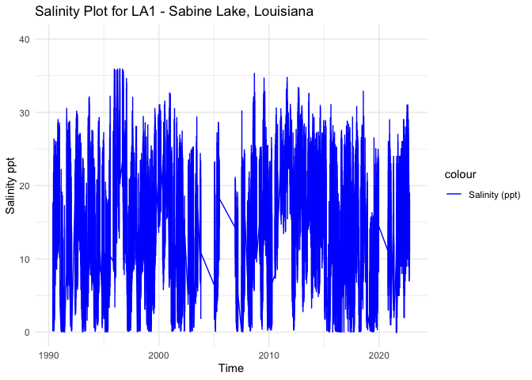
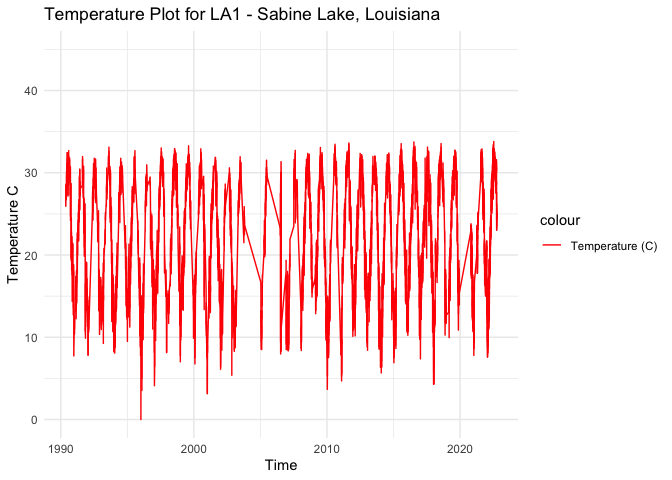

LA1 - Processed Environmental Data
================
Madeline Eppley
3/27/2024

``` r
setwd("/Users/madelineeppley/GitHub/EasternOysterEnvData/2022_SiteEnvironmentData")
```

### Load required packages.

``` r
library("dplyr") #Used for working with data frames
```

    ## 
    ## Attaching package: 'dplyr'

    ## The following objects are masked from 'package:stats':
    ## 
    ##     filter, lag

    ## The following objects are masked from 'package:base':
    ## 
    ##     intersect, setdiff, setequal, union

``` r
library("lubridate") #Used for time-date conversions
```

    ## 
    ## Attaching package: 'lubridate'

    ## The following objects are masked from 'package:base':
    ## 
    ##     date, intersect, setdiff, union

``` r
library("readr") #Used to read the CSV file
library("ggplot2") 
```

### Note the date of data download and source. All available data should be used for each site regardless of year. Note from the CSV file how often the site was sampled, and if there are replicates in the data. Also describe if the sampling occurred at only low tide, only high tide, or continuously.

``` r
#Data was downloaded on 3/27/2024
#Source - https://waterdatafortexas.org/coastal/stations/SAB2 - Texas Water Development Board
#The site was sampled continuously every 15 minutes 

#Create text strings with metadata information that we want to include in the final data frame. 
download_date <- ("03-27-2024")
source_description <- ("Water Data For Texas - Lower Sabine")
site_name <- ("LA1") #Use site code with site number based on lat position and state
collection_type <- ("continuous")
```

### Use the file path name in your working directory or desktop, see example below. Or, import data set through the “Files” window in R studio. Store the file in a variable with the “raw_ID_Site” format. If salinity and temperature data are in separate files, read in both and store them with “\_sal” or “\_temp” in the variable names.

``` r
#The file we will be working with is from Lake Fortuna, Louisiana. The ID_Site for this site is LA1. 
raw_LA1_sal <- read_csv("/Users/madelineeppley/GitHub/EasternOysterEnvData/2022_SiteEnvironmentData/LA1-raw_sal.csv")
```

    ## Rows: 211620 Columns: 4
    ## ── Column specification ────────────────────────────────────────────────────────
    ## Delimiter: ","
    ## chr  (2): date, combined
    ## dbl  (1): value
    ## time (1): time
    ## 
    ## ℹ Use `spec()` to retrieve the full column specification for this data.
    ## ℹ Specify the column types or set `show_col_types = FALSE` to quiet this message.

``` r
raw_LA1_temp <- read_csv("/Users/madelineeppley/GitHub/EasternOysterEnvData/2022_SiteEnvironmentData/LA1-raw_temp.csv")
```

    ## Rows: 212804 Columns: 4
    ## ── Column specification ────────────────────────────────────────────────────────
    ## Delimiter: ","
    ## chr  (2): date, combined
    ## dbl  (1): value
    ## time (1): time
    ## 
    ## ℹ Use `spec()` to retrieve the full column specification for this data.
    ## ℹ Specify the column types or set `show_col_types = FALSE` to quiet this message.

``` r
# View how the data is stored. Note the variable names and the format and units that the data are stored in.  
spec(raw_LA1_sal)
```

    ## cols(
    ##   date = col_character(),
    ##   time = col_time(format = ""),
    ##   combined = col_character(),
    ##   value = col_double()
    ## )

``` r
#View(raw_LA1_sal)

spec(raw_LA1_temp)
```

    ## cols(
    ##   date = col_character(),
    ##   time = col_time(format = ""),
    ##   combined = col_character(),
    ##   value = col_double()
    ## )

``` r
#View(raw_LA1_temp)
```

### Start with the date and time of collection. We will use the lubridate package to standardize all values into the date-time format called POSIXct. This format stores the date and time in number of seconds since a past point (1/1/1970). This makes comparisons easy and helps to standardizes values.

``` r
#Convert to POSIXct format. Store it into a column named datetime in the data frame.
raw_LA1_sal$datetime <- as.POSIXct(raw_LA1_sal$combined, "%d-%m-%Y %H:%M:%S", tz = "")
raw_LA1_temp$datetime <- as.POSIXct(raw_LA1_temp$combined, "%d-%m-%Y %H:%M:%S", tz = "")

#Print the new data frame and examine to make sure the new datetime column is in the correct format. 
head(raw_LA1_sal)
```

    ## # A tibble: 6 × 5
    ##   date    time   combined            value datetime           
    ##   <chr>   <time> <chr>               <dbl> <dttm>             
    ## 1 5/16/90 18:00  16-05-1990 18:00:00  3.78 1990-05-16 18:00:00
    ## 2 5/16/90 19:30  16-05-1990 19:30:00  2.79 1990-05-16 19:30:00
    ## 3 5/16/90 21:00  16-05-1990 21:00:00  2.45 1990-05-16 21:00:00
    ## 4 5/16/90 22:30  16-05-1990 22:30:00  2.11 1990-05-16 22:30:00
    ## 5 5/17/90 00:00  17-05-1990 00:00:00  1.89 1990-05-17 00:00:00
    ## 6 5/17/90 01:30  17-05-1990 01:30:00  1.29 1990-05-17 01:30:00

``` r
head(raw_LA1_temp)
```

    ## # A tibble: 6 × 5
    ##   date    time   combined            value datetime           
    ##   <chr>   <time> <chr>               <dbl> <dttm>             
    ## 1 5/16/90 18:00  16-05-1990 18:00:00  26.4 1990-05-16 18:00:00
    ## 2 5/16/90 19:30  16-05-1990 19:30:00  26.5 1990-05-16 19:30:00
    ## 3 5/16/90 21:00  16-05-1990 21:00:00  26.4 1990-05-16 21:00:00
    ## 4 5/16/90 22:30  16-05-1990 22:30:00  26.4 1990-05-16 22:30:00
    ## 5 5/17/90 00:00  17-05-1990 00:00:00  26.4 1990-05-17 00:00:00
    ## 6 5/17/90 01:30  17-05-1990 01:30:00  26.6 1990-05-17 01:30:00

### Analyze the ranges of all of our variables of interest - time, salinity, and temperature. Make sure that the latitude and longitude values are consistent for a static collection site. This is a quick check so we can determine how to conduct the next filtering step.

``` r
#Standardize column and variable names. We will use "temp" for temperature in degrees C, "salinity" for salinity in parts per thousand (ppt), "lat" for latitude in degrees, and "lon" for longitude in degrees. 
#Use the dyplr format to rename multiple columns in the format "dataframe %>% rename("new name 1" = "old name 1", "new name 2", "old name 2")
raw_LA1_sal <- raw_LA1_sal %>% rename("salinity" = "value")
raw_LA1_temp <- raw_LA1_temp  %>% rename("temp" = "value")

#Store variables that we will include in the final data frame
lat <- 29.758
lon <- -93.890
firstyear <- 1990
finalyear <- 2022
```

### Filter any of the variables that have data points outside of normal range. We will use 0-40 as the accepted range for salinity (ppt) and temperature (C) values. Note, in the summer, salinity values can sometimes exceed 40. Check to see if there are values above 40. In this case, adjust the range or notify someone that the site has particularly high salinity values.

``` r
#Filter the data between the values of 0 and 40 for both salinity and temperature. 
filtered_LA1_sal <- raw_LA1_sal %>%
    filter(between(salinity, 0, 42)) 
           
filtered_LA1_temp <- raw_LA1_temp %>%
    filter(between(temp, 0, 40))

# Sanity check - print the ranges to ensure values are filtered properly. We can see that the ranges for both are now in the appropriate range.  
print(summary(filtered_LA1_sal$salinity))
```

    ##    Min. 1st Qu.  Median    Mean 3rd Qu.    Max. 
    ##    0.00    7.76   13.93   13.64   19.39   35.98

``` r
print(summary(filtered_LA1_temp$temp))
```

    ##    Min. 1st Qu.  Median    Mean 3rd Qu.    Max. 
    ##    0.00   16.47   23.24   22.38   28.89   33.80

``` r
#Store our data into a variable name with just the site name. 
LA1_temp <- filtered_LA1_temp
LA1_sal <- filtered_LA1_sal


# check to see if we have any NAs in our salinity data frame
count.nas_sal <- is.na(LA1_sal$datetime) # store our NAs in a variable
summary(count.nas_sal) # no NAs - we are good to go
```

    ##    Mode   FALSE 
    ## logical  211620

``` r
# check to see if we have any NAs in our temperature data frame
count.nas_temp <- is.na(LA1_temp$datetime) # store our NAs in a variable
summary(count.nas_temp) # no NAs - we are good to go
```

    ##    Mode   FALSE 
    ## logical  212804

### Visualize the salinity, temperature, and date ranges over time. This can help us see if there are any anomalies or gaps in the data and make sure the filtering was done correctly. Sanity check - do the temperature and salinity ranges look appropriate for the geography of the site (ex. near full ocean salinity for coastal sites, lower salinity for estuaries or near rivers)?

``` r
salplot <- ggplot(LA1_sal, aes(x = datetime)) +
    geom_line(aes(y = salinity, color = "Salinity (ppt)")) +
    ylim(0,40) +
    labs(x = "Time", y = "Salinity ppt", title = "Salinity Plot for LA1 - Sabine Lake, Louisiana") +
    scale_color_manual(values = c("Salinity (ppt)" = "blue")) +
    theme_minimal()

salplot
```

<!-- -->

``` r
tempplot <- ggplot(LA1_temp, aes(x = datetime)) +
    geom_line(aes(y = temp, color = "Temperature (C)")) +
    ylim(0, 45) +
    labs(x = "Time", y = "Temperature C", title = "Temperature Plot for LA1 - Sabine Lake, Louisiana") +
    scale_color_manual(values = c( "Temperature (C)" = "red")) +
    theme_minimal()


tempplot
```

<!-- -->

### We need to calculate the mean, maximum, and minimum values for salinity and temperature per month and year. First make two data frames to contain each of the annual and monthly averages.

``` r
#Calculate the mean, maximum, and minimum values for salinity and temperature for each month. 
LA1_envrmonth_sal <- LA1_sal %>%
    mutate(year = year(datetime), month = month(datetime)) %>%
    group_by(year, month) %>%
    summarise(
      min_salinity = min(salinity),
      max_salinity = max(salinity),
      mean_salinity = mean(salinity),
      length_salinity = length(salinity))
```

    ## `summarise()` has grouped output by 'year'. You can override using the
    ## `.groups` argument.

``` r
LA1_envrmonth_temp <- LA1_temp %>%
    mutate(year = year(datetime), month = month(datetime)) %>%
    group_by(year, month) %>%
    summarise(      
      min_temp = min(temp),
      max_temp = max(temp),
      mean_temp = mean(temp),
      length_temp = length(temp))
```

    ## `summarise()` has grouped output by 'year'. You can override using the
    ## `.groups` argument.

``` r
print(LA1_envrmonth_sal)
```

    ## # A tibble: 316 × 6
    ## # Groups:   year [32]
    ##     year month min_salinity max_salinity mean_salinity length_salinity
    ##    <dbl> <dbl>        <dbl>        <dbl>         <dbl>           <int>
    ##  1  1990     5        0.193         17.8          4.59             228
    ##  2  1990     6        0.145         26.4          6.13             387
    ##  3  1990     7        1.29          24.6         12.2              472
    ##  4  1990     8        6.42          26.1         17.3              312
    ##  5  1990     9        8.59          24.1         15.9              164
    ##  6  1990    10       10.0           26.6         18.6              446
    ##  7  1990    11       11.1           29.0         20.4              466
    ##  8  1990    12       10.2           28.6         19.1              415
    ##  9  1991     1        3.43          19.7          6.06              72
    ## 10  1991     2        0.193         22.2          3.76             195
    ## # ℹ 306 more rows

``` r
print(LA1_envrmonth_temp)
```

    ## # A tibble: 318 × 6
    ## # Groups:   year [32]
    ##     year month min_temp max_temp mean_temp length_temp
    ##    <dbl> <dbl>    <dbl>    <dbl>     <dbl>       <int>
    ##  1  1990     5    25.9      28.6      27.3         233
    ##  2  1990     6    26.7      32.4      29.4         396
    ##  3  1990     7    27.2      32.4      30.1         448
    ##  4  1990     8    28.6      32.7      30.4         467
    ##  5  1990     9    24.2      31.1      28.9         453
    ##  6  1990    10    18.2      28.7      23.3         431
    ##  7  1990    11    14.4      22.2      19.1         452
    ##  8  1990    12     7.73     18.8      15.1         387
    ##  9  1991     1    10.4      12.5      11.5          63
    ## 10  1991     2    12.2      17.4      14.4         203
    ## # ℹ 308 more rows

``` r
#Calculate the mean, maximum, and minimum values for salinity and temperature for each year. 
LA1_envryear_sal <- LA1_sal %>%
    mutate(year = year(datetime)) %>%
    group_by(year) %>%
    summarise(
      min_salinity = min(salinity),
      max_salinity = max(salinity),
      mean_salinity = mean(salinity))

LA1_envryear_temp <- LA1_temp %>%
    mutate(year = year(datetime)) %>%
    group_by(year) %>%
    summarise(
      min_temp = min(temp),
      max_temp = max(temp),
      mean_temp = mean(temp))

print(LA1_envryear_sal)
```

    ## # A tibble: 32 × 4
    ##     year min_salinity max_salinity mean_salinity
    ##    <dbl>        <dbl>        <dbl>         <dbl>
    ##  1  1990        0.145         29.0         14.8 
    ##  2  1991        0.012         30.5          9.21
    ##  3  1992        0.145         30.2         13.6 
    ##  4  1993        0.012         32.1         11.9 
    ##  5  1994        0.097         29.3         10.2 
    ##  6  1995        0.012         35.9         10.0 
    ##  7  1996        3.43          36.0         20.8 
    ##  8  1997        0.104         34.6         11.0 
    ##  9  1998        0.077         29.5         11.7 
    ## 10  1999        0.086         30.5         10.3 
    ## # ℹ 22 more rows

``` r
print(LA1_envryear_temp)
```

    ## # A tibble: 32 × 4
    ##     year min_temp max_temp mean_temp
    ##    <dbl>    <dbl>    <dbl>     <dbl>
    ##  1  1990     7.73     32.7      25.5
    ##  2  1991     9.88     32.0      21.4
    ##  3  1992     7.81     31.8      21.9
    ##  4  1993     8.24     33.1      20.6
    ##  5  1994     8.07     31.8      21.0
    ##  6  1995     7.77     32.7      20.7
    ##  7  1996     0        31.0      20.1
    ##  8  1997     4.11     33.0      22.4
    ##  9  1998     7.02     32.9      23.9
    ## 10  1999     9.67     33.3      23.7
    ## # ℹ 22 more rows

### Plot the months and years of data collection to check if there are any collection gaps in the data.

``` r
timeplot <- ggplot(LA1_envrmonth_sal, aes(x = year)) +
    geom_point(aes(y = month, color = length_salinity), size = 4) +
    labs(x = "Time", y = "Month", title = "Salinity Timeplot for LA1 - Sabine Lake, Louisiana") +
    ylim(1,12) +
    theme_minimal()

timeplot
```

<!-- -->

### Plot the months and years of data collection to check if there are any collection gaps in the data.

``` r
timeplot <- ggplot(LA1_envrmonth_temp, aes(x = year)) +
    geom_point(aes(y = month, color = length_temp), size = 4) +
    labs(x = "Time", y = "Month", title = "Temperature Timeplot for LA1 - Sabine Lake, Louisiana") +
    ylim(1,12) +
    theme_minimal()

timeplot
```

<!-- -->

### We can now calculate a list of variables that we will have collected for all sites. This will allow us to compare sites easily. We will calculate the number of observations from each site, the mean annual, maximum annual, and minimum annual value for all variables.

Our list of variables includes:

- Mean_Annual_Temperature_C: average of all available data

- Mean_max_temperature_C: average of maximums for each year

- Mean_min_temperature_C: average of minimums for each year

- Temperature_st_dev: standard deviation of all available data

- Temperature_n: total number of data points

- Temperature_years: number of years in data set

- Mean_Annual_Salinity_ppt: average of all available data

- Mean_min_Salinity_ppt: average of minimums for each year

- Mean_max_Salinity_ppt: average of maximums for each year

- Salinity_st_dev: standard deviation of all available data

- Salinity_n: total number of data points

- Salinity_years: number of years in data set

``` r
#Calculate temperature variables. 
#Calculate temperature variables. 
Mean_Annual_Temperature_C <- mean(LA1_temp$temp)
Mean_max_temperature_C <- mean(LA1_envryear_temp$max_temp)
Mean_min_temperature_C <- mean(LA1_envryear_temp$min_temp)
Temperature_st_dev <- sd(LA1_temp$temp)
Temperature_n <- nrow(LA1_temp)
Temperature_years <- nrow(LA1_envryear_temp)

#Create a data frame to store the temperature results
LA1_temp <- cbind(site_name, download_date, source_description, lat, lon, firstyear, finalyear, Mean_Annual_Temperature_C, Mean_max_temperature_C, Mean_min_temperature_C, Temperature_st_dev, Temperature_n, Temperature_years, collection_type)
print(LA1_temp)
```

    ##      site_name download_date source_description                    lat     
    ## [1,] "LA1"     "03-27-2024"  "Water Data For Texas - Lower Sabine" "29.758"
    ##      lon      firstyear finalyear Mean_Annual_Temperature_C
    ## [1,] "-93.89" "1990"    "2022"    "22.3760236570335"       
    ##      Mean_max_temperature_C Mean_min_temperature_C Temperature_st_dev
    ## [1,] "32.30150936125"       "7.2657114105"         "6.85759972986195"
    ##      Temperature_n Temperature_years collection_type
    ## [1,] "212804"      "32"              "continuous"

``` r
# Write to the combined file with all sites 
write.table(LA1_temp, "/Users/madelineeppley/GitHub/EasternOysterEnvData/2022_SiteEnvironmentData/Seascape_Processed/seascape_temperature.csv", sep = ",", append = TRUE, col.names = FALSE, row.names = FALSE) # The column names should be changed to FALSE after 1st row is added to the data frame

# Write to a unique new CSV file
write.csv(LA1_temp, "/Users/madelineeppley/GitHub/EasternOysterEnvData/2022_SiteEnvironmentData/Seascape_Processed/LA1_temperature.csv")
```

``` r
#Calculate the salinity variables
Mean_Annual_Salinity_ppt <- mean(LA1_sal$salinity)
Mean_max_Salinity_ppt <- mean(LA1_envryear_sal$max_salinity)
Mean_min_Salinity_ppt <- mean(LA1_envryear_sal$min_salinity)
Salinity_st_dev <- sd(LA1_sal$salinity)
Salinity_n <- nrow(LA1_sal)
Salinity_years <- nrow(LA1_envryear_sal)


#Create a data frame to store the temperature results
LA1_salinity <- cbind(site_name, download_date, source_description, lat, lon, firstyear, finalyear, Mean_Annual_Salinity_ppt, Mean_max_Salinity_ppt, Mean_min_Salinity_ppt, Salinity_st_dev, Salinity_n, Salinity_years, collection_type)
print(LA1_salinity)
```

    ##      site_name download_date source_description                    lat     
    ## [1,] "LA1"     "03-27-2024"  "Water Data For Texas - Lower Sabine" "29.758"
    ##      lon      firstyear finalyear Mean_Annual_Salinity_ppt
    ## [1,] "-93.89" "1990"    "2022"    "13.6390966179121"      
    ##      Mean_max_Salinity_ppt Mean_min_Salinity_ppt Salinity_st_dev    Salinity_n
    ## [1,] "30.8752150559375"    "1.4121018995"        "7.63580412042372" "211620"  
    ##      Salinity_years collection_type
    ## [1,] "32"           "continuous"

``` r
# Write to the combined file with all sites 
write.table(LA1_salinity, "/Users/madelineeppley/GitHub/EasternOysterEnvData/2022_SiteEnvironmentData/Seascape_Processed/seascape_salinity.csv", sep = ",", append = TRUE, col.names = FALSE, row.names = FALSE) # The column names should be changed to FALSE after 1st row is added to the data frame

# Write to a unique new CSV file
write.csv(LA1_salinity, "/Users/madelineeppley/GitHub/EasternOysterEnvData/2022_SiteEnvironmentData/Seascape_Processed/LA1_salinity.csv", row.names = FALSE)
```
