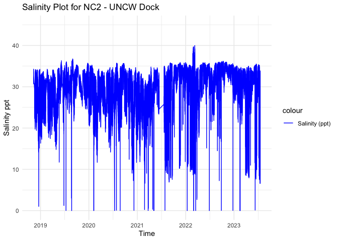
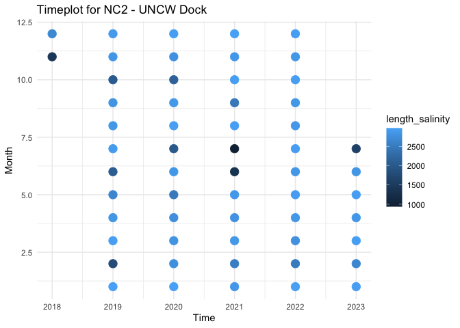

NC2 - Processed Environmental Data
================
Madeline Eppley
8/16/2023

``` r
setwd("/Users/madelineeppley/GitHub/EasternOysterEnvData/2022_SiteEnvironmentData")
```

### Load required packages.

``` r
library("dplyr") #Used for working with data frames
```

    ## 
    ## Attaching package: 'dplyr'

    ## The following objects are masked from 'package:stats':
    ## 
    ##     filter, lag

    ## The following objects are masked from 'package:base':
    ## 
    ##     intersect, setdiff, setequal, union

``` r
library("lubridate") #Used for time-date conversions
```

    ## 
    ## Attaching package: 'lubridate'

    ## The following objects are masked from 'package:base':
    ## 
    ##     date, intersect, setdiff, union

``` r
library("readr") #Used to read the CSV file
library("ggplot2") 
```

### Note the date of data download and source. All available data should be used for each site regardless of year. Note from the CSV file how often the site was sampled, and if there are replicates in the data. Also describe if the sampling occurred at only low tide, only high tide, or continuously.

``` r
#Data was downloaded on 8/16/2023
#Source - https://cormp.org/?health=Off&quality=Off&units=English&duration=3%20days&maps=storm_tracks&legend=Off&forecast=Point&hti=&nhc=undefined&nhcWinds=undefined&sst=&current=&datum=MLLW&windPrediction=wind%20speed%20prediction&region=&bbox=-83.3642578125,31.062345409804408,-72.63061523437501,36.5184659896759&iframe=null&mode=home&platform=CMSDOCK&skipState=true - UNCW's Shellfish Research Hatchery at the Center for Marine Science and NCNERR, station code CMSDOCK

#Create text strings with metadata information that we want to include in the final data frame. 
download_date <- ("08-16-2023")
source_description <- ("UNCW's Shellfish Research Hatchery at the Center for Marine Science and NCNERR - CMSDOCK")
# CMSDOCK Water temperature (deg F) @ 0 m (depth)
site_name <- ("NC2") #Use site code with site number based on lat position and state
collection_type <- ("weekly_continuous")
```

### Use the file path name in your working directory or desktop, see example below. Or, import data set through the “Files” window in R studio. Store the file in a variable with the “raw_ID_Site” format. If salinity and temperature data are in separate files, read in both and store them with “\_sal” or “\_temp” in the variable names.

``` r
#The file we will be working with is from Grand Bay, MS. The ID_Site for this site is NC2. 
raw_NC2_sal <- read_csv("/Users/madelineeppley/GitHub/EasternOysterEnvData/2022_SiteEnvironmentData/NC2-raw_sal.csv")
```

    ## Rows: 152560 Columns: 2
    ## ── Column specification ────────────────────────────────────────────────────────
    ## Delimiter: ","
    ## chr (1): Time
    ## dbl (1): CMSDOCK Salinity (ppt)
    ## 
    ## ℹ Use `spec()` to retrieve the full column specification for this data.
    ## ℹ Specify the column types or set `show_col_types = FALSE` to quiet this message.

``` r
raw_NC2_temp <- read_csv("/Users/madelineeppley/GitHub/EasternOysterEnvData/2022_SiteEnvironmentData/NC2-raw_temp.csv")
```

    ## Rows: 152137 Columns: 2
    ## ── Column specification ────────────────────────────────────────────────────────
    ## Delimiter: ","
    ## chr (1): Time
    ## dbl (1): CMSDOCK Water temperature (deg F)
    ## 
    ## ℹ Use `spec()` to retrieve the full column specification for this data.
    ## ℹ Specify the column types or set `show_col_types = FALSE` to quiet this message.

``` r
# View how the data is stored. Note the variable names and the format and units that the data are stored in.  
spec(raw_NC2_sal)
```

    ## cols(
    ##   Time = col_character(),
    ##   `CMSDOCK Salinity (ppt)` = col_double()
    ## )

``` r
View(raw_NC2_sal)

spec(raw_NC2_temp)
```

    ## cols(
    ##   Time = col_character(),
    ##   `CMSDOCK Water temperature (deg F)` = col_double()
    ## )

``` r
View(raw_NC2_temp)
```

### Start with the date and time of collection. We will use the lubridate package to standardize all values into the date-time format called POSIXct. This format stores the date and time in number of seconds since a past point (1/1/1970). This makes comparisons easy and helps to standardizes values.

``` r
# SKIP combining, date and time of collection is already in a column together 

# Use unclass to view the way that the time and date are stored 
# unclass(raw_NC2$DateTimeStamp)
# The data is stored in month-day-yearXX hours(12):minutes format

#Convert to POSIXct format. Store it into a column named datetime in the data frame.
raw_NC2_sal$datetime <- as.POSIXct(raw_NC2_sal$Time, "%m/%d/%y %H:%M", tz = "")
raw_NC2_temp$datetime <- as.POSIXct(raw_NC2_temp$Time, "%m/%d/%y %H:%M", tz = "")

#Print the new data frame and examine to make sure the new datetime column is in the correct format. 
summary(raw_NC2_sal)
```

    ##      Time           CMSDOCK Salinity (ppt)    datetime                     
    ##  Length:152560      Min.   :  0.00         Min.   :2018-11-09 10:15:00.00  
    ##  Class :character   1st Qu.: 25.54         1st Qu.:2020-01-25 02:56:15.00  
    ##  Mode  :character   Median : 29.46         Median :2021-03-29 07:07:30.00  
    ##                     Mean   : 28.69         Mean   :2021-04-02 09:39:41.51  
    ##                     3rd Qu.: 32.67         3rd Qu.:2022-06-15 00:03:45.00  
    ##                     Max.   :199.20         Max.   :2023-07-17 23:45:00.00

``` r
summary(raw_NC2_temp)
```

    ##      Time           CMSDOCK Water temperature (deg F)
    ##  Length:152137      Min.   :-12566.20                
    ##  Class :character   1st Qu.:    56.50                
    ##  Mode  :character   Median :    67.21                
    ##                     Mean   :    65.97                
    ##                     3rd Qu.:    79.03                
    ##                     Max.   :    92.26                
    ##     datetime                     
    ##  Min.   :2018-11-09 10:15:00.00  
    ##  1st Qu.:2020-01-24 00:30:00.00  
    ##  Median :2021-03-27 02:00:00.00  
    ##  Mean   :2021-04-01 00:05:44.69  
    ##  3rd Qu.:2022-06-13 03:15:00.00  
    ##  Max.   :2023-07-17 23:45:00.00

### Combine the two separate data frames into one using an inner join function

``` r
# Join the data frames by common time using the dateTime column
raw_NC2 <- raw_NC2_sal %>%
  inner_join(raw_NC2_temp, by = "datetime")

# We now have "double" columns for time. Remove that column. 
raw_NC2 <- subset(raw_NC2, select = -c(Time.y, Time.x))

#Standardize column and variable names. We will use "temp" for temperature in degrees C, "salinity" for salinity in parts per thousand (ppt), "lat" for latitude in degrees, and "lon" for longitude in degrees. 
#Use the dyplr format to rename multiple columns in the format "dataframe %>% rename("new name 1" = "old name 1", "new name 2", "old name 2")
raw_NC2 <- raw_NC2 %>% rename("temp" = "CMSDOCK Water temperature (deg F)", "salinity" = "CMSDOCK Salinity (ppt)") 
```

### Analyze the ranges of all of our variables of interest - time, salinity, and temperature. Make sure that the latitude and longitude values are consistent for a static collection site. This is a quick check so we can determine how to conduct the next filtering step.

``` r
#Print the range (minimum and maximum) of dates of data collection. 
print(summary(raw_NC2$datetime))
```

    ##                       Min.                    1st Qu. 
    ## "2018-11-09 10:15:00.0000" "2020-01-24 00:30:00.0000" 
    ##                     Median                       Mean 
    ## "2021-03-27 02:00:00.0000" "2021-04-01 00:05:44.6853" 
    ##                    3rd Qu.                       Max. 
    ## "2022-06-13 03:15:00.0000" "2023-07-17 23:45:00.0000"

``` r
#Print the range (minimum and maximum) of the salinity values. 
print(summary(raw_NC2$salinity))
```

    ##    Min. 1st Qu.  Median    Mean 3rd Qu.    Max. 
    ##    0.00   25.53   29.45   28.69   32.66  199.20

``` r
#Print the range (minimum and maximum) of the temperature values.
print(summary(raw_NC2$temp))
```

    ##      Min.   1st Qu.    Median      Mean   3rd Qu.      Max. 
    ## -12566.20     56.50     67.21     65.97     79.03     92.26

``` r
#Store variables that we will include in the final data frame. Pull metadata from metadata file in download .zip file. 
lat <- 34.14
lon <- - 77.8625
firstyear <- 2018
finalyear <- 2023
```

### Filter any of the variables that have data points outside of normal range. We will use 0-40 as the accepted range for salinity (ppt) and temperature (C) values. Note, in the summer, salinity values can sometimes exceed 40. Check to see if there are values above 40. In this case, adjust the range or notify someone that the site has particularly high salinity values.

``` r
#Filter the data between the values of 0 and 40 for salinity and  32 - 100 for temperature (this site is in degrees F) 
filtered_NC2 <- raw_NC2 %>%
    filter(between(salinity, 0, 40) & between(temp, 32, 100))

# Sanity check - print the ranges to ensure values are filtered properly. We can see that the ranges for both are now in the appropriate range.  
print(summary(filtered_NC2$salinity))
```

    ##    Min. 1st Qu.  Median    Mean 3rd Qu.    Max. 
    ##    0.00   25.53   29.44   28.62   32.65   39.99

``` r
print(summary(filtered_NC2$temp))
```

    ##    Min. 1st Qu.  Median    Mean 3rd Qu.    Max. 
    ##   32.00   56.50   67.23   67.39   79.05   92.26

``` r
#Store our data into a variable name with just the site name. 
NC2 <- filtered_NC2
```

### Visualize the salinity, temperature, and date ranges over time. This can help us see if there are any anomalies or gaps in the data and make sure the filtering was done correctly. Sanity check - do the temperature and salinity ranges look appropriate for the geography of the site (ex. near full ocean salinity for coastal sites, lower salinity for estuaries or near rivers)?

``` r
salplot <- ggplot(NC2, aes(x = datetime)) +
    geom_line(aes(y = salinity, color = "Salinity (ppt)")) +
    ylim(0,45) +
    labs(x = "Time", y = "Salinity ppt", title = "Salinity Plot for NC2 - UNCW Dock") +
    scale_color_manual(values = c("Salinity (ppt)" = "blue")) +
    theme_minimal()


salplot
```

<!-- -->

``` r
tempplot <- ggplot(NC2, aes(x = datetime)) +
    geom_line(aes(y = temp, color = "Temperature (C)")) +
    ylim(20, 100) +
    labs(x = "Time", y = "Temperature C", title = "Temperature Plot for NC2 - UNCW Dock") +
    scale_color_manual(values = c( "Temperature (C)" = "red")) +
    theme_minimal()


tempplot
```

<!-- -->

### We need to calculate the mean, maximum, and minimum values for salinity and temperature per month and year. First make two data frames to contain each of the annual and monthly averages.

``` r
#Calculate the mean, maximum, and minimum values for salinity and temperature for each month. 
NC2_envrmonth <- NC2 %>%
    mutate(year = year(datetime), month = month(datetime)) %>%
    group_by(year, month) %>%
    summarise(
      min_salinity = min(salinity),
      max_salinity = max(salinity),
      mean_salinity = mean(salinity),
      length_salinity = length(salinity),
      min_temp = min(temp),
      max_temp = max(temp),
      mean_temp = mean(temp),
      length_temp = length(temp))
```

    ## `summarise()` has grouped output by 'year'. You can override using the
    ## `.groups` argument.

``` r
print(NC2_envrmonth)
```

    ## # A tibble: 57 × 10
    ## # Groups:   year [6]
    ##     year month min_salinity max_salinity mean_salinity length_salinity min_temp
    ##    <dbl> <dbl>        <dbl>        <dbl>         <dbl>           <int>    <dbl>
    ##  1  2018    11        19.5          34.3          26.4            1429     49.0
    ##  2  2018    12         1.02         34.2          24.5            2678     46.5
    ##  3  2019     1        16.3          33.7          25.7            2972     43.4
    ##  4  2019     2        18.8          34.2          27.1            1801     46.1
    ##  5  2019     3        17.4          32.8          25.1            2965     50.5
    ##  6  2019     4        14.8          34.1          24.2            2851     50.9
    ##  7  2019     5        11.7          34.5          27.2            2650     70.1
    ##  8  2019     6         1.24         36.3          29.1            2073     73.8
    ##  9  2019     7         0.03         36.0          29.9            2913     77.8
    ## 10  2019     8         0            36.8          29.9            2859     32  
    ## # ℹ 47 more rows
    ## # ℹ 3 more variables: max_temp <dbl>, mean_temp <dbl>, length_temp <int>

``` r
#Calculate the mean, maximum, and minimum values for salinity and temperature for each year. 
NC2_envryear <- NC2 %>%
    mutate(year = year(datetime)) %>%
    group_by(year) %>%
    summarise(
      min_salinity = min(salinity),
      max_salinity = max(salinity),
      mean_salinity = mean(salinity),
      min_temp = min(temp),
      max_temp = max(temp),
      mean_temp = mean(temp))

print(NC2_envryear)
```

    ## # A tibble: 6 × 7
    ##    year min_salinity max_salinity mean_salinity min_temp max_temp mean_temp
    ##   <dbl>        <dbl>        <dbl>         <dbl>    <dbl>    <dbl>     <dbl>
    ## 1  2018         1.02         34.3          25.2     46.5     69.2      55.4
    ## 2  2019         0            36.8          28.3     32       89.8      68.4
    ## 3  2020         0            35.7          26.3     32       92.3      67.3
    ## 4  2021         0.01         35.9          28.1     43.3     90.5      66.8
    ## 5  2022         0            40.0          31.5     32       91.3      68.9
    ## 6  2023         0            35.5          29.6     32       90.8      66.7

### Plot the months and years of data collection to check if there are any collection gaps in the data.

``` r
timeplot <- ggplot(NC2_envrmonth, aes(x = year)) +
    geom_point(aes(y = month, color = length_salinity), size = 4) +
    labs(x = "Time", y = "Month", title = "Timeplot for NC2 - UNCW Dock") +
    ylim(1,12) +
    theme_minimal()

timeplot
```

<!-- -->

### We can now calculate a list of variables that we will have collected for all sites. This will allow us to compare sites easily. We will calculate the number of observations from each site, the mean annual, maximum annual, and minimum annual value for all variables.

Our list of variables includes:

- Mean_Annual_Temperature_C: average of all available data

- Mean_max_temperature_C: average of maximums for each year

- Mean_min_temperature_C: average of minimums for each year

- Temperature_st_dev: standard deviation of all available data

- Temperature_n: total number of data points

- Temperature_years: number of years in data set

- Mean_Annual_Salinity_ppt: average of all available data

- Mean_min_Salinity_ppt: average of minimums for each year

- Mean_max_Salinity_ppt: average of maximums for each year

- Salinity_st_dev: standard deviation of all available data

- Salinity_n: total number of data points

- Salinity_years: number of years in data set

``` r
#Calculate temperature variables. 
Mean_Annual_Temperature_C <- mean(NC2$temp)
Mean_max_temperature_C <- mean(NC2_envryear$max_temp)
Mean_min_temperature_C <- mean(NC2_envryear$min_temp)
Temperature_st_dev <- sd(NC2$temp)
Temperature_n <- nrow(NC2)
Temperature_years <- nrow(NC2_envryear)

#Create a data frame to store the temperature results
NC2_temp <- cbind(site_name, download_date, source_description, lat, lon, firstyear, finalyear, Mean_Annual_Temperature_C, Mean_max_temperature_C, Mean_min_temperature_C, Temperature_st_dev, Temperature_n, Temperature_years, collection_type)
print(NC2_temp)
```

    ##      site_name download_date
    ## [1,] "NC2"     "08-16-2023" 
    ##      source_description                                                                        
    ## [1,] "UNCW's Shellfish Research Hatchery at the Center for Marine Science and NCNERR - CMSDOCK"
    ##      lat     lon        firstyear finalyear Mean_Annual_Temperature_C
    ## [1,] "34.14" "-77.8625" "2018"    "2023"    "67.388767850797"        
    ##      Mean_max_temperature_C Mean_min_temperature_C Temperature_st_dev
    ## [1,] "87.3133333333333"     "36.3016666666667"     "12.1916715921498"
    ##      Temperature_n Temperature_years collection_type    
    ## [1,] "151954"      "6"               "weekly_continuous"

``` r
# Write to the combined file with all sites 
write.table(NC2_temp, "/Users/madelineeppley/GitHub/EasternOysterEnvData/2022_SiteEnvironmentData/Seascape_Processed/seascape_temperature.csv", sep = ",", append = TRUE, col.names = FALSE, row.names = FALSE) # The column names should be changed to FALSE after 1st row is added to the data frame

# Write to a unique new CSV file
write.csv(NC2_temp, "/Users/madelineeppley/GitHub/EasternOysterEnvData/2022_SiteEnvironmentData/Seascape_Processed/NC2_temperature.csv")
```

``` r
#Calculate the salinity variables
Mean_Annual_Salinity_ppt <- mean(NC2$salinity)
Mean_max_Salinity_ppt <- mean(NC2_envryear$max_salinity)
Mean_min_Salinity_ppt <- mean(NC2_envryear$min_salinity)
Salinity_st_dev <- sd(NC2$salinity)
Salinity_n <- nrow(NC2)
Salinity_years <- nrow(NC2_envryear)


#Create a data frame to store the temperature results
NC2_salinity <- cbind(site_name, download_date, source_description, lat, lon, firstyear, finalyear, Mean_Annual_Salinity_ppt, Mean_max_Salinity_ppt, Mean_min_Salinity_ppt, Salinity_st_dev, Salinity_n, Salinity_years, collection_type)
print(NC2_salinity)
```

    ##      site_name download_date
    ## [1,] "NC2"     "08-16-2023" 
    ##      source_description                                                                        
    ## [1,] "UNCW's Shellfish Research Hatchery at the Center for Marine Science and NCNERR - CMSDOCK"
    ##      lat     lon        firstyear finalyear Mean_Annual_Salinity_ppt
    ## [1,] "34.14" "-77.8625" "2018"    "2023"    "28.6229076562644"      
    ##      Mean_max_Salinity_ppt Mean_min_Salinity_ppt Salinity_st_dev    Salinity_n
    ## [1,] "36.3583333333333"    "0.171666666666667"   "5.01832378348092" "151954"  
    ##      Salinity_years collection_type    
    ## [1,] "6"            "weekly_continuous"

``` r
# Write to the combined file with all sites 
write.table(NC2_salinity, "/Users/madelineeppley/GitHub/EasternOysterEnvData/2022_SiteEnvironmentData/Seascape_Processed/seascape_salinity.csv", sep = ",", append = TRUE, col.names = FALSE, row.names = FALSE) # The column names should be changed to FALSE after 1st row is added to the data frame

# Write to a unique new CSV file
write.csv(NC2_salinity, "/Users/madelineeppley/GitHub/EasternOysterEnvData/2022_SiteEnvironmentData/Seascape_Processed/NC2_salinity.csv")
```
