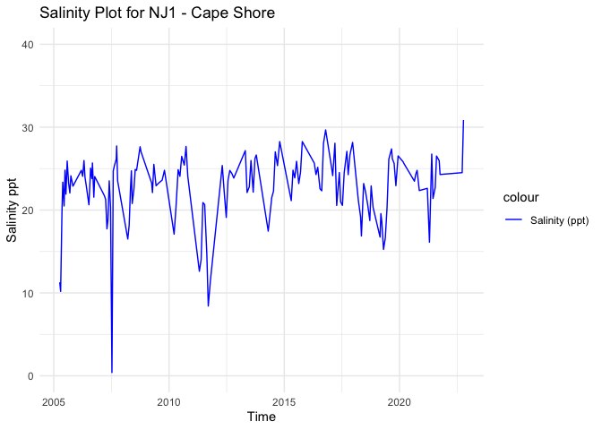
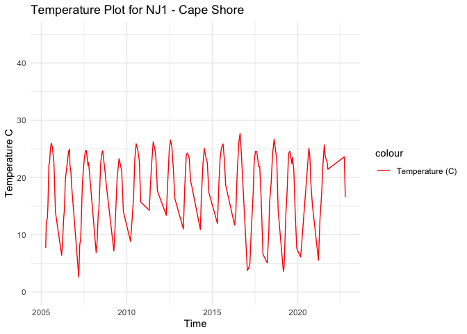
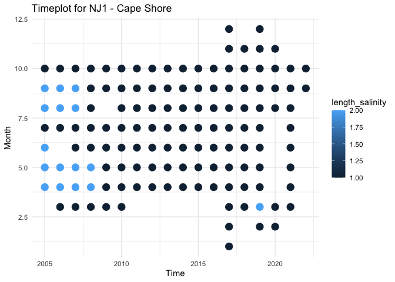

NJ1 - Processed Environmental Data
================
Madeline Eppley
8/18/2023

``` r
setwd("/Users/madelineeppley/GitHub/EasternOysterEnvData/2022_SiteEnvironmentData")
```

### Load required packages.

``` r
library("dplyr") #Used for working with data frames
```

    ## 
    ## Attaching package: 'dplyr'

    ## The following objects are masked from 'package:stats':
    ## 
    ##     filter, lag

    ## The following objects are masked from 'package:base':
    ## 
    ##     intersect, setdiff, setequal, union

``` r
library("lubridate") #Used for time-date conversions
```

    ## 
    ## Attaching package: 'lubridate'

    ## The following objects are masked from 'package:base':
    ## 
    ##     date, intersect, setdiff, union

``` r
library("readr") #Used to read the CSV file
library("ggplot2") 
```

### Note the date of data download and source. All available data should be used for each site regardless of year. Note from the CSV file how often the site was sampled, and if there are replicates in the data. Also describe if the sampling occurred at only low tide, only high tide, or continuously.

``` r
#Data was downloaded on 8/18/2023
#Source - https://cema.udel.edu/applications/waterquality/
#The site was sampled once per month, on average, at random (not the same day every month). 

#Create text strings with metadata information that we want to include in the final data frame. 
download_date <- ("08-18-2023")
source_description <- ("Delaware Water Quality - CEMA at University of Delaware")
site_name <- ("NJ1") #Use site code with site number based on lat position and state
collection_type <- ("monthly")
```

### Use the file path name in your working directory or desktop, see example below. Or, import data set through the “Files” window in R studio. Store the file in a variable with the “raw_ID_Site” format. If salinity and temperature data are in separate files, read in both and store them with “\_sal” or “\_temp” in the variable names.

``` r
#The file we will be working with is from Cape Shore, NJ. 
raw_NJ1 <- read_csv("/Users/madelineeppley/GitHub/EasternOysterEnvData/2022_SiteEnvironmentData/NJ1-raw.csv")
```

    ## Rows: 154 Columns: 38
    ## ── Column specification ────────────────────────────────────────────────────────
    ## Delimiter: ","
    ## chr  (28): station_id, water_temp_result_type, water_temp_detection_conditio...
    ## dbl   (9): water_temp_value, ph_value, salinity_value, nutrient_nitrogen_val...
    ## dttm  (1): timestamp
    ## 
    ## ℹ Use `spec()` to retrieve the full column specification for this data.
    ## ℹ Specify the column types or set `show_col_types = FALSE` to quiet this message.

``` r
# View how the data is stored. Note the variable names and the format and units that the data are stored in.  
spec(raw_NJ1)
```

    ## cols(
    ##   station_id = col_character(),
    ##   timestamp = col_datetime(format = ""),
    ##   water_temp_result_type = col_character(),
    ##   water_temp_detection_condition = col_character(),
    ##   water_temp_value = col_double(),
    ##   water_temp_units = col_character(),
    ##   ph_result_type = col_character(),
    ##   ph_detection_condition = col_character(),
    ##   ph_value = col_double(),
    ##   ph_units = col_character(),
    ##   salinity_result_type = col_character(),
    ##   salinity_detection_condition = col_character(),
    ##   salinity_value = col_double(),
    ##   salinity_units = col_character(),
    ##   nutrient_nitrogen_result_type = col_character(),
    ##   nutrient_nitrogen_detection_condition = col_character(),
    ##   nutrient_nitrogen_value = col_double(),
    ##   nutrient_nitrogen_units = col_character(),
    ##   phosphate_phosphorus_result_type = col_character(),
    ##   phosphate_phosphorus_detection_condition = col_character(),
    ##   phosphate_phosphorus_value = col_double(),
    ##   phosphate_phosphorus_units = col_character(),
    ##   chlora_result_type = col_character(),
    ##   chlora_detection_condition = col_character(),
    ##   chlora_value = col_double(),
    ##   chlora_units = col_character(),
    ##   enterococcus_result_type = col_character(),
    ##   enterococcus_detection_condition = col_character(),
    ##   enterococcus_value = col_double(),
    ##   enterococcus_units = col_character(),
    ##   tss_result_type = col_character(),
    ##   tss_detection_condition = col_character(),
    ##   tss_value = col_double(),
    ##   tss_units = col_character(),
    ##   do_result_type = col_character(),
    ##   do_detection_condition = col_character(),
    ##   do_value = col_double(),
    ##   do_units = col_character()
    ## )

``` r
View(raw_NJ1)
```

### Start with the date and time of collection. We will use the lubridate package to standardize all values into the date-time format called POSIXct. This format stores the date and time in number of seconds since a past point (1/1/1970). This makes comparisons easy and helps to standardizes values.

``` r
#Convert to POSIXct format. Store it into a column named datetime in the data frame. Use the year-month-day hours:minutes:seconds format. 
raw_NJ1$datetime <- as.POSIXct(raw_NJ1$timestamp, format = "%z-%m-%d %I:%M:%S")

#Print the new data frame and examine to make sure the new datetime column is in the correct format. 
print(raw_NJ1)
```

    ## # A tibble: 154 × 39
    ##    station_id  timestamp           water_temp_result_type water_temp_detection…¹
    ##    <chr>       <dttm>              <chr>                  <chr>                 
    ##  1 31DELRBC_W… 2010-03-22 07:05:00 Actual                 Detected              
    ##  2 31DELRBC_W… 2010-10-25 08:50:00 Actual                 Detected              
    ##  3 31DELRBC_W… 2010-05-25 07:34:00 Actual                 Detected              
    ##  4 31DELRBC_W… 2010-08-30 08:18:00 Actual                 Detected              
    ##  5 31DELRBC_W… 2010-06-22 07:22:00 Actual                 Detected              
    ##  6 31DELRBC_W… 2010-07-20 07:44:00 Actual                 Detected              
    ##  7 31DELRBC_W… 2010-04-20 06:33:00 Actual                 Detected              
    ##  8 31DELRBC_W… 2010-09-27 10:03:00 Actual                 Detected              
    ##  9 31DELRBC_W… 2011-08-22 09:42:00 Actual                 Detected              
    ## 10 31DELRBC_W… 2011-09-14 08:42:00 Actual                 Detected              
    ## # ℹ 144 more rows
    ## # ℹ abbreviated name: ¹​water_temp_detection_condition
    ## # ℹ 35 more variables: water_temp_value <dbl>, water_temp_units <chr>,
    ## #   ph_result_type <chr>, ph_detection_condition <chr>, ph_value <dbl>,
    ## #   ph_units <chr>, salinity_result_type <chr>,
    ## #   salinity_detection_condition <chr>, salinity_value <dbl>,
    ## #   salinity_units <chr>, nutrient_nitrogen_result_type <chr>, …

### Analyze the ranges of all of our variables of interest - time, salinity, and temperature. Make sure that the latitude and longitude values are consistent for a static collection site. This is a quick check so we can determine how to conduct the next filtering step.

``` r
#Standardize column and variable names. We will use "temp" for temperature in degrees C, "salinity" for salinity in parts per thousand (ppt), "lat" for latitude in degrees, and "lon" for longitude in degrees. 
#Use the dyplr format to rename multiple columns in the format "dataframe %>% rename("new name 1" = "old name 1", "new name 2", "old name 2")
raw_NJ1 <- raw_NJ1 %>% rename("temp" = "water_temp_value", "salinity" = "salinity_value")

#Remove some rows that have NA's
raw_NJ1 <- raw_NJ1[-c(25,121,146),]

#Print the range (minimum and maximum) of dates of data collection. 
print(range(raw_NJ1$datetime))
```

    ## [1] "2005-04-05 08:04:00 UTC" "2022-10-10 09:09:00 UTC"

``` r
#Print the range (minimum and maximum) of the salinity values. 
print(range(raw_NJ1$salinity))
```

    ## [1]  0.40 30.86

``` r
#Print the range (minimum and maximum) of the temperature values.
print(range(raw_NJ1$temp))
```

    ## [1]  2.61 27.70

``` r
#Store variables that we will include in the final data frame
lat <- 39.085
lon <- -75.186
firstyear <- 2005
finalyear <- 2022
```

### Filter any of the variables that have data points outside of normal range. We will use 0-40 as the accepted range for salinity (ppt) and temperature (C) values. Note, in the summer, salinity values can sometimes exceed 40. Check to see if there are values above 40. In this case, adjust the range or notify someone that the site has particularly high salinity values.

``` r
#Filter the data between the values of 0 and 40 for both salinity and temperature. 
filtered_NJ1 <- raw_NJ1 %>%
    filter(between(salinity, 0, 40) & between(temp, 0, 40))

# Sanity check - print the ranges to ensure values are filtered properly. We can see that the ranges for both are now in the appropriate range.  
print(summary(filtered_NJ1$salinity))
```

    ##    Min. 1st Qu.  Median    Mean 3rd Qu.    Max. 
    ##    0.40   20.93   23.52   22.71   25.38   30.86

``` r
print(summary(filtered_NJ1$temp))
```

    ##    Min. 1st Qu.  Median    Mean 3rd Qu.    Max. 
    ##    2.61   13.63   19.62   18.16   23.55   27.70

``` r
#Store our data into a variable name with just the site name. 
NJ1 <- filtered_NJ1
```

### Visualize the salinity, temperature, and date ranges over time. This can help us see if there are any anomalies or gaps in the data and make sure the filtering was done correctly. Sanity check - do the temperature and salinity ranges look appropriate for the geography of the site (ex. near full ocean salinity for coastal sites, lower salinity for estuaries or near rivers)?

``` r
salplot <- ggplot(NJ1, aes(x = datetime)) +
    geom_line(aes(y = salinity, color = "Salinity (ppt)")) +
    ylim(0,40) +
    labs(x = "Time", y = "Salinity ppt", title = "Salinity Plot for NJ1 - Cape Shore") +
    scale_color_manual(values = c("Salinity (ppt)" = "blue")) +
    theme_minimal()

salplot
```

<!-- -->

``` r
tempplot <- ggplot(NJ1, aes(x = datetime)) +
    geom_line(aes(y = temp, color = "Temperature (C)")) +
    ylim(0, 45) +
    labs(x = "Time", y = "Temperature C", title = "Temperature Plot for NJ1 - Cape Shore") +
    scale_color_manual(values = c( "Temperature (C)" = "red")) +
    theme_minimal()


tempplot
```

<!-- -->

### We need to calculate the mean, maximum, and minimum values for salinity and temperature per month and year. First make two data frames to contain each of the annual and monthly averages.

``` r
#Calculate the mean, maximum, and minimum values for salinity and temperature for each month. 
NJ1_envrmonth <- NJ1 %>%
    mutate(year = year(datetime), month = month(datetime)) %>%
    group_by(year, month) %>%
    summarise(
      min_salinity = min(salinity),
      max_salinity = max(salinity),
      mean_salinity = mean(salinity),
      length_salinity = length(salinity),
      min_temp = min(temp),
      max_temp = max(temp),
      mean_temp = mean(temp),
      length_temp = length(temp))
```

    ## `summarise()` has grouped output by 'year'. You can override using the
    ## `.groups` argument.

``` r
print(NJ1_envrmonth)
```

    ## # A tibble: 135 × 10
    ## # Groups:   year [18]
    ##     year month min_salinity max_salinity mean_salinity length_salinity min_temp
    ##    <dbl> <dbl>        <dbl>        <dbl>         <dbl>           <int>    <dbl>
    ##  1  2005     4         10.2         11.3          10.7               2     7.71
    ##  2  2005     5         20.1         23.4          21.7               2    12.8 
    ##  3  2005     6         20.5         24.8          22.6               2    22.3 
    ##  4  2005     7         21.9         21.9          21.9               1    24.7 
    ##  5  2005     8         23.3         25.9          24.6               2    25.4 
    ##  6  2005     9         22.1         24.1          23.1               2    22.6 
    ##  7  2005    10         22.9         22.9          22.9               1    13.9 
    ##  8  2006     3         24.8         24.8          24.8               1     6.38
    ##  9  2006     4         24.1         26.0          25.0               2     9.23
    ## 10  2006     5         22.9         24.0          23.4               2    14.4 
    ## # ℹ 125 more rows
    ## # ℹ 3 more variables: max_temp <dbl>, mean_temp <dbl>, length_temp <int>

``` r
#Calculate the mean, maximum, and minimum values for salinity and temperature for each year. 
NJ1_envryear <- NJ1 %>%
    mutate(year = year(datetime)) %>%
    group_by(year) %>%
    summarise(
      min_salinity = min(salinity),
      max_salinity = max(salinity),
      mean_salinity = mean(salinity),
      min_temp = min(temp),
      max_temp = max(temp),
      mean_temp = mean(temp))

print(NJ1_envryear)
```

    ## # A tibble: 18 × 7
    ##     year min_salinity max_salinity mean_salinity min_temp max_temp mean_temp
    ##    <dbl>        <dbl>        <dbl>         <dbl>    <dbl>    <dbl>     <dbl>
    ##  1  2005        10.2          25.9          20.9     7.71     26.0      19.1
    ##  2  2006        20.6          26.0          23.9     6.38     24.9      17.8
    ##  3  2007         0.4          27.7          20.9     2.61     24.7      17.8
    ##  4  2008        16.5          27.6          23.0     6.86     24.6      17.1
    ##  5  2009        22.1          25.5          23.6     7.16     23.3      15.4
    ##  6  2010        17.1          27.7          23.7     8.83     25.9      18.7
    ##  7  2011         8.42         20.9          14.7    14.2      26.2      21.2
    ##  8  2012        19.1          25.4          23.4    13.4      26.6      20.9
    ##  9  2013        22.1          27.2          24.7    11        24.3      19.8
    ## 10  2014        17.4          28.3          23.0    10.9      25.1      19.8
    ## 11  2015        21.1          28.3          24.5    11.9      25.8      20.9
    ## 12  2016        22.3          29.7          25.4    11.7      27.7      20.4
    ## 13  2017        20.6          28.2          24.6     3.74     24.6      14.9
    ## 14  2018        16.9          23.2          20.6     5.06     26.7      18.1
    ## 15  2019        15.2          27.4          21.8     3.58     24.6      15.4
    ## 16  2020        22.4          25.8          24.4     6.13     25.1      16.0
    ## 17  2021        16.1          26.8          23.3     5.54     25.7      18.8
    ## 18  2022        24.5          30.9          27.7    16.6      23.6      20.1

### Plot the months and years of data collection to check if there are any collection gaps in the data.

``` r
timeplot <- ggplot(NJ1_envrmonth, aes(x = year)) +
    geom_point(aes(y = month, color = length_salinity), size = 4) +
    labs(x = "Time", y = "Month", title = "Timeplot for NJ1 - Cape Shore") +
    ylim(1,12) +
    theme_minimal()

timeplot
```

<!-- -->

### We can now calculate a list of variables that we will have collected for all sites. This will allow us to compare sites easily. We will calculate the number of observations from each site, the mean annual, maximum annual, and minimum annual value for all variables.

Our list of variables includes:

- Mean_Annual_Temperature_C: average of all available data

- Mean_max_temperature_C: average of maximums for each year

- Mean_min_temperature_C: average of minimums for each year

- Temperature_st_dev: standard deviation of all available data

- Temperature_n: total number of data points

- Temperature_years: number of years in data set

- Mean_Annual_Salinity_ppt: average of all available data

- Mean_min_Salinity_ppt: average of minimums for each year

- Mean_max_Salinity_ppt: average of maximums for each year

- Salinity_st_dev: standard deviation of all available data

- Salinity_n: total number of data points

- Salinity_years: number of years in data set

``` r
#Calculate temperature variables. 
Mean_Annual_Temperature_C <- mean(NJ1$temp)
Mean_max_temperature_C <- mean(NJ1_envryear$max_temp)
Mean_min_temperature_C <- mean(NJ1_envryear$min_temp)
Temperature_st_dev <- sd(NJ1$temp)
Temperature_n <- nrow(NJ1)
Temperature_years <- nrow(NJ1_envryear)

#Create a data frame to store the temperature results
NJ1_temp <- cbind(site_name, download_date, source_description, lat, lon, firstyear, finalyear, Mean_Annual_Temperature_C, Mean_max_temperature_C, Mean_min_temperature_C, Temperature_st_dev, Temperature_n, Temperature_years, collection_type)
print(NJ1_temp)
```

    ##      site_name download_date
    ## [1,] "NJ1"     "08-18-2023" 
    ##      source_description                                        lat     
    ## [1,] "Delaware Water Quality - CEMA at University of Delaware" "39.085"
    ##      lon       firstyear finalyear Mean_Annual_Temperature_C
    ## [1,] "-75.186" "2005"    "2022"    "18.163642384106"        
    ##      Mean_max_temperature_C Mean_min_temperature_C Temperature_st_dev
    ## [1,] "25.2955555555556"     "8.51944444444444"     "6.52440960122765"
    ##      Temperature_n Temperature_years collection_type
    ## [1,] "151"         "18"              "monthly"

``` r
write.table(NJ1_temp, "/Users/madelineeppley/GitHub/EasternOysterEnvData/2022_SiteEnvironmentData/Seascape_Processed/seascape_temperature.csv", sep = ",", append = TRUE, col.names = TRUE, row.names = FALSE) # The column names should be changed to FALSE after 1st row is added to the data frame
```

    ## Warning in write.table(NJ1_temp,
    ## "/Users/madelineeppley/GitHub/EasternOysterEnvData/2022_SiteEnvironmentData/Seascape_Processed/seascape_temperature.csv", :
    ## appending column names to file

``` r
# Write to a unique new CSV file
write.csv(NJ1_temp, "/Users/madelineeppley/GitHub/EasternOysterEnvData/2022_SiteEnvironmentData/Seascape_Processed/NJ1_temperature.csv")
```

``` r
#Calculate the salinity variables
Mean_Annual_Salinity_ppt <- mean(NJ1$salinity)
Mean_max_Salinity_ppt <- mean(NJ1_envryear$max_salinity)
Mean_min_Salinity_ppt <- mean(NJ1_envryear$min_salinity)
Salinity_st_dev <- sd(NJ1$salinity)
Salinity_n <- nrow(NJ1)
Salinity_years <- nrow(NJ1_envryear)


#Create a data frame to store the temperature results
NJ1_salinity <- cbind(site_name, download_date, source_description, lat, lon, firstyear, finalyear, Mean_Annual_Salinity_ppt, Mean_max_Salinity_ppt, Mean_min_Salinity_ppt, Salinity_st_dev, Salinity_n, Salinity_years, collection_type)
print(NJ1_salinity)
```

    ##      site_name download_date
    ## [1,] "NJ1"     "08-18-2023" 
    ##      source_description                                        lat     
    ## [1,] "Delaware Water Quality - CEMA at University of Delaware" "39.085"
    ##      lon       firstyear finalyear Mean_Annual_Salinity_ppt
    ## [1,] "-75.186" "2005"    "2022"    "22.7090066225166"      
    ##      Mean_max_Salinity_ppt Mean_min_Salinity_ppt Salinity_st_dev  Salinity_n
    ## [1,] "26.7922222222222"    "17.3944444444444"    "4.247331359017" "151"     
    ##      Salinity_years collection_type
    ## [1,] "18"           "monthly"

``` r
write.table(NJ1_salinity, "/Users/madelineeppley/GitHub/EasternOysterEnvData/2022_SiteEnvironmentData/Seascape_Processed/seascape_salinity.csv", sep = ",", append = TRUE, col.names = TRUE, row.names = FALSE) # The column names should be changed to FALSE after 1st row is added to the data frame
```

    ## Warning in write.table(NJ1_salinity,
    ## "/Users/madelineeppley/GitHub/EasternOysterEnvData/2022_SiteEnvironmentData/Seascape_Processed/seascape_salinity.csv", :
    ## appending column names to file

``` r
# Write to a unique new CSV file
write.csv(NJ1_salinity, "/Users/madelineeppley/GitHub/EasternOysterEnvData/2022_SiteEnvironmentData/Seascape_Processed/NJ1_salinity.csv")
```
