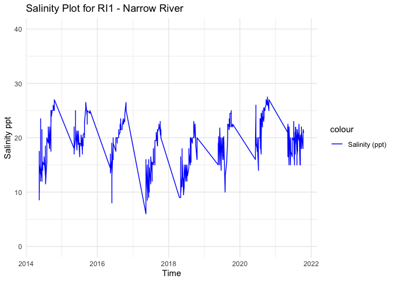
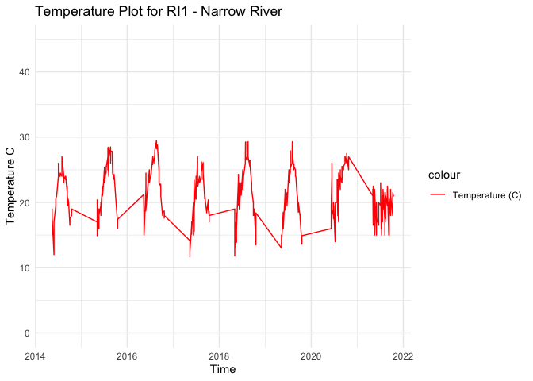

RI1 - Processed Environmental Data
================
Madeline Eppley
4/11/2024

``` r
setwd("/Users/madelineeppley/GitHub/EasternOysterEnvData/2022_SiteEnvironmentData")
```

### Load required packages.

``` r
library("dplyr") #Used for working with data frames
```

    ## 
    ## Attaching package: 'dplyr'

    ## The following objects are masked from 'package:stats':
    ## 
    ##     filter, lag

    ## The following objects are masked from 'package:base':
    ## 
    ##     intersect, setdiff, setequal, union

``` r
library("lubridate") #Used for time-date conversions
```

    ## 
    ## Attaching package: 'lubridate'

    ## The following objects are masked from 'package:base':
    ## 
    ##     date, intersect, setdiff, union

``` r
library("readr") #Used to read the CSV file
library("ggplot2") 
```

### Note the date of data download and source. All available data should be used for each site regardless of year. Note from the CSV file how often the site was sampled, and if there are replicates in the data. Also describe if the sampling occurred at only low tide, only high tide, or continuously.

``` r
#Data was downloaded on 4/11/2024
#Source - https://web.uri.edu/watershedwatch/data/historic-data/csv-data-files/ and https://uriwatershedwatch-uri.hub.arcgis.com/search?groupIds=22460b9134fa4b6e96fa7d988fefc5a5 and https://narrowriver.org/riverwatch/
#The site was sampled intermittently and had replicates on sampling days.
#The data from this site came from 2 sites in Lower Pond. Lower Pond A (NR3/WW89) and Lower Pond B (NR4/WW91)

#Create text strings with metadata information that we want to include in the final data frame. 
download_date <- ("04-11-2024")
source_description <- ("University of Rhode Island and Narrow River Watershed Watch")
site_name <- ("RI1") #Use site code with site number based on lat position and state
collection_type <- ("intermittent_seasonal")
```

### Use the file path name in your working directory or desktop, see example below. Or, import data set through the “Files” window in R studio. Store the file in a variable with the “raw_ID_Site” format. If salinity and temperature data are in separate files, read in both and store them with “\_sal” or “\_temp” in the variable names.

``` r
#The file we will be working with is from Lower Cedar Point, Maryland. The ID_Site for this site is RI1. 
raw_RI1_sal <- read_csv("/Users/madelineeppley/GitHub/EasternOysterEnvData/2022_SiteEnvironmentData/RI1-raw_sal.csv")
```

    ## Rows: 408 Columns: 6
    ## ── Column specification ────────────────────────────────────────────────────────
    ## Delimiter: ","
    ## chr (4): Station Name, Date, Parameter, Unit
    ## dbl (2): Depth, Concentration
    ## 
    ## ℹ Use `spec()` to retrieve the full column specification for this data.
    ## ℹ Specify the column types or set `show_col_types = FALSE` to quiet this message.

``` r
raw_RI1_temp <- read_csv("/Users/madelineeppley/GitHub/EasternOysterEnvData/2022_SiteEnvironmentData/RI1-raw_temp.csv")
```

    ## Rows: 434 Columns: 6
    ## ── Column specification ────────────────────────────────────────────────────────
    ## Delimiter: ","
    ## chr (4): Station Name, Date, Parameter, Unit
    ## dbl (2): Depth, Concentration
    ## 
    ## ℹ Use `spec()` to retrieve the full column specification for this data.
    ## ℹ Specify the column types or set `show_col_types = FALSE` to quiet this message.

``` r
# View how the data is stored. Note the variable names and the format and units that the data are stored in.  
spec(raw_RI1_sal)
```

    ## cols(
    ##   `Station Name` = col_character(),
    ##   Date = col_character(),
    ##   Depth = col_double(),
    ##   Parameter = col_character(),
    ##   Concentration = col_double(),
    ##   Unit = col_character()
    ## )

``` r
# View(raw_RI1_sal)

spec(raw_RI1_temp)
```

    ## cols(
    ##   `Station Name` = col_character(),
    ##   Date = col_character(),
    ##   Depth = col_double(),
    ##   Parameter = col_character(),
    ##   Concentration = col_double(),
    ##   Unit = col_character()
    ## )

``` r
# View(raw_RI1_temp)
```

### Start with the date and time of collection. We will use the lubridate package to standardize all values into the date-time format called POSIXct. This format stores the date and time in number of seconds since a past point (1/1/1970). This makes comparisons easy and helps to standardizes values.

``` r
#Convert to POSIXct format. Store it into a column named datetime in the data frame.
raw_RI1_sal$datetime <- as.POSIXct(raw_RI1_sal$Date, "%m/%d/%y", tz = "")
raw_RI1_temp$datetime <- as.POSIXct(raw_RI1_temp$Date, "%m/%d/%y", tz = "")

#Print the new data frame and examine to make sure the new datetime column is in the correct format. 
head(raw_RI1_sal)
```

    ## # A tibble: 6 × 7
    ##   `Station Name` Date    Depth Parameter Concentration Unit  datetime           
    ##   <chr>          <chr>   <dbl> <chr>             <dbl> <chr> <dttm>             
    ## 1 WW89           5/15/14   1   Salinity…           8.5 ppt   2014-05-15 00:00:00
    ## 2 WW89           5/15/14   0.5 Salinity…           8.5 ppt   2014-05-15 00:00:00
    ## 3 WW89           5/15/14   3   Salinity…          17.5 ppt   2014-05-15 00:00:00
    ## 4 WW89           5/15/14   3   Salinity…          17.5 ppt   2014-05-15 00:00:00
    ## 5 WW91           5/16/14   0.5 Salinity…          10   ppt   2014-05-16 00:00:00
    ## 6 WW91           5/16/14   0.5 Salinity…          10   ppt   2014-05-16 00:00:00

``` r
head(raw_RI1_temp)
```

    ## # A tibble: 6 × 7
    ##   `Station Name` Date    Depth Parameter Concentration Unit  datetime           
    ##   <chr>          <chr>   <dbl> <chr>             <dbl> <chr> <dttm>             
    ## 1 WW89           5/15/14   3   Temperat…          15   C     2014-05-15 00:00:00
    ## 2 WW89           5/15/14   1   Temperat…          19   C     2014-05-15 00:00:00
    ## 3 WW91           5/16/14   3   Temperat…          16   C     2014-05-16 00:00:00
    ## 4 WW91           5/16/14   0.5 Temperat…          17.5 C     2014-05-16 00:00:00
    ## 5 WW89           5/30/14   5   Temperat…          12   C     2014-05-30 00:00:00
    ## 6 WW89           5/30/14   1   Temperat…          15   C     2014-05-30 00:00:00

### Analyze the ranges of all of our variables of interest - time, salinity, and temperature. Make sure that the latitude and longitude values are consistent for a static collection site. This is a quick check so we can determine how to conduct the next filtering step.

``` r
#Standardize column and variable names. We will use "temp" for temperature in degrees C, "salinity" for salinity in parts per thousand (ppt), "lat" for latitude in degrees, and "lon" for longitude in degrees. 
#Use the dyplr format to rename multiple columns in the format "dataframe %>% rename("new name 1" = "old name 1", "new name 2", "old name 2")
raw_RI1_sal <- raw_RI1_sal %>% rename("salinity" = "Concentration")
raw_RI1_temp <- raw_RI1_temp  %>% rename("temp" = "Concentration")

#Print the range (minimum and maximum) of dates of data collection. 
#print(range(raw_RI1_sal$datetime))
#print(range(raw_RI1_temp$datetime))

#Print the range (minimum and maximum) of the salinity values. 
print(range(raw_RI1_sal$salinity))
```

    ## [1]  6.0 27.5

``` r
#Print the range (minimum and maximum) of the temperature values.
print(range(raw_RI1_temp$temp))
```

    ## [1] 11.66 29.50

``` r
#Store variables that we will include in the final data frame
lat <- 41.502709
lon <- -71.450436
firstyear <- 2015
finalyear <- 2021
```

### Filter any of the variables that have data points outside of normal range. We will use 0-40 as the accepted range for salinity (ppt) and temperature (C) values. Note, in the summer, salinity values can sometimes exceed 40. Check to see if there are values above 40. In this case, adjust the range or notify someone that the site has particularly high salinity values.

``` r
#Filter the data between the values of 0 and 40 for both salinity and temperature. 
filtered_RI1_sal <- raw_RI1_sal %>%
    filter(between(salinity, 0, 42)) 
           
filtered_RI1_temp <- raw_RI1_temp %>%
    filter(between(temp, 0, 40))

# Sanity check - print the ranges to ensure values are filtered properly. We can see that the ranges for both are now in the appropriate range.  
print(summary(filtered_RI1_sal$salinity))
```

    ##    Min. 1st Qu.  Median    Mean 3rd Qu.    Max. 
    ##    6.00   16.00   20.00   19.23   22.00   27.50

``` r
print(summary(filtered_RI1_temp$temp))
```

    ##    Min. 1st Qu.  Median    Mean 3rd Qu.    Max. 
    ##   11.66   18.50   21.50   21.51   24.50   29.50

``` r
#Store our data into a variable name with just the site name. 
RI1_temp <- filtered_RI1_temp
RI1_sal <- filtered_RI1_sal
```

### Visualize the salinity, temperature, and date ranges over time. This can help us see if there are any anomalies or gaps in the data and make sure the filtering was done correctly. Sanity check - do the temperature and salinity ranges look appropriate for the geography of the site (ex. near full ocean salinity for coastal sites, lower salinity for estuaries or near rivers)?

``` r
salplot <- ggplot(RI1_sal, aes(x = datetime)) +
    geom_line(aes(y = salinity, color = "Salinity (ppt)")) +
    ylim(0,40) +
    labs(x = "Time", y = "Salinity ppt", title = "Salinity Plot for RI1 - Narrow River") +
    scale_color_manual(values = c("Salinity (ppt)" = "blue")) +
    theme_minimal()

salplot
```

<!-- -->

``` r
tempplot <- ggplot(RI1_temp, aes(x = datetime)) +
    geom_line(aes(y = temp, color = "Temperature (C)")) +
    ylim(0, 45) +
    labs(x = "Time", y = "Temperature C", title = "Temperature Plot for RI1 - Narrow River") +
    scale_color_manual(values = c( "Temperature (C)" = "red")) +
    theme_minimal()


tempplot
```

<!-- -->

### We need to calculate the mean, maximum, and minimum values for salinity and temperature per month and year. First make two data frames to contain each of the annual and monthly averages.

``` r
#Calculate the mean, maximum, and minimum values for salinity and temperature for each month. 
RI1_envrmonth_sal <- RI1_sal %>%
    mutate(year = year(datetime), month = month(datetime)) %>%
    group_by(year, month) %>%
    summarise(
      min_salinity = min(salinity),
      max_salinity = max(salinity),
      mean_salinity = mean(salinity),
      length_salinity = length(salinity))
```

    ## `summarise()` has grouped output by 'year'. You can override using the
    ## `.groups` argument.

``` r
RI1_envrmonth_temp <- RI1_temp %>%
    mutate(year = year(datetime), month = month(datetime)) %>%
    group_by(year, month) %>%
    summarise(      
      min_temp = min(temp),
      max_temp = max(temp),
      mean_temp = mean(temp),
      length_temp = length(temp))
```

    ## `summarise()` has grouped output by 'year'. You can override using the
    ## `.groups` argument.

``` r
print(RI1_envrmonth_sal)
```

    ## # A tibble: 48 × 6
    ## # Groups:   year [8]
    ##     year month min_salinity max_salinity mean_salinity length_salinity
    ##    <dbl> <dbl>        <dbl>        <dbl>         <dbl>           <int>
    ##  1  2014     5          8.5         23.5          14.3              16
    ##  2  2014     6         12           21.5          14.9               8
    ##  3  2014     7         11.5         18.5          14.9              10
    ##  4  2014     8         15.5         22            19.8              24
    ##  5  2014     9         17.5         25            23.6              16
    ##  6  2014    10         25           27            25.8               8
    ##  7  2015     5         17           25            20.1               7
    ##  8  2015     6         17.8         21.2          20.0               7
    ##  9  2015     7         16.5         20.5          18.9               6
    ## 10  2015     8         17           23            19.9              12
    ## # ℹ 38 more rows

``` r
print(RI1_envrmonth_temp)
```

    ## # A tibble: 47 × 6
    ## # Groups:   year [8]
    ##     year month min_temp max_temp mean_temp length_temp
    ##    <dbl> <dbl>    <dbl>    <dbl>     <dbl>       <int>
    ##  1  2014     5     12       19        15.9           9
    ##  2  2014     6     19.5     21        20.6           5
    ##  3  2014     7     23.5     26        24.5          10
    ##  4  2014     8     23       27        24.2          14
    ##  5  2014     9     19.5     22.5      20.6          10
    ##  6  2014    10     16.5     19        17.6           5
    ##  7  2015     5     14.9     20.4      17.7          10
    ##  8  2015     6     18       22.5      20.6          10
    ##  9  2015     7     23       25.5      24.9           8
    ## 10  2015     8     24       28.5      27.0          14
    ## # ℹ 37 more rows

``` r
#Calculate the mean, maximum, and minimum values for salinity and temperature for each year. 
RI1_envryear_sal <- RI1_sal %>%
    mutate(year = year(datetime)) %>%
    group_by(year) %>%
    summarise(
      min_salinity = min(salinity),
      max_salinity = max(salinity),
      mean_salinity = mean(salinity))

RI1_envryear_temp <- RI1_temp %>%
    mutate(year = year(datetime)) %>%
    group_by(year) %>%
    summarise(
      min_temp = min(temp),
      max_temp = max(temp),
      mean_temp = mean(temp))

print(RI1_envryear_sal)
```

    ## # A tibble: 8 × 4
    ##    year min_salinity max_salinity mean_salinity
    ##   <dbl>        <dbl>        <dbl>         <dbl>
    ## 1  2014          8.5         27            19.0
    ## 2  2015         16.5         26.5          21.2
    ## 3  2016          8           26.5          20.3
    ## 4  2017          6           23            16.2
    ## 5  2018          9           23            15.9
    ## 6  2019         10           25            19.6
    ## 7  2020         14           27.5          22.6
    ## 8  2021         15           23            19.3

``` r
print(RI1_envryear_temp)
```

    ## # A tibble: 8 × 4
    ##    year min_temp max_temp mean_temp
    ##   <dbl>    <dbl>    <dbl>     <dbl>
    ## 1  2014     12       27        21.2
    ## 2  2015     14.9     28.5      22.6
    ## 3  2016     15       29.5      22.5
    ## 4  2017     11.7     27        20.4
    ## 5  2018     11.8     29.3      22.0
    ## 6  2019     13       29.3      21.3
    ## 7  2020     14       27.5      22.6
    ## 8  2021     15       23        19.3

### Plot the months and years of data collection to check if there are any collection gaps in the data.

``` r
timeplot <- ggplot(RI1_envrmonth_sal, aes(x = year)) +
    geom_point(aes(y = month, color = length_salinity), size = 4) +
    labs(x = "Time", y = "Month", title = "Salinity Timeplot for RI1 - Narrow River") +
    ylim(1,12) +
    theme_minimal()

timeplot
```

<!-- -->

### Plot the months and years of data collection to check if there are any collection gaps in the data.

``` r
timeplot <- ggplot(RI1_envrmonth_temp, aes(x = year)) +
    geom_point(aes(y = month, color = length_temp), size = 4) +
    labs(x = "Time", y = "Month", title = "Temperature Timeplot for RI1 - Narrow River") +
    ylim(1,12) +
    theme_minimal()

timeplot
```

<!-- -->

### We can now calculate a list of variables that we will have collected for all sites. This will allow us to compare sites easily. We will calculate the number of observations from each site, the mean annual, maximum annual, and minimum annual value for all variables.

Our list of variables includes:

- Mean_Annual_Temperature_C: average of all available data

- Mean_max_temperature_C: average of maximums for each year

- Mean_min_temperature_C: average of minimums for each year

- Temperature_st_dev: standard deviation of all available data

- Temperature_n: total number of data points

- Temperature_years: number of years in data set

- Mean_Annual_Salinity_ppt: average of all available data

- Mean_min_Salinity_ppt: average of minimums for each year

- Mean_max_Salinity_ppt: average of maximums for each year

- Salinity_st_dev: standard deviation of all available data

- Salinity_n: total number of data points

- Salinity_years: number of years in data set

``` r
#Calculate temperature variables. 
#Calculate temperature variables. 
Mean_Annual_Temperature_C <- mean(RI1_temp$temp)
Mean_max_temperature_C <- mean(RI1_envryear_temp$max_temp)
Mean_min_temperature_C <- mean(RI1_envryear_temp$min_temp)
Temperature_st_dev <- sd(RI1_temp$temp)
Temperature_n <- nrow(RI1_temp)
Temperature_years <- nrow(RI1_envryear_temp)

#Create a data frame to store the temperature results
RI1_temp <- cbind(site_name, download_date, source_description, lat, lon, firstyear, finalyear, Mean_Annual_Temperature_C, Mean_max_temperature_C, Mean_min_temperature_C, Temperature_st_dev, Temperature_n, Temperature_years, collection_type)
print(RI1_temp)
```

    ##      site_name download_date
    ## [1,] "RI1"     "04-11-2024" 
    ##      source_description                                            lat        
    ## [1,] "University of Rhode Island and Narrow River Watershed Watch" "41.502709"
    ##      lon          firstyear finalyear Mean_Annual_Temperature_C
    ## [1,] "-71.450436" "2015"    "2021"    "21.5073963133641"       
    ##      Mean_max_temperature_C Mean_min_temperature_C Temperature_st_dev
    ## [1,] "27.6375"              "13.41875"             "3.91172949170121"
    ##      Temperature_n Temperature_years collection_type        
    ## [1,] "434"         "8"               "intermittent_seasonal"

``` r
# Write to the combined file with all sites 
write.table(RI1_temp, "/Users/madelineeppley/GitHub/EasternOysterEnvData/2022_SiteEnvironmentData/Seascape_Processed/seascape_temperature.csv", sep = ",", append = TRUE, col.names = FALSE, row.names = FALSE) # The column names should be changed to FALSE after 1st row is added to the data frame

# Write to a unique new CSV file
write.csv(RI1_temp, "/Users/madelineeppley/GitHub/EasternOysterEnvData/2022_SiteEnvironmentData/Seascape_Processed/RI1_temperature.csv")
```

``` r
#Calculate the salinity variables
Mean_Annual_Salinity_ppt <- mean(RI1_sal$salinity)
Mean_max_Salinity_ppt <- mean(RI1_envryear_sal$max_salinity)
Mean_min_Salinity_ppt <- mean(RI1_envryear_sal$min_salinity)
Salinity_st_dev <- sd(RI1_sal$salinity)
Salinity_n <- nrow(RI1_sal)
Salinity_years <- nrow(RI1_envryear_sal)


#Create a data frame to store the temperature results
RI1_salinity <- cbind(site_name, download_date, source_description, lat, lon, firstyear, finalyear, Mean_Annual_Salinity_ppt, Mean_max_Salinity_ppt, Mean_min_Salinity_ppt, Salinity_st_dev, Salinity_n, Salinity_years, collection_type)
print(RI1_salinity)
```

    ##      site_name download_date
    ## [1,] "RI1"     "04-11-2024" 
    ##      source_description                                            lat        
    ## [1,] "University of Rhode Island and Narrow River Watershed Watch" "41.502709"
    ##      lon          firstyear finalyear Mean_Annual_Salinity_ppt
    ## [1,] "-71.450436" "2015"    "2021"    "19.2314950980392"      
    ##      Mean_max_Salinity_ppt Mean_min_Salinity_ppt Salinity_st_dev    Salinity_n
    ## [1,] "25.1875"             "10.875"              "4.39730562690253" "408"     
    ##      Salinity_years collection_type        
    ## [1,] "8"            "intermittent_seasonal"

``` r
# Write to the combined file with all sites 
write.table(RI1_salinity, "/Users/madelineeppley/GitHub/EasternOysterEnvData/2022_SiteEnvironmentData/Seascape_Processed/seascape_salinity.csv", sep = ",", append = TRUE, col.names = FALSE, row.names = FALSE) # The column names should be changed to FALSE after 1st row is added to the data frame

# Write to a unique new CSV file
write.csv(RI1_salinity, "/Users/madelineeppley/GitHub/EasternOysterEnvData/2022_SiteEnvironmentData/Seascape_Processed/RI1_salinity.csv", row.names = FALSE)
```
