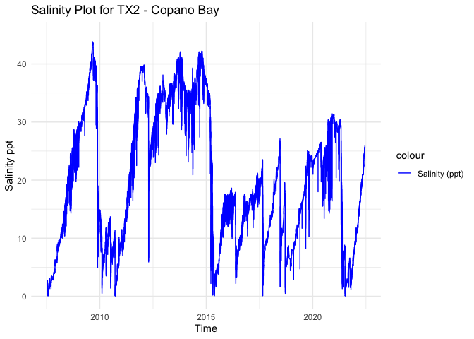
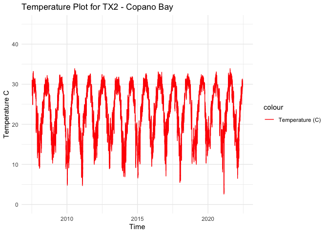
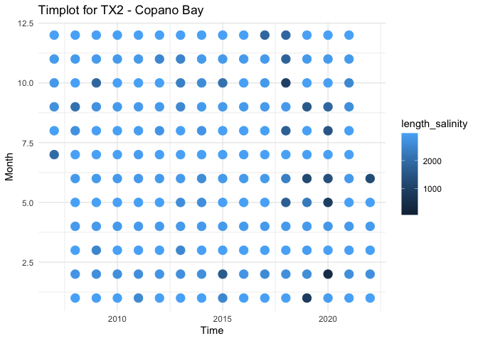

TX2 - Processed Environmental Data
================
Madeline Eppley
7/7/2023

``` r
setwd("/Users/madelineeppley/GitHub/EasternOysterEnvData/2022_SiteEnvironmentData")
```

### Load required packages.

``` r
library("dplyr") #Used for working with data frames
```

    ## 
    ## Attaching package: 'dplyr'

    ## The following objects are masked from 'package:stats':
    ## 
    ##     filter, lag

    ## The following objects are masked from 'package:base':
    ## 
    ##     intersect, setdiff, setequal, union

``` r
library("lubridate") #Used for time-date conversions
```

    ## 
    ## Attaching package: 'lubridate'

    ## The following objects are masked from 'package:base':
    ## 
    ##     date, intersect, setdiff, union

``` r
library("readr") #Used to read the CSV file
library("ggplot2") 
```

### Note the date of data download and source. All available data should be used for each site regardless of year. Note from the CSV file how often the site was sampled, and if there are replicates in the data. Also describe if the sampling occurred at only low tide, only high tide, or continuously.

``` r
#Data was downloaded on 7/7/2023
#Source - https://cdmo.baruch.sc.edu//dges/ - Selected Mission Aransas, Copano Bay West. The station code is MARCWWQ.  

#Create text strings with metadata information that we want to include in the final data frame. 
download_date <- ("07-07-2023")
source_description <- ("NERR Centralized Data. Mission Aransas - Copano Bay West")
site_name <- ("TX2") #Use site code with site number based on lat position and state
```

### Use the file path name in your working directory or desktop, see example below. Or, import data set through the “Files” window in R studio. Store the file in a variable with the “raw_ID_Site” format. If salinity and temperature data are in separate files, read in both and store them with “\_sal” or “\_temp” in the variable names.

``` r
#The file we will be working with is from Copano Bay, Texas. The ID_Site for this site is TX2. 
raw_TX2 <- read_csv("/Users/madelineeppley/GitHub/EasternOysterEnvData/2022_SiteEnvironmentData/TX2-raw.csv")
```

    ## Rows: 523354 Columns: 30
    ## ── Column specification ────────────────────────────────────────────────────────
    ## Delimiter: ","
    ## chr (16): Station_Code, isSWMP, DateTimeStamp, F_Record, F_Temp, F_SpCond, F...
    ## dbl (14): Historical, ProvisionalPlus, Temp, SpCond, Sal, DO_pct, DO_mgl, De...
    ## 
    ## ℹ Use `spec()` to retrieve the full column specification for this data.
    ## ℹ Specify the column types or set `show_col_types = FALSE` to quiet this message.

``` r
# View how the data is stored. Note the variable names and the format and units that the data are stored in.  
spec(raw_TX2)
```

    ## cols(
    ##   Station_Code = col_character(),
    ##   isSWMP = col_character(),
    ##   DateTimeStamp = col_character(),
    ##   Historical = col_double(),
    ##   ProvisionalPlus = col_double(),
    ##   F_Record = col_character(),
    ##   Temp = col_double(),
    ##   F_Temp = col_character(),
    ##   SpCond = col_double(),
    ##   F_SpCond = col_character(),
    ##   Sal = col_double(),
    ##   F_Sal = col_character(),
    ##   DO_pct = col_double(),
    ##   F_DO_pct = col_character(),
    ##   DO_mgl = col_double(),
    ##   F_DO_mgl = col_character(),
    ##   Depth = col_double(),
    ##   F_Depth = col_character(),
    ##   cDepth = col_double(),
    ##   F_cDepth = col_character(),
    ##   Level = col_double(),
    ##   F_Level = col_character(),
    ##   cLevel = col_double(),
    ##   F_cLevel = col_character(),
    ##   pH = col_double(),
    ##   F_pH = col_character(),
    ##   Turb = col_double(),
    ##   F_Turb = col_character(),
    ##   ChlFluor = col_double(),
    ##   F_ChlFluor = col_character()
    ## )

``` r
View(raw_TX2)
```

### Start with the date and time of collection. We will use the lubridate package to standardize all values into the date-time format called POSIXct. This format stores the date and time in number of seconds since a past point (1/1/1970). This makes comparisons easy and helps to standardizes values.

``` r
# SKIP combining, date and time of collection is already in a column together 
# combined_datetime <- paste(raw_SC2$collection_date, raw_SC2$collection_time) 

unclass(raw_TX2$DateTimeStamp)
```

    ##     [1] "7/11/07 9:30"   "7/11/07 9:45"   "7/11/07 10:00"  "7/11/07 10:15" 
    ##     [5] "7/11/07 10:30"  "7/11/07 10:45"  "7/11/07 11:00"  "7/11/07 11:15" 
    ##     [9] "7/11/07 11:30"  "7/11/07 11:45"  "7/11/07 12:00"  "7/11/07 12:15" 
    ##    [13] "7/11/07 12:30"  "7/11/07 12:45"  "7/11/07 13:00"  "7/11/07 13:15" 
    ##    [17] "7/11/07 13:30"  "7/11/07 13:45"  "7/11/07 14:00"  "7/11/07 14:15" 
    ##    [21] "7/11/07 14:30"  "7/11/07 14:45"  "7/11/07 15:00"  "7/11/07 15:15" 
    ##    [25] "7/11/07 15:30"  "7/11/07 15:45"  "7/11/07 16:00"  "7/11/07 16:15" 
    ##    [29] "7/11/07 16:30"  "7/11/07 16:45"  "7/11/07 17:00"  "7/11/07 17:15" 
    ##    [33] "7/11/07 17:30"  "7/11/07 17:45"  "7/11/07 18:00"  "7/11/07 18:15" 
    ##    [37] "7/11/07 18:30"  "7/11/07 18:45"  "7/11/07 19:00"  "7/11/07 19:15" 
    ##    [41] "7/11/07 19:30"  "7/11/07 19:45"  "7/11/07 20:00"  "7/11/07 20:15" 
    ##    [45] "7/11/07 20:30"  "7/11/07 20:45"  "7/11/07 21:00"  "7/11/07 21:15" 
    ##    [49] "7/11/07 21:30"  "7/11/07 21:45"  "7/11/07 22:00"  "7/11/07 22:15" 
    ##    [53] "7/11/07 22:30"  "7/11/07 22:45"  "7/11/07 23:00"  "7/11/07 23:15" 
    ##    [57] "7/11/07 23:30"  "7/11/07 23:45"  "7/12/07 0:00"   "7/12/07 0:15"  
    ##    [61] "7/12/07 0:30"   "7/12/07 0:45"   "7/12/07 1:00"   "7/12/07 1:15"  
    ##    [65] "7/12/07 1:30"   "7/12/07 1:45"   "7/12/07 2:00"   "7/12/07 2:15"  
    ##    [69] "7/12/07 2:30"   "7/12/07 2:45"   "7/12/07 3:00"   "7/12/07 3:15"  
    ##    [73] "7/12/07 3:30"   "7/12/07 3:45"   "7/12/07 4:00"   "7/12/07 4:15"  
    ##    [77] "7/12/07 4:30"   "7/12/07 4:45"   "7/12/07 5:00"   "7/12/07 5:15"  
    ##    [81] "7/12/07 5:30"   "7/12/07 5:45"   "7/12/07 6:00"   "7/12/07 6:15"  
    ##    [85] "7/12/07 6:30"   "7/12/07 6:45"   "7/12/07 7:00"   "7/12/07 7:15"  
    ##    [89] "7/12/07 7:30"   "7/12/07 7:45"   "7/12/07 8:00"   "7/12/07 8:15"  
    ##    [93] "7/12/07 8:30"   "7/12/07 8:45"   "7/12/07 9:00"   "7/12/07 9:15"  
    ##    [97] "7/12/07 9:30"   "7/12/07 9:45"   "7/12/07 10:00"  "7/12/07 10:15" 
    ##   [101] "7/12/07 10:30"  "7/12/07 10:45"  "7/12/07 11:00"  "7/12/07 11:15" 
    ##   [105] "7/12/07 11:30"  "7/12/07 11:45"  "7/12/07 12:00"  "7/12/07 12:15" 
    ##   [109] "7/12/07 12:30"  "7/12/07 12:45"  "7/12/07 13:00"  "7/12/07 13:15" 
    ##   [113] "7/12/07 13:30"  "7/12/07 13:45"  "7/12/07 14:00"  "7/12/07 14:15" 
    ##   [117] "7/12/07 14:30"  "7/12/07 14:45"  "7/12/07 15:00"  "7/12/07 15:15" 
    ##   [121] "7/12/07 15:30"  "7/12/07 15:45"  "7/12/07 16:00"  "7/12/07 16:15" 
    ##   [125] "7/12/07 16:30"  "7/12/07 16:45"  "7/12/07 17:00"  "7/12/07 17:15" 
    ##   [129] "7/12/07 17:30"  "7/12/07 17:45"  "7/12/07 18:00"  "7/12/07 18:15" 
    ##   [133] "7/12/07 18:30"  "7/12/07 18:45"  "7/12/07 19:00"  "7/12/07 19:15" 
    ##   [137] "7/12/07 19:30"  "7/12/07 19:45"  "7/12/07 20:00"  "7/12/07 20:15" 
    ##   [141] "7/12/07 20:30"  "7/12/07 20:45"  "7/12/07 21:00"  "7/12/07 21:15" 
    ##   [145] "7/12/07 21:30"  "7/12/07 21:45"  "7/12/07 22:00"  "7/12/07 22:15" 
    ##   [149] "7/12/07 22:30"  "7/12/07 22:45"  "7/12/07 23:00"  "7/12/07 23:15" 
    ##   [153] "7/12/07 23:30"  "7/12/07 23:45"  "7/13/07 0:00"   "7/13/07 0:15"  
    ##   [157] "7/13/07 0:30"   "7/13/07 0:45"   "7/13/07 1:00"   "7/13/07 1:15"  
    ##   [161] "7/13/07 1:30"   "7/13/07 1:45"   "7/13/07 2:00"   "7/13/07 2:15"  
    ##   [165] "7/13/07 2:30"   "7/13/07 2:45"   "7/13/07 3:00"   "7/13/07 3:15"  
    ##   [169] "7/13/07 3:30"   "7/13/07 3:45"   "7/13/07 4:00"   "7/13/07 4:15"  
    ##   [173] "7/13/07 4:30"   "7/13/07 4:45"   "7/13/07 5:00"   "7/13/07 5:15"  
    ##   [177] "7/13/07 5:30"   "7/13/07 5:45"   "7/13/07 6:00"   "7/13/07 6:15"  
    ##   [181] "7/13/07 6:30"   "7/13/07 6:45"   "7/13/07 7:00"   "7/13/07 7:15"  
    ##   [185] "7/13/07 7:30"   "7/13/07 7:45"   "7/13/07 8:00"   "7/13/07 8:15"  
    ##   [189] "7/13/07 8:30"   "7/13/07 8:45"   "7/13/07 9:00"   "7/13/07 9:15"  
    ##   [193] "7/13/07 9:30"   "7/13/07 9:45"   "7/13/07 10:00"  "7/13/07 10:15" 
    ##   [197] "7/13/07 10:30"  "7/13/07 10:45"  "7/13/07 11:00"  "7/13/07 11:15" 
    ##   [201] "7/13/07 11:30"  "7/13/07 11:45"  "7/13/07 12:00"  "7/13/07 12:15" 
    ##   [205] "7/13/07 12:30"  "7/13/07 12:45"  "7/13/07 13:00"  "7/13/07 13:15" 
    ##   [209] "7/13/07 13:30"  "7/13/07 13:45"  "7/13/07 14:00"  "7/13/07 14:15" 
    ##   [213] "7/13/07 14:30"  "7/13/07 14:45"  "7/13/07 15:00"  "7/13/07 15:15" 
    ##   [217] "7/13/07 15:30"  "7/13/07 15:45"  "7/13/07 16:00"  "7/13/07 16:15" 
    ##   [221] "7/13/07 16:30"  "7/13/07 16:45"  "7/13/07 17:00"  "7/13/07 17:15" 
    ##   [225] "7/13/07 17:30"  "7/13/07 17:45"  "7/13/07 18:00"  "7/13/07 18:15" 
    ##   [229] "7/13/07 18:30"  "7/13/07 18:45"  "7/13/07 19:00"  "7/13/07 19:15" 
    ##   [233] "7/13/07 19:30"  "7/13/07 19:45"  "7/13/07 20:00"  "7/13/07 20:15" 
    ##   [237] "7/13/07 20:30"  "7/13/07 20:45"  "7/13/07 21:00"  "7/13/07 21:15" 
    ##   [241] "7/13/07 21:30"  "7/13/07 21:45"  "7/13/07 22:00"  "7/13/07 22:15" 
    ##   [245] "7/13/07 22:30"  "7/13/07 22:45"  "7/13/07 23:00"  "7/13/07 23:15" 
    ##   [249] "7/13/07 23:30"  "7/13/07 23:45"  "7/14/07 0:00"   "7/14/07 0:15"  
    ##   [253] "7/14/07 0:30"   "7/14/07 0:45"   "7/14/07 1:00"   "7/14/07 1:15"  
    ##   [257] "7/14/07 1:30"   "7/14/07 1:45"   "7/14/07 2:00"   "7/14/07 2:15"  
    ##   [261] "7/14/07 2:30"   "7/14/07 2:45"   "7/14/07 3:00"   "7/14/07 3:15"  
    ##   [265] "7/14/07 3:30"   "7/14/07 3:45"   "7/14/07 4:00"   "7/14/07 4:15"  
    ##   [269] "7/14/07 4:30"   "7/14/07 4:45"   "7/14/07 5:00"   "7/14/07 5:15"  
    ##   [273] "7/14/07 5:30"   "7/14/07 5:45"   "7/14/07 6:00"   "7/14/07 6:15"  
    ##   [277] "7/14/07 6:30"   "7/14/07 6:45"   "7/14/07 7:00"   "7/14/07 7:15"  
    ##   [281] "7/14/07 7:30"   "7/14/07 7:45"   "7/14/07 8:00"   "7/14/07 8:15"  
    ##   [285] "7/14/07 8:30"   "7/14/07 8:45"   "7/14/07 9:00"   "7/14/07 9:15"  
    ##   [289] "7/14/07 9:30"   "7/14/07 9:45"   "7/14/07 10:00"  "7/14/07 10:15" 
    ##   [293] "7/14/07 10:30"  "7/14/07 10:45"  "7/14/07 11:00"  "7/14/07 11:15" 
    ##   [297] "7/14/07 11:30"  "7/14/07 11:45"  "7/14/07 12:00"  "7/14/07 12:15" 
    ##   [301] "7/14/07 12:30"  "7/14/07 12:45"  "7/14/07 13:00"  "7/14/07 13:15" 
    ##   [305] "7/14/07 13:30"  "7/14/07 13:45"  "7/14/07 14:00"  "7/14/07 14:15" 
    ##   [309] "7/14/07 14:30"  "7/14/07 14:45"  "7/14/07 15:00"  "7/14/07 15:15" 
    ##   [313] "7/14/07 15:30"  "7/14/07 15:45"  "7/14/07 16:00"  "7/14/07 16:15" 
    ##   [317] "7/14/07 16:30"  "7/14/07 16:45"  "7/14/07 17:00"  "7/14/07 17:15" 
    ##   [321] "7/14/07 17:30"  "7/14/07 17:45"  "7/14/07 18:00"  "7/14/07 18:15" 
    ##   [325] "7/14/07 18:30"  "7/14/07 18:45"  "7/14/07 19:00"  "7/14/07 19:15" 
    ##   [329] "7/14/07 19:30"  "7/14/07 19:45"  "7/14/07 20:00"  "7/14/07 20:15" 
    ##   [333] "7/14/07 20:30"  "7/14/07 20:45"  "7/14/07 21:00"  "7/14/07 21:15" 
    ##   [337] "7/14/07 21:30"  "7/14/07 21:45"  "7/14/07 22:00"  "7/14/07 22:15" 
    ##   [341] "7/14/07 22:30"  "7/14/07 22:45"  "7/14/07 23:00"  "7/14/07 23:15" 
    ##   [345] "7/14/07 23:30"  "7/14/07 23:45"  "7/15/07 0:00"   "7/15/07 0:15"  
    ##   [349] "7/15/07 0:30"   "7/15/07 0:45"   "7/15/07 1:00"   "7/15/07 1:15"  
    ##   [353] "7/15/07 1:30"   "7/15/07 1:45"   "7/15/07 2:00"   "7/15/07 2:15"  
    ##   [357] "7/15/07 2:30"   "7/15/07 2:45"   "7/15/07 3:00"   "7/15/07 3:15"  
    ##   [361] "7/15/07 3:30"   "7/15/07 3:45"   "7/15/07 4:00"   "7/15/07 4:15"  
    ##   [365] "7/15/07 4:30"   "7/15/07 4:45"   "7/15/07 5:00"   "7/15/07 5:15"  
    ##   [369] "7/15/07 5:30"   "7/15/07 5:45"   "7/15/07 6:00"   "7/15/07 6:15"  
    ##   [373] "7/15/07 6:30"   "7/15/07 6:45"   "7/15/07 7:00"   "7/15/07 7:15"  
    ##   [377] "7/15/07 7:30"   "7/15/07 7:45"   "7/15/07 8:00"   "7/15/07 8:15"  
    ##   [381] "7/15/07 8:30"   "7/15/07 8:45"   "7/15/07 9:00"   "7/15/07 9:15"  
    ##   [385] "7/15/07 9:30"   "7/15/07 9:45"   "7/15/07 10:00"  "7/15/07 10:15" 
    ##   [389] "7/15/07 10:30"  "7/15/07 10:45"  "7/15/07 11:00"  "7/15/07 11:15" 
    ##   [393] "7/15/07 11:30"  "7/15/07 11:45"  "7/15/07 12:00"  "7/15/07 12:15" 
    ##   [397] "7/15/07 12:30"  "7/15/07 12:45"  "7/15/07 13:00"  "7/15/07 13:15" 
    ##   [401] "7/15/07 13:30"  "7/15/07 13:45"  "7/15/07 14:00"  "7/15/07 14:15" 
    ##   [405] "7/15/07 14:30"  "7/15/07 14:45"  "7/15/07 15:00"  "7/15/07 15:15" 
    ##   [409] "7/15/07 15:30"  "7/15/07 15:45"  "7/15/07 16:00"  "7/15/07 16:15" 
    ##   [413] "7/15/07 16:30"  "7/15/07 16:45"  "7/15/07 17:00"  "7/15/07 17:15" 
    ##   [417] "7/15/07 17:30"  "7/15/07 17:45"  "7/15/07 18:00"  "7/15/07 18:15" 
    ##   [421] "7/15/07 18:30"  "7/15/07 18:45"  "7/15/07 19:00"  "7/15/07 19:15" 
    ##   [425] "7/15/07 19:30"  "7/15/07 19:45"  "7/15/07 20:00"  "7/15/07 20:15" 
    ##   [429] "7/15/07 20:30"  "7/15/07 20:45"  "7/15/07 21:00"  "7/15/07 21:15" 
    ##   [433] "7/15/07 21:30"  "7/15/07 21:45"  "7/15/07 22:00"  "7/15/07 22:15" 
    ##   [437] "7/15/07 22:30"  "7/15/07 22:45"  "7/15/07 23:00"  "7/15/07 23:15" 
    ##   [441] "7/15/07 23:30"  "7/15/07 23:45"  "7/16/07 0:00"   "7/16/07 0:15"  
    ##   [445] "7/16/07 0:30"   "7/16/07 0:45"   "7/16/07 1:00"   "7/16/07 1:15"  
    ##   [449] "7/16/07 1:30"   "7/16/07 1:45"   "7/16/07 2:00"   "7/16/07 2:15"  
    ##   [453] "7/16/07 2:30"   "7/16/07 2:45"   "7/16/07 3:00"   "7/16/07 3:15"  
    ##   [457] "7/16/07 3:30"   "7/16/07 3:45"   "7/16/07 4:00"   "7/16/07 4:15"  
    ##   [461] "7/16/07 4:30"   "7/16/07 4:45"   "7/16/07 5:00"   "7/16/07 5:15"  
    ##   [465] "7/16/07 5:30"   "7/16/07 5:45"   "7/16/07 6:00"   "7/16/07 6:15"  
    ##   [469] "7/16/07 6:30"   "7/16/07 6:45"   "7/16/07 7:00"   "7/16/07 7:15"  
    ##   [473] "7/16/07 7:30"   "7/16/07 7:45"   "7/16/07 8:00"   "7/16/07 8:15"  
    ##   [477] "7/16/07 8:30"   "7/16/07 8:45"   "7/16/07 9:00"   "7/16/07 9:15"  
    ##   [481] "7/16/07 9:30"   "7/16/07 9:45"   "7/16/07 10:00"  "7/16/07 10:15" 
    ##   [485] "7/16/07 10:30"  "7/16/07 10:45"  "7/16/07 11:00"  "7/16/07 11:15" 
    ##   [489] "7/16/07 11:30"  "7/16/07 11:45"  "7/16/07 12:00"  "7/16/07 12:15" 
    ##   [493] "7/16/07 12:30"  "7/16/07 12:45"  "7/16/07 13:00"  "7/16/07 13:15" 
    ##   [497] "7/16/07 13:30"  "7/16/07 13:45"  "7/16/07 14:00"  "7/16/07 14:15" 
    ##   [501] "7/16/07 14:30"  "7/16/07 14:45"  "7/16/07 15:00"  "7/16/07 15:15" 
    ##   [505] "7/16/07 15:30"  "7/16/07 15:45"  "7/16/07 16:00"  "7/16/07 16:15" 
    ##   [509] "7/16/07 16:30"  "7/16/07 16:45"  "7/16/07 17:00"  "7/16/07 17:15" 
    ##   [513] "7/16/07 17:30"  "7/16/07 17:45"  "7/16/07 18:00"  "7/16/07 18:15" 
    ##   [517] "7/16/07 18:30"  "7/16/07 18:45"  "7/16/07 19:00"  "7/16/07 19:15" 
    ##   [521] "7/16/07 19:30"  "7/16/07 19:45"  "7/16/07 20:00"  "7/16/07 20:15" 
    ##   [525] "7/16/07 20:30"  "7/16/07 20:45"  "7/16/07 21:00"  "7/16/07 21:15" 
    ##   [529] "7/16/07 21:30"  "7/16/07 21:45"  "7/16/07 22:00"  "7/16/07 22:15" 
    ##   [533] "7/16/07 22:30"  "7/16/07 22:45"  "7/16/07 23:00"  "7/16/07 23:15" 
    ##   [537] "7/16/07 23:30"  "7/16/07 23:45"  "7/17/07 0:00"   "7/17/07 0:15"  
    ##   [541] "7/17/07 0:30"   "7/17/07 0:45"   "7/17/07 1:00"   "7/17/07 1:15"  
    ##   [545] "7/17/07 1:30"   "7/17/07 1:45"   "7/17/07 2:00"   "7/17/07 2:15"  
    ##   [549] "7/17/07 2:30"   "7/17/07 2:45"   "7/17/07 3:00"   "7/17/07 3:15"  
    ##   [553] "7/17/07 3:30"   "7/17/07 3:45"   "7/17/07 4:00"   "7/17/07 4:15"  
    ##   [557] "7/17/07 4:30"   "7/17/07 4:45"   "7/17/07 5:00"   "7/17/07 5:15"  
    ##   [561] "7/17/07 5:30"   "7/17/07 5:45"   "7/17/07 6:00"   "7/17/07 6:15"  
    ##   [565] "7/17/07 6:30"   "7/17/07 6:45"   "7/17/07 7:00"   "7/17/07 7:15"  
    ##   [569] "7/17/07 7:30"   "7/17/07 7:45"   "7/17/07 8:00"   "7/17/07 8:15"  
    ##   [573] "7/17/07 8:30"   "7/17/07 8:45"   "7/17/07 9:00"   "7/17/07 9:15"  
    ##   [577] "7/17/07 9:30"   "7/17/07 9:45"   "7/17/07 10:00"  "7/17/07 10:15" 
    ##   [581] "7/17/07 10:30"  "7/17/07 10:45"  "7/17/07 11:00"  "7/17/07 11:15" 
    ##   [585] "7/17/07 11:30"  "7/17/07 11:45"  "7/17/07 12:00"  "7/17/07 12:15" 
    ##   [589] "7/17/07 12:30"  "7/17/07 12:45"  "7/17/07 13:00"  "7/17/07 13:15" 
    ##   [593] "7/17/07 13:30"  "7/17/07 13:45"  "7/17/07 14:00"  "7/17/07 14:15" 
    ##   [597] "7/17/07 14:30"  "7/17/07 14:45"  "7/17/07 15:00"  "7/17/07 15:15" 
    ##   [601] "7/17/07 15:30"  "7/17/07 15:45"  "7/17/07 16:00"  "7/17/07 16:15" 
    ##   [605] "7/17/07 16:30"  "7/17/07 16:45"  "7/17/07 17:00"  "7/17/07 17:15" 
    ##   [609] "7/17/07 17:30"  "7/17/07 17:45"  "7/17/07 18:00"  "7/17/07 18:15" 
    ##   [613] "7/17/07 18:30"  "7/17/07 18:45"  "7/17/07 19:00"  "7/17/07 19:15" 
    ##   [617] "7/17/07 19:30"  "7/17/07 19:45"  "7/17/07 20:00"  "7/17/07 20:15" 
    ##   [621] "7/17/07 20:30"  "7/17/07 20:45"  "7/17/07 21:00"  "7/17/07 21:15" 
    ##   [625] "7/17/07 21:30"  "7/17/07 21:45"  "7/17/07 22:00"  "7/17/07 22:15" 
    ##   [629] "7/17/07 22:30"  "7/17/07 22:45"  "7/17/07 23:00"  "7/17/07 23:15" 
    ##   [633] "7/17/07 23:30"  "7/17/07 23:45"  "7/18/07 0:00"   "7/18/07 0:15"  
    ##   [637] "7/18/07 0:30"   "7/18/07 0:45"   "7/18/07 1:00"   "7/18/07 1:15"  
    ##   [641] "7/18/07 1:30"   "7/18/07 1:45"   "7/18/07 2:00"   "7/18/07 2:15"  
    ##   [645] "7/18/07 2:30"   "7/18/07 2:45"   "7/18/07 3:00"   "7/18/07 3:15"  
    ##   [649] "7/18/07 3:30"   "7/18/07 3:45"   "7/18/07 4:00"   "7/18/07 4:15"  
    ##   [653] "7/18/07 4:30"   "7/18/07 4:45"   "7/18/07 5:00"   "7/18/07 5:15"  
    ##   [657] "7/18/07 5:30"   "7/18/07 5:45"   "7/18/07 6:00"   "7/18/07 6:15"  
    ##   [661] "7/18/07 6:30"   "7/18/07 6:45"   "7/18/07 7:00"   "7/18/07 7:15"  
    ##   [665] "7/18/07 7:30"   "7/18/07 7:45"   "7/18/07 8:00"   "7/18/07 8:15"  
    ##   [669] "7/18/07 8:30"   "7/18/07 8:45"   "7/18/07 9:00"   "7/18/07 9:15"  
    ##   [673] "7/18/07 9:30"   "7/18/07 9:45"   "7/18/07 10:00"  "7/18/07 10:15" 
    ##   [677] "7/18/07 10:30"  "7/18/07 10:45"  "7/18/07 11:00"  "7/18/07 11:15" 
    ##   [681] "7/18/07 11:30"  "7/18/07 11:45"  "7/18/07 12:00"  "7/18/07 12:15" 
    ##   [685] "7/18/07 12:30"  "7/18/07 12:45"  "7/18/07 13:00"  "7/18/07 13:15" 
    ##   [689] "7/18/07 13:30"  "7/18/07 13:45"  "7/18/07 14:00"  "7/18/07 14:15" 
    ##   [693] "7/18/07 14:30"  "7/18/07 14:45"  "7/18/07 15:00"  "7/18/07 15:15" 
    ##   [697] "7/18/07 15:30"  "7/18/07 15:45"  "7/18/07 16:00"  "7/18/07 16:15" 
    ##   [701] "7/18/07 16:30"  "7/18/07 16:45"  "7/18/07 17:00"  "7/18/07 17:15" 
    ##   [705] "7/18/07 17:30"  "7/18/07 17:45"  "7/18/07 18:00"  "7/18/07 18:15" 
    ##   [709] "7/18/07 18:30"  "7/18/07 18:45"  "7/18/07 19:00"  "7/18/07 19:15" 
    ##   [713] "7/18/07 19:30"  "7/18/07 19:45"  "7/18/07 20:00"  "7/18/07 20:15" 
    ##   [717] "7/18/07 20:30"  "7/18/07 20:45"  "7/18/07 21:00"  "7/18/07 21:15" 
    ##   [721] "7/18/07 21:30"  "7/18/07 21:45"  "7/18/07 22:00"  "7/18/07 22:15" 
    ##   [725] "7/18/07 22:30"  "7/18/07 22:45"  "7/18/07 23:00"  "7/18/07 23:15" 
    ##   [729] "7/18/07 23:30"  "7/18/07 23:45"  "7/19/07 0:00"   "7/19/07 0:15"  
    ##   [733] "7/19/07 0:30"   "7/19/07 0:45"   "7/19/07 1:00"   "7/19/07 1:15"  
    ##   [737] "7/19/07 1:30"   "7/19/07 1:45"   "7/19/07 2:00"   "7/19/07 2:15"  
    ##   [741] "7/19/07 2:30"   "7/19/07 2:45"   "7/19/07 3:00"   "7/19/07 3:15"  
    ##   [745] "7/19/07 3:30"   "7/19/07 3:45"   "7/19/07 4:00"   "7/19/07 4:15"  
    ##   [749] "7/19/07 4:30"   "7/19/07 4:45"   "7/19/07 5:00"   "7/19/07 5:15"  
    ##   [753] "7/19/07 5:30"   "7/19/07 5:45"   "7/19/07 6:00"   "7/19/07 6:15"  
    ##   [757] "7/19/07 6:30"   "7/19/07 6:45"   "7/19/07 7:00"   "7/19/07 7:15"  
    ##   [761] "7/19/07 7:30"   "7/19/07 7:45"   "7/19/07 8:00"   "7/19/07 8:15"  
    ##   [765] "7/19/07 8:30"   "7/19/07 8:45"   "7/19/07 9:00"   "7/19/07 9:15"  
    ##   [769] "7/19/07 9:30"   "7/19/07 9:45"   "7/19/07 10:00"  "7/19/07 10:15" 
    ##   [773] "7/19/07 10:30"  "7/19/07 10:45"  "7/19/07 11:00"  "7/19/07 11:15" 
    ##   [777] "7/19/07 11:30"  "7/19/07 11:45"  "7/19/07 12:00"  "7/19/07 12:15" 
    ##   [781] "7/19/07 12:30"  "7/19/07 12:45"  "7/19/07 13:00"  "7/19/07 13:15" 
    ##   [785] "7/19/07 13:30"  "7/19/07 13:45"  "7/19/07 14:00"  "7/19/07 14:15" 
    ##   [789] "7/19/07 14:30"  "7/19/07 14:45"  "7/19/07 15:00"  "7/19/07 15:15" 
    ##   [793] "7/19/07 15:30"  "7/19/07 15:45"  "7/19/07 16:00"  "7/19/07 16:15" 
    ##   [797] "7/19/07 16:30"  "7/19/07 16:45"  "7/19/07 17:00"  "7/19/07 17:15" 
    ##   [801] "7/19/07 17:30"  "7/19/07 17:45"  "7/19/07 18:00"  "7/19/07 18:15" 
    ##   [805] "7/19/07 18:30"  "7/19/07 18:45"  "7/19/07 19:00"  "7/19/07 19:15" 
    ##   [809] "7/19/07 19:30"  "7/19/07 19:45"  "7/19/07 20:00"  "7/19/07 20:15" 
    ##   [813] "7/19/07 20:30"  "7/19/07 20:45"  "7/19/07 21:00"  "7/19/07 21:15" 
    ##   [817] "7/19/07 21:30"  "7/19/07 21:45"  "7/19/07 22:00"  "7/19/07 22:15" 
    ##   [821] "7/19/07 22:30"  "7/19/07 22:45"  "7/19/07 23:00"  "7/19/07 23:15" 
    ##   [825] "7/19/07 23:30"  "7/19/07 23:45"  "7/20/07 0:00"   "7/20/07 0:15"  
    ##   [829] "7/20/07 0:30"   "7/20/07 0:45"   "7/20/07 1:00"   "7/20/07 1:15"  
    ##   [833] "7/20/07 1:30"   "7/20/07 1:45"   "7/20/07 2:00"   "7/20/07 2:15"  
    ##   [837] "7/20/07 2:30"   "7/20/07 2:45"   "7/20/07 3:00"   "7/20/07 3:15"  
    ##   [841] "7/20/07 3:30"   "7/20/07 3:45"   "7/20/07 4:00"   "7/20/07 4:15"  
    ##   [845] "7/20/07 4:30"   "7/20/07 4:45"   "7/20/07 5:00"   "7/20/07 5:15"  
    ##   [849] "7/20/07 5:30"   "7/20/07 5:45"   "7/20/07 6:00"   "7/20/07 6:15"  
    ##   [853] "7/20/07 6:30"   "7/20/07 6:45"   "7/20/07 7:00"   "7/20/07 7:15"  
    ##   [857] "7/20/07 7:30"   "7/20/07 7:45"   "7/20/07 8:00"   "7/20/07 8:15"  
    ##   [861] "7/20/07 8:30"   "7/20/07 8:45"   "7/20/07 9:00"   "7/20/07 9:15"  
    ##   [865] "7/20/07 9:30"   "7/20/07 9:45"   "7/20/07 10:00"  "7/20/07 10:15" 
    ##   [869] "7/20/07 10:30"  "7/20/07 10:45"  "7/20/07 11:00"  "7/20/07 11:15" 
    ##   [873] "7/20/07 11:30"  "7/20/07 11:45"  "7/20/07 12:00"  "7/20/07 12:15" 
    ##   [877] "7/20/07 12:30"  "7/20/07 12:45"  "7/20/07 13:00"  "7/20/07 13:15" 
    ##   [881] "7/20/07 13:30"  "7/20/07 13:45"  "7/20/07 14:00"  "7/20/07 14:15" 
    ##   [885] "7/20/07 14:30"  "7/20/07 14:45"  "7/20/07 15:00"  "7/20/07 15:15" 
    ##   [889] "7/20/07 15:30"  "7/20/07 15:45"  "7/20/07 16:00"  "7/20/07 16:15" 
    ##   [893] "7/20/07 16:30"  "7/20/07 16:45"  "7/20/07 17:00"  "7/20/07 17:15" 
    ##   [897] "7/20/07 17:30"  "7/20/07 17:45"  "7/20/07 18:00"  "7/20/07 18:15" 
    ##   [901] "7/20/07 18:30"  "7/20/07 18:45"  "7/20/07 19:00"  "7/20/07 19:15" 
    ##   [905] "7/20/07 19:30"  "7/20/07 19:45"  "7/20/07 20:00"  "7/20/07 20:15" 
    ##   [909] "7/20/07 20:30"  "7/20/07 20:45"  "7/20/07 21:00"  "7/20/07 21:15" 
    ##   [913] "7/20/07 21:30"  "7/20/07 21:45"  "7/20/07 22:00"  "7/20/07 22:15" 
    ##   [917] "7/20/07 22:30"  "7/20/07 22:45"  "7/20/07 23:00"  "7/20/07 23:15" 
    ##   [921] "7/20/07 23:30"  "7/20/07 23:45"  "7/21/07 0:00"   "7/21/07 0:15"  
    ##   [925] "7/21/07 0:30"   "7/21/07 0:45"   "7/21/07 1:00"   "7/21/07 1:15"  
    ##   [929] "7/21/07 1:30"   "7/21/07 1:45"   "7/21/07 2:00"   "7/21/07 2:15"  
    ##   [933] "7/21/07 2:30"   "7/21/07 2:45"   "7/21/07 3:00"   "7/21/07 3:15"  
    ##   [937] "7/21/07 3:30"   "7/21/07 3:45"   "7/21/07 4:00"   "7/21/07 4:15"  
    ##   [941] "7/21/07 4:30"   "7/21/07 4:45"   "7/21/07 5:00"   "7/21/07 5:15"  
    ##   [945] "7/21/07 5:30"   "7/21/07 5:45"   "7/21/07 6:00"   "7/21/07 6:15"  
    ##   [949] "7/21/07 6:30"   "7/21/07 6:45"   "7/21/07 7:00"   "7/21/07 7:15"  
    ##   [953] "7/21/07 7:30"   "7/21/07 7:45"   "7/21/07 8:00"   "7/21/07 8:15"  
    ##   [957] "7/21/07 8:30"   "7/21/07 8:45"   "7/21/07 9:00"   "7/21/07 9:15"  
    ##   [961] "7/21/07 9:30"   "7/21/07 9:45"   "7/21/07 10:00"  "7/21/07 10:15" 
    ##   [965] "7/21/07 10:30"  "7/21/07 10:45"  "7/21/07 11:00"  "7/21/07 11:15" 
    ##   [969] "7/21/07 11:30"  "7/21/07 11:45"  "7/21/07 12:00"  "7/21/07 12:15" 
    ##   [973] "7/21/07 12:30"  "7/21/07 12:45"  "7/21/07 13:00"  "7/21/07 13:15" 
    ##   [977] "7/21/07 13:30"  "7/21/07 13:45"  "7/21/07 14:00"  "7/21/07 14:15" 
    ##   [981] "7/21/07 14:30"  "7/21/07 14:45"  "7/21/07 15:00"  "7/21/07 15:15" 
    ##   [985] "7/21/07 15:30"  "7/21/07 15:45"  "7/21/07 16:00"  "7/21/07 16:15" 
    ##   [989] "7/21/07 16:30"  "7/21/07 16:45"  "7/21/07 17:00"  "7/21/07 17:15" 
    ##   [993] "7/21/07 17:30"  "7/21/07 17:45"  "7/21/07 18:00"  "7/21/07 18:15" 
    ##   [997] "7/21/07 18:30"  "7/21/07 18:45"  "7/21/07 19:00"  "7/21/07 19:15" 
    ##  [1001] "7/21/07 19:30"  "7/21/07 19:45"  "7/21/07 20:00"  "7/21/07 20:15" 
    ##  [1005] "7/21/07 20:30"  "7/21/07 20:45"  "7/21/07 21:00"  "7/21/07 21:15" 
    ##  [1009] "7/21/07 21:30"  "7/21/07 21:45"  "7/21/07 22:00"  "7/21/07 22:15" 
    ##  [1013] "7/21/07 22:30"  "7/21/07 22:45"  "7/21/07 23:00"  "7/21/07 23:15" 
    ##  [1017] "7/21/07 23:30"  "7/21/07 23:45"  "7/22/07 0:00"   "7/22/07 0:15"  
    ##  [1021] "7/22/07 0:30"   "7/22/07 0:45"   "7/22/07 1:00"   "7/22/07 1:15"  
    ##  [1025] "7/22/07 1:30"   "7/22/07 1:45"   "7/22/07 2:00"   "7/22/07 2:15"  
    ##  [1029] "7/22/07 2:30"   "7/22/07 2:45"   "7/22/07 3:00"   "7/22/07 3:15"  
    ##  [1033] "7/22/07 3:30"   "7/22/07 3:45"   "7/22/07 4:00"   "7/22/07 4:15"  
    ##  [1037] "7/22/07 4:30"   "7/22/07 4:45"   "7/22/07 5:00"   "7/22/07 5:15"  
    ##  [1041] "7/22/07 5:30"   "7/22/07 5:45"   "7/22/07 6:00"   "7/22/07 6:15"  
    ##  [1045] "7/22/07 6:30"   "7/22/07 6:45"   "7/22/07 7:00"   "7/22/07 7:15"  
    ##  [1049] "7/22/07 7:30"   "7/22/07 7:45"   "7/22/07 8:00"   "7/22/07 8:15"  
    ##  [1053] "7/22/07 8:30"   "7/22/07 8:45"   "7/22/07 9:00"   "7/22/07 9:15"  
    ##  [1057] "7/22/07 9:30"   "7/22/07 9:45"   "7/22/07 10:00"  "7/22/07 10:15" 
    ##  [1061] "7/22/07 10:30"  "7/22/07 10:45"  "7/22/07 11:00"  "7/22/07 11:15" 
    ##  [1065] "7/22/07 11:30"  "7/22/07 11:45"  "7/22/07 12:00"  "7/22/07 12:15" 
    ##  [1069] "7/22/07 12:30"  "7/22/07 12:45"  "7/22/07 13:00"  "7/22/07 13:15" 
    ##  [1073] "7/22/07 13:30"  "7/22/07 13:45"  "7/22/07 14:00"  "7/22/07 14:15" 
    ##  [1077] "7/22/07 14:30"  "7/22/07 14:45"  "7/22/07 15:00"  "7/22/07 15:15" 
    ##  [1081] "7/22/07 15:30"  "7/22/07 15:45"  "7/22/07 16:00"  "7/22/07 16:15" 
    ##  [1085] "7/22/07 16:30"  "7/22/07 16:45"  "7/22/07 17:00"  "7/22/07 17:15" 
    ##  [1089] "7/22/07 17:30"  "7/22/07 17:45"  "7/22/07 18:00"  "7/22/07 18:15" 
    ##  [1093] "7/22/07 18:30"  "7/22/07 18:45"  "7/22/07 19:00"  "7/22/07 19:15" 
    ##  [1097] "7/22/07 19:30"  "7/22/07 19:45"  "7/22/07 20:00"  "7/22/07 20:15" 
    ##  [1101] "7/22/07 20:30"  "7/22/07 20:45"  "7/22/07 21:00"  "7/22/07 21:15" 
    ##  [1105] "7/22/07 21:30"  "7/22/07 21:45"  "7/22/07 22:00"  "7/22/07 22:15" 
    ##  [1109] "7/22/07 22:30"  "7/22/07 22:45"  "7/22/07 23:00"  "7/22/07 23:15" 
    ##  [1113] "7/22/07 23:30"  "7/22/07 23:45"  "7/23/07 0:00"   "7/23/07 0:15"  
    ##  [1117] "7/23/07 0:30"   "7/23/07 0:45"   "7/23/07 1:00"   "7/23/07 1:15"  
    ##  [1121] "7/23/07 1:30"   "7/23/07 1:45"   "7/23/07 2:00"   "7/23/07 2:15"  
    ##  [1125] "7/23/07 2:30"   "7/23/07 2:45"   "7/23/07 3:00"   "7/23/07 3:15"  
    ##  [1129] "7/23/07 3:30"   "7/23/07 3:45"   "7/23/07 4:00"   "7/23/07 4:15"  
    ##  [1133] "7/23/07 4:30"   "7/23/07 4:45"   "7/23/07 5:00"   "7/23/07 5:15"  
    ##  [1137] "7/23/07 5:30"   "7/23/07 5:45"   "7/23/07 6:00"   "7/23/07 6:15"  
    ##  [1141] "7/23/07 6:30"   "7/23/07 6:45"   "7/23/07 7:00"   "7/23/07 7:15"  
    ##  [1145] "7/23/07 7:30"   "7/23/07 7:45"   "7/23/07 8:00"   "7/23/07 8:15"  
    ##  [1149] "7/23/07 8:30"   "7/23/07 8:45"   "7/23/07 9:00"   "7/23/07 9:15"  
    ##  [1153] "7/23/07 9:30"   "7/23/07 9:45"   "7/23/07 10:00"  "7/23/07 10:15" 
    ##  [1157] "7/23/07 10:30"  "7/23/07 10:45"  "7/23/07 11:00"  "7/23/07 11:15" 
    ##  [1161] "7/23/07 11:30"  "7/23/07 11:45"  "7/23/07 12:00"  "7/23/07 12:15" 
    ##  [1165] "7/23/07 12:30"  "7/23/07 12:45"  "7/23/07 13:00"  "7/23/07 13:15" 
    ##  [1169] "7/23/07 13:30"  "7/23/07 13:45"  "7/23/07 14:00"  "7/23/07 14:15" 
    ##  [1173] "7/23/07 14:30"  "7/23/07 14:45"  "7/23/07 15:00"  "7/23/07 15:15" 
    ##  [1177] "7/23/07 15:30"  "7/23/07 15:45"  "7/23/07 16:00"  "7/23/07 16:15" 
    ##  [1181] "7/23/07 16:30"  "7/23/07 16:45"  "7/23/07 17:00"  "7/23/07 17:15" 
    ##  [1185] "7/23/07 17:30"  "7/23/07 17:45"  "7/23/07 18:00"  "7/23/07 18:15" 
    ##  [1189] "7/23/07 18:30"  "7/23/07 18:45"  "7/23/07 19:00"  "7/23/07 19:15" 
    ##  [1193] "7/23/07 19:30"  "7/23/07 19:45"  "7/23/07 20:00"  "7/23/07 20:15" 
    ##  [1197] "7/23/07 20:30"  "7/23/07 20:45"  "7/23/07 21:00"  "7/23/07 21:15" 
    ##  [1201] "7/23/07 21:30"  "7/23/07 21:45"  "7/23/07 22:00"  "7/23/07 22:15" 
    ##  [1205] "7/23/07 22:30"  "7/23/07 22:45"  "7/23/07 23:00"  "7/23/07 23:15" 
    ##  [1209] "7/23/07 23:30"  "7/23/07 23:45"  "7/24/07 0:00"   "7/24/07 0:15"  
    ##  [1213] "7/24/07 0:30"   "7/24/07 0:45"   "7/24/07 1:00"   "7/24/07 1:15"  
    ##  [1217] "7/24/07 1:30"   "7/24/07 1:45"   "7/24/07 2:00"   "7/24/07 2:15"  
    ##  [1221] "7/24/07 2:30"   "7/24/07 2:45"   "7/24/07 3:00"   "7/24/07 3:15"  
    ##  [1225] "7/24/07 3:30"   "7/24/07 3:45"   "7/24/07 4:00"   "7/24/07 4:15"  
    ##  [1229] "7/24/07 4:30"   "7/24/07 4:45"   "7/24/07 5:00"   "7/24/07 5:15"  
    ##  [1233] "7/24/07 5:30"   "7/24/07 5:45"   "7/24/07 6:00"   "7/24/07 6:15"  
    ##  [1237] "7/24/07 6:30"   "7/24/07 6:45"   "7/24/07 7:00"   "7/24/07 7:15"  
    ##  [1241] "7/24/07 7:30"   "7/24/07 7:45"   "7/24/07 8:00"   "7/24/07 8:15"  
    ##  [1245] "7/24/07 8:30"   "7/24/07 8:45"   "7/24/07 9:00"   "7/24/07 9:15"  
    ##  [1249] "7/24/07 9:30"   "7/24/07 9:45"   "7/24/07 10:00"  "7/24/07 10:15" 
    ##  [1253] "7/24/07 10:30"  "7/24/07 10:45"  "7/24/07 11:00"  "7/24/07 11:15" 
    ##  [1257] "7/24/07 11:30"  "7/24/07 11:45"  "7/24/07 12:00"  "7/24/07 12:15" 
    ##  [1261] "7/24/07 12:30"  "7/24/07 12:45"  "7/24/07 13:00"  "7/24/07 13:15" 
    ##  [1265] "7/24/07 13:30"  "7/24/07 13:45"  "7/24/07 14:00"  "7/24/07 14:15" 
    ##  [1269] "7/24/07 14:30"  "7/24/07 14:45"  "7/24/07 15:00"  "7/24/07 15:15" 
    ##  [1273] "7/24/07 15:30"  "7/24/07 15:45"  "7/24/07 16:00"  "7/24/07 16:15" 
    ##  [1277] "7/24/07 16:30"  "7/24/07 16:45"  "7/24/07 17:00"  "7/24/07 17:15" 
    ##  [1281] "7/24/07 17:30"  "7/24/07 17:45"  "7/24/07 18:00"  "7/24/07 18:15" 
    ##  [1285] "7/24/07 18:30"  "7/24/07 18:45"  "7/24/07 19:00"  "7/24/07 19:15" 
    ##  [1289] "7/24/07 19:30"  "7/24/07 19:45"  "7/24/07 20:00"  "7/24/07 20:15" 
    ##  [1293] "7/24/07 20:30"  "7/24/07 20:45"  "7/24/07 21:00"  "7/24/07 21:15" 
    ##  [1297] "7/24/07 21:30"  "7/24/07 21:45"  "7/24/07 22:00"  "7/24/07 22:15" 
    ##  [1301] "7/24/07 22:30"  "7/24/07 22:45"  "7/24/07 23:00"  "7/24/07 23:15" 
    ##  [1305] "7/24/07 23:30"  "7/24/07 23:45"  "7/25/07 0:00"   "7/25/07 0:15"  
    ##  [1309] "7/25/07 0:30"   "7/25/07 0:45"   "7/25/07 1:00"   "7/25/07 1:15"  
    ##  [1313] "7/25/07 1:30"   "7/25/07 1:45"   "7/25/07 2:00"   "7/25/07 2:15"  
    ##  [1317] "7/25/07 2:30"   "7/25/07 2:45"   "7/25/07 3:00"   "7/25/07 3:15"  
    ##  [1321] "7/25/07 3:30"   "7/25/07 3:45"   "7/25/07 4:00"   "7/25/07 4:15"  
    ##  [1325] "7/25/07 4:30"   "7/25/07 4:45"   "7/25/07 5:00"   "7/25/07 5:15"  
    ##  [1329] "7/25/07 5:30"   "7/25/07 5:45"   "7/25/07 6:00"   "7/25/07 6:15"  
    ##  [1333] "7/25/07 6:30"   "7/25/07 6:45"   "7/25/07 7:00"   "7/25/07 7:15"  
    ##  [1337] "7/25/07 7:30"   "7/25/07 7:45"   "7/25/07 8:00"   "7/25/07 8:15"  
    ##  [1341] "7/25/07 8:30"   "7/25/07 8:45"   "7/25/07 9:00"   "7/25/07 9:15"  
    ##  [1345] "7/25/07 9:30"   "7/25/07 9:45"   "7/25/07 10:00"  "7/25/07 10:15" 
    ##  [1349] "7/25/07 10:30"  "7/25/07 10:45"  "7/25/07 11:00"  "7/25/07 11:15" 
    ##  [1353] "7/25/07 11:30"  "7/25/07 11:45"  "7/25/07 12:00"  "7/25/07 12:15" 
    ##  [1357] "7/25/07 12:30"  "7/25/07 12:45"  "7/25/07 13:00"  "7/25/07 13:15" 
    ##  [1361] "7/25/07 13:30"  "7/25/07 13:45"  "7/25/07 14:00"  "7/25/07 14:15" 
    ##  [1365] "7/25/07 14:30"  "7/25/07 14:45"  "7/25/07 15:00"  "7/25/07 15:15" 
    ##  [1369] "7/25/07 15:30"  "7/25/07 15:45"  "7/25/07 16:00"  "7/25/07 16:15" 
    ##  [1373] "7/25/07 16:30"  "7/25/07 16:45"  "7/25/07 17:00"  "7/25/07 17:15" 
    ##  [1377] "7/25/07 17:30"  "7/25/07 17:45"  "7/25/07 18:00"  "7/25/07 18:15" 
    ##  [1381] "7/25/07 18:30"  "7/25/07 18:45"  "7/25/07 19:00"  "7/25/07 19:15" 
    ##  [1385] "7/25/07 19:30"  "7/25/07 19:45"  "7/25/07 20:00"  "7/25/07 20:15" 
    ##  [1389] "7/25/07 20:30"  "7/25/07 20:45"  "7/25/07 21:00"  "7/25/07 21:15" 
    ##  [1393] "7/25/07 21:30"  "7/25/07 21:45"  "7/25/07 22:00"  "7/25/07 22:15" 
    ##  [1397] "7/25/07 22:30"  "7/25/07 22:45"  "7/25/07 23:00"  "7/25/07 23:15" 
    ##  [1401] "7/25/07 23:30"  "7/25/07 23:45"  "7/26/07 0:00"   "7/26/07 0:15"  
    ##  [1405] "7/26/07 0:30"   "7/26/07 0:45"   "7/26/07 1:00"   "7/26/07 1:15"  
    ##  [1409] "7/26/07 1:30"   "7/26/07 1:45"   "7/26/07 2:00"   "7/26/07 2:15"  
    ##  [1413] "7/26/07 2:30"   "7/26/07 2:45"   "7/26/07 3:00"   "7/26/07 3:15"  
    ##  [1417] "7/26/07 3:30"   "7/26/07 3:45"   "7/26/07 4:00"   "7/26/07 4:15"  
    ##  [1421] "7/26/07 4:30"   "7/26/07 4:45"   "7/26/07 5:00"   "7/26/07 5:15"  
    ##  [1425] "7/26/07 5:30"   "7/26/07 5:45"   "7/26/07 6:00"   "7/26/07 6:15"  
    ##  [1429] "7/26/07 6:30"   "7/26/07 6:45"   "7/26/07 7:00"   "7/26/07 7:15"  
    ##  [1433] "7/26/07 7:30"   "7/26/07 7:45"   "7/26/07 8:00"   "7/26/07 8:15"  
    ##  [1437] "7/26/07 8:30"   "7/26/07 8:45"   "7/26/07 9:00"   "7/26/07 9:15"  
    ##  [1441] "7/26/07 9:30"   "7/26/07 9:45"   "7/26/07 10:00"  "7/26/07 10:15" 
    ##  [1445] "7/26/07 10:30"  "7/26/07 10:45"  "7/26/07 11:00"  "7/26/07 11:15" 
    ##  [1449] "7/26/07 11:30"  "7/26/07 11:45"  "7/26/07 12:00"  "7/26/07 12:15" 
    ##  [1453] "7/26/07 12:30"  "7/26/07 12:45"  "7/26/07 13:00"  "7/26/07 13:15" 
    ##  [1457] "7/26/07 13:30"  "7/26/07 13:45"  "7/26/07 14:00"  "7/26/07 14:15" 
    ##  [1461] "7/26/07 14:30"  "7/26/07 14:45"  "7/26/07 15:00"  "7/26/07 15:15" 
    ##  [1465] "7/26/07 15:30"  "7/26/07 15:45"  "7/26/07 16:00"  "7/26/07 16:15" 
    ##  [1469] "7/26/07 16:30"  "7/26/07 16:45"  "7/26/07 17:00"  "7/26/07 17:15" 
    ##  [1473] "7/26/07 17:30"  "7/26/07 17:45"  "7/26/07 18:00"  "7/26/07 18:15" 
    ##  [1477] "7/26/07 18:30"  "7/26/07 18:45"  "7/26/07 19:00"  "7/26/07 19:15" 
    ##  [1481] "7/26/07 19:30"  "7/26/07 19:45"  "7/26/07 20:00"  "7/26/07 20:15" 
    ##  [1485] "7/26/07 20:30"  "7/26/07 20:45"  "7/26/07 21:00"  "7/26/07 21:15" 
    ##  [1489] "7/26/07 21:30"  "7/26/07 21:45"  "7/26/07 22:00"  "7/26/07 22:15" 
    ##  [1493] "7/26/07 22:30"  "7/26/07 22:45"  "7/26/07 23:00"  "7/26/07 23:15" 
    ##  [1497] "7/26/07 23:30"  "7/26/07 23:45"  "7/27/07 0:00"   "7/27/07 0:15"  
    ##  [1501] "7/27/07 0:30"   "7/27/07 0:45"   "7/27/07 1:00"   "7/27/07 1:15"  
    ##  [1505] "7/27/07 1:30"   "7/27/07 1:45"   "7/27/07 2:00"   "7/27/07 2:15"  
    ##  [1509] "7/27/07 2:30"   "7/27/07 2:45"   "7/27/07 3:00"   "7/27/07 3:15"  
    ##  [1513] "7/27/07 3:30"   "7/27/07 3:45"   "7/27/07 4:00"   "7/27/07 4:15"  
    ##  [1517] "7/27/07 4:30"   "7/27/07 4:45"   "7/27/07 5:00"   "7/27/07 5:15"  
    ##  [1521] "7/27/07 5:30"   "7/27/07 5:45"   "7/27/07 6:00"   "7/27/07 6:15"  
    ##  [1525] "7/27/07 6:30"   "7/27/07 6:45"   "7/27/07 7:00"   "7/27/07 7:15"  
    ##  [1529] "7/27/07 7:30"   "7/27/07 7:45"   "7/27/07 8:00"   "7/27/07 8:15"  
    ##  [1533] "7/27/07 8:30"   "7/27/07 8:45"   "7/27/07 9:00"   "7/27/07 9:15"  
    ##  [1537] "7/27/07 9:30"   "7/27/07 9:45"   "7/27/07 10:00"  "7/27/07 10:15" 
    ##  [1541] "7/27/07 10:30"  "7/27/07 10:45"  "7/27/07 11:00"  "7/27/07 11:15" 
    ##  [1545] "7/27/07 11:30"  "7/27/07 11:45"  "7/27/07 12:00"  "7/27/07 12:15" 
    ##  [1549] "7/27/07 12:30"  "7/27/07 12:45"  "7/27/07 13:00"  "7/27/07 13:15" 
    ##  [1553] "7/27/07 13:30"  "7/27/07 13:45"  "7/27/07 14:00"  "7/27/07 14:15" 
    ##  [1557] "7/27/07 14:30"  "7/27/07 14:45"  "7/27/07 15:00"  "7/27/07 15:15" 
    ##  [1561] "7/27/07 15:30"  "7/27/07 15:45"  "7/27/07 16:00"  "7/27/07 16:15" 
    ##  [1565] "7/27/07 16:30"  "7/27/07 16:45"  "7/27/07 17:00"  "7/27/07 17:15" 
    ##  [1569] "7/27/07 17:30"  "7/27/07 17:45"  "7/27/07 18:00"  "7/27/07 18:15" 
    ##  [1573] "7/27/07 18:30"  "7/27/07 18:45"  "7/27/07 19:00"  "7/27/07 19:15" 
    ##  [1577] "7/27/07 19:30"  "7/27/07 19:45"  "7/27/07 20:00"  "7/27/07 20:15" 
    ##  [1581] "7/27/07 20:30"  "7/27/07 20:45"  "7/27/07 21:00"  "7/27/07 21:15" 
    ##  [1585] "7/27/07 21:30"  "7/27/07 21:45"  "7/27/07 22:00"  "7/27/07 22:15" 
    ##  [1589] "7/27/07 22:30"  "7/27/07 22:45"  "7/27/07 23:00"  "7/27/07 23:15" 
    ##  [1593] "7/27/07 23:30"  "7/27/07 23:45"  "7/28/07 0:00"   "7/28/07 0:15"  
    ##  [1597] "7/28/07 0:30"   "7/28/07 0:45"   "7/28/07 1:00"   "7/28/07 1:15"  
    ##  [1601] "7/28/07 1:30"   "7/28/07 1:45"   "7/28/07 2:00"   "7/28/07 2:15"  
    ##  [1605] "7/28/07 2:30"   "7/28/07 2:45"   "7/28/07 3:00"   "7/28/07 3:15"  
    ##  [1609] "7/28/07 3:30"   "7/28/07 3:45"   "7/28/07 4:00"   "7/28/07 4:15"  
    ##  [1613] "7/28/07 4:30"   "7/28/07 4:45"   "7/28/07 5:00"   "7/28/07 5:15"  
    ##  [1617] "7/28/07 5:30"   "7/28/07 5:45"   "7/28/07 6:00"   "7/28/07 6:15"  
    ##  [1621] "7/28/07 6:30"   "7/28/07 6:45"   "7/28/07 7:00"   "7/28/07 7:15"  
    ##  [1625] "7/28/07 7:30"   "7/28/07 7:45"   "7/28/07 8:00"   "7/28/07 8:15"  
    ##  [1629] "7/28/07 8:30"   "7/28/07 8:45"   "7/28/07 9:00"   "7/28/07 9:15"  
    ##  [1633] "7/28/07 9:30"   "7/28/07 9:45"   "7/28/07 10:00"  "7/28/07 10:15" 
    ##  [1637] "7/28/07 10:30"  "7/28/07 10:45"  "7/28/07 11:00"  "7/28/07 11:15" 
    ##  [1641] "7/28/07 11:30"  "7/28/07 11:45"  "7/28/07 12:00"  "7/28/07 12:15" 
    ##  [1645] "7/28/07 12:30"  "7/28/07 12:45"  "7/28/07 13:00"  "7/28/07 13:15" 
    ##  [1649] "7/28/07 13:30"  "7/28/07 13:45"  "7/28/07 14:00"  "7/28/07 14:15" 
    ##  [1653] "7/28/07 14:30"  "7/28/07 14:45"  "7/28/07 15:00"  "7/28/07 15:15" 
    ##  [1657] "7/28/07 15:30"  "7/28/07 15:45"  "7/28/07 16:00"  "7/28/07 16:15" 
    ##  [1661] "7/28/07 16:30"  "7/28/07 16:45"  "7/28/07 17:00"  "7/28/07 17:15" 
    ##  [1665] "7/28/07 17:30"  "7/28/07 17:45"  "7/28/07 18:00"  "7/28/07 18:15" 
    ##  [1669] "7/28/07 18:30"  "7/28/07 18:45"  "7/28/07 19:00"  "7/28/07 19:15" 
    ##  [1673] "7/28/07 19:30"  "7/28/07 19:45"  "7/28/07 20:00"  "7/28/07 20:15" 
    ##  [1677] "7/28/07 20:30"  "7/28/07 20:45"  "7/28/07 21:00"  "7/28/07 21:15" 
    ##  [1681] "7/28/07 21:30"  "7/28/07 21:45"  "7/28/07 22:00"  "7/28/07 22:15" 
    ##  [1685] "7/28/07 22:30"  "7/28/07 22:45"  "7/28/07 23:00"  "7/28/07 23:15" 
    ##  [1689] "7/28/07 23:30"  "7/28/07 23:45"  "7/29/07 0:00"   "7/29/07 0:15"  
    ##  [1693] "7/29/07 0:30"   "7/29/07 0:45"   "7/29/07 1:00"   "7/29/07 1:15"  
    ##  [1697] "7/29/07 1:30"   "7/29/07 1:45"   "7/29/07 2:00"   "7/29/07 2:15"  
    ##  [1701] "7/29/07 2:30"   "7/29/07 2:45"   "7/29/07 3:00"   "7/29/07 3:15"  
    ##  [1705] "7/29/07 3:30"   "7/29/07 3:45"   "7/29/07 4:00"   "7/29/07 4:15"  
    ##  [1709] "7/29/07 4:30"   "7/29/07 4:45"   "7/29/07 5:00"   "7/29/07 5:15"  
    ##  [1713] "7/29/07 5:30"   "7/29/07 5:45"   "7/29/07 6:00"   "7/29/07 6:15"  
    ##  [1717] "7/29/07 6:30"   "7/29/07 6:45"   "7/29/07 7:00"   "7/29/07 7:15"  
    ##  [1721] "7/29/07 7:30"   "7/29/07 7:45"   "7/29/07 8:00"   "7/29/07 8:15"  
    ##  [1725] "7/29/07 8:30"   "7/29/07 8:45"   "7/29/07 9:00"   "7/29/07 9:15"  
    ##  [1729] "7/29/07 9:30"   "7/29/07 9:45"   "7/29/07 10:00"  "7/29/07 10:15" 
    ##  [1733] "7/29/07 10:30"  "7/29/07 10:45"  "7/29/07 11:00"  "7/29/07 11:15" 
    ##  [1737] "7/29/07 11:30"  "7/29/07 11:45"  "7/29/07 12:00"  "7/29/07 12:15" 
    ##  [1741] "7/29/07 12:30"  "7/29/07 12:45"  "7/29/07 13:00"  "7/29/07 13:15" 
    ##  [1745] "7/29/07 13:30"  "7/29/07 13:45"  "7/29/07 14:00"  "7/29/07 14:15" 
    ##  [1749] "7/29/07 14:30"  "7/29/07 14:45"  "7/29/07 15:00"  "7/29/07 15:15" 
    ##  [1753] "7/29/07 15:30"  "7/29/07 15:45"  "7/29/07 16:00"  "7/29/07 16:15" 
    ##  [1757] "7/29/07 16:30"  "7/29/07 16:45"  "7/29/07 17:00"  "7/29/07 17:15" 
    ##  [1761] "7/29/07 17:30"  "7/29/07 17:45"  "7/29/07 18:00"  "7/29/07 18:15" 
    ##  [1765] "7/29/07 18:30"  "7/29/07 18:45"  "7/29/07 19:00"  "7/29/07 19:15" 
    ##  [1769] "7/29/07 19:30"  "7/29/07 19:45"  "7/29/07 20:00"  "7/29/07 20:15" 
    ##  [1773] "7/29/07 20:30"  "7/29/07 20:45"  "7/29/07 21:00"  "7/29/07 21:15" 
    ##  [1777] "7/29/07 21:30"  "7/29/07 21:45"  "7/29/07 22:00"  "7/29/07 22:15" 
    ##  [1781] "7/29/07 22:30"  "7/29/07 22:45"  "7/29/07 23:00"  "7/29/07 23:15" 
    ##  [1785] "7/29/07 23:30"  "7/29/07 23:45"  "7/30/07 0:00"   "7/30/07 0:15"  
    ##  [1789] "7/30/07 0:30"   "7/30/07 0:45"   "7/30/07 1:00"   "7/30/07 1:15"  
    ##  [1793] "7/30/07 1:30"   "7/30/07 1:45"   "7/30/07 2:00"   "7/30/07 2:15"  
    ##  [1797] "7/30/07 2:30"   "7/30/07 2:45"   "7/30/07 3:00"   "7/30/07 3:15"  
    ##  [1801] "7/30/07 3:30"   "7/30/07 3:45"   "7/30/07 4:00"   "7/30/07 4:15"  
    ##  [1805] "7/30/07 4:30"   "7/30/07 4:45"   "7/30/07 5:00"   "7/30/07 5:15"  
    ##  [1809] "7/30/07 5:30"   "7/30/07 5:45"   "7/30/07 6:00"   "7/30/07 6:15"  
    ##  [1813] "7/30/07 6:30"   "7/30/07 6:45"   "7/30/07 7:00"   "7/30/07 7:15"  
    ##  [1817] "7/30/07 7:30"   "7/30/07 7:45"   "7/30/07 8:00"   "7/30/07 8:15"  
    ##  [1821] "7/30/07 8:30"   "7/30/07 8:45"   "7/30/07 9:00"   "7/30/07 9:15"  
    ##  [1825] "7/30/07 9:30"   "7/30/07 9:45"   "7/30/07 10:00"  "7/30/07 10:15" 
    ##  [1829] "7/30/07 10:30"  "7/30/07 10:45"  "7/30/07 11:00"  "7/30/07 11:15" 
    ##  [1833] "7/30/07 11:30"  "7/30/07 11:45"  "7/30/07 12:00"  "7/30/07 12:15" 
    ##  [1837] "7/30/07 12:30"  "7/30/07 12:45"  "7/30/07 13:00"  "7/30/07 13:15" 
    ##  [1841] "7/30/07 13:30"  "7/30/07 13:45"  "7/30/07 14:00"  "7/30/07 14:15" 
    ##  [1845] "7/30/07 14:30"  "7/30/07 14:45"  "7/30/07 15:00"  "7/30/07 15:15" 
    ##  [1849] "7/30/07 15:30"  "7/30/07 15:45"  "7/30/07 16:00"  "7/30/07 16:15" 
    ##  [1853] "7/30/07 16:30"  "7/30/07 16:45"  "7/30/07 17:00"  "7/30/07 17:15" 
    ##  [1857] "7/30/07 17:30"  "7/30/07 17:45"  "7/30/07 18:00"  "7/30/07 18:15" 
    ##  [1861] "7/30/07 18:30"  "7/30/07 18:45"  "7/30/07 19:00"  "7/30/07 19:15" 
    ##  [1865] "7/30/07 19:30"  "7/30/07 19:45"  "7/30/07 20:00"  "7/30/07 20:15" 
    ##  [1869] "7/30/07 20:30"  "7/30/07 20:45"  "7/30/07 21:00"  "7/30/07 21:15" 
    ##  [1873] "7/30/07 21:30"  "7/30/07 21:45"  "7/30/07 22:00"  "7/30/07 22:15" 
    ##  [1877] "7/30/07 22:30"  "7/30/07 22:45"  "7/30/07 23:00"  "7/30/07 23:15" 
    ##  [1881] "7/30/07 23:30"  "7/30/07 23:45"  "7/31/07 0:00"   "7/31/07 0:15"  
    ##  [1885] "7/31/07 0:30"   "7/31/07 0:45"   "7/31/07 1:00"   "7/31/07 1:15"  
    ##  [1889] "7/31/07 1:30"   "7/31/07 1:45"   "7/31/07 2:00"   "7/31/07 2:15"  
    ##  [1893] "7/31/07 2:30"   "7/31/07 2:45"   "7/31/07 3:00"   "7/31/07 3:15"  
    ##  [1897] "7/31/07 3:30"   "7/31/07 3:45"   "7/31/07 4:00"   "7/31/07 4:15"  
    ##  [1901] "7/31/07 4:30"   "7/31/07 4:45"   "7/31/07 5:00"   "7/31/07 5:15"  
    ##  [1905] "7/31/07 5:30"   "7/31/07 5:45"   "7/31/07 6:00"   "7/31/07 6:15"  
    ##  [1909] "7/31/07 6:30"   "7/31/07 6:45"   "7/31/07 7:00"   "7/31/07 7:15"  
    ##  [1913] "7/31/07 7:30"   "7/31/07 7:45"   "7/31/07 8:00"   "7/31/07 8:15"  
    ##  [1917] "7/31/07 8:30"   "7/31/07 8:45"   "7/31/07 9:00"   "7/31/07 9:15"  
    ##  [1921] "7/31/07 9:30"   "7/31/07 9:45"   "7/31/07 10:00"  "7/31/07 10:15" 
    ##  [1925] "7/31/07 10:30"  "7/31/07 10:45"  "7/31/07 11:00"  "7/31/07 11:15" 
    ##  [1929] "7/31/07 11:30"  "7/31/07 11:45"  "7/31/07 12:00"  "7/31/07 12:15" 
    ##  [1933] "7/31/07 12:30"  "7/31/07 12:45"  "7/31/07 13:00"  "7/31/07 13:15" 
    ##  [1937] "7/31/07 13:30"  "7/31/07 13:45"  "7/31/07 14:00"  "7/31/07 14:15" 
    ##  [1941] "7/31/07 14:30"  "7/31/07 14:45"  "7/31/07 15:00"  "7/31/07 15:15" 
    ##  [1945] "7/31/07 15:30"  "7/31/07 15:45"  "7/31/07 16:00"  "7/31/07 16:15" 
    ##  [1949] "7/31/07 16:30"  "7/31/07 16:45"  "7/31/07 17:00"  "7/31/07 17:15" 
    ##  [1953] "7/31/07 17:30"  "7/31/07 17:45"  "7/31/07 18:00"  "7/31/07 18:15" 
    ##  [1957] "7/31/07 18:30"  "7/31/07 18:45"  "7/31/07 19:00"  "7/31/07 19:15" 
    ##  [1961] "7/31/07 19:30"  "7/31/07 19:45"  "7/31/07 20:00"  "7/31/07 20:15" 
    ##  [1965] "7/31/07 20:30"  "7/31/07 20:45"  "7/31/07 21:00"  "7/31/07 21:15" 
    ##  [1969] "7/31/07 21:30"  "7/31/07 21:45"  "7/31/07 22:00"  "7/31/07 22:15" 
    ##  [1973] "7/31/07 22:30"  "7/31/07 22:45"  "7/31/07 23:00"  "7/31/07 23:15" 
    ##  [1977] "7/31/07 23:30"  "7/31/07 23:45"  "8/1/07 0:00"    "8/1/07 0:15"   
    ##  [1981] "8/1/07 0:30"    "8/1/07 0:45"    "8/1/07 1:00"    "8/1/07 1:15"   
    ##  [1985] "8/1/07 1:30"    "8/1/07 1:45"    "8/1/07 2:00"    "8/1/07 2:15"   
    ##  [1989] "8/1/07 2:30"    "8/1/07 2:45"    "8/1/07 3:00"    "8/1/07 3:15"   
    ##  [1993] "8/1/07 3:30"    "8/1/07 3:45"    "8/1/07 4:00"    "8/1/07 4:15"   
    ##  [1997] "8/1/07 4:30"    "8/1/07 4:45"    "8/1/07 5:00"    "8/1/07 5:15"   
    ##  [2001] "8/1/07 5:30"    "8/1/07 5:45"    "8/1/07 6:00"    "8/1/07 6:15"   
    ##  [2005] "8/1/07 6:30"    "8/1/07 6:45"    "8/1/07 7:00"    "8/1/07 7:15"   
    ##  [2009] "8/1/07 7:30"    "8/1/07 7:45"    "8/1/07 8:00"    "8/1/07 8:15"   
    ##  [2013] "8/1/07 8:30"    "8/1/07 8:45"    "8/1/07 9:00"    "8/1/07 9:15"   
    ##  [2017] "8/1/07 9:30"    "8/1/07 9:45"    "8/1/07 10:00"   "8/1/07 10:15"  
    ##  [2021] "8/1/07 10:30"   "8/1/07 10:45"   "8/1/07 11:00"   "8/1/07 11:15"  
    ##  [2025] "8/1/07 11:30"   "8/1/07 11:45"   "8/1/07 12:00"   "8/1/07 12:15"  
    ##  [2029] "8/1/07 12:30"   "8/1/07 12:45"   "8/1/07 13:00"   "8/1/07 13:15"  
    ##  [2033] "8/1/07 13:30"   "8/1/07 13:45"   "8/1/07 14:00"   "8/1/07 14:15"  
    ##  [2037] "8/1/07 14:30"   "8/1/07 14:45"   "8/1/07 15:00"   "8/1/07 15:15"  
    ##  [2041] "8/1/07 15:30"   "8/1/07 15:45"   "8/1/07 16:00"   "8/1/07 16:15"  
    ##  [2045] "8/1/07 16:30"   "8/1/07 16:45"   "8/1/07 17:00"   "8/1/07 17:15"  
    ##  [2049] "8/1/07 17:30"   "8/1/07 17:45"   "8/1/07 18:00"   "8/1/07 18:15"  
    ##  [2053] "8/1/07 18:30"   "8/1/07 18:45"   "8/1/07 19:00"   "8/1/07 19:15"  
    ##  [2057] "8/1/07 19:30"   "8/1/07 19:45"   "8/1/07 20:00"   "8/1/07 20:15"  
    ##  [2061] "8/1/07 20:30"   "8/1/07 20:45"   "8/1/07 21:00"   "8/1/07 21:15"  
    ##  [2065] "8/1/07 21:30"   "8/1/07 21:45"   "8/1/07 22:00"   "8/1/07 22:15"  
    ##  [2069] "8/1/07 22:30"   "8/1/07 22:45"   "8/1/07 23:00"   "8/1/07 23:15"  
    ##  [2073] "8/1/07 23:30"   "8/1/07 23:45"   "8/2/07 0:00"    "8/2/07 0:15"   
    ##  [2077] "8/2/07 0:30"    "8/2/07 0:45"    "8/2/07 1:00"    "8/2/07 1:15"   
    ##  [2081] "8/2/07 1:30"    "8/2/07 1:45"    "8/2/07 2:00"    "8/2/07 2:15"   
    ##  [2085] "8/2/07 2:30"    "8/2/07 2:45"    "8/2/07 3:00"    "8/2/07 3:15"   
    ##  [2089] "8/2/07 3:30"    "8/2/07 3:45"    "8/2/07 4:00"    "8/2/07 4:15"   
    ##  [2093] "8/2/07 4:30"    "8/2/07 4:45"    "8/2/07 5:00"    "8/2/07 5:15"   
    ##  [2097] "8/2/07 5:30"    "8/2/07 5:45"    "8/2/07 6:00"    "8/2/07 6:15"   
    ##  [2101] "8/2/07 6:30"    "8/2/07 6:45"    "8/2/07 7:00"    "8/2/07 7:15"   
    ##  [2105] "8/2/07 7:30"    "8/2/07 7:45"    "8/2/07 8:00"    "8/2/07 8:15"   
    ##  [2109] "8/2/07 8:30"    "8/2/07 8:45"    "8/2/07 9:00"    "8/2/07 9:15"   
    ##  [2113] "8/2/07 9:30"    "8/2/07 9:45"    "8/2/07 10:00"   "8/2/07 10:15"  
    ##  [2117] "8/2/07 10:30"   "8/2/07 10:45"   "8/2/07 11:00"   "8/2/07 11:15"  
    ##  [2121] "8/2/07 11:30"   "8/2/07 11:45"   "8/2/07 12:00"   "8/2/07 12:15"  
    ##  [2125] "8/2/07 12:30"   "8/2/07 12:45"   "8/2/07 13:00"   "8/2/07 13:15"  
    ##  [2129] "8/2/07 13:30"   "8/2/07 13:45"   "8/2/07 14:00"   "8/2/07 14:15"  
    ##  [2133] "8/2/07 14:30"   "8/2/07 14:45"   "8/2/07 15:00"   "8/2/07 15:15"  
    ##  [2137] "8/2/07 15:30"   "8/2/07 15:45"   "8/2/07 16:00"   "8/2/07 16:15"  
    ##  [2141] "8/2/07 16:30"   "8/2/07 16:45"   "8/2/07 17:00"   "8/2/07 17:15"  
    ##  [2145] "8/2/07 17:30"   "8/2/07 17:45"   "8/2/07 18:00"   "8/2/07 18:15"  
    ##  [2149] "8/2/07 18:30"   "8/2/07 18:45"   "8/2/07 19:00"   "8/2/07 19:15"  
    ##  [2153] "8/2/07 19:30"   "8/2/07 19:45"   "8/2/07 20:00"   "8/2/07 20:15"  
    ##  [2157] "8/2/07 20:30"   "8/2/07 20:45"   "8/2/07 21:00"   "8/2/07 21:15"  
    ##  [2161] "8/2/07 21:30"   "8/2/07 21:45"   "8/2/07 22:00"   "8/2/07 22:15"  
    ##  [2165] "8/2/07 22:30"   "8/2/07 22:45"   "8/2/07 23:00"   "8/2/07 23:15"  
    ##  [2169] "8/2/07 23:30"   "8/2/07 23:45"   "8/3/07 0:00"    "8/3/07 0:15"   
    ##  [2173] "8/3/07 0:30"    "8/3/07 0:45"    "8/3/07 1:00"    "8/3/07 1:15"   
    ##  [2177] "8/3/07 1:30"    "8/3/07 1:45"    "8/3/07 2:00"    "8/3/07 2:15"   
    ##  [2181] "8/3/07 2:30"    "8/3/07 2:45"    "8/3/07 3:00"    "8/3/07 3:15"   
    ##  [2185] "8/3/07 3:30"    "8/3/07 3:45"    "8/3/07 4:00"    "8/3/07 4:15"   
    ##  [2189] "8/3/07 4:30"    "8/3/07 4:45"    "8/3/07 5:00"    "8/3/07 5:15"   
    ##  [2193] "8/3/07 5:30"    "8/3/07 5:45"    "8/3/07 6:00"    "8/3/07 6:15"   
    ##  [2197] "8/3/07 6:30"    "8/3/07 6:45"    "8/3/07 7:00"    "8/3/07 7:15"   
    ##  [2201] "8/3/07 7:30"    "8/3/07 7:45"    "8/3/07 8:00"    "8/3/07 8:15"   
    ##  [2205] "8/3/07 8:30"    "8/3/07 8:45"    "8/3/07 9:00"    "8/3/07 9:15"   
    ##  [2209] "8/3/07 9:30"    "8/3/07 9:45"    "8/3/07 10:00"   "8/3/07 10:15"  
    ##  [2213] "8/3/07 10:30"   "8/3/07 10:45"   "8/3/07 11:00"   "8/3/07 11:15"  
    ##  [2217] "8/3/07 11:30"   "8/3/07 11:45"   "8/3/07 12:00"   "8/3/07 12:15"  
    ##  [2221] "8/3/07 12:30"   "8/3/07 12:45"   "8/3/07 13:00"   "8/3/07 13:15"  
    ##  [2225] "8/3/07 13:30"   "8/3/07 13:45"   "8/3/07 14:00"   "8/3/07 14:15"  
    ##  [2229] "8/3/07 14:30"   "8/3/07 14:45"   "8/3/07 15:00"   "8/3/07 15:15"  
    ##  [2233] "8/3/07 15:30"   "8/3/07 15:45"   "8/3/07 16:00"   "8/3/07 16:15"  
    ##  [2237] "8/3/07 16:30"   "8/3/07 16:45"   "8/3/07 17:00"   "8/3/07 17:15"  
    ##  [2241] "8/3/07 17:30"   "8/3/07 17:45"   "8/3/07 18:00"   "8/3/07 18:15"  
    ##  [2245] "8/3/07 18:30"   "8/3/07 18:45"   "8/3/07 19:00"   "8/3/07 19:15"  
    ##  [2249] "8/3/07 19:30"   "8/3/07 19:45"   "8/3/07 20:00"   "8/3/07 20:15"  
    ##  [2253] "8/3/07 20:30"   "8/3/07 20:45"   "8/3/07 21:00"   "8/3/07 21:15"  
    ##  [2257] "8/3/07 21:30"   "8/3/07 21:45"   "8/3/07 22:00"   "8/3/07 22:15"  
    ##  [2261] "8/3/07 22:30"   "8/3/07 22:45"   "8/3/07 23:00"   "8/3/07 23:15"  
    ##  [2265] "8/3/07 23:30"   "8/3/07 23:45"   "8/4/07 0:00"    "8/4/07 0:15"   
    ##  [2269] "8/4/07 0:30"    "8/4/07 0:45"    "8/4/07 1:00"    "8/4/07 1:15"   
    ##  [2273] "8/4/07 1:30"    "8/4/07 1:45"    "8/4/07 2:00"    "8/4/07 2:15"   
    ##  [2277] "8/4/07 2:30"    "8/4/07 2:45"    "8/4/07 3:00"    "8/4/07 3:15"   
    ##  [2281] "8/4/07 3:30"    "8/4/07 3:45"    "8/4/07 4:00"    "8/4/07 4:15"   
    ##  [2285] "8/4/07 4:30"    "8/4/07 4:45"    "8/4/07 5:00"    "8/4/07 5:15"   
    ##  [2289] "8/4/07 5:30"    "8/4/07 5:45"    "8/4/07 6:00"    "8/4/07 6:15"   
    ##  [2293] "8/4/07 6:30"    "8/4/07 6:45"    "8/4/07 7:00"    "8/4/07 7:15"   
    ##  [2297] "8/4/07 7:30"    "8/4/07 7:45"    "8/4/07 8:00"    "8/4/07 8:15"   
    ##  [2301] "8/4/07 8:30"    "8/4/07 8:45"    "8/4/07 9:00"    "8/4/07 9:15"   
    ##  [2305] "8/4/07 9:30"    "8/4/07 9:45"    "8/4/07 10:00"   "8/4/07 10:15"  
    ##  [2309] "8/4/07 10:30"   "8/4/07 10:45"   "8/4/07 11:00"   "8/4/07 11:15"  
    ##  [2313] "8/4/07 11:30"   "8/4/07 11:45"   "8/4/07 12:00"   "8/4/07 12:15"  
    ##  [2317] "8/4/07 12:30"   "8/4/07 12:45"   "8/4/07 13:00"   "8/4/07 13:15"  
    ##  [2321] "8/4/07 13:30"   "8/4/07 13:45"   "8/4/07 14:00"   "8/4/07 14:15"  
    ##  [2325] "8/4/07 14:30"   "8/4/07 14:45"   "8/4/07 15:00"   "8/4/07 15:15"  
    ##  [2329] "8/4/07 15:30"   "8/4/07 15:45"   "8/4/07 16:00"   "8/4/07 16:15"  
    ##  [2333] "8/4/07 16:30"   "8/4/07 16:45"   "8/4/07 17:00"   "8/4/07 17:15"  
    ##  [2337] "8/4/07 17:30"   "8/4/07 17:45"   "8/4/07 18:00"   "8/4/07 18:15"  
    ##  [2341] "8/4/07 18:30"   "8/4/07 18:45"   "8/4/07 19:00"   "8/4/07 19:15"  
    ##  [2345] "8/4/07 19:30"   "8/4/07 19:45"   "8/4/07 20:00"   "8/4/07 20:15"  
    ##  [2349] "8/4/07 20:30"   "8/4/07 20:45"   "8/4/07 21:00"   "8/4/07 21:15"  
    ##  [2353] "8/4/07 21:30"   "8/4/07 21:45"   "8/4/07 22:00"   "8/4/07 22:15"  
    ##  [2357] "8/4/07 22:30"   "8/4/07 22:45"   "8/4/07 23:00"   "8/4/07 23:15"  
    ##  [2361] "8/4/07 23:30"   "8/4/07 23:45"   "8/5/07 0:00"    "8/5/07 0:15"   
    ##  [2365] "8/5/07 0:30"    "8/5/07 0:45"    "8/5/07 1:00"    "8/5/07 1:15"   
    ##  [2369] "8/5/07 1:30"    "8/5/07 1:45"    "8/5/07 2:00"    "8/5/07 2:15"   
    ##  [2373] "8/5/07 2:30"    "8/5/07 2:45"    "8/5/07 3:00"    "8/5/07 3:15"   
    ##  [2377] "8/5/07 3:30"    "8/5/07 3:45"    "8/5/07 4:00"    "8/5/07 4:15"   
    ##  [2381] "8/5/07 4:30"    "8/5/07 4:45"    "8/5/07 5:00"    "8/5/07 5:15"   
    ##  [2385] "8/5/07 5:30"    "8/5/07 5:45"    "8/5/07 6:00"    "8/5/07 6:15"   
    ##  [2389] "8/5/07 6:30"    "8/5/07 6:45"    "8/5/07 7:00"    "8/5/07 7:15"   
    ##  [2393] "8/5/07 7:30"    "8/5/07 7:45"    "8/5/07 8:00"    "8/5/07 8:15"   
    ##  [2397] "8/5/07 8:30"    "8/5/07 8:45"    "8/5/07 9:00"    "8/5/07 9:15"   
    ##  [2401] "8/5/07 9:30"    "8/5/07 9:45"    "8/5/07 10:00"   "8/5/07 10:15"  
    ##  [2405] "8/5/07 10:30"   "8/5/07 10:45"   "8/5/07 11:00"   "8/5/07 11:15"  
    ##  [2409] "8/5/07 11:30"   "8/5/07 11:45"   "8/5/07 12:00"   "8/5/07 12:15"  
    ##  [2413] "8/5/07 12:30"   "8/5/07 12:45"   "8/5/07 13:00"   "8/5/07 13:15"  
    ##  [2417] "8/5/07 13:30"   "8/5/07 13:45"   "8/5/07 14:00"   "8/5/07 14:15"  
    ##  [2421] "8/5/07 14:30"   "8/5/07 14:45"   "8/5/07 15:00"   "8/5/07 15:15"  
    ##  [2425] "8/5/07 15:30"   "8/5/07 15:45"   "8/5/07 16:00"   "8/5/07 16:15"  
    ##  [2429] "8/5/07 16:30"   "8/5/07 16:45"   "8/5/07 17:00"   "8/5/07 17:15"  
    ##  [2433] "8/5/07 17:30"   "8/5/07 17:45"   "8/5/07 18:00"   "8/5/07 18:15"  
    ##  [2437] "8/5/07 18:30"   "8/5/07 18:45"   "8/5/07 19:00"   "8/5/07 19:15"  
    ##  [2441] "8/5/07 19:30"   "8/5/07 19:45"   "8/5/07 20:00"   "8/5/07 20:15"  
    ##  [2445] "8/5/07 20:30"   "8/5/07 20:45"   "8/5/07 21:00"   "8/5/07 21:15"  
    ##  [2449] "8/5/07 21:30"   "8/5/07 21:45"   "8/5/07 22:00"   "8/5/07 22:15"  
    ##  [2453] "8/5/07 22:30"   "8/5/07 22:45"   "8/5/07 23:00"   "8/5/07 23:15"  
    ##  [2457] "8/5/07 23:30"   "8/5/07 23:45"   "8/6/07 0:00"    "8/6/07 0:15"   
    ##  [2461] "8/6/07 0:30"    "8/6/07 0:45"    "8/6/07 1:00"    "8/6/07 1:15"   
    ##  [2465] "8/6/07 1:30"    "8/6/07 1:45"    "8/6/07 2:00"    "8/6/07 2:15"   
    ##  [2469] "8/6/07 2:30"    "8/6/07 2:45"    "8/6/07 3:00"    "8/6/07 3:15"   
    ##  [2473] "8/6/07 3:30"    "8/6/07 3:45"    "8/6/07 4:00"    "8/6/07 4:15"   
    ##  [2477] "8/6/07 4:30"    "8/6/07 4:45"    "8/6/07 5:00"    "8/6/07 5:15"   
    ##  [2481] "8/6/07 5:30"    "8/6/07 5:45"    "8/6/07 6:00"    "8/6/07 6:15"   
    ##  [2485] "8/6/07 6:30"    "8/6/07 6:45"    "8/6/07 7:00"    "8/6/07 7:15"   
    ##  [2489] "8/6/07 7:30"    "8/6/07 7:45"    "8/6/07 8:00"    "8/6/07 8:15"   
    ##  [2493] "8/6/07 8:30"    "8/6/07 8:45"    "8/6/07 9:00"    "8/6/07 9:15"   
    ##  [2497] "8/6/07 9:30"    "8/6/07 9:45"    "8/6/07 10:00"   "8/6/07 10:15"  
    ##  [2501] "8/6/07 10:30"   "8/6/07 10:45"   "8/6/07 11:00"   "8/6/07 11:15"  
    ##  [2505] "8/6/07 11:30"   "8/6/07 11:45"   "8/6/07 12:00"   "8/6/07 12:15"  
    ##  [2509] "8/6/07 12:30"   "8/6/07 12:45"   "8/6/07 13:00"   "8/6/07 13:15"  
    ##  [2513] "8/6/07 13:30"   "8/6/07 13:45"   "8/6/07 14:00"   "8/6/07 14:15"  
    ##  [2517] "8/6/07 14:30"   "8/6/07 14:45"   "8/6/07 15:00"   "8/6/07 15:15"  
    ##  [2521] "8/6/07 15:30"   "8/6/07 15:45"   "8/6/07 16:00"   "8/6/07 16:15"  
    ##  [2525] "8/6/07 16:30"   "8/6/07 16:45"   "8/6/07 17:00"   "8/6/07 17:15"  
    ##  [2529] "8/6/07 17:30"   "8/6/07 17:45"   "8/6/07 18:00"   "8/6/07 18:15"  
    ##  [2533] "8/6/07 18:30"   "8/6/07 18:45"   "8/6/07 19:00"   "8/6/07 19:15"  
    ##  [2537] "8/6/07 19:30"   "8/6/07 19:45"   "8/6/07 20:00"   "8/6/07 20:15"  
    ##  [2541] "8/6/07 20:30"   "8/6/07 20:45"   "8/6/07 21:00"   "8/6/07 21:15"  
    ##  [2545] "8/6/07 21:30"   "8/6/07 21:45"   "8/6/07 22:00"   "8/6/07 22:15"  
    ##  [2549] "8/6/07 22:30"   "8/6/07 22:45"   "8/6/07 23:00"   "8/6/07 23:15"  
    ##  [2553] "8/6/07 23:30"   "8/6/07 23:45"   "8/7/07 0:00"    "8/7/07 0:15"   
    ##  [2557] "8/7/07 0:30"    "8/7/07 0:45"    "8/7/07 1:00"    "8/7/07 1:15"   
    ##  [2561] "8/7/07 1:30"    "8/7/07 1:45"    "8/7/07 2:00"    "8/7/07 2:15"   
    ##  [2565] "8/7/07 2:30"    "8/7/07 2:45"    "8/7/07 3:00"    "8/7/07 3:15"   
    ##  [2569] "8/7/07 3:30"    "8/7/07 3:45"    "8/7/07 4:00"    "8/7/07 4:15"   
    ##  [2573] "8/7/07 4:30"    "8/7/07 4:45"    "8/7/07 5:00"    "8/7/07 5:15"   
    ##  [2577] "8/7/07 5:30"    "8/7/07 5:45"    "8/7/07 6:00"    "8/7/07 6:15"   
    ##  [2581] "8/7/07 6:30"    "8/7/07 6:45"    "8/7/07 7:00"    "8/7/07 7:15"   
    ##  [2585] "8/7/07 7:30"    "8/7/07 7:45"    "8/7/07 8:00"    "8/7/07 8:15"   
    ##  [2589] "8/7/07 8:30"    "8/7/07 8:45"    "8/7/07 9:00"    "8/7/07 9:15"   
    ##  [2593] "8/7/07 9:30"    "8/7/07 9:45"    "8/7/07 10:00"   "8/7/07 10:15"  
    ##  [2597] "8/7/07 10:30"   "8/7/07 10:45"   "8/7/07 11:00"   "8/7/07 11:15"  
    ##  [2601] "8/7/07 11:30"   "8/7/07 11:45"   "8/7/07 12:00"   "8/7/07 12:15"  
    ##  [2605] "8/7/07 12:30"   "8/7/07 12:45"   "8/7/07 13:00"   "8/7/07 13:15"  
    ##  [2609] "8/7/07 13:30"   "8/7/07 13:45"   "8/7/07 14:00"   "8/7/07 14:15"  
    ##  [2613] "8/7/07 14:30"   "8/7/07 14:45"   "8/7/07 15:00"   "8/7/07 15:15"  
    ##  [2617] "8/7/07 15:30"   "8/7/07 15:45"   "8/7/07 16:00"   "8/7/07 16:15"  
    ##  [2621] "8/7/07 16:30"   "8/7/07 16:45"   "8/7/07 17:00"   "8/7/07 17:15"  
    ##  [2625] "8/7/07 17:30"   "8/7/07 17:45"   "8/7/07 18:00"   "8/7/07 18:15"  
    ##  [2629] "8/7/07 18:30"   "8/7/07 18:45"   "8/7/07 19:00"   "8/7/07 19:15"  
    ##  [2633] "8/7/07 19:30"   "8/7/07 19:45"   "8/7/07 20:00"   "8/7/07 20:15"  
    ##  [2637] "8/7/07 20:30"   "8/7/07 20:45"   "8/7/07 21:00"   "8/7/07 21:15"  
    ##  [2641] "8/7/07 21:30"   "8/7/07 21:45"   "8/7/07 22:00"   "8/7/07 22:15"  
    ##  [2645] "8/7/07 22:30"   "8/7/07 22:45"   "8/7/07 23:00"   "8/7/07 23:15"  
    ##  [2649] "8/7/07 23:30"   "8/7/07 23:45"   "8/8/07 0:00"    "8/8/07 0:15"   
    ##  [2653] "8/8/07 0:30"    "8/8/07 0:45"    "8/8/07 1:00"    "8/8/07 1:15"   
    ##  [2657] "8/8/07 1:30"    "8/8/07 1:45"    "8/8/07 2:00"    "8/8/07 2:15"   
    ##  [2661] "8/8/07 2:30"    "8/8/07 2:45"    "8/8/07 3:00"    "8/8/07 3:15"   
    ##  [2665] "8/8/07 3:30"    "8/8/07 3:45"    "8/8/07 4:00"    "8/8/07 4:15"   
    ##  [2669] "8/8/07 4:30"    "8/8/07 4:45"    "8/8/07 5:00"    "8/8/07 5:15"   
    ##  [2673] "8/8/07 5:30"    "8/8/07 5:45"    "8/8/07 6:00"    "8/8/07 6:15"   
    ##  [2677] "8/8/07 6:30"    "8/8/07 6:45"    "8/8/07 7:00"    "8/8/07 7:15"   
    ##  [2681] "8/8/07 7:30"    "8/8/07 7:45"    "8/8/07 8:00"    "8/8/07 8:15"   
    ##  [2685] "8/8/07 8:30"    "8/8/07 8:45"    "8/8/07 9:00"    "8/8/07 9:15"   
    ##  [2689] "8/8/07 9:30"    "8/8/07 9:45"    "8/8/07 10:00"   "8/8/07 10:15"  
    ##  [2693] "8/8/07 10:30"   "8/8/07 10:45"   "8/8/07 11:00"   "8/8/07 11:15"  
    ##  [2697] "8/8/07 11:30"   "8/8/07 11:45"   "8/8/07 12:00"   "8/8/07 12:15"  
    ##  [2701] "8/8/07 12:30"   "8/8/07 12:45"   "8/8/07 13:00"   "8/8/07 13:15"  
    ##  [2705] "8/8/07 13:30"   "8/8/07 13:45"   "8/8/07 14:00"   "8/8/07 14:15"  
    ##  [2709] "8/8/07 14:30"   "8/8/07 14:45"   "8/8/07 15:00"   "8/8/07 15:15"  
    ##  [2713] "8/8/07 15:30"   "8/8/07 15:45"   "8/8/07 16:00"   "8/8/07 16:15"  
    ##  [2717] "8/8/07 16:30"   "8/8/07 16:45"   "8/8/07 17:00"   "8/8/07 17:15"  
    ##  [2721] "8/8/07 17:30"   "8/8/07 17:45"   "8/8/07 18:00"   "8/8/07 18:15"  
    ##  [2725] "8/8/07 18:30"   "8/8/07 18:45"   "8/8/07 19:00"   "8/8/07 19:15"  
    ##  [2729] "8/8/07 19:30"   "8/8/07 19:45"   "8/8/07 20:00"   "8/8/07 20:15"  
    ##  [2733] "8/8/07 20:30"   "8/8/07 20:45"   "8/8/07 21:00"   "8/8/07 21:15"  
    ##  [2737] "8/8/07 21:30"   "8/8/07 21:45"   "8/8/07 22:00"   "8/8/07 22:15"  
    ##  [2741] "8/8/07 22:30"   "8/8/07 22:45"   "8/8/07 23:00"   "8/8/07 23:15"  
    ##  [2745] "8/8/07 23:30"   "8/8/07 23:45"   "8/9/07 0:00"    "8/9/07 0:15"   
    ##  [2749] "8/9/07 0:30"    "8/9/07 0:45"    "8/9/07 1:00"    "8/9/07 1:15"   
    ##  [2753] "8/9/07 1:30"    "8/9/07 1:45"    "8/9/07 2:00"    "8/9/07 2:15"   
    ##  [2757] "8/9/07 2:30"    "8/9/07 2:45"    "8/9/07 3:00"    "8/9/07 3:15"   
    ##  [2761] "8/9/07 3:30"    "8/9/07 3:45"    "8/9/07 4:00"    "8/9/07 4:15"   
    ##  [2765] "8/9/07 4:30"    "8/9/07 4:45"    "8/9/07 5:00"    "8/9/07 5:15"   
    ##  [2769] "8/9/07 5:30"    "8/9/07 5:45"    "8/9/07 6:00"    "8/9/07 6:15"   
    ##  [2773] "8/9/07 6:30"    "8/9/07 6:45"    "8/9/07 7:00"    "8/9/07 7:15"   
    ##  [2777] "8/9/07 7:30"    "8/9/07 7:45"    "8/9/07 8:00"    "8/9/07 8:15"   
    ##  [2781] "8/9/07 8:30"    "8/9/07 8:45"    "8/9/07 9:00"    "8/9/07 9:15"   
    ##  [2785] "8/9/07 9:30"    "8/9/07 9:45"    "8/9/07 10:00"   "8/9/07 10:15"  
    ##  [2789] "8/9/07 10:30"   "8/9/07 10:45"   "8/9/07 11:00"   "8/9/07 11:15"  
    ##  [2793] "8/9/07 11:30"   "8/9/07 11:45"   "8/9/07 12:00"   "8/9/07 12:15"  
    ##  [2797] "8/9/07 12:30"   "8/9/07 12:45"   "8/9/07 13:00"   "8/9/07 13:15"  
    ##  [2801] "8/9/07 13:30"   "8/9/07 13:45"   "8/9/07 14:00"   "8/9/07 14:15"  
    ##  [2805] "8/9/07 14:30"   "8/9/07 14:45"   "8/9/07 15:00"   "8/9/07 15:15"  
    ##  [2809] "8/9/07 15:30"   "8/9/07 15:45"   "8/9/07 16:00"   "8/9/07 16:15"  
    ##  [2813] "8/9/07 16:30"   "8/9/07 16:45"   "8/9/07 17:00"   "8/9/07 17:15"  
    ##  [2817] "8/9/07 17:30"   "8/9/07 17:45"   "8/9/07 18:00"   "8/9/07 18:15"  
    ##  [2821] "8/9/07 18:30"   "8/9/07 18:45"   "8/9/07 19:00"   "8/9/07 19:15"  
    ##  [2825] "8/9/07 19:30"   "8/9/07 19:45"   "8/9/07 20:00"   "8/9/07 20:15"  
    ##  [2829] "8/9/07 20:30"   "8/9/07 20:45"   "8/9/07 21:00"   "8/9/07 21:15"  
    ##  [2833] "8/9/07 21:30"   "8/9/07 21:45"   "8/9/07 22:00"   "8/9/07 22:15"  
    ##  [2837] "8/9/07 22:30"   "8/9/07 22:45"   "8/9/07 23:00"   "8/9/07 23:15"  
    ##  [2841] "8/9/07 23:30"   "8/9/07 23:45"   "8/10/07 0:00"   "8/10/07 0:15"  
    ##  [2845] "8/10/07 0:30"   "8/10/07 0:45"   "8/10/07 1:00"   "8/10/07 1:15"  
    ##  [2849] "8/10/07 1:30"   "8/10/07 1:45"   "8/10/07 2:00"   "8/10/07 2:15"  
    ##  [2853] "8/10/07 2:30"   "8/10/07 2:45"   "8/10/07 3:00"   "8/10/07 3:15"  
    ##  [2857] "8/10/07 3:30"   "8/10/07 3:45"   "8/10/07 4:00"   "8/10/07 4:15"  
    ##  [2861] "8/10/07 4:30"   "8/10/07 4:45"   "8/10/07 5:00"   "8/10/07 5:15"  
    ##  [2865] "8/10/07 5:30"   "8/10/07 5:45"   "8/10/07 6:00"   "8/10/07 6:15"  
    ##  [2869] "8/10/07 6:30"   "8/10/07 6:45"   "8/10/07 7:00"   "8/10/07 7:15"  
    ##  [2873] "8/10/07 7:30"   "8/10/07 7:45"   "8/10/07 8:00"   "8/10/07 8:15"  
    ##  [2877] "8/10/07 8:30"   "8/10/07 8:45"   "8/10/07 9:00"   "8/10/07 9:15"  
    ##  [2881] "8/10/07 9:30"   "8/10/07 9:45"   "8/10/07 10:00"  "8/10/07 10:15" 
    ##  [2885] "8/10/07 10:30"  "8/10/07 10:45"  "8/10/07 11:00"  "8/10/07 11:15" 
    ##  [2889] "8/10/07 11:30"  "8/10/07 11:45"  "8/10/07 12:00"  "8/10/07 12:15" 
    ##  [2893] "8/10/07 12:30"  "8/10/07 12:45"  "8/10/07 13:00"  "8/10/07 13:15" 
    ##  [2897] "8/10/07 13:30"  "8/10/07 13:45"  "8/10/07 14:00"  "8/10/07 14:15" 
    ##  [2901] "8/10/07 14:30"  "8/10/07 14:45"  "8/10/07 15:00"  "8/10/07 15:15" 
    ##  [2905] "8/10/07 15:30"  "8/10/07 15:45"  "8/10/07 16:00"  "8/10/07 16:15" 
    ##  [2909] "8/10/07 16:30"  "8/10/07 16:45"  "8/10/07 17:00"  "8/10/07 17:15" 
    ##  [2913] "8/10/07 17:30"  "8/10/07 17:45"  "8/10/07 18:00"  "8/10/07 18:15" 
    ##  [2917] "8/10/07 18:30"  "8/10/07 18:45"  "8/10/07 19:00"  "8/10/07 19:15" 
    ##  [2921] "8/10/07 19:30"  "8/10/07 19:45"  "8/10/07 20:00"  "8/10/07 20:15" 
    ##  [2925] "8/10/07 20:30"  "8/10/07 20:45"  "8/10/07 21:00"  "8/10/07 21:15" 
    ##  [2929] "8/10/07 21:30"  "8/10/07 21:45"  "8/10/07 22:00"  "8/10/07 22:15" 
    ##  [2933] "8/10/07 22:30"  "8/10/07 22:45"  "8/10/07 23:00"  "8/10/07 23:15" 
    ##  [2937] "8/10/07 23:30"  "8/10/07 23:45"  "8/11/07 0:00"   "8/11/07 0:15"  
    ##  [2941] "8/11/07 0:30"   "8/11/07 0:45"   "8/11/07 1:00"   "8/11/07 1:15"  
    ##  [2945] "8/11/07 1:30"   "8/11/07 1:45"   "8/11/07 2:00"   "8/11/07 2:15"  
    ##  [2949] "8/11/07 2:30"   "8/11/07 2:45"   "8/11/07 3:00"   "8/11/07 3:15"  
    ##  [2953] "8/11/07 3:30"   "8/11/07 3:45"   "8/11/07 4:00"   "8/11/07 4:15"  
    ##  [2957] "8/11/07 4:30"   "8/11/07 4:45"   "8/11/07 5:00"   "8/11/07 5:15"  
    ##  [2961] "8/11/07 5:30"   "8/11/07 5:45"   "8/11/07 6:00"   "8/11/07 6:15"  
    ##  [2965] "8/11/07 6:30"   "8/11/07 6:45"   "8/11/07 7:00"   "8/11/07 7:15"  
    ##  [2969] "8/11/07 7:30"   "8/11/07 7:45"   "8/11/07 8:00"   "8/11/07 8:15"  
    ##  [2973] "8/11/07 8:30"   "8/11/07 8:45"   "8/11/07 9:00"   "8/11/07 9:15"  
    ##  [2977] "8/11/07 9:30"   "8/11/07 9:45"   "8/11/07 10:00"  "8/11/07 10:15" 
    ##  [2981] "8/11/07 10:30"  "8/11/07 10:45"  "8/11/07 11:00"  "8/11/07 11:15" 
    ##  [2985] "8/11/07 11:30"  "8/11/07 11:45"  "8/11/07 12:00"  "8/11/07 12:15" 
    ##  [2989] "8/11/07 12:30"  "8/11/07 12:45"  "8/11/07 13:00"  "8/11/07 13:15" 
    ##  [2993] "8/11/07 13:30"  "8/11/07 13:45"  "8/11/07 14:00"  "8/11/07 14:15" 
    ##  [2997] "8/11/07 14:30"  "8/11/07 14:45"  "8/11/07 15:00"  "8/11/07 15:15" 
    ##  [3001] "8/11/07 15:30"  "8/11/07 15:45"  "8/11/07 16:00"  "8/11/07 16:15" 
    ##  [3005] "8/11/07 16:30"  "8/11/07 16:45"  "8/11/07 17:00"  "8/11/07 17:15" 
    ##  [3009] "8/11/07 17:30"  "8/11/07 17:45"  "8/11/07 18:00"  "8/11/07 18:15" 
    ##  [3013] "8/11/07 18:30"  "8/11/07 18:45"  "8/11/07 19:00"  "8/11/07 19:15" 
    ##  [3017] "8/11/07 19:30"  "8/11/07 19:45"  "8/11/07 20:00"  "8/11/07 20:15" 
    ##  [3021] "8/11/07 20:30"  "8/11/07 20:45"  "8/11/07 21:00"  "8/11/07 21:15" 
    ##  [3025] "8/11/07 21:30"  "8/11/07 21:45"  "8/11/07 22:00"  "8/11/07 22:15" 
    ##  [3029] "8/11/07 22:30"  "8/11/07 22:45"  "8/11/07 23:00"  "8/11/07 23:15" 
    ##  [3033] "8/11/07 23:30"  "8/11/07 23:45"  "8/12/07 0:00"   "8/12/07 0:15"  
    ##  [3037] "8/12/07 0:30"   "8/12/07 0:45"   "8/12/07 1:00"   "8/12/07 1:15"  
    ##  [3041] "8/12/07 1:30"   "8/12/07 1:45"   "8/12/07 2:00"   "8/12/07 2:15"  
    ##  [3045] "8/12/07 2:30"   "8/12/07 2:45"   "8/12/07 3:00"   "8/12/07 3:15"  
    ##  [3049] "8/12/07 3:30"   "8/12/07 3:45"   "8/12/07 4:00"   "8/12/07 4:15"  
    ##  [3053] "8/12/07 4:30"   "8/12/07 4:45"   "8/12/07 5:00"   "8/12/07 5:15"  
    ##  [3057] "8/12/07 5:30"   "8/12/07 5:45"   "8/12/07 6:00"   "8/12/07 6:15"  
    ##  [3061] "8/12/07 6:30"   "8/12/07 6:45"   "8/12/07 7:00"   "8/12/07 7:15"  
    ##  [3065] "8/12/07 7:30"   "8/12/07 7:45"   "8/12/07 8:00"   "8/12/07 8:15"  
    ##  [3069] "8/12/07 8:30"   "8/12/07 8:45"   "8/12/07 9:00"   "8/12/07 9:15"  
    ##  [3073] "8/12/07 9:30"   "8/12/07 9:45"   "8/12/07 10:00"  "8/12/07 10:15" 
    ##  [3077] "8/12/07 10:30"  "8/12/07 10:45"  "8/12/07 11:00"  "8/12/07 11:15" 
    ##  [3081] "8/12/07 11:30"  "8/12/07 11:45"  "8/12/07 12:00"  "8/12/07 12:15" 
    ##  [3085] "8/12/07 12:30"  "8/12/07 12:45"  "8/12/07 13:00"  "8/12/07 13:15" 
    ##  [3089] "8/12/07 13:30"  "8/12/07 13:45"  "8/12/07 14:00"  "8/12/07 14:15" 
    ##  [3093] "8/12/07 14:30"  "8/12/07 14:45"  "8/12/07 15:00"  "8/12/07 15:15" 
    ##  [3097] "8/12/07 15:30"  "8/12/07 15:45"  "8/12/07 16:00"  "8/12/07 16:15" 
    ##  [3101] "8/12/07 16:30"  "8/12/07 16:45"  "8/12/07 17:00"  "8/12/07 17:15" 
    ##  [3105] "8/12/07 17:30"  "8/12/07 17:45"  "8/12/07 18:00"  "8/12/07 18:15" 
    ##  [3109] "8/12/07 18:30"  "8/12/07 18:45"  "8/12/07 19:00"  "8/12/07 19:15" 
    ##  [3113] "8/12/07 19:30"  "8/12/07 19:45"  "8/12/07 20:00"  "8/12/07 20:15" 
    ##  [3117] "8/12/07 20:30"  "8/12/07 20:45"  "8/12/07 21:00"  "8/12/07 21:15" 
    ##  [3121] "8/12/07 21:30"  "8/12/07 21:45"  "8/12/07 22:00"  "8/12/07 22:15" 
    ##  [3125] "8/12/07 22:30"  "8/12/07 22:45"  "8/12/07 23:00"  "8/12/07 23:15" 
    ##  [3129] "8/12/07 23:30"  "8/12/07 23:45"  "8/13/07 0:00"   "8/13/07 0:15"  
    ##  [3133] "8/13/07 0:30"   "8/13/07 0:45"   "8/13/07 1:00"   "8/13/07 1:15"  
    ##  [3137] "8/13/07 1:30"   "8/13/07 1:45"   "8/13/07 2:00"   "8/13/07 2:15"  
    ##  [3141] "8/13/07 2:30"   "8/13/07 2:45"   "8/13/07 3:00"   "8/13/07 3:15"  
    ##  [3145] "8/13/07 3:30"   "8/13/07 3:45"   "8/13/07 4:00"   "8/13/07 4:15"  
    ##  [3149] "8/13/07 4:30"   "8/13/07 4:45"   "8/13/07 5:00"   "8/13/07 5:15"  
    ##  [3153] "8/13/07 5:30"   "8/13/07 5:45"   "8/13/07 6:00"   "8/13/07 6:15"  
    ##  [3157] "8/13/07 6:30"   "8/13/07 6:45"   "8/13/07 7:00"   "8/13/07 7:15"  
    ##  [3161] "8/13/07 7:30"   "8/13/07 7:45"   "8/13/07 8:00"   "8/13/07 8:15"  
    ##  [3165] "8/13/07 8:30"   "8/13/07 8:45"   "8/13/07 9:00"   "8/13/07 9:15"  
    ##  [3169] "8/13/07 9:30"   "8/13/07 9:45"   "8/13/07 10:00"  "8/13/07 10:15" 
    ##  [3173] "8/13/07 10:30"  "8/13/07 10:45"  "8/13/07 11:00"  "8/13/07 11:15" 
    ##  [3177] "8/13/07 11:30"  "8/13/07 11:45"  "8/13/07 12:00"  "8/13/07 12:15" 
    ##  [3181] "8/13/07 12:30"  "8/13/07 12:45"  "8/13/07 13:00"  "8/13/07 13:15" 
    ##  [3185] "8/13/07 13:30"  "8/13/07 13:45"  "8/13/07 14:00"  "8/13/07 14:15" 
    ##  [3189] "8/13/07 14:30"  "8/13/07 14:45"  "8/13/07 15:00"  "8/13/07 15:15" 
    ##  [3193] "8/13/07 15:30"  "8/13/07 15:45"  "8/13/07 16:00"  "8/13/07 16:15" 
    ##  [3197] "8/13/07 16:30"  "8/13/07 16:45"  "8/13/07 17:00"  "8/13/07 17:15" 
    ##  [3201] "8/13/07 17:30"  "8/13/07 17:45"  "8/13/07 18:00"  "8/13/07 18:15" 
    ##  [3205] "8/13/07 18:30"  "8/13/07 18:45"  "8/13/07 19:00"  "8/13/07 19:15" 
    ##  [3209] "8/13/07 19:30"  "8/13/07 19:45"  "8/13/07 20:00"  "8/13/07 20:15" 
    ##  [3213] "8/13/07 20:30"  "8/13/07 20:45"  "8/13/07 21:00"  "8/13/07 21:15" 
    ##  [3217] "8/13/07 21:30"  "8/13/07 21:45"  "8/13/07 22:00"  "8/13/07 22:15" 
    ##  [3221] "8/13/07 22:30"  "8/13/07 22:45"  "8/13/07 23:00"  "8/13/07 23:15" 
    ##  [3225] "8/13/07 23:30"  "8/13/07 23:45"  "8/14/07 0:00"   "8/14/07 0:15"  
    ##  [3229] "8/14/07 0:30"   "8/14/07 0:45"   "8/14/07 1:00"   "8/14/07 1:15"  
    ##  [3233] "8/14/07 1:30"   "8/14/07 1:45"   "8/14/07 2:00"   "8/14/07 2:15"  
    ##  [3237] "8/14/07 2:30"   "8/14/07 2:45"   "8/14/07 3:00"   "8/14/07 3:15"  
    ##  [3241] "8/14/07 3:30"   "8/14/07 3:45"   "8/14/07 4:00"   "8/14/07 4:15"  
    ##  [3245] "8/14/07 4:30"   "8/14/07 4:45"   "8/14/07 5:00"   "8/14/07 5:15"  
    ##  [3249] "8/14/07 5:30"   "8/14/07 5:45"   "8/14/07 6:00"   "8/14/07 6:15"  
    ##  [3253] "8/14/07 6:30"   "8/14/07 6:45"   "8/14/07 7:00"   "8/14/07 7:15"  
    ##  [3257] "8/14/07 7:30"   "8/14/07 7:45"   "8/14/07 8:00"   "8/14/07 8:15"  
    ##  [3261] "8/14/07 8:30"   "8/14/07 8:45"   "8/14/07 9:00"   "8/14/07 9:15"  
    ##  [3265] "8/14/07 9:30"   "8/14/07 9:45"   "8/14/07 10:00"  "8/14/07 10:15" 
    ##  [3269] "8/14/07 10:30"  "8/14/07 10:45"  "8/14/07 11:00"  "8/14/07 11:15" 
    ##  [3273] "8/14/07 11:30"  "8/14/07 11:45"  "8/14/07 12:00"  "8/14/07 12:15" 
    ##  [3277] "8/14/07 12:30"  "8/14/07 12:45"  "8/14/07 13:00"  "8/14/07 13:15" 
    ##  [3281] "8/14/07 13:30"  "8/14/07 13:45"  "8/14/07 14:00"  "8/14/07 14:15" 
    ##  [3285] "8/14/07 14:30"  "8/14/07 14:45"  "8/14/07 15:00"  "8/14/07 15:15" 
    ##  [3289] "8/14/07 15:30"  "8/14/07 15:45"  "8/14/07 16:00"  "8/14/07 16:15" 
    ##  [3293] "8/14/07 16:30"  "8/14/07 16:45"  "8/14/07 17:00"  "8/14/07 17:15" 
    ##  [3297] "8/14/07 17:30"  "8/14/07 17:45"  "8/14/07 18:00"  "8/14/07 18:15" 
    ##  [3301] "8/14/07 18:30"  "8/14/07 18:45"  "8/14/07 19:00"  "8/14/07 19:15" 
    ##  [3305] "8/14/07 19:30"  "8/14/07 19:45"  "8/14/07 20:00"  "8/14/07 20:15" 
    ##  [3309] "8/14/07 20:30"  "8/14/07 20:45"  "8/14/07 21:00"  "8/14/07 21:15" 
    ##  [3313] "8/14/07 21:30"  "8/14/07 21:45"  "8/14/07 22:00"  "8/14/07 22:15" 
    ##  [3317] "8/14/07 22:30"  "8/14/07 22:45"  "8/14/07 23:00"  "8/14/07 23:15" 
    ##  [3321] "8/14/07 23:30"  "8/14/07 23:45"  "8/15/07 0:00"   "8/15/07 0:15"  
    ##  [3325] "8/15/07 0:30"   "8/15/07 0:45"   "8/15/07 1:00"   "8/15/07 1:15"  
    ##  [3329] "8/15/07 1:30"   "8/15/07 1:45"   "8/15/07 2:00"   "8/15/07 2:15"  
    ##  [3333] "8/15/07 2:30"   "8/15/07 2:45"   "8/15/07 3:00"   "8/15/07 3:15"  
    ##  [3337] "8/15/07 3:30"   "8/15/07 3:45"   "8/15/07 4:00"   "8/15/07 4:15"  
    ##  [3341] "8/15/07 4:30"   "8/15/07 4:45"   "8/15/07 5:00"   "8/15/07 5:15"  
    ##  [3345] "8/15/07 5:30"   "8/15/07 5:45"   "8/15/07 6:00"   "8/15/07 6:15"  
    ##  [3349] "8/15/07 6:30"   "8/15/07 6:45"   "8/15/07 7:00"   "8/15/07 7:15"  
    ##  [3353] "8/15/07 7:30"   "8/15/07 7:45"   "8/15/07 8:00"   "8/15/07 8:15"  
    ##  [3357] "8/15/07 8:30"   "8/15/07 8:45"   "8/15/07 9:00"   "8/15/07 9:15"  
    ##  [3361] "8/15/07 9:30"   "8/15/07 9:45"   "8/15/07 10:00"  "8/15/07 10:15" 
    ##  [3365] "8/15/07 10:30"  "8/15/07 10:45"  "8/15/07 11:00"  "8/15/07 11:15" 
    ##  [3369] "8/15/07 11:30"  "8/15/07 11:45"  "8/15/07 12:00"  "8/15/07 12:15" 
    ##  [3373] "8/15/07 12:30"  "8/15/07 12:45"  "8/15/07 13:00"  "8/15/07 13:15" 
    ##  [3377] "8/15/07 13:30"  "8/15/07 13:45"  "8/15/07 14:00"  "8/15/07 14:15" 
    ##  [3381] "8/15/07 14:30"  "8/15/07 14:45"  "8/15/07 15:00"  "8/15/07 15:15" 
    ##  [3385] "8/15/07 15:30"  "8/15/07 15:45"  "8/15/07 16:00"  "8/15/07 16:15" 
    ##  [3389] "8/15/07 16:30"  "8/15/07 16:45"  "8/15/07 17:00"  "8/15/07 17:15" 
    ##  [3393] "8/15/07 17:30"  "8/15/07 17:45"  "8/15/07 18:00"  "8/15/07 18:15" 
    ##  [3397] "8/15/07 18:30"  "8/15/07 18:45"  "8/15/07 19:00"  "8/15/07 19:15" 
    ##  [3401] "8/15/07 19:30"  "8/15/07 19:45"  "8/15/07 20:00"  "8/15/07 20:15" 
    ##  [3405] "8/15/07 20:30"  "8/15/07 20:45"  "8/15/07 21:00"  "8/15/07 21:15" 
    ##  [3409] "8/15/07 21:30"  "8/15/07 21:45"  "8/15/07 22:00"  "8/15/07 22:15" 
    ##  [3413] "8/15/07 22:30"  "8/15/07 22:45"  "8/15/07 23:00"  "8/15/07 23:15" 
    ##  [3417] "8/15/07 23:30"  "8/15/07 23:45"  "8/16/07 0:00"   "8/16/07 0:15"  
    ##  [3421] "8/16/07 0:30"   "8/16/07 0:45"   "8/16/07 1:00"   "8/16/07 1:15"  
    ##  [3425] "8/16/07 1:30"   "8/16/07 1:45"   "8/16/07 2:00"   "8/16/07 2:15"  
    ##  [3429] "8/16/07 2:30"   "8/16/07 2:45"   "8/16/07 3:00"   "8/16/07 3:15"  
    ##  [3433] "8/16/07 3:30"   "8/16/07 3:45"   "8/16/07 4:00"   "8/16/07 4:15"  
    ##  [3437] "8/16/07 4:30"   "8/16/07 4:45"   "8/16/07 5:00"   "8/16/07 5:15"  
    ##  [3441] "8/16/07 5:30"   "8/16/07 5:45"   "8/16/07 6:00"   "8/16/07 6:15"  
    ##  [3445] "8/16/07 6:30"   "8/16/07 6:45"   "8/16/07 7:00"   "8/16/07 7:15"  
    ##  [3449] "8/16/07 7:30"   "8/16/07 7:45"   "8/16/07 8:00"   "8/16/07 8:15"  
    ##  [3453] "8/16/07 8:30"   "8/16/07 8:45"   "8/16/07 9:00"   "8/16/07 9:15"  
    ##  [3457] "8/16/07 9:30"   "8/16/07 9:45"   "8/16/07 10:00"  "8/16/07 10:15" 
    ##  [3461] "8/16/07 10:30"  "8/16/07 10:45"  "8/16/07 11:00"  "8/16/07 11:15" 
    ##  [3465] "8/16/07 11:30"  "8/16/07 11:45"  "8/16/07 12:00"  "8/16/07 12:15" 
    ##  [3469] "8/16/07 12:30"  "8/16/07 12:45"  "8/16/07 13:00"  "8/16/07 13:15" 
    ##  [3473] "8/16/07 13:30"  "8/16/07 13:45"  "8/16/07 14:00"  "8/16/07 14:15" 
    ##  [3477] "8/16/07 14:30"  "8/16/07 14:45"  "8/16/07 15:00"  "8/16/07 15:15" 
    ##  [3481] "8/16/07 15:30"  "8/16/07 15:45"  "8/16/07 16:00"  "8/16/07 16:15" 
    ##  [3485] "8/16/07 16:30"  "8/16/07 16:45"  "8/16/07 17:00"  "8/16/07 17:15" 
    ##  [3489] "8/16/07 17:30"  "8/16/07 17:45"  "8/16/07 18:00"  "8/16/07 18:15" 
    ##  [3493] "8/16/07 18:30"  "8/16/07 18:45"  "8/16/07 19:00"  "8/16/07 19:15" 
    ##  [3497] "8/16/07 19:30"  "8/16/07 19:45"  "8/16/07 20:00"  "8/16/07 20:15" 
    ##  [3501] "8/16/07 20:30"  "8/16/07 20:45"  "8/16/07 21:00"  "8/16/07 21:15" 
    ##  [3505] "8/16/07 21:30"  "8/16/07 21:45"  "8/16/07 22:00"  "8/16/07 22:15" 
    ##  [3509] "8/16/07 22:30"  "8/16/07 22:45"  "8/16/07 23:00"  "8/16/07 23:15" 
    ##  [3513] "8/16/07 23:30"  "8/16/07 23:45"  "8/17/07 0:00"   "8/17/07 0:15"  
    ##  [3517] "8/17/07 0:30"   "8/17/07 0:45"   "8/17/07 1:00"   "8/17/07 1:15"  
    ##  [3521] "8/17/07 1:30"   "8/17/07 1:45"   "8/17/07 2:00"   "8/17/07 2:15"  
    ##  [3525] "8/17/07 2:30"   "8/17/07 2:45"   "8/17/07 3:00"   "8/17/07 3:15"  
    ##  [3529] "8/17/07 3:30"   "8/17/07 3:45"   "8/17/07 4:00"   "8/17/07 4:15"  
    ##  [3533] "8/17/07 4:30"   "8/17/07 4:45"   "8/17/07 5:00"   "8/17/07 5:15"  
    ##  [3537] "8/17/07 5:30"   "8/17/07 5:45"   "8/17/07 6:00"   "8/17/07 6:15"  
    ##  [3541] "8/17/07 6:30"   "8/17/07 6:45"   "8/17/07 7:00"   "8/17/07 7:15"  
    ##  [3545] "8/17/07 7:30"   "8/17/07 7:45"   "8/17/07 8:00"   "8/17/07 8:15"  
    ##  [3549] "8/17/07 8:30"   "8/17/07 8:45"   "8/17/07 9:00"   "8/17/07 9:15"  
    ##  [3553] "8/17/07 9:30"   "8/17/07 9:45"   "8/17/07 10:00"  "8/17/07 10:15" 
    ##  [3557] "8/17/07 10:30"  "8/17/07 10:45"  "8/17/07 11:00"  "8/17/07 11:15" 
    ##  [3561] "8/17/07 11:30"  "8/17/07 11:45"  "8/17/07 12:00"  "8/17/07 12:15" 
    ##  [3565] "8/17/07 12:30"  "8/17/07 12:45"  "8/17/07 13:00"  "8/17/07 13:15" 
    ##  [3569] "8/17/07 13:30"  "8/17/07 13:45"  "8/17/07 14:00"  "8/17/07 14:15" 
    ##  [3573] "8/17/07 14:30"  "8/17/07 14:45"  "8/17/07 15:00"  "8/17/07 15:15" 
    ##  [3577] "8/17/07 15:30"  "8/17/07 15:45"  "8/17/07 16:00"  "8/17/07 16:15" 
    ##  [3581] "8/17/07 16:30"  "8/17/07 16:45"  "8/17/07 17:00"  "8/17/07 17:15" 
    ##  [3585] "8/17/07 17:30"  "8/17/07 17:45"  "8/17/07 18:00"  "8/17/07 18:15" 
    ##  [3589] "8/17/07 18:30"  "8/17/07 18:45"  "8/17/07 19:00"  "8/17/07 19:15" 
    ##  [3593] "8/17/07 19:30"  "8/17/07 19:45"  "8/17/07 20:00"  "8/17/07 20:15" 
    ##  [3597] "8/17/07 20:30"  "8/17/07 20:45"  "8/17/07 21:00"  "8/17/07 21:15" 
    ##  [3601] "8/17/07 21:30"  "8/17/07 21:45"  "8/17/07 22:00"  "8/17/07 22:15" 
    ##  [3605] "8/17/07 22:30"  "8/17/07 22:45"  "8/17/07 23:00"  "8/17/07 23:15" 
    ##  [3609] "8/17/07 23:30"  "8/17/07 23:45"  "8/18/07 0:00"   "8/18/07 0:15"  
    ##  [3613] "8/18/07 0:30"   "8/18/07 0:45"   "8/18/07 1:00"   "8/18/07 1:15"  
    ##  [3617] "8/18/07 1:30"   "8/18/07 1:45"   "8/18/07 2:00"   "8/18/07 2:15"  
    ##  [3621] "8/18/07 2:30"   "8/18/07 2:45"   "8/18/07 3:00"   "8/18/07 3:15"  
    ##  [3625] "8/18/07 3:30"   "8/18/07 3:45"   "8/18/07 4:00"   "8/18/07 4:15"  
    ##  [3629] "8/18/07 4:30"   "8/18/07 4:45"   "8/18/07 5:00"   "8/18/07 5:15"  
    ##  [3633] "8/18/07 5:30"   "8/18/07 5:45"   "8/18/07 6:00"   "8/18/07 6:15"  
    ##  [3637] "8/18/07 6:30"   "8/18/07 6:45"   "8/18/07 7:00"   "8/18/07 7:15"  
    ##  [3641] "8/18/07 7:30"   "8/18/07 7:45"   "8/18/07 8:00"   "8/18/07 8:15"  
    ##  [3645] "8/18/07 8:30"   "8/18/07 8:45"   "8/18/07 9:00"   "8/18/07 9:15"  
    ##  [3649] "8/18/07 9:30"   "8/18/07 9:45"   "8/18/07 10:00"  "8/18/07 10:15" 
    ##  [3653] "8/18/07 10:30"  "8/18/07 10:45"  "8/18/07 11:00"  "8/18/07 11:15" 
    ##  [3657] "8/18/07 11:30"  "8/18/07 11:45"  "8/18/07 12:00"  "8/18/07 12:15" 
    ##  [3661] "8/18/07 12:30"  "8/18/07 12:45"  "8/18/07 13:00"  "8/18/07 13:15" 
    ##  [3665] "8/18/07 13:30"  "8/18/07 13:45"  "8/18/07 14:00"  "8/18/07 14:15" 
    ##  [3669] "8/18/07 14:30"  "8/18/07 14:45"  "8/18/07 15:00"  "8/18/07 15:15" 
    ##  [3673] "8/18/07 15:30"  "8/18/07 15:45"  "8/18/07 16:00"  "8/18/07 16:15" 
    ##  [3677] "8/18/07 16:30"  "8/18/07 16:45"  "8/18/07 17:00"  "8/18/07 17:15" 
    ##  [3681] "8/18/07 17:30"  "8/18/07 17:45"  "8/18/07 18:00"  "8/18/07 18:15" 
    ##  [3685] "8/18/07 18:30"  "8/18/07 18:45"  "8/18/07 19:00"  "8/18/07 19:15" 
    ##  [3689] "8/18/07 19:30"  "8/18/07 19:45"  "8/18/07 20:00"  "8/18/07 20:15" 
    ##  [3693] "8/18/07 20:30"  "8/18/07 20:45"  "8/18/07 21:00"  "8/18/07 21:15" 
    ##  [3697] "8/18/07 21:30"  "8/18/07 21:45"  "8/18/07 22:00"  "8/18/07 22:15" 
    ##  [3701] "8/18/07 22:30"  "8/18/07 22:45"  "8/18/07 23:00"  "8/18/07 23:15" 
    ##  [3705] "8/18/07 23:30"  "8/18/07 23:45"  "8/19/07 0:00"   "8/19/07 0:15"  
    ##  [3709] "8/19/07 0:30"   "8/19/07 0:45"   "8/19/07 1:00"   "8/19/07 1:15"  
    ##  [3713] "8/19/07 1:30"   "8/19/07 1:45"   "8/19/07 2:00"   "8/19/07 2:15"  
    ##  [3717] "8/19/07 2:30"   "8/19/07 2:45"   "8/19/07 3:00"   "8/19/07 3:15"  
    ##  [3721] "8/19/07 3:30"   "8/19/07 3:45"   "8/19/07 4:00"   "8/19/07 4:15"  
    ##  [3725] "8/19/07 4:30"   "8/19/07 4:45"   "8/19/07 5:00"   "8/19/07 5:15"  
    ##  [3729] "8/19/07 5:30"   "8/19/07 5:45"   "8/19/07 6:00"   "8/19/07 6:15"  
    ##  [3733] "8/19/07 6:30"   "8/19/07 6:45"   "8/19/07 7:00"   "8/19/07 7:15"  
    ##  [3737] "8/19/07 7:30"   "8/19/07 7:45"   "8/19/07 8:00"   "8/19/07 8:15"  
    ##  [3741] "8/19/07 8:30"   "8/19/07 8:45"   "8/19/07 9:00"   "8/19/07 9:15"  
    ##  [3745] "8/19/07 9:30"   "8/19/07 9:45"   "8/19/07 10:00"  "8/19/07 10:15" 
    ##  [3749] "8/19/07 10:30"  "8/19/07 10:45"  "8/19/07 11:00"  "8/19/07 11:15" 
    ##  [3753] "8/19/07 11:30"  "8/19/07 11:45"  "8/19/07 12:00"  "8/19/07 12:15" 
    ##  [3757] "8/19/07 12:30"  "8/19/07 12:45"  "8/19/07 13:00"  "8/19/07 13:15" 
    ##  [3761] "8/19/07 13:30"  "8/19/07 13:45"  "8/19/07 14:00"  "8/19/07 14:15" 
    ##  [3765] "8/19/07 14:30"  "8/19/07 14:45"  "8/19/07 15:00"  "8/19/07 15:15" 
    ##  [3769] "8/19/07 15:30"  "8/19/07 15:45"  "8/19/07 16:00"  "8/19/07 16:15" 
    ##  [3773] "8/19/07 16:30"  "8/19/07 16:45"  "8/19/07 17:00"  "8/19/07 17:15" 
    ##  [3777] "8/19/07 17:30"  "8/19/07 17:45"  "8/19/07 18:00"  "8/19/07 18:15" 
    ##  [3781] "8/19/07 18:30"  "8/19/07 18:45"  "8/19/07 19:00"  "8/19/07 19:15" 
    ##  [3785] "8/19/07 19:30"  "8/19/07 19:45"  "8/19/07 20:00"  "8/19/07 20:15" 
    ##  [3789] "8/19/07 20:30"  "8/19/07 20:45"  "8/19/07 21:00"  "8/19/07 21:15" 
    ##  [3793] "8/19/07 21:30"  "8/19/07 21:45"  "8/19/07 22:00"  "8/19/07 22:15" 
    ##  [3797] "8/19/07 22:30"  "8/19/07 22:45"  "8/19/07 23:00"  "8/19/07 23:15" 
    ##  [3801] "8/19/07 23:30"  "8/19/07 23:45"  "8/20/07 0:00"   "8/20/07 0:15"  
    ##  [3805] "8/20/07 0:30"   "8/20/07 0:45"   "8/20/07 1:00"   "8/20/07 1:15"  
    ##  [3809] "8/20/07 1:30"   "8/20/07 1:45"   "8/20/07 2:00"   "8/20/07 2:15"  
    ##  [3813] "8/20/07 2:30"   "8/20/07 2:45"   "8/20/07 3:00"   "8/20/07 3:15"  
    ##  [3817] "8/20/07 3:30"   "8/20/07 3:45"   "8/20/07 4:00"   "8/20/07 4:15"  
    ##  [3821] "8/20/07 4:30"   "8/20/07 4:45"   "8/20/07 5:00"   "8/20/07 5:15"  
    ##  [3825] "8/20/07 5:30"   "8/20/07 5:45"   "8/20/07 6:00"   "8/20/07 6:15"  
    ##  [3829] "8/20/07 6:30"   "8/20/07 6:45"   "8/20/07 7:00"   "8/20/07 7:15"  
    ##  [3833] "8/20/07 7:30"   "8/20/07 7:45"   "8/20/07 8:00"   "8/20/07 8:15"  
    ##  [3837] "8/20/07 8:30"   "8/20/07 8:45"   "8/20/07 9:00"   "8/20/07 9:15"  
    ##  [3841] "8/20/07 9:30"   "8/20/07 9:45"   "8/20/07 10:00"  "8/20/07 10:15" 
    ##  [3845] "8/20/07 10:30"  "8/20/07 10:45"  "8/20/07 11:00"  "8/20/07 11:15" 
    ##  [3849] "8/20/07 11:30"  "8/20/07 11:45"  "8/20/07 12:00"  "8/20/07 12:15" 
    ##  [3853] "8/20/07 12:30"  "8/20/07 12:45"  "8/20/07 13:00"  "8/20/07 13:15" 
    ##  [3857] "8/20/07 13:30"  "8/20/07 13:45"  "8/20/07 14:00"  "8/20/07 14:15" 
    ##  [3861] "8/20/07 14:30"  "8/20/07 14:45"  "8/20/07 15:00"  "8/20/07 15:15" 
    ##  [3865] "8/20/07 15:30"  "8/20/07 15:45"  "8/20/07 16:00"  "8/20/07 16:15" 
    ##  [3869] "8/20/07 16:30"  "8/20/07 16:45"  "8/20/07 17:00"  "8/20/07 17:15" 
    ##  [3873] "8/20/07 17:30"  "8/20/07 17:45"  "8/20/07 18:00"  "8/20/07 18:15" 
    ##  [3877] "8/20/07 18:30"  "8/20/07 18:45"  "8/20/07 19:00"  "8/20/07 19:15" 
    ##  [3881] "8/20/07 19:30"  "8/20/07 19:45"  "8/20/07 20:00"  "8/20/07 20:15" 
    ##  [3885] "8/20/07 20:30"  "8/20/07 20:45"  "8/20/07 21:00"  "8/20/07 21:15" 
    ##  [3889] "8/20/07 21:30"  "8/20/07 21:45"  "8/20/07 22:00"  "8/20/07 22:15" 
    ##  [3893] "8/20/07 22:30"  "8/20/07 22:45"  "8/20/07 23:00"  "8/20/07 23:15" 
    ##  [3897] "8/20/07 23:30"  "8/20/07 23:45"  "8/21/07 0:00"   "8/21/07 0:15"  
    ##  [3901] "8/21/07 0:30"   "8/21/07 0:45"   "8/21/07 1:00"   "8/21/07 1:15"  
    ##  [3905] "8/21/07 1:30"   "8/21/07 1:45"   "8/21/07 2:00"   "8/21/07 2:15"  
    ##  [3909] "8/21/07 2:30"   "8/21/07 2:45"   "8/21/07 3:00"   "8/21/07 3:15"  
    ##  [3913] "8/21/07 3:30"   "8/21/07 3:45"   "8/21/07 4:00"   "8/21/07 4:15"  
    ##  [3917] "8/21/07 4:30"   "8/21/07 4:45"   "8/21/07 5:00"   "8/21/07 5:15"  
    ##  [3921] "8/21/07 5:30"   "8/21/07 5:45"   "8/21/07 6:00"   "8/21/07 6:15"  
    ##  [3925] "8/21/07 6:30"   "8/21/07 6:45"   "8/21/07 7:00"   "8/21/07 7:15"  
    ##  [3929] "8/21/07 7:30"   "8/21/07 7:45"   "8/21/07 8:00"   "8/21/07 8:15"  
    ##  [3933] "8/21/07 8:30"   "8/21/07 8:45"   "8/21/07 9:00"   "8/21/07 9:15"  
    ##  [3937] "8/21/07 9:30"   "8/21/07 9:45"   "8/21/07 10:00"  "8/21/07 10:15" 
    ##  [3941] "8/21/07 10:30"  "8/21/07 10:45"  "8/21/07 11:00"  "8/21/07 11:15" 
    ##  [3945] "8/21/07 11:30"  "8/21/07 11:45"  "8/21/07 12:00"  "8/21/07 12:15" 
    ##  [3949] "8/21/07 12:30"  "8/21/07 12:45"  "8/21/07 13:00"  "8/21/07 13:15" 
    ##  [3953] "8/21/07 13:30"  "8/21/07 13:45"  "8/21/07 14:00"  "8/21/07 14:15" 
    ##  [3957] "8/21/07 14:30"  "8/21/07 14:45"  "8/21/07 15:00"  "8/21/07 15:15" 
    ##  [3961] "8/21/07 15:30"  "8/21/07 15:45"  "8/21/07 16:00"  "8/21/07 16:15" 
    ##  [3965] "8/21/07 16:30"  "8/21/07 16:45"  "8/21/07 17:00"  "8/21/07 17:15" 
    ##  [3969] "8/21/07 17:30"  "8/21/07 17:45"  "8/21/07 18:00"  "8/21/07 18:15" 
    ##  [3973] "8/21/07 18:30"  "8/21/07 18:45"  "8/21/07 19:00"  "8/21/07 19:15" 
    ##  [3977] "8/21/07 19:30"  "8/21/07 19:45"  "8/21/07 20:00"  "8/21/07 20:15" 
    ##  [3981] "8/21/07 20:30"  "8/21/07 20:45"  "8/21/07 21:00"  "8/21/07 21:15" 
    ##  [3985] "8/21/07 21:30"  "8/21/07 21:45"  "8/21/07 22:00"  "8/21/07 22:15" 
    ##  [3989] "8/21/07 22:30"  "8/21/07 22:45"  "8/21/07 23:00"  "8/21/07 23:15" 
    ##  [3993] "8/21/07 23:30"  "8/21/07 23:45"  "8/22/07 0:00"   "8/22/07 0:15"  
    ##  [3997] "8/22/07 0:30"   "8/22/07 0:45"   "8/22/07 1:00"   "8/22/07 1:15"  
    ##  [4001] "8/22/07 1:30"   "8/22/07 1:45"   "8/22/07 2:00"   "8/22/07 2:15"  
    ##  [4005] "8/22/07 2:30"   "8/22/07 2:45"   "8/22/07 3:00"   "8/22/07 3:15"  
    ##  [4009] "8/22/07 3:30"   "8/22/07 3:45"   "8/22/07 4:00"   "8/22/07 4:15"  
    ##  [4013] "8/22/07 4:30"   "8/22/07 4:45"   "8/22/07 5:00"   "8/22/07 5:15"  
    ##  [4017] "8/22/07 5:30"   "8/22/07 5:45"   "8/22/07 6:00"   "8/22/07 6:15"  
    ##  [4021] "8/22/07 6:30"   "8/22/07 6:45"   "8/22/07 7:00"   "8/22/07 7:15"  
    ##  [4025] "8/22/07 7:30"   "8/22/07 7:45"   "8/22/07 8:00"   "8/22/07 8:15"  
    ##  [4029] "8/22/07 8:30"   "8/22/07 8:45"   "8/22/07 9:00"   "8/22/07 9:15"  
    ##  [4033] "8/22/07 9:30"   "8/22/07 9:45"   "8/22/07 10:00"  "8/22/07 10:15" 
    ##  [4037] "8/22/07 10:30"  "8/22/07 10:45"  "8/22/07 11:00"  "8/22/07 11:15" 
    ##  [4041] "8/22/07 11:30"  "8/22/07 11:45"  "8/22/07 12:00"  "8/22/07 12:15" 
    ##  [4045] "8/22/07 12:30"  "8/22/07 12:45"  "8/22/07 13:00"  "8/22/07 13:15" 
    ##  [4049] "8/22/07 13:30"  "8/22/07 13:45"  "8/22/07 14:00"  "8/22/07 14:15" 
    ##  [4053] "8/22/07 14:30"  "8/22/07 14:45"  "8/22/07 15:00"  "8/22/07 15:15" 
    ##  [4057] "8/22/07 15:30"  "8/22/07 15:45"  "8/22/07 16:00"  "8/22/07 16:15" 
    ##  [4061] "8/22/07 16:30"  "8/22/07 16:45"  "8/22/07 17:00"  "8/22/07 17:15" 
    ##  [4065] "8/22/07 17:30"  "8/22/07 17:45"  "8/22/07 18:00"  "8/22/07 18:15" 
    ##  [4069] "8/22/07 18:30"  "8/22/07 18:45"  "8/22/07 19:00"  "8/22/07 19:15" 
    ##  [4073] "8/22/07 19:30"  "8/22/07 19:45"  "8/22/07 20:00"  "8/22/07 20:15" 
    ##  [4077] "8/22/07 20:30"  "8/22/07 20:45"  "8/22/07 21:00"  "8/22/07 21:15" 
    ##  [4081] "8/22/07 21:30"  "8/22/07 21:45"  "8/22/07 22:00"  "8/22/07 22:15" 
    ##  [4085] "8/22/07 22:30"  "8/22/07 22:45"  "8/22/07 23:00"  "8/22/07 23:15" 
    ##  [4089] "8/22/07 23:30"  "8/22/07 23:45"  "8/23/07 0:00"   "8/23/07 0:15"  
    ##  [4093] "8/23/07 0:30"   "8/23/07 0:45"   "8/23/07 1:00"   "8/23/07 1:15"  
    ##  [4097] "8/23/07 1:30"   "8/23/07 1:45"   "8/23/07 2:00"   "8/23/07 2:15"  
    ##  [4101] "8/23/07 2:30"   "8/23/07 2:45"   "8/23/07 3:00"   "8/23/07 3:15"  
    ##  [4105] "8/23/07 3:30"   "8/23/07 3:45"   "8/23/07 4:00"   "8/23/07 4:15"  
    ##  [4109] "8/23/07 4:30"   "8/23/07 4:45"   "8/23/07 5:00"   "8/23/07 5:15"  
    ##  [4113] "8/23/07 5:30"   "8/23/07 5:45"   "8/23/07 6:00"   "8/23/07 6:15"  
    ##  [4117] "8/23/07 6:30"   "8/23/07 6:45"   "8/23/07 7:00"   "8/23/07 7:15"  
    ##  [4121] "8/23/07 7:30"   "8/23/07 7:45"   "8/23/07 8:00"   "8/23/07 8:15"  
    ##  [4125] "8/23/07 8:30"   "8/23/07 8:45"   "8/23/07 9:00"   "8/23/07 9:15"  
    ##  [4129] "8/23/07 9:30"   "8/23/07 9:45"   "8/23/07 10:00"  "8/23/07 10:15" 
    ##  [4133] "8/23/07 10:30"  "8/23/07 10:45"  "8/23/07 11:00"  "8/23/07 11:15" 
    ##  [4137] "8/23/07 11:30"  "8/23/07 11:45"  "8/23/07 12:00"  "8/23/07 12:15" 
    ##  [4141] "8/23/07 12:30"  "8/23/07 12:45"  "8/23/07 13:00"  "8/23/07 13:15" 
    ##  [4145] "8/23/07 13:30"  "8/23/07 13:45"  "8/23/07 14:00"  "8/23/07 14:15" 
    ##  [4149] "8/23/07 14:30"  "8/23/07 14:45"  "8/23/07 15:00"  "8/23/07 15:15" 
    ##  [4153] "8/23/07 15:30"  "8/23/07 15:45"  "8/23/07 16:00"  "8/23/07 16:15" 
    ##  [4157] "8/23/07 16:30"  "8/23/07 16:45"  "8/23/07 17:00"  "8/23/07 17:15" 
    ##  [4161] "8/23/07 17:30"  "8/23/07 17:45"  "8/23/07 18:00"  "8/23/07 18:15" 
    ##  [4165] "8/23/07 18:30"  "8/23/07 18:45"  "8/23/07 19:00"  "8/23/07 19:15" 
    ##  [4169] "8/23/07 19:30"  "8/23/07 19:45"  "8/23/07 20:00"  "8/23/07 20:15" 
    ##  [4173] "8/23/07 20:30"  "8/23/07 20:45"  "8/23/07 21:00"  "8/23/07 21:15" 
    ##  [4177] "8/23/07 21:30"  "8/23/07 21:45"  "8/23/07 22:00"  "8/23/07 22:15" 
    ##  [4181] "8/23/07 22:30"  "8/23/07 22:45"  "8/23/07 23:00"  "8/23/07 23:15" 
    ##  [4185] "8/23/07 23:30"  "8/23/07 23:45"  "8/24/07 0:00"   "8/24/07 0:15"  
    ##  [4189] "8/24/07 0:30"   "8/24/07 0:45"   "8/24/07 1:00"   "8/24/07 1:15"  
    ##  [4193] "8/24/07 1:30"   "8/24/07 1:45"   "8/24/07 2:00"   "8/24/07 2:15"  
    ##  [4197] "8/24/07 2:30"   "8/24/07 2:45"   "8/24/07 3:00"   "8/24/07 3:15"  
    ##  [4201] "8/24/07 3:30"   "8/24/07 3:45"   "8/24/07 4:00"   "8/24/07 4:15"  
    ##  [4205] "8/24/07 4:30"   "8/24/07 4:45"   "8/24/07 5:00"   "8/24/07 5:15"  
    ##  [4209] "8/24/07 5:30"   "8/24/07 5:45"   "8/24/07 6:00"   "8/24/07 6:15"  
    ##  [4213] "8/24/07 6:30"   "8/24/07 6:45"   "8/24/07 7:00"   "8/24/07 7:15"  
    ##  [4217] "8/24/07 7:30"   "8/24/07 7:45"   "8/24/07 8:00"   "8/24/07 8:15"  
    ##  [4221] "8/24/07 8:30"   "8/24/07 8:45"   "8/24/07 9:00"   "8/24/07 9:15"  
    ##  [4225] "8/24/07 9:30"   "8/24/07 9:45"   "8/24/07 10:00"  "8/24/07 10:15" 
    ##  [4229] "8/24/07 10:30"  "8/24/07 10:45"  "8/24/07 11:00"  "8/24/07 11:15" 
    ##  [4233] "8/24/07 11:30"  "8/24/07 11:45"  "8/24/07 12:00"  "8/24/07 12:15" 
    ##  [4237] "8/24/07 12:30"  "8/24/07 12:45"  "8/24/07 13:00"  "8/24/07 13:15" 
    ##  [4241] "8/24/07 13:30"  "8/24/07 13:45"  "8/24/07 14:00"  "8/24/07 14:15" 
    ##  [4245] "8/24/07 14:30"  "8/24/07 14:45"  "8/24/07 15:00"  "8/24/07 15:15" 
    ##  [4249] "8/24/07 15:30"  "8/24/07 15:45"  "8/24/07 16:00"  "8/24/07 16:15" 
    ##  [4253] "8/24/07 16:30"  "8/24/07 16:45"  "8/24/07 17:00"  "8/24/07 17:15" 
    ##  [4257] "8/24/07 17:30"  "8/24/07 17:45"  "8/24/07 18:00"  "8/24/07 18:15" 
    ##  [4261] "8/24/07 18:30"  "8/24/07 18:45"  "8/24/07 19:00"  "8/24/07 19:15" 
    ##  [4265] "8/24/07 19:30"  "8/24/07 19:45"  "8/24/07 20:00"  "8/24/07 20:15" 
    ##  [4269] "8/24/07 20:30"  "8/24/07 20:45"  "8/24/07 21:00"  "8/24/07 21:15" 
    ##  [4273] "8/24/07 21:30"  "8/24/07 21:45"  "8/24/07 22:00"  "8/24/07 22:15" 
    ##  [4277] "8/24/07 22:30"  "8/24/07 22:45"  "8/24/07 23:00"  "8/24/07 23:15" 
    ##  [4281] "8/24/07 23:30"  "8/24/07 23:45"  "8/25/07 0:00"   "8/25/07 0:15"  
    ##  [4285] "8/25/07 0:30"   "8/25/07 0:45"   "8/25/07 1:00"   "8/25/07 1:15"  
    ##  [4289] "8/25/07 1:30"   "8/25/07 1:45"   "8/25/07 2:00"   "8/25/07 2:15"  
    ##  [4293] "8/25/07 2:30"   "8/25/07 2:45"   "8/25/07 3:00"   "8/25/07 3:15"  
    ##  [4297] "8/25/07 3:30"   "8/25/07 3:45"   "8/25/07 4:00"   "8/25/07 4:15"  
    ##  [4301] "8/25/07 4:30"   "8/25/07 4:45"   "8/25/07 5:00"   "8/25/07 5:15"  
    ##  [4305] "8/25/07 5:30"   "8/25/07 5:45"   "8/25/07 6:00"   "8/25/07 6:15"  
    ##  [4309] "8/25/07 6:30"   "8/25/07 6:45"   "8/25/07 7:00"   "8/25/07 7:15"  
    ##  [4313] "8/25/07 7:30"   "8/25/07 7:45"   "8/25/07 8:00"   "8/25/07 8:15"  
    ##  [4317] "8/25/07 8:30"   "8/25/07 8:45"   "8/25/07 9:00"   "8/25/07 9:15"  
    ##  [4321] "8/25/07 9:30"   "8/25/07 9:45"   "8/25/07 10:00"  "8/25/07 10:15" 
    ##  [4325] "8/25/07 10:30"  "8/25/07 10:45"  "8/25/07 11:00"  "8/25/07 11:15" 
    ##  [4329] "8/25/07 11:30"  "8/25/07 11:45"  "8/25/07 12:00"  "8/25/07 12:15" 
    ##  [4333] "8/25/07 12:30"  "8/25/07 12:45"  "8/25/07 13:00"  "8/25/07 13:15" 
    ##  [4337] "8/25/07 13:30"  "8/25/07 13:45"  "8/25/07 14:00"  "8/25/07 14:15" 
    ##  [4341] "8/25/07 14:30"  "8/25/07 14:45"  "8/25/07 15:00"  "8/25/07 15:15" 
    ##  [4345] "8/25/07 15:30"  "8/25/07 15:45"  "8/25/07 16:00"  "8/25/07 16:15" 
    ##  [4349] "8/25/07 16:30"  "8/25/07 16:45"  "8/25/07 17:00"  "8/25/07 17:15" 
    ##  [4353] "8/25/07 17:30"  "8/25/07 17:45"  "8/25/07 18:00"  "8/25/07 18:15" 
    ##  [4357] "8/25/07 18:30"  "8/25/07 18:45"  "8/25/07 19:00"  "8/25/07 19:15" 
    ##  [4361] "8/25/07 19:30"  "8/25/07 19:45"  "8/25/07 20:00"  "8/25/07 20:15" 
    ##  [4365] "8/25/07 20:30"  "8/25/07 20:45"  "8/25/07 21:00"  "8/25/07 21:15" 
    ##  [4369] "8/25/07 21:30"  "8/25/07 21:45"  "8/25/07 22:00"  "8/25/07 22:15" 
    ##  [4373] "8/25/07 22:30"  "8/25/07 22:45"  "8/25/07 23:00"  "8/25/07 23:15" 
    ##  [4377] "8/25/07 23:30"  "8/25/07 23:45"  "8/26/07 0:00"   "8/26/07 0:15"  
    ##  [4381] "8/26/07 0:30"   "8/26/07 0:45"   "8/26/07 1:00"   "8/26/07 1:15"  
    ##  [4385] "8/26/07 1:30"   "8/26/07 1:45"   "8/26/07 2:00"   "8/26/07 2:15"  
    ##  [4389] "8/26/07 2:30"   "8/26/07 2:45"   "8/26/07 3:00"   "8/26/07 3:15"  
    ##  [4393] "8/26/07 3:30"   "8/26/07 3:45"   "8/26/07 4:00"   "8/26/07 4:15"  
    ##  [4397] "8/26/07 4:30"   "8/26/07 4:45"   "8/26/07 5:00"   "8/26/07 5:15"  
    ##  [4401] "8/26/07 5:30"   "8/26/07 5:45"   "8/26/07 6:00"   "8/26/07 6:15"  
    ##  [4405] "8/26/07 6:30"   "8/26/07 6:45"   "8/26/07 7:00"   "8/26/07 7:15"  
    ##  [4409] "8/26/07 7:30"   "8/26/07 7:45"   "8/26/07 8:00"   "8/26/07 8:15"  
    ##  [4413] "8/26/07 8:30"   "8/26/07 8:45"   "8/26/07 9:00"   "8/26/07 9:15"  
    ##  [4417] "8/26/07 9:30"   "8/26/07 9:45"   "8/26/07 10:00"  "8/26/07 10:15" 
    ##  [4421] "8/26/07 10:30"  "8/26/07 10:45"  "8/26/07 11:00"  "8/26/07 11:15" 
    ##  [4425] "8/26/07 11:30"  "8/26/07 11:45"  "8/26/07 12:00"  "8/26/07 12:15" 
    ##  [4429] "8/26/07 12:30"  "8/26/07 12:45"  "8/26/07 13:00"  "8/26/07 13:15" 
    ##  [4433] "8/26/07 13:30"  "8/26/07 13:45"  "8/26/07 14:00"  "8/26/07 14:15" 
    ##  [4437] "8/26/07 14:30"  "8/26/07 14:45"  "8/26/07 15:00"  "8/26/07 15:15" 
    ##  [4441] "8/26/07 15:30"  "8/26/07 15:45"  "8/26/07 16:00"  "8/26/07 16:15" 
    ##  [4445] "8/26/07 16:30"  "8/26/07 16:45"  "8/26/07 17:00"  "8/26/07 17:15" 
    ##  [4449] "8/26/07 17:30"  "8/26/07 17:45"  "8/26/07 18:00"  "8/26/07 18:15" 
    ##  [4453] "8/26/07 18:30"  "8/26/07 18:45"  "8/26/07 19:00"  "8/26/07 19:15" 
    ##  [4457] "8/26/07 19:30"  "8/26/07 19:45"  "8/26/07 20:00"  "8/26/07 20:15" 
    ##  [4461] "8/26/07 20:30"  "8/26/07 20:45"  "8/26/07 21:00"  "8/26/07 21:15" 
    ##  [4465] "8/26/07 21:30"  "8/26/07 21:45"  "8/26/07 22:00"  "8/26/07 22:15" 
    ##  [4469] "8/26/07 22:30"  "8/26/07 22:45"  "8/26/07 23:00"  "8/26/07 23:15" 
    ##  [4473] "8/26/07 23:30"  "8/26/07 23:45"  "8/27/07 0:00"   "8/27/07 0:15"  
    ##  [4477] "8/27/07 0:30"   "8/27/07 0:45"   "8/27/07 1:00"   "8/27/07 1:15"  
    ##  [4481] "8/27/07 1:30"   "8/27/07 1:45"   "8/27/07 2:00"   "8/27/07 2:15"  
    ##  [4485] "8/27/07 2:30"   "8/27/07 2:45"   "8/27/07 3:00"   "8/27/07 3:15"  
    ##  [4489] "8/27/07 3:30"   "8/27/07 3:45"   "8/27/07 4:00"   "8/27/07 4:15"  
    ##  [4493] "8/27/07 4:30"   "8/27/07 4:45"   "8/27/07 5:00"   "8/27/07 5:15"  
    ##  [4497] "8/27/07 5:30"   "8/27/07 5:45"   "8/27/07 6:00"   "8/27/07 6:15"  
    ##  [4501] "8/27/07 6:30"   "8/27/07 6:45"   "8/27/07 7:00"   "8/27/07 7:15"  
    ##  [4505] "8/27/07 7:30"   "8/27/07 7:45"   "8/27/07 8:00"   "8/27/07 8:15"  
    ##  [4509] "8/27/07 8:30"   "8/27/07 8:45"   "8/27/07 9:00"   "8/27/07 9:15"  
    ##  [4513] "8/27/07 9:30"   "8/27/07 9:45"   "8/27/07 10:00"  "8/27/07 10:15" 
    ##  [4517] "8/27/07 10:30"  "8/27/07 10:45"  "8/27/07 11:00"  "8/27/07 11:15" 
    ##  [4521] "8/27/07 11:30"  "8/27/07 11:45"  "8/27/07 12:00"  "8/27/07 12:15" 
    ##  [4525] "8/27/07 12:30"  "8/27/07 12:45"  "8/27/07 13:00"  "8/27/07 13:15" 
    ##  [4529] "8/27/07 13:30"  "8/27/07 13:45"  "8/27/07 14:00"  "8/27/07 14:15" 
    ##  [4533] "8/27/07 14:30"  "8/27/07 14:45"  "8/27/07 15:00"  "8/27/07 15:15" 
    ##  [4537] "8/27/07 15:30"  "8/27/07 15:45"  "8/27/07 16:00"  "8/27/07 16:15" 
    ##  [4541] "8/27/07 16:30"  "8/27/07 16:45"  "8/27/07 17:00"  "8/27/07 17:15" 
    ##  [4545] "8/27/07 17:30"  "8/27/07 17:45"  "8/27/07 18:00"  "8/27/07 18:15" 
    ##  [4549] "8/27/07 18:30"  "8/27/07 18:45"  "8/27/07 19:00"  "8/27/07 19:15" 
    ##  [4553] "8/27/07 19:30"  "8/27/07 19:45"  "8/27/07 20:00"  "8/27/07 20:15" 
    ##  [4557] "8/27/07 20:30"  "8/27/07 20:45"  "8/27/07 21:00"  "8/27/07 21:15" 
    ##  [4561] "8/27/07 21:30"  "8/27/07 21:45"  "8/27/07 22:00"  "8/27/07 22:15" 
    ##  [4565] "8/27/07 22:30"  "8/27/07 22:45"  "8/27/07 23:00"  "8/27/07 23:15" 
    ##  [4569] "8/27/07 23:30"  "8/27/07 23:45"  "8/28/07 0:00"   "8/28/07 0:15"  
    ##  [4573] "8/28/07 0:30"   "8/28/07 0:45"   "8/28/07 1:00"   "8/28/07 1:15"  
    ##  [4577] "8/28/07 1:30"   "8/28/07 1:45"   "8/28/07 2:00"   "8/28/07 2:15"  
    ##  [4581] "8/28/07 2:30"   "8/28/07 2:45"   "8/28/07 3:00"   "8/28/07 3:15"  
    ##  [4585] "8/28/07 3:30"   "8/28/07 3:45"   "8/28/07 4:00"   "8/28/07 4:15"  
    ##  [4589] "8/28/07 4:30"   "8/28/07 4:45"   "8/28/07 5:00"   "8/28/07 5:15"  
    ##  [4593] "8/28/07 5:30"   "8/28/07 5:45"   "8/28/07 6:00"   "8/28/07 6:15"  
    ##  [4597] "8/28/07 6:30"   "8/28/07 6:45"   "8/28/07 7:00"   "8/28/07 7:15"  
    ##  [4601] "8/28/07 7:30"   "8/28/07 7:45"   "8/28/07 8:00"   "8/28/07 8:15"  
    ##  [4605] "8/28/07 8:30"   "8/28/07 8:45"   "8/28/07 9:00"   "8/28/07 9:15"  
    ##  [4609] "8/28/07 9:30"   "8/28/07 9:45"   "8/28/07 10:00"  "8/28/07 10:15" 
    ##  [4613] "8/28/07 10:30"  "8/28/07 10:45"  "8/28/07 11:00"  "8/28/07 11:15" 
    ##  [4617] "8/28/07 11:30"  "8/28/07 11:45"  "8/28/07 12:00"  "8/28/07 12:15" 
    ##  [4621] "8/28/07 12:30"  "8/28/07 12:45"  "8/28/07 13:00"  "8/28/07 13:15" 
    ##  [4625] "8/28/07 13:30"  "8/28/07 13:45"  "8/28/07 14:00"  "8/28/07 14:15" 
    ##  [4629] "8/28/07 14:30"  "8/28/07 14:45"  "8/28/07 15:00"  "8/28/07 15:15" 
    ##  [4633] "8/28/07 15:30"  "8/28/07 15:45"  "8/28/07 16:00"  "8/28/07 16:15" 
    ##  [4637] "8/28/07 16:30"  "8/28/07 16:45"  "8/28/07 17:00"  "8/28/07 17:15" 
    ##  [4641] "8/28/07 17:30"  "8/28/07 17:45"  "8/28/07 18:00"  "8/28/07 18:15" 
    ##  [4645] "8/28/07 18:30"  "8/28/07 18:45"  "8/28/07 19:00"  "8/28/07 19:15" 
    ##  [4649] "8/28/07 19:30"  "8/28/07 19:45"  "8/28/07 20:00"  "8/28/07 20:15" 
    ##  [4653] "8/28/07 20:30"  "8/28/07 20:45"  "8/28/07 21:00"  "8/28/07 21:15" 
    ##  [4657] "8/28/07 21:30"  "8/28/07 21:45"  "8/28/07 22:00"  "8/28/07 22:15" 
    ##  [4661] "8/28/07 22:30"  "8/28/07 22:45"  "8/28/07 23:00"  "8/28/07 23:15" 
    ##  [4665] "8/28/07 23:30"  "8/28/07 23:45"  "8/29/07 0:00"   "8/29/07 0:15"  
    ##  [4669] "8/29/07 0:30"   "8/29/07 0:45"   "8/29/07 1:00"   "8/29/07 1:15"  
    ##  [4673] "8/29/07 1:30"   "8/29/07 1:45"   "8/29/07 2:00"   "8/29/07 2:15"  
    ##  [4677] "8/29/07 2:30"   "8/29/07 2:45"   "8/29/07 3:00"   "8/29/07 3:15"  
    ##  [4681] "8/29/07 3:30"   "8/29/07 3:45"   "8/29/07 4:00"   "8/29/07 4:15"  
    ##  [4685] "8/29/07 4:30"   "8/29/07 4:45"   "8/29/07 5:00"   "8/29/07 5:15"  
    ##  [4689] "8/29/07 5:30"   "8/29/07 5:45"   "8/29/07 6:00"   "8/29/07 6:15"  
    ##  [4693] "8/29/07 6:30"   "8/29/07 6:45"   "8/29/07 7:00"   "8/29/07 7:15"  
    ##  [4697] "8/29/07 7:30"   "8/29/07 7:45"   "8/29/07 8:00"   "8/29/07 8:15"  
    ##  [4701] "8/29/07 8:30"   "8/29/07 8:45"   "8/29/07 9:00"   "8/29/07 9:15"  
    ##  [4705] "8/29/07 9:30"   "8/29/07 9:45"   "8/29/07 10:00"  "8/29/07 10:15" 
    ##  [4709] "8/29/07 10:30"  "8/29/07 10:45"  "8/29/07 11:00"  "8/29/07 11:15" 
    ##  [4713] "8/29/07 11:30"  "8/29/07 11:45"  "8/29/07 12:00"  "8/29/07 12:15" 
    ##  [4717] "8/29/07 12:30"  "8/29/07 12:45"  "8/29/07 13:00"  "8/29/07 13:15" 
    ##  [4721] "8/29/07 13:30"  "8/29/07 13:45"  "8/29/07 14:00"  "8/29/07 14:15" 
    ##  [4725] "8/29/07 14:30"  "8/29/07 14:45"  "8/29/07 15:00"  "8/29/07 15:15" 
    ##  [4729] "8/29/07 15:30"  "8/29/07 15:45"  "8/29/07 16:00"  "8/29/07 16:15" 
    ##  [4733] "8/29/07 16:30"  "8/29/07 16:45"  "8/29/07 17:00"  "8/29/07 17:15" 
    ##  [4737] "8/29/07 17:30"  "8/29/07 17:45"  "8/29/07 18:00"  "8/29/07 18:15" 
    ##  [4741] "8/29/07 18:30"  "8/29/07 18:45"  "8/29/07 19:00"  "8/29/07 19:15" 
    ##  [4745] "8/29/07 19:30"  "8/29/07 19:45"  "8/29/07 20:00"  "8/29/07 20:15" 
    ##  [4749] "8/29/07 20:30"  "8/29/07 20:45"  "8/29/07 21:00"  "8/29/07 21:15" 
    ##  [4753] "8/29/07 21:30"  "8/29/07 21:45"  "8/29/07 22:00"  "8/29/07 22:15" 
    ##  [4757] "8/29/07 22:30"  "8/29/07 22:45"  "8/29/07 23:00"  "8/29/07 23:15" 
    ##  [4761] "8/29/07 23:30"  "8/29/07 23:45"  "8/30/07 0:00"   "8/30/07 0:15"  
    ##  [4765] "8/30/07 0:30"   "8/30/07 0:45"   "8/30/07 1:00"   "8/30/07 1:15"  
    ##  [4769] "8/30/07 1:30"   "8/30/07 1:45"   "8/30/07 2:00"   "8/30/07 2:15"  
    ##  [4773] "8/30/07 2:30"   "8/30/07 2:45"   "8/30/07 3:00"   "8/30/07 3:15"  
    ##  [4777] "8/30/07 3:30"   "8/30/07 3:45"   "8/30/07 4:00"   "8/30/07 4:15"  
    ##  [4781] "8/30/07 4:30"   "8/30/07 4:45"   "8/30/07 5:00"   "8/30/07 5:15"  
    ##  [4785] "8/30/07 5:30"   "8/30/07 5:45"   "8/30/07 6:00"   "8/30/07 6:15"  
    ##  [4789] "8/30/07 6:30"   "8/30/07 6:45"   "8/30/07 7:00"   "8/30/07 7:15"  
    ##  [4793] "8/30/07 7:30"   "8/30/07 7:45"   "8/30/07 8:00"   "8/30/07 8:15"  
    ##  [4797] "8/30/07 8:30"   "8/30/07 8:45"   "8/30/07 9:00"   "8/30/07 9:15"  
    ##  [4801] "8/30/07 9:30"   "8/30/07 9:45"   "8/30/07 10:00"  "8/30/07 10:15" 
    ##  [4805] "8/30/07 10:30"  "8/30/07 10:45"  "8/30/07 11:00"  "8/30/07 11:15" 
    ##  [4809] "8/30/07 11:30"  "8/30/07 11:45"  "8/30/07 12:00"  "8/30/07 12:15" 
    ##  [4813] "8/30/07 12:30"  "8/30/07 12:45"  "8/30/07 13:00"  "8/30/07 13:15" 
    ##  [4817] "8/30/07 13:30"  "8/30/07 13:45"  "8/30/07 14:00"  "8/30/07 14:15" 
    ##  [4821] "8/30/07 14:30"  "8/30/07 14:45"  "8/30/07 15:00"  "8/30/07 15:15" 
    ##  [4825] "8/30/07 15:30"  "8/30/07 15:45"  "8/30/07 16:00"  "8/30/07 16:15" 
    ##  [4829] "8/30/07 16:30"  "8/30/07 16:45"  "8/30/07 17:00"  "8/30/07 17:15" 
    ##  [4833] "8/30/07 17:30"  "8/30/07 17:45"  "8/30/07 18:00"  "8/30/07 18:15" 
    ##  [4837] "8/30/07 18:30"  "8/30/07 18:45"  "8/30/07 19:00"  "8/30/07 19:15" 
    ##  [4841] "8/30/07 19:30"  "8/30/07 19:45"  "8/30/07 20:00"  "8/30/07 20:15" 
    ##  [4845] "8/30/07 20:30"  "8/30/07 20:45"  "8/30/07 21:00"  "8/30/07 21:15" 
    ##  [4849] "8/30/07 21:30"  "8/30/07 21:45"  "8/30/07 22:00"  "8/30/07 22:15" 
    ##  [4853] "8/30/07 22:30"  "8/30/07 22:45"  "8/30/07 23:00"  "8/30/07 23:15" 
    ##  [4857] "8/30/07 23:30"  "8/30/07 23:45"  "8/31/07 0:00"   "8/31/07 0:15"  
    ##  [4861] "8/31/07 0:30"   "8/31/07 0:45"   "8/31/07 1:00"   "8/31/07 1:15"  
    ##  [4865] "8/31/07 1:30"   "8/31/07 1:45"   "8/31/07 2:00"   "8/31/07 2:15"  
    ##  [4869] "8/31/07 2:30"   "8/31/07 2:45"   "8/31/07 3:00"   "8/31/07 3:15"  
    ##  [4873] "8/31/07 3:30"   "8/31/07 3:45"   "8/31/07 4:00"   "8/31/07 4:15"  
    ##  [4877] "8/31/07 4:30"   "8/31/07 4:45"   "8/31/07 5:00"   "8/31/07 5:15"  
    ##  [4881] "8/31/07 5:30"   "8/31/07 5:45"   "8/31/07 6:00"   "8/31/07 6:15"  
    ##  [4885] "8/31/07 6:30"   "8/31/07 6:45"   "8/31/07 7:00"   "8/31/07 7:15"  
    ##  [4889] "8/31/07 7:30"   "8/31/07 7:45"   "8/31/07 8:00"   "8/31/07 8:15"  
    ##  [4893] "8/31/07 8:30"   "8/31/07 8:45"   "8/31/07 9:00"   "8/31/07 9:15"  
    ##  [4897] "8/31/07 9:30"   "8/31/07 9:45"   "8/31/07 10:00"  "8/31/07 10:15" 
    ##  [4901] "8/31/07 10:30"  "8/31/07 10:45"  "8/31/07 11:00"  "8/31/07 11:15" 
    ##  [4905] "8/31/07 11:30"  "8/31/07 11:45"  "8/31/07 12:00"  "8/31/07 12:15" 
    ##  [4909] "8/31/07 12:30"  "8/31/07 12:45"  "8/31/07 13:00"  "8/31/07 13:15" 
    ##  [4913] "8/31/07 13:30"  "8/31/07 13:45"  "8/31/07 14:00"  "8/31/07 14:15" 
    ##  [4917] "8/31/07 14:30"  "8/31/07 14:45"  "8/31/07 15:00"  "8/31/07 15:15" 
    ##  [4921] "8/31/07 15:30"  "8/31/07 15:45"  "8/31/07 16:00"  "8/31/07 16:15" 
    ##  [4925] "8/31/07 16:30"  "8/31/07 16:45"  "8/31/07 17:00"  "8/31/07 17:15" 
    ##  [4929] "8/31/07 17:30"  "8/31/07 17:45"  "8/31/07 18:00"  "8/31/07 18:15" 
    ##  [4933] "8/31/07 18:30"  "8/31/07 18:45"  "8/31/07 19:00"  "8/31/07 19:15" 
    ##  [4937] "8/31/07 19:30"  "8/31/07 19:45"  "8/31/07 20:00"  "8/31/07 20:15" 
    ##  [4941] "8/31/07 20:30"  "8/31/07 20:45"  "8/31/07 21:00"  "8/31/07 21:15" 
    ##  [4945] "8/31/07 21:30"  "8/31/07 21:45"  "8/31/07 22:00"  "8/31/07 22:15" 
    ##  [4949] "8/31/07 22:30"  "8/31/07 22:45"  "8/31/07 23:00"  "8/31/07 23:15" 
    ##  [4953] "8/31/07 23:30"  "8/31/07 23:45"  "9/1/07 0:00"    "9/1/07 0:15"   
    ##  [4957] "9/1/07 0:30"    "9/1/07 0:45"    "9/1/07 1:00"    "9/1/07 1:15"   
    ##  [4961] "9/1/07 1:30"    "9/1/07 1:45"    "9/1/07 2:00"    "9/1/07 2:15"   
    ##  [4965] "9/1/07 2:30"    "9/1/07 2:45"    "9/1/07 3:00"    "9/1/07 3:15"   
    ##  [4969] "9/1/07 3:30"    "9/1/07 3:45"    "9/1/07 4:00"    "9/1/07 4:15"   
    ##  [4973] "9/1/07 4:30"    "9/1/07 4:45"    "9/1/07 5:00"    "9/1/07 5:15"   
    ##  [4977] "9/1/07 5:30"    "9/1/07 5:45"    "9/1/07 6:00"    "9/1/07 6:15"   
    ##  [4981] "9/1/07 6:30"    "9/1/07 6:45"    "9/1/07 7:00"    "9/1/07 7:15"   
    ##  [4985] "9/1/07 7:30"    "9/1/07 7:45"    "9/1/07 8:00"    "9/1/07 8:15"   
    ##  [4989] "9/1/07 8:30"    "9/1/07 8:45"    "9/1/07 9:00"    "9/1/07 9:15"   
    ##  [4993] "9/1/07 9:30"    "9/1/07 9:45"    "9/1/07 10:00"   "9/1/07 10:15"  
    ##  [4997] "9/1/07 10:30"   "9/1/07 10:45"   "9/1/07 11:00"   "9/1/07 11:15"  
    ##  [5001] "9/1/07 11:30"   "9/1/07 11:45"   "9/1/07 12:00"   "9/1/07 12:15"  
    ##  [5005] "9/1/07 12:30"   "9/1/07 12:45"   "9/1/07 13:00"   "9/1/07 13:15"  
    ##  [5009] "9/1/07 13:30"   "9/1/07 13:45"   "9/1/07 14:00"   "9/1/07 14:15"  
    ##  [5013] "9/1/07 14:30"   "9/1/07 14:45"   "9/1/07 15:00"   "9/1/07 15:15"  
    ##  [5017] "9/1/07 15:30"   "9/1/07 15:45"   "9/1/07 16:00"   "9/1/07 16:15"  
    ##  [5021] "9/1/07 16:30"   "9/1/07 16:45"   "9/1/07 17:00"   "9/1/07 17:15"  
    ##  [5025] "9/1/07 17:30"   "9/1/07 17:45"   "9/1/07 18:00"   "9/1/07 18:15"  
    ##  [5029] "9/1/07 18:30"   "9/1/07 18:45"   "9/1/07 19:00"   "9/1/07 19:15"  
    ##  [5033] "9/1/07 19:30"   "9/1/07 19:45"   "9/1/07 20:00"   "9/1/07 20:15"  
    ##  [5037] "9/1/07 20:30"   "9/1/07 20:45"   "9/1/07 21:00"   "9/1/07 21:15"  
    ##  [5041] "9/1/07 21:30"   "9/1/07 21:45"   "9/1/07 22:00"   "9/1/07 22:15"  
    ##  [5045] "9/1/07 22:30"   "9/1/07 22:45"   "9/1/07 23:00"   "9/1/07 23:15"  
    ##  [5049] "9/1/07 23:30"   "9/1/07 23:45"   "9/2/07 0:00"    "9/2/07 0:15"   
    ##  [5053] "9/2/07 0:30"    "9/2/07 0:45"    "9/2/07 1:00"    "9/2/07 1:15"   
    ##  [5057] "9/2/07 1:30"    "9/2/07 1:45"    "9/2/07 2:00"    "9/2/07 2:15"   
    ##  [5061] "9/2/07 2:30"    "9/2/07 2:45"    "9/2/07 3:00"    "9/2/07 3:15"   
    ##  [5065] "9/2/07 3:30"    "9/2/07 3:45"    "9/2/07 4:00"    "9/2/07 4:15"   
    ##  [5069] "9/2/07 4:30"    "9/2/07 4:45"    "9/2/07 5:00"    "9/2/07 5:15"   
    ##  [5073] "9/2/07 5:30"    "9/2/07 5:45"    "9/2/07 6:00"    "9/2/07 6:15"   
    ##  [5077] "9/2/07 6:30"    "9/2/07 6:45"    "9/2/07 7:00"    "9/2/07 7:15"   
    ##  [5081] "9/2/07 7:30"    "9/2/07 7:45"    "9/2/07 8:00"    "9/2/07 8:15"   
    ##  [5085] "9/2/07 8:30"    "9/2/07 8:45"    "9/2/07 9:00"    "9/2/07 9:15"   
    ##  [5089] "9/2/07 9:30"    "9/2/07 9:45"    "9/2/07 10:00"   "9/2/07 10:15"  
    ##  [5093] "9/2/07 10:30"   "9/2/07 10:45"   "9/2/07 11:00"   "9/2/07 11:15"  
    ##  [5097] "9/2/07 11:30"   "9/2/07 11:45"   "9/2/07 12:00"   "9/2/07 12:15"  
    ##  [5101] "9/2/07 12:30"   "9/2/07 12:45"   "9/2/07 13:00"   "9/2/07 13:15"  
    ##  [5105] "9/2/07 13:30"   "9/2/07 13:45"   "9/2/07 14:00"   "9/2/07 14:15"  
    ##  [5109] "9/2/07 14:30"   "9/2/07 14:45"   "9/2/07 15:00"   "9/2/07 15:15"  
    ##  [5113] "9/2/07 15:30"   "9/2/07 15:45"   "9/2/07 16:00"   "9/2/07 16:15"  
    ##  [5117] "9/2/07 16:30"   "9/2/07 16:45"   "9/2/07 17:00"   "9/2/07 17:15"  
    ##  [5121] "9/2/07 17:30"   "9/2/07 17:45"   "9/2/07 18:00"   "9/2/07 18:15"  
    ##  [5125] "9/2/07 18:30"   "9/2/07 18:45"   "9/2/07 19:00"   "9/2/07 19:15"  
    ##  [5129] "9/2/07 19:30"   "9/2/07 19:45"   "9/2/07 20:00"   "9/2/07 20:15"  
    ##  [5133] "9/2/07 20:30"   "9/2/07 20:45"   "9/2/07 21:00"   "9/2/07 21:15"  
    ##  [5137] "9/2/07 21:30"   "9/2/07 21:45"   "9/2/07 22:00"   "9/2/07 22:15"  
    ##  [5141] "9/2/07 22:30"   "9/2/07 22:45"   "9/2/07 23:00"   "9/2/07 23:15"  
    ##  [5145] "9/2/07 23:30"   "9/2/07 23:45"   "9/3/07 0:00"    "9/3/07 0:15"   
    ##  [5149] "9/3/07 0:30"    "9/3/07 0:45"    "9/3/07 1:00"    "9/3/07 1:15"   
    ##  [5153] "9/3/07 1:30"    "9/3/07 1:45"    "9/3/07 2:00"    "9/3/07 2:15"   
    ##  [5157] "9/3/07 2:30"    "9/3/07 2:45"    "9/3/07 3:00"    "9/3/07 3:15"   
    ##  [5161] "9/3/07 3:30"    "9/3/07 3:45"    "9/3/07 4:00"    "9/3/07 4:15"   
    ##  [5165] "9/3/07 4:30"    "9/3/07 4:45"    "9/3/07 5:00"    "9/3/07 5:15"   
    ##  [5169] "9/3/07 5:30"    "9/3/07 5:45"    "9/3/07 6:00"    "9/3/07 6:15"   
    ##  [5173] "9/3/07 6:30"    "9/3/07 6:45"    "9/3/07 7:00"    "9/3/07 7:15"   
    ##  [5177] "9/3/07 7:30"    "9/3/07 7:45"    "9/3/07 8:00"    "9/3/07 8:15"   
    ##  [5181] "9/3/07 8:30"    "9/3/07 8:45"    "9/3/07 9:00"    "9/3/07 9:15"   
    ##  [5185] "9/3/07 9:30"    "9/3/07 9:45"    "9/3/07 10:00"   "9/3/07 10:15"  
    ##  [5189] "9/3/07 10:30"   "9/3/07 10:45"   "9/3/07 11:00"   "9/3/07 11:15"  
    ##  [5193] "9/3/07 11:30"   "9/3/07 11:45"   "9/3/07 12:00"   "9/3/07 12:15"  
    ##  [5197] "9/3/07 12:30"   "9/3/07 12:45"   "9/3/07 13:00"   "9/3/07 13:15"  
    ##  [5201] "9/3/07 13:30"   "9/3/07 13:45"   "9/3/07 14:00"   "9/3/07 14:15"  
    ##  [5205] "9/3/07 14:30"   "9/3/07 14:45"   "9/3/07 15:00"   "9/3/07 15:15"  
    ##  [5209] "9/3/07 15:30"   "9/3/07 15:45"   "9/3/07 16:00"   "9/3/07 16:15"  
    ##  [5213] "9/3/07 16:30"   "9/3/07 16:45"   "9/3/07 17:00"   "9/3/07 17:15"  
    ##  [5217] "9/3/07 17:30"   "9/3/07 17:45"   "9/3/07 18:00"   "9/3/07 18:15"  
    ##  [5221] "9/3/07 18:30"   "9/3/07 18:45"   "9/3/07 19:00"   "9/3/07 19:15"  
    ##  [5225] "9/3/07 19:30"   "9/3/07 19:45"   "9/3/07 20:00"   "9/3/07 20:15"  
    ##  [5229] "9/3/07 20:30"   "9/3/07 20:45"   "9/3/07 21:00"   "9/3/07 21:15"  
    ##  [5233] "9/3/07 21:30"   "9/3/07 21:45"   "9/3/07 22:00"   "9/3/07 22:15"  
    ##  [5237] "9/3/07 22:30"   "9/3/07 22:45"   "9/3/07 23:00"   "9/3/07 23:15"  
    ##  [5241] "9/3/07 23:30"   "9/3/07 23:45"   "9/4/07 0:00"    "9/4/07 0:15"   
    ##  [5245] "9/4/07 0:30"    "9/4/07 0:45"    "9/4/07 1:00"    "9/4/07 1:15"   
    ##  [5249] "9/4/07 1:30"    "9/4/07 1:45"    "9/4/07 2:00"    "9/4/07 2:15"   
    ##  [5253] "9/4/07 2:30"    "9/4/07 2:45"    "9/4/07 3:00"    "9/4/07 3:15"   
    ##  [5257] "9/4/07 3:30"    "9/4/07 3:45"    "9/4/07 4:00"    "9/4/07 4:15"   
    ##  [5261] "9/4/07 4:30"    "9/4/07 4:45"    "9/4/07 5:00"    "9/4/07 5:15"   
    ##  [5265] "9/4/07 5:30"    "9/4/07 5:45"    "9/4/07 6:00"    "9/4/07 6:15"   
    ##  [5269] "9/4/07 6:30"    "9/4/07 6:45"    "9/4/07 7:00"    "9/4/07 7:15"   
    ##  [5273] "9/4/07 7:30"    "9/4/07 7:45"    "9/4/07 8:00"    "9/4/07 8:15"   
    ##  [5277] "9/4/07 8:30"    "9/4/07 8:45"    "9/4/07 9:00"    "9/4/07 9:15"   
    ##  [5281] "9/4/07 9:30"    "9/4/07 9:45"    "9/4/07 10:00"   "9/4/07 10:15"  
    ##  [5285] "9/4/07 10:30"   "9/4/07 10:45"   "9/4/07 11:00"   "9/4/07 11:15"  
    ##  [5289] "9/4/07 11:30"   "9/4/07 11:45"   "9/4/07 12:00"   "9/4/07 12:15"  
    ##  [5293] "9/4/07 12:30"   "9/4/07 12:45"   "9/4/07 13:00"   "9/4/07 13:15"  
    ##  [5297] "9/4/07 13:30"   "9/4/07 13:45"   "9/4/07 14:00"   "9/4/07 14:15"  
    ##  [5301] "9/4/07 14:30"   "9/4/07 14:45"   "9/4/07 15:00"   "9/4/07 15:15"  
    ##  [5305] "9/4/07 15:30"   "9/4/07 15:45"   "9/4/07 16:00"   "9/4/07 16:15"  
    ##  [5309] "9/4/07 16:30"   "9/4/07 16:45"   "9/4/07 17:00"   "9/4/07 17:15"  
    ##  [5313] "9/4/07 17:30"   "9/4/07 17:45"   "9/4/07 18:00"   "9/4/07 18:15"  
    ##  [5317] "9/4/07 18:30"   "9/4/07 18:45"   "9/4/07 19:00"   "9/4/07 19:15"  
    ##  [5321] "9/4/07 19:30"   "9/4/07 19:45"   "9/4/07 20:00"   "9/4/07 20:15"  
    ##  [5325] "9/4/07 20:30"   "9/4/07 20:45"   "9/4/07 21:00"   "9/4/07 21:15"  
    ##  [5329] "9/4/07 21:30"   "9/4/07 21:45"   "9/4/07 22:00"   "9/4/07 22:15"  
    ##  [5333] "9/4/07 22:30"   "9/4/07 22:45"   "9/4/07 23:00"   "9/4/07 23:15"  
    ##  [5337] "9/4/07 23:30"   "9/4/07 23:45"   "9/5/07 0:00"    "9/5/07 0:15"   
    ##  [5341] "9/5/07 0:30"    "9/5/07 0:45"    "9/5/07 1:00"    "9/5/07 1:15"   
    ##  [5345] "9/5/07 1:30"    "9/5/07 1:45"    "9/5/07 2:00"    "9/5/07 2:15"   
    ##  [5349] "9/5/07 2:30"    "9/5/07 2:45"    "9/5/07 3:00"    "9/5/07 3:15"   
    ##  [5353] "9/5/07 3:30"    "9/5/07 3:45"    "9/5/07 4:00"    "9/5/07 4:15"   
    ##  [5357] "9/5/07 4:30"    "9/5/07 4:45"    "9/5/07 5:00"    "9/5/07 5:15"   
    ##  [5361] "9/5/07 5:30"    "9/5/07 5:45"    "9/5/07 6:00"    "9/5/07 6:15"   
    ##  [5365] "9/5/07 6:30"    "9/5/07 6:45"    "9/5/07 7:00"    "9/5/07 7:15"   
    ##  [5369] "9/5/07 7:30"    "9/5/07 7:45"    "9/5/07 8:00"    "9/5/07 8:15"   
    ##  [5373] "9/5/07 8:30"    "9/5/07 8:45"    "9/5/07 9:00"    "9/5/07 9:15"   
    ##  [5377] "9/5/07 9:30"    "9/5/07 9:45"    "9/5/07 10:00"   "9/5/07 10:15"  
    ##  [5381] "9/5/07 10:30"   "9/5/07 10:45"   "9/5/07 11:00"   "9/5/07 11:15"  
    ##  [5385] "9/5/07 11:30"   "9/5/07 11:45"   "9/5/07 12:00"   "9/5/07 12:15"  
    ##  [5389] "9/5/07 12:30"   "9/5/07 12:45"   "9/5/07 13:00"   "9/5/07 13:15"  
    ##  [5393] "9/5/07 13:30"   "9/5/07 13:45"   "9/5/07 14:00"   "9/5/07 14:15"  
    ##  [5397] "9/5/07 14:30"   "9/5/07 14:45"   "9/5/07 15:00"   "9/5/07 15:15"  
    ##  [5401] "9/5/07 15:30"   "9/5/07 15:45"   "9/5/07 16:00"   "9/5/07 16:15"  
    ##  [5405] "9/5/07 16:30"   "9/5/07 16:45"   "9/5/07 17:00"   "9/5/07 17:15"  
    ##  [5409] "9/5/07 17:30"   "9/5/07 17:45"   "9/5/07 18:00"   "9/5/07 18:15"  
    ##  [5413] "9/5/07 18:30"   "9/5/07 18:45"   "9/5/07 19:00"   "9/5/07 19:15"  
    ##  [5417] "9/5/07 19:30"   "9/5/07 19:45"   "9/5/07 20:00"   "9/5/07 20:15"  
    ##  [5421] "9/5/07 20:30"   "9/5/07 20:45"   "9/5/07 21:00"   "9/5/07 21:15"  
    ##  [5425] "9/5/07 21:30"   "9/5/07 21:45"   "9/5/07 22:00"   "9/5/07 22:15"  
    ##  [5429] "9/5/07 22:30"   "9/5/07 22:45"   "9/5/07 23:00"   "9/5/07 23:15"  
    ##  [5433] "9/5/07 23:30"   "9/5/07 23:45"   "9/6/07 0:00"    "9/6/07 0:15"   
    ##  [5437] "9/6/07 0:30"    "9/6/07 0:45"    "9/6/07 1:00"    "9/6/07 1:15"   
    ##  [5441] "9/6/07 1:30"    "9/6/07 1:45"    "9/6/07 2:00"    "9/6/07 2:15"   
    ##  [5445] "9/6/07 2:30"    "9/6/07 2:45"    "9/6/07 3:00"    "9/6/07 3:15"   
    ##  [5449] "9/6/07 3:30"    "9/6/07 3:45"    "9/6/07 4:00"    "9/6/07 4:15"   
    ##  [5453] "9/6/07 4:30"    "9/6/07 4:45"    "9/6/07 5:00"    "9/6/07 5:15"   
    ##  [5457] "9/6/07 5:30"    "9/6/07 5:45"    "9/6/07 6:00"    "9/6/07 6:15"   
    ##  [5461] "9/6/07 6:30"    "9/6/07 6:45"    "9/6/07 7:00"    "9/6/07 7:15"   
    ##  [5465] "9/6/07 7:30"    "9/6/07 7:45"    "9/6/07 8:00"    "9/6/07 8:15"   
    ##  [5469] "9/6/07 8:30"    "9/6/07 8:45"    "9/6/07 9:00"    "9/6/07 9:15"   
    ##  [5473] "9/6/07 9:30"    "9/6/07 9:45"    "9/6/07 10:00"   "9/6/07 10:15"  
    ##  [5477] "9/6/07 10:30"   "9/6/07 10:45"   "9/6/07 11:00"   "9/6/07 11:15"  
    ##  [5481] "9/6/07 11:30"   "9/6/07 11:45"   "9/6/07 12:00"   "9/6/07 12:15"  
    ##  [5485] "9/6/07 12:30"   "9/6/07 12:45"   "9/6/07 13:00"   "9/6/07 13:15"  
    ##  [5489] "9/6/07 13:30"   "9/6/07 13:45"   "9/6/07 14:00"   "9/6/07 14:15"  
    ##  [5493] "9/6/07 14:30"   "9/6/07 14:45"   "9/6/07 15:00"   "9/6/07 15:15"  
    ##  [5497] "9/6/07 15:30"   "9/6/07 15:45"   "9/6/07 16:00"   "9/6/07 16:15"  
    ##  [5501] "9/6/07 16:30"   "9/6/07 16:45"   "9/6/07 17:00"   "9/6/07 17:15"  
    ##  [5505] "9/6/07 17:30"   "9/6/07 17:45"   "9/6/07 18:00"   "9/6/07 18:15"  
    ##  [5509] "9/6/07 18:30"   "9/6/07 18:45"   "9/6/07 19:00"   "9/6/07 19:15"  
    ##  [5513] "9/6/07 19:30"   "9/6/07 19:45"   "9/6/07 20:00"   "9/6/07 20:15"  
    ##  [5517] "9/6/07 20:30"   "9/6/07 20:45"   "9/6/07 21:00"   "9/6/07 21:15"  
    ##  [5521] "9/6/07 21:30"   "9/6/07 21:45"   "9/6/07 22:00"   "9/6/07 22:15"  
    ##  [5525] "9/6/07 22:30"   "9/6/07 22:45"   "9/6/07 23:00"   "9/6/07 23:15"  
    ##  [5529] "9/6/07 23:30"   "9/6/07 23:45"   "9/7/07 0:00"    "9/7/07 0:15"   
    ##  [5533] "9/7/07 0:30"    "9/7/07 0:45"    "9/7/07 1:00"    "9/7/07 1:15"   
    ##  [5537] "9/7/07 1:30"    "9/7/07 1:45"    "9/7/07 2:00"    "9/7/07 2:15"   
    ##  [5541] "9/7/07 2:30"    "9/7/07 2:45"    "9/7/07 3:00"    "9/7/07 3:15"   
    ##  [5545] "9/7/07 3:30"    "9/7/07 3:45"    "9/7/07 4:00"    "9/7/07 4:15"   
    ##  [5549] "9/7/07 4:30"    "9/7/07 4:45"    "9/7/07 5:00"    "9/7/07 5:15"   
    ##  [5553] "9/7/07 5:30"    "9/7/07 5:45"    "9/7/07 6:00"    "9/7/07 6:15"   
    ##  [5557] "9/7/07 6:30"    "9/7/07 6:45"    "9/7/07 7:00"    "9/7/07 7:15"   
    ##  [5561] "9/7/07 7:30"    "9/7/07 7:45"    "9/7/07 8:00"    "9/7/07 8:15"   
    ##  [5565] "9/7/07 8:30"    "9/7/07 8:45"    "9/7/07 9:00"    "9/7/07 9:15"   
    ##  [5569] "9/7/07 9:30"    "9/7/07 9:45"    "9/7/07 10:00"   "9/7/07 10:15"  
    ##  [5573] "9/7/07 10:30"   "9/7/07 10:45"   "9/7/07 11:00"   "9/7/07 11:15"  
    ##  [5577] "9/7/07 11:30"   "9/7/07 11:45"   "9/7/07 12:00"   "9/7/07 12:15"  
    ##  [5581] "9/7/07 12:30"   "9/7/07 12:45"   "9/7/07 13:00"   "9/7/07 13:15"  
    ##  [5585] "9/7/07 13:30"   "9/7/07 13:45"   "9/7/07 14:00"   "9/7/07 14:15"  
    ##  [5589] "9/7/07 14:30"   "9/7/07 14:45"   "9/7/07 15:00"   "9/7/07 15:15"  
    ##  [5593] "9/7/07 15:30"   "9/7/07 15:45"   "9/7/07 16:00"   "9/7/07 16:15"  
    ##  [5597] "9/7/07 16:30"   "9/7/07 16:45"   "9/7/07 17:00"   "9/7/07 17:15"  
    ##  [5601] "9/7/07 17:30"   "9/7/07 17:45"   "9/7/07 18:00"   "9/7/07 18:15"  
    ##  [5605] "9/7/07 18:30"   "9/7/07 18:45"   "9/7/07 19:00"   "9/7/07 19:15"  
    ##  [5609] "9/7/07 19:30"   "9/7/07 19:45"   "9/7/07 20:00"   "9/7/07 20:15"  
    ##  [5613] "9/7/07 20:30"   "9/7/07 20:45"   "9/7/07 21:00"   "9/7/07 21:15"  
    ##  [5617] "9/7/07 21:30"   "9/7/07 21:45"   "9/7/07 22:00"   "9/7/07 22:15"  
    ##  [5621] "9/7/07 22:30"   "9/7/07 22:45"   "9/7/07 23:00"   "9/7/07 23:15"  
    ##  [5625] "9/7/07 23:30"   "9/7/07 23:45"   "9/8/07 0:00"    "9/8/07 0:15"   
    ##  [5629] "9/8/07 0:30"    "9/8/07 0:45"    "9/8/07 1:00"    "9/8/07 1:15"   
    ##  [5633] "9/8/07 1:30"    "9/8/07 1:45"    "9/8/07 2:00"    "9/8/07 2:15"   
    ##  [5637] "9/8/07 2:30"    "9/8/07 2:45"    "9/8/07 3:00"    "9/8/07 3:15"   
    ##  [5641] "9/8/07 3:30"    "9/8/07 3:45"    "9/8/07 4:00"    "9/8/07 4:15"   
    ##  [5645] "9/8/07 4:30"    "9/8/07 4:45"    "9/8/07 5:00"    "9/8/07 5:15"   
    ##  [5649] "9/8/07 5:30"    "9/8/07 5:45"    "9/8/07 6:00"    "9/8/07 6:15"   
    ##  [5653] "9/8/07 6:30"    "9/8/07 6:45"    "9/8/07 7:00"    "9/8/07 7:15"   
    ##  [5657] "9/8/07 7:30"    "9/8/07 7:45"    "9/8/07 8:00"    "9/8/07 8:15"   
    ##  [5661] "9/8/07 8:30"    "9/8/07 8:45"    "9/8/07 9:00"    "9/8/07 9:15"   
    ##  [5665] "9/8/07 9:30"    "9/8/07 9:45"    "9/8/07 10:00"   "9/8/07 10:15"  
    ##  [5669] "9/8/07 10:30"   "9/8/07 10:45"   "9/8/07 11:00"   "9/8/07 11:15"  
    ##  [5673] "9/8/07 11:30"   "9/8/07 11:45"   "9/8/07 12:00"   "9/8/07 12:15"  
    ##  [5677] "9/8/07 12:30"   "9/8/07 12:45"   "9/8/07 13:00"   "9/8/07 13:15"  
    ##  [5681] "9/8/07 13:30"   "9/8/07 13:45"   "9/8/07 14:00"   "9/8/07 14:15"  
    ##  [5685] "9/8/07 14:30"   "9/8/07 14:45"   "9/8/07 15:00"   "9/8/07 15:15"  
    ##  [5689] "9/8/07 15:30"   "9/8/07 15:45"   "9/8/07 16:00"   "9/8/07 16:15"  
    ##  [5693] "9/8/07 16:30"   "9/8/07 16:45"   "9/8/07 17:00"   "9/8/07 17:15"  
    ##  [5697] "9/8/07 17:30"   "9/8/07 17:45"   "9/8/07 18:00"   "9/8/07 18:15"  
    ##  [5701] "9/8/07 18:30"   "9/8/07 18:45"   "9/8/07 19:00"   "9/8/07 19:15"  
    ##  [5705] "9/8/07 19:30"   "9/8/07 19:45"   "9/8/07 20:00"   "9/8/07 20:15"  
    ##  [5709] "9/8/07 20:30"   "9/8/07 20:45"   "9/8/07 21:00"   "9/8/07 21:15"  
    ##  [5713] "9/8/07 21:30"   "9/8/07 21:45"   "9/8/07 22:00"   "9/8/07 22:15"  
    ##  [5717] "9/8/07 22:30"   "9/8/07 22:45"   "9/8/07 23:00"   "9/8/07 23:15"  
    ##  [5721] "9/8/07 23:30"   "9/8/07 23:45"   "9/9/07 0:00"    "9/9/07 0:15"   
    ##  [5725] "9/9/07 0:30"    "9/9/07 0:45"    "9/9/07 1:00"    "9/9/07 1:15"   
    ##  [5729] "9/9/07 1:30"    "9/9/07 1:45"    "9/9/07 2:00"    "9/9/07 2:15"   
    ##  [5733] "9/9/07 2:30"    "9/9/07 2:45"    "9/9/07 3:00"    "9/9/07 3:15"   
    ##  [5737] "9/9/07 3:30"    "9/9/07 3:45"    "9/9/07 4:00"    "9/9/07 4:15"   
    ##  [5741] "9/9/07 4:30"    "9/9/07 4:45"    "9/9/07 5:00"    "9/9/07 5:15"   
    ##  [5745] "9/9/07 5:30"    "9/9/07 5:45"    "9/9/07 6:00"    "9/9/07 6:15"   
    ##  [5749] "9/9/07 6:30"    "9/9/07 6:45"    "9/9/07 7:00"    "9/9/07 7:15"   
    ##  [5753] "9/9/07 7:30"    "9/9/07 7:45"    "9/9/07 8:00"    "9/9/07 8:15"   
    ##  [5757] "9/9/07 8:30"    "9/9/07 8:45"    "9/9/07 9:00"    "9/9/07 9:15"   
    ##  [5761] "9/9/07 9:30"    "9/9/07 9:45"    "9/9/07 10:00"   "9/9/07 10:15"  
    ##  [5765] "9/9/07 10:30"   "9/9/07 10:45"   "9/9/07 11:00"   "9/9/07 11:15"  
    ##  [5769] "9/9/07 11:30"   "9/9/07 11:45"   "9/9/07 12:00"   "9/9/07 12:15"  
    ##  [5773] "9/9/07 12:30"   "9/9/07 12:45"   "9/9/07 13:00"   "9/9/07 13:15"  
    ##  [5777] "9/9/07 13:30"   "9/9/07 13:45"   "9/9/07 14:00"   "9/9/07 14:15"  
    ##  [5781] "9/9/07 14:30"   "9/9/07 14:45"   "9/9/07 15:00"   "9/9/07 15:15"  
    ##  [5785] "9/9/07 15:30"   "9/9/07 15:45"   "9/9/07 16:00"   "9/9/07 16:15"  
    ##  [5789] "9/9/07 16:30"   "9/9/07 16:45"   "9/9/07 17:00"   "9/9/07 17:15"  
    ##  [5793] "9/9/07 17:30"   "9/9/07 17:45"   "9/9/07 18:00"   "9/9/07 18:15"  
    ##  [5797] "9/9/07 18:30"   "9/9/07 18:45"   "9/9/07 19:00"   "9/9/07 19:15"  
    ##  [5801] "9/9/07 19:30"   "9/9/07 19:45"   "9/9/07 20:00"   "9/9/07 20:15"  
    ##  [5805] "9/9/07 20:30"   "9/9/07 20:45"   "9/9/07 21:00"   "9/9/07 21:15"  
    ##  [5809] "9/9/07 21:30"   "9/9/07 21:45"   "9/9/07 22:00"   "9/9/07 22:15"  
    ##  [5813] "9/9/07 22:30"   "9/9/07 22:45"   "9/9/07 23:00"   "9/9/07 23:15"  
    ##  [5817] "9/9/07 23:30"   "9/9/07 23:45"   "9/10/07 0:00"   "9/10/07 0:15"  
    ##  [5821] "9/10/07 0:30"   "9/10/07 0:45"   "9/10/07 1:00"   "9/10/07 1:15"  
    ##  [5825] "9/10/07 1:30"   "9/10/07 1:45"   "9/10/07 2:00"   "9/10/07 2:15"  
    ##  [5829] "9/10/07 2:30"   "9/10/07 2:45"   "9/10/07 3:00"   "9/10/07 3:15"  
    ##  [5833] "9/10/07 3:30"   "9/10/07 3:45"   "9/10/07 4:00"   "9/10/07 4:15"  
    ##  [5837] "9/10/07 4:30"   "9/10/07 4:45"   "9/10/07 5:00"   "9/10/07 5:15"  
    ##  [5841] "9/10/07 5:30"   "9/10/07 5:45"   "9/10/07 6:00"   "9/10/07 6:15"  
    ##  [5845] "9/10/07 6:30"   "9/10/07 6:45"   "9/10/07 7:00"   "9/10/07 7:15"  
    ##  [5849] "9/10/07 7:30"   "9/10/07 7:45"   "9/10/07 8:00"   "9/10/07 8:15"  
    ##  [5853] "9/10/07 8:30"   "9/10/07 8:45"   "9/10/07 9:00"   "9/10/07 9:15"  
    ##  [5857] "9/10/07 9:30"   "9/10/07 9:45"   "9/10/07 10:00"  "9/10/07 10:15" 
    ##  [5861] "9/10/07 10:30"  "9/10/07 10:45"  "9/10/07 11:00"  "9/10/07 11:15" 
    ##  [5865] "9/10/07 11:30"  "9/10/07 11:45"  "9/10/07 12:00"  "9/10/07 12:15" 
    ##  [5869] "9/10/07 12:30"  "9/10/07 12:45"  "9/10/07 13:00"  "9/10/07 13:15" 
    ##  [5873] "9/10/07 13:30"  "9/10/07 13:45"  "9/10/07 14:00"  "9/10/07 14:15" 
    ##  [5877] "9/10/07 14:30"  "9/10/07 14:45"  "9/10/07 15:00"  "9/10/07 15:15" 
    ##  [5881] "9/10/07 15:30"  "9/10/07 15:45"  "9/10/07 16:00"  "9/10/07 16:15" 
    ##  [5885] "9/10/07 16:30"  "9/10/07 16:45"  "9/10/07 17:00"  "9/10/07 17:15" 
    ##  [5889] "9/10/07 17:30"  "9/10/07 17:45"  "9/10/07 18:00"  "9/10/07 18:15" 
    ##  [5893] "9/10/07 18:30"  "9/10/07 18:45"  "9/10/07 19:00"  "9/10/07 19:15" 
    ##  [5897] "9/10/07 19:30"  "9/10/07 19:45"  "9/10/07 20:00"  "9/10/07 20:15" 
    ##  [5901] "9/10/07 20:30"  "9/10/07 20:45"  "9/10/07 21:00"  "9/10/07 21:15" 
    ##  [5905] "9/10/07 21:30"  "9/10/07 21:45"  "9/10/07 22:00"  "9/10/07 22:15" 
    ##  [5909] "9/10/07 22:30"  "9/10/07 22:45"  "9/10/07 23:00"  "9/10/07 23:15" 
    ##  [5913] "9/10/07 23:30"  "9/10/07 23:45"  "9/11/07 0:00"   "9/11/07 0:15"  
    ##  [5917] "9/11/07 0:30"   "9/11/07 0:45"   "9/11/07 1:00"   "9/11/07 1:15"  
    ##  [5921] "9/11/07 1:30"   "9/11/07 1:45"   "9/11/07 2:00"   "9/11/07 2:15"  
    ##  [5925] "9/11/07 2:30"   "9/11/07 2:45"   "9/11/07 3:00"   "9/11/07 3:15"  
    ##  [5929] "9/11/07 3:30"   "9/11/07 3:45"   "9/11/07 4:00"   "9/11/07 4:15"  
    ##  [5933] "9/11/07 4:30"   "9/11/07 4:45"   "9/11/07 5:00"   "9/11/07 5:15"  
    ##  [5937] "9/11/07 5:30"   "9/11/07 5:45"   "9/11/07 6:00"   "9/11/07 6:15"  
    ##  [5941] "9/11/07 6:30"   "9/11/07 6:45"   "9/11/07 7:00"   "9/11/07 7:15"  
    ##  [5945] "9/11/07 7:30"   "9/11/07 7:45"   "9/11/07 8:00"   "9/11/07 8:15"  
    ##  [5949] "9/11/07 8:30"   "9/11/07 8:45"   "9/11/07 9:00"   "9/11/07 9:15"  
    ##  [5953] "9/11/07 9:30"   "9/11/07 9:45"   "9/11/07 10:00"  "9/11/07 10:15" 
    ##  [5957] "9/11/07 10:30"  "9/11/07 10:45"  "9/11/07 11:00"  "9/11/07 11:15" 
    ##  [5961] "9/11/07 11:30"  "9/11/07 11:45"  "9/11/07 12:00"  "9/11/07 12:15" 
    ##  [5965] "9/11/07 12:30"  "9/11/07 12:45"  "9/11/07 13:00"  "9/11/07 13:15" 
    ##  [5969] "9/11/07 13:30"  "9/11/07 13:45"  "9/11/07 14:00"  "9/11/07 14:15" 
    ##  [5973] "9/11/07 14:30"  "9/11/07 14:45"  "9/11/07 15:00"  "9/11/07 15:15" 
    ##  [5977] "9/11/07 15:30"  "9/11/07 15:45"  "9/11/07 16:00"  "9/11/07 16:15" 
    ##  [5981] "9/11/07 16:30"  "9/11/07 16:45"  "9/11/07 17:00"  "9/11/07 17:15" 
    ##  [5985] "9/11/07 17:30"  "9/11/07 17:45"  "9/11/07 18:00"  "9/11/07 18:15" 
    ##  [5989] "9/11/07 18:30"  "9/11/07 18:45"  "9/11/07 19:00"  "9/11/07 19:15" 
    ##  [5993] "9/11/07 19:30"  "9/11/07 19:45"  "9/11/07 20:00"  "9/11/07 20:15" 
    ##  [5997] "9/11/07 20:30"  "9/11/07 20:45"  "9/11/07 21:00"  "9/11/07 21:15" 
    ##  [6001] "9/11/07 21:30"  "9/11/07 21:45"  "9/11/07 22:00"  "9/11/07 22:15" 
    ##  [6005] "9/11/07 22:30"  "9/11/07 22:45"  "9/11/07 23:00"  "9/11/07 23:15" 
    ##  [6009] "9/11/07 23:30"  "9/11/07 23:45"  "9/12/07 0:00"   "9/12/07 0:15"  
    ##  [6013] "9/12/07 0:30"   "9/12/07 0:45"   "9/12/07 1:00"   "9/12/07 1:15"  
    ##  [6017] "9/12/07 1:30"   "9/12/07 1:45"   "9/12/07 2:00"   "9/12/07 2:15"  
    ##  [6021] "9/12/07 2:30"   "9/12/07 2:45"   "9/12/07 3:00"   "9/12/07 3:15"  
    ##  [6025] "9/12/07 3:30"   "9/12/07 3:45"   "9/12/07 4:00"   "9/12/07 4:15"  
    ##  [6029] "9/12/07 4:30"   "9/12/07 4:45"   "9/12/07 5:00"   "9/12/07 5:15"  
    ##  [6033] "9/12/07 5:30"   "9/12/07 5:45"   "9/12/07 6:00"   "9/12/07 6:15"  
    ##  [6037] "9/12/07 6:30"   "9/12/07 6:45"   "9/12/07 7:00"   "9/12/07 7:15"  
    ##  [6041] "9/12/07 7:30"   "9/12/07 7:45"   "9/12/07 8:00"   "9/12/07 8:15"  
    ##  [6045] "9/12/07 8:30"   "9/12/07 8:45"   "9/12/07 9:00"   "9/12/07 9:15"  
    ##  [6049] "9/12/07 9:30"   "9/12/07 9:45"   "9/12/07 10:00"  "9/12/07 10:15" 
    ##  [6053] "9/12/07 10:30"  "9/12/07 10:45"  "9/12/07 11:00"  "9/12/07 11:15" 
    ##  [6057] "9/12/07 11:30"  "9/12/07 11:45"  "9/12/07 12:00"  "9/12/07 12:15" 
    ##  [6061] "9/12/07 12:30"  "9/12/07 12:45"  "9/12/07 13:00"  "9/12/07 13:15" 
    ##  [6065] "9/12/07 13:30"  "9/12/07 13:45"  "9/12/07 14:00"  "9/12/07 14:15" 
    ##  [6069] "9/12/07 14:30"  "9/12/07 14:45"  "9/12/07 15:00"  "9/12/07 15:15" 
    ##  [6073] "9/12/07 15:30"  "9/12/07 15:45"  "9/12/07 16:00"  "9/12/07 16:15" 
    ##  [6077] "9/12/07 16:30"  "9/12/07 16:45"  "9/12/07 17:00"  "9/12/07 17:15" 
    ##  [6081] "9/12/07 17:30"  "9/12/07 17:45"  "9/12/07 18:00"  "9/12/07 18:15" 
    ##  [6085] "9/12/07 18:30"  "9/12/07 18:45"  "9/12/07 19:00"  "9/12/07 19:15" 
    ##  [6089] "9/12/07 19:30"  "9/12/07 19:45"  "9/12/07 20:00"  "9/12/07 20:15" 
    ##  [6093] "9/12/07 20:30"  "9/12/07 20:45"  "9/12/07 21:00"  "9/12/07 21:15" 
    ##  [6097] "9/12/07 21:30"  "9/12/07 21:45"  "9/12/07 22:00"  "9/12/07 22:15" 
    ##  [6101] "9/12/07 22:30"  "9/12/07 22:45"  "9/12/07 23:00"  "9/12/07 23:15" 
    ##  [6105] "9/12/07 23:30"  "9/12/07 23:45"  "9/13/07 0:00"   "9/13/07 0:15"  
    ##  [6109] "9/13/07 0:30"   "9/13/07 0:45"   "9/13/07 1:00"   "9/13/07 1:15"  
    ##  [6113] "9/13/07 1:30"   "9/13/07 1:45"   "9/13/07 2:00"   "9/13/07 2:15"  
    ##  [6117] "9/13/07 2:30"   "9/13/07 2:45"   "9/13/07 3:00"   "9/13/07 3:15"  
    ##  [6121] "9/13/07 3:30"   "9/13/07 3:45"   "9/13/07 4:00"   "9/13/07 4:15"  
    ##  [6125] "9/13/07 4:30"   "9/13/07 4:45"   "9/13/07 5:00"   "9/13/07 5:15"  
    ##  [6129] "9/13/07 5:30"   "9/13/07 5:45"   "9/13/07 6:00"   "9/13/07 6:15"  
    ##  [6133] "9/13/07 6:30"   "9/13/07 6:45"   "9/13/07 7:00"   "9/13/07 7:15"  
    ##  [6137] "9/13/07 7:30"   "9/13/07 7:45"   "9/13/07 8:00"   "9/13/07 8:15"  
    ##  [6141] "9/13/07 8:30"   "9/13/07 8:45"   "9/13/07 9:00"   "9/13/07 9:15"  
    ##  [6145] "9/13/07 9:30"   "9/13/07 9:45"   "9/13/07 10:00"  "9/13/07 10:15" 
    ##  [6149] "9/13/07 10:30"  "9/13/07 10:45"  "9/13/07 11:00"  "9/13/07 11:15" 
    ##  [6153] "9/13/07 11:30"  "9/13/07 11:45"  "9/13/07 12:00"  "9/13/07 12:15" 
    ##  [6157] "9/13/07 12:30"  "9/13/07 12:45"  "9/13/07 13:00"  "9/13/07 13:15" 
    ##  [6161] "9/13/07 13:30"  "9/13/07 13:45"  "9/13/07 14:00"  "9/13/07 14:15" 
    ##  [6165] "9/13/07 14:30"  "9/13/07 14:45"  "9/13/07 15:00"  "9/13/07 15:15" 
    ##  [6169] "9/13/07 15:30"  "9/13/07 15:45"  "9/13/07 16:00"  "9/13/07 16:15" 
    ##  [6173] "9/13/07 16:30"  "9/13/07 16:45"  "9/13/07 17:00"  "9/13/07 17:15" 
    ##  [6177] "9/13/07 17:30"  "9/13/07 17:45"  "9/13/07 18:00"  "9/13/07 18:15" 
    ##  [6181] "9/13/07 18:30"  "9/13/07 18:45"  "9/13/07 19:00"  "9/13/07 19:15" 
    ##  [6185] "9/13/07 19:30"  "9/13/07 19:45"  "9/13/07 20:00"  "9/13/07 20:15" 
    ##  [6189] "9/13/07 20:30"  "9/13/07 20:45"  "9/13/07 21:00"  "9/13/07 21:15" 
    ##  [6193] "9/13/07 21:30"  "9/13/07 21:45"  "9/13/07 22:00"  "9/13/07 22:15" 
    ##  [6197] "9/13/07 22:30"  "9/13/07 22:45"  "9/13/07 23:00"  "9/13/07 23:15" 
    ##  [6201] "9/13/07 23:30"  "9/13/07 23:45"  "9/14/07 0:00"   "9/14/07 0:15"  
    ##  [6205] "9/14/07 0:30"   "9/14/07 0:45"   "9/14/07 1:00"   "9/14/07 1:15"  
    ##  [6209] "9/14/07 1:30"   "9/14/07 1:45"   "9/14/07 2:00"   "9/14/07 2:15"  
    ##  [6213] "9/14/07 2:30"   "9/14/07 2:45"   "9/14/07 3:00"   "9/14/07 3:15"  
    ##  [6217] "9/14/07 3:30"   "9/14/07 3:45"   "9/14/07 4:00"   "9/14/07 4:15"  
    ##  [6221] "9/14/07 4:30"   "9/14/07 4:45"   "9/14/07 5:00"   "9/14/07 5:15"  
    ##  [6225] "9/14/07 5:30"   "9/14/07 5:45"   "9/14/07 6:00"   "9/14/07 6:15"  
    ##  [6229] "9/14/07 6:30"   "9/14/07 6:45"   "9/14/07 7:00"   "9/14/07 7:15"  
    ##  [6233] "9/14/07 7:30"   "9/14/07 7:45"   "9/14/07 8:00"   "9/14/07 8:15"  
    ##  [6237] "9/14/07 8:30"   "9/14/07 8:45"   "9/14/07 9:00"   "9/14/07 9:15"  
    ##  [6241] "9/14/07 9:30"   "9/14/07 9:45"   "9/14/07 10:00"  "9/14/07 10:15" 
    ##  [6245] "9/14/07 10:30"  "9/14/07 10:45"  "9/14/07 11:00"  "9/14/07 11:15" 
    ##  [6249] "9/14/07 11:30"  "9/14/07 11:45"  "9/14/07 12:00"  "9/14/07 12:15" 
    ##  [6253] "9/14/07 12:30"  "9/14/07 12:45"  "9/14/07 13:00"  "9/14/07 13:15" 
    ##  [6257] "9/14/07 13:30"  "9/14/07 13:45"  "9/14/07 14:00"  "9/14/07 14:15" 
    ##  [6261] "9/14/07 14:30"  "9/14/07 14:45"  "9/14/07 15:00"  "9/14/07 15:15" 
    ##  [6265] "9/14/07 15:30"  "9/14/07 15:45"  "9/14/07 16:00"  "9/14/07 16:15" 
    ##  [6269] "9/14/07 16:30"  "9/14/07 16:45"  "9/14/07 17:00"  "9/14/07 17:15" 
    ##  [6273] "9/14/07 17:30"  "9/14/07 17:45"  "9/14/07 18:00"  "9/14/07 18:15" 
    ##  [6277] "9/14/07 18:30"  "9/14/07 18:45"  "9/14/07 19:00"  "9/14/07 19:15" 
    ##  [6281] "9/14/07 19:30"  "9/14/07 19:45"  "9/14/07 20:00"  "9/14/07 20:15" 
    ##  [6285] "9/14/07 20:30"  "9/14/07 20:45"  "9/14/07 21:00"  "9/14/07 21:15" 
    ##  [6289] "9/14/07 21:30"  "9/14/07 21:45"  "9/14/07 22:00"  "9/14/07 22:15" 
    ##  [6293] "9/14/07 22:30"  "9/14/07 22:45"  "9/14/07 23:00"  "9/14/07 23:15" 
    ##  [6297] "9/14/07 23:30"  "9/14/07 23:45"  "9/15/07 0:00"   "9/15/07 0:15"  
    ##  [6301] "9/15/07 0:30"   "9/15/07 0:45"   "9/15/07 1:00"   "9/15/07 1:15"  
    ##  [6305] "9/15/07 1:30"   "9/15/07 1:45"   "9/15/07 2:00"   "9/15/07 2:15"  
    ##  [6309] "9/15/07 2:30"   "9/15/07 2:45"   "9/15/07 3:00"   "9/15/07 3:15"  
    ##  [6313] "9/15/07 3:30"   "9/15/07 3:45"   "9/15/07 4:00"   "9/15/07 4:15"  
    ##  [6317] "9/15/07 4:30"   "9/15/07 4:45"   "9/15/07 5:00"   "9/15/07 5:15"  
    ##  [6321] "9/15/07 5:30"   "9/15/07 5:45"   "9/15/07 6:00"   "9/15/07 6:15"  
    ##  [6325] "9/15/07 6:30"   "9/15/07 6:45"   "9/15/07 7:00"   "9/15/07 7:15"  
    ##  [6329] "9/15/07 7:30"   "9/15/07 7:45"   "9/15/07 8:00"   "9/15/07 8:15"  
    ##  [6333] "9/15/07 8:30"   "9/15/07 8:45"   "9/15/07 9:00"   "9/15/07 9:15"  
    ##  [6337] "9/15/07 9:30"   "9/15/07 9:45"   "9/15/07 10:00"  "9/15/07 10:15" 
    ##  [6341] "9/15/07 10:30"  "9/15/07 10:45"  "9/15/07 11:00"  "9/15/07 11:15" 
    ##  [6345] "9/15/07 11:30"  "9/15/07 11:45"  "9/15/07 12:00"  "9/15/07 12:15" 
    ##  [6349] "9/15/07 12:30"  "9/15/07 12:45"  "9/15/07 13:00"  "9/15/07 13:15" 
    ##  [6353] "9/15/07 13:30"  "9/15/07 13:45"  "9/15/07 14:00"  "9/15/07 14:15" 
    ##  [6357] "9/15/07 14:30"  "9/15/07 14:45"  "9/15/07 15:00"  "9/15/07 15:15" 
    ##  [6361] "9/15/07 15:30"  "9/15/07 15:45"  "9/15/07 16:00"  "9/15/07 16:15" 
    ##  [6365] "9/15/07 16:30"  "9/15/07 16:45"  "9/15/07 17:00"  "9/15/07 17:15" 
    ##  [6369] "9/15/07 17:30"  "9/15/07 17:45"  "9/15/07 18:00"  "9/15/07 18:15" 
    ##  [6373] "9/15/07 18:30"  "9/15/07 18:45"  "9/15/07 19:00"  "9/15/07 19:15" 
    ##  [6377] "9/15/07 19:30"  "9/15/07 19:45"  "9/15/07 20:00"  "9/15/07 20:15" 
    ##  [6381] "9/15/07 20:30"  "9/15/07 20:45"  "9/15/07 21:00"  "9/15/07 21:15" 
    ##  [6385] "9/15/07 21:30"  "9/15/07 21:45"  "9/15/07 22:00"  "9/15/07 22:15" 
    ##  [6389] "9/15/07 22:30"  "9/15/07 22:45"  "9/15/07 23:00"  "9/15/07 23:15" 
    ##  [6393] "9/15/07 23:30"  "9/15/07 23:45"  "9/16/07 0:00"   "9/16/07 0:15"  
    ##  [6397] "9/16/07 0:30"   "9/16/07 0:45"   "9/16/07 1:00"   "9/16/07 1:15"  
    ##  [6401] "9/16/07 1:30"   "9/16/07 1:45"   "9/16/07 2:00"   "9/16/07 2:15"  
    ##  [6405] "9/16/07 2:30"   "9/16/07 2:45"   "9/16/07 3:00"   "9/16/07 3:15"  
    ##  [6409] "9/16/07 3:30"   "9/16/07 3:45"   "9/16/07 4:00"   "9/16/07 4:15"  
    ##  [6413] "9/16/07 4:30"   "9/16/07 4:45"   "9/16/07 5:00"   "9/16/07 5:15"  
    ##  [6417] "9/16/07 5:30"   "9/16/07 5:45"   "9/16/07 6:00"   "9/16/07 6:15"  
    ##  [6421] "9/16/07 6:30"   "9/16/07 6:45"   "9/16/07 7:00"   "9/16/07 7:15"  
    ##  [6425] "9/16/07 7:30"   "9/16/07 7:45"   "9/16/07 8:00"   "9/16/07 8:15"  
    ##  [6429] "9/16/07 8:30"   "9/16/07 8:45"   "9/16/07 9:00"   "9/16/07 9:15"  
    ##  [6433] "9/16/07 9:30"   "9/16/07 9:45"   "9/16/07 10:00"  "9/16/07 10:15" 
    ##  [6437] "9/16/07 10:30"  "9/16/07 10:45"  "9/16/07 11:00"  "9/16/07 11:15" 
    ##  [6441] "9/16/07 11:30"  "9/16/07 11:45"  "9/16/07 12:00"  "9/16/07 12:15" 
    ##  [6445] "9/16/07 12:30"  "9/16/07 12:45"  "9/16/07 13:00"  "9/16/07 13:15" 
    ##  [6449] "9/16/07 13:30"  "9/16/07 13:45"  "9/16/07 14:00"  "9/16/07 14:15" 
    ##  [6453] "9/16/07 14:30"  "9/16/07 14:45"  "9/16/07 15:00"  "9/16/07 15:15" 
    ##  [6457] "9/16/07 15:30"  "9/16/07 15:45"  "9/16/07 16:00"  "9/16/07 16:15" 
    ##  [6461] "9/16/07 16:30"  "9/16/07 16:45"  "9/16/07 17:00"  "9/16/07 17:15" 
    ##  [6465] "9/16/07 17:30"  "9/16/07 17:45"  "9/16/07 18:00"  "9/16/07 18:15" 
    ##  [6469] "9/16/07 18:30"  "9/16/07 18:45"  "9/16/07 19:00"  "9/16/07 19:15" 
    ##  [6473] "9/16/07 19:30"  "9/16/07 19:45"  "9/16/07 20:00"  "9/16/07 20:15" 
    ##  [6477] "9/16/07 20:30"  "9/16/07 20:45"  "9/16/07 21:00"  "9/16/07 21:15" 
    ##  [6481] "9/16/07 21:30"  "9/16/07 21:45"  "9/16/07 22:00"  "9/16/07 22:15" 
    ##  [6485] "9/16/07 22:30"  "9/16/07 22:45"  "9/16/07 23:00"  "9/16/07 23:15" 
    ##  [6489] "9/16/07 23:30"  "9/16/07 23:45"  "9/17/07 0:00"   "9/17/07 0:15"  
    ##  [6493] "9/17/07 0:30"   "9/17/07 0:45"   "9/17/07 1:00"   "9/17/07 1:15"  
    ##  [6497] "9/17/07 1:30"   "9/17/07 1:45"   "9/17/07 2:00"   "9/17/07 2:15"  
    ##  [6501] "9/17/07 2:30"   "9/17/07 2:45"   "9/17/07 3:00"   "9/17/07 3:15"  
    ##  [6505] "9/17/07 3:30"   "9/17/07 3:45"   "9/17/07 4:00"   "9/17/07 4:15"  
    ##  [6509] "9/17/07 4:30"   "9/17/07 4:45"   "9/17/07 5:00"   "9/17/07 5:15"  
    ##  [6513] "9/17/07 5:30"   "9/17/07 5:45"   "9/17/07 6:00"   "9/17/07 6:15"  
    ##  [6517] "9/17/07 6:30"   "9/17/07 6:45"   "9/17/07 7:00"   "9/17/07 7:15"  
    ##  [6521] "9/17/07 7:30"   "9/17/07 7:45"   "9/17/07 8:00"   "9/17/07 8:15"  
    ##  [6525] "9/17/07 8:30"   "9/17/07 8:45"   "9/17/07 9:00"   "9/17/07 9:15"  
    ##  [6529] "9/17/07 9:30"   "9/17/07 9:45"   "9/17/07 10:00"  "9/17/07 10:15" 
    ##  [6533] "9/17/07 10:30"  "9/17/07 10:45"  "9/17/07 11:00"  "9/17/07 11:15" 
    ##  [6537] "9/17/07 11:30"  "9/17/07 11:45"  "9/17/07 12:00"  "9/17/07 12:15" 
    ##  [6541] "9/17/07 12:30"  "9/17/07 12:45"  "9/17/07 13:00"  "9/17/07 13:15" 
    ##  [6545] "9/17/07 13:30"  "9/17/07 13:45"  "9/17/07 14:00"  "9/17/07 14:15" 
    ##  [6549] "9/17/07 14:30"  "9/17/07 14:45"  "9/17/07 15:00"  "9/17/07 15:15" 
    ##  [6553] "9/17/07 15:30"  "9/17/07 15:45"  "9/17/07 16:00"  "9/17/07 16:15" 
    ##  [6557] "9/17/07 16:30"  "9/17/07 16:45"  "9/17/07 17:00"  "9/17/07 17:15" 
    ##  [6561] "9/17/07 17:30"  "9/17/07 17:45"  "9/17/07 18:00"  "9/17/07 18:15" 
    ##  [6565] "9/17/07 18:30"  "9/17/07 18:45"  "9/17/07 19:00"  "9/17/07 19:15" 
    ##  [6569] "9/17/07 19:30"  "9/17/07 19:45"  "9/17/07 20:00"  "9/17/07 20:15" 
    ##  [6573] "9/17/07 20:30"  "9/17/07 20:45"  "9/17/07 21:00"  "9/17/07 21:15" 
    ##  [6577] "9/17/07 21:30"  "9/17/07 21:45"  "9/17/07 22:00"  "9/17/07 22:15" 
    ##  [6581] "9/17/07 22:30"  "9/17/07 22:45"  "9/17/07 23:00"  "9/17/07 23:15" 
    ##  [6585] "9/17/07 23:30"  "9/17/07 23:45"  "9/18/07 0:00"   "9/18/07 0:15"  
    ##  [6589] "9/18/07 0:30"   "9/18/07 0:45"   "9/18/07 1:00"   "9/18/07 1:15"  
    ##  [6593] "9/18/07 1:30"   "9/18/07 1:45"   "9/18/07 2:00"   "9/18/07 2:15"  
    ##  [6597] "9/18/07 2:30"   "9/18/07 2:45"   "9/18/07 3:00"   "9/18/07 3:15"  
    ##  [6601] "9/18/07 3:30"   "9/18/07 3:45"   "9/18/07 4:00"   "9/18/07 4:15"  
    ##  [6605] "9/18/07 4:30"   "9/18/07 4:45"   "9/18/07 5:00"   "9/18/07 5:15"  
    ##  [6609] "9/18/07 5:30"   "9/18/07 5:45"   "9/18/07 6:00"   "9/18/07 6:15"  
    ##  [6613] "9/18/07 6:30"   "9/18/07 6:45"   "9/18/07 7:00"   "9/18/07 7:15"  
    ##  [6617] "9/18/07 7:30"   "9/18/07 7:45"   "9/18/07 8:00"   "9/18/07 8:15"  
    ##  [6621] "9/18/07 8:30"   "9/18/07 8:45"   "9/18/07 9:00"   "9/18/07 9:15"  
    ##  [6625] "9/18/07 9:30"   "9/18/07 9:45"   "9/18/07 10:00"  "9/18/07 10:15" 
    ##  [6629] "9/18/07 10:30"  "9/18/07 10:45"  "9/18/07 11:00"  "9/18/07 11:15" 
    ##  [6633] "9/18/07 11:30"  "9/18/07 11:45"  "9/18/07 12:00"  "9/18/07 12:15" 
    ##  [6637] "9/18/07 12:30"  "9/18/07 12:45"  "9/18/07 13:00"  "9/18/07 13:15" 
    ##  [6641] "9/18/07 13:30"  "9/18/07 13:45"  "9/18/07 14:00"  "9/18/07 14:15" 
    ##  [6645] "9/18/07 14:30"  "9/18/07 14:45"  "9/18/07 15:00"  "9/18/07 15:15" 
    ##  [6649] "9/18/07 15:30"  "9/18/07 15:45"  "9/18/07 16:00"  "9/18/07 16:15" 
    ##  [6653] "9/18/07 16:30"  "9/18/07 16:45"  "9/18/07 17:00"  "9/18/07 17:15" 
    ##  [6657] "9/18/07 17:30"  "9/18/07 17:45"  "9/18/07 18:00"  "9/18/07 18:15" 
    ##  [6661] "9/18/07 18:30"  "9/18/07 18:45"  "9/18/07 19:00"  "9/18/07 19:15" 
    ##  [6665] "9/18/07 19:30"  "9/18/07 19:45"  "9/18/07 20:00"  "9/18/07 20:15" 
    ##  [6669] "9/18/07 20:30"  "9/18/07 20:45"  "9/18/07 21:00"  "9/18/07 21:15" 
    ##  [6673] "9/18/07 21:30"  "9/18/07 21:45"  "9/18/07 22:00"  "9/18/07 22:15" 
    ##  [6677] "9/18/07 22:30"  "9/18/07 22:45"  "9/18/07 23:00"  "9/18/07 23:15" 
    ##  [6681] "9/18/07 23:30"  "9/18/07 23:45"  "9/19/07 0:00"   "9/19/07 0:15"  
    ##  [6685] "9/19/07 0:30"   "9/19/07 0:45"   "9/19/07 1:00"   "9/19/07 1:15"  
    ##  [6689] "9/19/07 1:30"   "9/19/07 1:45"   "9/19/07 2:00"   "9/19/07 2:15"  
    ##  [6693] "9/19/07 2:30"   "9/19/07 2:45"   "9/19/07 3:00"   "9/19/07 3:15"  
    ##  [6697] "9/19/07 3:30"   "9/19/07 3:45"   "9/19/07 4:00"   "9/19/07 4:15"  
    ##  [6701] "9/19/07 4:30"   "9/19/07 4:45"   "9/19/07 5:00"   "9/19/07 5:15"  
    ##  [6705] "9/19/07 5:30"   "9/19/07 5:45"   "9/19/07 6:00"   "9/19/07 6:15"  
    ##  [6709] "9/19/07 6:30"   "9/19/07 6:45"   "9/19/07 7:00"   "9/19/07 7:15"  
    ##  [6713] "9/19/07 7:30"   "9/19/07 7:45"   "9/19/07 8:00"   "9/19/07 8:15"  
    ##  [6717] "9/19/07 8:30"   "9/19/07 8:45"   "9/19/07 9:00"   "9/19/07 9:15"  
    ##  [6721] "9/19/07 9:30"   "9/19/07 9:45"   "9/19/07 10:00"  "9/19/07 10:15" 
    ##  [6725] "9/19/07 10:30"  "9/19/07 10:45"  "9/19/07 11:00"  "9/19/07 11:15" 
    ##  [6729] "9/19/07 11:30"  "9/19/07 11:45"  "9/19/07 12:00"  "9/19/07 12:15" 
    ##  [6733] "9/19/07 12:30"  "9/19/07 12:45"  "9/19/07 13:00"  "9/19/07 13:15" 
    ##  [6737] "9/19/07 13:30"  "9/19/07 13:45"  "9/19/07 14:00"  "9/19/07 14:15" 
    ##  [6741] "9/19/07 14:30"  "9/19/07 14:45"  "9/19/07 15:00"  "9/19/07 15:15" 
    ##  [6745] "9/19/07 15:30"  "9/19/07 15:45"  "9/19/07 16:00"  "9/19/07 16:15" 
    ##  [6749] "9/19/07 16:30"  "9/19/07 16:45"  "9/19/07 17:00"  "9/19/07 17:15" 
    ##  [6753] "9/19/07 17:30"  "9/19/07 17:45"  "9/19/07 18:00"  "9/19/07 18:15" 
    ##  [6757] "9/19/07 18:30"  "9/19/07 18:45"  "9/19/07 19:00"  "9/19/07 19:15" 
    ##  [6761] "9/19/07 19:30"  "9/19/07 19:45"  "9/19/07 20:00"  "9/19/07 20:15" 
    ##  [6765] "9/19/07 20:30"  "9/19/07 20:45"  "9/19/07 21:00"  "9/19/07 21:15" 
    ##  [6769] "9/19/07 21:30"  "9/19/07 21:45"  "9/19/07 22:00"  "9/19/07 22:15" 
    ##  [6773] "9/19/07 22:30"  "9/19/07 22:45"  "9/19/07 23:00"  "9/19/07 23:15" 
    ##  [6777] "9/19/07 23:30"  "9/19/07 23:45"  "9/20/07 0:00"   "9/20/07 0:15"  
    ##  [6781] "9/20/07 0:30"   "9/20/07 0:45"   "9/20/07 1:00"   "9/20/07 1:15"  
    ##  [6785] "9/20/07 1:30"   "9/20/07 1:45"   "9/20/07 2:00"   "9/20/07 2:15"  
    ##  [6789] "9/20/07 2:30"   "9/20/07 2:45"   "9/20/07 3:00"   "9/20/07 3:15"  
    ##  [6793] "9/20/07 3:30"   "9/20/07 3:45"   "9/20/07 4:00"   "9/20/07 4:15"  
    ##  [6797] "9/20/07 4:30"   "9/20/07 4:45"   "9/20/07 5:00"   "9/20/07 5:15"  
    ##  [6801] "9/20/07 5:30"   "9/20/07 5:45"   "9/20/07 6:00"   "9/20/07 6:15"  
    ##  [6805] "9/20/07 6:30"   "9/20/07 6:45"   "9/20/07 7:00"   "9/20/07 7:15"  
    ##  [6809] "9/20/07 7:30"   "9/20/07 7:45"   "9/20/07 8:00"   "9/20/07 8:15"  
    ##  [6813] "9/20/07 8:30"   "9/20/07 8:45"   "9/20/07 9:00"   "9/20/07 9:15"  
    ##  [6817] "9/20/07 9:30"   "9/20/07 9:45"   "9/20/07 10:00"  "9/20/07 10:15" 
    ##  [6821] "9/20/07 10:30"  "9/20/07 10:45"  "9/20/07 11:00"  "9/20/07 11:15" 
    ##  [6825] "9/20/07 11:30"  "9/20/07 11:45"  "9/20/07 12:00"  "9/20/07 12:15" 
    ##  [6829] "9/20/07 12:30"  "9/20/07 12:45"  "9/20/07 13:00"  "9/20/07 13:15" 
    ##  [6833] "9/20/07 13:30"  "9/20/07 13:45"  "9/20/07 14:00"  "9/20/07 14:15" 
    ##  [6837] "9/20/07 14:30"  "9/20/07 14:45"  "9/20/07 15:00"  "9/20/07 15:15" 
    ##  [6841] "9/20/07 15:30"  "9/20/07 15:45"  "9/20/07 16:00"  "9/20/07 16:15" 
    ##  [6845] "9/20/07 16:30"  "9/20/07 16:45"  "9/20/07 17:00"  "9/20/07 17:15" 
    ##  [6849] "9/20/07 17:30"  "9/20/07 17:45"  "9/20/07 18:00"  "9/20/07 18:15" 
    ##  [6853] "9/20/07 18:30"  "9/20/07 18:45"  "9/20/07 19:00"  "9/20/07 19:15" 
    ##  [6857] "9/20/07 19:30"  "9/20/07 19:45"  "9/20/07 20:00"  "9/20/07 20:15" 
    ##  [6861] "9/20/07 20:30"  "9/20/07 20:45"  "9/20/07 21:00"  "9/20/07 21:15" 
    ##  [6865] "9/20/07 21:30"  "9/20/07 21:45"  "9/20/07 22:00"  "9/20/07 22:15" 
    ##  [6869] "9/20/07 22:30"  "9/20/07 22:45"  "9/20/07 23:00"  "9/20/07 23:15" 
    ##  [6873] "9/20/07 23:30"  "9/20/07 23:45"  "9/21/07 0:00"   "9/21/07 0:15"  
    ##  [6877] "9/21/07 0:30"   "9/21/07 0:45"   "9/21/07 1:00"   "9/21/07 1:15"  
    ##  [6881] "9/21/07 1:30"   "9/21/07 1:45"   "9/21/07 2:00"   "9/21/07 2:15"  
    ##  [6885] "9/21/07 2:30"   "9/21/07 2:45"   "9/21/07 3:00"   "9/21/07 3:15"  
    ##  [6889] "9/21/07 3:30"   "9/21/07 3:45"   "9/21/07 4:00"   "9/21/07 4:15"  
    ##  [6893] "9/21/07 4:30"   "9/21/07 4:45"   "9/21/07 5:00"   "9/21/07 5:15"  
    ##  [6897] "9/21/07 5:30"   "9/21/07 5:45"   "9/21/07 6:00"   "9/21/07 6:15"  
    ##  [6901] "9/21/07 6:30"   "9/21/07 6:45"   "9/21/07 7:00"   "9/21/07 7:15"  
    ##  [6905] "9/21/07 7:30"   "9/21/07 7:45"   "9/21/07 8:00"   "9/21/07 8:15"  
    ##  [6909] "9/21/07 8:30"   "9/21/07 8:45"   "9/21/07 9:00"   "9/21/07 9:15"  
    ##  [6913] "9/21/07 9:30"   "9/21/07 9:45"   "9/21/07 10:00"  "9/21/07 10:15" 
    ##  [6917] "9/21/07 10:30"  "9/21/07 10:45"  "9/21/07 11:00"  "9/21/07 11:15" 
    ##  [6921] "9/21/07 11:30"  "9/21/07 11:45"  "9/21/07 12:00"  "9/21/07 12:15" 
    ##  [6925] "9/21/07 12:30"  "9/21/07 12:45"  "9/21/07 13:00"  "9/21/07 13:15" 
    ##  [6929] "9/21/07 13:30"  "9/21/07 13:45"  "9/21/07 14:00"  "9/21/07 14:15" 
    ##  [6933] "9/21/07 14:30"  "9/21/07 14:45"  "9/21/07 15:00"  "9/21/07 15:15" 
    ##  [6937] "9/21/07 15:30"  "9/21/07 15:45"  "9/21/07 16:00"  "9/21/07 16:15" 
    ##  [6941] "9/21/07 16:30"  "9/21/07 16:45"  "9/21/07 17:00"  "9/21/07 17:15" 
    ##  [6945] "9/21/07 17:30"  "9/21/07 17:45"  "9/21/07 18:00"  "9/21/07 18:15" 
    ##  [6949] "9/21/07 18:30"  "9/21/07 18:45"  "9/21/07 19:00"  "9/21/07 19:15" 
    ##  [6953] "9/21/07 19:30"  "9/21/07 19:45"  "9/21/07 20:00"  "9/21/07 20:15" 
    ##  [6957] "9/21/07 20:30"  "9/21/07 20:45"  "9/21/07 21:00"  "9/21/07 21:15" 
    ##  [6961] "9/21/07 21:30"  "9/21/07 21:45"  "9/21/07 22:00"  "9/21/07 22:15" 
    ##  [6965] "9/21/07 22:30"  "9/21/07 22:45"  "9/21/07 23:00"  "9/21/07 23:15" 
    ##  [6969] "9/21/07 23:30"  "9/21/07 23:45"  "9/22/07 0:00"   "9/22/07 0:15"  
    ##  [6973] "9/22/07 0:30"   "9/22/07 0:45"   "9/22/07 1:00"   "9/22/07 1:15"  
    ##  [6977] "9/22/07 1:30"   "9/22/07 1:45"   "9/22/07 2:00"   "9/22/07 2:15"  
    ##  [6981] "9/22/07 2:30"   "9/22/07 2:45"   "9/22/07 3:00"   "9/22/07 3:15"  
    ##  [6985] "9/22/07 3:30"   "9/22/07 3:45"   "9/22/07 4:00"   "9/22/07 4:15"  
    ##  [6989] "9/22/07 4:30"   "9/22/07 4:45"   "9/22/07 5:00"   "9/22/07 5:15"  
    ##  [6993] "9/22/07 5:30"   "9/22/07 5:45"   "9/22/07 6:00"   "9/22/07 6:15"  
    ##  [6997] "9/22/07 6:30"   "9/22/07 6:45"   "9/22/07 7:00"   "9/22/07 7:15"  
    ##  [7001] "9/22/07 7:30"   "9/22/07 7:45"   "9/22/07 8:00"   "9/22/07 8:15"  
    ##  [7005] "9/22/07 8:30"   "9/22/07 8:45"   "9/22/07 9:00"   "9/22/07 9:15"  
    ##  [7009] "9/22/07 9:30"   "9/22/07 9:45"   "9/22/07 10:00"  "9/22/07 10:15" 
    ##  [7013] "9/22/07 10:30"  "9/22/07 10:45"  "9/22/07 11:00"  "9/22/07 11:15" 
    ##  [7017] "9/22/07 11:30"  "9/22/07 11:45"  "9/22/07 12:00"  "9/22/07 12:15" 
    ##  [7021] "9/22/07 12:30"  "9/22/07 12:45"  "9/22/07 13:00"  "9/22/07 13:15" 
    ##  [7025] "9/22/07 13:30"  "9/22/07 13:45"  "9/22/07 14:00"  "9/22/07 14:15" 
    ##  [7029] "9/22/07 14:30"  "9/22/07 14:45"  "9/22/07 15:00"  "9/22/07 15:15" 
    ##  [7033] "9/22/07 15:30"  "9/22/07 15:45"  "9/22/07 16:00"  "9/22/07 16:15" 
    ##  [7037] "9/22/07 16:30"  "9/22/07 16:45"  "9/22/07 17:00"  "9/22/07 17:15" 
    ##  [7041] "9/22/07 17:30"  "9/22/07 17:45"  "9/22/07 18:00"  "9/22/07 18:15" 
    ##  [7045] "9/22/07 18:30"  "9/22/07 18:45"  "9/22/07 19:00"  "9/22/07 19:15" 
    ##  [7049] "9/22/07 19:30"  "9/22/07 19:45"  "9/22/07 20:00"  "9/22/07 20:15" 
    ##  [7053] "9/22/07 20:30"  "9/22/07 20:45"  "9/22/07 21:00"  "9/22/07 21:15" 
    ##  [7057] "9/22/07 21:30"  "9/22/07 21:45"  "9/22/07 22:00"  "9/22/07 22:15" 
    ##  [7061] "9/22/07 22:30"  "9/22/07 22:45"  "9/22/07 23:00"  "9/22/07 23:15" 
    ##  [7065] "9/22/07 23:30"  "9/22/07 23:45"  "9/23/07 0:00"   "9/23/07 0:15"  
    ##  [7069] "9/23/07 0:30"   "9/23/07 0:45"   "9/23/07 1:00"   "9/23/07 1:15"  
    ##  [7073] "9/23/07 1:30"   "9/23/07 1:45"   "9/23/07 2:00"   "9/23/07 2:15"  
    ##  [7077] "9/23/07 2:30"   "9/23/07 2:45"   "9/23/07 3:00"   "9/23/07 3:15"  
    ##  [7081] "9/23/07 3:30"   "9/23/07 3:45"   "9/23/07 4:00"   "9/23/07 4:15"  
    ##  [7085] "9/23/07 4:30"   "9/23/07 4:45"   "9/23/07 5:00"   "9/23/07 5:15"  
    ##  [7089] "9/23/07 5:30"   "9/23/07 5:45"   "9/23/07 6:00"   "9/23/07 6:15"  
    ##  [7093] "9/23/07 6:30"   "9/23/07 6:45"   "9/23/07 7:00"   "9/23/07 7:15"  
    ##  [7097] "9/23/07 7:30"   "9/23/07 7:45"   "9/23/07 8:00"   "9/23/07 8:15"  
    ##  [7101] "9/23/07 8:30"   "9/23/07 8:45"   "9/23/07 9:00"   "9/23/07 9:15"  
    ##  [7105] "9/23/07 9:30"   "9/23/07 9:45"   "9/23/07 10:00"  "9/23/07 10:15" 
    ##  [7109] "9/23/07 10:30"  "9/23/07 10:45"  "9/23/07 11:00"  "9/23/07 11:15" 
    ##  [7113] "9/23/07 11:30"  "9/23/07 11:45"  "9/23/07 12:00"  "9/23/07 12:15" 
    ##  [7117] "9/23/07 12:30"  "9/23/07 12:45"  "9/23/07 13:00"  "9/23/07 13:15" 
    ##  [7121] "9/23/07 13:30"  "9/23/07 13:45"  "9/23/07 14:00"  "9/23/07 14:15" 
    ##  [7125] "9/23/07 14:30"  "9/23/07 14:45"  "9/23/07 15:00"  "9/23/07 15:15" 
    ##  [7129] "9/23/07 15:30"  "9/23/07 15:45"  "9/23/07 16:00"  "9/23/07 16:15" 
    ##  [7133] "9/23/07 16:30"  "9/23/07 16:45"  "9/23/07 17:00"  "9/23/07 17:15" 
    ##  [7137] "9/23/07 17:30"  "9/23/07 17:45"  "9/23/07 18:00"  "9/23/07 18:15" 
    ##  [7141] "9/23/07 18:30"  "9/23/07 18:45"  "9/23/07 19:00"  "9/23/07 19:15" 
    ##  [7145] "9/23/07 19:30"  "9/23/07 19:45"  "9/23/07 20:00"  "9/23/07 20:15" 
    ##  [7149] "9/23/07 20:30"  "9/23/07 20:45"  "9/23/07 21:00"  "9/23/07 21:15" 
    ##  [7153] "9/23/07 21:30"  "9/23/07 21:45"  "9/23/07 22:00"  "9/23/07 22:15" 
    ##  [7157] "9/23/07 22:30"  "9/23/07 22:45"  "9/23/07 23:00"  "9/23/07 23:15" 
    ##  [7161] "9/23/07 23:30"  "9/23/07 23:45"  "9/24/07 0:00"   "9/24/07 0:15"  
    ##  [7165] "9/24/07 0:30"   "9/24/07 0:45"   "9/24/07 1:00"   "9/24/07 1:15"  
    ##  [7169] "9/24/07 1:30"   "9/24/07 1:45"   "9/24/07 2:00"   "9/24/07 2:15"  
    ##  [7173] "9/24/07 2:30"   "9/24/07 2:45"   "9/24/07 3:00"   "9/24/07 3:15"  
    ##  [7177] "9/24/07 3:30"   "9/24/07 3:45"   "9/24/07 4:00"   "9/24/07 4:15"  
    ##  [7181] "9/24/07 4:30"   "9/24/07 4:45"   "9/24/07 5:00"   "9/24/07 5:15"  
    ##  [7185] "9/24/07 5:30"   "9/24/07 5:45"   "9/24/07 6:00"   "9/24/07 6:15"  
    ##  [7189] "9/24/07 6:30"   "9/24/07 6:45"   "9/24/07 7:00"   "9/24/07 7:15"  
    ##  [7193] "9/24/07 7:30"   "9/24/07 7:45"   "9/24/07 8:00"   "9/24/07 8:15"  
    ##  [7197] "9/24/07 8:30"   "9/24/07 8:45"   "9/24/07 9:00"   "9/24/07 9:15"  
    ##  [7201] "9/24/07 9:30"   "9/24/07 9:45"   "9/24/07 10:00"  "9/24/07 10:15" 
    ##  [7205] "9/24/07 10:30"  "9/24/07 10:45"  "9/24/07 11:00"  "9/24/07 11:15" 
    ##  [7209] "9/24/07 11:30"  "9/24/07 11:45"  "9/24/07 12:00"  "9/24/07 12:15" 
    ##  [7213] "9/24/07 12:30"  "9/24/07 12:45"  "9/24/07 13:00"  "9/24/07 13:15" 
    ##  [7217] "9/24/07 13:30"  "9/24/07 13:45"  "9/24/07 14:00"  "9/24/07 14:15" 
    ##  [7221] "9/24/07 14:30"  "9/24/07 14:45"  "9/24/07 15:00"  "9/24/07 15:15" 
    ##  [7225] "9/24/07 15:30"  "9/24/07 15:45"  "9/24/07 16:00"  "9/24/07 16:15" 
    ##  [7229] "9/24/07 16:30"  "9/24/07 16:45"  "9/24/07 17:00"  "9/24/07 17:15" 
    ##  [7233] "9/24/07 17:30"  "9/24/07 17:45"  "9/24/07 18:00"  "9/24/07 18:15" 
    ##  [7237] "9/24/07 18:30"  "9/24/07 18:45"  "9/24/07 19:00"  "9/24/07 19:15" 
    ##  [7241] "9/24/07 19:30"  "9/24/07 19:45"  "9/24/07 20:00"  "9/24/07 20:15" 
    ##  [7245] "9/24/07 20:30"  "9/24/07 20:45"  "9/24/07 21:00"  "9/24/07 21:15" 
    ##  [7249] "9/24/07 21:30"  "9/24/07 21:45"  "9/24/07 22:00"  "9/24/07 22:15" 
    ##  [7253] "9/24/07 22:30"  "9/24/07 22:45"  "9/24/07 23:00"  "9/24/07 23:15" 
    ##  [7257] "9/24/07 23:30"  "9/24/07 23:45"  "9/25/07 0:00"   "9/25/07 0:15"  
    ##  [7261] "9/25/07 0:30"   "9/25/07 0:45"   "9/25/07 1:00"   "9/25/07 1:15"  
    ##  [7265] "9/25/07 1:30"   "9/25/07 1:45"   "9/25/07 2:00"   "9/25/07 2:15"  
    ##  [7269] "9/25/07 2:30"   "9/25/07 2:45"   "9/25/07 3:00"   "9/25/07 3:15"  
    ##  [7273] "9/25/07 3:30"   "9/25/07 3:45"   "9/25/07 4:00"   "9/25/07 4:15"  
    ##  [7277] "9/25/07 4:30"   "9/25/07 4:45"   "9/25/07 5:00"   "9/25/07 5:15"  
    ##  [7281] "9/25/07 5:30"   "9/25/07 5:45"   "9/25/07 6:00"   "9/25/07 6:15"  
    ##  [7285] "9/25/07 6:30"   "9/25/07 6:45"   "9/25/07 7:00"   "9/25/07 7:15"  
    ##  [7289] "9/25/07 7:30"   "9/25/07 7:45"   "9/25/07 8:00"   "9/25/07 8:15"  
    ##  [7293] "9/25/07 8:30"   "9/25/07 8:45"   "9/25/07 9:00"   "9/25/07 9:15"  
    ##  [7297] "9/25/07 9:30"   "9/25/07 9:45"   "9/25/07 10:00"  "9/25/07 10:15" 
    ##  [7301] "9/25/07 10:30"  "9/25/07 10:45"  "9/25/07 11:00"  "9/25/07 11:15" 
    ##  [7305] "9/25/07 11:30"  "9/25/07 11:45"  "9/25/07 12:00"  "9/25/07 12:15" 
    ##  [7309] "9/25/07 12:30"  "9/25/07 12:45"  "9/25/07 13:00"  "9/25/07 13:15" 
    ##  [7313] "9/25/07 13:30"  "9/25/07 13:45"  "9/25/07 14:00"  "9/25/07 14:15" 
    ##  [7317] "9/25/07 14:30"  "9/25/07 14:45"  "9/25/07 15:00"  "9/25/07 15:15" 
    ##  [7321] "9/25/07 15:30"  "9/25/07 15:45"  "9/25/07 16:00"  "9/25/07 16:15" 
    ##  [7325] "9/25/07 16:30"  "9/25/07 16:45"  "9/25/07 17:00"  "9/25/07 17:15" 
    ##  [7329] "9/25/07 17:30"  "9/25/07 17:45"  "9/25/07 18:00"  "9/25/07 18:15" 
    ##  [7333] "9/25/07 18:30"  "9/25/07 18:45"  "9/25/07 19:00"  "9/25/07 19:15" 
    ##  [7337] "9/25/07 19:30"  "9/25/07 19:45"  "9/25/07 20:00"  "9/25/07 20:15" 
    ##  [7341] "9/25/07 20:30"  "9/25/07 20:45"  "9/25/07 21:00"  "9/25/07 21:15" 
    ##  [7345] "9/25/07 21:30"  "9/25/07 21:45"  "9/25/07 22:00"  "9/25/07 22:15" 
    ##  [7349] "9/25/07 22:30"  "9/25/07 22:45"  "9/25/07 23:00"  "9/25/07 23:15" 
    ##  [7353] "9/25/07 23:30"  "9/25/07 23:45"  "9/26/07 0:00"   "9/26/07 0:15"  
    ##  [7357] "9/26/07 0:30"   "9/26/07 0:45"   "9/26/07 1:00"   "9/26/07 1:15"  
    ##  [7361] "9/26/07 1:30"   "9/26/07 1:45"   "9/26/07 2:00"   "9/26/07 2:15"  
    ##  [7365] "9/26/07 2:30"   "9/26/07 2:45"   "9/26/07 3:00"   "9/26/07 3:15"  
    ##  [7369] "9/26/07 3:30"   "9/26/07 3:45"   "9/26/07 4:00"   "9/26/07 4:15"  
    ##  [7373] "9/26/07 4:30"   "9/26/07 4:45"   "9/26/07 5:00"   "9/26/07 5:15"  
    ##  [7377] "9/26/07 5:30"   "9/26/07 5:45"   "9/26/07 6:00"   "9/26/07 6:15"  
    ##  [7381] "9/26/07 6:30"   "9/26/07 6:45"   "9/26/07 7:00"   "9/26/07 7:15"  
    ##  [7385] "9/26/07 7:30"   "9/26/07 7:45"   "9/26/07 8:00"   "9/26/07 8:15"  
    ##  [7389] "9/26/07 8:30"   "9/26/07 8:45"   "9/26/07 9:00"   "9/26/07 9:15"  
    ##  [7393] "9/26/07 9:30"   "9/26/07 9:45"   "9/26/07 10:00"  "9/26/07 10:15" 
    ##  [7397] "9/26/07 10:30"  "9/26/07 10:45"  "9/26/07 11:00"  "9/26/07 11:15" 
    ##  [7401] "9/26/07 11:30"  "9/26/07 11:45"  "9/26/07 12:00"  "9/26/07 12:15" 
    ##  [7405] "9/26/07 12:30"  "9/26/07 12:45"  "9/26/07 13:00"  "9/26/07 13:15" 
    ##  [7409] "9/26/07 13:30"  "9/26/07 13:45"  "9/26/07 14:00"  "9/26/07 14:15" 
    ##  [7413] "9/26/07 14:30"  "9/26/07 14:45"  "9/26/07 15:00"  "9/26/07 15:15" 
    ##  [7417] "9/26/07 15:30"  "9/26/07 15:45"  "9/26/07 16:00"  "9/26/07 16:15" 
    ##  [7421] "9/26/07 16:30"  "9/26/07 16:45"  "9/26/07 17:00"  "9/26/07 17:15" 
    ##  [7425] "9/26/07 17:30"  "9/26/07 17:45"  "9/26/07 18:00"  "9/26/07 18:15" 
    ##  [7429] "9/26/07 18:30"  "9/26/07 18:45"  "9/26/07 19:00"  "9/26/07 19:15" 
    ##  [7433] "9/26/07 19:30"  "9/26/07 19:45"  "9/26/07 20:00"  "9/26/07 20:15" 
    ##  [7437] "9/26/07 20:30"  "9/26/07 20:45"  "9/26/07 21:00"  "9/26/07 21:15" 
    ##  [7441] "9/26/07 21:30"  "9/26/07 21:45"  "9/26/07 22:00"  "9/26/07 22:15" 
    ##  [7445] "9/26/07 22:30"  "9/26/07 22:45"  "9/26/07 23:00"  "9/26/07 23:15" 
    ##  [7449] "9/26/07 23:30"  "9/26/07 23:45"  "9/27/07 0:00"   "9/27/07 0:15"  
    ##  [7453] "9/27/07 0:30"   "9/27/07 0:45"   "9/27/07 1:00"   "9/27/07 1:15"  
    ##  [7457] "9/27/07 1:30"   "9/27/07 1:45"   "9/27/07 2:00"   "9/27/07 2:15"  
    ##  [7461] "9/27/07 2:30"   "9/27/07 2:45"   "9/27/07 3:00"   "9/27/07 3:15"  
    ##  [7465] "9/27/07 3:30"   "9/27/07 3:45"   "9/27/07 4:00"   "9/27/07 4:15"  
    ##  [7469] "9/27/07 4:30"   "9/27/07 4:45"   "9/27/07 5:00"   "9/27/07 5:15"  
    ##  [7473] "9/27/07 5:30"   "9/27/07 5:45"   "9/27/07 6:00"   "9/27/07 6:15"  
    ##  [7477] "9/27/07 6:30"   "9/27/07 6:45"   "9/27/07 7:00"   "9/27/07 7:15"  
    ##  [7481] "9/27/07 7:30"   "9/27/07 7:45"   "9/27/07 8:00"   "9/27/07 8:15"  
    ##  [7485] "9/27/07 8:30"   "9/27/07 8:45"   "9/27/07 9:00"   "9/27/07 9:15"  
    ##  [7489] "9/27/07 9:30"   "9/27/07 9:45"   "9/27/07 10:00"  "9/27/07 10:15" 
    ##  [7493] "9/27/07 10:30"  "9/27/07 10:45"  "9/27/07 11:00"  "9/27/07 11:15" 
    ##  [7497] "9/27/07 11:30"  "9/27/07 11:45"  "9/27/07 12:00"  "9/27/07 12:15" 
    ##  [7501] "9/27/07 12:30"  "9/27/07 12:45"  "9/27/07 13:00"  "9/27/07 13:15" 
    ##  [7505] "9/27/07 13:30"  "9/27/07 13:45"  "9/27/07 14:00"  "9/27/07 14:15" 
    ##  [7509] "9/27/07 14:30"  "9/27/07 14:45"  "9/27/07 15:00"  "9/27/07 15:15" 
    ##  [7513] "9/27/07 15:30"  "9/27/07 15:45"  "9/27/07 16:00"  "9/27/07 16:15" 
    ##  [7517] "9/27/07 16:30"  "9/27/07 16:45"  "9/27/07 17:00"  "9/27/07 17:15" 
    ##  [7521] "9/27/07 17:30"  "9/27/07 17:45"  "9/27/07 18:00"  "9/27/07 18:15" 
    ##  [7525] "9/27/07 18:30"  "9/27/07 18:45"  "9/27/07 19:00"  "9/27/07 19:15" 
    ##  [7529] "9/27/07 19:30"  "9/27/07 19:45"  "9/27/07 20:00"  "9/27/07 20:15" 
    ##  [7533] "9/27/07 20:30"  "9/27/07 20:45"  "9/27/07 21:00"  "9/27/07 21:15" 
    ##  [7537] "9/27/07 21:30"  "9/27/07 21:45"  "9/27/07 22:00"  "9/27/07 22:15" 
    ##  [7541] "9/27/07 22:30"  "9/27/07 22:45"  "9/27/07 23:00"  "9/27/07 23:15" 
    ##  [7545] "9/27/07 23:30"  "9/27/07 23:45"  "9/28/07 0:00"   "9/28/07 0:15"  
    ##  [7549] "9/28/07 0:30"   "9/28/07 0:45"   "9/28/07 1:00"   "9/28/07 1:15"  
    ##  [7553] "9/28/07 1:30"   "9/28/07 1:45"   "9/28/07 2:00"   "9/28/07 2:15"  
    ##  [7557] "9/28/07 2:30"   "9/28/07 2:45"   "9/28/07 3:00"   "9/28/07 3:15"  
    ##  [7561] "9/28/07 3:30"   "9/28/07 3:45"   "9/28/07 4:00"   "9/28/07 4:15"  
    ##  [7565] "9/28/07 4:30"   "9/28/07 4:45"   "9/28/07 5:00"   "9/28/07 5:15"  
    ##  [7569] "9/28/07 5:30"   "9/28/07 5:45"   "9/28/07 6:00"   "9/28/07 6:15"  
    ##  [7573] "9/28/07 6:30"   "9/28/07 6:45"   "9/28/07 7:00"   "9/28/07 7:15"  
    ##  [7577] "9/28/07 7:30"   "9/28/07 7:45"   "9/28/07 8:00"   "9/28/07 8:15"  
    ##  [7581] "9/28/07 8:30"   "9/28/07 8:45"   "9/28/07 9:00"   "9/28/07 9:15"  
    ##  [7585] "9/28/07 9:30"   "9/28/07 9:45"   "9/28/07 10:00"  "9/28/07 10:15" 
    ##  [7589] "9/28/07 10:30"  "9/28/07 10:45"  "9/28/07 11:00"  "9/28/07 11:15" 
    ##  [7593] "9/28/07 11:30"  "9/28/07 11:45"  "9/28/07 12:00"  "9/28/07 12:15" 
    ##  [7597] "9/28/07 12:30"  "9/28/07 12:45"  "9/28/07 13:00"  "9/28/07 13:15" 
    ##  [7601] "9/28/07 13:30"  "9/28/07 13:45"  "9/28/07 14:00"  "9/28/07 14:15" 
    ##  [7605] "9/28/07 14:30"  "9/28/07 14:45"  "9/28/07 15:00"  "9/28/07 15:15" 
    ##  [7609] "9/28/07 15:30"  "9/28/07 15:45"  "9/28/07 16:00"  "9/28/07 16:15" 
    ##  [7613] "9/28/07 16:30"  "9/28/07 16:45"  "9/28/07 17:00"  "9/28/07 17:15" 
    ##  [7617] "9/28/07 17:30"  "9/28/07 17:45"  "9/28/07 18:00"  "9/28/07 18:15" 
    ##  [7621] "9/28/07 18:30"  "9/28/07 18:45"  "9/28/07 19:00"  "9/28/07 19:15" 
    ##  [7625] "9/28/07 19:30"  "9/28/07 19:45"  "9/28/07 20:00"  "9/28/07 20:15" 
    ##  [7629] "9/28/07 20:30"  "9/28/07 20:45"  "9/28/07 21:00"  "9/28/07 21:15" 
    ##  [7633] "9/28/07 21:30"  "9/28/07 21:45"  "9/28/07 22:00"  "9/28/07 22:15" 
    ##  [7637] "9/28/07 22:30"  "9/28/07 22:45"  "9/28/07 23:00"  "9/28/07 23:15" 
    ##  [7641] "9/28/07 23:30"  "9/28/07 23:45"  "9/29/07 0:00"   "9/29/07 0:15"  
    ##  [7645] "9/29/07 0:30"   "9/29/07 0:45"   "9/29/07 1:00"   "9/29/07 1:15"  
    ##  [7649] "9/29/07 1:30"   "9/29/07 1:45"   "9/29/07 2:00"   "9/29/07 2:15"  
    ##  [7653] "9/29/07 2:30"   "9/29/07 2:45"   "9/29/07 3:00"   "9/29/07 3:15"  
    ##  [7657] "9/29/07 3:30"   "9/29/07 3:45"   "9/29/07 4:00"   "9/29/07 4:15"  
    ##  [7661] "9/29/07 4:30"   "9/29/07 4:45"   "9/29/07 5:00"   "9/29/07 5:15"  
    ##  [7665] "9/29/07 5:30"   "9/29/07 5:45"   "9/29/07 6:00"   "9/29/07 6:15"  
    ##  [7669] "9/29/07 6:30"   "9/29/07 6:45"   "9/29/07 7:00"   "9/29/07 7:15"  
    ##  [7673] "9/29/07 7:30"   "9/29/07 7:45"   "9/29/07 8:00"   "9/29/07 8:15"  
    ##  [7677] "9/29/07 8:30"   "9/29/07 8:45"   "9/29/07 9:00"   "9/29/07 9:15"  
    ##  [7681] "9/29/07 9:30"   "9/29/07 9:45"   "9/29/07 10:00"  "9/29/07 10:15" 
    ##  [7685] "9/29/07 10:30"  "9/29/07 10:45"  "9/29/07 11:00"  "9/29/07 11:15" 
    ##  [7689] "9/29/07 11:30"  "9/29/07 11:45"  "9/29/07 12:00"  "9/29/07 12:15" 
    ##  [7693] "9/29/07 12:30"  "9/29/07 12:45"  "9/29/07 13:00"  "9/29/07 13:15" 
    ##  [7697] "9/29/07 13:30"  "9/29/07 13:45"  "9/29/07 14:00"  "9/29/07 14:15" 
    ##  [7701] "9/29/07 14:30"  "9/29/07 14:45"  "9/29/07 15:00"  "9/29/07 15:15" 
    ##  [7705] "9/29/07 15:30"  "9/29/07 15:45"  "9/29/07 16:00"  "9/29/07 16:15" 
    ##  [7709] "9/29/07 16:30"  "9/29/07 16:45"  "9/29/07 17:00"  "9/29/07 17:15" 
    ##  [7713] "9/29/07 17:30"  "9/29/07 17:45"  "9/29/07 18:00"  "9/29/07 18:15" 
    ##  [7717] "9/29/07 18:30"  "9/29/07 18:45"  "9/29/07 19:00"  "9/29/07 19:15" 
    ##  [7721] "9/29/07 19:30"  "9/29/07 19:45"  "9/29/07 20:00"  "9/29/07 20:15" 
    ##  [7725] "9/29/07 20:30"  "9/29/07 20:45"  "9/29/07 21:00"  "9/29/07 21:15" 
    ##  [7729] "9/29/07 21:30"  "9/29/07 21:45"  "9/29/07 22:00"  "9/29/07 22:15" 
    ##  [7733] "9/29/07 22:30"  "9/29/07 22:45"  "9/29/07 23:00"  "9/29/07 23:15" 
    ##  [7737] "9/29/07 23:30"  "9/29/07 23:45"  "9/30/07 0:00"   "9/30/07 0:15"  
    ##  [7741] "9/30/07 0:30"   "9/30/07 0:45"   "9/30/07 1:00"   "9/30/07 1:15"  
    ##  [7745] "9/30/07 1:30"   "9/30/07 1:45"   "9/30/07 2:00"   "9/30/07 2:15"  
    ##  [7749] "9/30/07 2:30"   "9/30/07 2:45"   "9/30/07 3:00"   "9/30/07 3:15"  
    ##  [7753] "9/30/07 3:30"   "9/30/07 3:45"   "9/30/07 4:00"   "9/30/07 4:15"  
    ##  [7757] "9/30/07 4:30"   "9/30/07 4:45"   "9/30/07 5:00"   "9/30/07 5:15"  
    ##  [7761] "9/30/07 5:30"   "9/30/07 5:45"   "9/30/07 6:00"   "9/30/07 6:15"  
    ##  [7765] "9/30/07 6:30"   "9/30/07 6:45"   "9/30/07 7:00"   "9/30/07 7:15"  
    ##  [7769] "9/30/07 7:30"   "9/30/07 7:45"   "9/30/07 8:00"   "9/30/07 8:15"  
    ##  [7773] "9/30/07 8:30"   "9/30/07 8:45"   "9/30/07 9:00"   "9/30/07 9:15"  
    ##  [7777] "9/30/07 9:30"   "9/30/07 9:45"   "9/30/07 10:00"  "9/30/07 10:15" 
    ##  [7781] "9/30/07 10:30"  "9/30/07 10:45"  "9/30/07 11:00"  "9/30/07 11:15" 
    ##  [7785] "9/30/07 11:30"  "9/30/07 11:45"  "9/30/07 12:00"  "9/30/07 12:15" 
    ##  [7789] "9/30/07 12:30"  "9/30/07 12:45"  "9/30/07 13:00"  "9/30/07 13:15" 
    ##  [7793] "9/30/07 13:30"  "9/30/07 13:45"  "9/30/07 14:00"  "9/30/07 14:15" 
    ##  [7797] "9/30/07 14:30"  "9/30/07 14:45"  "9/30/07 15:00"  "9/30/07 15:15" 
    ##  [7801] "9/30/07 15:30"  "9/30/07 15:45"  "9/30/07 16:00"  "9/30/07 16:15" 
    ##  [7805] "9/30/07 16:30"  "9/30/07 16:45"  "9/30/07 17:00"  "9/30/07 17:15" 
    ##  [7809] "9/30/07 17:30"  "9/30/07 17:45"  "9/30/07 18:00"  "9/30/07 18:15" 
    ##  [7813] "9/30/07 18:30"  "9/30/07 18:45"  "9/30/07 19:00"  "9/30/07 19:15" 
    ##  [7817] "9/30/07 19:30"  "9/30/07 19:45"  "9/30/07 20:00"  "9/30/07 20:15" 
    ##  [7821] "9/30/07 20:30"  "9/30/07 20:45"  "9/30/07 21:00"  "9/30/07 21:15" 
    ##  [7825] "9/30/07 21:30"  "9/30/07 21:45"  "9/30/07 22:00"  "9/30/07 22:15" 
    ##  [7829] "9/30/07 22:30"  "9/30/07 22:45"  "9/30/07 23:00"  "9/30/07 23:15" 
    ##  [7833] "9/30/07 23:30"  "9/30/07 23:45"  "10/1/07 0:00"   "10/1/07 0:15"  
    ##  [7837] "10/1/07 0:30"   "10/1/07 0:45"   "10/1/07 1:00"   "10/1/07 1:15"  
    ##  [7841] "10/1/07 1:30"   "10/1/07 1:45"   "10/1/07 2:00"   "10/1/07 2:15"  
    ##  [7845] "10/1/07 2:30"   "10/1/07 2:45"   "10/1/07 3:00"   "10/1/07 3:15"  
    ##  [7849] "10/1/07 3:30"   "10/1/07 3:45"   "10/1/07 4:00"   "10/1/07 4:15"  
    ##  [7853] "10/1/07 4:30"   "10/1/07 4:45"   "10/1/07 5:00"   "10/1/07 5:15"  
    ##  [7857] "10/1/07 5:30"   "10/1/07 5:45"   "10/1/07 6:00"   "10/1/07 6:15"  
    ##  [7861] "10/1/07 6:30"   "10/1/07 6:45"   "10/1/07 7:00"   "10/1/07 7:15"  
    ##  [7865] "10/1/07 7:30"   "10/1/07 7:45"   "10/1/07 8:00"   "10/1/07 8:15"  
    ##  [7869] "10/1/07 8:30"   "10/1/07 8:45"   "10/1/07 9:00"   "10/1/07 9:15"  
    ##  [7873] "10/1/07 9:30"   "10/1/07 9:45"   "10/1/07 10:00"  "10/1/07 10:15" 
    ##  [7877] "10/1/07 10:30"  "10/1/07 10:45"  "10/1/07 11:00"  "10/1/07 11:15" 
    ##  [7881] "10/1/07 11:30"  "10/1/07 11:45"  "10/1/07 12:00"  "10/1/07 12:15" 
    ##  [7885] "10/1/07 12:30"  "10/1/07 12:45"  "10/1/07 13:00"  "10/1/07 13:15" 
    ##  [7889] "10/1/07 13:30"  "10/1/07 13:45"  "10/1/07 14:00"  "10/1/07 14:15" 
    ##  [7893] "10/1/07 14:30"  "10/1/07 14:45"  "10/1/07 15:00"  "10/1/07 15:15" 
    ##  [7897] "10/1/07 15:30"  "10/1/07 15:45"  "10/1/07 16:00"  "10/1/07 16:15" 
    ##  [7901] "10/1/07 16:30"  "10/1/07 16:45"  "10/1/07 17:00"  "10/1/07 17:15" 
    ##  [7905] "10/1/07 17:30"  "10/1/07 17:45"  "10/1/07 18:00"  "10/1/07 18:15" 
    ##  [7909] "10/1/07 18:30"  "10/1/07 18:45"  "10/1/07 19:00"  "10/1/07 19:15" 
    ##  [7913] "10/1/07 19:30"  "10/1/07 19:45"  "10/1/07 20:00"  "10/1/07 20:15" 
    ##  [7917] "10/1/07 20:30"  "10/1/07 20:45"  "10/1/07 21:00"  "10/1/07 21:15" 
    ##  [7921] "10/1/07 21:30"  "10/1/07 21:45"  "10/1/07 22:00"  "10/1/07 22:15" 
    ##  [7925] "10/1/07 22:30"  "10/1/07 22:45"  "10/1/07 23:00"  "10/1/07 23:15" 
    ##  [7929] "10/1/07 23:30"  "10/1/07 23:45"  "10/2/07 0:00"   "10/2/07 0:15"  
    ##  [7933] "10/2/07 0:30"   "10/2/07 0:45"   "10/2/07 1:00"   "10/2/07 1:15"  
    ##  [7937] "10/2/07 1:30"   "10/2/07 1:45"   "10/2/07 2:00"   "10/2/07 2:15"  
    ##  [7941] "10/2/07 2:30"   "10/2/07 2:45"   "10/2/07 3:00"   "10/2/07 3:15"  
    ##  [7945] "10/2/07 3:30"   "10/2/07 3:45"   "10/2/07 4:00"   "10/2/07 4:15"  
    ##  [7949] "10/2/07 4:30"   "10/2/07 4:45"   "10/2/07 5:00"   "10/2/07 5:15"  
    ##  [7953] "10/2/07 5:30"   "10/2/07 5:45"   "10/2/07 6:00"   "10/2/07 6:15"  
    ##  [7957] "10/2/07 6:30"   "10/2/07 6:45"   "10/2/07 7:00"   "10/2/07 7:15"  
    ##  [7961] "10/2/07 7:30"   "10/2/07 7:45"   "10/2/07 8:00"   "10/2/07 8:15"  
    ##  [7965] "10/2/07 8:30"   "10/2/07 8:45"   "10/2/07 9:00"   "10/2/07 9:15"  
    ##  [7969] "10/2/07 9:30"   "10/2/07 9:45"   "10/2/07 10:00"  "10/2/07 10:15" 
    ##  [7973] "10/2/07 10:30"  "10/2/07 10:45"  "10/2/07 11:00"  "10/2/07 11:15" 
    ##  [7977] "10/2/07 11:30"  "10/2/07 11:45"  "10/2/07 12:00"  "10/2/07 12:15" 
    ##  [7981] "10/2/07 12:30"  "10/2/07 12:45"  "10/2/07 13:00"  "10/2/07 13:15" 
    ##  [7985] "10/2/07 13:30"  "10/2/07 13:45"  "10/2/07 14:00"  "10/2/07 14:15" 
    ##  [7989] "10/2/07 14:30"  "10/2/07 14:45"  "10/2/07 15:00"  "10/2/07 15:15" 
    ##  [7993] "10/2/07 15:30"  "10/2/07 15:45"  "10/2/07 16:00"  "10/2/07 16:15" 
    ##  [7997] "10/2/07 16:30"  "10/2/07 16:45"  "10/2/07 17:00"  "10/2/07 17:15" 
    ##  [8001] "10/2/07 17:30"  "10/2/07 17:45"  "10/2/07 18:00"  "10/2/07 18:15" 
    ##  [8005] "10/2/07 18:30"  "10/2/07 18:45"  "10/2/07 19:00"  "10/2/07 19:15" 
    ##  [8009] "10/2/07 19:30"  "10/2/07 19:45"  "10/2/07 20:00"  "10/2/07 20:15" 
    ##  [8013] "10/2/07 20:30"  "10/2/07 20:45"  "10/2/07 21:00"  "10/2/07 21:15" 
    ##  [8017] "10/2/07 21:30"  "10/2/07 21:45"  "10/2/07 22:00"  "10/2/07 22:15" 
    ##  [8021] "10/2/07 22:30"  "10/2/07 22:45"  "10/2/07 23:00"  "10/2/07 23:15" 
    ##  [8025] "10/2/07 23:30"  "10/2/07 23:45"  "10/3/07 0:00"   "10/3/07 0:15"  
    ##  [8029] "10/3/07 0:30"   "10/3/07 0:45"   "10/3/07 1:00"   "10/3/07 1:15"  
    ##  [8033] "10/3/07 1:30"   "10/3/07 1:45"   "10/3/07 2:00"   "10/3/07 2:15"  
    ##  [8037] "10/3/07 2:30"   "10/3/07 2:45"   "10/3/07 3:00"   "10/3/07 3:15"  
    ##  [8041] "10/3/07 3:30"   "10/3/07 3:45"   "10/3/07 4:00"   "10/3/07 4:15"  
    ##  [8045] "10/3/07 4:30"   "10/3/07 4:45"   "10/3/07 5:00"   "10/3/07 5:15"  
    ##  [8049] "10/3/07 5:30"   "10/3/07 5:45"   "10/3/07 6:00"   "10/3/07 6:15"  
    ##  [8053] "10/3/07 6:30"   "10/3/07 6:45"   "10/3/07 7:00"   "10/3/07 7:15"  
    ##  [8057] "10/3/07 7:30"   "10/3/07 7:45"   "10/3/07 8:00"   "10/3/07 8:15"  
    ##  [8061] "10/3/07 8:30"   "10/3/07 8:45"   "10/3/07 9:00"   "10/3/07 9:15"  
    ##  [8065] "10/3/07 9:30"   "10/3/07 9:45"   "10/3/07 10:00"  "10/3/07 10:15" 
    ##  [8069] "10/3/07 10:30"  "10/3/07 10:45"  "10/3/07 11:00"  "10/3/07 11:15" 
    ##  [8073] "10/3/07 11:30"  "10/3/07 11:45"  "10/3/07 12:00"  "10/3/07 12:15" 
    ##  [8077] "10/3/07 12:30"  "10/3/07 12:45"  "10/3/07 13:00"  "10/3/07 13:15" 
    ##  [8081] "10/3/07 13:30"  "10/3/07 13:45"  "10/3/07 14:00"  "10/3/07 14:15" 
    ##  [8085] "10/3/07 14:30"  "10/3/07 14:45"  "10/3/07 15:00"  "10/3/07 15:15" 
    ##  [8089] "10/3/07 15:30"  "10/3/07 15:45"  "10/3/07 16:00"  "10/3/07 16:15" 
    ##  [8093] "10/3/07 16:30"  "10/3/07 16:45"  "10/3/07 17:00"  "10/3/07 17:15" 
    ##  [8097] "10/3/07 17:30"  "10/3/07 17:45"  "10/3/07 18:00"  "10/3/07 18:15" 
    ##  [8101] "10/3/07 18:30"  "10/3/07 18:45"  "10/3/07 19:00"  "10/3/07 19:15" 
    ##  [8105] "10/3/07 19:30"  "10/3/07 19:45"  "10/3/07 20:00"  "10/3/07 20:15" 
    ##  [8109] "10/3/07 20:30"  "10/3/07 20:45"  "10/3/07 21:00"  "10/3/07 21:15" 
    ##  [8113] "10/3/07 21:30"  "10/3/07 21:45"  "10/3/07 22:00"  "10/3/07 22:15" 
    ##  [8117] "10/3/07 22:30"  "10/3/07 22:45"  "10/3/07 23:00"  "10/3/07 23:15" 
    ##  [8121] "10/3/07 23:30"  "10/3/07 23:45"  "10/4/07 0:00"   "10/4/07 0:15"  
    ##  [8125] "10/4/07 0:30"   "10/4/07 0:45"   "10/4/07 1:00"   "10/4/07 1:15"  
    ##  [8129] "10/4/07 1:30"   "10/4/07 1:45"   "10/4/07 2:00"   "10/4/07 2:15"  
    ##  [8133] "10/4/07 2:30"   "10/4/07 2:45"   "10/4/07 3:00"   "10/4/07 3:15"  
    ##  [8137] "10/4/07 3:30"   "10/4/07 3:45"   "10/4/07 4:00"   "10/4/07 4:15"  
    ##  [8141] "10/4/07 4:30"   "10/4/07 4:45"   "10/4/07 5:00"   "10/4/07 5:15"  
    ##  [8145] "10/4/07 5:30"   "10/4/07 5:45"   "10/4/07 6:00"   "10/4/07 6:15"  
    ##  [8149] "10/4/07 6:30"   "10/4/07 6:45"   "10/4/07 7:00"   "10/4/07 7:15"  
    ##  [8153] "10/4/07 7:30"   "10/4/07 7:45"   "10/4/07 8:00"   "10/4/07 8:15"  
    ##  [8157] "10/4/07 8:30"   "10/4/07 8:45"   "10/4/07 9:00"   "10/4/07 9:15"  
    ##  [8161] "10/4/07 9:30"   "10/4/07 9:45"   "10/4/07 10:00"  "10/4/07 10:15" 
    ##  [8165] "10/4/07 10:30"  "10/4/07 10:45"  "10/4/07 11:00"  "10/4/07 11:15" 
    ##  [8169] "10/4/07 11:30"  "10/4/07 11:45"  "10/4/07 12:00"  "10/4/07 12:15" 
    ##  [8173] "10/4/07 12:30"  "10/4/07 12:45"  "10/4/07 13:00"  "10/4/07 13:15" 
    ##  [8177] "10/4/07 13:30"  "10/4/07 13:45"  "10/4/07 14:00"  "10/4/07 14:15" 
    ##  [8181] "10/4/07 14:30"  "10/4/07 14:45"  "10/4/07 15:00"  "10/4/07 15:15" 
    ##  [8185] "10/4/07 15:30"  "10/4/07 15:45"  "10/4/07 16:00"  "10/4/07 16:15" 
    ##  [8189] "10/4/07 16:30"  "10/4/07 16:45"  "10/4/07 17:00"  "10/4/07 17:15" 
    ##  [8193] "10/4/07 17:30"  "10/4/07 17:45"  "10/4/07 18:00"  "10/4/07 18:15" 
    ##  [8197] "10/4/07 18:30"  "10/4/07 18:45"  "10/4/07 19:00"  "10/4/07 19:15" 
    ##  [8201] "10/4/07 19:30"  "10/4/07 19:45"  "10/4/07 20:00"  "10/4/07 20:15" 
    ##  [8205] "10/4/07 20:30"  "10/4/07 20:45"  "10/4/07 21:00"  "10/4/07 21:15" 
    ##  [8209] "10/4/07 21:30"  "10/4/07 21:45"  "10/4/07 22:00"  "10/4/07 22:15" 
    ##  [8213] "10/4/07 22:30"  "10/4/07 22:45"  "10/4/07 23:00"  "10/4/07 23:15" 
    ##  [8217] "10/4/07 23:30"  "10/4/07 23:45"  "10/5/07 0:00"   "10/5/07 0:15"  
    ##  [8221] "10/5/07 0:30"   "10/5/07 0:45"   "10/5/07 1:00"   "10/5/07 1:15"  
    ##  [8225] "10/5/07 1:30"   "10/5/07 1:45"   "10/5/07 2:00"   "10/5/07 2:15"  
    ##  [8229] "10/5/07 2:30"   "10/5/07 2:45"   "10/5/07 3:00"   "10/5/07 3:15"  
    ##  [8233] "10/5/07 3:30"   "10/5/07 3:45"   "10/5/07 4:00"   "10/5/07 4:15"  
    ##  [8237] "10/5/07 4:30"   "10/5/07 4:45"   "10/5/07 5:00"   "10/5/07 5:15"  
    ##  [8241] "10/5/07 5:30"   "10/5/07 5:45"   "10/5/07 6:00"   "10/5/07 6:15"  
    ##  [8245] "10/5/07 6:30"   "10/5/07 6:45"   "10/5/07 7:00"   "10/5/07 7:15"  
    ##  [8249] "10/5/07 7:30"   "10/5/07 7:45"   "10/5/07 8:00"   "10/5/07 8:15"  
    ##  [8253] "10/5/07 8:30"   "10/5/07 8:45"   "10/5/07 9:00"   "10/5/07 9:15"  
    ##  [8257] "10/5/07 9:30"   "10/5/07 9:45"   "10/5/07 10:00"  "10/5/07 10:15" 
    ##  [8261] "10/5/07 10:30"  "10/5/07 10:45"  "10/5/07 11:00"  "10/5/07 11:15" 
    ##  [8265] "10/5/07 11:30"  "10/5/07 11:45"  "10/5/07 12:00"  "10/5/07 12:15" 
    ##  [8269] "10/5/07 12:30"  "10/5/07 12:45"  "10/5/07 13:00"  "10/5/07 13:15" 
    ##  [8273] "10/5/07 13:30"  "10/5/07 13:45"  "10/5/07 14:00"  "10/5/07 14:15" 
    ##  [8277] "10/5/07 14:30"  "10/5/07 14:45"  "10/5/07 15:00"  "10/5/07 15:15" 
    ##  [8281] "10/5/07 15:30"  "10/5/07 15:45"  "10/5/07 16:00"  "10/5/07 16:15" 
    ##  [8285] "10/5/07 16:30"  "10/5/07 16:45"  "10/5/07 17:00"  "10/5/07 17:15" 
    ##  [8289] "10/5/07 17:30"  "10/5/07 17:45"  "10/5/07 18:00"  "10/5/07 18:15" 
    ##  [8293] "10/5/07 18:30"  "10/5/07 18:45"  "10/5/07 19:00"  "10/5/07 19:15" 
    ##  [8297] "10/5/07 19:30"  "10/5/07 19:45"  "10/5/07 20:00"  "10/5/07 20:15" 
    ##  [8301] "10/5/07 20:30"  "10/5/07 20:45"  "10/5/07 21:00"  "10/5/07 21:15" 
    ##  [8305] "10/5/07 21:30"  "10/5/07 21:45"  "10/5/07 22:00"  "10/5/07 22:15" 
    ##  [8309] "10/5/07 22:30"  "10/5/07 22:45"  "10/5/07 23:00"  "10/5/07 23:15" 
    ##  [8313] "10/5/07 23:30"  "10/5/07 23:45"  "10/6/07 0:00"   "10/6/07 0:15"  
    ##  [8317] "10/6/07 0:30"   "10/6/07 0:45"   "10/6/07 1:00"   "10/6/07 1:15"  
    ##  [8321] "10/6/07 1:30"   "10/6/07 1:45"   "10/6/07 2:00"   "10/6/07 2:15"  
    ##  [8325] "10/6/07 2:30"   "10/6/07 2:45"   "10/6/07 3:00"   "10/6/07 3:15"  
    ##  [8329] "10/6/07 3:30"   "10/6/07 3:45"   "10/6/07 4:00"   "10/6/07 4:15"  
    ##  [8333] "10/6/07 4:30"   "10/6/07 4:45"   "10/6/07 5:00"   "10/6/07 5:15"  
    ##  [8337] "10/6/07 5:30"   "10/6/07 5:45"   "10/6/07 6:00"   "10/6/07 6:15"  
    ##  [8341] "10/6/07 6:30"   "10/6/07 6:45"   "10/6/07 7:00"   "10/6/07 7:15"  
    ##  [8345] "10/6/07 7:30"   "10/6/07 7:45"   "10/6/07 8:00"   "10/6/07 8:15"  
    ##  [8349] "10/6/07 8:30"   "10/6/07 8:45"   "10/6/07 9:00"   "10/6/07 9:15"  
    ##  [8353] "10/6/07 9:30"   "10/6/07 9:45"   "10/6/07 10:00"  "10/6/07 10:15" 
    ##  [8357] "10/6/07 10:30"  "10/6/07 10:45"  "10/6/07 11:00"  "10/6/07 11:15" 
    ##  [8361] "10/6/07 11:30"  "10/6/07 11:45"  "10/6/07 12:00"  "10/6/07 12:15" 
    ##  [8365] "10/6/07 12:30"  "10/6/07 12:45"  "10/6/07 13:00"  "10/6/07 13:15" 
    ##  [8369] "10/6/07 13:30"  "10/6/07 13:45"  "10/6/07 14:00"  "10/6/07 14:15" 
    ##  [8373] "10/6/07 14:30"  "10/6/07 14:45"  "10/6/07 15:00"  "10/6/07 15:15" 
    ##  [8377] "10/6/07 15:30"  "10/6/07 15:45"  "10/6/07 16:00"  "10/6/07 16:15" 
    ##  [8381] "10/6/07 16:30"  "10/6/07 16:45"  "10/6/07 17:00"  "10/6/07 17:15" 
    ##  [8385] "10/6/07 17:30"  "10/6/07 17:45"  "10/6/07 18:00"  "10/6/07 18:15" 
    ##  [8389] "10/6/07 18:30"  "10/6/07 18:45"  "10/6/07 19:00"  "10/6/07 19:15" 
    ##  [8393] "10/6/07 19:30"  "10/6/07 19:45"  "10/6/07 20:00"  "10/6/07 20:15" 
    ##  [8397] "10/6/07 20:30"  "10/6/07 20:45"  "10/6/07 21:00"  "10/6/07 21:15" 
    ##  [8401] "10/6/07 21:30"  "10/6/07 21:45"  "10/6/07 22:00"  "10/6/07 22:15" 
    ##  [8405] "10/6/07 22:30"  "10/6/07 22:45"  "10/6/07 23:00"  "10/6/07 23:15" 
    ##  [8409] "10/6/07 23:30"  "10/6/07 23:45"  "10/7/07 0:00"   "10/7/07 0:15"  
    ##  [8413] "10/7/07 0:30"   "10/7/07 0:45"   "10/7/07 1:00"   "10/7/07 1:15"  
    ##  [8417] "10/7/07 1:30"   "10/7/07 1:45"   "10/7/07 2:00"   "10/7/07 2:15"  
    ##  [8421] "10/7/07 2:30"   "10/7/07 2:45"   "10/7/07 3:00"   "10/7/07 3:15"  
    ##  [8425] "10/7/07 3:30"   "10/7/07 3:45"   "10/7/07 4:00"   "10/7/07 4:15"  
    ##  [8429] "10/7/07 4:30"   "10/7/07 4:45"   "10/7/07 5:00"   "10/7/07 5:15"  
    ##  [8433] "10/7/07 5:30"   "10/7/07 5:45"   "10/7/07 6:00"   "10/7/07 6:15"  
    ##  [8437] "10/7/07 6:30"   "10/7/07 6:45"   "10/7/07 7:00"   "10/7/07 7:15"  
    ##  [8441] "10/7/07 7:30"   "10/7/07 7:45"   "10/7/07 8:00"   "10/7/07 8:15"  
    ##  [8445] "10/7/07 8:30"   "10/7/07 8:45"   "10/7/07 9:00"   "10/7/07 9:15"  
    ##  [8449] "10/7/07 9:30"   "10/7/07 9:45"   "10/7/07 10:00"  "10/7/07 10:15" 
    ##  [8453] "10/7/07 10:30"  "10/7/07 10:45"  "10/7/07 11:00"  "10/7/07 11:15" 
    ##  [8457] "10/7/07 11:30"  "10/7/07 11:45"  "10/7/07 12:00"  "10/7/07 12:15" 
    ##  [8461] "10/7/07 12:30"  "10/7/07 12:45"  "10/7/07 13:00"  "10/7/07 13:15" 
    ##  [8465] "10/7/07 13:30"  "10/7/07 13:45"  "10/7/07 14:00"  "10/7/07 14:15" 
    ##  [8469] "10/7/07 14:30"  "10/7/07 14:45"  "10/7/07 15:00"  "10/7/07 15:15" 
    ##  [8473] "10/7/07 15:30"  "10/7/07 15:45"  "10/7/07 16:00"  "10/7/07 16:15" 
    ##  [8477] "10/7/07 16:30"  "10/7/07 16:45"  "10/7/07 17:00"  "10/7/07 17:15" 
    ##  [8481] "10/7/07 17:30"  "10/7/07 17:45"  "10/7/07 18:00"  "10/7/07 18:15" 
    ##  [8485] "10/7/07 18:30"  "10/7/07 18:45"  "10/7/07 19:00"  "10/7/07 19:15" 
    ##  [8489] "10/7/07 19:30"  "10/7/07 19:45"  "10/7/07 20:00"  "10/7/07 20:15" 
    ##  [8493] "10/7/07 20:30"  "10/7/07 20:45"  "10/7/07 21:00"  "10/7/07 21:15" 
    ##  [8497] "10/7/07 21:30"  "10/7/07 21:45"  "10/7/07 22:00"  "10/7/07 22:15" 
    ##  [8501] "10/7/07 22:30"  "10/7/07 22:45"  "10/7/07 23:00"  "10/7/07 23:15" 
    ##  [8505] "10/7/07 23:30"  "10/7/07 23:45"  "10/8/07 0:00"   "10/8/07 0:15"  
    ##  [8509] "10/8/07 0:30"   "10/8/07 0:45"   "10/8/07 1:00"   "10/8/07 1:15"  
    ##  [8513] "10/8/07 1:30"   "10/8/07 1:45"   "10/8/07 2:00"   "10/8/07 2:15"  
    ##  [8517] "10/8/07 2:30"   "10/8/07 2:45"   "10/8/07 3:00"   "10/8/07 3:15"  
    ##  [8521] "10/8/07 3:30"   "10/8/07 3:45"   "10/8/07 4:00"   "10/8/07 4:15"  
    ##  [8525] "10/8/07 4:30"   "10/8/07 4:45"   "10/8/07 5:00"   "10/8/07 5:15"  
    ##  [8529] "10/8/07 5:30"   "10/8/07 5:45"   "10/8/07 6:00"   "10/8/07 6:15"  
    ##  [8533] "10/8/07 6:30"   "10/8/07 6:45"   "10/8/07 7:00"   "10/8/07 7:15"  
    ##  [8537] "10/8/07 7:30"   "10/8/07 7:45"   "10/8/07 8:00"   "10/8/07 8:15"  
    ##  [8541] "10/8/07 8:30"   "10/8/07 8:45"   "10/8/07 9:00"   "10/8/07 9:15"  
    ##  [8545] "10/8/07 9:30"   "10/8/07 9:45"   "10/8/07 10:00"  "10/8/07 10:15" 
    ##  [8549] "10/8/07 10:30"  "10/8/07 10:45"  "10/8/07 11:00"  "10/8/07 11:15" 
    ##  [8553] "10/8/07 11:30"  "10/8/07 11:45"  "10/8/07 12:00"  "10/8/07 12:15" 
    ##  [8557] "10/8/07 12:30"  "10/8/07 12:45"  "10/8/07 13:00"  "10/8/07 13:15" 
    ##  [8561] "10/8/07 13:30"  "10/8/07 13:45"  "10/8/07 14:00"  "10/8/07 14:15" 
    ##  [8565] "10/8/07 14:30"  "10/8/07 14:45"  "10/8/07 15:00"  "10/8/07 15:15" 
    ##  [8569] "10/8/07 15:30"  "10/8/07 15:45"  "10/8/07 16:00"  "10/8/07 16:15" 
    ##  [8573] "10/8/07 16:30"  "10/8/07 16:45"  "10/8/07 17:00"  "10/8/07 17:15" 
    ##  [8577] "10/8/07 17:30"  "10/8/07 17:45"  "10/8/07 18:00"  "10/8/07 18:15" 
    ##  [8581] "10/8/07 18:30"  "10/8/07 18:45"  "10/8/07 19:00"  "10/8/07 19:15" 
    ##  [8585] "10/8/07 19:30"  "10/8/07 19:45"  "10/8/07 20:00"  "10/8/07 20:15" 
    ##  [8589] "10/8/07 20:30"  "10/8/07 20:45"  "10/8/07 21:00"  "10/8/07 21:15" 
    ##  [8593] "10/8/07 21:30"  "10/8/07 21:45"  "10/8/07 22:00"  "10/8/07 22:15" 
    ##  [8597] "10/8/07 22:30"  "10/8/07 22:45"  "10/8/07 23:00"  "10/8/07 23:15" 
    ##  [8601] "10/8/07 23:30"  "10/8/07 23:45"  "10/9/07 0:00"   "10/9/07 0:15"  
    ##  [8605] "10/9/07 0:30"   "10/9/07 0:45"   "10/9/07 1:00"   "10/9/07 1:15"  
    ##  [8609] "10/9/07 1:30"   "10/9/07 1:45"   "10/9/07 2:00"   "10/9/07 2:15"  
    ##  [8613] "10/9/07 2:30"   "10/9/07 2:45"   "10/9/07 3:00"   "10/9/07 3:15"  
    ##  [8617] "10/9/07 3:30"   "10/9/07 3:45"   "10/9/07 4:00"   "10/9/07 4:15"  
    ##  [8621] "10/9/07 4:30"   "10/9/07 4:45"   "10/9/07 5:00"   "10/9/07 5:15"  
    ##  [8625] "10/9/07 5:30"   "10/9/07 5:45"   "10/9/07 6:00"   "10/9/07 6:15"  
    ##  [8629] "10/9/07 6:30"   "10/9/07 6:45"   "10/9/07 7:00"   "10/9/07 7:15"  
    ##  [8633] "10/9/07 7:30"   "10/9/07 7:45"   "10/9/07 8:00"   "10/9/07 8:15"  
    ##  [8637] "10/9/07 8:30"   "10/9/07 8:45"   "10/9/07 9:00"   "10/9/07 9:15"  
    ##  [8641] "10/9/07 9:30"   "10/9/07 9:45"   "10/9/07 10:00"  "10/9/07 10:15" 
    ##  [8645] "10/9/07 10:30"  "10/9/07 10:45"  "10/9/07 11:00"  "10/9/07 11:15" 
    ##  [8649] "10/9/07 11:30"  "10/9/07 11:45"  "10/9/07 12:00"  "10/9/07 12:15" 
    ##  [8653] "10/9/07 12:30"  "10/9/07 12:45"  "10/9/07 13:00"  "10/9/07 13:15" 
    ##  [8657] "10/9/07 13:30"  "10/9/07 13:45"  "10/9/07 14:00"  "10/9/07 14:15" 
    ##  [8661] "10/9/07 14:30"  "10/9/07 14:45"  "10/9/07 15:00"  "10/9/07 15:15" 
    ##  [8665] "10/9/07 15:30"  "10/9/07 15:45"  "10/9/07 16:00"  "10/9/07 16:15" 
    ##  [8669] "10/9/07 16:30"  "10/9/07 16:45"  "10/9/07 17:00"  "10/9/07 17:15" 
    ##  [8673] "10/9/07 17:30"  "10/9/07 17:45"  "10/9/07 18:00"  "10/9/07 18:15" 
    ##  [8677] "10/9/07 18:30"  "10/9/07 18:45"  "10/9/07 19:00"  "10/9/07 19:15" 
    ##  [8681] "10/9/07 19:30"  "10/9/07 19:45"  "10/9/07 20:00"  "10/9/07 20:15" 
    ##  [8685] "10/9/07 20:30"  "10/9/07 20:45"  "10/9/07 21:00"  "10/9/07 21:15" 
    ##  [8689] "10/9/07 21:30"  "10/9/07 21:45"  "10/9/07 22:00"  "10/9/07 22:15" 
    ##  [8693] "10/9/07 22:30"  "10/9/07 22:45"  "10/9/07 23:00"  "10/9/07 23:15" 
    ##  [8697] "10/9/07 23:30"  "10/9/07 23:45"  "10/10/07 0:00"  "10/10/07 0:15" 
    ##  [8701] "10/10/07 0:30"  "10/10/07 0:45"  "10/10/07 1:00"  "10/10/07 1:15" 
    ##  [8705] "10/10/07 1:30"  "10/10/07 1:45"  "10/10/07 2:00"  "10/10/07 2:15" 
    ##  [8709] "10/10/07 2:30"  "10/10/07 2:45"  "10/10/07 3:00"  "10/10/07 3:15" 
    ##  [8713] "10/10/07 3:30"  "10/10/07 3:45"  "10/10/07 4:00"  "10/10/07 4:15" 
    ##  [8717] "10/10/07 4:30"  "10/10/07 4:45"  "10/10/07 5:00"  "10/10/07 5:15" 
    ##  [8721] "10/10/07 5:30"  "10/10/07 5:45"  "10/10/07 6:00"  "10/10/07 6:15" 
    ##  [8725] "10/10/07 6:30"  "10/10/07 6:45"  "10/10/07 7:00"  "10/10/07 7:15" 
    ##  [8729] "10/10/07 7:30"  "10/10/07 7:45"  "10/10/07 8:00"  "10/10/07 8:15" 
    ##  [8733] "10/10/07 8:30"  "10/10/07 8:45"  "10/10/07 9:00"  "10/10/07 9:15" 
    ##  [8737] "10/10/07 9:30"  "10/10/07 9:45"  "10/10/07 10:00" "10/10/07 10:15"
    ##  [8741] "10/10/07 10:30" "10/10/07 10:45" "10/10/07 11:00" "10/10/07 11:15"
    ##  [8745] "10/10/07 11:30" "10/10/07 11:45" "10/10/07 12:00" "10/10/07 12:15"
    ##  [8749] "10/10/07 12:30" "10/10/07 12:45" "10/10/07 13:00" "10/10/07 13:15"
    ##  [8753] "10/10/07 13:30" "10/10/07 13:45" "10/10/07 14:00" "10/10/07 14:15"
    ##  [8757] "10/10/07 14:30" "10/10/07 14:45" "10/10/07 15:00" "10/10/07 15:15"
    ##  [8761] "10/10/07 15:30" "10/10/07 15:45" "10/10/07 16:00" "10/10/07 16:15"
    ##  [8765] "10/10/07 16:30" "10/10/07 16:45" "10/10/07 17:00" "10/10/07 17:15"
    ##  [8769] "10/10/07 17:30" "10/10/07 17:45" "10/10/07 18:00" "10/10/07 18:15"
    ##  [8773] "10/10/07 18:30" "10/10/07 18:45" "10/10/07 19:00" "10/10/07 19:15"
    ##  [8777] "10/10/07 19:30" "10/10/07 19:45" "10/10/07 20:00" "10/10/07 20:15"
    ##  [8781] "10/10/07 20:30" "10/10/07 20:45" "10/10/07 21:00" "10/10/07 21:15"
    ##  [8785] "10/10/07 21:30" "10/10/07 21:45" "10/10/07 22:00" "10/10/07 22:15"
    ##  [8789] "10/10/07 22:30" "10/10/07 22:45" "10/10/07 23:00" "10/10/07 23:15"
    ##  [8793] "10/10/07 23:30" "10/10/07 23:45" "10/11/07 0:00"  "10/11/07 0:15" 
    ##  [8797] "10/11/07 0:30"  "10/11/07 0:45"  "10/11/07 1:00"  "10/11/07 1:15" 
    ##  [8801] "10/11/07 1:30"  "10/11/07 1:45"  "10/11/07 2:00"  "10/11/07 2:15" 
    ##  [8805] "10/11/07 2:30"  "10/11/07 2:45"  "10/11/07 3:00"  "10/11/07 3:15" 
    ##  [8809] "10/11/07 3:30"  "10/11/07 3:45"  "10/11/07 4:00"  "10/11/07 4:15" 
    ##  [8813] "10/11/07 4:30"  "10/11/07 4:45"  "10/11/07 5:00"  "10/11/07 5:15" 
    ##  [8817] "10/11/07 5:30"  "10/11/07 5:45"  "10/11/07 6:00"  "10/11/07 6:15" 
    ##  [8821] "10/11/07 6:30"  "10/11/07 6:45"  "10/11/07 7:00"  "10/11/07 7:15" 
    ##  [8825] "10/11/07 7:30"  "10/11/07 7:45"  "10/11/07 8:00"  "10/11/07 8:15" 
    ##  [8829] "10/11/07 8:30"  "10/11/07 8:45"  "10/11/07 9:00"  "10/11/07 9:15" 
    ##  [8833] "10/11/07 9:30"  "10/11/07 9:45"  "10/11/07 10:00" "10/11/07 10:15"
    ##  [8837] "10/11/07 10:30" "10/11/07 10:45" "10/11/07 11:00" "10/11/07 11:15"
    ##  [8841] "10/11/07 11:30" "10/11/07 11:45" "10/11/07 12:00" "10/11/07 12:15"
    ##  [8845] "10/11/07 12:30" "10/11/07 12:45" "10/11/07 13:00" "10/11/07 13:15"
    ##  [8849] "10/11/07 13:30" "10/11/07 13:45" "10/11/07 14:00" "10/11/07 14:15"
    ##  [8853] "10/11/07 14:30" "10/11/07 14:45" "10/11/07 15:00" "10/11/07 15:15"
    ##  [8857] "10/11/07 15:30" "10/11/07 15:45" "10/11/07 16:00" "10/11/07 16:15"
    ##  [8861] "10/11/07 16:30" "10/11/07 16:45" "10/11/07 17:00" "10/11/07 17:15"
    ##  [8865] "10/11/07 17:30" "10/11/07 17:45" "10/11/07 18:00" "10/11/07 18:15"
    ##  [8869] "10/11/07 18:30" "10/11/07 18:45" "10/11/07 19:00" "10/11/07 19:15"
    ##  [8873] "10/11/07 19:30" "10/11/07 19:45" "10/11/07 20:00" "10/11/07 20:15"
    ##  [8877] "10/11/07 20:30" "10/11/07 20:45" "10/11/07 21:00" "10/11/07 21:15"
    ##  [8881] "10/11/07 21:30" "10/11/07 21:45" "10/11/07 22:00" "10/11/07 22:15"
    ##  [8885] "10/11/07 22:30" "10/11/07 22:45" "10/11/07 23:00" "10/11/07 23:15"
    ##  [8889] "10/11/07 23:30" "10/11/07 23:45" "10/12/07 0:00"  "10/12/07 0:15" 
    ##  [8893] "10/12/07 0:30"  "10/12/07 0:45"  "10/12/07 1:00"  "10/12/07 1:15" 
    ##  [8897] "10/12/07 1:30"  "10/12/07 1:45"  "10/12/07 2:00"  "10/12/07 2:15" 
    ##  [8901] "10/12/07 2:30"  "10/12/07 2:45"  "10/12/07 3:00"  "10/12/07 3:15" 
    ##  [8905] "10/12/07 3:30"  "10/12/07 3:45"  "10/12/07 4:00"  "10/12/07 4:15" 
    ##  [8909] "10/12/07 4:30"  "10/12/07 4:45"  "10/12/07 5:00"  "10/12/07 5:15" 
    ##  [8913] "10/12/07 5:30"  "10/12/07 5:45"  "10/12/07 6:00"  "10/12/07 6:15" 
    ##  [8917] "10/12/07 6:30"  "10/12/07 6:45"  "10/12/07 7:00"  "10/12/07 7:15" 
    ##  [8921] "10/12/07 7:30"  "10/12/07 7:45"  "10/12/07 8:00"  "10/12/07 8:15" 
    ##  [8925] "10/12/07 8:30"  "10/12/07 8:45"  "10/12/07 9:00"  "10/12/07 9:15" 
    ##  [8929] "10/12/07 9:30"  "10/12/07 9:45"  "10/12/07 10:00" "10/12/07 10:15"
    ##  [8933] "10/12/07 10:30" "10/12/07 10:45" "10/12/07 11:00" "10/12/07 11:15"
    ##  [8937] "10/12/07 11:30" "10/12/07 11:45" "10/12/07 12:00" "10/12/07 12:15"
    ##  [8941] "10/12/07 12:30" "10/12/07 12:45" "10/12/07 13:00" "10/12/07 13:15"
    ##  [8945] "10/12/07 13:30" "10/12/07 13:45" "10/12/07 14:00" "10/12/07 14:15"
    ##  [8949] "10/12/07 14:30" "10/12/07 14:45" "10/12/07 15:00" "10/12/07 15:15"
    ##  [8953] "10/12/07 15:30" "10/12/07 15:45" "10/12/07 16:00" "10/12/07 16:15"
    ##  [8957] "10/12/07 16:30" "10/12/07 16:45" "10/12/07 17:00" "10/12/07 17:15"
    ##  [8961] "10/12/07 17:30" "10/12/07 17:45" "10/12/07 18:00" "10/12/07 18:15"
    ##  [8965] "10/12/07 18:30" "10/12/07 18:45" "10/12/07 19:00" "10/12/07 19:15"
    ##  [8969] "10/12/07 19:30" "10/12/07 19:45" "10/12/07 20:00" "10/12/07 20:15"
    ##  [8973] "10/12/07 20:30" "10/12/07 20:45" "10/12/07 21:00" "10/12/07 21:15"
    ##  [8977] "10/12/07 21:30" "10/12/07 21:45" "10/12/07 22:00" "10/12/07 22:15"
    ##  [8981] "10/12/07 22:30" "10/12/07 22:45" "10/12/07 23:00" "10/12/07 23:15"
    ##  [8985] "10/12/07 23:30" "10/12/07 23:45" "10/13/07 0:00"  "10/13/07 0:15" 
    ##  [8989] "10/13/07 0:30"  "10/13/07 0:45"  "10/13/07 1:00"  "10/13/07 1:15" 
    ##  [8993] "10/13/07 1:30"  "10/13/07 1:45"  "10/13/07 2:00"  "10/13/07 2:15" 
    ##  [8997] "10/13/07 2:30"  "10/13/07 2:45"  "10/13/07 3:00"  "10/13/07 3:15" 
    ##  [9001] "10/13/07 3:30"  "10/13/07 3:45"  "10/13/07 4:00"  "10/13/07 4:15" 
    ##  [9005] "10/13/07 4:30"  "10/13/07 4:45"  "10/13/07 5:00"  "10/13/07 5:15" 
    ##  [9009] "10/13/07 5:30"  "10/13/07 5:45"  "10/13/07 6:00"  "10/13/07 6:15" 
    ##  [9013] "10/13/07 6:30"  "10/13/07 6:45"  "10/13/07 7:00"  "10/13/07 7:15" 
    ##  [9017] "10/13/07 7:30"  "10/13/07 7:45"  "10/13/07 8:00"  "10/13/07 8:15" 
    ##  [9021] "10/13/07 8:30"  "10/13/07 8:45"  "10/13/07 9:00"  "10/13/07 9:15" 
    ##  [9025] "10/13/07 9:30"  "10/13/07 9:45"  "10/13/07 10:00" "10/13/07 10:15"
    ##  [9029] "10/13/07 10:30" "10/13/07 10:45" "10/13/07 11:00" "10/13/07 11:15"
    ##  [9033] "10/13/07 11:30" "10/13/07 11:45" "10/13/07 12:00" "10/13/07 12:15"
    ##  [9037] "10/13/07 12:30" "10/13/07 12:45" "10/13/07 13:00" "10/13/07 13:15"
    ##  [9041] "10/13/07 13:30" "10/13/07 13:45" "10/13/07 14:00" "10/13/07 14:15"
    ##  [9045] "10/13/07 14:30" "10/13/07 14:45" "10/13/07 15:00" "10/13/07 15:15"
    ##  [9049] "10/13/07 15:30" "10/13/07 15:45" "10/13/07 16:00" "10/13/07 16:15"
    ##  [9053] "10/13/07 16:30" "10/13/07 16:45" "10/13/07 17:00" "10/13/07 17:15"
    ##  [9057] "10/13/07 17:30" "10/13/07 17:45" "10/13/07 18:00" "10/13/07 18:15"
    ##  [9061] "10/13/07 18:30" "10/13/07 18:45" "10/13/07 19:00" "10/13/07 19:15"
    ##  [9065] "10/13/07 19:30" "10/13/07 19:45" "10/13/07 20:00" "10/13/07 20:15"
    ##  [9069] "10/13/07 20:30" "10/13/07 20:45" "10/13/07 21:00" "10/13/07 21:15"
    ##  [9073] "10/13/07 21:30" "10/13/07 21:45" "10/13/07 22:00" "10/13/07 22:15"
    ##  [9077] "10/13/07 22:30" "10/13/07 22:45" "10/13/07 23:00" "10/13/07 23:15"
    ##  [9081] "10/13/07 23:30" "10/13/07 23:45" "10/14/07 0:00"  "10/14/07 0:15" 
    ##  [9085] "10/14/07 0:30"  "10/14/07 0:45"  "10/14/07 1:00"  "10/14/07 1:15" 
    ##  [9089] "10/14/07 1:30"  "10/14/07 1:45"  "10/14/07 2:00"  "10/14/07 2:15" 
    ##  [9093] "10/14/07 2:30"  "10/14/07 2:45"  "10/14/07 3:00"  "10/14/07 3:15" 
    ##  [9097] "10/14/07 3:30"  "10/14/07 3:45"  "10/14/07 4:00"  "10/14/07 4:15" 
    ##  [9101] "10/14/07 4:30"  "10/14/07 4:45"  "10/14/07 5:00"  "10/14/07 5:15" 
    ##  [9105] "10/14/07 5:30"  "10/14/07 5:45"  "10/14/07 6:00"  "10/14/07 6:15" 
    ##  [9109] "10/14/07 6:30"  "10/14/07 6:45"  "10/14/07 7:00"  "10/14/07 7:15" 
    ##  [9113] "10/14/07 7:30"  "10/14/07 7:45"  "10/14/07 8:00"  "10/14/07 8:15" 
    ##  [9117] "10/14/07 8:30"  "10/14/07 8:45"  "10/14/07 9:00"  "10/14/07 9:15" 
    ##  [9121] "10/14/07 9:30"  "10/14/07 9:45"  "10/14/07 10:00" "10/14/07 10:15"
    ##  [9125] "10/14/07 10:30" "10/14/07 10:45" "10/14/07 11:00" "10/14/07 11:15"
    ##  [9129] "10/14/07 11:30" "10/14/07 11:45" "10/14/07 12:00" "10/14/07 12:15"
    ##  [9133] "10/14/07 12:30" "10/14/07 12:45" "10/14/07 13:00" "10/14/07 13:15"
    ##  [9137] "10/14/07 13:30" "10/14/07 13:45" "10/14/07 14:00" "10/14/07 14:15"
    ##  [9141] "10/14/07 14:30" "10/14/07 14:45" "10/14/07 15:00" "10/14/07 15:15"
    ##  [9145] "10/14/07 15:30" "10/14/07 15:45" "10/14/07 16:00" "10/14/07 16:15"
    ##  [9149] "10/14/07 16:30" "10/14/07 16:45" "10/14/07 17:00" "10/14/07 17:15"
    ##  [9153] "10/14/07 17:30" "10/14/07 17:45" "10/14/07 18:00" "10/14/07 18:15"
    ##  [9157] "10/14/07 18:30" "10/14/07 18:45" "10/14/07 19:00" "10/14/07 19:15"
    ##  [9161] "10/14/07 19:30" "10/14/07 19:45" "10/14/07 20:00" "10/14/07 20:15"
    ##  [9165] "10/14/07 20:30" "10/14/07 20:45" "10/14/07 21:00" "10/14/07 21:15"
    ##  [9169] "10/14/07 21:30" "10/14/07 21:45" "10/14/07 22:00" "10/14/07 22:15"
    ##  [9173] "10/14/07 22:30" "10/14/07 22:45" "10/14/07 23:00" "10/14/07 23:15"
    ##  [9177] "10/14/07 23:30" "10/14/07 23:45" "10/15/07 0:00"  "10/15/07 0:15" 
    ##  [9181] "10/15/07 0:30"  "10/15/07 0:45"  "10/15/07 1:00"  "10/15/07 1:15" 
    ##  [9185] "10/15/07 1:30"  "10/15/07 1:45"  "10/15/07 2:00"  "10/15/07 2:15" 
    ##  [9189] "10/15/07 2:30"  "10/15/07 2:45"  "10/15/07 3:00"  "10/15/07 3:15" 
    ##  [9193] "10/15/07 3:30"  "10/15/07 3:45"  "10/15/07 4:00"  "10/15/07 4:15" 
    ##  [9197] "10/15/07 4:30"  "10/15/07 4:45"  "10/15/07 5:00"  "10/15/07 5:15" 
    ##  [9201] "10/15/07 5:30"  "10/15/07 5:45"  "10/15/07 6:00"  "10/15/07 6:15" 
    ##  [9205] "10/15/07 6:30"  "10/15/07 6:45"  "10/15/07 7:00"  "10/15/07 7:15" 
    ##  [9209] "10/15/07 7:30"  "10/15/07 7:45"  "10/15/07 8:00"  "10/15/07 8:15" 
    ##  [9213] "10/15/07 8:30"  "10/15/07 8:45"  "10/15/07 9:00"  "10/15/07 9:15" 
    ##  [9217] "10/15/07 9:30"  "10/15/07 9:45"  "10/15/07 10:00" "10/15/07 10:15"
    ##  [9221] "10/15/07 10:30" "10/15/07 10:45" "10/15/07 11:00" "10/15/07 11:15"
    ##  [9225] "10/15/07 11:30" "10/15/07 11:45" "10/15/07 12:00" "10/15/07 12:15"
    ##  [9229] "10/15/07 12:30" "10/15/07 12:45" "10/15/07 13:00" "10/15/07 13:15"
    ##  [9233] "10/15/07 13:30" "10/15/07 13:45" "10/15/07 14:00" "10/15/07 14:15"
    ##  [9237] "10/15/07 14:30" "10/15/07 14:45" "10/15/07 15:00" "10/15/07 15:15"
    ##  [9241] "10/15/07 15:30" "10/15/07 15:45" "10/15/07 16:00" "10/15/07 16:15"
    ##  [9245] "10/15/07 16:30" "10/15/07 16:45" "10/15/07 17:00" "10/15/07 17:15"
    ##  [9249] "10/15/07 17:30" "10/15/07 17:45" "10/15/07 18:00" "10/15/07 18:15"
    ##  [9253] "10/15/07 18:30" "10/15/07 18:45" "10/15/07 19:00" "10/15/07 19:15"
    ##  [9257] "10/15/07 19:30" "10/15/07 19:45" "10/15/07 20:00" "10/15/07 20:15"
    ##  [9261] "10/15/07 20:30" "10/15/07 20:45" "10/15/07 21:00" "10/15/07 21:15"
    ##  [9265] "10/15/07 21:30" "10/15/07 21:45" "10/15/07 22:00" "10/15/07 22:15"
    ##  [9269] "10/15/07 22:30" "10/15/07 22:45" "10/15/07 23:00" "10/15/07 23:15"
    ##  [9273] "10/15/07 23:30" "10/15/07 23:45" "10/16/07 0:00"  "10/16/07 0:15" 
    ##  [9277] "10/16/07 0:30"  "10/16/07 0:45"  "10/16/07 1:00"  "10/16/07 1:15" 
    ##  [9281] "10/16/07 1:30"  "10/16/07 1:45"  "10/16/07 2:00"  "10/16/07 2:15" 
    ##  [9285] "10/16/07 2:30"  "10/16/07 2:45"  "10/16/07 3:00"  "10/16/07 3:15" 
    ##  [9289] "10/16/07 3:30"  "10/16/07 3:45"  "10/16/07 4:00"  "10/16/07 4:15" 
    ##  [9293] "10/16/07 4:30"  "10/16/07 4:45"  "10/16/07 5:00"  "10/16/07 5:15" 
    ##  [9297] "10/16/07 5:30"  "10/16/07 5:45"  "10/16/07 6:00"  "10/16/07 6:15" 
    ##  [9301] "10/16/07 6:30"  "10/16/07 6:45"  "10/16/07 7:00"  "10/16/07 7:15" 
    ##  [9305] "10/16/07 7:30"  "10/16/07 7:45"  "10/16/07 8:00"  "10/16/07 8:15" 
    ##  [9309] "10/16/07 8:30"  "10/16/07 8:45"  "10/16/07 9:00"  "10/16/07 9:15" 
    ##  [9313] "10/16/07 9:30"  "10/16/07 9:45"  "10/16/07 10:00" "10/16/07 10:15"
    ##  [9317] "10/16/07 10:30" "10/16/07 10:45" "10/16/07 11:00" "10/16/07 11:15"
    ##  [9321] "10/16/07 11:30" "10/16/07 11:45" "10/16/07 12:00" "10/16/07 12:15"
    ##  [9325] "10/16/07 12:30" "10/16/07 12:45" "10/16/07 13:00" "10/16/07 13:15"
    ##  [9329] "10/16/07 13:30" "10/16/07 13:45" "10/16/07 14:00" "10/16/07 14:15"
    ##  [9333] "10/16/07 14:30" "10/16/07 14:45" "10/16/07 15:00" "10/16/07 15:15"
    ##  [9337] "10/16/07 15:30" "10/16/07 15:45" "10/16/07 16:00" "10/16/07 16:15"
    ##  [9341] "10/16/07 16:30" "10/16/07 16:45" "10/16/07 17:00" "10/16/07 17:15"
    ##  [9345] "10/16/07 17:30" "10/16/07 17:45" "10/16/07 18:00" "10/16/07 18:15"
    ##  [9349] "10/16/07 18:30" "10/16/07 18:45" "10/16/07 19:00" "10/16/07 19:15"
    ##  [9353] "10/16/07 19:30" "10/16/07 19:45" "10/16/07 20:00" "10/16/07 20:15"
    ##  [9357] "10/16/07 20:30" "10/16/07 20:45" "10/16/07 21:00" "10/16/07 21:15"
    ##  [9361] "10/16/07 21:30" "10/16/07 21:45" "10/16/07 22:00" "10/16/07 22:15"
    ##  [9365] "10/16/07 22:30" "10/16/07 22:45" "10/16/07 23:00" "10/16/07 23:15"
    ##  [9369] "10/16/07 23:30" "10/16/07 23:45" "10/17/07 0:00"  "10/17/07 0:15" 
    ##  [9373] "10/17/07 0:30"  "10/17/07 0:45"  "10/17/07 1:00"  "10/17/07 1:15" 
    ##  [9377] "10/17/07 1:30"  "10/17/07 1:45"  "10/17/07 2:00"  "10/17/07 2:15" 
    ##  [9381] "10/17/07 2:30"  "10/17/07 2:45"  "10/17/07 3:00"  "10/17/07 3:15" 
    ##  [9385] "10/17/07 3:30"  "10/17/07 3:45"  "10/17/07 4:00"  "10/17/07 4:15" 
    ##  [9389] "10/17/07 4:30"  "10/17/07 4:45"  "10/17/07 5:00"  "10/17/07 5:15" 
    ##  [9393] "10/17/07 5:30"  "10/17/07 5:45"  "10/17/07 6:00"  "10/17/07 6:15" 
    ##  [9397] "10/17/07 6:30"  "10/17/07 6:45"  "10/17/07 7:00"  "10/17/07 7:15" 
    ##  [9401] "10/17/07 7:30"  "10/17/07 7:45"  "10/17/07 8:00"  "10/17/07 8:15" 
    ##  [9405] "10/17/07 8:30"  "10/17/07 8:45"  "10/17/07 9:00"  "10/17/07 9:15" 
    ##  [9409] "10/17/07 9:30"  "10/17/07 9:45"  "10/17/07 10:00" "10/17/07 10:15"
    ##  [9413] "10/17/07 10:30" "10/17/07 10:45" "10/17/07 11:00" "10/17/07 11:15"
    ##  [9417] "10/17/07 11:30" "10/17/07 11:45" "10/17/07 12:00" "10/17/07 12:15"
    ##  [9421] "10/17/07 12:30" "10/17/07 12:45" "10/17/07 13:00" "10/17/07 13:15"
    ##  [9425] "10/17/07 13:30" "10/17/07 13:45" "10/17/07 14:00" "10/17/07 14:15"
    ##  [9429] "10/17/07 14:30" "10/17/07 14:45" "10/17/07 15:00" "10/17/07 15:15"
    ##  [9433] "10/17/07 15:30" "10/17/07 15:45" "10/17/07 16:00" "10/17/07 16:15"
    ##  [9437] "10/17/07 16:30" "10/17/07 16:45" "10/17/07 17:00" "10/17/07 17:15"
    ##  [9441] "10/17/07 17:30" "10/17/07 17:45" "10/17/07 18:00" "10/17/07 18:15"
    ##  [9445] "10/17/07 18:30" "10/17/07 18:45" "10/17/07 19:00" "10/17/07 19:15"
    ##  [9449] "10/17/07 19:30" "10/17/07 19:45" "10/17/07 20:00" "10/17/07 20:15"
    ##  [9453] "10/17/07 20:30" "10/17/07 20:45" "10/17/07 21:00" "10/17/07 21:15"
    ##  [9457] "10/17/07 21:30" "10/17/07 21:45" "10/17/07 22:00" "10/17/07 22:15"
    ##  [9461] "10/17/07 22:30" "10/17/07 22:45" "10/17/07 23:00" "10/17/07 23:15"
    ##  [9465] "10/17/07 23:30" "10/17/07 23:45" "10/18/07 0:00"  "10/18/07 0:15" 
    ##  [9469] "10/18/07 0:30"  "10/18/07 0:45"  "10/18/07 1:00"  "10/18/07 1:15" 
    ##  [9473] "10/18/07 1:30"  "10/18/07 1:45"  "10/18/07 2:00"  "10/18/07 2:15" 
    ##  [9477] "10/18/07 2:30"  "10/18/07 2:45"  "10/18/07 3:00"  "10/18/07 3:15" 
    ##  [9481] "10/18/07 3:30"  "10/18/07 3:45"  "10/18/07 4:00"  "10/18/07 4:15" 
    ##  [9485] "10/18/07 4:30"  "10/18/07 4:45"  "10/18/07 5:00"  "10/18/07 5:15" 
    ##  [9489] "10/18/07 5:30"  "10/18/07 5:45"  "10/18/07 6:00"  "10/18/07 6:15" 
    ##  [9493] "10/18/07 6:30"  "10/18/07 6:45"  "10/18/07 7:00"  "10/18/07 7:15" 
    ##  [9497] "10/18/07 7:30"  "10/18/07 7:45"  "10/18/07 8:00"  "10/18/07 8:15" 
    ##  [9501] "10/18/07 8:30"  "10/18/07 8:45"  "10/18/07 9:00"  "10/18/07 9:15" 
    ##  [9505] "10/18/07 9:30"  "10/18/07 9:45"  "10/18/07 10:00" "10/18/07 10:15"
    ##  [9509] "10/18/07 10:30" "10/18/07 10:45" "10/18/07 11:00" "10/18/07 11:15"
    ##  [9513] "10/18/07 11:30" "10/18/07 11:45" "10/18/07 12:00" "10/18/07 12:15"
    ##  [9517] "10/18/07 12:30" "10/18/07 12:45" "10/18/07 13:00" "10/18/07 13:15"
    ##  [9521] "10/18/07 13:30" "10/18/07 13:45" "10/18/07 14:00" "10/18/07 14:15"
    ##  [9525] "10/18/07 14:30" "10/18/07 14:45" "10/18/07 15:00" "10/18/07 15:15"
    ##  [9529] "10/18/07 15:30" "10/18/07 15:45" "10/18/07 16:00" "10/18/07 16:15"
    ##  [9533] "10/18/07 16:30" "10/18/07 16:45" "10/18/07 17:00" "10/18/07 17:15"
    ##  [9537] "10/18/07 17:30" "10/18/07 17:45" "10/18/07 18:00" "10/18/07 18:15"
    ##  [9541] "10/18/07 18:30" "10/18/07 18:45" "10/18/07 19:00" "10/18/07 19:15"
    ##  [9545] "10/18/07 19:30" "10/18/07 19:45" "10/18/07 20:00" "10/18/07 20:15"
    ##  [9549] "10/18/07 20:30" "10/18/07 20:45" "10/18/07 21:00" "10/18/07 21:15"
    ##  [9553] "10/18/07 21:30" "10/18/07 21:45" "10/18/07 22:00" "10/18/07 22:15"
    ##  [9557] "10/18/07 22:30" "10/18/07 22:45" "10/18/07 23:00" "10/18/07 23:15"
    ##  [9561] "10/18/07 23:30" "10/18/07 23:45" "10/19/07 0:00"  "10/19/07 0:15" 
    ##  [9565] "10/19/07 0:30"  "10/19/07 0:45"  "10/19/07 1:00"  "10/19/07 1:15" 
    ##  [9569] "10/19/07 1:30"  "10/19/07 1:45"  "10/19/07 2:00"  "10/19/07 2:15" 
    ##  [9573] "10/19/07 2:30"  "10/19/07 2:45"  "10/19/07 3:00"  "10/19/07 3:15" 
    ##  [9577] "10/19/07 3:30"  "10/19/07 3:45"  "10/19/07 4:00"  "10/19/07 4:15" 
    ##  [9581] "10/19/07 4:30"  "10/19/07 4:45"  "10/19/07 5:00"  "10/19/07 5:15" 
    ##  [9585] "10/19/07 5:30"  "10/19/07 5:45"  "10/19/07 6:00"  "10/19/07 6:15" 
    ##  [9589] "10/19/07 6:30"  "10/19/07 6:45"  "10/19/07 7:00"  "10/19/07 7:15" 
    ##  [9593] "10/19/07 7:30"  "10/19/07 7:45"  "10/19/07 8:00"  "10/19/07 8:15" 
    ##  [9597] "10/19/07 8:30"  "10/19/07 8:45"  "10/19/07 9:00"  "10/19/07 9:15" 
    ##  [9601] "10/19/07 9:30"  "10/19/07 9:45"  "10/19/07 10:00" "10/19/07 10:15"
    ##  [9605] "10/19/07 10:30" "10/19/07 10:45" "10/19/07 11:00" "10/19/07 11:15"
    ##  [9609] "10/19/07 11:30" "10/19/07 11:45" "10/19/07 12:00" "10/19/07 12:15"
    ##  [9613] "10/19/07 12:30" "10/19/07 12:45" "10/19/07 13:00" "10/19/07 13:15"
    ##  [9617] "10/19/07 13:30" "10/19/07 13:45" "10/19/07 14:00" "10/19/07 14:15"
    ##  [9621] "10/19/07 14:30" "10/19/07 14:45" "10/19/07 15:00" "10/19/07 15:15"
    ##  [9625] "10/19/07 15:30" "10/19/07 15:45" "10/19/07 16:00" "10/19/07 16:15"
    ##  [9629] "10/19/07 16:30" "10/19/07 16:45" "10/19/07 17:00" "10/19/07 17:15"
    ##  [9633] "10/19/07 17:30" "10/19/07 17:45" "10/19/07 18:00" "10/19/07 18:15"
    ##  [9637] "10/19/07 18:30" "10/19/07 18:45" "10/19/07 19:00" "10/19/07 19:15"
    ##  [9641] "10/19/07 19:30" "10/19/07 19:45" "10/19/07 20:00" "10/19/07 20:15"
    ##  [9645] "10/19/07 20:30" "10/19/07 20:45" "10/19/07 21:00" "10/19/07 21:15"
    ##  [9649] "10/19/07 21:30" "10/19/07 21:45" "10/19/07 22:00" "10/19/07 22:15"
    ##  [9653] "10/19/07 22:30" "10/19/07 22:45" "10/19/07 23:00" "10/19/07 23:15"
    ##  [9657] "10/19/07 23:30" "10/19/07 23:45" "10/20/07 0:00"  "10/20/07 0:15" 
    ##  [9661] "10/20/07 0:30"  "10/20/07 0:45"  "10/20/07 1:00"  "10/20/07 1:15" 
    ##  [9665] "10/20/07 1:30"  "10/20/07 1:45"  "10/20/07 2:00"  "10/20/07 2:15" 
    ##  [9669] "10/20/07 2:30"  "10/20/07 2:45"  "10/20/07 3:00"  "10/20/07 3:15" 
    ##  [9673] "10/20/07 3:30"  "10/20/07 3:45"  "10/20/07 4:00"  "10/20/07 4:15" 
    ##  [9677] "10/20/07 4:30"  "10/20/07 4:45"  "10/20/07 5:00"  "10/20/07 5:15" 
    ##  [9681] "10/20/07 5:30"  "10/20/07 5:45"  "10/20/07 6:00"  "10/20/07 6:15" 
    ##  [9685] "10/20/07 6:30"  "10/20/07 6:45"  "10/20/07 7:00"  "10/20/07 7:15" 
    ##  [9689] "10/20/07 7:30"  "10/20/07 7:45"  "10/20/07 8:00"  "10/20/07 8:15" 
    ##  [9693] "10/20/07 8:30"  "10/20/07 8:45"  "10/20/07 9:00"  "10/20/07 9:15" 
    ##  [9697] "10/20/07 9:30"  "10/20/07 9:45"  "10/20/07 10:00" "10/20/07 10:15"
    ##  [9701] "10/20/07 10:30" "10/20/07 10:45" "10/20/07 11:00" "10/20/07 11:15"
    ##  [9705] "10/20/07 11:30" "10/20/07 11:45" "10/20/07 12:00" "10/20/07 12:15"
    ##  [9709] "10/20/07 12:30" "10/20/07 12:45" "10/20/07 13:00" "10/20/07 13:15"
    ##  [9713] "10/20/07 13:30" "10/20/07 13:45" "10/20/07 14:00" "10/20/07 14:15"
    ##  [9717] "10/20/07 14:30" "10/20/07 14:45" "10/20/07 15:00" "10/20/07 15:15"
    ##  [9721] "10/20/07 15:30" "10/20/07 15:45" "10/20/07 16:00" "10/20/07 16:15"
    ##  [9725] "10/20/07 16:30" "10/20/07 16:45" "10/20/07 17:00" "10/20/07 17:15"
    ##  [9729] "10/20/07 17:30" "10/20/07 17:45" "10/20/07 18:00" "10/20/07 18:15"
    ##  [9733] "10/20/07 18:30" "10/20/07 18:45" "10/20/07 19:00" "10/20/07 19:15"
    ##  [9737] "10/20/07 19:30" "10/20/07 19:45" "10/20/07 20:00" "10/20/07 20:15"
    ##  [9741] "10/20/07 20:30" "10/20/07 20:45" "10/20/07 21:00" "10/20/07 21:15"
    ##  [9745] "10/20/07 21:30" "10/20/07 21:45" "10/20/07 22:00" "10/20/07 22:15"
    ##  [9749] "10/20/07 22:30" "10/20/07 22:45" "10/20/07 23:00" "10/20/07 23:15"
    ##  [9753] "10/20/07 23:30" "10/20/07 23:45" "10/21/07 0:00"  "10/21/07 0:15" 
    ##  [9757] "10/21/07 0:30"  "10/21/07 0:45"  "10/21/07 1:00"  "10/21/07 1:15" 
    ##  [9761] "10/21/07 1:30"  "10/21/07 1:45"  "10/21/07 2:00"  "10/21/07 2:15" 
    ##  [9765] "10/21/07 2:30"  "10/21/07 2:45"  "10/21/07 3:00"  "10/21/07 3:15" 
    ##  [9769] "10/21/07 3:30"  "10/21/07 3:45"  "10/21/07 4:00"  "10/21/07 4:15" 
    ##  [9773] "10/21/07 4:30"  "10/21/07 4:45"  "10/21/07 5:00"  "10/21/07 5:15" 
    ##  [9777] "10/21/07 5:30"  "10/21/07 5:45"  "10/21/07 6:00"  "10/21/07 6:15" 
    ##  [9781] "10/21/07 6:30"  "10/21/07 6:45"  "10/21/07 7:00"  "10/21/07 7:15" 
    ##  [9785] "10/21/07 7:30"  "10/21/07 7:45"  "10/21/07 8:00"  "10/21/07 8:15" 
    ##  [9789] "10/21/07 8:30"  "10/21/07 8:45"  "10/21/07 9:00"  "10/21/07 9:15" 
    ##  [9793] "10/21/07 9:30"  "10/21/07 9:45"  "10/21/07 10:00" "10/21/07 10:15"
    ##  [9797] "10/21/07 10:30" "10/21/07 10:45" "10/21/07 11:00" "10/21/07 11:15"
    ##  [9801] "10/21/07 11:30" "10/21/07 11:45" "10/21/07 12:00" "10/21/07 12:15"
    ##  [9805] "10/21/07 12:30" "10/21/07 12:45" "10/21/07 13:00" "10/21/07 13:15"
    ##  [9809] "10/21/07 13:30" "10/21/07 13:45" "10/21/07 14:00" "10/21/07 14:15"
    ##  [9813] "10/21/07 14:30" "10/21/07 14:45" "10/21/07 15:00" "10/21/07 15:15"
    ##  [9817] "10/21/07 15:30" "10/21/07 15:45" "10/21/07 16:00" "10/21/07 16:15"
    ##  [9821] "10/21/07 16:30" "10/21/07 16:45" "10/21/07 17:00" "10/21/07 17:15"
    ##  [9825] "10/21/07 17:30" "10/21/07 17:45" "10/21/07 18:00" "10/21/07 18:15"
    ##  [9829] "10/21/07 18:30" "10/21/07 18:45" "10/21/07 19:00" "10/21/07 19:15"
    ##  [9833] "10/21/07 19:30" "10/21/07 19:45" "10/21/07 20:00" "10/21/07 20:15"
    ##  [9837] "10/21/07 20:30" "10/21/07 20:45" "10/21/07 21:00" "10/21/07 21:15"
    ##  [9841] "10/21/07 21:30" "10/21/07 21:45" "10/21/07 22:00" "10/21/07 22:15"
    ##  [9845] "10/21/07 22:30" "10/21/07 22:45" "10/21/07 23:00" "10/21/07 23:15"
    ##  [9849] "10/21/07 23:30" "10/21/07 23:45" "10/22/07 0:00"  "10/22/07 0:15" 
    ##  [9853] "10/22/07 0:30"  "10/22/07 0:45"  "10/22/07 1:00"  "10/22/07 1:15" 
    ##  [9857] "10/22/07 1:30"  "10/22/07 1:45"  "10/22/07 2:00"  "10/22/07 2:15" 
    ##  [9861] "10/22/07 2:30"  "10/22/07 2:45"  "10/22/07 3:00"  "10/22/07 3:15" 
    ##  [9865] "10/22/07 3:30"  "10/22/07 3:45"  "10/22/07 4:00"  "10/22/07 4:15" 
    ##  [9869] "10/22/07 4:30"  "10/22/07 4:45"  "10/22/07 5:00"  "10/22/07 5:15" 
    ##  [9873] "10/22/07 5:30"  "10/22/07 5:45"  "10/22/07 6:00"  "10/22/07 6:15" 
    ##  [9877] "10/22/07 6:30"  "10/22/07 6:45"  "10/22/07 7:00"  "10/22/07 7:15" 
    ##  [9881] "10/22/07 7:30"  "10/22/07 7:45"  "10/22/07 8:00"  "10/22/07 8:15" 
    ##  [9885] "10/22/07 8:30"  "10/22/07 8:45"  "10/22/07 9:00"  "10/22/07 9:15" 
    ##  [9889] "10/22/07 9:30"  "10/22/07 9:45"  "10/22/07 10:00" "10/22/07 10:15"
    ##  [9893] "10/22/07 10:30" "10/22/07 10:45" "10/22/07 11:00" "10/22/07 11:15"
    ##  [9897] "10/22/07 11:30" "10/22/07 11:45" "10/22/07 12:00" "10/22/07 12:15"
    ##  [9901] "10/22/07 12:30" "10/22/07 12:45" "10/22/07 13:00" "10/22/07 13:15"
    ##  [9905] "10/22/07 13:30" "10/22/07 13:45" "10/22/07 14:00" "10/22/07 14:15"
    ##  [9909] "10/22/07 14:30" "10/22/07 14:45" "10/22/07 15:00" "10/22/07 15:15"
    ##  [9913] "10/22/07 15:30" "10/22/07 15:45" "10/22/07 16:00" "10/22/07 16:15"
    ##  [9917] "10/22/07 16:30" "10/22/07 16:45" "10/22/07 17:00" "10/22/07 17:15"
    ##  [9921] "10/22/07 17:30" "10/22/07 17:45" "10/22/07 18:00" "10/22/07 18:15"
    ##  [9925] "10/22/07 18:30" "10/22/07 18:45" "10/22/07 19:00" "10/22/07 19:15"
    ##  [9929] "10/22/07 19:30" "10/22/07 19:45" "10/22/07 20:00" "10/22/07 20:15"
    ##  [9933] "10/22/07 20:30" "10/22/07 20:45" "10/22/07 21:00" "10/22/07 21:15"
    ##  [9937] "10/22/07 21:30" "10/22/07 21:45" "10/22/07 22:00" "10/22/07 22:15"
    ##  [9941] "10/22/07 22:30" "10/22/07 22:45" "10/22/07 23:00" "10/22/07 23:15"
    ##  [9945] "10/22/07 23:30" "10/22/07 23:45" "10/23/07 0:00"  "10/23/07 0:15" 
    ##  [9949] "10/23/07 0:30"  "10/23/07 0:45"  "10/23/07 1:00"  "10/23/07 1:15" 
    ##  [9953] "10/23/07 1:30"  "10/23/07 1:45"  "10/23/07 2:00"  "10/23/07 2:15" 
    ##  [9957] "10/23/07 2:30"  "10/23/07 2:45"  "10/23/07 3:00"  "10/23/07 3:15" 
    ##  [9961] "10/23/07 3:30"  "10/23/07 3:45"  "10/23/07 4:00"  "10/23/07 4:15" 
    ##  [9965] "10/23/07 4:30"  "10/23/07 4:45"  "10/23/07 5:00"  "10/23/07 5:15" 
    ##  [9969] "10/23/07 5:30"  "10/23/07 5:45"  "10/23/07 6:00"  "10/23/07 6:15" 
    ##  [9973] "10/23/07 6:30"  "10/23/07 6:45"  "10/23/07 7:00"  "10/23/07 7:15" 
    ##  [9977] "10/23/07 7:30"  "10/23/07 7:45"  "10/23/07 8:00"  "10/23/07 8:15" 
    ##  [9981] "10/23/07 8:30"  "10/23/07 8:45"  "10/23/07 9:00"  "10/23/07 9:15" 
    ##  [9985] "10/23/07 9:30"  "10/23/07 9:45"  "10/23/07 10:00" "10/23/07 10:15"
    ##  [9989] "10/23/07 10:30" "10/23/07 10:45" "10/23/07 11:00" "10/23/07 11:15"
    ##  [9993] "10/23/07 11:30" "10/23/07 11:45" "10/23/07 12:00" "10/23/07 12:15"
    ##  [9997] "10/23/07 12:30" "10/23/07 12:45" "10/23/07 13:00" "10/23/07 13:15"
    ## [10001] "10/23/07 13:30" "10/23/07 13:45" "10/23/07 14:00" "10/23/07 14:15"
    ## [10005] "10/23/07 14:30" "10/23/07 14:45" "10/23/07 15:00" "10/23/07 15:15"
    ## [10009] "10/23/07 15:30" "10/23/07 15:45" "10/23/07 16:00" "10/23/07 16:15"
    ## [10013] "10/23/07 16:30" "10/23/07 16:45" "10/23/07 17:00" "10/23/07 17:15"
    ## [10017] "10/23/07 17:30" "10/23/07 17:45" "10/23/07 18:00" "10/23/07 18:15"
    ## [10021] "10/23/07 18:30" "10/23/07 18:45" "10/23/07 19:00" "10/23/07 19:15"
    ## [10025] "10/23/07 19:30" "10/23/07 19:45" "10/23/07 20:00" "10/23/07 20:15"
    ## [10029] "10/23/07 20:30" "10/23/07 20:45" "10/23/07 21:00" "10/23/07 21:15"
    ## [10033] "10/23/07 21:30" "10/23/07 21:45" "10/23/07 22:00" "10/23/07 22:15"
    ## [10037] "10/23/07 22:30" "10/23/07 22:45" "10/23/07 23:00" "10/23/07 23:15"
    ## [10041] "10/23/07 23:30" "10/23/07 23:45" "10/24/07 0:00"  "10/24/07 0:15" 
    ## [10045] "10/24/07 0:30"  "10/24/07 0:45"  "10/24/07 1:00"  "10/24/07 1:15" 
    ## [10049] "10/24/07 1:30"  "10/24/07 1:45"  "10/24/07 2:00"  "10/24/07 2:15" 
    ## [10053] "10/24/07 2:30"  "10/24/07 2:45"  "10/24/07 3:00"  "10/24/07 3:15" 
    ## [10057] "10/24/07 3:30"  "10/24/07 3:45"  "10/24/07 4:00"  "10/24/07 4:15" 
    ## [10061] "10/24/07 4:30"  "10/24/07 4:45"  "10/24/07 5:00"  "10/24/07 5:15" 
    ## [10065] "10/24/07 5:30"  "10/24/07 5:45"  "10/24/07 6:00"  "10/24/07 6:15" 
    ## [10069] "10/24/07 6:30"  "10/24/07 6:45"  "10/24/07 7:00"  "10/24/07 7:15" 
    ## [10073] "10/24/07 7:30"  "10/24/07 7:45"  "10/24/07 8:00"  "10/24/07 8:15" 
    ## [10077] "10/24/07 8:30"  "10/24/07 8:45"  "10/24/07 9:00"  "10/24/07 9:15" 
    ## [10081] "10/24/07 9:30"  "10/24/07 9:45"  "10/24/07 10:00" "10/24/07 10:15"
    ## [10085] "10/24/07 10:30" "10/24/07 10:45" "10/24/07 11:00" "10/24/07 11:15"
    ## [10089] "10/24/07 11:30" "10/24/07 11:45" "10/24/07 12:00" "10/24/07 12:15"
    ## [10093] "10/24/07 12:30" "10/24/07 12:45" "10/24/07 13:00" "10/24/07 13:15"
    ## [10097] "10/24/07 13:30" "10/24/07 13:45" "10/24/07 14:00" "10/24/07 14:15"
    ## [10101] "10/24/07 14:30" "10/24/07 14:45" "10/24/07 15:00" "10/24/07 15:15"
    ## [10105] "10/24/07 15:30" "10/24/07 15:45" "10/24/07 16:00" "10/24/07 16:15"
    ## [10109] "10/24/07 16:30" "10/24/07 16:45" "10/24/07 17:00" "10/24/07 17:15"
    ## [10113] "10/24/07 17:30" "10/24/07 17:45" "10/24/07 18:00" "10/24/07 18:15"
    ## [10117] "10/24/07 18:30" "10/24/07 18:45" "10/24/07 19:00" "10/24/07 19:15"
    ## [10121] "10/24/07 19:30" "10/24/07 19:45" "10/24/07 20:00" "10/24/07 20:15"
    ## [10125] "10/24/07 20:30" "10/24/07 20:45" "10/24/07 21:00" "10/24/07 21:15"
    ## [10129] "10/24/07 21:30" "10/24/07 21:45" "10/24/07 22:00" "10/24/07 22:15"
    ## [10133] "10/24/07 22:30" "10/24/07 22:45" "10/24/07 23:00" "10/24/07 23:15"
    ## [10137] "10/24/07 23:30" "10/24/07 23:45" "10/25/07 0:00"  "10/25/07 0:15" 
    ## [10141] "10/25/07 0:30"  "10/25/07 0:45"  "10/25/07 1:00"  "10/25/07 1:15" 
    ## [10145] "10/25/07 1:30"  "10/25/07 1:45"  "10/25/07 2:00"  "10/25/07 2:15" 
    ## [10149] "10/25/07 2:30"  "10/25/07 2:45"  "10/25/07 3:00"  "10/25/07 3:15" 
    ## [10153] "10/25/07 3:30"  "10/25/07 3:45"  "10/25/07 4:00"  "10/25/07 4:15" 
    ## [10157] "10/25/07 4:30"  "10/25/07 4:45"  "10/25/07 5:00"  "10/25/07 5:15" 
    ## [10161] "10/25/07 5:30"  "10/25/07 5:45"  "10/25/07 6:00"  "10/25/07 6:15" 
    ## [10165] "10/25/07 6:30"  "10/25/07 6:45"  "10/25/07 7:00"  "10/25/07 7:15" 
    ## [10169] "10/25/07 7:30"  "10/25/07 7:45"  "10/25/07 8:00"  "10/25/07 8:15" 
    ## [10173] "10/25/07 8:30"  "10/25/07 8:45"  "10/25/07 9:00"  "10/25/07 9:15" 
    ## [10177] "10/25/07 9:30"  "10/25/07 9:45"  "10/25/07 10:00" "10/25/07 10:15"
    ## [10181] "10/25/07 10:30" "10/25/07 10:45" "10/25/07 11:00" "10/25/07 11:15"
    ## [10185] "10/25/07 11:30" "10/25/07 11:45" "10/25/07 12:00" "10/25/07 12:15"
    ## [10189] "10/25/07 12:30" "10/25/07 12:45" "10/25/07 13:00" "10/25/07 13:15"
    ## [10193] "10/25/07 13:30" "10/25/07 13:45" "10/25/07 14:00" "10/25/07 14:15"
    ## [10197] "10/25/07 14:30" "10/25/07 14:45" "10/25/07 15:00" "10/25/07 15:15"
    ## [10201] "10/25/07 15:30" "10/25/07 15:45" "10/25/07 16:00" "10/25/07 16:15"
    ## [10205] "10/25/07 16:30" "10/25/07 16:45" "10/25/07 17:00" "10/25/07 17:15"
    ## [10209] "10/25/07 17:30" "10/25/07 17:45" "10/25/07 18:00" "10/25/07 18:15"
    ## [10213] "10/25/07 18:30" "10/25/07 18:45" "10/25/07 19:00" "10/25/07 19:15"
    ## [10217] "10/25/07 19:30" "10/25/07 19:45" "10/25/07 20:00" "10/25/07 20:15"
    ## [10221] "10/25/07 20:30" "10/25/07 20:45" "10/25/07 21:00" "10/25/07 21:15"
    ## [10225] "10/25/07 21:30" "10/25/07 21:45" "10/25/07 22:00" "10/25/07 22:15"
    ## [10229] "10/25/07 22:30" "10/25/07 22:45" "10/25/07 23:00" "10/25/07 23:15"
    ## [10233] "10/25/07 23:30" "10/25/07 23:45" "10/26/07 0:00"  "10/26/07 0:15" 
    ## [10237] "10/26/07 0:30"  "10/26/07 0:45"  "10/26/07 1:00"  "10/26/07 1:15" 
    ## [10241] "10/26/07 1:30"  "10/26/07 1:45"  "10/26/07 2:00"  "10/26/07 2:15" 
    ## [10245] "10/26/07 2:30"  "10/26/07 2:45"  "10/26/07 3:00"  "10/26/07 3:15" 
    ## [10249] "10/26/07 3:30"  "10/26/07 3:45"  "10/26/07 4:00"  "10/26/07 4:15" 
    ## [10253] "10/26/07 4:30"  "10/26/07 4:45"  "10/26/07 5:00"  "10/26/07 5:15" 
    ## [10257] "10/26/07 5:30"  "10/26/07 5:45"  "10/26/07 6:00"  "10/26/07 6:15" 
    ## [10261] "10/26/07 6:30"  "10/26/07 6:45"  "10/26/07 7:00"  "10/26/07 7:15" 
    ## [10265] "10/26/07 7:30"  "10/26/07 7:45"  "10/26/07 8:00"  "10/26/07 8:15" 
    ## [10269] "10/26/07 8:30"  "10/26/07 8:45"  "10/26/07 9:00"  "10/26/07 9:15" 
    ## [10273] "10/26/07 9:30"  "10/26/07 9:45"  "10/26/07 10:00" "10/26/07 10:15"
    ## [10277] "10/26/07 10:30" "10/26/07 10:45" "10/26/07 11:00" "10/26/07 11:15"
    ## [10281] "10/26/07 11:30" "10/26/07 11:45" "10/26/07 12:00" "10/26/07 12:15"
    ## [10285] "10/26/07 12:30" "10/26/07 12:45" "10/26/07 13:00" "10/26/07 13:15"
    ## [10289] "10/26/07 13:30" "10/26/07 13:45" "10/26/07 14:00" "10/26/07 14:15"
    ## [10293] "10/26/07 14:30" "10/26/07 14:45" "10/26/07 15:00" "10/26/07 15:15"
    ## [10297] "10/26/07 15:30" "10/26/07 15:45" "10/26/07 16:00" "10/26/07 16:15"
    ## [10301] "10/26/07 16:30" "10/26/07 16:45" "10/26/07 17:00" "10/26/07 17:15"
    ## [10305] "10/26/07 17:30" "10/26/07 17:45" "10/26/07 18:00" "10/26/07 18:15"
    ## [10309] "10/26/07 18:30" "10/26/07 18:45" "10/26/07 19:00" "10/26/07 19:15"
    ## [10313] "10/26/07 19:30" "10/26/07 19:45" "10/26/07 20:00" "10/26/07 20:15"
    ## [10317] "10/26/07 20:30" "10/26/07 20:45" "10/26/07 21:00" "10/26/07 21:15"
    ## [10321] "10/26/07 21:30" "10/26/07 21:45" "10/26/07 22:00" "10/26/07 22:15"
    ## [10325] "10/26/07 22:30" "10/26/07 22:45" "10/26/07 23:00" "10/26/07 23:15"
    ## [10329] "10/26/07 23:30" "10/26/07 23:45" "10/27/07 0:00"  "10/27/07 0:15" 
    ## [10333] "10/27/07 0:30"  "10/27/07 0:45"  "10/27/07 1:00"  "10/27/07 1:15" 
    ## [10337] "10/27/07 1:30"  "10/27/07 1:45"  "10/27/07 2:00"  "10/27/07 2:15" 
    ## [10341] "10/27/07 2:30"  "10/27/07 2:45"  "10/27/07 3:00"  "10/27/07 3:15" 
    ## [10345] "10/27/07 3:30"  "10/27/07 3:45"  "10/27/07 4:00"  "10/27/07 4:15" 
    ## [10349] "10/27/07 4:30"  "10/27/07 4:45"  "10/27/07 5:00"  "10/27/07 5:15" 
    ## [10353] "10/27/07 5:30"  "10/27/07 5:45"  "10/27/07 6:00"  "10/27/07 6:15" 
    ## [10357] "10/27/07 6:30"  "10/27/07 6:45"  "10/27/07 7:00"  "10/27/07 7:15" 
    ## [10361] "10/27/07 7:30"  "10/27/07 7:45"  "10/27/07 8:00"  "10/27/07 8:15" 
    ## [10365] "10/27/07 8:30"  "10/27/07 8:45"  "10/27/07 9:00"  "10/27/07 9:15" 
    ## [10369] "10/27/07 9:30"  "10/27/07 9:45"  "10/27/07 10:00" "10/27/07 10:15"
    ## [10373] "10/27/07 10:30" "10/27/07 10:45" "10/27/07 11:00" "10/27/07 11:15"
    ## [10377] "10/27/07 11:30" "10/27/07 11:45" "10/27/07 12:00" "10/27/07 12:15"
    ## [10381] "10/27/07 12:30" "10/27/07 12:45" "10/27/07 13:00" "10/27/07 13:15"
    ## [10385] "10/27/07 13:30" "10/27/07 13:45" "10/27/07 14:00" "10/27/07 14:15"
    ## [10389] "10/27/07 14:30" "10/27/07 14:45" "10/27/07 15:00" "10/27/07 15:15"
    ## [10393] "10/27/07 15:30" "10/27/07 15:45" "10/27/07 16:00" "10/27/07 16:15"
    ## [10397] "10/27/07 16:30" "10/27/07 16:45" "10/27/07 17:00" "10/27/07 17:15"
    ## [10401] "10/27/07 17:30" "10/27/07 17:45" "10/27/07 18:00" "10/27/07 18:15"
    ## [10405] "10/27/07 18:30" "10/27/07 18:45" "10/27/07 19:00" "10/27/07 19:15"
    ## [10409] "10/27/07 19:30" "10/27/07 19:45" "10/27/07 20:00" "10/27/07 20:15"
    ## [10413] "10/27/07 20:30" "10/27/07 20:45" "10/27/07 21:00" "10/27/07 21:15"
    ## [10417] "10/27/07 21:30" "10/27/07 21:45" "10/27/07 22:00" "10/27/07 22:15"
    ## [10421] "10/27/07 22:30" "10/27/07 22:45" "10/27/07 23:00" "10/27/07 23:15"
    ## [10425] "10/27/07 23:30" "10/27/07 23:45" "10/28/07 0:00"  "10/28/07 0:15" 
    ## [10429] "10/28/07 0:30"  "10/28/07 0:45"  "10/28/07 1:00"  "10/28/07 1:15" 
    ## [10433] "10/28/07 1:30"  "10/28/07 1:45"  "10/28/07 2:00"  "10/28/07 2:15" 
    ## [10437] "10/28/07 2:30"  "10/28/07 2:45"  "10/28/07 3:00"  "10/28/07 3:15" 
    ## [10441] "10/28/07 3:30"  "10/28/07 3:45"  "10/28/07 4:00"  "10/28/07 4:15" 
    ## [10445] "10/28/07 4:30"  "10/28/07 4:45"  "10/28/07 5:00"  "10/28/07 5:15" 
    ## [10449] "10/28/07 5:30"  "10/28/07 5:45"  "10/28/07 6:00"  "10/28/07 6:15" 
    ## [10453] "10/28/07 6:30"  "10/28/07 6:45"  "10/28/07 7:00"  "10/28/07 7:15" 
    ## [10457] "10/28/07 7:30"  "10/28/07 7:45"  "10/28/07 8:00"  "10/28/07 8:15" 
    ## [10461] "10/28/07 8:30"  "10/28/07 8:45"  "10/28/07 9:00"  "10/28/07 9:15" 
    ## [10465] "10/28/07 9:30"  "10/28/07 9:45"  "10/28/07 10:00" "10/28/07 10:15"
    ## [10469] "10/28/07 10:30" "10/28/07 10:45" "10/28/07 11:00" "10/28/07 11:15"
    ## [10473] "10/28/07 11:30" "10/28/07 11:45" "10/28/07 12:00" "10/28/07 12:15"
    ## [10477] "10/28/07 12:30" "10/28/07 12:45" "10/28/07 13:00" "10/28/07 13:15"
    ## [10481] "10/28/07 13:30" "10/28/07 13:45" "10/28/07 14:00" "10/28/07 14:15"
    ## [10485] "10/28/07 14:30" "10/28/07 14:45" "10/28/07 15:00" "10/28/07 15:15"
    ## [10489] "10/28/07 15:30" "10/28/07 15:45" "10/28/07 16:00" "10/28/07 16:15"
    ## [10493] "10/28/07 16:30" "10/28/07 16:45" "10/28/07 17:00" "10/28/07 17:15"
    ## [10497] "10/28/07 17:30" "10/28/07 17:45" "10/28/07 18:00" "10/28/07 18:15"
    ## [10501] "10/28/07 18:30" "10/28/07 18:45" "10/28/07 19:00" "10/28/07 19:15"
    ## [10505] "10/28/07 19:30" "10/28/07 19:45" "10/28/07 20:00" "10/28/07 20:15"
    ## [10509] "10/28/07 20:30" "10/28/07 20:45" "10/28/07 21:00" "10/28/07 21:15"
    ## [10513] "10/28/07 21:30" "10/28/07 21:45" "10/28/07 22:00" "10/28/07 22:15"
    ## [10517] "10/28/07 22:30" "10/28/07 22:45" "10/28/07 23:00" "10/28/07 23:15"
    ## [10521] "10/28/07 23:30" "10/28/07 23:45" "10/29/07 0:00"  "10/29/07 0:15" 
    ## [10525] "10/29/07 0:30"  "10/29/07 0:45"  "10/29/07 1:00"  "10/29/07 1:15" 
    ## [10529] "10/29/07 1:30"  "10/29/07 1:45"  "10/29/07 2:00"  "10/29/07 2:15" 
    ## [10533] "10/29/07 2:30"  "10/29/07 2:45"  "10/29/07 3:00"  "10/29/07 3:15" 
    ## [10537] "10/29/07 3:30"  "10/29/07 3:45"  "10/29/07 4:00"  "10/29/07 4:15" 
    ## [10541] "10/29/07 4:30"  "10/29/07 4:45"  "10/29/07 5:00"  "10/29/07 5:15" 
    ## [10545] "10/29/07 5:30"  "10/29/07 5:45"  "10/29/07 6:00"  "10/29/07 6:15" 
    ## [10549] "10/29/07 6:30"  "10/29/07 6:45"  "10/29/07 7:00"  "10/29/07 7:15" 
    ## [10553] "10/29/07 7:30"  "10/29/07 7:45"  "10/29/07 8:00"  "10/29/07 8:15" 
    ## [10557] "10/29/07 8:30"  "10/29/07 8:45"  "10/29/07 9:00"  "10/29/07 9:15" 
    ## [10561] "10/29/07 9:30"  "10/29/07 9:45"  "10/29/07 10:00" "10/29/07 10:15"
    ## [10565] "10/29/07 10:30" "10/29/07 10:45" "10/29/07 11:00" "10/29/07 11:15"
    ## [10569] "10/29/07 11:30" "10/29/07 11:45" "10/29/07 12:00" "10/29/07 12:15"
    ## [10573] "10/29/07 12:30" "10/29/07 12:45" "10/29/07 13:00" "10/29/07 13:15"
    ## [10577] "10/29/07 13:30" "10/29/07 13:45" "10/29/07 14:00" "10/29/07 14:15"
    ## [10581] "10/29/07 14:30" "10/29/07 14:45" "10/29/07 15:00" "10/29/07 15:15"
    ## [10585] "10/29/07 15:30" "10/29/07 15:45" "10/29/07 16:00" "10/29/07 16:15"
    ## [10589] "10/29/07 16:30" "10/29/07 16:45" "10/29/07 17:00" "10/29/07 17:15"
    ## [10593] "10/29/07 17:30" "10/29/07 17:45" "10/29/07 18:00" "10/29/07 18:15"
    ## [10597] "10/29/07 18:30" "10/29/07 18:45" "10/29/07 19:00" "10/29/07 19:15"
    ## [10601] "10/29/07 19:30" "10/29/07 19:45" "10/29/07 20:00" "10/29/07 20:15"
    ## [10605] "10/29/07 20:30" "10/29/07 20:45" "10/29/07 21:00" "10/29/07 21:15"
    ## [10609] "10/29/07 21:30" "10/29/07 21:45" "10/29/07 22:00" "10/29/07 22:15"
    ## [10613] "10/29/07 22:30" "10/29/07 22:45" "10/29/07 23:00" "10/29/07 23:15"
    ## [10617] "10/29/07 23:30" "10/29/07 23:45" "10/30/07 0:00"  "10/30/07 0:15" 
    ## [10621] "10/30/07 0:30"  "10/30/07 0:45"  "10/30/07 1:00"  "10/30/07 1:15" 
    ## [10625] "10/30/07 1:30"  "10/30/07 1:45"  "10/30/07 2:00"  "10/30/07 2:15" 
    ## [10629] "10/30/07 2:30"  "10/30/07 2:45"  "10/30/07 3:00"  "10/30/07 3:15" 
    ## [10633] "10/30/07 3:30"  "10/30/07 3:45"  "10/30/07 4:00"  "10/30/07 4:15" 
    ## [10637] "10/30/07 4:30"  "10/30/07 4:45"  "10/30/07 5:00"  "10/30/07 5:15" 
    ## [10641] "10/30/07 5:30"  "10/30/07 5:45"  "10/30/07 6:00"  "10/30/07 6:15" 
    ## [10645] "10/30/07 6:30"  "10/30/07 6:45"  "10/30/07 7:00"  "10/30/07 7:15" 
    ## [10649] "10/30/07 7:30"  "10/30/07 7:45"  "10/30/07 8:00"  "10/30/07 8:15" 
    ## [10653] "10/30/07 8:30"  "10/30/07 8:45"  "10/30/07 9:00"  "10/30/07 9:15" 
    ## [10657] "10/30/07 9:30"  "10/30/07 9:45"  "10/30/07 10:00" "10/30/07 10:15"
    ## [10661] "10/30/07 10:30" "10/30/07 10:45" "10/30/07 11:00" "10/30/07 11:15"
    ## [10665] "10/30/07 11:30" "10/30/07 11:45" "10/30/07 12:00" "10/30/07 12:15"
    ## [10669] "10/30/07 12:30" "10/30/07 12:45" "10/30/07 13:00" "10/30/07 13:15"
    ## [10673] "10/30/07 13:30" "10/30/07 13:45" "10/30/07 14:00" "10/30/07 14:15"
    ## [10677] "10/30/07 14:30" "10/30/07 14:45" "10/30/07 15:00" "10/30/07 15:15"
    ## [10681] "10/30/07 15:30" "10/30/07 15:45" "10/30/07 16:00" "10/30/07 16:15"
    ## [10685] "10/30/07 16:30" "10/30/07 16:45" "10/30/07 17:00" "10/30/07 17:15"
    ## [10689] "10/30/07 17:30" "10/30/07 17:45" "10/30/07 18:00" "10/30/07 18:15"
    ## [10693] "10/30/07 18:30" "10/30/07 18:45" "10/30/07 19:00" "10/30/07 19:15"
    ## [10697] "10/30/07 19:30" "10/30/07 19:45" "10/30/07 20:00" "10/30/07 20:15"
    ## [10701] "10/30/07 20:30" "10/30/07 20:45" "10/30/07 21:00" "10/30/07 21:15"
    ## [10705] "10/30/07 21:30" "10/30/07 21:45" "10/30/07 22:00" "10/30/07 22:15"
    ## [10709] "10/30/07 22:30" "10/30/07 22:45" "10/30/07 23:00" "10/30/07 23:15"
    ## [10713] "10/30/07 23:30" "10/30/07 23:45" "10/31/07 0:00"  "10/31/07 0:15" 
    ## [10717] "10/31/07 0:30"  "10/31/07 0:45"  "10/31/07 1:00"  "10/31/07 1:15" 
    ## [10721] "10/31/07 1:30"  "10/31/07 1:45"  "10/31/07 2:00"  "10/31/07 2:15" 
    ## [10725] "10/31/07 2:30"  "10/31/07 2:45"  "10/31/07 3:00"  "10/31/07 3:15" 
    ## [10729] "10/31/07 3:30"  "10/31/07 3:45"  "10/31/07 4:00"  "10/31/07 4:15" 
    ## [10733] "10/31/07 4:30"  "10/31/07 4:45"  "10/31/07 5:00"  "10/31/07 5:15" 
    ## [10737] "10/31/07 5:30"  "10/31/07 5:45"  "10/31/07 6:00"  "10/31/07 6:15" 
    ## [10741] "10/31/07 6:30"  "10/31/07 6:45"  "10/31/07 7:00"  "10/31/07 7:15" 
    ## [10745] "10/31/07 7:30"  "10/31/07 7:45"  "10/31/07 8:00"  "10/31/07 8:15" 
    ## [10749] "10/31/07 8:30"  "10/31/07 8:45"  "10/31/07 9:00"  "10/31/07 9:15" 
    ## [10753] "10/31/07 9:30"  "10/31/07 9:45"  "10/31/07 10:00" "10/31/07 10:15"
    ## [10757] "10/31/07 10:30" "10/31/07 10:45" "10/31/07 11:00" "10/31/07 11:15"
    ## [10761] "10/31/07 11:30" "10/31/07 11:45" "10/31/07 12:00" "10/31/07 12:15"
    ## [10765] "10/31/07 12:30" "10/31/07 12:45" "10/31/07 13:00" "10/31/07 13:15"
    ## [10769] "10/31/07 13:30" "10/31/07 13:45" "10/31/07 14:00" "10/31/07 14:15"
    ## [10773] "10/31/07 14:30" "10/31/07 14:45" "10/31/07 15:00" "10/31/07 15:15"
    ## [10777] "10/31/07 15:30" "10/31/07 15:45" "10/31/07 16:00" "10/31/07 16:15"
    ## [10781] "10/31/07 16:30" "10/31/07 16:45" "10/31/07 17:00" "10/31/07 17:15"
    ## [10785] "10/31/07 17:30" "10/31/07 17:45" "10/31/07 18:00" "10/31/07 18:15"
    ## [10789] "10/31/07 18:30" "10/31/07 18:45" "10/31/07 19:00" "10/31/07 19:15"
    ## [10793] "10/31/07 19:30" "10/31/07 19:45" "10/31/07 20:00" "10/31/07 20:15"
    ## [10797] "10/31/07 20:30" "10/31/07 20:45" "10/31/07 21:00" "10/31/07 21:15"
    ## [10801] "10/31/07 21:30" "10/31/07 21:45" "10/31/07 22:00" "10/31/07 22:15"
    ## [10805] "10/31/07 22:30" "10/31/07 22:45" "10/31/07 23:00" "10/31/07 23:15"
    ## [10809] "10/31/07 23:30" "10/31/07 23:45" "11/1/07 0:00"   "11/1/07 0:15"  
    ## [10813] "11/1/07 0:30"   "11/1/07 0:45"   "11/1/07 1:00"   "11/1/07 1:15"  
    ## [10817] "11/1/07 1:30"   "11/1/07 1:45"   "11/1/07 2:00"   "11/1/07 2:15"  
    ## [10821] "11/1/07 2:30"   "11/1/07 2:45"   "11/1/07 3:00"   "11/1/07 3:15"  
    ## [10825] "11/1/07 3:30"   "11/1/07 3:45"   "11/1/07 4:00"   "11/1/07 4:15"  
    ## [10829] "11/1/07 4:30"   "11/1/07 4:45"   "11/1/07 5:00"   "11/1/07 5:15"  
    ## [10833] "11/1/07 5:30"   "11/1/07 5:45"   "11/1/07 6:00"   "11/1/07 6:15"  
    ## [10837] "11/1/07 6:30"   "11/1/07 6:45"   "11/1/07 7:00"   "11/1/07 7:15"  
    ## [10841] "11/1/07 7:30"   "11/1/07 7:45"   "11/1/07 8:00"   "11/1/07 8:15"  
    ## [10845] "11/1/07 8:30"   "11/1/07 8:45"   "11/1/07 9:00"   "11/1/07 9:15"  
    ## [10849] "11/1/07 9:30"   "11/1/07 9:45"   "11/1/07 10:00"  "11/1/07 10:15" 
    ## [10853] "11/1/07 10:30"  "11/1/07 10:45"  "11/1/07 11:00"  "11/1/07 11:15" 
    ## [10857] "11/1/07 11:30"  "11/1/07 11:45"  "11/1/07 12:00"  "11/1/07 12:15" 
    ## [10861] "11/1/07 12:30"  "11/1/07 12:45"  "11/1/07 13:00"  "11/1/07 13:15" 
    ## [10865] "11/1/07 13:30"  "11/1/07 13:45"  "11/1/07 14:00"  "11/1/07 14:15" 
    ## [10869] "11/1/07 14:30"  "11/1/07 14:45"  "11/1/07 15:00"  "11/1/07 15:15" 
    ## [10873] "11/1/07 15:30"  "11/1/07 15:45"  "11/1/07 16:00"  "11/1/07 16:15" 
    ## [10877] "11/1/07 16:30"  "11/1/07 16:45"  "11/1/07 17:00"  "11/1/07 17:15" 
    ## [10881] "11/1/07 17:30"  "11/1/07 17:45"  "11/1/07 18:00"  "11/1/07 18:15" 
    ## [10885] "11/1/07 18:30"  "11/1/07 18:45"  "11/1/07 19:00"  "11/1/07 19:15" 
    ## [10889] "11/1/07 19:30"  "11/1/07 19:45"  "11/1/07 20:00"  "11/1/07 20:15" 
    ## [10893] "11/1/07 20:30"  "11/1/07 20:45"  "11/1/07 21:00"  "11/1/07 21:15" 
    ## [10897] "11/1/07 21:30"  "11/1/07 21:45"  "11/1/07 22:00"  "11/1/07 22:15" 
    ## [10901] "11/1/07 22:30"  "11/1/07 22:45"  "11/1/07 23:00"  "11/1/07 23:15" 
    ## [10905] "11/1/07 23:30"  "11/1/07 23:45"  "11/2/07 0:00"   "11/2/07 0:15"  
    ## [10909] "11/2/07 0:30"   "11/2/07 0:45"   "11/2/07 1:00"   "11/2/07 1:15"  
    ## [10913] "11/2/07 1:30"   "11/2/07 1:45"   "11/2/07 2:00"   "11/2/07 2:15"  
    ## [10917] "11/2/07 2:30"   "11/2/07 2:45"   "11/2/07 3:00"   "11/2/07 3:15"  
    ## [10921] "11/2/07 3:30"   "11/2/07 3:45"   "11/2/07 4:00"   "11/2/07 4:15"  
    ## [10925] "11/2/07 4:30"   "11/2/07 4:45"   "11/2/07 5:00"   "11/2/07 5:15"  
    ## [10929] "11/2/07 5:30"   "11/2/07 5:45"   "11/2/07 6:00"   "11/2/07 6:15"  
    ## [10933] "11/2/07 6:30"   "11/2/07 6:45"   "11/2/07 7:00"   "11/2/07 7:15"  
    ## [10937] "11/2/07 7:30"   "11/2/07 7:45"   "11/2/07 8:00"   "11/2/07 8:15"  
    ## [10941] "11/2/07 8:30"   "11/2/07 8:45"   "11/2/07 9:00"   "11/2/07 9:15"  
    ## [10945] "11/2/07 9:30"   "11/2/07 9:45"   "11/2/07 10:00"  "11/2/07 10:15" 
    ## [10949] "11/2/07 10:30"  "11/2/07 10:45"  "11/2/07 11:00"  "11/2/07 11:15" 
    ## [10953] "11/2/07 11:30"  "11/2/07 11:45"  "11/2/07 12:00"  "11/2/07 12:15" 
    ## [10957] "11/2/07 12:30"  "11/2/07 12:45"  "11/2/07 13:00"  "11/2/07 13:15" 
    ## [10961] "11/2/07 13:30"  "11/2/07 13:45"  "11/2/07 14:00"  "11/2/07 14:15" 
    ## [10965] "11/2/07 14:30"  "11/2/07 14:45"  "11/2/07 15:00"  "11/2/07 15:15" 
    ## [10969] "11/2/07 15:30"  "11/2/07 15:45"  "11/2/07 16:00"  "11/2/07 16:15" 
    ## [10973] "11/2/07 16:30"  "11/2/07 16:45"  "11/2/07 17:00"  "11/2/07 17:15" 
    ## [10977] "11/2/07 17:30"  "11/2/07 17:45"  "11/2/07 18:00"  "11/2/07 18:15" 
    ## [10981] "11/2/07 18:30"  "11/2/07 18:45"  "11/2/07 19:00"  "11/2/07 19:15" 
    ## [10985] "11/2/07 19:30"  "11/2/07 19:45"  "11/2/07 20:00"  "11/2/07 20:15" 
    ## [10989] "11/2/07 20:30"  "11/2/07 20:45"  "11/2/07 21:00"  "11/2/07 21:15" 
    ## [10993] "11/2/07 21:30"  "11/2/07 21:45"  "11/2/07 22:00"  "11/2/07 22:15" 
    ## [10997] "11/2/07 22:30"  "11/2/07 22:45"  "11/2/07 23:00"  "11/2/07 23:15" 
    ## [11001] "11/2/07 23:30"  "11/2/07 23:45"  "11/3/07 0:00"   "11/3/07 0:15"  
    ## [11005] "11/3/07 0:30"   "11/3/07 0:45"   "11/3/07 1:00"   "11/3/07 1:15"  
    ## [11009] "11/3/07 1:30"   "11/3/07 1:45"   "11/3/07 2:00"   "11/3/07 2:15"  
    ## [11013] "11/3/07 2:30"   "11/3/07 2:45"   "11/3/07 3:00"   "11/3/07 3:15"  
    ## [11017] "11/3/07 3:30"   "11/3/07 3:45"   "11/3/07 4:00"   "11/3/07 4:15"  
    ## [11021] "11/3/07 4:30"   "11/3/07 4:45"   "11/3/07 5:00"   "11/3/07 5:15"  
    ## [11025] "11/3/07 5:30"   "11/3/07 5:45"   "11/3/07 6:00"   "11/3/07 6:15"  
    ## [11029] "11/3/07 6:30"   "11/3/07 6:45"   "11/3/07 7:00"   "11/3/07 7:15"  
    ## [11033] "11/3/07 7:30"   "11/3/07 7:45"   "11/3/07 8:00"   "11/3/07 8:15"  
    ## [11037] "11/3/07 8:30"   "11/3/07 8:45"   "11/3/07 9:00"   "11/3/07 9:15"  
    ## [11041] "11/3/07 9:30"   "11/3/07 9:45"   "11/3/07 10:00"  "11/3/07 10:15" 
    ## [11045] "11/3/07 10:30"  "11/3/07 10:45"  "11/3/07 11:00"  "11/3/07 11:15" 
    ## [11049] "11/3/07 11:30"  "11/3/07 11:45"  "11/3/07 12:00"  "11/3/07 12:15" 
    ## [11053] "11/3/07 12:30"  "11/3/07 12:45"  "11/3/07 13:00"  "11/3/07 13:15" 
    ## [11057] "11/3/07 13:30"  "11/3/07 13:45"  "11/3/07 14:00"  "11/3/07 14:15" 
    ## [11061] "11/3/07 14:30"  "11/3/07 14:45"  "11/3/07 15:00"  "11/3/07 15:15" 
    ## [11065] "11/3/07 15:30"  "11/3/07 15:45"  "11/3/07 16:00"  "11/3/07 16:15" 
    ## [11069] "11/3/07 16:30"  "11/3/07 16:45"  "11/3/07 17:00"  "11/3/07 17:15" 
    ## [11073] "11/3/07 17:30"  "11/3/07 17:45"  "11/3/07 18:00"  "11/3/07 18:15" 
    ## [11077] "11/3/07 18:30"  "11/3/07 18:45"  "11/3/07 19:00"  "11/3/07 19:15" 
    ## [11081] "11/3/07 19:30"  "11/3/07 19:45"  "11/3/07 20:00"  "11/3/07 20:15" 
    ## [11085] "11/3/07 20:30"  "11/3/07 20:45"  "11/3/07 21:00"  "11/3/07 21:15" 
    ## [11089] "11/3/07 21:30"  "11/3/07 21:45"  "11/3/07 22:00"  "11/3/07 22:15" 
    ## [11093] "11/3/07 22:30"  "11/3/07 22:45"  "11/3/07 23:00"  "11/3/07 23:15" 
    ## [11097] "11/3/07 23:30"  "11/3/07 23:45"  "11/4/07 0:00"   "11/4/07 0:15"  
    ## [11101] "11/4/07 0:30"   "11/4/07 0:45"   "11/4/07 1:00"   "11/4/07 1:15"  
    ## [11105] "11/4/07 1:30"   "11/4/07 1:45"   "11/4/07 2:00"   "11/4/07 2:15"  
    ## [11109] "11/4/07 2:30"   "11/4/07 2:45"   "11/4/07 3:00"   "11/4/07 3:15"  
    ## [11113] "11/4/07 3:30"   "11/4/07 3:45"   "11/4/07 4:00"   "11/4/07 4:15"  
    ## [11117] "11/4/07 4:30"   "11/4/07 4:45"   "11/4/07 5:00"   "11/4/07 5:15"  
    ## [11121] "11/4/07 5:30"   "11/4/07 5:45"   "11/4/07 6:00"   "11/4/07 6:15"  
    ## [11125] "11/4/07 6:30"   "11/4/07 6:45"   "11/4/07 7:00"   "11/4/07 7:15"  
    ## [11129] "11/4/07 7:30"   "11/4/07 7:45"   "11/4/07 8:00"   "11/4/07 8:15"  
    ## [11133] "11/4/07 8:30"   "11/4/07 8:45"   "11/4/07 9:00"   "11/4/07 9:15"  
    ## [11137] "11/4/07 9:30"   "11/4/07 9:45"   "11/4/07 10:00"  "11/4/07 10:15" 
    ## [11141] "11/4/07 10:30"  "11/4/07 10:45"  "11/4/07 11:00"  "11/4/07 11:15" 
    ## [11145] "11/4/07 11:30"  "11/4/07 11:45"  "11/4/07 12:00"  "11/4/07 12:15" 
    ## [11149] "11/4/07 12:30"  "11/4/07 12:45"  "11/4/07 13:00"  "11/4/07 13:15" 
    ## [11153] "11/4/07 13:30"  "11/4/07 13:45"  "11/4/07 14:00"  "11/4/07 14:15" 
    ## [11157] "11/4/07 14:30"  "11/4/07 14:45"  "11/4/07 15:00"  "11/4/07 15:15" 
    ## [11161] "11/4/07 15:30"  "11/4/07 15:45"  "11/4/07 16:00"  "11/4/07 16:15" 
    ## [11165] "11/4/07 16:30"  "11/4/07 16:45"  "11/4/07 17:00"  "11/4/07 17:15" 
    ## [11169] "11/4/07 17:30"  "11/4/07 17:45"  "11/4/07 18:00"  "11/4/07 18:15" 
    ## [11173] "11/4/07 18:30"  "11/4/07 18:45"  "11/4/07 19:00"  "11/4/07 19:15" 
    ## [11177] "11/4/07 19:30"  "11/4/07 19:45"  "11/4/07 20:00"  "11/4/07 20:15" 
    ## [11181] "11/4/07 20:30"  "11/4/07 20:45"  "11/4/07 21:00"  "11/4/07 21:15" 
    ## [11185] "11/4/07 21:30"  "11/4/07 21:45"  "11/4/07 22:00"  "11/4/07 22:15" 
    ## [11189] "11/4/07 22:30"  "11/4/07 22:45"  "11/4/07 23:00"  "11/4/07 23:15" 
    ## [11193] "11/4/07 23:30"  "11/4/07 23:45"  "11/5/07 0:00"   "11/5/07 0:15"  
    ## [11197] "11/5/07 0:30"   "11/5/07 0:45"   "11/5/07 1:00"   "11/5/07 1:15"  
    ## [11201] "11/5/07 1:30"   "11/5/07 1:45"   "11/5/07 2:00"   "11/5/07 2:15"  
    ## [11205] "11/5/07 2:30"   "11/5/07 2:45"   "11/5/07 3:00"   "11/5/07 3:15"  
    ## [11209] "11/5/07 3:30"   "11/5/07 3:45"   "11/5/07 4:00"   "11/5/07 4:15"  
    ## [11213] "11/5/07 4:30"   "11/5/07 4:45"   "11/5/07 5:00"   "11/5/07 5:15"  
    ## [11217] "11/5/07 5:30"   "11/5/07 5:45"   "11/5/07 6:00"   "11/5/07 6:15"  
    ## [11221] "11/5/07 6:30"   "11/5/07 6:45"   "11/5/07 7:00"   "11/5/07 7:15"  
    ## [11225] "11/5/07 7:30"   "11/5/07 7:45"   "11/5/07 8:00"   "11/5/07 8:15"  
    ## [11229] "11/5/07 8:30"   "11/5/07 8:45"   "11/5/07 9:00"   "11/5/07 9:15"  
    ## [11233] "11/5/07 9:30"   "11/5/07 9:45"   "11/5/07 10:00"  "11/5/07 10:15" 
    ## [11237] "11/5/07 10:30"  "11/5/07 10:45"  "11/5/07 11:00"  "11/5/07 11:15" 
    ## [11241] "11/5/07 11:30"  "11/5/07 11:45"  "11/5/07 12:00"  "11/5/07 12:15" 
    ## [11245] "11/5/07 12:30"  "11/5/07 12:45"  "11/5/07 13:00"  "11/5/07 13:15" 
    ## [11249] "11/5/07 13:30"  "11/5/07 13:45"  "11/5/07 14:00"  "11/5/07 14:15" 
    ## [11253] "11/5/07 14:30"  "11/5/07 14:45"  "11/5/07 15:00"  "11/5/07 15:15" 
    ## [11257] "11/5/07 15:30"  "11/5/07 15:45"  "11/5/07 16:00"  "11/5/07 16:15" 
    ## [11261] "11/5/07 16:30"  "11/5/07 16:45"  "11/5/07 17:00"  "11/5/07 17:15" 
    ## [11265] "11/5/07 17:30"  "11/5/07 17:45"  "11/5/07 18:00"  "11/5/07 18:15" 
    ## [11269] "11/5/07 18:30"  "11/5/07 18:45"  "11/5/07 19:00"  "11/5/07 19:15" 
    ## [11273] "11/5/07 19:30"  "11/5/07 19:45"  "11/5/07 20:00"  "11/5/07 20:15" 
    ## [11277] "11/5/07 20:30"  "11/5/07 20:45"  "11/5/07 21:00"  "11/5/07 21:15" 
    ## [11281] "11/5/07 21:30"  "11/5/07 21:45"  "11/5/07 22:00"  "11/5/07 22:15" 
    ## [11285] "11/5/07 22:30"  "11/5/07 22:45"  "11/5/07 23:00"  "11/5/07 23:15" 
    ## [11289] "11/5/07 23:30"  "11/5/07 23:45"  "11/6/07 0:00"   "11/6/07 0:15"  
    ## [11293] "11/6/07 0:30"   "11/6/07 0:45"   "11/6/07 1:00"   "11/6/07 1:15"  
    ## [11297] "11/6/07 1:30"   "11/6/07 1:45"   "11/6/07 2:00"   "11/6/07 2:15"  
    ## [11301] "11/6/07 2:30"   "11/6/07 2:45"   "11/6/07 3:00"   "11/6/07 3:15"  
    ## [11305] "11/6/07 3:30"   "11/6/07 3:45"   "11/6/07 4:00"   "11/6/07 4:15"  
    ## [11309] "11/6/07 4:30"   "11/6/07 4:45"   "11/6/07 5:00"   "11/6/07 5:15"  
    ## [11313] "11/6/07 5:30"   "11/6/07 5:45"   "11/6/07 6:00"   "11/6/07 6:15"  
    ## [11317] "11/6/07 6:30"   "11/6/07 6:45"   "11/6/07 7:00"   "11/6/07 7:15"  
    ## [11321] "11/6/07 7:30"   "11/6/07 7:45"   "11/6/07 8:00"   "11/6/07 8:15"  
    ## [11325] "11/6/07 8:30"   "11/6/07 8:45"   "11/6/07 9:00"   "11/6/07 9:15"  
    ## [11329] "11/6/07 9:30"   "11/6/07 9:45"   "11/6/07 10:00"  "11/6/07 10:15" 
    ## [11333] "11/6/07 10:30"  "11/6/07 10:45"  "11/6/07 11:00"  "11/6/07 11:15" 
    ## [11337] "11/6/07 11:30"  "11/6/07 11:45"  "11/6/07 12:00"  "11/6/07 12:15" 
    ## [11341] "11/6/07 12:30"  "11/6/07 12:45"  "11/6/07 13:00"  "11/6/07 13:15" 
    ## [11345] "11/6/07 13:30"  "11/6/07 13:45"  "11/6/07 14:00"  "11/6/07 14:15" 
    ## [11349] "11/6/07 14:30"  "11/6/07 14:45"  "11/6/07 15:00"  "11/6/07 15:15" 
    ## [11353] "11/6/07 15:30"  "11/6/07 15:45"  "11/6/07 16:00"  "11/6/07 16:15" 
    ## [11357] "11/6/07 16:30"  "11/6/07 16:45"  "11/6/07 17:00"  "11/6/07 17:15" 
    ## [11361] "11/6/07 17:30"  "11/6/07 17:45"  "11/6/07 18:00"  "11/6/07 18:15" 
    ## [11365] "11/6/07 18:30"  "11/6/07 18:45"  "11/6/07 19:00"  "11/6/07 19:15" 
    ## [11369] "11/6/07 19:30"  "11/6/07 19:45"  "11/6/07 20:00"  "11/6/07 20:15" 
    ## [11373] "11/6/07 20:30"  "11/6/07 20:45"  "11/6/07 21:00"  "11/6/07 21:15" 
    ## [11377] "11/6/07 21:30"  "11/6/07 21:45"  "11/6/07 22:00"  "11/6/07 22:15" 
    ## [11381] "11/6/07 22:30"  "11/6/07 22:45"  "11/6/07 23:00"  "11/6/07 23:15" 
    ## [11385] "11/6/07 23:30"  "11/6/07 23:45"  "11/7/07 0:00"   "11/7/07 0:15"  
    ## [11389] "11/7/07 0:30"   "11/7/07 0:45"   "11/7/07 1:00"   "11/7/07 1:15"  
    ## [11393] "11/7/07 1:30"   "11/7/07 1:45"   "11/7/07 2:00"   "11/7/07 2:15"  
    ## [11397] "11/7/07 2:30"   "11/7/07 2:45"   "11/7/07 3:00"   "11/7/07 3:15"  
    ## [11401] "11/7/07 3:30"   "11/7/07 3:45"   "11/7/07 4:00"   "11/7/07 4:15"  
    ## [11405] "11/7/07 4:30"   "11/7/07 4:45"   "11/7/07 5:00"   "11/7/07 5:15"  
    ## [11409] "11/7/07 5:30"   "11/7/07 5:45"   "11/7/07 6:00"   "11/7/07 6:15"  
    ## [11413] "11/7/07 6:30"   "11/7/07 6:45"   "11/7/07 7:00"   "11/7/07 7:15"  
    ## [11417] "11/7/07 7:30"   "11/7/07 7:45"   "11/7/07 8:00"   "11/7/07 8:15"  
    ## [11421] "11/7/07 8:30"   "11/7/07 8:45"   "11/7/07 9:00"   "11/7/07 9:15"  
    ## [11425] "11/7/07 9:30"   "11/7/07 9:45"   "11/7/07 10:00"  "11/7/07 10:15" 
    ## [11429] "11/7/07 10:30"  "11/7/07 10:45"  "11/7/07 11:00"  "11/7/07 11:15" 
    ## [11433] "11/7/07 11:30"  "11/7/07 11:45"  "11/7/07 12:00"  "11/7/07 12:15" 
    ## [11437] "11/7/07 12:30"  "11/7/07 12:45"  "11/7/07 13:00"  "11/7/07 13:15" 
    ## [11441] "11/7/07 13:30"  "11/7/07 13:45"  "11/7/07 14:00"  "11/7/07 14:15" 
    ## [11445] "11/7/07 14:30"  "11/7/07 14:45"  "11/7/07 15:00"  "11/7/07 15:15" 
    ## [11449] "11/7/07 15:30"  "11/7/07 15:45"  "11/7/07 16:00"  "11/7/07 16:15" 
    ## [11453] "11/7/07 16:30"  "11/7/07 16:45"  "11/7/07 17:00"  "11/7/07 17:15" 
    ## [11457] "11/7/07 17:30"  "11/7/07 17:45"  "11/7/07 18:00"  "11/7/07 18:15" 
    ## [11461] "11/7/07 18:30"  "11/7/07 18:45"  "11/7/07 19:00"  "11/7/07 19:15" 
    ## [11465] "11/7/07 19:30"  "11/7/07 19:45"  "11/7/07 20:00"  "11/7/07 20:15" 
    ## [11469] "11/7/07 20:30"  "11/7/07 20:45"  "11/7/07 21:00"  "11/7/07 21:15" 
    ## [11473] "11/7/07 21:30"  "11/7/07 21:45"  "11/7/07 22:00"  "11/7/07 22:15" 
    ## [11477] "11/7/07 22:30"  "11/7/07 22:45"  "11/7/07 23:00"  "11/7/07 23:15" 
    ## [11481] "11/7/07 23:30"  "11/7/07 23:45"  "11/8/07 0:00"   "11/8/07 0:15"  
    ## [11485] "11/8/07 0:30"   "11/8/07 0:45"   "11/8/07 1:00"   "11/8/07 1:15"  
    ## [11489] "11/8/07 1:30"   "11/8/07 1:45"   "11/8/07 2:00"   "11/8/07 2:15"  
    ## [11493] "11/8/07 2:30"   "11/8/07 2:45"   "11/8/07 3:00"   "11/8/07 3:15"  
    ## [11497] "11/8/07 3:30"   "11/8/07 3:45"   "11/8/07 4:00"   "11/8/07 4:15"  
    ## [11501] "11/8/07 4:30"   "11/8/07 4:45"   "11/8/07 5:00"   "11/8/07 5:15"  
    ## [11505] "11/8/07 5:30"   "11/8/07 5:45"   "11/8/07 6:00"   "11/8/07 6:15"  
    ## [11509] "11/8/07 6:30"   "11/8/07 6:45"   "11/8/07 7:00"   "11/8/07 7:15"  
    ## [11513] "11/8/07 7:30"   "11/8/07 7:45"   "11/8/07 8:00"   "11/8/07 8:15"  
    ## [11517] "11/8/07 8:30"   "11/8/07 8:45"   "11/8/07 9:00"   "11/8/07 9:15"  
    ## [11521] "11/8/07 9:30"   "11/8/07 9:45"   "11/8/07 10:00"  "11/8/07 10:15" 
    ## [11525] "11/8/07 10:30"  "11/8/07 10:45"  "11/8/07 11:00"  "11/8/07 11:15" 
    ## [11529] "11/8/07 11:30"  "11/8/07 11:45"  "11/8/07 12:00"  "11/8/07 12:15" 
    ## [11533] "11/8/07 12:30"  "11/8/07 12:45"  "11/8/07 13:00"  "11/8/07 13:15" 
    ## [11537] "11/8/07 13:30"  "11/8/07 13:45"  "11/8/07 14:00"  "11/8/07 14:15" 
    ## [11541] "11/8/07 14:30"  "11/8/07 14:45"  "11/8/07 15:00"  "11/8/07 15:15" 
    ## [11545] "11/8/07 15:30"  "11/8/07 15:45"  "11/8/07 16:00"  "11/8/07 16:15" 
    ## [11549] "11/8/07 16:30"  "11/8/07 16:45"  "11/8/07 17:00"  "11/8/07 17:15" 
    ## [11553] "11/8/07 17:30"  "11/8/07 17:45"  "11/8/07 18:00"  "11/8/07 18:15" 
    ## [11557] "11/8/07 18:30"  "11/8/07 18:45"  "11/8/07 19:00"  "11/8/07 19:15" 
    ## [11561] "11/8/07 19:30"  "11/8/07 19:45"  "11/8/07 20:00"  "11/8/07 20:15" 
    ## [11565] "11/8/07 20:30"  "11/8/07 20:45"  "11/8/07 21:00"  "11/8/07 21:15" 
    ## [11569] "11/8/07 21:30"  "11/8/07 21:45"  "11/8/07 22:00"  "11/8/07 22:15" 
    ## [11573] "11/8/07 22:30"  "11/8/07 22:45"  "11/8/07 23:00"  "11/8/07 23:15" 
    ## [11577] "11/8/07 23:30"  "11/8/07 23:45"  "11/9/07 0:00"   "11/9/07 0:15"  
    ## [11581] "11/9/07 0:30"   "11/9/07 0:45"   "11/9/07 1:00"   "11/9/07 1:15"  
    ## [11585] "11/9/07 1:30"   "11/9/07 1:45"   "11/9/07 2:00"   "11/9/07 2:15"  
    ## [11589] "11/9/07 2:30"   "11/9/07 2:45"   "11/9/07 3:00"   "11/9/07 3:15"  
    ## [11593] "11/9/07 3:30"   "11/9/07 3:45"   "11/9/07 4:00"   "11/9/07 4:15"  
    ## [11597] "11/9/07 4:30"   "11/9/07 4:45"   "11/9/07 5:00"   "11/9/07 5:15"  
    ## [11601] "11/9/07 5:30"   "11/9/07 5:45"   "11/9/07 6:00"   "11/9/07 6:15"  
    ## [11605] "11/9/07 6:30"   "11/9/07 6:45"   "11/9/07 7:00"   "11/9/07 7:15"  
    ## [11609] "11/9/07 7:30"   "11/9/07 7:45"   "11/9/07 8:00"   "11/9/07 8:15"  
    ## [11613] "11/9/07 8:30"   "11/9/07 8:45"   "11/9/07 9:00"   "11/9/07 9:15"  
    ## [11617] "11/9/07 9:30"   "11/9/07 9:45"   "11/9/07 10:00"  "11/9/07 10:15" 
    ## [11621] "11/9/07 10:30"  "11/9/07 10:45"  "11/9/07 11:00"  "11/9/07 11:15" 
    ## [11625] "11/9/07 11:30"  "11/9/07 11:45"  "11/9/07 12:00"  "11/9/07 12:15" 
    ## [11629] "11/9/07 12:30"  "11/9/07 12:45"  "11/9/07 13:00"  "11/9/07 13:15" 
    ## [11633] "11/9/07 13:30"  "11/9/07 13:45"  "11/9/07 14:00"  "11/9/07 14:15" 
    ## [11637] "11/9/07 14:30"  "11/9/07 14:45"  "11/9/07 15:00"  "11/9/07 15:15" 
    ## [11641] "11/9/07 15:30"  "11/9/07 15:45"  "11/9/07 16:00"  "11/9/07 16:15" 
    ## [11645] "11/9/07 16:30"  "11/9/07 16:45"  "11/9/07 17:00"  "11/9/07 17:15" 
    ## [11649] "11/9/07 17:30"  "11/9/07 17:45"  "11/9/07 18:00"  "11/9/07 18:15" 
    ## [11653] "11/9/07 18:30"  "11/9/07 18:45"  "11/9/07 19:00"  "11/9/07 19:15" 
    ## [11657] "11/9/07 19:30"  "11/9/07 19:45"  "11/9/07 20:00"  "11/9/07 20:15" 
    ## [11661] "11/9/07 20:30"  "11/9/07 20:45"  "11/9/07 21:00"  "11/9/07 21:15" 
    ## [11665] "11/9/07 21:30"  "11/9/07 21:45"  "11/9/07 22:00"  "11/9/07 22:15" 
    ## [11669] "11/9/07 22:30"  "11/9/07 22:45"  "11/9/07 23:00"  "11/9/07 23:15" 
    ## [11673] "11/9/07 23:30"  "11/9/07 23:45"  "11/10/07 0:00"  "11/10/07 0:15" 
    ## [11677] "11/10/07 0:30"  "11/10/07 0:45"  "11/10/07 1:00"  "11/10/07 1:15" 
    ## [11681] "11/10/07 1:30"  "11/10/07 1:45"  "11/10/07 2:00"  "11/10/07 2:15" 
    ## [11685] "11/10/07 2:30"  "11/10/07 2:45"  "11/10/07 3:00"  "11/10/07 3:15" 
    ## [11689] "11/10/07 3:30"  "11/10/07 3:45"  "11/10/07 4:00"  "11/10/07 4:15" 
    ## [11693] "11/10/07 4:30"  "11/10/07 4:45"  "11/10/07 5:00"  "11/10/07 5:15" 
    ## [11697] "11/10/07 5:30"  "11/10/07 5:45"  "11/10/07 6:00"  "11/10/07 6:15" 
    ## [11701] "11/10/07 6:30"  "11/10/07 6:45"  "11/10/07 7:00"  "11/10/07 7:15" 
    ## [11705] "11/10/07 7:30"  "11/10/07 7:45"  "11/10/07 8:00"  "11/10/07 8:15" 
    ## [11709] "11/10/07 8:30"  "11/10/07 8:45"  "11/10/07 9:00"  "11/10/07 9:15" 
    ## [11713] "11/10/07 9:30"  "11/10/07 9:45"  "11/10/07 10:00" "11/10/07 10:15"
    ## [11717] "11/10/07 10:30" "11/10/07 10:45" "11/10/07 11:00" "11/10/07 11:15"
    ## [11721] "11/10/07 11:30" "11/10/07 11:45" "11/10/07 12:00" "11/10/07 12:15"
    ## [11725] "11/10/07 12:30" "11/10/07 12:45" "11/10/07 13:00" "11/10/07 13:15"
    ## [11729] "11/10/07 13:30" "11/10/07 13:45" "11/10/07 14:00" "11/10/07 14:15"
    ## [11733] "11/10/07 14:30" "11/10/07 14:45" "11/10/07 15:00" "11/10/07 15:15"
    ## [11737] "11/10/07 15:30" "11/10/07 15:45" "11/10/07 16:00" "11/10/07 16:15"
    ## [11741] "11/10/07 16:30" "11/10/07 16:45" "11/10/07 17:00" "11/10/07 17:15"
    ## [11745] "11/10/07 17:30" "11/10/07 17:45" "11/10/07 18:00" "11/10/07 18:15"
    ## [11749] "11/10/07 18:30" "11/10/07 18:45" "11/10/07 19:00" "11/10/07 19:15"
    ## [11753] "11/10/07 19:30" "11/10/07 19:45" "11/10/07 20:00" "11/10/07 20:15"
    ## [11757] "11/10/07 20:30" "11/10/07 20:45" "11/10/07 21:00" "11/10/07 21:15"
    ## [11761] "11/10/07 21:30" "11/10/07 21:45" "11/10/07 22:00" "11/10/07 22:15"
    ## [11765] "11/10/07 22:30" "11/10/07 22:45" "11/10/07 23:00" "11/10/07 23:15"
    ## [11769] "11/10/07 23:30" "11/10/07 23:45" "11/11/07 0:00"  "11/11/07 0:15" 
    ## [11773] "11/11/07 0:30"  "11/11/07 0:45"  "11/11/07 1:00"  "11/11/07 1:15" 
    ## [11777] "11/11/07 1:30"  "11/11/07 1:45"  "11/11/07 2:00"  "11/11/07 2:15" 
    ## [11781] "11/11/07 2:30"  "11/11/07 2:45"  "11/11/07 3:00"  "11/11/07 3:15" 
    ## [11785] "11/11/07 3:30"  "11/11/07 3:45"  "11/11/07 4:00"  "11/11/07 4:15" 
    ## [11789] "11/11/07 4:30"  "11/11/07 4:45"  "11/11/07 5:00"  "11/11/07 5:15" 
    ## [11793] "11/11/07 5:30"  "11/11/07 5:45"  "11/11/07 6:00"  "11/11/07 6:15" 
    ## [11797] "11/11/07 6:30"  "11/11/07 6:45"  "11/11/07 7:00"  "11/11/07 7:15" 
    ## [11801] "11/11/07 7:30"  "11/11/07 7:45"  "11/11/07 8:00"  "11/11/07 8:15" 
    ## [11805] "11/11/07 8:30"  "11/11/07 8:45"  "11/11/07 9:00"  "11/11/07 9:15" 
    ## [11809] "11/11/07 9:30"  "11/11/07 9:45"  "11/11/07 10:00" "11/11/07 10:15"
    ## [11813] "11/11/07 10:30" "11/11/07 10:45" "11/11/07 11:00" "11/11/07 11:15"
    ## [11817] "11/11/07 11:30" "11/11/07 11:45" "11/11/07 12:00" "11/11/07 12:15"
    ## [11821] "11/11/07 12:30" "11/11/07 12:45" "11/11/07 13:00" "11/11/07 13:15"
    ## [11825] "11/11/07 13:30" "11/11/07 13:45" "11/11/07 14:00" "11/11/07 14:15"
    ## [11829] "11/11/07 14:30" "11/11/07 14:45" "11/11/07 15:00" "11/11/07 15:15"
    ## [11833] "11/11/07 15:30" "11/11/07 15:45" "11/11/07 16:00" "11/11/07 16:15"
    ## [11837] "11/11/07 16:30" "11/11/07 16:45" "11/11/07 17:00" "11/11/07 17:15"
    ## [11841] "11/11/07 17:30" "11/11/07 17:45" "11/11/07 18:00" "11/11/07 18:15"
    ## [11845] "11/11/07 18:30" "11/11/07 18:45" "11/11/07 19:00" "11/11/07 19:15"
    ## [11849] "11/11/07 19:30" "11/11/07 19:45" "11/11/07 20:00" "11/11/07 20:15"
    ## [11853] "11/11/07 20:30" "11/11/07 20:45" "11/11/07 21:00" "11/11/07 21:15"
    ## [11857] "11/11/07 21:30" "11/11/07 21:45" "11/11/07 22:00" "11/11/07 22:15"
    ## [11861] "11/11/07 22:30" "11/11/07 22:45" "11/11/07 23:00" "11/11/07 23:15"
    ## [11865] "11/11/07 23:30" "11/11/07 23:45" "11/12/07 0:00"  "11/12/07 0:15" 
    ## [11869] "11/12/07 0:30"  "11/12/07 0:45"  "11/12/07 1:00"  "11/12/07 1:15" 
    ## [11873] "11/12/07 1:30"  "11/12/07 1:45"  "11/12/07 2:00"  "11/12/07 2:15" 
    ## [11877] "11/12/07 2:30"  "11/12/07 2:45"  "11/12/07 3:00"  "11/12/07 3:15" 
    ## [11881] "11/12/07 3:30"  "11/12/07 3:45"  "11/12/07 4:00"  "11/12/07 4:15" 
    ## [11885] "11/12/07 4:30"  "11/12/07 4:45"  "11/12/07 5:00"  "11/12/07 5:15" 
    ## [11889] "11/12/07 5:30"  "11/12/07 5:45"  "11/12/07 6:00"  "11/12/07 6:15" 
    ## [11893] "11/12/07 6:30"  "11/12/07 6:45"  "11/12/07 7:00"  "11/12/07 7:15" 
    ## [11897] "11/12/07 7:30"  "11/12/07 7:45"  "11/12/07 8:00"  "11/12/07 8:15" 
    ## [11901] "11/12/07 8:30"  "11/12/07 8:45"  "11/12/07 9:00"  "11/12/07 9:15" 
    ## [11905] "11/12/07 9:30"  "11/12/07 9:45"  "11/12/07 10:00" "11/12/07 10:15"
    ## [11909] "11/12/07 10:30" "11/12/07 10:45" "11/12/07 11:00" "11/12/07 11:15"
    ## [11913] "11/12/07 11:30" "11/12/07 11:45" "11/12/07 12:00" "11/12/07 12:15"
    ## [11917] "11/12/07 12:30" "11/12/07 12:45" "11/12/07 13:00" "11/12/07 13:15"
    ## [11921] "11/12/07 13:30" "11/12/07 13:45" "11/12/07 14:00" "11/12/07 14:15"
    ## [11925] "11/12/07 14:30" "11/12/07 14:45" "11/12/07 15:00" "11/12/07 15:15"
    ## [11929] "11/12/07 15:30" "11/12/07 15:45" "11/12/07 16:00" "11/12/07 16:15"
    ## [11933] "11/12/07 16:30" "11/12/07 16:45" "11/12/07 17:00" "11/12/07 17:15"
    ## [11937] "11/12/07 17:30" "11/12/07 17:45" "11/12/07 18:00" "11/12/07 18:15"
    ## [11941] "11/12/07 18:30" "11/12/07 18:45" "11/12/07 19:00" "11/12/07 19:15"
    ## [11945] "11/12/07 19:30" "11/12/07 19:45" "11/12/07 20:00" "11/12/07 20:15"
    ## [11949] "11/12/07 20:30" "11/12/07 20:45" "11/12/07 21:00" "11/12/07 21:15"
    ## [11953] "11/12/07 21:30" "11/12/07 21:45" "11/12/07 22:00" "11/12/07 22:15"
    ## [11957] "11/12/07 22:30" "11/12/07 22:45" "11/12/07 23:00" "11/12/07 23:15"
    ## [11961] "11/12/07 23:30" "11/12/07 23:45" "11/13/07 0:00"  "11/13/07 0:15" 
    ## [11965] "11/13/07 0:30"  "11/13/07 0:45"  "11/13/07 1:00"  "11/13/07 1:15" 
    ## [11969] "11/13/07 1:30"  "11/13/07 1:45"  "11/13/07 2:00"  "11/13/07 2:15" 
    ## [11973] "11/13/07 2:30"  "11/13/07 2:45"  "11/13/07 3:00"  "11/13/07 3:15" 
    ## [11977] "11/13/07 3:30"  "11/13/07 3:45"  "11/13/07 4:00"  "11/13/07 4:15" 
    ## [11981] "11/13/07 4:30"  "11/13/07 4:45"  "11/13/07 5:00"  "11/13/07 5:15" 
    ## [11985] "11/13/07 5:30"  "11/13/07 5:45"  "11/13/07 6:00"  "11/13/07 6:15" 
    ## [11989] "11/13/07 6:30"  "11/13/07 6:45"  "11/13/07 7:00"  "11/13/07 7:15" 
    ## [11993] "11/13/07 7:30"  "11/13/07 7:45"  "11/13/07 8:00"  "11/13/07 8:15" 
    ## [11997] "11/13/07 8:30"  "11/13/07 8:45"  "11/13/07 9:00"  "11/13/07 9:15" 
    ## [12001] "11/13/07 9:30"  "11/13/07 9:45"  "11/13/07 10:00" "11/13/07 10:15"
    ## [12005] "11/13/07 10:30" "11/13/07 10:45" "11/13/07 11:00" "11/13/07 11:15"
    ## [12009] "11/13/07 11:30" "11/13/07 11:45" "11/13/07 12:00" "11/13/07 12:15"
    ## [12013] "11/13/07 12:30" "11/13/07 12:45" "11/13/07 13:00" "11/13/07 13:15"
    ## [12017] "11/13/07 13:30" "11/13/07 13:45" "11/13/07 14:00" "11/13/07 14:15"
    ## [12021] "11/13/07 14:30" "11/13/07 14:45" "11/13/07 15:00" "11/13/07 15:15"
    ## [12025] "11/13/07 15:30" "11/13/07 15:45" "11/13/07 16:00" "11/13/07 16:15"
    ## [12029] "11/13/07 16:30" "11/13/07 16:45" "11/13/07 17:00" "11/13/07 17:15"
    ## [12033] "11/13/07 17:30" "11/13/07 17:45" "11/13/07 18:00" "11/13/07 18:15"
    ## [12037] "11/13/07 18:30" "11/13/07 18:45" "11/13/07 19:00" "11/13/07 19:15"
    ## [12041] "11/13/07 19:30" "11/13/07 19:45" "11/13/07 20:00" "11/13/07 20:15"
    ## [12045] "11/13/07 20:30" "11/13/07 20:45" "11/13/07 21:00" "11/13/07 21:15"
    ## [12049] "11/13/07 21:30" "11/13/07 21:45" "11/13/07 22:00" "11/13/07 22:15"
    ## [12053] "11/13/07 22:30" "11/13/07 22:45" "11/13/07 23:00" "11/13/07 23:15"
    ## [12057] "11/13/07 23:30" "11/13/07 23:45" "11/14/07 0:00"  "11/14/07 0:15" 
    ## [12061] "11/14/07 0:30"  "11/14/07 0:45"  "11/14/07 1:00"  "11/14/07 1:15" 
    ## [12065] "11/14/07 1:30"  "11/14/07 1:45"  "11/14/07 2:00"  "11/14/07 2:15" 
    ## [12069] "11/14/07 2:30"  "11/14/07 2:45"  "11/14/07 3:00"  "11/14/07 3:15" 
    ## [12073] "11/14/07 3:30"  "11/14/07 3:45"  "11/14/07 4:00"  "11/14/07 4:15" 
    ## [12077] "11/14/07 4:30"  "11/14/07 4:45"  "11/14/07 5:00"  "11/14/07 5:15" 
    ## [12081] "11/14/07 5:30"  "11/14/07 5:45"  "11/14/07 6:00"  "11/14/07 6:15" 
    ## [12085] "11/14/07 6:30"  "11/14/07 6:45"  "11/14/07 7:00"  "11/14/07 7:15" 
    ## [12089] "11/14/07 7:30"  "11/14/07 7:45"  "11/14/07 8:00"  "11/14/07 8:15" 
    ## [12093] "11/14/07 8:30"  "11/14/07 8:45"  "11/14/07 9:00"  "11/14/07 9:15" 
    ## [12097] "11/14/07 9:30"  "11/14/07 9:45"  "11/14/07 10:00" "11/14/07 10:15"
    ## [12101] "11/14/07 10:30" "11/14/07 10:45" "11/14/07 11:00" "11/14/07 11:15"
    ## [12105] "11/14/07 11:30" "11/14/07 11:45" "11/14/07 12:00" "11/14/07 12:15"
    ## [12109] "11/14/07 12:30" "11/14/07 12:45" "11/14/07 13:00" "11/14/07 13:15"
    ## [12113] "11/14/07 13:30" "11/14/07 13:45" "11/14/07 14:00" "11/14/07 14:15"
    ## [12117] "11/14/07 14:30" "11/14/07 14:45" "11/14/07 15:00" "11/14/07 15:15"
    ## [12121] "11/14/07 15:30" "11/14/07 15:45" "11/14/07 16:00" "11/14/07 16:15"
    ## [12125] "11/14/07 16:30" "11/14/07 16:45" "11/14/07 17:00" "11/14/07 17:15"
    ## [12129] "11/14/07 17:30" "11/14/07 17:45" "11/14/07 18:00" "11/14/07 18:15"
    ## [12133] "11/14/07 18:30" "11/14/07 18:45" "11/14/07 19:00" "11/14/07 19:15"
    ## [12137] "11/14/07 19:30" "11/14/07 19:45" "11/14/07 20:00" "11/14/07 20:15"
    ## [12141] "11/14/07 20:30" "11/14/07 20:45" "11/14/07 21:00" "11/14/07 21:15"
    ## [12145] "11/14/07 21:30" "11/14/07 21:45" "11/14/07 22:00" "11/14/07 22:15"
    ## [12149] "11/14/07 22:30" "11/14/07 22:45" "11/14/07 23:00" "11/14/07 23:15"
    ## [12153] "11/14/07 23:30" "11/14/07 23:45" "11/15/07 0:00"  "11/15/07 0:15" 
    ## [12157] "11/15/07 0:30"  "11/15/07 0:45"  "11/15/07 1:00"  "11/15/07 1:15" 
    ## [12161] "11/15/07 1:30"  "11/15/07 1:45"  "11/15/07 2:00"  "11/15/07 2:15" 
    ## [12165] "11/15/07 2:30"  "11/15/07 2:45"  "11/15/07 3:00"  "11/15/07 3:15" 
    ## [12169] "11/15/07 3:30"  "11/15/07 3:45"  "11/15/07 4:00"  "11/15/07 4:15" 
    ## [12173] "11/15/07 4:30"  "11/15/07 4:45"  "11/15/07 5:00"  "11/15/07 5:15" 
    ## [12177] "11/15/07 5:30"  "11/15/07 5:45"  "11/15/07 6:00"  "11/15/07 6:15" 
    ## [12181] "11/15/07 6:30"  "11/15/07 6:45"  "11/15/07 7:00"  "11/15/07 7:15" 
    ## [12185] "11/15/07 7:30"  "11/15/07 7:45"  "11/15/07 8:00"  "11/15/07 8:15" 
    ## [12189] "11/15/07 8:30"  "11/15/07 8:45"  "11/15/07 9:00"  "11/15/07 9:15" 
    ## [12193] "11/15/07 9:30"  "11/15/07 9:45"  "11/15/07 10:00" "11/15/07 10:15"
    ## [12197] "11/15/07 10:30" "11/15/07 10:45" "11/15/07 11:00" "11/15/07 11:15"
    ## [12201] "11/15/07 11:30" "11/15/07 11:45" "11/15/07 12:00" "11/15/07 12:15"
    ## [12205] "11/15/07 12:30" "11/15/07 12:45" "11/15/07 13:00" "11/15/07 13:15"
    ## [12209] "11/15/07 13:30" "11/15/07 13:45" "11/15/07 14:00" "11/15/07 14:15"
    ## [12213] "11/15/07 14:30" "11/15/07 14:45" "11/15/07 15:00" "11/15/07 15:15"
    ## [12217] "11/15/07 15:30" "11/15/07 15:45" "11/15/07 16:00" "11/15/07 16:15"
    ## [12221] "11/15/07 16:30" "11/15/07 16:45" "11/15/07 17:00" "11/15/07 17:15"
    ## [12225] "11/15/07 17:30" "11/15/07 17:45" "11/15/07 18:00" "11/15/07 18:15"
    ## [12229] "11/15/07 18:30" "11/15/07 18:45" "11/15/07 19:00" "11/15/07 19:15"
    ## [12233] "11/15/07 19:30" "11/15/07 19:45" "11/15/07 20:00" "11/15/07 20:15"
    ## [12237] "11/15/07 20:30" "11/15/07 20:45" "11/15/07 21:00" "11/15/07 21:15"
    ## [12241] "11/15/07 21:30" "11/15/07 21:45" "11/15/07 22:00" "11/15/07 22:15"
    ## [12245] "11/15/07 22:30" "11/15/07 22:45" "11/15/07 23:00" "11/15/07 23:15"
    ## [12249] "11/15/07 23:30" "11/15/07 23:45" "11/16/07 0:00"  "11/16/07 0:15" 
    ## [12253] "11/16/07 0:30"  "11/16/07 0:45"  "11/16/07 1:00"  "11/16/07 1:15" 
    ## [12257] "11/16/07 1:30"  "11/16/07 1:45"  "11/16/07 2:00"  "11/16/07 2:15" 
    ## [12261] "11/16/07 2:30"  "11/16/07 2:45"  "11/16/07 3:00"  "11/16/07 3:15" 
    ## [12265] "11/16/07 3:30"  "11/16/07 3:45"  "11/16/07 4:00"  "11/16/07 4:15" 
    ## [12269] "11/16/07 4:30"  "11/16/07 4:45"  "11/16/07 5:00"  "11/16/07 5:15" 
    ## [12273] "11/16/07 5:30"  "11/16/07 5:45"  "11/16/07 6:00"  "11/16/07 6:15" 
    ## [12277] "11/16/07 6:30"  "11/16/07 6:45"  "11/16/07 7:00"  "11/16/07 7:15" 
    ## [12281] "11/16/07 7:30"  "11/16/07 7:45"  "11/16/07 8:00"  "11/16/07 8:15" 
    ## [12285] "11/16/07 8:30"  "11/16/07 8:45"  "11/16/07 9:00"  "11/16/07 9:15" 
    ## [12289] "11/16/07 9:30"  "11/16/07 9:45"  "11/16/07 10:00" "11/16/07 10:15"
    ## [12293] "11/16/07 10:30" "11/16/07 10:45" "11/16/07 11:00" "11/16/07 11:15"
    ## [12297] "11/16/07 11:30" "11/16/07 11:45" "11/16/07 12:00" "11/16/07 12:15"
    ## [12301] "11/16/07 12:30" "11/16/07 12:45" "11/16/07 13:00" "11/16/07 13:15"
    ## [12305] "11/16/07 13:30" "11/16/07 13:45" "11/16/07 14:00" "11/16/07 14:15"
    ## [12309] "11/16/07 14:30" "11/16/07 14:45" "11/16/07 15:00" "11/16/07 15:15"
    ## [12313] "11/16/07 15:30" "11/16/07 15:45" "11/16/07 16:00" "11/16/07 16:15"
    ## [12317] "11/16/07 16:30" "11/16/07 16:45" "11/16/07 17:00" "11/16/07 17:15"
    ## [12321] "11/16/07 17:30" "11/16/07 17:45" "11/16/07 18:00" "11/16/07 18:15"
    ## [12325] "11/16/07 18:30" "11/16/07 18:45" "11/16/07 19:00" "11/16/07 19:15"
    ## [12329] "11/16/07 19:30" "11/16/07 19:45" "11/16/07 20:00" "11/16/07 20:15"
    ## [12333] "11/16/07 20:30" "11/16/07 20:45" "11/16/07 21:00" "11/16/07 21:15"
    ## [12337] "11/16/07 21:30" "11/16/07 21:45" "11/16/07 22:00" "11/16/07 22:15"
    ## [12341] "11/16/07 22:30" "11/16/07 22:45" "11/16/07 23:00" "11/16/07 23:15"
    ## [12345] "11/16/07 23:30" "11/16/07 23:45" "11/17/07 0:00"  "11/17/07 0:15" 
    ## [12349] "11/17/07 0:30"  "11/17/07 0:45"  "11/17/07 1:00"  "11/17/07 1:15" 
    ## [12353] "11/17/07 1:30"  "11/17/07 1:45"  "11/17/07 2:00"  "11/17/07 2:15" 
    ## [12357] "11/17/07 2:30"  "11/17/07 2:45"  "11/17/07 3:00"  "11/17/07 3:15" 
    ## [12361] "11/17/07 3:30"  "11/17/07 3:45"  "11/17/07 4:00"  "11/17/07 4:15" 
    ## [12365] "11/17/07 4:30"  "11/17/07 4:45"  "11/17/07 5:00"  "11/17/07 5:15" 
    ## [12369] "11/17/07 5:30"  "11/17/07 5:45"  "11/17/07 6:00"  "11/17/07 6:15" 
    ## [12373] "11/17/07 6:30"  "11/17/07 6:45"  "11/17/07 7:00"  "11/17/07 7:15" 
    ## [12377] "11/17/07 7:30"  "11/17/07 7:45"  "11/17/07 8:00"  "11/17/07 8:15" 
    ## [12381] "11/17/07 8:30"  "11/17/07 8:45"  "11/17/07 9:00"  "11/17/07 9:15" 
    ## [12385] "11/17/07 9:30"  "11/17/07 9:45"  "11/17/07 10:00" "11/17/07 10:15"
    ## [12389] "11/17/07 10:30" "11/17/07 10:45" "11/17/07 11:00" "11/17/07 11:15"
    ## [12393] "11/17/07 11:30" "11/17/07 11:45" "11/17/07 12:00" "11/17/07 12:15"
    ## [12397] "11/17/07 12:30" "11/17/07 12:45" "11/17/07 13:00" "11/17/07 13:15"
    ## [12401] "11/17/07 13:30" "11/17/07 13:45" "11/17/07 14:00" "11/17/07 14:15"
    ## [12405] "11/17/07 14:30" "11/17/07 14:45" "11/17/07 15:00" "11/17/07 15:15"
    ## [12409] "11/17/07 15:30" "11/17/07 15:45" "11/17/07 16:00" "11/17/07 16:15"
    ## [12413] "11/17/07 16:30" "11/17/07 16:45" "11/17/07 17:00" "11/17/07 17:15"
    ## [12417] "11/17/07 17:30" "11/17/07 17:45" "11/17/07 18:00" "11/17/07 18:15"
    ## [12421] "11/17/07 18:30" "11/17/07 18:45" "11/17/07 19:00" "11/17/07 19:15"
    ## [12425] "11/17/07 19:30" "11/17/07 19:45" "11/17/07 20:00" "11/17/07 20:15"
    ## [12429] "11/17/07 20:30" "11/17/07 20:45" "11/17/07 21:00" "11/17/07 21:15"
    ## [12433] "11/17/07 21:30" "11/17/07 21:45" "11/17/07 22:00" "11/17/07 22:15"
    ## [12437] "11/17/07 22:30" "11/17/07 22:45" "11/17/07 23:00" "11/17/07 23:15"
    ## [12441] "11/17/07 23:30" "11/17/07 23:45" "11/18/07 0:00"  "11/18/07 0:15" 
    ## [12445] "11/18/07 0:30"  "11/18/07 0:45"  "11/18/07 1:00"  "11/18/07 1:15" 
    ## [12449] "11/18/07 1:30"  "11/18/07 1:45"  "11/18/07 2:00"  "11/18/07 2:15" 
    ## [12453] "11/18/07 2:30"  "11/18/07 2:45"  "11/18/07 3:00"  "11/18/07 3:15" 
    ## [12457] "11/18/07 3:30"  "11/18/07 3:45"  "11/18/07 4:00"  "11/18/07 4:15" 
    ## [12461] "11/18/07 4:30"  "11/18/07 4:45"  "11/18/07 5:00"  "11/18/07 5:15" 
    ## [12465] "11/18/07 5:30"  "11/18/07 5:45"  "11/18/07 6:00"  "11/18/07 6:15" 
    ## [12469] "11/18/07 6:30"  "11/18/07 6:45"  "11/18/07 7:00"  "11/18/07 7:15" 
    ## [12473] "11/18/07 7:30"  "11/18/07 7:45"  "11/18/07 8:00"  "11/18/07 8:15" 
    ## [12477] "11/18/07 8:30"  "11/18/07 8:45"  "11/18/07 9:00"  "11/18/07 9:15" 
    ## [12481] "11/18/07 9:30"  "11/18/07 9:45"  "11/18/07 10:00" "11/18/07 10:15"
    ## [12485] "11/18/07 10:30" "11/18/07 10:45" "11/18/07 11:00" "11/18/07 11:15"
    ## [12489] "11/18/07 11:30" "11/18/07 11:45" "11/18/07 12:00" "11/18/07 12:15"
    ## [12493] "11/18/07 12:30" "11/18/07 12:45" "11/18/07 13:00" "11/18/07 13:15"
    ## [12497] "11/18/07 13:30" "11/18/07 13:45" "11/18/07 14:00" "11/18/07 14:15"
    ## [12501] "11/18/07 14:30" "11/18/07 14:45" "11/18/07 15:00" "11/18/07 15:15"
    ## [12505] "11/18/07 15:30" "11/18/07 15:45" "11/18/07 16:00" "11/18/07 16:15"
    ## [12509] "11/18/07 16:30" "11/18/07 16:45" "11/18/07 17:00" "11/18/07 17:15"
    ## [12513] "11/18/07 17:30" "11/18/07 17:45" "11/18/07 18:00" "11/18/07 18:15"
    ## [12517] "11/18/07 18:30" "11/18/07 18:45" "11/18/07 19:00" "11/18/07 19:15"
    ## [12521] "11/18/07 19:30" "11/18/07 19:45" "11/18/07 20:00" "11/18/07 20:15"
    ## [12525] "11/18/07 20:30" "11/18/07 20:45" "11/18/07 21:00" "11/18/07 21:15"
    ## [12529] "11/18/07 21:30" "11/18/07 21:45" "11/18/07 22:00" "11/18/07 22:15"
    ## [12533] "11/18/07 22:30" "11/18/07 22:45" "11/18/07 23:00" "11/18/07 23:15"
    ## [12537] "11/18/07 23:30" "11/18/07 23:45" "11/19/07 0:00"  "11/19/07 0:15" 
    ## [12541] "11/19/07 0:30"  "11/19/07 0:45"  "11/19/07 1:00"  "11/19/07 1:15" 
    ## [12545] "11/19/07 1:30"  "11/19/07 1:45"  "11/19/07 2:00"  "11/19/07 2:15" 
    ## [12549] "11/19/07 2:30"  "11/19/07 2:45"  "11/19/07 3:00"  "11/19/07 3:15" 
    ## [12553] "11/19/07 3:30"  "11/19/07 3:45"  "11/19/07 4:00"  "11/19/07 4:15" 
    ## [12557] "11/19/07 4:30"  "11/19/07 4:45"  "11/19/07 5:00"  "11/19/07 5:15" 
    ## [12561] "11/19/07 5:30"  "11/19/07 5:45"  "11/19/07 6:00"  "11/19/07 6:15" 
    ## [12565] "11/19/07 6:30"  "11/19/07 6:45"  "11/19/07 7:00"  "11/19/07 7:15" 
    ## [12569] "11/19/07 7:30"  "11/19/07 7:45"  "11/19/07 8:00"  "11/19/07 8:15" 
    ## [12573] "11/19/07 8:30"  "11/19/07 8:45"  "11/19/07 9:00"  "11/19/07 9:15" 
    ## [12577] "11/19/07 9:30"  "11/19/07 9:45"  "11/19/07 10:00" "11/19/07 10:15"
    ## [12581] "11/19/07 10:30" "11/19/07 10:45" "11/19/07 11:00" "11/19/07 11:15"
    ## [12585] "11/19/07 11:30" "11/19/07 11:45" "11/19/07 12:00" "11/19/07 12:15"
    ## [12589] "11/19/07 12:30" "11/19/07 12:45" "11/19/07 13:00" "11/19/07 13:15"
    ## [12593] "11/19/07 13:30" "11/19/07 13:45" "11/19/07 14:00" "11/19/07 14:15"
    ## [12597] "11/19/07 14:30" "11/19/07 14:45" "11/19/07 15:00" "11/19/07 15:15"
    ## [12601] "11/19/07 15:30" "11/19/07 15:45" "11/19/07 16:00" "11/19/07 16:15"
    ## [12605] "11/19/07 16:30" "11/19/07 16:45" "11/19/07 17:00" "11/19/07 17:15"
    ## [12609] "11/19/07 17:30" "11/19/07 17:45" "11/19/07 18:00" "11/19/07 18:15"
    ## [12613] "11/19/07 18:30" "11/19/07 18:45" "11/19/07 19:00" "11/19/07 19:15"
    ## [12617] "11/19/07 19:30" "11/19/07 19:45" "11/19/07 20:00" "11/19/07 20:15"
    ## [12621] "11/19/07 20:30" "11/19/07 20:45" "11/19/07 21:00" "11/19/07 21:15"
    ## [12625] "11/19/07 21:30" "11/19/07 21:45" "11/19/07 22:00" "11/19/07 22:15"
    ## [12629] "11/19/07 22:30" "11/19/07 22:45" "11/19/07 23:00" "11/19/07 23:15"
    ## [12633] "11/19/07 23:30" "11/19/07 23:45" "11/20/07 0:00"  "11/20/07 0:15" 
    ## [12637] "11/20/07 0:30"  "11/20/07 0:45"  "11/20/07 1:00"  "11/20/07 1:15" 
    ## [12641] "11/20/07 1:30"  "11/20/07 1:45"  "11/20/07 2:00"  "11/20/07 2:15" 
    ## [12645] "11/20/07 2:30"  "11/20/07 2:45"  "11/20/07 3:00"  "11/20/07 3:15" 
    ## [12649] "11/20/07 3:30"  "11/20/07 3:45"  "11/20/07 4:00"  "11/20/07 4:15" 
    ## [12653] "11/20/07 4:30"  "11/20/07 4:45"  "11/20/07 5:00"  "11/20/07 5:15" 
    ## [12657] "11/20/07 5:30"  "11/20/07 5:45"  "11/20/07 6:00"  "11/20/07 6:15" 
    ## [12661] "11/20/07 6:30"  "11/20/07 6:45"  "11/20/07 7:00"  "11/20/07 7:15" 
    ## [12665] "11/20/07 7:30"  "11/20/07 7:45"  "11/20/07 8:00"  "11/20/07 8:15" 
    ## [12669] "11/20/07 8:30"  "11/20/07 8:45"  "11/20/07 9:00"  "11/20/07 9:15" 
    ## [12673] "11/20/07 9:30"  "11/20/07 9:45"  "11/20/07 10:00" "11/20/07 10:15"
    ## [12677] "11/20/07 10:30" "11/20/07 10:45" "11/20/07 11:00" "11/20/07 11:15"
    ## [12681] "11/20/07 11:30" "11/20/07 11:45" "11/20/07 12:00" "11/20/07 12:15"
    ## [12685] "11/20/07 12:30" "11/20/07 12:45" "11/20/07 13:00" "11/20/07 13:15"
    ## [12689] "11/20/07 13:30" "11/20/07 13:45" "11/20/07 14:00" "11/20/07 14:15"
    ## [12693] "11/20/07 14:30" "11/20/07 14:45" "11/20/07 15:00" "11/20/07 15:15"
    ## [12697] "11/20/07 15:30" "11/20/07 15:45" "11/20/07 16:00" "11/20/07 16:15"
    ## [12701] "11/20/07 16:30" "11/20/07 16:45" "11/20/07 17:00" "11/20/07 17:15"
    ## [12705] "11/20/07 17:30" "11/20/07 17:45" "11/20/07 18:00" "11/20/07 18:15"
    ## [12709] "11/20/07 18:30" "11/20/07 18:45" "11/20/07 19:00" "11/20/07 19:15"
    ## [12713] "11/20/07 19:30" "11/20/07 19:45" "11/20/07 20:00" "11/20/07 20:15"
    ## [12717] "11/20/07 20:30" "11/20/07 20:45" "11/20/07 21:00" "11/20/07 21:15"
    ## [12721] "11/20/07 21:30" "11/20/07 21:45" "11/20/07 22:00" "11/20/07 22:15"
    ## [12725] "11/20/07 22:30" "11/20/07 22:45" "11/20/07 23:00" "11/20/07 23:15"
    ## [12729] "11/20/07 23:30" "11/20/07 23:45" "11/21/07 0:00"  "11/21/07 0:15" 
    ## [12733] "11/21/07 0:30"  "11/21/07 0:45"  "11/21/07 1:00"  "11/21/07 1:15" 
    ## [12737] "11/21/07 1:30"  "11/21/07 1:45"  "11/21/07 2:00"  "11/21/07 2:15" 
    ## [12741] "11/21/07 2:30"  "11/21/07 2:45"  "11/21/07 3:00"  "11/21/07 3:15" 
    ## [12745] "11/21/07 3:30"  "11/21/07 3:45"  "11/21/07 4:00"  "11/21/07 4:15" 
    ## [12749] "11/21/07 4:30"  "11/21/07 4:45"  "11/21/07 5:00"  "11/21/07 5:15" 
    ## [12753] "11/21/07 5:30"  "11/21/07 5:45"  "11/21/07 6:00"  "11/21/07 6:15" 
    ## [12757] "11/21/07 6:30"  "11/21/07 6:45"  "11/21/07 7:00"  "11/21/07 7:15" 
    ## [12761] "11/21/07 7:30"  "11/21/07 7:45"  "11/21/07 8:00"  "11/21/07 8:15" 
    ## [12765] "11/21/07 8:30"  "11/21/07 8:45"  "11/21/07 9:00"  "11/21/07 9:15" 
    ## [12769] "11/21/07 9:30"  "11/21/07 9:45"  "11/21/07 10:00" "11/21/07 10:15"
    ## [12773] "11/21/07 10:30" "11/21/07 10:45" "11/21/07 11:00" "11/21/07 11:15"
    ## [12777] "11/21/07 11:30" "11/21/07 11:45" "11/21/07 12:00" "11/21/07 12:15"
    ## [12781] "11/21/07 12:30" "11/21/07 12:45" "11/21/07 13:00" "11/21/07 13:15"
    ## [12785] "11/21/07 13:30" "11/21/07 13:45" "11/21/07 14:00" "11/21/07 14:15"
    ## [12789] "11/21/07 14:30" "11/21/07 14:45" "11/21/07 15:00" "11/21/07 15:15"
    ## [12793] "11/21/07 15:30" "11/21/07 15:45" "11/21/07 16:00" "11/21/07 16:15"
    ## [12797] "11/21/07 16:30" "11/21/07 16:45" "11/21/07 17:00" "11/21/07 17:15"
    ## [12801] "11/21/07 17:30" "11/21/07 17:45" "11/21/07 18:00" "11/21/07 18:15"
    ## [12805] "11/21/07 18:30" "11/21/07 18:45" "11/21/07 19:00" "11/21/07 19:15"
    ## [12809] "11/21/07 19:30" "11/21/07 19:45" "11/21/07 20:00" "11/21/07 20:15"
    ## [12813] "11/21/07 20:30" "11/21/07 20:45" "11/21/07 21:00" "11/21/07 21:15"
    ## [12817] "11/21/07 21:30" "11/21/07 21:45" "11/21/07 22:00" "11/21/07 22:15"
    ## [12821] "11/21/07 22:30" "11/21/07 22:45" "11/21/07 23:00" "11/21/07 23:15"
    ## [12825] "11/21/07 23:30" "11/21/07 23:45" "11/22/07 0:00"  "11/22/07 0:15" 
    ## [12829] "11/22/07 0:30"  "11/22/07 0:45"  "11/22/07 1:00"  "11/22/07 1:15" 
    ## [12833] "11/22/07 1:30"  "11/22/07 1:45"  "11/22/07 2:00"  "11/22/07 2:15" 
    ## [12837] "11/22/07 2:30"  "11/22/07 2:45"  "11/22/07 3:00"  "11/22/07 3:15" 
    ## [12841] "11/22/07 3:30"  "11/22/07 3:45"  "11/22/07 4:00"  "11/22/07 4:15" 
    ## [12845] "11/22/07 4:30"  "11/22/07 4:45"  "11/22/07 5:00"  "11/22/07 5:15" 
    ## [12849] "11/22/07 5:30"  "11/22/07 5:45"  "11/22/07 6:00"  "11/22/07 6:15" 
    ## [12853] "11/22/07 6:30"  "11/22/07 6:45"  "11/22/07 7:00"  "11/22/07 7:15" 
    ## [12857] "11/22/07 7:30"  "11/22/07 7:45"  "11/22/07 8:00"  "11/22/07 8:15" 
    ## [12861] "11/22/07 8:30"  "11/22/07 8:45"  "11/22/07 9:00"  "11/22/07 9:15" 
    ## [12865] "11/22/07 9:30"  "11/22/07 9:45"  "11/22/07 10:00" "11/22/07 10:15"
    ## [12869] "11/22/07 10:30" "11/22/07 10:45" "11/22/07 11:00" "11/22/07 11:15"
    ## [12873] "11/22/07 11:30" "11/22/07 11:45" "11/22/07 12:00" "11/22/07 12:15"
    ## [12877] "11/22/07 12:30" "11/22/07 12:45" "11/22/07 13:00" "11/22/07 13:15"
    ## [12881] "11/22/07 13:30" "11/22/07 13:45" "11/22/07 14:00" "11/22/07 14:15"
    ## [12885] "11/22/07 14:30" "11/22/07 14:45" "11/22/07 15:00" "11/22/07 15:15"
    ## [12889] "11/22/07 15:30" "11/22/07 15:45" "11/22/07 16:00" "11/22/07 16:15"
    ## [12893] "11/22/07 16:30" "11/22/07 16:45" "11/22/07 17:00" "11/22/07 17:15"
    ## [12897] "11/22/07 17:30" "11/22/07 17:45" "11/22/07 18:00" "11/22/07 18:15"
    ## [12901] "11/22/07 18:30" "11/22/07 18:45" "11/22/07 19:00" "11/22/07 19:15"
    ## [12905] "11/22/07 19:30" "11/22/07 19:45" "11/22/07 20:00" "11/22/07 20:15"
    ## [12909] "11/22/07 20:30" "11/22/07 20:45" "11/22/07 21:00" "11/22/07 21:15"
    ## [12913] "11/22/07 21:30" "11/22/07 21:45" "11/22/07 22:00" "11/22/07 22:15"
    ## [12917] "11/22/07 22:30" "11/22/07 22:45" "11/22/07 23:00" "11/22/07 23:15"
    ## [12921] "11/22/07 23:30" "11/22/07 23:45" "11/23/07 0:00"  "11/23/07 0:15" 
    ## [12925] "11/23/07 0:30"  "11/23/07 0:45"  "11/23/07 1:00"  "11/23/07 1:15" 
    ## [12929] "11/23/07 1:30"  "11/23/07 1:45"  "11/23/07 2:00"  "11/23/07 2:15" 
    ## [12933] "11/23/07 2:30"  "11/23/07 2:45"  "11/23/07 3:00"  "11/23/07 3:15" 
    ## [12937] "11/23/07 3:30"  "11/23/07 3:45"  "11/23/07 4:00"  "11/23/07 4:15" 
    ## [12941] "11/23/07 4:30"  "11/23/07 4:45"  "11/23/07 5:00"  "11/23/07 5:15" 
    ## [12945] "11/23/07 5:30"  "11/23/07 5:45"  "11/23/07 6:00"  "11/23/07 6:15" 
    ## [12949] "11/23/07 6:30"  "11/23/07 6:45"  "11/23/07 7:00"  "11/23/07 7:15" 
    ## [12953] "11/23/07 7:30"  "11/23/07 7:45"  "11/23/07 8:00"  "11/23/07 8:15" 
    ## [12957] "11/23/07 8:30"  "11/23/07 8:45"  "11/23/07 9:00"  "11/23/07 9:15" 
    ## [12961] "11/23/07 9:30"  "11/23/07 9:45"  "11/23/07 10:00" "11/23/07 10:15"
    ## [12965] "11/23/07 10:30" "11/23/07 10:45" "11/23/07 11:00" "11/23/07 11:15"
    ## [12969] "11/23/07 11:30" "11/23/07 11:45" "11/23/07 12:00" "11/23/07 12:15"
    ## [12973] "11/23/07 12:30" "11/23/07 12:45" "11/23/07 13:00" "11/23/07 13:15"
    ## [12977] "11/23/07 13:30" "11/23/07 13:45" "11/23/07 14:00" "11/23/07 14:15"
    ## [12981] "11/23/07 14:30" "11/23/07 14:45" "11/23/07 15:00" "11/23/07 15:15"
    ## [12985] "11/23/07 15:30" "11/23/07 15:45" "11/23/07 16:00" "11/23/07 16:15"
    ## [12989] "11/23/07 16:30" "11/23/07 16:45" "11/23/07 17:00" "11/23/07 17:15"
    ## [12993] "11/23/07 17:30" "11/23/07 17:45" "11/23/07 18:00" "11/23/07 18:15"
    ## [12997] "11/23/07 18:30" "11/23/07 18:45" "11/23/07 19:00" "11/23/07 19:15"
    ## [13001] "11/23/07 19:30" "11/23/07 19:45" "11/23/07 20:00" "11/23/07 20:15"
    ## [13005] "11/23/07 20:30" "11/23/07 20:45" "11/23/07 21:00" "11/23/07 21:15"
    ## [13009] "11/23/07 21:30" "11/23/07 21:45" "11/23/07 22:00" "11/23/07 22:15"
    ## [13013] "11/23/07 22:30" "11/23/07 22:45" "11/23/07 23:00" "11/23/07 23:15"
    ## [13017] "11/23/07 23:30" "11/23/07 23:45" "11/24/07 0:00"  "11/24/07 0:15" 
    ## [13021] "11/24/07 0:30"  "11/24/07 0:45"  "11/24/07 1:00"  "11/24/07 1:15" 
    ## [13025] "11/24/07 1:30"  "11/24/07 1:45"  "11/24/07 2:00"  "11/24/07 2:15" 
    ## [13029] "11/24/07 2:30"  "11/24/07 2:45"  "11/24/07 3:00"  "11/24/07 3:15" 
    ## [13033] "11/24/07 3:30"  "11/24/07 3:45"  "11/24/07 4:00"  "11/24/07 4:15" 
    ## [13037] "11/24/07 4:30"  "11/24/07 4:45"  "11/24/07 5:00"  "11/24/07 5:15" 
    ## [13041] "11/24/07 5:30"  "11/24/07 5:45"  "11/24/07 6:00"  "11/24/07 6:15" 
    ## [13045] "11/24/07 6:30"  "11/24/07 6:45"  "11/24/07 7:00"  "11/24/07 7:15" 
    ## [13049] "11/24/07 7:30"  "11/24/07 7:45"  "11/24/07 8:00"  "11/24/07 8:15" 
    ## [13053] "11/24/07 8:30"  "11/24/07 8:45"  "11/24/07 9:00"  "11/24/07 9:15" 
    ## [13057] "11/24/07 9:30"  "11/24/07 9:45"  "11/24/07 10:00" "11/24/07 10:15"
    ## [13061] "11/24/07 10:30" "11/24/07 10:45" "11/24/07 11:00" "11/24/07 11:15"
    ## [13065] "11/24/07 11:30" "11/24/07 11:45" "11/24/07 12:00" "11/24/07 12:15"
    ## [13069] "11/24/07 12:30" "11/24/07 12:45" "11/24/07 13:00" "11/24/07 13:15"
    ## [13073] "11/24/07 13:30" "11/24/07 13:45" "11/24/07 14:00" "11/24/07 14:15"
    ## [13077] "11/24/07 14:30" "11/24/07 14:45" "11/24/07 15:00" "11/24/07 15:15"
    ## [13081] "11/24/07 15:30" "11/24/07 15:45" "11/24/07 16:00" "11/24/07 16:15"
    ## [13085] "11/24/07 16:30" "11/24/07 16:45" "11/24/07 17:00" "11/24/07 17:15"
    ## [13089] "11/24/07 17:30" "11/24/07 17:45" "11/24/07 18:00" "11/24/07 18:15"
    ## [13093] "11/24/07 18:30" "11/24/07 18:45" "11/24/07 19:00" "11/24/07 19:15"
    ## [13097] "11/24/07 19:30" "11/24/07 19:45" "11/24/07 20:00" "11/24/07 20:15"
    ## [13101] "11/24/07 20:30" "11/24/07 20:45" "11/24/07 21:00" "11/24/07 21:15"
    ## [13105] "11/24/07 21:30" "11/24/07 21:45" "11/24/07 22:00" "11/24/07 22:15"
    ## [13109] "11/24/07 22:30" "11/24/07 22:45" "11/24/07 23:00" "11/24/07 23:15"
    ## [13113] "11/24/07 23:30" "11/24/07 23:45" "11/25/07 0:00"  "11/25/07 0:15" 
    ## [13117] "11/25/07 0:30"  "11/25/07 0:45"  "11/25/07 1:00"  "11/25/07 1:15" 
    ## [13121] "11/25/07 1:30"  "11/25/07 1:45"  "11/25/07 2:00"  "11/25/07 2:15" 
    ## [13125] "11/25/07 2:30"  "11/25/07 2:45"  "11/25/07 3:00"  "11/25/07 3:15" 
    ## [13129] "11/25/07 3:30"  "11/25/07 3:45"  "11/25/07 4:00"  "11/25/07 4:15" 
    ## [13133] "11/25/07 4:30"  "11/25/07 4:45"  "11/25/07 5:00"  "11/25/07 5:15" 
    ## [13137] "11/25/07 5:30"  "11/25/07 5:45"  "11/25/07 6:00"  "11/25/07 6:15" 
    ## [13141] "11/25/07 6:30"  "11/25/07 6:45"  "11/25/07 7:00"  "11/25/07 7:15" 
    ## [13145] "11/25/07 7:30"  "11/25/07 7:45"  "11/25/07 8:00"  "11/25/07 8:15" 
    ## [13149] "11/25/07 8:30"  "11/25/07 8:45"  "11/25/07 9:00"  "11/25/07 9:15" 
    ## [13153] "11/25/07 9:30"  "11/25/07 9:45"  "11/25/07 10:00" "11/25/07 10:15"
    ## [13157] "11/25/07 10:30" "11/25/07 10:45" "11/25/07 11:00" "11/25/07 11:15"
    ## [13161] "11/25/07 11:30" "11/25/07 11:45" "11/25/07 12:00" "11/25/07 12:15"
    ## [13165] "11/25/07 12:30" "11/25/07 12:45" "11/25/07 13:00" "11/25/07 13:15"
    ## [13169] "11/25/07 13:30" "11/25/07 13:45" "11/25/07 14:00" "11/25/07 14:15"
    ## [13173] "11/25/07 14:30" "11/25/07 14:45" "11/25/07 15:00" "11/25/07 15:15"
    ## [13177] "11/25/07 15:30" "11/25/07 15:45" "11/25/07 16:00" "11/25/07 16:15"
    ## [13181] "11/25/07 16:30" "11/25/07 16:45" "11/25/07 17:00" "11/25/07 17:15"
    ## [13185] "11/25/07 17:30" "11/25/07 17:45" "11/25/07 18:00" "11/25/07 18:15"
    ## [13189] "11/25/07 18:30" "11/25/07 18:45" "11/25/07 19:00" "11/25/07 19:15"
    ## [13193] "11/25/07 19:30" "11/25/07 19:45" "11/25/07 20:00" "11/25/07 20:15"
    ## [13197] "11/25/07 20:30" "11/25/07 20:45" "11/25/07 21:00" "11/25/07 21:15"
    ## [13201] "11/25/07 21:30" "11/25/07 21:45" "11/25/07 22:00" "11/25/07 22:15"
    ## [13205] "11/25/07 22:30" "11/25/07 22:45" "11/25/07 23:00" "11/25/07 23:15"
    ## [13209] "11/25/07 23:30" "11/25/07 23:45" "11/26/07 0:00"  "11/26/07 0:15" 
    ## [13213] "11/26/07 0:30"  "11/26/07 0:45"  "11/26/07 1:00"  "11/26/07 1:15" 
    ## [13217] "11/26/07 1:30"  "11/26/07 1:45"  "11/26/07 2:00"  "11/26/07 2:15" 
    ## [13221] "11/26/07 2:30"  "11/26/07 2:45"  "11/26/07 3:00"  "11/26/07 3:15" 
    ## [13225] "11/26/07 3:30"  "11/26/07 3:45"  "11/26/07 4:00"  "11/26/07 4:15" 
    ## [13229] "11/26/07 4:30"  "11/26/07 4:45"  "11/26/07 5:00"  "11/26/07 5:15" 
    ## [13233] "11/26/07 5:30"  "11/26/07 5:45"  "11/26/07 6:00"  "11/26/07 6:15" 
    ## [13237] "11/26/07 6:30"  "11/26/07 6:45"  "11/26/07 7:00"  "11/26/07 7:15" 
    ## [13241] "11/26/07 7:30"  "11/26/07 7:45"  "11/26/07 8:00"  "11/26/07 8:15" 
    ## [13245] "11/26/07 8:30"  "11/26/07 8:45"  "11/26/07 9:00"  "11/26/07 9:15" 
    ## [13249] "11/26/07 9:30"  "11/26/07 9:45"  "11/26/07 10:00" "11/26/07 10:15"
    ## [13253] "11/26/07 10:30" "11/26/07 10:45" "11/26/07 11:00" "11/26/07 11:15"
    ## [13257] "11/26/07 11:30" "11/26/07 11:45" "11/26/07 12:00" "11/26/07 12:15"
    ## [13261] "11/26/07 12:30" "11/26/07 12:45" "11/26/07 13:00" "11/26/07 13:15"
    ## [13265] "11/26/07 13:30" "11/26/07 13:45" "11/26/07 14:00" "11/26/07 14:15"
    ## [13269] "11/26/07 14:30" "11/26/07 14:45" "11/26/07 15:00" "11/26/07 15:15"
    ## [13273] "11/26/07 15:30" "11/26/07 15:45" "11/26/07 16:00" "11/26/07 16:15"
    ## [13277] "11/26/07 16:30" "11/26/07 16:45" "11/26/07 17:00" "11/26/07 17:15"
    ## [13281] "11/26/07 17:30" "11/26/07 17:45" "11/26/07 18:00" "11/26/07 18:15"
    ## [13285] "11/26/07 18:30" "11/26/07 18:45" "11/26/07 19:00" "11/26/07 19:15"
    ## [13289] "11/26/07 19:30" "11/26/07 19:45" "11/26/07 20:00" "11/26/07 20:15"
    ## [13293] "11/26/07 20:30" "11/26/07 20:45" "11/26/07 21:00" "11/26/07 21:15"
    ## [13297] "11/26/07 21:30" "11/26/07 21:45" "11/26/07 22:00" "11/26/07 22:15"
    ## [13301] "11/26/07 22:30" "11/26/07 22:45" "11/26/07 23:00" "11/26/07 23:15"
    ## [13305] "11/26/07 23:30" "11/26/07 23:45" "11/27/07 0:00"  "11/27/07 0:15" 
    ## [13309] "11/27/07 0:30"  "11/27/07 0:45"  "11/27/07 1:00"  "11/27/07 1:15" 
    ## [13313] "11/27/07 1:30"  "11/27/07 1:45"  "11/27/07 2:00"  "11/27/07 2:15" 
    ## [13317] "11/27/07 2:30"  "11/27/07 2:45"  "11/27/07 3:00"  "11/27/07 3:15" 
    ## [13321] "11/27/07 3:30"  "11/27/07 3:45"  "11/27/07 4:00"  "11/27/07 4:15" 
    ## [13325] "11/27/07 4:30"  "11/27/07 4:45"  "11/27/07 5:00"  "11/27/07 5:15" 
    ## [13329] "11/27/07 5:30"  "11/27/07 5:45"  "11/27/07 6:00"  "11/27/07 6:15" 
    ## [13333] "11/27/07 6:30"  "11/27/07 6:45"  "11/27/07 7:00"  "11/27/07 7:15" 
    ## [13337] "11/27/07 7:30"  "11/27/07 7:45"  "11/27/07 8:00"  "11/27/07 8:15" 
    ## [13341] "11/27/07 8:30"  "11/27/07 8:45"  "11/27/07 9:00"  "11/27/07 9:15" 
    ## [13345] "11/27/07 9:30"  "11/27/07 9:45"  "11/27/07 10:00" "11/27/07 10:15"
    ## [13349] "11/27/07 10:30" "11/27/07 10:45" "11/27/07 11:00" "11/27/07 11:15"
    ## [13353] "11/27/07 11:30" "11/27/07 11:45" "11/27/07 12:00" "11/27/07 12:15"
    ## [13357] "11/27/07 12:30" "11/27/07 12:45" "11/27/07 13:00" "11/27/07 13:15"
    ## [13361] "11/27/07 13:30" "11/27/07 13:45" "11/27/07 14:00" "11/27/07 14:15"
    ## [13365] "11/27/07 14:30" "11/27/07 14:45" "11/27/07 15:00" "11/27/07 15:15"
    ## [13369] "11/27/07 15:30" "11/27/07 15:45" "11/27/07 16:00" "11/27/07 16:15"
    ## [13373] "11/27/07 16:30" "11/27/07 16:45" "11/27/07 17:00" "11/27/07 17:15"
    ## [13377] "11/27/07 17:30" "11/27/07 17:45" "11/27/07 18:00" "11/27/07 18:15"
    ## [13381] "11/27/07 18:30" "11/27/07 18:45" "11/27/07 19:00" "11/27/07 19:15"
    ## [13385] "11/27/07 19:30" "11/27/07 19:45" "11/27/07 20:00" "11/27/07 20:15"
    ## [13389] "11/27/07 20:30" "11/27/07 20:45" "11/27/07 21:00" "11/27/07 21:15"
    ## [13393] "11/27/07 21:30" "11/27/07 21:45" "11/27/07 22:00" "11/27/07 22:15"
    ## [13397] "11/27/07 22:30" "11/27/07 22:45" "11/27/07 23:00" "11/27/07 23:15"
    ## [13401] "11/27/07 23:30" "11/27/07 23:45" "11/28/07 0:00"  "11/28/07 0:15" 
    ## [13405] "11/28/07 0:30"  "11/28/07 0:45"  "11/28/07 1:00"  "11/28/07 1:15" 
    ## [13409] "11/28/07 1:30"  "11/28/07 1:45"  "11/28/07 2:00"  "11/28/07 2:15" 
    ## [13413] "11/28/07 2:30"  "11/28/07 2:45"  "11/28/07 3:00"  "11/28/07 3:15" 
    ## [13417] "11/28/07 3:30"  "11/28/07 3:45"  "11/28/07 4:00"  "11/28/07 4:15" 
    ## [13421] "11/28/07 4:30"  "11/28/07 4:45"  "11/28/07 5:00"  "11/28/07 5:15" 
    ## [13425] "11/28/07 5:30"  "11/28/07 5:45"  "11/28/07 6:00"  "11/28/07 6:15" 
    ## [13429] "11/28/07 6:30"  "11/28/07 6:45"  "11/28/07 7:00"  "11/28/07 7:15" 
    ## [13433] "11/28/07 7:30"  "11/28/07 7:45"  "11/28/07 8:00"  "11/28/07 8:15" 
    ## [13437] "11/28/07 8:30"  "11/28/07 8:45"  "11/28/07 9:00"  "11/28/07 9:15" 
    ## [13441] "11/28/07 9:30"  "11/28/07 9:45"  "11/28/07 10:00" "11/28/07 10:15"
    ## [13445] "11/28/07 10:30" "11/28/07 10:45" "11/28/07 11:00" "11/28/07 11:15"
    ## [13449] "11/28/07 11:30" "11/28/07 11:45" "11/28/07 12:00" "11/28/07 12:15"
    ## [13453] "11/28/07 12:30" "11/28/07 12:45" "11/28/07 13:00" "11/28/07 13:15"
    ## [13457] "11/28/07 13:30" "11/28/07 13:45" "11/28/07 14:00" "11/28/07 14:15"
    ## [13461] "11/28/07 14:30" "11/28/07 14:45" "11/28/07 15:00" "11/28/07 15:15"
    ## [13465] "11/28/07 15:30" "11/28/07 15:45" "11/28/07 16:00" "11/28/07 16:15"
    ## [13469] "11/28/07 16:30" "11/28/07 16:45" "11/28/07 17:00" "11/28/07 17:15"
    ## [13473] "11/28/07 17:30" "11/28/07 17:45" "11/28/07 18:00" "11/28/07 18:15"
    ## [13477] "11/28/07 18:30" "11/28/07 18:45" "11/28/07 19:00" "11/28/07 19:15"
    ## [13481] "11/28/07 19:30" "11/28/07 19:45" "11/28/07 20:00" "11/28/07 20:15"
    ## [13485] "11/28/07 20:30" "11/28/07 20:45" "11/28/07 21:00" "11/28/07 21:15"
    ## [13489] "11/28/07 21:30" "11/28/07 21:45" "11/28/07 22:00" "11/28/07 22:15"
    ## [13493] "11/28/07 22:30" "11/28/07 22:45" "11/28/07 23:00" "11/28/07 23:15"
    ## [13497] "11/28/07 23:30" "11/28/07 23:45" "11/29/07 0:00"  "11/29/07 0:15" 
    ## [13501] "11/29/07 0:30"  "11/29/07 0:45"  "11/29/07 1:00"  "11/29/07 1:15" 
    ## [13505] "11/29/07 1:30"  "11/29/07 1:45"  "11/29/07 2:00"  "11/29/07 2:15" 
    ## [13509] "11/29/07 2:30"  "11/29/07 2:45"  "11/29/07 3:00"  "11/29/07 3:15" 
    ## [13513] "11/29/07 3:30"  "11/29/07 3:45"  "11/29/07 4:00"  "11/29/07 4:15" 
    ## [13517] "11/29/07 4:30"  "11/29/07 4:45"  "11/29/07 5:00"  "11/29/07 5:15" 
    ## [13521] "11/29/07 5:30"  "11/29/07 5:45"  "11/29/07 6:00"  "11/29/07 6:15" 
    ## [13525] "11/29/07 6:30"  "11/29/07 6:45"  "11/29/07 7:00"  "11/29/07 7:15" 
    ## [13529] "11/29/07 7:30"  "11/29/07 7:45"  "11/29/07 8:00"  "11/29/07 8:15" 
    ## [13533] "11/29/07 8:30"  "11/29/07 8:45"  "11/29/07 9:00"  "11/29/07 9:15" 
    ## [13537] "11/29/07 9:30"  "11/29/07 9:45"  "11/29/07 10:00" "11/29/07 10:15"
    ## [13541] "11/29/07 10:30" "11/29/07 10:45" "11/29/07 11:00" "11/29/07 11:15"
    ## [13545] "11/29/07 11:30" "11/29/07 11:45" "11/29/07 12:00" "11/29/07 12:15"
    ## [13549] "11/29/07 12:30" "11/29/07 12:45" "11/29/07 13:00" "11/29/07 13:15"
    ## [13553] "11/29/07 13:30" "11/29/07 13:45" "11/29/07 14:00" "11/29/07 14:15"
    ## [13557] "11/29/07 14:30" "11/29/07 14:45" "11/29/07 15:00" "11/29/07 15:15"
    ## [13561] "11/29/07 15:30" "11/29/07 15:45" "11/29/07 16:00" "11/29/07 16:15"
    ## [13565] "11/29/07 16:30" "11/29/07 16:45" "11/29/07 17:00" "11/29/07 17:15"
    ## [13569] "11/29/07 17:30" "11/29/07 17:45" "11/29/07 18:00" "11/29/07 18:15"
    ## [13573] "11/29/07 18:30" "11/29/07 18:45" "11/29/07 19:00" "11/29/07 19:15"
    ## [13577] "11/29/07 19:30" "11/29/07 19:45" "11/29/07 20:00" "11/29/07 20:15"
    ## [13581] "11/29/07 20:30" "11/29/07 20:45" "11/29/07 21:00" "11/29/07 21:15"
    ## [13585] "11/29/07 21:30" "11/29/07 21:45" "11/29/07 22:00" "11/29/07 22:15"
    ## [13589] "11/29/07 22:30" "11/29/07 22:45" "11/29/07 23:00" "11/29/07 23:15"
    ## [13593] "11/29/07 23:30" "11/29/07 23:45" "11/30/07 0:00"  "11/30/07 0:15" 
    ## [13597] "11/30/07 0:30"  "11/30/07 0:45"  "11/30/07 1:00"  "11/30/07 1:15" 
    ## [13601] "11/30/07 1:30"  "11/30/07 1:45"  "11/30/07 2:00"  "11/30/07 2:15" 
    ## [13605] "11/30/07 2:30"  "11/30/07 2:45"  "11/30/07 3:00"  "11/30/07 3:15" 
    ## [13609] "11/30/07 3:30"  "11/30/07 3:45"  "11/30/07 4:00"  "11/30/07 4:15" 
    ## [13613] "11/30/07 4:30"  "11/30/07 4:45"  "11/30/07 5:00"  "11/30/07 5:15" 
    ## [13617] "11/30/07 5:30"  "11/30/07 5:45"  "11/30/07 6:00"  "11/30/07 6:15" 
    ## [13621] "11/30/07 6:30"  "11/30/07 6:45"  "11/30/07 7:00"  "11/30/07 7:15" 
    ## [13625] "11/30/07 7:30"  "11/30/07 7:45"  "11/30/07 8:00"  "11/30/07 8:15" 
    ## [13629] "11/30/07 8:30"  "11/30/07 8:45"  "11/30/07 9:00"  "11/30/07 9:15" 
    ## [13633] "11/30/07 9:30"  "11/30/07 9:45"  "11/30/07 10:00" "11/30/07 10:15"
    ## [13637] "11/30/07 10:30" "11/30/07 10:45" "11/30/07 11:00" "11/30/07 11:15"
    ## [13641] "11/30/07 11:30" "11/30/07 11:45" "11/30/07 12:00" "11/30/07 12:15"
    ## [13645] "11/30/07 12:30" "11/30/07 12:45" "11/30/07 13:00" "11/30/07 13:15"
    ## [13649] "11/30/07 13:30" "11/30/07 13:45" "11/30/07 14:00" "11/30/07 14:15"
    ## [13653] "11/30/07 14:30" "11/30/07 14:45" "11/30/07 15:00" "11/30/07 15:15"
    ## [13657] "11/30/07 15:30" "11/30/07 15:45" "11/30/07 16:00" "11/30/07 16:15"
    ## [13661] "11/30/07 16:30" "11/30/07 16:45" "11/30/07 17:00" "11/30/07 17:15"
    ## [13665] "11/30/07 17:30" "11/30/07 17:45" "11/30/07 18:00" "11/30/07 18:15"
    ## [13669] "11/30/07 18:30" "11/30/07 18:45" "11/30/07 19:00" "11/30/07 19:15"
    ## [13673] "11/30/07 19:30" "11/30/07 19:45" "11/30/07 20:00" "11/30/07 20:15"
    ## [13677] "11/30/07 20:30" "11/30/07 20:45" "11/30/07 21:00" "11/30/07 21:15"
    ## [13681] "11/30/07 21:30" "11/30/07 21:45" "11/30/07 22:00" "11/30/07 22:15"
    ## [13685] "11/30/07 22:30" "11/30/07 22:45" "11/30/07 23:00" "11/30/07 23:15"
    ## [13689] "11/30/07 23:30" "11/30/07 23:45" "12/1/07 0:00"   "12/1/07 0:15"  
    ## [13693] "12/1/07 0:30"   "12/1/07 0:45"   "12/1/07 1:00"   "12/1/07 1:15"  
    ## [13697] "12/1/07 1:30"   "12/1/07 1:45"   "12/1/07 2:00"   "12/1/07 2:15"  
    ## [13701] "12/1/07 2:30"   "12/1/07 2:45"   "12/1/07 3:00"   "12/1/07 3:15"  
    ## [13705] "12/1/07 3:30"   "12/1/07 3:45"   "12/1/07 4:00"   "12/1/07 4:15"  
    ## [13709] "12/1/07 4:30"   "12/1/07 4:45"   "12/1/07 5:00"   "12/1/07 5:15"  
    ## [13713] "12/1/07 5:30"   "12/1/07 5:45"   "12/1/07 6:00"   "12/1/07 6:15"  
    ## [13717] "12/1/07 6:30"   "12/1/07 6:45"   "12/1/07 7:00"   "12/1/07 7:15"  
    ## [13721] "12/1/07 7:30"   "12/1/07 7:45"   "12/1/07 8:00"   "12/1/07 8:15"  
    ## [13725] "12/1/07 8:30"   "12/1/07 8:45"   "12/1/07 9:00"   "12/1/07 9:15"  
    ## [13729] "12/1/07 9:30"   "12/1/07 9:45"   "12/1/07 10:00"  "12/1/07 10:15" 
    ## [13733] "12/1/07 10:30"  "12/1/07 10:45"  "12/1/07 11:00"  "12/1/07 11:15" 
    ## [13737] "12/1/07 11:30"  "12/1/07 11:45"  "12/1/07 12:00"  "12/1/07 12:15" 
    ## [13741] "12/1/07 12:30"  "12/1/07 12:45"  "12/1/07 13:00"  "12/1/07 13:15" 
    ## [13745] "12/1/07 13:30"  "12/1/07 13:45"  "12/1/07 14:00"  "12/1/07 14:15" 
    ## [13749] "12/1/07 14:30"  "12/1/07 14:45"  "12/1/07 15:00"  "12/1/07 15:15" 
    ## [13753] "12/1/07 15:30"  "12/1/07 15:45"  "12/1/07 16:00"  "12/1/07 16:15" 
    ## [13757] "12/1/07 16:30"  "12/1/07 16:45"  "12/1/07 17:00"  "12/1/07 17:15" 
    ## [13761] "12/1/07 17:30"  "12/1/07 17:45"  "12/1/07 18:00"  "12/1/07 18:15" 
    ## [13765] "12/1/07 18:30"  "12/1/07 18:45"  "12/1/07 19:00"  "12/1/07 19:15" 
    ## [13769] "12/1/07 19:30"  "12/1/07 19:45"  "12/1/07 20:00"  "12/1/07 20:15" 
    ## [13773] "12/1/07 20:30"  "12/1/07 20:45"  "12/1/07 21:00"  "12/1/07 21:15" 
    ## [13777] "12/1/07 21:30"  "12/1/07 21:45"  "12/1/07 22:00"  "12/1/07 22:15" 
    ## [13781] "12/1/07 22:30"  "12/1/07 22:45"  "12/1/07 23:00"  "12/1/07 23:15" 
    ## [13785] "12/1/07 23:30"  "12/1/07 23:45"  "12/2/07 0:00"   "12/2/07 0:15"  
    ## [13789] "12/2/07 0:30"   "12/2/07 0:45"   "12/2/07 1:00"   "12/2/07 1:15"  
    ## [13793] "12/2/07 1:30"   "12/2/07 1:45"   "12/2/07 2:00"   "12/2/07 2:15"  
    ## [13797] "12/2/07 2:30"   "12/2/07 2:45"   "12/2/07 3:00"   "12/2/07 3:15"  
    ## [13801] "12/2/07 3:30"   "12/2/07 3:45"   "12/2/07 4:00"   "12/2/07 4:15"  
    ## [13805] "12/2/07 4:30"   "12/2/07 4:45"   "12/2/07 5:00"   "12/2/07 5:15"  
    ## [13809] "12/2/07 5:30"   "12/2/07 5:45"   "12/2/07 6:00"   "12/2/07 6:15"  
    ## [13813] "12/2/07 6:30"   "12/2/07 6:45"   "12/2/07 7:00"   "12/2/07 7:15"  
    ## [13817] "12/2/07 7:30"   "12/2/07 7:45"   "12/2/07 8:00"   "12/2/07 8:15"  
    ## [13821] "12/2/07 8:30"   "12/2/07 8:45"   "12/2/07 9:00"   "12/2/07 9:15"  
    ## [13825] "12/2/07 9:30"   "12/2/07 9:45"   "12/2/07 10:00"  "12/2/07 10:15" 
    ## [13829] "12/2/07 10:30"  "12/2/07 10:45"  "12/2/07 11:00"  "12/2/07 11:15" 
    ## [13833] "12/2/07 11:30"  "12/2/07 11:45"  "12/2/07 12:00"  "12/2/07 12:15" 
    ## [13837] "12/2/07 12:30"  "12/2/07 12:45"  "12/2/07 13:00"  "12/2/07 13:15" 
    ## [13841] "12/2/07 13:30"  "12/2/07 13:45"  "12/2/07 14:00"  "12/2/07 14:15" 
    ## [13845] "12/2/07 14:30"  "12/2/07 14:45"  "12/2/07 15:00"  "12/2/07 15:15" 
    ## [13849] "12/2/07 15:30"  "12/2/07 15:45"  "12/2/07 16:00"  "12/2/07 16:15" 
    ## [13853] "12/2/07 16:30"  "12/2/07 16:45"  "12/2/07 17:00"  "12/2/07 17:15" 
    ## [13857] "12/2/07 17:30"  "12/2/07 17:45"  "12/2/07 18:00"  "12/2/07 18:15" 
    ## [13861] "12/2/07 18:30"  "12/2/07 18:45"  "12/2/07 19:00"  "12/2/07 19:15" 
    ## [13865] "12/2/07 19:30"  "12/2/07 19:45"  "12/2/07 20:00"  "12/2/07 20:15" 
    ## [13869] "12/2/07 20:30"  "12/2/07 20:45"  "12/2/07 21:00"  "12/2/07 21:15" 
    ## [13873] "12/2/07 21:30"  "12/2/07 21:45"  "12/2/07 22:00"  "12/2/07 22:15" 
    ## [13877] "12/2/07 22:30"  "12/2/07 22:45"  "12/2/07 23:00"  "12/2/07 23:15" 
    ## [13881] "12/2/07 23:30"  "12/2/07 23:45"  "12/3/07 0:00"   "12/3/07 0:15"  
    ## [13885] "12/3/07 0:30"   "12/3/07 0:45"   "12/3/07 1:00"   "12/3/07 1:15"  
    ## [13889] "12/3/07 1:30"   "12/3/07 1:45"   "12/3/07 2:00"   "12/3/07 2:15"  
    ## [13893] "12/3/07 2:30"   "12/3/07 2:45"   "12/3/07 3:00"   "12/3/07 3:15"  
    ## [13897] "12/3/07 3:30"   "12/3/07 3:45"   "12/3/07 4:00"   "12/3/07 4:15"  
    ## [13901] "12/3/07 4:30"   "12/3/07 4:45"   "12/3/07 5:00"   "12/3/07 5:15"  
    ## [13905] "12/3/07 5:30"   "12/3/07 5:45"   "12/3/07 6:00"   "12/3/07 6:15"  
    ## [13909] "12/3/07 6:30"   "12/3/07 6:45"   "12/3/07 7:00"   "12/3/07 7:15"  
    ## [13913] "12/3/07 7:30"   "12/3/07 7:45"   "12/3/07 8:00"   "12/3/07 8:15"  
    ## [13917] "12/3/07 8:30"   "12/3/07 8:45"   "12/3/07 9:00"   "12/3/07 9:15"  
    ## [13921] "12/3/07 9:30"   "12/3/07 9:45"   "12/3/07 10:00"  "12/3/07 10:15" 
    ## [13925] "12/3/07 10:30"  "12/3/07 10:45"  "12/3/07 11:00"  "12/3/07 11:15" 
    ## [13929] "12/3/07 11:30"  "12/3/07 11:45"  "12/3/07 12:00"  "12/3/07 12:15" 
    ## [13933] "12/3/07 12:30"  "12/3/07 12:45"  "12/3/07 13:00"  "12/3/07 13:15" 
    ## [13937] "12/3/07 13:30"  "12/3/07 13:45"  "12/3/07 14:00"  "12/3/07 14:15" 
    ## [13941] "12/3/07 14:30"  "12/3/07 14:45"  "12/3/07 15:00"  "12/3/07 15:15" 
    ## [13945] "12/3/07 15:30"  "12/3/07 15:45"  "12/3/07 16:00"  "12/3/07 16:15" 
    ## [13949] "12/3/07 16:30"  "12/3/07 16:45"  "12/3/07 17:00"  "12/3/07 17:15" 
    ## [13953] "12/3/07 17:30"  "12/3/07 17:45"  "12/3/07 18:00"  "12/3/07 18:15" 
    ## [13957] "12/3/07 18:30"  "12/3/07 18:45"  "12/3/07 19:00"  "12/3/07 19:15" 
    ## [13961] "12/3/07 19:30"  "12/3/07 19:45"  "12/3/07 20:00"  "12/3/07 20:15" 
    ## [13965] "12/3/07 20:30"  "12/3/07 20:45"  "12/3/07 21:00"  "12/3/07 21:15" 
    ## [13969] "12/3/07 21:30"  "12/3/07 21:45"  "12/3/07 22:00"  "12/3/07 22:15" 
    ## [13973] "12/3/07 22:30"  "12/3/07 22:45"  "12/3/07 23:00"  "12/3/07 23:15" 
    ## [13977] "12/3/07 23:30"  "12/3/07 23:45"  "12/4/07 0:00"   "12/4/07 0:15"  
    ## [13981] "12/4/07 0:30"   "12/4/07 0:45"   "12/4/07 1:00"   "12/4/07 1:15"  
    ## [13985] "12/4/07 1:30"   "12/4/07 1:45"   "12/4/07 2:00"   "12/4/07 2:15"  
    ## [13989] "12/4/07 2:30"   "12/4/07 2:45"   "12/4/07 3:00"   "12/4/07 3:15"  
    ## [13993] "12/4/07 3:30"   "12/4/07 3:45"   "12/4/07 4:00"   "12/4/07 4:15"  
    ## [13997] "12/4/07 4:30"   "12/4/07 4:45"   "12/4/07 5:00"   "12/4/07 5:15"  
    ## [14001] "12/4/07 5:30"   "12/4/07 5:45"   "12/4/07 6:00"   "12/4/07 6:15"  
    ## [14005] "12/4/07 6:30"   "12/4/07 6:45"   "12/4/07 7:00"   "12/4/07 7:15"  
    ## [14009] "12/4/07 7:30"   "12/4/07 7:45"   "12/4/07 8:00"   "12/4/07 8:15"  
    ## [14013] "12/4/07 8:30"   "12/4/07 8:45"   "12/4/07 9:00"   "12/4/07 9:15"  
    ## [14017] "12/4/07 9:30"   "12/4/07 9:45"   "12/4/07 10:00"  "12/4/07 10:15" 
    ## [14021] "12/4/07 10:30"  "12/4/07 10:45"  "12/4/07 11:00"  "12/4/07 11:15" 
    ## [14025] "12/4/07 11:30"  "12/4/07 11:45"  "12/4/07 12:00"  "12/4/07 12:15" 
    ## [14029] "12/4/07 12:30"  "12/4/07 12:45"  "12/4/07 13:00"  "12/4/07 13:15" 
    ## [14033] "12/4/07 13:30"  "12/4/07 13:45"  "12/4/07 14:00"  "12/4/07 14:15" 
    ## [14037] "12/4/07 14:30"  "12/4/07 14:45"  "12/4/07 15:00"  "12/4/07 15:15" 
    ## [14041] "12/4/07 15:30"  "12/4/07 15:45"  "12/4/07 16:00"  "12/4/07 16:15" 
    ## [14045] "12/4/07 16:30"  "12/4/07 16:45"  "12/4/07 17:00"  "12/4/07 17:15" 
    ## [14049] "12/4/07 17:30"  "12/4/07 17:45"  "12/4/07 18:00"  "12/4/07 18:15" 
    ## [14053] "12/4/07 18:30"  "12/4/07 18:45"  "12/4/07 19:00"  "12/4/07 19:15" 
    ## [14057] "12/4/07 19:30"  "12/4/07 19:45"  "12/4/07 20:00"  "12/4/07 20:15" 
    ## [14061] "12/4/07 20:30"  "12/4/07 20:45"  "12/4/07 21:00"  "12/4/07 21:15" 
    ## [14065] "12/4/07 21:30"  "12/4/07 21:45"  "12/4/07 22:00"  "12/4/07 22:15" 
    ## [14069] "12/4/07 22:30"  "12/4/07 22:45"  "12/4/07 23:00"  "12/4/07 23:15" 
    ## [14073] "12/4/07 23:30"  "12/4/07 23:45"  "12/5/07 0:00"   "12/5/07 0:15"  
    ## [14077] "12/5/07 0:30"   "12/5/07 0:45"   "12/5/07 1:00"   "12/5/07 1:15"  
    ## [14081] "12/5/07 1:30"   "12/5/07 1:45"   "12/5/07 2:00"   "12/5/07 2:15"  
    ## [14085] "12/5/07 2:30"   "12/5/07 2:45"   "12/5/07 3:00"   "12/5/07 3:15"  
    ## [14089] "12/5/07 3:30"   "12/5/07 3:45"   "12/5/07 4:00"   "12/5/07 4:15"  
    ## [14093] "12/5/07 4:30"   "12/5/07 4:45"   "12/5/07 5:00"   "12/5/07 5:15"  
    ## [14097] "12/5/07 5:30"   "12/5/07 5:45"   "12/5/07 6:00"   "12/5/07 6:15"  
    ## [14101] "12/5/07 6:30"   "12/5/07 6:45"   "12/5/07 7:00"   "12/5/07 7:15"  
    ## [14105] "12/5/07 7:30"   "12/5/07 7:45"   "12/5/07 8:00"   "12/5/07 8:15"  
    ## [14109] "12/5/07 8:30"   "12/5/07 8:45"   "12/5/07 9:00"   "12/5/07 9:15"  
    ## [14113] "12/5/07 9:30"   "12/5/07 9:45"   "12/5/07 10:00"  "12/5/07 10:15" 
    ## [14117] "12/5/07 10:30"  "12/5/07 10:45"  "12/5/07 11:00"  "12/5/07 11:15" 
    ## [14121] "12/5/07 11:30"  "12/5/07 11:45"  "12/5/07 12:00"  "12/5/07 12:15" 
    ## [14125] "12/5/07 12:30"  "12/5/07 12:45"  "12/5/07 13:00"  "12/5/07 13:15" 
    ## [14129] "12/5/07 13:30"  "12/5/07 13:45"  "12/5/07 14:00"  "12/5/07 14:15" 
    ## [14133] "12/5/07 14:30"  "12/5/07 14:45"  "12/5/07 15:00"  "12/5/07 15:15" 
    ## [14137] "12/5/07 15:30"  "12/5/07 15:45"  "12/5/07 16:00"  "12/5/07 16:15" 
    ## [14141] "12/5/07 16:30"  "12/5/07 16:45"  "12/5/07 17:00"  "12/5/07 17:15" 
    ## [14145] "12/5/07 17:30"  "12/5/07 17:45"  "12/5/07 18:00"  "12/5/07 18:15" 
    ## [14149] "12/5/07 18:30"  "12/5/07 18:45"  "12/5/07 19:00"  "12/5/07 19:15" 
    ## [14153] "12/5/07 19:30"  "12/5/07 19:45"  "12/5/07 20:00"  "12/5/07 20:15" 
    ## [14157] "12/5/07 20:30"  "12/5/07 20:45"  "12/5/07 21:00"  "12/5/07 21:15" 
    ## [14161] "12/5/07 21:30"  "12/5/07 21:45"  "12/5/07 22:00"  "12/5/07 22:15" 
    ## [14165] "12/5/07 22:30"  "12/5/07 22:45"  "12/5/07 23:00"  "12/5/07 23:15" 
    ## [14169] "12/5/07 23:30"  "12/5/07 23:45"  "12/6/07 0:00"   "12/6/07 0:15"  
    ## [14173] "12/6/07 0:30"   "12/6/07 0:45"   "12/6/07 1:00"   "12/6/07 1:15"  
    ## [14177] "12/6/07 1:30"   "12/6/07 1:45"   "12/6/07 2:00"   "12/6/07 2:15"  
    ## [14181] "12/6/07 2:30"   "12/6/07 2:45"   "12/6/07 3:00"   "12/6/07 3:15"  
    ## [14185] "12/6/07 3:30"   "12/6/07 3:45"   "12/6/07 4:00"   "12/6/07 4:15"  
    ## [14189] "12/6/07 4:30"   "12/6/07 4:45"   "12/6/07 5:00"   "12/6/07 5:15"  
    ## [14193] "12/6/07 5:30"   "12/6/07 5:45"   "12/6/07 6:00"   "12/6/07 6:15"  
    ## [14197] "12/6/07 6:30"   "12/6/07 6:45"   "12/6/07 7:00"   "12/6/07 7:15"  
    ## [14201] "12/6/07 7:30"   "12/6/07 7:45"   "12/6/07 8:00"   "12/6/07 8:15"  
    ## [14205] "12/6/07 8:30"   "12/6/07 8:45"   "12/6/07 9:00"   "12/6/07 9:15"  
    ## [14209] "12/6/07 9:30"   "12/6/07 9:45"   "12/6/07 10:00"  "12/6/07 10:15" 
    ## [14213] "12/6/07 10:30"  "12/6/07 10:45"  "12/6/07 11:00"  "12/6/07 11:15" 
    ## [14217] "12/6/07 11:30"  "12/6/07 11:45"  "12/6/07 12:00"  "12/6/07 12:15" 
    ## [14221] "12/6/07 12:30"  "12/6/07 12:45"  "12/6/07 13:00"  "12/6/07 13:15" 
    ## [14225] "12/6/07 13:30"  "12/6/07 13:45"  "12/6/07 14:00"  "12/6/07 14:15" 
    ## [14229] "12/6/07 14:30"  "12/6/07 14:45"  "12/6/07 15:00"  "12/6/07 15:15" 
    ## [14233] "12/6/07 15:30"  "12/6/07 15:45"  "12/6/07 16:00"  "12/6/07 16:15" 
    ## [14237] "12/6/07 16:30"  "12/6/07 16:45"  "12/6/07 17:00"  "12/6/07 17:15" 
    ## [14241] "12/6/07 17:30"  "12/6/07 17:45"  "12/6/07 18:00"  "12/6/07 18:15" 
    ## [14245] "12/6/07 18:30"  "12/6/07 18:45"  "12/6/07 19:00"  "12/6/07 19:15" 
    ## [14249] "12/6/07 19:30"  "12/6/07 19:45"  "12/6/07 20:00"  "12/6/07 20:15" 
    ## [14253] "12/6/07 20:30"  "12/6/07 20:45"  "12/6/07 21:00"  "12/6/07 21:15" 
    ## [14257] "12/6/07 21:30"  "12/6/07 21:45"  "12/6/07 22:00"  "12/6/07 22:15" 
    ## [14261] "12/6/07 22:30"  "12/6/07 22:45"  "12/6/07 23:00"  "12/6/07 23:15" 
    ## [14265] "12/6/07 23:30"  "12/6/07 23:45"  "12/7/07 0:00"   "12/7/07 0:15"  
    ## [14269] "12/7/07 0:30"   "12/7/07 0:45"   "12/7/07 1:00"   "12/7/07 1:15"  
    ## [14273] "12/7/07 1:30"   "12/7/07 1:45"   "12/7/07 2:00"   "12/7/07 2:15"  
    ## [14277] "12/7/07 2:30"   "12/7/07 2:45"   "12/7/07 3:00"   "12/7/07 3:15"  
    ## [14281] "12/7/07 3:30"   "12/7/07 3:45"   "12/7/07 4:00"   "12/7/07 4:15"  
    ## [14285] "12/7/07 4:30"   "12/7/07 4:45"   "12/7/07 5:00"   "12/7/07 5:15"  
    ## [14289] "12/7/07 5:30"   "12/7/07 5:45"   "12/7/07 6:00"   "12/7/07 6:15"  
    ## [14293] "12/7/07 6:30"   "12/7/07 6:45"   "12/7/07 7:00"   "12/7/07 7:15"  
    ## [14297] "12/7/07 7:30"   "12/7/07 7:45"   "12/7/07 8:00"   "12/7/07 8:15"  
    ## [14301] "12/7/07 8:30"   "12/7/07 8:45"   "12/7/07 9:00"   "12/7/07 9:15"  
    ## [14305] "12/7/07 9:30"   "12/7/07 9:45"   "12/7/07 10:00"  "12/7/07 10:15" 
    ## [14309] "12/7/07 10:30"  "12/7/07 10:45"  "12/7/07 11:00"  "12/7/07 11:15" 
    ## [14313] "12/7/07 11:30"  "12/7/07 11:45"  "12/7/07 12:00"  "12/7/07 12:15" 
    ## [14317] "12/7/07 12:30"  "12/7/07 12:45"  "12/7/07 13:00"  "12/7/07 13:15" 
    ## [14321] "12/7/07 13:30"  "12/7/07 13:45"  "12/7/07 14:00"  "12/7/07 14:15" 
    ## [14325] "12/7/07 14:30"  "12/7/07 14:45"  "12/7/07 15:00"  "12/7/07 15:15" 
    ## [14329] "12/7/07 15:30"  "12/7/07 15:45"  "12/7/07 16:00"  "12/7/07 16:15" 
    ## [14333] "12/7/07 16:30"  "12/7/07 16:45"  "12/7/07 17:00"  "12/7/07 17:15" 
    ## [14337] "12/7/07 17:30"  "12/7/07 17:45"  "12/7/07 18:00"  "12/7/07 18:15" 
    ## [14341] "12/7/07 18:30"  "12/7/07 18:45"  "12/7/07 19:00"  "12/7/07 19:15" 
    ## [14345] "12/7/07 19:30"  "12/7/07 19:45"  "12/7/07 20:00"  "12/7/07 20:15" 
    ## [14349] "12/7/07 20:30"  "12/7/07 20:45"  "12/7/07 21:00"  "12/7/07 21:15" 
    ## [14353] "12/7/07 21:30"  "12/7/07 21:45"  "12/7/07 22:00"  "12/7/07 22:15" 
    ## [14357] "12/7/07 22:30"  "12/7/07 22:45"  "12/7/07 23:00"  "12/7/07 23:15" 
    ## [14361] "12/7/07 23:30"  "12/7/07 23:45"  "12/8/07 0:00"   "12/8/07 0:15"  
    ## [14365] "12/8/07 0:30"   "12/8/07 0:45"   "12/8/07 1:00"   "12/8/07 1:15"  
    ## [14369] "12/8/07 1:30"   "12/8/07 1:45"   "12/8/07 2:00"   "12/8/07 2:15"  
    ## [14373] "12/8/07 2:30"   "12/8/07 2:45"   "12/8/07 3:00"   "12/8/07 3:15"  
    ## [14377] "12/8/07 3:30"   "12/8/07 3:45"   "12/8/07 4:00"   "12/8/07 4:15"  
    ## [14381] "12/8/07 4:30"   "12/8/07 4:45"   "12/8/07 5:00"   "12/8/07 5:15"  
    ## [14385] "12/8/07 5:30"   "12/8/07 5:45"   "12/8/07 6:00"   "12/8/07 6:15"  
    ## [14389] "12/8/07 6:30"   "12/8/07 6:45"   "12/8/07 7:00"   "12/8/07 7:15"  
    ## [14393] "12/8/07 7:30"   "12/8/07 7:45"   "12/8/07 8:00"   "12/8/07 8:15"  
    ## [14397] "12/8/07 8:30"   "12/8/07 8:45"   "12/8/07 9:00"   "12/8/07 9:15"  
    ## [14401] "12/8/07 9:30"   "12/8/07 9:45"   "12/8/07 10:00"  "12/8/07 10:15" 
    ## [14405] "12/8/07 10:30"  "12/8/07 10:45"  "12/8/07 11:00"  "12/8/07 11:15" 
    ## [14409] "12/8/07 11:30"  "12/8/07 11:45"  "12/8/07 12:00"  "12/8/07 12:15" 
    ## [14413] "12/8/07 12:30"  "12/8/07 12:45"  "12/8/07 13:00"  "12/8/07 13:15" 
    ## [14417] "12/8/07 13:30"  "12/8/07 13:45"  "12/8/07 14:00"  "12/8/07 14:15" 
    ## [14421] "12/8/07 14:30"  "12/8/07 14:45"  "12/8/07 15:00"  "12/8/07 15:15" 
    ## [14425] "12/8/07 15:30"  "12/8/07 15:45"  "12/8/07 16:00"  "12/8/07 16:15" 
    ## [14429] "12/8/07 16:30"  "12/8/07 16:45"  "12/8/07 17:00"  "12/8/07 17:15" 
    ## [14433] "12/8/07 17:30"  "12/8/07 17:45"  "12/8/07 18:00"  "12/8/07 18:15" 
    ## [14437] "12/8/07 18:30"  "12/8/07 18:45"  "12/8/07 19:00"  "12/8/07 19:15" 
    ## [14441] "12/8/07 19:30"  "12/8/07 19:45"  "12/8/07 20:00"  "12/8/07 20:15" 
    ## [14445] "12/8/07 20:30"  "12/8/07 20:45"  "12/8/07 21:00"  "12/8/07 21:15" 
    ## [14449] "12/8/07 21:30"  "12/8/07 21:45"  "12/8/07 22:00"  "12/8/07 22:15" 
    ## [14453] "12/8/07 22:30"  "12/8/07 22:45"  "12/8/07 23:00"  "12/8/07 23:15" 
    ## [14457] "12/8/07 23:30"  "12/8/07 23:45"  "12/9/07 0:00"   "12/9/07 0:15"  
    ## [14461] "12/9/07 0:30"   "12/9/07 0:45"   "12/9/07 1:00"   "12/9/07 1:15"  
    ## [14465] "12/9/07 1:30"   "12/9/07 1:45"   "12/9/07 2:00"   "12/9/07 2:15"  
    ## [14469] "12/9/07 2:30"   "12/9/07 2:45"   "12/9/07 3:00"   "12/9/07 3:15"  
    ## [14473] "12/9/07 3:30"   "12/9/07 3:45"   "12/9/07 4:00"   "12/9/07 4:15"  
    ## [14477] "12/9/07 4:30"   "12/9/07 4:45"   "12/9/07 5:00"   "12/9/07 5:15"  
    ## [14481] "12/9/07 5:30"   "12/9/07 5:45"   "12/9/07 6:00"   "12/9/07 6:15"  
    ## [14485] "12/9/07 6:30"   "12/9/07 6:45"   "12/9/07 7:00"   "12/9/07 7:15"  
    ## [14489] "12/9/07 7:30"   "12/9/07 7:45"   "12/9/07 8:00"   "12/9/07 8:15"  
    ## [14493] "12/9/07 8:30"   "12/9/07 8:45"   "12/9/07 9:00"   "12/9/07 9:15"  
    ## [14497] "12/9/07 9:30"   "12/9/07 9:45"   "12/9/07 10:00"  "12/9/07 10:15" 
    ## [14501] "12/9/07 10:30"  "12/9/07 10:45"  "12/9/07 11:00"  "12/9/07 11:15" 
    ## [14505] "12/9/07 11:30"  "12/9/07 11:45"  "12/9/07 12:00"  "12/9/07 12:15" 
    ## [14509] "12/9/07 12:30"  "12/9/07 12:45"  "12/9/07 13:00"  "12/9/07 13:15" 
    ## [14513] "12/9/07 13:30"  "12/9/07 13:45"  "12/9/07 14:00"  "12/9/07 14:15" 
    ## [14517] "12/9/07 14:30"  "12/9/07 14:45"  "12/9/07 15:00"  "12/9/07 15:15" 
    ## [14521] "12/9/07 15:30"  "12/9/07 15:45"  "12/9/07 16:00"  "12/9/07 16:15" 
    ## [14525] "12/9/07 16:30"  "12/9/07 16:45"  "12/9/07 17:00"  "12/9/07 17:15" 
    ## [14529] "12/9/07 17:30"  "12/9/07 17:45"  "12/9/07 18:00"  "12/9/07 18:15" 
    ## [14533] "12/9/07 18:30"  "12/9/07 18:45"  "12/9/07 19:00"  "12/9/07 19:15" 
    ## [14537] "12/9/07 19:30"  "12/9/07 19:45"  "12/9/07 20:00"  "12/9/07 20:15" 
    ## [14541] "12/9/07 20:30"  "12/9/07 20:45"  "12/9/07 21:00"  "12/9/07 21:15" 
    ## [14545] "12/9/07 21:30"  "12/9/07 21:45"  "12/9/07 22:00"  "12/9/07 22:15" 
    ## [14549] "12/9/07 22:30"  "12/9/07 22:45"  "12/9/07 23:00"  "12/9/07 23:15" 
    ## [14553] "12/9/07 23:30"  "12/9/07 23:45"  "12/10/07 0:00"  "12/10/07 0:15" 
    ## [14557] "12/10/07 0:30"  "12/10/07 0:45"  "12/10/07 1:00"  "12/10/07 1:15" 
    ## [14561] "12/10/07 1:30"  "12/10/07 1:45"  "12/10/07 2:00"  "12/10/07 2:15" 
    ## [14565] "12/10/07 2:30"  "12/10/07 2:45"  "12/10/07 3:00"  "12/10/07 3:15" 
    ## [14569] "12/10/07 3:30"  "12/10/07 3:45"  "12/10/07 4:00"  "12/10/07 4:15" 
    ## [14573] "12/10/07 4:30"  "12/10/07 4:45"  "12/10/07 5:00"  "12/10/07 5:15" 
    ## [14577] "12/10/07 5:30"  "12/10/07 5:45"  "12/10/07 6:00"  "12/10/07 6:15" 
    ## [14581] "12/10/07 6:30"  "12/10/07 6:45"  "12/10/07 7:00"  "12/10/07 7:15" 
    ## [14585] "12/10/07 7:30"  "12/10/07 7:45"  "12/10/07 8:00"  "12/10/07 8:15" 
    ## [14589] "12/10/07 8:30"  "12/10/07 8:45"  "12/10/07 9:00"  "12/10/07 9:15" 
    ## [14593] "12/10/07 9:30"  "12/10/07 9:45"  "12/10/07 10:00" "12/10/07 10:15"
    ## [14597] "12/10/07 10:30" "12/10/07 10:45" "12/10/07 11:00" "12/10/07 11:15"
    ## [14601] "12/10/07 11:30" "12/10/07 11:45" "12/10/07 12:00" "12/10/07 12:15"
    ## [14605] "12/10/07 12:30" "12/10/07 12:45" "12/10/07 13:00" "12/10/07 13:15"
    ## [14609] "12/10/07 13:30" "12/10/07 13:45" "12/10/07 14:00" "12/10/07 14:15"
    ## [14613] "12/10/07 14:30" "12/10/07 14:45" "12/10/07 15:00" "12/10/07 15:15"
    ## [14617] "12/10/07 15:30" "12/10/07 15:45" "12/10/07 16:00" "12/10/07 16:15"
    ## [14621] "12/10/07 16:30" "12/10/07 16:45" "12/10/07 17:00" "12/10/07 17:15"
    ## [14625] "12/10/07 17:30" "12/10/07 17:45" "12/10/07 18:00" "12/10/07 18:15"
    ## [14629] "12/10/07 18:30" "12/10/07 18:45" "12/10/07 19:00" "12/10/07 19:15"
    ## [14633] "12/10/07 19:30" "12/10/07 19:45" "12/10/07 20:00" "12/10/07 20:15"
    ## [14637] "12/10/07 20:30" "12/10/07 20:45" "12/10/07 21:00" "12/10/07 21:15"
    ## [14641] "12/10/07 21:30" "12/10/07 21:45" "12/10/07 22:00" "12/10/07 22:15"
    ## [14645] "12/10/07 22:30" "12/10/07 22:45" "12/10/07 23:00" "12/10/07 23:15"
    ## [14649] "12/10/07 23:30" "12/10/07 23:45" "12/11/07 0:00"  "12/11/07 0:15" 
    ## [14653] "12/11/07 0:30"  "12/11/07 0:45"  "12/11/07 1:00"  "12/11/07 1:15" 
    ## [14657] "12/11/07 1:30"  "12/11/07 1:45"  "12/11/07 2:00"  "12/11/07 2:15" 
    ## [14661] "12/11/07 2:30"  "12/11/07 2:45"  "12/11/07 3:00"  "12/11/07 3:15" 
    ## [14665] "12/11/07 3:30"  "12/11/07 3:45"  "12/11/07 4:00"  "12/11/07 4:15" 
    ## [14669] "12/11/07 4:30"  "12/11/07 4:45"  "12/11/07 5:00"  "12/11/07 5:15" 
    ## [14673] "12/11/07 5:30"  "12/11/07 5:45"  "12/11/07 6:00"  "12/11/07 6:15" 
    ## [14677] "12/11/07 6:30"  "12/11/07 6:45"  "12/11/07 7:00"  "12/11/07 7:15" 
    ## [14681] "12/11/07 7:30"  "12/11/07 7:45"  "12/11/07 8:00"  "12/11/07 8:15" 
    ## [14685] "12/11/07 8:30"  "12/11/07 8:45"  "12/11/07 9:00"  "12/11/07 9:15" 
    ## [14689] "12/11/07 9:30"  "12/11/07 9:45"  "12/11/07 10:00" "12/11/07 10:15"
    ## [14693] "12/11/07 10:30" "12/11/07 10:45" "12/11/07 11:00" "12/11/07 11:15"
    ## [14697] "12/11/07 11:30" "12/11/07 11:45" "12/11/07 12:00" "12/11/07 12:15"
    ## [14701] "12/11/07 12:30" "12/11/07 12:45" "12/11/07 13:00" "12/11/07 13:15"
    ## [14705] "12/11/07 13:30" "12/11/07 13:45" "12/11/07 14:00" "12/11/07 14:15"
    ## [14709] "12/11/07 14:30" "12/11/07 14:45" "12/11/07 15:00" "12/11/07 15:15"
    ## [14713] "12/11/07 15:30" "12/11/07 15:45" "12/11/07 16:00" "12/11/07 16:15"
    ## [14717] "12/11/07 16:30" "12/11/07 16:45" "12/11/07 17:00" "12/11/07 17:15"
    ## [14721] "12/11/07 17:30" "12/11/07 17:45" "12/11/07 18:00" "12/11/07 18:15"
    ## [14725] "12/11/07 18:30" "12/11/07 18:45" "12/11/07 19:00" "12/11/07 19:15"
    ## [14729] "12/11/07 19:30" "12/11/07 19:45" "12/11/07 20:00" "12/11/07 20:15"
    ## [14733] "12/11/07 20:30" "12/11/07 20:45" "12/11/07 21:00" "12/11/07 21:15"
    ## [14737] "12/11/07 21:30" "12/11/07 21:45" "12/11/07 22:00" "12/11/07 22:15"
    ## [14741] "12/11/07 22:30" "12/11/07 22:45" "12/11/07 23:00" "12/11/07 23:15"
    ## [14745] "12/11/07 23:30" "12/11/07 23:45" "12/12/07 0:00"  "12/12/07 0:15" 
    ## [14749] "12/12/07 0:30"  "12/12/07 0:45"  "12/12/07 1:00"  "12/12/07 1:15" 
    ## [14753] "12/12/07 1:30"  "12/12/07 1:45"  "12/12/07 2:00"  "12/12/07 2:15" 
    ## [14757] "12/12/07 2:30"  "12/12/07 2:45"  "12/12/07 3:00"  "12/12/07 3:15" 
    ## [14761] "12/12/07 3:30"  "12/12/07 3:45"  "12/12/07 4:00"  "12/12/07 4:15" 
    ## [14765] "12/12/07 4:30"  "12/12/07 4:45"  "12/12/07 5:00"  "12/12/07 5:15" 
    ## [14769] "12/12/07 5:30"  "12/12/07 5:45"  "12/12/07 6:00"  "12/12/07 6:15" 
    ## [14773] "12/12/07 6:30"  "12/12/07 6:45"  "12/12/07 7:00"  "12/12/07 7:15" 
    ## [14777] "12/12/07 7:30"  "12/12/07 7:45"  "12/12/07 8:00"  "12/12/07 8:15" 
    ## [14781] "12/12/07 8:30"  "12/12/07 8:45"  "12/12/07 9:00"  "12/12/07 9:15" 
    ## [14785] "12/12/07 9:30"  "12/12/07 9:45"  "12/12/07 10:00" "12/12/07 10:15"
    ## [14789] "12/12/07 10:30" "12/12/07 10:45" "12/12/07 11:00" "12/12/07 11:15"
    ## [14793] "12/12/07 11:30" "12/12/07 11:45" "12/12/07 12:00" "12/12/07 12:15"
    ## [14797] "12/12/07 12:30" "12/12/07 12:45" "12/12/07 13:00" "12/12/07 13:15"
    ## [14801] "12/12/07 13:30" "12/12/07 13:45" "12/12/07 14:00" "12/12/07 14:15"
    ## [14805] "12/12/07 14:30" "12/12/07 14:45" "12/12/07 15:00" "12/12/07 15:15"
    ## [14809] "12/12/07 15:30" "12/12/07 15:45" "12/12/07 16:00" "12/12/07 16:15"
    ## [14813] "12/12/07 16:30" "12/12/07 16:45" "12/12/07 17:00" "12/12/07 17:15"
    ## [14817] "12/12/07 17:30" "12/12/07 17:45" "12/12/07 18:00" "12/12/07 18:15"
    ## [14821] "12/12/07 18:30" "12/12/07 18:45" "12/12/07 19:00" "12/12/07 19:15"
    ## [14825] "12/12/07 19:30" "12/12/07 19:45" "12/12/07 20:00" "12/12/07 20:15"
    ## [14829] "12/12/07 20:30" "12/12/07 20:45" "12/12/07 21:00" "12/12/07 21:15"
    ## [14833] "12/12/07 21:30" "12/12/07 21:45" "12/12/07 22:00" "12/12/07 22:15"
    ## [14837] "12/12/07 22:30" "12/12/07 22:45" "12/12/07 23:00" "12/12/07 23:15"
    ## [14841] "12/12/07 23:30" "12/12/07 23:45" "12/13/07 0:00"  "12/13/07 0:15" 
    ## [14845] "12/13/07 0:30"  "12/13/07 0:45"  "12/13/07 1:00"  "12/13/07 1:15" 
    ## [14849] "12/13/07 1:30"  "12/13/07 1:45"  "12/13/07 2:00"  "12/13/07 2:15" 
    ## [14853] "12/13/07 2:30"  "12/13/07 2:45"  "12/13/07 3:00"  "12/13/07 3:15" 
    ## [14857] "12/13/07 3:30"  "12/13/07 3:45"  "12/13/07 4:00"  "12/13/07 4:15" 
    ## [14861] "12/13/07 4:30"  "12/13/07 4:45"  "12/13/07 5:00"  "12/13/07 5:15" 
    ## [14865] "12/13/07 5:30"  "12/13/07 5:45"  "12/13/07 6:00"  "12/13/07 6:15" 
    ## [14869] "12/13/07 6:30"  "12/13/07 6:45"  "12/13/07 7:00"  "12/13/07 7:15" 
    ## [14873] "12/13/07 7:30"  "12/13/07 7:45"  "12/13/07 8:00"  "12/13/07 8:15" 
    ## [14877] "12/13/07 8:30"  "12/13/07 8:45"  "12/13/07 9:00"  "12/13/07 9:15" 
    ## [14881] "12/13/07 9:30"  "12/13/07 9:45"  "12/13/07 10:00" "12/13/07 10:15"
    ## [14885] "12/13/07 10:30" "12/13/07 10:45" "12/13/07 11:00" "12/13/07 11:15"
    ## [14889] "12/13/07 11:30" "12/13/07 11:45" "12/13/07 12:00" "12/13/07 12:15"
    ## [14893] "12/13/07 12:30" "12/13/07 12:45" "12/13/07 13:00" "12/13/07 13:15"
    ## [14897] "12/13/07 13:30" "12/13/07 13:45" "12/13/07 14:00" "12/13/07 14:15"
    ## [14901] "12/13/07 14:30" "12/13/07 14:45" "12/13/07 15:00" "12/13/07 15:15"
    ## [14905] "12/13/07 15:30" "12/13/07 15:45" "12/13/07 16:00" "12/13/07 16:15"
    ## [14909] "12/13/07 16:30" "12/13/07 16:45" "12/13/07 17:00" "12/13/07 17:15"
    ## [14913] "12/13/07 17:30" "12/13/07 17:45" "12/13/07 18:00" "12/13/07 18:15"
    ## [14917] "12/13/07 18:30" "12/13/07 18:45" "12/13/07 19:00" "12/13/07 19:15"
    ## [14921] "12/13/07 19:30" "12/13/07 19:45" "12/13/07 20:00" "12/13/07 20:15"
    ## [14925] "12/13/07 20:30" "12/13/07 20:45" "12/13/07 21:00" "12/13/07 21:15"
    ## [14929] "12/13/07 21:30" "12/13/07 21:45" "12/13/07 22:00" "12/13/07 22:15"
    ## [14933] "12/13/07 22:30" "12/13/07 22:45" "12/13/07 23:00" "12/13/07 23:15"
    ## [14937] "12/13/07 23:30" "12/13/07 23:45" "12/14/07 0:00"  "12/14/07 0:15" 
    ## [14941] "12/14/07 0:30"  "12/14/07 0:45"  "12/14/07 1:00"  "12/14/07 1:15" 
    ## [14945] "12/14/07 1:30"  "12/14/07 1:45"  "12/14/07 2:00"  "12/14/07 2:15" 
    ## [14949] "12/14/07 2:30"  "12/14/07 2:45"  "12/14/07 3:00"  "12/14/07 3:15" 
    ## [14953] "12/14/07 3:30"  "12/14/07 3:45"  "12/14/07 4:00"  "12/14/07 4:15" 
    ## [14957] "12/14/07 4:30"  "12/14/07 4:45"  "12/14/07 5:00"  "12/14/07 5:15" 
    ## [14961] "12/14/07 5:30"  "12/14/07 5:45"  "12/14/07 6:00"  "12/14/07 6:15" 
    ## [14965] "12/14/07 6:30"  "12/14/07 6:45"  "12/14/07 7:00"  "12/14/07 7:15" 
    ## [14969] "12/14/07 7:30"  "12/14/07 7:45"  "12/14/07 8:00"  "12/14/07 8:15" 
    ## [14973] "12/14/07 8:30"  "12/14/07 8:45"  "12/14/07 9:00"  "12/14/07 9:15" 
    ## [14977] "12/14/07 9:30"  "12/14/07 9:45"  "12/14/07 10:00" "12/14/07 10:15"
    ## [14981] "12/14/07 10:30" "12/14/07 10:45" "12/14/07 11:00" "12/14/07 11:15"
    ## [14985] "12/14/07 11:30" "12/14/07 11:45" "12/14/07 12:00" "12/14/07 12:15"
    ## [14989] "12/14/07 12:30" "12/14/07 12:45" "12/14/07 13:00" "12/14/07 13:15"
    ## [14993] "12/14/07 13:30" "12/14/07 13:45" "12/14/07 14:00" "12/14/07 14:15"
    ## [14997] "12/14/07 14:30" "12/14/07 14:45" "12/14/07 15:00" "12/14/07 15:15"
    ## [15001] "12/14/07 15:30" "12/14/07 15:45" "12/14/07 16:00" "12/14/07 16:15"
    ## [15005] "12/14/07 16:30" "12/14/07 16:45" "12/14/07 17:00" "12/14/07 17:15"
    ## [15009] "12/14/07 17:30" "12/14/07 17:45" "12/14/07 18:00" "12/14/07 18:15"
    ## [15013] "12/14/07 18:30" "12/14/07 18:45" "12/14/07 19:00" "12/14/07 19:15"
    ## [15017] "12/14/07 19:30" "12/14/07 19:45" "12/14/07 20:00" "12/14/07 20:15"
    ## [15021] "12/14/07 20:30" "12/14/07 20:45" "12/14/07 21:00" "12/14/07 21:15"
    ## [15025] "12/14/07 21:30" "12/14/07 21:45" "12/14/07 22:00" "12/14/07 22:15"
    ## [15029] "12/14/07 22:30" "12/14/07 22:45" "12/14/07 23:00" "12/14/07 23:15"
    ## [15033] "12/14/07 23:30" "12/14/07 23:45" "12/15/07 0:00"  "12/15/07 0:15" 
    ## [15037] "12/15/07 0:30"  "12/15/07 0:45"  "12/15/07 1:00"  "12/15/07 1:15" 
    ## [15041] "12/15/07 1:30"  "12/15/07 1:45"  "12/15/07 2:00"  "12/15/07 2:15" 
    ## [15045] "12/15/07 2:30"  "12/15/07 2:45"  "12/15/07 3:00"  "12/15/07 3:15" 
    ## [15049] "12/15/07 3:30"  "12/15/07 3:45"  "12/15/07 4:00"  "12/15/07 4:15" 
    ## [15053] "12/15/07 4:30"  "12/15/07 4:45"  "12/15/07 5:00"  "12/15/07 5:15" 
    ## [15057] "12/15/07 5:30"  "12/15/07 5:45"  "12/15/07 6:00"  "12/15/07 6:15" 
    ## [15061] "12/15/07 6:30"  "12/15/07 6:45"  "12/15/07 7:00"  "12/15/07 7:15" 
    ## [15065] "12/15/07 7:30"  "12/15/07 7:45"  "12/15/07 8:00"  "12/15/07 8:15" 
    ## [15069] "12/15/07 8:30"  "12/15/07 8:45"  "12/15/07 9:00"  "12/15/07 9:15" 
    ## [15073] "12/15/07 9:30"  "12/15/07 9:45"  "12/15/07 10:00" "12/15/07 10:15"
    ## [15077] "12/15/07 10:30" "12/15/07 10:45" "12/15/07 11:00" "12/15/07 11:15"
    ## [15081] "12/15/07 11:30" "12/15/07 11:45" "12/15/07 12:00" "12/15/07 12:15"
    ## [15085] "12/15/07 12:30" "12/15/07 12:45" "12/15/07 13:00" "12/15/07 13:15"
    ## [15089] "12/15/07 13:30" "12/15/07 13:45" "12/15/07 14:00" "12/15/07 14:15"
    ## [15093] "12/15/07 14:30" "12/15/07 14:45" "12/15/07 15:00" "12/15/07 15:15"
    ## [15097] "12/15/07 15:30" "12/15/07 15:45" "12/15/07 16:00" "12/15/07 16:15"
    ## [15101] "12/15/07 16:30" "12/15/07 16:45" "12/15/07 17:00" "12/15/07 17:15"
    ## [15105] "12/15/07 17:30" "12/15/07 17:45" "12/15/07 18:00" "12/15/07 18:15"
    ## [15109] "12/15/07 18:30" "12/15/07 18:45" "12/15/07 19:00" "12/15/07 19:15"
    ## [15113] "12/15/07 19:30" "12/15/07 19:45" "12/15/07 20:00" "12/15/07 20:15"
    ## [15117] "12/15/07 20:30" "12/15/07 20:45" "12/15/07 21:00" "12/15/07 21:15"
    ## [15121] "12/15/07 21:30" "12/15/07 21:45" "12/15/07 22:00" "12/15/07 22:15"
    ## [15125] "12/15/07 22:30" "12/15/07 22:45" "12/15/07 23:00" "12/15/07 23:15"
    ## [15129] "12/15/07 23:30" "12/15/07 23:45" "12/16/07 0:00"  "12/16/07 0:15" 
    ## [15133] "12/16/07 0:30"  "12/16/07 0:45"  "12/16/07 1:00"  "12/16/07 1:15" 
    ## [15137] "12/16/07 1:30"  "12/16/07 1:45"  "12/16/07 2:00"  "12/16/07 2:15" 
    ## [15141] "12/16/07 2:30"  "12/16/07 2:45"  "12/16/07 3:00"  "12/16/07 3:15" 
    ## [15145] "12/16/07 3:30"  "12/16/07 3:45"  "12/16/07 4:00"  "12/16/07 4:15" 
    ## [15149] "12/16/07 4:30"  "12/16/07 4:45"  "12/16/07 5:00"  "12/16/07 5:15" 
    ## [15153] "12/16/07 5:30"  "12/16/07 5:45"  "12/16/07 6:00"  "12/16/07 6:15" 
    ## [15157] "12/16/07 6:30"  "12/16/07 6:45"  "12/16/07 7:00"  "12/16/07 7:15" 
    ## [15161] "12/16/07 7:30"  "12/16/07 7:45"  "12/16/07 8:00"  "12/16/07 8:15" 
    ## [15165] "12/16/07 8:30"  "12/16/07 8:45"  "12/16/07 9:00"  "12/16/07 9:15" 
    ## [15169] "12/16/07 9:30"  "12/16/07 9:45"  "12/16/07 10:00" "12/16/07 10:15"
    ## [15173] "12/16/07 10:30" "12/16/07 10:45" "12/16/07 11:00" "12/16/07 11:15"
    ## [15177] "12/16/07 11:30" "12/16/07 11:45" "12/16/07 12:00" "12/16/07 12:15"
    ## [15181] "12/16/07 12:30" "12/16/07 12:45" "12/16/07 13:00" "12/16/07 13:15"
    ## [15185] "12/16/07 13:30" "12/16/07 13:45" "12/16/07 14:00" "12/16/07 14:15"
    ## [15189] "12/16/07 14:30" "12/16/07 14:45" "12/16/07 15:00" "12/16/07 15:15"
    ## [15193] "12/16/07 15:30" "12/16/07 15:45" "12/16/07 16:00" "12/16/07 16:15"
    ## [15197] "12/16/07 16:30" "12/16/07 16:45" "12/16/07 17:00" "12/16/07 17:15"
    ## [15201] "12/16/07 17:30" "12/16/07 17:45" "12/16/07 18:00" "12/16/07 18:15"
    ## [15205] "12/16/07 18:30" "12/16/07 18:45" "12/16/07 19:00" "12/16/07 19:15"
    ## [15209] "12/16/07 19:30" "12/16/07 19:45" "12/16/07 20:00" "12/16/07 20:15"
    ## [15213] "12/16/07 20:30" "12/16/07 20:45" "12/16/07 21:00" "12/16/07 21:15"
    ## [15217] "12/16/07 21:30" "12/16/07 21:45" "12/16/07 22:00" "12/16/07 22:15"
    ## [15221] "12/16/07 22:30" "12/16/07 22:45" "12/16/07 23:00" "12/16/07 23:15"
    ## [15225] "12/16/07 23:30" "12/16/07 23:45" "12/17/07 0:00"  "12/17/07 0:15" 
    ## [15229] "12/17/07 0:30"  "12/17/07 0:45"  "12/17/07 1:00"  "12/17/07 1:15" 
    ## [15233] "12/17/07 1:30"  "12/17/07 1:45"  "12/17/07 2:00"  "12/17/07 2:15" 
    ## [15237] "12/17/07 2:30"  "12/17/07 2:45"  "12/17/07 3:00"  "12/17/07 3:15" 
    ## [15241] "12/17/07 3:30"  "12/17/07 3:45"  "12/17/07 4:00"  "12/17/07 4:15" 
    ## [15245] "12/17/07 4:30"  "12/17/07 4:45"  "12/17/07 5:00"  "12/17/07 5:15" 
    ## [15249] "12/17/07 5:30"  "12/17/07 5:45"  "12/17/07 6:00"  "12/17/07 6:15" 
    ## [15253] "12/17/07 6:30"  "12/17/07 6:45"  "12/17/07 7:00"  "12/17/07 7:15" 
    ## [15257] "12/17/07 7:30"  "12/17/07 7:45"  "12/17/07 8:00"  "12/17/07 8:15" 
    ## [15261] "12/17/07 8:30"  "12/17/07 8:45"  "12/17/07 9:00"  "12/17/07 9:15" 
    ## [15265] "12/17/07 9:30"  "12/17/07 9:45"  "12/17/07 10:00" "12/17/07 10:15"
    ## [15269] "12/17/07 10:30" "12/17/07 10:45" "12/17/07 11:00" "12/17/07 11:15"
    ## [15273] "12/17/07 11:30" "12/17/07 11:45" "12/17/07 12:00" "12/17/07 12:15"
    ## [15277] "12/17/07 12:30" "12/17/07 12:45" "12/17/07 13:00" "12/17/07 13:15"
    ## [15281] "12/17/07 13:30" "12/17/07 13:45" "12/17/07 14:00" "12/17/07 14:15"
    ## [15285] "12/17/07 14:30" "12/17/07 14:45" "12/17/07 15:00" "12/17/07 15:15"
    ## [15289] "12/17/07 15:30" "12/17/07 15:45" "12/17/07 16:00" "12/17/07 16:15"
    ## [15293] "12/17/07 16:30" "12/17/07 16:45" "12/17/07 17:00" "12/17/07 17:15"
    ## [15297] "12/17/07 17:30" "12/17/07 17:45" "12/17/07 18:00" "12/17/07 18:15"
    ## [15301] "12/17/07 18:30" "12/17/07 18:45" "12/17/07 19:00" "12/17/07 19:15"
    ## [15305] "12/17/07 19:30" "12/17/07 19:45" "12/17/07 20:00" "12/17/07 20:15"
    ## [15309] "12/17/07 20:30" "12/17/07 20:45" "12/17/07 21:00" "12/17/07 21:15"
    ## [15313] "12/17/07 21:30" "12/17/07 21:45" "12/17/07 22:00" "12/17/07 22:15"
    ## [15317] "12/17/07 22:30" "12/17/07 22:45" "12/17/07 23:00" "12/17/07 23:15"
    ## [15321] "12/17/07 23:30" "12/17/07 23:45" "12/18/07 0:00"  "12/18/07 0:15" 
    ## [15325] "12/18/07 0:30"  "12/18/07 0:45"  "12/18/07 1:00"  "12/18/07 1:15" 
    ## [15329] "12/18/07 1:30"  "12/18/07 1:45"  "12/18/07 2:00"  "12/18/07 2:15" 
    ## [15333] "12/18/07 2:30"  "12/18/07 2:45"  "12/18/07 3:00"  "12/18/07 3:15" 
    ## [15337] "12/18/07 3:30"  "12/18/07 3:45"  "12/18/07 4:00"  "12/18/07 4:15" 
    ## [15341] "12/18/07 4:30"  "12/18/07 4:45"  "12/18/07 5:00"  "12/18/07 5:15" 
    ## [15345] "12/18/07 5:30"  "12/18/07 5:45"  "12/18/07 6:00"  "12/18/07 6:15" 
    ## [15349] "12/18/07 6:30"  "12/18/07 6:45"  "12/18/07 7:00"  "12/18/07 7:15" 
    ## [15353] "12/18/07 7:30"  "12/18/07 7:45"  "12/18/07 8:00"  "12/18/07 8:15" 
    ## [15357] "12/18/07 8:30"  "12/18/07 8:45"  "12/18/07 9:00"  "12/18/07 9:15" 
    ## [15361] "12/18/07 9:30"  "12/18/07 9:45"  "12/18/07 10:00" "12/18/07 10:15"
    ## [15365] "12/18/07 10:30" "12/18/07 10:45" "12/18/07 11:00" "12/18/07 11:15"
    ## [15369] "12/18/07 11:30" "12/18/07 11:45" "12/18/07 12:00" "12/18/07 12:15"
    ## [15373] "12/18/07 12:30" "12/18/07 12:45" "12/18/07 13:00" "12/18/07 13:15"
    ## [15377] "12/18/07 13:30" "12/18/07 13:45" "12/18/07 14:00" "12/18/07 14:15"
    ## [15381] "12/18/07 14:30" "12/18/07 14:45" "12/18/07 15:00" "12/18/07 15:15"
    ## [15385] "12/18/07 15:30" "12/18/07 15:45" "12/18/07 16:00" "12/18/07 16:15"
    ## [15389] "12/18/07 16:30" "12/18/07 16:45" "12/18/07 17:00" "12/18/07 17:15"
    ## [15393] "12/18/07 17:30" "12/18/07 17:45" "12/18/07 18:00" "12/18/07 18:15"
    ## [15397] "12/18/07 18:30" "12/18/07 18:45" "12/18/07 19:00" "12/18/07 19:15"
    ## [15401] "12/18/07 19:30" "12/18/07 19:45" "12/18/07 20:00" "12/18/07 20:15"
    ## [15405] "12/18/07 20:30" "12/18/07 20:45" "12/18/07 21:00" "12/18/07 21:15"
    ## [15409] "12/18/07 21:30" "12/18/07 21:45" "12/18/07 22:00" "12/18/07 22:15"
    ## [15413] "12/18/07 22:30" "12/18/07 22:45" "12/18/07 23:00" "12/18/07 23:15"
    ## [15417] "12/18/07 23:30" "12/18/07 23:45" "12/19/07 0:00"  "12/19/07 0:15" 
    ## [15421] "12/19/07 0:30"  "12/19/07 0:45"  "12/19/07 1:00"  "12/19/07 1:15" 
    ## [15425] "12/19/07 1:30"  "12/19/07 1:45"  "12/19/07 2:00"  "12/19/07 2:15" 
    ## [15429] "12/19/07 2:30"  "12/19/07 2:45"  "12/19/07 3:00"  "12/19/07 3:15" 
    ## [15433] "12/19/07 3:30"  "12/19/07 3:45"  "12/19/07 4:00"  "12/19/07 4:15" 
    ## [15437] "12/19/07 4:30"  "12/19/07 4:45"  "12/19/07 5:00"  "12/19/07 5:15" 
    ## [15441] "12/19/07 5:30"  "12/19/07 5:45"  "12/19/07 6:00"  "12/19/07 6:15" 
    ## [15445] "12/19/07 6:30"  "12/19/07 6:45"  "12/19/07 7:00"  "12/19/07 7:15" 
    ## [15449] "12/19/07 7:30"  "12/19/07 7:45"  "12/19/07 8:00"  "12/19/07 8:15" 
    ## [15453] "12/19/07 8:30"  "12/19/07 8:45"  "12/19/07 9:00"  "12/19/07 9:15" 
    ## [15457] "12/19/07 9:30"  "12/19/07 9:45"  "12/19/07 10:00" "12/19/07 10:15"
    ## [15461] "12/19/07 10:30" "12/19/07 10:45" "12/19/07 11:00" "12/19/07 11:15"
    ## [15465] "12/19/07 11:30" "12/19/07 11:45" "12/19/07 12:00" "12/19/07 12:15"
    ## [15469] "12/19/07 12:30" "12/19/07 12:45" "12/19/07 13:00" "12/19/07 13:15"
    ## [15473] "12/19/07 13:30" "12/19/07 13:45" "12/19/07 14:00" "12/19/07 14:15"
    ## [15477] "12/19/07 14:30" "12/19/07 14:45" "12/19/07 15:00" "12/19/07 15:15"
    ## [15481] "12/19/07 15:30" "12/19/07 15:45" "12/19/07 16:00" "12/19/07 16:15"
    ## [15485] "12/19/07 16:30" "12/19/07 16:45" "12/19/07 17:00" "12/19/07 17:15"
    ## [15489] "12/19/07 17:30" "12/19/07 17:45" "12/19/07 18:00" "12/19/07 18:15"
    ## [15493] "12/19/07 18:30" "12/19/07 18:45" "12/19/07 19:00" "12/19/07 19:15"
    ## [15497] "12/19/07 19:30" "12/19/07 19:45" "12/19/07 20:00" "12/19/07 20:15"
    ## [15501] "12/19/07 20:30" "12/19/07 20:45" "12/19/07 21:00" "12/19/07 21:15"
    ## [15505] "12/19/07 21:30" "12/19/07 21:45" "12/19/07 22:00" "12/19/07 22:15"
    ## [15509] "12/19/07 22:30" "12/19/07 22:45" "12/19/07 23:00" "12/19/07 23:15"
    ## [15513] "12/19/07 23:30" "12/19/07 23:45" "12/20/07 0:00"  "12/20/07 0:15" 
    ## [15517] "12/20/07 0:30"  "12/20/07 0:45"  "12/20/07 1:00"  "12/20/07 1:15" 
    ## [15521] "12/20/07 1:30"  "12/20/07 1:45"  "12/20/07 2:00"  "12/20/07 2:15" 
    ## [15525] "12/20/07 2:30"  "12/20/07 2:45"  "12/20/07 3:00"  "12/20/07 3:15" 
    ## [15529] "12/20/07 3:30"  "12/20/07 3:45"  "12/20/07 4:00"  "12/20/07 4:15" 
    ## [15533] "12/20/07 4:30"  "12/20/07 4:45"  "12/20/07 5:00"  "12/20/07 5:15" 
    ## [15537] "12/20/07 5:30"  "12/20/07 5:45"  "12/20/07 6:00"  "12/20/07 6:15" 
    ## [15541] "12/20/07 6:30"  "12/20/07 6:45"  "12/20/07 7:00"  "12/20/07 7:15" 
    ## [15545] "12/20/07 7:30"  "12/20/07 7:45"  "12/20/07 8:00"  "12/20/07 8:15" 
    ## [15549] "12/20/07 8:30"  "12/20/07 8:45"  "12/20/07 9:00"  "12/20/07 9:15" 
    ## [15553] "12/20/07 9:30"  "12/20/07 9:45"  "12/20/07 10:00" "12/20/07 10:15"
    ## [15557] "12/20/07 10:30" "12/20/07 10:45" "12/20/07 11:00" "12/20/07 11:15"
    ## [15561] "12/20/07 11:30" "12/20/07 11:45" "12/20/07 12:00" "12/20/07 12:15"
    ## [15565] "12/20/07 12:30" "12/20/07 12:45" "12/20/07 13:00" "12/20/07 13:15"
    ## [15569] "12/20/07 13:30" "12/20/07 13:45" "12/20/07 14:00" "12/20/07 14:15"
    ## [15573] "12/20/07 14:30" "12/20/07 14:45" "12/20/07 15:00" "12/20/07 15:15"
    ## [15577] "12/20/07 15:30" "12/20/07 15:45" "12/20/07 16:00" "12/20/07 16:15"
    ## [15581] "12/20/07 16:30" "12/20/07 16:45" "12/20/07 17:00" "12/20/07 17:15"
    ## [15585] "12/20/07 17:30" "12/20/07 17:45" "12/20/07 18:00" "12/20/07 18:15"
    ## [15589] "12/20/07 18:30" "12/20/07 18:45" "12/20/07 19:00" "12/20/07 19:15"
    ## [15593] "12/20/07 19:30" "12/20/07 19:45" "12/20/07 20:00" "12/20/07 20:15"
    ## [15597] "12/20/07 20:30" "12/20/07 20:45" "12/20/07 21:00" "12/20/07 21:15"
    ## [15601] "12/20/07 21:30" "12/20/07 21:45" "12/20/07 22:00" "12/20/07 22:15"
    ## [15605] "12/20/07 22:30" "12/20/07 22:45" "12/20/07 23:00" "12/20/07 23:15"
    ## [15609] "12/20/07 23:30" "12/20/07 23:45" "12/21/07 0:00"  "12/21/07 0:15" 
    ## [15613] "12/21/07 0:30"  "12/21/07 0:45"  "12/21/07 1:00"  "12/21/07 1:15" 
    ## [15617] "12/21/07 1:30"  "12/21/07 1:45"  "12/21/07 2:00"  "12/21/07 2:15" 
    ## [15621] "12/21/07 2:30"  "12/21/07 2:45"  "12/21/07 3:00"  "12/21/07 3:15" 
    ## [15625] "12/21/07 3:30"  "12/21/07 3:45"  "12/21/07 4:00"  "12/21/07 4:15" 
    ## [15629] "12/21/07 4:30"  "12/21/07 4:45"  "12/21/07 5:00"  "12/21/07 5:15" 
    ## [15633] "12/21/07 5:30"  "12/21/07 5:45"  "12/21/07 6:00"  "12/21/07 6:15" 
    ## [15637] "12/21/07 6:30"  "12/21/07 6:45"  "12/21/07 7:00"  "12/21/07 7:15" 
    ## [15641] "12/21/07 7:30"  "12/21/07 7:45"  "12/21/07 8:00"  "12/21/07 8:15" 
    ## [15645] "12/21/07 8:30"  "12/21/07 8:45"  "12/21/07 9:00"  "12/21/07 9:15" 
    ## [15649] "12/21/07 9:30"  "12/21/07 9:45"  "12/21/07 10:00" "12/21/07 10:15"
    ## [15653] "12/21/07 10:30" "12/21/07 10:45" "12/21/07 11:00" "12/21/07 11:15"
    ## [15657] "12/21/07 11:30" "12/21/07 11:45" "12/21/07 12:00" "12/21/07 12:15"
    ## [15661] "12/21/07 12:30" "12/21/07 12:45" "12/21/07 13:00" "12/21/07 13:15"
    ## [15665] "12/21/07 13:30" "12/21/07 13:45" "12/21/07 14:00" "12/21/07 14:15"
    ## [15669] "12/21/07 14:30" "12/21/07 14:45" "12/21/07 15:00" "12/21/07 15:15"
    ## [15673] "12/21/07 15:30" "12/21/07 15:45" "12/21/07 16:00" "12/21/07 16:15"
    ## [15677] "12/21/07 16:30" "12/21/07 16:45" "12/21/07 17:00" "12/21/07 17:15"
    ## [15681] "12/21/07 17:30" "12/21/07 17:45" "12/21/07 18:00" "12/21/07 18:15"
    ## [15685] "12/21/07 18:30" "12/21/07 18:45" "12/21/07 19:00" "12/21/07 19:15"
    ## [15689] "12/21/07 19:30" "12/21/07 19:45" "12/21/07 20:00" "12/21/07 20:15"
    ## [15693] "12/21/07 20:30" "12/21/07 20:45" "12/21/07 21:00" "12/21/07 21:15"
    ## [15697] "12/21/07 21:30" "12/21/07 21:45" "12/21/07 22:00" "12/21/07 22:15"
    ## [15701] "12/21/07 22:30" "12/21/07 22:45" "12/21/07 23:00" "12/21/07 23:15"
    ## [15705] "12/21/07 23:30" "12/21/07 23:45" "12/22/07 0:00"  "12/22/07 0:15" 
    ## [15709] "12/22/07 0:30"  "12/22/07 0:45"  "12/22/07 1:00"  "12/22/07 1:15" 
    ## [15713] "12/22/07 1:30"  "12/22/07 1:45"  "12/22/07 2:00"  "12/22/07 2:15" 
    ## [15717] "12/22/07 2:30"  "12/22/07 2:45"  "12/22/07 3:00"  "12/22/07 3:15" 
    ## [15721] "12/22/07 3:30"  "12/22/07 3:45"  "12/22/07 4:00"  "12/22/07 4:15" 
    ## [15725] "12/22/07 4:30"  "12/22/07 4:45"  "12/22/07 5:00"  "12/22/07 5:15" 
    ## [15729] "12/22/07 5:30"  "12/22/07 5:45"  "12/22/07 6:00"  "12/22/07 6:15" 
    ## [15733] "12/22/07 6:30"  "12/22/07 6:45"  "12/22/07 7:00"  "12/22/07 7:15" 
    ## [15737] "12/22/07 7:30"  "12/22/07 7:45"  "12/22/07 8:00"  "12/22/07 8:15" 
    ## [15741] "12/22/07 8:30"  "12/22/07 8:45"  "12/22/07 9:00"  "12/22/07 9:15" 
    ## [15745] "12/22/07 9:30"  "12/22/07 9:45"  "12/22/07 10:00" "12/22/07 10:15"
    ## [15749] "12/22/07 10:30" "12/22/07 10:45" "12/22/07 11:00" "12/22/07 11:15"
    ## [15753] "12/22/07 11:30" "12/22/07 11:45" "12/22/07 12:00" "12/22/07 12:15"
    ## [15757] "12/22/07 12:30" "12/22/07 12:45" "12/22/07 13:00" "12/22/07 13:15"
    ## [15761] "12/22/07 13:30" "12/22/07 13:45" "12/22/07 14:00" "12/22/07 14:15"
    ## [15765] "12/22/07 14:30" "12/22/07 14:45" "12/22/07 15:00" "12/22/07 15:15"
    ## [15769] "12/22/07 15:30" "12/22/07 15:45" "12/22/07 16:00" "12/22/07 16:15"
    ## [15773] "12/22/07 16:30" "12/22/07 16:45" "12/22/07 17:00" "12/22/07 17:15"
    ## [15777] "12/22/07 17:30" "12/22/07 17:45" "12/22/07 18:00" "12/22/07 18:15"
    ## [15781] "12/22/07 18:30" "12/22/07 18:45" "12/22/07 19:00" "12/22/07 19:15"
    ## [15785] "12/22/07 19:30" "12/22/07 19:45" "12/22/07 20:00" "12/22/07 20:15"
    ## [15789] "12/22/07 20:30" "12/22/07 20:45" "12/22/07 21:00" "12/22/07 21:15"
    ## [15793] "12/22/07 21:30" "12/22/07 21:45" "12/22/07 22:00" "12/22/07 22:15"
    ## [15797] "12/22/07 22:30" "12/22/07 22:45" "12/22/07 23:00" "12/22/07 23:15"
    ## [15801] "12/22/07 23:30" "12/22/07 23:45" "12/23/07 0:00"  "12/23/07 0:15" 
    ## [15805] "12/23/07 0:30"  "12/23/07 0:45"  "12/23/07 1:00"  "12/23/07 1:15" 
    ## [15809] "12/23/07 1:30"  "12/23/07 1:45"  "12/23/07 2:00"  "12/23/07 2:15" 
    ## [15813] "12/23/07 2:30"  "12/23/07 2:45"  "12/23/07 3:00"  "12/23/07 3:15" 
    ## [15817] "12/23/07 3:30"  "12/23/07 3:45"  "12/23/07 4:00"  "12/23/07 4:15" 
    ## [15821] "12/23/07 4:30"  "12/23/07 4:45"  "12/23/07 5:00"  "12/23/07 5:15" 
    ## [15825] "12/23/07 5:30"  "12/23/07 5:45"  "12/23/07 6:00"  "12/23/07 6:15" 
    ## [15829] "12/23/07 6:30"  "12/23/07 6:45"  "12/23/07 7:00"  "12/23/07 7:15" 
    ## [15833] "12/23/07 7:30"  "12/23/07 7:45"  "12/23/07 8:00"  "12/23/07 8:15" 
    ## [15837] "12/23/07 8:30"  "12/23/07 8:45"  "12/23/07 9:00"  "12/23/07 9:15" 
    ## [15841] "12/23/07 9:30"  "12/23/07 9:45"  "12/23/07 10:00" "12/23/07 10:15"
    ## [15845] "12/23/07 10:30" "12/23/07 10:45" "12/23/07 11:00" "12/23/07 11:15"
    ## [15849] "12/23/07 11:30" "12/23/07 11:45" "12/23/07 12:00" "12/23/07 12:15"
    ## [15853] "12/23/07 12:30" "12/23/07 12:45" "12/23/07 13:00" "12/23/07 13:15"
    ## [15857] "12/23/07 13:30" "12/23/07 13:45" "12/23/07 14:00" "12/23/07 14:15"
    ## [15861] "12/23/07 14:30" "12/23/07 14:45" "12/23/07 15:00" "12/23/07 15:15"
    ## [15865] "12/23/07 15:30" "12/23/07 15:45" "12/23/07 16:00" "12/23/07 16:15"
    ## [15869] "12/23/07 16:30" "12/23/07 16:45" "12/23/07 17:00" "12/23/07 17:15"
    ## [15873] "12/23/07 17:30" "12/23/07 17:45" "12/23/07 18:00" "12/23/07 18:15"
    ## [15877] "12/23/07 18:30" "12/23/07 18:45" "12/23/07 19:00" "12/23/07 19:15"
    ## [15881] "12/23/07 19:30" "12/23/07 19:45" "12/23/07 20:00" "12/23/07 20:15"
    ## [15885] "12/23/07 20:30" "12/23/07 20:45" "12/23/07 21:00" "12/23/07 21:15"
    ## [15889] "12/23/07 21:30" "12/23/07 21:45" "12/23/07 22:00" "12/23/07 22:15"
    ## [15893] "12/23/07 22:30" "12/23/07 22:45" "12/23/07 23:00" "12/23/07 23:15"
    ## [15897] "12/23/07 23:30" "12/23/07 23:45" "12/24/07 0:00"  "12/24/07 0:15" 
    ## [15901] "12/24/07 0:30"  "12/24/07 0:45"  "12/24/07 1:00"  "12/24/07 1:15" 
    ## [15905] "12/24/07 1:30"  "12/24/07 1:45"  "12/24/07 2:00"  "12/24/07 2:15" 
    ## [15909] "12/24/07 2:30"  "12/24/07 2:45"  "12/24/07 3:00"  "12/24/07 3:15" 
    ## [15913] "12/24/07 3:30"  "12/24/07 3:45"  "12/24/07 4:00"  "12/24/07 4:15" 
    ## [15917] "12/24/07 4:30"  "12/24/07 4:45"  "12/24/07 5:00"  "12/24/07 5:15" 
    ## [15921] "12/24/07 5:30"  "12/24/07 5:45"  "12/24/07 6:00"  "12/24/07 6:15" 
    ## [15925] "12/24/07 6:30"  "12/24/07 6:45"  "12/24/07 7:00"  "12/24/07 7:15" 
    ## [15929] "12/24/07 7:30"  "12/24/07 7:45"  "12/24/07 8:00"  "12/24/07 8:15" 
    ## [15933] "12/24/07 8:30"  "12/24/07 8:45"  "12/24/07 9:00"  "12/24/07 9:15" 
    ## [15937] "12/24/07 9:30"  "12/24/07 9:45"  "12/24/07 10:00" "12/24/07 10:15"
    ## [15941] "12/24/07 10:30" "12/24/07 10:45" "12/24/07 11:00" "12/24/07 11:15"
    ## [15945] "12/24/07 11:30" "12/24/07 11:45" "12/24/07 12:00" "12/24/07 12:15"
    ## [15949] "12/24/07 12:30" "12/24/07 12:45" "12/24/07 13:00" "12/24/07 13:15"
    ## [15953] "12/24/07 13:30" "12/24/07 13:45" "12/24/07 14:00" "12/24/07 14:15"
    ## [15957] "12/24/07 14:30" "12/24/07 14:45" "12/24/07 15:00" "12/24/07 15:15"
    ## [15961] "12/24/07 15:30" "12/24/07 15:45" "12/24/07 16:00" "12/24/07 16:15"
    ## [15965] "12/24/07 16:30" "12/24/07 16:45" "12/24/07 17:00" "12/24/07 17:15"
    ## [15969] "12/24/07 17:30" "12/24/07 17:45" "12/24/07 18:00" "12/24/07 18:15"
    ## [15973] "12/24/07 18:30" "12/24/07 18:45" "12/24/07 19:00" "12/24/07 19:15"
    ## [15977] "12/24/07 19:30" "12/24/07 19:45" "12/24/07 20:00" "12/24/07 20:15"
    ## [15981] "12/24/07 20:30" "12/24/07 20:45" "12/24/07 21:00" "12/24/07 21:15"
    ## [15985] "12/24/07 21:30" "12/24/07 21:45" "12/24/07 22:00" "12/24/07 22:15"
    ## [15989] "12/24/07 22:30" "12/24/07 22:45" "12/24/07 23:00" "12/24/07 23:15"
    ## [15993] "12/24/07 23:30" "12/24/07 23:45" "12/25/07 0:00"  "12/25/07 0:15" 
    ## [15997] "12/25/07 0:30"  "12/25/07 0:45"  "12/25/07 1:00"  "12/25/07 1:15" 
    ## [16001] "12/25/07 1:30"  "12/25/07 1:45"  "12/25/07 2:00"  "12/25/07 2:15" 
    ## [16005] "12/25/07 2:30"  "12/25/07 2:45"  "12/25/07 3:00"  "12/25/07 3:15" 
    ## [16009] "12/25/07 3:30"  "12/25/07 3:45"  "12/25/07 4:00"  "12/25/07 4:15" 
    ## [16013] "12/25/07 4:30"  "12/25/07 4:45"  "12/25/07 5:00"  "12/25/07 5:15" 
    ## [16017] "12/25/07 5:30"  "12/25/07 5:45"  "12/25/07 6:00"  "12/25/07 6:15" 
    ## [16021] "12/25/07 6:30"  "12/25/07 6:45"  "12/25/07 7:00"  "12/25/07 7:15" 
    ## [16025] "12/25/07 7:30"  "12/25/07 7:45"  "12/25/07 8:00"  "12/25/07 8:15" 
    ## [16029] "12/25/07 8:30"  "12/25/07 8:45"  "12/25/07 9:00"  "12/25/07 9:15" 
    ## [16033] "12/25/07 9:30"  "12/25/07 9:45"  "12/25/07 10:00" "12/25/07 10:15"
    ## [16037] "12/25/07 10:30" "12/25/07 10:45" "12/25/07 11:00" "12/25/07 11:15"
    ## [16041] "12/25/07 11:30" "12/25/07 11:45" "12/25/07 12:00" "12/25/07 12:15"
    ## [16045] "12/25/07 12:30" "12/25/07 12:45" "12/25/07 13:00" "12/25/07 13:15"
    ## [16049] "12/25/07 13:30" "12/25/07 13:45" "12/25/07 14:00" "12/25/07 14:15"
    ## [16053] "12/25/07 14:30" "12/25/07 14:45" "12/25/07 15:00" "12/25/07 15:15"
    ## [16057] "12/25/07 15:30" "12/25/07 15:45" "12/25/07 16:00" "12/25/07 16:15"
    ## [16061] "12/25/07 16:30" "12/25/07 16:45" "12/25/07 17:00" "12/25/07 17:15"
    ## [16065] "12/25/07 17:30" "12/25/07 17:45" "12/25/07 18:00" "12/25/07 18:15"
    ## [16069] "12/25/07 18:30" "12/25/07 18:45" "12/25/07 19:00" "12/25/07 19:15"
    ## [16073] "12/25/07 19:30" "12/25/07 19:45" "12/25/07 20:00" "12/25/07 20:15"
    ## [16077] "12/25/07 20:30" "12/25/07 20:45" "12/25/07 21:00" "12/25/07 21:15"
    ## [16081] "12/25/07 21:30" "12/25/07 21:45" "12/25/07 22:00" "12/25/07 22:15"
    ## [16085] "12/25/07 22:30" "12/25/07 22:45" "12/25/07 23:00" "12/25/07 23:15"
    ## [16089] "12/25/07 23:30" "12/25/07 23:45" "12/26/07 0:00"  "12/26/07 0:15" 
    ## [16093] "12/26/07 0:30"  "12/26/07 0:45"  "12/26/07 1:00"  "12/26/07 1:15" 
    ## [16097] "12/26/07 1:30"  "12/26/07 1:45"  "12/26/07 2:00"  "12/26/07 2:15" 
    ## [16101] "12/26/07 2:30"  "12/26/07 2:45"  "12/26/07 3:00"  "12/26/07 3:15" 
    ## [16105] "12/26/07 3:30"  "12/26/07 3:45"  "12/26/07 4:00"  "12/26/07 4:15" 
    ## [16109] "12/26/07 4:30"  "12/26/07 4:45"  "12/26/07 5:00"  "12/26/07 5:15" 
    ## [16113] "12/26/07 5:30"  "12/26/07 5:45"  "12/26/07 6:00"  "12/26/07 6:15" 
    ## [16117] "12/26/07 6:30"  "12/26/07 6:45"  "12/26/07 7:00"  "12/26/07 7:15" 
    ## [16121] "12/26/07 7:30"  "12/26/07 7:45"  "12/26/07 8:00"  "12/26/07 8:15" 
    ## [16125] "12/26/07 8:30"  "12/26/07 8:45"  "12/26/07 9:00"  "12/26/07 9:15" 
    ## [16129] "12/26/07 9:30"  "12/26/07 9:45"  "12/26/07 10:00" "12/26/07 10:15"
    ## [16133] "12/26/07 10:30" "12/26/07 10:45" "12/26/07 11:00" "12/26/07 11:15"
    ## [16137] "12/26/07 11:30" "12/26/07 11:45" "12/26/07 12:00" "12/26/07 12:15"
    ## [16141] "12/26/07 12:30" "12/26/07 12:45" "12/26/07 13:00" "12/26/07 13:15"
    ## [16145] "12/26/07 13:30" "12/26/07 13:45" "12/26/07 14:00" "12/26/07 14:15"
    ## [16149] "12/26/07 14:30" "12/26/07 14:45" "12/26/07 15:00" "12/26/07 15:15"
    ## [16153] "12/26/07 15:30" "12/26/07 15:45" "12/26/07 16:00" "12/26/07 16:15"
    ## [16157] "12/26/07 16:30" "12/26/07 16:45" "12/26/07 17:00" "12/26/07 17:15"
    ## [16161] "12/26/07 17:30" "12/26/07 17:45" "12/26/07 18:00" "12/26/07 18:15"
    ## [16165] "12/26/07 18:30" "12/26/07 18:45" "12/26/07 19:00" "12/26/07 19:15"
    ## [16169] "12/26/07 19:30" "12/26/07 19:45" "12/26/07 20:00" "12/26/07 20:15"
    ## [16173] "12/26/07 20:30" "12/26/07 20:45" "12/26/07 21:00" "12/26/07 21:15"
    ## [16177] "12/26/07 21:30" "12/26/07 21:45" "12/26/07 22:00" "12/26/07 22:15"
    ## [16181] "12/26/07 22:30" "12/26/07 22:45" "12/26/07 23:00" "12/26/07 23:15"
    ## [16185] "12/26/07 23:30" "12/26/07 23:45" "12/27/07 0:00"  "12/27/07 0:15" 
    ## [16189] "12/27/07 0:30"  "12/27/07 0:45"  "12/27/07 1:00"  "12/27/07 1:15" 
    ## [16193] "12/27/07 1:30"  "12/27/07 1:45"  "12/27/07 2:00"  "12/27/07 2:15" 
    ## [16197] "12/27/07 2:30"  "12/27/07 2:45"  "12/27/07 3:00"  "12/27/07 3:15" 
    ## [16201] "12/27/07 3:30"  "12/27/07 3:45"  "12/27/07 4:00"  "12/27/07 4:15" 
    ## [16205] "12/27/07 4:30"  "12/27/07 4:45"  "12/27/07 5:00"  "12/27/07 5:15" 
    ## [16209] "12/27/07 5:30"  "12/27/07 5:45"  "12/27/07 6:00"  "12/27/07 6:15" 
    ## [16213] "12/27/07 6:30"  "12/27/07 6:45"  "12/27/07 7:00"  "12/27/07 7:15" 
    ## [16217] "12/27/07 7:30"  "12/27/07 7:45"  "12/27/07 8:00"  "12/27/07 8:15" 
    ## [16221] "12/27/07 8:30"  "12/27/07 8:45"  "12/27/07 9:00"  "12/27/07 9:15" 
    ## [16225] "12/27/07 9:30"  "12/27/07 9:45"  "12/27/07 10:00" "12/27/07 10:15"
    ## [16229] "12/27/07 10:30" "12/27/07 10:45" "12/27/07 11:00" "12/27/07 11:15"
    ## [16233] "12/27/07 11:30" "12/27/07 11:45" "12/27/07 12:00" "12/27/07 12:15"
    ## [16237] "12/27/07 12:30" "12/27/07 12:45" "12/27/07 13:00" "12/27/07 13:15"
    ## [16241] "12/27/07 13:30" "12/27/07 13:45" "12/27/07 14:00" "12/27/07 14:15"
    ## [16245] "12/27/07 14:30" "12/27/07 14:45" "12/27/07 15:00" "12/27/07 15:15"
    ## [16249] "12/27/07 15:30" "12/27/07 15:45" "12/27/07 16:00" "12/27/07 16:15"
    ## [16253] "12/27/07 16:30" "12/27/07 16:45" "12/27/07 17:00" "12/27/07 17:15"
    ## [16257] "12/27/07 17:30" "12/27/07 17:45" "12/27/07 18:00" "12/27/07 18:15"
    ## [16261] "12/27/07 18:30" "12/27/07 18:45" "12/27/07 19:00" "12/27/07 19:15"
    ## [16265] "12/27/07 19:30" "12/27/07 19:45" "12/27/07 20:00" "12/27/07 20:15"
    ## [16269] "12/27/07 20:30" "12/27/07 20:45" "12/27/07 21:00" "12/27/07 21:15"
    ## [16273] "12/27/07 21:30" "12/27/07 21:45" "12/27/07 22:00" "12/27/07 22:15"
    ## [16277] "12/27/07 22:30" "12/27/07 22:45" "12/27/07 23:00" "12/27/07 23:15"
    ## [16281] "12/27/07 23:30" "12/27/07 23:45" "12/28/07 0:00"  "12/28/07 0:15" 
    ## [16285] "12/28/07 0:30"  "12/28/07 0:45"  "12/28/07 1:00"  "12/28/07 1:15" 
    ## [16289] "12/28/07 1:30"  "12/28/07 1:45"  "12/28/07 2:00"  "12/28/07 2:15" 
    ## [16293] "12/28/07 2:30"  "12/28/07 2:45"  "12/28/07 3:00"  "12/28/07 3:15" 
    ## [16297] "12/28/07 3:30"  "12/28/07 3:45"  "12/28/07 4:00"  "12/28/07 4:15" 
    ## [16301] "12/28/07 4:30"  "12/28/07 4:45"  "12/28/07 5:00"  "12/28/07 5:15" 
    ## [16305] "12/28/07 5:30"  "12/28/07 5:45"  "12/28/07 6:00"  "12/28/07 6:15" 
    ## [16309] "12/28/07 6:30"  "12/28/07 6:45"  "12/28/07 7:00"  "12/28/07 7:15" 
    ## [16313] "12/28/07 7:30"  "12/28/07 7:45"  "12/28/07 8:00"  "12/28/07 8:15" 
    ## [16317] "12/28/07 8:30"  "12/28/07 8:45"  "12/28/07 9:00"  "12/28/07 9:15" 
    ## [16321] "12/28/07 9:30"  "12/28/07 9:45"  "12/28/07 10:00" "12/28/07 10:15"
    ## [16325] "12/28/07 10:30" "12/28/07 10:45" "12/28/07 11:00" "12/28/07 11:15"
    ## [16329] "12/28/07 11:30" "12/28/07 11:45" "12/28/07 12:00" "12/28/07 12:15"
    ## [16333] "12/28/07 12:30" "12/28/07 12:45" "12/28/07 13:00" "12/28/07 13:15"
    ## [16337] "12/28/07 13:30" "12/28/07 13:45" "12/28/07 14:00" "12/28/07 14:15"
    ## [16341] "12/28/07 14:30" "12/28/07 14:45" "12/28/07 15:00" "12/28/07 15:15"
    ## [16345] "12/28/07 15:30" "12/28/07 15:45" "12/28/07 16:00" "12/28/07 16:15"
    ## [16349] "12/28/07 16:30" "12/28/07 16:45" "12/28/07 17:00" "12/28/07 17:15"
    ## [16353] "12/28/07 17:30" "12/28/07 17:45" "12/28/07 18:00" "12/28/07 18:15"
    ## [16357] "12/28/07 18:30" "12/28/07 18:45" "12/28/07 19:00" "12/28/07 19:15"
    ## [16361] "12/28/07 19:30" "12/28/07 19:45" "12/28/07 20:00" "12/28/07 20:15"
    ## [16365] "12/28/07 20:30" "12/28/07 20:45" "12/28/07 21:00" "12/28/07 21:15"
    ## [16369] "12/28/07 21:30" "12/28/07 21:45" "12/28/07 22:00" "12/28/07 22:15"
    ## [16373] "12/28/07 22:30" "12/28/07 22:45" "12/28/07 23:00" "12/28/07 23:15"
    ## [16377] "12/28/07 23:30" "12/28/07 23:45" "12/29/07 0:00"  "12/29/07 0:15" 
    ## [16381] "12/29/07 0:30"  "12/29/07 0:45"  "12/29/07 1:00"  "12/29/07 1:15" 
    ## [16385] "12/29/07 1:30"  "12/29/07 1:45"  "12/29/07 2:00"  "12/29/07 2:15" 
    ## [16389] "12/29/07 2:30"  "12/29/07 2:45"  "12/29/07 3:00"  "12/29/07 3:15" 
    ## [16393] "12/29/07 3:30"  "12/29/07 3:45"  "12/29/07 4:00"  "12/29/07 4:15" 
    ## [16397] "12/29/07 4:30"  "12/29/07 4:45"  "12/29/07 5:00"  "12/29/07 5:15" 
    ## [16401] "12/29/07 5:30"  "12/29/07 5:45"  "12/29/07 6:00"  "12/29/07 6:15" 
    ## [16405] "12/29/07 6:30"  "12/29/07 6:45"  "12/29/07 7:00"  "12/29/07 7:15" 
    ## [16409] "12/29/07 7:30"  "12/29/07 7:45"  "12/29/07 8:00"  "12/29/07 8:15" 
    ## [16413] "12/29/07 8:30"  "12/29/07 8:45"  "12/29/07 9:00"  "12/29/07 9:15" 
    ## [16417] "12/29/07 9:30"  "12/29/07 9:45"  "12/29/07 10:00" "12/29/07 10:15"
    ## [16421] "12/29/07 10:30" "12/29/07 10:45" "12/29/07 11:00" "12/29/07 11:15"
    ## [16425] "12/29/07 11:30" "12/29/07 11:45" "12/29/07 12:00" "12/29/07 12:15"
    ## [16429] "12/29/07 12:30" "12/29/07 12:45" "12/29/07 13:00" "12/29/07 13:15"
    ## [16433] "12/29/07 13:30" "12/29/07 13:45" "12/29/07 14:00" "12/29/07 14:15"
    ## [16437] "12/29/07 14:30" "12/29/07 14:45" "12/29/07 15:00" "12/29/07 15:15"
    ## [16441] "12/29/07 15:30" "12/29/07 15:45" "12/29/07 16:00" "12/29/07 16:15"
    ## [16445] "12/29/07 16:30" "12/29/07 16:45" "12/29/07 17:00" "12/29/07 17:15"
    ## [16449] "12/29/07 17:30" "12/29/07 17:45" "12/29/07 18:00" "12/29/07 18:15"
    ## [16453] "12/29/07 18:30" "12/29/07 18:45" "12/29/07 19:00" "12/29/07 19:15"
    ## [16457] "12/29/07 19:30" "12/29/07 19:45" "12/29/07 20:00" "12/29/07 20:15"
    ## [16461] "12/29/07 20:30" "12/29/07 20:45" "12/29/07 21:00" "12/29/07 21:15"
    ## [16465] "12/29/07 21:30" "12/29/07 21:45" "12/29/07 22:00" "12/29/07 22:15"
    ## [16469] "12/29/07 22:30" "12/29/07 22:45" "12/29/07 23:00" "12/29/07 23:15"
    ## [16473] "12/29/07 23:30" "12/29/07 23:45" "12/30/07 0:00"  "12/30/07 0:15" 
    ## [16477] "12/30/07 0:30"  "12/30/07 0:45"  "12/30/07 1:00"  "12/30/07 1:15" 
    ## [16481] "12/30/07 1:30"  "12/30/07 1:45"  "12/30/07 2:00"  "12/30/07 2:15" 
    ## [16485] "12/30/07 2:30"  "12/30/07 2:45"  "12/30/07 3:00"  "12/30/07 3:15" 
    ## [16489] "12/30/07 3:30"  "12/30/07 3:45"  "12/30/07 4:00"  "12/30/07 4:15" 
    ## [16493] "12/30/07 4:30"  "12/30/07 4:45"  "12/30/07 5:00"  "12/30/07 5:15" 
    ## [16497] "12/30/07 5:30"  "12/30/07 5:45"  "12/30/07 6:00"  "12/30/07 6:15" 
    ## [16501] "12/30/07 6:30"  "12/30/07 6:45"  "12/30/07 7:00"  "12/30/07 7:15" 
    ## [16505] "12/30/07 7:30"  "12/30/07 7:45"  "12/30/07 8:00"  "12/30/07 8:15" 
    ## [16509] "12/30/07 8:30"  "12/30/07 8:45"  "12/30/07 9:00"  "12/30/07 9:15" 
    ## [16513] "12/30/07 9:30"  "12/30/07 9:45"  "12/30/07 10:00" "12/30/07 10:15"
    ## [16517] "12/30/07 10:30" "12/30/07 10:45" "12/30/07 11:00" "12/30/07 11:15"
    ## [16521] "12/30/07 11:30" "12/30/07 11:45" "12/30/07 12:00" "12/30/07 12:15"
    ## [16525] "12/30/07 12:30" "12/30/07 12:45" "12/30/07 13:00" "12/30/07 13:15"
    ## [16529] "12/30/07 13:30" "12/30/07 13:45" "12/30/07 14:00" "12/30/07 14:15"
    ## [16533] "12/30/07 14:30" "12/30/07 14:45" "12/30/07 15:00" "12/30/07 15:15"
    ## [16537] "12/30/07 15:30" "12/30/07 15:45" "12/30/07 16:00" "12/30/07 16:15"
    ## [16541] "12/30/07 16:30" "12/30/07 16:45" "12/30/07 17:00" "12/30/07 17:15"
    ## [16545] "12/30/07 17:30" "12/30/07 17:45" "12/30/07 18:00" "12/30/07 18:15"
    ## [16549] "12/30/07 18:30" "12/30/07 18:45" "12/30/07 19:00" "12/30/07 19:15"
    ## [16553] "12/30/07 19:30" "12/30/07 19:45" "12/30/07 20:00" "12/30/07 20:15"
    ## [16557] "12/30/07 20:30" "12/30/07 20:45" "12/30/07 21:00" "12/30/07 21:15"
    ## [16561] "12/30/07 21:30" "12/30/07 21:45" "12/30/07 22:00" "12/30/07 22:15"
    ## [16565] "12/30/07 22:30" "12/30/07 22:45" "12/30/07 23:00" "12/30/07 23:15"
    ## [16569] "12/30/07 23:30" "12/30/07 23:45" "12/31/07 0:00"  "12/31/07 0:15" 
    ## [16573] "12/31/07 0:30"  "12/31/07 0:45"  "12/31/07 1:00"  "12/31/07 1:15" 
    ## [16577] "12/31/07 1:30"  "12/31/07 1:45"  "12/31/07 2:00"  "12/31/07 2:15" 
    ## [16581] "12/31/07 2:30"  "12/31/07 2:45"  "12/31/07 3:00"  "12/31/07 3:15" 
    ## [16585] "12/31/07 3:30"  "12/31/07 3:45"  "12/31/07 4:00"  "12/31/07 4:15" 
    ## [16589] "12/31/07 4:30"  "12/31/07 4:45"  "12/31/07 5:00"  "12/31/07 5:15" 
    ## [16593] "12/31/07 5:30"  "12/31/07 5:45"  "12/31/07 6:00"  "12/31/07 6:15" 
    ## [16597] "12/31/07 6:30"  "12/31/07 6:45"  "12/31/07 7:00"  "12/31/07 7:15" 
    ## [16601] "12/31/07 7:30"  "12/31/07 7:45"  "12/31/07 8:00"  "12/31/07 8:15" 
    ## [16605] "12/31/07 8:30"  "12/31/07 8:45"  "12/31/07 9:00"  "12/31/07 9:15" 
    ## [16609] "12/31/07 9:30"  "12/31/07 9:45"  "12/31/07 10:00" "12/31/07 10:15"
    ## [16613] "12/31/07 10:30" "12/31/07 10:45" "12/31/07 11:00" "12/31/07 11:15"
    ## [16617] "12/31/07 11:30" "12/31/07 11:45" "12/31/07 12:00" "12/31/07 12:15"
    ## [16621] "12/31/07 12:30" "12/31/07 12:45" "12/31/07 13:00" "12/31/07 13:15"
    ## [16625] "12/31/07 13:30" "12/31/07 13:45" "12/31/07 14:00" "12/31/07 14:15"
    ## [16629] "12/31/07 14:30" "12/31/07 14:45" "12/31/07 15:00" "12/31/07 15:15"
    ## [16633] "12/31/07 15:30" "12/31/07 15:45" "12/31/07 16:00" "12/31/07 16:15"
    ## [16637] "12/31/07 16:30" "12/31/07 16:45" "12/31/07 17:00" "12/31/07 17:15"
    ## [16641] "12/31/07 17:30" "12/31/07 17:45" "12/31/07 18:00" "12/31/07 18:15"
    ## [16645] "12/31/07 18:30" "12/31/07 18:45" "12/31/07 19:00" "12/31/07 19:15"
    ## [16649] "12/31/07 19:30" "12/31/07 19:45" "12/31/07 20:00" "12/31/07 20:15"
    ## [16653] "12/31/07 20:30" "12/31/07 20:45" "12/31/07 21:00" "12/31/07 21:15"
    ## [16657] "12/31/07 21:30" "12/31/07 21:45" "12/31/07 22:00" "12/31/07 22:15"
    ## [16661] "12/31/07 22:30" "12/31/07 22:45" "12/31/07 23:00" "12/31/07 23:15"
    ## [16665] "12/31/07 23:30" "12/31/07 23:45" "1/1/08 0:00"    "1/1/08 0:15"   
    ## [16669] "1/1/08 0:30"    "1/1/08 0:45"    "1/1/08 1:00"    "1/1/08 1:15"   
    ## [16673] "1/1/08 1:30"    "1/1/08 1:45"    "1/1/08 2:00"    "1/1/08 2:15"   
    ## [16677] "1/1/08 2:30"    "1/1/08 2:45"    "1/1/08 3:00"    "1/1/08 3:15"   
    ## [16681] "1/1/08 3:30"    "1/1/08 3:45"    "1/1/08 4:00"    "1/1/08 4:15"   
    ## [16685] "1/1/08 4:30"    "1/1/08 4:45"    "1/1/08 5:00"    "1/1/08 5:15"   
    ## [16689] "1/1/08 5:30"    "1/1/08 5:45"    "1/1/08 6:00"    "1/1/08 6:15"   
    ## [16693] "1/1/08 6:30"    "1/1/08 6:45"    "1/1/08 7:00"    "1/1/08 7:15"   
    ## [16697] "1/1/08 7:30"    "1/1/08 7:45"    "1/1/08 8:00"    "1/1/08 8:15"   
    ## [16701] "1/1/08 8:30"    "1/1/08 8:45"    "1/1/08 9:00"    "1/1/08 9:15"   
    ## [16705] "1/1/08 9:30"    "1/1/08 9:45"    "1/1/08 10:00"   "1/1/08 10:15"  
    ## [16709] "1/1/08 10:30"   "1/1/08 10:45"   "1/1/08 11:00"   "1/1/08 11:15"  
    ## [16713] "1/1/08 11:30"   "1/1/08 11:45"   "1/1/08 12:00"   "1/1/08 12:15"  
    ## [16717] "1/1/08 12:30"   "1/1/08 12:45"   "1/1/08 13:00"   "1/1/08 13:15"  
    ## [16721] "1/1/08 13:30"   "1/1/08 13:45"   "1/1/08 14:00"   "1/1/08 14:15"  
    ## [16725] "1/1/08 14:30"   "1/1/08 14:45"   "1/1/08 15:00"   "1/1/08 15:15"  
    ## [16729] "1/1/08 15:30"   "1/1/08 15:45"   "1/1/08 16:00"   "1/1/08 16:15"  
    ## [16733] "1/1/08 16:30"   "1/1/08 16:45"   "1/1/08 17:00"   "1/1/08 17:15"  
    ## [16737] "1/1/08 17:30"   "1/1/08 17:45"   "1/1/08 18:00"   "1/1/08 18:15"  
    ## [16741] "1/1/08 18:30"   "1/1/08 18:45"   "1/1/08 19:00"   "1/1/08 19:15"  
    ## [16745] "1/1/08 19:30"   "1/1/08 19:45"   "1/1/08 20:00"   "1/1/08 20:15"  
    ## [16749] "1/1/08 20:30"   "1/1/08 20:45"   "1/1/08 21:00"   "1/1/08 21:15"  
    ## [16753] "1/1/08 21:30"   "1/1/08 21:45"   "1/1/08 22:00"   "1/1/08 22:15"  
    ## [16757] "1/1/08 22:30"   "1/1/08 22:45"   "1/1/08 23:00"   "1/1/08 23:15"  
    ## [16761] "1/1/08 23:30"   "1/1/08 23:45"   "1/2/08 0:00"    "1/2/08 0:15"   
    ## [16765] "1/2/08 0:30"    "1/2/08 0:45"    "1/2/08 1:00"    "1/2/08 1:15"   
    ## [16769] "1/2/08 1:30"    "1/2/08 1:45"    "1/2/08 2:00"    "1/2/08 2:15"   
    ## [16773] "1/2/08 2:30"    "1/2/08 2:45"    "1/2/08 3:00"    "1/2/08 3:15"   
    ## [16777] "1/2/08 3:30"    "1/2/08 3:45"    "1/2/08 4:00"    "1/2/08 4:15"   
    ## [16781] "1/2/08 4:30"    "1/2/08 4:45"    "1/2/08 5:00"    "1/2/08 5:15"   
    ## [16785] "1/2/08 5:30"    "1/2/08 5:45"    "1/2/08 6:00"    "1/2/08 6:15"   
    ## [16789] "1/2/08 6:30"    "1/2/08 6:45"    "1/2/08 7:00"    "1/2/08 7:15"   
    ## [16793] "1/2/08 7:30"    "1/2/08 7:45"    "1/2/08 8:00"    "1/2/08 8:15"   
    ## [16797] "1/2/08 8:30"    "1/2/08 8:45"    "1/2/08 9:00"    "1/2/08 9:15"   
    ## [16801] "1/2/08 9:30"    "1/2/08 9:45"    "1/2/08 10:00"   "1/2/08 10:15"  
    ## [16805] "1/2/08 10:30"   "1/2/08 10:45"   "1/2/08 11:00"   "1/2/08 11:15"  
    ## [16809] "1/2/08 11:30"   "1/2/08 11:45"   "1/2/08 12:00"   "1/2/08 12:15"  
    ## [16813] "1/2/08 12:30"   "1/2/08 12:45"   "1/2/08 13:00"   "1/2/08 13:15"  
    ## [16817] "1/2/08 13:30"   "1/2/08 13:45"   "1/2/08 14:00"   "1/2/08 14:15"  
    ## [16821] "1/2/08 14:30"   "1/2/08 14:45"   "1/2/08 15:00"   "1/2/08 15:15"  
    ## [16825] "1/2/08 15:30"   "1/2/08 15:45"   "1/2/08 16:00"   "1/2/08 16:15"  
    ## [16829] "1/2/08 16:30"   "1/2/08 16:45"   "1/2/08 17:00"   "1/2/08 17:15"  
    ## [16833] "1/2/08 17:30"   "1/2/08 17:45"   "1/2/08 18:00"   "1/2/08 18:15"  
    ## [16837] "1/2/08 18:30"   "1/2/08 18:45"   "1/2/08 19:00"   "1/2/08 19:15"  
    ## [16841] "1/2/08 19:30"   "1/2/08 19:45"   "1/2/08 20:00"   "1/2/08 20:15"  
    ## [16845] "1/2/08 20:30"   "1/2/08 20:45"   "1/2/08 21:00"   "1/2/08 21:15"  
    ## [16849] "1/2/08 21:30"   "1/2/08 21:45"   "1/2/08 22:00"   "1/2/08 22:15"  
    ## [16853] "1/2/08 22:30"   "1/2/08 22:45"   "1/2/08 23:00"   "1/2/08 23:15"  
    ## [16857] "1/2/08 23:30"   "1/2/08 23:45"   "1/3/08 0:00"    "1/3/08 0:15"   
    ## [16861] "1/3/08 0:30"    "1/3/08 0:45"    "1/3/08 1:00"    "1/3/08 1:15"   
    ## [16865] "1/3/08 1:30"    "1/3/08 1:45"    "1/3/08 2:00"    "1/3/08 2:15"   
    ## [16869] "1/3/08 2:30"    "1/3/08 2:45"    "1/3/08 3:00"    "1/3/08 3:15"   
    ## [16873] "1/3/08 3:30"    "1/3/08 3:45"    "1/3/08 4:00"    "1/3/08 4:15"   
    ## [16877] "1/3/08 4:30"    "1/3/08 4:45"    "1/3/08 5:00"    "1/3/08 5:15"   
    ## [16881] "1/3/08 5:30"    "1/3/08 5:45"    "1/3/08 6:00"    "1/3/08 6:15"   
    ## [16885] "1/3/08 6:30"    "1/3/08 6:45"    "1/3/08 7:00"    "1/3/08 7:15"   
    ## [16889] "1/3/08 7:30"    "1/3/08 7:45"    "1/3/08 8:00"    "1/3/08 8:15"   
    ## [16893] "1/3/08 8:30"    "1/3/08 8:45"    "1/3/08 9:00"    "1/3/08 9:15"   
    ## [16897] "1/3/08 9:30"    "1/3/08 9:45"    "1/3/08 10:00"   "1/3/08 10:15"  
    ## [16901] "1/3/08 10:30"   "1/3/08 10:45"   "1/3/08 11:00"   "1/3/08 11:15"  
    ## [16905] "1/3/08 11:30"   "1/3/08 11:45"   "1/3/08 12:00"   "1/3/08 12:15"  
    ## [16909] "1/3/08 12:30"   "1/3/08 12:45"   "1/3/08 13:00"   "1/3/08 13:15"  
    ## [16913] "1/3/08 13:30"   "1/3/08 13:45"   "1/3/08 14:00"   "1/3/08 14:15"  
    ## [16917] "1/3/08 14:30"   "1/3/08 14:45"   "1/3/08 15:00"   "1/3/08 15:15"  
    ## [16921] "1/3/08 15:30"   "1/3/08 15:45"   "1/3/08 16:00"   "1/3/08 16:15"  
    ## [16925] "1/3/08 16:30"   "1/3/08 16:45"   "1/3/08 17:00"   "1/3/08 17:15"  
    ## [16929] "1/3/08 17:30"   "1/3/08 17:45"   "1/3/08 18:00"   "1/3/08 18:15"  
    ## [16933] "1/3/08 18:30"   "1/3/08 18:45"   "1/3/08 19:00"   "1/3/08 19:15"  
    ## [16937] "1/3/08 19:30"   "1/3/08 19:45"   "1/3/08 20:00"   "1/3/08 20:15"  
    ## [16941] "1/3/08 20:30"   "1/3/08 20:45"   "1/3/08 21:00"   "1/3/08 21:15"  
    ## [16945] "1/3/08 21:30"   "1/3/08 21:45"   "1/3/08 22:00"   "1/3/08 22:15"  
    ## [16949] "1/3/08 22:30"   "1/3/08 22:45"   "1/3/08 23:00"   "1/3/08 23:15"  
    ## [16953] "1/3/08 23:30"   "1/3/08 23:45"   "1/4/08 0:00"    "1/4/08 0:15"   
    ## [16957] "1/4/08 0:30"    "1/4/08 0:45"    "1/4/08 1:00"    "1/4/08 1:15"   
    ## [16961] "1/4/08 1:30"    "1/4/08 1:45"    "1/4/08 2:00"    "1/4/08 2:15"   
    ## [16965] "1/4/08 2:30"    "1/4/08 2:45"    "1/4/08 3:00"    "1/4/08 3:15"   
    ## [16969] "1/4/08 3:30"    "1/4/08 3:45"    "1/4/08 4:00"    "1/4/08 4:15"   
    ## [16973] "1/4/08 4:30"    "1/4/08 4:45"    "1/4/08 5:00"    "1/4/08 5:15"   
    ## [16977] "1/4/08 5:30"    "1/4/08 5:45"    "1/4/08 6:00"    "1/4/08 6:15"   
    ## [16981] "1/4/08 6:30"    "1/4/08 6:45"    "1/4/08 7:00"    "1/4/08 7:15"   
    ## [16985] "1/4/08 7:30"    "1/4/08 7:45"    "1/4/08 8:00"    "1/4/08 8:15"   
    ## [16989] "1/4/08 8:30"    "1/4/08 8:45"    "1/4/08 9:00"    "1/4/08 9:15"   
    ## [16993] "1/4/08 9:30"    "1/4/08 9:45"    "1/4/08 10:00"   "1/4/08 10:15"  
    ## [16997] "1/4/08 10:30"   "1/4/08 10:45"   "1/4/08 11:00"   "1/4/08 11:15"  
    ## [17001] "1/4/08 11:30"   "1/4/08 11:45"   "1/4/08 12:00"   "1/4/08 12:15"  
    ## [17005] "1/4/08 12:30"   "1/4/08 12:45"   "1/4/08 13:00"   "1/4/08 13:15"  
    ## [17009] "1/4/08 13:30"   "1/4/08 13:45"   "1/4/08 14:00"   "1/4/08 14:15"  
    ## [17013] "1/4/08 14:30"   "1/4/08 14:45"   "1/4/08 15:00"   "1/4/08 15:15"  
    ## [17017] "1/4/08 15:30"   "1/4/08 15:45"   "1/4/08 16:00"   "1/4/08 16:15"  
    ## [17021] "1/4/08 16:30"   "1/4/08 16:45"   "1/4/08 17:00"   "1/4/08 17:15"  
    ## [17025] "1/4/08 17:30"   "1/4/08 17:45"   "1/4/08 18:00"   "1/4/08 18:15"  
    ## [17029] "1/4/08 18:30"   "1/4/08 18:45"   "1/4/08 19:00"   "1/4/08 19:15"  
    ## [17033] "1/4/08 19:30"   "1/4/08 19:45"   "1/4/08 20:00"   "1/4/08 20:15"  
    ## [17037] "1/4/08 20:30"   "1/4/08 20:45"   "1/4/08 21:00"   "1/4/08 21:15"  
    ## [17041] "1/4/08 21:30"   "1/4/08 21:45"   "1/4/08 22:00"   "1/4/08 22:15"  
    ## [17045] "1/4/08 22:30"   "1/4/08 22:45"   "1/4/08 23:00"   "1/4/08 23:15"  
    ## [17049] "1/4/08 23:30"   "1/4/08 23:45"   "1/5/08 0:00"    "1/5/08 0:15"   
    ## [17053] "1/5/08 0:30"    "1/5/08 0:45"    "1/5/08 1:00"    "1/5/08 1:15"   
    ## [17057] "1/5/08 1:30"    "1/5/08 1:45"    "1/5/08 2:00"    "1/5/08 2:15"   
    ## [17061] "1/5/08 2:30"    "1/5/08 2:45"    "1/5/08 3:00"    "1/5/08 3:15"   
    ## [17065] "1/5/08 3:30"    "1/5/08 3:45"    "1/5/08 4:00"    "1/5/08 4:15"   
    ## [17069] "1/5/08 4:30"    "1/5/08 4:45"    "1/5/08 5:00"    "1/5/08 5:15"   
    ## [17073] "1/5/08 5:30"    "1/5/08 5:45"    "1/5/08 6:00"    "1/5/08 6:15"   
    ## [17077] "1/5/08 6:30"    "1/5/08 6:45"    "1/5/08 7:00"    "1/5/08 7:15"   
    ## [17081] "1/5/08 7:30"    "1/5/08 7:45"    "1/5/08 8:00"    "1/5/08 8:15"   
    ## [17085] "1/5/08 8:30"    "1/5/08 8:45"    "1/5/08 9:00"    "1/5/08 9:15"   
    ## [17089] "1/5/08 9:30"    "1/5/08 9:45"    "1/5/08 10:00"   "1/5/08 10:15"  
    ## [17093] "1/5/08 10:30"   "1/5/08 10:45"   "1/5/08 11:00"   "1/5/08 11:15"  
    ## [17097] "1/5/08 11:30"   "1/5/08 11:45"   "1/5/08 12:00"   "1/5/08 12:15"  
    ## [17101] "1/5/08 12:30"   "1/5/08 12:45"   "1/5/08 13:00"   "1/5/08 13:15"  
    ## [17105] "1/5/08 13:30"   "1/5/08 13:45"   "1/5/08 14:00"   "1/5/08 14:15"  
    ## [17109] "1/5/08 14:30"   "1/5/08 14:45"   "1/5/08 15:00"   "1/5/08 15:15"  
    ## [17113] "1/5/08 15:30"   "1/5/08 15:45"   "1/5/08 16:00"   "1/5/08 16:15"  
    ## [17117] "1/5/08 16:30"   "1/5/08 16:45"   "1/5/08 17:00"   "1/5/08 17:15"  
    ## [17121] "1/5/08 17:30"   "1/5/08 17:45"   "1/5/08 18:00"   "1/5/08 18:15"  
    ## [17125] "1/5/08 18:30"   "1/5/08 18:45"   "1/5/08 19:00"   "1/5/08 19:15"  
    ## [17129] "1/5/08 19:30"   "1/5/08 19:45"   "1/5/08 20:00"   "1/5/08 20:15"  
    ## [17133] "1/5/08 20:30"   "1/5/08 20:45"   "1/5/08 21:00"   "1/5/08 21:15"  
    ## [17137] "1/5/08 21:30"   "1/5/08 21:45"   "1/5/08 22:00"   "1/5/08 22:15"  
    ## [17141] "1/5/08 22:30"   "1/5/08 22:45"   "1/5/08 23:00"   "1/5/08 23:15"  
    ## [17145] "1/5/08 23:30"   "1/5/08 23:45"   "1/6/08 0:00"    "1/6/08 0:15"   
    ## [17149] "1/6/08 0:30"    "1/6/08 0:45"    "1/6/08 1:00"    "1/6/08 1:15"   
    ## [17153] "1/6/08 1:30"    "1/6/08 1:45"    "1/6/08 2:00"    "1/6/08 2:15"   
    ## [17157] "1/6/08 2:30"    "1/6/08 2:45"    "1/6/08 3:00"    "1/6/08 3:15"   
    ## [17161] "1/6/08 3:30"    "1/6/08 3:45"    "1/6/08 4:00"    "1/6/08 4:15"   
    ## [17165] "1/6/08 4:30"    "1/6/08 4:45"    "1/6/08 5:00"    "1/6/08 5:15"   
    ## [17169] "1/6/08 5:30"    "1/6/08 5:45"    "1/6/08 6:00"    "1/6/08 6:15"   
    ## [17173] "1/6/08 6:30"    "1/6/08 6:45"    "1/6/08 7:00"    "1/6/08 7:15"   
    ## [17177] "1/6/08 7:30"    "1/6/08 7:45"    "1/6/08 8:00"    "1/6/08 8:15"   
    ## [17181] "1/6/08 8:30"    "1/6/08 8:45"    "1/6/08 9:00"    "1/6/08 9:15"   
    ## [17185] "1/6/08 9:30"    "1/6/08 9:45"    "1/6/08 10:00"   "1/6/08 10:15"  
    ## [17189] "1/6/08 10:30"   "1/6/08 10:45"   "1/6/08 11:00"   "1/6/08 11:15"  
    ## [17193] "1/6/08 11:30"   "1/6/08 11:45"   "1/6/08 12:00"   "1/6/08 12:15"  
    ## [17197] "1/6/08 12:30"   "1/6/08 12:45"   "1/6/08 13:00"   "1/6/08 13:15"  
    ## [17201] "1/6/08 13:30"   "1/6/08 13:45"   "1/6/08 14:00"   "1/6/08 14:15"  
    ## [17205] "1/6/08 14:30"   "1/6/08 14:45"   "1/6/08 15:00"   "1/6/08 15:15"  
    ## [17209] "1/6/08 15:30"   "1/6/08 15:45"   "1/6/08 16:00"   "1/6/08 16:15"  
    ## [17213] "1/6/08 16:30"   "1/6/08 16:45"   "1/6/08 17:00"   "1/6/08 17:15"  
    ## [17217] "1/6/08 17:30"   "1/6/08 17:45"   "1/6/08 18:00"   "1/6/08 18:15"  
    ## [17221] "1/6/08 18:30"   "1/6/08 18:45"   "1/6/08 19:00"   "1/6/08 19:15"  
    ## [17225] "1/6/08 19:30"   "1/6/08 19:45"   "1/6/08 20:00"   "1/6/08 20:15"  
    ## [17229] "1/6/08 20:30"   "1/6/08 20:45"   "1/6/08 21:00"   "1/6/08 21:15"  
    ## [17233] "1/6/08 21:30"   "1/6/08 21:45"   "1/6/08 22:00"   "1/6/08 22:15"  
    ## [17237] "1/6/08 22:30"   "1/6/08 22:45"   "1/6/08 23:00"   "1/6/08 23:15"  
    ## [17241] "1/6/08 23:30"   "1/6/08 23:45"   "1/7/08 0:00"    "1/7/08 0:15"   
    ## [17245] "1/7/08 0:30"    "1/7/08 0:45"    "1/7/08 1:00"    "1/7/08 1:15"   
    ## [17249] "1/7/08 1:30"    "1/7/08 1:45"    "1/7/08 2:00"    "1/7/08 2:15"   
    ## [17253] "1/7/08 2:30"    "1/7/08 2:45"    "1/7/08 3:00"    "1/7/08 3:15"   
    ## [17257] "1/7/08 3:30"    "1/7/08 3:45"    "1/7/08 4:00"    "1/7/08 4:15"   
    ## [17261] "1/7/08 4:30"    "1/7/08 4:45"    "1/7/08 5:00"    "1/7/08 5:15"   
    ## [17265] "1/7/08 5:30"    "1/7/08 5:45"    "1/7/08 6:00"    "1/7/08 6:15"   
    ## [17269] "1/7/08 6:30"    "1/7/08 6:45"    "1/7/08 7:00"    "1/7/08 7:15"   
    ## [17273] "1/7/08 7:30"    "1/7/08 7:45"    "1/7/08 8:00"    "1/7/08 8:15"   
    ## [17277] "1/7/08 8:30"    "1/7/08 8:45"    "1/7/08 9:00"    "1/7/08 9:15"   
    ## [17281] "1/7/08 9:30"    "1/7/08 9:45"    "1/7/08 10:00"   "1/7/08 10:15"  
    ## [17285] "1/7/08 10:30"   "1/7/08 10:45"   "1/7/08 11:00"   "1/7/08 11:15"  
    ## [17289] "1/7/08 11:30"   "1/7/08 11:45"   "1/7/08 12:00"   "1/7/08 12:15"  
    ## [17293] "1/7/08 12:30"   "1/7/08 12:45"   "1/7/08 13:00"   "1/7/08 13:15"  
    ## [17297] "1/7/08 13:30"   "1/7/08 13:45"   "1/7/08 14:00"   "1/7/08 14:15"  
    ## [17301] "1/7/08 14:30"   "1/7/08 14:45"   "1/7/08 15:00"   "1/7/08 15:15"  
    ## [17305] "1/7/08 15:30"   "1/7/08 15:45"   "1/7/08 16:00"   "1/7/08 16:15"  
    ## [17309] "1/7/08 16:30"   "1/7/08 16:45"   "1/7/08 17:00"   "1/7/08 17:15"  
    ## [17313] "1/7/08 17:30"   "1/7/08 17:45"   "1/7/08 18:00"   "1/7/08 18:15"  
    ## [17317] "1/7/08 18:30"   "1/7/08 18:45"   "1/7/08 19:00"   "1/7/08 19:15"  
    ## [17321] "1/7/08 19:30"   "1/7/08 19:45"   "1/7/08 20:00"   "1/7/08 20:15"  
    ## [17325] "1/7/08 20:30"   "1/7/08 20:45"   "1/7/08 21:00"   "1/7/08 21:15"  
    ## [17329] "1/7/08 21:30"   "1/7/08 21:45"   "1/7/08 22:00"   "1/7/08 22:15"  
    ## [17333] "1/7/08 22:30"   "1/7/08 22:45"   "1/7/08 23:00"   "1/7/08 23:15"  
    ## [17337] "1/7/08 23:30"   "1/7/08 23:45"   "1/8/08 0:00"    "1/8/08 0:15"   
    ## [17341] "1/8/08 0:30"    "1/8/08 0:45"    "1/8/08 1:00"    "1/8/08 1:15"   
    ## [17345] "1/8/08 1:30"    "1/8/08 1:45"    "1/8/08 2:00"    "1/8/08 2:15"   
    ## [17349] "1/8/08 2:30"    "1/8/08 2:45"    "1/8/08 3:00"    "1/8/08 3:15"   
    ## [17353] "1/8/08 3:30"    "1/8/08 3:45"    "1/8/08 4:00"    "1/8/08 4:15"   
    ## [17357] "1/8/08 4:30"    "1/8/08 4:45"    "1/8/08 5:00"    "1/8/08 5:15"   
    ## [17361] "1/8/08 5:30"    "1/8/08 5:45"    "1/8/08 6:00"    "1/8/08 6:15"   
    ## [17365] "1/8/08 6:30"    "1/8/08 6:45"    "1/8/08 7:00"    "1/8/08 7:15"   
    ## [17369] "1/8/08 7:30"    "1/8/08 7:45"    "1/8/08 8:00"    "1/8/08 8:15"   
    ## [17373] "1/8/08 8:30"    "1/8/08 8:45"    "1/8/08 9:00"    "1/8/08 9:15"   
    ## [17377] "1/8/08 9:30"    "1/8/08 9:45"    "1/8/08 10:00"   "1/8/08 10:15"  
    ## [17381] "1/8/08 10:30"   "1/8/08 10:45"   "1/8/08 11:00"   "1/8/08 11:15"  
    ## [17385] "1/8/08 11:30"   "1/8/08 11:45"   "1/8/08 12:00"   "1/8/08 12:15"  
    ## [17389] "1/8/08 12:30"   "1/8/08 12:45"   "1/8/08 13:00"   "1/8/08 13:15"  
    ## [17393] "1/8/08 13:30"   "1/8/08 13:45"   "1/8/08 14:00"   "1/8/08 14:15"  
    ## [17397] "1/8/08 14:30"   "1/8/08 14:45"   "1/8/08 15:00"   "1/8/08 15:15"  
    ## [17401] "1/8/08 15:30"   "1/8/08 15:45"   "1/8/08 16:00"   "1/8/08 16:15"  
    ## [17405] "1/8/08 16:30"   "1/8/08 16:45"   "1/8/08 17:00"   "1/8/08 17:15"  
    ## [17409] "1/8/08 17:30"   "1/8/08 17:45"   "1/8/08 18:00"   "1/8/08 18:15"  
    ## [17413] "1/8/08 18:30"   "1/8/08 18:45"   "1/8/08 19:00"   "1/8/08 19:15"  
    ## [17417] "1/8/08 19:30"   "1/8/08 19:45"   "1/8/08 20:00"   "1/8/08 20:15"  
    ## [17421] "1/8/08 20:30"   "1/8/08 20:45"   "1/8/08 21:00"   "1/8/08 21:15"  
    ## [17425] "1/8/08 21:30"   "1/8/08 21:45"   "1/8/08 22:00"   "1/8/08 22:15"  
    ## [17429] "1/8/08 22:30"   "1/8/08 22:45"   "1/8/08 23:00"   "1/8/08 23:15"  
    ## [17433] "1/8/08 23:30"   "1/8/08 23:45"   "1/9/08 0:00"    "1/9/08 0:15"   
    ## [17437] "1/9/08 0:30"    "1/9/08 0:45"    "1/9/08 1:00"    "1/9/08 1:15"   
    ## [17441] "1/9/08 1:30"    "1/9/08 1:45"    "1/9/08 2:00"    "1/9/08 2:15"   
    ## [17445] "1/9/08 2:30"    "1/9/08 2:45"    "1/9/08 3:00"    "1/9/08 3:15"   
    ## [17449] "1/9/08 3:30"    "1/9/08 3:45"    "1/9/08 4:00"    "1/9/08 4:15"   
    ## [17453] "1/9/08 4:30"    "1/9/08 4:45"    "1/9/08 5:00"    "1/9/08 5:15"   
    ## [17457] "1/9/08 5:30"    "1/9/08 5:45"    "1/9/08 6:00"    "1/9/08 6:15"   
    ## [17461] "1/9/08 6:30"    "1/9/08 6:45"    "1/9/08 7:00"    "1/9/08 7:15"   
    ## [17465] "1/9/08 7:30"    "1/9/08 7:45"    "1/9/08 8:00"    "1/9/08 8:15"   
    ## [17469] "1/9/08 8:30"    "1/9/08 8:45"    "1/9/08 9:00"    "1/9/08 9:15"   
    ## [17473] "1/9/08 9:30"    "1/9/08 9:45"    "1/9/08 10:00"   "1/9/08 10:15"  
    ## [17477] "1/9/08 10:30"   "1/9/08 10:45"   "1/9/08 11:00"   "1/9/08 11:15"  
    ## [17481] "1/9/08 11:30"   "1/9/08 11:45"   "1/9/08 12:00"   "1/9/08 12:15"  
    ## [17485] "1/9/08 12:30"   "1/9/08 12:45"   "1/9/08 13:00"   "1/9/08 13:15"  
    ## [17489] "1/9/08 13:30"   "1/9/08 13:45"   "1/9/08 14:00"   "1/9/08 14:15"  
    ## [17493] "1/9/08 14:30"   "1/9/08 14:45"   "1/9/08 15:00"   "1/9/08 15:15"  
    ## [17497] "1/9/08 15:30"   "1/9/08 15:45"   "1/9/08 16:00"   "1/9/08 16:15"  
    ## [17501] "1/9/08 16:30"   "1/9/08 16:45"   "1/9/08 17:00"   "1/9/08 17:15"  
    ## [17505] "1/9/08 17:30"   "1/9/08 17:45"   "1/9/08 18:00"   "1/9/08 18:15"  
    ## [17509] "1/9/08 18:30"   "1/9/08 18:45"   "1/9/08 19:00"   "1/9/08 19:15"  
    ## [17513] "1/9/08 19:30"   "1/9/08 19:45"   "1/9/08 20:00"   "1/9/08 20:15"  
    ## [17517] "1/9/08 20:30"   "1/9/08 20:45"   "1/9/08 21:00"   "1/9/08 21:15"  
    ## [17521] "1/9/08 21:30"   "1/9/08 21:45"   "1/9/08 22:00"   "1/9/08 22:15"  
    ## [17525] "1/9/08 22:30"   "1/9/08 22:45"   "1/9/08 23:00"   "1/9/08 23:15"  
    ## [17529] "1/9/08 23:30"   "1/9/08 23:45"   "1/10/08 0:00"   "1/10/08 0:15"  
    ## [17533] "1/10/08 0:30"   "1/10/08 0:45"   "1/10/08 1:00"   "1/10/08 1:15"  
    ## [17537] "1/10/08 1:30"   "1/10/08 1:45"   "1/10/08 2:00"   "1/10/08 2:15"  
    ## [17541] "1/10/08 2:30"   "1/10/08 2:45"   "1/10/08 3:00"   "1/10/08 3:15"  
    ## [17545] "1/10/08 3:30"   "1/10/08 3:45"   "1/10/08 4:00"   "1/10/08 4:15"  
    ## [17549] "1/10/08 4:30"   "1/10/08 4:45"   "1/10/08 5:00"   "1/10/08 5:15"  
    ## [17553] "1/10/08 5:30"   "1/10/08 5:45"   "1/10/08 6:00"   "1/10/08 6:15"  
    ## [17557] "1/10/08 6:30"   "1/10/08 6:45"   "1/10/08 7:00"   "1/10/08 7:15"  
    ## [17561] "1/10/08 7:30"   "1/10/08 7:45"   "1/10/08 8:00"   "1/10/08 8:15"  
    ## [17565] "1/10/08 8:30"   "1/10/08 8:45"   "1/10/08 9:00"   "1/10/08 9:15"  
    ## [17569] "1/10/08 9:30"   "1/10/08 9:45"   "1/10/08 10:00"  "1/10/08 10:15" 
    ## [17573] "1/10/08 10:30"  "1/10/08 10:45"  "1/10/08 11:00"  "1/10/08 11:15" 
    ## [17577] "1/10/08 11:30"  "1/10/08 11:45"  "1/10/08 12:00"  "1/10/08 12:15" 
    ## [17581] "1/10/08 12:30"  "1/10/08 12:45"  "1/10/08 13:00"  "1/10/08 13:15" 
    ## [17585] "1/10/08 13:30"  "1/10/08 13:45"  "1/10/08 14:00"  "1/10/08 14:15" 
    ## [17589] "1/10/08 14:30"  "1/10/08 14:45"  "1/10/08 15:00"  "1/10/08 15:15" 
    ## [17593] "1/10/08 15:30"  "1/10/08 15:45"  "1/10/08 16:00"  "1/10/08 16:15" 
    ## [17597] "1/10/08 16:30"  "1/10/08 16:45"  "1/10/08 17:00"  "1/10/08 17:15" 
    ## [17601] "1/10/08 17:30"  "1/10/08 17:45"  "1/10/08 18:00"  "1/10/08 18:15" 
    ## [17605] "1/10/08 18:30"  "1/10/08 18:45"  "1/10/08 19:00"  "1/10/08 19:15" 
    ## [17609] "1/10/08 19:30"  "1/10/08 19:45"  "1/10/08 20:00"  "1/10/08 20:15" 
    ## [17613] "1/10/08 20:30"  "1/10/08 20:45"  "1/10/08 21:00"  "1/10/08 21:15" 
    ## [17617] "1/10/08 21:30"  "1/10/08 21:45"  "1/10/08 22:00"  "1/10/08 22:15" 
    ## [17621] "1/10/08 22:30"  "1/10/08 22:45"  "1/10/08 23:00"  "1/10/08 23:15" 
    ## [17625] "1/10/08 23:30"  "1/10/08 23:45"  "1/11/08 0:00"   "1/11/08 0:15"  
    ## [17629] "1/11/08 0:30"   "1/11/08 0:45"   "1/11/08 1:00"   "1/11/08 1:15"  
    ## [17633] "1/11/08 1:30"   "1/11/08 1:45"   "1/11/08 2:00"   "1/11/08 2:15"  
    ## [17637] "1/11/08 2:30"   "1/11/08 2:45"   "1/11/08 3:00"   "1/11/08 3:15"  
    ## [17641] "1/11/08 3:30"   "1/11/08 3:45"   "1/11/08 4:00"   "1/11/08 4:15"  
    ## [17645] "1/11/08 4:30"   "1/11/08 4:45"   "1/11/08 5:00"   "1/11/08 5:15"  
    ## [17649] "1/11/08 5:30"   "1/11/08 5:45"   "1/11/08 6:00"   "1/11/08 6:15"  
    ## [17653] "1/11/08 6:30"   "1/11/08 6:45"   "1/11/08 7:00"   "1/11/08 7:15"  
    ## [17657] "1/11/08 7:30"   "1/11/08 7:45"   "1/11/08 8:00"   "1/11/08 8:15"  
    ## [17661] "1/11/08 8:30"   "1/11/08 8:45"   "1/11/08 9:00"   "1/11/08 9:15"  
    ## [17665] "1/11/08 9:30"   "1/11/08 9:45"   "1/11/08 10:00"  "1/11/08 10:15" 
    ## [17669] "1/11/08 10:30"  "1/11/08 10:45"  "1/11/08 11:00"  "1/11/08 11:15" 
    ## [17673] "1/11/08 11:30"  "1/11/08 11:45"  "1/11/08 12:00"  "1/11/08 12:15" 
    ## [17677] "1/11/08 12:30"  "1/11/08 12:45"  "1/11/08 13:00"  "1/11/08 13:15" 
    ## [17681] "1/11/08 13:30"  "1/11/08 13:45"  "1/11/08 14:00"  "1/11/08 14:15" 
    ## [17685] "1/11/08 14:30"  "1/11/08 14:45"  "1/11/08 15:00"  "1/11/08 15:15" 
    ## [17689] "1/11/08 15:30"  "1/11/08 15:45"  "1/11/08 16:00"  "1/11/08 16:15" 
    ## [17693] "1/11/08 16:30"  "1/11/08 16:45"  "1/11/08 17:00"  "1/11/08 17:15" 
    ## [17697] "1/11/08 17:30"  "1/11/08 17:45"  "1/11/08 18:00"  "1/11/08 18:15" 
    ## [17701] "1/11/08 18:30"  "1/11/08 18:45"  "1/11/08 19:00"  "1/11/08 19:15" 
    ## [17705] "1/11/08 19:30"  "1/11/08 19:45"  "1/11/08 20:00"  "1/11/08 20:15" 
    ## [17709] "1/11/08 20:30"  "1/11/08 20:45"  "1/11/08 21:00"  "1/11/08 21:15" 
    ## [17713] "1/11/08 21:30"  "1/11/08 21:45"  "1/11/08 22:00"  "1/11/08 22:15" 
    ## [17717] "1/11/08 22:30"  "1/11/08 22:45"  "1/11/08 23:00"  "1/11/08 23:15" 
    ## [17721] "1/11/08 23:30"  "1/11/08 23:45"  "1/12/08 0:00"   "1/12/08 0:15"  
    ## [17725] "1/12/08 0:30"   "1/12/08 0:45"   "1/12/08 1:00"   "1/12/08 1:15"  
    ## [17729] "1/12/08 1:30"   "1/12/08 1:45"   "1/12/08 2:00"   "1/12/08 2:15"  
    ## [17733] "1/12/08 2:30"   "1/12/08 2:45"   "1/12/08 3:00"   "1/12/08 3:15"  
    ## [17737] "1/12/08 3:30"   "1/12/08 3:45"   "1/12/08 4:00"   "1/12/08 4:15"  
    ## [17741] "1/12/08 4:30"   "1/12/08 4:45"   "1/12/08 5:00"   "1/12/08 5:15"  
    ## [17745] "1/12/08 5:30"   "1/12/08 5:45"   "1/12/08 6:00"   "1/12/08 6:15"  
    ## [17749] "1/12/08 6:30"   "1/12/08 6:45"   "1/12/08 7:00"   "1/12/08 7:15"  
    ## [17753] "1/12/08 7:30"   "1/12/08 7:45"   "1/12/08 8:00"   "1/12/08 8:15"  
    ## [17757] "1/12/08 8:30"   "1/12/08 8:45"   "1/12/08 9:00"   "1/12/08 9:15"  
    ## [17761] "1/12/08 9:30"   "1/12/08 9:45"   "1/12/08 10:00"  "1/12/08 10:15" 
    ## [17765] "1/12/08 10:30"  "1/12/08 10:45"  "1/12/08 11:00"  "1/12/08 11:15" 
    ## [17769] "1/12/08 11:30"  "1/12/08 11:45"  "1/12/08 12:00"  "1/12/08 12:15" 
    ## [17773] "1/12/08 12:30"  "1/12/08 12:45"  "1/12/08 13:00"  "1/12/08 13:15" 
    ## [17777] "1/12/08 13:30"  "1/12/08 13:45"  "1/12/08 14:00"  "1/12/08 14:15" 
    ## [17781] "1/12/08 14:30"  "1/12/08 14:45"  "1/12/08 15:00"  "1/12/08 15:15" 
    ## [17785] "1/12/08 15:30"  "1/12/08 15:45"  "1/12/08 16:00"  "1/12/08 16:15" 
    ## [17789] "1/12/08 16:30"  "1/12/08 16:45"  "1/12/08 17:00"  "1/12/08 17:15" 
    ## [17793] "1/12/08 17:30"  "1/12/08 17:45"  "1/12/08 18:00"  "1/12/08 18:15" 
    ## [17797] "1/12/08 18:30"  "1/12/08 18:45"  "1/12/08 19:00"  "1/12/08 19:15" 
    ## [17801] "1/12/08 19:30"  "1/12/08 19:45"  "1/12/08 20:00"  "1/12/08 20:15" 
    ## [17805] "1/12/08 20:30"  "1/12/08 20:45"  "1/12/08 21:00"  "1/12/08 21:15" 
    ## [17809] "1/12/08 21:30"  "1/12/08 21:45"  "1/12/08 22:00"  "1/12/08 22:15" 
    ## [17813] "1/12/08 22:30"  "1/12/08 22:45"  "1/12/08 23:00"  "1/12/08 23:15" 
    ## [17817] "1/12/08 23:30"  "1/12/08 23:45"  "1/13/08 0:00"   "1/13/08 0:15"  
    ## [17821] "1/13/08 0:30"   "1/13/08 0:45"   "1/13/08 1:00"   "1/13/08 1:15"  
    ## [17825] "1/13/08 1:30"   "1/13/08 1:45"   "1/13/08 2:00"   "1/13/08 2:15"  
    ## [17829] "1/13/08 2:30"   "1/13/08 2:45"   "1/13/08 3:00"   "1/13/08 3:15"  
    ## [17833] "1/13/08 3:30"   "1/13/08 3:45"   "1/13/08 4:00"   "1/13/08 4:15"  
    ## [17837] "1/13/08 4:30"   "1/13/08 4:45"   "1/13/08 5:00"   "1/13/08 5:15"  
    ## [17841] "1/13/08 5:30"   "1/13/08 5:45"   "1/13/08 6:00"   "1/13/08 6:15"  
    ## [17845] "1/13/08 6:30"   "1/13/08 6:45"   "1/13/08 7:00"   "1/13/08 7:15"  
    ## [17849] "1/13/08 7:30"   "1/13/08 7:45"   "1/13/08 8:00"   "1/13/08 8:15"  
    ## [17853] "1/13/08 8:30"   "1/13/08 8:45"   "1/13/08 9:00"   "1/13/08 9:15"  
    ## [17857] "1/13/08 9:30"   "1/13/08 9:45"   "1/13/08 10:00"  "1/13/08 10:15" 
    ## [17861] "1/13/08 10:30"  "1/13/08 10:45"  "1/13/08 11:00"  "1/13/08 11:15" 
    ## [17865] "1/13/08 11:30"  "1/13/08 11:45"  "1/13/08 12:00"  "1/13/08 12:15" 
    ## [17869] "1/13/08 12:30"  "1/13/08 12:45"  "1/13/08 13:00"  "1/13/08 13:15" 
    ## [17873] "1/13/08 13:30"  "1/13/08 13:45"  "1/13/08 14:00"  "1/13/08 14:15" 
    ## [17877] "1/13/08 14:30"  "1/13/08 14:45"  "1/13/08 15:00"  "1/13/08 15:15" 
    ## [17881] "1/13/08 15:30"  "1/13/08 15:45"  "1/13/08 16:00"  "1/13/08 16:15" 
    ## [17885] "1/13/08 16:30"  "1/13/08 16:45"  "1/13/08 17:00"  "1/13/08 17:15" 
    ## [17889] "1/13/08 17:30"  "1/13/08 17:45"  "1/13/08 18:00"  "1/13/08 18:15" 
    ## [17893] "1/13/08 18:30"  "1/13/08 18:45"  "1/13/08 19:00"  "1/13/08 19:15" 
    ## [17897] "1/13/08 19:30"  "1/13/08 19:45"  "1/13/08 20:00"  "1/13/08 20:15" 
    ## [17901] "1/13/08 20:30"  "1/13/08 20:45"  "1/13/08 21:00"  "1/13/08 21:15" 
    ## [17905] "1/13/08 21:30"  "1/13/08 21:45"  "1/13/08 22:00"  "1/13/08 22:15" 
    ## [17909] "1/13/08 22:30"  "1/13/08 22:45"  "1/13/08 23:00"  "1/13/08 23:15" 
    ## [17913] "1/13/08 23:30"  "1/13/08 23:45"  "1/14/08 0:00"   "1/14/08 0:15"  
    ## [17917] "1/14/08 0:30"   "1/14/08 0:45"   "1/14/08 1:00"   "1/14/08 1:15"  
    ## [17921] "1/14/08 1:30"   "1/14/08 1:45"   "1/14/08 2:00"   "1/14/08 2:15"  
    ## [17925] "1/14/08 2:30"   "1/14/08 2:45"   "1/14/08 3:00"   "1/14/08 3:15"  
    ## [17929] "1/14/08 3:30"   "1/14/08 3:45"   "1/14/08 4:00"   "1/14/08 4:15"  
    ## [17933] "1/14/08 4:30"   "1/14/08 4:45"   "1/14/08 5:00"   "1/14/08 5:15"  
    ## [17937] "1/14/08 5:30"   "1/14/08 5:45"   "1/14/08 6:00"   "1/14/08 6:15"  
    ## [17941] "1/14/08 6:30"   "1/14/08 6:45"   "1/14/08 7:00"   "1/14/08 7:15"  
    ## [17945] "1/14/08 7:30"   "1/14/08 7:45"   "1/14/08 8:00"   "1/14/08 8:15"  
    ## [17949] "1/14/08 8:30"   "1/14/08 8:45"   "1/14/08 9:00"   "1/14/08 9:15"  
    ## [17953] "1/14/08 9:30"   "1/14/08 9:45"   "1/14/08 10:00"  "1/14/08 10:15" 
    ## [17957] "1/14/08 10:30"  "1/14/08 10:45"  "1/14/08 11:00"  "1/14/08 11:15" 
    ## [17961] "1/14/08 11:30"  "1/14/08 11:45"  "1/14/08 12:00"  "1/14/08 12:15" 
    ## [17965] "1/14/08 12:30"  "1/14/08 12:45"  "1/14/08 13:00"  "1/14/08 13:15" 
    ## [17969] "1/14/08 13:30"  "1/14/08 13:45"  "1/14/08 14:00"  "1/14/08 14:15" 
    ## [17973] "1/14/08 14:30"  "1/14/08 14:45"  "1/14/08 15:00"  "1/14/08 15:15" 
    ## [17977] "1/14/08 15:30"  "1/14/08 15:45"  "1/14/08 16:00"  "1/14/08 16:15" 
    ## [17981] "1/14/08 16:30"  "1/14/08 16:45"  "1/14/08 17:00"  "1/14/08 17:15" 
    ## [17985] "1/14/08 17:30"  "1/14/08 17:45"  "1/14/08 18:00"  "1/14/08 18:15" 
    ## [17989] "1/14/08 18:30"  "1/14/08 18:45"  "1/14/08 19:00"  "1/14/08 19:15" 
    ## [17993] "1/14/08 19:30"  "1/14/08 19:45"  "1/14/08 20:00"  "1/14/08 20:15" 
    ## [17997] "1/14/08 20:30"  "1/14/08 20:45"  "1/14/08 21:00"  "1/14/08 21:15" 
    ## [18001] "1/14/08 21:30"  "1/14/08 21:45"  "1/14/08 22:00"  "1/14/08 22:15" 
    ## [18005] "1/14/08 22:30"  "1/14/08 22:45"  "1/14/08 23:00"  "1/14/08 23:15" 
    ## [18009] "1/14/08 23:30"  "1/14/08 23:45"  "1/15/08 0:00"   "1/15/08 0:15"  
    ## [18013] "1/15/08 0:30"   "1/15/08 0:45"   "1/15/08 1:00"   "1/15/08 1:15"  
    ## [18017] "1/15/08 1:30"   "1/15/08 1:45"   "1/15/08 2:00"   "1/15/08 2:15"  
    ## [18021] "1/15/08 2:30"   "1/15/08 2:45"   "1/15/08 3:00"   "1/15/08 3:15"  
    ## [18025] "1/15/08 3:30"   "1/15/08 3:45"   "1/15/08 4:00"   "1/15/08 4:15"  
    ## [18029] "1/15/08 4:30"   "1/15/08 4:45"   "1/15/08 5:00"   "1/15/08 5:15"  
    ## [18033] "1/15/08 5:30"   "1/15/08 5:45"   "1/15/08 6:00"   "1/15/08 6:15"  
    ## [18037] "1/15/08 6:30"   "1/15/08 6:45"   "1/15/08 7:00"   "1/15/08 7:15"  
    ## [18041] "1/15/08 7:30"   "1/15/08 7:45"   "1/15/08 8:00"   "1/15/08 8:15"  
    ## [18045] "1/15/08 8:30"   "1/15/08 8:45"   "1/15/08 9:00"   "1/15/08 9:15"  
    ## [18049] "1/15/08 9:30"   "1/15/08 9:45"   "1/15/08 10:00"  "1/15/08 10:15" 
    ## [18053] "1/15/08 10:30"  "1/15/08 10:45"  "1/15/08 11:00"  "1/15/08 11:15" 
    ## [18057] "1/15/08 11:30"  "1/15/08 11:45"  "1/15/08 12:00"  "1/15/08 12:15" 
    ## [18061] "1/15/08 12:30"  "1/15/08 12:45"  "1/15/08 13:00"  "1/15/08 13:15" 
    ## [18065] "1/15/08 13:30"  "1/15/08 13:45"  "1/15/08 14:00"  "1/15/08 14:15" 
    ## [18069] "1/15/08 14:30"  "1/15/08 14:45"  "1/15/08 15:00"  "1/15/08 15:15" 
    ## [18073] "1/15/08 15:30"  "1/15/08 15:45"  "1/15/08 16:00"  "1/15/08 16:15" 
    ## [18077] "1/15/08 16:30"  "1/15/08 16:45"  "1/15/08 17:00"  "1/15/08 17:15" 
    ## [18081] "1/15/08 17:30"  "1/15/08 17:45"  "1/15/08 18:00"  "1/15/08 18:15" 
    ## [18085] "1/15/08 18:30"  "1/15/08 18:45"  "1/15/08 19:00"  "1/15/08 19:15" 
    ## [18089] "1/15/08 19:30"  "1/15/08 19:45"  "1/15/08 20:00"  "1/15/08 20:15" 
    ## [18093] "1/15/08 20:30"  "1/15/08 20:45"  "1/15/08 21:00"  "1/15/08 21:15" 
    ## [18097] "1/15/08 21:30"  "1/15/08 21:45"  "1/15/08 22:00"  "1/15/08 22:15" 
    ## [18101] "1/15/08 22:30"  "1/15/08 22:45"  "1/15/08 23:00"  "1/15/08 23:15" 
    ## [18105] "1/15/08 23:30"  "1/15/08 23:45"  "1/16/08 0:00"   "1/16/08 0:15"  
    ## [18109] "1/16/08 0:30"   "1/16/08 0:45"   "1/16/08 1:00"   "1/16/08 1:15"  
    ## [18113] "1/16/08 1:30"   "1/16/08 1:45"   "1/16/08 2:00"   "1/16/08 2:15"  
    ## [18117] "1/16/08 2:30"   "1/16/08 2:45"   "1/16/08 3:00"   "1/16/08 3:15"  
    ## [18121] "1/16/08 3:30"   "1/16/08 3:45"   "1/16/08 4:00"   "1/16/08 4:15"  
    ## [18125] "1/16/08 4:30"   "1/16/08 4:45"   "1/16/08 5:00"   "1/16/08 5:15"  
    ## [18129] "1/16/08 5:30"   "1/16/08 5:45"   "1/16/08 6:00"   "1/16/08 6:15"  
    ## [18133] "1/16/08 6:30"   "1/16/08 6:45"   "1/16/08 7:00"   "1/16/08 7:15"  
    ## [18137] "1/16/08 7:30"   "1/16/08 7:45"   "1/16/08 8:00"   "1/16/08 8:15"  
    ## [18141] "1/16/08 8:30"   "1/16/08 8:45"   "1/16/08 9:00"   "1/16/08 9:15"  
    ## [18145] "1/16/08 9:30"   "1/16/08 9:45"   "1/16/08 10:00"  "1/16/08 10:15" 
    ## [18149] "1/16/08 10:30"  "1/16/08 10:45"  "1/16/08 11:00"  "1/16/08 11:15" 
    ## [18153] "1/16/08 11:30"  "1/16/08 11:45"  "1/16/08 12:00"  "1/16/08 12:15" 
    ## [18157] "1/16/08 12:30"  "1/16/08 12:45"  "1/16/08 13:00"  "1/16/08 13:15" 
    ## [18161] "1/16/08 13:30"  "1/16/08 13:45"  "1/16/08 14:00"  "1/16/08 14:15" 
    ## [18165] "1/16/08 14:30"  "1/16/08 14:45"  "1/16/08 15:00"  "1/16/08 15:15" 
    ## [18169] "1/16/08 15:30"  "1/16/08 15:45"  "1/16/08 16:00"  "1/16/08 16:15" 
    ## [18173] "1/16/08 16:30"  "1/16/08 16:45"  "1/16/08 17:00"  "1/16/08 17:15" 
    ## [18177] "1/16/08 17:30"  "1/16/08 17:45"  "1/16/08 18:00"  "1/16/08 18:15" 
    ## [18181] "1/16/08 18:30"  "1/16/08 18:45"  "1/16/08 19:00"  "1/16/08 19:15" 
    ## [18185] "1/16/08 19:30"  "1/16/08 19:45"  "1/16/08 20:00"  "1/16/08 20:15" 
    ## [18189] "1/16/08 20:30"  "1/16/08 20:45"  "1/16/08 21:00"  "1/16/08 21:15" 
    ## [18193] "1/16/08 21:30"  "1/16/08 21:45"  "1/16/08 22:00"  "1/16/08 22:15" 
    ## [18197] "1/16/08 22:30"  "1/16/08 22:45"  "1/16/08 23:00"  "1/16/08 23:15" 
    ## [18201] "1/16/08 23:30"  "1/16/08 23:45"  "1/17/08 0:00"   "1/17/08 0:15"  
    ## [18205] "1/17/08 0:30"   "1/17/08 0:45"   "1/17/08 1:00"   "1/17/08 1:15"  
    ## [18209] "1/17/08 1:30"   "1/17/08 1:45"   "1/17/08 2:00"   "1/17/08 2:15"  
    ## [18213] "1/17/08 2:30"   "1/17/08 2:45"   "1/17/08 3:00"   "1/17/08 3:15"  
    ## [18217] "1/17/08 3:30"   "1/17/08 3:45"   "1/17/08 4:00"   "1/17/08 4:15"  
    ## [18221] "1/17/08 4:30"   "1/17/08 4:45"   "1/17/08 5:00"   "1/17/08 5:15"  
    ## [18225] "1/17/08 5:30"   "1/17/08 5:45"   "1/17/08 6:00"   "1/17/08 6:15"  
    ## [18229] "1/17/08 6:30"   "1/17/08 6:45"   "1/17/08 7:00"   "1/17/08 7:15"  
    ## [18233] "1/17/08 7:30"   "1/17/08 7:45"   "1/17/08 8:00"   "1/17/08 8:15"  
    ## [18237] "1/17/08 8:30"   "1/17/08 8:45"   "1/17/08 9:00"   "1/17/08 9:15"  
    ## [18241] "1/17/08 9:30"   "1/17/08 9:45"   "1/17/08 10:00"  "1/17/08 10:15" 
    ## [18245] "1/17/08 10:30"  "1/17/08 10:45"  "1/17/08 11:00"  "1/17/08 11:15" 
    ## [18249] "1/17/08 11:30"  "1/17/08 11:45"  "1/17/08 12:00"  "1/17/08 12:15" 
    ## [18253] "1/17/08 12:30"  "1/17/08 12:45"  "1/17/08 13:00"  "1/17/08 13:15" 
    ## [18257] "1/17/08 13:30"  "1/17/08 13:45"  "1/17/08 14:00"  "1/17/08 14:15" 
    ## [18261] "1/17/08 14:30"  "1/17/08 14:45"  "1/17/08 15:00"  "1/17/08 15:15" 
    ## [18265] "1/17/08 15:30"  "1/17/08 15:45"  "1/17/08 16:00"  "1/17/08 16:15" 
    ## [18269] "1/17/08 16:30"  "1/17/08 16:45"  "1/17/08 17:00"  "1/17/08 17:15" 
    ## [18273] "1/17/08 17:30"  "1/17/08 17:45"  "1/17/08 18:00"  "1/17/08 18:15" 
    ## [18277] "1/17/08 18:30"  "1/17/08 18:45"  "1/17/08 19:00"  "1/17/08 19:15" 
    ## [18281] "1/17/08 19:30"  "1/17/08 19:45"  "1/17/08 20:00"  "1/17/08 20:15" 
    ## [18285] "1/17/08 20:30"  "1/17/08 20:45"  "1/17/08 21:00"  "1/17/08 21:15" 
    ## [18289] "1/17/08 21:30"  "1/17/08 21:45"  "1/17/08 22:00"  "1/17/08 22:15" 
    ## [18293] "1/17/08 22:30"  "1/17/08 22:45"  "1/17/08 23:00"  "1/17/08 23:15" 
    ## [18297] "1/17/08 23:30"  "1/17/08 23:45"  "1/18/08 0:00"   "1/18/08 0:15"  
    ## [18301] "1/18/08 0:30"   "1/18/08 0:45"   "1/18/08 1:00"   "1/18/08 1:15"  
    ## [18305] "1/18/08 1:30"   "1/18/08 1:45"   "1/18/08 2:00"   "1/18/08 2:15"  
    ## [18309] "1/18/08 2:30"   "1/18/08 2:45"   "1/18/08 3:00"   "1/18/08 3:15"  
    ## [18313] "1/18/08 3:30"   "1/18/08 3:45"   "1/18/08 4:00"   "1/18/08 4:15"  
    ## [18317] "1/18/08 4:30"   "1/18/08 4:45"   "1/18/08 5:00"   "1/18/08 5:15"  
    ## [18321] "1/18/08 5:30"   "1/18/08 5:45"   "1/18/08 6:00"   "1/18/08 6:15"  
    ## [18325] "1/18/08 6:30"   "1/18/08 6:45"   "1/18/08 7:00"   "1/18/08 7:15"  
    ## [18329] "1/18/08 7:30"   "1/18/08 7:45"   "1/18/08 8:00"   "1/18/08 8:15"  
    ## [18333] "1/18/08 8:30"   "1/18/08 8:45"   "1/18/08 9:00"   "1/18/08 9:15"  
    ## [18337] "1/18/08 9:30"   "1/18/08 9:45"   "1/18/08 10:00"  "1/18/08 10:15" 
    ## [18341] "1/18/08 10:30"  "1/18/08 10:45"  "1/18/08 11:00"  "1/18/08 11:15" 
    ## [18345] "1/18/08 11:30"  "1/18/08 11:45"  "1/18/08 12:00"  "1/18/08 12:15" 
    ## [18349] "1/18/08 12:30"  "1/18/08 12:45"  "1/18/08 13:00"  "1/18/08 13:15" 
    ## [18353] "1/18/08 13:30"  "1/18/08 13:45"  "1/18/08 14:00"  "1/18/08 14:15" 
    ## [18357] "1/18/08 14:30"  "1/18/08 14:45"  "1/18/08 15:00"  "1/18/08 15:15" 
    ## [18361] "1/18/08 15:30"  "1/18/08 15:45"  "1/18/08 16:00"  "1/18/08 16:15" 
    ## [18365] "1/18/08 16:30"  "1/18/08 16:45"  "1/18/08 17:00"  "1/18/08 17:15" 
    ## [18369] "1/18/08 17:30"  "1/18/08 17:45"  "1/18/08 18:00"  "1/18/08 18:15" 
    ## [18373] "1/18/08 18:30"  "1/18/08 18:45"  "1/18/08 19:00"  "1/18/08 19:15" 
    ## [18377] "1/18/08 19:30"  "1/18/08 19:45"  "1/18/08 20:00"  "1/18/08 20:15" 
    ## [18381] "1/18/08 20:30"  "1/18/08 20:45"  "1/18/08 21:00"  "1/18/08 21:15" 
    ## [18385] "1/18/08 21:30"  "1/18/08 21:45"  "1/18/08 22:00"  "1/18/08 22:15" 
    ## [18389] "1/18/08 22:30"  "1/18/08 22:45"  "1/18/08 23:00"  "1/18/08 23:15" 
    ## [18393] "1/18/08 23:30"  "1/18/08 23:45"  "1/19/08 0:00"   "1/19/08 0:15"  
    ## [18397] "1/19/08 0:30"   "1/19/08 0:45"   "1/19/08 1:00"   "1/19/08 1:15"  
    ## [18401] "1/19/08 1:30"   "1/19/08 1:45"   "1/19/08 2:00"   "1/19/08 2:15"  
    ## [18405] "1/19/08 2:30"   "1/19/08 2:45"   "1/19/08 3:00"   "1/19/08 3:15"  
    ## [18409] "1/19/08 3:30"   "1/19/08 3:45"   "1/19/08 4:00"   "1/19/08 4:15"  
    ## [18413] "1/19/08 4:30"   "1/19/08 4:45"   "1/19/08 5:00"   "1/19/08 5:15"  
    ## [18417] "1/19/08 5:30"   "1/19/08 5:45"   "1/19/08 6:00"   "1/19/08 6:15"  
    ## [18421] "1/19/08 6:30"   "1/19/08 6:45"   "1/19/08 7:00"   "1/19/08 7:15"  
    ## [18425] "1/19/08 7:30"   "1/19/08 7:45"   "1/19/08 8:00"   "1/19/08 8:15"  
    ## [18429] "1/19/08 8:30"   "1/19/08 8:45"   "1/19/08 9:00"   "1/19/08 9:15"  
    ## [18433] "1/19/08 9:30"   "1/19/08 9:45"   "1/19/08 10:00"  "1/19/08 10:15" 
    ## [18437] "1/19/08 10:30"  "1/19/08 10:45"  "1/19/08 11:00"  "1/19/08 11:15" 
    ## [18441] "1/19/08 11:30"  "1/19/08 11:45"  "1/19/08 12:00"  "1/19/08 12:15" 
    ## [18445] "1/19/08 12:30"  "1/19/08 12:45"  "1/19/08 13:00"  "1/19/08 13:15" 
    ## [18449] "1/19/08 13:30"  "1/19/08 13:45"  "1/19/08 14:00"  "1/19/08 14:15" 
    ## [18453] "1/19/08 14:30"  "1/19/08 14:45"  "1/19/08 15:00"  "1/19/08 15:15" 
    ## [18457] "1/19/08 15:30"  "1/19/08 15:45"  "1/19/08 16:00"  "1/19/08 16:15" 
    ## [18461] "1/19/08 16:30"  "1/19/08 16:45"  "1/19/08 17:00"  "1/19/08 17:15" 
    ## [18465] "1/19/08 17:30"  "1/19/08 17:45"  "1/19/08 18:00"  "1/19/08 18:15" 
    ## [18469] "1/19/08 18:30"  "1/19/08 18:45"  "1/19/08 19:00"  "1/19/08 19:15" 
    ## [18473] "1/19/08 19:30"  "1/19/08 19:45"  "1/19/08 20:00"  "1/19/08 20:15" 
    ## [18477] "1/19/08 20:30"  "1/19/08 20:45"  "1/19/08 21:00"  "1/19/08 21:15" 
    ## [18481] "1/19/08 21:30"  "1/19/08 21:45"  "1/19/08 22:00"  "1/19/08 22:15" 
    ## [18485] "1/19/08 22:30"  "1/19/08 22:45"  "1/19/08 23:00"  "1/19/08 23:15" 
    ## [18489] "1/19/08 23:30"  "1/19/08 23:45"  "1/20/08 0:00"   "1/20/08 0:15"  
    ## [18493] "1/20/08 0:30"   "1/20/08 0:45"   "1/20/08 1:00"   "1/20/08 1:15"  
    ## [18497] "1/20/08 1:30"   "1/20/08 1:45"   "1/20/08 2:00"   "1/20/08 2:15"  
    ## [18501] "1/20/08 2:30"   "1/20/08 2:45"   "1/20/08 3:00"   "1/20/08 3:15"  
    ## [18505] "1/20/08 3:30"   "1/20/08 3:45"   "1/20/08 4:00"   "1/20/08 4:15"  
    ## [18509] "1/20/08 4:30"   "1/20/08 4:45"   "1/20/08 5:00"   "1/20/08 5:15"  
    ## [18513] "1/20/08 5:30"   "1/20/08 5:45"   "1/20/08 6:00"   "1/20/08 6:15"  
    ## [18517] "1/20/08 6:30"   "1/20/08 6:45"   "1/20/08 7:00"   "1/20/08 7:15"  
    ## [18521] "1/20/08 7:30"   "1/20/08 7:45"   "1/20/08 8:00"   "1/20/08 8:15"  
    ## [18525] "1/20/08 8:30"   "1/20/08 8:45"   "1/20/08 9:00"   "1/20/08 9:15"  
    ## [18529] "1/20/08 9:30"   "1/20/08 9:45"   "1/20/08 10:00"  "1/20/08 10:15" 
    ## [18533] "1/20/08 10:30"  "1/20/08 10:45"  "1/20/08 11:00"  "1/20/08 11:15" 
    ## [18537] "1/20/08 11:30"  "1/20/08 11:45"  "1/20/08 12:00"  "1/20/08 12:15" 
    ## [18541] "1/20/08 12:30"  "1/20/08 12:45"  "1/20/08 13:00"  "1/20/08 13:15" 
    ## [18545] "1/20/08 13:30"  "1/20/08 13:45"  "1/20/08 14:00"  "1/20/08 14:15" 
    ## [18549] "1/20/08 14:30"  "1/20/08 14:45"  "1/20/08 15:00"  "1/20/08 15:15" 
    ## [18553] "1/20/08 15:30"  "1/20/08 15:45"  "1/20/08 16:00"  "1/20/08 16:15" 
    ## [18557] "1/20/08 16:30"  "1/20/08 16:45"  "1/20/08 17:00"  "1/20/08 17:15" 
    ## [18561] "1/20/08 17:30"  "1/20/08 17:45"  "1/20/08 18:00"  "1/20/08 18:15" 
    ## [18565] "1/20/08 18:30"  "1/20/08 18:45"  "1/20/08 19:00"  "1/20/08 19:15" 
    ## [18569] "1/20/08 19:30"  "1/20/08 19:45"  "1/20/08 20:00"  "1/20/08 20:15" 
    ## [18573] "1/20/08 20:30"  "1/20/08 20:45"  "1/20/08 21:00"  "1/20/08 21:15" 
    ## [18577] "1/20/08 21:30"  "1/20/08 21:45"  "1/20/08 22:00"  "1/20/08 22:15" 
    ## [18581] "1/20/08 22:30"  "1/20/08 22:45"  "1/20/08 23:00"  "1/20/08 23:15" 
    ## [18585] "1/20/08 23:30"  "1/20/08 23:45"  "1/21/08 0:00"   "1/21/08 0:15"  
    ## [18589] "1/21/08 0:30"   "1/21/08 0:45"   "1/21/08 1:00"   "1/21/08 1:15"  
    ## [18593] "1/21/08 1:30"   "1/21/08 1:45"   "1/21/08 2:00"   "1/21/08 2:15"  
    ## [18597] "1/21/08 2:30"   "1/21/08 2:45"   "1/21/08 3:00"   "1/21/08 3:15"  
    ## [18601] "1/21/08 3:30"   "1/21/08 3:45"   "1/21/08 4:00"   "1/21/08 4:15"  
    ## [18605] "1/21/08 4:30"   "1/21/08 4:45"   "1/21/08 5:00"   "1/21/08 5:15"  
    ## [18609] "1/21/08 5:30"   "1/21/08 5:45"   "1/21/08 6:00"   "1/21/08 6:15"  
    ## [18613] "1/21/08 6:30"   "1/21/08 6:45"   "1/21/08 7:00"   "1/21/08 7:15"  
    ## [18617] "1/21/08 7:30"   "1/21/08 7:45"   "1/21/08 8:00"   "1/21/08 8:15"  
    ## [18621] "1/21/08 8:30"   "1/21/08 8:45"   "1/21/08 9:00"   "1/21/08 9:15"  
    ## [18625] "1/21/08 9:30"   "1/21/08 9:45"   "1/21/08 10:00"  "1/21/08 10:15" 
    ## [18629] "1/21/08 10:30"  "1/21/08 10:45"  "1/21/08 11:00"  "1/21/08 11:15" 
    ## [18633] "1/21/08 11:30"  "1/21/08 11:45"  "1/21/08 12:00"  "1/21/08 12:15" 
    ## [18637] "1/21/08 12:30"  "1/21/08 12:45"  "1/21/08 13:00"  "1/21/08 13:15" 
    ## [18641] "1/21/08 13:30"  "1/21/08 13:45"  "1/21/08 14:00"  "1/21/08 14:15" 
    ## [18645] "1/21/08 14:30"  "1/21/08 14:45"  "1/21/08 15:00"  "1/21/08 15:15" 
    ## [18649] "1/21/08 15:30"  "1/21/08 15:45"  "1/21/08 16:00"  "1/21/08 16:15" 
    ## [18653] "1/21/08 16:30"  "1/21/08 16:45"  "1/21/08 17:00"  "1/21/08 17:15" 
    ## [18657] "1/21/08 17:30"  "1/21/08 17:45"  "1/21/08 18:00"  "1/21/08 18:15" 
    ## [18661] "1/21/08 18:30"  "1/21/08 18:45"  "1/21/08 19:00"  "1/21/08 19:15" 
    ## [18665] "1/21/08 19:30"  "1/21/08 19:45"  "1/21/08 20:00"  "1/21/08 20:15" 
    ## [18669] "1/21/08 20:30"  "1/21/08 20:45"  "1/21/08 21:00"  "1/21/08 21:15" 
    ## [18673] "1/21/08 21:30"  "1/21/08 21:45"  "1/21/08 22:00"  "1/21/08 22:15" 
    ## [18677] "1/21/08 22:30"  "1/21/08 22:45"  "1/21/08 23:00"  "1/21/08 23:15" 
    ## [18681] "1/21/08 23:30"  "1/21/08 23:45"  "1/22/08 0:00"   "1/22/08 0:15"  
    ## [18685] "1/22/08 0:30"   "1/22/08 0:45"   "1/22/08 1:00"   "1/22/08 1:15"  
    ## [18689] "1/22/08 1:30"   "1/22/08 1:45"   "1/22/08 2:00"   "1/22/08 2:15"  
    ## [18693] "1/22/08 2:30"   "1/22/08 2:45"   "1/22/08 3:00"   "1/22/08 3:15"  
    ## [18697] "1/22/08 3:30"   "1/22/08 3:45"   "1/22/08 4:00"   "1/22/08 4:15"  
    ## [18701] "1/22/08 4:30"   "1/22/08 4:45"   "1/22/08 5:00"   "1/22/08 5:15"  
    ## [18705] "1/22/08 5:30"   "1/22/08 5:45"   "1/22/08 6:00"   "1/22/08 6:15"  
    ## [18709] "1/22/08 6:30"   "1/22/08 6:45"   "1/22/08 7:00"   "1/22/08 7:15"  
    ## [18713] "1/22/08 7:30"   "1/22/08 7:45"   "1/22/08 8:00"   "1/22/08 8:15"  
    ## [18717] "1/22/08 8:30"   "1/22/08 8:45"   "1/22/08 9:00"   "1/22/08 9:15"  
    ## [18721] "1/22/08 9:30"   "1/22/08 9:45"   "1/22/08 10:00"  "1/22/08 10:15" 
    ## [18725] "1/22/08 10:30"  "1/22/08 10:45"  "1/22/08 11:00"  "1/22/08 11:15" 
    ## [18729] "1/22/08 11:30"  "1/22/08 11:45"  "1/22/08 12:00"  "1/22/08 12:15" 
    ## [18733] "1/22/08 12:30"  "1/22/08 12:45"  "1/22/08 13:00"  "1/22/08 13:15" 
    ## [18737] "1/22/08 13:30"  "1/22/08 13:45"  "1/22/08 14:00"  "1/22/08 14:15" 
    ## [18741] "1/22/08 14:30"  "1/22/08 14:45"  "1/22/08 15:00"  "1/22/08 15:15" 
    ## [18745] "1/22/08 15:30"  "1/22/08 15:45"  "1/22/08 16:00"  "1/22/08 16:15" 
    ## [18749] "1/22/08 16:30"  "1/22/08 16:45"  "1/22/08 17:00"  "1/22/08 17:15" 
    ## [18753] "1/22/08 17:30"  "1/22/08 17:45"  "1/22/08 18:00"  "1/22/08 18:15" 
    ## [18757] "1/22/08 18:30"  "1/22/08 18:45"  "1/22/08 19:00"  "1/22/08 19:15" 
    ## [18761] "1/22/08 19:30"  "1/22/08 19:45"  "1/22/08 20:00"  "1/22/08 20:15" 
    ## [18765] "1/22/08 20:30"  "1/22/08 20:45"  "1/22/08 21:00"  "1/22/08 21:15" 
    ## [18769] "1/22/08 21:30"  "1/22/08 21:45"  "1/22/08 22:00"  "1/22/08 22:15" 
    ## [18773] "1/22/08 22:30"  "1/22/08 22:45"  "1/22/08 23:00"  "1/22/08 23:15" 
    ## [18777] "1/22/08 23:30"  "1/22/08 23:45"  "1/23/08 0:00"   "1/23/08 0:15"  
    ## [18781] "1/23/08 0:30"   "1/23/08 0:45"   "1/23/08 1:00"   "1/23/08 1:15"  
    ## [18785] "1/23/08 1:30"   "1/23/08 1:45"   "1/23/08 2:00"   "1/23/08 2:15"  
    ## [18789] "1/23/08 2:30"   "1/23/08 2:45"   "1/23/08 3:00"   "1/23/08 3:15"  
    ## [18793] "1/23/08 3:30"   "1/23/08 3:45"   "1/23/08 4:00"   "1/23/08 4:15"  
    ## [18797] "1/23/08 4:30"   "1/23/08 4:45"   "1/23/08 5:00"   "1/23/08 5:15"  
    ## [18801] "1/23/08 5:30"   "1/23/08 5:45"   "1/23/08 6:00"   "1/23/08 6:15"  
    ## [18805] "1/23/08 6:30"   "1/23/08 6:45"   "1/23/08 7:00"   "1/23/08 7:15"  
    ## [18809] "1/23/08 7:30"   "1/23/08 7:45"   "1/23/08 8:00"   "1/23/08 8:15"  
    ## [18813] "1/23/08 8:30"   "1/23/08 8:45"   "1/23/08 9:00"   "1/23/08 9:15"  
    ## [18817] "1/23/08 9:30"   "1/23/08 9:45"   "1/23/08 10:00"  "1/23/08 10:15" 
    ## [18821] "1/23/08 10:30"  "1/23/08 10:45"  "1/23/08 11:00"  "1/23/08 11:15" 
    ## [18825] "1/23/08 11:30"  "1/23/08 11:45"  "1/23/08 12:00"  "1/23/08 12:15" 
    ## [18829] "1/23/08 12:30"  "1/23/08 12:45"  "1/23/08 13:00"  "1/23/08 13:15" 
    ## [18833] "1/23/08 13:30"  "1/23/08 13:45"  "1/23/08 14:00"  "1/23/08 14:15" 
    ## [18837] "1/23/08 14:30"  "1/23/08 14:45"  "1/23/08 15:00"  "1/23/08 15:15" 
    ## [18841] "1/23/08 15:30"  "1/23/08 15:45"  "1/23/08 16:00"  "1/23/08 16:15" 
    ## [18845] "1/23/08 16:30"  "1/23/08 16:45"  "1/23/08 17:00"  "1/23/08 17:15" 
    ## [18849] "1/23/08 17:30"  "1/23/08 17:45"  "1/23/08 18:00"  "1/23/08 18:15" 
    ## [18853] "1/23/08 18:30"  "1/23/08 18:45"  "1/23/08 19:00"  "1/23/08 19:15" 
    ## [18857] "1/23/08 19:30"  "1/23/08 19:45"  "1/23/08 20:00"  "1/23/08 20:15" 
    ## [18861] "1/23/08 20:30"  "1/23/08 20:45"  "1/23/08 21:00"  "1/23/08 21:15" 
    ## [18865] "1/23/08 21:30"  "1/23/08 21:45"  "1/23/08 22:00"  "1/23/08 22:15" 
    ## [18869] "1/23/08 22:30"  "1/23/08 22:45"  "1/23/08 23:00"  "1/23/08 23:15" 
    ## [18873] "1/23/08 23:30"  "1/23/08 23:45"  "1/24/08 0:00"   "1/24/08 0:15"  
    ## [18877] "1/24/08 0:30"   "1/24/08 0:45"   "1/24/08 1:00"   "1/24/08 1:15"  
    ## [18881] "1/24/08 1:30"   "1/24/08 1:45"   "1/24/08 2:00"   "1/24/08 2:15"  
    ## [18885] "1/24/08 2:30"   "1/24/08 2:45"   "1/24/08 3:00"   "1/24/08 3:15"  
    ## [18889] "1/24/08 3:30"   "1/24/08 3:45"   "1/24/08 4:00"   "1/24/08 4:15"  
    ## [18893] "1/24/08 4:30"   "1/24/08 4:45"   "1/24/08 5:00"   "1/24/08 5:15"  
    ## [18897] "1/24/08 5:30"   "1/24/08 5:45"   "1/24/08 6:00"   "1/24/08 6:15"  
    ## [18901] "1/24/08 6:30"   "1/24/08 6:45"   "1/24/08 7:00"   "1/24/08 7:15"  
    ## [18905] "1/24/08 7:30"   "1/24/08 7:45"   "1/24/08 8:00"   "1/24/08 8:15"  
    ## [18909] "1/24/08 8:30"   "1/24/08 8:45"   "1/24/08 9:00"   "1/24/08 9:15"  
    ## [18913] "1/24/08 9:30"   "1/24/08 9:45"   "1/24/08 10:00"  "1/24/08 10:15" 
    ## [18917] "1/24/08 10:30"  "1/24/08 10:45"  "1/24/08 11:00"  "1/24/08 11:15" 
    ## [18921] "1/24/08 11:30"  "1/24/08 11:45"  "1/24/08 12:00"  "1/24/08 12:15" 
    ## [18925] "1/24/08 12:30"  "1/24/08 12:45"  "1/24/08 13:00"  "1/24/08 13:15" 
    ## [18929] "1/24/08 13:30"  "1/24/08 13:45"  "1/24/08 14:00"  "1/24/08 14:15" 
    ## [18933] "1/24/08 14:30"  "1/24/08 14:45"  "1/24/08 15:00"  "1/24/08 15:15" 
    ## [18937] "1/24/08 15:30"  "1/24/08 15:45"  "1/24/08 16:00"  "1/24/08 16:15" 
    ## [18941] "1/24/08 16:30"  "1/24/08 16:45"  "1/24/08 17:00"  "1/24/08 17:15" 
    ## [18945] "1/24/08 17:30"  "1/24/08 17:45"  "1/24/08 18:00"  "1/24/08 18:15" 
    ## [18949] "1/24/08 18:30"  "1/24/08 18:45"  "1/24/08 19:00"  "1/24/08 19:15" 
    ## [18953] "1/24/08 19:30"  "1/24/08 19:45"  "1/24/08 20:00"  "1/24/08 20:15" 
    ## [18957] "1/24/08 20:30"  "1/24/08 20:45"  "1/24/08 21:00"  "1/24/08 21:15" 
    ## [18961] "1/24/08 21:30"  "1/24/08 21:45"  "1/24/08 22:00"  "1/24/08 22:15" 
    ## [18965] "1/24/08 22:30"  "1/24/08 22:45"  "1/24/08 23:00"  "1/24/08 23:15" 
    ## [18969] "1/24/08 23:30"  "1/24/08 23:45"  "1/25/08 0:00"   "1/25/08 0:15"  
    ## [18973] "1/25/08 0:30"   "1/25/08 0:45"   "1/25/08 1:00"   "1/25/08 1:15"  
    ## [18977] "1/25/08 1:30"   "1/25/08 1:45"   "1/25/08 2:00"   "1/25/08 2:15"  
    ## [18981] "1/25/08 2:30"   "1/25/08 2:45"   "1/25/08 3:00"   "1/25/08 3:15"  
    ## [18985] "1/25/08 3:30"   "1/25/08 3:45"   "1/25/08 4:00"   "1/25/08 4:15"  
    ## [18989] "1/25/08 4:30"   "1/25/08 4:45"   "1/25/08 5:00"   "1/25/08 5:15"  
    ## [18993] "1/25/08 5:30"   "1/25/08 5:45"   "1/25/08 6:00"   "1/25/08 6:15"  
    ## [18997] "1/25/08 6:30"   "1/25/08 6:45"   "1/25/08 7:00"   "1/25/08 7:15"  
    ## [19001] "1/25/08 7:30"   "1/25/08 7:45"   "1/25/08 8:00"   "1/25/08 8:15"  
    ## [19005] "1/25/08 8:30"   "1/25/08 8:45"   "1/25/08 9:00"   "1/25/08 9:15"  
    ## [19009] "1/25/08 9:30"   "1/25/08 9:45"   "1/25/08 10:00"  "1/25/08 10:15" 
    ## [19013] "1/25/08 10:30"  "1/25/08 10:45"  "1/25/08 11:00"  "1/25/08 11:15" 
    ## [19017] "1/25/08 11:30"  "1/25/08 11:45"  "1/25/08 12:00"  "1/25/08 12:15" 
    ## [19021] "1/25/08 12:30"  "1/25/08 12:45"  "1/25/08 13:00"  "1/25/08 13:15" 
    ## [19025] "1/25/08 13:30"  "1/25/08 13:45"  "1/25/08 14:00"  "1/25/08 14:15" 
    ## [19029] "1/25/08 14:30"  "1/25/08 14:45"  "1/25/08 15:00"  "1/25/08 15:15" 
    ## [19033] "1/25/08 15:30"  "1/25/08 15:45"  "1/25/08 16:00"  "1/25/08 16:15" 
    ## [19037] "1/25/08 16:30"  "1/25/08 16:45"  "1/25/08 17:00"  "1/25/08 17:15" 
    ## [19041] "1/25/08 17:30"  "1/25/08 17:45"  "1/25/08 18:00"  "1/25/08 18:15" 
    ## [19045] "1/25/08 18:30"  "1/25/08 18:45"  "1/25/08 19:00"  "1/25/08 19:15" 
    ## [19049] "1/25/08 19:30"  "1/25/08 19:45"  "1/25/08 20:00"  "1/25/08 20:15" 
    ## [19053] "1/25/08 20:30"  "1/25/08 20:45"  "1/25/08 21:00"  "1/25/08 21:15" 
    ## [19057] "1/25/08 21:30"  "1/25/08 21:45"  "1/25/08 22:00"  "1/25/08 22:15" 
    ## [19061] "1/25/08 22:30"  "1/25/08 22:45"  "1/25/08 23:00"  "1/25/08 23:15" 
    ## [19065] "1/25/08 23:30"  "1/25/08 23:45"  "1/26/08 0:00"   "1/26/08 0:15"  
    ## [19069] "1/26/08 0:30"   "1/26/08 0:45"   "1/26/08 1:00"   "1/26/08 1:15"  
    ## [19073] "1/26/08 1:30"   "1/26/08 1:45"   "1/26/08 2:00"   "1/26/08 2:15"  
    ## [19077] "1/26/08 2:30"   "1/26/08 2:45"   "1/26/08 3:00"   "1/26/08 3:15"  
    ## [19081] "1/26/08 3:30"   "1/26/08 3:45"   "1/26/08 4:00"   "1/26/08 4:15"  
    ## [19085] "1/26/08 4:30"   "1/26/08 4:45"   "1/26/08 5:00"   "1/26/08 5:15"  
    ## [19089] "1/26/08 5:30"   "1/26/08 5:45"   "1/26/08 6:00"   "1/26/08 6:15"  
    ## [19093] "1/26/08 6:30"   "1/26/08 6:45"   "1/26/08 7:00"   "1/26/08 7:15"  
    ## [19097] "1/26/08 7:30"   "1/26/08 7:45"   "1/26/08 8:00"   "1/26/08 8:15"  
    ## [19101] "1/26/08 8:30"   "1/26/08 8:45"   "1/26/08 9:00"   "1/26/08 9:15"  
    ## [19105] "1/26/08 9:30"   "1/26/08 9:45"   "1/26/08 10:00"  "1/26/08 10:15" 
    ## [19109] "1/26/08 10:30"  "1/26/08 10:45"  "1/26/08 11:00"  "1/26/08 11:15" 
    ## [19113] "1/26/08 11:30"  "1/26/08 11:45"  "1/26/08 12:00"  "1/26/08 12:15" 
    ## [19117] "1/26/08 12:30"  "1/26/08 12:45"  "1/26/08 13:00"  "1/26/08 13:15" 
    ## [19121] "1/26/08 13:30"  "1/26/08 13:45"  "1/26/08 14:00"  "1/26/08 14:15" 
    ## [19125] "1/26/08 14:30"  "1/26/08 14:45"  "1/26/08 15:00"  "1/26/08 15:15" 
    ## [19129] "1/26/08 15:30"  "1/26/08 15:45"  "1/26/08 16:00"  "1/26/08 16:15" 
    ## [19133] "1/26/08 16:30"  "1/26/08 16:45"  "1/26/08 17:00"  "1/26/08 17:15" 
    ## [19137] "1/26/08 17:30"  "1/26/08 17:45"  "1/26/08 18:00"  "1/26/08 18:15" 
    ## [19141] "1/26/08 18:30"  "1/26/08 18:45"  "1/26/08 19:00"  "1/26/08 19:15" 
    ## [19145] "1/26/08 19:30"  "1/26/08 19:45"  "1/26/08 20:00"  "1/26/08 20:15" 
    ## [19149] "1/26/08 20:30"  "1/26/08 20:45"  "1/26/08 21:00"  "1/26/08 21:15" 
    ## [19153] "1/26/08 21:30"  "1/26/08 21:45"  "1/26/08 22:00"  "1/26/08 22:15" 
    ## [19157] "1/26/08 22:30"  "1/26/08 22:45"  "1/26/08 23:00"  "1/26/08 23:15" 
    ## [19161] "1/26/08 23:30"  "1/26/08 23:45"  "1/27/08 0:00"   "1/27/08 0:15"  
    ## [19165] "1/27/08 0:30"   "1/27/08 0:45"   "1/27/08 1:00"   "1/27/08 1:15"  
    ## [19169] "1/27/08 1:30"   "1/27/08 1:45"   "1/27/08 2:00"   "1/27/08 2:15"  
    ## [19173] "1/27/08 2:30"   "1/27/08 2:45"   "1/27/08 3:00"   "1/27/08 3:15"  
    ## [19177] "1/27/08 3:30"   "1/27/08 3:45"   "1/27/08 4:00"   "1/27/08 4:15"  
    ## [19181] "1/27/08 4:30"   "1/27/08 4:45"   "1/27/08 5:00"   "1/27/08 5:15"  
    ## [19185] "1/27/08 5:30"   "1/27/08 5:45"   "1/27/08 6:00"   "1/27/08 6:15"  
    ## [19189] "1/27/08 6:30"   "1/27/08 6:45"   "1/27/08 7:00"   "1/27/08 7:15"  
    ## [19193] "1/27/08 7:30"   "1/27/08 7:45"   "1/27/08 8:00"   "1/27/08 8:15"  
    ## [19197] "1/27/08 8:30"   "1/27/08 8:45"   "1/27/08 9:00"   "1/27/08 9:15"  
    ## [19201] "1/27/08 9:30"   "1/27/08 9:45"   "1/27/08 10:00"  "1/27/08 10:15" 
    ## [19205] "1/27/08 10:30"  "1/27/08 10:45"  "1/27/08 11:00"  "1/27/08 11:15" 
    ## [19209] "1/27/08 11:30"  "1/27/08 11:45"  "1/27/08 12:00"  "1/27/08 12:15" 
    ## [19213] "1/27/08 12:30"  "1/27/08 12:45"  "1/27/08 13:00"  "1/27/08 13:15" 
    ## [19217] "1/27/08 13:30"  "1/27/08 13:45"  "1/27/08 14:00"  "1/27/08 14:15" 
    ## [19221] "1/27/08 14:30"  "1/27/08 14:45"  "1/27/08 15:00"  "1/27/08 15:15" 
    ## [19225] "1/27/08 15:30"  "1/27/08 15:45"  "1/27/08 16:00"  "1/27/08 16:15" 
    ## [19229] "1/27/08 16:30"  "1/27/08 16:45"  "1/27/08 17:00"  "1/27/08 17:15" 
    ## [19233] "1/27/08 17:30"  "1/27/08 17:45"  "1/27/08 18:00"  "1/27/08 18:15" 
    ## [19237] "1/27/08 18:30"  "1/27/08 18:45"  "1/27/08 19:00"  "1/27/08 19:15" 
    ## [19241] "1/27/08 19:30"  "1/27/08 19:45"  "1/27/08 20:00"  "1/27/08 20:15" 
    ## [19245] "1/27/08 20:30"  "1/27/08 20:45"  "1/27/08 21:00"  "1/27/08 21:15" 
    ## [19249] "1/27/08 21:30"  "1/27/08 21:45"  "1/27/08 22:00"  "1/27/08 22:15" 
    ## [19253] "1/27/08 22:30"  "1/27/08 22:45"  "1/27/08 23:00"  "1/27/08 23:15" 
    ## [19257] "1/27/08 23:30"  "1/27/08 23:45"  "1/28/08 0:00"   "1/28/08 0:15"  
    ## [19261] "1/28/08 0:30"   "1/28/08 0:45"   "1/28/08 1:00"   "1/28/08 1:15"  
    ## [19265] "1/28/08 1:30"   "1/28/08 1:45"   "1/28/08 2:00"   "1/28/08 2:15"  
    ## [19269] "1/28/08 2:30"   "1/28/08 2:45"   "1/28/08 3:00"   "1/28/08 3:15"  
    ## [19273] "1/28/08 3:30"   "1/28/08 3:45"   "1/28/08 4:00"   "1/28/08 4:15"  
    ## [19277] "1/28/08 4:30"   "1/28/08 4:45"   "1/28/08 5:00"   "1/28/08 5:15"  
    ## [19281] "1/28/08 5:30"   "1/28/08 5:45"   "1/28/08 6:00"   "1/28/08 6:15"  
    ## [19285] "1/28/08 6:30"   "1/28/08 6:45"   "1/28/08 7:00"   "1/28/08 7:15"  
    ## [19289] "1/28/08 7:30"   "1/28/08 7:45"   "1/28/08 8:00"   "1/28/08 8:15"  
    ## [19293] "1/28/08 8:30"   "1/28/08 8:45"   "1/28/08 9:00"   "1/28/08 9:15"  
    ## [19297] "1/28/08 9:30"   "1/28/08 9:45"   "1/28/08 10:00"  "1/28/08 10:15" 
    ## [19301] "1/28/08 10:30"  "1/28/08 10:45"  "1/28/08 11:00"  "1/28/08 11:15" 
    ## [19305] "1/28/08 11:30"  "1/28/08 11:45"  "1/28/08 12:00"  "1/28/08 12:15" 
    ## [19309] "1/28/08 12:30"  "1/28/08 12:45"  "1/28/08 13:00"  "1/28/08 13:15" 
    ## [19313] "1/28/08 13:30"  "1/28/08 13:45"  "1/28/08 14:00"  "1/28/08 14:15" 
    ## [19317] "1/28/08 14:30"  "1/28/08 14:45"  "1/28/08 15:00"  "1/28/08 15:15" 
    ## [19321] "1/28/08 15:30"  "1/28/08 15:45"  "1/28/08 16:00"  "1/28/08 16:15" 
    ## [19325] "1/28/08 16:30"  "1/28/08 16:45"  "1/28/08 17:00"  "1/28/08 17:15" 
    ## [19329] "1/28/08 17:30"  "1/28/08 17:45"  "1/28/08 18:00"  "1/28/08 18:15" 
    ## [19333] "1/28/08 18:30"  "1/28/08 18:45"  "1/28/08 19:00"  "1/28/08 19:15" 
    ## [19337] "1/28/08 19:30"  "1/28/08 19:45"  "1/28/08 20:00"  "1/28/08 20:15" 
    ## [19341] "1/28/08 20:30"  "1/28/08 20:45"  "1/28/08 21:00"  "1/28/08 21:15" 
    ## [19345] "1/28/08 21:30"  "1/28/08 21:45"  "1/28/08 22:00"  "1/28/08 22:15" 
    ## [19349] "1/28/08 22:30"  "1/28/08 22:45"  "1/28/08 23:00"  "1/28/08 23:15" 
    ## [19353] "1/28/08 23:30"  "1/28/08 23:45"  "1/29/08 0:00"   "1/29/08 0:15"  
    ## [19357] "1/29/08 0:30"   "1/29/08 0:45"   "1/29/08 1:00"   "1/29/08 1:15"  
    ## [19361] "1/29/08 1:30"   "1/29/08 1:45"   "1/29/08 2:00"   "1/29/08 2:15"  
    ## [19365] "1/29/08 2:30"   "1/29/08 2:45"   "1/29/08 3:00"   "1/29/08 3:15"  
    ## [19369] "1/29/08 3:30"   "1/29/08 3:45"   "1/29/08 4:00"   "1/29/08 4:15"  
    ## [19373] "1/29/08 4:30"   "1/29/08 4:45"   "1/29/08 5:00"   "1/29/08 5:15"  
    ## [19377] "1/29/08 5:30"   "1/29/08 5:45"   "1/29/08 6:00"   "1/29/08 6:15"  
    ## [19381] "1/29/08 6:30"   "1/29/08 6:45"   "1/29/08 7:00"   "1/29/08 7:15"  
    ## [19385] "1/29/08 7:30"   "1/29/08 7:45"   "1/29/08 8:00"   "1/29/08 8:15"  
    ## [19389] "1/29/08 8:30"   "1/29/08 8:45"   "1/29/08 9:00"   "1/29/08 9:15"  
    ## [19393] "1/29/08 9:30"   "1/29/08 9:45"   "1/29/08 10:00"  "1/29/08 10:15" 
    ## [19397] "1/29/08 10:30"  "1/29/08 10:45"  "1/29/08 11:00"  "1/29/08 11:15" 
    ## [19401] "1/29/08 11:30"  "1/29/08 11:45"  "1/29/08 12:00"  "1/29/08 12:15" 
    ## [19405] "1/29/08 12:30"  "1/29/08 12:45"  "1/29/08 13:00"  "1/29/08 13:15" 
    ## [19409] "1/29/08 13:30"  "1/29/08 13:45"  "1/29/08 14:00"  "1/29/08 14:15" 
    ## [19413] "1/29/08 14:30"  "1/29/08 14:45"  "1/29/08 15:00"  "1/29/08 15:15" 
    ## [19417] "1/29/08 15:30"  "1/29/08 15:45"  "1/29/08 16:00"  "1/29/08 16:15" 
    ## [19421] "1/29/08 16:30"  "1/29/08 16:45"  "1/29/08 17:00"  "1/29/08 17:15" 
    ## [19425] "1/29/08 17:30"  "1/29/08 17:45"  "1/29/08 18:00"  "1/29/08 18:15" 
    ## [19429] "1/29/08 18:30"  "1/29/08 18:45"  "1/29/08 19:00"  "1/29/08 19:15" 
    ## [19433] "1/29/08 19:30"  "1/29/08 19:45"  "1/29/08 20:00"  "1/29/08 20:15" 
    ## [19437] "1/29/08 20:30"  "1/29/08 20:45"  "1/29/08 21:00"  "1/29/08 21:15" 
    ## [19441] "1/29/08 21:30"  "1/29/08 21:45"  "1/29/08 22:00"  "1/29/08 22:15" 
    ## [19445] "1/29/08 22:30"  "1/29/08 22:45"  "1/29/08 23:00"  "1/29/08 23:15" 
    ## [19449] "1/29/08 23:30"  "1/29/08 23:45"  "1/30/08 0:00"   "1/30/08 0:15"  
    ## [19453] "1/30/08 0:30"   "1/30/08 0:45"   "1/30/08 1:00"   "1/30/08 1:15"  
    ## [19457] "1/30/08 1:30"   "1/30/08 1:45"   "1/30/08 2:00"   "1/30/08 2:15"  
    ## [19461] "1/30/08 2:30"   "1/30/08 2:45"   "1/30/08 3:00"   "1/30/08 3:15"  
    ## [19465] "1/30/08 3:30"   "1/30/08 3:45"   "1/30/08 4:00"   "1/30/08 4:15"  
    ## [19469] "1/30/08 4:30"   "1/30/08 4:45"   "1/30/08 5:00"   "1/30/08 5:15"  
    ## [19473] "1/30/08 5:30"   "1/30/08 5:45"   "1/30/08 6:00"   "1/30/08 6:15"  
    ## [19477] "1/30/08 6:30"   "1/30/08 6:45"   "1/30/08 7:00"   "1/30/08 7:15"  
    ## [19481] "1/30/08 7:30"   "1/30/08 7:45"   "1/30/08 8:00"   "1/30/08 8:15"  
    ## [19485] "1/30/08 8:30"   "1/30/08 8:45"   "1/30/08 9:00"   "1/30/08 9:15"  
    ## [19489] "1/30/08 9:30"   "1/30/08 9:45"   "1/30/08 10:00"  "1/30/08 10:15" 
    ## [19493] "1/30/08 10:30"  "1/30/08 10:45"  "1/30/08 11:00"  "1/30/08 11:15" 
    ## [19497] "1/30/08 11:30"  "1/30/08 11:45"  "1/30/08 12:00"  "1/30/08 12:15" 
    ## [19501] "1/30/08 12:30"  "1/30/08 12:45"  "1/30/08 13:00"  "1/30/08 13:15" 
    ## [19505] "1/30/08 13:30"  "1/30/08 13:45"  "1/30/08 14:00"  "1/30/08 14:15" 
    ## [19509] "1/30/08 14:30"  "1/30/08 14:45"  "1/30/08 15:00"  "1/30/08 15:15" 
    ## [19513] "1/30/08 15:30"  "1/30/08 15:45"  "1/30/08 16:00"  "1/30/08 16:15" 
    ## [19517] "1/30/08 16:30"  "1/30/08 16:45"  "1/30/08 17:00"  "1/30/08 17:15" 
    ## [19521] "1/30/08 17:30"  "1/30/08 17:45"  "1/30/08 18:00"  "1/30/08 18:15" 
    ## [19525] "1/30/08 18:30"  "1/30/08 18:45"  "1/30/08 19:00"  "1/30/08 19:15" 
    ## [19529] "1/30/08 19:30"  "1/30/08 19:45"  "1/30/08 20:00"  "1/30/08 20:15" 
    ## [19533] "1/30/08 20:30"  "1/30/08 20:45"  "1/30/08 21:00"  "1/30/08 21:15" 
    ## [19537] "1/30/08 21:30"  "1/30/08 21:45"  "1/30/08 22:00"  "1/30/08 22:15" 
    ## [19541] "1/30/08 22:30"  "1/30/08 22:45"  "1/30/08 23:00"  "1/30/08 23:15" 
    ## [19545] "1/30/08 23:30"  "1/30/08 23:45"  "1/31/08 0:00"   "1/31/08 0:15"  
    ## [19549] "1/31/08 0:30"   "1/31/08 0:45"   "1/31/08 1:00"   "1/31/08 1:15"  
    ## [19553] "1/31/08 1:30"   "1/31/08 1:45"   "1/31/08 2:00"   "1/31/08 2:15"  
    ## [19557] "1/31/08 2:30"   "1/31/08 2:45"   "1/31/08 3:00"   "1/31/08 3:15"  
    ## [19561] "1/31/08 3:30"   "1/31/08 3:45"   "1/31/08 4:00"   "1/31/08 4:15"  
    ## [19565] "1/31/08 4:30"   "1/31/08 4:45"   "1/31/08 5:00"   "1/31/08 5:15"  
    ## [19569] "1/31/08 5:30"   "1/31/08 5:45"   "1/31/08 6:00"   "1/31/08 6:15"  
    ## [19573] "1/31/08 6:30"   "1/31/08 6:45"   "1/31/08 7:00"   "1/31/08 7:15"  
    ## [19577] "1/31/08 7:30"   "1/31/08 7:45"   "1/31/08 8:00"   "1/31/08 8:15"  
    ## [19581] "1/31/08 8:30"   "1/31/08 8:45"   "1/31/08 9:00"   "1/31/08 9:15"  
    ## [19585] "1/31/08 9:30"   "1/31/08 9:45"   "1/31/08 10:00"  "1/31/08 10:15" 
    ## [19589] "1/31/08 10:30"  "1/31/08 10:45"  "1/31/08 11:00"  "1/31/08 11:15" 
    ## [19593] "1/31/08 11:30"  "1/31/08 11:45"  "1/31/08 12:00"  "1/31/08 12:15" 
    ## [19597] "1/31/08 12:30"  "1/31/08 12:45"  "1/31/08 13:00"  "1/31/08 13:15" 
    ## [19601] "1/31/08 13:30"  "1/31/08 13:45"  "1/31/08 14:00"  "1/31/08 14:15" 
    ## [19605] "1/31/08 14:30"  "1/31/08 14:45"  "1/31/08 15:00"  "1/31/08 15:15" 
    ## [19609] "1/31/08 15:30"  "1/31/08 15:45"  "1/31/08 16:00"  "1/31/08 16:15" 
    ## [19613] "1/31/08 16:30"  "1/31/08 16:45"  "1/31/08 17:00"  "1/31/08 17:15" 
    ## [19617] "1/31/08 17:30"  "1/31/08 17:45"  "1/31/08 18:00"  "1/31/08 18:15" 
    ## [19621] "1/31/08 18:30"  "1/31/08 18:45"  "1/31/08 19:00"  "1/31/08 19:15" 
    ## [19625] "1/31/08 19:30"  "1/31/08 19:45"  "1/31/08 20:00"  "1/31/08 20:15" 
    ## [19629] "1/31/08 20:30"  "1/31/08 20:45"  "1/31/08 21:00"  "1/31/08 21:15" 
    ## [19633] "1/31/08 21:30"  "1/31/08 21:45"  "1/31/08 22:00"  "1/31/08 22:15" 
    ## [19637] "1/31/08 22:30"  "1/31/08 22:45"  "1/31/08 23:00"  "1/31/08 23:15" 
    ## [19641] "1/31/08 23:30"  "1/31/08 23:45"  "2/1/08 0:00"    "2/1/08 0:15"   
    ## [19645] "2/1/08 0:30"    "2/1/08 0:45"    "2/1/08 1:00"    "2/1/08 1:15"   
    ## [19649] "2/1/08 1:30"    "2/1/08 1:45"    "2/1/08 2:00"    "2/1/08 2:15"   
    ## [19653] "2/1/08 2:30"    "2/1/08 2:45"    "2/1/08 3:00"    "2/1/08 3:15"   
    ## [19657] "2/1/08 3:30"    "2/1/08 3:45"    "2/1/08 4:00"    "2/1/08 4:15"   
    ## [19661] "2/1/08 4:30"    "2/1/08 4:45"    "2/1/08 5:00"    "2/1/08 5:15"   
    ## [19665] "2/1/08 5:30"    "2/1/08 5:45"    "2/1/08 6:00"    "2/1/08 6:15"   
    ## [19669] "2/1/08 6:30"    "2/1/08 6:45"    "2/1/08 7:00"    "2/1/08 7:15"   
    ## [19673] "2/1/08 7:30"    "2/1/08 7:45"    "2/1/08 8:00"    "2/1/08 8:15"   
    ## [19677] "2/1/08 8:30"    "2/1/08 8:45"    "2/1/08 9:00"    "2/1/08 9:15"   
    ## [19681] "2/1/08 9:30"    "2/1/08 9:45"    "2/1/08 10:00"   "2/1/08 10:15"  
    ## [19685] "2/1/08 10:30"   "2/1/08 10:45"   "2/1/08 11:00"   "2/1/08 11:15"  
    ## [19689] "2/1/08 11:30"   "2/1/08 11:45"   "2/1/08 12:00"   "2/1/08 12:15"  
    ## [19693] "2/1/08 12:30"   "2/1/08 12:45"   "2/1/08 13:00"   "2/1/08 13:15"  
    ## [19697] "2/1/08 13:30"   "2/1/08 13:45"   "2/1/08 14:00"   "2/1/08 14:15"  
    ## [19701] "2/1/08 14:30"   "2/1/08 14:45"   "2/1/08 15:00"   "2/1/08 15:15"  
    ## [19705] "2/1/08 15:30"   "2/1/08 15:45"   "2/1/08 16:00"   "2/1/08 16:15"  
    ## [19709] "2/1/08 16:30"   "2/1/08 16:45"   "2/1/08 17:00"   "2/1/08 17:15"  
    ## [19713] "2/1/08 17:30"   "2/1/08 17:45"   "2/1/08 18:00"   "2/1/08 18:15"  
    ## [19717] "2/1/08 18:30"   "2/1/08 18:45"   "2/1/08 19:00"   "2/1/08 19:15"  
    ## [19721] "2/1/08 19:30"   "2/1/08 19:45"   "2/1/08 20:00"   "2/1/08 20:15"  
    ## [19725] "2/1/08 20:30"   "2/1/08 20:45"   "2/1/08 21:00"   "2/1/08 21:15"  
    ## [19729] "2/1/08 21:30"   "2/1/08 21:45"   "2/1/08 22:00"   "2/1/08 22:15"  
    ## [19733] "2/1/08 22:30"   "2/1/08 22:45"   "2/1/08 23:00"   "2/1/08 23:15"  
    ## [19737] "2/1/08 23:30"   "2/1/08 23:45"   "2/2/08 0:00"    "2/2/08 0:15"   
    ## [19741] "2/2/08 0:30"    "2/2/08 0:45"    "2/2/08 1:00"    "2/2/08 1:15"   
    ## [19745] "2/2/08 1:30"    "2/2/08 1:45"    "2/2/08 2:00"    "2/2/08 2:15"   
    ## [19749] "2/2/08 2:30"    "2/2/08 2:45"    "2/2/08 3:00"    "2/2/08 3:15"   
    ## [19753] "2/2/08 3:30"    "2/2/08 3:45"    "2/2/08 4:00"    "2/2/08 4:15"   
    ## [19757] "2/2/08 4:30"    "2/2/08 4:45"    "2/2/08 5:00"    "2/2/08 5:15"   
    ## [19761] "2/2/08 5:30"    "2/2/08 5:45"    "2/2/08 6:00"    "2/2/08 6:15"   
    ## [19765] "2/2/08 6:30"    "2/2/08 6:45"    "2/2/08 7:00"    "2/2/08 7:15"   
    ## [19769] "2/2/08 7:30"    "2/2/08 7:45"    "2/2/08 8:00"    "2/2/08 8:15"   
    ## [19773] "2/2/08 8:30"    "2/2/08 8:45"    "2/2/08 9:00"    "2/2/08 9:15"   
    ## [19777] "2/2/08 9:30"    "2/2/08 9:45"    "2/2/08 10:00"   "2/2/08 10:15"  
    ## [19781] "2/2/08 10:30"   "2/2/08 10:45"   "2/2/08 11:00"   "2/2/08 11:15"  
    ## [19785] "2/2/08 11:30"   "2/2/08 11:45"   "2/2/08 12:00"   "2/2/08 12:15"  
    ## [19789] "2/2/08 12:30"   "2/2/08 12:45"   "2/2/08 13:00"   "2/2/08 13:15"  
    ## [19793] "2/2/08 13:30"   "2/2/08 13:45"   "2/2/08 14:00"   "2/2/08 14:15"  
    ## [19797] "2/2/08 14:30"   "2/2/08 14:45"   "2/2/08 15:00"   "2/2/08 15:15"  
    ## [19801] "2/2/08 15:30"   "2/2/08 15:45"   "2/2/08 16:00"   "2/2/08 16:15"  
    ## [19805] "2/2/08 16:30"   "2/2/08 16:45"   "2/2/08 17:00"   "2/2/08 17:15"  
    ## [19809] "2/2/08 17:30"   "2/2/08 17:45"   "2/2/08 18:00"   "2/2/08 18:15"  
    ## [19813] "2/2/08 18:30"   "2/2/08 18:45"   "2/2/08 19:00"   "2/2/08 19:15"  
    ## [19817] "2/2/08 19:30"   "2/2/08 19:45"   "2/2/08 20:00"   "2/2/08 20:15"  
    ## [19821] "2/2/08 20:30"   "2/2/08 20:45"   "2/2/08 21:00"   "2/2/08 21:15"  
    ## [19825] "2/2/08 21:30"   "2/2/08 21:45"   "2/2/08 22:00"   "2/2/08 22:15"  
    ## [19829] "2/2/08 22:30"   "2/2/08 22:45"   "2/2/08 23:00"   "2/2/08 23:15"  
    ## [19833] "2/2/08 23:30"   "2/2/08 23:45"   "2/3/08 0:00"    "2/3/08 0:15"   
    ## [19837] "2/3/08 0:30"    "2/3/08 0:45"    "2/3/08 1:00"    "2/3/08 1:15"   
    ## [19841] "2/3/08 1:30"    "2/3/08 1:45"    "2/3/08 2:00"    "2/3/08 2:15"   
    ## [19845] "2/3/08 2:30"    "2/3/08 2:45"    "2/3/08 3:00"    "2/3/08 3:15"   
    ## [19849] "2/3/08 3:30"    "2/3/08 3:45"    "2/3/08 4:00"    "2/3/08 4:15"   
    ## [19853] "2/3/08 4:30"    "2/3/08 4:45"    "2/3/08 5:00"    "2/3/08 5:15"   
    ## [19857] "2/3/08 5:30"    "2/3/08 5:45"    "2/3/08 6:00"    "2/3/08 6:15"   
    ## [19861] "2/3/08 6:30"    "2/3/08 6:45"    "2/3/08 7:00"    "2/3/08 7:15"   
    ## [19865] "2/3/08 7:30"    "2/3/08 7:45"    "2/3/08 8:00"    "2/3/08 8:15"   
    ## [19869] "2/3/08 8:30"    "2/3/08 8:45"    "2/3/08 9:00"    "2/3/08 9:15"   
    ## [19873] "2/3/08 9:30"    "2/3/08 9:45"    "2/3/08 10:00"   "2/3/08 10:15"  
    ## [19877] "2/3/08 10:30"   "2/3/08 10:45"   "2/3/08 11:00"   "2/3/08 11:15"  
    ## [19881] "2/3/08 11:30"   "2/3/08 11:45"   "2/3/08 12:00"   "2/3/08 12:15"  
    ## [19885] "2/3/08 12:30"   "2/3/08 12:45"   "2/3/08 13:00"   "2/3/08 13:15"  
    ## [19889] "2/3/08 13:30"   "2/3/08 13:45"   "2/3/08 14:00"   "2/3/08 14:15"  
    ## [19893] "2/3/08 14:30"   "2/3/08 14:45"   "2/3/08 15:00"   "2/3/08 15:15"  
    ## [19897] "2/3/08 15:30"   "2/3/08 15:45"   "2/3/08 16:00"   "2/3/08 16:15"  
    ## [19901] "2/3/08 16:30"   "2/3/08 16:45"   "2/3/08 17:00"   "2/3/08 17:15"  
    ## [19905] "2/3/08 17:30"   "2/3/08 17:45"   "2/3/08 18:00"   "2/3/08 18:15"  
    ## [19909] "2/3/08 18:30"   "2/3/08 18:45"   "2/3/08 19:00"   "2/3/08 19:15"  
    ## [19913] "2/3/08 19:30"   "2/3/08 19:45"   "2/3/08 20:00"   "2/3/08 20:15"  
    ## [19917] "2/3/08 20:30"   "2/3/08 20:45"   "2/3/08 21:00"   "2/3/08 21:15"  
    ## [19921] "2/3/08 21:30"   "2/3/08 21:45"   "2/3/08 22:00"   "2/3/08 22:15"  
    ## [19925] "2/3/08 22:30"   "2/3/08 22:45"   "2/3/08 23:00"   "2/3/08 23:15"  
    ## [19929] "2/3/08 23:30"   "2/3/08 23:45"   "2/4/08 0:00"    "2/4/08 0:15"   
    ## [19933] "2/4/08 0:30"    "2/4/08 0:45"    "2/4/08 1:00"    "2/4/08 1:15"   
    ## [19937] "2/4/08 1:30"    "2/4/08 1:45"    "2/4/08 2:00"    "2/4/08 2:15"   
    ## [19941] "2/4/08 2:30"    "2/4/08 2:45"    "2/4/08 3:00"    "2/4/08 3:15"   
    ## [19945] "2/4/08 3:30"    "2/4/08 3:45"    "2/4/08 4:00"    "2/4/08 4:15"   
    ## [19949] "2/4/08 4:30"    "2/4/08 4:45"    "2/4/08 5:00"    "2/4/08 5:15"   
    ## [19953] "2/4/08 5:30"    "2/4/08 5:45"    "2/4/08 6:00"    "2/4/08 6:15"   
    ## [19957] "2/4/08 6:30"    "2/4/08 6:45"    "2/4/08 7:00"    "2/4/08 7:15"   
    ## [19961] "2/4/08 7:30"    "2/4/08 7:45"    "2/4/08 8:00"    "2/4/08 8:15"   
    ## [19965] "2/4/08 8:30"    "2/4/08 8:45"    "2/4/08 9:00"    "2/4/08 9:15"   
    ## [19969] "2/4/08 9:30"    "2/4/08 9:45"    "2/4/08 10:00"   "2/4/08 10:15"  
    ## [19973] "2/4/08 10:30"   "2/4/08 10:45"   "2/4/08 11:00"   "2/4/08 11:15"  
    ## [19977] "2/4/08 11:30"   "2/4/08 11:45"   "2/4/08 12:00"   "2/4/08 12:15"  
    ## [19981] "2/4/08 12:30"   "2/4/08 12:45"   "2/4/08 13:00"   "2/4/08 13:15"  
    ## [19985] "2/4/08 13:30"   "2/4/08 13:45"   "2/4/08 14:00"   "2/4/08 14:15"  
    ## [19989] "2/4/08 14:30"   "2/4/08 14:45"   "2/4/08 15:00"   "2/4/08 15:15"  
    ## [19993] "2/4/08 15:30"   "2/4/08 15:45"   "2/4/08 16:00"   "2/4/08 16:15"  
    ## [19997] "2/4/08 16:30"   "2/4/08 16:45"   "2/4/08 17:00"   "2/4/08 17:15"  
    ## [20001] "2/4/08 17:30"   "2/4/08 17:45"   "2/4/08 18:00"   "2/4/08 18:15"  
    ## [20005] "2/4/08 18:30"   "2/4/08 18:45"   "2/4/08 19:00"   "2/4/08 19:15"  
    ## [20009] "2/4/08 19:30"   "2/4/08 19:45"   "2/4/08 20:00"   "2/4/08 20:15"  
    ## [20013] "2/4/08 20:30"   "2/4/08 20:45"   "2/4/08 21:00"   "2/4/08 21:15"  
    ## [20017] "2/4/08 21:30"   "2/4/08 21:45"   "2/4/08 22:00"   "2/4/08 22:15"  
    ## [20021] "2/4/08 22:30"   "2/4/08 22:45"   "2/4/08 23:00"   "2/4/08 23:15"  
    ## [20025] "2/4/08 23:30"   "2/4/08 23:45"   "2/5/08 0:00"    "2/5/08 0:15"   
    ## [20029] "2/5/08 0:30"    "2/5/08 0:45"    "2/5/08 1:00"    "2/5/08 1:15"   
    ## [20033] "2/5/08 1:30"    "2/5/08 1:45"    "2/5/08 2:00"    "2/5/08 2:15"   
    ## [20037] "2/5/08 2:30"    "2/5/08 2:45"    "2/5/08 3:00"    "2/5/08 3:15"   
    ## [20041] "2/5/08 3:30"    "2/5/08 3:45"    "2/5/08 4:00"    "2/5/08 4:15"   
    ## [20045] "2/5/08 4:30"    "2/5/08 4:45"    "2/5/08 5:00"    "2/5/08 5:15"   
    ## [20049] "2/5/08 5:30"    "2/5/08 5:45"    "2/5/08 6:00"    "2/5/08 6:15"   
    ## [20053] "2/5/08 6:30"    "2/5/08 6:45"    "2/5/08 7:00"    "2/5/08 7:15"   
    ## [20057] "2/5/08 7:30"    "2/5/08 7:45"    "2/5/08 8:00"    "2/5/08 8:15"   
    ## [20061] "2/5/08 8:30"    "2/5/08 8:45"    "2/5/08 9:00"    "2/5/08 9:15"   
    ## [20065] "2/5/08 9:30"    "2/5/08 9:45"    "2/5/08 10:00"   "2/5/08 10:15"  
    ## [20069] "2/5/08 10:30"   "2/5/08 10:45"   "2/5/08 11:00"   "2/5/08 11:15"  
    ## [20073] "2/5/08 11:30"   "2/5/08 11:45"   "2/5/08 12:00"   "2/5/08 12:15"  
    ## [20077] "2/5/08 12:30"   "2/5/08 12:45"   "2/5/08 13:00"   "2/5/08 13:15"  
    ## [20081] "2/5/08 13:30"   "2/5/08 13:45"   "2/5/08 14:00"   "2/5/08 14:15"  
    ## [20085] "2/5/08 14:30"   "2/5/08 14:45"   "2/5/08 15:00"   "2/5/08 15:15"  
    ## [20089] "2/5/08 15:30"   "2/5/08 15:45"   "2/5/08 16:00"   "2/5/08 16:15"  
    ## [20093] "2/5/08 16:30"   "2/5/08 16:45"   "2/5/08 17:00"   "2/5/08 17:15"  
    ## [20097] "2/5/08 17:30"   "2/5/08 17:45"   "2/5/08 18:00"   "2/5/08 18:15"  
    ## [20101] "2/5/08 18:30"   "2/5/08 18:45"   "2/5/08 19:00"   "2/5/08 19:15"  
    ## [20105] "2/5/08 19:30"   "2/5/08 19:45"   "2/5/08 20:00"   "2/5/08 20:15"  
    ## [20109] "2/5/08 20:30"   "2/5/08 20:45"   "2/5/08 21:00"   "2/5/08 21:15"  
    ## [20113] "2/5/08 21:30"   "2/5/08 21:45"   "2/5/08 22:00"   "2/5/08 22:15"  
    ## [20117] "2/5/08 22:30"   "2/5/08 22:45"   "2/5/08 23:00"   "2/5/08 23:15"  
    ## [20121] "2/5/08 23:30"   "2/5/08 23:45"   "2/6/08 0:00"    "2/6/08 0:15"   
    ## [20125] "2/6/08 0:30"    "2/6/08 0:45"    "2/6/08 1:00"    "2/6/08 1:15"   
    ## [20129] "2/6/08 1:30"    "2/6/08 1:45"    "2/6/08 2:00"    "2/6/08 2:15"   
    ## [20133] "2/6/08 2:30"    "2/6/08 2:45"    "2/6/08 3:00"    "2/6/08 3:15"   
    ## [20137] "2/6/08 3:30"    "2/6/08 3:45"    "2/6/08 4:00"    "2/6/08 4:15"   
    ## [20141] "2/6/08 4:30"    "2/6/08 4:45"    "2/6/08 5:00"    "2/6/08 5:15"   
    ## [20145] "2/6/08 5:30"    "2/6/08 5:45"    "2/6/08 6:00"    "2/6/08 6:15"   
    ## [20149] "2/6/08 6:30"    "2/6/08 6:45"    "2/6/08 7:00"    "2/6/08 7:15"   
    ## [20153] "2/6/08 7:30"    "2/6/08 7:45"    "2/6/08 8:00"    "2/6/08 8:15"   
    ## [20157] "2/6/08 8:30"    "2/6/08 8:45"    "2/6/08 9:00"    "2/6/08 9:15"   
    ## [20161] "2/6/08 9:30"    "2/6/08 9:45"    "2/6/08 10:00"   "2/6/08 10:15"  
    ## [20165] "2/6/08 10:30"   "2/6/08 10:45"   "2/6/08 11:00"   "2/6/08 11:15"  
    ## [20169] "2/6/08 11:30"   "2/6/08 11:45"   "2/6/08 12:00"   "2/6/08 12:15"  
    ## [20173] "2/6/08 12:30"   "2/6/08 12:45"   "2/6/08 13:00"   "2/6/08 13:15"  
    ## [20177] "2/6/08 13:30"   "2/6/08 13:45"   "2/6/08 14:00"   "2/6/08 14:15"  
    ## [20181] "2/6/08 14:30"   "2/6/08 14:45"   "2/6/08 15:00"   "2/6/08 15:15"  
    ## [20185] "2/6/08 15:30"   "2/6/08 15:45"   "2/6/08 16:00"   "2/6/08 16:15"  
    ## [20189] "2/6/08 16:30"   "2/6/08 16:45"   "2/6/08 17:00"   "2/6/08 17:15"  
    ## [20193] "2/6/08 17:30"   "2/6/08 17:45"   "2/6/08 18:00"   "2/6/08 18:15"  
    ## [20197] "2/6/08 18:30"   "2/6/08 18:45"   "2/6/08 19:00"   "2/6/08 19:15"  
    ## [20201] "2/6/08 19:30"   "2/6/08 19:45"   "2/6/08 20:00"   "2/6/08 20:15"  
    ## [20205] "2/6/08 20:30"   "2/6/08 20:45"   "2/6/08 21:00"   "2/6/08 21:15"  
    ## [20209] "2/6/08 21:30"   "2/6/08 21:45"   "2/6/08 22:00"   "2/6/08 22:15"  
    ## [20213] "2/6/08 22:30"   "2/6/08 22:45"   "2/6/08 23:00"   "2/6/08 23:15"  
    ## [20217] "2/6/08 23:30"   "2/6/08 23:45"   "2/7/08 0:00"    "2/7/08 0:15"   
    ## [20221] "2/7/08 0:30"    "2/7/08 0:45"    "2/7/08 1:00"    "2/7/08 1:15"   
    ## [20225] "2/7/08 1:30"    "2/7/08 1:45"    "2/7/08 2:00"    "2/7/08 2:15"   
    ## [20229] "2/7/08 2:30"    "2/7/08 2:45"    "2/7/08 3:00"    "2/7/08 3:15"   
    ## [20233] "2/7/08 3:30"    "2/7/08 3:45"    "2/7/08 4:00"    "2/7/08 4:15"   
    ## [20237] "2/7/08 4:30"    "2/7/08 4:45"    "2/7/08 5:00"    "2/7/08 5:15"   
    ## [20241] "2/7/08 5:30"    "2/7/08 5:45"    "2/7/08 6:00"    "2/7/08 6:15"   
    ## [20245] "2/7/08 6:30"    "2/7/08 6:45"    "2/7/08 7:00"    "2/7/08 7:15"   
    ## [20249] "2/7/08 7:30"    "2/7/08 7:45"    "2/7/08 8:00"    "2/7/08 8:15"   
    ## [20253] "2/7/08 8:30"    "2/7/08 8:45"    "2/7/08 9:00"    "2/7/08 9:15"   
    ## [20257] "2/7/08 9:30"    "2/7/08 9:45"    "2/7/08 10:00"   "2/7/08 10:15"  
    ## [20261] "2/7/08 10:30"   "2/7/08 10:45"   "2/7/08 11:00"   "2/7/08 11:15"  
    ## [20265] "2/7/08 11:30"   "2/7/08 11:45"   "2/7/08 12:00"   "2/7/08 12:15"  
    ## [20269] "2/7/08 12:30"   "2/7/08 12:45"   "2/7/08 13:00"   "2/7/08 13:15"  
    ## [20273] "2/7/08 13:30"   "2/7/08 13:45"   "2/7/08 14:00"   "2/7/08 14:15"  
    ## [20277] "2/7/08 14:30"   "2/7/08 14:45"   "2/7/08 15:00"   "2/7/08 15:15"  
    ## [20281] "2/7/08 15:30"   "2/7/08 15:45"   "2/7/08 16:00"   "2/7/08 16:15"  
    ## [20285] "2/7/08 16:30"   "2/7/08 16:45"   "2/7/08 17:00"   "2/7/08 17:15"  
    ## [20289] "2/7/08 17:30"   "2/7/08 17:45"   "2/7/08 18:00"   "2/7/08 18:15"  
    ## [20293] "2/7/08 18:30"   "2/7/08 18:45"   "2/7/08 19:00"   "2/7/08 19:15"  
    ## [20297] "2/7/08 19:30"   "2/7/08 19:45"   "2/7/08 20:00"   "2/7/08 20:15"  
    ## [20301] "2/7/08 20:30"   "2/7/08 20:45"   "2/7/08 21:00"   "2/7/08 21:15"  
    ## [20305] "2/7/08 21:30"   "2/7/08 21:45"   "2/7/08 22:00"   "2/7/08 22:15"  
    ## [20309] "2/7/08 22:30"   "2/7/08 22:45"   "2/7/08 23:00"   "2/7/08 23:15"  
    ## [20313] "2/7/08 23:30"   "2/7/08 23:45"   "2/8/08 0:00"    "2/8/08 0:15"   
    ## [20317] "2/8/08 0:30"    "2/8/08 0:45"    "2/8/08 1:00"    "2/8/08 1:15"   
    ## [20321] "2/8/08 1:30"    "2/8/08 1:45"    "2/8/08 2:00"    "2/8/08 2:15"   
    ## [20325] "2/8/08 2:30"    "2/8/08 2:45"    "2/8/08 3:00"    "2/8/08 3:15"   
    ## [20329] "2/8/08 3:30"    "2/8/08 3:45"    "2/8/08 4:00"    "2/8/08 4:15"   
    ## [20333] "2/8/08 4:30"    "2/8/08 4:45"    "2/8/08 5:00"    "2/8/08 5:15"   
    ## [20337] "2/8/08 5:30"    "2/8/08 5:45"    "2/8/08 6:00"    "2/8/08 6:15"   
    ## [20341] "2/8/08 6:30"    "2/8/08 6:45"    "2/8/08 7:00"    "2/8/08 7:15"   
    ## [20345] "2/8/08 7:30"    "2/8/08 7:45"    "2/8/08 8:00"    "2/8/08 8:15"   
    ## [20349] "2/8/08 8:30"    "2/8/08 8:45"    "2/8/08 9:00"    "2/8/08 9:15"   
    ## [20353] "2/8/08 9:30"    "2/8/08 9:45"    "2/8/08 10:00"   "2/8/08 10:15"  
    ## [20357] "2/8/08 10:30"   "2/8/08 10:45"   "2/8/08 11:00"   "2/8/08 11:15"  
    ## [20361] "2/8/08 11:30"   "2/8/08 11:45"   "2/8/08 12:00"   "2/8/08 12:15"  
    ## [20365] "2/8/08 12:30"   "2/8/08 12:45"   "2/8/08 13:00"   "2/8/08 13:15"  
    ## [20369] "2/8/08 13:30"   "2/8/08 13:45"   "2/8/08 14:00"   "2/8/08 14:15"  
    ## [20373] "2/8/08 14:30"   "2/8/08 14:45"   "2/8/08 15:00"   "2/8/08 15:15"  
    ## [20377] "2/8/08 15:30"   "2/8/08 15:45"   "2/8/08 16:00"   "2/8/08 16:15"  
    ## [20381] "2/8/08 16:30"   "2/8/08 16:45"   "2/8/08 17:00"   "2/8/08 17:15"  
    ## [20385] "2/8/08 17:30"   "2/8/08 17:45"   "2/8/08 18:00"   "2/8/08 18:15"  
    ## [20389] "2/8/08 18:30"   "2/8/08 18:45"   "2/8/08 19:00"   "2/8/08 19:15"  
    ## [20393] "2/8/08 19:30"   "2/8/08 19:45"   "2/8/08 20:00"   "2/8/08 20:15"  
    ## [20397] "2/8/08 20:30"   "2/8/08 20:45"   "2/8/08 21:00"   "2/8/08 21:15"  
    ## [20401] "2/8/08 21:30"   "2/8/08 21:45"   "2/8/08 22:00"   "2/8/08 22:15"  
    ## [20405] "2/8/08 22:30"   "2/8/08 22:45"   "2/8/08 23:00"   "2/8/08 23:15"  
    ## [20409] "2/8/08 23:30"   "2/8/08 23:45"   "2/9/08 0:00"    "2/9/08 0:15"   
    ## [20413] "2/9/08 0:30"    "2/9/08 0:45"    "2/9/08 1:00"    "2/9/08 1:15"   
    ## [20417] "2/9/08 1:30"    "2/9/08 1:45"    "2/9/08 2:00"    "2/9/08 2:15"   
    ## [20421] "2/9/08 2:30"    "2/9/08 2:45"    "2/9/08 3:00"    "2/9/08 3:15"   
    ## [20425] "2/9/08 3:30"    "2/9/08 3:45"    "2/9/08 4:00"    "2/9/08 4:15"   
    ## [20429] "2/9/08 4:30"    "2/9/08 4:45"    "2/9/08 5:00"    "2/9/08 5:15"   
    ## [20433] "2/9/08 5:30"    "2/9/08 5:45"    "2/9/08 6:00"    "2/9/08 6:15"   
    ## [20437] "2/9/08 6:30"    "2/9/08 6:45"    "2/9/08 7:00"    "2/9/08 7:15"   
    ## [20441] "2/9/08 7:30"    "2/9/08 7:45"    "2/9/08 8:00"    "2/9/08 8:15"   
    ## [20445] "2/9/08 8:30"    "2/9/08 8:45"    "2/9/08 9:00"    "2/9/08 9:15"   
    ## [20449] "2/9/08 9:30"    "2/9/08 9:45"    "2/9/08 10:00"   "2/9/08 10:15"  
    ## [20453] "2/9/08 10:30"   "2/9/08 10:45"   "2/9/08 11:00"   "2/9/08 11:15"  
    ## [20457] "2/9/08 11:30"   "2/9/08 11:45"   "2/9/08 12:00"   "2/9/08 12:15"  
    ## [20461] "2/9/08 12:30"   "2/9/08 12:45"   "2/9/08 13:00"   "2/9/08 13:15"  
    ## [20465] "2/9/08 13:30"   "2/9/08 13:45"   "2/9/08 14:00"   "2/9/08 14:15"  
    ## [20469] "2/9/08 14:30"   "2/9/08 14:45"   "2/9/08 15:00"   "2/9/08 15:15"  
    ## [20473] "2/9/08 15:30"   "2/9/08 15:45"   "2/9/08 16:00"   "2/9/08 16:15"  
    ## [20477] "2/9/08 16:30"   "2/9/08 16:45"   "2/9/08 17:00"   "2/9/08 17:15"  
    ## [20481] "2/9/08 17:30"   "2/9/08 17:45"   "2/9/08 18:00"   "2/9/08 18:15"  
    ## [20485] "2/9/08 18:30"   "2/9/08 18:45"   "2/9/08 19:00"   "2/9/08 19:15"  
    ## [20489] "2/9/08 19:30"   "2/9/08 19:45"   "2/9/08 20:00"   "2/9/08 20:15"  
    ## [20493] "2/9/08 20:30"   "2/9/08 20:45"   "2/9/08 21:00"   "2/9/08 21:15"  
    ## [20497] "2/9/08 21:30"   "2/9/08 21:45"   "2/9/08 22:00"   "2/9/08 22:15"  
    ## [20501] "2/9/08 22:30"   "2/9/08 22:45"   "2/9/08 23:00"   "2/9/08 23:15"  
    ## [20505] "2/9/08 23:30"   "2/9/08 23:45"   "2/10/08 0:00"   "2/10/08 0:15"  
    ## [20509] "2/10/08 0:30"   "2/10/08 0:45"   "2/10/08 1:00"   "2/10/08 1:15"  
    ## [20513] "2/10/08 1:30"   "2/10/08 1:45"   "2/10/08 2:00"   "2/10/08 2:15"  
    ## [20517] "2/10/08 2:30"   "2/10/08 2:45"   "2/10/08 3:00"   "2/10/08 3:15"  
    ## [20521] "2/10/08 3:30"   "2/10/08 3:45"   "2/10/08 4:00"   "2/10/08 4:15"  
    ## [20525] "2/10/08 4:30"   "2/10/08 4:45"   "2/10/08 5:00"   "2/10/08 5:15"  
    ## [20529] "2/10/08 5:30"   "2/10/08 5:45"   "2/10/08 6:00"   "2/10/08 6:15"  
    ## [20533] "2/10/08 6:30"   "2/10/08 6:45"   "2/10/08 7:00"   "2/10/08 7:15"  
    ## [20537] "2/10/08 7:30"   "2/10/08 7:45"   "2/10/08 8:00"   "2/10/08 8:15"  
    ## [20541] "2/10/08 8:30"   "2/10/08 8:45"   "2/10/08 9:00"   "2/10/08 9:15"  
    ## [20545] "2/10/08 9:30"   "2/10/08 9:45"   "2/10/08 10:00"  "2/10/08 10:15" 
    ## [20549] "2/10/08 10:30"  "2/10/08 10:45"  "2/10/08 11:00"  "2/10/08 11:15" 
    ## [20553] "2/10/08 11:30"  "2/10/08 11:45"  "2/10/08 12:00"  "2/10/08 12:15" 
    ## [20557] "2/10/08 12:30"  "2/10/08 12:45"  "2/10/08 13:00"  "2/10/08 13:15" 
    ## [20561] "2/10/08 13:30"  "2/10/08 13:45"  "2/10/08 14:00"  "2/10/08 14:15" 
    ## [20565] "2/10/08 14:30"  "2/10/08 14:45"  "2/10/08 15:00"  "2/10/08 15:15" 
    ## [20569] "2/10/08 15:30"  "2/10/08 15:45"  "2/10/08 16:00"  "2/10/08 16:15" 
    ## [20573] "2/10/08 16:30"  "2/10/08 16:45"  "2/10/08 17:00"  "2/10/08 17:15" 
    ## [20577] "2/10/08 17:30"  "2/10/08 17:45"  "2/10/08 18:00"  "2/10/08 18:15" 
    ## [20581] "2/10/08 18:30"  "2/10/08 18:45"  "2/10/08 19:00"  "2/10/08 19:15" 
    ## [20585] "2/10/08 19:30"  "2/10/08 19:45"  "2/10/08 20:00"  "2/10/08 20:15" 
    ## [20589] "2/10/08 20:30"  "2/10/08 20:45"  "2/10/08 21:00"  "2/10/08 21:15" 
    ## [20593] "2/10/08 21:30"  "2/10/08 21:45"  "2/10/08 22:00"  "2/10/08 22:15" 
    ## [20597] "2/10/08 22:30"  "2/10/08 22:45"  "2/10/08 23:00"  "2/10/08 23:15" 
    ## [20601] "2/10/08 23:30"  "2/10/08 23:45"  "2/11/08 0:00"   "2/11/08 0:15"  
    ## [20605] "2/11/08 0:30"   "2/11/08 0:45"   "2/11/08 1:00"   "2/11/08 1:15"  
    ## [20609] "2/11/08 1:30"   "2/11/08 1:45"   "2/11/08 2:00"   "2/11/08 2:15"  
    ## [20613] "2/11/08 2:30"   "2/11/08 2:45"   "2/11/08 3:00"   "2/11/08 3:15"  
    ## [20617] "2/11/08 3:30"   "2/11/08 3:45"   "2/11/08 4:00"   "2/11/08 4:15"  
    ## [20621] "2/11/08 4:30"   "2/11/08 4:45"   "2/11/08 5:00"   "2/11/08 5:15"  
    ## [20625] "2/11/08 5:30"   "2/11/08 5:45"   "2/11/08 6:00"   "2/11/08 6:15"  
    ## [20629] "2/11/08 6:30"   "2/11/08 6:45"   "2/11/08 7:00"   "2/11/08 7:15"  
    ## [20633] "2/11/08 7:30"   "2/11/08 7:45"   "2/11/08 8:00"   "2/11/08 8:15"  
    ## [20637] "2/11/08 8:30"   "2/11/08 8:45"   "2/11/08 9:00"   "2/11/08 9:15"  
    ## [20641] "2/11/08 9:30"   "2/11/08 9:45"   "2/11/08 10:00"  "2/11/08 10:15" 
    ## [20645] "2/11/08 10:30"  "2/11/08 10:45"  "2/11/08 11:00"  "2/11/08 11:15" 
    ## [20649] "2/11/08 11:30"  "2/11/08 11:45"  "2/11/08 12:00"  "2/11/08 12:15" 
    ## [20653] "2/11/08 12:30"  "2/11/08 12:45"  "2/11/08 13:00"  "2/11/08 13:15" 
    ## [20657] "2/11/08 13:30"  "2/11/08 13:45"  "2/11/08 14:00"  "2/11/08 14:15" 
    ## [20661] "2/11/08 14:30"  "2/11/08 14:45"  "2/11/08 15:00"  "2/11/08 15:15" 
    ## [20665] "2/11/08 15:30"  "2/11/08 15:45"  "2/11/08 16:00"  "2/11/08 16:15" 
    ## [20669] "2/11/08 16:30"  "2/11/08 16:45"  "2/11/08 17:00"  "2/11/08 17:15" 
    ## [20673] "2/11/08 17:30"  "2/11/08 17:45"  "2/11/08 18:00"  "2/11/08 18:15" 
    ## [20677] "2/11/08 18:30"  "2/11/08 18:45"  "2/11/08 19:00"  "2/11/08 19:15" 
    ## [20681] "2/11/08 19:30"  "2/11/08 19:45"  "2/11/08 20:00"  "2/11/08 20:15" 
    ## [20685] "2/11/08 20:30"  "2/11/08 20:45"  "2/11/08 21:00"  "2/11/08 21:15" 
    ## [20689] "2/11/08 21:30"  "2/11/08 21:45"  "2/11/08 22:00"  "2/11/08 22:15" 
    ## [20693] "2/11/08 22:30"  "2/11/08 22:45"  "2/11/08 23:00"  "2/11/08 23:15" 
    ## [20697] "2/11/08 23:30"  "2/11/08 23:45"  "2/12/08 0:00"   "2/12/08 0:15"  
    ## [20701] "2/12/08 0:30"   "2/12/08 0:45"   "2/12/08 1:00"   "2/12/08 1:15"  
    ## [20705] "2/12/08 1:30"   "2/12/08 1:45"   "2/12/08 2:00"   "2/12/08 2:15"  
    ## [20709] "2/12/08 2:30"   "2/12/08 2:45"   "2/12/08 3:00"   "2/12/08 3:15"  
    ## [20713] "2/12/08 3:30"   "2/12/08 3:45"   "2/12/08 4:00"   "2/12/08 4:15"  
    ## [20717] "2/12/08 4:30"   "2/12/08 4:45"   "2/12/08 5:00"   "2/12/08 5:15"  
    ## [20721] "2/12/08 5:30"   "2/12/08 5:45"   "2/12/08 6:00"   "2/12/08 6:15"  
    ## [20725] "2/12/08 6:30"   "2/12/08 6:45"   "2/12/08 7:00"   "2/12/08 7:15"  
    ## [20729] "2/12/08 7:30"   "2/12/08 7:45"   "2/12/08 8:00"   "2/12/08 8:15"  
    ## [20733] "2/12/08 8:30"   "2/12/08 8:45"   "2/12/08 9:00"   "2/12/08 9:15"  
    ## [20737] "2/12/08 9:30"   "2/12/08 9:45"   "2/12/08 10:00"  "2/12/08 10:15" 
    ## [20741] "2/12/08 10:30"  "2/12/08 10:45"  "2/12/08 11:00"  "2/12/08 11:15" 
    ## [20745] "2/12/08 11:30"  "2/12/08 11:45"  "2/12/08 12:00"  "2/12/08 12:15" 
    ## [20749] "2/12/08 12:30"  "2/12/08 12:45"  "2/12/08 13:00"  "2/12/08 13:15" 
    ## [20753] "2/12/08 13:30"  "2/12/08 13:45"  "2/12/08 14:00"  "2/12/08 14:15" 
    ## [20757] "2/12/08 14:30"  "2/12/08 14:45"  "2/12/08 15:00"  "2/12/08 15:15" 
    ## [20761] "2/12/08 15:30"  "2/12/08 15:45"  "2/12/08 16:00"  "2/12/08 16:15" 
    ## [20765] "2/12/08 16:30"  "2/12/08 16:45"  "2/12/08 17:00"  "2/12/08 17:15" 
    ## [20769] "2/12/08 17:30"  "2/12/08 17:45"  "2/12/08 18:00"  "2/12/08 18:15" 
    ## [20773] "2/12/08 18:30"  "2/12/08 18:45"  "2/12/08 19:00"  "2/12/08 19:15" 
    ## [20777] "2/12/08 19:30"  "2/12/08 19:45"  "2/12/08 20:00"  "2/12/08 20:15" 
    ## [20781] "2/12/08 20:30"  "2/12/08 20:45"  "2/12/08 21:00"  "2/12/08 21:15" 
    ## [20785] "2/12/08 21:30"  "2/12/08 21:45"  "2/12/08 22:00"  "2/12/08 22:15" 
    ## [20789] "2/12/08 22:30"  "2/12/08 22:45"  "2/12/08 23:00"  "2/12/08 23:15" 
    ## [20793] "2/12/08 23:30"  "2/12/08 23:45"  "2/13/08 0:00"   "2/13/08 0:15"  
    ## [20797] "2/13/08 0:30"   "2/13/08 0:45"   "2/13/08 1:00"   "2/13/08 1:15"  
    ## [20801] "2/13/08 1:30"   "2/13/08 1:45"   "2/13/08 2:00"   "2/13/08 2:15"  
    ## [20805] "2/13/08 2:30"   "2/13/08 2:45"   "2/13/08 3:00"   "2/13/08 3:15"  
    ## [20809] "2/13/08 3:30"   "2/13/08 3:45"   "2/13/08 4:00"   "2/13/08 4:15"  
    ## [20813] "2/13/08 4:30"   "2/13/08 4:45"   "2/13/08 5:00"   "2/13/08 5:15"  
    ## [20817] "2/13/08 5:30"   "2/13/08 5:45"   "2/13/08 6:00"   "2/13/08 6:15"  
    ## [20821] "2/13/08 6:30"   "2/13/08 6:45"   "2/13/08 7:00"   "2/13/08 7:15"  
    ## [20825] "2/13/08 7:30"   "2/13/08 7:45"   "2/13/08 8:00"   "2/13/08 8:15"  
    ## [20829] "2/13/08 8:30"   "2/13/08 8:45"   "2/13/08 9:00"   "2/13/08 9:15"  
    ## [20833] "2/13/08 9:30"   "2/13/08 9:45"   "2/13/08 10:00"  "2/13/08 10:15" 
    ## [20837] "2/13/08 10:30"  "2/13/08 10:45"  "2/13/08 11:00"  "2/13/08 11:15" 
    ## [20841] "2/13/08 11:30"  "2/13/08 11:45"  "2/13/08 12:00"  "2/13/08 12:15" 
    ## [20845] "2/13/08 12:30"  "2/13/08 12:45"  "2/13/08 13:00"  "2/13/08 13:15" 
    ## [20849] "2/13/08 13:30"  "2/13/08 13:45"  "2/13/08 14:00"  "2/13/08 14:15" 
    ## [20853] "2/13/08 14:30"  "2/13/08 14:45"  "2/13/08 15:00"  "2/13/08 15:15" 
    ## [20857] "2/13/08 15:30"  "2/13/08 15:45"  "2/13/08 16:00"  "2/13/08 16:15" 
    ## [20861] "2/13/08 16:30"  "2/13/08 16:45"  "2/13/08 17:00"  "2/13/08 17:15" 
    ## [20865] "2/13/08 17:30"  "2/13/08 17:45"  "2/13/08 18:00"  "2/13/08 18:15" 
    ## [20869] "2/13/08 18:30"  "2/13/08 18:45"  "2/13/08 19:00"  "2/13/08 19:15" 
    ## [20873] "2/13/08 19:30"  "2/13/08 19:45"  "2/13/08 20:00"  "2/13/08 20:15" 
    ## [20877] "2/13/08 20:30"  "2/13/08 20:45"  "2/13/08 21:00"  "2/13/08 21:15" 
    ## [20881] "2/13/08 21:30"  "2/13/08 21:45"  "2/13/08 22:00"  "2/13/08 22:15" 
    ## [20885] "2/13/08 22:30"  "2/13/08 22:45"  "2/13/08 23:00"  "2/13/08 23:15" 
    ## [20889] "2/13/08 23:30"  "2/13/08 23:45"  "2/14/08 0:00"   "2/14/08 0:15"  
    ## [20893] "2/14/08 0:30"   "2/14/08 0:45"   "2/14/08 1:00"   "2/14/08 1:15"  
    ## [20897] "2/14/08 1:30"   "2/14/08 1:45"   "2/14/08 2:00"   "2/14/08 2:15"  
    ## [20901] "2/14/08 2:30"   "2/14/08 2:45"   "2/14/08 3:00"   "2/14/08 3:15"  
    ## [20905] "2/14/08 3:30"   "2/14/08 3:45"   "2/14/08 4:00"   "2/14/08 4:15"  
    ## [20909] "2/14/08 4:30"   "2/14/08 4:45"   "2/14/08 5:00"   "2/14/08 5:15"  
    ## [20913] "2/14/08 5:30"   "2/14/08 5:45"   "2/14/08 6:00"   "2/14/08 6:15"  
    ## [20917] "2/14/08 6:30"   "2/14/08 6:45"   "2/14/08 7:00"   "2/14/08 7:15"  
    ## [20921] "2/14/08 7:30"   "2/14/08 7:45"   "2/14/08 8:00"   "2/14/08 8:15"  
    ## [20925] "2/14/08 8:30"   "2/14/08 8:45"   "2/14/08 9:00"   "2/14/08 9:15"  
    ## [20929] "2/14/08 9:30"   "2/14/08 9:45"   "2/14/08 10:00"  "2/14/08 10:15" 
    ## [20933] "2/14/08 10:30"  "2/14/08 10:45"  "2/14/08 11:00"  "2/14/08 11:15" 
    ## [20937] "2/14/08 11:30"  "2/14/08 11:45"  "2/14/08 12:00"  "2/14/08 12:15" 
    ## [20941] "2/14/08 12:30"  "2/14/08 12:45"  "2/14/08 13:00"  "2/14/08 13:15" 
    ## [20945] "2/14/08 13:30"  "2/14/08 13:45"  "2/14/08 14:00"  "2/14/08 14:15" 
    ## [20949] "2/14/08 14:30"  "2/14/08 14:45"  "2/14/08 15:00"  "2/14/08 15:15" 
    ## [20953] "2/14/08 15:30"  "2/14/08 15:45"  "2/14/08 16:00"  "2/14/08 16:15" 
    ## [20957] "2/14/08 16:30"  "2/14/08 16:45"  "2/14/08 17:00"  "2/14/08 17:15" 
    ## [20961] "2/14/08 17:30"  "2/14/08 17:45"  "2/14/08 18:00"  "2/14/08 18:15" 
    ## [20965] "2/14/08 18:30"  "2/14/08 18:45"  "2/14/08 19:00"  "2/14/08 19:15" 
    ## [20969] "2/14/08 19:30"  "2/14/08 19:45"  "2/14/08 20:00"  "2/14/08 20:15" 
    ## [20973] "2/14/08 20:30"  "2/14/08 20:45"  "2/14/08 21:00"  "2/14/08 21:15" 
    ## [20977] "2/14/08 21:30"  "2/14/08 21:45"  "2/14/08 22:00"  "2/14/08 22:15" 
    ## [20981] "2/14/08 22:30"  "2/14/08 22:45"  "2/14/08 23:00"  "2/14/08 23:15" 
    ## [20985] "2/14/08 23:30"  "2/14/08 23:45"  "2/15/08 0:00"   "2/15/08 0:15"  
    ## [20989] "2/15/08 0:30"   "2/15/08 0:45"   "2/15/08 1:00"   "2/15/08 1:15"  
    ## [20993] "2/15/08 1:30"   "2/15/08 1:45"   "2/15/08 2:00"   "2/15/08 2:15"  
    ## [20997] "2/15/08 2:30"   "2/15/08 2:45"   "2/15/08 3:00"   "2/15/08 3:15"  
    ## [21001] "2/15/08 3:30"   "2/15/08 3:45"   "2/15/08 4:00"   "2/15/08 4:15"  
    ## [21005] "2/15/08 4:30"   "2/15/08 4:45"   "2/15/08 5:00"   "2/15/08 5:15"  
    ## [21009] "2/15/08 5:30"   "2/15/08 5:45"   "2/15/08 6:00"   "2/15/08 6:15"  
    ## [21013] "2/15/08 6:30"   "2/15/08 6:45"   "2/15/08 7:00"   "2/15/08 7:15"  
    ## [21017] "2/15/08 7:30"   "2/15/08 7:45"   "2/15/08 8:00"   "2/15/08 8:15"  
    ## [21021] "2/15/08 8:30"   "2/15/08 8:45"   "2/15/08 9:00"   "2/15/08 9:15"  
    ## [21025] "2/15/08 9:30"   "2/15/08 9:45"   "2/15/08 10:00"  "2/15/08 10:15" 
    ## [21029] "2/15/08 10:30"  "2/15/08 10:45"  "2/15/08 11:00"  "2/15/08 11:15" 
    ## [21033] "2/15/08 11:30"  "2/15/08 11:45"  "2/15/08 12:00"  "2/15/08 12:15" 
    ## [21037] "2/15/08 12:30"  "2/15/08 12:45"  "2/15/08 13:00"  "2/15/08 13:15" 
    ## [21041] "2/15/08 13:30"  "2/15/08 13:45"  "2/15/08 14:00"  "2/15/08 14:15" 
    ## [21045] "2/15/08 14:30"  "2/15/08 14:45"  "2/15/08 15:00"  "2/15/08 15:15" 
    ## [21049] "2/15/08 15:30"  "2/15/08 15:45"  "2/15/08 16:00"  "2/15/08 16:15" 
    ## [21053] "2/15/08 16:30"  "2/15/08 16:45"  "2/15/08 17:00"  "2/15/08 17:15" 
    ## [21057] "2/15/08 17:30"  "2/15/08 17:45"  "2/15/08 18:00"  "2/15/08 18:15" 
    ## [21061] "2/15/08 18:30"  "2/15/08 18:45"  "2/15/08 19:00"  "2/15/08 19:15" 
    ## [21065] "2/15/08 19:30"  "2/15/08 19:45"  "2/15/08 20:00"  "2/15/08 20:15" 
    ## [21069] "2/15/08 20:30"  "2/15/08 20:45"  "2/15/08 21:00"  "2/15/08 21:15" 
    ## [21073] "2/15/08 21:30"  "2/15/08 21:45"  "2/15/08 22:00"  "2/15/08 22:15" 
    ## [21077] "2/15/08 22:30"  "2/15/08 22:45"  "2/15/08 23:00"  "2/15/08 23:15" 
    ## [21081] "2/15/08 23:30"  "2/15/08 23:45"  "2/16/08 0:00"   "2/16/08 0:15"  
    ## [21085] "2/16/08 0:30"   "2/16/08 0:45"   "2/16/08 1:00"   "2/16/08 1:15"  
    ## [21089] "2/16/08 1:30"   "2/16/08 1:45"   "2/16/08 2:00"   "2/16/08 2:15"  
    ## [21093] "2/16/08 2:30"   "2/16/08 2:45"   "2/16/08 3:00"   "2/16/08 3:15"  
    ## [21097] "2/16/08 3:30"   "2/16/08 3:45"   "2/16/08 4:00"   "2/16/08 4:15"  
    ## [21101] "2/16/08 4:30"   "2/16/08 4:45"   "2/16/08 5:00"   "2/16/08 5:15"  
    ## [21105] "2/16/08 5:30"   "2/16/08 5:45"   "2/16/08 6:00"   "2/16/08 6:15"  
    ## [21109] "2/16/08 6:30"   "2/16/08 6:45"   "2/16/08 7:00"   "2/16/08 7:15"  
    ## [21113] "2/16/08 7:30"   "2/16/08 7:45"   "2/16/08 8:00"   "2/16/08 8:15"  
    ## [21117] "2/16/08 8:30"   "2/16/08 8:45"   "2/16/08 9:00"   "2/16/08 9:15"  
    ## [21121] "2/16/08 9:30"   "2/16/08 9:45"   "2/16/08 10:00"  "2/16/08 10:15" 
    ## [21125] "2/16/08 10:30"  "2/16/08 10:45"  "2/16/08 11:00"  "2/16/08 11:15" 
    ## [21129] "2/16/08 11:30"  "2/16/08 11:45"  "2/16/08 12:00"  "2/16/08 12:15" 
    ## [21133] "2/16/08 12:30"  "2/16/08 12:45"  "2/16/08 13:00"  "2/16/08 13:15" 
    ## [21137] "2/16/08 13:30"  "2/16/08 13:45"  "2/16/08 14:00"  "2/16/08 14:15" 
    ## [21141] "2/16/08 14:30"  "2/16/08 14:45"  "2/16/08 15:00"  "2/16/08 15:15" 
    ## [21145] "2/16/08 15:30"  "2/16/08 15:45"  "2/16/08 16:00"  "2/16/08 16:15" 
    ## [21149] "2/16/08 16:30"  "2/16/08 16:45"  "2/16/08 17:00"  "2/16/08 17:15" 
    ## [21153] "2/16/08 17:30"  "2/16/08 17:45"  "2/16/08 18:00"  "2/16/08 18:15" 
    ## [21157] "2/16/08 18:30"  "2/16/08 18:45"  "2/16/08 19:00"  "2/16/08 19:15" 
    ## [21161] "2/16/08 19:30"  "2/16/08 19:45"  "2/16/08 20:00"  "2/16/08 20:15" 
    ## [21165] "2/16/08 20:30"  "2/16/08 20:45"  "2/16/08 21:00"  "2/16/08 21:15" 
    ## [21169] "2/16/08 21:30"  "2/16/08 21:45"  "2/16/08 22:00"  "2/16/08 22:15" 
    ## [21173] "2/16/08 22:30"  "2/16/08 22:45"  "2/16/08 23:00"  "2/16/08 23:15" 
    ## [21177] "2/16/08 23:30"  "2/16/08 23:45"  "2/17/08 0:00"   "2/17/08 0:15"  
    ## [21181] "2/17/08 0:30"   "2/17/08 0:45"   "2/17/08 1:00"   "2/17/08 1:15"  
    ## [21185] "2/17/08 1:30"   "2/17/08 1:45"   "2/17/08 2:00"   "2/17/08 2:15"  
    ## [21189] "2/17/08 2:30"   "2/17/08 2:45"   "2/17/08 3:00"   "2/17/08 3:15"  
    ## [21193] "2/17/08 3:30"   "2/17/08 3:45"   "2/17/08 4:00"   "2/17/08 4:15"  
    ## [21197] "2/17/08 4:30"   "2/17/08 4:45"   "2/17/08 5:00"   "2/17/08 5:15"  
    ## [21201] "2/17/08 5:30"   "2/17/08 5:45"   "2/17/08 6:00"   "2/17/08 6:15"  
    ## [21205] "2/17/08 6:30"   "2/17/08 6:45"   "2/17/08 7:00"   "2/17/08 7:15"  
    ## [21209] "2/17/08 7:30"   "2/17/08 7:45"   "2/17/08 8:00"   "2/17/08 8:15"  
    ## [21213] "2/17/08 8:30"   "2/17/08 8:45"   "2/17/08 9:00"   "2/17/08 9:15"  
    ## [21217] "2/17/08 9:30"   "2/17/08 9:45"   "2/17/08 10:00"  "2/17/08 10:15" 
    ## [21221] "2/17/08 10:30"  "2/17/08 10:45"  "2/17/08 11:00"  "2/17/08 11:15" 
    ## [21225] "2/17/08 11:30"  "2/17/08 11:45"  "2/17/08 12:00"  "2/17/08 12:15" 
    ## [21229] "2/17/08 12:30"  "2/17/08 12:45"  "2/17/08 13:00"  "2/17/08 13:15" 
    ## [21233] "2/17/08 13:30"  "2/17/08 13:45"  "2/17/08 14:00"  "2/17/08 14:15" 
    ## [21237] "2/17/08 14:30"  "2/17/08 14:45"  "2/17/08 15:00"  "2/17/08 15:15" 
    ## [21241] "2/17/08 15:30"  "2/17/08 15:45"  "2/17/08 16:00"  "2/17/08 16:15" 
    ## [21245] "2/17/08 16:30"  "2/17/08 16:45"  "2/17/08 17:00"  "2/17/08 17:15" 
    ## [21249] "2/17/08 17:30"  "2/17/08 17:45"  "2/17/08 18:00"  "2/17/08 18:15" 
    ## [21253] "2/17/08 18:30"  "2/17/08 18:45"  "2/17/08 19:00"  "2/17/08 19:15" 
    ## [21257] "2/17/08 19:30"  "2/17/08 19:45"  "2/17/08 20:00"  "2/17/08 20:15" 
    ## [21261] "2/17/08 20:30"  "2/17/08 20:45"  "2/17/08 21:00"  "2/17/08 21:15" 
    ## [21265] "2/17/08 21:30"  "2/17/08 21:45"  "2/17/08 22:00"  "2/17/08 22:15" 
    ## [21269] "2/17/08 22:30"  "2/17/08 22:45"  "2/17/08 23:00"  "2/17/08 23:15" 
    ## [21273] "2/17/08 23:30"  "2/17/08 23:45"  "2/18/08 0:00"   "2/18/08 0:15"  
    ## [21277] "2/18/08 0:30"   "2/18/08 0:45"   "2/18/08 1:00"   "2/18/08 1:15"  
    ## [21281] "2/18/08 1:30"   "2/18/08 1:45"   "2/18/08 2:00"   "2/18/08 2:15"  
    ## [21285] "2/18/08 2:30"   "2/18/08 2:45"   "2/18/08 3:00"   "2/18/08 3:15"  
    ## [21289] "2/18/08 3:30"   "2/18/08 3:45"   "2/18/08 4:00"   "2/18/08 4:15"  
    ## [21293] "2/18/08 4:30"   "2/18/08 4:45"   "2/18/08 5:00"   "2/18/08 5:15"  
    ## [21297] "2/18/08 5:30"   "2/18/08 5:45"   "2/18/08 6:00"   "2/18/08 6:15"  
    ## [21301] "2/18/08 6:30"   "2/18/08 6:45"   "2/18/08 7:00"   "2/18/08 7:15"  
    ## [21305] "2/18/08 7:30"   "2/18/08 7:45"   "2/18/08 8:00"   "2/18/08 8:15"  
    ## [21309] "2/18/08 8:30"   "2/18/08 8:45"   "2/18/08 9:00"   "2/18/08 9:15"  
    ## [21313] "2/18/08 9:30"   "2/18/08 9:45"   "2/18/08 10:00"  "2/18/08 10:15" 
    ## [21317] "2/18/08 10:30"  "2/18/08 10:45"  "2/18/08 11:00"  "2/18/08 11:15" 
    ## [21321] "2/18/08 11:30"  "2/18/08 11:45"  "2/18/08 12:00"  "2/18/08 12:15" 
    ## [21325] "2/18/08 12:30"  "2/18/08 12:45"  "2/18/08 13:00"  "2/18/08 13:15" 
    ## [21329] "2/18/08 13:30"  "2/18/08 13:45"  "2/18/08 14:00"  "2/18/08 14:15" 
    ## [21333] "2/18/08 14:30"  "2/18/08 14:45"  "2/18/08 15:00"  "2/18/08 15:15" 
    ## [21337] "2/18/08 15:30"  "2/18/08 15:45"  "2/18/08 16:00"  "2/18/08 16:15" 
    ## [21341] "2/18/08 16:30"  "2/18/08 16:45"  "2/18/08 17:00"  "2/18/08 17:15" 
    ## [21345] "2/18/08 17:30"  "2/18/08 17:45"  "2/18/08 18:00"  "2/18/08 18:15" 
    ## [21349] "2/18/08 18:30"  "2/18/08 18:45"  "2/18/08 19:00"  "2/18/08 19:15" 
    ## [21353] "2/18/08 19:30"  "2/18/08 19:45"  "2/18/08 20:00"  "2/18/08 20:15" 
    ## [21357] "2/18/08 20:30"  "2/18/08 20:45"  "2/18/08 21:00"  "2/18/08 21:15" 
    ## [21361] "2/18/08 21:30"  "2/18/08 21:45"  "2/18/08 22:00"  "2/18/08 22:15" 
    ## [21365] "2/18/08 22:30"  "2/18/08 22:45"  "2/18/08 23:00"  "2/18/08 23:15" 
    ## [21369] "2/18/08 23:30"  "2/18/08 23:45"  "2/19/08 0:00"   "2/19/08 0:15"  
    ## [21373] "2/19/08 0:30"   "2/19/08 0:45"   "2/19/08 1:00"   "2/19/08 1:15"  
    ## [21377] "2/19/08 1:30"   "2/19/08 1:45"   "2/19/08 2:00"   "2/19/08 2:15"  
    ## [21381] "2/19/08 2:30"   "2/19/08 2:45"   "2/19/08 3:00"   "2/19/08 3:15"  
    ## [21385] "2/19/08 3:30"   "2/19/08 3:45"   "2/19/08 4:00"   "2/19/08 4:15"  
    ## [21389] "2/19/08 4:30"   "2/19/08 4:45"   "2/19/08 5:00"   "2/19/08 5:15"  
    ## [21393] "2/19/08 5:30"   "2/19/08 5:45"   "2/19/08 6:00"   "2/19/08 6:15"  
    ## [21397] "2/19/08 6:30"   "2/19/08 6:45"   "2/19/08 7:00"   "2/19/08 7:15"  
    ## [21401] "2/19/08 7:30"   "2/19/08 7:45"   "2/19/08 8:00"   "2/19/08 8:15"  
    ## [21405] "2/19/08 8:30"   "2/19/08 8:45"   "2/19/08 9:00"   "2/19/08 9:15"  
    ## [21409] "2/19/08 9:30"   "2/19/08 9:45"   "2/19/08 10:00"  "2/19/08 10:15" 
    ## [21413] "2/19/08 10:30"  "2/19/08 10:45"  "2/19/08 11:00"  "2/19/08 11:15" 
    ## [21417] "2/19/08 11:30"  "2/19/08 11:45"  "2/19/08 12:00"  "2/19/08 12:15" 
    ## [21421] "2/19/08 12:30"  "2/19/08 12:45"  "2/19/08 13:00"  "2/19/08 13:15" 
    ## [21425] "2/19/08 13:30"  "2/19/08 13:45"  "2/19/08 14:00"  "2/19/08 14:15" 
    ## [21429] "2/19/08 14:30"  "2/19/08 14:45"  "2/19/08 15:00"  "2/19/08 15:15" 
    ## [21433] "2/19/08 15:30"  "2/19/08 15:45"  "2/19/08 16:00"  "2/19/08 16:15" 
    ## [21437] "2/19/08 16:30"  "2/19/08 16:45"  "2/19/08 17:00"  "2/19/08 17:15" 
    ## [21441] "2/19/08 17:30"  "2/19/08 17:45"  "2/19/08 18:00"  "2/19/08 18:15" 
    ## [21445] "2/19/08 18:30"  "2/19/08 18:45"  "2/19/08 19:00"  "2/19/08 19:15" 
    ## [21449] "2/19/08 19:30"  "2/19/08 19:45"  "2/19/08 20:00"  "2/19/08 20:15" 
    ## [21453] "2/19/08 20:30"  "2/19/08 20:45"  "2/19/08 21:00"  "2/19/08 21:15" 
    ## [21457] "2/19/08 21:30"  "2/19/08 21:45"  "2/19/08 22:00"  "2/19/08 22:15" 
    ## [21461] "2/19/08 22:30"  "2/19/08 22:45"  "2/19/08 23:00"  "2/19/08 23:15" 
    ## [21465] "2/19/08 23:30"  "2/19/08 23:45"  "2/20/08 0:00"   "2/20/08 0:15"  
    ## [21469] "2/20/08 0:30"   "2/20/08 0:45"   "2/20/08 1:00"   "2/20/08 1:15"  
    ## [21473] "2/20/08 1:30"   "2/20/08 1:45"   "2/20/08 2:00"   "2/20/08 2:15"  
    ## [21477] "2/20/08 2:30"   "2/20/08 2:45"   "2/20/08 3:00"   "2/20/08 3:15"  
    ## [21481] "2/20/08 3:30"   "2/20/08 3:45"   "2/20/08 4:00"   "2/20/08 4:15"  
    ## [21485] "2/20/08 4:30"   "2/20/08 4:45"   "2/20/08 5:00"   "2/20/08 5:15"  
    ## [21489] "2/20/08 5:30"   "2/20/08 5:45"   "2/20/08 6:00"   "2/20/08 6:15"  
    ## [21493] "2/20/08 6:30"   "2/20/08 6:45"   "2/20/08 7:00"   "2/20/08 7:15"  
    ## [21497] "2/20/08 7:30"   "2/20/08 7:45"   "2/20/08 8:00"   "2/20/08 8:15"  
    ## [21501] "2/20/08 8:30"   "2/20/08 8:45"   "2/20/08 9:00"   "2/20/08 9:15"  
    ## [21505] "2/20/08 9:30"   "2/20/08 9:45"   "2/20/08 10:00"  "2/20/08 10:15" 
    ## [21509] "2/20/08 10:30"  "2/20/08 10:45"  "2/20/08 11:00"  "2/20/08 11:15" 
    ## [21513] "2/20/08 11:30"  "2/20/08 11:45"  "2/20/08 12:00"  "2/20/08 12:15" 
    ## [21517] "2/20/08 12:30"  "2/20/08 12:45"  "2/20/08 13:00"  "2/20/08 13:15" 
    ## [21521] "2/20/08 13:30"  "2/20/08 13:45"  "2/20/08 14:00"  "2/20/08 14:15" 
    ## [21525] "2/20/08 14:30"  "2/20/08 14:45"  "2/20/08 15:00"  "2/20/08 15:15" 
    ## [21529] "2/20/08 15:30"  "2/20/08 15:45"  "2/20/08 16:00"  "2/20/08 16:15" 
    ## [21533] "2/20/08 16:30"  "2/20/08 16:45"  "2/20/08 17:00"  "2/20/08 17:15" 
    ## [21537] "2/20/08 17:30"  "2/20/08 17:45"  "2/20/08 18:00"  "2/20/08 18:15" 
    ## [21541] "2/20/08 18:30"  "2/20/08 18:45"  "2/20/08 19:00"  "2/20/08 19:15" 
    ## [21545] "2/20/08 19:30"  "2/20/08 19:45"  "2/20/08 20:00"  "2/20/08 20:15" 
    ## [21549] "2/20/08 20:30"  "2/20/08 20:45"  "2/20/08 21:00"  "2/20/08 21:15" 
    ## [21553] "2/20/08 21:30"  "2/20/08 21:45"  "2/20/08 22:00"  "2/20/08 22:15" 
    ## [21557] "2/20/08 22:30"  "2/20/08 22:45"  "2/20/08 23:00"  "2/20/08 23:15" 
    ## [21561] "2/20/08 23:30"  "2/20/08 23:45"  "2/21/08 0:00"   "2/21/08 0:15"  
    ## [21565] "2/21/08 0:30"   "2/21/08 0:45"   "2/21/08 1:00"   "2/21/08 1:15"  
    ## [21569] "2/21/08 1:30"   "2/21/08 1:45"   "2/21/08 2:00"   "2/21/08 2:15"  
    ## [21573] "2/21/08 2:30"   "2/21/08 2:45"   "2/21/08 3:00"   "2/21/08 3:15"  
    ## [21577] "2/21/08 3:30"   "2/21/08 3:45"   "2/21/08 4:00"   "2/21/08 4:15"  
    ## [21581] "2/21/08 4:30"   "2/21/08 4:45"   "2/21/08 5:00"   "2/21/08 5:15"  
    ## [21585] "2/21/08 5:30"   "2/21/08 5:45"   "2/21/08 6:00"   "2/21/08 6:15"  
    ## [21589] "2/21/08 6:30"   "2/21/08 6:45"   "2/21/08 7:00"   "2/21/08 7:15"  
    ## [21593] "2/21/08 7:30"   "2/21/08 7:45"   "2/21/08 8:00"   "2/21/08 8:15"  
    ## [21597] "2/21/08 8:30"   "2/21/08 8:45"   "2/21/08 9:00"   "2/21/08 9:15"  
    ## [21601] "2/21/08 9:30"   "2/21/08 9:45"   "2/21/08 10:00"  "2/21/08 10:15" 
    ## [21605] "2/21/08 10:30"  "2/21/08 10:45"  "2/21/08 11:00"  "2/21/08 11:15" 
    ## [21609] "2/21/08 11:30"  "2/21/08 11:45"  "2/21/08 12:00"  "2/21/08 12:15" 
    ## [21613] "2/21/08 12:30"  "2/21/08 12:45"  "2/21/08 13:00"  "2/21/08 13:15" 
    ## [21617] "2/21/08 13:30"  "2/21/08 13:45"  "2/21/08 14:00"  "2/21/08 14:15" 
    ## [21621] "2/21/08 14:30"  "2/21/08 14:45"  "2/21/08 15:00"  "2/21/08 15:15" 
    ## [21625] "2/21/08 15:30"  "2/21/08 15:45"  "2/21/08 16:00"  "2/21/08 16:15" 
    ## [21629] "2/21/08 16:30"  "2/21/08 16:45"  "2/21/08 17:00"  "2/21/08 17:15" 
    ## [21633] "2/21/08 17:30"  "2/21/08 17:45"  "2/21/08 18:00"  "2/21/08 18:15" 
    ## [21637] "2/21/08 18:30"  "2/21/08 18:45"  "2/21/08 19:00"  "2/21/08 19:15" 
    ## [21641] "2/21/08 19:30"  "2/21/08 19:45"  "2/21/08 20:00"  "2/21/08 20:15" 
    ## [21645] "2/21/08 20:30"  "2/21/08 20:45"  "2/21/08 21:00"  "2/21/08 21:15" 
    ## [21649] "2/21/08 21:30"  "2/21/08 21:45"  "2/21/08 22:00"  "2/21/08 22:15" 
    ## [21653] "2/21/08 22:30"  "2/21/08 22:45"  "2/21/08 23:00"  "2/21/08 23:15" 
    ## [21657] "2/21/08 23:30"  "2/21/08 23:45"  "2/22/08 0:00"   "2/22/08 0:15"  
    ## [21661] "2/22/08 0:30"   "2/22/08 0:45"   "2/22/08 1:00"   "2/22/08 1:15"  
    ## [21665] "2/22/08 1:30"   "2/22/08 1:45"   "2/22/08 2:00"   "2/22/08 2:15"  
    ## [21669] "2/22/08 2:30"   "2/22/08 2:45"   "2/22/08 3:00"   "2/22/08 3:15"  
    ## [21673] "2/22/08 3:30"   "2/22/08 3:45"   "2/22/08 4:00"   "2/22/08 4:15"  
    ## [21677] "2/22/08 4:30"   "2/22/08 4:45"   "2/22/08 5:00"   "2/22/08 5:15"  
    ## [21681] "2/22/08 5:30"   "2/22/08 5:45"   "2/22/08 6:00"   "2/22/08 6:15"  
    ## [21685] "2/22/08 6:30"   "2/22/08 6:45"   "2/22/08 7:00"   "2/22/08 7:15"  
    ## [21689] "2/22/08 7:30"   "2/22/08 7:45"   "2/22/08 8:00"   "2/22/08 8:15"  
    ## [21693] "2/22/08 8:30"   "2/22/08 8:45"   "2/22/08 9:00"   "2/22/08 9:15"  
    ## [21697] "2/22/08 9:30"   "2/22/08 9:45"   "2/22/08 10:00"  "2/22/08 10:15" 
    ## [21701] "2/22/08 10:30"  "2/22/08 10:45"  "2/22/08 11:00"  "2/22/08 11:15" 
    ## [21705] "2/22/08 11:30"  "2/22/08 11:45"  "2/22/08 12:00"  "2/22/08 12:15" 
    ## [21709] "2/22/08 12:30"  "2/22/08 12:45"  "2/22/08 13:00"  "2/22/08 13:15" 
    ## [21713] "2/22/08 13:30"  "2/22/08 13:45"  "2/22/08 14:00"  "2/22/08 14:15" 
    ## [21717] "2/22/08 14:30"  "2/22/08 14:45"  "2/22/08 15:00"  "2/22/08 15:15" 
    ## [21721] "2/22/08 15:30"  "2/22/08 15:45"  "2/22/08 16:00"  "2/22/08 16:15" 
    ## [21725] "2/22/08 16:30"  "2/22/08 16:45"  "2/22/08 17:00"  "2/22/08 17:15" 
    ## [21729] "2/22/08 17:30"  "2/22/08 17:45"  "2/22/08 18:00"  "2/22/08 18:15" 
    ## [21733] "2/22/08 18:30"  "2/22/08 18:45"  "2/22/08 19:00"  "2/22/08 19:15" 
    ## [21737] "2/22/08 19:30"  "2/22/08 19:45"  "2/22/08 20:00"  "2/22/08 20:15" 
    ## [21741] "2/22/08 20:30"  "2/22/08 20:45"  "2/22/08 21:00"  "2/22/08 21:15" 
    ## [21745] "2/22/08 21:30"  "2/22/08 21:45"  "2/22/08 22:00"  "2/22/08 22:15" 
    ## [21749] "2/22/08 22:30"  "2/22/08 22:45"  "2/22/08 23:00"  "2/22/08 23:15" 
    ## [21753] "2/22/08 23:30"  "2/22/08 23:45"  "2/23/08 0:00"   "2/23/08 0:15"  
    ## [21757] "2/23/08 0:30"   "2/23/08 0:45"   "2/23/08 1:00"   "2/23/08 1:15"  
    ## [21761] "2/23/08 1:30"   "2/23/08 1:45"   "2/23/08 2:00"   "2/23/08 2:15"  
    ## [21765] "2/23/08 2:30"   "2/23/08 2:45"   "2/23/08 3:00"   "2/23/08 3:15"  
    ## [21769] "2/23/08 3:30"   "2/23/08 3:45"   "2/23/08 4:00"   "2/23/08 4:15"  
    ## [21773] "2/23/08 4:30"   "2/23/08 4:45"   "2/23/08 5:00"   "2/23/08 5:15"  
    ## [21777] "2/23/08 5:30"   "2/23/08 5:45"   "2/23/08 6:00"   "2/23/08 6:15"  
    ## [21781] "2/23/08 6:30"   "2/23/08 6:45"   "2/23/08 7:00"   "2/23/08 7:15"  
    ## [21785] "2/23/08 7:30"   "2/23/08 7:45"   "2/23/08 8:00"   "2/23/08 8:15"  
    ## [21789] "2/23/08 8:30"   "2/23/08 8:45"   "2/23/08 9:00"   "2/23/08 9:15"  
    ## [21793] "2/23/08 9:30"   "2/23/08 9:45"   "2/23/08 10:00"  "2/23/08 10:15" 
    ## [21797] "2/23/08 10:30"  "2/23/08 10:45"  "2/23/08 11:00"  "2/23/08 11:15" 
    ## [21801] "2/23/08 11:30"  "2/23/08 11:45"  "2/23/08 12:00"  "2/23/08 12:15" 
    ## [21805] "2/23/08 12:30"  "2/23/08 12:45"  "2/23/08 13:00"  "2/23/08 13:15" 
    ## [21809] "2/23/08 13:30"  "2/23/08 13:45"  "2/23/08 14:00"  "2/23/08 14:15" 
    ## [21813] "2/23/08 14:30"  "2/23/08 14:45"  "2/23/08 15:00"  "2/23/08 15:15" 
    ## [21817] "2/23/08 15:30"  "2/23/08 15:45"  "2/23/08 16:00"  "2/23/08 16:15" 
    ## [21821] "2/23/08 16:30"  "2/23/08 16:45"  "2/23/08 17:00"  "2/23/08 17:15" 
    ## [21825] "2/23/08 17:30"  "2/23/08 17:45"  "2/23/08 18:00"  "2/23/08 18:15" 
    ## [21829] "2/23/08 18:30"  "2/23/08 18:45"  "2/23/08 19:00"  "2/23/08 19:15" 
    ## [21833] "2/23/08 19:30"  "2/23/08 19:45"  "2/23/08 20:00"  "2/23/08 20:15" 
    ## [21837] "2/23/08 20:30"  "2/23/08 20:45"  "2/23/08 21:00"  "2/23/08 21:15" 
    ## [21841] "2/23/08 21:30"  "2/23/08 21:45"  "2/23/08 22:00"  "2/23/08 22:15" 
    ## [21845] "2/23/08 22:30"  "2/23/08 22:45"  "2/23/08 23:00"  "2/23/08 23:15" 
    ## [21849] "2/23/08 23:30"  "2/23/08 23:45"  "2/24/08 0:00"   "2/24/08 0:15"  
    ## [21853] "2/24/08 0:30"   "2/24/08 0:45"   "2/24/08 1:00"   "2/24/08 1:15"  
    ## [21857] "2/24/08 1:30"   "2/24/08 1:45"   "2/24/08 2:00"   "2/24/08 2:15"  
    ## [21861] "2/24/08 2:30"   "2/24/08 2:45"   "2/24/08 3:00"   "2/24/08 3:15"  
    ## [21865] "2/24/08 3:30"   "2/24/08 3:45"   "2/24/08 4:00"   "2/24/08 4:15"  
    ## [21869] "2/24/08 4:30"   "2/24/08 4:45"   "2/24/08 5:00"   "2/24/08 5:15"  
    ## [21873] "2/24/08 5:30"   "2/24/08 5:45"   "2/24/08 6:00"   "2/24/08 6:15"  
    ## [21877] "2/24/08 6:30"   "2/24/08 6:45"   "2/24/08 7:00"   "2/24/08 7:15"  
    ## [21881] "2/24/08 7:30"   "2/24/08 7:45"   "2/24/08 8:00"   "2/24/08 8:15"  
    ## [21885] "2/24/08 8:30"   "2/24/08 8:45"   "2/24/08 9:00"   "2/24/08 9:15"  
    ## [21889] "2/24/08 9:30"   "2/24/08 9:45"   "2/24/08 10:00"  "2/24/08 10:15" 
    ## [21893] "2/24/08 10:30"  "2/24/08 10:45"  "2/24/08 11:00"  "2/24/08 11:15" 
    ## [21897] "2/24/08 11:30"  "2/24/08 11:45"  "2/24/08 12:00"  "2/24/08 12:15" 
    ## [21901] "2/24/08 12:30"  "2/24/08 12:45"  "2/24/08 13:00"  "2/24/08 13:15" 
    ## [21905] "2/24/08 13:30"  "2/24/08 13:45"  "2/24/08 14:00"  "2/24/08 14:15" 
    ## [21909] "2/24/08 14:30"  "2/24/08 14:45"  "2/24/08 15:00"  "2/24/08 15:15" 
    ## [21913] "2/24/08 15:30"  "2/24/08 15:45"  "2/24/08 16:00"  "2/24/08 16:15" 
    ## [21917] "2/24/08 16:30"  "2/24/08 16:45"  "2/24/08 17:00"  "2/24/08 17:15" 
    ## [21921] "2/24/08 17:30"  "2/24/08 17:45"  "2/24/08 18:00"  "2/24/08 18:15" 
    ## [21925] "2/24/08 18:30"  "2/24/08 18:45"  "2/24/08 19:00"  "2/24/08 19:15" 
    ## [21929] "2/24/08 19:30"  "2/24/08 19:45"  "2/24/08 20:00"  "2/24/08 20:15" 
    ## [21933] "2/24/08 20:30"  "2/24/08 20:45"  "2/24/08 21:00"  "2/24/08 21:15" 
    ## [21937] "2/24/08 21:30"  "2/24/08 21:45"  "2/24/08 22:00"  "2/24/08 22:15" 
    ## [21941] "2/24/08 22:30"  "2/24/08 22:45"  "2/24/08 23:00"  "2/24/08 23:15" 
    ## [21945] "2/24/08 23:30"  "2/24/08 23:45"  "2/25/08 0:00"   "2/25/08 0:15"  
    ## [21949] "2/25/08 0:30"   "2/25/08 0:45"   "2/25/08 1:00"   "2/25/08 1:15"  
    ## [21953] "2/25/08 1:30"   "2/25/08 1:45"   "2/25/08 2:00"   "2/25/08 2:15"  
    ## [21957] "2/25/08 2:30"   "2/25/08 2:45"   "2/25/08 3:00"   "2/25/08 3:15"  
    ## [21961] "2/25/08 3:30"   "2/25/08 3:45"   "2/25/08 4:00"   "2/25/08 4:15"  
    ## [21965] "2/25/08 4:30"   "2/25/08 4:45"   "2/25/08 5:00"   "2/25/08 5:15"  
    ## [21969] "2/25/08 5:30"   "2/25/08 5:45"   "2/25/08 6:00"   "2/25/08 6:15"  
    ## [21973] "2/25/08 6:30"   "2/25/08 6:45"   "2/25/08 7:00"   "2/25/08 7:15"  
    ## [21977] "2/25/08 7:30"   "2/25/08 7:45"   "2/25/08 8:00"   "2/25/08 8:15"  
    ## [21981] "2/25/08 8:30"   "2/25/08 8:45"   "2/25/08 9:00"   "2/25/08 9:15"  
    ## [21985] "2/25/08 9:30"   "2/25/08 9:45"   "2/25/08 10:00"  "2/25/08 10:15" 
    ## [21989] "2/25/08 10:30"  "2/25/08 10:45"  "2/25/08 11:00"  "2/25/08 11:15" 
    ## [21993] "2/25/08 11:30"  "2/25/08 11:45"  "2/25/08 12:00"  "2/25/08 12:15" 
    ## [21997] "2/25/08 12:30"  "2/25/08 12:45"  "2/25/08 13:00"  "2/25/08 13:15" 
    ## [22001] "2/25/08 13:30"  "2/25/08 13:45"  "2/25/08 14:00"  "2/25/08 14:15" 
    ## [22005] "2/25/08 14:30"  "2/25/08 14:45"  "2/25/08 15:00"  "2/25/08 15:15" 
    ## [22009] "2/25/08 15:30"  "2/25/08 15:45"  "2/25/08 16:00"  "2/25/08 16:15" 
    ## [22013] "2/25/08 16:30"  "2/25/08 16:45"  "2/25/08 17:00"  "2/25/08 17:15" 
    ## [22017] "2/25/08 17:30"  "2/25/08 17:45"  "2/25/08 18:00"  "2/25/08 18:15" 
    ## [22021] "2/25/08 18:30"  "2/25/08 18:45"  "2/25/08 19:00"  "2/25/08 19:15" 
    ## [22025] "2/25/08 19:30"  "2/25/08 19:45"  "2/25/08 20:00"  "2/25/08 20:15" 
    ## [22029] "2/25/08 20:30"  "2/25/08 20:45"  "2/25/08 21:00"  "2/25/08 21:15" 
    ## [22033] "2/25/08 21:30"  "2/25/08 21:45"  "2/25/08 22:00"  "2/25/08 22:15" 
    ## [22037] "2/25/08 22:30"  "2/25/08 22:45"  "2/25/08 23:00"  "2/25/08 23:15" 
    ## [22041] "2/25/08 23:30"  "2/25/08 23:45"  "2/26/08 0:00"   "2/26/08 0:15"  
    ## [22045] "2/26/08 0:30"   "2/26/08 0:45"   "2/26/08 1:00"   "2/26/08 1:15"  
    ## [22049] "2/26/08 1:30"   "2/26/08 1:45"   "2/26/08 2:00"   "2/26/08 2:15"  
    ## [22053] "2/26/08 2:30"   "2/26/08 2:45"   "2/26/08 3:00"   "2/26/08 3:15"  
    ## [22057] "2/26/08 3:30"   "2/26/08 3:45"   "2/26/08 4:00"   "2/26/08 4:15"  
    ## [22061] "2/26/08 4:30"   "2/26/08 4:45"   "2/26/08 5:00"   "2/26/08 5:15"  
    ## [22065] "2/26/08 5:30"   "2/26/08 5:45"   "2/26/08 6:00"   "2/26/08 6:15"  
    ## [22069] "2/26/08 6:30"   "2/26/08 6:45"   "2/26/08 7:00"   "2/26/08 7:15"  
    ## [22073] "2/26/08 7:30"   "2/26/08 7:45"   "2/26/08 8:00"   "2/26/08 8:15"  
    ## [22077] "2/26/08 8:30"   "2/26/08 8:45"   "2/26/08 9:00"   "2/26/08 9:15"  
    ## [22081] "2/26/08 9:30"   "2/26/08 9:45"   "2/26/08 10:00"  "2/26/08 10:15" 
    ## [22085] "2/26/08 10:30"  "2/26/08 10:45"  "2/26/08 11:00"  "2/26/08 11:15" 
    ## [22089] "2/26/08 11:30"  "2/26/08 11:45"  "2/26/08 12:00"  "2/26/08 12:15" 
    ## [22093] "2/26/08 12:30"  "2/26/08 12:45"  "2/26/08 13:00"  "2/26/08 13:15" 
    ## [22097] "2/26/08 13:30"  "2/26/08 13:45"  "2/26/08 14:00"  "2/26/08 14:15" 
    ## [22101] "2/26/08 14:30"  "2/26/08 14:45"  "2/26/08 15:00"  "2/26/08 15:15" 
    ## [22105] "2/26/08 15:30"  "2/26/08 15:45"  "2/26/08 16:00"  "2/26/08 16:15" 
    ## [22109] "2/26/08 16:30"  "2/26/08 16:45"  "2/26/08 17:00"  "2/26/08 17:15" 
    ## [22113] "2/26/08 17:30"  "2/26/08 17:45"  "2/26/08 18:00"  "2/26/08 18:15" 
    ## [22117] "2/26/08 18:30"  "2/26/08 18:45"  "2/26/08 19:00"  "2/26/08 19:15" 
    ## [22121] "2/26/08 19:30"  "2/26/08 19:45"  "2/26/08 20:00"  "2/26/08 20:15" 
    ## [22125] "2/26/08 20:30"  "2/26/08 20:45"  "2/26/08 21:00"  "2/26/08 21:15" 
    ## [22129] "2/26/08 21:30"  "2/26/08 21:45"  "2/26/08 22:00"  "2/26/08 22:15" 
    ## [22133] "2/26/08 22:30"  "2/26/08 22:45"  "2/26/08 23:00"  "2/26/08 23:15" 
    ## [22137] "2/26/08 23:30"  "2/26/08 23:45"  "2/27/08 0:00"   "2/27/08 0:15"  
    ## [22141] "2/27/08 0:30"   "2/27/08 0:45"   "2/27/08 1:00"   "2/27/08 1:15"  
    ## [22145] "2/27/08 1:30"   "2/27/08 1:45"   "2/27/08 2:00"   "2/27/08 2:15"  
    ## [22149] "2/27/08 2:30"   "2/27/08 2:45"   "2/27/08 3:00"   "2/27/08 3:15"  
    ## [22153] "2/27/08 3:30"   "2/27/08 3:45"   "2/27/08 4:00"   "2/27/08 4:15"  
    ## [22157] "2/27/08 4:30"   "2/27/08 4:45"   "2/27/08 5:00"   "2/27/08 5:15"  
    ## [22161] "2/27/08 5:30"   "2/27/08 5:45"   "2/27/08 6:00"   "2/27/08 6:15"  
    ## [22165] "2/27/08 6:30"   "2/27/08 6:45"   "2/27/08 7:00"   "2/27/08 7:15"  
    ## [22169] "2/27/08 7:30"   "2/27/08 7:45"   "2/27/08 8:00"   "2/27/08 8:15"  
    ## [22173] "2/27/08 8:30"   "2/27/08 8:45"   "2/27/08 9:00"   "2/27/08 9:15"  
    ## [22177] "2/27/08 9:30"   "2/27/08 9:45"   "2/27/08 10:00"  "2/27/08 10:15" 
    ## [22181] "2/27/08 10:30"  "2/27/08 10:45"  "2/27/08 11:00"  "2/27/08 11:15" 
    ## [22185] "2/27/08 11:30"  "2/27/08 11:45"  "2/27/08 12:00"  "2/27/08 12:15" 
    ## [22189] "2/27/08 12:30"  "2/27/08 12:45"  "2/27/08 13:00"  "2/27/08 13:15" 
    ## [22193] "2/27/08 13:30"  "2/27/08 13:45"  "2/27/08 14:00"  "2/27/08 14:15" 
    ## [22197] "2/27/08 14:30"  "2/27/08 14:45"  "2/27/08 15:00"  "2/27/08 15:15" 
    ## [22201] "2/27/08 15:30"  "2/27/08 15:45"  "2/27/08 16:00"  "2/27/08 16:15" 
    ## [22205] "2/27/08 16:30"  "2/27/08 16:45"  "2/27/08 17:00"  "2/27/08 17:15" 
    ## [22209] "2/27/08 17:30"  "2/27/08 17:45"  "2/27/08 18:00"  "2/27/08 18:15" 
    ## [22213] "2/27/08 18:30"  "2/27/08 18:45"  "2/27/08 19:00"  "2/27/08 19:15" 
    ## [22217] "2/27/08 19:30"  "2/27/08 19:45"  "2/27/08 20:00"  "2/27/08 20:15" 
    ## [22221] "2/27/08 20:30"  "2/27/08 20:45"  "2/27/08 21:00"  "2/27/08 21:15" 
    ## [22225] "2/27/08 21:30"  "2/27/08 21:45"  "2/27/08 22:00"  "2/27/08 22:15" 
    ## [22229] "2/27/08 22:30"  "2/27/08 22:45"  "2/27/08 23:00"  "2/27/08 23:15" 
    ## [22233] "2/27/08 23:30"  "2/27/08 23:45"  "2/28/08 0:00"   "2/28/08 0:15"  
    ## [22237] "2/28/08 0:30"   "2/28/08 0:45"   "2/28/08 1:00"   "2/28/08 1:15"  
    ## [22241] "2/28/08 1:30"   "2/28/08 1:45"   "2/28/08 2:00"   "2/28/08 2:15"  
    ## [22245] "2/28/08 2:30"   "2/28/08 2:45"   "2/28/08 3:00"   "2/28/08 3:15"  
    ## [22249] "2/28/08 3:30"   "2/28/08 3:45"   "2/28/08 4:00"   "2/28/08 4:15"  
    ## [22253] "2/28/08 4:30"   "2/28/08 4:45"   "2/28/08 5:00"   "2/28/08 5:15"  
    ## [22257] "2/28/08 5:30"   "2/28/08 5:45"   "2/28/08 6:00"   "2/28/08 6:15"  
    ## [22261] "2/28/08 6:30"   "2/28/08 6:45"   "2/28/08 7:00"   "2/28/08 7:15"  
    ## [22265] "2/28/08 7:30"   "2/28/08 7:45"   "2/28/08 8:00"   "2/28/08 8:15"  
    ## [22269] "2/28/08 8:30"   "2/28/08 8:45"   "2/28/08 9:00"   "2/28/08 9:15"  
    ## [22273] "2/28/08 9:30"   "2/28/08 9:45"   "2/28/08 10:00"  "2/28/08 10:15" 
    ## [22277] "2/28/08 10:30"  "2/28/08 10:45"  "2/28/08 11:00"  "2/28/08 11:15" 
    ## [22281] "2/28/08 11:30"  "2/28/08 11:45"  "2/28/08 12:00"  "2/28/08 12:15" 
    ## [22285] "2/28/08 12:30"  "2/28/08 12:45"  "2/28/08 13:00"  "2/28/08 13:15" 
    ## [22289] "2/28/08 13:30"  "2/28/08 13:45"  "2/28/08 14:00"  "2/28/08 14:15" 
    ## [22293] "2/28/08 14:30"  "2/28/08 14:45"  "2/28/08 15:00"  "2/28/08 15:15" 
    ## [22297] "2/28/08 15:30"  "2/28/08 15:45"  "2/28/08 16:00"  "2/28/08 16:15" 
    ## [22301] "2/28/08 16:30"  "2/28/08 16:45"  "2/28/08 17:00"  "2/28/08 17:15" 
    ## [22305] "2/28/08 17:30"  "2/28/08 17:45"  "2/28/08 18:00"  "2/28/08 18:15" 
    ## [22309] "2/28/08 18:30"  "2/28/08 18:45"  "2/28/08 19:00"  "2/28/08 19:15" 
    ## [22313] "2/28/08 19:30"  "2/28/08 19:45"  "2/28/08 20:00"  "2/28/08 20:15" 
    ## [22317] "2/28/08 20:30"  "2/28/08 20:45"  "2/28/08 21:00"  "2/28/08 21:15" 
    ## [22321] "2/28/08 21:30"  "2/28/08 21:45"  "2/28/08 22:00"  "2/28/08 22:15" 
    ## [22325] "2/28/08 22:30"  "2/28/08 22:45"  "2/28/08 23:00"  "2/28/08 23:15" 
    ## [22329] "2/28/08 23:30"  "2/28/08 23:45"  "2/29/08 0:00"   "2/29/08 0:15"  
    ## [22333] "2/29/08 0:30"   "2/29/08 0:45"   "2/29/08 1:00"   "2/29/08 1:15"  
    ## [22337] "2/29/08 1:30"   "2/29/08 1:45"   "2/29/08 2:00"   "2/29/08 2:15"  
    ## [22341] "2/29/08 2:30"   "2/29/08 2:45"   "2/29/08 3:00"   "2/29/08 3:15"  
    ## [22345] "2/29/08 3:30"   "2/29/08 3:45"   "2/29/08 4:00"   "2/29/08 4:15"  
    ## [22349] "2/29/08 4:30"   "2/29/08 4:45"   "2/29/08 5:00"   "2/29/08 5:15"  
    ## [22353] "2/29/08 5:30"   "2/29/08 5:45"   "2/29/08 6:00"   "2/29/08 6:15"  
    ## [22357] "2/29/08 6:30"   "2/29/08 6:45"   "2/29/08 7:00"   "2/29/08 7:15"  
    ## [22361] "2/29/08 7:30"   "2/29/08 7:45"   "2/29/08 8:00"   "2/29/08 8:15"  
    ## [22365] "2/29/08 8:30"   "2/29/08 8:45"   "2/29/08 9:00"   "2/29/08 9:15"  
    ## [22369] "2/29/08 9:30"   "2/29/08 9:45"   "2/29/08 10:00"  "2/29/08 10:15" 
    ## [22373] "2/29/08 10:30"  "2/29/08 10:45"  "2/29/08 11:00"  "2/29/08 11:15" 
    ## [22377] "2/29/08 11:30"  "2/29/08 11:45"  "2/29/08 12:00"  "2/29/08 12:15" 
    ## [22381] "2/29/08 12:30"  "2/29/08 12:45"  "2/29/08 13:00"  "2/29/08 13:15" 
    ## [22385] "2/29/08 13:30"  "2/29/08 13:45"  "2/29/08 14:00"  "2/29/08 14:15" 
    ## [22389] "2/29/08 14:30"  "2/29/08 14:45"  "2/29/08 15:00"  "2/29/08 15:15" 
    ## [22393] "2/29/08 15:30"  "2/29/08 15:45"  "2/29/08 16:00"  "2/29/08 16:15" 
    ## [22397] "2/29/08 16:30"  "2/29/08 16:45"  "2/29/08 17:00"  "2/29/08 17:15" 
    ## [22401] "2/29/08 17:30"  "2/29/08 17:45"  "2/29/08 18:00"  "2/29/08 18:15" 
    ## [22405] "2/29/08 18:30"  "2/29/08 18:45"  "2/29/08 19:00"  "2/29/08 19:15" 
    ## [22409] "2/29/08 19:30"  "2/29/08 19:45"  "2/29/08 20:00"  "2/29/08 20:15" 
    ## [22413] "2/29/08 20:30"  "2/29/08 20:45"  "2/29/08 21:00"  "2/29/08 21:15" 
    ## [22417] "2/29/08 21:30"  "2/29/08 21:45"  "2/29/08 22:00"  "2/29/08 22:15" 
    ## [22421] "2/29/08 22:30"  "2/29/08 22:45"  "2/29/08 23:00"  "2/29/08 23:15" 
    ## [22425] "2/29/08 23:30"  "2/29/08 23:45"  "3/1/08 0:00"    "3/1/08 0:15"   
    ## [22429] "3/1/08 0:30"    "3/1/08 0:45"    "3/1/08 1:00"    "3/1/08 1:15"   
    ## [22433] "3/1/08 1:30"    "3/1/08 1:45"    "3/1/08 2:00"    "3/1/08 2:15"   
    ## [22437] "3/1/08 2:30"    "3/1/08 2:45"    "3/1/08 3:00"    "3/1/08 3:15"   
    ## [22441] "3/1/08 3:30"    "3/1/08 3:45"    "3/1/08 4:00"    "3/1/08 4:15"   
    ## [22445] "3/1/08 4:30"    "3/1/08 4:45"    "3/1/08 5:00"    "3/1/08 5:15"   
    ## [22449] "3/1/08 5:30"    "3/1/08 5:45"    "3/1/08 6:00"    "3/1/08 6:15"   
    ## [22453] "3/1/08 6:30"    "3/1/08 6:45"    "3/1/08 7:00"    "3/1/08 7:15"   
    ## [22457] "3/1/08 7:30"    "3/1/08 7:45"    "3/1/08 8:00"    "3/1/08 8:15"   
    ## [22461] "3/1/08 8:30"    "3/1/08 8:45"    "3/1/08 9:00"    "3/1/08 9:15"   
    ## [22465] "3/1/08 9:30"    "3/1/08 9:45"    "3/1/08 10:00"   "3/1/08 10:15"  
    ## [22469] "3/1/08 10:30"   "3/1/08 10:45"   "3/1/08 11:00"   "3/1/08 11:15"  
    ## [22473] "3/1/08 11:30"   "3/1/08 11:45"   "3/1/08 12:00"   "3/1/08 12:15"  
    ## [22477] "3/1/08 12:30"   "3/1/08 12:45"   "3/1/08 13:00"   "3/1/08 13:15"  
    ## [22481] "3/1/08 13:30"   "3/1/08 13:45"   "3/1/08 14:00"   "3/1/08 14:15"  
    ## [22485] "3/1/08 14:30"   "3/1/08 14:45"   "3/1/08 15:00"   "3/1/08 15:15"  
    ## [22489] "3/1/08 15:30"   "3/1/08 15:45"   "3/1/08 16:00"   "3/1/08 16:15"  
    ## [22493] "3/1/08 16:30"   "3/1/08 16:45"   "3/1/08 17:00"   "3/1/08 17:15"  
    ## [22497] "3/1/08 17:30"   "3/1/08 17:45"   "3/1/08 18:00"   "3/1/08 18:15"  
    ## [22501] "3/1/08 18:30"   "3/1/08 18:45"   "3/1/08 19:00"   "3/1/08 19:15"  
    ## [22505] "3/1/08 19:30"   "3/1/08 19:45"   "3/1/08 20:00"   "3/1/08 20:15"  
    ## [22509] "3/1/08 20:30"   "3/1/08 20:45"   "3/1/08 21:00"   "3/1/08 21:15"  
    ## [22513] "3/1/08 21:30"   "3/1/08 21:45"   "3/1/08 22:00"   "3/1/08 22:15"  
    ## [22517] "3/1/08 22:30"   "3/1/08 22:45"   "3/1/08 23:00"   "3/1/08 23:15"  
    ## [22521] "3/1/08 23:30"   "3/1/08 23:45"   "3/2/08 0:00"    "3/2/08 0:15"   
    ## [22525] "3/2/08 0:30"    "3/2/08 0:45"    "3/2/08 1:00"    "3/2/08 1:15"   
    ## [22529] "3/2/08 1:30"    "3/2/08 1:45"    "3/2/08 2:00"    "3/2/08 2:15"   
    ## [22533] "3/2/08 2:30"    "3/2/08 2:45"    "3/2/08 3:00"    "3/2/08 3:15"   
    ## [22537] "3/2/08 3:30"    "3/2/08 3:45"    "3/2/08 4:00"    "3/2/08 4:15"   
    ## [22541] "3/2/08 4:30"    "3/2/08 4:45"    "3/2/08 5:00"    "3/2/08 5:15"   
    ## [22545] "3/2/08 5:30"    "3/2/08 5:45"    "3/2/08 6:00"    "3/2/08 6:15"   
    ## [22549] "3/2/08 6:30"    "3/2/08 6:45"    "3/2/08 7:00"    "3/2/08 7:15"   
    ## [22553] "3/2/08 7:30"    "3/2/08 7:45"    "3/2/08 8:00"    "3/2/08 8:15"   
    ## [22557] "3/2/08 8:30"    "3/2/08 8:45"    "3/2/08 9:00"    "3/2/08 9:15"   
    ## [22561] "3/2/08 9:30"    "3/2/08 9:45"    "3/2/08 10:00"   "3/2/08 10:15"  
    ## [22565] "3/2/08 10:30"   "3/2/08 10:45"   "3/2/08 11:00"   "3/2/08 11:15"  
    ## [22569] "3/2/08 11:30"   "3/2/08 11:45"   "3/2/08 12:00"   "3/2/08 12:15"  
    ## [22573] "3/2/08 12:30"   "3/2/08 12:45"   "3/2/08 13:00"   "3/2/08 13:15"  
    ## [22577] "3/2/08 13:30"   "3/2/08 13:45"   "3/2/08 14:00"   "3/2/08 14:15"  
    ## [22581] "3/2/08 14:30"   "3/2/08 14:45"   "3/2/08 15:00"   "3/2/08 15:15"  
    ## [22585] "3/2/08 15:30"   "3/2/08 15:45"   "3/2/08 16:00"   "3/2/08 16:15"  
    ## [22589] "3/2/08 16:30"   "3/2/08 16:45"   "3/2/08 17:00"   "3/2/08 17:15"  
    ## [22593] "3/2/08 17:30"   "3/2/08 17:45"   "3/2/08 18:00"   "3/2/08 18:15"  
    ## [22597] "3/2/08 18:30"   "3/2/08 18:45"   "3/2/08 19:00"   "3/2/08 19:15"  
    ## [22601] "3/2/08 19:30"   "3/2/08 19:45"   "3/2/08 20:00"   "3/2/08 20:15"  
    ## [22605] "3/2/08 20:30"   "3/2/08 20:45"   "3/2/08 21:00"   "3/2/08 21:15"  
    ## [22609] "3/2/08 21:30"   "3/2/08 21:45"   "3/2/08 22:00"   "3/2/08 22:15"  
    ## [22613] "3/2/08 22:30"   "3/2/08 22:45"   "3/2/08 23:00"   "3/2/08 23:15"  
    ## [22617] "3/2/08 23:30"   "3/2/08 23:45"   "3/3/08 0:00"    "3/3/08 0:15"   
    ## [22621] "3/3/08 0:30"    "3/3/08 0:45"    "3/3/08 1:00"    "3/3/08 1:15"   
    ## [22625] "3/3/08 1:30"    "3/3/08 1:45"    "3/3/08 2:00"    "3/3/08 2:15"   
    ## [22629] "3/3/08 2:30"    "3/3/08 2:45"    "3/3/08 3:00"    "3/3/08 3:15"   
    ## [22633] "3/3/08 3:30"    "3/3/08 3:45"    "3/3/08 4:00"    "3/3/08 4:15"   
    ## [22637] "3/3/08 4:30"    "3/3/08 4:45"    "3/3/08 5:00"    "3/3/08 5:15"   
    ## [22641] "3/3/08 5:30"    "3/3/08 5:45"    "3/3/08 6:00"    "3/3/08 6:15"   
    ## [22645] "3/3/08 6:30"    "3/3/08 6:45"    "3/3/08 7:00"    "3/3/08 7:15"   
    ## [22649] "3/3/08 7:30"    "3/3/08 7:45"    "3/3/08 8:00"    "3/3/08 8:15"   
    ## [22653] "3/3/08 8:30"    "3/3/08 8:45"    "3/3/08 9:00"    "3/3/08 9:15"   
    ## [22657] "3/3/08 9:30"    "3/3/08 9:45"    "3/3/08 10:00"   "3/3/08 10:15"  
    ## [22661] "3/3/08 10:30"   "3/3/08 10:45"   "3/3/08 11:00"   "3/3/08 11:15"  
    ## [22665] "3/3/08 11:30"   "3/3/08 11:45"   "3/3/08 12:00"   "3/3/08 12:15"  
    ## [22669] "3/3/08 12:30"   "3/3/08 12:45"   "3/3/08 13:00"   "3/3/08 13:15"  
    ## [22673] "3/3/08 13:30"   "3/3/08 13:45"   "3/3/08 14:00"   "3/3/08 14:15"  
    ## [22677] "3/3/08 14:30"   "3/3/08 14:45"   "3/3/08 15:00"   "3/3/08 15:15"  
    ## [22681] "3/3/08 15:30"   "3/3/08 15:45"   "3/3/08 16:00"   "3/3/08 16:15"  
    ## [22685] "3/3/08 16:30"   "3/3/08 16:45"   "3/3/08 17:00"   "3/3/08 17:15"  
    ## [22689] "3/3/08 17:30"   "3/3/08 17:45"   "3/3/08 18:00"   "3/3/08 18:15"  
    ## [22693] "3/3/08 18:30"   "3/3/08 18:45"   "3/3/08 19:00"   "3/3/08 19:15"  
    ## [22697] "3/3/08 19:30"   "3/3/08 19:45"   "3/3/08 20:00"   "3/3/08 20:15"  
    ## [22701] "3/3/08 20:30"   "3/3/08 20:45"   "3/3/08 21:00"   "3/3/08 21:15"  
    ## [22705] "3/3/08 21:30"   "3/3/08 21:45"   "3/3/08 22:00"   "3/3/08 22:15"  
    ## [22709] "3/3/08 22:30"   "3/3/08 22:45"   "3/3/08 23:00"   "3/3/08 23:15"  
    ## [22713] "3/3/08 23:30"   "3/3/08 23:45"   "3/4/08 0:00"    "3/4/08 0:15"   
    ## [22717] "3/4/08 0:30"    "3/4/08 0:45"    "3/4/08 1:00"    "3/4/08 1:15"   
    ## [22721] "3/4/08 1:30"    "3/4/08 1:45"    "3/4/08 2:00"    "3/4/08 2:15"   
    ## [22725] "3/4/08 2:30"    "3/4/08 2:45"    "3/4/08 3:00"    "3/4/08 3:15"   
    ## [22729] "3/4/08 3:30"    "3/4/08 3:45"    "3/4/08 4:00"    "3/4/08 4:15"   
    ## [22733] "3/4/08 4:30"    "3/4/08 4:45"    "3/4/08 5:00"    "3/4/08 5:15"   
    ## [22737] "3/4/08 5:30"    "3/4/08 5:45"    "3/4/08 6:00"    "3/4/08 6:15"   
    ## [22741] "3/4/08 6:30"    "3/4/08 6:45"    "3/4/08 7:00"    "3/4/08 7:15"   
    ## [22745] "3/4/08 7:30"    "3/4/08 7:45"    "3/4/08 8:00"    "3/4/08 8:15"   
    ## [22749] "3/4/08 8:30"    "3/4/08 8:45"    "3/4/08 9:00"    "3/4/08 9:15"   
    ## [22753] "3/4/08 9:30"    "3/4/08 9:45"    "3/4/08 10:00"   "3/4/08 10:15"  
    ## [22757] "3/4/08 10:30"   "3/4/08 10:45"   "3/4/08 11:00"   "3/4/08 11:15"  
    ## [22761] "3/4/08 11:30"   "3/4/08 11:45"   "3/4/08 12:00"   "3/4/08 12:15"  
    ## [22765] "3/4/08 12:30"   "3/4/08 12:45"   "3/4/08 13:00"   "3/4/08 13:15"  
    ## [22769] "3/4/08 13:30"   "3/4/08 13:45"   "3/4/08 14:00"   "3/4/08 14:15"  
    ## [22773] "3/4/08 14:30"   "3/4/08 14:45"   "3/4/08 15:00"   "3/4/08 15:15"  
    ## [22777] "3/4/08 15:30"   "3/4/08 15:45"   "3/4/08 16:00"   "3/4/08 16:15"  
    ## [22781] "3/4/08 16:30"   "3/4/08 16:45"   "3/4/08 17:00"   "3/4/08 17:15"  
    ## [22785] "3/4/08 17:30"   "3/4/08 17:45"   "3/4/08 18:00"   "3/4/08 18:15"  
    ## [22789] "3/4/08 18:30"   "3/4/08 18:45"   "3/4/08 19:00"   "3/4/08 19:15"  
    ## [22793] "3/4/08 19:30"   "3/4/08 19:45"   "3/4/08 20:00"   "3/4/08 20:15"  
    ## [22797] "3/4/08 20:30"   "3/4/08 20:45"   "3/4/08 21:00"   "3/4/08 21:15"  
    ## [22801] "3/4/08 21:30"   "3/4/08 21:45"   "3/4/08 22:00"   "3/4/08 22:15"  
    ## [22805] "3/4/08 22:30"   "3/4/08 22:45"   "3/4/08 23:00"   "3/4/08 23:15"  
    ## [22809] "3/4/08 23:30"   "3/4/08 23:45"   "3/5/08 0:00"    "3/5/08 0:15"   
    ## [22813] "3/5/08 0:30"    "3/5/08 0:45"    "3/5/08 1:00"    "3/5/08 1:15"   
    ## [22817] "3/5/08 1:30"    "3/5/08 1:45"    "3/5/08 2:00"    "3/5/08 2:15"   
    ## [22821] "3/5/08 2:30"    "3/5/08 2:45"    "3/5/08 3:00"    "3/5/08 3:15"   
    ## [22825] "3/5/08 3:30"    "3/5/08 3:45"    "3/5/08 4:00"    "3/5/08 4:15"   
    ## [22829] "3/5/08 4:30"    "3/5/08 4:45"    "3/5/08 5:00"    "3/5/08 5:15"   
    ## [22833] "3/5/08 5:30"    "3/5/08 5:45"    "3/5/08 6:00"    "3/5/08 6:15"   
    ## [22837] "3/5/08 6:30"    "3/5/08 6:45"    "3/5/08 7:00"    "3/5/08 7:15"   
    ## [22841] "3/5/08 7:30"    "3/5/08 7:45"    "3/5/08 8:00"    "3/5/08 8:15"   
    ## [22845] "3/5/08 8:30"    "3/5/08 8:45"    "3/5/08 9:00"    "3/5/08 9:15"   
    ## [22849] "3/5/08 9:30"    "3/5/08 9:45"    "3/5/08 10:00"   "3/5/08 10:15"  
    ## [22853] "3/5/08 10:30"   "3/5/08 10:45"   "3/5/08 11:00"   "3/5/08 11:15"  
    ## [22857] "3/5/08 11:30"   "3/5/08 11:45"   "3/5/08 12:00"   "3/5/08 12:15"  
    ## [22861] "3/5/08 12:30"   "3/5/08 12:45"   "3/5/08 13:00"   "3/5/08 13:15"  
    ## [22865] "3/5/08 13:30"   "3/5/08 13:45"   "3/5/08 14:00"   "3/5/08 14:15"  
    ## [22869] "3/5/08 14:30"   "3/5/08 14:45"   "3/5/08 15:00"   "3/5/08 15:15"  
    ## [22873] "3/5/08 15:30"   "3/5/08 15:45"   "3/5/08 16:00"   "3/5/08 16:15"  
    ## [22877] "3/5/08 16:30"   "3/5/08 16:45"   "3/5/08 17:00"   "3/5/08 17:15"  
    ## [22881] "3/5/08 17:30"   "3/5/08 17:45"   "3/5/08 18:00"   "3/5/08 18:15"  
    ## [22885] "3/5/08 18:30"   "3/5/08 18:45"   "3/5/08 19:00"   "3/5/08 19:15"  
    ## [22889] "3/5/08 19:30"   "3/5/08 19:45"   "3/5/08 20:00"   "3/5/08 20:15"  
    ## [22893] "3/5/08 20:30"   "3/5/08 20:45"   "3/5/08 21:00"   "3/5/08 21:15"  
    ## [22897] "3/5/08 21:30"   "3/5/08 21:45"   "3/5/08 22:00"   "3/5/08 22:15"  
    ## [22901] "3/5/08 22:30"   "3/5/08 22:45"   "3/5/08 23:00"   "3/5/08 23:15"  
    ## [22905] "3/5/08 23:30"   "3/5/08 23:45"   "3/6/08 0:00"    "3/6/08 0:15"   
    ## [22909] "3/6/08 0:30"    "3/6/08 0:45"    "3/6/08 1:00"    "3/6/08 1:15"   
    ## [22913] "3/6/08 1:30"    "3/6/08 1:45"    "3/6/08 2:00"    "3/6/08 2:15"   
    ## [22917] "3/6/08 2:30"    "3/6/08 2:45"    "3/6/08 3:00"    "3/6/08 3:15"   
    ## [22921] "3/6/08 3:30"    "3/6/08 3:45"    "3/6/08 4:00"    "3/6/08 4:15"   
    ## [22925] "3/6/08 4:30"    "3/6/08 4:45"    "3/6/08 5:00"    "3/6/08 5:15"   
    ## [22929] "3/6/08 5:30"    "3/6/08 5:45"    "3/6/08 6:00"    "3/6/08 6:15"   
    ## [22933] "3/6/08 6:30"    "3/6/08 6:45"    "3/6/08 7:00"    "3/6/08 7:15"   
    ## [22937] "3/6/08 7:30"    "3/6/08 7:45"    "3/6/08 8:00"    "3/6/08 8:15"   
    ## [22941] "3/6/08 8:30"    "3/6/08 8:45"    "3/6/08 9:00"    "3/6/08 9:15"   
    ## [22945] "3/6/08 9:30"    "3/6/08 9:45"    "3/6/08 10:00"   "3/6/08 10:15"  
    ## [22949] "3/6/08 10:30"   "3/6/08 10:45"   "3/6/08 11:00"   "3/6/08 11:15"  
    ## [22953] "3/6/08 11:30"   "3/6/08 11:45"   "3/6/08 12:00"   "3/6/08 12:15"  
    ## [22957] "3/6/08 12:30"   "3/6/08 12:45"   "3/6/08 13:00"   "3/6/08 13:15"  
    ## [22961] "3/6/08 13:30"   "3/6/08 13:45"   "3/6/08 14:00"   "3/6/08 14:15"  
    ## [22965] "3/6/08 14:30"   "3/6/08 14:45"   "3/6/08 15:00"   "3/6/08 15:15"  
    ## [22969] "3/6/08 15:30"   "3/6/08 15:45"   "3/6/08 16:00"   "3/6/08 16:15"  
    ## [22973] "3/6/08 16:30"   "3/6/08 16:45"   "3/6/08 17:00"   "3/6/08 17:15"  
    ## [22977] "3/6/08 17:30"   "3/6/08 17:45"   "3/6/08 18:00"   "3/6/08 18:15"  
    ## [22981] "3/6/08 18:30"   "3/6/08 18:45"   "3/6/08 19:00"   "3/6/08 19:15"  
    ## [22985] "3/6/08 19:30"   "3/6/08 19:45"   "3/6/08 20:00"   "3/6/08 20:15"  
    ## [22989] "3/6/08 20:30"   "3/6/08 20:45"   "3/6/08 21:00"   "3/6/08 21:15"  
    ## [22993] "3/6/08 21:30"   "3/6/08 21:45"   "3/6/08 22:00"   "3/6/08 22:15"  
    ## [22997] "3/6/08 22:30"   "3/6/08 22:45"   "3/6/08 23:00"   "3/6/08 23:15"  
    ## [23001] "3/6/08 23:30"   "3/6/08 23:45"   "3/7/08 0:00"    "3/7/08 0:15"   
    ## [23005] "3/7/08 0:30"    "3/7/08 0:45"    "3/7/08 1:00"    "3/7/08 1:15"   
    ## [23009] "3/7/08 1:30"    "3/7/08 1:45"    "3/7/08 2:00"    "3/7/08 2:15"   
    ## [23013] "3/7/08 2:30"    "3/7/08 2:45"    "3/7/08 3:00"    "3/7/08 3:15"   
    ## [23017] "3/7/08 3:30"    "3/7/08 3:45"    "3/7/08 4:00"    "3/7/08 4:15"   
    ## [23021] "3/7/08 4:30"    "3/7/08 4:45"    "3/7/08 5:00"    "3/7/08 5:15"   
    ## [23025] "3/7/08 5:30"    "3/7/08 5:45"    "3/7/08 6:00"    "3/7/08 6:15"   
    ## [23029] "3/7/08 6:30"    "3/7/08 6:45"    "3/7/08 7:00"    "3/7/08 7:15"   
    ## [23033] "3/7/08 7:30"    "3/7/08 7:45"    "3/7/08 8:00"    "3/7/08 8:15"   
    ## [23037] "3/7/08 8:30"    "3/7/08 8:45"    "3/7/08 9:00"    "3/7/08 9:15"   
    ## [23041] "3/7/08 9:30"    "3/7/08 9:45"    "3/7/08 10:00"   "3/7/08 10:15"  
    ## [23045] "3/7/08 10:30"   "3/7/08 10:45"   "3/7/08 11:00"   "3/7/08 11:15"  
    ## [23049] "3/7/08 11:30"   "3/7/08 11:45"   "3/7/08 12:00"   "3/7/08 12:15"  
    ## [23053] "3/7/08 12:30"   "3/7/08 12:45"   "3/7/08 13:00"   "3/7/08 13:15"  
    ## [23057] "3/7/08 13:30"   "3/7/08 13:45"   "3/7/08 14:00"   "3/7/08 14:15"  
    ## [23061] "3/7/08 14:30"   "3/7/08 14:45"   "3/7/08 15:00"   "3/7/08 15:15"  
    ## [23065] "3/7/08 15:30"   "3/7/08 15:45"   "3/7/08 16:00"   "3/7/08 16:15"  
    ## [23069] "3/7/08 16:30"   "3/7/08 16:45"   "3/7/08 17:00"   "3/7/08 17:15"  
    ## [23073] "3/7/08 17:30"   "3/7/08 17:45"   "3/7/08 18:00"   "3/7/08 18:15"  
    ## [23077] "3/7/08 18:30"   "3/7/08 18:45"   "3/7/08 19:00"   "3/7/08 19:15"  
    ## [23081] "3/7/08 19:30"   "3/7/08 19:45"   "3/7/08 20:00"   "3/7/08 20:15"  
    ## [23085] "3/7/08 20:30"   "3/7/08 20:45"   "3/7/08 21:00"   "3/7/08 21:15"  
    ## [23089] "3/7/08 21:30"   "3/7/08 21:45"   "3/7/08 22:00"   "3/7/08 22:15"  
    ## [23093] "3/7/08 22:30"   "3/7/08 22:45"   "3/7/08 23:00"   "3/7/08 23:15"  
    ## [23097] "3/7/08 23:30"   "3/7/08 23:45"   "3/8/08 0:00"    "3/8/08 0:15"   
    ## [23101] "3/8/08 0:30"    "3/8/08 0:45"    "3/8/08 1:00"    "3/8/08 1:15"   
    ## [23105] "3/8/08 1:30"    "3/8/08 1:45"    "3/8/08 2:00"    "3/8/08 2:15"   
    ## [23109] "3/8/08 2:30"    "3/8/08 2:45"    "3/8/08 3:00"    "3/8/08 3:15"   
    ## [23113] "3/8/08 3:30"    "3/8/08 3:45"    "3/8/08 4:00"    "3/8/08 4:15"   
    ## [23117] "3/8/08 4:30"    "3/8/08 4:45"    "3/8/08 5:00"    "3/8/08 5:15"   
    ## [23121] "3/8/08 5:30"    "3/8/08 5:45"    "3/8/08 6:00"    "3/8/08 6:15"   
    ## [23125] "3/8/08 6:30"    "3/8/08 6:45"    "3/8/08 7:00"    "3/8/08 7:15"   
    ## [23129] "3/8/08 7:30"    "3/8/08 7:45"    "3/8/08 8:00"    "3/8/08 8:15"   
    ## [23133] "3/8/08 8:30"    "3/8/08 8:45"    "3/8/08 9:00"    "3/8/08 9:15"   
    ## [23137] "3/8/08 9:30"    "3/8/08 9:45"    "3/8/08 10:00"   "3/8/08 10:15"  
    ## [23141] "3/8/08 10:30"   "3/8/08 10:45"   "3/8/08 11:00"   "3/8/08 11:15"  
    ## [23145] "3/8/08 11:30"   "3/8/08 11:45"   "3/8/08 12:00"   "3/8/08 12:15"  
    ## [23149] "3/8/08 12:30"   "3/8/08 12:45"   "3/8/08 13:00"   "3/8/08 13:15"  
    ## [23153] "3/8/08 13:30"   "3/8/08 13:45"   "3/8/08 14:00"   "3/8/08 14:15"  
    ## [23157] "3/8/08 14:30"   "3/8/08 14:45"   "3/8/08 15:00"   "3/8/08 15:15"  
    ## [23161] "3/8/08 15:30"   "3/8/08 15:45"   "3/8/08 16:00"   "3/8/08 16:15"  
    ## [23165] "3/8/08 16:30"   "3/8/08 16:45"   "3/8/08 17:00"   "3/8/08 17:15"  
    ## [23169] "3/8/08 17:30"   "3/8/08 17:45"   "3/8/08 18:00"   "3/8/08 18:15"  
    ## [23173] "3/8/08 18:30"   "3/8/08 18:45"   "3/8/08 19:00"   "3/8/08 19:15"  
    ## [23177] "3/8/08 19:30"   "3/8/08 19:45"   "3/8/08 20:00"   "3/8/08 20:15"  
    ## [23181] "3/8/08 20:30"   "3/8/08 20:45"   "3/8/08 21:00"   "3/8/08 21:15"  
    ## [23185] "3/8/08 21:30"   "3/8/08 21:45"   "3/8/08 22:00"   "3/8/08 22:15"  
    ## [23189] "3/8/08 22:30"   "3/8/08 22:45"   "3/8/08 23:00"   "3/8/08 23:15"  
    ## [23193] "3/8/08 23:30"   "3/8/08 23:45"   "3/9/08 0:00"    "3/9/08 0:15"   
    ## [23197] "3/9/08 0:30"    "3/9/08 0:45"    "3/9/08 1:00"    "3/9/08 1:15"   
    ## [23201] "3/9/08 1:30"    "3/9/08 1:45"    "3/9/08 2:00"    "3/9/08 2:15"   
    ## [23205] "3/9/08 2:30"    "3/9/08 2:45"    "3/9/08 3:00"    "3/9/08 3:15"   
    ## [23209] "3/9/08 3:30"    "3/9/08 3:45"    "3/9/08 4:00"    "3/9/08 4:15"   
    ## [23213] "3/9/08 4:30"    "3/9/08 4:45"    "3/9/08 5:00"    "3/9/08 5:15"   
    ## [23217] "3/9/08 5:30"    "3/9/08 5:45"    "3/9/08 6:00"    "3/9/08 6:15"   
    ## [23221] "3/9/08 6:30"    "3/9/08 6:45"    "3/9/08 7:00"    "3/9/08 7:15"   
    ## [23225] "3/9/08 7:30"    "3/9/08 7:45"    "3/9/08 8:00"    "3/9/08 8:15"   
    ## [23229] "3/9/08 8:30"    "3/9/08 8:45"    "3/9/08 9:00"    "3/9/08 9:15"   
    ## [23233] "3/9/08 9:30"    "3/9/08 9:45"    "3/9/08 10:00"   "3/9/08 10:15"  
    ## [23237] "3/9/08 10:30"   "3/9/08 10:45"   "3/9/08 11:00"   "3/9/08 11:15"  
    ## [23241] "3/9/08 11:30"   "3/9/08 11:45"   "3/9/08 12:00"   "3/9/08 12:15"  
    ## [23245] "3/9/08 12:30"   "3/9/08 12:45"   "3/9/08 13:00"   "3/9/08 13:15"  
    ## [23249] "3/9/08 13:30"   "3/9/08 13:45"   "3/9/08 14:00"   "3/9/08 14:15"  
    ## [23253] "3/9/08 14:30"   "3/9/08 14:45"   "3/9/08 15:00"   "3/9/08 15:15"  
    ## [23257] "3/9/08 15:30"   "3/9/08 15:45"   "3/9/08 16:00"   "3/9/08 16:15"  
    ## [23261] "3/9/08 16:30"   "3/9/08 16:45"   "3/9/08 17:00"   "3/9/08 17:15"  
    ## [23265] "3/9/08 17:30"   "3/9/08 17:45"   "3/9/08 18:00"   "3/9/08 18:15"  
    ## [23269] "3/9/08 18:30"   "3/9/08 18:45"   "3/9/08 19:00"   "3/9/08 19:15"  
    ## [23273] "3/9/08 19:30"   "3/9/08 19:45"   "3/9/08 20:00"   "3/9/08 20:15"  
    ## [23277] "3/9/08 20:30"   "3/9/08 20:45"   "3/9/08 21:00"   "3/9/08 21:15"  
    ## [23281] "3/9/08 21:30"   "3/9/08 21:45"   "3/9/08 22:00"   "3/9/08 22:15"  
    ## [23285] "3/9/08 22:30"   "3/9/08 22:45"   "3/9/08 23:00"   "3/9/08 23:15"  
    ## [23289] "3/9/08 23:30"   "3/9/08 23:45"   "3/10/08 0:00"   "3/10/08 0:15"  
    ## [23293] "3/10/08 0:30"   "3/10/08 0:45"   "3/10/08 1:00"   "3/10/08 1:15"  
    ## [23297] "3/10/08 1:30"   "3/10/08 1:45"   "3/10/08 2:00"   "3/10/08 2:15"  
    ## [23301] "3/10/08 2:30"   "3/10/08 2:45"   "3/10/08 3:00"   "3/10/08 3:15"  
    ## [23305] "3/10/08 3:30"   "3/10/08 3:45"   "3/10/08 4:00"   "3/10/08 4:15"  
    ## [23309] "3/10/08 4:30"   "3/10/08 4:45"   "3/10/08 5:00"   "3/10/08 5:15"  
    ## [23313] "3/10/08 5:30"   "3/10/08 5:45"   "3/10/08 6:00"   "3/10/08 6:15"  
    ## [23317] "3/10/08 6:30"   "3/10/08 6:45"   "3/10/08 7:00"   "3/10/08 7:15"  
    ## [23321] "3/10/08 7:30"   "3/10/08 7:45"   "3/10/08 8:00"   "3/10/08 8:15"  
    ## [23325] "3/10/08 8:30"   "3/10/08 8:45"   "3/10/08 9:00"   "3/10/08 9:15"  
    ## [23329] "3/10/08 9:30"   "3/10/08 9:45"   "3/10/08 10:00"  "3/10/08 10:15" 
    ## [23333] "3/10/08 10:30"  "3/10/08 10:45"  "3/10/08 11:00"  "3/10/08 11:15" 
    ## [23337] "3/10/08 11:30"  "3/10/08 11:45"  "3/10/08 12:00"  "3/10/08 12:15" 
    ## [23341] "3/10/08 12:30"  "3/10/08 12:45"  "3/10/08 13:00"  "3/10/08 13:15" 
    ## [23345] "3/10/08 13:30"  "3/10/08 13:45"  "3/10/08 14:00"  "3/10/08 14:15" 
    ## [23349] "3/10/08 14:30"  "3/10/08 14:45"  "3/10/08 15:00"  "3/10/08 15:15" 
    ## [23353] "3/10/08 15:30"  "3/10/08 15:45"  "3/10/08 16:00"  "3/10/08 16:15" 
    ## [23357] "3/10/08 16:30"  "3/10/08 16:45"  "3/10/08 17:00"  "3/10/08 17:15" 
    ## [23361] "3/10/08 17:30"  "3/10/08 17:45"  "3/10/08 18:00"  "3/10/08 18:15" 
    ## [23365] "3/10/08 18:30"  "3/10/08 18:45"  "3/10/08 19:00"  "3/10/08 19:15" 
    ## [23369] "3/10/08 19:30"  "3/10/08 19:45"  "3/10/08 20:00"  "3/10/08 20:15" 
    ## [23373] "3/10/08 20:30"  "3/10/08 20:45"  "3/10/08 21:00"  "3/10/08 21:15" 
    ## [23377] "3/10/08 21:30"  "3/10/08 21:45"  "3/10/08 22:00"  "3/10/08 22:15" 
    ## [23381] "3/10/08 22:30"  "3/10/08 22:45"  "3/10/08 23:00"  "3/10/08 23:15" 
    ## [23385] "3/10/08 23:30"  "3/10/08 23:45"  "3/11/08 0:00"   "3/11/08 0:15"  
    ## [23389] "3/11/08 0:30"   "3/11/08 0:45"   "3/11/08 1:00"   "3/11/08 1:15"  
    ## [23393] "3/11/08 1:30"   "3/11/08 1:45"   "3/11/08 2:00"   "3/11/08 2:15"  
    ## [23397] "3/11/08 2:30"   "3/11/08 2:45"   "3/11/08 3:00"   "3/11/08 3:15"  
    ## [23401] "3/11/08 3:30"   "3/11/08 3:45"   "3/11/08 4:00"   "3/11/08 4:15"  
    ## [23405] "3/11/08 4:30"   "3/11/08 4:45"   "3/11/08 5:00"   "3/11/08 5:15"  
    ## [23409] "3/11/08 5:30"   "3/11/08 5:45"   "3/11/08 6:00"   "3/11/08 6:15"  
    ## [23413] "3/11/08 6:30"   "3/11/08 6:45"   "3/11/08 7:00"   "3/11/08 7:15"  
    ## [23417] "3/11/08 7:30"   "3/11/08 7:45"   "3/11/08 8:00"   "3/11/08 8:15"  
    ## [23421] "3/11/08 8:30"   "3/11/08 8:45"   "3/11/08 9:00"   "3/11/08 9:15"  
    ## [23425] "3/11/08 9:30"   "3/11/08 9:45"   "3/11/08 10:00"  "3/11/08 10:15" 
    ## [23429] "3/11/08 10:30"  "3/11/08 10:45"  "3/11/08 11:00"  "3/11/08 11:15" 
    ## [23433] "3/11/08 11:30"  "3/11/08 11:45"  "3/11/08 12:00"  "3/11/08 12:15" 
    ## [23437] "3/11/08 12:30"  "3/11/08 12:45"  "3/11/08 13:00"  "3/11/08 13:15" 
    ## [23441] "3/11/08 13:30"  "3/11/08 13:45"  "3/11/08 14:00"  "3/11/08 14:15" 
    ## [23445] "3/11/08 14:30"  "3/11/08 14:45"  "3/11/08 15:00"  "3/11/08 15:15" 
    ## [23449] "3/11/08 15:30"  "3/11/08 15:45"  "3/11/08 16:00"  "3/11/08 16:15" 
    ## [23453] "3/11/08 16:30"  "3/11/08 16:45"  "3/11/08 17:00"  "3/11/08 17:15" 
    ## [23457] "3/11/08 17:30"  "3/11/08 17:45"  "3/11/08 18:00"  "3/11/08 18:15" 
    ## [23461] "3/11/08 18:30"  "3/11/08 18:45"  "3/11/08 19:00"  "3/11/08 19:15" 
    ## [23465] "3/11/08 19:30"  "3/11/08 19:45"  "3/11/08 20:00"  "3/11/08 20:15" 
    ## [23469] "3/11/08 20:30"  "3/11/08 20:45"  "3/11/08 21:00"  "3/11/08 21:15" 
    ## [23473] "3/11/08 21:30"  "3/11/08 21:45"  "3/11/08 22:00"  "3/11/08 22:15" 
    ## [23477] "3/11/08 22:30"  "3/11/08 22:45"  "3/11/08 23:00"  "3/11/08 23:15" 
    ## [23481] "3/11/08 23:30"  "3/11/08 23:45"  "3/12/08 0:00"   "3/12/08 0:15"  
    ## [23485] "3/12/08 0:30"   "3/12/08 0:45"   "3/12/08 1:00"   "3/12/08 1:15"  
    ## [23489] "3/12/08 1:30"   "3/12/08 1:45"   "3/12/08 2:00"   "3/12/08 2:15"  
    ## [23493] "3/12/08 2:30"   "3/12/08 2:45"   "3/12/08 3:00"   "3/12/08 3:15"  
    ## [23497] "3/12/08 3:30"   "3/12/08 3:45"   "3/12/08 4:00"   "3/12/08 4:15"  
    ## [23501] "3/12/08 4:30"   "3/12/08 4:45"   "3/12/08 5:00"   "3/12/08 5:15"  
    ## [23505] "3/12/08 5:30"   "3/12/08 5:45"   "3/12/08 6:00"   "3/12/08 6:15"  
    ## [23509] "3/12/08 6:30"   "3/12/08 6:45"   "3/12/08 7:00"   "3/12/08 7:15"  
    ## [23513] "3/12/08 7:30"   "3/12/08 7:45"   "3/12/08 8:00"   "3/12/08 8:15"  
    ## [23517] "3/12/08 8:30"   "3/12/08 8:45"   "3/12/08 9:00"   "3/12/08 9:15"  
    ## [23521] "3/12/08 9:30"   "3/12/08 9:45"   "3/12/08 10:00"  "3/12/08 10:15" 
    ## [23525] "3/12/08 10:30"  "3/12/08 10:45"  "3/12/08 11:00"  "3/12/08 11:15" 
    ## [23529] "3/12/08 11:30"  "3/12/08 11:45"  "3/12/08 12:00"  "3/12/08 12:15" 
    ## [23533] "3/12/08 12:30"  "3/12/08 12:45"  "3/12/08 13:00"  "3/12/08 13:15" 
    ## [23537] "3/12/08 13:30"  "3/12/08 13:45"  "3/12/08 14:00"  "3/12/08 14:15" 
    ## [23541] "3/12/08 14:30"  "3/12/08 14:45"  "3/12/08 15:00"  "3/12/08 15:15" 
    ## [23545] "3/12/08 15:30"  "3/12/08 15:45"  "3/12/08 16:00"  "3/12/08 16:15" 
    ## [23549] "3/12/08 16:30"  "3/12/08 16:45"  "3/12/08 17:00"  "3/12/08 17:15" 
    ## [23553] "3/12/08 17:30"  "3/12/08 17:45"  "3/12/08 18:00"  "3/12/08 18:15" 
    ## [23557] "3/12/08 18:30"  "3/12/08 18:45"  "3/12/08 19:00"  "3/12/08 19:15" 
    ## [23561] "3/12/08 19:30"  "3/12/08 19:45"  "3/12/08 20:00"  "3/12/08 20:15" 
    ## [23565] "3/12/08 20:30"  "3/12/08 20:45"  "3/12/08 21:00"  "3/12/08 21:15" 
    ## [23569] "3/12/08 21:30"  "3/12/08 21:45"  "3/12/08 22:00"  "3/12/08 22:15" 
    ## [23573] "3/12/08 22:30"  "3/12/08 22:45"  "3/12/08 23:00"  "3/12/08 23:15" 
    ## [23577] "3/12/08 23:30"  "3/12/08 23:45"  "3/13/08 0:00"   "3/13/08 0:15"  
    ## [23581] "3/13/08 0:30"   "3/13/08 0:45"   "3/13/08 1:00"   "3/13/08 1:15"  
    ## [23585] "3/13/08 1:30"   "3/13/08 1:45"   "3/13/08 2:00"   "3/13/08 2:15"  
    ## [23589] "3/13/08 2:30"   "3/13/08 2:45"   "3/13/08 3:00"   "3/13/08 3:15"  
    ## [23593] "3/13/08 3:30"   "3/13/08 3:45"   "3/13/08 4:00"   "3/13/08 4:15"  
    ## [23597] "3/13/08 4:30"   "3/13/08 4:45"   "3/13/08 5:00"   "3/13/08 5:15"  
    ## [23601] "3/13/08 5:30"   "3/13/08 5:45"   "3/13/08 6:00"   "3/13/08 6:15"  
    ## [23605] "3/13/08 6:30"   "3/13/08 6:45"   "3/13/08 7:00"   "3/13/08 7:15"  
    ## [23609] "3/13/08 7:30"   "3/13/08 7:45"   "3/13/08 8:00"   "3/13/08 8:15"  
    ## [23613] "3/13/08 8:30"   "3/13/08 8:45"   "3/13/08 9:00"   "3/13/08 9:15"  
    ## [23617] "3/13/08 9:30"   "3/13/08 9:45"   "3/13/08 10:00"  "3/13/08 10:15" 
    ## [23621] "3/13/08 10:30"  "3/13/08 10:45"  "3/13/08 11:00"  "3/13/08 11:15" 
    ## [23625] "3/13/08 11:30"  "3/13/08 11:45"  "3/13/08 12:00"  "3/13/08 12:15" 
    ## [23629] "3/13/08 12:30"  "3/13/08 12:45"  "3/13/08 13:00"  "3/13/08 13:15" 
    ## [23633] "3/13/08 13:30"  "3/13/08 13:45"  "3/13/08 14:00"  "3/13/08 14:15" 
    ## [23637] "3/13/08 14:30"  "3/13/08 14:45"  "3/13/08 15:00"  "3/13/08 15:15" 
    ## [23641] "3/13/08 15:30"  "3/13/08 15:45"  "3/13/08 16:00"  "3/13/08 16:15" 
    ## [23645] "3/13/08 16:30"  "3/13/08 16:45"  "3/13/08 17:00"  "3/13/08 17:15" 
    ## [23649] "3/13/08 17:30"  "3/13/08 17:45"  "3/13/08 18:00"  "3/13/08 18:15" 
    ## [23653] "3/13/08 18:30"  "3/13/08 18:45"  "3/13/08 19:00"  "3/13/08 19:15" 
    ## [23657] "3/13/08 19:30"  "3/13/08 19:45"  "3/13/08 20:00"  "3/13/08 20:15" 
    ## [23661] "3/13/08 20:30"  "3/13/08 20:45"  "3/13/08 21:00"  "3/13/08 21:15" 
    ## [23665] "3/13/08 21:30"  "3/13/08 21:45"  "3/13/08 22:00"  "3/13/08 22:15" 
    ## [23669] "3/13/08 22:30"  "3/13/08 22:45"  "3/13/08 23:00"  "3/13/08 23:15" 
    ## [23673] "3/13/08 23:30"  "3/13/08 23:45"  "3/14/08 0:00"   "3/14/08 0:15"  
    ## [23677] "3/14/08 0:30"   "3/14/08 0:45"   "3/14/08 1:00"   "3/14/08 1:15"  
    ## [23681] "3/14/08 1:30"   "3/14/08 1:45"   "3/14/08 2:00"   "3/14/08 2:15"  
    ## [23685] "3/14/08 2:30"   "3/14/08 2:45"   "3/14/08 3:00"   "3/14/08 3:15"  
    ## [23689] "3/14/08 3:30"   "3/14/08 3:45"   "3/14/08 4:00"   "3/14/08 4:15"  
    ## [23693] "3/14/08 4:30"   "3/14/08 4:45"   "3/14/08 5:00"   "3/14/08 5:15"  
    ## [23697] "3/14/08 5:30"   "3/14/08 5:45"   "3/14/08 6:00"   "3/14/08 6:15"  
    ## [23701] "3/14/08 6:30"   "3/14/08 6:45"   "3/14/08 7:00"   "3/14/08 7:15"  
    ## [23705] "3/14/08 7:30"   "3/14/08 7:45"   "3/14/08 8:00"   "3/14/08 8:15"  
    ## [23709] "3/14/08 8:30"   "3/14/08 8:45"   "3/14/08 9:00"   "3/14/08 9:15"  
    ## [23713] "3/14/08 9:30"   "3/14/08 9:45"   "3/14/08 10:00"  "3/14/08 10:15" 
    ## [23717] "3/14/08 10:30"  "3/14/08 10:45"  "3/14/08 11:00"  "3/14/08 11:15" 
    ## [23721] "3/14/08 11:30"  "3/14/08 11:45"  "3/14/08 12:00"  "3/14/08 12:15" 
    ## [23725] "3/14/08 12:30"  "3/14/08 12:45"  "3/14/08 13:00"  "3/14/08 13:15" 
    ## [23729] "3/14/08 13:30"  "3/14/08 13:45"  "3/14/08 14:00"  "3/14/08 14:15" 
    ## [23733] "3/14/08 14:30"  "3/14/08 14:45"  "3/14/08 15:00"  "3/14/08 15:15" 
    ## [23737] "3/14/08 15:30"  "3/14/08 15:45"  "3/14/08 16:00"  "3/14/08 16:15" 
    ## [23741] "3/14/08 16:30"  "3/14/08 16:45"  "3/14/08 17:00"  "3/14/08 17:15" 
    ## [23745] "3/14/08 17:30"  "3/14/08 17:45"  "3/14/08 18:00"  "3/14/08 18:15" 
    ## [23749] "3/14/08 18:30"  "3/14/08 18:45"  "3/14/08 19:00"  "3/14/08 19:15" 
    ## [23753] "3/14/08 19:30"  "3/14/08 19:45"  "3/14/08 20:00"  "3/14/08 20:15" 
    ## [23757] "3/14/08 20:30"  "3/14/08 20:45"  "3/14/08 21:00"  "3/14/08 21:15" 
    ## [23761] "3/14/08 21:30"  "3/14/08 21:45"  "3/14/08 22:00"  "3/14/08 22:15" 
    ## [23765] "3/14/08 22:30"  "3/14/08 22:45"  "3/14/08 23:00"  "3/14/08 23:15" 
    ## [23769] "3/14/08 23:30"  "3/14/08 23:45"  "3/15/08 0:00"   "3/15/08 0:15"  
    ## [23773] "3/15/08 0:30"   "3/15/08 0:45"   "3/15/08 1:00"   "3/15/08 1:15"  
    ## [23777] "3/15/08 1:30"   "3/15/08 1:45"   "3/15/08 2:00"   "3/15/08 2:15"  
    ## [23781] "3/15/08 2:30"   "3/15/08 2:45"   "3/15/08 3:00"   "3/15/08 3:15"  
    ## [23785] "3/15/08 3:30"   "3/15/08 3:45"   "3/15/08 4:00"   "3/15/08 4:15"  
    ## [23789] "3/15/08 4:30"   "3/15/08 4:45"   "3/15/08 5:00"   "3/15/08 5:15"  
    ## [23793] "3/15/08 5:30"   "3/15/08 5:45"   "3/15/08 6:00"   "3/15/08 6:15"  
    ## [23797] "3/15/08 6:30"   "3/15/08 6:45"   "3/15/08 7:00"   "3/15/08 7:15"  
    ## [23801] "3/15/08 7:30"   "3/15/08 7:45"   "3/15/08 8:00"   "3/15/08 8:15"  
    ## [23805] "3/15/08 8:30"   "3/15/08 8:45"   "3/15/08 9:00"   "3/15/08 9:15"  
    ## [23809] "3/15/08 9:30"   "3/15/08 9:45"   "3/15/08 10:00"  "3/15/08 10:15" 
    ## [23813] "3/15/08 10:30"  "3/15/08 10:45"  "3/15/08 11:00"  "3/15/08 11:15" 
    ## [23817] "3/15/08 11:30"  "3/15/08 11:45"  "3/15/08 12:00"  "3/15/08 12:15" 
    ## [23821] "3/15/08 12:30"  "3/15/08 12:45"  "3/15/08 13:00"  "3/15/08 13:15" 
    ## [23825] "3/15/08 13:30"  "3/15/08 13:45"  "3/15/08 14:00"  "3/15/08 14:15" 
    ## [23829] "3/15/08 14:30"  "3/15/08 14:45"  "3/15/08 15:00"  "3/15/08 15:15" 
    ## [23833] "3/15/08 15:30"  "3/15/08 15:45"  "3/15/08 16:00"  "3/15/08 16:15" 
    ## [23837] "3/15/08 16:30"  "3/15/08 16:45"  "3/15/08 17:00"  "3/15/08 17:15" 
    ## [23841] "3/15/08 17:30"  "3/15/08 17:45"  "3/15/08 18:00"  "3/15/08 18:15" 
    ## [23845] "3/15/08 18:30"  "3/15/08 18:45"  "3/15/08 19:00"  "3/15/08 19:15" 
    ## [23849] "3/15/08 19:30"  "3/15/08 19:45"  "3/15/08 20:00"  "3/15/08 20:15" 
    ## [23853] "3/15/08 20:30"  "3/15/08 20:45"  "3/15/08 21:00"  "3/15/08 21:15" 
    ## [23857] "3/15/08 21:30"  "3/15/08 21:45"  "3/15/08 22:00"  "3/15/08 22:15" 
    ## [23861] "3/15/08 22:30"  "3/15/08 22:45"  "3/15/08 23:00"  "3/15/08 23:15" 
    ## [23865] "3/15/08 23:30"  "3/15/08 23:45"  "3/16/08 0:00"   "3/16/08 0:15"  
    ## [23869] "3/16/08 0:30"   "3/16/08 0:45"   "3/16/08 1:00"   "3/16/08 1:15"  
    ## [23873] "3/16/08 1:30"   "3/16/08 1:45"   "3/16/08 2:00"   "3/16/08 2:15"  
    ## [23877] "3/16/08 2:30"   "3/16/08 2:45"   "3/16/08 3:00"   "3/16/08 3:15"  
    ## [23881] "3/16/08 3:30"   "3/16/08 3:45"   "3/16/08 4:00"   "3/16/08 4:15"  
    ## [23885] "3/16/08 4:30"   "3/16/08 4:45"   "3/16/08 5:00"   "3/16/08 5:15"  
    ## [23889] "3/16/08 5:30"   "3/16/08 5:45"   "3/16/08 6:00"   "3/16/08 6:15"  
    ## [23893] "3/16/08 6:30"   "3/16/08 6:45"   "3/16/08 7:00"   "3/16/08 7:15"  
    ## [23897] "3/16/08 7:30"   "3/16/08 7:45"   "3/16/08 8:00"   "3/16/08 8:15"  
    ## [23901] "3/16/08 8:30"   "3/16/08 8:45"   "3/16/08 9:00"   "3/16/08 9:15"  
    ## [23905] "3/16/08 9:30"   "3/16/08 9:45"   "3/16/08 10:00"  "3/16/08 10:15" 
    ## [23909] "3/16/08 10:30"  "3/16/08 10:45"  "3/16/08 11:00"  "3/16/08 11:15" 
    ## [23913] "3/16/08 11:30"  "3/16/08 11:45"  "3/16/08 12:00"  "3/16/08 12:15" 
    ## [23917] "3/16/08 12:30"  "3/16/08 12:45"  "3/16/08 13:00"  "3/16/08 13:15" 
    ## [23921] "3/16/08 13:30"  "3/16/08 13:45"  "3/16/08 14:00"  "3/16/08 14:15" 
    ## [23925] "3/16/08 14:30"  "3/16/08 14:45"  "3/16/08 15:00"  "3/16/08 15:15" 
    ## [23929] "3/16/08 15:30"  "3/16/08 15:45"  "3/16/08 16:00"  "3/16/08 16:15" 
    ## [23933] "3/16/08 16:30"  "3/16/08 16:45"  "3/16/08 17:00"  "3/16/08 17:15" 
    ## [23937] "3/16/08 17:30"  "3/16/08 17:45"  "3/16/08 18:00"  "3/16/08 18:15" 
    ## [23941] "3/16/08 18:30"  "3/16/08 18:45"  "3/16/08 19:00"  "3/16/08 19:15" 
    ## [23945] "3/16/08 19:30"  "3/16/08 19:45"  "3/16/08 20:00"  "3/16/08 20:15" 
    ## [23949] "3/16/08 20:30"  "3/16/08 20:45"  "3/16/08 21:00"  "3/16/08 21:15" 
    ## [23953] "3/16/08 21:30"  "3/16/08 21:45"  "3/16/08 22:00"  "3/16/08 22:15" 
    ## [23957] "3/16/08 22:30"  "3/16/08 22:45"  "3/16/08 23:00"  "3/16/08 23:15" 
    ## [23961] "3/16/08 23:30"  "3/16/08 23:45"  "3/17/08 0:00"   "3/17/08 0:15"  
    ## [23965] "3/17/08 0:30"   "3/17/08 0:45"   "3/17/08 1:00"   "3/17/08 1:15"  
    ## [23969] "3/17/08 1:30"   "3/17/08 1:45"   "3/17/08 2:00"   "3/17/08 2:15"  
    ## [23973] "3/17/08 2:30"   "3/17/08 2:45"   "3/17/08 3:00"   "3/17/08 3:15"  
    ## [23977] "3/17/08 3:30"   "3/17/08 3:45"   "3/17/08 4:00"   "3/17/08 4:15"  
    ## [23981] "3/17/08 4:30"   "3/17/08 4:45"   "3/17/08 5:00"   "3/17/08 5:15"  
    ## [23985] "3/17/08 5:30"   "3/17/08 5:45"   "3/17/08 6:00"   "3/17/08 6:15"  
    ## [23989] "3/17/08 6:30"   "3/17/08 6:45"   "3/17/08 7:00"   "3/17/08 7:15"  
    ## [23993] "3/17/08 7:30"   "3/17/08 7:45"   "3/17/08 8:00"   "3/17/08 8:15"  
    ## [23997] "3/17/08 8:30"   "3/17/08 8:45"   "3/17/08 9:00"   "3/17/08 9:15"  
    ## [24001] "3/17/08 9:30"   "3/17/08 9:45"   "3/17/08 10:00"  "3/17/08 10:15" 
    ## [24005] "3/17/08 10:30"  "3/17/08 10:45"  "3/17/08 11:00"  "3/17/08 11:15" 
    ## [24009] "3/17/08 11:30"  "3/17/08 11:45"  "3/17/08 12:00"  "3/17/08 12:15" 
    ## [24013] "3/17/08 12:30"  "3/17/08 12:45"  "3/17/08 13:00"  "3/17/08 13:15" 
    ## [24017] "3/17/08 13:30"  "3/17/08 13:45"  "3/17/08 14:00"  "3/17/08 14:15" 
    ## [24021] "3/17/08 14:30"  "3/17/08 14:45"  "3/17/08 15:00"  "3/17/08 15:15" 
    ## [24025] "3/17/08 15:30"  "3/17/08 15:45"  "3/17/08 16:00"  "3/17/08 16:15" 
    ## [24029] "3/17/08 16:30"  "3/17/08 16:45"  "3/17/08 17:00"  "3/17/08 17:15" 
    ## [24033] "3/17/08 17:30"  "3/17/08 17:45"  "3/17/08 18:00"  "3/17/08 18:15" 
    ## [24037] "3/17/08 18:30"  "3/17/08 18:45"  "3/17/08 19:00"  "3/17/08 19:15" 
    ## [24041] "3/17/08 19:30"  "3/17/08 19:45"  "3/17/08 20:00"  "3/17/08 20:15" 
    ## [24045] "3/17/08 20:30"  "3/17/08 20:45"  "3/17/08 21:00"  "3/17/08 21:15" 
    ## [24049] "3/17/08 21:30"  "3/17/08 21:45"  "3/17/08 22:00"  "3/17/08 22:15" 
    ## [24053] "3/17/08 22:30"  "3/17/08 22:45"  "3/17/08 23:00"  "3/17/08 23:15" 
    ## [24057] "3/17/08 23:30"  "3/17/08 23:45"  "3/18/08 0:00"   "3/18/08 0:15"  
    ## [24061] "3/18/08 0:30"   "3/18/08 0:45"   "3/18/08 1:00"   "3/18/08 1:15"  
    ## [24065] "3/18/08 1:30"   "3/18/08 1:45"   "3/18/08 2:00"   "3/18/08 2:15"  
    ## [24069] "3/18/08 2:30"   "3/18/08 2:45"   "3/18/08 3:00"   "3/18/08 3:15"  
    ## [24073] "3/18/08 3:30"   "3/18/08 3:45"   "3/18/08 4:00"   "3/18/08 4:15"  
    ## [24077] "3/18/08 4:30"   "3/18/08 4:45"   "3/18/08 5:00"   "3/18/08 5:15"  
    ## [24081] "3/18/08 5:30"   "3/18/08 5:45"   "3/18/08 6:00"   "3/18/08 6:15"  
    ## [24085] "3/18/08 6:30"   "3/18/08 6:45"   "3/18/08 7:00"   "3/18/08 7:15"  
    ## [24089] "3/18/08 7:30"   "3/18/08 7:45"   "3/18/08 8:00"   "3/18/08 8:15"  
    ## [24093] "3/18/08 8:30"   "3/18/08 8:45"   "3/18/08 9:00"   "3/18/08 9:15"  
    ## [24097] "3/18/08 9:30"   "3/18/08 9:45"   "3/18/08 10:00"  "3/18/08 10:15" 
    ## [24101] "3/18/08 10:30"  "3/18/08 10:45"  "3/18/08 11:00"  "3/18/08 11:15" 
    ## [24105] "3/18/08 11:30"  "3/18/08 11:45"  "3/18/08 12:00"  "3/18/08 12:15" 
    ## [24109] "3/18/08 12:30"  "3/18/08 12:45"  "3/18/08 13:00"  "3/18/08 13:15" 
    ## [24113] "3/18/08 13:30"  "3/18/08 13:45"  "3/18/08 14:00"  "3/18/08 14:15" 
    ## [24117] "3/18/08 14:30"  "3/18/08 14:45"  "3/18/08 15:00"  "3/18/08 15:15" 
    ## [24121] "3/18/08 15:30"  "3/18/08 15:45"  "3/18/08 16:00"  "3/18/08 16:15" 
    ## [24125] "3/18/08 16:30"  "3/18/08 16:45"  "3/18/08 17:00"  "3/18/08 17:15" 
    ## [24129] "3/18/08 17:30"  "3/18/08 17:45"  "3/18/08 18:00"  "3/18/08 18:15" 
    ## [24133] "3/18/08 18:30"  "3/18/08 18:45"  "3/18/08 19:00"  "3/18/08 19:15" 
    ## [24137] "3/18/08 19:30"  "3/18/08 19:45"  "3/18/08 20:00"  "3/18/08 20:15" 
    ## [24141] "3/18/08 20:30"  "3/18/08 20:45"  "3/18/08 21:00"  "3/18/08 21:15" 
    ## [24145] "3/18/08 21:30"  "3/18/08 21:45"  "3/18/08 22:00"  "3/18/08 22:15" 
    ## [24149] "3/18/08 22:30"  "3/18/08 22:45"  "3/18/08 23:00"  "3/18/08 23:15" 
    ## [24153] "3/18/08 23:30"  "3/18/08 23:45"  "3/19/08 0:00"   "3/19/08 0:15"  
    ## [24157] "3/19/08 0:30"   "3/19/08 0:45"   "3/19/08 1:00"   "3/19/08 1:15"  
    ## [24161] "3/19/08 1:30"   "3/19/08 1:45"   "3/19/08 2:00"   "3/19/08 2:15"  
    ## [24165] "3/19/08 2:30"   "3/19/08 2:45"   "3/19/08 3:00"   "3/19/08 3:15"  
    ## [24169] "3/19/08 3:30"   "3/19/08 3:45"   "3/19/08 4:00"   "3/19/08 4:15"  
    ## [24173] "3/19/08 4:30"   "3/19/08 4:45"   "3/19/08 5:00"   "3/19/08 5:15"  
    ## [24177] "3/19/08 5:30"   "3/19/08 5:45"   "3/19/08 6:00"   "3/19/08 6:15"  
    ## [24181] "3/19/08 6:30"   "3/19/08 6:45"   "3/19/08 7:00"   "3/19/08 7:15"  
    ## [24185] "3/19/08 7:30"   "3/19/08 7:45"   "3/19/08 8:00"   "3/19/08 8:15"  
    ## [24189] "3/19/08 8:30"   "3/19/08 8:45"   "3/19/08 9:00"   "3/19/08 9:15"  
    ## [24193] "3/19/08 9:30"   "3/19/08 9:45"   "3/19/08 10:00"  "3/19/08 10:15" 
    ## [24197] "3/19/08 10:30"  "3/19/08 10:45"  "3/19/08 11:00"  "3/19/08 11:15" 
    ## [24201] "3/19/08 11:30"  "3/19/08 11:45"  "3/19/08 12:00"  "3/19/08 12:15" 
    ## [24205] "3/19/08 12:30"  "3/19/08 12:45"  "3/19/08 13:00"  "3/19/08 13:15" 
    ## [24209] "3/19/08 13:30"  "3/19/08 13:45"  "3/19/08 14:00"  "3/19/08 14:15" 
    ## [24213] "3/19/08 14:30"  "3/19/08 14:45"  "3/19/08 15:00"  "3/19/08 15:15" 
    ## [24217] "3/19/08 15:30"  "3/19/08 15:45"  "3/19/08 16:00"  "3/19/08 16:15" 
    ## [24221] "3/19/08 16:30"  "3/19/08 16:45"  "3/19/08 17:00"  "3/19/08 17:15" 
    ## [24225] "3/19/08 17:30"  "3/19/08 17:45"  "3/19/08 18:00"  "3/19/08 18:15" 
    ## [24229] "3/19/08 18:30"  "3/19/08 18:45"  "3/19/08 19:00"  "3/19/08 19:15" 
    ## [24233] "3/19/08 19:30"  "3/19/08 19:45"  "3/19/08 20:00"  "3/19/08 20:15" 
    ## [24237] "3/19/08 20:30"  "3/19/08 20:45"  "3/19/08 21:00"  "3/19/08 21:15" 
    ## [24241] "3/19/08 21:30"  "3/19/08 21:45"  "3/19/08 22:00"  "3/19/08 22:15" 
    ## [24245] "3/19/08 22:30"  "3/19/08 22:45"  "3/19/08 23:00"  "3/19/08 23:15" 
    ## [24249] "3/19/08 23:30"  "3/19/08 23:45"  "3/20/08 0:00"   "3/20/08 0:15"  
    ## [24253] "3/20/08 0:30"   "3/20/08 0:45"   "3/20/08 1:00"   "3/20/08 1:15"  
    ## [24257] "3/20/08 1:30"   "3/20/08 1:45"   "3/20/08 2:00"   "3/20/08 2:15"  
    ## [24261] "3/20/08 2:30"   "3/20/08 2:45"   "3/20/08 3:00"   "3/20/08 3:15"  
    ## [24265] "3/20/08 3:30"   "3/20/08 3:45"   "3/20/08 4:00"   "3/20/08 4:15"  
    ## [24269] "3/20/08 4:30"   "3/20/08 4:45"   "3/20/08 5:00"   "3/20/08 5:15"  
    ## [24273] "3/20/08 5:30"   "3/20/08 5:45"   "3/20/08 6:00"   "3/20/08 6:15"  
    ## [24277] "3/20/08 6:30"   "3/20/08 6:45"   "3/20/08 7:00"   "3/20/08 7:15"  
    ## [24281] "3/20/08 7:30"   "3/20/08 7:45"   "3/20/08 8:00"   "3/20/08 8:15"  
    ## [24285] "3/20/08 8:30"   "3/20/08 8:45"   "3/20/08 9:00"   "3/20/08 9:15"  
    ## [24289] "3/20/08 9:30"   "3/20/08 9:45"   "3/20/08 10:00"  "3/20/08 10:15" 
    ## [24293] "3/20/08 10:30"  "3/20/08 10:45"  "3/20/08 11:00"  "3/20/08 11:15" 
    ## [24297] "3/20/08 11:30"  "3/20/08 11:45"  "3/20/08 12:00"  "3/20/08 12:15" 
    ## [24301] "3/20/08 12:30"  "3/20/08 12:45"  "3/20/08 13:00"  "3/20/08 13:15" 
    ## [24305] "3/20/08 13:30"  "3/20/08 13:45"  "3/20/08 14:00"  "3/20/08 14:15" 
    ## [24309] "3/20/08 14:30"  "3/20/08 14:45"  "3/20/08 15:00"  "3/20/08 15:15" 
    ## [24313] "3/20/08 15:30"  "3/20/08 15:45"  "3/20/08 16:00"  "3/20/08 16:15" 
    ## [24317] "3/20/08 16:30"  "3/20/08 16:45"  "3/20/08 17:00"  "3/20/08 17:15" 
    ## [24321] "3/20/08 17:30"  "3/20/08 17:45"  "3/20/08 18:00"  "3/20/08 18:15" 
    ## [24325] "3/20/08 18:30"  "3/20/08 18:45"  "3/20/08 19:00"  "3/20/08 19:15" 
    ## [24329] "3/20/08 19:30"  "3/20/08 19:45"  "3/20/08 20:00"  "3/20/08 20:15" 
    ## [24333] "3/20/08 20:30"  "3/20/08 20:45"  "3/20/08 21:00"  "3/20/08 21:15" 
    ## [24337] "3/20/08 21:30"  "3/20/08 21:45"  "3/20/08 22:00"  "3/20/08 22:15" 
    ## [24341] "3/20/08 22:30"  "3/20/08 22:45"  "3/20/08 23:00"  "3/20/08 23:15" 
    ## [24345] "3/20/08 23:30"  "3/20/08 23:45"  "3/21/08 0:00"   "3/21/08 0:15"  
    ## [24349] "3/21/08 0:30"   "3/21/08 0:45"   "3/21/08 1:00"   "3/21/08 1:15"  
    ## [24353] "3/21/08 1:30"   "3/21/08 1:45"   "3/21/08 2:00"   "3/21/08 2:15"  
    ## [24357] "3/21/08 2:30"   "3/21/08 2:45"   "3/21/08 3:00"   "3/21/08 3:15"  
    ## [24361] "3/21/08 3:30"   "3/21/08 3:45"   "3/21/08 4:00"   "3/21/08 4:15"  
    ## [24365] "3/21/08 4:30"   "3/21/08 4:45"   "3/21/08 5:00"   "3/21/08 5:15"  
    ## [24369] "3/21/08 5:30"   "3/21/08 5:45"   "3/21/08 6:00"   "3/21/08 6:15"  
    ## [24373] "3/21/08 6:30"   "3/21/08 6:45"   "3/21/08 7:00"   "3/21/08 7:15"  
    ## [24377] "3/21/08 7:30"   "3/21/08 7:45"   "3/21/08 8:00"   "3/21/08 8:15"  
    ## [24381] "3/21/08 8:30"   "3/21/08 8:45"   "3/21/08 9:00"   "3/21/08 9:15"  
    ## [24385] "3/21/08 9:30"   "3/21/08 9:45"   "3/21/08 10:00"  "3/21/08 10:15" 
    ## [24389] "3/21/08 10:30"  "3/21/08 10:45"  "3/21/08 11:00"  "3/21/08 11:15" 
    ## [24393] "3/21/08 11:30"  "3/21/08 11:45"  "3/21/08 12:00"  "3/21/08 12:15" 
    ## [24397] "3/21/08 12:30"  "3/21/08 12:45"  "3/21/08 13:00"  "3/21/08 13:15" 
    ## [24401] "3/21/08 13:30"  "3/21/08 13:45"  "3/21/08 14:00"  "3/21/08 14:15" 
    ## [24405] "3/21/08 14:30"  "3/21/08 14:45"  "3/21/08 15:00"  "3/21/08 15:15" 
    ## [24409] "3/21/08 15:30"  "3/21/08 15:45"  "3/21/08 16:00"  "3/21/08 16:15" 
    ## [24413] "3/21/08 16:30"  "3/21/08 16:45"  "3/21/08 17:00"  "3/21/08 17:15" 
    ## [24417] "3/21/08 17:30"  "3/21/08 17:45"  "3/21/08 18:00"  "3/21/08 18:15" 
    ## [24421] "3/21/08 18:30"  "3/21/08 18:45"  "3/21/08 19:00"  "3/21/08 19:15" 
    ## [24425] "3/21/08 19:30"  "3/21/08 19:45"  "3/21/08 20:00"  "3/21/08 20:15" 
    ## [24429] "3/21/08 20:30"  "3/21/08 20:45"  "3/21/08 21:00"  "3/21/08 21:15" 
    ## [24433] "3/21/08 21:30"  "3/21/08 21:45"  "3/21/08 22:00"  "3/21/08 22:15" 
    ## [24437] "3/21/08 22:30"  "3/21/08 22:45"  "3/21/08 23:00"  "3/21/08 23:15" 
    ## [24441] "3/21/08 23:30"  "3/21/08 23:45"  "3/22/08 0:00"   "3/22/08 0:15"  
    ## [24445] "3/22/08 0:30"   "3/22/08 0:45"   "3/22/08 1:00"   "3/22/08 1:15"  
    ## [24449] "3/22/08 1:30"   "3/22/08 1:45"   "3/22/08 2:00"   "3/22/08 2:15"  
    ## [24453] "3/22/08 2:30"   "3/22/08 2:45"   "3/22/08 3:00"   "3/22/08 3:15"  
    ## [24457] "3/22/08 3:30"   "3/22/08 3:45"   "3/22/08 4:00"   "3/22/08 4:15"  
    ## [24461] "3/22/08 4:30"   "3/22/08 4:45"   "3/22/08 5:00"   "3/22/08 5:15"  
    ## [24465] "3/22/08 5:30"   "3/22/08 5:45"   "3/22/08 6:00"   "3/22/08 6:15"  
    ## [24469] "3/22/08 6:30"   "3/22/08 6:45"   "3/22/08 7:00"   "3/22/08 7:15"  
    ## [24473] "3/22/08 7:30"   "3/22/08 7:45"   "3/22/08 8:00"   "3/22/08 8:15"  
    ## [24477] "3/22/08 8:30"   "3/22/08 8:45"   "3/22/08 9:00"   "3/22/08 9:15"  
    ## [24481] "3/22/08 9:30"   "3/22/08 9:45"   "3/22/08 10:00"  "3/22/08 10:15" 
    ## [24485] "3/22/08 10:30"  "3/22/08 10:45"  "3/22/08 11:00"  "3/22/08 11:15" 
    ## [24489] "3/22/08 11:30"  "3/22/08 11:45"  "3/22/08 12:00"  "3/22/08 12:15" 
    ## [24493] "3/22/08 12:30"  "3/22/08 12:45"  "3/22/08 13:00"  "3/22/08 13:15" 
    ## [24497] "3/22/08 13:30"  "3/22/08 13:45"  "3/22/08 14:00"  "3/22/08 14:15" 
    ## [24501] "3/22/08 14:30"  "3/22/08 14:45"  "3/22/08 15:00"  "3/22/08 15:15" 
    ## [24505] "3/22/08 15:30"  "3/22/08 15:45"  "3/22/08 16:00"  "3/22/08 16:15" 
    ## [24509] "3/22/08 16:30"  "3/22/08 16:45"  "3/22/08 17:00"  "3/22/08 17:15" 
    ## [24513] "3/22/08 17:30"  "3/22/08 17:45"  "3/22/08 18:00"  "3/22/08 18:15" 
    ## [24517] "3/22/08 18:30"  "3/22/08 18:45"  "3/22/08 19:00"  "3/22/08 19:15" 
    ## [24521] "3/22/08 19:30"  "3/22/08 19:45"  "3/22/08 20:00"  "3/22/08 20:15" 
    ## [24525] "3/22/08 20:30"  "3/22/08 20:45"  "3/22/08 21:00"  "3/22/08 21:15" 
    ## [24529] "3/22/08 21:30"  "3/22/08 21:45"  "3/22/08 22:00"  "3/22/08 22:15" 
    ## [24533] "3/22/08 22:30"  "3/22/08 22:45"  "3/22/08 23:00"  "3/22/08 23:15" 
    ## [24537] "3/22/08 23:30"  "3/22/08 23:45"  "3/23/08 0:00"   "3/23/08 0:15"  
    ## [24541] "3/23/08 0:30"   "3/23/08 0:45"   "3/23/08 1:00"   "3/23/08 1:15"  
    ## [24545] "3/23/08 1:30"   "3/23/08 1:45"   "3/23/08 2:00"   "3/23/08 2:15"  
    ## [24549] "3/23/08 2:30"   "3/23/08 2:45"   "3/23/08 3:00"   "3/23/08 3:15"  
    ## [24553] "3/23/08 3:30"   "3/23/08 3:45"   "3/23/08 4:00"   "3/23/08 4:15"  
    ## [24557] "3/23/08 4:30"   "3/23/08 4:45"   "3/23/08 5:00"   "3/23/08 5:15"  
    ## [24561] "3/23/08 5:30"   "3/23/08 5:45"   "3/23/08 6:00"   "3/23/08 6:15"  
    ## [24565] "3/23/08 6:30"   "3/23/08 6:45"   "3/23/08 7:00"   "3/23/08 7:15"  
    ## [24569] "3/23/08 7:30"   "3/23/08 7:45"   "3/23/08 8:00"   "3/23/08 8:15"  
    ## [24573] "3/23/08 8:30"   "3/23/08 8:45"   "3/23/08 9:00"   "3/23/08 9:15"  
    ## [24577] "3/23/08 9:30"   "3/23/08 9:45"   "3/23/08 10:00"  "3/23/08 10:15" 
    ## [24581] "3/23/08 10:30"  "3/23/08 10:45"  "3/23/08 11:00"  "3/23/08 11:15" 
    ## [24585] "3/23/08 11:30"  "3/23/08 11:45"  "3/23/08 12:00"  "3/23/08 12:15" 
    ## [24589] "3/23/08 12:30"  "3/23/08 12:45"  "3/23/08 13:00"  "3/23/08 13:15" 
    ## [24593] "3/23/08 13:30"  "3/23/08 13:45"  "3/23/08 14:00"  "3/23/08 14:15" 
    ## [24597] "3/23/08 14:30"  "3/23/08 14:45"  "3/23/08 15:00"  "3/23/08 15:15" 
    ## [24601] "3/23/08 15:30"  "3/23/08 15:45"  "3/23/08 16:00"  "3/23/08 16:15" 
    ## [24605] "3/23/08 16:30"  "3/23/08 16:45"  "3/23/08 17:00"  "3/23/08 17:15" 
    ## [24609] "3/23/08 17:30"  "3/23/08 17:45"  "3/23/08 18:00"  "3/23/08 18:15" 
    ## [24613] "3/23/08 18:30"  "3/23/08 18:45"  "3/23/08 19:00"  "3/23/08 19:15" 
    ## [24617] "3/23/08 19:30"  "3/23/08 19:45"  "3/23/08 20:00"  "3/23/08 20:15" 
    ## [24621] "3/23/08 20:30"  "3/23/08 20:45"  "3/23/08 21:00"  "3/23/08 21:15" 
    ## [24625] "3/23/08 21:30"  "3/23/08 21:45"  "3/23/08 22:00"  "3/23/08 22:15" 
    ## [24629] "3/23/08 22:30"  "3/23/08 22:45"  "3/23/08 23:00"  "3/23/08 23:15" 
    ## [24633] "3/23/08 23:30"  "3/23/08 23:45"  "3/24/08 0:00"   "3/24/08 0:15"  
    ## [24637] "3/24/08 0:30"   "3/24/08 0:45"   "3/24/08 1:00"   "3/24/08 1:15"  
    ## [24641] "3/24/08 1:30"   "3/24/08 1:45"   "3/24/08 2:00"   "3/24/08 2:15"  
    ## [24645] "3/24/08 2:30"   "3/24/08 2:45"   "3/24/08 3:00"   "3/24/08 3:15"  
    ## [24649] "3/24/08 3:30"   "3/24/08 3:45"   "3/24/08 4:00"   "3/24/08 4:15"  
    ## [24653] "3/24/08 4:30"   "3/24/08 4:45"   "3/24/08 5:00"   "3/24/08 5:15"  
    ## [24657] "3/24/08 5:30"   "3/24/08 5:45"   "3/24/08 6:00"   "3/24/08 6:15"  
    ## [24661] "3/24/08 6:30"   "3/24/08 6:45"   "3/24/08 7:00"   "3/24/08 7:15"  
    ## [24665] "3/24/08 7:30"   "3/24/08 7:45"   "3/24/08 8:00"   "3/24/08 8:15"  
    ## [24669] "3/24/08 8:30"   "3/24/08 8:45"   "3/24/08 9:00"   "3/24/08 9:15"  
    ## [24673] "3/24/08 9:30"   "3/24/08 9:45"   "3/24/08 10:00"  "3/24/08 10:15" 
    ## [24677] "3/24/08 10:30"  "3/24/08 10:45"  "3/24/08 11:00"  "3/24/08 11:15" 
    ## [24681] "3/24/08 11:30"  "3/24/08 11:45"  "3/24/08 12:00"  "3/24/08 12:15" 
    ## [24685] "3/24/08 12:30"  "3/24/08 12:45"  "3/24/08 13:00"  "3/24/08 13:15" 
    ## [24689] "3/24/08 13:30"  "3/24/08 13:45"  "3/24/08 14:00"  "3/24/08 14:15" 
    ## [24693] "3/24/08 14:30"  "3/24/08 14:45"  "3/24/08 15:00"  "3/24/08 15:15" 
    ## [24697] "3/24/08 15:30"  "3/24/08 15:45"  "3/24/08 16:00"  "3/24/08 16:15" 
    ## [24701] "3/24/08 16:30"  "3/24/08 16:45"  "3/24/08 17:00"  "3/24/08 17:15" 
    ## [24705] "3/24/08 17:30"  "3/24/08 17:45"  "3/24/08 18:00"  "3/24/08 18:15" 
    ## [24709] "3/24/08 18:30"  "3/24/08 18:45"  "3/24/08 19:00"  "3/24/08 19:15" 
    ## [24713] "3/24/08 19:30"  "3/24/08 19:45"  "3/24/08 20:00"  "3/24/08 20:15" 
    ## [24717] "3/24/08 20:30"  "3/24/08 20:45"  "3/24/08 21:00"  "3/24/08 21:15" 
    ## [24721] "3/24/08 21:30"  "3/24/08 21:45"  "3/24/08 22:00"  "3/24/08 22:15" 
    ## [24725] "3/24/08 22:30"  "3/24/08 22:45"  "3/24/08 23:00"  "3/24/08 23:15" 
    ## [24729] "3/24/08 23:30"  "3/24/08 23:45"  "3/25/08 0:00"   "3/25/08 0:15"  
    ## [24733] "3/25/08 0:30"   "3/25/08 0:45"   "3/25/08 1:00"   "3/25/08 1:15"  
    ## [24737] "3/25/08 1:30"   "3/25/08 1:45"   "3/25/08 2:00"   "3/25/08 2:15"  
    ## [24741] "3/25/08 2:30"   "3/25/08 2:45"   "3/25/08 3:00"   "3/25/08 3:15"  
    ## [24745] "3/25/08 3:30"   "3/25/08 3:45"   "3/25/08 4:00"   "3/25/08 4:15"  
    ## [24749] "3/25/08 4:30"   "3/25/08 4:45"   "3/25/08 5:00"   "3/25/08 5:15"  
    ## [24753] "3/25/08 5:30"   "3/25/08 5:45"   "3/25/08 6:00"   "3/25/08 6:15"  
    ## [24757] "3/25/08 6:30"   "3/25/08 6:45"   "3/25/08 7:00"   "3/25/08 7:15"  
    ## [24761] "3/25/08 7:30"   "3/25/08 7:45"   "3/25/08 8:00"   "3/25/08 8:15"  
    ## [24765] "3/25/08 8:30"   "3/25/08 8:45"   "3/25/08 9:00"   "3/25/08 9:15"  
    ## [24769] "3/25/08 9:30"   "3/25/08 9:45"   "3/25/08 10:00"  "3/25/08 10:15" 
    ## [24773] "3/25/08 10:30"  "3/25/08 10:45"  "3/25/08 11:00"  "3/25/08 11:15" 
    ## [24777] "3/25/08 11:30"  "3/25/08 11:45"  "3/25/08 12:00"  "3/25/08 12:15" 
    ## [24781] "3/25/08 12:30"  "3/25/08 12:45"  "3/25/08 13:00"  "3/25/08 13:15" 
    ## [24785] "3/25/08 13:30"  "3/25/08 13:45"  "3/25/08 14:00"  "3/25/08 14:15" 
    ## [24789] "3/25/08 14:30"  "3/25/08 14:45"  "3/25/08 15:00"  "3/25/08 15:15" 
    ## [24793] "3/25/08 15:30"  "3/25/08 15:45"  "3/25/08 16:00"  "3/25/08 16:15" 
    ## [24797] "3/25/08 16:30"  "3/25/08 16:45"  "3/25/08 17:00"  "3/25/08 17:15" 
    ## [24801] "3/25/08 17:30"  "3/25/08 17:45"  "3/25/08 18:00"  "3/25/08 18:15" 
    ## [24805] "3/25/08 18:30"  "3/25/08 18:45"  "3/25/08 19:00"  "3/25/08 19:15" 
    ## [24809] "3/25/08 19:30"  "3/25/08 19:45"  "3/25/08 20:00"  "3/25/08 20:15" 
    ## [24813] "3/25/08 20:30"  "3/25/08 20:45"  "3/25/08 21:00"  "3/25/08 21:15" 
    ## [24817] "3/25/08 21:30"  "3/25/08 21:45"  "3/25/08 22:00"  "3/25/08 22:15" 
    ## [24821] "3/25/08 22:30"  "3/25/08 22:45"  "3/25/08 23:00"  "3/25/08 23:15" 
    ## [24825] "3/25/08 23:30"  "3/25/08 23:45"  "3/26/08 0:00"   "3/26/08 0:15"  
    ## [24829] "3/26/08 0:30"   "3/26/08 0:45"   "3/26/08 1:00"   "3/26/08 1:15"  
    ## [24833] "3/26/08 1:30"   "3/26/08 1:45"   "3/26/08 2:00"   "3/26/08 2:15"  
    ## [24837] "3/26/08 2:30"   "3/26/08 2:45"   "3/26/08 3:00"   "3/26/08 3:15"  
    ## [24841] "3/26/08 3:30"   "3/26/08 3:45"   "3/26/08 4:00"   "3/26/08 4:15"  
    ## [24845] "3/26/08 4:30"   "3/26/08 4:45"   "3/26/08 5:00"   "3/26/08 5:15"  
    ## [24849] "3/26/08 5:30"   "3/26/08 5:45"   "3/26/08 6:00"   "3/26/08 6:15"  
    ## [24853] "3/26/08 6:30"   "3/26/08 6:45"   "3/26/08 7:00"   "3/26/08 7:15"  
    ## [24857] "3/26/08 7:30"   "3/26/08 7:45"   "3/26/08 8:00"   "3/26/08 8:15"  
    ## [24861] "3/26/08 8:30"   "3/26/08 8:45"   "3/26/08 9:00"   "3/26/08 9:15"  
    ## [24865] "3/26/08 9:30"   "3/26/08 9:45"   "3/26/08 10:00"  "3/26/08 10:15" 
    ## [24869] "3/26/08 10:30"  "3/26/08 10:45"  "3/26/08 11:00"  "3/26/08 11:15" 
    ## [24873] "3/26/08 11:30"  "3/26/08 11:45"  "3/26/08 12:00"  "3/26/08 12:15" 
    ## [24877] "3/26/08 12:30"  "3/26/08 12:45"  "3/26/08 13:00"  "3/26/08 13:15" 
    ## [24881] "3/26/08 13:30"  "3/26/08 13:45"  "3/26/08 14:00"  "3/26/08 14:15" 
    ## [24885] "3/26/08 14:30"  "3/26/08 14:45"  "3/26/08 15:00"  "3/26/08 15:15" 
    ## [24889] "3/26/08 15:30"  "3/26/08 15:45"  "3/26/08 16:00"  "3/26/08 16:15" 
    ## [24893] "3/26/08 16:30"  "3/26/08 16:45"  "3/26/08 17:00"  "3/26/08 17:15" 
    ## [24897] "3/26/08 17:30"  "3/26/08 17:45"  "3/26/08 18:00"  "3/26/08 18:15" 
    ## [24901] "3/26/08 18:30"  "3/26/08 18:45"  "3/26/08 19:00"  "3/26/08 19:15" 
    ## [24905] "3/26/08 19:30"  "3/26/08 19:45"  "3/26/08 20:00"  "3/26/08 20:15" 
    ## [24909] "3/26/08 20:30"  "3/26/08 20:45"  "3/26/08 21:00"  "3/26/08 21:15" 
    ## [24913] "3/26/08 21:30"  "3/26/08 21:45"  "3/26/08 22:00"  "3/26/08 22:15" 
    ## [24917] "3/26/08 22:30"  "3/26/08 22:45"  "3/26/08 23:00"  "3/26/08 23:15" 
    ## [24921] "3/26/08 23:30"  "3/26/08 23:45"  "3/27/08 0:00"   "3/27/08 0:15"  
    ## [24925] "3/27/08 0:30"   "3/27/08 0:45"   "3/27/08 1:00"   "3/27/08 1:15"  
    ## [24929] "3/27/08 1:30"   "3/27/08 1:45"   "3/27/08 2:00"   "3/27/08 2:15"  
    ## [24933] "3/27/08 2:30"   "3/27/08 2:45"   "3/27/08 3:00"   "3/27/08 3:15"  
    ## [24937] "3/27/08 3:30"   "3/27/08 3:45"   "3/27/08 4:00"   "3/27/08 4:15"  
    ## [24941] "3/27/08 4:30"   "3/27/08 4:45"   "3/27/08 5:00"   "3/27/08 5:15"  
    ## [24945] "3/27/08 5:30"   "3/27/08 5:45"   "3/27/08 6:00"   "3/27/08 6:15"  
    ## [24949] "3/27/08 6:30"   "3/27/08 6:45"   "3/27/08 7:00"   "3/27/08 7:15"  
    ## [24953] "3/27/08 7:30"   "3/27/08 7:45"   "3/27/08 8:00"   "3/27/08 8:15"  
    ## [24957] "3/27/08 8:30"   "3/27/08 8:45"   "3/27/08 9:00"   "3/27/08 9:15"  
    ## [24961] "3/27/08 9:30"   "3/27/08 9:45"   "3/27/08 10:00"  "3/27/08 10:15" 
    ## [24965] "3/27/08 10:30"  "3/27/08 10:45"  "3/27/08 11:00"  "3/27/08 11:15" 
    ## [24969] "3/27/08 11:30"  "3/27/08 11:45"  "3/27/08 12:00"  "3/27/08 12:15" 
    ## [24973] "3/27/08 12:30"  "3/27/08 12:45"  "3/27/08 13:00"  "3/27/08 13:15" 
    ## [24977] "3/27/08 13:30"  "3/27/08 13:45"  "3/27/08 14:00"  "3/27/08 14:15" 
    ## [24981] "3/27/08 14:30"  "3/27/08 14:45"  "3/27/08 15:00"  "3/27/08 15:15" 
    ## [24985] "3/27/08 15:30"  "3/27/08 15:45"  "3/27/08 16:00"  "3/27/08 16:15" 
    ## [24989] "3/27/08 16:30"  "3/27/08 16:45"  "3/27/08 17:00"  "3/27/08 17:15" 
    ## [24993] "3/27/08 17:30"  "3/27/08 17:45"  "3/27/08 18:00"  "3/27/08 18:15" 
    ## [24997] "3/27/08 18:30"  "3/27/08 18:45"  "3/27/08 19:00"  "3/27/08 19:15" 
    ## [25001] "3/27/08 19:30"  "3/27/08 19:45"  "3/27/08 20:00"  "3/27/08 20:15" 
    ## [25005] "3/27/08 20:30"  "3/27/08 20:45"  "3/27/08 21:00"  "3/27/08 21:15" 
    ## [25009] "3/27/08 21:30"  "3/27/08 21:45"  "3/27/08 22:00"  "3/27/08 22:15" 
    ## [25013] "3/27/08 22:30"  "3/27/08 22:45"  "3/27/08 23:00"  "3/27/08 23:15" 
    ## [25017] "3/27/08 23:30"  "3/27/08 23:45"  "3/28/08 0:00"   "3/28/08 0:15"  
    ## [25021] "3/28/08 0:30"   "3/28/08 0:45"   "3/28/08 1:00"   "3/28/08 1:15"  
    ## [25025] "3/28/08 1:30"   "3/28/08 1:45"   "3/28/08 2:00"   "3/28/08 2:15"  
    ## [25029] "3/28/08 2:30"   "3/28/08 2:45"   "3/28/08 3:00"   "3/28/08 3:15"  
    ## [25033] "3/28/08 3:30"   "3/28/08 3:45"   "3/28/08 4:00"   "3/28/08 4:15"  
    ## [25037] "3/28/08 4:30"   "3/28/08 4:45"   "3/28/08 5:00"   "3/28/08 5:15"  
    ## [25041] "3/28/08 5:30"   "3/28/08 5:45"   "3/28/08 6:00"   "3/28/08 6:15"  
    ## [25045] "3/28/08 6:30"   "3/28/08 6:45"   "3/28/08 7:00"   "3/28/08 7:15"  
    ## [25049] "3/28/08 7:30"   "3/28/08 7:45"   "3/28/08 8:00"   "3/28/08 8:15"  
    ## [25053] "3/28/08 8:30"   "3/28/08 8:45"   "3/28/08 9:00"   "3/28/08 9:15"  
    ## [25057] "3/28/08 9:30"   "3/28/08 9:45"   "3/28/08 10:00"  "3/28/08 10:15" 
    ## [25061] "3/28/08 10:30"  "3/28/08 10:45"  "3/28/08 11:00"  "3/28/08 11:15" 
    ## [25065] "3/28/08 11:30"  "3/28/08 11:45"  "3/28/08 12:00"  "3/28/08 12:15" 
    ## [25069] "3/28/08 12:30"  "3/28/08 12:45"  "3/28/08 13:00"  "3/28/08 13:15" 
    ## [25073] "3/28/08 13:30"  "3/28/08 13:45"  "3/28/08 14:00"  "3/28/08 14:15" 
    ## [25077] "3/28/08 14:30"  "3/28/08 14:45"  "3/28/08 15:00"  "3/28/08 15:15" 
    ## [25081] "3/28/08 15:30"  "3/28/08 15:45"  "3/28/08 16:00"  "3/28/08 16:15" 
    ## [25085] "3/28/08 16:30"  "3/28/08 16:45"  "3/28/08 17:00"  "3/28/08 17:15" 
    ## [25089] "3/28/08 17:30"  "3/28/08 17:45"  "3/28/08 18:00"  "3/28/08 18:15" 
    ## [25093] "3/28/08 18:30"  "3/28/08 18:45"  "3/28/08 19:00"  "3/28/08 19:15" 
    ## [25097] "3/28/08 19:30"  "3/28/08 19:45"  "3/28/08 20:00"  "3/28/08 20:15" 
    ## [25101] "3/28/08 20:30"  "3/28/08 20:45"  "3/28/08 21:00"  "3/28/08 21:15" 
    ## [25105] "3/28/08 21:30"  "3/28/08 21:45"  "3/28/08 22:00"  "3/28/08 22:15" 
    ## [25109] "3/28/08 22:30"  "3/28/08 22:45"  "3/28/08 23:00"  "3/28/08 23:15" 
    ## [25113] "3/28/08 23:30"  "3/28/08 23:45"  "3/29/08 0:00"   "3/29/08 0:15"  
    ## [25117] "3/29/08 0:30"   "3/29/08 0:45"   "3/29/08 1:00"   "3/29/08 1:15"  
    ## [25121] "3/29/08 1:30"   "3/29/08 1:45"   "3/29/08 2:00"   "3/29/08 2:15"  
    ## [25125] "3/29/08 2:30"   "3/29/08 2:45"   "3/29/08 3:00"   "3/29/08 3:15"  
    ## [25129] "3/29/08 3:30"   "3/29/08 3:45"   "3/29/08 4:00"   "3/29/08 4:15"  
    ## [25133] "3/29/08 4:30"   "3/29/08 4:45"   "3/29/08 5:00"   "3/29/08 5:15"  
    ## [25137] "3/29/08 5:30"   "3/29/08 5:45"   "3/29/08 6:00"   "3/29/08 6:15"  
    ## [25141] "3/29/08 6:30"   "3/29/08 6:45"   "3/29/08 7:00"   "3/29/08 7:15"  
    ## [25145] "3/29/08 7:30"   "3/29/08 7:45"   "3/29/08 8:00"   "3/29/08 8:15"  
    ## [25149] "3/29/08 8:30"   "3/29/08 8:45"   "3/29/08 9:00"   "3/29/08 9:15"  
    ## [25153] "3/29/08 9:30"   "3/29/08 9:45"   "3/29/08 10:00"  "3/29/08 10:15" 
    ## [25157] "3/29/08 10:30"  "3/29/08 10:45"  "3/29/08 11:00"  "3/29/08 11:15" 
    ## [25161] "3/29/08 11:30"  "3/29/08 11:45"  "3/29/08 12:00"  "3/29/08 12:15" 
    ## [25165] "3/29/08 12:30"  "3/29/08 12:45"  "3/29/08 13:00"  "3/29/08 13:15" 
    ## [25169] "3/29/08 13:30"  "3/29/08 13:45"  "3/29/08 14:00"  "3/29/08 14:15" 
    ## [25173] "3/29/08 14:30"  "3/29/08 14:45"  "3/29/08 15:00"  "3/29/08 15:15" 
    ## [25177] "3/29/08 15:30"  "3/29/08 15:45"  "3/29/08 16:00"  "3/29/08 16:15" 
    ## [25181] "3/29/08 16:30"  "3/29/08 16:45"  "3/29/08 17:00"  "3/29/08 17:15" 
    ## [25185] "3/29/08 17:30"  "3/29/08 17:45"  "3/29/08 18:00"  "3/29/08 18:15" 
    ## [25189] "3/29/08 18:30"  "3/29/08 18:45"  "3/29/08 19:00"  "3/29/08 19:15" 
    ## [25193] "3/29/08 19:30"  "3/29/08 19:45"  "3/29/08 20:00"  "3/29/08 20:15" 
    ## [25197] "3/29/08 20:30"  "3/29/08 20:45"  "3/29/08 21:00"  "3/29/08 21:15" 
    ## [25201] "3/29/08 21:30"  "3/29/08 21:45"  "3/29/08 22:00"  "3/29/08 22:15" 
    ## [25205] "3/29/08 22:30"  "3/29/08 22:45"  "3/29/08 23:00"  "3/29/08 23:15" 
    ## [25209] "3/29/08 23:30"  "3/29/08 23:45"  "3/30/08 0:00"   "3/30/08 0:15"  
    ## [25213] "3/30/08 0:30"   "3/30/08 0:45"   "3/30/08 1:00"   "3/30/08 1:15"  
    ## [25217] "3/30/08 1:30"   "3/30/08 1:45"   "3/30/08 2:00"   "3/30/08 2:15"  
    ## [25221] "3/30/08 2:30"   "3/30/08 2:45"   "3/30/08 3:00"   "3/30/08 3:15"  
    ## [25225] "3/30/08 3:30"   "3/30/08 3:45"   "3/30/08 4:00"   "3/30/08 4:15"  
    ## [25229] "3/30/08 4:30"   "3/30/08 4:45"   "3/30/08 5:00"   "3/30/08 5:15"  
    ## [25233] "3/30/08 5:30"   "3/30/08 5:45"   "3/30/08 6:00"   "3/30/08 6:15"  
    ## [25237] "3/30/08 6:30"   "3/30/08 6:45"   "3/30/08 7:00"   "3/30/08 7:15"  
    ## [25241] "3/30/08 7:30"   "3/30/08 7:45"   "3/30/08 8:00"   "3/30/08 8:15"  
    ## [25245] "3/30/08 8:30"   "3/30/08 8:45"   "3/30/08 9:00"   "3/30/08 9:15"  
    ## [25249] "3/30/08 9:30"   "3/30/08 9:45"   "3/30/08 10:00"  "3/30/08 10:15" 
    ## [25253] "3/30/08 10:30"  "3/30/08 10:45"  "3/30/08 11:00"  "3/30/08 11:15" 
    ## [25257] "3/30/08 11:30"  "3/30/08 11:45"  "3/30/08 12:00"  "3/30/08 12:15" 
    ## [25261] "3/30/08 12:30"  "3/30/08 12:45"  "3/30/08 13:00"  "3/30/08 13:15" 
    ## [25265] "3/30/08 13:30"  "3/30/08 13:45"  "3/30/08 14:00"  "3/30/08 14:15" 
    ## [25269] "3/30/08 14:30"  "3/30/08 14:45"  "3/30/08 15:00"  "3/30/08 15:15" 
    ## [25273] "3/30/08 15:30"  "3/30/08 15:45"  "3/30/08 16:00"  "3/30/08 16:15" 
    ## [25277] "3/30/08 16:30"  "3/30/08 16:45"  "3/30/08 17:00"  "3/30/08 17:15" 
    ## [25281] "3/30/08 17:30"  "3/30/08 17:45"  "3/30/08 18:00"  "3/30/08 18:15" 
    ## [25285] "3/30/08 18:30"  "3/30/08 18:45"  "3/30/08 19:00"  "3/30/08 19:15" 
    ## [25289] "3/30/08 19:30"  "3/30/08 19:45"  "3/30/08 20:00"  "3/30/08 20:15" 
    ## [25293] "3/30/08 20:30"  "3/30/08 20:45"  "3/30/08 21:00"  "3/30/08 21:15" 
    ## [25297] "3/30/08 21:30"  "3/30/08 21:45"  "3/30/08 22:00"  "3/30/08 22:15" 
    ## [25301] "3/30/08 22:30"  "3/30/08 22:45"  "3/30/08 23:00"  "3/30/08 23:15" 
    ## [25305] "3/30/08 23:30"  "3/30/08 23:45"  "3/31/08 0:00"   "3/31/08 0:15"  
    ## [25309] "3/31/08 0:30"   "3/31/08 0:45"   "3/31/08 1:00"   "3/31/08 1:15"  
    ## [25313] "3/31/08 1:30"   "3/31/08 1:45"   "3/31/08 2:00"   "3/31/08 2:15"  
    ## [25317] "3/31/08 2:30"   "3/31/08 2:45"   "3/31/08 3:00"   "3/31/08 3:15"  
    ## [25321] "3/31/08 3:30"   "3/31/08 3:45"   "3/31/08 4:00"   "3/31/08 4:15"  
    ## [25325] "3/31/08 4:30"   "3/31/08 4:45"   "3/31/08 5:00"   "3/31/08 5:15"  
    ## [25329] "3/31/08 5:30"   "3/31/08 5:45"   "3/31/08 6:00"   "3/31/08 6:15"  
    ## [25333] "3/31/08 6:30"   "3/31/08 6:45"   "3/31/08 7:00"   "3/31/08 7:15"  
    ## [25337] "3/31/08 7:30"   "3/31/08 7:45"   "3/31/08 8:00"   "3/31/08 8:15"  
    ## [25341] "3/31/08 8:30"   "3/31/08 8:45"   "3/31/08 9:00"   "3/31/08 9:15"  
    ## [25345] "3/31/08 9:30"   "3/31/08 9:45"   "3/31/08 10:00"  "3/31/08 10:15" 
    ## [25349] "3/31/08 10:30"  "3/31/08 10:45"  "3/31/08 11:00"  "3/31/08 11:15" 
    ## [25353] "3/31/08 11:30"  "3/31/08 11:45"  "3/31/08 12:00"  "3/31/08 12:15" 
    ## [25357] "3/31/08 12:30"  "3/31/08 12:45"  "3/31/08 13:00"  "3/31/08 13:15" 
    ## [25361] "3/31/08 13:30"  "3/31/08 13:45"  "3/31/08 14:00"  "3/31/08 14:15" 
    ## [25365] "3/31/08 14:30"  "3/31/08 14:45"  "3/31/08 15:00"  "3/31/08 15:15" 
    ## [25369] "3/31/08 15:30"  "3/31/08 15:45"  "3/31/08 16:00"  "3/31/08 16:15" 
    ## [25373] "3/31/08 16:30"  "3/31/08 16:45"  "3/31/08 17:00"  "3/31/08 17:15" 
    ## [25377] "3/31/08 17:30"  "3/31/08 17:45"  "3/31/08 18:00"  "3/31/08 18:15" 
    ## [25381] "3/31/08 18:30"  "3/31/08 18:45"  "3/31/08 19:00"  "3/31/08 19:15" 
    ## [25385] "3/31/08 19:30"  "3/31/08 19:45"  "3/31/08 20:00"  "3/31/08 20:15" 
    ## [25389] "3/31/08 20:30"  "3/31/08 20:45"  "3/31/08 21:00"  "3/31/08 21:15" 
    ## [25393] "3/31/08 21:30"  "3/31/08 21:45"  "3/31/08 22:00"  "3/31/08 22:15" 
    ## [25397] "3/31/08 22:30"  "3/31/08 22:45"  "3/31/08 23:00"  "3/31/08 23:15" 
    ## [25401] "3/31/08 23:30"  "3/31/08 23:45"  "4/1/08 0:00"    "4/1/08 0:15"   
    ## [25405] "4/1/08 0:30"    "4/1/08 0:45"    "4/1/08 1:00"    "4/1/08 1:15"   
    ## [25409] "4/1/08 1:30"    "4/1/08 1:45"    "4/1/08 2:00"    "4/1/08 2:15"   
    ## [25413] "4/1/08 2:30"    "4/1/08 2:45"    "4/1/08 3:00"    "4/1/08 3:15"   
    ## [25417] "4/1/08 3:30"    "4/1/08 3:45"    "4/1/08 4:00"    "4/1/08 4:15"   
    ## [25421] "4/1/08 4:30"    "4/1/08 4:45"    "4/1/08 5:00"    "4/1/08 5:15"   
    ## [25425] "4/1/08 5:30"    "4/1/08 5:45"    "4/1/08 6:00"    "4/1/08 6:15"   
    ## [25429] "4/1/08 6:30"    "4/1/08 6:45"    "4/1/08 7:00"    "4/1/08 7:15"   
    ## [25433] "4/1/08 7:30"    "4/1/08 7:45"    "4/1/08 8:00"    "4/1/08 8:15"   
    ## [25437] "4/1/08 8:30"    "4/1/08 8:45"    "4/1/08 9:00"    "4/1/08 9:15"   
    ## [25441] "4/1/08 9:30"    "4/1/08 9:45"    "4/1/08 10:00"   "4/1/08 10:15"  
    ## [25445] "4/1/08 10:30"   "4/1/08 10:45"   "4/1/08 11:00"   "4/1/08 11:15"  
    ## [25449] "4/1/08 11:30"   "4/1/08 11:45"   "4/1/08 12:00"   "4/1/08 12:15"  
    ## [25453] "4/1/08 12:30"   "4/1/08 12:45"   "4/1/08 13:00"   "4/1/08 13:15"  
    ## [25457] "4/1/08 13:30"   "4/1/08 13:45"   "4/1/08 14:00"   "4/1/08 14:15"  
    ## [25461] "4/1/08 14:30"   "4/1/08 14:45"   "4/1/08 15:00"   "4/1/08 15:15"  
    ## [25465] "4/1/08 15:30"   "4/1/08 15:45"   "4/1/08 16:00"   "4/1/08 16:15"  
    ## [25469] "4/1/08 16:30"   "4/1/08 16:45"   "4/1/08 17:00"   "4/1/08 17:15"  
    ## [25473] "4/1/08 17:30"   "4/1/08 17:45"   "4/1/08 18:00"   "4/1/08 18:15"  
    ## [25477] "4/1/08 18:30"   "4/1/08 18:45"   "4/1/08 19:00"   "4/1/08 19:15"  
    ## [25481] "4/1/08 19:30"   "4/1/08 19:45"   "4/1/08 20:00"   "4/1/08 20:15"  
    ## [25485] "4/1/08 20:30"   "4/1/08 20:45"   "4/1/08 21:00"   "4/1/08 21:15"  
    ## [25489] "4/1/08 21:30"   "4/1/08 21:45"   "4/1/08 22:00"   "4/1/08 22:15"  
    ## [25493] "4/1/08 22:30"   "4/1/08 22:45"   "4/1/08 23:00"   "4/1/08 23:15"  
    ## [25497] "4/1/08 23:30"   "4/1/08 23:45"   "4/2/08 0:00"    "4/2/08 0:15"   
    ## [25501] "4/2/08 0:30"    "4/2/08 0:45"    "4/2/08 1:00"    "4/2/08 1:15"   
    ## [25505] "4/2/08 1:30"    "4/2/08 1:45"    "4/2/08 2:00"    "4/2/08 2:15"   
    ## [25509] "4/2/08 2:30"    "4/2/08 2:45"    "4/2/08 3:00"    "4/2/08 3:15"   
    ## [25513] "4/2/08 3:30"    "4/2/08 3:45"    "4/2/08 4:00"    "4/2/08 4:15"   
    ## [25517] "4/2/08 4:30"    "4/2/08 4:45"    "4/2/08 5:00"    "4/2/08 5:15"   
    ## [25521] "4/2/08 5:30"    "4/2/08 5:45"    "4/2/08 6:00"    "4/2/08 6:15"   
    ## [25525] "4/2/08 6:30"    "4/2/08 6:45"    "4/2/08 7:00"    "4/2/08 7:15"   
    ## [25529] "4/2/08 7:30"    "4/2/08 7:45"    "4/2/08 8:00"    "4/2/08 8:15"   
    ## [25533] "4/2/08 8:30"    "4/2/08 8:45"    "4/2/08 9:00"    "4/2/08 9:15"   
    ## [25537] "4/2/08 9:30"    "4/2/08 9:45"    "4/2/08 10:00"   "4/2/08 10:15"  
    ## [25541] "4/2/08 10:30"   "4/2/08 10:45"   "4/2/08 11:00"   "4/2/08 11:15"  
    ## [25545] "4/2/08 11:30"   "4/2/08 11:45"   "4/2/08 12:00"   "4/2/08 12:15"  
    ## [25549] "4/2/08 12:30"   "4/2/08 12:45"   "4/2/08 13:00"   "4/2/08 13:15"  
    ## [25553] "4/2/08 13:30"   "4/2/08 13:45"   "4/2/08 14:00"   "4/2/08 14:15"  
    ## [25557] "4/2/08 14:30"   "4/2/08 14:45"   "4/2/08 15:00"   "4/2/08 15:15"  
    ## [25561] "4/2/08 15:30"   "4/2/08 15:45"   "4/2/08 16:00"   "4/2/08 16:15"  
    ## [25565] "4/2/08 16:30"   "4/2/08 16:45"   "4/2/08 17:00"   "4/2/08 17:15"  
    ## [25569] "4/2/08 17:30"   "4/2/08 17:45"   "4/2/08 18:00"   "4/2/08 18:15"  
    ## [25573] "4/2/08 18:30"   "4/2/08 18:45"   "4/2/08 19:00"   "4/2/08 19:15"  
    ## [25577] "4/2/08 19:30"   "4/2/08 19:45"   "4/2/08 20:00"   "4/2/08 20:15"  
    ## [25581] "4/2/08 20:30"   "4/2/08 20:45"   "4/2/08 21:00"   "4/2/08 21:15"  
    ## [25585] "4/2/08 21:30"   "4/2/08 21:45"   "4/2/08 22:00"   "4/2/08 22:15"  
    ## [25589] "4/2/08 22:30"   "4/2/08 22:45"   "4/2/08 23:00"   "4/2/08 23:15"  
    ## [25593] "4/2/08 23:30"   "4/2/08 23:45"   "4/3/08 0:00"    "4/3/08 0:15"   
    ## [25597] "4/3/08 0:30"    "4/3/08 0:45"    "4/3/08 1:00"    "4/3/08 1:15"   
    ## [25601] "4/3/08 1:30"    "4/3/08 1:45"    "4/3/08 2:00"    "4/3/08 2:15"   
    ## [25605] "4/3/08 2:30"    "4/3/08 2:45"    "4/3/08 3:00"    "4/3/08 3:15"   
    ## [25609] "4/3/08 3:30"    "4/3/08 3:45"    "4/3/08 4:00"    "4/3/08 4:15"   
    ## [25613] "4/3/08 4:30"    "4/3/08 4:45"    "4/3/08 5:00"    "4/3/08 5:15"   
    ## [25617] "4/3/08 5:30"    "4/3/08 5:45"    "4/3/08 6:00"    "4/3/08 6:15"   
    ## [25621] "4/3/08 6:30"    "4/3/08 6:45"    "4/3/08 7:00"    "4/3/08 7:15"   
    ## [25625] "4/3/08 7:30"    "4/3/08 7:45"    "4/3/08 8:00"    "4/3/08 8:15"   
    ## [25629] "4/3/08 8:30"    "4/3/08 8:45"    "4/3/08 9:00"    "4/3/08 9:15"   
    ## [25633] "4/3/08 9:30"    "4/3/08 9:45"    "4/3/08 10:00"   "4/3/08 10:15"  
    ## [25637] "4/3/08 10:30"   "4/3/08 10:45"   "4/3/08 11:00"   "4/3/08 11:15"  
    ## [25641] "4/3/08 11:30"   "4/3/08 11:45"   "4/3/08 12:00"   "4/3/08 12:15"  
    ## [25645] "4/3/08 12:30"   "4/3/08 12:45"   "4/3/08 13:00"   "4/3/08 13:15"  
    ## [25649] "4/3/08 13:30"   "4/3/08 13:45"   "4/3/08 14:00"   "4/3/08 14:15"  
    ## [25653] "4/3/08 14:30"   "4/3/08 14:45"   "4/3/08 15:00"   "4/3/08 15:15"  
    ## [25657] "4/3/08 15:30"   "4/3/08 15:45"   "4/3/08 16:00"   "4/3/08 16:15"  
    ## [25661] "4/3/08 16:30"   "4/3/08 16:45"   "4/3/08 17:00"   "4/3/08 17:15"  
    ## [25665] "4/3/08 17:30"   "4/3/08 17:45"   "4/3/08 18:00"   "4/3/08 18:15"  
    ## [25669] "4/3/08 18:30"   "4/3/08 18:45"   "4/3/08 19:00"   "4/3/08 19:15"  
    ## [25673] "4/3/08 19:30"   "4/3/08 19:45"   "4/3/08 20:00"   "4/3/08 20:15"  
    ## [25677] "4/3/08 20:30"   "4/3/08 20:45"   "4/3/08 21:00"   "4/3/08 21:15"  
    ## [25681] "4/3/08 21:30"   "4/3/08 21:45"   "4/3/08 22:00"   "4/3/08 22:15"  
    ## [25685] "4/3/08 22:30"   "4/3/08 22:45"   "4/3/08 23:00"   "4/3/08 23:15"  
    ## [25689] "4/3/08 23:30"   "4/3/08 23:45"   "4/4/08 0:00"    "4/4/08 0:15"   
    ## [25693] "4/4/08 0:30"    "4/4/08 0:45"    "4/4/08 1:00"    "4/4/08 1:15"   
    ## [25697] "4/4/08 1:30"    "4/4/08 1:45"    "4/4/08 2:00"    "4/4/08 2:15"   
    ## [25701] "4/4/08 2:30"    "4/4/08 2:45"    "4/4/08 3:00"    "4/4/08 3:15"   
    ## [25705] "4/4/08 3:30"    "4/4/08 3:45"    "4/4/08 4:00"    "4/4/08 4:15"   
    ## [25709] "4/4/08 4:30"    "4/4/08 4:45"    "4/4/08 5:00"    "4/4/08 5:15"   
    ## [25713] "4/4/08 5:30"    "4/4/08 5:45"    "4/4/08 6:00"    "4/4/08 6:15"   
    ## [25717] "4/4/08 6:30"    "4/4/08 6:45"    "4/4/08 7:00"    "4/4/08 7:15"   
    ## [25721] "4/4/08 7:30"    "4/4/08 7:45"    "4/4/08 8:00"    "4/4/08 8:15"   
    ## [25725] "4/4/08 8:30"    "4/4/08 8:45"    "4/4/08 9:00"    "4/4/08 9:15"   
    ## [25729] "4/4/08 9:30"    "4/4/08 9:45"    "4/4/08 10:00"   "4/4/08 10:15"  
    ## [25733] "4/4/08 10:30"   "4/4/08 10:45"   "4/4/08 11:00"   "4/4/08 11:15"  
    ## [25737] "4/4/08 11:30"   "4/4/08 11:45"   "4/4/08 12:00"   "4/4/08 12:15"  
    ## [25741] "4/4/08 12:30"   "4/4/08 12:45"   "4/4/08 13:00"   "4/4/08 13:15"  
    ## [25745] "4/4/08 13:30"   "4/4/08 13:45"   "4/4/08 14:00"   "4/4/08 14:15"  
    ## [25749] "4/4/08 14:30"   "4/4/08 14:45"   "4/4/08 15:00"   "4/4/08 15:15"  
    ## [25753] "4/4/08 15:30"   "4/4/08 15:45"   "4/4/08 16:00"   "4/4/08 16:15"  
    ## [25757] "4/4/08 16:30"   "4/4/08 16:45"   "4/4/08 17:00"   "4/4/08 17:15"  
    ## [25761] "4/4/08 17:30"   "4/4/08 17:45"   "4/4/08 18:00"   "4/4/08 18:15"  
    ## [25765] "4/4/08 18:30"   "4/4/08 18:45"   "4/4/08 19:00"   "4/4/08 19:15"  
    ## [25769] "4/4/08 19:30"   "4/4/08 19:45"   "4/4/08 20:00"   "4/4/08 20:15"  
    ## [25773] "4/4/08 20:30"   "4/4/08 20:45"   "4/4/08 21:00"   "4/4/08 21:15"  
    ## [25777] "4/4/08 21:30"   "4/4/08 21:45"   "4/4/08 22:00"   "4/4/08 22:15"  
    ## [25781] "4/4/08 22:30"   "4/4/08 22:45"   "4/4/08 23:00"   "4/4/08 23:15"  
    ## [25785] "4/4/08 23:30"   "4/4/08 23:45"   "4/5/08 0:00"    "4/5/08 0:15"   
    ## [25789] "4/5/08 0:30"    "4/5/08 0:45"    "4/5/08 1:00"    "4/5/08 1:15"   
    ## [25793] "4/5/08 1:30"    "4/5/08 1:45"    "4/5/08 2:00"    "4/5/08 2:15"   
    ## [25797] "4/5/08 2:30"    "4/5/08 2:45"    "4/5/08 3:00"    "4/5/08 3:15"   
    ## [25801] "4/5/08 3:30"    "4/5/08 3:45"    "4/5/08 4:00"    "4/5/08 4:15"   
    ## [25805] "4/5/08 4:30"    "4/5/08 4:45"    "4/5/08 5:00"    "4/5/08 5:15"   
    ## [25809] "4/5/08 5:30"    "4/5/08 5:45"    "4/5/08 6:00"    "4/5/08 6:15"   
    ## [25813] "4/5/08 6:30"    "4/5/08 6:45"    "4/5/08 7:00"    "4/5/08 7:15"   
    ## [25817] "4/5/08 7:30"    "4/5/08 7:45"    "4/5/08 8:00"    "4/5/08 8:15"   
    ## [25821] "4/5/08 8:30"    "4/5/08 8:45"    "4/5/08 9:00"    "4/5/08 9:15"   
    ## [25825] "4/5/08 9:30"    "4/5/08 9:45"    "4/5/08 10:00"   "4/5/08 10:15"  
    ## [25829] "4/5/08 10:30"   "4/5/08 10:45"   "4/5/08 11:00"   "4/5/08 11:15"  
    ## [25833] "4/5/08 11:30"   "4/5/08 11:45"   "4/5/08 12:00"   "4/5/08 12:15"  
    ## [25837] "4/5/08 12:30"   "4/5/08 12:45"   "4/5/08 13:00"   "4/5/08 13:15"  
    ## [25841] "4/5/08 13:30"   "4/5/08 13:45"   "4/5/08 14:00"   "4/5/08 14:15"  
    ## [25845] "4/5/08 14:30"   "4/5/08 14:45"   "4/5/08 15:00"   "4/5/08 15:15"  
    ## [25849] "4/5/08 15:30"   "4/5/08 15:45"   "4/5/08 16:00"   "4/5/08 16:15"  
    ## [25853] "4/5/08 16:30"   "4/5/08 16:45"   "4/5/08 17:00"   "4/5/08 17:15"  
    ## [25857] "4/5/08 17:30"   "4/5/08 17:45"   "4/5/08 18:00"   "4/5/08 18:15"  
    ## [25861] "4/5/08 18:30"   "4/5/08 18:45"   "4/5/08 19:00"   "4/5/08 19:15"  
    ## [25865] "4/5/08 19:30"   "4/5/08 19:45"   "4/5/08 20:00"   "4/5/08 20:15"  
    ## [25869] "4/5/08 20:30"   "4/5/08 20:45"   "4/5/08 21:00"   "4/5/08 21:15"  
    ## [25873] "4/5/08 21:30"   "4/5/08 21:45"   "4/5/08 22:00"   "4/5/08 22:15"  
    ## [25877] "4/5/08 22:30"   "4/5/08 22:45"   "4/5/08 23:00"   "4/5/08 23:15"  
    ## [25881] "4/5/08 23:30"   "4/5/08 23:45"   "4/6/08 0:00"    "4/6/08 0:15"   
    ## [25885] "4/6/08 0:30"    "4/6/08 0:45"    "4/6/08 1:00"    "4/6/08 1:15"   
    ## [25889] "4/6/08 1:30"    "4/6/08 1:45"    "4/6/08 2:00"    "4/6/08 2:15"   
    ## [25893] "4/6/08 2:30"    "4/6/08 2:45"    "4/6/08 3:00"    "4/6/08 3:15"   
    ## [25897] "4/6/08 3:30"    "4/6/08 3:45"    "4/6/08 4:00"    "4/6/08 4:15"   
    ## [25901] "4/6/08 4:30"    "4/6/08 4:45"    "4/6/08 5:00"    "4/6/08 5:15"   
    ## [25905] "4/6/08 5:30"    "4/6/08 5:45"    "4/6/08 6:00"    "4/6/08 6:15"   
    ## [25909] "4/6/08 6:30"    "4/6/08 6:45"    "4/6/08 7:00"    "4/6/08 7:15"   
    ## [25913] "4/6/08 7:30"    "4/6/08 7:45"    "4/6/08 8:00"    "4/6/08 8:15"   
    ## [25917] "4/6/08 8:30"    "4/6/08 8:45"    "4/6/08 9:00"    "4/6/08 9:15"   
    ## [25921] "4/6/08 9:30"    "4/6/08 9:45"    "4/6/08 10:00"   "4/6/08 10:15"  
    ## [25925] "4/6/08 10:30"   "4/6/08 10:45"   "4/6/08 11:00"   "4/6/08 11:15"  
    ## [25929] "4/6/08 11:30"   "4/6/08 11:45"   "4/6/08 12:00"   "4/6/08 12:15"  
    ## [25933] "4/6/08 12:30"   "4/6/08 12:45"   "4/6/08 13:00"   "4/6/08 13:15"  
    ## [25937] "4/6/08 13:30"   "4/6/08 13:45"   "4/6/08 14:00"   "4/6/08 14:15"  
    ## [25941] "4/6/08 14:30"   "4/6/08 14:45"   "4/6/08 15:00"   "4/6/08 15:15"  
    ## [25945] "4/6/08 15:30"   "4/6/08 15:45"   "4/6/08 16:00"   "4/6/08 16:15"  
    ## [25949] "4/6/08 16:30"   "4/6/08 16:45"   "4/6/08 17:00"   "4/6/08 17:15"  
    ## [25953] "4/6/08 17:30"   "4/6/08 17:45"   "4/6/08 18:00"   "4/6/08 18:15"  
    ## [25957] "4/6/08 18:30"   "4/6/08 18:45"   "4/6/08 19:00"   "4/6/08 19:15"  
    ## [25961] "4/6/08 19:30"   "4/6/08 19:45"   "4/6/08 20:00"   "4/6/08 20:15"  
    ## [25965] "4/6/08 20:30"   "4/6/08 20:45"   "4/6/08 21:00"   "4/6/08 21:15"  
    ## [25969] "4/6/08 21:30"   "4/6/08 21:45"   "4/6/08 22:00"   "4/6/08 22:15"  
    ## [25973] "4/6/08 22:30"   "4/6/08 22:45"   "4/6/08 23:00"   "4/6/08 23:15"  
    ## [25977] "4/6/08 23:30"   "4/6/08 23:45"   "4/7/08 0:00"    "4/7/08 0:15"   
    ## [25981] "4/7/08 0:30"    "4/7/08 0:45"    "4/7/08 1:00"    "4/7/08 1:15"   
    ## [25985] "4/7/08 1:30"    "4/7/08 1:45"    "4/7/08 2:00"    "4/7/08 2:15"   
    ## [25989] "4/7/08 2:30"    "4/7/08 2:45"    "4/7/08 3:00"    "4/7/08 3:15"   
    ## [25993] "4/7/08 3:30"    "4/7/08 3:45"    "4/7/08 4:00"    "4/7/08 4:15"   
    ## [25997] "4/7/08 4:30"    "4/7/08 4:45"    "4/7/08 5:00"    "4/7/08 5:15"   
    ## [26001] "4/7/08 5:30"    "4/7/08 5:45"    "4/7/08 6:00"    "4/7/08 6:15"   
    ## [26005] "4/7/08 6:30"    "4/7/08 6:45"    "4/7/08 7:00"    "4/7/08 7:15"   
    ## [26009] "4/7/08 7:30"    "4/7/08 7:45"    "4/7/08 8:00"    "4/7/08 8:15"   
    ## [26013] "4/7/08 8:30"    "4/7/08 8:45"    "4/7/08 9:00"    "4/7/08 9:15"   
    ## [26017] "4/7/08 9:30"    "4/7/08 9:45"    "4/7/08 10:00"   "4/7/08 10:15"  
    ## [26021] "4/7/08 10:30"   "4/7/08 10:45"   "4/7/08 11:00"   "4/7/08 11:15"  
    ## [26025] "4/7/08 11:30"   "4/7/08 11:45"   "4/7/08 12:00"   "4/7/08 12:15"  
    ## [26029] "4/7/08 12:30"   "4/7/08 12:45"   "4/7/08 13:00"   "4/7/08 13:15"  
    ## [26033] "4/7/08 13:30"   "4/7/08 13:45"   "4/7/08 14:00"   "4/7/08 14:15"  
    ## [26037] "4/7/08 14:30"   "4/7/08 14:45"   "4/7/08 15:00"   "4/7/08 15:15"  
    ## [26041] "4/7/08 15:30"   "4/7/08 15:45"   "4/7/08 16:00"   "4/7/08 16:15"  
    ## [26045] "4/7/08 16:30"   "4/7/08 16:45"   "4/7/08 17:00"   "4/7/08 17:15"  
    ## [26049] "4/7/08 17:30"   "4/7/08 17:45"   "4/7/08 18:00"   "4/7/08 18:15"  
    ## [26053] "4/7/08 18:30"   "4/7/08 18:45"   "4/7/08 19:00"   "4/7/08 19:15"  
    ## [26057] "4/7/08 19:30"   "4/7/08 19:45"   "4/7/08 20:00"   "4/7/08 20:15"  
    ## [26061] "4/7/08 20:30"   "4/7/08 20:45"   "4/7/08 21:00"   "4/7/08 21:15"  
    ## [26065] "4/7/08 21:30"   "4/7/08 21:45"   "4/7/08 22:00"   "4/7/08 22:15"  
    ## [26069] "4/7/08 22:30"   "4/7/08 22:45"   "4/7/08 23:00"   "4/7/08 23:15"  
    ## [26073] "4/7/08 23:30"   "4/7/08 23:45"   "4/8/08 0:00"    "4/8/08 0:15"   
    ## [26077] "4/8/08 0:30"    "4/8/08 0:45"    "4/8/08 1:00"    "4/8/08 1:15"   
    ## [26081] "4/8/08 1:30"    "4/8/08 1:45"    "4/8/08 2:00"    "4/8/08 2:15"   
    ## [26085] "4/8/08 2:30"    "4/8/08 2:45"    "4/8/08 3:00"    "4/8/08 3:15"   
    ## [26089] "4/8/08 3:30"    "4/8/08 3:45"    "4/8/08 4:00"    "4/8/08 4:15"   
    ## [26093] "4/8/08 4:30"    "4/8/08 4:45"    "4/8/08 5:00"    "4/8/08 5:15"   
    ## [26097] "4/8/08 5:30"    "4/8/08 5:45"    "4/8/08 6:00"    "4/8/08 6:15"   
    ## [26101] "4/8/08 6:30"    "4/8/08 6:45"    "4/8/08 7:00"    "4/8/08 7:15"   
    ## [26105] "4/8/08 7:30"    "4/8/08 7:45"    "4/8/08 8:00"    "4/8/08 8:15"   
    ## [26109] "4/8/08 8:30"    "4/8/08 8:45"    "4/8/08 9:00"    "4/8/08 9:15"   
    ## [26113] "4/8/08 9:30"    "4/8/08 9:45"    "4/8/08 10:00"   "4/8/08 10:15"  
    ## [26117] "4/8/08 10:30"   "4/8/08 10:45"   "4/8/08 11:00"   "4/8/08 11:15"  
    ## [26121] "4/8/08 11:30"   "4/8/08 11:45"   "4/8/08 12:00"   "4/8/08 12:15"  
    ## [26125] "4/8/08 12:30"   "4/8/08 12:45"   "4/8/08 13:00"   "4/8/08 13:15"  
    ## [26129] "4/8/08 13:30"   "4/8/08 13:45"   "4/8/08 14:00"   "4/8/08 14:15"  
    ## [26133] "4/8/08 14:30"   "4/8/08 14:45"   "4/8/08 15:00"   "4/8/08 15:15"  
    ## [26137] "4/8/08 15:30"   "4/8/08 15:45"   "4/8/08 16:00"   "4/8/08 16:15"  
    ## [26141] "4/8/08 16:30"   "4/8/08 16:45"   "4/8/08 17:00"   "4/8/08 17:15"  
    ## [26145] "4/8/08 17:30"   "4/8/08 17:45"   "4/8/08 18:00"   "4/8/08 18:15"  
    ## [26149] "4/8/08 18:30"   "4/8/08 18:45"   "4/8/08 19:00"   "4/8/08 19:15"  
    ## [26153] "4/8/08 19:30"   "4/8/08 19:45"   "4/8/08 20:00"   "4/8/08 20:15"  
    ## [26157] "4/8/08 20:30"   "4/8/08 20:45"   "4/8/08 21:00"   "4/8/08 21:15"  
    ## [26161] "4/8/08 21:30"   "4/8/08 21:45"   "4/8/08 22:00"   "4/8/08 22:15"  
    ## [26165] "4/8/08 22:30"   "4/8/08 22:45"   "4/8/08 23:00"   "4/8/08 23:15"  
    ## [26169] "4/8/08 23:30"   "4/8/08 23:45"   "4/9/08 0:00"    "4/9/08 0:15"   
    ## [26173] "4/9/08 0:30"    "4/9/08 0:45"    "4/9/08 1:00"    "4/9/08 1:15"   
    ## [26177] "4/9/08 1:30"    "4/9/08 1:45"    "4/9/08 2:00"    "4/9/08 2:15"   
    ## [26181] "4/9/08 2:30"    "4/9/08 2:45"    "4/9/08 3:00"    "4/9/08 3:15"   
    ## [26185] "4/9/08 3:30"    "4/9/08 3:45"    "4/9/08 4:00"    "4/9/08 4:15"   
    ## [26189] "4/9/08 4:30"    "4/9/08 4:45"    "4/9/08 5:00"    "4/9/08 5:15"   
    ## [26193] "4/9/08 5:30"    "4/9/08 5:45"    "4/9/08 6:00"    "4/9/08 6:15"   
    ## [26197] "4/9/08 6:30"    "4/9/08 6:45"    "4/9/08 7:00"    "4/9/08 7:15"   
    ## [26201] "4/9/08 7:30"    "4/9/08 7:45"    "4/9/08 8:00"    "4/9/08 8:15"   
    ## [26205] "4/9/08 8:30"    "4/9/08 8:45"    "4/9/08 9:00"    "4/9/08 9:15"   
    ## [26209] "4/9/08 9:30"    "4/9/08 9:45"    "4/9/08 10:00"   "4/9/08 10:15"  
    ## [26213] "4/9/08 10:30"   "4/9/08 10:45"   "4/9/08 11:00"   "4/9/08 11:15"  
    ## [26217] "4/9/08 11:30"   "4/9/08 11:45"   "4/9/08 12:00"   "4/9/08 12:15"  
    ## [26221] "4/9/08 12:30"   "4/9/08 12:45"   "4/9/08 13:00"   "4/9/08 13:15"  
    ## [26225] "4/9/08 13:30"   "4/9/08 13:45"   "4/9/08 14:00"   "4/9/08 14:15"  
    ## [26229] "4/9/08 14:30"   "4/9/08 14:45"   "4/9/08 15:00"   "4/9/08 15:15"  
    ## [26233] "4/9/08 15:30"   "4/9/08 15:45"   "4/9/08 16:00"   "4/9/08 16:15"  
    ## [26237] "4/9/08 16:30"   "4/9/08 16:45"   "4/9/08 17:00"   "4/9/08 17:15"  
    ## [26241] "4/9/08 17:30"   "4/9/08 17:45"   "4/9/08 18:00"   "4/9/08 18:15"  
    ## [26245] "4/9/08 18:30"   "4/9/08 18:45"   "4/9/08 19:00"   "4/9/08 19:15"  
    ## [26249] "4/9/08 19:30"   "4/9/08 19:45"   "4/9/08 20:00"   "4/9/08 20:15"  
    ## [26253] "4/9/08 20:30"   "4/9/08 20:45"   "4/9/08 21:00"   "4/9/08 21:15"  
    ## [26257] "4/9/08 21:30"   "4/9/08 21:45"   "4/9/08 22:00"   "4/9/08 22:15"  
    ## [26261] "4/9/08 22:30"   "4/9/08 22:45"   "4/9/08 23:00"   "4/9/08 23:15"  
    ## [26265] "4/9/08 23:30"   "4/9/08 23:45"   "4/10/08 0:00"   "4/10/08 0:15"  
    ## [26269] "4/10/08 0:30"   "4/10/08 0:45"   "4/10/08 1:00"   "4/10/08 1:15"  
    ## [26273] "4/10/08 1:30"   "4/10/08 1:45"   "4/10/08 2:00"   "4/10/08 2:15"  
    ## [26277] "4/10/08 2:30"   "4/10/08 2:45"   "4/10/08 3:00"   "4/10/08 3:15"  
    ## [26281] "4/10/08 3:30"   "4/10/08 3:45"   "4/10/08 4:00"   "4/10/08 4:15"  
    ## [26285] "4/10/08 4:30"   "4/10/08 4:45"   "4/10/08 5:00"   "4/10/08 5:15"  
    ## [26289] "4/10/08 5:30"   "4/10/08 5:45"   "4/10/08 6:00"   "4/10/08 6:15"  
    ## [26293] "4/10/08 6:30"   "4/10/08 6:45"   "4/10/08 7:00"   "4/10/08 7:15"  
    ## [26297] "4/10/08 7:30"   "4/10/08 7:45"   "4/10/08 8:00"   "4/10/08 8:15"  
    ## [26301] "4/10/08 8:30"   "4/10/08 8:45"   "4/10/08 9:00"   "4/10/08 9:15"  
    ## [26305] "4/10/08 9:30"   "4/10/08 9:45"   "4/10/08 10:00"  "4/10/08 10:15" 
    ## [26309] "4/10/08 10:30"  "4/10/08 10:45"  "4/10/08 11:00"  "4/10/08 11:15" 
    ## [26313] "4/10/08 11:30"  "4/10/08 11:45"  "4/10/08 12:00"  "4/10/08 12:15" 
    ## [26317] "4/10/08 12:30"  "4/10/08 12:45"  "4/10/08 13:00"  "4/10/08 13:15" 
    ## [26321] "4/10/08 13:30"  "4/10/08 13:45"  "4/10/08 14:00"  "4/10/08 14:15" 
    ## [26325] "4/10/08 14:30"  "4/10/08 14:45"  "4/10/08 15:00"  "4/10/08 15:15" 
    ## [26329] "4/10/08 15:30"  "4/10/08 15:45"  "4/10/08 16:00"  "4/10/08 16:15" 
    ## [26333] "4/10/08 16:30"  "4/10/08 16:45"  "4/10/08 17:00"  "4/10/08 17:15" 
    ## [26337] "4/10/08 17:30"  "4/10/08 17:45"  "4/10/08 18:00"  "4/10/08 18:15" 
    ## [26341] "4/10/08 18:30"  "4/10/08 18:45"  "4/10/08 19:00"  "4/10/08 19:15" 
    ## [26345] "4/10/08 19:30"  "4/10/08 19:45"  "4/10/08 20:00"  "4/10/08 20:15" 
    ## [26349] "4/10/08 20:30"  "4/10/08 20:45"  "4/10/08 21:00"  "4/10/08 21:15" 
    ## [26353] "4/10/08 21:30"  "4/10/08 21:45"  "4/10/08 22:00"  "4/10/08 22:15" 
    ## [26357] "4/10/08 22:30"  "4/10/08 22:45"  "4/10/08 23:00"  "4/10/08 23:15" 
    ## [26361] "4/10/08 23:30"  "4/10/08 23:45"  "4/11/08 0:00"   "4/11/08 0:15"  
    ## [26365] "4/11/08 0:30"   "4/11/08 0:45"   "4/11/08 1:00"   "4/11/08 1:15"  
    ## [26369] "4/11/08 1:30"   "4/11/08 1:45"   "4/11/08 2:00"   "4/11/08 2:15"  
    ## [26373] "4/11/08 2:30"   "4/11/08 2:45"   "4/11/08 3:00"   "4/11/08 3:15"  
    ## [26377] "4/11/08 3:30"   "4/11/08 3:45"   "4/11/08 4:00"   "4/11/08 4:15"  
    ## [26381] "4/11/08 4:30"   "4/11/08 4:45"   "4/11/08 5:00"   "4/11/08 5:15"  
    ## [26385] "4/11/08 5:30"   "4/11/08 5:45"   "4/11/08 6:00"   "4/11/08 6:15"  
    ## [26389] "4/11/08 6:30"   "4/11/08 6:45"   "4/11/08 7:00"   "4/11/08 7:15"  
    ## [26393] "4/11/08 7:30"   "4/11/08 7:45"   "4/11/08 8:00"   "4/11/08 8:15"  
    ## [26397] "4/11/08 8:30"   "4/11/08 8:45"   "4/11/08 9:00"   "4/11/08 9:15"  
    ## [26401] "4/11/08 9:30"   "4/11/08 9:45"   "4/11/08 10:00"  "4/11/08 10:15" 
    ## [26405] "4/11/08 10:30"  "4/11/08 10:45"  "4/11/08 11:00"  "4/11/08 11:15" 
    ## [26409] "4/11/08 11:30"  "4/11/08 11:45"  "4/11/08 12:00"  "4/11/08 12:15" 
    ## [26413] "4/11/08 12:30"  "4/11/08 12:45"  "4/11/08 13:00"  "4/11/08 13:15" 
    ## [26417] "4/11/08 13:30"  "4/11/08 13:45"  "4/11/08 14:00"  "4/11/08 14:15" 
    ## [26421] "4/11/08 14:30"  "4/11/08 14:45"  "4/11/08 15:00"  "4/11/08 15:15" 
    ## [26425] "4/11/08 15:30"  "4/11/08 15:45"  "4/11/08 16:00"  "4/11/08 16:15" 
    ## [26429] "4/11/08 16:30"  "4/11/08 16:45"  "4/11/08 17:00"  "4/11/08 17:15" 
    ## [26433] "4/11/08 17:30"  "4/11/08 17:45"  "4/11/08 18:00"  "4/11/08 18:15" 
    ## [26437] "4/11/08 18:30"  "4/11/08 18:45"  "4/11/08 19:00"  "4/11/08 19:15" 
    ## [26441] "4/11/08 19:30"  "4/11/08 19:45"  "4/11/08 20:00"  "4/11/08 20:15" 
    ## [26445] "4/11/08 20:30"  "4/11/08 20:45"  "4/11/08 21:00"  "4/11/08 21:15" 
    ## [26449] "4/11/08 21:30"  "4/11/08 21:45"  "4/11/08 22:00"  "4/11/08 22:15" 
    ## [26453] "4/11/08 22:30"  "4/11/08 22:45"  "4/11/08 23:00"  "4/11/08 23:15" 
    ## [26457] "4/11/08 23:30"  "4/11/08 23:45"  "4/12/08 0:00"   "4/12/08 0:15"  
    ## [26461] "4/12/08 0:30"   "4/12/08 0:45"   "4/12/08 1:00"   "4/12/08 1:15"  
    ## [26465] "4/12/08 1:30"   "4/12/08 1:45"   "4/12/08 2:00"   "4/12/08 2:15"  
    ## [26469] "4/12/08 2:30"   "4/12/08 2:45"   "4/12/08 3:00"   "4/12/08 3:15"  
    ## [26473] "4/12/08 3:30"   "4/12/08 3:45"   "4/12/08 4:00"   "4/12/08 4:15"  
    ## [26477] "4/12/08 4:30"   "4/12/08 4:45"   "4/12/08 5:00"   "4/12/08 5:15"  
    ## [26481] "4/12/08 5:30"   "4/12/08 5:45"   "4/12/08 6:00"   "4/12/08 6:15"  
    ## [26485] "4/12/08 6:30"   "4/12/08 6:45"   "4/12/08 7:00"   "4/12/08 7:15"  
    ## [26489] "4/12/08 7:30"   "4/12/08 7:45"   "4/12/08 8:00"   "4/12/08 8:15"  
    ## [26493] "4/12/08 8:30"   "4/12/08 8:45"   "4/12/08 9:00"   "4/12/08 9:15"  
    ## [26497] "4/12/08 9:30"   "4/12/08 9:45"   "4/12/08 10:00"  "4/12/08 10:15" 
    ## [26501] "4/12/08 10:30"  "4/12/08 10:45"  "4/12/08 11:00"  "4/12/08 11:15" 
    ## [26505] "4/12/08 11:30"  "4/12/08 11:45"  "4/12/08 12:00"  "4/12/08 12:15" 
    ## [26509] "4/12/08 12:30"  "4/12/08 12:45"  "4/12/08 13:00"  "4/12/08 13:15" 
    ## [26513] "4/12/08 13:30"  "4/12/08 13:45"  "4/12/08 14:00"  "4/12/08 14:15" 
    ## [26517] "4/12/08 14:30"  "4/12/08 14:45"  "4/12/08 15:00"  "4/12/08 15:15" 
    ## [26521] "4/12/08 15:30"  "4/12/08 15:45"  "4/12/08 16:00"  "4/12/08 16:15" 
    ## [26525] "4/12/08 16:30"  "4/12/08 16:45"  "4/12/08 17:00"  "4/12/08 17:15" 
    ## [26529] "4/12/08 17:30"  "4/12/08 17:45"  "4/12/08 18:00"  "4/12/08 18:15" 
    ## [26533] "4/12/08 18:30"  "4/12/08 18:45"  "4/12/08 19:00"  "4/12/08 19:15" 
    ## [26537] "4/12/08 19:30"  "4/12/08 19:45"  "4/12/08 20:00"  "4/12/08 20:15" 
    ## [26541] "4/12/08 20:30"  "4/12/08 20:45"  "4/12/08 21:00"  "4/12/08 21:15" 
    ## [26545] "4/12/08 21:30"  "4/12/08 21:45"  "4/12/08 22:00"  "4/12/08 22:15" 
    ## [26549] "4/12/08 22:30"  "4/12/08 22:45"  "4/12/08 23:00"  "4/12/08 23:15" 
    ## [26553] "4/12/08 23:30"  "4/12/08 23:45"  "4/13/08 0:00"   "4/13/08 0:15"  
    ## [26557] "4/13/08 0:30"   "4/13/08 0:45"   "4/13/08 1:00"   "4/13/08 1:15"  
    ## [26561] "4/13/08 1:30"   "4/13/08 1:45"   "4/13/08 2:00"   "4/13/08 2:15"  
    ## [26565] "4/13/08 2:30"   "4/13/08 2:45"   "4/13/08 3:00"   "4/13/08 3:15"  
    ## [26569] "4/13/08 3:30"   "4/13/08 3:45"   "4/13/08 4:00"   "4/13/08 4:15"  
    ## [26573] "4/13/08 4:30"   "4/13/08 4:45"   "4/13/08 5:00"   "4/13/08 5:15"  
    ## [26577] "4/13/08 5:30"   "4/13/08 5:45"   "4/13/08 6:00"   "4/13/08 6:15"  
    ## [26581] "4/13/08 6:30"   "4/13/08 6:45"   "4/13/08 7:00"   "4/13/08 7:15"  
    ## [26585] "4/13/08 7:30"   "4/13/08 7:45"   "4/13/08 8:00"   "4/13/08 8:15"  
    ## [26589] "4/13/08 8:30"   "4/13/08 8:45"   "4/13/08 9:00"   "4/13/08 9:15"  
    ## [26593] "4/13/08 9:30"   "4/13/08 9:45"   "4/13/08 10:00"  "4/13/08 10:15" 
    ## [26597] "4/13/08 10:30"  "4/13/08 10:45"  "4/13/08 11:00"  "4/13/08 11:15" 
    ## [26601] "4/13/08 11:30"  "4/13/08 11:45"  "4/13/08 12:00"  "4/13/08 12:15" 
    ## [26605] "4/13/08 12:30"  "4/13/08 12:45"  "4/13/08 13:00"  "4/13/08 13:15" 
    ## [26609] "4/13/08 13:30"  "4/13/08 13:45"  "4/13/08 14:00"  "4/13/08 14:15" 
    ## [26613] "4/13/08 14:30"  "4/13/08 14:45"  "4/13/08 15:00"  "4/13/08 15:15" 
    ## [26617] "4/13/08 15:30"  "4/13/08 15:45"  "4/13/08 16:00"  "4/13/08 16:15" 
    ## [26621] "4/13/08 16:30"  "4/13/08 16:45"  "4/13/08 17:00"  "4/13/08 17:15" 
    ## [26625] "4/13/08 17:30"  "4/13/08 17:45"  "4/13/08 18:00"  "4/13/08 18:15" 
    ## [26629] "4/13/08 18:30"  "4/13/08 18:45"  "4/13/08 19:00"  "4/13/08 19:15" 
    ## [26633] "4/13/08 19:30"  "4/13/08 19:45"  "4/13/08 20:00"  "4/13/08 20:15" 
    ## [26637] "4/13/08 20:30"  "4/13/08 20:45"  "4/13/08 21:00"  "4/13/08 21:15" 
    ## [26641] "4/13/08 21:30"  "4/13/08 21:45"  "4/13/08 22:00"  "4/13/08 22:15" 
    ## [26645] "4/13/08 22:30"  "4/13/08 22:45"  "4/13/08 23:00"  "4/13/08 23:15" 
    ## [26649] "4/13/08 23:30"  "4/13/08 23:45"  "4/14/08 0:00"   "4/14/08 0:15"  
    ## [26653] "4/14/08 0:30"   "4/14/08 0:45"   "4/14/08 1:00"   "4/14/08 1:15"  
    ## [26657] "4/14/08 1:30"   "4/14/08 1:45"   "4/14/08 2:00"   "4/14/08 2:15"  
    ## [26661] "4/14/08 2:30"   "4/14/08 2:45"   "4/14/08 3:00"   "4/14/08 3:15"  
    ## [26665] "4/14/08 3:30"   "4/14/08 3:45"   "4/14/08 4:00"   "4/14/08 4:15"  
    ## [26669] "4/14/08 4:30"   "4/14/08 4:45"   "4/14/08 5:00"   "4/14/08 5:15"  
    ## [26673] "4/14/08 5:30"   "4/14/08 5:45"   "4/14/08 6:00"   "4/14/08 6:15"  
    ## [26677] "4/14/08 6:30"   "4/14/08 6:45"   "4/14/08 7:00"   "4/14/08 7:15"  
    ## [26681] "4/14/08 7:30"   "4/14/08 7:45"   "4/14/08 8:00"   "4/14/08 8:15"  
    ## [26685] "4/14/08 8:30"   "4/14/08 8:45"   "4/14/08 9:00"   "4/14/08 9:15"  
    ## [26689] "4/14/08 9:30"   "4/14/08 9:45"   "4/14/08 10:00"  "4/14/08 10:15" 
    ## [26693] "4/14/08 10:30"  "4/14/08 10:45"  "4/14/08 11:00"  "4/14/08 11:15" 
    ## [26697] "4/14/08 11:30"  "4/14/08 11:45"  "4/14/08 12:00"  "4/14/08 12:15" 
    ## [26701] "4/14/08 12:30"  "4/14/08 12:45"  "4/14/08 13:00"  "4/14/08 13:15" 
    ## [26705] "4/14/08 13:30"  "4/14/08 13:45"  "4/14/08 14:00"  "4/14/08 14:15" 
    ## [26709] "4/14/08 14:30"  "4/14/08 14:45"  "4/14/08 15:00"  "4/14/08 15:15" 
    ## [26713] "4/14/08 15:30"  "4/14/08 15:45"  "4/14/08 16:00"  "4/14/08 16:15" 
    ## [26717] "4/14/08 16:30"  "4/14/08 16:45"  "4/14/08 17:00"  "4/14/08 17:15" 
    ## [26721] "4/14/08 17:30"  "4/14/08 17:45"  "4/14/08 18:00"  "4/14/08 18:15" 
    ## [26725] "4/14/08 18:30"  "4/14/08 18:45"  "4/14/08 19:00"  "4/14/08 19:15" 
    ## [26729] "4/14/08 19:30"  "4/14/08 19:45"  "4/14/08 20:00"  "4/14/08 20:15" 
    ## [26733] "4/14/08 20:30"  "4/14/08 20:45"  "4/14/08 21:00"  "4/14/08 21:15" 
    ## [26737] "4/14/08 21:30"  "4/14/08 21:45"  "4/14/08 22:00"  "4/14/08 22:15" 
    ## [26741] "4/14/08 22:30"  "4/14/08 22:45"  "4/14/08 23:00"  "4/14/08 23:15" 
    ## [26745] "4/14/08 23:30"  "4/14/08 23:45"  "4/15/08 0:00"   "4/15/08 0:15"  
    ## [26749] "4/15/08 0:30"   "4/15/08 0:45"   "4/15/08 1:00"   "4/15/08 1:15"  
    ## [26753] "4/15/08 1:30"   "4/15/08 1:45"   "4/15/08 2:00"   "4/15/08 2:15"  
    ## [26757] "4/15/08 2:30"   "4/15/08 2:45"   "4/15/08 3:00"   "4/15/08 3:15"  
    ## [26761] "4/15/08 3:30"   "4/15/08 3:45"   "4/15/08 4:00"   "4/15/08 4:15"  
    ## [26765] "4/15/08 4:30"   "4/15/08 4:45"   "4/15/08 5:00"   "4/15/08 5:15"  
    ## [26769] "4/15/08 5:30"   "4/15/08 5:45"   "4/15/08 6:00"   "4/15/08 6:15"  
    ## [26773] "4/15/08 6:30"   "4/15/08 6:45"   "4/15/08 7:00"   "4/15/08 7:15"  
    ## [26777] "4/15/08 7:30"   "4/15/08 7:45"   "4/15/08 8:00"   "4/15/08 8:15"  
    ## [26781] "4/15/08 8:30"   "4/15/08 8:45"   "4/15/08 9:00"   "4/15/08 9:15"  
    ## [26785] "4/15/08 9:30"   "4/15/08 9:45"   "4/15/08 10:00"  "4/15/08 10:15" 
    ## [26789] "4/15/08 10:30"  "4/15/08 10:45"  "4/15/08 11:00"  "4/15/08 11:15" 
    ## [26793] "4/15/08 11:30"  "4/15/08 11:45"  "4/15/08 12:00"  "4/15/08 12:15" 
    ## [26797] "4/15/08 12:30"  "4/15/08 12:45"  "4/15/08 13:00"  "4/15/08 13:15" 
    ## [26801] "4/15/08 13:30"  "4/15/08 13:45"  "4/15/08 14:00"  "4/15/08 14:15" 
    ## [26805] "4/15/08 14:30"  "4/15/08 14:45"  "4/15/08 15:00"  "4/15/08 15:15" 
    ## [26809] "4/15/08 15:30"  "4/15/08 15:45"  "4/15/08 16:00"  "4/15/08 16:15" 
    ## [26813] "4/15/08 16:30"  "4/15/08 16:45"  "4/15/08 17:00"  "4/15/08 17:15" 
    ## [26817] "4/15/08 17:30"  "4/15/08 17:45"  "4/15/08 18:00"  "4/15/08 18:15" 
    ## [26821] "4/15/08 18:30"  "4/15/08 18:45"  "4/15/08 19:00"  "4/15/08 19:15" 
    ## [26825] "4/15/08 19:30"  "4/15/08 19:45"  "4/15/08 20:00"  "4/15/08 20:15" 
    ## [26829] "4/15/08 20:30"  "4/15/08 20:45"  "4/15/08 21:00"  "4/15/08 21:15" 
    ## [26833] "4/15/08 21:30"  "4/15/08 21:45"  "4/15/08 22:00"  "4/15/08 22:15" 
    ## [26837] "4/15/08 22:30"  "4/15/08 22:45"  "4/15/08 23:00"  "4/15/08 23:15" 
    ## [26841] "4/15/08 23:30"  "4/15/08 23:45"  "4/16/08 0:00"   "4/16/08 0:15"  
    ## [26845] "4/16/08 0:30"   "4/16/08 0:45"   "4/16/08 1:00"   "4/16/08 1:15"  
    ## [26849] "4/16/08 1:30"   "4/16/08 1:45"   "4/16/08 2:00"   "4/16/08 2:15"  
    ## [26853] "4/16/08 2:30"   "4/16/08 2:45"   "4/16/08 3:00"   "4/16/08 3:15"  
    ## [26857] "4/16/08 3:30"   "4/16/08 3:45"   "4/16/08 4:00"   "4/16/08 4:15"  
    ## [26861] "4/16/08 4:30"   "4/16/08 4:45"   "4/16/08 5:00"   "4/16/08 5:15"  
    ## [26865] "4/16/08 5:30"   "4/16/08 5:45"   "4/16/08 6:00"   "4/16/08 6:15"  
    ## [26869] "4/16/08 6:30"   "4/16/08 6:45"   "4/16/08 7:00"   "4/16/08 7:15"  
    ## [26873] "4/16/08 7:30"   "4/16/08 7:45"   "4/16/08 8:00"   "4/16/08 8:15"  
    ## [26877] "4/16/08 8:30"   "4/16/08 8:45"   "4/16/08 9:00"   "4/16/08 9:15"  
    ## [26881] "4/16/08 9:30"   "4/16/08 9:45"   "4/16/08 10:00"  "4/16/08 10:15" 
    ## [26885] "4/16/08 10:30"  "4/16/08 10:45"  "4/16/08 11:00"  "4/16/08 11:15" 
    ## [26889] "4/16/08 11:30"  "4/16/08 11:45"  "4/16/08 12:00"  "4/16/08 12:15" 
    ## [26893] "4/16/08 12:30"  "4/16/08 12:45"  "4/16/08 13:00"  "4/16/08 13:15" 
    ## [26897] "4/16/08 13:30"  "4/16/08 13:45"  "4/16/08 14:00"  "4/16/08 14:15" 
    ## [26901] "4/16/08 14:30"  "4/16/08 14:45"  "4/16/08 15:00"  "4/16/08 15:15" 
    ## [26905] "4/16/08 15:30"  "4/16/08 15:45"  "4/16/08 16:00"  "4/16/08 16:15" 
    ## [26909] "4/16/08 16:30"  "4/16/08 16:45"  "4/16/08 17:00"  "4/16/08 17:15" 
    ## [26913] "4/16/08 17:30"  "4/16/08 17:45"  "4/16/08 18:00"  "4/16/08 18:15" 
    ## [26917] "4/16/08 18:30"  "4/16/08 18:45"  "4/16/08 19:00"  "4/16/08 19:15" 
    ## [26921] "4/16/08 19:30"  "4/16/08 19:45"  "4/16/08 20:00"  "4/16/08 20:15" 
    ## [26925] "4/16/08 20:30"  "4/16/08 20:45"  "4/16/08 21:00"  "4/16/08 21:15" 
    ## [26929] "4/16/08 21:30"  "4/16/08 21:45"  "4/16/08 22:00"  "4/16/08 22:15" 
    ## [26933] "4/16/08 22:30"  "4/16/08 22:45"  "4/16/08 23:00"  "4/16/08 23:15" 
    ## [26937] "4/16/08 23:30"  "4/16/08 23:45"  "4/17/08 0:00"   "4/17/08 0:15"  
    ## [26941] "4/17/08 0:30"   "4/17/08 0:45"   "4/17/08 1:00"   "4/17/08 1:15"  
    ## [26945] "4/17/08 1:30"   "4/17/08 1:45"   "4/17/08 2:00"   "4/17/08 2:15"  
    ## [26949] "4/17/08 2:30"   "4/17/08 2:45"   "4/17/08 3:00"   "4/17/08 3:15"  
    ## [26953] "4/17/08 3:30"   "4/17/08 3:45"   "4/17/08 4:00"   "4/17/08 4:15"  
    ## [26957] "4/17/08 4:30"   "4/17/08 4:45"   "4/17/08 5:00"   "4/17/08 5:15"  
    ## [26961] "4/17/08 5:30"   "4/17/08 5:45"   "4/17/08 6:00"   "4/17/08 6:15"  
    ## [26965] "4/17/08 6:30"   "4/17/08 6:45"   "4/17/08 7:00"   "4/17/08 7:15"  
    ## [26969] "4/17/08 7:30"   "4/17/08 7:45"   "4/17/08 8:00"   "4/17/08 8:15"  
    ## [26973] "4/17/08 8:30"   "4/17/08 8:45"   "4/17/08 9:00"   "4/17/08 9:15"  
    ## [26977] "4/17/08 9:30"   "4/17/08 9:45"   "4/17/08 10:00"  "4/17/08 10:15" 
    ## [26981] "4/17/08 10:30"  "4/17/08 10:45"  "4/17/08 11:00"  "4/17/08 11:15" 
    ## [26985] "4/17/08 11:30"  "4/17/08 11:45"  "4/17/08 12:00"  "4/17/08 12:15" 
    ## [26989] "4/17/08 12:30"  "4/17/08 12:45"  "4/17/08 13:00"  "4/17/08 13:15" 
    ## [26993] "4/17/08 13:30"  "4/17/08 13:45"  "4/17/08 14:00"  "4/17/08 14:15" 
    ## [26997] "4/17/08 14:30"  "4/17/08 14:45"  "4/17/08 15:00"  "4/17/08 15:15" 
    ## [27001] "4/17/08 15:30"  "4/17/08 15:45"  "4/17/08 16:00"  "4/17/08 16:15" 
    ## [27005] "4/17/08 16:30"  "4/17/08 16:45"  "4/17/08 17:00"  "4/17/08 17:15" 
    ## [27009] "4/17/08 17:30"  "4/17/08 17:45"  "4/17/08 18:00"  "4/17/08 18:15" 
    ## [27013] "4/17/08 18:30"  "4/17/08 18:45"  "4/17/08 19:00"  "4/17/08 19:15" 
    ## [27017] "4/17/08 19:30"  "4/17/08 19:45"  "4/17/08 20:00"  "4/17/08 20:15" 
    ## [27021] "4/17/08 20:30"  "4/17/08 20:45"  "4/17/08 21:00"  "4/17/08 21:15" 
    ## [27025] "4/17/08 21:30"  "4/17/08 21:45"  "4/17/08 22:00"  "4/17/08 22:15" 
    ## [27029] "4/17/08 22:30"  "4/17/08 22:45"  "4/17/08 23:00"  "4/17/08 23:15" 
    ## [27033] "4/17/08 23:30"  "4/17/08 23:45"  "4/18/08 0:00"   "4/18/08 0:15"  
    ## [27037] "4/18/08 0:30"   "4/18/08 0:45"   "4/18/08 1:00"   "4/18/08 1:15"  
    ## [27041] "4/18/08 1:30"   "4/18/08 1:45"   "4/18/08 2:00"   "4/18/08 2:15"  
    ## [27045] "4/18/08 2:30"   "4/18/08 2:45"   "4/18/08 3:00"   "4/18/08 3:15"  
    ## [27049] "4/18/08 3:30"   "4/18/08 3:45"   "4/18/08 4:00"   "4/18/08 4:15"  
    ## [27053] "4/18/08 4:30"   "4/18/08 4:45"   "4/18/08 5:00"   "4/18/08 5:15"  
    ## [27057] "4/18/08 5:30"   "4/18/08 5:45"   "4/18/08 6:00"   "4/18/08 6:15"  
    ## [27061] "4/18/08 6:30"   "4/18/08 6:45"   "4/18/08 7:00"   "4/18/08 7:15"  
    ## [27065] "4/18/08 7:30"   "4/18/08 7:45"   "4/18/08 8:00"   "4/18/08 8:15"  
    ## [27069] "4/18/08 8:30"   "4/18/08 8:45"   "4/18/08 9:00"   "4/18/08 9:15"  
    ## [27073] "4/18/08 9:30"   "4/18/08 9:45"   "4/18/08 10:00"  "4/18/08 10:15" 
    ## [27077] "4/18/08 10:30"  "4/18/08 10:45"  "4/18/08 11:00"  "4/18/08 11:15" 
    ## [27081] "4/18/08 11:30"  "4/18/08 11:45"  "4/18/08 12:00"  "4/18/08 12:15" 
    ## [27085] "4/18/08 12:30"  "4/18/08 12:45"  "4/18/08 13:00"  "4/18/08 13:15" 
    ## [27089] "4/18/08 13:30"  "4/18/08 13:45"  "4/18/08 14:00"  "4/18/08 14:15" 
    ## [27093] "4/18/08 14:30"  "4/18/08 14:45"  "4/18/08 15:00"  "4/18/08 15:15" 
    ## [27097] "4/18/08 15:30"  "4/18/08 15:45"  "4/18/08 16:00"  "4/18/08 16:15" 
    ## [27101] "4/18/08 16:30"  "4/18/08 16:45"  "4/18/08 17:00"  "4/18/08 17:15" 
    ## [27105] "4/18/08 17:30"  "4/18/08 17:45"  "4/18/08 18:00"  "4/18/08 18:15" 
    ## [27109] "4/18/08 18:30"  "4/18/08 18:45"  "4/18/08 19:00"  "4/18/08 19:15" 
    ## [27113] "4/18/08 19:30"  "4/18/08 19:45"  "4/18/08 20:00"  "4/18/08 20:15" 
    ## [27117] "4/18/08 20:30"  "4/18/08 20:45"  "4/18/08 21:00"  "4/18/08 21:15" 
    ## [27121] "4/18/08 21:30"  "4/18/08 21:45"  "4/18/08 22:00"  "4/18/08 22:15" 
    ## [27125] "4/18/08 22:30"  "4/18/08 22:45"  "4/18/08 23:00"  "4/18/08 23:15" 
    ## [27129] "4/18/08 23:30"  "4/18/08 23:45"  "4/19/08 0:00"   "4/19/08 0:15"  
    ## [27133] "4/19/08 0:30"   "4/19/08 0:45"   "4/19/08 1:00"   "4/19/08 1:15"  
    ## [27137] "4/19/08 1:30"   "4/19/08 1:45"   "4/19/08 2:00"   "4/19/08 2:15"  
    ## [27141] "4/19/08 2:30"   "4/19/08 2:45"   "4/19/08 3:00"   "4/19/08 3:15"  
    ## [27145] "4/19/08 3:30"   "4/19/08 3:45"   "4/19/08 4:00"   "4/19/08 4:15"  
    ## [27149] "4/19/08 4:30"   "4/19/08 4:45"   "4/19/08 5:00"   "4/19/08 5:15"  
    ## [27153] "4/19/08 5:30"   "4/19/08 5:45"   "4/19/08 6:00"   "4/19/08 6:15"  
    ## [27157] "4/19/08 6:30"   "4/19/08 6:45"   "4/19/08 7:00"   "4/19/08 7:15"  
    ## [27161] "4/19/08 7:30"   "4/19/08 7:45"   "4/19/08 8:00"   "4/19/08 8:15"  
    ## [27165] "4/19/08 8:30"   "4/19/08 8:45"   "4/19/08 9:00"   "4/19/08 9:15"  
    ## [27169] "4/19/08 9:30"   "4/19/08 9:45"   "4/19/08 10:00"  "4/19/08 10:15" 
    ## [27173] "4/19/08 10:30"  "4/19/08 10:45"  "4/19/08 11:00"  "4/19/08 11:15" 
    ## [27177] "4/19/08 11:30"  "4/19/08 11:45"  "4/19/08 12:00"  "4/19/08 12:15" 
    ## [27181] "4/19/08 12:30"  "4/19/08 12:45"  "4/19/08 13:00"  "4/19/08 13:15" 
    ## [27185] "4/19/08 13:30"  "4/19/08 13:45"  "4/19/08 14:00"  "4/19/08 14:15" 
    ## [27189] "4/19/08 14:30"  "4/19/08 14:45"  "4/19/08 15:00"  "4/19/08 15:15" 
    ## [27193] "4/19/08 15:30"  "4/19/08 15:45"  "4/19/08 16:00"  "4/19/08 16:15" 
    ## [27197] "4/19/08 16:30"  "4/19/08 16:45"  "4/19/08 17:00"  "4/19/08 17:15" 
    ## [27201] "4/19/08 17:30"  "4/19/08 17:45"  "4/19/08 18:00"  "4/19/08 18:15" 
    ## [27205] "4/19/08 18:30"  "4/19/08 18:45"  "4/19/08 19:00"  "4/19/08 19:15" 
    ## [27209] "4/19/08 19:30"  "4/19/08 19:45"  "4/19/08 20:00"  "4/19/08 20:15" 
    ## [27213] "4/19/08 20:30"  "4/19/08 20:45"  "4/19/08 21:00"  "4/19/08 21:15" 
    ## [27217] "4/19/08 21:30"  "4/19/08 21:45"  "4/19/08 22:00"  "4/19/08 22:15" 
    ## [27221] "4/19/08 22:30"  "4/19/08 22:45"  "4/19/08 23:00"  "4/19/08 23:15" 
    ## [27225] "4/19/08 23:30"  "4/19/08 23:45"  "4/20/08 0:00"   "4/20/08 0:15"  
    ## [27229] "4/20/08 0:30"   "4/20/08 0:45"   "4/20/08 1:00"   "4/20/08 1:15"  
    ## [27233] "4/20/08 1:30"   "4/20/08 1:45"   "4/20/08 2:00"   "4/20/08 2:15"  
    ## [27237] "4/20/08 2:30"   "4/20/08 2:45"   "4/20/08 3:00"   "4/20/08 3:15"  
    ## [27241] "4/20/08 3:30"   "4/20/08 3:45"   "4/20/08 4:00"   "4/20/08 4:15"  
    ## [27245] "4/20/08 4:30"   "4/20/08 4:45"   "4/20/08 5:00"   "4/20/08 5:15"  
    ## [27249] "4/20/08 5:30"   "4/20/08 5:45"   "4/20/08 6:00"   "4/20/08 6:15"  
    ## [27253] "4/20/08 6:30"   "4/20/08 6:45"   "4/20/08 7:00"   "4/20/08 7:15"  
    ## [27257] "4/20/08 7:30"   "4/20/08 7:45"   "4/20/08 8:00"   "4/20/08 8:15"  
    ## [27261] "4/20/08 8:30"   "4/20/08 8:45"   "4/20/08 9:00"   "4/20/08 9:15"  
    ## [27265] "4/20/08 9:30"   "4/20/08 9:45"   "4/20/08 10:00"  "4/20/08 10:15" 
    ## [27269] "4/20/08 10:30"  "4/20/08 10:45"  "4/20/08 11:00"  "4/20/08 11:15" 
    ## [27273] "4/20/08 11:30"  "4/20/08 11:45"  "4/20/08 12:00"  "4/20/08 12:15" 
    ## [27277] "4/20/08 12:30"  "4/20/08 12:45"  "4/20/08 13:00"  "4/20/08 13:15" 
    ## [27281] "4/20/08 13:30"  "4/20/08 13:45"  "4/20/08 14:00"  "4/20/08 14:15" 
    ## [27285] "4/20/08 14:30"  "4/20/08 14:45"  "4/20/08 15:00"  "4/20/08 15:15" 
    ## [27289] "4/20/08 15:30"  "4/20/08 15:45"  "4/20/08 16:00"  "4/20/08 16:15" 
    ## [27293] "4/20/08 16:30"  "4/20/08 16:45"  "4/20/08 17:00"  "4/20/08 17:15" 
    ## [27297] "4/20/08 17:30"  "4/20/08 17:45"  "4/20/08 18:00"  "4/20/08 18:15" 
    ## [27301] "4/20/08 18:30"  "4/20/08 18:45"  "4/20/08 19:00"  "4/20/08 19:15" 
    ## [27305] "4/20/08 19:30"  "4/20/08 19:45"  "4/20/08 20:00"  "4/20/08 20:15" 
    ## [27309] "4/20/08 20:30"  "4/20/08 20:45"  "4/20/08 21:00"  "4/20/08 21:15" 
    ## [27313] "4/20/08 21:30"  "4/20/08 21:45"  "4/20/08 22:00"  "4/20/08 22:15" 
    ## [27317] "4/20/08 22:30"  "4/20/08 22:45"  "4/20/08 23:00"  "4/20/08 23:15" 
    ## [27321] "4/20/08 23:30"  "4/20/08 23:45"  "4/21/08 0:00"   "4/21/08 0:15"  
    ## [27325] "4/21/08 0:30"   "4/21/08 0:45"   "4/21/08 1:00"   "4/21/08 1:15"  
    ## [27329] "4/21/08 1:30"   "4/21/08 1:45"   "4/21/08 2:00"   "4/21/08 2:15"  
    ## [27333] "4/21/08 2:30"   "4/21/08 2:45"   "4/21/08 3:00"   "4/21/08 3:15"  
    ## [27337] "4/21/08 3:30"   "4/21/08 3:45"   "4/21/08 4:00"   "4/21/08 4:15"  
    ## [27341] "4/21/08 4:30"   "4/21/08 4:45"   "4/21/08 5:00"   "4/21/08 5:15"  
    ## [27345] "4/21/08 5:30"   "4/21/08 5:45"   "4/21/08 6:00"   "4/21/08 6:15"  
    ## [27349] "4/21/08 6:30"   "4/21/08 6:45"   "4/21/08 7:00"   "4/21/08 7:15"  
    ## [27353] "4/21/08 7:30"   "4/21/08 7:45"   "4/21/08 8:00"   "4/21/08 8:15"  
    ## [27357] "4/21/08 8:30"   "4/21/08 8:45"   "4/21/08 9:00"   "4/21/08 9:15"  
    ## [27361] "4/21/08 9:30"   "4/21/08 9:45"   "4/21/08 10:00"  "4/21/08 10:15" 
    ## [27365] "4/21/08 10:30"  "4/21/08 10:45"  "4/21/08 11:00"  "4/21/08 11:15" 
    ## [27369] "4/21/08 11:30"  "4/21/08 11:45"  "4/21/08 12:00"  "4/21/08 12:15" 
    ## [27373] "4/21/08 12:30"  "4/21/08 12:45"  "4/21/08 13:00"  "4/21/08 13:15" 
    ## [27377] "4/21/08 13:30"  "4/21/08 13:45"  "4/21/08 14:00"  "4/21/08 14:15" 
    ## [27381] "4/21/08 14:30"  "4/21/08 14:45"  "4/21/08 15:00"  "4/21/08 15:15" 
    ## [27385] "4/21/08 15:30"  "4/21/08 15:45"  "4/21/08 16:00"  "4/21/08 16:15" 
    ## [27389] "4/21/08 16:30"  "4/21/08 16:45"  "4/21/08 17:00"  "4/21/08 17:15" 
    ## [27393] "4/21/08 17:30"  "4/21/08 17:45"  "4/21/08 18:00"  "4/21/08 18:15" 
    ## [27397] "4/21/08 18:30"  "4/21/08 18:45"  "4/21/08 19:00"  "4/21/08 19:15" 
    ## [27401] "4/21/08 19:30"  "4/21/08 19:45"  "4/21/08 20:00"  "4/21/08 20:15" 
    ## [27405] "4/21/08 20:30"  "4/21/08 20:45"  "4/21/08 21:00"  "4/21/08 21:15" 
    ## [27409] "4/21/08 21:30"  "4/21/08 21:45"  "4/21/08 22:00"  "4/21/08 22:15" 
    ## [27413] "4/21/08 22:30"  "4/21/08 22:45"  "4/21/08 23:00"  "4/21/08 23:15" 
    ## [27417] "4/21/08 23:30"  "4/21/08 23:45"  "4/22/08 0:00"   "4/22/08 0:15"  
    ## [27421] "4/22/08 0:30"   "4/22/08 0:45"   "4/22/08 1:00"   "4/22/08 1:15"  
    ## [27425] "4/22/08 1:30"   "4/22/08 1:45"   "4/22/08 2:00"   "4/22/08 2:15"  
    ## [27429] "4/22/08 2:30"   "4/22/08 2:45"   "4/22/08 3:00"   "4/22/08 3:15"  
    ## [27433] "4/22/08 3:30"   "4/22/08 3:45"   "4/22/08 4:00"   "4/22/08 4:15"  
    ## [27437] "4/22/08 4:30"   "4/22/08 4:45"   "4/22/08 5:00"   "4/22/08 5:15"  
    ## [27441] "4/22/08 5:30"   "4/22/08 5:45"   "4/22/08 6:00"   "4/22/08 6:15"  
    ## [27445] "4/22/08 6:30"   "4/22/08 6:45"   "4/22/08 7:00"   "4/22/08 7:15"  
    ## [27449] "4/22/08 7:30"   "4/22/08 7:45"   "4/22/08 8:00"   "4/22/08 8:15"  
    ## [27453] "4/22/08 8:30"   "4/22/08 8:45"   "4/22/08 9:00"   "4/22/08 9:15"  
    ## [27457] "4/22/08 9:30"   "4/22/08 9:45"   "4/22/08 10:00"  "4/22/08 10:15" 
    ## [27461] "4/22/08 10:30"  "4/22/08 10:45"  "4/22/08 11:00"  "4/22/08 11:15" 
    ## [27465] "4/22/08 11:30"  "4/22/08 11:45"  "4/22/08 12:00"  "4/22/08 12:15" 
    ## [27469] "4/22/08 12:30"  "4/22/08 12:45"  "4/22/08 13:00"  "4/22/08 13:15" 
    ## [27473] "4/22/08 13:30"  "4/22/08 13:45"  "4/22/08 14:00"  "4/22/08 14:15" 
    ## [27477] "4/22/08 14:30"  "4/22/08 14:45"  "4/22/08 15:00"  "4/22/08 15:15" 
    ## [27481] "4/22/08 15:30"  "4/22/08 15:45"  "4/22/08 16:00"  "4/22/08 16:15" 
    ## [27485] "4/22/08 16:30"  "4/22/08 16:45"  "4/22/08 17:00"  "4/22/08 17:15" 
    ## [27489] "4/22/08 17:30"  "4/22/08 17:45"  "4/22/08 18:00"  "4/22/08 18:15" 
    ## [27493] "4/22/08 18:30"  "4/22/08 18:45"  "4/22/08 19:00"  "4/22/08 19:15" 
    ## [27497] "4/22/08 19:30"  "4/22/08 19:45"  "4/22/08 20:00"  "4/22/08 20:15" 
    ## [27501] "4/22/08 20:30"  "4/22/08 20:45"  "4/22/08 21:00"  "4/22/08 21:15" 
    ## [27505] "4/22/08 21:30"  "4/22/08 21:45"  "4/22/08 22:00"  "4/22/08 22:15" 
    ## [27509] "4/22/08 22:30"  "4/22/08 22:45"  "4/22/08 23:00"  "4/22/08 23:15" 
    ## [27513] "4/22/08 23:30"  "4/22/08 23:45"  "4/23/08 0:00"   "4/23/08 0:15"  
    ## [27517] "4/23/08 0:30"   "4/23/08 0:45"   "4/23/08 1:00"   "4/23/08 1:15"  
    ## [27521] "4/23/08 1:30"   "4/23/08 1:45"   "4/23/08 2:00"   "4/23/08 2:15"  
    ## [27525] "4/23/08 2:30"   "4/23/08 2:45"   "4/23/08 3:00"   "4/23/08 3:15"  
    ## [27529] "4/23/08 3:30"   "4/23/08 3:45"   "4/23/08 4:00"   "4/23/08 4:15"  
    ## [27533] "4/23/08 4:30"   "4/23/08 4:45"   "4/23/08 5:00"   "4/23/08 5:15"  
    ## [27537] "4/23/08 5:30"   "4/23/08 5:45"   "4/23/08 6:00"   "4/23/08 6:15"  
    ## [27541] "4/23/08 6:30"   "4/23/08 6:45"   "4/23/08 7:00"   "4/23/08 7:15"  
    ## [27545] "4/23/08 7:30"   "4/23/08 7:45"   "4/23/08 8:00"   "4/23/08 8:15"  
    ## [27549] "4/23/08 8:30"   "4/23/08 8:45"   "4/23/08 9:00"   "4/23/08 9:15"  
    ## [27553] "4/23/08 9:30"   "4/23/08 9:45"   "4/23/08 10:00"  "4/23/08 10:15" 
    ## [27557] "4/23/08 10:30"  "4/23/08 10:45"  "4/23/08 11:00"  "4/23/08 11:15" 
    ## [27561] "4/23/08 11:30"  "4/23/08 11:45"  "4/23/08 12:00"  "4/23/08 12:15" 
    ## [27565] "4/23/08 12:30"  "4/23/08 12:45"  "4/23/08 13:00"  "4/23/08 13:15" 
    ## [27569] "4/23/08 13:30"  "4/23/08 13:45"  "4/23/08 14:00"  "4/23/08 14:15" 
    ## [27573] "4/23/08 14:30"  "4/23/08 14:45"  "4/23/08 15:00"  "4/23/08 15:15" 
    ## [27577] "4/23/08 15:30"  "4/23/08 15:45"  "4/23/08 16:00"  "4/23/08 16:15" 
    ## [27581] "4/23/08 16:30"  "4/23/08 16:45"  "4/23/08 17:00"  "4/23/08 17:15" 
    ## [27585] "4/23/08 17:30"  "4/23/08 17:45"  "4/23/08 18:00"  "4/23/08 18:15" 
    ## [27589] "4/23/08 18:30"  "4/23/08 18:45"  "4/23/08 19:00"  "4/23/08 19:15" 
    ## [27593] "4/23/08 19:30"  "4/23/08 19:45"  "4/23/08 20:00"  "4/23/08 20:15" 
    ## [27597] "4/23/08 20:30"  "4/23/08 20:45"  "4/23/08 21:00"  "4/23/08 21:15" 
    ## [27601] "4/23/08 21:30"  "4/23/08 21:45"  "4/23/08 22:00"  "4/23/08 22:15" 
    ## [27605] "4/23/08 22:30"  "4/23/08 22:45"  "4/23/08 23:00"  "4/23/08 23:15" 
    ## [27609] "4/23/08 23:30"  "4/23/08 23:45"  "4/24/08 0:00"   "4/24/08 0:15"  
    ## [27613] "4/24/08 0:30"   "4/24/08 0:45"   "4/24/08 1:00"   "4/24/08 1:15"  
    ## [27617] "4/24/08 1:30"   "4/24/08 1:45"   "4/24/08 2:00"   "4/24/08 2:15"  
    ## [27621] "4/24/08 2:30"   "4/24/08 2:45"   "4/24/08 3:00"   "4/24/08 3:15"  
    ## [27625] "4/24/08 3:30"   "4/24/08 3:45"   "4/24/08 4:00"   "4/24/08 4:15"  
    ## [27629] "4/24/08 4:30"   "4/24/08 4:45"   "4/24/08 5:00"   "4/24/08 5:15"  
    ## [27633] "4/24/08 5:30"   "4/24/08 5:45"   "4/24/08 6:00"   "4/24/08 6:15"  
    ## [27637] "4/24/08 6:30"   "4/24/08 6:45"   "4/24/08 7:00"   "4/24/08 7:15"  
    ## [27641] "4/24/08 7:30"   "4/24/08 7:45"   "4/24/08 8:00"   "4/24/08 8:15"  
    ## [27645] "4/24/08 8:30"   "4/24/08 8:45"   "4/24/08 9:00"   "4/24/08 9:15"  
    ## [27649] "4/24/08 9:30"   "4/24/08 9:45"   "4/24/08 10:00"  "4/24/08 10:15" 
    ## [27653] "4/24/08 10:30"  "4/24/08 10:45"  "4/24/08 11:00"  "4/24/08 11:15" 
    ## [27657] "4/24/08 11:30"  "4/24/08 11:45"  "4/24/08 12:00"  "4/24/08 12:15" 
    ## [27661] "4/24/08 12:30"  "4/24/08 12:45"  "4/24/08 13:00"  "4/24/08 13:15" 
    ## [27665] "4/24/08 13:30"  "4/24/08 13:45"  "4/24/08 14:00"  "4/24/08 14:15" 
    ## [27669] "4/24/08 14:30"  "4/24/08 14:45"  "4/24/08 15:00"  "4/24/08 15:15" 
    ## [27673] "4/24/08 15:30"  "4/24/08 15:45"  "4/24/08 16:00"  "4/24/08 16:15" 
    ## [27677] "4/24/08 16:30"  "4/24/08 16:45"  "4/24/08 17:00"  "4/24/08 17:15" 
    ## [27681] "4/24/08 17:30"  "4/24/08 17:45"  "4/24/08 18:00"  "4/24/08 18:15" 
    ## [27685] "4/24/08 18:30"  "4/24/08 18:45"  "4/24/08 19:00"  "4/24/08 19:15" 
    ## [27689] "4/24/08 19:30"  "4/24/08 19:45"  "4/24/08 20:00"  "4/24/08 20:15" 
    ## [27693] "4/24/08 20:30"  "4/24/08 20:45"  "4/24/08 21:00"  "4/24/08 21:15" 
    ## [27697] "4/24/08 21:30"  "4/24/08 21:45"  "4/24/08 22:00"  "4/24/08 22:15" 
    ## [27701] "4/24/08 22:30"  "4/24/08 22:45"  "4/24/08 23:00"  "4/24/08 23:15" 
    ## [27705] "4/24/08 23:30"  "4/24/08 23:45"  "4/25/08 0:00"   "4/25/08 0:15"  
    ## [27709] "4/25/08 0:30"   "4/25/08 0:45"   "4/25/08 1:00"   "4/25/08 1:15"  
    ## [27713] "4/25/08 1:30"   "4/25/08 1:45"   "4/25/08 2:00"   "4/25/08 2:15"  
    ## [27717] "4/25/08 2:30"   "4/25/08 2:45"   "4/25/08 3:00"   "4/25/08 3:15"  
    ## [27721] "4/25/08 3:30"   "4/25/08 3:45"   "4/25/08 4:00"   "4/25/08 4:15"  
    ## [27725] "4/25/08 4:30"   "4/25/08 4:45"   "4/25/08 5:00"   "4/25/08 5:15"  
    ## [27729] "4/25/08 5:30"   "4/25/08 5:45"   "4/25/08 6:00"   "4/25/08 6:15"  
    ## [27733] "4/25/08 6:30"   "4/25/08 6:45"   "4/25/08 7:00"   "4/25/08 7:15"  
    ## [27737] "4/25/08 7:30"   "4/25/08 7:45"   "4/25/08 8:00"   "4/25/08 8:15"  
    ## [27741] "4/25/08 8:30"   "4/25/08 8:45"   "4/25/08 9:00"   "4/25/08 9:15"  
    ## [27745] "4/25/08 9:30"   "4/25/08 9:45"   "4/25/08 10:00"  "4/25/08 10:15" 
    ## [27749] "4/25/08 10:30"  "4/25/08 10:45"  "4/25/08 11:00"  "4/25/08 11:15" 
    ## [27753] "4/25/08 11:30"  "4/25/08 11:45"  "4/25/08 12:00"  "4/25/08 12:15" 
    ## [27757] "4/25/08 12:30"  "4/25/08 12:45"  "4/25/08 13:00"  "4/25/08 13:15" 
    ## [27761] "4/25/08 13:30"  "4/25/08 13:45"  "4/25/08 14:00"  "4/25/08 14:15" 
    ## [27765] "4/25/08 14:30"  "4/25/08 14:45"  "4/25/08 15:00"  "4/25/08 15:15" 
    ## [27769] "4/25/08 15:30"  "4/25/08 15:45"  "4/25/08 16:00"  "4/25/08 16:15" 
    ## [27773] "4/25/08 16:30"  "4/25/08 16:45"  "4/25/08 17:00"  "4/25/08 17:15" 
    ## [27777] "4/25/08 17:30"  "4/25/08 17:45"  "4/25/08 18:00"  "4/25/08 18:15" 
    ## [27781] "4/25/08 18:30"  "4/25/08 18:45"  "4/25/08 19:00"  "4/25/08 19:15" 
    ## [27785] "4/25/08 19:30"  "4/25/08 19:45"  "4/25/08 20:00"  "4/25/08 20:15" 
    ## [27789] "4/25/08 20:30"  "4/25/08 20:45"  "4/25/08 21:00"  "4/25/08 21:15" 
    ## [27793] "4/25/08 21:30"  "4/25/08 21:45"  "4/25/08 22:00"  "4/25/08 22:15" 
    ## [27797] "4/25/08 22:30"  "4/25/08 22:45"  "4/25/08 23:00"  "4/25/08 23:15" 
    ## [27801] "4/25/08 23:30"  "4/25/08 23:45"  "4/26/08 0:00"   "4/26/08 0:15"  
    ## [27805] "4/26/08 0:30"   "4/26/08 0:45"   "4/26/08 1:00"   "4/26/08 1:15"  
    ## [27809] "4/26/08 1:30"   "4/26/08 1:45"   "4/26/08 2:00"   "4/26/08 2:15"  
    ## [27813] "4/26/08 2:30"   "4/26/08 2:45"   "4/26/08 3:00"   "4/26/08 3:15"  
    ## [27817] "4/26/08 3:30"   "4/26/08 3:45"   "4/26/08 4:00"   "4/26/08 4:15"  
    ## [27821] "4/26/08 4:30"   "4/26/08 4:45"   "4/26/08 5:00"   "4/26/08 5:15"  
    ## [27825] "4/26/08 5:30"   "4/26/08 5:45"   "4/26/08 6:00"   "4/26/08 6:15"  
    ## [27829] "4/26/08 6:30"   "4/26/08 6:45"   "4/26/08 7:00"   "4/26/08 7:15"  
    ## [27833] "4/26/08 7:30"   "4/26/08 7:45"   "4/26/08 8:00"   "4/26/08 8:15"  
    ## [27837] "4/26/08 8:30"   "4/26/08 8:45"   "4/26/08 9:00"   "4/26/08 9:15"  
    ## [27841] "4/26/08 9:30"   "4/26/08 9:45"   "4/26/08 10:00"  "4/26/08 10:15" 
    ## [27845] "4/26/08 10:30"  "4/26/08 10:45"  "4/26/08 11:00"  "4/26/08 11:15" 
    ## [27849] "4/26/08 11:30"  "4/26/08 11:45"  "4/26/08 12:00"  "4/26/08 12:15" 
    ## [27853] "4/26/08 12:30"  "4/26/08 12:45"  "4/26/08 13:00"  "4/26/08 13:15" 
    ## [27857] "4/26/08 13:30"  "4/26/08 13:45"  "4/26/08 14:00"  "4/26/08 14:15" 
    ## [27861] "4/26/08 14:30"  "4/26/08 14:45"  "4/26/08 15:00"  "4/26/08 15:15" 
    ## [27865] "4/26/08 15:30"  "4/26/08 15:45"  "4/26/08 16:00"  "4/26/08 16:15" 
    ## [27869] "4/26/08 16:30"  "4/26/08 16:45"  "4/26/08 17:00"  "4/26/08 17:15" 
    ## [27873] "4/26/08 17:30"  "4/26/08 17:45"  "4/26/08 18:00"  "4/26/08 18:15" 
    ## [27877] "4/26/08 18:30"  "4/26/08 18:45"  "4/26/08 19:00"  "4/26/08 19:15" 
    ## [27881] "4/26/08 19:30"  "4/26/08 19:45"  "4/26/08 20:00"  "4/26/08 20:15" 
    ## [27885] "4/26/08 20:30"  "4/26/08 20:45"  "4/26/08 21:00"  "4/26/08 21:15" 
    ## [27889] "4/26/08 21:30"  "4/26/08 21:45"  "4/26/08 22:00"  "4/26/08 22:15" 
    ## [27893] "4/26/08 22:30"  "4/26/08 22:45"  "4/26/08 23:00"  "4/26/08 23:15" 
    ## [27897] "4/26/08 23:30"  "4/26/08 23:45"  "4/27/08 0:00"   "4/27/08 0:15"  
    ## [27901] "4/27/08 0:30"   "4/27/08 0:45"   "4/27/08 1:00"   "4/27/08 1:15"  
    ## [27905] "4/27/08 1:30"   "4/27/08 1:45"   "4/27/08 2:00"   "4/27/08 2:15"  
    ## [27909] "4/27/08 2:30"   "4/27/08 2:45"   "4/27/08 3:00"   "4/27/08 3:15"  
    ## [27913] "4/27/08 3:30"   "4/27/08 3:45"   "4/27/08 4:00"   "4/27/08 4:15"  
    ## [27917] "4/27/08 4:30"   "4/27/08 4:45"   "4/27/08 5:00"   "4/27/08 5:15"  
    ## [27921] "4/27/08 5:30"   "4/27/08 5:45"   "4/27/08 6:00"   "4/27/08 6:15"  
    ## [27925] "4/27/08 6:30"   "4/27/08 6:45"   "4/27/08 7:00"   "4/27/08 7:15"  
    ## [27929] "4/27/08 7:30"   "4/27/08 7:45"   "4/27/08 8:00"   "4/27/08 8:15"  
    ## [27933] "4/27/08 8:30"   "4/27/08 8:45"   "4/27/08 9:00"   "4/27/08 9:15"  
    ## [27937] "4/27/08 9:30"   "4/27/08 9:45"   "4/27/08 10:00"  "4/27/08 10:15" 
    ## [27941] "4/27/08 10:30"  "4/27/08 10:45"  "4/27/08 11:00"  "4/27/08 11:15" 
    ## [27945] "4/27/08 11:30"  "4/27/08 11:45"  "4/27/08 12:00"  "4/27/08 12:15" 
    ## [27949] "4/27/08 12:30"  "4/27/08 12:45"  "4/27/08 13:00"  "4/27/08 13:15" 
    ## [27953] "4/27/08 13:30"  "4/27/08 13:45"  "4/27/08 14:00"  "4/27/08 14:15" 
    ## [27957] "4/27/08 14:30"  "4/27/08 14:45"  "4/27/08 15:00"  "4/27/08 15:15" 
    ## [27961] "4/27/08 15:30"  "4/27/08 15:45"  "4/27/08 16:00"  "4/27/08 16:15" 
    ## [27965] "4/27/08 16:30"  "4/27/08 16:45"  "4/27/08 17:00"  "4/27/08 17:15" 
    ## [27969] "4/27/08 17:30"  "4/27/08 17:45"  "4/27/08 18:00"  "4/27/08 18:15" 
    ## [27973] "4/27/08 18:30"  "4/27/08 18:45"  "4/27/08 19:00"  "4/27/08 19:15" 
    ## [27977] "4/27/08 19:30"  "4/27/08 19:45"  "4/27/08 20:00"  "4/27/08 20:15" 
    ## [27981] "4/27/08 20:30"  "4/27/08 20:45"  "4/27/08 21:00"  "4/27/08 21:15" 
    ## [27985] "4/27/08 21:30"  "4/27/08 21:45"  "4/27/08 22:00"  "4/27/08 22:15" 
    ## [27989] "4/27/08 22:30"  "4/27/08 22:45"  "4/27/08 23:00"  "4/27/08 23:15" 
    ## [27993] "4/27/08 23:30"  "4/27/08 23:45"  "4/28/08 0:00"   "4/28/08 0:15"  
    ## [27997] "4/28/08 0:30"   "4/28/08 0:45"   "4/28/08 1:00"   "4/28/08 1:15"  
    ## [28001] "4/28/08 1:30"   "4/28/08 1:45"   "4/28/08 2:00"   "4/28/08 2:15"  
    ## [28005] "4/28/08 2:30"   "4/28/08 2:45"   "4/28/08 3:00"   "4/28/08 3:15"  
    ## [28009] "4/28/08 3:30"   "4/28/08 3:45"   "4/28/08 4:00"   "4/28/08 4:15"  
    ## [28013] "4/28/08 4:30"   "4/28/08 4:45"   "4/28/08 5:00"   "4/28/08 5:15"  
    ## [28017] "4/28/08 5:30"   "4/28/08 5:45"   "4/28/08 6:00"   "4/28/08 6:15"  
    ## [28021] "4/28/08 6:30"   "4/28/08 6:45"   "4/28/08 7:00"   "4/28/08 7:15"  
    ## [28025] "4/28/08 7:30"   "4/28/08 7:45"   "4/28/08 8:00"   "4/28/08 8:15"  
    ## [28029] "4/28/08 8:30"   "4/28/08 8:45"   "4/28/08 9:00"   "4/28/08 9:15"  
    ## [28033] "4/28/08 9:30"   "4/28/08 9:45"   "4/28/08 10:00"  "4/28/08 10:15" 
    ## [28037] "4/28/08 10:30"  "4/28/08 10:45"  "4/28/08 11:00"  "4/28/08 11:15" 
    ## [28041] "4/28/08 11:30"  "4/28/08 11:45"  "4/28/08 12:00"  "4/28/08 12:15" 
    ## [28045] "4/28/08 12:30"  "4/28/08 12:45"  "4/28/08 13:00"  "4/28/08 13:15" 
    ## [28049] "4/28/08 13:30"  "4/28/08 13:45"  "4/28/08 14:00"  "4/28/08 14:15" 
    ## [28053] "4/28/08 14:30"  "4/28/08 14:45"  "4/28/08 15:00"  "4/28/08 15:15" 
    ## [28057] "4/28/08 15:30"  "4/28/08 15:45"  "4/28/08 16:00"  "4/28/08 16:15" 
    ## [28061] "4/28/08 16:30"  "4/28/08 16:45"  "4/28/08 17:00"  "4/28/08 17:15" 
    ## [28065] "4/28/08 17:30"  "4/28/08 17:45"  "4/28/08 18:00"  "4/28/08 18:15" 
    ## [28069] "4/28/08 18:30"  "4/28/08 18:45"  "4/28/08 19:00"  "4/28/08 19:15" 
    ## [28073] "4/28/08 19:30"  "4/28/08 19:45"  "4/28/08 20:00"  "4/28/08 20:15" 
    ## [28077] "4/28/08 20:30"  "4/28/08 20:45"  "4/28/08 21:00"  "4/28/08 21:15" 
    ## [28081] "4/28/08 21:30"  "4/28/08 21:45"  "4/28/08 22:00"  "4/28/08 22:15" 
    ## [28085] "4/28/08 22:30"  "4/28/08 22:45"  "4/28/08 23:00"  "4/28/08 23:15" 
    ## [28089] "4/28/08 23:30"  "4/28/08 23:45"  "4/29/08 0:00"   "4/29/08 0:15"  
    ## [28093] "4/29/08 0:30"   "4/29/08 0:45"   "4/29/08 1:00"   "4/29/08 1:15"  
    ## [28097] "4/29/08 1:30"   "4/29/08 1:45"   "4/29/08 2:00"   "4/29/08 2:15"  
    ## [28101] "4/29/08 2:30"   "4/29/08 2:45"   "4/29/08 3:00"   "4/29/08 3:15"  
    ## [28105] "4/29/08 3:30"   "4/29/08 3:45"   "4/29/08 4:00"   "4/29/08 4:15"  
    ## [28109] "4/29/08 4:30"   "4/29/08 4:45"   "4/29/08 5:00"   "4/29/08 5:15"  
    ## [28113] "4/29/08 5:30"   "4/29/08 5:45"   "4/29/08 6:00"   "4/29/08 6:15"  
    ## [28117] "4/29/08 6:30"   "4/29/08 6:45"   "4/29/08 7:00"   "4/29/08 7:15"  
    ## [28121] "4/29/08 7:30"   "4/29/08 7:45"   "4/29/08 8:00"   "4/29/08 8:15"  
    ## [28125] "4/29/08 8:30"   "4/29/08 8:45"   "4/29/08 9:00"   "4/29/08 9:15"  
    ## [28129] "4/29/08 9:30"   "4/29/08 9:45"   "4/29/08 10:00"  "4/29/08 10:15" 
    ## [28133] "4/29/08 10:30"  "4/29/08 10:45"  "4/29/08 11:00"  "4/29/08 11:15" 
    ## [28137] "4/29/08 11:30"  "4/29/08 11:45"  "4/29/08 12:00"  "4/29/08 12:15" 
    ## [28141] "4/29/08 12:30"  "4/29/08 12:45"  "4/29/08 13:00"  "4/29/08 13:15" 
    ## [28145] "4/29/08 13:30"  "4/29/08 13:45"  "4/29/08 14:00"  "4/29/08 14:15" 
    ## [28149] "4/29/08 14:30"  "4/29/08 14:45"  "4/29/08 15:00"  "4/29/08 15:15" 
    ## [28153] "4/29/08 15:30"  "4/29/08 15:45"  "4/29/08 16:00"  "4/29/08 16:15" 
    ## [28157] "4/29/08 16:30"  "4/29/08 16:45"  "4/29/08 17:00"  "4/29/08 17:15" 
    ## [28161] "4/29/08 17:30"  "4/29/08 17:45"  "4/29/08 18:00"  "4/29/08 18:15" 
    ## [28165] "4/29/08 18:30"  "4/29/08 18:45"  "4/29/08 19:00"  "4/29/08 19:15" 
    ## [28169] "4/29/08 19:30"  "4/29/08 19:45"  "4/29/08 20:00"  "4/29/08 20:15" 
    ## [28173] "4/29/08 20:30"  "4/29/08 20:45"  "4/29/08 21:00"  "4/29/08 21:15" 
    ## [28177] "4/29/08 21:30"  "4/29/08 21:45"  "4/29/08 22:00"  "4/29/08 22:15" 
    ## [28181] "4/29/08 22:30"  "4/29/08 22:45"  "4/29/08 23:00"  "4/29/08 23:15" 
    ## [28185] "4/29/08 23:30"  "4/29/08 23:45"  "4/30/08 0:00"   "4/30/08 0:15"  
    ## [28189] "4/30/08 0:30"   "4/30/08 0:45"   "4/30/08 1:00"   "4/30/08 1:15"  
    ## [28193] "4/30/08 1:30"   "4/30/08 1:45"   "4/30/08 2:00"   "4/30/08 2:15"  
    ## [28197] "4/30/08 2:30"   "4/30/08 2:45"   "4/30/08 3:00"   "4/30/08 3:15"  
    ## [28201] "4/30/08 3:30"   "4/30/08 3:45"   "4/30/08 4:00"   "4/30/08 4:15"  
    ## [28205] "4/30/08 4:30"   "4/30/08 4:45"   "4/30/08 5:00"   "4/30/08 5:15"  
    ## [28209] "4/30/08 5:30"   "4/30/08 5:45"   "4/30/08 6:00"   "4/30/08 6:15"  
    ## [28213] "4/30/08 6:30"   "4/30/08 6:45"   "4/30/08 7:00"   "4/30/08 7:15"  
    ## [28217] "4/30/08 7:30"   "4/30/08 7:45"   "4/30/08 8:00"   "4/30/08 8:15"  
    ## [28221] "4/30/08 8:30"   "4/30/08 8:45"   "4/30/08 9:00"   "4/30/08 9:15"  
    ## [28225] "4/30/08 9:30"   "4/30/08 9:45"   "4/30/08 10:00"  "4/30/08 10:15" 
    ## [28229] "4/30/08 10:30"  "4/30/08 10:45"  "4/30/08 11:00"  "4/30/08 11:15" 
    ## [28233] "4/30/08 11:30"  "4/30/08 11:45"  "4/30/08 12:00"  "4/30/08 12:15" 
    ## [28237] "4/30/08 12:30"  "4/30/08 12:45"  "4/30/08 13:00"  "4/30/08 13:15" 
    ## [28241] "4/30/08 13:30"  "4/30/08 13:45"  "4/30/08 14:00"  "4/30/08 14:15" 
    ## [28245] "4/30/08 14:30"  "4/30/08 14:45"  "4/30/08 15:00"  "4/30/08 15:15" 
    ## [28249] "4/30/08 15:30"  "4/30/08 15:45"  "4/30/08 16:00"  "4/30/08 16:15" 
    ## [28253] "4/30/08 16:30"  "4/30/08 16:45"  "4/30/08 17:00"  "4/30/08 17:15" 
    ## [28257] "4/30/08 17:30"  "4/30/08 17:45"  "4/30/08 18:00"  "4/30/08 18:15" 
    ## [28261] "4/30/08 18:30"  "4/30/08 18:45"  "4/30/08 19:00"  "4/30/08 19:15" 
    ## [28265] "4/30/08 19:30"  "4/30/08 19:45"  "4/30/08 20:00"  "4/30/08 20:15" 
    ## [28269] "4/30/08 20:30"  "4/30/08 20:45"  "4/30/08 21:00"  "4/30/08 21:15" 
    ## [28273] "4/30/08 21:30"  "4/30/08 21:45"  "4/30/08 22:00"  "4/30/08 22:15" 
    ## [28277] "4/30/08 22:30"  "4/30/08 22:45"  "4/30/08 23:00"  "4/30/08 23:15" 
    ## [28281] "4/30/08 23:30"  "4/30/08 23:45"  "5/1/08 0:00"    "5/1/08 0:15"   
    ## [28285] "5/1/08 0:30"    "5/1/08 0:45"    "5/1/08 1:00"    "5/1/08 1:15"   
    ## [28289] "5/1/08 1:30"    "5/1/08 1:45"    "5/1/08 2:00"    "5/1/08 2:15"   
    ## [28293] "5/1/08 2:30"    "5/1/08 2:45"    "5/1/08 3:00"    "5/1/08 3:15"   
    ## [28297] "5/1/08 3:30"    "5/1/08 3:45"    "5/1/08 4:00"    "5/1/08 4:15"   
    ## [28301] "5/1/08 4:30"    "5/1/08 4:45"    "5/1/08 5:00"    "5/1/08 5:15"   
    ## [28305] "5/1/08 5:30"    "5/1/08 5:45"    "5/1/08 6:00"    "5/1/08 6:15"   
    ## [28309] "5/1/08 6:30"    "5/1/08 6:45"    "5/1/08 7:00"    "5/1/08 7:15"   
    ## [28313] "5/1/08 7:30"    "5/1/08 7:45"    "5/1/08 8:00"    "5/1/08 8:15"   
    ## [28317] "5/1/08 8:30"    "5/1/08 8:45"    "5/1/08 9:00"    "5/1/08 9:15"   
    ## [28321] "5/1/08 9:30"    "5/1/08 9:45"    "5/1/08 10:00"   "5/1/08 10:15"  
    ## [28325] "5/1/08 10:30"   "5/1/08 10:45"   "5/1/08 11:00"   "5/1/08 11:15"  
    ## [28329] "5/1/08 11:30"   "5/1/08 11:45"   "5/1/08 12:00"   "5/1/08 12:15"  
    ## [28333] "5/1/08 12:30"   "5/1/08 12:45"   "5/1/08 13:00"   "5/1/08 13:15"  
    ## [28337] "5/1/08 13:30"   "5/1/08 13:45"   "5/1/08 14:00"   "5/1/08 14:15"  
    ## [28341] "5/1/08 14:30"   "5/1/08 14:45"   "5/1/08 15:00"   "5/1/08 15:15"  
    ## [28345] "5/1/08 15:30"   "5/1/08 15:45"   "5/1/08 16:00"   "5/1/08 16:15"  
    ## [28349] "5/1/08 16:30"   "5/1/08 16:45"   "5/1/08 17:00"   "5/1/08 17:15"  
    ## [28353] "5/1/08 17:30"   "5/1/08 17:45"   "5/1/08 18:00"   "5/1/08 18:15"  
    ## [28357] "5/1/08 18:30"   "5/1/08 18:45"   "5/1/08 19:00"   "5/1/08 19:15"  
    ## [28361] "5/1/08 19:30"   "5/1/08 19:45"   "5/1/08 20:00"   "5/1/08 20:15"  
    ## [28365] "5/1/08 20:30"   "5/1/08 20:45"   "5/1/08 21:00"   "5/1/08 21:15"  
    ## [28369] "5/1/08 21:30"   "5/1/08 21:45"   "5/1/08 22:00"   "5/1/08 22:15"  
    ## [28373] "5/1/08 22:30"   "5/1/08 22:45"   "5/1/08 23:00"   "5/1/08 23:15"  
    ## [28377] "5/1/08 23:30"   "5/1/08 23:45"   "5/2/08 0:00"    "5/2/08 0:15"   
    ## [28381] "5/2/08 0:30"    "5/2/08 0:45"    "5/2/08 1:00"    "5/2/08 1:15"   
    ## [28385] "5/2/08 1:30"    "5/2/08 1:45"    "5/2/08 2:00"    "5/2/08 2:15"   
    ## [28389] "5/2/08 2:30"    "5/2/08 2:45"    "5/2/08 3:00"    "5/2/08 3:15"   
    ## [28393] "5/2/08 3:30"    "5/2/08 3:45"    "5/2/08 4:00"    "5/2/08 4:15"   
    ## [28397] "5/2/08 4:30"    "5/2/08 4:45"    "5/2/08 5:00"    "5/2/08 5:15"   
    ## [28401] "5/2/08 5:30"    "5/2/08 5:45"    "5/2/08 6:00"    "5/2/08 6:15"   
    ## [28405] "5/2/08 6:30"    "5/2/08 6:45"    "5/2/08 7:00"    "5/2/08 7:15"   
    ## [28409] "5/2/08 7:30"    "5/2/08 7:45"    "5/2/08 8:00"    "5/2/08 8:15"   
    ## [28413] "5/2/08 8:30"    "5/2/08 8:45"    "5/2/08 9:00"    "5/2/08 9:15"   
    ## [28417] "5/2/08 9:30"    "5/2/08 9:45"    "5/2/08 10:00"   "5/2/08 10:15"  
    ## [28421] "5/2/08 10:30"   "5/2/08 10:45"   "5/2/08 11:00"   "5/2/08 11:15"  
    ## [28425] "5/2/08 11:30"   "5/2/08 11:45"   "5/2/08 12:00"   "5/2/08 12:15"  
    ## [28429] "5/2/08 12:30"   "5/2/08 12:45"   "5/2/08 13:00"   "5/2/08 13:15"  
    ## [28433] "5/2/08 13:30"   "5/2/08 13:45"   "5/2/08 14:00"   "5/2/08 14:15"  
    ## [28437] "5/2/08 14:30"   "5/2/08 14:45"   "5/2/08 15:00"   "5/2/08 15:15"  
    ## [28441] "5/2/08 15:30"   "5/2/08 15:45"   "5/2/08 16:00"   "5/2/08 16:15"  
    ## [28445] "5/2/08 16:30"   "5/2/08 16:45"   "5/2/08 17:00"   "5/2/08 17:15"  
    ## [28449] "5/2/08 17:30"   "5/2/08 17:45"   "5/2/08 18:00"   "5/2/08 18:15"  
    ## [28453] "5/2/08 18:30"   "5/2/08 18:45"   "5/2/08 19:00"   "5/2/08 19:15"  
    ## [28457] "5/2/08 19:30"   "5/2/08 19:45"   "5/2/08 20:00"   "5/2/08 20:15"  
    ## [28461] "5/2/08 20:30"   "5/2/08 20:45"   "5/2/08 21:00"   "5/2/08 21:15"  
    ## [28465] "5/2/08 21:30"   "5/2/08 21:45"   "5/2/08 22:00"   "5/2/08 22:15"  
    ## [28469] "5/2/08 22:30"   "5/2/08 22:45"   "5/2/08 23:00"   "5/2/08 23:15"  
    ## [28473] "5/2/08 23:30"   "5/2/08 23:45"   "5/3/08 0:00"    "5/3/08 0:15"   
    ## [28477] "5/3/08 0:30"    "5/3/08 0:45"    "5/3/08 1:00"    "5/3/08 1:15"   
    ## [28481] "5/3/08 1:30"    "5/3/08 1:45"    "5/3/08 2:00"    "5/3/08 2:15"   
    ## [28485] "5/3/08 2:30"    "5/3/08 2:45"    "5/3/08 3:00"    "5/3/08 3:15"   
    ## [28489] "5/3/08 3:30"    "5/3/08 3:45"    "5/3/08 4:00"    "5/3/08 4:15"   
    ## [28493] "5/3/08 4:30"    "5/3/08 4:45"    "5/3/08 5:00"    "5/3/08 5:15"   
    ## [28497] "5/3/08 5:30"    "5/3/08 5:45"    "5/3/08 6:00"    "5/3/08 6:15"   
    ## [28501] "5/3/08 6:30"    "5/3/08 6:45"    "5/3/08 7:00"    "5/3/08 7:15"   
    ## [28505] "5/3/08 7:30"    "5/3/08 7:45"    "5/3/08 8:00"    "5/3/08 8:15"   
    ## [28509] "5/3/08 8:30"    "5/3/08 8:45"    "5/3/08 9:00"    "5/3/08 9:15"   
    ## [28513] "5/3/08 9:30"    "5/3/08 9:45"    "5/3/08 10:00"   "5/3/08 10:15"  
    ## [28517] "5/3/08 10:30"   "5/3/08 10:45"   "5/3/08 11:00"   "5/3/08 11:15"  
    ## [28521] "5/3/08 11:30"   "5/3/08 11:45"   "5/3/08 12:00"   "5/3/08 12:15"  
    ## [28525] "5/3/08 12:30"   "5/3/08 12:45"   "5/3/08 13:00"   "5/3/08 13:15"  
    ## [28529] "5/3/08 13:30"   "5/3/08 13:45"   "5/3/08 14:00"   "5/3/08 14:15"  
    ## [28533] "5/3/08 14:30"   "5/3/08 14:45"   "5/3/08 15:00"   "5/3/08 15:15"  
    ## [28537] "5/3/08 15:30"   "5/3/08 15:45"   "5/3/08 16:00"   "5/3/08 16:15"  
    ## [28541] "5/3/08 16:30"   "5/3/08 16:45"   "5/3/08 17:00"   "5/3/08 17:15"  
    ## [28545] "5/3/08 17:30"   "5/3/08 17:45"   "5/3/08 18:00"   "5/3/08 18:15"  
    ## [28549] "5/3/08 18:30"   "5/3/08 18:45"   "5/3/08 19:00"   "5/3/08 19:15"  
    ## [28553] "5/3/08 19:30"   "5/3/08 19:45"   "5/3/08 20:00"   "5/3/08 20:15"  
    ## [28557] "5/3/08 20:30"   "5/3/08 20:45"   "5/3/08 21:00"   "5/3/08 21:15"  
    ## [28561] "5/3/08 21:30"   "5/3/08 21:45"   "5/3/08 22:00"   "5/3/08 22:15"  
    ## [28565] "5/3/08 22:30"   "5/3/08 22:45"   "5/3/08 23:00"   "5/3/08 23:15"  
    ## [28569] "5/3/08 23:30"   "5/3/08 23:45"   "5/4/08 0:00"    "5/4/08 0:15"   
    ## [28573] "5/4/08 0:30"    "5/4/08 0:45"    "5/4/08 1:00"    "5/4/08 1:15"   
    ## [28577] "5/4/08 1:30"    "5/4/08 1:45"    "5/4/08 2:00"    "5/4/08 2:15"   
    ## [28581] "5/4/08 2:30"    "5/4/08 2:45"    "5/4/08 3:00"    "5/4/08 3:15"   
    ## [28585] "5/4/08 3:30"    "5/4/08 3:45"    "5/4/08 4:00"    "5/4/08 4:15"   
    ## [28589] "5/4/08 4:30"    "5/4/08 4:45"    "5/4/08 5:00"    "5/4/08 5:15"   
    ## [28593] "5/4/08 5:30"    "5/4/08 5:45"    "5/4/08 6:00"    "5/4/08 6:15"   
    ## [28597] "5/4/08 6:30"    "5/4/08 6:45"    "5/4/08 7:00"    "5/4/08 7:15"   
    ## [28601] "5/4/08 7:30"    "5/4/08 7:45"    "5/4/08 8:00"    "5/4/08 8:15"   
    ## [28605] "5/4/08 8:30"    "5/4/08 8:45"    "5/4/08 9:00"    "5/4/08 9:15"   
    ## [28609] "5/4/08 9:30"    "5/4/08 9:45"    "5/4/08 10:00"   "5/4/08 10:15"  
    ## [28613] "5/4/08 10:30"   "5/4/08 10:45"   "5/4/08 11:00"   "5/4/08 11:15"  
    ## [28617] "5/4/08 11:30"   "5/4/08 11:45"   "5/4/08 12:00"   "5/4/08 12:15"  
    ## [28621] "5/4/08 12:30"   "5/4/08 12:45"   "5/4/08 13:00"   "5/4/08 13:15"  
    ## [28625] "5/4/08 13:30"   "5/4/08 13:45"   "5/4/08 14:00"   "5/4/08 14:15"  
    ## [28629] "5/4/08 14:30"   "5/4/08 14:45"   "5/4/08 15:00"   "5/4/08 15:15"  
    ## [28633] "5/4/08 15:30"   "5/4/08 15:45"   "5/4/08 16:00"   "5/4/08 16:15"  
    ## [28637] "5/4/08 16:30"   "5/4/08 16:45"   "5/4/08 17:00"   "5/4/08 17:15"  
    ## [28641] "5/4/08 17:30"   "5/4/08 17:45"   "5/4/08 18:00"   "5/4/08 18:15"  
    ## [28645] "5/4/08 18:30"   "5/4/08 18:45"   "5/4/08 19:00"   "5/4/08 19:15"  
    ## [28649] "5/4/08 19:30"   "5/4/08 19:45"   "5/4/08 20:00"   "5/4/08 20:15"  
    ## [28653] "5/4/08 20:30"   "5/4/08 20:45"   "5/4/08 21:00"   "5/4/08 21:15"  
    ## [28657] "5/4/08 21:30"   "5/4/08 21:45"   "5/4/08 22:00"   "5/4/08 22:15"  
    ## [28661] "5/4/08 22:30"   "5/4/08 22:45"   "5/4/08 23:00"   "5/4/08 23:15"  
    ## [28665] "5/4/08 23:30"   "5/4/08 23:45"   "5/5/08 0:00"    "5/5/08 0:15"   
    ## [28669] "5/5/08 0:30"    "5/5/08 0:45"    "5/5/08 1:00"    "5/5/08 1:15"   
    ## [28673] "5/5/08 1:30"    "5/5/08 1:45"    "5/5/08 2:00"    "5/5/08 2:15"   
    ## [28677] "5/5/08 2:30"    "5/5/08 2:45"    "5/5/08 3:00"    "5/5/08 3:15"   
    ## [28681] "5/5/08 3:30"    "5/5/08 3:45"    "5/5/08 4:00"    "5/5/08 4:15"   
    ## [28685] "5/5/08 4:30"    "5/5/08 4:45"    "5/5/08 5:00"    "5/5/08 5:15"   
    ## [28689] "5/5/08 5:30"    "5/5/08 5:45"    "5/5/08 6:00"    "5/5/08 6:15"   
    ## [28693] "5/5/08 6:30"    "5/5/08 6:45"    "5/5/08 7:00"    "5/5/08 7:15"   
    ## [28697] "5/5/08 7:30"    "5/5/08 7:45"    "5/5/08 8:00"    "5/5/08 8:15"   
    ## [28701] "5/5/08 8:30"    "5/5/08 8:45"    "5/5/08 9:00"    "5/5/08 9:15"   
    ## [28705] "5/5/08 9:30"    "5/5/08 9:45"    "5/5/08 10:00"   "5/5/08 10:15"  
    ## [28709] "5/5/08 10:30"   "5/5/08 10:45"   "5/5/08 11:00"   "5/5/08 11:15"  
    ## [28713] "5/5/08 11:30"   "5/5/08 11:45"   "5/5/08 12:00"   "5/5/08 12:15"  
    ## [28717] "5/5/08 12:30"   "5/5/08 12:45"   "5/5/08 13:00"   "5/5/08 13:15"  
    ## [28721] "5/5/08 13:30"   "5/5/08 13:45"   "5/5/08 14:00"   "5/5/08 14:15"  
    ## [28725] "5/5/08 14:30"   "5/5/08 14:45"   "5/5/08 15:00"   "5/5/08 15:15"  
    ## [28729] "5/5/08 15:30"   "5/5/08 15:45"   "5/5/08 16:00"   "5/5/08 16:15"  
    ## [28733] "5/5/08 16:30"   "5/5/08 16:45"   "5/5/08 17:00"   "5/5/08 17:15"  
    ## [28737] "5/5/08 17:30"   "5/5/08 17:45"   "5/5/08 18:00"   "5/5/08 18:15"  
    ## [28741] "5/5/08 18:30"   "5/5/08 18:45"   "5/5/08 19:00"   "5/5/08 19:15"  
    ## [28745] "5/5/08 19:30"   "5/5/08 19:45"   "5/5/08 20:00"   "5/5/08 20:15"  
    ## [28749] "5/5/08 20:30"   "5/5/08 20:45"   "5/5/08 21:00"   "5/5/08 21:15"  
    ## [28753] "5/5/08 21:30"   "5/5/08 21:45"   "5/5/08 22:00"   "5/5/08 22:15"  
    ## [28757] "5/5/08 22:30"   "5/5/08 22:45"   "5/5/08 23:00"   "5/5/08 23:15"  
    ## [28761] "5/5/08 23:30"   "5/5/08 23:45"   "5/6/08 0:00"    "5/6/08 0:15"   
    ## [28765] "5/6/08 0:30"    "5/6/08 0:45"    "5/6/08 1:00"    "5/6/08 1:15"   
    ## [28769] "5/6/08 1:30"    "5/6/08 1:45"    "5/6/08 2:00"    "5/6/08 2:15"   
    ## [28773] "5/6/08 2:30"    "5/6/08 2:45"    "5/6/08 3:00"    "5/6/08 3:15"   
    ## [28777] "5/6/08 3:30"    "5/6/08 3:45"    "5/6/08 4:00"    "5/6/08 4:15"   
    ## [28781] "5/6/08 4:30"    "5/6/08 4:45"    "5/6/08 5:00"    "5/6/08 5:15"   
    ## [28785] "5/6/08 5:30"    "5/6/08 5:45"    "5/6/08 6:00"    "5/6/08 6:15"   
    ## [28789] "5/6/08 6:30"    "5/6/08 6:45"    "5/6/08 7:00"    "5/6/08 7:15"   
    ## [28793] "5/6/08 7:30"    "5/6/08 7:45"    "5/6/08 8:00"    "5/6/08 8:15"   
    ## [28797] "5/6/08 8:30"    "5/6/08 8:45"    "5/6/08 9:00"    "5/6/08 9:15"   
    ## [28801] "5/6/08 9:30"    "5/6/08 9:45"    "5/6/08 10:00"   "5/6/08 10:15"  
    ## [28805] "5/6/08 10:30"   "5/6/08 10:45"   "5/6/08 11:00"   "5/6/08 11:15"  
    ## [28809] "5/6/08 11:30"   "5/6/08 11:45"   "5/6/08 12:00"   "5/6/08 12:15"  
    ## [28813] "5/6/08 12:30"   "5/6/08 12:45"   "5/6/08 13:00"   "5/6/08 13:15"  
    ## [28817] "5/6/08 13:30"   "5/6/08 13:45"   "5/6/08 14:00"   "5/6/08 14:15"  
    ## [28821] "5/6/08 14:30"   "5/6/08 14:45"   "5/6/08 15:00"   "5/6/08 15:15"  
    ## [28825] "5/6/08 15:30"   "5/6/08 15:45"   "5/6/08 16:00"   "5/6/08 16:15"  
    ## [28829] "5/6/08 16:30"   "5/6/08 16:45"   "5/6/08 17:00"   "5/6/08 17:15"  
    ## [28833] "5/6/08 17:30"   "5/6/08 17:45"   "5/6/08 18:00"   "5/6/08 18:15"  
    ## [28837] "5/6/08 18:30"   "5/6/08 18:45"   "5/6/08 19:00"   "5/6/08 19:15"  
    ## [28841] "5/6/08 19:30"   "5/6/08 19:45"   "5/6/08 20:00"   "5/6/08 20:15"  
    ## [28845] "5/6/08 20:30"   "5/6/08 20:45"   "5/6/08 21:00"   "5/6/08 21:15"  
    ## [28849] "5/6/08 21:30"   "5/6/08 21:45"   "5/6/08 22:00"   "5/6/08 22:15"  
    ## [28853] "5/6/08 22:30"   "5/6/08 22:45"   "5/6/08 23:00"   "5/6/08 23:15"  
    ## [28857] "5/6/08 23:30"   "5/6/08 23:45"   "5/7/08 0:00"    "5/7/08 0:15"   
    ## [28861] "5/7/08 0:30"    "5/7/08 0:45"    "5/7/08 1:00"    "5/7/08 1:15"   
    ## [28865] "5/7/08 1:30"    "5/7/08 1:45"    "5/7/08 2:00"    "5/7/08 2:15"   
    ## [28869] "5/7/08 2:30"    "5/7/08 2:45"    "5/7/08 3:00"    "5/7/08 3:15"   
    ## [28873] "5/7/08 3:30"    "5/7/08 3:45"    "5/7/08 4:00"    "5/7/08 4:15"   
    ## [28877] "5/7/08 4:30"    "5/7/08 4:45"    "5/7/08 5:00"    "5/7/08 5:15"   
    ## [28881] "5/7/08 5:30"    "5/7/08 5:45"    "5/7/08 6:00"    "5/7/08 6:15"   
    ## [28885] "5/7/08 6:30"    "5/7/08 6:45"    "5/7/08 7:00"    "5/7/08 7:15"   
    ## [28889] "5/7/08 7:30"    "5/7/08 7:45"    "5/7/08 8:00"    "5/7/08 8:15"   
    ## [28893] "5/7/08 8:30"    "5/7/08 8:45"    "5/7/08 9:00"    "5/7/08 9:15"   
    ## [28897] "5/7/08 9:30"    "5/7/08 9:45"    "5/7/08 10:00"   "5/7/08 10:15"  
    ## [28901] "5/7/08 10:30"   "5/7/08 10:45"   "5/7/08 11:00"   "5/7/08 11:15"  
    ## [28905] "5/7/08 11:30"   "5/7/08 11:45"   "5/7/08 12:00"   "5/7/08 12:15"  
    ## [28909] "5/7/08 12:30"   "5/7/08 12:45"   "5/7/08 13:00"   "5/7/08 13:15"  
    ## [28913] "5/7/08 13:30"   "5/7/08 13:45"   "5/7/08 14:00"   "5/7/08 14:15"  
    ## [28917] "5/7/08 14:30"   "5/7/08 14:45"   "5/7/08 15:00"   "5/7/08 15:15"  
    ## [28921] "5/7/08 15:30"   "5/7/08 15:45"   "5/7/08 16:00"   "5/7/08 16:15"  
    ## [28925] "5/7/08 16:30"   "5/7/08 16:45"   "5/7/08 17:00"   "5/7/08 17:15"  
    ## [28929] "5/7/08 17:30"   "5/7/08 17:45"   "5/7/08 18:00"   "5/7/08 18:15"  
    ## [28933] "5/7/08 18:30"   "5/7/08 18:45"   "5/7/08 19:00"   "5/7/08 19:15"  
    ## [28937] "5/7/08 19:30"   "5/7/08 19:45"   "5/7/08 20:00"   "5/7/08 20:15"  
    ## [28941] "5/7/08 20:30"   "5/7/08 20:45"   "5/7/08 21:00"   "5/7/08 21:15"  
    ## [28945] "5/7/08 21:30"   "5/7/08 21:45"   "5/7/08 22:00"   "5/7/08 22:15"  
    ## [28949] "5/7/08 22:30"   "5/7/08 22:45"   "5/7/08 23:00"   "5/7/08 23:15"  
    ## [28953] "5/7/08 23:30"   "5/7/08 23:45"   "5/8/08 0:00"    "5/8/08 0:15"   
    ## [28957] "5/8/08 0:30"    "5/8/08 0:45"    "5/8/08 1:00"    "5/8/08 1:15"   
    ## [28961] "5/8/08 1:30"    "5/8/08 1:45"    "5/8/08 2:00"    "5/8/08 2:15"   
    ## [28965] "5/8/08 2:30"    "5/8/08 2:45"    "5/8/08 3:00"    "5/8/08 3:15"   
    ## [28969] "5/8/08 3:30"    "5/8/08 3:45"    "5/8/08 4:00"    "5/8/08 4:15"   
    ## [28973] "5/8/08 4:30"    "5/8/08 4:45"    "5/8/08 5:00"    "5/8/08 5:15"   
    ## [28977] "5/8/08 5:30"    "5/8/08 5:45"    "5/8/08 6:00"    "5/8/08 6:15"   
    ## [28981] "5/8/08 6:30"    "5/8/08 6:45"    "5/8/08 7:00"    "5/8/08 7:15"   
    ## [28985] "5/8/08 7:30"    "5/8/08 7:45"    "5/8/08 8:00"    "5/8/08 8:15"   
    ## [28989] "5/8/08 8:30"    "5/8/08 8:45"    "5/8/08 9:00"    "5/8/08 9:15"   
    ## [28993] "5/8/08 9:30"    "5/8/08 9:45"    "5/8/08 10:00"   "5/8/08 10:15"  
    ## [28997] "5/8/08 10:30"   "5/8/08 10:45"   "5/8/08 11:00"   "5/8/08 11:15"  
    ## [29001] "5/8/08 11:30"   "5/8/08 11:45"   "5/8/08 12:00"   "5/8/08 12:15"  
    ## [29005] "5/8/08 12:30"   "5/8/08 12:45"   "5/8/08 13:00"   "5/8/08 13:15"  
    ## [29009] "5/8/08 13:30"   "5/8/08 13:45"   "5/8/08 14:00"   "5/8/08 14:15"  
    ## [29013] "5/8/08 14:30"   "5/8/08 14:45"   "5/8/08 15:00"   "5/8/08 15:15"  
    ## [29017] "5/8/08 15:30"   "5/8/08 15:45"   "5/8/08 16:00"   "5/8/08 16:15"  
    ## [29021] "5/8/08 16:30"   "5/8/08 16:45"   "5/8/08 17:00"   "5/8/08 17:15"  
    ## [29025] "5/8/08 17:30"   "5/8/08 17:45"   "5/8/08 18:00"   "5/8/08 18:15"  
    ## [29029] "5/8/08 18:30"   "5/8/08 18:45"   "5/8/08 19:00"   "5/8/08 19:15"  
    ## [29033] "5/8/08 19:30"   "5/8/08 19:45"   "5/8/08 20:00"   "5/8/08 20:15"  
    ## [29037] "5/8/08 20:30"   "5/8/08 20:45"   "5/8/08 21:00"   "5/8/08 21:15"  
    ## [29041] "5/8/08 21:30"   "5/8/08 21:45"   "5/8/08 22:00"   "5/8/08 22:15"  
    ## [29045] "5/8/08 22:30"   "5/8/08 22:45"   "5/8/08 23:00"   "5/8/08 23:15"  
    ## [29049] "5/8/08 23:30"   "5/8/08 23:45"   "5/9/08 0:00"    "5/9/08 0:15"   
    ## [29053] "5/9/08 0:30"    "5/9/08 0:45"    "5/9/08 1:00"    "5/9/08 1:15"   
    ## [29057] "5/9/08 1:30"    "5/9/08 1:45"    "5/9/08 2:00"    "5/9/08 2:15"   
    ## [29061] "5/9/08 2:30"    "5/9/08 2:45"    "5/9/08 3:00"    "5/9/08 3:15"   
    ## [29065] "5/9/08 3:30"    "5/9/08 3:45"    "5/9/08 4:00"    "5/9/08 4:15"   
    ## [29069] "5/9/08 4:30"    "5/9/08 4:45"    "5/9/08 5:00"    "5/9/08 5:15"   
    ## [29073] "5/9/08 5:30"    "5/9/08 5:45"    "5/9/08 6:00"    "5/9/08 6:15"   
    ## [29077] "5/9/08 6:30"    "5/9/08 6:45"    "5/9/08 7:00"    "5/9/08 7:15"   
    ## [29081] "5/9/08 7:30"    "5/9/08 7:45"    "5/9/08 8:00"    "5/9/08 8:15"   
    ## [29085] "5/9/08 8:30"    "5/9/08 8:45"    "5/9/08 9:00"    "5/9/08 9:15"   
    ## [29089] "5/9/08 9:30"    "5/9/08 9:45"    "5/9/08 10:00"   "5/9/08 10:15"  
    ## [29093] "5/9/08 10:30"   "5/9/08 10:45"   "5/9/08 11:00"   "5/9/08 11:15"  
    ## [29097] "5/9/08 11:30"   "5/9/08 11:45"   "5/9/08 12:00"   "5/9/08 12:15"  
    ## [29101] "5/9/08 12:30"   "5/9/08 12:45"   "5/9/08 13:00"   "5/9/08 13:15"  
    ## [29105] "5/9/08 13:30"   "5/9/08 13:45"   "5/9/08 14:00"   "5/9/08 14:15"  
    ## [29109] "5/9/08 14:30"   "5/9/08 14:45"   "5/9/08 15:00"   "5/9/08 15:15"  
    ## [29113] "5/9/08 15:30"   "5/9/08 15:45"   "5/9/08 16:00"   "5/9/08 16:15"  
    ## [29117] "5/9/08 16:30"   "5/9/08 16:45"   "5/9/08 17:00"   "5/9/08 17:15"  
    ## [29121] "5/9/08 17:30"   "5/9/08 17:45"   "5/9/08 18:00"   "5/9/08 18:15"  
    ## [29125] "5/9/08 18:30"   "5/9/08 18:45"   "5/9/08 19:00"   "5/9/08 19:15"  
    ## [29129] "5/9/08 19:30"   "5/9/08 19:45"   "5/9/08 20:00"   "5/9/08 20:15"  
    ## [29133] "5/9/08 20:30"   "5/9/08 20:45"   "5/9/08 21:00"   "5/9/08 21:15"  
    ## [29137] "5/9/08 21:30"   "5/9/08 21:45"   "5/9/08 22:00"   "5/9/08 22:15"  
    ## [29141] "5/9/08 22:30"   "5/9/08 22:45"   "5/9/08 23:00"   "5/9/08 23:15"  
    ## [29145] "5/9/08 23:30"   "5/9/08 23:45"   "5/10/08 0:00"   "5/10/08 0:15"  
    ## [29149] "5/10/08 0:30"   "5/10/08 0:45"   "5/10/08 1:00"   "5/10/08 1:15"  
    ## [29153] "5/10/08 1:30"   "5/10/08 1:45"   "5/10/08 2:00"   "5/10/08 2:15"  
    ## [29157] "5/10/08 2:30"   "5/10/08 2:45"   "5/10/08 3:00"   "5/10/08 3:15"  
    ## [29161] "5/10/08 3:30"   "5/10/08 3:45"   "5/10/08 4:00"   "5/10/08 4:15"  
    ## [29165] "5/10/08 4:30"   "5/10/08 4:45"   "5/10/08 5:00"   "5/10/08 5:15"  
    ## [29169] "5/10/08 5:30"   "5/10/08 5:45"   "5/10/08 6:00"   "5/10/08 6:15"  
    ## [29173] "5/10/08 6:30"   "5/10/08 6:45"   "5/10/08 7:00"   "5/10/08 7:15"  
    ## [29177] "5/10/08 7:30"   "5/10/08 7:45"   "5/10/08 8:00"   "5/10/08 8:15"  
    ## [29181] "5/10/08 8:30"   "5/10/08 8:45"   "5/10/08 9:00"   "5/10/08 9:15"  
    ## [29185] "5/10/08 9:30"   "5/10/08 9:45"   "5/10/08 10:00"  "5/10/08 10:15" 
    ## [29189] "5/10/08 10:30"  "5/10/08 10:45"  "5/10/08 11:00"  "5/10/08 11:15" 
    ## [29193] "5/10/08 11:30"  "5/10/08 11:45"  "5/10/08 12:00"  "5/10/08 12:15" 
    ## [29197] "5/10/08 12:30"  "5/10/08 12:45"  "5/10/08 13:00"  "5/10/08 13:15" 
    ## [29201] "5/10/08 13:30"  "5/10/08 13:45"  "5/10/08 14:00"  "5/10/08 14:15" 
    ## [29205] "5/10/08 14:30"  "5/10/08 14:45"  "5/10/08 15:00"  "5/10/08 15:15" 
    ## [29209] "5/10/08 15:30"  "5/10/08 15:45"  "5/10/08 16:00"  "5/10/08 16:15" 
    ## [29213] "5/10/08 16:30"  "5/10/08 16:45"  "5/10/08 17:00"  "5/10/08 17:15" 
    ## [29217] "5/10/08 17:30"  "5/10/08 17:45"  "5/10/08 18:00"  "5/10/08 18:15" 
    ## [29221] "5/10/08 18:30"  "5/10/08 18:45"  "5/10/08 19:00"  "5/10/08 19:15" 
    ## [29225] "5/10/08 19:30"  "5/10/08 19:45"  "5/10/08 20:00"  "5/10/08 20:15" 
    ## [29229] "5/10/08 20:30"  "5/10/08 20:45"  "5/10/08 21:00"  "5/10/08 21:15" 
    ## [29233] "5/10/08 21:30"  "5/10/08 21:45"  "5/10/08 22:00"  "5/10/08 22:15" 
    ## [29237] "5/10/08 22:30"  "5/10/08 22:45"  "5/10/08 23:00"  "5/10/08 23:15" 
    ## [29241] "5/10/08 23:30"  "5/10/08 23:45"  "5/11/08 0:00"   "5/11/08 0:15"  
    ## [29245] "5/11/08 0:30"   "5/11/08 0:45"   "5/11/08 1:00"   "5/11/08 1:15"  
    ## [29249] "5/11/08 1:30"   "5/11/08 1:45"   "5/11/08 2:00"   "5/11/08 2:15"  
    ## [29253] "5/11/08 2:30"   "5/11/08 2:45"   "5/11/08 3:00"   "5/11/08 3:15"  
    ## [29257] "5/11/08 3:30"   "5/11/08 3:45"   "5/11/08 4:00"   "5/11/08 4:15"  
    ## [29261] "5/11/08 4:30"   "5/11/08 4:45"   "5/11/08 5:00"   "5/11/08 5:15"  
    ## [29265] "5/11/08 5:30"   "5/11/08 5:45"   "5/11/08 6:00"   "5/11/08 6:15"  
    ## [29269] "5/11/08 6:30"   "5/11/08 6:45"   "5/11/08 7:00"   "5/11/08 7:15"  
    ## [29273] "5/11/08 7:30"   "5/11/08 7:45"   "5/11/08 8:00"   "5/11/08 8:15"  
    ## [29277] "5/11/08 8:30"   "5/11/08 8:45"   "5/11/08 9:00"   "5/11/08 9:15"  
    ## [29281] "5/11/08 9:30"   "5/11/08 9:45"   "5/11/08 10:00"  "5/11/08 10:15" 
    ## [29285] "5/11/08 10:30"  "5/11/08 10:45"  "5/11/08 11:00"  "5/11/08 11:15" 
    ## [29289] "5/11/08 11:30"  "5/11/08 11:45"  "5/11/08 12:00"  "5/11/08 12:15" 
    ## [29293] "5/11/08 12:30"  "5/11/08 12:45"  "5/11/08 13:00"  "5/11/08 13:15" 
    ## [29297] "5/11/08 13:30"  "5/11/08 13:45"  "5/11/08 14:00"  "5/11/08 14:15" 
    ## [29301] "5/11/08 14:30"  "5/11/08 14:45"  "5/11/08 15:00"  "5/11/08 15:15" 
    ## [29305] "5/11/08 15:30"  "5/11/08 15:45"  "5/11/08 16:00"  "5/11/08 16:15" 
    ## [29309] "5/11/08 16:30"  "5/11/08 16:45"  "5/11/08 17:00"  "5/11/08 17:15" 
    ## [29313] "5/11/08 17:30"  "5/11/08 17:45"  "5/11/08 18:00"  "5/11/08 18:15" 
    ## [29317] "5/11/08 18:30"  "5/11/08 18:45"  "5/11/08 19:00"  "5/11/08 19:15" 
    ## [29321] "5/11/08 19:30"  "5/11/08 19:45"  "5/11/08 20:00"  "5/11/08 20:15" 
    ## [29325] "5/11/08 20:30"  "5/11/08 20:45"  "5/11/08 21:00"  "5/11/08 21:15" 
    ## [29329] "5/11/08 21:30"  "5/11/08 21:45"  "5/11/08 22:00"  "5/11/08 22:15" 
    ## [29333] "5/11/08 22:30"  "5/11/08 22:45"  "5/11/08 23:00"  "5/11/08 23:15" 
    ## [29337] "5/11/08 23:30"  "5/11/08 23:45"  "5/12/08 0:00"   "5/12/08 0:15"  
    ## [29341] "5/12/08 0:30"   "5/12/08 0:45"   "5/12/08 1:00"   "5/12/08 1:15"  
    ## [29345] "5/12/08 1:30"   "5/12/08 1:45"   "5/12/08 2:00"   "5/12/08 2:15"  
    ## [29349] "5/12/08 2:30"   "5/12/08 2:45"   "5/12/08 3:00"   "5/12/08 3:15"  
    ## [29353] "5/12/08 3:30"   "5/12/08 3:45"   "5/12/08 4:00"   "5/12/08 4:15"  
    ## [29357] "5/12/08 4:30"   "5/12/08 4:45"   "5/12/08 5:00"   "5/12/08 5:15"  
    ## [29361] "5/12/08 5:30"   "5/12/08 5:45"   "5/12/08 6:00"   "5/12/08 6:15"  
    ## [29365] "5/12/08 6:30"   "5/12/08 6:45"   "5/12/08 7:00"   "5/12/08 7:15"  
    ## [29369] "5/12/08 7:30"   "5/12/08 7:45"   "5/12/08 8:00"   "5/12/08 8:15"  
    ## [29373] "5/12/08 8:30"   "5/12/08 8:45"   "5/12/08 9:00"   "5/12/08 9:15"  
    ## [29377] "5/12/08 9:30"   "5/12/08 9:45"   "5/12/08 10:00"  "5/12/08 10:15" 
    ## [29381] "5/12/08 10:30"  "5/12/08 10:45"  "5/12/08 11:00"  "5/12/08 11:15" 
    ## [29385] "5/12/08 11:30"  "5/12/08 11:45"  "5/12/08 12:00"  "5/12/08 12:15" 
    ## [29389] "5/12/08 12:30"  "5/12/08 12:45"  "5/12/08 13:00"  "5/12/08 13:15" 
    ## [29393] "5/12/08 13:30"  "5/12/08 13:45"  "5/12/08 14:00"  "5/12/08 14:15" 
    ## [29397] "5/12/08 14:30"  "5/12/08 14:45"  "5/12/08 15:00"  "5/12/08 15:15" 
    ## [29401] "5/12/08 15:30"  "5/12/08 15:45"  "5/12/08 16:00"  "5/12/08 16:15" 
    ## [29405] "5/12/08 16:30"  "5/12/08 16:45"  "5/12/08 17:00"  "5/12/08 17:15" 
    ## [29409] "5/12/08 17:30"  "5/12/08 17:45"  "5/12/08 18:00"  "5/12/08 18:15" 
    ## [29413] "5/12/08 18:30"  "5/12/08 18:45"  "5/12/08 19:00"  "5/12/08 19:15" 
    ## [29417] "5/12/08 19:30"  "5/12/08 19:45"  "5/12/08 20:00"  "5/12/08 20:15" 
    ## [29421] "5/12/08 20:30"  "5/12/08 20:45"  "5/12/08 21:00"  "5/12/08 21:15" 
    ## [29425] "5/12/08 21:30"  "5/12/08 21:45"  "5/12/08 22:00"  "5/12/08 22:15" 
    ## [29429] "5/12/08 22:30"  "5/12/08 22:45"  "5/12/08 23:00"  "5/12/08 23:15" 
    ## [29433] "5/12/08 23:30"  "5/12/08 23:45"  "5/13/08 0:00"   "5/13/08 0:15"  
    ## [29437] "5/13/08 0:30"   "5/13/08 0:45"   "5/13/08 1:00"   "5/13/08 1:15"  
    ## [29441] "5/13/08 1:30"   "5/13/08 1:45"   "5/13/08 2:00"   "5/13/08 2:15"  
    ## [29445] "5/13/08 2:30"   "5/13/08 2:45"   "5/13/08 3:00"   "5/13/08 3:15"  
    ## [29449] "5/13/08 3:30"   "5/13/08 3:45"   "5/13/08 4:00"   "5/13/08 4:15"  
    ## [29453] "5/13/08 4:30"   "5/13/08 4:45"   "5/13/08 5:00"   "5/13/08 5:15"  
    ## [29457] "5/13/08 5:30"   "5/13/08 5:45"   "5/13/08 6:00"   "5/13/08 6:15"  
    ## [29461] "5/13/08 6:30"   "5/13/08 6:45"   "5/13/08 7:00"   "5/13/08 7:15"  
    ## [29465] "5/13/08 7:30"   "5/13/08 7:45"   "5/13/08 8:00"   "5/13/08 8:15"  
    ## [29469] "5/13/08 8:30"   "5/13/08 8:45"   "5/13/08 9:00"   "5/13/08 9:15"  
    ## [29473] "5/13/08 9:30"   "5/13/08 9:45"   "5/13/08 10:00"  "5/13/08 10:15" 
    ## [29477] "5/13/08 10:30"  "5/13/08 10:45"  "5/13/08 11:00"  "5/13/08 11:15" 
    ## [29481] "5/13/08 11:30"  "5/13/08 11:45"  "5/13/08 12:00"  "5/13/08 12:15" 
    ## [29485] "5/13/08 12:30"  "5/13/08 12:45"  "5/13/08 13:00"  "5/13/08 13:15" 
    ## [29489] "5/13/08 13:30"  "5/13/08 13:45"  "5/13/08 14:00"  "5/13/08 14:15" 
    ## [29493] "5/13/08 14:30"  "5/13/08 14:45"  "5/13/08 15:00"  "5/13/08 15:15" 
    ## [29497] "5/13/08 15:30"  "5/13/08 15:45"  "5/13/08 16:00"  "5/13/08 16:15" 
    ## [29501] "5/13/08 16:30"  "5/13/08 16:45"  "5/13/08 17:00"  "5/13/08 17:15" 
    ## [29505] "5/13/08 17:30"  "5/13/08 17:45"  "5/13/08 18:00"  "5/13/08 18:15" 
    ## [29509] "5/13/08 18:30"  "5/13/08 18:45"  "5/13/08 19:00"  "5/13/08 19:15" 
    ## [29513] "5/13/08 19:30"  "5/13/08 19:45"  "5/13/08 20:00"  "5/13/08 20:15" 
    ## [29517] "5/13/08 20:30"  "5/13/08 20:45"  "5/13/08 21:00"  "5/13/08 21:15" 
    ## [29521] "5/13/08 21:30"  "5/13/08 21:45"  "5/13/08 22:00"  "5/13/08 22:15" 
    ## [29525] "5/13/08 22:30"  "5/13/08 22:45"  "5/13/08 23:00"  "5/13/08 23:15" 
    ## [29529] "5/13/08 23:30"  "5/13/08 23:45"  "5/14/08 0:00"   "5/14/08 0:15"  
    ## [29533] "5/14/08 0:30"   "5/14/08 0:45"   "5/14/08 1:00"   "5/14/08 1:15"  
    ## [29537] "5/14/08 1:30"   "5/14/08 1:45"   "5/14/08 2:00"   "5/14/08 2:15"  
    ## [29541] "5/14/08 2:30"   "5/14/08 2:45"   "5/14/08 3:00"   "5/14/08 3:15"  
    ## [29545] "5/14/08 3:30"   "5/14/08 3:45"   "5/14/08 4:00"   "5/14/08 4:15"  
    ## [29549] "5/14/08 4:30"   "5/14/08 4:45"   "5/14/08 5:00"   "5/14/08 5:15"  
    ## [29553] "5/14/08 5:30"   "5/14/08 5:45"   "5/14/08 6:00"   "5/14/08 6:15"  
    ## [29557] "5/14/08 6:30"   "5/14/08 6:45"   "5/14/08 7:00"   "5/14/08 7:15"  
    ## [29561] "5/14/08 7:30"   "5/14/08 7:45"   "5/14/08 8:00"   "5/14/08 8:15"  
    ## [29565] "5/14/08 8:30"   "5/14/08 8:45"   "5/14/08 9:00"   "5/14/08 9:15"  
    ## [29569] "5/14/08 9:30"   "5/14/08 9:45"   "5/14/08 10:00"  "5/14/08 10:15" 
    ## [29573] "5/14/08 10:30"  "5/14/08 10:45"  "5/14/08 11:00"  "5/14/08 11:15" 
    ## [29577] "5/14/08 11:30"  "5/14/08 11:45"  "5/14/08 12:00"  "5/14/08 12:15" 
    ## [29581] "5/14/08 12:30"  "5/14/08 12:45"  "5/14/08 13:00"  "5/14/08 13:15" 
    ## [29585] "5/14/08 13:30"  "5/14/08 13:45"  "5/14/08 14:00"  "5/14/08 14:15" 
    ## [29589] "5/14/08 14:30"  "5/14/08 14:45"  "5/14/08 15:00"  "5/14/08 15:15" 
    ## [29593] "5/14/08 15:30"  "5/14/08 15:45"  "5/14/08 16:00"  "5/14/08 16:15" 
    ## [29597] "5/14/08 16:30"  "5/14/08 16:45"  "5/14/08 17:00"  "5/14/08 17:15" 
    ## [29601] "5/14/08 17:30"  "5/14/08 17:45"  "5/14/08 18:00"  "5/14/08 18:15" 
    ## [29605] "5/14/08 18:30"  "5/14/08 18:45"  "5/14/08 19:00"  "5/14/08 19:15" 
    ## [29609] "5/14/08 19:30"  "5/14/08 19:45"  "5/14/08 20:00"  "5/14/08 20:15" 
    ## [29613] "5/14/08 20:30"  "5/14/08 20:45"  "5/14/08 21:00"  "5/14/08 21:15" 
    ## [29617] "5/14/08 21:30"  "5/14/08 21:45"  "5/14/08 22:00"  "5/14/08 22:15" 
    ## [29621] "5/14/08 22:30"  "5/14/08 22:45"  "5/14/08 23:00"  "5/14/08 23:15" 
    ## [29625] "5/14/08 23:30"  "5/14/08 23:45"  "5/15/08 0:00"   "5/15/08 0:15"  
    ## [29629] "5/15/08 0:30"   "5/15/08 0:45"   "5/15/08 1:00"   "5/15/08 1:15"  
    ## [29633] "5/15/08 1:30"   "5/15/08 1:45"   "5/15/08 2:00"   "5/15/08 2:15"  
    ## [29637] "5/15/08 2:30"   "5/15/08 2:45"   "5/15/08 3:00"   "5/15/08 3:15"  
    ## [29641] "5/15/08 3:30"   "5/15/08 3:45"   "5/15/08 4:00"   "5/15/08 4:15"  
    ## [29645] "5/15/08 4:30"   "5/15/08 4:45"   "5/15/08 5:00"   "5/15/08 5:15"  
    ## [29649] "5/15/08 5:30"   "5/15/08 5:45"   "5/15/08 6:00"   "5/15/08 6:15"  
    ## [29653] "5/15/08 6:30"   "5/15/08 6:45"   "5/15/08 7:00"   "5/15/08 7:15"  
    ## [29657] "5/15/08 7:30"   "5/15/08 7:45"   "5/15/08 8:00"   "5/15/08 8:15"  
    ## [29661] "5/15/08 8:30"   "5/15/08 8:45"   "5/15/08 9:00"   "5/15/08 9:15"  
    ## [29665] "5/15/08 9:30"   "5/15/08 9:45"   "5/15/08 10:00"  "5/15/08 10:15" 
    ## [29669] "5/15/08 10:30"  "5/15/08 10:45"  "5/15/08 11:00"  "5/15/08 11:15" 
    ## [29673] "5/15/08 11:30"  "5/15/08 11:45"  "5/15/08 12:00"  "5/15/08 12:15" 
    ## [29677] "5/15/08 12:30"  "5/15/08 12:45"  "5/15/08 13:00"  "5/15/08 13:15" 
    ## [29681] "5/15/08 13:30"  "5/15/08 13:45"  "5/15/08 14:00"  "5/15/08 14:15" 
    ## [29685] "5/15/08 14:30"  "5/15/08 14:45"  "5/15/08 15:00"  "5/15/08 15:15" 
    ## [29689] "5/15/08 15:30"  "5/15/08 15:45"  "5/15/08 16:00"  "5/15/08 16:15" 
    ## [29693] "5/15/08 16:30"  "5/15/08 16:45"  "5/15/08 17:00"  "5/15/08 17:15" 
    ## [29697] "5/15/08 17:30"  "5/15/08 17:45"  "5/15/08 18:00"  "5/15/08 18:15" 
    ## [29701] "5/15/08 18:30"  "5/15/08 18:45"  "5/15/08 19:00"  "5/15/08 19:15" 
    ## [29705] "5/15/08 19:30"  "5/15/08 19:45"  "5/15/08 20:00"  "5/15/08 20:15" 
    ## [29709] "5/15/08 20:30"  "5/15/08 20:45"  "5/15/08 21:00"  "5/15/08 21:15" 
    ## [29713] "5/15/08 21:30"  "5/15/08 21:45"  "5/15/08 22:00"  "5/15/08 22:15" 
    ## [29717] "5/15/08 22:30"  "5/15/08 22:45"  "5/15/08 23:00"  "5/15/08 23:15" 
    ## [29721] "5/15/08 23:30"  "5/15/08 23:45"  "5/16/08 0:00"   "5/16/08 0:15"  
    ## [29725] "5/16/08 0:30"   "5/16/08 0:45"   "5/16/08 1:00"   "5/16/08 1:15"  
    ## [29729] "5/16/08 1:30"   "5/16/08 1:45"   "5/16/08 2:00"   "5/16/08 2:15"  
    ## [29733] "5/16/08 2:30"   "5/16/08 2:45"   "5/16/08 3:00"   "5/16/08 3:15"  
    ## [29737] "5/16/08 3:30"   "5/16/08 3:45"   "5/16/08 4:00"   "5/16/08 4:15"  
    ## [29741] "5/16/08 4:30"   "5/16/08 4:45"   "5/16/08 5:00"   "5/16/08 5:15"  
    ## [29745] "5/16/08 5:30"   "5/16/08 5:45"   "5/16/08 6:00"   "5/16/08 6:15"  
    ## [29749] "5/16/08 6:30"   "5/16/08 6:45"   "5/16/08 7:00"   "5/16/08 7:15"  
    ## [29753] "5/16/08 7:30"   "5/16/08 7:45"   "5/16/08 8:00"   "5/16/08 8:15"  
    ## [29757] "5/16/08 8:30"   "5/16/08 8:45"   "5/16/08 9:00"   "5/16/08 9:15"  
    ## [29761] "5/16/08 9:30"   "5/16/08 9:45"   "5/16/08 10:00"  "5/16/08 10:15" 
    ## [29765] "5/16/08 10:30"  "5/16/08 10:45"  "5/16/08 11:00"  "5/16/08 11:15" 
    ## [29769] "5/16/08 11:30"  "5/16/08 11:45"  "5/16/08 12:00"  "5/16/08 12:15" 
    ## [29773] "5/16/08 12:30"  "5/16/08 12:45"  "5/16/08 13:00"  "5/16/08 13:15" 
    ## [29777] "5/16/08 13:30"  "5/16/08 13:45"  "5/16/08 14:00"  "5/16/08 14:15" 
    ## [29781] "5/16/08 14:30"  "5/16/08 14:45"  "5/16/08 15:00"  "5/16/08 15:15" 
    ## [29785] "5/16/08 15:30"  "5/16/08 15:45"  "5/16/08 16:00"  "5/16/08 16:15" 
    ## [29789] "5/16/08 16:30"  "5/16/08 16:45"  "5/16/08 17:00"  "5/16/08 17:15" 
    ## [29793] "5/16/08 17:30"  "5/16/08 17:45"  "5/16/08 18:00"  "5/16/08 18:15" 
    ## [29797] "5/16/08 18:30"  "5/16/08 18:45"  "5/16/08 19:00"  "5/16/08 19:15" 
    ## [29801] "5/16/08 19:30"  "5/16/08 19:45"  "5/16/08 20:00"  "5/16/08 20:15" 
    ## [29805] "5/16/08 20:30"  "5/16/08 20:45"  "5/16/08 21:00"  "5/16/08 21:15" 
    ## [29809] "5/16/08 21:30"  "5/16/08 21:45"  "5/16/08 22:00"  "5/16/08 22:15" 
    ## [29813] "5/16/08 22:30"  "5/16/08 22:45"  "5/16/08 23:00"  "5/16/08 23:15" 
    ## [29817] "5/16/08 23:30"  "5/16/08 23:45"  "5/17/08 0:00"   "5/17/08 0:15"  
    ## [29821] "5/17/08 0:30"   "5/17/08 0:45"   "5/17/08 1:00"   "5/17/08 1:15"  
    ## [29825] "5/17/08 1:30"   "5/17/08 1:45"   "5/17/08 2:00"   "5/17/08 2:15"  
    ## [29829] "5/17/08 2:30"   "5/17/08 2:45"   "5/17/08 3:00"   "5/17/08 3:15"  
    ## [29833] "5/17/08 3:30"   "5/17/08 3:45"   "5/17/08 4:00"   "5/17/08 4:15"  
    ## [29837] "5/17/08 4:30"   "5/17/08 4:45"   "5/17/08 5:00"   "5/17/08 5:15"  
    ## [29841] "5/17/08 5:30"   "5/17/08 5:45"   "5/17/08 6:00"   "5/17/08 6:15"  
    ## [29845] "5/17/08 6:30"   "5/17/08 6:45"   "5/17/08 7:00"   "5/17/08 7:15"  
    ## [29849] "5/17/08 7:30"   "5/17/08 7:45"   "5/17/08 8:00"   "5/17/08 8:15"  
    ## [29853] "5/17/08 8:30"   "5/17/08 8:45"   "5/17/08 9:00"   "5/17/08 9:15"  
    ## [29857] "5/17/08 9:30"   "5/17/08 9:45"   "5/17/08 10:00"  "5/17/08 10:15" 
    ## [29861] "5/17/08 10:30"  "5/17/08 10:45"  "5/17/08 11:00"  "5/17/08 11:15" 
    ## [29865] "5/17/08 11:30"  "5/17/08 11:45"  "5/17/08 12:00"  "5/17/08 12:15" 
    ## [29869] "5/17/08 12:30"  "5/17/08 12:45"  "5/17/08 13:00"  "5/17/08 13:15" 
    ## [29873] "5/17/08 13:30"  "5/17/08 13:45"  "5/17/08 14:00"  "5/17/08 14:15" 
    ## [29877] "5/17/08 14:30"  "5/17/08 14:45"  "5/17/08 15:00"  "5/17/08 15:15" 
    ## [29881] "5/17/08 15:30"  "5/17/08 15:45"  "5/17/08 16:00"  "5/17/08 16:15" 
    ## [29885] "5/17/08 16:30"  "5/17/08 16:45"  "5/17/08 17:00"  "5/17/08 17:15" 
    ## [29889] "5/17/08 17:30"  "5/17/08 17:45"  "5/17/08 18:00"  "5/17/08 18:15" 
    ## [29893] "5/17/08 18:30"  "5/17/08 18:45"  "5/17/08 19:00"  "5/17/08 19:15" 
    ## [29897] "5/17/08 19:30"  "5/17/08 19:45"  "5/17/08 20:00"  "5/17/08 20:15" 
    ## [29901] "5/17/08 20:30"  "5/17/08 20:45"  "5/17/08 21:00"  "5/17/08 21:15" 
    ## [29905] "5/17/08 21:30"  "5/17/08 21:45"  "5/17/08 22:00"  "5/17/08 22:15" 
    ## [29909] "5/17/08 22:30"  "5/17/08 22:45"  "5/17/08 23:00"  "5/17/08 23:15" 
    ## [29913] "5/17/08 23:30"  "5/17/08 23:45"  "5/18/08 0:00"   "5/18/08 0:15"  
    ## [29917] "5/18/08 0:30"   "5/18/08 0:45"   "5/18/08 1:00"   "5/18/08 1:15"  
    ## [29921] "5/18/08 1:30"   "5/18/08 1:45"   "5/18/08 2:00"   "5/18/08 2:15"  
    ## [29925] "5/18/08 2:30"   "5/18/08 2:45"   "5/18/08 3:00"   "5/18/08 3:15"  
    ## [29929] "5/18/08 3:30"   "5/18/08 3:45"   "5/18/08 4:00"   "5/18/08 4:15"  
    ## [29933] "5/18/08 4:30"   "5/18/08 4:45"   "5/18/08 5:00"   "5/18/08 5:15"  
    ## [29937] "5/18/08 5:30"   "5/18/08 5:45"   "5/18/08 6:00"   "5/18/08 6:15"  
    ## [29941] "5/18/08 6:30"   "5/18/08 6:45"   "5/18/08 7:00"   "5/18/08 7:15"  
    ## [29945] "5/18/08 7:30"   "5/18/08 7:45"   "5/18/08 8:00"   "5/18/08 8:15"  
    ## [29949] "5/18/08 8:30"   "5/18/08 8:45"   "5/18/08 9:00"   "5/18/08 9:15"  
    ## [29953] "5/18/08 9:30"   "5/18/08 9:45"   "5/18/08 10:00"  "5/18/08 10:15" 
    ## [29957] "5/18/08 10:30"  "5/18/08 10:45"  "5/18/08 11:00"  "5/18/08 11:15" 
    ## [29961] "5/18/08 11:30"  "5/18/08 11:45"  "5/18/08 12:00"  "5/18/08 12:15" 
    ## [29965] "5/18/08 12:30"  "5/18/08 12:45"  "5/18/08 13:00"  "5/18/08 13:15" 
    ## [29969] "5/18/08 13:30"  "5/18/08 13:45"  "5/18/08 14:00"  "5/18/08 14:15" 
    ## [29973] "5/18/08 14:30"  "5/18/08 14:45"  "5/18/08 15:00"  "5/18/08 15:15" 
    ## [29977] "5/18/08 15:30"  "5/18/08 15:45"  "5/18/08 16:00"  "5/18/08 16:15" 
    ## [29981] "5/18/08 16:30"  "5/18/08 16:45"  "5/18/08 17:00"  "5/18/08 17:15" 
    ## [29985] "5/18/08 17:30"  "5/18/08 17:45"  "5/18/08 18:00"  "5/18/08 18:15" 
    ## [29989] "5/18/08 18:30"  "5/18/08 18:45"  "5/18/08 19:00"  "5/18/08 19:15" 
    ## [29993] "5/18/08 19:30"  "5/18/08 19:45"  "5/18/08 20:00"  "5/18/08 20:15" 
    ## [29997] "5/18/08 20:30"  "5/18/08 20:45"  "5/18/08 21:00"  "5/18/08 21:15" 
    ## [30001] "5/18/08 21:30"  "5/18/08 21:45"  "5/18/08 22:00"  "5/18/08 22:15" 
    ## [30005] "5/18/08 22:30"  "5/18/08 22:45"  "5/18/08 23:00"  "5/18/08 23:15" 
    ## [30009] "5/18/08 23:30"  "5/18/08 23:45"  "5/19/08 0:00"   "5/19/08 0:15"  
    ## [30013] "5/19/08 0:30"   "5/19/08 0:45"   "5/19/08 1:00"   "5/19/08 1:15"  
    ## [30017] "5/19/08 1:30"   "5/19/08 1:45"   "5/19/08 2:00"   "5/19/08 2:15"  
    ## [30021] "5/19/08 2:30"   "5/19/08 2:45"   "5/19/08 3:00"   "5/19/08 3:15"  
    ## [30025] "5/19/08 3:30"   "5/19/08 3:45"   "5/19/08 4:00"   "5/19/08 4:15"  
    ## [30029] "5/19/08 4:30"   "5/19/08 4:45"   "5/19/08 5:00"   "5/19/08 5:15"  
    ## [30033] "5/19/08 5:30"   "5/19/08 5:45"   "5/19/08 6:00"   "5/19/08 6:15"  
    ## [30037] "5/19/08 6:30"   "5/19/08 6:45"   "5/19/08 7:00"   "5/19/08 7:15"  
    ## [30041] "5/19/08 7:30"   "5/19/08 7:45"   "5/19/08 8:00"   "5/19/08 8:15"  
    ## [30045] "5/19/08 8:30"   "5/19/08 8:45"   "5/19/08 9:00"   "5/19/08 9:15"  
    ## [30049] "5/19/08 9:30"   "5/19/08 9:45"   "5/19/08 10:00"  "5/19/08 10:15" 
    ## [30053] "5/19/08 10:30"  "5/19/08 10:45"  "5/19/08 11:00"  "5/19/08 11:15" 
    ## [30057] "5/19/08 11:30"  "5/19/08 11:45"  "5/19/08 12:00"  "5/19/08 12:15" 
    ## [30061] "5/19/08 12:30"  "5/19/08 12:45"  "5/19/08 13:00"  "5/19/08 13:15" 
    ## [30065] "5/19/08 13:30"  "5/19/08 13:45"  "5/19/08 14:00"  "5/19/08 14:15" 
    ## [30069] "5/19/08 14:30"  "5/19/08 14:45"  "5/19/08 15:00"  "5/19/08 15:15" 
    ## [30073] "5/19/08 15:30"  "5/19/08 15:45"  "5/19/08 16:00"  "5/19/08 16:15" 
    ## [30077] "5/19/08 16:30"  "5/19/08 16:45"  "5/19/08 17:00"  "5/19/08 17:15" 
    ## [30081] "5/19/08 17:30"  "5/19/08 17:45"  "5/19/08 18:00"  "5/19/08 18:15" 
    ## [30085] "5/19/08 18:30"  "5/19/08 18:45"  "5/19/08 19:00"  "5/19/08 19:15" 
    ## [30089] "5/19/08 19:30"  "5/19/08 19:45"  "5/19/08 20:00"  "5/19/08 20:15" 
    ## [30093] "5/19/08 20:30"  "5/19/08 20:45"  "5/19/08 21:00"  "5/19/08 21:15" 
    ## [30097] "5/19/08 21:30"  "5/19/08 21:45"  "5/19/08 22:00"  "5/19/08 22:15" 
    ## [30101] "5/19/08 22:30"  "5/19/08 22:45"  "5/19/08 23:00"  "5/19/08 23:15" 
    ## [30105] "5/19/08 23:30"  "5/19/08 23:45"  "5/20/08 0:00"   "5/20/08 0:15"  
    ## [30109] "5/20/08 0:30"   "5/20/08 0:45"   "5/20/08 1:00"   "5/20/08 1:15"  
    ## [30113] "5/20/08 1:30"   "5/20/08 1:45"   "5/20/08 2:00"   "5/20/08 2:15"  
    ## [30117] "5/20/08 2:30"   "5/20/08 2:45"   "5/20/08 3:00"   "5/20/08 3:15"  
    ## [30121] "5/20/08 3:30"   "5/20/08 3:45"   "5/20/08 4:00"   "5/20/08 4:15"  
    ## [30125] "5/20/08 4:30"   "5/20/08 4:45"   "5/20/08 5:00"   "5/20/08 5:15"  
    ## [30129] "5/20/08 5:30"   "5/20/08 5:45"   "5/20/08 6:00"   "5/20/08 6:15"  
    ## [30133] "5/20/08 6:30"   "5/20/08 6:45"   "5/20/08 7:00"   "5/20/08 7:15"  
    ## [30137] "5/20/08 7:30"   "5/20/08 7:45"   "5/20/08 8:00"   "5/20/08 8:15"  
    ## [30141] "5/20/08 8:30"   "5/20/08 8:45"   "5/20/08 9:00"   "5/20/08 9:15"  
    ## [30145] "5/20/08 9:30"   "5/20/08 9:45"   "5/20/08 10:00"  "5/20/08 10:15" 
    ## [30149] "5/20/08 10:30"  "5/20/08 10:45"  "5/20/08 11:00"  "5/20/08 11:15" 
    ## [30153] "5/20/08 11:30"  "5/20/08 11:45"  "5/20/08 12:00"  "5/20/08 12:15" 
    ## [30157] "5/20/08 12:30"  "5/20/08 12:45"  "5/20/08 13:00"  "5/20/08 13:15" 
    ## [30161] "5/20/08 13:30"  "5/20/08 13:45"  "5/20/08 14:00"  "5/20/08 14:15" 
    ## [30165] "5/20/08 14:30"  "5/20/08 14:45"  "5/20/08 15:00"  "5/20/08 15:15" 
    ## [30169] "5/20/08 15:30"  "5/20/08 15:45"  "5/20/08 16:00"  "5/20/08 16:15" 
    ## [30173] "5/20/08 16:30"  "5/20/08 16:45"  "5/20/08 17:00"  "5/20/08 17:15" 
    ## [30177] "5/20/08 17:30"  "5/20/08 17:45"  "5/20/08 18:00"  "5/20/08 18:15" 
    ## [30181] "5/20/08 18:30"  "5/20/08 18:45"  "5/20/08 19:00"  "5/20/08 19:15" 
    ## [30185] "5/20/08 19:30"  "5/20/08 19:45"  "5/20/08 20:00"  "5/20/08 20:15" 
    ## [30189] "5/20/08 20:30"  "5/20/08 20:45"  "5/20/08 21:00"  "5/20/08 21:15" 
    ## [30193] "5/20/08 21:30"  "5/20/08 21:45"  "5/20/08 22:00"  "5/20/08 22:15" 
    ## [30197] "5/20/08 22:30"  "5/20/08 22:45"  "5/20/08 23:00"  "5/20/08 23:15" 
    ## [30201] "5/20/08 23:30"  "5/20/08 23:45"  "5/21/08 0:00"   "5/21/08 0:15"  
    ## [30205] "5/21/08 0:30"   "5/21/08 0:45"   "5/21/08 1:00"   "5/21/08 1:15"  
    ## [30209] "5/21/08 1:30"   "5/21/08 1:45"   "5/21/08 2:00"   "5/21/08 2:15"  
    ## [30213] "5/21/08 2:30"   "5/21/08 2:45"   "5/21/08 3:00"   "5/21/08 3:15"  
    ## [30217] "5/21/08 3:30"   "5/21/08 3:45"   "5/21/08 4:00"   "5/21/08 4:15"  
    ## [30221] "5/21/08 4:30"   "5/21/08 4:45"   "5/21/08 5:00"   "5/21/08 5:15"  
    ## [30225] "5/21/08 5:30"   "5/21/08 5:45"   "5/21/08 6:00"   "5/21/08 6:15"  
    ## [30229] "5/21/08 6:30"   "5/21/08 6:45"   "5/21/08 7:00"   "5/21/08 7:15"  
    ## [30233] "5/21/08 7:30"   "5/21/08 7:45"   "5/21/08 8:00"   "5/21/08 8:15"  
    ## [30237] "5/21/08 8:30"   "5/21/08 8:45"   "5/21/08 9:00"   "5/21/08 9:15"  
    ## [30241] "5/21/08 9:30"   "5/21/08 9:45"   "5/21/08 10:00"  "5/21/08 10:15" 
    ## [30245] "5/21/08 10:30"  "5/21/08 10:45"  "5/21/08 11:00"  "5/21/08 11:15" 
    ## [30249] "5/21/08 11:30"  "5/21/08 11:45"  "5/21/08 12:00"  "5/21/08 12:15" 
    ## [30253] "5/21/08 12:30"  "5/21/08 12:45"  "5/21/08 13:00"  "5/21/08 13:15" 
    ## [30257] "5/21/08 13:30"  "5/21/08 13:45"  "5/21/08 14:00"  "5/21/08 14:15" 
    ## [30261] "5/21/08 14:30"  "5/21/08 14:45"  "5/21/08 15:00"  "5/21/08 15:15" 
    ## [30265] "5/21/08 15:30"  "5/21/08 15:45"  "5/21/08 16:00"  "5/21/08 16:15" 
    ## [30269] "5/21/08 16:30"  "5/21/08 16:45"  "5/21/08 17:00"  "5/21/08 17:15" 
    ## [30273] "5/21/08 17:30"  "5/21/08 17:45"  "5/21/08 18:00"  "5/21/08 18:15" 
    ## [30277] "5/21/08 18:30"  "5/21/08 18:45"  "5/21/08 19:00"  "5/21/08 19:15" 
    ## [30281] "5/21/08 19:30"  "5/21/08 19:45"  "5/21/08 20:00"  "5/21/08 20:15" 
    ## [30285] "5/21/08 20:30"  "5/21/08 20:45"  "5/21/08 21:00"  "5/21/08 21:15" 
    ## [30289] "5/21/08 21:30"  "5/21/08 21:45"  "5/21/08 22:00"  "5/21/08 22:15" 
    ## [30293] "5/21/08 22:30"  "5/21/08 22:45"  "5/21/08 23:00"  "5/21/08 23:15" 
    ## [30297] "5/21/08 23:30"  "5/21/08 23:45"  "5/22/08 0:00"   "5/22/08 0:15"  
    ## [30301] "5/22/08 0:30"   "5/22/08 0:45"   "5/22/08 1:00"   "5/22/08 1:15"  
    ## [30305] "5/22/08 1:30"   "5/22/08 1:45"   "5/22/08 2:00"   "5/22/08 2:15"  
    ## [30309] "5/22/08 2:30"   "5/22/08 2:45"   "5/22/08 3:00"   "5/22/08 3:15"  
    ## [30313] "5/22/08 3:30"   "5/22/08 3:45"   "5/22/08 4:00"   "5/22/08 4:15"  
    ## [30317] "5/22/08 4:30"   "5/22/08 4:45"   "5/22/08 5:00"   "5/22/08 5:15"  
    ## [30321] "5/22/08 5:30"   "5/22/08 5:45"   "5/22/08 6:00"   "5/22/08 6:15"  
    ## [30325] "5/22/08 6:30"   "5/22/08 6:45"   "5/22/08 7:00"   "5/22/08 7:15"  
    ## [30329] "5/22/08 7:30"   "5/22/08 7:45"   "5/22/08 8:00"   "5/22/08 8:15"  
    ## [30333] "5/22/08 8:30"   "5/22/08 8:45"   "5/22/08 9:00"   "5/22/08 9:15"  
    ## [30337] "5/22/08 9:30"   "5/22/08 9:45"   "5/22/08 10:00"  "5/22/08 10:15" 
    ## [30341] "5/22/08 10:30"  "5/22/08 10:45"  "5/22/08 11:00"  "5/22/08 11:15" 
    ## [30345] "5/22/08 11:30"  "5/22/08 11:45"  "5/22/08 12:00"  "5/22/08 12:15" 
    ## [30349] "5/22/08 12:30"  "5/22/08 12:45"  "5/22/08 13:00"  "5/22/08 13:15" 
    ## [30353] "5/22/08 13:30"  "5/22/08 13:45"  "5/22/08 14:00"  "5/22/08 14:15" 
    ## [30357] "5/22/08 14:30"  "5/22/08 14:45"  "5/22/08 15:00"  "5/22/08 15:15" 
    ## [30361] "5/22/08 15:30"  "5/22/08 15:45"  "5/22/08 16:00"  "5/22/08 16:15" 
    ## [30365] "5/22/08 16:30"  "5/22/08 16:45"  "5/22/08 17:00"  "5/22/08 17:15" 
    ## [30369] "5/22/08 17:30"  "5/22/08 17:45"  "5/22/08 18:00"  "5/22/08 18:15" 
    ## [30373] "5/22/08 18:30"  "5/22/08 18:45"  "5/22/08 19:00"  "5/22/08 19:15" 
    ## [30377] "5/22/08 19:30"  "5/22/08 19:45"  "5/22/08 20:00"  "5/22/08 20:15" 
    ## [30381] "5/22/08 20:30"  "5/22/08 20:45"  "5/22/08 21:00"  "5/22/08 21:15" 
    ## [30385] "5/22/08 21:30"  "5/22/08 21:45"  "5/22/08 22:00"  "5/22/08 22:15" 
    ## [30389] "5/22/08 22:30"  "5/22/08 22:45"  "5/22/08 23:00"  "5/22/08 23:15" 
    ## [30393] "5/22/08 23:30"  "5/22/08 23:45"  "5/23/08 0:00"   "5/23/08 0:15"  
    ## [30397] "5/23/08 0:30"   "5/23/08 0:45"   "5/23/08 1:00"   "5/23/08 1:15"  
    ## [30401] "5/23/08 1:30"   "5/23/08 1:45"   "5/23/08 2:00"   "5/23/08 2:15"  
    ## [30405] "5/23/08 2:30"   "5/23/08 2:45"   "5/23/08 3:00"   "5/23/08 3:15"  
    ## [30409] "5/23/08 3:30"   "5/23/08 3:45"   "5/23/08 4:00"   "5/23/08 4:15"  
    ## [30413] "5/23/08 4:30"   "5/23/08 4:45"   "5/23/08 5:00"   "5/23/08 5:15"  
    ## [30417] "5/23/08 5:30"   "5/23/08 5:45"   "5/23/08 6:00"   "5/23/08 6:15"  
    ## [30421] "5/23/08 6:30"   "5/23/08 6:45"   "5/23/08 7:00"   "5/23/08 7:15"  
    ## [30425] "5/23/08 7:30"   "5/23/08 7:45"   "5/23/08 8:00"   "5/23/08 8:15"  
    ## [30429] "5/23/08 8:30"   "5/23/08 8:45"   "5/23/08 9:00"   "5/23/08 9:15"  
    ## [30433] "5/23/08 9:30"   "5/23/08 9:45"   "5/23/08 10:00"  "5/23/08 10:15" 
    ## [30437] "5/23/08 10:30"  "5/23/08 10:45"  "5/23/08 11:00"  "5/23/08 11:15" 
    ## [30441] "5/23/08 11:30"  "5/23/08 11:45"  "5/23/08 12:00"  "5/23/08 12:15" 
    ## [30445] "5/23/08 12:30"  "5/23/08 12:45"  "5/23/08 13:00"  "5/23/08 13:15" 
    ## [30449] "5/23/08 13:30"  "5/23/08 13:45"  "5/23/08 14:00"  "5/23/08 14:15" 
    ## [30453] "5/23/08 14:30"  "5/23/08 14:45"  "5/23/08 15:00"  "5/23/08 15:15" 
    ## [30457] "5/23/08 15:30"  "5/23/08 15:45"  "5/23/08 16:00"  "5/23/08 16:15" 
    ## [30461] "5/23/08 16:30"  "5/23/08 16:45"  "5/23/08 17:00"  "5/23/08 17:15" 
    ## [30465] "5/23/08 17:30"  "5/23/08 17:45"  "5/23/08 18:00"  "5/23/08 18:15" 
    ## [30469] "5/23/08 18:30"  "5/23/08 18:45"  "5/23/08 19:00"  "5/23/08 19:15" 
    ## [30473] "5/23/08 19:30"  "5/23/08 19:45"  "5/23/08 20:00"  "5/23/08 20:15" 
    ## [30477] "5/23/08 20:30"  "5/23/08 20:45"  "5/23/08 21:00"  "5/23/08 21:15" 
    ## [30481] "5/23/08 21:30"  "5/23/08 21:45"  "5/23/08 22:00"  "5/23/08 22:15" 
    ## [30485] "5/23/08 22:30"  "5/23/08 22:45"  "5/23/08 23:00"  "5/23/08 23:15" 
    ## [30489] "5/23/08 23:30"  "5/23/08 23:45"  "5/24/08 0:00"   "5/24/08 0:15"  
    ## [30493] "5/24/08 0:30"   "5/24/08 0:45"   "5/24/08 1:00"   "5/24/08 1:15"  
    ## [30497] "5/24/08 1:30"   "5/24/08 1:45"   "5/24/08 2:00"   "5/24/08 2:15"  
    ## [30501] "5/24/08 2:30"   "5/24/08 2:45"   "5/24/08 3:00"   "5/24/08 3:15"  
    ## [30505] "5/24/08 3:30"   "5/24/08 3:45"   "5/24/08 4:00"   "5/24/08 4:15"  
    ## [30509] "5/24/08 4:30"   "5/24/08 4:45"   "5/24/08 5:00"   "5/24/08 5:15"  
    ## [30513] "5/24/08 5:30"   "5/24/08 5:45"   "5/24/08 6:00"   "5/24/08 6:15"  
    ## [30517] "5/24/08 6:30"   "5/24/08 6:45"   "5/24/08 7:00"   "5/24/08 7:15"  
    ## [30521] "5/24/08 7:30"   "5/24/08 7:45"   "5/24/08 8:00"   "5/24/08 8:15"  
    ## [30525] "5/24/08 8:30"   "5/24/08 8:45"   "5/24/08 9:00"   "5/24/08 9:15"  
    ## [30529] "5/24/08 9:30"   "5/24/08 9:45"   "5/24/08 10:00"  "5/24/08 10:15" 
    ## [30533] "5/24/08 10:30"  "5/24/08 10:45"  "5/24/08 11:00"  "5/24/08 11:15" 
    ## [30537] "5/24/08 11:30"  "5/24/08 11:45"  "5/24/08 12:00"  "5/24/08 12:15" 
    ## [30541] "5/24/08 12:30"  "5/24/08 12:45"  "5/24/08 13:00"  "5/24/08 13:15" 
    ## [30545] "5/24/08 13:30"  "5/24/08 13:45"  "5/24/08 14:00"  "5/24/08 14:15" 
    ## [30549] "5/24/08 14:30"  "5/24/08 14:45"  "5/24/08 15:00"  "5/24/08 15:15" 
    ## [30553] "5/24/08 15:30"  "5/24/08 15:45"  "5/24/08 16:00"  "5/24/08 16:15" 
    ## [30557] "5/24/08 16:30"  "5/24/08 16:45"  "5/24/08 17:00"  "5/24/08 17:15" 
    ## [30561] "5/24/08 17:30"  "5/24/08 17:45"  "5/24/08 18:00"  "5/24/08 18:15" 
    ## [30565] "5/24/08 18:30"  "5/24/08 18:45"  "5/24/08 19:00"  "5/24/08 19:15" 
    ## [30569] "5/24/08 19:30"  "5/24/08 19:45"  "5/24/08 20:00"  "5/24/08 20:15" 
    ## [30573] "5/24/08 20:30"  "5/24/08 20:45"  "5/24/08 21:00"  "5/24/08 21:15" 
    ## [30577] "5/24/08 21:30"  "5/24/08 21:45"  "5/24/08 22:00"  "5/24/08 22:15" 
    ## [30581] "5/24/08 22:30"  "5/24/08 22:45"  "5/24/08 23:00"  "5/24/08 23:15" 
    ## [30585] "5/24/08 23:30"  "5/24/08 23:45"  "5/25/08 0:00"   "5/25/08 0:15"  
    ## [30589] "5/25/08 0:30"   "5/25/08 0:45"   "5/25/08 1:00"   "5/25/08 1:15"  
    ## [30593] "5/25/08 1:30"   "5/25/08 1:45"   "5/25/08 2:00"   "5/25/08 2:15"  
    ## [30597] "5/25/08 2:30"   "5/25/08 2:45"   "5/25/08 3:00"   "5/25/08 3:15"  
    ## [30601] "5/25/08 3:30"   "5/25/08 3:45"   "5/25/08 4:00"   "5/25/08 4:15"  
    ## [30605] "5/25/08 4:30"   "5/25/08 4:45"   "5/25/08 5:00"   "5/25/08 5:15"  
    ## [30609] "5/25/08 5:30"   "5/25/08 5:45"   "5/25/08 6:00"   "5/25/08 6:15"  
    ## [30613] "5/25/08 6:30"   "5/25/08 6:45"   "5/25/08 7:00"   "5/25/08 7:15"  
    ## [30617] "5/25/08 7:30"   "5/25/08 7:45"   "5/25/08 8:00"   "5/25/08 8:15"  
    ## [30621] "5/25/08 8:30"   "5/25/08 8:45"   "5/25/08 9:00"   "5/25/08 9:15"  
    ## [30625] "5/25/08 9:30"   "5/25/08 9:45"   "5/25/08 10:00"  "5/25/08 10:15" 
    ## [30629] "5/25/08 10:30"  "5/25/08 10:45"  "5/25/08 11:00"  "5/25/08 11:15" 
    ## [30633] "5/25/08 11:30"  "5/25/08 11:45"  "5/25/08 12:00"  "5/25/08 12:15" 
    ## [30637] "5/25/08 12:30"  "5/25/08 12:45"  "5/25/08 13:00"  "5/25/08 13:15" 
    ## [30641] "5/25/08 13:30"  "5/25/08 13:45"  "5/25/08 14:00"  "5/25/08 14:15" 
    ## [30645] "5/25/08 14:30"  "5/25/08 14:45"  "5/25/08 15:00"  "5/25/08 15:15" 
    ## [30649] "5/25/08 15:30"  "5/25/08 15:45"  "5/25/08 16:00"  "5/25/08 16:15" 
    ## [30653] "5/25/08 16:30"  "5/25/08 16:45"  "5/25/08 17:00"  "5/25/08 17:15" 
    ## [30657] "5/25/08 17:30"  "5/25/08 17:45"  "5/25/08 18:00"  "5/25/08 18:15" 
    ## [30661] "5/25/08 18:30"  "5/25/08 18:45"  "5/25/08 19:00"  "5/25/08 19:15" 
    ## [30665] "5/25/08 19:30"  "5/25/08 19:45"  "5/25/08 20:00"  "5/25/08 20:15" 
    ## [30669] "5/25/08 20:30"  "5/25/08 20:45"  "5/25/08 21:00"  "5/25/08 21:15" 
    ## [30673] "5/25/08 21:30"  "5/25/08 21:45"  "5/25/08 22:00"  "5/25/08 22:15" 
    ## [30677] "5/25/08 22:30"  "5/25/08 22:45"  "5/25/08 23:00"  "5/25/08 23:15" 
    ## [30681] "5/25/08 23:30"  "5/25/08 23:45"  "5/26/08 0:00"   "5/26/08 0:15"  
    ## [30685] "5/26/08 0:30"   "5/26/08 0:45"   "5/26/08 1:00"   "5/26/08 1:15"  
    ## [30689] "5/26/08 1:30"   "5/26/08 1:45"   "5/26/08 2:00"   "5/26/08 2:15"  
    ## [30693] "5/26/08 2:30"   "5/26/08 2:45"   "5/26/08 3:00"   "5/26/08 3:15"  
    ## [30697] "5/26/08 3:30"   "5/26/08 3:45"   "5/26/08 4:00"   "5/26/08 4:15"  
    ## [30701] "5/26/08 4:30"   "5/26/08 4:45"   "5/26/08 5:00"   "5/26/08 5:15"  
    ## [30705] "5/26/08 5:30"   "5/26/08 5:45"   "5/26/08 6:00"   "5/26/08 6:15"  
    ## [30709] "5/26/08 6:30"   "5/26/08 6:45"   "5/26/08 7:00"   "5/26/08 7:15"  
    ## [30713] "5/26/08 7:30"   "5/26/08 7:45"   "5/26/08 8:00"   "5/26/08 8:15"  
    ## [30717] "5/26/08 8:30"   "5/26/08 8:45"   "5/26/08 9:00"   "5/26/08 9:15"  
    ## [30721] "5/26/08 9:30"   "5/26/08 9:45"   "5/26/08 10:00"  "5/26/08 10:15" 
    ## [30725] "5/26/08 10:30"  "5/26/08 10:45"  "5/26/08 11:00"  "5/26/08 11:15" 
    ## [30729] "5/26/08 11:30"  "5/26/08 11:45"  "5/26/08 12:00"  "5/26/08 12:15" 
    ## [30733] "5/26/08 12:30"  "5/26/08 12:45"  "5/26/08 13:00"  "5/26/08 13:15" 
    ## [30737] "5/26/08 13:30"  "5/26/08 13:45"  "5/26/08 14:00"  "5/26/08 14:15" 
    ## [30741] "5/26/08 14:30"  "5/26/08 14:45"  "5/26/08 15:00"  "5/26/08 15:15" 
    ## [30745] "5/26/08 15:30"  "5/26/08 15:45"  "5/26/08 16:00"  "5/26/08 16:15" 
    ## [30749] "5/26/08 16:30"  "5/26/08 16:45"  "5/26/08 17:00"  "5/26/08 17:15" 
    ## [30753] "5/26/08 17:30"  "5/26/08 17:45"  "5/26/08 18:00"  "5/26/08 18:15" 
    ## [30757] "5/26/08 18:30"  "5/26/08 18:45"  "5/26/08 19:00"  "5/26/08 19:15" 
    ## [30761] "5/26/08 19:30"  "5/26/08 19:45"  "5/26/08 20:00"  "5/26/08 20:15" 
    ## [30765] "5/26/08 20:30"  "5/26/08 20:45"  "5/26/08 21:00"  "5/26/08 21:15" 
    ## [30769] "5/26/08 21:30"  "5/26/08 21:45"  "5/26/08 22:00"  "5/26/08 22:15" 
    ## [30773] "5/26/08 22:30"  "5/26/08 22:45"  "5/26/08 23:00"  "5/26/08 23:15" 
    ## [30777] "5/26/08 23:30"  "5/26/08 23:45"  "5/27/08 0:00"   "5/27/08 0:15"  
    ## [30781] "5/27/08 0:30"   "5/27/08 0:45"   "5/27/08 1:00"   "5/27/08 1:15"  
    ## [30785] "5/27/08 1:30"   "5/27/08 1:45"   "5/27/08 2:00"   "5/27/08 2:15"  
    ## [30789] "5/27/08 2:30"   "5/27/08 2:45"   "5/27/08 3:00"   "5/27/08 3:15"  
    ## [30793] "5/27/08 3:30"   "5/27/08 3:45"   "5/27/08 4:00"   "5/27/08 4:15"  
    ## [30797] "5/27/08 4:30"   "5/27/08 4:45"   "5/27/08 5:00"   "5/27/08 5:15"  
    ## [30801] "5/27/08 5:30"   "5/27/08 5:45"   "5/27/08 6:00"   "5/27/08 6:15"  
    ## [30805] "5/27/08 6:30"   "5/27/08 6:45"   "5/27/08 7:00"   "5/27/08 7:15"  
    ## [30809] "5/27/08 7:30"   "5/27/08 7:45"   "5/27/08 8:00"   "5/27/08 8:15"  
    ## [30813] "5/27/08 8:30"   "5/27/08 8:45"   "5/27/08 9:00"   "5/27/08 9:15"  
    ## [30817] "5/27/08 9:30"   "5/27/08 9:45"   "5/27/08 10:00"  "5/27/08 10:15" 
    ## [30821] "5/27/08 10:30"  "5/27/08 10:45"  "5/27/08 11:00"  "5/27/08 11:15" 
    ## [30825] "5/27/08 11:30"  "5/27/08 11:45"  "5/27/08 12:00"  "5/27/08 12:15" 
    ## [30829] "5/27/08 12:30"  "5/27/08 12:45"  "5/27/08 13:00"  "5/27/08 13:15" 
    ## [30833] "5/27/08 13:30"  "5/27/08 13:45"  "5/27/08 14:00"  "5/27/08 14:15" 
    ## [30837] "5/27/08 14:30"  "5/27/08 14:45"  "5/27/08 15:00"  "5/27/08 15:15" 
    ## [30841] "5/27/08 15:30"  "5/27/08 15:45"  "5/27/08 16:00"  "5/27/08 16:15" 
    ## [30845] "5/27/08 16:30"  "5/27/08 16:45"  "5/27/08 17:00"  "5/27/08 17:15" 
    ## [30849] "5/27/08 17:30"  "5/27/08 17:45"  "5/27/08 18:00"  "5/27/08 18:15" 
    ## [30853] "5/27/08 18:30"  "5/27/08 18:45"  "5/27/08 19:00"  "5/27/08 19:15" 
    ## [30857] "5/27/08 19:30"  "5/27/08 19:45"  "5/27/08 20:00"  "5/27/08 20:15" 
    ## [30861] "5/27/08 20:30"  "5/27/08 20:45"  "5/27/08 21:00"  "5/27/08 21:15" 
    ## [30865] "5/27/08 21:30"  "5/27/08 21:45"  "5/27/08 22:00"  "5/27/08 22:15" 
    ## [30869] "5/27/08 22:30"  "5/27/08 22:45"  "5/27/08 23:00"  "5/27/08 23:15" 
    ## [30873] "5/27/08 23:30"  "5/27/08 23:45"  "5/28/08 0:00"   "5/28/08 0:15"  
    ## [30877] "5/28/08 0:30"   "5/28/08 0:45"   "5/28/08 1:00"   "5/28/08 1:15"  
    ## [30881] "5/28/08 1:30"   "5/28/08 1:45"   "5/28/08 2:00"   "5/28/08 2:15"  
    ## [30885] "5/28/08 2:30"   "5/28/08 2:45"   "5/28/08 3:00"   "5/28/08 3:15"  
    ## [30889] "5/28/08 3:30"   "5/28/08 3:45"   "5/28/08 4:00"   "5/28/08 4:15"  
    ## [30893] "5/28/08 4:30"   "5/28/08 4:45"   "5/28/08 5:00"   "5/28/08 5:15"  
    ## [30897] "5/28/08 5:30"   "5/28/08 5:45"   "5/28/08 6:00"   "5/28/08 6:15"  
    ## [30901] "5/28/08 6:30"   "5/28/08 6:45"   "5/28/08 7:00"   "5/28/08 7:15"  
    ## [30905] "5/28/08 7:30"   "5/28/08 7:45"   "5/28/08 8:00"   "5/28/08 8:15"  
    ## [30909] "5/28/08 8:30"   "5/28/08 8:45"   "5/28/08 9:00"   "5/28/08 9:15"  
    ## [30913] "5/28/08 9:30"   "5/28/08 9:45"   "5/28/08 10:00"  "5/28/08 10:15" 
    ## [30917] "5/28/08 10:30"  "5/28/08 10:45"  "5/28/08 11:00"  "5/28/08 11:15" 
    ## [30921] "5/28/08 11:30"  "5/28/08 11:45"  "5/28/08 12:00"  "5/28/08 12:15" 
    ## [30925] "5/28/08 12:30"  "5/28/08 12:45"  "5/28/08 13:00"  "5/28/08 13:15" 
    ## [30929] "5/28/08 13:30"  "5/28/08 13:45"  "5/28/08 14:00"  "5/28/08 14:15" 
    ## [30933] "5/28/08 14:30"  "5/28/08 14:45"  "5/28/08 15:00"  "5/28/08 15:15" 
    ## [30937] "5/28/08 15:30"  "5/28/08 15:45"  "5/28/08 16:00"  "5/28/08 16:15" 
    ## [30941] "5/28/08 16:30"  "5/28/08 16:45"  "5/28/08 17:00"  "5/28/08 17:15" 
    ## [30945] "5/28/08 17:30"  "5/28/08 17:45"  "5/28/08 18:00"  "5/28/08 18:15" 
    ## [30949] "5/28/08 18:30"  "5/28/08 18:45"  "5/28/08 19:00"  "5/28/08 19:15" 
    ## [30953] "5/28/08 19:30"  "5/28/08 19:45"  "5/28/08 20:00"  "5/28/08 20:15" 
    ## [30957] "5/28/08 20:30"  "5/28/08 20:45"  "5/28/08 21:00"  "5/28/08 21:15" 
    ## [30961] "5/28/08 21:30"  "5/28/08 21:45"  "5/28/08 22:00"  "5/28/08 22:15" 
    ## [30965] "5/28/08 22:30"  "5/28/08 22:45"  "5/28/08 23:00"  "5/28/08 23:15" 
    ## [30969] "5/28/08 23:30"  "5/28/08 23:45"  "5/29/08 0:00"   "5/29/08 0:15"  
    ## [30973] "5/29/08 0:30"   "5/29/08 0:45"   "5/29/08 1:00"   "5/29/08 1:15"  
    ## [30977] "5/29/08 1:30"   "5/29/08 1:45"   "5/29/08 2:00"   "5/29/08 2:15"  
    ## [30981] "5/29/08 2:30"   "5/29/08 2:45"   "5/29/08 3:00"   "5/29/08 3:15"  
    ## [30985] "5/29/08 3:30"   "5/29/08 3:45"   "5/29/08 4:00"   "5/29/08 4:15"  
    ## [30989] "5/29/08 4:30"   "5/29/08 4:45"   "5/29/08 5:00"   "5/29/08 5:15"  
    ## [30993] "5/29/08 5:30"   "5/29/08 5:45"   "5/29/08 6:00"   "5/29/08 6:15"  
    ## [30997] "5/29/08 6:30"   "5/29/08 6:45"   "5/29/08 7:00"   "5/29/08 7:15"  
    ## [31001] "5/29/08 7:30"   "5/29/08 7:45"   "5/29/08 8:00"   "5/29/08 8:15"  
    ## [31005] "5/29/08 8:30"   "5/29/08 8:45"   "5/29/08 9:00"   "5/29/08 9:15"  
    ## [31009] "5/29/08 9:30"   "5/29/08 9:45"   "5/29/08 10:00"  "5/29/08 10:15" 
    ## [31013] "5/29/08 10:30"  "5/29/08 10:45"  "5/29/08 11:00"  "5/29/08 11:15" 
    ## [31017] "5/29/08 11:30"  "5/29/08 11:45"  "5/29/08 12:00"  "5/29/08 12:15" 
    ## [31021] "5/29/08 12:30"  "5/29/08 12:45"  "5/29/08 13:00"  "5/29/08 13:15" 
    ## [31025] "5/29/08 13:30"  "5/29/08 13:45"  "5/29/08 14:00"  "5/29/08 14:15" 
    ## [31029] "5/29/08 14:30"  "5/29/08 14:45"  "5/29/08 15:00"  "5/29/08 15:15" 
    ## [31033] "5/29/08 15:30"  "5/29/08 15:45"  "5/29/08 16:00"  "5/29/08 16:15" 
    ## [31037] "5/29/08 16:30"  "5/29/08 16:45"  "5/29/08 17:00"  "5/29/08 17:15" 
    ## [31041] "5/29/08 17:30"  "5/29/08 17:45"  "5/29/08 18:00"  "5/29/08 18:15" 
    ## [31045] "5/29/08 18:30"  "5/29/08 18:45"  "5/29/08 19:00"  "5/29/08 19:15" 
    ## [31049] "5/29/08 19:30"  "5/29/08 19:45"  "5/29/08 20:00"  "5/29/08 20:15" 
    ## [31053] "5/29/08 20:30"  "5/29/08 20:45"  "5/29/08 21:00"  "5/29/08 21:15" 
    ## [31057] "5/29/08 21:30"  "5/29/08 21:45"  "5/29/08 22:00"  "5/29/08 22:15" 
    ## [31061] "5/29/08 22:30"  "5/29/08 22:45"  "5/29/08 23:00"  "5/29/08 23:15" 
    ## [31065] "5/29/08 23:30"  "5/29/08 23:45"  "5/30/08 0:00"   "5/30/08 0:15"  
    ## [31069] "5/30/08 0:30"   "5/30/08 0:45"   "5/30/08 1:00"   "5/30/08 1:15"  
    ## [31073] "5/30/08 1:30"   "5/30/08 1:45"   "5/30/08 2:00"   "5/30/08 2:15"  
    ## [31077] "5/30/08 2:30"   "5/30/08 2:45"   "5/30/08 3:00"   "5/30/08 3:15"  
    ## [31081] "5/30/08 3:30"   "5/30/08 3:45"   "5/30/08 4:00"   "5/30/08 4:15"  
    ## [31085] "5/30/08 4:30"   "5/30/08 4:45"   "5/30/08 5:00"   "5/30/08 5:15"  
    ## [31089] "5/30/08 5:30"   "5/30/08 5:45"   "5/30/08 6:00"   "5/30/08 6:15"  
    ## [31093] "5/30/08 6:30"   "5/30/08 6:45"   "5/30/08 7:00"   "5/30/08 7:15"  
    ## [31097] "5/30/08 7:30"   "5/30/08 7:45"   "5/30/08 8:00"   "5/30/08 8:15"  
    ## [31101] "5/30/08 8:30"   "5/30/08 8:45"   "5/30/08 9:00"   "5/30/08 9:15"  
    ## [31105] "5/30/08 9:30"   "5/30/08 9:45"   "5/30/08 10:00"  "5/30/08 10:15" 
    ## [31109] "5/30/08 10:30"  "5/30/08 10:45"  "5/30/08 11:00"  "5/30/08 11:15" 
    ## [31113] "5/30/08 11:30"  "5/30/08 11:45"  "5/30/08 12:00"  "5/30/08 12:15" 
    ## [31117] "5/30/08 12:30"  "5/30/08 12:45"  "5/30/08 13:00"  "5/30/08 13:15" 
    ## [31121] "5/30/08 13:30"  "5/30/08 13:45"  "5/30/08 14:00"  "5/30/08 14:15" 
    ## [31125] "5/30/08 14:30"  "5/30/08 14:45"  "5/30/08 15:00"  "5/30/08 15:15" 
    ## [31129] "5/30/08 15:30"  "5/30/08 15:45"  "5/30/08 16:00"  "5/30/08 16:15" 
    ## [31133] "5/30/08 16:30"  "5/30/08 16:45"  "5/30/08 17:00"  "5/30/08 17:15" 
    ## [31137] "5/30/08 17:30"  "5/30/08 17:45"  "5/30/08 18:00"  "5/30/08 18:15" 
    ## [31141] "5/30/08 18:30"  "5/30/08 18:45"  "5/30/08 19:00"  "5/30/08 19:15" 
    ## [31145] "5/30/08 19:30"  "5/30/08 19:45"  "5/30/08 20:00"  "5/30/08 20:15" 
    ## [31149] "5/30/08 20:30"  "5/30/08 20:45"  "5/30/08 21:00"  "5/30/08 21:15" 
    ## [31153] "5/30/08 21:30"  "5/30/08 21:45"  "5/30/08 22:00"  "5/30/08 22:15" 
    ## [31157] "5/30/08 22:30"  "5/30/08 22:45"  "5/30/08 23:00"  "5/30/08 23:15" 
    ## [31161] "5/30/08 23:30"  "5/30/08 23:45"  "5/31/08 0:00"   "5/31/08 0:15"  
    ## [31165] "5/31/08 0:30"   "5/31/08 0:45"   "5/31/08 1:00"   "5/31/08 1:15"  
    ## [31169] "5/31/08 1:30"   "5/31/08 1:45"   "5/31/08 2:00"   "5/31/08 2:15"  
    ## [31173] "5/31/08 2:30"   "5/31/08 2:45"   "5/31/08 3:00"   "5/31/08 3:15"  
    ## [31177] "5/31/08 3:30"   "5/31/08 3:45"   "5/31/08 4:00"   "5/31/08 4:15"  
    ## [31181] "5/31/08 4:30"   "5/31/08 4:45"   "5/31/08 5:00"   "5/31/08 5:15"  
    ## [31185] "5/31/08 5:30"   "5/31/08 5:45"   "5/31/08 6:00"   "5/31/08 6:15"  
    ## [31189] "5/31/08 6:30"   "5/31/08 6:45"   "5/31/08 7:00"   "5/31/08 7:15"  
    ## [31193] "5/31/08 7:30"   "5/31/08 7:45"   "5/31/08 8:00"   "5/31/08 8:15"  
    ## [31197] "5/31/08 8:30"   "5/31/08 8:45"   "5/31/08 9:00"   "5/31/08 9:15"  
    ## [31201] "5/31/08 9:30"   "5/31/08 9:45"   "5/31/08 10:00"  "5/31/08 10:15" 
    ## [31205] "5/31/08 10:30"  "5/31/08 10:45"  "5/31/08 11:00"  "5/31/08 11:15" 
    ## [31209] "5/31/08 11:30"  "5/31/08 11:45"  "5/31/08 12:00"  "5/31/08 12:15" 
    ## [31213] "5/31/08 12:30"  "5/31/08 12:45"  "5/31/08 13:00"  "5/31/08 13:15" 
    ## [31217] "5/31/08 13:30"  "5/31/08 13:45"  "5/31/08 14:00"  "5/31/08 14:15" 
    ## [31221] "5/31/08 14:30"  "5/31/08 14:45"  "5/31/08 15:00"  "5/31/08 15:15" 
    ## [31225] "5/31/08 15:30"  "5/31/08 15:45"  "5/31/08 16:00"  "5/31/08 16:15" 
    ## [31229] "5/31/08 16:30"  "5/31/08 16:45"  "5/31/08 17:00"  "5/31/08 17:15" 
    ## [31233] "5/31/08 17:30"  "5/31/08 17:45"  "5/31/08 18:00"  "5/31/08 18:15" 
    ## [31237] "5/31/08 18:30"  "5/31/08 18:45"  "5/31/08 19:00"  "5/31/08 19:15" 
    ## [31241] "5/31/08 19:30"  "5/31/08 19:45"  "5/31/08 20:00"  "5/31/08 20:15" 
    ## [31245] "5/31/08 20:30"  "5/31/08 20:45"  "5/31/08 21:00"  "5/31/08 21:15" 
    ## [31249] "5/31/08 21:30"  "5/31/08 21:45"  "5/31/08 22:00"  "5/31/08 22:15" 
    ## [31253] "5/31/08 22:30"  "5/31/08 22:45"  "5/31/08 23:00"  "5/31/08 23:15" 
    ## [31257] "5/31/08 23:30"  "5/31/08 23:45"  "6/1/08 0:00"    "6/1/08 0:15"   
    ## [31261] "6/1/08 0:30"    "6/1/08 0:45"    "6/1/08 1:00"    "6/1/08 1:15"   
    ## [31265] "6/1/08 1:30"    "6/1/08 1:45"    "6/1/08 2:00"    "6/1/08 2:15"   
    ## [31269] "6/1/08 2:30"    "6/1/08 2:45"    "6/1/08 3:00"    "6/1/08 3:15"   
    ## [31273] "6/1/08 3:30"    "6/1/08 3:45"    "6/1/08 4:00"    "6/1/08 4:15"   
    ## [31277] "6/1/08 4:30"    "6/1/08 4:45"    "6/1/08 5:00"    "6/1/08 5:15"   
    ## [31281] "6/1/08 5:30"    "6/1/08 5:45"    "6/1/08 6:00"    "6/1/08 6:15"   
    ## [31285] "6/1/08 6:30"    "6/1/08 6:45"    "6/1/08 7:00"    "6/1/08 7:15"   
    ## [31289] "6/1/08 7:30"    "6/1/08 7:45"    "6/1/08 8:00"    "6/1/08 8:15"   
    ## [31293] "6/1/08 8:30"    "6/1/08 8:45"    "6/1/08 9:00"    "6/1/08 9:15"   
    ## [31297] "6/1/08 9:30"    "6/1/08 9:45"    "6/1/08 10:00"   "6/1/08 10:15"  
    ## [31301] "6/1/08 10:30"   "6/1/08 10:45"   "6/1/08 11:00"   "6/1/08 11:15"  
    ## [31305] "6/1/08 11:30"   "6/1/08 11:45"   "6/1/08 12:00"   "6/1/08 12:15"  
    ## [31309] "6/1/08 12:30"   "6/1/08 12:45"   "6/1/08 13:00"   "6/1/08 13:15"  
    ## [31313] "6/1/08 13:30"   "6/1/08 13:45"   "6/1/08 14:00"   "6/1/08 14:15"  
    ## [31317] "6/1/08 14:30"   "6/1/08 14:45"   "6/1/08 15:00"   "6/1/08 15:15"  
    ## [31321] "6/1/08 15:30"   "6/1/08 15:45"   "6/1/08 16:00"   "6/1/08 16:15"  
    ## [31325] "6/1/08 16:30"   "6/1/08 16:45"   "6/1/08 17:00"   "6/1/08 17:15"  
    ## [31329] "6/1/08 17:30"   "6/1/08 17:45"   "6/1/08 18:00"   "6/1/08 18:15"  
    ## [31333] "6/1/08 18:30"   "6/1/08 18:45"   "6/1/08 19:00"   "6/1/08 19:15"  
    ## [31337] "6/1/08 19:30"   "6/1/08 19:45"   "6/1/08 20:00"   "6/1/08 20:15"  
    ## [31341] "6/1/08 20:30"   "6/1/08 20:45"   "6/1/08 21:00"   "6/1/08 21:15"  
    ## [31345] "6/1/08 21:30"   "6/1/08 21:45"   "6/1/08 22:00"   "6/1/08 22:15"  
    ## [31349] "6/1/08 22:30"   "6/1/08 22:45"   "6/1/08 23:00"   "6/1/08 23:15"  
    ## [31353] "6/1/08 23:30"   "6/1/08 23:45"   "6/2/08 0:00"    "6/2/08 0:15"   
    ## [31357] "6/2/08 0:30"    "6/2/08 0:45"    "6/2/08 1:00"    "6/2/08 1:15"   
    ## [31361] "6/2/08 1:30"    "6/2/08 1:45"    "6/2/08 2:00"    "6/2/08 2:15"   
    ## [31365] "6/2/08 2:30"    "6/2/08 2:45"    "6/2/08 3:00"    "6/2/08 3:15"   
    ## [31369] "6/2/08 3:30"    "6/2/08 3:45"    "6/2/08 4:00"    "6/2/08 4:15"   
    ## [31373] "6/2/08 4:30"    "6/2/08 4:45"    "6/2/08 5:00"    "6/2/08 5:15"   
    ## [31377] "6/2/08 5:30"    "6/2/08 5:45"    "6/2/08 6:00"    "6/2/08 6:15"   
    ## [31381] "6/2/08 6:30"    "6/2/08 6:45"    "6/2/08 7:00"    "6/2/08 7:15"   
    ## [31385] "6/2/08 7:30"    "6/2/08 7:45"    "6/2/08 8:00"    "6/2/08 8:15"   
    ## [31389] "6/2/08 8:30"    "6/2/08 8:45"    "6/2/08 9:00"    "6/2/08 9:15"   
    ## [31393] "6/2/08 9:30"    "6/2/08 9:45"    "6/2/08 10:00"   "6/2/08 10:15"  
    ## [31397] "6/2/08 10:30"   "6/2/08 10:45"   "6/2/08 11:00"   "6/2/08 11:15"  
    ## [31401] "6/2/08 11:30"   "6/2/08 11:45"   "6/2/08 12:00"   "6/2/08 12:15"  
    ## [31405] "6/2/08 12:30"   "6/2/08 12:45"   "6/2/08 13:00"   "6/2/08 13:15"  
    ## [31409] "6/2/08 13:30"   "6/2/08 13:45"   "6/2/08 14:00"   "6/2/08 14:15"  
    ## [31413] "6/2/08 14:30"   "6/2/08 14:45"   "6/2/08 15:00"   "6/2/08 15:15"  
    ## [31417] "6/2/08 15:30"   "6/2/08 15:45"   "6/2/08 16:00"   "6/2/08 16:15"  
    ## [31421] "6/2/08 16:30"   "6/2/08 16:45"   "6/2/08 17:00"   "6/2/08 17:15"  
    ## [31425] "6/2/08 17:30"   "6/2/08 17:45"   "6/2/08 18:00"   "6/2/08 18:15"  
    ## [31429] "6/2/08 18:30"   "6/2/08 18:45"   "6/2/08 19:00"   "6/2/08 19:15"  
    ## [31433] "6/2/08 19:30"   "6/2/08 19:45"   "6/2/08 20:00"   "6/2/08 20:15"  
    ## [31437] "6/2/08 20:30"   "6/2/08 20:45"   "6/2/08 21:00"   "6/2/08 21:15"  
    ## [31441] "6/2/08 21:30"   "6/2/08 21:45"   "6/2/08 22:00"   "6/2/08 22:15"  
    ## [31445] "6/2/08 22:30"   "6/2/08 22:45"   "6/2/08 23:00"   "6/2/08 23:15"  
    ## [31449] "6/2/08 23:30"   "6/2/08 23:45"   "6/3/08 0:00"    "6/3/08 0:15"   
    ## [31453] "6/3/08 0:30"    "6/3/08 0:45"    "6/3/08 1:00"    "6/3/08 1:15"   
    ## [31457] "6/3/08 1:30"    "6/3/08 1:45"    "6/3/08 2:00"    "6/3/08 2:15"   
    ## [31461] "6/3/08 2:30"    "6/3/08 2:45"    "6/3/08 3:00"    "6/3/08 3:15"   
    ## [31465] "6/3/08 3:30"    "6/3/08 3:45"    "6/3/08 4:00"    "6/3/08 4:15"   
    ## [31469] "6/3/08 4:30"    "6/3/08 4:45"    "6/3/08 5:00"    "6/3/08 5:15"   
    ## [31473] "6/3/08 5:30"    "6/3/08 5:45"    "6/3/08 6:00"    "6/3/08 6:15"   
    ## [31477] "6/3/08 6:30"    "6/3/08 6:45"    "6/3/08 7:00"    "6/3/08 7:15"   
    ## [31481] "6/3/08 7:30"    "6/3/08 7:45"    "6/3/08 8:00"    "6/3/08 8:15"   
    ## [31485] "6/3/08 8:30"    "6/3/08 8:45"    "6/3/08 9:00"    "6/3/08 9:15"   
    ## [31489] "6/3/08 9:30"    "6/3/08 9:45"    "6/3/08 10:00"   "6/3/08 10:15"  
    ## [31493] "6/3/08 10:30"   "6/3/08 10:45"   "6/3/08 11:00"   "6/3/08 11:15"  
    ## [31497] "6/3/08 11:30"   "6/3/08 11:45"   "6/3/08 12:00"   "6/3/08 12:15"  
    ## [31501] "6/3/08 12:30"   "6/3/08 12:45"   "6/3/08 13:00"   "6/3/08 13:15"  
    ## [31505] "6/3/08 13:30"   "6/3/08 13:45"   "6/3/08 14:00"   "6/3/08 14:15"  
    ## [31509] "6/3/08 14:30"   "6/3/08 14:45"   "6/3/08 15:00"   "6/3/08 15:15"  
    ## [31513] "6/3/08 15:30"   "6/3/08 15:45"   "6/3/08 16:00"   "6/3/08 16:15"  
    ## [31517] "6/3/08 16:30"   "6/3/08 16:45"   "6/3/08 17:00"   "6/3/08 17:15"  
    ## [31521] "6/3/08 17:30"   "6/3/08 17:45"   "6/3/08 18:00"   "6/3/08 18:15"  
    ## [31525] "6/3/08 18:30"   "6/3/08 18:45"   "6/3/08 19:00"   "6/3/08 19:15"  
    ## [31529] "6/3/08 19:30"   "6/3/08 19:45"   "6/3/08 20:00"   "6/3/08 20:15"  
    ## [31533] "6/3/08 20:30"   "6/3/08 20:45"   "6/3/08 21:00"   "6/3/08 21:15"  
    ## [31537] "6/3/08 21:30"   "6/3/08 21:45"   "6/3/08 22:00"   "6/3/08 22:15"  
    ## [31541] "6/3/08 22:30"   "6/3/08 22:45"   "6/3/08 23:00"   "6/3/08 23:15"  
    ## [31545] "6/3/08 23:30"   "6/3/08 23:45"   "6/4/08 0:00"    "6/4/08 0:15"   
    ## [31549] "6/4/08 0:30"    "6/4/08 0:45"    "6/4/08 1:00"    "6/4/08 1:15"   
    ## [31553] "6/4/08 1:30"    "6/4/08 1:45"    "6/4/08 2:00"    "6/4/08 2:15"   
    ## [31557] "6/4/08 2:30"    "6/4/08 2:45"    "6/4/08 3:00"    "6/4/08 3:15"   
    ## [31561] "6/4/08 3:30"    "6/4/08 3:45"    "6/4/08 4:00"    "6/4/08 4:15"   
    ## [31565] "6/4/08 4:30"    "6/4/08 4:45"    "6/4/08 5:00"    "6/4/08 5:15"   
    ## [31569] "6/4/08 5:30"    "6/4/08 5:45"    "6/4/08 6:00"    "6/4/08 6:15"   
    ## [31573] "6/4/08 6:30"    "6/4/08 6:45"    "6/4/08 7:00"    "6/4/08 7:15"   
    ## [31577] "6/4/08 7:30"    "6/4/08 7:45"    "6/4/08 8:00"    "6/4/08 8:15"   
    ## [31581] "6/4/08 8:30"    "6/4/08 8:45"    "6/4/08 9:00"    "6/4/08 9:15"   
    ## [31585] "6/4/08 9:30"    "6/4/08 9:45"    "6/4/08 10:00"   "6/4/08 10:15"  
    ## [31589] "6/4/08 10:30"   "6/4/08 10:45"   "6/4/08 11:00"   "6/4/08 11:15"  
    ## [31593] "6/4/08 11:30"   "6/4/08 11:45"   "6/4/08 12:00"   "6/4/08 12:15"  
    ## [31597] "6/4/08 12:30"   "6/4/08 12:45"   "6/4/08 13:00"   "6/4/08 13:15"  
    ## [31601] "6/4/08 13:30"   "6/4/08 13:45"   "6/4/08 14:00"   "6/4/08 14:15"  
    ## [31605] "6/4/08 14:30"   "6/4/08 14:45"   "6/4/08 15:00"   "6/4/08 15:15"  
    ## [31609] "6/4/08 15:30"   "6/4/08 15:45"   "6/4/08 16:00"   "6/4/08 16:15"  
    ## [31613] "6/4/08 16:30"   "6/4/08 16:45"   "6/4/08 17:00"   "6/4/08 17:15"  
    ## [31617] "6/4/08 17:30"   "6/4/08 17:45"   "6/4/08 18:00"   "6/4/08 18:15"  
    ## [31621] "6/4/08 18:30"   "6/4/08 18:45"   "6/4/08 19:00"   "6/4/08 19:15"  
    ## [31625] "6/4/08 19:30"   "6/4/08 19:45"   "6/4/08 20:00"   "6/4/08 20:15"  
    ## [31629] "6/4/08 20:30"   "6/4/08 20:45"   "6/4/08 21:00"   "6/4/08 21:15"  
    ## [31633] "6/4/08 21:30"   "6/4/08 21:45"   "6/4/08 22:00"   "6/4/08 22:15"  
    ## [31637] "6/4/08 22:30"   "6/4/08 22:45"   "6/4/08 23:00"   "6/4/08 23:15"  
    ## [31641] "6/4/08 23:30"   "6/4/08 23:45"   "6/5/08 0:00"    "6/5/08 0:15"   
    ## [31645] "6/5/08 0:30"    "6/5/08 0:45"    "6/5/08 1:00"    "6/5/08 1:15"   
    ## [31649] "6/5/08 1:30"    "6/5/08 1:45"    "6/5/08 2:00"    "6/5/08 2:15"   
    ## [31653] "6/5/08 2:30"    "6/5/08 2:45"    "6/5/08 3:00"    "6/5/08 3:15"   
    ## [31657] "6/5/08 3:30"    "6/5/08 3:45"    "6/5/08 4:00"    "6/5/08 4:15"   
    ## [31661] "6/5/08 4:30"    "6/5/08 4:45"    "6/5/08 5:00"    "6/5/08 5:15"   
    ## [31665] "6/5/08 5:30"    "6/5/08 5:45"    "6/5/08 6:00"    "6/5/08 6:15"   
    ## [31669] "6/5/08 6:30"    "6/5/08 6:45"    "6/5/08 7:00"    "6/5/08 7:15"   
    ## [31673] "6/5/08 7:30"    "6/5/08 7:45"    "6/5/08 8:00"    "6/5/08 8:15"   
    ## [31677] "6/5/08 8:30"    "6/5/08 8:45"    "6/5/08 9:00"    "6/5/08 9:15"   
    ## [31681] "6/5/08 9:30"    "6/5/08 9:45"    "6/5/08 10:00"   "6/5/08 10:15"  
    ## [31685] "6/5/08 10:30"   "6/5/08 10:45"   "6/5/08 11:00"   "6/5/08 11:15"  
    ## [31689] "6/5/08 11:30"   "6/5/08 11:45"   "6/5/08 12:00"   "6/5/08 12:15"  
    ## [31693] "6/5/08 12:30"   "6/5/08 12:45"   "6/5/08 13:00"   "6/5/08 13:15"  
    ## [31697] "6/5/08 13:30"   "6/5/08 13:45"   "6/5/08 14:00"   "6/5/08 14:15"  
    ## [31701] "6/5/08 14:30"   "6/5/08 14:45"   "6/5/08 15:00"   "6/5/08 15:15"  
    ## [31705] "6/5/08 15:30"   "6/5/08 15:45"   "6/5/08 16:00"   "6/5/08 16:15"  
    ## [31709] "6/5/08 16:30"   "6/5/08 16:45"   "6/5/08 17:00"   "6/5/08 17:15"  
    ## [31713] "6/5/08 17:30"   "6/5/08 17:45"   "6/5/08 18:00"   "6/5/08 18:15"  
    ## [31717] "6/5/08 18:30"   "6/5/08 18:45"   "6/5/08 19:00"   "6/5/08 19:15"  
    ## [31721] "6/5/08 19:30"   "6/5/08 19:45"   "6/5/08 20:00"   "6/5/08 20:15"  
    ## [31725] "6/5/08 20:30"   "6/5/08 20:45"   "6/5/08 21:00"   "6/5/08 21:15"  
    ## [31729] "6/5/08 21:30"   "6/5/08 21:45"   "6/5/08 22:00"   "6/5/08 22:15"  
    ## [31733] "6/5/08 22:30"   "6/5/08 22:45"   "6/5/08 23:00"   "6/5/08 23:15"  
    ## [31737] "6/5/08 23:30"   "6/5/08 23:45"   "6/6/08 0:00"    "6/6/08 0:15"   
    ## [31741] "6/6/08 0:30"    "6/6/08 0:45"    "6/6/08 1:00"    "6/6/08 1:15"   
    ## [31745] "6/6/08 1:30"    "6/6/08 1:45"    "6/6/08 2:00"    "6/6/08 2:15"   
    ## [31749] "6/6/08 2:30"    "6/6/08 2:45"    "6/6/08 3:00"    "6/6/08 3:15"   
    ## [31753] "6/6/08 3:30"    "6/6/08 3:45"    "6/6/08 4:00"    "6/6/08 4:15"   
    ## [31757] "6/6/08 4:30"    "6/6/08 4:45"    "6/6/08 5:00"    "6/6/08 5:15"   
    ## [31761] "6/6/08 5:30"    "6/6/08 5:45"    "6/6/08 6:00"    "6/6/08 6:15"   
    ## [31765] "6/6/08 6:30"    "6/6/08 6:45"    "6/6/08 7:00"    "6/6/08 7:15"   
    ## [31769] "6/6/08 7:30"    "6/6/08 7:45"    "6/6/08 8:00"    "6/6/08 8:15"   
    ## [31773] "6/6/08 8:30"    "6/6/08 8:45"    "6/6/08 9:00"    "6/6/08 9:15"   
    ## [31777] "6/6/08 9:30"    "6/6/08 9:45"    "6/6/08 10:00"   "6/6/08 10:15"  
    ## [31781] "6/6/08 10:30"   "6/6/08 10:45"   "6/6/08 11:00"   "6/6/08 11:15"  
    ## [31785] "6/6/08 11:30"   "6/6/08 11:45"   "6/6/08 12:00"   "6/6/08 12:15"  
    ## [31789] "6/6/08 12:30"   "6/6/08 12:45"   "6/6/08 13:00"   "6/6/08 13:15"  
    ## [31793] "6/6/08 13:30"   "6/6/08 13:45"   "6/6/08 14:00"   "6/6/08 14:15"  
    ## [31797] "6/6/08 14:30"   "6/6/08 14:45"   "6/6/08 15:00"   "6/6/08 15:15"  
    ## [31801] "6/6/08 15:30"   "6/6/08 15:45"   "6/6/08 16:00"   "6/6/08 16:15"  
    ## [31805] "6/6/08 16:30"   "6/6/08 16:45"   "6/6/08 17:00"   "6/6/08 17:15"  
    ## [31809] "6/6/08 17:30"   "6/6/08 17:45"   "6/6/08 18:00"   "6/6/08 18:15"  
    ## [31813] "6/6/08 18:30"   "6/6/08 18:45"   "6/6/08 19:00"   "6/6/08 19:15"  
    ## [31817] "6/6/08 19:30"   "6/6/08 19:45"   "6/6/08 20:00"   "6/6/08 20:15"  
    ## [31821] "6/6/08 20:30"   "6/6/08 20:45"   "6/6/08 21:00"   "6/6/08 21:15"  
    ## [31825] "6/6/08 21:30"   "6/6/08 21:45"   "6/6/08 22:00"   "6/6/08 22:15"  
    ## [31829] "6/6/08 22:30"   "6/6/08 22:45"   "6/6/08 23:00"   "6/6/08 23:15"  
    ## [31833] "6/6/08 23:30"   "6/6/08 23:45"   "6/7/08 0:00"    "6/7/08 0:15"   
    ## [31837] "6/7/08 0:30"    "6/7/08 0:45"    "6/7/08 1:00"    "6/7/08 1:15"   
    ## [31841] "6/7/08 1:30"    "6/7/08 1:45"    "6/7/08 2:00"    "6/7/08 2:15"   
    ## [31845] "6/7/08 2:30"    "6/7/08 2:45"    "6/7/08 3:00"    "6/7/08 3:15"   
    ## [31849] "6/7/08 3:30"    "6/7/08 3:45"    "6/7/08 4:00"    "6/7/08 4:15"   
    ## [31853] "6/7/08 4:30"    "6/7/08 4:45"    "6/7/08 5:00"    "6/7/08 5:15"   
    ## [31857] "6/7/08 5:30"    "6/7/08 5:45"    "6/7/08 6:00"    "6/7/08 6:15"   
    ## [31861] "6/7/08 6:30"    "6/7/08 6:45"    "6/7/08 7:00"    "6/7/08 7:15"   
    ## [31865] "6/7/08 7:30"    "6/7/08 7:45"    "6/7/08 8:00"    "6/7/08 8:15"   
    ## [31869] "6/7/08 8:30"    "6/7/08 8:45"    "6/7/08 9:00"    "6/7/08 9:15"   
    ## [31873] "6/7/08 9:30"    "6/7/08 9:45"    "6/7/08 10:00"   "6/7/08 10:15"  
    ## [31877] "6/7/08 10:30"   "6/7/08 10:45"   "6/7/08 11:00"   "6/7/08 11:15"  
    ## [31881] "6/7/08 11:30"   "6/7/08 11:45"   "6/7/08 12:00"   "6/7/08 12:15"  
    ## [31885] "6/7/08 12:30"   "6/7/08 12:45"   "6/7/08 13:00"   "6/7/08 13:15"  
    ## [31889] "6/7/08 13:30"   "6/7/08 13:45"   "6/7/08 14:00"   "6/7/08 14:15"  
    ## [31893] "6/7/08 14:30"   "6/7/08 14:45"   "6/7/08 15:00"   "6/7/08 15:15"  
    ## [31897] "6/7/08 15:30"   "6/7/08 15:45"   "6/7/08 16:00"   "6/7/08 16:15"  
    ## [31901] "6/7/08 16:30"   "6/7/08 16:45"   "6/7/08 17:00"   "6/7/08 17:15"  
    ## [31905] "6/7/08 17:30"   "6/7/08 17:45"   "6/7/08 18:00"   "6/7/08 18:15"  
    ## [31909] "6/7/08 18:30"   "6/7/08 18:45"   "6/7/08 19:00"   "6/7/08 19:15"  
    ## [31913] "6/7/08 19:30"   "6/7/08 19:45"   "6/7/08 20:00"   "6/7/08 20:15"  
    ## [31917] "6/7/08 20:30"   "6/7/08 20:45"   "6/7/08 21:00"   "6/7/08 21:15"  
    ## [31921] "6/7/08 21:30"   "6/7/08 21:45"   "6/7/08 22:00"   "6/7/08 22:15"  
    ## [31925] "6/7/08 22:30"   "6/7/08 22:45"   "6/7/08 23:00"   "6/7/08 23:15"  
    ## [31929] "6/7/08 23:30"   "6/7/08 23:45"   "6/8/08 0:00"    "6/8/08 0:15"   
    ## [31933] "6/8/08 0:30"    "6/8/08 0:45"    "6/8/08 1:00"    "6/8/08 1:15"   
    ## [31937] "6/8/08 1:30"    "6/8/08 1:45"    "6/8/08 2:00"    "6/8/08 2:15"   
    ## [31941] "6/8/08 2:30"    "6/8/08 2:45"    "6/8/08 3:00"    "6/8/08 3:15"   
    ## [31945] "6/8/08 3:30"    "6/8/08 3:45"    "6/8/08 4:00"    "6/8/08 4:15"   
    ## [31949] "6/8/08 4:30"    "6/8/08 4:45"    "6/8/08 5:00"    "6/8/08 5:15"   
    ## [31953] "6/8/08 5:30"    "6/8/08 5:45"    "6/8/08 6:00"    "6/8/08 6:15"   
    ## [31957] "6/8/08 6:30"    "6/8/08 6:45"    "6/8/08 7:00"    "6/8/08 7:15"   
    ## [31961] "6/8/08 7:30"    "6/8/08 7:45"    "6/8/08 8:00"    "6/8/08 8:15"   
    ## [31965] "6/8/08 8:30"    "6/8/08 8:45"    "6/8/08 9:00"    "6/8/08 9:15"   
    ## [31969] "6/8/08 9:30"    "6/8/08 9:45"    "6/8/08 10:00"   "6/8/08 10:15"  
    ## [31973] "6/8/08 10:30"   "6/8/08 10:45"   "6/8/08 11:00"   "6/8/08 11:15"  
    ## [31977] "6/8/08 11:30"   "6/8/08 11:45"   "6/8/08 12:00"   "6/8/08 12:15"  
    ## [31981] "6/8/08 12:30"   "6/8/08 12:45"   "6/8/08 13:00"   "6/8/08 13:15"  
    ## [31985] "6/8/08 13:30"   "6/8/08 13:45"   "6/8/08 14:00"   "6/8/08 14:15"  
    ## [31989] "6/8/08 14:30"   "6/8/08 14:45"   "6/8/08 15:00"   "6/8/08 15:15"  
    ## [31993] "6/8/08 15:30"   "6/8/08 15:45"   "6/8/08 16:00"   "6/8/08 16:15"  
    ## [31997] "6/8/08 16:30"   "6/8/08 16:45"   "6/8/08 17:00"   "6/8/08 17:15"  
    ## [32001] "6/8/08 17:30"   "6/8/08 17:45"   "6/8/08 18:00"   "6/8/08 18:15"  
    ## [32005] "6/8/08 18:30"   "6/8/08 18:45"   "6/8/08 19:00"   "6/8/08 19:15"  
    ## [32009] "6/8/08 19:30"   "6/8/08 19:45"   "6/8/08 20:00"   "6/8/08 20:15"  
    ## [32013] "6/8/08 20:30"   "6/8/08 20:45"   "6/8/08 21:00"   "6/8/08 21:15"  
    ## [32017] "6/8/08 21:30"   "6/8/08 21:45"   "6/8/08 22:00"   "6/8/08 22:15"  
    ## [32021] "6/8/08 22:30"   "6/8/08 22:45"   "6/8/08 23:00"   "6/8/08 23:15"  
    ## [32025] "6/8/08 23:30"   "6/8/08 23:45"   "6/9/08 0:00"    "6/9/08 0:15"   
    ## [32029] "6/9/08 0:30"    "6/9/08 0:45"    "6/9/08 1:00"    "6/9/08 1:15"   
    ## [32033] "6/9/08 1:30"    "6/9/08 1:45"    "6/9/08 2:00"    "6/9/08 2:15"   
    ## [32037] "6/9/08 2:30"    "6/9/08 2:45"    "6/9/08 3:00"    "6/9/08 3:15"   
    ## [32041] "6/9/08 3:30"    "6/9/08 3:45"    "6/9/08 4:00"    "6/9/08 4:15"   
    ## [32045] "6/9/08 4:30"    "6/9/08 4:45"    "6/9/08 5:00"    "6/9/08 5:15"   
    ## [32049] "6/9/08 5:30"    "6/9/08 5:45"    "6/9/08 6:00"    "6/9/08 6:15"   
    ## [32053] "6/9/08 6:30"    "6/9/08 6:45"    "6/9/08 7:00"    "6/9/08 7:15"   
    ## [32057] "6/9/08 7:30"    "6/9/08 7:45"    "6/9/08 8:00"    "6/9/08 8:15"   
    ## [32061] "6/9/08 8:30"    "6/9/08 8:45"    "6/9/08 9:00"    "6/9/08 9:15"   
    ## [32065] "6/9/08 9:30"    "6/9/08 9:45"    "6/9/08 10:00"   "6/9/08 10:15"  
    ## [32069] "6/9/08 10:30"   "6/9/08 10:45"   "6/9/08 11:00"   "6/9/08 11:15"  
    ## [32073] "6/9/08 11:30"   "6/9/08 11:45"   "6/9/08 12:00"   "6/9/08 12:15"  
    ## [32077] "6/9/08 12:30"   "6/9/08 12:45"   "6/9/08 13:00"   "6/9/08 13:15"  
    ## [32081] "6/9/08 13:30"   "6/9/08 13:45"   "6/9/08 14:00"   "6/9/08 14:15"  
    ## [32085] "6/9/08 14:30"   "6/9/08 14:45"   "6/9/08 15:00"   "6/9/08 15:15"  
    ## [32089] "6/9/08 15:30"   "6/9/08 15:45"   "6/9/08 16:00"   "6/9/08 16:15"  
    ## [32093] "6/9/08 16:30"   "6/9/08 16:45"   "6/9/08 17:00"   "6/9/08 17:15"  
    ## [32097] "6/9/08 17:30"   "6/9/08 17:45"   "6/9/08 18:00"   "6/9/08 18:15"  
    ## [32101] "6/9/08 18:30"   "6/9/08 18:45"   "6/9/08 19:00"   "6/9/08 19:15"  
    ## [32105] "6/9/08 19:30"   "6/9/08 19:45"   "6/9/08 20:00"   "6/9/08 20:15"  
    ## [32109] "6/9/08 20:30"   "6/9/08 20:45"   "6/9/08 21:00"   "6/9/08 21:15"  
    ## [32113] "6/9/08 21:30"   "6/9/08 21:45"   "6/9/08 22:00"   "6/9/08 22:15"  
    ## [32117] "6/9/08 22:30"   "6/9/08 22:45"   "6/9/08 23:00"   "6/9/08 23:15"  
    ## [32121] "6/9/08 23:30"   "6/9/08 23:45"   "6/10/08 0:00"   "6/10/08 0:15"  
    ## [32125] "6/10/08 0:30"   "6/10/08 0:45"   "6/10/08 1:00"   "6/10/08 1:15"  
    ## [32129] "6/10/08 1:30"   "6/10/08 1:45"   "6/10/08 2:00"   "6/10/08 2:15"  
    ## [32133] "6/10/08 2:30"   "6/10/08 2:45"   "6/10/08 3:00"   "6/10/08 3:15"  
    ## [32137] "6/10/08 3:30"   "6/10/08 3:45"   "6/10/08 4:00"   "6/10/08 4:15"  
    ## [32141] "6/10/08 4:30"   "6/10/08 4:45"   "6/10/08 5:00"   "6/10/08 5:15"  
    ## [32145] "6/10/08 5:30"   "6/10/08 5:45"   "6/10/08 6:00"   "6/10/08 6:15"  
    ## [32149] "6/10/08 6:30"   "6/10/08 6:45"   "6/10/08 7:00"   "6/10/08 7:15"  
    ## [32153] "6/10/08 7:30"   "6/10/08 7:45"   "6/10/08 8:00"   "6/10/08 8:15"  
    ## [32157] "6/10/08 8:30"   "6/10/08 8:45"   "6/10/08 9:00"   "6/10/08 9:15"  
    ## [32161] "6/10/08 9:30"   "6/10/08 9:45"   "6/10/08 10:00"  "6/10/08 10:15" 
    ## [32165] "6/10/08 10:30"  "6/10/08 10:45"  "6/10/08 11:00"  "6/10/08 11:15" 
    ## [32169] "6/10/08 11:30"  "6/10/08 11:45"  "6/10/08 12:00"  "6/10/08 12:15" 
    ## [32173] "6/10/08 12:30"  "6/10/08 12:45"  "6/10/08 13:00"  "6/10/08 13:15" 
    ## [32177] "6/10/08 13:30"  "6/10/08 13:45"  "6/10/08 14:00"  "6/10/08 14:15" 
    ## [32181] "6/10/08 14:30"  "6/10/08 14:45"  "6/10/08 15:00"  "6/10/08 15:15" 
    ## [32185] "6/10/08 15:30"  "6/10/08 15:45"  "6/10/08 16:00"  "6/10/08 16:15" 
    ## [32189] "6/10/08 16:30"  "6/10/08 16:45"  "6/10/08 17:00"  "6/10/08 17:15" 
    ## [32193] "6/10/08 17:30"  "6/10/08 17:45"  "6/10/08 18:00"  "6/10/08 18:15" 
    ## [32197] "6/10/08 18:30"  "6/10/08 18:45"  "6/10/08 19:00"  "6/10/08 19:15" 
    ## [32201] "6/10/08 19:30"  "6/10/08 19:45"  "6/10/08 20:00"  "6/10/08 20:15" 
    ## [32205] "6/10/08 20:30"  "6/10/08 20:45"  "6/10/08 21:00"  "6/10/08 21:15" 
    ## [32209] "6/10/08 21:30"  "6/10/08 21:45"  "6/10/08 22:00"  "6/10/08 22:15" 
    ## [32213] "6/10/08 22:30"  "6/10/08 22:45"  "6/10/08 23:00"  "6/10/08 23:15" 
    ## [32217] "6/10/08 23:30"  "6/10/08 23:45"  "6/11/08 0:00"   "6/11/08 0:15"  
    ## [32221] "6/11/08 0:30"   "6/11/08 0:45"   "6/11/08 1:00"   "6/11/08 1:15"  
    ## [32225] "6/11/08 1:30"   "6/11/08 1:45"   "6/11/08 2:00"   "6/11/08 2:15"  
    ## [32229] "6/11/08 2:30"   "6/11/08 2:45"   "6/11/08 3:00"   "6/11/08 3:15"  
    ## [32233] "6/11/08 3:30"   "6/11/08 3:45"   "6/11/08 4:00"   "6/11/08 4:15"  
    ## [32237] "6/11/08 4:30"   "6/11/08 4:45"   "6/11/08 5:00"   "6/11/08 5:15"  
    ## [32241] "6/11/08 5:30"   "6/11/08 5:45"   "6/11/08 6:00"   "6/11/08 6:15"  
    ## [32245] "6/11/08 6:30"   "6/11/08 6:45"   "6/11/08 7:00"   "6/11/08 7:15"  
    ## [32249] "6/11/08 7:30"   "6/11/08 7:45"   "6/11/08 8:00"   "6/11/08 8:15"  
    ## [32253] "6/11/08 8:30"   "6/11/08 8:45"   "6/11/08 9:00"   "6/11/08 9:15"  
    ## [32257] "6/11/08 9:30"   "6/11/08 9:45"   "6/11/08 10:00"  "6/11/08 10:15" 
    ## [32261] "6/11/08 10:30"  "6/11/08 10:45"  "6/11/08 11:00"  "6/11/08 11:15" 
    ## [32265] "6/11/08 11:30"  "6/11/08 11:45"  "6/11/08 12:00"  "6/11/08 12:15" 
    ## [32269] "6/11/08 12:30"  "6/11/08 12:45"  "6/11/08 13:00"  "6/11/08 13:15" 
    ## [32273] "6/11/08 13:30"  "6/11/08 13:45"  "6/11/08 14:00"  "6/11/08 14:15" 
    ## [32277] "6/11/08 14:30"  "6/11/08 14:45"  "6/11/08 15:00"  "6/11/08 15:15" 
    ## [32281] "6/11/08 15:30"  "6/11/08 15:45"  "6/11/08 16:00"  "6/11/08 16:15" 
    ## [32285] "6/11/08 16:30"  "6/11/08 16:45"  "6/11/08 17:00"  "6/11/08 17:15" 
    ## [32289] "6/11/08 17:30"  "6/11/08 17:45"  "6/11/08 18:00"  "6/11/08 18:15" 
    ## [32293] "6/11/08 18:30"  "6/11/08 18:45"  "6/11/08 19:00"  "6/11/08 19:15" 
    ## [32297] "6/11/08 19:30"  "6/11/08 19:45"  "6/11/08 20:00"  "6/11/08 20:15" 
    ## [32301] "6/11/08 20:30"  "6/11/08 20:45"  "6/11/08 21:00"  "6/11/08 21:15" 
    ## [32305] "6/11/08 21:30"  "6/11/08 21:45"  "6/11/08 22:00"  "6/11/08 22:15" 
    ## [32309] "6/11/08 22:30"  "6/11/08 22:45"  "6/11/08 23:00"  "6/11/08 23:15" 
    ## [32313] "6/11/08 23:30"  "6/11/08 23:45"  "6/12/08 0:00"   "6/12/08 0:15"  
    ## [32317] "6/12/08 0:30"   "6/12/08 0:45"   "6/12/08 1:00"   "6/12/08 1:15"  
    ## [32321] "6/12/08 1:30"   "6/12/08 1:45"   "6/12/08 2:00"   "6/12/08 2:15"  
    ## [32325] "6/12/08 2:30"   "6/12/08 2:45"   "6/12/08 3:00"   "6/12/08 3:15"  
    ## [32329] "6/12/08 3:30"   "6/12/08 3:45"   "6/12/08 4:00"   "6/12/08 4:15"  
    ## [32333] "6/12/08 4:30"   "6/12/08 4:45"   "6/12/08 5:00"   "6/12/08 5:15"  
    ## [32337] "6/12/08 5:30"   "6/12/08 5:45"   "6/12/08 6:00"   "6/12/08 6:15"  
    ## [32341] "6/12/08 6:30"   "6/12/08 6:45"   "6/12/08 7:00"   "6/12/08 7:15"  
    ## [32345] "6/12/08 7:30"   "6/12/08 7:45"   "6/12/08 8:00"   "6/12/08 8:15"  
    ## [32349] "6/12/08 8:30"   "6/12/08 8:45"   "6/12/08 9:00"   "6/12/08 9:15"  
    ## [32353] "6/12/08 9:30"   "6/12/08 9:45"   "6/12/08 10:00"  "6/12/08 10:15" 
    ## [32357] "6/12/08 10:30"  "6/12/08 10:45"  "6/12/08 11:00"  "6/12/08 11:15" 
    ## [32361] "6/12/08 11:30"  "6/12/08 11:45"  "6/12/08 12:00"  "6/12/08 12:15" 
    ## [32365] "6/12/08 12:30"  "6/12/08 12:45"  "6/12/08 13:00"  "6/12/08 13:15" 
    ## [32369] "6/12/08 13:30"  "6/12/08 13:45"  "6/12/08 14:00"  "6/12/08 14:15" 
    ## [32373] "6/12/08 14:30"  "6/12/08 14:45"  "6/12/08 15:00"  "6/12/08 15:15" 
    ## [32377] "6/12/08 15:30"  "6/12/08 15:45"  "6/12/08 16:00"  "6/12/08 16:15" 
    ## [32381] "6/12/08 16:30"  "6/12/08 16:45"  "6/12/08 17:00"  "6/12/08 17:15" 
    ## [32385] "6/12/08 17:30"  "6/12/08 17:45"  "6/12/08 18:00"  "6/12/08 18:15" 
    ## [32389] "6/12/08 18:30"  "6/12/08 18:45"  "6/12/08 19:00"  "6/12/08 19:15" 
    ## [32393] "6/12/08 19:30"  "6/12/08 19:45"  "6/12/08 20:00"  "6/12/08 20:15" 
    ## [32397] "6/12/08 20:30"  "6/12/08 20:45"  "6/12/08 21:00"  "6/12/08 21:15" 
    ## [32401] "6/12/08 21:30"  "6/12/08 21:45"  "6/12/08 22:00"  "6/12/08 22:15" 
    ## [32405] "6/12/08 22:30"  "6/12/08 22:45"  "6/12/08 23:00"  "6/12/08 23:15" 
    ## [32409] "6/12/08 23:30"  "6/12/08 23:45"  "6/13/08 0:00"   "6/13/08 0:15"  
    ## [32413] "6/13/08 0:30"   "6/13/08 0:45"   "6/13/08 1:00"   "6/13/08 1:15"  
    ## [32417] "6/13/08 1:30"   "6/13/08 1:45"   "6/13/08 2:00"   "6/13/08 2:15"  
    ## [32421] "6/13/08 2:30"   "6/13/08 2:45"   "6/13/08 3:00"   "6/13/08 3:15"  
    ## [32425] "6/13/08 3:30"   "6/13/08 3:45"   "6/13/08 4:00"   "6/13/08 4:15"  
    ## [32429] "6/13/08 4:30"   "6/13/08 4:45"   "6/13/08 5:00"   "6/13/08 5:15"  
    ## [32433] "6/13/08 5:30"   "6/13/08 5:45"   "6/13/08 6:00"   "6/13/08 6:15"  
    ## [32437] "6/13/08 6:30"   "6/13/08 6:45"   "6/13/08 7:00"   "6/13/08 7:15"  
    ## [32441] "6/13/08 7:30"   "6/13/08 7:45"   "6/13/08 8:00"   "6/13/08 8:15"  
    ## [32445] "6/13/08 8:30"   "6/13/08 8:45"   "6/13/08 9:00"   "6/13/08 9:15"  
    ## [32449] "6/13/08 9:30"   "6/13/08 9:45"   "6/13/08 10:00"  "6/13/08 10:15" 
    ## [32453] "6/13/08 10:30"  "6/13/08 10:45"  "6/13/08 11:00"  "6/13/08 11:15" 
    ## [32457] "6/13/08 11:30"  "6/13/08 11:45"  "6/13/08 12:00"  "6/13/08 12:15" 
    ## [32461] "6/13/08 12:30"  "6/13/08 12:45"  "6/13/08 13:00"  "6/13/08 13:15" 
    ## [32465] "6/13/08 13:30"  "6/13/08 13:45"  "6/13/08 14:00"  "6/13/08 14:15" 
    ## [32469] "6/13/08 14:30"  "6/13/08 14:45"  "6/13/08 15:00"  "6/13/08 15:15" 
    ## [32473] "6/13/08 15:30"  "6/13/08 15:45"  "6/13/08 16:00"  "6/13/08 16:15" 
    ## [32477] "6/13/08 16:30"  "6/13/08 16:45"  "6/13/08 17:00"  "6/13/08 17:15" 
    ## [32481] "6/13/08 17:30"  "6/13/08 17:45"  "6/13/08 18:00"  "6/13/08 18:15" 
    ## [32485] "6/13/08 18:30"  "6/13/08 18:45"  "6/13/08 19:00"  "6/13/08 19:15" 
    ## [32489] "6/13/08 19:30"  "6/13/08 19:45"  "6/13/08 20:00"  "6/13/08 20:15" 
    ## [32493] "6/13/08 20:30"  "6/13/08 20:45"  "6/13/08 21:00"  "6/13/08 21:15" 
    ## [32497] "6/13/08 21:30"  "6/13/08 21:45"  "6/13/08 22:00"  "6/13/08 22:15" 
    ## [32501] "6/13/08 22:30"  "6/13/08 22:45"  "6/13/08 23:00"  "6/13/08 23:15" 
    ## [32505] "6/13/08 23:30"  "6/13/08 23:45"  "6/14/08 0:00"   "6/14/08 0:15"  
    ## [32509] "6/14/08 0:30"   "6/14/08 0:45"   "6/14/08 1:00"   "6/14/08 1:15"  
    ## [32513] "6/14/08 1:30"   "6/14/08 1:45"   "6/14/08 2:00"   "6/14/08 2:15"  
    ## [32517] "6/14/08 2:30"   "6/14/08 2:45"   "6/14/08 3:00"   "6/14/08 3:15"  
    ## [32521] "6/14/08 3:30"   "6/14/08 3:45"   "6/14/08 4:00"   "6/14/08 4:15"  
    ## [32525] "6/14/08 4:30"   "6/14/08 4:45"   "6/14/08 5:00"   "6/14/08 5:15"  
    ## [32529] "6/14/08 5:30"   "6/14/08 5:45"   "6/14/08 6:00"   "6/14/08 6:15"  
    ## [32533] "6/14/08 6:30"   "6/14/08 6:45"   "6/14/08 7:00"   "6/14/08 7:15"  
    ## [32537] "6/14/08 7:30"   "6/14/08 7:45"   "6/14/08 8:00"   "6/14/08 8:15"  
    ## [32541] "6/14/08 8:30"   "6/14/08 8:45"   "6/14/08 9:00"   "6/14/08 9:15"  
    ## [32545] "6/14/08 9:30"   "6/14/08 9:45"   "6/14/08 10:00"  "6/14/08 10:15" 
    ## [32549] "6/14/08 10:30"  "6/14/08 10:45"  "6/14/08 11:00"  "6/14/08 11:15" 
    ## [32553] "6/14/08 11:30"  "6/14/08 11:45"  "6/14/08 12:00"  "6/14/08 12:15" 
    ## [32557] "6/14/08 12:30"  "6/14/08 12:45"  "6/14/08 13:00"  "6/14/08 13:15" 
    ## [32561] "6/14/08 13:30"  "6/14/08 13:45"  "6/14/08 14:00"  "6/14/08 14:15" 
    ## [32565] "6/14/08 14:30"  "6/14/08 14:45"  "6/14/08 15:00"  "6/14/08 15:15" 
    ## [32569] "6/14/08 15:30"  "6/14/08 15:45"  "6/14/08 16:00"  "6/14/08 16:15" 
    ## [32573] "6/14/08 16:30"  "6/14/08 16:45"  "6/14/08 17:00"  "6/14/08 17:15" 
    ## [32577] "6/14/08 17:30"  "6/14/08 17:45"  "6/14/08 18:00"  "6/14/08 18:15" 
    ## [32581] "6/14/08 18:30"  "6/14/08 18:45"  "6/14/08 19:00"  "6/14/08 19:15" 
    ## [32585] "6/14/08 19:30"  "6/14/08 19:45"  "6/14/08 20:00"  "6/14/08 20:15" 
    ## [32589] "6/14/08 20:30"  "6/14/08 20:45"  "6/14/08 21:00"  "6/14/08 21:15" 
    ## [32593] "6/14/08 21:30"  "6/14/08 21:45"  "6/14/08 22:00"  "6/14/08 22:15" 
    ## [32597] "6/14/08 22:30"  "6/14/08 22:45"  "6/14/08 23:00"  "6/14/08 23:15" 
    ## [32601] "6/14/08 23:30"  "6/14/08 23:45"  "6/15/08 0:00"   "6/15/08 0:15"  
    ## [32605] "6/15/08 0:30"   "6/15/08 0:45"   "6/15/08 1:00"   "6/15/08 1:15"  
    ## [32609] "6/15/08 1:30"   "6/15/08 1:45"   "6/15/08 2:00"   "6/15/08 2:15"  
    ## [32613] "6/15/08 2:30"   "6/15/08 2:45"   "6/15/08 3:00"   "6/15/08 3:15"  
    ## [32617] "6/15/08 3:30"   "6/15/08 3:45"   "6/15/08 4:00"   "6/15/08 4:15"  
    ## [32621] "6/15/08 4:30"   "6/15/08 4:45"   "6/15/08 5:00"   "6/15/08 5:15"  
    ## [32625] "6/15/08 5:30"   "6/15/08 5:45"   "6/15/08 6:00"   "6/15/08 6:15"  
    ## [32629] "6/15/08 6:30"   "6/15/08 6:45"   "6/15/08 7:00"   "6/15/08 7:15"  
    ## [32633] "6/15/08 7:30"   "6/15/08 7:45"   "6/15/08 8:00"   "6/15/08 8:15"  
    ## [32637] "6/15/08 8:30"   "6/15/08 8:45"   "6/15/08 9:00"   "6/15/08 9:15"  
    ## [32641] "6/15/08 9:30"   "6/15/08 9:45"   "6/15/08 10:00"  "6/15/08 10:15" 
    ## [32645] "6/15/08 10:30"  "6/15/08 10:45"  "6/15/08 11:00"  "6/15/08 11:15" 
    ## [32649] "6/15/08 11:30"  "6/15/08 11:45"  "6/15/08 12:00"  "6/15/08 12:15" 
    ## [32653] "6/15/08 12:30"  "6/15/08 12:45"  "6/15/08 13:00"  "6/15/08 13:15" 
    ## [32657] "6/15/08 13:30"  "6/15/08 13:45"  "6/15/08 14:00"  "6/15/08 14:15" 
    ## [32661] "6/15/08 14:30"  "6/15/08 14:45"  "6/15/08 15:00"  "6/15/08 15:15" 
    ## [32665] "6/15/08 15:30"  "6/15/08 15:45"  "6/15/08 16:00"  "6/15/08 16:15" 
    ## [32669] "6/15/08 16:30"  "6/15/08 16:45"  "6/15/08 17:00"  "6/15/08 17:15" 
    ## [32673] "6/15/08 17:30"  "6/15/08 17:45"  "6/15/08 18:00"  "6/15/08 18:15" 
    ## [32677] "6/15/08 18:30"  "6/15/08 18:45"  "6/15/08 19:00"  "6/15/08 19:15" 
    ## [32681] "6/15/08 19:30"  "6/15/08 19:45"  "6/15/08 20:00"  "6/15/08 20:15" 
    ## [32685] "6/15/08 20:30"  "6/15/08 20:45"  "6/15/08 21:00"  "6/15/08 21:15" 
    ## [32689] "6/15/08 21:30"  "6/15/08 21:45"  "6/15/08 22:00"  "6/15/08 22:15" 
    ## [32693] "6/15/08 22:30"  "6/15/08 22:45"  "6/15/08 23:00"  "6/15/08 23:15" 
    ## [32697] "6/15/08 23:30"  "6/15/08 23:45"  "6/16/08 0:00"   "6/16/08 0:15"  
    ## [32701] "6/16/08 0:30"   "6/16/08 0:45"   "6/16/08 1:00"   "6/16/08 1:15"  
    ## [32705] "6/16/08 1:30"   "6/16/08 1:45"   "6/16/08 2:00"   "6/16/08 2:15"  
    ## [32709] "6/16/08 2:30"   "6/16/08 2:45"   "6/16/08 3:00"   "6/16/08 3:15"  
    ## [32713] "6/16/08 3:30"   "6/16/08 3:45"   "6/16/08 4:00"   "6/16/08 4:15"  
    ## [32717] "6/16/08 4:30"   "6/16/08 4:45"   "6/16/08 5:00"   "6/16/08 5:15"  
    ## [32721] "6/16/08 5:30"   "6/16/08 5:45"   "6/16/08 6:00"   "6/16/08 6:15"  
    ## [32725] "6/16/08 6:30"   "6/16/08 6:45"   "6/16/08 7:00"   "6/16/08 7:15"  
    ## [32729] "6/16/08 7:30"   "6/16/08 7:45"   "6/16/08 8:00"   "6/16/08 8:15"  
    ## [32733] "6/16/08 8:30"   "6/16/08 8:45"   "6/16/08 9:00"   "6/16/08 9:15"  
    ## [32737] "6/16/08 9:30"   "6/16/08 9:45"   "6/16/08 10:00"  "6/16/08 10:15" 
    ## [32741] "6/16/08 10:30"  "6/16/08 10:45"  "6/16/08 11:00"  "6/16/08 11:15" 
    ## [32745] "6/16/08 11:30"  "6/16/08 11:45"  "6/16/08 12:00"  "6/16/08 12:15" 
    ## [32749] "6/16/08 12:30"  "6/16/08 12:45"  "6/16/08 13:00"  "6/16/08 13:15" 
    ## [32753] "6/16/08 13:30"  "6/16/08 13:45"  "6/16/08 14:00"  "6/16/08 14:15" 
    ## [32757] "6/16/08 14:30"  "6/16/08 14:45"  "6/16/08 15:00"  "6/16/08 15:15" 
    ## [32761] "6/16/08 15:30"  "6/16/08 15:45"  "6/16/08 16:00"  "6/16/08 16:15" 
    ## [32765] "6/16/08 16:30"  "6/16/08 16:45"  "6/16/08 17:00"  "6/16/08 17:15" 
    ## [32769] "6/16/08 17:30"  "6/16/08 17:45"  "6/16/08 18:00"  "6/16/08 18:15" 
    ## [32773] "6/16/08 18:30"  "6/16/08 18:45"  "6/16/08 19:00"  "6/16/08 19:15" 
    ## [32777] "6/16/08 19:30"  "6/16/08 19:45"  "6/16/08 20:00"  "6/16/08 20:15" 
    ## [32781] "6/16/08 20:30"  "6/16/08 20:45"  "6/16/08 21:00"  "6/16/08 21:15" 
    ## [32785] "6/16/08 21:30"  "6/16/08 21:45"  "6/16/08 22:00"  "6/16/08 22:15" 
    ## [32789] "6/16/08 22:30"  "6/16/08 22:45"  "6/16/08 23:00"  "6/16/08 23:15" 
    ## [32793] "6/16/08 23:30"  "6/16/08 23:45"  "6/17/08 0:00"   "6/17/08 0:15"  
    ## [32797] "6/17/08 0:30"   "6/17/08 0:45"   "6/17/08 1:00"   "6/17/08 1:15"  
    ## [32801] "6/17/08 1:30"   "6/17/08 1:45"   "6/17/08 2:00"   "6/17/08 2:15"  
    ## [32805] "6/17/08 2:30"   "6/17/08 2:45"   "6/17/08 3:00"   "6/17/08 3:15"  
    ## [32809] "6/17/08 3:30"   "6/17/08 3:45"   "6/17/08 4:00"   "6/17/08 4:15"  
    ## [32813] "6/17/08 4:30"   "6/17/08 4:45"   "6/17/08 5:00"   "6/17/08 5:15"  
    ## [32817] "6/17/08 5:30"   "6/17/08 5:45"   "6/17/08 6:00"   "6/17/08 6:15"  
    ## [32821] "6/17/08 6:30"   "6/17/08 6:45"   "6/17/08 7:00"   "6/17/08 7:15"  
    ## [32825] "6/17/08 7:30"   "6/17/08 7:45"   "6/17/08 8:00"   "6/17/08 8:15"  
    ## [32829] "6/17/08 8:30"   "6/17/08 8:45"   "6/17/08 9:00"   "6/17/08 9:15"  
    ## [32833] "6/17/08 9:30"   "6/17/08 9:45"   "6/17/08 10:00"  "6/17/08 10:15" 
    ## [32837] "6/17/08 10:30"  "6/17/08 10:45"  "6/17/08 11:00"  "6/17/08 11:15" 
    ## [32841] "6/17/08 11:30"  "6/17/08 11:45"  "6/17/08 12:00"  "6/17/08 12:15" 
    ## [32845] "6/17/08 12:30"  "6/17/08 12:45"  "6/17/08 13:00"  "6/17/08 13:15" 
    ## [32849] "6/17/08 13:30"  "6/17/08 13:45"  "6/17/08 14:00"  "6/17/08 14:15" 
    ## [32853] "6/17/08 14:30"  "6/17/08 14:45"  "6/17/08 15:00"  "6/17/08 15:15" 
    ## [32857] "6/17/08 15:30"  "6/17/08 15:45"  "6/17/08 16:00"  "6/17/08 16:15" 
    ## [32861] "6/17/08 16:30"  "6/17/08 16:45"  "6/17/08 17:00"  "6/17/08 17:15" 
    ## [32865] "6/17/08 17:30"  "6/17/08 17:45"  "6/17/08 18:00"  "6/17/08 18:15" 
    ## [32869] "6/17/08 18:30"  "6/17/08 18:45"  "6/17/08 19:00"  "6/17/08 19:15" 
    ## [32873] "6/17/08 19:30"  "6/17/08 19:45"  "6/17/08 20:00"  "6/17/08 20:15" 
    ## [32877] "6/17/08 20:30"  "6/17/08 20:45"  "6/17/08 21:00"  "6/17/08 21:15" 
    ## [32881] "6/17/08 21:30"  "6/17/08 21:45"  "6/17/08 22:00"  "6/17/08 22:15" 
    ## [32885] "6/17/08 22:30"  "6/17/08 22:45"  "6/17/08 23:00"  "6/17/08 23:15" 
    ## [32889] "6/17/08 23:30"  "6/17/08 23:45"  "6/18/08 0:00"   "6/18/08 0:15"  
    ## [32893] "6/18/08 0:30"   "6/18/08 0:45"   "6/18/08 1:00"   "6/18/08 1:15"  
    ## [32897] "6/18/08 1:30"   "6/18/08 1:45"   "6/18/08 2:00"   "6/18/08 2:15"  
    ## [32901] "6/18/08 2:30"   "6/18/08 2:45"   "6/18/08 3:00"   "6/18/08 3:15"  
    ## [32905] "6/18/08 3:30"   "6/18/08 3:45"   "6/18/08 4:00"   "6/18/08 4:15"  
    ## [32909] "6/18/08 4:30"   "6/18/08 4:45"   "6/18/08 5:00"   "6/18/08 5:15"  
    ## [32913] "6/18/08 5:30"   "6/18/08 5:45"   "6/18/08 6:00"   "6/18/08 6:15"  
    ## [32917] "6/18/08 6:30"   "6/18/08 6:45"   "6/18/08 7:00"   "6/18/08 7:15"  
    ## [32921] "6/18/08 7:30"   "6/18/08 7:45"   "6/18/08 8:00"   "6/18/08 8:15"  
    ## [32925] "6/18/08 8:30"   "6/18/08 8:45"   "6/18/08 9:00"   "6/18/08 9:15"  
    ## [32929] "6/18/08 9:30"   "6/18/08 9:45"   "6/18/08 10:00"  "6/18/08 10:15" 
    ## [32933] "6/18/08 10:30"  "6/18/08 10:45"  "6/18/08 11:00"  "6/18/08 11:15" 
    ## [32937] "6/18/08 11:30"  "6/18/08 11:45"  "6/18/08 12:00"  "6/18/08 12:15" 
    ## [32941] "6/18/08 12:30"  "6/18/08 12:45"  "6/18/08 13:00"  "6/18/08 13:15" 
    ## [32945] "6/18/08 13:30"  "6/18/08 13:45"  "6/18/08 14:00"  "6/18/08 14:15" 
    ## [32949] "6/18/08 14:30"  "6/18/08 14:45"  "6/18/08 15:00"  "6/18/08 15:15" 
    ## [32953] "6/18/08 15:30"  "6/18/08 15:45"  "6/18/08 16:00"  "6/18/08 16:15" 
    ## [32957] "6/18/08 16:30"  "6/18/08 16:45"  "6/18/08 17:00"  "6/18/08 17:15" 
    ## [32961] "6/18/08 17:30"  "6/18/08 17:45"  "6/18/08 18:00"  "6/18/08 18:15" 
    ## [32965] "6/18/08 18:30"  "6/18/08 18:45"  "6/18/08 19:00"  "6/18/08 19:15" 
    ## [32969] "6/18/08 19:30"  "6/18/08 19:45"  "6/18/08 20:00"  "6/18/08 20:15" 
    ## [32973] "6/18/08 20:30"  "6/18/08 20:45"  "6/18/08 21:00"  "6/18/08 21:15" 
    ## [32977] "6/18/08 21:30"  "6/18/08 21:45"  "6/18/08 22:00"  "6/18/08 22:15" 
    ## [32981] "6/18/08 22:30"  "6/18/08 22:45"  "6/18/08 23:00"  "6/18/08 23:15" 
    ## [32985] "6/18/08 23:30"  "6/18/08 23:45"  "6/19/08 0:00"   "6/19/08 0:15"  
    ## [32989] "6/19/08 0:30"   "6/19/08 0:45"   "6/19/08 1:00"   "6/19/08 1:15"  
    ## [32993] "6/19/08 1:30"   "6/19/08 1:45"   "6/19/08 2:00"   "6/19/08 2:15"  
    ## [32997] "6/19/08 2:30"   "6/19/08 2:45"   "6/19/08 3:00"   "6/19/08 3:15"  
    ## [33001] "6/19/08 3:30"   "6/19/08 3:45"   "6/19/08 4:00"   "6/19/08 4:15"  
    ## [33005] "6/19/08 4:30"   "6/19/08 4:45"   "6/19/08 5:00"   "6/19/08 5:15"  
    ## [33009] "6/19/08 5:30"   "6/19/08 5:45"   "6/19/08 6:00"   "6/19/08 6:15"  
    ## [33013] "6/19/08 6:30"   "6/19/08 6:45"   "6/19/08 7:00"   "6/19/08 7:15"  
    ## [33017] "6/19/08 7:30"   "6/19/08 7:45"   "6/19/08 8:00"   "6/19/08 8:15"  
    ## [33021] "6/19/08 8:30"   "6/19/08 8:45"   "6/19/08 9:00"   "6/19/08 9:15"  
    ## [33025] "6/19/08 9:30"   "6/19/08 9:45"   "6/19/08 10:00"  "6/19/08 10:15" 
    ## [33029] "6/19/08 10:30"  "6/19/08 10:45"  "6/19/08 11:00"  "6/19/08 11:15" 
    ## [33033] "6/19/08 11:30"  "6/19/08 11:45"  "6/19/08 12:00"  "6/19/08 12:15" 
    ## [33037] "6/19/08 12:30"  "6/19/08 12:45"  "6/19/08 13:00"  "6/19/08 13:15" 
    ## [33041] "6/19/08 13:30"  "6/19/08 13:45"  "6/19/08 14:00"  "6/19/08 14:15" 
    ## [33045] "6/19/08 14:30"  "6/19/08 14:45"  "6/19/08 15:00"  "6/19/08 15:15" 
    ## [33049] "6/19/08 15:30"  "6/19/08 15:45"  "6/19/08 16:00"  "6/19/08 16:15" 
    ## [33053] "6/19/08 16:30"  "6/19/08 16:45"  "6/19/08 17:00"  "6/19/08 17:15" 
    ## [33057] "6/19/08 17:30"  "6/19/08 17:45"  "6/19/08 18:00"  "6/19/08 18:15" 
    ## [33061] "6/19/08 18:30"  "6/19/08 18:45"  "6/19/08 19:00"  "6/19/08 19:15" 
    ## [33065] "6/19/08 19:30"  "6/19/08 19:45"  "6/19/08 20:00"  "6/19/08 20:15" 
    ## [33069] "6/19/08 20:30"  "6/19/08 20:45"  "6/19/08 21:00"  "6/19/08 21:15" 
    ## [33073] "6/19/08 21:30"  "6/19/08 21:45"  "6/19/08 22:00"  "6/19/08 22:15" 
    ## [33077] "6/19/08 22:30"  "6/19/08 22:45"  "6/19/08 23:00"  "6/19/08 23:15" 
    ## [33081] "6/19/08 23:30"  "6/19/08 23:45"  "6/20/08 0:00"   "6/20/08 0:15"  
    ## [33085] "6/20/08 0:30"   "6/20/08 0:45"   "6/20/08 1:00"   "6/20/08 1:15"  
    ## [33089] "6/20/08 1:30"   "6/20/08 1:45"   "6/20/08 2:00"   "6/20/08 2:15"  
    ## [33093] "6/20/08 2:30"   "6/20/08 2:45"   "6/20/08 3:00"   "6/20/08 3:15"  
    ## [33097] "6/20/08 3:30"   "6/20/08 3:45"   "6/20/08 4:00"   "6/20/08 4:15"  
    ## [33101] "6/20/08 4:30"   "6/20/08 4:45"   "6/20/08 5:00"   "6/20/08 5:15"  
    ## [33105] "6/20/08 5:30"   "6/20/08 5:45"   "6/20/08 6:00"   "6/20/08 6:15"  
    ## [33109] "6/20/08 6:30"   "6/20/08 6:45"   "6/20/08 7:00"   "6/20/08 7:15"  
    ## [33113] "6/20/08 7:30"   "6/20/08 7:45"   "6/20/08 8:00"   "6/20/08 8:15"  
    ## [33117] "6/20/08 8:30"   "6/20/08 8:45"   "6/20/08 9:00"   "6/20/08 9:15"  
    ## [33121] "6/20/08 9:30"   "6/20/08 9:45"   "6/20/08 10:00"  "6/20/08 10:15" 
    ## [33125] "6/20/08 10:30"  "6/20/08 10:45"  "6/20/08 11:00"  "6/20/08 11:15" 
    ## [33129] "6/20/08 11:30"  "6/20/08 11:45"  "6/20/08 12:00"  "6/20/08 12:15" 
    ## [33133] "6/20/08 12:30"  "6/20/08 12:45"  "6/20/08 13:00"  "6/20/08 13:15" 
    ## [33137] "6/20/08 13:30"  "6/20/08 13:45"  "6/20/08 14:00"  "6/20/08 14:15" 
    ## [33141] "6/20/08 14:30"  "6/20/08 14:45"  "6/20/08 15:00"  "6/20/08 15:15" 
    ## [33145] "6/20/08 15:30"  "6/20/08 15:45"  "6/20/08 16:00"  "6/20/08 16:15" 
    ## [33149] "6/20/08 16:30"  "6/20/08 16:45"  "6/20/08 17:00"  "6/20/08 17:15" 
    ## [33153] "6/20/08 17:30"  "6/20/08 17:45"  "6/20/08 18:00"  "6/20/08 18:15" 
    ## [33157] "6/20/08 18:30"  "6/20/08 18:45"  "6/20/08 19:00"  "6/20/08 19:15" 
    ## [33161] "6/20/08 19:30"  "6/20/08 19:45"  "6/20/08 20:00"  "6/20/08 20:15" 
    ## [33165] "6/20/08 20:30"  "6/20/08 20:45"  "6/20/08 21:00"  "6/20/08 21:15" 
    ## [33169] "6/20/08 21:30"  "6/20/08 21:45"  "6/20/08 22:00"  "6/20/08 22:15" 
    ## [33173] "6/20/08 22:30"  "6/20/08 22:45"  "6/20/08 23:00"  "6/20/08 23:15" 
    ## [33177] "6/20/08 23:30"  "6/20/08 23:45"  "6/21/08 0:00"   "6/21/08 0:15"  
    ## [33181] "6/21/08 0:30"   "6/21/08 0:45"   "6/21/08 1:00"   "6/21/08 1:15"  
    ## [33185] "6/21/08 1:30"   "6/21/08 1:45"   "6/21/08 2:00"   "6/21/08 2:15"  
    ## [33189] "6/21/08 2:30"   "6/21/08 2:45"   "6/21/08 3:00"   "6/21/08 3:15"  
    ## [33193] "6/21/08 3:30"   "6/21/08 3:45"   "6/21/08 4:00"   "6/21/08 4:15"  
    ## [33197] "6/21/08 4:30"   "6/21/08 4:45"   "6/21/08 5:00"   "6/21/08 5:15"  
    ## [33201] "6/21/08 5:30"   "6/21/08 5:45"   "6/21/08 6:00"   "6/21/08 6:15"  
    ## [33205] "6/21/08 6:30"   "6/21/08 6:45"   "6/21/08 7:00"   "6/21/08 7:15"  
    ## [33209] "6/21/08 7:30"   "6/21/08 7:45"   "6/21/08 8:00"   "6/21/08 8:15"  
    ## [33213] "6/21/08 8:30"   "6/21/08 8:45"   "6/21/08 9:00"   "6/21/08 9:15"  
    ## [33217] "6/21/08 9:30"   "6/21/08 9:45"   "6/21/08 10:00"  "6/21/08 10:15" 
    ## [33221] "6/21/08 10:30"  "6/21/08 10:45"  "6/21/08 11:00"  "6/21/08 11:15" 
    ## [33225] "6/21/08 11:30"  "6/21/08 11:45"  "6/21/08 12:00"  "6/21/08 12:15" 
    ## [33229] "6/21/08 12:30"  "6/21/08 12:45"  "6/21/08 13:00"  "6/21/08 13:15" 
    ## [33233] "6/21/08 13:30"  "6/21/08 13:45"  "6/21/08 14:00"  "6/21/08 14:15" 
    ## [33237] "6/21/08 14:30"  "6/21/08 14:45"  "6/21/08 15:00"  "6/21/08 15:15" 
    ## [33241] "6/21/08 15:30"  "6/21/08 15:45"  "6/21/08 16:00"  "6/21/08 16:15" 
    ## [33245] "6/21/08 16:30"  "6/21/08 16:45"  "6/21/08 17:00"  "6/21/08 17:15" 
    ## [33249] "6/21/08 17:30"  "6/21/08 17:45"  "6/21/08 18:00"  "6/21/08 18:15" 
    ## [33253] "6/21/08 18:30"  "6/21/08 18:45"  "6/21/08 19:00"  "6/21/08 19:15" 
    ## [33257] "6/21/08 19:30"  "6/21/08 19:45"  "6/21/08 20:00"  "6/21/08 20:15" 
    ## [33261] "6/21/08 20:30"  "6/21/08 20:45"  "6/21/08 21:00"  "6/21/08 21:15" 
    ## [33265] "6/21/08 21:30"  "6/21/08 21:45"  "6/21/08 22:00"  "6/21/08 22:15" 
    ## [33269] "6/21/08 22:30"  "6/21/08 22:45"  "6/21/08 23:00"  "6/21/08 23:15" 
    ## [33273] "6/21/08 23:30"  "6/21/08 23:45"  "6/22/08 0:00"   "6/22/08 0:15"  
    ## [33277] "6/22/08 0:30"   "6/22/08 0:45"   "6/22/08 1:00"   "6/22/08 1:15"  
    ## [33281] "6/22/08 1:30"   "6/22/08 1:45"   "6/22/08 2:00"   "6/22/08 2:15"  
    ## [33285] "6/22/08 2:30"   "6/22/08 2:45"   "6/22/08 3:00"   "6/22/08 3:15"  
    ## [33289] "6/22/08 3:30"   "6/22/08 3:45"   "6/22/08 4:00"   "6/22/08 4:15"  
    ## [33293] "6/22/08 4:30"   "6/22/08 4:45"   "6/22/08 5:00"   "6/22/08 5:15"  
    ## [33297] "6/22/08 5:30"   "6/22/08 5:45"   "6/22/08 6:00"   "6/22/08 6:15"  
    ## [33301] "6/22/08 6:30"   "6/22/08 6:45"   "6/22/08 7:00"   "6/22/08 7:15"  
    ## [33305] "6/22/08 7:30"   "6/22/08 7:45"   "6/22/08 8:00"   "6/22/08 8:15"  
    ## [33309] "6/22/08 8:30"   "6/22/08 8:45"   "6/22/08 9:00"   "6/22/08 9:15"  
    ## [33313] "6/22/08 9:30"   "6/22/08 9:45"   "6/22/08 10:00"  "6/22/08 10:15" 
    ## [33317] "6/22/08 10:30"  "6/22/08 10:45"  "6/22/08 11:00"  "6/22/08 11:15" 
    ## [33321] "6/22/08 11:30"  "6/22/08 11:45"  "6/22/08 12:00"  "6/22/08 12:15" 
    ## [33325] "6/22/08 12:30"  "6/22/08 12:45"  "6/22/08 13:00"  "6/22/08 13:15" 
    ## [33329] "6/22/08 13:30"  "6/22/08 13:45"  "6/22/08 14:00"  "6/22/08 14:15" 
    ## [33333] "6/22/08 14:30"  "6/22/08 14:45"  "6/22/08 15:00"  "6/22/08 15:15" 
    ## [33337] "6/22/08 15:30"  "6/22/08 15:45"  "6/22/08 16:00"  "6/22/08 16:15" 
    ## [33341] "6/22/08 16:30"  "6/22/08 16:45"  "6/22/08 17:00"  "6/22/08 17:15" 
    ## [33345] "6/22/08 17:30"  "6/22/08 17:45"  "6/22/08 18:00"  "6/22/08 18:15" 
    ## [33349] "6/22/08 18:30"  "6/22/08 18:45"  "6/22/08 19:00"  "6/22/08 19:15" 
    ## [33353] "6/22/08 19:30"  "6/22/08 19:45"  "6/22/08 20:00"  "6/22/08 20:15" 
    ## [33357] "6/22/08 20:30"  "6/22/08 20:45"  "6/22/08 21:00"  "6/22/08 21:15" 
    ## [33361] "6/22/08 21:30"  "6/22/08 21:45"  "6/22/08 22:00"  "6/22/08 22:15" 
    ## [33365] "6/22/08 22:30"  "6/22/08 22:45"  "6/22/08 23:00"  "6/22/08 23:15" 
    ## [33369] "6/22/08 23:30"  "6/22/08 23:45"  "6/23/08 0:00"   "6/23/08 0:15"  
    ## [33373] "6/23/08 0:30"   "6/23/08 0:45"   "6/23/08 1:00"   "6/23/08 1:15"  
    ## [33377] "6/23/08 1:30"   "6/23/08 1:45"   "6/23/08 2:00"   "6/23/08 2:15"  
    ## [33381] "6/23/08 2:30"   "6/23/08 2:45"   "6/23/08 3:00"   "6/23/08 3:15"  
    ## [33385] "6/23/08 3:30"   "6/23/08 3:45"   "6/23/08 4:00"   "6/23/08 4:15"  
    ## [33389] "6/23/08 4:30"   "6/23/08 4:45"   "6/23/08 5:00"   "6/23/08 5:15"  
    ## [33393] "6/23/08 5:30"   "6/23/08 5:45"   "6/23/08 6:00"   "6/23/08 6:15"  
    ## [33397] "6/23/08 6:30"   "6/23/08 6:45"   "6/23/08 7:00"   "6/23/08 7:15"  
    ## [33401] "6/23/08 7:30"   "6/23/08 7:45"   "6/23/08 8:00"   "6/23/08 8:15"  
    ## [33405] "6/23/08 8:30"   "6/23/08 8:45"   "6/23/08 9:00"   "6/23/08 9:15"  
    ## [33409] "6/23/08 9:30"   "6/23/08 9:45"   "6/23/08 10:00"  "6/23/08 10:15" 
    ## [33413] "6/23/08 10:30"  "6/23/08 10:45"  "6/23/08 11:00"  "6/23/08 11:15" 
    ## [33417] "6/23/08 11:30"  "6/23/08 11:45"  "6/23/08 12:00"  "6/23/08 12:15" 
    ## [33421] "6/23/08 12:30"  "6/23/08 12:45"  "6/23/08 13:00"  "6/23/08 13:15" 
    ## [33425] "6/23/08 13:30"  "6/23/08 13:45"  "6/23/08 14:00"  "6/23/08 14:15" 
    ## [33429] "6/23/08 14:30"  "6/23/08 14:45"  "6/23/08 15:00"  "6/23/08 15:15" 
    ## [33433] "6/23/08 15:30"  "6/23/08 15:45"  "6/23/08 16:00"  "6/23/08 16:15" 
    ## [33437] "6/23/08 16:30"  "6/23/08 16:45"  "6/23/08 17:00"  "6/23/08 17:15" 
    ## [33441] "6/23/08 17:30"  "6/23/08 17:45"  "6/23/08 18:00"  "6/23/08 18:15" 
    ## [33445] "6/23/08 18:30"  "6/23/08 18:45"  "6/23/08 19:00"  "6/23/08 19:15" 
    ## [33449] "6/23/08 19:30"  "6/23/08 19:45"  "6/23/08 20:00"  "6/23/08 20:15" 
    ## [33453] "6/23/08 20:30"  "6/23/08 20:45"  "6/23/08 21:00"  "6/23/08 21:15" 
    ## [33457] "6/23/08 21:30"  "6/23/08 21:45"  "6/23/08 22:00"  "6/23/08 22:15" 
    ## [33461] "6/23/08 22:30"  "6/23/08 22:45"  "6/23/08 23:00"  "6/23/08 23:15" 
    ## [33465] "6/23/08 23:30"  "6/23/08 23:45"  "6/24/08 0:00"   "6/24/08 0:15"  
    ## [33469] "6/24/08 0:30"   "6/24/08 0:45"   "6/24/08 1:00"   "6/24/08 1:15"  
    ## [33473] "6/24/08 1:30"   "6/24/08 1:45"   "6/24/08 2:00"   "6/24/08 2:15"  
    ## [33477] "6/24/08 2:30"   "6/24/08 2:45"   "6/24/08 3:00"   "6/24/08 3:15"  
    ## [33481] "6/24/08 3:30"   "6/24/08 3:45"   "6/24/08 4:00"   "6/24/08 4:15"  
    ## [33485] "6/24/08 4:30"   "6/24/08 4:45"   "6/24/08 5:00"   "6/24/08 5:15"  
    ## [33489] "6/24/08 5:30"   "6/24/08 5:45"   "6/24/08 6:00"   "6/24/08 6:15"  
    ## [33493] "6/24/08 6:30"   "6/24/08 6:45"   "6/24/08 7:00"   "6/24/08 7:15"  
    ## [33497] "6/24/08 7:30"   "6/24/08 7:45"   "6/24/08 8:00"   "6/24/08 8:15"  
    ## [33501] "6/24/08 8:30"   "6/24/08 8:45"   "6/24/08 9:00"   "6/24/08 9:15"  
    ## [33505] "6/24/08 9:30"   "6/24/08 9:45"   "6/24/08 10:00"  "6/24/08 10:15" 
    ## [33509] "6/24/08 10:30"  "6/24/08 10:45"  "6/24/08 11:00"  "6/24/08 11:15" 
    ## [33513] "6/24/08 11:30"  "6/24/08 11:45"  "6/24/08 12:00"  "6/24/08 12:15" 
    ## [33517] "6/24/08 12:30"  "6/24/08 12:45"  "6/24/08 13:00"  "6/24/08 13:15" 
    ## [33521] "6/24/08 13:30"  "6/24/08 13:45"  "6/24/08 14:00"  "6/24/08 14:15" 
    ## [33525] "6/24/08 14:30"  "6/24/08 14:45"  "6/24/08 15:00"  "6/24/08 15:15" 
    ## [33529] "6/24/08 15:30"  "6/24/08 15:45"  "6/24/08 16:00"  "6/24/08 16:15" 
    ## [33533] "6/24/08 16:30"  "6/24/08 16:45"  "6/24/08 17:00"  "6/24/08 17:15" 
    ## [33537] "6/24/08 17:30"  "6/24/08 17:45"  "6/24/08 18:00"  "6/24/08 18:15" 
    ## [33541] "6/24/08 18:30"  "6/24/08 18:45"  "6/24/08 19:00"  "6/24/08 19:15" 
    ## [33545] "6/24/08 19:30"  "6/24/08 19:45"  "6/24/08 20:00"  "6/24/08 20:15" 
    ## [33549] "6/24/08 20:30"  "6/24/08 20:45"  "6/24/08 21:00"  "6/24/08 21:15" 
    ## [33553] "6/24/08 21:30"  "6/24/08 21:45"  "6/24/08 22:00"  "6/24/08 22:15" 
    ## [33557] "6/24/08 22:30"  "6/24/08 22:45"  "6/24/08 23:00"  "6/24/08 23:15" 
    ## [33561] "6/24/08 23:30"  "6/24/08 23:45"  "6/25/08 0:00"   "6/25/08 0:15"  
    ## [33565] "6/25/08 0:30"   "6/25/08 0:45"   "6/25/08 1:00"   "6/25/08 1:15"  
    ## [33569] "6/25/08 1:30"   "6/25/08 1:45"   "6/25/08 2:00"   "6/25/08 2:15"  
    ## [33573] "6/25/08 2:30"   "6/25/08 2:45"   "6/25/08 3:00"   "6/25/08 3:15"  
    ## [33577] "6/25/08 3:30"   "6/25/08 3:45"   "6/25/08 4:00"   "6/25/08 4:15"  
    ## [33581] "6/25/08 4:30"   "6/25/08 4:45"   "6/25/08 5:00"   "6/25/08 5:15"  
    ## [33585] "6/25/08 5:30"   "6/25/08 5:45"   "6/25/08 6:00"   "6/25/08 6:15"  
    ## [33589] "6/25/08 6:30"   "6/25/08 6:45"   "6/25/08 7:00"   "6/25/08 7:15"  
    ## [33593] "6/25/08 7:30"   "6/25/08 7:45"   "6/25/08 8:00"   "6/25/08 8:15"  
    ## [33597] "6/25/08 8:30"   "6/25/08 8:45"   "6/25/08 9:00"   "6/25/08 9:15"  
    ## [33601] "6/25/08 9:30"   "6/25/08 9:45"   "6/25/08 10:00"  "6/25/08 10:15" 
    ## [33605] "6/25/08 10:30"  "6/25/08 10:45"  "6/25/08 11:00"  "6/25/08 11:15" 
    ## [33609] "6/25/08 11:30"  "6/25/08 11:45"  "6/25/08 12:00"  "6/25/08 12:15" 
    ## [33613] "6/25/08 12:30"  "6/25/08 12:45"  "6/25/08 13:00"  "6/25/08 13:15" 
    ## [33617] "6/25/08 13:30"  "6/25/08 13:45"  "6/25/08 14:00"  "6/25/08 14:15" 
    ## [33621] "6/25/08 14:30"  "6/25/08 14:45"  "6/25/08 15:00"  "6/25/08 15:15" 
    ## [33625] "6/25/08 15:30"  "6/25/08 15:45"  "6/25/08 16:00"  "6/25/08 16:15" 
    ## [33629] "6/25/08 16:30"  "6/25/08 16:45"  "6/25/08 17:00"  "6/25/08 17:15" 
    ## [33633] "6/25/08 17:30"  "6/25/08 17:45"  "6/25/08 18:00"  "6/25/08 18:15" 
    ## [33637] "6/25/08 18:30"  "6/25/08 18:45"  "6/25/08 19:00"  "6/25/08 19:15" 
    ## [33641] "6/25/08 19:30"  "6/25/08 19:45"  "6/25/08 20:00"  "6/25/08 20:15" 
    ## [33645] "6/25/08 20:30"  "6/25/08 20:45"  "6/25/08 21:00"  "6/25/08 21:15" 
    ## [33649] "6/25/08 21:30"  "6/25/08 21:45"  "6/25/08 22:00"  "6/25/08 22:15" 
    ## [33653] "6/25/08 22:30"  "6/25/08 22:45"  "6/25/08 23:00"  "6/25/08 23:15" 
    ## [33657] "6/25/08 23:30"  "6/25/08 23:45"  "6/26/08 0:00"   "6/26/08 0:15"  
    ## [33661] "6/26/08 0:30"   "6/26/08 0:45"   "6/26/08 1:00"   "6/26/08 1:15"  
    ## [33665] "6/26/08 1:30"   "6/26/08 1:45"   "6/26/08 2:00"   "6/26/08 2:15"  
    ## [33669] "6/26/08 2:30"   "6/26/08 2:45"   "6/26/08 3:00"   "6/26/08 3:15"  
    ## [33673] "6/26/08 3:30"   "6/26/08 3:45"   "6/26/08 4:00"   "6/26/08 4:15"  
    ## [33677] "6/26/08 4:30"   "6/26/08 4:45"   "6/26/08 5:00"   "6/26/08 5:15"  
    ## [33681] "6/26/08 5:30"   "6/26/08 5:45"   "6/26/08 6:00"   "6/26/08 6:15"  
    ## [33685] "6/26/08 6:30"   "6/26/08 6:45"   "6/26/08 7:00"   "6/26/08 7:15"  
    ## [33689] "6/26/08 7:30"   "6/26/08 7:45"   "6/26/08 8:00"   "6/26/08 8:15"  
    ## [33693] "6/26/08 8:30"   "6/26/08 8:45"   "6/26/08 9:00"   "6/26/08 9:15"  
    ## [33697] "6/26/08 9:30"   "6/26/08 9:45"   "6/26/08 10:00"  "6/26/08 10:15" 
    ## [33701] "6/26/08 10:30"  "6/26/08 10:45"  "6/26/08 11:00"  "6/26/08 11:15" 
    ## [33705] "6/26/08 11:30"  "6/26/08 11:45"  "6/26/08 12:00"  "6/26/08 12:15" 
    ## [33709] "6/26/08 12:30"  "6/26/08 12:45"  "6/26/08 13:00"  "6/26/08 13:15" 
    ## [33713] "6/26/08 13:30"  "6/26/08 13:45"  "6/26/08 14:00"  "6/26/08 14:15" 
    ## [33717] "6/26/08 14:30"  "6/26/08 14:45"  "6/26/08 15:00"  "6/26/08 15:15" 
    ## [33721] "6/26/08 15:30"  "6/26/08 15:45"  "6/26/08 16:00"  "6/26/08 16:15" 
    ## [33725] "6/26/08 16:30"  "6/26/08 16:45"  "6/26/08 17:00"  "6/26/08 17:15" 
    ## [33729] "6/26/08 17:30"  "6/26/08 17:45"  "6/26/08 18:00"  "6/26/08 18:15" 
    ## [33733] "6/26/08 18:30"  "6/26/08 18:45"  "6/26/08 19:00"  "6/26/08 19:15" 
    ## [33737] "6/26/08 19:30"  "6/26/08 19:45"  "6/26/08 20:00"  "6/26/08 20:15" 
    ## [33741] "6/26/08 20:30"  "6/26/08 20:45"  "6/26/08 21:00"  "6/26/08 21:15" 
    ## [33745] "6/26/08 21:30"  "6/26/08 21:45"  "6/26/08 22:00"  "6/26/08 22:15" 
    ## [33749] "6/26/08 22:30"  "6/26/08 22:45"  "6/26/08 23:00"  "6/26/08 23:15" 
    ## [33753] "6/26/08 23:30"  "6/26/08 23:45"  "6/27/08 0:00"   "6/27/08 0:15"  
    ## [33757] "6/27/08 0:30"   "6/27/08 0:45"   "6/27/08 1:00"   "6/27/08 1:15"  
    ## [33761] "6/27/08 1:30"   "6/27/08 1:45"   "6/27/08 2:00"   "6/27/08 2:15"  
    ## [33765] "6/27/08 2:30"   "6/27/08 2:45"   "6/27/08 3:00"   "6/27/08 3:15"  
    ## [33769] "6/27/08 3:30"   "6/27/08 3:45"   "6/27/08 4:00"   "6/27/08 4:15"  
    ## [33773] "6/27/08 4:30"   "6/27/08 4:45"   "6/27/08 5:00"   "6/27/08 5:15"  
    ## [33777] "6/27/08 5:30"   "6/27/08 5:45"   "6/27/08 6:00"   "6/27/08 6:15"  
    ## [33781] "6/27/08 6:30"   "6/27/08 6:45"   "6/27/08 7:00"   "6/27/08 7:15"  
    ## [33785] "6/27/08 7:30"   "6/27/08 7:45"   "6/27/08 8:00"   "6/27/08 8:15"  
    ## [33789] "6/27/08 8:30"   "6/27/08 8:45"   "6/27/08 9:00"   "6/27/08 9:15"  
    ## [33793] "6/27/08 9:30"   "6/27/08 9:45"   "6/27/08 10:00"  "6/27/08 10:15" 
    ## [33797] "6/27/08 10:30"  "6/27/08 10:45"  "6/27/08 11:00"  "6/27/08 11:15" 
    ## [33801] "6/27/08 11:30"  "6/27/08 11:45"  "6/27/08 12:00"  "6/27/08 12:15" 
    ## [33805] "6/27/08 12:30"  "6/27/08 12:45"  "6/27/08 13:00"  "6/27/08 13:15" 
    ## [33809] "6/27/08 13:30"  "6/27/08 13:45"  "6/27/08 14:00"  "6/27/08 14:15" 
    ## [33813] "6/27/08 14:30"  "6/27/08 14:45"  "6/27/08 15:00"  "6/27/08 15:15" 
    ## [33817] "6/27/08 15:30"  "6/27/08 15:45"  "6/27/08 16:00"  "6/27/08 16:15" 
    ## [33821] "6/27/08 16:30"  "6/27/08 16:45"  "6/27/08 17:00"  "6/27/08 17:15" 
    ## [33825] "6/27/08 17:30"  "6/27/08 17:45"  "6/27/08 18:00"  "6/27/08 18:15" 
    ## [33829] "6/27/08 18:30"  "6/27/08 18:45"  "6/27/08 19:00"  "6/27/08 19:15" 
    ## [33833] "6/27/08 19:30"  "6/27/08 19:45"  "6/27/08 20:00"  "6/27/08 20:15" 
    ## [33837] "6/27/08 20:30"  "6/27/08 20:45"  "6/27/08 21:00"  "6/27/08 21:15" 
    ## [33841] "6/27/08 21:30"  "6/27/08 21:45"  "6/27/08 22:00"  "6/27/08 22:15" 
    ## [33845] "6/27/08 22:30"  "6/27/08 22:45"  "6/27/08 23:00"  "6/27/08 23:15" 
    ## [33849] "6/27/08 23:30"  "6/27/08 23:45"  "6/28/08 0:00"   "6/28/08 0:15"  
    ## [33853] "6/28/08 0:30"   "6/28/08 0:45"   "6/28/08 1:00"   "6/28/08 1:15"  
    ## [33857] "6/28/08 1:30"   "6/28/08 1:45"   "6/28/08 2:00"   "6/28/08 2:15"  
    ## [33861] "6/28/08 2:30"   "6/28/08 2:45"   "6/28/08 3:00"   "6/28/08 3:15"  
    ## [33865] "6/28/08 3:30"   "6/28/08 3:45"   "6/28/08 4:00"   "6/28/08 4:15"  
    ## [33869] "6/28/08 4:30"   "6/28/08 4:45"   "6/28/08 5:00"   "6/28/08 5:15"  
    ## [33873] "6/28/08 5:30"   "6/28/08 5:45"   "6/28/08 6:00"   "6/28/08 6:15"  
    ## [33877] "6/28/08 6:30"   "6/28/08 6:45"   "6/28/08 7:00"   "6/28/08 7:15"  
    ## [33881] "6/28/08 7:30"   "6/28/08 7:45"   "6/28/08 8:00"   "6/28/08 8:15"  
    ## [33885] "6/28/08 8:30"   "6/28/08 8:45"   "6/28/08 9:00"   "6/28/08 9:15"  
    ## [33889] "6/28/08 9:30"   "6/28/08 9:45"   "6/28/08 10:00"  "6/28/08 10:15" 
    ## [33893] "6/28/08 10:30"  "6/28/08 10:45"  "6/28/08 11:00"  "6/28/08 11:15" 
    ## [33897] "6/28/08 11:30"  "6/28/08 11:45"  "6/28/08 12:00"  "6/28/08 12:15" 
    ## [33901] "6/28/08 12:30"  "6/28/08 12:45"  "6/28/08 13:00"  "6/28/08 13:15" 
    ## [33905] "6/28/08 13:30"  "6/28/08 13:45"  "6/28/08 14:00"  "6/28/08 14:15" 
    ## [33909] "6/28/08 14:30"  "6/28/08 14:45"  "6/28/08 15:00"  "6/28/08 15:15" 
    ## [33913] "6/28/08 15:30"  "6/28/08 15:45"  "6/28/08 16:00"  "6/28/08 16:15" 
    ## [33917] "6/28/08 16:30"  "6/28/08 16:45"  "6/28/08 17:00"  "6/28/08 17:15" 
    ## [33921] "6/28/08 17:30"  "6/28/08 17:45"  "6/28/08 18:00"  "6/28/08 18:15" 
    ## [33925] "6/28/08 18:30"  "6/28/08 18:45"  "6/28/08 19:00"  "6/28/08 19:15" 
    ## [33929] "6/28/08 19:30"  "6/28/08 19:45"  "6/28/08 20:00"  "6/28/08 20:15" 
    ## [33933] "6/28/08 20:30"  "6/28/08 20:45"  "6/28/08 21:00"  "6/28/08 21:15" 
    ## [33937] "6/28/08 21:30"  "6/28/08 21:45"  "6/28/08 22:00"  "6/28/08 22:15" 
    ## [33941] "6/28/08 22:30"  "6/28/08 22:45"  "6/28/08 23:00"  "6/28/08 23:15" 
    ## [33945] "6/28/08 23:30"  "6/28/08 23:45"  "6/29/08 0:00"   "6/29/08 0:15"  
    ## [33949] "6/29/08 0:30"   "6/29/08 0:45"   "6/29/08 1:00"   "6/29/08 1:15"  
    ## [33953] "6/29/08 1:30"   "6/29/08 1:45"   "6/29/08 2:00"   "6/29/08 2:15"  
    ## [33957] "6/29/08 2:30"   "6/29/08 2:45"   "6/29/08 3:00"   "6/29/08 3:15"  
    ## [33961] "6/29/08 3:30"   "6/29/08 3:45"   "6/29/08 4:00"   "6/29/08 4:15"  
    ## [33965] "6/29/08 4:30"   "6/29/08 4:45"   "6/29/08 5:00"   "6/29/08 5:15"  
    ## [33969] "6/29/08 5:30"   "6/29/08 5:45"   "6/29/08 6:00"   "6/29/08 6:15"  
    ## [33973] "6/29/08 6:30"   "6/29/08 6:45"   "6/29/08 7:00"   "6/29/08 7:15"  
    ## [33977] "6/29/08 7:30"   "6/29/08 7:45"   "6/29/08 8:00"   "6/29/08 8:15"  
    ## [33981] "6/29/08 8:30"   "6/29/08 8:45"   "6/29/08 9:00"   "6/29/08 9:15"  
    ## [33985] "6/29/08 9:30"   "6/29/08 9:45"   "6/29/08 10:00"  "6/29/08 10:15" 
    ## [33989] "6/29/08 10:30"  "6/29/08 10:45"  "6/29/08 11:00"  "6/29/08 11:15" 
    ## [33993] "6/29/08 11:30"  "6/29/08 11:45"  "6/29/08 12:00"  "6/29/08 12:15" 
    ## [33997] "6/29/08 12:30"  "6/29/08 12:45"  "6/29/08 13:00"  "6/29/08 13:15" 
    ## [34001] "6/29/08 13:30"  "6/29/08 13:45"  "6/29/08 14:00"  "6/29/08 14:15" 
    ## [34005] "6/29/08 14:30"  "6/29/08 14:45"  "6/29/08 15:00"  "6/29/08 15:15" 
    ## [34009] "6/29/08 15:30"  "6/29/08 15:45"  "6/29/08 16:00"  "6/29/08 16:15" 
    ## [34013] "6/29/08 16:30"  "6/29/08 16:45"  "6/29/08 17:00"  "6/29/08 17:15" 
    ## [34017] "6/29/08 17:30"  "6/29/08 17:45"  "6/29/08 18:00"  "6/29/08 18:15" 
    ## [34021] "6/29/08 18:30"  "6/29/08 18:45"  "6/29/08 19:00"  "6/29/08 19:15" 
    ## [34025] "6/29/08 19:30"  "6/29/08 19:45"  "6/29/08 20:00"  "6/29/08 20:15" 
    ## [34029] "6/29/08 20:30"  "6/29/08 20:45"  "6/29/08 21:00"  "6/29/08 21:15" 
    ## [34033] "6/29/08 21:30"  "6/29/08 21:45"  "6/29/08 22:00"  "6/29/08 22:15" 
    ## [34037] "6/29/08 22:30"  "6/29/08 22:45"  "6/29/08 23:00"  "6/29/08 23:15" 
    ## [34041] "6/29/08 23:30"  "6/29/08 23:45"  "6/30/08 0:00"   "6/30/08 0:15"  
    ## [34045] "6/30/08 0:30"   "6/30/08 0:45"   "6/30/08 1:00"   "6/30/08 1:15"  
    ## [34049] "6/30/08 1:30"   "6/30/08 1:45"   "6/30/08 2:00"   "6/30/08 2:15"  
    ## [34053] "6/30/08 2:30"   "6/30/08 2:45"   "6/30/08 3:00"   "6/30/08 3:15"  
    ## [34057] "6/30/08 3:30"   "6/30/08 3:45"   "6/30/08 4:00"   "6/30/08 4:15"  
    ## [34061] "6/30/08 4:30"   "6/30/08 4:45"   "6/30/08 5:00"   "6/30/08 5:15"  
    ## [34065] "6/30/08 5:30"   "6/30/08 5:45"   "6/30/08 6:00"   "6/30/08 6:15"  
    ## [34069] "6/30/08 6:30"   "6/30/08 6:45"   "6/30/08 7:00"   "6/30/08 7:15"  
    ## [34073] "6/30/08 7:30"   "6/30/08 7:45"   "6/30/08 8:00"   "6/30/08 8:15"  
    ## [34077] "6/30/08 8:30"   "6/30/08 8:45"   "6/30/08 9:00"   "6/30/08 9:15"  
    ## [34081] "6/30/08 9:30"   "6/30/08 9:45"   "6/30/08 10:00"  "6/30/08 10:15" 
    ## [34085] "6/30/08 10:30"  "6/30/08 10:45"  "6/30/08 11:00"  "6/30/08 11:15" 
    ## [34089] "6/30/08 11:30"  "6/30/08 11:45"  "6/30/08 12:00"  "6/30/08 12:15" 
    ## [34093] "6/30/08 12:30"  "6/30/08 12:45"  "6/30/08 13:00"  "6/30/08 13:15" 
    ## [34097] "6/30/08 13:30"  "6/30/08 13:45"  "6/30/08 14:00"  "6/30/08 14:15" 
    ## [34101] "6/30/08 14:30"  "6/30/08 14:45"  "6/30/08 15:00"  "6/30/08 15:15" 
    ## [34105] "6/30/08 15:30"  "6/30/08 15:45"  "6/30/08 16:00"  "6/30/08 16:15" 
    ## [34109] "6/30/08 16:30"  "6/30/08 16:45"  "6/30/08 17:00"  "6/30/08 17:15" 
    ## [34113] "6/30/08 17:30"  "6/30/08 17:45"  "6/30/08 18:00"  "6/30/08 18:15" 
    ## [34117] "6/30/08 18:30"  "6/30/08 18:45"  "6/30/08 19:00"  "6/30/08 19:15" 
    ## [34121] "6/30/08 19:30"  "6/30/08 19:45"  "6/30/08 20:00"  "6/30/08 20:15" 
    ## [34125] "6/30/08 20:30"  "6/30/08 20:45"  "6/30/08 21:00"  "6/30/08 21:15" 
    ## [34129] "6/30/08 21:30"  "6/30/08 21:45"  "6/30/08 22:00"  "6/30/08 22:15" 
    ## [34133] "6/30/08 22:30"  "6/30/08 22:45"  "6/30/08 23:00"  "6/30/08 23:15" 
    ## [34137] "6/30/08 23:30"  "6/30/08 23:45"  "7/1/08 0:00"    "7/1/08 0:15"   
    ## [34141] "7/1/08 0:30"    "7/1/08 0:45"    "7/1/08 1:00"    "7/1/08 1:15"   
    ## [34145] "7/1/08 1:30"    "7/1/08 1:45"    "7/1/08 2:00"    "7/1/08 2:15"   
    ## [34149] "7/1/08 2:30"    "7/1/08 2:45"    "7/1/08 3:00"    "7/1/08 3:15"   
    ## [34153] "7/1/08 3:30"    "7/1/08 3:45"    "7/1/08 4:00"    "7/1/08 4:15"   
    ## [34157] "7/1/08 4:30"    "7/1/08 4:45"    "7/1/08 5:00"    "7/1/08 5:15"   
    ## [34161] "7/1/08 5:30"    "7/1/08 5:45"    "7/1/08 6:00"    "7/1/08 6:15"   
    ## [34165] "7/1/08 6:30"    "7/1/08 6:45"    "7/1/08 7:00"    "7/1/08 7:15"   
    ## [34169] "7/1/08 7:30"    "7/1/08 7:45"    "7/1/08 8:00"    "7/1/08 8:15"   
    ## [34173] "7/1/08 8:30"    "7/1/08 8:45"    "7/1/08 9:00"    "7/1/08 9:15"   
    ## [34177] "7/1/08 9:30"    "7/1/08 9:45"    "7/1/08 10:00"   "7/1/08 10:15"  
    ## [34181] "7/1/08 10:30"   "7/1/08 10:45"   "7/1/08 11:00"   "7/1/08 11:15"  
    ## [34185] "7/1/08 11:30"   "7/1/08 11:45"   "7/1/08 12:00"   "7/1/08 12:15"  
    ## [34189] "7/1/08 12:30"   "7/1/08 12:45"   "7/1/08 13:00"   "7/1/08 13:15"  
    ## [34193] "7/1/08 13:30"   "7/1/08 13:45"   "7/1/08 14:00"   "7/1/08 14:15"  
    ## [34197] "7/1/08 14:30"   "7/1/08 14:45"   "7/1/08 15:00"   "7/1/08 15:15"  
    ## [34201] "7/1/08 15:30"   "7/1/08 15:45"   "7/1/08 16:00"   "7/1/08 16:15"  
    ## [34205] "7/1/08 16:30"   "7/1/08 16:45"   "7/1/08 17:00"   "7/1/08 17:15"  
    ## [34209] "7/1/08 17:30"   "7/1/08 17:45"   "7/1/08 18:00"   "7/1/08 18:15"  
    ## [34213] "7/1/08 18:30"   "7/1/08 18:45"   "7/1/08 19:00"   "7/1/08 19:15"  
    ## [34217] "7/1/08 19:30"   "7/1/08 19:45"   "7/1/08 20:00"   "7/1/08 20:15"  
    ## [34221] "7/1/08 20:30"   "7/1/08 20:45"   "7/1/08 21:00"   "7/1/08 21:15"  
    ## [34225] "7/1/08 21:30"   "7/1/08 21:45"   "7/1/08 22:00"   "7/1/08 22:15"  
    ## [34229] "7/1/08 22:30"   "7/1/08 22:45"   "7/1/08 23:00"   "7/1/08 23:15"  
    ## [34233] "7/1/08 23:30"   "7/1/08 23:45"   "7/2/08 0:00"    "7/2/08 0:15"   
    ## [34237] "7/2/08 0:30"    "7/2/08 0:45"    "7/2/08 1:00"    "7/2/08 1:15"   
    ## [34241] "7/2/08 1:30"    "7/2/08 1:45"    "7/2/08 2:00"    "7/2/08 2:15"   
    ## [34245] "7/2/08 2:30"    "7/2/08 2:45"    "7/2/08 3:00"    "7/2/08 3:15"   
    ## [34249] "7/2/08 3:30"    "7/2/08 3:45"    "7/2/08 4:00"    "7/2/08 4:15"   
    ## [34253] "7/2/08 4:30"    "7/2/08 4:45"    "7/2/08 5:00"    "7/2/08 5:15"   
    ## [34257] "7/2/08 5:30"    "7/2/08 5:45"    "7/2/08 6:00"    "7/2/08 6:15"   
    ## [34261] "7/2/08 6:30"    "7/2/08 6:45"    "7/2/08 7:00"    "7/2/08 7:15"   
    ## [34265] "7/2/08 7:30"    "7/2/08 7:45"    "7/2/08 8:00"    "7/2/08 8:15"   
    ## [34269] "7/2/08 8:30"    "7/2/08 8:45"    "7/2/08 9:00"    "7/2/08 9:15"   
    ## [34273] "7/2/08 9:30"    "7/2/08 9:45"    "7/2/08 10:00"   "7/2/08 10:15"  
    ## [34277] "7/2/08 10:30"   "7/2/08 10:45"   "7/2/08 11:00"   "7/2/08 11:15"  
    ## [34281] "7/2/08 11:30"   "7/2/08 11:45"   "7/2/08 12:00"   "7/2/08 12:15"  
    ## [34285] "7/2/08 12:30"   "7/2/08 12:45"   "7/2/08 13:00"   "7/2/08 13:15"  
    ## [34289] "7/2/08 13:30"   "7/2/08 13:45"   "7/2/08 14:00"   "7/2/08 14:15"  
    ## [34293] "7/2/08 14:30"   "7/2/08 14:45"   "7/2/08 15:00"   "7/2/08 15:15"  
    ## [34297] "7/2/08 15:30"   "7/2/08 15:45"   "7/2/08 16:00"   "7/2/08 16:15"  
    ## [34301] "7/2/08 16:30"   "7/2/08 16:45"   "7/2/08 17:00"   "7/2/08 17:15"  
    ## [34305] "7/2/08 17:30"   "7/2/08 17:45"   "7/2/08 18:00"   "7/2/08 18:15"  
    ## [34309] "7/2/08 18:30"   "7/2/08 18:45"   "7/2/08 19:00"   "7/2/08 19:15"  
    ## [34313] "7/2/08 19:30"   "7/2/08 19:45"   "7/2/08 20:00"   "7/2/08 20:15"  
    ## [34317] "7/2/08 20:30"   "7/2/08 20:45"   "7/2/08 21:00"   "7/2/08 21:15"  
    ## [34321] "7/2/08 21:30"   "7/2/08 21:45"   "7/2/08 22:00"   "7/2/08 22:15"  
    ## [34325] "7/2/08 22:30"   "7/2/08 22:45"   "7/2/08 23:00"   "7/2/08 23:15"  
    ## [34329] "7/2/08 23:30"   "7/2/08 23:45"   "7/3/08 0:00"    "7/3/08 0:15"   
    ## [34333] "7/3/08 0:30"    "7/3/08 0:45"    "7/3/08 1:00"    "7/3/08 1:15"   
    ## [34337] "7/3/08 1:30"    "7/3/08 1:45"    "7/3/08 2:00"    "7/3/08 2:15"   
    ## [34341] "7/3/08 2:30"    "7/3/08 2:45"    "7/3/08 3:00"    "7/3/08 3:15"   
    ## [34345] "7/3/08 3:30"    "7/3/08 3:45"    "7/3/08 4:00"    "7/3/08 4:15"   
    ## [34349] "7/3/08 4:30"    "7/3/08 4:45"    "7/3/08 5:00"    "7/3/08 5:15"   
    ## [34353] "7/3/08 5:30"    "7/3/08 5:45"    "7/3/08 6:00"    "7/3/08 6:15"   
    ## [34357] "7/3/08 6:30"    "7/3/08 6:45"    "7/3/08 7:00"    "7/3/08 7:15"   
    ## [34361] "7/3/08 7:30"    "7/3/08 7:45"    "7/3/08 8:00"    "7/3/08 8:15"   
    ## [34365] "7/3/08 8:30"    "7/3/08 8:45"    "7/3/08 9:00"    "7/3/08 9:15"   
    ## [34369] "7/3/08 9:30"    "7/3/08 9:45"    "7/3/08 10:00"   "7/3/08 10:15"  
    ## [34373] "7/3/08 10:30"   "7/3/08 10:45"   "7/3/08 11:00"   "7/3/08 11:15"  
    ## [34377] "7/3/08 11:30"   "7/3/08 11:45"   "7/3/08 12:00"   "7/3/08 12:15"  
    ## [34381] "7/3/08 12:30"   "7/3/08 12:45"   "7/3/08 13:00"   "7/3/08 13:15"  
    ## [34385] "7/3/08 13:30"   "7/3/08 13:45"   "7/3/08 14:00"   "7/3/08 14:15"  
    ## [34389] "7/3/08 14:30"   "7/3/08 14:45"   "7/3/08 15:00"   "7/3/08 15:15"  
    ## [34393] "7/3/08 15:30"   "7/3/08 15:45"   "7/3/08 16:00"   "7/3/08 16:15"  
    ## [34397] "7/3/08 16:30"   "7/3/08 16:45"   "7/3/08 17:00"   "7/3/08 17:15"  
    ## [34401] "7/3/08 17:30"   "7/3/08 17:45"   "7/3/08 18:00"   "7/3/08 18:15"  
    ## [34405] "7/3/08 18:30"   "7/3/08 18:45"   "7/3/08 19:00"   "7/3/08 19:15"  
    ## [34409] "7/3/08 19:30"   "7/3/08 19:45"   "7/3/08 20:00"   "7/3/08 20:15"  
    ## [34413] "7/3/08 20:30"   "7/3/08 20:45"   "7/3/08 21:00"   "7/3/08 21:15"  
    ## [34417] "7/3/08 21:30"   "7/3/08 21:45"   "7/3/08 22:00"   "7/3/08 22:15"  
    ## [34421] "7/3/08 22:30"   "7/3/08 22:45"   "7/3/08 23:00"   "7/3/08 23:15"  
    ## [34425] "7/3/08 23:30"   "7/3/08 23:45"   "7/4/08 0:00"    "7/4/08 0:15"   
    ## [34429] "7/4/08 0:30"    "7/4/08 0:45"    "7/4/08 1:00"    "7/4/08 1:15"   
    ## [34433] "7/4/08 1:30"    "7/4/08 1:45"    "7/4/08 2:00"    "7/4/08 2:15"   
    ## [34437] "7/4/08 2:30"    "7/4/08 2:45"    "7/4/08 3:00"    "7/4/08 3:15"   
    ## [34441] "7/4/08 3:30"    "7/4/08 3:45"    "7/4/08 4:00"    "7/4/08 4:15"   
    ## [34445] "7/4/08 4:30"    "7/4/08 4:45"    "7/4/08 5:00"    "7/4/08 5:15"   
    ## [34449] "7/4/08 5:30"    "7/4/08 5:45"    "7/4/08 6:00"    "7/4/08 6:15"   
    ## [34453] "7/4/08 6:30"    "7/4/08 6:45"    "7/4/08 7:00"    "7/4/08 7:15"   
    ## [34457] "7/4/08 7:30"    "7/4/08 7:45"    "7/4/08 8:00"    "7/4/08 8:15"   
    ## [34461] "7/4/08 8:30"    "7/4/08 8:45"    "7/4/08 9:00"    "7/4/08 9:15"   
    ## [34465] "7/4/08 9:30"    "7/4/08 9:45"    "7/4/08 10:00"   "7/4/08 10:15"  
    ## [34469] "7/4/08 10:30"   "7/4/08 10:45"   "7/4/08 11:00"   "7/4/08 11:15"  
    ## [34473] "7/4/08 11:30"   "7/4/08 11:45"   "7/4/08 12:00"   "7/4/08 12:15"  
    ## [34477] "7/4/08 12:30"   "7/4/08 12:45"   "7/4/08 13:00"   "7/4/08 13:15"  
    ## [34481] "7/4/08 13:30"   "7/4/08 13:45"   "7/4/08 14:00"   "7/4/08 14:15"  
    ## [34485] "7/4/08 14:30"   "7/4/08 14:45"   "7/4/08 15:00"   "7/4/08 15:15"  
    ## [34489] "7/4/08 15:30"   "7/4/08 15:45"   "7/4/08 16:00"   "7/4/08 16:15"  
    ## [34493] "7/4/08 16:30"   "7/4/08 16:45"   "7/4/08 17:00"   "7/4/08 17:15"  
    ## [34497] "7/4/08 17:30"   "7/4/08 17:45"   "7/4/08 18:00"   "7/4/08 18:15"  
    ## [34501] "7/4/08 18:30"   "7/4/08 18:45"   "7/4/08 19:00"   "7/4/08 19:15"  
    ## [34505] "7/4/08 19:30"   "7/4/08 19:45"   "7/4/08 20:00"   "7/4/08 20:15"  
    ## [34509] "7/4/08 20:30"   "7/4/08 20:45"   "7/4/08 21:00"   "7/4/08 21:15"  
    ## [34513] "7/4/08 21:30"   "7/4/08 21:45"   "7/4/08 22:00"   "7/4/08 22:15"  
    ## [34517] "7/4/08 22:30"   "7/4/08 22:45"   "7/4/08 23:00"   "7/4/08 23:15"  
    ## [34521] "7/4/08 23:30"   "7/4/08 23:45"   "7/5/08 0:00"    "7/5/08 0:15"   
    ## [34525] "7/5/08 0:30"    "7/5/08 0:45"    "7/5/08 1:00"    "7/5/08 1:15"   
    ## [34529] "7/5/08 1:30"    "7/5/08 1:45"    "7/5/08 2:00"    "7/5/08 2:15"   
    ## [34533] "7/5/08 2:30"    "7/5/08 2:45"    "7/5/08 3:00"    "7/5/08 3:15"   
    ## [34537] "7/5/08 3:30"    "7/5/08 3:45"    "7/5/08 4:00"    "7/5/08 4:15"   
    ## [34541] "7/5/08 4:30"    "7/5/08 4:45"    "7/5/08 5:00"    "7/5/08 5:15"   
    ## [34545] "7/5/08 5:30"    "7/5/08 5:45"    "7/5/08 6:00"    "7/5/08 6:15"   
    ## [34549] "7/5/08 6:30"    "7/5/08 6:45"    "7/5/08 7:00"    "7/5/08 7:15"   
    ## [34553] "7/5/08 7:30"    "7/5/08 7:45"    "7/5/08 8:00"    "7/5/08 8:15"   
    ## [34557] "7/5/08 8:30"    "7/5/08 8:45"    "7/5/08 9:00"    "7/5/08 9:15"   
    ## [34561] "7/5/08 9:30"    "7/5/08 9:45"    "7/5/08 10:00"   "7/5/08 10:15"  
    ## [34565] "7/5/08 10:30"   "7/5/08 10:45"   "7/5/08 11:00"   "7/5/08 11:15"  
    ## [34569] "7/5/08 11:30"   "7/5/08 11:45"   "7/5/08 12:00"   "7/5/08 12:15"  
    ## [34573] "7/5/08 12:30"   "7/5/08 12:45"   "7/5/08 13:00"   "7/5/08 13:15"  
    ## [34577] "7/5/08 13:30"   "7/5/08 13:45"   "7/5/08 14:00"   "7/5/08 14:15"  
    ## [34581] "7/5/08 14:30"   "7/5/08 14:45"   "7/5/08 15:00"   "7/5/08 15:15"  
    ## [34585] "7/5/08 15:30"   "7/5/08 15:45"   "7/5/08 16:00"   "7/5/08 16:15"  
    ## [34589] "7/5/08 16:30"   "7/5/08 16:45"   "7/5/08 17:00"   "7/5/08 17:15"  
    ## [34593] "7/5/08 17:30"   "7/5/08 17:45"   "7/5/08 18:00"   "7/5/08 18:15"  
    ## [34597] "7/5/08 18:30"   "7/5/08 18:45"   "7/5/08 19:00"   "7/5/08 19:15"  
    ## [34601] "7/5/08 19:30"   "7/5/08 19:45"   "7/5/08 20:00"   "7/5/08 20:15"  
    ## [34605] "7/5/08 20:30"   "7/5/08 20:45"   "7/5/08 21:00"   "7/5/08 21:15"  
    ## [34609] "7/5/08 21:30"   "7/5/08 21:45"   "7/5/08 22:00"   "7/5/08 22:15"  
    ## [34613] "7/5/08 22:30"   "7/5/08 22:45"   "7/5/08 23:00"   "7/5/08 23:15"  
    ## [34617] "7/5/08 23:30"   "7/5/08 23:45"   "7/6/08 0:00"    "7/6/08 0:15"   
    ## [34621] "7/6/08 0:30"    "7/6/08 0:45"    "7/6/08 1:00"    "7/6/08 1:15"   
    ## [34625] "7/6/08 1:30"    "7/6/08 1:45"    "7/6/08 2:00"    "7/6/08 2:15"   
    ## [34629] "7/6/08 2:30"    "7/6/08 2:45"    "7/6/08 3:00"    "7/6/08 3:15"   
    ## [34633] "7/6/08 3:30"    "7/6/08 3:45"    "7/6/08 4:00"    "7/6/08 4:15"   
    ## [34637] "7/6/08 4:30"    "7/6/08 4:45"    "7/6/08 5:00"    "7/6/08 5:15"   
    ## [34641] "7/6/08 5:30"    "7/6/08 5:45"    "7/6/08 6:00"    "7/6/08 6:15"   
    ## [34645] "7/6/08 6:30"    "7/6/08 6:45"    "7/6/08 7:00"    "7/6/08 7:15"   
    ## [34649] "7/6/08 7:30"    "7/6/08 7:45"    "7/6/08 8:00"    "7/6/08 8:15"   
    ## [34653] "7/6/08 8:30"    "7/6/08 8:45"    "7/6/08 9:00"    "7/6/08 9:15"   
    ## [34657] "7/6/08 9:30"    "7/6/08 9:45"    "7/6/08 10:00"   "7/6/08 10:15"  
    ## [34661] "7/6/08 10:30"   "7/6/08 10:45"   "7/6/08 11:00"   "7/6/08 11:15"  
    ## [34665] "7/6/08 11:30"   "7/6/08 11:45"   "7/6/08 12:00"   "7/6/08 12:15"  
    ## [34669] "7/6/08 12:30"   "7/6/08 12:45"   "7/6/08 13:00"   "7/6/08 13:15"  
    ## [34673] "7/6/08 13:30"   "7/6/08 13:45"   "7/6/08 14:00"   "7/6/08 14:15"  
    ## [34677] "7/6/08 14:30"   "7/6/08 14:45"   "7/6/08 15:00"   "7/6/08 15:15"  
    ## [34681] "7/6/08 15:30"   "7/6/08 15:45"   "7/6/08 16:00"   "7/6/08 16:15"  
    ## [34685] "7/6/08 16:30"   "7/6/08 16:45"   "7/6/08 17:00"   "7/6/08 17:15"  
    ## [34689] "7/6/08 17:30"   "7/6/08 17:45"   "7/6/08 18:00"   "7/6/08 18:15"  
    ## [34693] "7/6/08 18:30"   "7/6/08 18:45"   "7/6/08 19:00"   "7/6/08 19:15"  
    ## [34697] "7/6/08 19:30"   "7/6/08 19:45"   "7/6/08 20:00"   "7/6/08 20:15"  
    ## [34701] "7/6/08 20:30"   "7/6/08 20:45"   "7/6/08 21:00"   "7/6/08 21:15"  
    ## [34705] "7/6/08 21:30"   "7/6/08 21:45"   "7/6/08 22:00"   "7/6/08 22:15"  
    ## [34709] "7/6/08 22:30"   "7/6/08 22:45"   "7/6/08 23:00"   "7/6/08 23:15"  
    ## [34713] "7/6/08 23:30"   "7/6/08 23:45"   "7/7/08 0:00"    "7/7/08 0:15"   
    ## [34717] "7/7/08 0:30"    "7/7/08 0:45"    "7/7/08 1:00"    "7/7/08 1:15"   
    ## [34721] "7/7/08 1:30"    "7/7/08 1:45"    "7/7/08 2:00"    "7/7/08 2:15"   
    ## [34725] "7/7/08 2:30"    "7/7/08 2:45"    "7/7/08 3:00"    "7/7/08 3:15"   
    ## [34729] "7/7/08 3:30"    "7/7/08 3:45"    "7/7/08 4:00"    "7/7/08 4:15"   
    ## [34733] "7/7/08 4:30"    "7/7/08 4:45"    "7/7/08 5:00"    "7/7/08 5:15"   
    ## [34737] "7/7/08 5:30"    "7/7/08 5:45"    "7/7/08 6:00"    "7/7/08 6:15"   
    ## [34741] "7/7/08 6:30"    "7/7/08 6:45"    "7/7/08 7:00"    "7/7/08 7:15"   
    ## [34745] "7/7/08 7:30"    "7/7/08 7:45"    "7/7/08 8:00"    "7/7/08 8:15"   
    ## [34749] "7/7/08 8:30"    "7/7/08 8:45"    "7/7/08 9:00"    "7/7/08 9:15"   
    ## [34753] "7/7/08 9:30"    "7/7/08 9:45"    "7/7/08 10:00"   "7/7/08 10:15"  
    ## [34757] "7/7/08 10:30"   "7/7/08 10:45"   "7/7/08 11:00"   "7/7/08 11:15"  
    ## [34761] "7/7/08 11:30"   "7/7/08 11:45"   "7/7/08 12:00"   "7/7/08 12:15"  
    ## [34765] "7/7/08 12:30"   "7/7/08 12:45"   "7/7/08 13:00"   "7/7/08 13:15"  
    ## [34769] "7/7/08 13:30"   "7/7/08 13:45"   "7/7/08 14:00"   "7/7/08 14:15"  
    ## [34773] "7/7/08 14:30"   "7/7/08 14:45"   "7/7/08 15:00"   "7/7/08 15:15"  
    ## [34777] "7/7/08 15:30"   "7/7/08 15:45"   "7/7/08 16:00"   "7/7/08 16:15"  
    ## [34781] "7/7/08 16:30"   "7/7/08 16:45"   "7/7/08 17:00"   "7/7/08 17:15"  
    ## [34785] "7/7/08 17:30"   "7/7/08 17:45"   "7/7/08 18:00"   "7/7/08 18:15"  
    ## [34789] "7/7/08 18:30"   "7/7/08 18:45"   "7/7/08 19:00"   "7/7/08 19:15"  
    ## [34793] "7/7/08 19:30"   "7/7/08 19:45"   "7/7/08 20:00"   "7/7/08 20:15"  
    ## [34797] "7/7/08 20:30"   "7/7/08 20:45"   "7/7/08 21:00"   "7/7/08 21:15"  
    ## [34801] "7/7/08 21:30"   "7/7/08 21:45"   "7/7/08 22:00"   "7/7/08 22:15"  
    ## [34805] "7/7/08 22:30"   "7/7/08 22:45"   "7/7/08 23:00"   "7/7/08 23:15"  
    ## [34809] "7/7/08 23:30"   "7/7/08 23:45"   "7/8/08 0:00"    "7/8/08 0:15"   
    ## [34813] "7/8/08 0:30"    "7/8/08 0:45"    "7/8/08 1:00"    "7/8/08 1:15"   
    ## [34817] "7/8/08 1:30"    "7/8/08 1:45"    "7/8/08 2:00"    "7/8/08 2:15"   
    ## [34821] "7/8/08 2:30"    "7/8/08 2:45"    "7/8/08 3:00"    "7/8/08 3:15"   
    ## [34825] "7/8/08 3:30"    "7/8/08 3:45"    "7/8/08 4:00"    "7/8/08 4:15"   
    ## [34829] "7/8/08 4:30"    "7/8/08 4:45"    "7/8/08 5:00"    "7/8/08 5:15"   
    ## [34833] "7/8/08 5:30"    "7/8/08 5:45"    "7/8/08 6:00"    "7/8/08 6:15"   
    ## [34837] "7/8/08 6:30"    "7/8/08 6:45"    "7/8/08 7:00"    "7/8/08 7:15"   
    ## [34841] "7/8/08 7:30"    "7/8/08 7:45"    "7/8/08 8:00"    "7/8/08 8:15"   
    ## [34845] "7/8/08 8:30"    "7/8/08 8:45"    "7/8/08 9:00"    "7/8/08 9:15"   
    ## [34849] "7/8/08 9:30"    "7/8/08 9:45"    "7/8/08 10:00"   "7/8/08 10:15"  
    ## [34853] "7/8/08 10:30"   "7/8/08 10:45"   "7/8/08 11:00"   "7/8/08 11:15"  
    ## [34857] "7/8/08 11:30"   "7/8/08 11:45"   "7/8/08 12:00"   "7/8/08 12:15"  
    ## [34861] "7/8/08 12:30"   "7/8/08 12:45"   "7/8/08 13:00"   "7/8/08 13:15"  
    ## [34865] "7/8/08 13:30"   "7/8/08 13:45"   "7/8/08 14:00"   "7/8/08 14:15"  
    ## [34869] "7/8/08 14:30"   "7/8/08 14:45"   "7/8/08 15:00"   "7/8/08 15:15"  
    ## [34873] "7/8/08 15:30"   "7/8/08 15:45"   "7/8/08 16:00"   "7/8/08 16:15"  
    ## [34877] "7/8/08 16:30"   "7/8/08 16:45"   "7/8/08 17:00"   "7/8/08 17:15"  
    ## [34881] "7/8/08 17:30"   "7/8/08 17:45"   "7/8/08 18:00"   "7/8/08 18:15"  
    ## [34885] "7/8/08 18:30"   "7/8/08 18:45"   "7/8/08 19:00"   "7/8/08 19:15"  
    ## [34889] "7/8/08 19:30"   "7/8/08 19:45"   "7/8/08 20:00"   "7/8/08 20:15"  
    ## [34893] "7/8/08 20:30"   "7/8/08 20:45"   "7/8/08 21:00"   "7/8/08 21:15"  
    ## [34897] "7/8/08 21:30"   "7/8/08 21:45"   "7/8/08 22:00"   "7/8/08 22:15"  
    ## [34901] "7/8/08 22:30"   "7/8/08 22:45"   "7/8/08 23:00"   "7/8/08 23:15"  
    ## [34905] "7/8/08 23:30"   "7/8/08 23:45"   "7/9/08 0:00"    "7/9/08 0:15"   
    ## [34909] "7/9/08 0:30"    "7/9/08 0:45"    "7/9/08 1:00"    "7/9/08 1:15"   
    ## [34913] "7/9/08 1:30"    "7/9/08 1:45"    "7/9/08 2:00"    "7/9/08 2:15"   
    ## [34917] "7/9/08 2:30"    "7/9/08 2:45"    "7/9/08 3:00"    "7/9/08 3:15"   
    ## [34921] "7/9/08 3:30"    "7/9/08 3:45"    "7/9/08 4:00"    "7/9/08 4:15"   
    ## [34925] "7/9/08 4:30"    "7/9/08 4:45"    "7/9/08 5:00"    "7/9/08 5:15"   
    ## [34929] "7/9/08 5:30"    "7/9/08 5:45"    "7/9/08 6:00"    "7/9/08 6:15"   
    ## [34933] "7/9/08 6:30"    "7/9/08 6:45"    "7/9/08 7:00"    "7/9/08 7:15"   
    ## [34937] "7/9/08 7:30"    "7/9/08 7:45"    "7/9/08 8:00"    "7/9/08 8:15"   
    ## [34941] "7/9/08 8:30"    "7/9/08 8:45"    "7/9/08 9:00"    "7/9/08 9:15"   
    ## [34945] "7/9/08 9:30"    "7/9/08 9:45"    "7/9/08 10:00"   "7/9/08 10:15"  
    ## [34949] "7/9/08 10:30"   "7/9/08 10:45"   "7/9/08 11:00"   "7/9/08 11:15"  
    ## [34953] "7/9/08 11:30"   "7/9/08 11:45"   "7/9/08 12:00"   "7/9/08 12:15"  
    ## [34957] "7/9/08 12:30"   "7/9/08 12:45"   "7/9/08 13:00"   "7/9/08 13:15"  
    ## [34961] "7/9/08 13:30"   "7/9/08 13:45"   "7/9/08 14:00"   "7/9/08 14:15"  
    ## [34965] "7/9/08 14:30"   "7/9/08 14:45"   "7/9/08 15:00"   "7/9/08 15:15"  
    ## [34969] "7/9/08 15:30"   "7/9/08 15:45"   "7/9/08 16:00"   "7/9/08 16:15"  
    ## [34973] "7/9/08 16:30"   "7/9/08 16:45"   "7/9/08 17:00"   "7/9/08 17:15"  
    ## [34977] "7/9/08 17:30"   "7/9/08 17:45"   "7/9/08 18:00"   "7/9/08 18:15"  
    ## [34981] "7/9/08 18:30"   "7/9/08 18:45"   "7/9/08 19:00"   "7/9/08 19:15"  
    ## [34985] "7/9/08 19:30"   "7/9/08 19:45"   "7/9/08 20:00"   "7/9/08 20:15"  
    ## [34989] "7/9/08 20:30"   "7/9/08 20:45"   "7/9/08 21:00"   "7/9/08 21:15"  
    ## [34993] "7/9/08 21:30"   "7/9/08 21:45"   "7/9/08 22:00"   "7/9/08 22:15"  
    ## [34997] "7/9/08 22:30"   "7/9/08 22:45"   "7/9/08 23:00"   "7/9/08 23:15"  
    ## [35001] "7/9/08 23:30"   "7/9/08 23:45"   "7/10/08 0:00"   "7/10/08 0:15"  
    ## [35005] "7/10/08 0:30"   "7/10/08 0:45"   "7/10/08 1:00"   "7/10/08 1:15"  
    ## [35009] "7/10/08 1:30"   "7/10/08 1:45"   "7/10/08 2:00"   "7/10/08 2:15"  
    ## [35013] "7/10/08 2:30"   "7/10/08 2:45"   "7/10/08 3:00"   "7/10/08 3:15"  
    ## [35017] "7/10/08 3:30"   "7/10/08 3:45"   "7/10/08 4:00"   "7/10/08 4:15"  
    ## [35021] "7/10/08 4:30"   "7/10/08 4:45"   "7/10/08 5:00"   "7/10/08 5:15"  
    ## [35025] "7/10/08 5:30"   "7/10/08 5:45"   "7/10/08 6:00"   "7/10/08 6:15"  
    ## [35029] "7/10/08 6:30"   "7/10/08 6:45"   "7/10/08 7:00"   "7/10/08 7:15"  
    ## [35033] "7/10/08 7:30"   "7/10/08 7:45"   "7/10/08 8:00"   "7/10/08 8:15"  
    ## [35037] "7/10/08 8:30"   "7/10/08 8:45"   "7/10/08 9:00"   "7/10/08 9:15"  
    ## [35041] "7/10/08 9:30"   "7/10/08 9:45"   "7/10/08 10:00"  "7/10/08 10:15" 
    ## [35045] "7/10/08 10:30"  "7/10/08 10:45"  "7/10/08 11:00"  "7/10/08 11:15" 
    ## [35049] "7/10/08 11:30"  "7/10/08 11:45"  "7/10/08 12:00"  "7/10/08 12:15" 
    ## [35053] "7/10/08 12:30"  "7/10/08 12:45"  "7/10/08 13:00"  "7/10/08 13:15" 
    ## [35057] "7/10/08 13:30"  "7/10/08 13:45"  "7/10/08 14:00"  "7/10/08 14:15" 
    ## [35061] "7/10/08 14:30"  "7/10/08 14:45"  "7/10/08 15:00"  "7/10/08 15:15" 
    ## [35065] "7/10/08 15:30"  "7/10/08 15:45"  "7/10/08 16:00"  "7/10/08 16:15" 
    ## [35069] "7/10/08 16:30"  "7/10/08 16:45"  "7/10/08 17:00"  "7/10/08 17:15" 
    ## [35073] "7/10/08 17:30"  "7/10/08 17:45"  "7/10/08 18:00"  "7/10/08 18:15" 
    ## [35077] "7/10/08 18:30"  "7/10/08 18:45"  "7/10/08 19:00"  "7/10/08 19:15" 
    ## [35081] "7/10/08 19:30"  "7/10/08 19:45"  "7/10/08 20:00"  "7/10/08 20:15" 
    ## [35085] "7/10/08 20:30"  "7/10/08 20:45"  "7/10/08 21:00"  "7/10/08 21:15" 
    ## [35089] "7/10/08 21:30"  "7/10/08 21:45"  "7/10/08 22:00"  "7/10/08 22:15" 
    ## [35093] "7/10/08 22:30"  "7/10/08 22:45"  "7/10/08 23:00"  "7/10/08 23:15" 
    ## [35097] "7/10/08 23:30"  "7/10/08 23:45"  "7/11/08 0:00"   "7/11/08 0:15"  
    ## [35101] "7/11/08 0:30"   "7/11/08 0:45"   "7/11/08 1:00"   "7/11/08 1:15"  
    ## [35105] "7/11/08 1:30"   "7/11/08 1:45"   "7/11/08 2:00"   "7/11/08 2:15"  
    ## [35109] "7/11/08 2:30"   "7/11/08 2:45"   "7/11/08 3:00"   "7/11/08 3:15"  
    ## [35113] "7/11/08 3:30"   "7/11/08 3:45"   "7/11/08 4:00"   "7/11/08 4:15"  
    ## [35117] "7/11/08 4:30"   "7/11/08 4:45"   "7/11/08 5:00"   "7/11/08 5:15"  
    ## [35121] "7/11/08 5:30"   "7/11/08 5:45"   "7/11/08 6:00"   "7/11/08 6:15"  
    ## [35125] "7/11/08 6:30"   "7/11/08 6:45"   "7/11/08 7:00"   "7/11/08 7:15"  
    ## [35129] "7/11/08 7:30"   "7/11/08 7:45"   "7/11/08 8:00"   "7/11/08 8:15"  
    ## [35133] "7/11/08 8:30"   "7/11/08 8:45"   "7/11/08 9:00"   "7/11/08 9:15"  
    ## [35137] "7/11/08 9:30"   "7/11/08 9:45"   "7/11/08 10:00"  "7/11/08 10:15" 
    ## [35141] "7/11/08 10:30"  "7/11/08 10:45"  "7/11/08 11:00"  "7/11/08 11:15" 
    ## [35145] "7/11/08 11:30"  "7/11/08 11:45"  "7/11/08 12:00"  "7/11/08 12:15" 
    ## [35149] "7/11/08 12:30"  "7/11/08 12:45"  "7/11/08 13:00"  "7/11/08 13:15" 
    ## [35153] "7/11/08 13:30"  "7/11/08 13:45"  "7/11/08 14:00"  "7/11/08 14:15" 
    ## [35157] "7/11/08 14:30"  "7/11/08 14:45"  "7/11/08 15:00"  "7/11/08 15:15" 
    ## [35161] "7/11/08 15:30"  "7/11/08 15:45"  "7/11/08 16:00"  "7/11/08 16:15" 
    ## [35165] "7/11/08 16:30"  "7/11/08 16:45"  "7/11/08 17:00"  "7/11/08 17:15" 
    ## [35169] "7/11/08 17:30"  "7/11/08 17:45"  "7/11/08 18:00"  "7/11/08 18:15" 
    ## [35173] "7/11/08 18:30"  "7/11/08 18:45"  "7/11/08 19:00"  "7/11/08 19:15" 
    ## [35177] "7/11/08 19:30"  "7/11/08 19:45"  "7/11/08 20:00"  "7/11/08 20:15" 
    ## [35181] "7/11/08 20:30"  "7/11/08 20:45"  "7/11/08 21:00"  "7/11/08 21:15" 
    ## [35185] "7/11/08 21:30"  "7/11/08 21:45"  "7/11/08 22:00"  "7/11/08 22:15" 
    ## [35189] "7/11/08 22:30"  "7/11/08 22:45"  "7/11/08 23:00"  "7/11/08 23:15" 
    ## [35193] "7/11/08 23:30"  "7/11/08 23:45"  "7/12/08 0:00"   "7/12/08 0:15"  
    ## [35197] "7/12/08 0:30"   "7/12/08 0:45"   "7/12/08 1:00"   "7/12/08 1:15"  
    ## [35201] "7/12/08 1:30"   "7/12/08 1:45"   "7/12/08 2:00"   "7/12/08 2:15"  
    ## [35205] "7/12/08 2:30"   "7/12/08 2:45"   "7/12/08 3:00"   "7/12/08 3:15"  
    ## [35209] "7/12/08 3:30"   "7/12/08 3:45"   "7/12/08 4:00"   "7/12/08 4:15"  
    ## [35213] "7/12/08 4:30"   "7/12/08 4:45"   "7/12/08 5:00"   "7/12/08 5:15"  
    ## [35217] "7/12/08 5:30"   "7/12/08 5:45"   "7/12/08 6:00"   "7/12/08 6:15"  
    ## [35221] "7/12/08 6:30"   "7/12/08 6:45"   "7/12/08 7:00"   "7/12/08 7:15"  
    ## [35225] "7/12/08 7:30"   "7/12/08 7:45"   "7/12/08 8:00"   "7/12/08 8:15"  
    ## [35229] "7/12/08 8:30"   "7/12/08 8:45"   "7/12/08 9:00"   "7/12/08 9:15"  
    ## [35233] "7/12/08 9:30"   "7/12/08 9:45"   "7/12/08 10:00"  "7/12/08 10:15" 
    ## [35237] "7/12/08 10:30"  "7/12/08 10:45"  "7/12/08 11:00"  "7/12/08 11:15" 
    ## [35241] "7/12/08 11:30"  "7/12/08 11:45"  "7/12/08 12:00"  "7/12/08 12:15" 
    ## [35245] "7/12/08 12:30"  "7/12/08 12:45"  "7/12/08 13:00"  "7/12/08 13:15" 
    ## [35249] "7/12/08 13:30"  "7/12/08 13:45"  "7/12/08 14:00"  "7/12/08 14:15" 
    ## [35253] "7/12/08 14:30"  "7/12/08 14:45"  "7/12/08 15:00"  "7/12/08 15:15" 
    ## [35257] "7/12/08 15:30"  "7/12/08 15:45"  "7/12/08 16:00"  "7/12/08 16:15" 
    ## [35261] "7/12/08 16:30"  "7/12/08 16:45"  "7/12/08 17:00"  "7/12/08 17:15" 
    ## [35265] "7/12/08 17:30"  "7/12/08 17:45"  "7/12/08 18:00"  "7/12/08 18:15" 
    ## [35269] "7/12/08 18:30"  "7/12/08 18:45"  "7/12/08 19:00"  "7/12/08 19:15" 
    ## [35273] "7/12/08 19:30"  "7/12/08 19:45"  "7/12/08 20:00"  "7/12/08 20:15" 
    ## [35277] "7/12/08 20:30"  "7/12/08 20:45"  "7/12/08 21:00"  "7/12/08 21:15" 
    ## [35281] "7/12/08 21:30"  "7/12/08 21:45"  "7/12/08 22:00"  "7/12/08 22:15" 
    ## [35285] "7/12/08 22:30"  "7/12/08 22:45"  "7/12/08 23:00"  "7/12/08 23:15" 
    ## [35289] "7/12/08 23:30"  "7/12/08 23:45"  "7/13/08 0:00"   "7/13/08 0:15"  
    ## [35293] "7/13/08 0:30"   "7/13/08 0:45"   "7/13/08 1:00"   "7/13/08 1:15"  
    ## [35297] "7/13/08 1:30"   "7/13/08 1:45"   "7/13/08 2:00"   "7/13/08 2:15"  
    ## [35301] "7/13/08 2:30"   "7/13/08 2:45"   "7/13/08 3:00"   "7/13/08 3:15"  
    ## [35305] "7/13/08 3:30"   "7/13/08 3:45"   "7/13/08 4:00"   "7/13/08 4:15"  
    ## [35309] "7/13/08 4:30"   "7/13/08 4:45"   "7/13/08 5:00"   "7/13/08 5:15"  
    ## [35313] "7/13/08 5:30"   "7/13/08 5:45"   "7/13/08 6:00"   "7/13/08 6:15"  
    ## [35317] "7/13/08 6:30"   "7/13/08 6:45"   "7/13/08 7:00"   "7/13/08 7:15"  
    ## [35321] "7/13/08 7:30"   "7/13/08 7:45"   "7/13/08 8:00"   "7/13/08 8:15"  
    ## [35325] "7/13/08 8:30"   "7/13/08 8:45"   "7/13/08 9:00"   "7/13/08 9:15"  
    ## [35329] "7/13/08 9:30"   "7/13/08 9:45"   "7/13/08 10:00"  "7/13/08 10:15" 
    ## [35333] "7/13/08 10:30"  "7/13/08 10:45"  "7/13/08 11:00"  "7/13/08 11:15" 
    ## [35337] "7/13/08 11:30"  "7/13/08 11:45"  "7/13/08 12:00"  "7/13/08 12:15" 
    ## [35341] "7/13/08 12:30"  "7/13/08 12:45"  "7/13/08 13:00"  "7/13/08 13:15" 
    ## [35345] "7/13/08 13:30"  "7/13/08 13:45"  "7/13/08 14:00"  "7/13/08 14:15" 
    ## [35349] "7/13/08 14:30"  "7/13/08 14:45"  "7/13/08 15:00"  "7/13/08 15:15" 
    ## [35353] "7/13/08 15:30"  "7/13/08 15:45"  "7/13/08 16:00"  "7/13/08 16:15" 
    ## [35357] "7/13/08 16:30"  "7/13/08 16:45"  "7/13/08 17:00"  "7/13/08 17:15" 
    ## [35361] "7/13/08 17:30"  "7/13/08 17:45"  "7/13/08 18:00"  "7/13/08 18:15" 
    ## [35365] "7/13/08 18:30"  "7/13/08 18:45"  "7/13/08 19:00"  "7/13/08 19:15" 
    ## [35369] "7/13/08 19:30"  "7/13/08 19:45"  "7/13/08 20:00"  "7/13/08 20:15" 
    ## [35373] "7/13/08 20:30"  "7/13/08 20:45"  "7/13/08 21:00"  "7/13/08 21:15" 
    ## [35377] "7/13/08 21:30"  "7/13/08 21:45"  "7/13/08 22:00"  "7/13/08 22:15" 
    ## [35381] "7/13/08 22:30"  "7/13/08 22:45"  "7/13/08 23:00"  "7/13/08 23:15" 
    ## [35385] "7/13/08 23:30"  "7/13/08 23:45"  "7/14/08 0:00"   "7/14/08 0:15"  
    ## [35389] "7/14/08 0:30"   "7/14/08 0:45"   "7/14/08 1:00"   "7/14/08 1:15"  
    ## [35393] "7/14/08 1:30"   "7/14/08 1:45"   "7/14/08 2:00"   "7/14/08 2:15"  
    ## [35397] "7/14/08 2:30"   "7/14/08 2:45"   "7/14/08 3:00"   "7/14/08 3:15"  
    ## [35401] "7/14/08 3:30"   "7/14/08 3:45"   "7/14/08 4:00"   "7/14/08 4:15"  
    ## [35405] "7/14/08 4:30"   "7/14/08 4:45"   "7/14/08 5:00"   "7/14/08 5:15"  
    ## [35409] "7/14/08 5:30"   "7/14/08 5:45"   "7/14/08 6:00"   "7/14/08 6:15"  
    ## [35413] "7/14/08 6:30"   "7/14/08 6:45"   "7/14/08 7:00"   "7/14/08 7:15"  
    ## [35417] "7/14/08 7:30"   "7/14/08 7:45"   "7/14/08 8:00"   "7/14/08 8:15"  
    ## [35421] "7/14/08 8:30"   "7/14/08 8:45"   "7/14/08 9:00"   "7/14/08 9:15"  
    ## [35425] "7/14/08 9:30"   "7/14/08 9:45"   "7/14/08 10:00"  "7/14/08 10:15" 
    ## [35429] "7/14/08 10:30"  "7/14/08 10:45"  "7/14/08 11:00"  "7/14/08 11:15" 
    ## [35433] "7/14/08 11:30"  "7/14/08 11:45"  "7/14/08 12:00"  "7/14/08 12:15" 
    ## [35437] "7/14/08 12:30"  "7/14/08 12:45"  "7/14/08 13:00"  "7/14/08 13:15" 
    ## [35441] "7/14/08 13:30"  "7/14/08 13:45"  "7/14/08 14:00"  "7/14/08 14:15" 
    ## [35445] "7/14/08 14:30"  "7/14/08 14:45"  "7/14/08 15:00"  "7/14/08 15:15" 
    ## [35449] "7/14/08 15:30"  "7/14/08 15:45"  "7/14/08 16:00"  "7/14/08 16:15" 
    ## [35453] "7/14/08 16:30"  "7/14/08 16:45"  "7/14/08 17:00"  "7/14/08 17:15" 
    ## [35457] "7/14/08 17:30"  "7/14/08 17:45"  "7/14/08 18:00"  "7/14/08 18:15" 
    ## [35461] "7/14/08 18:30"  "7/14/08 18:45"  "7/14/08 19:00"  "7/14/08 19:15" 
    ## [35465] "7/14/08 19:30"  "7/14/08 19:45"  "7/14/08 20:00"  "7/14/08 20:15" 
    ## [35469] "7/14/08 20:30"  "7/14/08 20:45"  "7/14/08 21:00"  "7/14/08 21:15" 
    ## [35473] "7/14/08 21:30"  "7/14/08 21:45"  "7/14/08 22:00"  "7/14/08 22:15" 
    ## [35477] "7/14/08 22:30"  "7/14/08 22:45"  "7/14/08 23:00"  "7/14/08 23:15" 
    ## [35481] "7/14/08 23:30"  "7/14/08 23:45"  "7/15/08 0:00"   "7/15/08 0:15"  
    ## [35485] "7/15/08 0:30"   "7/15/08 0:45"   "7/15/08 1:00"   "7/15/08 1:15"  
    ## [35489] "7/15/08 1:30"   "7/15/08 1:45"   "7/15/08 2:00"   "7/15/08 2:15"  
    ## [35493] "7/15/08 2:30"   "7/15/08 2:45"   "7/15/08 3:00"   "7/15/08 3:15"  
    ## [35497] "7/15/08 3:30"   "7/15/08 3:45"   "7/15/08 4:00"   "7/15/08 4:15"  
    ## [35501] "7/15/08 4:30"   "7/15/08 4:45"   "7/15/08 5:00"   "7/15/08 5:15"  
    ## [35505] "7/15/08 5:30"   "7/15/08 5:45"   "7/15/08 6:00"   "7/15/08 6:15"  
    ## [35509] "7/15/08 6:30"   "7/15/08 6:45"   "7/15/08 7:00"   "7/15/08 7:15"  
    ## [35513] "7/15/08 7:30"   "7/15/08 7:45"   "7/15/08 8:00"   "7/15/08 8:15"  
    ## [35517] "7/15/08 8:30"   "7/15/08 8:45"   "7/15/08 9:00"   "7/15/08 9:15"  
    ## [35521] "7/15/08 9:30"   "7/15/08 9:45"   "7/15/08 10:00"  "7/15/08 10:15" 
    ## [35525] "7/15/08 10:30"  "7/15/08 10:45"  "7/15/08 11:00"  "7/15/08 11:15" 
    ## [35529] "7/15/08 11:30"  "7/15/08 11:45"  "7/15/08 12:00"  "7/15/08 12:15" 
    ## [35533] "7/15/08 12:30"  "7/15/08 12:45"  "7/15/08 13:00"  "7/15/08 13:15" 
    ## [35537] "7/15/08 13:30"  "7/15/08 13:45"  "7/15/08 14:00"  "7/15/08 14:15" 
    ## [35541] "7/15/08 14:30"  "7/15/08 14:45"  "7/15/08 15:00"  "7/15/08 15:15" 
    ## [35545] "7/15/08 15:30"  "7/15/08 15:45"  "7/15/08 16:00"  "7/15/08 16:15" 
    ## [35549] "7/15/08 16:30"  "7/15/08 16:45"  "7/15/08 17:00"  "7/15/08 17:15" 
    ## [35553] "7/15/08 17:30"  "7/15/08 17:45"  "7/15/08 18:00"  "7/15/08 18:15" 
    ## [35557] "7/15/08 18:30"  "7/15/08 18:45"  "7/15/08 19:00"  "7/15/08 19:15" 
    ## [35561] "7/15/08 19:30"  "7/15/08 19:45"  "7/15/08 20:00"  "7/15/08 20:15" 
    ## [35565] "7/15/08 20:30"  "7/15/08 20:45"  "7/15/08 21:00"  "7/15/08 21:15" 
    ## [35569] "7/15/08 21:30"  "7/15/08 21:45"  "7/15/08 22:00"  "7/15/08 22:15" 
    ## [35573] "7/15/08 22:30"  "7/15/08 22:45"  "7/15/08 23:00"  "7/15/08 23:15" 
    ## [35577] "7/15/08 23:30"  "7/15/08 23:45"  "7/16/08 0:00"   "7/16/08 0:15"  
    ## [35581] "7/16/08 0:30"   "7/16/08 0:45"   "7/16/08 1:00"   "7/16/08 1:15"  
    ## [35585] "7/16/08 1:30"   "7/16/08 1:45"   "7/16/08 2:00"   "7/16/08 2:15"  
    ## [35589] "7/16/08 2:30"   "7/16/08 2:45"   "7/16/08 3:00"   "7/16/08 3:15"  
    ## [35593] "7/16/08 3:30"   "7/16/08 3:45"   "7/16/08 4:00"   "7/16/08 4:15"  
    ## [35597] "7/16/08 4:30"   "7/16/08 4:45"   "7/16/08 5:00"   "7/16/08 5:15"  
    ## [35601] "7/16/08 5:30"   "7/16/08 5:45"   "7/16/08 6:00"   "7/16/08 6:15"  
    ## [35605] "7/16/08 6:30"   "7/16/08 6:45"   "7/16/08 7:00"   "7/16/08 7:15"  
    ## [35609] "7/16/08 7:30"   "7/16/08 7:45"   "7/16/08 8:00"   "7/16/08 8:15"  
    ## [35613] "7/16/08 8:30"   "7/16/08 8:45"   "7/16/08 9:00"   "7/16/08 9:15"  
    ## [35617] "7/16/08 9:30"   "7/16/08 9:45"   "7/16/08 10:00"  "7/16/08 10:15" 
    ## [35621] "7/16/08 10:30"  "7/16/08 10:45"  "7/16/08 11:00"  "7/16/08 11:15" 
    ## [35625] "7/16/08 11:30"  "7/16/08 11:45"  "7/16/08 12:00"  "7/16/08 12:15" 
    ## [35629] "7/16/08 12:30"  "7/16/08 12:45"  "7/16/08 13:00"  "7/16/08 13:15" 
    ## [35633] "7/16/08 13:30"  "7/16/08 13:45"  "7/16/08 14:00"  "7/16/08 14:15" 
    ## [35637] "7/16/08 14:30"  "7/16/08 14:45"  "7/16/08 15:00"  "7/16/08 15:15" 
    ## [35641] "7/16/08 15:30"  "7/16/08 15:45"  "7/16/08 16:00"  "7/16/08 16:15" 
    ## [35645] "7/16/08 16:30"  "7/16/08 16:45"  "7/16/08 17:00"  "7/16/08 17:15" 
    ## [35649] "7/16/08 17:30"  "7/16/08 17:45"  "7/16/08 18:00"  "7/16/08 18:15" 
    ## [35653] "7/16/08 18:30"  "7/16/08 18:45"  "7/16/08 19:00"  "7/16/08 19:15" 
    ## [35657] "7/16/08 19:30"  "7/16/08 19:45"  "7/16/08 20:00"  "7/16/08 20:15" 
    ## [35661] "7/16/08 20:30"  "7/16/08 20:45"  "7/16/08 21:00"  "7/16/08 21:15" 
    ## [35665] "7/16/08 21:30"  "7/16/08 21:45"  "7/16/08 22:00"  "7/16/08 22:15" 
    ## [35669] "7/16/08 22:30"  "7/16/08 22:45"  "7/16/08 23:00"  "7/16/08 23:15" 
    ## [35673] "7/16/08 23:30"  "7/16/08 23:45"  "7/17/08 0:00"   "7/17/08 0:15"  
    ## [35677] "7/17/08 0:30"   "7/17/08 0:45"   "7/17/08 1:00"   "7/17/08 1:15"  
    ## [35681] "7/17/08 1:30"   "7/17/08 1:45"   "7/17/08 2:00"   "7/17/08 2:15"  
    ## [35685] "7/17/08 2:30"   "7/17/08 2:45"   "7/17/08 3:00"   "7/17/08 3:15"  
    ## [35689] "7/17/08 3:30"   "7/17/08 3:45"   "7/17/08 4:00"   "7/17/08 4:15"  
    ## [35693] "7/17/08 4:30"   "7/17/08 4:45"   "7/17/08 5:00"   "7/17/08 5:15"  
    ## [35697] "7/17/08 5:30"   "7/17/08 5:45"   "7/17/08 6:00"   "7/17/08 6:15"  
    ## [35701] "7/17/08 6:30"   "7/17/08 6:45"   "7/17/08 7:00"   "7/17/08 7:15"  
    ## [35705] "7/17/08 7:30"   "7/17/08 7:45"   "7/17/08 8:00"   "7/17/08 8:15"  
    ## [35709] "7/17/08 8:30"   "7/17/08 8:45"   "7/17/08 9:00"   "7/17/08 9:15"  
    ## [35713] "7/17/08 9:30"   "7/17/08 9:45"   "7/17/08 10:00"  "7/17/08 10:15" 
    ## [35717] "7/17/08 10:30"  "7/17/08 10:45"  "7/17/08 11:00"  "7/17/08 11:15" 
    ## [35721] "7/17/08 11:30"  "7/17/08 11:45"  "7/17/08 12:00"  "7/17/08 12:15" 
    ## [35725] "7/17/08 12:30"  "7/17/08 12:45"  "7/17/08 13:00"  "7/17/08 13:15" 
    ## [35729] "7/17/08 13:30"  "7/17/08 13:45"  "7/17/08 14:00"  "7/17/08 14:15" 
    ## [35733] "7/17/08 14:30"  "7/17/08 14:45"  "7/17/08 15:00"  "7/17/08 15:15" 
    ## [35737] "7/17/08 15:30"  "7/17/08 15:45"  "7/17/08 16:00"  "7/17/08 16:15" 
    ## [35741] "7/17/08 16:30"  "7/17/08 16:45"  "7/17/08 17:00"  "7/17/08 17:15" 
    ## [35745] "7/17/08 17:30"  "7/17/08 17:45"  "7/17/08 18:00"  "7/17/08 18:15" 
    ## [35749] "7/17/08 18:30"  "7/17/08 18:45"  "7/17/08 19:00"  "7/17/08 19:15" 
    ## [35753] "7/17/08 19:30"  "7/17/08 19:45"  "7/17/08 20:00"  "7/17/08 20:15" 
    ## [35757] "7/17/08 20:30"  "7/17/08 20:45"  "7/17/08 21:00"  "7/17/08 21:15" 
    ## [35761] "7/17/08 21:30"  "7/17/08 21:45"  "7/17/08 22:00"  "7/17/08 22:15" 
    ## [35765] "7/17/08 22:30"  "7/17/08 22:45"  "7/17/08 23:00"  "7/17/08 23:15" 
    ## [35769] "7/17/08 23:30"  "7/17/08 23:45"  "7/18/08 0:00"   "7/18/08 0:15"  
    ## [35773] "7/18/08 0:30"   "7/18/08 0:45"   "7/18/08 1:00"   "7/18/08 1:15"  
    ## [35777] "7/18/08 1:30"   "7/18/08 1:45"   "7/18/08 2:00"   "7/18/08 2:15"  
    ## [35781] "7/18/08 2:30"   "7/18/08 2:45"   "7/18/08 3:00"   "7/18/08 3:15"  
    ## [35785] "7/18/08 3:30"   "7/18/08 3:45"   "7/18/08 4:00"   "7/18/08 4:15"  
    ## [35789] "7/18/08 4:30"   "7/18/08 4:45"   "7/18/08 5:00"   "7/18/08 5:15"  
    ## [35793] "7/18/08 5:30"   "7/18/08 5:45"   "7/18/08 6:00"   "7/18/08 6:15"  
    ## [35797] "7/18/08 6:30"   "7/18/08 6:45"   "7/18/08 7:00"   "7/18/08 7:15"  
    ## [35801] "7/18/08 7:30"   "7/18/08 7:45"   "7/18/08 8:00"   "7/18/08 8:15"  
    ## [35805] "7/18/08 8:30"   "7/18/08 8:45"   "7/18/08 9:00"   "7/18/08 9:15"  
    ## [35809] "7/18/08 9:30"   "7/18/08 9:45"   "7/18/08 10:00"  "7/18/08 10:15" 
    ## [35813] "7/18/08 10:30"  "7/18/08 10:45"  "7/18/08 11:00"  "7/18/08 11:15" 
    ## [35817] "7/18/08 11:30"  "7/18/08 11:45"  "7/18/08 12:00"  "7/18/08 12:15" 
    ## [35821] "7/18/08 12:30"  "7/18/08 12:45"  "7/18/08 13:00"  "7/18/08 13:15" 
    ## [35825] "7/18/08 13:30"  "7/18/08 13:45"  "7/18/08 14:00"  "7/18/08 14:15" 
    ## [35829] "7/18/08 14:30"  "7/18/08 14:45"  "7/18/08 15:00"  "7/18/08 15:15" 
    ## [35833] "7/18/08 15:30"  "7/18/08 15:45"  "7/18/08 16:00"  "7/18/08 16:15" 
    ## [35837] "7/18/08 16:30"  "7/18/08 16:45"  "7/18/08 17:00"  "7/18/08 17:15" 
    ## [35841] "7/18/08 17:30"  "7/18/08 17:45"  "7/18/08 18:00"  "7/18/08 18:15" 
    ## [35845] "7/18/08 18:30"  "7/18/08 18:45"  "7/18/08 19:00"  "7/18/08 19:15" 
    ## [35849] "7/18/08 19:30"  "7/18/08 19:45"  "7/18/08 20:00"  "7/18/08 20:15" 
    ## [35853] "7/18/08 20:30"  "7/18/08 20:45"  "7/18/08 21:00"  "7/18/08 21:15" 
    ## [35857] "7/18/08 21:30"  "7/18/08 21:45"  "7/18/08 22:00"  "7/18/08 22:15" 
    ## [35861] "7/18/08 22:30"  "7/18/08 22:45"  "7/18/08 23:00"  "7/18/08 23:15" 
    ## [35865] "7/18/08 23:30"  "7/18/08 23:45"  "7/19/08 0:00"   "7/19/08 0:15"  
    ## [35869] "7/19/08 0:30"   "7/19/08 0:45"   "7/19/08 1:00"   "7/19/08 1:15"  
    ## [35873] "7/19/08 1:30"   "7/19/08 1:45"   "7/19/08 2:00"   "7/19/08 2:15"  
    ## [35877] "7/19/08 2:30"   "7/19/08 2:45"   "7/19/08 3:00"   "7/19/08 3:15"  
    ## [35881] "7/19/08 3:30"   "7/19/08 3:45"   "7/19/08 4:00"   "7/19/08 4:15"  
    ## [35885] "7/19/08 4:30"   "7/19/08 4:45"   "7/19/08 5:00"   "7/19/08 5:15"  
    ## [35889] "7/19/08 5:30"   "7/19/08 5:45"   "7/19/08 6:00"   "7/19/08 6:15"  
    ## [35893] "7/19/08 6:30"   "7/19/08 6:45"   "7/19/08 7:00"   "7/19/08 7:15"  
    ## [35897] "7/19/08 7:30"   "7/19/08 7:45"   "7/19/08 8:00"   "7/19/08 8:15"  
    ## [35901] "7/19/08 8:30"   "7/19/08 8:45"   "7/19/08 9:00"   "7/19/08 9:15"  
    ## [35905] "7/19/08 9:30"   "7/19/08 9:45"   "7/19/08 10:00"  "7/19/08 10:15" 
    ## [35909] "7/19/08 10:30"  "7/19/08 10:45"  "7/19/08 11:00"  "7/19/08 11:15" 
    ## [35913] "7/19/08 11:30"  "7/19/08 11:45"  "7/19/08 12:00"  "7/19/08 12:15" 
    ## [35917] "7/19/08 12:30"  "7/19/08 12:45"  "7/19/08 13:00"  "7/19/08 13:15" 
    ## [35921] "7/19/08 13:30"  "7/19/08 13:45"  "7/19/08 14:00"  "7/19/08 14:15" 
    ## [35925] "7/19/08 14:30"  "7/19/08 14:45"  "7/19/08 15:00"  "7/19/08 15:15" 
    ## [35929] "7/19/08 15:30"  "7/19/08 15:45"  "7/19/08 16:00"  "7/19/08 16:15" 
    ## [35933] "7/19/08 16:30"  "7/19/08 16:45"  "7/19/08 17:00"  "7/19/08 17:15" 
    ## [35937] "7/19/08 17:30"  "7/19/08 17:45"  "7/19/08 18:00"  "7/19/08 18:15" 
    ## [35941] "7/19/08 18:30"  "7/19/08 18:45"  "7/19/08 19:00"  "7/19/08 19:15" 
    ## [35945] "7/19/08 19:30"  "7/19/08 19:45"  "7/19/08 20:00"  "7/19/08 20:15" 
    ## [35949] "7/19/08 20:30"  "7/19/08 20:45"  "7/19/08 21:00"  "7/19/08 21:15" 
    ## [35953] "7/19/08 21:30"  "7/19/08 21:45"  "7/19/08 22:00"  "7/19/08 22:15" 
    ## [35957] "7/19/08 22:30"  "7/19/08 22:45"  "7/19/08 23:00"  "7/19/08 23:15" 
    ## [35961] "7/19/08 23:30"  "7/19/08 23:45"  "7/20/08 0:00"   "7/20/08 0:15"  
    ## [35965] "7/20/08 0:30"   "7/20/08 0:45"   "7/20/08 1:00"   "7/20/08 1:15"  
    ## [35969] "7/20/08 1:30"   "7/20/08 1:45"   "7/20/08 2:00"   "7/20/08 2:15"  
    ## [35973] "7/20/08 2:30"   "7/20/08 2:45"   "7/20/08 3:00"   "7/20/08 3:15"  
    ## [35977] "7/20/08 3:30"   "7/20/08 3:45"   "7/20/08 4:00"   "7/20/08 4:15"  
    ## [35981] "7/20/08 4:30"   "7/20/08 4:45"   "7/20/08 5:00"   "7/20/08 5:15"  
    ## [35985] "7/20/08 5:30"   "7/20/08 5:45"   "7/20/08 6:00"   "7/20/08 6:15"  
    ## [35989] "7/20/08 6:30"   "7/20/08 6:45"   "7/20/08 7:00"   "7/20/08 7:15"  
    ## [35993] "7/20/08 7:30"   "7/20/08 7:45"   "7/20/08 8:00"   "7/20/08 8:15"  
    ## [35997] "7/20/08 8:30"   "7/20/08 8:45"   "7/20/08 9:00"   "7/20/08 9:15"  
    ## [36001] "7/20/08 9:30"   "7/20/08 9:45"   "7/20/08 10:00"  "7/20/08 10:15" 
    ## [36005] "7/20/08 10:30"  "7/20/08 10:45"  "7/20/08 11:00"  "7/20/08 11:15" 
    ## [36009] "7/20/08 11:30"  "7/20/08 11:45"  "7/20/08 12:00"  "7/20/08 12:15" 
    ## [36013] "7/20/08 12:30"  "7/20/08 12:45"  "7/20/08 13:00"  "7/20/08 13:15" 
    ## [36017] "7/20/08 13:30"  "7/20/08 13:45"  "7/20/08 14:00"  "7/20/08 14:15" 
    ## [36021] "7/20/08 14:30"  "7/20/08 14:45"  "7/20/08 15:00"  "7/20/08 15:15" 
    ## [36025] "7/20/08 15:30"  "7/20/08 15:45"  "7/20/08 16:00"  "7/20/08 16:15" 
    ## [36029] "7/20/08 16:30"  "7/20/08 16:45"  "7/20/08 17:00"  "7/20/08 17:15" 
    ## [36033] "7/20/08 17:30"  "7/20/08 17:45"  "7/20/08 18:00"  "7/20/08 18:15" 
    ## [36037] "7/20/08 18:30"  "7/20/08 18:45"  "7/20/08 19:00"  "7/20/08 19:15" 
    ## [36041] "7/20/08 19:30"  "7/20/08 19:45"  "7/20/08 20:00"  "7/20/08 20:15" 
    ## [36045] "7/20/08 20:30"  "7/20/08 20:45"  "7/20/08 21:00"  "7/20/08 21:15" 
    ## [36049] "7/20/08 21:30"  "7/20/08 21:45"  "7/20/08 22:00"  "7/20/08 22:15" 
    ## [36053] "7/20/08 22:30"  "7/20/08 22:45"  "7/20/08 23:00"  "7/20/08 23:15" 
    ## [36057] "7/20/08 23:30"  "7/20/08 23:45"  "7/21/08 0:00"   "7/21/08 0:15"  
    ## [36061] "7/21/08 0:30"   "7/21/08 0:45"   "7/21/08 1:00"   "7/21/08 1:15"  
    ## [36065] "7/21/08 1:30"   "7/21/08 1:45"   "7/21/08 2:00"   "7/21/08 2:15"  
    ## [36069] "7/21/08 2:30"   "7/21/08 2:45"   "7/21/08 3:00"   "7/21/08 3:15"  
    ## [36073] "7/21/08 3:30"   "7/21/08 3:45"   "7/21/08 4:00"   "7/21/08 4:15"  
    ## [36077] "7/21/08 4:30"   "7/21/08 4:45"   "7/21/08 5:00"   "7/21/08 5:15"  
    ## [36081] "7/21/08 5:30"   "7/21/08 5:45"   "7/21/08 6:00"   "7/21/08 6:15"  
    ## [36085] "7/21/08 6:30"   "7/21/08 6:45"   "7/21/08 7:00"   "7/21/08 7:15"  
    ## [36089] "7/21/08 7:30"   "7/21/08 7:45"   "7/21/08 8:00"   "7/21/08 8:15"  
    ## [36093] "7/21/08 8:30"   "7/21/08 8:45"   "7/21/08 9:00"   "7/21/08 9:15"  
    ## [36097] "7/21/08 9:30"   "7/21/08 9:45"   "7/21/08 10:00"  "7/21/08 10:15" 
    ## [36101] "7/21/08 10:30"  "7/21/08 10:45"  "7/21/08 11:00"  "7/21/08 11:15" 
    ## [36105] "7/21/08 11:30"  "7/21/08 11:45"  "7/21/08 12:00"  "7/21/08 12:15" 
    ## [36109] "7/21/08 12:30"  "7/21/08 12:45"  "7/21/08 13:00"  "7/21/08 13:15" 
    ## [36113] "7/21/08 13:30"  "7/21/08 13:45"  "7/21/08 14:00"  "7/21/08 14:15" 
    ## [36117] "7/21/08 14:30"  "7/21/08 14:45"  "7/21/08 15:00"  "7/21/08 15:15" 
    ## [36121] "7/21/08 15:30"  "7/21/08 15:45"  "7/21/08 16:00"  "7/21/08 16:15" 
    ## [36125] "7/21/08 16:30"  "7/21/08 16:45"  "7/21/08 17:00"  "7/21/08 17:15" 
    ## [36129] "7/21/08 17:30"  "7/21/08 17:45"  "7/21/08 18:00"  "7/21/08 18:15" 
    ## [36133] "7/21/08 18:30"  "7/21/08 18:45"  "7/21/08 19:00"  "7/21/08 19:15" 
    ## [36137] "7/21/08 19:30"  "7/21/08 19:45"  "7/21/08 20:00"  "7/21/08 20:15" 
    ## [36141] "7/21/08 20:30"  "7/21/08 20:45"  "7/21/08 21:00"  "7/21/08 21:15" 
    ## [36145] "7/21/08 21:30"  "7/21/08 21:45"  "7/21/08 22:00"  "7/21/08 22:15" 
    ## [36149] "7/21/08 22:30"  "7/21/08 22:45"  "7/21/08 23:00"  "7/21/08 23:15" 
    ## [36153] "7/21/08 23:30"  "7/21/08 23:45"  "7/22/08 0:00"   "7/22/08 0:15"  
    ## [36157] "7/22/08 0:30"   "7/22/08 0:45"   "7/22/08 1:00"   "7/22/08 1:15"  
    ## [36161] "7/22/08 1:30"   "7/22/08 1:45"   "7/22/08 2:00"   "7/22/08 2:15"  
    ## [36165] "7/22/08 2:30"   "7/22/08 2:45"   "7/22/08 3:00"   "7/22/08 3:15"  
    ## [36169] "7/22/08 3:30"   "7/22/08 3:45"   "7/22/08 4:00"   "7/22/08 4:15"  
    ## [36173] "7/22/08 4:30"   "7/22/08 4:45"   "7/22/08 5:00"   "7/22/08 5:15"  
    ## [36177] "7/22/08 5:30"   "7/22/08 5:45"   "7/22/08 6:00"   "7/22/08 6:15"  
    ## [36181] "7/22/08 6:30"   "7/22/08 6:45"   "7/22/08 7:00"   "7/22/08 7:15"  
    ## [36185] "7/22/08 7:30"   "7/22/08 7:45"   "7/22/08 8:00"   "7/22/08 8:15"  
    ## [36189] "7/22/08 8:30"   "7/22/08 8:45"   "7/22/08 9:00"   "7/22/08 9:15"  
    ## [36193] "7/22/08 9:30"   "7/22/08 9:45"   "7/22/08 10:00"  "7/22/08 10:15" 
    ## [36197] "7/22/08 10:30"  "7/22/08 10:45"  "7/22/08 11:00"  "7/22/08 11:15" 
    ## [36201] "7/22/08 11:30"  "7/22/08 11:45"  "7/22/08 12:00"  "7/22/08 12:15" 
    ## [36205] "7/22/08 12:30"  "7/22/08 12:45"  "7/22/08 13:00"  "7/22/08 13:15" 
    ## [36209] "7/22/08 13:30"  "7/22/08 13:45"  "7/22/08 14:00"  "7/22/08 14:15" 
    ## [36213] "7/22/08 14:30"  "7/22/08 14:45"  "7/22/08 15:00"  "7/22/08 15:15" 
    ## [36217] "7/22/08 15:30"  "7/22/08 15:45"  "7/22/08 16:00"  "7/22/08 16:15" 
    ## [36221] "7/22/08 16:30"  "7/22/08 16:45"  "7/22/08 17:00"  "7/22/08 17:15" 
    ## [36225] "7/22/08 17:30"  "7/22/08 17:45"  "7/22/08 18:00"  "7/22/08 18:15" 
    ## [36229] "7/22/08 18:30"  "7/22/08 18:45"  "7/22/08 19:00"  "7/22/08 19:15" 
    ## [36233] "7/22/08 19:30"  "7/22/08 19:45"  "7/22/08 20:00"  "7/22/08 20:15" 
    ## [36237] "7/22/08 20:30"  "7/22/08 20:45"  "7/22/08 21:00"  "7/22/08 21:15" 
    ## [36241] "7/22/08 21:30"  "7/22/08 21:45"  "7/22/08 22:00"  "7/22/08 22:15" 
    ## [36245] "7/22/08 22:30"  "7/22/08 22:45"  "7/22/08 23:00"  "7/22/08 23:15" 
    ## [36249] "7/22/08 23:30"  "7/22/08 23:45"  "7/23/08 0:00"   "7/23/08 0:15"  
    ## [36253] "7/23/08 0:30"   "7/23/08 0:45"   "7/23/08 1:00"   "7/23/08 1:15"  
    ## [36257] "7/23/08 1:30"   "7/23/08 1:45"   "7/23/08 2:00"   "7/23/08 2:15"  
    ## [36261] "7/23/08 2:30"   "7/23/08 2:45"   "7/23/08 3:00"   "7/23/08 3:15"  
    ## [36265] "7/23/08 3:30"   "7/23/08 3:45"   "7/23/08 4:00"   "7/23/08 4:15"  
    ## [36269] "7/23/08 4:30"   "7/23/08 4:45"   "7/23/08 5:00"   "7/23/08 5:15"  
    ## [36273] "7/23/08 5:30"   "7/23/08 5:45"   "7/23/08 6:00"   "7/23/08 6:15"  
    ## [36277] "7/23/08 6:30"   "7/23/08 6:45"   "7/23/08 7:00"   "7/23/08 7:15"  
    ## [36281] "7/23/08 7:30"   "7/23/08 7:45"   "7/23/08 8:00"   "7/23/08 8:15"  
    ## [36285] "7/23/08 8:30"   "7/23/08 8:45"   "7/23/08 9:00"   "7/23/08 9:15"  
    ## [36289] "7/23/08 9:30"   "7/23/08 9:45"   "7/23/08 10:00"  "7/23/08 10:15" 
    ## [36293] "7/23/08 10:30"  "7/23/08 10:45"  "7/23/08 11:00"  "7/23/08 11:15" 
    ## [36297] "7/23/08 11:30"  "7/23/08 11:45"  "7/23/08 12:00"  "7/23/08 12:15" 
    ## [36301] "7/23/08 12:30"  "7/23/08 12:45"  "7/23/08 13:00"  "7/23/08 13:15" 
    ## [36305] "7/23/08 13:30"  "7/23/08 13:45"  "7/23/08 14:00"  "7/23/08 14:15" 
    ## [36309] "7/23/08 14:30"  "7/23/08 14:45"  "7/23/08 15:00"  "7/23/08 15:15" 
    ## [36313] "7/23/08 15:30"  "7/23/08 15:45"  "7/23/08 16:00"  "7/23/08 16:15" 
    ## [36317] "7/23/08 16:30"  "7/23/08 16:45"  "7/23/08 17:00"  "7/23/08 17:15" 
    ## [36321] "7/23/08 17:30"  "7/23/08 17:45"  "7/23/08 18:00"  "7/23/08 18:15" 
    ## [36325] "7/23/08 18:30"  "7/23/08 18:45"  "7/23/08 19:00"  "7/23/08 19:15" 
    ## [36329] "7/23/08 19:30"  "7/23/08 19:45"  "7/23/08 20:00"  "7/23/08 20:15" 
    ## [36333] "7/23/08 20:30"  "7/23/08 20:45"  "7/23/08 21:00"  "7/23/08 21:15" 
    ## [36337] "7/23/08 21:30"  "7/23/08 21:45"  "7/23/08 22:00"  "7/23/08 22:15" 
    ## [36341] "7/23/08 22:30"  "7/23/08 22:45"  "7/23/08 23:00"  "7/23/08 23:15" 
    ## [36345] "7/23/08 23:30"  "7/23/08 23:45"  "7/24/08 0:00"   "7/24/08 0:15"  
    ## [36349] "7/24/08 0:30"   "7/24/08 0:45"   "7/24/08 1:00"   "7/24/08 1:15"  
    ## [36353] "7/24/08 1:30"   "7/24/08 1:45"   "7/24/08 2:00"   "7/24/08 2:15"  
    ## [36357] "7/24/08 2:30"   "7/24/08 2:45"   "7/24/08 3:00"   "7/24/08 3:15"  
    ## [36361] "7/24/08 3:30"   "7/24/08 3:45"   "7/24/08 4:00"   "7/24/08 4:15"  
    ## [36365] "7/24/08 4:30"   "7/24/08 4:45"   "7/24/08 5:00"   "7/24/08 5:15"  
    ## [36369] "7/24/08 5:30"   "7/24/08 5:45"   "7/24/08 6:00"   "7/24/08 6:15"  
    ## [36373] "7/24/08 6:30"   "7/24/08 6:45"   "7/24/08 7:00"   "7/24/08 7:15"  
    ## [36377] "7/24/08 7:30"   "7/24/08 7:45"   "7/24/08 8:00"   "7/24/08 8:15"  
    ## [36381] "7/24/08 8:30"   "7/24/08 8:45"   "7/24/08 9:00"   "7/24/08 9:15"  
    ## [36385] "7/24/08 9:30"   "7/24/08 9:45"   "7/24/08 10:00"  "7/24/08 10:15" 
    ## [36389] "7/24/08 10:30"  "7/24/08 10:45"  "7/24/08 11:00"  "7/24/08 11:15" 
    ## [36393] "7/24/08 11:30"  "7/24/08 11:45"  "7/24/08 12:00"  "7/24/08 12:15" 
    ## [36397] "7/24/08 12:30"  "7/24/08 12:45"  "7/24/08 13:00"  "7/24/08 13:15" 
    ## [36401] "7/24/08 13:30"  "7/24/08 13:45"  "7/24/08 14:00"  "7/24/08 14:15" 
    ## [36405] "7/24/08 14:30"  "7/24/08 14:45"  "7/24/08 15:00"  "7/24/08 15:15" 
    ## [36409] "7/24/08 15:30"  "7/24/08 15:45"  "7/24/08 16:00"  "7/24/08 16:15" 
    ## [36413] "7/24/08 16:30"  "7/24/08 16:45"  "7/24/08 17:00"  "7/24/08 17:15" 
    ## [36417] "7/24/08 17:30"  "7/24/08 17:45"  "7/24/08 18:00"  "7/24/08 18:15" 
    ## [36421] "7/24/08 18:30"  "7/24/08 18:45"  "7/24/08 19:00"  "7/24/08 19:15" 
    ## [36425] "7/24/08 19:30"  "7/24/08 19:45"  "7/24/08 20:00"  "7/24/08 20:15" 
    ## [36429] "7/24/08 20:30"  "7/24/08 20:45"  "7/24/08 21:00"  "7/24/08 21:15" 
    ## [36433] "7/24/08 21:30"  "7/24/08 21:45"  "7/24/08 22:00"  "7/24/08 22:15" 
    ## [36437] "7/24/08 22:30"  "7/24/08 22:45"  "7/24/08 23:00"  "7/24/08 23:15" 
    ## [36441] "7/24/08 23:30"  "7/24/08 23:45"  "7/25/08 0:00"   "7/25/08 0:15"  
    ## [36445] "7/25/08 0:30"   "7/25/08 0:45"   "7/25/08 1:00"   "7/25/08 1:15"  
    ## [36449] "7/25/08 1:30"   "7/25/08 1:45"   "7/25/08 2:00"   "7/25/08 2:15"  
    ## [36453] "7/25/08 2:30"   "7/25/08 2:45"   "7/25/08 3:00"   "7/25/08 3:15"  
    ## [36457] "7/25/08 3:30"   "7/25/08 3:45"   "7/25/08 4:00"   "7/25/08 4:15"  
    ## [36461] "7/25/08 4:30"   "7/25/08 4:45"   "7/25/08 5:00"   "7/25/08 5:15"  
    ## [36465] "7/25/08 5:30"   "7/25/08 5:45"   "7/25/08 6:00"   "7/25/08 6:15"  
    ## [36469] "7/25/08 6:30"   "7/25/08 6:45"   "7/25/08 7:00"   "7/25/08 7:15"  
    ## [36473] "7/25/08 7:30"   "7/25/08 7:45"   "7/25/08 8:00"   "7/25/08 8:15"  
    ## [36477] "7/25/08 8:30"   "7/25/08 8:45"   "7/25/08 9:00"   "7/25/08 9:15"  
    ## [36481] "7/25/08 9:30"   "7/25/08 9:45"   "7/25/08 10:00"  "7/25/08 10:15" 
    ## [36485] "7/25/08 10:30"  "7/25/08 10:45"  "7/25/08 11:00"  "7/25/08 11:15" 
    ## [36489] "7/25/08 11:30"  "7/25/08 11:45"  "7/25/08 12:00"  "7/25/08 12:15" 
    ## [36493] "7/25/08 12:30"  "7/25/08 12:45"  "7/25/08 13:00"  "7/25/08 13:15" 
    ## [36497] "7/25/08 13:30"  "7/25/08 13:45"  "7/25/08 14:00"  "7/25/08 14:15" 
    ## [36501] "7/25/08 14:30"  "7/25/08 14:45"  "7/25/08 15:00"  "7/25/08 15:15" 
    ## [36505] "7/25/08 15:30"  "7/25/08 15:45"  "7/25/08 16:00"  "7/25/08 16:15" 
    ## [36509] "7/25/08 16:30"  "7/25/08 16:45"  "7/25/08 17:00"  "7/25/08 17:15" 
    ## [36513] "7/25/08 17:30"  "7/25/08 17:45"  "7/25/08 18:00"  "7/25/08 18:15" 
    ## [36517] "7/25/08 18:30"  "7/25/08 18:45"  "7/25/08 19:00"  "7/25/08 19:15" 
    ## [36521] "7/25/08 19:30"  "7/25/08 19:45"  "7/25/08 20:00"  "7/25/08 20:15" 
    ## [36525] "7/25/08 20:30"  "7/25/08 20:45"  "7/25/08 21:00"  "7/25/08 21:15" 
    ## [36529] "7/25/08 21:30"  "7/25/08 21:45"  "7/25/08 22:00"  "7/25/08 22:15" 
    ## [36533] "7/25/08 22:30"  "7/25/08 22:45"  "7/25/08 23:00"  "7/25/08 23:15" 
    ## [36537] "7/25/08 23:30"  "7/25/08 23:45"  "7/26/08 0:00"   "7/26/08 0:15"  
    ## [36541] "7/26/08 0:30"   "7/26/08 0:45"   "7/26/08 1:00"   "7/26/08 1:15"  
    ## [36545] "7/26/08 1:30"   "7/26/08 1:45"   "7/26/08 2:00"   "7/26/08 2:15"  
    ## [36549] "7/26/08 2:30"   "7/26/08 2:45"   "7/26/08 3:00"   "7/26/08 3:15"  
    ## [36553] "7/26/08 3:30"   "7/26/08 3:45"   "7/26/08 4:00"   "7/26/08 4:15"  
    ## [36557] "7/26/08 4:30"   "7/26/08 4:45"   "7/26/08 5:00"   "7/26/08 5:15"  
    ## [36561] "7/26/08 5:30"   "7/26/08 5:45"   "7/26/08 6:00"   "7/26/08 6:15"  
    ## [36565] "7/26/08 6:30"   "7/26/08 6:45"   "7/26/08 7:00"   "7/26/08 7:15"  
    ## [36569] "7/26/08 7:30"   "7/26/08 7:45"   "7/26/08 8:00"   "7/26/08 8:15"  
    ## [36573] "7/26/08 8:30"   "7/26/08 8:45"   "7/26/08 9:00"   "7/26/08 9:15"  
    ## [36577] "7/26/08 9:30"   "7/26/08 9:45"   "7/26/08 10:00"  "7/26/08 10:15" 
    ## [36581] "7/26/08 10:30"  "7/26/08 10:45"  "7/26/08 11:00"  "7/26/08 11:15" 
    ## [36585] "7/26/08 11:30"  "7/26/08 11:45"  "7/26/08 12:00"  "7/26/08 12:15" 
    ## [36589] "7/26/08 12:30"  "7/26/08 12:45"  "7/26/08 13:00"  "7/26/08 13:15" 
    ## [36593] "7/26/08 13:30"  "7/26/08 13:45"  "7/26/08 14:00"  "7/26/08 14:15" 
    ## [36597] "7/26/08 14:30"  "7/26/08 14:45"  "7/26/08 15:00"  "7/26/08 15:15" 
    ## [36601] "7/26/08 15:30"  "7/26/08 15:45"  "7/26/08 16:00"  "7/26/08 16:15" 
    ## [36605] "7/26/08 16:30"  "7/26/08 16:45"  "7/26/08 17:00"  "7/26/08 17:15" 
    ## [36609] "7/26/08 17:30"  "7/26/08 17:45"  "7/26/08 18:00"  "7/26/08 18:15" 
    ## [36613] "7/26/08 18:30"  "7/26/08 18:45"  "7/26/08 19:00"  "7/26/08 19:15" 
    ## [36617] "7/26/08 19:30"  "7/26/08 19:45"  "7/26/08 20:00"  "7/26/08 20:15" 
    ## [36621] "7/26/08 20:30"  "7/26/08 20:45"  "7/26/08 21:00"  "7/26/08 21:15" 
    ## [36625] "7/26/08 21:30"  "7/26/08 21:45"  "7/26/08 22:00"  "7/26/08 22:15" 
    ## [36629] "7/26/08 22:30"  "7/26/08 22:45"  "7/26/08 23:00"  "7/26/08 23:15" 
    ## [36633] "7/26/08 23:30"  "7/26/08 23:45"  "7/27/08 0:00"   "7/27/08 0:15"  
    ## [36637] "7/27/08 0:30"   "7/27/08 0:45"   "7/27/08 1:00"   "7/27/08 1:15"  
    ## [36641] "7/27/08 1:30"   "7/27/08 1:45"   "7/27/08 2:00"   "7/27/08 2:15"  
    ## [36645] "7/27/08 2:30"   "7/27/08 2:45"   "7/27/08 3:00"   "7/27/08 3:15"  
    ## [36649] "7/27/08 3:30"   "7/27/08 3:45"   "7/27/08 4:00"   "7/27/08 4:15"  
    ## [36653] "7/27/08 4:30"   "7/27/08 4:45"   "7/27/08 5:00"   "7/27/08 5:15"  
    ## [36657] "7/27/08 5:30"   "7/27/08 5:45"   "7/27/08 6:00"   "7/27/08 6:15"  
    ## [36661] "7/27/08 6:30"   "7/27/08 6:45"   "7/27/08 7:00"   "7/27/08 7:15"  
    ## [36665] "7/27/08 7:30"   "7/27/08 7:45"   "7/27/08 8:00"   "7/27/08 8:15"  
    ## [36669] "7/27/08 8:30"   "7/27/08 8:45"   "7/27/08 9:00"   "7/27/08 9:15"  
    ## [36673] "7/27/08 9:30"   "7/27/08 9:45"   "7/27/08 10:00"  "7/27/08 10:15" 
    ## [36677] "7/27/08 10:30"  "7/27/08 10:45"  "7/27/08 11:00"  "7/27/08 11:15" 
    ## [36681] "7/27/08 11:30"  "7/27/08 11:45"  "7/27/08 12:00"  "7/27/08 12:15" 
    ## [36685] "7/27/08 12:30"  "7/27/08 12:45"  "7/27/08 13:00"  "7/27/08 13:15" 
    ## [36689] "7/27/08 13:30"  "7/27/08 13:45"  "7/27/08 14:00"  "7/27/08 14:15" 
    ## [36693] "7/27/08 14:30"  "7/27/08 14:45"  "7/27/08 15:00"  "7/27/08 15:15" 
    ## [36697] "7/27/08 15:30"  "7/27/08 15:45"  "7/27/08 16:00"  "7/27/08 16:15" 
    ## [36701] "7/27/08 16:30"  "7/27/08 16:45"  "7/27/08 17:00"  "7/27/08 17:15" 
    ## [36705] "7/27/08 17:30"  "7/27/08 17:45"  "7/27/08 18:00"  "7/27/08 18:15" 
    ## [36709] "7/27/08 18:30"  "7/27/08 18:45"  "7/27/08 19:00"  "7/27/08 19:15" 
    ## [36713] "7/27/08 19:30"  "7/27/08 19:45"  "7/27/08 20:00"  "7/27/08 20:15" 
    ## [36717] "7/27/08 20:30"  "7/27/08 20:45"  "7/27/08 21:00"  "7/27/08 21:15" 
    ## [36721] "7/27/08 21:30"  "7/27/08 21:45"  "7/27/08 22:00"  "7/27/08 22:15" 
    ## [36725] "7/27/08 22:30"  "7/27/08 22:45"  "7/27/08 23:00"  "7/27/08 23:15" 
    ## [36729] "7/27/08 23:30"  "7/27/08 23:45"  "7/28/08 0:00"   "7/28/08 0:15"  
    ## [36733] "7/28/08 0:30"   "7/28/08 0:45"   "7/28/08 1:00"   "7/28/08 1:15"  
    ## [36737] "7/28/08 1:30"   "7/28/08 1:45"   "7/28/08 2:00"   "7/28/08 2:15"  
    ## [36741] "7/28/08 2:30"   "7/28/08 2:45"   "7/28/08 3:00"   "7/28/08 3:15"  
    ## [36745] "7/28/08 3:30"   "7/28/08 3:45"   "7/28/08 4:00"   "7/28/08 4:15"  
    ## [36749] "7/28/08 4:30"   "7/28/08 4:45"   "7/28/08 5:00"   "7/28/08 5:15"  
    ## [36753] "7/28/08 5:30"   "7/28/08 5:45"   "7/28/08 6:00"   "7/28/08 6:15"  
    ## [36757] "7/28/08 6:30"   "7/28/08 6:45"   "7/28/08 7:00"   "7/28/08 7:15"  
    ## [36761] "7/28/08 7:30"   "7/28/08 7:45"   "7/28/08 8:00"   "7/28/08 8:15"  
    ## [36765] "7/28/08 8:30"   "7/28/08 8:45"   "7/28/08 9:00"   "7/28/08 9:15"  
    ## [36769] "7/28/08 9:30"   "7/28/08 9:45"   "7/28/08 10:00"  "7/28/08 10:15" 
    ## [36773] "7/28/08 10:30"  "7/28/08 10:45"  "7/28/08 11:00"  "7/28/08 11:15" 
    ## [36777] "7/28/08 11:30"  "7/28/08 11:45"  "7/28/08 12:00"  "7/28/08 12:15" 
    ## [36781] "7/28/08 12:30"  "7/28/08 12:45"  "7/28/08 13:00"  "7/28/08 13:15" 
    ## [36785] "7/28/08 13:30"  "7/28/08 13:45"  "7/28/08 14:00"  "7/28/08 14:15" 
    ## [36789] "7/28/08 14:30"  "7/28/08 14:45"  "7/28/08 15:00"  "7/28/08 15:15" 
    ## [36793] "7/28/08 15:30"  "7/28/08 15:45"  "7/28/08 16:00"  "7/28/08 16:15" 
    ## [36797] "7/28/08 16:30"  "7/28/08 16:45"  "7/28/08 17:00"  "7/28/08 17:15" 
    ## [36801] "7/28/08 17:30"  "7/28/08 17:45"  "7/28/08 18:00"  "7/28/08 18:15" 
    ## [36805] "7/28/08 18:30"  "7/28/08 18:45"  "7/28/08 19:00"  "7/28/08 19:15" 
    ## [36809] "7/28/08 19:30"  "7/28/08 19:45"  "7/28/08 20:00"  "7/28/08 20:15" 
    ## [36813] "7/28/08 20:30"  "7/28/08 20:45"  "7/28/08 21:00"  "7/28/08 21:15" 
    ## [36817] "7/28/08 21:30"  "7/28/08 21:45"  "7/28/08 22:00"  "7/28/08 22:15" 
    ## [36821] "7/28/08 22:30"  "7/28/08 22:45"  "7/28/08 23:00"  "7/28/08 23:15" 
    ## [36825] "7/28/08 23:30"  "7/28/08 23:45"  "7/29/08 0:00"   "7/29/08 0:15"  
    ## [36829] "7/29/08 0:30"   "7/29/08 0:45"   "7/29/08 1:00"   "7/29/08 1:15"  
    ## [36833] "7/29/08 1:30"   "7/29/08 1:45"   "7/29/08 2:00"   "7/29/08 2:15"  
    ## [36837] "7/29/08 2:30"   "7/29/08 2:45"   "7/29/08 3:00"   "7/29/08 3:15"  
    ## [36841] "7/29/08 3:30"   "7/29/08 3:45"   "7/29/08 4:00"   "7/29/08 4:15"  
    ## [36845] "7/29/08 4:30"   "7/29/08 4:45"   "7/29/08 5:00"   "7/29/08 5:15"  
    ## [36849] "7/29/08 5:30"   "7/29/08 5:45"   "7/29/08 6:00"   "7/29/08 6:15"  
    ## [36853] "7/29/08 6:30"   "7/29/08 6:45"   "7/29/08 7:00"   "7/29/08 7:15"  
    ## [36857] "7/29/08 7:30"   "7/29/08 7:45"   "7/29/08 8:00"   "7/29/08 8:15"  
    ## [36861] "7/29/08 8:30"   "7/29/08 8:45"   "7/29/08 9:00"   "7/29/08 9:15"  
    ## [36865] "7/29/08 9:30"   "7/29/08 9:45"   "7/29/08 10:00"  "7/29/08 10:15" 
    ## [36869] "7/29/08 10:30"  "7/29/08 10:45"  "7/29/08 11:00"  "7/29/08 11:15" 
    ## [36873] "7/29/08 11:30"  "7/29/08 11:45"  "7/29/08 12:00"  "7/29/08 12:15" 
    ## [36877] "7/29/08 12:30"  "7/29/08 12:45"  "7/29/08 13:00"  "7/29/08 13:15" 
    ## [36881] "7/29/08 13:30"  "7/29/08 13:45"  "7/29/08 14:00"  "7/29/08 14:15" 
    ## [36885] "7/29/08 14:30"  "7/29/08 14:45"  "7/29/08 15:00"  "7/29/08 15:15" 
    ## [36889] "7/29/08 15:30"  "7/29/08 15:45"  "7/29/08 16:00"  "7/29/08 16:15" 
    ## [36893] "7/29/08 16:30"  "7/29/08 16:45"  "7/29/08 17:00"  "7/29/08 17:15" 
    ## [36897] "7/29/08 17:30"  "7/29/08 17:45"  "7/29/08 18:00"  "7/29/08 18:15" 
    ## [36901] "7/29/08 18:30"  "7/29/08 18:45"  "7/29/08 19:00"  "7/29/08 19:15" 
    ## [36905] "7/29/08 19:30"  "7/29/08 19:45"  "7/29/08 20:00"  "7/29/08 20:15" 
    ## [36909] "7/29/08 20:30"  "7/29/08 20:45"  "7/29/08 21:00"  "7/29/08 21:15" 
    ## [36913] "7/29/08 21:30"  "7/29/08 21:45"  "7/29/08 22:00"  "7/29/08 22:15" 
    ## [36917] "7/29/08 22:30"  "7/29/08 22:45"  "7/29/08 23:00"  "7/29/08 23:15" 
    ## [36921] "7/29/08 23:30"  "7/29/08 23:45"  "7/30/08 0:00"   "7/30/08 0:15"  
    ## [36925] "7/30/08 0:30"   "7/30/08 0:45"   "7/30/08 1:00"   "7/30/08 1:15"  
    ## [36929] "7/30/08 1:30"   "7/30/08 1:45"   "7/30/08 2:00"   "7/30/08 2:15"  
    ## [36933] "7/30/08 2:30"   "7/30/08 2:45"   "7/30/08 3:00"   "7/30/08 3:15"  
    ## [36937] "7/30/08 3:30"   "7/30/08 3:45"   "7/30/08 4:00"   "7/30/08 4:15"  
    ## [36941] "7/30/08 4:30"   "7/30/08 4:45"   "7/30/08 5:00"   "7/30/08 5:15"  
    ## [36945] "7/30/08 5:30"   "7/30/08 5:45"   "7/30/08 6:00"   "7/30/08 6:15"  
    ## [36949] "7/30/08 6:30"   "7/30/08 6:45"   "7/30/08 7:00"   "7/30/08 7:15"  
    ## [36953] "7/30/08 7:30"   "7/30/08 7:45"   "7/30/08 8:00"   "7/30/08 8:15"  
    ## [36957] "7/30/08 8:30"   "7/30/08 8:45"   "7/30/08 9:00"   "7/30/08 9:15"  
    ## [36961] "7/30/08 9:30"   "7/30/08 9:45"   "7/30/08 10:00"  "7/30/08 10:15" 
    ## [36965] "7/30/08 10:30"  "7/30/08 10:45"  "7/30/08 11:00"  "7/30/08 11:15" 
    ## [36969] "7/30/08 11:30"  "7/30/08 11:45"  "7/30/08 12:00"  "7/30/08 12:15" 
    ## [36973] "7/30/08 12:30"  "7/30/08 12:45"  "7/30/08 13:00"  "7/30/08 13:15" 
    ## [36977] "7/30/08 13:30"  "7/30/08 13:45"  "7/30/08 14:00"  "7/30/08 14:15" 
    ## [36981] "7/30/08 14:30"  "7/30/08 14:45"  "7/30/08 15:00"  "7/30/08 15:15" 
    ## [36985] "7/30/08 15:30"  "7/30/08 15:45"  "7/30/08 16:00"  "7/30/08 16:15" 
    ## [36989] "7/30/08 16:30"  "7/30/08 16:45"  "7/30/08 17:00"  "7/30/08 17:15" 
    ## [36993] "7/30/08 17:30"  "7/30/08 17:45"  "7/30/08 18:00"  "7/30/08 18:15" 
    ## [36997] "7/30/08 18:30"  "7/30/08 18:45"  "7/30/08 19:00"  "7/30/08 19:15" 
    ## [37001] "7/30/08 19:30"  "7/30/08 19:45"  "7/30/08 20:00"  "7/30/08 20:15" 
    ## [37005] "7/30/08 20:30"  "7/30/08 20:45"  "7/30/08 21:00"  "7/30/08 21:15" 
    ## [37009] "7/30/08 21:30"  "7/30/08 21:45"  "7/30/08 22:00"  "7/30/08 22:15" 
    ## [37013] "7/30/08 22:30"  "7/30/08 22:45"  "7/30/08 23:00"  "7/30/08 23:15" 
    ## [37017] "7/30/08 23:30"  "7/30/08 23:45"  "7/31/08 0:00"   "7/31/08 0:15"  
    ## [37021] "7/31/08 0:30"   "7/31/08 0:45"   "7/31/08 1:00"   "7/31/08 1:15"  
    ## [37025] "7/31/08 1:30"   "7/31/08 1:45"   "7/31/08 2:00"   "7/31/08 2:15"  
    ## [37029] "7/31/08 2:30"   "7/31/08 2:45"   "7/31/08 3:00"   "7/31/08 3:15"  
    ## [37033] "7/31/08 3:30"   "7/31/08 3:45"   "7/31/08 4:00"   "7/31/08 4:15"  
    ## [37037] "7/31/08 4:30"   "7/31/08 4:45"   "7/31/08 5:00"   "7/31/08 5:15"  
    ## [37041] "7/31/08 5:30"   "7/31/08 5:45"   "7/31/08 6:00"   "7/31/08 6:15"  
    ## [37045] "7/31/08 6:30"   "7/31/08 6:45"   "7/31/08 7:00"   "7/31/08 7:15"  
    ## [37049] "7/31/08 7:30"   "7/31/08 7:45"   "7/31/08 8:00"   "7/31/08 8:15"  
    ## [37053] "7/31/08 8:30"   "7/31/08 8:45"   "7/31/08 9:00"   "7/31/08 9:15"  
    ## [37057] "7/31/08 9:30"   "7/31/08 9:45"   "7/31/08 10:00"  "7/31/08 10:15" 
    ## [37061] "7/31/08 10:30"  "7/31/08 10:45"  "7/31/08 11:00"  "7/31/08 11:15" 
    ## [37065] "7/31/08 11:30"  "7/31/08 11:45"  "7/31/08 12:00"  "7/31/08 12:15" 
    ## [37069] "7/31/08 12:30"  "7/31/08 12:45"  "7/31/08 13:00"  "7/31/08 13:15" 
    ## [37073] "7/31/08 13:30"  "7/31/08 13:45"  "7/31/08 14:00"  "7/31/08 14:15" 
    ## [37077] "7/31/08 14:30"  "7/31/08 14:45"  "7/31/08 15:00"  "7/31/08 15:15" 
    ## [37081] "7/31/08 15:30"  "7/31/08 15:45"  "7/31/08 16:00"  "7/31/08 16:15" 
    ## [37085] "7/31/08 16:30"  "7/31/08 16:45"  "7/31/08 17:00"  "7/31/08 17:15" 
    ## [37089] "7/31/08 17:30"  "7/31/08 17:45"  "7/31/08 18:00"  "7/31/08 18:15" 
    ## [37093] "7/31/08 18:30"  "7/31/08 18:45"  "7/31/08 19:00"  "7/31/08 19:15" 
    ## [37097] "7/31/08 19:30"  "7/31/08 19:45"  "7/31/08 20:00"  "7/31/08 20:15" 
    ## [37101] "7/31/08 20:30"  "7/31/08 20:45"  "7/31/08 21:00"  "7/31/08 21:15" 
    ## [37105] "7/31/08 21:30"  "7/31/08 21:45"  "7/31/08 22:00"  "7/31/08 22:15" 
    ## [37109] "7/31/08 22:30"  "7/31/08 22:45"  "7/31/08 23:00"  "7/31/08 23:15" 
    ## [37113] "7/31/08 23:30"  "7/31/08 23:45"  "8/1/08 0:00"    "8/1/08 0:15"   
    ## [37117] "8/1/08 0:30"    "8/1/08 0:45"    "8/1/08 1:00"    "8/1/08 1:15"   
    ## [37121] "8/1/08 1:30"    "8/1/08 1:45"    "8/1/08 2:00"    "8/1/08 2:15"   
    ## [37125] "8/1/08 2:30"    "8/1/08 2:45"    "8/1/08 3:00"    "8/1/08 3:15"   
    ## [37129] "8/1/08 3:30"    "8/1/08 3:45"    "8/1/08 4:00"    "8/1/08 4:15"   
    ## [37133] "8/1/08 4:30"    "8/1/08 4:45"    "8/1/08 5:00"    "8/1/08 5:15"   
    ## [37137] "8/1/08 5:30"    "8/1/08 5:45"    "8/1/08 6:00"    "8/1/08 6:15"   
    ## [37141] "8/1/08 6:30"    "8/1/08 6:45"    "8/1/08 7:00"    "8/1/08 7:15"   
    ## [37145] "8/1/08 7:30"    "8/1/08 7:45"    "8/1/08 8:00"    "8/1/08 8:15"   
    ## [37149] "8/1/08 8:30"    "8/1/08 8:45"    "8/1/08 9:00"    "8/1/08 9:15"   
    ## [37153] "8/1/08 9:30"    "8/1/08 9:45"    "8/1/08 10:00"   "8/1/08 10:15"  
    ## [37157] "8/1/08 10:30"   "8/1/08 10:45"   "8/1/08 11:00"   "8/1/08 11:15"  
    ## [37161] "8/1/08 11:30"   "8/1/08 11:45"   "8/1/08 12:00"   "8/1/08 12:15"  
    ## [37165] "8/1/08 12:30"   "8/1/08 12:45"   "8/1/08 13:00"   "8/1/08 13:15"  
    ## [37169] "8/1/08 13:30"   "8/1/08 13:45"   "8/1/08 14:00"   "8/1/08 14:15"  
    ## [37173] "8/1/08 14:30"   "8/1/08 14:45"   "8/1/08 15:00"   "8/1/08 15:15"  
    ## [37177] "8/1/08 15:30"   "8/1/08 15:45"   "8/1/08 16:00"   "8/1/08 16:15"  
    ## [37181] "8/1/08 16:30"   "8/1/08 16:45"   "8/1/08 17:00"   "8/1/08 17:15"  
    ## [37185] "8/1/08 17:30"   "8/1/08 17:45"   "8/1/08 18:00"   "8/1/08 18:15"  
    ## [37189] "8/1/08 18:30"   "8/1/08 18:45"   "8/1/08 19:00"   "8/1/08 19:15"  
    ## [37193] "8/1/08 19:30"   "8/1/08 19:45"   "8/1/08 20:00"   "8/1/08 20:15"  
    ## [37197] "8/1/08 20:30"   "8/1/08 20:45"   "8/1/08 21:00"   "8/1/08 21:15"  
    ## [37201] "8/1/08 21:30"   "8/1/08 21:45"   "8/1/08 22:00"   "8/1/08 22:15"  
    ## [37205] "8/1/08 22:30"   "8/1/08 22:45"   "8/1/08 23:00"   "8/1/08 23:15"  
    ## [37209] "8/1/08 23:30"   "8/1/08 23:45"   "8/2/08 0:00"    "8/2/08 0:15"   
    ## [37213] "8/2/08 0:30"    "8/2/08 0:45"    "8/2/08 1:00"    "8/2/08 1:15"   
    ## [37217] "8/2/08 1:30"    "8/2/08 1:45"    "8/2/08 2:00"    "8/2/08 2:15"   
    ## [37221] "8/2/08 2:30"    "8/2/08 2:45"    "8/2/08 3:00"    "8/2/08 3:15"   
    ## [37225] "8/2/08 3:30"    "8/2/08 3:45"    "8/2/08 4:00"    "8/2/08 4:15"   
    ## [37229] "8/2/08 4:30"    "8/2/08 4:45"    "8/2/08 5:00"    "8/2/08 5:15"   
    ## [37233] "8/2/08 5:30"    "8/2/08 5:45"    "8/2/08 6:00"    "8/2/08 6:15"   
    ## [37237] "8/2/08 6:30"    "8/2/08 6:45"    "8/2/08 7:00"    "8/2/08 7:15"   
    ## [37241] "8/2/08 7:30"    "8/2/08 7:45"    "8/2/08 8:00"    "8/2/08 8:15"   
    ## [37245] "8/2/08 8:30"    "8/2/08 8:45"    "8/2/08 9:00"    "8/2/08 9:15"   
    ## [37249] "8/2/08 9:30"    "8/2/08 9:45"    "8/2/08 10:00"   "8/2/08 10:15"  
    ## [37253] "8/2/08 10:30"   "8/2/08 10:45"   "8/2/08 11:00"   "8/2/08 11:15"  
    ## [37257] "8/2/08 11:30"   "8/2/08 11:45"   "8/2/08 12:00"   "8/2/08 12:15"  
    ## [37261] "8/2/08 12:30"   "8/2/08 12:45"   "8/2/08 13:00"   "8/2/08 13:15"  
    ## [37265] "8/2/08 13:30"   "8/2/08 13:45"   "8/2/08 14:00"   "8/2/08 14:15"  
    ## [37269] "8/2/08 14:30"   "8/2/08 14:45"   "8/2/08 15:00"   "8/2/08 15:15"  
    ## [37273] "8/2/08 15:30"   "8/2/08 15:45"   "8/2/08 16:00"   "8/2/08 16:15"  
    ## [37277] "8/2/08 16:30"   "8/2/08 16:45"   "8/2/08 17:00"   "8/2/08 17:15"  
    ## [37281] "8/2/08 17:30"   "8/2/08 17:45"   "8/2/08 18:00"   "8/2/08 18:15"  
    ## [37285] "8/2/08 18:30"   "8/2/08 18:45"   "8/2/08 19:00"   "8/2/08 19:15"  
    ## [37289] "8/2/08 19:30"   "8/2/08 19:45"   "8/2/08 20:00"   "8/2/08 20:15"  
    ## [37293] "8/2/08 20:30"   "8/2/08 20:45"   "8/2/08 21:00"   "8/2/08 21:15"  
    ## [37297] "8/2/08 21:30"   "8/2/08 21:45"   "8/2/08 22:00"   "8/2/08 22:15"  
    ## [37301] "8/2/08 22:30"   "8/2/08 22:45"   "8/2/08 23:00"   "8/2/08 23:15"  
    ## [37305] "8/2/08 23:30"   "8/2/08 23:45"   "8/3/08 0:00"    "8/3/08 0:15"   
    ## [37309] "8/3/08 0:30"    "8/3/08 0:45"    "8/3/08 1:00"    "8/3/08 1:15"   
    ## [37313] "8/3/08 1:30"    "8/3/08 1:45"    "8/3/08 2:00"    "8/3/08 2:15"   
    ## [37317] "8/3/08 2:30"    "8/3/08 2:45"    "8/3/08 3:00"    "8/3/08 3:15"   
    ## [37321] "8/3/08 3:30"    "8/3/08 3:45"    "8/3/08 4:00"    "8/3/08 4:15"   
    ## [37325] "8/3/08 4:30"    "8/3/08 4:45"    "8/3/08 5:00"    "8/3/08 5:15"   
    ## [37329] "8/3/08 5:30"    "8/3/08 5:45"    "8/3/08 6:00"    "8/3/08 6:15"   
    ## [37333] "8/3/08 6:30"    "8/3/08 6:45"    "8/3/08 7:00"    "8/3/08 7:15"   
    ## [37337] "8/3/08 7:30"    "8/3/08 7:45"    "8/3/08 8:00"    "8/3/08 8:15"   
    ## [37341] "8/3/08 8:30"    "8/3/08 8:45"    "8/3/08 9:00"    "8/3/08 9:15"   
    ## [37345] "8/3/08 9:30"    "8/3/08 9:45"    "8/3/08 10:00"   "8/3/08 10:15"  
    ## [37349] "8/3/08 10:30"   "8/3/08 10:45"   "8/3/08 11:00"   "8/3/08 11:15"  
    ## [37353] "8/3/08 11:30"   "8/3/08 11:45"   "8/3/08 12:00"   "8/3/08 12:15"  
    ## [37357] "8/3/08 12:30"   "8/3/08 12:45"   "8/3/08 13:00"   "8/3/08 13:15"  
    ## [37361] "8/3/08 13:30"   "8/3/08 13:45"   "8/3/08 14:00"   "8/3/08 14:15"  
    ## [37365] "8/3/08 14:30"   "8/3/08 14:45"   "8/3/08 15:00"   "8/3/08 15:15"  
    ## [37369] "8/3/08 15:30"   "8/3/08 15:45"   "8/3/08 16:00"   "8/3/08 16:15"  
    ## [37373] "8/3/08 16:30"   "8/3/08 16:45"   "8/3/08 17:00"   "8/3/08 17:15"  
    ## [37377] "8/3/08 17:30"   "8/3/08 17:45"   "8/3/08 18:00"   "8/3/08 18:15"  
    ## [37381] "8/3/08 18:30"   "8/3/08 18:45"   "8/3/08 19:00"   "8/3/08 19:15"  
    ## [37385] "8/3/08 19:30"   "8/3/08 19:45"   "8/3/08 20:00"   "8/3/08 20:15"  
    ## [37389] "8/3/08 20:30"   "8/3/08 20:45"   "8/3/08 21:00"   "8/3/08 21:15"  
    ## [37393] "8/3/08 21:30"   "8/3/08 21:45"   "8/3/08 22:00"   "8/3/08 22:15"  
    ## [37397] "8/3/08 22:30"   "8/3/08 22:45"   "8/3/08 23:00"   "8/3/08 23:15"  
    ## [37401] "8/3/08 23:30"   "8/3/08 23:45"   "8/4/08 0:00"    "8/4/08 0:15"   
    ## [37405] "8/4/08 0:30"    "8/4/08 0:45"    "8/4/08 1:00"    "8/4/08 1:15"   
    ## [37409] "8/4/08 1:30"    "8/4/08 1:45"    "8/4/08 2:00"    "8/4/08 2:15"   
    ## [37413] "8/4/08 2:30"    "8/4/08 2:45"    "8/4/08 3:00"    "8/4/08 3:15"   
    ## [37417] "8/4/08 3:30"    "8/4/08 3:45"    "8/4/08 4:00"    "8/4/08 4:15"   
    ## [37421] "8/4/08 4:30"    "8/4/08 4:45"    "8/4/08 5:00"    "8/4/08 5:15"   
    ## [37425] "8/4/08 5:30"    "8/4/08 5:45"    "8/4/08 6:00"    "8/4/08 6:15"   
    ## [37429] "8/4/08 6:30"    "8/4/08 6:45"    "8/4/08 7:00"    "8/4/08 7:15"   
    ## [37433] "8/4/08 7:30"    "8/4/08 7:45"    "8/4/08 8:00"    "8/4/08 8:15"   
    ## [37437] "8/4/08 8:30"    "8/4/08 8:45"    "8/4/08 9:00"    "8/4/08 9:15"   
    ## [37441] "8/4/08 9:30"    "8/4/08 9:45"    "8/4/08 10:00"   "8/4/08 10:15"  
    ## [37445] "8/4/08 10:30"   "8/4/08 10:45"   "8/4/08 11:00"   "8/4/08 11:15"  
    ## [37449] "8/4/08 11:30"   "8/4/08 11:45"   "8/4/08 12:00"   "8/4/08 12:15"  
    ## [37453] "8/4/08 12:30"   "8/4/08 12:45"   "8/4/08 13:00"   "8/4/08 13:15"  
    ## [37457] "8/4/08 13:30"   "8/4/08 13:45"   "8/4/08 14:00"   "8/4/08 14:15"  
    ## [37461] "8/4/08 14:30"   "8/4/08 14:45"   "8/4/08 15:00"   "8/4/08 15:15"  
    ## [37465] "8/4/08 15:30"   "8/4/08 15:45"   "8/4/08 16:00"   "8/4/08 16:15"  
    ## [37469] "8/4/08 16:30"   "8/4/08 16:45"   "8/4/08 17:00"   "8/4/08 17:15"  
    ## [37473] "8/4/08 17:30"   "8/4/08 17:45"   "8/4/08 18:00"   "8/4/08 18:15"  
    ## [37477] "8/4/08 18:30"   "8/4/08 18:45"   "8/4/08 19:00"   "8/4/08 19:15"  
    ## [37481] "8/4/08 19:30"   "8/4/08 19:45"   "8/4/08 20:00"   "8/4/08 20:15"  
    ## [37485] "8/4/08 20:30"   "8/4/08 20:45"   "8/4/08 21:00"   "8/4/08 21:15"  
    ## [37489] "8/4/08 21:30"   "8/4/08 21:45"   "8/4/08 22:00"   "8/4/08 22:15"  
    ## [37493] "8/4/08 22:30"   "8/4/08 22:45"   "8/4/08 23:00"   "8/4/08 23:15"  
    ## [37497] "8/4/08 23:30"   "8/4/08 23:45"   "8/5/08 0:00"    "8/5/08 0:15"   
    ## [37501] "8/5/08 0:30"    "8/5/08 0:45"    "8/5/08 1:00"    "8/5/08 1:15"   
    ## [37505] "8/5/08 1:30"    "8/5/08 1:45"    "8/5/08 2:00"    "8/5/08 2:15"   
    ## [37509] "8/5/08 2:30"    "8/5/08 2:45"    "8/5/08 3:00"    "8/5/08 3:15"   
    ## [37513] "8/5/08 3:30"    "8/5/08 3:45"    "8/5/08 4:00"    "8/5/08 4:15"   
    ## [37517] "8/5/08 4:30"    "8/5/08 4:45"    "8/5/08 5:00"    "8/5/08 5:15"   
    ## [37521] "8/5/08 5:30"    "8/5/08 5:45"    "8/5/08 6:00"    "8/5/08 6:15"   
    ## [37525] "8/5/08 6:30"    "8/5/08 6:45"    "8/5/08 7:00"    "8/5/08 7:15"   
    ## [37529] "8/5/08 7:30"    "8/5/08 7:45"    "8/5/08 8:00"    "8/5/08 8:15"   
    ## [37533] "8/5/08 8:30"    "8/5/08 8:45"    "8/5/08 9:00"    "8/5/08 9:15"   
    ## [37537] "8/5/08 9:30"    "8/5/08 9:45"    "8/5/08 10:00"   "8/5/08 10:15"  
    ## [37541] "8/5/08 10:30"   "8/5/08 10:45"   "8/5/08 11:00"   "8/5/08 11:15"  
    ## [37545] "8/5/08 11:30"   "8/5/08 11:45"   "8/5/08 12:00"   "8/5/08 12:15"  
    ## [37549] "8/5/08 12:30"   "8/5/08 12:45"   "8/5/08 13:00"   "8/5/08 13:15"  
    ## [37553] "8/5/08 13:30"   "8/5/08 13:45"   "8/5/08 14:00"   "8/5/08 14:15"  
    ## [37557] "8/5/08 14:30"   "8/5/08 14:45"   "8/5/08 15:00"   "8/5/08 15:15"  
    ## [37561] "8/5/08 15:30"   "8/5/08 15:45"   "8/5/08 16:00"   "8/5/08 16:15"  
    ## [37565] "8/5/08 16:30"   "8/5/08 16:45"   "8/5/08 17:00"   "8/5/08 17:15"  
    ## [37569] "8/5/08 17:30"   "8/5/08 17:45"   "8/5/08 18:00"   "8/5/08 18:15"  
    ## [37573] "8/5/08 18:30"   "8/5/08 18:45"   "8/5/08 19:00"   "8/5/08 19:15"  
    ## [37577] "8/5/08 19:30"   "8/5/08 19:45"   "8/5/08 20:00"   "8/5/08 20:15"  
    ## [37581] "8/5/08 20:30"   "8/5/08 20:45"   "8/5/08 21:00"   "8/5/08 21:15"  
    ## [37585] "8/5/08 21:30"   "8/5/08 21:45"   "8/5/08 22:00"   "8/5/08 22:15"  
    ## [37589] "8/5/08 22:30"   "8/5/08 22:45"   "8/5/08 23:00"   "8/5/08 23:15"  
    ## [37593] "8/5/08 23:30"   "8/5/08 23:45"   "8/6/08 0:00"    "8/6/08 0:15"   
    ## [37597] "8/6/08 0:30"    "8/6/08 0:45"    "8/6/08 1:00"    "8/6/08 1:15"   
    ## [37601] "8/6/08 1:30"    "8/6/08 1:45"    "8/6/08 2:00"    "8/6/08 2:15"   
    ## [37605] "8/6/08 2:30"    "8/6/08 2:45"    "8/6/08 3:00"    "8/6/08 3:15"   
    ## [37609] "8/6/08 3:30"    "8/6/08 3:45"    "8/6/08 4:00"    "8/6/08 4:15"   
    ## [37613] "8/6/08 4:30"    "8/6/08 4:45"    "8/6/08 5:00"    "8/6/08 5:15"   
    ## [37617] "8/6/08 5:30"    "8/6/08 5:45"    "8/6/08 6:00"    "8/6/08 6:15"   
    ## [37621] "8/6/08 6:30"    "8/6/08 6:45"    "8/6/08 7:00"    "8/6/08 7:15"   
    ## [37625] "8/6/08 7:30"    "8/6/08 7:45"    "8/6/08 8:00"    "8/6/08 8:15"   
    ## [37629] "8/6/08 8:30"    "8/6/08 8:45"    "8/6/08 9:00"    "8/6/08 9:15"   
    ## [37633] "8/6/08 9:30"    "8/6/08 9:45"    "8/6/08 10:00"   "8/6/08 10:15"  
    ## [37637] "8/6/08 10:30"   "8/6/08 10:45"   "8/6/08 11:00"   "8/6/08 11:15"  
    ## [37641] "8/6/08 11:30"   "8/6/08 11:45"   "8/6/08 12:00"   "8/6/08 12:15"  
    ## [37645] "8/6/08 12:30"   "8/6/08 12:45"   "8/6/08 13:00"   "8/6/08 13:15"  
    ## [37649] "8/6/08 13:30"   "8/6/08 13:45"   "8/6/08 14:00"   "8/6/08 14:15"  
    ## [37653] "8/6/08 14:30"   "8/6/08 14:45"   "8/6/08 15:00"   "8/6/08 15:15"  
    ## [37657] "8/6/08 15:30"   "8/6/08 15:45"   "8/6/08 16:00"   "8/6/08 16:15"  
    ## [37661] "8/6/08 16:30"   "8/6/08 16:45"   "8/6/08 17:00"   "8/6/08 17:15"  
    ## [37665] "8/6/08 17:30"   "8/6/08 17:45"   "8/6/08 18:00"   "8/6/08 18:15"  
    ## [37669] "8/6/08 18:30"   "8/6/08 18:45"   "8/6/08 19:00"   "8/6/08 19:15"  
    ## [37673] "8/6/08 19:30"   "8/6/08 19:45"   "8/6/08 20:00"   "8/6/08 20:15"  
    ## [37677] "8/6/08 20:30"   "8/6/08 20:45"   "8/6/08 21:00"   "8/6/08 21:15"  
    ## [37681] "8/6/08 21:30"   "8/6/08 21:45"   "8/6/08 22:00"   "8/6/08 22:15"  
    ## [37685] "8/6/08 22:30"   "8/6/08 22:45"   "8/6/08 23:00"   "8/6/08 23:15"  
    ## [37689] "8/6/08 23:30"   "8/6/08 23:45"   "8/7/08 0:00"    "8/7/08 0:15"   
    ## [37693] "8/7/08 0:30"    "8/7/08 0:45"    "8/7/08 1:00"    "8/7/08 1:15"   
    ## [37697] "8/7/08 1:30"    "8/7/08 1:45"    "8/7/08 2:00"    "8/7/08 2:15"   
    ## [37701] "8/7/08 2:30"    "8/7/08 2:45"    "8/7/08 3:00"    "8/7/08 3:15"   
    ## [37705] "8/7/08 3:30"    "8/7/08 3:45"    "8/7/08 4:00"    "8/7/08 4:15"   
    ## [37709] "8/7/08 4:30"    "8/7/08 4:45"    "8/7/08 5:00"    "8/7/08 5:15"   
    ## [37713] "8/7/08 5:30"    "8/7/08 5:45"    "8/7/08 6:00"    "8/7/08 6:15"   
    ## [37717] "8/7/08 6:30"    "8/7/08 6:45"    "8/7/08 7:00"    "8/7/08 7:15"   
    ## [37721] "8/7/08 7:30"    "8/7/08 7:45"    "8/7/08 8:00"    "8/7/08 8:15"   
    ## [37725] "8/7/08 8:30"    "8/7/08 8:45"    "8/7/08 9:00"    "8/7/08 9:15"   
    ## [37729] "8/7/08 9:30"    "8/7/08 9:45"    "8/7/08 10:00"   "8/7/08 10:15"  
    ## [37733] "8/7/08 10:30"   "8/7/08 10:45"   "8/7/08 11:00"   "8/7/08 11:15"  
    ## [37737] "8/7/08 11:30"   "8/7/08 11:45"   "8/7/08 12:00"   "8/7/08 12:15"  
    ## [37741] "8/7/08 12:30"   "8/7/08 12:45"   "8/7/08 13:00"   "8/7/08 13:15"  
    ## [37745] "8/7/08 13:30"   "8/7/08 13:45"   "8/7/08 14:00"   "8/7/08 14:15"  
    ## [37749] "8/7/08 14:30"   "8/7/08 14:45"   "8/7/08 15:00"   "8/7/08 15:15"  
    ## [37753] "8/7/08 15:30"   "8/7/08 15:45"   "8/7/08 16:00"   "8/7/08 16:15"  
    ## [37757] "8/7/08 16:30"   "8/7/08 16:45"   "8/7/08 17:00"   "8/7/08 17:15"  
    ## [37761] "8/7/08 17:30"   "8/7/08 17:45"   "8/7/08 18:00"   "8/7/08 18:15"  
    ## [37765] "8/7/08 18:30"   "8/7/08 18:45"   "8/7/08 19:00"   "8/7/08 19:15"  
    ## [37769] "8/7/08 19:30"   "8/7/08 19:45"   "8/7/08 20:00"   "8/7/08 20:15"  
    ## [37773] "8/7/08 20:30"   "8/7/08 20:45"   "8/7/08 21:00"   "8/7/08 21:15"  
    ## [37777] "8/7/08 21:30"   "8/7/08 21:45"   "8/7/08 22:00"   "8/7/08 22:15"  
    ## [37781] "8/7/08 22:30"   "8/7/08 22:45"   "8/7/08 23:00"   "8/7/08 23:15"  
    ## [37785] "8/7/08 23:30"   "8/7/08 23:45"   "8/8/08 0:00"    "8/8/08 0:15"   
    ## [37789] "8/8/08 0:30"    "8/8/08 0:45"    "8/8/08 1:00"    "8/8/08 1:15"   
    ## [37793] "8/8/08 1:30"    "8/8/08 1:45"    "8/8/08 2:00"    "8/8/08 2:15"   
    ## [37797] "8/8/08 2:30"    "8/8/08 2:45"    "8/8/08 3:00"    "8/8/08 3:15"   
    ## [37801] "8/8/08 3:30"    "8/8/08 3:45"    "8/8/08 4:00"    "8/8/08 4:15"   
    ## [37805] "8/8/08 4:30"    "8/8/08 4:45"    "8/8/08 5:00"    "8/8/08 5:15"   
    ## [37809] "8/8/08 5:30"    "8/8/08 5:45"    "8/8/08 6:00"    "8/8/08 6:15"   
    ## [37813] "8/8/08 6:30"    "8/8/08 6:45"    "8/8/08 7:00"    "8/8/08 7:15"   
    ## [37817] "8/8/08 7:30"    "8/8/08 7:45"    "8/8/08 8:00"    "8/8/08 8:15"   
    ## [37821] "8/8/08 8:30"    "8/8/08 8:45"    "8/8/08 9:00"    "8/8/08 9:15"   
    ## [37825] "8/8/08 9:30"    "8/8/08 9:45"    "8/8/08 10:00"   "8/8/08 10:15"  
    ## [37829] "8/8/08 10:30"   "8/8/08 10:45"   "8/8/08 11:00"   "8/8/08 11:15"  
    ## [37833] "8/8/08 11:30"   "8/8/08 11:45"   "8/8/08 12:00"   "8/8/08 12:15"  
    ## [37837] "8/8/08 12:30"   "8/8/08 12:45"   "8/8/08 13:00"   "8/8/08 13:15"  
    ## [37841] "8/8/08 13:30"   "8/8/08 13:45"   "8/8/08 14:00"   "8/8/08 14:15"  
    ## [37845] "8/8/08 14:30"   "8/8/08 14:45"   "8/8/08 15:00"   "8/8/08 15:15"  
    ## [37849] "8/8/08 15:30"   "8/8/08 15:45"   "8/8/08 16:00"   "8/8/08 16:15"  
    ## [37853] "8/8/08 16:30"   "8/8/08 16:45"   "8/8/08 17:00"   "8/8/08 17:15"  
    ## [37857] "8/8/08 17:30"   "8/8/08 17:45"   "8/8/08 18:00"   "8/8/08 18:15"  
    ## [37861] "8/8/08 18:30"   "8/8/08 18:45"   "8/8/08 19:00"   "8/8/08 19:15"  
    ## [37865] "8/8/08 19:30"   "8/8/08 19:45"   "8/8/08 20:00"   "8/8/08 20:15"  
    ## [37869] "8/8/08 20:30"   "8/8/08 20:45"   "8/8/08 21:00"   "8/8/08 21:15"  
    ## [37873] "8/8/08 21:30"   "8/8/08 21:45"   "8/8/08 22:00"   "8/8/08 22:15"  
    ## [37877] "8/8/08 22:30"   "8/8/08 22:45"   "8/8/08 23:00"   "8/8/08 23:15"  
    ## [37881] "8/8/08 23:30"   "8/8/08 23:45"   "8/9/08 0:00"    "8/9/08 0:15"   
    ## [37885] "8/9/08 0:30"    "8/9/08 0:45"    "8/9/08 1:00"    "8/9/08 1:15"   
    ## [37889] "8/9/08 1:30"    "8/9/08 1:45"    "8/9/08 2:00"    "8/9/08 2:15"   
    ## [37893] "8/9/08 2:30"    "8/9/08 2:45"    "8/9/08 3:00"    "8/9/08 3:15"   
    ## [37897] "8/9/08 3:30"    "8/9/08 3:45"    "8/9/08 4:00"    "8/9/08 4:15"   
    ## [37901] "8/9/08 4:30"    "8/9/08 4:45"    "8/9/08 5:00"    "8/9/08 5:15"   
    ## [37905] "8/9/08 5:30"    "8/9/08 5:45"    "8/9/08 6:00"    "8/9/08 6:15"   
    ## [37909] "8/9/08 6:30"    "8/9/08 6:45"    "8/9/08 7:00"    "8/9/08 7:15"   
    ## [37913] "8/9/08 7:30"    "8/9/08 7:45"    "8/9/08 8:00"    "8/9/08 8:15"   
    ## [37917] "8/9/08 8:30"    "8/9/08 8:45"    "8/9/08 9:00"    "8/9/08 9:15"   
    ## [37921] "8/9/08 9:30"    "8/9/08 9:45"    "8/9/08 10:00"   "8/9/08 10:15"  
    ## [37925] "8/9/08 10:30"   "8/9/08 10:45"   "8/9/08 11:00"   "8/9/08 11:15"  
    ## [37929] "8/9/08 11:30"   "8/9/08 11:45"   "8/9/08 12:00"   "8/9/08 12:15"  
    ## [37933] "8/9/08 12:30"   "8/9/08 12:45"   "8/9/08 13:00"   "8/9/08 13:15"  
    ## [37937] "8/9/08 13:30"   "8/9/08 13:45"   "8/9/08 14:00"   "8/9/08 14:15"  
    ## [37941] "8/9/08 14:30"   "8/9/08 14:45"   "8/9/08 15:00"   "8/9/08 15:15"  
    ## [37945] "8/9/08 15:30"   "8/9/08 15:45"   "8/9/08 16:00"   "8/9/08 16:15"  
    ## [37949] "8/9/08 16:30"   "8/9/08 16:45"   "8/9/08 17:00"   "8/9/08 17:15"  
    ## [37953] "8/9/08 17:30"   "8/9/08 17:45"   "8/9/08 18:00"   "8/9/08 18:15"  
    ## [37957] "8/9/08 18:30"   "8/9/08 18:45"   "8/9/08 19:00"   "8/9/08 19:15"  
    ## [37961] "8/9/08 19:30"   "8/9/08 19:45"   "8/9/08 20:00"   "8/9/08 20:15"  
    ## [37965] "8/9/08 20:30"   "8/9/08 20:45"   "8/9/08 21:00"   "8/9/08 21:15"  
    ## [37969] "8/9/08 21:30"   "8/9/08 21:45"   "8/9/08 22:00"   "8/9/08 22:15"  
    ## [37973] "8/9/08 22:30"   "8/9/08 22:45"   "8/9/08 23:00"   "8/9/08 23:15"  
    ## [37977] "8/9/08 23:30"   "8/9/08 23:45"   "8/10/08 0:00"   "8/10/08 0:15"  
    ## [37981] "8/10/08 0:30"   "8/10/08 0:45"   "8/10/08 1:00"   "8/10/08 1:15"  
    ## [37985] "8/10/08 1:30"   "8/10/08 1:45"   "8/10/08 2:00"   "8/10/08 2:15"  
    ## [37989] "8/10/08 2:30"   "8/10/08 2:45"   "8/10/08 3:00"   "8/10/08 3:15"  
    ## [37993] "8/10/08 3:30"   "8/10/08 3:45"   "8/10/08 4:00"   "8/10/08 4:15"  
    ## [37997] "8/10/08 4:30"   "8/10/08 4:45"   "8/10/08 5:00"   "8/10/08 5:15"  
    ## [38001] "8/10/08 5:30"   "8/10/08 5:45"   "8/10/08 6:00"   "8/10/08 6:15"  
    ## [38005] "8/10/08 6:30"   "8/10/08 6:45"   "8/10/08 7:00"   "8/10/08 7:15"  
    ## [38009] "8/10/08 7:30"   "8/10/08 7:45"   "8/10/08 8:00"   "8/10/08 8:15"  
    ## [38013] "8/10/08 8:30"   "8/10/08 8:45"   "8/10/08 9:00"   "8/10/08 9:15"  
    ## [38017] "8/10/08 9:30"   "8/10/08 9:45"   "8/10/08 10:00"  "8/10/08 10:15" 
    ## [38021] "8/10/08 10:30"  "8/10/08 10:45"  "8/10/08 11:00"  "8/10/08 11:15" 
    ## [38025] "8/10/08 11:30"  "8/10/08 11:45"  "8/10/08 12:00"  "8/10/08 12:15" 
    ## [38029] "8/10/08 12:30"  "8/10/08 12:45"  "8/10/08 13:00"  "8/10/08 13:15" 
    ## [38033] "8/10/08 13:30"  "8/10/08 13:45"  "8/10/08 14:00"  "8/10/08 14:15" 
    ## [38037] "8/10/08 14:30"  "8/10/08 14:45"  "8/10/08 15:00"  "8/10/08 15:15" 
    ## [38041] "8/10/08 15:30"  "8/10/08 15:45"  "8/10/08 16:00"  "8/10/08 16:15" 
    ## [38045] "8/10/08 16:30"  "8/10/08 16:45"  "8/10/08 17:00"  "8/10/08 17:15" 
    ## [38049] "8/10/08 17:30"  "8/10/08 17:45"  "8/10/08 18:00"  "8/10/08 18:15" 
    ## [38053] "8/10/08 18:30"  "8/10/08 18:45"  "8/10/08 19:00"  "8/10/08 19:15" 
    ## [38057] "8/10/08 19:30"  "8/10/08 19:45"  "8/10/08 20:00"  "8/10/08 20:15" 
    ## [38061] "8/10/08 20:30"  "8/10/08 20:45"  "8/10/08 21:00"  "8/10/08 21:15" 
    ## [38065] "8/10/08 21:30"  "8/10/08 21:45"  "8/10/08 22:00"  "8/10/08 22:15" 
    ## [38069] "8/10/08 22:30"  "8/10/08 22:45"  "8/10/08 23:00"  "8/10/08 23:15" 
    ## [38073] "8/10/08 23:30"  "8/10/08 23:45"  "8/11/08 0:00"   "8/11/08 0:15"  
    ## [38077] "8/11/08 0:30"   "8/11/08 0:45"   "8/11/08 1:00"   "8/11/08 1:15"  
    ## [38081] "8/11/08 1:30"   "8/11/08 1:45"   "8/11/08 2:00"   "8/11/08 2:15"  
    ## [38085] "8/11/08 2:30"   "8/11/08 2:45"   "8/11/08 3:00"   "8/11/08 3:15"  
    ## [38089] "8/11/08 3:30"   "8/11/08 3:45"   "8/11/08 4:00"   "8/11/08 4:15"  
    ## [38093] "8/11/08 4:30"   "8/11/08 4:45"   "8/11/08 5:00"   "8/11/08 5:15"  
    ## [38097] "8/11/08 5:30"   "8/11/08 5:45"   "8/11/08 6:00"   "8/11/08 6:15"  
    ## [38101] "8/11/08 6:30"   "8/11/08 6:45"   "8/11/08 7:00"   "8/11/08 7:15"  
    ## [38105] "8/11/08 7:30"   "8/11/08 7:45"   "8/11/08 8:00"   "8/11/08 8:15"  
    ## [38109] "8/11/08 8:30"   "8/11/08 8:45"   "8/11/08 9:00"   "8/11/08 9:15"  
    ## [38113] "8/11/08 9:30"   "8/11/08 9:45"   "8/11/08 10:00"  "8/11/08 10:15" 
    ## [38117] "8/11/08 10:30"  "8/11/08 10:45"  "8/11/08 11:00"  "8/11/08 11:15" 
    ## [38121] "8/11/08 11:30"  "8/11/08 11:45"  "8/11/08 12:00"  "8/11/08 12:15" 
    ## [38125] "8/11/08 12:30"  "8/11/08 12:45"  "8/11/08 13:00"  "8/11/08 13:15" 
    ## [38129] "8/11/08 13:30"  "8/11/08 13:45"  "8/11/08 14:00"  "8/11/08 14:15" 
    ## [38133] "8/11/08 14:30"  "8/11/08 14:45"  "8/11/08 15:00"  "8/11/08 15:15" 
    ## [38137] "8/11/08 15:30"  "8/11/08 15:45"  "8/11/08 16:00"  "8/11/08 16:15" 
    ## [38141] "8/11/08 16:30"  "8/11/08 16:45"  "8/11/08 17:00"  "8/11/08 17:15" 
    ## [38145] "8/11/08 17:30"  "8/11/08 17:45"  "8/11/08 18:00"  "8/11/08 18:15" 
    ## [38149] "8/11/08 18:30"  "8/11/08 18:45"  "8/11/08 19:00"  "8/11/08 19:15" 
    ## [38153] "8/11/08 19:30"  "8/11/08 19:45"  "8/11/08 20:00"  "8/11/08 20:15" 
    ## [38157] "8/11/08 20:30"  "8/11/08 20:45"  "8/11/08 21:00"  "8/11/08 21:15" 
    ## [38161] "8/11/08 21:30"  "8/11/08 21:45"  "8/11/08 22:00"  "8/11/08 22:15" 
    ## [38165] "8/11/08 22:30"  "8/11/08 22:45"  "8/11/08 23:00"  "8/11/08 23:15" 
    ## [38169] "8/11/08 23:30"  "8/11/08 23:45"  "8/12/08 0:00"   "8/12/08 0:15"  
    ## [38173] "8/12/08 0:30"   "8/12/08 0:45"   "8/12/08 1:00"   "8/12/08 1:15"  
    ## [38177] "8/12/08 1:30"   "8/12/08 1:45"   "8/12/08 2:00"   "8/12/08 2:15"  
    ## [38181] "8/12/08 2:30"   "8/12/08 2:45"   "8/12/08 3:00"   "8/12/08 3:15"  
    ## [38185] "8/12/08 3:30"   "8/12/08 3:45"   "8/12/08 4:00"   "8/12/08 4:15"  
    ## [38189] "8/12/08 4:30"   "8/12/08 4:45"   "8/12/08 5:00"   "8/12/08 5:15"  
    ## [38193] "8/12/08 5:30"   "8/12/08 5:45"   "8/12/08 6:00"   "8/12/08 6:15"  
    ## [38197] "8/12/08 6:30"   "8/12/08 6:45"   "8/12/08 7:00"   "8/12/08 7:15"  
    ## [38201] "8/12/08 7:30"   "8/12/08 7:45"   "8/12/08 8:00"   "8/12/08 8:15"  
    ## [38205] "8/12/08 8:30"   "8/12/08 8:45"   "8/12/08 9:00"   "8/12/08 9:15"  
    ## [38209] "8/12/08 9:30"   "8/12/08 9:45"   "8/12/08 10:00"  "8/12/08 10:15" 
    ## [38213] "8/12/08 10:30"  "8/12/08 10:45"  "8/12/08 11:00"  "8/12/08 11:15" 
    ## [38217] "8/12/08 11:30"  "8/12/08 11:45"  "8/12/08 12:00"  "8/12/08 12:15" 
    ## [38221] "8/12/08 12:30"  "8/12/08 12:45"  "8/12/08 13:00"  "8/12/08 13:15" 
    ## [38225] "8/12/08 13:30"  "8/12/08 13:45"  "8/12/08 14:00"  "8/12/08 14:15" 
    ## [38229] "8/12/08 14:30"  "8/12/08 14:45"  "8/12/08 15:00"  "8/12/08 15:15" 
    ## [38233] "8/12/08 15:30"  "8/12/08 15:45"  "8/12/08 16:00"  "8/12/08 16:15" 
    ## [38237] "8/12/08 16:30"  "8/12/08 16:45"  "8/12/08 17:00"  "8/12/08 17:15" 
    ## [38241] "8/12/08 17:30"  "8/12/08 17:45"  "8/12/08 18:00"  "8/12/08 18:15" 
    ## [38245] "8/12/08 18:30"  "8/12/08 18:45"  "8/12/08 19:00"  "8/12/08 19:15" 
    ## [38249] "8/12/08 19:30"  "8/12/08 19:45"  "8/12/08 20:00"  "8/12/08 20:15" 
    ## [38253] "8/12/08 20:30"  "8/12/08 20:45"  "8/12/08 21:00"  "8/12/08 21:15" 
    ## [38257] "8/12/08 21:30"  "8/12/08 21:45"  "8/12/08 22:00"  "8/12/08 22:15" 
    ## [38261] "8/12/08 22:30"  "8/12/08 22:45"  "8/12/08 23:00"  "8/12/08 23:15" 
    ## [38265] "8/12/08 23:30"  "8/12/08 23:45"  "8/13/08 0:00"   "8/13/08 0:15"  
    ## [38269] "8/13/08 0:30"   "8/13/08 0:45"   "8/13/08 1:00"   "8/13/08 1:15"  
    ## [38273] "8/13/08 1:30"   "8/13/08 1:45"   "8/13/08 2:00"   "8/13/08 2:15"  
    ## [38277] "8/13/08 2:30"   "8/13/08 2:45"   "8/13/08 3:00"   "8/13/08 3:15"  
    ## [38281] "8/13/08 3:30"   "8/13/08 3:45"   "8/13/08 4:00"   "8/13/08 4:15"  
    ## [38285] "8/13/08 4:30"   "8/13/08 4:45"   "8/13/08 5:00"   "8/13/08 5:15"  
    ## [38289] "8/13/08 5:30"   "8/13/08 5:45"   "8/13/08 6:00"   "8/13/08 6:15"  
    ## [38293] "8/13/08 6:30"   "8/13/08 6:45"   "8/13/08 7:00"   "8/13/08 7:15"  
    ## [38297] "8/13/08 7:30"   "8/13/08 7:45"   "8/13/08 8:00"   "8/13/08 8:15"  
    ## [38301] "8/13/08 8:30"   "8/13/08 8:45"   "8/13/08 9:00"   "8/13/08 9:15"  
    ## [38305] "8/13/08 9:30"   "8/13/08 9:45"   "8/13/08 10:00"  "8/13/08 10:15" 
    ## [38309] "8/13/08 10:30"  "8/13/08 10:45"  "8/13/08 11:00"  "8/13/08 11:15" 
    ## [38313] "8/13/08 11:30"  "8/13/08 11:45"  "8/13/08 12:00"  "8/13/08 12:15" 
    ## [38317] "8/13/08 12:30"  "8/13/08 12:45"  "8/13/08 13:00"  "8/13/08 13:15" 
    ## [38321] "8/13/08 13:30"  "8/13/08 13:45"  "8/13/08 14:00"  "8/13/08 14:15" 
    ## [38325] "8/13/08 14:30"  "8/13/08 14:45"  "8/13/08 15:00"  "8/13/08 15:15" 
    ## [38329] "8/13/08 15:30"  "8/13/08 15:45"  "8/13/08 16:00"  "8/13/08 16:15" 
    ## [38333] "8/13/08 16:30"  "8/13/08 16:45"  "8/13/08 17:00"  "8/13/08 17:15" 
    ## [38337] "8/13/08 17:30"  "8/13/08 17:45"  "8/13/08 18:00"  "8/13/08 18:15" 
    ## [38341] "8/13/08 18:30"  "8/13/08 18:45"  "8/13/08 19:00"  "8/13/08 19:15" 
    ## [38345] "8/13/08 19:30"  "8/13/08 19:45"  "8/13/08 20:00"  "8/13/08 20:15" 
    ## [38349] "8/13/08 20:30"  "8/13/08 20:45"  "8/13/08 21:00"  "8/13/08 21:15" 
    ## [38353] "8/13/08 21:30"  "8/13/08 21:45"  "8/13/08 22:00"  "8/13/08 22:15" 
    ## [38357] "8/13/08 22:30"  "8/13/08 22:45"  "8/13/08 23:00"  "8/13/08 23:15" 
    ## [38361] "8/13/08 23:30"  "8/13/08 23:45"  "8/14/08 0:00"   "8/14/08 0:15"  
    ## [38365] "8/14/08 0:30"   "8/14/08 0:45"   "8/14/08 1:00"   "8/14/08 1:15"  
    ## [38369] "8/14/08 1:30"   "8/14/08 1:45"   "8/14/08 2:00"   "8/14/08 2:15"  
    ## [38373] "8/14/08 2:30"   "8/14/08 2:45"   "8/14/08 3:00"   "8/14/08 3:15"  
    ## [38377] "8/14/08 3:30"   "8/14/08 3:45"   "8/14/08 4:00"   "8/14/08 4:15"  
    ## [38381] "8/14/08 4:30"   "8/14/08 4:45"   "8/14/08 5:00"   "8/14/08 5:15"  
    ## [38385] "8/14/08 5:30"   "8/14/08 5:45"   "8/14/08 6:00"   "8/14/08 6:15"  
    ## [38389] "8/14/08 6:30"   "8/14/08 6:45"   "8/14/08 7:00"   "8/14/08 7:15"  
    ## [38393] "8/14/08 7:30"   "8/14/08 7:45"   "8/14/08 8:00"   "8/14/08 8:15"  
    ## [38397] "8/14/08 8:30"   "8/14/08 8:45"   "8/14/08 9:00"   "8/14/08 9:15"  
    ## [38401] "8/14/08 9:30"   "8/14/08 9:45"   "8/14/08 10:00"  "8/14/08 10:15" 
    ## [38405] "8/14/08 10:30"  "8/14/08 10:45"  "8/14/08 11:00"  "8/14/08 11:15" 
    ## [38409] "8/14/08 11:30"  "8/14/08 11:45"  "8/14/08 12:00"  "8/14/08 12:15" 
    ## [38413] "8/14/08 12:30"  "8/14/08 12:45"  "8/14/08 13:00"  "8/14/08 13:15" 
    ## [38417] "8/14/08 13:30"  "8/14/08 13:45"  "8/14/08 14:00"  "8/14/08 14:15" 
    ## [38421] "8/14/08 14:30"  "8/14/08 14:45"  "8/14/08 15:00"  "8/14/08 15:15" 
    ## [38425] "8/14/08 15:30"  "8/14/08 15:45"  "8/14/08 16:00"  "8/14/08 16:15" 
    ## [38429] "8/14/08 16:30"  "8/14/08 16:45"  "8/14/08 17:00"  "8/14/08 17:15" 
    ## [38433] "8/14/08 17:30"  "8/14/08 17:45"  "8/14/08 18:00"  "8/14/08 18:15" 
    ## [38437] "8/14/08 18:30"  "8/14/08 18:45"  "8/14/08 19:00"  "8/14/08 19:15" 
    ## [38441] "8/14/08 19:30"  "8/14/08 19:45"  "8/14/08 20:00"  "8/14/08 20:15" 
    ## [38445] "8/14/08 20:30"  "8/14/08 20:45"  "8/14/08 21:00"  "8/14/08 21:15" 
    ## [38449] "8/14/08 21:30"  "8/14/08 21:45"  "8/14/08 22:00"  "8/14/08 22:15" 
    ## [38453] "8/14/08 22:30"  "8/14/08 22:45"  "8/14/08 23:00"  "8/14/08 23:15" 
    ## [38457] "8/14/08 23:30"  "8/14/08 23:45"  "8/15/08 0:00"   "8/15/08 0:15"  
    ## [38461] "8/15/08 0:30"   "8/15/08 0:45"   "8/15/08 1:00"   "8/15/08 1:15"  
    ## [38465] "8/15/08 1:30"   "8/15/08 1:45"   "8/15/08 2:00"   "8/15/08 2:15"  
    ## [38469] "8/15/08 2:30"   "8/15/08 2:45"   "8/15/08 3:00"   "8/15/08 3:15"  
    ## [38473] "8/15/08 3:30"   "8/15/08 3:45"   "8/15/08 4:00"   "8/15/08 4:15"  
    ## [38477] "8/15/08 4:30"   "8/15/08 4:45"   "8/15/08 5:00"   "8/15/08 5:15"  
    ## [38481] "8/15/08 5:30"   "8/15/08 5:45"   "8/15/08 6:00"   "8/15/08 6:15"  
    ## [38485] "8/15/08 6:30"   "8/15/08 6:45"   "8/15/08 7:00"   "8/15/08 7:15"  
    ## [38489] "8/15/08 7:30"   "8/15/08 7:45"   "8/15/08 8:00"   "8/15/08 8:15"  
    ## [38493] "8/15/08 8:30"   "8/15/08 8:45"   "8/15/08 9:00"   "8/15/08 9:15"  
    ## [38497] "8/15/08 9:30"   "8/15/08 9:45"   "8/15/08 10:00"  "8/15/08 10:15" 
    ## [38501] "8/15/08 10:30"  "8/15/08 10:45"  "8/15/08 11:00"  "8/15/08 11:15" 
    ## [38505] "8/15/08 11:30"  "8/15/08 11:45"  "8/15/08 12:00"  "8/15/08 12:15" 
    ## [38509] "8/15/08 12:30"  "8/15/08 12:45"  "8/15/08 13:00"  "8/15/08 13:15" 
    ## [38513] "8/15/08 13:30"  "8/15/08 13:45"  "8/15/08 14:00"  "8/15/08 14:15" 
    ## [38517] "8/15/08 14:30"  "8/15/08 14:45"  "8/15/08 15:00"  "8/15/08 15:15" 
    ## [38521] "8/15/08 15:30"  "8/15/08 15:45"  "8/15/08 16:00"  "8/15/08 16:15" 
    ## [38525] "8/15/08 16:30"  "8/15/08 16:45"  "8/15/08 17:00"  "8/15/08 17:15" 
    ## [38529] "8/15/08 17:30"  "8/15/08 17:45"  "8/15/08 18:00"  "8/15/08 18:15" 
    ## [38533] "8/15/08 18:30"  "8/15/08 18:45"  "8/15/08 19:00"  "8/15/08 19:15" 
    ## [38537] "8/15/08 19:30"  "8/15/08 19:45"  "8/15/08 20:00"  "8/15/08 20:15" 
    ## [38541] "8/15/08 20:30"  "8/15/08 20:45"  "8/15/08 21:00"  "8/15/08 21:15" 
    ## [38545] "8/15/08 21:30"  "8/15/08 21:45"  "8/15/08 22:00"  "8/15/08 22:15" 
    ## [38549] "8/15/08 22:30"  "8/15/08 22:45"  "8/15/08 23:00"  "8/15/08 23:15" 
    ## [38553] "8/15/08 23:30"  "8/15/08 23:45"  "8/16/08 0:00"   "8/16/08 0:15"  
    ## [38557] "8/16/08 0:30"   "8/16/08 0:45"   "8/16/08 1:00"   "8/16/08 1:15"  
    ## [38561] "8/16/08 1:30"   "8/16/08 1:45"   "8/16/08 2:00"   "8/16/08 2:15"  
    ## [38565] "8/16/08 2:30"   "8/16/08 2:45"   "8/16/08 3:00"   "8/16/08 3:15"  
    ## [38569] "8/16/08 3:30"   "8/16/08 3:45"   "8/16/08 4:00"   "8/16/08 4:15"  
    ## [38573] "8/16/08 4:30"   "8/16/08 4:45"   "8/16/08 5:00"   "8/16/08 5:15"  
    ## [38577] "8/16/08 5:30"   "8/16/08 5:45"   "8/16/08 6:00"   "8/16/08 6:15"  
    ## [38581] "8/16/08 6:30"   "8/16/08 6:45"   "8/16/08 7:00"   "8/16/08 7:15"  
    ## [38585] "8/16/08 7:30"   "8/16/08 7:45"   "8/16/08 8:00"   "8/16/08 8:15"  
    ## [38589] "8/16/08 8:30"   "8/16/08 8:45"   "8/16/08 9:00"   "8/16/08 9:15"  
    ## [38593] "8/16/08 9:30"   "8/16/08 9:45"   "8/16/08 10:00"  "8/16/08 10:15" 
    ## [38597] "8/16/08 10:30"  "8/16/08 10:45"  "8/16/08 11:00"  "8/16/08 11:15" 
    ## [38601] "8/16/08 11:30"  "8/16/08 11:45"  "8/16/08 12:00"  "8/16/08 12:15" 
    ## [38605] "8/16/08 12:30"  "8/16/08 12:45"  "8/16/08 13:00"  "8/16/08 13:15" 
    ## [38609] "8/16/08 13:30"  "8/16/08 13:45"  "8/16/08 14:00"  "8/16/08 14:15" 
    ## [38613] "8/16/08 14:30"  "8/16/08 14:45"  "8/16/08 15:00"  "8/16/08 15:15" 
    ## [38617] "8/16/08 15:30"  "8/16/08 15:45"  "8/16/08 16:00"  "8/16/08 16:15" 
    ## [38621] "8/16/08 16:30"  "8/16/08 16:45"  "8/16/08 17:00"  "8/16/08 17:15" 
    ## [38625] "8/16/08 17:30"  "8/16/08 17:45"  "8/16/08 18:00"  "8/16/08 18:15" 
    ## [38629] "8/16/08 18:30"  "8/16/08 18:45"  "8/16/08 19:00"  "8/16/08 19:15" 
    ## [38633] "8/16/08 19:30"  "8/16/08 19:45"  "8/16/08 20:00"  "8/16/08 20:15" 
    ## [38637] "8/16/08 20:30"  "8/16/08 20:45"  "8/16/08 21:00"  "8/16/08 21:15" 
    ## [38641] "8/16/08 21:30"  "8/16/08 21:45"  "8/16/08 22:00"  "8/16/08 22:15" 
    ## [38645] "8/16/08 22:30"  "8/16/08 22:45"  "8/16/08 23:00"  "8/16/08 23:15" 
    ## [38649] "8/16/08 23:30"  "8/16/08 23:45"  "8/17/08 0:00"   "8/17/08 0:15"  
    ## [38653] "8/17/08 0:30"   "8/17/08 0:45"   "8/17/08 1:00"   "8/17/08 1:15"  
    ## [38657] "8/17/08 1:30"   "8/17/08 1:45"   "8/17/08 2:00"   "8/17/08 2:15"  
    ## [38661] "8/17/08 2:30"   "8/17/08 2:45"   "8/17/08 3:00"   "8/17/08 3:15"  
    ## [38665] "8/17/08 3:30"   "8/17/08 3:45"   "8/17/08 4:00"   "8/17/08 4:15"  
    ## [38669] "8/17/08 4:30"   "8/17/08 4:45"   "8/17/08 5:00"   "8/17/08 5:15"  
    ## [38673] "8/17/08 5:30"   "8/17/08 5:45"   "8/17/08 6:00"   "8/17/08 6:15"  
    ## [38677] "8/17/08 6:30"   "8/17/08 6:45"   "8/17/08 7:00"   "8/17/08 7:15"  
    ## [38681] "8/17/08 7:30"   "8/17/08 7:45"   "8/17/08 8:00"   "8/17/08 8:15"  
    ## [38685] "8/17/08 8:30"   "8/17/08 8:45"   "8/17/08 9:00"   "8/17/08 9:15"  
    ## [38689] "8/17/08 9:30"   "8/17/08 9:45"   "8/17/08 10:00"  "8/17/08 10:15" 
    ## [38693] "8/17/08 10:30"  "8/17/08 10:45"  "8/17/08 11:00"  "8/17/08 11:15" 
    ## [38697] "8/17/08 11:30"  "8/17/08 11:45"  "8/17/08 12:00"  "8/17/08 12:15" 
    ## [38701] "8/17/08 12:30"  "8/17/08 12:45"  "8/17/08 13:00"  "8/17/08 13:15" 
    ## [38705] "8/17/08 13:30"  "8/17/08 13:45"  "8/17/08 14:00"  "8/17/08 14:15" 
    ## [38709] "8/17/08 14:30"  "8/17/08 14:45"  "8/17/08 15:00"  "8/17/08 15:15" 
    ## [38713] "8/17/08 15:30"  "8/17/08 15:45"  "8/17/08 16:00"  "8/17/08 16:15" 
    ## [38717] "8/17/08 16:30"  "8/17/08 16:45"  "8/17/08 17:00"  "8/17/08 17:15" 
    ## [38721] "8/17/08 17:30"  "8/17/08 17:45"  "8/17/08 18:00"  "8/17/08 18:15" 
    ## [38725] "8/17/08 18:30"  "8/17/08 18:45"  "8/17/08 19:00"  "8/17/08 19:15" 
    ## [38729] "8/17/08 19:30"  "8/17/08 19:45"  "8/17/08 20:00"  "8/17/08 20:15" 
    ## [38733] "8/17/08 20:30"  "8/17/08 20:45"  "8/17/08 21:00"  "8/17/08 21:15" 
    ## [38737] "8/17/08 21:30"  "8/17/08 21:45"  "8/17/08 22:00"  "8/17/08 22:15" 
    ## [38741] "8/17/08 22:30"  "8/17/08 22:45"  "8/17/08 23:00"  "8/17/08 23:15" 
    ## [38745] "8/17/08 23:30"  "8/17/08 23:45"  "8/18/08 0:00"   "8/18/08 0:15"  
    ## [38749] "8/18/08 0:30"   "8/18/08 0:45"   "8/18/08 1:00"   "8/18/08 1:15"  
    ## [38753] "8/18/08 1:30"   "8/18/08 1:45"   "8/18/08 2:00"   "8/18/08 2:15"  
    ## [38757] "8/18/08 2:30"   "8/18/08 2:45"   "8/18/08 3:00"   "8/18/08 3:15"  
    ## [38761] "8/18/08 3:30"   "8/18/08 3:45"   "8/18/08 4:00"   "8/18/08 4:15"  
    ## [38765] "8/18/08 4:30"   "8/18/08 4:45"   "8/18/08 5:00"   "8/18/08 5:15"  
    ## [38769] "8/18/08 5:30"   "8/18/08 5:45"   "8/18/08 6:00"   "8/18/08 6:15"  
    ## [38773] "8/18/08 6:30"   "8/18/08 6:45"   "8/18/08 7:00"   "8/18/08 7:15"  
    ## [38777] "8/18/08 7:30"   "8/18/08 7:45"   "8/18/08 8:00"   "8/18/08 8:15"  
    ## [38781] "8/18/08 8:30"   "8/18/08 8:45"   "8/18/08 9:00"   "8/18/08 9:15"  
    ## [38785] "8/18/08 9:30"   "8/18/08 9:45"   "8/18/08 10:00"  "8/18/08 10:15" 
    ## [38789] "8/18/08 10:30"  "8/18/08 10:45"  "8/18/08 11:00"  "8/18/08 11:15" 
    ## [38793] "8/18/08 11:30"  "8/18/08 11:45"  "8/18/08 12:00"  "8/18/08 12:15" 
    ## [38797] "8/18/08 12:30"  "8/18/08 12:45"  "8/18/08 13:00"  "8/18/08 13:15" 
    ## [38801] "8/18/08 13:30"  "8/18/08 13:45"  "8/18/08 14:00"  "8/18/08 14:15" 
    ## [38805] "8/18/08 14:30"  "8/18/08 14:45"  "8/18/08 15:00"  "8/18/08 15:15" 
    ## [38809] "8/18/08 15:30"  "8/18/08 15:45"  "8/18/08 16:00"  "8/18/08 16:15" 
    ## [38813] "8/18/08 16:30"  "8/18/08 16:45"  "8/18/08 17:00"  "8/18/08 17:15" 
    ## [38817] "8/18/08 17:30"  "8/18/08 17:45"  "8/18/08 18:00"  "8/18/08 18:15" 
    ## [38821] "8/18/08 18:30"  "8/18/08 18:45"  "8/18/08 19:00"  "8/18/08 19:15" 
    ## [38825] "8/18/08 19:30"  "8/18/08 19:45"  "8/18/08 20:00"  "8/18/08 20:15" 
    ## [38829] "8/18/08 20:30"  "8/18/08 20:45"  "8/18/08 21:00"  "8/18/08 21:15" 
    ## [38833] "8/18/08 21:30"  "8/18/08 21:45"  "8/18/08 22:00"  "8/18/08 22:15" 
    ## [38837] "8/18/08 22:30"  "8/18/08 22:45"  "8/18/08 23:00"  "8/18/08 23:15" 
    ## [38841] "8/18/08 23:30"  "8/18/08 23:45"  "8/19/08 0:00"   "8/19/08 0:15"  
    ## [38845] "8/19/08 0:30"   "8/19/08 0:45"   "8/19/08 1:00"   "8/19/08 1:15"  
    ## [38849] "8/19/08 1:30"   "8/19/08 1:45"   "8/19/08 2:00"   "8/19/08 2:15"  
    ## [38853] "8/19/08 2:30"   "8/19/08 2:45"   "8/19/08 3:00"   "8/19/08 3:15"  
    ## [38857] "8/19/08 3:30"   "8/19/08 3:45"   "8/19/08 4:00"   "8/19/08 4:15"  
    ## [38861] "8/19/08 4:30"   "8/19/08 4:45"   "8/19/08 5:00"   "8/19/08 5:15"  
    ## [38865] "8/19/08 5:30"   "8/19/08 5:45"   "8/19/08 6:00"   "8/19/08 6:15"  
    ## [38869] "8/19/08 6:30"   "8/19/08 6:45"   "8/19/08 7:00"   "8/19/08 7:15"  
    ## [38873] "8/19/08 7:30"   "8/19/08 7:45"   "8/19/08 8:00"   "8/19/08 8:15"  
    ## [38877] "8/19/08 8:30"   "8/19/08 8:45"   "8/19/08 9:00"   "8/19/08 9:15"  
    ## [38881] "8/19/08 9:30"   "8/19/08 9:45"   "8/19/08 10:00"  "8/19/08 10:15" 
    ## [38885] "8/19/08 10:30"  "8/19/08 10:45"  "8/19/08 11:00"  "8/19/08 11:15" 
    ## [38889] "8/19/08 11:30"  "8/19/08 11:45"  "8/19/08 12:00"  "8/19/08 12:15" 
    ## [38893] "8/19/08 12:30"  "8/19/08 12:45"  "8/19/08 13:00"  "8/19/08 13:15" 
    ## [38897] "8/19/08 13:30"  "8/19/08 13:45"  "8/19/08 14:00"  "8/19/08 14:15" 
    ## [38901] "8/19/08 14:30"  "8/19/08 14:45"  "8/19/08 15:00"  "8/19/08 15:15" 
    ## [38905] "8/19/08 15:30"  "8/19/08 15:45"  "8/19/08 16:00"  "8/19/08 16:15" 
    ## [38909] "8/19/08 16:30"  "8/19/08 16:45"  "8/19/08 17:00"  "8/19/08 17:15" 
    ## [38913] "8/19/08 17:30"  "8/19/08 17:45"  "8/19/08 18:00"  "8/19/08 18:15" 
    ## [38917] "8/19/08 18:30"  "8/19/08 18:45"  "8/19/08 19:00"  "8/19/08 19:15" 
    ## [38921] "8/19/08 19:30"  "8/19/08 19:45"  "8/19/08 20:00"  "8/19/08 20:15" 
    ## [38925] "8/19/08 20:30"  "8/19/08 20:45"  "8/19/08 21:00"  "8/19/08 21:15" 
    ## [38929] "8/19/08 21:30"  "8/19/08 21:45"  "8/19/08 22:00"  "8/19/08 22:15" 
    ## [38933] "8/19/08 22:30"  "8/19/08 22:45"  "8/19/08 23:00"  "8/19/08 23:15" 
    ## [38937] "8/19/08 23:30"  "8/19/08 23:45"  "8/20/08 0:00"   "8/20/08 0:15"  
    ## [38941] "8/20/08 0:30"   "8/20/08 0:45"   "8/20/08 1:00"   "8/20/08 1:15"  
    ## [38945] "8/20/08 1:30"   "8/20/08 1:45"   "8/20/08 2:00"   "8/20/08 2:15"  
    ## [38949] "8/20/08 2:30"   "8/20/08 2:45"   "8/20/08 3:00"   "8/20/08 3:15"  
    ## [38953] "8/20/08 3:30"   "8/20/08 3:45"   "8/20/08 4:00"   "8/20/08 4:15"  
    ## [38957] "8/20/08 4:30"   "8/20/08 4:45"   "8/20/08 5:00"   "8/20/08 5:15"  
    ## [38961] "8/20/08 5:30"   "8/20/08 5:45"   "8/20/08 6:00"   "8/20/08 6:15"  
    ## [38965] "8/20/08 6:30"   "8/20/08 6:45"   "8/20/08 7:00"   "8/20/08 7:15"  
    ## [38969] "8/20/08 7:30"   "8/20/08 7:45"   "8/20/08 8:00"   "8/20/08 8:15"  
    ## [38973] "8/20/08 8:30"   "8/20/08 8:45"   "8/20/08 9:00"   "8/20/08 9:15"  
    ## [38977] "8/20/08 9:30"   "8/20/08 9:45"   "8/20/08 10:00"  "8/20/08 10:15" 
    ## [38981] "8/20/08 10:30"  "8/20/08 10:45"  "8/20/08 11:00"  "8/20/08 11:15" 
    ## [38985] "8/20/08 11:30"  "8/20/08 11:45"  "8/20/08 12:00"  "8/20/08 12:15" 
    ## [38989] "8/20/08 12:30"  "8/20/08 12:45"  "8/20/08 13:00"  "8/20/08 13:15" 
    ## [38993] "8/20/08 13:30"  "8/20/08 13:45"  "8/20/08 14:00"  "8/20/08 14:15" 
    ## [38997] "8/20/08 14:30"  "8/20/08 14:45"  "8/20/08 15:00"  "8/20/08 15:15" 
    ## [39001] "8/20/08 15:30"  "8/20/08 15:45"  "8/20/08 16:00"  "8/20/08 16:15" 
    ## [39005] "8/20/08 16:30"  "8/20/08 16:45"  "8/20/08 17:00"  "8/20/08 17:15" 
    ## [39009] "8/20/08 17:30"  "8/20/08 17:45"  "8/20/08 18:00"  "8/20/08 18:15" 
    ## [39013] "8/20/08 18:30"  "8/20/08 18:45"  "8/20/08 19:00"  "8/20/08 19:15" 
    ## [39017] "8/20/08 19:30"  "8/20/08 19:45"  "8/20/08 20:00"  "8/20/08 20:15" 
    ## [39021] "8/20/08 20:30"  "8/20/08 20:45"  "8/20/08 21:00"  "8/20/08 21:15" 
    ## [39025] "8/20/08 21:30"  "8/20/08 21:45"  "8/20/08 22:00"  "8/20/08 22:15" 
    ## [39029] "8/20/08 22:30"  "8/20/08 22:45"  "8/20/08 23:00"  "8/20/08 23:15" 
    ## [39033] "8/20/08 23:30"  "8/20/08 23:45"  "8/21/08 0:00"   "8/21/08 0:15"  
    ## [39037] "8/21/08 0:30"   "8/21/08 0:45"   "8/21/08 1:00"   "8/21/08 1:15"  
    ## [39041] "8/21/08 1:30"   "8/21/08 1:45"   "8/21/08 2:00"   "8/21/08 2:15"  
    ## [39045] "8/21/08 2:30"   "8/21/08 2:45"   "8/21/08 3:00"   "8/21/08 3:15"  
    ## [39049] "8/21/08 3:30"   "8/21/08 3:45"   "8/21/08 4:00"   "8/21/08 4:15"  
    ## [39053] "8/21/08 4:30"   "8/21/08 4:45"   "8/21/08 5:00"   "8/21/08 5:15"  
    ## [39057] "8/21/08 5:30"   "8/21/08 5:45"   "8/21/08 6:00"   "8/21/08 6:15"  
    ## [39061] "8/21/08 6:30"   "8/21/08 6:45"   "8/21/08 7:00"   "8/21/08 7:15"  
    ## [39065] "8/21/08 7:30"   "8/21/08 7:45"   "8/21/08 8:00"   "8/21/08 8:15"  
    ## [39069] "8/21/08 8:30"   "8/21/08 8:45"   "8/21/08 9:00"   "8/21/08 9:15"  
    ## [39073] "8/21/08 9:30"   "8/21/08 9:45"   "8/21/08 10:00"  "8/21/08 10:15" 
    ## [39077] "8/21/08 10:30"  "8/21/08 10:45"  "8/21/08 11:00"  "8/21/08 11:15" 
    ## [39081] "8/21/08 11:30"  "8/21/08 11:45"  "8/21/08 12:00"  "8/21/08 12:15" 
    ## [39085] "8/21/08 12:30"  "8/21/08 12:45"  "8/21/08 13:00"  "8/21/08 13:15" 
    ## [39089] "8/21/08 13:30"  "8/21/08 13:45"  "8/21/08 14:00"  "8/21/08 14:15" 
    ## [39093] "8/21/08 14:30"  "8/21/08 14:45"  "8/21/08 15:00"  "8/21/08 15:15" 
    ## [39097] "8/21/08 15:30"  "8/21/08 15:45"  "8/21/08 16:00"  "8/21/08 16:15" 
    ## [39101] "8/21/08 16:30"  "8/21/08 16:45"  "8/21/08 17:00"  "8/21/08 17:15" 
    ## [39105] "8/21/08 17:30"  "8/21/08 17:45"  "8/21/08 18:00"  "8/21/08 18:15" 
    ## [39109] "8/21/08 18:30"  "8/21/08 18:45"  "8/21/08 19:00"  "8/21/08 19:15" 
    ## [39113] "8/21/08 19:30"  "8/21/08 19:45"  "8/21/08 20:00"  "8/21/08 20:15" 
    ## [39117] "8/21/08 20:30"  "8/21/08 20:45"  "8/21/08 21:00"  "8/21/08 21:15" 
    ## [39121] "8/21/08 21:30"  "8/21/08 21:45"  "8/21/08 22:00"  "8/21/08 22:15" 
    ## [39125] "8/21/08 22:30"  "8/21/08 22:45"  "8/21/08 23:00"  "8/21/08 23:15" 
    ## [39129] "8/21/08 23:30"  "8/21/08 23:45"  "8/22/08 0:00"   "8/22/08 0:15"  
    ## [39133] "8/22/08 0:30"   "8/22/08 0:45"   "8/22/08 1:00"   "8/22/08 1:15"  
    ## [39137] "8/22/08 1:30"   "8/22/08 1:45"   "8/22/08 2:00"   "8/22/08 2:15"  
    ## [39141] "8/22/08 2:30"   "8/22/08 2:45"   "8/22/08 3:00"   "8/22/08 3:15"  
    ## [39145] "8/22/08 3:30"   "8/22/08 3:45"   "8/22/08 4:00"   "8/22/08 4:15"  
    ## [39149] "8/22/08 4:30"   "8/22/08 4:45"   "8/22/08 5:00"   "8/22/08 5:15"  
    ## [39153] "8/22/08 5:30"   "8/22/08 5:45"   "8/22/08 6:00"   "8/22/08 6:15"  
    ## [39157] "8/22/08 6:30"   "8/22/08 6:45"   "8/22/08 7:00"   "8/22/08 7:15"  
    ## [39161] "8/22/08 7:30"   "8/22/08 7:45"   "8/22/08 8:00"   "8/22/08 8:15"  
    ## [39165] "8/22/08 8:30"   "8/22/08 8:45"   "8/22/08 9:00"   "8/22/08 9:15"  
    ## [39169] "8/22/08 9:30"   "8/22/08 9:45"   "8/22/08 10:00"  "8/22/08 10:15" 
    ## [39173] "8/22/08 10:30"  "8/22/08 10:45"  "8/22/08 11:00"  "8/22/08 11:15" 
    ## [39177] "8/22/08 11:30"  "8/22/08 11:45"  "8/22/08 12:00"  "8/22/08 12:15" 
    ## [39181] "8/22/08 12:30"  "8/22/08 12:45"  "8/22/08 13:00"  "8/22/08 13:15" 
    ## [39185] "8/22/08 13:30"  "8/22/08 13:45"  "8/22/08 14:00"  "8/22/08 14:15" 
    ## [39189] "8/22/08 14:30"  "8/22/08 14:45"  "8/22/08 15:00"  "8/22/08 15:15" 
    ## [39193] "8/22/08 15:30"  "8/22/08 15:45"  "8/22/08 16:00"  "8/22/08 16:15" 
    ## [39197] "8/22/08 16:30"  "8/22/08 16:45"  "8/22/08 17:00"  "8/22/08 17:15" 
    ## [39201] "8/22/08 17:30"  "8/22/08 17:45"  "8/22/08 18:00"  "8/22/08 18:15" 
    ## [39205] "8/22/08 18:30"  "8/22/08 18:45"  "8/22/08 19:00"  "8/22/08 19:15" 
    ## [39209] "8/22/08 19:30"  "8/22/08 19:45"  "8/22/08 20:00"  "8/22/08 20:15" 
    ## [39213] "8/22/08 20:30"  "8/22/08 20:45"  "8/22/08 21:00"  "8/22/08 21:15" 
    ## [39217] "8/22/08 21:30"  "8/22/08 21:45"  "8/22/08 22:00"  "8/22/08 22:15" 
    ## [39221] "8/22/08 22:30"  "8/22/08 22:45"  "8/22/08 23:00"  "8/22/08 23:15" 
    ## [39225] "8/22/08 23:30"  "8/22/08 23:45"  "8/23/08 0:00"   "8/23/08 0:15"  
    ## [39229] "8/23/08 0:30"   "8/23/08 0:45"   "8/23/08 1:00"   "8/23/08 1:15"  
    ## [39233] "8/23/08 1:30"   "8/23/08 1:45"   "8/23/08 2:00"   "8/23/08 2:15"  
    ## [39237] "8/23/08 2:30"   "8/23/08 2:45"   "8/23/08 3:00"   "8/23/08 3:15"  
    ## [39241] "8/23/08 3:30"   "8/23/08 3:45"   "8/23/08 4:00"   "8/23/08 4:15"  
    ## [39245] "8/23/08 4:30"   "8/23/08 4:45"   "8/23/08 5:00"   "8/23/08 5:15"  
    ## [39249] "8/23/08 5:30"   "8/23/08 5:45"   "8/23/08 6:00"   "8/23/08 6:15"  
    ## [39253] "8/23/08 6:30"   "8/23/08 6:45"   "8/23/08 7:00"   "8/23/08 7:15"  
    ## [39257] "8/23/08 7:30"   "8/23/08 7:45"   "8/23/08 8:00"   "8/23/08 8:15"  
    ## [39261] "8/23/08 8:30"   "8/23/08 8:45"   "8/23/08 9:00"   "8/23/08 9:15"  
    ## [39265] "8/23/08 9:30"   "8/23/08 9:45"   "8/23/08 10:00"  "8/23/08 10:15" 
    ## [39269] "8/23/08 10:30"  "8/23/08 10:45"  "8/23/08 11:00"  "8/23/08 11:15" 
    ## [39273] "8/23/08 11:30"  "8/23/08 11:45"  "8/23/08 12:00"  "8/23/08 12:15" 
    ## [39277] "8/23/08 12:30"  "8/23/08 12:45"  "8/23/08 13:00"  "8/23/08 13:15" 
    ## [39281] "8/23/08 13:30"  "8/23/08 13:45"  "8/23/08 14:00"  "8/23/08 14:15" 
    ## [39285] "8/23/08 14:30"  "8/23/08 14:45"  "8/23/08 15:00"  "8/23/08 15:15" 
    ## [39289] "8/23/08 15:30"  "8/23/08 15:45"  "8/23/08 16:00"  "8/23/08 16:15" 
    ## [39293] "8/23/08 16:30"  "8/23/08 16:45"  "8/23/08 17:00"  "8/23/08 17:15" 
    ## [39297] "8/23/08 17:30"  "8/23/08 17:45"  "8/23/08 18:00"  "8/23/08 18:15" 
    ## [39301] "8/23/08 18:30"  "8/23/08 18:45"  "8/23/08 19:00"  "8/23/08 19:15" 
    ## [39305] "8/23/08 19:30"  "8/23/08 19:45"  "8/23/08 20:00"  "8/23/08 20:15" 
    ## [39309] "8/23/08 20:30"  "8/23/08 20:45"  "8/23/08 21:00"  "8/23/08 21:15" 
    ## [39313] "8/23/08 21:30"  "8/23/08 21:45"  "8/23/08 22:00"  "8/23/08 22:15" 
    ## [39317] "8/23/08 22:30"  "8/23/08 22:45"  "8/23/08 23:00"  "8/23/08 23:15" 
    ## [39321] "8/23/08 23:30"  "8/23/08 23:45"  "8/24/08 0:00"   "8/24/08 0:15"  
    ## [39325] "8/24/08 0:30"   "8/24/08 0:45"   "8/24/08 1:00"   "8/24/08 1:15"  
    ## [39329] "8/24/08 1:30"   "8/24/08 1:45"   "8/24/08 2:00"   "8/24/08 2:15"  
    ## [39333] "8/24/08 2:30"   "8/24/08 2:45"   "8/24/08 3:00"   "8/24/08 3:15"  
    ## [39337] "8/24/08 3:30"   "8/24/08 3:45"   "8/24/08 4:00"   "8/24/08 4:15"  
    ## [39341] "8/24/08 4:30"   "8/24/08 4:45"   "8/24/08 5:00"   "8/24/08 5:15"  
    ## [39345] "8/24/08 5:30"   "8/24/08 5:45"   "8/24/08 6:00"   "8/24/08 6:15"  
    ## [39349] "8/24/08 6:30"   "8/24/08 6:45"   "8/24/08 7:00"   "8/24/08 7:15"  
    ## [39353] "8/24/08 7:30"   "8/24/08 7:45"   "8/24/08 8:00"   "8/24/08 8:15"  
    ## [39357] "8/24/08 8:30"   "8/24/08 8:45"   "8/24/08 9:00"   "8/24/08 9:15"  
    ## [39361] "8/24/08 9:30"   "8/24/08 9:45"   "8/24/08 10:00"  "8/24/08 10:15" 
    ## [39365] "8/24/08 10:30"  "8/24/08 10:45"  "8/24/08 11:00"  "8/24/08 11:15" 
    ## [39369] "8/24/08 11:30"  "8/24/08 11:45"  "8/24/08 12:00"  "8/24/08 12:15" 
    ## [39373] "8/24/08 12:30"  "8/24/08 12:45"  "8/24/08 13:00"  "8/24/08 13:15" 
    ## [39377] "8/24/08 13:30"  "8/24/08 13:45"  "8/24/08 14:00"  "8/24/08 14:15" 
    ## [39381] "8/24/08 14:30"  "8/24/08 14:45"  "8/24/08 15:00"  "8/24/08 15:15" 
    ## [39385] "8/24/08 15:30"  "8/24/08 15:45"  "8/24/08 16:00"  "8/24/08 16:15" 
    ## [39389] "8/24/08 16:30"  "8/24/08 16:45"  "8/24/08 17:00"  "8/24/08 17:15" 
    ## [39393] "8/24/08 17:30"  "8/24/08 17:45"  "8/24/08 18:00"  "8/24/08 18:15" 
    ## [39397] "8/24/08 18:30"  "8/24/08 18:45"  "8/24/08 19:00"  "8/24/08 19:15" 
    ## [39401] "8/24/08 19:30"  "8/24/08 19:45"  "8/24/08 20:00"  "8/24/08 20:15" 
    ## [39405] "8/24/08 20:30"  "8/24/08 20:45"  "8/24/08 21:00"  "8/24/08 21:15" 
    ## [39409] "8/24/08 21:30"  "8/24/08 21:45"  "8/24/08 22:00"  "8/24/08 22:15" 
    ## [39413] "8/24/08 22:30"  "8/24/08 22:45"  "8/24/08 23:00"  "8/24/08 23:15" 
    ## [39417] "8/24/08 23:30"  "8/24/08 23:45"  "8/25/08 0:00"   "8/25/08 0:15"  
    ## [39421] "8/25/08 0:30"   "8/25/08 0:45"   "8/25/08 1:00"   "8/25/08 1:15"  
    ## [39425] "8/25/08 1:30"   "8/25/08 1:45"   "8/25/08 2:00"   "8/25/08 2:15"  
    ## [39429] "8/25/08 2:30"   "8/25/08 2:45"   "8/25/08 3:00"   "8/25/08 3:15"  
    ## [39433] "8/25/08 3:30"   "8/25/08 3:45"   "8/25/08 4:00"   "8/25/08 4:15"  
    ## [39437] "8/25/08 4:30"   "8/25/08 4:45"   "8/25/08 5:00"   "8/25/08 5:15"  
    ## [39441] "8/25/08 5:30"   "8/25/08 5:45"   "8/25/08 6:00"   "8/25/08 6:15"  
    ## [39445] "8/25/08 6:30"   "8/25/08 6:45"   "8/25/08 7:00"   "8/25/08 7:15"  
    ## [39449] "8/25/08 7:30"   "8/25/08 7:45"   "8/25/08 8:00"   "8/25/08 8:15"  
    ## [39453] "8/25/08 8:30"   "8/25/08 8:45"   "8/25/08 9:00"   "8/25/08 9:15"  
    ## [39457] "8/25/08 9:30"   "8/25/08 9:45"   "8/25/08 10:00"  "8/25/08 10:15" 
    ## [39461] "8/25/08 10:30"  "8/25/08 10:45"  "8/25/08 11:00"  "8/25/08 11:15" 
    ## [39465] "8/25/08 11:30"  "8/25/08 11:45"  "8/25/08 12:00"  "8/25/08 12:15" 
    ## [39469] "8/25/08 12:30"  "8/25/08 12:45"  "8/25/08 13:00"  "8/25/08 13:15" 
    ## [39473] "8/25/08 13:30"  "8/25/08 13:45"  "8/25/08 14:00"  "8/25/08 14:15" 
    ## [39477] "8/25/08 14:30"  "8/25/08 14:45"  "8/25/08 15:00"  "8/25/08 15:15" 
    ## [39481] "8/25/08 15:30"  "8/25/08 15:45"  "8/25/08 16:00"  "8/25/08 16:15" 
    ## [39485] "8/25/08 16:30"  "8/25/08 16:45"  "8/25/08 17:00"  "8/25/08 17:15" 
    ## [39489] "8/25/08 17:30"  "8/25/08 17:45"  "8/25/08 18:00"  "8/25/08 18:15" 
    ## [39493] "8/25/08 18:30"  "8/25/08 18:45"  "8/25/08 19:00"  "8/25/08 19:15" 
    ## [39497] "8/25/08 19:30"  "8/25/08 19:45"  "8/25/08 20:00"  "8/25/08 20:15" 
    ## [39501] "8/25/08 20:30"  "8/25/08 20:45"  "8/25/08 21:00"  "8/25/08 21:15" 
    ## [39505] "8/25/08 21:30"  "8/25/08 21:45"  "8/25/08 22:00"  "8/25/08 22:15" 
    ## [39509] "8/25/08 22:30"  "8/25/08 22:45"  "8/25/08 23:00"  "8/25/08 23:15" 
    ## [39513] "8/25/08 23:30"  "8/25/08 23:45"  "8/26/08 0:00"   "8/26/08 0:15"  
    ## [39517] "8/26/08 0:30"   "8/26/08 0:45"   "8/26/08 1:00"   "8/26/08 1:15"  
    ## [39521] "8/26/08 1:30"   "8/26/08 1:45"   "8/26/08 2:00"   "8/26/08 2:15"  
    ## [39525] "8/26/08 2:30"   "8/26/08 2:45"   "8/26/08 3:00"   "8/26/08 3:15"  
    ## [39529] "8/26/08 3:30"   "8/26/08 3:45"   "8/26/08 4:00"   "8/26/08 4:15"  
    ## [39533] "8/26/08 4:30"   "8/26/08 4:45"   "8/26/08 5:00"   "8/26/08 5:15"  
    ## [39537] "8/26/08 5:30"   "8/26/08 5:45"   "8/26/08 6:00"   "8/26/08 6:15"  
    ## [39541] "8/26/08 6:30"   "8/26/08 6:45"   "8/26/08 7:00"   "8/26/08 7:15"  
    ## [39545] "8/26/08 7:30"   "8/26/08 7:45"   "8/26/08 8:00"   "8/26/08 8:15"  
    ## [39549] "8/26/08 8:30"   "8/26/08 8:45"   "8/26/08 9:00"   "8/26/08 9:15"  
    ## [39553] "8/26/08 9:30"   "8/26/08 9:45"   "8/26/08 10:00"  "8/26/08 10:15" 
    ## [39557] "8/26/08 10:30"  "8/26/08 10:45"  "8/26/08 11:00"  "8/26/08 11:15" 
    ## [39561] "8/26/08 11:30"  "8/26/08 11:45"  "8/26/08 12:00"  "8/26/08 12:15" 
    ## [39565] "8/26/08 12:30"  "8/26/08 12:45"  "8/26/08 13:00"  "8/26/08 13:15" 
    ## [39569] "8/26/08 13:30"  "8/26/08 13:45"  "8/26/08 14:00"  "8/26/08 14:15" 
    ## [39573] "8/26/08 14:30"  "8/26/08 14:45"  "8/26/08 15:00"  "8/26/08 15:15" 
    ## [39577] "8/26/08 15:30"  "8/26/08 15:45"  "8/26/08 16:00"  "8/26/08 16:15" 
    ## [39581] "8/26/08 16:30"  "8/26/08 16:45"  "8/26/08 17:00"  "8/26/08 17:15" 
    ## [39585] "8/26/08 17:30"  "8/26/08 17:45"  "8/26/08 18:00"  "8/26/08 18:15" 
    ## [39589] "8/26/08 18:30"  "8/26/08 18:45"  "8/26/08 19:00"  "8/26/08 19:15" 
    ## [39593] "8/26/08 19:30"  "8/26/08 19:45"  "8/26/08 20:00"  "8/26/08 20:15" 
    ## [39597] "8/26/08 20:30"  "8/26/08 20:45"  "8/26/08 21:00"  "8/26/08 21:15" 
    ## [39601] "8/26/08 21:30"  "8/26/08 21:45"  "8/26/08 22:00"  "8/26/08 22:15" 
    ## [39605] "8/26/08 22:30"  "8/26/08 22:45"  "8/26/08 23:00"  "8/26/08 23:15" 
    ## [39609] "8/26/08 23:30"  "8/26/08 23:45"  "8/27/08 0:00"   "8/27/08 0:15"  
    ## [39613] "8/27/08 0:30"   "8/27/08 0:45"   "8/27/08 1:00"   "8/27/08 1:15"  
    ## [39617] "8/27/08 1:30"   "8/27/08 1:45"   "8/27/08 2:00"   "8/27/08 2:15"  
    ## [39621] "8/27/08 2:30"   "8/27/08 2:45"   "8/27/08 3:00"   "8/27/08 3:15"  
    ## [39625] "8/27/08 3:30"   "8/27/08 3:45"   "8/27/08 4:00"   "8/27/08 4:15"  
    ## [39629] "8/27/08 4:30"   "8/27/08 4:45"   "8/27/08 5:00"   "8/27/08 5:15"  
    ## [39633] "8/27/08 5:30"   "8/27/08 5:45"   "8/27/08 6:00"   "8/27/08 6:15"  
    ## [39637] "8/27/08 6:30"   "8/27/08 6:45"   "8/27/08 7:00"   "8/27/08 7:15"  
    ## [39641] "8/27/08 7:30"   "8/27/08 7:45"   "8/27/08 8:00"   "8/27/08 8:15"  
    ## [39645] "8/27/08 8:30"   "8/27/08 8:45"   "8/27/08 9:00"   "8/27/08 9:15"  
    ## [39649] "8/27/08 9:30"   "8/27/08 9:45"   "8/27/08 10:00"  "8/27/08 10:15" 
    ## [39653] "8/27/08 10:30"  "8/27/08 10:45"  "8/27/08 11:00"  "8/27/08 11:15" 
    ## [39657] "8/27/08 11:30"  "8/27/08 11:45"  "8/27/08 12:00"  "8/27/08 12:15" 
    ## [39661] "8/27/08 12:30"  "8/27/08 12:45"  "8/27/08 13:00"  "8/27/08 13:15" 
    ## [39665] "8/27/08 13:30"  "8/27/08 13:45"  "8/27/08 14:00"  "8/27/08 14:15" 
    ## [39669] "8/27/08 14:30"  "8/27/08 14:45"  "8/27/08 15:00"  "8/27/08 15:15" 
    ## [39673] "8/27/08 15:30"  "8/27/08 15:45"  "8/27/08 16:00"  "8/27/08 16:15" 
    ## [39677] "8/27/08 16:30"  "8/27/08 16:45"  "8/27/08 17:00"  "8/27/08 17:15" 
    ## [39681] "8/27/08 17:30"  "8/27/08 17:45"  "8/27/08 18:00"  "8/27/08 18:15" 
    ## [39685] "8/27/08 18:30"  "8/27/08 18:45"  "8/27/08 19:00"  "8/27/08 19:15" 
    ## [39689] "8/27/08 19:30"  "8/27/08 19:45"  "8/27/08 20:00"  "8/27/08 20:15" 
    ## [39693] "8/27/08 20:30"  "8/27/08 20:45"  "8/27/08 21:00"  "8/27/08 21:15" 
    ## [39697] "8/27/08 21:30"  "8/27/08 21:45"  "8/27/08 22:00"  "8/27/08 22:15" 
    ## [39701] "8/27/08 22:30"  "8/27/08 22:45"  "8/27/08 23:00"  "8/27/08 23:15" 
    ## [39705] "8/27/08 23:30"  "8/27/08 23:45"  "8/28/08 0:00"   "8/28/08 0:15"  
    ## [39709] "8/28/08 0:30"   "8/28/08 0:45"   "8/28/08 1:00"   "8/28/08 1:15"  
    ## [39713] "8/28/08 1:30"   "8/28/08 1:45"   "8/28/08 2:00"   "8/28/08 2:15"  
    ## [39717] "8/28/08 2:30"   "8/28/08 2:45"   "8/28/08 3:00"   "8/28/08 3:15"  
    ## [39721] "8/28/08 3:30"   "8/28/08 3:45"   "8/28/08 4:00"   "8/28/08 4:15"  
    ## [39725] "8/28/08 4:30"   "8/28/08 4:45"   "8/28/08 5:00"   "8/28/08 5:15"  
    ## [39729] "8/28/08 5:30"   "8/28/08 5:45"   "8/28/08 6:00"   "8/28/08 6:15"  
    ## [39733] "8/28/08 6:30"   "8/28/08 6:45"   "8/28/08 7:00"   "8/28/08 7:15"  
    ## [39737] "8/28/08 7:30"   "8/28/08 7:45"   "8/28/08 8:00"   "8/28/08 8:15"  
    ## [39741] "8/28/08 8:30"   "8/28/08 8:45"   "8/28/08 9:00"   "8/28/08 9:15"  
    ## [39745] "8/28/08 9:30"   "8/28/08 9:45"   "8/28/08 10:00"  "8/28/08 10:15" 
    ## [39749] "8/28/08 10:30"  "8/28/08 10:45"  "8/28/08 11:00"  "8/28/08 11:15" 
    ## [39753] "8/28/08 11:30"  "8/28/08 11:45"  "8/28/08 12:00"  "8/28/08 12:15" 
    ## [39757] "8/28/08 12:30"  "8/28/08 12:45"  "8/28/08 13:00"  "8/28/08 13:15" 
    ## [39761] "8/28/08 13:30"  "8/28/08 13:45"  "8/28/08 14:00"  "8/28/08 14:15" 
    ## [39765] "8/28/08 14:30"  "8/28/08 14:45"  "8/28/08 15:00"  "8/28/08 15:15" 
    ## [39769] "8/28/08 15:30"  "8/28/08 15:45"  "8/28/08 16:00"  "8/28/08 16:15" 
    ## [39773] "8/28/08 16:30"  "8/28/08 16:45"  "8/28/08 17:00"  "8/28/08 17:15" 
    ## [39777] "8/28/08 17:30"  "8/28/08 17:45"  "8/28/08 18:00"  "8/28/08 18:15" 
    ## [39781] "8/28/08 18:30"  "8/28/08 18:45"  "8/28/08 19:00"  "8/28/08 19:15" 
    ## [39785] "8/28/08 19:30"  "8/28/08 19:45"  "8/28/08 20:00"  "8/28/08 20:15" 
    ## [39789] "8/28/08 20:30"  "8/28/08 20:45"  "8/28/08 21:00"  "8/28/08 21:15" 
    ## [39793] "8/28/08 21:30"  "8/28/08 21:45"  "8/28/08 22:00"  "8/28/08 22:15" 
    ## [39797] "8/28/08 22:30"  "8/28/08 22:45"  "8/28/08 23:00"  "8/28/08 23:15" 
    ## [39801] "8/28/08 23:30"  "8/28/08 23:45"  "8/29/08 0:00"   "8/29/08 0:15"  
    ## [39805] "8/29/08 0:30"   "8/29/08 0:45"   "8/29/08 1:00"   "8/29/08 1:15"  
    ## [39809] "8/29/08 1:30"   "8/29/08 1:45"   "8/29/08 2:00"   "8/29/08 2:15"  
    ## [39813] "8/29/08 2:30"   "8/29/08 2:45"   "8/29/08 3:00"   "8/29/08 3:15"  
    ## [39817] "8/29/08 3:30"   "8/29/08 3:45"   "8/29/08 4:00"   "8/29/08 4:15"  
    ## [39821] "8/29/08 4:30"   "8/29/08 4:45"   "8/29/08 5:00"   "8/29/08 5:15"  
    ## [39825] "8/29/08 5:30"   "8/29/08 5:45"   "8/29/08 6:00"   "8/29/08 6:15"  
    ## [39829] "8/29/08 6:30"   "8/29/08 6:45"   "8/29/08 7:00"   "8/29/08 7:15"  
    ## [39833] "8/29/08 7:30"   "8/29/08 7:45"   "8/29/08 8:00"   "8/29/08 8:15"  
    ## [39837] "8/29/08 8:30"   "8/29/08 8:45"   "8/29/08 9:00"   "8/29/08 9:15"  
    ## [39841] "8/29/08 9:30"   "8/29/08 9:45"   "8/29/08 10:00"  "8/29/08 10:15" 
    ## [39845] "8/29/08 10:30"  "8/29/08 10:45"  "8/29/08 11:00"  "8/29/08 11:15" 
    ## [39849] "8/29/08 11:30"  "8/29/08 11:45"  "8/29/08 12:00"  "8/29/08 12:15" 
    ## [39853] "8/29/08 12:30"  "8/29/08 12:45"  "8/29/08 13:00"  "8/29/08 13:15" 
    ## [39857] "8/29/08 13:30"  "8/29/08 13:45"  "8/29/08 14:00"  "8/29/08 14:15" 
    ## [39861] "8/29/08 14:30"  "8/29/08 14:45"  "8/29/08 15:00"  "8/29/08 15:15" 
    ## [39865] "8/29/08 15:30"  "8/29/08 15:45"  "8/29/08 16:00"  "8/29/08 16:15" 
    ## [39869] "8/29/08 16:30"  "8/29/08 16:45"  "8/29/08 17:00"  "8/29/08 17:15" 
    ## [39873] "8/29/08 17:30"  "8/29/08 17:45"  "8/29/08 18:00"  "8/29/08 18:15" 
    ## [39877] "8/29/08 18:30"  "8/29/08 18:45"  "8/29/08 19:00"  "8/29/08 19:15" 
    ## [39881] "8/29/08 19:30"  "8/29/08 19:45"  "8/29/08 20:00"  "8/29/08 20:15" 
    ## [39885] "8/29/08 20:30"  "8/29/08 20:45"  "8/29/08 21:00"  "8/29/08 21:15" 
    ## [39889] "8/29/08 21:30"  "8/29/08 21:45"  "8/29/08 22:00"  "8/29/08 22:15" 
    ## [39893] "8/29/08 22:30"  "8/29/08 22:45"  "8/29/08 23:00"  "8/29/08 23:15" 
    ## [39897] "8/29/08 23:30"  "8/29/08 23:45"  "8/30/08 0:00"   "8/30/08 0:15"  
    ## [39901] "8/30/08 0:30"   "8/30/08 0:45"   "8/30/08 1:00"   "8/30/08 1:15"  
    ## [39905] "8/30/08 1:30"   "8/30/08 1:45"   "8/30/08 2:00"   "8/30/08 2:15"  
    ## [39909] "8/30/08 2:30"   "8/30/08 2:45"   "8/30/08 3:00"   "8/30/08 3:15"  
    ## [39913] "8/30/08 3:30"   "8/30/08 3:45"   "8/30/08 4:00"   "8/30/08 4:15"  
    ## [39917] "8/30/08 4:30"   "8/30/08 4:45"   "8/30/08 5:00"   "8/30/08 5:15"  
    ## [39921] "8/30/08 5:30"   "8/30/08 5:45"   "8/30/08 6:00"   "8/30/08 6:15"  
    ## [39925] "8/30/08 6:30"   "8/30/08 6:45"   "8/30/08 7:00"   "8/30/08 7:15"  
    ## [39929] "8/30/08 7:30"   "8/30/08 7:45"   "8/30/08 8:00"   "8/30/08 8:15"  
    ## [39933] "8/30/08 8:30"   "8/30/08 8:45"   "8/30/08 9:00"   "8/30/08 9:15"  
    ## [39937] "8/30/08 9:30"   "8/30/08 9:45"   "8/30/08 10:00"  "8/30/08 10:15" 
    ## [39941] "8/30/08 10:30"  "8/30/08 10:45"  "8/30/08 11:00"  "8/30/08 11:15" 
    ## [39945] "8/30/08 11:30"  "8/30/08 11:45"  "8/30/08 12:00"  "8/30/08 12:15" 
    ## [39949] "8/30/08 12:30"  "8/30/08 12:45"  "8/30/08 13:00"  "8/30/08 13:15" 
    ## [39953] "8/30/08 13:30"  "8/30/08 13:45"  "8/30/08 14:00"  "8/30/08 14:15" 
    ## [39957] "8/30/08 14:30"  "8/30/08 14:45"  "8/30/08 15:00"  "8/30/08 15:15" 
    ## [39961] "8/30/08 15:30"  "8/30/08 15:45"  "8/30/08 16:00"  "8/30/08 16:15" 
    ## [39965] "8/30/08 16:30"  "8/30/08 16:45"  "8/30/08 17:00"  "8/30/08 17:15" 
    ## [39969] "8/30/08 17:30"  "8/30/08 17:45"  "8/30/08 18:00"  "8/30/08 18:15" 
    ## [39973] "8/30/08 18:30"  "8/30/08 18:45"  "8/30/08 19:00"  "8/30/08 19:15" 
    ## [39977] "8/30/08 19:30"  "8/30/08 19:45"  "8/30/08 20:00"  "8/30/08 20:15" 
    ## [39981] "8/30/08 20:30"  "8/30/08 20:45"  "8/30/08 21:00"  "8/30/08 21:15" 
    ## [39985] "8/30/08 21:30"  "8/30/08 21:45"  "8/30/08 22:00"  "8/30/08 22:15" 
    ## [39989] "8/30/08 22:30"  "8/30/08 22:45"  "8/30/08 23:00"  "8/30/08 23:15" 
    ## [39993] "8/30/08 23:30"  "8/30/08 23:45"  "8/31/08 0:00"   "8/31/08 0:15"  
    ## [39997] "8/31/08 0:30"   "8/31/08 0:45"   "8/31/08 1:00"   "8/31/08 1:15"  
    ## [40001] "8/31/08 1:30"   "8/31/08 1:45"   "8/31/08 2:00"   "8/31/08 2:15"  
    ## [40005] "8/31/08 2:30"   "8/31/08 2:45"   "8/31/08 3:00"   "8/31/08 3:15"  
    ## [40009] "8/31/08 3:30"   "8/31/08 3:45"   "8/31/08 4:00"   "8/31/08 4:15"  
    ## [40013] "8/31/08 4:30"   "8/31/08 4:45"   "8/31/08 5:00"   "8/31/08 5:15"  
    ## [40017] "8/31/08 5:30"   "8/31/08 5:45"   "8/31/08 6:00"   "8/31/08 6:15"  
    ## [40021] "8/31/08 6:30"   "8/31/08 6:45"   "8/31/08 7:00"   "8/31/08 7:15"  
    ## [40025] "8/31/08 7:30"   "8/31/08 7:45"   "8/31/08 8:00"   "8/31/08 8:15"  
    ## [40029] "8/31/08 8:30"   "8/31/08 8:45"   "8/31/08 9:00"   "8/31/08 9:15"  
    ## [40033] "8/31/08 9:30"   "8/31/08 9:45"   "8/31/08 10:00"  "8/31/08 10:15" 
    ## [40037] "8/31/08 10:30"  "8/31/08 10:45"  "8/31/08 11:00"  "8/31/08 11:15" 
    ## [40041] "8/31/08 11:30"  "8/31/08 11:45"  "8/31/08 12:00"  "8/31/08 12:15" 
    ## [40045] "8/31/08 12:30"  "8/31/08 12:45"  "8/31/08 13:00"  "8/31/08 13:15" 
    ## [40049] "8/31/08 13:30"  "8/31/08 13:45"  "8/31/08 14:00"  "8/31/08 14:15" 
    ## [40053] "8/31/08 14:30"  "8/31/08 14:45"  "8/31/08 15:00"  "8/31/08 15:15" 
    ## [40057] "8/31/08 15:30"  "8/31/08 15:45"  "8/31/08 16:00"  "8/31/08 16:15" 
    ## [40061] "8/31/08 16:30"  "8/31/08 16:45"  "8/31/08 17:00"  "8/31/08 17:15" 
    ## [40065] "8/31/08 17:30"  "8/31/08 17:45"  "8/31/08 18:00"  "8/31/08 18:15" 
    ## [40069] "8/31/08 18:30"  "8/31/08 18:45"  "8/31/08 19:00"  "8/31/08 19:15" 
    ## [40073] "8/31/08 19:30"  "8/31/08 19:45"  "8/31/08 20:00"  "8/31/08 20:15" 
    ## [40077] "8/31/08 20:30"  "8/31/08 20:45"  "8/31/08 21:00"  "8/31/08 21:15" 
    ## [40081] "8/31/08 21:30"  "8/31/08 21:45"  "8/31/08 22:00"  "8/31/08 22:15" 
    ## [40085] "8/31/08 22:30"  "8/31/08 22:45"  "8/31/08 23:00"  "8/31/08 23:15" 
    ## [40089] "8/31/08 23:30"  "8/31/08 23:45"  "9/1/08 0:00"    "9/1/08 0:15"   
    ## [40093] "9/1/08 0:30"    "9/1/08 0:45"    "9/1/08 1:00"    "9/1/08 1:15"   
    ## [40097] "9/1/08 1:30"    "9/1/08 1:45"    "9/1/08 2:00"    "9/1/08 2:15"   
    ## [40101] "9/1/08 2:30"    "9/1/08 2:45"    "9/1/08 3:00"    "9/1/08 3:15"   
    ## [40105] "9/1/08 3:30"    "9/1/08 3:45"    "9/1/08 4:00"    "9/1/08 4:15"   
    ## [40109] "9/1/08 4:30"    "9/1/08 4:45"    "9/1/08 5:00"    "9/1/08 5:15"   
    ## [40113] "9/1/08 5:30"    "9/1/08 5:45"    "9/1/08 6:00"    "9/1/08 6:15"   
    ## [40117] "9/1/08 6:30"    "9/1/08 6:45"    "9/1/08 7:00"    "9/1/08 7:15"   
    ## [40121] "9/1/08 7:30"    "9/1/08 7:45"    "9/1/08 8:00"    "9/1/08 8:15"   
    ## [40125] "9/1/08 8:30"    "9/1/08 8:45"    "9/1/08 9:00"    "9/1/08 9:15"   
    ## [40129] "9/1/08 9:30"    "9/1/08 9:45"    "9/1/08 10:00"   "9/1/08 10:15"  
    ## [40133] "9/1/08 10:30"   "9/1/08 10:45"   "9/1/08 11:00"   "9/1/08 11:15"  
    ## [40137] "9/1/08 11:30"   "9/1/08 11:45"   "9/1/08 12:00"   "9/1/08 12:15"  
    ## [40141] "9/1/08 12:30"   "9/1/08 12:45"   "9/1/08 13:00"   "9/1/08 13:15"  
    ## [40145] "9/1/08 13:30"   "9/1/08 13:45"   "9/1/08 14:00"   "9/1/08 14:15"  
    ## [40149] "9/1/08 14:30"   "9/1/08 14:45"   "9/1/08 15:00"   "9/1/08 15:15"  
    ## [40153] "9/1/08 15:30"   "9/1/08 15:45"   "9/1/08 16:00"   "9/1/08 16:15"  
    ## [40157] "9/1/08 16:30"   "9/1/08 16:45"   "9/1/08 17:00"   "9/1/08 17:15"  
    ## [40161] "9/1/08 17:30"   "9/1/08 17:45"   "9/1/08 18:00"   "9/1/08 18:15"  
    ## [40165] "9/1/08 18:30"   "9/1/08 18:45"   "9/1/08 19:00"   "9/1/08 19:15"  
    ## [40169] "9/1/08 19:30"   "9/1/08 19:45"   "9/1/08 20:00"   "9/1/08 20:15"  
    ## [40173] "9/1/08 20:30"   "9/1/08 20:45"   "9/1/08 21:00"   "9/1/08 21:15"  
    ## [40177] "9/1/08 21:30"   "9/1/08 21:45"   "9/1/08 22:00"   "9/1/08 22:15"  
    ## [40181] "9/1/08 22:30"   "9/1/08 22:45"   "9/1/08 23:00"   "9/1/08 23:15"  
    ## [40185] "9/1/08 23:30"   "9/1/08 23:45"   "9/2/08 0:00"    "9/2/08 0:15"   
    ## [40189] "9/2/08 0:30"    "9/2/08 0:45"    "9/2/08 1:00"    "9/2/08 1:15"   
    ## [40193] "9/2/08 1:30"    "9/2/08 1:45"    "9/2/08 2:00"    "9/2/08 2:15"   
    ## [40197] "9/2/08 2:30"    "9/2/08 2:45"    "9/2/08 3:00"    "9/2/08 3:15"   
    ## [40201] "9/2/08 3:30"    "9/2/08 3:45"    "9/2/08 4:00"    "9/2/08 4:15"   
    ## [40205] "9/2/08 4:30"    "9/2/08 4:45"    "9/2/08 5:00"    "9/2/08 5:15"   
    ## [40209] "9/2/08 5:30"    "9/2/08 5:45"    "9/2/08 6:00"    "9/2/08 6:15"   
    ## [40213] "9/2/08 6:30"    "9/2/08 6:45"    "9/2/08 7:00"    "9/2/08 7:15"   
    ## [40217] "9/2/08 7:30"    "9/2/08 7:45"    "9/2/08 8:00"    "9/2/08 8:15"   
    ## [40221] "9/2/08 8:30"    "9/2/08 8:45"    "9/2/08 9:00"    "9/2/08 9:15"   
    ## [40225] "9/2/08 9:30"    "9/2/08 9:45"    "9/2/08 10:00"   "9/2/08 10:15"  
    ## [40229] "9/2/08 10:30"   "9/2/08 10:45"   "9/2/08 11:00"   "9/2/08 11:15"  
    ## [40233] "9/2/08 11:30"   "9/2/08 11:45"   "9/2/08 12:00"   "9/2/08 12:15"  
    ## [40237] "9/2/08 12:30"   "9/2/08 12:45"   "9/2/08 13:00"   "9/2/08 13:15"  
    ## [40241] "9/2/08 13:30"   "9/2/08 13:45"   "9/2/08 14:00"   "9/2/08 14:15"  
    ## [40245] "9/2/08 14:30"   "9/2/08 14:45"   "9/2/08 15:00"   "9/2/08 15:15"  
    ## [40249] "9/2/08 15:30"   "9/2/08 15:45"   "9/2/08 16:00"   "9/2/08 16:15"  
    ## [40253] "9/2/08 16:30"   "9/2/08 16:45"   "9/2/08 17:00"   "9/2/08 17:15"  
    ## [40257] "9/2/08 17:30"   "9/2/08 17:45"   "9/2/08 18:00"   "9/2/08 18:15"  
    ## [40261] "9/2/08 18:30"   "9/2/08 18:45"   "9/2/08 19:00"   "9/2/08 19:15"  
    ## [40265] "9/2/08 19:30"   "9/2/08 19:45"   "9/2/08 20:00"   "9/2/08 20:15"  
    ## [40269] "9/2/08 20:30"   "9/2/08 20:45"   "9/2/08 21:00"   "9/2/08 21:15"  
    ## [40273] "9/2/08 21:30"   "9/2/08 21:45"   "9/2/08 22:00"   "9/2/08 22:15"  
    ## [40277] "9/2/08 22:30"   "9/2/08 22:45"   "9/2/08 23:00"   "9/2/08 23:15"  
    ## [40281] "9/2/08 23:30"   "9/2/08 23:45"   "9/3/08 0:00"    "9/3/08 0:15"   
    ## [40285] "9/3/08 0:30"    "9/3/08 0:45"    "9/3/08 1:00"    "9/3/08 1:15"   
    ## [40289] "9/3/08 1:30"    "9/3/08 1:45"    "9/3/08 2:00"    "9/3/08 2:15"   
    ## [40293] "9/3/08 2:30"    "9/3/08 2:45"    "9/3/08 3:00"    "9/3/08 3:15"   
    ## [40297] "9/3/08 3:30"    "9/3/08 3:45"    "9/3/08 4:00"    "9/3/08 4:15"   
    ## [40301] "9/3/08 4:30"    "9/3/08 4:45"    "9/3/08 5:00"    "9/3/08 5:15"   
    ## [40305] "9/3/08 5:30"    "9/3/08 5:45"    "9/3/08 6:00"    "9/3/08 6:15"   
    ## [40309] "9/3/08 6:30"    "9/3/08 6:45"    "9/3/08 7:00"    "9/3/08 7:15"   
    ## [40313] "9/3/08 7:30"    "9/3/08 7:45"    "9/3/08 8:00"    "9/3/08 8:15"   
    ## [40317] "9/3/08 8:30"    "9/3/08 8:45"    "9/3/08 9:00"    "9/3/08 9:15"   
    ## [40321] "9/3/08 9:30"    "9/3/08 9:45"    "9/3/08 10:00"   "9/3/08 10:15"  
    ## [40325] "9/3/08 10:30"   "9/3/08 10:45"   "9/3/08 11:00"   "9/3/08 11:15"  
    ## [40329] "9/3/08 11:30"   "9/3/08 11:45"   "9/3/08 12:00"   "9/3/08 12:15"  
    ## [40333] "9/3/08 12:30"   "9/3/08 12:45"   "9/3/08 13:00"   "9/3/08 13:15"  
    ## [40337] "9/3/08 13:30"   "9/3/08 13:45"   "9/3/08 14:00"   "9/3/08 14:15"  
    ## [40341] "9/3/08 14:30"   "9/3/08 14:45"   "9/3/08 15:00"   "9/3/08 15:15"  
    ## [40345] "9/3/08 15:30"   "9/3/08 15:45"   "9/3/08 16:00"   "9/3/08 16:15"  
    ## [40349] "9/3/08 16:30"   "9/3/08 16:45"   "9/3/08 17:00"   "9/3/08 17:15"  
    ## [40353] "9/3/08 17:30"   "9/3/08 17:45"   "9/3/08 18:00"   "9/3/08 18:15"  
    ## [40357] "9/3/08 18:30"   "9/3/08 18:45"   "9/3/08 19:00"   "9/3/08 19:15"  
    ## [40361] "9/3/08 19:30"   "9/3/08 19:45"   "9/3/08 20:00"   "9/3/08 20:15"  
    ## [40365] "9/3/08 20:30"   "9/3/08 20:45"   "9/3/08 21:00"   "9/3/08 21:15"  
    ## [40369] "9/3/08 21:30"   "9/3/08 21:45"   "9/3/08 22:00"   "9/3/08 22:15"  
    ## [40373] "9/3/08 22:30"   "9/3/08 22:45"   "9/3/08 23:00"   "9/3/08 23:15"  
    ## [40377] "9/3/08 23:30"   "9/3/08 23:45"   "9/4/08 0:00"    "9/4/08 0:15"   
    ## [40381] "9/4/08 0:30"    "9/4/08 0:45"    "9/4/08 1:00"    "9/4/08 1:15"   
    ## [40385] "9/4/08 1:30"    "9/4/08 1:45"    "9/4/08 2:00"    "9/4/08 2:15"   
    ## [40389] "9/4/08 2:30"    "9/4/08 2:45"    "9/4/08 3:00"    "9/4/08 3:15"   
    ## [40393] "9/4/08 3:30"    "9/4/08 3:45"    "9/4/08 4:00"    "9/4/08 4:15"   
    ## [40397] "9/4/08 4:30"    "9/4/08 4:45"    "9/4/08 5:00"    "9/4/08 5:15"   
    ## [40401] "9/4/08 5:30"    "9/4/08 5:45"    "9/4/08 6:00"    "9/4/08 6:15"   
    ## [40405] "9/4/08 6:30"    "9/4/08 6:45"    "9/4/08 7:00"    "9/4/08 7:15"   
    ## [40409] "9/4/08 7:30"    "9/4/08 7:45"    "9/4/08 8:00"    "9/4/08 8:15"   
    ## [40413] "9/4/08 8:30"    "9/4/08 8:45"    "9/4/08 9:00"    "9/4/08 9:15"   
    ## [40417] "9/4/08 9:30"    "9/4/08 9:45"    "9/4/08 10:00"   "9/4/08 10:15"  
    ## [40421] "9/4/08 10:30"   "9/4/08 10:45"   "9/4/08 11:00"   "9/4/08 11:15"  
    ## [40425] "9/4/08 11:30"   "9/4/08 11:45"   "9/4/08 12:00"   "9/4/08 12:15"  
    ## [40429] "9/4/08 12:30"   "9/4/08 12:45"   "9/4/08 13:00"   "9/4/08 13:15"  
    ## [40433] "9/4/08 13:30"   "9/4/08 13:45"   "9/4/08 14:00"   "9/4/08 14:15"  
    ## [40437] "9/4/08 14:30"   "9/4/08 14:45"   "9/4/08 15:00"   "9/4/08 15:15"  
    ## [40441] "9/4/08 15:30"   "9/4/08 15:45"   "9/4/08 16:00"   "9/4/08 16:15"  
    ## [40445] "9/4/08 16:30"   "9/4/08 16:45"   "9/4/08 17:00"   "9/4/08 17:15"  
    ## [40449] "9/4/08 17:30"   "9/4/08 17:45"   "9/4/08 18:00"   "9/4/08 18:15"  
    ## [40453] "9/4/08 18:30"   "9/4/08 18:45"   "9/4/08 19:00"   "9/4/08 19:15"  
    ## [40457] "9/4/08 19:30"   "9/4/08 19:45"   "9/4/08 20:00"   "9/4/08 20:15"  
    ## [40461] "9/4/08 20:30"   "9/4/08 20:45"   "9/4/08 21:00"   "9/4/08 21:15"  
    ## [40465] "9/4/08 21:30"   "9/4/08 21:45"   "9/4/08 22:00"   "9/4/08 22:15"  
    ## [40469] "9/4/08 22:30"   "9/4/08 22:45"   "9/4/08 23:00"   "9/4/08 23:15"  
    ## [40473] "9/4/08 23:30"   "9/4/08 23:45"   "9/5/08 0:00"    "9/5/08 0:15"   
    ## [40477] "9/5/08 0:30"    "9/5/08 0:45"    "9/5/08 1:00"    "9/5/08 1:15"   
    ## [40481] "9/5/08 1:30"    "9/5/08 1:45"    "9/5/08 2:00"    "9/5/08 2:15"   
    ## [40485] "9/5/08 2:30"    "9/5/08 2:45"    "9/5/08 3:00"    "9/5/08 3:15"   
    ## [40489] "9/5/08 3:30"    "9/5/08 3:45"    "9/5/08 4:00"    "9/5/08 4:15"   
    ## [40493] "9/5/08 4:30"    "9/5/08 4:45"    "9/5/08 5:00"    "9/5/08 5:15"   
    ## [40497] "9/5/08 5:30"    "9/5/08 5:45"    "9/5/08 6:00"    "9/5/08 6:15"   
    ## [40501] "9/5/08 6:30"    "9/5/08 6:45"    "9/5/08 7:00"    "9/5/08 7:15"   
    ## [40505] "9/5/08 7:30"    "9/5/08 7:45"    "9/5/08 8:00"    "9/5/08 8:15"   
    ## [40509] "9/5/08 8:30"    "9/5/08 8:45"    "9/5/08 9:00"    "9/5/08 9:15"   
    ## [40513] "9/5/08 9:30"    "9/5/08 9:45"    "9/5/08 10:00"   "9/5/08 10:15"  
    ## [40517] "9/5/08 10:30"   "9/5/08 10:45"   "9/5/08 11:00"   "9/5/08 11:15"  
    ## [40521] "9/5/08 11:30"   "9/5/08 11:45"   "9/5/08 12:00"   "9/5/08 12:15"  
    ## [40525] "9/5/08 12:30"   "9/5/08 12:45"   "9/5/08 13:00"   "9/5/08 13:15"  
    ## [40529] "9/5/08 13:30"   "9/5/08 13:45"   "9/5/08 14:00"   "9/5/08 14:15"  
    ## [40533] "9/5/08 14:30"   "9/5/08 14:45"   "9/5/08 15:00"   "9/5/08 15:15"  
    ## [40537] "9/5/08 15:30"   "9/5/08 15:45"   "9/5/08 16:00"   "9/5/08 16:15"  
    ## [40541] "9/5/08 16:30"   "9/5/08 16:45"   "9/5/08 17:00"   "9/5/08 17:15"  
    ## [40545] "9/5/08 17:30"   "9/5/08 17:45"   "9/5/08 18:00"   "9/5/08 18:15"  
    ## [40549] "9/5/08 18:30"   "9/5/08 18:45"   "9/5/08 19:00"   "9/5/08 19:15"  
    ## [40553] "9/5/08 19:30"   "9/5/08 19:45"   "9/5/08 20:00"   "9/5/08 20:15"  
    ## [40557] "9/5/08 20:30"   "9/5/08 20:45"   "9/5/08 21:00"   "9/5/08 21:15"  
    ## [40561] "9/5/08 21:30"   "9/5/08 21:45"   "9/5/08 22:00"   "9/5/08 22:15"  
    ## [40565] "9/5/08 22:30"   "9/5/08 22:45"   "9/5/08 23:00"   "9/5/08 23:15"  
    ## [40569] "9/5/08 23:30"   "9/5/08 23:45"   "9/6/08 0:00"    "9/6/08 0:15"   
    ## [40573] "9/6/08 0:30"    "9/6/08 0:45"    "9/6/08 1:00"    "9/6/08 1:15"   
    ## [40577] "9/6/08 1:30"    "9/6/08 1:45"    "9/6/08 2:00"    "9/6/08 2:15"   
    ## [40581] "9/6/08 2:30"    "9/6/08 2:45"    "9/6/08 3:00"    "9/6/08 3:15"   
    ## [40585] "9/6/08 3:30"    "9/6/08 3:45"    "9/6/08 4:00"    "9/6/08 4:15"   
    ## [40589] "9/6/08 4:30"    "9/6/08 4:45"    "9/6/08 5:00"    "9/6/08 5:15"   
    ## [40593] "9/6/08 5:30"    "9/6/08 5:45"    "9/6/08 6:00"    "9/6/08 6:15"   
    ## [40597] "9/6/08 6:30"    "9/6/08 6:45"    "9/6/08 7:00"    "9/6/08 7:15"   
    ## [40601] "9/6/08 7:30"    "9/6/08 7:45"    "9/6/08 8:00"    "9/6/08 8:15"   
    ## [40605] "9/6/08 8:30"    "9/6/08 8:45"    "9/6/08 9:00"    "9/6/08 9:15"   
    ## [40609] "9/6/08 9:30"    "9/6/08 9:45"    "9/6/08 10:00"   "9/6/08 10:15"  
    ## [40613] "9/6/08 10:30"   "9/6/08 10:45"   "9/6/08 11:00"   "9/6/08 11:15"  
    ## [40617] "9/6/08 11:30"   "9/6/08 11:45"   "9/6/08 12:00"   "9/6/08 12:15"  
    ## [40621] "9/6/08 12:30"   "9/6/08 12:45"   "9/6/08 13:00"   "9/6/08 13:15"  
    ## [40625] "9/6/08 13:30"   "9/6/08 13:45"   "9/6/08 14:00"   "9/6/08 14:15"  
    ## [40629] "9/6/08 14:30"   "9/6/08 14:45"   "9/6/08 15:00"   "9/6/08 15:15"  
    ## [40633] "9/6/08 15:30"   "9/6/08 15:45"   "9/6/08 16:00"   "9/6/08 16:15"  
    ## [40637] "9/6/08 16:30"   "9/6/08 16:45"   "9/6/08 17:00"   "9/6/08 17:15"  
    ## [40641] "9/6/08 17:30"   "9/6/08 17:45"   "9/6/08 18:00"   "9/6/08 18:15"  
    ## [40645] "9/6/08 18:30"   "9/6/08 18:45"   "9/6/08 19:00"   "9/6/08 19:15"  
    ## [40649] "9/6/08 19:30"   "9/6/08 19:45"   "9/6/08 20:00"   "9/6/08 20:15"  
    ## [40653] "9/6/08 20:30"   "9/6/08 20:45"   "9/6/08 21:00"   "9/6/08 21:15"  
    ## [40657] "9/6/08 21:30"   "9/6/08 21:45"   "9/6/08 22:00"   "9/6/08 22:15"  
    ## [40661] "9/6/08 22:30"   "9/6/08 22:45"   "9/6/08 23:00"   "9/6/08 23:15"  
    ## [40665] "9/6/08 23:30"   "9/6/08 23:45"   "9/7/08 0:00"    "9/7/08 0:15"   
    ## [40669] "9/7/08 0:30"    "9/7/08 0:45"    "9/7/08 1:00"    "9/7/08 1:15"   
    ## [40673] "9/7/08 1:30"    "9/7/08 1:45"    "9/7/08 2:00"    "9/7/08 2:15"   
    ## [40677] "9/7/08 2:30"    "9/7/08 2:45"    "9/7/08 3:00"    "9/7/08 3:15"   
    ## [40681] "9/7/08 3:30"    "9/7/08 3:45"    "9/7/08 4:00"    "9/7/08 4:15"   
    ## [40685] "9/7/08 4:30"    "9/7/08 4:45"    "9/7/08 5:00"    "9/7/08 5:15"   
    ## [40689] "9/7/08 5:30"    "9/7/08 5:45"    "9/7/08 6:00"    "9/7/08 6:15"   
    ## [40693] "9/7/08 6:30"    "9/7/08 6:45"    "9/7/08 7:00"    "9/7/08 7:15"   
    ## [40697] "9/7/08 7:30"    "9/7/08 7:45"    "9/7/08 8:00"    "9/7/08 8:15"   
    ## [40701] "9/7/08 8:30"    "9/7/08 8:45"    "9/7/08 9:00"    "9/7/08 9:15"   
    ## [40705] "9/7/08 9:30"    "9/7/08 9:45"    "9/7/08 10:00"   "9/7/08 10:15"  
    ## [40709] "9/7/08 10:30"   "9/7/08 10:45"   "9/7/08 11:00"   "9/7/08 11:15"  
    ## [40713] "9/7/08 11:30"   "9/7/08 11:45"   "9/7/08 12:00"   "9/7/08 12:15"  
    ## [40717] "9/7/08 12:30"   "9/7/08 12:45"   "9/7/08 13:00"   "9/7/08 13:15"  
    ## [40721] "9/7/08 13:30"   "9/7/08 13:45"   "9/7/08 14:00"   "9/7/08 14:15"  
    ## [40725] "9/7/08 14:30"   "9/7/08 14:45"   "9/7/08 15:00"   "9/7/08 15:15"  
    ## [40729] "9/7/08 15:30"   "9/7/08 15:45"   "9/7/08 16:00"   "9/7/08 16:15"  
    ## [40733] "9/7/08 16:30"   "9/7/08 16:45"   "9/7/08 17:00"   "9/7/08 17:15"  
    ## [40737] "9/7/08 17:30"   "9/7/08 17:45"   "9/7/08 18:00"   "9/7/08 18:15"  
    ## [40741] "9/7/08 18:30"   "9/7/08 18:45"   "9/7/08 19:00"   "9/7/08 19:15"  
    ## [40745] "9/7/08 19:30"   "9/7/08 19:45"   "9/7/08 20:00"   "9/7/08 20:15"  
    ## [40749] "9/7/08 20:30"   "9/7/08 20:45"   "9/7/08 21:00"   "9/7/08 21:15"  
    ## [40753] "9/7/08 21:30"   "9/7/08 21:45"   "9/7/08 22:00"   "9/7/08 22:15"  
    ## [40757] "9/7/08 22:30"   "9/7/08 22:45"   "9/7/08 23:00"   "9/7/08 23:15"  
    ## [40761] "9/7/08 23:30"   "9/7/08 23:45"   "9/8/08 0:00"    "9/8/08 0:15"   
    ## [40765] "9/8/08 0:30"    "9/8/08 0:45"    "9/8/08 1:00"    "9/8/08 1:15"   
    ## [40769] "9/8/08 1:30"    "9/8/08 1:45"    "9/8/08 2:00"    "9/8/08 2:15"   
    ## [40773] "9/8/08 2:30"    "9/8/08 2:45"    "9/8/08 3:00"    "9/8/08 3:15"   
    ## [40777] "9/8/08 3:30"    "9/8/08 3:45"    "9/8/08 4:00"    "9/8/08 4:15"   
    ## [40781] "9/8/08 4:30"    "9/8/08 4:45"    "9/8/08 5:00"    "9/8/08 5:15"   
    ## [40785] "9/8/08 5:30"    "9/8/08 5:45"    "9/8/08 6:00"    "9/8/08 6:15"   
    ## [40789] "9/8/08 6:30"    "9/8/08 6:45"    "9/8/08 7:00"    "9/8/08 7:15"   
    ## [40793] "9/8/08 7:30"    "9/8/08 7:45"    "9/8/08 8:00"    "9/8/08 8:15"   
    ## [40797] "9/8/08 8:30"    "9/8/08 8:45"    "9/8/08 9:00"    "9/8/08 9:15"   
    ## [40801] "9/8/08 9:30"    "9/8/08 9:45"    "9/8/08 10:00"   "9/8/08 10:15"  
    ## [40805] "9/8/08 10:30"   "9/8/08 10:45"   "9/8/08 11:00"   "9/8/08 11:15"  
    ## [40809] "9/8/08 11:30"   "9/8/08 11:45"   "9/8/08 12:00"   "9/8/08 12:15"  
    ## [40813] "9/8/08 12:30"   "9/8/08 12:45"   "9/8/08 13:00"   "9/8/08 13:15"  
    ## [40817] "9/8/08 13:30"   "9/8/08 13:45"   "9/8/08 14:00"   "9/8/08 14:15"  
    ## [40821] "9/8/08 14:30"   "9/8/08 14:45"   "9/8/08 15:00"   "9/8/08 15:15"  
    ## [40825] "9/8/08 15:30"   "9/8/08 15:45"   "9/8/08 16:00"   "9/8/08 16:15"  
    ## [40829] "9/8/08 16:30"   "9/8/08 16:45"   "9/8/08 17:00"   "9/8/08 17:15"  
    ## [40833] "9/8/08 17:30"   "9/8/08 17:45"   "9/8/08 18:00"   "9/8/08 18:15"  
    ## [40837] "9/8/08 18:30"   "9/8/08 18:45"   "9/8/08 19:00"   "9/8/08 19:15"  
    ## [40841] "9/8/08 19:30"   "9/8/08 19:45"   "9/8/08 20:00"   "9/8/08 20:15"  
    ## [40845] "9/8/08 20:30"   "9/8/08 20:45"   "9/8/08 21:00"   "9/8/08 21:15"  
    ## [40849] "9/8/08 21:30"   "9/8/08 21:45"   "9/8/08 22:00"   "9/8/08 22:15"  
    ## [40853] "9/8/08 22:30"   "9/8/08 22:45"   "9/8/08 23:00"   "9/8/08 23:15"  
    ## [40857] "9/8/08 23:30"   "9/8/08 23:45"   "9/9/08 0:00"    "9/9/08 0:15"   
    ## [40861] "9/9/08 0:30"    "9/9/08 0:45"    "9/9/08 1:00"    "9/9/08 1:15"   
    ## [40865] "9/9/08 1:30"    "9/9/08 1:45"    "9/9/08 2:00"    "9/9/08 2:15"   
    ## [40869] "9/9/08 2:30"    "9/9/08 2:45"    "9/9/08 3:00"    "9/9/08 3:15"   
    ## [40873] "9/9/08 3:30"    "9/9/08 3:45"    "9/9/08 4:00"    "9/9/08 4:15"   
    ## [40877] "9/9/08 4:30"    "9/9/08 4:45"    "9/9/08 5:00"    "9/9/08 5:15"   
    ## [40881] "9/9/08 5:30"    "9/9/08 5:45"    "9/9/08 6:00"    "9/9/08 6:15"   
    ## [40885] "9/9/08 6:30"    "9/9/08 6:45"    "9/9/08 7:00"    "9/9/08 7:15"   
    ## [40889] "9/9/08 7:30"    "9/9/08 7:45"    "9/9/08 8:00"    "9/9/08 8:15"   
    ## [40893] "9/9/08 8:30"    "9/9/08 8:45"    "9/9/08 9:00"    "9/9/08 9:15"   
    ## [40897] "9/9/08 9:30"    "9/9/08 9:45"    "9/9/08 10:00"   "9/9/08 10:15"  
    ## [40901] "9/9/08 10:30"   "9/9/08 10:45"   "9/9/08 11:00"   "9/9/08 11:15"  
    ## [40905] "9/9/08 11:30"   "9/9/08 11:45"   "9/9/08 12:00"   "9/9/08 12:15"  
    ## [40909] "9/9/08 12:30"   "9/9/08 12:45"   "9/9/08 13:00"   "9/9/08 13:15"  
    ## [40913] "9/9/08 13:30"   "9/9/08 13:45"   "9/9/08 14:00"   "9/9/08 14:15"  
    ## [40917] "9/9/08 14:30"   "9/9/08 14:45"   "9/9/08 15:00"   "9/9/08 15:15"  
    ## [40921] "9/9/08 15:30"   "9/9/08 15:45"   "9/9/08 16:00"   "9/9/08 16:15"  
    ## [40925] "9/9/08 16:30"   "9/9/08 16:45"   "9/9/08 17:00"   "9/9/08 17:15"  
    ## [40929] "9/9/08 17:30"   "9/9/08 17:45"   "9/9/08 18:00"   "9/9/08 18:15"  
    ## [40933] "9/9/08 18:30"   "9/9/08 18:45"   "9/9/08 19:00"   "9/9/08 19:15"  
    ## [40937] "9/9/08 19:30"   "9/9/08 19:45"   "9/9/08 20:00"   "9/9/08 20:15"  
    ## [40941] "9/9/08 20:30"   "9/9/08 20:45"   "9/9/08 21:00"   "9/9/08 21:15"  
    ## [40945] "9/9/08 21:30"   "9/9/08 21:45"   "9/9/08 22:00"   "9/9/08 22:15"  
    ## [40949] "9/9/08 22:30"   "9/9/08 22:45"   "9/9/08 23:00"   "9/9/08 23:15"  
    ## [40953] "9/9/08 23:30"   "9/9/08 23:45"   "9/10/08 0:00"   "9/10/08 0:15"  
    ## [40957] "9/10/08 0:30"   "9/10/08 0:45"   "9/10/08 1:00"   "9/10/08 1:15"  
    ## [40961] "9/10/08 1:30"   "9/10/08 1:45"   "9/10/08 2:00"   "9/10/08 2:15"  
    ## [40965] "9/10/08 2:30"   "9/10/08 2:45"   "9/10/08 3:00"   "9/10/08 3:15"  
    ## [40969] "9/10/08 3:30"   "9/10/08 3:45"   "9/10/08 4:00"   "9/10/08 4:15"  
    ## [40973] "9/10/08 4:30"   "9/10/08 4:45"   "9/10/08 5:00"   "9/10/08 5:15"  
    ## [40977] "9/10/08 5:30"   "9/10/08 5:45"   "9/10/08 6:00"   "9/10/08 6:15"  
    ## [40981] "9/10/08 6:30"   "9/10/08 6:45"   "9/10/08 7:00"   "9/10/08 7:15"  
    ## [40985] "9/10/08 7:30"   "9/10/08 7:45"   "9/10/08 8:00"   "9/10/08 8:15"  
    ## [40989] "9/10/08 8:30"   "9/10/08 8:45"   "9/10/08 9:00"   "9/10/08 9:15"  
    ## [40993] "9/10/08 9:30"   "9/10/08 9:45"   "9/10/08 10:00"  "9/10/08 10:15" 
    ## [40997] "9/10/08 10:30"  "9/10/08 10:45"  "9/10/08 11:00"  "9/10/08 11:15" 
    ## [41001] "9/10/08 11:30"  "9/10/08 11:45"  "9/10/08 12:00"  "9/10/08 12:15" 
    ## [41005] "9/10/08 12:30"  "9/10/08 12:45"  "9/10/08 13:00"  "9/10/08 13:15" 
    ## [41009] "9/10/08 13:30"  "9/10/08 13:45"  "9/10/08 14:00"  "9/10/08 14:15" 
    ## [41013] "9/10/08 14:30"  "9/10/08 14:45"  "9/10/08 15:00"  "9/10/08 15:15" 
    ## [41017] "9/10/08 15:30"  "9/10/08 15:45"  "9/10/08 16:00"  "9/10/08 16:15" 
    ## [41021] "9/10/08 16:30"  "9/10/08 16:45"  "9/10/08 17:00"  "9/10/08 17:15" 
    ## [41025] "9/10/08 17:30"  "9/10/08 17:45"  "9/10/08 18:00"  "9/10/08 18:15" 
    ## [41029] "9/10/08 18:30"  "9/10/08 18:45"  "9/10/08 19:00"  "9/10/08 19:15" 
    ## [41033] "9/10/08 19:30"  "9/10/08 19:45"  "9/10/08 20:00"  "9/10/08 20:15" 
    ## [41037] "9/10/08 20:30"  "9/10/08 20:45"  "9/10/08 21:00"  "9/10/08 21:15" 
    ## [41041] "9/10/08 21:30"  "9/10/08 21:45"  "9/10/08 22:00"  "9/10/08 22:15" 
    ## [41045] "9/10/08 22:30"  "9/10/08 22:45"  "9/10/08 23:00"  "9/10/08 23:15" 
    ## [41049] "9/10/08 23:30"  "9/10/08 23:45"  "9/11/08 0:00"   "9/11/08 0:15"  
    ## [41053] "9/11/08 0:30"   "9/11/08 0:45"   "9/11/08 1:00"   "9/11/08 1:15"  
    ## [41057] "9/11/08 1:30"   "9/11/08 1:45"   "9/11/08 2:00"   "9/11/08 2:15"  
    ## [41061] "9/11/08 2:30"   "9/11/08 2:45"   "9/11/08 3:00"   "9/11/08 3:15"  
    ## [41065] "9/11/08 3:30"   "9/11/08 3:45"   "9/11/08 4:00"   "9/11/08 4:15"  
    ## [41069] "9/11/08 4:30"   "9/11/08 4:45"   "9/11/08 5:00"   "9/11/08 5:15"  
    ## [41073] "9/11/08 5:30"   "9/11/08 5:45"   "9/11/08 6:00"   "9/11/08 6:15"  
    ## [41077] "9/11/08 6:30"   "9/11/08 6:45"   "9/11/08 7:00"   "9/11/08 7:15"  
    ## [41081] "9/11/08 7:30"   "9/11/08 7:45"   "9/11/08 8:00"   "9/11/08 8:15"  
    ## [41085] "9/11/08 8:30"   "9/11/08 8:45"   "9/11/08 9:00"   "9/11/08 9:15"  
    ## [41089] "9/11/08 9:30"   "9/11/08 9:45"   "9/11/08 10:00"  "9/11/08 10:15" 
    ## [41093] "9/11/08 10:30"  "9/11/08 10:45"  "9/11/08 11:00"  "9/11/08 11:15" 
    ## [41097] "9/11/08 11:30"  "9/11/08 11:45"  "9/11/08 12:00"  "9/11/08 12:15" 
    ## [41101] "9/11/08 12:30"  "9/11/08 12:45"  "9/11/08 13:00"  "9/11/08 13:15" 
    ## [41105] "9/11/08 13:30"  "9/11/08 13:45"  "9/11/08 14:00"  "9/11/08 14:15" 
    ## [41109] "9/11/08 14:30"  "9/11/08 14:45"  "9/11/08 15:00"  "9/11/08 15:15" 
    ## [41113] "9/11/08 15:30"  "9/11/08 15:45"  "9/11/08 16:00"  "9/11/08 16:15" 
    ## [41117] "9/11/08 16:30"  "9/11/08 16:45"  "9/11/08 17:00"  "9/11/08 17:15" 
    ## [41121] "9/11/08 17:30"  "9/11/08 17:45"  "9/11/08 18:00"  "9/11/08 18:15" 
    ## [41125] "9/11/08 18:30"  "9/11/08 18:45"  "9/11/08 19:00"  "9/11/08 19:15" 
    ## [41129] "9/11/08 19:30"  "9/11/08 19:45"  "9/11/08 20:00"  "9/11/08 20:15" 
    ## [41133] "9/11/08 20:30"  "9/11/08 20:45"  "9/11/08 21:00"  "9/11/08 21:15" 
    ## [41137] "9/11/08 21:30"  "9/11/08 21:45"  "9/11/08 22:00"  "9/11/08 22:15" 
    ## [41141] "9/11/08 22:30"  "9/11/08 22:45"  "9/11/08 23:00"  "9/11/08 23:15" 
    ## [41145] "9/11/08 23:30"  "9/11/08 23:45"  "9/12/08 0:00"   "9/12/08 0:15"  
    ## [41149] "9/12/08 0:30"   "9/12/08 0:45"   "9/12/08 1:00"   "9/12/08 1:15"  
    ## [41153] "9/12/08 1:30"   "9/12/08 1:45"   "9/12/08 2:00"   "9/12/08 2:15"  
    ## [41157] "9/12/08 2:30"   "9/12/08 2:45"   "9/12/08 3:00"   "9/12/08 3:15"  
    ## [41161] "9/12/08 3:30"   "9/12/08 3:45"   "9/12/08 4:00"   "9/12/08 4:15"  
    ## [41165] "9/12/08 4:30"   "9/12/08 4:45"   "9/12/08 5:00"   "9/12/08 5:15"  
    ## [41169] "9/12/08 5:30"   "9/12/08 5:45"   "9/12/08 6:00"   "9/12/08 6:15"  
    ## [41173] "9/12/08 6:30"   "9/12/08 6:45"   "9/12/08 7:00"   "9/12/08 7:15"  
    ## [41177] "9/12/08 7:30"   "9/12/08 7:45"   "9/12/08 8:00"   "9/12/08 8:15"  
    ## [41181] "9/12/08 8:30"   "9/12/08 8:45"   "9/12/08 9:00"   "9/12/08 9:15"  
    ## [41185] "9/12/08 9:30"   "9/12/08 9:45"   "9/12/08 10:00"  "9/12/08 10:15" 
    ## [41189] "9/12/08 10:30"  "9/12/08 10:45"  "9/12/08 11:00"  "9/12/08 11:15" 
    ## [41193] "9/12/08 11:30"  "9/12/08 11:45"  "9/12/08 12:00"  "9/12/08 12:15" 
    ## [41197] "9/12/08 12:30"  "9/12/08 12:45"  "9/12/08 13:00"  "9/12/08 13:15" 
    ## [41201] "9/12/08 13:30"  "9/12/08 13:45"  "9/12/08 14:00"  "9/12/08 14:15" 
    ## [41205] "9/12/08 14:30"  "9/12/08 14:45"  "9/12/08 15:00"  "9/12/08 15:15" 
    ## [41209] "9/12/08 15:30"  "9/12/08 15:45"  "9/12/08 16:00"  "9/12/08 16:15" 
    ## [41213] "9/12/08 16:30"  "9/12/08 16:45"  "9/12/08 17:00"  "9/12/08 17:15" 
    ## [41217] "9/12/08 17:30"  "9/12/08 17:45"  "9/12/08 18:00"  "9/12/08 18:15" 
    ## [41221] "9/12/08 18:30"  "9/12/08 18:45"  "9/12/08 19:00"  "9/12/08 19:15" 
    ## [41225] "9/12/08 19:30"  "9/12/08 19:45"  "9/12/08 20:00"  "9/12/08 20:15" 
    ## [41229] "9/12/08 20:30"  "9/12/08 20:45"  "9/12/08 21:00"  "9/12/08 21:15" 
    ## [41233] "9/12/08 21:30"  "9/12/08 21:45"  "9/12/08 22:00"  "9/12/08 22:15" 
    ## [41237] "9/12/08 22:30"  "9/12/08 22:45"  "9/12/08 23:00"  "9/12/08 23:15" 
    ## [41241] "9/12/08 23:30"  "9/12/08 23:45"  "9/13/08 0:00"   "9/13/08 0:15"  
    ## [41245] "9/13/08 0:30"   "9/13/08 0:45"   "9/13/08 1:00"   "9/13/08 1:15"  
    ## [41249] "9/13/08 1:30"   "9/13/08 1:45"   "9/13/08 2:00"   "9/13/08 2:15"  
    ## [41253] "9/13/08 2:30"   "9/13/08 2:45"   "9/13/08 3:00"   "9/13/08 3:15"  
    ## [41257] "9/13/08 3:30"   "9/13/08 3:45"   "9/13/08 4:00"   "9/13/08 4:15"  
    ## [41261] "9/13/08 4:30"   "9/13/08 4:45"   "9/13/08 5:00"   "9/13/08 5:15"  
    ## [41265] "9/13/08 5:30"   "9/13/08 5:45"   "9/13/08 6:00"   "9/13/08 6:15"  
    ## [41269] "9/13/08 6:30"   "9/13/08 6:45"   "9/13/08 7:00"   "9/13/08 7:15"  
    ## [41273] "9/13/08 7:30"   "9/13/08 7:45"   "9/13/08 8:00"   "9/13/08 8:15"  
    ## [41277] "9/13/08 8:30"   "9/13/08 8:45"   "9/13/08 9:00"   "9/13/08 9:15"  
    ## [41281] "9/13/08 9:30"   "9/13/08 9:45"   "9/13/08 10:00"  "9/13/08 10:15" 
    ## [41285] "9/13/08 10:30"  "9/13/08 10:45"  "9/13/08 11:00"  "9/13/08 11:15" 
    ## [41289] "9/13/08 11:30"  "9/13/08 11:45"  "9/13/08 12:00"  "9/13/08 12:15" 
    ## [41293] "9/13/08 12:30"  "9/13/08 12:45"  "9/13/08 13:00"  "9/13/08 13:15" 
    ## [41297] "9/13/08 13:30"  "9/13/08 13:45"  "9/13/08 14:00"  "9/13/08 14:15" 
    ## [41301] "9/13/08 14:30"  "9/13/08 14:45"  "9/13/08 15:00"  "9/13/08 15:15" 
    ## [41305] "9/13/08 15:30"  "9/13/08 15:45"  "9/13/08 16:00"  "9/13/08 16:15" 
    ## [41309] "9/13/08 16:30"  "9/13/08 16:45"  "9/13/08 17:00"  "9/13/08 17:15" 
    ## [41313] "9/13/08 17:30"  "9/13/08 17:45"  "9/13/08 18:00"  "9/13/08 18:15" 
    ## [41317] "9/13/08 18:30"  "9/13/08 18:45"  "9/13/08 19:00"  "9/13/08 19:15" 
    ## [41321] "9/13/08 19:30"  "9/13/08 19:45"  "9/13/08 20:00"  "9/13/08 20:15" 
    ## [41325] "9/13/08 20:30"  "9/13/08 20:45"  "9/13/08 21:00"  "9/13/08 21:15" 
    ## [41329] "9/13/08 21:30"  "9/13/08 21:45"  "9/13/08 22:00"  "9/13/08 22:15" 
    ## [41333] "9/13/08 22:30"  "9/13/08 22:45"  "9/13/08 23:00"  "9/13/08 23:15" 
    ## [41337] "9/13/08 23:30"  "9/13/08 23:45"  "9/14/08 0:00"   "9/14/08 0:15"  
    ## [41341] "9/14/08 0:30"   "9/14/08 0:45"   "9/14/08 1:00"   "9/14/08 1:15"  
    ## [41345] "9/14/08 1:30"   "9/14/08 1:45"   "9/14/08 2:00"   "9/14/08 2:15"  
    ## [41349] "9/14/08 2:30"   "9/14/08 2:45"   "9/14/08 3:00"   "9/14/08 3:15"  
    ## [41353] "9/14/08 3:30"   "9/14/08 3:45"   "9/14/08 4:00"   "9/14/08 4:15"  
    ## [41357] "9/14/08 4:30"   "9/14/08 4:45"   "9/14/08 5:00"   "9/14/08 5:15"  
    ## [41361] "9/14/08 5:30"   "9/14/08 5:45"   "9/14/08 6:00"   "9/14/08 6:15"  
    ## [41365] "9/14/08 6:30"   "9/14/08 6:45"   "9/14/08 7:00"   "9/14/08 7:15"  
    ## [41369] "9/14/08 7:30"   "9/14/08 7:45"   "9/14/08 8:00"   "9/14/08 8:15"  
    ## [41373] "9/14/08 8:30"   "9/14/08 8:45"   "9/14/08 9:00"   "9/14/08 9:15"  
    ## [41377] "9/14/08 9:30"   "9/14/08 9:45"   "9/14/08 10:00"  "9/14/08 10:15" 
    ## [41381] "9/14/08 10:30"  "9/14/08 10:45"  "9/14/08 11:00"  "9/14/08 11:15" 
    ## [41385] "9/14/08 11:30"  "9/14/08 11:45"  "9/14/08 12:00"  "9/14/08 12:15" 
    ## [41389] "9/14/08 12:30"  "9/14/08 12:45"  "9/14/08 13:00"  "9/14/08 13:15" 
    ## [41393] "9/14/08 13:30"  "9/14/08 13:45"  "9/14/08 14:00"  "9/14/08 14:15" 
    ## [41397] "9/14/08 14:30"  "9/14/08 14:45"  "9/14/08 15:00"  "9/14/08 15:15" 
    ## [41401] "9/14/08 15:30"  "9/14/08 15:45"  "9/14/08 16:00"  "9/14/08 16:15" 
    ## [41405] "9/14/08 16:30"  "9/14/08 16:45"  "9/14/08 17:00"  "9/14/08 17:15" 
    ## [41409] "9/14/08 17:30"  "9/14/08 17:45"  "9/14/08 18:00"  "9/14/08 18:15" 
    ## [41413] "9/14/08 18:30"  "9/14/08 18:45"  "9/14/08 19:00"  "9/14/08 19:15" 
    ## [41417] "9/14/08 19:30"  "9/14/08 19:45"  "9/14/08 20:00"  "9/14/08 20:15" 
    ## [41421] "9/14/08 20:30"  "9/14/08 20:45"  "9/14/08 21:00"  "9/14/08 21:15" 
    ## [41425] "9/14/08 21:30"  "9/14/08 21:45"  "9/14/08 22:00"  "9/14/08 22:15" 
    ## [41429] "9/14/08 22:30"  "9/14/08 22:45"  "9/14/08 23:00"  "9/14/08 23:15" 
    ## [41433] "9/14/08 23:30"  "9/14/08 23:45"  "9/15/08 0:00"   "9/15/08 0:15"  
    ## [41437] "9/15/08 0:30"   "9/15/08 0:45"   "9/15/08 1:00"   "9/15/08 1:15"  
    ## [41441] "9/15/08 1:30"   "9/15/08 1:45"   "9/15/08 2:00"   "9/15/08 2:15"  
    ## [41445] "9/15/08 2:30"   "9/15/08 2:45"   "9/15/08 3:00"   "9/15/08 3:15"  
    ## [41449] "9/15/08 3:30"   "9/15/08 3:45"   "9/15/08 4:00"   "9/15/08 4:15"  
    ## [41453] "9/15/08 4:30"   "9/15/08 4:45"   "9/15/08 5:00"   "9/15/08 5:15"  
    ## [41457] "9/15/08 5:30"   "9/15/08 5:45"   "9/15/08 6:00"   "9/15/08 6:15"  
    ## [41461] "9/15/08 6:30"   "9/15/08 6:45"   "9/15/08 7:00"   "9/15/08 7:15"  
    ## [41465] "9/15/08 7:30"   "9/15/08 7:45"   "9/15/08 8:00"   "9/15/08 8:15"  
    ## [41469] "9/15/08 8:30"   "9/15/08 8:45"   "9/15/08 9:00"   "9/15/08 9:15"  
    ## [41473] "9/15/08 9:30"   "9/15/08 9:45"   "9/15/08 10:00"  "9/15/08 10:15" 
    ## [41477] "9/15/08 10:30"  "9/15/08 10:45"  "9/15/08 11:00"  "9/15/08 11:15" 
    ## [41481] "9/15/08 11:30"  "9/15/08 11:45"  "9/15/08 12:00"  "9/15/08 12:15" 
    ## [41485] "9/15/08 12:30"  "9/15/08 12:45"  "9/15/08 13:00"  "9/15/08 13:15" 
    ## [41489] "9/15/08 13:30"  "9/15/08 13:45"  "9/15/08 14:00"  "9/15/08 14:15" 
    ## [41493] "9/15/08 14:30"  "9/15/08 14:45"  "9/15/08 15:00"  "9/15/08 15:15" 
    ## [41497] "9/15/08 15:30"  "9/15/08 15:45"  "9/15/08 16:00"  "9/15/08 16:15" 
    ## [41501] "9/15/08 16:30"  "9/15/08 16:45"  "9/15/08 17:00"  "9/15/08 17:15" 
    ## [41505] "9/15/08 17:30"  "9/15/08 17:45"  "9/15/08 18:00"  "9/15/08 18:15" 
    ## [41509] "9/15/08 18:30"  "9/15/08 18:45"  "9/15/08 19:00"  "9/15/08 19:15" 
    ## [41513] "9/15/08 19:30"  "9/15/08 19:45"  "9/15/08 20:00"  "9/15/08 20:15" 
    ## [41517] "9/15/08 20:30"  "9/15/08 20:45"  "9/15/08 21:00"  "9/15/08 21:15" 
    ## [41521] "9/15/08 21:30"  "9/15/08 21:45"  "9/15/08 22:00"  "9/15/08 22:15" 
    ## [41525] "9/15/08 22:30"  "9/15/08 22:45"  "9/15/08 23:00"  "9/15/08 23:15" 
    ## [41529] "9/15/08 23:30"  "9/15/08 23:45"  "9/16/08 0:00"   "9/16/08 0:15"  
    ## [41533] "9/16/08 0:30"   "9/16/08 0:45"   "9/16/08 1:00"   "9/16/08 1:15"  
    ## [41537] "9/16/08 1:30"   "9/16/08 1:45"   "9/16/08 2:00"   "9/16/08 2:15"  
    ## [41541] "9/16/08 2:30"   "9/16/08 2:45"   "9/16/08 3:00"   "9/16/08 3:15"  
    ## [41545] "9/16/08 3:30"   "9/16/08 3:45"   "9/16/08 4:00"   "9/16/08 4:15"  
    ## [41549] "9/16/08 4:30"   "9/16/08 4:45"   "9/16/08 5:00"   "9/16/08 5:15"  
    ## [41553] "9/16/08 5:30"   "9/16/08 5:45"   "9/16/08 6:00"   "9/16/08 6:15"  
    ## [41557] "9/16/08 6:30"   "9/16/08 6:45"   "9/16/08 7:00"   "9/16/08 7:15"  
    ## [41561] "9/16/08 7:30"   "9/16/08 7:45"   "9/16/08 8:00"   "9/16/08 8:15"  
    ## [41565] "9/16/08 8:30"   "9/16/08 8:45"   "9/16/08 9:00"   "9/16/08 9:15"  
    ## [41569] "9/16/08 9:30"   "9/16/08 9:45"   "9/16/08 10:00"  "9/16/08 10:15" 
    ## [41573] "9/16/08 10:30"  "9/16/08 10:45"  "9/16/08 11:00"  "9/16/08 11:15" 
    ## [41577] "9/16/08 11:30"  "9/16/08 11:45"  "9/16/08 12:00"  "9/16/08 12:15" 
    ## [41581] "9/16/08 12:30"  "9/16/08 12:45"  "9/16/08 13:00"  "9/16/08 13:15" 
    ## [41585] "9/16/08 13:30"  "9/16/08 13:45"  "9/16/08 14:00"  "9/16/08 14:15" 
    ## [41589] "9/16/08 14:30"  "9/16/08 14:45"  "9/16/08 15:00"  "9/16/08 15:15" 
    ## [41593] "9/16/08 15:30"  "9/16/08 15:45"  "9/16/08 16:00"  "9/16/08 16:15" 
    ## [41597] "9/16/08 16:30"  "9/16/08 16:45"  "9/16/08 17:00"  "9/16/08 17:15" 
    ## [41601] "9/16/08 17:30"  "9/16/08 17:45"  "9/16/08 18:00"  "9/16/08 18:15" 
    ## [41605] "9/16/08 18:30"  "9/16/08 18:45"  "9/16/08 19:00"  "9/16/08 19:15" 
    ## [41609] "9/16/08 19:30"  "9/16/08 19:45"  "9/16/08 20:00"  "9/16/08 20:15" 
    ## [41613] "9/16/08 20:30"  "9/16/08 20:45"  "9/16/08 21:00"  "9/16/08 21:15" 
    ## [41617] "9/16/08 21:30"  "9/16/08 21:45"  "9/16/08 22:00"  "9/16/08 22:15" 
    ## [41621] "9/16/08 22:30"  "9/16/08 22:45"  "9/16/08 23:00"  "9/16/08 23:15" 
    ## [41625] "9/16/08 23:30"  "9/16/08 23:45"  "9/17/08 0:00"   "9/17/08 0:15"  
    ## [41629] "9/17/08 0:30"   "9/17/08 0:45"   "9/17/08 1:00"   "9/17/08 1:15"  
    ## [41633] "9/17/08 1:30"   "9/17/08 1:45"   "9/17/08 2:00"   "9/17/08 2:15"  
    ## [41637] "9/17/08 2:30"   "9/17/08 2:45"   "9/17/08 3:00"   "9/17/08 3:15"  
    ## [41641] "9/17/08 3:30"   "9/17/08 3:45"   "9/17/08 4:00"   "9/17/08 4:15"  
    ## [41645] "9/17/08 4:30"   "9/17/08 4:45"   "9/17/08 5:00"   "9/17/08 5:15"  
    ## [41649] "9/17/08 5:30"   "9/17/08 5:45"   "9/17/08 6:00"   "9/17/08 6:15"  
    ## [41653] "9/17/08 6:30"   "9/17/08 6:45"   "9/17/08 7:00"   "9/17/08 7:15"  
    ## [41657] "9/17/08 7:30"   "9/17/08 7:45"   "9/17/08 8:00"   "9/17/08 8:15"  
    ## [41661] "9/17/08 8:30"   "9/17/08 8:45"   "9/17/08 9:00"   "9/17/08 9:15"  
    ## [41665] "9/17/08 9:30"   "9/17/08 9:45"   "9/17/08 10:00"  "9/17/08 10:15" 
    ## [41669] "9/17/08 10:30"  "9/17/08 10:45"  "9/17/08 11:00"  "9/17/08 11:15" 
    ## [41673] "9/17/08 11:30"  "9/17/08 11:45"  "9/17/08 12:00"  "9/17/08 12:15" 
    ## [41677] "9/17/08 12:30"  "9/17/08 12:45"  "9/17/08 13:00"  "9/17/08 13:15" 
    ## [41681] "9/17/08 13:30"  "9/17/08 13:45"  "9/17/08 14:00"  "9/17/08 14:15" 
    ## [41685] "9/17/08 14:30"  "9/17/08 14:45"  "9/17/08 15:00"  "9/17/08 15:15" 
    ## [41689] "9/17/08 15:30"  "9/17/08 15:45"  "9/17/08 16:00"  "9/17/08 16:15" 
    ## [41693] "9/17/08 16:30"  "9/17/08 16:45"  "9/17/08 17:00"  "9/17/08 17:15" 
    ## [41697] "9/17/08 17:30"  "9/17/08 17:45"  "9/17/08 18:00"  "9/17/08 18:15" 
    ## [41701] "9/17/08 18:30"  "9/17/08 18:45"  "9/17/08 19:00"  "9/17/08 19:15" 
    ## [41705] "9/17/08 19:30"  "9/17/08 19:45"  "9/17/08 20:00"  "9/17/08 20:15" 
    ## [41709] "9/17/08 20:30"  "9/17/08 20:45"  "9/17/08 21:00"  "9/17/08 21:15" 
    ## [41713] "9/17/08 21:30"  "9/17/08 21:45"  "9/17/08 22:00"  "9/17/08 22:15" 
    ## [41717] "9/17/08 22:30"  "9/17/08 22:45"  "9/17/08 23:00"  "9/17/08 23:15" 
    ## [41721] "9/17/08 23:30"  "9/17/08 23:45"  "9/18/08 0:00"   "9/18/08 0:15"  
    ## [41725] "9/18/08 0:30"   "9/18/08 0:45"   "9/18/08 1:00"   "9/18/08 1:15"  
    ## [41729] "9/18/08 1:30"   "9/18/08 1:45"   "9/18/08 2:00"   "9/18/08 2:15"  
    ## [41733] "9/18/08 2:30"   "9/18/08 2:45"   "9/18/08 3:00"   "9/18/08 3:15"  
    ## [41737] "9/18/08 3:30"   "9/18/08 3:45"   "9/18/08 4:00"   "9/18/08 4:15"  
    ## [41741] "9/18/08 4:30"   "9/18/08 4:45"   "9/18/08 5:00"   "9/18/08 5:15"  
    ## [41745] "9/18/08 5:30"   "9/18/08 5:45"   "9/18/08 6:00"   "9/18/08 6:15"  
    ## [41749] "9/18/08 6:30"   "9/18/08 6:45"   "9/18/08 7:00"   "9/18/08 7:15"  
    ## [41753] "9/18/08 7:30"   "9/18/08 7:45"   "9/18/08 8:00"   "9/18/08 8:15"  
    ## [41757] "9/18/08 8:30"   "9/18/08 8:45"   "9/18/08 9:00"   "9/18/08 9:15"  
    ## [41761] "9/18/08 9:30"   "9/18/08 9:45"   "9/18/08 10:00"  "9/18/08 10:15" 
    ## [41765] "9/18/08 10:30"  "9/18/08 10:45"  "9/18/08 11:00"  "9/18/08 11:15" 
    ## [41769] "9/18/08 11:30"  "9/18/08 11:45"  "9/18/08 12:00"  "9/18/08 12:15" 
    ## [41773] "9/18/08 12:30"  "9/18/08 12:45"  "9/18/08 13:00"  "9/18/08 13:15" 
    ## [41777] "9/18/08 13:30"  "9/18/08 13:45"  "9/18/08 14:00"  "9/18/08 14:15" 
    ## [41781] "9/18/08 14:30"  "9/18/08 14:45"  "9/18/08 15:00"  "9/18/08 15:15" 
    ## [41785] "9/18/08 15:30"  "9/18/08 15:45"  "9/18/08 16:00"  "9/18/08 16:15" 
    ## [41789] "9/18/08 16:30"  "9/18/08 16:45"  "9/18/08 17:00"  "9/18/08 17:15" 
    ## [41793] "9/18/08 17:30"  "9/18/08 17:45"  "9/18/08 18:00"  "9/18/08 18:15" 
    ## [41797] "9/18/08 18:30"  "9/18/08 18:45"  "9/18/08 19:00"  "9/18/08 19:15" 
    ## [41801] "9/18/08 19:30"  "9/18/08 19:45"  "9/18/08 20:00"  "9/18/08 20:15" 
    ## [41805] "9/18/08 20:30"  "9/18/08 20:45"  "9/18/08 21:00"  "9/18/08 21:15" 
    ## [41809] "9/18/08 21:30"  "9/18/08 21:45"  "9/18/08 22:00"  "9/18/08 22:15" 
    ## [41813] "9/18/08 22:30"  "9/18/08 22:45"  "9/18/08 23:00"  "9/18/08 23:15" 
    ## [41817] "9/18/08 23:30"  "9/18/08 23:45"  "9/19/08 0:00"   "9/19/08 0:15"  
    ## [41821] "9/19/08 0:30"   "9/19/08 0:45"   "9/19/08 1:00"   "9/19/08 1:15"  
    ## [41825] "9/19/08 1:30"   "9/19/08 1:45"   "9/19/08 2:00"   "9/19/08 2:15"  
    ## [41829] "9/19/08 2:30"   "9/19/08 2:45"   "9/19/08 3:00"   "9/19/08 3:15"  
    ## [41833] "9/19/08 3:30"   "9/19/08 3:45"   "9/19/08 4:00"   "9/19/08 4:15"  
    ## [41837] "9/19/08 4:30"   "9/19/08 4:45"   "9/19/08 5:00"   "9/19/08 5:15"  
    ## [41841] "9/19/08 5:30"   "9/19/08 5:45"   "9/19/08 6:00"   "9/19/08 6:15"  
    ## [41845] "9/19/08 6:30"   "9/19/08 6:45"   "9/19/08 7:00"   "9/19/08 7:15"  
    ## [41849] "9/19/08 7:30"   "9/19/08 7:45"   "9/19/08 8:00"   "9/19/08 8:15"  
    ## [41853] "9/19/08 8:30"   "9/19/08 8:45"   "9/19/08 9:00"   "9/19/08 9:15"  
    ## [41857] "9/19/08 9:30"   "9/19/08 9:45"   "9/19/08 10:00"  "9/19/08 10:15" 
    ## [41861] "9/19/08 10:30"  "9/19/08 10:45"  "9/19/08 11:00"  "9/19/08 11:15" 
    ## [41865] "9/19/08 11:30"  "9/19/08 11:45"  "9/19/08 12:00"  "9/19/08 12:15" 
    ## [41869] "9/19/08 12:30"  "9/19/08 12:45"  "9/19/08 13:00"  "9/19/08 13:15" 
    ## [41873] "9/19/08 13:30"  "9/19/08 13:45"  "9/19/08 14:00"  "9/19/08 14:15" 
    ## [41877] "9/19/08 14:30"  "9/19/08 14:45"  "9/19/08 15:00"  "9/19/08 15:15" 
    ## [41881] "9/19/08 15:30"  "9/19/08 15:45"  "9/19/08 16:00"  "9/19/08 16:15" 
    ## [41885] "9/19/08 16:30"  "9/19/08 16:45"  "9/19/08 17:00"  "9/19/08 17:15" 
    ## [41889] "9/19/08 17:30"  "9/19/08 17:45"  "9/19/08 18:00"  "9/19/08 18:15" 
    ## [41893] "9/19/08 18:30"  "9/19/08 18:45"  "9/19/08 19:00"  "9/19/08 19:15" 
    ## [41897] "9/19/08 19:30"  "9/19/08 19:45"  "9/19/08 20:00"  "9/19/08 20:15" 
    ## [41901] "9/19/08 20:30"  "9/19/08 20:45"  "9/19/08 21:00"  "9/19/08 21:15" 
    ## [41905] "9/19/08 21:30"  "9/19/08 21:45"  "9/19/08 22:00"  "9/19/08 22:15" 
    ## [41909] "9/19/08 22:30"  "9/19/08 22:45"  "9/19/08 23:00"  "9/19/08 23:15" 
    ## [41913] "9/19/08 23:30"  "9/19/08 23:45"  "9/20/08 0:00"   "9/20/08 0:15"  
    ## [41917] "9/20/08 0:30"   "9/20/08 0:45"   "9/20/08 1:00"   "9/20/08 1:15"  
    ## [41921] "9/20/08 1:30"   "9/20/08 1:45"   "9/20/08 2:00"   "9/20/08 2:15"  
    ## [41925] "9/20/08 2:30"   "9/20/08 2:45"   "9/20/08 3:00"   "9/20/08 3:15"  
    ## [41929] "9/20/08 3:30"   "9/20/08 3:45"   "9/20/08 4:00"   "9/20/08 4:15"  
    ## [41933] "9/20/08 4:30"   "9/20/08 4:45"   "9/20/08 5:00"   "9/20/08 5:15"  
    ## [41937] "9/20/08 5:30"   "9/20/08 5:45"   "9/20/08 6:00"   "9/20/08 6:15"  
    ## [41941] "9/20/08 6:30"   "9/20/08 6:45"   "9/20/08 7:00"   "9/20/08 7:15"  
    ## [41945] "9/20/08 7:30"   "9/20/08 7:45"   "9/20/08 8:00"   "9/20/08 8:15"  
    ## [41949] "9/20/08 8:30"   "9/20/08 8:45"   "9/20/08 9:00"   "9/20/08 9:15"  
    ## [41953] "9/20/08 9:30"   "9/20/08 9:45"   "9/20/08 10:00"  "9/20/08 10:15" 
    ## [41957] "9/20/08 10:30"  "9/20/08 10:45"  "9/20/08 11:00"  "9/20/08 11:15" 
    ## [41961] "9/20/08 11:30"  "9/20/08 11:45"  "9/20/08 12:00"  "9/20/08 12:15" 
    ## [41965] "9/20/08 12:30"  "9/20/08 12:45"  "9/20/08 13:00"  "9/20/08 13:15" 
    ## [41969] "9/20/08 13:30"  "9/20/08 13:45"  "9/20/08 14:00"  "9/20/08 14:15" 
    ## [41973] "9/20/08 14:30"  "9/20/08 14:45"  "9/20/08 15:00"  "9/20/08 15:15" 
    ## [41977] "9/20/08 15:30"  "9/20/08 15:45"  "9/20/08 16:00"  "9/20/08 16:15" 
    ## [41981] "9/20/08 16:30"  "9/20/08 16:45"  "9/20/08 17:00"  "9/20/08 17:15" 
    ## [41985] "9/20/08 17:30"  "9/20/08 17:45"  "9/20/08 18:00"  "9/20/08 18:15" 
    ## [41989] "9/20/08 18:30"  "9/20/08 18:45"  "9/20/08 19:00"  "9/20/08 19:15" 
    ## [41993] "9/20/08 19:30"  "9/20/08 19:45"  "9/20/08 20:00"  "9/20/08 20:15" 
    ## [41997] "9/20/08 20:30"  "9/20/08 20:45"  "9/20/08 21:00"  "9/20/08 21:15" 
    ## [42001] "9/20/08 21:30"  "9/20/08 21:45"  "9/20/08 22:00"  "9/20/08 22:15" 
    ## [42005] "9/20/08 22:30"  "9/20/08 22:45"  "9/20/08 23:00"  "9/20/08 23:15" 
    ## [42009] "9/20/08 23:30"  "9/20/08 23:45"  "9/21/08 0:00"   "9/21/08 0:15"  
    ## [42013] "9/21/08 0:30"   "9/21/08 0:45"   "9/21/08 1:00"   "9/21/08 1:15"  
    ## [42017] "9/21/08 1:30"   "9/21/08 1:45"   "9/21/08 2:00"   "9/21/08 2:15"  
    ## [42021] "9/21/08 2:30"   "9/21/08 2:45"   "9/21/08 3:00"   "9/21/08 3:15"  
    ## [42025] "9/21/08 3:30"   "9/21/08 3:45"   "9/21/08 4:00"   "9/21/08 4:15"  
    ## [42029] "9/21/08 4:30"   "9/21/08 4:45"   "9/21/08 5:00"   "9/21/08 5:15"  
    ## [42033] "9/21/08 5:30"   "9/21/08 5:45"   "9/21/08 6:00"   "9/21/08 6:15"  
    ## [42037] "9/21/08 6:30"   "9/21/08 6:45"   "9/21/08 7:00"   "9/21/08 7:15"  
    ## [42041] "9/21/08 7:30"   "9/21/08 7:45"   "9/21/08 8:00"   "9/21/08 8:15"  
    ## [42045] "9/21/08 8:30"   "9/21/08 8:45"   "9/21/08 9:00"   "9/21/08 9:15"  
    ## [42049] "9/21/08 9:30"   "9/21/08 9:45"   "9/21/08 10:00"  "9/21/08 10:15" 
    ## [42053] "9/21/08 10:30"  "9/21/08 10:45"  "9/21/08 11:00"  "9/21/08 11:15" 
    ## [42057] "9/21/08 11:30"  "9/21/08 11:45"  "9/21/08 12:00"  "9/21/08 12:15" 
    ## [42061] "9/21/08 12:30"  "9/21/08 12:45"  "9/21/08 13:00"  "9/21/08 13:15" 
    ## [42065] "9/21/08 13:30"  "9/21/08 13:45"  "9/21/08 14:00"  "9/21/08 14:15" 
    ## [42069] "9/21/08 14:30"  "9/21/08 14:45"  "9/21/08 15:00"  "9/21/08 15:15" 
    ## [42073] "9/21/08 15:30"  "9/21/08 15:45"  "9/21/08 16:00"  "9/21/08 16:15" 
    ## [42077] "9/21/08 16:30"  "9/21/08 16:45"  "9/21/08 17:00"  "9/21/08 17:15" 
    ## [42081] "9/21/08 17:30"  "9/21/08 17:45"  "9/21/08 18:00"  "9/21/08 18:15" 
    ## [42085] "9/21/08 18:30"  "9/21/08 18:45"  "9/21/08 19:00"  "9/21/08 19:15" 
    ## [42089] "9/21/08 19:30"  "9/21/08 19:45"  "9/21/08 20:00"  "9/21/08 20:15" 
    ## [42093] "9/21/08 20:30"  "9/21/08 20:45"  "9/21/08 21:00"  "9/21/08 21:15" 
    ## [42097] "9/21/08 21:30"  "9/21/08 21:45"  "9/21/08 22:00"  "9/21/08 22:15" 
    ## [42101] "9/21/08 22:30"  "9/21/08 22:45"  "9/21/08 23:00"  "9/21/08 23:15" 
    ## [42105] "9/21/08 23:30"  "9/21/08 23:45"  "9/22/08 0:00"   "9/22/08 0:15"  
    ## [42109] "9/22/08 0:30"   "9/22/08 0:45"   "9/22/08 1:00"   "9/22/08 1:15"  
    ## [42113] "9/22/08 1:30"   "9/22/08 1:45"   "9/22/08 2:00"   "9/22/08 2:15"  
    ## [42117] "9/22/08 2:30"   "9/22/08 2:45"   "9/22/08 3:00"   "9/22/08 3:15"  
    ## [42121] "9/22/08 3:30"   "9/22/08 3:45"   "9/22/08 4:00"   "9/22/08 4:15"  
    ## [42125] "9/22/08 4:30"   "9/22/08 4:45"   "9/22/08 5:00"   "9/22/08 5:15"  
    ## [42129] "9/22/08 5:30"   "9/22/08 5:45"   "9/22/08 6:00"   "9/22/08 6:15"  
    ## [42133] "9/22/08 6:30"   "9/22/08 6:45"   "9/22/08 7:00"   "9/22/08 7:15"  
    ## [42137] "9/22/08 7:30"   "9/22/08 7:45"   "9/22/08 8:00"   "9/22/08 8:15"  
    ## [42141] "9/22/08 8:30"   "9/22/08 8:45"   "9/22/08 9:00"   "9/22/08 9:15"  
    ## [42145] "9/22/08 9:30"   "9/22/08 9:45"   "9/22/08 10:00"  "9/22/08 10:15" 
    ## [42149] "9/22/08 10:30"  "9/22/08 10:45"  "9/22/08 11:00"  "9/22/08 11:15" 
    ## [42153] "9/22/08 11:30"  "9/22/08 11:45"  "9/22/08 12:00"  "9/22/08 12:15" 
    ## [42157] "9/22/08 12:30"  "9/22/08 12:45"  "9/22/08 13:00"  "9/22/08 13:15" 
    ## [42161] "9/22/08 13:30"  "9/22/08 13:45"  "9/22/08 14:00"  "9/22/08 14:15" 
    ## [42165] "9/22/08 14:30"  "9/22/08 14:45"  "9/22/08 15:00"  "9/22/08 15:15" 
    ## [42169] "9/22/08 15:30"  "9/22/08 15:45"  "9/22/08 16:00"  "9/22/08 16:15" 
    ## [42173] "9/22/08 16:30"  "9/22/08 16:45"  "9/22/08 17:00"  "9/22/08 17:15" 
    ## [42177] "9/22/08 17:30"  "9/22/08 17:45"  "9/22/08 18:00"  "9/22/08 18:15" 
    ## [42181] "9/22/08 18:30"  "9/22/08 18:45"  "9/22/08 19:00"  "9/22/08 19:15" 
    ## [42185] "9/22/08 19:30"  "9/22/08 19:45"  "9/22/08 20:00"  "9/22/08 20:15" 
    ## [42189] "9/22/08 20:30"  "9/22/08 20:45"  "9/22/08 21:00"  "9/22/08 21:15" 
    ## [42193] "9/22/08 21:30"  "9/22/08 21:45"  "9/22/08 22:00"  "9/22/08 22:15" 
    ## [42197] "9/22/08 22:30"  "9/22/08 22:45"  "9/22/08 23:00"  "9/22/08 23:15" 
    ## [42201] "9/22/08 23:30"  "9/22/08 23:45"  "9/23/08 0:00"   "9/23/08 0:15"  
    ## [42205] "9/23/08 0:30"   "9/23/08 0:45"   "9/23/08 1:00"   "9/23/08 1:15"  
    ## [42209] "9/23/08 1:30"   "9/23/08 1:45"   "9/23/08 2:00"   "9/23/08 2:15"  
    ## [42213] "9/23/08 2:30"   "9/23/08 2:45"   "9/23/08 3:00"   "9/23/08 3:15"  
    ## [42217] "9/23/08 3:30"   "9/23/08 3:45"   "9/23/08 4:00"   "9/23/08 4:15"  
    ## [42221] "9/23/08 4:30"   "9/23/08 4:45"   "9/23/08 5:00"   "9/23/08 5:15"  
    ## [42225] "9/23/08 5:30"   "9/23/08 5:45"   "9/23/08 6:00"   "9/23/08 6:15"  
    ## [42229] "9/23/08 6:30"   "9/23/08 6:45"   "9/23/08 7:00"   "9/23/08 7:15"  
    ## [42233] "9/23/08 7:30"   "9/23/08 7:45"   "9/23/08 8:00"   "9/23/08 8:15"  
    ## [42237] "9/23/08 8:30"   "9/23/08 8:45"   "9/23/08 9:00"   "9/23/08 9:15"  
    ## [42241] "9/23/08 9:30"   "9/23/08 9:45"   "9/23/08 10:00"  "9/23/08 10:15" 
    ## [42245] "9/23/08 10:30"  "9/23/08 10:45"  "9/23/08 11:00"  "9/23/08 11:15" 
    ## [42249] "9/23/08 11:30"  "9/23/08 11:45"  "9/23/08 12:00"  "9/23/08 12:15" 
    ## [42253] "9/23/08 12:30"  "9/23/08 12:45"  "9/23/08 13:00"  "9/23/08 13:15" 
    ## [42257] "9/23/08 13:30"  "9/23/08 13:45"  "9/23/08 14:00"  "9/23/08 14:15" 
    ## [42261] "9/23/08 14:30"  "9/23/08 14:45"  "9/23/08 15:00"  "9/23/08 15:15" 
    ## [42265] "9/23/08 15:30"  "9/23/08 15:45"  "9/23/08 16:00"  "9/23/08 16:15" 
    ## [42269] "9/23/08 16:30"  "9/23/08 16:45"  "9/23/08 17:00"  "9/23/08 17:15" 
    ## [42273] "9/23/08 17:30"  "9/23/08 17:45"  "9/23/08 18:00"  "9/23/08 18:15" 
    ## [42277] "9/23/08 18:30"  "9/23/08 18:45"  "9/23/08 19:00"  "9/23/08 19:15" 
    ## [42281] "9/23/08 19:30"  "9/23/08 19:45"  "9/23/08 20:00"  "9/23/08 20:15" 
    ## [42285] "9/23/08 20:30"  "9/23/08 20:45"  "9/23/08 21:00"  "9/23/08 21:15" 
    ## [42289] "9/23/08 21:30"  "9/23/08 21:45"  "9/23/08 22:00"  "9/23/08 22:15" 
    ## [42293] "9/23/08 22:30"  "9/23/08 22:45"  "9/23/08 23:00"  "9/23/08 23:15" 
    ## [42297] "9/23/08 23:30"  "9/23/08 23:45"  "9/24/08 0:00"   "9/24/08 0:15"  
    ## [42301] "9/24/08 0:30"   "9/24/08 0:45"   "9/24/08 1:00"   "9/24/08 1:15"  
    ## [42305] "9/24/08 1:30"   "9/24/08 1:45"   "9/24/08 2:00"   "9/24/08 2:15"  
    ## [42309] "9/24/08 2:30"   "9/24/08 2:45"   "9/24/08 3:00"   "9/24/08 3:15"  
    ## [42313] "9/24/08 3:30"   "9/24/08 3:45"   "9/24/08 4:00"   "9/24/08 4:15"  
    ## [42317] "9/24/08 4:30"   "9/24/08 4:45"   "9/24/08 5:00"   "9/24/08 5:15"  
    ## [42321] "9/24/08 5:30"   "9/24/08 5:45"   "9/24/08 6:00"   "9/24/08 6:15"  
    ## [42325] "9/24/08 6:30"   "9/24/08 6:45"   "9/24/08 7:00"   "9/24/08 7:15"  
    ## [42329] "9/24/08 7:30"   "9/24/08 7:45"   "9/24/08 8:00"   "9/24/08 8:15"  
    ## [42333] "9/24/08 8:30"   "9/24/08 8:45"   "9/24/08 9:00"   "9/24/08 9:15"  
    ## [42337] "9/24/08 9:30"   "9/24/08 9:45"   "9/24/08 10:00"  "9/24/08 10:15" 
    ## [42341] "9/24/08 10:30"  "9/24/08 10:45"  "9/24/08 11:00"  "9/24/08 11:15" 
    ## [42345] "9/24/08 11:30"  "9/24/08 11:45"  "9/24/08 12:00"  "9/24/08 12:15" 
    ## [42349] "9/24/08 12:30"  "9/24/08 12:45"  "9/24/08 13:00"  "9/24/08 13:15" 
    ## [42353] "9/24/08 13:30"  "9/24/08 13:45"  "9/24/08 14:00"  "9/24/08 14:15" 
    ## [42357] "9/24/08 14:30"  "9/24/08 14:45"  "9/24/08 15:00"  "9/24/08 15:15" 
    ## [42361] "9/24/08 15:30"  "9/24/08 15:45"  "9/24/08 16:00"  "9/24/08 16:15" 
    ## [42365] "9/24/08 16:30"  "9/24/08 16:45"  "9/24/08 17:00"  "9/24/08 17:15" 
    ## [42369] "9/24/08 17:30"  "9/24/08 17:45"  "9/24/08 18:00"  "9/24/08 18:15" 
    ## [42373] "9/24/08 18:30"  "9/24/08 18:45"  "9/24/08 19:00"  "9/24/08 19:15" 
    ## [42377] "9/24/08 19:30"  "9/24/08 19:45"  "9/24/08 20:00"  "9/24/08 20:15" 
    ## [42381] "9/24/08 20:30"  "9/24/08 20:45"  "9/24/08 21:00"  "9/24/08 21:15" 
    ## [42385] "9/24/08 21:30"  "9/24/08 21:45"  "9/24/08 22:00"  "9/24/08 22:15" 
    ## [42389] "9/24/08 22:30"  "9/24/08 22:45"  "9/24/08 23:00"  "9/24/08 23:15" 
    ## [42393] "9/24/08 23:30"  "9/24/08 23:45"  "9/25/08 0:00"   "9/25/08 0:15"  
    ## [42397] "9/25/08 0:30"   "9/25/08 0:45"   "9/25/08 1:00"   "9/25/08 1:15"  
    ## [42401] "9/25/08 1:30"   "9/25/08 1:45"   "9/25/08 2:00"   "9/25/08 2:15"  
    ## [42405] "9/25/08 2:30"   "9/25/08 2:45"   "9/25/08 3:00"   "9/25/08 3:15"  
    ## [42409] "9/25/08 3:30"   "9/25/08 3:45"   "9/25/08 4:00"   "9/25/08 4:15"  
    ## [42413] "9/25/08 4:30"   "9/25/08 4:45"   "9/25/08 5:00"   "9/25/08 5:15"  
    ## [42417] "9/25/08 5:30"   "9/25/08 5:45"   "9/25/08 6:00"   "9/25/08 6:15"  
    ## [42421] "9/25/08 6:30"   "9/25/08 6:45"   "9/25/08 7:00"   "9/25/08 7:15"  
    ## [42425] "9/25/08 7:30"   "9/25/08 7:45"   "9/25/08 8:00"   "9/25/08 8:15"  
    ## [42429] "9/25/08 8:30"   "9/25/08 8:45"   "9/25/08 9:00"   "9/25/08 9:15"  
    ## [42433] "9/25/08 9:30"   "9/25/08 9:45"   "9/25/08 10:00"  "9/25/08 10:15" 
    ## [42437] "9/25/08 10:30"  "9/25/08 10:45"  "9/25/08 11:00"  "9/25/08 11:15" 
    ## [42441] "9/25/08 11:30"  "9/25/08 11:45"  "9/25/08 12:00"  "9/25/08 12:15" 
    ## [42445] "9/25/08 12:30"  "9/25/08 12:45"  "9/25/08 13:00"  "9/25/08 13:15" 
    ## [42449] "9/25/08 13:30"  "9/25/08 13:45"  "9/25/08 14:00"  "9/25/08 14:15" 
    ## [42453] "9/25/08 14:30"  "9/25/08 14:45"  "9/25/08 15:00"  "9/25/08 15:15" 
    ## [42457] "9/25/08 15:30"  "9/25/08 15:45"  "9/25/08 16:00"  "9/25/08 16:15" 
    ## [42461] "9/25/08 16:30"  "9/25/08 16:45"  "9/25/08 17:00"  "9/25/08 17:15" 
    ## [42465] "9/25/08 17:30"  "9/25/08 17:45"  "9/25/08 18:00"  "9/25/08 18:15" 
    ## [42469] "9/25/08 18:30"  "9/25/08 18:45"  "9/25/08 19:00"  "9/25/08 19:15" 
    ## [42473] "9/25/08 19:30"  "9/25/08 19:45"  "9/25/08 20:00"  "9/25/08 20:15" 
    ## [42477] "9/25/08 20:30"  "9/25/08 20:45"  "9/25/08 21:00"  "9/25/08 21:15" 
    ## [42481] "9/25/08 21:30"  "9/25/08 21:45"  "9/25/08 22:00"  "9/25/08 22:15" 
    ## [42485] "9/25/08 22:30"  "9/25/08 22:45"  "9/25/08 23:00"  "9/25/08 23:15" 
    ## [42489] "9/25/08 23:30"  "9/25/08 23:45"  "9/26/08 0:00"   "9/26/08 0:15"  
    ## [42493] "9/26/08 0:30"   "9/26/08 0:45"   "9/26/08 1:00"   "9/26/08 1:15"  
    ## [42497] "9/26/08 1:30"   "9/26/08 1:45"   "9/26/08 2:00"   "9/26/08 2:15"  
    ## [42501] "9/26/08 2:30"   "9/26/08 2:45"   "9/26/08 3:00"   "9/26/08 3:15"  
    ## [42505] "9/26/08 3:30"   "9/26/08 3:45"   "9/26/08 4:00"   "9/26/08 4:15"  
    ## [42509] "9/26/08 4:30"   "9/26/08 4:45"   "9/26/08 5:00"   "9/26/08 5:15"  
    ## [42513] "9/26/08 5:30"   "9/26/08 5:45"   "9/26/08 6:00"   "9/26/08 6:15"  
    ## [42517] "9/26/08 6:30"   "9/26/08 6:45"   "9/26/08 7:00"   "9/26/08 7:15"  
    ## [42521] "9/26/08 7:30"   "9/26/08 7:45"   "9/26/08 8:00"   "9/26/08 8:15"  
    ## [42525] "9/26/08 8:30"   "9/26/08 8:45"   "9/26/08 9:00"   "9/26/08 9:15"  
    ## [42529] "9/26/08 9:30"   "9/26/08 9:45"   "9/26/08 10:00"  "9/26/08 10:15" 
    ## [42533] "9/26/08 10:30"  "9/26/08 10:45"  "9/26/08 11:00"  "9/26/08 11:15" 
    ## [42537] "9/26/08 11:30"  "9/26/08 11:45"  "9/26/08 12:00"  "9/26/08 12:15" 
    ## [42541] "9/26/08 12:30"  "9/26/08 12:45"  "9/26/08 13:00"  "9/26/08 13:15" 
    ## [42545] "9/26/08 13:30"  "9/26/08 13:45"  "9/26/08 14:00"  "9/26/08 14:15" 
    ## [42549] "9/26/08 14:30"  "9/26/08 14:45"  "9/26/08 15:00"  "9/26/08 15:15" 
    ## [42553] "9/26/08 15:30"  "9/26/08 15:45"  "9/26/08 16:00"  "9/26/08 16:15" 
    ## [42557] "9/26/08 16:30"  "9/26/08 16:45"  "9/26/08 17:00"  "9/26/08 17:15" 
    ## [42561] "9/26/08 17:30"  "9/26/08 17:45"  "9/26/08 18:00"  "9/26/08 18:15" 
    ## [42565] "9/26/08 18:30"  "9/26/08 18:45"  "9/26/08 19:00"  "9/26/08 19:15" 
    ## [42569] "9/26/08 19:30"  "9/26/08 19:45"  "9/26/08 20:00"  "9/26/08 20:15" 
    ## [42573] "9/26/08 20:30"  "9/26/08 20:45"  "9/26/08 21:00"  "9/26/08 21:15" 
    ## [42577] "9/26/08 21:30"  "9/26/08 21:45"  "9/26/08 22:00"  "9/26/08 22:15" 
    ## [42581] "9/26/08 22:30"  "9/26/08 22:45"  "9/26/08 23:00"  "9/26/08 23:15" 
    ## [42585] "9/26/08 23:30"  "9/26/08 23:45"  "9/27/08 0:00"   "9/27/08 0:15"  
    ## [42589] "9/27/08 0:30"   "9/27/08 0:45"   "9/27/08 1:00"   "9/27/08 1:15"  
    ## [42593] "9/27/08 1:30"   "9/27/08 1:45"   "9/27/08 2:00"   "9/27/08 2:15"  
    ## [42597] "9/27/08 2:30"   "9/27/08 2:45"   "9/27/08 3:00"   "9/27/08 3:15"  
    ## [42601] "9/27/08 3:30"   "9/27/08 3:45"   "9/27/08 4:00"   "9/27/08 4:15"  
    ## [42605] "9/27/08 4:30"   "9/27/08 4:45"   "9/27/08 5:00"   "9/27/08 5:15"  
    ## [42609] "9/27/08 5:30"   "9/27/08 5:45"   "9/27/08 6:00"   "9/27/08 6:15"  
    ## [42613] "9/27/08 6:30"   "9/27/08 6:45"   "9/27/08 7:00"   "9/27/08 7:15"  
    ## [42617] "9/27/08 7:30"   "9/27/08 7:45"   "9/27/08 8:00"   "9/27/08 8:15"  
    ## [42621] "9/27/08 8:30"   "9/27/08 8:45"   "9/27/08 9:00"   "9/27/08 9:15"  
    ## [42625] "9/27/08 9:30"   "9/27/08 9:45"   "9/27/08 10:00"  "9/27/08 10:15" 
    ## [42629] "9/27/08 10:30"  "9/27/08 10:45"  "9/27/08 11:00"  "9/27/08 11:15" 
    ## [42633] "9/27/08 11:30"  "9/27/08 11:45"  "9/27/08 12:00"  "9/27/08 12:15" 
    ## [42637] "9/27/08 12:30"  "9/27/08 12:45"  "9/27/08 13:00"  "9/27/08 13:15" 
    ## [42641] "9/27/08 13:30"  "9/27/08 13:45"  "9/27/08 14:00"  "9/27/08 14:15" 
    ## [42645] "9/27/08 14:30"  "9/27/08 14:45"  "9/27/08 15:00"  "9/27/08 15:15" 
    ## [42649] "9/27/08 15:30"  "9/27/08 15:45"  "9/27/08 16:00"  "9/27/08 16:15" 
    ## [42653] "9/27/08 16:30"  "9/27/08 16:45"  "9/27/08 17:00"  "9/27/08 17:15" 
    ## [42657] "9/27/08 17:30"  "9/27/08 17:45"  "9/27/08 18:00"  "9/27/08 18:15" 
    ## [42661] "9/27/08 18:30"  "9/27/08 18:45"  "9/27/08 19:00"  "9/27/08 19:15" 
    ## [42665] "9/27/08 19:30"  "9/27/08 19:45"  "9/27/08 20:00"  "9/27/08 20:15" 
    ## [42669] "9/27/08 20:30"  "9/27/08 20:45"  "9/27/08 21:00"  "9/27/08 21:15" 
    ## [42673] "9/27/08 21:30"  "9/27/08 21:45"  "9/27/08 22:00"  "9/27/08 22:15" 
    ## [42677] "9/27/08 22:30"  "9/27/08 22:45"  "9/27/08 23:00"  "9/27/08 23:15" 
    ## [42681] "9/27/08 23:30"  "9/27/08 23:45"  "9/28/08 0:00"   "9/28/08 0:15"  
    ## [42685] "9/28/08 0:30"   "9/28/08 0:45"   "9/28/08 1:00"   "9/28/08 1:15"  
    ## [42689] "9/28/08 1:30"   "9/28/08 1:45"   "9/28/08 2:00"   "9/28/08 2:15"  
    ## [42693] "9/28/08 2:30"   "9/28/08 2:45"   "9/28/08 3:00"   "9/28/08 3:15"  
    ## [42697] "9/28/08 3:30"   "9/28/08 3:45"   "9/28/08 4:00"   "9/28/08 4:15"  
    ## [42701] "9/28/08 4:30"   "9/28/08 4:45"   "9/28/08 5:00"   "9/28/08 5:15"  
    ## [42705] "9/28/08 5:30"   "9/28/08 5:45"   "9/28/08 6:00"   "9/28/08 6:15"  
    ## [42709] "9/28/08 6:30"   "9/28/08 6:45"   "9/28/08 7:00"   "9/28/08 7:15"  
    ## [42713] "9/28/08 7:30"   "9/28/08 7:45"   "9/28/08 8:00"   "9/28/08 8:15"  
    ## [42717] "9/28/08 8:30"   "9/28/08 8:45"   "9/28/08 9:00"   "9/28/08 9:15"  
    ## [42721] "9/28/08 9:30"   "9/28/08 9:45"   "9/28/08 10:00"  "9/28/08 10:15" 
    ## [42725] "9/28/08 10:30"  "9/28/08 10:45"  "9/28/08 11:00"  "9/28/08 11:15" 
    ## [42729] "9/28/08 11:30"  "9/28/08 11:45"  "9/28/08 12:00"  "9/28/08 12:15" 
    ## [42733] "9/28/08 12:30"  "9/28/08 12:45"  "9/28/08 13:00"  "9/28/08 13:15" 
    ## [42737] "9/28/08 13:30"  "9/28/08 13:45"  "9/28/08 14:00"  "9/28/08 14:15" 
    ## [42741] "9/28/08 14:30"  "9/28/08 14:45"  "9/28/08 15:00"  "9/28/08 15:15" 
    ## [42745] "9/28/08 15:30"  "9/28/08 15:45"  "9/28/08 16:00"  "9/28/08 16:15" 
    ## [42749] "9/28/08 16:30"  "9/28/08 16:45"  "9/28/08 17:00"  "9/28/08 17:15" 
    ## [42753] "9/28/08 17:30"  "9/28/08 17:45"  "9/28/08 18:00"  "9/28/08 18:15" 
    ## [42757] "9/28/08 18:30"  "9/28/08 18:45"  "9/28/08 19:00"  "9/28/08 19:15" 
    ## [42761] "9/28/08 19:30"  "9/28/08 19:45"  "9/28/08 20:00"  "9/28/08 20:15" 
    ## [42765] "9/28/08 20:30"  "9/28/08 20:45"  "9/28/08 21:00"  "9/28/08 21:15" 
    ## [42769] "9/28/08 21:30"  "9/28/08 21:45"  "9/28/08 22:00"  "9/28/08 22:15" 
    ## [42773] "9/28/08 22:30"  "9/28/08 22:45"  "9/28/08 23:00"  "9/28/08 23:15" 
    ## [42777] "9/28/08 23:30"  "9/28/08 23:45"  "9/29/08 0:00"   "9/29/08 0:15"  
    ## [42781] "9/29/08 0:30"   "9/29/08 0:45"   "9/29/08 1:00"   "9/29/08 1:15"  
    ## [42785] "9/29/08 1:30"   "9/29/08 1:45"   "9/29/08 2:00"   "9/29/08 2:15"  
    ## [42789] "9/29/08 2:30"   "9/29/08 2:45"   "9/29/08 3:00"   "9/29/08 3:15"  
    ## [42793] "9/29/08 3:30"   "9/29/08 3:45"   "9/29/08 4:00"   "9/29/08 4:15"  
    ## [42797] "9/29/08 4:30"   "9/29/08 4:45"   "9/29/08 5:00"   "9/29/08 5:15"  
    ## [42801] "9/29/08 5:30"   "9/29/08 5:45"   "9/29/08 6:00"   "9/29/08 6:15"  
    ## [42805] "9/29/08 6:30"   "9/29/08 6:45"   "9/29/08 7:00"   "9/29/08 7:15"  
    ## [42809] "9/29/08 7:30"   "9/29/08 7:45"   "9/29/08 8:00"   "9/29/08 8:15"  
    ## [42813] "9/29/08 8:30"   "9/29/08 8:45"   "9/29/08 9:00"   "9/29/08 9:15"  
    ## [42817] "9/29/08 9:30"   "9/29/08 9:45"   "9/29/08 10:00"  "9/29/08 10:15" 
    ## [42821] "9/29/08 10:30"  "9/29/08 10:45"  "9/29/08 11:00"  "9/29/08 11:15" 
    ## [42825] "9/29/08 11:30"  "9/29/08 11:45"  "9/29/08 12:00"  "9/29/08 12:15" 
    ## [42829] "9/29/08 12:30"  "9/29/08 12:45"  "9/29/08 13:00"  "9/29/08 13:15" 
    ## [42833] "9/29/08 13:30"  "9/29/08 13:45"  "9/29/08 14:00"  "9/29/08 14:15" 
    ## [42837] "9/29/08 14:30"  "9/29/08 14:45"  "9/29/08 15:00"  "9/29/08 15:15" 
    ## [42841] "9/29/08 15:30"  "9/29/08 15:45"  "9/29/08 16:00"  "9/29/08 16:15" 
    ## [42845] "9/29/08 16:30"  "9/29/08 16:45"  "9/29/08 17:00"  "9/29/08 17:15" 
    ## [42849] "9/29/08 17:30"  "9/29/08 17:45"  "9/29/08 18:00"  "9/29/08 18:15" 
    ## [42853] "9/29/08 18:30"  "9/29/08 18:45"  "9/29/08 19:00"  "9/29/08 19:15" 
    ## [42857] "9/29/08 19:30"  "9/29/08 19:45"  "9/29/08 20:00"  "9/29/08 20:15" 
    ## [42861] "9/29/08 20:30"  "9/29/08 20:45"  "9/29/08 21:00"  "9/29/08 21:15" 
    ## [42865] "9/29/08 21:30"  "9/29/08 21:45"  "9/29/08 22:00"  "9/29/08 22:15" 
    ## [42869] "9/29/08 22:30"  "9/29/08 22:45"  "9/29/08 23:00"  "9/29/08 23:15" 
    ## [42873] "9/29/08 23:30"  "9/29/08 23:45"  "9/30/08 0:00"   "9/30/08 0:15"  
    ## [42877] "9/30/08 0:30"   "9/30/08 0:45"   "9/30/08 1:00"   "9/30/08 1:15"  
    ## [42881] "9/30/08 1:30"   "9/30/08 1:45"   "9/30/08 2:00"   "9/30/08 2:15"  
    ## [42885] "9/30/08 2:30"   "9/30/08 2:45"   "9/30/08 3:00"   "9/30/08 3:15"  
    ## [42889] "9/30/08 3:30"   "9/30/08 3:45"   "9/30/08 4:00"   "9/30/08 4:15"  
    ## [42893] "9/30/08 4:30"   "9/30/08 4:45"   "9/30/08 5:00"   "9/30/08 5:15"  
    ## [42897] "9/30/08 5:30"   "9/30/08 5:45"   "9/30/08 6:00"   "9/30/08 6:15"  
    ## [42901] "9/30/08 6:30"   "9/30/08 6:45"   "9/30/08 7:00"   "9/30/08 7:15"  
    ## [42905] "9/30/08 7:30"   "9/30/08 7:45"   "9/30/08 8:00"   "9/30/08 8:15"  
    ## [42909] "9/30/08 8:30"   "9/30/08 8:45"   "9/30/08 9:00"   "9/30/08 9:15"  
    ## [42913] "9/30/08 9:30"   "9/30/08 9:45"   "9/30/08 10:00"  "9/30/08 10:15" 
    ## [42917] "9/30/08 10:30"  "9/30/08 10:45"  "9/30/08 11:00"  "9/30/08 11:15" 
    ## [42921] "9/30/08 11:30"  "9/30/08 11:45"  "9/30/08 12:00"  "9/30/08 12:15" 
    ## [42925] "9/30/08 12:30"  "9/30/08 12:45"  "9/30/08 13:00"  "9/30/08 13:15" 
    ## [42929] "9/30/08 13:30"  "9/30/08 13:45"  "9/30/08 14:00"  "9/30/08 14:15" 
    ## [42933] "9/30/08 14:30"  "9/30/08 14:45"  "9/30/08 15:00"  "9/30/08 15:15" 
    ## [42937] "9/30/08 15:30"  "9/30/08 15:45"  "9/30/08 16:00"  "9/30/08 16:15" 
    ## [42941] "9/30/08 16:30"  "9/30/08 16:45"  "9/30/08 17:00"  "9/30/08 17:15" 
    ## [42945] "9/30/08 17:30"  "9/30/08 17:45"  "9/30/08 18:00"  "9/30/08 18:15" 
    ## [42949] "9/30/08 18:30"  "9/30/08 18:45"  "9/30/08 19:00"  "9/30/08 19:15" 
    ## [42953] "9/30/08 19:30"  "9/30/08 19:45"  "9/30/08 20:00"  "9/30/08 20:15" 
    ## [42957] "9/30/08 20:30"  "9/30/08 20:45"  "9/30/08 21:00"  "9/30/08 21:15" 
    ## [42961] "9/30/08 21:30"  "9/30/08 21:45"  "9/30/08 22:00"  "9/30/08 22:15" 
    ## [42965] "9/30/08 22:30"  "9/30/08 22:45"  "9/30/08 23:00"  "9/30/08 23:15" 
    ## [42969] "9/30/08 23:30"  "9/30/08 23:45"  "10/1/08 0:00"   "10/1/08 0:15"  
    ## [42973] "10/1/08 0:30"   "10/1/08 0:45"   "10/1/08 1:00"   "10/1/08 1:15"  
    ## [42977] "10/1/08 1:30"   "10/1/08 1:45"   "10/1/08 2:00"   "10/1/08 2:15"  
    ## [42981] "10/1/08 2:30"   "10/1/08 2:45"   "10/1/08 3:00"   "10/1/08 3:15"  
    ## [42985] "10/1/08 3:30"   "10/1/08 3:45"   "10/1/08 4:00"   "10/1/08 4:15"  
    ## [42989] "10/1/08 4:30"   "10/1/08 4:45"   "10/1/08 5:00"   "10/1/08 5:15"  
    ## [42993] "10/1/08 5:30"   "10/1/08 5:45"   "10/1/08 6:00"   "10/1/08 6:15"  
    ## [42997] "10/1/08 6:30"   "10/1/08 6:45"   "10/1/08 7:00"   "10/1/08 7:15"  
    ## [43001] "10/1/08 7:30"   "10/1/08 7:45"   "10/1/08 8:00"   "10/1/08 8:15"  
    ## [43005] "10/1/08 8:30"   "10/1/08 8:45"   "10/1/08 9:00"   "10/1/08 9:15"  
    ## [43009] "10/1/08 9:30"   "10/1/08 9:45"   "10/1/08 10:00"  "10/1/08 10:15" 
    ## [43013] "10/1/08 10:30"  "10/1/08 10:45"  "10/1/08 11:00"  "10/1/08 11:15" 
    ## [43017] "10/1/08 11:30"  "10/1/08 11:45"  "10/1/08 12:00"  "10/1/08 12:15" 
    ## [43021] "10/1/08 12:30"  "10/1/08 12:45"  "10/1/08 13:00"  "10/1/08 13:15" 
    ## [43025] "10/1/08 13:30"  "10/1/08 13:45"  "10/1/08 14:00"  "10/1/08 14:15" 
    ## [43029] "10/1/08 14:30"  "10/1/08 14:45"  "10/1/08 15:00"  "10/1/08 15:15" 
    ## [43033] "10/1/08 15:30"  "10/1/08 15:45"  "10/1/08 16:00"  "10/1/08 16:15" 
    ## [43037] "10/1/08 16:30"  "10/1/08 16:45"  "10/1/08 17:00"  "10/1/08 17:15" 
    ## [43041] "10/1/08 17:30"  "10/1/08 17:45"  "10/1/08 18:00"  "10/1/08 18:15" 
    ## [43045] "10/1/08 18:30"  "10/1/08 18:45"  "10/1/08 19:00"  "10/1/08 19:15" 
    ## [43049] "10/1/08 19:30"  "10/1/08 19:45"  "10/1/08 20:00"  "10/1/08 20:15" 
    ## [43053] "10/1/08 20:30"  "10/1/08 20:45"  "10/1/08 21:00"  "10/1/08 21:15" 
    ## [43057] "10/1/08 21:30"  "10/1/08 21:45"  "10/1/08 22:00"  "10/1/08 22:15" 
    ## [43061] "10/1/08 22:30"  "10/1/08 22:45"  "10/1/08 23:00"  "10/1/08 23:15" 
    ## [43065] "10/1/08 23:30"  "10/1/08 23:45"  "10/2/08 0:00"   "10/2/08 0:15"  
    ## [43069] "10/2/08 0:30"   "10/2/08 0:45"   "10/2/08 1:00"   "10/2/08 1:15"  
    ## [43073] "10/2/08 1:30"   "10/2/08 1:45"   "10/2/08 2:00"   "10/2/08 2:15"  
    ## [43077] "10/2/08 2:30"   "10/2/08 2:45"   "10/2/08 3:00"   "10/2/08 3:15"  
    ## [43081] "10/2/08 3:30"   "10/2/08 3:45"   "10/2/08 4:00"   "10/2/08 4:15"  
    ## [43085] "10/2/08 4:30"   "10/2/08 4:45"   "10/2/08 5:00"   "10/2/08 5:15"  
    ## [43089] "10/2/08 5:30"   "10/2/08 5:45"   "10/2/08 6:00"   "10/2/08 6:15"  
    ## [43093] "10/2/08 6:30"   "10/2/08 6:45"   "10/2/08 7:00"   "10/2/08 7:15"  
    ## [43097] "10/2/08 7:30"   "10/2/08 7:45"   "10/2/08 8:00"   "10/2/08 8:15"  
    ## [43101] "10/2/08 8:30"   "10/2/08 8:45"   "10/2/08 9:00"   "10/2/08 9:15"  
    ## [43105] "10/2/08 9:30"   "10/2/08 9:45"   "10/2/08 10:00"  "10/2/08 10:15" 
    ## [43109] "10/2/08 10:30"  "10/2/08 10:45"  "10/2/08 11:00"  "10/2/08 11:15" 
    ## [43113] "10/2/08 11:30"  "10/2/08 11:45"  "10/2/08 12:00"  "10/2/08 12:15" 
    ## [43117] "10/2/08 12:30"  "10/2/08 12:45"  "10/2/08 13:00"  "10/2/08 13:15" 
    ## [43121] "10/2/08 13:30"  "10/2/08 13:45"  "10/2/08 14:00"  "10/2/08 14:15" 
    ## [43125] "10/2/08 14:30"  "10/2/08 14:45"  "10/2/08 15:00"  "10/2/08 15:15" 
    ## [43129] "10/2/08 15:30"  "10/2/08 15:45"  "10/2/08 16:00"  "10/2/08 16:15" 
    ## [43133] "10/2/08 16:30"  "10/2/08 16:45"  "10/2/08 17:00"  "10/2/08 17:15" 
    ## [43137] "10/2/08 17:30"  "10/2/08 17:45"  "10/2/08 18:00"  "10/2/08 18:15" 
    ## [43141] "10/2/08 18:30"  "10/2/08 18:45"  "10/2/08 19:00"  "10/2/08 19:15" 
    ## [43145] "10/2/08 19:30"  "10/2/08 19:45"  "10/2/08 20:00"  "10/2/08 20:15" 
    ## [43149] "10/2/08 20:30"  "10/2/08 20:45"  "10/2/08 21:00"  "10/2/08 21:15" 
    ## [43153] "10/2/08 21:30"  "10/2/08 21:45"  "10/2/08 22:00"  "10/2/08 22:15" 
    ## [43157] "10/2/08 22:30"  "10/2/08 22:45"  "10/2/08 23:00"  "10/2/08 23:15" 
    ## [43161] "10/2/08 23:30"  "10/2/08 23:45"  "10/3/08 0:00"   "10/3/08 0:15"  
    ## [43165] "10/3/08 0:30"   "10/3/08 0:45"   "10/3/08 1:00"   "10/3/08 1:15"  
    ## [43169] "10/3/08 1:30"   "10/3/08 1:45"   "10/3/08 2:00"   "10/3/08 2:15"  
    ## [43173] "10/3/08 2:30"   "10/3/08 2:45"   "10/3/08 3:00"   "10/3/08 3:15"  
    ## [43177] "10/3/08 3:30"   "10/3/08 3:45"   "10/3/08 4:00"   "10/3/08 4:15"  
    ## [43181] "10/3/08 4:30"   "10/3/08 4:45"   "10/3/08 5:00"   "10/3/08 5:15"  
    ## [43185] "10/3/08 5:30"   "10/3/08 5:45"   "10/3/08 6:00"   "10/3/08 6:15"  
    ## [43189] "10/3/08 6:30"   "10/3/08 6:45"   "10/3/08 7:00"   "10/3/08 7:15"  
    ## [43193] "10/3/08 7:30"   "10/3/08 7:45"   "10/3/08 8:00"   "10/3/08 8:15"  
    ## [43197] "10/3/08 8:30"   "10/3/08 8:45"   "10/3/08 9:00"   "10/3/08 9:15"  
    ## [43201] "10/3/08 9:30"   "10/3/08 9:45"   "10/3/08 10:00"  "10/3/08 10:15" 
    ## [43205] "10/3/08 10:30"  "10/3/08 10:45"  "10/3/08 11:00"  "10/3/08 11:15" 
    ## [43209] "10/3/08 11:30"  "10/3/08 11:45"  "10/3/08 12:00"  "10/3/08 12:15" 
    ## [43213] "10/3/08 12:30"  "10/3/08 12:45"  "10/3/08 13:00"  "10/3/08 13:15" 
    ## [43217] "10/3/08 13:30"  "10/3/08 13:45"  "10/3/08 14:00"  "10/3/08 14:15" 
    ## [43221] "10/3/08 14:30"  "10/3/08 14:45"  "10/3/08 15:00"  "10/3/08 15:15" 
    ## [43225] "10/3/08 15:30"  "10/3/08 15:45"  "10/3/08 16:00"  "10/3/08 16:15" 
    ## [43229] "10/3/08 16:30"  "10/3/08 16:45"  "10/3/08 17:00"  "10/3/08 17:15" 
    ## [43233] "10/3/08 17:30"  "10/3/08 17:45"  "10/3/08 18:00"  "10/3/08 18:15" 
    ## [43237] "10/3/08 18:30"  "10/3/08 18:45"  "10/3/08 19:00"  "10/3/08 19:15" 
    ## [43241] "10/3/08 19:30"  "10/3/08 19:45"  "10/3/08 20:00"  "10/3/08 20:15" 
    ## [43245] "10/3/08 20:30"  "10/3/08 20:45"  "10/3/08 21:00"  "10/3/08 21:15" 
    ## [43249] "10/3/08 21:30"  "10/3/08 21:45"  "10/3/08 22:00"  "10/3/08 22:15" 
    ## [43253] "10/3/08 22:30"  "10/3/08 22:45"  "10/3/08 23:00"  "10/3/08 23:15" 
    ## [43257] "10/3/08 23:30"  "10/3/08 23:45"  "10/4/08 0:00"   "10/4/08 0:15"  
    ## [43261] "10/4/08 0:30"   "10/4/08 0:45"   "10/4/08 1:00"   "10/4/08 1:15"  
    ## [43265] "10/4/08 1:30"   "10/4/08 1:45"   "10/4/08 2:00"   "10/4/08 2:15"  
    ## [43269] "10/4/08 2:30"   "10/4/08 2:45"   "10/4/08 3:00"   "10/4/08 3:15"  
    ## [43273] "10/4/08 3:30"   "10/4/08 3:45"   "10/4/08 4:00"   "10/4/08 4:15"  
    ## [43277] "10/4/08 4:30"   "10/4/08 4:45"   "10/4/08 5:00"   "10/4/08 5:15"  
    ## [43281] "10/4/08 5:30"   "10/4/08 5:45"   "10/4/08 6:00"   "10/4/08 6:15"  
    ## [43285] "10/4/08 6:30"   "10/4/08 6:45"   "10/4/08 7:00"   "10/4/08 7:15"  
    ## [43289] "10/4/08 7:30"   "10/4/08 7:45"   "10/4/08 8:00"   "10/4/08 8:15"  
    ## [43293] "10/4/08 8:30"   "10/4/08 8:45"   "10/4/08 9:00"   "10/4/08 9:15"  
    ## [43297] "10/4/08 9:30"   "10/4/08 9:45"   "10/4/08 10:00"  "10/4/08 10:15" 
    ## [43301] "10/4/08 10:30"  "10/4/08 10:45"  "10/4/08 11:00"  "10/4/08 11:15" 
    ## [43305] "10/4/08 11:30"  "10/4/08 11:45"  "10/4/08 12:00"  "10/4/08 12:15" 
    ## [43309] "10/4/08 12:30"  "10/4/08 12:45"  "10/4/08 13:00"  "10/4/08 13:15" 
    ## [43313] "10/4/08 13:30"  "10/4/08 13:45"  "10/4/08 14:00"  "10/4/08 14:15" 
    ## [43317] "10/4/08 14:30"  "10/4/08 14:45"  "10/4/08 15:00"  "10/4/08 15:15" 
    ## [43321] "10/4/08 15:30"  "10/4/08 15:45"  "10/4/08 16:00"  "10/4/08 16:15" 
    ## [43325] "10/4/08 16:30"  "10/4/08 16:45"  "10/4/08 17:00"  "10/4/08 17:15" 
    ## [43329] "10/4/08 17:30"  "10/4/08 17:45"  "10/4/08 18:00"  "10/4/08 18:15" 
    ## [43333] "10/4/08 18:30"  "10/4/08 18:45"  "10/4/08 19:00"  "10/4/08 19:15" 
    ## [43337] "10/4/08 19:30"  "10/4/08 19:45"  "10/4/08 20:00"  "10/4/08 20:15" 
    ## [43341] "10/4/08 20:30"  "10/4/08 20:45"  "10/4/08 21:00"  "10/4/08 21:15" 
    ## [43345] "10/4/08 21:30"  "10/4/08 21:45"  "10/4/08 22:00"  "10/4/08 22:15" 
    ## [43349] "10/4/08 22:30"  "10/4/08 22:45"  "10/4/08 23:00"  "10/4/08 23:15" 
    ## [43353] "10/4/08 23:30"  "10/4/08 23:45"  "10/5/08 0:00"   "10/5/08 0:15"  
    ## [43357] "10/5/08 0:30"   "10/5/08 0:45"   "10/5/08 1:00"   "10/5/08 1:15"  
    ## [43361] "10/5/08 1:30"   "10/5/08 1:45"   "10/5/08 2:00"   "10/5/08 2:15"  
    ## [43365] "10/5/08 2:30"   "10/5/08 2:45"   "10/5/08 3:00"   "10/5/08 3:15"  
    ## [43369] "10/5/08 3:30"   "10/5/08 3:45"   "10/5/08 4:00"   "10/5/08 4:15"  
    ## [43373] "10/5/08 4:30"   "10/5/08 4:45"   "10/5/08 5:00"   "10/5/08 5:15"  
    ## [43377] "10/5/08 5:30"   "10/5/08 5:45"   "10/5/08 6:00"   "10/5/08 6:15"  
    ## [43381] "10/5/08 6:30"   "10/5/08 6:45"   "10/5/08 7:00"   "10/5/08 7:15"  
    ## [43385] "10/5/08 7:30"   "10/5/08 7:45"   "10/5/08 8:00"   "10/5/08 8:15"  
    ## [43389] "10/5/08 8:30"   "10/5/08 8:45"   "10/5/08 9:00"   "10/5/08 9:15"  
    ## [43393] "10/5/08 9:30"   "10/5/08 9:45"   "10/5/08 10:00"  "10/5/08 10:15" 
    ## [43397] "10/5/08 10:30"  "10/5/08 10:45"  "10/5/08 11:00"  "10/5/08 11:15" 
    ## [43401] "10/5/08 11:30"  "10/5/08 11:45"  "10/5/08 12:00"  "10/5/08 12:15" 
    ## [43405] "10/5/08 12:30"  "10/5/08 12:45"  "10/5/08 13:00"  "10/5/08 13:15" 
    ## [43409] "10/5/08 13:30"  "10/5/08 13:45"  "10/5/08 14:00"  "10/5/08 14:15" 
    ## [43413] "10/5/08 14:30"  "10/5/08 14:45"  "10/5/08 15:00"  "10/5/08 15:15" 
    ## [43417] "10/5/08 15:30"  "10/5/08 15:45"  "10/5/08 16:00"  "10/5/08 16:15" 
    ## [43421] "10/5/08 16:30"  "10/5/08 16:45"  "10/5/08 17:00"  "10/5/08 17:15" 
    ## [43425] "10/5/08 17:30"  "10/5/08 17:45"  "10/5/08 18:00"  "10/5/08 18:15" 
    ## [43429] "10/5/08 18:30"  "10/5/08 18:45"  "10/5/08 19:00"  "10/5/08 19:15" 
    ## [43433] "10/5/08 19:30"  "10/5/08 19:45"  "10/5/08 20:00"  "10/5/08 20:15" 
    ## [43437] "10/5/08 20:30"  "10/5/08 20:45"  "10/5/08 21:00"  "10/5/08 21:15" 
    ## [43441] "10/5/08 21:30"  "10/5/08 21:45"  "10/5/08 22:00"  "10/5/08 22:15" 
    ## [43445] "10/5/08 22:30"  "10/5/08 22:45"  "10/5/08 23:00"  "10/5/08 23:15" 
    ## [43449] "10/5/08 23:30"  "10/5/08 23:45"  "10/6/08 0:00"   "10/6/08 0:15"  
    ## [43453] "10/6/08 0:30"   "10/6/08 0:45"   "10/6/08 1:00"   "10/6/08 1:15"  
    ## [43457] "10/6/08 1:30"   "10/6/08 1:45"   "10/6/08 2:00"   "10/6/08 2:15"  
    ## [43461] "10/6/08 2:30"   "10/6/08 2:45"   "10/6/08 3:00"   "10/6/08 3:15"  
    ## [43465] "10/6/08 3:30"   "10/6/08 3:45"   "10/6/08 4:00"   "10/6/08 4:15"  
    ## [43469] "10/6/08 4:30"   "10/6/08 4:45"   "10/6/08 5:00"   "10/6/08 5:15"  
    ## [43473] "10/6/08 5:30"   "10/6/08 5:45"   "10/6/08 6:00"   "10/6/08 6:15"  
    ## [43477] "10/6/08 6:30"   "10/6/08 6:45"   "10/6/08 7:00"   "10/6/08 7:15"  
    ## [43481] "10/6/08 7:30"   "10/6/08 7:45"   "10/6/08 8:00"   "10/6/08 8:15"  
    ## [43485] "10/6/08 8:30"   "10/6/08 8:45"   "10/6/08 9:00"   "10/6/08 9:15"  
    ## [43489] "10/6/08 9:30"   "10/6/08 9:45"   "10/6/08 10:00"  "10/6/08 10:15" 
    ## [43493] "10/6/08 10:30"  "10/6/08 10:45"  "10/6/08 11:00"  "10/6/08 11:15" 
    ## [43497] "10/6/08 11:30"  "10/6/08 11:45"  "10/6/08 12:00"  "10/6/08 12:15" 
    ## [43501] "10/6/08 12:30"  "10/6/08 12:45"  "10/6/08 13:00"  "10/6/08 13:15" 
    ## [43505] "10/6/08 13:30"  "10/6/08 13:45"  "10/6/08 14:00"  "10/6/08 14:15" 
    ## [43509] "10/6/08 14:30"  "10/6/08 14:45"  "10/6/08 15:00"  "10/6/08 15:15" 
    ## [43513] "10/6/08 15:30"  "10/6/08 15:45"  "10/6/08 16:00"  "10/6/08 16:15" 
    ## [43517] "10/6/08 16:30"  "10/6/08 16:45"  "10/6/08 17:00"  "10/6/08 17:15" 
    ## [43521] "10/6/08 17:30"  "10/6/08 17:45"  "10/6/08 18:00"  "10/6/08 18:15" 
    ## [43525] "10/6/08 18:30"  "10/6/08 18:45"  "10/6/08 19:00"  "10/6/08 19:15" 
    ## [43529] "10/6/08 19:30"  "10/6/08 19:45"  "10/6/08 20:00"  "10/6/08 20:15" 
    ## [43533] "10/6/08 20:30"  "10/6/08 20:45"  "10/6/08 21:00"  "10/6/08 21:15" 
    ## [43537] "10/6/08 21:30"  "10/6/08 21:45"  "10/6/08 22:00"  "10/6/08 22:15" 
    ## [43541] "10/6/08 22:30"  "10/6/08 22:45"  "10/6/08 23:00"  "10/6/08 23:15" 
    ## [43545] "10/6/08 23:30"  "10/6/08 23:45"  "10/7/08 0:00"   "10/7/08 0:15"  
    ## [43549] "10/7/08 0:30"   "10/7/08 0:45"   "10/7/08 1:00"   "10/7/08 1:15"  
    ## [43553] "10/7/08 1:30"   "10/7/08 1:45"   "10/7/08 2:00"   "10/7/08 2:15"  
    ## [43557] "10/7/08 2:30"   "10/7/08 2:45"   "10/7/08 3:00"   "10/7/08 3:15"  
    ## [43561] "10/7/08 3:30"   "10/7/08 3:45"   "10/7/08 4:00"   "10/7/08 4:15"  
    ## [43565] "10/7/08 4:30"   "10/7/08 4:45"   "10/7/08 5:00"   "10/7/08 5:15"  
    ## [43569] "10/7/08 5:30"   "10/7/08 5:45"   "10/7/08 6:00"   "10/7/08 6:15"  
    ## [43573] "10/7/08 6:30"   "10/7/08 6:45"   "10/7/08 7:00"   "10/7/08 7:15"  
    ## [43577] "10/7/08 7:30"   "10/7/08 7:45"   "10/7/08 8:00"   "10/7/08 8:15"  
    ## [43581] "10/7/08 8:30"   "10/7/08 8:45"   "10/7/08 9:00"   "10/7/08 9:15"  
    ## [43585] "10/7/08 9:30"   "10/7/08 9:45"   "10/7/08 10:00"  "10/7/08 10:15" 
    ## [43589] "10/7/08 10:30"  "10/7/08 10:45"  "10/7/08 11:00"  "10/7/08 11:15" 
    ## [43593] "10/7/08 11:30"  "10/7/08 11:45"  "10/7/08 12:00"  "10/7/08 12:15" 
    ## [43597] "10/7/08 12:30"  "10/7/08 12:45"  "10/7/08 13:00"  "10/7/08 13:15" 
    ## [43601] "10/7/08 13:30"  "10/7/08 13:45"  "10/7/08 14:00"  "10/7/08 14:15" 
    ## [43605] "10/7/08 14:30"  "10/7/08 14:45"  "10/7/08 15:00"  "10/7/08 15:15" 
    ## [43609] "10/7/08 15:30"  "10/7/08 15:45"  "10/7/08 16:00"  "10/7/08 16:15" 
    ## [43613] "10/7/08 16:30"  "10/7/08 16:45"  "10/7/08 17:00"  "10/7/08 17:15" 
    ## [43617] "10/7/08 17:30"  "10/7/08 17:45"  "10/7/08 18:00"  "10/7/08 18:15" 
    ## [43621] "10/7/08 18:30"  "10/7/08 18:45"  "10/7/08 19:00"  "10/7/08 19:15" 
    ## [43625] "10/7/08 19:30"  "10/7/08 19:45"  "10/7/08 20:00"  "10/7/08 20:15" 
    ## [43629] "10/7/08 20:30"  "10/7/08 20:45"  "10/7/08 21:00"  "10/7/08 21:15" 
    ## [43633] "10/7/08 21:30"  "10/7/08 21:45"  "10/7/08 22:00"  "10/7/08 22:15" 
    ## [43637] "10/7/08 22:30"  "10/7/08 22:45"  "10/7/08 23:00"  "10/7/08 23:15" 
    ## [43641] "10/7/08 23:30"  "10/7/08 23:45"  "10/8/08 0:00"   "10/8/08 0:15"  
    ## [43645] "10/8/08 0:30"   "10/8/08 0:45"   "10/8/08 1:00"   "10/8/08 1:15"  
    ## [43649] "10/8/08 1:30"   "10/8/08 1:45"   "10/8/08 2:00"   "10/8/08 2:15"  
    ## [43653] "10/8/08 2:30"   "10/8/08 2:45"   "10/8/08 3:00"   "10/8/08 3:15"  
    ## [43657] "10/8/08 3:30"   "10/8/08 3:45"   "10/8/08 4:00"   "10/8/08 4:15"  
    ## [43661] "10/8/08 4:30"   "10/8/08 4:45"   "10/8/08 5:00"   "10/8/08 5:15"  
    ## [43665] "10/8/08 5:30"   "10/8/08 5:45"   "10/8/08 6:00"   "10/8/08 6:15"  
    ## [43669] "10/8/08 6:30"   "10/8/08 6:45"   "10/8/08 7:00"   "10/8/08 7:15"  
    ## [43673] "10/8/08 7:30"   "10/8/08 7:45"   "10/8/08 8:00"   "10/8/08 8:15"  
    ## [43677] "10/8/08 8:30"   "10/8/08 8:45"   "10/8/08 9:00"   "10/8/08 9:15"  
    ## [43681] "10/8/08 9:30"   "10/8/08 9:45"   "10/8/08 10:00"  "10/8/08 10:15" 
    ## [43685] "10/8/08 10:30"  "10/8/08 10:45"  "10/8/08 11:00"  "10/8/08 11:15" 
    ## [43689] "10/8/08 11:30"  "10/8/08 11:45"  "10/8/08 12:00"  "10/8/08 12:15" 
    ## [43693] "10/8/08 12:30"  "10/8/08 12:45"  "10/8/08 13:00"  "10/8/08 13:15" 
    ## [43697] "10/8/08 13:30"  "10/8/08 13:45"  "10/8/08 14:00"  "10/8/08 14:15" 
    ## [43701] "10/8/08 14:30"  "10/8/08 14:45"  "10/8/08 15:00"  "10/8/08 15:15" 
    ## [43705] "10/8/08 15:30"  "10/8/08 15:45"  "10/8/08 16:00"  "10/8/08 16:15" 
    ## [43709] "10/8/08 16:30"  "10/8/08 16:45"  "10/8/08 17:00"  "10/8/08 17:15" 
    ## [43713] "10/8/08 17:30"  "10/8/08 17:45"  "10/8/08 18:00"  "10/8/08 18:15" 
    ## [43717] "10/8/08 18:30"  "10/8/08 18:45"  "10/8/08 19:00"  "10/8/08 19:15" 
    ## [43721] "10/8/08 19:30"  "10/8/08 19:45"  "10/8/08 20:00"  "10/8/08 20:15" 
    ## [43725] "10/8/08 20:30"  "10/8/08 20:45"  "10/8/08 21:00"  "10/8/08 21:15" 
    ## [43729] "10/8/08 21:30"  "10/8/08 21:45"  "10/8/08 22:00"  "10/8/08 22:15" 
    ## [43733] "10/8/08 22:30"  "10/8/08 22:45"  "10/8/08 23:00"  "10/8/08 23:15" 
    ## [43737] "10/8/08 23:30"  "10/8/08 23:45"  "10/9/08 0:00"   "10/9/08 0:15"  
    ## [43741] "10/9/08 0:30"   "10/9/08 0:45"   "10/9/08 1:00"   "10/9/08 1:15"  
    ## [43745] "10/9/08 1:30"   "10/9/08 1:45"   "10/9/08 2:00"   "10/9/08 2:15"  
    ## [43749] "10/9/08 2:30"   "10/9/08 2:45"   "10/9/08 3:00"   "10/9/08 3:15"  
    ## [43753] "10/9/08 3:30"   "10/9/08 3:45"   "10/9/08 4:00"   "10/9/08 4:15"  
    ## [43757] "10/9/08 4:30"   "10/9/08 4:45"   "10/9/08 5:00"   "10/9/08 5:15"  
    ## [43761] "10/9/08 5:30"   "10/9/08 5:45"   "10/9/08 6:00"   "10/9/08 6:15"  
    ## [43765] "10/9/08 6:30"   "10/9/08 6:45"   "10/9/08 7:00"   "10/9/08 7:15"  
    ## [43769] "10/9/08 7:30"   "10/9/08 7:45"   "10/9/08 8:00"   "10/9/08 8:15"  
    ## [43773] "10/9/08 8:30"   "10/9/08 8:45"   "10/9/08 9:00"   "10/9/08 9:15"  
    ## [43777] "10/9/08 9:30"   "10/9/08 9:45"   "10/9/08 10:00"  "10/9/08 10:15" 
    ## [43781] "10/9/08 10:30"  "10/9/08 10:45"  "10/9/08 11:00"  "10/9/08 11:15" 
    ## [43785] "10/9/08 11:30"  "10/9/08 11:45"  "10/9/08 12:00"  "10/9/08 12:15" 
    ## [43789] "10/9/08 12:30"  "10/9/08 12:45"  "10/9/08 13:00"  "10/9/08 13:15" 
    ## [43793] "10/9/08 13:30"  "10/9/08 13:45"  "10/9/08 14:00"  "10/9/08 14:15" 
    ## [43797] "10/9/08 14:30"  "10/9/08 14:45"  "10/9/08 15:00"  "10/9/08 15:15" 
    ## [43801] "10/9/08 15:30"  "10/9/08 15:45"  "10/9/08 16:00"  "10/9/08 16:15" 
    ## [43805] "10/9/08 16:30"  "10/9/08 16:45"  "10/9/08 17:00"  "10/9/08 17:15" 
    ## [43809] "10/9/08 17:30"  "10/9/08 17:45"  "10/9/08 18:00"  "10/9/08 18:15" 
    ## [43813] "10/9/08 18:30"  "10/9/08 18:45"  "10/9/08 19:00"  "10/9/08 19:15" 
    ## [43817] "10/9/08 19:30"  "10/9/08 19:45"  "10/9/08 20:00"  "10/9/08 20:15" 
    ## [43821] "10/9/08 20:30"  "10/9/08 20:45"  "10/9/08 21:00"  "10/9/08 21:15" 
    ## [43825] "10/9/08 21:30"  "10/9/08 21:45"  "10/9/08 22:00"  "10/9/08 22:15" 
    ## [43829] "10/9/08 22:30"  "10/9/08 22:45"  "10/9/08 23:00"  "10/9/08 23:15" 
    ## [43833] "10/9/08 23:30"  "10/9/08 23:45"  "10/10/08 0:00"  "10/10/08 0:15" 
    ## [43837] "10/10/08 0:30"  "10/10/08 0:45"  "10/10/08 1:00"  "10/10/08 1:15" 
    ## [43841] "10/10/08 1:30"  "10/10/08 1:45"  "10/10/08 2:00"  "10/10/08 2:15" 
    ## [43845] "10/10/08 2:30"  "10/10/08 2:45"  "10/10/08 3:00"  "10/10/08 3:15" 
    ## [43849] "10/10/08 3:30"  "10/10/08 3:45"  "10/10/08 4:00"  "10/10/08 4:15" 
    ## [43853] "10/10/08 4:30"  "10/10/08 4:45"  "10/10/08 5:00"  "10/10/08 5:15" 
    ## [43857] "10/10/08 5:30"  "10/10/08 5:45"  "10/10/08 6:00"  "10/10/08 6:15" 
    ## [43861] "10/10/08 6:30"  "10/10/08 6:45"  "10/10/08 7:00"  "10/10/08 7:15" 
    ## [43865] "10/10/08 7:30"  "10/10/08 7:45"  "10/10/08 8:00"  "10/10/08 8:15" 
    ## [43869] "10/10/08 8:30"  "10/10/08 8:45"  "10/10/08 9:00"  "10/10/08 9:15" 
    ## [43873] "10/10/08 9:30"  "10/10/08 9:45"  "10/10/08 10:00" "10/10/08 10:15"
    ## [43877] "10/10/08 10:30" "10/10/08 10:45" "10/10/08 11:00" "10/10/08 11:15"
    ## [43881] "10/10/08 11:30" "10/10/08 11:45" "10/10/08 12:00" "10/10/08 12:15"
    ## [43885] "10/10/08 12:30" "10/10/08 12:45" "10/10/08 13:00" "10/10/08 13:15"
    ## [43889] "10/10/08 13:30" "10/10/08 13:45" "10/10/08 14:00" "10/10/08 14:15"
    ## [43893] "10/10/08 14:30" "10/10/08 14:45" "10/10/08 15:00" "10/10/08 15:15"
    ## [43897] "10/10/08 15:30" "10/10/08 15:45" "10/10/08 16:00" "10/10/08 16:15"
    ## [43901] "10/10/08 16:30" "10/10/08 16:45" "10/10/08 17:00" "10/10/08 17:15"
    ## [43905] "10/10/08 17:30" "10/10/08 17:45" "10/10/08 18:00" "10/10/08 18:15"
    ## [43909] "10/10/08 18:30" "10/10/08 18:45" "10/10/08 19:00" "10/10/08 19:15"
    ## [43913] "10/10/08 19:30" "10/10/08 19:45" "10/10/08 20:00" "10/10/08 20:15"
    ## [43917] "10/10/08 20:30" "10/10/08 20:45" "10/10/08 21:00" "10/10/08 21:15"
    ## [43921] "10/10/08 21:30" "10/10/08 21:45" "10/10/08 22:00" "10/10/08 22:15"
    ## [43925] "10/10/08 22:30" "10/10/08 22:45" "10/10/08 23:00" "10/10/08 23:15"
    ## [43929] "10/10/08 23:30" "10/10/08 23:45" "10/11/08 0:00"  "10/11/08 0:15" 
    ## [43933] "10/11/08 0:30"  "10/11/08 0:45"  "10/11/08 1:00"  "10/11/08 1:15" 
    ## [43937] "10/11/08 1:30"  "10/11/08 1:45"  "10/11/08 2:00"  "10/11/08 2:15" 
    ## [43941] "10/11/08 2:30"  "10/11/08 2:45"  "10/11/08 3:00"  "10/11/08 3:15" 
    ## [43945] "10/11/08 3:30"  "10/11/08 3:45"  "10/11/08 4:00"  "10/11/08 4:15" 
    ## [43949] "10/11/08 4:30"  "10/11/08 4:45"  "10/11/08 5:00"  "10/11/08 5:15" 
    ## [43953] "10/11/08 5:30"  "10/11/08 5:45"  "10/11/08 6:00"  "10/11/08 6:15" 
    ## [43957] "10/11/08 6:30"  "10/11/08 6:45"  "10/11/08 7:00"  "10/11/08 7:15" 
    ## [43961] "10/11/08 7:30"  "10/11/08 7:45"  "10/11/08 8:00"  "10/11/08 8:15" 
    ## [43965] "10/11/08 8:30"  "10/11/08 8:45"  "10/11/08 9:00"  "10/11/08 9:15" 
    ## [43969] "10/11/08 9:30"  "10/11/08 9:45"  "10/11/08 10:00" "10/11/08 10:15"
    ## [43973] "10/11/08 10:30" "10/11/08 10:45" "10/11/08 11:00" "10/11/08 11:15"
    ## [43977] "10/11/08 11:30" "10/11/08 11:45" "10/11/08 12:00" "10/11/08 12:15"
    ## [43981] "10/11/08 12:30" "10/11/08 12:45" "10/11/08 13:00" "10/11/08 13:15"
    ## [43985] "10/11/08 13:30" "10/11/08 13:45" "10/11/08 14:00" "10/11/08 14:15"
    ## [43989] "10/11/08 14:30" "10/11/08 14:45" "10/11/08 15:00" "10/11/08 15:15"
    ## [43993] "10/11/08 15:30" "10/11/08 15:45" "10/11/08 16:00" "10/11/08 16:15"
    ## [43997] "10/11/08 16:30" "10/11/08 16:45" "10/11/08 17:00" "10/11/08 17:15"
    ## [44001] "10/11/08 17:30" "10/11/08 17:45" "10/11/08 18:00" "10/11/08 18:15"
    ## [44005] "10/11/08 18:30" "10/11/08 18:45" "10/11/08 19:00" "10/11/08 19:15"
    ## [44009] "10/11/08 19:30" "10/11/08 19:45" "10/11/08 20:00" "10/11/08 20:15"
    ## [44013] "10/11/08 20:30" "10/11/08 20:45" "10/11/08 21:00" "10/11/08 21:15"
    ## [44017] "10/11/08 21:30" "10/11/08 21:45" "10/11/08 22:00" "10/11/08 22:15"
    ## [44021] "10/11/08 22:30" "10/11/08 22:45" "10/11/08 23:00" "10/11/08 23:15"
    ## [44025] "10/11/08 23:30" "10/11/08 23:45" "10/12/08 0:00"  "10/12/08 0:15" 
    ## [44029] "10/12/08 0:30"  "10/12/08 0:45"  "10/12/08 1:00"  "10/12/08 1:15" 
    ## [44033] "10/12/08 1:30"  "10/12/08 1:45"  "10/12/08 2:00"  "10/12/08 2:15" 
    ## [44037] "10/12/08 2:30"  "10/12/08 2:45"  "10/12/08 3:00"  "10/12/08 3:15" 
    ## [44041] "10/12/08 3:30"  "10/12/08 3:45"  "10/12/08 4:00"  "10/12/08 4:15" 
    ## [44045] "10/12/08 4:30"  "10/12/08 4:45"  "10/12/08 5:00"  "10/12/08 5:15" 
    ## [44049] "10/12/08 5:30"  "10/12/08 5:45"  "10/12/08 6:00"  "10/12/08 6:15" 
    ## [44053] "10/12/08 6:30"  "10/12/08 6:45"  "10/12/08 7:00"  "10/12/08 7:15" 
    ## [44057] "10/12/08 7:30"  "10/12/08 7:45"  "10/12/08 8:00"  "10/12/08 8:15" 
    ## [44061] "10/12/08 8:30"  "10/12/08 8:45"  "10/12/08 9:00"  "10/12/08 9:15" 
    ## [44065] "10/12/08 9:30"  "10/12/08 9:45"  "10/12/08 10:00" "10/12/08 10:15"
    ## [44069] "10/12/08 10:30" "10/12/08 10:45" "10/12/08 11:00" "10/12/08 11:15"
    ## [44073] "10/12/08 11:30" "10/12/08 11:45" "10/12/08 12:00" "10/12/08 12:15"
    ## [44077] "10/12/08 12:30" "10/12/08 12:45" "10/12/08 13:00" "10/12/08 13:15"
    ## [44081] "10/12/08 13:30" "10/12/08 13:45" "10/12/08 14:00" "10/12/08 14:15"
    ## [44085] "10/12/08 14:30" "10/12/08 14:45" "10/12/08 15:00" "10/12/08 15:15"
    ## [44089] "10/12/08 15:30" "10/12/08 15:45" "10/12/08 16:00" "10/12/08 16:15"
    ## [44093] "10/12/08 16:30" "10/12/08 16:45" "10/12/08 17:00" "10/12/08 17:15"
    ## [44097] "10/12/08 17:30" "10/12/08 17:45" "10/12/08 18:00" "10/12/08 18:15"
    ## [44101] "10/12/08 18:30" "10/12/08 18:45" "10/12/08 19:00" "10/12/08 19:15"
    ## [44105] "10/12/08 19:30" "10/12/08 19:45" "10/12/08 20:00" "10/12/08 20:15"
    ## [44109] "10/12/08 20:30" "10/12/08 20:45" "10/12/08 21:00" "10/12/08 21:15"
    ## [44113] "10/12/08 21:30" "10/12/08 21:45" "10/12/08 22:00" "10/12/08 22:15"
    ## [44117] "10/12/08 22:30" "10/12/08 22:45" "10/12/08 23:00" "10/12/08 23:15"
    ## [44121] "10/12/08 23:30" "10/12/08 23:45" "10/13/08 0:00"  "10/13/08 0:15" 
    ## [44125] "10/13/08 0:30"  "10/13/08 0:45"  "10/13/08 1:00"  "10/13/08 1:15" 
    ## [44129] "10/13/08 1:30"  "10/13/08 1:45"  "10/13/08 2:00"  "10/13/08 2:15" 
    ## [44133] "10/13/08 2:30"  "10/13/08 2:45"  "10/13/08 3:00"  "10/13/08 3:15" 
    ## [44137] "10/13/08 3:30"  "10/13/08 3:45"  "10/13/08 4:00"  "10/13/08 4:15" 
    ## [44141] "10/13/08 4:30"  "10/13/08 4:45"  "10/13/08 5:00"  "10/13/08 5:15" 
    ## [44145] "10/13/08 5:30"  "10/13/08 5:45"  "10/13/08 6:00"  "10/13/08 6:15" 
    ## [44149] "10/13/08 6:30"  "10/13/08 6:45"  "10/13/08 7:00"  "10/13/08 7:15" 
    ## [44153] "10/13/08 7:30"  "10/13/08 7:45"  "10/13/08 8:00"  "10/13/08 8:15" 
    ## [44157] "10/13/08 8:30"  "10/13/08 8:45"  "10/13/08 9:00"  "10/13/08 9:15" 
    ## [44161] "10/13/08 9:30"  "10/13/08 9:45"  "10/13/08 10:00" "10/13/08 10:15"
    ## [44165] "10/13/08 10:30" "10/13/08 10:45" "10/13/08 11:00" "10/13/08 11:15"
    ## [44169] "10/13/08 11:30" "10/13/08 11:45" "10/13/08 12:00" "10/13/08 12:15"
    ## [44173] "10/13/08 12:30" "10/13/08 12:45" "10/13/08 13:00" "10/13/08 13:15"
    ## [44177] "10/13/08 13:30" "10/13/08 13:45" "10/13/08 14:00" "10/13/08 14:15"
    ## [44181] "10/13/08 14:30" "10/13/08 14:45" "10/13/08 15:00" "10/13/08 15:15"
    ## [44185] "10/13/08 15:30" "10/13/08 15:45" "10/13/08 16:00" "10/13/08 16:15"
    ## [44189] "10/13/08 16:30" "10/13/08 16:45" "10/13/08 17:00" "10/13/08 17:15"
    ## [44193] "10/13/08 17:30" "10/13/08 17:45" "10/13/08 18:00" "10/13/08 18:15"
    ## [44197] "10/13/08 18:30" "10/13/08 18:45" "10/13/08 19:00" "10/13/08 19:15"
    ## [44201] "10/13/08 19:30" "10/13/08 19:45" "10/13/08 20:00" "10/13/08 20:15"
    ## [44205] "10/13/08 20:30" "10/13/08 20:45" "10/13/08 21:00" "10/13/08 21:15"
    ## [44209] "10/13/08 21:30" "10/13/08 21:45" "10/13/08 22:00" "10/13/08 22:15"
    ## [44213] "10/13/08 22:30" "10/13/08 22:45" "10/13/08 23:00" "10/13/08 23:15"
    ## [44217] "10/13/08 23:30" "10/13/08 23:45" "10/14/08 0:00"  "10/14/08 0:15" 
    ## [44221] "10/14/08 0:30"  "10/14/08 0:45"  "10/14/08 1:00"  "10/14/08 1:15" 
    ## [44225] "10/14/08 1:30"  "10/14/08 1:45"  "10/14/08 2:00"  "10/14/08 2:15" 
    ## [44229] "10/14/08 2:30"  "10/14/08 2:45"  "10/14/08 3:00"  "10/14/08 3:15" 
    ## [44233] "10/14/08 3:30"  "10/14/08 3:45"  "10/14/08 4:00"  "10/14/08 4:15" 
    ## [44237] "10/14/08 4:30"  "10/14/08 4:45"  "10/14/08 5:00"  "10/14/08 5:15" 
    ## [44241] "10/14/08 5:30"  "10/14/08 5:45"  "10/14/08 6:00"  "10/14/08 6:15" 
    ## [44245] "10/14/08 6:30"  "10/14/08 6:45"  "10/14/08 7:00"  "10/14/08 7:15" 
    ## [44249] "10/14/08 7:30"  "10/14/08 7:45"  "10/14/08 8:00"  "10/14/08 8:15" 
    ## [44253] "10/14/08 8:30"  "10/14/08 8:45"  "10/14/08 9:00"  "10/14/08 9:15" 
    ## [44257] "10/14/08 9:30"  "10/14/08 9:45"  "10/14/08 10:00" "10/14/08 10:15"
    ## [44261] "10/14/08 10:30" "10/14/08 10:45" "10/14/08 11:00" "10/14/08 11:15"
    ## [44265] "10/14/08 11:30" "10/14/08 11:45" "10/14/08 12:00" "10/14/08 12:15"
    ## [44269] "10/14/08 12:30" "10/14/08 12:45" "10/14/08 13:00" "10/14/08 13:15"
    ## [44273] "10/14/08 13:30" "10/14/08 13:45" "10/14/08 14:00" "10/14/08 14:15"
    ## [44277] "10/14/08 14:30" "10/14/08 14:45" "10/14/08 15:00" "10/14/08 15:15"
    ## [44281] "10/14/08 15:30" "10/14/08 15:45" "10/14/08 16:00" "10/14/08 16:15"
    ## [44285] "10/14/08 16:30" "10/14/08 16:45" "10/14/08 17:00" "10/14/08 17:15"
    ## [44289] "10/14/08 17:30" "10/14/08 17:45" "10/14/08 18:00" "10/14/08 18:15"
    ## [44293] "10/14/08 18:30" "10/14/08 18:45" "10/14/08 19:00" "10/14/08 19:15"
    ## [44297] "10/14/08 19:30" "10/14/08 19:45" "10/14/08 20:00" "10/14/08 20:15"
    ## [44301] "10/14/08 20:30" "10/14/08 20:45" "10/14/08 21:00" "10/14/08 21:15"
    ## [44305] "10/14/08 21:30" "10/14/08 21:45" "10/14/08 22:00" "10/14/08 22:15"
    ## [44309] "10/14/08 22:30" "10/14/08 22:45" "10/14/08 23:00" "10/14/08 23:15"
    ## [44313] "10/14/08 23:30" "10/14/08 23:45" "10/15/08 0:00"  "10/15/08 0:15" 
    ## [44317] "10/15/08 0:30"  "10/15/08 0:45"  "10/15/08 1:00"  "10/15/08 1:15" 
    ## [44321] "10/15/08 1:30"  "10/15/08 1:45"  "10/15/08 2:00"  "10/15/08 2:15" 
    ## [44325] "10/15/08 2:30"  "10/15/08 2:45"  "10/15/08 3:00"  "10/15/08 3:15" 
    ## [44329] "10/15/08 3:30"  "10/15/08 3:45"  "10/15/08 4:00"  "10/15/08 4:15" 
    ## [44333] "10/15/08 4:30"  "10/15/08 4:45"  "10/15/08 5:00"  "10/15/08 5:15" 
    ## [44337] "10/15/08 5:30"  "10/15/08 5:45"  "10/15/08 6:00"  "10/15/08 6:15" 
    ## [44341] "10/15/08 6:30"  "10/15/08 6:45"  "10/15/08 7:00"  "10/15/08 7:15" 
    ## [44345] "10/15/08 7:30"  "10/15/08 7:45"  "10/15/08 8:00"  "10/15/08 8:15" 
    ## [44349] "10/15/08 8:30"  "10/15/08 8:45"  "10/15/08 9:00"  "10/15/08 9:15" 
    ## [44353] "10/15/08 9:30"  "10/15/08 9:45"  "10/15/08 10:00" "10/15/08 10:15"
    ## [44357] "10/15/08 10:30" "10/15/08 10:45" "10/15/08 11:00" "10/15/08 11:15"
    ## [44361] "10/15/08 11:30" "10/15/08 11:45" "10/15/08 12:00" "10/15/08 12:15"
    ## [44365] "10/15/08 12:30" "10/15/08 12:45" "10/15/08 13:00" "10/15/08 13:15"
    ## [44369] "10/15/08 13:30" "10/15/08 13:45" "10/15/08 14:00" "10/15/08 14:15"
    ## [44373] "10/15/08 14:30" "10/15/08 14:45" "10/15/08 15:00" "10/15/08 15:15"
    ## [44377] "10/15/08 15:30" "10/15/08 15:45" "10/15/08 16:00" "10/15/08 16:15"
    ## [44381] "10/15/08 16:30" "10/15/08 16:45" "10/15/08 17:00" "10/15/08 17:15"
    ## [44385] "10/15/08 17:30" "10/15/08 17:45" "10/15/08 18:00" "10/15/08 18:15"
    ## [44389] "10/15/08 18:30" "10/15/08 18:45" "10/15/08 19:00" "10/15/08 19:15"
    ## [44393] "10/15/08 19:30" "10/15/08 19:45" "10/15/08 20:00" "10/15/08 20:15"
    ## [44397] "10/15/08 20:30" "10/15/08 20:45" "10/15/08 21:00" "10/15/08 21:15"
    ## [44401] "10/15/08 21:30" "10/15/08 21:45" "10/15/08 22:00" "10/15/08 22:15"
    ## [44405] "10/15/08 22:30" "10/15/08 22:45" "10/15/08 23:00" "10/15/08 23:15"
    ## [44409] "10/15/08 23:30" "10/15/08 23:45" "10/16/08 0:00"  "10/16/08 0:15" 
    ## [44413] "10/16/08 0:30"  "10/16/08 0:45"  "10/16/08 1:00"  "10/16/08 1:15" 
    ## [44417] "10/16/08 1:30"  "10/16/08 1:45"  "10/16/08 2:00"  "10/16/08 2:15" 
    ## [44421] "10/16/08 2:30"  "10/16/08 2:45"  "10/16/08 3:00"  "10/16/08 3:15" 
    ## [44425] "10/16/08 3:30"  "10/16/08 3:45"  "10/16/08 4:00"  "10/16/08 4:15" 
    ## [44429] "10/16/08 4:30"  "10/16/08 4:45"  "10/16/08 5:00"  "10/16/08 5:15" 
    ## [44433] "10/16/08 5:30"  "10/16/08 5:45"  "10/16/08 6:00"  "10/16/08 6:15" 
    ## [44437] "10/16/08 6:30"  "10/16/08 6:45"  "10/16/08 7:00"  "10/16/08 7:15" 
    ## [44441] "10/16/08 7:30"  "10/16/08 7:45"  "10/16/08 8:00"  "10/16/08 8:15" 
    ## [44445] "10/16/08 8:30"  "10/16/08 8:45"  "10/16/08 9:00"  "10/16/08 9:15" 
    ## [44449] "10/16/08 9:30"  "10/16/08 9:45"  "10/16/08 10:00" "10/16/08 10:15"
    ## [44453] "10/16/08 10:30" "10/16/08 10:45" "10/16/08 11:00" "10/16/08 11:15"
    ## [44457] "10/16/08 11:30" "10/16/08 11:45" "10/16/08 12:00" "10/16/08 12:15"
    ## [44461] "10/16/08 12:30" "10/16/08 12:45" "10/16/08 13:00" "10/16/08 13:15"
    ## [44465] "10/16/08 13:30" "10/16/08 13:45" "10/16/08 14:00" "10/16/08 14:15"
    ## [44469] "10/16/08 14:30" "10/16/08 14:45" "10/16/08 15:00" "10/16/08 15:15"
    ## [44473] "10/16/08 15:30" "10/16/08 15:45" "10/16/08 16:00" "10/16/08 16:15"
    ## [44477] "10/16/08 16:30" "10/16/08 16:45" "10/16/08 17:00" "10/16/08 17:15"
    ## [44481] "10/16/08 17:30" "10/16/08 17:45" "10/16/08 18:00" "10/16/08 18:15"
    ## [44485] "10/16/08 18:30" "10/16/08 18:45" "10/16/08 19:00" "10/16/08 19:15"
    ## [44489] "10/16/08 19:30" "10/16/08 19:45" "10/16/08 20:00" "10/16/08 20:15"
    ## [44493] "10/16/08 20:30" "10/16/08 20:45" "10/16/08 21:00" "10/16/08 21:15"
    ## [44497] "10/16/08 21:30" "10/16/08 21:45" "10/16/08 22:00" "10/16/08 22:15"
    ## [44501] "10/16/08 22:30" "10/16/08 22:45" "10/16/08 23:00" "10/16/08 23:15"
    ## [44505] "10/16/08 23:30" "10/16/08 23:45" "10/17/08 0:00"  "10/17/08 0:15" 
    ## [44509] "10/17/08 0:30"  "10/17/08 0:45"  "10/17/08 1:00"  "10/17/08 1:15" 
    ## [44513] "10/17/08 1:30"  "10/17/08 1:45"  "10/17/08 2:00"  "10/17/08 2:15" 
    ## [44517] "10/17/08 2:30"  "10/17/08 2:45"  "10/17/08 3:00"  "10/17/08 3:15" 
    ## [44521] "10/17/08 3:30"  "10/17/08 3:45"  "10/17/08 4:00"  "10/17/08 4:15" 
    ## [44525] "10/17/08 4:30"  "10/17/08 4:45"  "10/17/08 5:00"  "10/17/08 5:15" 
    ## [44529] "10/17/08 5:30"  "10/17/08 5:45"  "10/17/08 6:00"  "10/17/08 6:15" 
    ## [44533] "10/17/08 6:30"  "10/17/08 6:45"  "10/17/08 7:00"  "10/17/08 7:15" 
    ## [44537] "10/17/08 7:30"  "10/17/08 7:45"  "10/17/08 8:00"  "10/17/08 8:15" 
    ## [44541] "10/17/08 8:30"  "10/17/08 8:45"  "10/17/08 9:00"  "10/17/08 9:15" 
    ## [44545] "10/17/08 9:30"  "10/17/08 9:45"  "10/17/08 10:00" "10/17/08 10:15"
    ## [44549] "10/17/08 10:30" "10/17/08 10:45" "10/17/08 11:00" "10/17/08 11:15"
    ## [44553] "10/17/08 11:30" "10/17/08 11:45" "10/17/08 12:00" "10/17/08 12:15"
    ## [44557] "10/17/08 12:30" "10/17/08 12:45" "10/17/08 13:00" "10/17/08 13:15"
    ## [44561] "10/17/08 13:30" "10/17/08 13:45" "10/17/08 14:00" "10/17/08 14:15"
    ## [44565] "10/17/08 14:30" "10/17/08 14:45" "10/17/08 15:00" "10/17/08 15:15"
    ## [44569] "10/17/08 15:30" "10/17/08 15:45" "10/17/08 16:00" "10/17/08 16:15"
    ## [44573] "10/17/08 16:30" "10/17/08 16:45" "10/17/08 17:00" "10/17/08 17:15"
    ## [44577] "10/17/08 17:30" "10/17/08 17:45" "10/17/08 18:00" "10/17/08 18:15"
    ## [44581] "10/17/08 18:30" "10/17/08 18:45" "10/17/08 19:00" "10/17/08 19:15"
    ## [44585] "10/17/08 19:30" "10/17/08 19:45" "10/17/08 20:00" "10/17/08 20:15"
    ## [44589] "10/17/08 20:30" "10/17/08 20:45" "10/17/08 21:00" "10/17/08 21:15"
    ## [44593] "10/17/08 21:30" "10/17/08 21:45" "10/17/08 22:00" "10/17/08 22:15"
    ## [44597] "10/17/08 22:30" "10/17/08 22:45" "10/17/08 23:00" "10/17/08 23:15"
    ## [44601] "10/17/08 23:30" "10/17/08 23:45" "10/18/08 0:00"  "10/18/08 0:15" 
    ## [44605] "10/18/08 0:30"  "10/18/08 0:45"  "10/18/08 1:00"  "10/18/08 1:15" 
    ## [44609] "10/18/08 1:30"  "10/18/08 1:45"  "10/18/08 2:00"  "10/18/08 2:15" 
    ## [44613] "10/18/08 2:30"  "10/18/08 2:45"  "10/18/08 3:00"  "10/18/08 3:15" 
    ## [44617] "10/18/08 3:30"  "10/18/08 3:45"  "10/18/08 4:00"  "10/18/08 4:15" 
    ## [44621] "10/18/08 4:30"  "10/18/08 4:45"  "10/18/08 5:00"  "10/18/08 5:15" 
    ## [44625] "10/18/08 5:30"  "10/18/08 5:45"  "10/18/08 6:00"  "10/18/08 6:15" 
    ## [44629] "10/18/08 6:30"  "10/18/08 6:45"  "10/18/08 7:00"  "10/18/08 7:15" 
    ## [44633] "10/18/08 7:30"  "10/18/08 7:45"  "10/18/08 8:00"  "10/18/08 8:15" 
    ## [44637] "10/18/08 8:30"  "10/18/08 8:45"  "10/18/08 9:00"  "10/18/08 9:15" 
    ## [44641] "10/18/08 9:30"  "10/18/08 9:45"  "10/18/08 10:00" "10/18/08 10:15"
    ## [44645] "10/18/08 10:30" "10/18/08 10:45" "10/18/08 11:00" "10/18/08 11:15"
    ## [44649] "10/18/08 11:30" "10/18/08 11:45" "10/18/08 12:00" "10/18/08 12:15"
    ## [44653] "10/18/08 12:30" "10/18/08 12:45" "10/18/08 13:00" "10/18/08 13:15"
    ## [44657] "10/18/08 13:30" "10/18/08 13:45" "10/18/08 14:00" "10/18/08 14:15"
    ## [44661] "10/18/08 14:30" "10/18/08 14:45" "10/18/08 15:00" "10/18/08 15:15"
    ## [44665] "10/18/08 15:30" "10/18/08 15:45" "10/18/08 16:00" "10/18/08 16:15"
    ## [44669] "10/18/08 16:30" "10/18/08 16:45" "10/18/08 17:00" "10/18/08 17:15"
    ## [44673] "10/18/08 17:30" "10/18/08 17:45" "10/18/08 18:00" "10/18/08 18:15"
    ## [44677] "10/18/08 18:30" "10/18/08 18:45" "10/18/08 19:00" "10/18/08 19:15"
    ## [44681] "10/18/08 19:30" "10/18/08 19:45" "10/18/08 20:00" "10/18/08 20:15"
    ## [44685] "10/18/08 20:30" "10/18/08 20:45" "10/18/08 21:00" "10/18/08 21:15"
    ## [44689] "10/18/08 21:30" "10/18/08 21:45" "10/18/08 22:00" "10/18/08 22:15"
    ## [44693] "10/18/08 22:30" "10/18/08 22:45" "10/18/08 23:00" "10/18/08 23:15"
    ## [44697] "10/18/08 23:30" "10/18/08 23:45" "10/19/08 0:00"  "10/19/08 0:15" 
    ## [44701] "10/19/08 0:30"  "10/19/08 0:45"  "10/19/08 1:00"  "10/19/08 1:15" 
    ## [44705] "10/19/08 1:30"  "10/19/08 1:45"  "10/19/08 2:00"  "10/19/08 2:15" 
    ## [44709] "10/19/08 2:30"  "10/19/08 2:45"  "10/19/08 3:00"  "10/19/08 3:15" 
    ## [44713] "10/19/08 3:30"  "10/19/08 3:45"  "10/19/08 4:00"  "10/19/08 4:15" 
    ## [44717] "10/19/08 4:30"  "10/19/08 4:45"  "10/19/08 5:00"  "10/19/08 5:15" 
    ## [44721] "10/19/08 5:30"  "10/19/08 5:45"  "10/19/08 6:00"  "10/19/08 6:15" 
    ## [44725] "10/19/08 6:30"  "10/19/08 6:45"  "10/19/08 7:00"  "10/19/08 7:15" 
    ## [44729] "10/19/08 7:30"  "10/19/08 7:45"  "10/19/08 8:00"  "10/19/08 8:15" 
    ## [44733] "10/19/08 8:30"  "10/19/08 8:45"  "10/19/08 9:00"  "10/19/08 9:15" 
    ## [44737] "10/19/08 9:30"  "10/19/08 9:45"  "10/19/08 10:00" "10/19/08 10:15"
    ## [44741] "10/19/08 10:30" "10/19/08 10:45" "10/19/08 11:00" "10/19/08 11:15"
    ## [44745] "10/19/08 11:30" "10/19/08 11:45" "10/19/08 12:00" "10/19/08 12:15"
    ## [44749] "10/19/08 12:30" "10/19/08 12:45" "10/19/08 13:00" "10/19/08 13:15"
    ## [44753] "10/19/08 13:30" "10/19/08 13:45" "10/19/08 14:00" "10/19/08 14:15"
    ## [44757] "10/19/08 14:30" "10/19/08 14:45" "10/19/08 15:00" "10/19/08 15:15"
    ## [44761] "10/19/08 15:30" "10/19/08 15:45" "10/19/08 16:00" "10/19/08 16:15"
    ## [44765] "10/19/08 16:30" "10/19/08 16:45" "10/19/08 17:00" "10/19/08 17:15"
    ## [44769] "10/19/08 17:30" "10/19/08 17:45" "10/19/08 18:00" "10/19/08 18:15"
    ## [44773] "10/19/08 18:30" "10/19/08 18:45" "10/19/08 19:00" "10/19/08 19:15"
    ## [44777] "10/19/08 19:30" "10/19/08 19:45" "10/19/08 20:00" "10/19/08 20:15"
    ## [44781] "10/19/08 20:30" "10/19/08 20:45" "10/19/08 21:00" "10/19/08 21:15"
    ## [44785] "10/19/08 21:30" "10/19/08 21:45" "10/19/08 22:00" "10/19/08 22:15"
    ## [44789] "10/19/08 22:30" "10/19/08 22:45" "10/19/08 23:00" "10/19/08 23:15"
    ## [44793] "10/19/08 23:30" "10/19/08 23:45" "10/20/08 0:00"  "10/20/08 0:15" 
    ## [44797] "10/20/08 0:30"  "10/20/08 0:45"  "10/20/08 1:00"  "10/20/08 1:15" 
    ## [44801] "10/20/08 1:30"  "10/20/08 1:45"  "10/20/08 2:00"  "10/20/08 2:15" 
    ## [44805] "10/20/08 2:30"  "10/20/08 2:45"  "10/20/08 3:00"  "10/20/08 3:15" 
    ## [44809] "10/20/08 3:30"  "10/20/08 3:45"  "10/20/08 4:00"  "10/20/08 4:15" 
    ## [44813] "10/20/08 4:30"  "10/20/08 4:45"  "10/20/08 5:00"  "10/20/08 5:15" 
    ## [44817] "10/20/08 5:30"  "10/20/08 5:45"  "10/20/08 6:00"  "10/20/08 6:15" 
    ## [44821] "10/20/08 6:30"  "10/20/08 6:45"  "10/20/08 7:00"  "10/20/08 7:15" 
    ## [44825] "10/20/08 7:30"  "10/20/08 7:45"  "10/20/08 8:00"  "10/20/08 8:15" 
    ## [44829] "10/20/08 8:30"  "10/20/08 8:45"  "10/20/08 9:00"  "10/20/08 9:15" 
    ## [44833] "10/20/08 9:30"  "10/20/08 9:45"  "10/20/08 10:00" "10/20/08 10:15"
    ## [44837] "10/20/08 10:30" "10/20/08 10:45" "10/20/08 11:00" "10/20/08 11:15"
    ## [44841] "10/20/08 11:30" "10/20/08 11:45" "10/20/08 12:00" "10/20/08 12:15"
    ## [44845] "10/20/08 12:30" "10/20/08 12:45" "10/20/08 13:00" "10/20/08 13:15"
    ## [44849] "10/20/08 13:30" "10/20/08 13:45" "10/20/08 14:00" "10/20/08 14:15"
    ## [44853] "10/20/08 14:30" "10/20/08 14:45" "10/20/08 15:00" "10/20/08 15:15"
    ## [44857] "10/20/08 15:30" "10/20/08 15:45" "10/20/08 16:00" "10/20/08 16:15"
    ## [44861] "10/20/08 16:30" "10/20/08 16:45" "10/20/08 17:00" "10/20/08 17:15"
    ## [44865] "10/20/08 17:30" "10/20/08 17:45" "10/20/08 18:00" "10/20/08 18:15"
    ## [44869] "10/20/08 18:30" "10/20/08 18:45" "10/20/08 19:00" "10/20/08 19:15"
    ## [44873] "10/20/08 19:30" "10/20/08 19:45" "10/20/08 20:00" "10/20/08 20:15"
    ## [44877] "10/20/08 20:30" "10/20/08 20:45" "10/20/08 21:00" "10/20/08 21:15"
    ## [44881] "10/20/08 21:30" "10/20/08 21:45" "10/20/08 22:00" "10/20/08 22:15"
    ## [44885] "10/20/08 22:30" "10/20/08 22:45" "10/20/08 23:00" "10/20/08 23:15"
    ## [44889] "10/20/08 23:30" "10/20/08 23:45" "10/21/08 0:00"  "10/21/08 0:15" 
    ## [44893] "10/21/08 0:30"  "10/21/08 0:45"  "10/21/08 1:00"  "10/21/08 1:15" 
    ## [44897] "10/21/08 1:30"  "10/21/08 1:45"  "10/21/08 2:00"  "10/21/08 2:15" 
    ## [44901] "10/21/08 2:30"  "10/21/08 2:45"  "10/21/08 3:00"  "10/21/08 3:15" 
    ## [44905] "10/21/08 3:30"  "10/21/08 3:45"  "10/21/08 4:00"  "10/21/08 4:15" 
    ## [44909] "10/21/08 4:30"  "10/21/08 4:45"  "10/21/08 5:00"  "10/21/08 5:15" 
    ## [44913] "10/21/08 5:30"  "10/21/08 5:45"  "10/21/08 6:00"  "10/21/08 6:15" 
    ## [44917] "10/21/08 6:30"  "10/21/08 6:45"  "10/21/08 7:00"  "10/21/08 7:15" 
    ## [44921] "10/21/08 7:30"  "10/21/08 7:45"  "10/21/08 8:00"  "10/21/08 8:15" 
    ## [44925] "10/21/08 8:30"  "10/21/08 8:45"  "10/21/08 9:00"  "10/21/08 9:15" 
    ## [44929] "10/21/08 9:30"  "10/21/08 9:45"  "10/21/08 10:00" "10/21/08 10:15"
    ## [44933] "10/21/08 10:30" "10/21/08 10:45" "10/21/08 11:00" "10/21/08 11:15"
    ## [44937] "10/21/08 11:30" "10/21/08 11:45" "10/21/08 12:00" "10/21/08 12:15"
    ## [44941] "10/21/08 12:30" "10/21/08 12:45" "10/21/08 13:00" "10/21/08 13:15"
    ## [44945] "10/21/08 13:30" "10/21/08 13:45" "10/21/08 14:00" "10/21/08 14:15"
    ## [44949] "10/21/08 14:30" "10/21/08 14:45" "10/21/08 15:00" "10/21/08 15:15"
    ## [44953] "10/21/08 15:30" "10/21/08 15:45" "10/21/08 16:00" "10/21/08 16:15"
    ## [44957] "10/21/08 16:30" "10/21/08 16:45" "10/21/08 17:00" "10/21/08 17:15"
    ## [44961] "10/21/08 17:30" "10/21/08 17:45" "10/21/08 18:00" "10/21/08 18:15"
    ## [44965] "10/21/08 18:30" "10/21/08 18:45" "10/21/08 19:00" "10/21/08 19:15"
    ## [44969] "10/21/08 19:30" "10/21/08 19:45" "10/21/08 20:00" "10/21/08 20:15"
    ## [44973] "10/21/08 20:30" "10/21/08 20:45" "10/21/08 21:00" "10/21/08 21:15"
    ## [44977] "10/21/08 21:30" "10/21/08 21:45" "10/21/08 22:00" "10/21/08 22:15"
    ## [44981] "10/21/08 22:30" "10/21/08 22:45" "10/21/08 23:00" "10/21/08 23:15"
    ## [44985] "10/21/08 23:30" "10/21/08 23:45" "10/22/08 0:00"  "10/22/08 0:15" 
    ## [44989] "10/22/08 0:30"  "10/22/08 0:45"  "10/22/08 1:00"  "10/22/08 1:15" 
    ## [44993] "10/22/08 1:30"  "10/22/08 1:45"  "10/22/08 2:00"  "10/22/08 2:15" 
    ## [44997] "10/22/08 2:30"  "10/22/08 2:45"  "10/22/08 3:00"  "10/22/08 3:15" 
    ## [45001] "10/22/08 3:30"  "10/22/08 3:45"  "10/22/08 4:00"  "10/22/08 4:15" 
    ## [45005] "10/22/08 4:30"  "10/22/08 4:45"  "10/22/08 5:00"  "10/22/08 5:15" 
    ## [45009] "10/22/08 5:30"  "10/22/08 5:45"  "10/22/08 6:00"  "10/22/08 6:15" 
    ## [45013] "10/22/08 6:30"  "10/22/08 6:45"  "10/22/08 7:00"  "10/22/08 7:15" 
    ## [45017] "10/22/08 7:30"  "10/22/08 7:45"  "10/22/08 8:00"  "10/22/08 8:15" 
    ## [45021] "10/22/08 8:30"  "10/22/08 8:45"  "10/22/08 9:00"  "10/22/08 9:15" 
    ## [45025] "10/22/08 9:30"  "10/22/08 9:45"  "10/22/08 10:00" "10/22/08 10:15"
    ## [45029] "10/22/08 10:30" "10/22/08 10:45" "10/22/08 11:00" "10/22/08 11:15"
    ## [45033] "10/22/08 11:30" "10/22/08 11:45" "10/22/08 12:00" "10/22/08 12:15"
    ## [45037] "10/22/08 12:30" "10/22/08 12:45" "10/22/08 13:00" "10/22/08 13:15"
    ## [45041] "10/22/08 13:30" "10/22/08 13:45" "10/22/08 14:00" "10/22/08 14:15"
    ## [45045] "10/22/08 14:30" "10/22/08 14:45" "10/22/08 15:00" "10/22/08 15:15"
    ## [45049] "10/22/08 15:30" "10/22/08 15:45" "10/22/08 16:00" "10/22/08 16:15"
    ## [45053] "10/22/08 16:30" "10/22/08 16:45" "10/22/08 17:00" "10/22/08 17:15"
    ## [45057] "10/22/08 17:30" "10/22/08 17:45" "10/22/08 18:00" "10/22/08 18:15"
    ## [45061] "10/22/08 18:30" "10/22/08 18:45" "10/22/08 19:00" "10/22/08 19:15"
    ## [45065] "10/22/08 19:30" "10/22/08 19:45" "10/22/08 20:00" "10/22/08 20:15"
    ## [45069] "10/22/08 20:30" "10/22/08 20:45" "10/22/08 21:00" "10/22/08 21:15"
    ## [45073] "10/22/08 21:30" "10/22/08 21:45" "10/22/08 22:00" "10/22/08 22:15"
    ## [45077] "10/22/08 22:30" "10/22/08 22:45" "10/22/08 23:00" "10/22/08 23:15"
    ## [45081] "10/22/08 23:30" "10/22/08 23:45" "10/23/08 0:00"  "10/23/08 0:15" 
    ## [45085] "10/23/08 0:30"  "10/23/08 0:45"  "10/23/08 1:00"  "10/23/08 1:15" 
    ## [45089] "10/23/08 1:30"  "10/23/08 1:45"  "10/23/08 2:00"  "10/23/08 2:15" 
    ## [45093] "10/23/08 2:30"  "10/23/08 2:45"  "10/23/08 3:00"  "10/23/08 3:15" 
    ## [45097] "10/23/08 3:30"  "10/23/08 3:45"  "10/23/08 4:00"  "10/23/08 4:15" 
    ## [45101] "10/23/08 4:30"  "10/23/08 4:45"  "10/23/08 5:00"  "10/23/08 5:15" 
    ## [45105] "10/23/08 5:30"  "10/23/08 5:45"  "10/23/08 6:00"  "10/23/08 6:15" 
    ## [45109] "10/23/08 6:30"  "10/23/08 6:45"  "10/23/08 7:00"  "10/23/08 7:15" 
    ## [45113] "10/23/08 7:30"  "10/23/08 7:45"  "10/23/08 8:00"  "10/23/08 8:15" 
    ## [45117] "10/23/08 8:30"  "10/23/08 8:45"  "10/23/08 9:00"  "10/23/08 9:15" 
    ## [45121] "10/23/08 9:30"  "10/23/08 9:45"  "10/23/08 10:00" "10/23/08 10:15"
    ## [45125] "10/23/08 10:30" "10/23/08 10:45" "10/23/08 11:00" "10/23/08 11:15"
    ## [45129] "10/23/08 11:30" "10/23/08 11:45" "10/23/08 12:00" "10/23/08 12:15"
    ## [45133] "10/23/08 12:30" "10/23/08 12:45" "10/23/08 13:00" "10/23/08 13:15"
    ## [45137] "10/23/08 13:30" "10/23/08 13:45" "10/23/08 14:00" "10/23/08 14:15"
    ## [45141] "10/23/08 14:30" "10/23/08 14:45" "10/23/08 15:00" "10/23/08 15:15"
    ## [45145] "10/23/08 15:30" "10/23/08 15:45" "10/23/08 16:00" "10/23/08 16:15"
    ## [45149] "10/23/08 16:30" "10/23/08 16:45" "10/23/08 17:00" "10/23/08 17:15"
    ## [45153] "10/23/08 17:30" "10/23/08 17:45" "10/23/08 18:00" "10/23/08 18:15"
    ## [45157] "10/23/08 18:30" "10/23/08 18:45" "10/23/08 19:00" "10/23/08 19:15"
    ## [45161] "10/23/08 19:30" "10/23/08 19:45" "10/23/08 20:00" "10/23/08 20:15"
    ## [45165] "10/23/08 20:30" "10/23/08 20:45" "10/23/08 21:00" "10/23/08 21:15"
    ## [45169] "10/23/08 21:30" "10/23/08 21:45" "10/23/08 22:00" "10/23/08 22:15"
    ## [45173] "10/23/08 22:30" "10/23/08 22:45" "10/23/08 23:00" "10/23/08 23:15"
    ## [45177] "10/23/08 23:30" "10/23/08 23:45" "10/24/08 0:00"  "10/24/08 0:15" 
    ## [45181] "10/24/08 0:30"  "10/24/08 0:45"  "10/24/08 1:00"  "10/24/08 1:15" 
    ## [45185] "10/24/08 1:30"  "10/24/08 1:45"  "10/24/08 2:00"  "10/24/08 2:15" 
    ## [45189] "10/24/08 2:30"  "10/24/08 2:45"  "10/24/08 3:00"  "10/24/08 3:15" 
    ## [45193] "10/24/08 3:30"  "10/24/08 3:45"  "10/24/08 4:00"  "10/24/08 4:15" 
    ## [45197] "10/24/08 4:30"  "10/24/08 4:45"  "10/24/08 5:00"  "10/24/08 5:15" 
    ## [45201] "10/24/08 5:30"  "10/24/08 5:45"  "10/24/08 6:00"  "10/24/08 6:15" 
    ## [45205] "10/24/08 6:30"  "10/24/08 6:45"  "10/24/08 7:00"  "10/24/08 7:15" 
    ## [45209] "10/24/08 7:30"  "10/24/08 7:45"  "10/24/08 8:00"  "10/24/08 8:15" 
    ## [45213] "10/24/08 8:30"  "10/24/08 8:45"  "10/24/08 9:00"  "10/24/08 9:15" 
    ## [45217] "10/24/08 9:30"  "10/24/08 9:45"  "10/24/08 10:00" "10/24/08 10:15"
    ## [45221] "10/24/08 10:30" "10/24/08 10:45" "10/24/08 11:00" "10/24/08 11:15"
    ## [45225] "10/24/08 11:30" "10/24/08 11:45" "10/24/08 12:00" "10/24/08 12:15"
    ## [45229] "10/24/08 12:30" "10/24/08 12:45" "10/24/08 13:00" "10/24/08 13:15"
    ## [45233] "10/24/08 13:30" "10/24/08 13:45" "10/24/08 14:00" "10/24/08 14:15"
    ## [45237] "10/24/08 14:30" "10/24/08 14:45" "10/24/08 15:00" "10/24/08 15:15"
    ## [45241] "10/24/08 15:30" "10/24/08 15:45" "10/24/08 16:00" "10/24/08 16:15"
    ## [45245] "10/24/08 16:30" "10/24/08 16:45" "10/24/08 17:00" "10/24/08 17:15"
    ## [45249] "10/24/08 17:30" "10/24/08 17:45" "10/24/08 18:00" "10/24/08 18:15"
    ## [45253] "10/24/08 18:30" "10/24/08 18:45" "10/24/08 19:00" "10/24/08 19:15"
    ## [45257] "10/24/08 19:30" "10/24/08 19:45" "10/24/08 20:00" "10/24/08 20:15"
    ## [45261] "10/24/08 20:30" "10/24/08 20:45" "10/24/08 21:00" "10/24/08 21:15"
    ## [45265] "10/24/08 21:30" "10/24/08 21:45" "10/24/08 22:00" "10/24/08 22:15"
    ## [45269] "10/24/08 22:30" "10/24/08 22:45" "10/24/08 23:00" "10/24/08 23:15"
    ## [45273] "10/24/08 23:30" "10/24/08 23:45" "10/25/08 0:00"  "10/25/08 0:15" 
    ## [45277] "10/25/08 0:30"  "10/25/08 0:45"  "10/25/08 1:00"  "10/25/08 1:15" 
    ## [45281] "10/25/08 1:30"  "10/25/08 1:45"  "10/25/08 2:00"  "10/25/08 2:15" 
    ## [45285] "10/25/08 2:30"  "10/25/08 2:45"  "10/25/08 3:00"  "10/25/08 3:15" 
    ## [45289] "10/25/08 3:30"  "10/25/08 3:45"  "10/25/08 4:00"  "10/25/08 4:15" 
    ## [45293] "10/25/08 4:30"  "10/25/08 4:45"  "10/25/08 5:00"  "10/25/08 5:15" 
    ## [45297] "10/25/08 5:30"  "10/25/08 5:45"  "10/25/08 6:00"  "10/25/08 6:15" 
    ## [45301] "10/25/08 6:30"  "10/25/08 6:45"  "10/25/08 7:00"  "10/25/08 7:15" 
    ## [45305] "10/25/08 7:30"  "10/25/08 7:45"  "10/25/08 8:00"  "10/25/08 8:15" 
    ## [45309] "10/25/08 8:30"  "10/25/08 8:45"  "10/25/08 9:00"  "10/25/08 9:15" 
    ## [45313] "10/25/08 9:30"  "10/25/08 9:45"  "10/25/08 10:00" "10/25/08 10:15"
    ## [45317] "10/25/08 10:30" "10/25/08 10:45" "10/25/08 11:00" "10/25/08 11:15"
    ## [45321] "10/25/08 11:30" "10/25/08 11:45" "10/25/08 12:00" "10/25/08 12:15"
    ## [45325] "10/25/08 12:30" "10/25/08 12:45" "10/25/08 13:00" "10/25/08 13:15"
    ## [45329] "10/25/08 13:30" "10/25/08 13:45" "10/25/08 14:00" "10/25/08 14:15"
    ## [45333] "10/25/08 14:30" "10/25/08 14:45" "10/25/08 15:00" "10/25/08 15:15"
    ## [45337] "10/25/08 15:30" "10/25/08 15:45" "10/25/08 16:00" "10/25/08 16:15"
    ## [45341] "10/25/08 16:30" "10/25/08 16:45" "10/25/08 17:00" "10/25/08 17:15"
    ## [45345] "10/25/08 17:30" "10/25/08 17:45" "10/25/08 18:00" "10/25/08 18:15"
    ## [45349] "10/25/08 18:30" "10/25/08 18:45" "10/25/08 19:00" "10/25/08 19:15"
    ## [45353] "10/25/08 19:30" "10/25/08 19:45" "10/25/08 20:00" "10/25/08 20:15"
    ## [45357] "10/25/08 20:30" "10/25/08 20:45" "10/25/08 21:00" "10/25/08 21:15"
    ## [45361] "10/25/08 21:30" "10/25/08 21:45" "10/25/08 22:00" "10/25/08 22:15"
    ## [45365] "10/25/08 22:30" "10/25/08 22:45" "10/25/08 23:00" "10/25/08 23:15"
    ## [45369] "10/25/08 23:30" "10/25/08 23:45" "10/26/08 0:00"  "10/26/08 0:15" 
    ## [45373] "10/26/08 0:30"  "10/26/08 0:45"  "10/26/08 1:00"  "10/26/08 1:15" 
    ## [45377] "10/26/08 1:30"  "10/26/08 1:45"  "10/26/08 2:00"  "10/26/08 2:15" 
    ## [45381] "10/26/08 2:30"  "10/26/08 2:45"  "10/26/08 3:00"  "10/26/08 3:15" 
    ## [45385] "10/26/08 3:30"  "10/26/08 3:45"  "10/26/08 4:00"  "10/26/08 4:15" 
    ## [45389] "10/26/08 4:30"  "10/26/08 4:45"  "10/26/08 5:00"  "10/26/08 5:15" 
    ## [45393] "10/26/08 5:30"  "10/26/08 5:45"  "10/26/08 6:00"  "10/26/08 6:15" 
    ## [45397] "10/26/08 6:30"  "10/26/08 6:45"  "10/26/08 7:00"  "10/26/08 7:15" 
    ## [45401] "10/26/08 7:30"  "10/26/08 7:45"  "10/26/08 8:00"  "10/26/08 8:15" 
    ## [45405] "10/26/08 8:30"  "10/26/08 8:45"  "10/26/08 9:00"  "10/26/08 9:15" 
    ## [45409] "10/26/08 9:30"  "10/26/08 9:45"  "10/26/08 10:00" "10/26/08 10:15"
    ## [45413] "10/26/08 10:30" "10/26/08 10:45" "10/26/08 11:00" "10/26/08 11:15"
    ## [45417] "10/26/08 11:30" "10/26/08 11:45" "10/26/08 12:00" "10/26/08 12:15"
    ## [45421] "10/26/08 12:30" "10/26/08 12:45" "10/26/08 13:00" "10/26/08 13:15"
    ## [45425] "10/26/08 13:30" "10/26/08 13:45" "10/26/08 14:00" "10/26/08 14:15"
    ## [45429] "10/26/08 14:30" "10/26/08 14:45" "10/26/08 15:00" "10/26/08 15:15"
    ## [45433] "10/26/08 15:30" "10/26/08 15:45" "10/26/08 16:00" "10/26/08 16:15"
    ## [45437] "10/26/08 16:30" "10/26/08 16:45" "10/26/08 17:00" "10/26/08 17:15"
    ## [45441] "10/26/08 17:30" "10/26/08 17:45" "10/26/08 18:00" "10/26/08 18:15"
    ## [45445] "10/26/08 18:30" "10/26/08 18:45" "10/26/08 19:00" "10/26/08 19:15"
    ## [45449] "10/26/08 19:30" "10/26/08 19:45" "10/26/08 20:00" "10/26/08 20:15"
    ## [45453] "10/26/08 20:30" "10/26/08 20:45" "10/26/08 21:00" "10/26/08 21:15"
    ## [45457] "10/26/08 21:30" "10/26/08 21:45" "10/26/08 22:00" "10/26/08 22:15"
    ## [45461] "10/26/08 22:30" "10/26/08 22:45" "10/26/08 23:00" "10/26/08 23:15"
    ## [45465] "10/26/08 23:30" "10/26/08 23:45" "10/27/08 0:00"  "10/27/08 0:15" 
    ## [45469] "10/27/08 0:30"  "10/27/08 0:45"  "10/27/08 1:00"  "10/27/08 1:15" 
    ## [45473] "10/27/08 1:30"  "10/27/08 1:45"  "10/27/08 2:00"  "10/27/08 2:15" 
    ## [45477] "10/27/08 2:30"  "10/27/08 2:45"  "10/27/08 3:00"  "10/27/08 3:15" 
    ## [45481] "10/27/08 3:30"  "10/27/08 3:45"  "10/27/08 4:00"  "10/27/08 4:15" 
    ## [45485] "10/27/08 4:30"  "10/27/08 4:45"  "10/27/08 5:00"  "10/27/08 5:15" 
    ## [45489] "10/27/08 5:30"  "10/27/08 5:45"  "10/27/08 6:00"  "10/27/08 6:15" 
    ## [45493] "10/27/08 6:30"  "10/27/08 6:45"  "10/27/08 7:00"  "10/27/08 7:15" 
    ## [45497] "10/27/08 7:30"  "10/27/08 7:45"  "10/27/08 8:00"  "10/27/08 8:15" 
    ## [45501] "10/27/08 8:30"  "10/27/08 8:45"  "10/27/08 9:00"  "10/27/08 9:15" 
    ## [45505] "10/27/08 9:30"  "10/27/08 9:45"  "10/27/08 10:00" "10/27/08 10:15"
    ## [45509] "10/27/08 10:30" "10/27/08 10:45" "10/27/08 11:00" "10/27/08 11:15"
    ## [45513] "10/27/08 11:30" "10/27/08 11:45" "10/27/08 12:00" "10/27/08 12:15"
    ## [45517] "10/27/08 12:30" "10/27/08 12:45" "10/27/08 13:00" "10/27/08 13:15"
    ## [45521] "10/27/08 13:30" "10/27/08 13:45" "10/27/08 14:00" "10/27/08 14:15"
    ## [45525] "10/27/08 14:30" "10/27/08 14:45" "10/27/08 15:00" "10/27/08 15:15"
    ## [45529] "10/27/08 15:30" "10/27/08 15:45" "10/27/08 16:00" "10/27/08 16:15"
    ## [45533] "10/27/08 16:30" "10/27/08 16:45" "10/27/08 17:00" "10/27/08 17:15"
    ## [45537] "10/27/08 17:30" "10/27/08 17:45" "10/27/08 18:00" "10/27/08 18:15"
    ## [45541] "10/27/08 18:30" "10/27/08 18:45" "10/27/08 19:00" "10/27/08 19:15"
    ## [45545] "10/27/08 19:30" "10/27/08 19:45" "10/27/08 20:00" "10/27/08 20:15"
    ## [45549] "10/27/08 20:30" "10/27/08 20:45" "10/27/08 21:00" "10/27/08 21:15"
    ## [45553] "10/27/08 21:30" "10/27/08 21:45" "10/27/08 22:00" "10/27/08 22:15"
    ## [45557] "10/27/08 22:30" "10/27/08 22:45" "10/27/08 23:00" "10/27/08 23:15"
    ## [45561] "10/27/08 23:30" "10/27/08 23:45" "10/28/08 0:00"  "10/28/08 0:15" 
    ## [45565] "10/28/08 0:30"  "10/28/08 0:45"  "10/28/08 1:00"  "10/28/08 1:15" 
    ## [45569] "10/28/08 1:30"  "10/28/08 1:45"  "10/28/08 2:00"  "10/28/08 2:15" 
    ## [45573] "10/28/08 2:30"  "10/28/08 2:45"  "10/28/08 3:00"  "10/28/08 3:15" 
    ## [45577] "10/28/08 3:30"  "10/28/08 3:45"  "10/28/08 4:00"  "10/28/08 4:15" 
    ## [45581] "10/28/08 4:30"  "10/28/08 4:45"  "10/28/08 5:00"  "10/28/08 5:15" 
    ## [45585] "10/28/08 5:30"  "10/28/08 5:45"  "10/28/08 6:00"  "10/28/08 6:15" 
    ## [45589] "10/28/08 6:30"  "10/28/08 6:45"  "10/28/08 7:00"  "10/28/08 7:15" 
    ## [45593] "10/28/08 7:30"  "10/28/08 7:45"  "10/28/08 8:00"  "10/28/08 8:15" 
    ## [45597] "10/28/08 8:30"  "10/28/08 8:45"  "10/28/08 9:00"  "10/28/08 9:15" 
    ## [45601] "10/28/08 9:30"  "10/28/08 9:45"  "10/28/08 10:00" "10/28/08 10:15"
    ## [45605] "10/28/08 10:30" "10/28/08 10:45" "10/28/08 11:00" "10/28/08 11:15"
    ## [45609] "10/28/08 11:30" "10/28/08 11:45" "10/28/08 12:00" "10/28/08 12:15"
    ## [45613] "10/28/08 12:30" "10/28/08 12:45" "10/28/08 13:00" "10/28/08 13:15"
    ## [45617] "10/28/08 13:30" "10/28/08 13:45" "10/28/08 14:00" "10/28/08 14:15"
    ## [45621] "10/28/08 14:30" "10/28/08 14:45" "10/28/08 15:00" "10/28/08 15:15"
    ## [45625] "10/28/08 15:30" "10/28/08 15:45" "10/28/08 16:00" "10/28/08 16:15"
    ## [45629] "10/28/08 16:30" "10/28/08 16:45" "10/28/08 17:00" "10/28/08 17:15"
    ## [45633] "10/28/08 17:30" "10/28/08 17:45" "10/28/08 18:00" "10/28/08 18:15"
    ## [45637] "10/28/08 18:30" "10/28/08 18:45" "10/28/08 19:00" "10/28/08 19:15"
    ## [45641] "10/28/08 19:30" "10/28/08 19:45" "10/28/08 20:00" "10/28/08 20:15"
    ## [45645] "10/28/08 20:30" "10/28/08 20:45" "10/28/08 21:00" "10/28/08 21:15"
    ## [45649] "10/28/08 21:30" "10/28/08 21:45" "10/28/08 22:00" "10/28/08 22:15"
    ## [45653] "10/28/08 22:30" "10/28/08 22:45" "10/28/08 23:00" "10/28/08 23:15"
    ## [45657] "10/28/08 23:30" "10/28/08 23:45" "10/29/08 0:00"  "10/29/08 0:15" 
    ## [45661] "10/29/08 0:30"  "10/29/08 0:45"  "10/29/08 1:00"  "10/29/08 1:15" 
    ## [45665] "10/29/08 1:30"  "10/29/08 1:45"  "10/29/08 2:00"  "10/29/08 2:15" 
    ## [45669] "10/29/08 2:30"  "10/29/08 2:45"  "10/29/08 3:00"  "10/29/08 3:15" 
    ## [45673] "10/29/08 3:30"  "10/29/08 3:45"  "10/29/08 4:00"  "10/29/08 4:15" 
    ## [45677] "10/29/08 4:30"  "10/29/08 4:45"  "10/29/08 5:00"  "10/29/08 5:15" 
    ## [45681] "10/29/08 5:30"  "10/29/08 5:45"  "10/29/08 6:00"  "10/29/08 6:15" 
    ## [45685] "10/29/08 6:30"  "10/29/08 6:45"  "10/29/08 7:00"  "10/29/08 7:15" 
    ## [45689] "10/29/08 7:30"  "10/29/08 7:45"  "10/29/08 8:00"  "10/29/08 8:15" 
    ## [45693] "10/29/08 8:30"  "10/29/08 8:45"  "10/29/08 9:00"  "10/29/08 9:15" 
    ## [45697] "10/29/08 9:30"  "10/29/08 9:45"  "10/29/08 10:00" "10/29/08 10:15"
    ## [45701] "10/29/08 10:30" "10/29/08 10:45" "10/29/08 11:00" "10/29/08 11:15"
    ## [45705] "10/29/08 11:30" "10/29/08 11:45" "10/29/08 12:00" "10/29/08 12:15"
    ## [45709] "10/29/08 12:30" "10/29/08 12:45" "10/29/08 13:00" "10/29/08 13:15"
    ## [45713] "10/29/08 13:30" "10/29/08 13:45" "10/29/08 14:00" "10/29/08 14:15"
    ## [45717] "10/29/08 14:30" "10/29/08 14:45" "10/29/08 15:00" "10/29/08 15:15"
    ## [45721] "10/29/08 15:30" "10/29/08 15:45" "10/29/08 16:00" "10/29/08 16:15"
    ## [45725] "10/29/08 16:30" "10/29/08 16:45" "10/29/08 17:00" "10/29/08 17:15"
    ## [45729] "10/29/08 17:30" "10/29/08 17:45" "10/29/08 18:00" "10/29/08 18:15"
    ## [45733] "10/29/08 18:30" "10/29/08 18:45" "10/29/08 19:00" "10/29/08 19:15"
    ## [45737] "10/29/08 19:30" "10/29/08 19:45" "10/29/08 20:00" "10/29/08 20:15"
    ## [45741] "10/29/08 20:30" "10/29/08 20:45" "10/29/08 21:00" "10/29/08 21:15"
    ## [45745] "10/29/08 21:30" "10/29/08 21:45" "10/29/08 22:00" "10/29/08 22:15"
    ## [45749] "10/29/08 22:30" "10/29/08 22:45" "10/29/08 23:00" "10/29/08 23:15"
    ## [45753] "10/29/08 23:30" "10/29/08 23:45" "10/30/08 0:00"  "10/30/08 0:15" 
    ## [45757] "10/30/08 0:30"  "10/30/08 0:45"  "10/30/08 1:00"  "10/30/08 1:15" 
    ## [45761] "10/30/08 1:30"  "10/30/08 1:45"  "10/30/08 2:00"  "10/30/08 2:15" 
    ## [45765] "10/30/08 2:30"  "10/30/08 2:45"  "10/30/08 3:00"  "10/30/08 3:15" 
    ## [45769] "10/30/08 3:30"  "10/30/08 3:45"  "10/30/08 4:00"  "10/30/08 4:15" 
    ## [45773] "10/30/08 4:30"  "10/30/08 4:45"  "10/30/08 5:00"  "10/30/08 5:15" 
    ## [45777] "10/30/08 5:30"  "10/30/08 5:45"  "10/30/08 6:00"  "10/30/08 6:15" 
    ## [45781] "10/30/08 6:30"  "10/30/08 6:45"  "10/30/08 7:00"  "10/30/08 7:15" 
    ## [45785] "10/30/08 7:30"  "10/30/08 7:45"  "10/30/08 8:00"  "10/30/08 8:15" 
    ## [45789] "10/30/08 8:30"  "10/30/08 8:45"  "10/30/08 9:00"  "10/30/08 9:15" 
    ## [45793] "10/30/08 9:30"  "10/30/08 9:45"  "10/30/08 10:00" "10/30/08 10:15"
    ## [45797] "10/30/08 10:30" "10/30/08 10:45" "10/30/08 11:00" "10/30/08 11:15"
    ## [45801] "10/30/08 11:30" "10/30/08 11:45" "10/30/08 12:00" "10/30/08 12:15"
    ## [45805] "10/30/08 12:30" "10/30/08 12:45" "10/30/08 13:00" "10/30/08 13:15"
    ## [45809] "10/30/08 13:30" "10/30/08 13:45" "10/30/08 14:00" "10/30/08 14:15"
    ## [45813] "10/30/08 14:30" "10/30/08 14:45" "10/30/08 15:00" "10/30/08 15:15"
    ## [45817] "10/30/08 15:30" "10/30/08 15:45" "10/30/08 16:00" "10/30/08 16:15"
    ## [45821] "10/30/08 16:30" "10/30/08 16:45" "10/30/08 17:00" "10/30/08 17:15"
    ## [45825] "10/30/08 17:30" "10/30/08 17:45" "10/30/08 18:00" "10/30/08 18:15"
    ## [45829] "10/30/08 18:30" "10/30/08 18:45" "10/30/08 19:00" "10/30/08 19:15"
    ## [45833] "10/30/08 19:30" "10/30/08 19:45" "10/30/08 20:00" "10/30/08 20:15"
    ## [45837] "10/30/08 20:30" "10/30/08 20:45" "10/30/08 21:00" "10/30/08 21:15"
    ## [45841] "10/30/08 21:30" "10/30/08 21:45" "10/30/08 22:00" "10/30/08 22:15"
    ## [45845] "10/30/08 22:30" "10/30/08 22:45" "10/30/08 23:00" "10/30/08 23:15"
    ## [45849] "10/30/08 23:30" "10/30/08 23:45" "10/31/08 0:00"  "10/31/08 0:15" 
    ## [45853] "10/31/08 0:30"  "10/31/08 0:45"  "10/31/08 1:00"  "10/31/08 1:15" 
    ## [45857] "10/31/08 1:30"  "10/31/08 1:45"  "10/31/08 2:00"  "10/31/08 2:15" 
    ## [45861] "10/31/08 2:30"  "10/31/08 2:45"  "10/31/08 3:00"  "10/31/08 3:15" 
    ## [45865] "10/31/08 3:30"  "10/31/08 3:45"  "10/31/08 4:00"  "10/31/08 4:15" 
    ## [45869] "10/31/08 4:30"  "10/31/08 4:45"  "10/31/08 5:00"  "10/31/08 5:15" 
    ## [45873] "10/31/08 5:30"  "10/31/08 5:45"  "10/31/08 6:00"  "10/31/08 6:15" 
    ## [45877] "10/31/08 6:30"  "10/31/08 6:45"  "10/31/08 7:00"  "10/31/08 7:15" 
    ## [45881] "10/31/08 7:30"  "10/31/08 7:45"  "10/31/08 8:00"  "10/31/08 8:15" 
    ## [45885] "10/31/08 8:30"  "10/31/08 8:45"  "10/31/08 9:00"  "10/31/08 9:15" 
    ## [45889] "10/31/08 9:30"  "10/31/08 9:45"  "10/31/08 10:00" "10/31/08 10:15"
    ## [45893] "10/31/08 10:30" "10/31/08 10:45" "10/31/08 11:00" "10/31/08 11:15"
    ## [45897] "10/31/08 11:30" "10/31/08 11:45" "10/31/08 12:00" "10/31/08 12:15"
    ## [45901] "10/31/08 12:30" "10/31/08 12:45" "10/31/08 13:00" "10/31/08 13:15"
    ## [45905] "10/31/08 13:30" "10/31/08 13:45" "10/31/08 14:00" "10/31/08 14:15"
    ## [45909] "10/31/08 14:30" "10/31/08 14:45" "10/31/08 15:00" "10/31/08 15:15"
    ## [45913] "10/31/08 15:30" "10/31/08 15:45" "10/31/08 16:00" "10/31/08 16:15"
    ## [45917] "10/31/08 16:30" "10/31/08 16:45" "10/31/08 17:00" "10/31/08 17:15"
    ## [45921] "10/31/08 17:30" "10/31/08 17:45" "10/31/08 18:00" "10/31/08 18:15"
    ## [45925] "10/31/08 18:30" "10/31/08 18:45" "10/31/08 19:00" "10/31/08 19:15"
    ## [45929] "10/31/08 19:30" "10/31/08 19:45" "10/31/08 20:00" "10/31/08 20:15"
    ## [45933] "10/31/08 20:30" "10/31/08 20:45" "10/31/08 21:00" "10/31/08 21:15"
    ## [45937] "10/31/08 21:30" "10/31/08 21:45" "10/31/08 22:00" "10/31/08 22:15"
    ## [45941] "10/31/08 22:30" "10/31/08 22:45" "10/31/08 23:00" "10/31/08 23:15"
    ## [45945] "10/31/08 23:30" "10/31/08 23:45" "11/1/08 0:00"   "11/1/08 0:15"  
    ## [45949] "11/1/08 0:30"   "11/1/08 0:45"   "11/1/08 1:00"   "11/1/08 1:15"  
    ## [45953] "11/1/08 1:30"   "11/1/08 1:45"   "11/1/08 2:00"   "11/1/08 2:15"  
    ## [45957] "11/1/08 2:30"   "11/1/08 2:45"   "11/1/08 3:00"   "11/1/08 3:15"  
    ## [45961] "11/1/08 3:30"   "11/1/08 3:45"   "11/1/08 4:00"   "11/1/08 4:15"  
    ## [45965] "11/1/08 4:30"   "11/1/08 4:45"   "11/1/08 5:00"   "11/1/08 5:15"  
    ## [45969] "11/1/08 5:30"   "11/1/08 5:45"   "11/1/08 6:00"   "11/1/08 6:15"  
    ## [45973] "11/1/08 6:30"   "11/1/08 6:45"   "11/1/08 7:00"   "11/1/08 7:15"  
    ## [45977] "11/1/08 7:30"   "11/1/08 7:45"   "11/1/08 8:00"   "11/1/08 8:15"  
    ## [45981] "11/1/08 8:30"   "11/1/08 8:45"   "11/1/08 9:00"   "11/1/08 9:15"  
    ## [45985] "11/1/08 9:30"   "11/1/08 9:45"   "11/1/08 10:00"  "11/1/08 10:15" 
    ## [45989] "11/1/08 10:30"  "11/1/08 10:45"  "11/1/08 11:00"  "11/1/08 11:15" 
    ## [45993] "11/1/08 11:30"  "11/1/08 11:45"  "11/1/08 12:00"  "11/1/08 12:15" 
    ## [45997] "11/1/08 12:30"  "11/1/08 12:45"  "11/1/08 13:00"  "11/1/08 13:15" 
    ## [46001] "11/1/08 13:30"  "11/1/08 13:45"  "11/1/08 14:00"  "11/1/08 14:15" 
    ## [46005] "11/1/08 14:30"  "11/1/08 14:45"  "11/1/08 15:00"  "11/1/08 15:15" 
    ## [46009] "11/1/08 15:30"  "11/1/08 15:45"  "11/1/08 16:00"  "11/1/08 16:15" 
    ## [46013] "11/1/08 16:30"  "11/1/08 16:45"  "11/1/08 17:00"  "11/1/08 17:15" 
    ## [46017] "11/1/08 17:30"  "11/1/08 17:45"  "11/1/08 18:00"  "11/1/08 18:15" 
    ## [46021] "11/1/08 18:30"  "11/1/08 18:45"  "11/1/08 19:00"  "11/1/08 19:15" 
    ## [46025] "11/1/08 19:30"  "11/1/08 19:45"  "11/1/08 20:00"  "11/1/08 20:15" 
    ## [46029] "11/1/08 20:30"  "11/1/08 20:45"  "11/1/08 21:00"  "11/1/08 21:15" 
    ## [46033] "11/1/08 21:30"  "11/1/08 21:45"  "11/1/08 22:00"  "11/1/08 22:15" 
    ## [46037] "11/1/08 22:30"  "11/1/08 22:45"  "11/1/08 23:00"  "11/1/08 23:15" 
    ## [46041] "11/1/08 23:30"  "11/1/08 23:45"  "11/2/08 0:00"   "11/2/08 0:15"  
    ## [46045] "11/2/08 0:30"   "11/2/08 0:45"   "11/2/08 1:00"   "11/2/08 1:15"  
    ## [46049] "11/2/08 1:30"   "11/2/08 1:45"   "11/2/08 2:00"   "11/2/08 2:15"  
    ## [46053] "11/2/08 2:30"   "11/2/08 2:45"   "11/2/08 3:00"   "11/2/08 3:15"  
    ## [46057] "11/2/08 3:30"   "11/2/08 3:45"   "11/2/08 4:00"   "11/2/08 4:15"  
    ## [46061] "11/2/08 4:30"   "11/2/08 4:45"   "11/2/08 5:00"   "11/2/08 5:15"  
    ## [46065] "11/2/08 5:30"   "11/2/08 5:45"   "11/2/08 6:00"   "11/2/08 6:15"  
    ## [46069] "11/2/08 6:30"   "11/2/08 6:45"   "11/2/08 7:00"   "11/2/08 7:15"  
    ## [46073] "11/2/08 7:30"   "11/2/08 7:45"   "11/2/08 8:00"   "11/2/08 8:15"  
    ## [46077] "11/2/08 8:30"   "11/2/08 8:45"   "11/2/08 9:00"   "11/2/08 9:15"  
    ## [46081] "11/2/08 9:30"   "11/2/08 9:45"   "11/2/08 10:00"  "11/2/08 10:15" 
    ## [46085] "11/2/08 10:30"  "11/2/08 10:45"  "11/2/08 11:00"  "11/2/08 11:15" 
    ## [46089] "11/2/08 11:30"  "11/2/08 11:45"  "11/2/08 12:00"  "11/2/08 12:15" 
    ## [46093] "11/2/08 12:30"  "11/2/08 12:45"  "11/2/08 13:00"  "11/2/08 13:15" 
    ## [46097] "11/2/08 13:30"  "11/2/08 13:45"  "11/2/08 14:00"  "11/2/08 14:15" 
    ## [46101] "11/2/08 14:30"  "11/2/08 14:45"  "11/2/08 15:00"  "11/2/08 15:15" 
    ## [46105] "11/2/08 15:30"  "11/2/08 15:45"  "11/2/08 16:00"  "11/2/08 16:15" 
    ## [46109] "11/2/08 16:30"  "11/2/08 16:45"  "11/2/08 17:00"  "11/2/08 17:15" 
    ## [46113] "11/2/08 17:30"  "11/2/08 17:45"  "11/2/08 18:00"  "11/2/08 18:15" 
    ## [46117] "11/2/08 18:30"  "11/2/08 18:45"  "11/2/08 19:00"  "11/2/08 19:15" 
    ## [46121] "11/2/08 19:30"  "11/2/08 19:45"  "11/2/08 20:00"  "11/2/08 20:15" 
    ## [46125] "11/2/08 20:30"  "11/2/08 20:45"  "11/2/08 21:00"  "11/2/08 21:15" 
    ## [46129] "11/2/08 21:30"  "11/2/08 21:45"  "11/2/08 22:00"  "11/2/08 22:15" 
    ## [46133] "11/2/08 22:30"  "11/2/08 22:45"  "11/2/08 23:00"  "11/2/08 23:15" 
    ## [46137] "11/2/08 23:30"  "11/2/08 23:45"  "11/3/08 0:00"   "11/3/08 0:15"  
    ## [46141] "11/3/08 0:30"   "11/3/08 0:45"   "11/3/08 1:00"   "11/3/08 1:15"  
    ## [46145] "11/3/08 1:30"   "11/3/08 1:45"   "11/3/08 2:00"   "11/3/08 2:15"  
    ## [46149] "11/3/08 2:30"   "11/3/08 2:45"   "11/3/08 3:00"   "11/3/08 3:15"  
    ## [46153] "11/3/08 3:30"   "11/3/08 3:45"   "11/3/08 4:00"   "11/3/08 4:15"  
    ## [46157] "11/3/08 4:30"   "11/3/08 4:45"   "11/3/08 5:00"   "11/3/08 5:15"  
    ## [46161] "11/3/08 5:30"   "11/3/08 5:45"   "11/3/08 6:00"   "11/3/08 6:15"  
    ## [46165] "11/3/08 6:30"   "11/3/08 6:45"   "11/3/08 7:00"   "11/3/08 7:15"  
    ## [46169] "11/3/08 7:30"   "11/3/08 7:45"   "11/3/08 8:00"   "11/3/08 8:15"  
    ## [46173] "11/3/08 8:30"   "11/3/08 8:45"   "11/3/08 9:00"   "11/3/08 9:15"  
    ## [46177] "11/3/08 9:30"   "11/3/08 9:45"   "11/3/08 10:00"  "11/3/08 10:15" 
    ## [46181] "11/3/08 10:30"  "11/3/08 10:45"  "11/3/08 11:00"  "11/3/08 11:15" 
    ## [46185] "11/3/08 11:30"  "11/3/08 11:45"  "11/3/08 12:00"  "11/3/08 12:15" 
    ## [46189] "11/3/08 12:30"  "11/3/08 12:45"  "11/3/08 13:00"  "11/3/08 13:15" 
    ## [46193] "11/3/08 13:30"  "11/3/08 13:45"  "11/3/08 14:00"  "11/3/08 14:15" 
    ## [46197] "11/3/08 14:30"  "11/3/08 14:45"  "11/3/08 15:00"  "11/3/08 15:15" 
    ## [46201] "11/3/08 15:30"  "11/3/08 15:45"  "11/3/08 16:00"  "11/3/08 16:15" 
    ## [46205] "11/3/08 16:30"  "11/3/08 16:45"  "11/3/08 17:00"  "11/3/08 17:15" 
    ## [46209] "11/3/08 17:30"  "11/3/08 17:45"  "11/3/08 18:00"  "11/3/08 18:15" 
    ## [46213] "11/3/08 18:30"  "11/3/08 18:45"  "11/3/08 19:00"  "11/3/08 19:15" 
    ## [46217] "11/3/08 19:30"  "11/3/08 19:45"  "11/3/08 20:00"  "11/3/08 20:15" 
    ## [46221] "11/3/08 20:30"  "11/3/08 20:45"  "11/3/08 21:00"  "11/3/08 21:15" 
    ## [46225] "11/3/08 21:30"  "11/3/08 21:45"  "11/3/08 22:00"  "11/3/08 22:15" 
    ## [46229] "11/3/08 22:30"  "11/3/08 22:45"  "11/3/08 23:00"  "11/3/08 23:15" 
    ## [46233] "11/3/08 23:30"  "11/3/08 23:45"  "11/4/08 0:00"   "11/4/08 0:15"  
    ## [46237] "11/4/08 0:30"   "11/4/08 0:45"   "11/4/08 1:00"   "11/4/08 1:15"  
    ## [46241] "11/4/08 1:30"   "11/4/08 1:45"   "11/4/08 2:00"   "11/4/08 2:15"  
    ## [46245] "11/4/08 2:30"   "11/4/08 2:45"   "11/4/08 3:00"   "11/4/08 3:15"  
    ## [46249] "11/4/08 3:30"   "11/4/08 3:45"   "11/4/08 4:00"   "11/4/08 4:15"  
    ## [46253] "11/4/08 4:30"   "11/4/08 4:45"   "11/4/08 5:00"   "11/4/08 5:15"  
    ## [46257] "11/4/08 5:30"   "11/4/08 5:45"   "11/4/08 6:00"   "11/4/08 6:15"  
    ## [46261] "11/4/08 6:30"   "11/4/08 6:45"   "11/4/08 7:00"   "11/4/08 7:15"  
    ## [46265] "11/4/08 7:30"   "11/4/08 7:45"   "11/4/08 8:00"   "11/4/08 8:15"  
    ## [46269] "11/4/08 8:30"   "11/4/08 8:45"   "11/4/08 9:00"   "11/4/08 9:15"  
    ## [46273] "11/4/08 9:30"   "11/4/08 9:45"   "11/4/08 10:00"  "11/4/08 10:15" 
    ## [46277] "11/4/08 10:30"  "11/4/08 10:45"  "11/4/08 11:00"  "11/4/08 11:15" 
    ## [46281] "11/4/08 11:30"  "11/4/08 11:45"  "11/4/08 12:00"  "11/4/08 12:15" 
    ## [46285] "11/4/08 12:30"  "11/4/08 12:45"  "11/4/08 13:00"  "11/4/08 13:15" 
    ## [46289] "11/4/08 13:30"  "11/4/08 13:45"  "11/4/08 14:00"  "11/4/08 14:15" 
    ## [46293] "11/4/08 14:30"  "11/4/08 14:45"  "11/4/08 15:00"  "11/4/08 15:15" 
    ## [46297] "11/4/08 15:30"  "11/4/08 15:45"  "11/4/08 16:00"  "11/4/08 16:15" 
    ## [46301] "11/4/08 16:30"  "11/4/08 16:45"  "11/4/08 17:00"  "11/4/08 17:15" 
    ## [46305] "11/4/08 17:30"  "11/4/08 17:45"  "11/4/08 18:00"  "11/4/08 18:15" 
    ## [46309] "11/4/08 18:30"  "11/4/08 18:45"  "11/4/08 19:00"  "11/4/08 19:15" 
    ## [46313] "11/4/08 19:30"  "11/4/08 19:45"  "11/4/08 20:00"  "11/4/08 20:15" 
    ## [46317] "11/4/08 20:30"  "11/4/08 20:45"  "11/4/08 21:00"  "11/4/08 21:15" 
    ## [46321] "11/4/08 21:30"  "11/4/08 21:45"  "11/4/08 22:00"  "11/4/08 22:15" 
    ## [46325] "11/4/08 22:30"  "11/4/08 22:45"  "11/4/08 23:00"  "11/4/08 23:15" 
    ## [46329] "11/4/08 23:30"  "11/4/08 23:45"  "11/5/08 0:00"   "11/5/08 0:15"  
    ## [46333] "11/5/08 0:30"   "11/5/08 0:45"   "11/5/08 1:00"   "11/5/08 1:15"  
    ## [46337] "11/5/08 1:30"   "11/5/08 1:45"   "11/5/08 2:00"   "11/5/08 2:15"  
    ## [46341] "11/5/08 2:30"   "11/5/08 2:45"   "11/5/08 3:00"   "11/5/08 3:15"  
    ## [46345] "11/5/08 3:30"   "11/5/08 3:45"   "11/5/08 4:00"   "11/5/08 4:15"  
    ## [46349] "11/5/08 4:30"   "11/5/08 4:45"   "11/5/08 5:00"   "11/5/08 5:15"  
    ## [46353] "11/5/08 5:30"   "11/5/08 5:45"   "11/5/08 6:00"   "11/5/08 6:15"  
    ## [46357] "11/5/08 6:30"   "11/5/08 6:45"   "11/5/08 7:00"   "11/5/08 7:15"  
    ## [46361] "11/5/08 7:30"   "11/5/08 7:45"   "11/5/08 8:00"   "11/5/08 8:15"  
    ## [46365] "11/5/08 8:30"   "11/5/08 8:45"   "11/5/08 9:00"   "11/5/08 9:15"  
    ## [46369] "11/5/08 9:30"   "11/5/08 9:45"   "11/5/08 10:00"  "11/5/08 10:15" 
    ## [46373] "11/5/08 10:30"  "11/5/08 10:45"  "11/5/08 11:00"  "11/5/08 11:15" 
    ## [46377] "11/5/08 11:30"  "11/5/08 11:45"  "11/5/08 12:00"  "11/5/08 12:15" 
    ## [46381] "11/5/08 12:30"  "11/5/08 12:45"  "11/5/08 13:00"  "11/5/08 13:15" 
    ## [46385] "11/5/08 13:30"  "11/5/08 13:45"  "11/5/08 14:00"  "11/5/08 14:15" 
    ## [46389] "11/5/08 14:30"  "11/5/08 14:45"  "11/5/08 15:00"  "11/5/08 15:15" 
    ## [46393] "11/5/08 15:30"  "11/5/08 15:45"  "11/5/08 16:00"  "11/5/08 16:15" 
    ## [46397] "11/5/08 16:30"  "11/5/08 16:45"  "11/5/08 17:00"  "11/5/08 17:15" 
    ## [46401] "11/5/08 17:30"  "11/5/08 17:45"  "11/5/08 18:00"  "11/5/08 18:15" 
    ## [46405] "11/5/08 18:30"  "11/5/08 18:45"  "11/5/08 19:00"  "11/5/08 19:15" 
    ## [46409] "11/5/08 19:30"  "11/5/08 19:45"  "11/5/08 20:00"  "11/5/08 20:15" 
    ## [46413] "11/5/08 20:30"  "11/5/08 20:45"  "11/5/08 21:00"  "11/5/08 21:15" 
    ## [46417] "11/5/08 21:30"  "11/5/08 21:45"  "11/5/08 22:00"  "11/5/08 22:15" 
    ## [46421] "11/5/08 22:30"  "11/5/08 22:45"  "11/5/08 23:00"  "11/5/08 23:15" 
    ## [46425] "11/5/08 23:30"  "11/5/08 23:45"  "11/6/08 0:00"   "11/6/08 0:15"  
    ## [46429] "11/6/08 0:30"   "11/6/08 0:45"   "11/6/08 1:00"   "11/6/08 1:15"  
    ## [46433] "11/6/08 1:30"   "11/6/08 1:45"   "11/6/08 2:00"   "11/6/08 2:15"  
    ## [46437] "11/6/08 2:30"   "11/6/08 2:45"   "11/6/08 3:00"   "11/6/08 3:15"  
    ## [46441] "11/6/08 3:30"   "11/6/08 3:45"   "11/6/08 4:00"   "11/6/08 4:15"  
    ## [46445] "11/6/08 4:30"   "11/6/08 4:45"   "11/6/08 5:00"   "11/6/08 5:15"  
    ## [46449] "11/6/08 5:30"   "11/6/08 5:45"   "11/6/08 6:00"   "11/6/08 6:15"  
    ## [46453] "11/6/08 6:30"   "11/6/08 6:45"   "11/6/08 7:00"   "11/6/08 7:15"  
    ## [46457] "11/6/08 7:30"   "11/6/08 7:45"   "11/6/08 8:00"   "11/6/08 8:15"  
    ## [46461] "11/6/08 8:30"   "11/6/08 8:45"   "11/6/08 9:00"   "11/6/08 9:15"  
    ## [46465] "11/6/08 9:30"   "11/6/08 9:45"   "11/6/08 10:00"  "11/6/08 10:15" 
    ## [46469] "11/6/08 10:30"  "11/6/08 10:45"  "11/6/08 11:00"  "11/6/08 11:15" 
    ## [46473] "11/6/08 11:30"  "11/6/08 11:45"  "11/6/08 12:00"  "11/6/08 12:15" 
    ## [46477] "11/6/08 12:30"  "11/6/08 12:45"  "11/6/08 13:00"  "11/6/08 13:15" 
    ## [46481] "11/6/08 13:30"  "11/6/08 13:45"  "11/6/08 14:00"  "11/6/08 14:15" 
    ## [46485] "11/6/08 14:30"  "11/6/08 14:45"  "11/6/08 15:00"  "11/6/08 15:15" 
    ## [46489] "11/6/08 15:30"  "11/6/08 15:45"  "11/6/08 16:00"  "11/6/08 16:15" 
    ## [46493] "11/6/08 16:30"  "11/6/08 16:45"  "11/6/08 17:00"  "11/6/08 17:15" 
    ## [46497] "11/6/08 17:30"  "11/6/08 17:45"  "11/6/08 18:00"  "11/6/08 18:15" 
    ## [46501] "11/6/08 18:30"  "11/6/08 18:45"  "11/6/08 19:00"  "11/6/08 19:15" 
    ## [46505] "11/6/08 19:30"  "11/6/08 19:45"  "11/6/08 20:00"  "11/6/08 20:15" 
    ## [46509] "11/6/08 20:30"  "11/6/08 20:45"  "11/6/08 21:00"  "11/6/08 21:15" 
    ## [46513] "11/6/08 21:30"  "11/6/08 21:45"  "11/6/08 22:00"  "11/6/08 22:15" 
    ## [46517] "11/6/08 22:30"  "11/6/08 22:45"  "11/6/08 23:00"  "11/6/08 23:15" 
    ## [46521] "11/6/08 23:30"  "11/6/08 23:45"  "11/7/08 0:00"   "11/7/08 0:15"  
    ## [46525] "11/7/08 0:30"   "11/7/08 0:45"   "11/7/08 1:00"   "11/7/08 1:15"  
    ## [46529] "11/7/08 1:30"   "11/7/08 1:45"   "11/7/08 2:00"   "11/7/08 2:15"  
    ## [46533] "11/7/08 2:30"   "11/7/08 2:45"   "11/7/08 3:00"   "11/7/08 3:15"  
    ## [46537] "11/7/08 3:30"   "11/7/08 3:45"   "11/7/08 4:00"   "11/7/08 4:15"  
    ## [46541] "11/7/08 4:30"   "11/7/08 4:45"   "11/7/08 5:00"   "11/7/08 5:15"  
    ## [46545] "11/7/08 5:30"   "11/7/08 5:45"   "11/7/08 6:00"   "11/7/08 6:15"  
    ## [46549] "11/7/08 6:30"   "11/7/08 6:45"   "11/7/08 7:00"   "11/7/08 7:15"  
    ## [46553] "11/7/08 7:30"   "11/7/08 7:45"   "11/7/08 8:00"   "11/7/08 8:15"  
    ## [46557] "11/7/08 8:30"   "11/7/08 8:45"   "11/7/08 9:00"   "11/7/08 9:15"  
    ## [46561] "11/7/08 9:30"   "11/7/08 9:45"   "11/7/08 10:00"  "11/7/08 10:15" 
    ## [46565] "11/7/08 10:30"  "11/7/08 10:45"  "11/7/08 11:00"  "11/7/08 11:15" 
    ## [46569] "11/7/08 11:30"  "11/7/08 11:45"  "11/7/08 12:00"  "11/7/08 12:15" 
    ## [46573] "11/7/08 12:30"  "11/7/08 12:45"  "11/7/08 13:00"  "11/7/08 13:15" 
    ## [46577] "11/7/08 13:30"  "11/7/08 13:45"  "11/7/08 14:00"  "11/7/08 14:15" 
    ## [46581] "11/7/08 14:30"  "11/7/08 14:45"  "11/7/08 15:00"  "11/7/08 15:15" 
    ## [46585] "11/7/08 15:30"  "11/7/08 15:45"  "11/7/08 16:00"  "11/7/08 16:15" 
    ## [46589] "11/7/08 16:30"  "11/7/08 16:45"  "11/7/08 17:00"  "11/7/08 17:15" 
    ## [46593] "11/7/08 17:30"  "11/7/08 17:45"  "11/7/08 18:00"  "11/7/08 18:15" 
    ## [46597] "11/7/08 18:30"  "11/7/08 18:45"  "11/7/08 19:00"  "11/7/08 19:15" 
    ## [46601] "11/7/08 19:30"  "11/7/08 19:45"  "11/7/08 20:00"  "11/7/08 20:15" 
    ## [46605] "11/7/08 20:30"  "11/7/08 20:45"  "11/7/08 21:00"  "11/7/08 21:15" 
    ## [46609] "11/7/08 21:30"  "11/7/08 21:45"  "11/7/08 22:00"  "11/7/08 22:15" 
    ## [46613] "11/7/08 22:30"  "11/7/08 22:45"  "11/7/08 23:00"  "11/7/08 23:15" 
    ## [46617] "11/7/08 23:30"  "11/7/08 23:45"  "11/8/08 0:00"   "11/8/08 0:15"  
    ## [46621] "11/8/08 0:30"   "11/8/08 0:45"   "11/8/08 1:00"   "11/8/08 1:15"  
    ## [46625] "11/8/08 1:30"   "11/8/08 1:45"   "11/8/08 2:00"   "11/8/08 2:15"  
    ## [46629] "11/8/08 2:30"   "11/8/08 2:45"   "11/8/08 3:00"   "11/8/08 3:15"  
    ## [46633] "11/8/08 3:30"   "11/8/08 3:45"   "11/8/08 4:00"   "11/8/08 4:15"  
    ## [46637] "11/8/08 4:30"   "11/8/08 4:45"   "11/8/08 5:00"   "11/8/08 5:15"  
    ## [46641] "11/8/08 5:30"   "11/8/08 5:45"   "11/8/08 6:00"   "11/8/08 6:15"  
    ## [46645] "11/8/08 6:30"   "11/8/08 6:45"   "11/8/08 7:00"   "11/8/08 7:15"  
    ## [46649] "11/8/08 7:30"   "11/8/08 7:45"   "11/8/08 8:00"   "11/8/08 8:15"  
    ## [46653] "11/8/08 8:30"   "11/8/08 8:45"   "11/8/08 9:00"   "11/8/08 9:15"  
    ## [46657] "11/8/08 9:30"   "11/8/08 9:45"   "11/8/08 10:00"  "11/8/08 10:15" 
    ## [46661] "11/8/08 10:30"  "11/8/08 10:45"  "11/8/08 11:00"  "11/8/08 11:15" 
    ## [46665] "11/8/08 11:30"  "11/8/08 11:45"  "11/8/08 12:00"  "11/8/08 12:15" 
    ## [46669] "11/8/08 12:30"  "11/8/08 12:45"  "11/8/08 13:00"  "11/8/08 13:15" 
    ## [46673] "11/8/08 13:30"  "11/8/08 13:45"  "11/8/08 14:00"  "11/8/08 14:15" 
    ## [46677] "11/8/08 14:30"  "11/8/08 14:45"  "11/8/08 15:00"  "11/8/08 15:15" 
    ## [46681] "11/8/08 15:30"  "11/8/08 15:45"  "11/8/08 16:00"  "11/8/08 16:15" 
    ## [46685] "11/8/08 16:30"  "11/8/08 16:45"  "11/8/08 17:00"  "11/8/08 17:15" 
    ## [46689] "11/8/08 17:30"  "11/8/08 17:45"  "11/8/08 18:00"  "11/8/08 18:15" 
    ## [46693] "11/8/08 18:30"  "11/8/08 18:45"  "11/8/08 19:00"  "11/8/08 19:15" 
    ## [46697] "11/8/08 19:30"  "11/8/08 19:45"  "11/8/08 20:00"  "11/8/08 20:15" 
    ## [46701] "11/8/08 20:30"  "11/8/08 20:45"  "11/8/08 21:00"  "11/8/08 21:15" 
    ## [46705] "11/8/08 21:30"  "11/8/08 21:45"  "11/8/08 22:00"  "11/8/08 22:15" 
    ## [46709] "11/8/08 22:30"  "11/8/08 22:45"  "11/8/08 23:00"  "11/8/08 23:15" 
    ## [46713] "11/8/08 23:30"  "11/8/08 23:45"  "11/9/08 0:00"   "11/9/08 0:15"  
    ## [46717] "11/9/08 0:30"   "11/9/08 0:45"   "11/9/08 1:00"   "11/9/08 1:15"  
    ## [46721] "11/9/08 1:30"   "11/9/08 1:45"   "11/9/08 2:00"   "11/9/08 2:15"  
    ## [46725] "11/9/08 2:30"   "11/9/08 2:45"   "11/9/08 3:00"   "11/9/08 3:15"  
    ## [46729] "11/9/08 3:30"   "11/9/08 3:45"   "11/9/08 4:00"   "11/9/08 4:15"  
    ## [46733] "11/9/08 4:30"   "11/9/08 4:45"   "11/9/08 5:00"   "11/9/08 5:15"  
    ## [46737] "11/9/08 5:30"   "11/9/08 5:45"   "11/9/08 6:00"   "11/9/08 6:15"  
    ## [46741] "11/9/08 6:30"   "11/9/08 6:45"   "11/9/08 7:00"   "11/9/08 7:15"  
    ## [46745] "11/9/08 7:30"   "11/9/08 7:45"   "11/9/08 8:00"   "11/9/08 8:15"  
    ## [46749] "11/9/08 8:30"   "11/9/08 8:45"   "11/9/08 9:00"   "11/9/08 9:15"  
    ## [46753] "11/9/08 9:30"   "11/9/08 9:45"   "11/9/08 10:00"  "11/9/08 10:15" 
    ## [46757] "11/9/08 10:30"  "11/9/08 10:45"  "11/9/08 11:00"  "11/9/08 11:15" 
    ## [46761] "11/9/08 11:30"  "11/9/08 11:45"  "11/9/08 12:00"  "11/9/08 12:15" 
    ## [46765] "11/9/08 12:30"  "11/9/08 12:45"  "11/9/08 13:00"  "11/9/08 13:15" 
    ## [46769] "11/9/08 13:30"  "11/9/08 13:45"  "11/9/08 14:00"  "11/9/08 14:15" 
    ## [46773] "11/9/08 14:30"  "11/9/08 14:45"  "11/9/08 15:00"  "11/9/08 15:15" 
    ## [46777] "11/9/08 15:30"  "11/9/08 15:45"  "11/9/08 16:00"  "11/9/08 16:15" 
    ## [46781] "11/9/08 16:30"  "11/9/08 16:45"  "11/9/08 17:00"  "11/9/08 17:15" 
    ## [46785] "11/9/08 17:30"  "11/9/08 17:45"  "11/9/08 18:00"  "11/9/08 18:15" 
    ## [46789] "11/9/08 18:30"  "11/9/08 18:45"  "11/9/08 19:00"  "11/9/08 19:15" 
    ## [46793] "11/9/08 19:30"  "11/9/08 19:45"  "11/9/08 20:00"  "11/9/08 20:15" 
    ## [46797] "11/9/08 20:30"  "11/9/08 20:45"  "11/9/08 21:00"  "11/9/08 21:15" 
    ## [46801] "11/9/08 21:30"  "11/9/08 21:45"  "11/9/08 22:00"  "11/9/08 22:15" 
    ## [46805] "11/9/08 22:30"  "11/9/08 22:45"  "11/9/08 23:00"  "11/9/08 23:15" 
    ## [46809] "11/9/08 23:30"  "11/9/08 23:45"  "11/10/08 0:00"  "11/10/08 0:15" 
    ## [46813] "11/10/08 0:30"  "11/10/08 0:45"  "11/10/08 1:00"  "11/10/08 1:15" 
    ## [46817] "11/10/08 1:30"  "11/10/08 1:45"  "11/10/08 2:00"  "11/10/08 2:15" 
    ## [46821] "11/10/08 2:30"  "11/10/08 2:45"  "11/10/08 3:00"  "11/10/08 3:15" 
    ## [46825] "11/10/08 3:30"  "11/10/08 3:45"  "11/10/08 4:00"  "11/10/08 4:15" 
    ## [46829] "11/10/08 4:30"  "11/10/08 4:45"  "11/10/08 5:00"  "11/10/08 5:15" 
    ## [46833] "11/10/08 5:30"  "11/10/08 5:45"  "11/10/08 6:00"  "11/10/08 6:15" 
    ## [46837] "11/10/08 6:30"  "11/10/08 6:45"  "11/10/08 7:00"  "11/10/08 7:15" 
    ## [46841] "11/10/08 7:30"  "11/10/08 7:45"  "11/10/08 8:00"  "11/10/08 8:15" 
    ## [46845] "11/10/08 8:30"  "11/10/08 8:45"  "11/10/08 9:00"  "11/10/08 9:15" 
    ## [46849] "11/10/08 9:30"  "11/10/08 9:45"  "11/10/08 10:00" "11/10/08 10:15"
    ## [46853] "11/10/08 10:30" "11/10/08 10:45" "11/10/08 11:00" "11/10/08 11:15"
    ## [46857] "11/10/08 11:30" "11/10/08 11:45" "11/10/08 12:00" "11/10/08 12:15"
    ## [46861] "11/10/08 12:30" "11/10/08 12:45" "11/10/08 13:00" "11/10/08 13:15"
    ## [46865] "11/10/08 13:30" "11/10/08 13:45" "11/10/08 14:00" "11/10/08 14:15"
    ## [46869] "11/10/08 14:30" "11/10/08 14:45" "11/10/08 15:00" "11/10/08 15:15"
    ## [46873] "11/10/08 15:30" "11/10/08 15:45" "11/10/08 16:00" "11/10/08 16:15"
    ## [46877] "11/10/08 16:30" "11/10/08 16:45" "11/10/08 17:00" "11/10/08 17:15"
    ## [46881] "11/10/08 17:30" "11/10/08 17:45" "11/10/08 18:00" "11/10/08 18:15"
    ## [46885] "11/10/08 18:30" "11/10/08 18:45" "11/10/08 19:00" "11/10/08 19:15"
    ## [46889] "11/10/08 19:30" "11/10/08 19:45" "11/10/08 20:00" "11/10/08 20:15"
    ## [46893] "11/10/08 20:30" "11/10/08 20:45" "11/10/08 21:00" "11/10/08 21:15"
    ## [46897] "11/10/08 21:30" "11/10/08 21:45" "11/10/08 22:00" "11/10/08 22:15"
    ## [46901] "11/10/08 22:30" "11/10/08 22:45" "11/10/08 23:00" "11/10/08 23:15"
    ## [46905] "11/10/08 23:30" "11/10/08 23:45" "11/11/08 0:00"  "11/11/08 0:15" 
    ## [46909] "11/11/08 0:30"  "11/11/08 0:45"  "11/11/08 1:00"  "11/11/08 1:15" 
    ## [46913] "11/11/08 1:30"  "11/11/08 1:45"  "11/11/08 2:00"  "11/11/08 2:15" 
    ## [46917] "11/11/08 2:30"  "11/11/08 2:45"  "11/11/08 3:00"  "11/11/08 3:15" 
    ## [46921] "11/11/08 3:30"  "11/11/08 3:45"  "11/11/08 4:00"  "11/11/08 4:15" 
    ## [46925] "11/11/08 4:30"  "11/11/08 4:45"  "11/11/08 5:00"  "11/11/08 5:15" 
    ## [46929] "11/11/08 5:30"  "11/11/08 5:45"  "11/11/08 6:00"  "11/11/08 6:15" 
    ## [46933] "11/11/08 6:30"  "11/11/08 6:45"  "11/11/08 7:00"  "11/11/08 7:15" 
    ## [46937] "11/11/08 7:30"  "11/11/08 7:45"  "11/11/08 8:00"  "11/11/08 8:15" 
    ## [46941] "11/11/08 8:30"  "11/11/08 8:45"  "11/11/08 9:00"  "11/11/08 9:15" 
    ## [46945] "11/11/08 9:30"  "11/11/08 9:45"  "11/11/08 10:00" "11/11/08 10:15"
    ## [46949] "11/11/08 10:30" "11/11/08 10:45" "11/11/08 11:00" "11/11/08 11:15"
    ## [46953] "11/11/08 11:30" "11/11/08 11:45" "11/11/08 12:00" "11/11/08 12:15"
    ## [46957] "11/11/08 12:30" "11/11/08 12:45" "11/11/08 13:00" "11/11/08 13:15"
    ## [46961] "11/11/08 13:30" "11/11/08 13:45" "11/11/08 14:00" "11/11/08 14:15"
    ## [46965] "11/11/08 14:30" "11/11/08 14:45" "11/11/08 15:00" "11/11/08 15:15"
    ## [46969] "11/11/08 15:30" "11/11/08 15:45" "11/11/08 16:00" "11/11/08 16:15"
    ## [46973] "11/11/08 16:30" "11/11/08 16:45" "11/11/08 17:00" "11/11/08 17:15"
    ## [46977] "11/11/08 17:30" "11/11/08 17:45" "11/11/08 18:00" "11/11/08 18:15"
    ## [46981] "11/11/08 18:30" "11/11/08 18:45" "11/11/08 19:00" "11/11/08 19:15"
    ## [46985] "11/11/08 19:30" "11/11/08 19:45" "11/11/08 20:00" "11/11/08 20:15"
    ## [46989] "11/11/08 20:30" "11/11/08 20:45" "11/11/08 21:00" "11/11/08 21:15"
    ## [46993] "11/11/08 21:30" "11/11/08 21:45" "11/11/08 22:00" "11/11/08 22:15"
    ## [46997] "11/11/08 22:30" "11/11/08 22:45" "11/11/08 23:00" "11/11/08 23:15"
    ## [47001] "11/11/08 23:30" "11/11/08 23:45" "11/12/08 0:00"  "11/12/08 0:15" 
    ## [47005] "11/12/08 0:30"  "11/12/08 0:45"  "11/12/08 1:00"  "11/12/08 1:15" 
    ## [47009] "11/12/08 1:30"  "11/12/08 1:45"  "11/12/08 2:00"  "11/12/08 2:15" 
    ## [47013] "11/12/08 2:30"  "11/12/08 2:45"  "11/12/08 3:00"  "11/12/08 3:15" 
    ## [47017] "11/12/08 3:30"  "11/12/08 3:45"  "11/12/08 4:00"  "11/12/08 4:15" 
    ## [47021] "11/12/08 4:30"  "11/12/08 4:45"  "11/12/08 5:00"  "11/12/08 5:15" 
    ## [47025] "11/12/08 5:30"  "11/12/08 5:45"  "11/12/08 6:00"  "11/12/08 6:15" 
    ## [47029] "11/12/08 6:30"  "11/12/08 6:45"  "11/12/08 7:00"  "11/12/08 7:15" 
    ## [47033] "11/12/08 7:30"  "11/12/08 7:45"  "11/12/08 8:00"  "11/12/08 8:15" 
    ## [47037] "11/12/08 8:30"  "11/12/08 8:45"  "11/12/08 9:00"  "11/12/08 9:15" 
    ## [47041] "11/12/08 9:30"  "11/12/08 9:45"  "11/12/08 10:00" "11/12/08 10:15"
    ## [47045] "11/12/08 10:30" "11/12/08 10:45" "11/12/08 11:00" "11/12/08 11:15"
    ## [47049] "11/12/08 11:30" "11/12/08 11:45" "11/12/08 12:00" "11/12/08 12:15"
    ## [47053] "11/12/08 12:30" "11/12/08 12:45" "11/12/08 13:00" "11/12/08 13:15"
    ## [47057] "11/12/08 13:30" "11/12/08 13:45" "11/12/08 14:00" "11/12/08 14:15"
    ## [47061] "11/12/08 14:30" "11/12/08 14:45" "11/12/08 15:00" "11/12/08 15:15"
    ## [47065] "11/12/08 15:30" "11/12/08 15:45" "11/12/08 16:00" "11/12/08 16:15"
    ## [47069] "11/12/08 16:30" "11/12/08 16:45" "11/12/08 17:00" "11/12/08 17:15"
    ## [47073] "11/12/08 17:30" "11/12/08 17:45" "11/12/08 18:00" "11/12/08 18:15"
    ## [47077] "11/12/08 18:30" "11/12/08 18:45" "11/12/08 19:00" "11/12/08 19:15"
    ## [47081] "11/12/08 19:30" "11/12/08 19:45" "11/12/08 20:00" "11/12/08 20:15"
    ## [47085] "11/12/08 20:30" "11/12/08 20:45" "11/12/08 21:00" "11/12/08 21:15"
    ## [47089] "11/12/08 21:30" "11/12/08 21:45" "11/12/08 22:00" "11/12/08 22:15"
    ## [47093] "11/12/08 22:30" "11/12/08 22:45" "11/12/08 23:00" "11/12/08 23:15"
    ## [47097] "11/12/08 23:30" "11/12/08 23:45" "11/13/08 0:00"  "11/13/08 0:15" 
    ## [47101] "11/13/08 0:30"  "11/13/08 0:45"  "11/13/08 1:00"  "11/13/08 1:15" 
    ## [47105] "11/13/08 1:30"  "11/13/08 1:45"  "11/13/08 2:00"  "11/13/08 2:15" 
    ## [47109] "11/13/08 2:30"  "11/13/08 2:45"  "11/13/08 3:00"  "11/13/08 3:15" 
    ## [47113] "11/13/08 3:30"  "11/13/08 3:45"  "11/13/08 4:00"  "11/13/08 4:15" 
    ## [47117] "11/13/08 4:30"  "11/13/08 4:45"  "11/13/08 5:00"  "11/13/08 5:15" 
    ## [47121] "11/13/08 5:30"  "11/13/08 5:45"  "11/13/08 6:00"  "11/13/08 6:15" 
    ## [47125] "11/13/08 6:30"  "11/13/08 6:45"  "11/13/08 7:00"  "11/13/08 7:15" 
    ## [47129] "11/13/08 7:30"  "11/13/08 7:45"  "11/13/08 8:00"  "11/13/08 8:15" 
    ## [47133] "11/13/08 8:30"  "11/13/08 8:45"  "11/13/08 9:00"  "11/13/08 9:15" 
    ## [47137] "11/13/08 9:30"  "11/13/08 9:45"  "11/13/08 10:00" "11/13/08 10:15"
    ## [47141] "11/13/08 10:30" "11/13/08 10:45" "11/13/08 11:00" "11/13/08 11:15"
    ## [47145] "11/13/08 11:30" "11/13/08 11:45" "11/13/08 12:00" "11/13/08 12:15"
    ## [47149] "11/13/08 12:30" "11/13/08 12:45" "11/13/08 13:00" "11/13/08 13:15"
    ## [47153] "11/13/08 13:30" "11/13/08 13:45" "11/13/08 14:00" "11/13/08 14:15"
    ## [47157] "11/13/08 14:30" "11/13/08 14:45" "11/13/08 15:00" "11/13/08 15:15"
    ## [47161] "11/13/08 15:30" "11/13/08 15:45" "11/13/08 16:00" "11/13/08 16:15"
    ## [47165] "11/13/08 16:30" "11/13/08 16:45" "11/13/08 17:00" "11/13/08 17:15"
    ## [47169] "11/13/08 17:30" "11/13/08 17:45" "11/13/08 18:00" "11/13/08 18:15"
    ## [47173] "11/13/08 18:30" "11/13/08 18:45" "11/13/08 19:00" "11/13/08 19:15"
    ## [47177] "11/13/08 19:30" "11/13/08 19:45" "11/13/08 20:00" "11/13/08 20:15"
    ## [47181] "11/13/08 20:30" "11/13/08 20:45" "11/13/08 21:00" "11/13/08 21:15"
    ## [47185] "11/13/08 21:30" "11/13/08 21:45" "11/13/08 22:00" "11/13/08 22:15"
    ## [47189] "11/13/08 22:30" "11/13/08 22:45" "11/13/08 23:00" "11/13/08 23:15"
    ## [47193] "11/13/08 23:30" "11/13/08 23:45" "11/14/08 0:00"  "11/14/08 0:15" 
    ## [47197] "11/14/08 0:30"  "11/14/08 0:45"  "11/14/08 1:00"  "11/14/08 1:15" 
    ## [47201] "11/14/08 1:30"  "11/14/08 1:45"  "11/14/08 2:00"  "11/14/08 2:15" 
    ## [47205] "11/14/08 2:30"  "11/14/08 2:45"  "11/14/08 3:00"  "11/14/08 3:15" 
    ## [47209] "11/14/08 3:30"  "11/14/08 3:45"  "11/14/08 4:00"  "11/14/08 4:15" 
    ## [47213] "11/14/08 4:30"  "11/14/08 4:45"  "11/14/08 5:00"  "11/14/08 5:15" 
    ## [47217] "11/14/08 5:30"  "11/14/08 5:45"  "11/14/08 6:00"  "11/14/08 6:15" 
    ## [47221] "11/14/08 6:30"  "11/14/08 6:45"  "11/14/08 7:00"  "11/14/08 7:15" 
    ## [47225] "11/14/08 7:30"  "11/14/08 7:45"  "11/14/08 8:00"  "11/14/08 8:15" 
    ## [47229] "11/14/08 8:30"  "11/14/08 8:45"  "11/14/08 9:00"  "11/14/08 9:15" 
    ## [47233] "11/14/08 9:30"  "11/14/08 9:45"  "11/14/08 10:00" "11/14/08 10:15"
    ## [47237] "11/14/08 10:30" "11/14/08 10:45" "11/14/08 11:00" "11/14/08 11:15"
    ## [47241] "11/14/08 11:30" "11/14/08 11:45" "11/14/08 12:00" "11/14/08 12:15"
    ## [47245] "11/14/08 12:30" "11/14/08 12:45" "11/14/08 13:00" "11/14/08 13:15"
    ## [47249] "11/14/08 13:30" "11/14/08 13:45" "11/14/08 14:00" "11/14/08 14:15"
    ## [47253] "11/14/08 14:30" "11/14/08 14:45" "11/14/08 15:00" "11/14/08 15:15"
    ## [47257] "11/14/08 15:30" "11/14/08 15:45" "11/14/08 16:00" "11/14/08 16:15"
    ## [47261] "11/14/08 16:30" "11/14/08 16:45" "11/14/08 17:00" "11/14/08 17:15"
    ## [47265] "11/14/08 17:30" "11/14/08 17:45" "11/14/08 18:00" "11/14/08 18:15"
    ## [47269] "11/14/08 18:30" "11/14/08 18:45" "11/14/08 19:00" "11/14/08 19:15"
    ## [47273] "11/14/08 19:30" "11/14/08 19:45" "11/14/08 20:00" "11/14/08 20:15"
    ## [47277] "11/14/08 20:30" "11/14/08 20:45" "11/14/08 21:00" "11/14/08 21:15"
    ## [47281] "11/14/08 21:30" "11/14/08 21:45" "11/14/08 22:00" "11/14/08 22:15"
    ## [47285] "11/14/08 22:30" "11/14/08 22:45" "11/14/08 23:00" "11/14/08 23:15"
    ## [47289] "11/14/08 23:30" "11/14/08 23:45" "11/15/08 0:00"  "11/15/08 0:15" 
    ## [47293] "11/15/08 0:30"  "11/15/08 0:45"  "11/15/08 1:00"  "11/15/08 1:15" 
    ## [47297] "11/15/08 1:30"  "11/15/08 1:45"  "11/15/08 2:00"  "11/15/08 2:15" 
    ## [47301] "11/15/08 2:30"  "11/15/08 2:45"  "11/15/08 3:00"  "11/15/08 3:15" 
    ## [47305] "11/15/08 3:30"  "11/15/08 3:45"  "11/15/08 4:00"  "11/15/08 4:15" 
    ## [47309] "11/15/08 4:30"  "11/15/08 4:45"  "11/15/08 5:00"  "11/15/08 5:15" 
    ## [47313] "11/15/08 5:30"  "11/15/08 5:45"  "11/15/08 6:00"  "11/15/08 6:15" 
    ## [47317] "11/15/08 6:30"  "11/15/08 6:45"  "11/15/08 7:00"  "11/15/08 7:15" 
    ## [47321] "11/15/08 7:30"  "11/15/08 7:45"  "11/15/08 8:00"  "11/15/08 8:15" 
    ## [47325] "11/15/08 8:30"  "11/15/08 8:45"  "11/15/08 9:00"  "11/15/08 9:15" 
    ## [47329] "11/15/08 9:30"  "11/15/08 9:45"  "11/15/08 10:00" "11/15/08 10:15"
    ## [47333] "11/15/08 10:30" "11/15/08 10:45" "11/15/08 11:00" "11/15/08 11:15"
    ## [47337] "11/15/08 11:30" "11/15/08 11:45" "11/15/08 12:00" "11/15/08 12:15"
    ## [47341] "11/15/08 12:30" "11/15/08 12:45" "11/15/08 13:00" "11/15/08 13:15"
    ## [47345] "11/15/08 13:30" "11/15/08 13:45" "11/15/08 14:00" "11/15/08 14:15"
    ## [47349] "11/15/08 14:30" "11/15/08 14:45" "11/15/08 15:00" "11/15/08 15:15"
    ## [47353] "11/15/08 15:30" "11/15/08 15:45" "11/15/08 16:00" "11/15/08 16:15"
    ## [47357] "11/15/08 16:30" "11/15/08 16:45" "11/15/08 17:00" "11/15/08 17:15"
    ## [47361] "11/15/08 17:30" "11/15/08 17:45" "11/15/08 18:00" "11/15/08 18:15"
    ## [47365] "11/15/08 18:30" "11/15/08 18:45" "11/15/08 19:00" "11/15/08 19:15"
    ## [47369] "11/15/08 19:30" "11/15/08 19:45" "11/15/08 20:00" "11/15/08 20:15"
    ## [47373] "11/15/08 20:30" "11/15/08 20:45" "11/15/08 21:00" "11/15/08 21:15"
    ## [47377] "11/15/08 21:30" "11/15/08 21:45" "11/15/08 22:00" "11/15/08 22:15"
    ## [47381] "11/15/08 22:30" "11/15/08 22:45" "11/15/08 23:00" "11/15/08 23:15"
    ## [47385] "11/15/08 23:30" "11/15/08 23:45" "11/16/08 0:00"  "11/16/08 0:15" 
    ## [47389] "11/16/08 0:30"  "11/16/08 0:45"  "11/16/08 1:00"  "11/16/08 1:15" 
    ## [47393] "11/16/08 1:30"  "11/16/08 1:45"  "11/16/08 2:00"  "11/16/08 2:15" 
    ## [47397] "11/16/08 2:30"  "11/16/08 2:45"  "11/16/08 3:00"  "11/16/08 3:15" 
    ## [47401] "11/16/08 3:30"  "11/16/08 3:45"  "11/16/08 4:00"  "11/16/08 4:15" 
    ## [47405] "11/16/08 4:30"  "11/16/08 4:45"  "11/16/08 5:00"  "11/16/08 5:15" 
    ## [47409] "11/16/08 5:30"  "11/16/08 5:45"  "11/16/08 6:00"  "11/16/08 6:15" 
    ## [47413] "11/16/08 6:30"  "11/16/08 6:45"  "11/16/08 7:00"  "11/16/08 7:15" 
    ## [47417] "11/16/08 7:30"  "11/16/08 7:45"  "11/16/08 8:00"  "11/16/08 8:15" 
    ## [47421] "11/16/08 8:30"  "11/16/08 8:45"  "11/16/08 9:00"  "11/16/08 9:15" 
    ## [47425] "11/16/08 9:30"  "11/16/08 9:45"  "11/16/08 10:00" "11/16/08 10:15"
    ## [47429] "11/16/08 10:30" "11/16/08 10:45" "11/16/08 11:00" "11/16/08 11:15"
    ## [47433] "11/16/08 11:30" "11/16/08 11:45" "11/16/08 12:00" "11/16/08 12:15"
    ## [47437] "11/16/08 12:30" "11/16/08 12:45" "11/16/08 13:00" "11/16/08 13:15"
    ## [47441] "11/16/08 13:30" "11/16/08 13:45" "11/16/08 14:00" "11/16/08 14:15"
    ## [47445] "11/16/08 14:30" "11/16/08 14:45" "11/16/08 15:00" "11/16/08 15:15"
    ## [47449] "11/16/08 15:30" "11/16/08 15:45" "11/16/08 16:00" "11/16/08 16:15"
    ## [47453] "11/16/08 16:30" "11/16/08 16:45" "11/16/08 17:00" "11/16/08 17:15"
    ## [47457] "11/16/08 17:30" "11/16/08 17:45" "11/16/08 18:00" "11/16/08 18:15"
    ## [47461] "11/16/08 18:30" "11/16/08 18:45" "11/16/08 19:00" "11/16/08 19:15"
    ## [47465] "11/16/08 19:30" "11/16/08 19:45" "11/16/08 20:00" "11/16/08 20:15"
    ## [47469] "11/16/08 20:30" "11/16/08 20:45" "11/16/08 21:00" "11/16/08 21:15"
    ## [47473] "11/16/08 21:30" "11/16/08 21:45" "11/16/08 22:00" "11/16/08 22:15"
    ## [47477] "11/16/08 22:30" "11/16/08 22:45" "11/16/08 23:00" "11/16/08 23:15"
    ## [47481] "11/16/08 23:30" "11/16/08 23:45" "11/17/08 0:00"  "11/17/08 0:15" 
    ## [47485] "11/17/08 0:30"  "11/17/08 0:45"  "11/17/08 1:00"  "11/17/08 1:15" 
    ## [47489] "11/17/08 1:30"  "11/17/08 1:45"  "11/17/08 2:00"  "11/17/08 2:15" 
    ## [47493] "11/17/08 2:30"  "11/17/08 2:45"  "11/17/08 3:00"  "11/17/08 3:15" 
    ## [47497] "11/17/08 3:30"  "11/17/08 3:45"  "11/17/08 4:00"  "11/17/08 4:15" 
    ## [47501] "11/17/08 4:30"  "11/17/08 4:45"  "11/17/08 5:00"  "11/17/08 5:15" 
    ## [47505] "11/17/08 5:30"  "11/17/08 5:45"  "11/17/08 6:00"  "11/17/08 6:15" 
    ## [47509] "11/17/08 6:30"  "11/17/08 6:45"  "11/17/08 7:00"  "11/17/08 7:15" 
    ## [47513] "11/17/08 7:30"  "11/17/08 7:45"  "11/17/08 8:00"  "11/17/08 8:15" 
    ## [47517] "11/17/08 8:30"  "11/17/08 8:45"  "11/17/08 9:00"  "11/17/08 9:15" 
    ## [47521] "11/17/08 9:30"  "11/17/08 9:45"  "11/17/08 10:00" "11/17/08 10:15"
    ## [47525] "11/17/08 10:30" "11/17/08 10:45" "11/17/08 11:00" "11/17/08 11:15"
    ## [47529] "11/17/08 11:30" "11/17/08 11:45" "11/17/08 12:00" "11/17/08 12:15"
    ## [47533] "11/17/08 12:30" "11/17/08 12:45" "11/17/08 13:00" "11/17/08 13:15"
    ## [47537] "11/17/08 13:30" "11/17/08 13:45" "11/17/08 14:00" "11/17/08 14:15"
    ## [47541] "11/17/08 14:30" "11/17/08 14:45" "11/17/08 15:00" "11/17/08 15:15"
    ## [47545] "11/17/08 15:30" "11/17/08 15:45" "11/17/08 16:00" "11/17/08 16:15"
    ## [47549] "11/17/08 16:30" "11/17/08 16:45" "11/17/08 17:00" "11/17/08 17:15"
    ## [47553] "11/17/08 17:30" "11/17/08 17:45" "11/17/08 18:00" "11/17/08 18:15"
    ## [47557] "11/17/08 18:30" "11/17/08 18:45" "11/17/08 19:00" "11/17/08 19:15"
    ## [47561] "11/17/08 19:30" "11/17/08 19:45" "11/17/08 20:00" "11/17/08 20:15"
    ## [47565] "11/17/08 20:30" "11/17/08 20:45" "11/17/08 21:00" "11/17/08 21:15"
    ## [47569] "11/17/08 21:30" "11/17/08 21:45" "11/17/08 22:00" "11/17/08 22:15"
    ## [47573] "11/17/08 22:30" "11/17/08 22:45" "11/17/08 23:00" "11/17/08 23:15"
    ## [47577] "11/17/08 23:30" "11/17/08 23:45" "11/18/08 0:00"  "11/18/08 0:15" 
    ## [47581] "11/18/08 0:30"  "11/18/08 0:45"  "11/18/08 1:00"  "11/18/08 1:15" 
    ## [47585] "11/18/08 1:30"  "11/18/08 1:45"  "11/18/08 2:00"  "11/18/08 2:15" 
    ## [47589] "11/18/08 2:30"  "11/18/08 2:45"  "11/18/08 3:00"  "11/18/08 3:15" 
    ## [47593] "11/18/08 3:30"  "11/18/08 3:45"  "11/18/08 4:00"  "11/18/08 4:15" 
    ## [47597] "11/18/08 4:30"  "11/18/08 4:45"  "11/18/08 5:00"  "11/18/08 5:15" 
    ## [47601] "11/18/08 5:30"  "11/18/08 5:45"  "11/18/08 6:00"  "11/18/08 6:15" 
    ## [47605] "11/18/08 6:30"  "11/18/08 6:45"  "11/18/08 7:00"  "11/18/08 7:15" 
    ## [47609] "11/18/08 7:30"  "11/18/08 7:45"  "11/18/08 8:00"  "11/18/08 8:15" 
    ## [47613] "11/18/08 8:30"  "11/18/08 8:45"  "11/18/08 9:00"  "11/18/08 9:15" 
    ## [47617] "11/18/08 9:30"  "11/18/08 9:45"  "11/18/08 10:00" "11/18/08 10:15"
    ## [47621] "11/18/08 10:30" "11/18/08 10:45" "11/18/08 11:00" "11/18/08 11:15"
    ## [47625] "11/18/08 11:30" "11/18/08 11:45" "11/18/08 12:00" "11/18/08 12:15"
    ## [47629] "11/18/08 12:30" "11/18/08 12:45" "11/18/08 13:00" "11/18/08 13:15"
    ## [47633] "11/18/08 13:30" "11/18/08 13:45" "11/18/08 14:00" "11/18/08 14:15"
    ## [47637] "11/18/08 14:30" "11/18/08 14:45" "11/18/08 15:00" "11/18/08 15:15"
    ## [47641] "11/18/08 15:30" "11/18/08 15:45" "11/18/08 16:00" "11/18/08 16:15"
    ## [47645] "11/18/08 16:30" "11/18/08 16:45" "11/18/08 17:00" "11/18/08 17:15"
    ## [47649] "11/18/08 17:30" "11/18/08 17:45" "11/18/08 18:00" "11/18/08 18:15"
    ## [47653] "11/18/08 18:30" "11/18/08 18:45" "11/18/08 19:00" "11/18/08 19:15"
    ## [47657] "11/18/08 19:30" "11/18/08 19:45" "11/18/08 20:00" "11/18/08 20:15"
    ## [47661] "11/18/08 20:30" "11/18/08 20:45" "11/18/08 21:00" "11/18/08 21:15"
    ## [47665] "11/18/08 21:30" "11/18/08 21:45" "11/18/08 22:00" "11/18/08 22:15"
    ## [47669] "11/18/08 22:30" "11/18/08 22:45" "11/18/08 23:00" "11/18/08 23:15"
    ## [47673] "11/18/08 23:30" "11/18/08 23:45" "11/19/08 0:00"  "11/19/08 0:15" 
    ## [47677] "11/19/08 0:30"  "11/19/08 0:45"  "11/19/08 1:00"  "11/19/08 1:15" 
    ## [47681] "11/19/08 1:30"  "11/19/08 1:45"  "11/19/08 2:00"  "11/19/08 2:15" 
    ## [47685] "11/19/08 2:30"  "11/19/08 2:45"  "11/19/08 3:00"  "11/19/08 3:15" 
    ## [47689] "11/19/08 3:30"  "11/19/08 3:45"  "11/19/08 4:00"  "11/19/08 4:15" 
    ## [47693] "11/19/08 4:30"  "11/19/08 4:45"  "11/19/08 5:00"  "11/19/08 5:15" 
    ## [47697] "11/19/08 5:30"  "11/19/08 5:45"  "11/19/08 6:00"  "11/19/08 6:15" 
    ## [47701] "11/19/08 6:30"  "11/19/08 6:45"  "11/19/08 7:00"  "11/19/08 7:15" 
    ## [47705] "11/19/08 7:30"  "11/19/08 7:45"  "11/19/08 8:00"  "11/19/08 8:15" 
    ## [47709] "11/19/08 8:30"  "11/19/08 8:45"  "11/19/08 9:00"  "11/19/08 9:15" 
    ## [47713] "11/19/08 9:30"  "11/19/08 9:45"  "11/19/08 10:00" "11/19/08 10:15"
    ## [47717] "11/19/08 10:30" "11/19/08 10:45" "11/19/08 11:00" "11/19/08 11:15"
    ## [47721] "11/19/08 11:30" "11/19/08 11:45" "11/19/08 12:00" "11/19/08 12:15"
    ## [47725] "11/19/08 12:30" "11/19/08 12:45" "11/19/08 13:00" "11/19/08 13:15"
    ## [47729] "11/19/08 13:30" "11/19/08 13:45" "11/19/08 14:00" "11/19/08 14:15"
    ## [47733] "11/19/08 14:30" "11/19/08 14:45" "11/19/08 15:00" "11/19/08 15:15"
    ## [47737] "11/19/08 15:30" "11/19/08 15:45" "11/19/08 16:00" "11/19/08 16:15"
    ## [47741] "11/19/08 16:30" "11/19/08 16:45" "11/19/08 17:00" "11/19/08 17:15"
    ## [47745] "11/19/08 17:30" "11/19/08 17:45" "11/19/08 18:00" "11/19/08 18:15"
    ## [47749] "11/19/08 18:30" "11/19/08 18:45" "11/19/08 19:00" "11/19/08 19:15"
    ## [47753] "11/19/08 19:30" "11/19/08 19:45" "11/19/08 20:00" "11/19/08 20:15"
    ## [47757] "11/19/08 20:30" "11/19/08 20:45" "11/19/08 21:00" "11/19/08 21:15"
    ## [47761] "11/19/08 21:30" "11/19/08 21:45" "11/19/08 22:00" "11/19/08 22:15"
    ## [47765] "11/19/08 22:30" "11/19/08 22:45" "11/19/08 23:00" "11/19/08 23:15"
    ## [47769] "11/19/08 23:30" "11/19/08 23:45" "11/20/08 0:00"  "11/20/08 0:15" 
    ## [47773] "11/20/08 0:30"  "11/20/08 0:45"  "11/20/08 1:00"  "11/20/08 1:15" 
    ## [47777] "11/20/08 1:30"  "11/20/08 1:45"  "11/20/08 2:00"  "11/20/08 2:15" 
    ## [47781] "11/20/08 2:30"  "11/20/08 2:45"  "11/20/08 3:00"  "11/20/08 3:15" 
    ## [47785] "11/20/08 3:30"  "11/20/08 3:45"  "11/20/08 4:00"  "11/20/08 4:15" 
    ## [47789] "11/20/08 4:30"  "11/20/08 4:45"  "11/20/08 5:00"  "11/20/08 5:15" 
    ## [47793] "11/20/08 5:30"  "11/20/08 5:45"  "11/20/08 6:00"  "11/20/08 6:15" 
    ## [47797] "11/20/08 6:30"  "11/20/08 6:45"  "11/20/08 7:00"  "11/20/08 7:15" 
    ## [47801] "11/20/08 7:30"  "11/20/08 7:45"  "11/20/08 8:00"  "11/20/08 8:15" 
    ## [47805] "11/20/08 8:30"  "11/20/08 8:45"  "11/20/08 9:00"  "11/20/08 9:15" 
    ## [47809] "11/20/08 9:30"  "11/20/08 9:45"  "11/20/08 10:00" "11/20/08 10:15"
    ## [47813] "11/20/08 10:30" "11/20/08 10:45" "11/20/08 11:00" "11/20/08 11:15"
    ## [47817] "11/20/08 11:30" "11/20/08 11:45" "11/20/08 12:00" "11/20/08 12:15"
    ## [47821] "11/20/08 12:30" "11/20/08 12:45" "11/20/08 13:00" "11/20/08 13:15"
    ## [47825] "11/20/08 13:30" "11/20/08 13:45" "11/20/08 14:00" "11/20/08 14:15"
    ## [47829] "11/20/08 14:30" "11/20/08 14:45" "11/20/08 15:00" "11/20/08 15:15"
    ## [47833] "11/20/08 15:30" "11/20/08 15:45" "11/20/08 16:00" "11/20/08 16:15"
    ## [47837] "11/20/08 16:30" "11/20/08 16:45" "11/20/08 17:00" "11/20/08 17:15"
    ## [47841] "11/20/08 17:30" "11/20/08 17:45" "11/20/08 18:00" "11/20/08 18:15"
    ## [47845] "11/20/08 18:30" "11/20/08 18:45" "11/20/08 19:00" "11/20/08 19:15"
    ## [47849] "11/20/08 19:30" "11/20/08 19:45" "11/20/08 20:00" "11/20/08 20:15"
    ## [47853] "11/20/08 20:30" "11/20/08 20:45" "11/20/08 21:00" "11/20/08 21:15"
    ## [47857] "11/20/08 21:30" "11/20/08 21:45" "11/20/08 22:00" "11/20/08 22:15"
    ## [47861] "11/20/08 22:30" "11/20/08 22:45" "11/20/08 23:00" "11/20/08 23:15"
    ## [47865] "11/20/08 23:30" "11/20/08 23:45" "11/21/08 0:00"  "11/21/08 0:15" 
    ## [47869] "11/21/08 0:30"  "11/21/08 0:45"  "11/21/08 1:00"  "11/21/08 1:15" 
    ## [47873] "11/21/08 1:30"  "11/21/08 1:45"  "11/21/08 2:00"  "11/21/08 2:15" 
    ## [47877] "11/21/08 2:30"  "11/21/08 2:45"  "11/21/08 3:00"  "11/21/08 3:15" 
    ## [47881] "11/21/08 3:30"  "11/21/08 3:45"  "11/21/08 4:00"  "11/21/08 4:15" 
    ## [47885] "11/21/08 4:30"  "11/21/08 4:45"  "11/21/08 5:00"  "11/21/08 5:15" 
    ## [47889] "11/21/08 5:30"  "11/21/08 5:45"  "11/21/08 6:00"  "11/21/08 6:15" 
    ## [47893] "11/21/08 6:30"  "11/21/08 6:45"  "11/21/08 7:00"  "11/21/08 7:15" 
    ## [47897] "11/21/08 7:30"  "11/21/08 7:45"  "11/21/08 8:00"  "11/21/08 8:15" 
    ## [47901] "11/21/08 8:30"  "11/21/08 8:45"  "11/21/08 9:00"  "11/21/08 9:15" 
    ## [47905] "11/21/08 9:30"  "11/21/08 9:45"  "11/21/08 10:00" "11/21/08 10:15"
    ## [47909] "11/21/08 10:30" "11/21/08 10:45" "11/21/08 11:00" "11/21/08 11:15"
    ## [47913] "11/21/08 11:30" "11/21/08 11:45" "11/21/08 12:00" "11/21/08 12:15"
    ## [47917] "11/21/08 12:30" "11/21/08 12:45" "11/21/08 13:00" "11/21/08 13:15"
    ## [47921] "11/21/08 13:30" "11/21/08 13:45" "11/21/08 14:00" "11/21/08 14:15"
    ## [47925] "11/21/08 14:30" "11/21/08 14:45" "11/21/08 15:00" "11/21/08 15:15"
    ## [47929] "11/21/08 15:30" "11/21/08 15:45" "11/21/08 16:00" "11/21/08 16:15"
    ## [47933] "11/21/08 16:30" "11/21/08 16:45" "11/21/08 17:00" "11/21/08 17:15"
    ## [47937] "11/21/08 17:30" "11/21/08 17:45" "11/21/08 18:00" "11/21/08 18:15"
    ## [47941] "11/21/08 18:30" "11/21/08 18:45" "11/21/08 19:00" "11/21/08 19:15"
    ## [47945] "11/21/08 19:30" "11/21/08 19:45" "11/21/08 20:00" "11/21/08 20:15"
    ## [47949] "11/21/08 20:30" "11/21/08 20:45" "11/21/08 21:00" "11/21/08 21:15"
    ## [47953] "11/21/08 21:30" "11/21/08 21:45" "11/21/08 22:00" "11/21/08 22:15"
    ## [47957] "11/21/08 22:30" "11/21/08 22:45" "11/21/08 23:00" "11/21/08 23:15"
    ## [47961] "11/21/08 23:30" "11/21/08 23:45" "11/22/08 0:00"  "11/22/08 0:15" 
    ## [47965] "11/22/08 0:30"  "11/22/08 0:45"  "11/22/08 1:00"  "11/22/08 1:15" 
    ## [47969] "11/22/08 1:30"  "11/22/08 1:45"  "11/22/08 2:00"  "11/22/08 2:15" 
    ## [47973] "11/22/08 2:30"  "11/22/08 2:45"  "11/22/08 3:00"  "11/22/08 3:15" 
    ## [47977] "11/22/08 3:30"  "11/22/08 3:45"  "11/22/08 4:00"  "11/22/08 4:15" 
    ## [47981] "11/22/08 4:30"  "11/22/08 4:45"  "11/22/08 5:00"  "11/22/08 5:15" 
    ## [47985] "11/22/08 5:30"  "11/22/08 5:45"  "11/22/08 6:00"  "11/22/08 6:15" 
    ## [47989] "11/22/08 6:30"  "11/22/08 6:45"  "11/22/08 7:00"  "11/22/08 7:15" 
    ## [47993] "11/22/08 7:30"  "11/22/08 7:45"  "11/22/08 8:00"  "11/22/08 8:15" 
    ## [47997] "11/22/08 8:30"  "11/22/08 8:45"  "11/22/08 9:00"  "11/22/08 9:15" 
    ## [48001] "11/22/08 9:30"  "11/22/08 9:45"  "11/22/08 10:00" "11/22/08 10:15"
    ## [48005] "11/22/08 10:30" "11/22/08 10:45" "11/22/08 11:00" "11/22/08 11:15"
    ## [48009] "11/22/08 11:30" "11/22/08 11:45" "11/22/08 12:00" "11/22/08 12:15"
    ## [48013] "11/22/08 12:30" "11/22/08 12:45" "11/22/08 13:00" "11/22/08 13:15"
    ## [48017] "11/22/08 13:30" "11/22/08 13:45" "11/22/08 14:00" "11/22/08 14:15"
    ## [48021] "11/22/08 14:30" "11/22/08 14:45" "11/22/08 15:00" "11/22/08 15:15"
    ## [48025] "11/22/08 15:30" "11/22/08 15:45" "11/22/08 16:00" "11/22/08 16:15"
    ## [48029] "11/22/08 16:30" "11/22/08 16:45" "11/22/08 17:00" "11/22/08 17:15"
    ## [48033] "11/22/08 17:30" "11/22/08 17:45" "11/22/08 18:00" "11/22/08 18:15"
    ## [48037] "11/22/08 18:30" "11/22/08 18:45" "11/22/08 19:00" "11/22/08 19:15"
    ## [48041] "11/22/08 19:30" "11/22/08 19:45" "11/22/08 20:00" "11/22/08 20:15"
    ## [48045] "11/22/08 20:30" "11/22/08 20:45" "11/22/08 21:00" "11/22/08 21:15"
    ## [48049] "11/22/08 21:30" "11/22/08 21:45" "11/22/08 22:00" "11/22/08 22:15"
    ## [48053] "11/22/08 22:30" "11/22/08 22:45" "11/22/08 23:00" "11/22/08 23:15"
    ## [48057] "11/22/08 23:30" "11/22/08 23:45" "11/23/08 0:00"  "11/23/08 0:15" 
    ## [48061] "11/23/08 0:30"  "11/23/08 0:45"  "11/23/08 1:00"  "11/23/08 1:15" 
    ## [48065] "11/23/08 1:30"  "11/23/08 1:45"  "11/23/08 2:00"  "11/23/08 2:15" 
    ## [48069] "11/23/08 2:30"  "11/23/08 2:45"  "11/23/08 3:00"  "11/23/08 3:15" 
    ## [48073] "11/23/08 3:30"  "11/23/08 3:45"  "11/23/08 4:00"  "11/23/08 4:15" 
    ## [48077] "11/23/08 4:30"  "11/23/08 4:45"  "11/23/08 5:00"  "11/23/08 5:15" 
    ## [48081] "11/23/08 5:30"  "11/23/08 5:45"  "11/23/08 6:00"  "11/23/08 6:15" 
    ## [48085] "11/23/08 6:30"  "11/23/08 6:45"  "11/23/08 7:00"  "11/23/08 7:15" 
    ## [48089] "11/23/08 7:30"  "11/23/08 7:45"  "11/23/08 8:00"  "11/23/08 8:15" 
    ## [48093] "11/23/08 8:30"  "11/23/08 8:45"  "11/23/08 9:00"  "11/23/08 9:15" 
    ## [48097] "11/23/08 9:30"  "11/23/08 9:45"  "11/23/08 10:00" "11/23/08 10:15"
    ## [48101] "11/23/08 10:30" "11/23/08 10:45" "11/23/08 11:00" "11/23/08 11:15"
    ## [48105] "11/23/08 11:30" "11/23/08 11:45" "11/23/08 12:00" "11/23/08 12:15"
    ## [48109] "11/23/08 12:30" "11/23/08 12:45" "11/23/08 13:00" "11/23/08 13:15"
    ## [48113] "11/23/08 13:30" "11/23/08 13:45" "11/23/08 14:00" "11/23/08 14:15"
    ## [48117] "11/23/08 14:30" "11/23/08 14:45" "11/23/08 15:00" "11/23/08 15:15"
    ## [48121] "11/23/08 15:30" "11/23/08 15:45" "11/23/08 16:00" "11/23/08 16:15"
    ## [48125] "11/23/08 16:30" "11/23/08 16:45" "11/23/08 17:00" "11/23/08 17:15"
    ## [48129] "11/23/08 17:30" "11/23/08 17:45" "11/23/08 18:00" "11/23/08 18:15"
    ## [48133] "11/23/08 18:30" "11/23/08 18:45" "11/23/08 19:00" "11/23/08 19:15"
    ## [48137] "11/23/08 19:30" "11/23/08 19:45" "11/23/08 20:00" "11/23/08 20:15"
    ## [48141] "11/23/08 20:30" "11/23/08 20:45" "11/23/08 21:00" "11/23/08 21:15"
    ## [48145] "11/23/08 21:30" "11/23/08 21:45" "11/23/08 22:00" "11/23/08 22:15"
    ## [48149] "11/23/08 22:30" "11/23/08 22:45" "11/23/08 23:00" "11/23/08 23:15"
    ## [48153] "11/23/08 23:30" "11/23/08 23:45" "11/24/08 0:00"  "11/24/08 0:15" 
    ## [48157] "11/24/08 0:30"  "11/24/08 0:45"  "11/24/08 1:00"  "11/24/08 1:15" 
    ## [48161] "11/24/08 1:30"  "11/24/08 1:45"  "11/24/08 2:00"  "11/24/08 2:15" 
    ## [48165] "11/24/08 2:30"  "11/24/08 2:45"  "11/24/08 3:00"  "11/24/08 3:15" 
    ## [48169] "11/24/08 3:30"  "11/24/08 3:45"  "11/24/08 4:00"  "11/24/08 4:15" 
    ## [48173] "11/24/08 4:30"  "11/24/08 4:45"  "11/24/08 5:00"  "11/24/08 5:15" 
    ## [48177] "11/24/08 5:30"  "11/24/08 5:45"  "11/24/08 6:00"  "11/24/08 6:15" 
    ## [48181] "11/24/08 6:30"  "11/24/08 6:45"  "11/24/08 7:00"  "11/24/08 7:15" 
    ## [48185] "11/24/08 7:30"  "11/24/08 7:45"  "11/24/08 8:00"  "11/24/08 8:15" 
    ## [48189] "11/24/08 8:30"  "11/24/08 8:45"  "11/24/08 9:00"  "11/24/08 9:15" 
    ## [48193] "11/24/08 9:30"  "11/24/08 9:45"  "11/24/08 10:00" "11/24/08 10:15"
    ## [48197] "11/24/08 10:30" "11/24/08 10:45" "11/24/08 11:00" "11/24/08 11:15"
    ## [48201] "11/24/08 11:30" "11/24/08 11:45" "11/24/08 12:00" "11/24/08 12:15"
    ## [48205] "11/24/08 12:30" "11/24/08 12:45" "11/24/08 13:00" "11/24/08 13:15"
    ## [48209] "11/24/08 13:30" "11/24/08 13:45" "11/24/08 14:00" "11/24/08 14:15"
    ## [48213] "11/24/08 14:30" "11/24/08 14:45" "11/24/08 15:00" "11/24/08 15:15"
    ## [48217] "11/24/08 15:30" "11/24/08 15:45" "11/24/08 16:00" "11/24/08 16:15"
    ## [48221] "11/24/08 16:30" "11/24/08 16:45" "11/24/08 17:00" "11/24/08 17:15"
    ## [48225] "11/24/08 17:30" "11/24/08 17:45" "11/24/08 18:00" "11/24/08 18:15"
    ## [48229] "11/24/08 18:30" "11/24/08 18:45" "11/24/08 19:00" "11/24/08 19:15"
    ## [48233] "11/24/08 19:30" "11/24/08 19:45" "11/24/08 20:00" "11/24/08 20:15"
    ## [48237] "11/24/08 20:30" "11/24/08 20:45" "11/24/08 21:00" "11/24/08 21:15"
    ## [48241] "11/24/08 21:30" "11/24/08 21:45" "11/24/08 22:00" "11/24/08 22:15"
    ## [48245] "11/24/08 22:30" "11/24/08 22:45" "11/24/08 23:00" "11/24/08 23:15"
    ## [48249] "11/24/08 23:30" "11/24/08 23:45" "11/25/08 0:00"  "11/25/08 0:15" 
    ## [48253] "11/25/08 0:30"  "11/25/08 0:45"  "11/25/08 1:00"  "11/25/08 1:15" 
    ## [48257] "11/25/08 1:30"  "11/25/08 1:45"  "11/25/08 2:00"  "11/25/08 2:15" 
    ## [48261] "11/25/08 2:30"  "11/25/08 2:45"  "11/25/08 3:00"  "11/25/08 3:15" 
    ## [48265] "11/25/08 3:30"  "11/25/08 3:45"  "11/25/08 4:00"  "11/25/08 4:15" 
    ## [48269] "11/25/08 4:30"  "11/25/08 4:45"  "11/25/08 5:00"  "11/25/08 5:15" 
    ## [48273] "11/25/08 5:30"  "11/25/08 5:45"  "11/25/08 6:00"  "11/25/08 6:15" 
    ## [48277] "11/25/08 6:30"  "11/25/08 6:45"  "11/25/08 7:00"  "11/25/08 7:15" 
    ## [48281] "11/25/08 7:30"  "11/25/08 7:45"  "11/25/08 8:00"  "11/25/08 8:15" 
    ## [48285] "11/25/08 8:30"  "11/25/08 8:45"  "11/25/08 9:00"  "11/25/08 9:15" 
    ## [48289] "11/25/08 9:30"  "11/25/08 9:45"  "11/25/08 10:00" "11/25/08 10:15"
    ## [48293] "11/25/08 10:30" "11/25/08 10:45" "11/25/08 11:00" "11/25/08 11:15"
    ## [48297] "11/25/08 11:30" "11/25/08 11:45" "11/25/08 12:00" "11/25/08 12:15"
    ## [48301] "11/25/08 12:30" "11/25/08 12:45" "11/25/08 13:00" "11/25/08 13:15"
    ## [48305] "11/25/08 13:30" "11/25/08 13:45" "11/25/08 14:00" "11/25/08 14:15"
    ## [48309] "11/25/08 14:30" "11/25/08 14:45" "11/25/08 15:00" "11/25/08 15:15"
    ## [48313] "11/25/08 15:30" "11/25/08 15:45" "11/25/08 16:00" "11/25/08 16:15"
    ## [48317] "11/25/08 16:30" "11/25/08 16:45" "11/25/08 17:00" "11/25/08 17:15"
    ## [48321] "11/25/08 17:30" "11/25/08 17:45" "11/25/08 18:00" "11/25/08 18:15"
    ## [48325] "11/25/08 18:30" "11/25/08 18:45" "11/25/08 19:00" "11/25/08 19:15"
    ## [48329] "11/25/08 19:30" "11/25/08 19:45" "11/25/08 20:00" "11/25/08 20:15"
    ## [48333] "11/25/08 20:30" "11/25/08 20:45" "11/25/08 21:00" "11/25/08 21:15"
    ## [48337] "11/25/08 21:30" "11/25/08 21:45" "11/25/08 22:00" "11/25/08 22:15"
    ## [48341] "11/25/08 22:30" "11/25/08 22:45" "11/25/08 23:00" "11/25/08 23:15"
    ## [48345] "11/25/08 23:30" "11/25/08 23:45" "11/26/08 0:00"  "11/26/08 0:15" 
    ## [48349] "11/26/08 0:30"  "11/26/08 0:45"  "11/26/08 1:00"  "11/26/08 1:15" 
    ## [48353] "11/26/08 1:30"  "11/26/08 1:45"  "11/26/08 2:00"  "11/26/08 2:15" 
    ## [48357] "11/26/08 2:30"  "11/26/08 2:45"  "11/26/08 3:00"  "11/26/08 3:15" 
    ## [48361] "11/26/08 3:30"  "11/26/08 3:45"  "11/26/08 4:00"  "11/26/08 4:15" 
    ## [48365] "11/26/08 4:30"  "11/26/08 4:45"  "11/26/08 5:00"  "11/26/08 5:15" 
    ## [48369] "11/26/08 5:30"  "11/26/08 5:45"  "11/26/08 6:00"  "11/26/08 6:15" 
    ## [48373] "11/26/08 6:30"  "11/26/08 6:45"  "11/26/08 7:00"  "11/26/08 7:15" 
    ## [48377] "11/26/08 7:30"  "11/26/08 7:45"  "11/26/08 8:00"  "11/26/08 8:15" 
    ## [48381] "11/26/08 8:30"  "11/26/08 8:45"  "11/26/08 9:00"  "11/26/08 9:15" 
    ## [48385] "11/26/08 9:30"  "11/26/08 9:45"  "11/26/08 10:00" "11/26/08 10:15"
    ## [48389] "11/26/08 10:30" "11/26/08 10:45" "11/26/08 11:00" "11/26/08 11:15"
    ## [48393] "11/26/08 11:30" "11/26/08 11:45" "11/26/08 12:00" "11/26/08 12:15"
    ## [48397] "11/26/08 12:30" "11/26/08 12:45" "11/26/08 13:00" "11/26/08 13:15"
    ## [48401] "11/26/08 13:30" "11/26/08 13:45" "11/26/08 14:00" "11/26/08 14:15"
    ## [48405] "11/26/08 14:30" "11/26/08 14:45" "11/26/08 15:00" "11/26/08 15:15"
    ## [48409] "11/26/08 15:30" "11/26/08 15:45" "11/26/08 16:00" "11/26/08 16:15"
    ## [48413] "11/26/08 16:30" "11/26/08 16:45" "11/26/08 17:00" "11/26/08 17:15"
    ## [48417] "11/26/08 17:30" "11/26/08 17:45" "11/26/08 18:00" "11/26/08 18:15"
    ## [48421] "11/26/08 18:30" "11/26/08 18:45" "11/26/08 19:00" "11/26/08 19:15"
    ## [48425] "11/26/08 19:30" "11/26/08 19:45" "11/26/08 20:00" "11/26/08 20:15"
    ## [48429] "11/26/08 20:30" "11/26/08 20:45" "11/26/08 21:00" "11/26/08 21:15"
    ## [48433] "11/26/08 21:30" "11/26/08 21:45" "11/26/08 22:00" "11/26/08 22:15"
    ## [48437] "11/26/08 22:30" "11/26/08 22:45" "11/26/08 23:00" "11/26/08 23:15"
    ## [48441] "11/26/08 23:30" "11/26/08 23:45" "11/27/08 0:00"  "11/27/08 0:15" 
    ## [48445] "11/27/08 0:30"  "11/27/08 0:45"  "11/27/08 1:00"  "11/27/08 1:15" 
    ## [48449] "11/27/08 1:30"  "11/27/08 1:45"  "11/27/08 2:00"  "11/27/08 2:15" 
    ## [48453] "11/27/08 2:30"  "11/27/08 2:45"  "11/27/08 3:00"  "11/27/08 3:15" 
    ## [48457] "11/27/08 3:30"  "11/27/08 3:45"  "11/27/08 4:00"  "11/27/08 4:15" 
    ## [48461] "11/27/08 4:30"  "11/27/08 4:45"  "11/27/08 5:00"  "11/27/08 5:15" 
    ## [48465] "11/27/08 5:30"  "11/27/08 5:45"  "11/27/08 6:00"  "11/27/08 6:15" 
    ## [48469] "11/27/08 6:30"  "11/27/08 6:45"  "11/27/08 7:00"  "11/27/08 7:15" 
    ## [48473] "11/27/08 7:30"  "11/27/08 7:45"  "11/27/08 8:00"  "11/27/08 8:15" 
    ## [48477] "11/27/08 8:30"  "11/27/08 8:45"  "11/27/08 9:00"  "11/27/08 9:15" 
    ## [48481] "11/27/08 9:30"  "11/27/08 9:45"  "11/27/08 10:00" "11/27/08 10:15"
    ## [48485] "11/27/08 10:30" "11/27/08 10:45" "11/27/08 11:00" "11/27/08 11:15"
    ## [48489] "11/27/08 11:30" "11/27/08 11:45" "11/27/08 12:00" "11/27/08 12:15"
    ## [48493] "11/27/08 12:30" "11/27/08 12:45" "11/27/08 13:00" "11/27/08 13:15"
    ## [48497] "11/27/08 13:30" "11/27/08 13:45" "11/27/08 14:00" "11/27/08 14:15"
    ## [48501] "11/27/08 14:30" "11/27/08 14:45" "11/27/08 15:00" "11/27/08 15:15"
    ## [48505] "11/27/08 15:30" "11/27/08 15:45" "11/27/08 16:00" "11/27/08 16:15"
    ## [48509] "11/27/08 16:30" "11/27/08 16:45" "11/27/08 17:00" "11/27/08 17:15"
    ## [48513] "11/27/08 17:30" "11/27/08 17:45" "11/27/08 18:00" "11/27/08 18:15"
    ## [48517] "11/27/08 18:30" "11/27/08 18:45" "11/27/08 19:00" "11/27/08 19:15"
    ## [48521] "11/27/08 19:30" "11/27/08 19:45" "11/27/08 20:00" "11/27/08 20:15"
    ## [48525] "11/27/08 20:30" "11/27/08 20:45" "11/27/08 21:00" "11/27/08 21:15"
    ## [48529] "11/27/08 21:30" "11/27/08 21:45" "11/27/08 22:00" "11/27/08 22:15"
    ## [48533] "11/27/08 22:30" "11/27/08 22:45" "11/27/08 23:00" "11/27/08 23:15"
    ## [48537] "11/27/08 23:30" "11/27/08 23:45" "11/28/08 0:00"  "11/28/08 0:15" 
    ## [48541] "11/28/08 0:30"  "11/28/08 0:45"  "11/28/08 1:00"  "11/28/08 1:15" 
    ## [48545] "11/28/08 1:30"  "11/28/08 1:45"  "11/28/08 2:00"  "11/28/08 2:15" 
    ## [48549] "11/28/08 2:30"  "11/28/08 2:45"  "11/28/08 3:00"  "11/28/08 3:15" 
    ## [48553] "11/28/08 3:30"  "11/28/08 3:45"  "11/28/08 4:00"  "11/28/08 4:15" 
    ## [48557] "11/28/08 4:30"  "11/28/08 4:45"  "11/28/08 5:00"  "11/28/08 5:15" 
    ## [48561] "11/28/08 5:30"  "11/28/08 5:45"  "11/28/08 6:00"  "11/28/08 6:15" 
    ## [48565] "11/28/08 6:30"  "11/28/08 6:45"  "11/28/08 7:00"  "11/28/08 7:15" 
    ## [48569] "11/28/08 7:30"  "11/28/08 7:45"  "11/28/08 8:00"  "11/28/08 8:15" 
    ## [48573] "11/28/08 8:30"  "11/28/08 8:45"  "11/28/08 9:00"  "11/28/08 9:15" 
    ## [48577] "11/28/08 9:30"  "11/28/08 9:45"  "11/28/08 10:00" "11/28/08 10:15"
    ## [48581] "11/28/08 10:30" "11/28/08 10:45" "11/28/08 11:00" "11/28/08 11:15"
    ## [48585] "11/28/08 11:30" "11/28/08 11:45" "11/28/08 12:00" "11/28/08 12:15"
    ## [48589] "11/28/08 12:30" "11/28/08 12:45" "11/28/08 13:00" "11/28/08 13:15"
    ## [48593] "11/28/08 13:30" "11/28/08 13:45" "11/28/08 14:00" "11/28/08 14:15"
    ## [48597] "11/28/08 14:30" "11/28/08 14:45" "11/28/08 15:00" "11/28/08 15:15"
    ## [48601] "11/28/08 15:30" "11/28/08 15:45" "11/28/08 16:00" "11/28/08 16:15"
    ## [48605] "11/28/08 16:30" "11/28/08 16:45" "11/28/08 17:00" "11/28/08 17:15"
    ## [48609] "11/28/08 17:30" "11/28/08 17:45" "11/28/08 18:00" "11/28/08 18:15"
    ## [48613] "11/28/08 18:30" "11/28/08 18:45" "11/28/08 19:00" "11/28/08 19:15"
    ## [48617] "11/28/08 19:30" "11/28/08 19:45" "11/28/08 20:00" "11/28/08 20:15"
    ## [48621] "11/28/08 20:30" "11/28/08 20:45" "11/28/08 21:00" "11/28/08 21:15"
    ## [48625] "11/28/08 21:30" "11/28/08 21:45" "11/28/08 22:00" "11/28/08 22:15"
    ## [48629] "11/28/08 22:30" "11/28/08 22:45" "11/28/08 23:00" "11/28/08 23:15"
    ## [48633] "11/28/08 23:30" "11/28/08 23:45" "11/29/08 0:00"  "11/29/08 0:15" 
    ## [48637] "11/29/08 0:30"  "11/29/08 0:45"  "11/29/08 1:00"  "11/29/08 1:15" 
    ## [48641] "11/29/08 1:30"  "11/29/08 1:45"  "11/29/08 2:00"  "11/29/08 2:15" 
    ## [48645] "11/29/08 2:30"  "11/29/08 2:45"  "11/29/08 3:00"  "11/29/08 3:15" 
    ## [48649] "11/29/08 3:30"  "11/29/08 3:45"  "11/29/08 4:00"  "11/29/08 4:15" 
    ## [48653] "11/29/08 4:30"  "11/29/08 4:45"  "11/29/08 5:00"  "11/29/08 5:15" 
    ## [48657] "11/29/08 5:30"  "11/29/08 5:45"  "11/29/08 6:00"  "11/29/08 6:15" 
    ## [48661] "11/29/08 6:30"  "11/29/08 6:45"  "11/29/08 7:00"  "11/29/08 7:15" 
    ## [48665] "11/29/08 7:30"  "11/29/08 7:45"  "11/29/08 8:00"  "11/29/08 8:15" 
    ## [48669] "11/29/08 8:30"  "11/29/08 8:45"  "11/29/08 9:00"  "11/29/08 9:15" 
    ## [48673] "11/29/08 9:30"  "11/29/08 9:45"  "11/29/08 10:00" "11/29/08 10:15"
    ## [48677] "11/29/08 10:30" "11/29/08 10:45" "11/29/08 11:00" "11/29/08 11:15"
    ## [48681] "11/29/08 11:30" "11/29/08 11:45" "11/29/08 12:00" "11/29/08 12:15"
    ## [48685] "11/29/08 12:30" "11/29/08 12:45" "11/29/08 13:00" "11/29/08 13:15"
    ## [48689] "11/29/08 13:30" "11/29/08 13:45" "11/29/08 14:00" "11/29/08 14:15"
    ## [48693] "11/29/08 14:30" "11/29/08 14:45" "11/29/08 15:00" "11/29/08 15:15"
    ## [48697] "11/29/08 15:30" "11/29/08 15:45" "11/29/08 16:00" "11/29/08 16:15"
    ## [48701] "11/29/08 16:30" "11/29/08 16:45" "11/29/08 17:00" "11/29/08 17:15"
    ## [48705] "11/29/08 17:30" "11/29/08 17:45" "11/29/08 18:00" "11/29/08 18:15"
    ## [48709] "11/29/08 18:30" "11/29/08 18:45" "11/29/08 19:00" "11/29/08 19:15"
    ## [48713] "11/29/08 19:30" "11/29/08 19:45" "11/29/08 20:00" "11/29/08 20:15"
    ## [48717] "11/29/08 20:30" "11/29/08 20:45" "11/29/08 21:00" "11/29/08 21:15"
    ## [48721] "11/29/08 21:30" "11/29/08 21:45" "11/29/08 22:00" "11/29/08 22:15"
    ## [48725] "11/29/08 22:30" "11/29/08 22:45" "11/29/08 23:00" "11/29/08 23:15"
    ## [48729] "11/29/08 23:30" "11/29/08 23:45" "11/30/08 0:00"  "11/30/08 0:15" 
    ## [48733] "11/30/08 0:30"  "11/30/08 0:45"  "11/30/08 1:00"  "11/30/08 1:15" 
    ## [48737] "11/30/08 1:30"  "11/30/08 1:45"  "11/30/08 2:00"  "11/30/08 2:15" 
    ## [48741] "11/30/08 2:30"  "11/30/08 2:45"  "11/30/08 3:00"  "11/30/08 3:15" 
    ## [48745] "11/30/08 3:30"  "11/30/08 3:45"  "11/30/08 4:00"  "11/30/08 4:15" 
    ## [48749] "11/30/08 4:30"  "11/30/08 4:45"  "11/30/08 5:00"  "11/30/08 5:15" 
    ## [48753] "11/30/08 5:30"  "11/30/08 5:45"  "11/30/08 6:00"  "11/30/08 6:15" 
    ## [48757] "11/30/08 6:30"  "11/30/08 6:45"  "11/30/08 7:00"  "11/30/08 7:15" 
    ## [48761] "11/30/08 7:30"  "11/30/08 7:45"  "11/30/08 8:00"  "11/30/08 8:15" 
    ## [48765] "11/30/08 8:30"  "11/30/08 8:45"  "11/30/08 9:00"  "11/30/08 9:15" 
    ## [48769] "11/30/08 9:30"  "11/30/08 9:45"  "11/30/08 10:00" "11/30/08 10:15"
    ## [48773] "11/30/08 10:30" "11/30/08 10:45" "11/30/08 11:00" "11/30/08 11:15"
    ## [48777] "11/30/08 11:30" "11/30/08 11:45" "11/30/08 12:00" "11/30/08 12:15"
    ## [48781] "11/30/08 12:30" "11/30/08 12:45" "11/30/08 13:00" "11/30/08 13:15"
    ## [48785] "11/30/08 13:30" "11/30/08 13:45" "11/30/08 14:00" "11/30/08 14:15"
    ## [48789] "11/30/08 14:30" "11/30/08 14:45" "11/30/08 15:00" "11/30/08 15:15"
    ## [48793] "11/30/08 15:30" "11/30/08 15:45" "11/30/08 16:00" "11/30/08 16:15"
    ## [48797] "11/30/08 16:30" "11/30/08 16:45" "11/30/08 17:00" "11/30/08 17:15"
    ## [48801] "11/30/08 17:30" "11/30/08 17:45" "11/30/08 18:00" "11/30/08 18:15"
    ## [48805] "11/30/08 18:30" "11/30/08 18:45" "11/30/08 19:00" "11/30/08 19:15"
    ## [48809] "11/30/08 19:30" "11/30/08 19:45" "11/30/08 20:00" "11/30/08 20:15"
    ## [48813] "11/30/08 20:30" "11/30/08 20:45" "11/30/08 21:00" "11/30/08 21:15"
    ## [48817] "11/30/08 21:30" "11/30/08 21:45" "11/30/08 22:00" "11/30/08 22:15"
    ## [48821] "11/30/08 22:30" "11/30/08 22:45" "11/30/08 23:00" "11/30/08 23:15"
    ## [48825] "11/30/08 23:30" "11/30/08 23:45" "12/1/08 0:00"   "12/1/08 0:15"  
    ## [48829] "12/1/08 0:30"   "12/1/08 0:45"   "12/1/08 1:00"   "12/1/08 1:15"  
    ## [48833] "12/1/08 1:30"   "12/1/08 1:45"   "12/1/08 2:00"   "12/1/08 2:15"  
    ## [48837] "12/1/08 2:30"   "12/1/08 2:45"   "12/1/08 3:00"   "12/1/08 3:15"  
    ## [48841] "12/1/08 3:30"   "12/1/08 3:45"   "12/1/08 4:00"   "12/1/08 4:15"  
    ## [48845] "12/1/08 4:30"   "12/1/08 4:45"   "12/1/08 5:00"   "12/1/08 5:15"  
    ## [48849] "12/1/08 5:30"   "12/1/08 5:45"   "12/1/08 6:00"   "12/1/08 6:15"  
    ## [48853] "12/1/08 6:30"   "12/1/08 6:45"   "12/1/08 7:00"   "12/1/08 7:15"  
    ## [48857] "12/1/08 7:30"   "12/1/08 7:45"   "12/1/08 8:00"   "12/1/08 8:15"  
    ## [48861] "12/1/08 8:30"   "12/1/08 8:45"   "12/1/08 9:00"   "12/1/08 9:15"  
    ## [48865] "12/1/08 9:30"   "12/1/08 9:45"   "12/1/08 10:00"  "12/1/08 10:15" 
    ## [48869] "12/1/08 10:30"  "12/1/08 10:45"  "12/1/08 11:00"  "12/1/08 11:15" 
    ## [48873] "12/1/08 11:30"  "12/1/08 11:45"  "12/1/08 12:00"  "12/1/08 12:15" 
    ## [48877] "12/1/08 12:30"  "12/1/08 12:45"  "12/1/08 13:00"  "12/1/08 13:15" 
    ## [48881] "12/1/08 13:30"  "12/1/08 13:45"  "12/1/08 14:00"  "12/1/08 14:15" 
    ## [48885] "12/1/08 14:30"  "12/1/08 14:45"  "12/1/08 15:00"  "12/1/08 15:15" 
    ## [48889] "12/1/08 15:30"  "12/1/08 15:45"  "12/1/08 16:00"  "12/1/08 16:15" 
    ## [48893] "12/1/08 16:30"  "12/1/08 16:45"  "12/1/08 17:00"  "12/1/08 17:15" 
    ## [48897] "12/1/08 17:30"  "12/1/08 17:45"  "12/1/08 18:00"  "12/1/08 18:15" 
    ## [48901] "12/1/08 18:30"  "12/1/08 18:45"  "12/1/08 19:00"  "12/1/08 19:15" 
    ## [48905] "12/1/08 19:30"  "12/1/08 19:45"  "12/1/08 20:00"  "12/1/08 20:15" 
    ## [48909] "12/1/08 20:30"  "12/1/08 20:45"  "12/1/08 21:00"  "12/1/08 21:15" 
    ## [48913] "12/1/08 21:30"  "12/1/08 21:45"  "12/1/08 22:00"  "12/1/08 22:15" 
    ## [48917] "12/1/08 22:30"  "12/1/08 22:45"  "12/1/08 23:00"  "12/1/08 23:15" 
    ## [48921] "12/1/08 23:30"  "12/1/08 23:45"  "12/2/08 0:00"   "12/2/08 0:15"  
    ## [48925] "12/2/08 0:30"   "12/2/08 0:45"   "12/2/08 1:00"   "12/2/08 1:15"  
    ## [48929] "12/2/08 1:30"   "12/2/08 1:45"   "12/2/08 2:00"   "12/2/08 2:15"  
    ## [48933] "12/2/08 2:30"   "12/2/08 2:45"   "12/2/08 3:00"   "12/2/08 3:15"  
    ## [48937] "12/2/08 3:30"   "12/2/08 3:45"   "12/2/08 4:00"   "12/2/08 4:15"  
    ## [48941] "12/2/08 4:30"   "12/2/08 4:45"   "12/2/08 5:00"   "12/2/08 5:15"  
    ## [48945] "12/2/08 5:30"   "12/2/08 5:45"   "12/2/08 6:00"   "12/2/08 6:15"  
    ## [48949] "12/2/08 6:30"   "12/2/08 6:45"   "12/2/08 7:00"   "12/2/08 7:15"  
    ## [48953] "12/2/08 7:30"   "12/2/08 7:45"   "12/2/08 8:00"   "12/2/08 8:15"  
    ## [48957] "12/2/08 8:30"   "12/2/08 8:45"   "12/2/08 9:00"   "12/2/08 9:15"  
    ## [48961] "12/2/08 9:30"   "12/2/08 9:45"   "12/2/08 10:00"  "12/2/08 10:15" 
    ## [48965] "12/2/08 10:30"  "12/2/08 10:45"  "12/2/08 11:00"  "12/2/08 11:15" 
    ## [48969] "12/2/08 11:30"  "12/2/08 11:45"  "12/2/08 12:00"  "12/2/08 12:15" 
    ## [48973] "12/2/08 12:30"  "12/2/08 12:45"  "12/2/08 13:00"  "12/2/08 13:15" 
    ## [48977] "12/2/08 13:30"  "12/2/08 13:45"  "12/2/08 14:00"  "12/2/08 14:15" 
    ## [48981] "12/2/08 14:30"  "12/2/08 14:45"  "12/2/08 15:00"  "12/2/08 15:15" 
    ## [48985] "12/2/08 15:30"  "12/2/08 15:45"  "12/2/08 16:00"  "12/2/08 16:15" 
    ## [48989] "12/2/08 16:30"  "12/2/08 16:45"  "12/2/08 17:00"  "12/2/08 17:15" 
    ## [48993] "12/2/08 17:30"  "12/2/08 17:45"  "12/2/08 18:00"  "12/2/08 18:15" 
    ## [48997] "12/2/08 18:30"  "12/2/08 18:45"  "12/2/08 19:00"  "12/2/08 19:15" 
    ## [49001] "12/2/08 19:30"  "12/2/08 19:45"  "12/2/08 20:00"  "12/2/08 20:15" 
    ## [49005] "12/2/08 20:30"  "12/2/08 20:45"  "12/2/08 21:00"  "12/2/08 21:15" 
    ## [49009] "12/2/08 21:30"  "12/2/08 21:45"  "12/2/08 22:00"  "12/2/08 22:15" 
    ## [49013] "12/2/08 22:30"  "12/2/08 22:45"  "12/2/08 23:00"  "12/2/08 23:15" 
    ## [49017] "12/2/08 23:30"  "12/2/08 23:45"  "12/3/08 0:00"   "12/3/08 0:15"  
    ## [49021] "12/3/08 0:30"   "12/3/08 0:45"   "12/3/08 1:00"   "12/3/08 1:15"  
    ## [49025] "12/3/08 1:30"   "12/3/08 1:45"   "12/3/08 2:00"   "12/3/08 2:15"  
    ## [49029] "12/3/08 2:30"   "12/3/08 2:45"   "12/3/08 3:00"   "12/3/08 3:15"  
    ## [49033] "12/3/08 3:30"   "12/3/08 3:45"   "12/3/08 4:00"   "12/3/08 4:15"  
    ## [49037] "12/3/08 4:30"   "12/3/08 4:45"   "12/3/08 5:00"   "12/3/08 5:15"  
    ## [49041] "12/3/08 5:30"   "12/3/08 5:45"   "12/3/08 6:00"   "12/3/08 6:15"  
    ## [49045] "12/3/08 6:30"   "12/3/08 6:45"   "12/3/08 7:00"   "12/3/08 7:15"  
    ## [49049] "12/3/08 7:30"   "12/3/08 7:45"   "12/3/08 8:00"   "12/3/08 8:15"  
    ## [49053] "12/3/08 8:30"   "12/3/08 8:45"   "12/3/08 9:00"   "12/3/08 9:15"  
    ## [49057] "12/3/08 9:30"   "12/3/08 9:45"   "12/3/08 10:00"  "12/3/08 10:15" 
    ## [49061] "12/3/08 10:30"  "12/3/08 10:45"  "12/3/08 11:00"  "12/3/08 11:15" 
    ## [49065] "12/3/08 11:30"  "12/3/08 11:45"  "12/3/08 12:00"  "12/3/08 12:15" 
    ## [49069] "12/3/08 12:30"  "12/3/08 12:45"  "12/3/08 13:00"  "12/3/08 13:15" 
    ## [49073] "12/3/08 13:30"  "12/3/08 13:45"  "12/3/08 14:00"  "12/3/08 14:15" 
    ## [49077] "12/3/08 14:30"  "12/3/08 14:45"  "12/3/08 15:00"  "12/3/08 15:15" 
    ## [49081] "12/3/08 15:30"  "12/3/08 15:45"  "12/3/08 16:00"  "12/3/08 16:15" 
    ## [49085] "12/3/08 16:30"  "12/3/08 16:45"  "12/3/08 17:00"  "12/3/08 17:15" 
    ## [49089] "12/3/08 17:30"  "12/3/08 17:45"  "12/3/08 18:00"  "12/3/08 18:15" 
    ## [49093] "12/3/08 18:30"  "12/3/08 18:45"  "12/3/08 19:00"  "12/3/08 19:15" 
    ## [49097] "12/3/08 19:30"  "12/3/08 19:45"  "12/3/08 20:00"  "12/3/08 20:15" 
    ## [49101] "12/3/08 20:30"  "12/3/08 20:45"  "12/3/08 21:00"  "12/3/08 21:15" 
    ## [49105] "12/3/08 21:30"  "12/3/08 21:45"  "12/3/08 22:00"  "12/3/08 22:15" 
    ## [49109] "12/3/08 22:30"  "12/3/08 22:45"  "12/3/08 23:00"  "12/3/08 23:15" 
    ## [49113] "12/3/08 23:30"  "12/3/08 23:45"  "12/4/08 0:00"   "12/4/08 0:15"  
    ## [49117] "12/4/08 0:30"   "12/4/08 0:45"   "12/4/08 1:00"   "12/4/08 1:15"  
    ## [49121] "12/4/08 1:30"   "12/4/08 1:45"   "12/4/08 2:00"   "12/4/08 2:15"  
    ## [49125] "12/4/08 2:30"   "12/4/08 2:45"   "12/4/08 3:00"   "12/4/08 3:15"  
    ## [49129] "12/4/08 3:30"   "12/4/08 3:45"   "12/4/08 4:00"   "12/4/08 4:15"  
    ## [49133] "12/4/08 4:30"   "12/4/08 4:45"   "12/4/08 5:00"   "12/4/08 5:15"  
    ## [49137] "12/4/08 5:30"   "12/4/08 5:45"   "12/4/08 6:00"   "12/4/08 6:15"  
    ## [49141] "12/4/08 6:30"   "12/4/08 6:45"   "12/4/08 7:00"   "12/4/08 7:15"  
    ## [49145] "12/4/08 7:30"   "12/4/08 7:45"   "12/4/08 8:00"   "12/4/08 8:15"  
    ## [49149] "12/4/08 8:30"   "12/4/08 8:45"   "12/4/08 9:00"   "12/4/08 9:15"  
    ## [49153] "12/4/08 9:30"   "12/4/08 9:45"   "12/4/08 10:00"  "12/4/08 10:15" 
    ## [49157] "12/4/08 10:30"  "12/4/08 10:45"  "12/4/08 11:00"  "12/4/08 11:15" 
    ## [49161] "12/4/08 11:30"  "12/4/08 11:45"  "12/4/08 12:00"  "12/4/08 12:15" 
    ## [49165] "12/4/08 12:30"  "12/4/08 12:45"  "12/4/08 13:00"  "12/4/08 13:15" 
    ## [49169] "12/4/08 13:30"  "12/4/08 13:45"  "12/4/08 14:00"  "12/4/08 14:15" 
    ## [49173] "12/4/08 14:30"  "12/4/08 14:45"  "12/4/08 15:00"  "12/4/08 15:15" 
    ## [49177] "12/4/08 15:30"  "12/4/08 15:45"  "12/4/08 16:00"  "12/4/08 16:15" 
    ## [49181] "12/4/08 16:30"  "12/4/08 16:45"  "12/4/08 17:00"  "12/4/08 17:15" 
    ## [49185] "12/4/08 17:30"  "12/4/08 17:45"  "12/4/08 18:00"  "12/4/08 18:15" 
    ## [49189] "12/4/08 18:30"  "12/4/08 18:45"  "12/4/08 19:00"  "12/4/08 19:15" 
    ## [49193] "12/4/08 19:30"  "12/4/08 19:45"  "12/4/08 20:00"  "12/4/08 20:15" 
    ## [49197] "12/4/08 20:30"  "12/4/08 20:45"  "12/4/08 21:00"  "12/4/08 21:15" 
    ## [49201] "12/4/08 21:30"  "12/4/08 21:45"  "12/4/08 22:00"  "12/4/08 22:15" 
    ## [49205] "12/4/08 22:30"  "12/4/08 22:45"  "12/4/08 23:00"  "12/4/08 23:15" 
    ## [49209] "12/4/08 23:30"  "12/4/08 23:45"  "12/5/08 0:00"   "12/5/08 0:15"  
    ## [49213] "12/5/08 0:30"   "12/5/08 0:45"   "12/5/08 1:00"   "12/5/08 1:15"  
    ## [49217] "12/5/08 1:30"   "12/5/08 1:45"   "12/5/08 2:00"   "12/5/08 2:15"  
    ## [49221] "12/5/08 2:30"   "12/5/08 2:45"   "12/5/08 3:00"   "12/5/08 3:15"  
    ## [49225] "12/5/08 3:30"   "12/5/08 3:45"   "12/5/08 4:00"   "12/5/08 4:15"  
    ## [49229] "12/5/08 4:30"   "12/5/08 4:45"   "12/5/08 5:00"   "12/5/08 5:15"  
    ## [49233] "12/5/08 5:30"   "12/5/08 5:45"   "12/5/08 6:00"   "12/5/08 6:15"  
    ## [49237] "12/5/08 6:30"   "12/5/08 6:45"   "12/5/08 7:00"   "12/5/08 7:15"  
    ## [49241] "12/5/08 7:30"   "12/5/08 7:45"   "12/5/08 8:00"   "12/5/08 8:15"  
    ## [49245] "12/5/08 8:30"   "12/5/08 8:45"   "12/5/08 9:00"   "12/5/08 9:15"  
    ## [49249] "12/5/08 9:30"   "12/5/08 9:45"   "12/5/08 10:00"  "12/5/08 10:15" 
    ## [49253] "12/5/08 10:30"  "12/5/08 10:45"  "12/5/08 11:00"  "12/5/08 11:15" 
    ## [49257] "12/5/08 11:30"  "12/5/08 11:45"  "12/5/08 12:00"  "12/5/08 12:15" 
    ## [49261] "12/5/08 12:30"  "12/5/08 12:45"  "12/5/08 13:00"  "12/5/08 13:15" 
    ## [49265] "12/5/08 13:30"  "12/5/08 13:45"  "12/5/08 14:00"  "12/5/08 14:15" 
    ## [49269] "12/5/08 14:30"  "12/5/08 14:45"  "12/5/08 15:00"  "12/5/08 15:15" 
    ## [49273] "12/5/08 15:30"  "12/5/08 15:45"  "12/5/08 16:00"  "12/5/08 16:15" 
    ## [49277] "12/5/08 16:30"  "12/5/08 16:45"  "12/5/08 17:00"  "12/5/08 17:15" 
    ## [49281] "12/5/08 17:30"  "12/5/08 17:45"  "12/5/08 18:00"  "12/5/08 18:15" 
    ## [49285] "12/5/08 18:30"  "12/5/08 18:45"  "12/5/08 19:00"  "12/5/08 19:15" 
    ## [49289] "12/5/08 19:30"  "12/5/08 19:45"  "12/5/08 20:00"  "12/5/08 20:15" 
    ## [49293] "12/5/08 20:30"  "12/5/08 20:45"  "12/5/08 21:00"  "12/5/08 21:15" 
    ## [49297] "12/5/08 21:30"  "12/5/08 21:45"  "12/5/08 22:00"  "12/5/08 22:15" 
    ## [49301] "12/5/08 22:30"  "12/5/08 22:45"  "12/5/08 23:00"  "12/5/08 23:15" 
    ## [49305] "12/5/08 23:30"  "12/5/08 23:45"  "12/6/08 0:00"   "12/6/08 0:15"  
    ## [49309] "12/6/08 0:30"   "12/6/08 0:45"   "12/6/08 1:00"   "12/6/08 1:15"  
    ## [49313] "12/6/08 1:30"   "12/6/08 1:45"   "12/6/08 2:00"   "12/6/08 2:15"  
    ## [49317] "12/6/08 2:30"   "12/6/08 2:45"   "12/6/08 3:00"   "12/6/08 3:15"  
    ## [49321] "12/6/08 3:30"   "12/6/08 3:45"   "12/6/08 4:00"   "12/6/08 4:15"  
    ## [49325] "12/6/08 4:30"   "12/6/08 4:45"   "12/6/08 5:00"   "12/6/08 5:15"  
    ## [49329] "12/6/08 5:30"   "12/6/08 5:45"   "12/6/08 6:00"   "12/6/08 6:15"  
    ## [49333] "12/6/08 6:30"   "12/6/08 6:45"   "12/6/08 7:00"   "12/6/08 7:15"  
    ## [49337] "12/6/08 7:30"   "12/6/08 7:45"   "12/6/08 8:00"   "12/6/08 8:15"  
    ## [49341] "12/6/08 8:30"   "12/6/08 8:45"   "12/6/08 9:00"   "12/6/08 9:15"  
    ## [49345] "12/6/08 9:30"   "12/6/08 9:45"   "12/6/08 10:00"  "12/6/08 10:15" 
    ## [49349] "12/6/08 10:30"  "12/6/08 10:45"  "12/6/08 11:00"  "12/6/08 11:15" 
    ## [49353] "12/6/08 11:30"  "12/6/08 11:45"  "12/6/08 12:00"  "12/6/08 12:15" 
    ## [49357] "12/6/08 12:30"  "12/6/08 12:45"  "12/6/08 13:00"  "12/6/08 13:15" 
    ## [49361] "12/6/08 13:30"  "12/6/08 13:45"  "12/6/08 14:00"  "12/6/08 14:15" 
    ## [49365] "12/6/08 14:30"  "12/6/08 14:45"  "12/6/08 15:00"  "12/6/08 15:15" 
    ## [49369] "12/6/08 15:30"  "12/6/08 15:45"  "12/6/08 16:00"  "12/6/08 16:15" 
    ## [49373] "12/6/08 16:30"  "12/6/08 16:45"  "12/6/08 17:00"  "12/6/08 17:15" 
    ## [49377] "12/6/08 17:30"  "12/6/08 17:45"  "12/6/08 18:00"  "12/6/08 18:15" 
    ## [49381] "12/6/08 18:30"  "12/6/08 18:45"  "12/6/08 19:00"  "12/6/08 19:15" 
    ## [49385] "12/6/08 19:30"  "12/6/08 19:45"  "12/6/08 20:00"  "12/6/08 20:15" 
    ## [49389] "12/6/08 20:30"  "12/6/08 20:45"  "12/6/08 21:00"  "12/6/08 21:15" 
    ## [49393] "12/6/08 21:30"  "12/6/08 21:45"  "12/6/08 22:00"  "12/6/08 22:15" 
    ## [49397] "12/6/08 22:30"  "12/6/08 22:45"  "12/6/08 23:00"  "12/6/08 23:15" 
    ## [49401] "12/6/08 23:30"  "12/6/08 23:45"  "12/7/08 0:00"   "12/7/08 0:15"  
    ## [49405] "12/7/08 0:30"   "12/7/08 0:45"   "12/7/08 1:00"   "12/7/08 1:15"  
    ## [49409] "12/7/08 1:30"   "12/7/08 1:45"   "12/7/08 2:00"   "12/7/08 2:15"  
    ## [49413] "12/7/08 2:30"   "12/7/08 2:45"   "12/7/08 3:00"   "12/7/08 3:15"  
    ## [49417] "12/7/08 3:30"   "12/7/08 3:45"   "12/7/08 4:00"   "12/7/08 4:15"  
    ## [49421] "12/7/08 4:30"   "12/7/08 4:45"   "12/7/08 5:00"   "12/7/08 5:15"  
    ## [49425] "12/7/08 5:30"   "12/7/08 5:45"   "12/7/08 6:00"   "12/7/08 6:15"  
    ## [49429] "12/7/08 6:30"   "12/7/08 6:45"   "12/7/08 7:00"   "12/7/08 7:15"  
    ## [49433] "12/7/08 7:30"   "12/7/08 7:45"   "12/7/08 8:00"   "12/7/08 8:15"  
    ## [49437] "12/7/08 8:30"   "12/7/08 8:45"   "12/7/08 9:00"   "12/7/08 9:15"  
    ## [49441] "12/7/08 9:30"   "12/7/08 9:45"   "12/7/08 10:00"  "12/7/08 10:15" 
    ## [49445] "12/7/08 10:30"  "12/7/08 10:45"  "12/7/08 11:00"  "12/7/08 11:15" 
    ## [49449] "12/7/08 11:30"  "12/7/08 11:45"  "12/7/08 12:00"  "12/7/08 12:15" 
    ## [49453] "12/7/08 12:30"  "12/7/08 12:45"  "12/7/08 13:00"  "12/7/08 13:15" 
    ## [49457] "12/7/08 13:30"  "12/7/08 13:45"  "12/7/08 14:00"  "12/7/08 14:15" 
    ## [49461] "12/7/08 14:30"  "12/7/08 14:45"  "12/7/08 15:00"  "12/7/08 15:15" 
    ## [49465] "12/7/08 15:30"  "12/7/08 15:45"  "12/7/08 16:00"  "12/7/08 16:15" 
    ## [49469] "12/7/08 16:30"  "12/7/08 16:45"  "12/7/08 17:00"  "12/7/08 17:15" 
    ## [49473] "12/7/08 17:30"  "12/7/08 17:45"  "12/7/08 18:00"  "12/7/08 18:15" 
    ## [49477] "12/7/08 18:30"  "12/7/08 18:45"  "12/7/08 19:00"  "12/7/08 19:15" 
    ## [49481] "12/7/08 19:30"  "12/7/08 19:45"  "12/7/08 20:00"  "12/7/08 20:15" 
    ## [49485] "12/7/08 20:30"  "12/7/08 20:45"  "12/7/08 21:00"  "12/7/08 21:15" 
    ## [49489] "12/7/08 21:30"  "12/7/08 21:45"  "12/7/08 22:00"  "12/7/08 22:15" 
    ## [49493] "12/7/08 22:30"  "12/7/08 22:45"  "12/7/08 23:00"  "12/7/08 23:15" 
    ## [49497] "12/7/08 23:30"  "12/7/08 23:45"  "12/8/08 0:00"   "12/8/08 0:15"  
    ## [49501] "12/8/08 0:30"   "12/8/08 0:45"   "12/8/08 1:00"   "12/8/08 1:15"  
    ## [49505] "12/8/08 1:30"   "12/8/08 1:45"   "12/8/08 2:00"   "12/8/08 2:15"  
    ## [49509] "12/8/08 2:30"   "12/8/08 2:45"   "12/8/08 3:00"   "12/8/08 3:15"  
    ## [49513] "12/8/08 3:30"   "12/8/08 3:45"   "12/8/08 4:00"   "12/8/08 4:15"  
    ## [49517] "12/8/08 4:30"   "12/8/08 4:45"   "12/8/08 5:00"   "12/8/08 5:15"  
    ## [49521] "12/8/08 5:30"   "12/8/08 5:45"   "12/8/08 6:00"   "12/8/08 6:15"  
    ## [49525] "12/8/08 6:30"   "12/8/08 6:45"   "12/8/08 7:00"   "12/8/08 7:15"  
    ## [49529] "12/8/08 7:30"   "12/8/08 7:45"   "12/8/08 8:00"   "12/8/08 8:15"  
    ## [49533] "12/8/08 8:30"   "12/8/08 8:45"   "12/8/08 9:00"   "12/8/08 9:15"  
    ## [49537] "12/8/08 9:30"   "12/8/08 9:45"   "12/8/08 10:00"  "12/8/08 10:15" 
    ## [49541] "12/8/08 10:30"  "12/8/08 10:45"  "12/8/08 11:00"  "12/8/08 11:15" 
    ## [49545] "12/8/08 11:30"  "12/8/08 11:45"  "12/8/08 12:00"  "12/8/08 12:15" 
    ## [49549] "12/8/08 12:30"  "12/8/08 12:45"  "12/8/08 13:00"  "12/8/08 13:15" 
    ## [49553] "12/8/08 13:30"  "12/8/08 13:45"  "12/8/08 14:00"  "12/8/08 14:15" 
    ## [49557] "12/8/08 14:30"  "12/8/08 14:45"  "12/8/08 15:00"  "12/8/08 15:15" 
    ## [49561] "12/8/08 15:30"  "12/8/08 15:45"  "12/8/08 16:00"  "12/8/08 16:15" 
    ## [49565] "12/8/08 16:30"  "12/8/08 16:45"  "12/8/08 17:00"  "12/8/08 17:15" 
    ## [49569] "12/8/08 17:30"  "12/8/08 17:45"  "12/8/08 18:00"  "12/8/08 18:15" 
    ## [49573] "12/8/08 18:30"  "12/8/08 18:45"  "12/8/08 19:00"  "12/8/08 19:15" 
    ## [49577] "12/8/08 19:30"  "12/8/08 19:45"  "12/8/08 20:00"  "12/8/08 20:15" 
    ## [49581] "12/8/08 20:30"  "12/8/08 20:45"  "12/8/08 21:00"  "12/8/08 21:15" 
    ## [49585] "12/8/08 21:30"  "12/8/08 21:45"  "12/8/08 22:00"  "12/8/08 22:15" 
    ## [49589] "12/8/08 22:30"  "12/8/08 22:45"  "12/8/08 23:00"  "12/8/08 23:15" 
    ## [49593] "12/8/08 23:30"  "12/8/08 23:45"  "12/9/08 0:00"   "12/9/08 0:15"  
    ## [49597] "12/9/08 0:30"   "12/9/08 0:45"   "12/9/08 1:00"   "12/9/08 1:15"  
    ## [49601] "12/9/08 1:30"   "12/9/08 1:45"   "12/9/08 2:00"   "12/9/08 2:15"  
    ## [49605] "12/9/08 2:30"   "12/9/08 2:45"   "12/9/08 3:00"   "12/9/08 3:15"  
    ## [49609] "12/9/08 3:30"   "12/9/08 3:45"   "12/9/08 4:00"   "12/9/08 4:15"  
    ## [49613] "12/9/08 4:30"   "12/9/08 4:45"   "12/9/08 5:00"   "12/9/08 5:15"  
    ## [49617] "12/9/08 5:30"   "12/9/08 5:45"   "12/9/08 6:00"   "12/9/08 6:15"  
    ## [49621] "12/9/08 6:30"   "12/9/08 6:45"   "12/9/08 7:00"   "12/9/08 7:15"  
    ## [49625] "12/9/08 7:30"   "12/9/08 7:45"   "12/9/08 8:00"   "12/9/08 8:15"  
    ## [49629] "12/9/08 8:30"   "12/9/08 8:45"   "12/9/08 9:00"   "12/9/08 9:15"  
    ## [49633] "12/9/08 9:30"   "12/9/08 9:45"   "12/9/08 10:00"  "12/9/08 10:15" 
    ## [49637] "12/9/08 10:30"  "12/9/08 10:45"  "12/9/08 11:00"  "12/9/08 11:15" 
    ## [49641] "12/9/08 11:30"  "12/9/08 11:45"  "12/9/08 12:00"  "12/9/08 12:15" 
    ## [49645] "12/9/08 12:30"  "12/9/08 12:45"  "12/9/08 13:00"  "12/9/08 13:15" 
    ## [49649] "12/9/08 13:30"  "12/9/08 13:45"  "12/9/08 14:00"  "12/9/08 14:15" 
    ## [49653] "12/9/08 14:30"  "12/9/08 14:45"  "12/9/08 15:00"  "12/9/08 15:15" 
    ## [49657] "12/9/08 15:30"  "12/9/08 15:45"  "12/9/08 16:00"  "12/9/08 16:15" 
    ## [49661] "12/9/08 16:30"  "12/9/08 16:45"  "12/9/08 17:00"  "12/9/08 17:15" 
    ## [49665] "12/9/08 17:30"  "12/9/08 17:45"  "12/9/08 18:00"  "12/9/08 18:15" 
    ## [49669] "12/9/08 18:30"  "12/9/08 18:45"  "12/9/08 19:00"  "12/9/08 19:15" 
    ## [49673] "12/9/08 19:30"  "12/9/08 19:45"  "12/9/08 20:00"  "12/9/08 20:15" 
    ## [49677] "12/9/08 20:30"  "12/9/08 20:45"  "12/9/08 21:00"  "12/9/08 21:15" 
    ## [49681] "12/9/08 21:30"  "12/9/08 21:45"  "12/9/08 22:00"  "12/9/08 22:15" 
    ## [49685] "12/9/08 22:30"  "12/9/08 22:45"  "12/9/08 23:00"  "12/9/08 23:15" 
    ## [49689] "12/9/08 23:30"  "12/9/08 23:45"  "12/10/08 0:00"  "12/10/08 0:15" 
    ## [49693] "12/10/08 0:30"  "12/10/08 0:45"  "12/10/08 1:00"  "12/10/08 1:15" 
    ## [49697] "12/10/08 1:30"  "12/10/08 1:45"  "12/10/08 2:00"  "12/10/08 2:15" 
    ## [49701] "12/10/08 2:30"  "12/10/08 2:45"  "12/10/08 3:00"  "12/10/08 3:15" 
    ## [49705] "12/10/08 3:30"  "12/10/08 3:45"  "12/10/08 4:00"  "12/10/08 4:15" 
    ## [49709] "12/10/08 4:30"  "12/10/08 4:45"  "12/10/08 5:00"  "12/10/08 5:15" 
    ## [49713] "12/10/08 5:30"  "12/10/08 5:45"  "12/10/08 6:00"  "12/10/08 6:15" 
    ## [49717] "12/10/08 6:30"  "12/10/08 6:45"  "12/10/08 7:00"  "12/10/08 7:15" 
    ## [49721] "12/10/08 7:30"  "12/10/08 7:45"  "12/10/08 8:00"  "12/10/08 8:15" 
    ## [49725] "12/10/08 8:30"  "12/10/08 8:45"  "12/10/08 9:00"  "12/10/08 9:15" 
    ## [49729] "12/10/08 9:30"  "12/10/08 9:45"  "12/10/08 10:00" "12/10/08 10:15"
    ## [49733] "12/10/08 10:30" "12/10/08 10:45" "12/10/08 11:00" "12/10/08 11:15"
    ## [49737] "12/10/08 11:30" "12/10/08 11:45" "12/10/08 12:00" "12/10/08 12:15"
    ## [49741] "12/10/08 12:30" "12/10/08 12:45" "12/10/08 13:00" "12/10/08 13:15"
    ## [49745] "12/10/08 13:30" "12/10/08 13:45" "12/10/08 14:00" "12/10/08 14:15"
    ## [49749] "12/10/08 14:30" "12/10/08 14:45" "12/10/08 15:00" "12/10/08 15:15"
    ## [49753] "12/10/08 15:30" "12/10/08 15:45" "12/10/08 16:00" "12/10/08 16:15"
    ## [49757] "12/10/08 16:30" "12/10/08 16:45" "12/10/08 17:00" "12/10/08 17:15"
    ## [49761] "12/10/08 17:30" "12/10/08 17:45" "12/10/08 18:00" "12/10/08 18:15"
    ## [49765] "12/10/08 18:30" "12/10/08 18:45" "12/10/08 19:00" "12/10/08 19:15"
    ## [49769] "12/10/08 19:30" "12/10/08 19:45" "12/10/08 20:00" "12/10/08 20:15"
    ## [49773] "12/10/08 20:30" "12/10/08 20:45" "12/10/08 21:00" "12/10/08 21:15"
    ## [49777] "12/10/08 21:30" "12/10/08 21:45" "12/10/08 22:00" "12/10/08 22:15"
    ## [49781] "12/10/08 22:30" "12/10/08 22:45" "12/10/08 23:00" "12/10/08 23:15"
    ## [49785] "12/10/08 23:30" "12/10/08 23:45" "12/11/08 0:00"  "12/11/08 0:15" 
    ## [49789] "12/11/08 0:30"  "12/11/08 0:45"  "12/11/08 1:00"  "12/11/08 1:15" 
    ## [49793] "12/11/08 1:30"  "12/11/08 1:45"  "12/11/08 2:00"  "12/11/08 2:15" 
    ## [49797] "12/11/08 2:30"  "12/11/08 2:45"  "12/11/08 3:00"  "12/11/08 3:15" 
    ## [49801] "12/11/08 3:30"  "12/11/08 3:45"  "12/11/08 4:00"  "12/11/08 4:15" 
    ## [49805] "12/11/08 4:30"  "12/11/08 4:45"  "12/11/08 5:00"  "12/11/08 5:15" 
    ## [49809] "12/11/08 5:30"  "12/11/08 5:45"  "12/11/08 6:00"  "12/11/08 6:15" 
    ## [49813] "12/11/08 6:30"  "12/11/08 6:45"  "12/11/08 7:00"  "12/11/08 7:15" 
    ## [49817] "12/11/08 7:30"  "12/11/08 7:45"  "12/11/08 8:00"  "12/11/08 8:15" 
    ## [49821] "12/11/08 8:30"  "12/11/08 8:45"  "12/11/08 9:00"  "12/11/08 9:15" 
    ## [49825] "12/11/08 9:30"  "12/11/08 9:45"  "12/11/08 10:00" "12/11/08 10:15"
    ## [49829] "12/11/08 10:30" "12/11/08 10:45" "12/11/08 11:00" "12/11/08 11:15"
    ## [49833] "12/11/08 11:30" "12/11/08 11:45" "12/11/08 12:00" "12/11/08 12:15"
    ## [49837] "12/11/08 12:30" "12/11/08 12:45" "12/11/08 13:00" "12/11/08 13:15"
    ## [49841] "12/11/08 13:30" "12/11/08 13:45" "12/11/08 14:00" "12/11/08 14:15"
    ## [49845] "12/11/08 14:30" "12/11/08 14:45" "12/11/08 15:00" "12/11/08 15:15"
    ## [49849] "12/11/08 15:30" "12/11/08 15:45" "12/11/08 16:00" "12/11/08 16:15"
    ## [49853] "12/11/08 16:30" "12/11/08 16:45" "12/11/08 17:00" "12/11/08 17:15"
    ## [49857] "12/11/08 17:30" "12/11/08 17:45" "12/11/08 18:00" "12/11/08 18:15"
    ## [49861] "12/11/08 18:30" "12/11/08 18:45" "12/11/08 19:00" "12/11/08 19:15"
    ## [49865] "12/11/08 19:30" "12/11/08 19:45" "12/11/08 20:00" "12/11/08 20:15"
    ## [49869] "12/11/08 20:30" "12/11/08 20:45" "12/11/08 21:00" "12/11/08 21:15"
    ## [49873] "12/11/08 21:30" "12/11/08 21:45" "12/11/08 22:00" "12/11/08 22:15"
    ## [49877] "12/11/08 22:30" "12/11/08 22:45" "12/11/08 23:00" "12/11/08 23:15"
    ## [49881] "12/11/08 23:30" "12/11/08 23:45" "12/12/08 0:00"  "12/12/08 0:15" 
    ## [49885] "12/12/08 0:30"  "12/12/08 0:45"  "12/12/08 1:00"  "12/12/08 1:15" 
    ## [49889] "12/12/08 1:30"  "12/12/08 1:45"  "12/12/08 2:00"  "12/12/08 2:15" 
    ## [49893] "12/12/08 2:30"  "12/12/08 2:45"  "12/12/08 3:00"  "12/12/08 3:15" 
    ## [49897] "12/12/08 3:30"  "12/12/08 3:45"  "12/12/08 4:00"  "12/12/08 4:15" 
    ## [49901] "12/12/08 4:30"  "12/12/08 4:45"  "12/12/08 5:00"  "12/12/08 5:15" 
    ## [49905] "12/12/08 5:30"  "12/12/08 5:45"  "12/12/08 6:00"  "12/12/08 6:15" 
    ## [49909] "12/12/08 6:30"  "12/12/08 6:45"  "12/12/08 7:00"  "12/12/08 7:15" 
    ## [49913] "12/12/08 7:30"  "12/12/08 7:45"  "12/12/08 8:00"  "12/12/08 8:15" 
    ## [49917] "12/12/08 8:30"  "12/12/08 8:45"  "12/12/08 9:00"  "12/12/08 9:15" 
    ## [49921] "12/12/08 9:30"  "12/12/08 9:45"  "12/12/08 10:00" "12/12/08 10:15"
    ## [49925] "12/12/08 10:30" "12/12/08 10:45" "12/12/08 11:00" "12/12/08 11:15"
    ## [49929] "12/12/08 11:30" "12/12/08 11:45" "12/12/08 12:00" "12/12/08 12:15"
    ## [49933] "12/12/08 12:30" "12/12/08 12:45" "12/12/08 13:00" "12/12/08 13:15"
    ## [49937] "12/12/08 13:30" "12/12/08 13:45" "12/12/08 14:00" "12/12/08 14:15"
    ## [49941] "12/12/08 14:30" "12/12/08 14:45" "12/12/08 15:00" "12/12/08 15:15"
    ## [49945] "12/12/08 15:30" "12/12/08 15:45" "12/12/08 16:00" "12/12/08 16:15"
    ## [49949] "12/12/08 16:30" "12/12/08 16:45" "12/12/08 17:00" "12/12/08 17:15"
    ## [49953] "12/12/08 17:30" "12/12/08 17:45" "12/12/08 18:00" "12/12/08 18:15"
    ## [49957] "12/12/08 18:30" "12/12/08 18:45" "12/12/08 19:00" "12/12/08 19:15"
    ## [49961] "12/12/08 19:30" "12/12/08 19:45" "12/12/08 20:00" "12/12/08 20:15"
    ## [49965] "12/12/08 20:30" "12/12/08 20:45" "12/12/08 21:00" "12/12/08 21:15"
    ## [49969] "12/12/08 21:30" "12/12/08 21:45" "12/12/08 22:00" "12/12/08 22:15"
    ## [49973] "12/12/08 22:30" "12/12/08 22:45" "12/12/08 23:00" "12/12/08 23:15"
    ## [49977] "12/12/08 23:30" "12/12/08 23:45" "12/13/08 0:00"  "12/13/08 0:15" 
    ## [49981] "12/13/08 0:30"  "12/13/08 0:45"  "12/13/08 1:00"  "12/13/08 1:15" 
    ## [49985] "12/13/08 1:30"  "12/13/08 1:45"  "12/13/08 2:00"  "12/13/08 2:15" 
    ## [49989] "12/13/08 2:30"  "12/13/08 2:45"  "12/13/08 3:00"  "12/13/08 3:15" 
    ## [49993] "12/13/08 3:30"  "12/13/08 3:45"  "12/13/08 4:00"  "12/13/08 4:15" 
    ## [49997] "12/13/08 4:30"  "12/13/08 4:45"  "12/13/08 5:00"  "12/13/08 5:15" 
    ## [50001] "12/13/08 5:30"  "12/13/08 5:45"  "12/13/08 6:00"  "12/13/08 6:15" 
    ## [50005] "12/13/08 6:30"  "12/13/08 6:45"  "12/13/08 7:00"  "12/13/08 7:15" 
    ## [50009] "12/13/08 7:30"  "12/13/08 7:45"  "12/13/08 8:00"  "12/13/08 8:15" 
    ## [50013] "12/13/08 8:30"  "12/13/08 8:45"  "12/13/08 9:00"  "12/13/08 9:15" 
    ## [50017] "12/13/08 9:30"  "12/13/08 9:45"  "12/13/08 10:00" "12/13/08 10:15"
    ## [50021] "12/13/08 10:30" "12/13/08 10:45" "12/13/08 11:00" "12/13/08 11:15"
    ## [50025] "12/13/08 11:30" "12/13/08 11:45" "12/13/08 12:00" "12/13/08 12:15"
    ## [50029] "12/13/08 12:30" "12/13/08 12:45" "12/13/08 13:00" "12/13/08 13:15"
    ## [50033] "12/13/08 13:30" "12/13/08 13:45" "12/13/08 14:00" "12/13/08 14:15"
    ## [50037] "12/13/08 14:30" "12/13/08 14:45" "12/13/08 15:00" "12/13/08 15:15"
    ## [50041] "12/13/08 15:30" "12/13/08 15:45" "12/13/08 16:00" "12/13/08 16:15"
    ## [50045] "12/13/08 16:30" "12/13/08 16:45" "12/13/08 17:00" "12/13/08 17:15"
    ## [50049] "12/13/08 17:30" "12/13/08 17:45" "12/13/08 18:00" "12/13/08 18:15"
    ## [50053] "12/13/08 18:30" "12/13/08 18:45" "12/13/08 19:00" "12/13/08 19:15"
    ## [50057] "12/13/08 19:30" "12/13/08 19:45" "12/13/08 20:00" "12/13/08 20:15"
    ## [50061] "12/13/08 20:30" "12/13/08 20:45" "12/13/08 21:00" "12/13/08 21:15"
    ## [50065] "12/13/08 21:30" "12/13/08 21:45" "12/13/08 22:00" "12/13/08 22:15"
    ## [50069] "12/13/08 22:30" "12/13/08 22:45" "12/13/08 23:00" "12/13/08 23:15"
    ## [50073] "12/13/08 23:30" "12/13/08 23:45" "12/14/08 0:00"  "12/14/08 0:15" 
    ## [50077] "12/14/08 0:30"  "12/14/08 0:45"  "12/14/08 1:00"  "12/14/08 1:15" 
    ## [50081] "12/14/08 1:30"  "12/14/08 1:45"  "12/14/08 2:00"  "12/14/08 2:15" 
    ## [50085] "12/14/08 2:30"  "12/14/08 2:45"  "12/14/08 3:00"  "12/14/08 3:15" 
    ## [50089] "12/14/08 3:30"  "12/14/08 3:45"  "12/14/08 4:00"  "12/14/08 4:15" 
    ## [50093] "12/14/08 4:30"  "12/14/08 4:45"  "12/14/08 5:00"  "12/14/08 5:15" 
    ## [50097] "12/14/08 5:30"  "12/14/08 5:45"  "12/14/08 6:00"  "12/14/08 6:15" 
    ## [50101] "12/14/08 6:30"  "12/14/08 6:45"  "12/14/08 7:00"  "12/14/08 7:15" 
    ## [50105] "12/14/08 7:30"  "12/14/08 7:45"  "12/14/08 8:00"  "12/14/08 8:15" 
    ## [50109] "12/14/08 8:30"  "12/14/08 8:45"  "12/14/08 9:00"  "12/14/08 9:15" 
    ## [50113] "12/14/08 9:30"  "12/14/08 9:45"  "12/14/08 10:00" "12/14/08 10:15"
    ## [50117] "12/14/08 10:30" "12/14/08 10:45" "12/14/08 11:00" "12/14/08 11:15"
    ## [50121] "12/14/08 11:30" "12/14/08 11:45" "12/14/08 12:00" "12/14/08 12:15"
    ## [50125] "12/14/08 12:30" "12/14/08 12:45" "12/14/08 13:00" "12/14/08 13:15"
    ## [50129] "12/14/08 13:30" "12/14/08 13:45" "12/14/08 14:00" "12/14/08 14:15"
    ## [50133] "12/14/08 14:30" "12/14/08 14:45" "12/14/08 15:00" "12/14/08 15:15"
    ## [50137] "12/14/08 15:30" "12/14/08 15:45" "12/14/08 16:00" "12/14/08 16:15"
    ## [50141] "12/14/08 16:30" "12/14/08 16:45" "12/14/08 17:00" "12/14/08 17:15"
    ## [50145] "12/14/08 17:30" "12/14/08 17:45" "12/14/08 18:00" "12/14/08 18:15"
    ## [50149] "12/14/08 18:30" "12/14/08 18:45" "12/14/08 19:00" "12/14/08 19:15"
    ## [50153] "12/14/08 19:30" "12/14/08 19:45" "12/14/08 20:00" "12/14/08 20:15"
    ## [50157] "12/14/08 20:30" "12/14/08 20:45" "12/14/08 21:00" "12/14/08 21:15"
    ## [50161] "12/14/08 21:30" "12/14/08 21:45" "12/14/08 22:00" "12/14/08 22:15"
    ## [50165] "12/14/08 22:30" "12/14/08 22:45" "12/14/08 23:00" "12/14/08 23:15"
    ## [50169] "12/14/08 23:30" "12/14/08 23:45" "12/15/08 0:00"  "12/15/08 0:15" 
    ## [50173] "12/15/08 0:30"  "12/15/08 0:45"  "12/15/08 1:00"  "12/15/08 1:15" 
    ## [50177] "12/15/08 1:30"  "12/15/08 1:45"  "12/15/08 2:00"  "12/15/08 2:15" 
    ## [50181] "12/15/08 2:30"  "12/15/08 2:45"  "12/15/08 3:00"  "12/15/08 3:15" 
    ## [50185] "12/15/08 3:30"  "12/15/08 3:45"  "12/15/08 4:00"  "12/15/08 4:15" 
    ## [50189] "12/15/08 4:30"  "12/15/08 4:45"  "12/15/08 5:00"  "12/15/08 5:15" 
    ## [50193] "12/15/08 5:30"  "12/15/08 5:45"  "12/15/08 6:00"  "12/15/08 6:15" 
    ## [50197] "12/15/08 6:30"  "12/15/08 6:45"  "12/15/08 7:00"  "12/15/08 7:15" 
    ## [50201] "12/15/08 7:30"  "12/15/08 7:45"  "12/15/08 8:00"  "12/15/08 8:15" 
    ## [50205] "12/15/08 8:30"  "12/15/08 8:45"  "12/15/08 9:00"  "12/15/08 9:15" 
    ## [50209] "12/15/08 9:30"  "12/15/08 9:45"  "12/15/08 10:00" "12/15/08 10:15"
    ## [50213] "12/15/08 10:30" "12/15/08 10:45" "12/15/08 11:00" "12/15/08 11:15"
    ## [50217] "12/15/08 11:30" "12/15/08 11:45" "12/15/08 12:00" "12/15/08 12:15"
    ## [50221] "12/15/08 12:30" "12/15/08 12:45" "12/15/08 13:00" "12/15/08 13:15"
    ## [50225] "12/15/08 13:30" "12/15/08 13:45" "12/15/08 14:00" "12/15/08 14:15"
    ## [50229] "12/15/08 14:30" "12/15/08 14:45" "12/15/08 15:00" "12/15/08 15:15"
    ## [50233] "12/15/08 15:30" "12/15/08 15:45" "12/15/08 16:00" "12/15/08 16:15"
    ## [50237] "12/15/08 16:30" "12/15/08 16:45" "12/15/08 17:00" "12/15/08 17:15"
    ## [50241] "12/15/08 17:30" "12/15/08 17:45" "12/15/08 18:00" "12/15/08 18:15"
    ## [50245] "12/15/08 18:30" "12/15/08 18:45" "12/15/08 19:00" "12/15/08 19:15"
    ## [50249] "12/15/08 19:30" "12/15/08 19:45" "12/15/08 20:00" "12/15/08 20:15"
    ## [50253] "12/15/08 20:30" "12/15/08 20:45" "12/15/08 21:00" "12/15/08 21:15"
    ## [50257] "12/15/08 21:30" "12/15/08 21:45" "12/15/08 22:00" "12/15/08 22:15"
    ## [50261] "12/15/08 22:30" "12/15/08 22:45" "12/15/08 23:00" "12/15/08 23:15"
    ## [50265] "12/15/08 23:30" "12/15/08 23:45" "12/16/08 0:00"  "12/16/08 0:15" 
    ## [50269] "12/16/08 0:30"  "12/16/08 0:45"  "12/16/08 1:00"  "12/16/08 1:15" 
    ## [50273] "12/16/08 1:30"  "12/16/08 1:45"  "12/16/08 2:00"  "12/16/08 2:15" 
    ## [50277] "12/16/08 2:30"  "12/16/08 2:45"  "12/16/08 3:00"  "12/16/08 3:15" 
    ## [50281] "12/16/08 3:30"  "12/16/08 3:45"  "12/16/08 4:00"  "12/16/08 4:15" 
    ## [50285] "12/16/08 4:30"  "12/16/08 4:45"  "12/16/08 5:00"  "12/16/08 5:15" 
    ## [50289] "12/16/08 5:30"  "12/16/08 5:45"  "12/16/08 6:00"  "12/16/08 6:15" 
    ## [50293] "12/16/08 6:30"  "12/16/08 6:45"  "12/16/08 7:00"  "12/16/08 7:15" 
    ## [50297] "12/16/08 7:30"  "12/16/08 7:45"  "12/16/08 8:00"  "12/16/08 8:15" 
    ## [50301] "12/16/08 8:30"  "12/16/08 8:45"  "12/16/08 9:00"  "12/16/08 9:15" 
    ## [50305] "12/16/08 9:30"  "12/16/08 9:45"  "12/16/08 10:00" "12/16/08 10:15"
    ## [50309] "12/16/08 10:30" "12/16/08 10:45" "12/16/08 11:00" "12/16/08 11:15"
    ## [50313] "12/16/08 11:30" "12/16/08 11:45" "12/16/08 12:00" "12/16/08 12:15"
    ## [50317] "12/16/08 12:30" "12/16/08 12:45" "12/16/08 13:00" "12/16/08 13:15"
    ## [50321] "12/16/08 13:30" "12/16/08 13:45" "12/16/08 14:00" "12/16/08 14:15"
    ## [50325] "12/16/08 14:30" "12/16/08 14:45" "12/16/08 15:00" "12/16/08 15:15"
    ## [50329] "12/16/08 15:30" "12/16/08 15:45" "12/16/08 16:00" "12/16/08 16:15"
    ## [50333] "12/16/08 16:30" "12/16/08 16:45" "12/16/08 17:00" "12/16/08 17:15"
    ## [50337] "12/16/08 17:30" "12/16/08 17:45" "12/16/08 18:00" "12/16/08 18:15"
    ## [50341] "12/16/08 18:30" "12/16/08 18:45" "12/16/08 19:00" "12/16/08 19:15"
    ## [50345] "12/16/08 19:30" "12/16/08 19:45" "12/16/08 20:00" "12/16/08 20:15"
    ## [50349] "12/16/08 20:30" "12/16/08 20:45" "12/16/08 21:00" "12/16/08 21:15"
    ## [50353] "12/16/08 21:30" "12/16/08 21:45" "12/16/08 22:00" "12/16/08 22:15"
    ## [50357] "12/16/08 22:30" "12/16/08 22:45" "12/16/08 23:00" "12/16/08 23:15"
    ## [50361] "12/16/08 23:30" "12/16/08 23:45" "12/17/08 0:00"  "12/17/08 0:15" 
    ## [50365] "12/17/08 0:30"  "12/17/08 0:45"  "12/17/08 1:00"  "12/17/08 1:15" 
    ## [50369] "12/17/08 1:30"  "12/17/08 1:45"  "12/17/08 2:00"  "12/17/08 2:15" 
    ## [50373] "12/17/08 2:30"  "12/17/08 2:45"  "12/17/08 3:00"  "12/17/08 3:15" 
    ## [50377] "12/17/08 3:30"  "12/17/08 3:45"  "12/17/08 4:00"  "12/17/08 4:15" 
    ## [50381] "12/17/08 4:30"  "12/17/08 4:45"  "12/17/08 5:00"  "12/17/08 5:15" 
    ## [50385] "12/17/08 5:30"  "12/17/08 5:45"  "12/17/08 6:00"  "12/17/08 6:15" 
    ## [50389] "12/17/08 6:30"  "12/17/08 6:45"  "12/17/08 7:00"  "12/17/08 7:15" 
    ## [50393] "12/17/08 7:30"  "12/17/08 7:45"  "12/17/08 8:00"  "12/17/08 8:15" 
    ## [50397] "12/17/08 8:30"  "12/17/08 8:45"  "12/17/08 9:00"  "12/17/08 9:15" 
    ## [50401] "12/17/08 9:30"  "12/17/08 9:45"  "12/17/08 10:00" "12/17/08 10:15"
    ## [50405] "12/17/08 10:30" "12/17/08 10:45" "12/17/08 11:00" "12/17/08 11:15"
    ## [50409] "12/17/08 11:30" "12/17/08 11:45" "12/17/08 12:00" "12/17/08 12:15"
    ## [50413] "12/17/08 12:30" "12/17/08 12:45" "12/17/08 13:00" "12/17/08 13:15"
    ## [50417] "12/17/08 13:30" "12/17/08 13:45" "12/17/08 14:00" "12/17/08 14:15"
    ## [50421] "12/17/08 14:30" "12/17/08 14:45" "12/17/08 15:00" "12/17/08 15:15"
    ## [50425] "12/17/08 15:30" "12/17/08 15:45" "12/17/08 16:00" "12/17/08 16:15"
    ## [50429] "12/17/08 16:30" "12/17/08 16:45" "12/17/08 17:00" "12/17/08 17:15"
    ## [50433] "12/17/08 17:30" "12/17/08 17:45" "12/17/08 18:00" "12/17/08 18:15"
    ## [50437] "12/17/08 18:30" "12/17/08 18:45" "12/17/08 19:00" "12/17/08 19:15"
    ## [50441] "12/17/08 19:30" "12/17/08 19:45" "12/17/08 20:00" "12/17/08 20:15"
    ## [50445] "12/17/08 20:30" "12/17/08 20:45" "12/17/08 21:00" "12/17/08 21:15"
    ## [50449] "12/17/08 21:30" "12/17/08 21:45" "12/17/08 22:00" "12/17/08 22:15"
    ## [50453] "12/17/08 22:30" "12/17/08 22:45" "12/17/08 23:00" "12/17/08 23:15"
    ## [50457] "12/17/08 23:30" "12/17/08 23:45" "12/18/08 0:00"  "12/18/08 0:15" 
    ## [50461] "12/18/08 0:30"  "12/18/08 0:45"  "12/18/08 1:00"  "12/18/08 1:15" 
    ## [50465] "12/18/08 1:30"  "12/18/08 1:45"  "12/18/08 2:00"  "12/18/08 2:15" 
    ## [50469] "12/18/08 2:30"  "12/18/08 2:45"  "12/18/08 3:00"  "12/18/08 3:15" 
    ## [50473] "12/18/08 3:30"  "12/18/08 3:45"  "12/18/08 4:00"  "12/18/08 4:15" 
    ## [50477] "12/18/08 4:30"  "12/18/08 4:45"  "12/18/08 5:00"  "12/18/08 5:15" 
    ## [50481] "12/18/08 5:30"  "12/18/08 5:45"  "12/18/08 6:00"  "12/18/08 6:15" 
    ## [50485] "12/18/08 6:30"  "12/18/08 6:45"  "12/18/08 7:00"  "12/18/08 7:15" 
    ## [50489] "12/18/08 7:30"  "12/18/08 7:45"  "12/18/08 8:00"  "12/18/08 8:15" 
    ## [50493] "12/18/08 8:30"  "12/18/08 8:45"  "12/18/08 9:00"  "12/18/08 9:15" 
    ## [50497] "12/18/08 9:30"  "12/18/08 9:45"  "12/18/08 10:00" "12/18/08 10:15"
    ## [50501] "12/18/08 10:30" "12/18/08 10:45" "12/18/08 11:00" "12/18/08 11:15"
    ## [50505] "12/18/08 11:30" "12/18/08 11:45" "12/18/08 12:00" "12/18/08 12:15"
    ## [50509] "12/18/08 12:30" "12/18/08 12:45" "12/18/08 13:00" "12/18/08 13:15"
    ## [50513] "12/18/08 13:30" "12/18/08 13:45" "12/18/08 14:00" "12/18/08 14:15"
    ## [50517] "12/18/08 14:30" "12/18/08 14:45" "12/18/08 15:00" "12/18/08 15:15"
    ## [50521] "12/18/08 15:30" "12/18/08 15:45" "12/18/08 16:00" "12/18/08 16:15"
    ## [50525] "12/18/08 16:30" "12/18/08 16:45" "12/18/08 17:00" "12/18/08 17:15"
    ## [50529] "12/18/08 17:30" "12/18/08 17:45" "12/18/08 18:00" "12/18/08 18:15"
    ## [50533] "12/18/08 18:30" "12/18/08 18:45" "12/18/08 19:00" "12/18/08 19:15"
    ## [50537] "12/18/08 19:30" "12/18/08 19:45" "12/18/08 20:00" "12/18/08 20:15"
    ## [50541] "12/18/08 20:30" "12/18/08 20:45" "12/18/08 21:00" "12/18/08 21:15"
    ## [50545] "12/18/08 21:30" "12/18/08 21:45" "12/18/08 22:00" "12/18/08 22:15"
    ## [50549] "12/18/08 22:30" "12/18/08 22:45" "12/18/08 23:00" "12/18/08 23:15"
    ## [50553] "12/18/08 23:30" "12/18/08 23:45" "12/19/08 0:00"  "12/19/08 0:15" 
    ## [50557] "12/19/08 0:30"  "12/19/08 0:45"  "12/19/08 1:00"  "12/19/08 1:15" 
    ## [50561] "12/19/08 1:30"  "12/19/08 1:45"  "12/19/08 2:00"  "12/19/08 2:15" 
    ## [50565] "12/19/08 2:30"  "12/19/08 2:45"  "12/19/08 3:00"  "12/19/08 3:15" 
    ## [50569] "12/19/08 3:30"  "12/19/08 3:45"  "12/19/08 4:00"  "12/19/08 4:15" 
    ## [50573] "12/19/08 4:30"  "12/19/08 4:45"  "12/19/08 5:00"  "12/19/08 5:15" 
    ## [50577] "12/19/08 5:30"  "12/19/08 5:45"  "12/19/08 6:00"  "12/19/08 6:15" 
    ## [50581] "12/19/08 6:30"  "12/19/08 6:45"  "12/19/08 7:00"  "12/19/08 7:15" 
    ## [50585] "12/19/08 7:30"  "12/19/08 7:45"  "12/19/08 8:00"  "12/19/08 8:15" 
    ## [50589] "12/19/08 8:30"  "12/19/08 8:45"  "12/19/08 9:00"  "12/19/08 9:15" 
    ## [50593] "12/19/08 9:30"  "12/19/08 9:45"  "12/19/08 10:00" "12/19/08 10:15"
    ## [50597] "12/19/08 10:30" "12/19/08 10:45" "12/19/08 11:00" "12/19/08 11:15"
    ## [50601] "12/19/08 11:30" "12/19/08 11:45" "12/19/08 12:00" "12/19/08 12:15"
    ## [50605] "12/19/08 12:30" "12/19/08 12:45" "12/19/08 13:00" "12/19/08 13:15"
    ## [50609] "12/19/08 13:30" "12/19/08 13:45" "12/19/08 14:00" "12/19/08 14:15"
    ## [50613] "12/19/08 14:30" "12/19/08 14:45" "12/19/08 15:00" "12/19/08 15:15"
    ## [50617] "12/19/08 15:30" "12/19/08 15:45" "12/19/08 16:00" "12/19/08 16:15"
    ## [50621] "12/19/08 16:30" "12/19/08 16:45" "12/19/08 17:00" "12/19/08 17:15"
    ## [50625] "12/19/08 17:30" "12/19/08 17:45" "12/19/08 18:00" "12/19/08 18:15"
    ## [50629] "12/19/08 18:30" "12/19/08 18:45" "12/19/08 19:00" "12/19/08 19:15"
    ## [50633] "12/19/08 19:30" "12/19/08 19:45" "12/19/08 20:00" "12/19/08 20:15"
    ## [50637] "12/19/08 20:30" "12/19/08 20:45" "12/19/08 21:00" "12/19/08 21:15"
    ## [50641] "12/19/08 21:30" "12/19/08 21:45" "12/19/08 22:00" "12/19/08 22:15"
    ## [50645] "12/19/08 22:30" "12/19/08 22:45" "12/19/08 23:00" "12/19/08 23:15"
    ## [50649] "12/19/08 23:30" "12/19/08 23:45" "12/20/08 0:00"  "12/20/08 0:15" 
    ## [50653] "12/20/08 0:30"  "12/20/08 0:45"  "12/20/08 1:00"  "12/20/08 1:15" 
    ## [50657] "12/20/08 1:30"  "12/20/08 1:45"  "12/20/08 2:00"  "12/20/08 2:15" 
    ## [50661] "12/20/08 2:30"  "12/20/08 2:45"  "12/20/08 3:00"  "12/20/08 3:15" 
    ## [50665] "12/20/08 3:30"  "12/20/08 3:45"  "12/20/08 4:00"  "12/20/08 4:15" 
    ## [50669] "12/20/08 4:30"  "12/20/08 4:45"  "12/20/08 5:00"  "12/20/08 5:15" 
    ## [50673] "12/20/08 5:30"  "12/20/08 5:45"  "12/20/08 6:00"  "12/20/08 6:15" 
    ## [50677] "12/20/08 6:30"  "12/20/08 6:45"  "12/20/08 7:00"  "12/20/08 7:15" 
    ## [50681] "12/20/08 7:30"  "12/20/08 7:45"  "12/20/08 8:00"  "12/20/08 8:15" 
    ## [50685] "12/20/08 8:30"  "12/20/08 8:45"  "12/20/08 9:00"  "12/20/08 9:15" 
    ## [50689] "12/20/08 9:30"  "12/20/08 9:45"  "12/20/08 10:00" "12/20/08 10:15"
    ## [50693] "12/20/08 10:30" "12/20/08 10:45" "12/20/08 11:00" "12/20/08 11:15"
    ## [50697] "12/20/08 11:30" "12/20/08 11:45" "12/20/08 12:00" "12/20/08 12:15"
    ## [50701] "12/20/08 12:30" "12/20/08 12:45" "12/20/08 13:00" "12/20/08 13:15"
    ## [50705] "12/20/08 13:30" "12/20/08 13:45" "12/20/08 14:00" "12/20/08 14:15"
    ## [50709] "12/20/08 14:30" "12/20/08 14:45" "12/20/08 15:00" "12/20/08 15:15"
    ## [50713] "12/20/08 15:30" "12/20/08 15:45" "12/20/08 16:00" "12/20/08 16:15"
    ## [50717] "12/20/08 16:30" "12/20/08 16:45" "12/20/08 17:00" "12/20/08 17:15"
    ## [50721] "12/20/08 17:30" "12/20/08 17:45" "12/20/08 18:00" "12/20/08 18:15"
    ## [50725] "12/20/08 18:30" "12/20/08 18:45" "12/20/08 19:00" "12/20/08 19:15"
    ## [50729] "12/20/08 19:30" "12/20/08 19:45" "12/20/08 20:00" "12/20/08 20:15"
    ## [50733] "12/20/08 20:30" "12/20/08 20:45" "12/20/08 21:00" "12/20/08 21:15"
    ## [50737] "12/20/08 21:30" "12/20/08 21:45" "12/20/08 22:00" "12/20/08 22:15"
    ## [50741] "12/20/08 22:30" "12/20/08 22:45" "12/20/08 23:00" "12/20/08 23:15"
    ## [50745] "12/20/08 23:30" "12/20/08 23:45" "12/21/08 0:00"  "12/21/08 0:15" 
    ## [50749] "12/21/08 0:30"  "12/21/08 0:45"  "12/21/08 1:00"  "12/21/08 1:15" 
    ## [50753] "12/21/08 1:30"  "12/21/08 1:45"  "12/21/08 2:00"  "12/21/08 2:15" 
    ## [50757] "12/21/08 2:30"  "12/21/08 2:45"  "12/21/08 3:00"  "12/21/08 3:15" 
    ## [50761] "12/21/08 3:30"  "12/21/08 3:45"  "12/21/08 4:00"  "12/21/08 4:15" 
    ## [50765] "12/21/08 4:30"  "12/21/08 4:45"  "12/21/08 5:00"  "12/21/08 5:15" 
    ## [50769] "12/21/08 5:30"  "12/21/08 5:45"  "12/21/08 6:00"  "12/21/08 6:15" 
    ## [50773] "12/21/08 6:30"  "12/21/08 6:45"  "12/21/08 7:00"  "12/21/08 7:15" 
    ## [50777] "12/21/08 7:30"  "12/21/08 7:45"  "12/21/08 8:00"  "12/21/08 8:15" 
    ## [50781] "12/21/08 8:30"  "12/21/08 8:45"  "12/21/08 9:00"  "12/21/08 9:15" 
    ## [50785] "12/21/08 9:30"  "12/21/08 9:45"  "12/21/08 10:00" "12/21/08 10:15"
    ## [50789] "12/21/08 10:30" "12/21/08 10:45" "12/21/08 11:00" "12/21/08 11:15"
    ## [50793] "12/21/08 11:30" "12/21/08 11:45" "12/21/08 12:00" "12/21/08 12:15"
    ## [50797] "12/21/08 12:30" "12/21/08 12:45" "12/21/08 13:00" "12/21/08 13:15"
    ## [50801] "12/21/08 13:30" "12/21/08 13:45" "12/21/08 14:00" "12/21/08 14:15"
    ## [50805] "12/21/08 14:30" "12/21/08 14:45" "12/21/08 15:00" "12/21/08 15:15"
    ## [50809] "12/21/08 15:30" "12/21/08 15:45" "12/21/08 16:00" "12/21/08 16:15"
    ## [50813] "12/21/08 16:30" "12/21/08 16:45" "12/21/08 17:00" "12/21/08 17:15"
    ## [50817] "12/21/08 17:30" "12/21/08 17:45" "12/21/08 18:00" "12/21/08 18:15"
    ## [50821] "12/21/08 18:30" "12/21/08 18:45" "12/21/08 19:00" "12/21/08 19:15"
    ## [50825] "12/21/08 19:30" "12/21/08 19:45" "12/21/08 20:00" "12/21/08 20:15"
    ## [50829] "12/21/08 20:30" "12/21/08 20:45" "12/21/08 21:00" "12/21/08 21:15"
    ## [50833] "12/21/08 21:30" "12/21/08 21:45" "12/21/08 22:00" "12/21/08 22:15"
    ## [50837] "12/21/08 22:30" "12/21/08 22:45" "12/21/08 23:00" "12/21/08 23:15"
    ## [50841] "12/21/08 23:30" "12/21/08 23:45" "12/22/08 0:00"  "12/22/08 0:15" 
    ## [50845] "12/22/08 0:30"  "12/22/08 0:45"  "12/22/08 1:00"  "12/22/08 1:15" 
    ## [50849] "12/22/08 1:30"  "12/22/08 1:45"  "12/22/08 2:00"  "12/22/08 2:15" 
    ## [50853] "12/22/08 2:30"  "12/22/08 2:45"  "12/22/08 3:00"  "12/22/08 3:15" 
    ## [50857] "12/22/08 3:30"  "12/22/08 3:45"  "12/22/08 4:00"  "12/22/08 4:15" 
    ## [50861] "12/22/08 4:30"  "12/22/08 4:45"  "12/22/08 5:00"  "12/22/08 5:15" 
    ## [50865] "12/22/08 5:30"  "12/22/08 5:45"  "12/22/08 6:00"  "12/22/08 6:15" 
    ## [50869] "12/22/08 6:30"  "12/22/08 6:45"  "12/22/08 7:00"  "12/22/08 7:15" 
    ## [50873] "12/22/08 7:30"  "12/22/08 7:45"  "12/22/08 8:00"  "12/22/08 8:15" 
    ## [50877] "12/22/08 8:30"  "12/22/08 8:45"  "12/22/08 9:00"  "12/22/08 9:15" 
    ## [50881] "12/22/08 9:30"  "12/22/08 9:45"  "12/22/08 10:00" "12/22/08 10:15"
    ## [50885] "12/22/08 10:30" "12/22/08 10:45" "12/22/08 11:00" "12/22/08 11:15"
    ## [50889] "12/22/08 11:30" "12/22/08 11:45" "12/22/08 12:00" "12/22/08 12:15"
    ## [50893] "12/22/08 12:30" "12/22/08 12:45" "12/22/08 13:00" "12/22/08 13:15"
    ## [50897] "12/22/08 13:30" "12/22/08 13:45" "12/22/08 14:00" "12/22/08 14:15"
    ## [50901] "12/22/08 14:30" "12/22/08 14:45" "12/22/08 15:00" "12/22/08 15:15"
    ## [50905] "12/22/08 15:30" "12/22/08 15:45" "12/22/08 16:00" "12/22/08 16:15"
    ## [50909] "12/22/08 16:30" "12/22/08 16:45" "12/22/08 17:00" "12/22/08 17:15"
    ## [50913] "12/22/08 17:30" "12/22/08 17:45" "12/22/08 18:00" "12/22/08 18:15"
    ## [50917] "12/22/08 18:30" "12/22/08 18:45" "12/22/08 19:00" "12/22/08 19:15"
    ## [50921] "12/22/08 19:30" "12/22/08 19:45" "12/22/08 20:00" "12/22/08 20:15"
    ## [50925] "12/22/08 20:30" "12/22/08 20:45" "12/22/08 21:00" "12/22/08 21:15"
    ## [50929] "12/22/08 21:30" "12/22/08 21:45" "12/22/08 22:00" "12/22/08 22:15"
    ## [50933] "12/22/08 22:30" "12/22/08 22:45" "12/22/08 23:00" "12/22/08 23:15"
    ## [50937] "12/22/08 23:30" "12/22/08 23:45" "12/23/08 0:00"  "12/23/08 0:15" 
    ## [50941] "12/23/08 0:30"  "12/23/08 0:45"  "12/23/08 1:00"  "12/23/08 1:15" 
    ## [50945] "12/23/08 1:30"  "12/23/08 1:45"  "12/23/08 2:00"  "12/23/08 2:15" 
    ## [50949] "12/23/08 2:30"  "12/23/08 2:45"  "12/23/08 3:00"  "12/23/08 3:15" 
    ## [50953] "12/23/08 3:30"  "12/23/08 3:45"  "12/23/08 4:00"  "12/23/08 4:15" 
    ## [50957] "12/23/08 4:30"  "12/23/08 4:45"  "12/23/08 5:00"  "12/23/08 5:15" 
    ## [50961] "12/23/08 5:30"  "12/23/08 5:45"  "12/23/08 6:00"  "12/23/08 6:15" 
    ## [50965] "12/23/08 6:30"  "12/23/08 6:45"  "12/23/08 7:00"  "12/23/08 7:15" 
    ## [50969] "12/23/08 7:30"  "12/23/08 7:45"  "12/23/08 8:00"  "12/23/08 8:15" 
    ## [50973] "12/23/08 8:30"  "12/23/08 8:45"  "12/23/08 9:00"  "12/23/08 9:15" 
    ## [50977] "12/23/08 9:30"  "12/23/08 9:45"  "12/23/08 10:00" "12/23/08 10:15"
    ## [50981] "12/23/08 10:30" "12/23/08 10:45" "12/23/08 11:00" "12/23/08 11:15"
    ## [50985] "12/23/08 11:30" "12/23/08 11:45" "12/23/08 12:00" "12/23/08 12:15"
    ## [50989] "12/23/08 12:30" "12/23/08 12:45" "12/23/08 13:00" "12/23/08 13:15"
    ## [50993] "12/23/08 13:30" "12/23/08 13:45" "12/23/08 14:00" "12/23/08 14:15"
    ## [50997] "12/23/08 14:30" "12/23/08 14:45" "12/23/08 15:00" "12/23/08 15:15"
    ## [51001] "12/23/08 15:30" "12/23/08 15:45" "12/23/08 16:00" "12/23/08 16:15"
    ## [51005] "12/23/08 16:30" "12/23/08 16:45" "12/23/08 17:00" "12/23/08 17:15"
    ## [51009] "12/23/08 17:30" "12/23/08 17:45" "12/23/08 18:00" "12/23/08 18:15"
    ## [51013] "12/23/08 18:30" "12/23/08 18:45" "12/23/08 19:00" "12/23/08 19:15"
    ## [51017] "12/23/08 19:30" "12/23/08 19:45" "12/23/08 20:00" "12/23/08 20:15"
    ## [51021] "12/23/08 20:30" "12/23/08 20:45" "12/23/08 21:00" "12/23/08 21:15"
    ## [51025] "12/23/08 21:30" "12/23/08 21:45" "12/23/08 22:00" "12/23/08 22:15"
    ## [51029] "12/23/08 22:30" "12/23/08 22:45" "12/23/08 23:00" "12/23/08 23:15"
    ## [51033] "12/23/08 23:30" "12/23/08 23:45" "12/24/08 0:00"  "12/24/08 0:15" 
    ## [51037] "12/24/08 0:30"  "12/24/08 0:45"  "12/24/08 1:00"  "12/24/08 1:15" 
    ## [51041] "12/24/08 1:30"  "12/24/08 1:45"  "12/24/08 2:00"  "12/24/08 2:15" 
    ## [51045] "12/24/08 2:30"  "12/24/08 2:45"  "12/24/08 3:00"  "12/24/08 3:15" 
    ## [51049] "12/24/08 3:30"  "12/24/08 3:45"  "12/24/08 4:00"  "12/24/08 4:15" 
    ## [51053] "12/24/08 4:30"  "12/24/08 4:45"  "12/24/08 5:00"  "12/24/08 5:15" 
    ## [51057] "12/24/08 5:30"  "12/24/08 5:45"  "12/24/08 6:00"  "12/24/08 6:15" 
    ## [51061] "12/24/08 6:30"  "12/24/08 6:45"  "12/24/08 7:00"  "12/24/08 7:15" 
    ## [51065] "12/24/08 7:30"  "12/24/08 7:45"  "12/24/08 8:00"  "12/24/08 8:15" 
    ## [51069] "12/24/08 8:30"  "12/24/08 8:45"  "12/24/08 9:00"  "12/24/08 9:15" 
    ## [51073] "12/24/08 9:30"  "12/24/08 9:45"  "12/24/08 10:00" "12/24/08 10:15"
    ## [51077] "12/24/08 10:30" "12/24/08 10:45" "12/24/08 11:00" "12/24/08 11:15"
    ## [51081] "12/24/08 11:30" "12/24/08 11:45" "12/24/08 12:00" "12/24/08 12:15"
    ## [51085] "12/24/08 12:30" "12/24/08 12:45" "12/24/08 13:00" "12/24/08 13:15"
    ## [51089] "12/24/08 13:30" "12/24/08 13:45" "12/24/08 14:00" "12/24/08 14:15"
    ## [51093] "12/24/08 14:30" "12/24/08 14:45" "12/24/08 15:00" "12/24/08 15:15"
    ## [51097] "12/24/08 15:30" "12/24/08 15:45" "12/24/08 16:00" "12/24/08 16:15"
    ## [51101] "12/24/08 16:30" "12/24/08 16:45" "12/24/08 17:00" "12/24/08 17:15"
    ## [51105] "12/24/08 17:30" "12/24/08 17:45" "12/24/08 18:00" "12/24/08 18:15"
    ## [51109] "12/24/08 18:30" "12/24/08 18:45" "12/24/08 19:00" "12/24/08 19:15"
    ## [51113] "12/24/08 19:30" "12/24/08 19:45" "12/24/08 20:00" "12/24/08 20:15"
    ## [51117] "12/24/08 20:30" "12/24/08 20:45" "12/24/08 21:00" "12/24/08 21:15"
    ## [51121] "12/24/08 21:30" "12/24/08 21:45" "12/24/08 22:00" "12/24/08 22:15"
    ## [51125] "12/24/08 22:30" "12/24/08 22:45" "12/24/08 23:00" "12/24/08 23:15"
    ## [51129] "12/24/08 23:30" "12/24/08 23:45" "12/25/08 0:00"  "12/25/08 0:15" 
    ## [51133] "12/25/08 0:30"  "12/25/08 0:45"  "12/25/08 1:00"  "12/25/08 1:15" 
    ## [51137] "12/25/08 1:30"  "12/25/08 1:45"  "12/25/08 2:00"  "12/25/08 2:15" 
    ## [51141] "12/25/08 2:30"  "12/25/08 2:45"  "12/25/08 3:00"  "12/25/08 3:15" 
    ## [51145] "12/25/08 3:30"  "12/25/08 3:45"  "12/25/08 4:00"  "12/25/08 4:15" 
    ## [51149] "12/25/08 4:30"  "12/25/08 4:45"  "12/25/08 5:00"  "12/25/08 5:15" 
    ## [51153] "12/25/08 5:30"  "12/25/08 5:45"  "12/25/08 6:00"  "12/25/08 6:15" 
    ## [51157] "12/25/08 6:30"  "12/25/08 6:45"  "12/25/08 7:00"  "12/25/08 7:15" 
    ## [51161] "12/25/08 7:30"  "12/25/08 7:45"  "12/25/08 8:00"  "12/25/08 8:15" 
    ## [51165] "12/25/08 8:30"  "12/25/08 8:45"  "12/25/08 9:00"  "12/25/08 9:15" 
    ## [51169] "12/25/08 9:30"  "12/25/08 9:45"  "12/25/08 10:00" "12/25/08 10:15"
    ## [51173] "12/25/08 10:30" "12/25/08 10:45" "12/25/08 11:00" "12/25/08 11:15"
    ## [51177] "12/25/08 11:30" "12/25/08 11:45" "12/25/08 12:00" "12/25/08 12:15"
    ## [51181] "12/25/08 12:30" "12/25/08 12:45" "12/25/08 13:00" "12/25/08 13:15"
    ## [51185] "12/25/08 13:30" "12/25/08 13:45" "12/25/08 14:00" "12/25/08 14:15"
    ## [51189] "12/25/08 14:30" "12/25/08 14:45" "12/25/08 15:00" "12/25/08 15:15"
    ## [51193] "12/25/08 15:30" "12/25/08 15:45" "12/25/08 16:00" "12/25/08 16:15"
    ## [51197] "12/25/08 16:30" "12/25/08 16:45" "12/25/08 17:00" "12/25/08 17:15"
    ## [51201] "12/25/08 17:30" "12/25/08 17:45" "12/25/08 18:00" "12/25/08 18:15"
    ## [51205] "12/25/08 18:30" "12/25/08 18:45" "12/25/08 19:00" "12/25/08 19:15"
    ## [51209] "12/25/08 19:30" "12/25/08 19:45" "12/25/08 20:00" "12/25/08 20:15"
    ## [51213] "12/25/08 20:30" "12/25/08 20:45" "12/25/08 21:00" "12/25/08 21:15"
    ## [51217] "12/25/08 21:30" "12/25/08 21:45" "12/25/08 22:00" "12/25/08 22:15"
    ## [51221] "12/25/08 22:30" "12/25/08 22:45" "12/25/08 23:00" "12/25/08 23:15"
    ## [51225] "12/25/08 23:30" "12/25/08 23:45" "12/26/08 0:00"  "12/26/08 0:15" 
    ## [51229] "12/26/08 0:30"  "12/26/08 0:45"  "12/26/08 1:00"  "12/26/08 1:15" 
    ## [51233] "12/26/08 1:30"  "12/26/08 1:45"  "12/26/08 2:00"  "12/26/08 2:15" 
    ## [51237] "12/26/08 2:30"  "12/26/08 2:45"  "12/26/08 3:00"  "12/26/08 3:15" 
    ## [51241] "12/26/08 3:30"  "12/26/08 3:45"  "12/26/08 4:00"  "12/26/08 4:15" 
    ## [51245] "12/26/08 4:30"  "12/26/08 4:45"  "12/26/08 5:00"  "12/26/08 5:15" 
    ## [51249] "12/26/08 5:30"  "12/26/08 5:45"  "12/26/08 6:00"  "12/26/08 6:15" 
    ## [51253] "12/26/08 6:30"  "12/26/08 6:45"  "12/26/08 7:00"  "12/26/08 7:15" 
    ## [51257] "12/26/08 7:30"  "12/26/08 7:45"  "12/26/08 8:00"  "12/26/08 8:15" 
    ## [51261] "12/26/08 8:30"  "12/26/08 8:45"  "12/26/08 9:00"  "12/26/08 9:15" 
    ## [51265] "12/26/08 9:30"  "12/26/08 9:45"  "12/26/08 10:00" "12/26/08 10:15"
    ## [51269] "12/26/08 10:30" "12/26/08 10:45" "12/26/08 11:00" "12/26/08 11:15"
    ## [51273] "12/26/08 11:30" "12/26/08 11:45" "12/26/08 12:00" "12/26/08 12:15"
    ## [51277] "12/26/08 12:30" "12/26/08 12:45" "12/26/08 13:00" "12/26/08 13:15"
    ## [51281] "12/26/08 13:30" "12/26/08 13:45" "12/26/08 14:00" "12/26/08 14:15"
    ## [51285] "12/26/08 14:30" "12/26/08 14:45" "12/26/08 15:00" "12/26/08 15:15"
    ## [51289] "12/26/08 15:30" "12/26/08 15:45" "12/26/08 16:00" "12/26/08 16:15"
    ## [51293] "12/26/08 16:30" "12/26/08 16:45" "12/26/08 17:00" "12/26/08 17:15"
    ## [51297] "12/26/08 17:30" "12/26/08 17:45" "12/26/08 18:00" "12/26/08 18:15"
    ## [51301] "12/26/08 18:30" "12/26/08 18:45" "12/26/08 19:00" "12/26/08 19:15"
    ## [51305] "12/26/08 19:30" "12/26/08 19:45" "12/26/08 20:00" "12/26/08 20:15"
    ## [51309] "12/26/08 20:30" "12/26/08 20:45" "12/26/08 21:00" "12/26/08 21:15"
    ## [51313] "12/26/08 21:30" "12/26/08 21:45" "12/26/08 22:00" "12/26/08 22:15"
    ## [51317] "12/26/08 22:30" "12/26/08 22:45" "12/26/08 23:00" "12/26/08 23:15"
    ## [51321] "12/26/08 23:30" "12/26/08 23:45" "12/27/08 0:00"  "12/27/08 0:15" 
    ## [51325] "12/27/08 0:30"  "12/27/08 0:45"  "12/27/08 1:00"  "12/27/08 1:15" 
    ## [51329] "12/27/08 1:30"  "12/27/08 1:45"  "12/27/08 2:00"  "12/27/08 2:15" 
    ## [51333] "12/27/08 2:30"  "12/27/08 2:45"  "12/27/08 3:00"  "12/27/08 3:15" 
    ## [51337] "12/27/08 3:30"  "12/27/08 3:45"  "12/27/08 4:00"  "12/27/08 4:15" 
    ## [51341] "12/27/08 4:30"  "12/27/08 4:45"  "12/27/08 5:00"  "12/27/08 5:15" 
    ## [51345] "12/27/08 5:30"  "12/27/08 5:45"  "12/27/08 6:00"  "12/27/08 6:15" 
    ## [51349] "12/27/08 6:30"  "12/27/08 6:45"  "12/27/08 7:00"  "12/27/08 7:15" 
    ## [51353] "12/27/08 7:30"  "12/27/08 7:45"  "12/27/08 8:00"  "12/27/08 8:15" 
    ## [51357] "12/27/08 8:30"  "12/27/08 8:45"  "12/27/08 9:00"  "12/27/08 9:15" 
    ## [51361] "12/27/08 9:30"  "12/27/08 9:45"  "12/27/08 10:00" "12/27/08 10:15"
    ## [51365] "12/27/08 10:30" "12/27/08 10:45" "12/27/08 11:00" "12/27/08 11:15"
    ## [51369] "12/27/08 11:30" "12/27/08 11:45" "12/27/08 12:00" "12/27/08 12:15"
    ## [51373] "12/27/08 12:30" "12/27/08 12:45" "12/27/08 13:00" "12/27/08 13:15"
    ## [51377] "12/27/08 13:30" "12/27/08 13:45" "12/27/08 14:00" "12/27/08 14:15"
    ## [51381] "12/27/08 14:30" "12/27/08 14:45" "12/27/08 15:00" "12/27/08 15:15"
    ## [51385] "12/27/08 15:30" "12/27/08 15:45" "12/27/08 16:00" "12/27/08 16:15"
    ## [51389] "12/27/08 16:30" "12/27/08 16:45" "12/27/08 17:00" "12/27/08 17:15"
    ## [51393] "12/27/08 17:30" "12/27/08 17:45" "12/27/08 18:00" "12/27/08 18:15"
    ## [51397] "12/27/08 18:30" "12/27/08 18:45" "12/27/08 19:00" "12/27/08 19:15"
    ## [51401] "12/27/08 19:30" "12/27/08 19:45" "12/27/08 20:00" "12/27/08 20:15"
    ## [51405] "12/27/08 20:30" "12/27/08 20:45" "12/27/08 21:00" "12/27/08 21:15"
    ## [51409] "12/27/08 21:30" "12/27/08 21:45" "12/27/08 22:00" "12/27/08 22:15"
    ## [51413] "12/27/08 22:30" "12/27/08 22:45" "12/27/08 23:00" "12/27/08 23:15"
    ## [51417] "12/27/08 23:30" "12/27/08 23:45" "12/28/08 0:00"  "12/28/08 0:15" 
    ## [51421] "12/28/08 0:30"  "12/28/08 0:45"  "12/28/08 1:00"  "12/28/08 1:15" 
    ## [51425] "12/28/08 1:30"  "12/28/08 1:45"  "12/28/08 2:00"  "12/28/08 2:15" 
    ## [51429] "12/28/08 2:30"  "12/28/08 2:45"  "12/28/08 3:00"  "12/28/08 3:15" 
    ## [51433] "12/28/08 3:30"  "12/28/08 3:45"  "12/28/08 4:00"  "12/28/08 4:15" 
    ## [51437] "12/28/08 4:30"  "12/28/08 4:45"  "12/28/08 5:00"  "12/28/08 5:15" 
    ## [51441] "12/28/08 5:30"  "12/28/08 5:45"  "12/28/08 6:00"  "12/28/08 6:15" 
    ## [51445] "12/28/08 6:30"  "12/28/08 6:45"  "12/28/08 7:00"  "12/28/08 7:15" 
    ## [51449] "12/28/08 7:30"  "12/28/08 7:45"  "12/28/08 8:00"  "12/28/08 8:15" 
    ## [51453] "12/28/08 8:30"  "12/28/08 8:45"  "12/28/08 9:00"  "12/28/08 9:15" 
    ## [51457] "12/28/08 9:30"  "12/28/08 9:45"  "12/28/08 10:00" "12/28/08 10:15"
    ## [51461] "12/28/08 10:30" "12/28/08 10:45" "12/28/08 11:00" "12/28/08 11:15"
    ## [51465] "12/28/08 11:30" "12/28/08 11:45" "12/28/08 12:00" "12/28/08 12:15"
    ## [51469] "12/28/08 12:30" "12/28/08 12:45" "12/28/08 13:00" "12/28/08 13:15"
    ## [51473] "12/28/08 13:30" "12/28/08 13:45" "12/28/08 14:00" "12/28/08 14:15"
    ## [51477] "12/28/08 14:30" "12/28/08 14:45" "12/28/08 15:00" "12/28/08 15:15"
    ## [51481] "12/28/08 15:30" "12/28/08 15:45" "12/28/08 16:00" "12/28/08 16:15"
    ## [51485] "12/28/08 16:30" "12/28/08 16:45" "12/28/08 17:00" "12/28/08 17:15"
    ## [51489] "12/28/08 17:30" "12/28/08 17:45" "12/28/08 18:00" "12/28/08 18:15"
    ## [51493] "12/28/08 18:30" "12/28/08 18:45" "12/28/08 19:00" "12/28/08 19:15"
    ## [51497] "12/28/08 19:30" "12/28/08 19:45" "12/28/08 20:00" "12/28/08 20:15"
    ## [51501] "12/28/08 20:30" "12/28/08 20:45" "12/28/08 21:00" "12/28/08 21:15"
    ## [51505] "12/28/08 21:30" "12/28/08 21:45" "12/28/08 22:00" "12/28/08 22:15"
    ## [51509] "12/28/08 22:30" "12/28/08 22:45" "12/28/08 23:00" "12/28/08 23:15"
    ## [51513] "12/28/08 23:30" "12/28/08 23:45" "12/29/08 0:00"  "12/29/08 0:15" 
    ## [51517] "12/29/08 0:30"  "12/29/08 0:45"  "12/29/08 1:00"  "12/29/08 1:15" 
    ## [51521] "12/29/08 1:30"  "12/29/08 1:45"  "12/29/08 2:00"  "12/29/08 2:15" 
    ## [51525] "12/29/08 2:30"  "12/29/08 2:45"  "12/29/08 3:00"  "12/29/08 3:15" 
    ## [51529] "12/29/08 3:30"  "12/29/08 3:45"  "12/29/08 4:00"  "12/29/08 4:15" 
    ## [51533] "12/29/08 4:30"  "12/29/08 4:45"  "12/29/08 5:00"  "12/29/08 5:15" 
    ## [51537] "12/29/08 5:30"  "12/29/08 5:45"  "12/29/08 6:00"  "12/29/08 6:15" 
    ## [51541] "12/29/08 6:30"  "12/29/08 6:45"  "12/29/08 7:00"  "12/29/08 7:15" 
    ## [51545] "12/29/08 7:30"  "12/29/08 7:45"  "12/29/08 8:00"  "12/29/08 8:15" 
    ## [51549] "12/29/08 8:30"  "12/29/08 8:45"  "12/29/08 9:00"  "12/29/08 9:15" 
    ## [51553] "12/29/08 9:30"  "12/29/08 9:45"  "12/29/08 10:00" "12/29/08 10:15"
    ## [51557] "12/29/08 10:30" "12/29/08 10:45" "12/29/08 11:00" "12/29/08 11:15"
    ## [51561] "12/29/08 11:30" "12/29/08 11:45" "12/29/08 12:00" "12/29/08 12:15"
    ## [51565] "12/29/08 12:30" "12/29/08 12:45" "12/29/08 13:00" "12/29/08 13:15"
    ## [51569] "12/29/08 13:30" "12/29/08 13:45" "12/29/08 14:00" "12/29/08 14:15"
    ## [51573] "12/29/08 14:30" "12/29/08 14:45" "12/29/08 15:00" "12/29/08 15:15"
    ## [51577] "12/29/08 15:30" "12/29/08 15:45" "12/29/08 16:00" "12/29/08 16:15"
    ## [51581] "12/29/08 16:30" "12/29/08 16:45" "12/29/08 17:00" "12/29/08 17:15"
    ## [51585] "12/29/08 17:30" "12/29/08 17:45" "12/29/08 18:00" "12/29/08 18:15"
    ## [51589] "12/29/08 18:30" "12/29/08 18:45" "12/29/08 19:00" "12/29/08 19:15"
    ## [51593] "12/29/08 19:30" "12/29/08 19:45" "12/29/08 20:00" "12/29/08 20:15"
    ## [51597] "12/29/08 20:30" "12/29/08 20:45" "12/29/08 21:00" "12/29/08 21:15"
    ## [51601] "12/29/08 21:30" "12/29/08 21:45" "12/29/08 22:00" "12/29/08 22:15"
    ## [51605] "12/29/08 22:30" "12/29/08 22:45" "12/29/08 23:00" "12/29/08 23:15"
    ## [51609] "12/29/08 23:30" "12/29/08 23:45" "12/30/08 0:00"  "12/30/08 0:15" 
    ## [51613] "12/30/08 0:30"  "12/30/08 0:45"  "12/30/08 1:00"  "12/30/08 1:15" 
    ## [51617] "12/30/08 1:30"  "12/30/08 1:45"  "12/30/08 2:00"  "12/30/08 2:15" 
    ## [51621] "12/30/08 2:30"  "12/30/08 2:45"  "12/30/08 3:00"  "12/30/08 3:15" 
    ## [51625] "12/30/08 3:30"  "12/30/08 3:45"  "12/30/08 4:00"  "12/30/08 4:15" 
    ## [51629] "12/30/08 4:30"  "12/30/08 4:45"  "12/30/08 5:00"  "12/30/08 5:15" 
    ## [51633] "12/30/08 5:30"  "12/30/08 5:45"  "12/30/08 6:00"  "12/30/08 6:15" 
    ## [51637] "12/30/08 6:30"  "12/30/08 6:45"  "12/30/08 7:00"  "12/30/08 7:15" 
    ## [51641] "12/30/08 7:30"  "12/30/08 7:45"  "12/30/08 8:00"  "12/30/08 8:15" 
    ## [51645] "12/30/08 8:30"  "12/30/08 8:45"  "12/30/08 9:00"  "12/30/08 9:15" 
    ## [51649] "12/30/08 9:30"  "12/30/08 9:45"  "12/30/08 10:00" "12/30/08 10:15"
    ## [51653] "12/30/08 10:30" "12/30/08 10:45" "12/30/08 11:00" "12/30/08 11:15"
    ## [51657] "12/30/08 11:30" "12/30/08 11:45" "12/30/08 12:00" "12/30/08 12:15"
    ## [51661] "12/30/08 12:30" "12/30/08 12:45" "12/30/08 13:00" "12/30/08 13:15"
    ## [51665] "12/30/08 13:30" "12/30/08 13:45" "12/30/08 14:00" "12/30/08 14:15"
    ## [51669] "12/30/08 14:30" "12/30/08 14:45" "12/30/08 15:00" "12/30/08 15:15"
    ## [51673] "12/30/08 15:30" "12/30/08 15:45" "12/30/08 16:00" "12/30/08 16:15"
    ## [51677] "12/30/08 16:30" "12/30/08 16:45" "12/30/08 17:00" "12/30/08 17:15"
    ## [51681] "12/30/08 17:30" "12/30/08 17:45" "12/30/08 18:00" "12/30/08 18:15"
    ## [51685] "12/30/08 18:30" "12/30/08 18:45" "12/30/08 19:00" "12/30/08 19:15"
    ## [51689] "12/30/08 19:30" "12/30/08 19:45" "12/30/08 20:00" "12/30/08 20:15"
    ## [51693] "12/30/08 20:30" "12/30/08 20:45" "12/30/08 21:00" "12/30/08 21:15"
    ## [51697] "12/30/08 21:30" "12/30/08 21:45" "12/30/08 22:00" "12/30/08 22:15"
    ## [51701] "12/30/08 22:30" "12/30/08 22:45" "12/30/08 23:00" "12/30/08 23:15"
    ## [51705] "12/30/08 23:30" "12/30/08 23:45" "12/31/08 0:00"  "12/31/08 0:15" 
    ## [51709] "12/31/08 0:30"  "12/31/08 0:45"  "12/31/08 1:00"  "12/31/08 1:15" 
    ## [51713] "12/31/08 1:30"  "12/31/08 1:45"  "12/31/08 2:00"  "12/31/08 2:15" 
    ## [51717] "12/31/08 2:30"  "12/31/08 2:45"  "12/31/08 3:00"  "12/31/08 3:15" 
    ## [51721] "12/31/08 3:30"  "12/31/08 3:45"  "12/31/08 4:00"  "12/31/08 4:15" 
    ## [51725] "12/31/08 4:30"  "12/31/08 4:45"  "12/31/08 5:00"  "12/31/08 5:15" 
    ## [51729] "12/31/08 5:30"  "12/31/08 5:45"  "12/31/08 6:00"  "12/31/08 6:15" 
    ## [51733] "12/31/08 6:30"  "12/31/08 6:45"  "12/31/08 7:00"  "12/31/08 7:15" 
    ## [51737] "12/31/08 7:30"  "12/31/08 7:45"  "12/31/08 8:00"  "12/31/08 8:15" 
    ## [51741] "12/31/08 8:30"  "12/31/08 8:45"  "12/31/08 9:00"  "12/31/08 9:15" 
    ## [51745] "12/31/08 9:30"  "12/31/08 9:45"  "12/31/08 10:00" "12/31/08 10:15"
    ## [51749] "12/31/08 10:30" "12/31/08 10:45" "12/31/08 11:00" "12/31/08 11:15"
    ## [51753] "12/31/08 11:30" "12/31/08 11:45" "12/31/08 12:00" "12/31/08 12:15"
    ## [51757] "12/31/08 12:30" "12/31/08 12:45" "12/31/08 13:00" "12/31/08 13:15"
    ## [51761] "12/31/08 13:30" "12/31/08 13:45" "12/31/08 14:00" "12/31/08 14:15"
    ## [51765] "12/31/08 14:30" "12/31/08 14:45" "12/31/08 15:00" "12/31/08 15:15"
    ## [51769] "12/31/08 15:30" "12/31/08 15:45" "12/31/08 16:00" "12/31/08 16:15"
    ## [51773] "12/31/08 16:30" "12/31/08 16:45" "12/31/08 17:00" "12/31/08 17:15"
    ## [51777] "12/31/08 17:30" "12/31/08 17:45" "12/31/08 18:00" "12/31/08 18:15"
    ## [51781] "12/31/08 18:30" "12/31/08 18:45" "12/31/08 19:00" "12/31/08 19:15"
    ## [51785] "12/31/08 19:30" "12/31/08 19:45" "12/31/08 20:00" "12/31/08 20:15"
    ## [51789] "12/31/08 20:30" "12/31/08 20:45" "12/31/08 21:00" "12/31/08 21:15"
    ## [51793] "12/31/08 21:30" "12/31/08 21:45" "12/31/08 22:00" "12/31/08 22:15"
    ## [51797] "12/31/08 22:30" "12/31/08 22:45" "12/31/08 23:00" "12/31/08 23:15"
    ## [51801] "12/31/08 23:30" "12/31/08 23:45" "1/1/09 0:00"    "1/1/09 0:15"   
    ## [51805] "1/1/09 0:30"    "1/1/09 0:45"    "1/1/09 1:00"    "1/1/09 1:15"   
    ## [51809] "1/1/09 1:30"    "1/1/09 1:45"    "1/1/09 2:00"    "1/1/09 2:15"   
    ## [51813] "1/1/09 2:30"    "1/1/09 2:45"    "1/1/09 3:00"    "1/1/09 3:15"   
    ## [51817] "1/1/09 3:30"    "1/1/09 3:45"    "1/1/09 4:00"    "1/1/09 4:15"   
    ## [51821] "1/1/09 4:30"    "1/1/09 4:45"    "1/1/09 5:00"    "1/1/09 5:15"   
    ## [51825] "1/1/09 5:30"    "1/1/09 5:45"    "1/1/09 6:00"    "1/1/09 6:15"   
    ## [51829] "1/1/09 6:30"    "1/1/09 6:45"    "1/1/09 7:00"    "1/1/09 7:15"   
    ## [51833] "1/1/09 7:30"    "1/1/09 7:45"    "1/1/09 8:00"    "1/1/09 8:15"   
    ## [51837] "1/1/09 8:30"    "1/1/09 8:45"    "1/1/09 9:00"    "1/1/09 9:15"   
    ## [51841] "1/1/09 9:30"    "1/1/09 9:45"    "1/1/09 10:00"   "1/1/09 10:15"  
    ## [51845] "1/1/09 10:30"   "1/1/09 10:45"   "1/1/09 11:00"   "1/1/09 11:15"  
    ## [51849] "1/1/09 11:30"   "1/1/09 11:45"   "1/1/09 12:00"   "1/1/09 12:15"  
    ## [51853] "1/1/09 12:30"   "1/1/09 12:45"   "1/1/09 13:00"   "1/1/09 13:15"  
    ## [51857] "1/1/09 13:30"   "1/1/09 13:45"   "1/1/09 14:00"   "1/1/09 14:15"  
    ## [51861] "1/1/09 14:30"   "1/1/09 14:45"   "1/1/09 15:00"   "1/1/09 15:15"  
    ## [51865] "1/1/09 15:30"   "1/1/09 15:45"   "1/1/09 16:00"   "1/1/09 16:15"  
    ## [51869] "1/1/09 16:30"   "1/1/09 16:45"   "1/1/09 17:00"   "1/1/09 17:15"  
    ## [51873] "1/1/09 17:30"   "1/1/09 17:45"   "1/1/09 18:00"   "1/1/09 18:15"  
    ## [51877] "1/1/09 18:30"   "1/1/09 18:45"   "1/1/09 19:00"   "1/1/09 19:15"  
    ## [51881] "1/1/09 19:30"   "1/1/09 19:45"   "1/1/09 20:00"   "1/1/09 20:15"  
    ## [51885] "1/1/09 20:30"   "1/1/09 20:45"   "1/1/09 21:00"   "1/1/09 21:15"  
    ## [51889] "1/1/09 21:30"   "1/1/09 21:45"   "1/1/09 22:00"   "1/1/09 22:15"  
    ## [51893] "1/1/09 22:30"   "1/1/09 22:45"   "1/1/09 23:00"   "1/1/09 23:15"  
    ## [51897] "1/1/09 23:30"   "1/1/09 23:45"   "1/2/09 0:00"    "1/2/09 0:15"   
    ## [51901] "1/2/09 0:30"    "1/2/09 0:45"    "1/2/09 1:00"    "1/2/09 1:15"   
    ## [51905] "1/2/09 1:30"    "1/2/09 1:45"    "1/2/09 2:00"    "1/2/09 2:15"   
    ## [51909] "1/2/09 2:30"    "1/2/09 2:45"    "1/2/09 3:00"    "1/2/09 3:15"   
    ## [51913] "1/2/09 3:30"    "1/2/09 3:45"    "1/2/09 4:00"    "1/2/09 4:15"   
    ## [51917] "1/2/09 4:30"    "1/2/09 4:45"    "1/2/09 5:00"    "1/2/09 5:15"   
    ## [51921] "1/2/09 5:30"    "1/2/09 5:45"    "1/2/09 6:00"    "1/2/09 6:15"   
    ## [51925] "1/2/09 6:30"    "1/2/09 6:45"    "1/2/09 7:00"    "1/2/09 7:15"   
    ## [51929] "1/2/09 7:30"    "1/2/09 7:45"    "1/2/09 8:00"    "1/2/09 8:15"   
    ## [51933] "1/2/09 8:30"    "1/2/09 8:45"    "1/2/09 9:00"    "1/2/09 9:15"   
    ## [51937] "1/2/09 9:30"    "1/2/09 9:45"    "1/2/09 10:00"   "1/2/09 10:15"  
    ## [51941] "1/2/09 10:30"   "1/2/09 10:45"   "1/2/09 11:00"   "1/2/09 11:15"  
    ## [51945] "1/2/09 11:30"   "1/2/09 11:45"   "1/2/09 12:00"   "1/2/09 12:15"  
    ## [51949] "1/2/09 12:30"   "1/2/09 12:45"   "1/2/09 13:00"   "1/2/09 13:15"  
    ## [51953] "1/2/09 13:30"   "1/2/09 13:45"   "1/2/09 14:00"   "1/2/09 14:15"  
    ## [51957] "1/2/09 14:30"   "1/2/09 14:45"   "1/2/09 15:00"   "1/2/09 15:15"  
    ## [51961] "1/2/09 15:30"   "1/2/09 15:45"   "1/2/09 16:00"   "1/2/09 16:15"  
    ## [51965] "1/2/09 16:30"   "1/2/09 16:45"   "1/2/09 17:00"   "1/2/09 17:15"  
    ## [51969] "1/2/09 17:30"   "1/2/09 17:45"   "1/2/09 18:00"   "1/2/09 18:15"  
    ## [51973] "1/2/09 18:30"   "1/2/09 18:45"   "1/2/09 19:00"   "1/2/09 19:15"  
    ## [51977] "1/2/09 19:30"   "1/2/09 19:45"   "1/2/09 20:00"   "1/2/09 20:15"  
    ## [51981] "1/2/09 20:30"   "1/2/09 20:45"   "1/2/09 21:00"   "1/2/09 21:15"  
    ## [51985] "1/2/09 21:30"   "1/2/09 21:45"   "1/2/09 22:00"   "1/2/09 22:15"  
    ## [51989] "1/2/09 22:30"   "1/2/09 22:45"   "1/2/09 23:00"   "1/2/09 23:15"  
    ## [51993] "1/2/09 23:30"   "1/2/09 23:45"   "1/3/09 0:00"    "1/3/09 0:15"   
    ## [51997] "1/3/09 0:30"    "1/3/09 0:45"    "1/3/09 1:00"    "1/3/09 1:15"   
    ## [52001] "1/3/09 1:30"    "1/3/09 1:45"    "1/3/09 2:00"    "1/3/09 2:15"   
    ## [52005] "1/3/09 2:30"    "1/3/09 2:45"    "1/3/09 3:00"    "1/3/09 3:15"   
    ## [52009] "1/3/09 3:30"    "1/3/09 3:45"    "1/3/09 4:00"    "1/3/09 4:15"   
    ## [52013] "1/3/09 4:30"    "1/3/09 4:45"    "1/3/09 5:00"    "1/3/09 5:15"   
    ## [52017] "1/3/09 5:30"    "1/3/09 5:45"    "1/3/09 6:00"    "1/3/09 6:15"   
    ## [52021] "1/3/09 6:30"    "1/3/09 6:45"    "1/3/09 7:00"    "1/3/09 7:15"   
    ## [52025] "1/3/09 7:30"    "1/3/09 7:45"    "1/3/09 8:00"    "1/3/09 8:15"   
    ## [52029] "1/3/09 8:30"    "1/3/09 8:45"    "1/3/09 9:00"    "1/3/09 9:15"   
    ## [52033] "1/3/09 9:30"    "1/3/09 9:45"    "1/3/09 10:00"   "1/3/09 10:15"  
    ## [52037] "1/3/09 10:30"   "1/3/09 10:45"   "1/3/09 11:00"   "1/3/09 11:15"  
    ## [52041] "1/3/09 11:30"   "1/3/09 11:45"   "1/3/09 12:00"   "1/3/09 12:15"  
    ## [52045] "1/3/09 12:30"   "1/3/09 12:45"   "1/3/09 13:00"   "1/3/09 13:15"  
    ## [52049] "1/3/09 13:30"   "1/3/09 13:45"   "1/3/09 14:00"   "1/3/09 14:15"  
    ## [52053] "1/3/09 14:30"   "1/3/09 14:45"   "1/3/09 15:00"   "1/3/09 15:15"  
    ## [52057] "1/3/09 15:30"   "1/3/09 15:45"   "1/3/09 16:00"   "1/3/09 16:15"  
    ## [52061] "1/3/09 16:30"   "1/3/09 16:45"   "1/3/09 17:00"   "1/3/09 17:15"  
    ## [52065] "1/3/09 17:30"   "1/3/09 17:45"   "1/3/09 18:00"   "1/3/09 18:15"  
    ## [52069] "1/3/09 18:30"   "1/3/09 18:45"   "1/3/09 19:00"   "1/3/09 19:15"  
    ## [52073] "1/3/09 19:30"   "1/3/09 19:45"   "1/3/09 20:00"   "1/3/09 20:15"  
    ## [52077] "1/3/09 20:30"   "1/3/09 20:45"   "1/3/09 21:00"   "1/3/09 21:15"  
    ## [52081] "1/3/09 21:30"   "1/3/09 21:45"   "1/3/09 22:00"   "1/3/09 22:15"  
    ## [52085] "1/3/09 22:30"   "1/3/09 22:45"   "1/3/09 23:00"   "1/3/09 23:15"  
    ## [52089] "1/3/09 23:30"   "1/3/09 23:45"   "1/4/09 0:00"    "1/4/09 0:15"   
    ## [52093] "1/4/09 0:30"    "1/4/09 0:45"    "1/4/09 1:00"    "1/4/09 1:15"   
    ## [52097] "1/4/09 1:30"    "1/4/09 1:45"    "1/4/09 2:00"    "1/4/09 2:15"   
    ## [52101] "1/4/09 2:30"    "1/4/09 2:45"    "1/4/09 3:00"    "1/4/09 3:15"   
    ## [52105] "1/4/09 3:30"    "1/4/09 3:45"    "1/4/09 4:00"    "1/4/09 4:15"   
    ## [52109] "1/4/09 4:30"    "1/4/09 4:45"    "1/4/09 5:00"    "1/4/09 5:15"   
    ## [52113] "1/4/09 5:30"    "1/4/09 5:45"    "1/4/09 6:00"    "1/4/09 6:15"   
    ## [52117] "1/4/09 6:30"    "1/4/09 6:45"    "1/4/09 7:00"    "1/4/09 7:15"   
    ## [52121] "1/4/09 7:30"    "1/4/09 7:45"    "1/4/09 8:00"    "1/4/09 8:15"   
    ## [52125] "1/4/09 8:30"    "1/4/09 8:45"    "1/4/09 9:00"    "1/4/09 9:15"   
    ## [52129] "1/4/09 9:30"    "1/4/09 9:45"    "1/4/09 10:00"   "1/4/09 10:15"  
    ## [52133] "1/4/09 10:30"   "1/4/09 10:45"   "1/4/09 11:00"   "1/4/09 11:15"  
    ## [52137] "1/4/09 11:30"   "1/4/09 11:45"   "1/4/09 12:00"   "1/4/09 12:15"  
    ## [52141] "1/4/09 12:30"   "1/4/09 12:45"   "1/4/09 13:00"   "1/4/09 13:15"  
    ## [52145] "1/4/09 13:30"   "1/4/09 13:45"   "1/4/09 14:00"   "1/4/09 14:15"  
    ## [52149] "1/4/09 14:30"   "1/4/09 14:45"   "1/4/09 15:00"   "1/4/09 15:15"  
    ## [52153] "1/4/09 15:30"   "1/4/09 15:45"   "1/4/09 16:00"   "1/4/09 16:15"  
    ## [52157] "1/4/09 16:30"   "1/4/09 16:45"   "1/4/09 17:00"   "1/4/09 17:15"  
    ## [52161] "1/4/09 17:30"   "1/4/09 17:45"   "1/4/09 18:00"   "1/4/09 18:15"  
    ## [52165] "1/4/09 18:30"   "1/4/09 18:45"   "1/4/09 19:00"   "1/4/09 19:15"  
    ## [52169] "1/4/09 19:30"   "1/4/09 19:45"   "1/4/09 20:00"   "1/4/09 20:15"  
    ## [52173] "1/4/09 20:30"   "1/4/09 20:45"   "1/4/09 21:00"   "1/4/09 21:15"  
    ## [52177] "1/4/09 21:30"   "1/4/09 21:45"   "1/4/09 22:00"   "1/4/09 22:15"  
    ## [52181] "1/4/09 22:30"   "1/4/09 22:45"   "1/4/09 23:00"   "1/4/09 23:15"  
    ## [52185] "1/4/09 23:30"   "1/4/09 23:45"   "1/5/09 0:00"    "1/5/09 0:15"   
    ## [52189] "1/5/09 0:30"    "1/5/09 0:45"    "1/5/09 1:00"    "1/5/09 1:15"   
    ## [52193] "1/5/09 1:30"    "1/5/09 1:45"    "1/5/09 2:00"    "1/5/09 2:15"   
    ## [52197] "1/5/09 2:30"    "1/5/09 2:45"    "1/5/09 3:00"    "1/5/09 3:15"   
    ## [52201] "1/5/09 3:30"    "1/5/09 3:45"    "1/5/09 4:00"    "1/5/09 4:15"   
    ## [52205] "1/5/09 4:30"    "1/5/09 4:45"    "1/5/09 5:00"    "1/5/09 5:15"   
    ## [52209] "1/5/09 5:30"    "1/5/09 5:45"    "1/5/09 6:00"    "1/5/09 6:15"   
    ## [52213] "1/5/09 6:30"    "1/5/09 6:45"    "1/5/09 7:00"    "1/5/09 7:15"   
    ## [52217] "1/5/09 7:30"    "1/5/09 7:45"    "1/5/09 8:00"    "1/5/09 8:15"   
    ## [52221] "1/5/09 8:30"    "1/5/09 8:45"    "1/5/09 9:00"    "1/5/09 9:15"   
    ## [52225] "1/5/09 9:30"    "1/5/09 9:45"    "1/5/09 10:00"   "1/5/09 10:15"  
    ## [52229] "1/5/09 10:30"   "1/5/09 10:45"   "1/5/09 11:00"   "1/5/09 11:15"  
    ## [52233] "1/5/09 11:30"   "1/5/09 11:45"   "1/5/09 12:00"   "1/5/09 12:15"  
    ## [52237] "1/5/09 12:30"   "1/5/09 12:45"   "1/5/09 13:00"   "1/5/09 13:15"  
    ## [52241] "1/5/09 13:30"   "1/5/09 13:45"   "1/5/09 14:00"   "1/5/09 14:15"  
    ## [52245] "1/5/09 14:30"   "1/5/09 14:45"   "1/5/09 15:00"   "1/5/09 15:15"  
    ## [52249] "1/5/09 15:30"   "1/5/09 15:45"   "1/5/09 16:00"   "1/5/09 16:15"  
    ## [52253] "1/5/09 16:30"   "1/5/09 16:45"   "1/5/09 17:00"   "1/5/09 17:15"  
    ## [52257] "1/5/09 17:30"   "1/5/09 17:45"   "1/5/09 18:00"   "1/5/09 18:15"  
    ## [52261] "1/5/09 18:30"   "1/5/09 18:45"   "1/5/09 19:00"   "1/5/09 19:15"  
    ## [52265] "1/5/09 19:30"   "1/5/09 19:45"   "1/5/09 20:00"   "1/5/09 20:15"  
    ## [52269] "1/5/09 20:30"   "1/5/09 20:45"   "1/5/09 21:00"   "1/5/09 21:15"  
    ## [52273] "1/5/09 21:30"   "1/5/09 21:45"   "1/5/09 22:00"   "1/5/09 22:15"  
    ## [52277] "1/5/09 22:30"   "1/5/09 22:45"   "1/5/09 23:00"   "1/5/09 23:15"  
    ## [52281] "1/5/09 23:30"   "1/5/09 23:45"   "1/6/09 0:00"    "1/6/09 0:15"   
    ## [52285] "1/6/09 0:30"    "1/6/09 0:45"    "1/6/09 1:00"    "1/6/09 1:15"   
    ## [52289] "1/6/09 1:30"    "1/6/09 1:45"    "1/6/09 2:00"    "1/6/09 2:15"   
    ## [52293] "1/6/09 2:30"    "1/6/09 2:45"    "1/6/09 3:00"    "1/6/09 3:15"   
    ## [52297] "1/6/09 3:30"    "1/6/09 3:45"    "1/6/09 4:00"    "1/6/09 4:15"   
    ## [52301] "1/6/09 4:30"    "1/6/09 4:45"    "1/6/09 5:00"    "1/6/09 5:15"   
    ## [52305] "1/6/09 5:30"    "1/6/09 5:45"    "1/6/09 6:00"    "1/6/09 6:15"   
    ## [52309] "1/6/09 6:30"    "1/6/09 6:45"    "1/6/09 7:00"    "1/6/09 7:15"   
    ## [52313] "1/6/09 7:30"    "1/6/09 7:45"    "1/6/09 8:00"    "1/6/09 8:15"   
    ## [52317] "1/6/09 8:30"    "1/6/09 8:45"    "1/6/09 9:00"    "1/6/09 9:15"   
    ## [52321] "1/6/09 9:30"    "1/6/09 9:45"    "1/6/09 10:00"   "1/6/09 10:15"  
    ## [52325] "1/6/09 10:30"   "1/6/09 10:45"   "1/6/09 11:00"   "1/6/09 11:15"  
    ## [52329] "1/6/09 11:30"   "1/6/09 11:45"   "1/6/09 12:00"   "1/6/09 12:15"  
    ## [52333] "1/6/09 12:30"   "1/6/09 12:45"   "1/6/09 13:00"   "1/6/09 13:15"  
    ## [52337] "1/6/09 13:30"   "1/6/09 13:45"   "1/6/09 14:00"   "1/6/09 14:15"  
    ## [52341] "1/6/09 14:30"   "1/6/09 14:45"   "1/6/09 15:00"   "1/6/09 15:15"  
    ## [52345] "1/6/09 15:30"   "1/6/09 15:45"   "1/6/09 16:00"   "1/6/09 16:15"  
    ## [52349] "1/6/09 16:30"   "1/6/09 16:45"   "1/6/09 17:00"   "1/6/09 17:15"  
    ## [52353] "1/6/09 17:30"   "1/6/09 17:45"   "1/6/09 18:00"   "1/6/09 18:15"  
    ## [52357] "1/6/09 18:30"   "1/6/09 18:45"   "1/6/09 19:00"   "1/6/09 19:15"  
    ## [52361] "1/6/09 19:30"   "1/6/09 19:45"   "1/6/09 20:00"   "1/6/09 20:15"  
    ## [52365] "1/6/09 20:30"   "1/6/09 20:45"   "1/6/09 21:00"   "1/6/09 21:15"  
    ## [52369] "1/6/09 21:30"   "1/6/09 21:45"   "1/6/09 22:00"   "1/6/09 22:15"  
    ## [52373] "1/6/09 22:30"   "1/6/09 22:45"   "1/6/09 23:00"   "1/6/09 23:15"  
    ## [52377] "1/6/09 23:30"   "1/6/09 23:45"   "1/7/09 0:00"    "1/7/09 0:15"   
    ## [52381] "1/7/09 0:30"    "1/7/09 0:45"    "1/7/09 1:00"    "1/7/09 1:15"   
    ## [52385] "1/7/09 1:30"    "1/7/09 1:45"    "1/7/09 2:00"    "1/7/09 2:15"   
    ## [52389] "1/7/09 2:30"    "1/7/09 2:45"    "1/7/09 3:00"    "1/7/09 3:15"   
    ## [52393] "1/7/09 3:30"    "1/7/09 3:45"    "1/7/09 4:00"    "1/7/09 4:15"   
    ## [52397] "1/7/09 4:30"    "1/7/09 4:45"    "1/7/09 5:00"    "1/7/09 5:15"   
    ## [52401] "1/7/09 5:30"    "1/7/09 5:45"    "1/7/09 6:00"    "1/7/09 6:15"   
    ## [52405] "1/7/09 6:30"    "1/7/09 6:45"    "1/7/09 7:00"    "1/7/09 7:15"   
    ## [52409] "1/7/09 7:30"    "1/7/09 7:45"    "1/7/09 8:00"    "1/7/09 8:15"   
    ## [52413] "1/7/09 8:30"    "1/7/09 8:45"    "1/7/09 9:00"    "1/7/09 9:15"   
    ## [52417] "1/7/09 9:30"    "1/7/09 9:45"    "1/7/09 10:00"   "1/7/09 10:15"  
    ## [52421] "1/7/09 10:30"   "1/7/09 10:45"   "1/7/09 11:00"   "1/7/09 11:15"  
    ## [52425] "1/7/09 11:30"   "1/7/09 11:45"   "1/7/09 12:00"   "1/7/09 12:15"  
    ## [52429] "1/7/09 12:30"   "1/7/09 12:45"   "1/7/09 13:00"   "1/7/09 13:15"  
    ## [52433] "1/7/09 13:30"   "1/7/09 13:45"   "1/7/09 14:00"   "1/7/09 14:15"  
    ## [52437] "1/7/09 14:30"   "1/7/09 14:45"   "1/7/09 15:00"   "1/7/09 15:15"  
    ## [52441] "1/7/09 15:30"   "1/7/09 15:45"   "1/7/09 16:00"   "1/7/09 16:15"  
    ## [52445] "1/7/09 16:30"   "1/7/09 16:45"   "1/7/09 17:00"   "1/7/09 17:15"  
    ## [52449] "1/7/09 17:30"   "1/7/09 17:45"   "1/7/09 18:00"   "1/7/09 18:15"  
    ## [52453] "1/7/09 18:30"   "1/7/09 18:45"   "1/7/09 19:00"   "1/7/09 19:15"  
    ## [52457] "1/7/09 19:30"   "1/7/09 19:45"   "1/7/09 20:00"   "1/7/09 20:15"  
    ## [52461] "1/7/09 20:30"   "1/7/09 20:45"   "1/7/09 21:00"   "1/7/09 21:15"  
    ## [52465] "1/7/09 21:30"   "1/7/09 21:45"   "1/7/09 22:00"   "1/7/09 22:15"  
    ## [52469] "1/7/09 22:30"   "1/7/09 22:45"   "1/7/09 23:00"   "1/7/09 23:15"  
    ## [52473] "1/7/09 23:30"   "1/7/09 23:45"   "1/8/09 0:00"    "1/8/09 0:15"   
    ## [52477] "1/8/09 0:30"    "1/8/09 0:45"    "1/8/09 1:00"    "1/8/09 1:15"   
    ## [52481] "1/8/09 1:30"    "1/8/09 1:45"    "1/8/09 2:00"    "1/8/09 2:15"   
    ## [52485] "1/8/09 2:30"    "1/8/09 2:45"    "1/8/09 3:00"    "1/8/09 3:15"   
    ## [52489] "1/8/09 3:30"    "1/8/09 3:45"    "1/8/09 4:00"    "1/8/09 4:15"   
    ## [52493] "1/8/09 4:30"    "1/8/09 4:45"    "1/8/09 5:00"    "1/8/09 5:15"   
    ## [52497] "1/8/09 5:30"    "1/8/09 5:45"    "1/8/09 6:00"    "1/8/09 6:15"   
    ## [52501] "1/8/09 6:30"    "1/8/09 6:45"    "1/8/09 7:00"    "1/8/09 7:15"   
    ## [52505] "1/8/09 7:30"    "1/8/09 7:45"    "1/8/09 8:00"    "1/8/09 8:15"   
    ## [52509] "1/8/09 8:30"    "1/8/09 8:45"    "1/8/09 9:00"    "1/8/09 9:15"   
    ## [52513] "1/8/09 9:30"    "1/8/09 9:45"    "1/8/09 10:00"   "1/8/09 10:15"  
    ## [52517] "1/8/09 10:30"   "1/8/09 10:45"   "1/8/09 11:00"   "1/8/09 11:15"  
    ## [52521] "1/8/09 11:30"   "1/8/09 11:45"   "1/8/09 12:00"   "1/8/09 12:15"  
    ## [52525] "1/8/09 12:30"   "1/8/09 12:45"   "1/8/09 13:00"   "1/8/09 13:15"  
    ## [52529] "1/8/09 13:30"   "1/8/09 13:45"   "1/8/09 14:00"   "1/8/09 14:15"  
    ## [52533] "1/8/09 14:30"   "1/8/09 14:45"   "1/8/09 15:00"   "1/8/09 15:15"  
    ## [52537] "1/8/09 15:30"   "1/8/09 15:45"   "1/8/09 16:00"   "1/8/09 16:15"  
    ## [52541] "1/8/09 16:30"   "1/8/09 16:45"   "1/8/09 17:00"   "1/8/09 17:15"  
    ## [52545] "1/8/09 17:30"   "1/8/09 17:45"   "1/8/09 18:00"   "1/8/09 18:15"  
    ## [52549] "1/8/09 18:30"   "1/8/09 18:45"   "1/8/09 19:00"   "1/8/09 19:15"  
    ## [52553] "1/8/09 19:30"   "1/8/09 19:45"   "1/8/09 20:00"   "1/8/09 20:15"  
    ## [52557] "1/8/09 20:30"   "1/8/09 20:45"   "1/8/09 21:00"   "1/8/09 21:15"  
    ## [52561] "1/8/09 21:30"   "1/8/09 21:45"   "1/8/09 22:00"   "1/8/09 22:15"  
    ## [52565] "1/8/09 22:30"   "1/8/09 22:45"   "1/8/09 23:00"   "1/8/09 23:15"  
    ## [52569] "1/8/09 23:30"   "1/8/09 23:45"   "1/9/09 0:00"    "1/9/09 0:15"   
    ## [52573] "1/9/09 0:30"    "1/9/09 0:45"    "1/9/09 1:00"    "1/9/09 1:15"   
    ## [52577] "1/9/09 1:30"    "1/9/09 1:45"    "1/9/09 2:00"    "1/9/09 2:15"   
    ## [52581] "1/9/09 2:30"    "1/9/09 2:45"    "1/9/09 3:00"    "1/9/09 3:15"   
    ## [52585] "1/9/09 3:30"    "1/9/09 3:45"    "1/9/09 4:00"    "1/9/09 4:15"   
    ## [52589] "1/9/09 4:30"    "1/9/09 4:45"    "1/9/09 5:00"    "1/9/09 5:15"   
    ## [52593] "1/9/09 5:30"    "1/9/09 5:45"    "1/9/09 6:00"    "1/9/09 6:15"   
    ## [52597] "1/9/09 6:30"    "1/9/09 6:45"    "1/9/09 7:00"    "1/9/09 7:15"   
    ## [52601] "1/9/09 7:30"    "1/9/09 7:45"    "1/9/09 8:00"    "1/9/09 8:15"   
    ## [52605] "1/9/09 8:30"    "1/9/09 8:45"    "1/9/09 9:00"    "1/9/09 9:15"   
    ## [52609] "1/9/09 9:30"    "1/9/09 9:45"    "1/9/09 10:00"   "1/9/09 10:15"  
    ## [52613] "1/9/09 10:30"   "1/9/09 10:45"   "1/9/09 11:00"   "1/9/09 11:15"  
    ## [52617] "1/9/09 11:30"   "1/9/09 11:45"   "1/9/09 12:00"   "1/9/09 12:15"  
    ## [52621] "1/9/09 12:30"   "1/9/09 12:45"   "1/9/09 13:00"   "1/9/09 13:15"  
    ## [52625] "1/9/09 13:30"   "1/9/09 13:45"   "1/9/09 14:00"   "1/9/09 14:15"  
    ## [52629] "1/9/09 14:30"   "1/9/09 14:45"   "1/9/09 15:00"   "1/9/09 15:15"  
    ## [52633] "1/9/09 15:30"   "1/9/09 15:45"   "1/9/09 16:00"   "1/9/09 16:15"  
    ## [52637] "1/9/09 16:30"   "1/9/09 16:45"   "1/9/09 17:00"   "1/9/09 17:15"  
    ## [52641] "1/9/09 17:30"   "1/9/09 17:45"   "1/9/09 18:00"   "1/9/09 18:15"  
    ## [52645] "1/9/09 18:30"   "1/9/09 18:45"   "1/9/09 19:00"   "1/9/09 19:15"  
    ## [52649] "1/9/09 19:30"   "1/9/09 19:45"   "1/9/09 20:00"   "1/9/09 20:15"  
    ## [52653] "1/9/09 20:30"   "1/9/09 20:45"   "1/9/09 21:00"   "1/9/09 21:15"  
    ## [52657] "1/9/09 21:30"   "1/9/09 21:45"   "1/9/09 22:00"   "1/9/09 22:15"  
    ## [52661] "1/9/09 22:30"   "1/9/09 22:45"   "1/9/09 23:00"   "1/9/09 23:15"  
    ## [52665] "1/9/09 23:30"   "1/9/09 23:45"   "1/10/09 0:00"   "1/10/09 0:15"  
    ## [52669] "1/10/09 0:30"   "1/10/09 0:45"   "1/10/09 1:00"   "1/10/09 1:15"  
    ## [52673] "1/10/09 1:30"   "1/10/09 1:45"   "1/10/09 2:00"   "1/10/09 2:15"  
    ## [52677] "1/10/09 2:30"   "1/10/09 2:45"   "1/10/09 3:00"   "1/10/09 3:15"  
    ## [52681] "1/10/09 3:30"   "1/10/09 3:45"   "1/10/09 4:00"   "1/10/09 4:15"  
    ## [52685] "1/10/09 4:30"   "1/10/09 4:45"   "1/10/09 5:00"   "1/10/09 5:15"  
    ## [52689] "1/10/09 5:30"   "1/10/09 5:45"   "1/10/09 6:00"   "1/10/09 6:15"  
    ## [52693] "1/10/09 6:30"   "1/10/09 6:45"   "1/10/09 7:00"   "1/10/09 7:15"  
    ## [52697] "1/10/09 7:30"   "1/10/09 7:45"   "1/10/09 8:00"   "1/10/09 8:15"  
    ## [52701] "1/10/09 8:30"   "1/10/09 8:45"   "1/10/09 9:00"   "1/10/09 9:15"  
    ## [52705] "1/10/09 9:30"   "1/10/09 9:45"   "1/10/09 10:00"  "1/10/09 10:15" 
    ## [52709] "1/10/09 10:30"  "1/10/09 10:45"  "1/10/09 11:00"  "1/10/09 11:15" 
    ## [52713] "1/10/09 11:30"  "1/10/09 11:45"  "1/10/09 12:00"  "1/10/09 12:15" 
    ## [52717] "1/10/09 12:30"  "1/10/09 12:45"  "1/10/09 13:00"  "1/10/09 13:15" 
    ## [52721] "1/10/09 13:30"  "1/10/09 13:45"  "1/10/09 14:00"  "1/10/09 14:15" 
    ## [52725] "1/10/09 14:30"  "1/10/09 14:45"  "1/10/09 15:00"  "1/10/09 15:15" 
    ## [52729] "1/10/09 15:30"  "1/10/09 15:45"  "1/10/09 16:00"  "1/10/09 16:15" 
    ## [52733] "1/10/09 16:30"  "1/10/09 16:45"  "1/10/09 17:00"  "1/10/09 17:15" 
    ## [52737] "1/10/09 17:30"  "1/10/09 17:45"  "1/10/09 18:00"  "1/10/09 18:15" 
    ## [52741] "1/10/09 18:30"  "1/10/09 18:45"  "1/10/09 19:00"  "1/10/09 19:15" 
    ## [52745] "1/10/09 19:30"  "1/10/09 19:45"  "1/10/09 20:00"  "1/10/09 20:15" 
    ## [52749] "1/10/09 20:30"  "1/10/09 20:45"  "1/10/09 21:00"  "1/10/09 21:15" 
    ## [52753] "1/10/09 21:30"  "1/10/09 21:45"  "1/10/09 22:00"  "1/10/09 22:15" 
    ## [52757] "1/10/09 22:30"  "1/10/09 22:45"  "1/10/09 23:00"  "1/10/09 23:15" 
    ## [52761] "1/10/09 23:30"  "1/10/09 23:45"  "1/11/09 0:00"   "1/11/09 0:15"  
    ## [52765] "1/11/09 0:30"   "1/11/09 0:45"   "1/11/09 1:00"   "1/11/09 1:15"  
    ## [52769] "1/11/09 1:30"   "1/11/09 1:45"   "1/11/09 2:00"   "1/11/09 2:15"  
    ## [52773] "1/11/09 2:30"   "1/11/09 2:45"   "1/11/09 3:00"   "1/11/09 3:15"  
    ## [52777] "1/11/09 3:30"   "1/11/09 3:45"   "1/11/09 4:00"   "1/11/09 4:15"  
    ## [52781] "1/11/09 4:30"   "1/11/09 4:45"   "1/11/09 5:00"   "1/11/09 5:15"  
    ## [52785] "1/11/09 5:30"   "1/11/09 5:45"   "1/11/09 6:00"   "1/11/09 6:15"  
    ## [52789] "1/11/09 6:30"   "1/11/09 6:45"   "1/11/09 7:00"   "1/11/09 7:15"  
    ## [52793] "1/11/09 7:30"   "1/11/09 7:45"   "1/11/09 8:00"   "1/11/09 8:15"  
    ## [52797] "1/11/09 8:30"   "1/11/09 8:45"   "1/11/09 9:00"   "1/11/09 9:15"  
    ## [52801] "1/11/09 9:30"   "1/11/09 9:45"   "1/11/09 10:00"  "1/11/09 10:15" 
    ## [52805] "1/11/09 10:30"  "1/11/09 10:45"  "1/11/09 11:00"  "1/11/09 11:15" 
    ## [52809] "1/11/09 11:30"  "1/11/09 11:45"  "1/11/09 12:00"  "1/11/09 12:15" 
    ## [52813] "1/11/09 12:30"  "1/11/09 12:45"  "1/11/09 13:00"  "1/11/09 13:15" 
    ## [52817] "1/11/09 13:30"  "1/11/09 13:45"  "1/11/09 14:00"  "1/11/09 14:15" 
    ## [52821] "1/11/09 14:30"  "1/11/09 14:45"  "1/11/09 15:00"  "1/11/09 15:15" 
    ## [52825] "1/11/09 15:30"  "1/11/09 15:45"  "1/11/09 16:00"  "1/11/09 16:15" 
    ## [52829] "1/11/09 16:30"  "1/11/09 16:45"  "1/11/09 17:00"  "1/11/09 17:15" 
    ## [52833] "1/11/09 17:30"  "1/11/09 17:45"  "1/11/09 18:00"  "1/11/09 18:15" 
    ## [52837] "1/11/09 18:30"  "1/11/09 18:45"  "1/11/09 19:00"  "1/11/09 19:15" 
    ## [52841] "1/11/09 19:30"  "1/11/09 19:45"  "1/11/09 20:00"  "1/11/09 20:15" 
    ## [52845] "1/11/09 20:30"  "1/11/09 20:45"  "1/11/09 21:00"  "1/11/09 21:15" 
    ## [52849] "1/11/09 21:30"  "1/11/09 21:45"  "1/11/09 22:00"  "1/11/09 22:15" 
    ## [52853] "1/11/09 22:30"  "1/11/09 22:45"  "1/11/09 23:00"  "1/11/09 23:15" 
    ## [52857] "1/11/09 23:30"  "1/11/09 23:45"  "1/12/09 0:00"   "1/12/09 0:15"  
    ## [52861] "1/12/09 0:30"   "1/12/09 0:45"   "1/12/09 1:00"   "1/12/09 1:15"  
    ## [52865] "1/12/09 1:30"   "1/12/09 1:45"   "1/12/09 2:00"   "1/12/09 2:15"  
    ## [52869] "1/12/09 2:30"   "1/12/09 2:45"   "1/12/09 3:00"   "1/12/09 3:15"  
    ## [52873] "1/12/09 3:30"   "1/12/09 3:45"   "1/12/09 4:00"   "1/12/09 4:15"  
    ## [52877] "1/12/09 4:30"   "1/12/09 4:45"   "1/12/09 5:00"   "1/12/09 5:15"  
    ## [52881] "1/12/09 5:30"   "1/12/09 5:45"   "1/12/09 6:00"   "1/12/09 6:15"  
    ## [52885] "1/12/09 6:30"   "1/12/09 6:45"   "1/12/09 7:00"   "1/12/09 7:15"  
    ## [52889] "1/12/09 7:30"   "1/12/09 7:45"   "1/12/09 8:00"   "1/12/09 8:15"  
    ## [52893] "1/12/09 8:30"   "1/12/09 8:45"   "1/12/09 9:00"   "1/12/09 9:15"  
    ## [52897] "1/12/09 9:30"   "1/12/09 9:45"   "1/12/09 10:00"  "1/12/09 10:15" 
    ## [52901] "1/12/09 10:30"  "1/12/09 10:45"  "1/12/09 11:00"  "1/12/09 11:15" 
    ## [52905] "1/12/09 11:30"  "1/12/09 11:45"  "1/12/09 12:00"  "1/12/09 12:15" 
    ## [52909] "1/12/09 12:30"  "1/12/09 12:45"  "1/12/09 13:00"  "1/12/09 13:15" 
    ## [52913] "1/12/09 13:30"  "1/12/09 13:45"  "1/12/09 14:00"  "1/12/09 14:15" 
    ## [52917] "1/12/09 14:30"  "1/12/09 14:45"  "1/12/09 15:00"  "1/12/09 15:15" 
    ## [52921] "1/12/09 15:30"  "1/12/09 15:45"  "1/12/09 16:00"  "1/12/09 16:15" 
    ## [52925] "1/12/09 16:30"  "1/12/09 16:45"  "1/12/09 17:00"  "1/12/09 17:15" 
    ## [52929] "1/12/09 17:30"  "1/12/09 17:45"  "1/12/09 18:00"  "1/12/09 18:15" 
    ## [52933] "1/12/09 18:30"  "1/12/09 18:45"  "1/12/09 19:00"  "1/12/09 19:15" 
    ## [52937] "1/12/09 19:30"  "1/12/09 19:45"  "1/12/09 20:00"  "1/12/09 20:15" 
    ## [52941] "1/12/09 20:30"  "1/12/09 20:45"  "1/12/09 21:00"  "1/12/09 21:15" 
    ## [52945] "1/12/09 21:30"  "1/12/09 21:45"  "1/12/09 22:00"  "1/12/09 22:15" 
    ## [52949] "1/12/09 22:30"  "1/12/09 22:45"  "1/12/09 23:00"  "1/12/09 23:15" 
    ## [52953] "1/12/09 23:30"  "1/12/09 23:45"  "1/13/09 0:00"   "1/13/09 0:15"  
    ## [52957] "1/13/09 0:30"   "1/13/09 0:45"   "1/13/09 1:00"   "1/13/09 1:15"  
    ## [52961] "1/13/09 1:30"   "1/13/09 1:45"   "1/13/09 2:00"   "1/13/09 2:15"  
    ## [52965] "1/13/09 2:30"   "1/13/09 2:45"   "1/13/09 3:00"   "1/13/09 3:15"  
    ## [52969] "1/13/09 3:30"   "1/13/09 3:45"   "1/13/09 4:00"   "1/13/09 4:15"  
    ## [52973] "1/13/09 4:30"   "1/13/09 4:45"   "1/13/09 5:00"   "1/13/09 5:15"  
    ## [52977] "1/13/09 5:30"   "1/13/09 5:45"   "1/13/09 6:00"   "1/13/09 6:15"  
    ## [52981] "1/13/09 6:30"   "1/13/09 6:45"   "1/13/09 7:00"   "1/13/09 7:15"  
    ## [52985] "1/13/09 7:30"   "1/13/09 7:45"   "1/13/09 8:00"   "1/13/09 8:15"  
    ## [52989] "1/13/09 8:30"   "1/13/09 8:45"   "1/13/09 9:00"   "1/13/09 9:15"  
    ## [52993] "1/13/09 9:30"   "1/13/09 9:45"   "1/13/09 10:00"  "1/13/09 10:15" 
    ## [52997] "1/13/09 10:30"  "1/13/09 10:45"  "1/13/09 11:00"  "1/13/09 11:15" 
    ## [53001] "1/13/09 11:30"  "1/13/09 11:45"  "1/13/09 12:00"  "1/13/09 12:15" 
    ## [53005] "1/13/09 12:30"  "1/13/09 12:45"  "1/13/09 13:00"  "1/13/09 13:15" 
    ## [53009] "1/13/09 13:30"  "1/13/09 13:45"  "1/13/09 14:00"  "1/13/09 14:15" 
    ## [53013] "1/13/09 14:30"  "1/13/09 14:45"  "1/13/09 15:00"  "1/13/09 15:15" 
    ## [53017] "1/13/09 15:30"  "1/13/09 15:45"  "1/13/09 16:00"  "1/13/09 16:15" 
    ## [53021] "1/13/09 16:30"  "1/13/09 16:45"  "1/13/09 17:00"  "1/13/09 17:15" 
    ## [53025] "1/13/09 17:30"  "1/13/09 17:45"  "1/13/09 18:00"  "1/13/09 18:15" 
    ## [53029] "1/13/09 18:30"  "1/13/09 18:45"  "1/13/09 19:00"  "1/13/09 19:15" 
    ## [53033] "1/13/09 19:30"  "1/13/09 19:45"  "1/13/09 20:00"  "1/13/09 20:15" 
    ## [53037] "1/13/09 20:30"  "1/13/09 20:45"  "1/13/09 21:00"  "1/13/09 21:15" 
    ## [53041] "1/13/09 21:30"  "1/13/09 21:45"  "1/13/09 22:00"  "1/13/09 22:15" 
    ## [53045] "1/13/09 22:30"  "1/13/09 22:45"  "1/13/09 23:00"  "1/13/09 23:15" 
    ## [53049] "1/13/09 23:30"  "1/13/09 23:45"  "1/14/09 0:00"   "1/14/09 0:15"  
    ## [53053] "1/14/09 0:30"   "1/14/09 0:45"   "1/14/09 1:00"   "1/14/09 1:15"  
    ## [53057] "1/14/09 1:30"   "1/14/09 1:45"   "1/14/09 2:00"   "1/14/09 2:15"  
    ## [53061] "1/14/09 2:30"   "1/14/09 2:45"   "1/14/09 3:00"   "1/14/09 3:15"  
    ## [53065] "1/14/09 3:30"   "1/14/09 3:45"   "1/14/09 4:00"   "1/14/09 4:15"  
    ## [53069] "1/14/09 4:30"   "1/14/09 4:45"   "1/14/09 5:00"   "1/14/09 5:15"  
    ## [53073] "1/14/09 5:30"   "1/14/09 5:45"   "1/14/09 6:00"   "1/14/09 6:15"  
    ## [53077] "1/14/09 6:30"   "1/14/09 6:45"   "1/14/09 7:00"   "1/14/09 7:15"  
    ## [53081] "1/14/09 7:30"   "1/14/09 7:45"   "1/14/09 8:00"   "1/14/09 8:15"  
    ## [53085] "1/14/09 8:30"   "1/14/09 8:45"   "1/14/09 9:00"   "1/14/09 9:15"  
    ## [53089] "1/14/09 9:30"   "1/14/09 9:45"   "1/14/09 10:00"  "1/14/09 10:15" 
    ## [53093] "1/14/09 10:30"  "1/14/09 10:45"  "1/14/09 11:00"  "1/14/09 11:15" 
    ## [53097] "1/14/09 11:30"  "1/14/09 11:45"  "1/14/09 12:00"  "1/14/09 12:15" 
    ## [53101] "1/14/09 12:30"  "1/14/09 12:45"  "1/14/09 13:00"  "1/14/09 13:15" 
    ## [53105] "1/14/09 13:30"  "1/14/09 13:45"  "1/14/09 14:00"  "1/14/09 14:15" 
    ## [53109] "1/14/09 14:30"  "1/14/09 14:45"  "1/14/09 15:00"  "1/14/09 15:15" 
    ## [53113] "1/14/09 15:30"  "1/14/09 15:45"  "1/14/09 16:00"  "1/14/09 16:15" 
    ## [53117] "1/14/09 16:30"  "1/14/09 16:45"  "1/14/09 17:00"  "1/14/09 17:15" 
    ## [53121] "1/14/09 17:30"  "1/14/09 17:45"  "1/14/09 18:00"  "1/14/09 18:15" 
    ## [53125] "1/14/09 18:30"  "1/14/09 18:45"  "1/14/09 19:00"  "1/14/09 19:15" 
    ## [53129] "1/14/09 19:30"  "1/14/09 19:45"  "1/14/09 20:00"  "1/14/09 20:15" 
    ## [53133] "1/14/09 20:30"  "1/14/09 20:45"  "1/14/09 21:00"  "1/14/09 21:15" 
    ## [53137] "1/14/09 21:30"  "1/14/09 21:45"  "1/14/09 22:00"  "1/14/09 22:15" 
    ## [53141] "1/14/09 22:30"  "1/14/09 22:45"  "1/14/09 23:00"  "1/14/09 23:15" 
    ## [53145] "1/14/09 23:30"  "1/14/09 23:45"  "1/15/09 0:00"   "1/15/09 0:15"  
    ## [53149] "1/15/09 0:30"   "1/15/09 0:45"   "1/15/09 1:00"   "1/15/09 1:15"  
    ## [53153] "1/15/09 1:30"   "1/15/09 1:45"   "1/15/09 2:00"   "1/15/09 2:15"  
    ## [53157] "1/15/09 2:30"   "1/15/09 2:45"   "1/15/09 3:00"   "1/15/09 3:15"  
    ## [53161] "1/15/09 3:30"   "1/15/09 3:45"   "1/15/09 4:00"   "1/15/09 4:15"  
    ## [53165] "1/15/09 4:30"   "1/15/09 4:45"   "1/15/09 5:00"   "1/15/09 5:15"  
    ## [53169] "1/15/09 5:30"   "1/15/09 5:45"   "1/15/09 6:00"   "1/15/09 6:15"  
    ## [53173] "1/15/09 6:30"   "1/15/09 6:45"   "1/15/09 7:00"   "1/15/09 7:15"  
    ## [53177] "1/15/09 7:30"   "1/15/09 7:45"   "1/15/09 8:00"   "1/15/09 8:15"  
    ## [53181] "1/15/09 8:30"   "1/15/09 8:45"   "1/15/09 9:00"   "1/15/09 9:15"  
    ## [53185] "1/15/09 9:30"   "1/15/09 9:45"   "1/15/09 10:00"  "1/15/09 10:15" 
    ## [53189] "1/15/09 10:30"  "1/15/09 10:45"  "1/15/09 11:00"  "1/15/09 11:15" 
    ## [53193] "1/15/09 11:30"  "1/15/09 11:45"  "1/15/09 12:00"  "1/15/09 12:15" 
    ## [53197] "1/15/09 12:30"  "1/15/09 12:45"  "1/15/09 13:00"  "1/15/09 13:15" 
    ## [53201] "1/15/09 13:30"  "1/15/09 13:45"  "1/15/09 14:00"  "1/15/09 14:15" 
    ## [53205] "1/15/09 14:30"  "1/15/09 14:45"  "1/15/09 15:00"  "1/15/09 15:15" 
    ## [53209] "1/15/09 15:30"  "1/15/09 15:45"  "1/15/09 16:00"  "1/15/09 16:15" 
    ## [53213] "1/15/09 16:30"  "1/15/09 16:45"  "1/15/09 17:00"  "1/15/09 17:15" 
    ## [53217] "1/15/09 17:30"  "1/15/09 17:45"  "1/15/09 18:00"  "1/15/09 18:15" 
    ## [53221] "1/15/09 18:30"  "1/15/09 18:45"  "1/15/09 19:00"  "1/15/09 19:15" 
    ## [53225] "1/15/09 19:30"  "1/15/09 19:45"  "1/15/09 20:00"  "1/15/09 20:15" 
    ## [53229] "1/15/09 20:30"  "1/15/09 20:45"  "1/15/09 21:00"  "1/15/09 21:15" 
    ## [53233] "1/15/09 21:30"  "1/15/09 21:45"  "1/15/09 22:00"  "1/15/09 22:15" 
    ## [53237] "1/15/09 22:30"  "1/15/09 22:45"  "1/15/09 23:00"  "1/15/09 23:15" 
    ## [53241] "1/15/09 23:30"  "1/15/09 23:45"  "1/16/09 0:00"   "1/16/09 0:15"  
    ## [53245] "1/16/09 0:30"   "1/16/09 0:45"   "1/16/09 1:00"   "1/16/09 1:15"  
    ## [53249] "1/16/09 1:30"   "1/16/09 1:45"   "1/16/09 2:00"   "1/16/09 2:15"  
    ## [53253] "1/16/09 2:30"   "1/16/09 2:45"   "1/16/09 3:00"   "1/16/09 3:15"  
    ## [53257] "1/16/09 3:30"   "1/16/09 3:45"   "1/16/09 4:00"   "1/16/09 4:15"  
    ## [53261] "1/16/09 4:30"   "1/16/09 4:45"   "1/16/09 5:00"   "1/16/09 5:15"  
    ## [53265] "1/16/09 5:30"   "1/16/09 5:45"   "1/16/09 6:00"   "1/16/09 6:15"  
    ## [53269] "1/16/09 6:30"   "1/16/09 6:45"   "1/16/09 7:00"   "1/16/09 7:15"  
    ## [53273] "1/16/09 7:30"   "1/16/09 7:45"   "1/16/09 8:00"   "1/16/09 8:15"  
    ## [53277] "1/16/09 8:30"   "1/16/09 8:45"   "1/16/09 9:00"   "1/16/09 9:15"  
    ## [53281] "1/16/09 9:30"   "1/16/09 9:45"   "1/16/09 10:00"  "1/16/09 10:15" 
    ## [53285] "1/16/09 10:30"  "1/16/09 10:45"  "1/16/09 11:00"  "1/16/09 11:15" 
    ## [53289] "1/16/09 11:30"  "1/16/09 11:45"  "1/16/09 12:00"  "1/16/09 12:15" 
    ## [53293] "1/16/09 12:30"  "1/16/09 12:45"  "1/16/09 13:00"  "1/16/09 13:15" 
    ## [53297] "1/16/09 13:30"  "1/16/09 13:45"  "1/16/09 14:00"  "1/16/09 14:15" 
    ## [53301] "1/16/09 14:30"  "1/16/09 14:45"  "1/16/09 15:00"  "1/16/09 15:15" 
    ## [53305] "1/16/09 15:30"  "1/16/09 15:45"  "1/16/09 16:00"  "1/16/09 16:15" 
    ## [53309] "1/16/09 16:30"  "1/16/09 16:45"  "1/16/09 17:00"  "1/16/09 17:15" 
    ## [53313] "1/16/09 17:30"  "1/16/09 17:45"  "1/16/09 18:00"  "1/16/09 18:15" 
    ## [53317] "1/16/09 18:30"  "1/16/09 18:45"  "1/16/09 19:00"  "1/16/09 19:15" 
    ## [53321] "1/16/09 19:30"  "1/16/09 19:45"  "1/16/09 20:00"  "1/16/09 20:15" 
    ## [53325] "1/16/09 20:30"  "1/16/09 20:45"  "1/16/09 21:00"  "1/16/09 21:15" 
    ## [53329] "1/16/09 21:30"  "1/16/09 21:45"  "1/16/09 22:00"  "1/16/09 22:15" 
    ## [53333] "1/16/09 22:30"  "1/16/09 22:45"  "1/16/09 23:00"  "1/16/09 23:15" 
    ## [53337] "1/16/09 23:30"  "1/16/09 23:45"  "1/17/09 0:00"   "1/17/09 0:15"  
    ## [53341] "1/17/09 0:30"   "1/17/09 0:45"   "1/17/09 1:00"   "1/17/09 1:15"  
    ## [53345] "1/17/09 1:30"   "1/17/09 1:45"   "1/17/09 2:00"   "1/17/09 2:15"  
    ## [53349] "1/17/09 2:30"   "1/17/09 2:45"   "1/17/09 3:00"   "1/17/09 3:15"  
    ## [53353] "1/17/09 3:30"   "1/17/09 3:45"   "1/17/09 4:00"   "1/17/09 4:15"  
    ## [53357] "1/17/09 4:30"   "1/17/09 4:45"   "1/17/09 5:00"   "1/17/09 5:15"  
    ## [53361] "1/17/09 5:30"   "1/17/09 5:45"   "1/17/09 6:00"   "1/17/09 6:15"  
    ## [53365] "1/17/09 6:30"   "1/17/09 6:45"   "1/17/09 7:00"   "1/17/09 7:15"  
    ## [53369] "1/17/09 7:30"   "1/17/09 7:45"   "1/17/09 8:00"   "1/17/09 8:15"  
    ## [53373] "1/17/09 8:30"   "1/17/09 8:45"   "1/17/09 9:00"   "1/17/09 9:15"  
    ## [53377] "1/17/09 9:30"   "1/17/09 9:45"   "1/17/09 10:00"  "1/17/09 10:15" 
    ## [53381] "1/17/09 10:30"  "1/17/09 10:45"  "1/17/09 11:00"  "1/17/09 11:15" 
    ## [53385] "1/17/09 11:30"  "1/17/09 11:45"  "1/17/09 12:00"  "1/17/09 12:15" 
    ## [53389] "1/17/09 12:30"  "1/17/09 12:45"  "1/17/09 13:00"  "1/17/09 13:15" 
    ## [53393] "1/17/09 13:30"  "1/17/09 13:45"  "1/17/09 14:00"  "1/17/09 14:15" 
    ## [53397] "1/17/09 14:30"  "1/17/09 14:45"  "1/17/09 15:00"  "1/17/09 15:15" 
    ## [53401] "1/17/09 15:30"  "1/17/09 15:45"  "1/17/09 16:00"  "1/17/09 16:15" 
    ## [53405] "1/17/09 16:30"  "1/17/09 16:45"  "1/17/09 17:00"  "1/17/09 17:15" 
    ## [53409] "1/17/09 17:30"  "1/17/09 17:45"  "1/17/09 18:00"  "1/17/09 18:15" 
    ## [53413] "1/17/09 18:30"  "1/17/09 18:45"  "1/17/09 19:00"  "1/17/09 19:15" 
    ## [53417] "1/17/09 19:30"  "1/17/09 19:45"  "1/17/09 20:00"  "1/17/09 20:15" 
    ## [53421] "1/17/09 20:30"  "1/17/09 20:45"  "1/17/09 21:00"  "1/17/09 21:15" 
    ## [53425] "1/17/09 21:30"  "1/17/09 21:45"  "1/17/09 22:00"  "1/17/09 22:15" 
    ## [53429] "1/17/09 22:30"  "1/17/09 22:45"  "1/17/09 23:00"  "1/17/09 23:15" 
    ## [53433] "1/17/09 23:30"  "1/17/09 23:45"  "1/18/09 0:00"   "1/18/09 0:15"  
    ## [53437] "1/18/09 0:30"   "1/18/09 0:45"   "1/18/09 1:00"   "1/18/09 1:15"  
    ## [53441] "1/18/09 1:30"   "1/18/09 1:45"   "1/18/09 2:00"   "1/18/09 2:15"  
    ## [53445] "1/18/09 2:30"   "1/18/09 2:45"   "1/18/09 3:00"   "1/18/09 3:15"  
    ## [53449] "1/18/09 3:30"   "1/18/09 3:45"   "1/18/09 4:00"   "1/18/09 4:15"  
    ## [53453] "1/18/09 4:30"   "1/18/09 4:45"   "1/18/09 5:00"   "1/18/09 5:15"  
    ## [53457] "1/18/09 5:30"   "1/18/09 5:45"   "1/18/09 6:00"   "1/18/09 6:15"  
    ## [53461] "1/18/09 6:30"   "1/18/09 6:45"   "1/18/09 7:00"   "1/18/09 7:15"  
    ## [53465] "1/18/09 7:30"   "1/18/09 7:45"   "1/18/09 8:00"   "1/18/09 8:15"  
    ## [53469] "1/18/09 8:30"   "1/18/09 8:45"   "1/18/09 9:00"   "1/18/09 9:15"  
    ## [53473] "1/18/09 9:30"   "1/18/09 9:45"   "1/18/09 10:00"  "1/18/09 10:15" 
    ## [53477] "1/18/09 10:30"  "1/18/09 10:45"  "1/18/09 11:00"  "1/18/09 11:15" 
    ## [53481] "1/18/09 11:30"  "1/18/09 11:45"  "1/18/09 12:00"  "1/18/09 12:15" 
    ## [53485] "1/18/09 12:30"  "1/18/09 12:45"  "1/18/09 13:00"  "1/18/09 13:15" 
    ## [53489] "1/18/09 13:30"  "1/18/09 13:45"  "1/18/09 14:00"  "1/18/09 14:15" 
    ## [53493] "1/18/09 14:30"  "1/18/09 14:45"  "1/18/09 15:00"  "1/18/09 15:15" 
    ## [53497] "1/18/09 15:30"  "1/18/09 15:45"  "1/18/09 16:00"  "1/18/09 16:15" 
    ## [53501] "1/18/09 16:30"  "1/18/09 16:45"  "1/18/09 17:00"  "1/18/09 17:15" 
    ## [53505] "1/18/09 17:30"  "1/18/09 17:45"  "1/18/09 18:00"  "1/18/09 18:15" 
    ## [53509] "1/18/09 18:30"  "1/18/09 18:45"  "1/18/09 19:00"  "1/18/09 19:15" 
    ## [53513] "1/18/09 19:30"  "1/18/09 19:45"  "1/18/09 20:00"  "1/18/09 20:15" 
    ## [53517] "1/18/09 20:30"  "1/18/09 20:45"  "1/18/09 21:00"  "1/18/09 21:15" 
    ## [53521] "1/18/09 21:30"  "1/18/09 21:45"  "1/18/09 22:00"  "1/18/09 22:15" 
    ## [53525] "1/18/09 22:30"  "1/18/09 22:45"  "1/18/09 23:00"  "1/18/09 23:15" 
    ## [53529] "1/18/09 23:30"  "1/18/09 23:45"  "1/19/09 0:00"   "1/19/09 0:15"  
    ## [53533] "1/19/09 0:30"   "1/19/09 0:45"   "1/19/09 1:00"   "1/19/09 1:15"  
    ## [53537] "1/19/09 1:30"   "1/19/09 1:45"   "1/19/09 2:00"   "1/19/09 2:15"  
    ## [53541] "1/19/09 2:30"   "1/19/09 2:45"   "1/19/09 3:00"   "1/19/09 3:15"  
    ## [53545] "1/19/09 3:30"   "1/19/09 3:45"   "1/19/09 4:00"   "1/19/09 4:15"  
    ## [53549] "1/19/09 4:30"   "1/19/09 4:45"   "1/19/09 5:00"   "1/19/09 5:15"  
    ## [53553] "1/19/09 5:30"   "1/19/09 5:45"   "1/19/09 6:00"   "1/19/09 6:15"  
    ## [53557] "1/19/09 6:30"   "1/19/09 6:45"   "1/19/09 7:00"   "1/19/09 7:15"  
    ## [53561] "1/19/09 7:30"   "1/19/09 7:45"   "1/19/09 8:00"   "1/19/09 8:15"  
    ## [53565] "1/19/09 8:30"   "1/19/09 8:45"   "1/19/09 9:00"   "1/19/09 9:15"  
    ## [53569] "1/19/09 9:30"   "1/19/09 9:45"   "1/19/09 10:00"  "1/19/09 10:15" 
    ## [53573] "1/19/09 10:30"  "1/19/09 10:45"  "1/19/09 11:00"  "1/19/09 11:15" 
    ## [53577] "1/19/09 11:30"  "1/19/09 11:45"  "1/19/09 12:00"  "1/19/09 12:15" 
    ## [53581] "1/19/09 12:30"  "1/19/09 12:45"  "1/19/09 13:00"  "1/19/09 13:15" 
    ## [53585] "1/19/09 13:30"  "1/19/09 13:45"  "1/19/09 14:00"  "1/19/09 14:15" 
    ## [53589] "1/19/09 14:30"  "1/19/09 14:45"  "1/19/09 15:00"  "1/19/09 15:15" 
    ## [53593] "1/19/09 15:30"  "1/19/09 15:45"  "1/19/09 16:00"  "1/19/09 16:15" 
    ## [53597] "1/19/09 16:30"  "1/19/09 16:45"  "1/19/09 17:00"  "1/19/09 17:15" 
    ## [53601] "1/19/09 17:30"  "1/19/09 17:45"  "1/19/09 18:00"  "1/19/09 18:15" 
    ## [53605] "1/19/09 18:30"  "1/19/09 18:45"  "1/19/09 19:00"  "1/19/09 19:15" 
    ## [53609] "1/19/09 19:30"  "1/19/09 19:45"  "1/19/09 20:00"  "1/19/09 20:15" 
    ## [53613] "1/19/09 20:30"  "1/19/09 20:45"  "1/19/09 21:00"  "1/19/09 21:15" 
    ## [53617] "1/19/09 21:30"  "1/19/09 21:45"  "1/19/09 22:00"  "1/19/09 22:15" 
    ## [53621] "1/19/09 22:30"  "1/19/09 22:45"  "1/19/09 23:00"  "1/19/09 23:15" 
    ## [53625] "1/19/09 23:30"  "1/19/09 23:45"  "1/20/09 0:00"   "1/20/09 0:15"  
    ## [53629] "1/20/09 0:30"   "1/20/09 0:45"   "1/20/09 1:00"   "1/20/09 1:15"  
    ## [53633] "1/20/09 1:30"   "1/20/09 1:45"   "1/20/09 2:00"   "1/20/09 2:15"  
    ## [53637] "1/20/09 2:30"   "1/20/09 2:45"   "1/20/09 3:00"   "1/20/09 3:15"  
    ## [53641] "1/20/09 3:30"   "1/20/09 3:45"   "1/20/09 4:00"   "1/20/09 4:15"  
    ## [53645] "1/20/09 4:30"   "1/20/09 4:45"   "1/20/09 5:00"   "1/20/09 5:15"  
    ## [53649] "1/20/09 5:30"   "1/20/09 5:45"   "1/20/09 6:00"   "1/20/09 6:15"  
    ## [53653] "1/20/09 6:30"   "1/20/09 6:45"   "1/20/09 7:00"   "1/20/09 7:15"  
    ## [53657] "1/20/09 7:30"   "1/20/09 7:45"   "1/20/09 8:00"   "1/20/09 8:15"  
    ## [53661] "1/20/09 8:30"   "1/20/09 8:45"   "1/20/09 9:00"   "1/20/09 9:15"  
    ## [53665] "1/20/09 9:30"   "1/20/09 9:45"   "1/20/09 10:00"  "1/20/09 10:15" 
    ## [53669] "1/20/09 10:30"  "1/20/09 10:45"  "1/20/09 11:00"  "1/20/09 11:15" 
    ## [53673] "1/20/09 11:30"  "1/20/09 11:45"  "1/20/09 12:00"  "1/20/09 12:15" 
    ## [53677] "1/20/09 12:30"  "1/20/09 12:45"  "1/20/09 13:00"  "1/20/09 13:15" 
    ## [53681] "1/20/09 13:30"  "1/20/09 13:45"  "1/20/09 14:00"  "1/20/09 14:15" 
    ## [53685] "1/20/09 14:30"  "1/20/09 14:45"  "1/20/09 15:00"  "1/20/09 15:15" 
    ## [53689] "1/20/09 15:30"  "1/20/09 15:45"  "1/20/09 16:00"  "1/20/09 16:15" 
    ## [53693] "1/20/09 16:30"  "1/20/09 16:45"  "1/20/09 17:00"  "1/20/09 17:15" 
    ## [53697] "1/20/09 17:30"  "1/20/09 17:45"  "1/20/09 18:00"  "1/20/09 18:15" 
    ## [53701] "1/20/09 18:30"  "1/20/09 18:45"  "1/20/09 19:00"  "1/20/09 19:15" 
    ## [53705] "1/20/09 19:30"  "1/20/09 19:45"  "1/20/09 20:00"  "1/20/09 20:15" 
    ## [53709] "1/20/09 20:30"  "1/20/09 20:45"  "1/20/09 21:00"  "1/20/09 21:15" 
    ## [53713] "1/20/09 21:30"  "1/20/09 21:45"  "1/20/09 22:00"  "1/20/09 22:15" 
    ## [53717] "1/20/09 22:30"  "1/20/09 22:45"  "1/20/09 23:00"  "1/20/09 23:15" 
    ## [53721] "1/20/09 23:30"  "1/20/09 23:45"  "1/21/09 0:00"   "1/21/09 0:15"  
    ## [53725] "1/21/09 0:30"   "1/21/09 0:45"   "1/21/09 1:00"   "1/21/09 1:15"  
    ## [53729] "1/21/09 1:30"   "1/21/09 1:45"   "1/21/09 2:00"   "1/21/09 2:15"  
    ## [53733] "1/21/09 2:30"   "1/21/09 2:45"   "1/21/09 3:00"   "1/21/09 3:15"  
    ## [53737] "1/21/09 3:30"   "1/21/09 3:45"   "1/21/09 4:00"   "1/21/09 4:15"  
    ## [53741] "1/21/09 4:30"   "1/21/09 4:45"   "1/21/09 5:00"   "1/21/09 5:15"  
    ## [53745] "1/21/09 5:30"   "1/21/09 5:45"   "1/21/09 6:00"   "1/21/09 6:15"  
    ## [53749] "1/21/09 6:30"   "1/21/09 6:45"   "1/21/09 7:00"   "1/21/09 7:15"  
    ## [53753] "1/21/09 7:30"   "1/21/09 7:45"   "1/21/09 8:00"   "1/21/09 8:15"  
    ## [53757] "1/21/09 8:30"   "1/21/09 8:45"   "1/21/09 9:00"   "1/21/09 9:15"  
    ## [53761] "1/21/09 9:30"   "1/21/09 9:45"   "1/21/09 10:00"  "1/21/09 10:15" 
    ## [53765] "1/21/09 10:30"  "1/21/09 10:45"  "1/21/09 11:00"  "1/21/09 11:15" 
    ## [53769] "1/21/09 11:30"  "1/21/09 11:45"  "1/21/09 12:00"  "1/21/09 12:15" 
    ## [53773] "1/21/09 12:30"  "1/21/09 12:45"  "1/21/09 13:00"  "1/21/09 13:15" 
    ## [53777] "1/21/09 13:30"  "1/21/09 13:45"  "1/21/09 14:00"  "1/21/09 14:15" 
    ## [53781] "1/21/09 14:30"  "1/21/09 14:45"  "1/21/09 15:00"  "1/21/09 15:15" 
    ## [53785] "1/21/09 15:30"  "1/21/09 15:45"  "1/21/09 16:00"  "1/21/09 16:15" 
    ## [53789] "1/21/09 16:30"  "1/21/09 16:45"  "1/21/09 17:00"  "1/21/09 17:15" 
    ## [53793] "1/21/09 17:30"  "1/21/09 17:45"  "1/21/09 18:00"  "1/21/09 18:15" 
    ## [53797] "1/21/09 18:30"  "1/21/09 18:45"  "1/21/09 19:00"  "1/21/09 19:15" 
    ## [53801] "1/21/09 19:30"  "1/21/09 19:45"  "1/21/09 20:00"  "1/21/09 20:15" 
    ## [53805] "1/21/09 20:30"  "1/21/09 20:45"  "1/21/09 21:00"  "1/21/09 21:15" 
    ## [53809] "1/21/09 21:30"  "1/21/09 21:45"  "1/21/09 22:00"  "1/21/09 22:15" 
    ## [53813] "1/21/09 22:30"  "1/21/09 22:45"  "1/21/09 23:00"  "1/21/09 23:15" 
    ## [53817] "1/21/09 23:30"  "1/21/09 23:45"  "1/22/09 0:00"   "1/22/09 0:15"  
    ## [53821] "1/22/09 0:30"   "1/22/09 0:45"   "1/22/09 1:00"   "1/22/09 1:15"  
    ## [53825] "1/22/09 1:30"   "1/22/09 1:45"   "1/22/09 2:00"   "1/22/09 2:15"  
    ## [53829] "1/22/09 2:30"   "1/22/09 2:45"   "1/22/09 3:00"   "1/22/09 3:15"  
    ## [53833] "1/22/09 3:30"   "1/22/09 3:45"   "1/22/09 4:00"   "1/22/09 4:15"  
    ## [53837] "1/22/09 4:30"   "1/22/09 4:45"   "1/22/09 5:00"   "1/22/09 5:15"  
    ## [53841] "1/22/09 5:30"   "1/22/09 5:45"   "1/22/09 6:00"   "1/22/09 6:15"  
    ## [53845] "1/22/09 6:30"   "1/22/09 6:45"   "1/22/09 7:00"   "1/22/09 7:15"  
    ## [53849] "1/22/09 7:30"   "1/22/09 7:45"   "1/22/09 8:00"   "1/22/09 8:15"  
    ## [53853] "1/22/09 8:30"   "1/22/09 8:45"   "1/22/09 9:00"   "1/22/09 9:15"  
    ## [53857] "1/22/09 9:30"   "1/22/09 9:45"   "1/22/09 10:00"  "1/22/09 10:15" 
    ## [53861] "1/22/09 10:30"  "1/22/09 10:45"  "1/22/09 11:00"  "1/22/09 11:15" 
    ## [53865] "1/22/09 11:30"  "1/22/09 11:45"  "1/22/09 12:00"  "1/22/09 12:15" 
    ## [53869] "1/22/09 12:30"  "1/22/09 12:45"  "1/22/09 13:00"  "1/22/09 13:15" 
    ## [53873] "1/22/09 13:30"  "1/22/09 13:45"  "1/22/09 14:00"  "1/22/09 14:15" 
    ## [53877] "1/22/09 14:30"  "1/22/09 14:45"  "1/22/09 15:00"  "1/22/09 15:15" 
    ## [53881] "1/22/09 15:30"  "1/22/09 15:45"  "1/22/09 16:00"  "1/22/09 16:15" 
    ## [53885] "1/22/09 16:30"  "1/22/09 16:45"  "1/22/09 17:00"  "1/22/09 17:15" 
    ## [53889] "1/22/09 17:30"  "1/22/09 17:45"  "1/22/09 18:00"  "1/22/09 18:15" 
    ## [53893] "1/22/09 18:30"  "1/22/09 18:45"  "1/22/09 19:00"  "1/22/09 19:15" 
    ## [53897] "1/22/09 19:30"  "1/22/09 19:45"  "1/22/09 20:00"  "1/22/09 20:15" 
    ## [53901] "1/22/09 20:30"  "1/22/09 20:45"  "1/22/09 21:00"  "1/22/09 21:15" 
    ## [53905] "1/22/09 21:30"  "1/22/09 21:45"  "1/22/09 22:00"  "1/22/09 22:15" 
    ## [53909] "1/22/09 22:30"  "1/22/09 22:45"  "1/22/09 23:00"  "1/22/09 23:15" 
    ## [53913] "1/22/09 23:30"  "1/22/09 23:45"  "1/23/09 0:00"   "1/23/09 0:15"  
    ## [53917] "1/23/09 0:30"   "1/23/09 0:45"   "1/23/09 1:00"   "1/23/09 1:15"  
    ## [53921] "1/23/09 1:30"   "1/23/09 1:45"   "1/23/09 2:00"   "1/23/09 2:15"  
    ## [53925] "1/23/09 2:30"   "1/23/09 2:45"   "1/23/09 3:00"   "1/23/09 3:15"  
    ## [53929] "1/23/09 3:30"   "1/23/09 3:45"   "1/23/09 4:00"   "1/23/09 4:15"  
    ## [53933] "1/23/09 4:30"   "1/23/09 4:45"   "1/23/09 5:00"   "1/23/09 5:15"  
    ## [53937] "1/23/09 5:30"   "1/23/09 5:45"   "1/23/09 6:00"   "1/23/09 6:15"  
    ## [53941] "1/23/09 6:30"   "1/23/09 6:45"   "1/23/09 7:00"   "1/23/09 7:15"  
    ## [53945] "1/23/09 7:30"   "1/23/09 7:45"   "1/23/09 8:00"   "1/23/09 8:15"  
    ## [53949] "1/23/09 8:30"   "1/23/09 8:45"   "1/23/09 9:00"   "1/23/09 9:15"  
    ## [53953] "1/23/09 9:30"   "1/23/09 9:45"   "1/23/09 10:00"  "1/23/09 10:15" 
    ## [53957] "1/23/09 10:30"  "1/23/09 10:45"  "1/23/09 11:00"  "1/23/09 11:15" 
    ## [53961] "1/23/09 11:30"  "1/23/09 11:45"  "1/23/09 12:00"  "1/23/09 12:15" 
    ## [53965] "1/23/09 12:30"  "1/23/09 12:45"  "1/23/09 13:00"  "1/23/09 13:15" 
    ## [53969] "1/23/09 13:30"  "1/23/09 13:45"  "1/23/09 14:00"  "1/23/09 14:15" 
    ## [53973] "1/23/09 14:30"  "1/23/09 14:45"  "1/23/09 15:00"  "1/23/09 15:15" 
    ## [53977] "1/23/09 15:30"  "1/23/09 15:45"  "1/23/09 16:00"  "1/23/09 16:15" 
    ## [53981] "1/23/09 16:30"  "1/23/09 16:45"  "1/23/09 17:00"  "1/23/09 17:15" 
    ## [53985] "1/23/09 17:30"  "1/23/09 17:45"  "1/23/09 18:00"  "1/23/09 18:15" 
    ## [53989] "1/23/09 18:30"  "1/23/09 18:45"  "1/23/09 19:00"  "1/23/09 19:15" 
    ## [53993] "1/23/09 19:30"  "1/23/09 19:45"  "1/23/09 20:00"  "1/23/09 20:15" 
    ## [53997] "1/23/09 20:30"  "1/23/09 20:45"  "1/23/09 21:00"  "1/23/09 21:15" 
    ## [54001] "1/23/09 21:30"  "1/23/09 21:45"  "1/23/09 22:00"  "1/23/09 22:15" 
    ## [54005] "1/23/09 22:30"  "1/23/09 22:45"  "1/23/09 23:00"  "1/23/09 23:15" 
    ## [54009] "1/23/09 23:30"  "1/23/09 23:45"  "1/24/09 0:00"   "1/24/09 0:15"  
    ## [54013] "1/24/09 0:30"   "1/24/09 0:45"   "1/24/09 1:00"   "1/24/09 1:15"  
    ## [54017] "1/24/09 1:30"   "1/24/09 1:45"   "1/24/09 2:00"   "1/24/09 2:15"  
    ## [54021] "1/24/09 2:30"   "1/24/09 2:45"   "1/24/09 3:00"   "1/24/09 3:15"  
    ## [54025] "1/24/09 3:30"   "1/24/09 3:45"   "1/24/09 4:00"   "1/24/09 4:15"  
    ## [54029] "1/24/09 4:30"   "1/24/09 4:45"   "1/24/09 5:00"   "1/24/09 5:15"  
    ## [54033] "1/24/09 5:30"   "1/24/09 5:45"   "1/24/09 6:00"   "1/24/09 6:15"  
    ## [54037] "1/24/09 6:30"   "1/24/09 6:45"   "1/24/09 7:00"   "1/24/09 7:15"  
    ## [54041] "1/24/09 7:30"   "1/24/09 7:45"   "1/24/09 8:00"   "1/24/09 8:15"  
    ## [54045] "1/24/09 8:30"   "1/24/09 8:45"   "1/24/09 9:00"   "1/24/09 9:15"  
    ## [54049] "1/24/09 9:30"   "1/24/09 9:45"   "1/24/09 10:00"  "1/24/09 10:15" 
    ## [54053] "1/24/09 10:30"  "1/24/09 10:45"  "1/24/09 11:00"  "1/24/09 11:15" 
    ## [54057] "1/24/09 11:30"  "1/24/09 11:45"  "1/24/09 12:00"  "1/24/09 12:15" 
    ## [54061] "1/24/09 12:30"  "1/24/09 12:45"  "1/24/09 13:00"  "1/24/09 13:15" 
    ## [54065] "1/24/09 13:30"  "1/24/09 13:45"  "1/24/09 14:00"  "1/24/09 14:15" 
    ## [54069] "1/24/09 14:30"  "1/24/09 14:45"  "1/24/09 15:00"  "1/24/09 15:15" 
    ## [54073] "1/24/09 15:30"  "1/24/09 15:45"  "1/24/09 16:00"  "1/24/09 16:15" 
    ## [54077] "1/24/09 16:30"  "1/24/09 16:45"  "1/24/09 17:00"  "1/24/09 17:15" 
    ## [54081] "1/24/09 17:30"  "1/24/09 17:45"  "1/24/09 18:00"  "1/24/09 18:15" 
    ## [54085] "1/24/09 18:30"  "1/24/09 18:45"  "1/24/09 19:00"  "1/24/09 19:15" 
    ## [54089] "1/24/09 19:30"  "1/24/09 19:45"  "1/24/09 20:00"  "1/24/09 20:15" 
    ## [54093] "1/24/09 20:30"  "1/24/09 20:45"  "1/24/09 21:00"  "1/24/09 21:15" 
    ## [54097] "1/24/09 21:30"  "1/24/09 21:45"  "1/24/09 22:00"  "1/24/09 22:15" 
    ## [54101] "1/24/09 22:30"  "1/24/09 22:45"  "1/24/09 23:00"  "1/24/09 23:15" 
    ## [54105] "1/24/09 23:30"  "1/24/09 23:45"  "1/25/09 0:00"   "1/25/09 0:15"  
    ## [54109] "1/25/09 0:30"   "1/25/09 0:45"   "1/25/09 1:00"   "1/25/09 1:15"  
    ## [54113] "1/25/09 1:30"   "1/25/09 1:45"   "1/25/09 2:00"   "1/25/09 2:15"  
    ## [54117] "1/25/09 2:30"   "1/25/09 2:45"   "1/25/09 3:00"   "1/25/09 3:15"  
    ## [54121] "1/25/09 3:30"   "1/25/09 3:45"   "1/25/09 4:00"   "1/25/09 4:15"  
    ## [54125] "1/25/09 4:30"   "1/25/09 4:45"   "1/25/09 5:00"   "1/25/09 5:15"  
    ## [54129] "1/25/09 5:30"   "1/25/09 5:45"   "1/25/09 6:00"   "1/25/09 6:15"  
    ## [54133] "1/25/09 6:30"   "1/25/09 6:45"   "1/25/09 7:00"   "1/25/09 7:15"  
    ## [54137] "1/25/09 7:30"   "1/25/09 7:45"   "1/25/09 8:00"   "1/25/09 8:15"  
    ## [54141] "1/25/09 8:30"   "1/25/09 8:45"   "1/25/09 9:00"   "1/25/09 9:15"  
    ## [54145] "1/25/09 9:30"   "1/25/09 9:45"   "1/25/09 10:00"  "1/25/09 10:15" 
    ## [54149] "1/25/09 10:30"  "1/25/09 10:45"  "1/25/09 11:00"  "1/25/09 11:15" 
    ## [54153] "1/25/09 11:30"  "1/25/09 11:45"  "1/25/09 12:00"  "1/25/09 12:15" 
    ## [54157] "1/25/09 12:30"  "1/25/09 12:45"  "1/25/09 13:00"  "1/25/09 13:15" 
    ## [54161] "1/25/09 13:30"  "1/25/09 13:45"  "1/25/09 14:00"  "1/25/09 14:15" 
    ## [54165] "1/25/09 14:30"  "1/25/09 14:45"  "1/25/09 15:00"  "1/25/09 15:15" 
    ## [54169] "1/25/09 15:30"  "1/25/09 15:45"  "1/25/09 16:00"  "1/25/09 16:15" 
    ## [54173] "1/25/09 16:30"  "1/25/09 16:45"  "1/25/09 17:00"  "1/25/09 17:15" 
    ## [54177] "1/25/09 17:30"  "1/25/09 17:45"  "1/25/09 18:00"  "1/25/09 18:15" 
    ## [54181] "1/25/09 18:30"  "1/25/09 18:45"  "1/25/09 19:00"  "1/25/09 19:15" 
    ## [54185] "1/25/09 19:30"  "1/25/09 19:45"  "1/25/09 20:00"  "1/25/09 20:15" 
    ## [54189] "1/25/09 20:30"  "1/25/09 20:45"  "1/25/09 21:00"  "1/25/09 21:15" 
    ## [54193] "1/25/09 21:30"  "1/25/09 21:45"  "1/25/09 22:00"  "1/25/09 22:15" 
    ## [54197] "1/25/09 22:30"  "1/25/09 22:45"  "1/25/09 23:00"  "1/25/09 23:15" 
    ## [54201] "1/25/09 23:30"  "1/25/09 23:45"  "1/26/09 0:00"   "1/26/09 0:15"  
    ## [54205] "1/26/09 0:30"   "1/26/09 0:45"   "1/26/09 1:00"   "1/26/09 1:15"  
    ## [54209] "1/26/09 1:30"   "1/26/09 1:45"   "1/26/09 2:00"   "1/26/09 2:15"  
    ## [54213] "1/26/09 2:30"   "1/26/09 2:45"   "1/26/09 3:00"   "1/26/09 3:15"  
    ## [54217] "1/26/09 3:30"   "1/26/09 3:45"   "1/26/09 4:00"   "1/26/09 4:15"  
    ## [54221] "1/26/09 4:30"   "1/26/09 4:45"   "1/26/09 5:00"   "1/26/09 5:15"  
    ## [54225] "1/26/09 5:30"   "1/26/09 5:45"   "1/26/09 6:00"   "1/26/09 6:15"  
    ## [54229] "1/26/09 6:30"   "1/26/09 6:45"   "1/26/09 7:00"   "1/26/09 7:15"  
    ## [54233] "1/26/09 7:30"   "1/26/09 7:45"   "1/26/09 8:00"   "1/26/09 8:15"  
    ## [54237] "1/26/09 8:30"   "1/26/09 8:45"   "1/26/09 9:00"   "1/26/09 9:15"  
    ## [54241] "1/26/09 9:30"   "1/26/09 9:45"   "1/26/09 10:00"  "1/26/09 10:15" 
    ## [54245] "1/26/09 10:30"  "1/26/09 10:45"  "1/26/09 11:00"  "1/26/09 11:15" 
    ## [54249] "1/26/09 11:30"  "1/26/09 11:45"  "1/26/09 12:00"  "1/26/09 12:15" 
    ## [54253] "1/26/09 12:30"  "1/26/09 12:45"  "1/26/09 13:00"  "1/26/09 13:15" 
    ## [54257] "1/26/09 13:30"  "1/26/09 13:45"  "1/26/09 14:00"  "1/26/09 14:15" 
    ## [54261] "1/26/09 14:30"  "1/26/09 14:45"  "1/26/09 15:00"  "1/26/09 15:15" 
    ## [54265] "1/26/09 15:30"  "1/26/09 15:45"  "1/26/09 16:00"  "1/26/09 16:15" 
    ## [54269] "1/26/09 16:30"  "1/26/09 16:45"  "1/26/09 17:00"  "1/26/09 17:15" 
    ## [54273] "1/26/09 17:30"  "1/26/09 17:45"  "1/26/09 18:00"  "1/26/09 18:15" 
    ## [54277] "1/26/09 18:30"  "1/26/09 18:45"  "1/26/09 19:00"  "1/26/09 19:15" 
    ## [54281] "1/26/09 19:30"  "1/26/09 19:45"  "1/26/09 20:00"  "1/26/09 20:15" 
    ## [54285] "1/26/09 20:30"  "1/26/09 20:45"  "1/26/09 21:00"  "1/26/09 21:15" 
    ## [54289] "1/26/09 21:30"  "1/26/09 21:45"  "1/26/09 22:00"  "1/26/09 22:15" 
    ## [54293] "1/26/09 22:30"  "1/26/09 22:45"  "1/26/09 23:00"  "1/26/09 23:15" 
    ## [54297] "1/26/09 23:30"  "1/26/09 23:45"  "1/27/09 0:00"   "1/27/09 0:15"  
    ## [54301] "1/27/09 0:30"   "1/27/09 0:45"   "1/27/09 1:00"   "1/27/09 1:15"  
    ## [54305] "1/27/09 1:30"   "1/27/09 1:45"   "1/27/09 2:00"   "1/27/09 2:15"  
    ## [54309] "1/27/09 2:30"   "1/27/09 2:45"   "1/27/09 3:00"   "1/27/09 3:15"  
    ## [54313] "1/27/09 3:30"   "1/27/09 3:45"   "1/27/09 4:00"   "1/27/09 4:15"  
    ## [54317] "1/27/09 4:30"   "1/27/09 4:45"   "1/27/09 5:00"   "1/27/09 5:15"  
    ## [54321] "1/27/09 5:30"   "1/27/09 5:45"   "1/27/09 6:00"   "1/27/09 6:15"  
    ## [54325] "1/27/09 6:30"   "1/27/09 6:45"   "1/27/09 7:00"   "1/27/09 7:15"  
    ## [54329] "1/27/09 7:30"   "1/27/09 7:45"   "1/27/09 8:00"   "1/27/09 8:15"  
    ## [54333] "1/27/09 8:30"   "1/27/09 8:45"   "1/27/09 9:00"   "1/27/09 9:15"  
    ## [54337] "1/27/09 9:30"   "1/27/09 9:45"   "1/27/09 10:00"  "1/27/09 10:15" 
    ## [54341] "1/27/09 10:30"  "1/27/09 10:45"  "1/27/09 11:00"  "1/27/09 11:15" 
    ## [54345] "1/27/09 11:30"  "1/27/09 11:45"  "1/27/09 12:00"  "1/27/09 12:15" 
    ## [54349] "1/27/09 12:30"  "1/27/09 12:45"  "1/27/09 13:00"  "1/27/09 13:15" 
    ## [54353] "1/27/09 13:30"  "1/27/09 13:45"  "1/27/09 14:00"  "1/27/09 14:15" 
    ## [54357] "1/27/09 14:30"  "1/27/09 14:45"  "1/27/09 15:00"  "1/27/09 15:15" 
    ## [54361] "1/27/09 15:30"  "1/27/09 15:45"  "1/27/09 16:00"  "1/27/09 16:15" 
    ## [54365] "1/27/09 16:30"  "1/27/09 16:45"  "1/27/09 17:00"  "1/27/09 17:15" 
    ## [54369] "1/27/09 17:30"  "1/27/09 17:45"  "1/27/09 18:00"  "1/27/09 18:15" 
    ## [54373] "1/27/09 18:30"  "1/27/09 18:45"  "1/27/09 19:00"  "1/27/09 19:15" 
    ## [54377] "1/27/09 19:30"  "1/27/09 19:45"  "1/27/09 20:00"  "1/27/09 20:15" 
    ## [54381] "1/27/09 20:30"  "1/27/09 20:45"  "1/27/09 21:00"  "1/27/09 21:15" 
    ## [54385] "1/27/09 21:30"  "1/27/09 21:45"  "1/27/09 22:00"  "1/27/09 22:15" 
    ## [54389] "1/27/09 22:30"  "1/27/09 22:45"  "1/27/09 23:00"  "1/27/09 23:15" 
    ## [54393] "1/27/09 23:30"  "1/27/09 23:45"  "1/28/09 0:00"   "1/28/09 0:15"  
    ## [54397] "1/28/09 0:30"   "1/28/09 0:45"   "1/28/09 1:00"   "1/28/09 1:15"  
    ## [54401] "1/28/09 1:30"   "1/28/09 1:45"   "1/28/09 2:00"   "1/28/09 2:15"  
    ## [54405] "1/28/09 2:30"   "1/28/09 2:45"   "1/28/09 3:00"   "1/28/09 3:15"  
    ## [54409] "1/28/09 3:30"   "1/28/09 3:45"   "1/28/09 4:00"   "1/28/09 4:15"  
    ## [54413] "1/28/09 4:30"   "1/28/09 4:45"   "1/28/09 5:00"   "1/28/09 5:15"  
    ## [54417] "1/28/09 5:30"   "1/28/09 5:45"   "1/28/09 6:00"   "1/28/09 6:15"  
    ## [54421] "1/28/09 6:30"   "1/28/09 6:45"   "1/28/09 7:00"   "1/28/09 7:15"  
    ## [54425] "1/28/09 7:30"   "1/28/09 7:45"   "1/28/09 8:00"   "1/28/09 8:15"  
    ## [54429] "1/28/09 8:30"   "1/28/09 8:45"   "1/28/09 9:00"   "1/28/09 9:15"  
    ## [54433] "1/28/09 9:30"   "1/28/09 9:45"   "1/28/09 10:00"  "1/28/09 10:15" 
    ## [54437] "1/28/09 10:30"  "1/28/09 10:45"  "1/28/09 11:00"  "1/28/09 11:15" 
    ## [54441] "1/28/09 11:30"  "1/28/09 11:45"  "1/28/09 12:00"  "1/28/09 12:15" 
    ## [54445] "1/28/09 12:30"  "1/28/09 12:45"  "1/28/09 13:00"  "1/28/09 13:15" 
    ## [54449] "1/28/09 13:30"  "1/28/09 13:45"  "1/28/09 14:00"  "1/28/09 14:15" 
    ## [54453] "1/28/09 14:30"  "1/28/09 14:45"  "1/28/09 15:00"  "1/28/09 15:15" 
    ## [54457] "1/28/09 15:30"  "1/28/09 15:45"  "1/28/09 16:00"  "1/28/09 16:15" 
    ## [54461] "1/28/09 16:30"  "1/28/09 16:45"  "1/28/09 17:00"  "1/28/09 17:15" 
    ## [54465] "1/28/09 17:30"  "1/28/09 17:45"  "1/28/09 18:00"  "1/28/09 18:15" 
    ## [54469] "1/28/09 18:30"  "1/28/09 18:45"  "1/28/09 19:00"  "1/28/09 19:15" 
    ## [54473] "1/28/09 19:30"  "1/28/09 19:45"  "1/28/09 20:00"  "1/28/09 20:15" 
    ## [54477] "1/28/09 20:30"  "1/28/09 20:45"  "1/28/09 21:00"  "1/28/09 21:15" 
    ## [54481] "1/28/09 21:30"  "1/28/09 21:45"  "1/28/09 22:00"  "1/28/09 22:15" 
    ## [54485] "1/28/09 22:30"  "1/28/09 22:45"  "1/28/09 23:00"  "1/28/09 23:15" 
    ## [54489] "1/28/09 23:30"  "1/28/09 23:45"  "1/29/09 0:00"   "1/29/09 0:15"  
    ## [54493] "1/29/09 0:30"   "1/29/09 0:45"   "1/29/09 1:00"   "1/29/09 1:15"  
    ## [54497] "1/29/09 1:30"   "1/29/09 1:45"   "1/29/09 2:00"   "1/29/09 2:15"  
    ## [54501] "1/29/09 2:30"   "1/29/09 2:45"   "1/29/09 3:00"   "1/29/09 3:15"  
    ## [54505] "1/29/09 3:30"   "1/29/09 3:45"   "1/29/09 4:00"   "1/29/09 4:15"  
    ## [54509] "1/29/09 4:30"   "1/29/09 4:45"   "1/29/09 5:00"   "1/29/09 5:15"  
    ## [54513] "1/29/09 5:30"   "1/29/09 5:45"   "1/29/09 6:00"   "1/29/09 6:15"  
    ## [54517] "1/29/09 6:30"   "1/29/09 6:45"   "1/29/09 7:00"   "1/29/09 7:15"  
    ## [54521] "1/29/09 7:30"   "1/29/09 7:45"   "1/29/09 8:00"   "1/29/09 8:15"  
    ## [54525] "1/29/09 8:30"   "1/29/09 8:45"   "1/29/09 9:00"   "1/29/09 9:15"  
    ## [54529] "1/29/09 9:30"   "1/29/09 9:45"   "1/29/09 10:00"  "1/29/09 10:15" 
    ## [54533] "1/29/09 10:30"  "1/29/09 10:45"  "1/29/09 11:00"  "1/29/09 11:15" 
    ## [54537] "1/29/09 11:30"  "1/29/09 11:45"  "1/29/09 12:00"  "1/29/09 12:15" 
    ## [54541] "1/29/09 12:30"  "1/29/09 12:45"  "1/29/09 13:00"  "1/29/09 13:15" 
    ## [54545] "1/29/09 13:30"  "1/29/09 13:45"  "1/29/09 14:00"  "1/29/09 14:15" 
    ## [54549] "1/29/09 14:30"  "1/29/09 14:45"  "1/29/09 15:00"  "1/29/09 15:15" 
    ## [54553] "1/29/09 15:30"  "1/29/09 15:45"  "1/29/09 16:00"  "1/29/09 16:15" 
    ## [54557] "1/29/09 16:30"  "1/29/09 16:45"  "1/29/09 17:00"  "1/29/09 17:15" 
    ## [54561] "1/29/09 17:30"  "1/29/09 17:45"  "1/29/09 18:00"  "1/29/09 18:15" 
    ## [54565] "1/29/09 18:30"  "1/29/09 18:45"  "1/29/09 19:00"  "1/29/09 19:15" 
    ## [54569] "1/29/09 19:30"  "1/29/09 19:45"  "1/29/09 20:00"  "1/29/09 20:15" 
    ## [54573] "1/29/09 20:30"  "1/29/09 20:45"  "1/29/09 21:00"  "1/29/09 21:15" 
    ## [54577] "1/29/09 21:30"  "1/29/09 21:45"  "1/29/09 22:00"  "1/29/09 22:15" 
    ## [54581] "1/29/09 22:30"  "1/29/09 22:45"  "1/29/09 23:00"  "1/29/09 23:15" 
    ## [54585] "1/29/09 23:30"  "1/29/09 23:45"  "1/30/09 0:00"   "1/30/09 0:15"  
    ## [54589] "1/30/09 0:30"   "1/30/09 0:45"   "1/30/09 1:00"   "1/30/09 1:15"  
    ## [54593] "1/30/09 1:30"   "1/30/09 1:45"   "1/30/09 2:00"   "1/30/09 2:15"  
    ## [54597] "1/30/09 2:30"   "1/30/09 2:45"   "1/30/09 3:00"   "1/30/09 3:15"  
    ## [54601] "1/30/09 3:30"   "1/30/09 3:45"   "1/30/09 4:00"   "1/30/09 4:15"  
    ## [54605] "1/30/09 4:30"   "1/30/09 4:45"   "1/30/09 5:00"   "1/30/09 5:15"  
    ## [54609] "1/30/09 5:30"   "1/30/09 5:45"   "1/30/09 6:00"   "1/30/09 6:15"  
    ## [54613] "1/30/09 6:30"   "1/30/09 6:45"   "1/30/09 7:00"   "1/30/09 7:15"  
    ## [54617] "1/30/09 7:30"   "1/30/09 7:45"   "1/30/09 8:00"   "1/30/09 8:15"  
    ## [54621] "1/30/09 8:30"   "1/30/09 8:45"   "1/30/09 9:00"   "1/30/09 9:15"  
    ## [54625] "1/30/09 9:30"   "1/30/09 9:45"   "1/30/09 10:00"  "1/30/09 10:15" 
    ## [54629] "1/30/09 10:30"  "1/30/09 10:45"  "1/30/09 11:00"  "1/30/09 11:15" 
    ## [54633] "1/30/09 11:30"  "1/30/09 11:45"  "1/30/09 12:00"  "1/30/09 12:15" 
    ## [54637] "1/30/09 12:30"  "1/30/09 12:45"  "1/30/09 13:00"  "1/30/09 13:15" 
    ## [54641] "1/30/09 13:30"  "1/30/09 13:45"  "1/30/09 14:00"  "1/30/09 14:15" 
    ## [54645] "1/30/09 14:30"  "1/30/09 14:45"  "1/30/09 15:00"  "1/30/09 15:15" 
    ## [54649] "1/30/09 15:30"  "1/30/09 15:45"  "1/30/09 16:00"  "1/30/09 16:15" 
    ## [54653] "1/30/09 16:30"  "1/30/09 16:45"  "1/30/09 17:00"  "1/30/09 17:15" 
    ## [54657] "1/30/09 17:30"  "1/30/09 17:45"  "1/30/09 18:00"  "1/30/09 18:15" 
    ## [54661] "1/30/09 18:30"  "1/30/09 18:45"  "1/30/09 19:00"  "1/30/09 19:15" 
    ## [54665] "1/30/09 19:30"  "1/30/09 19:45"  "1/30/09 20:00"  "1/30/09 20:15" 
    ## [54669] "1/30/09 20:30"  "1/30/09 20:45"  "1/30/09 21:00"  "1/30/09 21:15" 
    ## [54673] "1/30/09 21:30"  "1/30/09 21:45"  "1/30/09 22:00"  "1/30/09 22:15" 
    ## [54677] "1/30/09 22:30"  "1/30/09 22:45"  "1/30/09 23:00"  "1/30/09 23:15" 
    ## [54681] "1/30/09 23:30"  "1/30/09 23:45"  "1/31/09 0:00"   "1/31/09 0:15"  
    ## [54685] "1/31/09 0:30"   "1/31/09 0:45"   "1/31/09 1:00"   "1/31/09 1:15"  
    ## [54689] "1/31/09 1:30"   "1/31/09 1:45"   "1/31/09 2:00"   "1/31/09 2:15"  
    ## [54693] "1/31/09 2:30"   "1/31/09 2:45"   "1/31/09 3:00"   "1/31/09 3:15"  
    ## [54697] "1/31/09 3:30"   "1/31/09 3:45"   "1/31/09 4:00"   "1/31/09 4:15"  
    ## [54701] "1/31/09 4:30"   "1/31/09 4:45"   "1/31/09 5:00"   "1/31/09 5:15"  
    ## [54705] "1/31/09 5:30"   "1/31/09 5:45"   "1/31/09 6:00"   "1/31/09 6:15"  
    ## [54709] "1/31/09 6:30"   "1/31/09 6:45"   "1/31/09 7:00"   "1/31/09 7:15"  
    ## [54713] "1/31/09 7:30"   "1/31/09 7:45"   "1/31/09 8:00"   "1/31/09 8:15"  
    ## [54717] "1/31/09 8:30"   "1/31/09 8:45"   "1/31/09 9:00"   "1/31/09 9:15"  
    ## [54721] "1/31/09 9:30"   "1/31/09 9:45"   "1/31/09 10:00"  "1/31/09 10:15" 
    ## [54725] "1/31/09 10:30"  "1/31/09 10:45"  "1/31/09 11:00"  "1/31/09 11:15" 
    ## [54729] "1/31/09 11:30"  "1/31/09 11:45"  "1/31/09 12:00"  "1/31/09 12:15" 
    ## [54733] "1/31/09 12:30"  "1/31/09 12:45"  "1/31/09 13:00"  "1/31/09 13:15" 
    ## [54737] "1/31/09 13:30"  "1/31/09 13:45"  "1/31/09 14:00"  "1/31/09 14:15" 
    ## [54741] "1/31/09 14:30"  "1/31/09 14:45"  "1/31/09 15:00"  "1/31/09 15:15" 
    ## [54745] "1/31/09 15:30"  "1/31/09 15:45"  "1/31/09 16:00"  "1/31/09 16:15" 
    ## [54749] "1/31/09 16:30"  "1/31/09 16:45"  "1/31/09 17:00"  "1/31/09 17:15" 
    ## [54753] "1/31/09 17:30"  "1/31/09 17:45"  "1/31/09 18:00"  "1/31/09 18:15" 
    ## [54757] "1/31/09 18:30"  "1/31/09 18:45"  "1/31/09 19:00"  "1/31/09 19:15" 
    ## [54761] "1/31/09 19:30"  "1/31/09 19:45"  "1/31/09 20:00"  "1/31/09 20:15" 
    ## [54765] "1/31/09 20:30"  "1/31/09 20:45"  "1/31/09 21:00"  "1/31/09 21:15" 
    ## [54769] "1/31/09 21:30"  "1/31/09 21:45"  "1/31/09 22:00"  "1/31/09 22:15" 
    ## [54773] "1/31/09 22:30"  "1/31/09 22:45"  "1/31/09 23:00"  "1/31/09 23:15" 
    ## [54777] "1/31/09 23:30"  "1/31/09 23:45"  "2/1/09 0:00"    "2/1/09 0:15"   
    ## [54781] "2/1/09 0:30"    "2/1/09 0:45"    "2/1/09 1:00"    "2/1/09 1:15"   
    ## [54785] "2/1/09 1:30"    "2/1/09 1:45"    "2/1/09 2:00"    "2/1/09 2:15"   
    ## [54789] "2/1/09 2:30"    "2/1/09 2:45"    "2/1/09 3:00"    "2/1/09 3:15"   
    ## [54793] "2/1/09 3:30"    "2/1/09 3:45"    "2/1/09 4:00"    "2/1/09 4:15"   
    ## [54797] "2/1/09 4:30"    "2/1/09 4:45"    "2/1/09 5:00"    "2/1/09 5:15"   
    ## [54801] "2/1/09 5:30"    "2/1/09 5:45"    "2/1/09 6:00"    "2/1/09 6:15"   
    ## [54805] "2/1/09 6:30"    "2/1/09 6:45"    "2/1/09 7:00"    "2/1/09 7:15"   
    ## [54809] "2/1/09 7:30"    "2/1/09 7:45"    "2/1/09 8:00"    "2/1/09 8:15"   
    ## [54813] "2/1/09 8:30"    "2/1/09 8:45"    "2/1/09 9:00"    "2/1/09 9:15"   
    ## [54817] "2/1/09 9:30"    "2/1/09 9:45"    "2/1/09 10:00"   "2/1/09 10:15"  
    ## [54821] "2/1/09 10:30"   "2/1/09 10:45"   "2/1/09 11:00"   "2/1/09 11:15"  
    ## [54825] "2/1/09 11:30"   "2/1/09 11:45"   "2/1/09 12:00"   "2/1/09 12:15"  
    ## [54829] "2/1/09 12:30"   "2/1/09 12:45"   "2/1/09 13:00"   "2/1/09 13:15"  
    ## [54833] "2/1/09 13:30"   "2/1/09 13:45"   "2/1/09 14:00"   "2/1/09 14:15"  
    ## [54837] "2/1/09 14:30"   "2/1/09 14:45"   "2/1/09 15:00"   "2/1/09 15:15"  
    ## [54841] "2/1/09 15:30"   "2/1/09 15:45"   "2/1/09 16:00"   "2/1/09 16:15"  
    ## [54845] "2/1/09 16:30"   "2/1/09 16:45"   "2/1/09 17:00"   "2/1/09 17:15"  
    ## [54849] "2/1/09 17:30"   "2/1/09 17:45"   "2/1/09 18:00"   "2/1/09 18:15"  
    ## [54853] "2/1/09 18:30"   "2/1/09 18:45"   "2/1/09 19:00"   "2/1/09 19:15"  
    ## [54857] "2/1/09 19:30"   "2/1/09 19:45"   "2/1/09 20:00"   "2/1/09 20:15"  
    ## [54861] "2/1/09 20:30"   "2/1/09 20:45"   "2/1/09 21:00"   "2/1/09 21:15"  
    ## [54865] "2/1/09 21:30"   "2/1/09 21:45"   "2/1/09 22:00"   "2/1/09 22:15"  
    ## [54869] "2/1/09 22:30"   "2/1/09 22:45"   "2/1/09 23:00"   "2/1/09 23:15"  
    ## [54873] "2/1/09 23:30"   "2/1/09 23:45"   "2/2/09 0:00"    "2/2/09 0:15"   
    ## [54877] "2/2/09 0:30"    "2/2/09 0:45"    "2/2/09 1:00"    "2/2/09 1:15"   
    ## [54881] "2/2/09 1:30"    "2/2/09 1:45"    "2/2/09 2:00"    "2/2/09 2:15"   
    ## [54885] "2/2/09 2:30"    "2/2/09 2:45"    "2/2/09 3:00"    "2/2/09 3:15"   
    ## [54889] "2/2/09 3:30"    "2/2/09 3:45"    "2/2/09 4:00"    "2/2/09 4:15"   
    ## [54893] "2/2/09 4:30"    "2/2/09 4:45"    "2/2/09 5:00"    "2/2/09 5:15"   
    ## [54897] "2/2/09 5:30"    "2/2/09 5:45"    "2/2/09 6:00"    "2/2/09 6:15"   
    ## [54901] "2/2/09 6:30"    "2/2/09 6:45"    "2/2/09 7:00"    "2/2/09 7:15"   
    ## [54905] "2/2/09 7:30"    "2/2/09 7:45"    "2/2/09 8:00"    "2/2/09 8:15"   
    ## [54909] "2/2/09 8:30"    "2/2/09 8:45"    "2/2/09 9:00"    "2/2/09 9:15"   
    ## [54913] "2/2/09 9:30"    "2/2/09 9:45"    "2/2/09 10:00"   "2/2/09 10:15"  
    ## [54917] "2/2/09 10:30"   "2/2/09 10:45"   "2/2/09 11:00"   "2/2/09 11:15"  
    ## [54921] "2/2/09 11:30"   "2/2/09 11:45"   "2/2/09 12:00"   "2/2/09 12:15"  
    ## [54925] "2/2/09 12:30"   "2/2/09 12:45"   "2/2/09 13:00"   "2/2/09 13:15"  
    ## [54929] "2/2/09 13:30"   "2/2/09 13:45"   "2/2/09 14:00"   "2/2/09 14:15"  
    ## [54933] "2/2/09 14:30"   "2/2/09 14:45"   "2/2/09 15:00"   "2/2/09 15:15"  
    ## [54937] "2/2/09 15:30"   "2/2/09 15:45"   "2/2/09 16:00"   "2/2/09 16:15"  
    ## [54941] "2/2/09 16:30"   "2/2/09 16:45"   "2/2/09 17:00"   "2/2/09 17:15"  
    ## [54945] "2/2/09 17:30"   "2/2/09 17:45"   "2/2/09 18:00"   "2/2/09 18:15"  
    ## [54949] "2/2/09 18:30"   "2/2/09 18:45"   "2/2/09 19:00"   "2/2/09 19:15"  
    ## [54953] "2/2/09 19:30"   "2/2/09 19:45"   "2/2/09 20:00"   "2/2/09 20:15"  
    ## [54957] "2/2/09 20:30"   "2/2/09 20:45"   "2/2/09 21:00"   "2/2/09 21:15"  
    ## [54961] "2/2/09 21:30"   "2/2/09 21:45"   "2/2/09 22:00"   "2/2/09 22:15"  
    ## [54965] "2/2/09 22:30"   "2/2/09 22:45"   "2/2/09 23:00"   "2/2/09 23:15"  
    ## [54969] "2/2/09 23:30"   "2/2/09 23:45"   "2/3/09 0:00"    "2/3/09 0:15"   
    ## [54973] "2/3/09 0:30"    "2/3/09 0:45"    "2/3/09 1:00"    "2/3/09 1:15"   
    ## [54977] "2/3/09 1:30"    "2/3/09 1:45"    "2/3/09 2:00"    "2/3/09 2:15"   
    ## [54981] "2/3/09 2:30"    "2/3/09 2:45"    "2/3/09 3:00"    "2/3/09 3:15"   
    ## [54985] "2/3/09 3:30"    "2/3/09 3:45"    "2/3/09 4:00"    "2/3/09 4:15"   
    ## [54989] "2/3/09 4:30"    "2/3/09 4:45"    "2/3/09 5:00"    "2/3/09 5:15"   
    ## [54993] "2/3/09 5:30"    "2/3/09 5:45"    "2/3/09 6:00"    "2/3/09 6:15"   
    ## [54997] "2/3/09 6:30"    "2/3/09 6:45"    "2/3/09 7:00"    "2/3/09 7:15"   
    ## [55001] "2/3/09 7:30"    "2/3/09 7:45"    "2/3/09 8:00"    "2/3/09 8:15"   
    ## [55005] "2/3/09 8:30"    "2/3/09 8:45"    "2/3/09 9:00"    "2/3/09 9:15"   
    ## [55009] "2/3/09 9:30"    "2/3/09 9:45"    "2/3/09 10:00"   "2/3/09 10:15"  
    ## [55013] "2/3/09 10:30"   "2/3/09 10:45"   "2/3/09 11:00"   "2/3/09 11:15"  
    ## [55017] "2/3/09 11:30"   "2/3/09 11:45"   "2/3/09 12:00"   "2/3/09 12:15"  
    ## [55021] "2/3/09 12:30"   "2/3/09 12:45"   "2/3/09 13:00"   "2/3/09 13:15"  
    ## [55025] "2/3/09 13:30"   "2/3/09 13:45"   "2/3/09 14:00"   "2/3/09 14:15"  
    ## [55029] "2/3/09 14:30"   "2/3/09 14:45"   "2/3/09 15:00"   "2/3/09 15:15"  
    ## [55033] "2/3/09 15:30"   "2/3/09 15:45"   "2/3/09 16:00"   "2/3/09 16:15"  
    ## [55037] "2/3/09 16:30"   "2/3/09 16:45"   "2/3/09 17:00"   "2/3/09 17:15"  
    ## [55041] "2/3/09 17:30"   "2/3/09 17:45"   "2/3/09 18:00"   "2/3/09 18:15"  
    ## [55045] "2/3/09 18:30"   "2/3/09 18:45"   "2/3/09 19:00"   "2/3/09 19:15"  
    ## [55049] "2/3/09 19:30"   "2/3/09 19:45"   "2/3/09 20:00"   "2/3/09 20:15"  
    ## [55053] "2/3/09 20:30"   "2/3/09 20:45"   "2/3/09 21:00"   "2/3/09 21:15"  
    ## [55057] "2/3/09 21:30"   "2/3/09 21:45"   "2/3/09 22:00"   "2/3/09 22:15"  
    ## [55061] "2/3/09 22:30"   "2/3/09 22:45"   "2/3/09 23:00"   "2/3/09 23:15"  
    ## [55065] "2/3/09 23:30"   "2/3/09 23:45"   "2/4/09 0:00"    "2/4/09 0:15"   
    ## [55069] "2/4/09 0:30"    "2/4/09 0:45"    "2/4/09 1:00"    "2/4/09 1:15"   
    ## [55073] "2/4/09 1:30"    "2/4/09 1:45"    "2/4/09 2:00"    "2/4/09 2:15"   
    ## [55077] "2/4/09 2:30"    "2/4/09 2:45"    "2/4/09 3:00"    "2/4/09 3:15"   
    ## [55081] "2/4/09 3:30"    "2/4/09 3:45"    "2/4/09 4:00"    "2/4/09 4:15"   
    ## [55085] "2/4/09 4:30"    "2/4/09 4:45"    "2/4/09 5:00"    "2/4/09 5:15"   
    ## [55089] "2/4/09 5:30"    "2/4/09 5:45"    "2/4/09 6:00"    "2/4/09 6:15"   
    ## [55093] "2/4/09 6:30"    "2/4/09 6:45"    "2/4/09 7:00"    "2/4/09 7:15"   
    ## [55097] "2/4/09 7:30"    "2/4/09 7:45"    "2/4/09 8:00"    "2/4/09 8:15"   
    ## [55101] "2/4/09 8:30"    "2/4/09 8:45"    "2/4/09 9:00"    "2/4/09 9:15"   
    ## [55105] "2/4/09 9:30"    "2/4/09 9:45"    "2/4/09 10:00"   "2/4/09 10:15"  
    ## [55109] "2/4/09 10:30"   "2/4/09 10:45"   "2/4/09 11:00"   "2/4/09 11:15"  
    ## [55113] "2/4/09 11:30"   "2/4/09 11:45"   "2/4/09 12:00"   "2/4/09 12:15"  
    ## [55117] "2/4/09 12:30"   "2/4/09 12:45"   "2/4/09 13:00"   "2/4/09 13:15"  
    ## [55121] "2/4/09 13:30"   "2/4/09 13:45"   "2/4/09 14:00"   "2/4/09 14:15"  
    ## [55125] "2/4/09 14:30"   "2/4/09 14:45"   "2/4/09 15:00"   "2/4/09 15:15"  
    ## [55129] "2/4/09 15:30"   "2/4/09 15:45"   "2/4/09 16:00"   "2/4/09 16:15"  
    ## [55133] "2/4/09 16:30"   "2/4/09 16:45"   "2/4/09 17:00"   "2/4/09 17:15"  
    ## [55137] "2/4/09 17:30"   "2/4/09 17:45"   "2/4/09 18:00"   "2/4/09 18:15"  
    ## [55141] "2/4/09 18:30"   "2/4/09 18:45"   "2/4/09 19:00"   "2/4/09 19:15"  
    ## [55145] "2/4/09 19:30"   "2/4/09 19:45"   "2/4/09 20:00"   "2/4/09 20:15"  
    ## [55149] "2/4/09 20:30"   "2/4/09 20:45"   "2/4/09 21:00"   "2/4/09 21:15"  
    ## [55153] "2/4/09 21:30"   "2/4/09 21:45"   "2/4/09 22:00"   "2/4/09 22:15"  
    ## [55157] "2/4/09 22:30"   "2/4/09 22:45"   "2/4/09 23:00"   "2/4/09 23:15"  
    ## [55161] "2/4/09 23:30"   "2/4/09 23:45"   "2/5/09 0:00"    "2/5/09 0:15"   
    ## [55165] "2/5/09 0:30"    "2/5/09 0:45"    "2/5/09 1:00"    "2/5/09 1:15"   
    ## [55169] "2/5/09 1:30"    "2/5/09 1:45"    "2/5/09 2:00"    "2/5/09 2:15"   
    ## [55173] "2/5/09 2:30"    "2/5/09 2:45"    "2/5/09 3:00"    "2/5/09 3:15"   
    ## [55177] "2/5/09 3:30"    "2/5/09 3:45"    "2/5/09 4:00"    "2/5/09 4:15"   
    ## [55181] "2/5/09 4:30"    "2/5/09 4:45"    "2/5/09 5:00"    "2/5/09 5:15"   
    ## [55185] "2/5/09 5:30"    "2/5/09 5:45"    "2/5/09 6:00"    "2/5/09 6:15"   
    ## [55189] "2/5/09 6:30"    "2/5/09 6:45"    "2/5/09 7:00"    "2/5/09 7:15"   
    ## [55193] "2/5/09 7:30"    "2/5/09 7:45"    "2/5/09 8:00"    "2/5/09 8:15"   
    ## [55197] "2/5/09 8:30"    "2/5/09 8:45"    "2/5/09 9:00"    "2/5/09 9:15"   
    ## [55201] "2/5/09 9:30"    "2/5/09 9:45"    "2/5/09 10:00"   "2/5/09 10:15"  
    ## [55205] "2/5/09 10:30"   "2/5/09 10:45"   "2/5/09 11:00"   "2/5/09 11:15"  
    ## [55209] "2/5/09 11:30"   "2/5/09 11:45"   "2/5/09 12:00"   "2/5/09 12:15"  
    ## [55213] "2/5/09 12:30"   "2/5/09 12:45"   "2/5/09 13:00"   "2/5/09 13:15"  
    ## [55217] "2/5/09 13:30"   "2/5/09 13:45"   "2/5/09 14:00"   "2/5/09 14:15"  
    ## [55221] "2/5/09 14:30"   "2/5/09 14:45"   "2/5/09 15:00"   "2/5/09 15:15"  
    ## [55225] "2/5/09 15:30"   "2/5/09 15:45"   "2/5/09 16:00"   "2/5/09 16:15"  
    ## [55229] "2/5/09 16:30"   "2/5/09 16:45"   "2/5/09 17:00"   "2/5/09 17:15"  
    ## [55233] "2/5/09 17:30"   "2/5/09 17:45"   "2/5/09 18:00"   "2/5/09 18:15"  
    ## [55237] "2/5/09 18:30"   "2/5/09 18:45"   "2/5/09 19:00"   "2/5/09 19:15"  
    ## [55241] "2/5/09 19:30"   "2/5/09 19:45"   "2/5/09 20:00"   "2/5/09 20:15"  
    ## [55245] "2/5/09 20:30"   "2/5/09 20:45"   "2/5/09 21:00"   "2/5/09 21:15"  
    ## [55249] "2/5/09 21:30"   "2/5/09 21:45"   "2/5/09 22:00"   "2/5/09 22:15"  
    ## [55253] "2/5/09 22:30"   "2/5/09 22:45"   "2/5/09 23:00"   "2/5/09 23:15"  
    ## [55257] "2/5/09 23:30"   "2/5/09 23:45"   "2/6/09 0:00"    "2/6/09 0:15"   
    ## [55261] "2/6/09 0:30"    "2/6/09 0:45"    "2/6/09 1:00"    "2/6/09 1:15"   
    ## [55265] "2/6/09 1:30"    "2/6/09 1:45"    "2/6/09 2:00"    "2/6/09 2:15"   
    ## [55269] "2/6/09 2:30"    "2/6/09 2:45"    "2/6/09 3:00"    "2/6/09 3:15"   
    ## [55273] "2/6/09 3:30"    "2/6/09 3:45"    "2/6/09 4:00"    "2/6/09 4:15"   
    ## [55277] "2/6/09 4:30"    "2/6/09 4:45"    "2/6/09 5:00"    "2/6/09 5:15"   
    ## [55281] "2/6/09 5:30"    "2/6/09 5:45"    "2/6/09 6:00"    "2/6/09 6:15"   
    ## [55285] "2/6/09 6:30"    "2/6/09 6:45"    "2/6/09 7:00"    "2/6/09 7:15"   
    ## [55289] "2/6/09 7:30"    "2/6/09 7:45"    "2/6/09 8:00"    "2/6/09 8:15"   
    ## [55293] "2/6/09 8:30"    "2/6/09 8:45"    "2/6/09 9:00"    "2/6/09 9:15"   
    ## [55297] "2/6/09 9:30"    "2/6/09 9:45"    "2/6/09 10:00"   "2/6/09 10:15"  
    ## [55301] "2/6/09 10:30"   "2/6/09 10:45"   "2/6/09 11:00"   "2/6/09 11:15"  
    ## [55305] "2/6/09 11:30"   "2/6/09 11:45"   "2/6/09 12:00"   "2/6/09 12:15"  
    ## [55309] "2/6/09 12:30"   "2/6/09 12:45"   "2/6/09 13:00"   "2/6/09 13:15"  
    ## [55313] "2/6/09 13:30"   "2/6/09 13:45"   "2/6/09 14:00"   "2/6/09 14:15"  
    ## [55317] "2/6/09 14:30"   "2/6/09 14:45"   "2/6/09 15:00"   "2/6/09 15:15"  
    ## [55321] "2/6/09 15:30"   "2/6/09 15:45"   "2/6/09 16:00"   "2/6/09 16:15"  
    ## [55325] "2/6/09 16:30"   "2/6/09 16:45"   "2/6/09 17:00"   "2/6/09 17:15"  
    ## [55329] "2/6/09 17:30"   "2/6/09 17:45"   "2/6/09 18:00"   "2/6/09 18:15"  
    ## [55333] "2/6/09 18:30"   "2/6/09 18:45"   "2/6/09 19:00"   "2/6/09 19:15"  
    ## [55337] "2/6/09 19:30"   "2/6/09 19:45"   "2/6/09 20:00"   "2/6/09 20:15"  
    ## [55341] "2/6/09 20:30"   "2/6/09 20:45"   "2/6/09 21:00"   "2/6/09 21:15"  
    ## [55345] "2/6/09 21:30"   "2/6/09 21:45"   "2/6/09 22:00"   "2/6/09 22:15"  
    ## [55349] "2/6/09 22:30"   "2/6/09 22:45"   "2/6/09 23:00"   "2/6/09 23:15"  
    ## [55353] "2/6/09 23:30"   "2/6/09 23:45"   "2/7/09 0:00"    "2/7/09 0:15"   
    ## [55357] "2/7/09 0:30"    "2/7/09 0:45"    "2/7/09 1:00"    "2/7/09 1:15"   
    ## [55361] "2/7/09 1:30"    "2/7/09 1:45"    "2/7/09 2:00"    "2/7/09 2:15"   
    ## [55365] "2/7/09 2:30"    "2/7/09 2:45"    "2/7/09 3:00"    "2/7/09 3:15"   
    ## [55369] "2/7/09 3:30"    "2/7/09 3:45"    "2/7/09 4:00"    "2/7/09 4:15"   
    ## [55373] "2/7/09 4:30"    "2/7/09 4:45"    "2/7/09 5:00"    "2/7/09 5:15"   
    ## [55377] "2/7/09 5:30"    "2/7/09 5:45"    "2/7/09 6:00"    "2/7/09 6:15"   
    ## [55381] "2/7/09 6:30"    "2/7/09 6:45"    "2/7/09 7:00"    "2/7/09 7:15"   
    ## [55385] "2/7/09 7:30"    "2/7/09 7:45"    "2/7/09 8:00"    "2/7/09 8:15"   
    ## [55389] "2/7/09 8:30"    "2/7/09 8:45"    "2/7/09 9:00"    "2/7/09 9:15"   
    ## [55393] "2/7/09 9:30"    "2/7/09 9:45"    "2/7/09 10:00"   "2/7/09 10:15"  
    ## [55397] "2/7/09 10:30"   "2/7/09 10:45"   "2/7/09 11:00"   "2/7/09 11:15"  
    ## [55401] "2/7/09 11:30"   "2/7/09 11:45"   "2/7/09 12:00"   "2/7/09 12:15"  
    ## [55405] "2/7/09 12:30"   "2/7/09 12:45"   "2/7/09 13:00"   "2/7/09 13:15"  
    ## [55409] "2/7/09 13:30"   "2/7/09 13:45"   "2/7/09 14:00"   "2/7/09 14:15"  
    ## [55413] "2/7/09 14:30"   "2/7/09 14:45"   "2/7/09 15:00"   "2/7/09 15:15"  
    ## [55417] "2/7/09 15:30"   "2/7/09 15:45"   "2/7/09 16:00"   "2/7/09 16:15"  
    ## [55421] "2/7/09 16:30"   "2/7/09 16:45"   "2/7/09 17:00"   "2/7/09 17:15"  
    ## [55425] "2/7/09 17:30"   "2/7/09 17:45"   "2/7/09 18:00"   "2/7/09 18:15"  
    ## [55429] "2/7/09 18:30"   "2/7/09 18:45"   "2/7/09 19:00"   "2/7/09 19:15"  
    ## [55433] "2/7/09 19:30"   "2/7/09 19:45"   "2/7/09 20:00"   "2/7/09 20:15"  
    ## [55437] "2/7/09 20:30"   "2/7/09 20:45"   "2/7/09 21:00"   "2/7/09 21:15"  
    ## [55441] "2/7/09 21:30"   "2/7/09 21:45"   "2/7/09 22:00"   "2/7/09 22:15"  
    ## [55445] "2/7/09 22:30"   "2/7/09 22:45"   "2/7/09 23:00"   "2/7/09 23:15"  
    ## [55449] "2/7/09 23:30"   "2/7/09 23:45"   "2/8/09 0:00"    "2/8/09 0:15"   
    ## [55453] "2/8/09 0:30"    "2/8/09 0:45"    "2/8/09 1:00"    "2/8/09 1:15"   
    ## [55457] "2/8/09 1:30"    "2/8/09 1:45"    "2/8/09 2:00"    "2/8/09 2:15"   
    ## [55461] "2/8/09 2:30"    "2/8/09 2:45"    "2/8/09 3:00"    "2/8/09 3:15"   
    ## [55465] "2/8/09 3:30"    "2/8/09 3:45"    "2/8/09 4:00"    "2/8/09 4:15"   
    ## [55469] "2/8/09 4:30"    "2/8/09 4:45"    "2/8/09 5:00"    "2/8/09 5:15"   
    ## [55473] "2/8/09 5:30"    "2/8/09 5:45"    "2/8/09 6:00"    "2/8/09 6:15"   
    ## [55477] "2/8/09 6:30"    "2/8/09 6:45"    "2/8/09 7:00"    "2/8/09 7:15"   
    ## [55481] "2/8/09 7:30"    "2/8/09 7:45"    "2/8/09 8:00"    "2/8/09 8:15"   
    ## [55485] "2/8/09 8:30"    "2/8/09 8:45"    "2/8/09 9:00"    "2/8/09 9:15"   
    ## [55489] "2/8/09 9:30"    "2/8/09 9:45"    "2/8/09 10:00"   "2/8/09 10:15"  
    ## [55493] "2/8/09 10:30"   "2/8/09 10:45"   "2/8/09 11:00"   "2/8/09 11:15"  
    ## [55497] "2/8/09 11:30"   "2/8/09 11:45"   "2/8/09 12:00"   "2/8/09 12:15"  
    ## [55501] "2/8/09 12:30"   "2/8/09 12:45"   "2/8/09 13:00"   "2/8/09 13:15"  
    ## [55505] "2/8/09 13:30"   "2/8/09 13:45"   "2/8/09 14:00"   "2/8/09 14:15"  
    ## [55509] "2/8/09 14:30"   "2/8/09 14:45"   "2/8/09 15:00"   "2/8/09 15:15"  
    ## [55513] "2/8/09 15:30"   "2/8/09 15:45"   "2/8/09 16:00"   "2/8/09 16:15"  
    ## [55517] "2/8/09 16:30"   "2/8/09 16:45"   "2/8/09 17:00"   "2/8/09 17:15"  
    ## [55521] "2/8/09 17:30"   "2/8/09 17:45"   "2/8/09 18:00"   "2/8/09 18:15"  
    ## [55525] "2/8/09 18:30"   "2/8/09 18:45"   "2/8/09 19:00"   "2/8/09 19:15"  
    ## [55529] "2/8/09 19:30"   "2/8/09 19:45"   "2/8/09 20:00"   "2/8/09 20:15"  
    ## [55533] "2/8/09 20:30"   "2/8/09 20:45"   "2/8/09 21:00"   "2/8/09 21:15"  
    ## [55537] "2/8/09 21:30"   "2/8/09 21:45"   "2/8/09 22:00"   "2/8/09 22:15"  
    ## [55541] "2/8/09 22:30"   "2/8/09 22:45"   "2/8/09 23:00"   "2/8/09 23:15"  
    ## [55545] "2/8/09 23:30"   "2/8/09 23:45"   "2/9/09 0:00"    "2/9/09 0:15"   
    ## [55549] "2/9/09 0:30"    "2/9/09 0:45"    "2/9/09 1:00"    "2/9/09 1:15"   
    ## [55553] "2/9/09 1:30"    "2/9/09 1:45"    "2/9/09 2:00"    "2/9/09 2:15"   
    ## [55557] "2/9/09 2:30"    "2/9/09 2:45"    "2/9/09 3:00"    "2/9/09 3:15"   
    ## [55561] "2/9/09 3:30"    "2/9/09 3:45"    "2/9/09 4:00"    "2/9/09 4:15"   
    ## [55565] "2/9/09 4:30"    "2/9/09 4:45"    "2/9/09 5:00"    "2/9/09 5:15"   
    ## [55569] "2/9/09 5:30"    "2/9/09 5:45"    "2/9/09 6:00"    "2/9/09 6:15"   
    ## [55573] "2/9/09 6:30"    "2/9/09 6:45"    "2/9/09 7:00"    "2/9/09 7:15"   
    ## [55577] "2/9/09 7:30"    "2/9/09 7:45"    "2/9/09 8:00"    "2/9/09 8:15"   
    ## [55581] "2/9/09 8:30"    "2/9/09 8:45"    "2/9/09 9:00"    "2/9/09 9:15"   
    ## [55585] "2/9/09 9:30"    "2/9/09 9:45"    "2/9/09 10:00"   "2/9/09 10:15"  
    ## [55589] "2/9/09 10:30"   "2/9/09 10:45"   "2/9/09 11:00"   "2/9/09 11:15"  
    ## [55593] "2/9/09 11:30"   "2/9/09 11:45"   "2/9/09 12:00"   "2/9/09 12:15"  
    ## [55597] "2/9/09 12:30"   "2/9/09 12:45"   "2/9/09 13:00"   "2/9/09 13:15"  
    ## [55601] "2/9/09 13:30"   "2/9/09 13:45"   "2/9/09 14:00"   "2/9/09 14:15"  
    ## [55605] "2/9/09 14:30"   "2/9/09 14:45"   "2/9/09 15:00"   "2/9/09 15:15"  
    ## [55609] "2/9/09 15:30"   "2/9/09 15:45"   "2/9/09 16:00"   "2/9/09 16:15"  
    ## [55613] "2/9/09 16:30"   "2/9/09 16:45"   "2/9/09 17:00"   "2/9/09 17:15"  
    ## [55617] "2/9/09 17:30"   "2/9/09 17:45"   "2/9/09 18:00"   "2/9/09 18:15"  
    ## [55621] "2/9/09 18:30"   "2/9/09 18:45"   "2/9/09 19:00"   "2/9/09 19:15"  
    ## [55625] "2/9/09 19:30"   "2/9/09 19:45"   "2/9/09 20:00"   "2/9/09 20:15"  
    ## [55629] "2/9/09 20:30"   "2/9/09 20:45"   "2/9/09 21:00"   "2/9/09 21:15"  
    ## [55633] "2/9/09 21:30"   "2/9/09 21:45"   "2/9/09 22:00"   "2/9/09 22:15"  
    ## [55637] "2/9/09 22:30"   "2/9/09 22:45"   "2/9/09 23:00"   "2/9/09 23:15"  
    ## [55641] "2/9/09 23:30"   "2/9/09 23:45"   "2/10/09 0:00"   "2/10/09 0:15"  
    ## [55645] "2/10/09 0:30"   "2/10/09 0:45"   "2/10/09 1:00"   "2/10/09 1:15"  
    ## [55649] "2/10/09 1:30"   "2/10/09 1:45"   "2/10/09 2:00"   "2/10/09 2:15"  
    ## [55653] "2/10/09 2:30"   "2/10/09 2:45"   "2/10/09 3:00"   "2/10/09 3:15"  
    ## [55657] "2/10/09 3:30"   "2/10/09 3:45"   "2/10/09 4:00"   "2/10/09 4:15"  
    ## [55661] "2/10/09 4:30"   "2/10/09 4:45"   "2/10/09 5:00"   "2/10/09 5:15"  
    ## [55665] "2/10/09 5:30"   "2/10/09 5:45"   "2/10/09 6:00"   "2/10/09 6:15"  
    ## [55669] "2/10/09 6:30"   "2/10/09 6:45"   "2/10/09 7:00"   "2/10/09 7:15"  
    ## [55673] "2/10/09 7:30"   "2/10/09 7:45"   "2/10/09 8:00"   "2/10/09 8:15"  
    ## [55677] "2/10/09 8:30"   "2/10/09 8:45"   "2/10/09 9:00"   "2/10/09 9:15"  
    ## [55681] "2/10/09 9:30"   "2/10/09 9:45"   "2/10/09 10:00"  "2/10/09 10:15" 
    ## [55685] "2/10/09 10:30"  "2/10/09 10:45"  "2/10/09 11:00"  "2/10/09 11:15" 
    ## [55689] "2/10/09 11:30"  "2/10/09 11:45"  "2/10/09 12:00"  "2/10/09 12:15" 
    ## [55693] "2/10/09 12:30"  "2/10/09 12:45"  "2/10/09 13:00"  "2/10/09 13:15" 
    ## [55697] "2/10/09 13:30"  "2/10/09 13:45"  "2/10/09 14:00"  "2/10/09 14:15" 
    ## [55701] "2/10/09 14:30"  "2/10/09 14:45"  "2/10/09 15:00"  "2/10/09 15:15" 
    ## [55705] "2/10/09 15:30"  "2/10/09 15:45"  "2/10/09 16:00"  "2/10/09 16:15" 
    ## [55709] "2/10/09 16:30"  "2/10/09 16:45"  "2/10/09 17:00"  "2/10/09 17:15" 
    ## [55713] "2/10/09 17:30"  "2/10/09 17:45"  "2/10/09 18:00"  "2/10/09 18:15" 
    ## [55717] "2/10/09 18:30"  "2/10/09 18:45"  "2/10/09 19:00"  "2/10/09 19:15" 
    ## [55721] "2/10/09 19:30"  "2/10/09 19:45"  "2/10/09 20:00"  "2/10/09 20:15" 
    ## [55725] "2/10/09 20:30"  "2/10/09 20:45"  "2/10/09 21:00"  "2/10/09 21:15" 
    ## [55729] "2/10/09 21:30"  "2/10/09 21:45"  "2/10/09 22:00"  "2/10/09 22:15" 
    ## [55733] "2/10/09 22:30"  "2/10/09 22:45"  "2/10/09 23:00"  "2/10/09 23:15" 
    ## [55737] "2/10/09 23:30"  "2/10/09 23:45"  "2/11/09 0:00"   "2/11/09 0:15"  
    ## [55741] "2/11/09 0:30"   "2/11/09 0:45"   "2/11/09 1:00"   "2/11/09 1:15"  
    ## [55745] "2/11/09 1:30"   "2/11/09 1:45"   "2/11/09 2:00"   "2/11/09 2:15"  
    ## [55749] "2/11/09 2:30"   "2/11/09 2:45"   "2/11/09 3:00"   "2/11/09 3:15"  
    ## [55753] "2/11/09 3:30"   "2/11/09 3:45"   "2/11/09 4:00"   "2/11/09 4:15"  
    ## [55757] "2/11/09 4:30"   "2/11/09 4:45"   "2/11/09 5:00"   "2/11/09 5:15"  
    ## [55761] "2/11/09 5:30"   "2/11/09 5:45"   "2/11/09 6:00"   "2/11/09 6:15"  
    ## [55765] "2/11/09 6:30"   "2/11/09 6:45"   "2/11/09 7:00"   "2/11/09 7:15"  
    ## [55769] "2/11/09 7:30"   "2/11/09 7:45"   "2/11/09 8:00"   "2/11/09 8:15"  
    ## [55773] "2/11/09 8:30"   "2/11/09 8:45"   "2/11/09 9:00"   "2/11/09 9:15"  
    ## [55777] "2/11/09 9:30"   "2/11/09 9:45"   "2/11/09 10:00"  "2/11/09 10:15" 
    ## [55781] "2/11/09 10:30"  "2/11/09 10:45"  "2/11/09 11:00"  "2/11/09 11:15" 
    ## [55785] "2/11/09 11:30"  "2/11/09 11:45"  "2/11/09 12:00"  "2/11/09 12:15" 
    ## [55789] "2/11/09 12:30"  "2/11/09 12:45"  "2/11/09 13:00"  "2/11/09 13:15" 
    ## [55793] "2/11/09 13:30"  "2/11/09 13:45"  "2/11/09 14:00"  "2/11/09 14:15" 
    ## [55797] "2/11/09 14:30"  "2/11/09 14:45"  "2/11/09 15:00"  "2/11/09 15:15" 
    ## [55801] "2/11/09 15:30"  "2/11/09 15:45"  "2/11/09 16:00"  "2/11/09 16:15" 
    ## [55805] "2/11/09 16:30"  "2/11/09 16:45"  "2/11/09 17:00"  "2/11/09 17:15" 
    ## [55809] "2/11/09 17:30"  "2/11/09 17:45"  "2/11/09 18:00"  "2/11/09 18:15" 
    ## [55813] "2/11/09 18:30"  "2/11/09 18:45"  "2/11/09 19:00"  "2/11/09 19:15" 
    ## [55817] "2/11/09 19:30"  "2/11/09 19:45"  "2/11/09 20:00"  "2/11/09 20:15" 
    ## [55821] "2/11/09 20:30"  "2/11/09 20:45"  "2/11/09 21:00"  "2/11/09 21:15" 
    ## [55825] "2/11/09 21:30"  "2/11/09 21:45"  "2/11/09 22:00"  "2/11/09 22:15" 
    ## [55829] "2/11/09 22:30"  "2/11/09 22:45"  "2/11/09 23:00"  "2/11/09 23:15" 
    ## [55833] "2/11/09 23:30"  "2/11/09 23:45"  "2/12/09 0:00"   "2/12/09 0:15"  
    ## [55837] "2/12/09 0:30"   "2/12/09 0:45"   "2/12/09 1:00"   "2/12/09 1:15"  
    ## [55841] "2/12/09 1:30"   "2/12/09 1:45"   "2/12/09 2:00"   "2/12/09 2:15"  
    ## [55845] "2/12/09 2:30"   "2/12/09 2:45"   "2/12/09 3:00"   "2/12/09 3:15"  
    ## [55849] "2/12/09 3:30"   "2/12/09 3:45"   "2/12/09 4:00"   "2/12/09 4:15"  
    ## [55853] "2/12/09 4:30"   "2/12/09 4:45"   "2/12/09 5:00"   "2/12/09 5:15"  
    ## [55857] "2/12/09 5:30"   "2/12/09 5:45"   "2/12/09 6:00"   "2/12/09 6:15"  
    ## [55861] "2/12/09 6:30"   "2/12/09 6:45"   "2/12/09 7:00"   "2/12/09 7:15"  
    ## [55865] "2/12/09 7:30"   "2/12/09 7:45"   "2/12/09 8:00"   "2/12/09 8:15"  
    ## [55869] "2/12/09 8:30"   "2/12/09 8:45"   "2/12/09 9:00"   "2/12/09 9:15"  
    ## [55873] "2/12/09 9:30"   "2/12/09 9:45"   "2/12/09 10:00"  "2/12/09 10:15" 
    ## [55877] "2/12/09 10:30"  "2/12/09 10:45"  "2/12/09 11:00"  "2/12/09 11:15" 
    ## [55881] "2/12/09 11:30"  "2/12/09 11:45"  "2/12/09 12:00"  "2/12/09 12:15" 
    ## [55885] "2/12/09 12:30"  "2/12/09 12:45"  "2/12/09 13:00"  "2/12/09 13:15" 
    ## [55889] "2/12/09 13:30"  "2/12/09 13:45"  "2/12/09 14:00"  "2/12/09 14:15" 
    ## [55893] "2/12/09 14:30"  "2/12/09 14:45"  "2/12/09 15:00"  "2/12/09 15:15" 
    ## [55897] "2/12/09 15:30"  "2/12/09 15:45"  "2/12/09 16:00"  "2/12/09 16:15" 
    ## [55901] "2/12/09 16:30"  "2/12/09 16:45"  "2/12/09 17:00"  "2/12/09 17:15" 
    ## [55905] "2/12/09 17:30"  "2/12/09 17:45"  "2/12/09 18:00"  "2/12/09 18:15" 
    ## [55909] "2/12/09 18:30"  "2/12/09 18:45"  "2/12/09 19:00"  "2/12/09 19:15" 
    ## [55913] "2/12/09 19:30"  "2/12/09 19:45"  "2/12/09 20:00"  "2/12/09 20:15" 
    ## [55917] "2/12/09 20:30"  "2/12/09 20:45"  "2/12/09 21:00"  "2/12/09 21:15" 
    ## [55921] "2/12/09 21:30"  "2/12/09 21:45"  "2/12/09 22:00"  "2/12/09 22:15" 
    ## [55925] "2/12/09 22:30"  "2/12/09 22:45"  "2/12/09 23:00"  "2/12/09 23:15" 
    ## [55929] "2/12/09 23:30"  "2/12/09 23:45"  "2/13/09 0:00"   "2/13/09 0:15"  
    ## [55933] "2/13/09 0:30"   "2/13/09 0:45"   "2/13/09 1:00"   "2/13/09 1:15"  
    ## [55937] "2/13/09 1:30"   "2/13/09 1:45"   "2/13/09 2:00"   "2/13/09 2:15"  
    ## [55941] "2/13/09 2:30"   "2/13/09 2:45"   "2/13/09 3:00"   "2/13/09 3:15"  
    ## [55945] "2/13/09 3:30"   "2/13/09 3:45"   "2/13/09 4:00"   "2/13/09 4:15"  
    ## [55949] "2/13/09 4:30"   "2/13/09 4:45"   "2/13/09 5:00"   "2/13/09 5:15"  
    ## [55953] "2/13/09 5:30"   "2/13/09 5:45"   "2/13/09 6:00"   "2/13/09 6:15"  
    ## [55957] "2/13/09 6:30"   "2/13/09 6:45"   "2/13/09 7:00"   "2/13/09 7:15"  
    ## [55961] "2/13/09 7:30"   "2/13/09 7:45"   "2/13/09 8:00"   "2/13/09 8:15"  
    ## [55965] "2/13/09 8:30"   "2/13/09 8:45"   "2/13/09 9:00"   "2/13/09 9:15"  
    ## [55969] "2/13/09 9:30"   "2/13/09 9:45"   "2/13/09 10:00"  "2/13/09 10:15" 
    ## [55973] "2/13/09 10:30"  "2/13/09 10:45"  "2/13/09 11:00"  "2/13/09 11:15" 
    ## [55977] "2/13/09 11:30"  "2/13/09 11:45"  "2/13/09 12:00"  "2/13/09 12:15" 
    ## [55981] "2/13/09 12:30"  "2/13/09 12:45"  "2/13/09 13:00"  "2/13/09 13:15" 
    ## [55985] "2/13/09 13:30"  "2/13/09 13:45"  "2/13/09 14:00"  "2/13/09 14:15" 
    ## [55989] "2/13/09 14:30"  "2/13/09 14:45"  "2/13/09 15:00"  "2/13/09 15:15" 
    ## [55993] "2/13/09 15:30"  "2/13/09 15:45"  "2/13/09 16:00"  "2/13/09 16:15" 
    ## [55997] "2/13/09 16:30"  "2/13/09 16:45"  "2/13/09 17:00"  "2/13/09 17:15" 
    ## [56001] "2/13/09 17:30"  "2/13/09 17:45"  "2/13/09 18:00"  "2/13/09 18:15" 
    ## [56005] "2/13/09 18:30"  "2/13/09 18:45"  "2/13/09 19:00"  "2/13/09 19:15" 
    ## [56009] "2/13/09 19:30"  "2/13/09 19:45"  "2/13/09 20:00"  "2/13/09 20:15" 
    ## [56013] "2/13/09 20:30"  "2/13/09 20:45"  "2/13/09 21:00"  "2/13/09 21:15" 
    ## [56017] "2/13/09 21:30"  "2/13/09 21:45"  "2/13/09 22:00"  "2/13/09 22:15" 
    ## [56021] "2/13/09 22:30"  "2/13/09 22:45"  "2/13/09 23:00"  "2/13/09 23:15" 
    ## [56025] "2/13/09 23:30"  "2/13/09 23:45"  "2/14/09 0:00"   "2/14/09 0:15"  
    ## [56029] "2/14/09 0:30"   "2/14/09 0:45"   "2/14/09 1:00"   "2/14/09 1:15"  
    ## [56033] "2/14/09 1:30"   "2/14/09 1:45"   "2/14/09 2:00"   "2/14/09 2:15"  
    ## [56037] "2/14/09 2:30"   "2/14/09 2:45"   "2/14/09 3:00"   "2/14/09 3:15"  
    ## [56041] "2/14/09 3:30"   "2/14/09 3:45"   "2/14/09 4:00"   "2/14/09 4:15"  
    ## [56045] "2/14/09 4:30"   "2/14/09 4:45"   "2/14/09 5:00"   "2/14/09 5:15"  
    ## [56049] "2/14/09 5:30"   "2/14/09 5:45"   "2/14/09 6:00"   "2/14/09 6:15"  
    ## [56053] "2/14/09 6:30"   "2/14/09 6:45"   "2/14/09 7:00"   "2/14/09 7:15"  
    ## [56057] "2/14/09 7:30"   "2/14/09 7:45"   "2/14/09 8:00"   "2/14/09 8:15"  
    ## [56061] "2/14/09 8:30"   "2/14/09 8:45"   "2/14/09 9:00"   "2/14/09 9:15"  
    ## [56065] "2/14/09 9:30"   "2/14/09 9:45"   "2/14/09 10:00"  "2/14/09 10:15" 
    ## [56069] "2/14/09 10:30"  "2/14/09 10:45"  "2/14/09 11:00"  "2/14/09 11:15" 
    ## [56073] "2/14/09 11:30"  "2/14/09 11:45"  "2/14/09 12:00"  "2/14/09 12:15" 
    ## [56077] "2/14/09 12:30"  "2/14/09 12:45"  "2/14/09 13:00"  "2/14/09 13:15" 
    ## [56081] "2/14/09 13:30"  "2/14/09 13:45"  "2/14/09 14:00"  "2/14/09 14:15" 
    ## [56085] "2/14/09 14:30"  "2/14/09 14:45"  "2/14/09 15:00"  "2/14/09 15:15" 
    ## [56089] "2/14/09 15:30"  "2/14/09 15:45"  "2/14/09 16:00"  "2/14/09 16:15" 
    ## [56093] "2/14/09 16:30"  "2/14/09 16:45"  "2/14/09 17:00"  "2/14/09 17:15" 
    ## [56097] "2/14/09 17:30"  "2/14/09 17:45"  "2/14/09 18:00"  "2/14/09 18:15" 
    ## [56101] "2/14/09 18:30"  "2/14/09 18:45"  "2/14/09 19:00"  "2/14/09 19:15" 
    ## [56105] "2/14/09 19:30"  "2/14/09 19:45"  "2/14/09 20:00"  "2/14/09 20:15" 
    ## [56109] "2/14/09 20:30"  "2/14/09 20:45"  "2/14/09 21:00"  "2/14/09 21:15" 
    ## [56113] "2/14/09 21:30"  "2/14/09 21:45"  "2/14/09 22:00"  "2/14/09 22:15" 
    ## [56117] "2/14/09 22:30"  "2/14/09 22:45"  "2/14/09 23:00"  "2/14/09 23:15" 
    ## [56121] "2/14/09 23:30"  "2/14/09 23:45"  "2/15/09 0:00"   "2/15/09 0:15"  
    ## [56125] "2/15/09 0:30"   "2/15/09 0:45"   "2/15/09 1:00"   "2/15/09 1:15"  
    ## [56129] "2/15/09 1:30"   "2/15/09 1:45"   "2/15/09 2:00"   "2/15/09 2:15"  
    ## [56133] "2/15/09 2:30"   "2/15/09 2:45"   "2/15/09 3:00"   "2/15/09 3:15"  
    ## [56137] "2/15/09 3:30"   "2/15/09 3:45"   "2/15/09 4:00"   "2/15/09 4:15"  
    ## [56141] "2/15/09 4:30"   "2/15/09 4:45"   "2/15/09 5:00"   "2/15/09 5:15"  
    ## [56145] "2/15/09 5:30"   "2/15/09 5:45"   "2/15/09 6:00"   "2/15/09 6:15"  
    ## [56149] "2/15/09 6:30"   "2/15/09 6:45"   "2/15/09 7:00"   "2/15/09 7:15"  
    ## [56153] "2/15/09 7:30"   "2/15/09 7:45"   "2/15/09 8:00"   "2/15/09 8:15"  
    ## [56157] "2/15/09 8:30"   "2/15/09 8:45"   "2/15/09 9:00"   "2/15/09 9:15"  
    ## [56161] "2/15/09 9:30"   "2/15/09 9:45"   "2/15/09 10:00"  "2/15/09 10:15" 
    ## [56165] "2/15/09 10:30"  "2/15/09 10:45"  "2/15/09 11:00"  "2/15/09 11:15" 
    ## [56169] "2/15/09 11:30"  "2/15/09 11:45"  "2/15/09 12:00"  "2/15/09 12:15" 
    ## [56173] "2/15/09 12:30"  "2/15/09 12:45"  "2/15/09 13:00"  "2/15/09 13:15" 
    ## [56177] "2/15/09 13:30"  "2/15/09 13:45"  "2/15/09 14:00"  "2/15/09 14:15" 
    ## [56181] "2/15/09 14:30"  "2/15/09 14:45"  "2/15/09 15:00"  "2/15/09 15:15" 
    ## [56185] "2/15/09 15:30"  "2/15/09 15:45"  "2/15/09 16:00"  "2/15/09 16:15" 
    ## [56189] "2/15/09 16:30"  "2/15/09 16:45"  "2/15/09 17:00"  "2/15/09 17:15" 
    ## [56193] "2/15/09 17:30"  "2/15/09 17:45"  "2/15/09 18:00"  "2/15/09 18:15" 
    ## [56197] "2/15/09 18:30"  "2/15/09 18:45"  "2/15/09 19:00"  "2/15/09 19:15" 
    ## [56201] "2/15/09 19:30"  "2/15/09 19:45"  "2/15/09 20:00"  "2/15/09 20:15" 
    ## [56205] "2/15/09 20:30"  "2/15/09 20:45"  "2/15/09 21:00"  "2/15/09 21:15" 
    ## [56209] "2/15/09 21:30"  "2/15/09 21:45"  "2/15/09 22:00"  "2/15/09 22:15" 
    ## [56213] "2/15/09 22:30"  "2/15/09 22:45"  "2/15/09 23:00"  "2/15/09 23:15" 
    ## [56217] "2/15/09 23:30"  "2/15/09 23:45"  "2/16/09 0:00"   "2/16/09 0:15"  
    ## [56221] "2/16/09 0:30"   "2/16/09 0:45"   "2/16/09 1:00"   "2/16/09 1:15"  
    ## [56225] "2/16/09 1:30"   "2/16/09 1:45"   "2/16/09 2:00"   "2/16/09 2:15"  
    ## [56229] "2/16/09 2:30"   "2/16/09 2:45"   "2/16/09 3:00"   "2/16/09 3:15"  
    ## [56233] "2/16/09 3:30"   "2/16/09 3:45"   "2/16/09 4:00"   "2/16/09 4:15"  
    ## [56237] "2/16/09 4:30"   "2/16/09 4:45"   "2/16/09 5:00"   "2/16/09 5:15"  
    ## [56241] "2/16/09 5:30"   "2/16/09 5:45"   "2/16/09 6:00"   "2/16/09 6:15"  
    ## [56245] "2/16/09 6:30"   "2/16/09 6:45"   "2/16/09 7:00"   "2/16/09 7:15"  
    ## [56249] "2/16/09 7:30"   "2/16/09 7:45"   "2/16/09 8:00"   "2/16/09 8:15"  
    ## [56253] "2/16/09 8:30"   "2/16/09 8:45"   "2/16/09 9:00"   "2/16/09 9:15"  
    ## [56257] "2/16/09 9:30"   "2/16/09 9:45"   "2/16/09 10:00"  "2/16/09 10:15" 
    ## [56261] "2/16/09 10:30"  "2/16/09 10:45"  "2/16/09 11:00"  "2/16/09 11:15" 
    ## [56265] "2/16/09 11:30"  "2/16/09 11:45"  "2/16/09 12:00"  "2/16/09 12:15" 
    ## [56269] "2/16/09 12:30"  "2/16/09 12:45"  "2/16/09 13:00"  "2/16/09 13:15" 
    ## [56273] "2/16/09 13:30"  "2/16/09 13:45"  "2/16/09 14:00"  "2/16/09 14:15" 
    ## [56277] "2/16/09 14:30"  "2/16/09 14:45"  "2/16/09 15:00"  "2/16/09 15:15" 
    ## [56281] "2/16/09 15:30"  "2/16/09 15:45"  "2/16/09 16:00"  "2/16/09 16:15" 
    ## [56285] "2/16/09 16:30"  "2/16/09 16:45"  "2/16/09 17:00"  "2/16/09 17:15" 
    ## [56289] "2/16/09 17:30"  "2/16/09 17:45"  "2/16/09 18:00"  "2/16/09 18:15" 
    ## [56293] "2/16/09 18:30"  "2/16/09 18:45"  "2/16/09 19:00"  "2/16/09 19:15" 
    ## [56297] "2/16/09 19:30"  "2/16/09 19:45"  "2/16/09 20:00"  "2/16/09 20:15" 
    ## [56301] "2/16/09 20:30"  "2/16/09 20:45"  "2/16/09 21:00"  "2/16/09 21:15" 
    ## [56305] "2/16/09 21:30"  "2/16/09 21:45"  "2/16/09 22:00"  "2/16/09 22:15" 
    ## [56309] "2/16/09 22:30"  "2/16/09 22:45"  "2/16/09 23:00"  "2/16/09 23:15" 
    ## [56313] "2/16/09 23:30"  "2/16/09 23:45"  "2/17/09 0:00"   "2/17/09 0:15"  
    ## [56317] "2/17/09 0:30"   "2/17/09 0:45"   "2/17/09 1:00"   "2/17/09 1:15"  
    ## [56321] "2/17/09 1:30"   "2/17/09 1:45"   "2/17/09 2:00"   "2/17/09 2:15"  
    ## [56325] "2/17/09 2:30"   "2/17/09 2:45"   "2/17/09 3:00"   "2/17/09 3:15"  
    ## [56329] "2/17/09 3:30"   "2/17/09 3:45"   "2/17/09 4:00"   "2/17/09 4:15"  
    ## [56333] "2/17/09 4:30"   "2/17/09 4:45"   "2/17/09 5:00"   "2/17/09 5:15"  
    ## [56337] "2/17/09 5:30"   "2/17/09 5:45"   "2/17/09 6:00"   "2/17/09 6:15"  
    ## [56341] "2/17/09 6:30"   "2/17/09 6:45"   "2/17/09 7:00"   "2/17/09 7:15"  
    ## [56345] "2/17/09 7:30"   "2/17/09 7:45"   "2/17/09 8:00"   "2/17/09 8:15"  
    ## [56349] "2/17/09 8:30"   "2/17/09 8:45"   "2/17/09 9:00"   "2/17/09 9:15"  
    ## [56353] "2/17/09 9:30"   "2/17/09 9:45"   "2/17/09 10:00"  "2/17/09 10:15" 
    ## [56357] "2/17/09 10:30"  "2/17/09 10:45"  "2/17/09 11:00"  "2/17/09 11:15" 
    ## [56361] "2/17/09 11:30"  "2/17/09 11:45"  "2/17/09 12:00"  "2/17/09 12:15" 
    ## [56365] "2/17/09 12:30"  "2/17/09 12:45"  "2/17/09 13:00"  "2/17/09 13:15" 
    ## [56369] "2/17/09 13:30"  "2/17/09 13:45"  "2/17/09 14:00"  "2/17/09 14:15" 
    ## [56373] "2/17/09 14:30"  "2/17/09 14:45"  "2/17/09 15:00"  "2/17/09 15:15" 
    ## [56377] "2/17/09 15:30"  "2/17/09 15:45"  "2/17/09 16:00"  "2/17/09 16:15" 
    ## [56381] "2/17/09 16:30"  "2/17/09 16:45"  "2/17/09 17:00"  "2/17/09 17:15" 
    ## [56385] "2/17/09 17:30"  "2/17/09 17:45"  "2/17/09 18:00"  "2/17/09 18:15" 
    ## [56389] "2/17/09 18:30"  "2/17/09 18:45"  "2/17/09 19:00"  "2/17/09 19:15" 
    ## [56393] "2/17/09 19:30"  "2/17/09 19:45"  "2/17/09 20:00"  "2/17/09 20:15" 
    ## [56397] "2/17/09 20:30"  "2/17/09 20:45"  "2/17/09 21:00"  "2/17/09 21:15" 
    ## [56401] "2/17/09 21:30"  "2/17/09 21:45"  "2/17/09 22:00"  "2/17/09 22:15" 
    ## [56405] "2/17/09 22:30"  "2/17/09 22:45"  "2/17/09 23:00"  "2/17/09 23:15" 
    ## [56409] "2/17/09 23:30"  "2/17/09 23:45"  "2/18/09 0:00"   "2/18/09 0:15"  
    ## [56413] "2/18/09 0:30"   "2/18/09 0:45"   "2/18/09 1:00"   "2/18/09 1:15"  
    ## [56417] "2/18/09 1:30"   "2/18/09 1:45"   "2/18/09 2:00"   "2/18/09 2:15"  
    ## [56421] "2/18/09 2:30"   "2/18/09 2:45"   "2/18/09 3:00"   "2/18/09 3:15"  
    ## [56425] "2/18/09 3:30"   "2/18/09 3:45"   "2/18/09 4:00"   "2/18/09 4:15"  
    ## [56429] "2/18/09 4:30"   "2/18/09 4:45"   "2/18/09 5:00"   "2/18/09 5:15"  
    ## [56433] "2/18/09 5:30"   "2/18/09 5:45"   "2/18/09 6:00"   "2/18/09 6:15"  
    ## [56437] "2/18/09 6:30"   "2/18/09 6:45"   "2/18/09 7:00"   "2/18/09 7:15"  
    ## [56441] "2/18/09 7:30"   "2/18/09 7:45"   "2/18/09 8:00"   "2/18/09 8:15"  
    ## [56445] "2/18/09 8:30"   "2/18/09 8:45"   "2/18/09 9:00"   "2/18/09 9:15"  
    ## [56449] "2/18/09 9:30"   "2/18/09 9:45"   "2/18/09 10:00"  "2/18/09 10:15" 
    ## [56453] "2/18/09 10:30"  "2/18/09 10:45"  "2/18/09 11:00"  "2/18/09 11:15" 
    ## [56457] "2/18/09 11:30"  "2/18/09 11:45"  "2/18/09 12:00"  "2/18/09 12:15" 
    ## [56461] "2/18/09 12:30"  "2/18/09 12:45"  "2/18/09 13:00"  "2/18/09 13:15" 
    ## [56465] "2/18/09 13:30"  "2/18/09 13:45"  "2/18/09 14:00"  "2/18/09 14:15" 
    ## [56469] "2/18/09 14:30"  "2/18/09 14:45"  "2/18/09 15:00"  "2/18/09 15:15" 
    ## [56473] "2/18/09 15:30"  "2/18/09 15:45"  "2/18/09 16:00"  "2/18/09 16:15" 
    ## [56477] "2/18/09 16:30"  "2/18/09 16:45"  "2/18/09 17:00"  "2/18/09 17:15" 
    ## [56481] "2/18/09 17:30"  "2/18/09 17:45"  "2/18/09 18:00"  "2/18/09 18:15" 
    ## [56485] "2/18/09 18:30"  "2/18/09 18:45"  "2/18/09 19:00"  "2/18/09 19:15" 
    ## [56489] "2/18/09 19:30"  "2/18/09 19:45"  "2/18/09 20:00"  "2/18/09 20:15" 
    ## [56493] "2/18/09 20:30"  "2/18/09 20:45"  "2/18/09 21:00"  "2/18/09 21:15" 
    ## [56497] "2/18/09 21:30"  "2/18/09 21:45"  "2/18/09 22:00"  "2/18/09 22:15" 
    ## [56501] "2/18/09 22:30"  "2/18/09 22:45"  "2/18/09 23:00"  "2/18/09 23:15" 
    ## [56505] "2/18/09 23:30"  "2/18/09 23:45"  "2/19/09 0:00"   "2/19/09 0:15"  
    ## [56509] "2/19/09 0:30"   "2/19/09 0:45"   "2/19/09 1:00"   "2/19/09 1:15"  
    ## [56513] "2/19/09 1:30"   "2/19/09 1:45"   "2/19/09 2:00"   "2/19/09 2:15"  
    ## [56517] "2/19/09 2:30"   "2/19/09 2:45"   "2/19/09 3:00"   "2/19/09 3:15"  
    ## [56521] "2/19/09 3:30"   "2/19/09 3:45"   "2/19/09 4:00"   "2/19/09 4:15"  
    ## [56525] "2/19/09 4:30"   "2/19/09 4:45"   "2/19/09 5:00"   "2/19/09 5:15"  
    ## [56529] "2/19/09 5:30"   "2/19/09 5:45"   "2/19/09 6:00"   "2/19/09 6:15"  
    ## [56533] "2/19/09 6:30"   "2/19/09 6:45"   "2/19/09 7:00"   "2/19/09 7:15"  
    ## [56537] "2/19/09 7:30"   "2/19/09 7:45"   "2/19/09 8:00"   "2/19/09 8:15"  
    ## [56541] "2/19/09 8:30"   "2/19/09 8:45"   "2/19/09 9:00"   "2/19/09 9:15"  
    ## [56545] "2/19/09 9:30"   "2/19/09 9:45"   "2/19/09 10:00"  "2/19/09 10:15" 
    ## [56549] "2/19/09 10:30"  "2/19/09 10:45"  "2/19/09 11:00"  "2/19/09 11:15" 
    ## [56553] "2/19/09 11:30"  "2/19/09 11:45"  "2/19/09 12:00"  "2/19/09 12:15" 
    ## [56557] "2/19/09 12:30"  "2/19/09 12:45"  "2/19/09 13:00"  "2/19/09 13:15" 
    ## [56561] "2/19/09 13:30"  "2/19/09 13:45"  "2/19/09 14:00"  "2/19/09 14:15" 
    ## [56565] "2/19/09 14:30"  "2/19/09 14:45"  "2/19/09 15:00"  "2/19/09 15:15" 
    ## [56569] "2/19/09 15:30"  "2/19/09 15:45"  "2/19/09 16:00"  "2/19/09 16:15" 
    ## [56573] "2/19/09 16:30"  "2/19/09 16:45"  "2/19/09 17:00"  "2/19/09 17:15" 
    ## [56577] "2/19/09 17:30"  "2/19/09 17:45"  "2/19/09 18:00"  "2/19/09 18:15" 
    ## [56581] "2/19/09 18:30"  "2/19/09 18:45"  "2/19/09 19:00"  "2/19/09 19:15" 
    ## [56585] "2/19/09 19:30"  "2/19/09 19:45"  "2/19/09 20:00"  "2/19/09 20:15" 
    ## [56589] "2/19/09 20:30"  "2/19/09 20:45"  "2/19/09 21:00"  "2/19/09 21:15" 
    ## [56593] "2/19/09 21:30"  "2/19/09 21:45"  "2/19/09 22:00"  "2/19/09 22:15" 
    ## [56597] "2/19/09 22:30"  "2/19/09 22:45"  "2/19/09 23:00"  "2/19/09 23:15" 
    ## [56601] "2/19/09 23:30"  "2/19/09 23:45"  "2/20/09 0:00"   "2/20/09 0:15"  
    ## [56605] "2/20/09 0:30"   "2/20/09 0:45"   "2/20/09 1:00"   "2/20/09 1:15"  
    ## [56609] "2/20/09 1:30"   "2/20/09 1:45"   "2/20/09 2:00"   "2/20/09 2:15"  
    ## [56613] "2/20/09 2:30"   "2/20/09 2:45"   "2/20/09 3:00"   "2/20/09 3:15"  
    ## [56617] "2/20/09 3:30"   "2/20/09 3:45"   "2/20/09 4:00"   "2/20/09 4:15"  
    ## [56621] "2/20/09 4:30"   "2/20/09 4:45"   "2/20/09 5:00"   "2/20/09 5:15"  
    ## [56625] "2/20/09 5:30"   "2/20/09 5:45"   "2/20/09 6:00"   "2/20/09 6:15"  
    ## [56629] "2/20/09 6:30"   "2/20/09 6:45"   "2/20/09 7:00"   "2/20/09 7:15"  
    ## [56633] "2/20/09 7:30"   "2/20/09 7:45"   "2/20/09 8:00"   "2/20/09 8:15"  
    ## [56637] "2/20/09 8:30"   "2/20/09 8:45"   "2/20/09 9:00"   "2/20/09 9:15"  
    ## [56641] "2/20/09 9:30"   "2/20/09 9:45"   "2/20/09 10:00"  "2/20/09 10:15" 
    ## [56645] "2/20/09 10:30"  "2/20/09 10:45"  "2/20/09 11:00"  "2/20/09 11:15" 
    ## [56649] "2/20/09 11:30"  "2/20/09 11:45"  "2/20/09 12:00"  "2/20/09 12:15" 
    ## [56653] "2/20/09 12:30"  "2/20/09 12:45"  "2/20/09 13:00"  "2/20/09 13:15" 
    ## [56657] "2/20/09 13:30"  "2/20/09 13:45"  "2/20/09 14:00"  "2/20/09 14:15" 
    ## [56661] "2/20/09 14:30"  "2/20/09 14:45"  "2/20/09 15:00"  "2/20/09 15:15" 
    ## [56665] "2/20/09 15:30"  "2/20/09 15:45"  "2/20/09 16:00"  "2/20/09 16:15" 
    ## [56669] "2/20/09 16:30"  "2/20/09 16:45"  "2/20/09 17:00"  "2/20/09 17:15" 
    ## [56673] "2/20/09 17:30"  "2/20/09 17:45"  "2/20/09 18:00"  "2/20/09 18:15" 
    ## [56677] "2/20/09 18:30"  "2/20/09 18:45"  "2/20/09 19:00"  "2/20/09 19:15" 
    ## [56681] "2/20/09 19:30"  "2/20/09 19:45"  "2/20/09 20:00"  "2/20/09 20:15" 
    ## [56685] "2/20/09 20:30"  "2/20/09 20:45"  "2/20/09 21:00"  "2/20/09 21:15" 
    ## [56689] "2/20/09 21:30"  "2/20/09 21:45"  "2/20/09 22:00"  "2/20/09 22:15" 
    ## [56693] "2/20/09 22:30"  "2/20/09 22:45"  "2/20/09 23:00"  "2/20/09 23:15" 
    ## [56697] "2/20/09 23:30"  "2/20/09 23:45"  "2/21/09 0:00"   "2/21/09 0:15"  
    ## [56701] "2/21/09 0:30"   "2/21/09 0:45"   "2/21/09 1:00"   "2/21/09 1:15"  
    ## [56705] "2/21/09 1:30"   "2/21/09 1:45"   "2/21/09 2:00"   "2/21/09 2:15"  
    ## [56709] "2/21/09 2:30"   "2/21/09 2:45"   "2/21/09 3:00"   "2/21/09 3:15"  
    ## [56713] "2/21/09 3:30"   "2/21/09 3:45"   "2/21/09 4:00"   "2/21/09 4:15"  
    ## [56717] "2/21/09 4:30"   "2/21/09 4:45"   "2/21/09 5:00"   "2/21/09 5:15"  
    ## [56721] "2/21/09 5:30"   "2/21/09 5:45"   "2/21/09 6:00"   "2/21/09 6:15"  
    ## [56725] "2/21/09 6:30"   "2/21/09 6:45"   "2/21/09 7:00"   "2/21/09 7:15"  
    ## [56729] "2/21/09 7:30"   "2/21/09 7:45"   "2/21/09 8:00"   "2/21/09 8:15"  
    ## [56733] "2/21/09 8:30"   "2/21/09 8:45"   "2/21/09 9:00"   "2/21/09 9:15"  
    ## [56737] "2/21/09 9:30"   "2/21/09 9:45"   "2/21/09 10:00"  "2/21/09 10:15" 
    ## [56741] "2/21/09 10:30"  "2/21/09 10:45"  "2/21/09 11:00"  "2/21/09 11:15" 
    ## [56745] "2/21/09 11:30"  "2/21/09 11:45"  "2/21/09 12:00"  "2/21/09 12:15" 
    ## [56749] "2/21/09 12:30"  "2/21/09 12:45"  "2/21/09 13:00"  "2/21/09 13:15" 
    ## [56753] "2/21/09 13:30"  "2/21/09 13:45"  "2/21/09 14:00"  "2/21/09 14:15" 
    ## [56757] "2/21/09 14:30"  "2/21/09 14:45"  "2/21/09 15:00"  "2/21/09 15:15" 
    ## [56761] "2/21/09 15:30"  "2/21/09 15:45"  "2/21/09 16:00"  "2/21/09 16:15" 
    ## [56765] "2/21/09 16:30"  "2/21/09 16:45"  "2/21/09 17:00"  "2/21/09 17:15" 
    ## [56769] "2/21/09 17:30"  "2/21/09 17:45"  "2/21/09 18:00"  "2/21/09 18:15" 
    ## [56773] "2/21/09 18:30"  "2/21/09 18:45"  "2/21/09 19:00"  "2/21/09 19:15" 
    ## [56777] "2/21/09 19:30"  "2/21/09 19:45"  "2/21/09 20:00"  "2/21/09 20:15" 
    ## [56781] "2/21/09 20:30"  "2/21/09 20:45"  "2/21/09 21:00"  "2/21/09 21:15" 
    ## [56785] "2/21/09 21:30"  "2/21/09 21:45"  "2/21/09 22:00"  "2/21/09 22:15" 
    ## [56789] "2/21/09 22:30"  "2/21/09 22:45"  "2/21/09 23:00"  "2/21/09 23:15" 
    ## [56793] "2/21/09 23:30"  "2/21/09 23:45"  "2/22/09 0:00"   "2/22/09 0:15"  
    ## [56797] "2/22/09 0:30"   "2/22/09 0:45"   "2/22/09 1:00"   "2/22/09 1:15"  
    ## [56801] "2/22/09 1:30"   "2/22/09 1:45"   "2/22/09 2:00"   "2/22/09 2:15"  
    ## [56805] "2/22/09 2:30"   "2/22/09 2:45"   "2/22/09 3:00"   "2/22/09 3:15"  
    ## [56809] "2/22/09 3:30"   "2/22/09 3:45"   "2/22/09 4:00"   "2/22/09 4:15"  
    ## [56813] "2/22/09 4:30"   "2/22/09 4:45"   "2/22/09 5:00"   "2/22/09 5:15"  
    ## [56817] "2/22/09 5:30"   "2/22/09 5:45"   "2/22/09 6:00"   "2/22/09 6:15"  
    ## [56821] "2/22/09 6:30"   "2/22/09 6:45"   "2/22/09 7:00"   "2/22/09 7:15"  
    ## [56825] "2/22/09 7:30"   "2/22/09 7:45"   "2/22/09 8:00"   "2/22/09 8:15"  
    ## [56829] "2/22/09 8:30"   "2/22/09 8:45"   "2/22/09 9:00"   "2/22/09 9:15"  
    ## [56833] "2/22/09 9:30"   "2/22/09 9:45"   "2/22/09 10:00"  "2/22/09 10:15" 
    ## [56837] "2/22/09 10:30"  "2/22/09 10:45"  "2/22/09 11:00"  "2/22/09 11:15" 
    ## [56841] "2/22/09 11:30"  "2/22/09 11:45"  "2/22/09 12:00"  "2/22/09 12:15" 
    ## [56845] "2/22/09 12:30"  "2/22/09 12:45"  "2/22/09 13:00"  "2/22/09 13:15" 
    ## [56849] "2/22/09 13:30"  "2/22/09 13:45"  "2/22/09 14:00"  "2/22/09 14:15" 
    ## [56853] "2/22/09 14:30"  "2/22/09 14:45"  "2/22/09 15:00"  "2/22/09 15:15" 
    ## [56857] "2/22/09 15:30"  "2/22/09 15:45"  "2/22/09 16:00"  "2/22/09 16:15" 
    ## [56861] "2/22/09 16:30"  "2/22/09 16:45"  "2/22/09 17:00"  "2/22/09 17:15" 
    ## [56865] "2/22/09 17:30"  "2/22/09 17:45"  "2/22/09 18:00"  "2/22/09 18:15" 
    ## [56869] "2/22/09 18:30"  "2/22/09 18:45"  "2/22/09 19:00"  "2/22/09 19:15" 
    ## [56873] "2/22/09 19:30"  "2/22/09 19:45"  "2/22/09 20:00"  "2/22/09 20:15" 
    ## [56877] "2/22/09 20:30"  "2/22/09 20:45"  "2/22/09 21:00"  "2/22/09 21:15" 
    ## [56881] "2/22/09 21:30"  "2/22/09 21:45"  "2/22/09 22:00"  "2/22/09 22:15" 
    ## [56885] "2/22/09 22:30"  "2/22/09 22:45"  "2/22/09 23:00"  "2/22/09 23:15" 
    ## [56889] "2/22/09 23:30"  "2/22/09 23:45"  "2/23/09 0:00"   "2/23/09 0:15"  
    ## [56893] "2/23/09 0:30"   "2/23/09 0:45"   "2/23/09 1:00"   "2/23/09 1:15"  
    ## [56897] "2/23/09 1:30"   "2/23/09 1:45"   "2/23/09 2:00"   "2/23/09 2:15"  
    ## [56901] "2/23/09 2:30"   "2/23/09 2:45"   "2/23/09 3:00"   "2/23/09 3:15"  
    ## [56905] "2/23/09 3:30"   "2/23/09 3:45"   "2/23/09 4:00"   "2/23/09 4:15"  
    ## [56909] "2/23/09 4:30"   "2/23/09 4:45"   "2/23/09 5:00"   "2/23/09 5:15"  
    ## [56913] "2/23/09 5:30"   "2/23/09 5:45"   "2/23/09 6:00"   "2/23/09 6:15"  
    ## [56917] "2/23/09 6:30"   "2/23/09 6:45"   "2/23/09 7:00"   "2/23/09 7:15"  
    ## [56921] "2/23/09 7:30"   "2/23/09 7:45"   "2/23/09 8:00"   "2/23/09 8:15"  
    ## [56925] "2/23/09 8:30"   "2/23/09 8:45"   "2/23/09 9:00"   "2/23/09 9:15"  
    ## [56929] "2/23/09 9:30"   "2/23/09 9:45"   "2/23/09 10:00"  "2/23/09 10:15" 
    ## [56933] "2/23/09 10:30"  "2/23/09 10:45"  "2/23/09 11:00"  "2/23/09 11:15" 
    ## [56937] "2/23/09 11:30"  "2/23/09 11:45"  "2/23/09 12:00"  "2/23/09 12:15" 
    ## [56941] "2/23/09 12:30"  "2/23/09 12:45"  "2/23/09 13:00"  "2/23/09 13:15" 
    ## [56945] "2/23/09 13:30"  "2/23/09 13:45"  "2/23/09 14:00"  "2/23/09 14:15" 
    ## [56949] "2/23/09 14:30"  "2/23/09 14:45"  "2/23/09 15:00"  "2/23/09 15:15" 
    ## [56953] "2/23/09 15:30"  "2/23/09 15:45"  "2/23/09 16:00"  "2/23/09 16:15" 
    ## [56957] "2/23/09 16:30"  "2/23/09 16:45"  "2/23/09 17:00"  "2/23/09 17:15" 
    ## [56961] "2/23/09 17:30"  "2/23/09 17:45"  "2/23/09 18:00"  "2/23/09 18:15" 
    ## [56965] "2/23/09 18:30"  "2/23/09 18:45"  "2/23/09 19:00"  "2/23/09 19:15" 
    ## [56969] "2/23/09 19:30"  "2/23/09 19:45"  "2/23/09 20:00"  "2/23/09 20:15" 
    ## [56973] "2/23/09 20:30"  "2/23/09 20:45"  "2/23/09 21:00"  "2/23/09 21:15" 
    ## [56977] "2/23/09 21:30"  "2/23/09 21:45"  "2/23/09 22:00"  "2/23/09 22:15" 
    ## [56981] "2/23/09 22:30"  "2/23/09 22:45"  "2/23/09 23:00"  "2/23/09 23:15" 
    ## [56985] "2/23/09 23:30"  "2/23/09 23:45"  "2/24/09 0:00"   "2/24/09 0:15"  
    ## [56989] "2/24/09 0:30"   "2/24/09 0:45"   "2/24/09 1:00"   "2/24/09 1:15"  
    ## [56993] "2/24/09 1:30"   "2/24/09 1:45"   "2/24/09 2:00"   "2/24/09 2:15"  
    ## [56997] "2/24/09 2:30"   "2/24/09 2:45"   "2/24/09 3:00"   "2/24/09 3:15"  
    ## [57001] "2/24/09 3:30"   "2/24/09 3:45"   "2/24/09 4:00"   "2/24/09 4:15"  
    ## [57005] "2/24/09 4:30"   "2/24/09 4:45"   "2/24/09 5:00"   "2/24/09 5:15"  
    ## [57009] "2/24/09 5:30"   "2/24/09 5:45"   "2/24/09 6:00"   "2/24/09 6:15"  
    ## [57013] "2/24/09 6:30"   "2/24/09 6:45"   "2/24/09 7:00"   "2/24/09 7:15"  
    ## [57017] "2/24/09 7:30"   "2/24/09 7:45"   "2/24/09 8:00"   "2/24/09 8:15"  
    ## [57021] "2/24/09 8:30"   "2/24/09 8:45"   "2/24/09 9:00"   "2/24/09 9:15"  
    ## [57025] "2/24/09 9:30"   "2/24/09 9:45"   "2/24/09 10:00"  "2/24/09 10:15" 
    ## [57029] "2/24/09 10:30"  "2/24/09 10:45"  "2/24/09 11:00"  "2/24/09 11:15" 
    ## [57033] "2/24/09 11:30"  "2/24/09 11:45"  "2/24/09 12:00"  "2/24/09 12:15" 
    ## [57037] "2/24/09 12:30"  "2/24/09 12:45"  "2/24/09 13:00"  "2/24/09 13:15" 
    ## [57041] "2/24/09 13:30"  "2/24/09 13:45"  "2/24/09 14:00"  "2/24/09 14:15" 
    ## [57045] "2/24/09 14:30"  "2/24/09 14:45"  "2/24/09 15:00"  "2/24/09 15:15" 
    ## [57049] "2/24/09 15:30"  "2/24/09 15:45"  "2/24/09 16:00"  "2/24/09 16:15" 
    ## [57053] "2/24/09 16:30"  "2/24/09 16:45"  "2/24/09 17:00"  "2/24/09 17:15" 
    ## [57057] "2/24/09 17:30"  "2/24/09 17:45"  "2/24/09 18:00"  "2/24/09 18:15" 
    ## [57061] "2/24/09 18:30"  "2/24/09 18:45"  "2/24/09 19:00"  "2/24/09 19:15" 
    ## [57065] "2/24/09 19:30"  "2/24/09 19:45"  "2/24/09 20:00"  "2/24/09 20:15" 
    ## [57069] "2/24/09 20:30"  "2/24/09 20:45"  "2/24/09 21:00"  "2/24/09 21:15" 
    ## [57073] "2/24/09 21:30"  "2/24/09 21:45"  "2/24/09 22:00"  "2/24/09 22:15" 
    ## [57077] "2/24/09 22:30"  "2/24/09 22:45"  "2/24/09 23:00"  "2/24/09 23:15" 
    ## [57081] "2/24/09 23:30"  "2/24/09 23:45"  "2/25/09 0:00"   "2/25/09 0:15"  
    ## [57085] "2/25/09 0:30"   "2/25/09 0:45"   "2/25/09 1:00"   "2/25/09 1:15"  
    ## [57089] "2/25/09 1:30"   "2/25/09 1:45"   "2/25/09 2:00"   "2/25/09 2:15"  
    ## [57093] "2/25/09 2:30"   "2/25/09 2:45"   "2/25/09 3:00"   "2/25/09 3:15"  
    ## [57097] "2/25/09 3:30"   "2/25/09 3:45"   "2/25/09 4:00"   "2/25/09 4:15"  
    ## [57101] "2/25/09 4:30"   "2/25/09 4:45"   "2/25/09 5:00"   "2/25/09 5:15"  
    ## [57105] "2/25/09 5:30"   "2/25/09 5:45"   "2/25/09 6:00"   "2/25/09 6:15"  
    ## [57109] "2/25/09 6:30"   "2/25/09 6:45"   "2/25/09 7:00"   "2/25/09 7:15"  
    ## [57113] "2/25/09 7:30"   "2/25/09 7:45"   "2/25/09 8:00"   "2/25/09 8:15"  
    ## [57117] "2/25/09 8:30"   "2/25/09 8:45"   "2/25/09 9:00"   "2/25/09 9:15"  
    ## [57121] "2/25/09 9:30"   "2/25/09 9:45"   "2/25/09 10:00"  "2/25/09 10:15" 
    ## [57125] "2/25/09 10:30"  "2/25/09 10:45"  "2/25/09 11:00"  "2/25/09 11:15" 
    ## [57129] "2/25/09 11:30"  "2/25/09 11:45"  "2/25/09 12:00"  "2/25/09 12:15" 
    ## [57133] "2/25/09 12:30"  "2/25/09 12:45"  "2/25/09 13:00"  "2/25/09 13:15" 
    ## [57137] "2/25/09 13:30"  "2/25/09 13:45"  "2/25/09 14:00"  "2/25/09 14:15" 
    ## [57141] "2/25/09 14:30"  "2/25/09 14:45"  "2/25/09 15:00"  "2/25/09 15:15" 
    ## [57145] "2/25/09 15:30"  "2/25/09 15:45"  "2/25/09 16:00"  "2/25/09 16:15" 
    ## [57149] "2/25/09 16:30"  "2/25/09 16:45"  "2/25/09 17:00"  "2/25/09 17:15" 
    ## [57153] "2/25/09 17:30"  "2/25/09 17:45"  "2/25/09 18:00"  "2/25/09 18:15" 
    ## [57157] "2/25/09 18:30"  "2/25/09 18:45"  "2/25/09 19:00"  "2/25/09 19:15" 
    ## [57161] "2/25/09 19:30"  "2/25/09 19:45"  "2/25/09 20:00"  "2/25/09 20:15" 
    ## [57165] "2/25/09 20:30"  "2/25/09 20:45"  "2/25/09 21:00"  "2/25/09 21:15" 
    ## [57169] "2/25/09 21:30"  "2/25/09 21:45"  "2/25/09 22:00"  "2/25/09 22:15" 
    ## [57173] "2/25/09 22:30"  "2/25/09 22:45"  "2/25/09 23:00"  "2/25/09 23:15" 
    ## [57177] "2/25/09 23:30"  "2/25/09 23:45"  "2/26/09 0:00"   "2/26/09 0:15"  
    ## [57181] "2/26/09 0:30"   "2/26/09 0:45"   "2/26/09 1:00"   "2/26/09 1:15"  
    ## [57185] "2/26/09 1:30"   "2/26/09 1:45"   "2/26/09 2:00"   "2/26/09 2:15"  
    ## [57189] "2/26/09 2:30"   "2/26/09 2:45"   "2/26/09 3:00"   "2/26/09 3:15"  
    ## [57193] "2/26/09 3:30"   "2/26/09 3:45"   "2/26/09 4:00"   "2/26/09 4:15"  
    ## [57197] "2/26/09 4:30"   "2/26/09 4:45"   "2/26/09 5:00"   "2/26/09 5:15"  
    ## [57201] "2/26/09 5:30"   "2/26/09 5:45"   "2/26/09 6:00"   "2/26/09 6:15"  
    ## [57205] "2/26/09 6:30"   "2/26/09 6:45"   "2/26/09 7:00"   "2/26/09 7:15"  
    ## [57209] "2/26/09 7:30"   "2/26/09 7:45"   "2/26/09 8:00"   "2/26/09 8:15"  
    ## [57213] "2/26/09 8:30"   "2/26/09 8:45"   "2/26/09 9:00"   "2/26/09 9:15"  
    ## [57217] "2/26/09 9:30"   "2/26/09 9:45"   "2/26/09 10:00"  "2/26/09 10:15" 
    ## [57221] "2/26/09 10:30"  "2/26/09 10:45"  "2/26/09 11:00"  "2/26/09 11:15" 
    ## [57225] "2/26/09 11:30"  "2/26/09 11:45"  "2/26/09 12:00"  "2/26/09 12:15" 
    ## [57229] "2/26/09 12:30"  "2/26/09 12:45"  "2/26/09 13:00"  "2/26/09 13:15" 
    ## [57233] "2/26/09 13:30"  "2/26/09 13:45"  "2/26/09 14:00"  "2/26/09 14:15" 
    ## [57237] "2/26/09 14:30"  "2/26/09 14:45"  "2/26/09 15:00"  "2/26/09 15:15" 
    ## [57241] "2/26/09 15:30"  "2/26/09 15:45"  "2/26/09 16:00"  "2/26/09 16:15" 
    ## [57245] "2/26/09 16:30"  "2/26/09 16:45"  "2/26/09 17:00"  "2/26/09 17:15" 
    ## [57249] "2/26/09 17:30"  "2/26/09 17:45"  "2/26/09 18:00"  "2/26/09 18:15" 
    ## [57253] "2/26/09 18:30"  "2/26/09 18:45"  "2/26/09 19:00"  "2/26/09 19:15" 
    ## [57257] "2/26/09 19:30"  "2/26/09 19:45"  "2/26/09 20:00"  "2/26/09 20:15" 
    ## [57261] "2/26/09 20:30"  "2/26/09 20:45"  "2/26/09 21:00"  "2/26/09 21:15" 
    ## [57265] "2/26/09 21:30"  "2/26/09 21:45"  "2/26/09 22:00"  "2/26/09 22:15" 
    ## [57269] "2/26/09 22:30"  "2/26/09 22:45"  "2/26/09 23:00"  "2/26/09 23:15" 
    ## [57273] "2/26/09 23:30"  "2/26/09 23:45"  "2/27/09 0:00"   "2/27/09 0:15"  
    ## [57277] "2/27/09 0:30"   "2/27/09 0:45"   "2/27/09 1:00"   "2/27/09 1:15"  
    ## [57281] "2/27/09 1:30"   "2/27/09 1:45"   "2/27/09 2:00"   "2/27/09 2:15"  
    ## [57285] "2/27/09 2:30"   "2/27/09 2:45"   "2/27/09 3:00"   "2/27/09 3:15"  
    ## [57289] "2/27/09 3:30"   "2/27/09 3:45"   "2/27/09 4:00"   "2/27/09 4:15"  
    ## [57293] "2/27/09 4:30"   "2/27/09 4:45"   "2/27/09 5:00"   "2/27/09 5:15"  
    ## [57297] "2/27/09 5:30"   "2/27/09 5:45"   "2/27/09 6:00"   "2/27/09 6:15"  
    ## [57301] "2/27/09 6:30"   "2/27/09 6:45"   "2/27/09 7:00"   "2/27/09 7:15"  
    ## [57305] "2/27/09 7:30"   "2/27/09 7:45"   "2/27/09 8:00"   "2/27/09 8:15"  
    ## [57309] "2/27/09 8:30"   "2/27/09 8:45"   "2/27/09 9:00"   "2/27/09 9:15"  
    ## [57313] "2/27/09 9:30"   "2/27/09 9:45"   "2/27/09 10:00"  "2/27/09 10:15" 
    ## [57317] "2/27/09 10:30"  "2/27/09 10:45"  "2/27/09 11:00"  "2/27/09 11:15" 
    ## [57321] "2/27/09 11:30"  "2/27/09 11:45"  "2/27/09 12:00"  "2/27/09 12:15" 
    ## [57325] "2/27/09 12:30"  "2/27/09 12:45"  "2/27/09 13:00"  "2/27/09 13:15" 
    ## [57329] "2/27/09 13:30"  "2/27/09 13:45"  "2/27/09 14:00"  "2/27/09 14:15" 
    ## [57333] "2/27/09 14:30"  "2/27/09 14:45"  "2/27/09 15:00"  "2/27/09 15:15" 
    ## [57337] "2/27/09 15:30"  "2/27/09 15:45"  "2/27/09 16:00"  "2/27/09 16:15" 
    ## [57341] "2/27/09 16:30"  "2/27/09 16:45"  "2/27/09 17:00"  "2/27/09 17:15" 
    ## [57345] "2/27/09 17:30"  "2/27/09 17:45"  "2/27/09 18:00"  "2/27/09 18:15" 
    ## [57349] "2/27/09 18:30"  "2/27/09 18:45"  "2/27/09 19:00"  "2/27/09 19:15" 
    ## [57353] "2/27/09 19:30"  "2/27/09 19:45"  "2/27/09 20:00"  "2/27/09 20:15" 
    ## [57357] "2/27/09 20:30"  "2/27/09 20:45"  "2/27/09 21:00"  "2/27/09 21:15" 
    ## [57361] "2/27/09 21:30"  "2/27/09 21:45"  "2/27/09 22:00"  "2/27/09 22:15" 
    ## [57365] "2/27/09 22:30"  "2/27/09 22:45"  "2/27/09 23:00"  "2/27/09 23:15" 
    ## [57369] "2/27/09 23:30"  "2/27/09 23:45"  "2/28/09 0:00"   "2/28/09 0:15"  
    ## [57373] "2/28/09 0:30"   "2/28/09 0:45"   "2/28/09 1:00"   "2/28/09 1:15"  
    ## [57377] "2/28/09 1:30"   "2/28/09 1:45"   "2/28/09 2:00"   "2/28/09 2:15"  
    ## [57381] "2/28/09 2:30"   "2/28/09 2:45"   "2/28/09 3:00"   "2/28/09 3:15"  
    ## [57385] "2/28/09 3:30"   "2/28/09 3:45"   "2/28/09 4:00"   "2/28/09 4:15"  
    ## [57389] "2/28/09 4:30"   "2/28/09 4:45"   "2/28/09 5:00"   "2/28/09 5:15"  
    ## [57393] "2/28/09 5:30"   "2/28/09 5:45"   "2/28/09 6:00"   "2/28/09 6:15"  
    ## [57397] "2/28/09 6:30"   "2/28/09 6:45"   "2/28/09 7:00"   "2/28/09 7:15"  
    ## [57401] "2/28/09 7:30"   "2/28/09 7:45"   "2/28/09 8:00"   "2/28/09 8:15"  
    ## [57405] "2/28/09 8:30"   "2/28/09 8:45"   "2/28/09 9:00"   "2/28/09 9:15"  
    ## [57409] "2/28/09 9:30"   "2/28/09 9:45"   "2/28/09 10:00"  "2/28/09 10:15" 
    ## [57413] "2/28/09 10:30"  "2/28/09 10:45"  "2/28/09 11:00"  "2/28/09 11:15" 
    ## [57417] "2/28/09 11:30"  "2/28/09 11:45"  "2/28/09 12:00"  "2/28/09 12:15" 
    ## [57421] "2/28/09 12:30"  "2/28/09 12:45"  "2/28/09 13:00"  "2/28/09 13:15" 
    ## [57425] "2/28/09 13:30"  "2/28/09 13:45"  "2/28/09 14:00"  "2/28/09 14:15" 
    ## [57429] "2/28/09 14:30"  "2/28/09 14:45"  "2/28/09 15:00"  "2/28/09 15:15" 
    ## [57433] "2/28/09 15:30"  "2/28/09 15:45"  "2/28/09 16:00"  "2/28/09 16:15" 
    ## [57437] "2/28/09 16:30"  "2/28/09 16:45"  "2/28/09 17:00"  "2/28/09 17:15" 
    ## [57441] "2/28/09 17:30"  "2/28/09 17:45"  "2/28/09 18:00"  "2/28/09 18:15" 
    ## [57445] "2/28/09 18:30"  "2/28/09 18:45"  "2/28/09 19:00"  "2/28/09 19:15" 
    ## [57449] "2/28/09 19:30"  "2/28/09 19:45"  "2/28/09 20:00"  "2/28/09 20:15" 
    ## [57453] "2/28/09 20:30"  "2/28/09 20:45"  "2/28/09 21:00"  "2/28/09 21:15" 
    ## [57457] "2/28/09 21:30"  "2/28/09 21:45"  "2/28/09 22:00"  "2/28/09 22:15" 
    ## [57461] "2/28/09 22:30"  "2/28/09 22:45"  "2/28/09 23:00"  "2/28/09 23:15" 
    ## [57465] "2/28/09 23:30"  "2/28/09 23:45"  "3/1/09 0:00"    "3/1/09 0:15"   
    ## [57469] "3/1/09 0:30"    "3/1/09 0:45"    "3/1/09 1:00"    "3/1/09 1:15"   
    ## [57473] "3/1/09 1:30"    "3/1/09 1:45"    "3/1/09 2:00"    "3/1/09 2:15"   
    ## [57477] "3/1/09 2:30"    "3/1/09 2:45"    "3/1/09 3:00"    "3/1/09 3:15"   
    ## [57481] "3/1/09 3:30"    "3/1/09 3:45"    "3/1/09 4:00"    "3/1/09 4:15"   
    ## [57485] "3/1/09 4:30"    "3/1/09 4:45"    "3/1/09 5:00"    "3/1/09 5:15"   
    ## [57489] "3/1/09 5:30"    "3/1/09 5:45"    "3/1/09 6:00"    "3/1/09 6:15"   
    ## [57493] "3/1/09 6:30"    "3/1/09 6:45"    "3/1/09 7:00"    "3/1/09 7:15"   
    ## [57497] "3/1/09 7:30"    "3/1/09 7:45"    "3/1/09 8:00"    "3/1/09 8:15"   
    ## [57501] "3/1/09 8:30"    "3/1/09 8:45"    "3/1/09 9:00"    "3/1/09 9:15"   
    ## [57505] "3/1/09 9:30"    "3/1/09 9:45"    "3/1/09 10:00"   "3/1/09 10:15"  
    ## [57509] "3/1/09 10:30"   "3/1/09 10:45"   "3/1/09 11:00"   "3/1/09 11:15"  
    ## [57513] "3/1/09 11:30"   "3/1/09 11:45"   "3/1/09 12:00"   "3/1/09 12:15"  
    ## [57517] "3/1/09 12:30"   "3/1/09 12:45"   "3/1/09 13:00"   "3/1/09 13:15"  
    ## [57521] "3/1/09 13:30"   "3/1/09 13:45"   "3/1/09 14:00"   "3/1/09 14:15"  
    ## [57525] "3/1/09 14:30"   "3/1/09 14:45"   "3/1/09 15:00"   "3/1/09 15:15"  
    ## [57529] "3/1/09 15:30"   "3/1/09 15:45"   "3/1/09 16:00"   "3/1/09 16:15"  
    ## [57533] "3/1/09 16:30"   "3/1/09 16:45"   "3/1/09 17:00"   "3/1/09 17:15"  
    ## [57537] "3/1/09 17:30"   "3/1/09 17:45"   "3/1/09 18:00"   "3/1/09 18:15"  
    ## [57541] "3/1/09 18:30"   "3/1/09 18:45"   "3/1/09 19:00"   "3/1/09 19:15"  
    ## [57545] "3/1/09 19:30"   "3/1/09 19:45"   "3/1/09 20:00"   "3/1/09 20:15"  
    ## [57549] "3/1/09 20:30"   "3/1/09 20:45"   "3/1/09 21:00"   "3/1/09 21:15"  
    ## [57553] "3/1/09 21:30"   "3/1/09 21:45"   "3/1/09 22:00"   "3/1/09 22:15"  
    ## [57557] "3/1/09 22:30"   "3/1/09 22:45"   "3/1/09 23:00"   "3/1/09 23:15"  
    ## [57561] "3/1/09 23:30"   "3/1/09 23:45"   "3/2/09 0:00"    "3/2/09 0:15"   
    ## [57565] "3/2/09 0:30"    "3/2/09 0:45"    "3/2/09 1:00"    "3/2/09 1:15"   
    ## [57569] "3/2/09 1:30"    "3/2/09 1:45"    "3/2/09 2:00"    "3/2/09 2:15"   
    ## [57573] "3/2/09 2:30"    "3/2/09 2:45"    "3/2/09 3:00"    "3/2/09 3:15"   
    ## [57577] "3/2/09 3:30"    "3/2/09 3:45"    "3/2/09 4:00"    "3/2/09 4:15"   
    ## [57581] "3/2/09 4:30"    "3/2/09 4:45"    "3/2/09 5:00"    "3/2/09 5:15"   
    ## [57585] "3/2/09 5:30"    "3/2/09 5:45"    "3/2/09 6:00"    "3/2/09 6:15"   
    ## [57589] "3/2/09 6:30"    "3/2/09 6:45"    "3/2/09 7:00"    "3/2/09 7:15"   
    ## [57593] "3/2/09 7:30"    "3/2/09 7:45"    "3/2/09 8:00"    "3/2/09 8:15"   
    ## [57597] "3/2/09 8:30"    "3/2/09 8:45"    "3/2/09 9:00"    "3/2/09 9:15"   
    ## [57601] "3/2/09 9:30"    "3/2/09 9:45"    "3/2/09 10:00"   "3/2/09 10:15"  
    ## [57605] "3/2/09 10:30"   "3/2/09 10:45"   "3/2/09 11:00"   "3/2/09 11:15"  
    ## [57609] "3/2/09 11:30"   "3/2/09 11:45"   "3/2/09 12:00"   "3/2/09 12:15"  
    ## [57613] "3/2/09 12:30"   "3/2/09 12:45"   "3/2/09 13:00"   "3/2/09 13:15"  
    ## [57617] "3/2/09 13:30"   "3/2/09 13:45"   "3/2/09 14:00"   "3/2/09 14:15"  
    ## [57621] "3/2/09 14:30"   "3/2/09 14:45"   "3/2/09 15:00"   "3/2/09 15:15"  
    ## [57625] "3/2/09 15:30"   "3/2/09 15:45"   "3/2/09 16:00"   "3/2/09 16:15"  
    ## [57629] "3/2/09 16:30"   "3/2/09 16:45"   "3/2/09 17:00"   "3/2/09 17:15"  
    ## [57633] "3/2/09 17:30"   "3/2/09 17:45"   "3/2/09 18:00"   "3/2/09 18:15"  
    ## [57637] "3/2/09 18:30"   "3/2/09 18:45"   "3/2/09 19:00"   "3/2/09 19:15"  
    ## [57641] "3/2/09 19:30"   "3/2/09 19:45"   "3/2/09 20:00"   "3/2/09 20:15"  
    ## [57645] "3/2/09 20:30"   "3/2/09 20:45"   "3/2/09 21:00"   "3/2/09 21:15"  
    ## [57649] "3/2/09 21:30"   "3/2/09 21:45"   "3/2/09 22:00"   "3/2/09 22:15"  
    ## [57653] "3/2/09 22:30"   "3/2/09 22:45"   "3/2/09 23:00"   "3/2/09 23:15"  
    ## [57657] "3/2/09 23:30"   "3/2/09 23:45"   "3/3/09 0:00"    "3/3/09 0:15"   
    ## [57661] "3/3/09 0:30"    "3/3/09 0:45"    "3/3/09 1:00"    "3/3/09 1:15"   
    ## [57665] "3/3/09 1:30"    "3/3/09 1:45"    "3/3/09 2:00"    "3/3/09 2:15"   
    ## [57669] "3/3/09 2:30"    "3/3/09 2:45"    "3/3/09 3:00"    "3/3/09 3:15"   
    ## [57673] "3/3/09 3:30"    "3/3/09 3:45"    "3/3/09 4:00"    "3/3/09 4:15"   
    ## [57677] "3/3/09 4:30"    "3/3/09 4:45"    "3/3/09 5:00"    "3/3/09 5:15"   
    ## [57681] "3/3/09 5:30"    "3/3/09 5:45"    "3/3/09 6:00"    "3/3/09 6:15"   
    ## [57685] "3/3/09 6:30"    "3/3/09 6:45"    "3/3/09 7:00"    "3/3/09 7:15"   
    ## [57689] "3/3/09 7:30"    "3/3/09 7:45"    "3/3/09 8:00"    "3/3/09 8:15"   
    ## [57693] "3/3/09 8:30"    "3/3/09 8:45"    "3/3/09 9:00"    "3/3/09 9:15"   
    ## [57697] "3/3/09 9:30"    "3/3/09 9:45"    "3/3/09 10:00"   "3/3/09 10:15"  
    ## [57701] "3/3/09 10:30"   "3/3/09 10:45"   "3/3/09 11:00"   "3/3/09 11:15"  
    ## [57705] "3/3/09 11:30"   "3/3/09 11:45"   "3/3/09 12:00"   "3/3/09 12:15"  
    ## [57709] "3/3/09 12:30"   "3/3/09 12:45"   "3/3/09 13:00"   "3/3/09 13:15"  
    ## [57713] "3/3/09 13:30"   "3/3/09 13:45"   "3/3/09 14:00"   "3/3/09 14:15"  
    ## [57717] "3/3/09 14:30"   "3/3/09 14:45"   "3/3/09 15:00"   "3/3/09 15:15"  
    ## [57721] "3/3/09 15:30"   "3/3/09 15:45"   "3/3/09 16:00"   "3/3/09 16:15"  
    ## [57725] "3/3/09 16:30"   "3/3/09 16:45"   "3/3/09 17:00"   "3/3/09 17:15"  
    ## [57729] "3/3/09 17:30"   "3/3/09 17:45"   "3/3/09 18:00"   "3/3/09 18:15"  
    ## [57733] "3/3/09 18:30"   "3/3/09 18:45"   "3/3/09 19:00"   "3/3/09 19:15"  
    ## [57737] "3/3/09 19:30"   "3/3/09 19:45"   "3/3/09 20:00"   "3/3/09 20:15"  
    ## [57741] "3/3/09 20:30"   "3/3/09 20:45"   "3/3/09 21:00"   "3/3/09 21:15"  
    ## [57745] "3/3/09 21:30"   "3/3/09 21:45"   "3/3/09 22:00"   "3/3/09 22:15"  
    ## [57749] "3/3/09 22:30"   "3/3/09 22:45"   "3/3/09 23:00"   "3/3/09 23:15"  
    ## [57753] "3/3/09 23:30"   "3/3/09 23:45"   "3/4/09 0:00"    "3/4/09 0:15"   
    ## [57757] "3/4/09 0:30"    "3/4/09 0:45"    "3/4/09 1:00"    "3/4/09 1:15"   
    ## [57761] "3/4/09 1:30"    "3/4/09 1:45"    "3/4/09 2:00"    "3/4/09 2:15"   
    ## [57765] "3/4/09 2:30"    "3/4/09 2:45"    "3/4/09 3:00"    "3/4/09 3:15"   
    ## [57769] "3/4/09 3:30"    "3/4/09 3:45"    "3/4/09 4:00"    "3/4/09 4:15"   
    ## [57773] "3/4/09 4:30"    "3/4/09 4:45"    "3/4/09 5:00"    "3/4/09 5:15"   
    ## [57777] "3/4/09 5:30"    "3/4/09 5:45"    "3/4/09 6:00"    "3/4/09 6:15"   
    ## [57781] "3/4/09 6:30"    "3/4/09 6:45"    "3/4/09 7:00"    "3/4/09 7:15"   
    ## [57785] "3/4/09 7:30"    "3/4/09 7:45"    "3/4/09 8:00"    "3/4/09 8:15"   
    ## [57789] "3/4/09 8:30"    "3/4/09 8:45"    "3/4/09 9:00"    "3/4/09 9:15"   
    ## [57793] "3/4/09 9:30"    "3/4/09 9:45"    "3/4/09 10:00"   "3/4/09 10:15"  
    ## [57797] "3/4/09 10:30"   "3/4/09 10:45"   "3/4/09 11:00"   "3/4/09 11:15"  
    ## [57801] "3/4/09 11:30"   "3/4/09 11:45"   "3/4/09 12:00"   "3/4/09 12:15"  
    ## [57805] "3/4/09 12:30"   "3/4/09 12:45"   "3/4/09 13:00"   "3/4/09 13:15"  
    ## [57809] "3/4/09 13:30"   "3/4/09 13:45"   "3/4/09 14:00"   "3/4/09 14:15"  
    ## [57813] "3/4/09 14:30"   "3/4/09 14:45"   "3/4/09 15:00"   "3/4/09 15:15"  
    ## [57817] "3/4/09 15:30"   "3/4/09 15:45"   "3/4/09 16:00"   "3/4/09 16:15"  
    ## [57821] "3/4/09 16:30"   "3/4/09 16:45"   "3/4/09 17:00"   "3/4/09 17:15"  
    ## [57825] "3/4/09 17:30"   "3/4/09 17:45"   "3/4/09 18:00"   "3/4/09 18:15"  
    ## [57829] "3/4/09 18:30"   "3/4/09 18:45"   "3/4/09 19:00"   "3/4/09 19:15"  
    ## [57833] "3/4/09 19:30"   "3/4/09 19:45"   "3/4/09 20:00"   "3/4/09 20:15"  
    ## [57837] "3/4/09 20:30"   "3/4/09 20:45"   "3/4/09 21:00"   "3/4/09 21:15"  
    ## [57841] "3/4/09 21:30"   "3/4/09 21:45"   "3/4/09 22:00"   "3/4/09 22:15"  
    ## [57845] "3/4/09 22:30"   "3/4/09 22:45"   "3/4/09 23:00"   "3/4/09 23:15"  
    ## [57849] "3/4/09 23:30"   "3/4/09 23:45"   "3/5/09 0:00"    "3/5/09 0:15"   
    ## [57853] "3/5/09 0:30"    "3/5/09 0:45"    "3/5/09 1:00"    "3/5/09 1:15"   
    ## [57857] "3/5/09 1:30"    "3/5/09 1:45"    "3/5/09 2:00"    "3/5/09 2:15"   
    ## [57861] "3/5/09 2:30"    "3/5/09 2:45"    "3/5/09 3:00"    "3/5/09 3:15"   
    ## [57865] "3/5/09 3:30"    "3/5/09 3:45"    "3/5/09 4:00"    "3/5/09 4:15"   
    ## [57869] "3/5/09 4:30"    "3/5/09 4:45"    "3/5/09 5:00"    "3/5/09 5:15"   
    ## [57873] "3/5/09 5:30"    "3/5/09 5:45"    "3/5/09 6:00"    "3/5/09 6:15"   
    ## [57877] "3/5/09 6:30"    "3/5/09 6:45"    "3/5/09 7:00"    "3/5/09 7:15"   
    ## [57881] "3/5/09 7:30"    "3/5/09 7:45"    "3/5/09 8:00"    "3/5/09 8:15"   
    ## [57885] "3/5/09 8:30"    "3/5/09 8:45"    "3/5/09 9:00"    "3/5/09 9:15"   
    ## [57889] "3/5/09 9:30"    "3/5/09 9:45"    "3/5/09 10:00"   "3/5/09 10:15"  
    ## [57893] "3/5/09 10:30"   "3/5/09 10:45"   "3/5/09 11:00"   "3/5/09 11:15"  
    ## [57897] "3/5/09 11:30"   "3/5/09 11:45"   "3/5/09 12:00"   "3/5/09 12:15"  
    ## [57901] "3/5/09 12:30"   "3/5/09 12:45"   "3/5/09 13:00"   "3/5/09 13:15"  
    ## [57905] "3/5/09 13:30"   "3/5/09 13:45"   "3/5/09 14:00"   "3/5/09 14:15"  
    ## [57909] "3/5/09 14:30"   "3/5/09 14:45"   "3/5/09 15:00"   "3/5/09 15:15"  
    ## [57913] "3/5/09 15:30"   "3/5/09 15:45"   "3/5/09 16:00"   "3/5/09 16:15"  
    ## [57917] "3/5/09 16:30"   "3/5/09 16:45"   "3/5/09 17:00"   "3/5/09 17:15"  
    ## [57921] "3/5/09 17:30"   "3/5/09 17:45"   "3/5/09 18:00"   "3/5/09 18:15"  
    ## [57925] "3/5/09 18:30"   "3/5/09 18:45"   "3/5/09 19:00"   "3/5/09 19:15"  
    ## [57929] "3/5/09 19:30"   "3/5/09 19:45"   "3/5/09 20:00"   "3/5/09 20:15"  
    ## [57933] "3/5/09 20:30"   "3/5/09 20:45"   "3/5/09 21:00"   "3/5/09 21:15"  
    ## [57937] "3/5/09 21:30"   "3/5/09 21:45"   "3/5/09 22:00"   "3/5/09 22:15"  
    ## [57941] "3/5/09 22:30"   "3/5/09 22:45"   "3/5/09 23:00"   "3/5/09 23:15"  
    ## [57945] "3/5/09 23:30"   "3/5/09 23:45"   "3/6/09 0:00"    "3/6/09 0:15"   
    ## [57949] "3/6/09 0:30"    "3/6/09 0:45"    "3/6/09 1:00"    "3/6/09 1:15"   
    ## [57953] "3/6/09 1:30"    "3/6/09 1:45"    "3/6/09 2:00"    "3/6/09 2:15"   
    ## [57957] "3/6/09 2:30"    "3/6/09 2:45"    "3/6/09 3:00"    "3/6/09 3:15"   
    ## [57961] "3/6/09 3:30"    "3/6/09 3:45"    "3/6/09 4:00"    "3/6/09 4:15"   
    ## [57965] "3/6/09 4:30"    "3/6/09 4:45"    "3/6/09 5:00"    "3/6/09 5:15"   
    ## [57969] "3/6/09 5:30"    "3/6/09 5:45"    "3/6/09 6:00"    "3/6/09 6:15"   
    ## [57973] "3/6/09 6:30"    "3/6/09 6:45"    "3/6/09 7:00"    "3/6/09 7:15"   
    ## [57977] "3/6/09 7:30"    "3/6/09 7:45"    "3/6/09 8:00"    "3/6/09 8:15"   
    ## [57981] "3/6/09 8:30"    "3/6/09 8:45"    "3/6/09 9:00"    "3/6/09 9:15"   
    ## [57985] "3/6/09 9:30"    "3/6/09 9:45"    "3/6/09 10:00"   "3/6/09 10:15"  
    ## [57989] "3/6/09 10:30"   "3/6/09 10:45"   "3/6/09 11:00"   "3/6/09 11:15"  
    ## [57993] "3/6/09 11:30"   "3/6/09 11:45"   "3/6/09 12:00"   "3/6/09 12:15"  
    ## [57997] "3/6/09 12:30"   "3/6/09 12:45"   "3/6/09 13:00"   "3/6/09 13:15"  
    ## [58001] "3/6/09 13:30"   "3/6/09 13:45"   "3/6/09 14:00"   "3/6/09 14:15"  
    ## [58005] "3/6/09 14:30"   "3/6/09 14:45"   "3/6/09 15:00"   "3/6/09 15:15"  
    ## [58009] "3/6/09 15:30"   "3/6/09 15:45"   "3/6/09 16:00"   "3/6/09 16:15"  
    ## [58013] "3/6/09 16:30"   "3/6/09 16:45"   "3/6/09 17:00"   "3/6/09 17:15"  
    ## [58017] "3/6/09 17:30"   "3/6/09 17:45"   "3/6/09 18:00"   "3/6/09 18:15"  
    ## [58021] "3/6/09 18:30"   "3/6/09 18:45"   "3/6/09 19:00"   "3/6/09 19:15"  
    ## [58025] "3/6/09 19:30"   "3/6/09 19:45"   "3/6/09 20:00"   "3/6/09 20:15"  
    ## [58029] "3/6/09 20:30"   "3/6/09 20:45"   "3/6/09 21:00"   "3/6/09 21:15"  
    ## [58033] "3/6/09 21:30"   "3/6/09 21:45"   "3/6/09 22:00"   "3/6/09 22:15"  
    ## [58037] "3/6/09 22:30"   "3/6/09 22:45"   "3/6/09 23:00"   "3/6/09 23:15"  
    ## [58041] "3/6/09 23:30"   "3/6/09 23:45"   "3/7/09 0:00"    "3/7/09 0:15"   
    ## [58045] "3/7/09 0:30"    "3/7/09 0:45"    "3/7/09 1:00"    "3/7/09 1:15"   
    ## [58049] "3/7/09 1:30"    "3/7/09 1:45"    "3/7/09 2:00"    "3/7/09 2:15"   
    ## [58053] "3/7/09 2:30"    "3/7/09 2:45"    "3/7/09 3:00"    "3/7/09 3:15"   
    ## [58057] "3/7/09 3:30"    "3/7/09 3:45"    "3/7/09 4:00"    "3/7/09 4:15"   
    ## [58061] "3/7/09 4:30"    "3/7/09 4:45"    "3/7/09 5:00"    "3/7/09 5:15"   
    ## [58065] "3/7/09 5:30"    "3/7/09 5:45"    "3/7/09 6:00"    "3/7/09 6:15"   
    ## [58069] "3/7/09 6:30"    "3/7/09 6:45"    "3/7/09 7:00"    "3/7/09 7:15"   
    ## [58073] "3/7/09 7:30"    "3/7/09 7:45"    "3/7/09 8:00"    "3/7/09 8:15"   
    ## [58077] "3/7/09 8:30"    "3/7/09 8:45"    "3/7/09 9:00"    "3/7/09 9:15"   
    ## [58081] "3/7/09 9:30"    "3/7/09 9:45"    "3/7/09 10:00"   "3/7/09 10:15"  
    ## [58085] "3/7/09 10:30"   "3/7/09 10:45"   "3/7/09 11:00"   "3/7/09 11:15"  
    ## [58089] "3/7/09 11:30"   "3/7/09 11:45"   "3/7/09 12:00"   "3/7/09 12:15"  
    ## [58093] "3/7/09 12:30"   "3/7/09 12:45"   "3/7/09 13:00"   "3/7/09 13:15"  
    ## [58097] "3/7/09 13:30"   "3/7/09 13:45"   "3/7/09 14:00"   "3/7/09 14:15"  
    ## [58101] "3/7/09 14:30"   "3/7/09 14:45"   "3/7/09 15:00"   "3/7/09 15:15"  
    ## [58105] "3/7/09 15:30"   "3/7/09 15:45"   "3/7/09 16:00"   "3/7/09 16:15"  
    ## [58109] "3/7/09 16:30"   "3/7/09 16:45"   "3/7/09 17:00"   "3/7/09 17:15"  
    ## [58113] "3/7/09 17:30"   "3/7/09 17:45"   "3/7/09 18:00"   "3/7/09 18:15"  
    ## [58117] "3/7/09 18:30"   "3/7/09 18:45"   "3/7/09 19:00"   "3/7/09 19:15"  
    ## [58121] "3/7/09 19:30"   "3/7/09 19:45"   "3/7/09 20:00"   "3/7/09 20:15"  
    ## [58125] "3/7/09 20:30"   "3/7/09 20:45"   "3/7/09 21:00"   "3/7/09 21:15"  
    ## [58129] "3/7/09 21:30"   "3/7/09 21:45"   "3/7/09 22:00"   "3/7/09 22:15"  
    ## [58133] "3/7/09 22:30"   "3/7/09 22:45"   "3/7/09 23:00"   "3/7/09 23:15"  
    ## [58137] "3/7/09 23:30"   "3/7/09 23:45"   "3/8/09 0:00"    "3/8/09 0:15"   
    ## [58141] "3/8/09 0:30"    "3/8/09 0:45"    "3/8/09 1:00"    "3/8/09 1:15"   
    ## [58145] "3/8/09 1:30"    "3/8/09 1:45"    "3/8/09 2:00"    "3/8/09 2:15"   
    ## [58149] "3/8/09 2:30"    "3/8/09 2:45"    "3/8/09 3:00"    "3/8/09 3:15"   
    ## [58153] "3/8/09 3:30"    "3/8/09 3:45"    "3/8/09 4:00"    "3/8/09 4:15"   
    ## [58157] "3/8/09 4:30"    "3/8/09 4:45"    "3/8/09 5:00"    "3/8/09 5:15"   
    ## [58161] "3/8/09 5:30"    "3/8/09 5:45"    "3/8/09 6:00"    "3/8/09 6:15"   
    ## [58165] "3/8/09 6:30"    "3/8/09 6:45"    "3/8/09 7:00"    "3/8/09 7:15"   
    ## [58169] "3/8/09 7:30"    "3/8/09 7:45"    "3/8/09 8:00"    "3/8/09 8:15"   
    ## [58173] "3/8/09 8:30"    "3/8/09 8:45"    "3/8/09 9:00"    "3/8/09 9:15"   
    ## [58177] "3/8/09 9:30"    "3/8/09 9:45"    "3/8/09 10:00"   "3/8/09 10:15"  
    ## [58181] "3/8/09 10:30"   "3/8/09 10:45"   "3/8/09 11:00"   "3/8/09 11:15"  
    ## [58185] "3/8/09 11:30"   "3/8/09 11:45"   "3/8/09 12:00"   "3/8/09 12:15"  
    ## [58189] "3/8/09 12:30"   "3/8/09 12:45"   "3/8/09 13:00"   "3/8/09 13:15"  
    ## [58193] "3/8/09 13:30"   "3/8/09 13:45"   "3/8/09 14:00"   "3/8/09 14:15"  
    ## [58197] "3/8/09 14:30"   "3/8/09 14:45"   "3/8/09 15:00"   "3/8/09 15:15"  
    ## [58201] "3/8/09 15:30"   "3/8/09 15:45"   "3/8/09 16:00"   "3/8/09 16:15"  
    ## [58205] "3/8/09 16:30"   "3/8/09 16:45"   "3/8/09 17:00"   "3/8/09 17:15"  
    ## [58209] "3/8/09 17:30"   "3/8/09 17:45"   "3/8/09 18:00"   "3/8/09 18:15"  
    ## [58213] "3/8/09 18:30"   "3/8/09 18:45"   "3/8/09 19:00"   "3/8/09 19:15"  
    ## [58217] "3/8/09 19:30"   "3/8/09 19:45"   "3/8/09 20:00"   "3/8/09 20:15"  
    ## [58221] "3/8/09 20:30"   "3/8/09 20:45"   "3/8/09 21:00"   "3/8/09 21:15"  
    ## [58225] "3/8/09 21:30"   "3/8/09 21:45"   "3/8/09 22:00"   "3/8/09 22:15"  
    ## [58229] "3/8/09 22:30"   "3/8/09 22:45"   "3/8/09 23:00"   "3/8/09 23:15"  
    ## [58233] "3/8/09 23:30"   "3/8/09 23:45"   "3/9/09 0:00"    "3/9/09 0:15"   
    ## [58237] "3/9/09 0:30"    "3/9/09 0:45"    "3/9/09 1:00"    "3/9/09 1:15"   
    ## [58241] "3/9/09 1:30"    "3/9/09 1:45"    "3/9/09 2:00"    "3/9/09 2:15"   
    ## [58245] "3/9/09 2:30"    "3/9/09 2:45"    "3/9/09 3:00"    "3/9/09 3:15"   
    ## [58249] "3/9/09 3:30"    "3/9/09 3:45"    "3/9/09 4:00"    "3/9/09 4:15"   
    ## [58253] "3/9/09 4:30"    "3/9/09 4:45"    "3/9/09 5:00"    "3/9/09 5:15"   
    ## [58257] "3/9/09 5:30"    "3/9/09 5:45"    "3/9/09 6:00"    "3/9/09 6:15"   
    ## [58261] "3/9/09 6:30"    "3/9/09 6:45"    "3/9/09 7:00"    "3/9/09 7:15"   
    ## [58265] "3/9/09 7:30"    "3/9/09 7:45"    "3/9/09 8:00"    "3/9/09 8:15"   
    ## [58269] "3/9/09 8:30"    "3/9/09 8:45"    "3/9/09 9:00"    "3/9/09 9:15"   
    ## [58273] "3/9/09 9:30"    "3/9/09 9:45"    "3/9/09 10:00"   "3/9/09 10:15"  
    ## [58277] "3/9/09 10:30"   "3/9/09 10:45"   "3/9/09 11:00"   "3/9/09 11:15"  
    ## [58281] "3/9/09 11:30"   "3/9/09 11:45"   "3/9/09 12:00"   "3/9/09 12:15"  
    ## [58285] "3/9/09 12:30"   "3/9/09 12:45"   "3/9/09 13:00"   "3/9/09 13:15"  
    ## [58289] "3/9/09 13:30"   "3/9/09 13:45"   "3/9/09 14:00"   "3/9/09 14:15"  
    ## [58293] "3/9/09 14:30"   "3/9/09 14:45"   "3/9/09 15:00"   "3/9/09 15:15"  
    ## [58297] "3/9/09 15:30"   "3/9/09 15:45"   "3/9/09 16:00"   "3/9/09 16:15"  
    ## [58301] "3/9/09 16:30"   "3/9/09 16:45"   "3/9/09 17:00"   "3/9/09 17:15"  
    ## [58305] "3/9/09 17:30"   "3/9/09 17:45"   "3/9/09 18:00"   "3/9/09 18:15"  
    ## [58309] "3/9/09 18:30"   "3/9/09 18:45"   "3/9/09 19:00"   "3/9/09 19:15"  
    ## [58313] "3/9/09 19:30"   "3/9/09 19:45"   "3/9/09 20:00"   "3/9/09 20:15"  
    ## [58317] "3/9/09 20:30"   "3/9/09 20:45"   "3/9/09 21:00"   "3/9/09 21:15"  
    ## [58321] "3/9/09 21:30"   "3/9/09 21:45"   "3/9/09 22:00"   "3/9/09 22:15"  
    ## [58325] "3/9/09 22:30"   "3/9/09 22:45"   "3/9/09 23:00"   "3/9/09 23:15"  
    ## [58329] "3/9/09 23:30"   "3/9/09 23:45"   "3/10/09 0:00"   "3/10/09 0:15"  
    ## [58333] "3/10/09 0:30"   "3/10/09 0:45"   "3/10/09 1:00"   "3/10/09 1:15"  
    ## [58337] "3/10/09 1:30"   "3/10/09 1:45"   "3/10/09 2:00"   "3/10/09 2:15"  
    ## [58341] "3/10/09 2:30"   "3/10/09 2:45"   "3/10/09 3:00"   "3/10/09 3:15"  
    ## [58345] "3/10/09 3:30"   "3/10/09 3:45"   "3/10/09 4:00"   "3/10/09 4:15"  
    ## [58349] "3/10/09 4:30"   "3/10/09 4:45"   "3/10/09 5:00"   "3/10/09 5:15"  
    ## [58353] "3/10/09 5:30"   "3/10/09 5:45"   "3/10/09 6:00"   "3/10/09 6:15"  
    ## [58357] "3/10/09 6:30"   "3/10/09 6:45"   "3/10/09 7:00"   "3/10/09 7:15"  
    ## [58361] "3/10/09 7:30"   "3/10/09 7:45"   "3/10/09 8:00"   "3/10/09 8:15"  
    ## [58365] "3/10/09 8:30"   "3/10/09 8:45"   "3/10/09 9:00"   "3/10/09 9:15"  
    ## [58369] "3/10/09 9:30"   "3/10/09 9:45"   "3/10/09 10:00"  "3/10/09 10:15" 
    ## [58373] "3/10/09 10:30"  "3/10/09 10:45"  "3/10/09 11:00"  "3/10/09 11:15" 
    ## [58377] "3/10/09 11:30"  "3/10/09 11:45"  "3/10/09 12:00"  "3/10/09 12:15" 
    ## [58381] "3/10/09 12:30"  "3/10/09 12:45"  "3/10/09 13:00"  "3/10/09 13:15" 
    ## [58385] "3/10/09 13:30"  "3/10/09 13:45"  "3/10/09 14:00"  "3/10/09 14:15" 
    ## [58389] "3/10/09 14:30"  "3/10/09 14:45"  "3/10/09 15:00"  "3/10/09 15:15" 
    ## [58393] "3/10/09 15:30"  "3/10/09 15:45"  "3/10/09 16:00"  "3/10/09 16:15" 
    ## [58397] "3/10/09 16:30"  "3/10/09 16:45"  "3/10/09 17:00"  "3/10/09 17:15" 
    ## [58401] "3/10/09 17:30"  "3/10/09 17:45"  "3/10/09 18:00"  "3/10/09 18:15" 
    ## [58405] "3/10/09 18:30"  "3/10/09 18:45"  "3/10/09 19:00"  "3/10/09 19:15" 
    ## [58409] "3/10/09 19:30"  "3/10/09 19:45"  "3/10/09 20:00"  "3/10/09 20:15" 
    ## [58413] "3/10/09 20:30"  "3/10/09 20:45"  "3/10/09 21:00"  "3/10/09 21:15" 
    ## [58417] "3/10/09 21:30"  "3/10/09 21:45"  "3/10/09 22:00"  "3/10/09 22:15" 
    ## [58421] "3/10/09 22:30"  "3/10/09 22:45"  "3/10/09 23:00"  "3/10/09 23:15" 
    ## [58425] "3/10/09 23:30"  "3/10/09 23:45"  "3/11/09 0:00"   "3/11/09 0:15"  
    ## [58429] "3/11/09 0:30"   "3/11/09 0:45"   "3/11/09 1:00"   "3/11/09 1:15"  
    ## [58433] "3/11/09 1:30"   "3/11/09 1:45"   "3/11/09 2:00"   "3/11/09 2:15"  
    ## [58437] "3/11/09 2:30"   "3/11/09 2:45"   "3/11/09 3:00"   "3/11/09 3:15"  
    ## [58441] "3/11/09 3:30"   "3/11/09 3:45"   "3/11/09 4:00"   "3/11/09 4:15"  
    ## [58445] "3/11/09 4:30"   "3/11/09 4:45"   "3/11/09 5:00"   "3/11/09 5:15"  
    ## [58449] "3/11/09 5:30"   "3/11/09 5:45"   "3/11/09 6:00"   "3/11/09 6:15"  
    ## [58453] "3/11/09 6:30"   "3/11/09 6:45"   "3/11/09 7:00"   "3/11/09 7:15"  
    ## [58457] "3/11/09 7:30"   "3/11/09 7:45"   "3/11/09 8:00"   "3/11/09 8:15"  
    ## [58461] "3/11/09 8:30"   "3/11/09 8:45"   "3/11/09 9:00"   "3/11/09 9:15"  
    ## [58465] "3/11/09 9:30"   "3/11/09 9:45"   "3/11/09 10:00"  "3/11/09 10:15" 
    ## [58469] "3/11/09 10:30"  "3/11/09 10:45"  "3/11/09 11:00"  "3/11/09 11:15" 
    ## [58473] "3/11/09 11:30"  "3/11/09 11:45"  "3/11/09 12:00"  "3/11/09 12:15" 
    ## [58477] "3/11/09 12:30"  "3/11/09 12:45"  "3/11/09 13:00"  "3/11/09 13:15" 
    ## [58481] "3/11/09 13:30"  "3/11/09 13:45"  "3/11/09 14:00"  "3/11/09 14:15" 
    ## [58485] "3/11/09 14:30"  "3/11/09 14:45"  "3/11/09 15:00"  "3/11/09 15:15" 
    ## [58489] "3/11/09 15:30"  "3/11/09 15:45"  "3/11/09 16:00"  "3/11/09 16:15" 
    ## [58493] "3/11/09 16:30"  "3/11/09 16:45"  "3/11/09 17:00"  "3/11/09 17:15" 
    ## [58497] "3/11/09 17:30"  "3/11/09 17:45"  "3/11/09 18:00"  "3/11/09 18:15" 
    ## [58501] "3/11/09 18:30"  "3/11/09 18:45"  "3/11/09 19:00"  "3/11/09 19:15" 
    ## [58505] "3/11/09 19:30"  "3/11/09 19:45"  "3/11/09 20:00"  "3/11/09 20:15" 
    ## [58509] "3/11/09 20:30"  "3/11/09 20:45"  "3/11/09 21:00"  "3/11/09 21:15" 
    ## [58513] "3/11/09 21:30"  "3/11/09 21:45"  "3/11/09 22:00"  "3/11/09 22:15" 
    ## [58517] "3/11/09 22:30"  "3/11/09 22:45"  "3/11/09 23:00"  "3/11/09 23:15" 
    ## [58521] "3/11/09 23:30"  "3/11/09 23:45"  "3/12/09 0:00"   "3/12/09 0:15"  
    ## [58525] "3/12/09 0:30"   "3/12/09 0:45"   "3/12/09 1:00"   "3/12/09 1:15"  
    ## [58529] "3/12/09 1:30"   "3/12/09 1:45"   "3/12/09 2:00"   "3/12/09 2:15"  
    ## [58533] "3/12/09 2:30"   "3/12/09 2:45"   "3/12/09 3:00"   "3/12/09 3:15"  
    ## [58537] "3/12/09 3:30"   "3/12/09 3:45"   "3/12/09 4:00"   "3/12/09 4:15"  
    ## [58541] "3/12/09 4:30"   "3/12/09 4:45"   "3/12/09 5:00"   "3/12/09 5:15"  
    ## [58545] "3/12/09 5:30"   "3/12/09 5:45"   "3/12/09 6:00"   "3/12/09 6:15"  
    ## [58549] "3/12/09 6:30"   "3/12/09 6:45"   "3/12/09 7:00"   "3/12/09 7:15"  
    ## [58553] "3/12/09 7:30"   "3/12/09 7:45"   "3/12/09 8:00"   "3/12/09 8:15"  
    ## [58557] "3/12/09 8:30"   "3/12/09 8:45"   "3/12/09 9:00"   "3/12/09 9:15"  
    ## [58561] "3/12/09 9:30"   "3/12/09 9:45"   "3/12/09 10:00"  "3/12/09 10:15" 
    ## [58565] "3/12/09 10:30"  "3/12/09 10:45"  "3/12/09 11:00"  "3/12/09 11:15" 
    ## [58569] "3/12/09 11:30"  "3/12/09 11:45"  "3/12/09 12:00"  "3/12/09 12:15" 
    ## [58573] "3/12/09 12:30"  "3/12/09 12:45"  "3/12/09 13:00"  "3/12/09 13:15" 
    ## [58577] "3/12/09 13:30"  "3/12/09 13:45"  "3/12/09 14:00"  "3/12/09 14:15" 
    ## [58581] "3/12/09 14:30"  "3/12/09 14:45"  "3/12/09 15:00"  "3/12/09 15:15" 
    ## [58585] "3/12/09 15:30"  "3/12/09 15:45"  "3/12/09 16:00"  "3/12/09 16:15" 
    ## [58589] "3/12/09 16:30"  "3/12/09 16:45"  "3/12/09 17:00"  "3/12/09 17:15" 
    ## [58593] "3/12/09 17:30"  "3/12/09 17:45"  "3/12/09 18:00"  "3/12/09 18:15" 
    ## [58597] "3/12/09 18:30"  "3/12/09 18:45"  "3/12/09 19:00"  "3/12/09 19:15" 
    ## [58601] "3/12/09 19:30"  "3/12/09 19:45"  "3/12/09 20:00"  "3/12/09 20:15" 
    ## [58605] "3/12/09 20:30"  "3/12/09 20:45"  "3/12/09 21:00"  "3/12/09 21:15" 
    ## [58609] "3/12/09 21:30"  "3/12/09 21:45"  "3/12/09 22:00"  "3/12/09 22:15" 
    ## [58613] "3/12/09 22:30"  "3/12/09 22:45"  "3/12/09 23:00"  "3/12/09 23:15" 
    ## [58617] "3/12/09 23:30"  "3/12/09 23:45"  "3/13/09 0:00"   "3/13/09 0:15"  
    ## [58621] "3/13/09 0:30"   "3/13/09 0:45"   "3/13/09 1:00"   "3/13/09 1:15"  
    ## [58625] "3/13/09 1:30"   "3/13/09 1:45"   "3/13/09 2:00"   "3/13/09 2:15"  
    ## [58629] "3/13/09 2:30"   "3/13/09 2:45"   "3/13/09 3:00"   "3/13/09 3:15"  
    ## [58633] "3/13/09 3:30"   "3/13/09 3:45"   "3/13/09 4:00"   "3/13/09 4:15"  
    ## [58637] "3/13/09 4:30"   "3/13/09 4:45"   "3/13/09 5:00"   "3/13/09 5:15"  
    ## [58641] "3/13/09 5:30"   "3/13/09 5:45"   "3/13/09 6:00"   "3/13/09 6:15"  
    ## [58645] "3/13/09 6:30"   "3/13/09 6:45"   "3/13/09 7:00"   "3/13/09 7:15"  
    ## [58649] "3/13/09 7:30"   "3/13/09 7:45"   "3/13/09 8:00"   "3/13/09 8:15"  
    ## [58653] "3/13/09 8:30"   "3/13/09 8:45"   "3/13/09 9:00"   "3/13/09 9:15"  
    ## [58657] "3/13/09 9:30"   "3/13/09 9:45"   "3/13/09 10:00"  "3/13/09 10:15" 
    ## [58661] "3/13/09 10:30"  "3/13/09 10:45"  "3/13/09 11:00"  "3/13/09 11:15" 
    ## [58665] "3/13/09 11:30"  "3/13/09 11:45"  "3/13/09 12:00"  "3/13/09 12:15" 
    ## [58669] "3/13/09 12:30"  "3/13/09 12:45"  "3/13/09 13:00"  "3/13/09 13:15" 
    ## [58673] "3/13/09 13:30"  "3/13/09 13:45"  "3/13/09 14:00"  "3/13/09 14:15" 
    ## [58677] "3/13/09 14:30"  "3/13/09 14:45"  "3/13/09 15:00"  "3/13/09 15:15" 
    ## [58681] "3/13/09 15:30"  "3/13/09 15:45"  "3/13/09 16:00"  "3/13/09 16:15" 
    ## [58685] "3/13/09 16:30"  "3/13/09 16:45"  "3/13/09 17:00"  "3/13/09 17:15" 
    ## [58689] "3/13/09 17:30"  "3/13/09 17:45"  "3/13/09 18:00"  "3/13/09 18:15" 
    ## [58693] "3/13/09 18:30"  "3/13/09 18:45"  "3/13/09 19:00"  "3/13/09 19:15" 
    ## [58697] "3/13/09 19:30"  "3/13/09 19:45"  "3/13/09 20:00"  "3/13/09 20:15" 
    ## [58701] "3/13/09 20:30"  "3/13/09 20:45"  "3/13/09 21:00"  "3/13/09 21:15" 
    ## [58705] "3/13/09 21:30"  "3/13/09 21:45"  "3/13/09 22:00"  "3/13/09 22:15" 
    ## [58709] "3/13/09 22:30"  "3/13/09 22:45"  "3/13/09 23:00"  "3/13/09 23:15" 
    ## [58713] "3/13/09 23:30"  "3/13/09 23:45"  "3/14/09 0:00"   "3/14/09 0:15"  
    ## [58717] "3/14/09 0:30"   "3/14/09 0:45"   "3/14/09 1:00"   "3/14/09 1:15"  
    ## [58721] "3/14/09 1:30"   "3/14/09 1:45"   "3/14/09 2:00"   "3/14/09 2:15"  
    ## [58725] "3/14/09 2:30"   "3/14/09 2:45"   "3/14/09 3:00"   "3/14/09 3:15"  
    ## [58729] "3/14/09 3:30"   "3/14/09 3:45"   "3/14/09 4:00"   "3/14/09 4:15"  
    ## [58733] "3/14/09 4:30"   "3/14/09 4:45"   "3/14/09 5:00"   "3/14/09 5:15"  
    ## [58737] "3/14/09 5:30"   "3/14/09 5:45"   "3/14/09 6:00"   "3/14/09 6:15"  
    ## [58741] "3/14/09 6:30"   "3/14/09 6:45"   "3/14/09 7:00"   "3/14/09 7:15"  
    ## [58745] "3/14/09 7:30"   "3/14/09 7:45"   "3/14/09 8:00"   "3/14/09 8:15"  
    ## [58749] "3/14/09 8:30"   "3/14/09 8:45"   "3/14/09 9:00"   "3/14/09 9:15"  
    ## [58753] "3/14/09 9:30"   "3/14/09 9:45"   "3/14/09 10:00"  "3/14/09 10:15" 
    ## [58757] "3/14/09 10:30"  "3/14/09 10:45"  "3/14/09 11:00"  "3/14/09 11:15" 
    ## [58761] "3/14/09 11:30"  "3/14/09 11:45"  "3/14/09 12:00"  "3/14/09 12:15" 
    ## [58765] "3/14/09 12:30"  "3/14/09 12:45"  "3/14/09 13:00"  "3/14/09 13:15" 
    ## [58769] "3/14/09 13:30"  "3/14/09 13:45"  "3/14/09 14:00"  "3/14/09 14:15" 
    ## [58773] "3/14/09 14:30"  "3/14/09 14:45"  "3/14/09 15:00"  "3/14/09 15:15" 
    ## [58777] "3/14/09 15:30"  "3/14/09 15:45"  "3/14/09 16:00"  "3/14/09 16:15" 
    ## [58781] "3/14/09 16:30"  "3/14/09 16:45"  "3/14/09 17:00"  "3/14/09 17:15" 
    ## [58785] "3/14/09 17:30"  "3/14/09 17:45"  "3/14/09 18:00"  "3/14/09 18:15" 
    ## [58789] "3/14/09 18:30"  "3/14/09 18:45"  "3/14/09 19:00"  "3/14/09 19:15" 
    ## [58793] "3/14/09 19:30"  "3/14/09 19:45"  "3/14/09 20:00"  "3/14/09 20:15" 
    ## [58797] "3/14/09 20:30"  "3/14/09 20:45"  "3/14/09 21:00"  "3/14/09 21:15" 
    ## [58801] "3/14/09 21:30"  "3/14/09 21:45"  "3/14/09 22:00"  "3/14/09 22:15" 
    ## [58805] "3/14/09 22:30"  "3/14/09 22:45"  "3/14/09 23:00"  "3/14/09 23:15" 
    ## [58809] "3/14/09 23:30"  "3/14/09 23:45"  "3/15/09 0:00"   "3/15/09 0:15"  
    ## [58813] "3/15/09 0:30"   "3/15/09 0:45"   "3/15/09 1:00"   "3/15/09 1:15"  
    ## [58817] "3/15/09 1:30"   "3/15/09 1:45"   "3/15/09 2:00"   "3/15/09 2:15"  
    ## [58821] "3/15/09 2:30"   "3/15/09 2:45"   "3/15/09 3:00"   "3/15/09 3:15"  
    ## [58825] "3/15/09 3:30"   "3/15/09 3:45"   "3/15/09 4:00"   "3/15/09 4:15"  
    ## [58829] "3/15/09 4:30"   "3/15/09 4:45"   "3/15/09 5:00"   "3/15/09 5:15"  
    ## [58833] "3/15/09 5:30"   "3/15/09 5:45"   "3/15/09 6:00"   "3/15/09 6:15"  
    ## [58837] "3/15/09 6:30"   "3/15/09 6:45"   "3/15/09 7:00"   "3/15/09 7:15"  
    ## [58841] "3/15/09 7:30"   "3/15/09 7:45"   "3/15/09 8:00"   "3/15/09 8:15"  
    ## [58845] "3/15/09 8:30"   "3/15/09 8:45"   "3/15/09 9:00"   "3/15/09 9:15"  
    ## [58849] "3/15/09 9:30"   "3/15/09 9:45"   "3/15/09 10:00"  "3/15/09 10:15" 
    ## [58853] "3/15/09 10:30"  "3/15/09 10:45"  "3/15/09 11:00"  "3/15/09 11:15" 
    ## [58857] "3/15/09 11:30"  "3/15/09 11:45"  "3/15/09 12:00"  "3/15/09 12:15" 
    ## [58861] "3/15/09 12:30"  "3/15/09 12:45"  "3/15/09 13:00"  "3/15/09 13:15" 
    ## [58865] "3/15/09 13:30"  "3/15/09 13:45"  "3/15/09 14:00"  "3/15/09 14:15" 
    ## [58869] "3/15/09 14:30"  "3/15/09 14:45"  "3/15/09 15:00"  "3/15/09 15:15" 
    ## [58873] "3/15/09 15:30"  "3/15/09 15:45"  "3/15/09 16:00"  "3/15/09 16:15" 
    ## [58877] "3/15/09 16:30"  "3/15/09 16:45"  "3/15/09 17:00"  "3/15/09 17:15" 
    ## [58881] "3/15/09 17:30"  "3/15/09 17:45"  "3/15/09 18:00"  "3/15/09 18:15" 
    ## [58885] "3/15/09 18:30"  "3/15/09 18:45"  "3/15/09 19:00"  "3/15/09 19:15" 
    ## [58889] "3/15/09 19:30"  "3/15/09 19:45"  "3/15/09 20:00"  "3/15/09 20:15" 
    ## [58893] "3/15/09 20:30"  "3/15/09 20:45"  "3/15/09 21:00"  "3/15/09 21:15" 
    ## [58897] "3/15/09 21:30"  "3/15/09 21:45"  "3/15/09 22:00"  "3/15/09 22:15" 
    ## [58901] "3/15/09 22:30"  "3/15/09 22:45"  "3/15/09 23:00"  "3/15/09 23:15" 
    ## [58905] "3/15/09 23:30"  "3/15/09 23:45"  "3/16/09 0:00"   "3/16/09 0:15"  
    ## [58909] "3/16/09 0:30"   "3/16/09 0:45"   "3/16/09 1:00"   "3/16/09 1:15"  
    ## [58913] "3/16/09 1:30"   "3/16/09 1:45"   "3/16/09 2:00"   "3/16/09 2:15"  
    ## [58917] "3/16/09 2:30"   "3/16/09 2:45"   "3/16/09 3:00"   "3/16/09 3:15"  
    ## [58921] "3/16/09 3:30"   "3/16/09 3:45"   "3/16/09 4:00"   "3/16/09 4:15"  
    ## [58925] "3/16/09 4:30"   "3/16/09 4:45"   "3/16/09 5:00"   "3/16/09 5:15"  
    ## [58929] "3/16/09 5:30"   "3/16/09 5:45"   "3/16/09 6:00"   "3/16/09 6:15"  
    ## [58933] "3/16/09 6:30"   "3/16/09 6:45"   "3/16/09 7:00"   "3/16/09 7:15"  
    ## [58937] "3/16/09 7:30"   "3/16/09 7:45"   "3/16/09 8:00"   "3/16/09 8:15"  
    ## [58941] "3/16/09 8:30"   "3/16/09 8:45"   "3/16/09 9:00"   "3/16/09 9:15"  
    ## [58945] "3/16/09 9:30"   "3/16/09 9:45"   "3/16/09 10:00"  "3/16/09 10:15" 
    ## [58949] "3/16/09 10:30"  "3/16/09 10:45"  "3/16/09 11:00"  "3/16/09 11:15" 
    ## [58953] "3/16/09 11:30"  "3/16/09 11:45"  "3/16/09 12:00"  "3/16/09 12:15" 
    ## [58957] "3/16/09 12:30"  "3/16/09 12:45"  "3/16/09 13:00"  "3/16/09 13:15" 
    ## [58961] "3/16/09 13:30"  "3/16/09 13:45"  "3/16/09 14:00"  "3/16/09 14:15" 
    ## [58965] "3/16/09 14:30"  "3/16/09 14:45"  "3/16/09 15:00"  "3/16/09 15:15" 
    ## [58969] "3/16/09 15:30"  "3/16/09 15:45"  "3/16/09 16:00"  "3/16/09 16:15" 
    ## [58973] "3/16/09 16:30"  "3/16/09 16:45"  "3/16/09 17:00"  "3/16/09 17:15" 
    ## [58977] "3/16/09 17:30"  "3/16/09 17:45"  "3/16/09 18:00"  "3/16/09 18:15" 
    ## [58981] "3/16/09 18:30"  "3/16/09 18:45"  "3/16/09 19:00"  "3/16/09 19:15" 
    ## [58985] "3/16/09 19:30"  "3/16/09 19:45"  "3/16/09 20:00"  "3/16/09 20:15" 
    ## [58989] "3/16/09 20:30"  "3/16/09 20:45"  "3/16/09 21:00"  "3/16/09 21:15" 
    ## [58993] "3/16/09 21:30"  "3/16/09 21:45"  "3/16/09 22:00"  "3/16/09 22:15" 
    ## [58997] "3/16/09 22:30"  "3/16/09 22:45"  "3/16/09 23:00"  "3/16/09 23:15" 
    ## [59001] "3/16/09 23:30"  "3/16/09 23:45"  "3/17/09 0:00"   "3/17/09 0:15"  
    ## [59005] "3/17/09 0:30"   "3/17/09 0:45"   "3/17/09 1:00"   "3/17/09 1:15"  
    ## [59009] "3/17/09 1:30"   "3/17/09 1:45"   "3/17/09 2:00"   "3/17/09 2:15"  
    ## [59013] "3/17/09 2:30"   "3/17/09 2:45"   "3/17/09 3:00"   "3/17/09 3:15"  
    ## [59017] "3/17/09 3:30"   "3/17/09 3:45"   "3/17/09 4:00"   "3/17/09 4:15"  
    ## [59021] "3/17/09 4:30"   "3/17/09 4:45"   "3/17/09 5:00"   "3/17/09 5:15"  
    ## [59025] "3/17/09 5:30"   "3/17/09 5:45"   "3/17/09 6:00"   "3/17/09 6:15"  
    ## [59029] "3/17/09 6:30"   "3/17/09 6:45"   "3/17/09 7:00"   "3/17/09 7:15"  
    ## [59033] "3/17/09 7:30"   "3/17/09 7:45"   "3/17/09 8:00"   "3/17/09 8:15"  
    ## [59037] "3/17/09 8:30"   "3/17/09 8:45"   "3/17/09 9:00"   "3/17/09 9:15"  
    ## [59041] "3/17/09 9:30"   "3/17/09 9:45"   "3/17/09 10:00"  "3/17/09 10:15" 
    ## [59045] "3/17/09 10:30"  "3/17/09 10:45"  "3/17/09 11:00"  "3/17/09 11:15" 
    ## [59049] "3/17/09 11:30"  "3/17/09 11:45"  "3/17/09 12:00"  "3/17/09 12:15" 
    ## [59053] "3/17/09 12:30"  "3/17/09 12:45"  "3/17/09 13:00"  "3/17/09 13:15" 
    ## [59057] "3/17/09 13:30"  "3/17/09 13:45"  "3/17/09 14:00"  "3/17/09 14:15" 
    ## [59061] "3/17/09 14:30"  "3/17/09 14:45"  "3/17/09 15:00"  "3/17/09 15:15" 
    ## [59065] "3/17/09 15:30"  "3/17/09 15:45"  "3/17/09 16:00"  "3/17/09 16:15" 
    ## [59069] "3/17/09 16:30"  "3/17/09 16:45"  "3/17/09 17:00"  "3/17/09 17:15" 
    ## [59073] "3/17/09 17:30"  "3/17/09 17:45"  "3/17/09 18:00"  "3/17/09 18:15" 
    ## [59077] "3/17/09 18:30"  "3/17/09 18:45"  "3/17/09 19:00"  "3/17/09 19:15" 
    ## [59081] "3/17/09 19:30"  "3/17/09 19:45"  "3/17/09 20:00"  "3/17/09 20:15" 
    ## [59085] "3/17/09 20:30"  "3/17/09 20:45"  "3/17/09 21:00"  "3/17/09 21:15" 
    ## [59089] "3/17/09 21:30"  "3/17/09 21:45"  "3/17/09 22:00"  "3/17/09 22:15" 
    ## [59093] "3/17/09 22:30"  "3/17/09 22:45"  "3/17/09 23:00"  "3/17/09 23:15" 
    ## [59097] "3/17/09 23:30"  "3/17/09 23:45"  "3/18/09 0:00"   "3/18/09 0:15"  
    ## [59101] "3/18/09 0:30"   "3/18/09 0:45"   "3/18/09 1:00"   "3/18/09 1:15"  
    ## [59105] "3/18/09 1:30"   "3/18/09 1:45"   "3/18/09 2:00"   "3/18/09 2:15"  
    ## [59109] "3/18/09 2:30"   "3/18/09 2:45"   "3/18/09 3:00"   "3/18/09 3:15"  
    ## [59113] "3/18/09 3:30"   "3/18/09 3:45"   "3/18/09 4:00"   "3/18/09 4:15"  
    ## [59117] "3/18/09 4:30"   "3/18/09 4:45"   "3/18/09 5:00"   "3/18/09 5:15"  
    ## [59121] "3/18/09 5:30"   "3/18/09 5:45"   "3/18/09 6:00"   "3/18/09 6:15"  
    ## [59125] "3/18/09 6:30"   "3/18/09 6:45"   "3/18/09 7:00"   "3/18/09 7:15"  
    ## [59129] "3/18/09 7:30"   "3/18/09 7:45"   "3/18/09 8:00"   "3/18/09 8:15"  
    ## [59133] "3/18/09 8:30"   "3/18/09 8:45"   "3/18/09 9:00"   "3/18/09 9:15"  
    ## [59137] "3/18/09 9:30"   "3/18/09 9:45"   "3/18/09 10:00"  "3/18/09 10:15" 
    ## [59141] "3/18/09 10:30"  "3/18/09 10:45"  "3/18/09 11:00"  "3/18/09 11:15" 
    ## [59145] "3/18/09 11:30"  "3/18/09 11:45"  "3/18/09 12:00"  "3/18/09 12:15" 
    ## [59149] "3/18/09 12:30"  "3/18/09 12:45"  "3/18/09 13:00"  "3/18/09 13:15" 
    ## [59153] "3/18/09 13:30"  "3/18/09 13:45"  "3/18/09 14:00"  "3/18/09 14:15" 
    ## [59157] "3/18/09 14:30"  "3/18/09 14:45"  "3/18/09 15:00"  "3/18/09 15:15" 
    ## [59161] "3/18/09 15:30"  "3/18/09 15:45"  "3/18/09 16:00"  "3/18/09 16:15" 
    ## [59165] "3/18/09 16:30"  "3/18/09 16:45"  "3/18/09 17:00"  "3/18/09 17:15" 
    ## [59169] "3/18/09 17:30"  "3/18/09 17:45"  "3/18/09 18:00"  "3/18/09 18:15" 
    ## [59173] "3/18/09 18:30"  "3/18/09 18:45"  "3/18/09 19:00"  "3/18/09 19:15" 
    ## [59177] "3/18/09 19:30"  "3/18/09 19:45"  "3/18/09 20:00"  "3/18/09 20:15" 
    ## [59181] "3/18/09 20:30"  "3/18/09 20:45"  "3/18/09 21:00"  "3/18/09 21:15" 
    ## [59185] "3/18/09 21:30"  "3/18/09 21:45"  "3/18/09 22:00"  "3/18/09 22:15" 
    ## [59189] "3/18/09 22:30"  "3/18/09 22:45"  "3/18/09 23:00"  "3/18/09 23:15" 
    ## [59193] "3/18/09 23:30"  "3/18/09 23:45"  "3/19/09 0:00"   "3/19/09 0:15"  
    ## [59197] "3/19/09 0:30"   "3/19/09 0:45"   "3/19/09 1:00"   "3/19/09 1:15"  
    ## [59201] "3/19/09 1:30"   "3/19/09 1:45"   "3/19/09 2:00"   "3/19/09 2:15"  
    ## [59205] "3/19/09 2:30"   "3/19/09 2:45"   "3/19/09 3:00"   "3/19/09 3:15"  
    ## [59209] "3/19/09 3:30"   "3/19/09 3:45"   "3/19/09 4:00"   "3/19/09 4:15"  
    ## [59213] "3/19/09 4:30"   "3/19/09 4:45"   "3/19/09 5:00"   "3/19/09 5:15"  
    ## [59217] "3/19/09 5:30"   "3/19/09 5:45"   "3/19/09 6:00"   "3/19/09 6:15"  
    ## [59221] "3/19/09 6:30"   "3/19/09 6:45"   "3/19/09 7:00"   "3/19/09 7:15"  
    ## [59225] "3/19/09 7:30"   "3/19/09 7:45"   "3/19/09 8:00"   "3/19/09 8:15"  
    ## [59229] "3/19/09 8:30"   "3/19/09 8:45"   "3/19/09 9:00"   "3/19/09 9:15"  
    ## [59233] "3/19/09 9:30"   "3/19/09 9:45"   "3/19/09 10:00"  "3/19/09 10:15" 
    ## [59237] "3/19/09 10:30"  "3/19/09 10:45"  "3/19/09 11:00"  "3/19/09 11:15" 
    ## [59241] "3/19/09 11:30"  "3/19/09 11:45"  "3/19/09 12:00"  "3/19/09 12:15" 
    ## [59245] "3/19/09 12:30"  "3/19/09 12:45"  "3/19/09 13:00"  "3/19/09 13:15" 
    ## [59249] "3/19/09 13:30"  "3/19/09 13:45"  "3/19/09 14:00"  "3/19/09 14:15" 
    ## [59253] "3/19/09 14:30"  "3/19/09 14:45"  "3/19/09 15:00"  "3/19/09 15:15" 
    ## [59257] "3/19/09 15:30"  "3/19/09 15:45"  "3/19/09 16:00"  "3/19/09 16:15" 
    ## [59261] "3/19/09 16:30"  "3/19/09 16:45"  "3/19/09 17:00"  "3/19/09 17:15" 
    ## [59265] "3/19/09 17:30"  "3/19/09 17:45"  "3/19/09 18:00"  "3/19/09 18:15" 
    ## [59269] "3/19/09 18:30"  "3/19/09 18:45"  "3/19/09 19:00"  "3/19/09 19:15" 
    ## [59273] "3/19/09 19:30"  "3/19/09 19:45"  "3/19/09 20:00"  "3/19/09 20:15" 
    ## [59277] "3/19/09 20:30"  "3/19/09 20:45"  "3/19/09 21:00"  "3/19/09 21:15" 
    ## [59281] "3/19/09 21:30"  "3/19/09 21:45"  "3/19/09 22:00"  "3/19/09 22:15" 
    ## [59285] "3/19/09 22:30"  "3/19/09 22:45"  "3/19/09 23:00"  "3/19/09 23:15" 
    ## [59289] "3/19/09 23:30"  "3/19/09 23:45"  "3/20/09 0:00"   "3/20/09 0:15"  
    ## [59293] "3/20/09 0:30"   "3/20/09 0:45"   "3/20/09 1:00"   "3/20/09 1:15"  
    ## [59297] "3/20/09 1:30"   "3/20/09 1:45"   "3/20/09 2:00"   "3/20/09 2:15"  
    ## [59301] "3/20/09 2:30"   "3/20/09 2:45"   "3/20/09 3:00"   "3/20/09 3:15"  
    ## [59305] "3/20/09 3:30"   "3/20/09 3:45"   "3/20/09 4:00"   "3/20/09 4:15"  
    ## [59309] "3/20/09 4:30"   "3/20/09 4:45"   "3/20/09 5:00"   "3/20/09 5:15"  
    ## [59313] "3/20/09 5:30"   "3/20/09 5:45"   "3/20/09 6:00"   "3/20/09 6:15"  
    ## [59317] "3/20/09 6:30"   "3/20/09 6:45"   "3/20/09 7:00"   "3/20/09 7:15"  
    ## [59321] "3/20/09 7:30"   "3/20/09 7:45"   "3/20/09 8:00"   "3/20/09 8:15"  
    ## [59325] "3/20/09 8:30"   "3/20/09 8:45"   "3/20/09 9:00"   "3/20/09 9:15"  
    ## [59329] "3/20/09 9:30"   "3/20/09 9:45"   "3/20/09 10:00"  "3/20/09 10:15" 
    ## [59333] "3/20/09 10:30"  "3/20/09 10:45"  "3/20/09 11:00"  "3/20/09 11:15" 
    ## [59337] "3/20/09 11:30"  "3/20/09 11:45"  "3/20/09 12:00"  "3/20/09 12:15" 
    ## [59341] "3/20/09 12:30"  "3/20/09 12:45"  "3/20/09 13:00"  "3/20/09 13:15" 
    ## [59345] "3/20/09 13:30"  "3/20/09 13:45"  "3/20/09 14:00"  "3/20/09 14:15" 
    ## [59349] "3/20/09 14:30"  "3/20/09 14:45"  "3/20/09 15:00"  "3/20/09 15:15" 
    ## [59353] "3/20/09 15:30"  "3/20/09 15:45"  "3/20/09 16:00"  "3/20/09 16:15" 
    ## [59357] "3/20/09 16:30"  "3/20/09 16:45"  "3/20/09 17:00"  "3/20/09 17:15" 
    ## [59361] "3/20/09 17:30"  "3/20/09 17:45"  "3/20/09 18:00"  "3/20/09 18:15" 
    ## [59365] "3/20/09 18:30"  "3/20/09 18:45"  "3/20/09 19:00"  "3/20/09 19:15" 
    ## [59369] "3/20/09 19:30"  "3/20/09 19:45"  "3/20/09 20:00"  "3/20/09 20:15" 
    ## [59373] "3/20/09 20:30"  "3/20/09 20:45"  "3/20/09 21:00"  "3/20/09 21:15" 
    ## [59377] "3/20/09 21:30"  "3/20/09 21:45"  "3/20/09 22:00"  "3/20/09 22:15" 
    ## [59381] "3/20/09 22:30"  "3/20/09 22:45"  "3/20/09 23:00"  "3/20/09 23:15" 
    ## [59385] "3/20/09 23:30"  "3/20/09 23:45"  "3/21/09 0:00"   "3/21/09 0:15"  
    ## [59389] "3/21/09 0:30"   "3/21/09 0:45"   "3/21/09 1:00"   "3/21/09 1:15"  
    ## [59393] "3/21/09 1:30"   "3/21/09 1:45"   "3/21/09 2:00"   "3/21/09 2:15"  
    ## [59397] "3/21/09 2:30"   "3/21/09 2:45"   "3/21/09 3:00"   "3/21/09 3:15"  
    ## [59401] "3/21/09 3:30"   "3/21/09 3:45"   "3/21/09 4:00"   "3/21/09 4:15"  
    ## [59405] "3/21/09 4:30"   "3/21/09 4:45"   "3/21/09 5:00"   "3/21/09 5:15"  
    ## [59409] "3/21/09 5:30"   "3/21/09 5:45"   "3/21/09 6:00"   "3/21/09 6:15"  
    ## [59413] "3/21/09 6:30"   "3/21/09 6:45"   "3/21/09 7:00"   "3/21/09 7:15"  
    ## [59417] "3/21/09 7:30"   "3/21/09 7:45"   "3/21/09 8:00"   "3/21/09 8:15"  
    ## [59421] "3/21/09 8:30"   "3/21/09 8:45"   "3/21/09 9:00"   "3/21/09 9:15"  
    ## [59425] "3/21/09 9:30"   "3/21/09 9:45"   "3/21/09 10:00"  "3/21/09 10:15" 
    ## [59429] "3/21/09 10:30"  "3/21/09 10:45"  "3/21/09 11:00"  "3/21/09 11:15" 
    ## [59433] "3/21/09 11:30"  "3/21/09 11:45"  "3/21/09 12:00"  "3/21/09 12:15" 
    ## [59437] "3/21/09 12:30"  "3/21/09 12:45"  "3/21/09 13:00"  "3/21/09 13:15" 
    ## [59441] "3/21/09 13:30"  "3/21/09 13:45"  "3/21/09 14:00"  "3/21/09 14:15" 
    ## [59445] "3/21/09 14:30"  "3/21/09 14:45"  "3/21/09 15:00"  "3/21/09 15:15" 
    ## [59449] "3/21/09 15:30"  "3/21/09 15:45"  "3/21/09 16:00"  "3/21/09 16:15" 
    ## [59453] "3/21/09 16:30"  "3/21/09 16:45"  "3/21/09 17:00"  "3/21/09 17:15" 
    ## [59457] "3/21/09 17:30"  "3/21/09 17:45"  "3/21/09 18:00"  "3/21/09 18:15" 
    ## [59461] "3/21/09 18:30"  "3/21/09 18:45"  "3/21/09 19:00"  "3/21/09 19:15" 
    ## [59465] "3/21/09 19:30"  "3/21/09 19:45"  "3/21/09 20:00"  "3/21/09 20:15" 
    ## [59469] "3/21/09 20:30"  "3/21/09 20:45"  "3/21/09 21:00"  "3/21/09 21:15" 
    ## [59473] "3/21/09 21:30"  "3/21/09 21:45"  "3/21/09 22:00"  "3/21/09 22:15" 
    ## [59477] "3/21/09 22:30"  "3/21/09 22:45"  "3/21/09 23:00"  "3/21/09 23:15" 
    ## [59481] "3/21/09 23:30"  "3/21/09 23:45"  "3/22/09 0:00"   "3/22/09 0:15"  
    ## [59485] "3/22/09 0:30"   "3/22/09 0:45"   "3/22/09 1:00"   "3/22/09 1:15"  
    ## [59489] "3/22/09 1:30"   "3/22/09 1:45"   "3/22/09 2:00"   "3/22/09 2:15"  
    ## [59493] "3/22/09 2:30"   "3/22/09 2:45"   "3/22/09 3:00"   "3/22/09 3:15"  
    ## [59497] "3/22/09 3:30"   "3/22/09 3:45"   "3/22/09 4:00"   "3/22/09 4:15"  
    ## [59501] "3/22/09 4:30"   "3/22/09 4:45"   "3/22/09 5:00"   "3/22/09 5:15"  
    ## [59505] "3/22/09 5:30"   "3/22/09 5:45"   "3/22/09 6:00"   "3/22/09 6:15"  
    ## [59509] "3/22/09 6:30"   "3/22/09 6:45"   "3/22/09 7:00"   "3/22/09 7:15"  
    ## [59513] "3/22/09 7:30"   "3/22/09 7:45"   "3/22/09 8:00"   "3/22/09 8:15"  
    ## [59517] "3/22/09 8:30"   "3/22/09 8:45"   "3/22/09 9:00"   "3/22/09 9:15"  
    ## [59521] "3/22/09 9:30"   "3/22/09 9:45"   "3/22/09 10:00"  "3/22/09 10:15" 
    ## [59525] "3/22/09 10:30"  "3/22/09 10:45"  "3/22/09 11:00"  "3/22/09 11:15" 
    ## [59529] "3/22/09 11:30"  "3/22/09 11:45"  "3/22/09 12:00"  "3/22/09 12:15" 
    ## [59533] "3/22/09 12:30"  "3/22/09 12:45"  "3/22/09 13:00"  "3/22/09 13:15" 
    ## [59537] "3/22/09 13:30"  "3/22/09 13:45"  "3/22/09 14:00"  "3/22/09 14:15" 
    ## [59541] "3/22/09 14:30"  "3/22/09 14:45"  "3/22/09 15:00"  "3/22/09 15:15" 
    ## [59545] "3/22/09 15:30"  "3/22/09 15:45"  "3/22/09 16:00"  "3/22/09 16:15" 
    ## [59549] "3/22/09 16:30"  "3/22/09 16:45"  "3/22/09 17:00"  "3/22/09 17:15" 
    ## [59553] "3/22/09 17:30"  "3/22/09 17:45"  "3/22/09 18:00"  "3/22/09 18:15" 
    ## [59557] "3/22/09 18:30"  "3/22/09 18:45"  "3/22/09 19:00"  "3/22/09 19:15" 
    ## [59561] "3/22/09 19:30"  "3/22/09 19:45"  "3/22/09 20:00"  "3/22/09 20:15" 
    ## [59565] "3/22/09 20:30"  "3/22/09 20:45"  "3/22/09 21:00"  "3/22/09 21:15" 
    ## [59569] "3/22/09 21:30"  "3/22/09 21:45"  "3/22/09 22:00"  "3/22/09 22:15" 
    ## [59573] "3/22/09 22:30"  "3/22/09 22:45"  "3/22/09 23:00"  "3/22/09 23:15" 
    ## [59577] "3/22/09 23:30"  "3/22/09 23:45"  "3/23/09 0:00"   "3/23/09 0:15"  
    ## [59581] "3/23/09 0:30"   "3/23/09 0:45"   "3/23/09 1:00"   "3/23/09 1:15"  
    ## [59585] "3/23/09 1:30"   "3/23/09 1:45"   "3/23/09 2:00"   "3/23/09 2:15"  
    ## [59589] "3/23/09 2:30"   "3/23/09 2:45"   "3/23/09 3:00"   "3/23/09 3:15"  
    ## [59593] "3/23/09 3:30"   "3/23/09 3:45"   "3/23/09 4:00"   "3/23/09 4:15"  
    ## [59597] "3/23/09 4:30"   "3/23/09 4:45"   "3/23/09 5:00"   "3/23/09 5:15"  
    ## [59601] "3/23/09 5:30"   "3/23/09 5:45"   "3/23/09 6:00"   "3/23/09 6:15"  
    ## [59605] "3/23/09 6:30"   "3/23/09 6:45"   "3/23/09 7:00"   "3/23/09 7:15"  
    ## [59609] "3/23/09 7:30"   "3/23/09 7:45"   "3/23/09 8:00"   "3/23/09 8:15"  
    ## [59613] "3/23/09 8:30"   "3/23/09 8:45"   "3/23/09 9:00"   "3/23/09 9:15"  
    ## [59617] "3/23/09 9:30"   "3/23/09 9:45"   "3/23/09 10:00"  "3/23/09 10:15" 
    ## [59621] "3/23/09 10:30"  "3/23/09 10:45"  "3/23/09 11:00"  "3/23/09 11:15" 
    ## [59625] "3/23/09 11:30"  "3/23/09 11:45"  "3/23/09 12:00"  "3/23/09 12:15" 
    ## [59629] "3/23/09 12:30"  "3/23/09 12:45"  "3/23/09 13:00"  "3/23/09 13:15" 
    ## [59633] "3/23/09 13:30"  "3/23/09 13:45"  "3/23/09 14:00"  "3/23/09 14:15" 
    ## [59637] "3/23/09 14:30"  "3/23/09 14:45"  "3/23/09 15:00"  "3/23/09 15:15" 
    ## [59641] "3/23/09 15:30"  "3/23/09 15:45"  "3/23/09 16:00"  "3/23/09 16:15" 
    ## [59645] "3/23/09 16:30"  "3/23/09 16:45"  "3/23/09 17:00"  "3/23/09 17:15" 
    ## [59649] "3/23/09 17:30"  "3/23/09 17:45"  "3/23/09 18:00"  "3/23/09 18:15" 
    ## [59653] "3/23/09 18:30"  "3/23/09 18:45"  "3/23/09 19:00"  "3/23/09 19:15" 
    ## [59657] "3/23/09 19:30"  "3/23/09 19:45"  "3/23/09 20:00"  "3/23/09 20:15" 
    ## [59661] "3/23/09 20:30"  "3/23/09 20:45"  "3/23/09 21:00"  "3/23/09 21:15" 
    ## [59665] "3/23/09 21:30"  "3/23/09 21:45"  "3/23/09 22:00"  "3/23/09 22:15" 
    ## [59669] "3/23/09 22:30"  "3/23/09 22:45"  "3/23/09 23:00"  "3/23/09 23:15" 
    ## [59673] "3/23/09 23:30"  "3/23/09 23:45"  "3/24/09 0:00"   "3/24/09 0:15"  
    ## [59677] "3/24/09 0:30"   "3/24/09 0:45"   "3/24/09 1:00"   "3/24/09 1:15"  
    ## [59681] "3/24/09 1:30"   "3/24/09 1:45"   "3/24/09 2:00"   "3/24/09 2:15"  
    ## [59685] "3/24/09 2:30"   "3/24/09 2:45"   "3/24/09 3:00"   "3/24/09 3:15"  
    ## [59689] "3/24/09 3:30"   "3/24/09 3:45"   "3/24/09 4:00"   "3/24/09 4:15"  
    ## [59693] "3/24/09 4:30"   "3/24/09 4:45"   "3/24/09 5:00"   "3/24/09 5:15"  
    ## [59697] "3/24/09 5:30"   "3/24/09 5:45"   "3/24/09 6:00"   "3/24/09 6:15"  
    ## [59701] "3/24/09 6:30"   "3/24/09 6:45"   "3/24/09 7:00"   "3/24/09 7:15"  
    ## [59705] "3/24/09 7:30"   "3/24/09 7:45"   "3/24/09 8:00"   "3/24/09 8:15"  
    ## [59709] "3/24/09 8:30"   "3/24/09 8:45"   "3/24/09 9:00"   "3/24/09 9:15"  
    ## [59713] "3/24/09 9:30"   "3/24/09 9:45"   "3/24/09 10:00"  "3/24/09 10:15" 
    ## [59717] "3/24/09 10:30"  "3/24/09 10:45"  "3/24/09 11:00"  "3/24/09 11:15" 
    ## [59721] "3/24/09 11:30"  "3/24/09 11:45"  "3/24/09 12:00"  "3/24/09 12:15" 
    ## [59725] "3/24/09 12:30"  "3/24/09 12:45"  "3/24/09 13:00"  "3/24/09 13:15" 
    ## [59729] "3/24/09 13:30"  "3/24/09 13:45"  "3/24/09 14:00"  "3/24/09 14:15" 
    ## [59733] "3/24/09 14:30"  "3/24/09 14:45"  "3/24/09 15:00"  "3/24/09 15:15" 
    ## [59737] "3/24/09 15:30"  "3/24/09 15:45"  "3/24/09 16:00"  "3/24/09 16:15" 
    ## [59741] "3/24/09 16:30"  "3/24/09 16:45"  "3/24/09 17:00"  "3/24/09 17:15" 
    ## [59745] "3/24/09 17:30"  "3/24/09 17:45"  "3/24/09 18:00"  "3/24/09 18:15" 
    ## [59749] "3/24/09 18:30"  "3/24/09 18:45"  "3/24/09 19:00"  "3/24/09 19:15" 
    ## [59753] "3/24/09 19:30"  "3/24/09 19:45"  "3/24/09 20:00"  "3/24/09 20:15" 
    ## [59757] "3/24/09 20:30"  "3/24/09 20:45"  "3/24/09 21:00"  "3/24/09 21:15" 
    ## [59761] "3/24/09 21:30"  "3/24/09 21:45"  "3/24/09 22:00"  "3/24/09 22:15" 
    ## [59765] "3/24/09 22:30"  "3/24/09 22:45"  "3/24/09 23:00"  "3/24/09 23:15" 
    ## [59769] "3/24/09 23:30"  "3/24/09 23:45"  "3/25/09 0:00"   "3/25/09 0:15"  
    ## [59773] "3/25/09 0:30"   "3/25/09 0:45"   "3/25/09 1:00"   "3/25/09 1:15"  
    ## [59777] "3/25/09 1:30"   "3/25/09 1:45"   "3/25/09 2:00"   "3/25/09 2:15"  
    ## [59781] "3/25/09 2:30"   "3/25/09 2:45"   "3/25/09 3:00"   "3/25/09 3:15"  
    ## [59785] "3/25/09 3:30"   "3/25/09 3:45"   "3/25/09 4:00"   "3/25/09 4:15"  
    ## [59789] "3/25/09 4:30"   "3/25/09 4:45"   "3/25/09 5:00"   "3/25/09 5:15"  
    ## [59793] "3/25/09 5:30"   "3/25/09 5:45"   "3/25/09 6:00"   "3/25/09 6:15"  
    ## [59797] "3/25/09 6:30"   "3/25/09 6:45"   "3/25/09 7:00"   "3/25/09 7:15"  
    ## [59801] "3/25/09 7:30"   "3/25/09 7:45"   "3/25/09 8:00"   "3/25/09 8:15"  
    ## [59805] "3/25/09 8:30"   "3/25/09 8:45"   "3/25/09 9:00"   "3/25/09 9:15"  
    ## [59809] "3/25/09 9:30"   "3/25/09 9:45"   "3/25/09 10:00"  "3/25/09 10:15" 
    ## [59813] "3/25/09 10:30"  "3/25/09 10:45"  "3/25/09 11:00"  "3/25/09 11:15" 
    ## [59817] "3/25/09 11:30"  "3/25/09 11:45"  "3/25/09 12:00"  "3/25/09 12:15" 
    ## [59821] "3/25/09 12:30"  "3/25/09 12:45"  "3/25/09 13:00"  "3/25/09 13:15" 
    ## [59825] "3/25/09 13:30"  "3/25/09 13:45"  "3/25/09 14:00"  "3/25/09 14:15" 
    ## [59829] "3/25/09 14:30"  "3/25/09 14:45"  "3/25/09 15:00"  "3/25/09 15:15" 
    ## [59833] "3/25/09 15:30"  "3/25/09 15:45"  "3/25/09 16:00"  "3/25/09 16:15" 
    ## [59837] "3/25/09 16:30"  "3/25/09 16:45"  "3/25/09 17:00"  "3/25/09 17:15" 
    ## [59841] "3/25/09 17:30"  "3/25/09 17:45"  "3/25/09 18:00"  "3/25/09 18:15" 
    ## [59845] "3/25/09 18:30"  "3/25/09 18:45"  "3/25/09 19:00"  "3/25/09 19:15" 
    ## [59849] "3/25/09 19:30"  "3/25/09 19:45"  "3/25/09 20:00"  "3/25/09 20:15" 
    ## [59853] "3/25/09 20:30"  "3/25/09 20:45"  "3/25/09 21:00"  "3/25/09 21:15" 
    ## [59857] "3/25/09 21:30"  "3/25/09 21:45"  "3/25/09 22:00"  "3/25/09 22:15" 
    ## [59861] "3/25/09 22:30"  "3/25/09 22:45"  "3/25/09 23:00"  "3/25/09 23:15" 
    ## [59865] "3/25/09 23:30"  "3/25/09 23:45"  "3/26/09 0:00"   "3/26/09 0:15"  
    ## [59869] "3/26/09 0:30"   "3/26/09 0:45"   "3/26/09 1:00"   "3/26/09 1:15"  
    ## [59873] "3/26/09 1:30"   "3/26/09 1:45"   "3/26/09 2:00"   "3/26/09 2:15"  
    ## [59877] "3/26/09 2:30"   "3/26/09 2:45"   "3/26/09 3:00"   "3/26/09 3:15"  
    ## [59881] "3/26/09 3:30"   "3/26/09 3:45"   "3/26/09 4:00"   "3/26/09 4:15"  
    ## [59885] "3/26/09 4:30"   "3/26/09 4:45"   "3/26/09 5:00"   "3/26/09 5:15"  
    ## [59889] "3/26/09 5:30"   "3/26/09 5:45"   "3/26/09 6:00"   "3/26/09 6:15"  
    ## [59893] "3/26/09 6:30"   "3/26/09 6:45"   "3/26/09 7:00"   "3/26/09 7:15"  
    ## [59897] "3/26/09 7:30"   "3/26/09 7:45"   "3/26/09 8:00"   "3/26/09 8:15"  
    ## [59901] "3/26/09 8:30"   "3/26/09 8:45"   "3/26/09 9:00"   "3/26/09 9:15"  
    ## [59905] "3/26/09 9:30"   "3/26/09 9:45"   "3/26/09 10:00"  "3/26/09 10:15" 
    ## [59909] "3/26/09 10:30"  "3/26/09 10:45"  "3/26/09 11:00"  "3/26/09 11:15" 
    ## [59913] "3/26/09 11:30"  "3/26/09 11:45"  "3/26/09 12:00"  "3/26/09 12:15" 
    ## [59917] "3/26/09 12:30"  "3/26/09 12:45"  "3/26/09 13:00"  "3/26/09 13:15" 
    ## [59921] "3/26/09 13:30"  "3/26/09 13:45"  "3/26/09 14:00"  "3/26/09 14:15" 
    ## [59925] "3/26/09 14:30"  "3/26/09 14:45"  "3/26/09 15:00"  "3/26/09 15:15" 
    ## [59929] "3/26/09 15:30"  "3/26/09 15:45"  "3/26/09 16:00"  "3/26/09 16:15" 
    ## [59933] "3/26/09 16:30"  "3/26/09 16:45"  "3/26/09 17:00"  "3/26/09 17:15" 
    ## [59937] "3/26/09 17:30"  "3/26/09 17:45"  "3/26/09 18:00"  "3/26/09 18:15" 
    ## [59941] "3/26/09 18:30"  "3/26/09 18:45"  "3/26/09 19:00"  "3/26/09 19:15" 
    ## [59945] "3/26/09 19:30"  "3/26/09 19:45"  "3/26/09 20:00"  "3/26/09 20:15" 
    ## [59949] "3/26/09 20:30"  "3/26/09 20:45"  "3/26/09 21:00"  "3/26/09 21:15" 
    ## [59953] "3/26/09 21:30"  "3/26/09 21:45"  "3/26/09 22:00"  "3/26/09 22:15" 
    ## [59957] "3/26/09 22:30"  "3/26/09 22:45"  "3/26/09 23:00"  "3/26/09 23:15" 
    ## [59961] "3/26/09 23:30"  "3/26/09 23:45"  "3/27/09 0:00"   "3/27/09 0:15"  
    ## [59965] "3/27/09 0:30"   "3/27/09 0:45"   "3/27/09 1:00"   "3/27/09 1:15"  
    ## [59969] "3/27/09 1:30"   "3/27/09 1:45"   "3/27/09 2:00"   "3/27/09 2:15"  
    ## [59973] "3/27/09 2:30"   "3/27/09 2:45"   "3/27/09 3:00"   "3/27/09 3:15"  
    ## [59977] "3/27/09 3:30"   "3/27/09 3:45"   "3/27/09 4:00"   "3/27/09 4:15"  
    ## [59981] "3/27/09 4:30"   "3/27/09 4:45"   "3/27/09 5:00"   "3/27/09 5:15"  
    ## [59985] "3/27/09 5:30"   "3/27/09 5:45"   "3/27/09 6:00"   "3/27/09 6:15"  
    ## [59989] "3/27/09 6:30"   "3/27/09 6:45"   "3/27/09 7:00"   "3/27/09 7:15"  
    ## [59993] "3/27/09 7:30"   "3/27/09 7:45"   "3/27/09 8:00"   "3/27/09 8:15"  
    ## [59997] "3/27/09 8:30"   "3/27/09 8:45"   "3/27/09 9:00"   "3/27/09 9:15"  
    ## [60001] "3/27/09 9:30"   "3/27/09 9:45"   "3/27/09 10:00"  "3/27/09 10:15" 
    ## [60005] "3/27/09 10:30"  "3/27/09 10:45"  "3/27/09 11:00"  "3/27/09 11:15" 
    ## [60009] "3/27/09 11:30"  "3/27/09 11:45"  "3/27/09 12:00"  "3/27/09 12:15" 
    ## [60013] "3/27/09 12:30"  "3/27/09 12:45"  "3/27/09 13:00"  "3/27/09 13:15" 
    ## [60017] "3/27/09 13:30"  "3/27/09 13:45"  "3/27/09 14:00"  "3/27/09 14:15" 
    ## [60021] "3/27/09 14:30"  "3/27/09 14:45"  "3/27/09 15:00"  "3/27/09 15:15" 
    ## [60025] "3/27/09 15:30"  "3/27/09 15:45"  "3/27/09 16:00"  "3/27/09 16:15" 
    ## [60029] "3/27/09 16:30"  "3/27/09 16:45"  "3/27/09 17:00"  "3/27/09 17:15" 
    ## [60033] "3/27/09 17:30"  "3/27/09 17:45"  "3/27/09 18:00"  "3/27/09 18:15" 
    ## [60037] "3/27/09 18:30"  "3/27/09 18:45"  "3/27/09 19:00"  "3/27/09 19:15" 
    ## [60041] "3/27/09 19:30"  "3/27/09 19:45"  "3/27/09 20:00"  "3/27/09 20:15" 
    ## [60045] "3/27/09 20:30"  "3/27/09 20:45"  "3/27/09 21:00"  "3/27/09 21:15" 
    ## [60049] "3/27/09 21:30"  "3/27/09 21:45"  "3/27/09 22:00"  "3/27/09 22:15" 
    ## [60053] "3/27/09 22:30"  "3/27/09 22:45"  "3/27/09 23:00"  "3/27/09 23:15" 
    ## [60057] "3/27/09 23:30"  "3/27/09 23:45"  "3/28/09 0:00"   "3/28/09 0:15"  
    ## [60061] "3/28/09 0:30"   "3/28/09 0:45"   "3/28/09 1:00"   "3/28/09 1:15"  
    ## [60065] "3/28/09 1:30"   "3/28/09 1:45"   "3/28/09 2:00"   "3/28/09 2:15"  
    ## [60069] "3/28/09 2:30"   "3/28/09 2:45"   "3/28/09 3:00"   "3/28/09 3:15"  
    ## [60073] "3/28/09 3:30"   "3/28/09 3:45"   "3/28/09 4:00"   "3/28/09 4:15"  
    ## [60077] "3/28/09 4:30"   "3/28/09 4:45"   "3/28/09 5:00"   "3/28/09 5:15"  
    ## [60081] "3/28/09 5:30"   "3/28/09 5:45"   "3/28/09 6:00"   "3/28/09 6:15"  
    ## [60085] "3/28/09 6:30"   "3/28/09 6:45"   "3/28/09 7:00"   "3/28/09 7:15"  
    ## [60089] "3/28/09 7:30"   "3/28/09 7:45"   "3/28/09 8:00"   "3/28/09 8:15"  
    ## [60093] "3/28/09 8:30"   "3/28/09 8:45"   "3/28/09 9:00"   "3/28/09 9:15"  
    ## [60097] "3/28/09 9:30"   "3/28/09 9:45"   "3/28/09 10:00"  "3/28/09 10:15" 
    ## [60101] "3/28/09 10:30"  "3/28/09 10:45"  "3/28/09 11:00"  "3/28/09 11:15" 
    ## [60105] "3/28/09 11:30"  "3/28/09 11:45"  "3/28/09 12:00"  "3/28/09 12:15" 
    ## [60109] "3/28/09 12:30"  "3/28/09 12:45"  "3/28/09 13:00"  "3/28/09 13:15" 
    ## [60113] "3/28/09 13:30"  "3/28/09 13:45"  "3/28/09 14:00"  "3/28/09 14:15" 
    ## [60117] "3/28/09 14:30"  "3/28/09 14:45"  "3/28/09 15:00"  "3/28/09 15:15" 
    ## [60121] "3/28/09 15:30"  "3/28/09 15:45"  "3/28/09 16:00"  "3/28/09 16:15" 
    ## [60125] "3/28/09 16:30"  "3/28/09 16:45"  "3/28/09 17:00"  "3/28/09 17:15" 
    ## [60129] "3/28/09 17:30"  "3/28/09 17:45"  "3/28/09 18:00"  "3/28/09 18:15" 
    ## [60133] "3/28/09 18:30"  "3/28/09 18:45"  "3/28/09 19:00"  "3/28/09 19:15" 
    ## [60137] "3/28/09 19:30"  "3/28/09 19:45"  "3/28/09 20:00"  "3/28/09 20:15" 
    ## [60141] "3/28/09 20:30"  "3/28/09 20:45"  "3/28/09 21:00"  "3/28/09 21:15" 
    ## [60145] "3/28/09 21:30"  "3/28/09 21:45"  "3/28/09 22:00"  "3/28/09 22:15" 
    ## [60149] "3/28/09 22:30"  "3/28/09 22:45"  "3/28/09 23:00"  "3/28/09 23:15" 
    ## [60153] "3/28/09 23:30"  "3/28/09 23:45"  "3/29/09 0:00"   "3/29/09 0:15"  
    ## [60157] "3/29/09 0:30"   "3/29/09 0:45"   "3/29/09 1:00"   "3/29/09 1:15"  
    ## [60161] "3/29/09 1:30"   "3/29/09 1:45"   "3/29/09 2:00"   "3/29/09 2:15"  
    ## [60165] "3/29/09 2:30"   "3/29/09 2:45"   "3/29/09 3:00"   "3/29/09 3:15"  
    ## [60169] "3/29/09 3:30"   "3/29/09 3:45"   "3/29/09 4:00"   "3/29/09 4:15"  
    ## [60173] "3/29/09 4:30"   "3/29/09 4:45"   "3/29/09 5:00"   "3/29/09 5:15"  
    ## [60177] "3/29/09 5:30"   "3/29/09 5:45"   "3/29/09 6:00"   "3/29/09 6:15"  
    ## [60181] "3/29/09 6:30"   "3/29/09 6:45"   "3/29/09 7:00"   "3/29/09 7:15"  
    ## [60185] "3/29/09 7:30"   "3/29/09 7:45"   "3/29/09 8:00"   "3/29/09 8:15"  
    ## [60189] "3/29/09 8:30"   "3/29/09 8:45"   "3/29/09 9:00"   "3/29/09 9:15"  
    ## [60193] "3/29/09 9:30"   "3/29/09 9:45"   "3/29/09 10:00"  "3/29/09 10:15" 
    ## [60197] "3/29/09 10:30"  "3/29/09 10:45"  "3/29/09 11:00"  "3/29/09 11:15" 
    ## [60201] "3/29/09 11:30"  "3/29/09 11:45"  "3/29/09 12:00"  "3/29/09 12:15" 
    ## [60205] "3/29/09 12:30"  "3/29/09 12:45"  "3/29/09 13:00"  "3/29/09 13:15" 
    ## [60209] "3/29/09 13:30"  "3/29/09 13:45"  "3/29/09 14:00"  "3/29/09 14:15" 
    ## [60213] "3/29/09 14:30"  "3/29/09 14:45"  "3/29/09 15:00"  "3/29/09 15:15" 
    ## [60217] "3/29/09 15:30"  "3/29/09 15:45"  "3/29/09 16:00"  "3/29/09 16:15" 
    ## [60221] "3/29/09 16:30"  "3/29/09 16:45"  "3/29/09 17:00"  "3/29/09 17:15" 
    ## [60225] "3/29/09 17:30"  "3/29/09 17:45"  "3/29/09 18:00"  "3/29/09 18:15" 
    ## [60229] "3/29/09 18:30"  "3/29/09 18:45"  "3/29/09 19:00"  "3/29/09 19:15" 
    ## [60233] "3/29/09 19:30"  "3/29/09 19:45"  "3/29/09 20:00"  "3/29/09 20:15" 
    ## [60237] "3/29/09 20:30"  "3/29/09 20:45"  "3/29/09 21:00"  "3/29/09 21:15" 
    ## [60241] "3/29/09 21:30"  "3/29/09 21:45"  "3/29/09 22:00"  "3/29/09 22:15" 
    ## [60245] "3/29/09 22:30"  "3/29/09 22:45"  "3/29/09 23:00"  "3/29/09 23:15" 
    ## [60249] "3/29/09 23:30"  "3/29/09 23:45"  "3/30/09 0:00"   "3/30/09 0:15"  
    ## [60253] "3/30/09 0:30"   "3/30/09 0:45"   "3/30/09 1:00"   "3/30/09 1:15"  
    ## [60257] "3/30/09 1:30"   "3/30/09 1:45"   "3/30/09 2:00"   "3/30/09 2:15"  
    ## [60261] "3/30/09 2:30"   "3/30/09 2:45"   "3/30/09 3:00"   "3/30/09 3:15"  
    ## [60265] "3/30/09 3:30"   "3/30/09 3:45"   "3/30/09 4:00"   "3/30/09 4:15"  
    ## [60269] "3/30/09 4:30"   "3/30/09 4:45"   "3/30/09 5:00"   "3/30/09 5:15"  
    ## [60273] "3/30/09 5:30"   "3/30/09 5:45"   "3/30/09 6:00"   "3/30/09 6:15"  
    ## [60277] "3/30/09 6:30"   "3/30/09 6:45"   "3/30/09 7:00"   "3/30/09 7:15"  
    ## [60281] "3/30/09 7:30"   "3/30/09 7:45"   "3/30/09 8:00"   "3/30/09 8:15"  
    ## [60285] "3/30/09 8:30"   "3/30/09 8:45"   "3/30/09 9:00"   "3/30/09 9:15"  
    ## [60289] "3/30/09 9:30"   "3/30/09 9:45"   "3/30/09 10:00"  "3/30/09 10:15" 
    ## [60293] "3/30/09 10:30"  "3/30/09 10:45"  "3/30/09 11:00"  "3/30/09 11:15" 
    ## [60297] "3/30/09 11:30"  "3/30/09 11:45"  "3/30/09 12:00"  "3/30/09 12:15" 
    ## [60301] "3/30/09 12:30"  "3/30/09 12:45"  "3/30/09 13:00"  "3/30/09 13:15" 
    ## [60305] "3/30/09 13:30"  "3/30/09 13:45"  "3/30/09 14:00"  "3/30/09 14:15" 
    ## [60309] "3/30/09 14:30"  "3/30/09 14:45"  "3/30/09 15:00"  "3/30/09 15:15" 
    ## [60313] "3/30/09 15:30"  "3/30/09 15:45"  "3/30/09 16:00"  "3/30/09 16:15" 
    ## [60317] "3/30/09 16:30"  "3/30/09 16:45"  "3/30/09 17:00"  "3/30/09 17:15" 
    ## [60321] "3/30/09 17:30"  "3/30/09 17:45"  "3/30/09 18:00"  "3/30/09 18:15" 
    ## [60325] "3/30/09 18:30"  "3/30/09 18:45"  "3/30/09 19:00"  "3/30/09 19:15" 
    ## [60329] "3/30/09 19:30"  "3/30/09 19:45"  "3/30/09 20:00"  "3/30/09 20:15" 
    ## [60333] "3/30/09 20:30"  "3/30/09 20:45"  "3/30/09 21:00"  "3/30/09 21:15" 
    ## [60337] "3/30/09 21:30"  "3/30/09 21:45"  "3/30/09 22:00"  "3/30/09 22:15" 
    ## [60341] "3/30/09 22:30"  "3/30/09 22:45"  "3/30/09 23:00"  "3/30/09 23:15" 
    ## [60345] "3/30/09 23:30"  "3/30/09 23:45"  "3/31/09 0:00"   "3/31/09 0:15"  
    ## [60349] "3/31/09 0:30"   "3/31/09 0:45"   "3/31/09 1:00"   "3/31/09 1:15"  
    ## [60353] "3/31/09 1:30"   "3/31/09 1:45"   "3/31/09 2:00"   "3/31/09 2:15"  
    ## [60357] "3/31/09 2:30"   "3/31/09 2:45"   "3/31/09 3:00"   "3/31/09 3:15"  
    ## [60361] "3/31/09 3:30"   "3/31/09 3:45"   "3/31/09 4:00"   "3/31/09 4:15"  
    ## [60365] "3/31/09 4:30"   "3/31/09 4:45"   "3/31/09 5:00"   "3/31/09 5:15"  
    ## [60369] "3/31/09 5:30"   "3/31/09 5:45"   "3/31/09 6:00"   "3/31/09 6:15"  
    ## [60373] "3/31/09 6:30"   "3/31/09 6:45"   "3/31/09 7:00"   "3/31/09 7:15"  
    ## [60377] "3/31/09 7:30"   "3/31/09 7:45"   "3/31/09 8:00"   "3/31/09 8:15"  
    ## [60381] "3/31/09 8:30"   "3/31/09 8:45"   "3/31/09 9:00"   "3/31/09 9:15"  
    ## [60385] "3/31/09 9:30"   "3/31/09 9:45"   "3/31/09 10:00"  "3/31/09 10:15" 
    ## [60389] "3/31/09 10:30"  "3/31/09 10:45"  "3/31/09 11:00"  "3/31/09 11:15" 
    ## [60393] "3/31/09 11:30"  "3/31/09 11:45"  "3/31/09 12:00"  "3/31/09 12:15" 
    ## [60397] "3/31/09 12:30"  "3/31/09 12:45"  "3/31/09 13:00"  "3/31/09 13:15" 
    ## [60401] "3/31/09 13:30"  "3/31/09 13:45"  "3/31/09 14:00"  "3/31/09 14:15" 
    ## [60405] "3/31/09 14:30"  "3/31/09 14:45"  "3/31/09 15:00"  "3/31/09 15:15" 
    ## [60409] "3/31/09 15:30"  "3/31/09 15:45"  "3/31/09 16:00"  "3/31/09 16:15" 
    ## [60413] "3/31/09 16:30"  "3/31/09 16:45"  "3/31/09 17:00"  "3/31/09 17:15" 
    ## [60417] "3/31/09 17:30"  "3/31/09 17:45"  "3/31/09 18:00"  "3/31/09 18:15" 
    ## [60421] "3/31/09 18:30"  "3/31/09 18:45"  "3/31/09 19:00"  "3/31/09 19:15" 
    ## [60425] "3/31/09 19:30"  "3/31/09 19:45"  "3/31/09 20:00"  "3/31/09 20:15" 
    ## [60429] "3/31/09 20:30"  "3/31/09 20:45"  "3/31/09 21:00"  "3/31/09 21:15" 
    ## [60433] "3/31/09 21:30"  "3/31/09 21:45"  "3/31/09 22:00"  "3/31/09 22:15" 
    ## [60437] "3/31/09 22:30"  "3/31/09 22:45"  "3/31/09 23:00"  "3/31/09 23:15" 
    ## [60441] "3/31/09 23:30"  "3/31/09 23:45"  "4/1/09 0:00"    "4/1/09 0:15"   
    ## [60445] "4/1/09 0:30"    "4/1/09 0:45"    "4/1/09 1:00"    "4/1/09 1:15"   
    ## [60449] "4/1/09 1:30"    "4/1/09 1:45"    "4/1/09 2:00"    "4/1/09 2:15"   
    ## [60453] "4/1/09 2:30"    "4/1/09 2:45"    "4/1/09 3:00"    "4/1/09 3:15"   
    ## [60457] "4/1/09 3:30"    "4/1/09 3:45"    "4/1/09 4:00"    "4/1/09 4:15"   
    ## [60461] "4/1/09 4:30"    "4/1/09 4:45"    "4/1/09 5:00"    "4/1/09 5:15"   
    ## [60465] "4/1/09 5:30"    "4/1/09 5:45"    "4/1/09 6:00"    "4/1/09 6:15"   
    ## [60469] "4/1/09 6:30"    "4/1/09 6:45"    "4/1/09 7:00"    "4/1/09 7:15"   
    ## [60473] "4/1/09 7:30"    "4/1/09 7:45"    "4/1/09 8:00"    "4/1/09 8:15"   
    ## [60477] "4/1/09 8:30"    "4/1/09 8:45"    "4/1/09 9:00"    "4/1/09 9:15"   
    ## [60481] "4/1/09 9:30"    "4/1/09 9:45"    "4/1/09 10:00"   "4/1/09 10:15"  
    ## [60485] "4/1/09 10:30"   "4/1/09 10:45"   "4/1/09 11:00"   "4/1/09 11:15"  
    ## [60489] "4/1/09 11:30"   "4/1/09 11:45"   "4/1/09 12:00"   "4/1/09 12:15"  
    ## [60493] "4/1/09 12:30"   "4/1/09 12:45"   "4/1/09 13:00"   "4/1/09 13:15"  
    ## [60497] "4/1/09 13:30"   "4/1/09 13:45"   "4/1/09 14:00"   "4/1/09 14:15"  
    ## [60501] "4/1/09 14:30"   "4/1/09 14:45"   "4/1/09 15:00"   "4/1/09 15:15"  
    ## [60505] "4/1/09 15:30"   "4/1/09 15:45"   "4/1/09 16:00"   "4/1/09 16:15"  
    ## [60509] "4/1/09 16:30"   "4/1/09 16:45"   "4/1/09 17:00"   "4/1/09 17:15"  
    ## [60513] "4/1/09 17:30"   "4/1/09 17:45"   "4/1/09 18:00"   "4/1/09 18:15"  
    ## [60517] "4/1/09 18:30"   "4/1/09 18:45"   "4/1/09 19:00"   "4/1/09 19:15"  
    ## [60521] "4/1/09 19:30"   "4/1/09 19:45"   "4/1/09 20:00"   "4/1/09 20:15"  
    ## [60525] "4/1/09 20:30"   "4/1/09 20:45"   "4/1/09 21:00"   "4/1/09 21:15"  
    ## [60529] "4/1/09 21:30"   "4/1/09 21:45"   "4/1/09 22:00"   "4/1/09 22:15"  
    ## [60533] "4/1/09 22:30"   "4/1/09 22:45"   "4/1/09 23:00"   "4/1/09 23:15"  
    ## [60537] "4/1/09 23:30"   "4/1/09 23:45"   "4/2/09 0:00"    "4/2/09 0:15"   
    ## [60541] "4/2/09 0:30"    "4/2/09 0:45"    "4/2/09 1:00"    "4/2/09 1:15"   
    ## [60545] "4/2/09 1:30"    "4/2/09 1:45"    "4/2/09 2:00"    "4/2/09 2:15"   
    ## [60549] "4/2/09 2:30"    "4/2/09 2:45"    "4/2/09 3:00"    "4/2/09 3:15"   
    ## [60553] "4/2/09 3:30"    "4/2/09 3:45"    "4/2/09 4:00"    "4/2/09 4:15"   
    ## [60557] "4/2/09 4:30"    "4/2/09 4:45"    "4/2/09 5:00"    "4/2/09 5:15"   
    ## [60561] "4/2/09 5:30"    "4/2/09 5:45"    "4/2/09 6:00"    "4/2/09 6:15"   
    ## [60565] "4/2/09 6:30"    "4/2/09 6:45"    "4/2/09 7:00"    "4/2/09 7:15"   
    ## [60569] "4/2/09 7:30"    "4/2/09 7:45"    "4/2/09 8:00"    "4/2/09 8:15"   
    ## [60573] "4/2/09 8:30"    "4/2/09 8:45"    "4/2/09 9:00"    "4/2/09 9:15"   
    ## [60577] "4/2/09 9:30"    "4/2/09 9:45"    "4/2/09 10:00"   "4/2/09 10:15"  
    ## [60581] "4/2/09 10:30"   "4/2/09 10:45"   "4/2/09 11:00"   "4/2/09 11:15"  
    ## [60585] "4/2/09 11:30"   "4/2/09 11:45"   "4/2/09 12:00"   "4/2/09 12:15"  
    ## [60589] "4/2/09 12:30"   "4/2/09 12:45"   "4/2/09 13:00"   "4/2/09 13:15"  
    ## [60593] "4/2/09 13:30"   "4/2/09 13:45"   "4/2/09 14:00"   "4/2/09 14:15"  
    ## [60597] "4/2/09 14:30"   "4/2/09 14:45"   "4/2/09 15:00"   "4/2/09 15:15"  
    ## [60601] "4/2/09 15:30"   "4/2/09 15:45"   "4/2/09 16:00"   "4/2/09 16:15"  
    ## [60605] "4/2/09 16:30"   "4/2/09 16:45"   "4/2/09 17:00"   "4/2/09 17:15"  
    ## [60609] "4/2/09 17:30"   "4/2/09 17:45"   "4/2/09 18:00"   "4/2/09 18:15"  
    ## [60613] "4/2/09 18:30"   "4/2/09 18:45"   "4/2/09 19:00"   "4/2/09 19:15"  
    ## [60617] "4/2/09 19:30"   "4/2/09 19:45"   "4/2/09 20:00"   "4/2/09 20:15"  
    ## [60621] "4/2/09 20:30"   "4/2/09 20:45"   "4/2/09 21:00"   "4/2/09 21:15"  
    ## [60625] "4/2/09 21:30"   "4/2/09 21:45"   "4/2/09 22:00"   "4/2/09 22:15"  
    ## [60629] "4/2/09 22:30"   "4/2/09 22:45"   "4/2/09 23:00"   "4/2/09 23:15"  
    ## [60633] "4/2/09 23:30"   "4/2/09 23:45"   "4/3/09 0:00"    "4/3/09 0:15"   
    ## [60637] "4/3/09 0:30"    "4/3/09 0:45"    "4/3/09 1:00"    "4/3/09 1:15"   
    ## [60641] "4/3/09 1:30"    "4/3/09 1:45"    "4/3/09 2:00"    "4/3/09 2:15"   
    ## [60645] "4/3/09 2:30"    "4/3/09 2:45"    "4/3/09 3:00"    "4/3/09 3:15"   
    ## [60649] "4/3/09 3:30"    "4/3/09 3:45"    "4/3/09 4:00"    "4/3/09 4:15"   
    ## [60653] "4/3/09 4:30"    "4/3/09 4:45"    "4/3/09 5:00"    "4/3/09 5:15"   
    ## [60657] "4/3/09 5:30"    "4/3/09 5:45"    "4/3/09 6:00"    "4/3/09 6:15"   
    ## [60661] "4/3/09 6:30"    "4/3/09 6:45"    "4/3/09 7:00"    "4/3/09 7:15"   
    ## [60665] "4/3/09 7:30"    "4/3/09 7:45"    "4/3/09 8:00"    "4/3/09 8:15"   
    ## [60669] "4/3/09 8:30"    "4/3/09 8:45"    "4/3/09 9:00"    "4/3/09 9:15"   
    ## [60673] "4/3/09 9:30"    "4/3/09 9:45"    "4/3/09 10:00"   "4/3/09 10:15"  
    ## [60677] "4/3/09 10:30"   "4/3/09 10:45"   "4/3/09 11:00"   "4/3/09 11:15"  
    ## [60681] "4/3/09 11:30"   "4/3/09 11:45"   "4/3/09 12:00"   "4/3/09 12:15"  
    ## [60685] "4/3/09 12:30"   "4/3/09 12:45"   "4/3/09 13:00"   "4/3/09 13:15"  
    ## [60689] "4/3/09 13:30"   "4/3/09 13:45"   "4/3/09 14:00"   "4/3/09 14:15"  
    ## [60693] "4/3/09 14:30"   "4/3/09 14:45"   "4/3/09 15:00"   "4/3/09 15:15"  
    ## [60697] "4/3/09 15:30"   "4/3/09 15:45"   "4/3/09 16:00"   "4/3/09 16:15"  
    ## [60701] "4/3/09 16:30"   "4/3/09 16:45"   "4/3/09 17:00"   "4/3/09 17:15"  
    ## [60705] "4/3/09 17:30"   "4/3/09 17:45"   "4/3/09 18:00"   "4/3/09 18:15"  
    ## [60709] "4/3/09 18:30"   "4/3/09 18:45"   "4/3/09 19:00"   "4/3/09 19:15"  
    ## [60713] "4/3/09 19:30"   "4/3/09 19:45"   "4/3/09 20:00"   "4/3/09 20:15"  
    ## [60717] "4/3/09 20:30"   "4/3/09 20:45"   "4/3/09 21:00"   "4/3/09 21:15"  
    ## [60721] "4/3/09 21:30"   "4/3/09 21:45"   "4/3/09 22:00"   "4/3/09 22:15"  
    ## [60725] "4/3/09 22:30"   "4/3/09 22:45"   "4/3/09 23:00"   "4/3/09 23:15"  
    ## [60729] "4/3/09 23:30"   "4/3/09 23:45"   "4/4/09 0:00"    "4/4/09 0:15"   
    ## [60733] "4/4/09 0:30"    "4/4/09 0:45"    "4/4/09 1:00"    "4/4/09 1:15"   
    ## [60737] "4/4/09 1:30"    "4/4/09 1:45"    "4/4/09 2:00"    "4/4/09 2:15"   
    ## [60741] "4/4/09 2:30"    "4/4/09 2:45"    "4/4/09 3:00"    "4/4/09 3:15"   
    ## [60745] "4/4/09 3:30"    "4/4/09 3:45"    "4/4/09 4:00"    "4/4/09 4:15"   
    ## [60749] "4/4/09 4:30"    "4/4/09 4:45"    "4/4/09 5:00"    "4/4/09 5:15"   
    ## [60753] "4/4/09 5:30"    "4/4/09 5:45"    "4/4/09 6:00"    "4/4/09 6:15"   
    ## [60757] "4/4/09 6:30"    "4/4/09 6:45"    "4/4/09 7:00"    "4/4/09 7:15"   
    ## [60761] "4/4/09 7:30"    "4/4/09 7:45"    "4/4/09 8:00"    "4/4/09 8:15"   
    ## [60765] "4/4/09 8:30"    "4/4/09 8:45"    "4/4/09 9:00"    "4/4/09 9:15"   
    ## [60769] "4/4/09 9:30"    "4/4/09 9:45"    "4/4/09 10:00"   "4/4/09 10:15"  
    ## [60773] "4/4/09 10:30"   "4/4/09 10:45"   "4/4/09 11:00"   "4/4/09 11:15"  
    ## [60777] "4/4/09 11:30"   "4/4/09 11:45"   "4/4/09 12:00"   "4/4/09 12:15"  
    ## [60781] "4/4/09 12:30"   "4/4/09 12:45"   "4/4/09 13:00"   "4/4/09 13:15"  
    ## [60785] "4/4/09 13:30"   "4/4/09 13:45"   "4/4/09 14:00"   "4/4/09 14:15"  
    ## [60789] "4/4/09 14:30"   "4/4/09 14:45"   "4/4/09 15:00"   "4/4/09 15:15"  
    ## [60793] "4/4/09 15:30"   "4/4/09 15:45"   "4/4/09 16:00"   "4/4/09 16:15"  
    ## [60797] "4/4/09 16:30"   "4/4/09 16:45"   "4/4/09 17:00"   "4/4/09 17:15"  
    ## [60801] "4/4/09 17:30"   "4/4/09 17:45"   "4/4/09 18:00"   "4/4/09 18:15"  
    ## [60805] "4/4/09 18:30"   "4/4/09 18:45"   "4/4/09 19:00"   "4/4/09 19:15"  
    ## [60809] "4/4/09 19:30"   "4/4/09 19:45"   "4/4/09 20:00"   "4/4/09 20:15"  
    ## [60813] "4/4/09 20:30"   "4/4/09 20:45"   "4/4/09 21:00"   "4/4/09 21:15"  
    ## [60817] "4/4/09 21:30"   "4/4/09 21:45"   "4/4/09 22:00"   "4/4/09 22:15"  
    ## [60821] "4/4/09 22:30"   "4/4/09 22:45"   "4/4/09 23:00"   "4/4/09 23:15"  
    ## [60825] "4/4/09 23:30"   "4/4/09 23:45"   "4/5/09 0:00"    "4/5/09 0:15"   
    ## [60829] "4/5/09 0:30"    "4/5/09 0:45"    "4/5/09 1:00"    "4/5/09 1:15"   
    ## [60833] "4/5/09 1:30"    "4/5/09 1:45"    "4/5/09 2:00"    "4/5/09 2:15"   
    ## [60837] "4/5/09 2:30"    "4/5/09 2:45"    "4/5/09 3:00"    "4/5/09 3:15"   
    ## [60841] "4/5/09 3:30"    "4/5/09 3:45"    "4/5/09 4:00"    "4/5/09 4:15"   
    ## [60845] "4/5/09 4:30"    "4/5/09 4:45"    "4/5/09 5:00"    "4/5/09 5:15"   
    ## [60849] "4/5/09 5:30"    "4/5/09 5:45"    "4/5/09 6:00"    "4/5/09 6:15"   
    ## [60853] "4/5/09 6:30"    "4/5/09 6:45"    "4/5/09 7:00"    "4/5/09 7:15"   
    ## [60857] "4/5/09 7:30"    "4/5/09 7:45"    "4/5/09 8:00"    "4/5/09 8:15"   
    ## [60861] "4/5/09 8:30"    "4/5/09 8:45"    "4/5/09 9:00"    "4/5/09 9:15"   
    ## [60865] "4/5/09 9:30"    "4/5/09 9:45"    "4/5/09 10:00"   "4/5/09 10:15"  
    ## [60869] "4/5/09 10:30"   "4/5/09 10:45"   "4/5/09 11:00"   "4/5/09 11:15"  
    ## [60873] "4/5/09 11:30"   "4/5/09 11:45"   "4/5/09 12:00"   "4/5/09 12:15"  
    ## [60877] "4/5/09 12:30"   "4/5/09 12:45"   "4/5/09 13:00"   "4/5/09 13:15"  
    ## [60881] "4/5/09 13:30"   "4/5/09 13:45"   "4/5/09 14:00"   "4/5/09 14:15"  
    ## [60885] "4/5/09 14:30"   "4/5/09 14:45"   "4/5/09 15:00"   "4/5/09 15:15"  
    ## [60889] "4/5/09 15:30"   "4/5/09 15:45"   "4/5/09 16:00"   "4/5/09 16:15"  
    ## [60893] "4/5/09 16:30"   "4/5/09 16:45"   "4/5/09 17:00"   "4/5/09 17:15"  
    ## [60897] "4/5/09 17:30"   "4/5/09 17:45"   "4/5/09 18:00"   "4/5/09 18:15"  
    ## [60901] "4/5/09 18:30"   "4/5/09 18:45"   "4/5/09 19:00"   "4/5/09 19:15"  
    ## [60905] "4/5/09 19:30"   "4/5/09 19:45"   "4/5/09 20:00"   "4/5/09 20:15"  
    ## [60909] "4/5/09 20:30"   "4/5/09 20:45"   "4/5/09 21:00"   "4/5/09 21:15"  
    ## [60913] "4/5/09 21:30"   "4/5/09 21:45"   "4/5/09 22:00"   "4/5/09 22:15"  
    ## [60917] "4/5/09 22:30"   "4/5/09 22:45"   "4/5/09 23:00"   "4/5/09 23:15"  
    ## [60921] "4/5/09 23:30"   "4/5/09 23:45"   "4/6/09 0:00"    "4/6/09 0:15"   
    ## [60925] "4/6/09 0:30"    "4/6/09 0:45"    "4/6/09 1:00"    "4/6/09 1:15"   
    ## [60929] "4/6/09 1:30"    "4/6/09 1:45"    "4/6/09 2:00"    "4/6/09 2:15"   
    ## [60933] "4/6/09 2:30"    "4/6/09 2:45"    "4/6/09 3:00"    "4/6/09 3:15"   
    ## [60937] "4/6/09 3:30"    "4/6/09 3:45"    "4/6/09 4:00"    "4/6/09 4:15"   
    ## [60941] "4/6/09 4:30"    "4/6/09 4:45"    "4/6/09 5:00"    "4/6/09 5:15"   
    ## [60945] "4/6/09 5:30"    "4/6/09 5:45"    "4/6/09 6:00"    "4/6/09 6:15"   
    ## [60949] "4/6/09 6:30"    "4/6/09 6:45"    "4/6/09 7:00"    "4/6/09 7:15"   
    ## [60953] "4/6/09 7:30"    "4/6/09 7:45"    "4/6/09 8:00"    "4/6/09 8:15"   
    ## [60957] "4/6/09 8:30"    "4/6/09 8:45"    "4/6/09 9:00"    "4/6/09 9:15"   
    ## [60961] "4/6/09 9:30"    "4/6/09 9:45"    "4/6/09 10:00"   "4/6/09 10:15"  
    ## [60965] "4/6/09 10:30"   "4/6/09 10:45"   "4/6/09 11:00"   "4/6/09 11:15"  
    ## [60969] "4/6/09 11:30"   "4/6/09 11:45"   "4/6/09 12:00"   "4/6/09 12:15"  
    ## [60973] "4/6/09 12:30"   "4/6/09 12:45"   "4/6/09 13:00"   "4/6/09 13:15"  
    ## [60977] "4/6/09 13:30"   "4/6/09 13:45"   "4/6/09 14:00"   "4/6/09 14:15"  
    ## [60981] "4/6/09 14:30"   "4/6/09 14:45"   "4/6/09 15:00"   "4/6/09 15:15"  
    ## [60985] "4/6/09 15:30"   "4/6/09 15:45"   "4/6/09 16:00"   "4/6/09 16:15"  
    ## [60989] "4/6/09 16:30"   "4/6/09 16:45"   "4/6/09 17:00"   "4/6/09 17:15"  
    ## [60993] "4/6/09 17:30"   "4/6/09 17:45"   "4/6/09 18:00"   "4/6/09 18:15"  
    ## [60997] "4/6/09 18:30"   "4/6/09 18:45"   "4/6/09 19:00"   "4/6/09 19:15"  
    ## [61001] "4/6/09 19:30"   "4/6/09 19:45"   "4/6/09 20:00"   "4/6/09 20:15"  
    ## [61005] "4/6/09 20:30"   "4/6/09 20:45"   "4/6/09 21:00"   "4/6/09 21:15"  
    ## [61009] "4/6/09 21:30"   "4/6/09 21:45"   "4/6/09 22:00"   "4/6/09 22:15"  
    ## [61013] "4/6/09 22:30"   "4/6/09 22:45"   "4/6/09 23:00"   "4/6/09 23:15"  
    ## [61017] "4/6/09 23:30"   "4/6/09 23:45"   "4/7/09 0:00"    "4/7/09 0:15"   
    ## [61021] "4/7/09 0:30"    "4/7/09 0:45"    "4/7/09 1:00"    "4/7/09 1:15"   
    ## [61025] "4/7/09 1:30"    "4/7/09 1:45"    "4/7/09 2:00"    "4/7/09 2:15"   
    ## [61029] "4/7/09 2:30"    "4/7/09 2:45"    "4/7/09 3:00"    "4/7/09 3:15"   
    ## [61033] "4/7/09 3:30"    "4/7/09 3:45"    "4/7/09 4:00"    "4/7/09 4:15"   
    ## [61037] "4/7/09 4:30"    "4/7/09 4:45"    "4/7/09 5:00"    "4/7/09 5:15"   
    ## [61041] "4/7/09 5:30"    "4/7/09 5:45"    "4/7/09 6:00"    "4/7/09 6:15"   
    ## [61045] "4/7/09 6:30"    "4/7/09 6:45"    "4/7/09 7:00"    "4/7/09 7:15"   
    ## [61049] "4/7/09 7:30"    "4/7/09 7:45"    "4/7/09 8:00"    "4/7/09 8:15"   
    ## [61053] "4/7/09 8:30"    "4/7/09 8:45"    "4/7/09 9:00"    "4/7/09 9:15"   
    ## [61057] "4/7/09 9:30"    "4/7/09 9:45"    "4/7/09 10:00"   "4/7/09 10:15"  
    ## [61061] "4/7/09 10:30"   "4/7/09 10:45"   "4/7/09 11:00"   "4/7/09 11:15"  
    ## [61065] "4/7/09 11:30"   "4/7/09 11:45"   "4/7/09 12:00"   "4/7/09 12:15"  
    ## [61069] "4/7/09 12:30"   "4/7/09 12:45"   "4/7/09 13:00"   "4/7/09 13:15"  
    ## [61073] "4/7/09 13:30"   "4/7/09 13:45"   "4/7/09 14:00"   "4/7/09 14:15"  
    ## [61077] "4/7/09 14:30"   "4/7/09 14:45"   "4/7/09 15:00"   "4/7/09 15:15"  
    ## [61081] "4/7/09 15:30"   "4/7/09 15:45"   "4/7/09 16:00"   "4/7/09 16:15"  
    ## [61085] "4/7/09 16:30"   "4/7/09 16:45"   "4/7/09 17:00"   "4/7/09 17:15"  
    ## [61089] "4/7/09 17:30"   "4/7/09 17:45"   "4/7/09 18:00"   "4/7/09 18:15"  
    ## [61093] "4/7/09 18:30"   "4/7/09 18:45"   "4/7/09 19:00"   "4/7/09 19:15"  
    ## [61097] "4/7/09 19:30"   "4/7/09 19:45"   "4/7/09 20:00"   "4/7/09 20:15"  
    ## [61101] "4/7/09 20:30"   "4/7/09 20:45"   "4/7/09 21:00"   "4/7/09 21:15"  
    ## [61105] "4/7/09 21:30"   "4/7/09 21:45"   "4/7/09 22:00"   "4/7/09 22:15"  
    ## [61109] "4/7/09 22:30"   "4/7/09 22:45"   "4/7/09 23:00"   "4/7/09 23:15"  
    ## [61113] "4/7/09 23:30"   "4/7/09 23:45"   "4/8/09 0:00"    "4/8/09 0:15"   
    ## [61117] "4/8/09 0:30"    "4/8/09 0:45"    "4/8/09 1:00"    "4/8/09 1:15"   
    ## [61121] "4/8/09 1:30"    "4/8/09 1:45"    "4/8/09 2:00"    "4/8/09 2:15"   
    ## [61125] "4/8/09 2:30"    "4/8/09 2:45"    "4/8/09 3:00"    "4/8/09 3:15"   
    ## [61129] "4/8/09 3:30"    "4/8/09 3:45"    "4/8/09 4:00"    "4/8/09 4:15"   
    ## [61133] "4/8/09 4:30"    "4/8/09 4:45"    "4/8/09 5:00"    "4/8/09 5:15"   
    ## [61137] "4/8/09 5:30"    "4/8/09 5:45"    "4/8/09 6:00"    "4/8/09 6:15"   
    ## [61141] "4/8/09 6:30"    "4/8/09 6:45"    "4/8/09 7:00"    "4/8/09 7:15"   
    ## [61145] "4/8/09 7:30"    "4/8/09 7:45"    "4/8/09 8:00"    "4/8/09 8:15"   
    ## [61149] "4/8/09 8:30"    "4/8/09 8:45"    "4/8/09 9:00"    "4/8/09 9:15"   
    ## [61153] "4/8/09 9:30"    "4/8/09 9:45"    "4/8/09 10:00"   "4/8/09 10:15"  
    ## [61157] "4/8/09 10:30"   "4/8/09 10:45"   "4/8/09 11:00"   "4/8/09 11:15"  
    ## [61161] "4/8/09 11:30"   "4/8/09 11:45"   "4/8/09 12:00"   "4/8/09 12:15"  
    ## [61165] "4/8/09 12:30"   "4/8/09 12:45"   "4/8/09 13:00"   "4/8/09 13:15"  
    ## [61169] "4/8/09 13:30"   "4/8/09 13:45"   "4/8/09 14:00"   "4/8/09 14:15"  
    ## [61173] "4/8/09 14:30"   "4/8/09 14:45"   "4/8/09 15:00"   "4/8/09 15:15"  
    ## [61177] "4/8/09 15:30"   "4/8/09 15:45"   "4/8/09 16:00"   "4/8/09 16:15"  
    ## [61181] "4/8/09 16:30"   "4/8/09 16:45"   "4/8/09 17:00"   "4/8/09 17:15"  
    ## [61185] "4/8/09 17:30"   "4/8/09 17:45"   "4/8/09 18:00"   "4/8/09 18:15"  
    ## [61189] "4/8/09 18:30"   "4/8/09 18:45"   "4/8/09 19:00"   "4/8/09 19:15"  
    ## [61193] "4/8/09 19:30"   "4/8/09 19:45"   "4/8/09 20:00"   "4/8/09 20:15"  
    ## [61197] "4/8/09 20:30"   "4/8/09 20:45"   "4/8/09 21:00"   "4/8/09 21:15"  
    ## [61201] "4/8/09 21:30"   "4/8/09 21:45"   "4/8/09 22:00"   "4/8/09 22:15"  
    ## [61205] "4/8/09 22:30"   "4/8/09 22:45"   "4/8/09 23:00"   "4/8/09 23:15"  
    ## [61209] "4/8/09 23:30"   "4/8/09 23:45"   "4/9/09 0:00"    "4/9/09 0:15"   
    ## [61213] "4/9/09 0:30"    "4/9/09 0:45"    "4/9/09 1:00"    "4/9/09 1:15"   
    ## [61217] "4/9/09 1:30"    "4/9/09 1:45"    "4/9/09 2:00"    "4/9/09 2:15"   
    ## [61221] "4/9/09 2:30"    "4/9/09 2:45"    "4/9/09 3:00"    "4/9/09 3:15"   
    ## [61225] "4/9/09 3:30"    "4/9/09 3:45"    "4/9/09 4:00"    "4/9/09 4:15"   
    ## [61229] "4/9/09 4:30"    "4/9/09 4:45"    "4/9/09 5:00"    "4/9/09 5:15"   
    ## [61233] "4/9/09 5:30"    "4/9/09 5:45"    "4/9/09 6:00"    "4/9/09 6:15"   
    ## [61237] "4/9/09 6:30"    "4/9/09 6:45"    "4/9/09 7:00"    "4/9/09 7:15"   
    ## [61241] "4/9/09 7:30"    "4/9/09 7:45"    "4/9/09 8:00"    "4/9/09 8:15"   
    ## [61245] "4/9/09 8:30"    "4/9/09 8:45"    "4/9/09 9:00"    "4/9/09 9:15"   
    ## [61249] "4/9/09 9:30"    "4/9/09 9:45"    "4/9/09 10:00"   "4/9/09 10:15"  
    ## [61253] "4/9/09 10:30"   "4/9/09 10:45"   "4/9/09 11:00"   "4/9/09 11:15"  
    ## [61257] "4/9/09 11:30"   "4/9/09 11:45"   "4/9/09 12:00"   "4/9/09 12:15"  
    ## [61261] "4/9/09 12:30"   "4/9/09 12:45"   "4/9/09 13:00"   "4/9/09 13:15"  
    ## [61265] "4/9/09 13:30"   "4/9/09 13:45"   "4/9/09 14:00"   "4/9/09 14:15"  
    ## [61269] "4/9/09 14:30"   "4/9/09 14:45"   "4/9/09 15:00"   "4/9/09 15:15"  
    ## [61273] "4/9/09 15:30"   "4/9/09 15:45"   "4/9/09 16:00"   "4/9/09 16:15"  
    ## [61277] "4/9/09 16:30"   "4/9/09 16:45"   "4/9/09 17:00"   "4/9/09 17:15"  
    ## [61281] "4/9/09 17:30"   "4/9/09 17:45"   "4/9/09 18:00"   "4/9/09 18:15"  
    ## [61285] "4/9/09 18:30"   "4/9/09 18:45"   "4/9/09 19:00"   "4/9/09 19:15"  
    ## [61289] "4/9/09 19:30"   "4/9/09 19:45"   "4/9/09 20:00"   "4/9/09 20:15"  
    ## [61293] "4/9/09 20:30"   "4/9/09 20:45"   "4/9/09 21:00"   "4/9/09 21:15"  
    ## [61297] "4/9/09 21:30"   "4/9/09 21:45"   "4/9/09 22:00"   "4/9/09 22:15"  
    ## [61301] "4/9/09 22:30"   "4/9/09 22:45"   "4/9/09 23:00"   "4/9/09 23:15"  
    ## [61305] "4/9/09 23:30"   "4/9/09 23:45"   "4/10/09 0:00"   "4/10/09 0:15"  
    ## [61309] "4/10/09 0:30"   "4/10/09 0:45"   "4/10/09 1:00"   "4/10/09 1:15"  
    ## [61313] "4/10/09 1:30"   "4/10/09 1:45"   "4/10/09 2:00"   "4/10/09 2:15"  
    ## [61317] "4/10/09 2:30"   "4/10/09 2:45"   "4/10/09 3:00"   "4/10/09 3:15"  
    ## [61321] "4/10/09 3:30"   "4/10/09 3:45"   "4/10/09 4:00"   "4/10/09 4:15"  
    ## [61325] "4/10/09 4:30"   "4/10/09 4:45"   "4/10/09 5:00"   "4/10/09 5:15"  
    ## [61329] "4/10/09 5:30"   "4/10/09 5:45"   "4/10/09 6:00"   "4/10/09 6:15"  
    ## [61333] "4/10/09 6:30"   "4/10/09 6:45"   "4/10/09 7:00"   "4/10/09 7:15"  
    ## [61337] "4/10/09 7:30"   "4/10/09 7:45"   "4/10/09 8:00"   "4/10/09 8:15"  
    ## [61341] "4/10/09 8:30"   "4/10/09 8:45"   "4/10/09 9:00"   "4/10/09 9:15"  
    ## [61345] "4/10/09 9:30"   "4/10/09 9:45"   "4/10/09 10:00"  "4/10/09 10:15" 
    ## [61349] "4/10/09 10:30"  "4/10/09 10:45"  "4/10/09 11:00"  "4/10/09 11:15" 
    ## [61353] "4/10/09 11:30"  "4/10/09 11:45"  "4/10/09 12:00"  "4/10/09 12:15" 
    ## [61357] "4/10/09 12:30"  "4/10/09 12:45"  "4/10/09 13:00"  "4/10/09 13:15" 
    ## [61361] "4/10/09 13:30"  "4/10/09 13:45"  "4/10/09 14:00"  "4/10/09 14:15" 
    ## [61365] "4/10/09 14:30"  "4/10/09 14:45"  "4/10/09 15:00"  "4/10/09 15:15" 
    ## [61369] "4/10/09 15:30"  "4/10/09 15:45"  "4/10/09 16:00"  "4/10/09 16:15" 
    ## [61373] "4/10/09 16:30"  "4/10/09 16:45"  "4/10/09 17:00"  "4/10/09 17:15" 
    ## [61377] "4/10/09 17:30"  "4/10/09 17:45"  "4/10/09 18:00"  "4/10/09 18:15" 
    ## [61381] "4/10/09 18:30"  "4/10/09 18:45"  "4/10/09 19:00"  "4/10/09 19:15" 
    ## [61385] "4/10/09 19:30"  "4/10/09 19:45"  "4/10/09 20:00"  "4/10/09 20:15" 
    ## [61389] "4/10/09 20:30"  "4/10/09 20:45"  "4/10/09 21:00"  "4/10/09 21:15" 
    ## [61393] "4/10/09 21:30"  "4/10/09 21:45"  "4/10/09 22:00"  "4/10/09 22:15" 
    ## [61397] "4/10/09 22:30"  "4/10/09 22:45"  "4/10/09 23:00"  "4/10/09 23:15" 
    ## [61401] "4/10/09 23:30"  "4/10/09 23:45"  "4/11/09 0:00"   "4/11/09 0:15"  
    ## [61405] "4/11/09 0:30"   "4/11/09 0:45"   "4/11/09 1:00"   "4/11/09 1:15"  
    ## [61409] "4/11/09 1:30"   "4/11/09 1:45"   "4/11/09 2:00"   "4/11/09 2:15"  
    ## [61413] "4/11/09 2:30"   "4/11/09 2:45"   "4/11/09 3:00"   "4/11/09 3:15"  
    ## [61417] "4/11/09 3:30"   "4/11/09 3:45"   "4/11/09 4:00"   "4/11/09 4:15"  
    ## [61421] "4/11/09 4:30"   "4/11/09 4:45"   "4/11/09 5:00"   "4/11/09 5:15"  
    ## [61425] "4/11/09 5:30"   "4/11/09 5:45"   "4/11/09 6:00"   "4/11/09 6:15"  
    ## [61429] "4/11/09 6:30"   "4/11/09 6:45"   "4/11/09 7:00"   "4/11/09 7:15"  
    ## [61433] "4/11/09 7:30"   "4/11/09 7:45"   "4/11/09 8:00"   "4/11/09 8:15"  
    ## [61437] "4/11/09 8:30"   "4/11/09 8:45"   "4/11/09 9:00"   "4/11/09 9:15"  
    ## [61441] "4/11/09 9:30"   "4/11/09 9:45"   "4/11/09 10:00"  "4/11/09 10:15" 
    ## [61445] "4/11/09 10:30"  "4/11/09 10:45"  "4/11/09 11:00"  "4/11/09 11:15" 
    ## [61449] "4/11/09 11:30"  "4/11/09 11:45"  "4/11/09 12:00"  "4/11/09 12:15" 
    ## [61453] "4/11/09 12:30"  "4/11/09 12:45"  "4/11/09 13:00"  "4/11/09 13:15" 
    ## [61457] "4/11/09 13:30"  "4/11/09 13:45"  "4/11/09 14:00"  "4/11/09 14:15" 
    ## [61461] "4/11/09 14:30"  "4/11/09 14:45"  "4/11/09 15:00"  "4/11/09 15:15" 
    ## [61465] "4/11/09 15:30"  "4/11/09 15:45"  "4/11/09 16:00"  "4/11/09 16:15" 
    ## [61469] "4/11/09 16:30"  "4/11/09 16:45"  "4/11/09 17:00"  "4/11/09 17:15" 
    ## [61473] "4/11/09 17:30"  "4/11/09 17:45"  "4/11/09 18:00"  "4/11/09 18:15" 
    ## [61477] "4/11/09 18:30"  "4/11/09 18:45"  "4/11/09 19:00"  "4/11/09 19:15" 
    ## [61481] "4/11/09 19:30"  "4/11/09 19:45"  "4/11/09 20:00"  "4/11/09 20:15" 
    ## [61485] "4/11/09 20:30"  "4/11/09 20:45"  "4/11/09 21:00"  "4/11/09 21:15" 
    ## [61489] "4/11/09 21:30"  "4/11/09 21:45"  "4/11/09 22:00"  "4/11/09 22:15" 
    ## [61493] "4/11/09 22:30"  "4/11/09 22:45"  "4/11/09 23:00"  "4/11/09 23:15" 
    ## [61497] "4/11/09 23:30"  "4/11/09 23:45"  "4/12/09 0:00"   "4/12/09 0:15"  
    ## [61501] "4/12/09 0:30"   "4/12/09 0:45"   "4/12/09 1:00"   "4/12/09 1:15"  
    ## [61505] "4/12/09 1:30"   "4/12/09 1:45"   "4/12/09 2:00"   "4/12/09 2:15"  
    ## [61509] "4/12/09 2:30"   "4/12/09 2:45"   "4/12/09 3:00"   "4/12/09 3:15"  
    ## [61513] "4/12/09 3:30"   "4/12/09 3:45"   "4/12/09 4:00"   "4/12/09 4:15"  
    ## [61517] "4/12/09 4:30"   "4/12/09 4:45"   "4/12/09 5:00"   "4/12/09 5:15"  
    ## [61521] "4/12/09 5:30"   "4/12/09 5:45"   "4/12/09 6:00"   "4/12/09 6:15"  
    ## [61525] "4/12/09 6:30"   "4/12/09 6:45"   "4/12/09 7:00"   "4/12/09 7:15"  
    ## [61529] "4/12/09 7:30"   "4/12/09 7:45"   "4/12/09 8:00"   "4/12/09 8:15"  
    ## [61533] "4/12/09 8:30"   "4/12/09 8:45"   "4/12/09 9:00"   "4/12/09 9:15"  
    ## [61537] "4/12/09 9:30"   "4/12/09 9:45"   "4/12/09 10:00"  "4/12/09 10:15" 
    ## [61541] "4/12/09 10:30"  "4/12/09 10:45"  "4/12/09 11:00"  "4/12/09 11:15" 
    ## [61545] "4/12/09 11:30"  "4/12/09 11:45"  "4/12/09 12:00"  "4/12/09 12:15" 
    ## [61549] "4/12/09 12:30"  "4/12/09 12:45"  "4/12/09 13:00"  "4/12/09 13:15" 
    ## [61553] "4/12/09 13:30"  "4/12/09 13:45"  "4/12/09 14:00"  "4/12/09 14:15" 
    ## [61557] "4/12/09 14:30"  "4/12/09 14:45"  "4/12/09 15:00"  "4/12/09 15:15" 
    ## [61561] "4/12/09 15:30"  "4/12/09 15:45"  "4/12/09 16:00"  "4/12/09 16:15" 
    ## [61565] "4/12/09 16:30"  "4/12/09 16:45"  "4/12/09 17:00"  "4/12/09 17:15" 
    ## [61569] "4/12/09 17:30"  "4/12/09 17:45"  "4/12/09 18:00"  "4/12/09 18:15" 
    ## [61573] "4/12/09 18:30"  "4/12/09 18:45"  "4/12/09 19:00"  "4/12/09 19:15" 
    ## [61577] "4/12/09 19:30"  "4/12/09 19:45"  "4/12/09 20:00"  "4/12/09 20:15" 
    ## [61581] "4/12/09 20:30"  "4/12/09 20:45"  "4/12/09 21:00"  "4/12/09 21:15" 
    ## [61585] "4/12/09 21:30"  "4/12/09 21:45"  "4/12/09 22:00"  "4/12/09 22:15" 
    ## [61589] "4/12/09 22:30"  "4/12/09 22:45"  "4/12/09 23:00"  "4/12/09 23:15" 
    ## [61593] "4/12/09 23:30"  "4/12/09 23:45"  "4/13/09 0:00"   "4/13/09 0:15"  
    ## [61597] "4/13/09 0:30"   "4/13/09 0:45"   "4/13/09 1:00"   "4/13/09 1:15"  
    ## [61601] "4/13/09 1:30"   "4/13/09 1:45"   "4/13/09 2:00"   "4/13/09 2:15"  
    ## [61605] "4/13/09 2:30"   "4/13/09 2:45"   "4/13/09 3:00"   "4/13/09 3:15"  
    ## [61609] "4/13/09 3:30"   "4/13/09 3:45"   "4/13/09 4:00"   "4/13/09 4:15"  
    ## [61613] "4/13/09 4:30"   "4/13/09 4:45"   "4/13/09 5:00"   "4/13/09 5:15"  
    ## [61617] "4/13/09 5:30"   "4/13/09 5:45"   "4/13/09 6:00"   "4/13/09 6:15"  
    ## [61621] "4/13/09 6:30"   "4/13/09 6:45"   "4/13/09 7:00"   "4/13/09 7:15"  
    ## [61625] "4/13/09 7:30"   "4/13/09 7:45"   "4/13/09 8:00"   "4/13/09 8:15"  
    ## [61629] "4/13/09 8:30"   "4/13/09 8:45"   "4/13/09 9:00"   "4/13/09 9:15"  
    ## [61633] "4/13/09 9:30"   "4/13/09 9:45"   "4/13/09 10:00"  "4/13/09 10:15" 
    ## [61637] "4/13/09 10:30"  "4/13/09 10:45"  "4/13/09 11:00"  "4/13/09 11:15" 
    ## [61641] "4/13/09 11:30"  "4/13/09 11:45"  "4/13/09 12:00"  "4/13/09 12:15" 
    ## [61645] "4/13/09 12:30"  "4/13/09 12:45"  "4/13/09 13:00"  "4/13/09 13:15" 
    ## [61649] "4/13/09 13:30"  "4/13/09 13:45"  "4/13/09 14:00"  "4/13/09 14:15" 
    ## [61653] "4/13/09 14:30"  "4/13/09 14:45"  "4/13/09 15:00"  "4/13/09 15:15" 
    ## [61657] "4/13/09 15:30"  "4/13/09 15:45"  "4/13/09 16:00"  "4/13/09 16:15" 
    ## [61661] "4/13/09 16:30"  "4/13/09 16:45"  "4/13/09 17:00"  "4/13/09 17:15" 
    ## [61665] "4/13/09 17:30"  "4/13/09 17:45"  "4/13/09 18:00"  "4/13/09 18:15" 
    ## [61669] "4/13/09 18:30"  "4/13/09 18:45"  "4/13/09 19:00"  "4/13/09 19:15" 
    ## [61673] "4/13/09 19:30"  "4/13/09 19:45"  "4/13/09 20:00"  "4/13/09 20:15" 
    ## [61677] "4/13/09 20:30"  "4/13/09 20:45"  "4/13/09 21:00"  "4/13/09 21:15" 
    ## [61681] "4/13/09 21:30"  "4/13/09 21:45"  "4/13/09 22:00"  "4/13/09 22:15" 
    ## [61685] "4/13/09 22:30"  "4/13/09 22:45"  "4/13/09 23:00"  "4/13/09 23:15" 
    ## [61689] "4/13/09 23:30"  "4/13/09 23:45"  "4/14/09 0:00"   "4/14/09 0:15"  
    ## [61693] "4/14/09 0:30"   "4/14/09 0:45"   "4/14/09 1:00"   "4/14/09 1:15"  
    ## [61697] "4/14/09 1:30"   "4/14/09 1:45"   "4/14/09 2:00"   "4/14/09 2:15"  
    ## [61701] "4/14/09 2:30"   "4/14/09 2:45"   "4/14/09 3:00"   "4/14/09 3:15"  
    ## [61705] "4/14/09 3:30"   "4/14/09 3:45"   "4/14/09 4:00"   "4/14/09 4:15"  
    ## [61709] "4/14/09 4:30"   "4/14/09 4:45"   "4/14/09 5:00"   "4/14/09 5:15"  
    ## [61713] "4/14/09 5:30"   "4/14/09 5:45"   "4/14/09 6:00"   "4/14/09 6:15"  
    ## [61717] "4/14/09 6:30"   "4/14/09 6:45"   "4/14/09 7:00"   "4/14/09 7:15"  
    ## [61721] "4/14/09 7:30"   "4/14/09 7:45"   "4/14/09 8:00"   "4/14/09 8:15"  
    ## [61725] "4/14/09 8:30"   "4/14/09 8:45"   "4/14/09 9:00"   "4/14/09 9:15"  
    ## [61729] "4/14/09 9:30"   "4/14/09 9:45"   "4/14/09 10:00"  "4/14/09 10:15" 
    ## [61733] "4/14/09 10:30"  "4/14/09 10:45"  "4/14/09 11:00"  "4/14/09 11:15" 
    ## [61737] "4/14/09 11:30"  "4/14/09 11:45"  "4/14/09 12:00"  "4/14/09 12:15" 
    ## [61741] "4/14/09 12:30"  "4/14/09 12:45"  "4/14/09 13:00"  "4/14/09 13:15" 
    ## [61745] "4/14/09 13:30"  "4/14/09 13:45"  "4/14/09 14:00"  "4/14/09 14:15" 
    ## [61749] "4/14/09 14:30"  "4/14/09 14:45"  "4/14/09 15:00"  "4/14/09 15:15" 
    ## [61753] "4/14/09 15:30"  "4/14/09 15:45"  "4/14/09 16:00"  "4/14/09 16:15" 
    ## [61757] "4/14/09 16:30"  "4/14/09 16:45"  "4/14/09 17:00"  "4/14/09 17:15" 
    ## [61761] "4/14/09 17:30"  "4/14/09 17:45"  "4/14/09 18:00"  "4/14/09 18:15" 
    ## [61765] "4/14/09 18:30"  "4/14/09 18:45"  "4/14/09 19:00"  "4/14/09 19:15" 
    ## [61769] "4/14/09 19:30"  "4/14/09 19:45"  "4/14/09 20:00"  "4/14/09 20:15" 
    ## [61773] "4/14/09 20:30"  "4/14/09 20:45"  "4/14/09 21:00"  "4/14/09 21:15" 
    ## [61777] "4/14/09 21:30"  "4/14/09 21:45"  "4/14/09 22:00"  "4/14/09 22:15" 
    ## [61781] "4/14/09 22:30"  "4/14/09 22:45"  "4/14/09 23:00"  "4/14/09 23:15" 
    ## [61785] "4/14/09 23:30"  "4/14/09 23:45"  "4/15/09 0:00"   "4/15/09 0:15"  
    ## [61789] "4/15/09 0:30"   "4/15/09 0:45"   "4/15/09 1:00"   "4/15/09 1:15"  
    ## [61793] "4/15/09 1:30"   "4/15/09 1:45"   "4/15/09 2:00"   "4/15/09 2:15"  
    ## [61797] "4/15/09 2:30"   "4/15/09 2:45"   "4/15/09 3:00"   "4/15/09 3:15"  
    ## [61801] "4/15/09 3:30"   "4/15/09 3:45"   "4/15/09 4:00"   "4/15/09 4:15"  
    ## [61805] "4/15/09 4:30"   "4/15/09 4:45"   "4/15/09 5:00"   "4/15/09 5:15"  
    ## [61809] "4/15/09 5:30"   "4/15/09 5:45"   "4/15/09 6:00"   "4/15/09 6:15"  
    ## [61813] "4/15/09 6:30"   "4/15/09 6:45"   "4/15/09 7:00"   "4/15/09 7:15"  
    ## [61817] "4/15/09 7:30"   "4/15/09 7:45"   "4/15/09 8:00"   "4/15/09 8:15"  
    ## [61821] "4/15/09 8:30"   "4/15/09 8:45"   "4/15/09 9:00"   "4/15/09 9:15"  
    ## [61825] "4/15/09 9:30"   "4/15/09 9:45"   "4/15/09 10:00"  "4/15/09 10:15" 
    ## [61829] "4/15/09 10:30"  "4/15/09 10:45"  "4/15/09 11:00"  "4/15/09 11:15" 
    ## [61833] "4/15/09 11:30"  "4/15/09 11:45"  "4/15/09 12:00"  "4/15/09 12:15" 
    ## [61837] "4/15/09 12:30"  "4/15/09 12:45"  "4/15/09 13:00"  "4/15/09 13:15" 
    ## [61841] "4/15/09 13:30"  "4/15/09 13:45"  "4/15/09 14:00"  "4/15/09 14:15" 
    ## [61845] "4/15/09 14:30"  "4/15/09 14:45"  "4/15/09 15:00"  "4/15/09 15:15" 
    ## [61849] "4/15/09 15:30"  "4/15/09 15:45"  "4/15/09 16:00"  "4/15/09 16:15" 
    ## [61853] "4/15/09 16:30"  "4/15/09 16:45"  "4/15/09 17:00"  "4/15/09 17:15" 
    ## [61857] "4/15/09 17:30"  "4/15/09 17:45"  "4/15/09 18:00"  "4/15/09 18:15" 
    ## [61861] "4/15/09 18:30"  "4/15/09 18:45"  "4/15/09 19:00"  "4/15/09 19:15" 
    ## [61865] "4/15/09 19:30"  "4/15/09 19:45"  "4/15/09 20:00"  "4/15/09 20:15" 
    ## [61869] "4/15/09 20:30"  "4/15/09 20:45"  "4/15/09 21:00"  "4/15/09 21:15" 
    ## [61873] "4/15/09 21:30"  "4/15/09 21:45"  "4/15/09 22:00"  "4/15/09 22:15" 
    ## [61877] "4/15/09 22:30"  "4/15/09 22:45"  "4/15/09 23:00"  "4/15/09 23:15" 
    ## [61881] "4/15/09 23:30"  "4/15/09 23:45"  "4/16/09 0:00"   "4/16/09 0:15"  
    ## [61885] "4/16/09 0:30"   "4/16/09 0:45"   "4/16/09 1:00"   "4/16/09 1:15"  
    ## [61889] "4/16/09 1:30"   "4/16/09 1:45"   "4/16/09 2:00"   "4/16/09 2:15"  
    ## [61893] "4/16/09 2:30"   "4/16/09 2:45"   "4/16/09 3:00"   "4/16/09 3:15"  
    ## [61897] "4/16/09 3:30"   "4/16/09 3:45"   "4/16/09 4:00"   "4/16/09 4:15"  
    ## [61901] "4/16/09 4:30"   "4/16/09 4:45"   "4/16/09 5:00"   "4/16/09 5:15"  
    ## [61905] "4/16/09 5:30"   "4/16/09 5:45"   "4/16/09 6:00"   "4/16/09 6:15"  
    ## [61909] "4/16/09 6:30"   "4/16/09 6:45"   "4/16/09 7:00"   "4/16/09 7:15"  
    ## [61913] "4/16/09 7:30"   "4/16/09 7:45"   "4/16/09 8:00"   "4/16/09 8:15"  
    ## [61917] "4/16/09 8:30"   "4/16/09 8:45"   "4/16/09 9:00"   "4/16/09 9:15"  
    ## [61921] "4/16/09 9:30"   "4/16/09 9:45"   "4/16/09 10:00"  "4/16/09 10:15" 
    ## [61925] "4/16/09 10:30"  "4/16/09 10:45"  "4/16/09 11:00"  "4/16/09 11:15" 
    ## [61929] "4/16/09 11:30"  "4/16/09 11:45"  "4/16/09 12:00"  "4/16/09 12:15" 
    ## [61933] "4/16/09 12:30"  "4/16/09 12:45"  "4/16/09 13:00"  "4/16/09 13:15" 
    ## [61937] "4/16/09 13:30"  "4/16/09 13:45"  "4/16/09 14:00"  "4/16/09 14:15" 
    ## [61941] "4/16/09 14:30"  "4/16/09 14:45"  "4/16/09 15:00"  "4/16/09 15:15" 
    ## [61945] "4/16/09 15:30"  "4/16/09 15:45"  "4/16/09 16:00"  "4/16/09 16:15" 
    ## [61949] "4/16/09 16:30"  "4/16/09 16:45"  "4/16/09 17:00"  "4/16/09 17:15" 
    ## [61953] "4/16/09 17:30"  "4/16/09 17:45"  "4/16/09 18:00"  "4/16/09 18:15" 
    ## [61957] "4/16/09 18:30"  "4/16/09 18:45"  "4/16/09 19:00"  "4/16/09 19:15" 
    ## [61961] "4/16/09 19:30"  "4/16/09 19:45"  "4/16/09 20:00"  "4/16/09 20:15" 
    ## [61965] "4/16/09 20:30"  "4/16/09 20:45"  "4/16/09 21:00"  "4/16/09 21:15" 
    ## [61969] "4/16/09 21:30"  "4/16/09 21:45"  "4/16/09 22:00"  "4/16/09 22:15" 
    ## [61973] "4/16/09 22:30"  "4/16/09 22:45"  "4/16/09 23:00"  "4/16/09 23:15" 
    ## [61977] "4/16/09 23:30"  "4/16/09 23:45"  "4/17/09 0:00"   "4/17/09 0:15"  
    ## [61981] "4/17/09 0:30"   "4/17/09 0:45"   "4/17/09 1:00"   "4/17/09 1:15"  
    ## [61985] "4/17/09 1:30"   "4/17/09 1:45"   "4/17/09 2:00"   "4/17/09 2:15"  
    ## [61989] "4/17/09 2:30"   "4/17/09 2:45"   "4/17/09 3:00"   "4/17/09 3:15"  
    ## [61993] "4/17/09 3:30"   "4/17/09 3:45"   "4/17/09 4:00"   "4/17/09 4:15"  
    ## [61997] "4/17/09 4:30"   "4/17/09 4:45"   "4/17/09 5:00"   "4/17/09 5:15"  
    ## [62001] "4/17/09 5:30"   "4/17/09 5:45"   "4/17/09 6:00"   "4/17/09 6:15"  
    ## [62005] "4/17/09 6:30"   "4/17/09 6:45"   "4/17/09 7:00"   "4/17/09 7:15"  
    ## [62009] "4/17/09 7:30"   "4/17/09 7:45"   "4/17/09 8:00"   "4/17/09 8:15"  
    ## [62013] "4/17/09 8:30"   "4/17/09 8:45"   "4/17/09 9:00"   "4/17/09 9:15"  
    ## [62017] "4/17/09 9:30"   "4/17/09 9:45"   "4/17/09 10:00"  "4/17/09 10:15" 
    ## [62021] "4/17/09 10:30"  "4/17/09 10:45"  "4/17/09 11:00"  "4/17/09 11:15" 
    ## [62025] "4/17/09 11:30"  "4/17/09 11:45"  "4/17/09 12:00"  "4/17/09 12:15" 
    ## [62029] "4/17/09 12:30"  "4/17/09 12:45"  "4/17/09 13:00"  "4/17/09 13:15" 
    ## [62033] "4/17/09 13:30"  "4/17/09 13:45"  "4/17/09 14:00"  "4/17/09 14:15" 
    ## [62037] "4/17/09 14:30"  "4/17/09 14:45"  "4/17/09 15:00"  "4/17/09 15:15" 
    ## [62041] "4/17/09 15:30"  "4/17/09 15:45"  "4/17/09 16:00"  "4/17/09 16:15" 
    ## [62045] "4/17/09 16:30"  "4/17/09 16:45"  "4/17/09 17:00"  "4/17/09 17:15" 
    ## [62049] "4/17/09 17:30"  "4/17/09 17:45"  "4/17/09 18:00"  "4/17/09 18:15" 
    ## [62053] "4/17/09 18:30"  "4/17/09 18:45"  "4/17/09 19:00"  "4/17/09 19:15" 
    ## [62057] "4/17/09 19:30"  "4/17/09 19:45"  "4/17/09 20:00"  "4/17/09 20:15" 
    ## [62061] "4/17/09 20:30"  "4/17/09 20:45"  "4/17/09 21:00"  "4/17/09 21:15" 
    ## [62065] "4/17/09 21:30"  "4/17/09 21:45"  "4/17/09 22:00"  "4/17/09 22:15" 
    ## [62069] "4/17/09 22:30"  "4/17/09 22:45"  "4/17/09 23:00"  "4/17/09 23:15" 
    ## [62073] "4/17/09 23:30"  "4/17/09 23:45"  "4/18/09 0:00"   "4/18/09 0:15"  
    ## [62077] "4/18/09 0:30"   "4/18/09 0:45"   "4/18/09 1:00"   "4/18/09 1:15"  
    ## [62081] "4/18/09 1:30"   "4/18/09 1:45"   "4/18/09 2:00"   "4/18/09 2:15"  
    ## [62085] "4/18/09 2:30"   "4/18/09 2:45"   "4/18/09 3:00"   "4/18/09 3:15"  
    ## [62089] "4/18/09 3:30"   "4/18/09 3:45"   "4/18/09 4:00"   "4/18/09 4:15"  
    ## [62093] "4/18/09 4:30"   "4/18/09 4:45"   "4/18/09 5:00"   "4/18/09 5:15"  
    ## [62097] "4/18/09 5:30"   "4/18/09 5:45"   "4/18/09 6:00"   "4/18/09 6:15"  
    ## [62101] "4/18/09 6:30"   "4/18/09 6:45"   "4/18/09 7:00"   "4/18/09 7:15"  
    ## [62105] "4/18/09 7:30"   "4/18/09 7:45"   "4/18/09 8:00"   "4/18/09 8:15"  
    ## [62109] "4/18/09 8:30"   "4/18/09 8:45"   "4/18/09 9:00"   "4/18/09 9:15"  
    ## [62113] "4/18/09 9:30"   "4/18/09 9:45"   "4/18/09 10:00"  "4/18/09 10:15" 
    ## [62117] "4/18/09 10:30"  "4/18/09 10:45"  "4/18/09 11:00"  "4/18/09 11:15" 
    ## [62121] "4/18/09 11:30"  "4/18/09 11:45"  "4/18/09 12:00"  "4/18/09 12:15" 
    ## [62125] "4/18/09 12:30"  "4/18/09 12:45"  "4/18/09 13:00"  "4/18/09 13:15" 
    ## [62129] "4/18/09 13:30"  "4/18/09 13:45"  "4/18/09 14:00"  "4/18/09 14:15" 
    ## [62133] "4/18/09 14:30"  "4/18/09 14:45"  "4/18/09 15:00"  "4/18/09 15:15" 
    ## [62137] "4/18/09 15:30"  "4/18/09 15:45"  "4/18/09 16:00"  "4/18/09 16:15" 
    ## [62141] "4/18/09 16:30"  "4/18/09 16:45"  "4/18/09 17:00"  "4/18/09 17:15" 
    ## [62145] "4/18/09 17:30"  "4/18/09 17:45"  "4/18/09 18:00"  "4/18/09 18:15" 
    ## [62149] "4/18/09 18:30"  "4/18/09 18:45"  "4/18/09 19:00"  "4/18/09 19:15" 
    ## [62153] "4/18/09 19:30"  "4/18/09 19:45"  "4/18/09 20:00"  "4/18/09 20:15" 
    ## [62157] "4/18/09 20:30"  "4/18/09 20:45"  "4/18/09 21:00"  "4/18/09 21:15" 
    ## [62161] "4/18/09 21:30"  "4/18/09 21:45"  "4/18/09 22:00"  "4/18/09 22:15" 
    ## [62165] "4/18/09 22:30"  "4/18/09 22:45"  "4/18/09 23:00"  "4/18/09 23:15" 
    ## [62169] "4/18/09 23:30"  "4/18/09 23:45"  "4/19/09 0:00"   "4/19/09 0:15"  
    ## [62173] "4/19/09 0:30"   "4/19/09 0:45"   "4/19/09 1:00"   "4/19/09 1:15"  
    ## [62177] "4/19/09 1:30"   "4/19/09 1:45"   "4/19/09 2:00"   "4/19/09 2:15"  
    ## [62181] "4/19/09 2:30"   "4/19/09 2:45"   "4/19/09 3:00"   "4/19/09 3:15"  
    ## [62185] "4/19/09 3:30"   "4/19/09 3:45"   "4/19/09 4:00"   "4/19/09 4:15"  
    ## [62189] "4/19/09 4:30"   "4/19/09 4:45"   "4/19/09 5:00"   "4/19/09 5:15"  
    ## [62193] "4/19/09 5:30"   "4/19/09 5:45"   "4/19/09 6:00"   "4/19/09 6:15"  
    ## [62197] "4/19/09 6:30"   "4/19/09 6:45"   "4/19/09 7:00"   "4/19/09 7:15"  
    ## [62201] "4/19/09 7:30"   "4/19/09 7:45"   "4/19/09 8:00"   "4/19/09 8:15"  
    ## [62205] "4/19/09 8:30"   "4/19/09 8:45"   "4/19/09 9:00"   "4/19/09 9:15"  
    ## [62209] "4/19/09 9:30"   "4/19/09 9:45"   "4/19/09 10:00"  "4/19/09 10:15" 
    ## [62213] "4/19/09 10:30"  "4/19/09 10:45"  "4/19/09 11:00"  "4/19/09 11:15" 
    ## [62217] "4/19/09 11:30"  "4/19/09 11:45"  "4/19/09 12:00"  "4/19/09 12:15" 
    ## [62221] "4/19/09 12:30"  "4/19/09 12:45"  "4/19/09 13:00"  "4/19/09 13:15" 
    ## [62225] "4/19/09 13:30"  "4/19/09 13:45"  "4/19/09 14:00"  "4/19/09 14:15" 
    ## [62229] "4/19/09 14:30"  "4/19/09 14:45"  "4/19/09 15:00"  "4/19/09 15:15" 
    ## [62233] "4/19/09 15:30"  "4/19/09 15:45"  "4/19/09 16:00"  "4/19/09 16:15" 
    ## [62237] "4/19/09 16:30"  "4/19/09 16:45"  "4/19/09 17:00"  "4/19/09 17:15" 
    ## [62241] "4/19/09 17:30"  "4/19/09 17:45"  "4/19/09 18:00"  "4/19/09 18:15" 
    ## [62245] "4/19/09 18:30"  "4/19/09 18:45"  "4/19/09 19:00"  "4/19/09 19:15" 
    ## [62249] "4/19/09 19:30"  "4/19/09 19:45"  "4/19/09 20:00"  "4/19/09 20:15" 
    ## [62253] "4/19/09 20:30"  "4/19/09 20:45"  "4/19/09 21:00"  "4/19/09 21:15" 
    ## [62257] "4/19/09 21:30"  "4/19/09 21:45"  "4/19/09 22:00"  "4/19/09 22:15" 
    ## [62261] "4/19/09 22:30"  "4/19/09 22:45"  "4/19/09 23:00"  "4/19/09 23:15" 
    ## [62265] "4/19/09 23:30"  "4/19/09 23:45"  "4/20/09 0:00"   "4/20/09 0:15"  
    ## [62269] "4/20/09 0:30"   "4/20/09 0:45"   "4/20/09 1:00"   "4/20/09 1:15"  
    ## [62273] "4/20/09 1:30"   "4/20/09 1:45"   "4/20/09 2:00"   "4/20/09 2:15"  
    ## [62277] "4/20/09 2:30"   "4/20/09 2:45"   "4/20/09 3:00"   "4/20/09 3:15"  
    ## [62281] "4/20/09 3:30"   "4/20/09 3:45"   "4/20/09 4:00"   "4/20/09 4:15"  
    ## [62285] "4/20/09 4:30"   "4/20/09 4:45"   "4/20/09 5:00"   "4/20/09 5:15"  
    ## [62289] "4/20/09 5:30"   "4/20/09 5:45"   "4/20/09 6:00"   "4/20/09 6:15"  
    ## [62293] "4/20/09 6:30"   "4/20/09 6:45"   "4/20/09 7:00"   "4/20/09 7:15"  
    ## [62297] "4/20/09 7:30"   "4/20/09 7:45"   "4/20/09 8:00"   "4/20/09 8:15"  
    ## [62301] "4/20/09 8:30"   "4/20/09 8:45"   "4/20/09 9:00"   "4/20/09 9:15"  
    ## [62305] "4/20/09 9:30"   "4/20/09 9:45"   "4/20/09 10:00"  "4/20/09 10:15" 
    ## [62309] "4/20/09 10:30"  "4/20/09 10:45"  "4/20/09 11:00"  "4/20/09 11:15" 
    ## [62313] "4/20/09 11:30"  "4/20/09 11:45"  "4/20/09 12:00"  "4/20/09 12:15" 
    ## [62317] "4/20/09 12:30"  "4/20/09 12:45"  "4/20/09 13:00"  "4/20/09 13:15" 
    ## [62321] "4/20/09 13:30"  "4/20/09 13:45"  "4/20/09 14:00"  "4/20/09 14:15" 
    ## [62325] "4/20/09 14:30"  "4/20/09 14:45"  "4/20/09 15:00"  "4/20/09 15:15" 
    ## [62329] "4/20/09 15:30"  "4/20/09 15:45"  "4/20/09 16:00"  "4/20/09 16:15" 
    ## [62333] "4/20/09 16:30"  "4/20/09 16:45"  "4/20/09 17:00"  "4/20/09 17:15" 
    ## [62337] "4/20/09 17:30"  "4/20/09 17:45"  "4/20/09 18:00"  "4/20/09 18:15" 
    ## [62341] "4/20/09 18:30"  "4/20/09 18:45"  "4/20/09 19:00"  "4/20/09 19:15" 
    ## [62345] "4/20/09 19:30"  "4/20/09 19:45"  "4/20/09 20:00"  "4/20/09 20:15" 
    ## [62349] "4/20/09 20:30"  "4/20/09 20:45"  "4/20/09 21:00"  "4/20/09 21:15" 
    ## [62353] "4/20/09 21:30"  "4/20/09 21:45"  "4/20/09 22:00"  "4/20/09 22:15" 
    ## [62357] "4/20/09 22:30"  "4/20/09 22:45"  "4/20/09 23:00"  "4/20/09 23:15" 
    ## [62361] "4/20/09 23:30"  "4/20/09 23:45"  "4/21/09 0:00"   "4/21/09 0:15"  
    ## [62365] "4/21/09 0:30"   "4/21/09 0:45"   "4/21/09 1:00"   "4/21/09 1:15"  
    ## [62369] "4/21/09 1:30"   "4/21/09 1:45"   "4/21/09 2:00"   "4/21/09 2:15"  
    ## [62373] "4/21/09 2:30"   "4/21/09 2:45"   "4/21/09 3:00"   "4/21/09 3:15"  
    ## [62377] "4/21/09 3:30"   "4/21/09 3:45"   "4/21/09 4:00"   "4/21/09 4:15"  
    ## [62381] "4/21/09 4:30"   "4/21/09 4:45"   "4/21/09 5:00"   "4/21/09 5:15"  
    ## [62385] "4/21/09 5:30"   "4/21/09 5:45"   "4/21/09 6:00"   "4/21/09 6:15"  
    ## [62389] "4/21/09 6:30"   "4/21/09 6:45"   "4/21/09 7:00"   "4/21/09 7:15"  
    ## [62393] "4/21/09 7:30"   "4/21/09 7:45"   "4/21/09 8:00"   "4/21/09 8:15"  
    ## [62397] "4/21/09 8:30"   "4/21/09 8:45"   "4/21/09 9:00"   "4/21/09 9:15"  
    ## [62401] "4/21/09 9:30"   "4/21/09 9:45"   "4/21/09 10:00"  "4/21/09 10:15" 
    ## [62405] "4/21/09 10:30"  "4/21/09 10:45"  "4/21/09 11:00"  "4/21/09 11:15" 
    ## [62409] "4/21/09 11:30"  "4/21/09 11:45"  "4/21/09 12:00"  "4/21/09 12:15" 
    ## [62413] "4/21/09 12:30"  "4/21/09 12:45"  "4/21/09 13:00"  "4/21/09 13:15" 
    ## [62417] "4/21/09 13:30"  "4/21/09 13:45"  "4/21/09 14:00"  "4/21/09 14:15" 
    ## [62421] "4/21/09 14:30"  "4/21/09 14:45"  "4/21/09 15:00"  "4/21/09 15:15" 
    ## [62425] "4/21/09 15:30"  "4/21/09 15:45"  "4/21/09 16:00"  "4/21/09 16:15" 
    ## [62429] "4/21/09 16:30"  "4/21/09 16:45"  "4/21/09 17:00"  "4/21/09 17:15" 
    ## [62433] "4/21/09 17:30"  "4/21/09 17:45"  "4/21/09 18:00"  "4/21/09 18:15" 
    ## [62437] "4/21/09 18:30"  "4/21/09 18:45"  "4/21/09 19:00"  "4/21/09 19:15" 
    ## [62441] "4/21/09 19:30"  "4/21/09 19:45"  "4/21/09 20:00"  "4/21/09 20:15" 
    ## [62445] "4/21/09 20:30"  "4/21/09 20:45"  "4/21/09 21:00"  "4/21/09 21:15" 
    ## [62449] "4/21/09 21:30"  "4/21/09 21:45"  "4/21/09 22:00"  "4/21/09 22:15" 
    ## [62453] "4/21/09 22:30"  "4/21/09 22:45"  "4/21/09 23:00"  "4/21/09 23:15" 
    ## [62457] "4/21/09 23:30"  "4/21/09 23:45"  "4/22/09 0:00"   "4/22/09 0:15"  
    ## [62461] "4/22/09 0:30"   "4/22/09 0:45"   "4/22/09 1:00"   "4/22/09 1:15"  
    ## [62465] "4/22/09 1:30"   "4/22/09 1:45"   "4/22/09 2:00"   "4/22/09 2:15"  
    ## [62469] "4/22/09 2:30"   "4/22/09 2:45"   "4/22/09 3:00"   "4/22/09 3:15"  
    ## [62473] "4/22/09 3:30"   "4/22/09 3:45"   "4/22/09 4:00"   "4/22/09 4:15"  
    ## [62477] "4/22/09 4:30"   "4/22/09 4:45"   "4/22/09 5:00"   "4/22/09 5:15"  
    ## [62481] "4/22/09 5:30"   "4/22/09 5:45"   "4/22/09 6:00"   "4/22/09 6:15"  
    ## [62485] "4/22/09 6:30"   "4/22/09 6:45"   "4/22/09 7:00"   "4/22/09 7:15"  
    ## [62489] "4/22/09 7:30"   "4/22/09 7:45"   "4/22/09 8:00"   "4/22/09 8:15"  
    ## [62493] "4/22/09 8:30"   "4/22/09 8:45"   "4/22/09 9:00"   "4/22/09 9:15"  
    ## [62497] "4/22/09 9:30"   "4/22/09 9:45"   "4/22/09 10:00"  "4/22/09 10:15" 
    ## [62501] "4/22/09 10:30"  "4/22/09 10:45"  "4/22/09 11:00"  "4/22/09 11:15" 
    ## [62505] "4/22/09 11:30"  "4/22/09 11:45"  "4/22/09 12:00"  "4/22/09 12:15" 
    ## [62509] "4/22/09 12:30"  "4/22/09 12:45"  "4/22/09 13:00"  "4/22/09 13:15" 
    ## [62513] "4/22/09 13:30"  "4/22/09 13:45"  "4/22/09 14:00"  "4/22/09 14:15" 
    ## [62517] "4/22/09 14:30"  "4/22/09 14:45"  "4/22/09 15:00"  "4/22/09 15:15" 
    ## [62521] "4/22/09 15:30"  "4/22/09 15:45"  "4/22/09 16:00"  "4/22/09 16:15" 
    ## [62525] "4/22/09 16:30"  "4/22/09 16:45"  "4/22/09 17:00"  "4/22/09 17:15" 
    ## [62529] "4/22/09 17:30"  "4/22/09 17:45"  "4/22/09 18:00"  "4/22/09 18:15" 
    ## [62533] "4/22/09 18:30"  "4/22/09 18:45"  "4/22/09 19:00"  "4/22/09 19:15" 
    ## [62537] "4/22/09 19:30"  "4/22/09 19:45"  "4/22/09 20:00"  "4/22/09 20:15" 
    ## [62541] "4/22/09 20:30"  "4/22/09 20:45"  "4/22/09 21:00"  "4/22/09 21:15" 
    ## [62545] "4/22/09 21:30"  "4/22/09 21:45"  "4/22/09 22:00"  "4/22/09 22:15" 
    ## [62549] "4/22/09 22:30"  "4/22/09 22:45"  "4/22/09 23:00"  "4/22/09 23:15" 
    ## [62553] "4/22/09 23:30"  "4/22/09 23:45"  "4/23/09 0:00"   "4/23/09 0:15"  
    ## [62557] "4/23/09 0:30"   "4/23/09 0:45"   "4/23/09 1:00"   "4/23/09 1:15"  
    ## [62561] "4/23/09 1:30"   "4/23/09 1:45"   "4/23/09 2:00"   "4/23/09 2:15"  
    ## [62565] "4/23/09 2:30"   "4/23/09 2:45"   "4/23/09 3:00"   "4/23/09 3:15"  
    ## [62569] "4/23/09 3:30"   "4/23/09 3:45"   "4/23/09 4:00"   "4/23/09 4:15"  
    ## [62573] "4/23/09 4:30"   "4/23/09 4:45"   "4/23/09 5:00"   "4/23/09 5:15"  
    ## [62577] "4/23/09 5:30"   "4/23/09 5:45"   "4/23/09 6:00"   "4/23/09 6:15"  
    ## [62581] "4/23/09 6:30"   "4/23/09 6:45"   "4/23/09 7:00"   "4/23/09 7:15"  
    ## [62585] "4/23/09 7:30"   "4/23/09 7:45"   "4/23/09 8:00"   "4/23/09 8:15"  
    ## [62589] "4/23/09 8:30"   "4/23/09 8:45"   "4/23/09 9:00"   "4/23/09 9:15"  
    ## [62593] "4/23/09 9:30"   "4/23/09 9:45"   "4/23/09 10:00"  "4/23/09 10:15" 
    ## [62597] "4/23/09 10:30"  "4/23/09 10:45"  "4/23/09 11:00"  "4/23/09 11:15" 
    ## [62601] "4/23/09 11:30"  "4/23/09 11:45"  "4/23/09 12:00"  "4/23/09 12:15" 
    ## [62605] "4/23/09 12:30"  "4/23/09 12:45"  "4/23/09 13:00"  "4/23/09 13:15" 
    ## [62609] "4/23/09 13:30"  "4/23/09 13:45"  "4/23/09 14:00"  "4/23/09 14:15" 
    ## [62613] "4/23/09 14:30"  "4/23/09 14:45"  "4/23/09 15:00"  "4/23/09 15:15" 
    ## [62617] "4/23/09 15:30"  "4/23/09 15:45"  "4/23/09 16:00"  "4/23/09 16:15" 
    ## [62621] "4/23/09 16:30"  "4/23/09 16:45"  "4/23/09 17:00"  "4/23/09 17:15" 
    ## [62625] "4/23/09 17:30"  "4/23/09 17:45"  "4/23/09 18:00"  "4/23/09 18:15" 
    ## [62629] "4/23/09 18:30"  "4/23/09 18:45"  "4/23/09 19:00"  "4/23/09 19:15" 
    ## [62633] "4/23/09 19:30"  "4/23/09 19:45"  "4/23/09 20:00"  "4/23/09 20:15" 
    ## [62637] "4/23/09 20:30"  "4/23/09 20:45"  "4/23/09 21:00"  "4/23/09 21:15" 
    ## [62641] "4/23/09 21:30"  "4/23/09 21:45"  "4/23/09 22:00"  "4/23/09 22:15" 
    ## [62645] "4/23/09 22:30"  "4/23/09 22:45"  "4/23/09 23:00"  "4/23/09 23:15" 
    ## [62649] "4/23/09 23:30"  "4/23/09 23:45"  "4/24/09 0:00"   "4/24/09 0:15"  
    ## [62653] "4/24/09 0:30"   "4/24/09 0:45"   "4/24/09 1:00"   "4/24/09 1:15"  
    ## [62657] "4/24/09 1:30"   "4/24/09 1:45"   "4/24/09 2:00"   "4/24/09 2:15"  
    ## [62661] "4/24/09 2:30"   "4/24/09 2:45"   "4/24/09 3:00"   "4/24/09 3:15"  
    ## [62665] "4/24/09 3:30"   "4/24/09 3:45"   "4/24/09 4:00"   "4/24/09 4:15"  
    ## [62669] "4/24/09 4:30"   "4/24/09 4:45"   "4/24/09 5:00"   "4/24/09 5:15"  
    ## [62673] "4/24/09 5:30"   "4/24/09 5:45"   "4/24/09 6:00"   "4/24/09 6:15"  
    ## [62677] "4/24/09 6:30"   "4/24/09 6:45"   "4/24/09 7:00"   "4/24/09 7:15"  
    ## [62681] "4/24/09 7:30"   "4/24/09 7:45"   "4/24/09 8:00"   "4/24/09 8:15"  
    ## [62685] "4/24/09 8:30"   "4/24/09 8:45"   "4/24/09 9:00"   "4/24/09 9:15"  
    ## [62689] "4/24/09 9:30"   "4/24/09 9:45"   "4/24/09 10:00"  "4/24/09 10:15" 
    ## [62693] "4/24/09 10:30"  "4/24/09 10:45"  "4/24/09 11:00"  "4/24/09 11:15" 
    ## [62697] "4/24/09 11:30"  "4/24/09 11:45"  "4/24/09 12:00"  "4/24/09 12:15" 
    ## [62701] "4/24/09 12:30"  "4/24/09 12:45"  "4/24/09 13:00"  "4/24/09 13:15" 
    ## [62705] "4/24/09 13:30"  "4/24/09 13:45"  "4/24/09 14:00"  "4/24/09 14:15" 
    ## [62709] "4/24/09 14:30"  "4/24/09 14:45"  "4/24/09 15:00"  "4/24/09 15:15" 
    ## [62713] "4/24/09 15:30"  "4/24/09 15:45"  "4/24/09 16:00"  "4/24/09 16:15" 
    ## [62717] "4/24/09 16:30"  "4/24/09 16:45"  "4/24/09 17:00"  "4/24/09 17:15" 
    ## [62721] "4/24/09 17:30"  "4/24/09 17:45"  "4/24/09 18:00"  "4/24/09 18:15" 
    ## [62725] "4/24/09 18:30"  "4/24/09 18:45"  "4/24/09 19:00"  "4/24/09 19:15" 
    ## [62729] "4/24/09 19:30"  "4/24/09 19:45"  "4/24/09 20:00"  "4/24/09 20:15" 
    ## [62733] "4/24/09 20:30"  "4/24/09 20:45"  "4/24/09 21:00"  "4/24/09 21:15" 
    ## [62737] "4/24/09 21:30"  "4/24/09 21:45"  "4/24/09 22:00"  "4/24/09 22:15" 
    ## [62741] "4/24/09 22:30"  "4/24/09 22:45"  "4/24/09 23:00"  "4/24/09 23:15" 
    ## [62745] "4/24/09 23:30"  "4/24/09 23:45"  "4/25/09 0:00"   "4/25/09 0:15"  
    ## [62749] "4/25/09 0:30"   "4/25/09 0:45"   "4/25/09 1:00"   "4/25/09 1:15"  
    ## [62753] "4/25/09 1:30"   "4/25/09 1:45"   "4/25/09 2:00"   "4/25/09 2:15"  
    ## [62757] "4/25/09 2:30"   "4/25/09 2:45"   "4/25/09 3:00"   "4/25/09 3:15"  
    ## [62761] "4/25/09 3:30"   "4/25/09 3:45"   "4/25/09 4:00"   "4/25/09 4:15"  
    ## [62765] "4/25/09 4:30"   "4/25/09 4:45"   "4/25/09 5:00"   "4/25/09 5:15"  
    ## [62769] "4/25/09 5:30"   "4/25/09 5:45"   "4/25/09 6:00"   "4/25/09 6:15"  
    ## [62773] "4/25/09 6:30"   "4/25/09 6:45"   "4/25/09 7:00"   "4/25/09 7:15"  
    ## [62777] "4/25/09 7:30"   "4/25/09 7:45"   "4/25/09 8:00"   "4/25/09 8:15"  
    ## [62781] "4/25/09 8:30"   "4/25/09 8:45"   "4/25/09 9:00"   "4/25/09 9:15"  
    ## [62785] "4/25/09 9:30"   "4/25/09 9:45"   "4/25/09 10:00"  "4/25/09 10:15" 
    ## [62789] "4/25/09 10:30"  "4/25/09 10:45"  "4/25/09 11:00"  "4/25/09 11:15" 
    ## [62793] "4/25/09 11:30"  "4/25/09 11:45"  "4/25/09 12:00"  "4/25/09 12:15" 
    ## [62797] "4/25/09 12:30"  "4/25/09 12:45"  "4/25/09 13:00"  "4/25/09 13:15" 
    ## [62801] "4/25/09 13:30"  "4/25/09 13:45"  "4/25/09 14:00"  "4/25/09 14:15" 
    ## [62805] "4/25/09 14:30"  "4/25/09 14:45"  "4/25/09 15:00"  "4/25/09 15:15" 
    ## [62809] "4/25/09 15:30"  "4/25/09 15:45"  "4/25/09 16:00"  "4/25/09 16:15" 
    ## [62813] "4/25/09 16:30"  "4/25/09 16:45"  "4/25/09 17:00"  "4/25/09 17:15" 
    ## [62817] "4/25/09 17:30"  "4/25/09 17:45"  "4/25/09 18:00"  "4/25/09 18:15" 
    ## [62821] "4/25/09 18:30"  "4/25/09 18:45"  "4/25/09 19:00"  "4/25/09 19:15" 
    ## [62825] "4/25/09 19:30"  "4/25/09 19:45"  "4/25/09 20:00"  "4/25/09 20:15" 
    ## [62829] "4/25/09 20:30"  "4/25/09 20:45"  "4/25/09 21:00"  "4/25/09 21:15" 
    ## [62833] "4/25/09 21:30"  "4/25/09 21:45"  "4/25/09 22:00"  "4/25/09 22:15" 
    ## [62837] "4/25/09 22:30"  "4/25/09 22:45"  "4/25/09 23:00"  "4/25/09 23:15" 
    ## [62841] "4/25/09 23:30"  "4/25/09 23:45"  "4/26/09 0:00"   "4/26/09 0:15"  
    ## [62845] "4/26/09 0:30"   "4/26/09 0:45"   "4/26/09 1:00"   "4/26/09 1:15"  
    ## [62849] "4/26/09 1:30"   "4/26/09 1:45"   "4/26/09 2:00"   "4/26/09 2:15"  
    ## [62853] "4/26/09 2:30"   "4/26/09 2:45"   "4/26/09 3:00"   "4/26/09 3:15"  
    ## [62857] "4/26/09 3:30"   "4/26/09 3:45"   "4/26/09 4:00"   "4/26/09 4:15"  
    ## [62861] "4/26/09 4:30"   "4/26/09 4:45"   "4/26/09 5:00"   "4/26/09 5:15"  
    ## [62865] "4/26/09 5:30"   "4/26/09 5:45"   "4/26/09 6:00"   "4/26/09 6:15"  
    ## [62869] "4/26/09 6:30"   "4/26/09 6:45"   "4/26/09 7:00"   "4/26/09 7:15"  
    ## [62873] "4/26/09 7:30"   "4/26/09 7:45"   "4/26/09 8:00"   "4/26/09 8:15"  
    ## [62877] "4/26/09 8:30"   "4/26/09 8:45"   "4/26/09 9:00"   "4/26/09 9:15"  
    ## [62881] "4/26/09 9:30"   "4/26/09 9:45"   "4/26/09 10:00"  "4/26/09 10:15" 
    ## [62885] "4/26/09 10:30"  "4/26/09 10:45"  "4/26/09 11:00"  "4/26/09 11:15" 
    ## [62889] "4/26/09 11:30"  "4/26/09 11:45"  "4/26/09 12:00"  "4/26/09 12:15" 
    ## [62893] "4/26/09 12:30"  "4/26/09 12:45"  "4/26/09 13:00"  "4/26/09 13:15" 
    ## [62897] "4/26/09 13:30"  "4/26/09 13:45"  "4/26/09 14:00"  "4/26/09 14:15" 
    ## [62901] "4/26/09 14:30"  "4/26/09 14:45"  "4/26/09 15:00"  "4/26/09 15:15" 
    ## [62905] "4/26/09 15:30"  "4/26/09 15:45"  "4/26/09 16:00"  "4/26/09 16:15" 
    ## [62909] "4/26/09 16:30"  "4/26/09 16:45"  "4/26/09 17:00"  "4/26/09 17:15" 
    ## [62913] "4/26/09 17:30"  "4/26/09 17:45"  "4/26/09 18:00"  "4/26/09 18:15" 
    ## [62917] "4/26/09 18:30"  "4/26/09 18:45"  "4/26/09 19:00"  "4/26/09 19:15" 
    ## [62921] "4/26/09 19:30"  "4/26/09 19:45"  "4/26/09 20:00"  "4/26/09 20:15" 
    ## [62925] "4/26/09 20:30"  "4/26/09 20:45"  "4/26/09 21:00"  "4/26/09 21:15" 
    ## [62929] "4/26/09 21:30"  "4/26/09 21:45"  "4/26/09 22:00"  "4/26/09 22:15" 
    ## [62933] "4/26/09 22:30"  "4/26/09 22:45"  "4/26/09 23:00"  "4/26/09 23:15" 
    ## [62937] "4/26/09 23:30"  "4/26/09 23:45"  "4/27/09 0:00"   "4/27/09 0:15"  
    ## [62941] "4/27/09 0:30"   "4/27/09 0:45"   "4/27/09 1:00"   "4/27/09 1:15"  
    ## [62945] "4/27/09 1:30"   "4/27/09 1:45"   "4/27/09 2:00"   "4/27/09 2:15"  
    ## [62949] "4/27/09 2:30"   "4/27/09 2:45"   "4/27/09 3:00"   "4/27/09 3:15"  
    ## [62953] "4/27/09 3:30"   "4/27/09 3:45"   "4/27/09 4:00"   "4/27/09 4:15"  
    ## [62957] "4/27/09 4:30"   "4/27/09 4:45"   "4/27/09 5:00"   "4/27/09 5:15"  
    ## [62961] "4/27/09 5:30"   "4/27/09 5:45"   "4/27/09 6:00"   "4/27/09 6:15"  
    ## [62965] "4/27/09 6:30"   "4/27/09 6:45"   "4/27/09 7:00"   "4/27/09 7:15"  
    ## [62969] "4/27/09 7:30"   "4/27/09 7:45"   "4/27/09 8:00"   "4/27/09 8:15"  
    ## [62973] "4/27/09 8:30"   "4/27/09 8:45"   "4/27/09 9:00"   "4/27/09 9:15"  
    ## [62977] "4/27/09 9:30"   "4/27/09 9:45"   "4/27/09 10:00"  "4/27/09 10:15" 
    ## [62981] "4/27/09 10:30"  "4/27/09 10:45"  "4/27/09 11:00"  "4/27/09 11:15" 
    ## [62985] "4/27/09 11:30"  "4/27/09 11:45"  "4/27/09 12:00"  "4/27/09 12:15" 
    ## [62989] "4/27/09 12:30"  "4/27/09 12:45"  "4/27/09 13:00"  "4/27/09 13:15" 
    ## [62993] "4/27/09 13:30"  "4/27/09 13:45"  "4/27/09 14:00"  "4/27/09 14:15" 
    ## [62997] "4/27/09 14:30"  "4/27/09 14:45"  "4/27/09 15:00"  "4/27/09 15:15" 
    ## [63001] "4/27/09 15:30"  "4/27/09 15:45"  "4/27/09 16:00"  "4/27/09 16:15" 
    ## [63005] "4/27/09 16:30"  "4/27/09 16:45"  "4/27/09 17:00"  "4/27/09 17:15" 
    ## [63009] "4/27/09 17:30"  "4/27/09 17:45"  "4/27/09 18:00"  "4/27/09 18:15" 
    ## [63013] "4/27/09 18:30"  "4/27/09 18:45"  "4/27/09 19:00"  "4/27/09 19:15" 
    ## [63017] "4/27/09 19:30"  "4/27/09 19:45"  "4/27/09 20:00"  "4/27/09 20:15" 
    ## [63021] "4/27/09 20:30"  "4/27/09 20:45"  "4/27/09 21:00"  "4/27/09 21:15" 
    ## [63025] "4/27/09 21:30"  "4/27/09 21:45"  "4/27/09 22:00"  "4/27/09 22:15" 
    ## [63029] "4/27/09 22:30"  "4/27/09 22:45"  "4/27/09 23:00"  "4/27/09 23:15" 
    ## [63033] "4/27/09 23:30"  "4/27/09 23:45"  "4/28/09 0:00"   "4/28/09 0:15"  
    ## [63037] "4/28/09 0:30"   "4/28/09 0:45"   "4/28/09 1:00"   "4/28/09 1:15"  
    ## [63041] "4/28/09 1:30"   "4/28/09 1:45"   "4/28/09 2:00"   "4/28/09 2:15"  
    ## [63045] "4/28/09 2:30"   "4/28/09 2:45"   "4/28/09 3:00"   "4/28/09 3:15"  
    ## [63049] "4/28/09 3:30"   "4/28/09 3:45"   "4/28/09 4:00"   "4/28/09 4:15"  
    ## [63053] "4/28/09 4:30"   "4/28/09 4:45"   "4/28/09 5:00"   "4/28/09 5:15"  
    ## [63057] "4/28/09 5:30"   "4/28/09 5:45"   "4/28/09 6:00"   "4/28/09 6:15"  
    ## [63061] "4/28/09 6:30"   "4/28/09 6:45"   "4/28/09 7:00"   "4/28/09 7:15"  
    ## [63065] "4/28/09 7:30"   "4/28/09 7:45"   "4/28/09 8:00"   "4/28/09 8:15"  
    ## [63069] "4/28/09 8:30"   "4/28/09 8:45"   "4/28/09 9:00"   "4/28/09 9:15"  
    ## [63073] "4/28/09 9:30"   "4/28/09 9:45"   "4/28/09 10:00"  "4/28/09 10:15" 
    ## [63077] "4/28/09 10:30"  "4/28/09 10:45"  "4/28/09 11:00"  "4/28/09 11:15" 
    ## [63081] "4/28/09 11:30"  "4/28/09 11:45"  "4/28/09 12:00"  "4/28/09 12:15" 
    ## [63085] "4/28/09 12:30"  "4/28/09 12:45"  "4/28/09 13:00"  "4/28/09 13:15" 
    ## [63089] "4/28/09 13:30"  "4/28/09 13:45"  "4/28/09 14:00"  "4/28/09 14:15" 
    ## [63093] "4/28/09 14:30"  "4/28/09 14:45"  "4/28/09 15:00"  "4/28/09 15:15" 
    ## [63097] "4/28/09 15:30"  "4/28/09 15:45"  "4/28/09 16:00"  "4/28/09 16:15" 
    ## [63101] "4/28/09 16:30"  "4/28/09 16:45"  "4/28/09 17:00"  "4/28/09 17:15" 
    ## [63105] "4/28/09 17:30"  "4/28/09 17:45"  "4/28/09 18:00"  "4/28/09 18:15" 
    ## [63109] "4/28/09 18:30"  "4/28/09 18:45"  "4/28/09 19:00"  "4/28/09 19:15" 
    ## [63113] "4/28/09 19:30"  "4/28/09 19:45"  "4/28/09 20:00"  "4/28/09 20:15" 
    ## [63117] "4/28/09 20:30"  "4/28/09 20:45"  "4/28/09 21:00"  "4/28/09 21:15" 
    ## [63121] "4/28/09 21:30"  "4/28/09 21:45"  "4/28/09 22:00"  "4/28/09 22:15" 
    ## [63125] "4/28/09 22:30"  "4/28/09 22:45"  "4/28/09 23:00"  "4/28/09 23:15" 
    ## [63129] "4/28/09 23:30"  "4/28/09 23:45"  "4/29/09 0:00"   "4/29/09 0:15"  
    ## [63133] "4/29/09 0:30"   "4/29/09 0:45"   "4/29/09 1:00"   "4/29/09 1:15"  
    ## [63137] "4/29/09 1:30"   "4/29/09 1:45"   "4/29/09 2:00"   "4/29/09 2:15"  
    ## [63141] "4/29/09 2:30"   "4/29/09 2:45"   "4/29/09 3:00"   "4/29/09 3:15"  
    ## [63145] "4/29/09 3:30"   "4/29/09 3:45"   "4/29/09 4:00"   "4/29/09 4:15"  
    ## [63149] "4/29/09 4:30"   "4/29/09 4:45"   "4/29/09 5:00"   "4/29/09 5:15"  
    ## [63153] "4/29/09 5:30"   "4/29/09 5:45"   "4/29/09 6:00"   "4/29/09 6:15"  
    ## [63157] "4/29/09 6:30"   "4/29/09 6:45"   "4/29/09 7:00"   "4/29/09 7:15"  
    ## [63161] "4/29/09 7:30"   "4/29/09 7:45"   "4/29/09 8:00"   "4/29/09 8:15"  
    ## [63165] "4/29/09 8:30"   "4/29/09 8:45"   "4/29/09 9:00"   "4/29/09 9:15"  
    ## [63169] "4/29/09 9:30"   "4/29/09 9:45"   "4/29/09 10:00"  "4/29/09 10:15" 
    ## [63173] "4/29/09 10:30"  "4/29/09 10:45"  "4/29/09 11:00"  "4/29/09 11:15" 
    ## [63177] "4/29/09 11:30"  "4/29/09 11:45"  "4/29/09 12:00"  "4/29/09 12:15" 
    ## [63181] "4/29/09 12:30"  "4/29/09 12:45"  "4/29/09 13:00"  "4/29/09 13:15" 
    ## [63185] "4/29/09 13:30"  "4/29/09 13:45"  "4/29/09 14:00"  "4/29/09 14:15" 
    ## [63189] "4/29/09 14:30"  "4/29/09 14:45"  "4/29/09 15:00"  "4/29/09 15:15" 
    ## [63193] "4/29/09 15:30"  "4/29/09 15:45"  "4/29/09 16:00"  "4/29/09 16:15" 
    ## [63197] "4/29/09 16:30"  "4/29/09 16:45"  "4/29/09 17:00"  "4/29/09 17:15" 
    ## [63201] "4/29/09 17:30"  "4/29/09 17:45"  "4/29/09 18:00"  "4/29/09 18:15" 
    ## [63205] "4/29/09 18:30"  "4/29/09 18:45"  "4/29/09 19:00"  "4/29/09 19:15" 
    ## [63209] "4/29/09 19:30"  "4/29/09 19:45"  "4/29/09 20:00"  "4/29/09 20:15" 
    ## [63213] "4/29/09 20:30"  "4/29/09 20:45"  "4/29/09 21:00"  "4/29/09 21:15" 
    ## [63217] "4/29/09 21:30"  "4/29/09 21:45"  "4/29/09 22:00"  "4/29/09 22:15" 
    ## [63221] "4/29/09 22:30"  "4/29/09 22:45"  "4/29/09 23:00"  "4/29/09 23:15" 
    ## [63225] "4/29/09 23:30"  "4/29/09 23:45"  "4/30/09 0:00"   "4/30/09 0:15"  
    ## [63229] "4/30/09 0:30"   "4/30/09 0:45"   "4/30/09 1:00"   "4/30/09 1:15"  
    ## [63233] "4/30/09 1:30"   "4/30/09 1:45"   "4/30/09 2:00"   "4/30/09 2:15"  
    ## [63237] "4/30/09 2:30"   "4/30/09 2:45"   "4/30/09 3:00"   "4/30/09 3:15"  
    ## [63241] "4/30/09 3:30"   "4/30/09 3:45"   "4/30/09 4:00"   "4/30/09 4:15"  
    ## [63245] "4/30/09 4:30"   "4/30/09 4:45"   "4/30/09 5:00"   "4/30/09 5:15"  
    ## [63249] "4/30/09 5:30"   "4/30/09 5:45"   "4/30/09 6:00"   "4/30/09 6:15"  
    ## [63253] "4/30/09 6:30"   "4/30/09 6:45"   "4/30/09 7:00"   "4/30/09 7:15"  
    ## [63257] "4/30/09 7:30"   "4/30/09 7:45"   "4/30/09 8:00"   "4/30/09 8:15"  
    ## [63261] "4/30/09 8:30"   "4/30/09 8:45"   "4/30/09 9:00"   "4/30/09 9:15"  
    ## [63265] "4/30/09 9:30"   "4/30/09 9:45"   "4/30/09 10:00"  "4/30/09 10:15" 
    ## [63269] "4/30/09 10:30"  "4/30/09 10:45"  "4/30/09 11:00"  "4/30/09 11:15" 
    ## [63273] "4/30/09 11:30"  "4/30/09 11:45"  "4/30/09 12:00"  "4/30/09 12:15" 
    ## [63277] "4/30/09 12:30"  "4/30/09 12:45"  "4/30/09 13:00"  "4/30/09 13:15" 
    ## [63281] "4/30/09 13:30"  "4/30/09 13:45"  "4/30/09 14:00"  "4/30/09 14:15" 
    ## [63285] "4/30/09 14:30"  "4/30/09 14:45"  "4/30/09 15:00"  "4/30/09 15:15" 
    ## [63289] "4/30/09 15:30"  "4/30/09 15:45"  "4/30/09 16:00"  "4/30/09 16:15" 
    ## [63293] "4/30/09 16:30"  "4/30/09 16:45"  "4/30/09 17:00"  "4/30/09 17:15" 
    ## [63297] "4/30/09 17:30"  "4/30/09 17:45"  "4/30/09 18:00"  "4/30/09 18:15" 
    ## [63301] "4/30/09 18:30"  "4/30/09 18:45"  "4/30/09 19:00"  "4/30/09 19:15" 
    ## [63305] "4/30/09 19:30"  "4/30/09 19:45"  "4/30/09 20:00"  "4/30/09 20:15" 
    ## [63309] "4/30/09 20:30"  "4/30/09 20:45"  "4/30/09 21:00"  "4/30/09 21:15" 
    ## [63313] "4/30/09 21:30"  "4/30/09 21:45"  "4/30/09 22:00"  "4/30/09 22:15" 
    ## [63317] "4/30/09 22:30"  "4/30/09 22:45"  "4/30/09 23:00"  "4/30/09 23:15" 
    ## [63321] "4/30/09 23:30"  "4/30/09 23:45"  "5/1/09 0:00"    "5/1/09 0:15"   
    ## [63325] "5/1/09 0:30"    "5/1/09 0:45"    "5/1/09 1:00"    "5/1/09 1:15"   
    ## [63329] "5/1/09 1:30"    "5/1/09 1:45"    "5/1/09 2:00"    "5/1/09 2:15"   
    ## [63333] "5/1/09 2:30"    "5/1/09 2:45"    "5/1/09 3:00"    "5/1/09 3:15"   
    ## [63337] "5/1/09 3:30"    "5/1/09 3:45"    "5/1/09 4:00"    "5/1/09 4:15"   
    ## [63341] "5/1/09 4:30"    "5/1/09 4:45"    "5/1/09 5:00"    "5/1/09 5:15"   
    ## [63345] "5/1/09 5:30"    "5/1/09 5:45"    "5/1/09 6:00"    "5/1/09 6:15"   
    ## [63349] "5/1/09 6:30"    "5/1/09 6:45"    "5/1/09 7:00"    "5/1/09 7:15"   
    ## [63353] "5/1/09 7:30"    "5/1/09 7:45"    "5/1/09 8:00"    "5/1/09 8:15"   
    ## [63357] "5/1/09 8:30"    "5/1/09 8:45"    "5/1/09 9:00"    "5/1/09 9:15"   
    ## [63361] "5/1/09 9:30"    "5/1/09 9:45"    "5/1/09 10:00"   "5/1/09 10:15"  
    ## [63365] "5/1/09 10:30"   "5/1/09 10:45"   "5/1/09 11:00"   "5/1/09 11:15"  
    ## [63369] "5/1/09 11:30"   "5/1/09 11:45"   "5/1/09 12:00"   "5/1/09 12:15"  
    ## [63373] "5/1/09 12:30"   "5/1/09 12:45"   "5/1/09 13:00"   "5/1/09 13:15"  
    ## [63377] "5/1/09 13:30"   "5/1/09 13:45"   "5/1/09 14:00"   "5/1/09 14:15"  
    ## [63381] "5/1/09 14:30"   "5/1/09 14:45"   "5/1/09 15:00"   "5/1/09 15:15"  
    ## [63385] "5/1/09 15:30"   "5/1/09 15:45"   "5/1/09 16:00"   "5/1/09 16:15"  
    ## [63389] "5/1/09 16:30"   "5/1/09 16:45"   "5/1/09 17:00"   "5/1/09 17:15"  
    ## [63393] "5/1/09 17:30"   "5/1/09 17:45"   "5/1/09 18:00"   "5/1/09 18:15"  
    ## [63397] "5/1/09 18:30"   "5/1/09 18:45"   "5/1/09 19:00"   "5/1/09 19:15"  
    ## [63401] "5/1/09 19:30"   "5/1/09 19:45"   "5/1/09 20:00"   "5/1/09 20:15"  
    ## [63405] "5/1/09 20:30"   "5/1/09 20:45"   "5/1/09 21:00"   "5/1/09 21:15"  
    ## [63409] "5/1/09 21:30"   "5/1/09 21:45"   "5/1/09 22:00"   "5/1/09 22:15"  
    ## [63413] "5/1/09 22:30"   "5/1/09 22:45"   "5/1/09 23:00"   "5/1/09 23:15"  
    ## [63417] "5/1/09 23:30"   "5/1/09 23:45"   "5/2/09 0:00"    "5/2/09 0:15"   
    ## [63421] "5/2/09 0:30"    "5/2/09 0:45"    "5/2/09 1:00"    "5/2/09 1:15"   
    ## [63425] "5/2/09 1:30"    "5/2/09 1:45"    "5/2/09 2:00"    "5/2/09 2:15"   
    ## [63429] "5/2/09 2:30"    "5/2/09 2:45"    "5/2/09 3:00"    "5/2/09 3:15"   
    ## [63433] "5/2/09 3:30"    "5/2/09 3:45"    "5/2/09 4:00"    "5/2/09 4:15"   
    ## [63437] "5/2/09 4:30"    "5/2/09 4:45"    "5/2/09 5:00"    "5/2/09 5:15"   
    ## [63441] "5/2/09 5:30"    "5/2/09 5:45"    "5/2/09 6:00"    "5/2/09 6:15"   
    ## [63445] "5/2/09 6:30"    "5/2/09 6:45"    "5/2/09 7:00"    "5/2/09 7:15"   
    ## [63449] "5/2/09 7:30"    "5/2/09 7:45"    "5/2/09 8:00"    "5/2/09 8:15"   
    ## [63453] "5/2/09 8:30"    "5/2/09 8:45"    "5/2/09 9:00"    "5/2/09 9:15"   
    ## [63457] "5/2/09 9:30"    "5/2/09 9:45"    "5/2/09 10:00"   "5/2/09 10:15"  
    ## [63461] "5/2/09 10:30"   "5/2/09 10:45"   "5/2/09 11:00"   "5/2/09 11:15"  
    ## [63465] "5/2/09 11:30"   "5/2/09 11:45"   "5/2/09 12:00"   "5/2/09 12:15"  
    ## [63469] "5/2/09 12:30"   "5/2/09 12:45"   "5/2/09 13:00"   "5/2/09 13:15"  
    ## [63473] "5/2/09 13:30"   "5/2/09 13:45"   "5/2/09 14:00"   "5/2/09 14:15"  
    ## [63477] "5/2/09 14:30"   "5/2/09 14:45"   "5/2/09 15:00"   "5/2/09 15:15"  
    ## [63481] "5/2/09 15:30"   "5/2/09 15:45"   "5/2/09 16:00"   "5/2/09 16:15"  
    ## [63485] "5/2/09 16:30"   "5/2/09 16:45"   "5/2/09 17:00"   "5/2/09 17:15"  
    ## [63489] "5/2/09 17:30"   "5/2/09 17:45"   "5/2/09 18:00"   "5/2/09 18:15"  
    ## [63493] "5/2/09 18:30"   "5/2/09 18:45"   "5/2/09 19:00"   "5/2/09 19:15"  
    ## [63497] "5/2/09 19:30"   "5/2/09 19:45"   "5/2/09 20:00"   "5/2/09 20:15"  
    ## [63501] "5/2/09 20:30"   "5/2/09 20:45"   "5/2/09 21:00"   "5/2/09 21:15"  
    ## [63505] "5/2/09 21:30"   "5/2/09 21:45"   "5/2/09 22:00"   "5/2/09 22:15"  
    ## [63509] "5/2/09 22:30"   "5/2/09 22:45"   "5/2/09 23:00"   "5/2/09 23:15"  
    ## [63513] "5/2/09 23:30"   "5/2/09 23:45"   "5/3/09 0:00"    "5/3/09 0:15"   
    ## [63517] "5/3/09 0:30"    "5/3/09 0:45"    "5/3/09 1:00"    "5/3/09 1:15"   
    ## [63521] "5/3/09 1:30"    "5/3/09 1:45"    "5/3/09 2:00"    "5/3/09 2:15"   
    ## [63525] "5/3/09 2:30"    "5/3/09 2:45"    "5/3/09 3:00"    "5/3/09 3:15"   
    ## [63529] "5/3/09 3:30"    "5/3/09 3:45"    "5/3/09 4:00"    "5/3/09 4:15"   
    ## [63533] "5/3/09 4:30"    "5/3/09 4:45"    "5/3/09 5:00"    "5/3/09 5:15"   
    ## [63537] "5/3/09 5:30"    "5/3/09 5:45"    "5/3/09 6:00"    "5/3/09 6:15"   
    ## [63541] "5/3/09 6:30"    "5/3/09 6:45"    "5/3/09 7:00"    "5/3/09 7:15"   
    ## [63545] "5/3/09 7:30"    "5/3/09 7:45"    "5/3/09 8:00"    "5/3/09 8:15"   
    ## [63549] "5/3/09 8:30"    "5/3/09 8:45"    "5/3/09 9:00"    "5/3/09 9:15"   
    ## [63553] "5/3/09 9:30"    "5/3/09 9:45"    "5/3/09 10:00"   "5/3/09 10:15"  
    ## [63557] "5/3/09 10:30"   "5/3/09 10:45"   "5/3/09 11:00"   "5/3/09 11:15"  
    ## [63561] "5/3/09 11:30"   "5/3/09 11:45"   "5/3/09 12:00"   "5/3/09 12:15"  
    ## [63565] "5/3/09 12:30"   "5/3/09 12:45"   "5/3/09 13:00"   "5/3/09 13:15"  
    ## [63569] "5/3/09 13:30"   "5/3/09 13:45"   "5/3/09 14:00"   "5/3/09 14:15"  
    ## [63573] "5/3/09 14:30"   "5/3/09 14:45"   "5/3/09 15:00"   "5/3/09 15:15"  
    ## [63577] "5/3/09 15:30"   "5/3/09 15:45"   "5/3/09 16:00"   "5/3/09 16:15"  
    ## [63581] "5/3/09 16:30"   "5/3/09 16:45"   "5/3/09 17:00"   "5/3/09 17:15"  
    ## [63585] "5/3/09 17:30"   "5/3/09 17:45"   "5/3/09 18:00"   "5/3/09 18:15"  
    ## [63589] "5/3/09 18:30"   "5/3/09 18:45"   "5/3/09 19:00"   "5/3/09 19:15"  
    ## [63593] "5/3/09 19:30"   "5/3/09 19:45"   "5/3/09 20:00"   "5/3/09 20:15"  
    ## [63597] "5/3/09 20:30"   "5/3/09 20:45"   "5/3/09 21:00"   "5/3/09 21:15"  
    ## [63601] "5/3/09 21:30"   "5/3/09 21:45"   "5/3/09 22:00"   "5/3/09 22:15"  
    ## [63605] "5/3/09 22:30"   "5/3/09 22:45"   "5/3/09 23:00"   "5/3/09 23:15"  
    ## [63609] "5/3/09 23:30"   "5/3/09 23:45"   "5/4/09 0:00"    "5/4/09 0:15"   
    ## [63613] "5/4/09 0:30"    "5/4/09 0:45"    "5/4/09 1:00"    "5/4/09 1:15"   
    ## [63617] "5/4/09 1:30"    "5/4/09 1:45"    "5/4/09 2:00"    "5/4/09 2:15"   
    ## [63621] "5/4/09 2:30"    "5/4/09 2:45"    "5/4/09 3:00"    "5/4/09 3:15"   
    ## [63625] "5/4/09 3:30"    "5/4/09 3:45"    "5/4/09 4:00"    "5/4/09 4:15"   
    ## [63629] "5/4/09 4:30"    "5/4/09 4:45"    "5/4/09 5:00"    "5/4/09 5:15"   
    ## [63633] "5/4/09 5:30"    "5/4/09 5:45"    "5/4/09 6:00"    "5/4/09 6:15"   
    ## [63637] "5/4/09 6:30"    "5/4/09 6:45"    "5/4/09 7:00"    "5/4/09 7:15"   
    ## [63641] "5/4/09 7:30"    "5/4/09 7:45"    "5/4/09 8:00"    "5/4/09 8:15"   
    ## [63645] "5/4/09 8:30"    "5/4/09 8:45"    "5/4/09 9:00"    "5/4/09 9:15"   
    ## [63649] "5/4/09 9:30"    "5/4/09 9:45"    "5/4/09 10:00"   "5/4/09 10:15"  
    ## [63653] "5/4/09 10:30"   "5/4/09 10:45"   "5/4/09 11:00"   "5/4/09 11:15"  
    ## [63657] "5/4/09 11:30"   "5/4/09 11:45"   "5/4/09 12:00"   "5/4/09 12:15"  
    ## [63661] "5/4/09 12:30"   "5/4/09 12:45"   "5/4/09 13:00"   "5/4/09 13:15"  
    ## [63665] "5/4/09 13:30"   "5/4/09 13:45"   "5/4/09 14:00"   "5/4/09 14:15"  
    ## [63669] "5/4/09 14:30"   "5/4/09 14:45"   "5/4/09 15:00"   "5/4/09 15:15"  
    ## [63673] "5/4/09 15:30"   "5/4/09 15:45"   "5/4/09 16:00"   "5/4/09 16:15"  
    ## [63677] "5/4/09 16:30"   "5/4/09 16:45"   "5/4/09 17:00"   "5/4/09 17:15"  
    ## [63681] "5/4/09 17:30"   "5/4/09 17:45"   "5/4/09 18:00"   "5/4/09 18:15"  
    ## [63685] "5/4/09 18:30"   "5/4/09 18:45"   "5/4/09 19:00"   "5/4/09 19:15"  
    ## [63689] "5/4/09 19:30"   "5/4/09 19:45"   "5/4/09 20:00"   "5/4/09 20:15"  
    ## [63693] "5/4/09 20:30"   "5/4/09 20:45"   "5/4/09 21:00"   "5/4/09 21:15"  
    ## [63697] "5/4/09 21:30"   "5/4/09 21:45"   "5/4/09 22:00"   "5/4/09 22:15"  
    ## [63701] "5/4/09 22:30"   "5/4/09 22:45"   "5/4/09 23:00"   "5/4/09 23:15"  
    ## [63705] "5/4/09 23:30"   "5/4/09 23:45"   "5/5/09 0:00"    "5/5/09 0:15"   
    ## [63709] "5/5/09 0:30"    "5/5/09 0:45"    "5/5/09 1:00"    "5/5/09 1:15"   
    ## [63713] "5/5/09 1:30"    "5/5/09 1:45"    "5/5/09 2:00"    "5/5/09 2:15"   
    ## [63717] "5/5/09 2:30"    "5/5/09 2:45"    "5/5/09 3:00"    "5/5/09 3:15"   
    ## [63721] "5/5/09 3:30"    "5/5/09 3:45"    "5/5/09 4:00"    "5/5/09 4:15"   
    ## [63725] "5/5/09 4:30"    "5/5/09 4:45"    "5/5/09 5:00"    "5/5/09 5:15"   
    ## [63729] "5/5/09 5:30"    "5/5/09 5:45"    "5/5/09 6:00"    "5/5/09 6:15"   
    ## [63733] "5/5/09 6:30"    "5/5/09 6:45"    "5/5/09 7:00"    "5/5/09 7:15"   
    ## [63737] "5/5/09 7:30"    "5/5/09 7:45"    "5/5/09 8:00"    "5/5/09 8:15"   
    ## [63741] "5/5/09 8:30"    "5/5/09 8:45"    "5/5/09 9:00"    "5/5/09 9:15"   
    ## [63745] "5/5/09 9:30"    "5/5/09 9:45"    "5/5/09 10:00"   "5/5/09 10:15"  
    ## [63749] "5/5/09 10:30"   "5/5/09 10:45"   "5/5/09 11:00"   "5/5/09 11:15"  
    ## [63753] "5/5/09 11:30"   "5/5/09 11:45"   "5/5/09 12:00"   "5/5/09 12:15"  
    ## [63757] "5/5/09 12:30"   "5/5/09 12:45"   "5/5/09 13:00"   "5/5/09 13:15"  
    ## [63761] "5/5/09 13:30"   "5/5/09 13:45"   "5/5/09 14:00"   "5/5/09 14:15"  
    ## [63765] "5/5/09 14:30"   "5/5/09 14:45"   "5/5/09 15:00"   "5/5/09 15:15"  
    ## [63769] "5/5/09 15:30"   "5/5/09 15:45"   "5/5/09 16:00"   "5/5/09 16:15"  
    ## [63773] "5/5/09 16:30"   "5/5/09 16:45"   "5/5/09 17:00"   "5/5/09 17:15"  
    ## [63777] "5/5/09 17:30"   "5/5/09 17:45"   "5/5/09 18:00"   "5/5/09 18:15"  
    ## [63781] "5/5/09 18:30"   "5/5/09 18:45"   "5/5/09 19:00"   "5/5/09 19:15"  
    ## [63785] "5/5/09 19:30"   "5/5/09 19:45"   "5/5/09 20:00"   "5/5/09 20:15"  
    ## [63789] "5/5/09 20:30"   "5/5/09 20:45"   "5/5/09 21:00"   "5/5/09 21:15"  
    ## [63793] "5/5/09 21:30"   "5/5/09 21:45"   "5/5/09 22:00"   "5/5/09 22:15"  
    ## [63797] "5/5/09 22:30"   "5/5/09 22:45"   "5/5/09 23:00"   "5/5/09 23:15"  
    ## [63801] "5/5/09 23:30"   "5/5/09 23:45"   "5/6/09 0:00"    "5/6/09 0:15"   
    ## [63805] "5/6/09 0:30"    "5/6/09 0:45"    "5/6/09 1:00"    "5/6/09 1:15"   
    ## [63809] "5/6/09 1:30"    "5/6/09 1:45"    "5/6/09 2:00"    "5/6/09 2:15"   
    ## [63813] "5/6/09 2:30"    "5/6/09 2:45"    "5/6/09 3:00"    "5/6/09 3:15"   
    ## [63817] "5/6/09 3:30"    "5/6/09 3:45"    "5/6/09 4:00"    "5/6/09 4:15"   
    ## [63821] "5/6/09 4:30"    "5/6/09 4:45"    "5/6/09 5:00"    "5/6/09 5:15"   
    ## [63825] "5/6/09 5:30"    "5/6/09 5:45"    "5/6/09 6:00"    "5/6/09 6:15"   
    ## [63829] "5/6/09 6:30"    "5/6/09 6:45"    "5/6/09 7:00"    "5/6/09 7:15"   
    ## [63833] "5/6/09 7:30"    "5/6/09 7:45"    "5/6/09 8:00"    "5/6/09 8:15"   
    ## [63837] "5/6/09 8:30"    "5/6/09 8:45"    "5/6/09 9:00"    "5/6/09 9:15"   
    ## [63841] "5/6/09 9:30"    "5/6/09 9:45"    "5/6/09 10:00"   "5/6/09 10:15"  
    ## [63845] "5/6/09 10:30"   "5/6/09 10:45"   "5/6/09 11:00"   "5/6/09 11:15"  
    ## [63849] "5/6/09 11:30"   "5/6/09 11:45"   "5/6/09 12:00"   "5/6/09 12:15"  
    ## [63853] "5/6/09 12:30"   "5/6/09 12:45"   "5/6/09 13:00"   "5/6/09 13:15"  
    ## [63857] "5/6/09 13:30"   "5/6/09 13:45"   "5/6/09 14:00"   "5/6/09 14:15"  
    ## [63861] "5/6/09 14:30"   "5/6/09 14:45"   "5/6/09 15:00"   "5/6/09 15:15"  
    ## [63865] "5/6/09 15:30"   "5/6/09 15:45"   "5/6/09 16:00"   "5/6/09 16:15"  
    ## [63869] "5/6/09 16:30"   "5/6/09 16:45"   "5/6/09 17:00"   "5/6/09 17:15"  
    ## [63873] "5/6/09 17:30"   "5/6/09 17:45"   "5/6/09 18:00"   "5/6/09 18:15"  
    ## [63877] "5/6/09 18:30"   "5/6/09 18:45"   "5/6/09 19:00"   "5/6/09 19:15"  
    ## [63881] "5/6/09 19:30"   "5/6/09 19:45"   "5/6/09 20:00"   "5/6/09 20:15"  
    ## [63885] "5/6/09 20:30"   "5/6/09 20:45"   "5/6/09 21:00"   "5/6/09 21:15"  
    ## [63889] "5/6/09 21:30"   "5/6/09 21:45"   "5/6/09 22:00"   "5/6/09 22:15"  
    ## [63893] "5/6/09 22:30"   "5/6/09 22:45"   "5/6/09 23:00"   "5/6/09 23:15"  
    ## [63897] "5/6/09 23:30"   "5/6/09 23:45"   "5/7/09 0:00"    "5/7/09 0:15"   
    ## [63901] "5/7/09 0:30"    "5/7/09 0:45"    "5/7/09 1:00"    "5/7/09 1:15"   
    ## [63905] "5/7/09 1:30"    "5/7/09 1:45"    "5/7/09 2:00"    "5/7/09 2:15"   
    ## [63909] "5/7/09 2:30"    "5/7/09 2:45"    "5/7/09 3:00"    "5/7/09 3:15"   
    ## [63913] "5/7/09 3:30"    "5/7/09 3:45"    "5/7/09 4:00"    "5/7/09 4:15"   
    ## [63917] "5/7/09 4:30"    "5/7/09 4:45"    "5/7/09 5:00"    "5/7/09 5:15"   
    ## [63921] "5/7/09 5:30"    "5/7/09 5:45"    "5/7/09 6:00"    "5/7/09 6:15"   
    ## [63925] "5/7/09 6:30"    "5/7/09 6:45"    "5/7/09 7:00"    "5/7/09 7:15"   
    ## [63929] "5/7/09 7:30"    "5/7/09 7:45"    "5/7/09 8:00"    "5/7/09 8:15"   
    ## [63933] "5/7/09 8:30"    "5/7/09 8:45"    "5/7/09 9:00"    "5/7/09 9:15"   
    ## [63937] "5/7/09 9:30"    "5/7/09 9:45"    "5/7/09 10:00"   "5/7/09 10:15"  
    ## [63941] "5/7/09 10:30"   "5/7/09 10:45"   "5/7/09 11:00"   "5/7/09 11:15"  
    ## [63945] "5/7/09 11:30"   "5/7/09 11:45"   "5/7/09 12:00"   "5/7/09 12:15"  
    ## [63949] "5/7/09 12:30"   "5/7/09 12:45"   "5/7/09 13:00"   "5/7/09 13:15"  
    ## [63953] "5/7/09 13:30"   "5/7/09 13:45"   "5/7/09 14:00"   "5/7/09 14:15"  
    ## [63957] "5/7/09 14:30"   "5/7/09 14:45"   "5/7/09 15:00"   "5/7/09 15:15"  
    ## [63961] "5/7/09 15:30"   "5/7/09 15:45"   "5/7/09 16:00"   "5/7/09 16:15"  
    ## [63965] "5/7/09 16:30"   "5/7/09 16:45"   "5/7/09 17:00"   "5/7/09 17:15"  
    ## [63969] "5/7/09 17:30"   "5/7/09 17:45"   "5/7/09 18:00"   "5/7/09 18:15"  
    ## [63973] "5/7/09 18:30"   "5/7/09 18:45"   "5/7/09 19:00"   "5/7/09 19:15"  
    ## [63977] "5/7/09 19:30"   "5/7/09 19:45"   "5/7/09 20:00"   "5/7/09 20:15"  
    ## [63981] "5/7/09 20:30"   "5/7/09 20:45"   "5/7/09 21:00"   "5/7/09 21:15"  
    ## [63985] "5/7/09 21:30"   "5/7/09 21:45"   "5/7/09 22:00"   "5/7/09 22:15"  
    ## [63989] "5/7/09 22:30"   "5/7/09 22:45"   "5/7/09 23:00"   "5/7/09 23:15"  
    ## [63993] "5/7/09 23:30"   "5/7/09 23:45"   "5/8/09 0:00"    "5/8/09 0:15"   
    ## [63997] "5/8/09 0:30"    "5/8/09 0:45"    "5/8/09 1:00"    "5/8/09 1:15"   
    ## [64001] "5/8/09 1:30"    "5/8/09 1:45"    "5/8/09 2:00"    "5/8/09 2:15"   
    ## [64005] "5/8/09 2:30"    "5/8/09 2:45"    "5/8/09 3:00"    "5/8/09 3:15"   
    ## [64009] "5/8/09 3:30"    "5/8/09 3:45"    "5/8/09 4:00"    "5/8/09 4:15"   
    ## [64013] "5/8/09 4:30"    "5/8/09 4:45"    "5/8/09 5:00"    "5/8/09 5:15"   
    ## [64017] "5/8/09 5:30"    "5/8/09 5:45"    "5/8/09 6:00"    "5/8/09 6:15"   
    ## [64021] "5/8/09 6:30"    "5/8/09 6:45"    "5/8/09 7:00"    "5/8/09 7:15"   
    ## [64025] "5/8/09 7:30"    "5/8/09 7:45"    "5/8/09 8:00"    "5/8/09 8:15"   
    ## [64029] "5/8/09 8:30"    "5/8/09 8:45"    "5/8/09 9:00"    "5/8/09 9:15"   
    ## [64033] "5/8/09 9:30"    "5/8/09 9:45"    "5/8/09 10:00"   "5/8/09 10:15"  
    ## [64037] "5/8/09 10:30"   "5/8/09 10:45"   "5/8/09 11:00"   "5/8/09 11:15"  
    ## [64041] "5/8/09 11:30"   "5/8/09 11:45"   "5/8/09 12:00"   "5/8/09 12:15"  
    ## [64045] "5/8/09 12:30"   "5/8/09 12:45"   "5/8/09 13:00"   "5/8/09 13:15"  
    ## [64049] "5/8/09 13:30"   "5/8/09 13:45"   "5/8/09 14:00"   "5/8/09 14:15"  
    ## [64053] "5/8/09 14:30"   "5/8/09 14:45"   "5/8/09 15:00"   "5/8/09 15:15"  
    ## [64057] "5/8/09 15:30"   "5/8/09 15:45"   "5/8/09 16:00"   "5/8/09 16:15"  
    ## [64061] "5/8/09 16:30"   "5/8/09 16:45"   "5/8/09 17:00"   "5/8/09 17:15"  
    ## [64065] "5/8/09 17:30"   "5/8/09 17:45"   "5/8/09 18:00"   "5/8/09 18:15"  
    ## [64069] "5/8/09 18:30"   "5/8/09 18:45"   "5/8/09 19:00"   "5/8/09 19:15"  
    ## [64073] "5/8/09 19:30"   "5/8/09 19:45"   "5/8/09 20:00"   "5/8/09 20:15"  
    ## [64077] "5/8/09 20:30"   "5/8/09 20:45"   "5/8/09 21:00"   "5/8/09 21:15"  
    ## [64081] "5/8/09 21:30"   "5/8/09 21:45"   "5/8/09 22:00"   "5/8/09 22:15"  
    ## [64085] "5/8/09 22:30"   "5/8/09 22:45"   "5/8/09 23:00"   "5/8/09 23:15"  
    ## [64089] "5/8/09 23:30"   "5/8/09 23:45"   "5/9/09 0:00"    "5/9/09 0:15"   
    ## [64093] "5/9/09 0:30"    "5/9/09 0:45"    "5/9/09 1:00"    "5/9/09 1:15"   
    ## [64097] "5/9/09 1:30"    "5/9/09 1:45"    "5/9/09 2:00"    "5/9/09 2:15"   
    ## [64101] "5/9/09 2:30"    "5/9/09 2:45"    "5/9/09 3:00"    "5/9/09 3:15"   
    ## [64105] "5/9/09 3:30"    "5/9/09 3:45"    "5/9/09 4:00"    "5/9/09 4:15"   
    ## [64109] "5/9/09 4:30"    "5/9/09 4:45"    "5/9/09 5:00"    "5/9/09 5:15"   
    ## [64113] "5/9/09 5:30"    "5/9/09 5:45"    "5/9/09 6:00"    "5/9/09 6:15"   
    ## [64117] "5/9/09 6:30"    "5/9/09 6:45"    "5/9/09 7:00"    "5/9/09 7:15"   
    ## [64121] "5/9/09 7:30"    "5/9/09 7:45"    "5/9/09 8:00"    "5/9/09 8:15"   
    ## [64125] "5/9/09 8:30"    "5/9/09 8:45"    "5/9/09 9:00"    "5/9/09 9:15"   
    ## [64129] "5/9/09 9:30"    "5/9/09 9:45"    "5/9/09 10:00"   "5/9/09 10:15"  
    ## [64133] "5/9/09 10:30"   "5/9/09 10:45"   "5/9/09 11:00"   "5/9/09 11:15"  
    ## [64137] "5/9/09 11:30"   "5/9/09 11:45"   "5/9/09 12:00"   "5/9/09 12:15"  
    ## [64141] "5/9/09 12:30"   "5/9/09 12:45"   "5/9/09 13:00"   "5/9/09 13:15"  
    ## [64145] "5/9/09 13:30"   "5/9/09 13:45"   "5/9/09 14:00"   "5/9/09 14:15"  
    ## [64149] "5/9/09 14:30"   "5/9/09 14:45"   "5/9/09 15:00"   "5/9/09 15:15"  
    ## [64153] "5/9/09 15:30"   "5/9/09 15:45"   "5/9/09 16:00"   "5/9/09 16:15"  
    ## [64157] "5/9/09 16:30"   "5/9/09 16:45"   "5/9/09 17:00"   "5/9/09 17:15"  
    ## [64161] "5/9/09 17:30"   "5/9/09 17:45"   "5/9/09 18:00"   "5/9/09 18:15"  
    ## [64165] "5/9/09 18:30"   "5/9/09 18:45"   "5/9/09 19:00"   "5/9/09 19:15"  
    ## [64169] "5/9/09 19:30"   "5/9/09 19:45"   "5/9/09 20:00"   "5/9/09 20:15"  
    ## [64173] "5/9/09 20:30"   "5/9/09 20:45"   "5/9/09 21:00"   "5/9/09 21:15"  
    ## [64177] "5/9/09 21:30"   "5/9/09 21:45"   "5/9/09 22:00"   "5/9/09 22:15"  
    ## [64181] "5/9/09 22:30"   "5/9/09 22:45"   "5/9/09 23:00"   "5/9/09 23:15"  
    ## [64185] "5/9/09 23:30"   "5/9/09 23:45"   "5/10/09 0:00"   "5/10/09 0:15"  
    ## [64189] "5/10/09 0:30"   "5/10/09 0:45"   "5/10/09 1:00"   "5/10/09 1:15"  
    ## [64193] "5/10/09 1:30"   "5/10/09 1:45"   "5/10/09 2:00"   "5/10/09 2:15"  
    ## [64197] "5/10/09 2:30"   "5/10/09 2:45"   "5/10/09 3:00"   "5/10/09 3:15"  
    ## [64201] "5/10/09 3:30"   "5/10/09 3:45"   "5/10/09 4:00"   "5/10/09 4:15"  
    ## [64205] "5/10/09 4:30"   "5/10/09 4:45"   "5/10/09 5:00"   "5/10/09 5:15"  
    ## [64209] "5/10/09 5:30"   "5/10/09 5:45"   "5/10/09 6:00"   "5/10/09 6:15"  
    ## [64213] "5/10/09 6:30"   "5/10/09 6:45"   "5/10/09 7:00"   "5/10/09 7:15"  
    ## [64217] "5/10/09 7:30"   "5/10/09 7:45"   "5/10/09 8:00"   "5/10/09 8:15"  
    ## [64221] "5/10/09 8:30"   "5/10/09 8:45"   "5/10/09 9:00"   "5/10/09 9:15"  
    ## [64225] "5/10/09 9:30"   "5/10/09 9:45"   "5/10/09 10:00"  "5/10/09 10:15" 
    ## [64229] "5/10/09 10:30"  "5/10/09 10:45"  "5/10/09 11:00"  "5/10/09 11:15" 
    ## [64233] "5/10/09 11:30"  "5/10/09 11:45"  "5/10/09 12:00"  "5/10/09 12:15" 
    ## [64237] "5/10/09 12:30"  "5/10/09 12:45"  "5/10/09 13:00"  "5/10/09 13:15" 
    ## [64241] "5/10/09 13:30"  "5/10/09 13:45"  "5/10/09 14:00"  "5/10/09 14:15" 
    ## [64245] "5/10/09 14:30"  "5/10/09 14:45"  "5/10/09 15:00"  "5/10/09 15:15" 
    ## [64249] "5/10/09 15:30"  "5/10/09 15:45"  "5/10/09 16:00"  "5/10/09 16:15" 
    ## [64253] "5/10/09 16:30"  "5/10/09 16:45"  "5/10/09 17:00"  "5/10/09 17:15" 
    ## [64257] "5/10/09 17:30"  "5/10/09 17:45"  "5/10/09 18:00"  "5/10/09 18:15" 
    ## [64261] "5/10/09 18:30"  "5/10/09 18:45"  "5/10/09 19:00"  "5/10/09 19:15" 
    ## [64265] "5/10/09 19:30"  "5/10/09 19:45"  "5/10/09 20:00"  "5/10/09 20:15" 
    ## [64269] "5/10/09 20:30"  "5/10/09 20:45"  "5/10/09 21:00"  "5/10/09 21:15" 
    ## [64273] "5/10/09 21:30"  "5/10/09 21:45"  "5/10/09 22:00"  "5/10/09 22:15" 
    ## [64277] "5/10/09 22:30"  "5/10/09 22:45"  "5/10/09 23:00"  "5/10/09 23:15" 
    ## [64281] "5/10/09 23:30"  "5/10/09 23:45"  "5/11/09 0:00"   "5/11/09 0:15"  
    ## [64285] "5/11/09 0:30"   "5/11/09 0:45"   "5/11/09 1:00"   "5/11/09 1:15"  
    ## [64289] "5/11/09 1:30"   "5/11/09 1:45"   "5/11/09 2:00"   "5/11/09 2:15"  
    ## [64293] "5/11/09 2:30"   "5/11/09 2:45"   "5/11/09 3:00"   "5/11/09 3:15"  
    ## [64297] "5/11/09 3:30"   "5/11/09 3:45"   "5/11/09 4:00"   "5/11/09 4:15"  
    ## [64301] "5/11/09 4:30"   "5/11/09 4:45"   "5/11/09 5:00"   "5/11/09 5:15"  
    ## [64305] "5/11/09 5:30"   "5/11/09 5:45"   "5/11/09 6:00"   "5/11/09 6:15"  
    ## [64309] "5/11/09 6:30"   "5/11/09 6:45"   "5/11/09 7:00"   "5/11/09 7:15"  
    ## [64313] "5/11/09 7:30"   "5/11/09 7:45"   "5/11/09 8:00"   "5/11/09 8:15"  
    ## [64317] "5/11/09 8:30"   "5/11/09 8:45"   "5/11/09 9:00"   "5/11/09 9:15"  
    ## [64321] "5/11/09 9:30"   "5/11/09 9:45"   "5/11/09 10:00"  "5/11/09 10:15" 
    ## [64325] "5/11/09 10:30"  "5/11/09 10:45"  "5/11/09 11:00"  "5/11/09 11:15" 
    ## [64329] "5/11/09 11:30"  "5/11/09 11:45"  "5/11/09 12:00"  "5/11/09 12:15" 
    ## [64333] "5/11/09 12:30"  "5/11/09 12:45"  "5/11/09 13:00"  "5/11/09 13:15" 
    ## [64337] "5/11/09 13:30"  "5/11/09 13:45"  "5/11/09 14:00"  "5/11/09 14:15" 
    ## [64341] "5/11/09 14:30"  "5/11/09 14:45"  "5/11/09 15:00"  "5/11/09 15:15" 
    ## [64345] "5/11/09 15:30"  "5/11/09 15:45"  "5/11/09 16:00"  "5/11/09 16:15" 
    ## [64349] "5/11/09 16:30"  "5/11/09 16:45"  "5/11/09 17:00"  "5/11/09 17:15" 
    ## [64353] "5/11/09 17:30"  "5/11/09 17:45"  "5/11/09 18:00"  "5/11/09 18:15" 
    ## [64357] "5/11/09 18:30"  "5/11/09 18:45"  "5/11/09 19:00"  "5/11/09 19:15" 
    ## [64361] "5/11/09 19:30"  "5/11/09 19:45"  "5/11/09 20:00"  "5/11/09 20:15" 
    ## [64365] "5/11/09 20:30"  "5/11/09 20:45"  "5/11/09 21:00"  "5/11/09 21:15" 
    ## [64369] "5/11/09 21:30"  "5/11/09 21:45"  "5/11/09 22:00"  "5/11/09 22:15" 
    ## [64373] "5/11/09 22:30"  "5/11/09 22:45"  "5/11/09 23:00"  "5/11/09 23:15" 
    ## [64377] "5/11/09 23:30"  "5/11/09 23:45"  "5/12/09 0:00"   "5/12/09 0:15"  
    ## [64381] "5/12/09 0:30"   "5/12/09 0:45"   "5/12/09 1:00"   "5/12/09 1:15"  
    ## [64385] "5/12/09 1:30"   "5/12/09 1:45"   "5/12/09 2:00"   "5/12/09 2:15"  
    ## [64389] "5/12/09 2:30"   "5/12/09 2:45"   "5/12/09 3:00"   "5/12/09 3:15"  
    ## [64393] "5/12/09 3:30"   "5/12/09 3:45"   "5/12/09 4:00"   "5/12/09 4:15"  
    ## [64397] "5/12/09 4:30"   "5/12/09 4:45"   "5/12/09 5:00"   "5/12/09 5:15"  
    ## [64401] "5/12/09 5:30"   "5/12/09 5:45"   "5/12/09 6:00"   "5/12/09 6:15"  
    ## [64405] "5/12/09 6:30"   "5/12/09 6:45"   "5/12/09 7:00"   "5/12/09 7:15"  
    ## [64409] "5/12/09 7:30"   "5/12/09 7:45"   "5/12/09 8:00"   "5/12/09 8:15"  
    ## [64413] "5/12/09 8:30"   "5/12/09 8:45"   "5/12/09 9:00"   "5/12/09 9:15"  
    ## [64417] "5/12/09 9:30"   "5/12/09 9:45"   "5/12/09 10:00"  "5/12/09 10:15" 
    ## [64421] "5/12/09 10:30"  "5/12/09 10:45"  "5/12/09 11:00"  "5/12/09 11:15" 
    ## [64425] "5/12/09 11:30"  "5/12/09 11:45"  "5/12/09 12:00"  "5/12/09 12:15" 
    ## [64429] "5/12/09 12:30"  "5/12/09 12:45"  "5/12/09 13:00"  "5/12/09 13:15" 
    ## [64433] "5/12/09 13:30"  "5/12/09 13:45"  "5/12/09 14:00"  "5/12/09 14:15" 
    ## [64437] "5/12/09 14:30"  "5/12/09 14:45"  "5/12/09 15:00"  "5/12/09 15:15" 
    ## [64441] "5/12/09 15:30"  "5/12/09 15:45"  "5/12/09 16:00"  "5/12/09 16:15" 
    ## [64445] "5/12/09 16:30"  "5/12/09 16:45"  "5/12/09 17:00"  "5/12/09 17:15" 
    ## [64449] "5/12/09 17:30"  "5/12/09 17:45"  "5/12/09 18:00"  "5/12/09 18:15" 
    ## [64453] "5/12/09 18:30"  "5/12/09 18:45"  "5/12/09 19:00"  "5/12/09 19:15" 
    ## [64457] "5/12/09 19:30"  "5/12/09 19:45"  "5/12/09 20:00"  "5/12/09 20:15" 
    ## [64461] "5/12/09 20:30"  "5/12/09 20:45"  "5/12/09 21:00"  "5/12/09 21:15" 
    ## [64465] "5/12/09 21:30"  "5/12/09 21:45"  "5/12/09 22:00"  "5/12/09 22:15" 
    ## [64469] "5/12/09 22:30"  "5/12/09 22:45"  "5/12/09 23:00"  "5/12/09 23:15" 
    ## [64473] "5/12/09 23:30"  "5/12/09 23:45"  "5/13/09 0:00"   "5/13/09 0:15"  
    ## [64477] "5/13/09 0:30"   "5/13/09 0:45"   "5/13/09 1:00"   "5/13/09 1:15"  
    ## [64481] "5/13/09 1:30"   "5/13/09 1:45"   "5/13/09 2:00"   "5/13/09 2:15"  
    ## [64485] "5/13/09 2:30"   "5/13/09 2:45"   "5/13/09 3:00"   "5/13/09 3:15"  
    ## [64489] "5/13/09 3:30"   "5/13/09 3:45"   "5/13/09 4:00"   "5/13/09 4:15"  
    ## [64493] "5/13/09 4:30"   "5/13/09 4:45"   "5/13/09 5:00"   "5/13/09 5:15"  
    ## [64497] "5/13/09 5:30"   "5/13/09 5:45"   "5/13/09 6:00"   "5/13/09 6:15"  
    ## [64501] "5/13/09 6:30"   "5/13/09 6:45"   "5/13/09 7:00"   "5/13/09 7:15"  
    ## [64505] "5/13/09 7:30"   "5/13/09 7:45"   "5/13/09 8:00"   "5/13/09 8:15"  
    ## [64509] "5/13/09 8:30"   "5/13/09 8:45"   "5/13/09 9:00"   "5/13/09 9:15"  
    ## [64513] "5/13/09 9:30"   "5/13/09 9:45"   "5/13/09 10:00"  "5/13/09 10:15" 
    ## [64517] "5/13/09 10:30"  "5/13/09 10:45"  "5/13/09 11:00"  "5/13/09 11:15" 
    ## [64521] "5/13/09 11:30"  "5/13/09 11:45"  "5/13/09 12:00"  "5/13/09 12:15" 
    ## [64525] "5/13/09 12:30"  "5/13/09 12:45"  "5/13/09 13:00"  "5/13/09 13:15" 
    ## [64529] "5/13/09 13:30"  "5/13/09 13:45"  "5/13/09 14:00"  "5/13/09 14:15" 
    ## [64533] "5/13/09 14:30"  "5/13/09 14:45"  "5/13/09 15:00"  "5/13/09 15:15" 
    ## [64537] "5/13/09 15:30"  "5/13/09 15:45"  "5/13/09 16:00"  "5/13/09 16:15" 
    ## [64541] "5/13/09 16:30"  "5/13/09 16:45"  "5/13/09 17:00"  "5/13/09 17:15" 
    ## [64545] "5/13/09 17:30"  "5/13/09 17:45"  "5/13/09 18:00"  "5/13/09 18:15" 
    ## [64549] "5/13/09 18:30"  "5/13/09 18:45"  "5/13/09 19:00"  "5/13/09 19:15" 
    ## [64553] "5/13/09 19:30"  "5/13/09 19:45"  "5/13/09 20:00"  "5/13/09 20:15" 
    ## [64557] "5/13/09 20:30"  "5/13/09 20:45"  "5/13/09 21:00"  "5/13/09 21:15" 
    ## [64561] "5/13/09 21:30"  "5/13/09 21:45"  "5/13/09 22:00"  "5/13/09 22:15" 
    ## [64565] "5/13/09 22:30"  "5/13/09 22:45"  "5/13/09 23:00"  "5/13/09 23:15" 
    ## [64569] "5/13/09 23:30"  "5/13/09 23:45"  "5/14/09 0:00"   "5/14/09 0:15"  
    ## [64573] "5/14/09 0:30"   "5/14/09 0:45"   "5/14/09 1:00"   "5/14/09 1:15"  
    ## [64577] "5/14/09 1:30"   "5/14/09 1:45"   "5/14/09 2:00"   "5/14/09 2:15"  
    ## [64581] "5/14/09 2:30"   "5/14/09 2:45"   "5/14/09 3:00"   "5/14/09 3:15"  
    ## [64585] "5/14/09 3:30"   "5/14/09 3:45"   "5/14/09 4:00"   "5/14/09 4:15"  
    ## [64589] "5/14/09 4:30"   "5/14/09 4:45"   "5/14/09 5:00"   "5/14/09 5:15"  
    ## [64593] "5/14/09 5:30"   "5/14/09 5:45"   "5/14/09 6:00"   "5/14/09 6:15"  
    ## [64597] "5/14/09 6:30"   "5/14/09 6:45"   "5/14/09 7:00"   "5/14/09 7:15"  
    ## [64601] "5/14/09 7:30"   "5/14/09 7:45"   "5/14/09 8:00"   "5/14/09 8:15"  
    ## [64605] "5/14/09 8:30"   "5/14/09 8:45"   "5/14/09 9:00"   "5/14/09 9:15"  
    ## [64609] "5/14/09 9:30"   "5/14/09 9:45"   "5/14/09 10:00"  "5/14/09 10:15" 
    ## [64613] "5/14/09 10:30"  "5/14/09 10:45"  "5/14/09 11:00"  "5/14/09 11:15" 
    ## [64617] "5/14/09 11:30"  "5/14/09 11:45"  "5/14/09 12:00"  "5/14/09 12:15" 
    ## [64621] "5/14/09 12:30"  "5/14/09 12:45"  "5/14/09 13:00"  "5/14/09 13:15" 
    ## [64625] "5/14/09 13:30"  "5/14/09 13:45"  "5/14/09 14:00"  "5/14/09 14:15" 
    ## [64629] "5/14/09 14:30"  "5/14/09 14:45"  "5/14/09 15:00"  "5/14/09 15:15" 
    ## [64633] "5/14/09 15:30"  "5/14/09 15:45"  "5/14/09 16:00"  "5/14/09 16:15" 
    ## [64637] "5/14/09 16:30"  "5/14/09 16:45"  "5/14/09 17:00"  "5/14/09 17:15" 
    ## [64641] "5/14/09 17:30"  "5/14/09 17:45"  "5/14/09 18:00"  "5/14/09 18:15" 
    ## [64645] "5/14/09 18:30"  "5/14/09 18:45"  "5/14/09 19:00"  "5/14/09 19:15" 
    ## [64649] "5/14/09 19:30"  "5/14/09 19:45"  "5/14/09 20:00"  "5/14/09 20:15" 
    ## [64653] "5/14/09 20:30"  "5/14/09 20:45"  "5/14/09 21:00"  "5/14/09 21:15" 
    ## [64657] "5/14/09 21:30"  "5/14/09 21:45"  "5/14/09 22:00"  "5/14/09 22:15" 
    ## [64661] "5/14/09 22:30"  "5/14/09 22:45"  "5/14/09 23:00"  "5/14/09 23:15" 
    ## [64665] "5/14/09 23:30"  "5/14/09 23:45"  "5/15/09 0:00"   "5/15/09 0:15"  
    ## [64669] "5/15/09 0:30"   "5/15/09 0:45"   "5/15/09 1:00"   "5/15/09 1:15"  
    ## [64673] "5/15/09 1:30"   "5/15/09 1:45"   "5/15/09 2:00"   "5/15/09 2:15"  
    ## [64677] "5/15/09 2:30"   "5/15/09 2:45"   "5/15/09 3:00"   "5/15/09 3:15"  
    ## [64681] "5/15/09 3:30"   "5/15/09 3:45"   "5/15/09 4:00"   "5/15/09 4:15"  
    ## [64685] "5/15/09 4:30"   "5/15/09 4:45"   "5/15/09 5:00"   "5/15/09 5:15"  
    ## [64689] "5/15/09 5:30"   "5/15/09 5:45"   "5/15/09 6:00"   "5/15/09 6:15"  
    ## [64693] "5/15/09 6:30"   "5/15/09 6:45"   "5/15/09 7:00"   "5/15/09 7:15"  
    ## [64697] "5/15/09 7:30"   "5/15/09 7:45"   "5/15/09 8:00"   "5/15/09 8:15"  
    ## [64701] "5/15/09 8:30"   "5/15/09 8:45"   "5/15/09 9:00"   "5/15/09 9:15"  
    ## [64705] "5/15/09 9:30"   "5/15/09 9:45"   "5/15/09 10:00"  "5/15/09 10:15" 
    ## [64709] "5/15/09 10:30"  "5/15/09 10:45"  "5/15/09 11:00"  "5/15/09 11:15" 
    ## [64713] "5/15/09 11:30"  "5/15/09 11:45"  "5/15/09 12:00"  "5/15/09 12:15" 
    ## [64717] "5/15/09 12:30"  "5/15/09 12:45"  "5/15/09 13:00"  "5/15/09 13:15" 
    ## [64721] "5/15/09 13:30"  "5/15/09 13:45"  "5/15/09 14:00"  "5/15/09 14:15" 
    ## [64725] "5/15/09 14:30"  "5/15/09 14:45"  "5/15/09 15:00"  "5/15/09 15:15" 
    ## [64729] "5/15/09 15:30"  "5/15/09 15:45"  "5/15/09 16:00"  "5/15/09 16:15" 
    ## [64733] "5/15/09 16:30"  "5/15/09 16:45"  "5/15/09 17:00"  "5/15/09 17:15" 
    ## [64737] "5/15/09 17:30"  "5/15/09 17:45"  "5/15/09 18:00"  "5/15/09 18:15" 
    ## [64741] "5/15/09 18:30"  "5/15/09 18:45"  "5/15/09 19:00"  "5/15/09 19:15" 
    ## [64745] "5/15/09 19:30"  "5/15/09 19:45"  "5/15/09 20:00"  "5/15/09 20:15" 
    ## [64749] "5/15/09 20:30"  "5/15/09 20:45"  "5/15/09 21:00"  "5/15/09 21:15" 
    ## [64753] "5/15/09 21:30"  "5/15/09 21:45"  "5/15/09 22:00"  "5/15/09 22:15" 
    ## [64757] "5/15/09 22:30"  "5/15/09 22:45"  "5/15/09 23:00"  "5/15/09 23:15" 
    ## [64761] "5/15/09 23:30"  "5/15/09 23:45"  "5/16/09 0:00"   "5/16/09 0:15"  
    ## [64765] "5/16/09 0:30"   "5/16/09 0:45"   "5/16/09 1:00"   "5/16/09 1:15"  
    ## [64769] "5/16/09 1:30"   "5/16/09 1:45"   "5/16/09 2:00"   "5/16/09 2:15"  
    ## [64773] "5/16/09 2:30"   "5/16/09 2:45"   "5/16/09 3:00"   "5/16/09 3:15"  
    ## [64777] "5/16/09 3:30"   "5/16/09 3:45"   "5/16/09 4:00"   "5/16/09 4:15"  
    ## [64781] "5/16/09 4:30"   "5/16/09 4:45"   "5/16/09 5:00"   "5/16/09 5:15"  
    ## [64785] "5/16/09 5:30"   "5/16/09 5:45"   "5/16/09 6:00"   "5/16/09 6:15"  
    ## [64789] "5/16/09 6:30"   "5/16/09 6:45"   "5/16/09 7:00"   "5/16/09 7:15"  
    ## [64793] "5/16/09 7:30"   "5/16/09 7:45"   "5/16/09 8:00"   "5/16/09 8:15"  
    ## [64797] "5/16/09 8:30"   "5/16/09 8:45"   "5/16/09 9:00"   "5/16/09 9:15"  
    ## [64801] "5/16/09 9:30"   "5/16/09 9:45"   "5/16/09 10:00"  "5/16/09 10:15" 
    ## [64805] "5/16/09 10:30"  "5/16/09 10:45"  "5/16/09 11:00"  "5/16/09 11:15" 
    ## [64809] "5/16/09 11:30"  "5/16/09 11:45"  "5/16/09 12:00"  "5/16/09 12:15" 
    ## [64813] "5/16/09 12:30"  "5/16/09 12:45"  "5/16/09 13:00"  "5/16/09 13:15" 
    ## [64817] "5/16/09 13:30"  "5/16/09 13:45"  "5/16/09 14:00"  "5/16/09 14:15" 
    ## [64821] "5/16/09 14:30"  "5/16/09 14:45"  "5/16/09 15:00"  "5/16/09 15:15" 
    ## [64825] "5/16/09 15:30"  "5/16/09 15:45"  "5/16/09 16:00"  "5/16/09 16:15" 
    ## [64829] "5/16/09 16:30"  "5/16/09 16:45"  "5/16/09 17:00"  "5/16/09 17:15" 
    ## [64833] "5/16/09 17:30"  "5/16/09 17:45"  "5/16/09 18:00"  "5/16/09 18:15" 
    ## [64837] "5/16/09 18:30"  "5/16/09 18:45"  "5/16/09 19:00"  "5/16/09 19:15" 
    ## [64841] "5/16/09 19:30"  "5/16/09 19:45"  "5/16/09 20:00"  "5/16/09 20:15" 
    ## [64845] "5/16/09 20:30"  "5/16/09 20:45"  "5/16/09 21:00"  "5/16/09 21:15" 
    ## [64849] "5/16/09 21:30"  "5/16/09 21:45"  "5/16/09 22:00"  "5/16/09 22:15" 
    ## [64853] "5/16/09 22:30"  "5/16/09 22:45"  "5/16/09 23:00"  "5/16/09 23:15" 
    ## [64857] "5/16/09 23:30"  "5/16/09 23:45"  "5/17/09 0:00"   "5/17/09 0:15"  
    ## [64861] "5/17/09 0:30"   "5/17/09 0:45"   "5/17/09 1:00"   "5/17/09 1:15"  
    ## [64865] "5/17/09 1:30"   "5/17/09 1:45"   "5/17/09 2:00"   "5/17/09 2:15"  
    ## [64869] "5/17/09 2:30"   "5/17/09 2:45"   "5/17/09 3:00"   "5/17/09 3:15"  
    ## [64873] "5/17/09 3:30"   "5/17/09 3:45"   "5/17/09 4:00"   "5/17/09 4:15"  
    ## [64877] "5/17/09 4:30"   "5/17/09 4:45"   "5/17/09 5:00"   "5/17/09 5:15"  
    ## [64881] "5/17/09 5:30"   "5/17/09 5:45"   "5/17/09 6:00"   "5/17/09 6:15"  
    ## [64885] "5/17/09 6:30"   "5/17/09 6:45"   "5/17/09 7:00"   "5/17/09 7:15"  
    ## [64889] "5/17/09 7:30"   "5/17/09 7:45"   "5/17/09 8:00"   "5/17/09 8:15"  
    ## [64893] "5/17/09 8:30"   "5/17/09 8:45"   "5/17/09 9:00"   "5/17/09 9:15"  
    ## [64897] "5/17/09 9:30"   "5/17/09 9:45"   "5/17/09 10:00"  "5/17/09 10:15" 
    ## [64901] "5/17/09 10:30"  "5/17/09 10:45"  "5/17/09 11:00"  "5/17/09 11:15" 
    ## [64905] "5/17/09 11:30"  "5/17/09 11:45"  "5/17/09 12:00"  "5/17/09 12:15" 
    ## [64909] "5/17/09 12:30"  "5/17/09 12:45"  "5/17/09 13:00"  "5/17/09 13:15" 
    ## [64913] "5/17/09 13:30"  "5/17/09 13:45"  "5/17/09 14:00"  "5/17/09 14:15" 
    ## [64917] "5/17/09 14:30"  "5/17/09 14:45"  "5/17/09 15:00"  "5/17/09 15:15" 
    ## [64921] "5/17/09 15:30"  "5/17/09 15:45"  "5/17/09 16:00"  "5/17/09 16:15" 
    ## [64925] "5/17/09 16:30"  "5/17/09 16:45"  "5/17/09 17:00"  "5/17/09 17:15" 
    ## [64929] "5/17/09 17:30"  "5/17/09 17:45"  "5/17/09 18:00"  "5/17/09 18:15" 
    ## [64933] "5/17/09 18:30"  "5/17/09 18:45"  "5/17/09 19:00"  "5/17/09 19:15" 
    ## [64937] "5/17/09 19:30"  "5/17/09 19:45"  "5/17/09 20:00"  "5/17/09 20:15" 
    ## [64941] "5/17/09 20:30"  "5/17/09 20:45"  "5/17/09 21:00"  "5/17/09 21:15" 
    ## [64945] "5/17/09 21:30"  "5/17/09 21:45"  "5/17/09 22:00"  "5/17/09 22:15" 
    ## [64949] "5/17/09 22:30"  "5/17/09 22:45"  "5/17/09 23:00"  "5/17/09 23:15" 
    ## [64953] "5/17/09 23:30"  "5/17/09 23:45"  "5/18/09 0:00"   "5/18/09 0:15"  
    ## [64957] "5/18/09 0:30"   "5/18/09 0:45"   "5/18/09 1:00"   "5/18/09 1:15"  
    ## [64961] "5/18/09 1:30"   "5/18/09 1:45"   "5/18/09 2:00"   "5/18/09 2:15"  
    ## [64965] "5/18/09 2:30"   "5/18/09 2:45"   "5/18/09 3:00"   "5/18/09 3:15"  
    ## [64969] "5/18/09 3:30"   "5/18/09 3:45"   "5/18/09 4:00"   "5/18/09 4:15"  
    ## [64973] "5/18/09 4:30"   "5/18/09 4:45"   "5/18/09 5:00"   "5/18/09 5:15"  
    ## [64977] "5/18/09 5:30"   "5/18/09 5:45"   "5/18/09 6:00"   "5/18/09 6:15"  
    ## [64981] "5/18/09 6:30"   "5/18/09 6:45"   "5/18/09 7:00"   "5/18/09 7:15"  
    ## [64985] "5/18/09 7:30"   "5/18/09 7:45"   "5/18/09 8:00"   "5/18/09 8:15"  
    ## [64989] "5/18/09 8:30"   "5/18/09 8:45"   "5/18/09 9:00"   "5/18/09 9:15"  
    ## [64993] "5/18/09 9:30"   "5/18/09 9:45"   "5/18/09 10:00"  "5/18/09 10:15" 
    ## [64997] "5/18/09 10:30"  "5/18/09 10:45"  "5/18/09 11:00"  "5/18/09 11:15" 
    ## [65001] "5/18/09 11:30"  "5/18/09 11:45"  "5/18/09 12:00"  "5/18/09 12:15" 
    ## [65005] "5/18/09 12:30"  "5/18/09 12:45"  "5/18/09 13:00"  "5/18/09 13:15" 
    ## [65009] "5/18/09 13:30"  "5/18/09 13:45"  "5/18/09 14:00"  "5/18/09 14:15" 
    ## [65013] "5/18/09 14:30"  "5/18/09 14:45"  "5/18/09 15:00"  "5/18/09 15:15" 
    ## [65017] "5/18/09 15:30"  "5/18/09 15:45"  "5/18/09 16:00"  "5/18/09 16:15" 
    ## [65021] "5/18/09 16:30"  "5/18/09 16:45"  "5/18/09 17:00"  "5/18/09 17:15" 
    ## [65025] "5/18/09 17:30"  "5/18/09 17:45"  "5/18/09 18:00"  "5/18/09 18:15" 
    ## [65029] "5/18/09 18:30"  "5/18/09 18:45"  "5/18/09 19:00"  "5/18/09 19:15" 
    ## [65033] "5/18/09 19:30"  "5/18/09 19:45"  "5/18/09 20:00"  "5/18/09 20:15" 
    ## [65037] "5/18/09 20:30"  "5/18/09 20:45"  "5/18/09 21:00"  "5/18/09 21:15" 
    ## [65041] "5/18/09 21:30"  "5/18/09 21:45"  "5/18/09 22:00"  "5/18/09 22:15" 
    ## [65045] "5/18/09 22:30"  "5/18/09 22:45"  "5/18/09 23:00"  "5/18/09 23:15" 
    ## [65049] "5/18/09 23:30"  "5/18/09 23:45"  "5/19/09 0:00"   "5/19/09 0:15"  
    ## [65053] "5/19/09 0:30"   "5/19/09 0:45"   "5/19/09 1:00"   "5/19/09 1:15"  
    ## [65057] "5/19/09 1:30"   "5/19/09 1:45"   "5/19/09 2:00"   "5/19/09 2:15"  
    ## [65061] "5/19/09 2:30"   "5/19/09 2:45"   "5/19/09 3:00"   "5/19/09 3:15"  
    ## [65065] "5/19/09 3:30"   "5/19/09 3:45"   "5/19/09 4:00"   "5/19/09 4:15"  
    ## [65069] "5/19/09 4:30"   "5/19/09 4:45"   "5/19/09 5:00"   "5/19/09 5:15"  
    ## [65073] "5/19/09 5:30"   "5/19/09 5:45"   "5/19/09 6:00"   "5/19/09 6:15"  
    ## [65077] "5/19/09 6:30"   "5/19/09 6:45"   "5/19/09 7:00"   "5/19/09 7:15"  
    ## [65081] "5/19/09 7:30"   "5/19/09 7:45"   "5/19/09 8:00"   "5/19/09 8:15"  
    ## [65085] "5/19/09 8:30"   "5/19/09 8:45"   "5/19/09 9:00"   "5/19/09 9:15"  
    ## [65089] "5/19/09 9:30"   "5/19/09 9:45"   "5/19/09 10:00"  "5/19/09 10:15" 
    ## [65093] "5/19/09 10:30"  "5/19/09 10:45"  "5/19/09 11:00"  "5/19/09 11:15" 
    ## [65097] "5/19/09 11:30"  "5/19/09 11:45"  "5/19/09 12:00"  "5/19/09 12:15" 
    ## [65101] "5/19/09 12:30"  "5/19/09 12:45"  "5/19/09 13:00"  "5/19/09 13:15" 
    ## [65105] "5/19/09 13:30"  "5/19/09 13:45"  "5/19/09 14:00"  "5/19/09 14:15" 
    ## [65109] "5/19/09 14:30"  "5/19/09 14:45"  "5/19/09 15:00"  "5/19/09 15:15" 
    ## [65113] "5/19/09 15:30"  "5/19/09 15:45"  "5/19/09 16:00"  "5/19/09 16:15" 
    ## [65117] "5/19/09 16:30"  "5/19/09 16:45"  "5/19/09 17:00"  "5/19/09 17:15" 
    ## [65121] "5/19/09 17:30"  "5/19/09 17:45"  "5/19/09 18:00"  "5/19/09 18:15" 
    ## [65125] "5/19/09 18:30"  "5/19/09 18:45"  "5/19/09 19:00"  "5/19/09 19:15" 
    ## [65129] "5/19/09 19:30"  "5/19/09 19:45"  "5/19/09 20:00"  "5/19/09 20:15" 
    ## [65133] "5/19/09 20:30"  "5/19/09 20:45"  "5/19/09 21:00"  "5/19/09 21:15" 
    ## [65137] "5/19/09 21:30"  "5/19/09 21:45"  "5/19/09 22:00"  "5/19/09 22:15" 
    ## [65141] "5/19/09 22:30"  "5/19/09 22:45"  "5/19/09 23:00"  "5/19/09 23:15" 
    ## [65145] "5/19/09 23:30"  "5/19/09 23:45"  "5/20/09 0:00"   "5/20/09 0:15"  
    ## [65149] "5/20/09 0:30"   "5/20/09 0:45"   "5/20/09 1:00"   "5/20/09 1:15"  
    ## [65153] "5/20/09 1:30"   "5/20/09 1:45"   "5/20/09 2:00"   "5/20/09 2:15"  
    ## [65157] "5/20/09 2:30"   "5/20/09 2:45"   "5/20/09 3:00"   "5/20/09 3:15"  
    ## [65161] "5/20/09 3:30"   "5/20/09 3:45"   "5/20/09 4:00"   "5/20/09 4:15"  
    ## [65165] "5/20/09 4:30"   "5/20/09 4:45"   "5/20/09 5:00"   "5/20/09 5:15"  
    ## [65169] "5/20/09 5:30"   "5/20/09 5:45"   "5/20/09 6:00"   "5/20/09 6:15"  
    ## [65173] "5/20/09 6:30"   "5/20/09 6:45"   "5/20/09 7:00"   "5/20/09 7:15"  
    ## [65177] "5/20/09 7:30"   "5/20/09 7:45"   "5/20/09 8:00"   "5/20/09 8:15"  
    ## [65181] "5/20/09 8:30"   "5/20/09 8:45"   "5/20/09 9:00"   "5/20/09 9:15"  
    ## [65185] "5/20/09 9:30"   "5/20/09 9:45"   "5/20/09 10:00"  "5/20/09 10:15" 
    ## [65189] "5/20/09 10:30"  "5/20/09 10:45"  "5/20/09 11:00"  "5/20/09 11:15" 
    ## [65193] "5/20/09 11:30"  "5/20/09 11:45"  "5/20/09 12:00"  "5/20/09 12:15" 
    ## [65197] "5/20/09 12:30"  "5/20/09 12:45"  "5/20/09 13:00"  "5/20/09 13:15" 
    ## [65201] "5/20/09 13:30"  "5/20/09 13:45"  "5/20/09 14:00"  "5/20/09 14:15" 
    ## [65205] "5/20/09 14:30"  "5/20/09 14:45"  "5/20/09 15:00"  "5/20/09 15:15" 
    ## [65209] "5/20/09 15:30"  "5/20/09 15:45"  "5/20/09 16:00"  "5/20/09 16:15" 
    ## [65213] "5/20/09 16:30"  "5/20/09 16:45"  "5/20/09 17:00"  "5/20/09 17:15" 
    ## [65217] "5/20/09 17:30"  "5/20/09 17:45"  "5/20/09 18:00"  "5/20/09 18:15" 
    ## [65221] "5/20/09 18:30"  "5/20/09 18:45"  "5/20/09 19:00"  "5/20/09 19:15" 
    ## [65225] "5/20/09 19:30"  "5/20/09 19:45"  "5/20/09 20:00"  "5/20/09 20:15" 
    ## [65229] "5/20/09 20:30"  "5/20/09 20:45"  "5/20/09 21:00"  "5/20/09 21:15" 
    ## [65233] "5/20/09 21:30"  "5/20/09 21:45"  "5/20/09 22:00"  "5/20/09 22:15" 
    ## [65237] "5/20/09 22:30"  "5/20/09 22:45"  "5/20/09 23:00"  "5/20/09 23:15" 
    ## [65241] "5/20/09 23:30"  "5/20/09 23:45"  "5/21/09 0:00"   "5/21/09 0:15"  
    ## [65245] "5/21/09 0:30"   "5/21/09 0:45"   "5/21/09 1:00"   "5/21/09 1:15"  
    ## [65249] "5/21/09 1:30"   "5/21/09 1:45"   "5/21/09 2:00"   "5/21/09 2:15"  
    ## [65253] "5/21/09 2:30"   "5/21/09 2:45"   "5/21/09 3:00"   "5/21/09 3:15"  
    ## [65257] "5/21/09 3:30"   "5/21/09 3:45"   "5/21/09 4:00"   "5/21/09 4:15"  
    ## [65261] "5/21/09 4:30"   "5/21/09 4:45"   "5/21/09 5:00"   "5/21/09 5:15"  
    ## [65265] "5/21/09 5:30"   "5/21/09 5:45"   "5/21/09 6:00"   "5/21/09 6:15"  
    ## [65269] "5/21/09 6:30"   "5/21/09 6:45"   "5/21/09 7:00"   "5/21/09 7:15"  
    ## [65273] "5/21/09 7:30"   "5/21/09 7:45"   "5/21/09 8:00"   "5/21/09 8:15"  
    ## [65277] "5/21/09 8:30"   "5/21/09 8:45"   "5/21/09 9:00"   "5/21/09 9:15"  
    ## [65281] "5/21/09 9:30"   "5/21/09 9:45"   "5/21/09 10:00"  "5/21/09 10:15" 
    ## [65285] "5/21/09 10:30"  "5/21/09 10:45"  "5/21/09 11:00"  "5/21/09 11:15" 
    ## [65289] "5/21/09 11:30"  "5/21/09 11:45"  "5/21/09 12:00"  "5/21/09 12:15" 
    ## [65293] "5/21/09 12:30"  "5/21/09 12:45"  "5/21/09 13:00"  "5/21/09 13:15" 
    ## [65297] "5/21/09 13:30"  "5/21/09 13:45"  "5/21/09 14:00"  "5/21/09 14:15" 
    ## [65301] "5/21/09 14:30"  "5/21/09 14:45"  "5/21/09 15:00"  "5/21/09 15:15" 
    ## [65305] "5/21/09 15:30"  "5/21/09 15:45"  "5/21/09 16:00"  "5/21/09 16:15" 
    ## [65309] "5/21/09 16:30"  "5/21/09 16:45"  "5/21/09 17:00"  "5/21/09 17:15" 
    ## [65313] "5/21/09 17:30"  "5/21/09 17:45"  "5/21/09 18:00"  "5/21/09 18:15" 
    ## [65317] "5/21/09 18:30"  "5/21/09 18:45"  "5/21/09 19:00"  "5/21/09 19:15" 
    ## [65321] "5/21/09 19:30"  "5/21/09 19:45"  "5/21/09 20:00"  "5/21/09 20:15" 
    ## [65325] "5/21/09 20:30"  "5/21/09 20:45"  "5/21/09 21:00"  "5/21/09 21:15" 
    ## [65329] "5/21/09 21:30"  "5/21/09 21:45"  "5/21/09 22:00"  "5/21/09 22:15" 
    ## [65333] "5/21/09 22:30"  "5/21/09 22:45"  "5/21/09 23:00"  "5/21/09 23:15" 
    ## [65337] "5/21/09 23:30"  "5/21/09 23:45"  "5/22/09 0:00"   "5/22/09 0:15"  
    ## [65341] "5/22/09 0:30"   "5/22/09 0:45"   "5/22/09 1:00"   "5/22/09 1:15"  
    ## [65345] "5/22/09 1:30"   "5/22/09 1:45"   "5/22/09 2:00"   "5/22/09 2:15"  
    ## [65349] "5/22/09 2:30"   "5/22/09 2:45"   "5/22/09 3:00"   "5/22/09 3:15"  
    ## [65353] "5/22/09 3:30"   "5/22/09 3:45"   "5/22/09 4:00"   "5/22/09 4:15"  
    ## [65357] "5/22/09 4:30"   "5/22/09 4:45"   "5/22/09 5:00"   "5/22/09 5:15"  
    ## [65361] "5/22/09 5:30"   "5/22/09 5:45"   "5/22/09 6:00"   "5/22/09 6:15"  
    ## [65365] "5/22/09 6:30"   "5/22/09 6:45"   "5/22/09 7:00"   "5/22/09 7:15"  
    ## [65369] "5/22/09 7:30"   "5/22/09 7:45"   "5/22/09 8:00"   "5/22/09 8:15"  
    ## [65373] "5/22/09 8:30"   "5/22/09 8:45"   "5/22/09 9:00"   "5/22/09 9:15"  
    ## [65377] "5/22/09 9:30"   "5/22/09 9:45"   "5/22/09 10:00"  "5/22/09 10:15" 
    ## [65381] "5/22/09 10:30"  "5/22/09 10:45"  "5/22/09 11:00"  "5/22/09 11:15" 
    ## [65385] "5/22/09 11:30"  "5/22/09 11:45"  "5/22/09 12:00"  "5/22/09 12:15" 
    ## [65389] "5/22/09 12:30"  "5/22/09 12:45"  "5/22/09 13:00"  "5/22/09 13:15" 
    ## [65393] "5/22/09 13:30"  "5/22/09 13:45"  "5/22/09 14:00"  "5/22/09 14:15" 
    ## [65397] "5/22/09 14:30"  "5/22/09 14:45"  "5/22/09 15:00"  "5/22/09 15:15" 
    ## [65401] "5/22/09 15:30"  "5/22/09 15:45"  "5/22/09 16:00"  "5/22/09 16:15" 
    ## [65405] "5/22/09 16:30"  "5/22/09 16:45"  "5/22/09 17:00"  "5/22/09 17:15" 
    ## [65409] "5/22/09 17:30"  "5/22/09 17:45"  "5/22/09 18:00"  "5/22/09 18:15" 
    ## [65413] "5/22/09 18:30"  "5/22/09 18:45"  "5/22/09 19:00"  "5/22/09 19:15" 
    ## [65417] "5/22/09 19:30"  "5/22/09 19:45"  "5/22/09 20:00"  "5/22/09 20:15" 
    ## [65421] "5/22/09 20:30"  "5/22/09 20:45"  "5/22/09 21:00"  "5/22/09 21:15" 
    ## [65425] "5/22/09 21:30"  "5/22/09 21:45"  "5/22/09 22:00"  "5/22/09 22:15" 
    ## [65429] "5/22/09 22:30"  "5/22/09 22:45"  "5/22/09 23:00"  "5/22/09 23:15" 
    ## [65433] "5/22/09 23:30"  "5/22/09 23:45"  "5/23/09 0:00"   "5/23/09 0:15"  
    ## [65437] "5/23/09 0:30"   "5/23/09 0:45"   "5/23/09 1:00"   "5/23/09 1:15"  
    ## [65441] "5/23/09 1:30"   "5/23/09 1:45"   "5/23/09 2:00"   "5/23/09 2:15"  
    ## [65445] "5/23/09 2:30"   "5/23/09 2:45"   "5/23/09 3:00"   "5/23/09 3:15"  
    ## [65449] "5/23/09 3:30"   "5/23/09 3:45"   "5/23/09 4:00"   "5/23/09 4:15"  
    ## [65453] "5/23/09 4:30"   "5/23/09 4:45"   "5/23/09 5:00"   "5/23/09 5:15"  
    ## [65457] "5/23/09 5:30"   "5/23/09 5:45"   "5/23/09 6:00"   "5/23/09 6:15"  
    ## [65461] "5/23/09 6:30"   "5/23/09 6:45"   "5/23/09 7:00"   "5/23/09 7:15"  
    ## [65465] "5/23/09 7:30"   "5/23/09 7:45"   "5/23/09 8:00"   "5/23/09 8:15"  
    ## [65469] "5/23/09 8:30"   "5/23/09 8:45"   "5/23/09 9:00"   "5/23/09 9:15"  
    ## [65473] "5/23/09 9:30"   "5/23/09 9:45"   "5/23/09 10:00"  "5/23/09 10:15" 
    ## [65477] "5/23/09 10:30"  "5/23/09 10:45"  "5/23/09 11:00"  "5/23/09 11:15" 
    ## [65481] "5/23/09 11:30"  "5/23/09 11:45"  "5/23/09 12:00"  "5/23/09 12:15" 
    ## [65485] "5/23/09 12:30"  "5/23/09 12:45"  "5/23/09 13:00"  "5/23/09 13:15" 
    ## [65489] "5/23/09 13:30"  "5/23/09 13:45"  "5/23/09 14:00"  "5/23/09 14:15" 
    ## [65493] "5/23/09 14:30"  "5/23/09 14:45"  "5/23/09 15:00"  "5/23/09 15:15" 
    ## [65497] "5/23/09 15:30"  "5/23/09 15:45"  "5/23/09 16:00"  "5/23/09 16:15" 
    ## [65501] "5/23/09 16:30"  "5/23/09 16:45"  "5/23/09 17:00"  "5/23/09 17:15" 
    ## [65505] "5/23/09 17:30"  "5/23/09 17:45"  "5/23/09 18:00"  "5/23/09 18:15" 
    ## [65509] "5/23/09 18:30"  "5/23/09 18:45"  "5/23/09 19:00"  "5/23/09 19:15" 
    ## [65513] "5/23/09 19:30"  "5/23/09 19:45"  "5/23/09 20:00"  "5/23/09 20:15" 
    ## [65517] "5/23/09 20:30"  "5/23/09 20:45"  "5/23/09 21:00"  "5/23/09 21:15" 
    ## [65521] "5/23/09 21:30"  "5/23/09 21:45"  "5/23/09 22:00"  "5/23/09 22:15" 
    ## [65525] "5/23/09 22:30"  "5/23/09 22:45"  "5/23/09 23:00"  "5/23/09 23:15" 
    ## [65529] "5/23/09 23:30"  "5/23/09 23:45"  "5/24/09 0:00"   "5/24/09 0:15"  
    ## [65533] "5/24/09 0:30"   "5/24/09 0:45"   "5/24/09 1:00"   "5/24/09 1:15"  
    ## [65537] "5/24/09 1:30"   "5/24/09 1:45"   "5/24/09 2:00"   "5/24/09 2:15"  
    ## [65541] "5/24/09 2:30"   "5/24/09 2:45"   "5/24/09 3:00"   "5/24/09 3:15"  
    ## [65545] "5/24/09 3:30"   "5/24/09 3:45"   "5/24/09 4:00"   "5/24/09 4:15"  
    ## [65549] "5/24/09 4:30"   "5/24/09 4:45"   "5/24/09 5:00"   "5/24/09 5:15"  
    ## [65553] "5/24/09 5:30"   "5/24/09 5:45"   "5/24/09 6:00"   "5/24/09 6:15"  
    ## [65557] "5/24/09 6:30"   "5/24/09 6:45"   "5/24/09 7:00"   "5/24/09 7:15"  
    ## [65561] "5/24/09 7:30"   "5/24/09 7:45"   "5/24/09 8:00"   "5/24/09 8:15"  
    ## [65565] "5/24/09 8:30"   "5/24/09 8:45"   "5/24/09 9:00"   "5/24/09 9:15"  
    ## [65569] "5/24/09 9:30"   "5/24/09 9:45"   "5/24/09 10:00"  "5/24/09 10:15" 
    ## [65573] "5/24/09 10:30"  "5/24/09 10:45"  "5/24/09 11:00"  "5/24/09 11:15" 
    ## [65577] "5/24/09 11:30"  "5/24/09 11:45"  "5/24/09 12:00"  "5/24/09 12:15" 
    ## [65581] "5/24/09 12:30"  "5/24/09 12:45"  "5/24/09 13:00"  "5/24/09 13:15" 
    ## [65585] "5/24/09 13:30"  "5/24/09 13:45"  "5/24/09 14:00"  "5/24/09 14:15" 
    ## [65589] "5/24/09 14:30"  "5/24/09 14:45"  "5/24/09 15:00"  "5/24/09 15:15" 
    ## [65593] "5/24/09 15:30"  "5/24/09 15:45"  "5/24/09 16:00"  "5/24/09 16:15" 
    ## [65597] "5/24/09 16:30"  "5/24/09 16:45"  "5/24/09 17:00"  "5/24/09 17:15" 
    ## [65601] "5/24/09 17:30"  "5/24/09 17:45"  "5/24/09 18:00"  "5/24/09 18:15" 
    ## [65605] "5/24/09 18:30"  "5/24/09 18:45"  "5/24/09 19:00"  "5/24/09 19:15" 
    ## [65609] "5/24/09 19:30"  "5/24/09 19:45"  "5/24/09 20:00"  "5/24/09 20:15" 
    ## [65613] "5/24/09 20:30"  "5/24/09 20:45"  "5/24/09 21:00"  "5/24/09 21:15" 
    ## [65617] "5/24/09 21:30"  "5/24/09 21:45"  "5/24/09 22:00"  "5/24/09 22:15" 
    ## [65621] "5/24/09 22:30"  "5/24/09 22:45"  "5/24/09 23:00"  "5/24/09 23:15" 
    ## [65625] "5/24/09 23:30"  "5/24/09 23:45"  "5/25/09 0:00"   "5/25/09 0:15"  
    ## [65629] "5/25/09 0:30"   "5/25/09 0:45"   "5/25/09 1:00"   "5/25/09 1:15"  
    ## [65633] "5/25/09 1:30"   "5/25/09 1:45"   "5/25/09 2:00"   "5/25/09 2:15"  
    ## [65637] "5/25/09 2:30"   "5/25/09 2:45"   "5/25/09 3:00"   "5/25/09 3:15"  
    ## [65641] "5/25/09 3:30"   "5/25/09 3:45"   "5/25/09 4:00"   "5/25/09 4:15"  
    ## [65645] "5/25/09 4:30"   "5/25/09 4:45"   "5/25/09 5:00"   "5/25/09 5:15"  
    ## [65649] "5/25/09 5:30"   "5/25/09 5:45"   "5/25/09 6:00"   "5/25/09 6:15"  
    ## [65653] "5/25/09 6:30"   "5/25/09 6:45"   "5/25/09 7:00"   "5/25/09 7:15"  
    ## [65657] "5/25/09 7:30"   "5/25/09 7:45"   "5/25/09 8:00"   "5/25/09 8:15"  
    ## [65661] "5/25/09 8:30"   "5/25/09 8:45"   "5/25/09 9:00"   "5/25/09 9:15"  
    ## [65665] "5/25/09 9:30"   "5/25/09 9:45"   "5/25/09 10:00"  "5/25/09 10:15" 
    ## [65669] "5/25/09 10:30"  "5/25/09 10:45"  "5/25/09 11:00"  "5/25/09 11:15" 
    ## [65673] "5/25/09 11:30"  "5/25/09 11:45"  "5/25/09 12:00"  "5/25/09 12:15" 
    ## [65677] "5/25/09 12:30"  "5/25/09 12:45"  "5/25/09 13:00"  "5/25/09 13:15" 
    ## [65681] "5/25/09 13:30"  "5/25/09 13:45"  "5/25/09 14:00"  "5/25/09 14:15" 
    ## [65685] "5/25/09 14:30"  "5/25/09 14:45"  "5/25/09 15:00"  "5/25/09 15:15" 
    ## [65689] "5/25/09 15:30"  "5/25/09 15:45"  "5/25/09 16:00"  "5/25/09 16:15" 
    ## [65693] "5/25/09 16:30"  "5/25/09 16:45"  "5/25/09 17:00"  "5/25/09 17:15" 
    ## [65697] "5/25/09 17:30"  "5/25/09 17:45"  "5/25/09 18:00"  "5/25/09 18:15" 
    ## [65701] "5/25/09 18:30"  "5/25/09 18:45"  "5/25/09 19:00"  "5/25/09 19:15" 
    ## [65705] "5/25/09 19:30"  "5/25/09 19:45"  "5/25/09 20:00"  "5/25/09 20:15" 
    ## [65709] "5/25/09 20:30"  "5/25/09 20:45"  "5/25/09 21:00"  "5/25/09 21:15" 
    ## [65713] "5/25/09 21:30"  "5/25/09 21:45"  "5/25/09 22:00"  "5/25/09 22:15" 
    ## [65717] "5/25/09 22:30"  "5/25/09 22:45"  "5/25/09 23:00"  "5/25/09 23:15" 
    ## [65721] "5/25/09 23:30"  "5/25/09 23:45"  "5/26/09 0:00"   "5/26/09 0:15"  
    ## [65725] "5/26/09 0:30"   "5/26/09 0:45"   "5/26/09 1:00"   "5/26/09 1:15"  
    ## [65729] "5/26/09 1:30"   "5/26/09 1:45"   "5/26/09 2:00"   "5/26/09 2:15"  
    ## [65733] "5/26/09 2:30"   "5/26/09 2:45"   "5/26/09 3:00"   "5/26/09 3:15"  
    ## [65737] "5/26/09 3:30"   "5/26/09 3:45"   "5/26/09 4:00"   "5/26/09 4:15"  
    ## [65741] "5/26/09 4:30"   "5/26/09 4:45"   "5/26/09 5:00"   "5/26/09 5:15"  
    ## [65745] "5/26/09 5:30"   "5/26/09 5:45"   "5/26/09 6:00"   "5/26/09 6:15"  
    ## [65749] "5/26/09 6:30"   "5/26/09 6:45"   "5/26/09 7:00"   "5/26/09 7:15"  
    ## [65753] "5/26/09 7:30"   "5/26/09 7:45"   "5/26/09 8:00"   "5/26/09 8:15"  
    ## [65757] "5/26/09 8:30"   "5/26/09 8:45"   "5/26/09 9:00"   "5/26/09 9:15"  
    ## [65761] "5/26/09 9:30"   "5/26/09 9:45"   "5/26/09 10:00"  "5/26/09 10:15" 
    ## [65765] "5/26/09 10:30"  "5/26/09 10:45"  "5/26/09 11:00"  "5/26/09 11:15" 
    ## [65769] "5/26/09 11:30"  "5/26/09 11:45"  "5/26/09 12:00"  "5/26/09 12:15" 
    ## [65773] "5/26/09 12:30"  "5/26/09 12:45"  "5/26/09 13:00"  "5/26/09 13:15" 
    ## [65777] "5/26/09 13:30"  "5/26/09 13:45"  "5/26/09 14:00"  "5/26/09 14:15" 
    ## [65781] "5/26/09 14:30"  "5/26/09 14:45"  "5/26/09 15:00"  "5/26/09 15:15" 
    ## [65785] "5/26/09 15:30"  "5/26/09 15:45"  "5/26/09 16:00"  "5/26/09 16:15" 
    ## [65789] "5/26/09 16:30"  "5/26/09 16:45"  "5/26/09 17:00"  "5/26/09 17:15" 
    ## [65793] "5/26/09 17:30"  "5/26/09 17:45"  "5/26/09 18:00"  "5/26/09 18:15" 
    ## [65797] "5/26/09 18:30"  "5/26/09 18:45"  "5/26/09 19:00"  "5/26/09 19:15" 
    ## [65801] "5/26/09 19:30"  "5/26/09 19:45"  "5/26/09 20:00"  "5/26/09 20:15" 
    ## [65805] "5/26/09 20:30"  "5/26/09 20:45"  "5/26/09 21:00"  "5/26/09 21:15" 
    ## [65809] "5/26/09 21:30"  "5/26/09 21:45"  "5/26/09 22:00"  "5/26/09 22:15" 
    ## [65813] "5/26/09 22:30"  "5/26/09 22:45"  "5/26/09 23:00"  "5/26/09 23:15" 
    ## [65817] "5/26/09 23:30"  "5/26/09 23:45"  "5/27/09 0:00"   "5/27/09 0:15"  
    ## [65821] "5/27/09 0:30"   "5/27/09 0:45"   "5/27/09 1:00"   "5/27/09 1:15"  
    ## [65825] "5/27/09 1:30"   "5/27/09 1:45"   "5/27/09 2:00"   "5/27/09 2:15"  
    ## [65829] "5/27/09 2:30"   "5/27/09 2:45"   "5/27/09 3:00"   "5/27/09 3:15"  
    ## [65833] "5/27/09 3:30"   "5/27/09 3:45"   "5/27/09 4:00"   "5/27/09 4:15"  
    ## [65837] "5/27/09 4:30"   "5/27/09 4:45"   "5/27/09 5:00"   "5/27/09 5:15"  
    ## [65841] "5/27/09 5:30"   "5/27/09 5:45"   "5/27/09 6:00"   "5/27/09 6:15"  
    ## [65845] "5/27/09 6:30"   "5/27/09 6:45"   "5/27/09 7:00"   "5/27/09 7:15"  
    ## [65849] "5/27/09 7:30"   "5/27/09 7:45"   "5/27/09 8:00"   "5/27/09 8:15"  
    ## [65853] "5/27/09 8:30"   "5/27/09 8:45"   "5/27/09 9:00"   "5/27/09 9:15"  
    ## [65857] "5/27/09 9:30"   "5/27/09 9:45"   "5/27/09 10:00"  "5/27/09 10:15" 
    ## [65861] "5/27/09 10:30"  "5/27/09 10:45"  "5/27/09 11:00"  "5/27/09 11:15" 
    ## [65865] "5/27/09 11:30"  "5/27/09 11:45"  "5/27/09 12:00"  "5/27/09 12:15" 
    ## [65869] "5/27/09 12:30"  "5/27/09 12:45"  "5/27/09 13:00"  "5/27/09 13:15" 
    ## [65873] "5/27/09 13:30"  "5/27/09 13:45"  "5/27/09 14:00"  "5/27/09 14:15" 
    ## [65877] "5/27/09 14:30"  "5/27/09 14:45"  "5/27/09 15:00"  "5/27/09 15:15" 
    ## [65881] "5/27/09 15:30"  "5/27/09 15:45"  "5/27/09 16:00"  "5/27/09 16:15" 
    ## [65885] "5/27/09 16:30"  "5/27/09 16:45"  "5/27/09 17:00"  "5/27/09 17:15" 
    ## [65889] "5/27/09 17:30"  "5/27/09 17:45"  "5/27/09 18:00"  "5/27/09 18:15" 
    ## [65893] "5/27/09 18:30"  "5/27/09 18:45"  "5/27/09 19:00"  "5/27/09 19:15" 
    ## [65897] "5/27/09 19:30"  "5/27/09 19:45"  "5/27/09 20:00"  "5/27/09 20:15" 
    ## [65901] "5/27/09 20:30"  "5/27/09 20:45"  "5/27/09 21:00"  "5/27/09 21:15" 
    ## [65905] "5/27/09 21:30"  "5/27/09 21:45"  "5/27/09 22:00"  "5/27/09 22:15" 
    ## [65909] "5/27/09 22:30"  "5/27/09 22:45"  "5/27/09 23:00"  "5/27/09 23:15" 
    ## [65913] "5/27/09 23:30"  "5/27/09 23:45"  "5/28/09 0:00"   "5/28/09 0:15"  
    ## [65917] "5/28/09 0:30"   "5/28/09 0:45"   "5/28/09 1:00"   "5/28/09 1:15"  
    ## [65921] "5/28/09 1:30"   "5/28/09 1:45"   "5/28/09 2:00"   "5/28/09 2:15"  
    ## [65925] "5/28/09 2:30"   "5/28/09 2:45"   "5/28/09 3:00"   "5/28/09 3:15"  
    ## [65929] "5/28/09 3:30"   "5/28/09 3:45"   "5/28/09 4:00"   "5/28/09 4:15"  
    ## [65933] "5/28/09 4:30"   "5/28/09 4:45"   "5/28/09 5:00"   "5/28/09 5:15"  
    ## [65937] "5/28/09 5:30"   "5/28/09 5:45"   "5/28/09 6:00"   "5/28/09 6:15"  
    ## [65941] "5/28/09 6:30"   "5/28/09 6:45"   "5/28/09 7:00"   "5/28/09 7:15"  
    ## [65945] "5/28/09 7:30"   "5/28/09 7:45"   "5/28/09 8:00"   "5/28/09 8:15"  
    ## [65949] "5/28/09 8:30"   "5/28/09 8:45"   "5/28/09 9:00"   "5/28/09 9:15"  
    ## [65953] "5/28/09 9:30"   "5/28/09 9:45"   "5/28/09 10:00"  "5/28/09 10:15" 
    ## [65957] "5/28/09 10:30"  "5/28/09 10:45"  "5/28/09 11:00"  "5/28/09 11:15" 
    ## [65961] "5/28/09 11:30"  "5/28/09 11:45"  "5/28/09 12:00"  "5/28/09 12:15" 
    ## [65965] "5/28/09 12:30"  "5/28/09 12:45"  "5/28/09 13:00"  "5/28/09 13:15" 
    ## [65969] "5/28/09 13:30"  "5/28/09 13:45"  "5/28/09 14:00"  "5/28/09 14:15" 
    ## [65973] "5/28/09 14:30"  "5/28/09 14:45"  "5/28/09 15:00"  "5/28/09 15:15" 
    ## [65977] "5/28/09 15:30"  "5/28/09 15:45"  "5/28/09 16:00"  "5/28/09 16:15" 
    ## [65981] "5/28/09 16:30"  "5/28/09 16:45"  "5/28/09 17:00"  "5/28/09 17:15" 
    ## [65985] "5/28/09 17:30"  "5/28/09 17:45"  "5/28/09 18:00"  "5/28/09 18:15" 
    ## [65989] "5/28/09 18:30"  "5/28/09 18:45"  "5/28/09 19:00"  "5/28/09 19:15" 
    ## [65993] "5/28/09 19:30"  "5/28/09 19:45"  "5/28/09 20:00"  "5/28/09 20:15" 
    ## [65997] "5/28/09 20:30"  "5/28/09 20:45"  "5/28/09 21:00"  "5/28/09 21:15" 
    ## [66001] "5/28/09 21:30"  "5/28/09 21:45"  "5/28/09 22:00"  "5/28/09 22:15" 
    ## [66005] "5/28/09 22:30"  "5/28/09 22:45"  "5/28/09 23:00"  "5/28/09 23:15" 
    ## [66009] "5/28/09 23:30"  "5/28/09 23:45"  "5/29/09 0:00"   "5/29/09 0:15"  
    ## [66013] "5/29/09 0:30"   "5/29/09 0:45"   "5/29/09 1:00"   "5/29/09 1:15"  
    ## [66017] "5/29/09 1:30"   "5/29/09 1:45"   "5/29/09 2:00"   "5/29/09 2:15"  
    ## [66021] "5/29/09 2:30"   "5/29/09 2:45"   "5/29/09 3:00"   "5/29/09 3:15"  
    ## [66025] "5/29/09 3:30"   "5/29/09 3:45"   "5/29/09 4:00"   "5/29/09 4:15"  
    ## [66029] "5/29/09 4:30"   "5/29/09 4:45"   "5/29/09 5:00"   "5/29/09 5:15"  
    ## [66033] "5/29/09 5:30"   "5/29/09 5:45"   "5/29/09 6:00"   "5/29/09 6:15"  
    ## [66037] "5/29/09 6:30"   "5/29/09 6:45"   "5/29/09 7:00"   "5/29/09 7:15"  
    ## [66041] "5/29/09 7:30"   "5/29/09 7:45"   "5/29/09 8:00"   "5/29/09 8:15"  
    ## [66045] "5/29/09 8:30"   "5/29/09 8:45"   "5/29/09 9:00"   "5/29/09 9:15"  
    ## [66049] "5/29/09 9:30"   "5/29/09 9:45"   "5/29/09 10:00"  "5/29/09 10:15" 
    ## [66053] "5/29/09 10:30"  "5/29/09 10:45"  "5/29/09 11:00"  "5/29/09 11:15" 
    ## [66057] "5/29/09 11:30"  "5/29/09 11:45"  "5/29/09 12:00"  "5/29/09 12:15" 
    ## [66061] "5/29/09 12:30"  "5/29/09 12:45"  "5/29/09 13:00"  "5/29/09 13:15" 
    ## [66065] "5/29/09 13:30"  "5/29/09 13:45"  "5/29/09 14:00"  "5/29/09 14:15" 
    ## [66069] "5/29/09 14:30"  "5/29/09 14:45"  "5/29/09 15:00"  "5/29/09 15:15" 
    ## [66073] "5/29/09 15:30"  "5/29/09 15:45"  "5/29/09 16:00"  "5/29/09 16:15" 
    ## [66077] "5/29/09 16:30"  "5/29/09 16:45"  "5/29/09 17:00"  "5/29/09 17:15" 
    ## [66081] "5/29/09 17:30"  "5/29/09 17:45"  "5/29/09 18:00"  "5/29/09 18:15" 
    ## [66085] "5/29/09 18:30"  "5/29/09 18:45"  "5/29/09 19:00"  "5/29/09 19:15" 
    ## [66089] "5/29/09 19:30"  "5/29/09 19:45"  "5/29/09 20:00"  "5/29/09 20:15" 
    ## [66093] "5/29/09 20:30"  "5/29/09 20:45"  "5/29/09 21:00"  "5/29/09 21:15" 
    ## [66097] "5/29/09 21:30"  "5/29/09 21:45"  "5/29/09 22:00"  "5/29/09 22:15" 
    ## [66101] "5/29/09 22:30"  "5/29/09 22:45"  "5/29/09 23:00"  "5/29/09 23:15" 
    ## [66105] "5/29/09 23:30"  "5/29/09 23:45"  "5/30/09 0:00"   "5/30/09 0:15"  
    ## [66109] "5/30/09 0:30"   "5/30/09 0:45"   "5/30/09 1:00"   "5/30/09 1:15"  
    ## [66113] "5/30/09 1:30"   "5/30/09 1:45"   "5/30/09 2:00"   "5/30/09 2:15"  
    ## [66117] "5/30/09 2:30"   "5/30/09 2:45"   "5/30/09 3:00"   "5/30/09 3:15"  
    ## [66121] "5/30/09 3:30"   "5/30/09 3:45"   "5/30/09 4:00"   "5/30/09 4:15"  
    ## [66125] "5/30/09 4:30"   "5/30/09 4:45"   "5/30/09 5:00"   "5/30/09 5:15"  
    ## [66129] "5/30/09 5:30"   "5/30/09 5:45"   "5/30/09 6:00"   "5/30/09 6:15"  
    ## [66133] "5/30/09 6:30"   "5/30/09 6:45"   "5/30/09 7:00"   "5/30/09 7:15"  
    ## [66137] "5/30/09 7:30"   "5/30/09 7:45"   "5/30/09 8:00"   "5/30/09 8:15"  
    ## [66141] "5/30/09 8:30"   "5/30/09 8:45"   "5/30/09 9:00"   "5/30/09 9:15"  
    ## [66145] "5/30/09 9:30"   "5/30/09 9:45"   "5/30/09 10:00"  "5/30/09 10:15" 
    ## [66149] "5/30/09 10:30"  "5/30/09 10:45"  "5/30/09 11:00"  "5/30/09 11:15" 
    ## [66153] "5/30/09 11:30"  "5/30/09 11:45"  "5/30/09 12:00"  "5/30/09 12:15" 
    ## [66157] "5/30/09 12:30"  "5/30/09 12:45"  "5/30/09 13:00"  "5/30/09 13:15" 
    ## [66161] "5/30/09 13:30"  "5/30/09 13:45"  "5/30/09 14:00"  "5/30/09 14:15" 
    ## [66165] "5/30/09 14:30"  "5/30/09 14:45"  "5/30/09 15:00"  "5/30/09 15:15" 
    ## [66169] "5/30/09 15:30"  "5/30/09 15:45"  "5/30/09 16:00"  "5/30/09 16:15" 
    ## [66173] "5/30/09 16:30"  "5/30/09 16:45"  "5/30/09 17:00"  "5/30/09 17:15" 
    ## [66177] "5/30/09 17:30"  "5/30/09 17:45"  "5/30/09 18:00"  "5/30/09 18:15" 
    ## [66181] "5/30/09 18:30"  "5/30/09 18:45"  "5/30/09 19:00"  "5/30/09 19:15" 
    ## [66185] "5/30/09 19:30"  "5/30/09 19:45"  "5/30/09 20:00"  "5/30/09 20:15" 
    ## [66189] "5/30/09 20:30"  "5/30/09 20:45"  "5/30/09 21:00"  "5/30/09 21:15" 
    ## [66193] "5/30/09 21:30"  "5/30/09 21:45"  "5/30/09 22:00"  "5/30/09 22:15" 
    ## [66197] "5/30/09 22:30"  "5/30/09 22:45"  "5/30/09 23:00"  "5/30/09 23:15" 
    ## [66201] "5/30/09 23:30"  "5/30/09 23:45"  "5/31/09 0:00"   "5/31/09 0:15"  
    ## [66205] "5/31/09 0:30"   "5/31/09 0:45"   "5/31/09 1:00"   "5/31/09 1:15"  
    ## [66209] "5/31/09 1:30"   "5/31/09 1:45"   "5/31/09 2:00"   "5/31/09 2:15"  
    ## [66213] "5/31/09 2:30"   "5/31/09 2:45"   "5/31/09 3:00"   "5/31/09 3:15"  
    ## [66217] "5/31/09 3:30"   "5/31/09 3:45"   "5/31/09 4:00"   "5/31/09 4:15"  
    ## [66221] "5/31/09 4:30"   "5/31/09 4:45"   "5/31/09 5:00"   "5/31/09 5:15"  
    ## [66225] "5/31/09 5:30"   "5/31/09 5:45"   "5/31/09 6:00"   "5/31/09 6:15"  
    ## [66229] "5/31/09 6:30"   "5/31/09 6:45"   "5/31/09 7:00"   "5/31/09 7:15"  
    ## [66233] "5/31/09 7:30"   "5/31/09 7:45"   "5/31/09 8:00"   "5/31/09 8:15"  
    ## [66237] "5/31/09 8:30"   "5/31/09 8:45"   "5/31/09 9:00"   "5/31/09 9:15"  
    ## [66241] "5/31/09 9:30"   "5/31/09 9:45"   "5/31/09 10:00"  "5/31/09 10:15" 
    ## [66245] "5/31/09 10:30"  "5/31/09 10:45"  "5/31/09 11:00"  "5/31/09 11:15" 
    ## [66249] "5/31/09 11:30"  "5/31/09 11:45"  "5/31/09 12:00"  "5/31/09 12:15" 
    ## [66253] "5/31/09 12:30"  "5/31/09 12:45"  "5/31/09 13:00"  "5/31/09 13:15" 
    ## [66257] "5/31/09 13:30"  "5/31/09 13:45"  "5/31/09 14:00"  "5/31/09 14:15" 
    ## [66261] "5/31/09 14:30"  "5/31/09 14:45"  "5/31/09 15:00"  "5/31/09 15:15" 
    ## [66265] "5/31/09 15:30"  "5/31/09 15:45"  "5/31/09 16:00"  "5/31/09 16:15" 
    ## [66269] "5/31/09 16:30"  "5/31/09 16:45"  "5/31/09 17:00"  "5/31/09 17:15" 
    ## [66273] "5/31/09 17:30"  "5/31/09 17:45"  "5/31/09 18:00"  "5/31/09 18:15" 
    ## [66277] "5/31/09 18:30"  "5/31/09 18:45"  "5/31/09 19:00"  "5/31/09 19:15" 
    ## [66281] "5/31/09 19:30"  "5/31/09 19:45"  "5/31/09 20:00"  "5/31/09 20:15" 
    ## [66285] "5/31/09 20:30"  "5/31/09 20:45"  "5/31/09 21:00"  "5/31/09 21:15" 
    ## [66289] "5/31/09 21:30"  "5/31/09 21:45"  "5/31/09 22:00"  "5/31/09 22:15" 
    ## [66293] "5/31/09 22:30"  "5/31/09 22:45"  "5/31/09 23:00"  "5/31/09 23:15" 
    ## [66297] "5/31/09 23:30"  "5/31/09 23:45"  "6/1/09 0:00"    "6/1/09 0:15"   
    ## [66301] "6/1/09 0:30"    "6/1/09 0:45"    "6/1/09 1:00"    "6/1/09 1:15"   
    ## [66305] "6/1/09 1:30"    "6/1/09 1:45"    "6/1/09 2:00"    "6/1/09 2:15"   
    ## [66309] "6/1/09 2:30"    "6/1/09 2:45"    "6/1/09 3:00"    "6/1/09 3:15"   
    ## [66313] "6/1/09 3:30"    "6/1/09 3:45"    "6/1/09 4:00"    "6/1/09 4:15"   
    ## [66317] "6/1/09 4:30"    "6/1/09 4:45"    "6/1/09 5:00"    "6/1/09 5:15"   
    ## [66321] "6/1/09 5:30"    "6/1/09 5:45"    "6/1/09 6:00"    "6/1/09 6:15"   
    ## [66325] "6/1/09 6:30"    "6/1/09 6:45"    "6/1/09 7:00"    "6/1/09 7:15"   
    ## [66329] "6/1/09 7:30"    "6/1/09 7:45"    "6/1/09 8:00"    "6/1/09 8:15"   
    ## [66333] "6/1/09 8:30"    "6/1/09 8:45"    "6/1/09 9:00"    "6/1/09 9:15"   
    ## [66337] "6/1/09 9:30"    "6/1/09 9:45"    "6/1/09 10:00"   "6/1/09 10:15"  
    ## [66341] "6/1/09 10:30"   "6/1/09 10:45"   "6/1/09 11:00"   "6/1/09 11:15"  
    ## [66345] "6/1/09 11:30"   "6/1/09 11:45"   "6/1/09 12:00"   "6/1/09 12:15"  
    ## [66349] "6/1/09 12:30"   "6/1/09 12:45"   "6/1/09 13:00"   "6/1/09 13:15"  
    ## [66353] "6/1/09 13:30"   "6/1/09 13:45"   "6/1/09 14:00"   "6/1/09 14:15"  
    ## [66357] "6/1/09 14:30"   "6/1/09 14:45"   "6/1/09 15:00"   "6/1/09 15:15"  
    ## [66361] "6/1/09 15:30"   "6/1/09 15:45"   "6/1/09 16:00"   "6/1/09 16:15"  
    ## [66365] "6/1/09 16:30"   "6/1/09 16:45"   "6/1/09 17:00"   "6/1/09 17:15"  
    ## [66369] "6/1/09 17:30"   "6/1/09 17:45"   "6/1/09 18:00"   "6/1/09 18:15"  
    ## [66373] "6/1/09 18:30"   "6/1/09 18:45"   "6/1/09 19:00"   "6/1/09 19:15"  
    ## [66377] "6/1/09 19:30"   "6/1/09 19:45"   "6/1/09 20:00"   "6/1/09 20:15"  
    ## [66381] "6/1/09 20:30"   "6/1/09 20:45"   "6/1/09 21:00"   "6/1/09 21:15"  
    ## [66385] "6/1/09 21:30"   "6/1/09 21:45"   "6/1/09 22:00"   "6/1/09 22:15"  
    ## [66389] "6/1/09 22:30"   "6/1/09 22:45"   "6/1/09 23:00"   "6/1/09 23:15"  
    ## [66393] "6/1/09 23:30"   "6/1/09 23:45"   "6/2/09 0:00"    "6/2/09 0:15"   
    ## [66397] "6/2/09 0:30"    "6/2/09 0:45"    "6/2/09 1:00"    "6/2/09 1:15"   
    ## [66401] "6/2/09 1:30"    "6/2/09 1:45"    "6/2/09 2:00"    "6/2/09 2:15"   
    ## [66405] "6/2/09 2:30"    "6/2/09 2:45"    "6/2/09 3:00"    "6/2/09 3:15"   
    ## [66409] "6/2/09 3:30"    "6/2/09 3:45"    "6/2/09 4:00"    "6/2/09 4:15"   
    ## [66413] "6/2/09 4:30"    "6/2/09 4:45"    "6/2/09 5:00"    "6/2/09 5:15"   
    ## [66417] "6/2/09 5:30"    "6/2/09 5:45"    "6/2/09 6:00"    "6/2/09 6:15"   
    ## [66421] "6/2/09 6:30"    "6/2/09 6:45"    "6/2/09 7:00"    "6/2/09 7:15"   
    ## [66425] "6/2/09 7:30"    "6/2/09 7:45"    "6/2/09 8:00"    "6/2/09 8:15"   
    ## [66429] "6/2/09 8:30"    "6/2/09 8:45"    "6/2/09 9:00"    "6/2/09 9:15"   
    ## [66433] "6/2/09 9:30"    "6/2/09 9:45"    "6/2/09 10:00"   "6/2/09 10:15"  
    ## [66437] "6/2/09 10:30"   "6/2/09 10:45"   "6/2/09 11:00"   "6/2/09 11:15"  
    ## [66441] "6/2/09 11:30"   "6/2/09 11:45"   "6/2/09 12:00"   "6/2/09 12:15"  
    ## [66445] "6/2/09 12:30"   "6/2/09 12:45"   "6/2/09 13:00"   "6/2/09 13:15"  
    ## [66449] "6/2/09 13:30"   "6/2/09 13:45"   "6/2/09 14:00"   "6/2/09 14:15"  
    ## [66453] "6/2/09 14:30"   "6/2/09 14:45"   "6/2/09 15:00"   "6/2/09 15:15"  
    ## [66457] "6/2/09 15:30"   "6/2/09 15:45"   "6/2/09 16:00"   "6/2/09 16:15"  
    ## [66461] "6/2/09 16:30"   "6/2/09 16:45"   "6/2/09 17:00"   "6/2/09 17:15"  
    ## [66465] "6/2/09 17:30"   "6/2/09 17:45"   "6/2/09 18:00"   "6/2/09 18:15"  
    ## [66469] "6/2/09 18:30"   "6/2/09 18:45"   "6/2/09 19:00"   "6/2/09 19:15"  
    ## [66473] "6/2/09 19:30"   "6/2/09 19:45"   "6/2/09 20:00"   "6/2/09 20:15"  
    ## [66477] "6/2/09 20:30"   "6/2/09 20:45"   "6/2/09 21:00"   "6/2/09 21:15"  
    ## [66481] "6/2/09 21:30"   "6/2/09 21:45"   "6/2/09 22:00"   "6/2/09 22:15"  
    ## [66485] "6/2/09 22:30"   "6/2/09 22:45"   "6/2/09 23:00"   "6/2/09 23:15"  
    ## [66489] "6/2/09 23:30"   "6/2/09 23:45"   "6/3/09 0:00"    "6/3/09 0:15"   
    ## [66493] "6/3/09 0:30"    "6/3/09 0:45"    "6/3/09 1:00"    "6/3/09 1:15"   
    ## [66497] "6/3/09 1:30"    "6/3/09 1:45"    "6/3/09 2:00"    "6/3/09 2:15"   
    ## [66501] "6/3/09 2:30"    "6/3/09 2:45"    "6/3/09 3:00"    "6/3/09 3:15"   
    ## [66505] "6/3/09 3:30"    "6/3/09 3:45"    "6/3/09 4:00"    "6/3/09 4:15"   
    ## [66509] "6/3/09 4:30"    "6/3/09 4:45"    "6/3/09 5:00"    "6/3/09 5:15"   
    ## [66513] "6/3/09 5:30"    "6/3/09 5:45"    "6/3/09 6:00"    "6/3/09 6:15"   
    ## [66517] "6/3/09 6:30"    "6/3/09 6:45"    "6/3/09 7:00"    "6/3/09 7:15"   
    ## [66521] "6/3/09 7:30"    "6/3/09 7:45"    "6/3/09 8:00"    "6/3/09 8:15"   
    ## [66525] "6/3/09 8:30"    "6/3/09 8:45"    "6/3/09 9:00"    "6/3/09 9:15"   
    ## [66529] "6/3/09 9:30"    "6/3/09 9:45"    "6/3/09 10:00"   "6/3/09 10:15"  
    ## [66533] "6/3/09 10:30"   "6/3/09 10:45"   "6/3/09 11:00"   "6/3/09 11:15"  
    ## [66537] "6/3/09 11:30"   "6/3/09 11:45"   "6/3/09 12:00"   "6/3/09 12:15"  
    ## [66541] "6/3/09 12:30"   "6/3/09 12:45"   "6/3/09 13:00"   "6/3/09 13:15"  
    ## [66545] "6/3/09 13:30"   "6/3/09 13:45"   "6/3/09 14:00"   "6/3/09 14:15"  
    ## [66549] "6/3/09 14:30"   "6/3/09 14:45"   "6/3/09 15:00"   "6/3/09 15:15"  
    ## [66553] "6/3/09 15:30"   "6/3/09 15:45"   "6/3/09 16:00"   "6/3/09 16:15"  
    ## [66557] "6/3/09 16:30"   "6/3/09 16:45"   "6/3/09 17:00"   "6/3/09 17:15"  
    ## [66561] "6/3/09 17:30"   "6/3/09 17:45"   "6/3/09 18:00"   "6/3/09 18:15"  
    ## [66565] "6/3/09 18:30"   "6/3/09 18:45"   "6/3/09 19:00"   "6/3/09 19:15"  
    ## [66569] "6/3/09 19:30"   "6/3/09 19:45"   "6/3/09 20:00"   "6/3/09 20:15"  
    ## [66573] "6/3/09 20:30"   "6/3/09 20:45"   "6/3/09 21:00"   "6/3/09 21:15"  
    ## [66577] "6/3/09 21:30"   "6/3/09 21:45"   "6/3/09 22:00"   "6/3/09 22:15"  
    ## [66581] "6/3/09 22:30"   "6/3/09 22:45"   "6/3/09 23:00"   "6/3/09 23:15"  
    ## [66585] "6/3/09 23:30"   "6/3/09 23:45"   "6/4/09 0:00"    "6/4/09 0:15"   
    ## [66589] "6/4/09 0:30"    "6/4/09 0:45"    "6/4/09 1:00"    "6/4/09 1:15"   
    ## [66593] "6/4/09 1:30"    "6/4/09 1:45"    "6/4/09 2:00"    "6/4/09 2:15"   
    ## [66597] "6/4/09 2:30"    "6/4/09 2:45"    "6/4/09 3:00"    "6/4/09 3:15"   
    ## [66601] "6/4/09 3:30"    "6/4/09 3:45"    "6/4/09 4:00"    "6/4/09 4:15"   
    ## [66605] "6/4/09 4:30"    "6/4/09 4:45"    "6/4/09 5:00"    "6/4/09 5:15"   
    ## [66609] "6/4/09 5:30"    "6/4/09 5:45"    "6/4/09 6:00"    "6/4/09 6:15"   
    ## [66613] "6/4/09 6:30"    "6/4/09 6:45"    "6/4/09 7:00"    "6/4/09 7:15"   
    ## [66617] "6/4/09 7:30"    "6/4/09 7:45"    "6/4/09 8:00"    "6/4/09 8:15"   
    ## [66621] "6/4/09 8:30"    "6/4/09 8:45"    "6/4/09 9:00"    "6/4/09 9:15"   
    ## [66625] "6/4/09 9:30"    "6/4/09 9:45"    "6/4/09 10:00"   "6/4/09 10:15"  
    ## [66629] "6/4/09 10:30"   "6/4/09 10:45"   "6/4/09 11:00"   "6/4/09 11:15"  
    ## [66633] "6/4/09 11:30"   "6/4/09 11:45"   "6/4/09 12:00"   "6/4/09 12:15"  
    ## [66637] "6/4/09 12:30"   "6/4/09 12:45"   "6/4/09 13:00"   "6/4/09 13:15"  
    ## [66641] "6/4/09 13:30"   "6/4/09 13:45"   "6/4/09 14:00"   "6/4/09 14:15"  
    ## [66645] "6/4/09 14:30"   "6/4/09 14:45"   "6/4/09 15:00"   "6/4/09 15:15"  
    ## [66649] "6/4/09 15:30"   "6/4/09 15:45"   "6/4/09 16:00"   "6/4/09 16:15"  
    ## [66653] "6/4/09 16:30"   "6/4/09 16:45"   "6/4/09 17:00"   "6/4/09 17:15"  
    ## [66657] "6/4/09 17:30"   "6/4/09 17:45"   "6/4/09 18:00"   "6/4/09 18:15"  
    ## [66661] "6/4/09 18:30"   "6/4/09 18:45"   "6/4/09 19:00"   "6/4/09 19:15"  
    ## [66665] "6/4/09 19:30"   "6/4/09 19:45"   "6/4/09 20:00"   "6/4/09 20:15"  
    ## [66669] "6/4/09 20:30"   "6/4/09 20:45"   "6/4/09 21:00"   "6/4/09 21:15"  
    ## [66673] "6/4/09 21:30"   "6/4/09 21:45"   "6/4/09 22:00"   "6/4/09 22:15"  
    ## [66677] "6/4/09 22:30"   "6/4/09 22:45"   "6/4/09 23:00"   "6/4/09 23:15"  
    ## [66681] "6/4/09 23:30"   "6/4/09 23:45"   "6/5/09 0:00"    "6/5/09 0:15"   
    ## [66685] "6/5/09 0:30"    "6/5/09 0:45"    "6/5/09 1:00"    "6/5/09 1:15"   
    ## [66689] "6/5/09 1:30"    "6/5/09 1:45"    "6/5/09 2:00"    "6/5/09 2:15"   
    ## [66693] "6/5/09 2:30"    "6/5/09 2:45"    "6/5/09 3:00"    "6/5/09 3:15"   
    ## [66697] "6/5/09 3:30"    "6/5/09 3:45"    "6/5/09 4:00"    "6/5/09 4:15"   
    ## [66701] "6/5/09 4:30"    "6/5/09 4:45"    "6/5/09 5:00"    "6/5/09 5:15"   
    ## [66705] "6/5/09 5:30"    "6/5/09 5:45"    "6/5/09 6:00"    "6/5/09 6:15"   
    ## [66709] "6/5/09 6:30"    "6/5/09 6:45"    "6/5/09 7:00"    "6/5/09 7:15"   
    ## [66713] "6/5/09 7:30"    "6/5/09 7:45"    "6/5/09 8:00"    "6/5/09 8:15"   
    ## [66717] "6/5/09 8:30"    "6/5/09 8:45"    "6/5/09 9:00"    "6/5/09 9:15"   
    ## [66721] "6/5/09 9:30"    "6/5/09 9:45"    "6/5/09 10:00"   "6/5/09 10:15"  
    ## [66725] "6/5/09 10:30"   "6/5/09 10:45"   "6/5/09 11:00"   "6/5/09 11:15"  
    ## [66729] "6/5/09 11:30"   "6/5/09 11:45"   "6/5/09 12:00"   "6/5/09 12:15"  
    ## [66733] "6/5/09 12:30"   "6/5/09 12:45"   "6/5/09 13:00"   "6/5/09 13:15"  
    ## [66737] "6/5/09 13:30"   "6/5/09 13:45"   "6/5/09 14:00"   "6/5/09 14:15"  
    ## [66741] "6/5/09 14:30"   "6/5/09 14:45"   "6/5/09 15:00"   "6/5/09 15:15"  
    ## [66745] "6/5/09 15:30"   "6/5/09 15:45"   "6/5/09 16:00"   "6/5/09 16:15"  
    ## [66749] "6/5/09 16:30"   "6/5/09 16:45"   "6/5/09 17:00"   "6/5/09 17:15"  
    ## [66753] "6/5/09 17:30"   "6/5/09 17:45"   "6/5/09 18:00"   "6/5/09 18:15"  
    ## [66757] "6/5/09 18:30"   "6/5/09 18:45"   "6/5/09 19:00"   "6/5/09 19:15"  
    ## [66761] "6/5/09 19:30"   "6/5/09 19:45"   "6/5/09 20:00"   "6/5/09 20:15"  
    ## [66765] "6/5/09 20:30"   "6/5/09 20:45"   "6/5/09 21:00"   "6/5/09 21:15"  
    ## [66769] "6/5/09 21:30"   "6/5/09 21:45"   "6/5/09 22:00"   "6/5/09 22:15"  
    ## [66773] "6/5/09 22:30"   "6/5/09 22:45"   "6/5/09 23:00"   "6/5/09 23:15"  
    ## [66777] "6/5/09 23:30"   "6/5/09 23:45"   "6/6/09 0:00"    "6/6/09 0:15"   
    ## [66781] "6/6/09 0:30"    "6/6/09 0:45"    "6/6/09 1:00"    "6/6/09 1:15"   
    ## [66785] "6/6/09 1:30"    "6/6/09 1:45"    "6/6/09 2:00"    "6/6/09 2:15"   
    ## [66789] "6/6/09 2:30"    "6/6/09 2:45"    "6/6/09 3:00"    "6/6/09 3:15"   
    ## [66793] "6/6/09 3:30"    "6/6/09 3:45"    "6/6/09 4:00"    "6/6/09 4:15"   
    ## [66797] "6/6/09 4:30"    "6/6/09 4:45"    "6/6/09 5:00"    "6/6/09 5:15"   
    ## [66801] "6/6/09 5:30"    "6/6/09 5:45"    "6/6/09 6:00"    "6/6/09 6:15"   
    ## [66805] "6/6/09 6:30"    "6/6/09 6:45"    "6/6/09 7:00"    "6/6/09 7:15"   
    ## [66809] "6/6/09 7:30"    "6/6/09 7:45"    "6/6/09 8:00"    "6/6/09 8:15"   
    ## [66813] "6/6/09 8:30"    "6/6/09 8:45"    "6/6/09 9:00"    "6/6/09 9:15"   
    ## [66817] "6/6/09 9:30"    "6/6/09 9:45"    "6/6/09 10:00"   "6/6/09 10:15"  
    ## [66821] "6/6/09 10:30"   "6/6/09 10:45"   "6/6/09 11:00"   "6/6/09 11:15"  
    ## [66825] "6/6/09 11:30"   "6/6/09 11:45"   "6/6/09 12:00"   "6/6/09 12:15"  
    ## [66829] "6/6/09 12:30"   "6/6/09 12:45"   "6/6/09 13:00"   "6/6/09 13:15"  
    ## [66833] "6/6/09 13:30"   "6/6/09 13:45"   "6/6/09 14:00"   "6/6/09 14:15"  
    ## [66837] "6/6/09 14:30"   "6/6/09 14:45"   "6/6/09 15:00"   "6/6/09 15:15"  
    ## [66841] "6/6/09 15:30"   "6/6/09 15:45"   "6/6/09 16:00"   "6/6/09 16:15"  
    ## [66845] "6/6/09 16:30"   "6/6/09 16:45"   "6/6/09 17:00"   "6/6/09 17:15"  
    ## [66849] "6/6/09 17:30"   "6/6/09 17:45"   "6/6/09 18:00"   "6/6/09 18:15"  
    ## [66853] "6/6/09 18:30"   "6/6/09 18:45"   "6/6/09 19:00"   "6/6/09 19:15"  
    ## [66857] "6/6/09 19:30"   "6/6/09 19:45"   "6/6/09 20:00"   "6/6/09 20:15"  
    ## [66861] "6/6/09 20:30"   "6/6/09 20:45"   "6/6/09 21:00"   "6/6/09 21:15"  
    ## [66865] "6/6/09 21:30"   "6/6/09 21:45"   "6/6/09 22:00"   "6/6/09 22:15"  
    ## [66869] "6/6/09 22:30"   "6/6/09 22:45"   "6/6/09 23:00"   "6/6/09 23:15"  
    ## [66873] "6/6/09 23:30"   "6/6/09 23:45"   "6/7/09 0:00"    "6/7/09 0:15"   
    ## [66877] "6/7/09 0:30"    "6/7/09 0:45"    "6/7/09 1:00"    "6/7/09 1:15"   
    ## [66881] "6/7/09 1:30"    "6/7/09 1:45"    "6/7/09 2:00"    "6/7/09 2:15"   
    ## [66885] "6/7/09 2:30"    "6/7/09 2:45"    "6/7/09 3:00"    "6/7/09 3:15"   
    ## [66889] "6/7/09 3:30"    "6/7/09 3:45"    "6/7/09 4:00"    "6/7/09 4:15"   
    ## [66893] "6/7/09 4:30"    "6/7/09 4:45"    "6/7/09 5:00"    "6/7/09 5:15"   
    ## [66897] "6/7/09 5:30"    "6/7/09 5:45"    "6/7/09 6:00"    "6/7/09 6:15"   
    ## [66901] "6/7/09 6:30"    "6/7/09 6:45"    "6/7/09 7:00"    "6/7/09 7:15"   
    ## [66905] "6/7/09 7:30"    "6/7/09 7:45"    "6/7/09 8:00"    "6/7/09 8:15"   
    ## [66909] "6/7/09 8:30"    "6/7/09 8:45"    "6/7/09 9:00"    "6/7/09 9:15"   
    ## [66913] "6/7/09 9:30"    "6/7/09 9:45"    "6/7/09 10:00"   "6/7/09 10:15"  
    ## [66917] "6/7/09 10:30"   "6/7/09 10:45"   "6/7/09 11:00"   "6/7/09 11:15"  
    ## [66921] "6/7/09 11:30"   "6/7/09 11:45"   "6/7/09 12:00"   "6/7/09 12:15"  
    ## [66925] "6/7/09 12:30"   "6/7/09 12:45"   "6/7/09 13:00"   "6/7/09 13:15"  
    ## [66929] "6/7/09 13:30"   "6/7/09 13:45"   "6/7/09 14:00"   "6/7/09 14:15"  
    ## [66933] "6/7/09 14:30"   "6/7/09 14:45"   "6/7/09 15:00"   "6/7/09 15:15"  
    ## [66937] "6/7/09 15:30"   "6/7/09 15:45"   "6/7/09 16:00"   "6/7/09 16:15"  
    ## [66941] "6/7/09 16:30"   "6/7/09 16:45"   "6/7/09 17:00"   "6/7/09 17:15"  
    ## [66945] "6/7/09 17:30"   "6/7/09 17:45"   "6/7/09 18:00"   "6/7/09 18:15"  
    ## [66949] "6/7/09 18:30"   "6/7/09 18:45"   "6/7/09 19:00"   "6/7/09 19:15"  
    ## [66953] "6/7/09 19:30"   "6/7/09 19:45"   "6/7/09 20:00"   "6/7/09 20:15"  
    ## [66957] "6/7/09 20:30"   "6/7/09 20:45"   "6/7/09 21:00"   "6/7/09 21:15"  
    ## [66961] "6/7/09 21:30"   "6/7/09 21:45"   "6/7/09 22:00"   "6/7/09 22:15"  
    ## [66965] "6/7/09 22:30"   "6/7/09 22:45"   "6/7/09 23:00"   "6/7/09 23:15"  
    ## [66969] "6/7/09 23:30"   "6/7/09 23:45"   "6/8/09 0:00"    "6/8/09 0:15"   
    ## [66973] "6/8/09 0:30"    "6/8/09 0:45"    "6/8/09 1:00"    "6/8/09 1:15"   
    ## [66977] "6/8/09 1:30"    "6/8/09 1:45"    "6/8/09 2:00"    "6/8/09 2:15"   
    ## [66981] "6/8/09 2:30"    "6/8/09 2:45"    "6/8/09 3:00"    "6/8/09 3:15"   
    ## [66985] "6/8/09 3:30"    "6/8/09 3:45"    "6/8/09 4:00"    "6/8/09 4:15"   
    ## [66989] "6/8/09 4:30"    "6/8/09 4:45"    "6/8/09 5:00"    "6/8/09 5:15"   
    ## [66993] "6/8/09 5:30"    "6/8/09 5:45"    "6/8/09 6:00"    "6/8/09 6:15"   
    ## [66997] "6/8/09 6:30"    "6/8/09 6:45"    "6/8/09 7:00"    "6/8/09 7:15"   
    ## [67001] "6/8/09 7:30"    "6/8/09 7:45"    "6/8/09 8:00"    "6/8/09 8:15"   
    ## [67005] "6/8/09 8:30"    "6/8/09 8:45"    "6/8/09 9:00"    "6/8/09 9:15"   
    ## [67009] "6/8/09 9:30"    "6/8/09 9:45"    "6/8/09 10:00"   "6/8/09 10:15"  
    ## [67013] "6/8/09 10:30"   "6/8/09 10:45"   "6/8/09 11:00"   "6/8/09 11:15"  
    ## [67017] "6/8/09 11:30"   "6/8/09 11:45"   "6/8/09 12:00"   "6/8/09 12:15"  
    ## [67021] "6/8/09 12:30"   "6/8/09 12:45"   "6/8/09 13:00"   "6/8/09 13:15"  
    ## [67025] "6/8/09 13:30"   "6/8/09 13:45"   "6/8/09 14:00"   "6/8/09 14:15"  
    ## [67029] "6/8/09 14:30"   "6/8/09 14:45"   "6/8/09 15:00"   "6/8/09 15:15"  
    ## [67033] "6/8/09 15:30"   "6/8/09 15:45"   "6/8/09 16:00"   "6/8/09 16:15"  
    ## [67037] "6/8/09 16:30"   "6/8/09 16:45"   "6/8/09 17:00"   "6/8/09 17:15"  
    ## [67041] "6/8/09 17:30"   "6/8/09 17:45"   "6/8/09 18:00"   "6/8/09 18:15"  
    ## [67045] "6/8/09 18:30"   "6/8/09 18:45"   "6/8/09 19:00"   "6/8/09 19:15"  
    ## [67049] "6/8/09 19:30"   "6/8/09 19:45"   "6/8/09 20:00"   "6/8/09 20:15"  
    ## [67053] "6/8/09 20:30"   "6/8/09 20:45"   "6/8/09 21:00"   "6/8/09 21:15"  
    ## [67057] "6/8/09 21:30"   "6/8/09 21:45"   "6/8/09 22:00"   "6/8/09 22:15"  
    ## [67061] "6/8/09 22:30"   "6/8/09 22:45"   "6/8/09 23:00"   "6/8/09 23:15"  
    ## [67065] "6/8/09 23:30"   "6/8/09 23:45"   "6/9/09 0:00"    "6/9/09 0:15"   
    ## [67069] "6/9/09 0:30"    "6/9/09 0:45"    "6/9/09 1:00"    "6/9/09 1:15"   
    ## [67073] "6/9/09 1:30"    "6/9/09 1:45"    "6/9/09 2:00"    "6/9/09 2:15"   
    ## [67077] "6/9/09 2:30"    "6/9/09 2:45"    "6/9/09 3:00"    "6/9/09 3:15"   
    ## [67081] "6/9/09 3:30"    "6/9/09 3:45"    "6/9/09 4:00"    "6/9/09 4:15"   
    ## [67085] "6/9/09 4:30"    "6/9/09 4:45"    "6/9/09 5:00"    "6/9/09 5:15"   
    ## [67089] "6/9/09 5:30"    "6/9/09 5:45"    "6/9/09 6:00"    "6/9/09 6:15"   
    ## [67093] "6/9/09 6:30"    "6/9/09 6:45"    "6/9/09 7:00"    "6/9/09 7:15"   
    ## [67097] "6/9/09 7:30"    "6/9/09 7:45"    "6/9/09 8:00"    "6/9/09 8:15"   
    ## [67101] "6/9/09 8:30"    "6/9/09 8:45"    "6/9/09 9:00"    "6/9/09 9:15"   
    ## [67105] "6/9/09 9:30"    "6/9/09 9:45"    "6/9/09 10:00"   "6/9/09 10:15"  
    ## [67109] "6/9/09 10:30"   "6/9/09 10:45"   "6/9/09 11:00"   "6/9/09 11:15"  
    ## [67113] "6/9/09 11:30"   "6/9/09 11:45"   "6/9/09 12:00"   "6/9/09 12:15"  
    ## [67117] "6/9/09 12:30"   "6/9/09 12:45"   "6/9/09 13:00"   "6/9/09 13:15"  
    ## [67121] "6/9/09 13:30"   "6/9/09 13:45"   "6/9/09 14:00"   "6/9/09 14:15"  
    ## [67125] "6/9/09 14:30"   "6/9/09 14:45"   "6/9/09 15:00"   "6/9/09 15:15"  
    ## [67129] "6/9/09 15:30"   "6/9/09 15:45"   "6/9/09 16:00"   "6/9/09 16:15"  
    ## [67133] "6/9/09 16:30"   "6/9/09 16:45"   "6/9/09 17:00"   "6/9/09 17:15"  
    ## [67137] "6/9/09 17:30"   "6/9/09 17:45"   "6/9/09 18:00"   "6/9/09 18:15"  
    ## [67141] "6/9/09 18:30"   "6/9/09 18:45"   "6/9/09 19:00"   "6/9/09 19:15"  
    ## [67145] "6/9/09 19:30"   "6/9/09 19:45"   "6/9/09 20:00"   "6/9/09 20:15"  
    ## [67149] "6/9/09 20:30"   "6/9/09 20:45"   "6/9/09 21:00"   "6/9/09 21:15"  
    ## [67153] "6/9/09 21:30"   "6/9/09 21:45"   "6/9/09 22:00"   "6/9/09 22:15"  
    ## [67157] "6/9/09 22:30"   "6/9/09 22:45"   "6/9/09 23:00"   "6/9/09 23:15"  
    ## [67161] "6/9/09 23:30"   "6/9/09 23:45"   "6/10/09 0:00"   "6/10/09 0:15"  
    ## [67165] "6/10/09 0:30"   "6/10/09 0:45"   "6/10/09 1:00"   "6/10/09 1:15"  
    ## [67169] "6/10/09 1:30"   "6/10/09 1:45"   "6/10/09 2:00"   "6/10/09 2:15"  
    ## [67173] "6/10/09 2:30"   "6/10/09 2:45"   "6/10/09 3:00"   "6/10/09 3:15"  
    ## [67177] "6/10/09 3:30"   "6/10/09 3:45"   "6/10/09 4:00"   "6/10/09 4:15"  
    ## [67181] "6/10/09 4:30"   "6/10/09 4:45"   "6/10/09 5:00"   "6/10/09 5:15"  
    ## [67185] "6/10/09 5:30"   "6/10/09 5:45"   "6/10/09 6:00"   "6/10/09 6:15"  
    ## [67189] "6/10/09 6:30"   "6/10/09 6:45"   "6/10/09 7:00"   "6/10/09 7:15"  
    ## [67193] "6/10/09 7:30"   "6/10/09 7:45"   "6/10/09 8:00"   "6/10/09 8:15"  
    ## [67197] "6/10/09 8:30"   "6/10/09 8:45"   "6/10/09 9:00"   "6/10/09 9:15"  
    ## [67201] "6/10/09 9:30"   "6/10/09 9:45"   "6/10/09 10:00"  "6/10/09 10:15" 
    ## [67205] "6/10/09 10:30"  "6/10/09 10:45"  "6/10/09 11:00"  "6/10/09 11:15" 
    ## [67209] "6/10/09 11:30"  "6/10/09 11:45"  "6/10/09 12:00"  "6/10/09 12:15" 
    ## [67213] "6/10/09 12:30"  "6/10/09 12:45"  "6/10/09 13:00"  "6/10/09 13:15" 
    ## [67217] "6/10/09 13:30"  "6/10/09 13:45"  "6/10/09 14:00"  "6/10/09 14:15" 
    ## [67221] "6/10/09 14:30"  "6/10/09 14:45"  "6/10/09 15:00"  "6/10/09 15:15" 
    ## [67225] "6/10/09 15:30"  "6/10/09 15:45"  "6/10/09 16:00"  "6/10/09 16:15" 
    ## [67229] "6/10/09 16:30"  "6/10/09 16:45"  "6/10/09 17:00"  "6/10/09 17:15" 
    ## [67233] "6/10/09 17:30"  "6/10/09 17:45"  "6/10/09 18:00"  "6/10/09 18:15" 
    ## [67237] "6/10/09 18:30"  "6/10/09 18:45"  "6/10/09 19:00"  "6/10/09 19:15" 
    ## [67241] "6/10/09 19:30"  "6/10/09 19:45"  "6/10/09 20:00"  "6/10/09 20:15" 
    ## [67245] "6/10/09 20:30"  "6/10/09 20:45"  "6/10/09 21:00"  "6/10/09 21:15" 
    ## [67249] "6/10/09 21:30"  "6/10/09 21:45"  "6/10/09 22:00"  "6/10/09 22:15" 
    ## [67253] "6/10/09 22:30"  "6/10/09 22:45"  "6/10/09 23:00"  "6/10/09 23:15" 
    ## [67257] "6/10/09 23:30"  "6/10/09 23:45"  "6/11/09 0:00"   "6/11/09 0:15"  
    ## [67261] "6/11/09 0:30"   "6/11/09 0:45"   "6/11/09 1:00"   "6/11/09 1:15"  
    ## [67265] "6/11/09 1:30"   "6/11/09 1:45"   "6/11/09 2:00"   "6/11/09 2:15"  
    ## [67269] "6/11/09 2:30"   "6/11/09 2:45"   "6/11/09 3:00"   "6/11/09 3:15"  
    ## [67273] "6/11/09 3:30"   "6/11/09 3:45"   "6/11/09 4:00"   "6/11/09 4:15"  
    ## [67277] "6/11/09 4:30"   "6/11/09 4:45"   "6/11/09 5:00"   "6/11/09 5:15"  
    ## [67281] "6/11/09 5:30"   "6/11/09 5:45"   "6/11/09 6:00"   "6/11/09 6:15"  
    ## [67285] "6/11/09 6:30"   "6/11/09 6:45"   "6/11/09 7:00"   "6/11/09 7:15"  
    ## [67289] "6/11/09 7:30"   "6/11/09 7:45"   "6/11/09 8:00"   "6/11/09 8:15"  
    ## [67293] "6/11/09 8:30"   "6/11/09 8:45"   "6/11/09 9:00"   "6/11/09 9:15"  
    ## [67297] "6/11/09 9:30"   "6/11/09 9:45"   "6/11/09 10:00"  "6/11/09 10:15" 
    ## [67301] "6/11/09 10:30"  "6/11/09 10:45"  "6/11/09 11:00"  "6/11/09 11:15" 
    ## [67305] "6/11/09 11:30"  "6/11/09 11:45"  "6/11/09 12:00"  "6/11/09 12:15" 
    ## [67309] "6/11/09 12:30"  "6/11/09 12:45"  "6/11/09 13:00"  "6/11/09 13:15" 
    ## [67313] "6/11/09 13:30"  "6/11/09 13:45"  "6/11/09 14:00"  "6/11/09 14:15" 
    ## [67317] "6/11/09 14:30"  "6/11/09 14:45"  "6/11/09 15:00"  "6/11/09 15:15" 
    ## [67321] "6/11/09 15:30"  "6/11/09 15:45"  "6/11/09 16:00"  "6/11/09 16:15" 
    ## [67325] "6/11/09 16:30"  "6/11/09 16:45"  "6/11/09 17:00"  "6/11/09 17:15" 
    ## [67329] "6/11/09 17:30"  "6/11/09 17:45"  "6/11/09 18:00"  "6/11/09 18:15" 
    ## [67333] "6/11/09 18:30"  "6/11/09 18:45"  "6/11/09 19:00"  "6/11/09 19:15" 
    ## [67337] "6/11/09 19:30"  "6/11/09 19:45"  "6/11/09 20:00"  "6/11/09 20:15" 
    ## [67341] "6/11/09 20:30"  "6/11/09 20:45"  "6/11/09 21:00"  "6/11/09 21:15" 
    ## [67345] "6/11/09 21:30"  "6/11/09 21:45"  "6/11/09 22:00"  "6/11/09 22:15" 
    ## [67349] "6/11/09 22:30"  "6/11/09 22:45"  "6/11/09 23:00"  "6/11/09 23:15" 
    ## [67353] "6/11/09 23:30"  "6/11/09 23:45"  "6/12/09 0:00"   "6/12/09 0:15"  
    ## [67357] "6/12/09 0:30"   "6/12/09 0:45"   "6/12/09 1:00"   "6/12/09 1:15"  
    ## [67361] "6/12/09 1:30"   "6/12/09 1:45"   "6/12/09 2:00"   "6/12/09 2:15"  
    ## [67365] "6/12/09 2:30"   "6/12/09 2:45"   "6/12/09 3:00"   "6/12/09 3:15"  
    ## [67369] "6/12/09 3:30"   "6/12/09 3:45"   "6/12/09 4:00"   "6/12/09 4:15"  
    ## [67373] "6/12/09 4:30"   "6/12/09 4:45"   "6/12/09 5:00"   "6/12/09 5:15"  
    ## [67377] "6/12/09 5:30"   "6/12/09 5:45"   "6/12/09 6:00"   "6/12/09 6:15"  
    ## [67381] "6/12/09 6:30"   "6/12/09 6:45"   "6/12/09 7:00"   "6/12/09 7:15"  
    ## [67385] "6/12/09 7:30"   "6/12/09 7:45"   "6/12/09 8:00"   "6/12/09 8:15"  
    ## [67389] "6/12/09 8:30"   "6/12/09 8:45"   "6/12/09 9:00"   "6/12/09 9:15"  
    ## [67393] "6/12/09 9:30"   "6/12/09 9:45"   "6/12/09 10:00"  "6/12/09 10:15" 
    ## [67397] "6/12/09 10:30"  "6/12/09 10:45"  "6/12/09 11:00"  "6/12/09 11:15" 
    ## [67401] "6/12/09 11:30"  "6/12/09 11:45"  "6/12/09 12:00"  "6/12/09 12:15" 
    ## [67405] "6/12/09 12:30"  "6/12/09 12:45"  "6/12/09 13:00"  "6/12/09 13:15" 
    ## [67409] "6/12/09 13:30"  "6/12/09 13:45"  "6/12/09 14:00"  "6/12/09 14:15" 
    ## [67413] "6/12/09 14:30"  "6/12/09 14:45"  "6/12/09 15:00"  "6/12/09 15:15" 
    ## [67417] "6/12/09 15:30"  "6/12/09 15:45"  "6/12/09 16:00"  "6/12/09 16:15" 
    ## [67421] "6/12/09 16:30"  "6/12/09 16:45"  "6/12/09 17:00"  "6/12/09 17:15" 
    ## [67425] "6/12/09 17:30"  "6/12/09 17:45"  "6/12/09 18:00"  "6/12/09 18:15" 
    ## [67429] "6/12/09 18:30"  "6/12/09 18:45"  "6/12/09 19:00"  "6/12/09 19:15" 
    ## [67433] "6/12/09 19:30"  "6/12/09 19:45"  "6/12/09 20:00"  "6/12/09 20:15" 
    ## [67437] "6/12/09 20:30"  "6/12/09 20:45"  "6/12/09 21:00"  "6/12/09 21:15" 
    ## [67441] "6/12/09 21:30"  "6/12/09 21:45"  "6/12/09 22:00"  "6/12/09 22:15" 
    ## [67445] "6/12/09 22:30"  "6/12/09 22:45"  "6/12/09 23:00"  "6/12/09 23:15" 
    ## [67449] "6/12/09 23:30"  "6/12/09 23:45"  "6/13/09 0:00"   "6/13/09 0:15"  
    ## [67453] "6/13/09 0:30"   "6/13/09 0:45"   "6/13/09 1:00"   "6/13/09 1:15"  
    ## [67457] "6/13/09 1:30"   "6/13/09 1:45"   "6/13/09 2:00"   "6/13/09 2:15"  
    ## [67461] "6/13/09 2:30"   "6/13/09 2:45"   "6/13/09 3:00"   "6/13/09 3:15"  
    ## [67465] "6/13/09 3:30"   "6/13/09 3:45"   "6/13/09 4:00"   "6/13/09 4:15"  
    ## [67469] "6/13/09 4:30"   "6/13/09 4:45"   "6/13/09 5:00"   "6/13/09 5:15"  
    ## [67473] "6/13/09 5:30"   "6/13/09 5:45"   "6/13/09 6:00"   "6/13/09 6:15"  
    ## [67477] "6/13/09 6:30"   "6/13/09 6:45"   "6/13/09 7:00"   "6/13/09 7:15"  
    ## [67481] "6/13/09 7:30"   "6/13/09 7:45"   "6/13/09 8:00"   "6/13/09 8:15"  
    ## [67485] "6/13/09 8:30"   "6/13/09 8:45"   "6/13/09 9:00"   "6/13/09 9:15"  
    ## [67489] "6/13/09 9:30"   "6/13/09 9:45"   "6/13/09 10:00"  "6/13/09 10:15" 
    ## [67493] "6/13/09 10:30"  "6/13/09 10:45"  "6/13/09 11:00"  "6/13/09 11:15" 
    ## [67497] "6/13/09 11:30"  "6/13/09 11:45"  "6/13/09 12:00"  "6/13/09 12:15" 
    ## [67501] "6/13/09 12:30"  "6/13/09 12:45"  "6/13/09 13:00"  "6/13/09 13:15" 
    ## [67505] "6/13/09 13:30"  "6/13/09 13:45"  "6/13/09 14:00"  "6/13/09 14:15" 
    ## [67509] "6/13/09 14:30"  "6/13/09 14:45"  "6/13/09 15:00"  "6/13/09 15:15" 
    ## [67513] "6/13/09 15:30"  "6/13/09 15:45"  "6/13/09 16:00"  "6/13/09 16:15" 
    ## [67517] "6/13/09 16:30"  "6/13/09 16:45"  "6/13/09 17:00"  "6/13/09 17:15" 
    ## [67521] "6/13/09 17:30"  "6/13/09 17:45"  "6/13/09 18:00"  "6/13/09 18:15" 
    ## [67525] "6/13/09 18:30"  "6/13/09 18:45"  "6/13/09 19:00"  "6/13/09 19:15" 
    ## [67529] "6/13/09 19:30"  "6/13/09 19:45"  "6/13/09 20:00"  "6/13/09 20:15" 
    ## [67533] "6/13/09 20:30"  "6/13/09 20:45"  "6/13/09 21:00"  "6/13/09 21:15" 
    ## [67537] "6/13/09 21:30"  "6/13/09 21:45"  "6/13/09 22:00"  "6/13/09 22:15" 
    ## [67541] "6/13/09 22:30"  "6/13/09 22:45"  "6/13/09 23:00"  "6/13/09 23:15" 
    ## [67545] "6/13/09 23:30"  "6/13/09 23:45"  "6/14/09 0:00"   "6/14/09 0:15"  
    ## [67549] "6/14/09 0:30"   "6/14/09 0:45"   "6/14/09 1:00"   "6/14/09 1:15"  
    ## [67553] "6/14/09 1:30"   "6/14/09 1:45"   "6/14/09 2:00"   "6/14/09 2:15"  
    ## [67557] "6/14/09 2:30"   "6/14/09 2:45"   "6/14/09 3:00"   "6/14/09 3:15"  
    ## [67561] "6/14/09 3:30"   "6/14/09 3:45"   "6/14/09 4:00"   "6/14/09 4:15"  
    ## [67565] "6/14/09 4:30"   "6/14/09 4:45"   "6/14/09 5:00"   "6/14/09 5:15"  
    ## [67569] "6/14/09 5:30"   "6/14/09 5:45"   "6/14/09 6:00"   "6/14/09 6:15"  
    ## [67573] "6/14/09 6:30"   "6/14/09 6:45"   "6/14/09 7:00"   "6/14/09 7:15"  
    ## [67577] "6/14/09 7:30"   "6/14/09 7:45"   "6/14/09 8:00"   "6/14/09 8:15"  
    ## [67581] "6/14/09 8:30"   "6/14/09 8:45"   "6/14/09 9:00"   "6/14/09 9:15"  
    ## [67585] "6/14/09 9:30"   "6/14/09 9:45"   "6/14/09 10:00"  "6/14/09 10:15" 
    ## [67589] "6/14/09 10:30"  "6/14/09 10:45"  "6/14/09 11:00"  "6/14/09 11:15" 
    ## [67593] "6/14/09 11:30"  "6/14/09 11:45"  "6/14/09 12:00"  "6/14/09 12:15" 
    ## [67597] "6/14/09 12:30"  "6/14/09 12:45"  "6/14/09 13:00"  "6/14/09 13:15" 
    ## [67601] "6/14/09 13:30"  "6/14/09 13:45"  "6/14/09 14:00"  "6/14/09 14:15" 
    ## [67605] "6/14/09 14:30"  "6/14/09 14:45"  "6/14/09 15:00"  "6/14/09 15:15" 
    ## [67609] "6/14/09 15:30"  "6/14/09 15:45"  "6/14/09 16:00"  "6/14/09 16:15" 
    ## [67613] "6/14/09 16:30"  "6/14/09 16:45"  "6/14/09 17:00"  "6/14/09 17:15" 
    ## [67617] "6/14/09 17:30"  "6/14/09 17:45"  "6/14/09 18:00"  "6/14/09 18:15" 
    ## [67621] "6/14/09 18:30"  "6/14/09 18:45"  "6/14/09 19:00"  "6/14/09 19:15" 
    ## [67625] "6/14/09 19:30"  "6/14/09 19:45"  "6/14/09 20:00"  "6/14/09 20:15" 
    ## [67629] "6/14/09 20:30"  "6/14/09 20:45"  "6/14/09 21:00"  "6/14/09 21:15" 
    ## [67633] "6/14/09 21:30"  "6/14/09 21:45"  "6/14/09 22:00"  "6/14/09 22:15" 
    ## [67637] "6/14/09 22:30"  "6/14/09 22:45"  "6/14/09 23:00"  "6/14/09 23:15" 
    ## [67641] "6/14/09 23:30"  "6/14/09 23:45"  "6/15/09 0:00"   "6/15/09 0:15"  
    ## [67645] "6/15/09 0:30"   "6/15/09 0:45"   "6/15/09 1:00"   "6/15/09 1:15"  
    ## [67649] "6/15/09 1:30"   "6/15/09 1:45"   "6/15/09 2:00"   "6/15/09 2:15"  
    ## [67653] "6/15/09 2:30"   "6/15/09 2:45"   "6/15/09 3:00"   "6/15/09 3:15"  
    ## [67657] "6/15/09 3:30"   "6/15/09 3:45"   "6/15/09 4:00"   "6/15/09 4:15"  
    ## [67661] "6/15/09 4:30"   "6/15/09 4:45"   "6/15/09 5:00"   "6/15/09 5:15"  
    ## [67665] "6/15/09 5:30"   "6/15/09 5:45"   "6/15/09 6:00"   "6/15/09 6:15"  
    ## [67669] "6/15/09 6:30"   "6/15/09 6:45"   "6/15/09 7:00"   "6/15/09 7:15"  
    ## [67673] "6/15/09 7:30"   "6/15/09 7:45"   "6/15/09 8:00"   "6/15/09 8:15"  
    ## [67677] "6/15/09 8:30"   "6/15/09 8:45"   "6/15/09 9:00"   "6/15/09 9:15"  
    ## [67681] "6/15/09 9:30"   "6/15/09 9:45"   "6/15/09 10:00"  "6/15/09 10:15" 
    ## [67685] "6/15/09 10:30"  "6/15/09 10:45"  "6/15/09 11:00"  "6/15/09 11:15" 
    ## [67689] "6/15/09 11:30"  "6/15/09 11:45"  "6/15/09 12:00"  "6/15/09 12:15" 
    ## [67693] "6/15/09 12:30"  "6/15/09 12:45"  "6/15/09 13:00"  "6/15/09 13:15" 
    ## [67697] "6/15/09 13:30"  "6/15/09 13:45"  "6/15/09 14:00"  "6/15/09 14:15" 
    ## [67701] "6/15/09 14:30"  "6/15/09 14:45"  "6/15/09 15:00"  "6/15/09 15:15" 
    ## [67705] "6/15/09 15:30"  "6/15/09 15:45"  "6/15/09 16:00"  "6/15/09 16:15" 
    ## [67709] "6/15/09 16:30"  "6/15/09 16:45"  "6/15/09 17:00"  "6/15/09 17:15" 
    ## [67713] "6/15/09 17:30"  "6/15/09 17:45"  "6/15/09 18:00"  "6/15/09 18:15" 
    ## [67717] "6/15/09 18:30"  "6/15/09 18:45"  "6/15/09 19:00"  "6/15/09 19:15" 
    ## [67721] "6/15/09 19:30"  "6/15/09 19:45"  "6/15/09 20:00"  "6/15/09 20:15" 
    ## [67725] "6/15/09 20:30"  "6/15/09 20:45"  "6/15/09 21:00"  "6/15/09 21:15" 
    ## [67729] "6/15/09 21:30"  "6/15/09 21:45"  "6/15/09 22:00"  "6/15/09 22:15" 
    ## [67733] "6/15/09 22:30"  "6/15/09 22:45"  "6/15/09 23:00"  "6/15/09 23:15" 
    ## [67737] "6/15/09 23:30"  "6/15/09 23:45"  "6/16/09 0:00"   "6/16/09 0:15"  
    ## [67741] "6/16/09 0:30"   "6/16/09 0:45"   "6/16/09 1:00"   "6/16/09 1:15"  
    ## [67745] "6/16/09 1:30"   "6/16/09 1:45"   "6/16/09 2:00"   "6/16/09 2:15"  
    ## [67749] "6/16/09 2:30"   "6/16/09 2:45"   "6/16/09 3:00"   "6/16/09 3:15"  
    ## [67753] "6/16/09 3:30"   "6/16/09 3:45"   "6/16/09 4:00"   "6/16/09 4:15"  
    ## [67757] "6/16/09 4:30"   "6/16/09 4:45"   "6/16/09 5:00"   "6/16/09 5:15"  
    ## [67761] "6/16/09 5:30"   "6/16/09 5:45"   "6/16/09 6:00"   "6/16/09 6:15"  
    ## [67765] "6/16/09 6:30"   "6/16/09 6:45"   "6/16/09 7:00"   "6/16/09 7:15"  
    ## [67769] "6/16/09 7:30"   "6/16/09 7:45"   "6/16/09 8:00"   "6/16/09 8:15"  
    ## [67773] "6/16/09 8:30"   "6/16/09 8:45"   "6/16/09 9:00"   "6/16/09 9:15"  
    ## [67777] "6/16/09 9:30"   "6/16/09 9:45"   "6/16/09 10:00"  "6/16/09 10:15" 
    ## [67781] "6/16/09 10:30"  "6/16/09 10:45"  "6/16/09 11:00"  "6/16/09 11:15" 
    ## [67785] "6/16/09 11:30"  "6/16/09 11:45"  "6/16/09 12:00"  "6/16/09 12:15" 
    ## [67789] "6/16/09 12:30"  "6/16/09 12:45"  "6/16/09 13:00"  "6/16/09 13:15" 
    ## [67793] "6/16/09 13:30"  "6/16/09 13:45"  "6/16/09 14:00"  "6/16/09 14:15" 
    ## [67797] "6/16/09 14:30"  "6/16/09 14:45"  "6/16/09 15:00"  "6/16/09 15:15" 
    ## [67801] "6/16/09 15:30"  "6/16/09 15:45"  "6/16/09 16:00"  "6/16/09 16:15" 
    ## [67805] "6/16/09 16:30"  "6/16/09 16:45"  "6/16/09 17:00"  "6/16/09 17:15" 
    ## [67809] "6/16/09 17:30"  "6/16/09 17:45"  "6/16/09 18:00"  "6/16/09 18:15" 
    ## [67813] "6/16/09 18:30"  "6/16/09 18:45"  "6/16/09 19:00"  "6/16/09 19:15" 
    ## [67817] "6/16/09 19:30"  "6/16/09 19:45"  "6/16/09 20:00"  "6/16/09 20:15" 
    ## [67821] "6/16/09 20:30"  "6/16/09 20:45"  "6/16/09 21:00"  "6/16/09 21:15" 
    ## [67825] "6/16/09 21:30"  "6/16/09 21:45"  "6/16/09 22:00"  "6/16/09 22:15" 
    ## [67829] "6/16/09 22:30"  "6/16/09 22:45"  "6/16/09 23:00"  "6/16/09 23:15" 
    ## [67833] "6/16/09 23:30"  "6/16/09 23:45"  "6/17/09 0:00"   "6/17/09 0:15"  
    ## [67837] "6/17/09 0:30"   "6/17/09 0:45"   "6/17/09 1:00"   "6/17/09 1:15"  
    ## [67841] "6/17/09 1:30"   "6/17/09 1:45"   "6/17/09 2:00"   "6/17/09 2:15"  
    ## [67845] "6/17/09 2:30"   "6/17/09 2:45"   "6/17/09 3:00"   "6/17/09 3:15"  
    ## [67849] "6/17/09 3:30"   "6/17/09 3:45"   "6/17/09 4:00"   "6/17/09 4:15"  
    ## [67853] "6/17/09 4:30"   "6/17/09 4:45"   "6/17/09 5:00"   "6/17/09 5:15"  
    ## [67857] "6/17/09 5:30"   "6/17/09 5:45"   "6/17/09 6:00"   "6/17/09 6:15"  
    ## [67861] "6/17/09 6:30"   "6/17/09 6:45"   "6/17/09 7:00"   "6/17/09 7:15"  
    ## [67865] "6/17/09 7:30"   "6/17/09 7:45"   "6/17/09 8:00"   "6/17/09 8:15"  
    ## [67869] "6/17/09 8:30"   "6/17/09 8:45"   "6/17/09 9:00"   "6/17/09 9:15"  
    ## [67873] "6/17/09 9:30"   "6/17/09 9:45"   "6/17/09 10:00"  "6/17/09 10:15" 
    ## [67877] "6/17/09 10:30"  "6/17/09 10:45"  "6/17/09 11:00"  "6/17/09 11:15" 
    ## [67881] "6/17/09 11:30"  "6/17/09 11:45"  "6/17/09 12:00"  "6/17/09 12:15" 
    ## [67885] "6/17/09 12:30"  "6/17/09 12:45"  "6/17/09 13:00"  "6/17/09 13:15" 
    ## [67889] "6/17/09 13:30"  "6/17/09 13:45"  "6/17/09 14:00"  "6/17/09 14:15" 
    ## [67893] "6/17/09 14:30"  "6/17/09 14:45"  "6/17/09 15:00"  "6/17/09 15:15" 
    ## [67897] "6/17/09 15:30"  "6/17/09 15:45"  "6/17/09 16:00"  "6/17/09 16:15" 
    ## [67901] "6/17/09 16:30"  "6/17/09 16:45"  "6/17/09 17:00"  "6/17/09 17:15" 
    ## [67905] "6/17/09 17:30"  "6/17/09 17:45"  "6/17/09 18:00"  "6/17/09 18:15" 
    ## [67909] "6/17/09 18:30"  "6/17/09 18:45"  "6/17/09 19:00"  "6/17/09 19:15" 
    ## [67913] "6/17/09 19:30"  "6/17/09 19:45"  "6/17/09 20:00"  "6/17/09 20:15" 
    ## [67917] "6/17/09 20:30"  "6/17/09 20:45"  "6/17/09 21:00"  "6/17/09 21:15" 
    ## [67921] "6/17/09 21:30"  "6/17/09 21:45"  "6/17/09 22:00"  "6/17/09 22:15" 
    ## [67925] "6/17/09 22:30"  "6/17/09 22:45"  "6/17/09 23:00"  "6/17/09 23:15" 
    ## [67929] "6/17/09 23:30"  "6/17/09 23:45"  "6/18/09 0:00"   "6/18/09 0:15"  
    ## [67933] "6/18/09 0:30"   "6/18/09 0:45"   "6/18/09 1:00"   "6/18/09 1:15"  
    ## [67937] "6/18/09 1:30"   "6/18/09 1:45"   "6/18/09 2:00"   "6/18/09 2:15"  
    ## [67941] "6/18/09 2:30"   "6/18/09 2:45"   "6/18/09 3:00"   "6/18/09 3:15"  
    ## [67945] "6/18/09 3:30"   "6/18/09 3:45"   "6/18/09 4:00"   "6/18/09 4:15"  
    ## [67949] "6/18/09 4:30"   "6/18/09 4:45"   "6/18/09 5:00"   "6/18/09 5:15"  
    ## [67953] "6/18/09 5:30"   "6/18/09 5:45"   "6/18/09 6:00"   "6/18/09 6:15"  
    ## [67957] "6/18/09 6:30"   "6/18/09 6:45"   "6/18/09 7:00"   "6/18/09 7:15"  
    ## [67961] "6/18/09 7:30"   "6/18/09 7:45"   "6/18/09 8:00"   "6/18/09 8:15"  
    ## [67965] "6/18/09 8:30"   "6/18/09 8:45"   "6/18/09 9:00"   "6/18/09 9:15"  
    ## [67969] "6/18/09 9:30"   "6/18/09 9:45"   "6/18/09 10:00"  "6/18/09 10:15" 
    ## [67973] "6/18/09 10:30"  "6/18/09 10:45"  "6/18/09 11:00"  "6/18/09 11:15" 
    ## [67977] "6/18/09 11:30"  "6/18/09 11:45"  "6/18/09 12:00"  "6/18/09 12:15" 
    ## [67981] "6/18/09 12:30"  "6/18/09 12:45"  "6/18/09 13:00"  "6/18/09 13:15" 
    ## [67985] "6/18/09 13:30"  "6/18/09 13:45"  "6/18/09 14:00"  "6/18/09 14:15" 
    ## [67989] "6/18/09 14:30"  "6/18/09 14:45"  "6/18/09 15:00"  "6/18/09 15:15" 
    ## [67993] "6/18/09 15:30"  "6/18/09 15:45"  "6/18/09 16:00"  "6/18/09 16:15" 
    ## [67997] "6/18/09 16:30"  "6/18/09 16:45"  "6/18/09 17:00"  "6/18/09 17:15" 
    ## [68001] "6/18/09 17:30"  "6/18/09 17:45"  "6/18/09 18:00"  "6/18/09 18:15" 
    ## [68005] "6/18/09 18:30"  "6/18/09 18:45"  "6/18/09 19:00"  "6/18/09 19:15" 
    ## [68009] "6/18/09 19:30"  "6/18/09 19:45"  "6/18/09 20:00"  "6/18/09 20:15" 
    ## [68013] "6/18/09 20:30"  "6/18/09 20:45"  "6/18/09 21:00"  "6/18/09 21:15" 
    ## [68017] "6/18/09 21:30"  "6/18/09 21:45"  "6/18/09 22:00"  "6/18/09 22:15" 
    ## [68021] "6/18/09 22:30"  "6/18/09 22:45"  "6/18/09 23:00"  "6/18/09 23:15" 
    ## [68025] "6/18/09 23:30"  "6/18/09 23:45"  "6/19/09 0:00"   "6/19/09 0:15"  
    ## [68029] "6/19/09 0:30"   "6/19/09 0:45"   "6/19/09 1:00"   "6/19/09 1:15"  
    ## [68033] "6/19/09 1:30"   "6/19/09 1:45"   "6/19/09 2:00"   "6/19/09 2:15"  
    ## [68037] "6/19/09 2:30"   "6/19/09 2:45"   "6/19/09 3:00"   "6/19/09 3:15"  
    ## [68041] "6/19/09 3:30"   "6/19/09 3:45"   "6/19/09 4:00"   "6/19/09 4:15"  
    ## [68045] "6/19/09 4:30"   "6/19/09 4:45"   "6/19/09 5:00"   "6/19/09 5:15"  
    ## [68049] "6/19/09 5:30"   "6/19/09 5:45"   "6/19/09 6:00"   "6/19/09 6:15"  
    ## [68053] "6/19/09 6:30"   "6/19/09 6:45"   "6/19/09 7:00"   "6/19/09 7:15"  
    ## [68057] "6/19/09 7:30"   "6/19/09 7:45"   "6/19/09 8:00"   "6/19/09 8:15"  
    ## [68061] "6/19/09 8:30"   "6/19/09 8:45"   "6/19/09 9:00"   "6/19/09 9:15"  
    ## [68065] "6/19/09 9:30"   "6/19/09 9:45"   "6/19/09 10:00"  "6/19/09 10:15" 
    ## [68069] "6/19/09 10:30"  "6/19/09 10:45"  "6/19/09 11:00"  "6/19/09 11:15" 
    ## [68073] "6/19/09 11:30"  "6/19/09 11:45"  "6/19/09 12:00"  "6/19/09 12:15" 
    ## [68077] "6/19/09 12:30"  "6/19/09 12:45"  "6/19/09 13:00"  "6/19/09 13:15" 
    ## [68081] "6/19/09 13:30"  "6/19/09 13:45"  "6/19/09 14:00"  "6/19/09 14:15" 
    ## [68085] "6/19/09 14:30"  "6/19/09 14:45"  "6/19/09 15:00"  "6/19/09 15:15" 
    ## [68089] "6/19/09 15:30"  "6/19/09 15:45"  "6/19/09 16:00"  "6/19/09 16:15" 
    ## [68093] "6/19/09 16:30"  "6/19/09 16:45"  "6/19/09 17:00"  "6/19/09 17:15" 
    ## [68097] "6/19/09 17:30"  "6/19/09 17:45"  "6/19/09 18:00"  "6/19/09 18:15" 
    ## [68101] "6/19/09 18:30"  "6/19/09 18:45"  "6/19/09 19:00"  "6/19/09 19:15" 
    ## [68105] "6/19/09 19:30"  "6/19/09 19:45"  "6/19/09 20:00"  "6/19/09 20:15" 
    ## [68109] "6/19/09 20:30"  "6/19/09 20:45"  "6/19/09 21:00"  "6/19/09 21:15" 
    ## [68113] "6/19/09 21:30"  "6/19/09 21:45"  "6/19/09 22:00"  "6/19/09 22:15" 
    ## [68117] "6/19/09 22:30"  "6/19/09 22:45"  "6/19/09 23:00"  "6/19/09 23:15" 
    ## [68121] "6/19/09 23:30"  "6/19/09 23:45"  "6/20/09 0:00"   "6/20/09 0:15"  
    ## [68125] "6/20/09 0:30"   "6/20/09 0:45"   "6/20/09 1:00"   "6/20/09 1:15"  
    ## [68129] "6/20/09 1:30"   "6/20/09 1:45"   "6/20/09 2:00"   "6/20/09 2:15"  
    ## [68133] "6/20/09 2:30"   "6/20/09 2:45"   "6/20/09 3:00"   "6/20/09 3:15"  
    ## [68137] "6/20/09 3:30"   "6/20/09 3:45"   "6/20/09 4:00"   "6/20/09 4:15"  
    ## [68141] "6/20/09 4:30"   "6/20/09 4:45"   "6/20/09 5:00"   "6/20/09 5:15"  
    ## [68145] "6/20/09 5:30"   "6/20/09 5:45"   "6/20/09 6:00"   "6/20/09 6:15"  
    ## [68149] "6/20/09 6:30"   "6/20/09 6:45"   "6/20/09 7:00"   "6/20/09 7:15"  
    ## [68153] "6/20/09 7:30"   "6/20/09 7:45"   "6/20/09 8:00"   "6/20/09 8:15"  
    ## [68157] "6/20/09 8:30"   "6/20/09 8:45"   "6/20/09 9:00"   "6/20/09 9:15"  
    ## [68161] "6/20/09 9:30"   "6/20/09 9:45"   "6/20/09 10:00"  "6/20/09 10:15" 
    ## [68165] "6/20/09 10:30"  "6/20/09 10:45"  "6/20/09 11:00"  "6/20/09 11:15" 
    ## [68169] "6/20/09 11:30"  "6/20/09 11:45"  "6/20/09 12:00"  "6/20/09 12:15" 
    ## [68173] "6/20/09 12:30"  "6/20/09 12:45"  "6/20/09 13:00"  "6/20/09 13:15" 
    ## [68177] "6/20/09 13:30"  "6/20/09 13:45"  "6/20/09 14:00"  "6/20/09 14:15" 
    ## [68181] "6/20/09 14:30"  "6/20/09 14:45"  "6/20/09 15:00"  "6/20/09 15:15" 
    ## [68185] "6/20/09 15:30"  "6/20/09 15:45"  "6/20/09 16:00"  "6/20/09 16:15" 
    ## [68189] "6/20/09 16:30"  "6/20/09 16:45"  "6/20/09 17:00"  "6/20/09 17:15" 
    ## [68193] "6/20/09 17:30"  "6/20/09 17:45"  "6/20/09 18:00"  "6/20/09 18:15" 
    ## [68197] "6/20/09 18:30"  "6/20/09 18:45"  "6/20/09 19:00"  "6/20/09 19:15" 
    ## [68201] "6/20/09 19:30"  "6/20/09 19:45"  "6/20/09 20:00"  "6/20/09 20:15" 
    ## [68205] "6/20/09 20:30"  "6/20/09 20:45"  "6/20/09 21:00"  "6/20/09 21:15" 
    ## [68209] "6/20/09 21:30"  "6/20/09 21:45"  "6/20/09 22:00"  "6/20/09 22:15" 
    ## [68213] "6/20/09 22:30"  "6/20/09 22:45"  "6/20/09 23:00"  "6/20/09 23:15" 
    ## [68217] "6/20/09 23:30"  "6/20/09 23:45"  "6/21/09 0:00"   "6/21/09 0:15"  
    ## [68221] "6/21/09 0:30"   "6/21/09 0:45"   "6/21/09 1:00"   "6/21/09 1:15"  
    ## [68225] "6/21/09 1:30"   "6/21/09 1:45"   "6/21/09 2:00"   "6/21/09 2:15"  
    ## [68229] "6/21/09 2:30"   "6/21/09 2:45"   "6/21/09 3:00"   "6/21/09 3:15"  
    ## [68233] "6/21/09 3:30"   "6/21/09 3:45"   "6/21/09 4:00"   "6/21/09 4:15"  
    ## [68237] "6/21/09 4:30"   "6/21/09 4:45"   "6/21/09 5:00"   "6/21/09 5:15"  
    ## [68241] "6/21/09 5:30"   "6/21/09 5:45"   "6/21/09 6:00"   "6/21/09 6:15"  
    ## [68245] "6/21/09 6:30"   "6/21/09 6:45"   "6/21/09 7:00"   "6/21/09 7:15"  
    ## [68249] "6/21/09 7:30"   "6/21/09 7:45"   "6/21/09 8:00"   "6/21/09 8:15"  
    ## [68253] "6/21/09 8:30"   "6/21/09 8:45"   "6/21/09 9:00"   "6/21/09 9:15"  
    ## [68257] "6/21/09 9:30"   "6/21/09 9:45"   "6/21/09 10:00"  "6/21/09 10:15" 
    ## [68261] "6/21/09 10:30"  "6/21/09 10:45"  "6/21/09 11:00"  "6/21/09 11:15" 
    ## [68265] "6/21/09 11:30"  "6/21/09 11:45"  "6/21/09 12:00"  "6/21/09 12:15" 
    ## [68269] "6/21/09 12:30"  "6/21/09 12:45"  "6/21/09 13:00"  "6/21/09 13:15" 
    ## [68273] "6/21/09 13:30"  "6/21/09 13:45"  "6/21/09 14:00"  "6/21/09 14:15" 
    ## [68277] "6/21/09 14:30"  "6/21/09 14:45"  "6/21/09 15:00"  "6/21/09 15:15" 
    ## [68281] "6/21/09 15:30"  "6/21/09 15:45"  "6/21/09 16:00"  "6/21/09 16:15" 
    ## [68285] "6/21/09 16:30"  "6/21/09 16:45"  "6/21/09 17:00"  "6/21/09 17:15" 
    ## [68289] "6/21/09 17:30"  "6/21/09 17:45"  "6/21/09 18:00"  "6/21/09 18:15" 
    ## [68293] "6/21/09 18:30"  "6/21/09 18:45"  "6/21/09 19:00"  "6/21/09 19:15" 
    ## [68297] "6/21/09 19:30"  "6/21/09 19:45"  "6/21/09 20:00"  "6/21/09 20:15" 
    ## [68301] "6/21/09 20:30"  "6/21/09 20:45"  "6/21/09 21:00"  "6/21/09 21:15" 
    ## [68305] "6/21/09 21:30"  "6/21/09 21:45"  "6/21/09 22:00"  "6/21/09 22:15" 
    ## [68309] "6/21/09 22:30"  "6/21/09 22:45"  "6/21/09 23:00"  "6/21/09 23:15" 
    ## [68313] "6/21/09 23:30"  "6/21/09 23:45"  "6/22/09 0:00"   "6/22/09 0:15"  
    ## [68317] "6/22/09 0:30"   "6/22/09 0:45"   "6/22/09 1:00"   "6/22/09 1:15"  
    ## [68321] "6/22/09 1:30"   "6/22/09 1:45"   "6/22/09 2:00"   "6/22/09 2:15"  
    ## [68325] "6/22/09 2:30"   "6/22/09 2:45"   "6/22/09 3:00"   "6/22/09 3:15"  
    ## [68329] "6/22/09 3:30"   "6/22/09 3:45"   "6/22/09 4:00"   "6/22/09 4:15"  
    ## [68333] "6/22/09 4:30"   "6/22/09 4:45"   "6/22/09 5:00"   "6/22/09 5:15"  
    ## [68337] "6/22/09 5:30"   "6/22/09 5:45"   "6/22/09 6:00"   "6/22/09 6:15"  
    ## [68341] "6/22/09 6:30"   "6/22/09 6:45"   "6/22/09 7:00"   "6/22/09 7:15"  
    ## [68345] "6/22/09 7:30"   "6/22/09 7:45"   "6/22/09 8:00"   "6/22/09 8:15"  
    ## [68349] "6/22/09 8:30"   "6/22/09 8:45"   "6/22/09 9:00"   "6/22/09 9:15"  
    ## [68353] "6/22/09 9:30"   "6/22/09 9:45"   "6/22/09 10:00"  "6/22/09 10:15" 
    ## [68357] "6/22/09 10:30"  "6/22/09 10:45"  "6/22/09 11:00"  "6/22/09 11:15" 
    ## [68361] "6/22/09 11:30"  "6/22/09 11:45"  "6/22/09 12:00"  "6/22/09 12:15" 
    ## [68365] "6/22/09 12:30"  "6/22/09 12:45"  "6/22/09 13:00"  "6/22/09 13:15" 
    ## [68369] "6/22/09 13:30"  "6/22/09 13:45"  "6/22/09 14:00"  "6/22/09 14:15" 
    ## [68373] "6/22/09 14:30"  "6/22/09 14:45"  "6/22/09 15:00"  "6/22/09 15:15" 
    ## [68377] "6/22/09 15:30"  "6/22/09 15:45"  "6/22/09 16:00"  "6/22/09 16:15" 
    ## [68381] "6/22/09 16:30"  "6/22/09 16:45"  "6/22/09 17:00"  "6/22/09 17:15" 
    ## [68385] "6/22/09 17:30"  "6/22/09 17:45"  "6/22/09 18:00"  "6/22/09 18:15" 
    ## [68389] "6/22/09 18:30"  "6/22/09 18:45"  "6/22/09 19:00"  "6/22/09 19:15" 
    ## [68393] "6/22/09 19:30"  "6/22/09 19:45"  "6/22/09 20:00"  "6/22/09 20:15" 
    ## [68397] "6/22/09 20:30"  "6/22/09 20:45"  "6/22/09 21:00"  "6/22/09 21:15" 
    ## [68401] "6/22/09 21:30"  "6/22/09 21:45"  "6/22/09 22:00"  "6/22/09 22:15" 
    ## [68405] "6/22/09 22:30"  "6/22/09 22:45"  "6/22/09 23:00"  "6/22/09 23:15" 
    ## [68409] "6/22/09 23:30"  "6/22/09 23:45"  "6/23/09 0:00"   "6/23/09 0:15"  
    ## [68413] "6/23/09 0:30"   "6/23/09 0:45"   "6/23/09 1:00"   "6/23/09 1:15"  
    ## [68417] "6/23/09 1:30"   "6/23/09 1:45"   "6/23/09 2:00"   "6/23/09 2:15"  
    ## [68421] "6/23/09 2:30"   "6/23/09 2:45"   "6/23/09 3:00"   "6/23/09 3:15"  
    ## [68425] "6/23/09 3:30"   "6/23/09 3:45"   "6/23/09 4:00"   "6/23/09 4:15"  
    ## [68429] "6/23/09 4:30"   "6/23/09 4:45"   "6/23/09 5:00"   "6/23/09 5:15"  
    ## [68433] "6/23/09 5:30"   "6/23/09 5:45"   "6/23/09 6:00"   "6/23/09 6:15"  
    ## [68437] "6/23/09 6:30"   "6/23/09 6:45"   "6/23/09 7:00"   "6/23/09 7:15"  
    ## [68441] "6/23/09 7:30"   "6/23/09 7:45"   "6/23/09 8:00"   "6/23/09 8:15"  
    ## [68445] "6/23/09 8:30"   "6/23/09 8:45"   "6/23/09 9:00"   "6/23/09 9:15"  
    ## [68449] "6/23/09 9:30"   "6/23/09 9:45"   "6/23/09 10:00"  "6/23/09 10:15" 
    ## [68453] "6/23/09 10:30"  "6/23/09 10:45"  "6/23/09 11:00"  "6/23/09 11:15" 
    ## [68457] "6/23/09 11:30"  "6/23/09 11:45"  "6/23/09 12:00"  "6/23/09 12:15" 
    ## [68461] "6/23/09 12:30"  "6/23/09 12:45"  "6/23/09 13:00"  "6/23/09 13:15" 
    ## [68465] "6/23/09 13:30"  "6/23/09 13:45"  "6/23/09 14:00"  "6/23/09 14:15" 
    ## [68469] "6/23/09 14:30"  "6/23/09 14:45"  "6/23/09 15:00"  "6/23/09 15:15" 
    ## [68473] "6/23/09 15:30"  "6/23/09 15:45"  "6/23/09 16:00"  "6/23/09 16:15" 
    ## [68477] "6/23/09 16:30"  "6/23/09 16:45"  "6/23/09 17:00"  "6/23/09 17:15" 
    ## [68481] "6/23/09 17:30"  "6/23/09 17:45"  "6/23/09 18:00"  "6/23/09 18:15" 
    ## [68485] "6/23/09 18:30"  "6/23/09 18:45"  "6/23/09 19:00"  "6/23/09 19:15" 
    ## [68489] "6/23/09 19:30"  "6/23/09 19:45"  "6/23/09 20:00"  "6/23/09 20:15" 
    ## [68493] "6/23/09 20:30"  "6/23/09 20:45"  "6/23/09 21:00"  "6/23/09 21:15" 
    ## [68497] "6/23/09 21:30"  "6/23/09 21:45"  "6/23/09 22:00"  "6/23/09 22:15" 
    ## [68501] "6/23/09 22:30"  "6/23/09 22:45"  "6/23/09 23:00"  "6/23/09 23:15" 
    ## [68505] "6/23/09 23:30"  "6/23/09 23:45"  "6/24/09 0:00"   "6/24/09 0:15"  
    ## [68509] "6/24/09 0:30"   "6/24/09 0:45"   "6/24/09 1:00"   "6/24/09 1:15"  
    ## [68513] "6/24/09 1:30"   "6/24/09 1:45"   "6/24/09 2:00"   "6/24/09 2:15"  
    ## [68517] "6/24/09 2:30"   "6/24/09 2:45"   "6/24/09 3:00"   "6/24/09 3:15"  
    ## [68521] "6/24/09 3:30"   "6/24/09 3:45"   "6/24/09 4:00"   "6/24/09 4:15"  
    ## [68525] "6/24/09 4:30"   "6/24/09 4:45"   "6/24/09 5:00"   "6/24/09 5:15"  
    ## [68529] "6/24/09 5:30"   "6/24/09 5:45"   "6/24/09 6:00"   "6/24/09 6:15"  
    ## [68533] "6/24/09 6:30"   "6/24/09 6:45"   "6/24/09 7:00"   "6/24/09 7:15"  
    ## [68537] "6/24/09 7:30"   "6/24/09 7:45"   "6/24/09 8:00"   "6/24/09 8:15"  
    ## [68541] "6/24/09 8:30"   "6/24/09 8:45"   "6/24/09 9:00"   "6/24/09 9:15"  
    ## [68545] "6/24/09 9:30"   "6/24/09 9:45"   "6/24/09 10:00"  "6/24/09 10:15" 
    ## [68549] "6/24/09 10:30"  "6/24/09 10:45"  "6/24/09 11:00"  "6/24/09 11:15" 
    ## [68553] "6/24/09 11:30"  "6/24/09 11:45"  "6/24/09 12:00"  "6/24/09 12:15" 
    ## [68557] "6/24/09 12:30"  "6/24/09 12:45"  "6/24/09 13:00"  "6/24/09 13:15" 
    ## [68561] "6/24/09 13:30"  "6/24/09 13:45"  "6/24/09 14:00"  "6/24/09 14:15" 
    ## [68565] "6/24/09 14:30"  "6/24/09 14:45"  "6/24/09 15:00"  "6/24/09 15:15" 
    ## [68569] "6/24/09 15:30"  "6/24/09 15:45"  "6/24/09 16:00"  "6/24/09 16:15" 
    ## [68573] "6/24/09 16:30"  "6/24/09 16:45"  "6/24/09 17:00"  "6/24/09 17:15" 
    ## [68577] "6/24/09 17:30"  "6/24/09 17:45"  "6/24/09 18:00"  "6/24/09 18:15" 
    ## [68581] "6/24/09 18:30"  "6/24/09 18:45"  "6/24/09 19:00"  "6/24/09 19:15" 
    ## [68585] "6/24/09 19:30"  "6/24/09 19:45"  "6/24/09 20:00"  "6/24/09 20:15" 
    ## [68589] "6/24/09 20:30"  "6/24/09 20:45"  "6/24/09 21:00"  "6/24/09 21:15" 
    ## [68593] "6/24/09 21:30"  "6/24/09 21:45"  "6/24/09 22:00"  "6/24/09 22:15" 
    ## [68597] "6/24/09 22:30"  "6/24/09 22:45"  "6/24/09 23:00"  "6/24/09 23:15" 
    ## [68601] "6/24/09 23:30"  "6/24/09 23:45"  "6/25/09 0:00"   "6/25/09 0:15"  
    ## [68605] "6/25/09 0:30"   "6/25/09 0:45"   "6/25/09 1:00"   "6/25/09 1:15"  
    ## [68609] "6/25/09 1:30"   "6/25/09 1:45"   "6/25/09 2:00"   "6/25/09 2:15"  
    ## [68613] "6/25/09 2:30"   "6/25/09 2:45"   "6/25/09 3:00"   "6/25/09 3:15"  
    ## [68617] "6/25/09 3:30"   "6/25/09 3:45"   "6/25/09 4:00"   "6/25/09 4:15"  
    ## [68621] "6/25/09 4:30"   "6/25/09 4:45"   "6/25/09 5:00"   "6/25/09 5:15"  
    ## [68625] "6/25/09 5:30"   "6/25/09 5:45"   "6/25/09 6:00"   "6/25/09 6:15"  
    ## [68629] "6/25/09 6:30"   "6/25/09 6:45"   "6/25/09 7:00"   "6/25/09 7:15"  
    ## [68633] "6/25/09 7:30"   "6/25/09 7:45"   "6/25/09 8:00"   "6/25/09 8:15"  
    ## [68637] "6/25/09 8:30"   "6/25/09 8:45"   "6/25/09 9:00"   "6/25/09 9:15"  
    ## [68641] "6/25/09 9:30"   "6/25/09 9:45"   "6/25/09 10:00"  "6/25/09 10:15" 
    ## [68645] "6/25/09 10:30"  "6/25/09 10:45"  "6/25/09 11:00"  "6/25/09 11:15" 
    ## [68649] "6/25/09 11:30"  "6/25/09 11:45"  "6/25/09 12:00"  "6/25/09 12:15" 
    ## [68653] "6/25/09 12:30"  "6/25/09 12:45"  "6/25/09 13:00"  "6/25/09 13:15" 
    ## [68657] "6/25/09 13:30"  "6/25/09 13:45"  "6/25/09 14:00"  "6/25/09 14:15" 
    ## [68661] "6/25/09 14:30"  "6/25/09 14:45"  "6/25/09 15:00"  "6/25/09 15:15" 
    ## [68665] "6/25/09 15:30"  "6/25/09 15:45"  "6/25/09 16:00"  "6/25/09 16:15" 
    ## [68669] "6/25/09 16:30"  "6/25/09 16:45"  "6/25/09 17:00"  "6/25/09 17:15" 
    ## [68673] "6/25/09 17:30"  "6/25/09 17:45"  "6/25/09 18:00"  "6/25/09 18:15" 
    ## [68677] "6/25/09 18:30"  "6/25/09 18:45"  "6/25/09 19:00"  "6/25/09 19:15" 
    ## [68681] "6/25/09 19:30"  "6/25/09 19:45"  "6/25/09 20:00"  "6/25/09 20:15" 
    ## [68685] "6/25/09 20:30"  "6/25/09 20:45"  "6/25/09 21:00"  "6/25/09 21:15" 
    ## [68689] "6/25/09 21:30"  "6/25/09 21:45"  "6/25/09 22:00"  "6/25/09 22:15" 
    ## [68693] "6/25/09 22:30"  "6/25/09 22:45"  "6/25/09 23:00"  "6/25/09 23:15" 
    ## [68697] "6/25/09 23:30"  "6/25/09 23:45"  "6/26/09 0:00"   "6/26/09 0:15"  
    ## [68701] "6/26/09 0:30"   "6/26/09 0:45"   "6/26/09 1:00"   "6/26/09 1:15"  
    ## [68705] "6/26/09 1:30"   "6/26/09 1:45"   "6/26/09 2:00"   "6/26/09 2:15"  
    ## [68709] "6/26/09 2:30"   "6/26/09 2:45"   "6/26/09 3:00"   "6/26/09 3:15"  
    ## [68713] "6/26/09 3:30"   "6/26/09 3:45"   "6/26/09 4:00"   "6/26/09 4:15"  
    ## [68717] "6/26/09 4:30"   "6/26/09 4:45"   "6/26/09 5:00"   "6/26/09 5:15"  
    ## [68721] "6/26/09 5:30"   "6/26/09 5:45"   "6/26/09 6:00"   "6/26/09 6:15"  
    ## [68725] "6/26/09 6:30"   "6/26/09 6:45"   "6/26/09 7:00"   "6/26/09 7:15"  
    ## [68729] "6/26/09 7:30"   "6/26/09 7:45"   "6/26/09 8:00"   "6/26/09 8:15"  
    ## [68733] "6/26/09 8:30"   "6/26/09 8:45"   "6/26/09 9:00"   "6/26/09 9:15"  
    ## [68737] "6/26/09 9:30"   "6/26/09 9:45"   "6/26/09 10:00"  "6/26/09 10:15" 
    ## [68741] "6/26/09 10:30"  "6/26/09 10:45"  "6/26/09 11:00"  "6/26/09 11:15" 
    ## [68745] "6/26/09 11:30"  "6/26/09 11:45"  "6/26/09 12:00"  "6/26/09 12:15" 
    ## [68749] "6/26/09 12:30"  "6/26/09 12:45"  "6/26/09 13:00"  "6/26/09 13:15" 
    ## [68753] "6/26/09 13:30"  "6/26/09 13:45"  "6/26/09 14:00"  "6/26/09 14:15" 
    ## [68757] "6/26/09 14:30"  "6/26/09 14:45"  "6/26/09 15:00"  "6/26/09 15:15" 
    ## [68761] "6/26/09 15:30"  "6/26/09 15:45"  "6/26/09 16:00"  "6/26/09 16:15" 
    ## [68765] "6/26/09 16:30"  "6/26/09 16:45"  "6/26/09 17:00"  "6/26/09 17:15" 
    ## [68769] "6/26/09 17:30"  "6/26/09 17:45"  "6/26/09 18:00"  "6/26/09 18:15" 
    ## [68773] "6/26/09 18:30"  "6/26/09 18:45"  "6/26/09 19:00"  "6/26/09 19:15" 
    ## [68777] "6/26/09 19:30"  "6/26/09 19:45"  "6/26/09 20:00"  "6/26/09 20:15" 
    ## [68781] "6/26/09 20:30"  "6/26/09 20:45"  "6/26/09 21:00"  "6/26/09 21:15" 
    ## [68785] "6/26/09 21:30"  "6/26/09 21:45"  "6/26/09 22:00"  "6/26/09 22:15" 
    ## [68789] "6/26/09 22:30"  "6/26/09 22:45"  "6/26/09 23:00"  "6/26/09 23:15" 
    ## [68793] "6/26/09 23:30"  "6/26/09 23:45"  "6/27/09 0:00"   "6/27/09 0:15"  
    ## [68797] "6/27/09 0:30"   "6/27/09 0:45"   "6/27/09 1:00"   "6/27/09 1:15"  
    ## [68801] "6/27/09 1:30"   "6/27/09 1:45"   "6/27/09 2:00"   "6/27/09 2:15"  
    ## [68805] "6/27/09 2:30"   "6/27/09 2:45"   "6/27/09 3:00"   "6/27/09 3:15"  
    ## [68809] "6/27/09 3:30"   "6/27/09 3:45"   "6/27/09 4:00"   "6/27/09 4:15"  
    ## [68813] "6/27/09 4:30"   "6/27/09 4:45"   "6/27/09 5:00"   "6/27/09 5:15"  
    ## [68817] "6/27/09 5:30"   "6/27/09 5:45"   "6/27/09 6:00"   "6/27/09 6:15"  
    ## [68821] "6/27/09 6:30"   "6/27/09 6:45"   "6/27/09 7:00"   "6/27/09 7:15"  
    ## [68825] "6/27/09 7:30"   "6/27/09 7:45"   "6/27/09 8:00"   "6/27/09 8:15"  
    ## [68829] "6/27/09 8:30"   "6/27/09 8:45"   "6/27/09 9:00"   "6/27/09 9:15"  
    ## [68833] "6/27/09 9:30"   "6/27/09 9:45"   "6/27/09 10:00"  "6/27/09 10:15" 
    ## [68837] "6/27/09 10:30"  "6/27/09 10:45"  "6/27/09 11:00"  "6/27/09 11:15" 
    ## [68841] "6/27/09 11:30"  "6/27/09 11:45"  "6/27/09 12:00"  "6/27/09 12:15" 
    ## [68845] "6/27/09 12:30"  "6/27/09 12:45"  "6/27/09 13:00"  "6/27/09 13:15" 
    ## [68849] "6/27/09 13:30"  "6/27/09 13:45"  "6/27/09 14:00"  "6/27/09 14:15" 
    ## [68853] "6/27/09 14:30"  "6/27/09 14:45"  "6/27/09 15:00"  "6/27/09 15:15" 
    ## [68857] "6/27/09 15:30"  "6/27/09 15:45"  "6/27/09 16:00"  "6/27/09 16:15" 
    ## [68861] "6/27/09 16:30"  "6/27/09 16:45"  "6/27/09 17:00"  "6/27/09 17:15" 
    ## [68865] "6/27/09 17:30"  "6/27/09 17:45"  "6/27/09 18:00"  "6/27/09 18:15" 
    ## [68869] "6/27/09 18:30"  "6/27/09 18:45"  "6/27/09 19:00"  "6/27/09 19:15" 
    ## [68873] "6/27/09 19:30"  "6/27/09 19:45"  "6/27/09 20:00"  "6/27/09 20:15" 
    ## [68877] "6/27/09 20:30"  "6/27/09 20:45"  "6/27/09 21:00"  "6/27/09 21:15" 
    ## [68881] "6/27/09 21:30"  "6/27/09 21:45"  "6/27/09 22:00"  "6/27/09 22:15" 
    ## [68885] "6/27/09 22:30"  "6/27/09 22:45"  "6/27/09 23:00"  "6/27/09 23:15" 
    ## [68889] "6/27/09 23:30"  "6/27/09 23:45"  "6/28/09 0:00"   "6/28/09 0:15"  
    ## [68893] "6/28/09 0:30"   "6/28/09 0:45"   "6/28/09 1:00"   "6/28/09 1:15"  
    ## [68897] "6/28/09 1:30"   "6/28/09 1:45"   "6/28/09 2:00"   "6/28/09 2:15"  
    ## [68901] "6/28/09 2:30"   "6/28/09 2:45"   "6/28/09 3:00"   "6/28/09 3:15"  
    ## [68905] "6/28/09 3:30"   "6/28/09 3:45"   "6/28/09 4:00"   "6/28/09 4:15"  
    ## [68909] "6/28/09 4:30"   "6/28/09 4:45"   "6/28/09 5:00"   "6/28/09 5:15"  
    ## [68913] "6/28/09 5:30"   "6/28/09 5:45"   "6/28/09 6:00"   "6/28/09 6:15"  
    ## [68917] "6/28/09 6:30"   "6/28/09 6:45"   "6/28/09 7:00"   "6/28/09 7:15"  
    ## [68921] "6/28/09 7:30"   "6/28/09 7:45"   "6/28/09 8:00"   "6/28/09 8:15"  
    ## [68925] "6/28/09 8:30"   "6/28/09 8:45"   "6/28/09 9:00"   "6/28/09 9:15"  
    ## [68929] "6/28/09 9:30"   "6/28/09 9:45"   "6/28/09 10:00"  "6/28/09 10:15" 
    ## [68933] "6/28/09 10:30"  "6/28/09 10:45"  "6/28/09 11:00"  "6/28/09 11:15" 
    ## [68937] "6/28/09 11:30"  "6/28/09 11:45"  "6/28/09 12:00"  "6/28/09 12:15" 
    ## [68941] "6/28/09 12:30"  "6/28/09 12:45"  "6/28/09 13:00"  "6/28/09 13:15" 
    ## [68945] "6/28/09 13:30"  "6/28/09 13:45"  "6/28/09 14:00"  "6/28/09 14:15" 
    ## [68949] "6/28/09 14:30"  "6/28/09 14:45"  "6/28/09 15:00"  "6/28/09 15:15" 
    ## [68953] "6/28/09 15:30"  "6/28/09 15:45"  "6/28/09 16:00"  "6/28/09 16:15" 
    ## [68957] "6/28/09 16:30"  "6/28/09 16:45"  "6/28/09 17:00"  "6/28/09 17:15" 
    ## [68961] "6/28/09 17:30"  "6/28/09 17:45"  "6/28/09 18:00"  "6/28/09 18:15" 
    ## [68965] "6/28/09 18:30"  "6/28/09 18:45"  "6/28/09 19:00"  "6/28/09 19:15" 
    ## [68969] "6/28/09 19:30"  "6/28/09 19:45"  "6/28/09 20:00"  "6/28/09 20:15" 
    ## [68973] "6/28/09 20:30"  "6/28/09 20:45"  "6/28/09 21:00"  "6/28/09 21:15" 
    ## [68977] "6/28/09 21:30"  "6/28/09 21:45"  "6/28/09 22:00"  "6/28/09 22:15" 
    ## [68981] "6/28/09 22:30"  "6/28/09 22:45"  "6/28/09 23:00"  "6/28/09 23:15" 
    ## [68985] "6/28/09 23:30"  "6/28/09 23:45"  "6/29/09 0:00"   "6/29/09 0:15"  
    ## [68989] "6/29/09 0:30"   "6/29/09 0:45"   "6/29/09 1:00"   "6/29/09 1:15"  
    ## [68993] "6/29/09 1:30"   "6/29/09 1:45"   "6/29/09 2:00"   "6/29/09 2:15"  
    ## [68997] "6/29/09 2:30"   "6/29/09 2:45"   "6/29/09 3:00"   "6/29/09 3:15"  
    ## [69001] "6/29/09 3:30"   "6/29/09 3:45"   "6/29/09 4:00"   "6/29/09 4:15"  
    ## [69005] "6/29/09 4:30"   "6/29/09 4:45"   "6/29/09 5:00"   "6/29/09 5:15"  
    ## [69009] "6/29/09 5:30"   "6/29/09 5:45"   "6/29/09 6:00"   "6/29/09 6:15"  
    ## [69013] "6/29/09 6:30"   "6/29/09 6:45"   "6/29/09 7:00"   "6/29/09 7:15"  
    ## [69017] "6/29/09 7:30"   "6/29/09 7:45"   "6/29/09 8:00"   "6/29/09 8:15"  
    ## [69021] "6/29/09 8:30"   "6/29/09 8:45"   "6/29/09 9:00"   "6/29/09 9:15"  
    ## [69025] "6/29/09 9:30"   "6/29/09 9:45"   "6/29/09 10:00"  "6/29/09 10:15" 
    ## [69029] "6/29/09 10:30"  "6/29/09 10:45"  "6/29/09 11:00"  "6/29/09 11:15" 
    ## [69033] "6/29/09 11:30"  "6/29/09 11:45"  "6/29/09 12:00"  "6/29/09 12:15" 
    ## [69037] "6/29/09 12:30"  "6/29/09 12:45"  "6/29/09 13:00"  "6/29/09 13:15" 
    ## [69041] "6/29/09 13:30"  "6/29/09 13:45"  "6/29/09 14:00"  "6/29/09 14:15" 
    ## [69045] "6/29/09 14:30"  "6/29/09 14:45"  "6/29/09 15:00"  "6/29/09 15:15" 
    ## [69049] "6/29/09 15:30"  "6/29/09 15:45"  "6/29/09 16:00"  "6/29/09 16:15" 
    ## [69053] "6/29/09 16:30"  "6/29/09 16:45"  "6/29/09 17:00"  "6/29/09 17:15" 
    ## [69057] "6/29/09 17:30"  "6/29/09 17:45"  "6/29/09 18:00"  "6/29/09 18:15" 
    ## [69061] "6/29/09 18:30"  "6/29/09 18:45"  "6/29/09 19:00"  "6/29/09 19:15" 
    ## [69065] "6/29/09 19:30"  "6/29/09 19:45"  "6/29/09 20:00"  "6/29/09 20:15" 
    ## [69069] "6/29/09 20:30"  "6/29/09 20:45"  "6/29/09 21:00"  "6/29/09 21:15" 
    ## [69073] "6/29/09 21:30"  "6/29/09 21:45"  "6/29/09 22:00"  "6/29/09 22:15" 
    ## [69077] "6/29/09 22:30"  "6/29/09 22:45"  "6/29/09 23:00"  "6/29/09 23:15" 
    ## [69081] "6/29/09 23:30"  "6/29/09 23:45"  "6/30/09 0:00"   "6/30/09 0:15"  
    ## [69085] "6/30/09 0:30"   "6/30/09 0:45"   "6/30/09 1:00"   "6/30/09 1:15"  
    ## [69089] "6/30/09 1:30"   "6/30/09 1:45"   "6/30/09 2:00"   "6/30/09 2:15"  
    ## [69093] "6/30/09 2:30"   "6/30/09 2:45"   "6/30/09 3:00"   "6/30/09 3:15"  
    ## [69097] "6/30/09 3:30"   "6/30/09 3:45"   "6/30/09 4:00"   "6/30/09 4:15"  
    ## [69101] "6/30/09 4:30"   "6/30/09 4:45"   "6/30/09 5:00"   "6/30/09 5:15"  
    ## [69105] "6/30/09 5:30"   "6/30/09 5:45"   "6/30/09 6:00"   "6/30/09 6:15"  
    ## [69109] "6/30/09 6:30"   "6/30/09 6:45"   "6/30/09 7:00"   "6/30/09 7:15"  
    ## [69113] "6/30/09 7:30"   "6/30/09 7:45"   "6/30/09 8:00"   "6/30/09 8:15"  
    ## [69117] "6/30/09 8:30"   "6/30/09 8:45"   "6/30/09 9:00"   "6/30/09 9:15"  
    ## [69121] "6/30/09 9:30"   "6/30/09 9:45"   "6/30/09 10:00"  "6/30/09 10:15" 
    ## [69125] "6/30/09 10:30"  "6/30/09 10:45"  "6/30/09 11:00"  "6/30/09 11:15" 
    ## [69129] "6/30/09 11:30"  "6/30/09 11:45"  "6/30/09 12:00"  "6/30/09 12:15" 
    ## [69133] "6/30/09 12:30"  "6/30/09 12:45"  "6/30/09 13:00"  "6/30/09 13:15" 
    ## [69137] "6/30/09 13:30"  "6/30/09 13:45"  "6/30/09 14:00"  "6/30/09 14:15" 
    ## [69141] "6/30/09 14:30"  "6/30/09 14:45"  "6/30/09 15:00"  "6/30/09 15:15" 
    ## [69145] "6/30/09 15:30"  "6/30/09 15:45"  "6/30/09 16:00"  "6/30/09 16:15" 
    ## [69149] "6/30/09 16:30"  "6/30/09 16:45"  "6/30/09 17:00"  "6/30/09 17:15" 
    ## [69153] "6/30/09 17:30"  "6/30/09 17:45"  "6/30/09 18:00"  "6/30/09 18:15" 
    ## [69157] "6/30/09 18:30"  "6/30/09 18:45"  "6/30/09 19:00"  "6/30/09 19:15" 
    ## [69161] "6/30/09 19:30"  "6/30/09 19:45"  "6/30/09 20:00"  "6/30/09 20:15" 
    ## [69165] "6/30/09 20:30"  "6/30/09 20:45"  "6/30/09 21:00"  "6/30/09 21:15" 
    ## [69169] "6/30/09 21:30"  "6/30/09 21:45"  "6/30/09 22:00"  "6/30/09 22:15" 
    ## [69173] "6/30/09 22:30"  "6/30/09 22:45"  "6/30/09 23:00"  "6/30/09 23:15" 
    ## [69177] "6/30/09 23:30"  "6/30/09 23:45"  "7/1/09 0:00"    "7/1/09 0:15"   
    ## [69181] "7/1/09 0:30"    "7/1/09 0:45"    "7/1/09 1:00"    "7/1/09 1:15"   
    ## [69185] "7/1/09 1:30"    "7/1/09 1:45"    "7/1/09 2:00"    "7/1/09 2:15"   
    ## [69189] "7/1/09 2:30"    "7/1/09 2:45"    "7/1/09 3:00"    "7/1/09 3:15"   
    ## [69193] "7/1/09 3:30"    "7/1/09 3:45"    "7/1/09 4:00"    "7/1/09 4:15"   
    ## [69197] "7/1/09 4:30"    "7/1/09 4:45"    "7/1/09 5:00"    "7/1/09 5:15"   
    ## [69201] "7/1/09 5:30"    "7/1/09 5:45"    "7/1/09 6:00"    "7/1/09 6:15"   
    ## [69205] "7/1/09 6:30"    "7/1/09 6:45"    "7/1/09 7:00"    "7/1/09 7:15"   
    ## [69209] "7/1/09 7:30"    "7/1/09 7:45"    "7/1/09 8:00"    "7/1/09 8:15"   
    ## [69213] "7/1/09 8:30"    "7/1/09 8:45"    "7/1/09 9:00"    "7/1/09 9:15"   
    ## [69217] "7/1/09 9:30"    "7/1/09 9:45"    "7/1/09 10:00"   "7/1/09 10:15"  
    ## [69221] "7/1/09 10:30"   "7/1/09 10:45"   "7/1/09 11:00"   "7/1/09 11:15"  
    ## [69225] "7/1/09 11:30"   "7/1/09 11:45"   "7/1/09 12:00"   "7/1/09 12:15"  
    ## [69229] "7/1/09 12:30"   "7/1/09 12:45"   "7/1/09 13:00"   "7/1/09 13:15"  
    ## [69233] "7/1/09 13:30"   "7/1/09 13:45"   "7/1/09 14:00"   "7/1/09 14:15"  
    ## [69237] "7/1/09 14:30"   "7/1/09 14:45"   "7/1/09 15:00"   "7/1/09 15:15"  
    ## [69241] "7/1/09 15:30"   "7/1/09 15:45"   "7/1/09 16:00"   "7/1/09 16:15"  
    ## [69245] "7/1/09 16:30"   "7/1/09 16:45"   "7/1/09 17:00"   "7/1/09 17:15"  
    ## [69249] "7/1/09 17:30"   "7/1/09 17:45"   "7/1/09 18:00"   "7/1/09 18:15"  
    ## [69253] "7/1/09 18:30"   "7/1/09 18:45"   "7/1/09 19:00"   "7/1/09 19:15"  
    ## [69257] "7/1/09 19:30"   "7/1/09 19:45"   "7/1/09 20:00"   "7/1/09 20:15"  
    ## [69261] "7/1/09 20:30"   "7/1/09 20:45"   "7/1/09 21:00"   "7/1/09 21:15"  
    ## [69265] "7/1/09 21:30"   "7/1/09 21:45"   "7/1/09 22:00"   "7/1/09 22:15"  
    ## [69269] "7/1/09 22:30"   "7/1/09 22:45"   "7/1/09 23:00"   "7/1/09 23:15"  
    ## [69273] "7/1/09 23:30"   "7/1/09 23:45"   "7/2/09 0:00"    "7/2/09 0:15"   
    ## [69277] "7/2/09 0:30"    "7/2/09 0:45"    "7/2/09 1:00"    "7/2/09 1:15"   
    ## [69281] "7/2/09 1:30"    "7/2/09 1:45"    "7/2/09 2:00"    "7/2/09 2:15"   
    ## [69285] "7/2/09 2:30"    "7/2/09 2:45"    "7/2/09 3:00"    "7/2/09 3:15"   
    ## [69289] "7/2/09 3:30"    "7/2/09 3:45"    "7/2/09 4:00"    "7/2/09 4:15"   
    ## [69293] "7/2/09 4:30"    "7/2/09 4:45"    "7/2/09 5:00"    "7/2/09 5:15"   
    ## [69297] "7/2/09 5:30"    "7/2/09 5:45"    "7/2/09 6:00"    "7/2/09 6:15"   
    ## [69301] "7/2/09 6:30"    "7/2/09 6:45"    "7/2/09 7:00"    "7/2/09 7:15"   
    ## [69305] "7/2/09 7:30"    "7/2/09 7:45"    "7/2/09 8:00"    "7/2/09 8:15"   
    ## [69309] "7/2/09 8:30"    "7/2/09 8:45"    "7/2/09 9:00"    "7/2/09 9:15"   
    ## [69313] "7/2/09 9:30"    "7/2/09 9:45"    "7/2/09 10:00"   "7/2/09 10:15"  
    ## [69317] "7/2/09 10:30"   "7/2/09 10:45"   "7/2/09 11:00"   "7/2/09 11:15"  
    ## [69321] "7/2/09 11:30"   "7/2/09 11:45"   "7/2/09 12:00"   "7/2/09 12:15"  
    ## [69325] "7/2/09 12:30"   "7/2/09 12:45"   "7/2/09 13:00"   "7/2/09 13:15"  
    ## [69329] "7/2/09 13:30"   "7/2/09 13:45"   "7/2/09 14:00"   "7/2/09 14:15"  
    ## [69333] "7/2/09 14:30"   "7/2/09 14:45"   "7/2/09 15:00"   "7/2/09 15:15"  
    ## [69337] "7/2/09 15:30"   "7/2/09 15:45"   "7/2/09 16:00"   "7/2/09 16:15"  
    ## [69341] "7/2/09 16:30"   "7/2/09 16:45"   "7/2/09 17:00"   "7/2/09 17:15"  
    ## [69345] "7/2/09 17:30"   "7/2/09 17:45"   "7/2/09 18:00"   "7/2/09 18:15"  
    ## [69349] "7/2/09 18:30"   "7/2/09 18:45"   "7/2/09 19:00"   "7/2/09 19:15"  
    ## [69353] "7/2/09 19:30"   "7/2/09 19:45"   "7/2/09 20:00"   "7/2/09 20:15"  
    ## [69357] "7/2/09 20:30"   "7/2/09 20:45"   "7/2/09 21:00"   "7/2/09 21:15"  
    ## [69361] "7/2/09 21:30"   "7/2/09 21:45"   "7/2/09 22:00"   "7/2/09 22:15"  
    ## [69365] "7/2/09 22:30"   "7/2/09 22:45"   "7/2/09 23:00"   "7/2/09 23:15"  
    ## [69369] "7/2/09 23:30"   "7/2/09 23:45"   "7/3/09 0:00"    "7/3/09 0:15"   
    ## [69373] "7/3/09 0:30"    "7/3/09 0:45"    "7/3/09 1:00"    "7/3/09 1:15"   
    ## [69377] "7/3/09 1:30"    "7/3/09 1:45"    "7/3/09 2:00"    "7/3/09 2:15"   
    ## [69381] "7/3/09 2:30"    "7/3/09 2:45"    "7/3/09 3:00"    "7/3/09 3:15"   
    ## [69385] "7/3/09 3:30"    "7/3/09 3:45"    "7/3/09 4:00"    "7/3/09 4:15"   
    ## [69389] "7/3/09 4:30"    "7/3/09 4:45"    "7/3/09 5:00"    "7/3/09 5:15"   
    ## [69393] "7/3/09 5:30"    "7/3/09 5:45"    "7/3/09 6:00"    "7/3/09 6:15"   
    ## [69397] "7/3/09 6:30"    "7/3/09 6:45"    "7/3/09 7:00"    "7/3/09 7:15"   
    ## [69401] "7/3/09 7:30"    "7/3/09 7:45"    "7/3/09 8:00"    "7/3/09 8:15"   
    ## [69405] "7/3/09 8:30"    "7/3/09 8:45"    "7/3/09 9:00"    "7/3/09 9:15"   
    ## [69409] "7/3/09 9:30"    "7/3/09 9:45"    "7/3/09 10:00"   "7/3/09 10:15"  
    ## [69413] "7/3/09 10:30"   "7/3/09 10:45"   "7/3/09 11:00"   "7/3/09 11:15"  
    ## [69417] "7/3/09 11:30"   "7/3/09 11:45"   "7/3/09 12:00"   "7/3/09 12:15"  
    ## [69421] "7/3/09 12:30"   "7/3/09 12:45"   "7/3/09 13:00"   "7/3/09 13:15"  
    ## [69425] "7/3/09 13:30"   "7/3/09 13:45"   "7/3/09 14:00"   "7/3/09 14:15"  
    ## [69429] "7/3/09 14:30"   "7/3/09 14:45"   "7/3/09 15:00"   "7/3/09 15:15"  
    ## [69433] "7/3/09 15:30"   "7/3/09 15:45"   "7/3/09 16:00"   "7/3/09 16:15"  
    ## [69437] "7/3/09 16:30"   "7/3/09 16:45"   "7/3/09 17:00"   "7/3/09 17:15"  
    ## [69441] "7/3/09 17:30"   "7/3/09 17:45"   "7/3/09 18:00"   "7/3/09 18:15"  
    ## [69445] "7/3/09 18:30"   "7/3/09 18:45"   "7/3/09 19:00"   "7/3/09 19:15"  
    ## [69449] "7/3/09 19:30"   "7/3/09 19:45"   "7/3/09 20:00"   "7/3/09 20:15"  
    ## [69453] "7/3/09 20:30"   "7/3/09 20:45"   "7/3/09 21:00"   "7/3/09 21:15"  
    ## [69457] "7/3/09 21:30"   "7/3/09 21:45"   "7/3/09 22:00"   "7/3/09 22:15"  
    ## [69461] "7/3/09 22:30"   "7/3/09 22:45"   "7/3/09 23:00"   "7/3/09 23:15"  
    ## [69465] "7/3/09 23:30"   "7/3/09 23:45"   "7/4/09 0:00"    "7/4/09 0:15"   
    ## [69469] "7/4/09 0:30"    "7/4/09 0:45"    "7/4/09 1:00"    "7/4/09 1:15"   
    ## [69473] "7/4/09 1:30"    "7/4/09 1:45"    "7/4/09 2:00"    "7/4/09 2:15"   
    ## [69477] "7/4/09 2:30"    "7/4/09 2:45"    "7/4/09 3:00"    "7/4/09 3:15"   
    ## [69481] "7/4/09 3:30"    "7/4/09 3:45"    "7/4/09 4:00"    "7/4/09 4:15"   
    ## [69485] "7/4/09 4:30"    "7/4/09 4:45"    "7/4/09 5:00"    "7/4/09 5:15"   
    ## [69489] "7/4/09 5:30"    "7/4/09 5:45"    "7/4/09 6:00"    "7/4/09 6:15"   
    ## [69493] "7/4/09 6:30"    "7/4/09 6:45"    "7/4/09 7:00"    "7/4/09 7:15"   
    ## [69497] "7/4/09 7:30"    "7/4/09 7:45"    "7/4/09 8:00"    "7/4/09 8:15"   
    ## [69501] "7/4/09 8:30"    "7/4/09 8:45"    "7/4/09 9:00"    "7/4/09 9:15"   
    ## [69505] "7/4/09 9:30"    "7/4/09 9:45"    "7/4/09 10:00"   "7/4/09 10:15"  
    ## [69509] "7/4/09 10:30"   "7/4/09 10:45"   "7/4/09 11:00"   "7/4/09 11:15"  
    ## [69513] "7/4/09 11:30"   "7/4/09 11:45"   "7/4/09 12:00"   "7/4/09 12:15"  
    ## [69517] "7/4/09 12:30"   "7/4/09 12:45"   "7/4/09 13:00"   "7/4/09 13:15"  
    ## [69521] "7/4/09 13:30"   "7/4/09 13:45"   "7/4/09 14:00"   "7/4/09 14:15"  
    ## [69525] "7/4/09 14:30"   "7/4/09 14:45"   "7/4/09 15:00"   "7/4/09 15:15"  
    ## [69529] "7/4/09 15:30"   "7/4/09 15:45"   "7/4/09 16:00"   "7/4/09 16:15"  
    ## [69533] "7/4/09 16:30"   "7/4/09 16:45"   "7/4/09 17:00"   "7/4/09 17:15"  
    ## [69537] "7/4/09 17:30"   "7/4/09 17:45"   "7/4/09 18:00"   "7/4/09 18:15"  
    ## [69541] "7/4/09 18:30"   "7/4/09 18:45"   "7/4/09 19:00"   "7/4/09 19:15"  
    ## [69545] "7/4/09 19:30"   "7/4/09 19:45"   "7/4/09 20:00"   "7/4/09 20:15"  
    ## [69549] "7/4/09 20:30"   "7/4/09 20:45"   "7/4/09 21:00"   "7/4/09 21:15"  
    ## [69553] "7/4/09 21:30"   "7/4/09 21:45"   "7/4/09 22:00"   "7/4/09 22:15"  
    ## [69557] "7/4/09 22:30"   "7/4/09 22:45"   "7/4/09 23:00"   "7/4/09 23:15"  
    ## [69561] "7/4/09 23:30"   "7/4/09 23:45"   "7/5/09 0:00"    "7/5/09 0:15"   
    ## [69565] "7/5/09 0:30"    "7/5/09 0:45"    "7/5/09 1:00"    "7/5/09 1:15"   
    ## [69569] "7/5/09 1:30"    "7/5/09 1:45"    "7/5/09 2:00"    "7/5/09 2:15"   
    ## [69573] "7/5/09 2:30"    "7/5/09 2:45"    "7/5/09 3:00"    "7/5/09 3:15"   
    ## [69577] "7/5/09 3:30"    "7/5/09 3:45"    "7/5/09 4:00"    "7/5/09 4:15"   
    ## [69581] "7/5/09 4:30"    "7/5/09 4:45"    "7/5/09 5:00"    "7/5/09 5:15"   
    ## [69585] "7/5/09 5:30"    "7/5/09 5:45"    "7/5/09 6:00"    "7/5/09 6:15"   
    ## [69589] "7/5/09 6:30"    "7/5/09 6:45"    "7/5/09 7:00"    "7/5/09 7:15"   
    ## [69593] "7/5/09 7:30"    "7/5/09 7:45"    "7/5/09 8:00"    "7/5/09 8:15"   
    ## [69597] "7/5/09 8:30"    "7/5/09 8:45"    "7/5/09 9:00"    "7/5/09 9:15"   
    ## [69601] "7/5/09 9:30"    "7/5/09 9:45"    "7/5/09 10:00"   "7/5/09 10:15"  
    ## [69605] "7/5/09 10:30"   "7/5/09 10:45"   "7/5/09 11:00"   "7/5/09 11:15"  
    ## [69609] "7/5/09 11:30"   "7/5/09 11:45"   "7/5/09 12:00"   "7/5/09 12:15"  
    ## [69613] "7/5/09 12:30"   "7/5/09 12:45"   "7/5/09 13:00"   "7/5/09 13:15"  
    ## [69617] "7/5/09 13:30"   "7/5/09 13:45"   "7/5/09 14:00"   "7/5/09 14:15"  
    ## [69621] "7/5/09 14:30"   "7/5/09 14:45"   "7/5/09 15:00"   "7/5/09 15:15"  
    ## [69625] "7/5/09 15:30"   "7/5/09 15:45"   "7/5/09 16:00"   "7/5/09 16:15"  
    ## [69629] "7/5/09 16:30"   "7/5/09 16:45"   "7/5/09 17:00"   "7/5/09 17:15"  
    ## [69633] "7/5/09 17:30"   "7/5/09 17:45"   "7/5/09 18:00"   "7/5/09 18:15"  
    ## [69637] "7/5/09 18:30"   "7/5/09 18:45"   "7/5/09 19:00"   "7/5/09 19:15"  
    ## [69641] "7/5/09 19:30"   "7/5/09 19:45"   "7/5/09 20:00"   "7/5/09 20:15"  
    ## [69645] "7/5/09 20:30"   "7/5/09 20:45"   "7/5/09 21:00"   "7/5/09 21:15"  
    ## [69649] "7/5/09 21:30"   "7/5/09 21:45"   "7/5/09 22:00"   "7/5/09 22:15"  
    ## [69653] "7/5/09 22:30"   "7/5/09 22:45"   "7/5/09 23:00"   "7/5/09 23:15"  
    ## [69657] "7/5/09 23:30"   "7/5/09 23:45"   "7/6/09 0:00"    "7/6/09 0:15"   
    ## [69661] "7/6/09 0:30"    "7/6/09 0:45"    "7/6/09 1:00"    "7/6/09 1:15"   
    ## [69665] "7/6/09 1:30"    "7/6/09 1:45"    "7/6/09 2:00"    "7/6/09 2:15"   
    ## [69669] "7/6/09 2:30"    "7/6/09 2:45"    "7/6/09 3:00"    "7/6/09 3:15"   
    ## [69673] "7/6/09 3:30"    "7/6/09 3:45"    "7/6/09 4:00"    "7/6/09 4:15"   
    ## [69677] "7/6/09 4:30"    "7/6/09 4:45"    "7/6/09 5:00"    "7/6/09 5:15"   
    ## [69681] "7/6/09 5:30"    "7/6/09 5:45"    "7/6/09 6:00"    "7/6/09 6:15"   
    ## [69685] "7/6/09 6:30"    "7/6/09 6:45"    "7/6/09 7:00"    "7/6/09 7:15"   
    ## [69689] "7/6/09 7:30"    "7/6/09 7:45"    "7/6/09 8:00"    "7/6/09 8:15"   
    ## [69693] "7/6/09 8:30"    "7/6/09 8:45"    "7/6/09 9:00"    "7/6/09 9:15"   
    ## [69697] "7/6/09 9:30"    "7/6/09 9:45"    "7/6/09 10:00"   "7/6/09 10:15"  
    ## [69701] "7/6/09 10:30"   "7/6/09 10:45"   "7/6/09 11:00"   "7/6/09 11:15"  
    ## [69705] "7/6/09 11:30"   "7/6/09 11:45"   "7/6/09 12:00"   "7/6/09 12:15"  
    ## [69709] "7/6/09 12:30"   "7/6/09 12:45"   "7/6/09 13:00"   "7/6/09 13:15"  
    ## [69713] "7/6/09 13:30"   "7/6/09 13:45"   "7/6/09 14:00"   "7/6/09 14:15"  
    ## [69717] "7/6/09 14:30"   "7/6/09 14:45"   "7/6/09 15:00"   "7/6/09 15:15"  
    ## [69721] "7/6/09 15:30"   "7/6/09 15:45"   "7/6/09 16:00"   "7/6/09 16:15"  
    ## [69725] "7/6/09 16:30"   "7/6/09 16:45"   "7/6/09 17:00"   "7/6/09 17:15"  
    ## [69729] "7/6/09 17:30"   "7/6/09 17:45"   "7/6/09 18:00"   "7/6/09 18:15"  
    ## [69733] "7/6/09 18:30"   "7/6/09 18:45"   "7/6/09 19:00"   "7/6/09 19:15"  
    ## [69737] "7/6/09 19:30"   "7/6/09 19:45"   "7/6/09 20:00"   "7/6/09 20:15"  
    ## [69741] "7/6/09 20:30"   "7/6/09 20:45"   "7/6/09 21:00"   "7/6/09 21:15"  
    ## [69745] "7/6/09 21:30"   "7/6/09 21:45"   "7/6/09 22:00"   "7/6/09 22:15"  
    ## [69749] "7/6/09 22:30"   "7/6/09 22:45"   "7/6/09 23:00"   "7/6/09 23:15"  
    ## [69753] "7/6/09 23:30"   "7/6/09 23:45"   "7/7/09 0:00"    "7/7/09 0:15"   
    ## [69757] "7/7/09 0:30"    "7/7/09 0:45"    "7/7/09 1:00"    "7/7/09 1:15"   
    ## [69761] "7/7/09 1:30"    "7/7/09 1:45"    "7/7/09 2:00"    "7/7/09 2:15"   
    ## [69765] "7/7/09 2:30"    "7/7/09 2:45"    "7/7/09 3:00"    "7/7/09 3:15"   
    ## [69769] "7/7/09 3:30"    "7/7/09 3:45"    "7/7/09 4:00"    "7/7/09 4:15"   
    ## [69773] "7/7/09 4:30"    "7/7/09 4:45"    "7/7/09 5:00"    "7/7/09 5:15"   
    ## [69777] "7/7/09 5:30"    "7/7/09 5:45"    "7/7/09 6:00"    "7/7/09 6:15"   
    ## [69781] "7/7/09 6:30"    "7/7/09 6:45"    "7/7/09 7:00"    "7/7/09 7:15"   
    ## [69785] "7/7/09 7:30"    "7/7/09 7:45"    "7/7/09 8:00"    "7/7/09 8:15"   
    ## [69789] "7/7/09 8:30"    "7/7/09 8:45"    "7/7/09 9:00"    "7/7/09 9:15"   
    ## [69793] "7/7/09 9:30"    "7/7/09 9:45"    "7/7/09 10:00"   "7/7/09 10:15"  
    ## [69797] "7/7/09 10:30"   "7/7/09 10:45"   "7/7/09 11:00"   "7/7/09 11:15"  
    ## [69801] "7/7/09 11:30"   "7/7/09 11:45"   "7/7/09 12:00"   "7/7/09 12:15"  
    ## [69805] "7/7/09 12:30"   "7/7/09 12:45"   "7/7/09 13:00"   "7/7/09 13:15"  
    ## [69809] "7/7/09 13:30"   "7/7/09 13:45"   "7/7/09 14:00"   "7/7/09 14:15"  
    ## [69813] "7/7/09 14:30"   "7/7/09 14:45"   "7/7/09 15:00"   "7/7/09 15:15"  
    ## [69817] "7/7/09 15:30"   "7/7/09 15:45"   "7/7/09 16:00"   "7/7/09 16:15"  
    ## [69821] "7/7/09 16:30"   "7/7/09 16:45"   "7/7/09 17:00"   "7/7/09 17:15"  
    ## [69825] "7/7/09 17:30"   "7/7/09 17:45"   "7/7/09 18:00"   "7/7/09 18:15"  
    ## [69829] "7/7/09 18:30"   "7/7/09 18:45"   "7/7/09 19:00"   "7/7/09 19:15"  
    ## [69833] "7/7/09 19:30"   "7/7/09 19:45"   "7/7/09 20:00"   "7/7/09 20:15"  
    ## [69837] "7/7/09 20:30"   "7/7/09 20:45"   "7/7/09 21:00"   "7/7/09 21:15"  
    ## [69841] "7/7/09 21:30"   "7/7/09 21:45"   "7/7/09 22:00"   "7/7/09 22:15"  
    ## [69845] "7/7/09 22:30"   "7/7/09 22:45"   "7/7/09 23:00"   "7/7/09 23:15"  
    ## [69849] "7/7/09 23:30"   "7/7/09 23:45"   "7/8/09 0:00"    "7/8/09 0:15"   
    ## [69853] "7/8/09 0:30"    "7/8/09 0:45"    "7/8/09 1:00"    "7/8/09 1:15"   
    ## [69857] "7/8/09 1:30"    "7/8/09 1:45"    "7/8/09 2:00"    "7/8/09 2:15"   
    ## [69861] "7/8/09 2:30"    "7/8/09 2:45"    "7/8/09 3:00"    "7/8/09 3:15"   
    ## [69865] "7/8/09 3:30"    "7/8/09 3:45"    "7/8/09 4:00"    "7/8/09 4:15"   
    ## [69869] "7/8/09 4:30"    "7/8/09 4:45"    "7/8/09 5:00"    "7/8/09 5:15"   
    ## [69873] "7/8/09 5:30"    "7/8/09 5:45"    "7/8/09 6:00"    "7/8/09 6:15"   
    ## [69877] "7/8/09 6:30"    "7/8/09 6:45"    "7/8/09 7:00"    "7/8/09 7:15"   
    ## [69881] "7/8/09 7:30"    "7/8/09 7:45"    "7/8/09 8:00"    "7/8/09 8:15"   
    ## [69885] "7/8/09 8:30"    "7/8/09 8:45"    "7/8/09 9:00"    "7/8/09 9:15"   
    ## [69889] "7/8/09 9:30"    "7/8/09 9:45"    "7/8/09 10:00"   "7/8/09 10:15"  
    ## [69893] "7/8/09 10:30"   "7/8/09 10:45"   "7/8/09 11:00"   "7/8/09 11:15"  
    ## [69897] "7/8/09 11:30"   "7/8/09 11:45"   "7/8/09 12:00"   "7/8/09 12:15"  
    ## [69901] "7/8/09 12:30"   "7/8/09 12:45"   "7/8/09 13:00"   "7/8/09 13:15"  
    ## [69905] "7/8/09 13:30"   "7/8/09 13:45"   "7/8/09 14:00"   "7/8/09 14:15"  
    ## [69909] "7/8/09 14:30"   "7/8/09 14:45"   "7/8/09 15:00"   "7/8/09 15:15"  
    ## [69913] "7/8/09 15:30"   "7/8/09 15:45"   "7/8/09 16:00"   "7/8/09 16:15"  
    ## [69917] "7/8/09 16:30"   "7/8/09 16:45"   "7/8/09 17:00"   "7/8/09 17:15"  
    ## [69921] "7/8/09 17:30"   "7/8/09 17:45"   "7/8/09 18:00"   "7/8/09 18:15"  
    ## [69925] "7/8/09 18:30"   "7/8/09 18:45"   "7/8/09 19:00"   "7/8/09 19:15"  
    ## [69929] "7/8/09 19:30"   "7/8/09 19:45"   "7/8/09 20:00"   "7/8/09 20:15"  
    ## [69933] "7/8/09 20:30"   "7/8/09 20:45"   "7/8/09 21:00"   "7/8/09 21:15"  
    ## [69937] "7/8/09 21:30"   "7/8/09 21:45"   "7/8/09 22:00"   "7/8/09 22:15"  
    ## [69941] "7/8/09 22:30"   "7/8/09 22:45"   "7/8/09 23:00"   "7/8/09 23:15"  
    ## [69945] "7/8/09 23:30"   "7/8/09 23:45"   "7/9/09 0:00"    "7/9/09 0:15"   
    ## [69949] "7/9/09 0:30"    "7/9/09 0:45"    "7/9/09 1:00"    "7/9/09 1:15"   
    ## [69953] "7/9/09 1:30"    "7/9/09 1:45"    "7/9/09 2:00"    "7/9/09 2:15"   
    ## [69957] "7/9/09 2:30"    "7/9/09 2:45"    "7/9/09 3:00"    "7/9/09 3:15"   
    ## [69961] "7/9/09 3:30"    "7/9/09 3:45"    "7/9/09 4:00"    "7/9/09 4:15"   
    ## [69965] "7/9/09 4:30"    "7/9/09 4:45"    "7/9/09 5:00"    "7/9/09 5:15"   
    ## [69969] "7/9/09 5:30"    "7/9/09 5:45"    "7/9/09 6:00"    "7/9/09 6:15"   
    ## [69973] "7/9/09 6:30"    "7/9/09 6:45"    "7/9/09 7:00"    "7/9/09 7:15"   
    ## [69977] "7/9/09 7:30"    "7/9/09 7:45"    "7/9/09 8:00"    "7/9/09 8:15"   
    ## [69981] "7/9/09 8:30"    "7/9/09 8:45"    "7/9/09 9:00"    "7/9/09 9:15"   
    ## [69985] "7/9/09 9:30"    "7/9/09 9:45"    "7/9/09 10:00"   "7/9/09 10:15"  
    ## [69989] "7/9/09 10:30"   "7/9/09 10:45"   "7/9/09 11:00"   "7/9/09 11:15"  
    ## [69993] "7/9/09 11:30"   "7/9/09 11:45"   "7/9/09 12:00"   "7/9/09 12:15"  
    ## [69997] "7/9/09 12:30"   "7/9/09 12:45"   "7/9/09 13:00"   "7/9/09 13:15"  
    ## [70001] "7/9/09 13:30"   "7/9/09 13:45"   "7/9/09 14:00"   "7/9/09 14:15"  
    ## [70005] "7/9/09 14:30"   "7/9/09 14:45"   "7/9/09 15:00"   "7/9/09 15:15"  
    ## [70009] "7/9/09 15:30"   "7/9/09 15:45"   "7/9/09 16:00"   "7/9/09 16:15"  
    ## [70013] "7/9/09 16:30"   "7/9/09 16:45"   "7/9/09 17:00"   "7/9/09 17:15"  
    ## [70017] "7/9/09 17:30"   "7/9/09 17:45"   "7/9/09 18:00"   "7/9/09 18:15"  
    ## [70021] "7/9/09 18:30"   "7/9/09 18:45"   "7/9/09 19:00"   "7/9/09 19:15"  
    ## [70025] "7/9/09 19:30"   "7/9/09 19:45"   "7/9/09 20:00"   "7/9/09 20:15"  
    ## [70029] "7/9/09 20:30"   "7/9/09 20:45"   "7/9/09 21:00"   "7/9/09 21:15"  
    ## [70033] "7/9/09 21:30"   "7/9/09 21:45"   "7/9/09 22:00"   "7/9/09 22:15"  
    ## [70037] "7/9/09 22:30"   "7/9/09 22:45"   "7/9/09 23:00"   "7/9/09 23:15"  
    ## [70041] "7/9/09 23:30"   "7/9/09 23:45"   "7/10/09 0:00"   "7/10/09 0:15"  
    ## [70045] "7/10/09 0:30"   "7/10/09 0:45"   "7/10/09 1:00"   "7/10/09 1:15"  
    ## [70049] "7/10/09 1:30"   "7/10/09 1:45"   "7/10/09 2:00"   "7/10/09 2:15"  
    ## [70053] "7/10/09 2:30"   "7/10/09 2:45"   "7/10/09 3:00"   "7/10/09 3:15"  
    ## [70057] "7/10/09 3:30"   "7/10/09 3:45"   "7/10/09 4:00"   "7/10/09 4:15"  
    ## [70061] "7/10/09 4:30"   "7/10/09 4:45"   "7/10/09 5:00"   "7/10/09 5:15"  
    ## [70065] "7/10/09 5:30"   "7/10/09 5:45"   "7/10/09 6:00"   "7/10/09 6:15"  
    ## [70069] "7/10/09 6:30"   "7/10/09 6:45"   "7/10/09 7:00"   "7/10/09 7:15"  
    ## [70073] "7/10/09 7:30"   "7/10/09 7:45"   "7/10/09 8:00"   "7/10/09 8:15"  
    ## [70077] "7/10/09 8:30"   "7/10/09 8:45"   "7/10/09 9:00"   "7/10/09 9:15"  
    ## [70081] "7/10/09 9:30"   "7/10/09 9:45"   "7/10/09 10:00"  "7/10/09 10:15" 
    ## [70085] "7/10/09 10:30"  "7/10/09 10:45"  "7/10/09 11:00"  "7/10/09 11:15" 
    ## [70089] "7/10/09 11:30"  "7/10/09 11:45"  "7/10/09 12:00"  "7/10/09 12:15" 
    ## [70093] "7/10/09 12:30"  "7/10/09 12:45"  "7/10/09 13:00"  "7/10/09 13:15" 
    ## [70097] "7/10/09 13:30"  "7/10/09 13:45"  "7/10/09 14:00"  "7/10/09 14:15" 
    ## [70101] "7/10/09 14:30"  "7/10/09 14:45"  "7/10/09 15:00"  "7/10/09 15:15" 
    ## [70105] "7/10/09 15:30"  "7/10/09 15:45"  "7/10/09 16:00"  "7/10/09 16:15" 
    ## [70109] "7/10/09 16:30"  "7/10/09 16:45"  "7/10/09 17:00"  "7/10/09 17:15" 
    ## [70113] "7/10/09 17:30"  "7/10/09 17:45"  "7/10/09 18:00"  "7/10/09 18:15" 
    ## [70117] "7/10/09 18:30"  "7/10/09 18:45"  "7/10/09 19:00"  "7/10/09 19:15" 
    ## [70121] "7/10/09 19:30"  "7/10/09 19:45"  "7/10/09 20:00"  "7/10/09 20:15" 
    ## [70125] "7/10/09 20:30"  "7/10/09 20:45"  "7/10/09 21:00"  "7/10/09 21:15" 
    ## [70129] "7/10/09 21:30"  "7/10/09 21:45"  "7/10/09 22:00"  "7/10/09 22:15" 
    ## [70133] "7/10/09 22:30"  "7/10/09 22:45"  "7/10/09 23:00"  "7/10/09 23:15" 
    ## [70137] "7/10/09 23:30"  "7/10/09 23:45"  "7/11/09 0:00"   "7/11/09 0:15"  
    ## [70141] "7/11/09 0:30"   "7/11/09 0:45"   "7/11/09 1:00"   "7/11/09 1:15"  
    ## [70145] "7/11/09 1:30"   "7/11/09 1:45"   "7/11/09 2:00"   "7/11/09 2:15"  
    ## [70149] "7/11/09 2:30"   "7/11/09 2:45"   "7/11/09 3:00"   "7/11/09 3:15"  
    ## [70153] "7/11/09 3:30"   "7/11/09 3:45"   "7/11/09 4:00"   "7/11/09 4:15"  
    ## [70157] "7/11/09 4:30"   "7/11/09 4:45"   "7/11/09 5:00"   "7/11/09 5:15"  
    ## [70161] "7/11/09 5:30"   "7/11/09 5:45"   "7/11/09 6:00"   "7/11/09 6:15"  
    ## [70165] "7/11/09 6:30"   "7/11/09 6:45"   "7/11/09 7:00"   "7/11/09 7:15"  
    ## [70169] "7/11/09 7:30"   "7/11/09 7:45"   "7/11/09 8:00"   "7/11/09 8:15"  
    ## [70173] "7/11/09 8:30"   "7/11/09 8:45"   "7/11/09 9:00"   "7/11/09 9:15"  
    ## [70177] "7/11/09 9:30"   "7/11/09 9:45"   "7/11/09 10:00"  "7/11/09 10:15" 
    ## [70181] "7/11/09 10:30"  "7/11/09 10:45"  "7/11/09 11:00"  "7/11/09 11:15" 
    ## [70185] "7/11/09 11:30"  "7/11/09 11:45"  "7/11/09 12:00"  "7/11/09 12:15" 
    ## [70189] "7/11/09 12:30"  "7/11/09 12:45"  "7/11/09 13:00"  "7/11/09 13:15" 
    ## [70193] "7/11/09 13:30"  "7/11/09 13:45"  "7/11/09 14:00"  "7/11/09 14:15" 
    ## [70197] "7/11/09 14:30"  "7/11/09 14:45"  "7/11/09 15:00"  "7/11/09 15:15" 
    ## [70201] "7/11/09 15:30"  "7/11/09 15:45"  "7/11/09 16:00"  "7/11/09 16:15" 
    ## [70205] "7/11/09 16:30"  "7/11/09 16:45"  "7/11/09 17:00"  "7/11/09 17:15" 
    ## [70209] "7/11/09 17:30"  "7/11/09 17:45"  "7/11/09 18:00"  "7/11/09 18:15" 
    ## [70213] "7/11/09 18:30"  "7/11/09 18:45"  "7/11/09 19:00"  "7/11/09 19:15" 
    ## [70217] "7/11/09 19:30"  "7/11/09 19:45"  "7/11/09 20:00"  "7/11/09 20:15" 
    ## [70221] "7/11/09 20:30"  "7/11/09 20:45"  "7/11/09 21:00"  "7/11/09 21:15" 
    ## [70225] "7/11/09 21:30"  "7/11/09 21:45"  "7/11/09 22:00"  "7/11/09 22:15" 
    ## [70229] "7/11/09 22:30"  "7/11/09 22:45"  "7/11/09 23:00"  "7/11/09 23:15" 
    ## [70233] "7/11/09 23:30"  "7/11/09 23:45"  "7/12/09 0:00"   "7/12/09 0:15"  
    ## [70237] "7/12/09 0:30"   "7/12/09 0:45"   "7/12/09 1:00"   "7/12/09 1:15"  
    ## [70241] "7/12/09 1:30"   "7/12/09 1:45"   "7/12/09 2:00"   "7/12/09 2:15"  
    ## [70245] "7/12/09 2:30"   "7/12/09 2:45"   "7/12/09 3:00"   "7/12/09 3:15"  
    ## [70249] "7/12/09 3:30"   "7/12/09 3:45"   "7/12/09 4:00"   "7/12/09 4:15"  
    ## [70253] "7/12/09 4:30"   "7/12/09 4:45"   "7/12/09 5:00"   "7/12/09 5:15"  
    ## [70257] "7/12/09 5:30"   "7/12/09 5:45"   "7/12/09 6:00"   "7/12/09 6:15"  
    ## [70261] "7/12/09 6:30"   "7/12/09 6:45"   "7/12/09 7:00"   "7/12/09 7:15"  
    ## [70265] "7/12/09 7:30"   "7/12/09 7:45"   "7/12/09 8:00"   "7/12/09 8:15"  
    ## [70269] "7/12/09 8:30"   "7/12/09 8:45"   "7/12/09 9:00"   "7/12/09 9:15"  
    ## [70273] "7/12/09 9:30"   "7/12/09 9:45"   "7/12/09 10:00"  "7/12/09 10:15" 
    ## [70277] "7/12/09 10:30"  "7/12/09 10:45"  "7/12/09 11:00"  "7/12/09 11:15" 
    ## [70281] "7/12/09 11:30"  "7/12/09 11:45"  "7/12/09 12:00"  "7/12/09 12:15" 
    ## [70285] "7/12/09 12:30"  "7/12/09 12:45"  "7/12/09 13:00"  "7/12/09 13:15" 
    ## [70289] "7/12/09 13:30"  "7/12/09 13:45"  "7/12/09 14:00"  "7/12/09 14:15" 
    ## [70293] "7/12/09 14:30"  "7/12/09 14:45"  "7/12/09 15:00"  "7/12/09 15:15" 
    ## [70297] "7/12/09 15:30"  "7/12/09 15:45"  "7/12/09 16:00"  "7/12/09 16:15" 
    ## [70301] "7/12/09 16:30"  "7/12/09 16:45"  "7/12/09 17:00"  "7/12/09 17:15" 
    ## [70305] "7/12/09 17:30"  "7/12/09 17:45"  "7/12/09 18:00"  "7/12/09 18:15" 
    ## [70309] "7/12/09 18:30"  "7/12/09 18:45"  "7/12/09 19:00"  "7/12/09 19:15" 
    ## [70313] "7/12/09 19:30"  "7/12/09 19:45"  "7/12/09 20:00"  "7/12/09 20:15" 
    ## [70317] "7/12/09 20:30"  "7/12/09 20:45"  "7/12/09 21:00"  "7/12/09 21:15" 
    ## [70321] "7/12/09 21:30"  "7/12/09 21:45"  "7/12/09 22:00"  "7/12/09 22:15" 
    ## [70325] "7/12/09 22:30"  "7/12/09 22:45"  "7/12/09 23:00"  "7/12/09 23:15" 
    ## [70329] "7/12/09 23:30"  "7/12/09 23:45"  "7/13/09 0:00"   "7/13/09 0:15"  
    ## [70333] "7/13/09 0:30"   "7/13/09 0:45"   "7/13/09 1:00"   "7/13/09 1:15"  
    ## [70337] "7/13/09 1:30"   "7/13/09 1:45"   "7/13/09 2:00"   "7/13/09 2:15"  
    ## [70341] "7/13/09 2:30"   "7/13/09 2:45"   "7/13/09 3:00"   "7/13/09 3:15"  
    ## [70345] "7/13/09 3:30"   "7/13/09 3:45"   "7/13/09 4:00"   "7/13/09 4:15"  
    ## [70349] "7/13/09 4:30"   "7/13/09 4:45"   "7/13/09 5:00"   "7/13/09 5:15"  
    ## [70353] "7/13/09 5:30"   "7/13/09 5:45"   "7/13/09 6:00"   "7/13/09 6:15"  
    ## [70357] "7/13/09 6:30"   "7/13/09 6:45"   "7/13/09 7:00"   "7/13/09 7:15"  
    ## [70361] "7/13/09 7:30"   "7/13/09 7:45"   "7/13/09 8:00"   "7/13/09 8:15"  
    ## [70365] "7/13/09 8:30"   "7/13/09 8:45"   "7/13/09 9:00"   "7/13/09 9:15"  
    ## [70369] "7/13/09 9:30"   "7/13/09 9:45"   "7/13/09 10:00"  "7/13/09 10:15" 
    ## [70373] "7/13/09 10:30"  "7/13/09 10:45"  "7/13/09 11:00"  "7/13/09 11:15" 
    ## [70377] "7/13/09 11:30"  "7/13/09 11:45"  "7/13/09 12:00"  "7/13/09 12:15" 
    ## [70381] "7/13/09 12:30"  "7/13/09 12:45"  "7/13/09 13:00"  "7/13/09 13:15" 
    ## [70385] "7/13/09 13:30"  "7/13/09 13:45"  "7/13/09 14:00"  "7/13/09 14:15" 
    ## [70389] "7/13/09 14:30"  "7/13/09 14:45"  "7/13/09 15:00"  "7/13/09 15:15" 
    ## [70393] "7/13/09 15:30"  "7/13/09 15:45"  "7/13/09 16:00"  "7/13/09 16:15" 
    ## [70397] "7/13/09 16:30"  "7/13/09 16:45"  "7/13/09 17:00"  "7/13/09 17:15" 
    ## [70401] "7/13/09 17:30"  "7/13/09 17:45"  "7/13/09 18:00"  "7/13/09 18:15" 
    ## [70405] "7/13/09 18:30"  "7/13/09 18:45"  "7/13/09 19:00"  "7/13/09 19:15" 
    ## [70409] "7/13/09 19:30"  "7/13/09 19:45"  "7/13/09 20:00"  "7/13/09 20:15" 
    ## [70413] "7/13/09 20:30"  "7/13/09 20:45"  "7/13/09 21:00"  "7/13/09 21:15" 
    ## [70417] "7/13/09 21:30"  "7/13/09 21:45"  "7/13/09 22:00"  "7/13/09 22:15" 
    ## [70421] "7/13/09 22:30"  "7/13/09 22:45"  "7/13/09 23:00"  "7/13/09 23:15" 
    ## [70425] "7/13/09 23:30"  "7/13/09 23:45"  "7/14/09 0:00"   "7/14/09 0:15"  
    ## [70429] "7/14/09 0:30"   "7/14/09 0:45"   "7/14/09 1:00"   "7/14/09 1:15"  
    ## [70433] "7/14/09 1:30"   "7/14/09 1:45"   "7/14/09 2:00"   "7/14/09 2:15"  
    ## [70437] "7/14/09 2:30"   "7/14/09 2:45"   "7/14/09 3:00"   "7/14/09 3:15"  
    ## [70441] "7/14/09 3:30"   "7/14/09 3:45"   "7/14/09 4:00"   "7/14/09 4:15"  
    ## [70445] "7/14/09 4:30"   "7/14/09 4:45"   "7/14/09 5:00"   "7/14/09 5:15"  
    ## [70449] "7/14/09 5:30"   "7/14/09 5:45"   "7/14/09 6:00"   "7/14/09 6:15"  
    ## [70453] "7/14/09 6:30"   "7/14/09 6:45"   "7/14/09 7:00"   "7/14/09 7:15"  
    ## [70457] "7/14/09 7:30"   "7/14/09 7:45"   "7/14/09 8:00"   "7/14/09 8:15"  
    ## [70461] "7/14/09 8:30"   "7/14/09 8:45"   "7/14/09 9:00"   "7/14/09 9:15"  
    ## [70465] "7/14/09 9:30"   "7/14/09 9:45"   "7/14/09 10:00"  "7/14/09 10:15" 
    ## [70469] "7/14/09 10:30"  "7/14/09 10:45"  "7/14/09 11:00"  "7/14/09 11:15" 
    ## [70473] "7/14/09 11:30"  "7/14/09 11:45"  "7/14/09 12:00"  "7/14/09 12:15" 
    ## [70477] "7/14/09 12:30"  "7/14/09 12:45"  "7/14/09 13:00"  "7/14/09 13:15" 
    ## [70481] "7/14/09 13:30"  "7/14/09 13:45"  "7/14/09 14:00"  "7/14/09 14:15" 
    ## [70485] "7/14/09 14:30"  "7/14/09 14:45"  "7/14/09 15:00"  "7/14/09 15:15" 
    ## [70489] "7/14/09 15:30"  "7/14/09 15:45"  "7/14/09 16:00"  "7/14/09 16:15" 
    ## [70493] "7/14/09 16:30"  "7/14/09 16:45"  "7/14/09 17:00"  "7/14/09 17:15" 
    ## [70497] "7/14/09 17:30"  "7/14/09 17:45"  "7/14/09 18:00"  "7/14/09 18:15" 
    ## [70501] "7/14/09 18:30"  "7/14/09 18:45"  "7/14/09 19:00"  "7/14/09 19:15" 
    ## [70505] "7/14/09 19:30"  "7/14/09 19:45"  "7/14/09 20:00"  "7/14/09 20:15" 
    ## [70509] "7/14/09 20:30"  "7/14/09 20:45"  "7/14/09 21:00"  "7/14/09 21:15" 
    ## [70513] "7/14/09 21:30"  "7/14/09 21:45"  "7/14/09 22:00"  "7/14/09 22:15" 
    ## [70517] "7/14/09 22:30"  "7/14/09 22:45"  "7/14/09 23:00"  "7/14/09 23:15" 
    ## [70521] "7/14/09 23:30"  "7/14/09 23:45"  "7/15/09 0:00"   "7/15/09 0:15"  
    ## [70525] "7/15/09 0:30"   "7/15/09 0:45"   "7/15/09 1:00"   "7/15/09 1:15"  
    ## [70529] "7/15/09 1:30"   "7/15/09 1:45"   "7/15/09 2:00"   "7/15/09 2:15"  
    ## [70533] "7/15/09 2:30"   "7/15/09 2:45"   "7/15/09 3:00"   "7/15/09 3:15"  
    ## [70537] "7/15/09 3:30"   "7/15/09 3:45"   "7/15/09 4:00"   "7/15/09 4:15"  
    ## [70541] "7/15/09 4:30"   "7/15/09 4:45"   "7/15/09 5:00"   "7/15/09 5:15"  
    ## [70545] "7/15/09 5:30"   "7/15/09 5:45"   "7/15/09 6:00"   "7/15/09 6:15"  
    ## [70549] "7/15/09 6:30"   "7/15/09 6:45"   "7/15/09 7:00"   "7/15/09 7:15"  
    ## [70553] "7/15/09 7:30"   "7/15/09 7:45"   "7/15/09 8:00"   "7/15/09 8:15"  
    ## [70557] "7/15/09 8:30"   "7/15/09 8:45"   "7/15/09 9:00"   "7/15/09 9:15"  
    ## [70561] "7/15/09 9:30"   "7/15/09 9:45"   "7/15/09 10:00"  "7/15/09 10:15" 
    ## [70565] "7/15/09 10:30"  "7/15/09 10:45"  "7/15/09 11:00"  "7/15/09 11:15" 
    ## [70569] "7/15/09 11:30"  "7/15/09 11:45"  "7/15/09 12:00"  "7/15/09 12:15" 
    ## [70573] "7/15/09 12:30"  "7/15/09 12:45"  "7/15/09 13:00"  "7/15/09 13:15" 
    ## [70577] "7/15/09 13:30"  "7/15/09 13:45"  "7/15/09 14:00"  "7/15/09 14:15" 
    ## [70581] "7/15/09 14:30"  "7/15/09 14:45"  "7/15/09 15:00"  "7/15/09 15:15" 
    ## [70585] "7/15/09 15:30"  "7/15/09 15:45"  "7/15/09 16:00"  "7/15/09 16:15" 
    ## [70589] "7/15/09 16:30"  "7/15/09 16:45"  "7/15/09 17:00"  "7/15/09 17:15" 
    ## [70593] "7/15/09 17:30"  "7/15/09 17:45"  "7/15/09 18:00"  "7/15/09 18:15" 
    ## [70597] "7/15/09 18:30"  "7/15/09 18:45"  "7/15/09 19:00"  "7/15/09 19:15" 
    ## [70601] "7/15/09 19:30"  "7/15/09 19:45"  "7/15/09 20:00"  "7/15/09 20:15" 
    ## [70605] "7/15/09 20:30"  "7/15/09 20:45"  "7/15/09 21:00"  "7/15/09 21:15" 
    ## [70609] "7/15/09 21:30"  "7/15/09 21:45"  "7/15/09 22:00"  "7/15/09 22:15" 
    ## [70613] "7/15/09 22:30"  "7/15/09 22:45"  "7/15/09 23:00"  "7/15/09 23:15" 
    ## [70617] "7/15/09 23:30"  "7/15/09 23:45"  "7/16/09 0:00"   "7/16/09 0:15"  
    ## [70621] "7/16/09 0:30"   "7/16/09 0:45"   "7/16/09 1:00"   "7/16/09 1:15"  
    ## [70625] "7/16/09 1:30"   "7/16/09 1:45"   "7/16/09 2:00"   "7/16/09 2:15"  
    ## [70629] "7/16/09 2:30"   "7/16/09 2:45"   "7/16/09 3:00"   "7/16/09 3:15"  
    ## [70633] "7/16/09 3:30"   "7/16/09 3:45"   "7/16/09 4:00"   "7/16/09 4:15"  
    ## [70637] "7/16/09 4:30"   "7/16/09 4:45"   "7/16/09 5:00"   "7/16/09 5:15"  
    ## [70641] "7/16/09 5:30"   "7/16/09 5:45"   "7/16/09 6:00"   "7/16/09 6:15"  
    ## [70645] "7/16/09 6:30"   "7/16/09 6:45"   "7/16/09 7:00"   "7/16/09 7:15"  
    ## [70649] "7/16/09 7:30"   "7/16/09 7:45"   "7/16/09 8:00"   "7/16/09 8:15"  
    ## [70653] "7/16/09 8:30"   "7/16/09 8:45"   "7/16/09 9:00"   "7/16/09 9:15"  
    ## [70657] "7/16/09 9:30"   "7/16/09 9:45"   "7/16/09 10:00"  "7/16/09 10:15" 
    ## [70661] "7/16/09 10:30"  "7/16/09 10:45"  "7/16/09 11:00"  "7/16/09 11:15" 
    ## [70665] "7/16/09 11:30"  "7/16/09 11:45"  "7/16/09 12:00"  "7/16/09 12:15" 
    ## [70669] "7/16/09 12:30"  "7/16/09 12:45"  "7/16/09 13:00"  "7/16/09 13:15" 
    ## [70673] "7/16/09 13:30"  "7/16/09 13:45"  "7/16/09 14:00"  "7/16/09 14:15" 
    ## [70677] "7/16/09 14:30"  "7/16/09 14:45"  "7/16/09 15:00"  "7/16/09 15:15" 
    ## [70681] "7/16/09 15:30"  "7/16/09 15:45"  "7/16/09 16:00"  "7/16/09 16:15" 
    ## [70685] "7/16/09 16:30"  "7/16/09 16:45"  "7/16/09 17:00"  "7/16/09 17:15" 
    ## [70689] "7/16/09 17:30"  "7/16/09 17:45"  "7/16/09 18:00"  "7/16/09 18:15" 
    ## [70693] "7/16/09 18:30"  "7/16/09 18:45"  "7/16/09 19:00"  "7/16/09 19:15" 
    ## [70697] "7/16/09 19:30"  "7/16/09 19:45"  "7/16/09 20:00"  "7/16/09 20:15" 
    ## [70701] "7/16/09 20:30"  "7/16/09 20:45"  "7/16/09 21:00"  "7/16/09 21:15" 
    ## [70705] "7/16/09 21:30"  "7/16/09 21:45"  "7/16/09 22:00"  "7/16/09 22:15" 
    ## [70709] "7/16/09 22:30"  "7/16/09 22:45"  "7/16/09 23:00"  "7/16/09 23:15" 
    ## [70713] "7/16/09 23:30"  "7/16/09 23:45"  "7/17/09 0:00"   "7/17/09 0:15"  
    ## [70717] "7/17/09 0:30"   "7/17/09 0:45"   "7/17/09 1:00"   "7/17/09 1:15"  
    ## [70721] "7/17/09 1:30"   "7/17/09 1:45"   "7/17/09 2:00"   "7/17/09 2:15"  
    ## [70725] "7/17/09 2:30"   "7/17/09 2:45"   "7/17/09 3:00"   "7/17/09 3:15"  
    ## [70729] "7/17/09 3:30"   "7/17/09 3:45"   "7/17/09 4:00"   "7/17/09 4:15"  
    ## [70733] "7/17/09 4:30"   "7/17/09 4:45"   "7/17/09 5:00"   "7/17/09 5:15"  
    ## [70737] "7/17/09 5:30"   "7/17/09 5:45"   "7/17/09 6:00"   "7/17/09 6:15"  
    ## [70741] "7/17/09 6:30"   "7/17/09 6:45"   "7/17/09 7:00"   "7/17/09 7:15"  
    ## [70745] "7/17/09 7:30"   "7/17/09 7:45"   "7/17/09 8:00"   "7/17/09 8:15"  
    ## [70749] "7/17/09 8:30"   "7/17/09 8:45"   "7/17/09 9:00"   "7/17/09 9:15"  
    ## [70753] "7/17/09 9:30"   "7/17/09 9:45"   "7/17/09 10:00"  "7/17/09 10:15" 
    ## [70757] "7/17/09 10:30"  "7/17/09 10:45"  "7/17/09 11:00"  "7/17/09 11:15" 
    ## [70761] "7/17/09 11:30"  "7/17/09 11:45"  "7/17/09 12:00"  "7/17/09 12:15" 
    ## [70765] "7/17/09 12:30"  "7/17/09 12:45"  "7/17/09 13:00"  "7/17/09 13:15" 
    ## [70769] "7/17/09 13:30"  "7/17/09 13:45"  "7/17/09 14:00"  "7/17/09 14:15" 
    ## [70773] "7/17/09 14:30"  "7/17/09 14:45"  "7/17/09 15:00"  "7/17/09 15:15" 
    ## [70777] "7/17/09 15:30"  "7/17/09 15:45"  "7/17/09 16:00"  "7/17/09 16:15" 
    ## [70781] "7/17/09 16:30"  "7/17/09 16:45"  "7/17/09 17:00"  "7/17/09 17:15" 
    ## [70785] "7/17/09 17:30"  "7/17/09 17:45"  "7/17/09 18:00"  "7/17/09 18:15" 
    ## [70789] "7/17/09 18:30"  "7/17/09 18:45"  "7/17/09 19:00"  "7/17/09 19:15" 
    ## [70793] "7/17/09 19:30"  "7/17/09 19:45"  "7/17/09 20:00"  "7/17/09 20:15" 
    ## [70797] "7/17/09 20:30"  "7/17/09 20:45"  "7/17/09 21:00"  "7/17/09 21:15" 
    ## [70801] "7/17/09 21:30"  "7/17/09 21:45"  "7/17/09 22:00"  "7/17/09 22:15" 
    ## [70805] "7/17/09 22:30"  "7/17/09 22:45"  "7/17/09 23:00"  "7/17/09 23:15" 
    ## [70809] "7/17/09 23:30"  "7/17/09 23:45"  "7/18/09 0:00"   "7/18/09 0:15"  
    ## [70813] "7/18/09 0:30"   "7/18/09 0:45"   "7/18/09 1:00"   "7/18/09 1:15"  
    ## [70817] "7/18/09 1:30"   "7/18/09 1:45"   "7/18/09 2:00"   "7/18/09 2:15"  
    ## [70821] "7/18/09 2:30"   "7/18/09 2:45"   "7/18/09 3:00"   "7/18/09 3:15"  
    ## [70825] "7/18/09 3:30"   "7/18/09 3:45"   "7/18/09 4:00"   "7/18/09 4:15"  
    ## [70829] "7/18/09 4:30"   "7/18/09 4:45"   "7/18/09 5:00"   "7/18/09 5:15"  
    ## [70833] "7/18/09 5:30"   "7/18/09 5:45"   "7/18/09 6:00"   "7/18/09 6:15"  
    ## [70837] "7/18/09 6:30"   "7/18/09 6:45"   "7/18/09 7:00"   "7/18/09 7:15"  
    ## [70841] "7/18/09 7:30"   "7/18/09 7:45"   "7/18/09 8:00"   "7/18/09 8:15"  
    ## [70845] "7/18/09 8:30"   "7/18/09 8:45"   "7/18/09 9:00"   "7/18/09 9:15"  
    ## [70849] "7/18/09 9:30"   "7/18/09 9:45"   "7/18/09 10:00"  "7/18/09 10:15" 
    ## [70853] "7/18/09 10:30"  "7/18/09 10:45"  "7/18/09 11:00"  "7/18/09 11:15" 
    ## [70857] "7/18/09 11:30"  "7/18/09 11:45"  "7/18/09 12:00"  "7/18/09 12:15" 
    ## [70861] "7/18/09 12:30"  "7/18/09 12:45"  "7/18/09 13:00"  "7/18/09 13:15" 
    ## [70865] "7/18/09 13:30"  "7/18/09 13:45"  "7/18/09 14:00"  "7/18/09 14:15" 
    ## [70869] "7/18/09 14:30"  "7/18/09 14:45"  "7/18/09 15:00"  "7/18/09 15:15" 
    ## [70873] "7/18/09 15:30"  "7/18/09 15:45"  "7/18/09 16:00"  "7/18/09 16:15" 
    ## [70877] "7/18/09 16:30"  "7/18/09 16:45"  "7/18/09 17:00"  "7/18/09 17:15" 
    ## [70881] "7/18/09 17:30"  "7/18/09 17:45"  "7/18/09 18:00"  "7/18/09 18:15" 
    ## [70885] "7/18/09 18:30"  "7/18/09 18:45"  "7/18/09 19:00"  "7/18/09 19:15" 
    ## [70889] "7/18/09 19:30"  "7/18/09 19:45"  "7/18/09 20:00"  "7/18/09 20:15" 
    ## [70893] "7/18/09 20:30"  "7/18/09 20:45"  "7/18/09 21:00"  "7/18/09 21:15" 
    ## [70897] "7/18/09 21:30"  "7/18/09 21:45"  "7/18/09 22:00"  "7/18/09 22:15" 
    ## [70901] "7/18/09 22:30"  "7/18/09 22:45"  "7/18/09 23:00"  "7/18/09 23:15" 
    ## [70905] "7/18/09 23:30"  "7/18/09 23:45"  "7/19/09 0:00"   "7/19/09 0:15"  
    ## [70909] "7/19/09 0:30"   "7/19/09 0:45"   "7/19/09 1:00"   "7/19/09 1:15"  
    ## [70913] "7/19/09 1:30"   "7/19/09 1:45"   "7/19/09 2:00"   "7/19/09 2:15"  
    ## [70917] "7/19/09 2:30"   "7/19/09 2:45"   "7/19/09 3:00"   "7/19/09 3:15"  
    ## [70921] "7/19/09 3:30"   "7/19/09 3:45"   "7/19/09 4:00"   "7/19/09 4:15"  
    ## [70925] "7/19/09 4:30"   "7/19/09 4:45"   "7/19/09 5:00"   "7/19/09 5:15"  
    ## [70929] "7/19/09 5:30"   "7/19/09 5:45"   "7/19/09 6:00"   "7/19/09 6:15"  
    ## [70933] "7/19/09 6:30"   "7/19/09 6:45"   "7/19/09 7:00"   "7/19/09 7:15"  
    ## [70937] "7/19/09 7:30"   "7/19/09 7:45"   "7/19/09 8:00"   "7/19/09 8:15"  
    ## [70941] "7/19/09 8:30"   "7/19/09 8:45"   "7/19/09 9:00"   "7/19/09 9:15"  
    ## [70945] "7/19/09 9:30"   "7/19/09 9:45"   "7/19/09 10:00"  "7/19/09 10:15" 
    ## [70949] "7/19/09 10:30"  "7/19/09 10:45"  "7/19/09 11:00"  "7/19/09 11:15" 
    ## [70953] "7/19/09 11:30"  "7/19/09 11:45"  "7/19/09 12:00"  "7/19/09 12:15" 
    ## [70957] "7/19/09 12:30"  "7/19/09 12:45"  "7/19/09 13:00"  "7/19/09 13:15" 
    ## [70961] "7/19/09 13:30"  "7/19/09 13:45"  "7/19/09 14:00"  "7/19/09 14:15" 
    ## [70965] "7/19/09 14:30"  "7/19/09 14:45"  "7/19/09 15:00"  "7/19/09 15:15" 
    ## [70969] "7/19/09 15:30"  "7/19/09 15:45"  "7/19/09 16:00"  "7/19/09 16:15" 
    ## [70973] "7/19/09 16:30"  "7/19/09 16:45"  "7/19/09 17:00"  "7/19/09 17:15" 
    ## [70977] "7/19/09 17:30"  "7/19/09 17:45"  "7/19/09 18:00"  "7/19/09 18:15" 
    ## [70981] "7/19/09 18:30"  "7/19/09 18:45"  "7/19/09 19:00"  "7/19/09 19:15" 
    ## [70985] "7/19/09 19:30"  "7/19/09 19:45"  "7/19/09 20:00"  "7/19/09 20:15" 
    ## [70989] "7/19/09 20:30"  "7/19/09 20:45"  "7/19/09 21:00"  "7/19/09 21:15" 
    ## [70993] "7/19/09 21:30"  "7/19/09 21:45"  "7/19/09 22:00"  "7/19/09 22:15" 
    ## [70997] "7/19/09 22:30"  "7/19/09 22:45"  "7/19/09 23:00"  "7/19/09 23:15" 
    ## [71001] "7/19/09 23:30"  "7/19/09 23:45"  "7/20/09 0:00"   "7/20/09 0:15"  
    ## [71005] "7/20/09 0:30"   "7/20/09 0:45"   "7/20/09 1:00"   "7/20/09 1:15"  
    ## [71009] "7/20/09 1:30"   "7/20/09 1:45"   "7/20/09 2:00"   "7/20/09 2:15"  
    ## [71013] "7/20/09 2:30"   "7/20/09 2:45"   "7/20/09 3:00"   "7/20/09 3:15"  
    ## [71017] "7/20/09 3:30"   "7/20/09 3:45"   "7/20/09 4:00"   "7/20/09 4:15"  
    ## [71021] "7/20/09 4:30"   "7/20/09 4:45"   "7/20/09 5:00"   "7/20/09 5:15"  
    ## [71025] "7/20/09 5:30"   "7/20/09 5:45"   "7/20/09 6:00"   "7/20/09 6:15"  
    ## [71029] "7/20/09 6:30"   "7/20/09 6:45"   "7/20/09 7:00"   "7/20/09 7:15"  
    ## [71033] "7/20/09 7:30"   "7/20/09 7:45"   "7/20/09 8:00"   "7/20/09 8:15"  
    ## [71037] "7/20/09 8:30"   "7/20/09 8:45"   "7/20/09 9:00"   "7/20/09 9:15"  
    ## [71041] "7/20/09 9:30"   "7/20/09 9:45"   "7/20/09 10:00"  "7/20/09 10:15" 
    ## [71045] "7/20/09 10:30"  "7/20/09 10:45"  "7/20/09 11:00"  "7/20/09 11:15" 
    ## [71049] "7/20/09 11:30"  "7/20/09 11:45"  "7/20/09 12:00"  "7/20/09 12:15" 
    ## [71053] "7/20/09 12:30"  "7/20/09 12:45"  "7/20/09 13:00"  "7/20/09 13:15" 
    ## [71057] "7/20/09 13:30"  "7/20/09 13:45"  "7/20/09 14:00"  "7/20/09 14:15" 
    ## [71061] "7/20/09 14:30"  "7/20/09 14:45"  "7/20/09 15:00"  "7/20/09 15:15" 
    ## [71065] "7/20/09 15:30"  "7/20/09 15:45"  "7/20/09 16:00"  "7/20/09 16:15" 
    ## [71069] "7/20/09 16:30"  "7/20/09 16:45"  "7/20/09 17:00"  "7/20/09 17:15" 
    ## [71073] "7/20/09 17:30"  "7/20/09 17:45"  "7/20/09 18:00"  "7/20/09 18:15" 
    ## [71077] "7/20/09 18:30"  "7/20/09 18:45"  "7/20/09 19:00"  "7/20/09 19:15" 
    ## [71081] "7/20/09 19:30"  "7/20/09 19:45"  "7/20/09 20:00"  "7/20/09 20:15" 
    ## [71085] "7/20/09 20:30"  "7/20/09 20:45"  "7/20/09 21:00"  "7/20/09 21:15" 
    ## [71089] "7/20/09 21:30"  "7/20/09 21:45"  "7/20/09 22:00"  "7/20/09 22:15" 
    ## [71093] "7/20/09 22:30"  "7/20/09 22:45"  "7/20/09 23:00"  "7/20/09 23:15" 
    ## [71097] "7/20/09 23:30"  "7/20/09 23:45"  "7/21/09 0:00"   "7/21/09 0:15"  
    ## [71101] "7/21/09 0:30"   "7/21/09 0:45"   "7/21/09 1:00"   "7/21/09 1:15"  
    ## [71105] "7/21/09 1:30"   "7/21/09 1:45"   "7/21/09 2:00"   "7/21/09 2:15"  
    ## [71109] "7/21/09 2:30"   "7/21/09 2:45"   "7/21/09 3:00"   "7/21/09 3:15"  
    ## [71113] "7/21/09 3:30"   "7/21/09 3:45"   "7/21/09 4:00"   "7/21/09 4:15"  
    ## [71117] "7/21/09 4:30"   "7/21/09 4:45"   "7/21/09 5:00"   "7/21/09 5:15"  
    ## [71121] "7/21/09 5:30"   "7/21/09 5:45"   "7/21/09 6:00"   "7/21/09 6:15"  
    ## [71125] "7/21/09 6:30"   "7/21/09 6:45"   "7/21/09 7:00"   "7/21/09 7:15"  
    ## [71129] "7/21/09 7:30"   "7/21/09 7:45"   "7/21/09 8:00"   "7/21/09 8:15"  
    ## [71133] "7/21/09 8:30"   "7/21/09 8:45"   "7/21/09 9:00"   "7/21/09 9:15"  
    ## [71137] "7/21/09 9:30"   "7/21/09 9:45"   "7/21/09 10:00"  "7/21/09 10:15" 
    ## [71141] "7/21/09 10:30"  "7/21/09 10:45"  "7/21/09 11:00"  "7/21/09 11:15" 
    ## [71145] "7/21/09 11:30"  "7/21/09 11:45"  "7/21/09 12:00"  "7/21/09 12:15" 
    ## [71149] "7/21/09 12:30"  "7/21/09 12:45"  "7/21/09 13:00"  "7/21/09 13:15" 
    ## [71153] "7/21/09 13:30"  "7/21/09 13:45"  "7/21/09 14:00"  "7/21/09 14:15" 
    ## [71157] "7/21/09 14:30"  "7/21/09 14:45"  "7/21/09 15:00"  "7/21/09 15:15" 
    ## [71161] "7/21/09 15:30"  "7/21/09 15:45"  "7/21/09 16:00"  "7/21/09 16:15" 
    ## [71165] "7/21/09 16:30"  "7/21/09 16:45"  "7/21/09 17:00"  "7/21/09 17:15" 
    ## [71169] "7/21/09 17:30"  "7/21/09 17:45"  "7/21/09 18:00"  "7/21/09 18:15" 
    ## [71173] "7/21/09 18:30"  "7/21/09 18:45"  "7/21/09 19:00"  "7/21/09 19:15" 
    ## [71177] "7/21/09 19:30"  "7/21/09 19:45"  "7/21/09 20:00"  "7/21/09 20:15" 
    ## [71181] "7/21/09 20:30"  "7/21/09 20:45"  "7/21/09 21:00"  "7/21/09 21:15" 
    ## [71185] "7/21/09 21:30"  "7/21/09 21:45"  "7/21/09 22:00"  "7/21/09 22:15" 
    ## [71189] "7/21/09 22:30"  "7/21/09 22:45"  "7/21/09 23:00"  "7/21/09 23:15" 
    ## [71193] "7/21/09 23:30"  "7/21/09 23:45"  "7/22/09 0:00"   "7/22/09 0:15"  
    ## [71197] "7/22/09 0:30"   "7/22/09 0:45"   "7/22/09 1:00"   "7/22/09 1:15"  
    ## [71201] "7/22/09 1:30"   "7/22/09 1:45"   "7/22/09 2:00"   "7/22/09 2:15"  
    ## [71205] "7/22/09 2:30"   "7/22/09 2:45"   "7/22/09 3:00"   "7/22/09 3:15"  
    ## [71209] "7/22/09 3:30"   "7/22/09 3:45"   "7/22/09 4:00"   "7/22/09 4:15"  
    ## [71213] "7/22/09 4:30"   "7/22/09 4:45"   "7/22/09 5:00"   "7/22/09 5:15"  
    ## [71217] "7/22/09 5:30"   "7/22/09 5:45"   "7/22/09 6:00"   "7/22/09 6:15"  
    ## [71221] "7/22/09 6:30"   "7/22/09 6:45"   "7/22/09 7:00"   "7/22/09 7:15"  
    ## [71225] "7/22/09 7:30"   "7/22/09 7:45"   "7/22/09 8:00"   "7/22/09 8:15"  
    ## [71229] "7/22/09 8:30"   "7/22/09 8:45"   "7/22/09 9:00"   "7/22/09 9:15"  
    ## [71233] "7/22/09 9:30"   "7/22/09 9:45"   "7/22/09 10:00"  "7/22/09 10:15" 
    ## [71237] "7/22/09 10:30"  "7/22/09 10:45"  "7/22/09 11:00"  "7/22/09 11:15" 
    ## [71241] "7/22/09 11:30"  "7/22/09 11:45"  "7/22/09 12:00"  "7/22/09 12:15" 
    ## [71245] "7/22/09 12:30"  "7/22/09 12:45"  "7/22/09 13:00"  "7/22/09 13:15" 
    ## [71249] "7/22/09 13:30"  "7/22/09 13:45"  "7/22/09 14:00"  "7/22/09 14:15" 
    ## [71253] "7/22/09 14:30"  "7/22/09 14:45"  "7/22/09 15:00"  "7/22/09 15:15" 
    ## [71257] "7/22/09 15:30"  "7/22/09 15:45"  "7/22/09 16:00"  "7/22/09 16:15" 
    ## [71261] "7/22/09 16:30"  "7/22/09 16:45"  "7/22/09 17:00"  "7/22/09 17:15" 
    ## [71265] "7/22/09 17:30"  "7/22/09 17:45"  "7/22/09 18:00"  "7/22/09 18:15" 
    ## [71269] "7/22/09 18:30"  "7/22/09 18:45"  "7/22/09 19:00"  "7/22/09 19:15" 
    ## [71273] "7/22/09 19:30"  "7/22/09 19:45"  "7/22/09 20:00"  "7/22/09 20:15" 
    ## [71277] "7/22/09 20:30"  "7/22/09 20:45"  "7/22/09 21:00"  "7/22/09 21:15" 
    ## [71281] "7/22/09 21:30"  "7/22/09 21:45"  "7/22/09 22:00"  "7/22/09 22:15" 
    ## [71285] "7/22/09 22:30"  "7/22/09 22:45"  "7/22/09 23:00"  "7/22/09 23:15" 
    ## [71289] "7/22/09 23:30"  "7/22/09 23:45"  "7/23/09 0:00"   "7/23/09 0:15"  
    ## [71293] "7/23/09 0:30"   "7/23/09 0:45"   "7/23/09 1:00"   "7/23/09 1:15"  
    ## [71297] "7/23/09 1:30"   "7/23/09 1:45"   "7/23/09 2:00"   "7/23/09 2:15"  
    ## [71301] "7/23/09 2:30"   "7/23/09 2:45"   "7/23/09 3:00"   "7/23/09 3:15"  
    ## [71305] "7/23/09 3:30"   "7/23/09 3:45"   "7/23/09 4:00"   "7/23/09 4:15"  
    ## [71309] "7/23/09 4:30"   "7/23/09 4:45"   "7/23/09 5:00"   "7/23/09 5:15"  
    ## [71313] "7/23/09 5:30"   "7/23/09 5:45"   "7/23/09 6:00"   "7/23/09 6:15"  
    ## [71317] "7/23/09 6:30"   "7/23/09 6:45"   "7/23/09 7:00"   "7/23/09 7:15"  
    ## [71321] "7/23/09 7:30"   "7/23/09 7:45"   "7/23/09 8:00"   "7/23/09 8:15"  
    ## [71325] "7/23/09 8:30"   "7/23/09 8:45"   "7/23/09 9:00"   "7/23/09 9:15"  
    ## [71329] "7/23/09 9:30"   "7/23/09 9:45"   "7/23/09 10:00"  "7/23/09 10:15" 
    ## [71333] "7/23/09 10:30"  "7/23/09 10:45"  "7/23/09 11:00"  "7/23/09 11:15" 
    ## [71337] "7/23/09 11:30"  "7/23/09 11:45"  "7/23/09 12:00"  "7/23/09 12:15" 
    ## [71341] "7/23/09 12:30"  "7/23/09 12:45"  "7/23/09 13:00"  "7/23/09 13:15" 
    ## [71345] "7/23/09 13:30"  "7/23/09 13:45"  "7/23/09 14:00"  "7/23/09 14:15" 
    ## [71349] "7/23/09 14:30"  "7/23/09 14:45"  "7/23/09 15:00"  "7/23/09 15:15" 
    ## [71353] "7/23/09 15:30"  "7/23/09 15:45"  "7/23/09 16:00"  "7/23/09 16:15" 
    ## [71357] "7/23/09 16:30"  "7/23/09 16:45"  "7/23/09 17:00"  "7/23/09 17:15" 
    ## [71361] "7/23/09 17:30"  "7/23/09 17:45"  "7/23/09 18:00"  "7/23/09 18:15" 
    ## [71365] "7/23/09 18:30"  "7/23/09 18:45"  "7/23/09 19:00"  "7/23/09 19:15" 
    ## [71369] "7/23/09 19:30"  "7/23/09 19:45"  "7/23/09 20:00"  "7/23/09 20:15" 
    ## [71373] "7/23/09 20:30"  "7/23/09 20:45"  "7/23/09 21:00"  "7/23/09 21:15" 
    ## [71377] "7/23/09 21:30"  "7/23/09 21:45"  "7/23/09 22:00"  "7/23/09 22:15" 
    ## [71381] "7/23/09 22:30"  "7/23/09 22:45"  "7/23/09 23:00"  "7/23/09 23:15" 
    ## [71385] "7/23/09 23:30"  "7/23/09 23:45"  "7/24/09 0:00"   "7/24/09 0:15"  
    ## [71389] "7/24/09 0:30"   "7/24/09 0:45"   "7/24/09 1:00"   "7/24/09 1:15"  
    ## [71393] "7/24/09 1:30"   "7/24/09 1:45"   "7/24/09 2:00"   "7/24/09 2:15"  
    ## [71397] "7/24/09 2:30"   "7/24/09 2:45"   "7/24/09 3:00"   "7/24/09 3:15"  
    ## [71401] "7/24/09 3:30"   "7/24/09 3:45"   "7/24/09 4:00"   "7/24/09 4:15"  
    ## [71405] "7/24/09 4:30"   "7/24/09 4:45"   "7/24/09 5:00"   "7/24/09 5:15"  
    ## [71409] "7/24/09 5:30"   "7/24/09 5:45"   "7/24/09 6:00"   "7/24/09 6:15"  
    ## [71413] "7/24/09 6:30"   "7/24/09 6:45"   "7/24/09 7:00"   "7/24/09 7:15"  
    ## [71417] "7/24/09 7:30"   "7/24/09 7:45"   "7/24/09 8:00"   "7/24/09 8:15"  
    ## [71421] "7/24/09 8:30"   "7/24/09 8:45"   "7/24/09 9:00"   "7/24/09 9:15"  
    ## [71425] "7/24/09 9:30"   "7/24/09 9:45"   "7/24/09 10:00"  "7/24/09 10:15" 
    ## [71429] "7/24/09 10:30"  "7/24/09 10:45"  "7/24/09 11:00"  "7/24/09 11:15" 
    ## [71433] "7/24/09 11:30"  "7/24/09 11:45"  "7/24/09 12:00"  "7/24/09 12:15" 
    ## [71437] "7/24/09 12:30"  "7/24/09 12:45"  "7/24/09 13:00"  "7/24/09 13:15" 
    ## [71441] "7/24/09 13:30"  "7/24/09 13:45"  "7/24/09 14:00"  "7/24/09 14:15" 
    ## [71445] "7/24/09 14:30"  "7/24/09 14:45"  "7/24/09 15:00"  "7/24/09 15:15" 
    ## [71449] "7/24/09 15:30"  "7/24/09 15:45"  "7/24/09 16:00"  "7/24/09 16:15" 
    ## [71453] "7/24/09 16:30"  "7/24/09 16:45"  "7/24/09 17:00"  "7/24/09 17:15" 
    ## [71457] "7/24/09 17:30"  "7/24/09 17:45"  "7/24/09 18:00"  "7/24/09 18:15" 
    ## [71461] "7/24/09 18:30"  "7/24/09 18:45"  "7/24/09 19:00"  "7/24/09 19:15" 
    ## [71465] "7/24/09 19:30"  "7/24/09 19:45"  "7/24/09 20:00"  "7/24/09 20:15" 
    ## [71469] "7/24/09 20:30"  "7/24/09 20:45"  "7/24/09 21:00"  "7/24/09 21:15" 
    ## [71473] "7/24/09 21:30"  "7/24/09 21:45"  "7/24/09 22:00"  "7/24/09 22:15" 
    ## [71477] "7/24/09 22:30"  "7/24/09 22:45"  "7/24/09 23:00"  "7/24/09 23:15" 
    ## [71481] "7/24/09 23:30"  "7/24/09 23:45"  "7/25/09 0:00"   "7/25/09 0:15"  
    ## [71485] "7/25/09 0:30"   "7/25/09 0:45"   "7/25/09 1:00"   "7/25/09 1:15"  
    ## [71489] "7/25/09 1:30"   "7/25/09 1:45"   "7/25/09 2:00"   "7/25/09 2:15"  
    ## [71493] "7/25/09 2:30"   "7/25/09 2:45"   "7/25/09 3:00"   "7/25/09 3:15"  
    ## [71497] "7/25/09 3:30"   "7/25/09 3:45"   "7/25/09 4:00"   "7/25/09 4:15"  
    ## [71501] "7/25/09 4:30"   "7/25/09 4:45"   "7/25/09 5:00"   "7/25/09 5:15"  
    ## [71505] "7/25/09 5:30"   "7/25/09 5:45"   "7/25/09 6:00"   "7/25/09 6:15"  
    ## [71509] "7/25/09 6:30"   "7/25/09 6:45"   "7/25/09 7:00"   "7/25/09 7:15"  
    ## [71513] "7/25/09 7:30"   "7/25/09 7:45"   "7/25/09 8:00"   "7/25/09 8:15"  
    ## [71517] "7/25/09 8:30"   "7/25/09 8:45"   "7/25/09 9:00"   "7/25/09 9:15"  
    ## [71521] "7/25/09 9:30"   "7/25/09 9:45"   "7/25/09 10:00"  "7/25/09 10:15" 
    ## [71525] "7/25/09 10:30"  "7/25/09 10:45"  "7/25/09 11:00"  "7/25/09 11:15" 
    ## [71529] "7/25/09 11:30"  "7/25/09 11:45"  "7/25/09 12:00"  "7/25/09 12:15" 
    ## [71533] "7/25/09 12:30"  "7/25/09 12:45"  "7/25/09 13:00"  "7/25/09 13:15" 
    ## [71537] "7/25/09 13:30"  "7/25/09 13:45"  "7/25/09 14:00"  "7/25/09 14:15" 
    ## [71541] "7/25/09 14:30"  "7/25/09 14:45"  "7/25/09 15:00"  "7/25/09 15:15" 
    ## [71545] "7/25/09 15:30"  "7/25/09 15:45"  "7/25/09 16:00"  "7/25/09 16:15" 
    ## [71549] "7/25/09 16:30"  "7/25/09 16:45"  "7/25/09 17:00"  "7/25/09 17:15" 
    ## [71553] "7/25/09 17:30"  "7/25/09 17:45"  "7/25/09 18:00"  "7/25/09 18:15" 
    ## [71557] "7/25/09 18:30"  "7/25/09 18:45"  "7/25/09 19:00"  "7/25/09 19:15" 
    ## [71561] "7/25/09 19:30"  "7/25/09 19:45"  "7/25/09 20:00"  "7/25/09 20:15" 
    ## [71565] "7/25/09 20:30"  "7/25/09 20:45"  "7/25/09 21:00"  "7/25/09 21:15" 
    ## [71569] "7/25/09 21:30"  "7/25/09 21:45"  "7/25/09 22:00"  "7/25/09 22:15" 
    ## [71573] "7/25/09 22:30"  "7/25/09 22:45"  "7/25/09 23:00"  "7/25/09 23:15" 
    ## [71577] "7/25/09 23:30"  "7/25/09 23:45"  "7/26/09 0:00"   "7/26/09 0:15"  
    ## [71581] "7/26/09 0:30"   "7/26/09 0:45"   "7/26/09 1:00"   "7/26/09 1:15"  
    ## [71585] "7/26/09 1:30"   "7/26/09 1:45"   "7/26/09 2:00"   "7/26/09 2:15"  
    ## [71589] "7/26/09 2:30"   "7/26/09 2:45"   "7/26/09 3:00"   "7/26/09 3:15"  
    ## [71593] "7/26/09 3:30"   "7/26/09 3:45"   "7/26/09 4:00"   "7/26/09 4:15"  
    ## [71597] "7/26/09 4:30"   "7/26/09 4:45"   "7/26/09 5:00"   "7/26/09 5:15"  
    ## [71601] "7/26/09 5:30"   "7/26/09 5:45"   "7/26/09 6:00"   "7/26/09 6:15"  
    ## [71605] "7/26/09 6:30"   "7/26/09 6:45"   "7/26/09 7:00"   "7/26/09 7:15"  
    ## [71609] "7/26/09 7:30"   "7/26/09 7:45"   "7/26/09 8:00"   "7/26/09 8:15"  
    ## [71613] "7/26/09 8:30"   "7/26/09 8:45"   "7/26/09 9:00"   "7/26/09 9:15"  
    ## [71617] "7/26/09 9:30"   "7/26/09 9:45"   "7/26/09 10:00"  "7/26/09 10:15" 
    ## [71621] "7/26/09 10:30"  "7/26/09 10:45"  "7/26/09 11:00"  "7/26/09 11:15" 
    ## [71625] "7/26/09 11:30"  "7/26/09 11:45"  "7/26/09 12:00"  "7/26/09 12:15" 
    ## [71629] "7/26/09 12:30"  "7/26/09 12:45"  "7/26/09 13:00"  "7/26/09 13:15" 
    ## [71633] "7/26/09 13:30"  "7/26/09 13:45"  "7/26/09 14:00"  "7/26/09 14:15" 
    ## [71637] "7/26/09 14:30"  "7/26/09 14:45"  "7/26/09 15:00"  "7/26/09 15:15" 
    ## [71641] "7/26/09 15:30"  "7/26/09 15:45"  "7/26/09 16:00"  "7/26/09 16:15" 
    ## [71645] "7/26/09 16:30"  "7/26/09 16:45"  "7/26/09 17:00"  "7/26/09 17:15" 
    ## [71649] "7/26/09 17:30"  "7/26/09 17:45"  "7/26/09 18:00"  "7/26/09 18:15" 
    ## [71653] "7/26/09 18:30"  "7/26/09 18:45"  "7/26/09 19:00"  "7/26/09 19:15" 
    ## [71657] "7/26/09 19:30"  "7/26/09 19:45"  "7/26/09 20:00"  "7/26/09 20:15" 
    ## [71661] "7/26/09 20:30"  "7/26/09 20:45"  "7/26/09 21:00"  "7/26/09 21:15" 
    ## [71665] "7/26/09 21:30"  "7/26/09 21:45"  "7/26/09 22:00"  "7/26/09 22:15" 
    ## [71669] "7/26/09 22:30"  "7/26/09 22:45"  "7/26/09 23:00"  "7/26/09 23:15" 
    ## [71673] "7/26/09 23:30"  "7/26/09 23:45"  "7/27/09 0:00"   "7/27/09 0:15"  
    ## [71677] "7/27/09 0:30"   "7/27/09 0:45"   "7/27/09 1:00"   "7/27/09 1:15"  
    ## [71681] "7/27/09 1:30"   "7/27/09 1:45"   "7/27/09 2:00"   "7/27/09 2:15"  
    ## [71685] "7/27/09 2:30"   "7/27/09 2:45"   "7/27/09 3:00"   "7/27/09 3:15"  
    ## [71689] "7/27/09 3:30"   "7/27/09 3:45"   "7/27/09 4:00"   "7/27/09 4:15"  
    ## [71693] "7/27/09 4:30"   "7/27/09 4:45"   "7/27/09 5:00"   "7/27/09 5:15"  
    ## [71697] "7/27/09 5:30"   "7/27/09 5:45"   "7/27/09 6:00"   "7/27/09 6:15"  
    ## [71701] "7/27/09 6:30"   "7/27/09 6:45"   "7/27/09 7:00"   "7/27/09 7:15"  
    ## [71705] "7/27/09 7:30"   "7/27/09 7:45"   "7/27/09 8:00"   "7/27/09 8:15"  
    ## [71709] "7/27/09 8:30"   "7/27/09 8:45"   "7/27/09 9:00"   "7/27/09 9:15"  
    ## [71713] "7/27/09 9:30"   "7/27/09 9:45"   "7/27/09 10:00"  "7/27/09 10:15" 
    ## [71717] "7/27/09 10:30"  "7/27/09 10:45"  "7/27/09 11:00"  "7/27/09 11:15" 
    ## [71721] "7/27/09 11:30"  "7/27/09 11:45"  "7/27/09 12:00"  "7/27/09 12:15" 
    ## [71725] "7/27/09 12:30"  "7/27/09 12:45"  "7/27/09 13:00"  "7/27/09 13:15" 
    ## [71729] "7/27/09 13:30"  "7/27/09 13:45"  "7/27/09 14:00"  "7/27/09 14:15" 
    ## [71733] "7/27/09 14:30"  "7/27/09 14:45"  "7/27/09 15:00"  "7/27/09 15:15" 
    ## [71737] "7/27/09 15:30"  "7/27/09 15:45"  "7/27/09 16:00"  "7/27/09 16:15" 
    ## [71741] "7/27/09 16:30"  "7/27/09 16:45"  "7/27/09 17:00"  "7/27/09 17:15" 
    ## [71745] "7/27/09 17:30"  "7/27/09 17:45"  "7/27/09 18:00"  "7/27/09 18:15" 
    ## [71749] "7/27/09 18:30"  "7/27/09 18:45"  "7/27/09 19:00"  "7/27/09 19:15" 
    ## [71753] "7/27/09 19:30"  "7/27/09 19:45"  "7/27/09 20:00"  "7/27/09 20:15" 
    ## [71757] "7/27/09 20:30"  "7/27/09 20:45"  "7/27/09 21:00"  "7/27/09 21:15" 
    ## [71761] "7/27/09 21:30"  "7/27/09 21:45"  "7/27/09 22:00"  "7/27/09 22:15" 
    ## [71765] "7/27/09 22:30"  "7/27/09 22:45"  "7/27/09 23:00"  "7/27/09 23:15" 
    ## [71769] "7/27/09 23:30"  "7/27/09 23:45"  "7/28/09 0:00"   "7/28/09 0:15"  
    ## [71773] "7/28/09 0:30"   "7/28/09 0:45"   "7/28/09 1:00"   "7/28/09 1:15"  
    ## [71777] "7/28/09 1:30"   "7/28/09 1:45"   "7/28/09 2:00"   "7/28/09 2:15"  
    ## [71781] "7/28/09 2:30"   "7/28/09 2:45"   "7/28/09 3:00"   "7/28/09 3:15"  
    ## [71785] "7/28/09 3:30"   "7/28/09 3:45"   "7/28/09 4:00"   "7/28/09 4:15"  
    ## [71789] "7/28/09 4:30"   "7/28/09 4:45"   "7/28/09 5:00"   "7/28/09 5:15"  
    ## [71793] "7/28/09 5:30"   "7/28/09 5:45"   "7/28/09 6:00"   "7/28/09 6:15"  
    ## [71797] "7/28/09 6:30"   "7/28/09 6:45"   "7/28/09 7:00"   "7/28/09 7:15"  
    ## [71801] "7/28/09 7:30"   "7/28/09 7:45"   "7/28/09 8:00"   "7/28/09 8:15"  
    ## [71805] "7/28/09 8:30"   "7/28/09 8:45"   "7/28/09 9:00"   "7/28/09 9:15"  
    ## [71809] "7/28/09 9:30"   "7/28/09 9:45"   "7/28/09 10:00"  "7/28/09 10:15" 
    ## [71813] "7/28/09 10:30"  "7/28/09 10:45"  "7/28/09 11:00"  "7/28/09 11:15" 
    ## [71817] "7/28/09 11:30"  "7/28/09 11:45"  "7/28/09 12:00"  "7/28/09 12:15" 
    ## [71821] "7/28/09 12:30"  "7/28/09 12:45"  "7/28/09 13:00"  "7/28/09 13:15" 
    ## [71825] "7/28/09 13:30"  "7/28/09 13:45"  "7/28/09 14:00"  "7/28/09 14:15" 
    ## [71829] "7/28/09 14:30"  "7/28/09 14:45"  "7/28/09 15:00"  "7/28/09 15:15" 
    ## [71833] "7/28/09 15:30"  "7/28/09 15:45"  "7/28/09 16:00"  "7/28/09 16:15" 
    ## [71837] "7/28/09 16:30"  "7/28/09 16:45"  "7/28/09 17:00"  "7/28/09 17:15" 
    ## [71841] "7/28/09 17:30"  "7/28/09 17:45"  "7/28/09 18:00"  "7/28/09 18:15" 
    ## [71845] "7/28/09 18:30"  "7/28/09 18:45"  "7/28/09 19:00"  "7/28/09 19:15" 
    ## [71849] "7/28/09 19:30"  "7/28/09 19:45"  "7/28/09 20:00"  "7/28/09 20:15" 
    ## [71853] "7/28/09 20:30"  "7/28/09 20:45"  "7/28/09 21:00"  "7/28/09 21:15" 
    ## [71857] "7/28/09 21:30"  "7/28/09 21:45"  "7/28/09 22:00"  "7/28/09 22:15" 
    ## [71861] "7/28/09 22:30"  "7/28/09 22:45"  "7/28/09 23:00"  "7/28/09 23:15" 
    ## [71865] "7/28/09 23:30"  "7/28/09 23:45"  "7/29/09 0:00"   "7/29/09 0:15"  
    ## [71869] "7/29/09 0:30"   "7/29/09 0:45"   "7/29/09 1:00"   "7/29/09 1:15"  
    ## [71873] "7/29/09 1:30"   "7/29/09 1:45"   "7/29/09 2:00"   "7/29/09 2:15"  
    ## [71877] "7/29/09 2:30"   "7/29/09 2:45"   "7/29/09 3:00"   "7/29/09 3:15"  
    ## [71881] "7/29/09 3:30"   "7/29/09 3:45"   "7/29/09 4:00"   "7/29/09 4:15"  
    ## [71885] "7/29/09 4:30"   "7/29/09 4:45"   "7/29/09 5:00"   "7/29/09 5:15"  
    ## [71889] "7/29/09 5:30"   "7/29/09 5:45"   "7/29/09 6:00"   "7/29/09 6:15"  
    ## [71893] "7/29/09 6:30"   "7/29/09 6:45"   "7/29/09 7:00"   "7/29/09 7:15"  
    ## [71897] "7/29/09 7:30"   "7/29/09 7:45"   "7/29/09 8:00"   "7/29/09 8:15"  
    ## [71901] "7/29/09 8:30"   "7/29/09 8:45"   "7/29/09 9:00"   "7/29/09 9:15"  
    ## [71905] "7/29/09 9:30"   "7/29/09 9:45"   "7/29/09 10:00"  "7/29/09 10:15" 
    ## [71909] "7/29/09 10:30"  "7/29/09 10:45"  "7/29/09 11:00"  "7/29/09 11:15" 
    ## [71913] "7/29/09 11:30"  "7/29/09 11:45"  "7/29/09 12:00"  "7/29/09 12:15" 
    ## [71917] "7/29/09 12:30"  "7/29/09 12:45"  "7/29/09 13:00"  "7/29/09 13:15" 
    ## [71921] "7/29/09 13:30"  "7/29/09 13:45"  "7/29/09 14:00"  "7/29/09 14:15" 
    ## [71925] "7/29/09 14:30"  "7/29/09 14:45"  "7/29/09 15:00"  "7/29/09 15:15" 
    ## [71929] "7/29/09 15:30"  "7/29/09 15:45"  "7/29/09 16:00"  "7/29/09 16:15" 
    ## [71933] "7/29/09 16:30"  "7/29/09 16:45"  "7/29/09 17:00"  "7/29/09 17:15" 
    ## [71937] "7/29/09 17:30"  "7/29/09 17:45"  "7/29/09 18:00"  "7/29/09 18:15" 
    ## [71941] "7/29/09 18:30"  "7/29/09 18:45"  "7/29/09 19:00"  "7/29/09 19:15" 
    ## [71945] "7/29/09 19:30"  "7/29/09 19:45"  "7/29/09 20:00"  "7/29/09 20:15" 
    ## [71949] "7/29/09 20:30"  "7/29/09 20:45"  "7/29/09 21:00"  "7/29/09 21:15" 
    ## [71953] "7/29/09 21:30"  "7/29/09 21:45"  "7/29/09 22:00"  "7/29/09 22:15" 
    ## [71957] "7/29/09 22:30"  "7/29/09 22:45"  "7/29/09 23:00"  "7/29/09 23:15" 
    ## [71961] "7/29/09 23:30"  "7/29/09 23:45"  "7/30/09 0:00"   "7/30/09 0:15"  
    ## [71965] "7/30/09 0:30"   "7/30/09 0:45"   "7/30/09 1:00"   "7/30/09 1:15"  
    ## [71969] "7/30/09 1:30"   "7/30/09 1:45"   "7/30/09 2:00"   "7/30/09 2:15"  
    ## [71973] "7/30/09 2:30"   "7/30/09 2:45"   "7/30/09 3:00"   "7/30/09 3:15"  
    ## [71977] "7/30/09 3:30"   "7/30/09 3:45"   "7/30/09 4:00"   "7/30/09 4:15"  
    ## [71981] "7/30/09 4:30"   "7/30/09 4:45"   "7/30/09 5:00"   "7/30/09 5:15"  
    ## [71985] "7/30/09 5:30"   "7/30/09 5:45"   "7/30/09 6:00"   "7/30/09 6:15"  
    ## [71989] "7/30/09 6:30"   "7/30/09 6:45"   "7/30/09 7:00"   "7/30/09 7:15"  
    ## [71993] "7/30/09 7:30"   "7/30/09 7:45"   "7/30/09 8:00"   "7/30/09 8:15"  
    ## [71997] "7/30/09 8:30"   "7/30/09 8:45"   "7/30/09 9:00"   "7/30/09 9:15"  
    ## [72001] "7/30/09 9:30"   "7/30/09 9:45"   "7/30/09 10:00"  "7/30/09 10:15" 
    ## [72005] "7/30/09 10:30"  "7/30/09 10:45"  "7/30/09 11:00"  "7/30/09 11:15" 
    ## [72009] "7/30/09 11:30"  "7/30/09 11:45"  "7/30/09 12:00"  "7/30/09 12:15" 
    ## [72013] "7/30/09 12:30"  "7/30/09 12:45"  "7/30/09 13:00"  "7/30/09 13:15" 
    ## [72017] "7/30/09 13:30"  "7/30/09 13:45"  "7/30/09 14:00"  "7/30/09 14:15" 
    ## [72021] "7/30/09 14:30"  "7/30/09 14:45"  "7/30/09 15:00"  "7/30/09 15:15" 
    ## [72025] "7/30/09 15:30"  "7/30/09 15:45"  "7/30/09 16:00"  "7/30/09 16:15" 
    ## [72029] "7/30/09 16:30"  "7/30/09 16:45"  "7/30/09 17:00"  "7/30/09 17:15" 
    ## [72033] "7/30/09 17:30"  "7/30/09 17:45"  "7/30/09 18:00"  "7/30/09 18:15" 
    ## [72037] "7/30/09 18:30"  "7/30/09 18:45"  "7/30/09 19:00"  "7/30/09 19:15" 
    ## [72041] "7/30/09 19:30"  "7/30/09 19:45"  "7/30/09 20:00"  "7/30/09 20:15" 
    ## [72045] "7/30/09 20:30"  "7/30/09 20:45"  "7/30/09 21:00"  "7/30/09 21:15" 
    ## [72049] "7/30/09 21:30"  "7/30/09 21:45"  "7/30/09 22:00"  "7/30/09 22:15" 
    ## [72053] "7/30/09 22:30"  "7/30/09 22:45"  "7/30/09 23:00"  "7/30/09 23:15" 
    ## [72057] "7/30/09 23:30"  "7/30/09 23:45"  "7/31/09 0:00"   "7/31/09 0:15"  
    ## [72061] "7/31/09 0:30"   "7/31/09 0:45"   "7/31/09 1:00"   "7/31/09 1:15"  
    ## [72065] "7/31/09 1:30"   "7/31/09 1:45"   "7/31/09 2:00"   "7/31/09 2:15"  
    ## [72069] "7/31/09 2:30"   "7/31/09 2:45"   "7/31/09 3:00"   "7/31/09 3:15"  
    ## [72073] "7/31/09 3:30"   "7/31/09 3:45"   "7/31/09 4:00"   "7/31/09 4:15"  
    ## [72077] "7/31/09 4:30"   "7/31/09 4:45"   "7/31/09 5:00"   "7/31/09 5:15"  
    ## [72081] "7/31/09 5:30"   "7/31/09 5:45"   "7/31/09 6:00"   "7/31/09 6:15"  
    ## [72085] "7/31/09 6:30"   "7/31/09 6:45"   "7/31/09 7:00"   "7/31/09 7:15"  
    ## [72089] "7/31/09 7:30"   "7/31/09 7:45"   "7/31/09 8:00"   "7/31/09 8:15"  
    ## [72093] "7/31/09 8:30"   "7/31/09 8:45"   "7/31/09 9:00"   "7/31/09 9:15"  
    ## [72097] "7/31/09 9:30"   "7/31/09 9:45"   "7/31/09 10:00"  "7/31/09 10:15" 
    ## [72101] "7/31/09 10:30"  "7/31/09 10:45"  "7/31/09 11:00"  "7/31/09 11:15" 
    ## [72105] "7/31/09 11:30"  "7/31/09 11:45"  "7/31/09 12:00"  "7/31/09 12:15" 
    ## [72109] "7/31/09 12:30"  "7/31/09 12:45"  "7/31/09 13:00"  "7/31/09 13:15" 
    ## [72113] "7/31/09 13:30"  "7/31/09 13:45"  "7/31/09 14:00"  "7/31/09 14:15" 
    ## [72117] "7/31/09 14:30"  "7/31/09 14:45"  "7/31/09 15:00"  "7/31/09 15:15" 
    ## [72121] "7/31/09 15:30"  "7/31/09 15:45"  "7/31/09 16:00"  "7/31/09 16:15" 
    ## [72125] "7/31/09 16:30"  "7/31/09 16:45"  "7/31/09 17:00"  "7/31/09 17:15" 
    ## [72129] "7/31/09 17:30"  "7/31/09 17:45"  "7/31/09 18:00"  "7/31/09 18:15" 
    ## [72133] "7/31/09 18:30"  "7/31/09 18:45"  "7/31/09 19:00"  "7/31/09 19:15" 
    ## [72137] "7/31/09 19:30"  "7/31/09 19:45"  "7/31/09 20:00"  "7/31/09 20:15" 
    ## [72141] "7/31/09 20:30"  "7/31/09 20:45"  "7/31/09 21:00"  "7/31/09 21:15" 
    ## [72145] "7/31/09 21:30"  "7/31/09 21:45"  "7/31/09 22:00"  "7/31/09 22:15" 
    ## [72149] "7/31/09 22:30"  "7/31/09 22:45"  "7/31/09 23:00"  "7/31/09 23:15" 
    ## [72153] "7/31/09 23:30"  "7/31/09 23:45"  "8/1/09 0:00"    "8/1/09 0:15"   
    ## [72157] "8/1/09 0:30"    "8/1/09 0:45"    "8/1/09 1:00"    "8/1/09 1:15"   
    ## [72161] "8/1/09 1:30"    "8/1/09 1:45"    "8/1/09 2:00"    "8/1/09 2:15"   
    ## [72165] "8/1/09 2:30"    "8/1/09 2:45"    "8/1/09 3:00"    "8/1/09 3:15"   
    ## [72169] "8/1/09 3:30"    "8/1/09 3:45"    "8/1/09 4:00"    "8/1/09 4:15"   
    ## [72173] "8/1/09 4:30"    "8/1/09 4:45"    "8/1/09 5:00"    "8/1/09 5:15"   
    ## [72177] "8/1/09 5:30"    "8/1/09 5:45"    "8/1/09 6:00"    "8/1/09 6:15"   
    ## [72181] "8/1/09 6:30"    "8/1/09 6:45"    "8/1/09 7:00"    "8/1/09 7:15"   
    ## [72185] "8/1/09 7:30"    "8/1/09 7:45"    "8/1/09 8:00"    "8/1/09 8:15"   
    ## [72189] "8/1/09 8:30"    "8/1/09 8:45"    "8/1/09 9:00"    "8/1/09 9:15"   
    ## [72193] "8/1/09 9:30"    "8/1/09 9:45"    "8/1/09 10:00"   "8/1/09 10:15"  
    ## [72197] "8/1/09 10:30"   "8/1/09 10:45"   "8/1/09 11:00"   "8/1/09 11:15"  
    ## [72201] "8/1/09 11:30"   "8/1/09 11:45"   "8/1/09 12:00"   "8/1/09 12:15"  
    ## [72205] "8/1/09 12:30"   "8/1/09 12:45"   "8/1/09 13:00"   "8/1/09 13:15"  
    ## [72209] "8/1/09 13:30"   "8/1/09 13:45"   "8/1/09 14:00"   "8/1/09 14:15"  
    ## [72213] "8/1/09 14:30"   "8/1/09 14:45"   "8/1/09 15:00"   "8/1/09 15:15"  
    ## [72217] "8/1/09 15:30"   "8/1/09 15:45"   "8/1/09 16:00"   "8/1/09 16:15"  
    ## [72221] "8/1/09 16:30"   "8/1/09 16:45"   "8/1/09 17:00"   "8/1/09 17:15"  
    ## [72225] "8/1/09 17:30"   "8/1/09 17:45"   "8/1/09 18:00"   "8/1/09 18:15"  
    ## [72229] "8/1/09 18:30"   "8/1/09 18:45"   "8/1/09 19:00"   "8/1/09 19:15"  
    ## [72233] "8/1/09 19:30"   "8/1/09 19:45"   "8/1/09 20:00"   "8/1/09 20:15"  
    ## [72237] "8/1/09 20:30"   "8/1/09 20:45"   "8/1/09 21:00"   "8/1/09 21:15"  
    ## [72241] "8/1/09 21:30"   "8/1/09 21:45"   "8/1/09 22:00"   "8/1/09 22:15"  
    ## [72245] "8/1/09 22:30"   "8/1/09 22:45"   "8/1/09 23:00"   "8/1/09 23:15"  
    ## [72249] "8/1/09 23:30"   "8/1/09 23:45"   "8/2/09 0:00"    "8/2/09 0:15"   
    ## [72253] "8/2/09 0:30"    "8/2/09 0:45"    "8/2/09 1:00"    "8/2/09 1:15"   
    ## [72257] "8/2/09 1:30"    "8/2/09 1:45"    "8/2/09 2:00"    "8/2/09 2:15"   
    ## [72261] "8/2/09 2:30"    "8/2/09 2:45"    "8/2/09 3:00"    "8/2/09 3:15"   
    ## [72265] "8/2/09 3:30"    "8/2/09 3:45"    "8/2/09 4:00"    "8/2/09 4:15"   
    ## [72269] "8/2/09 4:30"    "8/2/09 4:45"    "8/2/09 5:00"    "8/2/09 5:15"   
    ## [72273] "8/2/09 5:30"    "8/2/09 5:45"    "8/2/09 6:00"    "8/2/09 6:15"   
    ## [72277] "8/2/09 6:30"    "8/2/09 6:45"    "8/2/09 7:00"    "8/2/09 7:15"   
    ## [72281] "8/2/09 7:30"    "8/2/09 7:45"    "8/2/09 8:00"    "8/2/09 8:15"   
    ## [72285] "8/2/09 8:30"    "8/2/09 8:45"    "8/2/09 9:00"    "8/2/09 9:15"   
    ## [72289] "8/2/09 9:30"    "8/2/09 9:45"    "8/2/09 10:00"   "8/2/09 10:15"  
    ## [72293] "8/2/09 10:30"   "8/2/09 10:45"   "8/2/09 11:00"   "8/2/09 11:15"  
    ## [72297] "8/2/09 11:30"   "8/2/09 11:45"   "8/2/09 12:00"   "8/2/09 12:15"  
    ## [72301] "8/2/09 12:30"   "8/2/09 12:45"   "8/2/09 13:00"   "8/2/09 13:15"  
    ## [72305] "8/2/09 13:30"   "8/2/09 13:45"   "8/2/09 14:00"   "8/2/09 14:15"  
    ## [72309] "8/2/09 14:30"   "8/2/09 14:45"   "8/2/09 15:00"   "8/2/09 15:15"  
    ## [72313] "8/2/09 15:30"   "8/2/09 15:45"   "8/2/09 16:00"   "8/2/09 16:15"  
    ## [72317] "8/2/09 16:30"   "8/2/09 16:45"   "8/2/09 17:00"   "8/2/09 17:15"  
    ## [72321] "8/2/09 17:30"   "8/2/09 17:45"   "8/2/09 18:00"   "8/2/09 18:15"  
    ## [72325] "8/2/09 18:30"   "8/2/09 18:45"   "8/2/09 19:00"   "8/2/09 19:15"  
    ## [72329] "8/2/09 19:30"   "8/2/09 19:45"   "8/2/09 20:00"   "8/2/09 20:15"  
    ## [72333] "8/2/09 20:30"   "8/2/09 20:45"   "8/2/09 21:00"   "8/2/09 21:15"  
    ## [72337] "8/2/09 21:30"   "8/2/09 21:45"   "8/2/09 22:00"   "8/2/09 22:15"  
    ## [72341] "8/2/09 22:30"   "8/2/09 22:45"   "8/2/09 23:00"   "8/2/09 23:15"  
    ## [72345] "8/2/09 23:30"   "8/2/09 23:45"   "8/3/09 0:00"    "8/3/09 0:15"   
    ## [72349] "8/3/09 0:30"    "8/3/09 0:45"    "8/3/09 1:00"    "8/3/09 1:15"   
    ## [72353] "8/3/09 1:30"    "8/3/09 1:45"    "8/3/09 2:00"    "8/3/09 2:15"   
    ## [72357] "8/3/09 2:30"    "8/3/09 2:45"    "8/3/09 3:00"    "8/3/09 3:15"   
    ## [72361] "8/3/09 3:30"    "8/3/09 3:45"    "8/3/09 4:00"    "8/3/09 4:15"   
    ## [72365] "8/3/09 4:30"    "8/3/09 4:45"    "8/3/09 5:00"    "8/3/09 5:15"   
    ## [72369] "8/3/09 5:30"    "8/3/09 5:45"    "8/3/09 6:00"    "8/3/09 6:15"   
    ## [72373] "8/3/09 6:30"    "8/3/09 6:45"    "8/3/09 7:00"    "8/3/09 7:15"   
    ## [72377] "8/3/09 7:30"    "8/3/09 7:45"    "8/3/09 8:00"    "8/3/09 8:15"   
    ## [72381] "8/3/09 8:30"    "8/3/09 8:45"    "8/3/09 9:00"    "8/3/09 9:15"   
    ## [72385] "8/3/09 9:30"    "8/3/09 9:45"    "8/3/09 10:00"   "8/3/09 10:15"  
    ## [72389] "8/3/09 10:30"   "8/3/09 10:45"   "8/3/09 11:00"   "8/3/09 11:15"  
    ## [72393] "8/3/09 11:30"   "8/3/09 11:45"   "8/3/09 12:00"   "8/3/09 12:15"  
    ## [72397] "8/3/09 12:30"   "8/3/09 12:45"   "8/3/09 13:00"   "8/3/09 13:15"  
    ## [72401] "8/3/09 13:30"   "8/3/09 13:45"   "8/3/09 14:00"   "8/3/09 14:15"  
    ## [72405] "8/3/09 14:30"   "8/3/09 14:45"   "8/3/09 15:00"   "8/3/09 15:15"  
    ## [72409] "8/3/09 15:30"   "8/3/09 15:45"   "8/3/09 16:00"   "8/3/09 16:15"  
    ## [72413] "8/3/09 16:30"   "8/3/09 16:45"   "8/3/09 17:00"   "8/3/09 17:15"  
    ## [72417] "8/3/09 17:30"   "8/3/09 17:45"   "8/3/09 18:00"   "8/3/09 18:15"  
    ## [72421] "8/3/09 18:30"   "8/3/09 18:45"   "8/3/09 19:00"   "8/3/09 19:15"  
    ## [72425] "8/3/09 19:30"   "8/3/09 19:45"   "8/3/09 20:00"   "8/3/09 20:15"  
    ## [72429] "8/3/09 20:30"   "8/3/09 20:45"   "8/3/09 21:00"   "8/3/09 21:15"  
    ## [72433] "8/3/09 21:30"   "8/3/09 21:45"   "8/3/09 22:00"   "8/3/09 22:15"  
    ## [72437] "8/3/09 22:30"   "8/3/09 22:45"   "8/3/09 23:00"   "8/3/09 23:15"  
    ## [72441] "8/3/09 23:30"   "8/3/09 23:45"   "8/4/09 0:00"    "8/4/09 0:15"   
    ## [72445] "8/4/09 0:30"    "8/4/09 0:45"    "8/4/09 1:00"    "8/4/09 1:15"   
    ## [72449] "8/4/09 1:30"    "8/4/09 1:45"    "8/4/09 2:00"    "8/4/09 2:15"   
    ## [72453] "8/4/09 2:30"    "8/4/09 2:45"    "8/4/09 3:00"    "8/4/09 3:15"   
    ## [72457] "8/4/09 3:30"    "8/4/09 3:45"    "8/4/09 4:00"    "8/4/09 4:15"   
    ## [72461] "8/4/09 4:30"    "8/4/09 4:45"    "8/4/09 5:00"    "8/4/09 5:15"   
    ## [72465] "8/4/09 5:30"    "8/4/09 5:45"    "8/4/09 6:00"    "8/4/09 6:15"   
    ## [72469] "8/4/09 6:30"    "8/4/09 6:45"    "8/4/09 7:00"    "8/4/09 7:15"   
    ## [72473] "8/4/09 7:30"    "8/4/09 7:45"    "8/4/09 8:00"    "8/4/09 8:15"   
    ## [72477] "8/4/09 8:30"    "8/4/09 8:45"    "8/4/09 9:00"    "8/4/09 9:15"   
    ## [72481] "8/4/09 9:30"    "8/4/09 9:45"    "8/4/09 10:00"   "8/4/09 10:15"  
    ## [72485] "8/4/09 10:30"   "8/4/09 10:45"   "8/4/09 11:00"   "8/4/09 11:15"  
    ## [72489] "8/4/09 11:30"   "8/4/09 11:45"   "8/4/09 12:00"   "8/4/09 12:15"  
    ## [72493] "8/4/09 12:30"   "8/4/09 12:45"   "8/4/09 13:00"   "8/4/09 13:15"  
    ## [72497] "8/4/09 13:30"   "8/4/09 13:45"   "8/4/09 14:00"   "8/4/09 14:15"  
    ## [72501] "8/4/09 14:30"   "8/4/09 14:45"   "8/4/09 15:00"   "8/4/09 15:15"  
    ## [72505] "8/4/09 15:30"   "8/4/09 15:45"   "8/4/09 16:00"   "8/4/09 16:15"  
    ## [72509] "8/4/09 16:30"   "8/4/09 16:45"   "8/4/09 17:00"   "8/4/09 17:15"  
    ## [72513] "8/4/09 17:30"   "8/4/09 17:45"   "8/4/09 18:00"   "8/4/09 18:15"  
    ## [72517] "8/4/09 18:30"   "8/4/09 18:45"   "8/4/09 19:00"   "8/4/09 19:15"  
    ## [72521] "8/4/09 19:30"   "8/4/09 19:45"   "8/4/09 20:00"   "8/4/09 20:15"  
    ## [72525] "8/4/09 20:30"   "8/4/09 20:45"   "8/4/09 21:00"   "8/4/09 21:15"  
    ## [72529] "8/4/09 21:30"   "8/4/09 21:45"   "8/4/09 22:00"   "8/4/09 22:15"  
    ## [72533] "8/4/09 22:30"   "8/4/09 22:45"   "8/4/09 23:00"   "8/4/09 23:15"  
    ## [72537] "8/4/09 23:30"   "8/4/09 23:45"   "8/5/09 0:00"    "8/5/09 0:15"   
    ## [72541] "8/5/09 0:30"    "8/5/09 0:45"    "8/5/09 1:00"    "8/5/09 1:15"   
    ## [72545] "8/5/09 1:30"    "8/5/09 1:45"    "8/5/09 2:00"    "8/5/09 2:15"   
    ## [72549] "8/5/09 2:30"    "8/5/09 2:45"    "8/5/09 3:00"    "8/5/09 3:15"   
    ## [72553] "8/5/09 3:30"    "8/5/09 3:45"    "8/5/09 4:00"    "8/5/09 4:15"   
    ## [72557] "8/5/09 4:30"    "8/5/09 4:45"    "8/5/09 5:00"    "8/5/09 5:15"   
    ## [72561] "8/5/09 5:30"    "8/5/09 5:45"    "8/5/09 6:00"    "8/5/09 6:15"   
    ## [72565] "8/5/09 6:30"    "8/5/09 6:45"    "8/5/09 7:00"    "8/5/09 7:15"   
    ## [72569] "8/5/09 7:30"    "8/5/09 7:45"    "8/5/09 8:00"    "8/5/09 8:15"   
    ## [72573] "8/5/09 8:30"    "8/5/09 8:45"    "8/5/09 9:00"    "8/5/09 9:15"   
    ## [72577] "8/5/09 9:30"    "8/5/09 9:45"    "8/5/09 10:00"   "8/5/09 10:15"  
    ## [72581] "8/5/09 10:30"   "8/5/09 10:45"   "8/5/09 11:00"   "8/5/09 11:15"  
    ## [72585] "8/5/09 11:30"   "8/5/09 11:45"   "8/5/09 12:00"   "8/5/09 12:15"  
    ## [72589] "8/5/09 12:30"   "8/5/09 12:45"   "8/5/09 13:00"   "8/5/09 13:15"  
    ## [72593] "8/5/09 13:30"   "8/5/09 13:45"   "8/5/09 14:00"   "8/5/09 14:15"  
    ## [72597] "8/5/09 14:30"   "8/5/09 14:45"   "8/5/09 15:00"   "8/5/09 15:15"  
    ## [72601] "8/5/09 15:30"   "8/5/09 15:45"   "8/5/09 16:00"   "8/5/09 16:15"  
    ## [72605] "8/5/09 16:30"   "8/5/09 16:45"   "8/5/09 17:00"   "8/5/09 17:15"  
    ## [72609] "8/5/09 17:30"   "8/5/09 17:45"   "8/5/09 18:00"   "8/5/09 18:15"  
    ## [72613] "8/5/09 18:30"   "8/5/09 18:45"   "8/5/09 19:00"   "8/5/09 19:15"  
    ## [72617] "8/5/09 19:30"   "8/5/09 19:45"   "8/5/09 20:00"   "8/5/09 20:15"  
    ## [72621] "8/5/09 20:30"   "8/5/09 20:45"   "8/5/09 21:00"   "8/5/09 21:15"  
    ## [72625] "8/5/09 21:30"   "8/5/09 21:45"   "8/5/09 22:00"   "8/5/09 22:15"  
    ## [72629] "8/5/09 22:30"   "8/5/09 22:45"   "8/5/09 23:00"   "8/5/09 23:15"  
    ## [72633] "8/5/09 23:30"   "8/5/09 23:45"   "8/6/09 0:00"    "8/6/09 0:15"   
    ## [72637] "8/6/09 0:30"    "8/6/09 0:45"    "8/6/09 1:00"    "8/6/09 1:15"   
    ## [72641] "8/6/09 1:30"    "8/6/09 1:45"    "8/6/09 2:00"    "8/6/09 2:15"   
    ## [72645] "8/6/09 2:30"    "8/6/09 2:45"    "8/6/09 3:00"    "8/6/09 3:15"   
    ## [72649] "8/6/09 3:30"    "8/6/09 3:45"    "8/6/09 4:00"    "8/6/09 4:15"   
    ## [72653] "8/6/09 4:30"    "8/6/09 4:45"    "8/6/09 5:00"    "8/6/09 5:15"   
    ## [72657] "8/6/09 5:30"    "8/6/09 5:45"    "8/6/09 6:00"    "8/6/09 6:15"   
    ## [72661] "8/6/09 6:30"    "8/6/09 6:45"    "8/6/09 7:00"    "8/6/09 7:15"   
    ## [72665] "8/6/09 7:30"    "8/6/09 7:45"    "8/6/09 8:00"    "8/6/09 8:15"   
    ## [72669] "8/6/09 8:30"    "8/6/09 8:45"    "8/6/09 9:00"    "8/6/09 9:15"   
    ## [72673] "8/6/09 9:30"    "8/6/09 9:45"    "8/6/09 10:00"   "8/6/09 10:15"  
    ## [72677] "8/6/09 10:30"   "8/6/09 10:45"   "8/6/09 11:00"   "8/6/09 11:15"  
    ## [72681] "8/6/09 11:30"   "8/6/09 11:45"   "8/6/09 12:00"   "8/6/09 12:15"  
    ## [72685] "8/6/09 12:30"   "8/6/09 12:45"   "8/6/09 13:00"   "8/6/09 13:15"  
    ## [72689] "8/6/09 13:30"   "8/6/09 13:45"   "8/6/09 14:00"   "8/6/09 14:15"  
    ## [72693] "8/6/09 14:30"   "8/6/09 14:45"   "8/6/09 15:00"   "8/6/09 15:15"  
    ## [72697] "8/6/09 15:30"   "8/6/09 15:45"   "8/6/09 16:00"   "8/6/09 16:15"  
    ## [72701] "8/6/09 16:30"   "8/6/09 16:45"   "8/6/09 17:00"   "8/6/09 17:15"  
    ## [72705] "8/6/09 17:30"   "8/6/09 17:45"   "8/6/09 18:00"   "8/6/09 18:15"  
    ## [72709] "8/6/09 18:30"   "8/6/09 18:45"   "8/6/09 19:00"   "8/6/09 19:15"  
    ## [72713] "8/6/09 19:30"   "8/6/09 19:45"   "8/6/09 20:00"   "8/6/09 20:15"  
    ## [72717] "8/6/09 20:30"   "8/6/09 20:45"   "8/6/09 21:00"   "8/6/09 21:15"  
    ## [72721] "8/6/09 21:30"   "8/6/09 21:45"   "8/6/09 22:00"   "8/6/09 22:15"  
    ## [72725] "8/6/09 22:30"   "8/6/09 22:45"   "8/6/09 23:00"   "8/6/09 23:15"  
    ## [72729] "8/6/09 23:30"   "8/6/09 23:45"   "8/7/09 0:00"    "8/7/09 0:15"   
    ## [72733] "8/7/09 0:30"    "8/7/09 0:45"    "8/7/09 1:00"    "8/7/09 1:15"   
    ## [72737] "8/7/09 1:30"    "8/7/09 1:45"    "8/7/09 2:00"    "8/7/09 2:15"   
    ## [72741] "8/7/09 2:30"    "8/7/09 2:45"    "8/7/09 3:00"    "8/7/09 3:15"   
    ## [72745] "8/7/09 3:30"    "8/7/09 3:45"    "8/7/09 4:00"    "8/7/09 4:15"   
    ## [72749] "8/7/09 4:30"    "8/7/09 4:45"    "8/7/09 5:00"    "8/7/09 5:15"   
    ## [72753] "8/7/09 5:30"    "8/7/09 5:45"    "8/7/09 6:00"    "8/7/09 6:15"   
    ## [72757] "8/7/09 6:30"    "8/7/09 6:45"    "8/7/09 7:00"    "8/7/09 7:15"   
    ## [72761] "8/7/09 7:30"    "8/7/09 7:45"    "8/7/09 8:00"    "8/7/09 8:15"   
    ## [72765] "8/7/09 8:30"    "8/7/09 8:45"    "8/7/09 9:00"    "8/7/09 9:15"   
    ## [72769] "8/7/09 9:30"    "8/7/09 9:45"    "8/7/09 10:00"   "8/7/09 10:15"  
    ## [72773] "8/7/09 10:30"   "8/7/09 10:45"   "8/7/09 11:00"   "8/7/09 11:15"  
    ## [72777] "8/7/09 11:30"   "8/7/09 11:45"   "8/7/09 12:00"   "8/7/09 12:15"  
    ## [72781] "8/7/09 12:30"   "8/7/09 12:45"   "8/7/09 13:00"   "8/7/09 13:15"  
    ## [72785] "8/7/09 13:30"   "8/7/09 13:45"   "8/7/09 14:00"   "8/7/09 14:15"  
    ## [72789] "8/7/09 14:30"   "8/7/09 14:45"   "8/7/09 15:00"   "8/7/09 15:15"  
    ## [72793] "8/7/09 15:30"   "8/7/09 15:45"   "8/7/09 16:00"   "8/7/09 16:15"  
    ## [72797] "8/7/09 16:30"   "8/7/09 16:45"   "8/7/09 17:00"   "8/7/09 17:15"  
    ## [72801] "8/7/09 17:30"   "8/7/09 17:45"   "8/7/09 18:00"   "8/7/09 18:15"  
    ## [72805] "8/7/09 18:30"   "8/7/09 18:45"   "8/7/09 19:00"   "8/7/09 19:15"  
    ## [72809] "8/7/09 19:30"   "8/7/09 19:45"   "8/7/09 20:00"   "8/7/09 20:15"  
    ## [72813] "8/7/09 20:30"   "8/7/09 20:45"   "8/7/09 21:00"   "8/7/09 21:15"  
    ## [72817] "8/7/09 21:30"   "8/7/09 21:45"   "8/7/09 22:00"   "8/7/09 22:15"  
    ## [72821] "8/7/09 22:30"   "8/7/09 22:45"   "8/7/09 23:00"   "8/7/09 23:15"  
    ## [72825] "8/7/09 23:30"   "8/7/09 23:45"   "8/8/09 0:00"    "8/8/09 0:15"   
    ## [72829] "8/8/09 0:30"    "8/8/09 0:45"    "8/8/09 1:00"    "8/8/09 1:15"   
    ## [72833] "8/8/09 1:30"    "8/8/09 1:45"    "8/8/09 2:00"    "8/8/09 2:15"   
    ## [72837] "8/8/09 2:30"    "8/8/09 2:45"    "8/8/09 3:00"    "8/8/09 3:15"   
    ## [72841] "8/8/09 3:30"    "8/8/09 3:45"    "8/8/09 4:00"    "8/8/09 4:15"   
    ## [72845] "8/8/09 4:30"    "8/8/09 4:45"    "8/8/09 5:00"    "8/8/09 5:15"   
    ## [72849] "8/8/09 5:30"    "8/8/09 5:45"    "8/8/09 6:00"    "8/8/09 6:15"   
    ## [72853] "8/8/09 6:30"    "8/8/09 6:45"    "8/8/09 7:00"    "8/8/09 7:15"   
    ## [72857] "8/8/09 7:30"    "8/8/09 7:45"    "8/8/09 8:00"    "8/8/09 8:15"   
    ## [72861] "8/8/09 8:30"    "8/8/09 8:45"    "8/8/09 9:00"    "8/8/09 9:15"   
    ## [72865] "8/8/09 9:30"    "8/8/09 9:45"    "8/8/09 10:00"   "8/8/09 10:15"  
    ## [72869] "8/8/09 10:30"   "8/8/09 10:45"   "8/8/09 11:00"   "8/8/09 11:15"  
    ## [72873] "8/8/09 11:30"   "8/8/09 11:45"   "8/8/09 12:00"   "8/8/09 12:15"  
    ## [72877] "8/8/09 12:30"   "8/8/09 12:45"   "8/8/09 13:00"   "8/8/09 13:15"  
    ## [72881] "8/8/09 13:30"   "8/8/09 13:45"   "8/8/09 14:00"   "8/8/09 14:15"  
    ## [72885] "8/8/09 14:30"   "8/8/09 14:45"   "8/8/09 15:00"   "8/8/09 15:15"  
    ## [72889] "8/8/09 15:30"   "8/8/09 15:45"   "8/8/09 16:00"   "8/8/09 16:15"  
    ## [72893] "8/8/09 16:30"   "8/8/09 16:45"   "8/8/09 17:00"   "8/8/09 17:15"  
    ## [72897] "8/8/09 17:30"   "8/8/09 17:45"   "8/8/09 18:00"   "8/8/09 18:15"  
    ## [72901] "8/8/09 18:30"   "8/8/09 18:45"   "8/8/09 19:00"   "8/8/09 19:15"  
    ## [72905] "8/8/09 19:30"   "8/8/09 19:45"   "8/8/09 20:00"   "8/8/09 20:15"  
    ## [72909] "8/8/09 20:30"   "8/8/09 20:45"   "8/8/09 21:00"   "8/8/09 21:15"  
    ## [72913] "8/8/09 21:30"   "8/8/09 21:45"   "8/8/09 22:00"   "8/8/09 22:15"  
    ## [72917] "8/8/09 22:30"   "8/8/09 22:45"   "8/8/09 23:00"   "8/8/09 23:15"  
    ## [72921] "8/8/09 23:30"   "8/8/09 23:45"   "8/9/09 0:00"    "8/9/09 0:15"   
    ## [72925] "8/9/09 0:30"    "8/9/09 0:45"    "8/9/09 1:00"    "8/9/09 1:15"   
    ## [72929] "8/9/09 1:30"    "8/9/09 1:45"    "8/9/09 2:00"    "8/9/09 2:15"   
    ## [72933] "8/9/09 2:30"    "8/9/09 2:45"    "8/9/09 3:00"    "8/9/09 3:15"   
    ## [72937] "8/9/09 3:30"    "8/9/09 3:45"    "8/9/09 4:00"    "8/9/09 4:15"   
    ## [72941] "8/9/09 4:30"    "8/9/09 4:45"    "8/9/09 5:00"    "8/9/09 5:15"   
    ## [72945] "8/9/09 5:30"    "8/9/09 5:45"    "8/9/09 6:00"    "8/9/09 6:15"   
    ## [72949] "8/9/09 6:30"    "8/9/09 6:45"    "8/9/09 7:00"    "8/9/09 7:15"   
    ## [72953] "8/9/09 7:30"    "8/9/09 7:45"    "8/9/09 8:00"    "8/9/09 8:15"   
    ## [72957] "8/9/09 8:30"    "8/9/09 8:45"    "8/9/09 9:00"    "8/9/09 9:15"   
    ## [72961] "8/9/09 9:30"    "8/9/09 9:45"    "8/9/09 10:00"   "8/9/09 10:15"  
    ## [72965] "8/9/09 10:30"   "8/9/09 10:45"   "8/9/09 11:00"   "8/9/09 11:15"  
    ## [72969] "8/9/09 11:30"   "8/9/09 11:45"   "8/9/09 12:00"   "8/9/09 12:15"  
    ## [72973] "8/9/09 12:30"   "8/9/09 12:45"   "8/9/09 13:00"   "8/9/09 13:15"  
    ## [72977] "8/9/09 13:30"   "8/9/09 13:45"   "8/9/09 14:00"   "8/9/09 14:15"  
    ## [72981] "8/9/09 14:30"   "8/9/09 14:45"   "8/9/09 15:00"   "8/9/09 15:15"  
    ## [72985] "8/9/09 15:30"   "8/9/09 15:45"   "8/9/09 16:00"   "8/9/09 16:15"  
    ## [72989] "8/9/09 16:30"   "8/9/09 16:45"   "8/9/09 17:00"   "8/9/09 17:15"  
    ## [72993] "8/9/09 17:30"   "8/9/09 17:45"   "8/9/09 18:00"   "8/9/09 18:15"  
    ## [72997] "8/9/09 18:30"   "8/9/09 18:45"   "8/9/09 19:00"   "8/9/09 19:15"  
    ## [73001] "8/9/09 19:30"   "8/9/09 19:45"   "8/9/09 20:00"   "8/9/09 20:15"  
    ## [73005] "8/9/09 20:30"   "8/9/09 20:45"   "8/9/09 21:00"   "8/9/09 21:15"  
    ## [73009] "8/9/09 21:30"   "8/9/09 21:45"   "8/9/09 22:00"   "8/9/09 22:15"  
    ## [73013] "8/9/09 22:30"   "8/9/09 22:45"   "8/9/09 23:00"   "8/9/09 23:15"  
    ## [73017] "8/9/09 23:30"   "8/9/09 23:45"   "8/10/09 0:00"   "8/10/09 0:15"  
    ## [73021] "8/10/09 0:30"   "8/10/09 0:45"   "8/10/09 1:00"   "8/10/09 1:15"  
    ## [73025] "8/10/09 1:30"   "8/10/09 1:45"   "8/10/09 2:00"   "8/10/09 2:15"  
    ## [73029] "8/10/09 2:30"   "8/10/09 2:45"   "8/10/09 3:00"   "8/10/09 3:15"  
    ## [73033] "8/10/09 3:30"   "8/10/09 3:45"   "8/10/09 4:00"   "8/10/09 4:15"  
    ## [73037] "8/10/09 4:30"   "8/10/09 4:45"   "8/10/09 5:00"   "8/10/09 5:15"  
    ## [73041] "8/10/09 5:30"   "8/10/09 5:45"   "8/10/09 6:00"   "8/10/09 6:15"  
    ## [73045] "8/10/09 6:30"   "8/10/09 6:45"   "8/10/09 7:00"   "8/10/09 7:15"  
    ## [73049] "8/10/09 7:30"   "8/10/09 7:45"   "8/10/09 8:00"   "8/10/09 8:15"  
    ## [73053] "8/10/09 8:30"   "8/10/09 8:45"   "8/10/09 9:00"   "8/10/09 9:15"  
    ## [73057] "8/10/09 9:30"   "8/10/09 9:45"   "8/10/09 10:00"  "8/10/09 10:15" 
    ## [73061] "8/10/09 10:30"  "8/10/09 10:45"  "8/10/09 11:00"  "8/10/09 11:15" 
    ## [73065] "8/10/09 11:30"  "8/10/09 11:45"  "8/10/09 12:00"  "8/10/09 12:15" 
    ## [73069] "8/10/09 12:30"  "8/10/09 12:45"  "8/10/09 13:00"  "8/10/09 13:15" 
    ## [73073] "8/10/09 13:30"  "8/10/09 13:45"  "8/10/09 14:00"  "8/10/09 14:15" 
    ## [73077] "8/10/09 14:30"  "8/10/09 14:45"  "8/10/09 15:00"  "8/10/09 15:15" 
    ## [73081] "8/10/09 15:30"  "8/10/09 15:45"  "8/10/09 16:00"  "8/10/09 16:15" 
    ## [73085] "8/10/09 16:30"  "8/10/09 16:45"  "8/10/09 17:00"  "8/10/09 17:15" 
    ## [73089] "8/10/09 17:30"  "8/10/09 17:45"  "8/10/09 18:00"  "8/10/09 18:15" 
    ## [73093] "8/10/09 18:30"  "8/10/09 18:45"  "8/10/09 19:00"  "8/10/09 19:15" 
    ## [73097] "8/10/09 19:30"  "8/10/09 19:45"  "8/10/09 20:00"  "8/10/09 20:15" 
    ## [73101] "8/10/09 20:30"  "8/10/09 20:45"  "8/10/09 21:00"  "8/10/09 21:15" 
    ## [73105] "8/10/09 21:30"  "8/10/09 21:45"  "8/10/09 22:00"  "8/10/09 22:15" 
    ## [73109] "8/10/09 22:30"  "8/10/09 22:45"  "8/10/09 23:00"  "8/10/09 23:15" 
    ## [73113] "8/10/09 23:30"  "8/10/09 23:45"  "8/11/09 0:00"   "8/11/09 0:15"  
    ## [73117] "8/11/09 0:30"   "8/11/09 0:45"   "8/11/09 1:00"   "8/11/09 1:15"  
    ## [73121] "8/11/09 1:30"   "8/11/09 1:45"   "8/11/09 2:00"   "8/11/09 2:15"  
    ## [73125] "8/11/09 2:30"   "8/11/09 2:45"   "8/11/09 3:00"   "8/11/09 3:15"  
    ## [73129] "8/11/09 3:30"   "8/11/09 3:45"   "8/11/09 4:00"   "8/11/09 4:15"  
    ## [73133] "8/11/09 4:30"   "8/11/09 4:45"   "8/11/09 5:00"   "8/11/09 5:15"  
    ## [73137] "8/11/09 5:30"   "8/11/09 5:45"   "8/11/09 6:00"   "8/11/09 6:15"  
    ## [73141] "8/11/09 6:30"   "8/11/09 6:45"   "8/11/09 7:00"   "8/11/09 7:15"  
    ## [73145] "8/11/09 7:30"   "8/11/09 7:45"   "8/11/09 8:00"   "8/11/09 8:15"  
    ## [73149] "8/11/09 8:30"   "8/11/09 8:45"   "8/11/09 9:00"   "8/11/09 9:15"  
    ## [73153] "8/11/09 9:30"   "8/11/09 9:45"   "8/11/09 10:00"  "8/11/09 10:15" 
    ## [73157] "8/11/09 10:30"  "8/11/09 10:45"  "8/11/09 11:00"  "8/11/09 11:15" 
    ## [73161] "8/11/09 11:30"  "8/11/09 11:45"  "8/11/09 12:00"  "8/11/09 12:15" 
    ## [73165] "8/11/09 12:30"  "8/11/09 12:45"  "8/11/09 13:00"  "8/11/09 13:15" 
    ## [73169] "8/11/09 13:30"  "8/11/09 13:45"  "8/11/09 14:00"  "8/11/09 14:15" 
    ## [73173] "8/11/09 14:30"  "8/11/09 14:45"  "8/11/09 15:00"  "8/11/09 15:15" 
    ## [73177] "8/11/09 15:30"  "8/11/09 15:45"  "8/11/09 16:00"  "8/11/09 16:15" 
    ## [73181] "8/11/09 16:30"  "8/11/09 16:45"  "8/11/09 17:00"  "8/11/09 17:15" 
    ## [73185] "8/11/09 17:30"  "8/11/09 17:45"  "8/11/09 18:00"  "8/11/09 18:15" 
    ## [73189] "8/11/09 18:30"  "8/11/09 18:45"  "8/11/09 19:00"  "8/11/09 19:15" 
    ## [73193] "8/11/09 19:30"  "8/11/09 19:45"  "8/11/09 20:00"  "8/11/09 20:15" 
    ## [73197] "8/11/09 20:30"  "8/11/09 20:45"  "8/11/09 21:00"  "8/11/09 21:15" 
    ## [73201] "8/11/09 21:30"  "8/11/09 21:45"  "8/11/09 22:00"  "8/11/09 22:15" 
    ## [73205] "8/11/09 22:30"  "8/11/09 22:45"  "8/11/09 23:00"  "8/11/09 23:15" 
    ## [73209] "8/11/09 23:30"  "8/11/09 23:45"  "8/12/09 0:00"   "8/12/09 0:15"  
    ## [73213] "8/12/09 0:30"   "8/12/09 0:45"   "8/12/09 1:00"   "8/12/09 1:15"  
    ## [73217] "8/12/09 1:30"   "8/12/09 1:45"   "8/12/09 2:00"   "8/12/09 2:15"  
    ## [73221] "8/12/09 2:30"   "8/12/09 2:45"   "8/12/09 3:00"   "8/12/09 3:15"  
    ## [73225] "8/12/09 3:30"   "8/12/09 3:45"   "8/12/09 4:00"   "8/12/09 4:15"  
    ## [73229] "8/12/09 4:30"   "8/12/09 4:45"   "8/12/09 5:00"   "8/12/09 5:15"  
    ## [73233] "8/12/09 5:30"   "8/12/09 5:45"   "8/12/09 6:00"   "8/12/09 6:15"  
    ## [73237] "8/12/09 6:30"   "8/12/09 6:45"   "8/12/09 7:00"   "8/12/09 7:15"  
    ## [73241] "8/12/09 7:30"   "8/12/09 7:45"   "8/12/09 8:00"   "8/12/09 8:15"  
    ## [73245] "8/12/09 8:30"   "8/12/09 8:45"   "8/12/09 9:00"   "8/12/09 9:15"  
    ## [73249] "8/12/09 9:30"   "8/12/09 9:45"   "8/12/09 10:00"  "8/12/09 10:15" 
    ## [73253] "8/12/09 10:30"  "8/12/09 10:45"  "8/12/09 11:00"  "8/12/09 11:15" 
    ## [73257] "8/12/09 11:30"  "8/12/09 11:45"  "8/12/09 12:00"  "8/12/09 12:15" 
    ## [73261] "8/12/09 12:30"  "8/12/09 12:45"  "8/12/09 13:00"  "8/12/09 13:15" 
    ## [73265] "8/12/09 13:30"  "8/12/09 13:45"  "8/12/09 14:00"  "8/12/09 14:15" 
    ## [73269] "8/12/09 14:30"  "8/12/09 14:45"  "8/12/09 15:00"  "8/12/09 15:15" 
    ## [73273] "8/12/09 15:30"  "8/12/09 15:45"  "8/12/09 16:00"  "8/12/09 16:15" 
    ## [73277] "8/12/09 16:30"  "8/12/09 16:45"  "8/12/09 17:00"  "8/12/09 17:15" 
    ## [73281] "8/12/09 17:30"  "8/12/09 17:45"  "8/12/09 18:00"  "8/12/09 18:15" 
    ## [73285] "8/12/09 18:30"  "8/12/09 18:45"  "8/12/09 19:00"  "8/12/09 19:15" 
    ## [73289] "8/12/09 19:30"  "8/12/09 19:45"  "8/12/09 20:00"  "8/12/09 20:15" 
    ## [73293] "8/12/09 20:30"  "8/12/09 20:45"  "8/12/09 21:00"  "8/12/09 21:15" 
    ## [73297] "8/12/09 21:30"  "8/12/09 21:45"  "8/12/09 22:00"  "8/12/09 22:15" 
    ## [73301] "8/12/09 22:30"  "8/12/09 22:45"  "8/12/09 23:00"  "8/12/09 23:15" 
    ## [73305] "8/12/09 23:30"  "8/12/09 23:45"  "8/13/09 0:00"   "8/13/09 0:15"  
    ## [73309] "8/13/09 0:30"   "8/13/09 0:45"   "8/13/09 1:00"   "8/13/09 1:15"  
    ## [73313] "8/13/09 1:30"   "8/13/09 1:45"   "8/13/09 2:00"   "8/13/09 2:15"  
    ## [73317] "8/13/09 2:30"   "8/13/09 2:45"   "8/13/09 3:00"   "8/13/09 3:15"  
    ## [73321] "8/13/09 3:30"   "8/13/09 3:45"   "8/13/09 4:00"   "8/13/09 4:15"  
    ## [73325] "8/13/09 4:30"   "8/13/09 4:45"   "8/13/09 5:00"   "8/13/09 5:15"  
    ## [73329] "8/13/09 5:30"   "8/13/09 5:45"   "8/13/09 6:00"   "8/13/09 6:15"  
    ## [73333] "8/13/09 6:30"   "8/13/09 6:45"   "8/13/09 7:00"   "8/13/09 7:15"  
    ## [73337] "8/13/09 7:30"   "8/13/09 7:45"   "8/13/09 8:00"   "8/13/09 8:15"  
    ## [73341] "8/13/09 8:30"   "8/13/09 8:45"   "8/13/09 9:00"   "8/13/09 9:15"  
    ## [73345] "8/13/09 9:30"   "8/13/09 9:45"   "8/13/09 10:00"  "8/13/09 10:15" 
    ## [73349] "8/13/09 10:30"  "8/13/09 10:45"  "8/13/09 11:00"  "8/13/09 11:15" 
    ## [73353] "8/13/09 11:30"  "8/13/09 11:45"  "8/13/09 12:00"  "8/13/09 12:15" 
    ## [73357] "8/13/09 12:30"  "8/13/09 12:45"  "8/13/09 13:00"  "8/13/09 13:15" 
    ## [73361] "8/13/09 13:30"  "8/13/09 13:45"  "8/13/09 14:00"  "8/13/09 14:15" 
    ## [73365] "8/13/09 14:30"  "8/13/09 14:45"  "8/13/09 15:00"  "8/13/09 15:15" 
    ## [73369] "8/13/09 15:30"  "8/13/09 15:45"  "8/13/09 16:00"  "8/13/09 16:15" 
    ## [73373] "8/13/09 16:30"  "8/13/09 16:45"  "8/13/09 17:00"  "8/13/09 17:15" 
    ## [73377] "8/13/09 17:30"  "8/13/09 17:45"  "8/13/09 18:00"  "8/13/09 18:15" 
    ## [73381] "8/13/09 18:30"  "8/13/09 18:45"  "8/13/09 19:00"  "8/13/09 19:15" 
    ## [73385] "8/13/09 19:30"  "8/13/09 19:45"  "8/13/09 20:00"  "8/13/09 20:15" 
    ## [73389] "8/13/09 20:30"  "8/13/09 20:45"  "8/13/09 21:00"  "8/13/09 21:15" 
    ## [73393] "8/13/09 21:30"  "8/13/09 21:45"  "8/13/09 22:00"  "8/13/09 22:15" 
    ## [73397] "8/13/09 22:30"  "8/13/09 22:45"  "8/13/09 23:00"  "8/13/09 23:15" 
    ## [73401] "8/13/09 23:30"  "8/13/09 23:45"  "8/14/09 0:00"   "8/14/09 0:15"  
    ## [73405] "8/14/09 0:30"   "8/14/09 0:45"   "8/14/09 1:00"   "8/14/09 1:15"  
    ## [73409] "8/14/09 1:30"   "8/14/09 1:45"   "8/14/09 2:00"   "8/14/09 2:15"  
    ## [73413] "8/14/09 2:30"   "8/14/09 2:45"   "8/14/09 3:00"   "8/14/09 3:15"  
    ## [73417] "8/14/09 3:30"   "8/14/09 3:45"   "8/14/09 4:00"   "8/14/09 4:15"  
    ## [73421] "8/14/09 4:30"   "8/14/09 4:45"   "8/14/09 5:00"   "8/14/09 5:15"  
    ## [73425] "8/14/09 5:30"   "8/14/09 5:45"   "8/14/09 6:00"   "8/14/09 6:15"  
    ## [73429] "8/14/09 6:30"   "8/14/09 6:45"   "8/14/09 7:00"   "8/14/09 7:15"  
    ## [73433] "8/14/09 7:30"   "8/14/09 7:45"   "8/14/09 8:00"   "8/14/09 8:15"  
    ## [73437] "8/14/09 8:30"   "8/14/09 8:45"   "8/14/09 9:00"   "8/14/09 9:15"  
    ## [73441] "8/14/09 9:30"   "8/14/09 9:45"   "8/14/09 10:00"  "8/14/09 10:15" 
    ## [73445] "8/14/09 10:30"  "8/14/09 10:45"  "8/14/09 11:00"  "8/14/09 11:15" 
    ## [73449] "8/14/09 11:30"  "8/14/09 11:45"  "8/14/09 12:00"  "8/14/09 12:15" 
    ## [73453] "8/14/09 12:30"  "8/14/09 12:45"  "8/14/09 13:00"  "8/14/09 13:15" 
    ## [73457] "8/14/09 13:30"  "8/14/09 13:45"  "8/14/09 14:00"  "8/14/09 14:15" 
    ## [73461] "8/14/09 14:30"  "8/14/09 14:45"  "8/14/09 15:00"  "8/14/09 15:15" 
    ## [73465] "8/14/09 15:30"  "8/14/09 15:45"  "8/14/09 16:00"  "8/14/09 16:15" 
    ## [73469] "8/14/09 16:30"  "8/14/09 16:45"  "8/14/09 17:00"  "8/14/09 17:15" 
    ## [73473] "8/14/09 17:30"  "8/14/09 17:45"  "8/14/09 18:00"  "8/14/09 18:15" 
    ## [73477] "8/14/09 18:30"  "8/14/09 18:45"  "8/14/09 19:00"  "8/14/09 19:15" 
    ## [73481] "8/14/09 19:30"  "8/14/09 19:45"  "8/14/09 20:00"  "8/14/09 20:15" 
    ## [73485] "8/14/09 20:30"  "8/14/09 20:45"  "8/14/09 21:00"  "8/14/09 21:15" 
    ## [73489] "8/14/09 21:30"  "8/14/09 21:45"  "8/14/09 22:00"  "8/14/09 22:15" 
    ## [73493] "8/14/09 22:30"  "8/14/09 22:45"  "8/14/09 23:00"  "8/14/09 23:15" 
    ## [73497] "8/14/09 23:30"  "8/14/09 23:45"  "8/15/09 0:00"   "8/15/09 0:15"  
    ## [73501] "8/15/09 0:30"   "8/15/09 0:45"   "8/15/09 1:00"   "8/15/09 1:15"  
    ## [73505] "8/15/09 1:30"   "8/15/09 1:45"   "8/15/09 2:00"   "8/15/09 2:15"  
    ## [73509] "8/15/09 2:30"   "8/15/09 2:45"   "8/15/09 3:00"   "8/15/09 3:15"  
    ## [73513] "8/15/09 3:30"   "8/15/09 3:45"   "8/15/09 4:00"   "8/15/09 4:15"  
    ## [73517] "8/15/09 4:30"   "8/15/09 4:45"   "8/15/09 5:00"   "8/15/09 5:15"  
    ## [73521] "8/15/09 5:30"   "8/15/09 5:45"   "8/15/09 6:00"   "8/15/09 6:15"  
    ## [73525] "8/15/09 6:30"   "8/15/09 6:45"   "8/15/09 7:00"   "8/15/09 7:15"  
    ## [73529] "8/15/09 7:30"   "8/15/09 7:45"   "8/15/09 8:00"   "8/15/09 8:15"  
    ## [73533] "8/15/09 8:30"   "8/15/09 8:45"   "8/15/09 9:00"   "8/15/09 9:15"  
    ## [73537] "8/15/09 9:30"   "8/15/09 9:45"   "8/15/09 10:00"  "8/15/09 10:15" 
    ## [73541] "8/15/09 10:30"  "8/15/09 10:45"  "8/15/09 11:00"  "8/15/09 11:15" 
    ## [73545] "8/15/09 11:30"  "8/15/09 11:45"  "8/15/09 12:00"  "8/15/09 12:15" 
    ## [73549] "8/15/09 12:30"  "8/15/09 12:45"  "8/15/09 13:00"  "8/15/09 13:15" 
    ## [73553] "8/15/09 13:30"  "8/15/09 13:45"  "8/15/09 14:00"  "8/15/09 14:15" 
    ## [73557] "8/15/09 14:30"  "8/15/09 14:45"  "8/15/09 15:00"  "8/15/09 15:15" 
    ## [73561] "8/15/09 15:30"  "8/15/09 15:45"  "8/15/09 16:00"  "8/15/09 16:15" 
    ## [73565] "8/15/09 16:30"  "8/15/09 16:45"  "8/15/09 17:00"  "8/15/09 17:15" 
    ## [73569] "8/15/09 17:30"  "8/15/09 17:45"  "8/15/09 18:00"  "8/15/09 18:15" 
    ## [73573] "8/15/09 18:30"  "8/15/09 18:45"  "8/15/09 19:00"  "8/15/09 19:15" 
    ## [73577] "8/15/09 19:30"  "8/15/09 19:45"  "8/15/09 20:00"  "8/15/09 20:15" 
    ## [73581] "8/15/09 20:30"  "8/15/09 20:45"  "8/15/09 21:00"  "8/15/09 21:15" 
    ## [73585] "8/15/09 21:30"  "8/15/09 21:45"  "8/15/09 22:00"  "8/15/09 22:15" 
    ## [73589] "8/15/09 22:30"  "8/15/09 22:45"  "8/15/09 23:00"  "8/15/09 23:15" 
    ## [73593] "8/15/09 23:30"  "8/15/09 23:45"  "8/16/09 0:00"   "8/16/09 0:15"  
    ## [73597] "8/16/09 0:30"   "8/16/09 0:45"   "8/16/09 1:00"   "8/16/09 1:15"  
    ## [73601] "8/16/09 1:30"   "8/16/09 1:45"   "8/16/09 2:00"   "8/16/09 2:15"  
    ## [73605] "8/16/09 2:30"   "8/16/09 2:45"   "8/16/09 3:00"   "8/16/09 3:15"  
    ## [73609] "8/16/09 3:30"   "8/16/09 3:45"   "8/16/09 4:00"   "8/16/09 4:15"  
    ## [73613] "8/16/09 4:30"   "8/16/09 4:45"   "8/16/09 5:00"   "8/16/09 5:15"  
    ## [73617] "8/16/09 5:30"   "8/16/09 5:45"   "8/16/09 6:00"   "8/16/09 6:15"  
    ## [73621] "8/16/09 6:30"   "8/16/09 6:45"   "8/16/09 7:00"   "8/16/09 7:15"  
    ## [73625] "8/16/09 7:30"   "8/16/09 7:45"   "8/16/09 8:00"   "8/16/09 8:15"  
    ## [73629] "8/16/09 8:30"   "8/16/09 8:45"   "8/16/09 9:00"   "8/16/09 9:15"  
    ## [73633] "8/16/09 9:30"   "8/16/09 9:45"   "8/16/09 10:00"  "8/16/09 10:15" 
    ## [73637] "8/16/09 10:30"  "8/16/09 10:45"  "8/16/09 11:00"  "8/16/09 11:15" 
    ## [73641] "8/16/09 11:30"  "8/16/09 11:45"  "8/16/09 12:00"  "8/16/09 12:15" 
    ## [73645] "8/16/09 12:30"  "8/16/09 12:45"  "8/16/09 13:00"  "8/16/09 13:15" 
    ## [73649] "8/16/09 13:30"  "8/16/09 13:45"  "8/16/09 14:00"  "8/16/09 14:15" 
    ## [73653] "8/16/09 14:30"  "8/16/09 14:45"  "8/16/09 15:00"  "8/16/09 15:15" 
    ## [73657] "8/16/09 15:30"  "8/16/09 15:45"  "8/16/09 16:00"  "8/16/09 16:15" 
    ## [73661] "8/16/09 16:30"  "8/16/09 16:45"  "8/16/09 17:00"  "8/16/09 17:15" 
    ## [73665] "8/16/09 17:30"  "8/16/09 17:45"  "8/16/09 18:00"  "8/16/09 18:15" 
    ## [73669] "8/16/09 18:30"  "8/16/09 18:45"  "8/16/09 19:00"  "8/16/09 19:15" 
    ## [73673] "8/16/09 19:30"  "8/16/09 19:45"  "8/16/09 20:00"  "8/16/09 20:15" 
    ## [73677] "8/16/09 20:30"  "8/16/09 20:45"  "8/16/09 21:00"  "8/16/09 21:15" 
    ## [73681] "8/16/09 21:30"  "8/16/09 21:45"  "8/16/09 22:00"  "8/16/09 22:15" 
    ## [73685] "8/16/09 22:30"  "8/16/09 22:45"  "8/16/09 23:00"  "8/16/09 23:15" 
    ## [73689] "8/16/09 23:30"  "8/16/09 23:45"  "8/17/09 0:00"   "8/17/09 0:15"  
    ## [73693] "8/17/09 0:30"   "8/17/09 0:45"   "8/17/09 1:00"   "8/17/09 1:15"  
    ## [73697] "8/17/09 1:30"   "8/17/09 1:45"   "8/17/09 2:00"   "8/17/09 2:15"  
    ## [73701] "8/17/09 2:30"   "8/17/09 2:45"   "8/17/09 3:00"   "8/17/09 3:15"  
    ## [73705] "8/17/09 3:30"   "8/17/09 3:45"   "8/17/09 4:00"   "8/17/09 4:15"  
    ## [73709] "8/17/09 4:30"   "8/17/09 4:45"   "8/17/09 5:00"   "8/17/09 5:15"  
    ## [73713] "8/17/09 5:30"   "8/17/09 5:45"   "8/17/09 6:00"   "8/17/09 6:15"  
    ## [73717] "8/17/09 6:30"   "8/17/09 6:45"   "8/17/09 7:00"   "8/17/09 7:15"  
    ## [73721] "8/17/09 7:30"   "8/17/09 7:45"   "8/17/09 8:00"   "8/17/09 8:15"  
    ## [73725] "8/17/09 8:30"   "8/17/09 8:45"   "8/17/09 9:00"   "8/17/09 9:15"  
    ## [73729] "8/17/09 9:30"   "8/17/09 9:45"   "8/17/09 10:00"  "8/17/09 10:15" 
    ## [73733] "8/17/09 10:30"  "8/17/09 10:45"  "8/17/09 11:00"  "8/17/09 11:15" 
    ## [73737] "8/17/09 11:30"  "8/17/09 11:45"  "8/17/09 12:00"  "8/17/09 12:15" 
    ## [73741] "8/17/09 12:30"  "8/17/09 12:45"  "8/17/09 13:00"  "8/17/09 13:15" 
    ## [73745] "8/17/09 13:30"  "8/17/09 13:45"  "8/17/09 14:00"  "8/17/09 14:15" 
    ## [73749] "8/17/09 14:30"  "8/17/09 14:45"  "8/17/09 15:00"  "8/17/09 15:15" 
    ## [73753] "8/17/09 15:30"  "8/17/09 15:45"  "8/17/09 16:00"  "8/17/09 16:15" 
    ## [73757] "8/17/09 16:30"  "8/17/09 16:45"  "8/17/09 17:00"  "8/17/09 17:15" 
    ## [73761] "8/17/09 17:30"  "8/17/09 17:45"  "8/17/09 18:00"  "8/17/09 18:15" 
    ## [73765] "8/17/09 18:30"  "8/17/09 18:45"  "8/17/09 19:00"  "8/17/09 19:15" 
    ## [73769] "8/17/09 19:30"  "8/17/09 19:45"  "8/17/09 20:00"  "8/17/09 20:15" 
    ## [73773] "8/17/09 20:30"  "8/17/09 20:45"  "8/17/09 21:00"  "8/17/09 21:15" 
    ## [73777] "8/17/09 21:30"  "8/17/09 21:45"  "8/17/09 22:00"  "8/17/09 22:15" 
    ## [73781] "8/17/09 22:30"  "8/17/09 22:45"  "8/17/09 23:00"  "8/17/09 23:15" 
    ## [73785] "8/17/09 23:30"  "8/17/09 23:45"  "8/18/09 0:00"   "8/18/09 0:15"  
    ## [73789] "8/18/09 0:30"   "8/18/09 0:45"   "8/18/09 1:00"   "8/18/09 1:15"  
    ## [73793] "8/18/09 1:30"   "8/18/09 1:45"   "8/18/09 2:00"   "8/18/09 2:15"  
    ## [73797] "8/18/09 2:30"   "8/18/09 2:45"   "8/18/09 3:00"   "8/18/09 3:15"  
    ## [73801] "8/18/09 3:30"   "8/18/09 3:45"   "8/18/09 4:00"   "8/18/09 4:15"  
    ## [73805] "8/18/09 4:30"   "8/18/09 4:45"   "8/18/09 5:00"   "8/18/09 5:15"  
    ## [73809] "8/18/09 5:30"   "8/18/09 5:45"   "8/18/09 6:00"   "8/18/09 6:15"  
    ## [73813] "8/18/09 6:30"   "8/18/09 6:45"   "8/18/09 7:00"   "8/18/09 7:15"  
    ## [73817] "8/18/09 7:30"   "8/18/09 7:45"   "8/18/09 8:00"   "8/18/09 8:15"  
    ## [73821] "8/18/09 8:30"   "8/18/09 8:45"   "8/18/09 9:00"   "8/18/09 9:15"  
    ## [73825] "8/18/09 9:30"   "8/18/09 9:45"   "8/18/09 10:00"  "8/18/09 10:15" 
    ## [73829] "8/18/09 10:30"  "8/18/09 10:45"  "8/18/09 11:00"  "8/18/09 11:15" 
    ## [73833] "8/18/09 11:30"  "8/18/09 11:45"  "8/18/09 12:00"  "8/18/09 12:15" 
    ## [73837] "8/18/09 12:30"  "8/18/09 12:45"  "8/18/09 13:00"  "8/18/09 13:15" 
    ## [73841] "8/18/09 13:30"  "8/18/09 13:45"  "8/18/09 14:00"  "8/18/09 14:15" 
    ## [73845] "8/18/09 14:30"  "8/18/09 14:45"  "8/18/09 15:00"  "8/18/09 15:15" 
    ## [73849] "8/18/09 15:30"  "8/18/09 15:45"  "8/18/09 16:00"  "8/18/09 16:15" 
    ## [73853] "8/18/09 16:30"  "8/18/09 16:45"  "8/18/09 17:00"  "8/18/09 17:15" 
    ## [73857] "8/18/09 17:30"  "8/18/09 17:45"  "8/18/09 18:00"  "8/18/09 18:15" 
    ## [73861] "8/18/09 18:30"  "8/18/09 18:45"  "8/18/09 19:00"  "8/18/09 19:15" 
    ## [73865] "8/18/09 19:30"  "8/18/09 19:45"  "8/18/09 20:00"  "8/18/09 20:15" 
    ## [73869] "8/18/09 20:30"  "8/18/09 20:45"  "8/18/09 21:00"  "8/18/09 21:15" 
    ## [73873] "8/18/09 21:30"  "8/18/09 21:45"  "8/18/09 22:00"  "8/18/09 22:15" 
    ## [73877] "8/18/09 22:30"  "8/18/09 22:45"  "8/18/09 23:00"  "8/18/09 23:15" 
    ## [73881] "8/18/09 23:30"  "8/18/09 23:45"  "8/19/09 0:00"   "8/19/09 0:15"  
    ## [73885] "8/19/09 0:30"   "8/19/09 0:45"   "8/19/09 1:00"   "8/19/09 1:15"  
    ## [73889] "8/19/09 1:30"   "8/19/09 1:45"   "8/19/09 2:00"   "8/19/09 2:15"  
    ## [73893] "8/19/09 2:30"   "8/19/09 2:45"   "8/19/09 3:00"   "8/19/09 3:15"  
    ## [73897] "8/19/09 3:30"   "8/19/09 3:45"   "8/19/09 4:00"   "8/19/09 4:15"  
    ## [73901] "8/19/09 4:30"   "8/19/09 4:45"   "8/19/09 5:00"   "8/19/09 5:15"  
    ## [73905] "8/19/09 5:30"   "8/19/09 5:45"   "8/19/09 6:00"   "8/19/09 6:15"  
    ## [73909] "8/19/09 6:30"   "8/19/09 6:45"   "8/19/09 7:00"   "8/19/09 7:15"  
    ## [73913] "8/19/09 7:30"   "8/19/09 7:45"   "8/19/09 8:00"   "8/19/09 8:15"  
    ## [73917] "8/19/09 8:30"   "8/19/09 8:45"   "8/19/09 9:00"   "8/19/09 9:15"  
    ## [73921] "8/19/09 9:30"   "8/19/09 9:45"   "8/19/09 10:00"  "8/19/09 10:15" 
    ## [73925] "8/19/09 10:30"  "8/19/09 10:45"  "8/19/09 11:00"  "8/19/09 11:15" 
    ## [73929] "8/19/09 11:30"  "8/19/09 11:45"  "8/19/09 12:00"  "8/19/09 12:15" 
    ## [73933] "8/19/09 12:30"  "8/19/09 12:45"  "8/19/09 13:00"  "8/19/09 13:15" 
    ## [73937] "8/19/09 13:30"  "8/19/09 13:45"  "8/19/09 14:00"  "8/19/09 14:15" 
    ## [73941] "8/19/09 14:30"  "8/19/09 14:45"  "8/19/09 15:00"  "8/19/09 15:15" 
    ## [73945] "8/19/09 15:30"  "8/19/09 15:45"  "8/19/09 16:00"  "8/19/09 16:15" 
    ## [73949] "8/19/09 16:30"  "8/19/09 16:45"  "8/19/09 17:00"  "8/19/09 17:15" 
    ## [73953] "8/19/09 17:30"  "8/19/09 17:45"  "8/19/09 18:00"  "8/19/09 18:15" 
    ## [73957] "8/19/09 18:30"  "8/19/09 18:45"  "8/19/09 19:00"  "8/19/09 19:15" 
    ## [73961] "8/19/09 19:30"  "8/19/09 19:45"  "8/19/09 20:00"  "8/19/09 20:15" 
    ## [73965] "8/19/09 20:30"  "8/19/09 20:45"  "8/19/09 21:00"  "8/19/09 21:15" 
    ## [73969] "8/19/09 21:30"  "8/19/09 21:45"  "8/19/09 22:00"  "8/19/09 22:15" 
    ## [73973] "8/19/09 22:30"  "8/19/09 22:45"  "8/19/09 23:00"  "8/19/09 23:15" 
    ## [73977] "8/19/09 23:30"  "8/19/09 23:45"  "8/20/09 0:00"   "8/20/09 0:15"  
    ## [73981] "8/20/09 0:30"   "8/20/09 0:45"   "8/20/09 1:00"   "8/20/09 1:15"  
    ## [73985] "8/20/09 1:30"   "8/20/09 1:45"   "8/20/09 2:00"   "8/20/09 2:15"  
    ## [73989] "8/20/09 2:30"   "8/20/09 2:45"   "8/20/09 3:00"   "8/20/09 3:15"  
    ## [73993] "8/20/09 3:30"   "8/20/09 3:45"   "8/20/09 4:00"   "8/20/09 4:15"  
    ## [73997] "8/20/09 4:30"   "8/20/09 4:45"   "8/20/09 5:00"   "8/20/09 5:15"  
    ## [74001] "8/20/09 5:30"   "8/20/09 5:45"   "8/20/09 6:00"   "8/20/09 6:15"  
    ## [74005] "8/20/09 6:30"   "8/20/09 6:45"   "8/20/09 7:00"   "8/20/09 7:15"  
    ## [74009] "8/20/09 7:30"   "8/20/09 7:45"   "8/20/09 8:00"   "8/20/09 8:15"  
    ## [74013] "8/20/09 8:30"   "8/20/09 8:45"   "8/20/09 9:00"   "8/20/09 9:15"  
    ## [74017] "8/20/09 9:30"   "8/20/09 9:45"   "8/20/09 10:00"  "8/20/09 10:15" 
    ## [74021] "8/20/09 10:30"  "8/20/09 10:45"  "8/20/09 11:00"  "8/20/09 11:15" 
    ## [74025] "8/20/09 11:30"  "8/20/09 11:45"  "8/20/09 12:00"  "8/20/09 12:15" 
    ## [74029] "8/20/09 12:30"  "8/20/09 12:45"  "8/20/09 13:00"  "8/20/09 13:15" 
    ## [74033] "8/20/09 13:30"  "8/20/09 13:45"  "8/20/09 14:00"  "8/20/09 14:15" 
    ## [74037] "8/20/09 14:30"  "8/20/09 14:45"  "8/20/09 15:00"  "8/20/09 15:15" 
    ## [74041] "8/20/09 15:30"  "8/20/09 15:45"  "8/20/09 16:00"  "8/20/09 16:15" 
    ## [74045] "8/20/09 16:30"  "8/20/09 16:45"  "8/20/09 17:00"  "8/20/09 17:15" 
    ## [74049] "8/20/09 17:30"  "8/20/09 17:45"  "8/20/09 18:00"  "8/20/09 18:15" 
    ## [74053] "8/20/09 18:30"  "8/20/09 18:45"  "8/20/09 19:00"  "8/20/09 19:15" 
    ## [74057] "8/20/09 19:30"  "8/20/09 19:45"  "8/20/09 20:00"  "8/20/09 20:15" 
    ## [74061] "8/20/09 20:30"  "8/20/09 20:45"  "8/20/09 21:00"  "8/20/09 21:15" 
    ## [74065] "8/20/09 21:30"  "8/20/09 21:45"  "8/20/09 22:00"  "8/20/09 22:15" 
    ## [74069] "8/20/09 22:30"  "8/20/09 22:45"  "8/20/09 23:00"  "8/20/09 23:15" 
    ## [74073] "8/20/09 23:30"  "8/20/09 23:45"  "8/21/09 0:00"   "8/21/09 0:15"  
    ## [74077] "8/21/09 0:30"   "8/21/09 0:45"   "8/21/09 1:00"   "8/21/09 1:15"  
    ## [74081] "8/21/09 1:30"   "8/21/09 1:45"   "8/21/09 2:00"   "8/21/09 2:15"  
    ## [74085] "8/21/09 2:30"   "8/21/09 2:45"   "8/21/09 3:00"   "8/21/09 3:15"  
    ## [74089] "8/21/09 3:30"   "8/21/09 3:45"   "8/21/09 4:00"   "8/21/09 4:15"  
    ## [74093] "8/21/09 4:30"   "8/21/09 4:45"   "8/21/09 5:00"   "8/21/09 5:15"  
    ## [74097] "8/21/09 5:30"   "8/21/09 5:45"   "8/21/09 6:00"   "8/21/09 6:15"  
    ## [74101] "8/21/09 6:30"   "8/21/09 6:45"   "8/21/09 7:00"   "8/21/09 7:15"  
    ## [74105] "8/21/09 7:30"   "8/21/09 7:45"   "8/21/09 8:00"   "8/21/09 8:15"  
    ## [74109] "8/21/09 8:30"   "8/21/09 8:45"   "8/21/09 9:00"   "8/21/09 9:15"  
    ## [74113] "8/21/09 9:30"   "8/21/09 9:45"   "8/21/09 10:00"  "8/21/09 10:15" 
    ## [74117] "8/21/09 10:30"  "8/21/09 10:45"  "8/21/09 11:00"  "8/21/09 11:15" 
    ## [74121] "8/21/09 11:30"  "8/21/09 11:45"  "8/21/09 12:00"  "8/21/09 12:15" 
    ## [74125] "8/21/09 12:30"  "8/21/09 12:45"  "8/21/09 13:00"  "8/21/09 13:15" 
    ## [74129] "8/21/09 13:30"  "8/21/09 13:45"  "8/21/09 14:00"  "8/21/09 14:15" 
    ## [74133] "8/21/09 14:30"  "8/21/09 14:45"  "8/21/09 15:00"  "8/21/09 15:15" 
    ## [74137] "8/21/09 15:30"  "8/21/09 15:45"  "8/21/09 16:00"  "8/21/09 16:15" 
    ## [74141] "8/21/09 16:30"  "8/21/09 16:45"  "8/21/09 17:00"  "8/21/09 17:15" 
    ## [74145] "8/21/09 17:30"  "8/21/09 17:45"  "8/21/09 18:00"  "8/21/09 18:15" 
    ## [74149] "8/21/09 18:30"  "8/21/09 18:45"  "8/21/09 19:00"  "8/21/09 19:15" 
    ## [74153] "8/21/09 19:30"  "8/21/09 19:45"  "8/21/09 20:00"  "8/21/09 20:15" 
    ## [74157] "8/21/09 20:30"  "8/21/09 20:45"  "8/21/09 21:00"  "8/21/09 21:15" 
    ## [74161] "8/21/09 21:30"  "8/21/09 21:45"  "8/21/09 22:00"  "8/21/09 22:15" 
    ## [74165] "8/21/09 22:30"  "8/21/09 22:45"  "8/21/09 23:00"  "8/21/09 23:15" 
    ## [74169] "8/21/09 23:30"  "8/21/09 23:45"  "8/22/09 0:00"   "8/22/09 0:15"  
    ## [74173] "8/22/09 0:30"   "8/22/09 0:45"   "8/22/09 1:00"   "8/22/09 1:15"  
    ## [74177] "8/22/09 1:30"   "8/22/09 1:45"   "8/22/09 2:00"   "8/22/09 2:15"  
    ## [74181] "8/22/09 2:30"   "8/22/09 2:45"   "8/22/09 3:00"   "8/22/09 3:15"  
    ## [74185] "8/22/09 3:30"   "8/22/09 3:45"   "8/22/09 4:00"   "8/22/09 4:15"  
    ## [74189] "8/22/09 4:30"   "8/22/09 4:45"   "8/22/09 5:00"   "8/22/09 5:15"  
    ## [74193] "8/22/09 5:30"   "8/22/09 5:45"   "8/22/09 6:00"   "8/22/09 6:15"  
    ## [74197] "8/22/09 6:30"   "8/22/09 6:45"   "8/22/09 7:00"   "8/22/09 7:15"  
    ## [74201] "8/22/09 7:30"   "8/22/09 7:45"   "8/22/09 8:00"   "8/22/09 8:15"  
    ## [74205] "8/22/09 8:30"   "8/22/09 8:45"   "8/22/09 9:00"   "8/22/09 9:15"  
    ## [74209] "8/22/09 9:30"   "8/22/09 9:45"   "8/22/09 10:00"  "8/22/09 10:15" 
    ## [74213] "8/22/09 10:30"  "8/22/09 10:45"  "8/22/09 11:00"  "8/22/09 11:15" 
    ## [74217] "8/22/09 11:30"  "8/22/09 11:45"  "8/22/09 12:00"  "8/22/09 12:15" 
    ## [74221] "8/22/09 12:30"  "8/22/09 12:45"  "8/22/09 13:00"  "8/22/09 13:15" 
    ## [74225] "8/22/09 13:30"  "8/22/09 13:45"  "8/22/09 14:00"  "8/22/09 14:15" 
    ## [74229] "8/22/09 14:30"  "8/22/09 14:45"  "8/22/09 15:00"  "8/22/09 15:15" 
    ## [74233] "8/22/09 15:30"  "8/22/09 15:45"  "8/22/09 16:00"  "8/22/09 16:15" 
    ## [74237] "8/22/09 16:30"  "8/22/09 16:45"  "8/22/09 17:00"  "8/22/09 17:15" 
    ## [74241] "8/22/09 17:30"  "8/22/09 17:45"  "8/22/09 18:00"  "8/22/09 18:15" 
    ## [74245] "8/22/09 18:30"  "8/22/09 18:45"  "8/22/09 19:00"  "8/22/09 19:15" 
    ## [74249] "8/22/09 19:30"  "8/22/09 19:45"  "8/22/09 20:00"  "8/22/09 20:15" 
    ## [74253] "8/22/09 20:30"  "8/22/09 20:45"  "8/22/09 21:00"  "8/22/09 21:15" 
    ## [74257] "8/22/09 21:30"  "8/22/09 21:45"  "8/22/09 22:00"  "8/22/09 22:15" 
    ## [74261] "8/22/09 22:30"  "8/22/09 22:45"  "8/22/09 23:00"  "8/22/09 23:15" 
    ## [74265] "8/22/09 23:30"  "8/22/09 23:45"  "8/23/09 0:00"   "8/23/09 0:15"  
    ## [74269] "8/23/09 0:30"   "8/23/09 0:45"   "8/23/09 1:00"   "8/23/09 1:15"  
    ## [74273] "8/23/09 1:30"   "8/23/09 1:45"   "8/23/09 2:00"   "8/23/09 2:15"  
    ## [74277] "8/23/09 2:30"   "8/23/09 2:45"   "8/23/09 3:00"   "8/23/09 3:15"  
    ## [74281] "8/23/09 3:30"   "8/23/09 3:45"   "8/23/09 4:00"   "8/23/09 4:15"  
    ## [74285] "8/23/09 4:30"   "8/23/09 4:45"   "8/23/09 5:00"   "8/23/09 5:15"  
    ## [74289] "8/23/09 5:30"   "8/23/09 5:45"   "8/23/09 6:00"   "8/23/09 6:15"  
    ## [74293] "8/23/09 6:30"   "8/23/09 6:45"   "8/23/09 7:00"   "8/23/09 7:15"  
    ## [74297] "8/23/09 7:30"   "8/23/09 7:45"   "8/23/09 8:00"   "8/23/09 8:15"  
    ## [74301] "8/23/09 8:30"   "8/23/09 8:45"   "8/23/09 9:00"   "8/23/09 9:15"  
    ## [74305] "8/23/09 9:30"   "8/23/09 9:45"   "8/23/09 10:00"  "8/23/09 10:15" 
    ## [74309] "8/23/09 10:30"  "8/23/09 10:45"  "8/23/09 11:00"  "8/23/09 11:15" 
    ## [74313] "8/23/09 11:30"  "8/23/09 11:45"  "8/23/09 12:00"  "8/23/09 12:15" 
    ## [74317] "8/23/09 12:30"  "8/23/09 12:45"  "8/23/09 13:00"  "8/23/09 13:15" 
    ## [74321] "8/23/09 13:30"  "8/23/09 13:45"  "8/23/09 14:00"  "8/23/09 14:15" 
    ## [74325] "8/23/09 14:30"  "8/23/09 14:45"  "8/23/09 15:00"  "8/23/09 15:15" 
    ## [74329] "8/23/09 15:30"  "8/23/09 15:45"  "8/23/09 16:00"  "8/23/09 16:15" 
    ## [74333] "8/23/09 16:30"  "8/23/09 16:45"  "8/23/09 17:00"  "8/23/09 17:15" 
    ## [74337] "8/23/09 17:30"  "8/23/09 17:45"  "8/23/09 18:00"  "8/23/09 18:15" 
    ## [74341] "8/23/09 18:30"  "8/23/09 18:45"  "8/23/09 19:00"  "8/23/09 19:15" 
    ## [74345] "8/23/09 19:30"  "8/23/09 19:45"  "8/23/09 20:00"  "8/23/09 20:15" 
    ## [74349] "8/23/09 20:30"  "8/23/09 20:45"  "8/23/09 21:00"  "8/23/09 21:15" 
    ## [74353] "8/23/09 21:30"  "8/23/09 21:45"  "8/23/09 22:00"  "8/23/09 22:15" 
    ## [74357] "8/23/09 22:30"  "8/23/09 22:45"  "8/23/09 23:00"  "8/23/09 23:15" 
    ## [74361] "8/23/09 23:30"  "8/23/09 23:45"  "8/24/09 0:00"   "8/24/09 0:15"  
    ## [74365] "8/24/09 0:30"   "8/24/09 0:45"   "8/24/09 1:00"   "8/24/09 1:15"  
    ## [74369] "8/24/09 1:30"   "8/24/09 1:45"   "8/24/09 2:00"   "8/24/09 2:15"  
    ## [74373] "8/24/09 2:30"   "8/24/09 2:45"   "8/24/09 3:00"   "8/24/09 3:15"  
    ## [74377] "8/24/09 3:30"   "8/24/09 3:45"   "8/24/09 4:00"   "8/24/09 4:15"  
    ## [74381] "8/24/09 4:30"   "8/24/09 4:45"   "8/24/09 5:00"   "8/24/09 5:15"  
    ## [74385] "8/24/09 5:30"   "8/24/09 5:45"   "8/24/09 6:00"   "8/24/09 6:15"  
    ## [74389] "8/24/09 6:30"   "8/24/09 6:45"   "8/24/09 7:00"   "8/24/09 7:15"  
    ## [74393] "8/24/09 7:30"   "8/24/09 7:45"   "8/24/09 8:00"   "8/24/09 8:15"  
    ## [74397] "8/24/09 8:30"   "8/24/09 8:45"   "8/24/09 9:00"   "8/24/09 9:15"  
    ## [74401] "8/24/09 9:30"   "8/24/09 9:45"   "8/24/09 10:00"  "8/24/09 10:15" 
    ## [74405] "8/24/09 10:30"  "8/24/09 10:45"  "8/24/09 11:00"  "8/24/09 11:15" 
    ## [74409] "8/24/09 11:30"  "8/24/09 11:45"  "8/24/09 12:00"  "8/24/09 12:15" 
    ## [74413] "8/24/09 12:30"  "8/24/09 12:45"  "8/24/09 13:00"  "8/24/09 13:15" 
    ## [74417] "8/24/09 13:30"  "8/24/09 13:45"  "8/24/09 14:00"  "8/24/09 14:15" 
    ## [74421] "8/24/09 14:30"  "8/24/09 14:45"  "8/24/09 15:00"  "8/24/09 15:15" 
    ## [74425] "8/24/09 15:30"  "8/24/09 15:45"  "8/24/09 16:00"  "8/24/09 16:15" 
    ## [74429] "8/24/09 16:30"  "8/24/09 16:45"  "8/24/09 17:00"  "8/24/09 17:15" 
    ## [74433] "8/24/09 17:30"  "8/24/09 17:45"  "8/24/09 18:00"  "8/24/09 18:15" 
    ## [74437] "8/24/09 18:30"  "8/24/09 18:45"  "8/24/09 19:00"  "8/24/09 19:15" 
    ## [74441] "8/24/09 19:30"  "8/24/09 19:45"  "8/24/09 20:00"  "8/24/09 20:15" 
    ## [74445] "8/24/09 20:30"  "8/24/09 20:45"  "8/24/09 21:00"  "8/24/09 21:15" 
    ## [74449] "8/24/09 21:30"  "8/24/09 21:45"  "8/24/09 22:00"  "8/24/09 22:15" 
    ## [74453] "8/24/09 22:30"  "8/24/09 22:45"  "8/24/09 23:00"  "8/24/09 23:15" 
    ## [74457] "8/24/09 23:30"  "8/24/09 23:45"  "8/25/09 0:00"   "8/25/09 0:15"  
    ## [74461] "8/25/09 0:30"   "8/25/09 0:45"   "8/25/09 1:00"   "8/25/09 1:15"  
    ## [74465] "8/25/09 1:30"   "8/25/09 1:45"   "8/25/09 2:00"   "8/25/09 2:15"  
    ## [74469] "8/25/09 2:30"   "8/25/09 2:45"   "8/25/09 3:00"   "8/25/09 3:15"  
    ## [74473] "8/25/09 3:30"   "8/25/09 3:45"   "8/25/09 4:00"   "8/25/09 4:15"  
    ## [74477] "8/25/09 4:30"   "8/25/09 4:45"   "8/25/09 5:00"   "8/25/09 5:15"  
    ## [74481] "8/25/09 5:30"   "8/25/09 5:45"   "8/25/09 6:00"   "8/25/09 6:15"  
    ## [74485] "8/25/09 6:30"   "8/25/09 6:45"   "8/25/09 7:00"   "8/25/09 7:15"  
    ## [74489] "8/25/09 7:30"   "8/25/09 7:45"   "8/25/09 8:00"   "8/25/09 8:15"  
    ## [74493] "8/25/09 8:30"   "8/25/09 8:45"   "8/25/09 9:00"   "8/25/09 9:15"  
    ## [74497] "8/25/09 9:30"   "8/25/09 9:45"   "8/25/09 10:00"  "8/25/09 10:15" 
    ## [74501] "8/25/09 10:30"  "8/25/09 10:45"  "8/25/09 11:00"  "8/25/09 11:15" 
    ## [74505] "8/25/09 11:30"  "8/25/09 11:45"  "8/25/09 12:00"  "8/25/09 12:15" 
    ## [74509] "8/25/09 12:30"  "8/25/09 12:45"  "8/25/09 13:00"  "8/25/09 13:15" 
    ## [74513] "8/25/09 13:30"  "8/25/09 13:45"  "8/25/09 14:00"  "8/25/09 14:15" 
    ## [74517] "8/25/09 14:30"  "8/25/09 14:45"  "8/25/09 15:00"  "8/25/09 15:15" 
    ## [74521] "8/25/09 15:30"  "8/25/09 15:45"  "8/25/09 16:00"  "8/25/09 16:15" 
    ## [74525] "8/25/09 16:30"  "8/25/09 16:45"  "8/25/09 17:00"  "8/25/09 17:15" 
    ## [74529] "8/25/09 17:30"  "8/25/09 17:45"  "8/25/09 18:00"  "8/25/09 18:15" 
    ## [74533] "8/25/09 18:30"  "8/25/09 18:45"  "8/25/09 19:00"  "8/25/09 19:15" 
    ## [74537] "8/25/09 19:30"  "8/25/09 19:45"  "8/25/09 20:00"  "8/25/09 20:15" 
    ## [74541] "8/25/09 20:30"  "8/25/09 20:45"  "8/25/09 21:00"  "8/25/09 21:15" 
    ## [74545] "8/25/09 21:30"  "8/25/09 21:45"  "8/25/09 22:00"  "8/25/09 22:15" 
    ## [74549] "8/25/09 22:30"  "8/25/09 22:45"  "8/25/09 23:00"  "8/25/09 23:15" 
    ## [74553] "8/25/09 23:30"  "8/25/09 23:45"  "8/26/09 0:00"   "8/26/09 0:15"  
    ## [74557] "8/26/09 0:30"   "8/26/09 0:45"   "8/26/09 1:00"   "8/26/09 1:15"  
    ## [74561] "8/26/09 1:30"   "8/26/09 1:45"   "8/26/09 2:00"   "8/26/09 2:15"  
    ## [74565] "8/26/09 2:30"   "8/26/09 2:45"   "8/26/09 3:00"   "8/26/09 3:15"  
    ## [74569] "8/26/09 3:30"   "8/26/09 3:45"   "8/26/09 4:00"   "8/26/09 4:15"  
    ## [74573] "8/26/09 4:30"   "8/26/09 4:45"   "8/26/09 5:00"   "8/26/09 5:15"  
    ## [74577] "8/26/09 5:30"   "8/26/09 5:45"   "8/26/09 6:00"   "8/26/09 6:15"  
    ## [74581] "8/26/09 6:30"   "8/26/09 6:45"   "8/26/09 7:00"   "8/26/09 7:15"  
    ## [74585] "8/26/09 7:30"   "8/26/09 7:45"   "8/26/09 8:00"   "8/26/09 8:15"  
    ## [74589] "8/26/09 8:30"   "8/26/09 8:45"   "8/26/09 9:00"   "8/26/09 9:15"  
    ## [74593] "8/26/09 9:30"   "8/26/09 9:45"   "8/26/09 10:00"  "8/26/09 10:15" 
    ## [74597] "8/26/09 10:30"  "8/26/09 10:45"  "8/26/09 11:00"  "8/26/09 11:15" 
    ## [74601] "8/26/09 11:30"  "8/26/09 11:45"  "8/26/09 12:00"  "8/26/09 12:15" 
    ## [74605] "8/26/09 12:30"  "8/26/09 12:45"  "8/26/09 13:00"  "8/26/09 13:15" 
    ## [74609] "8/26/09 13:30"  "8/26/09 13:45"  "8/26/09 14:00"  "8/26/09 14:15" 
    ## [74613] "8/26/09 14:30"  "8/26/09 14:45"  "8/26/09 15:00"  "8/26/09 15:15" 
    ## [74617] "8/26/09 15:30"  "8/26/09 15:45"  "8/26/09 16:00"  "8/26/09 16:15" 
    ## [74621] "8/26/09 16:30"  "8/26/09 16:45"  "8/26/09 17:00"  "8/26/09 17:15" 
    ## [74625] "8/26/09 17:30"  "8/26/09 17:45"  "8/26/09 18:00"  "8/26/09 18:15" 
    ## [74629] "8/26/09 18:30"  "8/26/09 18:45"  "8/26/09 19:00"  "8/26/09 19:15" 
    ## [74633] "8/26/09 19:30"  "8/26/09 19:45"  "8/26/09 20:00"  "8/26/09 20:15" 
    ## [74637] "8/26/09 20:30"  "8/26/09 20:45"  "8/26/09 21:00"  "8/26/09 21:15" 
    ## [74641] "8/26/09 21:30"  "8/26/09 21:45"  "8/26/09 22:00"  "8/26/09 22:15" 
    ## [74645] "8/26/09 22:30"  "8/26/09 22:45"  "8/26/09 23:00"  "8/26/09 23:15" 
    ## [74649] "8/26/09 23:30"  "8/26/09 23:45"  "8/27/09 0:00"   "8/27/09 0:15"  
    ## [74653] "8/27/09 0:30"   "8/27/09 0:45"   "8/27/09 1:00"   "8/27/09 1:15"  
    ## [74657] "8/27/09 1:30"   "8/27/09 1:45"   "8/27/09 2:00"   "8/27/09 2:15"  
    ## [74661] "8/27/09 2:30"   "8/27/09 2:45"   "8/27/09 3:00"   "8/27/09 3:15"  
    ## [74665] "8/27/09 3:30"   "8/27/09 3:45"   "8/27/09 4:00"   "8/27/09 4:15"  
    ## [74669] "8/27/09 4:30"   "8/27/09 4:45"   "8/27/09 5:00"   "8/27/09 5:15"  
    ## [74673] "8/27/09 5:30"   "8/27/09 5:45"   "8/27/09 6:00"   "8/27/09 6:15"  
    ## [74677] "8/27/09 6:30"   "8/27/09 6:45"   "8/27/09 7:00"   "8/27/09 7:15"  
    ## [74681] "8/27/09 7:30"   "8/27/09 7:45"   "8/27/09 8:00"   "8/27/09 8:15"  
    ## [74685] "8/27/09 8:30"   "8/27/09 8:45"   "8/27/09 9:00"   "8/27/09 9:15"  
    ## [74689] "8/27/09 9:30"   "8/27/09 9:45"   "8/27/09 10:00"  "8/27/09 10:15" 
    ## [74693] "8/27/09 10:30"  "8/27/09 10:45"  "8/27/09 11:00"  "8/27/09 11:15" 
    ## [74697] "8/27/09 11:30"  "8/27/09 11:45"  "8/27/09 12:00"  "8/27/09 12:15" 
    ## [74701] "8/27/09 12:30"  "8/27/09 12:45"  "8/27/09 13:00"  "8/27/09 13:15" 
    ## [74705] "8/27/09 13:30"  "8/27/09 13:45"  "8/27/09 14:00"  "8/27/09 14:15" 
    ## [74709] "8/27/09 14:30"  "8/27/09 14:45"  "8/27/09 15:00"  "8/27/09 15:15" 
    ## [74713] "8/27/09 15:30"  "8/27/09 15:45"  "8/27/09 16:00"  "8/27/09 16:15" 
    ## [74717] "8/27/09 16:30"  "8/27/09 16:45"  "8/27/09 17:00"  "8/27/09 17:15" 
    ## [74721] "8/27/09 17:30"  "8/27/09 17:45"  "8/27/09 18:00"  "8/27/09 18:15" 
    ## [74725] "8/27/09 18:30"  "8/27/09 18:45"  "8/27/09 19:00"  "8/27/09 19:15" 
    ## [74729] "8/27/09 19:30"  "8/27/09 19:45"  "8/27/09 20:00"  "8/27/09 20:15" 
    ## [74733] "8/27/09 20:30"  "8/27/09 20:45"  "8/27/09 21:00"  "8/27/09 21:15" 
    ## [74737] "8/27/09 21:30"  "8/27/09 21:45"  "8/27/09 22:00"  "8/27/09 22:15" 
    ## [74741] "8/27/09 22:30"  "8/27/09 22:45"  "8/27/09 23:00"  "8/27/09 23:15" 
    ## [74745] "8/27/09 23:30"  "8/27/09 23:45"  "8/28/09 0:00"   "8/28/09 0:15"  
    ## [74749] "8/28/09 0:30"   "8/28/09 0:45"   "8/28/09 1:00"   "8/28/09 1:15"  
    ## [74753] "8/28/09 1:30"   "8/28/09 1:45"   "8/28/09 2:00"   "8/28/09 2:15"  
    ## [74757] "8/28/09 2:30"   "8/28/09 2:45"   "8/28/09 3:00"   "8/28/09 3:15"  
    ## [74761] "8/28/09 3:30"   "8/28/09 3:45"   "8/28/09 4:00"   "8/28/09 4:15"  
    ## [74765] "8/28/09 4:30"   "8/28/09 4:45"   "8/28/09 5:00"   "8/28/09 5:15"  
    ## [74769] "8/28/09 5:30"   "8/28/09 5:45"   "8/28/09 6:00"   "8/28/09 6:15"  
    ## [74773] "8/28/09 6:30"   "8/28/09 6:45"   "8/28/09 7:00"   "8/28/09 7:15"  
    ## [74777] "8/28/09 7:30"   "8/28/09 7:45"   "8/28/09 8:00"   "8/28/09 8:15"  
    ## [74781] "8/28/09 8:30"   "8/28/09 8:45"   "8/28/09 9:00"   "8/28/09 9:15"  
    ## [74785] "8/28/09 9:30"   "8/28/09 9:45"   "8/28/09 10:00"  "8/28/09 10:15" 
    ## [74789] "8/28/09 10:30"  "8/28/09 10:45"  "8/28/09 11:00"  "8/28/09 11:15" 
    ## [74793] "8/28/09 11:30"  "8/28/09 11:45"  "8/28/09 12:00"  "8/28/09 12:15" 
    ## [74797] "8/28/09 12:30"  "8/28/09 12:45"  "8/28/09 13:00"  "8/28/09 13:15" 
    ## [74801] "8/28/09 13:30"  "8/28/09 13:45"  "8/28/09 14:00"  "8/28/09 14:15" 
    ## [74805] "8/28/09 14:30"  "8/28/09 14:45"  "8/28/09 15:00"  "8/28/09 15:15" 
    ## [74809] "8/28/09 15:30"  "8/28/09 15:45"  "8/28/09 16:00"  "8/28/09 16:15" 
    ## [74813] "8/28/09 16:30"  "8/28/09 16:45"  "8/28/09 17:00"  "8/28/09 17:15" 
    ## [74817] "8/28/09 17:30"  "8/28/09 17:45"  "8/28/09 18:00"  "8/28/09 18:15" 
    ## [74821] "8/28/09 18:30"  "8/28/09 18:45"  "8/28/09 19:00"  "8/28/09 19:15" 
    ## [74825] "8/28/09 19:30"  "8/28/09 19:45"  "8/28/09 20:00"  "8/28/09 20:15" 
    ## [74829] "8/28/09 20:30"  "8/28/09 20:45"  "8/28/09 21:00"  "8/28/09 21:15" 
    ## [74833] "8/28/09 21:30"  "8/28/09 21:45"  "8/28/09 22:00"  "8/28/09 22:15" 
    ## [74837] "8/28/09 22:30"  "8/28/09 22:45"  "8/28/09 23:00"  "8/28/09 23:15" 
    ## [74841] "8/28/09 23:30"  "8/28/09 23:45"  "8/29/09 0:00"   "8/29/09 0:15"  
    ## [74845] "8/29/09 0:30"   "8/29/09 0:45"   "8/29/09 1:00"   "8/29/09 1:15"  
    ## [74849] "8/29/09 1:30"   "8/29/09 1:45"   "8/29/09 2:00"   "8/29/09 2:15"  
    ## [74853] "8/29/09 2:30"   "8/29/09 2:45"   "8/29/09 3:00"   "8/29/09 3:15"  
    ## [74857] "8/29/09 3:30"   "8/29/09 3:45"   "8/29/09 4:00"   "8/29/09 4:15"  
    ## [74861] "8/29/09 4:30"   "8/29/09 4:45"   "8/29/09 5:00"   "8/29/09 5:15"  
    ## [74865] "8/29/09 5:30"   "8/29/09 5:45"   "8/29/09 6:00"   "8/29/09 6:15"  
    ## [74869] "8/29/09 6:30"   "8/29/09 6:45"   "8/29/09 7:00"   "8/29/09 7:15"  
    ## [74873] "8/29/09 7:30"   "8/29/09 7:45"   "8/29/09 8:00"   "8/29/09 8:15"  
    ## [74877] "8/29/09 8:30"   "8/29/09 8:45"   "8/29/09 9:00"   "8/29/09 9:15"  
    ## [74881] "8/29/09 9:30"   "8/29/09 9:45"   "8/29/09 10:00"  "8/29/09 10:15" 
    ## [74885] "8/29/09 10:30"  "8/29/09 10:45"  "8/29/09 11:00"  "8/29/09 11:15" 
    ## [74889] "8/29/09 11:30"  "8/29/09 11:45"  "8/29/09 12:00"  "8/29/09 12:15" 
    ## [74893] "8/29/09 12:30"  "8/29/09 12:45"  "8/29/09 13:00"  "8/29/09 13:15" 
    ## [74897] "8/29/09 13:30"  "8/29/09 13:45"  "8/29/09 14:00"  "8/29/09 14:15" 
    ## [74901] "8/29/09 14:30"  "8/29/09 14:45"  "8/29/09 15:00"  "8/29/09 15:15" 
    ## [74905] "8/29/09 15:30"  "8/29/09 15:45"  "8/29/09 16:00"  "8/29/09 16:15" 
    ## [74909] "8/29/09 16:30"  "8/29/09 16:45"  "8/29/09 17:00"  "8/29/09 17:15" 
    ## [74913] "8/29/09 17:30"  "8/29/09 17:45"  "8/29/09 18:00"  "8/29/09 18:15" 
    ## [74917] "8/29/09 18:30"  "8/29/09 18:45"  "8/29/09 19:00"  "8/29/09 19:15" 
    ## [74921] "8/29/09 19:30"  "8/29/09 19:45"  "8/29/09 20:00"  "8/29/09 20:15" 
    ## [74925] "8/29/09 20:30"  "8/29/09 20:45"  "8/29/09 21:00"  "8/29/09 21:15" 
    ## [74929] "8/29/09 21:30"  "8/29/09 21:45"  "8/29/09 22:00"  "8/29/09 22:15" 
    ## [74933] "8/29/09 22:30"  "8/29/09 22:45"  "8/29/09 23:00"  "8/29/09 23:15" 
    ## [74937] "8/29/09 23:30"  "8/29/09 23:45"  "8/30/09 0:00"   "8/30/09 0:15"  
    ## [74941] "8/30/09 0:30"   "8/30/09 0:45"   "8/30/09 1:00"   "8/30/09 1:15"  
    ## [74945] "8/30/09 1:30"   "8/30/09 1:45"   "8/30/09 2:00"   "8/30/09 2:15"  
    ## [74949] "8/30/09 2:30"   "8/30/09 2:45"   "8/30/09 3:00"   "8/30/09 3:15"  
    ## [74953] "8/30/09 3:30"   "8/30/09 3:45"   "8/30/09 4:00"   "8/30/09 4:15"  
    ## [74957] "8/30/09 4:30"   "8/30/09 4:45"   "8/30/09 5:00"   "8/30/09 5:15"  
    ## [74961] "8/30/09 5:30"   "8/30/09 5:45"   "8/30/09 6:00"   "8/30/09 6:15"  
    ## [74965] "8/30/09 6:30"   "8/30/09 6:45"   "8/30/09 7:00"   "8/30/09 7:15"  
    ## [74969] "8/30/09 7:30"   "8/30/09 7:45"   "8/30/09 8:00"   "8/30/09 8:15"  
    ## [74973] "8/30/09 8:30"   "8/30/09 8:45"   "8/30/09 9:00"   "8/30/09 9:15"  
    ## [74977] "8/30/09 9:30"   "8/30/09 9:45"   "8/30/09 10:00"  "8/30/09 10:15" 
    ## [74981] "8/30/09 10:30"  "8/30/09 10:45"  "8/30/09 11:00"  "8/30/09 11:15" 
    ## [74985] "8/30/09 11:30"  "8/30/09 11:45"  "8/30/09 12:00"  "8/30/09 12:15" 
    ## [74989] "8/30/09 12:30"  "8/30/09 12:45"  "8/30/09 13:00"  "8/30/09 13:15" 
    ## [74993] "8/30/09 13:30"  "8/30/09 13:45"  "8/30/09 14:00"  "8/30/09 14:15" 
    ## [74997] "8/30/09 14:30"  "8/30/09 14:45"  "8/30/09 15:00"  "8/30/09 15:15" 
    ## [75001] "8/30/09 15:30"  "8/30/09 15:45"  "8/30/09 16:00"  "8/30/09 16:15" 
    ## [75005] "8/30/09 16:30"  "8/30/09 16:45"  "8/30/09 17:00"  "8/30/09 17:15" 
    ## [75009] "8/30/09 17:30"  "8/30/09 17:45"  "8/30/09 18:00"  "8/30/09 18:15" 
    ## [75013] "8/30/09 18:30"  "8/30/09 18:45"  "8/30/09 19:00"  "8/30/09 19:15" 
    ## [75017] "8/30/09 19:30"  "8/30/09 19:45"  "8/30/09 20:00"  "8/30/09 20:15" 
    ## [75021] "8/30/09 20:30"  "8/30/09 20:45"  "8/30/09 21:00"  "8/30/09 21:15" 
    ## [75025] "8/30/09 21:30"  "8/30/09 21:45"  "8/30/09 22:00"  "8/30/09 22:15" 
    ## [75029] "8/30/09 22:30"  "8/30/09 22:45"  "8/30/09 23:00"  "8/30/09 23:15" 
    ## [75033] "8/30/09 23:30"  "8/30/09 23:45"  "8/31/09 0:00"   "8/31/09 0:15"  
    ## [75037] "8/31/09 0:30"   "8/31/09 0:45"   "8/31/09 1:00"   "8/31/09 1:15"  
    ## [75041] "8/31/09 1:30"   "8/31/09 1:45"   "8/31/09 2:00"   "8/31/09 2:15"  
    ## [75045] "8/31/09 2:30"   "8/31/09 2:45"   "8/31/09 3:00"   "8/31/09 3:15"  
    ## [75049] "8/31/09 3:30"   "8/31/09 3:45"   "8/31/09 4:00"   "8/31/09 4:15"  
    ## [75053] "8/31/09 4:30"   "8/31/09 4:45"   "8/31/09 5:00"   "8/31/09 5:15"  
    ## [75057] "8/31/09 5:30"   "8/31/09 5:45"   "8/31/09 6:00"   "8/31/09 6:15"  
    ## [75061] "8/31/09 6:30"   "8/31/09 6:45"   "8/31/09 7:00"   "8/31/09 7:15"  
    ## [75065] "8/31/09 7:30"   "8/31/09 7:45"   "8/31/09 8:00"   "8/31/09 8:15"  
    ## [75069] "8/31/09 8:30"   "8/31/09 8:45"   "8/31/09 9:00"   "8/31/09 9:15"  
    ## [75073] "8/31/09 9:30"   "8/31/09 9:45"   "8/31/09 10:00"  "8/31/09 10:15" 
    ## [75077] "8/31/09 10:30"  "8/31/09 10:45"  "8/31/09 11:00"  "8/31/09 11:15" 
    ## [75081] "8/31/09 11:30"  "8/31/09 11:45"  "8/31/09 12:00"  "8/31/09 12:15" 
    ## [75085] "8/31/09 12:30"  "8/31/09 12:45"  "8/31/09 13:00"  "8/31/09 13:15" 
    ## [75089] "8/31/09 13:30"  "8/31/09 13:45"  "8/31/09 14:00"  "8/31/09 14:15" 
    ## [75093] "8/31/09 14:30"  "8/31/09 14:45"  "8/31/09 15:00"  "8/31/09 15:15" 
    ## [75097] "8/31/09 15:30"  "8/31/09 15:45"  "8/31/09 16:00"  "8/31/09 16:15" 
    ## [75101] "8/31/09 16:30"  "8/31/09 16:45"  "8/31/09 17:00"  "8/31/09 17:15" 
    ## [75105] "8/31/09 17:30"  "8/31/09 17:45"  "8/31/09 18:00"  "8/31/09 18:15" 
    ## [75109] "8/31/09 18:30"  "8/31/09 18:45"  "8/31/09 19:00"  "8/31/09 19:15" 
    ## [75113] "8/31/09 19:30"  "8/31/09 19:45"  "8/31/09 20:00"  "8/31/09 20:15" 
    ## [75117] "8/31/09 20:30"  "8/31/09 20:45"  "8/31/09 21:00"  "8/31/09 21:15" 
    ## [75121] "8/31/09 21:30"  "8/31/09 21:45"  "8/31/09 22:00"  "8/31/09 22:15" 
    ## [75125] "8/31/09 22:30"  "8/31/09 22:45"  "8/31/09 23:00"  "8/31/09 23:15" 
    ## [75129] "8/31/09 23:30"  "8/31/09 23:45"  "9/1/09 0:00"    "9/1/09 0:15"   
    ## [75133] "9/1/09 0:30"    "9/1/09 0:45"    "9/1/09 1:00"    "9/1/09 1:15"   
    ## [75137] "9/1/09 1:30"    "9/1/09 1:45"    "9/1/09 2:00"    "9/1/09 2:15"   
    ## [75141] "9/1/09 2:30"    "9/1/09 2:45"    "9/1/09 3:00"    "9/1/09 3:15"   
    ## [75145] "9/1/09 3:30"    "9/1/09 3:45"    "9/1/09 4:00"    "9/1/09 4:15"   
    ## [75149] "9/1/09 4:30"    "9/1/09 4:45"    "9/1/09 5:00"    "9/1/09 5:15"   
    ## [75153] "9/1/09 5:30"    "9/1/09 5:45"    "9/1/09 6:00"    "9/1/09 6:15"   
    ## [75157] "9/1/09 6:30"    "9/1/09 6:45"    "9/1/09 7:00"    "9/1/09 7:15"   
    ## [75161] "9/1/09 7:30"    "9/1/09 7:45"    "9/1/09 8:00"    "9/1/09 8:15"   
    ## [75165] "9/1/09 8:30"    "9/1/09 8:45"    "9/1/09 9:00"    "9/1/09 9:15"   
    ## [75169] "9/1/09 9:30"    "9/1/09 9:45"    "9/1/09 10:00"   "9/1/09 10:15"  
    ## [75173] "9/1/09 10:30"   "9/1/09 10:45"   "9/1/09 11:00"   "9/1/09 11:15"  
    ## [75177] "9/1/09 11:30"   "9/1/09 11:45"   "9/1/09 12:00"   "9/1/09 12:15"  
    ## [75181] "9/1/09 12:30"   "9/1/09 12:45"   "9/1/09 13:00"   "9/1/09 13:15"  
    ## [75185] "9/1/09 13:30"   "9/1/09 13:45"   "9/1/09 14:00"   "9/1/09 14:15"  
    ## [75189] "9/1/09 14:30"   "9/1/09 14:45"   "9/1/09 15:00"   "9/1/09 15:15"  
    ## [75193] "9/1/09 15:30"   "9/1/09 15:45"   "9/1/09 16:00"   "9/1/09 16:15"  
    ## [75197] "9/1/09 16:30"   "9/1/09 16:45"   "9/1/09 17:00"   "9/1/09 17:15"  
    ## [75201] "9/1/09 17:30"   "9/1/09 17:45"   "9/1/09 18:00"   "9/1/09 18:15"  
    ## [75205] "9/1/09 18:30"   "9/1/09 18:45"   "9/1/09 19:00"   "9/1/09 19:15"  
    ## [75209] "9/1/09 19:30"   "9/1/09 19:45"   "9/1/09 20:00"   "9/1/09 20:15"  
    ## [75213] "9/1/09 20:30"   "9/1/09 20:45"   "9/1/09 21:00"   "9/1/09 21:15"  
    ## [75217] "9/1/09 21:30"   "9/1/09 21:45"   "9/1/09 22:00"   "9/1/09 22:15"  
    ## [75221] "9/1/09 22:30"   "9/1/09 22:45"   "9/1/09 23:00"   "9/1/09 23:15"  
    ## [75225] "9/1/09 23:30"   "9/1/09 23:45"   "9/2/09 0:00"    "9/2/09 0:15"   
    ## [75229] "9/2/09 0:30"    "9/2/09 0:45"    "9/2/09 1:00"    "9/2/09 1:15"   
    ## [75233] "9/2/09 1:30"    "9/2/09 1:45"    "9/2/09 2:00"    "9/2/09 2:15"   
    ## [75237] "9/2/09 2:30"    "9/2/09 2:45"    "9/2/09 3:00"    "9/2/09 3:15"   
    ## [75241] "9/2/09 3:30"    "9/2/09 3:45"    "9/2/09 4:00"    "9/2/09 4:15"   
    ## [75245] "9/2/09 4:30"    "9/2/09 4:45"    "9/2/09 5:00"    "9/2/09 5:15"   
    ## [75249] "9/2/09 5:30"    "9/2/09 5:45"    "9/2/09 6:00"    "9/2/09 6:15"   
    ## [75253] "9/2/09 6:30"    "9/2/09 6:45"    "9/2/09 7:00"    "9/2/09 7:15"   
    ## [75257] "9/2/09 7:30"    "9/2/09 7:45"    "9/2/09 8:00"    "9/2/09 8:15"   
    ## [75261] "9/2/09 8:30"    "9/2/09 8:45"    "9/2/09 9:00"    "9/2/09 9:15"   
    ## [75265] "9/2/09 9:30"    "9/2/09 9:45"    "9/2/09 10:00"   "9/2/09 10:15"  
    ## [75269] "9/2/09 10:30"   "9/2/09 10:45"   "9/2/09 11:00"   "9/2/09 11:15"  
    ## [75273] "9/2/09 11:30"   "9/2/09 11:45"   "9/2/09 12:00"   "9/2/09 12:15"  
    ## [75277] "9/2/09 12:30"   "9/2/09 12:45"   "9/2/09 13:00"   "9/2/09 13:15"  
    ## [75281] "9/2/09 13:30"   "9/2/09 13:45"   "9/2/09 14:00"   "9/2/09 14:15"  
    ## [75285] "9/2/09 14:30"   "9/2/09 14:45"   "9/2/09 15:00"   "9/2/09 15:15"  
    ## [75289] "9/2/09 15:30"   "9/2/09 15:45"   "9/2/09 16:00"   "9/2/09 16:15"  
    ## [75293] "9/2/09 16:30"   "9/2/09 16:45"   "9/2/09 17:00"   "9/2/09 17:15"  
    ## [75297] "9/2/09 17:30"   "9/2/09 17:45"   "9/2/09 18:00"   "9/2/09 18:15"  
    ## [75301] "9/2/09 18:30"   "9/2/09 18:45"   "9/2/09 19:00"   "9/2/09 19:15"  
    ## [75305] "9/2/09 19:30"   "9/2/09 19:45"   "9/2/09 20:00"   "9/2/09 20:15"  
    ## [75309] "9/2/09 20:30"   "9/2/09 20:45"   "9/2/09 21:00"   "9/2/09 21:15"  
    ## [75313] "9/2/09 21:30"   "9/2/09 21:45"   "9/2/09 22:00"   "9/2/09 22:15"  
    ## [75317] "9/2/09 22:30"   "9/2/09 22:45"   "9/2/09 23:00"   "9/2/09 23:15"  
    ## [75321] "9/2/09 23:30"   "9/2/09 23:45"   "9/3/09 0:00"    "9/3/09 0:15"   
    ## [75325] "9/3/09 0:30"    "9/3/09 0:45"    "9/3/09 1:00"    "9/3/09 1:15"   
    ## [75329] "9/3/09 1:30"    "9/3/09 1:45"    "9/3/09 2:00"    "9/3/09 2:15"   
    ## [75333] "9/3/09 2:30"    "9/3/09 2:45"    "9/3/09 3:00"    "9/3/09 3:15"   
    ## [75337] "9/3/09 3:30"    "9/3/09 3:45"    "9/3/09 4:00"    "9/3/09 4:15"   
    ## [75341] "9/3/09 4:30"    "9/3/09 4:45"    "9/3/09 5:00"    "9/3/09 5:15"   
    ## [75345] "9/3/09 5:30"    "9/3/09 5:45"    "9/3/09 6:00"    "9/3/09 6:15"   
    ## [75349] "9/3/09 6:30"    "9/3/09 6:45"    "9/3/09 7:00"    "9/3/09 7:15"   
    ## [75353] "9/3/09 7:30"    "9/3/09 7:45"    "9/3/09 8:00"    "9/3/09 8:15"   
    ## [75357] "9/3/09 8:30"    "9/3/09 8:45"    "9/3/09 9:00"    "9/3/09 9:15"   
    ## [75361] "9/3/09 9:30"    "9/3/09 9:45"    "9/3/09 10:00"   "9/3/09 10:15"  
    ## [75365] "9/3/09 10:30"   "9/3/09 10:45"   "9/3/09 11:00"   "9/3/09 11:15"  
    ## [75369] "9/3/09 11:30"   "9/3/09 11:45"   "9/3/09 12:00"   "9/3/09 12:15"  
    ## [75373] "9/3/09 12:30"   "9/3/09 12:45"   "9/3/09 13:00"   "9/3/09 13:15"  
    ## [75377] "9/3/09 13:30"   "9/3/09 13:45"   "9/3/09 14:00"   "9/3/09 14:15"  
    ## [75381] "9/3/09 14:30"   "9/3/09 14:45"   "9/3/09 15:00"   "9/3/09 15:15"  
    ## [75385] "9/3/09 15:30"   "9/3/09 15:45"   "9/3/09 16:00"   "9/3/09 16:15"  
    ## [75389] "9/3/09 16:30"   "9/3/09 16:45"   "9/3/09 17:00"   "9/3/09 17:15"  
    ## [75393] "9/3/09 17:30"   "9/3/09 17:45"   "9/3/09 18:00"   "9/3/09 18:15"  
    ## [75397] "9/3/09 18:30"   "9/3/09 18:45"   "9/3/09 19:00"   "9/3/09 19:15"  
    ## [75401] "9/3/09 19:30"   "9/3/09 19:45"   "9/3/09 20:00"   "9/3/09 20:15"  
    ## [75405] "9/3/09 20:30"   "9/3/09 20:45"   "9/3/09 21:00"   "9/3/09 21:15"  
    ## [75409] "9/3/09 21:30"   "9/3/09 21:45"   "9/3/09 22:00"   "9/3/09 22:15"  
    ## [75413] "9/3/09 22:30"   "9/3/09 22:45"   "9/3/09 23:00"   "9/3/09 23:15"  
    ## [75417] "9/3/09 23:30"   "9/3/09 23:45"   "9/4/09 0:00"    "9/4/09 0:15"   
    ## [75421] "9/4/09 0:30"    "9/4/09 0:45"    "9/4/09 1:00"    "9/4/09 1:15"   
    ## [75425] "9/4/09 1:30"    "9/4/09 1:45"    "9/4/09 2:00"    "9/4/09 2:15"   
    ## [75429] "9/4/09 2:30"    "9/4/09 2:45"    "9/4/09 3:00"    "9/4/09 3:15"   
    ## [75433] "9/4/09 3:30"    "9/4/09 3:45"    "9/4/09 4:00"    "9/4/09 4:15"   
    ## [75437] "9/4/09 4:30"    "9/4/09 4:45"    "9/4/09 5:00"    "9/4/09 5:15"   
    ## [75441] "9/4/09 5:30"    "9/4/09 5:45"    "9/4/09 6:00"    "9/4/09 6:15"   
    ## [75445] "9/4/09 6:30"    "9/4/09 6:45"    "9/4/09 7:00"    "9/4/09 7:15"   
    ## [75449] "9/4/09 7:30"    "9/4/09 7:45"    "9/4/09 8:00"    "9/4/09 8:15"   
    ## [75453] "9/4/09 8:30"    "9/4/09 8:45"    "9/4/09 9:00"    "9/4/09 9:15"   
    ## [75457] "9/4/09 9:30"    "9/4/09 9:45"    "9/4/09 10:00"   "9/4/09 10:15"  
    ## [75461] "9/4/09 10:30"   "9/4/09 10:45"   "9/4/09 11:00"   "9/4/09 11:15"  
    ## [75465] "9/4/09 11:30"   "9/4/09 11:45"   "9/4/09 12:00"   "9/4/09 12:15"  
    ## [75469] "9/4/09 12:30"   "9/4/09 12:45"   "9/4/09 13:00"   "9/4/09 13:15"  
    ## [75473] "9/4/09 13:30"   "9/4/09 13:45"   "9/4/09 14:00"   "9/4/09 14:15"  
    ## [75477] "9/4/09 14:30"   "9/4/09 14:45"   "9/4/09 15:00"   "9/4/09 15:15"  
    ## [75481] "9/4/09 15:30"   "9/4/09 15:45"   "9/4/09 16:00"   "9/4/09 16:15"  
    ## [75485] "9/4/09 16:30"   "9/4/09 16:45"   "9/4/09 17:00"   "9/4/09 17:15"  
    ## [75489] "9/4/09 17:30"   "9/4/09 17:45"   "9/4/09 18:00"   "9/4/09 18:15"  
    ## [75493] "9/4/09 18:30"   "9/4/09 18:45"   "9/4/09 19:00"   "9/4/09 19:15"  
    ## [75497] "9/4/09 19:30"   "9/4/09 19:45"   "9/4/09 20:00"   "9/4/09 20:15"  
    ## [75501] "9/4/09 20:30"   "9/4/09 20:45"   "9/4/09 21:00"   "9/4/09 21:15"  
    ## [75505] "9/4/09 21:30"   "9/4/09 21:45"   "9/4/09 22:00"   "9/4/09 22:15"  
    ## [75509] "9/4/09 22:30"   "9/4/09 22:45"   "9/4/09 23:00"   "9/4/09 23:15"  
    ## [75513] "9/4/09 23:30"   "9/4/09 23:45"   "9/5/09 0:00"    "9/5/09 0:15"   
    ## [75517] "9/5/09 0:30"    "9/5/09 0:45"    "9/5/09 1:00"    "9/5/09 1:15"   
    ## [75521] "9/5/09 1:30"    "9/5/09 1:45"    "9/5/09 2:00"    "9/5/09 2:15"   
    ## [75525] "9/5/09 2:30"    "9/5/09 2:45"    "9/5/09 3:00"    "9/5/09 3:15"   
    ## [75529] "9/5/09 3:30"    "9/5/09 3:45"    "9/5/09 4:00"    "9/5/09 4:15"   
    ## [75533] "9/5/09 4:30"    "9/5/09 4:45"    "9/5/09 5:00"    "9/5/09 5:15"   
    ## [75537] "9/5/09 5:30"    "9/5/09 5:45"    "9/5/09 6:00"    "9/5/09 6:15"   
    ## [75541] "9/5/09 6:30"    "9/5/09 6:45"    "9/5/09 7:00"    "9/5/09 7:15"   
    ## [75545] "9/5/09 7:30"    "9/5/09 7:45"    "9/5/09 8:00"    "9/5/09 8:15"   
    ## [75549] "9/5/09 8:30"    "9/5/09 8:45"    "9/5/09 9:00"    "9/5/09 9:15"   
    ## [75553] "9/5/09 9:30"    "9/5/09 9:45"    "9/5/09 10:00"   "9/5/09 10:15"  
    ## [75557] "9/5/09 10:30"   "9/5/09 10:45"   "9/5/09 11:00"   "9/5/09 11:15"  
    ## [75561] "9/5/09 11:30"   "9/5/09 11:45"   "9/5/09 12:00"   "9/5/09 12:15"  
    ## [75565] "9/5/09 12:30"   "9/5/09 12:45"   "9/5/09 13:00"   "9/5/09 13:15"  
    ## [75569] "9/5/09 13:30"   "9/5/09 13:45"   "9/5/09 14:00"   "9/5/09 14:15"  
    ## [75573] "9/5/09 14:30"   "9/5/09 14:45"   "9/5/09 15:00"   "9/5/09 15:15"  
    ## [75577] "9/5/09 15:30"   "9/5/09 15:45"   "9/5/09 16:00"   "9/5/09 16:15"  
    ## [75581] "9/5/09 16:30"   "9/5/09 16:45"   "9/5/09 17:00"   "9/5/09 17:15"  
    ## [75585] "9/5/09 17:30"   "9/5/09 17:45"   "9/5/09 18:00"   "9/5/09 18:15"  
    ## [75589] "9/5/09 18:30"   "9/5/09 18:45"   "9/5/09 19:00"   "9/5/09 19:15"  
    ## [75593] "9/5/09 19:30"   "9/5/09 19:45"   "9/5/09 20:00"   "9/5/09 20:15"  
    ## [75597] "9/5/09 20:30"   "9/5/09 20:45"   "9/5/09 21:00"   "9/5/09 21:15"  
    ## [75601] "9/5/09 21:30"   "9/5/09 21:45"   "9/5/09 22:00"   "9/5/09 22:15"  
    ## [75605] "9/5/09 22:30"   "9/5/09 22:45"   "9/5/09 23:00"   "9/5/09 23:15"  
    ## [75609] "9/5/09 23:30"   "9/5/09 23:45"   "9/6/09 0:00"    "9/6/09 0:15"   
    ## [75613] "9/6/09 0:30"    "9/6/09 0:45"    "9/6/09 1:00"    "9/6/09 1:15"   
    ## [75617] "9/6/09 1:30"    "9/6/09 1:45"    "9/6/09 2:00"    "9/6/09 2:15"   
    ## [75621] "9/6/09 2:30"    "9/6/09 2:45"    "9/6/09 3:00"    "9/6/09 3:15"   
    ## [75625] "9/6/09 3:30"    "9/6/09 3:45"    "9/6/09 4:00"    "9/6/09 4:15"   
    ## [75629] "9/6/09 4:30"    "9/6/09 4:45"    "9/6/09 5:00"    "9/6/09 5:15"   
    ## [75633] "9/6/09 5:30"    "9/6/09 5:45"    "9/6/09 6:00"    "9/6/09 6:15"   
    ## [75637] "9/6/09 6:30"    "9/6/09 6:45"    "9/6/09 7:00"    "9/6/09 7:15"   
    ## [75641] "9/6/09 7:30"    "9/6/09 7:45"    "9/6/09 8:00"    "9/6/09 8:15"   
    ## [75645] "9/6/09 8:30"    "9/6/09 8:45"    "9/6/09 9:00"    "9/6/09 9:15"   
    ## [75649] "9/6/09 9:30"    "9/6/09 9:45"    "9/6/09 10:00"   "9/6/09 10:15"  
    ## [75653] "9/6/09 10:30"   "9/6/09 10:45"   "9/6/09 11:00"   "9/6/09 11:15"  
    ## [75657] "9/6/09 11:30"   "9/6/09 11:45"   "9/6/09 12:00"   "9/6/09 12:15"  
    ## [75661] "9/6/09 12:30"   "9/6/09 12:45"   "9/6/09 13:00"   "9/6/09 13:15"  
    ## [75665] "9/6/09 13:30"   "9/6/09 13:45"   "9/6/09 14:00"   "9/6/09 14:15"  
    ## [75669] "9/6/09 14:30"   "9/6/09 14:45"   "9/6/09 15:00"   "9/6/09 15:15"  
    ## [75673] "9/6/09 15:30"   "9/6/09 15:45"   "9/6/09 16:00"   "9/6/09 16:15"  
    ## [75677] "9/6/09 16:30"   "9/6/09 16:45"   "9/6/09 17:00"   "9/6/09 17:15"  
    ## [75681] "9/6/09 17:30"   "9/6/09 17:45"   "9/6/09 18:00"   "9/6/09 18:15"  
    ## [75685] "9/6/09 18:30"   "9/6/09 18:45"   "9/6/09 19:00"   "9/6/09 19:15"  
    ## [75689] "9/6/09 19:30"   "9/6/09 19:45"   "9/6/09 20:00"   "9/6/09 20:15"  
    ## [75693] "9/6/09 20:30"   "9/6/09 20:45"   "9/6/09 21:00"   "9/6/09 21:15"  
    ## [75697] "9/6/09 21:30"   "9/6/09 21:45"   "9/6/09 22:00"   "9/6/09 22:15"  
    ## [75701] "9/6/09 22:30"   "9/6/09 22:45"   "9/6/09 23:00"   "9/6/09 23:15"  
    ## [75705] "9/6/09 23:30"   "9/6/09 23:45"   "9/7/09 0:00"    "9/7/09 0:15"   
    ## [75709] "9/7/09 0:30"    "9/7/09 0:45"    "9/7/09 1:00"    "9/7/09 1:15"   
    ## [75713] "9/7/09 1:30"    "9/7/09 1:45"    "9/7/09 2:00"    "9/7/09 2:15"   
    ## [75717] "9/7/09 2:30"    "9/7/09 2:45"    "9/7/09 3:00"    "9/7/09 3:15"   
    ## [75721] "9/7/09 3:30"    "9/7/09 3:45"    "9/7/09 4:00"    "9/7/09 4:15"   
    ## [75725] "9/7/09 4:30"    "9/7/09 4:45"    "9/7/09 5:00"    "9/7/09 5:15"   
    ## [75729] "9/7/09 5:30"    "9/7/09 5:45"    "9/7/09 6:00"    "9/7/09 6:15"   
    ## [75733] "9/7/09 6:30"    "9/7/09 6:45"    "9/7/09 7:00"    "9/7/09 7:15"   
    ## [75737] "9/7/09 7:30"    "9/7/09 7:45"    "9/7/09 8:00"    "9/7/09 8:15"   
    ## [75741] "9/7/09 8:30"    "9/7/09 8:45"    "9/7/09 9:00"    "9/7/09 9:15"   
    ## [75745] "9/7/09 9:30"    "9/7/09 9:45"    "9/7/09 10:00"   "9/7/09 10:15"  
    ## [75749] "9/7/09 10:30"   "9/7/09 10:45"   "9/7/09 11:00"   "9/7/09 11:15"  
    ## [75753] "9/7/09 11:30"   "9/7/09 11:45"   "9/7/09 12:00"   "9/7/09 12:15"  
    ## [75757] "9/7/09 12:30"   "9/7/09 12:45"   "9/7/09 13:00"   "9/7/09 13:15"  
    ## [75761] "9/7/09 13:30"   "9/7/09 13:45"   "9/7/09 14:00"   "9/7/09 14:15"  
    ## [75765] "9/7/09 14:30"   "9/7/09 14:45"   "9/7/09 15:00"   "9/7/09 15:15"  
    ## [75769] "9/7/09 15:30"   "9/7/09 15:45"   "9/7/09 16:00"   "9/7/09 16:15"  
    ## [75773] "9/7/09 16:30"   "9/7/09 16:45"   "9/7/09 17:00"   "9/7/09 17:15"  
    ## [75777] "9/7/09 17:30"   "9/7/09 17:45"   "9/7/09 18:00"   "9/7/09 18:15"  
    ## [75781] "9/7/09 18:30"   "9/7/09 18:45"   "9/7/09 19:00"   "9/7/09 19:15"  
    ## [75785] "9/7/09 19:30"   "9/7/09 19:45"   "9/7/09 20:00"   "9/7/09 20:15"  
    ## [75789] "9/7/09 20:30"   "9/7/09 20:45"   "9/7/09 21:00"   "9/7/09 21:15"  
    ## [75793] "9/7/09 21:30"   "9/7/09 21:45"   "9/7/09 22:00"   "9/7/09 22:15"  
    ## [75797] "9/7/09 22:30"   "9/7/09 22:45"   "9/7/09 23:00"   "9/7/09 23:15"  
    ## [75801] "9/7/09 23:30"   "9/7/09 23:45"   "9/8/09 0:00"    "9/8/09 0:15"   
    ## [75805] "9/8/09 0:30"    "9/8/09 0:45"    "9/8/09 1:00"    "9/8/09 1:15"   
    ## [75809] "9/8/09 1:30"    "9/8/09 1:45"    "9/8/09 2:00"    "9/8/09 2:15"   
    ## [75813] "9/8/09 2:30"    "9/8/09 2:45"    "9/8/09 3:00"    "9/8/09 3:15"   
    ## [75817] "9/8/09 3:30"    "9/8/09 3:45"    "9/8/09 4:00"    "9/8/09 4:15"   
    ## [75821] "9/8/09 4:30"    "9/8/09 4:45"    "9/8/09 5:00"    "9/8/09 5:15"   
    ## [75825] "9/8/09 5:30"    "9/8/09 5:45"    "9/8/09 6:00"    "9/8/09 6:15"   
    ## [75829] "9/8/09 6:30"    "9/8/09 6:45"    "9/8/09 7:00"    "9/8/09 7:15"   
    ## [75833] "9/8/09 7:30"    "9/8/09 7:45"    "9/8/09 8:00"    "9/8/09 8:15"   
    ## [75837] "9/8/09 8:30"    "9/8/09 8:45"    "9/8/09 9:00"    "9/8/09 9:15"   
    ## [75841] "9/8/09 9:30"    "9/8/09 9:45"    "9/8/09 10:00"   "9/8/09 10:15"  
    ## [75845] "9/8/09 10:30"   "9/8/09 10:45"   "9/8/09 11:00"   "9/8/09 11:15"  
    ## [75849] "9/8/09 11:30"   "9/8/09 11:45"   "9/8/09 12:00"   "9/8/09 12:15"  
    ## [75853] "9/8/09 12:30"   "9/8/09 12:45"   "9/8/09 13:00"   "9/8/09 13:15"  
    ## [75857] "9/8/09 13:30"   "9/8/09 13:45"   "9/8/09 14:00"   "9/8/09 14:15"  
    ## [75861] "9/8/09 14:30"   "9/8/09 14:45"   "9/8/09 15:00"   "9/8/09 15:15"  
    ## [75865] "9/8/09 15:30"   "9/8/09 15:45"   "9/8/09 16:00"   "9/8/09 16:15"  
    ## [75869] "9/8/09 16:30"   "9/8/09 16:45"   "9/8/09 17:00"   "9/8/09 17:15"  
    ## [75873] "9/8/09 17:30"   "9/8/09 17:45"   "9/8/09 18:00"   "9/8/09 18:15"  
    ## [75877] "9/8/09 18:30"   "9/8/09 18:45"   "9/8/09 19:00"   "9/8/09 19:15"  
    ## [75881] "9/8/09 19:30"   "9/8/09 19:45"   "9/8/09 20:00"   "9/8/09 20:15"  
    ## [75885] "9/8/09 20:30"   "9/8/09 20:45"   "9/8/09 21:00"   "9/8/09 21:15"  
    ## [75889] "9/8/09 21:30"   "9/8/09 21:45"   "9/8/09 22:00"   "9/8/09 22:15"  
    ## [75893] "9/8/09 22:30"   "9/8/09 22:45"   "9/8/09 23:00"   "9/8/09 23:15"  
    ## [75897] "9/8/09 23:30"   "9/8/09 23:45"   "9/9/09 0:00"    "9/9/09 0:15"   
    ## [75901] "9/9/09 0:30"    "9/9/09 0:45"    "9/9/09 1:00"    "9/9/09 1:15"   
    ## [75905] "9/9/09 1:30"    "9/9/09 1:45"    "9/9/09 2:00"    "9/9/09 2:15"   
    ## [75909] "9/9/09 2:30"    "9/9/09 2:45"    "9/9/09 3:00"    "9/9/09 3:15"   
    ## [75913] "9/9/09 3:30"    "9/9/09 3:45"    "9/9/09 4:00"    "9/9/09 4:15"   
    ## [75917] "9/9/09 4:30"    "9/9/09 4:45"    "9/9/09 5:00"    "9/9/09 5:15"   
    ## [75921] "9/9/09 5:30"    "9/9/09 5:45"    "9/9/09 6:00"    "9/9/09 6:15"   
    ## [75925] "9/9/09 6:30"    "9/9/09 6:45"    "9/9/09 7:00"    "9/9/09 7:15"   
    ## [75929] "9/9/09 7:30"    "9/9/09 7:45"    "9/9/09 8:00"    "9/9/09 8:15"   
    ## [75933] "9/9/09 8:30"    "9/9/09 8:45"    "9/9/09 9:00"    "9/9/09 9:15"   
    ## [75937] "9/9/09 9:30"    "9/9/09 9:45"    "9/9/09 10:00"   "9/9/09 10:15"  
    ## [75941] "9/9/09 10:30"   "9/9/09 10:45"   "9/9/09 11:00"   "9/9/09 11:15"  
    ## [75945] "9/9/09 11:30"   "9/9/09 11:45"   "9/9/09 12:00"   "9/9/09 12:15"  
    ## [75949] "9/9/09 12:30"   "9/9/09 12:45"   "9/9/09 13:00"   "9/9/09 13:15"  
    ## [75953] "9/9/09 13:30"   "9/9/09 13:45"   "9/9/09 14:00"   "9/9/09 14:15"  
    ## [75957] "9/9/09 14:30"   "9/9/09 14:45"   "9/9/09 15:00"   "9/9/09 15:15"  
    ## [75961] "9/9/09 15:30"   "9/9/09 15:45"   "9/9/09 16:00"   "9/9/09 16:15"  
    ## [75965] "9/9/09 16:30"   "9/9/09 16:45"   "9/9/09 17:00"   "9/9/09 17:15"  
    ## [75969] "9/9/09 17:30"   "9/9/09 17:45"   "9/9/09 18:00"   "9/9/09 18:15"  
    ## [75973] "9/9/09 18:30"   "9/9/09 18:45"   "9/9/09 19:00"   "9/9/09 19:15"  
    ## [75977] "9/9/09 19:30"   "9/9/09 19:45"   "9/9/09 20:00"   "9/9/09 20:15"  
    ## [75981] "9/9/09 20:30"   "9/9/09 20:45"   "9/9/09 21:00"   "9/9/09 21:15"  
    ## [75985] "9/9/09 21:30"   "9/9/09 21:45"   "9/9/09 22:00"   "9/9/09 22:15"  
    ## [75989] "9/9/09 22:30"   "9/9/09 22:45"   "9/9/09 23:00"   "9/9/09 23:15"  
    ## [75993] "9/9/09 23:30"   "9/9/09 23:45"   "9/10/09 0:00"   "9/10/09 0:15"  
    ## [75997] "9/10/09 0:30"   "9/10/09 0:45"   "9/10/09 1:00"   "9/10/09 1:15"  
    ## [76001] "9/10/09 1:30"   "9/10/09 1:45"   "9/10/09 2:00"   "9/10/09 2:15"  
    ## [76005] "9/10/09 2:30"   "9/10/09 2:45"   "9/10/09 3:00"   "9/10/09 3:15"  
    ## [76009] "9/10/09 3:30"   "9/10/09 3:45"   "9/10/09 4:00"   "9/10/09 4:15"  
    ## [76013] "9/10/09 4:30"   "9/10/09 4:45"   "9/10/09 5:00"   "9/10/09 5:15"  
    ## [76017] "9/10/09 5:30"   "9/10/09 5:45"   "9/10/09 6:00"   "9/10/09 6:15"  
    ## [76021] "9/10/09 6:30"   "9/10/09 6:45"   "9/10/09 7:00"   "9/10/09 7:15"  
    ## [76025] "9/10/09 7:30"   "9/10/09 7:45"   "9/10/09 8:00"   "9/10/09 8:15"  
    ## [76029] "9/10/09 8:30"   "9/10/09 8:45"   "9/10/09 9:00"   "9/10/09 9:15"  
    ## [76033] "9/10/09 9:30"   "9/10/09 9:45"   "9/10/09 10:00"  "9/10/09 10:15" 
    ## [76037] "9/10/09 10:30"  "9/10/09 10:45"  "9/10/09 11:00"  "9/10/09 11:15" 
    ## [76041] "9/10/09 11:30"  "9/10/09 11:45"  "9/10/09 12:00"  "9/10/09 12:15" 
    ## [76045] "9/10/09 12:30"  "9/10/09 12:45"  "9/10/09 13:00"  "9/10/09 13:15" 
    ## [76049] "9/10/09 13:30"  "9/10/09 13:45"  "9/10/09 14:00"  "9/10/09 14:15" 
    ## [76053] "9/10/09 14:30"  "9/10/09 14:45"  "9/10/09 15:00"  "9/10/09 15:15" 
    ## [76057] "9/10/09 15:30"  "9/10/09 15:45"  "9/10/09 16:00"  "9/10/09 16:15" 
    ## [76061] "9/10/09 16:30"  "9/10/09 16:45"  "9/10/09 17:00"  "9/10/09 17:15" 
    ## [76065] "9/10/09 17:30"  "9/10/09 17:45"  "9/10/09 18:00"  "9/10/09 18:15" 
    ## [76069] "9/10/09 18:30"  "9/10/09 18:45"  "9/10/09 19:00"  "9/10/09 19:15" 
    ## [76073] "9/10/09 19:30"  "9/10/09 19:45"  "9/10/09 20:00"  "9/10/09 20:15" 
    ## [76077] "9/10/09 20:30"  "9/10/09 20:45"  "9/10/09 21:00"  "9/10/09 21:15" 
    ## [76081] "9/10/09 21:30"  "9/10/09 21:45"  "9/10/09 22:00"  "9/10/09 22:15" 
    ## [76085] "9/10/09 22:30"  "9/10/09 22:45"  "9/10/09 23:00"  "9/10/09 23:15" 
    ## [76089] "9/10/09 23:30"  "9/10/09 23:45"  "9/11/09 0:00"   "9/11/09 0:15"  
    ## [76093] "9/11/09 0:30"   "9/11/09 0:45"   "9/11/09 1:00"   "9/11/09 1:15"  
    ## [76097] "9/11/09 1:30"   "9/11/09 1:45"   "9/11/09 2:00"   "9/11/09 2:15"  
    ## [76101] "9/11/09 2:30"   "9/11/09 2:45"   "9/11/09 3:00"   "9/11/09 3:15"  
    ## [76105] "9/11/09 3:30"   "9/11/09 3:45"   "9/11/09 4:00"   "9/11/09 4:15"  
    ## [76109] "9/11/09 4:30"   "9/11/09 4:45"   "9/11/09 5:00"   "9/11/09 5:15"  
    ## [76113] "9/11/09 5:30"   "9/11/09 5:45"   "9/11/09 6:00"   "9/11/09 6:15"  
    ## [76117] "9/11/09 6:30"   "9/11/09 6:45"   "9/11/09 7:00"   "9/11/09 7:15"  
    ## [76121] "9/11/09 7:30"   "9/11/09 7:45"   "9/11/09 8:00"   "9/11/09 8:15"  
    ## [76125] "9/11/09 8:30"   "9/11/09 8:45"   "9/11/09 9:00"   "9/11/09 9:15"  
    ## [76129] "9/11/09 9:30"   "9/11/09 9:45"   "9/11/09 10:00"  "9/11/09 10:15" 
    ## [76133] "9/11/09 10:30"  "9/11/09 10:45"  "9/11/09 11:00"  "9/11/09 11:15" 
    ## [76137] "9/11/09 11:30"  "9/11/09 11:45"  "9/11/09 12:00"  "9/11/09 12:15" 
    ## [76141] "9/11/09 12:30"  "9/11/09 12:45"  "9/11/09 13:00"  "9/11/09 13:15" 
    ## [76145] "9/11/09 13:30"  "9/11/09 13:45"  "9/11/09 14:00"  "9/11/09 14:15" 
    ## [76149] "9/11/09 14:30"  "9/11/09 14:45"  "9/11/09 15:00"  "9/11/09 15:15" 
    ## [76153] "9/11/09 15:30"  "9/11/09 15:45"  "9/11/09 16:00"  "9/11/09 16:15" 
    ## [76157] "9/11/09 16:30"  "9/11/09 16:45"  "9/11/09 17:00"  "9/11/09 17:15" 
    ## [76161] "9/11/09 17:30"  "9/11/09 17:45"  "9/11/09 18:00"  "9/11/09 18:15" 
    ## [76165] "9/11/09 18:30"  "9/11/09 18:45"  "9/11/09 19:00"  "9/11/09 19:15" 
    ## [76169] "9/11/09 19:30"  "9/11/09 19:45"  "9/11/09 20:00"  "9/11/09 20:15" 
    ## [76173] "9/11/09 20:30"  "9/11/09 20:45"  "9/11/09 21:00"  "9/11/09 21:15" 
    ## [76177] "9/11/09 21:30"  "9/11/09 21:45"  "9/11/09 22:00"  "9/11/09 22:15" 
    ## [76181] "9/11/09 22:30"  "9/11/09 22:45"  "9/11/09 23:00"  "9/11/09 23:15" 
    ## [76185] "9/11/09 23:30"  "9/11/09 23:45"  "9/12/09 0:00"   "9/12/09 0:15"  
    ## [76189] "9/12/09 0:30"   "9/12/09 0:45"   "9/12/09 1:00"   "9/12/09 1:15"  
    ## [76193] "9/12/09 1:30"   "9/12/09 1:45"   "9/12/09 2:00"   "9/12/09 2:15"  
    ## [76197] "9/12/09 2:30"   "9/12/09 2:45"   "9/12/09 3:00"   "9/12/09 3:15"  
    ## [76201] "9/12/09 3:30"   "9/12/09 3:45"   "9/12/09 4:00"   "9/12/09 4:15"  
    ## [76205] "9/12/09 4:30"   "9/12/09 4:45"   "9/12/09 5:00"   "9/12/09 5:15"  
    ## [76209] "9/12/09 5:30"   "9/12/09 5:45"   "9/12/09 6:00"   "9/12/09 6:15"  
    ## [76213] "9/12/09 6:30"   "9/12/09 6:45"   "9/12/09 7:00"   "9/12/09 7:15"  
    ## [76217] "9/12/09 7:30"   "9/12/09 7:45"   "9/12/09 8:00"   "9/12/09 8:15"  
    ## [76221] "9/12/09 8:30"   "9/12/09 8:45"   "9/12/09 9:00"   "9/12/09 9:15"  
    ## [76225] "9/12/09 9:30"   "9/12/09 9:45"   "9/12/09 10:00"  "9/12/09 10:15" 
    ## [76229] "9/12/09 10:30"  "9/12/09 10:45"  "9/12/09 11:00"  "9/12/09 11:15" 
    ## [76233] "9/12/09 11:30"  "9/12/09 11:45"  "9/12/09 12:00"  "9/12/09 12:15" 
    ## [76237] "9/12/09 12:30"  "9/12/09 12:45"  "9/12/09 13:00"  "9/12/09 13:15" 
    ## [76241] "9/12/09 13:30"  "9/12/09 13:45"  "9/12/09 14:00"  "9/12/09 14:15" 
    ## [76245] "9/12/09 14:30"  "9/12/09 14:45"  "9/12/09 15:00"  "9/12/09 15:15" 
    ## [76249] "9/12/09 15:30"  "9/12/09 15:45"  "9/12/09 16:00"  "9/12/09 16:15" 
    ## [76253] "9/12/09 16:30"  "9/12/09 16:45"  "9/12/09 17:00"  "9/12/09 17:15" 
    ## [76257] "9/12/09 17:30"  "9/12/09 17:45"  "9/12/09 18:00"  "9/12/09 18:15" 
    ## [76261] "9/12/09 18:30"  "9/12/09 18:45"  "9/12/09 19:00"  "9/12/09 19:15" 
    ## [76265] "9/12/09 19:30"  "9/12/09 19:45"  "9/12/09 20:00"  "9/12/09 20:15" 
    ## [76269] "9/12/09 20:30"  "9/12/09 20:45"  "9/12/09 21:00"  "9/12/09 21:15" 
    ## [76273] "9/12/09 21:30"  "9/12/09 21:45"  "9/12/09 22:00"  "9/12/09 22:15" 
    ## [76277] "9/12/09 22:30"  "9/12/09 22:45"  "9/12/09 23:00"  "9/12/09 23:15" 
    ## [76281] "9/12/09 23:30"  "9/12/09 23:45"  "9/13/09 0:00"   "9/13/09 0:15"  
    ## [76285] "9/13/09 0:30"   "9/13/09 0:45"   "9/13/09 1:00"   "9/13/09 1:15"  
    ## [76289] "9/13/09 1:30"   "9/13/09 1:45"   "9/13/09 2:00"   "9/13/09 2:15"  
    ## [76293] "9/13/09 2:30"   "9/13/09 2:45"   "9/13/09 3:00"   "9/13/09 3:15"  
    ## [76297] "9/13/09 3:30"   "9/13/09 3:45"   "9/13/09 4:00"   "9/13/09 4:15"  
    ## [76301] "9/13/09 4:30"   "9/13/09 4:45"   "9/13/09 5:00"   "9/13/09 5:15"  
    ## [76305] "9/13/09 5:30"   "9/13/09 5:45"   "9/13/09 6:00"   "9/13/09 6:15"  
    ## [76309] "9/13/09 6:30"   "9/13/09 6:45"   "9/13/09 7:00"   "9/13/09 7:15"  
    ## [76313] "9/13/09 7:30"   "9/13/09 7:45"   "9/13/09 8:00"   "9/13/09 8:15"  
    ## [76317] "9/13/09 8:30"   "9/13/09 8:45"   "9/13/09 9:00"   "9/13/09 9:15"  
    ## [76321] "9/13/09 9:30"   "9/13/09 9:45"   "9/13/09 10:00"  "9/13/09 10:15" 
    ## [76325] "9/13/09 10:30"  "9/13/09 10:45"  "9/13/09 11:00"  "9/13/09 11:15" 
    ## [76329] "9/13/09 11:30"  "9/13/09 11:45"  "9/13/09 12:00"  "9/13/09 12:15" 
    ## [76333] "9/13/09 12:30"  "9/13/09 12:45"  "9/13/09 13:00"  "9/13/09 13:15" 
    ## [76337] "9/13/09 13:30"  "9/13/09 13:45"  "9/13/09 14:00"  "9/13/09 14:15" 
    ## [76341] "9/13/09 14:30"  "9/13/09 14:45"  "9/13/09 15:00"  "9/13/09 15:15" 
    ## [76345] "9/13/09 15:30"  "9/13/09 15:45"  "9/13/09 16:00"  "9/13/09 16:15" 
    ## [76349] "9/13/09 16:30"  "9/13/09 16:45"  "9/13/09 17:00"  "9/13/09 17:15" 
    ## [76353] "9/13/09 17:30"  "9/13/09 17:45"  "9/13/09 18:00"  "9/13/09 18:15" 
    ## [76357] "9/13/09 18:30"  "9/13/09 18:45"  "9/13/09 19:00"  "9/13/09 19:15" 
    ## [76361] "9/13/09 19:30"  "9/13/09 19:45"  "9/13/09 20:00"  "9/13/09 20:15" 
    ## [76365] "9/13/09 20:30"  "9/13/09 20:45"  "9/13/09 21:00"  "9/13/09 21:15" 
    ## [76369] "9/13/09 21:30"  "9/13/09 21:45"  "9/13/09 22:00"  "9/13/09 22:15" 
    ## [76373] "9/13/09 22:30"  "9/13/09 22:45"  "9/13/09 23:00"  "9/13/09 23:15" 
    ## [76377] "9/13/09 23:30"  "9/13/09 23:45"  "9/14/09 0:00"   "9/14/09 0:15"  
    ## [76381] "9/14/09 0:30"   "9/14/09 0:45"   "9/14/09 1:00"   "9/14/09 1:15"  
    ## [76385] "9/14/09 1:30"   "9/14/09 1:45"   "9/14/09 2:00"   "9/14/09 2:15"  
    ## [76389] "9/14/09 2:30"   "9/14/09 2:45"   "9/14/09 3:00"   "9/14/09 3:15"  
    ## [76393] "9/14/09 3:30"   "9/14/09 3:45"   "9/14/09 4:00"   "9/14/09 4:15"  
    ## [76397] "9/14/09 4:30"   "9/14/09 4:45"   "9/14/09 5:00"   "9/14/09 5:15"  
    ## [76401] "9/14/09 5:30"   "9/14/09 5:45"   "9/14/09 6:00"   "9/14/09 6:15"  
    ## [76405] "9/14/09 6:30"   "9/14/09 6:45"   "9/14/09 7:00"   "9/14/09 7:15"  
    ## [76409] "9/14/09 7:30"   "9/14/09 7:45"   "9/14/09 8:00"   "9/14/09 8:15"  
    ## [76413] "9/14/09 8:30"   "9/14/09 8:45"   "9/14/09 9:00"   "9/14/09 9:15"  
    ## [76417] "9/14/09 9:30"   "9/14/09 9:45"   "9/14/09 10:00"  "9/14/09 10:15" 
    ## [76421] "9/14/09 10:30"  "9/14/09 10:45"  "9/14/09 11:00"  "9/14/09 11:15" 
    ## [76425] "9/14/09 11:30"  "9/14/09 11:45"  "9/14/09 12:00"  "9/14/09 12:15" 
    ## [76429] "9/14/09 12:30"  "9/14/09 12:45"  "9/14/09 13:00"  "9/14/09 13:15" 
    ## [76433] "9/14/09 13:30"  "9/14/09 13:45"  "9/14/09 14:00"  "9/14/09 14:15" 
    ## [76437] "9/14/09 14:30"  "9/14/09 14:45"  "9/14/09 15:00"  "9/14/09 15:15" 
    ## [76441] "9/14/09 15:30"  "9/14/09 15:45"  "9/14/09 16:00"  "9/14/09 16:15" 
    ## [76445] "9/14/09 16:30"  "9/14/09 16:45"  "9/14/09 17:00"  "9/14/09 17:15" 
    ## [76449] "9/14/09 17:30"  "9/14/09 17:45"  "9/14/09 18:00"  "9/14/09 18:15" 
    ## [76453] "9/14/09 18:30"  "9/14/09 18:45"  "9/14/09 19:00"  "9/14/09 19:15" 
    ## [76457] "9/14/09 19:30"  "9/14/09 19:45"  "9/14/09 20:00"  "9/14/09 20:15" 
    ## [76461] "9/14/09 20:30"  "9/14/09 20:45"  "9/14/09 21:00"  "9/14/09 21:15" 
    ## [76465] "9/14/09 21:30"  "9/14/09 21:45"  "9/14/09 22:00"  "9/14/09 22:15" 
    ## [76469] "9/14/09 22:30"  "9/14/09 22:45"  "9/14/09 23:00"  "9/14/09 23:15" 
    ## [76473] "9/14/09 23:30"  "9/14/09 23:45"  "9/15/09 0:00"   "9/15/09 0:15"  
    ## [76477] "9/15/09 0:30"   "9/15/09 0:45"   "9/15/09 1:00"   "9/15/09 1:15"  
    ## [76481] "9/15/09 1:30"   "9/15/09 1:45"   "9/15/09 2:00"   "9/15/09 2:15"  
    ## [76485] "9/15/09 2:30"   "9/15/09 2:45"   "9/15/09 3:00"   "9/15/09 3:15"  
    ## [76489] "9/15/09 3:30"   "9/15/09 3:45"   "9/15/09 4:00"   "9/15/09 4:15"  
    ## [76493] "9/15/09 4:30"   "9/15/09 4:45"   "9/15/09 5:00"   "9/15/09 5:15"  
    ## [76497] "9/15/09 5:30"   "9/15/09 5:45"   "9/15/09 6:00"   "9/15/09 6:15"  
    ## [76501] "9/15/09 6:30"   "9/15/09 6:45"   "9/15/09 7:00"   "9/15/09 7:15"  
    ## [76505] "9/15/09 7:30"   "9/15/09 7:45"   "9/15/09 8:00"   "9/15/09 8:15"  
    ## [76509] "9/15/09 8:30"   "9/15/09 8:45"   "9/15/09 9:00"   "9/15/09 9:15"  
    ## [76513] "9/15/09 9:30"   "9/15/09 9:45"   "9/15/09 10:00"  "9/15/09 10:15" 
    ## [76517] "9/15/09 10:30"  "9/15/09 10:45"  "9/15/09 11:00"  "9/15/09 11:15" 
    ## [76521] "9/15/09 11:30"  "9/15/09 11:45"  "9/15/09 12:00"  "9/15/09 12:15" 
    ## [76525] "9/15/09 12:30"  "9/15/09 12:45"  "9/15/09 13:00"  "9/15/09 13:15" 
    ## [76529] "9/15/09 13:30"  "9/15/09 13:45"  "9/15/09 14:00"  "9/15/09 14:15" 
    ## [76533] "9/15/09 14:30"  "9/15/09 14:45"  "9/15/09 15:00"  "9/15/09 15:15" 
    ## [76537] "9/15/09 15:30"  "9/15/09 15:45"  "9/15/09 16:00"  "9/15/09 16:15" 
    ## [76541] "9/15/09 16:30"  "9/15/09 16:45"  "9/15/09 17:00"  "9/15/09 17:15" 
    ## [76545] "9/15/09 17:30"  "9/15/09 17:45"  "9/15/09 18:00"  "9/15/09 18:15" 
    ## [76549] "9/15/09 18:30"  "9/15/09 18:45"  "9/15/09 19:00"  "9/15/09 19:15" 
    ## [76553] "9/15/09 19:30"  "9/15/09 19:45"  "9/15/09 20:00"  "9/15/09 20:15" 
    ## [76557] "9/15/09 20:30"  "9/15/09 20:45"  "9/15/09 21:00"  "9/15/09 21:15" 
    ## [76561] "9/15/09 21:30"  "9/15/09 21:45"  "9/15/09 22:00"  "9/15/09 22:15" 
    ## [76565] "9/15/09 22:30"  "9/15/09 22:45"  "9/15/09 23:00"  "9/15/09 23:15" 
    ## [76569] "9/15/09 23:30"  "9/15/09 23:45"  "9/16/09 0:00"   "9/16/09 0:15"  
    ## [76573] "9/16/09 0:30"   "9/16/09 0:45"   "9/16/09 1:00"   "9/16/09 1:15"  
    ## [76577] "9/16/09 1:30"   "9/16/09 1:45"   "9/16/09 2:00"   "9/16/09 2:15"  
    ## [76581] "9/16/09 2:30"   "9/16/09 2:45"   "9/16/09 3:00"   "9/16/09 3:15"  
    ## [76585] "9/16/09 3:30"   "9/16/09 3:45"   "9/16/09 4:00"   "9/16/09 4:15"  
    ## [76589] "9/16/09 4:30"   "9/16/09 4:45"   "9/16/09 5:00"   "9/16/09 5:15"  
    ## [76593] "9/16/09 5:30"   "9/16/09 5:45"   "9/16/09 6:00"   "9/16/09 6:15"  
    ## [76597] "9/16/09 6:30"   "9/16/09 6:45"   "9/16/09 7:00"   "9/16/09 7:15"  
    ## [76601] "9/16/09 7:30"   "9/16/09 7:45"   "9/16/09 8:00"   "9/16/09 8:15"  
    ## [76605] "9/16/09 8:30"   "9/16/09 8:45"   "9/16/09 9:00"   "9/16/09 9:15"  
    ## [76609] "9/16/09 9:30"   "9/16/09 9:45"   "9/16/09 10:00"  "9/16/09 10:15" 
    ## [76613] "9/16/09 10:30"  "9/16/09 10:45"  "9/16/09 11:00"  "9/16/09 11:15" 
    ## [76617] "9/16/09 11:30"  "9/16/09 11:45"  "9/16/09 12:00"  "9/16/09 12:15" 
    ## [76621] "9/16/09 12:30"  "9/16/09 12:45"  "9/16/09 13:00"  "9/16/09 13:15" 
    ## [76625] "9/16/09 13:30"  "9/16/09 13:45"  "9/16/09 14:00"  "9/16/09 14:15" 
    ## [76629] "9/16/09 14:30"  "9/16/09 14:45"  "9/16/09 15:00"  "9/16/09 15:15" 
    ## [76633] "9/16/09 15:30"  "9/16/09 15:45"  "9/16/09 16:00"  "9/16/09 16:15" 
    ## [76637] "9/16/09 16:30"  "9/16/09 16:45"  "9/16/09 17:00"  "9/16/09 17:15" 
    ## [76641] "9/16/09 17:30"  "9/16/09 17:45"  "9/16/09 18:00"  "9/16/09 18:15" 
    ## [76645] "9/16/09 18:30"  "9/16/09 18:45"  "9/16/09 19:00"  "9/16/09 19:15" 
    ## [76649] "9/16/09 19:30"  "9/16/09 19:45"  "9/16/09 20:00"  "9/16/09 20:15" 
    ## [76653] "9/16/09 20:30"  "9/16/09 20:45"  "9/16/09 21:00"  "9/16/09 21:15" 
    ## [76657] "9/16/09 21:30"  "9/16/09 21:45"  "9/16/09 22:00"  "9/16/09 22:15" 
    ## [76661] "9/16/09 22:30"  "9/16/09 22:45"  "9/16/09 23:00"  "9/16/09 23:15" 
    ## [76665] "9/16/09 23:30"  "9/16/09 23:45"  "9/17/09 0:00"   "9/17/09 0:15"  
    ## [76669] "9/17/09 0:30"   "9/17/09 0:45"   "9/17/09 1:00"   "9/17/09 1:15"  
    ## [76673] "9/17/09 1:30"   "9/17/09 1:45"   "9/17/09 2:00"   "9/17/09 2:15"  
    ## [76677] "9/17/09 2:30"   "9/17/09 2:45"   "9/17/09 3:00"   "9/17/09 3:15"  
    ## [76681] "9/17/09 3:30"   "9/17/09 3:45"   "9/17/09 4:00"   "9/17/09 4:15"  
    ## [76685] "9/17/09 4:30"   "9/17/09 4:45"   "9/17/09 5:00"   "9/17/09 5:15"  
    ## [76689] "9/17/09 5:30"   "9/17/09 5:45"   "9/17/09 6:00"   "9/17/09 6:15"  
    ## [76693] "9/17/09 6:30"   "9/17/09 6:45"   "9/17/09 7:00"   "9/17/09 7:15"  
    ## [76697] "9/17/09 7:30"   "9/17/09 7:45"   "9/17/09 8:00"   "9/17/09 8:15"  
    ## [76701] "9/17/09 8:30"   "9/17/09 8:45"   "9/17/09 9:00"   "9/17/09 9:15"  
    ## [76705] "9/17/09 9:30"   "9/17/09 9:45"   "9/17/09 10:00"  "9/17/09 10:15" 
    ## [76709] "9/17/09 10:30"  "9/17/09 10:45"  "9/17/09 11:00"  "9/17/09 11:15" 
    ## [76713] "9/17/09 11:30"  "9/17/09 11:45"  "9/17/09 12:00"  "9/17/09 12:15" 
    ## [76717] "9/17/09 12:30"  "9/17/09 12:45"  "9/17/09 13:00"  "9/17/09 13:15" 
    ## [76721] "9/17/09 13:30"  "9/17/09 13:45"  "9/17/09 14:00"  "9/17/09 14:15" 
    ## [76725] "9/17/09 14:30"  "9/17/09 14:45"  "9/17/09 15:00"  "9/17/09 15:15" 
    ## [76729] "9/17/09 15:30"  "9/17/09 15:45"  "9/17/09 16:00"  "9/17/09 16:15" 
    ## [76733] "9/17/09 16:30"  "9/17/09 16:45"  "9/17/09 17:00"  "9/17/09 17:15" 
    ## [76737] "9/17/09 17:30"  "9/17/09 17:45"  "9/17/09 18:00"  "9/17/09 18:15" 
    ## [76741] "9/17/09 18:30"  "9/17/09 18:45"  "9/17/09 19:00"  "9/17/09 19:15" 
    ## [76745] "9/17/09 19:30"  "9/17/09 19:45"  "9/17/09 20:00"  "9/17/09 20:15" 
    ## [76749] "9/17/09 20:30"  "9/17/09 20:45"  "9/17/09 21:00"  "9/17/09 21:15" 
    ## [76753] "9/17/09 21:30"  "9/17/09 21:45"  "9/17/09 22:00"  "9/17/09 22:15" 
    ## [76757] "9/17/09 22:30"  "9/17/09 22:45"  "9/17/09 23:00"  "9/17/09 23:15" 
    ## [76761] "9/17/09 23:30"  "9/17/09 23:45"  "9/18/09 0:00"   "9/18/09 0:15"  
    ## [76765] "9/18/09 0:30"   "9/18/09 0:45"   "9/18/09 1:00"   "9/18/09 1:15"  
    ## [76769] "9/18/09 1:30"   "9/18/09 1:45"   "9/18/09 2:00"   "9/18/09 2:15"  
    ## [76773] "9/18/09 2:30"   "9/18/09 2:45"   "9/18/09 3:00"   "9/18/09 3:15"  
    ## [76777] "9/18/09 3:30"   "9/18/09 3:45"   "9/18/09 4:00"   "9/18/09 4:15"  
    ## [76781] "9/18/09 4:30"   "9/18/09 4:45"   "9/18/09 5:00"   "9/18/09 5:15"  
    ## [76785] "9/18/09 5:30"   "9/18/09 5:45"   "9/18/09 6:00"   "9/18/09 6:15"  
    ## [76789] "9/18/09 6:30"   "9/18/09 6:45"   "9/18/09 7:00"   "9/18/09 7:15"  
    ## [76793] "9/18/09 7:30"   "9/18/09 7:45"   "9/18/09 8:00"   "9/18/09 8:15"  
    ## [76797] "9/18/09 8:30"   "9/18/09 8:45"   "9/18/09 9:00"   "9/18/09 9:15"  
    ## [76801] "9/18/09 9:30"   "9/18/09 9:45"   "9/18/09 10:00"  "9/18/09 10:15" 
    ## [76805] "9/18/09 10:30"  "9/18/09 10:45"  "9/18/09 11:00"  "9/18/09 11:15" 
    ## [76809] "9/18/09 11:30"  "9/18/09 11:45"  "9/18/09 12:00"  "9/18/09 12:15" 
    ## [76813] "9/18/09 12:30"  "9/18/09 12:45"  "9/18/09 13:00"  "9/18/09 13:15" 
    ## [76817] "9/18/09 13:30"  "9/18/09 13:45"  "9/18/09 14:00"  "9/18/09 14:15" 
    ## [76821] "9/18/09 14:30"  "9/18/09 14:45"  "9/18/09 15:00"  "9/18/09 15:15" 
    ## [76825] "9/18/09 15:30"  "9/18/09 15:45"  "9/18/09 16:00"  "9/18/09 16:15" 
    ## [76829] "9/18/09 16:30"  "9/18/09 16:45"  "9/18/09 17:00"  "9/18/09 17:15" 
    ## [76833] "9/18/09 17:30"  "9/18/09 17:45"  "9/18/09 18:00"  "9/18/09 18:15" 
    ## [76837] "9/18/09 18:30"  "9/18/09 18:45"  "9/18/09 19:00"  "9/18/09 19:15" 
    ## [76841] "9/18/09 19:30"  "9/18/09 19:45"  "9/18/09 20:00"  "9/18/09 20:15" 
    ## [76845] "9/18/09 20:30"  "9/18/09 20:45"  "9/18/09 21:00"  "9/18/09 21:15" 
    ## [76849] "9/18/09 21:30"  "9/18/09 21:45"  "9/18/09 22:00"  "9/18/09 22:15" 
    ## [76853] "9/18/09 22:30"  "9/18/09 22:45"  "9/18/09 23:00"  "9/18/09 23:15" 
    ## [76857] "9/18/09 23:30"  "9/18/09 23:45"  "9/19/09 0:00"   "9/19/09 0:15"  
    ## [76861] "9/19/09 0:30"   "9/19/09 0:45"   "9/19/09 1:00"   "9/19/09 1:15"  
    ## [76865] "9/19/09 1:30"   "9/19/09 1:45"   "9/19/09 2:00"   "9/19/09 2:15"  
    ## [76869] "9/19/09 2:30"   "9/19/09 2:45"   "9/19/09 3:00"   "9/19/09 3:15"  
    ## [76873] "9/19/09 3:30"   "9/19/09 3:45"   "9/19/09 4:00"   "9/19/09 4:15"  
    ## [76877] "9/19/09 4:30"   "9/19/09 4:45"   "9/19/09 5:00"   "9/19/09 5:15"  
    ## [76881] "9/19/09 5:30"   "9/19/09 5:45"   "9/19/09 6:00"   "9/19/09 6:15"  
    ## [76885] "9/19/09 6:30"   "9/19/09 6:45"   "9/19/09 7:00"   "9/19/09 7:15"  
    ## [76889] "9/19/09 7:30"   "9/19/09 7:45"   "9/19/09 8:00"   "9/19/09 8:15"  
    ## [76893] "9/19/09 8:30"   "9/19/09 8:45"   "9/19/09 9:00"   "9/19/09 9:15"  
    ## [76897] "9/19/09 9:30"   "9/19/09 9:45"   "9/19/09 10:00"  "9/19/09 10:15" 
    ## [76901] "9/19/09 10:30"  "9/19/09 10:45"  "9/19/09 11:00"  "9/19/09 11:15" 
    ## [76905] "9/19/09 11:30"  "9/19/09 11:45"  "9/19/09 12:00"  "9/19/09 12:15" 
    ## [76909] "9/19/09 12:30"  "9/19/09 12:45"  "9/19/09 13:00"  "9/19/09 13:15" 
    ## [76913] "9/19/09 13:30"  "9/19/09 13:45"  "9/19/09 14:00"  "9/19/09 14:15" 
    ## [76917] "9/19/09 14:30"  "9/19/09 14:45"  "9/19/09 15:00"  "9/19/09 15:15" 
    ## [76921] "9/19/09 15:30"  "9/19/09 15:45"  "9/19/09 16:00"  "9/19/09 16:15" 
    ## [76925] "9/19/09 16:30"  "9/19/09 16:45"  "9/19/09 17:00"  "9/19/09 17:15" 
    ## [76929] "9/19/09 17:30"  "9/19/09 17:45"  "9/19/09 18:00"  "9/19/09 18:15" 
    ## [76933] "9/19/09 18:30"  "9/19/09 18:45"  "9/19/09 19:00"  "9/19/09 19:15" 
    ## [76937] "9/19/09 19:30"  "9/19/09 19:45"  "9/19/09 20:00"  "9/19/09 20:15" 
    ## [76941] "9/19/09 20:30"  "9/19/09 20:45"  "9/19/09 21:00"  "9/19/09 21:15" 
    ## [76945] "9/19/09 21:30"  "9/19/09 21:45"  "9/19/09 22:00"  "9/19/09 22:15" 
    ## [76949] "9/19/09 22:30"  "9/19/09 22:45"  "9/19/09 23:00"  "9/19/09 23:15" 
    ## [76953] "9/19/09 23:30"  "9/19/09 23:45"  "9/20/09 0:00"   "9/20/09 0:15"  
    ## [76957] "9/20/09 0:30"   "9/20/09 0:45"   "9/20/09 1:00"   "9/20/09 1:15"  
    ## [76961] "9/20/09 1:30"   "9/20/09 1:45"   "9/20/09 2:00"   "9/20/09 2:15"  
    ## [76965] "9/20/09 2:30"   "9/20/09 2:45"   "9/20/09 3:00"   "9/20/09 3:15"  
    ## [76969] "9/20/09 3:30"   "9/20/09 3:45"   "9/20/09 4:00"   "9/20/09 4:15"  
    ## [76973] "9/20/09 4:30"   "9/20/09 4:45"   "9/20/09 5:00"   "9/20/09 5:15"  
    ## [76977] "9/20/09 5:30"   "9/20/09 5:45"   "9/20/09 6:00"   "9/20/09 6:15"  
    ## [76981] "9/20/09 6:30"   "9/20/09 6:45"   "9/20/09 7:00"   "9/20/09 7:15"  
    ## [76985] "9/20/09 7:30"   "9/20/09 7:45"   "9/20/09 8:00"   "9/20/09 8:15"  
    ## [76989] "9/20/09 8:30"   "9/20/09 8:45"   "9/20/09 9:00"   "9/20/09 9:15"  
    ## [76993] "9/20/09 9:30"   "9/20/09 9:45"   "9/20/09 10:00"  "9/20/09 10:15" 
    ## [76997] "9/20/09 10:30"  "9/20/09 10:45"  "9/20/09 11:00"  "9/20/09 11:15" 
    ## [77001] "9/20/09 11:30"  "9/20/09 11:45"  "9/20/09 12:00"  "9/20/09 12:15" 
    ## [77005] "9/20/09 12:30"  "9/20/09 12:45"  "9/20/09 13:00"  "9/20/09 13:15" 
    ## [77009] "9/20/09 13:30"  "9/20/09 13:45"  "9/20/09 14:00"  "9/20/09 14:15" 
    ## [77013] "9/20/09 14:30"  "9/20/09 14:45"  "9/20/09 15:00"  "9/20/09 15:15" 
    ## [77017] "9/20/09 15:30"  "9/20/09 15:45"  "9/20/09 16:00"  "9/20/09 16:15" 
    ## [77021] "9/20/09 16:30"  "9/20/09 16:45"  "9/20/09 17:00"  "9/20/09 17:15" 
    ## [77025] "9/20/09 17:30"  "9/20/09 17:45"  "9/20/09 18:00"  "9/20/09 18:15" 
    ## [77029] "9/20/09 18:30"  "9/20/09 18:45"  "9/20/09 19:00"  "9/20/09 19:15" 
    ## [77033] "9/20/09 19:30"  "9/20/09 19:45"  "9/20/09 20:00"  "9/20/09 20:15" 
    ## [77037] "9/20/09 20:30"  "9/20/09 20:45"  "9/20/09 21:00"  "9/20/09 21:15" 
    ## [77041] "9/20/09 21:30"  "9/20/09 21:45"  "9/20/09 22:00"  "9/20/09 22:15" 
    ## [77045] "9/20/09 22:30"  "9/20/09 22:45"  "9/20/09 23:00"  "9/20/09 23:15" 
    ## [77049] "9/20/09 23:30"  "9/20/09 23:45"  "9/21/09 0:00"   "9/21/09 0:15"  
    ## [77053] "9/21/09 0:30"   "9/21/09 0:45"   "9/21/09 1:00"   "9/21/09 1:15"  
    ## [77057] "9/21/09 1:30"   "9/21/09 1:45"   "9/21/09 2:00"   "9/21/09 2:15"  
    ## [77061] "9/21/09 2:30"   "9/21/09 2:45"   "9/21/09 3:00"   "9/21/09 3:15"  
    ## [77065] "9/21/09 3:30"   "9/21/09 3:45"   "9/21/09 4:00"   "9/21/09 4:15"  
    ## [77069] "9/21/09 4:30"   "9/21/09 4:45"   "9/21/09 5:00"   "9/21/09 5:15"  
    ## [77073] "9/21/09 5:30"   "9/21/09 5:45"   "9/21/09 6:00"   "9/21/09 6:15"  
    ## [77077] "9/21/09 6:30"   "9/21/09 6:45"   "9/21/09 7:00"   "9/21/09 7:15"  
    ## [77081] "9/21/09 7:30"   "9/21/09 7:45"   "9/21/09 8:00"   "9/21/09 8:15"  
    ## [77085] "9/21/09 8:30"   "9/21/09 8:45"   "9/21/09 9:00"   "9/21/09 9:15"  
    ## [77089] "9/21/09 9:30"   "9/21/09 9:45"   "9/21/09 10:00"  "9/21/09 10:15" 
    ## [77093] "9/21/09 10:30"  "9/21/09 10:45"  "9/21/09 11:00"  "9/21/09 11:15" 
    ## [77097] "9/21/09 11:30"  "9/21/09 11:45"  "9/21/09 12:00"  "9/21/09 12:15" 
    ## [77101] "9/21/09 12:30"  "9/21/09 12:45"  "9/21/09 13:00"  "9/21/09 13:15" 
    ## [77105] "9/21/09 13:30"  "9/21/09 13:45"  "9/21/09 14:00"  "9/21/09 14:15" 
    ## [77109] "9/21/09 14:30"  "9/21/09 14:45"  "9/21/09 15:00"  "9/21/09 15:15" 
    ## [77113] "9/21/09 15:30"  "9/21/09 15:45"  "9/21/09 16:00"  "9/21/09 16:15" 
    ## [77117] "9/21/09 16:30"  "9/21/09 16:45"  "9/21/09 17:00"  "9/21/09 17:15" 
    ## [77121] "9/21/09 17:30"  "9/21/09 17:45"  "9/21/09 18:00"  "9/21/09 18:15" 
    ## [77125] "9/21/09 18:30"  "9/21/09 18:45"  "9/21/09 19:00"  "9/21/09 19:15" 
    ## [77129] "9/21/09 19:30"  "9/21/09 19:45"  "9/21/09 20:00"  "9/21/09 20:15" 
    ## [77133] "9/21/09 20:30"  "9/21/09 20:45"  "9/21/09 21:00"  "9/21/09 21:15" 
    ## [77137] "9/21/09 21:30"  "9/21/09 21:45"  "9/21/09 22:00"  "9/21/09 22:15" 
    ## [77141] "9/21/09 22:30"  "9/21/09 22:45"  "9/21/09 23:00"  "9/21/09 23:15" 
    ## [77145] "9/21/09 23:30"  "9/21/09 23:45"  "9/22/09 0:00"   "9/22/09 0:15"  
    ## [77149] "9/22/09 0:30"   "9/22/09 0:45"   "9/22/09 1:00"   "9/22/09 1:15"  
    ## [77153] "9/22/09 1:30"   "9/22/09 1:45"   "9/22/09 2:00"   "9/22/09 2:15"  
    ## [77157] "9/22/09 2:30"   "9/22/09 2:45"   "9/22/09 3:00"   "9/22/09 3:15"  
    ## [77161] "9/22/09 3:30"   "9/22/09 3:45"   "9/22/09 4:00"   "9/22/09 4:15"  
    ## [77165] "9/22/09 4:30"   "9/22/09 4:45"   "9/22/09 5:00"   "9/22/09 5:15"  
    ## [77169] "9/22/09 5:30"   "9/22/09 5:45"   "9/22/09 6:00"   "9/22/09 6:15"  
    ## [77173] "9/22/09 6:30"   "9/22/09 6:45"   "9/22/09 7:00"   "9/22/09 7:15"  
    ## [77177] "9/22/09 7:30"   "9/22/09 7:45"   "9/22/09 8:00"   "9/22/09 8:15"  
    ## [77181] "9/22/09 8:30"   "9/22/09 8:45"   "9/22/09 9:00"   "9/22/09 9:15"  
    ## [77185] "9/22/09 9:30"   "9/22/09 9:45"   "9/22/09 10:00"  "9/22/09 10:15" 
    ## [77189] "9/22/09 10:30"  "9/22/09 10:45"  "9/22/09 11:00"  "9/22/09 11:15" 
    ## [77193] "9/22/09 11:30"  "9/22/09 11:45"  "9/22/09 12:00"  "9/22/09 12:15" 
    ## [77197] "9/22/09 12:30"  "9/22/09 12:45"  "9/22/09 13:00"  "9/22/09 13:15" 
    ## [77201] "9/22/09 13:30"  "9/22/09 13:45"  "9/22/09 14:00"  "9/22/09 14:15" 
    ## [77205] "9/22/09 14:30"  "9/22/09 14:45"  "9/22/09 15:00"  "9/22/09 15:15" 
    ## [77209] "9/22/09 15:30"  "9/22/09 15:45"  "9/22/09 16:00"  "9/22/09 16:15" 
    ## [77213] "9/22/09 16:30"  "9/22/09 16:45"  "9/22/09 17:00"  "9/22/09 17:15" 
    ## [77217] "9/22/09 17:30"  "9/22/09 17:45"  "9/22/09 18:00"  "9/22/09 18:15" 
    ## [77221] "9/22/09 18:30"  "9/22/09 18:45"  "9/22/09 19:00"  "9/22/09 19:15" 
    ## [77225] "9/22/09 19:30"  "9/22/09 19:45"  "9/22/09 20:00"  "9/22/09 20:15" 
    ## [77229] "9/22/09 20:30"  "9/22/09 20:45"  "9/22/09 21:00"  "9/22/09 21:15" 
    ## [77233] "9/22/09 21:30"  "9/22/09 21:45"  "9/22/09 22:00"  "9/22/09 22:15" 
    ## [77237] "9/22/09 22:30"  "9/22/09 22:45"  "9/22/09 23:00"  "9/22/09 23:15" 
    ## [77241] "9/22/09 23:30"  "9/22/09 23:45"  "9/23/09 0:00"   "9/23/09 0:15"  
    ## [77245] "9/23/09 0:30"   "9/23/09 0:45"   "9/23/09 1:00"   "9/23/09 1:15"  
    ## [77249] "9/23/09 1:30"   "9/23/09 1:45"   "9/23/09 2:00"   "9/23/09 2:15"  
    ## [77253] "9/23/09 2:30"   "9/23/09 2:45"   "9/23/09 3:00"   "9/23/09 3:15"  
    ## [77257] "9/23/09 3:30"   "9/23/09 3:45"   "9/23/09 4:00"   "9/23/09 4:15"  
    ## [77261] "9/23/09 4:30"   "9/23/09 4:45"   "9/23/09 5:00"   "9/23/09 5:15"  
    ## [77265] "9/23/09 5:30"   "9/23/09 5:45"   "9/23/09 6:00"   "9/23/09 6:15"  
    ## [77269] "9/23/09 6:30"   "9/23/09 6:45"   "9/23/09 7:00"   "9/23/09 7:15"  
    ## [77273] "9/23/09 7:30"   "9/23/09 7:45"   "9/23/09 8:00"   "9/23/09 8:15"  
    ## [77277] "9/23/09 8:30"   "9/23/09 8:45"   "9/23/09 9:00"   "9/23/09 9:15"  
    ## [77281] "9/23/09 9:30"   "9/23/09 9:45"   "9/23/09 10:00"  "9/23/09 10:15" 
    ## [77285] "9/23/09 10:30"  "9/23/09 10:45"  "9/23/09 11:00"  "9/23/09 11:15" 
    ## [77289] "9/23/09 11:30"  "9/23/09 11:45"  "9/23/09 12:00"  "9/23/09 12:15" 
    ## [77293] "9/23/09 12:30"  "9/23/09 12:45"  "9/23/09 13:00"  "9/23/09 13:15" 
    ## [77297] "9/23/09 13:30"  "9/23/09 13:45"  "9/23/09 14:00"  "9/23/09 14:15" 
    ## [77301] "9/23/09 14:30"  "9/23/09 14:45"  "9/23/09 15:00"  "9/23/09 15:15" 
    ## [77305] "9/23/09 15:30"  "9/23/09 15:45"  "9/23/09 16:00"  "9/23/09 16:15" 
    ## [77309] "9/23/09 16:30"  "9/23/09 16:45"  "9/23/09 17:00"  "9/23/09 17:15" 
    ## [77313] "9/23/09 17:30"  "9/23/09 17:45"  "9/23/09 18:00"  "9/23/09 18:15" 
    ## [77317] "9/23/09 18:30"  "9/23/09 18:45"  "9/23/09 19:00"  "9/23/09 19:15" 
    ## [77321] "9/23/09 19:30"  "9/23/09 19:45"  "9/23/09 20:00"  "9/23/09 20:15" 
    ## [77325] "9/23/09 20:30"  "9/23/09 20:45"  "9/23/09 21:00"  "9/23/09 21:15" 
    ## [77329] "9/23/09 21:30"  "9/23/09 21:45"  "9/23/09 22:00"  "9/23/09 22:15" 
    ## [77333] "9/23/09 22:30"  "9/23/09 22:45"  "9/23/09 23:00"  "9/23/09 23:15" 
    ## [77337] "9/23/09 23:30"  "9/23/09 23:45"  "9/24/09 0:00"   "9/24/09 0:15"  
    ## [77341] "9/24/09 0:30"   "9/24/09 0:45"   "9/24/09 1:00"   "9/24/09 1:15"  
    ## [77345] "9/24/09 1:30"   "9/24/09 1:45"   "9/24/09 2:00"   "9/24/09 2:15"  
    ## [77349] "9/24/09 2:30"   "9/24/09 2:45"   "9/24/09 3:00"   "9/24/09 3:15"  
    ## [77353] "9/24/09 3:30"   "9/24/09 3:45"   "9/24/09 4:00"   "9/24/09 4:15"  
    ## [77357] "9/24/09 4:30"   "9/24/09 4:45"   "9/24/09 5:00"   "9/24/09 5:15"  
    ## [77361] "9/24/09 5:30"   "9/24/09 5:45"   "9/24/09 6:00"   "9/24/09 6:15"  
    ## [77365] "9/24/09 6:30"   "9/24/09 6:45"   "9/24/09 7:00"   "9/24/09 7:15"  
    ## [77369] "9/24/09 7:30"   "9/24/09 7:45"   "9/24/09 8:00"   "9/24/09 8:15"  
    ## [77373] "9/24/09 8:30"   "9/24/09 8:45"   "9/24/09 9:00"   "9/24/09 9:15"  
    ## [77377] "9/24/09 9:30"   "9/24/09 9:45"   "9/24/09 10:00"  "9/24/09 10:15" 
    ## [77381] "9/24/09 10:30"  "9/24/09 10:45"  "9/24/09 11:00"  "9/24/09 11:15" 
    ## [77385] "9/24/09 11:30"  "9/24/09 11:45"  "9/24/09 12:00"  "9/24/09 12:15" 
    ## [77389] "9/24/09 12:30"  "9/24/09 12:45"  "9/24/09 13:00"  "9/24/09 13:15" 
    ## [77393] "9/24/09 13:30"  "9/24/09 13:45"  "9/24/09 14:00"  "9/24/09 14:15" 
    ## [77397] "9/24/09 14:30"  "9/24/09 14:45"  "9/24/09 15:00"  "9/24/09 15:15" 
    ## [77401] "9/24/09 15:30"  "9/24/09 15:45"  "9/24/09 16:00"  "9/24/09 16:15" 
    ## [77405] "9/24/09 16:30"  "9/24/09 16:45"  "9/24/09 17:00"  "9/24/09 17:15" 
    ## [77409] "9/24/09 17:30"  "9/24/09 17:45"  "9/24/09 18:00"  "9/24/09 18:15" 
    ## [77413] "9/24/09 18:30"  "9/24/09 18:45"  "9/24/09 19:00"  "9/24/09 19:15" 
    ## [77417] "9/24/09 19:30"  "9/24/09 19:45"  "9/24/09 20:00"  "9/24/09 20:15" 
    ## [77421] "9/24/09 20:30"  "9/24/09 20:45"  "9/24/09 21:00"  "9/24/09 21:15" 
    ## [77425] "9/24/09 21:30"  "9/24/09 21:45"  "9/24/09 22:00"  "9/24/09 22:15" 
    ## [77429] "9/24/09 22:30"  "9/24/09 22:45"  "9/24/09 23:00"  "9/24/09 23:15" 
    ## [77433] "9/24/09 23:30"  "9/24/09 23:45"  "9/25/09 0:00"   "9/25/09 0:15"  
    ## [77437] "9/25/09 0:30"   "9/25/09 0:45"   "9/25/09 1:00"   "9/25/09 1:15"  
    ## [77441] "9/25/09 1:30"   "9/25/09 1:45"   "9/25/09 2:00"   "9/25/09 2:15"  
    ## [77445] "9/25/09 2:30"   "9/25/09 2:45"   "9/25/09 3:00"   "9/25/09 3:15"  
    ## [77449] "9/25/09 3:30"   "9/25/09 3:45"   "9/25/09 4:00"   "9/25/09 4:15"  
    ## [77453] "9/25/09 4:30"   "9/25/09 4:45"   "9/25/09 5:00"   "9/25/09 5:15"  
    ## [77457] "9/25/09 5:30"   "9/25/09 5:45"   "9/25/09 6:00"   "9/25/09 6:15"  
    ## [77461] "9/25/09 6:30"   "9/25/09 6:45"   "9/25/09 7:00"   "9/25/09 7:15"  
    ## [77465] "9/25/09 7:30"   "9/25/09 7:45"   "9/25/09 8:00"   "9/25/09 8:15"  
    ## [77469] "9/25/09 8:30"   "9/25/09 8:45"   "9/25/09 9:00"   "9/25/09 9:15"  
    ## [77473] "9/25/09 9:30"   "9/25/09 9:45"   "9/25/09 10:00"  "9/25/09 10:15" 
    ## [77477] "9/25/09 10:30"  "9/25/09 10:45"  "9/25/09 11:00"  "9/25/09 11:15" 
    ## [77481] "9/25/09 11:30"  "9/25/09 11:45"  "9/25/09 12:00"  "9/25/09 12:15" 
    ## [77485] "9/25/09 12:30"  "9/25/09 12:45"  "9/25/09 13:00"  "9/25/09 13:15" 
    ## [77489] "9/25/09 13:30"  "9/25/09 13:45"  "9/25/09 14:00"  "9/25/09 14:15" 
    ## [77493] "9/25/09 14:30"  "9/25/09 14:45"  "9/25/09 15:00"  "9/25/09 15:15" 
    ## [77497] "9/25/09 15:30"  "9/25/09 15:45"  "9/25/09 16:00"  "9/25/09 16:15" 
    ## [77501] "9/25/09 16:30"  "9/25/09 16:45"  "9/25/09 17:00"  "9/25/09 17:15" 
    ## [77505] "9/25/09 17:30"  "9/25/09 17:45"  "9/25/09 18:00"  "9/25/09 18:15" 
    ## [77509] "9/25/09 18:30"  "9/25/09 18:45"  "9/25/09 19:00"  "9/25/09 19:15" 
    ## [77513] "9/25/09 19:30"  "9/25/09 19:45"  "9/25/09 20:00"  "9/25/09 20:15" 
    ## [77517] "9/25/09 20:30"  "9/25/09 20:45"  "9/25/09 21:00"  "9/25/09 21:15" 
    ## [77521] "9/25/09 21:30"  "9/25/09 21:45"  "9/25/09 22:00"  "9/25/09 22:15" 
    ## [77525] "9/25/09 22:30"  "9/25/09 22:45"  "9/25/09 23:00"  "9/25/09 23:15" 
    ## [77529] "9/25/09 23:30"  "9/25/09 23:45"  "9/26/09 0:00"   "9/26/09 0:15"  
    ## [77533] "9/26/09 0:30"   "9/26/09 0:45"   "9/26/09 1:00"   "9/26/09 1:15"  
    ## [77537] "9/26/09 1:30"   "9/26/09 1:45"   "9/26/09 2:00"   "9/26/09 2:15"  
    ## [77541] "9/26/09 2:30"   "9/26/09 2:45"   "9/26/09 3:00"   "9/26/09 3:15"  
    ## [77545] "9/26/09 3:30"   "9/26/09 3:45"   "9/26/09 4:00"   "9/26/09 4:15"  
    ## [77549] "9/26/09 4:30"   "9/26/09 4:45"   "9/26/09 5:00"   "9/26/09 5:15"  
    ## [77553] "9/26/09 5:30"   "9/26/09 5:45"   "9/26/09 6:00"   "9/26/09 6:15"  
    ## [77557] "9/26/09 6:30"   "9/26/09 6:45"   "9/26/09 7:00"   "9/26/09 7:15"  
    ## [77561] "9/26/09 7:30"   "9/26/09 7:45"   "9/26/09 8:00"   "9/26/09 8:15"  
    ## [77565] "9/26/09 8:30"   "9/26/09 8:45"   "9/26/09 9:00"   "9/26/09 9:15"  
    ## [77569] "9/26/09 9:30"   "9/26/09 9:45"   "9/26/09 10:00"  "9/26/09 10:15" 
    ## [77573] "9/26/09 10:30"  "9/26/09 10:45"  "9/26/09 11:00"  "9/26/09 11:15" 
    ## [77577] "9/26/09 11:30"  "9/26/09 11:45"  "9/26/09 12:00"  "9/26/09 12:15" 
    ## [77581] "9/26/09 12:30"  "9/26/09 12:45"  "9/26/09 13:00"  "9/26/09 13:15" 
    ## [77585] "9/26/09 13:30"  "9/26/09 13:45"  "9/26/09 14:00"  "9/26/09 14:15" 
    ## [77589] "9/26/09 14:30"  "9/26/09 14:45"  "9/26/09 15:00"  "9/26/09 15:15" 
    ## [77593] "9/26/09 15:30"  "9/26/09 15:45"  "9/26/09 16:00"  "9/26/09 16:15" 
    ## [77597] "9/26/09 16:30"  "9/26/09 16:45"  "9/26/09 17:00"  "9/26/09 17:15" 
    ## [77601] "9/26/09 17:30"  "9/26/09 17:45"  "9/26/09 18:00"  "9/26/09 18:15" 
    ## [77605] "9/26/09 18:30"  "9/26/09 18:45"  "9/26/09 19:00"  "9/26/09 19:15" 
    ## [77609] "9/26/09 19:30"  "9/26/09 19:45"  "9/26/09 20:00"  "9/26/09 20:15" 
    ## [77613] "9/26/09 20:30"  "9/26/09 20:45"  "9/26/09 21:00"  "9/26/09 21:15" 
    ## [77617] "9/26/09 21:30"  "9/26/09 21:45"  "9/26/09 22:00"  "9/26/09 22:15" 
    ## [77621] "9/26/09 22:30"  "9/26/09 22:45"  "9/26/09 23:00"  "9/26/09 23:15" 
    ## [77625] "9/26/09 23:30"  "9/26/09 23:45"  "9/27/09 0:00"   "9/27/09 0:15"  
    ## [77629] "9/27/09 0:30"   "9/27/09 0:45"   "9/27/09 1:00"   "9/27/09 1:15"  
    ## [77633] "9/27/09 1:30"   "9/27/09 1:45"   "9/27/09 2:00"   "9/27/09 2:15"  
    ## [77637] "9/27/09 2:30"   "9/27/09 2:45"   "9/27/09 3:00"   "9/27/09 3:15"  
    ## [77641] "9/27/09 3:30"   "9/27/09 3:45"   "9/27/09 4:00"   "9/27/09 4:15"  
    ## [77645] "9/27/09 4:30"   "9/27/09 4:45"   "9/27/09 5:00"   "9/27/09 5:15"  
    ## [77649] "9/27/09 5:30"   "9/27/09 5:45"   "9/27/09 6:00"   "9/27/09 6:15"  
    ## [77653] "9/27/09 6:30"   "9/27/09 6:45"   "9/27/09 7:00"   "9/27/09 7:15"  
    ## [77657] "9/27/09 7:30"   "9/27/09 7:45"   "9/27/09 8:00"   "9/27/09 8:15"  
    ## [77661] "9/27/09 8:30"   "9/27/09 8:45"   "9/27/09 9:00"   "9/27/09 9:15"  
    ## [77665] "9/27/09 9:30"   "9/27/09 9:45"   "9/27/09 10:00"  "9/27/09 10:15" 
    ## [77669] "9/27/09 10:30"  "9/27/09 10:45"  "9/27/09 11:00"  "9/27/09 11:15" 
    ## [77673] "9/27/09 11:30"  "9/27/09 11:45"  "9/27/09 12:00"  "9/27/09 12:15" 
    ## [77677] "9/27/09 12:30"  "9/27/09 12:45"  "9/27/09 13:00"  "9/27/09 13:15" 
    ## [77681] "9/27/09 13:30"  "9/27/09 13:45"  "9/27/09 14:00"  "9/27/09 14:15" 
    ## [77685] "9/27/09 14:30"  "9/27/09 14:45"  "9/27/09 15:00"  "9/27/09 15:15" 
    ## [77689] "9/27/09 15:30"  "9/27/09 15:45"  "9/27/09 16:00"  "9/27/09 16:15" 
    ## [77693] "9/27/09 16:30"  "9/27/09 16:45"  "9/27/09 17:00"  "9/27/09 17:15" 
    ## [77697] "9/27/09 17:30"  "9/27/09 17:45"  "9/27/09 18:00"  "9/27/09 18:15" 
    ## [77701] "9/27/09 18:30"  "9/27/09 18:45"  "9/27/09 19:00"  "9/27/09 19:15" 
    ## [77705] "9/27/09 19:30"  "9/27/09 19:45"  "9/27/09 20:00"  "9/27/09 20:15" 
    ## [77709] "9/27/09 20:30"  "9/27/09 20:45"  "9/27/09 21:00"  "9/27/09 21:15" 
    ## [77713] "9/27/09 21:30"  "9/27/09 21:45"  "9/27/09 22:00"  "9/27/09 22:15" 
    ## [77717] "9/27/09 22:30"  "9/27/09 22:45"  "9/27/09 23:00"  "9/27/09 23:15" 
    ## [77721] "9/27/09 23:30"  "9/27/09 23:45"  "9/28/09 0:00"   "9/28/09 0:15"  
    ## [77725] "9/28/09 0:30"   "9/28/09 0:45"   "9/28/09 1:00"   "9/28/09 1:15"  
    ## [77729] "9/28/09 1:30"   "9/28/09 1:45"   "9/28/09 2:00"   "9/28/09 2:15"  
    ## [77733] "9/28/09 2:30"   "9/28/09 2:45"   "9/28/09 3:00"   "9/28/09 3:15"  
    ## [77737] "9/28/09 3:30"   "9/28/09 3:45"   "9/28/09 4:00"   "9/28/09 4:15"  
    ## [77741] "9/28/09 4:30"   "9/28/09 4:45"   "9/28/09 5:00"   "9/28/09 5:15"  
    ## [77745] "9/28/09 5:30"   "9/28/09 5:45"   "9/28/09 6:00"   "9/28/09 6:15"  
    ## [77749] "9/28/09 6:30"   "9/28/09 6:45"   "9/28/09 7:00"   "9/28/09 7:15"  
    ## [77753] "9/28/09 7:30"   "9/28/09 7:45"   "9/28/09 8:00"   "9/28/09 8:15"  
    ## [77757] "9/28/09 8:30"   "9/28/09 8:45"   "9/28/09 9:00"   "9/28/09 9:15"  
    ## [77761] "9/28/09 9:30"   "9/28/09 9:45"   "9/28/09 10:00"  "9/28/09 10:15" 
    ## [77765] "9/28/09 10:30"  "9/28/09 10:45"  "9/28/09 11:00"  "9/28/09 11:15" 
    ## [77769] "9/28/09 11:30"  "9/28/09 11:45"  "9/28/09 12:00"  "9/28/09 12:15" 
    ## [77773] "9/28/09 12:30"  "9/28/09 12:45"  "9/28/09 13:00"  "9/28/09 13:15" 
    ## [77777] "9/28/09 13:30"  "9/28/09 13:45"  "9/28/09 14:00"  "9/28/09 14:15" 
    ## [77781] "9/28/09 14:30"  "9/28/09 14:45"  "9/28/09 15:00"  "9/28/09 15:15" 
    ## [77785] "9/28/09 15:30"  "9/28/09 15:45"  "9/28/09 16:00"  "9/28/09 16:15" 
    ## [77789] "9/28/09 16:30"  "9/28/09 16:45"  "9/28/09 17:00"  "9/28/09 17:15" 
    ## [77793] "9/28/09 17:30"  "9/28/09 17:45"  "9/28/09 18:00"  "9/28/09 18:15" 
    ## [77797] "9/28/09 18:30"  "9/28/09 18:45"  "9/28/09 19:00"  "9/28/09 19:15" 
    ## [77801] "9/28/09 19:30"  "9/28/09 19:45"  "9/28/09 20:00"  "9/28/09 20:15" 
    ## [77805] "9/28/09 20:30"  "9/28/09 20:45"  "9/28/09 21:00"  "9/28/09 21:15" 
    ## [77809] "9/28/09 21:30"  "9/28/09 21:45"  "9/28/09 22:00"  "9/28/09 22:15" 
    ## [77813] "9/28/09 22:30"  "9/28/09 22:45"  "9/28/09 23:00"  "9/28/09 23:15" 
    ## [77817] "9/28/09 23:30"  "9/28/09 23:45"  "9/29/09 0:00"   "9/29/09 0:15"  
    ## [77821] "9/29/09 0:30"   "9/29/09 0:45"   "9/29/09 1:00"   "9/29/09 1:15"  
    ## [77825] "9/29/09 1:30"   "9/29/09 1:45"   "9/29/09 2:00"   "9/29/09 2:15"  
    ## [77829] "9/29/09 2:30"   "9/29/09 2:45"   "9/29/09 3:00"   "9/29/09 3:15"  
    ## [77833] "9/29/09 3:30"   "9/29/09 3:45"   "9/29/09 4:00"   "9/29/09 4:15"  
    ## [77837] "9/29/09 4:30"   "9/29/09 4:45"   "9/29/09 5:00"   "9/29/09 5:15"  
    ## [77841] "9/29/09 5:30"   "9/29/09 5:45"   "9/29/09 6:00"   "9/29/09 6:15"  
    ## [77845] "9/29/09 6:30"   "9/29/09 6:45"   "9/29/09 7:00"   "9/29/09 7:15"  
    ## [77849] "9/29/09 7:30"   "9/29/09 7:45"   "9/29/09 8:00"   "9/29/09 8:15"  
    ## [77853] "9/29/09 8:30"   "9/29/09 8:45"   "9/29/09 9:00"   "9/29/09 9:15"  
    ## [77857] "9/29/09 9:30"   "9/29/09 9:45"   "9/29/09 10:00"  "9/29/09 10:15" 
    ## [77861] "9/29/09 10:30"  "9/29/09 10:45"  "9/29/09 11:00"  "9/29/09 11:15" 
    ## [77865] "9/29/09 11:30"  "9/29/09 11:45"  "9/29/09 12:00"  "9/29/09 12:15" 
    ## [77869] "9/29/09 12:30"  "9/29/09 12:45"  "9/29/09 13:00"  "9/29/09 13:15" 
    ## [77873] "9/29/09 13:30"  "9/29/09 13:45"  "9/29/09 14:00"  "9/29/09 14:15" 
    ## [77877] "9/29/09 14:30"  "9/29/09 14:45"  "9/29/09 15:00"  "9/29/09 15:15" 
    ## [77881] "9/29/09 15:30"  "9/29/09 15:45"  "9/29/09 16:00"  "9/29/09 16:15" 
    ## [77885] "9/29/09 16:30"  "9/29/09 16:45"  "9/29/09 17:00"  "9/29/09 17:15" 
    ## [77889] "9/29/09 17:30"  "9/29/09 17:45"  "9/29/09 18:00"  "9/29/09 18:15" 
    ## [77893] "9/29/09 18:30"  "9/29/09 18:45"  "9/29/09 19:00"  "9/29/09 19:15" 
    ## [77897] "9/29/09 19:30"  "9/29/09 19:45"  "9/29/09 20:00"  "9/29/09 20:15" 
    ## [77901] "9/29/09 20:30"  "9/29/09 20:45"  "9/29/09 21:00"  "9/29/09 21:15" 
    ## [77905] "9/29/09 21:30"  "9/29/09 21:45"  "9/29/09 22:00"  "9/29/09 22:15" 
    ## [77909] "9/29/09 22:30"  "9/29/09 22:45"  "9/29/09 23:00"  "9/29/09 23:15" 
    ## [77913] "9/29/09 23:30"  "9/29/09 23:45"  "9/30/09 0:00"   "9/30/09 0:15"  
    ## [77917] "9/30/09 0:30"   "9/30/09 0:45"   "9/30/09 1:00"   "9/30/09 1:15"  
    ## [77921] "9/30/09 1:30"   "9/30/09 1:45"   "9/30/09 2:00"   "9/30/09 2:15"  
    ## [77925] "9/30/09 2:30"   "9/30/09 2:45"   "9/30/09 3:00"   "9/30/09 3:15"  
    ## [77929] "9/30/09 3:30"   "9/30/09 3:45"   "9/30/09 4:00"   "9/30/09 4:15"  
    ## [77933] "9/30/09 4:30"   "9/30/09 4:45"   "9/30/09 5:00"   "9/30/09 5:15"  
    ## [77937] "9/30/09 5:30"   "9/30/09 5:45"   "9/30/09 6:00"   "9/30/09 6:15"  
    ## [77941] "9/30/09 6:30"   "9/30/09 6:45"   "9/30/09 7:00"   "9/30/09 7:15"  
    ## [77945] "9/30/09 7:30"   "9/30/09 7:45"   "9/30/09 8:00"   "9/30/09 8:15"  
    ## [77949] "9/30/09 8:30"   "9/30/09 8:45"   "9/30/09 9:00"   "9/30/09 9:15"  
    ## [77953] "9/30/09 9:30"   "9/30/09 9:45"   "9/30/09 10:00"  "9/30/09 10:15" 
    ## [77957] "9/30/09 10:30"  "9/30/09 10:45"  "9/30/09 11:00"  "9/30/09 11:15" 
    ## [77961] "9/30/09 11:30"  "9/30/09 11:45"  "9/30/09 12:00"  "9/30/09 12:15" 
    ## [77965] "9/30/09 12:30"  "9/30/09 12:45"  "9/30/09 13:00"  "9/30/09 13:15" 
    ## [77969] "9/30/09 13:30"  "9/30/09 13:45"  "9/30/09 14:00"  "9/30/09 14:15" 
    ## [77973] "9/30/09 14:30"  "9/30/09 14:45"  "9/30/09 15:00"  "9/30/09 15:15" 
    ## [77977] "9/30/09 15:30"  "9/30/09 15:45"  "9/30/09 16:00"  "9/30/09 16:15" 
    ## [77981] "9/30/09 16:30"  "9/30/09 16:45"  "9/30/09 17:00"  "9/30/09 17:15" 
    ## [77985] "9/30/09 17:30"  "9/30/09 17:45"  "9/30/09 18:00"  "9/30/09 18:15" 
    ## [77989] "9/30/09 18:30"  "9/30/09 18:45"  "9/30/09 19:00"  "9/30/09 19:15" 
    ## [77993] "9/30/09 19:30"  "9/30/09 19:45"  "9/30/09 20:00"  "9/30/09 20:15" 
    ## [77997] "9/30/09 20:30"  "9/30/09 20:45"  "9/30/09 21:00"  "9/30/09 21:15" 
    ## [78001] "9/30/09 21:30"  "9/30/09 21:45"  "9/30/09 22:00"  "9/30/09 22:15" 
    ## [78005] "9/30/09 22:30"  "9/30/09 22:45"  "9/30/09 23:00"  "9/30/09 23:15" 
    ## [78009] "9/30/09 23:30"  "9/30/09 23:45"  "10/1/09 0:00"   "10/1/09 0:15"  
    ## [78013] "10/1/09 0:30"   "10/1/09 0:45"   "10/1/09 1:00"   "10/1/09 1:15"  
    ## [78017] "10/1/09 1:30"   "10/1/09 1:45"   "10/1/09 2:00"   "10/1/09 2:15"  
    ## [78021] "10/1/09 2:30"   "10/1/09 2:45"   "10/1/09 3:00"   "10/1/09 3:15"  
    ## [78025] "10/1/09 3:30"   "10/1/09 3:45"   "10/1/09 4:00"   "10/1/09 4:15"  
    ## [78029] "10/1/09 4:30"   "10/1/09 4:45"   "10/1/09 5:00"   "10/1/09 5:15"  
    ## [78033] "10/1/09 5:30"   "10/1/09 5:45"   "10/1/09 6:00"   "10/1/09 6:15"  
    ## [78037] "10/1/09 6:30"   "10/1/09 6:45"   "10/1/09 7:00"   "10/1/09 7:15"  
    ## [78041] "10/1/09 7:30"   "10/1/09 7:45"   "10/1/09 8:00"   "10/1/09 8:15"  
    ## [78045] "10/1/09 8:30"   "10/1/09 8:45"   "10/1/09 9:00"   "10/1/09 9:15"  
    ## [78049] "10/1/09 9:30"   "10/1/09 9:45"   "10/1/09 10:00"  "10/1/09 10:15" 
    ## [78053] "10/1/09 10:30"  "10/1/09 10:45"  "10/1/09 11:00"  "10/1/09 11:15" 
    ## [78057] "10/1/09 11:30"  "10/1/09 11:45"  "10/1/09 12:00"  "10/1/09 12:15" 
    ## [78061] "10/1/09 12:30"  "10/1/09 12:45"  "10/1/09 13:00"  "10/1/09 13:15" 
    ## [78065] "10/1/09 13:30"  "10/1/09 13:45"  "10/1/09 14:00"  "10/1/09 14:15" 
    ## [78069] "10/1/09 14:30"  "10/1/09 14:45"  "10/1/09 15:00"  "10/1/09 15:15" 
    ## [78073] "10/1/09 15:30"  "10/1/09 15:45"  "10/1/09 16:00"  "10/1/09 16:15" 
    ## [78077] "10/1/09 16:30"  "10/1/09 16:45"  "10/1/09 17:00"  "10/1/09 17:15" 
    ## [78081] "10/1/09 17:30"  "10/1/09 17:45"  "10/1/09 18:00"  "10/1/09 18:15" 
    ## [78085] "10/1/09 18:30"  "10/1/09 18:45"  "10/1/09 19:00"  "10/1/09 19:15" 
    ## [78089] "10/1/09 19:30"  "10/1/09 19:45"  "10/1/09 20:00"  "10/1/09 20:15" 
    ## [78093] "10/1/09 20:30"  "10/1/09 20:45"  "10/1/09 21:00"  "10/1/09 21:15" 
    ## [78097] "10/1/09 21:30"  "10/1/09 21:45"  "10/1/09 22:00"  "10/1/09 22:15" 
    ## [78101] "10/1/09 22:30"  "10/1/09 22:45"  "10/1/09 23:00"  "10/1/09 23:15" 
    ## [78105] "10/1/09 23:30"  "10/1/09 23:45"  "10/2/09 0:00"   "10/2/09 0:15"  
    ## [78109] "10/2/09 0:30"   "10/2/09 0:45"   "10/2/09 1:00"   "10/2/09 1:15"  
    ## [78113] "10/2/09 1:30"   "10/2/09 1:45"   "10/2/09 2:00"   "10/2/09 2:15"  
    ## [78117] "10/2/09 2:30"   "10/2/09 2:45"   "10/2/09 3:00"   "10/2/09 3:15"  
    ## [78121] "10/2/09 3:30"   "10/2/09 3:45"   "10/2/09 4:00"   "10/2/09 4:15"  
    ## [78125] "10/2/09 4:30"   "10/2/09 4:45"   "10/2/09 5:00"   "10/2/09 5:15"  
    ## [78129] "10/2/09 5:30"   "10/2/09 5:45"   "10/2/09 6:00"   "10/2/09 6:15"  
    ## [78133] "10/2/09 6:30"   "10/2/09 6:45"   "10/2/09 7:00"   "10/2/09 7:15"  
    ## [78137] "10/2/09 7:30"   "10/2/09 7:45"   "10/2/09 8:00"   "10/2/09 8:15"  
    ## [78141] "10/2/09 8:30"   "10/2/09 8:45"   "10/2/09 9:00"   "10/2/09 9:15"  
    ## [78145] "10/2/09 9:30"   "10/2/09 9:45"   "10/2/09 10:00"  "10/2/09 10:15" 
    ## [78149] "10/2/09 10:30"  "10/2/09 10:45"  "10/2/09 11:00"  "10/2/09 11:15" 
    ## [78153] "10/2/09 11:30"  "10/2/09 11:45"  "10/2/09 12:00"  "10/2/09 12:15" 
    ## [78157] "10/2/09 12:30"  "10/2/09 12:45"  "10/2/09 13:00"  "10/2/09 13:15" 
    ## [78161] "10/2/09 13:30"  "10/2/09 13:45"  "10/2/09 14:00"  "10/2/09 14:15" 
    ## [78165] "10/2/09 14:30"  "10/2/09 14:45"  "10/2/09 15:00"  "10/2/09 15:15" 
    ## [78169] "10/2/09 15:30"  "10/2/09 15:45"  "10/2/09 16:00"  "10/2/09 16:15" 
    ## [78173] "10/2/09 16:30"  "10/2/09 16:45"  "10/2/09 17:00"  "10/2/09 17:15" 
    ## [78177] "10/2/09 17:30"  "10/2/09 17:45"  "10/2/09 18:00"  "10/2/09 18:15" 
    ## [78181] "10/2/09 18:30"  "10/2/09 18:45"  "10/2/09 19:00"  "10/2/09 19:15" 
    ## [78185] "10/2/09 19:30"  "10/2/09 19:45"  "10/2/09 20:00"  "10/2/09 20:15" 
    ## [78189] "10/2/09 20:30"  "10/2/09 20:45"  "10/2/09 21:00"  "10/2/09 21:15" 
    ## [78193] "10/2/09 21:30"  "10/2/09 21:45"  "10/2/09 22:00"  "10/2/09 22:15" 
    ## [78197] "10/2/09 22:30"  "10/2/09 22:45"  "10/2/09 23:00"  "10/2/09 23:15" 
    ## [78201] "10/2/09 23:30"  "10/2/09 23:45"  "10/3/09 0:00"   "10/3/09 0:15"  
    ## [78205] "10/3/09 0:30"   "10/3/09 0:45"   "10/3/09 1:00"   "10/3/09 1:15"  
    ## [78209] "10/3/09 1:30"   "10/3/09 1:45"   "10/3/09 2:00"   "10/3/09 2:15"  
    ## [78213] "10/3/09 2:30"   "10/3/09 2:45"   "10/3/09 3:00"   "10/3/09 3:15"  
    ## [78217] "10/3/09 3:30"   "10/3/09 3:45"   "10/3/09 4:00"   "10/3/09 4:15"  
    ## [78221] "10/3/09 4:30"   "10/3/09 4:45"   "10/3/09 5:00"   "10/3/09 5:15"  
    ## [78225] "10/3/09 5:30"   "10/3/09 5:45"   "10/3/09 6:00"   "10/3/09 6:15"  
    ## [78229] "10/3/09 6:30"   "10/3/09 6:45"   "10/3/09 7:00"   "10/3/09 7:15"  
    ## [78233] "10/3/09 7:30"   "10/3/09 7:45"   "10/3/09 8:00"   "10/3/09 8:15"  
    ## [78237] "10/3/09 8:30"   "10/3/09 8:45"   "10/3/09 9:00"   "10/3/09 9:15"  
    ## [78241] "10/3/09 9:30"   "10/3/09 9:45"   "10/3/09 10:00"  "10/3/09 10:15" 
    ## [78245] "10/3/09 10:30"  "10/3/09 10:45"  "10/3/09 11:00"  "10/3/09 11:15" 
    ## [78249] "10/3/09 11:30"  "10/3/09 11:45"  "10/3/09 12:00"  "10/3/09 12:15" 
    ## [78253] "10/3/09 12:30"  "10/3/09 12:45"  "10/3/09 13:00"  "10/3/09 13:15" 
    ## [78257] "10/3/09 13:30"  "10/3/09 13:45"  "10/3/09 14:00"  "10/3/09 14:15" 
    ## [78261] "10/3/09 14:30"  "10/3/09 14:45"  "10/3/09 15:00"  "10/3/09 15:15" 
    ## [78265] "10/3/09 15:30"  "10/3/09 15:45"  "10/3/09 16:00"  "10/3/09 16:15" 
    ## [78269] "10/3/09 16:30"  "10/3/09 16:45"  "10/3/09 17:00"  "10/3/09 17:15" 
    ## [78273] "10/3/09 17:30"  "10/3/09 17:45"  "10/3/09 18:00"  "10/3/09 18:15" 
    ## [78277] "10/3/09 18:30"  "10/3/09 18:45"  "10/3/09 19:00"  "10/3/09 19:15" 
    ## [78281] "10/3/09 19:30"  "10/3/09 19:45"  "10/3/09 20:00"  "10/3/09 20:15" 
    ## [78285] "10/3/09 20:30"  "10/3/09 20:45"  "10/3/09 21:00"  "10/3/09 21:15" 
    ## [78289] "10/3/09 21:30"  "10/3/09 21:45"  "10/3/09 22:00"  "10/3/09 22:15" 
    ## [78293] "10/3/09 22:30"  "10/3/09 22:45"  "10/3/09 23:00"  "10/3/09 23:15" 
    ## [78297] "10/3/09 23:30"  "10/3/09 23:45"  "10/4/09 0:00"   "10/4/09 0:15"  
    ## [78301] "10/4/09 0:30"   "10/4/09 0:45"   "10/4/09 1:00"   "10/4/09 1:15"  
    ## [78305] "10/4/09 1:30"   "10/4/09 1:45"   "10/4/09 2:00"   "10/4/09 2:15"  
    ## [78309] "10/4/09 2:30"   "10/4/09 2:45"   "10/4/09 3:00"   "10/4/09 3:15"  
    ## [78313] "10/4/09 3:30"   "10/4/09 3:45"   "10/4/09 4:00"   "10/4/09 4:15"  
    ## [78317] "10/4/09 4:30"   "10/4/09 4:45"   "10/4/09 5:00"   "10/4/09 5:15"  
    ## [78321] "10/4/09 5:30"   "10/4/09 5:45"   "10/4/09 6:00"   "10/4/09 6:15"  
    ## [78325] "10/4/09 6:30"   "10/4/09 6:45"   "10/4/09 7:00"   "10/4/09 7:15"  
    ## [78329] "10/4/09 7:30"   "10/4/09 7:45"   "10/4/09 8:00"   "10/4/09 8:15"  
    ## [78333] "10/4/09 8:30"   "10/4/09 8:45"   "10/4/09 9:00"   "10/4/09 9:15"  
    ## [78337] "10/4/09 9:30"   "10/4/09 9:45"   "10/4/09 10:00"  "10/4/09 10:15" 
    ## [78341] "10/4/09 10:30"  "10/4/09 10:45"  "10/4/09 11:00"  "10/4/09 11:15" 
    ## [78345] "10/4/09 11:30"  "10/4/09 11:45"  "10/4/09 12:00"  "10/4/09 12:15" 
    ## [78349] "10/4/09 12:30"  "10/4/09 12:45"  "10/4/09 13:00"  "10/4/09 13:15" 
    ## [78353] "10/4/09 13:30"  "10/4/09 13:45"  "10/4/09 14:00"  "10/4/09 14:15" 
    ## [78357] "10/4/09 14:30"  "10/4/09 14:45"  "10/4/09 15:00"  "10/4/09 15:15" 
    ## [78361] "10/4/09 15:30"  "10/4/09 15:45"  "10/4/09 16:00"  "10/4/09 16:15" 
    ## [78365] "10/4/09 16:30"  "10/4/09 16:45"  "10/4/09 17:00"  "10/4/09 17:15" 
    ## [78369] "10/4/09 17:30"  "10/4/09 17:45"  "10/4/09 18:00"  "10/4/09 18:15" 
    ## [78373] "10/4/09 18:30"  "10/4/09 18:45"  "10/4/09 19:00"  "10/4/09 19:15" 
    ## [78377] "10/4/09 19:30"  "10/4/09 19:45"  "10/4/09 20:00"  "10/4/09 20:15" 
    ## [78381] "10/4/09 20:30"  "10/4/09 20:45"  "10/4/09 21:00"  "10/4/09 21:15" 
    ## [78385] "10/4/09 21:30"  "10/4/09 21:45"  "10/4/09 22:00"  "10/4/09 22:15" 
    ## [78389] "10/4/09 22:30"  "10/4/09 22:45"  "10/4/09 23:00"  "10/4/09 23:15" 
    ## [78393] "10/4/09 23:30"  "10/4/09 23:45"  "10/5/09 0:00"   "10/5/09 0:15"  
    ## [78397] "10/5/09 0:30"   "10/5/09 0:45"   "10/5/09 1:00"   "10/5/09 1:15"  
    ## [78401] "10/5/09 1:30"   "10/5/09 1:45"   "10/5/09 2:00"   "10/5/09 2:15"  
    ## [78405] "10/5/09 2:30"   "10/5/09 2:45"   "10/5/09 3:00"   "10/5/09 3:15"  
    ## [78409] "10/5/09 3:30"   "10/5/09 3:45"   "10/5/09 4:00"   "10/5/09 4:15"  
    ## [78413] "10/5/09 4:30"   "10/5/09 4:45"   "10/5/09 5:00"   "10/5/09 5:15"  
    ## [78417] "10/5/09 5:30"   "10/5/09 5:45"   "10/5/09 6:00"   "10/5/09 6:15"  
    ## [78421] "10/5/09 6:30"   "10/5/09 6:45"   "10/5/09 7:00"   "10/5/09 7:15"  
    ## [78425] "10/5/09 7:30"   "10/5/09 7:45"   "10/5/09 8:00"   "10/5/09 8:15"  
    ## [78429] "10/5/09 8:30"   "10/5/09 8:45"   "10/5/09 9:00"   "10/5/09 9:15"  
    ## [78433] "10/5/09 9:30"   "10/5/09 9:45"   "10/5/09 10:00"  "10/5/09 10:15" 
    ## [78437] "10/5/09 10:30"  "10/5/09 10:45"  "10/5/09 11:00"  "10/5/09 11:15" 
    ## [78441] "10/5/09 11:30"  "10/5/09 11:45"  "10/5/09 12:00"  "10/5/09 12:15" 
    ## [78445] "10/5/09 12:30"  "10/5/09 12:45"  "10/5/09 13:00"  "10/5/09 13:15" 
    ## [78449] "10/5/09 13:30"  "10/5/09 13:45"  "10/5/09 14:00"  "10/5/09 14:15" 
    ## [78453] "10/5/09 14:30"  "10/5/09 14:45"  "10/5/09 15:00"  "10/5/09 15:15" 
    ## [78457] "10/5/09 15:30"  "10/5/09 15:45"  "10/5/09 16:00"  "10/5/09 16:15" 
    ## [78461] "10/5/09 16:30"  "10/5/09 16:45"  "10/5/09 17:00"  "10/5/09 17:15" 
    ## [78465] "10/5/09 17:30"  "10/5/09 17:45"  "10/5/09 18:00"  "10/5/09 18:15" 
    ## [78469] "10/5/09 18:30"  "10/5/09 18:45"  "10/5/09 19:00"  "10/5/09 19:15" 
    ## [78473] "10/5/09 19:30"  "10/5/09 19:45"  "10/5/09 20:00"  "10/5/09 20:15" 
    ## [78477] "10/5/09 20:30"  "10/5/09 20:45"  "10/5/09 21:00"  "10/5/09 21:15" 
    ## [78481] "10/5/09 21:30"  "10/5/09 21:45"  "10/5/09 22:00"  "10/5/09 22:15" 
    ## [78485] "10/5/09 22:30"  "10/5/09 22:45"  "10/5/09 23:00"  "10/5/09 23:15" 
    ## [78489] "10/5/09 23:30"  "10/5/09 23:45"  "10/6/09 0:00"   "10/6/09 0:15"  
    ## [78493] "10/6/09 0:30"   "10/6/09 0:45"   "10/6/09 1:00"   "10/6/09 1:15"  
    ## [78497] "10/6/09 1:30"   "10/6/09 1:45"   "10/6/09 2:00"   "10/6/09 2:15"  
    ## [78501] "10/6/09 2:30"   "10/6/09 2:45"   "10/6/09 3:00"   "10/6/09 3:15"  
    ## [78505] "10/6/09 3:30"   "10/6/09 3:45"   "10/6/09 4:00"   "10/6/09 4:15"  
    ## [78509] "10/6/09 4:30"   "10/6/09 4:45"   "10/6/09 5:00"   "10/6/09 5:15"  
    ## [78513] "10/6/09 5:30"   "10/6/09 5:45"   "10/6/09 6:00"   "10/6/09 6:15"  
    ## [78517] "10/6/09 6:30"   "10/6/09 6:45"   "10/6/09 7:00"   "10/6/09 7:15"  
    ## [78521] "10/6/09 7:30"   "10/6/09 7:45"   "10/6/09 8:00"   "10/6/09 8:15"  
    ## [78525] "10/6/09 8:30"   "10/6/09 8:45"   "10/6/09 9:00"   "10/6/09 9:15"  
    ## [78529] "10/6/09 9:30"   "10/6/09 9:45"   "10/6/09 10:00"  "10/6/09 10:15" 
    ## [78533] "10/6/09 10:30"  "10/6/09 10:45"  "10/6/09 11:00"  "10/6/09 11:15" 
    ## [78537] "10/6/09 11:30"  "10/6/09 11:45"  "10/6/09 12:00"  "10/6/09 12:15" 
    ## [78541] "10/6/09 12:30"  "10/6/09 12:45"  "10/6/09 13:00"  "10/6/09 13:15" 
    ## [78545] "10/6/09 13:30"  "10/6/09 13:45"  "10/6/09 14:00"  "10/6/09 14:15" 
    ## [78549] "10/6/09 14:30"  "10/6/09 14:45"  "10/6/09 15:00"  "10/6/09 15:15" 
    ## [78553] "10/6/09 15:30"  "10/6/09 15:45"  "10/6/09 16:00"  "10/6/09 16:15" 
    ## [78557] "10/6/09 16:30"  "10/6/09 16:45"  "10/6/09 17:00"  "10/6/09 17:15" 
    ## [78561] "10/6/09 17:30"  "10/6/09 17:45"  "10/6/09 18:00"  "10/6/09 18:15" 
    ## [78565] "10/6/09 18:30"  "10/6/09 18:45"  "10/6/09 19:00"  "10/6/09 19:15" 
    ## [78569] "10/6/09 19:30"  "10/6/09 19:45"  "10/6/09 20:00"  "10/6/09 20:15" 
    ## [78573] "10/6/09 20:30"  "10/6/09 20:45"  "10/6/09 21:00"  "10/6/09 21:15" 
    ## [78577] "10/6/09 21:30"  "10/6/09 21:45"  "10/6/09 22:00"  "10/6/09 22:15" 
    ## [78581] "10/6/09 22:30"  "10/6/09 22:45"  "10/6/09 23:00"  "10/6/09 23:15" 
    ## [78585] "10/6/09 23:30"  "10/6/09 23:45"  "10/7/09 0:00"   "10/7/09 0:15"  
    ## [78589] "10/7/09 0:30"   "10/7/09 0:45"   "10/7/09 1:00"   "10/7/09 1:15"  
    ## [78593] "10/7/09 1:30"   "10/7/09 1:45"   "10/7/09 2:00"   "10/7/09 2:15"  
    ## [78597] "10/7/09 2:30"   "10/7/09 2:45"   "10/7/09 3:00"   "10/7/09 3:15"  
    ## [78601] "10/7/09 3:30"   "10/7/09 3:45"   "10/7/09 4:00"   "10/7/09 4:15"  
    ## [78605] "10/7/09 4:30"   "10/7/09 4:45"   "10/7/09 5:00"   "10/7/09 5:15"  
    ## [78609] "10/7/09 5:30"   "10/7/09 5:45"   "10/7/09 6:00"   "10/7/09 6:15"  
    ## [78613] "10/7/09 6:30"   "10/7/09 6:45"   "10/7/09 7:00"   "10/7/09 7:15"  
    ## [78617] "10/7/09 7:30"   "10/7/09 7:45"   "10/7/09 8:00"   "10/7/09 8:15"  
    ## [78621] "10/7/09 8:30"   "10/7/09 8:45"   "10/7/09 9:00"   "10/7/09 9:15"  
    ## [78625] "10/7/09 9:30"   "10/7/09 9:45"   "10/7/09 10:00"  "10/7/09 10:15" 
    ## [78629] "10/7/09 10:30"  "10/7/09 10:45"  "10/7/09 11:00"  "10/7/09 11:15" 
    ## [78633] "10/7/09 11:30"  "10/7/09 11:45"  "10/7/09 12:00"  "10/7/09 12:15" 
    ## [78637] "10/7/09 12:30"  "10/7/09 12:45"  "10/7/09 13:00"  "10/7/09 13:15" 
    ## [78641] "10/7/09 13:30"  "10/7/09 13:45"  "10/7/09 14:00"  "10/7/09 14:15" 
    ## [78645] "10/7/09 14:30"  "10/7/09 14:45"  "10/7/09 15:00"  "10/7/09 15:15" 
    ## [78649] "10/7/09 15:30"  "10/7/09 15:45"  "10/7/09 16:00"  "10/7/09 16:15" 
    ## [78653] "10/7/09 16:30"  "10/7/09 16:45"  "10/7/09 17:00"  "10/7/09 17:15" 
    ## [78657] "10/7/09 17:30"  "10/7/09 17:45"  "10/7/09 18:00"  "10/7/09 18:15" 
    ## [78661] "10/7/09 18:30"  "10/7/09 18:45"  "10/7/09 19:00"  "10/7/09 19:15" 
    ## [78665] "10/7/09 19:30"  "10/7/09 19:45"  "10/7/09 20:00"  "10/7/09 20:15" 
    ## [78669] "10/7/09 20:30"  "10/7/09 20:45"  "10/7/09 21:00"  "10/7/09 21:15" 
    ## [78673] "10/7/09 21:30"  "10/7/09 21:45"  "10/7/09 22:00"  "10/7/09 22:15" 
    ## [78677] "10/7/09 22:30"  "10/7/09 22:45"  "10/7/09 23:00"  "10/7/09 23:15" 
    ## [78681] "10/7/09 23:30"  "10/7/09 23:45"  "10/8/09 0:00"   "10/8/09 0:15"  
    ## [78685] "10/8/09 0:30"   "10/8/09 0:45"   "10/8/09 1:00"   "10/8/09 1:15"  
    ## [78689] "10/8/09 1:30"   "10/8/09 1:45"   "10/8/09 2:00"   "10/8/09 2:15"  
    ## [78693] "10/8/09 2:30"   "10/8/09 2:45"   "10/8/09 3:00"   "10/8/09 3:15"  
    ## [78697] "10/8/09 3:30"   "10/8/09 3:45"   "10/8/09 4:00"   "10/8/09 4:15"  
    ## [78701] "10/8/09 4:30"   "10/8/09 4:45"   "10/8/09 5:00"   "10/8/09 5:15"  
    ## [78705] "10/8/09 5:30"   "10/8/09 5:45"   "10/8/09 6:00"   "10/8/09 6:15"  
    ## [78709] "10/8/09 6:30"   "10/8/09 6:45"   "10/8/09 7:00"   "10/8/09 7:15"  
    ## [78713] "10/8/09 7:30"   "10/8/09 7:45"   "10/8/09 8:00"   "10/8/09 8:15"  
    ## [78717] "10/8/09 8:30"   "10/8/09 8:45"   "10/8/09 9:00"   "10/8/09 9:15"  
    ## [78721] "10/8/09 9:30"   "10/8/09 9:45"   "10/8/09 10:00"  "10/8/09 10:15" 
    ## [78725] "10/8/09 10:30"  "10/8/09 10:45"  "10/8/09 11:00"  "10/8/09 11:15" 
    ## [78729] "10/8/09 11:30"  "10/8/09 11:45"  "10/8/09 12:00"  "10/8/09 12:15" 
    ## [78733] "10/8/09 12:30"  "10/8/09 12:45"  "10/8/09 13:00"  "10/8/09 13:15" 
    ## [78737] "10/8/09 13:30"  "10/8/09 13:45"  "10/8/09 14:00"  "10/8/09 14:15" 
    ## [78741] "10/8/09 14:30"  "10/8/09 14:45"  "10/8/09 15:00"  "10/8/09 15:15" 
    ## [78745] "10/8/09 15:30"  "10/8/09 15:45"  "10/8/09 16:00"  "10/8/09 16:15" 
    ## [78749] "10/8/09 16:30"  "10/8/09 16:45"  "10/8/09 17:00"  "10/8/09 17:15" 
    ## [78753] "10/8/09 17:30"  "10/8/09 17:45"  "10/8/09 18:00"  "10/8/09 18:15" 
    ## [78757] "10/8/09 18:30"  "10/8/09 18:45"  "10/8/09 19:00"  "10/8/09 19:15" 
    ## [78761] "10/8/09 19:30"  "10/8/09 19:45"  "10/8/09 20:00"  "10/8/09 20:15" 
    ## [78765] "10/8/09 20:30"  "10/8/09 20:45"  "10/8/09 21:00"  "10/8/09 21:15" 
    ## [78769] "10/8/09 21:30"  "10/8/09 21:45"  "10/8/09 22:00"  "10/8/09 22:15" 
    ## [78773] "10/8/09 22:30"  "10/8/09 22:45"  "10/8/09 23:00"  "10/8/09 23:15" 
    ## [78777] "10/8/09 23:30"  "10/8/09 23:45"  "10/9/09 0:00"   "10/9/09 0:15"  
    ## [78781] "10/9/09 0:30"   "10/9/09 0:45"   "10/9/09 1:00"   "10/9/09 1:15"  
    ## [78785] "10/9/09 1:30"   "10/9/09 1:45"   "10/9/09 2:00"   "10/9/09 2:15"  
    ## [78789] "10/9/09 2:30"   "10/9/09 2:45"   "10/9/09 3:00"   "10/9/09 3:15"  
    ## [78793] "10/9/09 3:30"   "10/9/09 3:45"   "10/9/09 4:00"   "10/9/09 4:15"  
    ## [78797] "10/9/09 4:30"   "10/9/09 4:45"   "10/9/09 5:00"   "10/9/09 5:15"  
    ## [78801] "10/9/09 5:30"   "10/9/09 5:45"   "10/9/09 6:00"   "10/9/09 6:15"  
    ## [78805] "10/9/09 6:30"   "10/9/09 6:45"   "10/9/09 7:00"   "10/9/09 7:15"  
    ## [78809] "10/9/09 7:30"   "10/9/09 7:45"   "10/9/09 8:00"   "10/9/09 8:15"  
    ## [78813] "10/9/09 8:30"   "10/9/09 8:45"   "10/9/09 9:00"   "10/9/09 9:15"  
    ## [78817] "10/9/09 9:30"   "10/9/09 9:45"   "10/9/09 10:00"  "10/9/09 10:15" 
    ## [78821] "10/9/09 10:30"  "10/9/09 10:45"  "10/9/09 11:00"  "10/9/09 11:15" 
    ## [78825] "10/9/09 11:30"  "10/9/09 11:45"  "10/9/09 12:00"  "10/9/09 12:15" 
    ## [78829] "10/9/09 12:30"  "10/9/09 12:45"  "10/9/09 13:00"  "10/9/09 13:15" 
    ## [78833] "10/9/09 13:30"  "10/9/09 13:45"  "10/9/09 14:00"  "10/9/09 14:15" 
    ## [78837] "10/9/09 14:30"  "10/9/09 14:45"  "10/9/09 15:00"  "10/9/09 15:15" 
    ## [78841] "10/9/09 15:30"  "10/9/09 15:45"  "10/9/09 16:00"  "10/9/09 16:15" 
    ## [78845] "10/9/09 16:30"  "10/9/09 16:45"  "10/9/09 17:00"  "10/9/09 17:15" 
    ## [78849] "10/9/09 17:30"  "10/9/09 17:45"  "10/9/09 18:00"  "10/9/09 18:15" 
    ## [78853] "10/9/09 18:30"  "10/9/09 18:45"  "10/9/09 19:00"  "10/9/09 19:15" 
    ## [78857] "10/9/09 19:30"  "10/9/09 19:45"  "10/9/09 20:00"  "10/9/09 20:15" 
    ## [78861] "10/9/09 20:30"  "10/9/09 20:45"  "10/9/09 21:00"  "10/9/09 21:15" 
    ## [78865] "10/9/09 21:30"  "10/9/09 21:45"  "10/9/09 22:00"  "10/9/09 22:15" 
    ## [78869] "10/9/09 22:30"  "10/9/09 22:45"  "10/9/09 23:00"  "10/9/09 23:15" 
    ## [78873] "10/9/09 23:30"  "10/9/09 23:45"  "10/10/09 0:00"  "10/10/09 0:15" 
    ## [78877] "10/10/09 0:30"  "10/10/09 0:45"  "10/10/09 1:00"  "10/10/09 1:15" 
    ## [78881] "10/10/09 1:30"  "10/10/09 1:45"  "10/10/09 2:00"  "10/10/09 2:15" 
    ## [78885] "10/10/09 2:30"  "10/10/09 2:45"  "10/10/09 3:00"  "10/10/09 3:15" 
    ## [78889] "10/10/09 3:30"  "10/10/09 3:45"  "10/10/09 4:00"  "10/10/09 4:15" 
    ## [78893] "10/10/09 4:30"  "10/10/09 4:45"  "10/10/09 5:00"  "10/10/09 5:15" 
    ## [78897] "10/10/09 5:30"  "10/10/09 5:45"  "10/10/09 6:00"  "10/10/09 6:15" 
    ## [78901] "10/10/09 6:30"  "10/10/09 6:45"  "10/10/09 7:00"  "10/10/09 7:15" 
    ## [78905] "10/10/09 7:30"  "10/10/09 7:45"  "10/10/09 8:00"  "10/10/09 8:15" 
    ## [78909] "10/10/09 8:30"  "10/10/09 8:45"  "10/10/09 9:00"  "10/10/09 9:15" 
    ## [78913] "10/10/09 9:30"  "10/10/09 9:45"  "10/10/09 10:00" "10/10/09 10:15"
    ## [78917] "10/10/09 10:30" "10/10/09 10:45" "10/10/09 11:00" "10/10/09 11:15"
    ## [78921] "10/10/09 11:30" "10/10/09 11:45" "10/10/09 12:00" "10/10/09 12:15"
    ## [78925] "10/10/09 12:30" "10/10/09 12:45" "10/10/09 13:00" "10/10/09 13:15"
    ## [78929] "10/10/09 13:30" "10/10/09 13:45" "10/10/09 14:00" "10/10/09 14:15"
    ## [78933] "10/10/09 14:30" "10/10/09 14:45" "10/10/09 15:00" "10/10/09 15:15"
    ## [78937] "10/10/09 15:30" "10/10/09 15:45" "10/10/09 16:00" "10/10/09 16:15"
    ## [78941] "10/10/09 16:30" "10/10/09 16:45" "10/10/09 17:00" "10/10/09 17:15"
    ## [78945] "10/10/09 17:30" "10/10/09 17:45" "10/10/09 18:00" "10/10/09 18:15"
    ## [78949] "10/10/09 18:30" "10/10/09 18:45" "10/10/09 19:00" "10/10/09 19:15"
    ## [78953] "10/10/09 19:30" "10/10/09 19:45" "10/10/09 20:00" "10/10/09 20:15"
    ## [78957] "10/10/09 20:30" "10/10/09 20:45" "10/10/09 21:00" "10/10/09 21:15"
    ## [78961] "10/10/09 21:30" "10/10/09 21:45" "10/10/09 22:00" "10/10/09 22:15"
    ## [78965] "10/10/09 22:30" "10/10/09 22:45" "10/10/09 23:00" "10/10/09 23:15"
    ## [78969] "10/10/09 23:30" "10/10/09 23:45" "10/11/09 0:00"  "10/11/09 0:15" 
    ## [78973] "10/11/09 0:30"  "10/11/09 0:45"  "10/11/09 1:00"  "10/11/09 1:15" 
    ## [78977] "10/11/09 1:30"  "10/11/09 1:45"  "10/11/09 2:00"  "10/11/09 2:15" 
    ## [78981] "10/11/09 2:30"  "10/11/09 2:45"  "10/11/09 3:00"  "10/11/09 3:15" 
    ## [78985] "10/11/09 3:30"  "10/11/09 3:45"  "10/11/09 4:00"  "10/11/09 4:15" 
    ## [78989] "10/11/09 4:30"  "10/11/09 4:45"  "10/11/09 5:00"  "10/11/09 5:15" 
    ## [78993] "10/11/09 5:30"  "10/11/09 5:45"  "10/11/09 6:00"  "10/11/09 6:15" 
    ## [78997] "10/11/09 6:30"  "10/11/09 6:45"  "10/11/09 7:00"  "10/11/09 7:15" 
    ## [79001] "10/11/09 7:30"  "10/11/09 7:45"  "10/11/09 8:00"  "10/11/09 8:15" 
    ## [79005] "10/11/09 8:30"  "10/11/09 8:45"  "10/11/09 9:00"  "10/11/09 9:15" 
    ## [79009] "10/11/09 9:30"  "10/11/09 9:45"  "10/11/09 10:00" "10/11/09 10:15"
    ## [79013] "10/11/09 10:30" "10/11/09 10:45" "10/11/09 11:00" "10/11/09 11:15"
    ## [79017] "10/11/09 11:30" "10/11/09 11:45" "10/11/09 12:00" "10/11/09 12:15"
    ## [79021] "10/11/09 12:30" "10/11/09 12:45" "10/11/09 13:00" "10/11/09 13:15"
    ## [79025] "10/11/09 13:30" "10/11/09 13:45" "10/11/09 14:00" "10/11/09 14:15"
    ## [79029] "10/11/09 14:30" "10/11/09 14:45" "10/11/09 15:00" "10/11/09 15:15"
    ## [79033] "10/11/09 15:30" "10/11/09 15:45" "10/11/09 16:00" "10/11/09 16:15"
    ## [79037] "10/11/09 16:30" "10/11/09 16:45" "10/11/09 17:00" "10/11/09 17:15"
    ## [79041] "10/11/09 17:30" "10/11/09 17:45" "10/11/09 18:00" "10/11/09 18:15"
    ## [79045] "10/11/09 18:30" "10/11/09 18:45" "10/11/09 19:00" "10/11/09 19:15"
    ## [79049] "10/11/09 19:30" "10/11/09 19:45" "10/11/09 20:00" "10/11/09 20:15"
    ## [79053] "10/11/09 20:30" "10/11/09 20:45" "10/11/09 21:00" "10/11/09 21:15"
    ## [79057] "10/11/09 21:30" "10/11/09 21:45" "10/11/09 22:00" "10/11/09 22:15"
    ## [79061] "10/11/09 22:30" "10/11/09 22:45" "10/11/09 23:00" "10/11/09 23:15"
    ## [79065] "10/11/09 23:30" "10/11/09 23:45" "10/12/09 0:00"  "10/12/09 0:15" 
    ## [79069] "10/12/09 0:30"  "10/12/09 0:45"  "10/12/09 1:00"  "10/12/09 1:15" 
    ## [79073] "10/12/09 1:30"  "10/12/09 1:45"  "10/12/09 2:00"  "10/12/09 2:15" 
    ## [79077] "10/12/09 2:30"  "10/12/09 2:45"  "10/12/09 3:00"  "10/12/09 3:15" 
    ## [79081] "10/12/09 3:30"  "10/12/09 3:45"  "10/12/09 4:00"  "10/12/09 4:15" 
    ## [79085] "10/12/09 4:30"  "10/12/09 4:45"  "10/12/09 5:00"  "10/12/09 5:15" 
    ## [79089] "10/12/09 5:30"  "10/12/09 5:45"  "10/12/09 6:00"  "10/12/09 6:15" 
    ## [79093] "10/12/09 6:30"  "10/12/09 6:45"  "10/12/09 7:00"  "10/12/09 7:15" 
    ## [79097] "10/12/09 7:30"  "10/12/09 7:45"  "10/12/09 8:00"  "10/12/09 8:15" 
    ## [79101] "10/12/09 8:30"  "10/12/09 8:45"  "10/12/09 9:00"  "10/12/09 9:15" 
    ## [79105] "10/12/09 9:30"  "10/12/09 9:45"  "10/12/09 10:00" "10/12/09 10:15"
    ## [79109] "10/12/09 10:30" "10/12/09 10:45" "10/12/09 11:00" "10/12/09 11:15"
    ## [79113] "10/12/09 11:30" "10/12/09 11:45" "10/12/09 12:00" "10/12/09 12:15"
    ## [79117] "10/12/09 12:30" "10/12/09 12:45" "10/12/09 13:00" "10/12/09 13:15"
    ## [79121] "10/12/09 13:30" "10/12/09 13:45" "10/12/09 14:00" "10/12/09 14:15"
    ## [79125] "10/12/09 14:30" "10/12/09 14:45" "10/12/09 15:00" "10/12/09 15:15"
    ## [79129] "10/12/09 15:30" "10/12/09 15:45" "10/12/09 16:00" "10/12/09 16:15"
    ## [79133] "10/12/09 16:30" "10/12/09 16:45" "10/12/09 17:00" "10/12/09 17:15"
    ## [79137] "10/12/09 17:30" "10/12/09 17:45" "10/12/09 18:00" "10/12/09 18:15"
    ## [79141] "10/12/09 18:30" "10/12/09 18:45" "10/12/09 19:00" "10/12/09 19:15"
    ## [79145] "10/12/09 19:30" "10/12/09 19:45" "10/12/09 20:00" "10/12/09 20:15"
    ## [79149] "10/12/09 20:30" "10/12/09 20:45" "10/12/09 21:00" "10/12/09 21:15"
    ## [79153] "10/12/09 21:30" "10/12/09 21:45" "10/12/09 22:00" "10/12/09 22:15"
    ## [79157] "10/12/09 22:30" "10/12/09 22:45" "10/12/09 23:00" "10/12/09 23:15"
    ## [79161] "10/12/09 23:30" "10/12/09 23:45" "10/13/09 0:00"  "10/13/09 0:15" 
    ## [79165] "10/13/09 0:30"  "10/13/09 0:45"  "10/13/09 1:00"  "10/13/09 1:15" 
    ## [79169] "10/13/09 1:30"  "10/13/09 1:45"  "10/13/09 2:00"  "10/13/09 2:15" 
    ## [79173] "10/13/09 2:30"  "10/13/09 2:45"  "10/13/09 3:00"  "10/13/09 3:15" 
    ## [79177] "10/13/09 3:30"  "10/13/09 3:45"  "10/13/09 4:00"  "10/13/09 4:15" 
    ## [79181] "10/13/09 4:30"  "10/13/09 4:45"  "10/13/09 5:00"  "10/13/09 5:15" 
    ## [79185] "10/13/09 5:30"  "10/13/09 5:45"  "10/13/09 6:00"  "10/13/09 6:15" 
    ## [79189] "10/13/09 6:30"  "10/13/09 6:45"  "10/13/09 7:00"  "10/13/09 7:15" 
    ## [79193] "10/13/09 7:30"  "10/13/09 7:45"  "10/13/09 8:00"  "10/13/09 8:15" 
    ## [79197] "10/13/09 8:30"  "10/13/09 8:45"  "10/13/09 9:00"  "10/13/09 9:15" 
    ## [79201] "10/13/09 9:30"  "10/13/09 9:45"  "10/13/09 10:00" "10/13/09 10:15"
    ## [79205] "10/13/09 10:30" "10/13/09 10:45" "10/13/09 11:00" "10/13/09 11:15"
    ## [79209] "10/13/09 11:30" "10/13/09 11:45" "10/13/09 12:00" "10/13/09 12:15"
    ## [79213] "10/13/09 12:30" "10/13/09 12:45" "10/13/09 13:00" "10/13/09 13:15"
    ## [79217] "10/13/09 13:30" "10/13/09 13:45" "10/13/09 14:00" "10/13/09 14:15"
    ## [79221] "10/13/09 14:30" "10/13/09 14:45" "10/13/09 15:00" "10/13/09 15:15"
    ## [79225] "10/13/09 15:30" "10/13/09 15:45" "10/13/09 16:00" "10/13/09 16:15"
    ## [79229] "10/13/09 16:30" "10/13/09 16:45" "10/13/09 17:00" "10/13/09 17:15"
    ## [79233] "10/13/09 17:30" "10/13/09 17:45" "10/13/09 18:00" "10/13/09 18:15"
    ## [79237] "10/13/09 18:30" "10/13/09 18:45" "10/13/09 19:00" "10/13/09 19:15"
    ## [79241] "10/13/09 19:30" "10/13/09 19:45" "10/13/09 20:00" "10/13/09 20:15"
    ## [79245] "10/13/09 20:30" "10/13/09 20:45" "10/13/09 21:00" "10/13/09 21:15"
    ## [79249] "10/13/09 21:30" "10/13/09 21:45" "10/13/09 22:00" "10/13/09 22:15"
    ## [79253] "10/13/09 22:30" "10/13/09 22:45" "10/13/09 23:00" "10/13/09 23:15"
    ## [79257] "10/13/09 23:30" "10/13/09 23:45" "10/14/09 0:00"  "10/14/09 0:15" 
    ## [79261] "10/14/09 0:30"  "10/14/09 0:45"  "10/14/09 1:00"  "10/14/09 1:15" 
    ## [79265] "10/14/09 1:30"  "10/14/09 1:45"  "10/14/09 2:00"  "10/14/09 2:15" 
    ## [79269] "10/14/09 2:30"  "10/14/09 2:45"  "10/14/09 3:00"  "10/14/09 3:15" 
    ## [79273] "10/14/09 3:30"  "10/14/09 3:45"  "10/14/09 4:00"  "10/14/09 4:15" 
    ## [79277] "10/14/09 4:30"  "10/14/09 4:45"  "10/14/09 5:00"  "10/14/09 5:15" 
    ## [79281] "10/14/09 5:30"  "10/14/09 5:45"  "10/14/09 6:00"  "10/14/09 6:15" 
    ## [79285] "10/14/09 6:30"  "10/14/09 6:45"  "10/14/09 7:00"  "10/14/09 7:15" 
    ## [79289] "10/14/09 7:30"  "10/14/09 7:45"  "10/14/09 8:00"  "10/14/09 8:15" 
    ## [79293] "10/14/09 8:30"  "10/14/09 8:45"  "10/14/09 9:00"  "10/14/09 9:15" 
    ## [79297] "10/14/09 9:30"  "10/14/09 9:45"  "10/14/09 10:00" "10/14/09 10:15"
    ## [79301] "10/14/09 10:30" "10/14/09 10:45" "10/14/09 11:00" "10/14/09 11:15"
    ## [79305] "10/14/09 11:30" "10/14/09 11:45" "10/14/09 12:00" "10/14/09 12:15"
    ## [79309] "10/14/09 12:30" "10/14/09 12:45" "10/14/09 13:00" "10/14/09 13:15"
    ## [79313] "10/14/09 13:30" "10/14/09 13:45" "10/14/09 14:00" "10/14/09 14:15"
    ## [79317] "10/14/09 14:30" "10/14/09 14:45" "10/14/09 15:00" "10/14/09 15:15"
    ## [79321] "10/14/09 15:30" "10/14/09 15:45" "10/14/09 16:00" "10/14/09 16:15"
    ## [79325] "10/14/09 16:30" "10/14/09 16:45" "10/14/09 17:00" "10/14/09 17:15"
    ## [79329] "10/14/09 17:30" "10/14/09 17:45" "10/14/09 18:00" "10/14/09 18:15"
    ## [79333] "10/14/09 18:30" "10/14/09 18:45" "10/14/09 19:00" "10/14/09 19:15"
    ## [79337] "10/14/09 19:30" "10/14/09 19:45" "10/14/09 20:00" "10/14/09 20:15"
    ## [79341] "10/14/09 20:30" "10/14/09 20:45" "10/14/09 21:00" "10/14/09 21:15"
    ## [79345] "10/14/09 21:30" "10/14/09 21:45" "10/14/09 22:00" "10/14/09 22:15"
    ## [79349] "10/14/09 22:30" "10/14/09 22:45" "10/14/09 23:00" "10/14/09 23:15"
    ## [79353] "10/14/09 23:30" "10/14/09 23:45" "10/15/09 0:00"  "10/15/09 0:15" 
    ## [79357] "10/15/09 0:30"  "10/15/09 0:45"  "10/15/09 1:00"  "10/15/09 1:15" 
    ## [79361] "10/15/09 1:30"  "10/15/09 1:45"  "10/15/09 2:00"  "10/15/09 2:15" 
    ## [79365] "10/15/09 2:30"  "10/15/09 2:45"  "10/15/09 3:00"  "10/15/09 3:15" 
    ## [79369] "10/15/09 3:30"  "10/15/09 3:45"  "10/15/09 4:00"  "10/15/09 4:15" 
    ## [79373] "10/15/09 4:30"  "10/15/09 4:45"  "10/15/09 5:00"  "10/15/09 5:15" 
    ## [79377] "10/15/09 5:30"  "10/15/09 5:45"  "10/15/09 6:00"  "10/15/09 6:15" 
    ## [79381] "10/15/09 6:30"  "10/15/09 6:45"  "10/15/09 7:00"  "10/15/09 7:15" 
    ## [79385] "10/15/09 7:30"  "10/15/09 7:45"  "10/15/09 8:00"  "10/15/09 8:15" 
    ## [79389] "10/15/09 8:30"  "10/15/09 8:45"  "10/15/09 9:00"  "10/15/09 9:15" 
    ## [79393] "10/15/09 9:30"  "10/15/09 9:45"  "10/15/09 10:00" "10/15/09 10:15"
    ## [79397] "10/15/09 10:30" "10/15/09 10:45" "10/15/09 11:00" "10/15/09 11:15"
    ## [79401] "10/15/09 11:30" "10/15/09 11:45" "10/15/09 12:00" "10/15/09 12:15"
    ## [79405] "10/15/09 12:30" "10/15/09 12:45" "10/15/09 13:00" "10/15/09 13:15"
    ## [79409] "10/15/09 13:30" "10/15/09 13:45" "10/15/09 14:00" "10/15/09 14:15"
    ## [79413] "10/15/09 14:30" "10/15/09 14:45" "10/15/09 15:00" "10/15/09 15:15"
    ## [79417] "10/15/09 15:30" "10/15/09 15:45" "10/15/09 16:00" "10/15/09 16:15"
    ## [79421] "10/15/09 16:30" "10/15/09 16:45" "10/15/09 17:00" "10/15/09 17:15"
    ## [79425] "10/15/09 17:30" "10/15/09 17:45" "10/15/09 18:00" "10/15/09 18:15"
    ## [79429] "10/15/09 18:30" "10/15/09 18:45" "10/15/09 19:00" "10/15/09 19:15"
    ## [79433] "10/15/09 19:30" "10/15/09 19:45" "10/15/09 20:00" "10/15/09 20:15"
    ## [79437] "10/15/09 20:30" "10/15/09 20:45" "10/15/09 21:00" "10/15/09 21:15"
    ## [79441] "10/15/09 21:30" "10/15/09 21:45" "10/15/09 22:00" "10/15/09 22:15"
    ## [79445] "10/15/09 22:30" "10/15/09 22:45" "10/15/09 23:00" "10/15/09 23:15"
    ## [79449] "10/15/09 23:30" "10/15/09 23:45" "10/16/09 0:00"  "10/16/09 0:15" 
    ## [79453] "10/16/09 0:30"  "10/16/09 0:45"  "10/16/09 1:00"  "10/16/09 1:15" 
    ## [79457] "10/16/09 1:30"  "10/16/09 1:45"  "10/16/09 2:00"  "10/16/09 2:15" 
    ## [79461] "10/16/09 2:30"  "10/16/09 2:45"  "10/16/09 3:00"  "10/16/09 3:15" 
    ## [79465] "10/16/09 3:30"  "10/16/09 3:45"  "10/16/09 4:00"  "10/16/09 4:15" 
    ## [79469] "10/16/09 4:30"  "10/16/09 4:45"  "10/16/09 5:00"  "10/16/09 5:15" 
    ## [79473] "10/16/09 5:30"  "10/16/09 5:45"  "10/16/09 6:00"  "10/16/09 6:15" 
    ## [79477] "10/16/09 6:30"  "10/16/09 6:45"  "10/16/09 7:00"  "10/16/09 7:15" 
    ## [79481] "10/16/09 7:30"  "10/16/09 7:45"  "10/16/09 8:00"  "10/16/09 8:15" 
    ## [79485] "10/16/09 8:30"  "10/16/09 8:45"  "10/16/09 9:00"  "10/16/09 9:15" 
    ## [79489] "10/16/09 9:30"  "10/16/09 9:45"  "10/16/09 10:00" "10/16/09 10:15"
    ## [79493] "10/16/09 10:30" "10/16/09 10:45" "10/16/09 11:00" "10/16/09 11:15"
    ## [79497] "10/16/09 11:30" "10/16/09 11:45" "10/16/09 12:00" "10/16/09 12:15"
    ## [79501] "10/16/09 12:30" "10/16/09 12:45" "10/16/09 13:00" "10/16/09 13:15"
    ## [79505] "10/16/09 13:30" "10/16/09 13:45" "10/16/09 14:00" "10/16/09 14:15"
    ## [79509] "10/16/09 14:30" "10/16/09 14:45" "10/16/09 15:00" "10/16/09 15:15"
    ## [79513] "10/16/09 15:30" "10/16/09 15:45" "10/16/09 16:00" "10/16/09 16:15"
    ## [79517] "10/16/09 16:30" "10/16/09 16:45" "10/16/09 17:00" "10/16/09 17:15"
    ## [79521] "10/16/09 17:30" "10/16/09 17:45" "10/16/09 18:00" "10/16/09 18:15"
    ## [79525] "10/16/09 18:30" "10/16/09 18:45" "10/16/09 19:00" "10/16/09 19:15"
    ## [79529] "10/16/09 19:30" "10/16/09 19:45" "10/16/09 20:00" "10/16/09 20:15"
    ## [79533] "10/16/09 20:30" "10/16/09 20:45" "10/16/09 21:00" "10/16/09 21:15"
    ## [79537] "10/16/09 21:30" "10/16/09 21:45" "10/16/09 22:00" "10/16/09 22:15"
    ## [79541] "10/16/09 22:30" "10/16/09 22:45" "10/16/09 23:00" "10/16/09 23:15"
    ## [79545] "10/16/09 23:30" "10/16/09 23:45" "10/17/09 0:00"  "10/17/09 0:15" 
    ## [79549] "10/17/09 0:30"  "10/17/09 0:45"  "10/17/09 1:00"  "10/17/09 1:15" 
    ## [79553] "10/17/09 1:30"  "10/17/09 1:45"  "10/17/09 2:00"  "10/17/09 2:15" 
    ## [79557] "10/17/09 2:30"  "10/17/09 2:45"  "10/17/09 3:00"  "10/17/09 3:15" 
    ## [79561] "10/17/09 3:30"  "10/17/09 3:45"  "10/17/09 4:00"  "10/17/09 4:15" 
    ## [79565] "10/17/09 4:30"  "10/17/09 4:45"  "10/17/09 5:00"  "10/17/09 5:15" 
    ## [79569] "10/17/09 5:30"  "10/17/09 5:45"  "10/17/09 6:00"  "10/17/09 6:15" 
    ## [79573] "10/17/09 6:30"  "10/17/09 6:45"  "10/17/09 7:00"  "10/17/09 7:15" 
    ## [79577] "10/17/09 7:30"  "10/17/09 7:45"  "10/17/09 8:00"  "10/17/09 8:15" 
    ## [79581] "10/17/09 8:30"  "10/17/09 8:45"  "10/17/09 9:00"  "10/17/09 9:15" 
    ## [79585] "10/17/09 9:30"  "10/17/09 9:45"  "10/17/09 10:00" "10/17/09 10:15"
    ## [79589] "10/17/09 10:30" "10/17/09 10:45" "10/17/09 11:00" "10/17/09 11:15"
    ## [79593] "10/17/09 11:30" "10/17/09 11:45" "10/17/09 12:00" "10/17/09 12:15"
    ## [79597] "10/17/09 12:30" "10/17/09 12:45" "10/17/09 13:00" "10/17/09 13:15"
    ## [79601] "10/17/09 13:30" "10/17/09 13:45" "10/17/09 14:00" "10/17/09 14:15"
    ## [79605] "10/17/09 14:30" "10/17/09 14:45" "10/17/09 15:00" "10/17/09 15:15"
    ## [79609] "10/17/09 15:30" "10/17/09 15:45" "10/17/09 16:00" "10/17/09 16:15"
    ## [79613] "10/17/09 16:30" "10/17/09 16:45" "10/17/09 17:00" "10/17/09 17:15"
    ## [79617] "10/17/09 17:30" "10/17/09 17:45" "10/17/09 18:00" "10/17/09 18:15"
    ## [79621] "10/17/09 18:30" "10/17/09 18:45" "10/17/09 19:00" "10/17/09 19:15"
    ## [79625] "10/17/09 19:30" "10/17/09 19:45" "10/17/09 20:00" "10/17/09 20:15"
    ## [79629] "10/17/09 20:30" "10/17/09 20:45" "10/17/09 21:00" "10/17/09 21:15"
    ## [79633] "10/17/09 21:30" "10/17/09 21:45" "10/17/09 22:00" "10/17/09 22:15"
    ## [79637] "10/17/09 22:30" "10/17/09 22:45" "10/17/09 23:00" "10/17/09 23:15"
    ## [79641] "10/17/09 23:30" "10/17/09 23:45" "10/18/09 0:00"  "10/18/09 0:15" 
    ## [79645] "10/18/09 0:30"  "10/18/09 0:45"  "10/18/09 1:00"  "10/18/09 1:15" 
    ## [79649] "10/18/09 1:30"  "10/18/09 1:45"  "10/18/09 2:00"  "10/18/09 2:15" 
    ## [79653] "10/18/09 2:30"  "10/18/09 2:45"  "10/18/09 3:00"  "10/18/09 3:15" 
    ## [79657] "10/18/09 3:30"  "10/18/09 3:45"  "10/18/09 4:00"  "10/18/09 4:15" 
    ## [79661] "10/18/09 4:30"  "10/18/09 4:45"  "10/18/09 5:00"  "10/18/09 5:15" 
    ## [79665] "10/18/09 5:30"  "10/18/09 5:45"  "10/18/09 6:00"  "10/18/09 6:15" 
    ## [79669] "10/18/09 6:30"  "10/18/09 6:45"  "10/18/09 7:00"  "10/18/09 7:15" 
    ## [79673] "10/18/09 7:30"  "10/18/09 7:45"  "10/18/09 8:00"  "10/18/09 8:15" 
    ## [79677] "10/18/09 8:30"  "10/18/09 8:45"  "10/18/09 9:00"  "10/18/09 9:15" 
    ## [79681] "10/18/09 9:30"  "10/18/09 9:45"  "10/18/09 10:00" "10/18/09 10:15"
    ## [79685] "10/18/09 10:30" "10/18/09 10:45" "10/18/09 11:00" "10/18/09 11:15"
    ## [79689] "10/18/09 11:30" "10/18/09 11:45" "10/18/09 12:00" "10/18/09 12:15"
    ## [79693] "10/18/09 12:30" "10/18/09 12:45" "10/18/09 13:00" "10/18/09 13:15"
    ## [79697] "10/18/09 13:30" "10/18/09 13:45" "10/18/09 14:00" "10/18/09 14:15"
    ## [79701] "10/18/09 14:30" "10/18/09 14:45" "10/18/09 15:00" "10/18/09 15:15"
    ## [79705] "10/18/09 15:30" "10/18/09 15:45" "10/18/09 16:00" "10/18/09 16:15"
    ## [79709] "10/18/09 16:30" "10/18/09 16:45" "10/18/09 17:00" "10/18/09 17:15"
    ## [79713] "10/18/09 17:30" "10/18/09 17:45" "10/18/09 18:00" "10/18/09 18:15"
    ## [79717] "10/18/09 18:30" "10/18/09 18:45" "10/18/09 19:00" "10/18/09 19:15"
    ## [79721] "10/18/09 19:30" "10/18/09 19:45" "10/18/09 20:00" "10/18/09 20:15"
    ## [79725] "10/18/09 20:30" "10/18/09 20:45" "10/18/09 21:00" "10/18/09 21:15"
    ## [79729] "10/18/09 21:30" "10/18/09 21:45" "10/18/09 22:00" "10/18/09 22:15"
    ## [79733] "10/18/09 22:30" "10/18/09 22:45" "10/18/09 23:00" "10/18/09 23:15"
    ## [79737] "10/18/09 23:30" "10/18/09 23:45" "10/19/09 0:00"  "10/19/09 0:15" 
    ## [79741] "10/19/09 0:30"  "10/19/09 0:45"  "10/19/09 1:00"  "10/19/09 1:15" 
    ## [79745] "10/19/09 1:30"  "10/19/09 1:45"  "10/19/09 2:00"  "10/19/09 2:15" 
    ## [79749] "10/19/09 2:30"  "10/19/09 2:45"  "10/19/09 3:00"  "10/19/09 3:15" 
    ## [79753] "10/19/09 3:30"  "10/19/09 3:45"  "10/19/09 4:00"  "10/19/09 4:15" 
    ## [79757] "10/19/09 4:30"  "10/19/09 4:45"  "10/19/09 5:00"  "10/19/09 5:15" 
    ## [79761] "10/19/09 5:30"  "10/19/09 5:45"  "10/19/09 6:00"  "10/19/09 6:15" 
    ## [79765] "10/19/09 6:30"  "10/19/09 6:45"  "10/19/09 7:00"  "10/19/09 7:15" 
    ## [79769] "10/19/09 7:30"  "10/19/09 7:45"  "10/19/09 8:00"  "10/19/09 8:15" 
    ## [79773] "10/19/09 8:30"  "10/19/09 8:45"  "10/19/09 9:00"  "10/19/09 9:15" 
    ## [79777] "10/19/09 9:30"  "10/19/09 9:45"  "10/19/09 10:00" "10/19/09 10:15"
    ## [79781] "10/19/09 10:30" "10/19/09 10:45" "10/19/09 11:00" "10/19/09 11:15"
    ## [79785] "10/19/09 11:30" "10/19/09 11:45" "10/19/09 12:00" "10/19/09 12:15"
    ## [79789] "10/19/09 12:30" "10/19/09 12:45" "10/19/09 13:00" "10/19/09 13:15"
    ## [79793] "10/19/09 13:30" "10/19/09 13:45" "10/19/09 14:00" "10/19/09 14:15"
    ## [79797] "10/19/09 14:30" "10/19/09 14:45" "10/19/09 15:00" "10/19/09 15:15"
    ## [79801] "10/19/09 15:30" "10/19/09 15:45" "10/19/09 16:00" "10/19/09 16:15"
    ## [79805] "10/19/09 16:30" "10/19/09 16:45" "10/19/09 17:00" "10/19/09 17:15"
    ## [79809] "10/19/09 17:30" "10/19/09 17:45" "10/19/09 18:00" "10/19/09 18:15"
    ## [79813] "10/19/09 18:30" "10/19/09 18:45" "10/19/09 19:00" "10/19/09 19:15"
    ## [79817] "10/19/09 19:30" "10/19/09 19:45" "10/19/09 20:00" "10/19/09 20:15"
    ## [79821] "10/19/09 20:30" "10/19/09 20:45" "10/19/09 21:00" "10/19/09 21:15"
    ## [79825] "10/19/09 21:30" "10/19/09 21:45" "10/19/09 22:00" "10/19/09 22:15"
    ## [79829] "10/19/09 22:30" "10/19/09 22:45" "10/19/09 23:00" "10/19/09 23:15"
    ## [79833] "10/19/09 23:30" "10/19/09 23:45" "10/20/09 0:00"  "10/20/09 0:15" 
    ## [79837] "10/20/09 0:30"  "10/20/09 0:45"  "10/20/09 1:00"  "10/20/09 1:15" 
    ## [79841] "10/20/09 1:30"  "10/20/09 1:45"  "10/20/09 2:00"  "10/20/09 2:15" 
    ## [79845] "10/20/09 2:30"  "10/20/09 2:45"  "10/20/09 3:00"  "10/20/09 3:15" 
    ## [79849] "10/20/09 3:30"  "10/20/09 3:45"  "10/20/09 4:00"  "10/20/09 4:15" 
    ## [79853] "10/20/09 4:30"  "10/20/09 4:45"  "10/20/09 5:00"  "10/20/09 5:15" 
    ## [79857] "10/20/09 5:30"  "10/20/09 5:45"  "10/20/09 6:00"  "10/20/09 6:15" 
    ## [79861] "10/20/09 6:30"  "10/20/09 6:45"  "10/20/09 7:00"  "10/20/09 7:15" 
    ## [79865] "10/20/09 7:30"  "10/20/09 7:45"  "10/20/09 8:00"  "10/20/09 8:15" 
    ## [79869] "10/20/09 8:30"  "10/20/09 8:45"  "10/20/09 9:00"  "10/20/09 9:15" 
    ## [79873] "10/20/09 9:30"  "10/20/09 9:45"  "10/20/09 10:00" "10/20/09 10:15"
    ## [79877] "10/20/09 10:30" "10/20/09 10:45" "10/20/09 11:00" "10/20/09 11:15"
    ## [79881] "10/20/09 11:30" "10/20/09 11:45" "10/20/09 12:00" "10/20/09 12:15"
    ## [79885] "10/20/09 12:30" "10/20/09 12:45" "10/20/09 13:00" "10/20/09 13:15"
    ## [79889] "10/20/09 13:30" "10/20/09 13:45" "10/20/09 14:00" "10/20/09 14:15"
    ## [79893] "10/20/09 14:30" "10/20/09 14:45" "10/20/09 15:00" "10/20/09 15:15"
    ## [79897] "10/20/09 15:30" "10/20/09 15:45" "10/20/09 16:00" "10/20/09 16:15"
    ## [79901] "10/20/09 16:30" "10/20/09 16:45" "10/20/09 17:00" "10/20/09 17:15"
    ## [79905] "10/20/09 17:30" "10/20/09 17:45" "10/20/09 18:00" "10/20/09 18:15"
    ## [79909] "10/20/09 18:30" "10/20/09 18:45" "10/20/09 19:00" "10/20/09 19:15"
    ## [79913] "10/20/09 19:30" "10/20/09 19:45" "10/20/09 20:00" "10/20/09 20:15"
    ## [79917] "10/20/09 20:30" "10/20/09 20:45" "10/20/09 21:00" "10/20/09 21:15"
    ## [79921] "10/20/09 21:30" "10/20/09 21:45" "10/20/09 22:00" "10/20/09 22:15"
    ## [79925] "10/20/09 22:30" "10/20/09 22:45" "10/20/09 23:00" "10/20/09 23:15"
    ## [79929] "10/20/09 23:30" "10/20/09 23:45" "10/21/09 0:00"  "10/21/09 0:15" 
    ## [79933] "10/21/09 0:30"  "10/21/09 0:45"  "10/21/09 1:00"  "10/21/09 1:15" 
    ## [79937] "10/21/09 1:30"  "10/21/09 1:45"  "10/21/09 2:00"  "10/21/09 2:15" 
    ## [79941] "10/21/09 2:30"  "10/21/09 2:45"  "10/21/09 3:00"  "10/21/09 3:15" 
    ## [79945] "10/21/09 3:30"  "10/21/09 3:45"  "10/21/09 4:00"  "10/21/09 4:15" 
    ## [79949] "10/21/09 4:30"  "10/21/09 4:45"  "10/21/09 5:00"  "10/21/09 5:15" 
    ## [79953] "10/21/09 5:30"  "10/21/09 5:45"  "10/21/09 6:00"  "10/21/09 6:15" 
    ## [79957] "10/21/09 6:30"  "10/21/09 6:45"  "10/21/09 7:00"  "10/21/09 7:15" 
    ## [79961] "10/21/09 7:30"  "10/21/09 7:45"  "10/21/09 8:00"  "10/21/09 8:15" 
    ## [79965] "10/21/09 8:30"  "10/21/09 8:45"  "10/21/09 9:00"  "10/21/09 9:15" 
    ## [79969] "10/21/09 9:30"  "10/21/09 9:45"  "10/21/09 10:00" "10/21/09 10:15"
    ## [79973] "10/21/09 10:30" "10/21/09 10:45" "10/21/09 11:00" "10/21/09 11:15"
    ## [79977] "10/21/09 11:30" "10/21/09 11:45" "10/21/09 12:00" "10/21/09 12:15"
    ## [79981] "10/21/09 12:30" "10/21/09 12:45" "10/21/09 13:00" "10/21/09 13:15"
    ## [79985] "10/21/09 13:30" "10/21/09 13:45" "10/21/09 14:00" "10/21/09 14:15"
    ## [79989] "10/21/09 14:30" "10/21/09 14:45" "10/21/09 15:00" "10/21/09 15:15"
    ## [79993] "10/21/09 15:30" "10/21/09 15:45" "10/21/09 16:00" "10/21/09 16:15"
    ## [79997] "10/21/09 16:30" "10/21/09 16:45" "10/21/09 17:00" "10/21/09 17:15"
    ## [80001] "10/21/09 17:30" "10/21/09 17:45" "10/21/09 18:00" "10/21/09 18:15"
    ## [80005] "10/21/09 18:30" "10/21/09 18:45" "10/21/09 19:00" "10/21/09 19:15"
    ## [80009] "10/21/09 19:30" "10/21/09 19:45" "10/21/09 20:00" "10/21/09 20:15"
    ## [80013] "10/21/09 20:30" "10/21/09 20:45" "10/21/09 21:00" "10/21/09 21:15"
    ## [80017] "10/21/09 21:30" "10/21/09 21:45" "10/21/09 22:00" "10/21/09 22:15"
    ## [80021] "10/21/09 22:30" "10/21/09 22:45" "10/21/09 23:00" "10/21/09 23:15"
    ## [80025] "10/21/09 23:30" "10/21/09 23:45" "10/22/09 0:00"  "10/22/09 0:15" 
    ## [80029] "10/22/09 0:30"  "10/22/09 0:45"  "10/22/09 1:00"  "10/22/09 1:15" 
    ## [80033] "10/22/09 1:30"  "10/22/09 1:45"  "10/22/09 2:00"  "10/22/09 2:15" 
    ## [80037] "10/22/09 2:30"  "10/22/09 2:45"  "10/22/09 3:00"  "10/22/09 3:15" 
    ## [80041] "10/22/09 3:30"  "10/22/09 3:45"  "10/22/09 4:00"  "10/22/09 4:15" 
    ## [80045] "10/22/09 4:30"  "10/22/09 4:45"  "10/22/09 5:00"  "10/22/09 5:15" 
    ## [80049] "10/22/09 5:30"  "10/22/09 5:45"  "10/22/09 6:00"  "10/22/09 6:15" 
    ## [80053] "10/22/09 6:30"  "10/22/09 6:45"  "10/22/09 7:00"  "10/22/09 7:15" 
    ## [80057] "10/22/09 7:30"  "10/22/09 7:45"  "10/22/09 8:00"  "10/22/09 8:15" 
    ## [80061] "10/22/09 8:30"  "10/22/09 8:45"  "10/22/09 9:00"  "10/22/09 9:15" 
    ## [80065] "10/22/09 9:30"  "10/22/09 9:45"  "10/22/09 10:00" "10/22/09 10:15"
    ## [80069] "10/22/09 10:30" "10/22/09 10:45" "10/22/09 11:00" "10/22/09 11:15"
    ## [80073] "10/22/09 11:30" "10/22/09 11:45" "10/22/09 12:00" "10/22/09 12:15"
    ## [80077] "10/22/09 12:30" "10/22/09 12:45" "10/22/09 13:00" "10/22/09 13:15"
    ## [80081] "10/22/09 13:30" "10/22/09 13:45" "10/22/09 14:00" "10/22/09 14:15"
    ## [80085] "10/22/09 14:30" "10/22/09 14:45" "10/22/09 15:00" "10/22/09 15:15"
    ## [80089] "10/22/09 15:30" "10/22/09 15:45" "10/22/09 16:00" "10/22/09 16:15"
    ## [80093] "10/22/09 16:30" "10/22/09 16:45" "10/22/09 17:00" "10/22/09 17:15"
    ## [80097] "10/22/09 17:30" "10/22/09 17:45" "10/22/09 18:00" "10/22/09 18:15"
    ## [80101] "10/22/09 18:30" "10/22/09 18:45" "10/22/09 19:00" "10/22/09 19:15"
    ## [80105] "10/22/09 19:30" "10/22/09 19:45" "10/22/09 20:00" "10/22/09 20:15"
    ## [80109] "10/22/09 20:30" "10/22/09 20:45" "10/22/09 21:00" "10/22/09 21:15"
    ## [80113] "10/22/09 21:30" "10/22/09 21:45" "10/22/09 22:00" "10/22/09 22:15"
    ## [80117] "10/22/09 22:30" "10/22/09 22:45" "10/22/09 23:00" "10/22/09 23:15"
    ## [80121] "10/22/09 23:30" "10/22/09 23:45" "10/23/09 0:00"  "10/23/09 0:15" 
    ## [80125] "10/23/09 0:30"  "10/23/09 0:45"  "10/23/09 1:00"  "10/23/09 1:15" 
    ## [80129] "10/23/09 1:30"  "10/23/09 1:45"  "10/23/09 2:00"  "10/23/09 2:15" 
    ## [80133] "10/23/09 2:30"  "10/23/09 2:45"  "10/23/09 3:00"  "10/23/09 3:15" 
    ## [80137] "10/23/09 3:30"  "10/23/09 3:45"  "10/23/09 4:00"  "10/23/09 4:15" 
    ## [80141] "10/23/09 4:30"  "10/23/09 4:45"  "10/23/09 5:00"  "10/23/09 5:15" 
    ## [80145] "10/23/09 5:30"  "10/23/09 5:45"  "10/23/09 6:00"  "10/23/09 6:15" 
    ## [80149] "10/23/09 6:30"  "10/23/09 6:45"  "10/23/09 7:00"  "10/23/09 7:15" 
    ## [80153] "10/23/09 7:30"  "10/23/09 7:45"  "10/23/09 8:00"  "10/23/09 8:15" 
    ## [80157] "10/23/09 8:30"  "10/23/09 8:45"  "10/23/09 9:00"  "10/23/09 9:15" 
    ## [80161] "10/23/09 9:30"  "10/23/09 9:45"  "10/23/09 10:00" "10/23/09 10:15"
    ## [80165] "10/23/09 10:30" "10/23/09 10:45" "10/23/09 11:00" "10/23/09 11:15"
    ## [80169] "10/23/09 11:30" "10/23/09 11:45" "10/23/09 12:00" "10/23/09 12:15"
    ## [80173] "10/23/09 12:30" "10/23/09 12:45" "10/23/09 13:00" "10/23/09 13:15"
    ## [80177] "10/23/09 13:30" "10/23/09 13:45" "10/23/09 14:00" "10/23/09 14:15"
    ## [80181] "10/23/09 14:30" "10/23/09 14:45" "10/23/09 15:00" "10/23/09 15:15"
    ## [80185] "10/23/09 15:30" "10/23/09 15:45" "10/23/09 16:00" "10/23/09 16:15"
    ## [80189] "10/23/09 16:30" "10/23/09 16:45" "10/23/09 17:00" "10/23/09 17:15"
    ## [80193] "10/23/09 17:30" "10/23/09 17:45" "10/23/09 18:00" "10/23/09 18:15"
    ## [80197] "10/23/09 18:30" "10/23/09 18:45" "10/23/09 19:00" "10/23/09 19:15"
    ## [80201] "10/23/09 19:30" "10/23/09 19:45" "10/23/09 20:00" "10/23/09 20:15"
    ## [80205] "10/23/09 20:30" "10/23/09 20:45" "10/23/09 21:00" "10/23/09 21:15"
    ## [80209] "10/23/09 21:30" "10/23/09 21:45" "10/23/09 22:00" "10/23/09 22:15"
    ## [80213] "10/23/09 22:30" "10/23/09 22:45" "10/23/09 23:00" "10/23/09 23:15"
    ## [80217] "10/23/09 23:30" "10/23/09 23:45" "10/24/09 0:00"  "10/24/09 0:15" 
    ## [80221] "10/24/09 0:30"  "10/24/09 0:45"  "10/24/09 1:00"  "10/24/09 1:15" 
    ## [80225] "10/24/09 1:30"  "10/24/09 1:45"  "10/24/09 2:00"  "10/24/09 2:15" 
    ## [80229] "10/24/09 2:30"  "10/24/09 2:45"  "10/24/09 3:00"  "10/24/09 3:15" 
    ## [80233] "10/24/09 3:30"  "10/24/09 3:45"  "10/24/09 4:00"  "10/24/09 4:15" 
    ## [80237] "10/24/09 4:30"  "10/24/09 4:45"  "10/24/09 5:00"  "10/24/09 5:15" 
    ## [80241] "10/24/09 5:30"  "10/24/09 5:45"  "10/24/09 6:00"  "10/24/09 6:15" 
    ## [80245] "10/24/09 6:30"  "10/24/09 6:45"  "10/24/09 7:00"  "10/24/09 7:15" 
    ## [80249] "10/24/09 7:30"  "10/24/09 7:45"  "10/24/09 8:00"  "10/24/09 8:15" 
    ## [80253] "10/24/09 8:30"  "10/24/09 8:45"  "10/24/09 9:00"  "10/24/09 9:15" 
    ## [80257] "10/24/09 9:30"  "10/24/09 9:45"  "10/24/09 10:00" "10/24/09 10:15"
    ## [80261] "10/24/09 10:30" "10/24/09 10:45" "10/24/09 11:00" "10/24/09 11:15"
    ## [80265] "10/24/09 11:30" "10/24/09 11:45" "10/24/09 12:00" "10/24/09 12:15"
    ## [80269] "10/24/09 12:30" "10/24/09 12:45" "10/24/09 13:00" "10/24/09 13:15"
    ## [80273] "10/24/09 13:30" "10/24/09 13:45" "10/24/09 14:00" "10/24/09 14:15"
    ## [80277] "10/24/09 14:30" "10/24/09 14:45" "10/24/09 15:00" "10/24/09 15:15"
    ## [80281] "10/24/09 15:30" "10/24/09 15:45" "10/24/09 16:00" "10/24/09 16:15"
    ## [80285] "10/24/09 16:30" "10/24/09 16:45" "10/24/09 17:00" "10/24/09 17:15"
    ## [80289] "10/24/09 17:30" "10/24/09 17:45" "10/24/09 18:00" "10/24/09 18:15"
    ## [80293] "10/24/09 18:30" "10/24/09 18:45" "10/24/09 19:00" "10/24/09 19:15"
    ## [80297] "10/24/09 19:30" "10/24/09 19:45" "10/24/09 20:00" "10/24/09 20:15"
    ## [80301] "10/24/09 20:30" "10/24/09 20:45" "10/24/09 21:00" "10/24/09 21:15"
    ## [80305] "10/24/09 21:30" "10/24/09 21:45" "10/24/09 22:00" "10/24/09 22:15"
    ## [80309] "10/24/09 22:30" "10/24/09 22:45" "10/24/09 23:00" "10/24/09 23:15"
    ## [80313] "10/24/09 23:30" "10/24/09 23:45" "10/25/09 0:00"  "10/25/09 0:15" 
    ## [80317] "10/25/09 0:30"  "10/25/09 0:45"  "10/25/09 1:00"  "10/25/09 1:15" 
    ## [80321] "10/25/09 1:30"  "10/25/09 1:45"  "10/25/09 2:00"  "10/25/09 2:15" 
    ## [80325] "10/25/09 2:30"  "10/25/09 2:45"  "10/25/09 3:00"  "10/25/09 3:15" 
    ## [80329] "10/25/09 3:30"  "10/25/09 3:45"  "10/25/09 4:00"  "10/25/09 4:15" 
    ## [80333] "10/25/09 4:30"  "10/25/09 4:45"  "10/25/09 5:00"  "10/25/09 5:15" 
    ## [80337] "10/25/09 5:30"  "10/25/09 5:45"  "10/25/09 6:00"  "10/25/09 6:15" 
    ## [80341] "10/25/09 6:30"  "10/25/09 6:45"  "10/25/09 7:00"  "10/25/09 7:15" 
    ## [80345] "10/25/09 7:30"  "10/25/09 7:45"  "10/25/09 8:00"  "10/25/09 8:15" 
    ## [80349] "10/25/09 8:30"  "10/25/09 8:45"  "10/25/09 9:00"  "10/25/09 9:15" 
    ## [80353] "10/25/09 9:30"  "10/25/09 9:45"  "10/25/09 10:00" "10/25/09 10:15"
    ## [80357] "10/25/09 10:30" "10/25/09 10:45" "10/25/09 11:00" "10/25/09 11:15"
    ## [80361] "10/25/09 11:30" "10/25/09 11:45" "10/25/09 12:00" "10/25/09 12:15"
    ## [80365] "10/25/09 12:30" "10/25/09 12:45" "10/25/09 13:00" "10/25/09 13:15"
    ## [80369] "10/25/09 13:30" "10/25/09 13:45" "10/25/09 14:00" "10/25/09 14:15"
    ## [80373] "10/25/09 14:30" "10/25/09 14:45" "10/25/09 15:00" "10/25/09 15:15"
    ## [80377] "10/25/09 15:30" "10/25/09 15:45" "10/25/09 16:00" "10/25/09 16:15"
    ## [80381] "10/25/09 16:30" "10/25/09 16:45" "10/25/09 17:00" "10/25/09 17:15"
    ## [80385] "10/25/09 17:30" "10/25/09 17:45" "10/25/09 18:00" "10/25/09 18:15"
    ## [80389] "10/25/09 18:30" "10/25/09 18:45" "10/25/09 19:00" "10/25/09 19:15"
    ## [80393] "10/25/09 19:30" "10/25/09 19:45" "10/25/09 20:00" "10/25/09 20:15"
    ## [80397] "10/25/09 20:30" "10/25/09 20:45" "10/25/09 21:00" "10/25/09 21:15"
    ## [80401] "10/25/09 21:30" "10/25/09 21:45" "10/25/09 22:00" "10/25/09 22:15"
    ## [80405] "10/25/09 22:30" "10/25/09 22:45" "10/25/09 23:00" "10/25/09 23:15"
    ## [80409] "10/25/09 23:30" "10/25/09 23:45" "10/26/09 0:00"  "10/26/09 0:15" 
    ## [80413] "10/26/09 0:30"  "10/26/09 0:45"  "10/26/09 1:00"  "10/26/09 1:15" 
    ## [80417] "10/26/09 1:30"  "10/26/09 1:45"  "10/26/09 2:00"  "10/26/09 2:15" 
    ## [80421] "10/26/09 2:30"  "10/26/09 2:45"  "10/26/09 3:00"  "10/26/09 3:15" 
    ## [80425] "10/26/09 3:30"  "10/26/09 3:45"  "10/26/09 4:00"  "10/26/09 4:15" 
    ## [80429] "10/26/09 4:30"  "10/26/09 4:45"  "10/26/09 5:00"  "10/26/09 5:15" 
    ## [80433] "10/26/09 5:30"  "10/26/09 5:45"  "10/26/09 6:00"  "10/26/09 6:15" 
    ## [80437] "10/26/09 6:30"  "10/26/09 6:45"  "10/26/09 7:00"  "10/26/09 7:15" 
    ## [80441] "10/26/09 7:30"  "10/26/09 7:45"  "10/26/09 8:00"  "10/26/09 8:15" 
    ## [80445] "10/26/09 8:30"  "10/26/09 8:45"  "10/26/09 9:00"  "10/26/09 9:15" 
    ## [80449] "10/26/09 9:30"  "10/26/09 9:45"  "10/26/09 10:00" "10/26/09 10:15"
    ## [80453] "10/26/09 10:30" "10/26/09 10:45" "10/26/09 11:00" "10/26/09 11:15"
    ## [80457] "10/26/09 11:30" "10/26/09 11:45" "10/26/09 12:00" "10/26/09 12:15"
    ## [80461] "10/26/09 12:30" "10/26/09 12:45" "10/26/09 13:00" "10/26/09 13:15"
    ## [80465] "10/26/09 13:30" "10/26/09 13:45" "10/26/09 14:00" "10/26/09 14:15"
    ## [80469] "10/26/09 14:30" "10/26/09 14:45" "10/26/09 15:00" "10/26/09 15:15"
    ## [80473] "10/26/09 15:30" "10/26/09 15:45" "10/26/09 16:00" "10/26/09 16:15"
    ## [80477] "10/26/09 16:30" "10/26/09 16:45" "10/26/09 17:00" "10/26/09 17:15"
    ## [80481] "10/26/09 17:30" "10/26/09 17:45" "10/26/09 18:00" "10/26/09 18:15"
    ## [80485] "10/26/09 18:30" "10/26/09 18:45" "10/26/09 19:00" "10/26/09 19:15"
    ## [80489] "10/26/09 19:30" "10/26/09 19:45" "10/26/09 20:00" "10/26/09 20:15"
    ## [80493] "10/26/09 20:30" "10/26/09 20:45" "10/26/09 21:00" "10/26/09 21:15"
    ## [80497] "10/26/09 21:30" "10/26/09 21:45" "10/26/09 22:00" "10/26/09 22:15"
    ## [80501] "10/26/09 22:30" "10/26/09 22:45" "10/26/09 23:00" "10/26/09 23:15"
    ## [80505] "10/26/09 23:30" "10/26/09 23:45" "10/27/09 0:00"  "10/27/09 0:15" 
    ## [80509] "10/27/09 0:30"  "10/27/09 0:45"  "10/27/09 1:00"  "10/27/09 1:15" 
    ## [80513] "10/27/09 1:30"  "10/27/09 1:45"  "10/27/09 2:00"  "10/27/09 2:15" 
    ## [80517] "10/27/09 2:30"  "10/27/09 2:45"  "10/27/09 3:00"  "10/27/09 3:15" 
    ## [80521] "10/27/09 3:30"  "10/27/09 3:45"  "10/27/09 4:00"  "10/27/09 4:15" 
    ## [80525] "10/27/09 4:30"  "10/27/09 4:45"  "10/27/09 5:00"  "10/27/09 5:15" 
    ## [80529] "10/27/09 5:30"  "10/27/09 5:45"  "10/27/09 6:00"  "10/27/09 6:15" 
    ## [80533] "10/27/09 6:30"  "10/27/09 6:45"  "10/27/09 7:00"  "10/27/09 7:15" 
    ## [80537] "10/27/09 7:30"  "10/27/09 7:45"  "10/27/09 8:00"  "10/27/09 8:15" 
    ## [80541] "10/27/09 8:30"  "10/27/09 8:45"  "10/27/09 9:00"  "10/27/09 9:15" 
    ## [80545] "10/27/09 9:30"  "10/27/09 9:45"  "10/27/09 10:00" "10/27/09 10:15"
    ## [80549] "10/27/09 10:30" "10/27/09 10:45" "10/27/09 11:00" "10/27/09 11:15"
    ## [80553] "10/27/09 11:30" "10/27/09 11:45" "10/27/09 12:00" "10/27/09 12:15"
    ## [80557] "10/27/09 12:30" "10/27/09 12:45" "10/27/09 13:00" "10/27/09 13:15"
    ## [80561] "10/27/09 13:30" "10/27/09 13:45" "10/27/09 14:00" "10/27/09 14:15"
    ## [80565] "10/27/09 14:30" "10/27/09 14:45" "10/27/09 15:00" "10/27/09 15:15"
    ## [80569] "10/27/09 15:30" "10/27/09 15:45" "10/27/09 16:00" "10/27/09 16:15"
    ## [80573] "10/27/09 16:30" "10/27/09 16:45" "10/27/09 17:00" "10/27/09 17:15"
    ## [80577] "10/27/09 17:30" "10/27/09 17:45" "10/27/09 18:00" "10/27/09 18:15"
    ## [80581] "10/27/09 18:30" "10/27/09 18:45" "10/27/09 19:00" "10/27/09 19:15"
    ## [80585] "10/27/09 19:30" "10/27/09 19:45" "10/27/09 20:00" "10/27/09 20:15"
    ## [80589] "10/27/09 20:30" "10/27/09 20:45" "10/27/09 21:00" "10/27/09 21:15"
    ## [80593] "10/27/09 21:30" "10/27/09 21:45" "10/27/09 22:00" "10/27/09 22:15"
    ## [80597] "10/27/09 22:30" "10/27/09 22:45" "10/27/09 23:00" "10/27/09 23:15"
    ## [80601] "10/27/09 23:30" "10/27/09 23:45" "10/28/09 0:00"  "10/28/09 0:15" 
    ## [80605] "10/28/09 0:30"  "10/28/09 0:45"  "10/28/09 1:00"  "10/28/09 1:15" 
    ## [80609] "10/28/09 1:30"  "10/28/09 1:45"  "10/28/09 2:00"  "10/28/09 2:15" 
    ## [80613] "10/28/09 2:30"  "10/28/09 2:45"  "10/28/09 3:00"  "10/28/09 3:15" 
    ## [80617] "10/28/09 3:30"  "10/28/09 3:45"  "10/28/09 4:00"  "10/28/09 4:15" 
    ## [80621] "10/28/09 4:30"  "10/28/09 4:45"  "10/28/09 5:00"  "10/28/09 5:15" 
    ## [80625] "10/28/09 5:30"  "10/28/09 5:45"  "10/28/09 6:00"  "10/28/09 6:15" 
    ## [80629] "10/28/09 6:30"  "10/28/09 6:45"  "10/28/09 7:00"  "10/28/09 7:15" 
    ## [80633] "10/28/09 7:30"  "10/28/09 7:45"  "10/28/09 8:00"  "10/28/09 8:15" 
    ## [80637] "10/28/09 8:30"  "10/28/09 8:45"  "10/28/09 9:00"  "10/28/09 9:15" 
    ## [80641] "10/28/09 9:30"  "10/28/09 9:45"  "10/28/09 10:00" "10/28/09 10:15"
    ## [80645] "10/28/09 10:30" "10/28/09 10:45" "10/28/09 11:00" "10/28/09 11:15"
    ## [80649] "10/28/09 11:30" "10/28/09 11:45" "10/28/09 12:00" "10/28/09 12:15"
    ## [80653] "10/28/09 12:30" "10/28/09 12:45" "10/28/09 13:00" "10/28/09 13:15"
    ## [80657] "10/28/09 13:30" "10/28/09 13:45" "10/28/09 14:00" "10/28/09 14:15"
    ## [80661] "10/28/09 14:30" "10/28/09 14:45" "10/28/09 15:00" "10/28/09 15:15"
    ## [80665] "10/28/09 15:30" "10/28/09 15:45" "10/28/09 16:00" "10/28/09 16:15"
    ## [80669] "10/28/09 16:30" "10/28/09 16:45" "10/28/09 17:00" "10/28/09 17:15"
    ## [80673] "10/28/09 17:30" "10/28/09 17:45" "10/28/09 18:00" "10/28/09 18:15"
    ## [80677] "10/28/09 18:30" "10/28/09 18:45" "10/28/09 19:00" "10/28/09 19:15"
    ## [80681] "10/28/09 19:30" "10/28/09 19:45" "10/28/09 20:00" "10/28/09 20:15"
    ## [80685] "10/28/09 20:30" "10/28/09 20:45" "10/28/09 21:00" "10/28/09 21:15"
    ## [80689] "10/28/09 21:30" "10/28/09 21:45" "10/28/09 22:00" "10/28/09 22:15"
    ## [80693] "10/28/09 22:30" "10/28/09 22:45" "10/28/09 23:00" "10/28/09 23:15"
    ## [80697] "10/28/09 23:30" "10/28/09 23:45" "10/29/09 0:00"  "10/29/09 0:15" 
    ## [80701] "10/29/09 0:30"  "10/29/09 0:45"  "10/29/09 1:00"  "10/29/09 1:15" 
    ## [80705] "10/29/09 1:30"  "10/29/09 1:45"  "10/29/09 2:00"  "10/29/09 2:15" 
    ## [80709] "10/29/09 2:30"  "10/29/09 2:45"  "10/29/09 3:00"  "10/29/09 3:15" 
    ## [80713] "10/29/09 3:30"  "10/29/09 3:45"  "10/29/09 4:00"  "10/29/09 4:15" 
    ## [80717] "10/29/09 4:30"  "10/29/09 4:45"  "10/29/09 5:00"  "10/29/09 5:15" 
    ## [80721] "10/29/09 5:30"  "10/29/09 5:45"  "10/29/09 6:00"  "10/29/09 6:15" 
    ## [80725] "10/29/09 6:30"  "10/29/09 6:45"  "10/29/09 7:00"  "10/29/09 7:15" 
    ## [80729] "10/29/09 7:30"  "10/29/09 7:45"  "10/29/09 8:00"  "10/29/09 8:15" 
    ## [80733] "10/29/09 8:30"  "10/29/09 8:45"  "10/29/09 9:00"  "10/29/09 9:15" 
    ## [80737] "10/29/09 9:30"  "10/29/09 9:45"  "10/29/09 10:00" "10/29/09 10:15"
    ## [80741] "10/29/09 10:30" "10/29/09 10:45" "10/29/09 11:00" "10/29/09 11:15"
    ## [80745] "10/29/09 11:30" "10/29/09 11:45" "10/29/09 12:00" "10/29/09 12:15"
    ## [80749] "10/29/09 12:30" "10/29/09 12:45" "10/29/09 13:00" "10/29/09 13:15"
    ## [80753] "10/29/09 13:30" "10/29/09 13:45" "10/29/09 14:00" "10/29/09 14:15"
    ## [80757] "10/29/09 14:30" "10/29/09 14:45" "10/29/09 15:00" "10/29/09 15:15"
    ## [80761] "10/29/09 15:30" "10/29/09 15:45" "10/29/09 16:00" "10/29/09 16:15"
    ## [80765] "10/29/09 16:30" "10/29/09 16:45" "10/29/09 17:00" "10/29/09 17:15"
    ## [80769] "10/29/09 17:30" "10/29/09 17:45" "10/29/09 18:00" "10/29/09 18:15"
    ## [80773] "10/29/09 18:30" "10/29/09 18:45" "10/29/09 19:00" "10/29/09 19:15"
    ## [80777] "10/29/09 19:30" "10/29/09 19:45" "10/29/09 20:00" "10/29/09 20:15"
    ## [80781] "10/29/09 20:30" "10/29/09 20:45" "10/29/09 21:00" "10/29/09 21:15"
    ## [80785] "10/29/09 21:30" "10/29/09 21:45" "10/29/09 22:00" "10/29/09 22:15"
    ## [80789] "10/29/09 22:30" "10/29/09 22:45" "10/29/09 23:00" "10/29/09 23:15"
    ## [80793] "10/29/09 23:30" "10/29/09 23:45" "10/30/09 0:00"  "10/30/09 0:15" 
    ## [80797] "10/30/09 0:30"  "10/30/09 0:45"  "10/30/09 1:00"  "10/30/09 1:15" 
    ## [80801] "10/30/09 1:30"  "10/30/09 1:45"  "10/30/09 2:00"  "10/30/09 2:15" 
    ## [80805] "10/30/09 2:30"  "10/30/09 2:45"  "10/30/09 3:00"  "10/30/09 3:15" 
    ## [80809] "10/30/09 3:30"  "10/30/09 3:45"  "10/30/09 4:00"  "10/30/09 4:15" 
    ## [80813] "10/30/09 4:30"  "10/30/09 4:45"  "10/30/09 5:00"  "10/30/09 5:15" 
    ## [80817] "10/30/09 5:30"  "10/30/09 5:45"  "10/30/09 6:00"  "10/30/09 6:15" 
    ## [80821] "10/30/09 6:30"  "10/30/09 6:45"  "10/30/09 7:00"  "10/30/09 7:15" 
    ## [80825] "10/30/09 7:30"  "10/30/09 7:45"  "10/30/09 8:00"  "10/30/09 8:15" 
    ## [80829] "10/30/09 8:30"  "10/30/09 8:45"  "10/30/09 9:00"  "10/30/09 9:15" 
    ## [80833] "10/30/09 9:30"  "10/30/09 9:45"  "10/30/09 10:00" "10/30/09 10:15"
    ## [80837] "10/30/09 10:30" "10/30/09 10:45" "10/30/09 11:00" "10/30/09 11:15"
    ## [80841] "10/30/09 11:30" "10/30/09 11:45" "10/30/09 12:00" "10/30/09 12:15"
    ## [80845] "10/30/09 12:30" "10/30/09 12:45" "10/30/09 13:00" "10/30/09 13:15"
    ## [80849] "10/30/09 13:30" "10/30/09 13:45" "10/30/09 14:00" "10/30/09 14:15"
    ## [80853] "10/30/09 14:30" "10/30/09 14:45" "10/30/09 15:00" "10/30/09 15:15"
    ## [80857] "10/30/09 15:30" "10/30/09 15:45" "10/30/09 16:00" "10/30/09 16:15"
    ## [80861] "10/30/09 16:30" "10/30/09 16:45" "10/30/09 17:00" "10/30/09 17:15"
    ## [80865] "10/30/09 17:30" "10/30/09 17:45" "10/30/09 18:00" "10/30/09 18:15"
    ## [80869] "10/30/09 18:30" "10/30/09 18:45" "10/30/09 19:00" "10/30/09 19:15"
    ## [80873] "10/30/09 19:30" "10/30/09 19:45" "10/30/09 20:00" "10/30/09 20:15"
    ## [80877] "10/30/09 20:30" "10/30/09 20:45" "10/30/09 21:00" "10/30/09 21:15"
    ## [80881] "10/30/09 21:30" "10/30/09 21:45" "10/30/09 22:00" "10/30/09 22:15"
    ## [80885] "10/30/09 22:30" "10/30/09 22:45" "10/30/09 23:00" "10/30/09 23:15"
    ## [80889] "10/30/09 23:30" "10/30/09 23:45" "10/31/09 0:00"  "10/31/09 0:15" 
    ## [80893] "10/31/09 0:30"  "10/31/09 0:45"  "10/31/09 1:00"  "10/31/09 1:15" 
    ## [80897] "10/31/09 1:30"  "10/31/09 1:45"  "10/31/09 2:00"  "10/31/09 2:15" 
    ## [80901] "10/31/09 2:30"  "10/31/09 2:45"  "10/31/09 3:00"  "10/31/09 3:15" 
    ## [80905] "10/31/09 3:30"  "10/31/09 3:45"  "10/31/09 4:00"  "10/31/09 4:15" 
    ## [80909] "10/31/09 4:30"  "10/31/09 4:45"  "10/31/09 5:00"  "10/31/09 5:15" 
    ## [80913] "10/31/09 5:30"  "10/31/09 5:45"  "10/31/09 6:00"  "10/31/09 6:15" 
    ## [80917] "10/31/09 6:30"  "10/31/09 6:45"  "10/31/09 7:00"  "10/31/09 7:15" 
    ## [80921] "10/31/09 7:30"  "10/31/09 7:45"  "10/31/09 8:00"  "10/31/09 8:15" 
    ## [80925] "10/31/09 8:30"  "10/31/09 8:45"  "10/31/09 9:00"  "10/31/09 9:15" 
    ## [80929] "10/31/09 9:30"  "10/31/09 9:45"  "10/31/09 10:00" "10/31/09 10:15"
    ## [80933] "10/31/09 10:30" "10/31/09 10:45" "10/31/09 11:00" "10/31/09 11:15"
    ## [80937] "10/31/09 11:30" "10/31/09 11:45" "10/31/09 12:00" "10/31/09 12:15"
    ## [80941] "10/31/09 12:30" "10/31/09 12:45" "10/31/09 13:00" "10/31/09 13:15"
    ## [80945] "10/31/09 13:30" "10/31/09 13:45" "10/31/09 14:00" "10/31/09 14:15"
    ## [80949] "10/31/09 14:30" "10/31/09 14:45" "10/31/09 15:00" "10/31/09 15:15"
    ## [80953] "10/31/09 15:30" "10/31/09 15:45" "10/31/09 16:00" "10/31/09 16:15"
    ## [80957] "10/31/09 16:30" "10/31/09 16:45" "10/31/09 17:00" "10/31/09 17:15"
    ## [80961] "10/31/09 17:30" "10/31/09 17:45" "10/31/09 18:00" "10/31/09 18:15"
    ## [80965] "10/31/09 18:30" "10/31/09 18:45" "10/31/09 19:00" "10/31/09 19:15"
    ## [80969] "10/31/09 19:30" "10/31/09 19:45" "10/31/09 20:00" "10/31/09 20:15"
    ## [80973] "10/31/09 20:30" "10/31/09 20:45" "10/31/09 21:00" "10/31/09 21:15"
    ## [80977] "10/31/09 21:30" "10/31/09 21:45" "10/31/09 22:00" "10/31/09 22:15"
    ## [80981] "10/31/09 22:30" "10/31/09 22:45" "10/31/09 23:00" "10/31/09 23:15"
    ## [80985] "10/31/09 23:30" "10/31/09 23:45" "11/1/09 0:00"   "11/1/09 0:15"  
    ## [80989] "11/1/09 0:30"   "11/1/09 0:45"   "11/1/09 1:00"   "11/1/09 1:15"  
    ## [80993] "11/1/09 1:30"   "11/1/09 1:45"   "11/1/09 2:00"   "11/1/09 2:15"  
    ## [80997] "11/1/09 2:30"   "11/1/09 2:45"   "11/1/09 3:00"   "11/1/09 3:15"  
    ## [81001] "11/1/09 3:30"   "11/1/09 3:45"   "11/1/09 4:00"   "11/1/09 4:15"  
    ## [81005] "11/1/09 4:30"   "11/1/09 4:45"   "11/1/09 5:00"   "11/1/09 5:15"  
    ## [81009] "11/1/09 5:30"   "11/1/09 5:45"   "11/1/09 6:00"   "11/1/09 6:15"  
    ## [81013] "11/1/09 6:30"   "11/1/09 6:45"   "11/1/09 7:00"   "11/1/09 7:15"  
    ## [81017] "11/1/09 7:30"   "11/1/09 7:45"   "11/1/09 8:00"   "11/1/09 8:15"  
    ## [81021] "11/1/09 8:30"   "11/1/09 8:45"   "11/1/09 9:00"   "11/1/09 9:15"  
    ## [81025] "11/1/09 9:30"   "11/1/09 9:45"   "11/1/09 10:00"  "11/1/09 10:15" 
    ## [81029] "11/1/09 10:30"  "11/1/09 10:45"  "11/1/09 11:00"  "11/1/09 11:15" 
    ## [81033] "11/1/09 11:30"  "11/1/09 11:45"  "11/1/09 12:00"  "11/1/09 12:15" 
    ## [81037] "11/1/09 12:30"  "11/1/09 12:45"  "11/1/09 13:00"  "11/1/09 13:15" 
    ## [81041] "11/1/09 13:30"  "11/1/09 13:45"  "11/1/09 14:00"  "11/1/09 14:15" 
    ## [81045] "11/1/09 14:30"  "11/1/09 14:45"  "11/1/09 15:00"  "11/1/09 15:15" 
    ## [81049] "11/1/09 15:30"  "11/1/09 15:45"  "11/1/09 16:00"  "11/1/09 16:15" 
    ## [81053] "11/1/09 16:30"  "11/1/09 16:45"  "11/1/09 17:00"  "11/1/09 17:15" 
    ## [81057] "11/1/09 17:30"  "11/1/09 17:45"  "11/1/09 18:00"  "11/1/09 18:15" 
    ## [81061] "11/1/09 18:30"  "11/1/09 18:45"  "11/1/09 19:00"  "11/1/09 19:15" 
    ## [81065] "11/1/09 19:30"  "11/1/09 19:45"  "11/1/09 20:00"  "11/1/09 20:15" 
    ## [81069] "11/1/09 20:30"  "11/1/09 20:45"  "11/1/09 21:00"  "11/1/09 21:15" 
    ## [81073] "11/1/09 21:30"  "11/1/09 21:45"  "11/1/09 22:00"  "11/1/09 22:15" 
    ## [81077] "11/1/09 22:30"  "11/1/09 22:45"  "11/1/09 23:00"  "11/1/09 23:15" 
    ## [81081] "11/1/09 23:30"  "11/1/09 23:45"  "11/2/09 0:00"   "11/2/09 0:15"  
    ## [81085] "11/2/09 0:30"   "11/2/09 0:45"   "11/2/09 1:00"   "11/2/09 1:15"  
    ## [81089] "11/2/09 1:30"   "11/2/09 1:45"   "11/2/09 2:00"   "11/2/09 2:15"  
    ## [81093] "11/2/09 2:30"   "11/2/09 2:45"   "11/2/09 3:00"   "11/2/09 3:15"  
    ## [81097] "11/2/09 3:30"   "11/2/09 3:45"   "11/2/09 4:00"   "11/2/09 4:15"  
    ## [81101] "11/2/09 4:30"   "11/2/09 4:45"   "11/2/09 5:00"   "11/2/09 5:15"  
    ## [81105] "11/2/09 5:30"   "11/2/09 5:45"   "11/2/09 6:00"   "11/2/09 6:15"  
    ## [81109] "11/2/09 6:30"   "11/2/09 6:45"   "11/2/09 7:00"   "11/2/09 7:15"  
    ## [81113] "11/2/09 7:30"   "11/2/09 7:45"   "11/2/09 8:00"   "11/2/09 8:15"  
    ## [81117] "11/2/09 8:30"   "11/2/09 8:45"   "11/2/09 9:00"   "11/2/09 9:15"  
    ## [81121] "11/2/09 9:30"   "11/2/09 9:45"   "11/2/09 10:00"  "11/2/09 10:15" 
    ## [81125] "11/2/09 10:30"  "11/2/09 10:45"  "11/2/09 11:00"  "11/2/09 11:15" 
    ## [81129] "11/2/09 11:30"  "11/2/09 11:45"  "11/2/09 12:00"  "11/2/09 12:15" 
    ## [81133] "11/2/09 12:30"  "11/2/09 12:45"  "11/2/09 13:00"  "11/2/09 13:15" 
    ## [81137] "11/2/09 13:30"  "11/2/09 13:45"  "11/2/09 14:00"  "11/2/09 14:15" 
    ## [81141] "11/2/09 14:30"  "11/2/09 14:45"  "11/2/09 15:00"  "11/2/09 15:15" 
    ## [81145] "11/2/09 15:30"  "11/2/09 15:45"  "11/2/09 16:00"  "11/2/09 16:15" 
    ## [81149] "11/2/09 16:30"  "11/2/09 16:45"  "11/2/09 17:00"  "11/2/09 17:15" 
    ## [81153] "11/2/09 17:30"  "11/2/09 17:45"  "11/2/09 18:00"  "11/2/09 18:15" 
    ## [81157] "11/2/09 18:30"  "11/2/09 18:45"  "11/2/09 19:00"  "11/2/09 19:15" 
    ## [81161] "11/2/09 19:30"  "11/2/09 19:45"  "11/2/09 20:00"  "11/2/09 20:15" 
    ## [81165] "11/2/09 20:30"  "11/2/09 20:45"  "11/2/09 21:00"  "11/2/09 21:15" 
    ## [81169] "11/2/09 21:30"  "11/2/09 21:45"  "11/2/09 22:00"  "11/2/09 22:15" 
    ## [81173] "11/2/09 22:30"  "11/2/09 22:45"  "11/2/09 23:00"  "11/2/09 23:15" 
    ## [81177] "11/2/09 23:30"  "11/2/09 23:45"  "11/3/09 0:00"   "11/3/09 0:15"  
    ## [81181] "11/3/09 0:30"   "11/3/09 0:45"   "11/3/09 1:00"   "11/3/09 1:15"  
    ## [81185] "11/3/09 1:30"   "11/3/09 1:45"   "11/3/09 2:00"   "11/3/09 2:15"  
    ## [81189] "11/3/09 2:30"   "11/3/09 2:45"   "11/3/09 3:00"   "11/3/09 3:15"  
    ## [81193] "11/3/09 3:30"   "11/3/09 3:45"   "11/3/09 4:00"   "11/3/09 4:15"  
    ## [81197] "11/3/09 4:30"   "11/3/09 4:45"   "11/3/09 5:00"   "11/3/09 5:15"  
    ## [81201] "11/3/09 5:30"   "11/3/09 5:45"   "11/3/09 6:00"   "11/3/09 6:15"  
    ## [81205] "11/3/09 6:30"   "11/3/09 6:45"   "11/3/09 7:00"   "11/3/09 7:15"  
    ## [81209] "11/3/09 7:30"   "11/3/09 7:45"   "11/3/09 8:00"   "11/3/09 8:15"  
    ## [81213] "11/3/09 8:30"   "11/3/09 8:45"   "11/3/09 9:00"   "11/3/09 9:15"  
    ## [81217] "11/3/09 9:30"   "11/3/09 9:45"   "11/3/09 10:00"  "11/3/09 10:15" 
    ## [81221] "11/3/09 10:30"  "11/3/09 10:45"  "11/3/09 11:00"  "11/3/09 11:15" 
    ## [81225] "11/3/09 11:30"  "11/3/09 11:45"  "11/3/09 12:00"  "11/3/09 12:15" 
    ## [81229] "11/3/09 12:30"  "11/3/09 12:45"  "11/3/09 13:00"  "11/3/09 13:15" 
    ## [81233] "11/3/09 13:30"  "11/3/09 13:45"  "11/3/09 14:00"  "11/3/09 14:15" 
    ## [81237] "11/3/09 14:30"  "11/3/09 14:45"  "11/3/09 15:00"  "11/3/09 15:15" 
    ## [81241] "11/3/09 15:30"  "11/3/09 15:45"  "11/3/09 16:00"  "11/3/09 16:15" 
    ## [81245] "11/3/09 16:30"  "11/3/09 16:45"  "11/3/09 17:00"  "11/3/09 17:15" 
    ## [81249] "11/3/09 17:30"  "11/3/09 17:45"  "11/3/09 18:00"  "11/3/09 18:15" 
    ## [81253] "11/3/09 18:30"  "11/3/09 18:45"  "11/3/09 19:00"  "11/3/09 19:15" 
    ## [81257] "11/3/09 19:30"  "11/3/09 19:45"  "11/3/09 20:00"  "11/3/09 20:15" 
    ## [81261] "11/3/09 20:30"  "11/3/09 20:45"  "11/3/09 21:00"  "11/3/09 21:15" 
    ## [81265] "11/3/09 21:30"  "11/3/09 21:45"  "11/3/09 22:00"  "11/3/09 22:15" 
    ## [81269] "11/3/09 22:30"  "11/3/09 22:45"  "11/3/09 23:00"  "11/3/09 23:15" 
    ## [81273] "11/3/09 23:30"  "11/3/09 23:45"  "11/4/09 0:00"   "11/4/09 0:15"  
    ## [81277] "11/4/09 0:30"   "11/4/09 0:45"   "11/4/09 1:00"   "11/4/09 1:15"  
    ## [81281] "11/4/09 1:30"   "11/4/09 1:45"   "11/4/09 2:00"   "11/4/09 2:15"  
    ## [81285] "11/4/09 2:30"   "11/4/09 2:45"   "11/4/09 3:00"   "11/4/09 3:15"  
    ## [81289] "11/4/09 3:30"   "11/4/09 3:45"   "11/4/09 4:00"   "11/4/09 4:15"  
    ## [81293] "11/4/09 4:30"   "11/4/09 4:45"   "11/4/09 5:00"   "11/4/09 5:15"  
    ## [81297] "11/4/09 5:30"   "11/4/09 5:45"   "11/4/09 6:00"   "11/4/09 6:15"  
    ## [81301] "11/4/09 6:30"   "11/4/09 6:45"   "11/4/09 7:00"   "11/4/09 7:15"  
    ## [81305] "11/4/09 7:30"   "11/4/09 7:45"   "11/4/09 8:00"   "11/4/09 8:15"  
    ## [81309] "11/4/09 8:30"   "11/4/09 8:45"   "11/4/09 9:00"   "11/4/09 9:15"  
    ## [81313] "11/4/09 9:30"   "11/4/09 9:45"   "11/4/09 10:00"  "11/4/09 10:15" 
    ## [81317] "11/4/09 10:30"  "11/4/09 10:45"  "11/4/09 11:00"  "11/4/09 11:15" 
    ## [81321] "11/4/09 11:30"  "11/4/09 11:45"  "11/4/09 12:00"  "11/4/09 12:15" 
    ## [81325] "11/4/09 12:30"  "11/4/09 12:45"  "11/4/09 13:00"  "11/4/09 13:15" 
    ## [81329] "11/4/09 13:30"  "11/4/09 13:45"  "11/4/09 14:00"  "11/4/09 14:15" 
    ## [81333] "11/4/09 14:30"  "11/4/09 14:45"  "11/4/09 15:00"  "11/4/09 15:15" 
    ## [81337] "11/4/09 15:30"  "11/4/09 15:45"  "11/4/09 16:00"  "11/4/09 16:15" 
    ## [81341] "11/4/09 16:30"  "11/4/09 16:45"  "11/4/09 17:00"  "11/4/09 17:15" 
    ## [81345] "11/4/09 17:30"  "11/4/09 17:45"  "11/4/09 18:00"  "11/4/09 18:15" 
    ## [81349] "11/4/09 18:30"  "11/4/09 18:45"  "11/4/09 19:00"  "11/4/09 19:15" 
    ## [81353] "11/4/09 19:30"  "11/4/09 19:45"  "11/4/09 20:00"  "11/4/09 20:15" 
    ## [81357] "11/4/09 20:30"  "11/4/09 20:45"  "11/4/09 21:00"  "11/4/09 21:15" 
    ## [81361] "11/4/09 21:30"  "11/4/09 21:45"  "11/4/09 22:00"  "11/4/09 22:15" 
    ## [81365] "11/4/09 22:30"  "11/4/09 22:45"  "11/4/09 23:00"  "11/4/09 23:15" 
    ## [81369] "11/4/09 23:30"  "11/4/09 23:45"  "11/5/09 0:00"   "11/5/09 0:15"  
    ## [81373] "11/5/09 0:30"   "11/5/09 0:45"   "11/5/09 1:00"   "11/5/09 1:15"  
    ## [81377] "11/5/09 1:30"   "11/5/09 1:45"   "11/5/09 2:00"   "11/5/09 2:15"  
    ## [81381] "11/5/09 2:30"   "11/5/09 2:45"   "11/5/09 3:00"   "11/5/09 3:15"  
    ## [81385] "11/5/09 3:30"   "11/5/09 3:45"   "11/5/09 4:00"   "11/5/09 4:15"  
    ## [81389] "11/5/09 4:30"   "11/5/09 4:45"   "11/5/09 5:00"   "11/5/09 5:15"  
    ## [81393] "11/5/09 5:30"   "11/5/09 5:45"   "11/5/09 6:00"   "11/5/09 6:15"  
    ## [81397] "11/5/09 6:30"   "11/5/09 6:45"   "11/5/09 7:00"   "11/5/09 7:15"  
    ## [81401] "11/5/09 7:30"   "11/5/09 7:45"   "11/5/09 8:00"   "11/5/09 8:15"  
    ## [81405] "11/5/09 8:30"   "11/5/09 8:45"   "11/5/09 9:00"   "11/5/09 9:15"  
    ## [81409] "11/5/09 9:30"   "11/5/09 9:45"   "11/5/09 10:00"  "11/5/09 10:15" 
    ## [81413] "11/5/09 10:30"  "11/5/09 10:45"  "11/5/09 11:00"  "11/5/09 11:15" 
    ## [81417] "11/5/09 11:30"  "11/5/09 11:45"  "11/5/09 12:00"  "11/5/09 12:15" 
    ## [81421] "11/5/09 12:30"  "11/5/09 12:45"  "11/5/09 13:00"  "11/5/09 13:15" 
    ## [81425] "11/5/09 13:30"  "11/5/09 13:45"  "11/5/09 14:00"  "11/5/09 14:15" 
    ## [81429] "11/5/09 14:30"  "11/5/09 14:45"  "11/5/09 15:00"  "11/5/09 15:15" 
    ## [81433] "11/5/09 15:30"  "11/5/09 15:45"  "11/5/09 16:00"  "11/5/09 16:15" 
    ## [81437] "11/5/09 16:30"  "11/5/09 16:45"  "11/5/09 17:00"  "11/5/09 17:15" 
    ## [81441] "11/5/09 17:30"  "11/5/09 17:45"  "11/5/09 18:00"  "11/5/09 18:15" 
    ## [81445] "11/5/09 18:30"  "11/5/09 18:45"  "11/5/09 19:00"  "11/5/09 19:15" 
    ## [81449] "11/5/09 19:30"  "11/5/09 19:45"  "11/5/09 20:00"  "11/5/09 20:15" 
    ## [81453] "11/5/09 20:30"  "11/5/09 20:45"  "11/5/09 21:00"  "11/5/09 21:15" 
    ## [81457] "11/5/09 21:30"  "11/5/09 21:45"  "11/5/09 22:00"  "11/5/09 22:15" 
    ## [81461] "11/5/09 22:30"  "11/5/09 22:45"  "11/5/09 23:00"  "11/5/09 23:15" 
    ## [81465] "11/5/09 23:30"  "11/5/09 23:45"  "11/6/09 0:00"   "11/6/09 0:15"  
    ## [81469] "11/6/09 0:30"   "11/6/09 0:45"   "11/6/09 1:00"   "11/6/09 1:15"  
    ## [81473] "11/6/09 1:30"   "11/6/09 1:45"   "11/6/09 2:00"   "11/6/09 2:15"  
    ## [81477] "11/6/09 2:30"   "11/6/09 2:45"   "11/6/09 3:00"   "11/6/09 3:15"  
    ## [81481] "11/6/09 3:30"   "11/6/09 3:45"   "11/6/09 4:00"   "11/6/09 4:15"  
    ## [81485] "11/6/09 4:30"   "11/6/09 4:45"   "11/6/09 5:00"   "11/6/09 5:15"  
    ## [81489] "11/6/09 5:30"   "11/6/09 5:45"   "11/6/09 6:00"   "11/6/09 6:15"  
    ## [81493] "11/6/09 6:30"   "11/6/09 6:45"   "11/6/09 7:00"   "11/6/09 7:15"  
    ## [81497] "11/6/09 7:30"   "11/6/09 7:45"   "11/6/09 8:00"   "11/6/09 8:15"  
    ## [81501] "11/6/09 8:30"   "11/6/09 8:45"   "11/6/09 9:00"   "11/6/09 9:15"  
    ## [81505] "11/6/09 9:30"   "11/6/09 9:45"   "11/6/09 10:00"  "11/6/09 10:15" 
    ## [81509] "11/6/09 10:30"  "11/6/09 10:45"  "11/6/09 11:00"  "11/6/09 11:15" 
    ## [81513] "11/6/09 11:30"  "11/6/09 11:45"  "11/6/09 12:00"  "11/6/09 12:15" 
    ## [81517] "11/6/09 12:30"  "11/6/09 12:45"  "11/6/09 13:00"  "11/6/09 13:15" 
    ## [81521] "11/6/09 13:30"  "11/6/09 13:45"  "11/6/09 14:00"  "11/6/09 14:15" 
    ## [81525] "11/6/09 14:30"  "11/6/09 14:45"  "11/6/09 15:00"  "11/6/09 15:15" 
    ## [81529] "11/6/09 15:30"  "11/6/09 15:45"  "11/6/09 16:00"  "11/6/09 16:15" 
    ## [81533] "11/6/09 16:30"  "11/6/09 16:45"  "11/6/09 17:00"  "11/6/09 17:15" 
    ## [81537] "11/6/09 17:30"  "11/6/09 17:45"  "11/6/09 18:00"  "11/6/09 18:15" 
    ## [81541] "11/6/09 18:30"  "11/6/09 18:45"  "11/6/09 19:00"  "11/6/09 19:15" 
    ## [81545] "11/6/09 19:30"  "11/6/09 19:45"  "11/6/09 20:00"  "11/6/09 20:15" 
    ## [81549] "11/6/09 20:30"  "11/6/09 20:45"  "11/6/09 21:00"  "11/6/09 21:15" 
    ## [81553] "11/6/09 21:30"  "11/6/09 21:45"  "11/6/09 22:00"  "11/6/09 22:15" 
    ## [81557] "11/6/09 22:30"  "11/6/09 22:45"  "11/6/09 23:00"  "11/6/09 23:15" 
    ## [81561] "11/6/09 23:30"  "11/6/09 23:45"  "11/7/09 0:00"   "11/7/09 0:15"  
    ## [81565] "11/7/09 0:30"   "11/7/09 0:45"   "11/7/09 1:00"   "11/7/09 1:15"  
    ## [81569] "11/7/09 1:30"   "11/7/09 1:45"   "11/7/09 2:00"   "11/7/09 2:15"  
    ## [81573] "11/7/09 2:30"   "11/7/09 2:45"   "11/7/09 3:00"   "11/7/09 3:15"  
    ## [81577] "11/7/09 3:30"   "11/7/09 3:45"   "11/7/09 4:00"   "11/7/09 4:15"  
    ## [81581] "11/7/09 4:30"   "11/7/09 4:45"   "11/7/09 5:00"   "11/7/09 5:15"  
    ## [81585] "11/7/09 5:30"   "11/7/09 5:45"   "11/7/09 6:00"   "11/7/09 6:15"  
    ## [81589] "11/7/09 6:30"   "11/7/09 6:45"   "11/7/09 7:00"   "11/7/09 7:15"  
    ## [81593] "11/7/09 7:30"   "11/7/09 7:45"   "11/7/09 8:00"   "11/7/09 8:15"  
    ## [81597] "11/7/09 8:30"   "11/7/09 8:45"   "11/7/09 9:00"   "11/7/09 9:15"  
    ## [81601] "11/7/09 9:30"   "11/7/09 9:45"   "11/7/09 10:00"  "11/7/09 10:15" 
    ## [81605] "11/7/09 10:30"  "11/7/09 10:45"  "11/7/09 11:00"  "11/7/09 11:15" 
    ## [81609] "11/7/09 11:30"  "11/7/09 11:45"  "11/7/09 12:00"  "11/7/09 12:15" 
    ## [81613] "11/7/09 12:30"  "11/7/09 12:45"  "11/7/09 13:00"  "11/7/09 13:15" 
    ## [81617] "11/7/09 13:30"  "11/7/09 13:45"  "11/7/09 14:00"  "11/7/09 14:15" 
    ## [81621] "11/7/09 14:30"  "11/7/09 14:45"  "11/7/09 15:00"  "11/7/09 15:15" 
    ## [81625] "11/7/09 15:30"  "11/7/09 15:45"  "11/7/09 16:00"  "11/7/09 16:15" 
    ## [81629] "11/7/09 16:30"  "11/7/09 16:45"  "11/7/09 17:00"  "11/7/09 17:15" 
    ## [81633] "11/7/09 17:30"  "11/7/09 17:45"  "11/7/09 18:00"  "11/7/09 18:15" 
    ## [81637] "11/7/09 18:30"  "11/7/09 18:45"  "11/7/09 19:00"  "11/7/09 19:15" 
    ## [81641] "11/7/09 19:30"  "11/7/09 19:45"  "11/7/09 20:00"  "11/7/09 20:15" 
    ## [81645] "11/7/09 20:30"  "11/7/09 20:45"  "11/7/09 21:00"  "11/7/09 21:15" 
    ## [81649] "11/7/09 21:30"  "11/7/09 21:45"  "11/7/09 22:00"  "11/7/09 22:15" 
    ## [81653] "11/7/09 22:30"  "11/7/09 22:45"  "11/7/09 23:00"  "11/7/09 23:15" 
    ## [81657] "11/7/09 23:30"  "11/7/09 23:45"  "11/8/09 0:00"   "11/8/09 0:15"  
    ## [81661] "11/8/09 0:30"   "11/8/09 0:45"   "11/8/09 1:00"   "11/8/09 1:15"  
    ## [81665] "11/8/09 1:30"   "11/8/09 1:45"   "11/8/09 2:00"   "11/8/09 2:15"  
    ## [81669] "11/8/09 2:30"   "11/8/09 2:45"   "11/8/09 3:00"   "11/8/09 3:15"  
    ## [81673] "11/8/09 3:30"   "11/8/09 3:45"   "11/8/09 4:00"   "11/8/09 4:15"  
    ## [81677] "11/8/09 4:30"   "11/8/09 4:45"   "11/8/09 5:00"   "11/8/09 5:15"  
    ## [81681] "11/8/09 5:30"   "11/8/09 5:45"   "11/8/09 6:00"   "11/8/09 6:15"  
    ## [81685] "11/8/09 6:30"   "11/8/09 6:45"   "11/8/09 7:00"   "11/8/09 7:15"  
    ## [81689] "11/8/09 7:30"   "11/8/09 7:45"   "11/8/09 8:00"   "11/8/09 8:15"  
    ## [81693] "11/8/09 8:30"   "11/8/09 8:45"   "11/8/09 9:00"   "11/8/09 9:15"  
    ## [81697] "11/8/09 9:30"   "11/8/09 9:45"   "11/8/09 10:00"  "11/8/09 10:15" 
    ## [81701] "11/8/09 10:30"  "11/8/09 10:45"  "11/8/09 11:00"  "11/8/09 11:15" 
    ## [81705] "11/8/09 11:30"  "11/8/09 11:45"  "11/8/09 12:00"  "11/8/09 12:15" 
    ## [81709] "11/8/09 12:30"  "11/8/09 12:45"  "11/8/09 13:00"  "11/8/09 13:15" 
    ## [81713] "11/8/09 13:30"  "11/8/09 13:45"  "11/8/09 14:00"  "11/8/09 14:15" 
    ## [81717] "11/8/09 14:30"  "11/8/09 14:45"  "11/8/09 15:00"  "11/8/09 15:15" 
    ## [81721] "11/8/09 15:30"  "11/8/09 15:45"  "11/8/09 16:00"  "11/8/09 16:15" 
    ## [81725] "11/8/09 16:30"  "11/8/09 16:45"  "11/8/09 17:00"  "11/8/09 17:15" 
    ## [81729] "11/8/09 17:30"  "11/8/09 17:45"  "11/8/09 18:00"  "11/8/09 18:15" 
    ## [81733] "11/8/09 18:30"  "11/8/09 18:45"  "11/8/09 19:00"  "11/8/09 19:15" 
    ## [81737] "11/8/09 19:30"  "11/8/09 19:45"  "11/8/09 20:00"  "11/8/09 20:15" 
    ## [81741] "11/8/09 20:30"  "11/8/09 20:45"  "11/8/09 21:00"  "11/8/09 21:15" 
    ## [81745] "11/8/09 21:30"  "11/8/09 21:45"  "11/8/09 22:00"  "11/8/09 22:15" 
    ## [81749] "11/8/09 22:30"  "11/8/09 22:45"  "11/8/09 23:00"  "11/8/09 23:15" 
    ## [81753] "11/8/09 23:30"  "11/8/09 23:45"  "11/9/09 0:00"   "11/9/09 0:15"  
    ## [81757] "11/9/09 0:30"   "11/9/09 0:45"   "11/9/09 1:00"   "11/9/09 1:15"  
    ## [81761] "11/9/09 1:30"   "11/9/09 1:45"   "11/9/09 2:00"   "11/9/09 2:15"  
    ## [81765] "11/9/09 2:30"   "11/9/09 2:45"   "11/9/09 3:00"   "11/9/09 3:15"  
    ## [81769] "11/9/09 3:30"   "11/9/09 3:45"   "11/9/09 4:00"   "11/9/09 4:15"  
    ## [81773] "11/9/09 4:30"   "11/9/09 4:45"   "11/9/09 5:00"   "11/9/09 5:15"  
    ## [81777] "11/9/09 5:30"   "11/9/09 5:45"   "11/9/09 6:00"   "11/9/09 6:15"  
    ## [81781] "11/9/09 6:30"   "11/9/09 6:45"   "11/9/09 7:00"   "11/9/09 7:15"  
    ## [81785] "11/9/09 7:30"   "11/9/09 7:45"   "11/9/09 8:00"   "11/9/09 8:15"  
    ## [81789] "11/9/09 8:30"   "11/9/09 8:45"   "11/9/09 9:00"   "11/9/09 9:15"  
    ## [81793] "11/9/09 9:30"   "11/9/09 9:45"   "11/9/09 10:00"  "11/9/09 10:15" 
    ## [81797] "11/9/09 10:30"  "11/9/09 10:45"  "11/9/09 11:00"  "11/9/09 11:15" 
    ## [81801] "11/9/09 11:30"  "11/9/09 11:45"  "11/9/09 12:00"  "11/9/09 12:15" 
    ## [81805] "11/9/09 12:30"  "11/9/09 12:45"  "11/9/09 13:00"  "11/9/09 13:15" 
    ## [81809] "11/9/09 13:30"  "11/9/09 13:45"  "11/9/09 14:00"  "11/9/09 14:15" 
    ## [81813] "11/9/09 14:30"  "11/9/09 14:45"  "11/9/09 15:00"  "11/9/09 15:15" 
    ## [81817] "11/9/09 15:30"  "11/9/09 15:45"  "11/9/09 16:00"  "11/9/09 16:15" 
    ## [81821] "11/9/09 16:30"  "11/9/09 16:45"  "11/9/09 17:00"  "11/9/09 17:15" 
    ## [81825] "11/9/09 17:30"  "11/9/09 17:45"  "11/9/09 18:00"  "11/9/09 18:15" 
    ## [81829] "11/9/09 18:30"  "11/9/09 18:45"  "11/9/09 19:00"  "11/9/09 19:15" 
    ## [81833] "11/9/09 19:30"  "11/9/09 19:45"  "11/9/09 20:00"  "11/9/09 20:15" 
    ## [81837] "11/9/09 20:30"  "11/9/09 20:45"  "11/9/09 21:00"  "11/9/09 21:15" 
    ## [81841] "11/9/09 21:30"  "11/9/09 21:45"  "11/9/09 22:00"  "11/9/09 22:15" 
    ## [81845] "11/9/09 22:30"  "11/9/09 22:45"  "11/9/09 23:00"  "11/9/09 23:15" 
    ## [81849] "11/9/09 23:30"  "11/9/09 23:45"  "11/10/09 0:00"  "11/10/09 0:15" 
    ## [81853] "11/10/09 0:30"  "11/10/09 0:45"  "11/10/09 1:00"  "11/10/09 1:15" 
    ## [81857] "11/10/09 1:30"  "11/10/09 1:45"  "11/10/09 2:00"  "11/10/09 2:15" 
    ## [81861] "11/10/09 2:30"  "11/10/09 2:45"  "11/10/09 3:00"  "11/10/09 3:15" 
    ## [81865] "11/10/09 3:30"  "11/10/09 3:45"  "11/10/09 4:00"  "11/10/09 4:15" 
    ## [81869] "11/10/09 4:30"  "11/10/09 4:45"  "11/10/09 5:00"  "11/10/09 5:15" 
    ## [81873] "11/10/09 5:30"  "11/10/09 5:45"  "11/10/09 6:00"  "11/10/09 6:15" 
    ## [81877] "11/10/09 6:30"  "11/10/09 6:45"  "11/10/09 7:00"  "11/10/09 7:15" 
    ## [81881] "11/10/09 7:30"  "11/10/09 7:45"  "11/10/09 8:00"  "11/10/09 8:15" 
    ## [81885] "11/10/09 8:30"  "11/10/09 8:45"  "11/10/09 9:00"  "11/10/09 9:15" 
    ## [81889] "11/10/09 9:30"  "11/10/09 9:45"  "11/10/09 10:00" "11/10/09 10:15"
    ## [81893] "11/10/09 10:30" "11/10/09 10:45" "11/10/09 11:00" "11/10/09 11:15"
    ## [81897] "11/10/09 11:30" "11/10/09 11:45" "11/10/09 12:00" "11/10/09 12:15"
    ## [81901] "11/10/09 12:30" "11/10/09 12:45" "11/10/09 13:00" "11/10/09 13:15"
    ## [81905] "11/10/09 13:30" "11/10/09 13:45" "11/10/09 14:00" "11/10/09 14:15"
    ## [81909] "11/10/09 14:30" "11/10/09 14:45" "11/10/09 15:00" "11/10/09 15:15"
    ## [81913] "11/10/09 15:30" "11/10/09 15:45" "11/10/09 16:00" "11/10/09 16:15"
    ## [81917] "11/10/09 16:30" "11/10/09 16:45" "11/10/09 17:00" "11/10/09 17:15"
    ## [81921] "11/10/09 17:30" "11/10/09 17:45" "11/10/09 18:00" "11/10/09 18:15"
    ## [81925] "11/10/09 18:30" "11/10/09 18:45" "11/10/09 19:00" "11/10/09 19:15"
    ## [81929] "11/10/09 19:30" "11/10/09 19:45" "11/10/09 20:00" "11/10/09 20:15"
    ## [81933] "11/10/09 20:30" "11/10/09 20:45" "11/10/09 21:00" "11/10/09 21:15"
    ## [81937] "11/10/09 21:30" "11/10/09 21:45" "11/10/09 22:00" "11/10/09 22:15"
    ## [81941] "11/10/09 22:30" "11/10/09 22:45" "11/10/09 23:00" "11/10/09 23:15"
    ## [81945] "11/10/09 23:30" "11/10/09 23:45" "11/11/09 0:00"  "11/11/09 0:15" 
    ## [81949] "11/11/09 0:30"  "11/11/09 0:45"  "11/11/09 1:00"  "11/11/09 1:15" 
    ## [81953] "11/11/09 1:30"  "11/11/09 1:45"  "11/11/09 2:00"  "11/11/09 2:15" 
    ## [81957] "11/11/09 2:30"  "11/11/09 2:45"  "11/11/09 3:00"  "11/11/09 3:15" 
    ## [81961] "11/11/09 3:30"  "11/11/09 3:45"  "11/11/09 4:00"  "11/11/09 4:15" 
    ## [81965] "11/11/09 4:30"  "11/11/09 4:45"  "11/11/09 5:00"  "11/11/09 5:15" 
    ## [81969] "11/11/09 5:30"  "11/11/09 5:45"  "11/11/09 6:00"  "11/11/09 6:15" 
    ## [81973] "11/11/09 6:30"  "11/11/09 6:45"  "11/11/09 7:00"  "11/11/09 7:15" 
    ## [81977] "11/11/09 7:30"  "11/11/09 7:45"  "11/11/09 8:00"  "11/11/09 8:15" 
    ## [81981] "11/11/09 8:30"  "11/11/09 8:45"  "11/11/09 9:00"  "11/11/09 9:15" 
    ## [81985] "11/11/09 9:30"  "11/11/09 9:45"  "11/11/09 10:00" "11/11/09 10:15"
    ## [81989] "11/11/09 10:30" "11/11/09 10:45" "11/11/09 11:00" "11/11/09 11:15"
    ## [81993] "11/11/09 11:30" "11/11/09 11:45" "11/11/09 12:00" "11/11/09 12:15"
    ## [81997] "11/11/09 12:30" "11/11/09 12:45" "11/11/09 13:00" "11/11/09 13:15"
    ## [82001] "11/11/09 13:30" "11/11/09 13:45" "11/11/09 14:00" "11/11/09 14:15"
    ## [82005] "11/11/09 14:30" "11/11/09 14:45" "11/11/09 15:00" "11/11/09 15:15"
    ## [82009] "11/11/09 15:30" "11/11/09 15:45" "11/11/09 16:00" "11/11/09 16:15"
    ## [82013] "11/11/09 16:30" "11/11/09 16:45" "11/11/09 17:00" "11/11/09 17:15"
    ## [82017] "11/11/09 17:30" "11/11/09 17:45" "11/11/09 18:00" "11/11/09 18:15"
    ## [82021] "11/11/09 18:30" "11/11/09 18:45" "11/11/09 19:00" "11/11/09 19:15"
    ## [82025] "11/11/09 19:30" "11/11/09 19:45" "11/11/09 20:00" "11/11/09 20:15"
    ## [82029] "11/11/09 20:30" "11/11/09 20:45" "11/11/09 21:00" "11/11/09 21:15"
    ## [82033] "11/11/09 21:30" "11/11/09 21:45" "11/11/09 22:00" "11/11/09 22:15"
    ## [82037] "11/11/09 22:30" "11/11/09 22:45" "11/11/09 23:00" "11/11/09 23:15"
    ## [82041] "11/11/09 23:30" "11/11/09 23:45" "11/12/09 0:00"  "11/12/09 0:15" 
    ## [82045] "11/12/09 0:30"  "11/12/09 0:45"  "11/12/09 1:00"  "11/12/09 1:15" 
    ## [82049] "11/12/09 1:30"  "11/12/09 1:45"  "11/12/09 2:00"  "11/12/09 2:15" 
    ## [82053] "11/12/09 2:30"  "11/12/09 2:45"  "11/12/09 3:00"  "11/12/09 3:15" 
    ## [82057] "11/12/09 3:30"  "11/12/09 3:45"  "11/12/09 4:00"  "11/12/09 4:15" 
    ## [82061] "11/12/09 4:30"  "11/12/09 4:45"  "11/12/09 5:00"  "11/12/09 5:15" 
    ## [82065] "11/12/09 5:30"  "11/12/09 5:45"  "11/12/09 6:00"  "11/12/09 6:15" 
    ## [82069] "11/12/09 6:30"  "11/12/09 6:45"  "11/12/09 7:00"  "11/12/09 7:15" 
    ## [82073] "11/12/09 7:30"  "11/12/09 7:45"  "11/12/09 8:00"  "11/12/09 8:15" 
    ## [82077] "11/12/09 8:30"  "11/12/09 8:45"  "11/12/09 9:00"  "11/12/09 9:15" 
    ## [82081] "11/12/09 9:30"  "11/12/09 9:45"  "11/12/09 10:00" "11/12/09 10:15"
    ## [82085] "11/12/09 10:30" "11/12/09 10:45" "11/12/09 11:00" "11/12/09 11:15"
    ## [82089] "11/12/09 11:30" "11/12/09 11:45" "11/12/09 12:00" "11/12/09 12:15"
    ## [82093] "11/12/09 12:30" "11/12/09 12:45" "11/12/09 13:00" "11/12/09 13:15"
    ## [82097] "11/12/09 13:30" "11/12/09 13:45" "11/12/09 14:00" "11/12/09 14:15"
    ## [82101] "11/12/09 14:30" "11/12/09 14:45" "11/12/09 15:00" "11/12/09 15:15"
    ## [82105] "11/12/09 15:30" "11/12/09 15:45" "11/12/09 16:00" "11/12/09 16:15"
    ## [82109] "11/12/09 16:30" "11/12/09 16:45" "11/12/09 17:00" "11/12/09 17:15"
    ## [82113] "11/12/09 17:30" "11/12/09 17:45" "11/12/09 18:00" "11/12/09 18:15"
    ## [82117] "11/12/09 18:30" "11/12/09 18:45" "11/12/09 19:00" "11/12/09 19:15"
    ## [82121] "11/12/09 19:30" "11/12/09 19:45" "11/12/09 20:00" "11/12/09 20:15"
    ## [82125] "11/12/09 20:30" "11/12/09 20:45" "11/12/09 21:00" "11/12/09 21:15"
    ## [82129] "11/12/09 21:30" "11/12/09 21:45" "11/12/09 22:00" "11/12/09 22:15"
    ## [82133] "11/12/09 22:30" "11/12/09 22:45" "11/12/09 23:00" "11/12/09 23:15"
    ## [82137] "11/12/09 23:30" "11/12/09 23:45" "11/13/09 0:00"  "11/13/09 0:15" 
    ## [82141] "11/13/09 0:30"  "11/13/09 0:45"  "11/13/09 1:00"  "11/13/09 1:15" 
    ## [82145] "11/13/09 1:30"  "11/13/09 1:45"  "11/13/09 2:00"  "11/13/09 2:15" 
    ## [82149] "11/13/09 2:30"  "11/13/09 2:45"  "11/13/09 3:00"  "11/13/09 3:15" 
    ## [82153] "11/13/09 3:30"  "11/13/09 3:45"  "11/13/09 4:00"  "11/13/09 4:15" 
    ## [82157] "11/13/09 4:30"  "11/13/09 4:45"  "11/13/09 5:00"  "11/13/09 5:15" 
    ## [82161] "11/13/09 5:30"  "11/13/09 5:45"  "11/13/09 6:00"  "11/13/09 6:15" 
    ## [82165] "11/13/09 6:30"  "11/13/09 6:45"  "11/13/09 7:00"  "11/13/09 7:15" 
    ## [82169] "11/13/09 7:30"  "11/13/09 7:45"  "11/13/09 8:00"  "11/13/09 8:15" 
    ## [82173] "11/13/09 8:30"  "11/13/09 8:45"  "11/13/09 9:00"  "11/13/09 9:15" 
    ## [82177] "11/13/09 9:30"  "11/13/09 9:45"  "11/13/09 10:00" "11/13/09 10:15"
    ## [82181] "11/13/09 10:30" "11/13/09 10:45" "11/13/09 11:00" "11/13/09 11:15"
    ## [82185] "11/13/09 11:30" "11/13/09 11:45" "11/13/09 12:00" "11/13/09 12:15"
    ## [82189] "11/13/09 12:30" "11/13/09 12:45" "11/13/09 13:00" "11/13/09 13:15"
    ## [82193] "11/13/09 13:30" "11/13/09 13:45" "11/13/09 14:00" "11/13/09 14:15"
    ## [82197] "11/13/09 14:30" "11/13/09 14:45" "11/13/09 15:00" "11/13/09 15:15"
    ## [82201] "11/13/09 15:30" "11/13/09 15:45" "11/13/09 16:00" "11/13/09 16:15"
    ## [82205] "11/13/09 16:30" "11/13/09 16:45" "11/13/09 17:00" "11/13/09 17:15"
    ## [82209] "11/13/09 17:30" "11/13/09 17:45" "11/13/09 18:00" "11/13/09 18:15"
    ## [82213] "11/13/09 18:30" "11/13/09 18:45" "11/13/09 19:00" "11/13/09 19:15"
    ## [82217] "11/13/09 19:30" "11/13/09 19:45" "11/13/09 20:00" "11/13/09 20:15"
    ## [82221] "11/13/09 20:30" "11/13/09 20:45" "11/13/09 21:00" "11/13/09 21:15"
    ## [82225] "11/13/09 21:30" "11/13/09 21:45" "11/13/09 22:00" "11/13/09 22:15"
    ## [82229] "11/13/09 22:30" "11/13/09 22:45" "11/13/09 23:00" "11/13/09 23:15"
    ## [82233] "11/13/09 23:30" "11/13/09 23:45" "11/14/09 0:00"  "11/14/09 0:15" 
    ## [82237] "11/14/09 0:30"  "11/14/09 0:45"  "11/14/09 1:00"  "11/14/09 1:15" 
    ## [82241] "11/14/09 1:30"  "11/14/09 1:45"  "11/14/09 2:00"  "11/14/09 2:15" 
    ## [82245] "11/14/09 2:30"  "11/14/09 2:45"  "11/14/09 3:00"  "11/14/09 3:15" 
    ## [82249] "11/14/09 3:30"  "11/14/09 3:45"  "11/14/09 4:00"  "11/14/09 4:15" 
    ## [82253] "11/14/09 4:30"  "11/14/09 4:45"  "11/14/09 5:00"  "11/14/09 5:15" 
    ## [82257] "11/14/09 5:30"  "11/14/09 5:45"  "11/14/09 6:00"  "11/14/09 6:15" 
    ## [82261] "11/14/09 6:30"  "11/14/09 6:45"  "11/14/09 7:00"  "11/14/09 7:15" 
    ## [82265] "11/14/09 7:30"  "11/14/09 7:45"  "11/14/09 8:00"  "11/14/09 8:15" 
    ## [82269] "11/14/09 8:30"  "11/14/09 8:45"  "11/14/09 9:00"  "11/14/09 9:15" 
    ## [82273] "11/14/09 9:30"  "11/14/09 9:45"  "11/14/09 10:00" "11/14/09 10:15"
    ## [82277] "11/14/09 10:30" "11/14/09 10:45" "11/14/09 11:00" "11/14/09 11:15"
    ## [82281] "11/14/09 11:30" "11/14/09 11:45" "11/14/09 12:00" "11/14/09 12:15"
    ## [82285] "11/14/09 12:30" "11/14/09 12:45" "11/14/09 13:00" "11/14/09 13:15"
    ## [82289] "11/14/09 13:30" "11/14/09 13:45" "11/14/09 14:00" "11/14/09 14:15"
    ## [82293] "11/14/09 14:30" "11/14/09 14:45" "11/14/09 15:00" "11/14/09 15:15"
    ## [82297] "11/14/09 15:30" "11/14/09 15:45" "11/14/09 16:00" "11/14/09 16:15"
    ## [82301] "11/14/09 16:30" "11/14/09 16:45" "11/14/09 17:00" "11/14/09 17:15"
    ## [82305] "11/14/09 17:30" "11/14/09 17:45" "11/14/09 18:00" "11/14/09 18:15"
    ## [82309] "11/14/09 18:30" "11/14/09 18:45" "11/14/09 19:00" "11/14/09 19:15"
    ## [82313] "11/14/09 19:30" "11/14/09 19:45" "11/14/09 20:00" "11/14/09 20:15"
    ## [82317] "11/14/09 20:30" "11/14/09 20:45" "11/14/09 21:00" "11/14/09 21:15"
    ## [82321] "11/14/09 21:30" "11/14/09 21:45" "11/14/09 22:00" "11/14/09 22:15"
    ## [82325] "11/14/09 22:30" "11/14/09 22:45" "11/14/09 23:00" "11/14/09 23:15"
    ## [82329] "11/14/09 23:30" "11/14/09 23:45" "11/15/09 0:00"  "11/15/09 0:15" 
    ## [82333] "11/15/09 0:30"  "11/15/09 0:45"  "11/15/09 1:00"  "11/15/09 1:15" 
    ## [82337] "11/15/09 1:30"  "11/15/09 1:45"  "11/15/09 2:00"  "11/15/09 2:15" 
    ## [82341] "11/15/09 2:30"  "11/15/09 2:45"  "11/15/09 3:00"  "11/15/09 3:15" 
    ## [82345] "11/15/09 3:30"  "11/15/09 3:45"  "11/15/09 4:00"  "11/15/09 4:15" 
    ## [82349] "11/15/09 4:30"  "11/15/09 4:45"  "11/15/09 5:00"  "11/15/09 5:15" 
    ## [82353] "11/15/09 5:30"  "11/15/09 5:45"  "11/15/09 6:00"  "11/15/09 6:15" 
    ## [82357] "11/15/09 6:30"  "11/15/09 6:45"  "11/15/09 7:00"  "11/15/09 7:15" 
    ## [82361] "11/15/09 7:30"  "11/15/09 7:45"  "11/15/09 8:00"  "11/15/09 8:15" 
    ## [82365] "11/15/09 8:30"  "11/15/09 8:45"  "11/15/09 9:00"  "11/15/09 9:15" 
    ## [82369] "11/15/09 9:30"  "11/15/09 9:45"  "11/15/09 10:00" "11/15/09 10:15"
    ## [82373] "11/15/09 10:30" "11/15/09 10:45" "11/15/09 11:00" "11/15/09 11:15"
    ## [82377] "11/15/09 11:30" "11/15/09 11:45" "11/15/09 12:00" "11/15/09 12:15"
    ## [82381] "11/15/09 12:30" "11/15/09 12:45" "11/15/09 13:00" "11/15/09 13:15"
    ## [82385] "11/15/09 13:30" "11/15/09 13:45" "11/15/09 14:00" "11/15/09 14:15"
    ## [82389] "11/15/09 14:30" "11/15/09 14:45" "11/15/09 15:00" "11/15/09 15:15"
    ## [82393] "11/15/09 15:30" "11/15/09 15:45" "11/15/09 16:00" "11/15/09 16:15"
    ## [82397] "11/15/09 16:30" "11/15/09 16:45" "11/15/09 17:00" "11/15/09 17:15"
    ## [82401] "11/15/09 17:30" "11/15/09 17:45" "11/15/09 18:00" "11/15/09 18:15"
    ## [82405] "11/15/09 18:30" "11/15/09 18:45" "11/15/09 19:00" "11/15/09 19:15"
    ## [82409] "11/15/09 19:30" "11/15/09 19:45" "11/15/09 20:00" "11/15/09 20:15"
    ## [82413] "11/15/09 20:30" "11/15/09 20:45" "11/15/09 21:00" "11/15/09 21:15"
    ## [82417] "11/15/09 21:30" "11/15/09 21:45" "11/15/09 22:00" "11/15/09 22:15"
    ## [82421] "11/15/09 22:30" "11/15/09 22:45" "11/15/09 23:00" "11/15/09 23:15"
    ## [82425] "11/15/09 23:30" "11/15/09 23:45" "11/16/09 0:00"  "11/16/09 0:15" 
    ## [82429] "11/16/09 0:30"  "11/16/09 0:45"  "11/16/09 1:00"  "11/16/09 1:15" 
    ## [82433] "11/16/09 1:30"  "11/16/09 1:45"  "11/16/09 2:00"  "11/16/09 2:15" 
    ## [82437] "11/16/09 2:30"  "11/16/09 2:45"  "11/16/09 3:00"  "11/16/09 3:15" 
    ## [82441] "11/16/09 3:30"  "11/16/09 3:45"  "11/16/09 4:00"  "11/16/09 4:15" 
    ## [82445] "11/16/09 4:30"  "11/16/09 4:45"  "11/16/09 5:00"  "11/16/09 5:15" 
    ## [82449] "11/16/09 5:30"  "11/16/09 5:45"  "11/16/09 6:00"  "11/16/09 6:15" 
    ## [82453] "11/16/09 6:30"  "11/16/09 6:45"  "11/16/09 7:00"  "11/16/09 7:15" 
    ## [82457] "11/16/09 7:30"  "11/16/09 7:45"  "11/16/09 8:00"  "11/16/09 8:15" 
    ## [82461] "11/16/09 8:30"  "11/16/09 8:45"  "11/16/09 9:00"  "11/16/09 9:15" 
    ## [82465] "11/16/09 9:30"  "11/16/09 9:45"  "11/16/09 10:00" "11/16/09 10:15"
    ## [82469] "11/16/09 10:30" "11/16/09 10:45" "11/16/09 11:00" "11/16/09 11:15"
    ## [82473] "11/16/09 11:30" "11/16/09 11:45" "11/16/09 12:00" "11/16/09 12:15"
    ## [82477] "11/16/09 12:30" "11/16/09 12:45" "11/16/09 13:00" "11/16/09 13:15"
    ## [82481] "11/16/09 13:30" "11/16/09 13:45" "11/16/09 14:00" "11/16/09 14:15"
    ## [82485] "11/16/09 14:30" "11/16/09 14:45" "11/16/09 15:00" "11/16/09 15:15"
    ## [82489] "11/16/09 15:30" "11/16/09 15:45" "11/16/09 16:00" "11/16/09 16:15"
    ## [82493] "11/16/09 16:30" "11/16/09 16:45" "11/16/09 17:00" "11/16/09 17:15"
    ## [82497] "11/16/09 17:30" "11/16/09 17:45" "11/16/09 18:00" "11/16/09 18:15"
    ## [82501] "11/16/09 18:30" "11/16/09 18:45" "11/16/09 19:00" "11/16/09 19:15"
    ## [82505] "11/16/09 19:30" "11/16/09 19:45" "11/16/09 20:00" "11/16/09 20:15"
    ## [82509] "11/16/09 20:30" "11/16/09 20:45" "11/16/09 21:00" "11/16/09 21:15"
    ## [82513] "11/16/09 21:30" "11/16/09 21:45" "11/16/09 22:00" "11/16/09 22:15"
    ## [82517] "11/16/09 22:30" "11/16/09 22:45" "11/16/09 23:00" "11/16/09 23:15"
    ## [82521] "11/16/09 23:30" "11/16/09 23:45" "11/17/09 0:00"  "11/17/09 0:15" 
    ## [82525] "11/17/09 0:30"  "11/17/09 0:45"  "11/17/09 1:00"  "11/17/09 1:15" 
    ## [82529] "11/17/09 1:30"  "11/17/09 1:45"  "11/17/09 2:00"  "11/17/09 2:15" 
    ## [82533] "11/17/09 2:30"  "11/17/09 2:45"  "11/17/09 3:00"  "11/17/09 3:15" 
    ## [82537] "11/17/09 3:30"  "11/17/09 3:45"  "11/17/09 4:00"  "11/17/09 4:15" 
    ## [82541] "11/17/09 4:30"  "11/17/09 4:45"  "11/17/09 5:00"  "11/17/09 5:15" 
    ## [82545] "11/17/09 5:30"  "11/17/09 5:45"  "11/17/09 6:00"  "11/17/09 6:15" 
    ## [82549] "11/17/09 6:30"  "11/17/09 6:45"  "11/17/09 7:00"  "11/17/09 7:15" 
    ## [82553] "11/17/09 7:30"  "11/17/09 7:45"  "11/17/09 8:00"  "11/17/09 8:15" 
    ## [82557] "11/17/09 8:30"  "11/17/09 8:45"  "11/17/09 9:00"  "11/17/09 9:15" 
    ## [82561] "11/17/09 9:30"  "11/17/09 9:45"  "11/17/09 10:00" "11/17/09 10:15"
    ## [82565] "11/17/09 10:30" "11/17/09 10:45" "11/17/09 11:00" "11/17/09 11:15"
    ## [82569] "11/17/09 11:30" "11/17/09 11:45" "11/17/09 12:00" "11/17/09 12:15"
    ## [82573] "11/17/09 12:30" "11/17/09 12:45" "11/17/09 13:00" "11/17/09 13:15"
    ## [82577] "11/17/09 13:30" "11/17/09 13:45" "11/17/09 14:00" "11/17/09 14:15"
    ## [82581] "11/17/09 14:30" "11/17/09 14:45" "11/17/09 15:00" "11/17/09 15:15"
    ## [82585] "11/17/09 15:30" "11/17/09 15:45" "11/17/09 16:00" "11/17/09 16:15"
    ## [82589] "11/17/09 16:30" "11/17/09 16:45" "11/17/09 17:00" "11/17/09 17:15"
    ## [82593] "11/17/09 17:30" "11/17/09 17:45" "11/17/09 18:00" "11/17/09 18:15"
    ## [82597] "11/17/09 18:30" "11/17/09 18:45" "11/17/09 19:00" "11/17/09 19:15"
    ## [82601] "11/17/09 19:30" "11/17/09 19:45" "11/17/09 20:00" "11/17/09 20:15"
    ## [82605] "11/17/09 20:30" "11/17/09 20:45" "11/17/09 21:00" "11/17/09 21:15"
    ## [82609] "11/17/09 21:30" "11/17/09 21:45" "11/17/09 22:00" "11/17/09 22:15"
    ## [82613] "11/17/09 22:30" "11/17/09 22:45" "11/17/09 23:00" "11/17/09 23:15"
    ## [82617] "11/17/09 23:30" "11/17/09 23:45" "11/18/09 0:00"  "11/18/09 0:15" 
    ## [82621] "11/18/09 0:30"  "11/18/09 0:45"  "11/18/09 1:00"  "11/18/09 1:15" 
    ## [82625] "11/18/09 1:30"  "11/18/09 1:45"  "11/18/09 2:00"  "11/18/09 2:15" 
    ## [82629] "11/18/09 2:30"  "11/18/09 2:45"  "11/18/09 3:00"  "11/18/09 3:15" 
    ## [82633] "11/18/09 3:30"  "11/18/09 3:45"  "11/18/09 4:00"  "11/18/09 4:15" 
    ## [82637] "11/18/09 4:30"  "11/18/09 4:45"  "11/18/09 5:00"  "11/18/09 5:15" 
    ## [82641] "11/18/09 5:30"  "11/18/09 5:45"  "11/18/09 6:00"  "11/18/09 6:15" 
    ## [82645] "11/18/09 6:30"  "11/18/09 6:45"  "11/18/09 7:00"  "11/18/09 7:15" 
    ## [82649] "11/18/09 7:30"  "11/18/09 7:45"  "11/18/09 8:00"  "11/18/09 8:15" 
    ## [82653] "11/18/09 8:30"  "11/18/09 8:45"  "11/18/09 9:00"  "11/18/09 9:15" 
    ## [82657] "11/18/09 9:30"  "11/18/09 9:45"  "11/18/09 10:00" "11/18/09 10:15"
    ## [82661] "11/18/09 10:30" "11/18/09 10:45" "11/18/09 11:00" "11/18/09 11:15"
    ## [82665] "11/18/09 11:30" "11/18/09 11:45" "11/18/09 12:00" "11/18/09 12:15"
    ## [82669] "11/18/09 12:30" "11/18/09 12:45" "11/18/09 13:00" "11/18/09 13:15"
    ## [82673] "11/18/09 13:30" "11/18/09 13:45" "11/18/09 14:00" "11/18/09 14:15"
    ## [82677] "11/18/09 14:30" "11/18/09 14:45" "11/18/09 15:00" "11/18/09 15:15"
    ## [82681] "11/18/09 15:30" "11/18/09 15:45" "11/18/09 16:00" "11/18/09 16:15"
    ## [82685] "11/18/09 16:30" "11/18/09 16:45" "11/18/09 17:00" "11/18/09 17:15"
    ## [82689] "11/18/09 17:30" "11/18/09 17:45" "11/18/09 18:00" "11/18/09 18:15"
    ## [82693] "11/18/09 18:30" "11/18/09 18:45" "11/18/09 19:00" "11/18/09 19:15"
    ## [82697] "11/18/09 19:30" "11/18/09 19:45" "11/18/09 20:00" "11/18/09 20:15"
    ## [82701] "11/18/09 20:30" "11/18/09 20:45" "11/18/09 21:00" "11/18/09 21:15"
    ## [82705] "11/18/09 21:30" "11/18/09 21:45" "11/18/09 22:00" "11/18/09 22:15"
    ## [82709] "11/18/09 22:30" "11/18/09 22:45" "11/18/09 23:00" "11/18/09 23:15"
    ## [82713] "11/18/09 23:30" "11/18/09 23:45" "11/19/09 0:00"  "11/19/09 0:15" 
    ## [82717] "11/19/09 0:30"  "11/19/09 0:45"  "11/19/09 1:00"  "11/19/09 1:15" 
    ## [82721] "11/19/09 1:30"  "11/19/09 1:45"  "11/19/09 2:00"  "11/19/09 2:15" 
    ## [82725] "11/19/09 2:30"  "11/19/09 2:45"  "11/19/09 3:00"  "11/19/09 3:15" 
    ## [82729] "11/19/09 3:30"  "11/19/09 3:45"  "11/19/09 4:00"  "11/19/09 4:15" 
    ## [82733] "11/19/09 4:30"  "11/19/09 4:45"  "11/19/09 5:00"  "11/19/09 5:15" 
    ## [82737] "11/19/09 5:30"  "11/19/09 5:45"  "11/19/09 6:00"  "11/19/09 6:15" 
    ## [82741] "11/19/09 6:30"  "11/19/09 6:45"  "11/19/09 7:00"  "11/19/09 7:15" 
    ## [82745] "11/19/09 7:30"  "11/19/09 7:45"  "11/19/09 8:00"  "11/19/09 8:15" 
    ## [82749] "11/19/09 8:30"  "11/19/09 8:45"  "11/19/09 9:00"  "11/19/09 9:15" 
    ## [82753] "11/19/09 9:30"  "11/19/09 9:45"  "11/19/09 10:00" "11/19/09 10:15"
    ## [82757] "11/19/09 10:30" "11/19/09 10:45" "11/19/09 11:00" "11/19/09 11:15"
    ## [82761] "11/19/09 11:30" "11/19/09 11:45" "11/19/09 12:00" "11/19/09 12:15"
    ## [82765] "11/19/09 12:30" "11/19/09 12:45" "11/19/09 13:00" "11/19/09 13:15"
    ## [82769] "11/19/09 13:30" "11/19/09 13:45" "11/19/09 14:00" "11/19/09 14:15"
    ## [82773] "11/19/09 14:30" "11/19/09 14:45" "11/19/09 15:00" "11/19/09 15:15"
    ## [82777] "11/19/09 15:30" "11/19/09 15:45" "11/19/09 16:00" "11/19/09 16:15"
    ## [82781] "11/19/09 16:30" "11/19/09 16:45" "11/19/09 17:00" "11/19/09 17:15"
    ## [82785] "11/19/09 17:30" "11/19/09 17:45" "11/19/09 18:00" "11/19/09 18:15"
    ## [82789] "11/19/09 18:30" "11/19/09 18:45" "11/19/09 19:00" "11/19/09 19:15"
    ## [82793] "11/19/09 19:30" "11/19/09 19:45" "11/19/09 20:00" "11/19/09 20:15"
    ## [82797] "11/19/09 20:30" "11/19/09 20:45" "11/19/09 21:00" "11/19/09 21:15"
    ## [82801] "11/19/09 21:30" "11/19/09 21:45" "11/19/09 22:00" "11/19/09 22:15"
    ## [82805] "11/19/09 22:30" "11/19/09 22:45" "11/19/09 23:00" "11/19/09 23:15"
    ## [82809] "11/19/09 23:30" "11/19/09 23:45" "11/20/09 0:00"  "11/20/09 0:15" 
    ## [82813] "11/20/09 0:30"  "11/20/09 0:45"  "11/20/09 1:00"  "11/20/09 1:15" 
    ## [82817] "11/20/09 1:30"  "11/20/09 1:45"  "11/20/09 2:00"  "11/20/09 2:15" 
    ## [82821] "11/20/09 2:30"  "11/20/09 2:45"  "11/20/09 3:00"  "11/20/09 3:15" 
    ## [82825] "11/20/09 3:30"  "11/20/09 3:45"  "11/20/09 4:00"  "11/20/09 4:15" 
    ## [82829] "11/20/09 4:30"  "11/20/09 4:45"  "11/20/09 5:00"  "11/20/09 5:15" 
    ## [82833] "11/20/09 5:30"  "11/20/09 5:45"  "11/20/09 6:00"  "11/20/09 6:15" 
    ## [82837] "11/20/09 6:30"  "11/20/09 6:45"  "11/20/09 7:00"  "11/20/09 7:15" 
    ## [82841] "11/20/09 7:30"  "11/20/09 7:45"  "11/20/09 8:00"  "11/20/09 8:15" 
    ## [82845] "11/20/09 8:30"  "11/20/09 8:45"  "11/20/09 9:00"  "11/20/09 9:15" 
    ## [82849] "11/20/09 9:30"  "11/20/09 9:45"  "11/20/09 10:00" "11/20/09 10:15"
    ## [82853] "11/20/09 10:30" "11/20/09 10:45" "11/20/09 11:00" "11/20/09 11:15"
    ## [82857] "11/20/09 11:30" "11/20/09 11:45" "11/20/09 12:00" "11/20/09 12:15"
    ## [82861] "11/20/09 12:30" "11/20/09 12:45" "11/20/09 13:00" "11/20/09 13:15"
    ## [82865] "11/20/09 13:30" "11/20/09 13:45" "11/20/09 14:00" "11/20/09 14:15"
    ## [82869] "11/20/09 14:30" "11/20/09 14:45" "11/20/09 15:00" "11/20/09 15:15"
    ## [82873] "11/20/09 15:30" "11/20/09 15:45" "11/20/09 16:00" "11/20/09 16:15"
    ## [82877] "11/20/09 16:30" "11/20/09 16:45" "11/20/09 17:00" "11/20/09 17:15"
    ## [82881] "11/20/09 17:30" "11/20/09 17:45" "11/20/09 18:00" "11/20/09 18:15"
    ## [82885] "11/20/09 18:30" "11/20/09 18:45" "11/20/09 19:00" "11/20/09 19:15"
    ## [82889] "11/20/09 19:30" "11/20/09 19:45" "11/20/09 20:00" "11/20/09 20:15"
    ## [82893] "11/20/09 20:30" "11/20/09 20:45" "11/20/09 21:00" "11/20/09 21:15"
    ## [82897] "11/20/09 21:30" "11/20/09 21:45" "11/20/09 22:00" "11/20/09 22:15"
    ## [82901] "11/20/09 22:30" "11/20/09 22:45" "11/20/09 23:00" "11/20/09 23:15"
    ## [82905] "11/20/09 23:30" "11/20/09 23:45" "11/21/09 0:00"  "11/21/09 0:15" 
    ## [82909] "11/21/09 0:30"  "11/21/09 0:45"  "11/21/09 1:00"  "11/21/09 1:15" 
    ## [82913] "11/21/09 1:30"  "11/21/09 1:45"  "11/21/09 2:00"  "11/21/09 2:15" 
    ## [82917] "11/21/09 2:30"  "11/21/09 2:45"  "11/21/09 3:00"  "11/21/09 3:15" 
    ## [82921] "11/21/09 3:30"  "11/21/09 3:45"  "11/21/09 4:00"  "11/21/09 4:15" 
    ## [82925] "11/21/09 4:30"  "11/21/09 4:45"  "11/21/09 5:00"  "11/21/09 5:15" 
    ## [82929] "11/21/09 5:30"  "11/21/09 5:45"  "11/21/09 6:00"  "11/21/09 6:15" 
    ## [82933] "11/21/09 6:30"  "11/21/09 6:45"  "11/21/09 7:00"  "11/21/09 7:15" 
    ## [82937] "11/21/09 7:30"  "11/21/09 7:45"  "11/21/09 8:00"  "11/21/09 8:15" 
    ## [82941] "11/21/09 8:30"  "11/21/09 8:45"  "11/21/09 9:00"  "11/21/09 9:15" 
    ## [82945] "11/21/09 9:30"  "11/21/09 9:45"  "11/21/09 10:00" "11/21/09 10:15"
    ## [82949] "11/21/09 10:30" "11/21/09 10:45" "11/21/09 11:00" "11/21/09 11:15"
    ## [82953] "11/21/09 11:30" "11/21/09 11:45" "11/21/09 12:00" "11/21/09 12:15"
    ## [82957] "11/21/09 12:30" "11/21/09 12:45" "11/21/09 13:00" "11/21/09 13:15"
    ## [82961] "11/21/09 13:30" "11/21/09 13:45" "11/21/09 14:00" "11/21/09 14:15"
    ## [82965] "11/21/09 14:30" "11/21/09 14:45" "11/21/09 15:00" "11/21/09 15:15"
    ## [82969] "11/21/09 15:30" "11/21/09 15:45" "11/21/09 16:00" "11/21/09 16:15"
    ## [82973] "11/21/09 16:30" "11/21/09 16:45" "11/21/09 17:00" "11/21/09 17:15"
    ## [82977] "11/21/09 17:30" "11/21/09 17:45" "11/21/09 18:00" "11/21/09 18:15"
    ## [82981] "11/21/09 18:30" "11/21/09 18:45" "11/21/09 19:00" "11/21/09 19:15"
    ## [82985] "11/21/09 19:30" "11/21/09 19:45" "11/21/09 20:00" "11/21/09 20:15"
    ## [82989] "11/21/09 20:30" "11/21/09 20:45" "11/21/09 21:00" "11/21/09 21:15"
    ## [82993] "11/21/09 21:30" "11/21/09 21:45" "11/21/09 22:00" "11/21/09 22:15"
    ## [82997] "11/21/09 22:30" "11/21/09 22:45" "11/21/09 23:00" "11/21/09 23:15"
    ## [83001] "11/21/09 23:30" "11/21/09 23:45" "11/22/09 0:00"  "11/22/09 0:15" 
    ## [83005] "11/22/09 0:30"  "11/22/09 0:45"  "11/22/09 1:00"  "11/22/09 1:15" 
    ## [83009] "11/22/09 1:30"  "11/22/09 1:45"  "11/22/09 2:00"  "11/22/09 2:15" 
    ## [83013] "11/22/09 2:30"  "11/22/09 2:45"  "11/22/09 3:00"  "11/22/09 3:15" 
    ## [83017] "11/22/09 3:30"  "11/22/09 3:45"  "11/22/09 4:00"  "11/22/09 4:15" 
    ## [83021] "11/22/09 4:30"  "11/22/09 4:45"  "11/22/09 5:00"  "11/22/09 5:15" 
    ## [83025] "11/22/09 5:30"  "11/22/09 5:45"  "11/22/09 6:00"  "11/22/09 6:15" 
    ## [83029] "11/22/09 6:30"  "11/22/09 6:45"  "11/22/09 7:00"  "11/22/09 7:15" 
    ## [83033] "11/22/09 7:30"  "11/22/09 7:45"  "11/22/09 8:00"  "11/22/09 8:15" 
    ## [83037] "11/22/09 8:30"  "11/22/09 8:45"  "11/22/09 9:00"  "11/22/09 9:15" 
    ## [83041] "11/22/09 9:30"  "11/22/09 9:45"  "11/22/09 10:00" "11/22/09 10:15"
    ## [83045] "11/22/09 10:30" "11/22/09 10:45" "11/22/09 11:00" "11/22/09 11:15"
    ## [83049] "11/22/09 11:30" "11/22/09 11:45" "11/22/09 12:00" "11/22/09 12:15"
    ## [83053] "11/22/09 12:30" "11/22/09 12:45" "11/22/09 13:00" "11/22/09 13:15"
    ## [83057] "11/22/09 13:30" "11/22/09 13:45" "11/22/09 14:00" "11/22/09 14:15"
    ## [83061] "11/22/09 14:30" "11/22/09 14:45" "11/22/09 15:00" "11/22/09 15:15"
    ## [83065] "11/22/09 15:30" "11/22/09 15:45" "11/22/09 16:00" "11/22/09 16:15"
    ## [83069] "11/22/09 16:30" "11/22/09 16:45" "11/22/09 17:00" "11/22/09 17:15"
    ## [83073] "11/22/09 17:30" "11/22/09 17:45" "11/22/09 18:00" "11/22/09 18:15"
    ## [83077] "11/22/09 18:30" "11/22/09 18:45" "11/22/09 19:00" "11/22/09 19:15"
    ## [83081] "11/22/09 19:30" "11/22/09 19:45" "11/22/09 20:00" "11/22/09 20:15"
    ## [83085] "11/22/09 20:30" "11/22/09 20:45" "11/22/09 21:00" "11/22/09 21:15"
    ## [83089] "11/22/09 21:30" "11/22/09 21:45" "11/22/09 22:00" "11/22/09 22:15"
    ## [83093] "11/22/09 22:30" "11/22/09 22:45" "11/22/09 23:00" "11/22/09 23:15"
    ## [83097] "11/22/09 23:30" "11/22/09 23:45" "11/23/09 0:00"  "11/23/09 0:15" 
    ## [83101] "11/23/09 0:30"  "11/23/09 0:45"  "11/23/09 1:00"  "11/23/09 1:15" 
    ## [83105] "11/23/09 1:30"  "11/23/09 1:45"  "11/23/09 2:00"  "11/23/09 2:15" 
    ## [83109] "11/23/09 2:30"  "11/23/09 2:45"  "11/23/09 3:00"  "11/23/09 3:15" 
    ## [83113] "11/23/09 3:30"  "11/23/09 3:45"  "11/23/09 4:00"  "11/23/09 4:15" 
    ## [83117] "11/23/09 4:30"  "11/23/09 4:45"  "11/23/09 5:00"  "11/23/09 5:15" 
    ## [83121] "11/23/09 5:30"  "11/23/09 5:45"  "11/23/09 6:00"  "11/23/09 6:15" 
    ## [83125] "11/23/09 6:30"  "11/23/09 6:45"  "11/23/09 7:00"  "11/23/09 7:15" 
    ## [83129] "11/23/09 7:30"  "11/23/09 7:45"  "11/23/09 8:00"  "11/23/09 8:15" 
    ## [83133] "11/23/09 8:30"  "11/23/09 8:45"  "11/23/09 9:00"  "11/23/09 9:15" 
    ## [83137] "11/23/09 9:30"  "11/23/09 9:45"  "11/23/09 10:00" "11/23/09 10:15"
    ## [83141] "11/23/09 10:30" "11/23/09 10:45" "11/23/09 11:00" "11/23/09 11:15"
    ## [83145] "11/23/09 11:30" "11/23/09 11:45" "11/23/09 12:00" "11/23/09 12:15"
    ## [83149] "11/23/09 12:30" "11/23/09 12:45" "11/23/09 13:00" "11/23/09 13:15"
    ## [83153] "11/23/09 13:30" "11/23/09 13:45" "11/23/09 14:00" "11/23/09 14:15"
    ## [83157] "11/23/09 14:30" "11/23/09 14:45" "11/23/09 15:00" "11/23/09 15:15"
    ## [83161] "11/23/09 15:30" "11/23/09 15:45" "11/23/09 16:00" "11/23/09 16:15"
    ## [83165] "11/23/09 16:30" "11/23/09 16:45" "11/23/09 17:00" "11/23/09 17:15"
    ## [83169] "11/23/09 17:30" "11/23/09 17:45" "11/23/09 18:00" "11/23/09 18:15"
    ## [83173] "11/23/09 18:30" "11/23/09 18:45" "11/23/09 19:00" "11/23/09 19:15"
    ## [83177] "11/23/09 19:30" "11/23/09 19:45" "11/23/09 20:00" "11/23/09 20:15"
    ## [83181] "11/23/09 20:30" "11/23/09 20:45" "11/23/09 21:00" "11/23/09 21:15"
    ## [83185] "11/23/09 21:30" "11/23/09 21:45" "11/23/09 22:00" "11/23/09 22:15"
    ## [83189] "11/23/09 22:30" "11/23/09 22:45" "11/23/09 23:00" "11/23/09 23:15"
    ## [83193] "11/23/09 23:30" "11/23/09 23:45" "11/24/09 0:00"  "11/24/09 0:15" 
    ## [83197] "11/24/09 0:30"  "11/24/09 0:45"  "11/24/09 1:00"  "11/24/09 1:15" 
    ## [83201] "11/24/09 1:30"  "11/24/09 1:45"  "11/24/09 2:00"  "11/24/09 2:15" 
    ## [83205] "11/24/09 2:30"  "11/24/09 2:45"  "11/24/09 3:00"  "11/24/09 3:15" 
    ## [83209] "11/24/09 3:30"  "11/24/09 3:45"  "11/24/09 4:00"  "11/24/09 4:15" 
    ## [83213] "11/24/09 4:30"  "11/24/09 4:45"  "11/24/09 5:00"  "11/24/09 5:15" 
    ## [83217] "11/24/09 5:30"  "11/24/09 5:45"  "11/24/09 6:00"  "11/24/09 6:15" 
    ## [83221] "11/24/09 6:30"  "11/24/09 6:45"  "11/24/09 7:00"  "11/24/09 7:15" 
    ## [83225] "11/24/09 7:30"  "11/24/09 7:45"  "11/24/09 8:00"  "11/24/09 8:15" 
    ## [83229] "11/24/09 8:30"  "11/24/09 8:45"  "11/24/09 9:00"  "11/24/09 9:15" 
    ## [83233] "11/24/09 9:30"  "11/24/09 9:45"  "11/24/09 10:00" "11/24/09 10:15"
    ## [83237] "11/24/09 10:30" "11/24/09 10:45" "11/24/09 11:00" "11/24/09 11:15"
    ## [83241] "11/24/09 11:30" "11/24/09 11:45" "11/24/09 12:00" "11/24/09 12:15"
    ## [83245] "11/24/09 12:30" "11/24/09 12:45" "11/24/09 13:00" "11/24/09 13:15"
    ## [83249] "11/24/09 13:30" "11/24/09 13:45" "11/24/09 14:00" "11/24/09 14:15"
    ## [83253] "11/24/09 14:30" "11/24/09 14:45" "11/24/09 15:00" "11/24/09 15:15"
    ## [83257] "11/24/09 15:30" "11/24/09 15:45" "11/24/09 16:00" "11/24/09 16:15"
    ## [83261] "11/24/09 16:30" "11/24/09 16:45" "11/24/09 17:00" "11/24/09 17:15"
    ## [83265] "11/24/09 17:30" "11/24/09 17:45" "11/24/09 18:00" "11/24/09 18:15"
    ## [83269] "11/24/09 18:30" "11/24/09 18:45" "11/24/09 19:00" "11/24/09 19:15"
    ## [83273] "11/24/09 19:30" "11/24/09 19:45" "11/24/09 20:00" "11/24/09 20:15"
    ## [83277] "11/24/09 20:30" "11/24/09 20:45" "11/24/09 21:00" "11/24/09 21:15"
    ## [83281] "11/24/09 21:30" "11/24/09 21:45" "11/24/09 22:00" "11/24/09 22:15"
    ## [83285] "11/24/09 22:30" "11/24/09 22:45" "11/24/09 23:00" "11/24/09 23:15"
    ## [83289] "11/24/09 23:30" "11/24/09 23:45" "11/25/09 0:00"  "11/25/09 0:15" 
    ## [83293] "11/25/09 0:30"  "11/25/09 0:45"  "11/25/09 1:00"  "11/25/09 1:15" 
    ## [83297] "11/25/09 1:30"  "11/25/09 1:45"  "11/25/09 2:00"  "11/25/09 2:15" 
    ## [83301] "11/25/09 2:30"  "11/25/09 2:45"  "11/25/09 3:00"  "11/25/09 3:15" 
    ## [83305] "11/25/09 3:30"  "11/25/09 3:45"  "11/25/09 4:00"  "11/25/09 4:15" 
    ## [83309] "11/25/09 4:30"  "11/25/09 4:45"  "11/25/09 5:00"  "11/25/09 5:15" 
    ## [83313] "11/25/09 5:30"  "11/25/09 5:45"  "11/25/09 6:00"  "11/25/09 6:15" 
    ## [83317] "11/25/09 6:30"  "11/25/09 6:45"  "11/25/09 7:00"  "11/25/09 7:15" 
    ## [83321] "11/25/09 7:30"  "11/25/09 7:45"  "11/25/09 8:00"  "11/25/09 8:15" 
    ## [83325] "11/25/09 8:30"  "11/25/09 8:45"  "11/25/09 9:00"  "11/25/09 9:15" 
    ## [83329] "11/25/09 9:30"  "11/25/09 9:45"  "11/25/09 10:00" "11/25/09 10:15"
    ## [83333] "11/25/09 10:30" "11/25/09 10:45" "11/25/09 11:00" "11/25/09 11:15"
    ## [83337] "11/25/09 11:30" "11/25/09 11:45" "11/25/09 12:00" "11/25/09 12:15"
    ## [83341] "11/25/09 12:30" "11/25/09 12:45" "11/25/09 13:00" "11/25/09 13:15"
    ## [83345] "11/25/09 13:30" "11/25/09 13:45" "11/25/09 14:00" "11/25/09 14:15"
    ## [83349] "11/25/09 14:30" "11/25/09 14:45" "11/25/09 15:00" "11/25/09 15:15"
    ## [83353] "11/25/09 15:30" "11/25/09 15:45" "11/25/09 16:00" "11/25/09 16:15"
    ## [83357] "11/25/09 16:30" "11/25/09 16:45" "11/25/09 17:00" "11/25/09 17:15"
    ## [83361] "11/25/09 17:30" "11/25/09 17:45" "11/25/09 18:00" "11/25/09 18:15"
    ## [83365] "11/25/09 18:30" "11/25/09 18:45" "11/25/09 19:00" "11/25/09 19:15"
    ## [83369] "11/25/09 19:30" "11/25/09 19:45" "11/25/09 20:00" "11/25/09 20:15"
    ## [83373] "11/25/09 20:30" "11/25/09 20:45" "11/25/09 21:00" "11/25/09 21:15"
    ## [83377] "11/25/09 21:30" "11/25/09 21:45" "11/25/09 22:00" "11/25/09 22:15"
    ## [83381] "11/25/09 22:30" "11/25/09 22:45" "11/25/09 23:00" "11/25/09 23:15"
    ## [83385] "11/25/09 23:30" "11/25/09 23:45" "11/26/09 0:00"  "11/26/09 0:15" 
    ## [83389] "11/26/09 0:30"  "11/26/09 0:45"  "11/26/09 1:00"  "11/26/09 1:15" 
    ## [83393] "11/26/09 1:30"  "11/26/09 1:45"  "11/26/09 2:00"  "11/26/09 2:15" 
    ## [83397] "11/26/09 2:30"  "11/26/09 2:45"  "11/26/09 3:00"  "11/26/09 3:15" 
    ## [83401] "11/26/09 3:30"  "11/26/09 3:45"  "11/26/09 4:00"  "11/26/09 4:15" 
    ## [83405] "11/26/09 4:30"  "11/26/09 4:45"  "11/26/09 5:00"  "11/26/09 5:15" 
    ## [83409] "11/26/09 5:30"  "11/26/09 5:45"  "11/26/09 6:00"  "11/26/09 6:15" 
    ## [83413] "11/26/09 6:30"  "11/26/09 6:45"  "11/26/09 7:00"  "11/26/09 7:15" 
    ## [83417] "11/26/09 7:30"  "11/26/09 7:45"  "11/26/09 8:00"  "11/26/09 8:15" 
    ## [83421] "11/26/09 8:30"  "11/26/09 8:45"  "11/26/09 9:00"  "11/26/09 9:15" 
    ## [83425] "11/26/09 9:30"  "11/26/09 9:45"  "11/26/09 10:00" "11/26/09 10:15"
    ## [83429] "11/26/09 10:30" "11/26/09 10:45" "11/26/09 11:00" "11/26/09 11:15"
    ## [83433] "11/26/09 11:30" "11/26/09 11:45" "11/26/09 12:00" "11/26/09 12:15"
    ## [83437] "11/26/09 12:30" "11/26/09 12:45" "11/26/09 13:00" "11/26/09 13:15"
    ## [83441] "11/26/09 13:30" "11/26/09 13:45" "11/26/09 14:00" "11/26/09 14:15"
    ## [83445] "11/26/09 14:30" "11/26/09 14:45" "11/26/09 15:00" "11/26/09 15:15"
    ## [83449] "11/26/09 15:30" "11/26/09 15:45" "11/26/09 16:00" "11/26/09 16:15"
    ## [83453] "11/26/09 16:30" "11/26/09 16:45" "11/26/09 17:00" "11/26/09 17:15"
    ## [83457] "11/26/09 17:30" "11/26/09 17:45" "11/26/09 18:00" "11/26/09 18:15"
    ## [83461] "11/26/09 18:30" "11/26/09 18:45" "11/26/09 19:00" "11/26/09 19:15"
    ## [83465] "11/26/09 19:30" "11/26/09 19:45" "11/26/09 20:00" "11/26/09 20:15"
    ## [83469] "11/26/09 20:30" "11/26/09 20:45" "11/26/09 21:00" "11/26/09 21:15"
    ## [83473] "11/26/09 21:30" "11/26/09 21:45" "11/26/09 22:00" "11/26/09 22:15"
    ## [83477] "11/26/09 22:30" "11/26/09 22:45" "11/26/09 23:00" "11/26/09 23:15"
    ## [83481] "11/26/09 23:30" "11/26/09 23:45" "11/27/09 0:00"  "11/27/09 0:15" 
    ## [83485] "11/27/09 0:30"  "11/27/09 0:45"  "11/27/09 1:00"  "11/27/09 1:15" 
    ## [83489] "11/27/09 1:30"  "11/27/09 1:45"  "11/27/09 2:00"  "11/27/09 2:15" 
    ## [83493] "11/27/09 2:30"  "11/27/09 2:45"  "11/27/09 3:00"  "11/27/09 3:15" 
    ## [83497] "11/27/09 3:30"  "11/27/09 3:45"  "11/27/09 4:00"  "11/27/09 4:15" 
    ## [83501] "11/27/09 4:30"  "11/27/09 4:45"  "11/27/09 5:00"  "11/27/09 5:15" 
    ## [83505] "11/27/09 5:30"  "11/27/09 5:45"  "11/27/09 6:00"  "11/27/09 6:15" 
    ## [83509] "11/27/09 6:30"  "11/27/09 6:45"  "11/27/09 7:00"  "11/27/09 7:15" 
    ## [83513] "11/27/09 7:30"  "11/27/09 7:45"  "11/27/09 8:00"  "11/27/09 8:15" 
    ## [83517] "11/27/09 8:30"  "11/27/09 8:45"  "11/27/09 9:00"  "11/27/09 9:15" 
    ## [83521] "11/27/09 9:30"  "11/27/09 9:45"  "11/27/09 10:00" "11/27/09 10:15"
    ## [83525] "11/27/09 10:30" "11/27/09 10:45" "11/27/09 11:00" "11/27/09 11:15"
    ## [83529] "11/27/09 11:30" "11/27/09 11:45" "11/27/09 12:00" "11/27/09 12:15"
    ## [83533] "11/27/09 12:30" "11/27/09 12:45" "11/27/09 13:00" "11/27/09 13:15"
    ## [83537] "11/27/09 13:30" "11/27/09 13:45" "11/27/09 14:00" "11/27/09 14:15"
    ## [83541] "11/27/09 14:30" "11/27/09 14:45" "11/27/09 15:00" "11/27/09 15:15"
    ## [83545] "11/27/09 15:30" "11/27/09 15:45" "11/27/09 16:00" "11/27/09 16:15"
    ## [83549] "11/27/09 16:30" "11/27/09 16:45" "11/27/09 17:00" "11/27/09 17:15"
    ## [83553] "11/27/09 17:30" "11/27/09 17:45" "11/27/09 18:00" "11/27/09 18:15"
    ## [83557] "11/27/09 18:30" "11/27/09 18:45" "11/27/09 19:00" "11/27/09 19:15"
    ## [83561] "11/27/09 19:30" "11/27/09 19:45" "11/27/09 20:00" "11/27/09 20:15"
    ## [83565] "11/27/09 20:30" "11/27/09 20:45" "11/27/09 21:00" "11/27/09 21:15"
    ## [83569] "11/27/09 21:30" "11/27/09 21:45" "11/27/09 22:00" "11/27/09 22:15"
    ## [83573] "11/27/09 22:30" "11/27/09 22:45" "11/27/09 23:00" "11/27/09 23:15"
    ## [83577] "11/27/09 23:30" "11/27/09 23:45" "11/28/09 0:00"  "11/28/09 0:15" 
    ## [83581] "11/28/09 0:30"  "11/28/09 0:45"  "11/28/09 1:00"  "11/28/09 1:15" 
    ## [83585] "11/28/09 1:30"  "11/28/09 1:45"  "11/28/09 2:00"  "11/28/09 2:15" 
    ## [83589] "11/28/09 2:30"  "11/28/09 2:45"  "11/28/09 3:00"  "11/28/09 3:15" 
    ## [83593] "11/28/09 3:30"  "11/28/09 3:45"  "11/28/09 4:00"  "11/28/09 4:15" 
    ## [83597] "11/28/09 4:30"  "11/28/09 4:45"  "11/28/09 5:00"  "11/28/09 5:15" 
    ## [83601] "11/28/09 5:30"  "11/28/09 5:45"  "11/28/09 6:00"  "11/28/09 6:15" 
    ## [83605] "11/28/09 6:30"  "11/28/09 6:45"  "11/28/09 7:00"  "11/28/09 7:15" 
    ## [83609] "11/28/09 7:30"  "11/28/09 7:45"  "11/28/09 8:00"  "11/28/09 8:15" 
    ## [83613] "11/28/09 8:30"  "11/28/09 8:45"  "11/28/09 9:00"  "11/28/09 9:15" 
    ## [83617] "11/28/09 9:30"  "11/28/09 9:45"  "11/28/09 10:00" "11/28/09 10:15"
    ## [83621] "11/28/09 10:30" "11/28/09 10:45" "11/28/09 11:00" "11/28/09 11:15"
    ## [83625] "11/28/09 11:30" "11/28/09 11:45" "11/28/09 12:00" "11/28/09 12:15"
    ## [83629] "11/28/09 12:30" "11/28/09 12:45" "11/28/09 13:00" "11/28/09 13:15"
    ## [83633] "11/28/09 13:30" "11/28/09 13:45" "11/28/09 14:00" "11/28/09 14:15"
    ## [83637] "11/28/09 14:30" "11/28/09 14:45" "11/28/09 15:00" "11/28/09 15:15"
    ## [83641] "11/28/09 15:30" "11/28/09 15:45" "11/28/09 16:00" "11/28/09 16:15"
    ## [83645] "11/28/09 16:30" "11/28/09 16:45" "11/28/09 17:00" "11/28/09 17:15"
    ## [83649] "11/28/09 17:30" "11/28/09 17:45" "11/28/09 18:00" "11/28/09 18:15"
    ## [83653] "11/28/09 18:30" "11/28/09 18:45" "11/28/09 19:00" "11/28/09 19:15"
    ## [83657] "11/28/09 19:30" "11/28/09 19:45" "11/28/09 20:00" "11/28/09 20:15"
    ## [83661] "11/28/09 20:30" "11/28/09 20:45" "11/28/09 21:00" "11/28/09 21:15"
    ## [83665] "11/28/09 21:30" "11/28/09 21:45" "11/28/09 22:00" "11/28/09 22:15"
    ## [83669] "11/28/09 22:30" "11/28/09 22:45" "11/28/09 23:00" "11/28/09 23:15"
    ## [83673] "11/28/09 23:30" "11/28/09 23:45" "11/29/09 0:00"  "11/29/09 0:15" 
    ## [83677] "11/29/09 0:30"  "11/29/09 0:45"  "11/29/09 1:00"  "11/29/09 1:15" 
    ## [83681] "11/29/09 1:30"  "11/29/09 1:45"  "11/29/09 2:00"  "11/29/09 2:15" 
    ## [83685] "11/29/09 2:30"  "11/29/09 2:45"  "11/29/09 3:00"  "11/29/09 3:15" 
    ## [83689] "11/29/09 3:30"  "11/29/09 3:45"  "11/29/09 4:00"  "11/29/09 4:15" 
    ## [83693] "11/29/09 4:30"  "11/29/09 4:45"  "11/29/09 5:00"  "11/29/09 5:15" 
    ## [83697] "11/29/09 5:30"  "11/29/09 5:45"  "11/29/09 6:00"  "11/29/09 6:15" 
    ## [83701] "11/29/09 6:30"  "11/29/09 6:45"  "11/29/09 7:00"  "11/29/09 7:15" 
    ## [83705] "11/29/09 7:30"  "11/29/09 7:45"  "11/29/09 8:00"  "11/29/09 8:15" 
    ## [83709] "11/29/09 8:30"  "11/29/09 8:45"  "11/29/09 9:00"  "11/29/09 9:15" 
    ## [83713] "11/29/09 9:30"  "11/29/09 9:45"  "11/29/09 10:00" "11/29/09 10:15"
    ## [83717] "11/29/09 10:30" "11/29/09 10:45" "11/29/09 11:00" "11/29/09 11:15"
    ## [83721] "11/29/09 11:30" "11/29/09 11:45" "11/29/09 12:00" "11/29/09 12:15"
    ## [83725] "11/29/09 12:30" "11/29/09 12:45" "11/29/09 13:00" "11/29/09 13:15"
    ## [83729] "11/29/09 13:30" "11/29/09 13:45" "11/29/09 14:00" "11/29/09 14:15"
    ## [83733] "11/29/09 14:30" "11/29/09 14:45" "11/29/09 15:00" "11/29/09 15:15"
    ## [83737] "11/29/09 15:30" "11/29/09 15:45" "11/29/09 16:00" "11/29/09 16:15"
    ## [83741] "11/29/09 16:30" "11/29/09 16:45" "11/29/09 17:00" "11/29/09 17:15"
    ## [83745] "11/29/09 17:30" "11/29/09 17:45" "11/29/09 18:00" "11/29/09 18:15"
    ## [83749] "11/29/09 18:30" "11/29/09 18:45" "11/29/09 19:00" "11/29/09 19:15"
    ## [83753] "11/29/09 19:30" "11/29/09 19:45" "11/29/09 20:00" "11/29/09 20:15"
    ## [83757] "11/29/09 20:30" "11/29/09 20:45" "11/29/09 21:00" "11/29/09 21:15"
    ## [83761] "11/29/09 21:30" "11/29/09 21:45" "11/29/09 22:00" "11/29/09 22:15"
    ## [83765] "11/29/09 22:30" "11/29/09 22:45" "11/29/09 23:00" "11/29/09 23:15"
    ## [83769] "11/29/09 23:30" "11/29/09 23:45" "11/30/09 0:00"  "11/30/09 0:15" 
    ## [83773] "11/30/09 0:30"  "11/30/09 0:45"  "11/30/09 1:00"  "11/30/09 1:15" 
    ## [83777] "11/30/09 1:30"  "11/30/09 1:45"  "11/30/09 2:00"  "11/30/09 2:15" 
    ## [83781] "11/30/09 2:30"  "11/30/09 2:45"  "11/30/09 3:00"  "11/30/09 3:15" 
    ## [83785] "11/30/09 3:30"  "11/30/09 3:45"  "11/30/09 4:00"  "11/30/09 4:15" 
    ## [83789] "11/30/09 4:30"  "11/30/09 4:45"  "11/30/09 5:00"  "11/30/09 5:15" 
    ## [83793] "11/30/09 5:30"  "11/30/09 5:45"  "11/30/09 6:00"  "11/30/09 6:15" 
    ## [83797] "11/30/09 6:30"  "11/30/09 6:45"  "11/30/09 7:00"  "11/30/09 7:15" 
    ## [83801] "11/30/09 7:30"  "11/30/09 7:45"  "11/30/09 8:00"  "11/30/09 8:15" 
    ## [83805] "11/30/09 8:30"  "11/30/09 8:45"  "11/30/09 9:00"  "11/30/09 9:15" 
    ## [83809] "11/30/09 9:30"  "11/30/09 9:45"  "11/30/09 10:00" "11/30/09 10:15"
    ## [83813] "11/30/09 10:30" "11/30/09 10:45" "11/30/09 11:00" "11/30/09 11:15"
    ## [83817] "11/30/09 11:30" "11/30/09 11:45" "11/30/09 12:00" "11/30/09 12:15"
    ## [83821] "11/30/09 12:30" "11/30/09 12:45" "11/30/09 13:00" "11/30/09 13:15"
    ## [83825] "11/30/09 13:30" "11/30/09 13:45" "11/30/09 14:00" "11/30/09 14:15"
    ## [83829] "11/30/09 14:30" "11/30/09 14:45" "11/30/09 15:00" "11/30/09 15:15"
    ## [83833] "11/30/09 15:30" "11/30/09 15:45" "11/30/09 16:00" "11/30/09 16:15"
    ## [83837] "11/30/09 16:30" "11/30/09 16:45" "11/30/09 17:00" "11/30/09 17:15"
    ## [83841] "11/30/09 17:30" "11/30/09 17:45" "11/30/09 18:00" "11/30/09 18:15"
    ## [83845] "11/30/09 18:30" "11/30/09 18:45" "11/30/09 19:00" "11/30/09 19:15"
    ## [83849] "11/30/09 19:30" "11/30/09 19:45" "11/30/09 20:00" "11/30/09 20:15"
    ## [83853] "11/30/09 20:30" "11/30/09 20:45" "11/30/09 21:00" "11/30/09 21:15"
    ## [83857] "11/30/09 21:30" "11/30/09 21:45" "11/30/09 22:00" "11/30/09 22:15"
    ## [83861] "11/30/09 22:30" "11/30/09 22:45" "11/30/09 23:00" "11/30/09 23:15"
    ## [83865] "11/30/09 23:30" "11/30/09 23:45" "12/1/09 0:00"   "12/1/09 0:15"  
    ## [83869] "12/1/09 0:30"   "12/1/09 0:45"   "12/1/09 1:00"   "12/1/09 1:15"  
    ## [83873] "12/1/09 1:30"   "12/1/09 1:45"   "12/1/09 2:00"   "12/1/09 2:15"  
    ## [83877] "12/1/09 2:30"   "12/1/09 2:45"   "12/1/09 3:00"   "12/1/09 3:15"  
    ## [83881] "12/1/09 3:30"   "12/1/09 3:45"   "12/1/09 4:00"   "12/1/09 4:15"  
    ## [83885] "12/1/09 4:30"   "12/1/09 4:45"   "12/1/09 5:00"   "12/1/09 5:15"  
    ## [83889] "12/1/09 5:30"   "12/1/09 5:45"   "12/1/09 6:00"   "12/1/09 6:15"  
    ## [83893] "12/1/09 6:30"   "12/1/09 6:45"   "12/1/09 7:00"   "12/1/09 7:15"  
    ## [83897] "12/1/09 7:30"   "12/1/09 7:45"   "12/1/09 8:00"   "12/1/09 8:15"  
    ## [83901] "12/1/09 8:30"   "12/1/09 8:45"   "12/1/09 9:00"   "12/1/09 9:15"  
    ## [83905] "12/1/09 9:30"   "12/1/09 9:45"   "12/1/09 10:00"  "12/1/09 10:15" 
    ## [83909] "12/1/09 10:30"  "12/1/09 10:45"  "12/1/09 11:00"  "12/1/09 11:15" 
    ## [83913] "12/1/09 11:30"  "12/1/09 11:45"  "12/1/09 12:00"  "12/1/09 12:15" 
    ## [83917] "12/1/09 12:30"  "12/1/09 12:45"  "12/1/09 13:00"  "12/1/09 13:15" 
    ## [83921] "12/1/09 13:30"  "12/1/09 13:45"  "12/1/09 14:00"  "12/1/09 14:15" 
    ## [83925] "12/1/09 14:30"  "12/1/09 14:45"  "12/1/09 15:00"  "12/1/09 15:15" 
    ## [83929] "12/1/09 15:30"  "12/1/09 15:45"  "12/1/09 16:00"  "12/1/09 16:15" 
    ## [83933] "12/1/09 16:30"  "12/1/09 16:45"  "12/1/09 17:00"  "12/1/09 17:15" 
    ## [83937] "12/1/09 17:30"  "12/1/09 17:45"  "12/1/09 18:00"  "12/1/09 18:15" 
    ## [83941] "12/1/09 18:30"  "12/1/09 18:45"  "12/1/09 19:00"  "12/1/09 19:15" 
    ## [83945] "12/1/09 19:30"  "12/1/09 19:45"  "12/1/09 20:00"  "12/1/09 20:15" 
    ## [83949] "12/1/09 20:30"  "12/1/09 20:45"  "12/1/09 21:00"  "12/1/09 21:15" 
    ## [83953] "12/1/09 21:30"  "12/1/09 21:45"  "12/1/09 22:00"  "12/1/09 22:15" 
    ## [83957] "12/1/09 22:30"  "12/1/09 22:45"  "12/1/09 23:00"  "12/1/09 23:15" 
    ## [83961] "12/1/09 23:30"  "12/1/09 23:45"  "12/2/09 0:00"   "12/2/09 0:15"  
    ## [83965] "12/2/09 0:30"   "12/2/09 0:45"   "12/2/09 1:00"   "12/2/09 1:15"  
    ## [83969] "12/2/09 1:30"   "12/2/09 1:45"   "12/2/09 2:00"   "12/2/09 2:15"  
    ## [83973] "12/2/09 2:30"   "12/2/09 2:45"   "12/2/09 3:00"   "12/2/09 3:15"  
    ## [83977] "12/2/09 3:30"   "12/2/09 3:45"   "12/2/09 4:00"   "12/2/09 4:15"  
    ## [83981] "12/2/09 4:30"   "12/2/09 4:45"   "12/2/09 5:00"   "12/2/09 5:15"  
    ## [83985] "12/2/09 5:30"   "12/2/09 5:45"   "12/2/09 6:00"   "12/2/09 6:15"  
    ## [83989] "12/2/09 6:30"   "12/2/09 6:45"   "12/2/09 7:00"   "12/2/09 7:15"  
    ## [83993] "12/2/09 7:30"   "12/2/09 7:45"   "12/2/09 8:00"   "12/2/09 8:15"  
    ## [83997] "12/2/09 8:30"   "12/2/09 8:45"   "12/2/09 9:00"   "12/2/09 9:15"  
    ## [84001] "12/2/09 9:30"   "12/2/09 9:45"   "12/2/09 10:00"  "12/2/09 10:15" 
    ## [84005] "12/2/09 10:30"  "12/2/09 10:45"  "12/2/09 11:00"  "12/2/09 11:15" 
    ## [84009] "12/2/09 11:30"  "12/2/09 11:45"  "12/2/09 12:00"  "12/2/09 12:15" 
    ## [84013] "12/2/09 12:30"  "12/2/09 12:45"  "12/2/09 13:00"  "12/2/09 13:15" 
    ## [84017] "12/2/09 13:30"  "12/2/09 13:45"  "12/2/09 14:00"  "12/2/09 14:15" 
    ## [84021] "12/2/09 14:30"  "12/2/09 14:45"  "12/2/09 15:00"  "12/2/09 15:15" 
    ## [84025] "12/2/09 15:30"  "12/2/09 15:45"  "12/2/09 16:00"  "12/2/09 16:15" 
    ## [84029] "12/2/09 16:30"  "12/2/09 16:45"  "12/2/09 17:00"  "12/2/09 17:15" 
    ## [84033] "12/2/09 17:30"  "12/2/09 17:45"  "12/2/09 18:00"  "12/2/09 18:15" 
    ## [84037] "12/2/09 18:30"  "12/2/09 18:45"  "12/2/09 19:00"  "12/2/09 19:15" 
    ## [84041] "12/2/09 19:30"  "12/2/09 19:45"  "12/2/09 20:00"  "12/2/09 20:15" 
    ## [84045] "12/2/09 20:30"  "12/2/09 20:45"  "12/2/09 21:00"  "12/2/09 21:15" 
    ## [84049] "12/2/09 21:30"  "12/2/09 21:45"  "12/2/09 22:00"  "12/2/09 22:15" 
    ## [84053] "12/2/09 22:30"  "12/2/09 22:45"  "12/2/09 23:00"  "12/2/09 23:15" 
    ## [84057] "12/2/09 23:30"  "12/2/09 23:45"  "12/3/09 0:00"   "12/3/09 0:15"  
    ## [84061] "12/3/09 0:30"   "12/3/09 0:45"   "12/3/09 1:00"   "12/3/09 1:15"  
    ## [84065] "12/3/09 1:30"   "12/3/09 1:45"   "12/3/09 2:00"   "12/3/09 2:15"  
    ## [84069] "12/3/09 2:30"   "12/3/09 2:45"   "12/3/09 3:00"   "12/3/09 3:15"  
    ## [84073] "12/3/09 3:30"   "12/3/09 3:45"   "12/3/09 4:00"   "12/3/09 4:15"  
    ## [84077] "12/3/09 4:30"   "12/3/09 4:45"   "12/3/09 5:00"   "12/3/09 5:15"  
    ## [84081] "12/3/09 5:30"   "12/3/09 5:45"   "12/3/09 6:00"   "12/3/09 6:15"  
    ## [84085] "12/3/09 6:30"   "12/3/09 6:45"   "12/3/09 7:00"   "12/3/09 7:15"  
    ## [84089] "12/3/09 7:30"   "12/3/09 7:45"   "12/3/09 8:00"   "12/3/09 8:15"  
    ## [84093] "12/3/09 8:30"   "12/3/09 8:45"   "12/3/09 9:00"   "12/3/09 9:15"  
    ## [84097] "12/3/09 9:30"   "12/3/09 9:45"   "12/3/09 10:00"  "12/3/09 10:15" 
    ## [84101] "12/3/09 10:30"  "12/3/09 10:45"  "12/3/09 11:00"  "12/3/09 11:15" 
    ## [84105] "12/3/09 11:30"  "12/3/09 11:45"  "12/3/09 12:00"  "12/3/09 12:15" 
    ## [84109] "12/3/09 12:30"  "12/3/09 12:45"  "12/3/09 13:00"  "12/3/09 13:15" 
    ## [84113] "12/3/09 13:30"  "12/3/09 13:45"  "12/3/09 14:00"  "12/3/09 14:15" 
    ## [84117] "12/3/09 14:30"  "12/3/09 14:45"  "12/3/09 15:00"  "12/3/09 15:15" 
    ## [84121] "12/3/09 15:30"  "12/3/09 15:45"  "12/3/09 16:00"  "12/3/09 16:15" 
    ## [84125] "12/3/09 16:30"  "12/3/09 16:45"  "12/3/09 17:00"  "12/3/09 17:15" 
    ## [84129] "12/3/09 17:30"  "12/3/09 17:45"  "12/3/09 18:00"  "12/3/09 18:15" 
    ## [84133] "12/3/09 18:30"  "12/3/09 18:45"  "12/3/09 19:00"  "12/3/09 19:15" 
    ## [84137] "12/3/09 19:30"  "12/3/09 19:45"  "12/3/09 20:00"  "12/3/09 20:15" 
    ## [84141] "12/3/09 20:30"  "12/3/09 20:45"  "12/3/09 21:00"  "12/3/09 21:15" 
    ## [84145] "12/3/09 21:30"  "12/3/09 21:45"  "12/3/09 22:00"  "12/3/09 22:15" 
    ## [84149] "12/3/09 22:30"  "12/3/09 22:45"  "12/3/09 23:00"  "12/3/09 23:15" 
    ## [84153] "12/3/09 23:30"  "12/3/09 23:45"  "12/4/09 0:00"   "12/4/09 0:15"  
    ## [84157] "12/4/09 0:30"   "12/4/09 0:45"   "12/4/09 1:00"   "12/4/09 1:15"  
    ## [84161] "12/4/09 1:30"   "12/4/09 1:45"   "12/4/09 2:00"   "12/4/09 2:15"  
    ## [84165] "12/4/09 2:30"   "12/4/09 2:45"   "12/4/09 3:00"   "12/4/09 3:15"  
    ## [84169] "12/4/09 3:30"   "12/4/09 3:45"   "12/4/09 4:00"   "12/4/09 4:15"  
    ## [84173] "12/4/09 4:30"   "12/4/09 4:45"   "12/4/09 5:00"   "12/4/09 5:15"  
    ## [84177] "12/4/09 5:30"   "12/4/09 5:45"   "12/4/09 6:00"   "12/4/09 6:15"  
    ## [84181] "12/4/09 6:30"   "12/4/09 6:45"   "12/4/09 7:00"   "12/4/09 7:15"  
    ## [84185] "12/4/09 7:30"   "12/4/09 7:45"   "12/4/09 8:00"   "12/4/09 8:15"  
    ## [84189] "12/4/09 8:30"   "12/4/09 8:45"   "12/4/09 9:00"   "12/4/09 9:15"  
    ## [84193] "12/4/09 9:30"   "12/4/09 9:45"   "12/4/09 10:00"  "12/4/09 10:15" 
    ## [84197] "12/4/09 10:30"  "12/4/09 10:45"  "12/4/09 11:00"  "12/4/09 11:15" 
    ## [84201] "12/4/09 11:30"  "12/4/09 11:45"  "12/4/09 12:00"  "12/4/09 12:15" 
    ## [84205] "12/4/09 12:30"  "12/4/09 12:45"  "12/4/09 13:00"  "12/4/09 13:15" 
    ## [84209] "12/4/09 13:30"  "12/4/09 13:45"  "12/4/09 14:00"  "12/4/09 14:15" 
    ## [84213] "12/4/09 14:30"  "12/4/09 14:45"  "12/4/09 15:00"  "12/4/09 15:15" 
    ## [84217] "12/4/09 15:30"  "12/4/09 15:45"  "12/4/09 16:00"  "12/4/09 16:15" 
    ## [84221] "12/4/09 16:30"  "12/4/09 16:45"  "12/4/09 17:00"  "12/4/09 17:15" 
    ## [84225] "12/4/09 17:30"  "12/4/09 17:45"  "12/4/09 18:00"  "12/4/09 18:15" 
    ## [84229] "12/4/09 18:30"  "12/4/09 18:45"  "12/4/09 19:00"  "12/4/09 19:15" 
    ## [84233] "12/4/09 19:30"  "12/4/09 19:45"  "12/4/09 20:00"  "12/4/09 20:15" 
    ## [84237] "12/4/09 20:30"  "12/4/09 20:45"  "12/4/09 21:00"  "12/4/09 21:15" 
    ## [84241] "12/4/09 21:30"  "12/4/09 21:45"  "12/4/09 22:00"  "12/4/09 22:15" 
    ## [84245] "12/4/09 22:30"  "12/4/09 22:45"  "12/4/09 23:00"  "12/4/09 23:15" 
    ## [84249] "12/4/09 23:30"  "12/4/09 23:45"  "12/5/09 0:00"   "12/5/09 0:15"  
    ## [84253] "12/5/09 0:30"   "12/5/09 0:45"   "12/5/09 1:00"   "12/5/09 1:15"  
    ## [84257] "12/5/09 1:30"   "12/5/09 1:45"   "12/5/09 2:00"   "12/5/09 2:15"  
    ## [84261] "12/5/09 2:30"   "12/5/09 2:45"   "12/5/09 3:00"   "12/5/09 3:15"  
    ## [84265] "12/5/09 3:30"   "12/5/09 3:45"   "12/5/09 4:00"   "12/5/09 4:15"  
    ## [84269] "12/5/09 4:30"   "12/5/09 4:45"   "12/5/09 5:00"   "12/5/09 5:15"  
    ## [84273] "12/5/09 5:30"   "12/5/09 5:45"   "12/5/09 6:00"   "12/5/09 6:15"  
    ## [84277] "12/5/09 6:30"   "12/5/09 6:45"   "12/5/09 7:00"   "12/5/09 7:15"  
    ## [84281] "12/5/09 7:30"   "12/5/09 7:45"   "12/5/09 8:00"   "12/5/09 8:15"  
    ## [84285] "12/5/09 8:30"   "12/5/09 8:45"   "12/5/09 9:00"   "12/5/09 9:15"  
    ## [84289] "12/5/09 9:30"   "12/5/09 9:45"   "12/5/09 10:00"  "12/5/09 10:15" 
    ## [84293] "12/5/09 10:30"  "12/5/09 10:45"  "12/5/09 11:00"  "12/5/09 11:15" 
    ## [84297] "12/5/09 11:30"  "12/5/09 11:45"  "12/5/09 12:00"  "12/5/09 12:15" 
    ## [84301] "12/5/09 12:30"  "12/5/09 12:45"  "12/5/09 13:00"  "12/5/09 13:15" 
    ## [84305] "12/5/09 13:30"  "12/5/09 13:45"  "12/5/09 14:00"  "12/5/09 14:15" 
    ## [84309] "12/5/09 14:30"  "12/5/09 14:45"  "12/5/09 15:00"  "12/5/09 15:15" 
    ## [84313] "12/5/09 15:30"  "12/5/09 15:45"  "12/5/09 16:00"  "12/5/09 16:15" 
    ## [84317] "12/5/09 16:30"  "12/5/09 16:45"  "12/5/09 17:00"  "12/5/09 17:15" 
    ## [84321] "12/5/09 17:30"  "12/5/09 17:45"  "12/5/09 18:00"  "12/5/09 18:15" 
    ## [84325] "12/5/09 18:30"  "12/5/09 18:45"  "12/5/09 19:00"  "12/5/09 19:15" 
    ## [84329] "12/5/09 19:30"  "12/5/09 19:45"  "12/5/09 20:00"  "12/5/09 20:15" 
    ## [84333] "12/5/09 20:30"  "12/5/09 20:45"  "12/5/09 21:00"  "12/5/09 21:15" 
    ## [84337] "12/5/09 21:30"  "12/5/09 21:45"  "12/5/09 22:00"  "12/5/09 22:15" 
    ## [84341] "12/5/09 22:30"  "12/5/09 22:45"  "12/5/09 23:00"  "12/5/09 23:15" 
    ## [84345] "12/5/09 23:30"  "12/5/09 23:45"  "12/6/09 0:00"   "12/6/09 0:15"  
    ## [84349] "12/6/09 0:30"   "12/6/09 0:45"   "12/6/09 1:00"   "12/6/09 1:15"  
    ## [84353] "12/6/09 1:30"   "12/6/09 1:45"   "12/6/09 2:00"   "12/6/09 2:15"  
    ## [84357] "12/6/09 2:30"   "12/6/09 2:45"   "12/6/09 3:00"   "12/6/09 3:15"  
    ## [84361] "12/6/09 3:30"   "12/6/09 3:45"   "12/6/09 4:00"   "12/6/09 4:15"  
    ## [84365] "12/6/09 4:30"   "12/6/09 4:45"   "12/6/09 5:00"   "12/6/09 5:15"  
    ## [84369] "12/6/09 5:30"   "12/6/09 5:45"   "12/6/09 6:00"   "12/6/09 6:15"  
    ## [84373] "12/6/09 6:30"   "12/6/09 6:45"   "12/6/09 7:00"   "12/6/09 7:15"  
    ## [84377] "12/6/09 7:30"   "12/6/09 7:45"   "12/6/09 8:00"   "12/6/09 8:15"  
    ## [84381] "12/6/09 8:30"   "12/6/09 8:45"   "12/6/09 9:00"   "12/6/09 9:15"  
    ## [84385] "12/6/09 9:30"   "12/6/09 9:45"   "12/6/09 10:00"  "12/6/09 10:15" 
    ## [84389] "12/6/09 10:30"  "12/6/09 10:45"  "12/6/09 11:00"  "12/6/09 11:15" 
    ## [84393] "12/6/09 11:30"  "12/6/09 11:45"  "12/6/09 12:00"  "12/6/09 12:15" 
    ## [84397] "12/6/09 12:30"  "12/6/09 12:45"  "12/6/09 13:00"  "12/6/09 13:15" 
    ## [84401] "12/6/09 13:30"  "12/6/09 13:45"  "12/6/09 14:00"  "12/6/09 14:15" 
    ## [84405] "12/6/09 14:30"  "12/6/09 14:45"  "12/6/09 15:00"  "12/6/09 15:15" 
    ## [84409] "12/6/09 15:30"  "12/6/09 15:45"  "12/6/09 16:00"  "12/6/09 16:15" 
    ## [84413] "12/6/09 16:30"  "12/6/09 16:45"  "12/6/09 17:00"  "12/6/09 17:15" 
    ## [84417] "12/6/09 17:30"  "12/6/09 17:45"  "12/6/09 18:00"  "12/6/09 18:15" 
    ## [84421] "12/6/09 18:30"  "12/6/09 18:45"  "12/6/09 19:00"  "12/6/09 19:15" 
    ## [84425] "12/6/09 19:30"  "12/6/09 19:45"  "12/6/09 20:00"  "12/6/09 20:15" 
    ## [84429] "12/6/09 20:30"  "12/6/09 20:45"  "12/6/09 21:00"  "12/6/09 21:15" 
    ## [84433] "12/6/09 21:30"  "12/6/09 21:45"  "12/6/09 22:00"  "12/6/09 22:15" 
    ## [84437] "12/6/09 22:30"  "12/6/09 22:45"  "12/6/09 23:00"  "12/6/09 23:15" 
    ## [84441] "12/6/09 23:30"  "12/6/09 23:45"  "12/7/09 0:00"   "12/7/09 0:15"  
    ## [84445] "12/7/09 0:30"   "12/7/09 0:45"   "12/7/09 1:00"   "12/7/09 1:15"  
    ## [84449] "12/7/09 1:30"   "12/7/09 1:45"   "12/7/09 2:00"   "12/7/09 2:15"  
    ## [84453] "12/7/09 2:30"   "12/7/09 2:45"   "12/7/09 3:00"   "12/7/09 3:15"  
    ## [84457] "12/7/09 3:30"   "12/7/09 3:45"   "12/7/09 4:00"   "12/7/09 4:15"  
    ## [84461] "12/7/09 4:30"   "12/7/09 4:45"   "12/7/09 5:00"   "12/7/09 5:15"  
    ## [84465] "12/7/09 5:30"   "12/7/09 5:45"   "12/7/09 6:00"   "12/7/09 6:15"  
    ## [84469] "12/7/09 6:30"   "12/7/09 6:45"   "12/7/09 7:00"   "12/7/09 7:15"  
    ## [84473] "12/7/09 7:30"   "12/7/09 7:45"   "12/7/09 8:00"   "12/7/09 8:15"  
    ## [84477] "12/7/09 8:30"   "12/7/09 8:45"   "12/7/09 9:00"   "12/7/09 9:15"  
    ## [84481] "12/7/09 9:30"   "12/7/09 9:45"   "12/7/09 10:00"  "12/7/09 10:15" 
    ## [84485] "12/7/09 10:30"  "12/7/09 10:45"  "12/7/09 11:00"  "12/7/09 11:15" 
    ## [84489] "12/7/09 11:30"  "12/7/09 11:45"  "12/7/09 12:00"  "12/7/09 12:15" 
    ## [84493] "12/7/09 12:30"  "12/7/09 12:45"  "12/7/09 13:00"  "12/7/09 13:15" 
    ## [84497] "12/7/09 13:30"  "12/7/09 13:45"  "12/7/09 14:00"  "12/7/09 14:15" 
    ## [84501] "12/7/09 14:30"  "12/7/09 14:45"  "12/7/09 15:00"  "12/7/09 15:15" 
    ## [84505] "12/7/09 15:30"  "12/7/09 15:45"  "12/7/09 16:00"  "12/7/09 16:15" 
    ## [84509] "12/7/09 16:30"  "12/7/09 16:45"  "12/7/09 17:00"  "12/7/09 17:15" 
    ## [84513] "12/7/09 17:30"  "12/7/09 17:45"  "12/7/09 18:00"  "12/7/09 18:15" 
    ## [84517] "12/7/09 18:30"  "12/7/09 18:45"  "12/7/09 19:00"  "12/7/09 19:15" 
    ## [84521] "12/7/09 19:30"  "12/7/09 19:45"  "12/7/09 20:00"  "12/7/09 20:15" 
    ## [84525] "12/7/09 20:30"  "12/7/09 20:45"  "12/7/09 21:00"  "12/7/09 21:15" 
    ## [84529] "12/7/09 21:30"  "12/7/09 21:45"  "12/7/09 22:00"  "12/7/09 22:15" 
    ## [84533] "12/7/09 22:30"  "12/7/09 22:45"  "12/7/09 23:00"  "12/7/09 23:15" 
    ## [84537] "12/7/09 23:30"  "12/7/09 23:45"  "12/8/09 0:00"   "12/8/09 0:15"  
    ## [84541] "12/8/09 0:30"   "12/8/09 0:45"   "12/8/09 1:00"   "12/8/09 1:15"  
    ## [84545] "12/8/09 1:30"   "12/8/09 1:45"   "12/8/09 2:00"   "12/8/09 2:15"  
    ## [84549] "12/8/09 2:30"   "12/8/09 2:45"   "12/8/09 3:00"   "12/8/09 3:15"  
    ## [84553] "12/8/09 3:30"   "12/8/09 3:45"   "12/8/09 4:00"   "12/8/09 4:15"  
    ## [84557] "12/8/09 4:30"   "12/8/09 4:45"   "12/8/09 5:00"   "12/8/09 5:15"  
    ## [84561] "12/8/09 5:30"   "12/8/09 5:45"   "12/8/09 6:00"   "12/8/09 6:15"  
    ## [84565] "12/8/09 6:30"   "12/8/09 6:45"   "12/8/09 7:00"   "12/8/09 7:15"  
    ## [84569] "12/8/09 7:30"   "12/8/09 7:45"   "12/8/09 8:00"   "12/8/09 8:15"  
    ## [84573] "12/8/09 8:30"   "12/8/09 8:45"   "12/8/09 9:00"   "12/8/09 9:15"  
    ## [84577] "12/8/09 9:30"   "12/8/09 9:45"   "12/8/09 10:00"  "12/8/09 10:15" 
    ## [84581] "12/8/09 10:30"  "12/8/09 10:45"  "12/8/09 11:00"  "12/8/09 11:15" 
    ## [84585] "12/8/09 11:30"  "12/8/09 11:45"  "12/8/09 12:00"  "12/8/09 12:15" 
    ## [84589] "12/8/09 12:30"  "12/8/09 12:45"  "12/8/09 13:00"  "12/8/09 13:15" 
    ## [84593] "12/8/09 13:30"  "12/8/09 13:45"  "12/8/09 14:00"  "12/8/09 14:15" 
    ## [84597] "12/8/09 14:30"  "12/8/09 14:45"  "12/8/09 15:00"  "12/8/09 15:15" 
    ## [84601] "12/8/09 15:30"  "12/8/09 15:45"  "12/8/09 16:00"  "12/8/09 16:15" 
    ## [84605] "12/8/09 16:30"  "12/8/09 16:45"  "12/8/09 17:00"  "12/8/09 17:15" 
    ## [84609] "12/8/09 17:30"  "12/8/09 17:45"  "12/8/09 18:00"  "12/8/09 18:15" 
    ## [84613] "12/8/09 18:30"  "12/8/09 18:45"  "12/8/09 19:00"  "12/8/09 19:15" 
    ## [84617] "12/8/09 19:30"  "12/8/09 19:45"  "12/8/09 20:00"  "12/8/09 20:15" 
    ## [84621] "12/8/09 20:30"  "12/8/09 20:45"  "12/8/09 21:00"  "12/8/09 21:15" 
    ## [84625] "12/8/09 21:30"  "12/8/09 21:45"  "12/8/09 22:00"  "12/8/09 22:15" 
    ## [84629] "12/8/09 22:30"  "12/8/09 22:45"  "12/8/09 23:00"  "12/8/09 23:15" 
    ## [84633] "12/8/09 23:30"  "12/8/09 23:45"  "12/9/09 0:00"   "12/9/09 0:15"  
    ## [84637] "12/9/09 0:30"   "12/9/09 0:45"   "12/9/09 1:00"   "12/9/09 1:15"  
    ## [84641] "12/9/09 1:30"   "12/9/09 1:45"   "12/9/09 2:00"   "12/9/09 2:15"  
    ## [84645] "12/9/09 2:30"   "12/9/09 2:45"   "12/9/09 3:00"   "12/9/09 3:15"  
    ## [84649] "12/9/09 3:30"   "12/9/09 3:45"   "12/9/09 4:00"   "12/9/09 4:15"  
    ## [84653] "12/9/09 4:30"   "12/9/09 4:45"   "12/9/09 5:00"   "12/9/09 5:15"  
    ## [84657] "12/9/09 5:30"   "12/9/09 5:45"   "12/9/09 6:00"   "12/9/09 6:15"  
    ## [84661] "12/9/09 6:30"   "12/9/09 6:45"   "12/9/09 7:00"   "12/9/09 7:15"  
    ## [84665] "12/9/09 7:30"   "12/9/09 7:45"   "12/9/09 8:00"   "12/9/09 8:15"  
    ## [84669] "12/9/09 8:30"   "12/9/09 8:45"   "12/9/09 9:00"   "12/9/09 9:15"  
    ## [84673] "12/9/09 9:30"   "12/9/09 9:45"   "12/9/09 10:00"  "12/9/09 10:15" 
    ## [84677] "12/9/09 10:30"  "12/9/09 10:45"  "12/9/09 11:00"  "12/9/09 11:15" 
    ## [84681] "12/9/09 11:30"  "12/9/09 11:45"  "12/9/09 12:00"  "12/9/09 12:15" 
    ## [84685] "12/9/09 12:30"  "12/9/09 12:45"  "12/9/09 13:00"  "12/9/09 13:15" 
    ## [84689] "12/9/09 13:30"  "12/9/09 13:45"  "12/9/09 14:00"  "12/9/09 14:15" 
    ## [84693] "12/9/09 14:30"  "12/9/09 14:45"  "12/9/09 15:00"  "12/9/09 15:15" 
    ## [84697] "12/9/09 15:30"  "12/9/09 15:45"  "12/9/09 16:00"  "12/9/09 16:15" 
    ## [84701] "12/9/09 16:30"  "12/9/09 16:45"  "12/9/09 17:00"  "12/9/09 17:15" 
    ## [84705] "12/9/09 17:30"  "12/9/09 17:45"  "12/9/09 18:00"  "12/9/09 18:15" 
    ## [84709] "12/9/09 18:30"  "12/9/09 18:45"  "12/9/09 19:00"  "12/9/09 19:15" 
    ## [84713] "12/9/09 19:30"  "12/9/09 19:45"  "12/9/09 20:00"  "12/9/09 20:15" 
    ## [84717] "12/9/09 20:30"  "12/9/09 20:45"  "12/9/09 21:00"  "12/9/09 21:15" 
    ## [84721] "12/9/09 21:30"  "12/9/09 21:45"  "12/9/09 22:00"  "12/9/09 22:15" 
    ## [84725] "12/9/09 22:30"  "12/9/09 22:45"  "12/9/09 23:00"  "12/9/09 23:15" 
    ## [84729] "12/9/09 23:30"  "12/9/09 23:45"  "12/10/09 0:00"  "12/10/09 0:15" 
    ## [84733] "12/10/09 0:30"  "12/10/09 0:45"  "12/10/09 1:00"  "12/10/09 1:15" 
    ## [84737] "12/10/09 1:30"  "12/10/09 1:45"  "12/10/09 2:00"  "12/10/09 2:15" 
    ## [84741] "12/10/09 2:30"  "12/10/09 2:45"  "12/10/09 3:00"  "12/10/09 3:15" 
    ## [84745] "12/10/09 3:30"  "12/10/09 3:45"  "12/10/09 4:00"  "12/10/09 4:15" 
    ## [84749] "12/10/09 4:30"  "12/10/09 4:45"  "12/10/09 5:00"  "12/10/09 5:15" 
    ## [84753] "12/10/09 5:30"  "12/10/09 5:45"  "12/10/09 6:00"  "12/10/09 6:15" 
    ## [84757] "12/10/09 6:30"  "12/10/09 6:45"  "12/10/09 7:00"  "12/10/09 7:15" 
    ## [84761] "12/10/09 7:30"  "12/10/09 7:45"  "12/10/09 8:00"  "12/10/09 8:15" 
    ## [84765] "12/10/09 8:30"  "12/10/09 8:45"  "12/10/09 9:00"  "12/10/09 9:15" 
    ## [84769] "12/10/09 9:30"  "12/10/09 9:45"  "12/10/09 10:00" "12/10/09 10:15"
    ## [84773] "12/10/09 10:30" "12/10/09 10:45" "12/10/09 11:00" "12/10/09 11:15"
    ## [84777] "12/10/09 11:30" "12/10/09 11:45" "12/10/09 12:00" "12/10/09 12:15"
    ## [84781] "12/10/09 12:30" "12/10/09 12:45" "12/10/09 13:00" "12/10/09 13:15"
    ## [84785] "12/10/09 13:30" "12/10/09 13:45" "12/10/09 14:00" "12/10/09 14:15"
    ## [84789] "12/10/09 14:30" "12/10/09 14:45" "12/10/09 15:00" "12/10/09 15:15"
    ## [84793] "12/10/09 15:30" "12/10/09 15:45" "12/10/09 16:00" "12/10/09 16:15"
    ## [84797] "12/10/09 16:30" "12/10/09 16:45" "12/10/09 17:00" "12/10/09 17:15"
    ## [84801] "12/10/09 17:30" "12/10/09 17:45" "12/10/09 18:00" "12/10/09 18:15"
    ## [84805] "12/10/09 18:30" "12/10/09 18:45" "12/10/09 19:00" "12/10/09 19:15"
    ## [84809] "12/10/09 19:30" "12/10/09 19:45" "12/10/09 20:00" "12/10/09 20:15"
    ## [84813] "12/10/09 20:30" "12/10/09 20:45" "12/10/09 21:00" "12/10/09 21:15"
    ## [84817] "12/10/09 21:30" "12/10/09 21:45" "12/10/09 22:00" "12/10/09 22:15"
    ## [84821] "12/10/09 22:30" "12/10/09 22:45" "12/10/09 23:00" "12/10/09 23:15"
    ## [84825] "12/10/09 23:30" "12/10/09 23:45" "12/11/09 0:00"  "12/11/09 0:15" 
    ## [84829] "12/11/09 0:30"  "12/11/09 0:45"  "12/11/09 1:00"  "12/11/09 1:15" 
    ## [84833] "12/11/09 1:30"  "12/11/09 1:45"  "12/11/09 2:00"  "12/11/09 2:15" 
    ## [84837] "12/11/09 2:30"  "12/11/09 2:45"  "12/11/09 3:00"  "12/11/09 3:15" 
    ## [84841] "12/11/09 3:30"  "12/11/09 3:45"  "12/11/09 4:00"  "12/11/09 4:15" 
    ## [84845] "12/11/09 4:30"  "12/11/09 4:45"  "12/11/09 5:00"  "12/11/09 5:15" 
    ## [84849] "12/11/09 5:30"  "12/11/09 5:45"  "12/11/09 6:00"  "12/11/09 6:15" 
    ## [84853] "12/11/09 6:30"  "12/11/09 6:45"  "12/11/09 7:00"  "12/11/09 7:15" 
    ## [84857] "12/11/09 7:30"  "12/11/09 7:45"  "12/11/09 8:00"  "12/11/09 8:15" 
    ## [84861] "12/11/09 8:30"  "12/11/09 8:45"  "12/11/09 9:00"  "12/11/09 9:15" 
    ## [84865] "12/11/09 9:30"  "12/11/09 9:45"  "12/11/09 10:00" "12/11/09 10:15"
    ## [84869] "12/11/09 10:30" "12/11/09 10:45" "12/11/09 11:00" "12/11/09 11:15"
    ## [84873] "12/11/09 11:30" "12/11/09 11:45" "12/11/09 12:00" "12/11/09 12:15"
    ## [84877] "12/11/09 12:30" "12/11/09 12:45" "12/11/09 13:00" "12/11/09 13:15"
    ## [84881] "12/11/09 13:30" "12/11/09 13:45" "12/11/09 14:00" "12/11/09 14:15"
    ## [84885] "12/11/09 14:30" "12/11/09 14:45" "12/11/09 15:00" "12/11/09 15:15"
    ## [84889] "12/11/09 15:30" "12/11/09 15:45" "12/11/09 16:00" "12/11/09 16:15"
    ## [84893] "12/11/09 16:30" "12/11/09 16:45" "12/11/09 17:00" "12/11/09 17:15"
    ## [84897] "12/11/09 17:30" "12/11/09 17:45" "12/11/09 18:00" "12/11/09 18:15"
    ## [84901] "12/11/09 18:30" "12/11/09 18:45" "12/11/09 19:00" "12/11/09 19:15"
    ## [84905] "12/11/09 19:30" "12/11/09 19:45" "12/11/09 20:00" "12/11/09 20:15"
    ## [84909] "12/11/09 20:30" "12/11/09 20:45" "12/11/09 21:00" "12/11/09 21:15"
    ## [84913] "12/11/09 21:30" "12/11/09 21:45" "12/11/09 22:00" "12/11/09 22:15"
    ## [84917] "12/11/09 22:30" "12/11/09 22:45" "12/11/09 23:00" "12/11/09 23:15"
    ## [84921] "12/11/09 23:30" "12/11/09 23:45" "12/12/09 0:00"  "12/12/09 0:15" 
    ## [84925] "12/12/09 0:30"  "12/12/09 0:45"  "12/12/09 1:00"  "12/12/09 1:15" 
    ## [84929] "12/12/09 1:30"  "12/12/09 1:45"  "12/12/09 2:00"  "12/12/09 2:15" 
    ## [84933] "12/12/09 2:30"  "12/12/09 2:45"  "12/12/09 3:00"  "12/12/09 3:15" 
    ## [84937] "12/12/09 3:30"  "12/12/09 3:45"  "12/12/09 4:00"  "12/12/09 4:15" 
    ## [84941] "12/12/09 4:30"  "12/12/09 4:45"  "12/12/09 5:00"  "12/12/09 5:15" 
    ## [84945] "12/12/09 5:30"  "12/12/09 5:45"  "12/12/09 6:00"  "12/12/09 6:15" 
    ## [84949] "12/12/09 6:30"  "12/12/09 6:45"  "12/12/09 7:00"  "12/12/09 7:15" 
    ## [84953] "12/12/09 7:30"  "12/12/09 7:45"  "12/12/09 8:00"  "12/12/09 8:15" 
    ## [84957] "12/12/09 8:30"  "12/12/09 8:45"  "12/12/09 9:00"  "12/12/09 9:15" 
    ## [84961] "12/12/09 9:30"  "12/12/09 9:45"  "12/12/09 10:00" "12/12/09 10:15"
    ## [84965] "12/12/09 10:30" "12/12/09 10:45" "12/12/09 11:00" "12/12/09 11:15"
    ## [84969] "12/12/09 11:30" "12/12/09 11:45" "12/12/09 12:00" "12/12/09 12:15"
    ## [84973] "12/12/09 12:30" "12/12/09 12:45" "12/12/09 13:00" "12/12/09 13:15"
    ## [84977] "12/12/09 13:30" "12/12/09 13:45" "12/12/09 14:00" "12/12/09 14:15"
    ## [84981] "12/12/09 14:30" "12/12/09 14:45" "12/12/09 15:00" "12/12/09 15:15"
    ## [84985] "12/12/09 15:30" "12/12/09 15:45" "12/12/09 16:00" "12/12/09 16:15"
    ## [84989] "12/12/09 16:30" "12/12/09 16:45" "12/12/09 17:00" "12/12/09 17:15"
    ## [84993] "12/12/09 17:30" "12/12/09 17:45" "12/12/09 18:00" "12/12/09 18:15"
    ## [84997] "12/12/09 18:30" "12/12/09 18:45" "12/12/09 19:00" "12/12/09 19:15"
    ## [85001] "12/12/09 19:30" "12/12/09 19:45" "12/12/09 20:00" "12/12/09 20:15"
    ## [85005] "12/12/09 20:30" "12/12/09 20:45" "12/12/09 21:00" "12/12/09 21:15"
    ## [85009] "12/12/09 21:30" "12/12/09 21:45" "12/12/09 22:00" "12/12/09 22:15"
    ## [85013] "12/12/09 22:30" "12/12/09 22:45" "12/12/09 23:00" "12/12/09 23:15"
    ## [85017] "12/12/09 23:30" "12/12/09 23:45" "12/13/09 0:00"  "12/13/09 0:15" 
    ## [85021] "12/13/09 0:30"  "12/13/09 0:45"  "12/13/09 1:00"  "12/13/09 1:15" 
    ## [85025] "12/13/09 1:30"  "12/13/09 1:45"  "12/13/09 2:00"  "12/13/09 2:15" 
    ## [85029] "12/13/09 2:30"  "12/13/09 2:45"  "12/13/09 3:00"  "12/13/09 3:15" 
    ## [85033] "12/13/09 3:30"  "12/13/09 3:45"  "12/13/09 4:00"  "12/13/09 4:15" 
    ## [85037] "12/13/09 4:30"  "12/13/09 4:45"  "12/13/09 5:00"  "12/13/09 5:15" 
    ## [85041] "12/13/09 5:30"  "12/13/09 5:45"  "12/13/09 6:00"  "12/13/09 6:15" 
    ## [85045] "12/13/09 6:30"  "12/13/09 6:45"  "12/13/09 7:00"  "12/13/09 7:15" 
    ## [85049] "12/13/09 7:30"  "12/13/09 7:45"  "12/13/09 8:00"  "12/13/09 8:15" 
    ## [85053] "12/13/09 8:30"  "12/13/09 8:45"  "12/13/09 9:00"  "12/13/09 9:15" 
    ## [85057] "12/13/09 9:30"  "12/13/09 9:45"  "12/13/09 10:00" "12/13/09 10:15"
    ## [85061] "12/13/09 10:30" "12/13/09 10:45" "12/13/09 11:00" "12/13/09 11:15"
    ## [85065] "12/13/09 11:30" "12/13/09 11:45" "12/13/09 12:00" "12/13/09 12:15"
    ## [85069] "12/13/09 12:30" "12/13/09 12:45" "12/13/09 13:00" "12/13/09 13:15"
    ## [85073] "12/13/09 13:30" "12/13/09 13:45" "12/13/09 14:00" "12/13/09 14:15"
    ## [85077] "12/13/09 14:30" "12/13/09 14:45" "12/13/09 15:00" "12/13/09 15:15"
    ## [85081] "12/13/09 15:30" "12/13/09 15:45" "12/13/09 16:00" "12/13/09 16:15"
    ## [85085] "12/13/09 16:30" "12/13/09 16:45" "12/13/09 17:00" "12/13/09 17:15"
    ## [85089] "12/13/09 17:30" "12/13/09 17:45" "12/13/09 18:00" "12/13/09 18:15"
    ## [85093] "12/13/09 18:30" "12/13/09 18:45" "12/13/09 19:00" "12/13/09 19:15"
    ## [85097] "12/13/09 19:30" "12/13/09 19:45" "12/13/09 20:00" "12/13/09 20:15"
    ## [85101] "12/13/09 20:30" "12/13/09 20:45" "12/13/09 21:00" "12/13/09 21:15"
    ## [85105] "12/13/09 21:30" "12/13/09 21:45" "12/13/09 22:00" "12/13/09 22:15"
    ## [85109] "12/13/09 22:30" "12/13/09 22:45" "12/13/09 23:00" "12/13/09 23:15"
    ## [85113] "12/13/09 23:30" "12/13/09 23:45" "12/14/09 0:00"  "12/14/09 0:15" 
    ## [85117] "12/14/09 0:30"  "12/14/09 0:45"  "12/14/09 1:00"  "12/14/09 1:15" 
    ## [85121] "12/14/09 1:30"  "12/14/09 1:45"  "12/14/09 2:00"  "12/14/09 2:15" 
    ## [85125] "12/14/09 2:30"  "12/14/09 2:45"  "12/14/09 3:00"  "12/14/09 3:15" 
    ## [85129] "12/14/09 3:30"  "12/14/09 3:45"  "12/14/09 4:00"  "12/14/09 4:15" 
    ## [85133] "12/14/09 4:30"  "12/14/09 4:45"  "12/14/09 5:00"  "12/14/09 5:15" 
    ## [85137] "12/14/09 5:30"  "12/14/09 5:45"  "12/14/09 6:00"  "12/14/09 6:15" 
    ## [85141] "12/14/09 6:30"  "12/14/09 6:45"  "12/14/09 7:00"  "12/14/09 7:15" 
    ## [85145] "12/14/09 7:30"  "12/14/09 7:45"  "12/14/09 8:00"  "12/14/09 8:15" 
    ## [85149] "12/14/09 8:30"  "12/14/09 8:45"  "12/14/09 9:00"  "12/14/09 9:15" 
    ## [85153] "12/14/09 9:30"  "12/14/09 9:45"  "12/14/09 10:00" "12/14/09 10:15"
    ## [85157] "12/14/09 10:30" "12/14/09 10:45" "12/14/09 11:00" "12/14/09 11:15"
    ## [85161] "12/14/09 11:30" "12/14/09 11:45" "12/14/09 12:00" "12/14/09 12:15"
    ## [85165] "12/14/09 12:30" "12/14/09 12:45" "12/14/09 13:00" "12/14/09 13:15"
    ## [85169] "12/14/09 13:30" "12/14/09 13:45" "12/14/09 14:00" "12/14/09 14:15"
    ## [85173] "12/14/09 14:30" "12/14/09 14:45" "12/14/09 15:00" "12/14/09 15:15"
    ## [85177] "12/14/09 15:30" "12/14/09 15:45" "12/14/09 16:00" "12/14/09 16:15"
    ## [85181] "12/14/09 16:30" "12/14/09 16:45" "12/14/09 17:00" "12/14/09 17:15"
    ## [85185] "12/14/09 17:30" "12/14/09 17:45" "12/14/09 18:00" "12/14/09 18:15"
    ## [85189] "12/14/09 18:30" "12/14/09 18:45" "12/14/09 19:00" "12/14/09 19:15"
    ## [85193] "12/14/09 19:30" "12/14/09 19:45" "12/14/09 20:00" "12/14/09 20:15"
    ## [85197] "12/14/09 20:30" "12/14/09 20:45" "12/14/09 21:00" "12/14/09 21:15"
    ## [85201] "12/14/09 21:30" "12/14/09 21:45" "12/14/09 22:00" "12/14/09 22:15"
    ## [85205] "12/14/09 22:30" "12/14/09 22:45" "12/14/09 23:00" "12/14/09 23:15"
    ## [85209] "12/14/09 23:30" "12/14/09 23:45" "12/15/09 0:00"  "12/15/09 0:15" 
    ## [85213] "12/15/09 0:30"  "12/15/09 0:45"  "12/15/09 1:00"  "12/15/09 1:15" 
    ## [85217] "12/15/09 1:30"  "12/15/09 1:45"  "12/15/09 2:00"  "12/15/09 2:15" 
    ## [85221] "12/15/09 2:30"  "12/15/09 2:45"  "12/15/09 3:00"  "12/15/09 3:15" 
    ## [85225] "12/15/09 3:30"  "12/15/09 3:45"  "12/15/09 4:00"  "12/15/09 4:15" 
    ## [85229] "12/15/09 4:30"  "12/15/09 4:45"  "12/15/09 5:00"  "12/15/09 5:15" 
    ## [85233] "12/15/09 5:30"  "12/15/09 5:45"  "12/15/09 6:00"  "12/15/09 6:15" 
    ## [85237] "12/15/09 6:30"  "12/15/09 6:45"  "12/15/09 7:00"  "12/15/09 7:15" 
    ## [85241] "12/15/09 7:30"  "12/15/09 7:45"  "12/15/09 8:00"  "12/15/09 8:15" 
    ## [85245] "12/15/09 8:30"  "12/15/09 8:45"  "12/15/09 9:00"  "12/15/09 9:15" 
    ## [85249] "12/15/09 9:30"  "12/15/09 9:45"  "12/15/09 10:00" "12/15/09 10:15"
    ## [85253] "12/15/09 10:30" "12/15/09 10:45" "12/15/09 11:00" "12/15/09 11:15"
    ## [85257] "12/15/09 11:30" "12/15/09 11:45" "12/15/09 12:00" "12/15/09 12:15"
    ## [85261] "12/15/09 12:30" "12/15/09 12:45" "12/15/09 13:00" "12/15/09 13:15"
    ## [85265] "12/15/09 13:30" "12/15/09 13:45" "12/15/09 14:00" "12/15/09 14:15"
    ## [85269] "12/15/09 14:30" "12/15/09 14:45" "12/15/09 15:00" "12/15/09 15:15"
    ## [85273] "12/15/09 15:30" "12/15/09 15:45" "12/15/09 16:00" "12/15/09 16:15"
    ## [85277] "12/15/09 16:30" "12/15/09 16:45" "12/15/09 17:00" "12/15/09 17:15"
    ## [85281] "12/15/09 17:30" "12/15/09 17:45" "12/15/09 18:00" "12/15/09 18:15"
    ## [85285] "12/15/09 18:30" "12/15/09 18:45" "12/15/09 19:00" "12/15/09 19:15"
    ## [85289] "12/15/09 19:30" "12/15/09 19:45" "12/15/09 20:00" "12/15/09 20:15"
    ## [85293] "12/15/09 20:30" "12/15/09 20:45" "12/15/09 21:00" "12/15/09 21:15"
    ## [85297] "12/15/09 21:30" "12/15/09 21:45" "12/15/09 22:00" "12/15/09 22:15"
    ## [85301] "12/15/09 22:30" "12/15/09 22:45" "12/15/09 23:00" "12/15/09 23:15"
    ## [85305] "12/15/09 23:30" "12/15/09 23:45" "12/16/09 0:00"  "12/16/09 0:15" 
    ## [85309] "12/16/09 0:30"  "12/16/09 0:45"  "12/16/09 1:00"  "12/16/09 1:15" 
    ## [85313] "12/16/09 1:30"  "12/16/09 1:45"  "12/16/09 2:00"  "12/16/09 2:15" 
    ## [85317] "12/16/09 2:30"  "12/16/09 2:45"  "12/16/09 3:00"  "12/16/09 3:15" 
    ## [85321] "12/16/09 3:30"  "12/16/09 3:45"  "12/16/09 4:00"  "12/16/09 4:15" 
    ## [85325] "12/16/09 4:30"  "12/16/09 4:45"  "12/16/09 5:00"  "12/16/09 5:15" 
    ## [85329] "12/16/09 5:30"  "12/16/09 5:45"  "12/16/09 6:00"  "12/16/09 6:15" 
    ## [85333] "12/16/09 6:30"  "12/16/09 6:45"  "12/16/09 7:00"  "12/16/09 7:15" 
    ## [85337] "12/16/09 7:30"  "12/16/09 7:45"  "12/16/09 8:00"  "12/16/09 8:15" 
    ## [85341] "12/16/09 8:30"  "12/16/09 8:45"  "12/16/09 9:00"  "12/16/09 9:15" 
    ## [85345] "12/16/09 9:30"  "12/16/09 9:45"  "12/16/09 10:00" "12/16/09 10:15"
    ## [85349] "12/16/09 10:30" "12/16/09 10:45" "12/16/09 11:00" "12/16/09 11:15"
    ## [85353] "12/16/09 11:30" "12/16/09 11:45" "12/16/09 12:00" "12/16/09 12:15"
    ## [85357] "12/16/09 12:30" "12/16/09 12:45" "12/16/09 13:00" "12/16/09 13:15"
    ## [85361] "12/16/09 13:30" "12/16/09 13:45" "12/16/09 14:00" "12/16/09 14:15"
    ## [85365] "12/16/09 14:30" "12/16/09 14:45" "12/16/09 15:00" "12/16/09 15:15"
    ## [85369] "12/16/09 15:30" "12/16/09 15:45" "12/16/09 16:00" "12/16/09 16:15"
    ## [85373] "12/16/09 16:30" "12/16/09 16:45" "12/16/09 17:00" "12/16/09 17:15"
    ## [85377] "12/16/09 17:30" "12/16/09 17:45" "12/16/09 18:00" "12/16/09 18:15"
    ## [85381] "12/16/09 18:30" "12/16/09 18:45" "12/16/09 19:00" "12/16/09 19:15"
    ## [85385] "12/16/09 19:30" "12/16/09 19:45" "12/16/09 20:00" "12/16/09 20:15"
    ## [85389] "12/16/09 20:30" "12/16/09 20:45" "12/16/09 21:00" "12/16/09 21:15"
    ## [85393] "12/16/09 21:30" "12/16/09 21:45" "12/16/09 22:00" "12/16/09 22:15"
    ## [85397] "12/16/09 22:30" "12/16/09 22:45" "12/16/09 23:00" "12/16/09 23:15"
    ## [85401] "12/16/09 23:30" "12/16/09 23:45" "12/17/09 0:00"  "12/17/09 0:15" 
    ## [85405] "12/17/09 0:30"  "12/17/09 0:45"  "12/17/09 1:00"  "12/17/09 1:15" 
    ## [85409] "12/17/09 1:30"  "12/17/09 1:45"  "12/17/09 2:00"  "12/17/09 2:15" 
    ## [85413] "12/17/09 2:30"  "12/17/09 2:45"  "12/17/09 3:00"  "12/17/09 3:15" 
    ## [85417] "12/17/09 3:30"  "12/17/09 3:45"  "12/17/09 4:00"  "12/17/09 4:15" 
    ## [85421] "12/17/09 4:30"  "12/17/09 4:45"  "12/17/09 5:00"  "12/17/09 5:15" 
    ## [85425] "12/17/09 5:30"  "12/17/09 5:45"  "12/17/09 6:00"  "12/17/09 6:15" 
    ## [85429] "12/17/09 6:30"  "12/17/09 6:45"  "12/17/09 7:00"  "12/17/09 7:15" 
    ## [85433] "12/17/09 7:30"  "12/17/09 7:45"  "12/17/09 8:00"  "12/17/09 8:15" 
    ## [85437] "12/17/09 8:30"  "12/17/09 8:45"  "12/17/09 9:00"  "12/17/09 9:15" 
    ## [85441] "12/17/09 9:30"  "12/17/09 9:45"  "12/17/09 10:00" "12/17/09 10:15"
    ## [85445] "12/17/09 10:30" "12/17/09 10:45" "12/17/09 11:00" "12/17/09 11:15"
    ## [85449] "12/17/09 11:30" "12/17/09 11:45" "12/17/09 12:00" "12/17/09 12:15"
    ## [85453] "12/17/09 12:30" "12/17/09 12:45" "12/17/09 13:00" "12/17/09 13:15"
    ## [85457] "12/17/09 13:30" "12/17/09 13:45" "12/17/09 14:00" "12/17/09 14:15"
    ## [85461] "12/17/09 14:30" "12/17/09 14:45" "12/17/09 15:00" "12/17/09 15:15"
    ## [85465] "12/17/09 15:30" "12/17/09 15:45" "12/17/09 16:00" "12/17/09 16:15"
    ## [85469] "12/17/09 16:30" "12/17/09 16:45" "12/17/09 17:00" "12/17/09 17:15"
    ## [85473] "12/17/09 17:30" "12/17/09 17:45" "12/17/09 18:00" "12/17/09 18:15"
    ## [85477] "12/17/09 18:30" "12/17/09 18:45" "12/17/09 19:00" "12/17/09 19:15"
    ## [85481] "12/17/09 19:30" "12/17/09 19:45" "12/17/09 20:00" "12/17/09 20:15"
    ## [85485] "12/17/09 20:30" "12/17/09 20:45" "12/17/09 21:00" "12/17/09 21:15"
    ## [85489] "12/17/09 21:30" "12/17/09 21:45" "12/17/09 22:00" "12/17/09 22:15"
    ## [85493] "12/17/09 22:30" "12/17/09 22:45" "12/17/09 23:00" "12/17/09 23:15"
    ## [85497] "12/17/09 23:30" "12/17/09 23:45" "12/18/09 0:00"  "12/18/09 0:15" 
    ## [85501] "12/18/09 0:30"  "12/18/09 0:45"  "12/18/09 1:00"  "12/18/09 1:15" 
    ## [85505] "12/18/09 1:30"  "12/18/09 1:45"  "12/18/09 2:00"  "12/18/09 2:15" 
    ## [85509] "12/18/09 2:30"  "12/18/09 2:45"  "12/18/09 3:00"  "12/18/09 3:15" 
    ## [85513] "12/18/09 3:30"  "12/18/09 3:45"  "12/18/09 4:00"  "12/18/09 4:15" 
    ## [85517] "12/18/09 4:30"  "12/18/09 4:45"  "12/18/09 5:00"  "12/18/09 5:15" 
    ## [85521] "12/18/09 5:30"  "12/18/09 5:45"  "12/18/09 6:00"  "12/18/09 6:15" 
    ## [85525] "12/18/09 6:30"  "12/18/09 6:45"  "12/18/09 7:00"  "12/18/09 7:15" 
    ## [85529] "12/18/09 7:30"  "12/18/09 7:45"  "12/18/09 8:00"  "12/18/09 8:15" 
    ## [85533] "12/18/09 8:30"  "12/18/09 8:45"  "12/18/09 9:00"  "12/18/09 9:15" 
    ## [85537] "12/18/09 9:30"  "12/18/09 9:45"  "12/18/09 10:00" "12/18/09 10:15"
    ## [85541] "12/18/09 10:30" "12/18/09 10:45" "12/18/09 11:00" "12/18/09 11:15"
    ## [85545] "12/18/09 11:30" "12/18/09 11:45" "12/18/09 12:00" "12/18/09 12:15"
    ## [85549] "12/18/09 12:30" "12/18/09 12:45" "12/18/09 13:00" "12/18/09 13:15"
    ## [85553] "12/18/09 13:30" "12/18/09 13:45" "12/18/09 14:00" "12/18/09 14:15"
    ## [85557] "12/18/09 14:30" "12/18/09 14:45" "12/18/09 15:00" "12/18/09 15:15"
    ## [85561] "12/18/09 15:30" "12/18/09 15:45" "12/18/09 16:00" "12/18/09 16:15"
    ## [85565] "12/18/09 16:30" "12/18/09 16:45" "12/18/09 17:00" "12/18/09 17:15"
    ## [85569] "12/18/09 17:30" "12/18/09 17:45" "12/18/09 18:00" "12/18/09 18:15"
    ## [85573] "12/18/09 18:30" "12/18/09 18:45" "12/18/09 19:00" "12/18/09 19:15"
    ## [85577] "12/18/09 19:30" "12/18/09 19:45" "12/18/09 20:00" "12/18/09 20:15"
    ## [85581] "12/18/09 20:30" "12/18/09 20:45" "12/18/09 21:00" "12/18/09 21:15"
    ## [85585] "12/18/09 21:30" "12/18/09 21:45" "12/18/09 22:00" "12/18/09 22:15"
    ## [85589] "12/18/09 22:30" "12/18/09 22:45" "12/18/09 23:00" "12/18/09 23:15"
    ## [85593] "12/18/09 23:30" "12/18/09 23:45" "12/19/09 0:00"  "12/19/09 0:15" 
    ## [85597] "12/19/09 0:30"  "12/19/09 0:45"  "12/19/09 1:00"  "12/19/09 1:15" 
    ## [85601] "12/19/09 1:30"  "12/19/09 1:45"  "12/19/09 2:00"  "12/19/09 2:15" 
    ## [85605] "12/19/09 2:30"  "12/19/09 2:45"  "12/19/09 3:00"  "12/19/09 3:15" 
    ## [85609] "12/19/09 3:30"  "12/19/09 3:45"  "12/19/09 4:00"  "12/19/09 4:15" 
    ## [85613] "12/19/09 4:30"  "12/19/09 4:45"  "12/19/09 5:00"  "12/19/09 5:15" 
    ## [85617] "12/19/09 5:30"  "12/19/09 5:45"  "12/19/09 6:00"  "12/19/09 6:15" 
    ## [85621] "12/19/09 6:30"  "12/19/09 6:45"  "12/19/09 7:00"  "12/19/09 7:15" 
    ## [85625] "12/19/09 7:30"  "12/19/09 7:45"  "12/19/09 8:00"  "12/19/09 8:15" 
    ## [85629] "12/19/09 8:30"  "12/19/09 8:45"  "12/19/09 9:00"  "12/19/09 9:15" 
    ## [85633] "12/19/09 9:30"  "12/19/09 9:45"  "12/19/09 10:00" "12/19/09 10:15"
    ## [85637] "12/19/09 10:30" "12/19/09 10:45" "12/19/09 11:00" "12/19/09 11:15"
    ## [85641] "12/19/09 11:30" "12/19/09 11:45" "12/19/09 12:00" "12/19/09 12:15"
    ## [85645] "12/19/09 12:30" "12/19/09 12:45" "12/19/09 13:00" "12/19/09 13:15"
    ## [85649] "12/19/09 13:30" "12/19/09 13:45" "12/19/09 14:00" "12/19/09 14:15"
    ## [85653] "12/19/09 14:30" "12/19/09 14:45" "12/19/09 15:00" "12/19/09 15:15"
    ## [85657] "12/19/09 15:30" "12/19/09 15:45" "12/19/09 16:00" "12/19/09 16:15"
    ## [85661] "12/19/09 16:30" "12/19/09 16:45" "12/19/09 17:00" "12/19/09 17:15"
    ## [85665] "12/19/09 17:30" "12/19/09 17:45" "12/19/09 18:00" "12/19/09 18:15"
    ## [85669] "12/19/09 18:30" "12/19/09 18:45" "12/19/09 19:00" "12/19/09 19:15"
    ## [85673] "12/19/09 19:30" "12/19/09 19:45" "12/19/09 20:00" "12/19/09 20:15"
    ## [85677] "12/19/09 20:30" "12/19/09 20:45" "12/19/09 21:00" "12/19/09 21:15"
    ## [85681] "12/19/09 21:30" "12/19/09 21:45" "12/19/09 22:00" "12/19/09 22:15"
    ## [85685] "12/19/09 22:30" "12/19/09 22:45" "12/19/09 23:00" "12/19/09 23:15"
    ## [85689] "12/19/09 23:30" "12/19/09 23:45" "12/20/09 0:00"  "12/20/09 0:15" 
    ## [85693] "12/20/09 0:30"  "12/20/09 0:45"  "12/20/09 1:00"  "12/20/09 1:15" 
    ## [85697] "12/20/09 1:30"  "12/20/09 1:45"  "12/20/09 2:00"  "12/20/09 2:15" 
    ## [85701] "12/20/09 2:30"  "12/20/09 2:45"  "12/20/09 3:00"  "12/20/09 3:15" 
    ## [85705] "12/20/09 3:30"  "12/20/09 3:45"  "12/20/09 4:00"  "12/20/09 4:15" 
    ## [85709] "12/20/09 4:30"  "12/20/09 4:45"  "12/20/09 5:00"  "12/20/09 5:15" 
    ## [85713] "12/20/09 5:30"  "12/20/09 5:45"  "12/20/09 6:00"  "12/20/09 6:15" 
    ## [85717] "12/20/09 6:30"  "12/20/09 6:45"  "12/20/09 7:00"  "12/20/09 7:15" 
    ## [85721] "12/20/09 7:30"  "12/20/09 7:45"  "12/20/09 8:00"  "12/20/09 8:15" 
    ## [85725] "12/20/09 8:30"  "12/20/09 8:45"  "12/20/09 9:00"  "12/20/09 9:15" 
    ## [85729] "12/20/09 9:30"  "12/20/09 9:45"  "12/20/09 10:00" "12/20/09 10:15"
    ## [85733] "12/20/09 10:30" "12/20/09 10:45" "12/20/09 11:00" "12/20/09 11:15"
    ## [85737] "12/20/09 11:30" "12/20/09 11:45" "12/20/09 12:00" "12/20/09 12:15"
    ## [85741] "12/20/09 12:30" "12/20/09 12:45" "12/20/09 13:00" "12/20/09 13:15"
    ## [85745] "12/20/09 13:30" "12/20/09 13:45" "12/20/09 14:00" "12/20/09 14:15"
    ## [85749] "12/20/09 14:30" "12/20/09 14:45" "12/20/09 15:00" "12/20/09 15:15"
    ## [85753] "12/20/09 15:30" "12/20/09 15:45" "12/20/09 16:00" "12/20/09 16:15"
    ## [85757] "12/20/09 16:30" "12/20/09 16:45" "12/20/09 17:00" "12/20/09 17:15"
    ## [85761] "12/20/09 17:30" "12/20/09 17:45" "12/20/09 18:00" "12/20/09 18:15"
    ## [85765] "12/20/09 18:30" "12/20/09 18:45" "12/20/09 19:00" "12/20/09 19:15"
    ## [85769] "12/20/09 19:30" "12/20/09 19:45" "12/20/09 20:00" "12/20/09 20:15"
    ## [85773] "12/20/09 20:30" "12/20/09 20:45" "12/20/09 21:00" "12/20/09 21:15"
    ## [85777] "12/20/09 21:30" "12/20/09 21:45" "12/20/09 22:00" "12/20/09 22:15"
    ## [85781] "12/20/09 22:30" "12/20/09 22:45" "12/20/09 23:00" "12/20/09 23:15"
    ## [85785] "12/20/09 23:30" "12/20/09 23:45" "12/21/09 0:00"  "12/21/09 0:15" 
    ## [85789] "12/21/09 0:30"  "12/21/09 0:45"  "12/21/09 1:00"  "12/21/09 1:15" 
    ## [85793] "12/21/09 1:30"  "12/21/09 1:45"  "12/21/09 2:00"  "12/21/09 2:15" 
    ## [85797] "12/21/09 2:30"  "12/21/09 2:45"  "12/21/09 3:00"  "12/21/09 3:15" 
    ## [85801] "12/21/09 3:30"  "12/21/09 3:45"  "12/21/09 4:00"  "12/21/09 4:15" 
    ## [85805] "12/21/09 4:30"  "12/21/09 4:45"  "12/21/09 5:00"  "12/21/09 5:15" 
    ## [85809] "12/21/09 5:30"  "12/21/09 5:45"  "12/21/09 6:00"  "12/21/09 6:15" 
    ## [85813] "12/21/09 6:30"  "12/21/09 6:45"  "12/21/09 7:00"  "12/21/09 7:15" 
    ## [85817] "12/21/09 7:30"  "12/21/09 7:45"  "12/21/09 8:00"  "12/21/09 8:15" 
    ## [85821] "12/21/09 8:30"  "12/21/09 8:45"  "12/21/09 9:00"  "12/21/09 9:15" 
    ## [85825] "12/21/09 9:30"  "12/21/09 9:45"  "12/21/09 10:00" "12/21/09 10:15"
    ## [85829] "12/21/09 10:30" "12/21/09 10:45" "12/21/09 11:00" "12/21/09 11:15"
    ## [85833] "12/21/09 11:30" "12/21/09 11:45" "12/21/09 12:00" "12/21/09 12:15"
    ## [85837] "12/21/09 12:30" "12/21/09 12:45" "12/21/09 13:00" "12/21/09 13:15"
    ## [85841] "12/21/09 13:30" "12/21/09 13:45" "12/21/09 14:00" "12/21/09 14:15"
    ## [85845] "12/21/09 14:30" "12/21/09 14:45" "12/21/09 15:00" "12/21/09 15:15"
    ## [85849] "12/21/09 15:30" "12/21/09 15:45" "12/21/09 16:00" "12/21/09 16:15"
    ## [85853] "12/21/09 16:30" "12/21/09 16:45" "12/21/09 17:00" "12/21/09 17:15"
    ## [85857] "12/21/09 17:30" "12/21/09 17:45" "12/21/09 18:00" "12/21/09 18:15"
    ## [85861] "12/21/09 18:30" "12/21/09 18:45" "12/21/09 19:00" "12/21/09 19:15"
    ## [85865] "12/21/09 19:30" "12/21/09 19:45" "12/21/09 20:00" "12/21/09 20:15"
    ## [85869] "12/21/09 20:30" "12/21/09 20:45" "12/21/09 21:00" "12/21/09 21:15"
    ## [85873] "12/21/09 21:30" "12/21/09 21:45" "12/21/09 22:00" "12/21/09 22:15"
    ## [85877] "12/21/09 22:30" "12/21/09 22:45" "12/21/09 23:00" "12/21/09 23:15"
    ## [85881] "12/21/09 23:30" "12/21/09 23:45" "12/22/09 0:00"  "12/22/09 0:15" 
    ## [85885] "12/22/09 0:30"  "12/22/09 0:45"  "12/22/09 1:00"  "12/22/09 1:15" 
    ## [85889] "12/22/09 1:30"  "12/22/09 1:45"  "12/22/09 2:00"  "12/22/09 2:15" 
    ## [85893] "12/22/09 2:30"  "12/22/09 2:45"  "12/22/09 3:00"  "12/22/09 3:15" 
    ## [85897] "12/22/09 3:30"  "12/22/09 3:45"  "12/22/09 4:00"  "12/22/09 4:15" 
    ## [85901] "12/22/09 4:30"  "12/22/09 4:45"  "12/22/09 5:00"  "12/22/09 5:15" 
    ## [85905] "12/22/09 5:30"  "12/22/09 5:45"  "12/22/09 6:00"  "12/22/09 6:15" 
    ## [85909] "12/22/09 6:30"  "12/22/09 6:45"  "12/22/09 7:00"  "12/22/09 7:15" 
    ## [85913] "12/22/09 7:30"  "12/22/09 7:45"  "12/22/09 8:00"  "12/22/09 8:15" 
    ## [85917] "12/22/09 8:30"  "12/22/09 8:45"  "12/22/09 9:00"  "12/22/09 9:15" 
    ## [85921] "12/22/09 9:30"  "12/22/09 9:45"  "12/22/09 10:00" "12/22/09 10:15"
    ## [85925] "12/22/09 10:30" "12/22/09 10:45" "12/22/09 11:00" "12/22/09 11:15"
    ## [85929] "12/22/09 11:30" "12/22/09 11:45" "12/22/09 12:00" "12/22/09 12:15"
    ## [85933] "12/22/09 12:30" "12/22/09 12:45" "12/22/09 13:00" "12/22/09 13:15"
    ## [85937] "12/22/09 13:30" "12/22/09 13:45" "12/22/09 14:00" "12/22/09 14:15"
    ## [85941] "12/22/09 14:30" "12/22/09 14:45" "12/22/09 15:00" "12/22/09 15:15"
    ## [85945] "12/22/09 15:30" "12/22/09 15:45" "12/22/09 16:00" "12/22/09 16:15"
    ## [85949] "12/22/09 16:30" "12/22/09 16:45" "12/22/09 17:00" "12/22/09 17:15"
    ## [85953] "12/22/09 17:30" "12/22/09 17:45" "12/22/09 18:00" "12/22/09 18:15"
    ## [85957] "12/22/09 18:30" "12/22/09 18:45" "12/22/09 19:00" "12/22/09 19:15"
    ## [85961] "12/22/09 19:30" "12/22/09 19:45" "12/22/09 20:00" "12/22/09 20:15"
    ## [85965] "12/22/09 20:30" "12/22/09 20:45" "12/22/09 21:00" "12/22/09 21:15"
    ## [85969] "12/22/09 21:30" "12/22/09 21:45" "12/22/09 22:00" "12/22/09 22:15"
    ## [85973] "12/22/09 22:30" "12/22/09 22:45" "12/22/09 23:00" "12/22/09 23:15"
    ## [85977] "12/22/09 23:30" "12/22/09 23:45" "12/23/09 0:00"  "12/23/09 0:15" 
    ## [85981] "12/23/09 0:30"  "12/23/09 0:45"  "12/23/09 1:00"  "12/23/09 1:15" 
    ## [85985] "12/23/09 1:30"  "12/23/09 1:45"  "12/23/09 2:00"  "12/23/09 2:15" 
    ## [85989] "12/23/09 2:30"  "12/23/09 2:45"  "12/23/09 3:00"  "12/23/09 3:15" 
    ## [85993] "12/23/09 3:30"  "12/23/09 3:45"  "12/23/09 4:00"  "12/23/09 4:15" 
    ## [85997] "12/23/09 4:30"  "12/23/09 4:45"  "12/23/09 5:00"  "12/23/09 5:15" 
    ## [86001] "12/23/09 5:30"  "12/23/09 5:45"  "12/23/09 6:00"  "12/23/09 6:15" 
    ## [86005] "12/23/09 6:30"  "12/23/09 6:45"  "12/23/09 7:00"  "12/23/09 7:15" 
    ## [86009] "12/23/09 7:30"  "12/23/09 7:45"  "12/23/09 8:00"  "12/23/09 8:15" 
    ## [86013] "12/23/09 8:30"  "12/23/09 8:45"  "12/23/09 9:00"  "12/23/09 9:15" 
    ## [86017] "12/23/09 9:30"  "12/23/09 9:45"  "12/23/09 10:00" "12/23/09 10:15"
    ## [86021] "12/23/09 10:30" "12/23/09 10:45" "12/23/09 11:00" "12/23/09 11:15"
    ## [86025] "12/23/09 11:30" "12/23/09 11:45" "12/23/09 12:00" "12/23/09 12:15"
    ## [86029] "12/23/09 12:30" "12/23/09 12:45" "12/23/09 13:00" "12/23/09 13:15"
    ## [86033] "12/23/09 13:30" "12/23/09 13:45" "12/23/09 14:00" "12/23/09 14:15"
    ## [86037] "12/23/09 14:30" "12/23/09 14:45" "12/23/09 15:00" "12/23/09 15:15"
    ## [86041] "12/23/09 15:30" "12/23/09 15:45" "12/23/09 16:00" "12/23/09 16:15"
    ## [86045] "12/23/09 16:30" "12/23/09 16:45" "12/23/09 17:00" "12/23/09 17:15"
    ## [86049] "12/23/09 17:30" "12/23/09 17:45" "12/23/09 18:00" "12/23/09 18:15"
    ## [86053] "12/23/09 18:30" "12/23/09 18:45" "12/23/09 19:00" "12/23/09 19:15"
    ## [86057] "12/23/09 19:30" "12/23/09 19:45" "12/23/09 20:00" "12/23/09 20:15"
    ## [86061] "12/23/09 20:30" "12/23/09 20:45" "12/23/09 21:00" "12/23/09 21:15"
    ## [86065] "12/23/09 21:30" "12/23/09 21:45" "12/23/09 22:00" "12/23/09 22:15"
    ## [86069] "12/23/09 22:30" "12/23/09 22:45" "12/23/09 23:00" "12/23/09 23:15"
    ## [86073] "12/23/09 23:30" "12/23/09 23:45" "12/24/09 0:00"  "12/24/09 0:15" 
    ## [86077] "12/24/09 0:30"  "12/24/09 0:45"  "12/24/09 1:00"  "12/24/09 1:15" 
    ## [86081] "12/24/09 1:30"  "12/24/09 1:45"  "12/24/09 2:00"  "12/24/09 2:15" 
    ## [86085] "12/24/09 2:30"  "12/24/09 2:45"  "12/24/09 3:00"  "12/24/09 3:15" 
    ## [86089] "12/24/09 3:30"  "12/24/09 3:45"  "12/24/09 4:00"  "12/24/09 4:15" 
    ## [86093] "12/24/09 4:30"  "12/24/09 4:45"  "12/24/09 5:00"  "12/24/09 5:15" 
    ## [86097] "12/24/09 5:30"  "12/24/09 5:45"  "12/24/09 6:00"  "12/24/09 6:15" 
    ## [86101] "12/24/09 6:30"  "12/24/09 6:45"  "12/24/09 7:00"  "12/24/09 7:15" 
    ## [86105] "12/24/09 7:30"  "12/24/09 7:45"  "12/24/09 8:00"  "12/24/09 8:15" 
    ## [86109] "12/24/09 8:30"  "12/24/09 8:45"  "12/24/09 9:00"  "12/24/09 9:15" 
    ## [86113] "12/24/09 9:30"  "12/24/09 9:45"  "12/24/09 10:00" "12/24/09 10:15"
    ## [86117] "12/24/09 10:30" "12/24/09 10:45" "12/24/09 11:00" "12/24/09 11:15"
    ## [86121] "12/24/09 11:30" "12/24/09 11:45" "12/24/09 12:00" "12/24/09 12:15"
    ## [86125] "12/24/09 12:30" "12/24/09 12:45" "12/24/09 13:00" "12/24/09 13:15"
    ## [86129] "12/24/09 13:30" "12/24/09 13:45" "12/24/09 14:00" "12/24/09 14:15"
    ## [86133] "12/24/09 14:30" "12/24/09 14:45" "12/24/09 15:00" "12/24/09 15:15"
    ## [86137] "12/24/09 15:30" "12/24/09 15:45" "12/24/09 16:00" "12/24/09 16:15"
    ## [86141] "12/24/09 16:30" "12/24/09 16:45" "12/24/09 17:00" "12/24/09 17:15"
    ## [86145] "12/24/09 17:30" "12/24/09 17:45" "12/24/09 18:00" "12/24/09 18:15"
    ## [86149] "12/24/09 18:30" "12/24/09 18:45" "12/24/09 19:00" "12/24/09 19:15"
    ## [86153] "12/24/09 19:30" "12/24/09 19:45" "12/24/09 20:00" "12/24/09 20:15"
    ## [86157] "12/24/09 20:30" "12/24/09 20:45" "12/24/09 21:00" "12/24/09 21:15"
    ## [86161] "12/24/09 21:30" "12/24/09 21:45" "12/24/09 22:00" "12/24/09 22:15"
    ## [86165] "12/24/09 22:30" "12/24/09 22:45" "12/24/09 23:00" "12/24/09 23:15"
    ## [86169] "12/24/09 23:30" "12/24/09 23:45" "12/25/09 0:00"  "12/25/09 0:15" 
    ## [86173] "12/25/09 0:30"  "12/25/09 0:45"  "12/25/09 1:00"  "12/25/09 1:15" 
    ## [86177] "12/25/09 1:30"  "12/25/09 1:45"  "12/25/09 2:00"  "12/25/09 2:15" 
    ## [86181] "12/25/09 2:30"  "12/25/09 2:45"  "12/25/09 3:00"  "12/25/09 3:15" 
    ## [86185] "12/25/09 3:30"  "12/25/09 3:45"  "12/25/09 4:00"  "12/25/09 4:15" 
    ## [86189] "12/25/09 4:30"  "12/25/09 4:45"  "12/25/09 5:00"  "12/25/09 5:15" 
    ## [86193] "12/25/09 5:30"  "12/25/09 5:45"  "12/25/09 6:00"  "12/25/09 6:15" 
    ## [86197] "12/25/09 6:30"  "12/25/09 6:45"  "12/25/09 7:00"  "12/25/09 7:15" 
    ## [86201] "12/25/09 7:30"  "12/25/09 7:45"  "12/25/09 8:00"  "12/25/09 8:15" 
    ## [86205] "12/25/09 8:30"  "12/25/09 8:45"  "12/25/09 9:00"  "12/25/09 9:15" 
    ## [86209] "12/25/09 9:30"  "12/25/09 9:45"  "12/25/09 10:00" "12/25/09 10:15"
    ## [86213] "12/25/09 10:30" "12/25/09 10:45" "12/25/09 11:00" "12/25/09 11:15"
    ## [86217] "12/25/09 11:30" "12/25/09 11:45" "12/25/09 12:00" "12/25/09 12:15"
    ## [86221] "12/25/09 12:30" "12/25/09 12:45" "12/25/09 13:00" "12/25/09 13:15"
    ## [86225] "12/25/09 13:30" "12/25/09 13:45" "12/25/09 14:00" "12/25/09 14:15"
    ## [86229] "12/25/09 14:30" "12/25/09 14:45" "12/25/09 15:00" "12/25/09 15:15"
    ## [86233] "12/25/09 15:30" "12/25/09 15:45" "12/25/09 16:00" "12/25/09 16:15"
    ## [86237] "12/25/09 16:30" "12/25/09 16:45" "12/25/09 17:00" "12/25/09 17:15"
    ## [86241] "12/25/09 17:30" "12/25/09 17:45" "12/25/09 18:00" "12/25/09 18:15"
    ## [86245] "12/25/09 18:30" "12/25/09 18:45" "12/25/09 19:00" "12/25/09 19:15"
    ## [86249] "12/25/09 19:30" "12/25/09 19:45" "12/25/09 20:00" "12/25/09 20:15"
    ## [86253] "12/25/09 20:30" "12/25/09 20:45" "12/25/09 21:00" "12/25/09 21:15"
    ## [86257] "12/25/09 21:30" "12/25/09 21:45" "12/25/09 22:00" "12/25/09 22:15"
    ## [86261] "12/25/09 22:30" "12/25/09 22:45" "12/25/09 23:00" "12/25/09 23:15"
    ## [86265] "12/25/09 23:30" "12/25/09 23:45" "12/26/09 0:00"  "12/26/09 0:15" 
    ## [86269] "12/26/09 0:30"  "12/26/09 0:45"  "12/26/09 1:00"  "12/26/09 1:15" 
    ## [86273] "12/26/09 1:30"  "12/26/09 1:45"  "12/26/09 2:00"  "12/26/09 2:15" 
    ## [86277] "12/26/09 2:30"  "12/26/09 2:45"  "12/26/09 3:00"  "12/26/09 3:15" 
    ## [86281] "12/26/09 3:30"  "12/26/09 3:45"  "12/26/09 4:00"  "12/26/09 4:15" 
    ## [86285] "12/26/09 4:30"  "12/26/09 4:45"  "12/26/09 5:00"  "12/26/09 5:15" 
    ## [86289] "12/26/09 5:30"  "12/26/09 5:45"  "12/26/09 6:00"  "12/26/09 6:15" 
    ## [86293] "12/26/09 6:30"  "12/26/09 6:45"  "12/26/09 7:00"  "12/26/09 7:15" 
    ## [86297] "12/26/09 7:30"  "12/26/09 7:45"  "12/26/09 8:00"  "12/26/09 8:15" 
    ## [86301] "12/26/09 8:30"  "12/26/09 8:45"  "12/26/09 9:00"  "12/26/09 9:15" 
    ## [86305] "12/26/09 9:30"  "12/26/09 9:45"  "12/26/09 10:00" "12/26/09 10:15"
    ## [86309] "12/26/09 10:30" "12/26/09 10:45" "12/26/09 11:00" "12/26/09 11:15"
    ## [86313] "12/26/09 11:30" "12/26/09 11:45" "12/26/09 12:00" "12/26/09 12:15"
    ## [86317] "12/26/09 12:30" "12/26/09 12:45" "12/26/09 13:00" "12/26/09 13:15"
    ## [86321] "12/26/09 13:30" "12/26/09 13:45" "12/26/09 14:00" "12/26/09 14:15"
    ## [86325] "12/26/09 14:30" "12/26/09 14:45" "12/26/09 15:00" "12/26/09 15:15"
    ## [86329] "12/26/09 15:30" "12/26/09 15:45" "12/26/09 16:00" "12/26/09 16:15"
    ## [86333] "12/26/09 16:30" "12/26/09 16:45" "12/26/09 17:00" "12/26/09 17:15"
    ## [86337] "12/26/09 17:30" "12/26/09 17:45" "12/26/09 18:00" "12/26/09 18:15"
    ## [86341] "12/26/09 18:30" "12/26/09 18:45" "12/26/09 19:00" "12/26/09 19:15"
    ## [86345] "12/26/09 19:30" "12/26/09 19:45" "12/26/09 20:00" "12/26/09 20:15"
    ## [86349] "12/26/09 20:30" "12/26/09 20:45" "12/26/09 21:00" "12/26/09 21:15"
    ## [86353] "12/26/09 21:30" "12/26/09 21:45" "12/26/09 22:00" "12/26/09 22:15"
    ## [86357] "12/26/09 22:30" "12/26/09 22:45" "12/26/09 23:00" "12/26/09 23:15"
    ## [86361] "12/26/09 23:30" "12/26/09 23:45" "12/27/09 0:00"  "12/27/09 0:15" 
    ## [86365] "12/27/09 0:30"  "12/27/09 0:45"  "12/27/09 1:00"  "12/27/09 1:15" 
    ## [86369] "12/27/09 1:30"  "12/27/09 1:45"  "12/27/09 2:00"  "12/27/09 2:15" 
    ## [86373] "12/27/09 2:30"  "12/27/09 2:45"  "12/27/09 3:00"  "12/27/09 3:15" 
    ## [86377] "12/27/09 3:30"  "12/27/09 3:45"  "12/27/09 4:00"  "12/27/09 4:15" 
    ## [86381] "12/27/09 4:30"  "12/27/09 4:45"  "12/27/09 5:00"  "12/27/09 5:15" 
    ## [86385] "12/27/09 5:30"  "12/27/09 5:45"  "12/27/09 6:00"  "12/27/09 6:15" 
    ## [86389] "12/27/09 6:30"  "12/27/09 6:45"  "12/27/09 7:00"  "12/27/09 7:15" 
    ## [86393] "12/27/09 7:30"  "12/27/09 7:45"  "12/27/09 8:00"  "12/27/09 8:15" 
    ## [86397] "12/27/09 8:30"  "12/27/09 8:45"  "12/27/09 9:00"  "12/27/09 9:15" 
    ## [86401] "12/27/09 9:30"  "12/27/09 9:45"  "12/27/09 10:00" "12/27/09 10:15"
    ## [86405] "12/27/09 10:30" "12/27/09 10:45" "12/27/09 11:00" "12/27/09 11:15"
    ## [86409] "12/27/09 11:30" "12/27/09 11:45" "12/27/09 12:00" "12/27/09 12:15"
    ## [86413] "12/27/09 12:30" "12/27/09 12:45" "12/27/09 13:00" "12/27/09 13:15"
    ## [86417] "12/27/09 13:30" "12/27/09 13:45" "12/27/09 14:00" "12/27/09 14:15"
    ## [86421] "12/27/09 14:30" "12/27/09 14:45" "12/27/09 15:00" "12/27/09 15:15"
    ## [86425] "12/27/09 15:30" "12/27/09 15:45" "12/27/09 16:00" "12/27/09 16:15"
    ## [86429] "12/27/09 16:30" "12/27/09 16:45" "12/27/09 17:00" "12/27/09 17:15"
    ## [86433] "12/27/09 17:30" "12/27/09 17:45" "12/27/09 18:00" "12/27/09 18:15"
    ## [86437] "12/27/09 18:30" "12/27/09 18:45" "12/27/09 19:00" "12/27/09 19:15"
    ## [86441] "12/27/09 19:30" "12/27/09 19:45" "12/27/09 20:00" "12/27/09 20:15"
    ## [86445] "12/27/09 20:30" "12/27/09 20:45" "12/27/09 21:00" "12/27/09 21:15"
    ## [86449] "12/27/09 21:30" "12/27/09 21:45" "12/27/09 22:00" "12/27/09 22:15"
    ## [86453] "12/27/09 22:30" "12/27/09 22:45" "12/27/09 23:00" "12/27/09 23:15"
    ## [86457] "12/27/09 23:30" "12/27/09 23:45" "12/28/09 0:00"  "12/28/09 0:15" 
    ## [86461] "12/28/09 0:30"  "12/28/09 0:45"  "12/28/09 1:00"  "12/28/09 1:15" 
    ## [86465] "12/28/09 1:30"  "12/28/09 1:45"  "12/28/09 2:00"  "12/28/09 2:15" 
    ## [86469] "12/28/09 2:30"  "12/28/09 2:45"  "12/28/09 3:00"  "12/28/09 3:15" 
    ## [86473] "12/28/09 3:30"  "12/28/09 3:45"  "12/28/09 4:00"  "12/28/09 4:15" 
    ## [86477] "12/28/09 4:30"  "12/28/09 4:45"  "12/28/09 5:00"  "12/28/09 5:15" 
    ## [86481] "12/28/09 5:30"  "12/28/09 5:45"  "12/28/09 6:00"  "12/28/09 6:15" 
    ## [86485] "12/28/09 6:30"  "12/28/09 6:45"  "12/28/09 7:00"  "12/28/09 7:15" 
    ## [86489] "12/28/09 7:30"  "12/28/09 7:45"  "12/28/09 8:00"  "12/28/09 8:15" 
    ## [86493] "12/28/09 8:30"  "12/28/09 8:45"  "12/28/09 9:00"  "12/28/09 9:15" 
    ## [86497] "12/28/09 9:30"  "12/28/09 9:45"  "12/28/09 10:00" "12/28/09 10:15"
    ## [86501] "12/28/09 10:30" "12/28/09 10:45" "12/28/09 11:00" "12/28/09 11:15"
    ## [86505] "12/28/09 11:30" "12/28/09 11:45" "12/28/09 12:00" "12/28/09 12:15"
    ## [86509] "12/28/09 12:30" "12/28/09 12:45" "12/28/09 13:00" "12/28/09 13:15"
    ## [86513] "12/28/09 13:30" "12/28/09 13:45" "12/28/09 14:00" "12/28/09 14:15"
    ## [86517] "12/28/09 14:30" "12/28/09 14:45" "12/28/09 15:00" "12/28/09 15:15"
    ## [86521] "12/28/09 15:30" "12/28/09 15:45" "12/28/09 16:00" "12/28/09 16:15"
    ## [86525] "12/28/09 16:30" "12/28/09 16:45" "12/28/09 17:00" "12/28/09 17:15"
    ## [86529] "12/28/09 17:30" "12/28/09 17:45" "12/28/09 18:00" "12/28/09 18:15"
    ## [86533] "12/28/09 18:30" "12/28/09 18:45" "12/28/09 19:00" "12/28/09 19:15"
    ## [86537] "12/28/09 19:30" "12/28/09 19:45" "12/28/09 20:00" "12/28/09 20:15"
    ## [86541] "12/28/09 20:30" "12/28/09 20:45" "12/28/09 21:00" "12/28/09 21:15"
    ## [86545] "12/28/09 21:30" "12/28/09 21:45" "12/28/09 22:00" "12/28/09 22:15"
    ## [86549] "12/28/09 22:30" "12/28/09 22:45" "12/28/09 23:00" "12/28/09 23:15"
    ## [86553] "12/28/09 23:30" "12/28/09 23:45" "12/29/09 0:00"  "12/29/09 0:15" 
    ## [86557] "12/29/09 0:30"  "12/29/09 0:45"  "12/29/09 1:00"  "12/29/09 1:15" 
    ## [86561] "12/29/09 1:30"  "12/29/09 1:45"  "12/29/09 2:00"  "12/29/09 2:15" 
    ## [86565] "12/29/09 2:30"  "12/29/09 2:45"  "12/29/09 3:00"  "12/29/09 3:15" 
    ## [86569] "12/29/09 3:30"  "12/29/09 3:45"  "12/29/09 4:00"  "12/29/09 4:15" 
    ## [86573] "12/29/09 4:30"  "12/29/09 4:45"  "12/29/09 5:00"  "12/29/09 5:15" 
    ## [86577] "12/29/09 5:30"  "12/29/09 5:45"  "12/29/09 6:00"  "12/29/09 6:15" 
    ## [86581] "12/29/09 6:30"  "12/29/09 6:45"  "12/29/09 7:00"  "12/29/09 7:15" 
    ## [86585] "12/29/09 7:30"  "12/29/09 7:45"  "12/29/09 8:00"  "12/29/09 8:15" 
    ## [86589] "12/29/09 8:30"  "12/29/09 8:45"  "12/29/09 9:00"  "12/29/09 9:15" 
    ## [86593] "12/29/09 9:30"  "12/29/09 9:45"  "12/29/09 10:00" "12/29/09 10:15"
    ## [86597] "12/29/09 10:30" "12/29/09 10:45" "12/29/09 11:00" "12/29/09 11:15"
    ## [86601] "12/29/09 11:30" "12/29/09 11:45" "12/29/09 12:00" "12/29/09 12:15"
    ## [86605] "12/29/09 12:30" "12/29/09 12:45" "12/29/09 13:00" "12/29/09 13:15"
    ## [86609] "12/29/09 13:30" "12/29/09 13:45" "12/29/09 14:00" "12/29/09 14:15"
    ## [86613] "12/29/09 14:30" "12/29/09 14:45" "12/29/09 15:00" "12/29/09 15:15"
    ## [86617] "12/29/09 15:30" "12/29/09 15:45" "12/29/09 16:00" "12/29/09 16:15"
    ## [86621] "12/29/09 16:30" "12/29/09 16:45" "12/29/09 17:00" "12/29/09 17:15"
    ## [86625] "12/29/09 17:30" "12/29/09 17:45" "12/29/09 18:00" "12/29/09 18:15"
    ## [86629] "12/29/09 18:30" "12/29/09 18:45" "12/29/09 19:00" "12/29/09 19:15"
    ## [86633] "12/29/09 19:30" "12/29/09 19:45" "12/29/09 20:00" "12/29/09 20:15"
    ## [86637] "12/29/09 20:30" "12/29/09 20:45" "12/29/09 21:00" "12/29/09 21:15"
    ## [86641] "12/29/09 21:30" "12/29/09 21:45" "12/29/09 22:00" "12/29/09 22:15"
    ## [86645] "12/29/09 22:30" "12/29/09 22:45" "12/29/09 23:00" "12/29/09 23:15"
    ## [86649] "12/29/09 23:30" "12/29/09 23:45" "12/30/09 0:00"  "12/30/09 0:15" 
    ## [86653] "12/30/09 0:30"  "12/30/09 0:45"  "12/30/09 1:00"  "12/30/09 1:15" 
    ## [86657] "12/30/09 1:30"  "12/30/09 1:45"  "12/30/09 2:00"  "12/30/09 2:15" 
    ## [86661] "12/30/09 2:30"  "12/30/09 2:45"  "12/30/09 3:00"  "12/30/09 3:15" 
    ## [86665] "12/30/09 3:30"  "12/30/09 3:45"  "12/30/09 4:00"  "12/30/09 4:15" 
    ## [86669] "12/30/09 4:30"  "12/30/09 4:45"  "12/30/09 5:00"  "12/30/09 5:15" 
    ## [86673] "12/30/09 5:30"  "12/30/09 5:45"  "12/30/09 6:00"  "12/30/09 6:15" 
    ## [86677] "12/30/09 6:30"  "12/30/09 6:45"  "12/30/09 7:00"  "12/30/09 7:15" 
    ## [86681] "12/30/09 7:30"  "12/30/09 7:45"  "12/30/09 8:00"  "12/30/09 8:15" 
    ## [86685] "12/30/09 8:30"  "12/30/09 8:45"  "12/30/09 9:00"  "12/30/09 9:15" 
    ## [86689] "12/30/09 9:30"  "12/30/09 9:45"  "12/30/09 10:00" "12/30/09 10:15"
    ## [86693] "12/30/09 10:30" "12/30/09 10:45" "12/30/09 11:00" "12/30/09 11:15"
    ## [86697] "12/30/09 11:30" "12/30/09 11:45" "12/30/09 12:00" "12/30/09 12:15"
    ## [86701] "12/30/09 12:30" "12/30/09 12:45" "12/30/09 13:00" "12/30/09 13:15"
    ## [86705] "12/30/09 13:30" "12/30/09 13:45" "12/30/09 14:00" "12/30/09 14:15"
    ## [86709] "12/30/09 14:30" "12/30/09 14:45" "12/30/09 15:00" "12/30/09 15:15"
    ## [86713] "12/30/09 15:30" "12/30/09 15:45" "12/30/09 16:00" "12/30/09 16:15"
    ## [86717] "12/30/09 16:30" "12/30/09 16:45" "12/30/09 17:00" "12/30/09 17:15"
    ## [86721] "12/30/09 17:30" "12/30/09 17:45" "12/30/09 18:00" "12/30/09 18:15"
    ## [86725] "12/30/09 18:30" "12/30/09 18:45" "12/30/09 19:00" "12/30/09 19:15"
    ## [86729] "12/30/09 19:30" "12/30/09 19:45" "12/30/09 20:00" "12/30/09 20:15"
    ## [86733] "12/30/09 20:30" "12/30/09 20:45" "12/30/09 21:00" "12/30/09 21:15"
    ## [86737] "12/30/09 21:30" "12/30/09 21:45" "12/30/09 22:00" "12/30/09 22:15"
    ## [86741] "12/30/09 22:30" "12/30/09 22:45" "12/30/09 23:00" "12/30/09 23:15"
    ## [86745] "12/30/09 23:30" "12/30/09 23:45" "12/31/09 0:00"  "12/31/09 0:15" 
    ## [86749] "12/31/09 0:30"  "12/31/09 0:45"  "12/31/09 1:00"  "12/31/09 1:15" 
    ## [86753] "12/31/09 1:30"  "12/31/09 1:45"  "12/31/09 2:00"  "12/31/09 2:15" 
    ## [86757] "12/31/09 2:30"  "12/31/09 2:45"  "12/31/09 3:00"  "12/31/09 3:15" 
    ## [86761] "12/31/09 3:30"  "12/31/09 3:45"  "12/31/09 4:00"  "12/31/09 4:15" 
    ## [86765] "12/31/09 4:30"  "12/31/09 4:45"  "12/31/09 5:00"  "12/31/09 5:15" 
    ## [86769] "12/31/09 5:30"  "12/31/09 5:45"  "12/31/09 6:00"  "12/31/09 6:15" 
    ## [86773] "12/31/09 6:30"  "12/31/09 6:45"  "12/31/09 7:00"  "12/31/09 7:15" 
    ## [86777] "12/31/09 7:30"  "12/31/09 7:45"  "12/31/09 8:00"  "12/31/09 8:15" 
    ## [86781] "12/31/09 8:30"  "12/31/09 8:45"  "12/31/09 9:00"  "12/31/09 9:15" 
    ## [86785] "12/31/09 9:30"  "12/31/09 9:45"  "12/31/09 10:00" "12/31/09 10:15"
    ## [86789] "12/31/09 10:30" "12/31/09 10:45" "12/31/09 11:00" "12/31/09 11:15"
    ## [86793] "12/31/09 11:30" "12/31/09 11:45" "12/31/09 12:00" "12/31/09 12:15"
    ## [86797] "12/31/09 12:30" "12/31/09 12:45" "12/31/09 13:00" "12/31/09 13:15"
    ## [86801] "12/31/09 13:30" "12/31/09 13:45" "12/31/09 14:00" "12/31/09 14:15"
    ## [86805] "12/31/09 14:30" "12/31/09 14:45" "12/31/09 15:00" "12/31/09 15:15"
    ## [86809] "12/31/09 15:30" "12/31/09 15:45" "12/31/09 16:00" "12/31/09 16:15"
    ## [86813] "12/31/09 16:30" "12/31/09 16:45" "12/31/09 17:00" "12/31/09 17:15"
    ## [86817] "12/31/09 17:30" "12/31/09 17:45" "12/31/09 18:00" "12/31/09 18:15"
    ## [86821] "12/31/09 18:30" "12/31/09 18:45" "12/31/09 19:00" "12/31/09 19:15"
    ## [86825] "12/31/09 19:30" "12/31/09 19:45" "12/31/09 20:00" "12/31/09 20:15"
    ## [86829] "12/31/09 20:30" "12/31/09 20:45" "12/31/09 21:00" "12/31/09 21:15"
    ## [86833] "12/31/09 21:30" "12/31/09 21:45" "12/31/09 22:00" "12/31/09 22:15"
    ## [86837] "12/31/09 22:30" "12/31/09 22:45" "12/31/09 23:00" "12/31/09 23:15"
    ## [86841] "12/31/09 23:30" "12/31/09 23:45" "1/1/10 0:00"    "1/1/10 0:15"   
    ## [86845] "1/1/10 0:30"    "1/1/10 0:45"    "1/1/10 1:00"    "1/1/10 1:15"   
    ## [86849] "1/1/10 1:30"    "1/1/10 1:45"    "1/1/10 2:00"    "1/1/10 2:15"   
    ## [86853] "1/1/10 2:30"    "1/1/10 2:45"    "1/1/10 3:00"    "1/1/10 3:15"   
    ## [86857] "1/1/10 3:30"    "1/1/10 3:45"    "1/1/10 4:00"    "1/1/10 4:15"   
    ## [86861] "1/1/10 4:30"    "1/1/10 4:45"    "1/1/10 5:00"    "1/1/10 5:15"   
    ## [86865] "1/1/10 5:30"    "1/1/10 5:45"    "1/1/10 6:00"    "1/1/10 6:15"   
    ## [86869] "1/1/10 6:30"    "1/1/10 6:45"    "1/1/10 7:00"    "1/1/10 7:15"   
    ## [86873] "1/1/10 7:30"    "1/1/10 7:45"    "1/1/10 8:00"    "1/1/10 8:15"   
    ## [86877] "1/1/10 8:30"    "1/1/10 8:45"    "1/1/10 9:00"    "1/1/10 9:15"   
    ## [86881] "1/1/10 9:30"    "1/1/10 9:45"    "1/1/10 10:00"   "1/1/10 10:15"  
    ## [86885] "1/1/10 10:30"   "1/1/10 10:45"   "1/1/10 11:00"   "1/1/10 11:15"  
    ## [86889] "1/1/10 11:30"   "1/1/10 11:45"   "1/1/10 12:00"   "1/1/10 12:15"  
    ## [86893] "1/1/10 12:30"   "1/1/10 12:45"   "1/1/10 13:00"   "1/1/10 13:15"  
    ## [86897] "1/1/10 13:30"   "1/1/10 13:45"   "1/1/10 14:00"   "1/1/10 14:15"  
    ## [86901] "1/1/10 14:30"   "1/1/10 14:45"   "1/1/10 15:00"   "1/1/10 15:15"  
    ## [86905] "1/1/10 15:30"   "1/1/10 15:45"   "1/1/10 16:00"   "1/1/10 16:15"  
    ## [86909] "1/1/10 16:30"   "1/1/10 16:45"   "1/1/10 17:00"   "1/1/10 17:15"  
    ## [86913] "1/1/10 17:30"   "1/1/10 17:45"   "1/1/10 18:00"   "1/1/10 18:15"  
    ## [86917] "1/1/10 18:30"   "1/1/10 18:45"   "1/1/10 19:00"   "1/1/10 19:15"  
    ## [86921] "1/1/10 19:30"   "1/1/10 19:45"   "1/1/10 20:00"   "1/1/10 20:15"  
    ## [86925] "1/1/10 20:30"   "1/1/10 20:45"   "1/1/10 21:00"   "1/1/10 21:15"  
    ## [86929] "1/1/10 21:30"   "1/1/10 21:45"   "1/1/10 22:00"   "1/1/10 22:15"  
    ## [86933] "1/1/10 22:30"   "1/1/10 22:45"   "1/1/10 23:00"   "1/1/10 23:15"  
    ## [86937] "1/1/10 23:30"   "1/1/10 23:45"   "1/2/10 0:00"    "1/2/10 0:15"   
    ## [86941] "1/2/10 0:30"    "1/2/10 0:45"    "1/2/10 1:00"    "1/2/10 1:15"   
    ## [86945] "1/2/10 1:30"    "1/2/10 1:45"    "1/2/10 2:00"    "1/2/10 2:15"   
    ## [86949] "1/2/10 2:30"    "1/2/10 2:45"    "1/2/10 3:00"    "1/2/10 3:15"   
    ## [86953] "1/2/10 3:30"    "1/2/10 3:45"    "1/2/10 4:00"    "1/2/10 4:15"   
    ## [86957] "1/2/10 4:30"    "1/2/10 4:45"    "1/2/10 5:00"    "1/2/10 5:15"   
    ## [86961] "1/2/10 5:30"    "1/2/10 5:45"    "1/2/10 6:00"    "1/2/10 6:15"   
    ## [86965] "1/2/10 6:30"    "1/2/10 6:45"    "1/2/10 7:00"    "1/2/10 7:15"   
    ## [86969] "1/2/10 7:30"    "1/2/10 7:45"    "1/2/10 8:00"    "1/2/10 8:15"   
    ## [86973] "1/2/10 8:30"    "1/2/10 8:45"    "1/2/10 9:00"    "1/2/10 9:15"   
    ## [86977] "1/2/10 9:30"    "1/2/10 9:45"    "1/2/10 10:00"   "1/2/10 10:15"  
    ## [86981] "1/2/10 10:30"   "1/2/10 10:45"   "1/2/10 11:00"   "1/2/10 11:15"  
    ## [86985] "1/2/10 11:30"   "1/2/10 11:45"   "1/2/10 12:00"   "1/2/10 12:15"  
    ## [86989] "1/2/10 12:30"   "1/2/10 12:45"   "1/2/10 13:00"   "1/2/10 13:15"  
    ## [86993] "1/2/10 13:30"   "1/2/10 13:45"   "1/2/10 14:00"   "1/2/10 14:15"  
    ## [86997] "1/2/10 14:30"   "1/2/10 14:45"   "1/2/10 15:00"   "1/2/10 15:15"  
    ## [87001] "1/2/10 15:30"   "1/2/10 15:45"   "1/2/10 16:00"   "1/2/10 16:15"  
    ## [87005] "1/2/10 16:30"   "1/2/10 16:45"   "1/2/10 17:00"   "1/2/10 17:15"  
    ## [87009] "1/2/10 17:30"   "1/2/10 17:45"   "1/2/10 18:00"   "1/2/10 18:15"  
    ## [87013] "1/2/10 18:30"   "1/2/10 18:45"   "1/2/10 19:00"   "1/2/10 19:15"  
    ## [87017] "1/2/10 19:30"   "1/2/10 19:45"   "1/2/10 20:00"   "1/2/10 20:15"  
    ## [87021] "1/2/10 20:30"   "1/2/10 20:45"   "1/2/10 21:00"   "1/2/10 21:15"  
    ## [87025] "1/2/10 21:30"   "1/2/10 21:45"   "1/2/10 22:00"   "1/2/10 22:15"  
    ## [87029] "1/2/10 22:30"   "1/2/10 22:45"   "1/2/10 23:00"   "1/2/10 23:15"  
    ## [87033] "1/2/10 23:30"   "1/2/10 23:45"   "1/3/10 0:00"    "1/3/10 0:15"   
    ## [87037] "1/3/10 0:30"    "1/3/10 0:45"    "1/3/10 1:00"    "1/3/10 1:15"   
    ## [87041] "1/3/10 1:30"    "1/3/10 1:45"    "1/3/10 2:00"    "1/3/10 2:15"   
    ## [87045] "1/3/10 2:30"    "1/3/10 2:45"    "1/3/10 3:00"    "1/3/10 3:15"   
    ## [87049] "1/3/10 3:30"    "1/3/10 3:45"    "1/3/10 4:00"    "1/3/10 4:15"   
    ## [87053] "1/3/10 4:30"    "1/3/10 4:45"    "1/3/10 5:00"    "1/3/10 5:15"   
    ## [87057] "1/3/10 5:30"    "1/3/10 5:45"    "1/3/10 6:00"    "1/3/10 6:15"   
    ## [87061] "1/3/10 6:30"    "1/3/10 6:45"    "1/3/10 7:00"    "1/3/10 7:15"   
    ## [87065] "1/3/10 7:30"    "1/3/10 7:45"    "1/3/10 8:00"    "1/3/10 8:15"   
    ## [87069] "1/3/10 8:30"    "1/3/10 8:45"    "1/3/10 9:00"    "1/3/10 9:15"   
    ## [87073] "1/3/10 9:30"    "1/3/10 9:45"    "1/3/10 10:00"   "1/3/10 10:15"  
    ## [87077] "1/3/10 10:30"   "1/3/10 10:45"   "1/3/10 11:00"   "1/3/10 11:15"  
    ## [87081] "1/3/10 11:30"   "1/3/10 11:45"   "1/3/10 12:00"   "1/3/10 12:15"  
    ## [87085] "1/3/10 12:30"   "1/3/10 12:45"   "1/3/10 13:00"   "1/3/10 13:15"  
    ## [87089] "1/3/10 13:30"   "1/3/10 13:45"   "1/3/10 14:00"   "1/3/10 14:15"  
    ## [87093] "1/3/10 14:30"   "1/3/10 14:45"   "1/3/10 15:00"   "1/3/10 15:15"  
    ## [87097] "1/3/10 15:30"   "1/3/10 15:45"   "1/3/10 16:00"   "1/3/10 16:15"  
    ## [87101] "1/3/10 16:30"   "1/3/10 16:45"   "1/3/10 17:00"   "1/3/10 17:15"  
    ## [87105] "1/3/10 17:30"   "1/3/10 17:45"   "1/3/10 18:00"   "1/3/10 18:15"  
    ## [87109] "1/3/10 18:30"   "1/3/10 18:45"   "1/3/10 19:00"   "1/3/10 19:15"  
    ## [87113] "1/3/10 19:30"   "1/3/10 19:45"   "1/3/10 20:00"   "1/3/10 20:15"  
    ## [87117] "1/3/10 20:30"   "1/3/10 20:45"   "1/3/10 21:00"   "1/3/10 21:15"  
    ## [87121] "1/3/10 21:30"   "1/3/10 21:45"   "1/3/10 22:00"   "1/3/10 22:15"  
    ## [87125] "1/3/10 22:30"   "1/3/10 22:45"   "1/3/10 23:00"   "1/3/10 23:15"  
    ## [87129] "1/3/10 23:30"   "1/3/10 23:45"   "1/4/10 0:00"    "1/4/10 0:15"   
    ## [87133] "1/4/10 0:30"    "1/4/10 0:45"    "1/4/10 1:00"    "1/4/10 1:15"   
    ## [87137] "1/4/10 1:30"    "1/4/10 1:45"    "1/4/10 2:00"    "1/4/10 2:15"   
    ## [87141] "1/4/10 2:30"    "1/4/10 2:45"    "1/4/10 3:00"    "1/4/10 3:15"   
    ## [87145] "1/4/10 3:30"    "1/4/10 3:45"    "1/4/10 4:00"    "1/4/10 4:15"   
    ## [87149] "1/4/10 4:30"    "1/4/10 4:45"    "1/4/10 5:00"    "1/4/10 5:15"   
    ## [87153] "1/4/10 5:30"    "1/4/10 5:45"    "1/4/10 6:00"    "1/4/10 6:15"   
    ## [87157] "1/4/10 6:30"    "1/4/10 6:45"    "1/4/10 7:00"    "1/4/10 7:15"   
    ## [87161] "1/4/10 7:30"    "1/4/10 7:45"    "1/4/10 8:00"    "1/4/10 8:15"   
    ## [87165] "1/4/10 8:30"    "1/4/10 8:45"    "1/4/10 9:00"    "1/4/10 9:15"   
    ## [87169] "1/4/10 9:30"    "1/4/10 9:45"    "1/4/10 10:00"   "1/4/10 10:15"  
    ## [87173] "1/4/10 10:30"   "1/4/10 10:45"   "1/4/10 11:00"   "1/4/10 11:15"  
    ## [87177] "1/4/10 11:30"   "1/4/10 11:45"   "1/4/10 12:00"   "1/4/10 12:15"  
    ## [87181] "1/4/10 12:30"   "1/4/10 12:45"   "1/4/10 13:00"   "1/4/10 13:15"  
    ## [87185] "1/4/10 13:30"   "1/4/10 13:45"   "1/4/10 14:00"   "1/4/10 14:15"  
    ## [87189] "1/4/10 14:30"   "1/4/10 14:45"   "1/4/10 15:00"   "1/4/10 15:15"  
    ## [87193] "1/4/10 15:30"   "1/4/10 15:45"   "1/4/10 16:00"   "1/4/10 16:15"  
    ## [87197] "1/4/10 16:30"   "1/4/10 16:45"   "1/4/10 17:00"   "1/4/10 17:15"  
    ## [87201] "1/4/10 17:30"   "1/4/10 17:45"   "1/4/10 18:00"   "1/4/10 18:15"  
    ## [87205] "1/4/10 18:30"   "1/4/10 18:45"   "1/4/10 19:00"   "1/4/10 19:15"  
    ## [87209] "1/4/10 19:30"   "1/4/10 19:45"   "1/4/10 20:00"   "1/4/10 20:15"  
    ## [87213] "1/4/10 20:30"   "1/4/10 20:45"   "1/4/10 21:00"   "1/4/10 21:15"  
    ## [87217] "1/4/10 21:30"   "1/4/10 21:45"   "1/4/10 22:00"   "1/4/10 22:15"  
    ## [87221] "1/4/10 22:30"   "1/4/10 22:45"   "1/4/10 23:00"   "1/4/10 23:15"  
    ## [87225] "1/4/10 23:30"   "1/4/10 23:45"   "1/5/10 0:00"    "1/5/10 0:15"   
    ## [87229] "1/5/10 0:30"    "1/5/10 0:45"    "1/5/10 1:00"    "1/5/10 1:15"   
    ## [87233] "1/5/10 1:30"    "1/5/10 1:45"    "1/5/10 2:00"    "1/5/10 2:15"   
    ## [87237] "1/5/10 2:30"    "1/5/10 2:45"    "1/5/10 3:00"    "1/5/10 3:15"   
    ## [87241] "1/5/10 3:30"    "1/5/10 3:45"    "1/5/10 4:00"    "1/5/10 4:15"   
    ## [87245] "1/5/10 4:30"    "1/5/10 4:45"    "1/5/10 5:00"    "1/5/10 5:15"   
    ## [87249] "1/5/10 5:30"    "1/5/10 5:45"    "1/5/10 6:00"    "1/5/10 6:15"   
    ## [87253] "1/5/10 6:30"    "1/5/10 6:45"    "1/5/10 7:00"    "1/5/10 7:15"   
    ## [87257] "1/5/10 7:30"    "1/5/10 7:45"    "1/5/10 8:00"    "1/5/10 8:15"   
    ## [87261] "1/5/10 8:30"    "1/5/10 8:45"    "1/5/10 9:00"    "1/5/10 9:15"   
    ## [87265] "1/5/10 9:30"    "1/5/10 9:45"    "1/5/10 10:00"   "1/5/10 10:15"  
    ## [87269] "1/5/10 10:30"   "1/5/10 10:45"   "1/5/10 11:00"   "1/5/10 11:15"  
    ## [87273] "1/5/10 11:30"   "1/5/10 11:45"   "1/5/10 12:00"   "1/5/10 12:15"  
    ## [87277] "1/5/10 12:30"   "1/5/10 12:45"   "1/5/10 13:00"   "1/5/10 13:15"  
    ## [87281] "1/5/10 13:30"   "1/5/10 13:45"   "1/5/10 14:00"   "1/5/10 14:15"  
    ## [87285] "1/5/10 14:30"   "1/5/10 14:45"   "1/5/10 15:00"   "1/5/10 15:15"  
    ## [87289] "1/5/10 15:30"   "1/5/10 15:45"   "1/5/10 16:00"   "1/5/10 16:15"  
    ## [87293] "1/5/10 16:30"   "1/5/10 16:45"   "1/5/10 17:00"   "1/5/10 17:15"  
    ## [87297] "1/5/10 17:30"   "1/5/10 17:45"   "1/5/10 18:00"   "1/5/10 18:15"  
    ## [87301] "1/5/10 18:30"   "1/5/10 18:45"   "1/5/10 19:00"   "1/5/10 19:15"  
    ## [87305] "1/5/10 19:30"   "1/5/10 19:45"   "1/5/10 20:00"   "1/5/10 20:15"  
    ## [87309] "1/5/10 20:30"   "1/5/10 20:45"   "1/5/10 21:00"   "1/5/10 21:15"  
    ## [87313] "1/5/10 21:30"   "1/5/10 21:45"   "1/5/10 22:00"   "1/5/10 22:15"  
    ## [87317] "1/5/10 22:30"   "1/5/10 22:45"   "1/5/10 23:00"   "1/5/10 23:15"  
    ## [87321] "1/5/10 23:30"   "1/5/10 23:45"   "1/6/10 0:00"    "1/6/10 0:15"   
    ## [87325] "1/6/10 0:30"    "1/6/10 0:45"    "1/6/10 1:00"    "1/6/10 1:15"   
    ## [87329] "1/6/10 1:30"    "1/6/10 1:45"    "1/6/10 2:00"    "1/6/10 2:15"   
    ## [87333] "1/6/10 2:30"    "1/6/10 2:45"    "1/6/10 3:00"    "1/6/10 3:15"   
    ## [87337] "1/6/10 3:30"    "1/6/10 3:45"    "1/6/10 4:00"    "1/6/10 4:15"   
    ## [87341] "1/6/10 4:30"    "1/6/10 4:45"    "1/6/10 5:00"    "1/6/10 5:15"   
    ## [87345] "1/6/10 5:30"    "1/6/10 5:45"    "1/6/10 6:00"    "1/6/10 6:15"   
    ## [87349] "1/6/10 6:30"    "1/6/10 6:45"    "1/6/10 7:00"    "1/6/10 7:15"   
    ## [87353] "1/6/10 7:30"    "1/6/10 7:45"    "1/6/10 8:00"    "1/6/10 8:15"   
    ## [87357] "1/6/10 8:30"    "1/6/10 8:45"    "1/6/10 9:00"    "1/6/10 9:15"   
    ## [87361] "1/6/10 9:30"    "1/6/10 9:45"    "1/6/10 10:00"   "1/6/10 10:15"  
    ## [87365] "1/6/10 10:30"   "1/6/10 10:45"   "1/6/10 11:00"   "1/6/10 11:15"  
    ## [87369] "1/6/10 11:30"   "1/6/10 11:45"   "1/6/10 12:00"   "1/6/10 12:15"  
    ## [87373] "1/6/10 12:30"   "1/6/10 12:45"   "1/6/10 13:00"   "1/6/10 13:15"  
    ## [87377] "1/6/10 13:30"   "1/6/10 13:45"   "1/6/10 14:00"   "1/6/10 14:15"  
    ## [87381] "1/6/10 14:30"   "1/6/10 14:45"   "1/6/10 15:00"   "1/6/10 15:15"  
    ## [87385] "1/6/10 15:30"   "1/6/10 15:45"   "1/6/10 16:00"   "1/6/10 16:15"  
    ## [87389] "1/6/10 16:30"   "1/6/10 16:45"   "1/6/10 17:00"   "1/6/10 17:15"  
    ## [87393] "1/6/10 17:30"   "1/6/10 17:45"   "1/6/10 18:00"   "1/6/10 18:15"  
    ## [87397] "1/6/10 18:30"   "1/6/10 18:45"   "1/6/10 19:00"   "1/6/10 19:15"  
    ## [87401] "1/6/10 19:30"   "1/6/10 19:45"   "1/6/10 20:00"   "1/6/10 20:15"  
    ## [87405] "1/6/10 20:30"   "1/6/10 20:45"   "1/6/10 21:00"   "1/6/10 21:15"  
    ## [87409] "1/6/10 21:30"   "1/6/10 21:45"   "1/6/10 22:00"   "1/6/10 22:15"  
    ## [87413] "1/6/10 22:30"   "1/6/10 22:45"   "1/6/10 23:00"   "1/6/10 23:15"  
    ## [87417] "1/6/10 23:30"   "1/6/10 23:45"   "1/7/10 0:00"    "1/7/10 0:15"   
    ## [87421] "1/7/10 0:30"    "1/7/10 0:45"    "1/7/10 1:00"    "1/7/10 1:15"   
    ## [87425] "1/7/10 1:30"    "1/7/10 1:45"    "1/7/10 2:00"    "1/7/10 2:15"   
    ## [87429] "1/7/10 2:30"    "1/7/10 2:45"    "1/7/10 3:00"    "1/7/10 3:15"   
    ## [87433] "1/7/10 3:30"    "1/7/10 3:45"    "1/7/10 4:00"    "1/7/10 4:15"   
    ## [87437] "1/7/10 4:30"    "1/7/10 4:45"    "1/7/10 5:00"    "1/7/10 5:15"   
    ## [87441] "1/7/10 5:30"    "1/7/10 5:45"    "1/7/10 6:00"    "1/7/10 6:15"   
    ## [87445] "1/7/10 6:30"    "1/7/10 6:45"    "1/7/10 7:00"    "1/7/10 7:15"   
    ## [87449] "1/7/10 7:30"    "1/7/10 7:45"    "1/7/10 8:00"    "1/7/10 8:15"   
    ## [87453] "1/7/10 8:30"    "1/7/10 8:45"    "1/7/10 9:00"    "1/7/10 9:15"   
    ## [87457] "1/7/10 9:30"    "1/7/10 9:45"    "1/7/10 10:00"   "1/7/10 10:15"  
    ## [87461] "1/7/10 10:30"   "1/7/10 10:45"   "1/7/10 11:00"   "1/7/10 11:15"  
    ## [87465] "1/7/10 11:30"   "1/7/10 11:45"   "1/7/10 12:00"   "1/7/10 12:15"  
    ## [87469] "1/7/10 12:30"   "1/7/10 12:45"   "1/7/10 13:00"   "1/7/10 13:15"  
    ## [87473] "1/7/10 13:30"   "1/7/10 13:45"   "1/7/10 14:00"   "1/7/10 14:15"  
    ## [87477] "1/7/10 14:30"   "1/7/10 14:45"   "1/7/10 15:00"   "1/7/10 15:15"  
    ## [87481] "1/7/10 15:30"   "1/7/10 15:45"   "1/7/10 16:00"   "1/7/10 16:15"  
    ## [87485] "1/7/10 16:30"   "1/7/10 16:45"   "1/7/10 17:00"   "1/7/10 17:15"  
    ## [87489] "1/7/10 17:30"   "1/7/10 17:45"   "1/7/10 18:00"   "1/7/10 18:15"  
    ## [87493] "1/7/10 18:30"   "1/7/10 18:45"   "1/7/10 19:00"   "1/7/10 19:15"  
    ## [87497] "1/7/10 19:30"   "1/7/10 19:45"   "1/7/10 20:00"   "1/7/10 20:15"  
    ## [87501] "1/7/10 20:30"   "1/7/10 20:45"   "1/7/10 21:00"   "1/7/10 21:15"  
    ## [87505] "1/7/10 21:30"   "1/7/10 21:45"   "1/7/10 22:00"   "1/7/10 22:15"  
    ## [87509] "1/7/10 22:30"   "1/7/10 22:45"   "1/7/10 23:00"   "1/7/10 23:15"  
    ## [87513] "1/7/10 23:30"   "1/7/10 23:45"   "1/8/10 0:00"    "1/8/10 0:15"   
    ## [87517] "1/8/10 0:30"    "1/8/10 0:45"    "1/8/10 1:00"    "1/8/10 1:15"   
    ## [87521] "1/8/10 1:30"    "1/8/10 1:45"    "1/8/10 2:00"    "1/8/10 2:15"   
    ## [87525] "1/8/10 2:30"    "1/8/10 2:45"    "1/8/10 3:00"    "1/8/10 3:15"   
    ## [87529] "1/8/10 3:30"    "1/8/10 3:45"    "1/8/10 4:00"    "1/8/10 4:15"   
    ## [87533] "1/8/10 4:30"    "1/8/10 4:45"    "1/8/10 5:00"    "1/8/10 5:15"   
    ## [87537] "1/8/10 5:30"    "1/8/10 5:45"    "1/8/10 6:00"    "1/8/10 6:15"   
    ## [87541] "1/8/10 6:30"    "1/8/10 6:45"    "1/8/10 7:00"    "1/8/10 7:15"   
    ## [87545] "1/8/10 7:30"    "1/8/10 7:45"    "1/8/10 8:00"    "1/8/10 8:15"   
    ## [87549] "1/8/10 8:30"    "1/8/10 8:45"    "1/8/10 9:00"    "1/8/10 9:15"   
    ## [87553] "1/8/10 9:30"    "1/8/10 9:45"    "1/8/10 10:00"   "1/8/10 10:15"  
    ## [87557] "1/8/10 10:30"   "1/8/10 10:45"   "1/8/10 11:00"   "1/8/10 11:15"  
    ## [87561] "1/8/10 11:30"   "1/8/10 11:45"   "1/8/10 12:00"   "1/8/10 12:15"  
    ## [87565] "1/8/10 12:30"   "1/8/10 12:45"   "1/8/10 13:00"   "1/8/10 13:15"  
    ## [87569] "1/8/10 13:30"   "1/8/10 13:45"   "1/8/10 14:00"   "1/8/10 14:15"  
    ## [87573] "1/8/10 14:30"   "1/8/10 14:45"   "1/8/10 15:00"   "1/8/10 15:15"  
    ## [87577] "1/8/10 15:30"   "1/8/10 15:45"   "1/8/10 16:00"   "1/8/10 16:15"  
    ## [87581] "1/8/10 16:30"   "1/8/10 16:45"   "1/8/10 17:00"   "1/8/10 17:15"  
    ## [87585] "1/8/10 17:30"   "1/8/10 17:45"   "1/8/10 18:00"   "1/8/10 18:15"  
    ## [87589] "1/8/10 18:30"   "1/8/10 18:45"   "1/8/10 19:00"   "1/8/10 19:15"  
    ## [87593] "1/8/10 19:30"   "1/8/10 19:45"   "1/8/10 20:00"   "1/8/10 20:15"  
    ## [87597] "1/8/10 20:30"   "1/8/10 20:45"   "1/8/10 21:00"   "1/8/10 21:15"  
    ## [87601] "1/8/10 21:30"   "1/8/10 21:45"   "1/8/10 22:00"   "1/8/10 22:15"  
    ## [87605] "1/8/10 22:30"   "1/8/10 22:45"   "1/8/10 23:00"   "1/8/10 23:15"  
    ## [87609] "1/8/10 23:30"   "1/8/10 23:45"   "1/9/10 0:00"    "1/9/10 0:15"   
    ## [87613] "1/9/10 0:30"    "1/9/10 0:45"    "1/9/10 1:00"    "1/9/10 1:15"   
    ## [87617] "1/9/10 1:30"    "1/9/10 1:45"    "1/9/10 2:00"    "1/9/10 2:15"   
    ## [87621] "1/9/10 2:30"    "1/9/10 2:45"    "1/9/10 3:00"    "1/9/10 3:15"   
    ## [87625] "1/9/10 3:30"    "1/9/10 3:45"    "1/9/10 4:00"    "1/9/10 4:15"   
    ## [87629] "1/9/10 4:30"    "1/9/10 4:45"    "1/9/10 5:00"    "1/9/10 5:15"   
    ## [87633] "1/9/10 5:30"    "1/9/10 5:45"    "1/9/10 6:00"    "1/9/10 6:15"   
    ## [87637] "1/9/10 6:30"    "1/9/10 6:45"    "1/9/10 7:00"    "1/9/10 7:15"   
    ## [87641] "1/9/10 7:30"    "1/9/10 7:45"    "1/9/10 8:00"    "1/9/10 8:15"   
    ## [87645] "1/9/10 8:30"    "1/9/10 8:45"    "1/9/10 9:00"    "1/9/10 9:15"   
    ## [87649] "1/9/10 9:30"    "1/9/10 9:45"    "1/9/10 10:00"   "1/9/10 10:15"  
    ## [87653] "1/9/10 10:30"   "1/9/10 10:45"   "1/9/10 11:00"   "1/9/10 11:15"  
    ## [87657] "1/9/10 11:30"   "1/9/10 11:45"   "1/9/10 12:00"   "1/9/10 12:15"  
    ## [87661] "1/9/10 12:30"   "1/9/10 12:45"   "1/9/10 13:00"   "1/9/10 13:15"  
    ## [87665] "1/9/10 13:30"   "1/9/10 13:45"   "1/9/10 14:00"   "1/9/10 14:15"  
    ## [87669] "1/9/10 14:30"   "1/9/10 14:45"   "1/9/10 15:00"   "1/9/10 15:15"  
    ## [87673] "1/9/10 15:30"   "1/9/10 15:45"   "1/9/10 16:00"   "1/9/10 16:15"  
    ## [87677] "1/9/10 16:30"   "1/9/10 16:45"   "1/9/10 17:00"   "1/9/10 17:15"  
    ## [87681] "1/9/10 17:30"   "1/9/10 17:45"   "1/9/10 18:00"   "1/9/10 18:15"  
    ## [87685] "1/9/10 18:30"   "1/9/10 18:45"   "1/9/10 19:00"   "1/9/10 19:15"  
    ## [87689] "1/9/10 19:30"   "1/9/10 19:45"   "1/9/10 20:00"   "1/9/10 20:15"  
    ## [87693] "1/9/10 20:30"   "1/9/10 20:45"   "1/9/10 21:00"   "1/9/10 21:15"  
    ## [87697] "1/9/10 21:30"   "1/9/10 21:45"   "1/9/10 22:00"   "1/9/10 22:15"  
    ## [87701] "1/9/10 22:30"   "1/9/10 22:45"   "1/9/10 23:00"   "1/9/10 23:15"  
    ## [87705] "1/9/10 23:30"   "1/9/10 23:45"   "1/10/10 0:00"   "1/10/10 0:15"  
    ## [87709] "1/10/10 0:30"   "1/10/10 0:45"   "1/10/10 1:00"   "1/10/10 1:15"  
    ## [87713] "1/10/10 1:30"   "1/10/10 1:45"   "1/10/10 2:00"   "1/10/10 2:15"  
    ## [87717] "1/10/10 2:30"   "1/10/10 2:45"   "1/10/10 3:00"   "1/10/10 3:15"  
    ## [87721] "1/10/10 3:30"   "1/10/10 3:45"   "1/10/10 4:00"   "1/10/10 4:15"  
    ## [87725] "1/10/10 4:30"   "1/10/10 4:45"   "1/10/10 5:00"   "1/10/10 5:15"  
    ## [87729] "1/10/10 5:30"   "1/10/10 5:45"   "1/10/10 6:00"   "1/10/10 6:15"  
    ## [87733] "1/10/10 6:30"   "1/10/10 6:45"   "1/10/10 7:00"   "1/10/10 7:15"  
    ## [87737] "1/10/10 7:30"   "1/10/10 7:45"   "1/10/10 8:00"   "1/10/10 8:15"  
    ## [87741] "1/10/10 8:30"   "1/10/10 8:45"   "1/10/10 9:00"   "1/10/10 9:15"  
    ## [87745] "1/10/10 9:30"   "1/10/10 9:45"   "1/10/10 10:00"  "1/10/10 10:15" 
    ## [87749] "1/10/10 10:30"  "1/10/10 10:45"  "1/10/10 11:00"  "1/10/10 11:15" 
    ## [87753] "1/10/10 11:30"  "1/10/10 11:45"  "1/10/10 12:00"  "1/10/10 12:15" 
    ## [87757] "1/10/10 12:30"  "1/10/10 12:45"  "1/10/10 13:00"  "1/10/10 13:15" 
    ## [87761] "1/10/10 13:30"  "1/10/10 13:45"  "1/10/10 14:00"  "1/10/10 14:15" 
    ## [87765] "1/10/10 14:30"  "1/10/10 14:45"  "1/10/10 15:00"  "1/10/10 15:15" 
    ## [87769] "1/10/10 15:30"  "1/10/10 15:45"  "1/10/10 16:00"  "1/10/10 16:15" 
    ## [87773] "1/10/10 16:30"  "1/10/10 16:45"  "1/10/10 17:00"  "1/10/10 17:15" 
    ## [87777] "1/10/10 17:30"  "1/10/10 17:45"  "1/10/10 18:00"  "1/10/10 18:15" 
    ## [87781] "1/10/10 18:30"  "1/10/10 18:45"  "1/10/10 19:00"  "1/10/10 19:15" 
    ## [87785] "1/10/10 19:30"  "1/10/10 19:45"  "1/10/10 20:00"  "1/10/10 20:15" 
    ## [87789] "1/10/10 20:30"  "1/10/10 20:45"  "1/10/10 21:00"  "1/10/10 21:15" 
    ## [87793] "1/10/10 21:30"  "1/10/10 21:45"  "1/10/10 22:00"  "1/10/10 22:15" 
    ## [87797] "1/10/10 22:30"  "1/10/10 22:45"  "1/10/10 23:00"  "1/10/10 23:15" 
    ## [87801] "1/10/10 23:30"  "1/10/10 23:45"  "1/11/10 0:00"   "1/11/10 0:15"  
    ## [87805] "1/11/10 0:30"   "1/11/10 0:45"   "1/11/10 1:00"   "1/11/10 1:15"  
    ## [87809] "1/11/10 1:30"   "1/11/10 1:45"   "1/11/10 2:00"   "1/11/10 2:15"  
    ## [87813] "1/11/10 2:30"   "1/11/10 2:45"   "1/11/10 3:00"   "1/11/10 3:15"  
    ## [87817] "1/11/10 3:30"   "1/11/10 3:45"   "1/11/10 4:00"   "1/11/10 4:15"  
    ## [87821] "1/11/10 4:30"   "1/11/10 4:45"   "1/11/10 5:00"   "1/11/10 5:15"  
    ## [87825] "1/11/10 5:30"   "1/11/10 5:45"   "1/11/10 6:00"   "1/11/10 6:15"  
    ## [87829] "1/11/10 6:30"   "1/11/10 6:45"   "1/11/10 7:00"   "1/11/10 7:15"  
    ## [87833] "1/11/10 7:30"   "1/11/10 7:45"   "1/11/10 8:00"   "1/11/10 8:15"  
    ## [87837] "1/11/10 8:30"   "1/11/10 8:45"   "1/11/10 9:00"   "1/11/10 9:15"  
    ## [87841] "1/11/10 9:30"   "1/11/10 9:45"   "1/11/10 10:00"  "1/11/10 10:15" 
    ## [87845] "1/11/10 10:30"  "1/11/10 10:45"  "1/11/10 11:00"  "1/11/10 11:15" 
    ## [87849] "1/11/10 11:30"  "1/11/10 11:45"  "1/11/10 12:00"  "1/11/10 12:15" 
    ## [87853] "1/11/10 12:30"  "1/11/10 12:45"  "1/11/10 13:00"  "1/11/10 13:15" 
    ## [87857] "1/11/10 13:30"  "1/11/10 13:45"  "1/11/10 14:00"  "1/11/10 14:15" 
    ## [87861] "1/11/10 14:30"  "1/11/10 14:45"  "1/11/10 15:00"  "1/11/10 15:15" 
    ## [87865] "1/11/10 15:30"  "1/11/10 15:45"  "1/11/10 16:00"  "1/11/10 16:15" 
    ## [87869] "1/11/10 16:30"  "1/11/10 16:45"  "1/11/10 17:00"  "1/11/10 17:15" 
    ## [87873] "1/11/10 17:30"  "1/11/10 17:45"  "1/11/10 18:00"  "1/11/10 18:15" 
    ## [87877] "1/11/10 18:30"  "1/11/10 18:45"  "1/11/10 19:00"  "1/11/10 19:15" 
    ## [87881] "1/11/10 19:30"  "1/11/10 19:45"  "1/11/10 20:00"  "1/11/10 20:15" 
    ## [87885] "1/11/10 20:30"  "1/11/10 20:45"  "1/11/10 21:00"  "1/11/10 21:15" 
    ## [87889] "1/11/10 21:30"  "1/11/10 21:45"  "1/11/10 22:00"  "1/11/10 22:15" 
    ## [87893] "1/11/10 22:30"  "1/11/10 22:45"  "1/11/10 23:00"  "1/11/10 23:15" 
    ## [87897] "1/11/10 23:30"  "1/11/10 23:45"  "1/12/10 0:00"   "1/12/10 0:15"  
    ## [87901] "1/12/10 0:30"   "1/12/10 0:45"   "1/12/10 1:00"   "1/12/10 1:15"  
    ## [87905] "1/12/10 1:30"   "1/12/10 1:45"   "1/12/10 2:00"   "1/12/10 2:15"  
    ## [87909] "1/12/10 2:30"   "1/12/10 2:45"   "1/12/10 3:00"   "1/12/10 3:15"  
    ## [87913] "1/12/10 3:30"   "1/12/10 3:45"   "1/12/10 4:00"   "1/12/10 4:15"  
    ## [87917] "1/12/10 4:30"   "1/12/10 4:45"   "1/12/10 5:00"   "1/12/10 5:15"  
    ## [87921] "1/12/10 5:30"   "1/12/10 5:45"   "1/12/10 6:00"   "1/12/10 6:15"  
    ## [87925] "1/12/10 6:30"   "1/12/10 6:45"   "1/12/10 7:00"   "1/12/10 7:15"  
    ## [87929] "1/12/10 7:30"   "1/12/10 7:45"   "1/12/10 8:00"   "1/12/10 8:15"  
    ## [87933] "1/12/10 8:30"   "1/12/10 8:45"   "1/12/10 9:00"   "1/12/10 9:15"  
    ## [87937] "1/12/10 9:30"   "1/12/10 9:45"   "1/12/10 10:00"  "1/12/10 10:15" 
    ## [87941] "1/12/10 10:30"  "1/12/10 10:45"  "1/12/10 11:00"  "1/12/10 11:15" 
    ## [87945] "1/12/10 11:30"  "1/12/10 11:45"  "1/12/10 12:00"  "1/12/10 12:15" 
    ## [87949] "1/12/10 12:30"  "1/12/10 12:45"  "1/12/10 13:00"  "1/12/10 13:15" 
    ## [87953] "1/12/10 13:30"  "1/12/10 13:45"  "1/12/10 14:00"  "1/12/10 14:15" 
    ## [87957] "1/12/10 14:30"  "1/12/10 14:45"  "1/12/10 15:00"  "1/12/10 15:15" 
    ## [87961] "1/12/10 15:30"  "1/12/10 15:45"  "1/12/10 16:00"  "1/12/10 16:15" 
    ## [87965] "1/12/10 16:30"  "1/12/10 16:45"  "1/12/10 17:00"  "1/12/10 17:15" 
    ## [87969] "1/12/10 17:30"  "1/12/10 17:45"  "1/12/10 18:00"  "1/12/10 18:15" 
    ## [87973] "1/12/10 18:30"  "1/12/10 18:45"  "1/12/10 19:00"  "1/12/10 19:15" 
    ## [87977] "1/12/10 19:30"  "1/12/10 19:45"  "1/12/10 20:00"  "1/12/10 20:15" 
    ## [87981] "1/12/10 20:30"  "1/12/10 20:45"  "1/12/10 21:00"  "1/12/10 21:15" 
    ## [87985] "1/12/10 21:30"  "1/12/10 21:45"  "1/12/10 22:00"  "1/12/10 22:15" 
    ## [87989] "1/12/10 22:30"  "1/12/10 22:45"  "1/12/10 23:00"  "1/12/10 23:15" 
    ## [87993] "1/12/10 23:30"  "1/12/10 23:45"  "1/13/10 0:00"   "1/13/10 0:15"  
    ## [87997] "1/13/10 0:30"   "1/13/10 0:45"   "1/13/10 1:00"   "1/13/10 1:15"  
    ## [88001] "1/13/10 1:30"   "1/13/10 1:45"   "1/13/10 2:00"   "1/13/10 2:15"  
    ## [88005] "1/13/10 2:30"   "1/13/10 2:45"   "1/13/10 3:00"   "1/13/10 3:15"  
    ## [88009] "1/13/10 3:30"   "1/13/10 3:45"   "1/13/10 4:00"   "1/13/10 4:15"  
    ## [88013] "1/13/10 4:30"   "1/13/10 4:45"   "1/13/10 5:00"   "1/13/10 5:15"  
    ## [88017] "1/13/10 5:30"   "1/13/10 5:45"   "1/13/10 6:00"   "1/13/10 6:15"  
    ## [88021] "1/13/10 6:30"   "1/13/10 6:45"   "1/13/10 7:00"   "1/13/10 7:15"  
    ## [88025] "1/13/10 7:30"   "1/13/10 7:45"   "1/13/10 8:00"   "1/13/10 8:15"  
    ## [88029] "1/13/10 8:30"   "1/13/10 8:45"   "1/13/10 9:00"   "1/13/10 9:15"  
    ## [88033] "1/13/10 9:30"   "1/13/10 9:45"   "1/13/10 10:00"  "1/13/10 10:15" 
    ## [88037] "1/13/10 10:30"  "1/13/10 10:45"  "1/13/10 11:00"  "1/13/10 11:15" 
    ## [88041] "1/13/10 11:30"  "1/13/10 11:45"  "1/13/10 12:00"  "1/13/10 12:15" 
    ## [88045] "1/13/10 12:30"  "1/13/10 12:45"  "1/13/10 13:00"  "1/13/10 13:15" 
    ## [88049] "1/13/10 13:30"  "1/13/10 13:45"  "1/13/10 14:00"  "1/13/10 14:15" 
    ## [88053] "1/13/10 14:30"  "1/13/10 14:45"  "1/13/10 15:00"  "1/13/10 15:15" 
    ## [88057] "1/13/10 15:30"  "1/13/10 15:45"  "1/13/10 16:00"  "1/13/10 16:15" 
    ## [88061] "1/13/10 16:30"  "1/13/10 16:45"  "1/13/10 17:00"  "1/13/10 17:15" 
    ## [88065] "1/13/10 17:30"  "1/13/10 17:45"  "1/13/10 18:00"  "1/13/10 18:15" 
    ## [88069] "1/13/10 18:30"  "1/13/10 18:45"  "1/13/10 19:00"  "1/13/10 19:15" 
    ## [88073] "1/13/10 19:30"  "1/13/10 19:45"  "1/13/10 20:00"  "1/13/10 20:15" 
    ## [88077] "1/13/10 20:30"  "1/13/10 20:45"  "1/13/10 21:00"  "1/13/10 21:15" 
    ## [88081] "1/13/10 21:30"  "1/13/10 21:45"  "1/13/10 22:00"  "1/13/10 22:15" 
    ## [88085] "1/13/10 22:30"  "1/13/10 22:45"  "1/13/10 23:00"  "1/13/10 23:15" 
    ## [88089] "1/13/10 23:30"  "1/13/10 23:45"  "1/14/10 0:00"   "1/14/10 0:15"  
    ## [88093] "1/14/10 0:30"   "1/14/10 0:45"   "1/14/10 1:00"   "1/14/10 1:15"  
    ## [88097] "1/14/10 1:30"   "1/14/10 1:45"   "1/14/10 2:00"   "1/14/10 2:15"  
    ## [88101] "1/14/10 2:30"   "1/14/10 2:45"   "1/14/10 3:00"   "1/14/10 3:15"  
    ## [88105] "1/14/10 3:30"   "1/14/10 3:45"   "1/14/10 4:00"   "1/14/10 4:15"  
    ## [88109] "1/14/10 4:30"   "1/14/10 4:45"   "1/14/10 5:00"   "1/14/10 5:15"  
    ## [88113] "1/14/10 5:30"   "1/14/10 5:45"   "1/14/10 6:00"   "1/14/10 6:15"  
    ## [88117] "1/14/10 6:30"   "1/14/10 6:45"   "1/14/10 7:00"   "1/14/10 7:15"  
    ## [88121] "1/14/10 7:30"   "1/14/10 7:45"   "1/14/10 8:00"   "1/14/10 8:15"  
    ## [88125] "1/14/10 8:30"   "1/14/10 8:45"   "1/14/10 9:00"   "1/14/10 9:15"  
    ## [88129] "1/14/10 9:30"   "1/14/10 9:45"   "1/14/10 10:00"  "1/14/10 10:15" 
    ## [88133] "1/14/10 10:30"  "1/14/10 10:45"  "1/14/10 11:00"  "1/14/10 11:15" 
    ## [88137] "1/14/10 11:30"  "1/14/10 11:45"  "1/14/10 12:00"  "1/14/10 12:15" 
    ## [88141] "1/14/10 12:30"  "1/14/10 12:45"  "1/14/10 13:00"  "1/14/10 13:15" 
    ## [88145] "1/14/10 13:30"  "1/14/10 13:45"  "1/14/10 14:00"  "1/14/10 14:15" 
    ## [88149] "1/14/10 14:30"  "1/14/10 14:45"  "1/14/10 15:00"  "1/14/10 15:15" 
    ## [88153] "1/14/10 15:30"  "1/14/10 15:45"  "1/14/10 16:00"  "1/14/10 16:15" 
    ## [88157] "1/14/10 16:30"  "1/14/10 16:45"  "1/14/10 17:00"  "1/14/10 17:15" 
    ## [88161] "1/14/10 17:30"  "1/14/10 17:45"  "1/14/10 18:00"  "1/14/10 18:15" 
    ## [88165] "1/14/10 18:30"  "1/14/10 18:45"  "1/14/10 19:00"  "1/14/10 19:15" 
    ## [88169] "1/14/10 19:30"  "1/14/10 19:45"  "1/14/10 20:00"  "1/14/10 20:15" 
    ## [88173] "1/14/10 20:30"  "1/14/10 20:45"  "1/14/10 21:00"  "1/14/10 21:15" 
    ## [88177] "1/14/10 21:30"  "1/14/10 21:45"  "1/14/10 22:00"  "1/14/10 22:15" 
    ## [88181] "1/14/10 22:30"  "1/14/10 22:45"  "1/14/10 23:00"  "1/14/10 23:15" 
    ## [88185] "1/14/10 23:30"  "1/14/10 23:45"  "1/15/10 0:00"   "1/15/10 0:15"  
    ## [88189] "1/15/10 0:30"   "1/15/10 0:45"   "1/15/10 1:00"   "1/15/10 1:15"  
    ## [88193] "1/15/10 1:30"   "1/15/10 1:45"   "1/15/10 2:00"   "1/15/10 2:15"  
    ## [88197] "1/15/10 2:30"   "1/15/10 2:45"   "1/15/10 3:00"   "1/15/10 3:15"  
    ## [88201] "1/15/10 3:30"   "1/15/10 3:45"   "1/15/10 4:00"   "1/15/10 4:15"  
    ## [88205] "1/15/10 4:30"   "1/15/10 4:45"   "1/15/10 5:00"   "1/15/10 5:15"  
    ## [88209] "1/15/10 5:30"   "1/15/10 5:45"   "1/15/10 6:00"   "1/15/10 6:15"  
    ## [88213] "1/15/10 6:30"   "1/15/10 6:45"   "1/15/10 7:00"   "1/15/10 7:15"  
    ## [88217] "1/15/10 7:30"   "1/15/10 7:45"   "1/15/10 8:00"   "1/15/10 8:15"  
    ## [88221] "1/15/10 8:30"   "1/15/10 8:45"   "1/15/10 9:00"   "1/15/10 9:15"  
    ## [88225] "1/15/10 9:30"   "1/15/10 9:45"   "1/15/10 10:00"  "1/15/10 10:15" 
    ## [88229] "1/15/10 10:30"  "1/15/10 10:45"  "1/15/10 11:00"  "1/15/10 11:15" 
    ## [88233] "1/15/10 11:30"  "1/15/10 11:45"  "1/15/10 12:00"  "1/15/10 12:15" 
    ## [88237] "1/15/10 12:30"  "1/15/10 12:45"  "1/15/10 13:00"  "1/15/10 13:15" 
    ## [88241] "1/15/10 13:30"  "1/15/10 13:45"  "1/15/10 14:00"  "1/15/10 14:15" 
    ## [88245] "1/15/10 14:30"  "1/15/10 14:45"  "1/15/10 15:00"  "1/15/10 15:15" 
    ## [88249] "1/15/10 15:30"  "1/15/10 15:45"  "1/15/10 16:00"  "1/15/10 16:15" 
    ## [88253] "1/15/10 16:30"  "1/15/10 16:45"  "1/15/10 17:00"  "1/15/10 17:15" 
    ## [88257] "1/15/10 17:30"  "1/15/10 17:45"  "1/15/10 18:00"  "1/15/10 18:15" 
    ## [88261] "1/15/10 18:30"  "1/15/10 18:45"  "1/15/10 19:00"  "1/15/10 19:15" 
    ## [88265] "1/15/10 19:30"  "1/15/10 19:45"  "1/15/10 20:00"  "1/15/10 20:15" 
    ## [88269] "1/15/10 20:30"  "1/15/10 20:45"  "1/15/10 21:00"  "1/15/10 21:15" 
    ## [88273] "1/15/10 21:30"  "1/15/10 21:45"  "1/15/10 22:00"  "1/15/10 22:15" 
    ## [88277] "1/15/10 22:30"  "1/15/10 22:45"  "1/15/10 23:00"  "1/15/10 23:15" 
    ## [88281] "1/15/10 23:30"  "1/15/10 23:45"  "1/16/10 0:00"   "1/16/10 0:15"  
    ## [88285] "1/16/10 0:30"   "1/16/10 0:45"   "1/16/10 1:00"   "1/16/10 1:15"  
    ## [88289] "1/16/10 1:30"   "1/16/10 1:45"   "1/16/10 2:00"   "1/16/10 2:15"  
    ## [88293] "1/16/10 2:30"   "1/16/10 2:45"   "1/16/10 3:00"   "1/16/10 3:15"  
    ## [88297] "1/16/10 3:30"   "1/16/10 3:45"   "1/16/10 4:00"   "1/16/10 4:15"  
    ## [88301] "1/16/10 4:30"   "1/16/10 4:45"   "1/16/10 5:00"   "1/16/10 5:15"  
    ## [88305] "1/16/10 5:30"   "1/16/10 5:45"   "1/16/10 6:00"   "1/16/10 6:15"  
    ## [88309] "1/16/10 6:30"   "1/16/10 6:45"   "1/16/10 7:00"   "1/16/10 7:15"  
    ## [88313] "1/16/10 7:30"   "1/16/10 7:45"   "1/16/10 8:00"   "1/16/10 8:15"  
    ## [88317] "1/16/10 8:30"   "1/16/10 8:45"   "1/16/10 9:00"   "1/16/10 9:15"  
    ## [88321] "1/16/10 9:30"   "1/16/10 9:45"   "1/16/10 10:00"  "1/16/10 10:15" 
    ## [88325] "1/16/10 10:30"  "1/16/10 10:45"  "1/16/10 11:00"  "1/16/10 11:15" 
    ## [88329] "1/16/10 11:30"  "1/16/10 11:45"  "1/16/10 12:00"  "1/16/10 12:15" 
    ## [88333] "1/16/10 12:30"  "1/16/10 12:45"  "1/16/10 13:00"  "1/16/10 13:15" 
    ## [88337] "1/16/10 13:30"  "1/16/10 13:45"  "1/16/10 14:00"  "1/16/10 14:15" 
    ## [88341] "1/16/10 14:30"  "1/16/10 14:45"  "1/16/10 15:00"  "1/16/10 15:15" 
    ## [88345] "1/16/10 15:30"  "1/16/10 15:45"  "1/16/10 16:00"  "1/16/10 16:15" 
    ## [88349] "1/16/10 16:30"  "1/16/10 16:45"  "1/16/10 17:00"  "1/16/10 17:15" 
    ## [88353] "1/16/10 17:30"  "1/16/10 17:45"  "1/16/10 18:00"  "1/16/10 18:15" 
    ## [88357] "1/16/10 18:30"  "1/16/10 18:45"  "1/16/10 19:00"  "1/16/10 19:15" 
    ## [88361] "1/16/10 19:30"  "1/16/10 19:45"  "1/16/10 20:00"  "1/16/10 20:15" 
    ## [88365] "1/16/10 20:30"  "1/16/10 20:45"  "1/16/10 21:00"  "1/16/10 21:15" 
    ## [88369] "1/16/10 21:30"  "1/16/10 21:45"  "1/16/10 22:00"  "1/16/10 22:15" 
    ## [88373] "1/16/10 22:30"  "1/16/10 22:45"  "1/16/10 23:00"  "1/16/10 23:15" 
    ## [88377] "1/16/10 23:30"  "1/16/10 23:45"  "1/17/10 0:00"   "1/17/10 0:15"  
    ## [88381] "1/17/10 0:30"   "1/17/10 0:45"   "1/17/10 1:00"   "1/17/10 1:15"  
    ## [88385] "1/17/10 1:30"   "1/17/10 1:45"   "1/17/10 2:00"   "1/17/10 2:15"  
    ## [88389] "1/17/10 2:30"   "1/17/10 2:45"   "1/17/10 3:00"   "1/17/10 3:15"  
    ## [88393] "1/17/10 3:30"   "1/17/10 3:45"   "1/17/10 4:00"   "1/17/10 4:15"  
    ## [88397] "1/17/10 4:30"   "1/17/10 4:45"   "1/17/10 5:00"   "1/17/10 5:15"  
    ## [88401] "1/17/10 5:30"   "1/17/10 5:45"   "1/17/10 6:00"   "1/17/10 6:15"  
    ## [88405] "1/17/10 6:30"   "1/17/10 6:45"   "1/17/10 7:00"   "1/17/10 7:15"  
    ## [88409] "1/17/10 7:30"   "1/17/10 7:45"   "1/17/10 8:00"   "1/17/10 8:15"  
    ## [88413] "1/17/10 8:30"   "1/17/10 8:45"   "1/17/10 9:00"   "1/17/10 9:15"  
    ## [88417] "1/17/10 9:30"   "1/17/10 9:45"   "1/17/10 10:00"  "1/17/10 10:15" 
    ## [88421] "1/17/10 10:30"  "1/17/10 10:45"  "1/17/10 11:00"  "1/17/10 11:15" 
    ## [88425] "1/17/10 11:30"  "1/17/10 11:45"  "1/17/10 12:00"  "1/17/10 12:15" 
    ## [88429] "1/17/10 12:30"  "1/17/10 12:45"  "1/17/10 13:00"  "1/17/10 13:15" 
    ## [88433] "1/17/10 13:30"  "1/17/10 13:45"  "1/17/10 14:00"  "1/17/10 14:15" 
    ## [88437] "1/17/10 14:30"  "1/17/10 14:45"  "1/17/10 15:00"  "1/17/10 15:15" 
    ## [88441] "1/17/10 15:30"  "1/17/10 15:45"  "1/17/10 16:00"  "1/17/10 16:15" 
    ## [88445] "1/17/10 16:30"  "1/17/10 16:45"  "1/17/10 17:00"  "1/17/10 17:15" 
    ## [88449] "1/17/10 17:30"  "1/17/10 17:45"  "1/17/10 18:00"  "1/17/10 18:15" 
    ## [88453] "1/17/10 18:30"  "1/17/10 18:45"  "1/17/10 19:00"  "1/17/10 19:15" 
    ## [88457] "1/17/10 19:30"  "1/17/10 19:45"  "1/17/10 20:00"  "1/17/10 20:15" 
    ## [88461] "1/17/10 20:30"  "1/17/10 20:45"  "1/17/10 21:00"  "1/17/10 21:15" 
    ## [88465] "1/17/10 21:30"  "1/17/10 21:45"  "1/17/10 22:00"  "1/17/10 22:15" 
    ## [88469] "1/17/10 22:30"  "1/17/10 22:45"  "1/17/10 23:00"  "1/17/10 23:15" 
    ## [88473] "1/17/10 23:30"  "1/17/10 23:45"  "1/18/10 0:00"   "1/18/10 0:15"  
    ## [88477] "1/18/10 0:30"   "1/18/10 0:45"   "1/18/10 1:00"   "1/18/10 1:15"  
    ## [88481] "1/18/10 1:30"   "1/18/10 1:45"   "1/18/10 2:00"   "1/18/10 2:15"  
    ## [88485] "1/18/10 2:30"   "1/18/10 2:45"   "1/18/10 3:00"   "1/18/10 3:15"  
    ## [88489] "1/18/10 3:30"   "1/18/10 3:45"   "1/18/10 4:00"   "1/18/10 4:15"  
    ## [88493] "1/18/10 4:30"   "1/18/10 4:45"   "1/18/10 5:00"   "1/18/10 5:15"  
    ## [88497] "1/18/10 5:30"   "1/18/10 5:45"   "1/18/10 6:00"   "1/18/10 6:15"  
    ## [88501] "1/18/10 6:30"   "1/18/10 6:45"   "1/18/10 7:00"   "1/18/10 7:15"  
    ## [88505] "1/18/10 7:30"   "1/18/10 7:45"   "1/18/10 8:00"   "1/18/10 8:15"  
    ## [88509] "1/18/10 8:30"   "1/18/10 8:45"   "1/18/10 9:00"   "1/18/10 9:15"  
    ## [88513] "1/18/10 9:30"   "1/18/10 9:45"   "1/18/10 10:00"  "1/18/10 10:15" 
    ## [88517] "1/18/10 10:30"  "1/18/10 10:45"  "1/18/10 11:00"  "1/18/10 11:15" 
    ## [88521] "1/18/10 11:30"  "1/18/10 11:45"  "1/18/10 12:00"  "1/18/10 12:15" 
    ## [88525] "1/18/10 12:30"  "1/18/10 12:45"  "1/18/10 13:00"  "1/18/10 13:15" 
    ## [88529] "1/18/10 13:30"  "1/18/10 13:45"  "1/18/10 14:00"  "1/18/10 14:15" 
    ## [88533] "1/18/10 14:30"  "1/18/10 14:45"  "1/18/10 15:00"  "1/18/10 15:15" 
    ## [88537] "1/18/10 15:30"  "1/18/10 15:45"  "1/18/10 16:00"  "1/18/10 16:15" 
    ## [88541] "1/18/10 16:30"  "1/18/10 16:45"  "1/18/10 17:00"  "1/18/10 17:15" 
    ## [88545] "1/18/10 17:30"  "1/18/10 17:45"  "1/18/10 18:00"  "1/18/10 18:15" 
    ## [88549] "1/18/10 18:30"  "1/18/10 18:45"  "1/18/10 19:00"  "1/18/10 19:15" 
    ## [88553] "1/18/10 19:30"  "1/18/10 19:45"  "1/18/10 20:00"  "1/18/10 20:15" 
    ## [88557] "1/18/10 20:30"  "1/18/10 20:45"  "1/18/10 21:00"  "1/18/10 21:15" 
    ## [88561] "1/18/10 21:30"  "1/18/10 21:45"  "1/18/10 22:00"  "1/18/10 22:15" 
    ## [88565] "1/18/10 22:30"  "1/18/10 22:45"  "1/18/10 23:00"  "1/18/10 23:15" 
    ## [88569] "1/18/10 23:30"  "1/18/10 23:45"  "1/19/10 0:00"   "1/19/10 0:15"  
    ## [88573] "1/19/10 0:30"   "1/19/10 0:45"   "1/19/10 1:00"   "1/19/10 1:15"  
    ## [88577] "1/19/10 1:30"   "1/19/10 1:45"   "1/19/10 2:00"   "1/19/10 2:15"  
    ## [88581] "1/19/10 2:30"   "1/19/10 2:45"   "1/19/10 3:00"   "1/19/10 3:15"  
    ## [88585] "1/19/10 3:30"   "1/19/10 3:45"   "1/19/10 4:00"   "1/19/10 4:15"  
    ## [88589] "1/19/10 4:30"   "1/19/10 4:45"   "1/19/10 5:00"   "1/19/10 5:15"  
    ## [88593] "1/19/10 5:30"   "1/19/10 5:45"   "1/19/10 6:00"   "1/19/10 6:15"  
    ## [88597] "1/19/10 6:30"   "1/19/10 6:45"   "1/19/10 7:00"   "1/19/10 7:15"  
    ## [88601] "1/19/10 7:30"   "1/19/10 7:45"   "1/19/10 8:00"   "1/19/10 8:15"  
    ## [88605] "1/19/10 8:30"   "1/19/10 8:45"   "1/19/10 9:00"   "1/19/10 9:15"  
    ## [88609] "1/19/10 9:30"   "1/19/10 9:45"   "1/19/10 10:00"  "1/19/10 10:15" 
    ## [88613] "1/19/10 10:30"  "1/19/10 10:45"  "1/19/10 11:00"  "1/19/10 11:15" 
    ## [88617] "1/19/10 11:30"  "1/19/10 11:45"  "1/19/10 12:00"  "1/19/10 12:15" 
    ## [88621] "1/19/10 12:30"  "1/19/10 12:45"  "1/19/10 13:00"  "1/19/10 13:15" 
    ## [88625] "1/19/10 13:30"  "1/19/10 13:45"  "1/19/10 14:00"  "1/19/10 14:15" 
    ## [88629] "1/19/10 14:30"  "1/19/10 14:45"  "1/19/10 15:00"  "1/19/10 15:15" 
    ## [88633] "1/19/10 15:30"  "1/19/10 15:45"  "1/19/10 16:00"  "1/19/10 16:15" 
    ## [88637] "1/19/10 16:30"  "1/19/10 16:45"  "1/19/10 17:00"  "1/19/10 17:15" 
    ## [88641] "1/19/10 17:30"  "1/19/10 17:45"  "1/19/10 18:00"  "1/19/10 18:15" 
    ## [88645] "1/19/10 18:30"  "1/19/10 18:45"  "1/19/10 19:00"  "1/19/10 19:15" 
    ## [88649] "1/19/10 19:30"  "1/19/10 19:45"  "1/19/10 20:00"  "1/19/10 20:15" 
    ## [88653] "1/19/10 20:30"  "1/19/10 20:45"  "1/19/10 21:00"  "1/19/10 21:15" 
    ## [88657] "1/19/10 21:30"  "1/19/10 21:45"  "1/19/10 22:00"  "1/19/10 22:15" 
    ## [88661] "1/19/10 22:30"  "1/19/10 22:45"  "1/19/10 23:00"  "1/19/10 23:15" 
    ## [88665] "1/19/10 23:30"  "1/19/10 23:45"  "1/20/10 0:00"   "1/20/10 0:15"  
    ## [88669] "1/20/10 0:30"   "1/20/10 0:45"   "1/20/10 1:00"   "1/20/10 1:15"  
    ## [88673] "1/20/10 1:30"   "1/20/10 1:45"   "1/20/10 2:00"   "1/20/10 2:15"  
    ## [88677] "1/20/10 2:30"   "1/20/10 2:45"   "1/20/10 3:00"   "1/20/10 3:15"  
    ## [88681] "1/20/10 3:30"   "1/20/10 3:45"   "1/20/10 4:00"   "1/20/10 4:15"  
    ## [88685] "1/20/10 4:30"   "1/20/10 4:45"   "1/20/10 5:00"   "1/20/10 5:15"  
    ## [88689] "1/20/10 5:30"   "1/20/10 5:45"   "1/20/10 6:00"   "1/20/10 6:15"  
    ## [88693] "1/20/10 6:30"   "1/20/10 6:45"   "1/20/10 7:00"   "1/20/10 7:15"  
    ## [88697] "1/20/10 7:30"   "1/20/10 7:45"   "1/20/10 8:00"   "1/20/10 8:15"  
    ## [88701] "1/20/10 8:30"   "1/20/10 8:45"   "1/20/10 9:00"   "1/20/10 9:15"  
    ## [88705] "1/20/10 9:30"   "1/20/10 9:45"   "1/20/10 10:00"  "1/20/10 10:15" 
    ## [88709] "1/20/10 10:30"  "1/20/10 10:45"  "1/20/10 11:00"  "1/20/10 11:15" 
    ## [88713] "1/20/10 11:30"  "1/20/10 11:45"  "1/20/10 12:00"  "1/20/10 12:15" 
    ## [88717] "1/20/10 12:30"  "1/20/10 12:45"  "1/20/10 13:00"  "1/20/10 13:15" 
    ## [88721] "1/20/10 13:30"  "1/20/10 13:45"  "1/20/10 14:00"  "1/20/10 14:15" 
    ## [88725] "1/20/10 14:30"  "1/20/10 14:45"  "1/20/10 15:00"  "1/20/10 15:15" 
    ## [88729] "1/20/10 15:30"  "1/20/10 15:45"  "1/20/10 16:00"  "1/20/10 16:15" 
    ## [88733] "1/20/10 16:30"  "1/20/10 16:45"  "1/20/10 17:00"  "1/20/10 17:15" 
    ## [88737] "1/20/10 17:30"  "1/20/10 17:45"  "1/20/10 18:00"  "1/20/10 18:15" 
    ## [88741] "1/20/10 18:30"  "1/20/10 18:45"  "1/20/10 19:00"  "1/20/10 19:15" 
    ## [88745] "1/20/10 19:30"  "1/20/10 19:45"  "1/20/10 20:00"  "1/20/10 20:15" 
    ## [88749] "1/20/10 20:30"  "1/20/10 20:45"  "1/20/10 21:00"  "1/20/10 21:15" 
    ## [88753] "1/20/10 21:30"  "1/20/10 21:45"  "1/20/10 22:00"  "1/20/10 22:15" 
    ## [88757] "1/20/10 22:30"  "1/20/10 22:45"  "1/20/10 23:00"  "1/20/10 23:15" 
    ## [88761] "1/20/10 23:30"  "1/20/10 23:45"  "1/21/10 0:00"   "1/21/10 0:15"  
    ## [88765] "1/21/10 0:30"   "1/21/10 0:45"   "1/21/10 1:00"   "1/21/10 1:15"  
    ## [88769] "1/21/10 1:30"   "1/21/10 1:45"   "1/21/10 2:00"   "1/21/10 2:15"  
    ## [88773] "1/21/10 2:30"   "1/21/10 2:45"   "1/21/10 3:00"   "1/21/10 3:15"  
    ## [88777] "1/21/10 3:30"   "1/21/10 3:45"   "1/21/10 4:00"   "1/21/10 4:15"  
    ## [88781] "1/21/10 4:30"   "1/21/10 4:45"   "1/21/10 5:00"   "1/21/10 5:15"  
    ## [88785] "1/21/10 5:30"   "1/21/10 5:45"   "1/21/10 6:00"   "1/21/10 6:15"  
    ## [88789] "1/21/10 6:30"   "1/21/10 6:45"   "1/21/10 7:00"   "1/21/10 7:15"  
    ## [88793] "1/21/10 7:30"   "1/21/10 7:45"   "1/21/10 8:00"   "1/21/10 8:15"  
    ## [88797] "1/21/10 8:30"   "1/21/10 8:45"   "1/21/10 9:00"   "1/21/10 9:15"  
    ## [88801] "1/21/10 9:30"   "1/21/10 9:45"   "1/21/10 10:00"  "1/21/10 10:15" 
    ## [88805] "1/21/10 10:30"  "1/21/10 10:45"  "1/21/10 11:00"  "1/21/10 11:15" 
    ## [88809] "1/21/10 11:30"  "1/21/10 11:45"  "1/21/10 12:00"  "1/21/10 12:15" 
    ## [88813] "1/21/10 12:30"  "1/21/10 12:45"  "1/21/10 13:00"  "1/21/10 13:15" 
    ## [88817] "1/21/10 13:30"  "1/21/10 13:45"  "1/21/10 14:00"  "1/21/10 14:15" 
    ## [88821] "1/21/10 14:30"  "1/21/10 14:45"  "1/21/10 15:00"  "1/21/10 15:15" 
    ## [88825] "1/21/10 15:30"  "1/21/10 15:45"  "1/21/10 16:00"  "1/21/10 16:15" 
    ## [88829] "1/21/10 16:30"  "1/21/10 16:45"  "1/21/10 17:00"  "1/21/10 17:15" 
    ## [88833] "1/21/10 17:30"  "1/21/10 17:45"  "1/21/10 18:00"  "1/21/10 18:15" 
    ## [88837] "1/21/10 18:30"  "1/21/10 18:45"  "1/21/10 19:00"  "1/21/10 19:15" 
    ## [88841] "1/21/10 19:30"  "1/21/10 19:45"  "1/21/10 20:00"  "1/21/10 20:15" 
    ## [88845] "1/21/10 20:30"  "1/21/10 20:45"  "1/21/10 21:00"  "1/21/10 21:15" 
    ## [88849] "1/21/10 21:30"  "1/21/10 21:45"  "1/21/10 22:00"  "1/21/10 22:15" 
    ## [88853] "1/21/10 22:30"  "1/21/10 22:45"  "1/21/10 23:00"  "1/21/10 23:15" 
    ## [88857] "1/21/10 23:30"  "1/21/10 23:45"  "1/22/10 0:00"   "1/22/10 0:15"  
    ## [88861] "1/22/10 0:30"   "1/22/10 0:45"   "1/22/10 1:00"   "1/22/10 1:15"  
    ## [88865] "1/22/10 1:30"   "1/22/10 1:45"   "1/22/10 2:00"   "1/22/10 2:15"  
    ## [88869] "1/22/10 2:30"   "1/22/10 2:45"   "1/22/10 3:00"   "1/22/10 3:15"  
    ## [88873] "1/22/10 3:30"   "1/22/10 3:45"   "1/22/10 4:00"   "1/22/10 4:15"  
    ## [88877] "1/22/10 4:30"   "1/22/10 4:45"   "1/22/10 5:00"   "1/22/10 5:15"  
    ## [88881] "1/22/10 5:30"   "1/22/10 5:45"   "1/22/10 6:00"   "1/22/10 6:15"  
    ## [88885] "1/22/10 6:30"   "1/22/10 6:45"   "1/22/10 7:00"   "1/22/10 7:15"  
    ## [88889] "1/22/10 7:30"   "1/22/10 7:45"   "1/22/10 8:00"   "1/22/10 8:15"  
    ## [88893] "1/22/10 8:30"   "1/22/10 8:45"   "1/22/10 9:00"   "1/22/10 9:15"  
    ## [88897] "1/22/10 9:30"   "1/22/10 9:45"   "1/22/10 10:00"  "1/22/10 10:15" 
    ## [88901] "1/22/10 10:30"  "1/22/10 10:45"  "1/22/10 11:00"  "1/22/10 11:15" 
    ## [88905] "1/22/10 11:30"  "1/22/10 11:45"  "1/22/10 12:00"  "1/22/10 12:15" 
    ## [88909] "1/22/10 12:30"  "1/22/10 12:45"  "1/22/10 13:00"  "1/22/10 13:15" 
    ## [88913] "1/22/10 13:30"  "1/22/10 13:45"  "1/22/10 14:00"  "1/22/10 14:15" 
    ## [88917] "1/22/10 14:30"  "1/22/10 14:45"  "1/22/10 15:00"  "1/22/10 15:15" 
    ## [88921] "1/22/10 15:30"  "1/22/10 15:45"  "1/22/10 16:00"  "1/22/10 16:15" 
    ## [88925] "1/22/10 16:30"  "1/22/10 16:45"  "1/22/10 17:00"  "1/22/10 17:15" 
    ## [88929] "1/22/10 17:30"  "1/22/10 17:45"  "1/22/10 18:00"  "1/22/10 18:15" 
    ## [88933] "1/22/10 18:30"  "1/22/10 18:45"  "1/22/10 19:00"  "1/22/10 19:15" 
    ## [88937] "1/22/10 19:30"  "1/22/10 19:45"  "1/22/10 20:00"  "1/22/10 20:15" 
    ## [88941] "1/22/10 20:30"  "1/22/10 20:45"  "1/22/10 21:00"  "1/22/10 21:15" 
    ## [88945] "1/22/10 21:30"  "1/22/10 21:45"  "1/22/10 22:00"  "1/22/10 22:15" 
    ## [88949] "1/22/10 22:30"  "1/22/10 22:45"  "1/22/10 23:00"  "1/22/10 23:15" 
    ## [88953] "1/22/10 23:30"  "1/22/10 23:45"  "1/23/10 0:00"   "1/23/10 0:15"  
    ## [88957] "1/23/10 0:30"   "1/23/10 0:45"   "1/23/10 1:00"   "1/23/10 1:15"  
    ## [88961] "1/23/10 1:30"   "1/23/10 1:45"   "1/23/10 2:00"   "1/23/10 2:15"  
    ## [88965] "1/23/10 2:30"   "1/23/10 2:45"   "1/23/10 3:00"   "1/23/10 3:15"  
    ## [88969] "1/23/10 3:30"   "1/23/10 3:45"   "1/23/10 4:00"   "1/23/10 4:15"  
    ## [88973] "1/23/10 4:30"   "1/23/10 4:45"   "1/23/10 5:00"   "1/23/10 5:15"  
    ## [88977] "1/23/10 5:30"   "1/23/10 5:45"   "1/23/10 6:00"   "1/23/10 6:15"  
    ## [88981] "1/23/10 6:30"   "1/23/10 6:45"   "1/23/10 7:00"   "1/23/10 7:15"  
    ## [88985] "1/23/10 7:30"   "1/23/10 7:45"   "1/23/10 8:00"   "1/23/10 8:15"  
    ## [88989] "1/23/10 8:30"   "1/23/10 8:45"   "1/23/10 9:00"   "1/23/10 9:15"  
    ## [88993] "1/23/10 9:30"   "1/23/10 9:45"   "1/23/10 10:00"  "1/23/10 10:15" 
    ## [88997] "1/23/10 10:30"  "1/23/10 10:45"  "1/23/10 11:00"  "1/23/10 11:15" 
    ## [89001] "1/23/10 11:30"  "1/23/10 11:45"  "1/23/10 12:00"  "1/23/10 12:15" 
    ## [89005] "1/23/10 12:30"  "1/23/10 12:45"  "1/23/10 13:00"  "1/23/10 13:15" 
    ## [89009] "1/23/10 13:30"  "1/23/10 13:45"  "1/23/10 14:00"  "1/23/10 14:15" 
    ## [89013] "1/23/10 14:30"  "1/23/10 14:45"  "1/23/10 15:00"  "1/23/10 15:15" 
    ## [89017] "1/23/10 15:30"  "1/23/10 15:45"  "1/23/10 16:00"  "1/23/10 16:15" 
    ## [89021] "1/23/10 16:30"  "1/23/10 16:45"  "1/23/10 17:00"  "1/23/10 17:15" 
    ## [89025] "1/23/10 17:30"  "1/23/10 17:45"  "1/23/10 18:00"  "1/23/10 18:15" 
    ## [89029] "1/23/10 18:30"  "1/23/10 18:45"  "1/23/10 19:00"  "1/23/10 19:15" 
    ## [89033] "1/23/10 19:30"  "1/23/10 19:45"  "1/23/10 20:00"  "1/23/10 20:15" 
    ## [89037] "1/23/10 20:30"  "1/23/10 20:45"  "1/23/10 21:00"  "1/23/10 21:15" 
    ## [89041] "1/23/10 21:30"  "1/23/10 21:45"  "1/23/10 22:00"  "1/23/10 22:15" 
    ## [89045] "1/23/10 22:30"  "1/23/10 22:45"  "1/23/10 23:00"  "1/23/10 23:15" 
    ## [89049] "1/23/10 23:30"  "1/23/10 23:45"  "1/24/10 0:00"   "1/24/10 0:15"  
    ## [89053] "1/24/10 0:30"   "1/24/10 0:45"   "1/24/10 1:00"   "1/24/10 1:15"  
    ## [89057] "1/24/10 1:30"   "1/24/10 1:45"   "1/24/10 2:00"   "1/24/10 2:15"  
    ## [89061] "1/24/10 2:30"   "1/24/10 2:45"   "1/24/10 3:00"   "1/24/10 3:15"  
    ## [89065] "1/24/10 3:30"   "1/24/10 3:45"   "1/24/10 4:00"   "1/24/10 4:15"  
    ## [89069] "1/24/10 4:30"   "1/24/10 4:45"   "1/24/10 5:00"   "1/24/10 5:15"  
    ## [89073] "1/24/10 5:30"   "1/24/10 5:45"   "1/24/10 6:00"   "1/24/10 6:15"  
    ## [89077] "1/24/10 6:30"   "1/24/10 6:45"   "1/24/10 7:00"   "1/24/10 7:15"  
    ## [89081] "1/24/10 7:30"   "1/24/10 7:45"   "1/24/10 8:00"   "1/24/10 8:15"  
    ## [89085] "1/24/10 8:30"   "1/24/10 8:45"   "1/24/10 9:00"   "1/24/10 9:15"  
    ## [89089] "1/24/10 9:30"   "1/24/10 9:45"   "1/24/10 10:00"  "1/24/10 10:15" 
    ## [89093] "1/24/10 10:30"  "1/24/10 10:45"  "1/24/10 11:00"  "1/24/10 11:15" 
    ## [89097] "1/24/10 11:30"  "1/24/10 11:45"  "1/24/10 12:00"  "1/24/10 12:15" 
    ## [89101] "1/24/10 12:30"  "1/24/10 12:45"  "1/24/10 13:00"  "1/24/10 13:15" 
    ## [89105] "1/24/10 13:30"  "1/24/10 13:45"  "1/24/10 14:00"  "1/24/10 14:15" 
    ## [89109] "1/24/10 14:30"  "1/24/10 14:45"  "1/24/10 15:00"  "1/24/10 15:15" 
    ## [89113] "1/24/10 15:30"  "1/24/10 15:45"  "1/24/10 16:00"  "1/24/10 16:15" 
    ## [89117] "1/24/10 16:30"  "1/24/10 16:45"  "1/24/10 17:00"  "1/24/10 17:15" 
    ## [89121] "1/24/10 17:30"  "1/24/10 17:45"  "1/24/10 18:00"  "1/24/10 18:15" 
    ## [89125] "1/24/10 18:30"  "1/24/10 18:45"  "1/24/10 19:00"  "1/24/10 19:15" 
    ## [89129] "1/24/10 19:30"  "1/24/10 19:45"  "1/24/10 20:00"  "1/24/10 20:15" 
    ## [89133] "1/24/10 20:30"  "1/24/10 20:45"  "1/24/10 21:00"  "1/24/10 21:15" 
    ## [89137] "1/24/10 21:30"  "1/24/10 21:45"  "1/24/10 22:00"  "1/24/10 22:15" 
    ## [89141] "1/24/10 22:30"  "1/24/10 22:45"  "1/24/10 23:00"  "1/24/10 23:15" 
    ## [89145] "1/24/10 23:30"  "1/24/10 23:45"  "1/25/10 0:00"   "1/25/10 0:15"  
    ## [89149] "1/25/10 0:30"   "1/25/10 0:45"   "1/25/10 1:00"   "1/25/10 1:15"  
    ## [89153] "1/25/10 1:30"   "1/25/10 1:45"   "1/25/10 2:00"   "1/25/10 2:15"  
    ## [89157] "1/25/10 2:30"   "1/25/10 2:45"   "1/25/10 3:00"   "1/25/10 3:15"  
    ## [89161] "1/25/10 3:30"   "1/25/10 3:45"   "1/25/10 4:00"   "1/25/10 4:15"  
    ## [89165] "1/25/10 4:30"   "1/25/10 4:45"   "1/25/10 5:00"   "1/25/10 5:15"  
    ## [89169] "1/25/10 5:30"   "1/25/10 5:45"   "1/25/10 6:00"   "1/25/10 6:15"  
    ## [89173] "1/25/10 6:30"   "1/25/10 6:45"   "1/25/10 7:00"   "1/25/10 7:15"  
    ## [89177] "1/25/10 7:30"   "1/25/10 7:45"   "1/25/10 8:00"   "1/25/10 8:15"  
    ## [89181] "1/25/10 8:30"   "1/25/10 8:45"   "1/25/10 9:00"   "1/25/10 9:15"  
    ## [89185] "1/25/10 9:30"   "1/25/10 9:45"   "1/25/10 10:00"  "1/25/10 10:15" 
    ## [89189] "1/25/10 10:30"  "1/25/10 10:45"  "1/25/10 11:00"  "1/25/10 11:15" 
    ## [89193] "1/25/10 11:30"  "1/25/10 11:45"  "1/25/10 12:00"  "1/25/10 12:15" 
    ## [89197] "1/25/10 12:30"  "1/25/10 12:45"  "1/25/10 13:00"  "1/25/10 13:15" 
    ## [89201] "1/25/10 13:30"  "1/25/10 13:45"  "1/25/10 14:00"  "1/25/10 14:15" 
    ## [89205] "1/25/10 14:30"  "1/25/10 14:45"  "1/25/10 15:00"  "1/25/10 15:15" 
    ## [89209] "1/25/10 15:30"  "1/25/10 15:45"  "1/25/10 16:00"  "1/25/10 16:15" 
    ## [89213] "1/25/10 16:30"  "1/25/10 16:45"  "1/25/10 17:00"  "1/25/10 17:15" 
    ## [89217] "1/25/10 17:30"  "1/25/10 17:45"  "1/25/10 18:00"  "1/25/10 18:15" 
    ## [89221] "1/25/10 18:30"  "1/25/10 18:45"  "1/25/10 19:00"  "1/25/10 19:15" 
    ## [89225] "1/25/10 19:30"  "1/25/10 19:45"  "1/25/10 20:00"  "1/25/10 20:15" 
    ## [89229] "1/25/10 20:30"  "1/25/10 20:45"  "1/25/10 21:00"  "1/25/10 21:15" 
    ## [89233] "1/25/10 21:30"  "1/25/10 21:45"  "1/25/10 22:00"  "1/25/10 22:15" 
    ## [89237] "1/25/10 22:30"  "1/25/10 22:45"  "1/25/10 23:00"  "1/25/10 23:15" 
    ## [89241] "1/25/10 23:30"  "1/25/10 23:45"  "1/26/10 0:00"   "1/26/10 0:15"  
    ## [89245] "1/26/10 0:30"   "1/26/10 0:45"   "1/26/10 1:00"   "1/26/10 1:15"  
    ## [89249] "1/26/10 1:30"   "1/26/10 1:45"   "1/26/10 2:00"   "1/26/10 2:15"  
    ## [89253] "1/26/10 2:30"   "1/26/10 2:45"   "1/26/10 3:00"   "1/26/10 3:15"  
    ## [89257] "1/26/10 3:30"   "1/26/10 3:45"   "1/26/10 4:00"   "1/26/10 4:15"  
    ## [89261] "1/26/10 4:30"   "1/26/10 4:45"   "1/26/10 5:00"   "1/26/10 5:15"  
    ## [89265] "1/26/10 5:30"   "1/26/10 5:45"   "1/26/10 6:00"   "1/26/10 6:15"  
    ## [89269] "1/26/10 6:30"   "1/26/10 6:45"   "1/26/10 7:00"   "1/26/10 7:15"  
    ## [89273] "1/26/10 7:30"   "1/26/10 7:45"   "1/26/10 8:00"   "1/26/10 8:15"  
    ## [89277] "1/26/10 8:30"   "1/26/10 8:45"   "1/26/10 9:00"   "1/26/10 9:15"  
    ## [89281] "1/26/10 9:30"   "1/26/10 9:45"   "1/26/10 10:00"  "1/26/10 10:15" 
    ## [89285] "1/26/10 10:30"  "1/26/10 10:45"  "1/26/10 11:00"  "1/26/10 11:15" 
    ## [89289] "1/26/10 11:30"  "1/26/10 11:45"  "1/26/10 12:00"  "1/26/10 12:15" 
    ## [89293] "1/26/10 12:30"  "1/26/10 12:45"  "1/26/10 13:00"  "1/26/10 13:15" 
    ## [89297] "1/26/10 13:30"  "1/26/10 13:45"  "1/26/10 14:00"  "1/26/10 14:15" 
    ## [89301] "1/26/10 14:30"  "1/26/10 14:45"  "1/26/10 15:00"  "1/26/10 15:15" 
    ## [89305] "1/26/10 15:30"  "1/26/10 15:45"  "1/26/10 16:00"  "1/26/10 16:15" 
    ## [89309] "1/26/10 16:30"  "1/26/10 16:45"  "1/26/10 17:00"  "1/26/10 17:15" 
    ## [89313] "1/26/10 17:30"  "1/26/10 17:45"  "1/26/10 18:00"  "1/26/10 18:15" 
    ## [89317] "1/26/10 18:30"  "1/26/10 18:45"  "1/26/10 19:00"  "1/26/10 19:15" 
    ## [89321] "1/26/10 19:30"  "1/26/10 19:45"  "1/26/10 20:00"  "1/26/10 20:15" 
    ## [89325] "1/26/10 20:30"  "1/26/10 20:45"  "1/26/10 21:00"  "1/26/10 21:15" 
    ## [89329] "1/26/10 21:30"  "1/26/10 21:45"  "1/26/10 22:00"  "1/26/10 22:15" 
    ## [89333] "1/26/10 22:30"  "1/26/10 22:45"  "1/26/10 23:00"  "1/26/10 23:15" 
    ## [89337] "1/26/10 23:30"  "1/26/10 23:45"  "1/27/10 0:00"   "1/27/10 0:15"  
    ## [89341] "1/27/10 0:30"   "1/27/10 0:45"   "1/27/10 1:00"   "1/27/10 1:15"  
    ## [89345] "1/27/10 1:30"   "1/27/10 1:45"   "1/27/10 2:00"   "1/27/10 2:15"  
    ## [89349] "1/27/10 2:30"   "1/27/10 2:45"   "1/27/10 3:00"   "1/27/10 3:15"  
    ## [89353] "1/27/10 3:30"   "1/27/10 3:45"   "1/27/10 4:00"   "1/27/10 4:15"  
    ## [89357] "1/27/10 4:30"   "1/27/10 4:45"   "1/27/10 5:00"   "1/27/10 5:15"  
    ## [89361] "1/27/10 5:30"   "1/27/10 5:45"   "1/27/10 6:00"   "1/27/10 6:15"  
    ## [89365] "1/27/10 6:30"   "1/27/10 6:45"   "1/27/10 7:00"   "1/27/10 7:15"  
    ## [89369] "1/27/10 7:30"   "1/27/10 7:45"   "1/27/10 8:00"   "1/27/10 8:15"  
    ## [89373] "1/27/10 8:30"   "1/27/10 8:45"   "1/27/10 9:00"   "1/27/10 9:15"  
    ## [89377] "1/27/10 9:30"   "1/27/10 9:45"   "1/27/10 10:00"  "1/27/10 10:15" 
    ## [89381] "1/27/10 10:30"  "1/27/10 10:45"  "1/27/10 11:00"  "1/27/10 11:15" 
    ## [89385] "1/27/10 11:30"  "1/27/10 11:45"  "1/27/10 12:00"  "1/27/10 12:15" 
    ## [89389] "1/27/10 12:30"  "1/27/10 12:45"  "1/27/10 13:00"  "1/27/10 13:15" 
    ## [89393] "1/27/10 13:30"  "1/27/10 13:45"  "1/27/10 14:00"  "1/27/10 14:15" 
    ## [89397] "1/27/10 14:30"  "1/27/10 14:45"  "1/27/10 15:00"  "1/27/10 15:15" 
    ## [89401] "1/27/10 15:30"  "1/27/10 15:45"  "1/27/10 16:00"  "1/27/10 16:15" 
    ## [89405] "1/27/10 16:30"  "1/27/10 16:45"  "1/27/10 17:00"  "1/27/10 17:15" 
    ## [89409] "1/27/10 17:30"  "1/27/10 17:45"  "1/27/10 18:00"  "1/27/10 18:15" 
    ## [89413] "1/27/10 18:30"  "1/27/10 18:45"  "1/27/10 19:00"  "1/27/10 19:15" 
    ## [89417] "1/27/10 19:30"  "1/27/10 19:45"  "1/27/10 20:00"  "1/27/10 20:15" 
    ## [89421] "1/27/10 20:30"  "1/27/10 20:45"  "1/27/10 21:00"  "1/27/10 21:15" 
    ## [89425] "1/27/10 21:30"  "1/27/10 21:45"  "1/27/10 22:00"  "1/27/10 22:15" 
    ## [89429] "1/27/10 22:30"  "1/27/10 22:45"  "1/27/10 23:00"  "1/27/10 23:15" 
    ## [89433] "1/27/10 23:30"  "1/27/10 23:45"  "1/28/10 0:00"   "1/28/10 0:15"  
    ## [89437] "1/28/10 0:30"   "1/28/10 0:45"   "1/28/10 1:00"   "1/28/10 1:15"  
    ## [89441] "1/28/10 1:30"   "1/28/10 1:45"   "1/28/10 2:00"   "1/28/10 2:15"  
    ## [89445] "1/28/10 2:30"   "1/28/10 2:45"   "1/28/10 3:00"   "1/28/10 3:15"  
    ## [89449] "1/28/10 3:30"   "1/28/10 3:45"   "1/28/10 4:00"   "1/28/10 4:15"  
    ## [89453] "1/28/10 4:30"   "1/28/10 4:45"   "1/28/10 5:00"   "1/28/10 5:15"  
    ## [89457] "1/28/10 5:30"   "1/28/10 5:45"   "1/28/10 6:00"   "1/28/10 6:15"  
    ## [89461] "1/28/10 6:30"   "1/28/10 6:45"   "1/28/10 7:00"   "1/28/10 7:15"  
    ## [89465] "1/28/10 7:30"   "1/28/10 7:45"   "1/28/10 8:00"   "1/28/10 8:15"  
    ## [89469] "1/28/10 8:30"   "1/28/10 8:45"   "1/28/10 9:00"   "1/28/10 9:15"  
    ## [89473] "1/28/10 9:30"   "1/28/10 9:45"   "1/28/10 10:00"  "1/28/10 10:15" 
    ## [89477] "1/28/10 10:30"  "1/28/10 10:45"  "1/28/10 11:00"  "1/28/10 11:15" 
    ## [89481] "1/28/10 11:30"  "1/28/10 11:45"  "1/28/10 12:00"  "1/28/10 12:15" 
    ## [89485] "1/28/10 12:30"  "1/28/10 12:45"  "1/28/10 13:00"  "1/28/10 13:15" 
    ## [89489] "1/28/10 13:30"  "1/28/10 13:45"  "1/28/10 14:00"  "1/28/10 14:15" 
    ## [89493] "1/28/10 14:30"  "1/28/10 14:45"  "1/28/10 15:00"  "1/28/10 15:15" 
    ## [89497] "1/28/10 15:30"  "1/28/10 15:45"  "1/28/10 16:00"  "1/28/10 16:15" 
    ## [89501] "1/28/10 16:30"  "1/28/10 16:45"  "1/28/10 17:00"  "1/28/10 17:15" 
    ## [89505] "1/28/10 17:30"  "1/28/10 17:45"  "1/28/10 18:00"  "1/28/10 18:15" 
    ## [89509] "1/28/10 18:30"  "1/28/10 18:45"  "1/28/10 19:00"  "1/28/10 19:15" 
    ## [89513] "1/28/10 19:30"  "1/28/10 19:45"  "1/28/10 20:00"  "1/28/10 20:15" 
    ## [89517] "1/28/10 20:30"  "1/28/10 20:45"  "1/28/10 21:00"  "1/28/10 21:15" 
    ## [89521] "1/28/10 21:30"  "1/28/10 21:45"  "1/28/10 22:00"  "1/28/10 22:15" 
    ## [89525] "1/28/10 22:30"  "1/28/10 22:45"  "1/28/10 23:00"  "1/28/10 23:15" 
    ## [89529] "1/28/10 23:30"  "1/28/10 23:45"  "1/29/10 0:00"   "1/29/10 0:15"  
    ## [89533] "1/29/10 0:30"   "1/29/10 0:45"   "1/29/10 1:00"   "1/29/10 1:15"  
    ## [89537] "1/29/10 1:30"   "1/29/10 1:45"   "1/29/10 2:00"   "1/29/10 2:15"  
    ## [89541] "1/29/10 2:30"   "1/29/10 2:45"   "1/29/10 3:00"   "1/29/10 3:15"  
    ## [89545] "1/29/10 3:30"   "1/29/10 3:45"   "1/29/10 4:00"   "1/29/10 4:15"  
    ## [89549] "1/29/10 4:30"   "1/29/10 4:45"   "1/29/10 5:00"   "1/29/10 5:15"  
    ## [89553] "1/29/10 5:30"   "1/29/10 5:45"   "1/29/10 6:00"   "1/29/10 6:15"  
    ## [89557] "1/29/10 6:30"   "1/29/10 6:45"   "1/29/10 7:00"   "1/29/10 7:15"  
    ## [89561] "1/29/10 7:30"   "1/29/10 7:45"   "1/29/10 8:00"   "1/29/10 8:15"  
    ## [89565] "1/29/10 8:30"   "1/29/10 8:45"   "1/29/10 9:00"   "1/29/10 9:15"  
    ## [89569] "1/29/10 9:30"   "1/29/10 9:45"   "1/29/10 10:00"  "1/29/10 10:15" 
    ## [89573] "1/29/10 10:30"  "1/29/10 10:45"  "1/29/10 11:00"  "1/29/10 11:15" 
    ## [89577] "1/29/10 11:30"  "1/29/10 11:45"  "1/29/10 12:00"  "1/29/10 12:15" 
    ## [89581] "1/29/10 12:30"  "1/29/10 12:45"  "1/29/10 13:00"  "1/29/10 13:15" 
    ## [89585] "1/29/10 13:30"  "1/29/10 13:45"  "1/29/10 14:00"  "1/29/10 14:15" 
    ## [89589] "1/29/10 14:30"  "1/29/10 14:45"  "1/29/10 15:00"  "1/29/10 15:15" 
    ## [89593] "1/29/10 15:30"  "1/29/10 15:45"  "1/29/10 16:00"  "1/29/10 16:15" 
    ## [89597] "1/29/10 16:30"  "1/29/10 16:45"  "1/29/10 17:00"  "1/29/10 17:15" 
    ## [89601] "1/29/10 17:30"  "1/29/10 17:45"  "1/29/10 18:00"  "1/29/10 18:15" 
    ## [89605] "1/29/10 18:30"  "1/29/10 18:45"  "1/29/10 19:00"  "1/29/10 19:15" 
    ## [89609] "1/29/10 19:30"  "1/29/10 19:45"  "1/29/10 20:00"  "1/29/10 20:15" 
    ## [89613] "1/29/10 20:30"  "1/29/10 20:45"  "1/29/10 21:00"  "1/29/10 21:15" 
    ## [89617] "1/29/10 21:30"  "1/29/10 21:45"  "1/29/10 22:00"  "1/29/10 22:15" 
    ## [89621] "1/29/10 22:30"  "1/29/10 22:45"  "1/29/10 23:00"  "1/29/10 23:15" 
    ## [89625] "1/29/10 23:30"  "1/29/10 23:45"  "1/30/10 0:00"   "1/30/10 0:15"  
    ## [89629] "1/30/10 0:30"   "1/30/10 0:45"   "1/30/10 1:00"   "1/30/10 1:15"  
    ## [89633] "1/30/10 1:30"   "1/30/10 1:45"   "1/30/10 2:00"   "1/30/10 2:15"  
    ## [89637] "1/30/10 2:30"   "1/30/10 2:45"   "1/30/10 3:00"   "1/30/10 3:15"  
    ## [89641] "1/30/10 3:30"   "1/30/10 3:45"   "1/30/10 4:00"   "1/30/10 4:15"  
    ## [89645] "1/30/10 4:30"   "1/30/10 4:45"   "1/30/10 5:00"   "1/30/10 5:15"  
    ## [89649] "1/30/10 5:30"   "1/30/10 5:45"   "1/30/10 6:00"   "1/30/10 6:15"  
    ## [89653] "1/30/10 6:30"   "1/30/10 6:45"   "1/30/10 7:00"   "1/30/10 7:15"  
    ## [89657] "1/30/10 7:30"   "1/30/10 7:45"   "1/30/10 8:00"   "1/30/10 8:15"  
    ## [89661] "1/30/10 8:30"   "1/30/10 8:45"   "1/30/10 9:00"   "1/30/10 9:15"  
    ## [89665] "1/30/10 9:30"   "1/30/10 9:45"   "1/30/10 10:00"  "1/30/10 10:15" 
    ## [89669] "1/30/10 10:30"  "1/30/10 10:45"  "1/30/10 11:00"  "1/30/10 11:15" 
    ## [89673] "1/30/10 11:30"  "1/30/10 11:45"  "1/30/10 12:00"  "1/30/10 12:15" 
    ## [89677] "1/30/10 12:30"  "1/30/10 12:45"  "1/30/10 13:00"  "1/30/10 13:15" 
    ## [89681] "1/30/10 13:30"  "1/30/10 13:45"  "1/30/10 14:00"  "1/30/10 14:15" 
    ## [89685] "1/30/10 14:30"  "1/30/10 14:45"  "1/30/10 15:00"  "1/30/10 15:15" 
    ## [89689] "1/30/10 15:30"  "1/30/10 15:45"  "1/30/10 16:00"  "1/30/10 16:15" 
    ## [89693] "1/30/10 16:30"  "1/30/10 16:45"  "1/30/10 17:00"  "1/30/10 17:15" 
    ## [89697] "1/30/10 17:30"  "1/30/10 17:45"  "1/30/10 18:00"  "1/30/10 18:15" 
    ## [89701] "1/30/10 18:30"  "1/30/10 18:45"  "1/30/10 19:00"  "1/30/10 19:15" 
    ## [89705] "1/30/10 19:30"  "1/30/10 19:45"  "1/30/10 20:00"  "1/30/10 20:15" 
    ## [89709] "1/30/10 20:30"  "1/30/10 20:45"  "1/30/10 21:00"  "1/30/10 21:15" 
    ## [89713] "1/30/10 21:30"  "1/30/10 21:45"  "1/30/10 22:00"  "1/30/10 22:15" 
    ## [89717] "1/30/10 22:30"  "1/30/10 22:45"  "1/30/10 23:00"  "1/30/10 23:15" 
    ## [89721] "1/30/10 23:30"  "1/30/10 23:45"  "1/31/10 0:00"   "1/31/10 0:15"  
    ## [89725] "1/31/10 0:30"   "1/31/10 0:45"   "1/31/10 1:00"   "1/31/10 1:15"  
    ## [89729] "1/31/10 1:30"   "1/31/10 1:45"   "1/31/10 2:00"   "1/31/10 2:15"  
    ## [89733] "1/31/10 2:30"   "1/31/10 2:45"   "1/31/10 3:00"   "1/31/10 3:15"  
    ## [89737] "1/31/10 3:30"   "1/31/10 3:45"   "1/31/10 4:00"   "1/31/10 4:15"  
    ## [89741] "1/31/10 4:30"   "1/31/10 4:45"   "1/31/10 5:00"   "1/31/10 5:15"  
    ## [89745] "1/31/10 5:30"   "1/31/10 5:45"   "1/31/10 6:00"   "1/31/10 6:15"  
    ## [89749] "1/31/10 6:30"   "1/31/10 6:45"   "1/31/10 7:00"   "1/31/10 7:15"  
    ## [89753] "1/31/10 7:30"   "1/31/10 7:45"   "1/31/10 8:00"   "1/31/10 8:15"  
    ## [89757] "1/31/10 8:30"   "1/31/10 8:45"   "1/31/10 9:00"   "1/31/10 9:15"  
    ## [89761] "1/31/10 9:30"   "1/31/10 9:45"   "1/31/10 10:00"  "1/31/10 10:15" 
    ## [89765] "1/31/10 10:30"  "1/31/10 10:45"  "1/31/10 11:00"  "1/31/10 11:15" 
    ## [89769] "1/31/10 11:30"  "1/31/10 11:45"  "1/31/10 12:00"  "1/31/10 12:15" 
    ## [89773] "1/31/10 12:30"  "1/31/10 12:45"  "1/31/10 13:00"  "1/31/10 13:15" 
    ## [89777] "1/31/10 13:30"  "1/31/10 13:45"  "1/31/10 14:00"  "1/31/10 14:15" 
    ## [89781] "1/31/10 14:30"  "1/31/10 14:45"  "1/31/10 15:00"  "1/31/10 15:15" 
    ## [89785] "1/31/10 15:30"  "1/31/10 15:45"  "1/31/10 16:00"  "1/31/10 16:15" 
    ## [89789] "1/31/10 16:30"  "1/31/10 16:45"  "1/31/10 17:00"  "1/31/10 17:15" 
    ## [89793] "1/31/10 17:30"  "1/31/10 17:45"  "1/31/10 18:00"  "1/31/10 18:15" 
    ## [89797] "1/31/10 18:30"  "1/31/10 18:45"  "1/31/10 19:00"  "1/31/10 19:15" 
    ## [89801] "1/31/10 19:30"  "1/31/10 19:45"  "1/31/10 20:00"  "1/31/10 20:15" 
    ## [89805] "1/31/10 20:30"  "1/31/10 20:45"  "1/31/10 21:00"  "1/31/10 21:15" 
    ## [89809] "1/31/10 21:30"  "1/31/10 21:45"  "1/31/10 22:00"  "1/31/10 22:15" 
    ## [89813] "1/31/10 22:30"  "1/31/10 22:45"  "1/31/10 23:00"  "1/31/10 23:15" 
    ## [89817] "1/31/10 23:30"  "1/31/10 23:45"  "2/1/10 0:00"    "2/1/10 0:15"   
    ## [89821] "2/1/10 0:30"    "2/1/10 0:45"    "2/1/10 1:00"    "2/1/10 1:15"   
    ## [89825] "2/1/10 1:30"    "2/1/10 1:45"    "2/1/10 2:00"    "2/1/10 2:15"   
    ## [89829] "2/1/10 2:30"    "2/1/10 2:45"    "2/1/10 3:00"    "2/1/10 3:15"   
    ## [89833] "2/1/10 3:30"    "2/1/10 3:45"    "2/1/10 4:00"    "2/1/10 4:15"   
    ## [89837] "2/1/10 4:30"    "2/1/10 4:45"    "2/1/10 5:00"    "2/1/10 5:15"   
    ## [89841] "2/1/10 5:30"    "2/1/10 5:45"    "2/1/10 6:00"    "2/1/10 6:15"   
    ## [89845] "2/1/10 6:30"    "2/1/10 6:45"    "2/1/10 7:00"    "2/1/10 7:15"   
    ## [89849] "2/1/10 7:30"    "2/1/10 7:45"    "2/1/10 8:00"    "2/1/10 8:15"   
    ## [89853] "2/1/10 8:30"    "2/1/10 8:45"    "2/1/10 9:00"    "2/1/10 9:15"   
    ## [89857] "2/1/10 9:30"    "2/1/10 9:45"    "2/1/10 10:00"   "2/1/10 10:15"  
    ## [89861] "2/1/10 10:30"   "2/1/10 10:45"   "2/1/10 11:00"   "2/1/10 11:15"  
    ## [89865] "2/1/10 11:30"   "2/1/10 11:45"   "2/1/10 12:00"   "2/1/10 12:15"  
    ## [89869] "2/1/10 12:30"   "2/1/10 12:45"   "2/1/10 13:00"   "2/1/10 13:15"  
    ## [89873] "2/1/10 13:30"   "2/1/10 13:45"   "2/1/10 14:00"   "2/1/10 14:15"  
    ## [89877] "2/1/10 14:30"   "2/1/10 14:45"   "2/1/10 15:00"   "2/1/10 15:15"  
    ## [89881] "2/1/10 15:30"   "2/1/10 15:45"   "2/1/10 16:00"   "2/1/10 16:15"  
    ## [89885] "2/1/10 16:30"   "2/1/10 16:45"   "2/1/10 17:00"   "2/1/10 17:15"  
    ## [89889] "2/1/10 17:30"   "2/1/10 17:45"   "2/1/10 18:00"   "2/1/10 18:15"  
    ## [89893] "2/1/10 18:30"   "2/1/10 18:45"   "2/1/10 19:00"   "2/1/10 19:15"  
    ## [89897] "2/1/10 19:30"   "2/1/10 19:45"   "2/1/10 20:00"   "2/1/10 20:15"  
    ## [89901] "2/1/10 20:30"   "2/1/10 20:45"   "2/1/10 21:00"   "2/1/10 21:15"  
    ## [89905] "2/1/10 21:30"   "2/1/10 21:45"   "2/1/10 22:00"   "2/1/10 22:15"  
    ## [89909] "2/1/10 22:30"   "2/1/10 22:45"   "2/1/10 23:00"   "2/1/10 23:15"  
    ## [89913] "2/1/10 23:30"   "2/1/10 23:45"   "2/2/10 0:00"    "2/2/10 0:15"   
    ## [89917] "2/2/10 0:30"    "2/2/10 0:45"    "2/2/10 1:00"    "2/2/10 1:15"   
    ## [89921] "2/2/10 1:30"    "2/2/10 1:45"    "2/2/10 2:00"    "2/2/10 2:15"   
    ## [89925] "2/2/10 2:30"    "2/2/10 2:45"    "2/2/10 3:00"    "2/2/10 3:15"   
    ## [89929] "2/2/10 3:30"    "2/2/10 3:45"    "2/2/10 4:00"    "2/2/10 4:15"   
    ## [89933] "2/2/10 4:30"    "2/2/10 4:45"    "2/2/10 5:00"    "2/2/10 5:15"   
    ## [89937] "2/2/10 5:30"    "2/2/10 5:45"    "2/2/10 6:00"    "2/2/10 6:15"   
    ## [89941] "2/2/10 6:30"    "2/2/10 6:45"    "2/2/10 7:00"    "2/2/10 7:15"   
    ## [89945] "2/2/10 7:30"    "2/2/10 7:45"    "2/2/10 8:00"    "2/2/10 8:15"   
    ## [89949] "2/2/10 8:30"    "2/2/10 8:45"    "2/2/10 9:00"    "2/2/10 9:15"   
    ## [89953] "2/2/10 9:30"    "2/2/10 9:45"    "2/2/10 10:00"   "2/2/10 10:15"  
    ## [89957] "2/2/10 10:30"   "2/2/10 10:45"   "2/2/10 11:00"   "2/2/10 11:15"  
    ## [89961] "2/2/10 11:30"   "2/2/10 11:45"   "2/2/10 12:00"   "2/2/10 12:15"  
    ## [89965] "2/2/10 12:30"   "2/2/10 12:45"   "2/2/10 13:00"   "2/2/10 13:15"  
    ## [89969] "2/2/10 13:30"   "2/2/10 13:45"   "2/2/10 14:00"   "2/2/10 14:15"  
    ## [89973] "2/2/10 14:30"   "2/2/10 14:45"   "2/2/10 15:00"   "2/2/10 15:15"  
    ## [89977] "2/2/10 15:30"   "2/2/10 15:45"   "2/2/10 16:00"   "2/2/10 16:15"  
    ## [89981] "2/2/10 16:30"   "2/2/10 16:45"   "2/2/10 17:00"   "2/2/10 17:15"  
    ## [89985] "2/2/10 17:30"   "2/2/10 17:45"   "2/2/10 18:00"   "2/2/10 18:15"  
    ## [89989] "2/2/10 18:30"   "2/2/10 18:45"   "2/2/10 19:00"   "2/2/10 19:15"  
    ## [89993] "2/2/10 19:30"   "2/2/10 19:45"   "2/2/10 20:00"   "2/2/10 20:15"  
    ## [89997] "2/2/10 20:30"   "2/2/10 20:45"   "2/2/10 21:00"   "2/2/10 21:15"  
    ## [90001] "2/2/10 21:30"   "2/2/10 21:45"   "2/2/10 22:00"   "2/2/10 22:15"  
    ## [90005] "2/2/10 22:30"   "2/2/10 22:45"   "2/2/10 23:00"   "2/2/10 23:15"  
    ## [90009] "2/2/10 23:30"   "2/2/10 23:45"   "2/3/10 0:00"    "2/3/10 0:15"   
    ## [90013] "2/3/10 0:30"    "2/3/10 0:45"    "2/3/10 1:00"    "2/3/10 1:15"   
    ## [90017] "2/3/10 1:30"    "2/3/10 1:45"    "2/3/10 2:00"    "2/3/10 2:15"   
    ## [90021] "2/3/10 2:30"    "2/3/10 2:45"    "2/3/10 3:00"    "2/3/10 3:15"   
    ## [90025] "2/3/10 3:30"    "2/3/10 3:45"    "2/3/10 4:00"    "2/3/10 4:15"   
    ## [90029] "2/3/10 4:30"    "2/3/10 4:45"    "2/3/10 5:00"    "2/3/10 5:15"   
    ## [90033] "2/3/10 5:30"    "2/3/10 5:45"    "2/3/10 6:00"    "2/3/10 6:15"   
    ## [90037] "2/3/10 6:30"    "2/3/10 6:45"    "2/3/10 7:00"    "2/3/10 7:15"   
    ## [90041] "2/3/10 7:30"    "2/3/10 7:45"    "2/3/10 8:00"    "2/3/10 8:15"   
    ## [90045] "2/3/10 8:30"    "2/3/10 8:45"    "2/3/10 9:00"    "2/3/10 9:15"   
    ## [90049] "2/3/10 9:30"    "2/3/10 9:45"    "2/3/10 10:00"   "2/3/10 10:15"  
    ## [90053] "2/3/10 10:30"   "2/3/10 10:45"   "2/3/10 11:00"   "2/3/10 11:15"  
    ## [90057] "2/3/10 11:30"   "2/3/10 11:45"   "2/3/10 12:00"   "2/3/10 12:15"  
    ## [90061] "2/3/10 12:30"   "2/3/10 12:45"   "2/3/10 13:00"   "2/3/10 13:15"  
    ## [90065] "2/3/10 13:30"   "2/3/10 13:45"   "2/3/10 14:00"   "2/3/10 14:15"  
    ## [90069] "2/3/10 14:30"   "2/3/10 14:45"   "2/3/10 15:00"   "2/3/10 15:15"  
    ## [90073] "2/3/10 15:30"   "2/3/10 15:45"   "2/3/10 16:00"   "2/3/10 16:15"  
    ## [90077] "2/3/10 16:30"   "2/3/10 16:45"   "2/3/10 17:00"   "2/3/10 17:15"  
    ## [90081] "2/3/10 17:30"   "2/3/10 17:45"   "2/3/10 18:00"   "2/3/10 18:15"  
    ## [90085] "2/3/10 18:30"   "2/3/10 18:45"   "2/3/10 19:00"   "2/3/10 19:15"  
    ## [90089] "2/3/10 19:30"   "2/3/10 19:45"   "2/3/10 20:00"   "2/3/10 20:15"  
    ## [90093] "2/3/10 20:30"   "2/3/10 20:45"   "2/3/10 21:00"   "2/3/10 21:15"  
    ## [90097] "2/3/10 21:30"   "2/3/10 21:45"   "2/3/10 22:00"   "2/3/10 22:15"  
    ## [90101] "2/3/10 22:30"   "2/3/10 22:45"   "2/3/10 23:00"   "2/3/10 23:15"  
    ## [90105] "2/3/10 23:30"   "2/3/10 23:45"   "2/4/10 0:00"    "2/4/10 0:15"   
    ## [90109] "2/4/10 0:30"    "2/4/10 0:45"    "2/4/10 1:00"    "2/4/10 1:15"   
    ## [90113] "2/4/10 1:30"    "2/4/10 1:45"    "2/4/10 2:00"    "2/4/10 2:15"   
    ## [90117] "2/4/10 2:30"    "2/4/10 2:45"    "2/4/10 3:00"    "2/4/10 3:15"   
    ## [90121] "2/4/10 3:30"    "2/4/10 3:45"    "2/4/10 4:00"    "2/4/10 4:15"   
    ## [90125] "2/4/10 4:30"    "2/4/10 4:45"    "2/4/10 5:00"    "2/4/10 5:15"   
    ## [90129] "2/4/10 5:30"    "2/4/10 5:45"    "2/4/10 6:00"    "2/4/10 6:15"   
    ## [90133] "2/4/10 6:30"    "2/4/10 6:45"    "2/4/10 7:00"    "2/4/10 7:15"   
    ## [90137] "2/4/10 7:30"    "2/4/10 7:45"    "2/4/10 8:00"    "2/4/10 8:15"   
    ## [90141] "2/4/10 8:30"    "2/4/10 8:45"    "2/4/10 9:00"    "2/4/10 9:15"   
    ## [90145] "2/4/10 9:30"    "2/4/10 9:45"    "2/4/10 10:00"   "2/4/10 10:15"  
    ## [90149] "2/4/10 10:30"   "2/4/10 10:45"   "2/4/10 11:00"   "2/4/10 11:15"  
    ## [90153] "2/4/10 11:30"   "2/4/10 11:45"   "2/4/10 12:00"   "2/4/10 12:15"  
    ## [90157] "2/4/10 12:30"   "2/4/10 12:45"   "2/4/10 13:00"   "2/4/10 13:15"  
    ## [90161] "2/4/10 13:30"   "2/4/10 13:45"   "2/4/10 14:00"   "2/4/10 14:15"  
    ## [90165] "2/4/10 14:30"   "2/4/10 14:45"   "2/4/10 15:00"   "2/4/10 15:15"  
    ## [90169] "2/4/10 15:30"   "2/4/10 15:45"   "2/4/10 16:00"   "2/4/10 16:15"  
    ## [90173] "2/4/10 16:30"   "2/4/10 16:45"   "2/4/10 17:00"   "2/4/10 17:15"  
    ## [90177] "2/4/10 17:30"   "2/4/10 17:45"   "2/4/10 18:00"   "2/4/10 18:15"  
    ## [90181] "2/4/10 18:30"   "2/4/10 18:45"   "2/4/10 19:00"   "2/4/10 19:15"  
    ## [90185] "2/4/10 19:30"   "2/4/10 19:45"   "2/4/10 20:00"   "2/4/10 20:15"  
    ## [90189] "2/4/10 20:30"   "2/4/10 20:45"   "2/4/10 21:00"   "2/4/10 21:15"  
    ## [90193] "2/4/10 21:30"   "2/4/10 21:45"   "2/4/10 22:00"   "2/4/10 22:15"  
    ## [90197] "2/4/10 22:30"   "2/4/10 22:45"   "2/4/10 23:00"   "2/4/10 23:15"  
    ## [90201] "2/4/10 23:30"   "2/4/10 23:45"   "2/5/10 0:00"    "2/5/10 0:15"   
    ## [90205] "2/5/10 0:30"    "2/5/10 0:45"    "2/5/10 1:00"    "2/5/10 1:15"   
    ## [90209] "2/5/10 1:30"    "2/5/10 1:45"    "2/5/10 2:00"    "2/5/10 2:15"   
    ## [90213] "2/5/10 2:30"    "2/5/10 2:45"    "2/5/10 3:00"    "2/5/10 3:15"   
    ## [90217] "2/5/10 3:30"    "2/5/10 3:45"    "2/5/10 4:00"    "2/5/10 4:15"   
    ## [90221] "2/5/10 4:30"    "2/5/10 4:45"    "2/5/10 5:00"    "2/5/10 5:15"   
    ## [90225] "2/5/10 5:30"    "2/5/10 5:45"    "2/5/10 6:00"    "2/5/10 6:15"   
    ## [90229] "2/5/10 6:30"    "2/5/10 6:45"    "2/5/10 7:00"    "2/5/10 7:15"   
    ## [90233] "2/5/10 7:30"    "2/5/10 7:45"    "2/5/10 8:00"    "2/5/10 8:15"   
    ## [90237] "2/5/10 8:30"    "2/5/10 8:45"    "2/5/10 9:00"    "2/5/10 9:15"   
    ## [90241] "2/5/10 9:30"    "2/5/10 9:45"    "2/5/10 10:00"   "2/5/10 10:15"  
    ## [90245] "2/5/10 10:30"   "2/5/10 10:45"   "2/5/10 11:00"   "2/5/10 11:15"  
    ## [90249] "2/5/10 11:30"   "2/5/10 11:45"   "2/5/10 12:00"   "2/5/10 12:15"  
    ## [90253] "2/5/10 12:30"   "2/5/10 12:45"   "2/5/10 13:00"   "2/5/10 13:15"  
    ## [90257] "2/5/10 13:30"   "2/5/10 13:45"   "2/5/10 14:00"   "2/5/10 14:15"  
    ## [90261] "2/5/10 14:30"   "2/5/10 14:45"   "2/5/10 15:00"   "2/5/10 15:15"  
    ## [90265] "2/5/10 15:30"   "2/5/10 15:45"   "2/5/10 16:00"   "2/5/10 16:15"  
    ## [90269] "2/5/10 16:30"   "2/5/10 16:45"   "2/5/10 17:00"   "2/5/10 17:15"  
    ## [90273] "2/5/10 17:30"   "2/5/10 17:45"   "2/5/10 18:00"   "2/5/10 18:15"  
    ## [90277] "2/5/10 18:30"   "2/5/10 18:45"   "2/5/10 19:00"   "2/5/10 19:15"  
    ## [90281] "2/5/10 19:30"   "2/5/10 19:45"   "2/5/10 20:00"   "2/5/10 20:15"  
    ## [90285] "2/5/10 20:30"   "2/5/10 20:45"   "2/5/10 21:00"   "2/5/10 21:15"  
    ## [90289] "2/5/10 21:30"   "2/5/10 21:45"   "2/5/10 22:00"   "2/5/10 22:15"  
    ## [90293] "2/5/10 22:30"   "2/5/10 22:45"   "2/5/10 23:00"   "2/5/10 23:15"  
    ## [90297] "2/5/10 23:30"   "2/5/10 23:45"   "2/6/10 0:00"    "2/6/10 0:15"   
    ## [90301] "2/6/10 0:30"    "2/6/10 0:45"    "2/6/10 1:00"    "2/6/10 1:15"   
    ## [90305] "2/6/10 1:30"    "2/6/10 1:45"    "2/6/10 2:00"    "2/6/10 2:15"   
    ## [90309] "2/6/10 2:30"    "2/6/10 2:45"    "2/6/10 3:00"    "2/6/10 3:15"   
    ## [90313] "2/6/10 3:30"    "2/6/10 3:45"    "2/6/10 4:00"    "2/6/10 4:15"   
    ## [90317] "2/6/10 4:30"    "2/6/10 4:45"    "2/6/10 5:00"    "2/6/10 5:15"   
    ## [90321] "2/6/10 5:30"    "2/6/10 5:45"    "2/6/10 6:00"    "2/6/10 6:15"   
    ## [90325] "2/6/10 6:30"    "2/6/10 6:45"    "2/6/10 7:00"    "2/6/10 7:15"   
    ## [90329] "2/6/10 7:30"    "2/6/10 7:45"    "2/6/10 8:00"    "2/6/10 8:15"   
    ## [90333] "2/6/10 8:30"    "2/6/10 8:45"    "2/6/10 9:00"    "2/6/10 9:15"   
    ## [90337] "2/6/10 9:30"    "2/6/10 9:45"    "2/6/10 10:00"   "2/6/10 10:15"  
    ## [90341] "2/6/10 10:30"   "2/6/10 10:45"   "2/6/10 11:00"   "2/6/10 11:15"  
    ## [90345] "2/6/10 11:30"   "2/6/10 11:45"   "2/6/10 12:00"   "2/6/10 12:15"  
    ## [90349] "2/6/10 12:30"   "2/6/10 12:45"   "2/6/10 13:00"   "2/6/10 13:15"  
    ## [90353] "2/6/10 13:30"   "2/6/10 13:45"   "2/6/10 14:00"   "2/6/10 14:15"  
    ## [90357] "2/6/10 14:30"   "2/6/10 14:45"   "2/6/10 15:00"   "2/6/10 15:15"  
    ## [90361] "2/6/10 15:30"   "2/6/10 15:45"   "2/6/10 16:00"   "2/6/10 16:15"  
    ## [90365] "2/6/10 16:30"   "2/6/10 16:45"   "2/6/10 17:00"   "2/6/10 17:15"  
    ## [90369] "2/6/10 17:30"   "2/6/10 17:45"   "2/6/10 18:00"   "2/6/10 18:15"  
    ## [90373] "2/6/10 18:30"   "2/6/10 18:45"   "2/6/10 19:00"   "2/6/10 19:15"  
    ## [90377] "2/6/10 19:30"   "2/6/10 19:45"   "2/6/10 20:00"   "2/6/10 20:15"  
    ## [90381] "2/6/10 20:30"   "2/6/10 20:45"   "2/6/10 21:00"   "2/6/10 21:15"  
    ## [90385] "2/6/10 21:30"   "2/6/10 21:45"   "2/6/10 22:00"   "2/6/10 22:15"  
    ## [90389] "2/6/10 22:30"   "2/6/10 22:45"   "2/6/10 23:00"   "2/6/10 23:15"  
    ## [90393] "2/6/10 23:30"   "2/6/10 23:45"   "2/7/10 0:00"    "2/7/10 0:15"   
    ## [90397] "2/7/10 0:30"    "2/7/10 0:45"    "2/7/10 1:00"    "2/7/10 1:15"   
    ## [90401] "2/7/10 1:30"    "2/7/10 1:45"    "2/7/10 2:00"    "2/7/10 2:15"   
    ## [90405] "2/7/10 2:30"    "2/7/10 2:45"    "2/7/10 3:00"    "2/7/10 3:15"   
    ## [90409] "2/7/10 3:30"    "2/7/10 3:45"    "2/7/10 4:00"    "2/7/10 4:15"   
    ## [90413] "2/7/10 4:30"    "2/7/10 4:45"    "2/7/10 5:00"    "2/7/10 5:15"   
    ## [90417] "2/7/10 5:30"    "2/7/10 5:45"    "2/7/10 6:00"    "2/7/10 6:15"   
    ## [90421] "2/7/10 6:30"    "2/7/10 6:45"    "2/7/10 7:00"    "2/7/10 7:15"   
    ## [90425] "2/7/10 7:30"    "2/7/10 7:45"    "2/7/10 8:00"    "2/7/10 8:15"   
    ## [90429] "2/7/10 8:30"    "2/7/10 8:45"    "2/7/10 9:00"    "2/7/10 9:15"   
    ## [90433] "2/7/10 9:30"    "2/7/10 9:45"    "2/7/10 10:00"   "2/7/10 10:15"  
    ## [90437] "2/7/10 10:30"   "2/7/10 10:45"   "2/7/10 11:00"   "2/7/10 11:15"  
    ## [90441] "2/7/10 11:30"   "2/7/10 11:45"   "2/7/10 12:00"   "2/7/10 12:15"  
    ## [90445] "2/7/10 12:30"   "2/7/10 12:45"   "2/7/10 13:00"   "2/7/10 13:15"  
    ## [90449] "2/7/10 13:30"   "2/7/10 13:45"   "2/7/10 14:00"   "2/7/10 14:15"  
    ## [90453] "2/7/10 14:30"   "2/7/10 14:45"   "2/7/10 15:00"   "2/7/10 15:15"  
    ## [90457] "2/7/10 15:30"   "2/7/10 15:45"   "2/7/10 16:00"   "2/7/10 16:15"  
    ## [90461] "2/7/10 16:30"   "2/7/10 16:45"   "2/7/10 17:00"   "2/7/10 17:15"  
    ## [90465] "2/7/10 17:30"   "2/7/10 17:45"   "2/7/10 18:00"   "2/7/10 18:15"  
    ## [90469] "2/7/10 18:30"   "2/7/10 18:45"   "2/7/10 19:00"   "2/7/10 19:15"  
    ## [90473] "2/7/10 19:30"   "2/7/10 19:45"   "2/7/10 20:00"   "2/7/10 20:15"  
    ## [90477] "2/7/10 20:30"   "2/7/10 20:45"   "2/7/10 21:00"   "2/7/10 21:15"  
    ## [90481] "2/7/10 21:30"   "2/7/10 21:45"   "2/7/10 22:00"   "2/7/10 22:15"  
    ## [90485] "2/7/10 22:30"   "2/7/10 22:45"   "2/7/10 23:00"   "2/7/10 23:15"  
    ## [90489] "2/7/10 23:30"   "2/7/10 23:45"   "2/8/10 0:00"    "2/8/10 0:15"   
    ## [90493] "2/8/10 0:30"    "2/8/10 0:45"    "2/8/10 1:00"    "2/8/10 1:15"   
    ## [90497] "2/8/10 1:30"    "2/8/10 1:45"    "2/8/10 2:00"    "2/8/10 2:15"   
    ## [90501] "2/8/10 2:30"    "2/8/10 2:45"    "2/8/10 3:00"    "2/8/10 3:15"   
    ## [90505] "2/8/10 3:30"    "2/8/10 3:45"    "2/8/10 4:00"    "2/8/10 4:15"   
    ## [90509] "2/8/10 4:30"    "2/8/10 4:45"    "2/8/10 5:00"    "2/8/10 5:15"   
    ## [90513] "2/8/10 5:30"    "2/8/10 5:45"    "2/8/10 6:00"    "2/8/10 6:15"   
    ## [90517] "2/8/10 6:30"    "2/8/10 6:45"    "2/8/10 7:00"    "2/8/10 7:15"   
    ## [90521] "2/8/10 7:30"    "2/8/10 7:45"    "2/8/10 8:00"    "2/8/10 8:15"   
    ## [90525] "2/8/10 8:30"    "2/8/10 8:45"    "2/8/10 9:00"    "2/8/10 9:15"   
    ## [90529] "2/8/10 9:30"    "2/8/10 9:45"    "2/8/10 10:00"   "2/8/10 10:15"  
    ## [90533] "2/8/10 10:30"   "2/8/10 10:45"   "2/8/10 11:00"   "2/8/10 11:15"  
    ## [90537] "2/8/10 11:30"   "2/8/10 11:45"   "2/8/10 12:00"   "2/8/10 12:15"  
    ## [90541] "2/8/10 12:30"   "2/8/10 12:45"   "2/8/10 13:00"   "2/8/10 13:15"  
    ## [90545] "2/8/10 13:30"   "2/8/10 13:45"   "2/8/10 14:00"   "2/8/10 14:15"  
    ## [90549] "2/8/10 14:30"   "2/8/10 14:45"   "2/8/10 15:00"   "2/8/10 15:15"  
    ## [90553] "2/8/10 15:30"   "2/8/10 15:45"   "2/8/10 16:00"   "2/8/10 16:15"  
    ## [90557] "2/8/10 16:30"   "2/8/10 16:45"   "2/8/10 17:00"   "2/8/10 17:15"  
    ## [90561] "2/8/10 17:30"   "2/8/10 17:45"   "2/8/10 18:00"   "2/8/10 18:15"  
    ## [90565] "2/8/10 18:30"   "2/8/10 18:45"   "2/8/10 19:00"   "2/8/10 19:15"  
    ## [90569] "2/8/10 19:30"   "2/8/10 19:45"   "2/8/10 20:00"   "2/8/10 20:15"  
    ## [90573] "2/8/10 20:30"   "2/8/10 20:45"   "2/8/10 21:00"   "2/8/10 21:15"  
    ## [90577] "2/8/10 21:30"   "2/8/10 21:45"   "2/8/10 22:00"   "2/8/10 22:15"  
    ## [90581] "2/8/10 22:30"   "2/8/10 22:45"   "2/8/10 23:00"   "2/8/10 23:15"  
    ## [90585] "2/8/10 23:30"   "2/8/10 23:45"   "2/9/10 0:00"    "2/9/10 0:15"   
    ## [90589] "2/9/10 0:30"    "2/9/10 0:45"    "2/9/10 1:00"    "2/9/10 1:15"   
    ## [90593] "2/9/10 1:30"    "2/9/10 1:45"    "2/9/10 2:00"    "2/9/10 2:15"   
    ## [90597] "2/9/10 2:30"    "2/9/10 2:45"    "2/9/10 3:00"    "2/9/10 3:15"   
    ## [90601] "2/9/10 3:30"    "2/9/10 3:45"    "2/9/10 4:00"    "2/9/10 4:15"   
    ## [90605] "2/9/10 4:30"    "2/9/10 4:45"    "2/9/10 5:00"    "2/9/10 5:15"   
    ## [90609] "2/9/10 5:30"    "2/9/10 5:45"    "2/9/10 6:00"    "2/9/10 6:15"   
    ## [90613] "2/9/10 6:30"    "2/9/10 6:45"    "2/9/10 7:00"    "2/9/10 7:15"   
    ## [90617] "2/9/10 7:30"    "2/9/10 7:45"    "2/9/10 8:00"    "2/9/10 8:15"   
    ## [90621] "2/9/10 8:30"    "2/9/10 8:45"    "2/9/10 9:00"    "2/9/10 9:15"   
    ## [90625] "2/9/10 9:30"    "2/9/10 9:45"    "2/9/10 10:00"   "2/9/10 10:15"  
    ## [90629] "2/9/10 10:30"   "2/9/10 10:45"   "2/9/10 11:00"   "2/9/10 11:15"  
    ## [90633] "2/9/10 11:30"   "2/9/10 11:45"   "2/9/10 12:00"   "2/9/10 12:15"  
    ## [90637] "2/9/10 12:30"   "2/9/10 12:45"   "2/9/10 13:00"   "2/9/10 13:15"  
    ## [90641] "2/9/10 13:30"   "2/9/10 13:45"   "2/9/10 14:00"   "2/9/10 14:15"  
    ## [90645] "2/9/10 14:30"   "2/9/10 14:45"   "2/9/10 15:00"   "2/9/10 15:15"  
    ## [90649] "2/9/10 15:30"   "2/9/10 15:45"   "2/9/10 16:00"   "2/9/10 16:15"  
    ## [90653] "2/9/10 16:30"   "2/9/10 16:45"   "2/9/10 17:00"   "2/9/10 17:15"  
    ## [90657] "2/9/10 17:30"   "2/9/10 17:45"   "2/9/10 18:00"   "2/9/10 18:15"  
    ## [90661] "2/9/10 18:30"   "2/9/10 18:45"   "2/9/10 19:00"   "2/9/10 19:15"  
    ## [90665] "2/9/10 19:30"   "2/9/10 19:45"   "2/9/10 20:00"   "2/9/10 20:15"  
    ## [90669] "2/9/10 20:30"   "2/9/10 20:45"   "2/9/10 21:00"   "2/9/10 21:15"  
    ## [90673] "2/9/10 21:30"   "2/9/10 21:45"   "2/9/10 22:00"   "2/9/10 22:15"  
    ## [90677] "2/9/10 22:30"   "2/9/10 22:45"   "2/9/10 23:00"   "2/9/10 23:15"  
    ## [90681] "2/9/10 23:30"   "2/9/10 23:45"   "2/10/10 0:00"   "2/10/10 0:15"  
    ## [90685] "2/10/10 0:30"   "2/10/10 0:45"   "2/10/10 1:00"   "2/10/10 1:15"  
    ## [90689] "2/10/10 1:30"   "2/10/10 1:45"   "2/10/10 2:00"   "2/10/10 2:15"  
    ## [90693] "2/10/10 2:30"   "2/10/10 2:45"   "2/10/10 3:00"   "2/10/10 3:15"  
    ## [90697] "2/10/10 3:30"   "2/10/10 3:45"   "2/10/10 4:00"   "2/10/10 4:15"  
    ## [90701] "2/10/10 4:30"   "2/10/10 4:45"   "2/10/10 5:00"   "2/10/10 5:15"  
    ## [90705] "2/10/10 5:30"   "2/10/10 5:45"   "2/10/10 6:00"   "2/10/10 6:15"  
    ## [90709] "2/10/10 6:30"   "2/10/10 6:45"   "2/10/10 7:00"   "2/10/10 7:15"  
    ## [90713] "2/10/10 7:30"   "2/10/10 7:45"   "2/10/10 8:00"   "2/10/10 8:15"  
    ## [90717] "2/10/10 8:30"   "2/10/10 8:45"   "2/10/10 9:00"   "2/10/10 9:15"  
    ## [90721] "2/10/10 9:30"   "2/10/10 9:45"   "2/10/10 10:00"  "2/10/10 10:15" 
    ## [90725] "2/10/10 10:30"  "2/10/10 10:45"  "2/10/10 11:00"  "2/10/10 11:15" 
    ## [90729] "2/10/10 11:30"  "2/10/10 11:45"  "2/10/10 12:00"  "2/10/10 12:15" 
    ## [90733] "2/10/10 12:30"  "2/10/10 12:45"  "2/10/10 13:00"  "2/10/10 13:15" 
    ## [90737] "2/10/10 13:30"  "2/10/10 13:45"  "2/10/10 14:00"  "2/10/10 14:15" 
    ## [90741] "2/10/10 14:30"  "2/10/10 14:45"  "2/10/10 15:00"  "2/10/10 15:15" 
    ## [90745] "2/10/10 15:30"  "2/10/10 15:45"  "2/10/10 16:00"  "2/10/10 16:15" 
    ## [90749] "2/10/10 16:30"  "2/10/10 16:45"  "2/10/10 17:00"  "2/10/10 17:15" 
    ## [90753] "2/10/10 17:30"  "2/10/10 17:45"  "2/10/10 18:00"  "2/10/10 18:15" 
    ## [90757] "2/10/10 18:30"  "2/10/10 18:45"  "2/10/10 19:00"  "2/10/10 19:15" 
    ## [90761] "2/10/10 19:30"  "2/10/10 19:45"  "2/10/10 20:00"  "2/10/10 20:15" 
    ## [90765] "2/10/10 20:30"  "2/10/10 20:45"  "2/10/10 21:00"  "2/10/10 21:15" 
    ## [90769] "2/10/10 21:30"  "2/10/10 21:45"  "2/10/10 22:00"  "2/10/10 22:15" 
    ## [90773] "2/10/10 22:30"  "2/10/10 22:45"  "2/10/10 23:00"  "2/10/10 23:15" 
    ## [90777] "2/10/10 23:30"  "2/10/10 23:45"  "2/11/10 0:00"   "2/11/10 0:15"  
    ## [90781] "2/11/10 0:30"   "2/11/10 0:45"   "2/11/10 1:00"   "2/11/10 1:15"  
    ## [90785] "2/11/10 1:30"   "2/11/10 1:45"   "2/11/10 2:00"   "2/11/10 2:15"  
    ## [90789] "2/11/10 2:30"   "2/11/10 2:45"   "2/11/10 3:00"   "2/11/10 3:15"  
    ## [90793] "2/11/10 3:30"   "2/11/10 3:45"   "2/11/10 4:00"   "2/11/10 4:15"  
    ## [90797] "2/11/10 4:30"   "2/11/10 4:45"   "2/11/10 5:00"   "2/11/10 5:15"  
    ## [90801] "2/11/10 5:30"   "2/11/10 5:45"   "2/11/10 6:00"   "2/11/10 6:15"  
    ## [90805] "2/11/10 6:30"   "2/11/10 6:45"   "2/11/10 7:00"   "2/11/10 7:15"  
    ## [90809] "2/11/10 7:30"   "2/11/10 7:45"   "2/11/10 8:00"   "2/11/10 8:15"  
    ## [90813] "2/11/10 8:30"   "2/11/10 8:45"   "2/11/10 9:00"   "2/11/10 9:15"  
    ## [90817] "2/11/10 9:30"   "2/11/10 9:45"   "2/11/10 10:00"  "2/11/10 10:15" 
    ## [90821] "2/11/10 10:30"  "2/11/10 10:45"  "2/11/10 11:00"  "2/11/10 11:15" 
    ## [90825] "2/11/10 11:30"  "2/11/10 11:45"  "2/11/10 12:00"  "2/11/10 12:15" 
    ## [90829] "2/11/10 12:30"  "2/11/10 12:45"  "2/11/10 13:00"  "2/11/10 13:15" 
    ## [90833] "2/11/10 13:30"  "2/11/10 13:45"  "2/11/10 14:00"  "2/11/10 14:15" 
    ## [90837] "2/11/10 14:30"  "2/11/10 14:45"  "2/11/10 15:00"  "2/11/10 15:15" 
    ## [90841] "2/11/10 15:30"  "2/11/10 15:45"  "2/11/10 16:00"  "2/11/10 16:15" 
    ## [90845] "2/11/10 16:30"  "2/11/10 16:45"  "2/11/10 17:00"  "2/11/10 17:15" 
    ## [90849] "2/11/10 17:30"  "2/11/10 17:45"  "2/11/10 18:00"  "2/11/10 18:15" 
    ## [90853] "2/11/10 18:30"  "2/11/10 18:45"  "2/11/10 19:00"  "2/11/10 19:15" 
    ## [90857] "2/11/10 19:30"  "2/11/10 19:45"  "2/11/10 20:00"  "2/11/10 20:15" 
    ## [90861] "2/11/10 20:30"  "2/11/10 20:45"  "2/11/10 21:00"  "2/11/10 21:15" 
    ## [90865] "2/11/10 21:30"  "2/11/10 21:45"  "2/11/10 22:00"  "2/11/10 22:15" 
    ## [90869] "2/11/10 22:30"  "2/11/10 22:45"  "2/11/10 23:00"  "2/11/10 23:15" 
    ## [90873] "2/11/10 23:30"  "2/11/10 23:45"  "2/12/10 0:00"   "2/12/10 0:15"  
    ## [90877] "2/12/10 0:30"   "2/12/10 0:45"   "2/12/10 1:00"   "2/12/10 1:15"  
    ## [90881] "2/12/10 1:30"   "2/12/10 1:45"   "2/12/10 2:00"   "2/12/10 2:15"  
    ## [90885] "2/12/10 2:30"   "2/12/10 2:45"   "2/12/10 3:00"   "2/12/10 3:15"  
    ## [90889] "2/12/10 3:30"   "2/12/10 3:45"   "2/12/10 4:00"   "2/12/10 4:15"  
    ## [90893] "2/12/10 4:30"   "2/12/10 4:45"   "2/12/10 5:00"   "2/12/10 5:15"  
    ## [90897] "2/12/10 5:30"   "2/12/10 5:45"   "2/12/10 6:00"   "2/12/10 6:15"  
    ## [90901] "2/12/10 6:30"   "2/12/10 6:45"   "2/12/10 7:00"   "2/12/10 7:15"  
    ## [90905] "2/12/10 7:30"   "2/12/10 7:45"   "2/12/10 8:00"   "2/12/10 8:15"  
    ## [90909] "2/12/10 8:30"   "2/12/10 8:45"   "2/12/10 9:00"   "2/12/10 9:15"  
    ## [90913] "2/12/10 9:30"   "2/12/10 9:45"   "2/12/10 10:00"  "2/12/10 10:15" 
    ## [90917] "2/12/10 10:30"  "2/12/10 10:45"  "2/12/10 11:00"  "2/12/10 11:15" 
    ## [90921] "2/12/10 11:30"  "2/12/10 11:45"  "2/12/10 12:00"  "2/12/10 12:15" 
    ## [90925] "2/12/10 12:30"  "2/12/10 12:45"  "2/12/10 13:00"  "2/12/10 13:15" 
    ## [90929] "2/12/10 13:30"  "2/12/10 13:45"  "2/12/10 14:00"  "2/12/10 14:15" 
    ## [90933] "2/12/10 14:30"  "2/12/10 14:45"  "2/12/10 15:00"  "2/12/10 15:15" 
    ## [90937] "2/12/10 15:30"  "2/12/10 15:45"  "2/12/10 16:00"  "2/12/10 16:15" 
    ## [90941] "2/12/10 16:30"  "2/12/10 16:45"  "2/12/10 17:00"  "2/12/10 17:15" 
    ## [90945] "2/12/10 17:30"  "2/12/10 17:45"  "2/12/10 18:00"  "2/12/10 18:15" 
    ## [90949] "2/12/10 18:30"  "2/12/10 18:45"  "2/12/10 19:00"  "2/12/10 19:15" 
    ## [90953] "2/12/10 19:30"  "2/12/10 19:45"  "2/12/10 20:00"  "2/12/10 20:15" 
    ## [90957] "2/12/10 20:30"  "2/12/10 20:45"  "2/12/10 21:00"  "2/12/10 21:15" 
    ## [90961] "2/12/10 21:30"  "2/12/10 21:45"  "2/12/10 22:00"  "2/12/10 22:15" 
    ## [90965] "2/12/10 22:30"  "2/12/10 22:45"  "2/12/10 23:00"  "2/12/10 23:15" 
    ## [90969] "2/12/10 23:30"  "2/12/10 23:45"  "2/13/10 0:00"   "2/13/10 0:15"  
    ## [90973] "2/13/10 0:30"   "2/13/10 0:45"   "2/13/10 1:00"   "2/13/10 1:15"  
    ## [90977] "2/13/10 1:30"   "2/13/10 1:45"   "2/13/10 2:00"   "2/13/10 2:15"  
    ## [90981] "2/13/10 2:30"   "2/13/10 2:45"   "2/13/10 3:00"   "2/13/10 3:15"  
    ## [90985] "2/13/10 3:30"   "2/13/10 3:45"   "2/13/10 4:00"   "2/13/10 4:15"  
    ## [90989] "2/13/10 4:30"   "2/13/10 4:45"   "2/13/10 5:00"   "2/13/10 5:15"  
    ## [90993] "2/13/10 5:30"   "2/13/10 5:45"   "2/13/10 6:00"   "2/13/10 6:15"  
    ## [90997] "2/13/10 6:30"   "2/13/10 6:45"   "2/13/10 7:00"   "2/13/10 7:15"  
    ## [91001] "2/13/10 7:30"   "2/13/10 7:45"   "2/13/10 8:00"   "2/13/10 8:15"  
    ## [91005] "2/13/10 8:30"   "2/13/10 8:45"   "2/13/10 9:00"   "2/13/10 9:15"  
    ## [91009] "2/13/10 9:30"   "2/13/10 9:45"   "2/13/10 10:00"  "2/13/10 10:15" 
    ## [91013] "2/13/10 10:30"  "2/13/10 10:45"  "2/13/10 11:00"  "2/13/10 11:15" 
    ## [91017] "2/13/10 11:30"  "2/13/10 11:45"  "2/13/10 12:00"  "2/13/10 12:15" 
    ## [91021] "2/13/10 12:30"  "2/13/10 12:45"  "2/13/10 13:00"  "2/13/10 13:15" 
    ## [91025] "2/13/10 13:30"  "2/13/10 13:45"  "2/13/10 14:00"  "2/13/10 14:15" 
    ## [91029] "2/13/10 14:30"  "2/13/10 14:45"  "2/13/10 15:00"  "2/13/10 15:15" 
    ## [91033] "2/13/10 15:30"  "2/13/10 15:45"  "2/13/10 16:00"  "2/13/10 16:15" 
    ## [91037] "2/13/10 16:30"  "2/13/10 16:45"  "2/13/10 17:00"  "2/13/10 17:15" 
    ## [91041] "2/13/10 17:30"  "2/13/10 17:45"  "2/13/10 18:00"  "2/13/10 18:15" 
    ## [91045] "2/13/10 18:30"  "2/13/10 18:45"  "2/13/10 19:00"  "2/13/10 19:15" 
    ## [91049] "2/13/10 19:30"  "2/13/10 19:45"  "2/13/10 20:00"  "2/13/10 20:15" 
    ## [91053] "2/13/10 20:30"  "2/13/10 20:45"  "2/13/10 21:00"  "2/13/10 21:15" 
    ## [91057] "2/13/10 21:30"  "2/13/10 21:45"  "2/13/10 22:00"  "2/13/10 22:15" 
    ## [91061] "2/13/10 22:30"  "2/13/10 22:45"  "2/13/10 23:00"  "2/13/10 23:15" 
    ## [91065] "2/13/10 23:30"  "2/13/10 23:45"  "2/14/10 0:00"   "2/14/10 0:15"  
    ## [91069] "2/14/10 0:30"   "2/14/10 0:45"   "2/14/10 1:00"   "2/14/10 1:15"  
    ## [91073] "2/14/10 1:30"   "2/14/10 1:45"   "2/14/10 2:00"   "2/14/10 2:15"  
    ## [91077] "2/14/10 2:30"   "2/14/10 2:45"   "2/14/10 3:00"   "2/14/10 3:15"  
    ## [91081] "2/14/10 3:30"   "2/14/10 3:45"   "2/14/10 4:00"   "2/14/10 4:15"  
    ## [91085] "2/14/10 4:30"   "2/14/10 4:45"   "2/14/10 5:00"   "2/14/10 5:15"  
    ## [91089] "2/14/10 5:30"   "2/14/10 5:45"   "2/14/10 6:00"   "2/14/10 6:15"  
    ## [91093] "2/14/10 6:30"   "2/14/10 6:45"   "2/14/10 7:00"   "2/14/10 7:15"  
    ## [91097] "2/14/10 7:30"   "2/14/10 7:45"   "2/14/10 8:00"   "2/14/10 8:15"  
    ## [91101] "2/14/10 8:30"   "2/14/10 8:45"   "2/14/10 9:00"   "2/14/10 9:15"  
    ## [91105] "2/14/10 9:30"   "2/14/10 9:45"   "2/14/10 10:00"  "2/14/10 10:15" 
    ## [91109] "2/14/10 10:30"  "2/14/10 10:45"  "2/14/10 11:00"  "2/14/10 11:15" 
    ## [91113] "2/14/10 11:30"  "2/14/10 11:45"  "2/14/10 12:00"  "2/14/10 12:15" 
    ## [91117] "2/14/10 12:30"  "2/14/10 12:45"  "2/14/10 13:00"  "2/14/10 13:15" 
    ## [91121] "2/14/10 13:30"  "2/14/10 13:45"  "2/14/10 14:00"  "2/14/10 14:15" 
    ## [91125] "2/14/10 14:30"  "2/14/10 14:45"  "2/14/10 15:00"  "2/14/10 15:15" 
    ## [91129] "2/14/10 15:30"  "2/14/10 15:45"  "2/14/10 16:00"  "2/14/10 16:15" 
    ## [91133] "2/14/10 16:30"  "2/14/10 16:45"  "2/14/10 17:00"  "2/14/10 17:15" 
    ## [91137] "2/14/10 17:30"  "2/14/10 17:45"  "2/14/10 18:00"  "2/14/10 18:15" 
    ## [91141] "2/14/10 18:30"  "2/14/10 18:45"  "2/14/10 19:00"  "2/14/10 19:15" 
    ## [91145] "2/14/10 19:30"  "2/14/10 19:45"  "2/14/10 20:00"  "2/14/10 20:15" 
    ## [91149] "2/14/10 20:30"  "2/14/10 20:45"  "2/14/10 21:00"  "2/14/10 21:15" 
    ## [91153] "2/14/10 21:30"  "2/14/10 21:45"  "2/14/10 22:00"  "2/14/10 22:15" 
    ## [91157] "2/14/10 22:30"  "2/14/10 22:45"  "2/14/10 23:00"  "2/14/10 23:15" 
    ## [91161] "2/14/10 23:30"  "2/14/10 23:45"  "2/15/10 0:00"   "2/15/10 0:15"  
    ## [91165] "2/15/10 0:30"   "2/15/10 0:45"   "2/15/10 1:00"   "2/15/10 1:15"  
    ## [91169] "2/15/10 1:30"   "2/15/10 1:45"   "2/15/10 2:00"   "2/15/10 2:15"  
    ## [91173] "2/15/10 2:30"   "2/15/10 2:45"   "2/15/10 3:00"   "2/15/10 3:15"  
    ## [91177] "2/15/10 3:30"   "2/15/10 3:45"   "2/15/10 4:00"   "2/15/10 4:15"  
    ## [91181] "2/15/10 4:30"   "2/15/10 4:45"   "2/15/10 5:00"   "2/15/10 5:15"  
    ## [91185] "2/15/10 5:30"   "2/15/10 5:45"   "2/15/10 6:00"   "2/15/10 6:15"  
    ## [91189] "2/15/10 6:30"   "2/15/10 6:45"   "2/15/10 7:00"   "2/15/10 7:15"  
    ## [91193] "2/15/10 7:30"   "2/15/10 7:45"   "2/15/10 8:00"   "2/15/10 8:15"  
    ## [91197] "2/15/10 8:30"   "2/15/10 8:45"   "2/15/10 9:00"   "2/15/10 9:15"  
    ## [91201] "2/15/10 9:30"   "2/15/10 9:45"   "2/15/10 10:00"  "2/15/10 10:15" 
    ## [91205] "2/15/10 10:30"  "2/15/10 10:45"  "2/15/10 11:00"  "2/15/10 11:15" 
    ## [91209] "2/15/10 11:30"  "2/15/10 11:45"  "2/15/10 12:00"  "2/15/10 12:15" 
    ## [91213] "2/15/10 12:30"  "2/15/10 12:45"  "2/15/10 13:00"  "2/15/10 13:15" 
    ## [91217] "2/15/10 13:30"  "2/15/10 13:45"  "2/15/10 14:00"  "2/15/10 14:15" 
    ## [91221] "2/15/10 14:30"  "2/15/10 14:45"  "2/15/10 15:00"  "2/15/10 15:15" 
    ## [91225] "2/15/10 15:30"  "2/15/10 15:45"  "2/15/10 16:00"  "2/15/10 16:15" 
    ## [91229] "2/15/10 16:30"  "2/15/10 16:45"  "2/15/10 17:00"  "2/15/10 17:15" 
    ## [91233] "2/15/10 17:30"  "2/15/10 17:45"  "2/15/10 18:00"  "2/15/10 18:15" 
    ## [91237] "2/15/10 18:30"  "2/15/10 18:45"  "2/15/10 19:00"  "2/15/10 19:15" 
    ## [91241] "2/15/10 19:30"  "2/15/10 19:45"  "2/15/10 20:00"  "2/15/10 20:15" 
    ## [91245] "2/15/10 20:30"  "2/15/10 20:45"  "2/15/10 21:00"  "2/15/10 21:15" 
    ## [91249] "2/15/10 21:30"  "2/15/10 21:45"  "2/15/10 22:00"  "2/15/10 22:15" 
    ## [91253] "2/15/10 22:30"  "2/15/10 22:45"  "2/15/10 23:00"  "2/15/10 23:15" 
    ## [91257] "2/15/10 23:30"  "2/15/10 23:45"  "2/16/10 0:00"   "2/16/10 0:15"  
    ## [91261] "2/16/10 0:30"   "2/16/10 0:45"   "2/16/10 1:00"   "2/16/10 1:15"  
    ## [91265] "2/16/10 1:30"   "2/16/10 1:45"   "2/16/10 2:00"   "2/16/10 2:15"  
    ## [91269] "2/16/10 2:30"   "2/16/10 2:45"   "2/16/10 3:00"   "2/16/10 3:15"  
    ## [91273] "2/16/10 3:30"   "2/16/10 3:45"   "2/16/10 4:00"   "2/16/10 4:15"  
    ## [91277] "2/16/10 4:30"   "2/16/10 4:45"   "2/16/10 5:00"   "2/16/10 5:15"  
    ## [91281] "2/16/10 5:30"   "2/16/10 5:45"   "2/16/10 6:00"   "2/16/10 6:15"  
    ## [91285] "2/16/10 6:30"   "2/16/10 6:45"   "2/16/10 7:00"   "2/16/10 7:15"  
    ## [91289] "2/16/10 7:30"   "2/16/10 7:45"   "2/16/10 8:00"   "2/16/10 8:15"  
    ## [91293] "2/16/10 8:30"   "2/16/10 8:45"   "2/16/10 9:00"   "2/16/10 9:15"  
    ## [91297] "2/16/10 9:30"   "2/16/10 9:45"   "2/16/10 10:00"  "2/16/10 10:15" 
    ## [91301] "2/16/10 10:30"  "2/16/10 10:45"  "2/16/10 11:00"  "2/16/10 11:15" 
    ## [91305] "2/16/10 11:30"  "2/16/10 11:45"  "2/16/10 12:00"  "2/16/10 12:15" 
    ## [91309] "2/16/10 12:30"  "2/16/10 12:45"  "2/16/10 13:00"  "2/16/10 13:15" 
    ## [91313] "2/16/10 13:30"  "2/16/10 13:45"  "2/16/10 14:00"  "2/16/10 14:15" 
    ## [91317] "2/16/10 14:30"  "2/16/10 14:45"  "2/16/10 15:00"  "2/16/10 15:15" 
    ## [91321] "2/16/10 15:30"  "2/16/10 15:45"  "2/16/10 16:00"  "2/16/10 16:15" 
    ## [91325] "2/16/10 16:30"  "2/16/10 16:45"  "2/16/10 17:00"  "2/16/10 17:15" 
    ## [91329] "2/16/10 17:30"  "2/16/10 17:45"  "2/16/10 18:00"  "2/16/10 18:15" 
    ## [91333] "2/16/10 18:30"  "2/16/10 18:45"  "2/16/10 19:00"  "2/16/10 19:15" 
    ## [91337] "2/16/10 19:30"  "2/16/10 19:45"  "2/16/10 20:00"  "2/16/10 20:15" 
    ## [91341] "2/16/10 20:30"  "2/16/10 20:45"  "2/16/10 21:00"  "2/16/10 21:15" 
    ## [91345] "2/16/10 21:30"  "2/16/10 21:45"  "2/16/10 22:00"  "2/16/10 22:15" 
    ## [91349] "2/16/10 22:30"  "2/16/10 22:45"  "2/16/10 23:00"  "2/16/10 23:15" 
    ## [91353] "2/16/10 23:30"  "2/16/10 23:45"  "2/17/10 0:00"   "2/17/10 0:15"  
    ## [91357] "2/17/10 0:30"   "2/17/10 0:45"   "2/17/10 1:00"   "2/17/10 1:15"  
    ## [91361] "2/17/10 1:30"   "2/17/10 1:45"   "2/17/10 2:00"   "2/17/10 2:15"  
    ## [91365] "2/17/10 2:30"   "2/17/10 2:45"   "2/17/10 3:00"   "2/17/10 3:15"  
    ## [91369] "2/17/10 3:30"   "2/17/10 3:45"   "2/17/10 4:00"   "2/17/10 4:15"  
    ## [91373] "2/17/10 4:30"   "2/17/10 4:45"   "2/17/10 5:00"   "2/17/10 5:15"  
    ## [91377] "2/17/10 5:30"   "2/17/10 5:45"   "2/17/10 6:00"   "2/17/10 6:15"  
    ## [91381] "2/17/10 6:30"   "2/17/10 6:45"   "2/17/10 7:00"   "2/17/10 7:15"  
    ## [91385] "2/17/10 7:30"   "2/17/10 7:45"   "2/17/10 8:00"   "2/17/10 8:15"  
    ## [91389] "2/17/10 8:30"   "2/17/10 8:45"   "2/17/10 9:00"   "2/17/10 9:15"  
    ## [91393] "2/17/10 9:30"   "2/17/10 9:45"   "2/17/10 10:00"  "2/17/10 10:15" 
    ## [91397] "2/17/10 10:30"  "2/17/10 10:45"  "2/17/10 11:00"  "2/17/10 11:15" 
    ## [91401] "2/17/10 11:30"  "2/17/10 11:45"  "2/17/10 12:00"  "2/17/10 12:15" 
    ## [91405] "2/17/10 12:30"  "2/17/10 12:45"  "2/17/10 13:00"  "2/17/10 13:15" 
    ## [91409] "2/17/10 13:30"  "2/17/10 13:45"  "2/17/10 14:00"  "2/17/10 14:15" 
    ## [91413] "2/17/10 14:30"  "2/17/10 14:45"  "2/17/10 15:00"  "2/17/10 15:15" 
    ## [91417] "2/17/10 15:30"  "2/17/10 15:45"  "2/17/10 16:00"  "2/17/10 16:15" 
    ## [91421] "2/17/10 16:30"  "2/17/10 16:45"  "2/17/10 17:00"  "2/17/10 17:15" 
    ## [91425] "2/17/10 17:30"  "2/17/10 17:45"  "2/17/10 18:00"  "2/17/10 18:15" 
    ## [91429] "2/17/10 18:30"  "2/17/10 18:45"  "2/17/10 19:00"  "2/17/10 19:15" 
    ## [91433] "2/17/10 19:30"  "2/17/10 19:45"  "2/17/10 20:00"  "2/17/10 20:15" 
    ## [91437] "2/17/10 20:30"  "2/17/10 20:45"  "2/17/10 21:00"  "2/17/10 21:15" 
    ## [91441] "2/17/10 21:30"  "2/17/10 21:45"  "2/17/10 22:00"  "2/17/10 22:15" 
    ## [91445] "2/17/10 22:30"  "2/17/10 22:45"  "2/17/10 23:00"  "2/17/10 23:15" 
    ## [91449] "2/17/10 23:30"  "2/17/10 23:45"  "2/18/10 0:00"   "2/18/10 0:15"  
    ## [91453] "2/18/10 0:30"   "2/18/10 0:45"   "2/18/10 1:00"   "2/18/10 1:15"  
    ## [91457] "2/18/10 1:30"   "2/18/10 1:45"   "2/18/10 2:00"   "2/18/10 2:15"  
    ## [91461] "2/18/10 2:30"   "2/18/10 2:45"   "2/18/10 3:00"   "2/18/10 3:15"  
    ## [91465] "2/18/10 3:30"   "2/18/10 3:45"   "2/18/10 4:00"   "2/18/10 4:15"  
    ## [91469] "2/18/10 4:30"   "2/18/10 4:45"   "2/18/10 5:00"   "2/18/10 5:15"  
    ## [91473] "2/18/10 5:30"   "2/18/10 5:45"   "2/18/10 6:00"   "2/18/10 6:15"  
    ## [91477] "2/18/10 6:30"   "2/18/10 6:45"   "2/18/10 7:00"   "2/18/10 7:15"  
    ## [91481] "2/18/10 7:30"   "2/18/10 7:45"   "2/18/10 8:00"   "2/18/10 8:15"  
    ## [91485] "2/18/10 8:30"   "2/18/10 8:45"   "2/18/10 9:00"   "2/18/10 9:15"  
    ## [91489] "2/18/10 9:30"   "2/18/10 9:45"   "2/18/10 10:00"  "2/18/10 10:15" 
    ## [91493] "2/18/10 10:30"  "2/18/10 10:45"  "2/18/10 11:00"  "2/18/10 11:15" 
    ## [91497] "2/18/10 11:30"  "2/18/10 11:45"  "2/18/10 12:00"  "2/18/10 12:15" 
    ## [91501] "2/18/10 12:30"  "2/18/10 12:45"  "2/18/10 13:00"  "2/18/10 13:15" 
    ## [91505] "2/18/10 13:30"  "2/18/10 13:45"  "2/18/10 14:00"  "2/18/10 14:15" 
    ## [91509] "2/18/10 14:30"  "2/18/10 14:45"  "2/18/10 15:00"  "2/18/10 15:15" 
    ## [91513] "2/18/10 15:30"  "2/18/10 15:45"  "2/18/10 16:00"  "2/18/10 16:15" 
    ## [91517] "2/18/10 16:30"  "2/18/10 16:45"  "2/18/10 17:00"  "2/18/10 17:15" 
    ## [91521] "2/18/10 17:30"  "2/18/10 17:45"  "2/18/10 18:00"  "2/18/10 18:15" 
    ## [91525] "2/18/10 18:30"  "2/18/10 18:45"  "2/18/10 19:00"  "2/18/10 19:15" 
    ## [91529] "2/18/10 19:30"  "2/18/10 19:45"  "2/18/10 20:00"  "2/18/10 20:15" 
    ## [91533] "2/18/10 20:30"  "2/18/10 20:45"  "2/18/10 21:00"  "2/18/10 21:15" 
    ## [91537] "2/18/10 21:30"  "2/18/10 21:45"  "2/18/10 22:00"  "2/18/10 22:15" 
    ## [91541] "2/18/10 22:30"  "2/18/10 22:45"  "2/18/10 23:00"  "2/18/10 23:15" 
    ## [91545] "2/18/10 23:30"  "2/18/10 23:45"  "2/19/10 0:00"   "2/19/10 0:15"  
    ## [91549] "2/19/10 0:30"   "2/19/10 0:45"   "2/19/10 1:00"   "2/19/10 1:15"  
    ## [91553] "2/19/10 1:30"   "2/19/10 1:45"   "2/19/10 2:00"   "2/19/10 2:15"  
    ## [91557] "2/19/10 2:30"   "2/19/10 2:45"   "2/19/10 3:00"   "2/19/10 3:15"  
    ## [91561] "2/19/10 3:30"   "2/19/10 3:45"   "2/19/10 4:00"   "2/19/10 4:15"  
    ## [91565] "2/19/10 4:30"   "2/19/10 4:45"   "2/19/10 5:00"   "2/19/10 5:15"  
    ## [91569] "2/19/10 5:30"   "2/19/10 5:45"   "2/19/10 6:00"   "2/19/10 6:15"  
    ## [91573] "2/19/10 6:30"   "2/19/10 6:45"   "2/19/10 7:00"   "2/19/10 7:15"  
    ## [91577] "2/19/10 7:30"   "2/19/10 7:45"   "2/19/10 8:00"   "2/19/10 8:15"  
    ## [91581] "2/19/10 8:30"   "2/19/10 8:45"   "2/19/10 9:00"   "2/19/10 9:15"  
    ## [91585] "2/19/10 9:30"   "2/19/10 9:45"   "2/19/10 10:00"  "2/19/10 10:15" 
    ## [91589] "2/19/10 10:30"  "2/19/10 10:45"  "2/19/10 11:00"  "2/19/10 11:15" 
    ## [91593] "2/19/10 11:30"  "2/19/10 11:45"  "2/19/10 12:00"  "2/19/10 12:15" 
    ## [91597] "2/19/10 12:30"  "2/19/10 12:45"  "2/19/10 13:00"  "2/19/10 13:15" 
    ## [91601] "2/19/10 13:30"  "2/19/10 13:45"  "2/19/10 14:00"  "2/19/10 14:15" 
    ## [91605] "2/19/10 14:30"  "2/19/10 14:45"  "2/19/10 15:00"  "2/19/10 15:15" 
    ## [91609] "2/19/10 15:30"  "2/19/10 15:45"  "2/19/10 16:00"  "2/19/10 16:15" 
    ## [91613] "2/19/10 16:30"  "2/19/10 16:45"  "2/19/10 17:00"  "2/19/10 17:15" 
    ## [91617] "2/19/10 17:30"  "2/19/10 17:45"  "2/19/10 18:00"  "2/19/10 18:15" 
    ## [91621] "2/19/10 18:30"  "2/19/10 18:45"  "2/19/10 19:00"  "2/19/10 19:15" 
    ## [91625] "2/19/10 19:30"  "2/19/10 19:45"  "2/19/10 20:00"  "2/19/10 20:15" 
    ## [91629] "2/19/10 20:30"  "2/19/10 20:45"  "2/19/10 21:00"  "2/19/10 21:15" 
    ## [91633] "2/19/10 21:30"  "2/19/10 21:45"  "2/19/10 22:00"  "2/19/10 22:15" 
    ## [91637] "2/19/10 22:30"  "2/19/10 22:45"  "2/19/10 23:00"  "2/19/10 23:15" 
    ## [91641] "2/19/10 23:30"  "2/19/10 23:45"  "2/20/10 0:00"   "2/20/10 0:15"  
    ## [91645] "2/20/10 0:30"   "2/20/10 0:45"   "2/20/10 1:00"   "2/20/10 1:15"  
    ## [91649] "2/20/10 1:30"   "2/20/10 1:45"   "2/20/10 2:00"   "2/20/10 2:15"  
    ## [91653] "2/20/10 2:30"   "2/20/10 2:45"   "2/20/10 3:00"   "2/20/10 3:15"  
    ## [91657] "2/20/10 3:30"   "2/20/10 3:45"   "2/20/10 4:00"   "2/20/10 4:15"  
    ## [91661] "2/20/10 4:30"   "2/20/10 4:45"   "2/20/10 5:00"   "2/20/10 5:15"  
    ## [91665] "2/20/10 5:30"   "2/20/10 5:45"   "2/20/10 6:00"   "2/20/10 6:15"  
    ## [91669] "2/20/10 6:30"   "2/20/10 6:45"   "2/20/10 7:00"   "2/20/10 7:15"  
    ## [91673] "2/20/10 7:30"   "2/20/10 7:45"   "2/20/10 8:00"   "2/20/10 8:15"  
    ## [91677] "2/20/10 8:30"   "2/20/10 8:45"   "2/20/10 9:00"   "2/20/10 9:15"  
    ## [91681] "2/20/10 9:30"   "2/20/10 9:45"   "2/20/10 10:00"  "2/20/10 10:15" 
    ## [91685] "2/20/10 10:30"  "2/20/10 10:45"  "2/20/10 11:00"  "2/20/10 11:15" 
    ## [91689] "2/20/10 11:30"  "2/20/10 11:45"  "2/20/10 12:00"  "2/20/10 12:15" 
    ## [91693] "2/20/10 12:30"  "2/20/10 12:45"  "2/20/10 13:00"  "2/20/10 13:15" 
    ## [91697] "2/20/10 13:30"  "2/20/10 13:45"  "2/20/10 14:00"  "2/20/10 14:15" 
    ## [91701] "2/20/10 14:30"  "2/20/10 14:45"  "2/20/10 15:00"  "2/20/10 15:15" 
    ## [91705] "2/20/10 15:30"  "2/20/10 15:45"  "2/20/10 16:00"  "2/20/10 16:15" 
    ## [91709] "2/20/10 16:30"  "2/20/10 16:45"  "2/20/10 17:00"  "2/20/10 17:15" 
    ## [91713] "2/20/10 17:30"  "2/20/10 17:45"  "2/20/10 18:00"  "2/20/10 18:15" 
    ## [91717] "2/20/10 18:30"  "2/20/10 18:45"  "2/20/10 19:00"  "2/20/10 19:15" 
    ## [91721] "2/20/10 19:30"  "2/20/10 19:45"  "2/20/10 20:00"  "2/20/10 20:15" 
    ## [91725] "2/20/10 20:30"  "2/20/10 20:45"  "2/20/10 21:00"  "2/20/10 21:15" 
    ## [91729] "2/20/10 21:30"  "2/20/10 21:45"  "2/20/10 22:00"  "2/20/10 22:15" 
    ## [91733] "2/20/10 22:30"  "2/20/10 22:45"  "2/20/10 23:00"  "2/20/10 23:15" 
    ## [91737] "2/20/10 23:30"  "2/20/10 23:45"  "2/21/10 0:00"   "2/21/10 0:15"  
    ## [91741] "2/21/10 0:30"   "2/21/10 0:45"   "2/21/10 1:00"   "2/21/10 1:15"  
    ## [91745] "2/21/10 1:30"   "2/21/10 1:45"   "2/21/10 2:00"   "2/21/10 2:15"  
    ## [91749] "2/21/10 2:30"   "2/21/10 2:45"   "2/21/10 3:00"   "2/21/10 3:15"  
    ## [91753] "2/21/10 3:30"   "2/21/10 3:45"   "2/21/10 4:00"   "2/21/10 4:15"  
    ## [91757] "2/21/10 4:30"   "2/21/10 4:45"   "2/21/10 5:00"   "2/21/10 5:15"  
    ## [91761] "2/21/10 5:30"   "2/21/10 5:45"   "2/21/10 6:00"   "2/21/10 6:15"  
    ## [91765] "2/21/10 6:30"   "2/21/10 6:45"   "2/21/10 7:00"   "2/21/10 7:15"  
    ## [91769] "2/21/10 7:30"   "2/21/10 7:45"   "2/21/10 8:00"   "2/21/10 8:15"  
    ## [91773] "2/21/10 8:30"   "2/21/10 8:45"   "2/21/10 9:00"   "2/21/10 9:15"  
    ## [91777] "2/21/10 9:30"   "2/21/10 9:45"   "2/21/10 10:00"  "2/21/10 10:15" 
    ## [91781] "2/21/10 10:30"  "2/21/10 10:45"  "2/21/10 11:00"  "2/21/10 11:15" 
    ## [91785] "2/21/10 11:30"  "2/21/10 11:45"  "2/21/10 12:00"  "2/21/10 12:15" 
    ## [91789] "2/21/10 12:30"  "2/21/10 12:45"  "2/21/10 13:00"  "2/21/10 13:15" 
    ## [91793] "2/21/10 13:30"  "2/21/10 13:45"  "2/21/10 14:00"  "2/21/10 14:15" 
    ## [91797] "2/21/10 14:30"  "2/21/10 14:45"  "2/21/10 15:00"  "2/21/10 15:15" 
    ## [91801] "2/21/10 15:30"  "2/21/10 15:45"  "2/21/10 16:00"  "2/21/10 16:15" 
    ## [91805] "2/21/10 16:30"  "2/21/10 16:45"  "2/21/10 17:00"  "2/21/10 17:15" 
    ## [91809] "2/21/10 17:30"  "2/21/10 17:45"  "2/21/10 18:00"  "2/21/10 18:15" 
    ## [91813] "2/21/10 18:30"  "2/21/10 18:45"  "2/21/10 19:00"  "2/21/10 19:15" 
    ## [91817] "2/21/10 19:30"  "2/21/10 19:45"  "2/21/10 20:00"  "2/21/10 20:15" 
    ## [91821] "2/21/10 20:30"  "2/21/10 20:45"  "2/21/10 21:00"  "2/21/10 21:15" 
    ## [91825] "2/21/10 21:30"  "2/21/10 21:45"  "2/21/10 22:00"  "2/21/10 22:15" 
    ## [91829] "2/21/10 22:30"  "2/21/10 22:45"  "2/21/10 23:00"  "2/21/10 23:15" 
    ## [91833] "2/21/10 23:30"  "2/21/10 23:45"  "2/22/10 0:00"   "2/22/10 0:15"  
    ## [91837] "2/22/10 0:30"   "2/22/10 0:45"   "2/22/10 1:00"   "2/22/10 1:15"  
    ## [91841] "2/22/10 1:30"   "2/22/10 1:45"   "2/22/10 2:00"   "2/22/10 2:15"  
    ## [91845] "2/22/10 2:30"   "2/22/10 2:45"   "2/22/10 3:00"   "2/22/10 3:15"  
    ## [91849] "2/22/10 3:30"   "2/22/10 3:45"   "2/22/10 4:00"   "2/22/10 4:15"  
    ## [91853] "2/22/10 4:30"   "2/22/10 4:45"   "2/22/10 5:00"   "2/22/10 5:15"  
    ## [91857] "2/22/10 5:30"   "2/22/10 5:45"   "2/22/10 6:00"   "2/22/10 6:15"  
    ## [91861] "2/22/10 6:30"   "2/22/10 6:45"   "2/22/10 7:00"   "2/22/10 7:15"  
    ## [91865] "2/22/10 7:30"   "2/22/10 7:45"   "2/22/10 8:00"   "2/22/10 8:15"  
    ## [91869] "2/22/10 8:30"   "2/22/10 8:45"   "2/22/10 9:00"   "2/22/10 9:15"  
    ## [91873] "2/22/10 9:30"   "2/22/10 9:45"   "2/22/10 10:00"  "2/22/10 10:15" 
    ## [91877] "2/22/10 10:30"  "2/22/10 10:45"  "2/22/10 11:00"  "2/22/10 11:15" 
    ## [91881] "2/22/10 11:30"  "2/22/10 11:45"  "2/22/10 12:00"  "2/22/10 12:15" 
    ## [91885] "2/22/10 12:30"  "2/22/10 12:45"  "2/22/10 13:00"  "2/22/10 13:15" 
    ## [91889] "2/22/10 13:30"  "2/22/10 13:45"  "2/22/10 14:00"  "2/22/10 14:15" 
    ## [91893] "2/22/10 14:30"  "2/22/10 14:45"  "2/22/10 15:00"  "2/22/10 15:15" 
    ## [91897] "2/22/10 15:30"  "2/22/10 15:45"  "2/22/10 16:00"  "2/22/10 16:15" 
    ## [91901] "2/22/10 16:30"  "2/22/10 16:45"  "2/22/10 17:00"  "2/22/10 17:15" 
    ## [91905] "2/22/10 17:30"  "2/22/10 17:45"  "2/22/10 18:00"  "2/22/10 18:15" 
    ## [91909] "2/22/10 18:30"  "2/22/10 18:45"  "2/22/10 19:00"  "2/22/10 19:15" 
    ## [91913] "2/22/10 19:30"  "2/22/10 19:45"  "2/22/10 20:00"  "2/22/10 20:15" 
    ## [91917] "2/22/10 20:30"  "2/22/10 20:45"  "2/22/10 21:00"  "2/22/10 21:15" 
    ## [91921] "2/22/10 21:30"  "2/22/10 21:45"  "2/22/10 22:00"  "2/22/10 22:15" 
    ## [91925] "2/22/10 22:30"  "2/22/10 22:45"  "2/22/10 23:00"  "2/22/10 23:15" 
    ## [91929] "2/22/10 23:30"  "2/22/10 23:45"  "2/23/10 0:00"   "2/23/10 0:15"  
    ## [91933] "2/23/10 0:30"   "2/23/10 0:45"   "2/23/10 1:00"   "2/23/10 1:15"  
    ## [91937] "2/23/10 1:30"   "2/23/10 1:45"   "2/23/10 2:00"   "2/23/10 2:15"  
    ## [91941] "2/23/10 2:30"   "2/23/10 2:45"   "2/23/10 3:00"   "2/23/10 3:15"  
    ## [91945] "2/23/10 3:30"   "2/23/10 3:45"   "2/23/10 4:00"   "2/23/10 4:15"  
    ## [91949] "2/23/10 4:30"   "2/23/10 4:45"   "2/23/10 5:00"   "2/23/10 5:15"  
    ## [91953] "2/23/10 5:30"   "2/23/10 5:45"   "2/23/10 6:00"   "2/23/10 6:15"  
    ## [91957] "2/23/10 6:30"   "2/23/10 6:45"   "2/23/10 7:00"   "2/23/10 7:15"  
    ## [91961] "2/23/10 7:30"   "2/23/10 7:45"   "2/23/10 8:00"   "2/23/10 8:15"  
    ## [91965] "2/23/10 8:30"   "2/23/10 8:45"   "2/23/10 9:00"   "2/23/10 9:15"  
    ## [91969] "2/23/10 9:30"   "2/23/10 9:45"   "2/23/10 10:00"  "2/23/10 10:15" 
    ## [91973] "2/23/10 10:30"  "2/23/10 10:45"  "2/23/10 11:00"  "2/23/10 11:15" 
    ## [91977] "2/23/10 11:30"  "2/23/10 11:45"  "2/23/10 12:00"  "2/23/10 12:15" 
    ## [91981] "2/23/10 12:30"  "2/23/10 12:45"  "2/23/10 13:00"  "2/23/10 13:15" 
    ## [91985] "2/23/10 13:30"  "2/23/10 13:45"  "2/23/10 14:00"  "2/23/10 14:15" 
    ## [91989] "2/23/10 14:30"  "2/23/10 14:45"  "2/23/10 15:00"  "2/23/10 15:15" 
    ## [91993] "2/23/10 15:30"  "2/23/10 15:45"  "2/23/10 16:00"  "2/23/10 16:15" 
    ## [91997] "2/23/10 16:30"  "2/23/10 16:45"  "2/23/10 17:00"  "2/23/10 17:15" 
    ## [92001] "2/23/10 17:30"  "2/23/10 17:45"  "2/23/10 18:00"  "2/23/10 18:15" 
    ## [92005] "2/23/10 18:30"  "2/23/10 18:45"  "2/23/10 19:00"  "2/23/10 19:15" 
    ## [92009] "2/23/10 19:30"  "2/23/10 19:45"  "2/23/10 20:00"  "2/23/10 20:15" 
    ## [92013] "2/23/10 20:30"  "2/23/10 20:45"  "2/23/10 21:00"  "2/23/10 21:15" 
    ## [92017] "2/23/10 21:30"  "2/23/10 21:45"  "2/23/10 22:00"  "2/23/10 22:15" 
    ## [92021] "2/23/10 22:30"  "2/23/10 22:45"  "2/23/10 23:00"  "2/23/10 23:15" 
    ## [92025] "2/23/10 23:30"  "2/23/10 23:45"  "2/24/10 0:00"   "2/24/10 0:15"  
    ## [92029] "2/24/10 0:30"   "2/24/10 0:45"   "2/24/10 1:00"   "2/24/10 1:15"  
    ## [92033] "2/24/10 1:30"   "2/24/10 1:45"   "2/24/10 2:00"   "2/24/10 2:15"  
    ## [92037] "2/24/10 2:30"   "2/24/10 2:45"   "2/24/10 3:00"   "2/24/10 3:15"  
    ## [92041] "2/24/10 3:30"   "2/24/10 3:45"   "2/24/10 4:00"   "2/24/10 4:15"  
    ## [92045] "2/24/10 4:30"   "2/24/10 4:45"   "2/24/10 5:00"   "2/24/10 5:15"  
    ## [92049] "2/24/10 5:30"   "2/24/10 5:45"   "2/24/10 6:00"   "2/24/10 6:15"  
    ## [92053] "2/24/10 6:30"   "2/24/10 6:45"   "2/24/10 7:00"   "2/24/10 7:15"  
    ## [92057] "2/24/10 7:30"   "2/24/10 7:45"   "2/24/10 8:00"   "2/24/10 8:15"  
    ## [92061] "2/24/10 8:30"   "2/24/10 8:45"   "2/24/10 9:00"   "2/24/10 9:15"  
    ## [92065] "2/24/10 9:30"   "2/24/10 9:45"   "2/24/10 10:00"  "2/24/10 10:15" 
    ## [92069] "2/24/10 10:30"  "2/24/10 10:45"  "2/24/10 11:00"  "2/24/10 11:15" 
    ## [92073] "2/24/10 11:30"  "2/24/10 11:45"  "2/24/10 12:00"  "2/24/10 12:15" 
    ## [92077] "2/24/10 12:30"  "2/24/10 12:45"  "2/24/10 13:00"  "2/24/10 13:15" 
    ## [92081] "2/24/10 13:30"  "2/24/10 13:45"  "2/24/10 14:00"  "2/24/10 14:15" 
    ## [92085] "2/24/10 14:30"  "2/24/10 14:45"  "2/24/10 15:00"  "2/24/10 15:15" 
    ## [92089] "2/24/10 15:30"  "2/24/10 15:45"  "2/24/10 16:00"  "2/24/10 16:15" 
    ## [92093] "2/24/10 16:30"  "2/24/10 16:45"  "2/24/10 17:00"  "2/24/10 17:15" 
    ## [92097] "2/24/10 17:30"  "2/24/10 17:45"  "2/24/10 18:00"  "2/24/10 18:15" 
    ## [92101] "2/24/10 18:30"  "2/24/10 18:45"  "2/24/10 19:00"  "2/24/10 19:15" 
    ## [92105] "2/24/10 19:30"  "2/24/10 19:45"  "2/24/10 20:00"  "2/24/10 20:15" 
    ## [92109] "2/24/10 20:30"  "2/24/10 20:45"  "2/24/10 21:00"  "2/24/10 21:15" 
    ## [92113] "2/24/10 21:30"  "2/24/10 21:45"  "2/24/10 22:00"  "2/24/10 22:15" 
    ## [92117] "2/24/10 22:30"  "2/24/10 22:45"  "2/24/10 23:00"  "2/24/10 23:15" 
    ## [92121] "2/24/10 23:30"  "2/24/10 23:45"  "2/25/10 0:00"   "2/25/10 0:15"  
    ## [92125] "2/25/10 0:30"   "2/25/10 0:45"   "2/25/10 1:00"   "2/25/10 1:15"  
    ## [92129] "2/25/10 1:30"   "2/25/10 1:45"   "2/25/10 2:00"   "2/25/10 2:15"  
    ## [92133] "2/25/10 2:30"   "2/25/10 2:45"   "2/25/10 3:00"   "2/25/10 3:15"  
    ## [92137] "2/25/10 3:30"   "2/25/10 3:45"   "2/25/10 4:00"   "2/25/10 4:15"  
    ## [92141] "2/25/10 4:30"   "2/25/10 4:45"   "2/25/10 5:00"   "2/25/10 5:15"  
    ## [92145] "2/25/10 5:30"   "2/25/10 5:45"   "2/25/10 6:00"   "2/25/10 6:15"  
    ## [92149] "2/25/10 6:30"   "2/25/10 6:45"   "2/25/10 7:00"   "2/25/10 7:15"  
    ## [92153] "2/25/10 7:30"   "2/25/10 7:45"   "2/25/10 8:00"   "2/25/10 8:15"  
    ## [92157] "2/25/10 8:30"   "2/25/10 8:45"   "2/25/10 9:00"   "2/25/10 9:15"  
    ## [92161] "2/25/10 9:30"   "2/25/10 9:45"   "2/25/10 10:00"  "2/25/10 10:15" 
    ## [92165] "2/25/10 10:30"  "2/25/10 10:45"  "2/25/10 11:00"  "2/25/10 11:15" 
    ## [92169] "2/25/10 11:30"  "2/25/10 11:45"  "2/25/10 12:00"  "2/25/10 12:15" 
    ## [92173] "2/25/10 12:30"  "2/25/10 12:45"  "2/25/10 13:00"  "2/25/10 13:15" 
    ## [92177] "2/25/10 13:30"  "2/25/10 13:45"  "2/25/10 14:00"  "2/25/10 14:15" 
    ## [92181] "2/25/10 14:30"  "2/25/10 14:45"  "2/25/10 15:00"  "2/25/10 15:15" 
    ## [92185] "2/25/10 15:30"  "2/25/10 15:45"  "2/25/10 16:00"  "2/25/10 16:15" 
    ## [92189] "2/25/10 16:30"  "2/25/10 16:45"  "2/25/10 17:00"  "2/25/10 17:15" 
    ## [92193] "2/25/10 17:30"  "2/25/10 17:45"  "2/25/10 18:00"  "2/25/10 18:15" 
    ## [92197] "2/25/10 18:30"  "2/25/10 18:45"  "2/25/10 19:00"  "2/25/10 19:15" 
    ## [92201] "2/25/10 19:30"  "2/25/10 19:45"  "2/25/10 20:00"  "2/25/10 20:15" 
    ## [92205] "2/25/10 20:30"  "2/25/10 20:45"  "2/25/10 21:00"  "2/25/10 21:15" 
    ## [92209] "2/25/10 21:30"  "2/25/10 21:45"  "2/25/10 22:00"  "2/25/10 22:15" 
    ## [92213] "2/25/10 22:30"  "2/25/10 22:45"  "2/25/10 23:00"  "2/25/10 23:15" 
    ## [92217] "2/25/10 23:30"  "2/25/10 23:45"  "2/26/10 0:00"   "2/26/10 0:15"  
    ## [92221] "2/26/10 0:30"   "2/26/10 0:45"   "2/26/10 1:00"   "2/26/10 1:15"  
    ## [92225] "2/26/10 1:30"   "2/26/10 1:45"   "2/26/10 2:00"   "2/26/10 2:15"  
    ## [92229] "2/26/10 2:30"   "2/26/10 2:45"   "2/26/10 3:00"   "2/26/10 3:15"  
    ## [92233] "2/26/10 3:30"   "2/26/10 3:45"   "2/26/10 4:00"   "2/26/10 4:15"  
    ## [92237] "2/26/10 4:30"   "2/26/10 4:45"   "2/26/10 5:00"   "2/26/10 5:15"  
    ## [92241] "2/26/10 5:30"   "2/26/10 5:45"   "2/26/10 6:00"   "2/26/10 6:15"  
    ## [92245] "2/26/10 6:30"   "2/26/10 6:45"   "2/26/10 7:00"   "2/26/10 7:15"  
    ## [92249] "2/26/10 7:30"   "2/26/10 7:45"   "2/26/10 8:00"   "2/26/10 8:15"  
    ## [92253] "2/26/10 8:30"   "2/26/10 8:45"   "2/26/10 9:00"   "2/26/10 9:15"  
    ## [92257] "2/26/10 9:30"   "2/26/10 9:45"   "2/26/10 10:00"  "2/26/10 10:15" 
    ## [92261] "2/26/10 10:30"  "2/26/10 10:45"  "2/26/10 11:00"  "2/26/10 11:15" 
    ## [92265] "2/26/10 11:30"  "2/26/10 11:45"  "2/26/10 12:00"  "2/26/10 12:15" 
    ## [92269] "2/26/10 12:30"  "2/26/10 12:45"  "2/26/10 13:00"  "2/26/10 13:15" 
    ## [92273] "2/26/10 13:30"  "2/26/10 13:45"  "2/26/10 14:00"  "2/26/10 14:15" 
    ## [92277] "2/26/10 14:30"  "2/26/10 14:45"  "2/26/10 15:00"  "2/26/10 15:15" 
    ## [92281] "2/26/10 15:30"  "2/26/10 15:45"  "2/26/10 16:00"  "2/26/10 16:15" 
    ## [92285] "2/26/10 16:30"  "2/26/10 16:45"  "2/26/10 17:00"  "2/26/10 17:15" 
    ## [92289] "2/26/10 17:30"  "2/26/10 17:45"  "2/26/10 18:00"  "2/26/10 18:15" 
    ## [92293] "2/26/10 18:30"  "2/26/10 18:45"  "2/26/10 19:00"  "2/26/10 19:15" 
    ## [92297] "2/26/10 19:30"  "2/26/10 19:45"  "2/26/10 20:00"  "2/26/10 20:15" 
    ## [92301] "2/26/10 20:30"  "2/26/10 20:45"  "2/26/10 21:00"  "2/26/10 21:15" 
    ## [92305] "2/26/10 21:30"  "2/26/10 21:45"  "2/26/10 22:00"  "2/26/10 22:15" 
    ## [92309] "2/26/10 22:30"  "2/26/10 22:45"  "2/26/10 23:00"  "2/26/10 23:15" 
    ## [92313] "2/26/10 23:30"  "2/26/10 23:45"  "2/27/10 0:00"   "2/27/10 0:15"  
    ## [92317] "2/27/10 0:30"   "2/27/10 0:45"   "2/27/10 1:00"   "2/27/10 1:15"  
    ## [92321] "2/27/10 1:30"   "2/27/10 1:45"   "2/27/10 2:00"   "2/27/10 2:15"  
    ## [92325] "2/27/10 2:30"   "2/27/10 2:45"   "2/27/10 3:00"   "2/27/10 3:15"  
    ## [92329] "2/27/10 3:30"   "2/27/10 3:45"   "2/27/10 4:00"   "2/27/10 4:15"  
    ## [92333] "2/27/10 4:30"   "2/27/10 4:45"   "2/27/10 5:00"   "2/27/10 5:15"  
    ## [92337] "2/27/10 5:30"   "2/27/10 5:45"   "2/27/10 6:00"   "2/27/10 6:15"  
    ## [92341] "2/27/10 6:30"   "2/27/10 6:45"   "2/27/10 7:00"   "2/27/10 7:15"  
    ## [92345] "2/27/10 7:30"   "2/27/10 7:45"   "2/27/10 8:00"   "2/27/10 8:15"  
    ## [92349] "2/27/10 8:30"   "2/27/10 8:45"   "2/27/10 9:00"   "2/27/10 9:15"  
    ## [92353] "2/27/10 9:30"   "2/27/10 9:45"   "2/27/10 10:00"  "2/27/10 10:15" 
    ## [92357] "2/27/10 10:30"  "2/27/10 10:45"  "2/27/10 11:00"  "2/27/10 11:15" 
    ## [92361] "2/27/10 11:30"  "2/27/10 11:45"  "2/27/10 12:00"  "2/27/10 12:15" 
    ## [92365] "2/27/10 12:30"  "2/27/10 12:45"  "2/27/10 13:00"  "2/27/10 13:15" 
    ## [92369] "2/27/10 13:30"  "2/27/10 13:45"  "2/27/10 14:00"  "2/27/10 14:15" 
    ## [92373] "2/27/10 14:30"  "2/27/10 14:45"  "2/27/10 15:00"  "2/27/10 15:15" 
    ## [92377] "2/27/10 15:30"  "2/27/10 15:45"  "2/27/10 16:00"  "2/27/10 16:15" 
    ## [92381] "2/27/10 16:30"  "2/27/10 16:45"  "2/27/10 17:00"  "2/27/10 17:15" 
    ## [92385] "2/27/10 17:30"  "2/27/10 17:45"  "2/27/10 18:00"  "2/27/10 18:15" 
    ## [92389] "2/27/10 18:30"  "2/27/10 18:45"  "2/27/10 19:00"  "2/27/10 19:15" 
    ## [92393] "2/27/10 19:30"  "2/27/10 19:45"  "2/27/10 20:00"  "2/27/10 20:15" 
    ## [92397] "2/27/10 20:30"  "2/27/10 20:45"  "2/27/10 21:00"  "2/27/10 21:15" 
    ## [92401] "2/27/10 21:30"  "2/27/10 21:45"  "2/27/10 22:00"  "2/27/10 22:15" 
    ## [92405] "2/27/10 22:30"  "2/27/10 22:45"  "2/27/10 23:00"  "2/27/10 23:15" 
    ## [92409] "2/27/10 23:30"  "2/27/10 23:45"  "2/28/10 0:00"   "2/28/10 0:15"  
    ## [92413] "2/28/10 0:30"   "2/28/10 0:45"   "2/28/10 1:00"   "2/28/10 1:15"  
    ## [92417] "2/28/10 1:30"   "2/28/10 1:45"   "2/28/10 2:00"   "2/28/10 2:15"  
    ## [92421] "2/28/10 2:30"   "2/28/10 2:45"   "2/28/10 3:00"   "2/28/10 3:15"  
    ## [92425] "2/28/10 3:30"   "2/28/10 3:45"   "2/28/10 4:00"   "2/28/10 4:15"  
    ## [92429] "2/28/10 4:30"   "2/28/10 4:45"   "2/28/10 5:00"   "2/28/10 5:15"  
    ## [92433] "2/28/10 5:30"   "2/28/10 5:45"   "2/28/10 6:00"   "2/28/10 6:15"  
    ## [92437] "2/28/10 6:30"   "2/28/10 6:45"   "2/28/10 7:00"   "2/28/10 7:15"  
    ## [92441] "2/28/10 7:30"   "2/28/10 7:45"   "2/28/10 8:00"   "2/28/10 8:15"  
    ## [92445] "2/28/10 8:30"   "2/28/10 8:45"   "2/28/10 9:00"   "2/28/10 9:15"  
    ## [92449] "2/28/10 9:30"   "2/28/10 9:45"   "2/28/10 10:00"  "2/28/10 10:15" 
    ## [92453] "2/28/10 10:30"  "2/28/10 10:45"  "2/28/10 11:00"  "2/28/10 11:15" 
    ## [92457] "2/28/10 11:30"  "2/28/10 11:45"  "2/28/10 12:00"  "2/28/10 12:15" 
    ## [92461] "2/28/10 12:30"  "2/28/10 12:45"  "2/28/10 13:00"  "2/28/10 13:15" 
    ## [92465] "2/28/10 13:30"  "2/28/10 13:45"  "2/28/10 14:00"  "2/28/10 14:15" 
    ## [92469] "2/28/10 14:30"  "2/28/10 14:45"  "2/28/10 15:00"  "2/28/10 15:15" 
    ## [92473] "2/28/10 15:30"  "2/28/10 15:45"  "2/28/10 16:00"  "2/28/10 16:15" 
    ## [92477] "2/28/10 16:30"  "2/28/10 16:45"  "2/28/10 17:00"  "2/28/10 17:15" 
    ## [92481] "2/28/10 17:30"  "2/28/10 17:45"  "2/28/10 18:00"  "2/28/10 18:15" 
    ## [92485] "2/28/10 18:30"  "2/28/10 18:45"  "2/28/10 19:00"  "2/28/10 19:15" 
    ## [92489] "2/28/10 19:30"  "2/28/10 19:45"  "2/28/10 20:00"  "2/28/10 20:15" 
    ## [92493] "2/28/10 20:30"  "2/28/10 20:45"  "2/28/10 21:00"  "2/28/10 21:15" 
    ## [92497] "2/28/10 21:30"  "2/28/10 21:45"  "2/28/10 22:00"  "2/28/10 22:15" 
    ## [92501] "2/28/10 22:30"  "2/28/10 22:45"  "2/28/10 23:00"  "2/28/10 23:15" 
    ## [92505] "2/28/10 23:30"  "2/28/10 23:45"  "3/1/10 0:00"    "3/1/10 0:15"   
    ## [92509] "3/1/10 0:30"    "3/1/10 0:45"    "3/1/10 1:00"    "3/1/10 1:15"   
    ## [92513] "3/1/10 1:30"    "3/1/10 1:45"    "3/1/10 2:00"    "3/1/10 2:15"   
    ## [92517] "3/1/10 2:30"    "3/1/10 2:45"    "3/1/10 3:00"    "3/1/10 3:15"   
    ## [92521] "3/1/10 3:30"    "3/1/10 3:45"    "3/1/10 4:00"    "3/1/10 4:15"   
    ## [92525] "3/1/10 4:30"    "3/1/10 4:45"    "3/1/10 5:00"    "3/1/10 5:15"   
    ## [92529] "3/1/10 5:30"    "3/1/10 5:45"    "3/1/10 6:00"    "3/1/10 6:15"   
    ## [92533] "3/1/10 6:30"    "3/1/10 6:45"    "3/1/10 7:00"    "3/1/10 7:15"   
    ## [92537] "3/1/10 7:30"    "3/1/10 7:45"    "3/1/10 8:00"    "3/1/10 8:15"   
    ## [92541] "3/1/10 8:30"    "3/1/10 8:45"    "3/1/10 9:00"    "3/1/10 9:15"   
    ## [92545] "3/1/10 9:30"    "3/1/10 9:45"    "3/1/10 10:00"   "3/1/10 10:15"  
    ## [92549] "3/1/10 10:30"   "3/1/10 10:45"   "3/1/10 11:00"   "3/1/10 11:15"  
    ## [92553] "3/1/10 11:30"   "3/1/10 11:45"   "3/1/10 12:00"   "3/1/10 12:15"  
    ## [92557] "3/1/10 12:30"   "3/1/10 12:45"   "3/1/10 13:00"   "3/1/10 13:15"  
    ## [92561] "3/1/10 13:30"   "3/1/10 13:45"   "3/1/10 14:00"   "3/1/10 14:15"  
    ## [92565] "3/1/10 14:30"   "3/1/10 14:45"   "3/1/10 15:00"   "3/1/10 15:15"  
    ## [92569] "3/1/10 15:30"   "3/1/10 15:45"   "3/1/10 16:00"   "3/1/10 16:15"  
    ## [92573] "3/1/10 16:30"   "3/1/10 16:45"   "3/1/10 17:00"   "3/1/10 17:15"  
    ## [92577] "3/1/10 17:30"   "3/1/10 17:45"   "3/1/10 18:00"   "3/1/10 18:15"  
    ## [92581] "3/1/10 18:30"   "3/1/10 18:45"   "3/1/10 19:00"   "3/1/10 19:15"  
    ## [92585] "3/1/10 19:30"   "3/1/10 19:45"   "3/1/10 20:00"   "3/1/10 20:15"  
    ## [92589] "3/1/10 20:30"   "3/1/10 20:45"   "3/1/10 21:00"   "3/1/10 21:15"  
    ## [92593] "3/1/10 21:30"   "3/1/10 21:45"   "3/1/10 22:00"   "3/1/10 22:15"  
    ## [92597] "3/1/10 22:30"   "3/1/10 22:45"   "3/1/10 23:00"   "3/1/10 23:15"  
    ## [92601] "3/1/10 23:30"   "3/1/10 23:45"   "3/2/10 0:00"    "3/2/10 0:15"   
    ## [92605] "3/2/10 0:30"    "3/2/10 0:45"    "3/2/10 1:00"    "3/2/10 1:15"   
    ## [92609] "3/2/10 1:30"    "3/2/10 1:45"    "3/2/10 2:00"    "3/2/10 2:15"   
    ## [92613] "3/2/10 2:30"    "3/2/10 2:45"    "3/2/10 3:00"    "3/2/10 3:15"   
    ## [92617] "3/2/10 3:30"    "3/2/10 3:45"    "3/2/10 4:00"    "3/2/10 4:15"   
    ## [92621] "3/2/10 4:30"    "3/2/10 4:45"    "3/2/10 5:00"    "3/2/10 5:15"   
    ## [92625] "3/2/10 5:30"    "3/2/10 5:45"    "3/2/10 6:00"    "3/2/10 6:15"   
    ## [92629] "3/2/10 6:30"    "3/2/10 6:45"    "3/2/10 7:00"    "3/2/10 7:15"   
    ## [92633] "3/2/10 7:30"    "3/2/10 7:45"    "3/2/10 8:00"    "3/2/10 8:15"   
    ## [92637] "3/2/10 8:30"    "3/2/10 8:45"    "3/2/10 9:00"    "3/2/10 9:15"   
    ## [92641] "3/2/10 9:30"    "3/2/10 9:45"    "3/2/10 10:00"   "3/2/10 10:15"  
    ## [92645] "3/2/10 10:30"   "3/2/10 10:45"   "3/2/10 11:00"   "3/2/10 11:15"  
    ## [92649] "3/2/10 11:30"   "3/2/10 11:45"   "3/2/10 12:00"   "3/2/10 12:15"  
    ## [92653] "3/2/10 12:30"   "3/2/10 12:45"   "3/2/10 13:00"   "3/2/10 13:15"  
    ## [92657] "3/2/10 13:30"   "3/2/10 13:45"   "3/2/10 14:00"   "3/2/10 14:15"  
    ## [92661] "3/2/10 14:30"   "3/2/10 14:45"   "3/2/10 15:00"   "3/2/10 15:15"  
    ## [92665] "3/2/10 15:30"   "3/2/10 15:45"   "3/2/10 16:00"   "3/2/10 16:15"  
    ## [92669] "3/2/10 16:30"   "3/2/10 16:45"   "3/2/10 17:00"   "3/2/10 17:15"  
    ## [92673] "3/2/10 17:30"   "3/2/10 17:45"   "3/2/10 18:00"   "3/2/10 18:15"  
    ## [92677] "3/2/10 18:30"   "3/2/10 18:45"   "3/2/10 19:00"   "3/2/10 19:15"  
    ## [92681] "3/2/10 19:30"   "3/2/10 19:45"   "3/2/10 20:00"   "3/2/10 20:15"  
    ## [92685] "3/2/10 20:30"   "3/2/10 20:45"   "3/2/10 21:00"   "3/2/10 21:15"  
    ## [92689] "3/2/10 21:30"   "3/2/10 21:45"   "3/2/10 22:00"   "3/2/10 22:15"  
    ## [92693] "3/2/10 22:30"   "3/2/10 22:45"   "3/2/10 23:00"   "3/2/10 23:15"  
    ## [92697] "3/2/10 23:30"   "3/2/10 23:45"   "3/3/10 0:00"    "3/3/10 0:15"   
    ## [92701] "3/3/10 0:30"    "3/3/10 0:45"    "3/3/10 1:00"    "3/3/10 1:15"   
    ## [92705] "3/3/10 1:30"    "3/3/10 1:45"    "3/3/10 2:00"    "3/3/10 2:15"   
    ## [92709] "3/3/10 2:30"    "3/3/10 2:45"    "3/3/10 3:00"    "3/3/10 3:15"   
    ## [92713] "3/3/10 3:30"    "3/3/10 3:45"    "3/3/10 4:00"    "3/3/10 4:15"   
    ## [92717] "3/3/10 4:30"    "3/3/10 4:45"    "3/3/10 5:00"    "3/3/10 5:15"   
    ## [92721] "3/3/10 5:30"    "3/3/10 5:45"    "3/3/10 6:00"    "3/3/10 6:15"   
    ## [92725] "3/3/10 6:30"    "3/3/10 6:45"    "3/3/10 7:00"    "3/3/10 7:15"   
    ## [92729] "3/3/10 7:30"    "3/3/10 7:45"    "3/3/10 8:00"    "3/3/10 8:15"   
    ## [92733] "3/3/10 8:30"    "3/3/10 8:45"    "3/3/10 9:00"    "3/3/10 9:15"   
    ## [92737] "3/3/10 9:30"    "3/3/10 9:45"    "3/3/10 10:00"   "3/3/10 10:15"  
    ## [92741] "3/3/10 10:30"   "3/3/10 10:45"   "3/3/10 11:00"   "3/3/10 11:15"  
    ## [92745] "3/3/10 11:30"   "3/3/10 11:45"   "3/3/10 12:00"   "3/3/10 12:15"  
    ## [92749] "3/3/10 12:30"   "3/3/10 12:45"   "3/3/10 13:00"   "3/3/10 13:15"  
    ## [92753] "3/3/10 13:30"   "3/3/10 13:45"   "3/3/10 14:00"   "3/3/10 14:15"  
    ## [92757] "3/3/10 14:30"   "3/3/10 14:45"   "3/3/10 15:00"   "3/3/10 15:15"  
    ## [92761] "3/3/10 15:30"   "3/3/10 15:45"   "3/3/10 16:00"   "3/3/10 16:15"  
    ## [92765] "3/3/10 16:30"   "3/3/10 16:45"   "3/3/10 17:00"   "3/3/10 17:15"  
    ## [92769] "3/3/10 17:30"   "3/3/10 17:45"   "3/3/10 18:00"   "3/3/10 18:15"  
    ## [92773] "3/3/10 18:30"   "3/3/10 18:45"   "3/3/10 19:00"   "3/3/10 19:15"  
    ## [92777] "3/3/10 19:30"   "3/3/10 19:45"   "3/3/10 20:00"   "3/3/10 20:15"  
    ## [92781] "3/3/10 20:30"   "3/3/10 20:45"   "3/3/10 21:00"   "3/3/10 21:15"  
    ## [92785] "3/3/10 21:30"   "3/3/10 21:45"   "3/3/10 22:00"   "3/3/10 22:15"  
    ## [92789] "3/3/10 22:30"   "3/3/10 22:45"   "3/3/10 23:00"   "3/3/10 23:15"  
    ## [92793] "3/3/10 23:30"   "3/3/10 23:45"   "3/4/10 0:00"    "3/4/10 0:15"   
    ## [92797] "3/4/10 0:30"    "3/4/10 0:45"    "3/4/10 1:00"    "3/4/10 1:15"   
    ## [92801] "3/4/10 1:30"    "3/4/10 1:45"    "3/4/10 2:00"    "3/4/10 2:15"   
    ## [92805] "3/4/10 2:30"    "3/4/10 2:45"    "3/4/10 3:00"    "3/4/10 3:15"   
    ## [92809] "3/4/10 3:30"    "3/4/10 3:45"    "3/4/10 4:00"    "3/4/10 4:15"   
    ## [92813] "3/4/10 4:30"    "3/4/10 4:45"    "3/4/10 5:00"    "3/4/10 5:15"   
    ## [92817] "3/4/10 5:30"    "3/4/10 5:45"    "3/4/10 6:00"    "3/4/10 6:15"   
    ## [92821] "3/4/10 6:30"    "3/4/10 6:45"    "3/4/10 7:00"    "3/4/10 7:15"   
    ## [92825] "3/4/10 7:30"    "3/4/10 7:45"    "3/4/10 8:00"    "3/4/10 8:15"   
    ## [92829] "3/4/10 8:30"    "3/4/10 8:45"    "3/4/10 9:00"    "3/4/10 9:15"   
    ## [92833] "3/4/10 9:30"    "3/4/10 9:45"    "3/4/10 10:00"   "3/4/10 10:15"  
    ## [92837] "3/4/10 10:30"   "3/4/10 10:45"   "3/4/10 11:00"   "3/4/10 11:15"  
    ## [92841] "3/4/10 11:30"   "3/4/10 11:45"   "3/4/10 12:00"   "3/4/10 12:15"  
    ## [92845] "3/4/10 12:30"   "3/4/10 12:45"   "3/4/10 13:00"   "3/4/10 13:15"  
    ## [92849] "3/4/10 13:30"   "3/4/10 13:45"   "3/4/10 14:00"   "3/4/10 14:15"  
    ## [92853] "3/4/10 14:30"   "3/4/10 14:45"   "3/4/10 15:00"   "3/4/10 15:15"  
    ## [92857] "3/4/10 15:30"   "3/4/10 15:45"   "3/4/10 16:00"   "3/4/10 16:15"  
    ## [92861] "3/4/10 16:30"   "3/4/10 16:45"   "3/4/10 17:00"   "3/4/10 17:15"  
    ## [92865] "3/4/10 17:30"   "3/4/10 17:45"   "3/4/10 18:00"   "3/4/10 18:15"  
    ## [92869] "3/4/10 18:30"   "3/4/10 18:45"   "3/4/10 19:00"   "3/4/10 19:15"  
    ## [92873] "3/4/10 19:30"   "3/4/10 19:45"   "3/4/10 20:00"   "3/4/10 20:15"  
    ## [92877] "3/4/10 20:30"   "3/4/10 20:45"   "3/4/10 21:00"   "3/4/10 21:15"  
    ## [92881] "3/4/10 21:30"   "3/4/10 21:45"   "3/4/10 22:00"   "3/4/10 22:15"  
    ## [92885] "3/4/10 22:30"   "3/4/10 22:45"   "3/4/10 23:00"   "3/4/10 23:15"  
    ## [92889] "3/4/10 23:30"   "3/4/10 23:45"   "3/5/10 0:00"    "3/5/10 0:15"   
    ## [92893] "3/5/10 0:30"    "3/5/10 0:45"    "3/5/10 1:00"    "3/5/10 1:15"   
    ## [92897] "3/5/10 1:30"    "3/5/10 1:45"    "3/5/10 2:00"    "3/5/10 2:15"   
    ## [92901] "3/5/10 2:30"    "3/5/10 2:45"    "3/5/10 3:00"    "3/5/10 3:15"   
    ## [92905] "3/5/10 3:30"    "3/5/10 3:45"    "3/5/10 4:00"    "3/5/10 4:15"   
    ## [92909] "3/5/10 4:30"    "3/5/10 4:45"    "3/5/10 5:00"    "3/5/10 5:15"   
    ## [92913] "3/5/10 5:30"    "3/5/10 5:45"    "3/5/10 6:00"    "3/5/10 6:15"   
    ## [92917] "3/5/10 6:30"    "3/5/10 6:45"    "3/5/10 7:00"    "3/5/10 7:15"   
    ## [92921] "3/5/10 7:30"    "3/5/10 7:45"    "3/5/10 8:00"    "3/5/10 8:15"   
    ## [92925] "3/5/10 8:30"    "3/5/10 8:45"    "3/5/10 9:00"    "3/5/10 9:15"   
    ## [92929] "3/5/10 9:30"    "3/5/10 9:45"    "3/5/10 10:00"   "3/5/10 10:15"  
    ## [92933] "3/5/10 10:30"   "3/5/10 10:45"   "3/5/10 11:00"   "3/5/10 11:15"  
    ## [92937] "3/5/10 11:30"   "3/5/10 11:45"   "3/5/10 12:00"   "3/5/10 12:15"  
    ## [92941] "3/5/10 12:30"   "3/5/10 12:45"   "3/5/10 13:00"   "3/5/10 13:15"  
    ## [92945] "3/5/10 13:30"   "3/5/10 13:45"   "3/5/10 14:00"   "3/5/10 14:15"  
    ## [92949] "3/5/10 14:30"   "3/5/10 14:45"   "3/5/10 15:00"   "3/5/10 15:15"  
    ## [92953] "3/5/10 15:30"   "3/5/10 15:45"   "3/5/10 16:00"   "3/5/10 16:15"  
    ## [92957] "3/5/10 16:30"   "3/5/10 16:45"   "3/5/10 17:00"   "3/5/10 17:15"  
    ## [92961] "3/5/10 17:30"   "3/5/10 17:45"   "3/5/10 18:00"   "3/5/10 18:15"  
    ## [92965] "3/5/10 18:30"   "3/5/10 18:45"   "3/5/10 19:00"   "3/5/10 19:15"  
    ## [92969] "3/5/10 19:30"   "3/5/10 19:45"   "3/5/10 20:00"   "3/5/10 20:15"  
    ## [92973] "3/5/10 20:30"   "3/5/10 20:45"   "3/5/10 21:00"   "3/5/10 21:15"  
    ## [92977] "3/5/10 21:30"   "3/5/10 21:45"   "3/5/10 22:00"   "3/5/10 22:15"  
    ## [92981] "3/5/10 22:30"   "3/5/10 22:45"   "3/5/10 23:00"   "3/5/10 23:15"  
    ## [92985] "3/5/10 23:30"   "3/5/10 23:45"   "3/6/10 0:00"    "3/6/10 0:15"   
    ## [92989] "3/6/10 0:30"    "3/6/10 0:45"    "3/6/10 1:00"    "3/6/10 1:15"   
    ## [92993] "3/6/10 1:30"    "3/6/10 1:45"    "3/6/10 2:00"    "3/6/10 2:15"   
    ## [92997] "3/6/10 2:30"    "3/6/10 2:45"    "3/6/10 3:00"    "3/6/10 3:15"   
    ## [93001] "3/6/10 3:30"    "3/6/10 3:45"    "3/6/10 4:00"    "3/6/10 4:15"   
    ## [93005] "3/6/10 4:30"    "3/6/10 4:45"    "3/6/10 5:00"    "3/6/10 5:15"   
    ## [93009] "3/6/10 5:30"    "3/6/10 5:45"    "3/6/10 6:00"    "3/6/10 6:15"   
    ## [93013] "3/6/10 6:30"    "3/6/10 6:45"    "3/6/10 7:00"    "3/6/10 7:15"   
    ## [93017] "3/6/10 7:30"    "3/6/10 7:45"    "3/6/10 8:00"    "3/6/10 8:15"   
    ## [93021] "3/6/10 8:30"    "3/6/10 8:45"    "3/6/10 9:00"    "3/6/10 9:15"   
    ## [93025] "3/6/10 9:30"    "3/6/10 9:45"    "3/6/10 10:00"   "3/6/10 10:15"  
    ## [93029] "3/6/10 10:30"   "3/6/10 10:45"   "3/6/10 11:00"   "3/6/10 11:15"  
    ## [93033] "3/6/10 11:30"   "3/6/10 11:45"   "3/6/10 12:00"   "3/6/10 12:15"  
    ## [93037] "3/6/10 12:30"   "3/6/10 12:45"   "3/6/10 13:00"   "3/6/10 13:15"  
    ## [93041] "3/6/10 13:30"   "3/6/10 13:45"   "3/6/10 14:00"   "3/6/10 14:15"  
    ## [93045] "3/6/10 14:30"   "3/6/10 14:45"   "3/6/10 15:00"   "3/6/10 15:15"  
    ## [93049] "3/6/10 15:30"   "3/6/10 15:45"   "3/6/10 16:00"   "3/6/10 16:15"  
    ## [93053] "3/6/10 16:30"   "3/6/10 16:45"   "3/6/10 17:00"   "3/6/10 17:15"  
    ## [93057] "3/6/10 17:30"   "3/6/10 17:45"   "3/6/10 18:00"   "3/6/10 18:15"  
    ## [93061] "3/6/10 18:30"   "3/6/10 18:45"   "3/6/10 19:00"   "3/6/10 19:15"  
    ## [93065] "3/6/10 19:30"   "3/6/10 19:45"   "3/6/10 20:00"   "3/6/10 20:15"  
    ## [93069] "3/6/10 20:30"   "3/6/10 20:45"   "3/6/10 21:00"   "3/6/10 21:15"  
    ## [93073] "3/6/10 21:30"   "3/6/10 21:45"   "3/6/10 22:00"   "3/6/10 22:15"  
    ## [93077] "3/6/10 22:30"   "3/6/10 22:45"   "3/6/10 23:00"   "3/6/10 23:15"  
    ## [93081] "3/6/10 23:30"   "3/6/10 23:45"   "3/7/10 0:00"    "3/7/10 0:15"   
    ## [93085] "3/7/10 0:30"    "3/7/10 0:45"    "3/7/10 1:00"    "3/7/10 1:15"   
    ## [93089] "3/7/10 1:30"    "3/7/10 1:45"    "3/7/10 2:00"    "3/7/10 2:15"   
    ## [93093] "3/7/10 2:30"    "3/7/10 2:45"    "3/7/10 3:00"    "3/7/10 3:15"   
    ## [93097] "3/7/10 3:30"    "3/7/10 3:45"    "3/7/10 4:00"    "3/7/10 4:15"   
    ## [93101] "3/7/10 4:30"    "3/7/10 4:45"    "3/7/10 5:00"    "3/7/10 5:15"   
    ## [93105] "3/7/10 5:30"    "3/7/10 5:45"    "3/7/10 6:00"    "3/7/10 6:15"   
    ## [93109] "3/7/10 6:30"    "3/7/10 6:45"    "3/7/10 7:00"    "3/7/10 7:15"   
    ## [93113] "3/7/10 7:30"    "3/7/10 7:45"    "3/7/10 8:00"    "3/7/10 8:15"   
    ## [93117] "3/7/10 8:30"    "3/7/10 8:45"    "3/7/10 9:00"    "3/7/10 9:15"   
    ## [93121] "3/7/10 9:30"    "3/7/10 9:45"    "3/7/10 10:00"   "3/7/10 10:15"  
    ## [93125] "3/7/10 10:30"   "3/7/10 10:45"   "3/7/10 11:00"   "3/7/10 11:15"  
    ## [93129] "3/7/10 11:30"   "3/7/10 11:45"   "3/7/10 12:00"   "3/7/10 12:15"  
    ## [93133] "3/7/10 12:30"   "3/7/10 12:45"   "3/7/10 13:00"   "3/7/10 13:15"  
    ## [93137] "3/7/10 13:30"   "3/7/10 13:45"   "3/7/10 14:00"   "3/7/10 14:15"  
    ## [93141] "3/7/10 14:30"   "3/7/10 14:45"   "3/7/10 15:00"   "3/7/10 15:15"  
    ## [93145] "3/7/10 15:30"   "3/7/10 15:45"   "3/7/10 16:00"   "3/7/10 16:15"  
    ## [93149] "3/7/10 16:30"   "3/7/10 16:45"   "3/7/10 17:00"   "3/7/10 17:15"  
    ## [93153] "3/7/10 17:30"   "3/7/10 17:45"   "3/7/10 18:00"   "3/7/10 18:15"  
    ## [93157] "3/7/10 18:30"   "3/7/10 18:45"   "3/7/10 19:00"   "3/7/10 19:15"  
    ## [93161] "3/7/10 19:30"   "3/7/10 19:45"   "3/7/10 20:00"   "3/7/10 20:15"  
    ## [93165] "3/7/10 20:30"   "3/7/10 20:45"   "3/7/10 21:00"   "3/7/10 21:15"  
    ## [93169] "3/7/10 21:30"   "3/7/10 21:45"   "3/7/10 22:00"   "3/7/10 22:15"  
    ## [93173] "3/7/10 22:30"   "3/7/10 22:45"   "3/7/10 23:00"   "3/7/10 23:15"  
    ## [93177] "3/7/10 23:30"   "3/7/10 23:45"   "3/8/10 0:00"    "3/8/10 0:15"   
    ## [93181] "3/8/10 0:30"    "3/8/10 0:45"    "3/8/10 1:00"    "3/8/10 1:15"   
    ## [93185] "3/8/10 1:30"    "3/8/10 1:45"    "3/8/10 2:00"    "3/8/10 2:15"   
    ## [93189] "3/8/10 2:30"    "3/8/10 2:45"    "3/8/10 3:00"    "3/8/10 3:15"   
    ## [93193] "3/8/10 3:30"    "3/8/10 3:45"    "3/8/10 4:00"    "3/8/10 4:15"   
    ## [93197] "3/8/10 4:30"    "3/8/10 4:45"    "3/8/10 5:00"    "3/8/10 5:15"   
    ## [93201] "3/8/10 5:30"    "3/8/10 5:45"    "3/8/10 6:00"    "3/8/10 6:15"   
    ## [93205] "3/8/10 6:30"    "3/8/10 6:45"    "3/8/10 7:00"    "3/8/10 7:15"   
    ## [93209] "3/8/10 7:30"    "3/8/10 7:45"    "3/8/10 8:00"    "3/8/10 8:15"   
    ## [93213] "3/8/10 8:30"    "3/8/10 8:45"    "3/8/10 9:00"    "3/8/10 9:15"   
    ## [93217] "3/8/10 9:30"    "3/8/10 9:45"    "3/8/10 10:00"   "3/8/10 10:15"  
    ## [93221] "3/8/10 10:30"   "3/8/10 10:45"   "3/8/10 11:00"   "3/8/10 11:15"  
    ## [93225] "3/8/10 11:30"   "3/8/10 11:45"   "3/8/10 12:00"   "3/8/10 12:15"  
    ## [93229] "3/8/10 12:30"   "3/8/10 12:45"   "3/8/10 13:00"   "3/8/10 13:15"  
    ## [93233] "3/8/10 13:30"   "3/8/10 13:45"   "3/8/10 14:00"   "3/8/10 14:15"  
    ## [93237] "3/8/10 14:30"   "3/8/10 14:45"   "3/8/10 15:00"   "3/8/10 15:15"  
    ## [93241] "3/8/10 15:30"   "3/8/10 15:45"   "3/8/10 16:00"   "3/8/10 16:15"  
    ## [93245] "3/8/10 16:30"   "3/8/10 16:45"   "3/8/10 17:00"   "3/8/10 17:15"  
    ## [93249] "3/8/10 17:30"   "3/8/10 17:45"   "3/8/10 18:00"   "3/8/10 18:15"  
    ## [93253] "3/8/10 18:30"   "3/8/10 18:45"   "3/8/10 19:00"   "3/8/10 19:15"  
    ## [93257] "3/8/10 19:30"   "3/8/10 19:45"   "3/8/10 20:00"   "3/8/10 20:15"  
    ## [93261] "3/8/10 20:30"   "3/8/10 20:45"   "3/8/10 21:00"   "3/8/10 21:15"  
    ## [93265] "3/8/10 21:30"   "3/8/10 21:45"   "3/8/10 22:00"   "3/8/10 22:15"  
    ## [93269] "3/8/10 22:30"   "3/8/10 22:45"   "3/8/10 23:00"   "3/8/10 23:15"  
    ## [93273] "3/8/10 23:30"   "3/8/10 23:45"   "3/9/10 0:00"    "3/9/10 0:15"   
    ## [93277] "3/9/10 0:30"    "3/9/10 0:45"    "3/9/10 1:00"    "3/9/10 1:15"   
    ## [93281] "3/9/10 1:30"    "3/9/10 1:45"    "3/9/10 2:00"    "3/9/10 2:15"   
    ## [93285] "3/9/10 2:30"    "3/9/10 2:45"    "3/9/10 3:00"    "3/9/10 3:15"   
    ## [93289] "3/9/10 3:30"    "3/9/10 3:45"    "3/9/10 4:00"    "3/9/10 4:15"   
    ## [93293] "3/9/10 4:30"    "3/9/10 4:45"    "3/9/10 5:00"    "3/9/10 5:15"   
    ## [93297] "3/9/10 5:30"    "3/9/10 5:45"    "3/9/10 6:00"    "3/9/10 6:15"   
    ## [93301] "3/9/10 6:30"    "3/9/10 6:45"    "3/9/10 7:00"    "3/9/10 7:15"   
    ## [93305] "3/9/10 7:30"    "3/9/10 7:45"    "3/9/10 8:00"    "3/9/10 8:15"   
    ## [93309] "3/9/10 8:30"    "3/9/10 8:45"    "3/9/10 9:00"    "3/9/10 9:15"   
    ## [93313] "3/9/10 9:30"    "3/9/10 9:45"    "3/9/10 10:00"   "3/9/10 10:15"  
    ## [93317] "3/9/10 10:30"   "3/9/10 10:45"   "3/9/10 11:00"   "3/9/10 11:15"  
    ## [93321] "3/9/10 11:30"   "3/9/10 11:45"   "3/9/10 12:00"   "3/9/10 12:15"  
    ## [93325] "3/9/10 12:30"   "3/9/10 12:45"   "3/9/10 13:00"   "3/9/10 13:15"  
    ## [93329] "3/9/10 13:30"   "3/9/10 13:45"   "3/9/10 14:00"   "3/9/10 14:15"  
    ## [93333] "3/9/10 14:30"   "3/9/10 14:45"   "3/9/10 15:00"   "3/9/10 15:15"  
    ## [93337] "3/9/10 15:30"   "3/9/10 15:45"   "3/9/10 16:00"   "3/9/10 16:15"  
    ## [93341] "3/9/10 16:30"   "3/9/10 16:45"   "3/9/10 17:00"   "3/9/10 17:15"  
    ## [93345] "3/9/10 17:30"   "3/9/10 17:45"   "3/9/10 18:00"   "3/9/10 18:15"  
    ## [93349] "3/9/10 18:30"   "3/9/10 18:45"   "3/9/10 19:00"   "3/9/10 19:15"  
    ## [93353] "3/9/10 19:30"   "3/9/10 19:45"   "3/9/10 20:00"   "3/9/10 20:15"  
    ## [93357] "3/9/10 20:30"   "3/9/10 20:45"   "3/9/10 21:00"   "3/9/10 21:15"  
    ## [93361] "3/9/10 21:30"   "3/9/10 21:45"   "3/9/10 22:00"   "3/9/10 22:15"  
    ## [93365] "3/9/10 22:30"   "3/9/10 22:45"   "3/9/10 23:00"   "3/9/10 23:15"  
    ## [93369] "3/9/10 23:30"   "3/9/10 23:45"   "3/10/10 0:00"   "3/10/10 0:15"  
    ## [93373] "3/10/10 0:30"   "3/10/10 0:45"   "3/10/10 1:00"   "3/10/10 1:15"  
    ## [93377] "3/10/10 1:30"   "3/10/10 1:45"   "3/10/10 2:00"   "3/10/10 2:15"  
    ## [93381] "3/10/10 2:30"   "3/10/10 2:45"   "3/10/10 3:00"   "3/10/10 3:15"  
    ## [93385] "3/10/10 3:30"   "3/10/10 3:45"   "3/10/10 4:00"   "3/10/10 4:15"  
    ## [93389] "3/10/10 4:30"   "3/10/10 4:45"   "3/10/10 5:00"   "3/10/10 5:15"  
    ## [93393] "3/10/10 5:30"   "3/10/10 5:45"   "3/10/10 6:00"   "3/10/10 6:15"  
    ## [93397] "3/10/10 6:30"   "3/10/10 6:45"   "3/10/10 7:00"   "3/10/10 7:15"  
    ## [93401] "3/10/10 7:30"   "3/10/10 7:45"   "3/10/10 8:00"   "3/10/10 8:15"  
    ## [93405] "3/10/10 8:30"   "3/10/10 8:45"   "3/10/10 9:00"   "3/10/10 9:15"  
    ## [93409] "3/10/10 9:30"   "3/10/10 9:45"   "3/10/10 10:00"  "3/10/10 10:15" 
    ## [93413] "3/10/10 10:30"  "3/10/10 10:45"  "3/10/10 11:00"  "3/10/10 11:15" 
    ## [93417] "3/10/10 11:30"  "3/10/10 11:45"  "3/10/10 12:00"  "3/10/10 12:15" 
    ## [93421] "3/10/10 12:30"  "3/10/10 12:45"  "3/10/10 13:00"  "3/10/10 13:15" 
    ## [93425] "3/10/10 13:30"  "3/10/10 13:45"  "3/10/10 14:00"  "3/10/10 14:15" 
    ## [93429] "3/10/10 14:30"  "3/10/10 14:45"  "3/10/10 15:00"  "3/10/10 15:15" 
    ## [93433] "3/10/10 15:30"  "3/10/10 15:45"  "3/10/10 16:00"  "3/10/10 16:15" 
    ## [93437] "3/10/10 16:30"  "3/10/10 16:45"  "3/10/10 17:00"  "3/10/10 17:15" 
    ## [93441] "3/10/10 17:30"  "3/10/10 17:45"  "3/10/10 18:00"  "3/10/10 18:15" 
    ## [93445] "3/10/10 18:30"  "3/10/10 18:45"  "3/10/10 19:00"  "3/10/10 19:15" 
    ## [93449] "3/10/10 19:30"  "3/10/10 19:45"  "3/10/10 20:00"  "3/10/10 20:15" 
    ## [93453] "3/10/10 20:30"  "3/10/10 20:45"  "3/10/10 21:00"  "3/10/10 21:15" 
    ## [93457] "3/10/10 21:30"  "3/10/10 21:45"  "3/10/10 22:00"  "3/10/10 22:15" 
    ## [93461] "3/10/10 22:30"  "3/10/10 22:45"  "3/10/10 23:00"  "3/10/10 23:15" 
    ## [93465] "3/10/10 23:30"  "3/10/10 23:45"  "3/11/10 0:00"   "3/11/10 0:15"  
    ## [93469] "3/11/10 0:30"   "3/11/10 0:45"   "3/11/10 1:00"   "3/11/10 1:15"  
    ## [93473] "3/11/10 1:30"   "3/11/10 1:45"   "3/11/10 2:00"   "3/11/10 2:15"  
    ## [93477] "3/11/10 2:30"   "3/11/10 2:45"   "3/11/10 3:00"   "3/11/10 3:15"  
    ## [93481] "3/11/10 3:30"   "3/11/10 3:45"   "3/11/10 4:00"   "3/11/10 4:15"  
    ## [93485] "3/11/10 4:30"   "3/11/10 4:45"   "3/11/10 5:00"   "3/11/10 5:15"  
    ## [93489] "3/11/10 5:30"   "3/11/10 5:45"   "3/11/10 6:00"   "3/11/10 6:15"  
    ## [93493] "3/11/10 6:30"   "3/11/10 6:45"   "3/11/10 7:00"   "3/11/10 7:15"  
    ## [93497] "3/11/10 7:30"   "3/11/10 7:45"   "3/11/10 8:00"   "3/11/10 8:15"  
    ## [93501] "3/11/10 8:30"   "3/11/10 8:45"   "3/11/10 9:00"   "3/11/10 9:15"  
    ## [93505] "3/11/10 9:30"   "3/11/10 9:45"   "3/11/10 10:00"  "3/11/10 10:15" 
    ## [93509] "3/11/10 10:30"  "3/11/10 10:45"  "3/11/10 11:00"  "3/11/10 11:15" 
    ## [93513] "3/11/10 11:30"  "3/11/10 11:45"  "3/11/10 12:00"  "3/11/10 12:15" 
    ## [93517] "3/11/10 12:30"  "3/11/10 12:45"  "3/11/10 13:00"  "3/11/10 13:15" 
    ## [93521] "3/11/10 13:30"  "3/11/10 13:45"  "3/11/10 14:00"  "3/11/10 14:15" 
    ## [93525] "3/11/10 14:30"  "3/11/10 14:45"  "3/11/10 15:00"  "3/11/10 15:15" 
    ## [93529] "3/11/10 15:30"  "3/11/10 15:45"  "3/11/10 16:00"  "3/11/10 16:15" 
    ## [93533] "3/11/10 16:30"  "3/11/10 16:45"  "3/11/10 17:00"  "3/11/10 17:15" 
    ## [93537] "3/11/10 17:30"  "3/11/10 17:45"  "3/11/10 18:00"  "3/11/10 18:15" 
    ## [93541] "3/11/10 18:30"  "3/11/10 18:45"  "3/11/10 19:00"  "3/11/10 19:15" 
    ## [93545] "3/11/10 19:30"  "3/11/10 19:45"  "3/11/10 20:00"  "3/11/10 20:15" 
    ## [93549] "3/11/10 20:30"  "3/11/10 20:45"  "3/11/10 21:00"  "3/11/10 21:15" 
    ## [93553] "3/11/10 21:30"  "3/11/10 21:45"  "3/11/10 22:00"  "3/11/10 22:15" 
    ## [93557] "3/11/10 22:30"  "3/11/10 22:45"  "3/11/10 23:00"  "3/11/10 23:15" 
    ## [93561] "3/11/10 23:30"  "3/11/10 23:45"  "3/12/10 0:00"   "3/12/10 0:15"  
    ## [93565] "3/12/10 0:30"   "3/12/10 0:45"   "3/12/10 1:00"   "3/12/10 1:15"  
    ## [93569] "3/12/10 1:30"   "3/12/10 1:45"   "3/12/10 2:00"   "3/12/10 2:15"  
    ## [93573] "3/12/10 2:30"   "3/12/10 2:45"   "3/12/10 3:00"   "3/12/10 3:15"  
    ## [93577] "3/12/10 3:30"   "3/12/10 3:45"   "3/12/10 4:00"   "3/12/10 4:15"  
    ## [93581] "3/12/10 4:30"   "3/12/10 4:45"   "3/12/10 5:00"   "3/12/10 5:15"  
    ## [93585] "3/12/10 5:30"   "3/12/10 5:45"   "3/12/10 6:00"   "3/12/10 6:15"  
    ## [93589] "3/12/10 6:30"   "3/12/10 6:45"   "3/12/10 7:00"   "3/12/10 7:15"  
    ## [93593] "3/12/10 7:30"   "3/12/10 7:45"   "3/12/10 8:00"   "3/12/10 8:15"  
    ## [93597] "3/12/10 8:30"   "3/12/10 8:45"   "3/12/10 9:00"   "3/12/10 9:15"  
    ## [93601] "3/12/10 9:30"   "3/12/10 9:45"   "3/12/10 10:00"  "3/12/10 10:15" 
    ## [93605] "3/12/10 10:30"  "3/12/10 10:45"  "3/12/10 11:00"  "3/12/10 11:15" 
    ## [93609] "3/12/10 11:30"  "3/12/10 11:45"  "3/12/10 12:00"  "3/12/10 12:15" 
    ## [93613] "3/12/10 12:30"  "3/12/10 12:45"  "3/12/10 13:00"  "3/12/10 13:15" 
    ## [93617] "3/12/10 13:30"  "3/12/10 13:45"  "3/12/10 14:00"  "3/12/10 14:15" 
    ## [93621] "3/12/10 14:30"  "3/12/10 14:45"  "3/12/10 15:00"  "3/12/10 15:15" 
    ## [93625] "3/12/10 15:30"  "3/12/10 15:45"  "3/12/10 16:00"  "3/12/10 16:15" 
    ## [93629] "3/12/10 16:30"  "3/12/10 16:45"  "3/12/10 17:00"  "3/12/10 17:15" 
    ## [93633] "3/12/10 17:30"  "3/12/10 17:45"  "3/12/10 18:00"  "3/12/10 18:15" 
    ## [93637] "3/12/10 18:30"  "3/12/10 18:45"  "3/12/10 19:00"  "3/12/10 19:15" 
    ## [93641] "3/12/10 19:30"  "3/12/10 19:45"  "3/12/10 20:00"  "3/12/10 20:15" 
    ## [93645] "3/12/10 20:30"  "3/12/10 20:45"  "3/12/10 21:00"  "3/12/10 21:15" 
    ## [93649] "3/12/10 21:30"  "3/12/10 21:45"  "3/12/10 22:00"  "3/12/10 22:15" 
    ## [93653] "3/12/10 22:30"  "3/12/10 22:45"  "3/12/10 23:00"  "3/12/10 23:15" 
    ## [93657] "3/12/10 23:30"  "3/12/10 23:45"  "3/13/10 0:00"   "3/13/10 0:15"  
    ## [93661] "3/13/10 0:30"   "3/13/10 0:45"   "3/13/10 1:00"   "3/13/10 1:15"  
    ## [93665] "3/13/10 1:30"   "3/13/10 1:45"   "3/13/10 2:00"   "3/13/10 2:15"  
    ## [93669] "3/13/10 2:30"   "3/13/10 2:45"   "3/13/10 3:00"   "3/13/10 3:15"  
    ## [93673] "3/13/10 3:30"   "3/13/10 3:45"   "3/13/10 4:00"   "3/13/10 4:15"  
    ## [93677] "3/13/10 4:30"   "3/13/10 4:45"   "3/13/10 5:00"   "3/13/10 5:15"  
    ## [93681] "3/13/10 5:30"   "3/13/10 5:45"   "3/13/10 6:00"   "3/13/10 6:15"  
    ## [93685] "3/13/10 6:30"   "3/13/10 6:45"   "3/13/10 7:00"   "3/13/10 7:15"  
    ## [93689] "3/13/10 7:30"   "3/13/10 7:45"   "3/13/10 8:00"   "3/13/10 8:15"  
    ## [93693] "3/13/10 8:30"   "3/13/10 8:45"   "3/13/10 9:00"   "3/13/10 9:15"  
    ## [93697] "3/13/10 9:30"   "3/13/10 9:45"   "3/13/10 10:00"  "3/13/10 10:15" 
    ## [93701] "3/13/10 10:30"  "3/13/10 10:45"  "3/13/10 11:00"  "3/13/10 11:15" 
    ## [93705] "3/13/10 11:30"  "3/13/10 11:45"  "3/13/10 12:00"  "3/13/10 12:15" 
    ## [93709] "3/13/10 12:30"  "3/13/10 12:45"  "3/13/10 13:00"  "3/13/10 13:15" 
    ## [93713] "3/13/10 13:30"  "3/13/10 13:45"  "3/13/10 14:00"  "3/13/10 14:15" 
    ## [93717] "3/13/10 14:30"  "3/13/10 14:45"  "3/13/10 15:00"  "3/13/10 15:15" 
    ## [93721] "3/13/10 15:30"  "3/13/10 15:45"  "3/13/10 16:00"  "3/13/10 16:15" 
    ## [93725] "3/13/10 16:30"  "3/13/10 16:45"  "3/13/10 17:00"  "3/13/10 17:15" 
    ## [93729] "3/13/10 17:30"  "3/13/10 17:45"  "3/13/10 18:00"  "3/13/10 18:15" 
    ## [93733] "3/13/10 18:30"  "3/13/10 18:45"  "3/13/10 19:00"  "3/13/10 19:15" 
    ## [93737] "3/13/10 19:30"  "3/13/10 19:45"  "3/13/10 20:00"  "3/13/10 20:15" 
    ## [93741] "3/13/10 20:30"  "3/13/10 20:45"  "3/13/10 21:00"  "3/13/10 21:15" 
    ## [93745] "3/13/10 21:30"  "3/13/10 21:45"  "3/13/10 22:00"  "3/13/10 22:15" 
    ## [93749] "3/13/10 22:30"  "3/13/10 22:45"  "3/13/10 23:00"  "3/13/10 23:15" 
    ## [93753] "3/13/10 23:30"  "3/13/10 23:45"  "3/14/10 0:00"   "3/14/10 0:15"  
    ## [93757] "3/14/10 0:30"   "3/14/10 0:45"   "3/14/10 1:00"   "3/14/10 1:15"  
    ## [93761] "3/14/10 1:30"   "3/14/10 1:45"   "3/14/10 2:00"   "3/14/10 2:15"  
    ## [93765] "3/14/10 2:30"   "3/14/10 2:45"   "3/14/10 3:00"   "3/14/10 3:15"  
    ## [93769] "3/14/10 3:30"   "3/14/10 3:45"   "3/14/10 4:00"   "3/14/10 4:15"  
    ## [93773] "3/14/10 4:30"   "3/14/10 4:45"   "3/14/10 5:00"   "3/14/10 5:15"  
    ## [93777] "3/14/10 5:30"   "3/14/10 5:45"   "3/14/10 6:00"   "3/14/10 6:15"  
    ## [93781] "3/14/10 6:30"   "3/14/10 6:45"   "3/14/10 7:00"   "3/14/10 7:15"  
    ## [93785] "3/14/10 7:30"   "3/14/10 7:45"   "3/14/10 8:00"   "3/14/10 8:15"  
    ## [93789] "3/14/10 8:30"   "3/14/10 8:45"   "3/14/10 9:00"   "3/14/10 9:15"  
    ## [93793] "3/14/10 9:30"   "3/14/10 9:45"   "3/14/10 10:00"  "3/14/10 10:15" 
    ## [93797] "3/14/10 10:30"  "3/14/10 10:45"  "3/14/10 11:00"  "3/14/10 11:15" 
    ## [93801] "3/14/10 11:30"  "3/14/10 11:45"  "3/14/10 12:00"  "3/14/10 12:15" 
    ## [93805] "3/14/10 12:30"  "3/14/10 12:45"  "3/14/10 13:00"  "3/14/10 13:15" 
    ## [93809] "3/14/10 13:30"  "3/14/10 13:45"  "3/14/10 14:00"  "3/14/10 14:15" 
    ## [93813] "3/14/10 14:30"  "3/14/10 14:45"  "3/14/10 15:00"  "3/14/10 15:15" 
    ## [93817] "3/14/10 15:30"  "3/14/10 15:45"  "3/14/10 16:00"  "3/14/10 16:15" 
    ## [93821] "3/14/10 16:30"  "3/14/10 16:45"  "3/14/10 17:00"  "3/14/10 17:15" 
    ## [93825] "3/14/10 17:30"  "3/14/10 17:45"  "3/14/10 18:00"  "3/14/10 18:15" 
    ## [93829] "3/14/10 18:30"  "3/14/10 18:45"  "3/14/10 19:00"  "3/14/10 19:15" 
    ## [93833] "3/14/10 19:30"  "3/14/10 19:45"  "3/14/10 20:00"  "3/14/10 20:15" 
    ## [93837] "3/14/10 20:30"  "3/14/10 20:45"  "3/14/10 21:00"  "3/14/10 21:15" 
    ## [93841] "3/14/10 21:30"  "3/14/10 21:45"  "3/14/10 22:00"  "3/14/10 22:15" 
    ## [93845] "3/14/10 22:30"  "3/14/10 22:45"  "3/14/10 23:00"  "3/14/10 23:15" 
    ## [93849] "3/14/10 23:30"  "3/14/10 23:45"  "3/15/10 0:00"   "3/15/10 0:15"  
    ## [93853] "3/15/10 0:30"   "3/15/10 0:45"   "3/15/10 1:00"   "3/15/10 1:15"  
    ## [93857] "3/15/10 1:30"   "3/15/10 1:45"   "3/15/10 2:00"   "3/15/10 2:15"  
    ## [93861] "3/15/10 2:30"   "3/15/10 2:45"   "3/15/10 3:00"   "3/15/10 3:15"  
    ## [93865] "3/15/10 3:30"   "3/15/10 3:45"   "3/15/10 4:00"   "3/15/10 4:15"  
    ## [93869] "3/15/10 4:30"   "3/15/10 4:45"   "3/15/10 5:00"   "3/15/10 5:15"  
    ## [93873] "3/15/10 5:30"   "3/15/10 5:45"   "3/15/10 6:00"   "3/15/10 6:15"  
    ## [93877] "3/15/10 6:30"   "3/15/10 6:45"   "3/15/10 7:00"   "3/15/10 7:15"  
    ## [93881] "3/15/10 7:30"   "3/15/10 7:45"   "3/15/10 8:00"   "3/15/10 8:15"  
    ## [93885] "3/15/10 8:30"   "3/15/10 8:45"   "3/15/10 9:00"   "3/15/10 9:15"  
    ## [93889] "3/15/10 9:30"   "3/15/10 9:45"   "3/15/10 10:00"  "3/15/10 10:15" 
    ## [93893] "3/15/10 10:30"  "3/15/10 10:45"  "3/15/10 11:00"  "3/15/10 11:15" 
    ## [93897] "3/15/10 11:30"  "3/15/10 11:45"  "3/15/10 12:00"  "3/15/10 12:15" 
    ## [93901] "3/15/10 12:30"  "3/15/10 12:45"  "3/15/10 13:00"  "3/15/10 13:15" 
    ## [93905] "3/15/10 13:30"  "3/15/10 13:45"  "3/15/10 14:00"  "3/15/10 14:15" 
    ## [93909] "3/15/10 14:30"  "3/15/10 14:45"  "3/15/10 15:00"  "3/15/10 15:15" 
    ## [93913] "3/15/10 15:30"  "3/15/10 15:45"  "3/15/10 16:00"  "3/15/10 16:15" 
    ## [93917] "3/15/10 16:30"  "3/15/10 16:45"  "3/15/10 17:00"  "3/15/10 17:15" 
    ## [93921] "3/15/10 17:30"  "3/15/10 17:45"  "3/15/10 18:00"  "3/15/10 18:15" 
    ## [93925] "3/15/10 18:30"  "3/15/10 18:45"  "3/15/10 19:00"  "3/15/10 19:15" 
    ## [93929] "3/15/10 19:30"  "3/15/10 19:45"  "3/15/10 20:00"  "3/15/10 20:15" 
    ## [93933] "3/15/10 20:30"  "3/15/10 20:45"  "3/15/10 21:00"  "3/15/10 21:15" 
    ## [93937] "3/15/10 21:30"  "3/15/10 21:45"  "3/15/10 22:00"  "3/15/10 22:15" 
    ## [93941] "3/15/10 22:30"  "3/15/10 22:45"  "3/15/10 23:00"  "3/15/10 23:15" 
    ## [93945] "3/15/10 23:30"  "3/15/10 23:45"  "3/16/10 0:00"   "3/16/10 0:15"  
    ## [93949] "3/16/10 0:30"   "3/16/10 0:45"   "3/16/10 1:00"   "3/16/10 1:15"  
    ## [93953] "3/16/10 1:30"   "3/16/10 1:45"   "3/16/10 2:00"   "3/16/10 2:15"  
    ## [93957] "3/16/10 2:30"   "3/16/10 2:45"   "3/16/10 3:00"   "3/16/10 3:15"  
    ## [93961] "3/16/10 3:30"   "3/16/10 3:45"   "3/16/10 4:00"   "3/16/10 4:15"  
    ## [93965] "3/16/10 4:30"   "3/16/10 4:45"   "3/16/10 5:00"   "3/16/10 5:15"  
    ## [93969] "3/16/10 5:30"   "3/16/10 5:45"   "3/16/10 6:00"   "3/16/10 6:15"  
    ## [93973] "3/16/10 6:30"   "3/16/10 6:45"   "3/16/10 7:00"   "3/16/10 7:15"  
    ## [93977] "3/16/10 7:30"   "3/16/10 7:45"   "3/16/10 8:00"   "3/16/10 8:15"  
    ## [93981] "3/16/10 8:30"   "3/16/10 8:45"   "3/16/10 9:00"   "3/16/10 9:15"  
    ## [93985] "3/16/10 9:30"   "3/16/10 9:45"   "3/16/10 10:00"  "3/16/10 10:15" 
    ## [93989] "3/16/10 10:30"  "3/16/10 10:45"  "3/16/10 11:00"  "3/16/10 11:15" 
    ## [93993] "3/16/10 11:30"  "3/16/10 11:45"  "3/16/10 12:00"  "3/16/10 12:15" 
    ## [93997] "3/16/10 12:30"  "3/16/10 12:45"  "3/16/10 13:00"  "3/16/10 13:15" 
    ## [94001] "3/16/10 13:30"  "3/16/10 13:45"  "3/16/10 14:00"  "3/16/10 14:15" 
    ## [94005] "3/16/10 14:30"  "3/16/10 14:45"  "3/16/10 15:00"  "3/16/10 15:15" 
    ## [94009] "3/16/10 15:30"  "3/16/10 15:45"  "3/16/10 16:00"  "3/16/10 16:15" 
    ## [94013] "3/16/10 16:30"  "3/16/10 16:45"  "3/16/10 17:00"  "3/16/10 17:15" 
    ## [94017] "3/16/10 17:30"  "3/16/10 17:45"  "3/16/10 18:00"  "3/16/10 18:15" 
    ## [94021] "3/16/10 18:30"  "3/16/10 18:45"  "3/16/10 19:00"  "3/16/10 19:15" 
    ## [94025] "3/16/10 19:30"  "3/16/10 19:45"  "3/16/10 20:00"  "3/16/10 20:15" 
    ## [94029] "3/16/10 20:30"  "3/16/10 20:45"  "3/16/10 21:00"  "3/16/10 21:15" 
    ## [94033] "3/16/10 21:30"  "3/16/10 21:45"  "3/16/10 22:00"  "3/16/10 22:15" 
    ## [94037] "3/16/10 22:30"  "3/16/10 22:45"  "3/16/10 23:00"  "3/16/10 23:15" 
    ## [94041] "3/16/10 23:30"  "3/16/10 23:45"  "3/17/10 0:00"   "3/17/10 0:15"  
    ## [94045] "3/17/10 0:30"   "3/17/10 0:45"   "3/17/10 1:00"   "3/17/10 1:15"  
    ## [94049] "3/17/10 1:30"   "3/17/10 1:45"   "3/17/10 2:00"   "3/17/10 2:15"  
    ## [94053] "3/17/10 2:30"   "3/17/10 2:45"   "3/17/10 3:00"   "3/17/10 3:15"  
    ## [94057] "3/17/10 3:30"   "3/17/10 3:45"   "3/17/10 4:00"   "3/17/10 4:15"  
    ## [94061] "3/17/10 4:30"   "3/17/10 4:45"   "3/17/10 5:00"   "3/17/10 5:15"  
    ## [94065] "3/17/10 5:30"   "3/17/10 5:45"   "3/17/10 6:00"   "3/17/10 6:15"  
    ## [94069] "3/17/10 6:30"   "3/17/10 6:45"   "3/17/10 7:00"   "3/17/10 7:15"  
    ## [94073] "3/17/10 7:30"   "3/17/10 7:45"   "3/17/10 8:00"   "3/17/10 8:15"  
    ## [94077] "3/17/10 8:30"   "3/17/10 8:45"   "3/17/10 9:00"   "3/17/10 9:15"  
    ## [94081] "3/17/10 9:30"   "3/17/10 9:45"   "3/17/10 10:00"  "3/17/10 10:15" 
    ## [94085] "3/17/10 10:30"  "3/17/10 10:45"  "3/17/10 11:00"  "3/17/10 11:15" 
    ## [94089] "3/17/10 11:30"  "3/17/10 11:45"  "3/17/10 12:00"  "3/17/10 12:15" 
    ## [94093] "3/17/10 12:30"  "3/17/10 12:45"  "3/17/10 13:00"  "3/17/10 13:15" 
    ## [94097] "3/17/10 13:30"  "3/17/10 13:45"  "3/17/10 14:00"  "3/17/10 14:15" 
    ## [94101] "3/17/10 14:30"  "3/17/10 14:45"  "3/17/10 15:00"  "3/17/10 15:15" 
    ## [94105] "3/17/10 15:30"  "3/17/10 15:45"  "3/17/10 16:00"  "3/17/10 16:15" 
    ## [94109] "3/17/10 16:30"  "3/17/10 16:45"  "3/17/10 17:00"  "3/17/10 17:15" 
    ## [94113] "3/17/10 17:30"  "3/17/10 17:45"  "3/17/10 18:00"  "3/17/10 18:15" 
    ## [94117] "3/17/10 18:30"  "3/17/10 18:45"  "3/17/10 19:00"  "3/17/10 19:15" 
    ## [94121] "3/17/10 19:30"  "3/17/10 19:45"  "3/17/10 20:00"  "3/17/10 20:15" 
    ## [94125] "3/17/10 20:30"  "3/17/10 20:45"  "3/17/10 21:00"  "3/17/10 21:15" 
    ## [94129] "3/17/10 21:30"  "3/17/10 21:45"  "3/17/10 22:00"  "3/17/10 22:15" 
    ## [94133] "3/17/10 22:30"  "3/17/10 22:45"  "3/17/10 23:00"  "3/17/10 23:15" 
    ## [94137] "3/17/10 23:30"  "3/17/10 23:45"  "3/18/10 0:00"   "3/18/10 0:15"  
    ## [94141] "3/18/10 0:30"   "3/18/10 0:45"   "3/18/10 1:00"   "3/18/10 1:15"  
    ## [94145] "3/18/10 1:30"   "3/18/10 1:45"   "3/18/10 2:00"   "3/18/10 2:15"  
    ## [94149] "3/18/10 2:30"   "3/18/10 2:45"   "3/18/10 3:00"   "3/18/10 3:15"  
    ## [94153] "3/18/10 3:30"   "3/18/10 3:45"   "3/18/10 4:00"   "3/18/10 4:15"  
    ## [94157] "3/18/10 4:30"   "3/18/10 4:45"   "3/18/10 5:00"   "3/18/10 5:15"  
    ## [94161] "3/18/10 5:30"   "3/18/10 5:45"   "3/18/10 6:00"   "3/18/10 6:15"  
    ## [94165] "3/18/10 6:30"   "3/18/10 6:45"   "3/18/10 7:00"   "3/18/10 7:15"  
    ## [94169] "3/18/10 7:30"   "3/18/10 7:45"   "3/18/10 8:00"   "3/18/10 8:15"  
    ## [94173] "3/18/10 8:30"   "3/18/10 8:45"   "3/18/10 9:00"   "3/18/10 9:15"  
    ## [94177] "3/18/10 9:30"   "3/18/10 9:45"   "3/18/10 10:00"  "3/18/10 10:15" 
    ## [94181] "3/18/10 10:30"  "3/18/10 10:45"  "3/18/10 11:00"  "3/18/10 11:15" 
    ## [94185] "3/18/10 11:30"  "3/18/10 11:45"  "3/18/10 12:00"  "3/18/10 12:15" 
    ## [94189] "3/18/10 12:30"  "3/18/10 12:45"  "3/18/10 13:00"  "3/18/10 13:15" 
    ## [94193] "3/18/10 13:30"  "3/18/10 13:45"  "3/18/10 14:00"  "3/18/10 14:15" 
    ## [94197] "3/18/10 14:30"  "3/18/10 14:45"  "3/18/10 15:00"  "3/18/10 15:15" 
    ## [94201] "3/18/10 15:30"  "3/18/10 15:45"  "3/18/10 16:00"  "3/18/10 16:15" 
    ## [94205] "3/18/10 16:30"  "3/18/10 16:45"  "3/18/10 17:00"  "3/18/10 17:15" 
    ## [94209] "3/18/10 17:30"  "3/18/10 17:45"  "3/18/10 18:00"  "3/18/10 18:15" 
    ## [94213] "3/18/10 18:30"  "3/18/10 18:45"  "3/18/10 19:00"  "3/18/10 19:15" 
    ## [94217] "3/18/10 19:30"  "3/18/10 19:45"  "3/18/10 20:00"  "3/18/10 20:15" 
    ## [94221] "3/18/10 20:30"  "3/18/10 20:45"  "3/18/10 21:00"  "3/18/10 21:15" 
    ## [94225] "3/18/10 21:30"  "3/18/10 21:45"  "3/18/10 22:00"  "3/18/10 22:15" 
    ## [94229] "3/18/10 22:30"  "3/18/10 22:45"  "3/18/10 23:00"  "3/18/10 23:15" 
    ## [94233] "3/18/10 23:30"  "3/18/10 23:45"  "3/19/10 0:00"   "3/19/10 0:15"  
    ## [94237] "3/19/10 0:30"   "3/19/10 0:45"   "3/19/10 1:00"   "3/19/10 1:15"  
    ## [94241] "3/19/10 1:30"   "3/19/10 1:45"   "3/19/10 2:00"   "3/19/10 2:15"  
    ## [94245] "3/19/10 2:30"   "3/19/10 2:45"   "3/19/10 3:00"   "3/19/10 3:15"  
    ## [94249] "3/19/10 3:30"   "3/19/10 3:45"   "3/19/10 4:00"   "3/19/10 4:15"  
    ## [94253] "3/19/10 4:30"   "3/19/10 4:45"   "3/19/10 5:00"   "3/19/10 5:15"  
    ## [94257] "3/19/10 5:30"   "3/19/10 5:45"   "3/19/10 6:00"   "3/19/10 6:15"  
    ## [94261] "3/19/10 6:30"   "3/19/10 6:45"   "3/19/10 7:00"   "3/19/10 7:15"  
    ## [94265] "3/19/10 7:30"   "3/19/10 7:45"   "3/19/10 8:00"   "3/19/10 8:15"  
    ## [94269] "3/19/10 8:30"   "3/19/10 8:45"   "3/19/10 9:00"   "3/19/10 9:15"  
    ## [94273] "3/19/10 9:30"   "3/19/10 9:45"   "3/19/10 10:00"  "3/19/10 10:15" 
    ## [94277] "3/19/10 10:30"  "3/19/10 10:45"  "3/19/10 11:00"  "3/19/10 11:15" 
    ## [94281] "3/19/10 11:30"  "3/19/10 11:45"  "3/19/10 12:00"  "3/19/10 12:15" 
    ## [94285] "3/19/10 12:30"  "3/19/10 12:45"  "3/19/10 13:00"  "3/19/10 13:15" 
    ## [94289] "3/19/10 13:30"  "3/19/10 13:45"  "3/19/10 14:00"  "3/19/10 14:15" 
    ## [94293] "3/19/10 14:30"  "3/19/10 14:45"  "3/19/10 15:00"  "3/19/10 15:15" 
    ## [94297] "3/19/10 15:30"  "3/19/10 15:45"  "3/19/10 16:00"  "3/19/10 16:15" 
    ## [94301] "3/19/10 16:30"  "3/19/10 16:45"  "3/19/10 17:00"  "3/19/10 17:15" 
    ## [94305] "3/19/10 17:30"  "3/19/10 17:45"  "3/19/10 18:00"  "3/19/10 18:15" 
    ## [94309] "3/19/10 18:30"  "3/19/10 18:45"  "3/19/10 19:00"  "3/19/10 19:15" 
    ## [94313] "3/19/10 19:30"  "3/19/10 19:45"  "3/19/10 20:00"  "3/19/10 20:15" 
    ## [94317] "3/19/10 20:30"  "3/19/10 20:45"  "3/19/10 21:00"  "3/19/10 21:15" 
    ## [94321] "3/19/10 21:30"  "3/19/10 21:45"  "3/19/10 22:00"  "3/19/10 22:15" 
    ## [94325] "3/19/10 22:30"  "3/19/10 22:45"  "3/19/10 23:00"  "3/19/10 23:15" 
    ## [94329] "3/19/10 23:30"  "3/19/10 23:45"  "3/20/10 0:00"   "3/20/10 0:15"  
    ## [94333] "3/20/10 0:30"   "3/20/10 0:45"   "3/20/10 1:00"   "3/20/10 1:15"  
    ## [94337] "3/20/10 1:30"   "3/20/10 1:45"   "3/20/10 2:00"   "3/20/10 2:15"  
    ## [94341] "3/20/10 2:30"   "3/20/10 2:45"   "3/20/10 3:00"   "3/20/10 3:15"  
    ## [94345] "3/20/10 3:30"   "3/20/10 3:45"   "3/20/10 4:00"   "3/20/10 4:15"  
    ## [94349] "3/20/10 4:30"   "3/20/10 4:45"   "3/20/10 5:00"   "3/20/10 5:15"  
    ## [94353] "3/20/10 5:30"   "3/20/10 5:45"   "3/20/10 6:00"   "3/20/10 6:15"  
    ## [94357] "3/20/10 6:30"   "3/20/10 6:45"   "3/20/10 7:00"   "3/20/10 7:15"  
    ## [94361] "3/20/10 7:30"   "3/20/10 7:45"   "3/20/10 8:00"   "3/20/10 8:15"  
    ## [94365] "3/20/10 8:30"   "3/20/10 8:45"   "3/20/10 9:00"   "3/20/10 9:15"  
    ## [94369] "3/20/10 9:30"   "3/20/10 9:45"   "3/20/10 10:00"  "3/20/10 10:15" 
    ## [94373] "3/20/10 10:30"  "3/20/10 10:45"  "3/20/10 11:00"  "3/20/10 11:15" 
    ## [94377] "3/20/10 11:30"  "3/20/10 11:45"  "3/20/10 12:00"  "3/20/10 12:15" 
    ## [94381] "3/20/10 12:30"  "3/20/10 12:45"  "3/20/10 13:00"  "3/20/10 13:15" 
    ## [94385] "3/20/10 13:30"  "3/20/10 13:45"  "3/20/10 14:00"  "3/20/10 14:15" 
    ## [94389] "3/20/10 14:30"  "3/20/10 14:45"  "3/20/10 15:00"  "3/20/10 15:15" 
    ## [94393] "3/20/10 15:30"  "3/20/10 15:45"  "3/20/10 16:00"  "3/20/10 16:15" 
    ## [94397] "3/20/10 16:30"  "3/20/10 16:45"  "3/20/10 17:00"  "3/20/10 17:15" 
    ## [94401] "3/20/10 17:30"  "3/20/10 17:45"  "3/20/10 18:00"  "3/20/10 18:15" 
    ## [94405] "3/20/10 18:30"  "3/20/10 18:45"  "3/20/10 19:00"  "3/20/10 19:15" 
    ## [94409] "3/20/10 19:30"  "3/20/10 19:45"  "3/20/10 20:00"  "3/20/10 20:15" 
    ## [94413] "3/20/10 20:30"  "3/20/10 20:45"  "3/20/10 21:00"  "3/20/10 21:15" 
    ## [94417] "3/20/10 21:30"  "3/20/10 21:45"  "3/20/10 22:00"  "3/20/10 22:15" 
    ## [94421] "3/20/10 22:30"  "3/20/10 22:45"  "3/20/10 23:00"  "3/20/10 23:15" 
    ## [94425] "3/20/10 23:30"  "3/20/10 23:45"  "3/21/10 0:00"   "3/21/10 0:15"  
    ## [94429] "3/21/10 0:30"   "3/21/10 0:45"   "3/21/10 1:00"   "3/21/10 1:15"  
    ## [94433] "3/21/10 1:30"   "3/21/10 1:45"   "3/21/10 2:00"   "3/21/10 2:15"  
    ## [94437] "3/21/10 2:30"   "3/21/10 2:45"   "3/21/10 3:00"   "3/21/10 3:15"  
    ## [94441] "3/21/10 3:30"   "3/21/10 3:45"   "3/21/10 4:00"   "3/21/10 4:15"  
    ## [94445] "3/21/10 4:30"   "3/21/10 4:45"   "3/21/10 5:00"   "3/21/10 5:15"  
    ## [94449] "3/21/10 5:30"   "3/21/10 5:45"   "3/21/10 6:00"   "3/21/10 6:15"  
    ## [94453] "3/21/10 6:30"   "3/21/10 6:45"   "3/21/10 7:00"   "3/21/10 7:15"  
    ## [94457] "3/21/10 7:30"   "3/21/10 7:45"   "3/21/10 8:00"   "3/21/10 8:15"  
    ## [94461] "3/21/10 8:30"   "3/21/10 8:45"   "3/21/10 9:00"   "3/21/10 9:15"  
    ## [94465] "3/21/10 9:30"   "3/21/10 9:45"   "3/21/10 10:00"  "3/21/10 10:15" 
    ## [94469] "3/21/10 10:30"  "3/21/10 10:45"  "3/21/10 11:00"  "3/21/10 11:15" 
    ## [94473] "3/21/10 11:30"  "3/21/10 11:45"  "3/21/10 12:00"  "3/21/10 12:15" 
    ## [94477] "3/21/10 12:30"  "3/21/10 12:45"  "3/21/10 13:00"  "3/21/10 13:15" 
    ## [94481] "3/21/10 13:30"  "3/21/10 13:45"  "3/21/10 14:00"  "3/21/10 14:15" 
    ## [94485] "3/21/10 14:30"  "3/21/10 14:45"  "3/21/10 15:00"  "3/21/10 15:15" 
    ## [94489] "3/21/10 15:30"  "3/21/10 15:45"  "3/21/10 16:00"  "3/21/10 16:15" 
    ## [94493] "3/21/10 16:30"  "3/21/10 16:45"  "3/21/10 17:00"  "3/21/10 17:15" 
    ## [94497] "3/21/10 17:30"  "3/21/10 17:45"  "3/21/10 18:00"  "3/21/10 18:15" 
    ## [94501] "3/21/10 18:30"  "3/21/10 18:45"  "3/21/10 19:00"  "3/21/10 19:15" 
    ## [94505] "3/21/10 19:30"  "3/21/10 19:45"  "3/21/10 20:00"  "3/21/10 20:15" 
    ## [94509] "3/21/10 20:30"  "3/21/10 20:45"  "3/21/10 21:00"  "3/21/10 21:15" 
    ## [94513] "3/21/10 21:30"  "3/21/10 21:45"  "3/21/10 22:00"  "3/21/10 22:15" 
    ## [94517] "3/21/10 22:30"  "3/21/10 22:45"  "3/21/10 23:00"  "3/21/10 23:15" 
    ## [94521] "3/21/10 23:30"  "3/21/10 23:45"  "3/22/10 0:00"   "3/22/10 0:15"  
    ## [94525] "3/22/10 0:30"   "3/22/10 0:45"   "3/22/10 1:00"   "3/22/10 1:15"  
    ## [94529] "3/22/10 1:30"   "3/22/10 1:45"   "3/22/10 2:00"   "3/22/10 2:15"  
    ## [94533] "3/22/10 2:30"   "3/22/10 2:45"   "3/22/10 3:00"   "3/22/10 3:15"  
    ## [94537] "3/22/10 3:30"   "3/22/10 3:45"   "3/22/10 4:00"   "3/22/10 4:15"  
    ## [94541] "3/22/10 4:30"   "3/22/10 4:45"   "3/22/10 5:00"   "3/22/10 5:15"  
    ## [94545] "3/22/10 5:30"   "3/22/10 5:45"   "3/22/10 6:00"   "3/22/10 6:15"  
    ## [94549] "3/22/10 6:30"   "3/22/10 6:45"   "3/22/10 7:00"   "3/22/10 7:15"  
    ## [94553] "3/22/10 7:30"   "3/22/10 7:45"   "3/22/10 8:00"   "3/22/10 8:15"  
    ## [94557] "3/22/10 8:30"   "3/22/10 8:45"   "3/22/10 9:00"   "3/22/10 9:15"  
    ## [94561] "3/22/10 9:30"   "3/22/10 9:45"   "3/22/10 10:00"  "3/22/10 10:15" 
    ## [94565] "3/22/10 10:30"  "3/22/10 10:45"  "3/22/10 11:00"  "3/22/10 11:15" 
    ## [94569] "3/22/10 11:30"  "3/22/10 11:45"  "3/22/10 12:00"  "3/22/10 12:15" 
    ## [94573] "3/22/10 12:30"  "3/22/10 12:45"  "3/22/10 13:00"  "3/22/10 13:15" 
    ## [94577] "3/22/10 13:30"  "3/22/10 13:45"  "3/22/10 14:00"  "3/22/10 14:15" 
    ## [94581] "3/22/10 14:30"  "3/22/10 14:45"  "3/22/10 15:00"  "3/22/10 15:15" 
    ## [94585] "3/22/10 15:30"  "3/22/10 15:45"  "3/22/10 16:00"  "3/22/10 16:15" 
    ## [94589] "3/22/10 16:30"  "3/22/10 16:45"  "3/22/10 17:00"  "3/22/10 17:15" 
    ## [94593] "3/22/10 17:30"  "3/22/10 17:45"  "3/22/10 18:00"  "3/22/10 18:15" 
    ## [94597] "3/22/10 18:30"  "3/22/10 18:45"  "3/22/10 19:00"  "3/22/10 19:15" 
    ## [94601] "3/22/10 19:30"  "3/22/10 19:45"  "3/22/10 20:00"  "3/22/10 20:15" 
    ## [94605] "3/22/10 20:30"  "3/22/10 20:45"  "3/22/10 21:00"  "3/22/10 21:15" 
    ## [94609] "3/22/10 21:30"  "3/22/10 21:45"  "3/22/10 22:00"  "3/22/10 22:15" 
    ## [94613] "3/22/10 22:30"  "3/22/10 22:45"  "3/22/10 23:00"  "3/22/10 23:15" 
    ## [94617] "3/22/10 23:30"  "3/22/10 23:45"  "3/23/10 0:00"   "3/23/10 0:15"  
    ## [94621] "3/23/10 0:30"   "3/23/10 0:45"   "3/23/10 1:00"   "3/23/10 1:15"  
    ## [94625] "3/23/10 1:30"   "3/23/10 1:45"   "3/23/10 2:00"   "3/23/10 2:15"  
    ## [94629] "3/23/10 2:30"   "3/23/10 2:45"   "3/23/10 3:00"   "3/23/10 3:15"  
    ## [94633] "3/23/10 3:30"   "3/23/10 3:45"   "3/23/10 4:00"   "3/23/10 4:15"  
    ## [94637] "3/23/10 4:30"   "3/23/10 4:45"   "3/23/10 5:00"   "3/23/10 5:15"  
    ## [94641] "3/23/10 5:30"   "3/23/10 5:45"   "3/23/10 6:00"   "3/23/10 6:15"  
    ## [94645] "3/23/10 6:30"   "3/23/10 6:45"   "3/23/10 7:00"   "3/23/10 7:15"  
    ## [94649] "3/23/10 7:30"   "3/23/10 7:45"   "3/23/10 8:00"   "3/23/10 8:15"  
    ## [94653] "3/23/10 8:30"   "3/23/10 8:45"   "3/23/10 9:00"   "3/23/10 9:15"  
    ## [94657] "3/23/10 9:30"   "3/23/10 9:45"   "3/23/10 10:00"  "3/23/10 10:15" 
    ## [94661] "3/23/10 10:30"  "3/23/10 10:45"  "3/23/10 11:00"  "3/23/10 11:15" 
    ## [94665] "3/23/10 11:30"  "3/23/10 11:45"  "3/23/10 12:00"  "3/23/10 12:15" 
    ## [94669] "3/23/10 12:30"  "3/23/10 12:45"  "3/23/10 13:00"  "3/23/10 13:15" 
    ## [94673] "3/23/10 13:30"  "3/23/10 13:45"  "3/23/10 14:00"  "3/23/10 14:15" 
    ## [94677] "3/23/10 14:30"  "3/23/10 14:45"  "3/23/10 15:00"  "3/23/10 15:15" 
    ## [94681] "3/23/10 15:30"  "3/23/10 15:45"  "3/23/10 16:00"  "3/23/10 16:15" 
    ## [94685] "3/23/10 16:30"  "3/23/10 16:45"  "3/23/10 17:00"  "3/23/10 17:15" 
    ## [94689] "3/23/10 17:30"  "3/23/10 17:45"  "3/23/10 18:00"  "3/23/10 18:15" 
    ## [94693] "3/23/10 18:30"  "3/23/10 18:45"  "3/23/10 19:00"  "3/23/10 19:15" 
    ## [94697] "3/23/10 19:30"  "3/23/10 19:45"  "3/23/10 20:00"  "3/23/10 20:15" 
    ## [94701] "3/23/10 20:30"  "3/23/10 20:45"  "3/23/10 21:00"  "3/23/10 21:15" 
    ## [94705] "3/23/10 21:30"  "3/23/10 21:45"  "3/23/10 22:00"  "3/23/10 22:15" 
    ## [94709] "3/23/10 22:30"  "3/23/10 22:45"  "3/23/10 23:00"  "3/23/10 23:15" 
    ## [94713] "3/23/10 23:30"  "3/23/10 23:45"  "3/24/10 0:00"   "3/24/10 0:15"  
    ## [94717] "3/24/10 0:30"   "3/24/10 0:45"   "3/24/10 1:00"   "3/24/10 1:15"  
    ## [94721] "3/24/10 1:30"   "3/24/10 1:45"   "3/24/10 2:00"   "3/24/10 2:15"  
    ## [94725] "3/24/10 2:30"   "3/24/10 2:45"   "3/24/10 3:00"   "3/24/10 3:15"  
    ## [94729] "3/24/10 3:30"   "3/24/10 3:45"   "3/24/10 4:00"   "3/24/10 4:15"  
    ## [94733] "3/24/10 4:30"   "3/24/10 4:45"   "3/24/10 5:00"   "3/24/10 5:15"  
    ## [94737] "3/24/10 5:30"   "3/24/10 5:45"   "3/24/10 6:00"   "3/24/10 6:15"  
    ## [94741] "3/24/10 6:30"   "3/24/10 6:45"   "3/24/10 7:00"   "3/24/10 7:15"  
    ## [94745] "3/24/10 7:30"   "3/24/10 7:45"   "3/24/10 8:00"   "3/24/10 8:15"  
    ## [94749] "3/24/10 8:30"   "3/24/10 8:45"   "3/24/10 9:00"   "3/24/10 9:15"  
    ## [94753] "3/24/10 9:30"   "3/24/10 9:45"   "3/24/10 10:00"  "3/24/10 10:15" 
    ## [94757] "3/24/10 10:30"  "3/24/10 10:45"  "3/24/10 11:00"  "3/24/10 11:15" 
    ## [94761] "3/24/10 11:30"  "3/24/10 11:45"  "3/24/10 12:00"  "3/24/10 12:15" 
    ## [94765] "3/24/10 12:30"  "3/24/10 12:45"  "3/24/10 13:00"  "3/24/10 13:15" 
    ## [94769] "3/24/10 13:30"  "3/24/10 13:45"  "3/24/10 14:00"  "3/24/10 14:15" 
    ## [94773] "3/24/10 14:30"  "3/24/10 14:45"  "3/24/10 15:00"  "3/24/10 15:15" 
    ## [94777] "3/24/10 15:30"  "3/24/10 15:45"  "3/24/10 16:00"  "3/24/10 16:15" 
    ## [94781] "3/24/10 16:30"  "3/24/10 16:45"  "3/24/10 17:00"  "3/24/10 17:15" 
    ## [94785] "3/24/10 17:30"  "3/24/10 17:45"  "3/24/10 18:00"  "3/24/10 18:15" 
    ## [94789] "3/24/10 18:30"  "3/24/10 18:45"  "3/24/10 19:00"  "3/24/10 19:15" 
    ## [94793] "3/24/10 19:30"  "3/24/10 19:45"  "3/24/10 20:00"  "3/24/10 20:15" 
    ## [94797] "3/24/10 20:30"  "3/24/10 20:45"  "3/24/10 21:00"  "3/24/10 21:15" 
    ## [94801] "3/24/10 21:30"  "3/24/10 21:45"  "3/24/10 22:00"  "3/24/10 22:15" 
    ## [94805] "3/24/10 22:30"  "3/24/10 22:45"  "3/24/10 23:00"  "3/24/10 23:15" 
    ## [94809] "3/24/10 23:30"  "3/24/10 23:45"  "3/25/10 0:00"   "3/25/10 0:15"  
    ## [94813] "3/25/10 0:30"   "3/25/10 0:45"   "3/25/10 1:00"   "3/25/10 1:15"  
    ## [94817] "3/25/10 1:30"   "3/25/10 1:45"   "3/25/10 2:00"   "3/25/10 2:15"  
    ## [94821] "3/25/10 2:30"   "3/25/10 2:45"   "3/25/10 3:00"   "3/25/10 3:15"  
    ## [94825] "3/25/10 3:30"   "3/25/10 3:45"   "3/25/10 4:00"   "3/25/10 4:15"  
    ## [94829] "3/25/10 4:30"   "3/25/10 4:45"   "3/25/10 5:00"   "3/25/10 5:15"  
    ## [94833] "3/25/10 5:30"   "3/25/10 5:45"   "3/25/10 6:00"   "3/25/10 6:15"  
    ## [94837] "3/25/10 6:30"   "3/25/10 6:45"   "3/25/10 7:00"   "3/25/10 7:15"  
    ## [94841] "3/25/10 7:30"   "3/25/10 7:45"   "3/25/10 8:00"   "3/25/10 8:15"  
    ## [94845] "3/25/10 8:30"   "3/25/10 8:45"   "3/25/10 9:00"   "3/25/10 9:15"  
    ## [94849] "3/25/10 9:30"   "3/25/10 9:45"   "3/25/10 10:00"  "3/25/10 10:15" 
    ## [94853] "3/25/10 10:30"  "3/25/10 10:45"  "3/25/10 11:00"  "3/25/10 11:15" 
    ## [94857] "3/25/10 11:30"  "3/25/10 11:45"  "3/25/10 12:00"  "3/25/10 12:15" 
    ## [94861] "3/25/10 12:30"  "3/25/10 12:45"  "3/25/10 13:00"  "3/25/10 13:15" 
    ## [94865] "3/25/10 13:30"  "3/25/10 13:45"  "3/25/10 14:00"  "3/25/10 14:15" 
    ## [94869] "3/25/10 14:30"  "3/25/10 14:45"  "3/25/10 15:00"  "3/25/10 15:15" 
    ## [94873] "3/25/10 15:30"  "3/25/10 15:45"  "3/25/10 16:00"  "3/25/10 16:15" 
    ## [94877] "3/25/10 16:30"  "3/25/10 16:45"  "3/25/10 17:00"  "3/25/10 17:15" 
    ## [94881] "3/25/10 17:30"  "3/25/10 17:45"  "3/25/10 18:00"  "3/25/10 18:15" 
    ## [94885] "3/25/10 18:30"  "3/25/10 18:45"  "3/25/10 19:00"  "3/25/10 19:15" 
    ## [94889] "3/25/10 19:30"  "3/25/10 19:45"  "3/25/10 20:00"  "3/25/10 20:15" 
    ## [94893] "3/25/10 20:30"  "3/25/10 20:45"  "3/25/10 21:00"  "3/25/10 21:15" 
    ## [94897] "3/25/10 21:30"  "3/25/10 21:45"  "3/25/10 22:00"  "3/25/10 22:15" 
    ## [94901] "3/25/10 22:30"  "3/25/10 22:45"  "3/25/10 23:00"  "3/25/10 23:15" 
    ## [94905] "3/25/10 23:30"  "3/25/10 23:45"  "3/26/10 0:00"   "3/26/10 0:15"  
    ## [94909] "3/26/10 0:30"   "3/26/10 0:45"   "3/26/10 1:00"   "3/26/10 1:15"  
    ## [94913] "3/26/10 1:30"   "3/26/10 1:45"   "3/26/10 2:00"   "3/26/10 2:15"  
    ## [94917] "3/26/10 2:30"   "3/26/10 2:45"   "3/26/10 3:00"   "3/26/10 3:15"  
    ## [94921] "3/26/10 3:30"   "3/26/10 3:45"   "3/26/10 4:00"   "3/26/10 4:15"  
    ## [94925] "3/26/10 4:30"   "3/26/10 4:45"   "3/26/10 5:00"   "3/26/10 5:15"  
    ## [94929] "3/26/10 5:30"   "3/26/10 5:45"   "3/26/10 6:00"   "3/26/10 6:15"  
    ## [94933] "3/26/10 6:30"   "3/26/10 6:45"   "3/26/10 7:00"   "3/26/10 7:15"  
    ## [94937] "3/26/10 7:30"   "3/26/10 7:45"   "3/26/10 8:00"   "3/26/10 8:15"  
    ## [94941] "3/26/10 8:30"   "3/26/10 8:45"   "3/26/10 9:00"   "3/26/10 9:15"  
    ## [94945] "3/26/10 9:30"   "3/26/10 9:45"   "3/26/10 10:00"  "3/26/10 10:15" 
    ## [94949] "3/26/10 10:30"  "3/26/10 10:45"  "3/26/10 11:00"  "3/26/10 11:15" 
    ## [94953] "3/26/10 11:30"  "3/26/10 11:45"  "3/26/10 12:00"  "3/26/10 12:15" 
    ## [94957] "3/26/10 12:30"  "3/26/10 12:45"  "3/26/10 13:00"  "3/26/10 13:15" 
    ## [94961] "3/26/10 13:30"  "3/26/10 13:45"  "3/26/10 14:00"  "3/26/10 14:15" 
    ## [94965] "3/26/10 14:30"  "3/26/10 14:45"  "3/26/10 15:00"  "3/26/10 15:15" 
    ## [94969] "3/26/10 15:30"  "3/26/10 15:45"  "3/26/10 16:00"  "3/26/10 16:15" 
    ## [94973] "3/26/10 16:30"  "3/26/10 16:45"  "3/26/10 17:00"  "3/26/10 17:15" 
    ## [94977] "3/26/10 17:30"  "3/26/10 17:45"  "3/26/10 18:00"  "3/26/10 18:15" 
    ## [94981] "3/26/10 18:30"  "3/26/10 18:45"  "3/26/10 19:00"  "3/26/10 19:15" 
    ## [94985] "3/26/10 19:30"  "3/26/10 19:45"  "3/26/10 20:00"  "3/26/10 20:15" 
    ## [94989] "3/26/10 20:30"  "3/26/10 20:45"  "3/26/10 21:00"  "3/26/10 21:15" 
    ## [94993] "3/26/10 21:30"  "3/26/10 21:45"  "3/26/10 22:00"  "3/26/10 22:15" 
    ## [94997] "3/26/10 22:30"  "3/26/10 22:45"  "3/26/10 23:00"  "3/26/10 23:15" 
    ## [95001] "3/26/10 23:30"  "3/26/10 23:45"  "3/27/10 0:00"   "3/27/10 0:15"  
    ## [95005] "3/27/10 0:30"   "3/27/10 0:45"   "3/27/10 1:00"   "3/27/10 1:15"  
    ## [95009] "3/27/10 1:30"   "3/27/10 1:45"   "3/27/10 2:00"   "3/27/10 2:15"  
    ## [95013] "3/27/10 2:30"   "3/27/10 2:45"   "3/27/10 3:00"   "3/27/10 3:15"  
    ## [95017] "3/27/10 3:30"   "3/27/10 3:45"   "3/27/10 4:00"   "3/27/10 4:15"  
    ## [95021] "3/27/10 4:30"   "3/27/10 4:45"   "3/27/10 5:00"   "3/27/10 5:15"  
    ## [95025] "3/27/10 5:30"   "3/27/10 5:45"   "3/27/10 6:00"   "3/27/10 6:15"  
    ## [95029] "3/27/10 6:30"   "3/27/10 6:45"   "3/27/10 7:00"   "3/27/10 7:15"  
    ## [95033] "3/27/10 7:30"   "3/27/10 7:45"   "3/27/10 8:00"   "3/27/10 8:15"  
    ## [95037] "3/27/10 8:30"   "3/27/10 8:45"   "3/27/10 9:00"   "3/27/10 9:15"  
    ## [95041] "3/27/10 9:30"   "3/27/10 9:45"   "3/27/10 10:00"  "3/27/10 10:15" 
    ## [95045] "3/27/10 10:30"  "3/27/10 10:45"  "3/27/10 11:00"  "3/27/10 11:15" 
    ## [95049] "3/27/10 11:30"  "3/27/10 11:45"  "3/27/10 12:00"  "3/27/10 12:15" 
    ## [95053] "3/27/10 12:30"  "3/27/10 12:45"  "3/27/10 13:00"  "3/27/10 13:15" 
    ## [95057] "3/27/10 13:30"  "3/27/10 13:45"  "3/27/10 14:00"  "3/27/10 14:15" 
    ## [95061] "3/27/10 14:30"  "3/27/10 14:45"  "3/27/10 15:00"  "3/27/10 15:15" 
    ## [95065] "3/27/10 15:30"  "3/27/10 15:45"  "3/27/10 16:00"  "3/27/10 16:15" 
    ## [95069] "3/27/10 16:30"  "3/27/10 16:45"  "3/27/10 17:00"  "3/27/10 17:15" 
    ## [95073] "3/27/10 17:30"  "3/27/10 17:45"  "3/27/10 18:00"  "3/27/10 18:15" 
    ## [95077] "3/27/10 18:30"  "3/27/10 18:45"  "3/27/10 19:00"  "3/27/10 19:15" 
    ## [95081] "3/27/10 19:30"  "3/27/10 19:45"  "3/27/10 20:00"  "3/27/10 20:15" 
    ## [95085] "3/27/10 20:30"  "3/27/10 20:45"  "3/27/10 21:00"  "3/27/10 21:15" 
    ## [95089] "3/27/10 21:30"  "3/27/10 21:45"  "3/27/10 22:00"  "3/27/10 22:15" 
    ## [95093] "3/27/10 22:30"  "3/27/10 22:45"  "3/27/10 23:00"  "3/27/10 23:15" 
    ## [95097] "3/27/10 23:30"  "3/27/10 23:45"  "3/28/10 0:00"   "3/28/10 0:15"  
    ## [95101] "3/28/10 0:30"   "3/28/10 0:45"   "3/28/10 1:00"   "3/28/10 1:15"  
    ## [95105] "3/28/10 1:30"   "3/28/10 1:45"   "3/28/10 2:00"   "3/28/10 2:15"  
    ## [95109] "3/28/10 2:30"   "3/28/10 2:45"   "3/28/10 3:00"   "3/28/10 3:15"  
    ## [95113] "3/28/10 3:30"   "3/28/10 3:45"   "3/28/10 4:00"   "3/28/10 4:15"  
    ## [95117] "3/28/10 4:30"   "3/28/10 4:45"   "3/28/10 5:00"   "3/28/10 5:15"  
    ## [95121] "3/28/10 5:30"   "3/28/10 5:45"   "3/28/10 6:00"   "3/28/10 6:15"  
    ## [95125] "3/28/10 6:30"   "3/28/10 6:45"   "3/28/10 7:00"   "3/28/10 7:15"  
    ## [95129] "3/28/10 7:30"   "3/28/10 7:45"   "3/28/10 8:00"   "3/28/10 8:15"  
    ## [95133] "3/28/10 8:30"   "3/28/10 8:45"   "3/28/10 9:00"   "3/28/10 9:15"  
    ## [95137] "3/28/10 9:30"   "3/28/10 9:45"   "3/28/10 10:00"  "3/28/10 10:15" 
    ## [95141] "3/28/10 10:30"  "3/28/10 10:45"  "3/28/10 11:00"  "3/28/10 11:15" 
    ## [95145] "3/28/10 11:30"  "3/28/10 11:45"  "3/28/10 12:00"  "3/28/10 12:15" 
    ## [95149] "3/28/10 12:30"  "3/28/10 12:45"  "3/28/10 13:00"  "3/28/10 13:15" 
    ## [95153] "3/28/10 13:30"  "3/28/10 13:45"  "3/28/10 14:00"  "3/28/10 14:15" 
    ## [95157] "3/28/10 14:30"  "3/28/10 14:45"  "3/28/10 15:00"  "3/28/10 15:15" 
    ## [95161] "3/28/10 15:30"  "3/28/10 15:45"  "3/28/10 16:00"  "3/28/10 16:15" 
    ## [95165] "3/28/10 16:30"  "3/28/10 16:45"  "3/28/10 17:00"  "3/28/10 17:15" 
    ## [95169] "3/28/10 17:30"  "3/28/10 17:45"  "3/28/10 18:00"  "3/28/10 18:15" 
    ## [95173] "3/28/10 18:30"  "3/28/10 18:45"  "3/28/10 19:00"  "3/28/10 19:15" 
    ## [95177] "3/28/10 19:30"  "3/28/10 19:45"  "3/28/10 20:00"  "3/28/10 20:15" 
    ## [95181] "3/28/10 20:30"  "3/28/10 20:45"  "3/28/10 21:00"  "3/28/10 21:15" 
    ## [95185] "3/28/10 21:30"  "3/28/10 21:45"  "3/28/10 22:00"  "3/28/10 22:15" 
    ## [95189] "3/28/10 22:30"  "3/28/10 22:45"  "3/28/10 23:00"  "3/28/10 23:15" 
    ## [95193] "3/28/10 23:30"  "3/28/10 23:45"  "3/29/10 0:00"   "3/29/10 0:15"  
    ## [95197] "3/29/10 0:30"   "3/29/10 0:45"   "3/29/10 1:00"   "3/29/10 1:15"  
    ## [95201] "3/29/10 1:30"   "3/29/10 1:45"   "3/29/10 2:00"   "3/29/10 2:15"  
    ## [95205] "3/29/10 2:30"   "3/29/10 2:45"   "3/29/10 3:00"   "3/29/10 3:15"  
    ## [95209] "3/29/10 3:30"   "3/29/10 3:45"   "3/29/10 4:00"   "3/29/10 4:15"  
    ## [95213] "3/29/10 4:30"   "3/29/10 4:45"   "3/29/10 5:00"   "3/29/10 5:15"  
    ## [95217] "3/29/10 5:30"   "3/29/10 5:45"   "3/29/10 6:00"   "3/29/10 6:15"  
    ## [95221] "3/29/10 6:30"   "3/29/10 6:45"   "3/29/10 7:00"   "3/29/10 7:15"  
    ## [95225] "3/29/10 7:30"   "3/29/10 7:45"   "3/29/10 8:00"   "3/29/10 8:15"  
    ## [95229] "3/29/10 8:30"   "3/29/10 8:45"   "3/29/10 9:00"   "3/29/10 9:15"  
    ## [95233] "3/29/10 9:30"   "3/29/10 9:45"   "3/29/10 10:00"  "3/29/10 10:15" 
    ## [95237] "3/29/10 10:30"  "3/29/10 10:45"  "3/29/10 11:00"  "3/29/10 11:15" 
    ## [95241] "3/29/10 11:30"  "3/29/10 11:45"  "3/29/10 12:00"  "3/29/10 12:15" 
    ## [95245] "3/29/10 12:30"  "3/29/10 12:45"  "3/29/10 13:00"  "3/29/10 13:15" 
    ## [95249] "3/29/10 13:30"  "3/29/10 13:45"  "3/29/10 14:00"  "3/29/10 14:15" 
    ## [95253] "3/29/10 14:30"  "3/29/10 14:45"  "3/29/10 15:00"  "3/29/10 15:15" 
    ## [95257] "3/29/10 15:30"  "3/29/10 15:45"  "3/29/10 16:00"  "3/29/10 16:15" 
    ## [95261] "3/29/10 16:30"  "3/29/10 16:45"  "3/29/10 17:00"  "3/29/10 17:15" 
    ## [95265] "3/29/10 17:30"  "3/29/10 17:45"  "3/29/10 18:00"  "3/29/10 18:15" 
    ## [95269] "3/29/10 18:30"  "3/29/10 18:45"  "3/29/10 19:00"  "3/29/10 19:15" 
    ## [95273] "3/29/10 19:30"  "3/29/10 19:45"  "3/29/10 20:00"  "3/29/10 20:15" 
    ## [95277] "3/29/10 20:30"  "3/29/10 20:45"  "3/29/10 21:00"  "3/29/10 21:15" 
    ## [95281] "3/29/10 21:30"  "3/29/10 21:45"  "3/29/10 22:00"  "3/29/10 22:15" 
    ## [95285] "3/29/10 22:30"  "3/29/10 22:45"  "3/29/10 23:00"  "3/29/10 23:15" 
    ## [95289] "3/29/10 23:30"  "3/29/10 23:45"  "3/30/10 0:00"   "3/30/10 0:15"  
    ## [95293] "3/30/10 0:30"   "3/30/10 0:45"   "3/30/10 1:00"   "3/30/10 1:15"  
    ## [95297] "3/30/10 1:30"   "3/30/10 1:45"   "3/30/10 2:00"   "3/30/10 2:15"  
    ## [95301] "3/30/10 2:30"   "3/30/10 2:45"   "3/30/10 3:00"   "3/30/10 3:15"  
    ## [95305] "3/30/10 3:30"   "3/30/10 3:45"   "3/30/10 4:00"   "3/30/10 4:15"  
    ## [95309] "3/30/10 4:30"   "3/30/10 4:45"   "3/30/10 5:00"   "3/30/10 5:15"  
    ## [95313] "3/30/10 5:30"   "3/30/10 5:45"   "3/30/10 6:00"   "3/30/10 6:15"  
    ## [95317] "3/30/10 6:30"   "3/30/10 6:45"   "3/30/10 7:00"   "3/30/10 7:15"  
    ## [95321] "3/30/10 7:30"   "3/30/10 7:45"   "3/30/10 8:00"   "3/30/10 8:15"  
    ## [95325] "3/30/10 8:30"   "3/30/10 8:45"   "3/30/10 9:00"   "3/30/10 9:15"  
    ## [95329] "3/30/10 9:30"   "3/30/10 9:45"   "3/30/10 10:00"  "3/30/10 10:15" 
    ## [95333] "3/30/10 10:30"  "3/30/10 10:45"  "3/30/10 11:00"  "3/30/10 11:15" 
    ## [95337] "3/30/10 11:30"  "3/30/10 11:45"  "3/30/10 12:00"  "3/30/10 12:15" 
    ## [95341] "3/30/10 12:30"  "3/30/10 12:45"  "3/30/10 13:00"  "3/30/10 13:15" 
    ## [95345] "3/30/10 13:30"  "3/30/10 13:45"  "3/30/10 14:00"  "3/30/10 14:15" 
    ## [95349] "3/30/10 14:30"  "3/30/10 14:45"  "3/30/10 15:00"  "3/30/10 15:15" 
    ## [95353] "3/30/10 15:30"  "3/30/10 15:45"  "3/30/10 16:00"  "3/30/10 16:15" 
    ## [95357] "3/30/10 16:30"  "3/30/10 16:45"  "3/30/10 17:00"  "3/30/10 17:15" 
    ## [95361] "3/30/10 17:30"  "3/30/10 17:45"  "3/30/10 18:00"  "3/30/10 18:15" 
    ## [95365] "3/30/10 18:30"  "3/30/10 18:45"  "3/30/10 19:00"  "3/30/10 19:15" 
    ## [95369] "3/30/10 19:30"  "3/30/10 19:45"  "3/30/10 20:00"  "3/30/10 20:15" 
    ## [95373] "3/30/10 20:30"  "3/30/10 20:45"  "3/30/10 21:00"  "3/30/10 21:15" 
    ## [95377] "3/30/10 21:30"  "3/30/10 21:45"  "3/30/10 22:00"  "3/30/10 22:15" 
    ## [95381] "3/30/10 22:30"  "3/30/10 22:45"  "3/30/10 23:00"  "3/30/10 23:15" 
    ## [95385] "3/30/10 23:30"  "3/30/10 23:45"  "3/31/10 0:00"   "3/31/10 0:15"  
    ## [95389] "3/31/10 0:30"   "3/31/10 0:45"   "3/31/10 1:00"   "3/31/10 1:15"  
    ## [95393] "3/31/10 1:30"   "3/31/10 1:45"   "3/31/10 2:00"   "3/31/10 2:15"  
    ## [95397] "3/31/10 2:30"   "3/31/10 2:45"   "3/31/10 3:00"   "3/31/10 3:15"  
    ## [95401] "3/31/10 3:30"   "3/31/10 3:45"   "3/31/10 4:00"   "3/31/10 4:15"  
    ## [95405] "3/31/10 4:30"   "3/31/10 4:45"   "3/31/10 5:00"   "3/31/10 5:15"  
    ## [95409] "3/31/10 5:30"   "3/31/10 5:45"   "3/31/10 6:00"   "3/31/10 6:15"  
    ## [95413] "3/31/10 6:30"   "3/31/10 6:45"   "3/31/10 7:00"   "3/31/10 7:15"  
    ## [95417] "3/31/10 7:30"   "3/31/10 7:45"   "3/31/10 8:00"   "3/31/10 8:15"  
    ## [95421] "3/31/10 8:30"   "3/31/10 8:45"   "3/31/10 9:00"   "3/31/10 9:15"  
    ## [95425] "3/31/10 9:30"   "3/31/10 9:45"   "3/31/10 10:00"  "3/31/10 10:15" 
    ## [95429] "3/31/10 10:30"  "3/31/10 10:45"  "3/31/10 11:00"  "3/31/10 11:15" 
    ## [95433] "3/31/10 11:30"  "3/31/10 11:45"  "3/31/10 12:00"  "3/31/10 12:15" 
    ## [95437] "3/31/10 12:30"  "3/31/10 12:45"  "3/31/10 13:00"  "3/31/10 13:15" 
    ## [95441] "3/31/10 13:30"  "3/31/10 13:45"  "3/31/10 14:00"  "3/31/10 14:15" 
    ## [95445] "3/31/10 14:30"  "3/31/10 14:45"  "3/31/10 15:00"  "3/31/10 15:15" 
    ## [95449] "3/31/10 15:30"  "3/31/10 15:45"  "3/31/10 16:00"  "3/31/10 16:15" 
    ## [95453] "3/31/10 16:30"  "3/31/10 16:45"  "3/31/10 17:00"  "3/31/10 17:15" 
    ## [95457] "3/31/10 17:30"  "3/31/10 17:45"  "3/31/10 18:00"  "3/31/10 18:15" 
    ## [95461] "3/31/10 18:30"  "3/31/10 18:45"  "3/31/10 19:00"  "3/31/10 19:15" 
    ## [95465] "3/31/10 19:30"  "3/31/10 19:45"  "3/31/10 20:00"  "3/31/10 20:15" 
    ## [95469] "3/31/10 20:30"  "3/31/10 20:45"  "3/31/10 21:00"  "3/31/10 21:15" 
    ## [95473] "3/31/10 21:30"  "3/31/10 21:45"  "3/31/10 22:00"  "3/31/10 22:15" 
    ## [95477] "3/31/10 22:30"  "3/31/10 22:45"  "3/31/10 23:00"  "3/31/10 23:15" 
    ## [95481] "3/31/10 23:30"  "3/31/10 23:45"  "4/1/10 0:00"    "4/1/10 0:15"   
    ## [95485] "4/1/10 0:30"    "4/1/10 0:45"    "4/1/10 1:00"    "4/1/10 1:15"   
    ## [95489] "4/1/10 1:30"    "4/1/10 1:45"    "4/1/10 2:00"    "4/1/10 2:15"   
    ## [95493] "4/1/10 2:30"    "4/1/10 2:45"    "4/1/10 3:00"    "4/1/10 3:15"   
    ## [95497] "4/1/10 3:30"    "4/1/10 3:45"    "4/1/10 4:00"    "4/1/10 4:15"   
    ## [95501] "4/1/10 4:30"    "4/1/10 4:45"    "4/1/10 5:00"    "4/1/10 5:15"   
    ## [95505] "4/1/10 5:30"    "4/1/10 5:45"    "4/1/10 6:00"    "4/1/10 6:15"   
    ## [95509] "4/1/10 6:30"    "4/1/10 6:45"    "4/1/10 7:00"    "4/1/10 7:15"   
    ## [95513] "4/1/10 7:30"    "4/1/10 7:45"    "4/1/10 8:00"    "4/1/10 8:15"   
    ## [95517] "4/1/10 8:30"    "4/1/10 8:45"    "4/1/10 9:00"    "4/1/10 9:15"   
    ## [95521] "4/1/10 9:30"    "4/1/10 9:45"    "4/1/10 10:00"   "4/1/10 10:15"  
    ## [95525] "4/1/10 10:30"   "4/1/10 10:45"   "4/1/10 11:00"   "4/1/10 11:15"  
    ## [95529] "4/1/10 11:30"   "4/1/10 11:45"   "4/1/10 12:00"   "4/1/10 12:15"  
    ## [95533] "4/1/10 12:30"   "4/1/10 12:45"   "4/1/10 13:00"   "4/1/10 13:15"  
    ## [95537] "4/1/10 13:30"   "4/1/10 13:45"   "4/1/10 14:00"   "4/1/10 14:15"  
    ## [95541] "4/1/10 14:30"   "4/1/10 14:45"   "4/1/10 15:00"   "4/1/10 15:15"  
    ## [95545] "4/1/10 15:30"   "4/1/10 15:45"   "4/1/10 16:00"   "4/1/10 16:15"  
    ## [95549] "4/1/10 16:30"   "4/1/10 16:45"   "4/1/10 17:00"   "4/1/10 17:15"  
    ## [95553] "4/1/10 17:30"   "4/1/10 17:45"   "4/1/10 18:00"   "4/1/10 18:15"  
    ## [95557] "4/1/10 18:30"   "4/1/10 18:45"   "4/1/10 19:00"   "4/1/10 19:15"  
    ## [95561] "4/1/10 19:30"   "4/1/10 19:45"   "4/1/10 20:00"   "4/1/10 20:15"  
    ## [95565] "4/1/10 20:30"   "4/1/10 20:45"   "4/1/10 21:00"   "4/1/10 21:15"  
    ## [95569] "4/1/10 21:30"   "4/1/10 21:45"   "4/1/10 22:00"   "4/1/10 22:15"  
    ## [95573] "4/1/10 22:30"   "4/1/10 22:45"   "4/1/10 23:00"   "4/1/10 23:15"  
    ## [95577] "4/1/10 23:30"   "4/1/10 23:45"   "4/2/10 0:00"    "4/2/10 0:15"   
    ## [95581] "4/2/10 0:30"    "4/2/10 0:45"    "4/2/10 1:00"    "4/2/10 1:15"   
    ## [95585] "4/2/10 1:30"    "4/2/10 1:45"    "4/2/10 2:00"    "4/2/10 2:15"   
    ## [95589] "4/2/10 2:30"    "4/2/10 2:45"    "4/2/10 3:00"    "4/2/10 3:15"   
    ## [95593] "4/2/10 3:30"    "4/2/10 3:45"    "4/2/10 4:00"    "4/2/10 4:15"   
    ## [95597] "4/2/10 4:30"    "4/2/10 4:45"    "4/2/10 5:00"    "4/2/10 5:15"   
    ## [95601] "4/2/10 5:30"    "4/2/10 5:45"    "4/2/10 6:00"    "4/2/10 6:15"   
    ## [95605] "4/2/10 6:30"    "4/2/10 6:45"    "4/2/10 7:00"    "4/2/10 7:15"   
    ## [95609] "4/2/10 7:30"    "4/2/10 7:45"    "4/2/10 8:00"    "4/2/10 8:15"   
    ## [95613] "4/2/10 8:30"    "4/2/10 8:45"    "4/2/10 9:00"    "4/2/10 9:15"   
    ## [95617] "4/2/10 9:30"    "4/2/10 9:45"    "4/2/10 10:00"   "4/2/10 10:15"  
    ## [95621] "4/2/10 10:30"   "4/2/10 10:45"   "4/2/10 11:00"   "4/2/10 11:15"  
    ## [95625] "4/2/10 11:30"   "4/2/10 11:45"   "4/2/10 12:00"   "4/2/10 12:15"  
    ## [95629] "4/2/10 12:30"   "4/2/10 12:45"   "4/2/10 13:00"   "4/2/10 13:15"  
    ## [95633] "4/2/10 13:30"   "4/2/10 13:45"   "4/2/10 14:00"   "4/2/10 14:15"  
    ## [95637] "4/2/10 14:30"   "4/2/10 14:45"   "4/2/10 15:00"   "4/2/10 15:15"  
    ## [95641] "4/2/10 15:30"   "4/2/10 15:45"   "4/2/10 16:00"   "4/2/10 16:15"  
    ## [95645] "4/2/10 16:30"   "4/2/10 16:45"   "4/2/10 17:00"   "4/2/10 17:15"  
    ## [95649] "4/2/10 17:30"   "4/2/10 17:45"   "4/2/10 18:00"   "4/2/10 18:15"  
    ## [95653] "4/2/10 18:30"   "4/2/10 18:45"   "4/2/10 19:00"   "4/2/10 19:15"  
    ## [95657] "4/2/10 19:30"   "4/2/10 19:45"   "4/2/10 20:00"   "4/2/10 20:15"  
    ## [95661] "4/2/10 20:30"   "4/2/10 20:45"   "4/2/10 21:00"   "4/2/10 21:15"  
    ## [95665] "4/2/10 21:30"   "4/2/10 21:45"   "4/2/10 22:00"   "4/2/10 22:15"  
    ## [95669] "4/2/10 22:30"   "4/2/10 22:45"   "4/2/10 23:00"   "4/2/10 23:15"  
    ## [95673] "4/2/10 23:30"   "4/2/10 23:45"   "4/3/10 0:00"    "4/3/10 0:15"   
    ## [95677] "4/3/10 0:30"    "4/3/10 0:45"    "4/3/10 1:00"    "4/3/10 1:15"   
    ## [95681] "4/3/10 1:30"    "4/3/10 1:45"    "4/3/10 2:00"    "4/3/10 2:15"   
    ## [95685] "4/3/10 2:30"    "4/3/10 2:45"    "4/3/10 3:00"    "4/3/10 3:15"   
    ## [95689] "4/3/10 3:30"    "4/3/10 3:45"    "4/3/10 4:00"    "4/3/10 4:15"   
    ## [95693] "4/3/10 4:30"    "4/3/10 4:45"    "4/3/10 5:00"    "4/3/10 5:15"   
    ## [95697] "4/3/10 5:30"    "4/3/10 5:45"    "4/3/10 6:00"    "4/3/10 6:15"   
    ## [95701] "4/3/10 6:30"    "4/3/10 6:45"    "4/3/10 7:00"    "4/3/10 7:15"   
    ## [95705] "4/3/10 7:30"    "4/3/10 7:45"    "4/3/10 8:00"    "4/3/10 8:15"   
    ## [95709] "4/3/10 8:30"    "4/3/10 8:45"    "4/3/10 9:00"    "4/3/10 9:15"   
    ## [95713] "4/3/10 9:30"    "4/3/10 9:45"    "4/3/10 10:00"   "4/3/10 10:15"  
    ## [95717] "4/3/10 10:30"   "4/3/10 10:45"   "4/3/10 11:00"   "4/3/10 11:15"  
    ## [95721] "4/3/10 11:30"   "4/3/10 11:45"   "4/3/10 12:00"   "4/3/10 12:15"  
    ## [95725] "4/3/10 12:30"   "4/3/10 12:45"   "4/3/10 13:00"   "4/3/10 13:15"  
    ## [95729] "4/3/10 13:30"   "4/3/10 13:45"   "4/3/10 14:00"   "4/3/10 14:15"  
    ## [95733] "4/3/10 14:30"   "4/3/10 14:45"   "4/3/10 15:00"   "4/3/10 15:15"  
    ## [95737] "4/3/10 15:30"   "4/3/10 15:45"   "4/3/10 16:00"   "4/3/10 16:15"  
    ## [95741] "4/3/10 16:30"   "4/3/10 16:45"   "4/3/10 17:00"   "4/3/10 17:15"  
    ## [95745] "4/3/10 17:30"   "4/3/10 17:45"   "4/3/10 18:00"   "4/3/10 18:15"  
    ## [95749] "4/3/10 18:30"   "4/3/10 18:45"   "4/3/10 19:00"   "4/3/10 19:15"  
    ## [95753] "4/3/10 19:30"   "4/3/10 19:45"   "4/3/10 20:00"   "4/3/10 20:15"  
    ## [95757] "4/3/10 20:30"   "4/3/10 20:45"   "4/3/10 21:00"   "4/3/10 21:15"  
    ## [95761] "4/3/10 21:30"   "4/3/10 21:45"   "4/3/10 22:00"   "4/3/10 22:15"  
    ## [95765] "4/3/10 22:30"   "4/3/10 22:45"   "4/3/10 23:00"   "4/3/10 23:15"  
    ## [95769] "4/3/10 23:30"   "4/3/10 23:45"   "4/4/10 0:00"    "4/4/10 0:15"   
    ## [95773] "4/4/10 0:30"    "4/4/10 0:45"    "4/4/10 1:00"    "4/4/10 1:15"   
    ## [95777] "4/4/10 1:30"    "4/4/10 1:45"    "4/4/10 2:00"    "4/4/10 2:15"   
    ## [95781] "4/4/10 2:30"    "4/4/10 2:45"    "4/4/10 3:00"    "4/4/10 3:15"   
    ## [95785] "4/4/10 3:30"    "4/4/10 3:45"    "4/4/10 4:00"    "4/4/10 4:15"   
    ## [95789] "4/4/10 4:30"    "4/4/10 4:45"    "4/4/10 5:00"    "4/4/10 5:15"   
    ## [95793] "4/4/10 5:30"    "4/4/10 5:45"    "4/4/10 6:00"    "4/4/10 6:15"   
    ## [95797] "4/4/10 6:30"    "4/4/10 6:45"    "4/4/10 7:00"    "4/4/10 7:15"   
    ## [95801] "4/4/10 7:30"    "4/4/10 7:45"    "4/4/10 8:00"    "4/4/10 8:15"   
    ## [95805] "4/4/10 8:30"    "4/4/10 8:45"    "4/4/10 9:00"    "4/4/10 9:15"   
    ## [95809] "4/4/10 9:30"    "4/4/10 9:45"    "4/4/10 10:00"   "4/4/10 10:15"  
    ## [95813] "4/4/10 10:30"   "4/4/10 10:45"   "4/4/10 11:00"   "4/4/10 11:15"  
    ## [95817] "4/4/10 11:30"   "4/4/10 11:45"   "4/4/10 12:00"   "4/4/10 12:15"  
    ## [95821] "4/4/10 12:30"   "4/4/10 12:45"   "4/4/10 13:00"   "4/4/10 13:15"  
    ## [95825] "4/4/10 13:30"   "4/4/10 13:45"   "4/4/10 14:00"   "4/4/10 14:15"  
    ## [95829] "4/4/10 14:30"   "4/4/10 14:45"   "4/4/10 15:00"   "4/4/10 15:15"  
    ## [95833] "4/4/10 15:30"   "4/4/10 15:45"   "4/4/10 16:00"   "4/4/10 16:15"  
    ## [95837] "4/4/10 16:30"   "4/4/10 16:45"   "4/4/10 17:00"   "4/4/10 17:15"  
    ## [95841] "4/4/10 17:30"   "4/4/10 17:45"   "4/4/10 18:00"   "4/4/10 18:15"  
    ## [95845] "4/4/10 18:30"   "4/4/10 18:45"   "4/4/10 19:00"   "4/4/10 19:15"  
    ## [95849] "4/4/10 19:30"   "4/4/10 19:45"   "4/4/10 20:00"   "4/4/10 20:15"  
    ## [95853] "4/4/10 20:30"   "4/4/10 20:45"   "4/4/10 21:00"   "4/4/10 21:15"  
    ## [95857] "4/4/10 21:30"   "4/4/10 21:45"   "4/4/10 22:00"   "4/4/10 22:15"  
    ## [95861] "4/4/10 22:30"   "4/4/10 22:45"   "4/4/10 23:00"   "4/4/10 23:15"  
    ## [95865] "4/4/10 23:30"   "4/4/10 23:45"   "4/5/10 0:00"    "4/5/10 0:15"   
    ## [95869] "4/5/10 0:30"    "4/5/10 0:45"    "4/5/10 1:00"    "4/5/10 1:15"   
    ## [95873] "4/5/10 1:30"    "4/5/10 1:45"    "4/5/10 2:00"    "4/5/10 2:15"   
    ## [95877] "4/5/10 2:30"    "4/5/10 2:45"    "4/5/10 3:00"    "4/5/10 3:15"   
    ## [95881] "4/5/10 3:30"    "4/5/10 3:45"    "4/5/10 4:00"    "4/5/10 4:15"   
    ## [95885] "4/5/10 4:30"    "4/5/10 4:45"    "4/5/10 5:00"    "4/5/10 5:15"   
    ## [95889] "4/5/10 5:30"    "4/5/10 5:45"    "4/5/10 6:00"    "4/5/10 6:15"   
    ## [95893] "4/5/10 6:30"    "4/5/10 6:45"    "4/5/10 7:00"    "4/5/10 7:15"   
    ## [95897] "4/5/10 7:30"    "4/5/10 7:45"    "4/5/10 8:00"    "4/5/10 8:15"   
    ## [95901] "4/5/10 8:30"    "4/5/10 8:45"    "4/5/10 9:00"    "4/5/10 9:15"   
    ## [95905] "4/5/10 9:30"    "4/5/10 9:45"    "4/5/10 10:00"   "4/5/10 10:15"  
    ## [95909] "4/5/10 10:30"   "4/5/10 10:45"   "4/5/10 11:00"   "4/5/10 11:15"  
    ## [95913] "4/5/10 11:30"   "4/5/10 11:45"   "4/5/10 12:00"   "4/5/10 12:15"  
    ## [95917] "4/5/10 12:30"   "4/5/10 12:45"   "4/5/10 13:00"   "4/5/10 13:15"  
    ## [95921] "4/5/10 13:30"   "4/5/10 13:45"   "4/5/10 14:00"   "4/5/10 14:15"  
    ## [95925] "4/5/10 14:30"   "4/5/10 14:45"   "4/5/10 15:00"   "4/5/10 15:15"  
    ## [95929] "4/5/10 15:30"   "4/5/10 15:45"   "4/5/10 16:00"   "4/5/10 16:15"  
    ## [95933] "4/5/10 16:30"   "4/5/10 16:45"   "4/5/10 17:00"   "4/5/10 17:15"  
    ## [95937] "4/5/10 17:30"   "4/5/10 17:45"   "4/5/10 18:00"   "4/5/10 18:15"  
    ## [95941] "4/5/10 18:30"   "4/5/10 18:45"   "4/5/10 19:00"   "4/5/10 19:15"  
    ## [95945] "4/5/10 19:30"   "4/5/10 19:45"   "4/5/10 20:00"   "4/5/10 20:15"  
    ## [95949] "4/5/10 20:30"   "4/5/10 20:45"   "4/5/10 21:00"   "4/5/10 21:15"  
    ## [95953] "4/5/10 21:30"   "4/5/10 21:45"   "4/5/10 22:00"   "4/5/10 22:15"  
    ## [95957] "4/5/10 22:30"   "4/5/10 22:45"   "4/5/10 23:00"   "4/5/10 23:15"  
    ## [95961] "4/5/10 23:30"   "4/5/10 23:45"   "4/6/10 0:00"    "4/6/10 0:15"   
    ## [95965] "4/6/10 0:30"    "4/6/10 0:45"    "4/6/10 1:00"    "4/6/10 1:15"   
    ## [95969] "4/6/10 1:30"    "4/6/10 1:45"    "4/6/10 2:00"    "4/6/10 2:15"   
    ## [95973] "4/6/10 2:30"    "4/6/10 2:45"    "4/6/10 3:00"    "4/6/10 3:15"   
    ## [95977] "4/6/10 3:30"    "4/6/10 3:45"    "4/6/10 4:00"    "4/6/10 4:15"   
    ## [95981] "4/6/10 4:30"    "4/6/10 4:45"    "4/6/10 5:00"    "4/6/10 5:15"   
    ## [95985] "4/6/10 5:30"    "4/6/10 5:45"    "4/6/10 6:00"    "4/6/10 6:15"   
    ## [95989] "4/6/10 6:30"    "4/6/10 6:45"    "4/6/10 7:00"    "4/6/10 7:15"   
    ## [95993] "4/6/10 7:30"    "4/6/10 7:45"    "4/6/10 8:00"    "4/6/10 8:15"   
    ## [95997] "4/6/10 8:30"    "4/6/10 8:45"    "4/6/10 9:00"    "4/6/10 9:15"   
    ## [96001] "4/6/10 9:30"    "4/6/10 9:45"    "4/6/10 10:00"   "4/6/10 10:15"  
    ## [96005] "4/6/10 10:30"   "4/6/10 10:45"   "4/6/10 11:00"   "4/6/10 11:15"  
    ## [96009] "4/6/10 11:30"   "4/6/10 11:45"   "4/6/10 12:00"   "4/6/10 12:15"  
    ## [96013] "4/6/10 12:30"   "4/6/10 12:45"   "4/6/10 13:00"   "4/6/10 13:15"  
    ## [96017] "4/6/10 13:30"   "4/6/10 13:45"   "4/6/10 14:00"   "4/6/10 14:15"  
    ## [96021] "4/6/10 14:30"   "4/6/10 14:45"   "4/6/10 15:00"   "4/6/10 15:15"  
    ## [96025] "4/6/10 15:30"   "4/6/10 15:45"   "4/6/10 16:00"   "4/6/10 16:15"  
    ## [96029] "4/6/10 16:30"   "4/6/10 16:45"   "4/6/10 17:00"   "4/6/10 17:15"  
    ## [96033] "4/6/10 17:30"   "4/6/10 17:45"   "4/6/10 18:00"   "4/6/10 18:15"  
    ## [96037] "4/6/10 18:30"   "4/6/10 18:45"   "4/6/10 19:00"   "4/6/10 19:15"  
    ## [96041] "4/6/10 19:30"   "4/6/10 19:45"   "4/6/10 20:00"   "4/6/10 20:15"  
    ## [96045] "4/6/10 20:30"   "4/6/10 20:45"   "4/6/10 21:00"   "4/6/10 21:15"  
    ## [96049] "4/6/10 21:30"   "4/6/10 21:45"   "4/6/10 22:00"   "4/6/10 22:15"  
    ## [96053] "4/6/10 22:30"   "4/6/10 22:45"   "4/6/10 23:00"   "4/6/10 23:15"  
    ## [96057] "4/6/10 23:30"   "4/6/10 23:45"   "4/7/10 0:00"    "4/7/10 0:15"   
    ## [96061] "4/7/10 0:30"    "4/7/10 0:45"    "4/7/10 1:00"    "4/7/10 1:15"   
    ## [96065] "4/7/10 1:30"    "4/7/10 1:45"    "4/7/10 2:00"    "4/7/10 2:15"   
    ## [96069] "4/7/10 2:30"    "4/7/10 2:45"    "4/7/10 3:00"    "4/7/10 3:15"   
    ## [96073] "4/7/10 3:30"    "4/7/10 3:45"    "4/7/10 4:00"    "4/7/10 4:15"   
    ## [96077] "4/7/10 4:30"    "4/7/10 4:45"    "4/7/10 5:00"    "4/7/10 5:15"   
    ## [96081] "4/7/10 5:30"    "4/7/10 5:45"    "4/7/10 6:00"    "4/7/10 6:15"   
    ## [96085] "4/7/10 6:30"    "4/7/10 6:45"    "4/7/10 7:00"    "4/7/10 7:15"   
    ## [96089] "4/7/10 7:30"    "4/7/10 7:45"    "4/7/10 8:00"    "4/7/10 8:15"   
    ## [96093] "4/7/10 8:30"    "4/7/10 8:45"    "4/7/10 9:00"    "4/7/10 9:15"   
    ## [96097] "4/7/10 9:30"    "4/7/10 9:45"    "4/7/10 10:00"   "4/7/10 10:15"  
    ## [96101] "4/7/10 10:30"   "4/7/10 10:45"   "4/7/10 11:00"   "4/7/10 11:15"  
    ## [96105] "4/7/10 11:30"   "4/7/10 11:45"   "4/7/10 12:00"   "4/7/10 12:15"  
    ## [96109] "4/7/10 12:30"   "4/7/10 12:45"   "4/7/10 13:00"   "4/7/10 13:15"  
    ## [96113] "4/7/10 13:30"   "4/7/10 13:45"   "4/7/10 14:00"   "4/7/10 14:15"  
    ## [96117] "4/7/10 14:30"   "4/7/10 14:45"   "4/7/10 15:00"   "4/7/10 15:15"  
    ## [96121] "4/7/10 15:30"   "4/7/10 15:45"   "4/7/10 16:00"   "4/7/10 16:15"  
    ## [96125] "4/7/10 16:30"   "4/7/10 16:45"   "4/7/10 17:00"   "4/7/10 17:15"  
    ## [96129] "4/7/10 17:30"   "4/7/10 17:45"   "4/7/10 18:00"   "4/7/10 18:15"  
    ## [96133] "4/7/10 18:30"   "4/7/10 18:45"   "4/7/10 19:00"   "4/7/10 19:15"  
    ## [96137] "4/7/10 19:30"   "4/7/10 19:45"   "4/7/10 20:00"   "4/7/10 20:15"  
    ## [96141] "4/7/10 20:30"   "4/7/10 20:45"   "4/7/10 21:00"   "4/7/10 21:15"  
    ## [96145] "4/7/10 21:30"   "4/7/10 21:45"   "4/7/10 22:00"   "4/7/10 22:15"  
    ## [96149] "4/7/10 22:30"   "4/7/10 22:45"   "4/7/10 23:00"   "4/7/10 23:15"  
    ## [96153] "4/7/10 23:30"   "4/7/10 23:45"   "4/8/10 0:00"    "4/8/10 0:15"   
    ## [96157] "4/8/10 0:30"    "4/8/10 0:45"    "4/8/10 1:00"    "4/8/10 1:15"   
    ## [96161] "4/8/10 1:30"    "4/8/10 1:45"    "4/8/10 2:00"    "4/8/10 2:15"   
    ## [96165] "4/8/10 2:30"    "4/8/10 2:45"    "4/8/10 3:00"    "4/8/10 3:15"   
    ## [96169] "4/8/10 3:30"    "4/8/10 3:45"    "4/8/10 4:00"    "4/8/10 4:15"   
    ## [96173] "4/8/10 4:30"    "4/8/10 4:45"    "4/8/10 5:00"    "4/8/10 5:15"   
    ## [96177] "4/8/10 5:30"    "4/8/10 5:45"    "4/8/10 6:00"    "4/8/10 6:15"   
    ## [96181] "4/8/10 6:30"    "4/8/10 6:45"    "4/8/10 7:00"    "4/8/10 7:15"   
    ## [96185] "4/8/10 7:30"    "4/8/10 7:45"    "4/8/10 8:00"    "4/8/10 8:15"   
    ## [96189] "4/8/10 8:30"    "4/8/10 8:45"    "4/8/10 9:00"    "4/8/10 9:15"   
    ## [96193] "4/8/10 9:30"    "4/8/10 9:45"    "4/8/10 10:00"   "4/8/10 10:15"  
    ## [96197] "4/8/10 10:30"   "4/8/10 10:45"   "4/8/10 11:00"   "4/8/10 11:15"  
    ## [96201] "4/8/10 11:30"   "4/8/10 11:45"   "4/8/10 12:00"   "4/8/10 12:15"  
    ## [96205] "4/8/10 12:30"   "4/8/10 12:45"   "4/8/10 13:00"   "4/8/10 13:15"  
    ## [96209] "4/8/10 13:30"   "4/8/10 13:45"   "4/8/10 14:00"   "4/8/10 14:15"  
    ## [96213] "4/8/10 14:30"   "4/8/10 14:45"   "4/8/10 15:00"   "4/8/10 15:15"  
    ## [96217] "4/8/10 15:30"   "4/8/10 15:45"   "4/8/10 16:00"   "4/8/10 16:15"  
    ## [96221] "4/8/10 16:30"   "4/8/10 16:45"   "4/8/10 17:00"   "4/8/10 17:15"  
    ## [96225] "4/8/10 17:30"   "4/8/10 17:45"   "4/8/10 18:00"   "4/8/10 18:15"  
    ## [96229] "4/8/10 18:30"   "4/8/10 18:45"   "4/8/10 19:00"   "4/8/10 19:15"  
    ## [96233] "4/8/10 19:30"   "4/8/10 19:45"   "4/8/10 20:00"   "4/8/10 20:15"  
    ## [96237] "4/8/10 20:30"   "4/8/10 20:45"   "4/8/10 21:00"   "4/8/10 21:15"  
    ## [96241] "4/8/10 21:30"   "4/8/10 21:45"   "4/8/10 22:00"   "4/8/10 22:15"  
    ## [96245] "4/8/10 22:30"   "4/8/10 22:45"   "4/8/10 23:00"   "4/8/10 23:15"  
    ## [96249] "4/8/10 23:30"   "4/8/10 23:45"   "4/9/10 0:00"    "4/9/10 0:15"   
    ## [96253] "4/9/10 0:30"    "4/9/10 0:45"    "4/9/10 1:00"    "4/9/10 1:15"   
    ## [96257] "4/9/10 1:30"    "4/9/10 1:45"    "4/9/10 2:00"    "4/9/10 2:15"   
    ## [96261] "4/9/10 2:30"    "4/9/10 2:45"    "4/9/10 3:00"    "4/9/10 3:15"   
    ## [96265] "4/9/10 3:30"    "4/9/10 3:45"    "4/9/10 4:00"    "4/9/10 4:15"   
    ## [96269] "4/9/10 4:30"    "4/9/10 4:45"    "4/9/10 5:00"    "4/9/10 5:15"   
    ## [96273] "4/9/10 5:30"    "4/9/10 5:45"    "4/9/10 6:00"    "4/9/10 6:15"   
    ## [96277] "4/9/10 6:30"    "4/9/10 6:45"    "4/9/10 7:00"    "4/9/10 7:15"   
    ## [96281] "4/9/10 7:30"    "4/9/10 7:45"    "4/9/10 8:00"    "4/9/10 8:15"   
    ## [96285] "4/9/10 8:30"    "4/9/10 8:45"    "4/9/10 9:00"    "4/9/10 9:15"   
    ## [96289] "4/9/10 9:30"    "4/9/10 9:45"    "4/9/10 10:00"   "4/9/10 10:15"  
    ## [96293] "4/9/10 10:30"   "4/9/10 10:45"   "4/9/10 11:00"   "4/9/10 11:15"  
    ## [96297] "4/9/10 11:30"   "4/9/10 11:45"   "4/9/10 12:00"   "4/9/10 12:15"  
    ## [96301] "4/9/10 12:30"   "4/9/10 12:45"   "4/9/10 13:00"   "4/9/10 13:15"  
    ## [96305] "4/9/10 13:30"   "4/9/10 13:45"   "4/9/10 14:00"   "4/9/10 14:15"  
    ## [96309] "4/9/10 14:30"   "4/9/10 14:45"   "4/9/10 15:00"   "4/9/10 15:15"  
    ## [96313] "4/9/10 15:30"   "4/9/10 15:45"   "4/9/10 16:00"   "4/9/10 16:15"  
    ## [96317] "4/9/10 16:30"   "4/9/10 16:45"   "4/9/10 17:00"   "4/9/10 17:15"  
    ## [96321] "4/9/10 17:30"   "4/9/10 17:45"   "4/9/10 18:00"   "4/9/10 18:15"  
    ## [96325] "4/9/10 18:30"   "4/9/10 18:45"   "4/9/10 19:00"   "4/9/10 19:15"  
    ## [96329] "4/9/10 19:30"   "4/9/10 19:45"   "4/9/10 20:00"   "4/9/10 20:15"  
    ## [96333] "4/9/10 20:30"   "4/9/10 20:45"   "4/9/10 21:00"   "4/9/10 21:15"  
    ## [96337] "4/9/10 21:30"   "4/9/10 21:45"   "4/9/10 22:00"   "4/9/10 22:15"  
    ## [96341] "4/9/10 22:30"   "4/9/10 22:45"   "4/9/10 23:00"   "4/9/10 23:15"  
    ## [96345] "4/9/10 23:30"   "4/9/10 23:45"   "4/10/10 0:00"   "4/10/10 0:15"  
    ## [96349] "4/10/10 0:30"   "4/10/10 0:45"   "4/10/10 1:00"   "4/10/10 1:15"  
    ## [96353] "4/10/10 1:30"   "4/10/10 1:45"   "4/10/10 2:00"   "4/10/10 2:15"  
    ## [96357] "4/10/10 2:30"   "4/10/10 2:45"   "4/10/10 3:00"   "4/10/10 3:15"  
    ## [96361] "4/10/10 3:30"   "4/10/10 3:45"   "4/10/10 4:00"   "4/10/10 4:15"  
    ## [96365] "4/10/10 4:30"   "4/10/10 4:45"   "4/10/10 5:00"   "4/10/10 5:15"  
    ## [96369] "4/10/10 5:30"   "4/10/10 5:45"   "4/10/10 6:00"   "4/10/10 6:15"  
    ## [96373] "4/10/10 6:30"   "4/10/10 6:45"   "4/10/10 7:00"   "4/10/10 7:15"  
    ## [96377] "4/10/10 7:30"   "4/10/10 7:45"   "4/10/10 8:00"   "4/10/10 8:15"  
    ## [96381] "4/10/10 8:30"   "4/10/10 8:45"   "4/10/10 9:00"   "4/10/10 9:15"  
    ## [96385] "4/10/10 9:30"   "4/10/10 9:45"   "4/10/10 10:00"  "4/10/10 10:15" 
    ## [96389] "4/10/10 10:30"  "4/10/10 10:45"  "4/10/10 11:00"  "4/10/10 11:15" 
    ## [96393] "4/10/10 11:30"  "4/10/10 11:45"  "4/10/10 12:00"  "4/10/10 12:15" 
    ## [96397] "4/10/10 12:30"  "4/10/10 12:45"  "4/10/10 13:00"  "4/10/10 13:15" 
    ## [96401] "4/10/10 13:30"  "4/10/10 13:45"  "4/10/10 14:00"  "4/10/10 14:15" 
    ## [96405] "4/10/10 14:30"  "4/10/10 14:45"  "4/10/10 15:00"  "4/10/10 15:15" 
    ## [96409] "4/10/10 15:30"  "4/10/10 15:45"  "4/10/10 16:00"  "4/10/10 16:15" 
    ## [96413] "4/10/10 16:30"  "4/10/10 16:45"  "4/10/10 17:00"  "4/10/10 17:15" 
    ## [96417] "4/10/10 17:30"  "4/10/10 17:45"  "4/10/10 18:00"  "4/10/10 18:15" 
    ## [96421] "4/10/10 18:30"  "4/10/10 18:45"  "4/10/10 19:00"  "4/10/10 19:15" 
    ## [96425] "4/10/10 19:30"  "4/10/10 19:45"  "4/10/10 20:00"  "4/10/10 20:15" 
    ## [96429] "4/10/10 20:30"  "4/10/10 20:45"  "4/10/10 21:00"  "4/10/10 21:15" 
    ## [96433] "4/10/10 21:30"  "4/10/10 21:45"  "4/10/10 22:00"  "4/10/10 22:15" 
    ## [96437] "4/10/10 22:30"  "4/10/10 22:45"  "4/10/10 23:00"  "4/10/10 23:15" 
    ## [96441] "4/10/10 23:30"  "4/10/10 23:45"  "4/11/10 0:00"   "4/11/10 0:15"  
    ## [96445] "4/11/10 0:30"   "4/11/10 0:45"   "4/11/10 1:00"   "4/11/10 1:15"  
    ## [96449] "4/11/10 1:30"   "4/11/10 1:45"   "4/11/10 2:00"   "4/11/10 2:15"  
    ## [96453] "4/11/10 2:30"   "4/11/10 2:45"   "4/11/10 3:00"   "4/11/10 3:15"  
    ## [96457] "4/11/10 3:30"   "4/11/10 3:45"   "4/11/10 4:00"   "4/11/10 4:15"  
    ## [96461] "4/11/10 4:30"   "4/11/10 4:45"   "4/11/10 5:00"   "4/11/10 5:15"  
    ## [96465] "4/11/10 5:30"   "4/11/10 5:45"   "4/11/10 6:00"   "4/11/10 6:15"  
    ## [96469] "4/11/10 6:30"   "4/11/10 6:45"   "4/11/10 7:00"   "4/11/10 7:15"  
    ## [96473] "4/11/10 7:30"   "4/11/10 7:45"   "4/11/10 8:00"   "4/11/10 8:15"  
    ## [96477] "4/11/10 8:30"   "4/11/10 8:45"   "4/11/10 9:00"   "4/11/10 9:15"  
    ## [96481] "4/11/10 9:30"   "4/11/10 9:45"   "4/11/10 10:00"  "4/11/10 10:15" 
    ## [96485] "4/11/10 10:30"  "4/11/10 10:45"  "4/11/10 11:00"  "4/11/10 11:15" 
    ## [96489] "4/11/10 11:30"  "4/11/10 11:45"  "4/11/10 12:00"  "4/11/10 12:15" 
    ## [96493] "4/11/10 12:30"  "4/11/10 12:45"  "4/11/10 13:00"  "4/11/10 13:15" 
    ## [96497] "4/11/10 13:30"  "4/11/10 13:45"  "4/11/10 14:00"  "4/11/10 14:15" 
    ## [96501] "4/11/10 14:30"  "4/11/10 14:45"  "4/11/10 15:00"  "4/11/10 15:15" 
    ## [96505] "4/11/10 15:30"  "4/11/10 15:45"  "4/11/10 16:00"  "4/11/10 16:15" 
    ## [96509] "4/11/10 16:30"  "4/11/10 16:45"  "4/11/10 17:00"  "4/11/10 17:15" 
    ## [96513] "4/11/10 17:30"  "4/11/10 17:45"  "4/11/10 18:00"  "4/11/10 18:15" 
    ## [96517] "4/11/10 18:30"  "4/11/10 18:45"  "4/11/10 19:00"  "4/11/10 19:15" 
    ## [96521] "4/11/10 19:30"  "4/11/10 19:45"  "4/11/10 20:00"  "4/11/10 20:15" 
    ## [96525] "4/11/10 20:30"  "4/11/10 20:45"  "4/11/10 21:00"  "4/11/10 21:15" 
    ## [96529] "4/11/10 21:30"  "4/11/10 21:45"  "4/11/10 22:00"  "4/11/10 22:15" 
    ## [96533] "4/11/10 22:30"  "4/11/10 22:45"  "4/11/10 23:00"  "4/11/10 23:15" 
    ## [96537] "4/11/10 23:30"  "4/11/10 23:45"  "4/12/10 0:00"   "4/12/10 0:15"  
    ## [96541] "4/12/10 0:30"   "4/12/10 0:45"   "4/12/10 1:00"   "4/12/10 1:15"  
    ## [96545] "4/12/10 1:30"   "4/12/10 1:45"   "4/12/10 2:00"   "4/12/10 2:15"  
    ## [96549] "4/12/10 2:30"   "4/12/10 2:45"   "4/12/10 3:00"   "4/12/10 3:15"  
    ## [96553] "4/12/10 3:30"   "4/12/10 3:45"   "4/12/10 4:00"   "4/12/10 4:15"  
    ## [96557] "4/12/10 4:30"   "4/12/10 4:45"   "4/12/10 5:00"   "4/12/10 5:15"  
    ## [96561] "4/12/10 5:30"   "4/12/10 5:45"   "4/12/10 6:00"   "4/12/10 6:15"  
    ## [96565] "4/12/10 6:30"   "4/12/10 6:45"   "4/12/10 7:00"   "4/12/10 7:15"  
    ## [96569] "4/12/10 7:30"   "4/12/10 7:45"   "4/12/10 8:00"   "4/12/10 8:15"  
    ## [96573] "4/12/10 8:30"   "4/12/10 8:45"   "4/12/10 9:00"   "4/12/10 9:15"  
    ## [96577] "4/12/10 9:30"   "4/12/10 9:45"   "4/12/10 10:00"  "4/12/10 10:15" 
    ## [96581] "4/12/10 10:30"  "4/12/10 10:45"  "4/12/10 11:00"  "4/12/10 11:15" 
    ## [96585] "4/12/10 11:30"  "4/12/10 11:45"  "4/12/10 12:00"  "4/12/10 12:15" 
    ## [96589] "4/12/10 12:30"  "4/12/10 12:45"  "4/12/10 13:00"  "4/12/10 13:15" 
    ## [96593] "4/12/10 13:30"  "4/12/10 13:45"  "4/12/10 14:00"  "4/12/10 14:15" 
    ## [96597] "4/12/10 14:30"  "4/12/10 14:45"  "4/12/10 15:00"  "4/12/10 15:15" 
    ## [96601] "4/12/10 15:30"  "4/12/10 15:45"  "4/12/10 16:00"  "4/12/10 16:15" 
    ## [96605] "4/12/10 16:30"  "4/12/10 16:45"  "4/12/10 17:00"  "4/12/10 17:15" 
    ## [96609] "4/12/10 17:30"  "4/12/10 17:45"  "4/12/10 18:00"  "4/12/10 18:15" 
    ## [96613] "4/12/10 18:30"  "4/12/10 18:45"  "4/12/10 19:00"  "4/12/10 19:15" 
    ## [96617] "4/12/10 19:30"  "4/12/10 19:45"  "4/12/10 20:00"  "4/12/10 20:15" 
    ## [96621] "4/12/10 20:30"  "4/12/10 20:45"  "4/12/10 21:00"  "4/12/10 21:15" 
    ## [96625] "4/12/10 21:30"  "4/12/10 21:45"  "4/12/10 22:00"  "4/12/10 22:15" 
    ## [96629] "4/12/10 22:30"  "4/12/10 22:45"  "4/12/10 23:00"  "4/12/10 23:15" 
    ## [96633] "4/12/10 23:30"  "4/12/10 23:45"  "4/13/10 0:00"   "4/13/10 0:15"  
    ## [96637] "4/13/10 0:30"   "4/13/10 0:45"   "4/13/10 1:00"   "4/13/10 1:15"  
    ## [96641] "4/13/10 1:30"   "4/13/10 1:45"   "4/13/10 2:00"   "4/13/10 2:15"  
    ## [96645] "4/13/10 2:30"   "4/13/10 2:45"   "4/13/10 3:00"   "4/13/10 3:15"  
    ## [96649] "4/13/10 3:30"   "4/13/10 3:45"   "4/13/10 4:00"   "4/13/10 4:15"  
    ## [96653] "4/13/10 4:30"   "4/13/10 4:45"   "4/13/10 5:00"   "4/13/10 5:15"  
    ## [96657] "4/13/10 5:30"   "4/13/10 5:45"   "4/13/10 6:00"   "4/13/10 6:15"  
    ## [96661] "4/13/10 6:30"   "4/13/10 6:45"   "4/13/10 7:00"   "4/13/10 7:15"  
    ## [96665] "4/13/10 7:30"   "4/13/10 7:45"   "4/13/10 8:00"   "4/13/10 8:15"  
    ## [96669] "4/13/10 8:30"   "4/13/10 8:45"   "4/13/10 9:00"   "4/13/10 9:15"  
    ## [96673] "4/13/10 9:30"   "4/13/10 9:45"   "4/13/10 10:00"  "4/13/10 10:15" 
    ## [96677] "4/13/10 10:30"  "4/13/10 10:45"  "4/13/10 11:00"  "4/13/10 11:15" 
    ## [96681] "4/13/10 11:30"  "4/13/10 11:45"  "4/13/10 12:00"  "4/13/10 12:15" 
    ## [96685] "4/13/10 12:30"  "4/13/10 12:45"  "4/13/10 13:00"  "4/13/10 13:15" 
    ## [96689] "4/13/10 13:30"  "4/13/10 13:45"  "4/13/10 14:00"  "4/13/10 14:15" 
    ## [96693] "4/13/10 14:30"  "4/13/10 14:45"  "4/13/10 15:00"  "4/13/10 15:15" 
    ## [96697] "4/13/10 15:30"  "4/13/10 15:45"  "4/13/10 16:00"  "4/13/10 16:15" 
    ## [96701] "4/13/10 16:30"  "4/13/10 16:45"  "4/13/10 17:00"  "4/13/10 17:15" 
    ## [96705] "4/13/10 17:30"  "4/13/10 17:45"  "4/13/10 18:00"  "4/13/10 18:15" 
    ## [96709] "4/13/10 18:30"  "4/13/10 18:45"  "4/13/10 19:00"  "4/13/10 19:15" 
    ## [96713] "4/13/10 19:30"  "4/13/10 19:45"  "4/13/10 20:00"  "4/13/10 20:15" 
    ## [96717] "4/13/10 20:30"  "4/13/10 20:45"  "4/13/10 21:00"  "4/13/10 21:15" 
    ## [96721] "4/13/10 21:30"  "4/13/10 21:45"  "4/13/10 22:00"  "4/13/10 22:15" 
    ## [96725] "4/13/10 22:30"  "4/13/10 22:45"  "4/13/10 23:00"  "4/13/10 23:15" 
    ## [96729] "4/13/10 23:30"  "4/13/10 23:45"  "4/14/10 0:00"   "4/14/10 0:15"  
    ## [96733] "4/14/10 0:30"   "4/14/10 0:45"   "4/14/10 1:00"   "4/14/10 1:15"  
    ## [96737] "4/14/10 1:30"   "4/14/10 1:45"   "4/14/10 2:00"   "4/14/10 2:15"  
    ## [96741] "4/14/10 2:30"   "4/14/10 2:45"   "4/14/10 3:00"   "4/14/10 3:15"  
    ## [96745] "4/14/10 3:30"   "4/14/10 3:45"   "4/14/10 4:00"   "4/14/10 4:15"  
    ## [96749] "4/14/10 4:30"   "4/14/10 4:45"   "4/14/10 5:00"   "4/14/10 5:15"  
    ## [96753] "4/14/10 5:30"   "4/14/10 5:45"   "4/14/10 6:00"   "4/14/10 6:15"  
    ## [96757] "4/14/10 6:30"   "4/14/10 6:45"   "4/14/10 7:00"   "4/14/10 7:15"  
    ## [96761] "4/14/10 7:30"   "4/14/10 7:45"   "4/14/10 8:00"   "4/14/10 8:15"  
    ## [96765] "4/14/10 8:30"   "4/14/10 8:45"   "4/14/10 9:00"   "4/14/10 9:15"  
    ## [96769] "4/14/10 9:30"   "4/14/10 9:45"   "4/14/10 10:00"  "4/14/10 10:15" 
    ## [96773] "4/14/10 10:30"  "4/14/10 10:45"  "4/14/10 11:00"  "4/14/10 11:15" 
    ## [96777] "4/14/10 11:30"  "4/14/10 11:45"  "4/14/10 12:00"  "4/14/10 12:15" 
    ## [96781] "4/14/10 12:30"  "4/14/10 12:45"  "4/14/10 13:00"  "4/14/10 13:15" 
    ## [96785] "4/14/10 13:30"  "4/14/10 13:45"  "4/14/10 14:00"  "4/14/10 14:15" 
    ## [96789] "4/14/10 14:30"  "4/14/10 14:45"  "4/14/10 15:00"  "4/14/10 15:15" 
    ## [96793] "4/14/10 15:30"  "4/14/10 15:45"  "4/14/10 16:00"  "4/14/10 16:15" 
    ## [96797] "4/14/10 16:30"  "4/14/10 16:45"  "4/14/10 17:00"  "4/14/10 17:15" 
    ## [96801] "4/14/10 17:30"  "4/14/10 17:45"  "4/14/10 18:00"  "4/14/10 18:15" 
    ## [96805] "4/14/10 18:30"  "4/14/10 18:45"  "4/14/10 19:00"  "4/14/10 19:15" 
    ## [96809] "4/14/10 19:30"  "4/14/10 19:45"  "4/14/10 20:00"  "4/14/10 20:15" 
    ## [96813] "4/14/10 20:30"  "4/14/10 20:45"  "4/14/10 21:00"  "4/14/10 21:15" 
    ## [96817] "4/14/10 21:30"  "4/14/10 21:45"  "4/14/10 22:00"  "4/14/10 22:15" 
    ## [96821] "4/14/10 22:30"  "4/14/10 22:45"  "4/14/10 23:00"  "4/14/10 23:15" 
    ## [96825] "4/14/10 23:30"  "4/14/10 23:45"  "4/15/10 0:00"   "4/15/10 0:15"  
    ## [96829] "4/15/10 0:30"   "4/15/10 0:45"   "4/15/10 1:00"   "4/15/10 1:15"  
    ## [96833] "4/15/10 1:30"   "4/15/10 1:45"   "4/15/10 2:00"   "4/15/10 2:15"  
    ## [96837] "4/15/10 2:30"   "4/15/10 2:45"   "4/15/10 3:00"   "4/15/10 3:15"  
    ## [96841] "4/15/10 3:30"   "4/15/10 3:45"   "4/15/10 4:00"   "4/15/10 4:15"  
    ## [96845] "4/15/10 4:30"   "4/15/10 4:45"   "4/15/10 5:00"   "4/15/10 5:15"  
    ## [96849] "4/15/10 5:30"   "4/15/10 5:45"   "4/15/10 6:00"   "4/15/10 6:15"  
    ## [96853] "4/15/10 6:30"   "4/15/10 6:45"   "4/15/10 7:00"   "4/15/10 7:15"  
    ## [96857] "4/15/10 7:30"   "4/15/10 7:45"   "4/15/10 8:00"   "4/15/10 8:15"  
    ## [96861] "4/15/10 8:30"   "4/15/10 8:45"   "4/15/10 9:00"   "4/15/10 9:15"  
    ## [96865] "4/15/10 9:30"   "4/15/10 9:45"   "4/15/10 10:00"  "4/15/10 10:15" 
    ## [96869] "4/15/10 10:30"  "4/15/10 10:45"  "4/15/10 11:00"  "4/15/10 11:15" 
    ## [96873] "4/15/10 11:30"  "4/15/10 11:45"  "4/15/10 12:00"  "4/15/10 12:15" 
    ## [96877] "4/15/10 12:30"  "4/15/10 12:45"  "4/15/10 13:00"  "4/15/10 13:15" 
    ## [96881] "4/15/10 13:30"  "4/15/10 13:45"  "4/15/10 14:00"  "4/15/10 14:15" 
    ## [96885] "4/15/10 14:30"  "4/15/10 14:45"  "4/15/10 15:00"  "4/15/10 15:15" 
    ## [96889] "4/15/10 15:30"  "4/15/10 15:45"  "4/15/10 16:00"  "4/15/10 16:15" 
    ## [96893] "4/15/10 16:30"  "4/15/10 16:45"  "4/15/10 17:00"  "4/15/10 17:15" 
    ## [96897] "4/15/10 17:30"  "4/15/10 17:45"  "4/15/10 18:00"  "4/15/10 18:15" 
    ## [96901] "4/15/10 18:30"  "4/15/10 18:45"  "4/15/10 19:00"  "4/15/10 19:15" 
    ## [96905] "4/15/10 19:30"  "4/15/10 19:45"  "4/15/10 20:00"  "4/15/10 20:15" 
    ## [96909] "4/15/10 20:30"  "4/15/10 20:45"  "4/15/10 21:00"  "4/15/10 21:15" 
    ## [96913] "4/15/10 21:30"  "4/15/10 21:45"  "4/15/10 22:00"  "4/15/10 22:15" 
    ## [96917] "4/15/10 22:30"  "4/15/10 22:45"  "4/15/10 23:00"  "4/15/10 23:15" 
    ## [96921] "4/15/10 23:30"  "4/15/10 23:45"  "4/16/10 0:00"   "4/16/10 0:15"  
    ## [96925] "4/16/10 0:30"   "4/16/10 0:45"   "4/16/10 1:00"   "4/16/10 1:15"  
    ## [96929] "4/16/10 1:30"   "4/16/10 1:45"   "4/16/10 2:00"   "4/16/10 2:15"  
    ## [96933] "4/16/10 2:30"   "4/16/10 2:45"   "4/16/10 3:00"   "4/16/10 3:15"  
    ## [96937] "4/16/10 3:30"   "4/16/10 3:45"   "4/16/10 4:00"   "4/16/10 4:15"  
    ## [96941] "4/16/10 4:30"   "4/16/10 4:45"   "4/16/10 5:00"   "4/16/10 5:15"  
    ## [96945] "4/16/10 5:30"   "4/16/10 5:45"   "4/16/10 6:00"   "4/16/10 6:15"  
    ## [96949] "4/16/10 6:30"   "4/16/10 6:45"   "4/16/10 7:00"   "4/16/10 7:15"  
    ## [96953] "4/16/10 7:30"   "4/16/10 7:45"   "4/16/10 8:00"   "4/16/10 8:15"  
    ## [96957] "4/16/10 8:30"   "4/16/10 8:45"   "4/16/10 9:00"   "4/16/10 9:15"  
    ## [96961] "4/16/10 9:30"   "4/16/10 9:45"   "4/16/10 10:00"  "4/16/10 10:15" 
    ## [96965] "4/16/10 10:30"  "4/16/10 10:45"  "4/16/10 11:00"  "4/16/10 11:15" 
    ## [96969] "4/16/10 11:30"  "4/16/10 11:45"  "4/16/10 12:00"  "4/16/10 12:15" 
    ## [96973] "4/16/10 12:30"  "4/16/10 12:45"  "4/16/10 13:00"  "4/16/10 13:15" 
    ## [96977] "4/16/10 13:30"  "4/16/10 13:45"  "4/16/10 14:00"  "4/16/10 14:15" 
    ## [96981] "4/16/10 14:30"  "4/16/10 14:45"  "4/16/10 15:00"  "4/16/10 15:15" 
    ## [96985] "4/16/10 15:30"  "4/16/10 15:45"  "4/16/10 16:00"  "4/16/10 16:15" 
    ## [96989] "4/16/10 16:30"  "4/16/10 16:45"  "4/16/10 17:00"  "4/16/10 17:15" 
    ## [96993] "4/16/10 17:30"  "4/16/10 17:45"  "4/16/10 18:00"  "4/16/10 18:15" 
    ## [96997] "4/16/10 18:30"  "4/16/10 18:45"  "4/16/10 19:00"  "4/16/10 19:15" 
    ## [97001] "4/16/10 19:30"  "4/16/10 19:45"  "4/16/10 20:00"  "4/16/10 20:15" 
    ## [97005] "4/16/10 20:30"  "4/16/10 20:45"  "4/16/10 21:00"  "4/16/10 21:15" 
    ## [97009] "4/16/10 21:30"  "4/16/10 21:45"  "4/16/10 22:00"  "4/16/10 22:15" 
    ## [97013] "4/16/10 22:30"  "4/16/10 22:45"  "4/16/10 23:00"  "4/16/10 23:15" 
    ## [97017] "4/16/10 23:30"  "4/16/10 23:45"  "4/17/10 0:00"   "4/17/10 0:15"  
    ## [97021] "4/17/10 0:30"   "4/17/10 0:45"   "4/17/10 1:00"   "4/17/10 1:15"  
    ## [97025] "4/17/10 1:30"   "4/17/10 1:45"   "4/17/10 2:00"   "4/17/10 2:15"  
    ## [97029] "4/17/10 2:30"   "4/17/10 2:45"   "4/17/10 3:00"   "4/17/10 3:15"  
    ## [97033] "4/17/10 3:30"   "4/17/10 3:45"   "4/17/10 4:00"   "4/17/10 4:15"  
    ## [97037] "4/17/10 4:30"   "4/17/10 4:45"   "4/17/10 5:00"   "4/17/10 5:15"  
    ## [97041] "4/17/10 5:30"   "4/17/10 5:45"   "4/17/10 6:00"   "4/17/10 6:15"  
    ## [97045] "4/17/10 6:30"   "4/17/10 6:45"   "4/17/10 7:00"   "4/17/10 7:15"  
    ## [97049] "4/17/10 7:30"   "4/17/10 7:45"   "4/17/10 8:00"   "4/17/10 8:15"  
    ## [97053] "4/17/10 8:30"   "4/17/10 8:45"   "4/17/10 9:00"   "4/17/10 9:15"  
    ## [97057] "4/17/10 9:30"   "4/17/10 9:45"   "4/17/10 10:00"  "4/17/10 10:15" 
    ## [97061] "4/17/10 10:30"  "4/17/10 10:45"  "4/17/10 11:00"  "4/17/10 11:15" 
    ## [97065] "4/17/10 11:30"  "4/17/10 11:45"  "4/17/10 12:00"  "4/17/10 12:15" 
    ## [97069] "4/17/10 12:30"  "4/17/10 12:45"  "4/17/10 13:00"  "4/17/10 13:15" 
    ## [97073] "4/17/10 13:30"  "4/17/10 13:45"  "4/17/10 14:00"  "4/17/10 14:15" 
    ## [97077] "4/17/10 14:30"  "4/17/10 14:45"  "4/17/10 15:00"  "4/17/10 15:15" 
    ## [97081] "4/17/10 15:30"  "4/17/10 15:45"  "4/17/10 16:00"  "4/17/10 16:15" 
    ## [97085] "4/17/10 16:30"  "4/17/10 16:45"  "4/17/10 17:00"  "4/17/10 17:15" 
    ## [97089] "4/17/10 17:30"  "4/17/10 17:45"  "4/17/10 18:00"  "4/17/10 18:15" 
    ## [97093] "4/17/10 18:30"  "4/17/10 18:45"  "4/17/10 19:00"  "4/17/10 19:15" 
    ## [97097] "4/17/10 19:30"  "4/17/10 19:45"  "4/17/10 20:00"  "4/17/10 20:15" 
    ## [97101] "4/17/10 20:30"  "4/17/10 20:45"  "4/17/10 21:00"  "4/17/10 21:15" 
    ## [97105] "4/17/10 21:30"  "4/17/10 21:45"  "4/17/10 22:00"  "4/17/10 22:15" 
    ## [97109] "4/17/10 22:30"  "4/17/10 22:45"  "4/17/10 23:00"  "4/17/10 23:15" 
    ## [97113] "4/17/10 23:30"  "4/17/10 23:45"  "4/18/10 0:00"   "4/18/10 0:15"  
    ## [97117] "4/18/10 0:30"   "4/18/10 0:45"   "4/18/10 1:00"   "4/18/10 1:15"  
    ## [97121] "4/18/10 1:30"   "4/18/10 1:45"   "4/18/10 2:00"   "4/18/10 2:15"  
    ## [97125] "4/18/10 2:30"   "4/18/10 2:45"   "4/18/10 3:00"   "4/18/10 3:15"  
    ## [97129] "4/18/10 3:30"   "4/18/10 3:45"   "4/18/10 4:00"   "4/18/10 4:15"  
    ## [97133] "4/18/10 4:30"   "4/18/10 4:45"   "4/18/10 5:00"   "4/18/10 5:15"  
    ## [97137] "4/18/10 5:30"   "4/18/10 5:45"   "4/18/10 6:00"   "4/18/10 6:15"  
    ## [97141] "4/18/10 6:30"   "4/18/10 6:45"   "4/18/10 7:00"   "4/18/10 7:15"  
    ## [97145] "4/18/10 7:30"   "4/18/10 7:45"   "4/18/10 8:00"   "4/18/10 8:15"  
    ## [97149] "4/18/10 8:30"   "4/18/10 8:45"   "4/18/10 9:00"   "4/18/10 9:15"  
    ## [97153] "4/18/10 9:30"   "4/18/10 9:45"   "4/18/10 10:00"  "4/18/10 10:15" 
    ## [97157] "4/18/10 10:30"  "4/18/10 10:45"  "4/18/10 11:00"  "4/18/10 11:15" 
    ## [97161] "4/18/10 11:30"  "4/18/10 11:45"  "4/18/10 12:00"  "4/18/10 12:15" 
    ## [97165] "4/18/10 12:30"  "4/18/10 12:45"  "4/18/10 13:00"  "4/18/10 13:15" 
    ## [97169] "4/18/10 13:30"  "4/18/10 13:45"  "4/18/10 14:00"  "4/18/10 14:15" 
    ## [97173] "4/18/10 14:30"  "4/18/10 14:45"  "4/18/10 15:00"  "4/18/10 15:15" 
    ## [97177] "4/18/10 15:30"  "4/18/10 15:45"  "4/18/10 16:00"  "4/18/10 16:15" 
    ## [97181] "4/18/10 16:30"  "4/18/10 16:45"  "4/18/10 17:00"  "4/18/10 17:15" 
    ## [97185] "4/18/10 17:30"  "4/18/10 17:45"  "4/18/10 18:00"  "4/18/10 18:15" 
    ## [97189] "4/18/10 18:30"  "4/18/10 18:45"  "4/18/10 19:00"  "4/18/10 19:15" 
    ## [97193] "4/18/10 19:30"  "4/18/10 19:45"  "4/18/10 20:00"  "4/18/10 20:15" 
    ## [97197] "4/18/10 20:30"  "4/18/10 20:45"  "4/18/10 21:00"  "4/18/10 21:15" 
    ## [97201] "4/18/10 21:30"  "4/18/10 21:45"  "4/18/10 22:00"  "4/18/10 22:15" 
    ## [97205] "4/18/10 22:30"  "4/18/10 22:45"  "4/18/10 23:00"  "4/18/10 23:15" 
    ## [97209] "4/18/10 23:30"  "4/18/10 23:45"  "4/19/10 0:00"   "4/19/10 0:15"  
    ## [97213] "4/19/10 0:30"   "4/19/10 0:45"   "4/19/10 1:00"   "4/19/10 1:15"  
    ## [97217] "4/19/10 1:30"   "4/19/10 1:45"   "4/19/10 2:00"   "4/19/10 2:15"  
    ## [97221] "4/19/10 2:30"   "4/19/10 2:45"   "4/19/10 3:00"   "4/19/10 3:15"  
    ## [97225] "4/19/10 3:30"   "4/19/10 3:45"   "4/19/10 4:00"   "4/19/10 4:15"  
    ## [97229] "4/19/10 4:30"   "4/19/10 4:45"   "4/19/10 5:00"   "4/19/10 5:15"  
    ## [97233] "4/19/10 5:30"   "4/19/10 5:45"   "4/19/10 6:00"   "4/19/10 6:15"  
    ## [97237] "4/19/10 6:30"   "4/19/10 6:45"   "4/19/10 7:00"   "4/19/10 7:15"  
    ## [97241] "4/19/10 7:30"   "4/19/10 7:45"   "4/19/10 8:00"   "4/19/10 8:15"  
    ## [97245] "4/19/10 8:30"   "4/19/10 8:45"   "4/19/10 9:00"   "4/19/10 9:15"  
    ## [97249] "4/19/10 9:30"   "4/19/10 9:45"   "4/19/10 10:00"  "4/19/10 10:15" 
    ## [97253] "4/19/10 10:30"  "4/19/10 10:45"  "4/19/10 11:00"  "4/19/10 11:15" 
    ## [97257] "4/19/10 11:30"  "4/19/10 11:45"  "4/19/10 12:00"  "4/19/10 12:15" 
    ## [97261] "4/19/10 12:30"  "4/19/10 12:45"  "4/19/10 13:00"  "4/19/10 13:15" 
    ## [97265] "4/19/10 13:30"  "4/19/10 13:45"  "4/19/10 14:00"  "4/19/10 14:15" 
    ## [97269] "4/19/10 14:30"  "4/19/10 14:45"  "4/19/10 15:00"  "4/19/10 15:15" 
    ## [97273] "4/19/10 15:30"  "4/19/10 15:45"  "4/19/10 16:00"  "4/19/10 16:15" 
    ## [97277] "4/19/10 16:30"  "4/19/10 16:45"  "4/19/10 17:00"  "4/19/10 17:15" 
    ## [97281] "4/19/10 17:30"  "4/19/10 17:45"  "4/19/10 18:00"  "4/19/10 18:15" 
    ## [97285] "4/19/10 18:30"  "4/19/10 18:45"  "4/19/10 19:00"  "4/19/10 19:15" 
    ## [97289] "4/19/10 19:30"  "4/19/10 19:45"  "4/19/10 20:00"  "4/19/10 20:15" 
    ## [97293] "4/19/10 20:30"  "4/19/10 20:45"  "4/19/10 21:00"  "4/19/10 21:15" 
    ## [97297] "4/19/10 21:30"  "4/19/10 21:45"  "4/19/10 22:00"  "4/19/10 22:15" 
    ## [97301] "4/19/10 22:30"  "4/19/10 22:45"  "4/19/10 23:00"  "4/19/10 23:15" 
    ## [97305] "4/19/10 23:30"  "4/19/10 23:45"  "4/20/10 0:00"   "4/20/10 0:15"  
    ## [97309] "4/20/10 0:30"   "4/20/10 0:45"   "4/20/10 1:00"   "4/20/10 1:15"  
    ## [97313] "4/20/10 1:30"   "4/20/10 1:45"   "4/20/10 2:00"   "4/20/10 2:15"  
    ## [97317] "4/20/10 2:30"   "4/20/10 2:45"   "4/20/10 3:00"   "4/20/10 3:15"  
    ## [97321] "4/20/10 3:30"   "4/20/10 3:45"   "4/20/10 4:00"   "4/20/10 4:15"  
    ## [97325] "4/20/10 4:30"   "4/20/10 4:45"   "4/20/10 5:00"   "4/20/10 5:15"  
    ## [97329] "4/20/10 5:30"   "4/20/10 5:45"   "4/20/10 6:00"   "4/20/10 6:15"  
    ## [97333] "4/20/10 6:30"   "4/20/10 6:45"   "4/20/10 7:00"   "4/20/10 7:15"  
    ## [97337] "4/20/10 7:30"   "4/20/10 7:45"   "4/20/10 8:00"   "4/20/10 8:15"  
    ## [97341] "4/20/10 8:30"   "4/20/10 8:45"   "4/20/10 9:00"   "4/20/10 9:15"  
    ## [97345] "4/20/10 9:30"   "4/20/10 9:45"   "4/20/10 10:00"  "4/20/10 10:15" 
    ## [97349] "4/20/10 10:30"  "4/20/10 10:45"  "4/20/10 11:00"  "4/20/10 11:15" 
    ## [97353] "4/20/10 11:30"  "4/20/10 11:45"  "4/20/10 12:00"  "4/20/10 12:15" 
    ## [97357] "4/20/10 12:30"  "4/20/10 12:45"  "4/20/10 13:00"  "4/20/10 13:15" 
    ## [97361] "4/20/10 13:30"  "4/20/10 13:45"  "4/20/10 14:00"  "4/20/10 14:15" 
    ## [97365] "4/20/10 14:30"  "4/20/10 14:45"  "4/20/10 15:00"  "4/20/10 15:15" 
    ## [97369] "4/20/10 15:30"  "4/20/10 15:45"  "4/20/10 16:00"  "4/20/10 16:15" 
    ## [97373] "4/20/10 16:30"  "4/20/10 16:45"  "4/20/10 17:00"  "4/20/10 17:15" 
    ## [97377] "4/20/10 17:30"  "4/20/10 17:45"  "4/20/10 18:00"  "4/20/10 18:15" 
    ## [97381] "4/20/10 18:30"  "4/20/10 18:45"  "4/20/10 19:00"  "4/20/10 19:15" 
    ## [97385] "4/20/10 19:30"  "4/20/10 19:45"  "4/20/10 20:00"  "4/20/10 20:15" 
    ## [97389] "4/20/10 20:30"  "4/20/10 20:45"  "4/20/10 21:00"  "4/20/10 21:15" 
    ## [97393] "4/20/10 21:30"  "4/20/10 21:45"  "4/20/10 22:00"  "4/20/10 22:15" 
    ## [97397] "4/20/10 22:30"  "4/20/10 22:45"  "4/20/10 23:00"  "4/20/10 23:15" 
    ## [97401] "4/20/10 23:30"  "4/20/10 23:45"  "4/21/10 0:00"   "4/21/10 0:15"  
    ## [97405] "4/21/10 0:30"   "4/21/10 0:45"   "4/21/10 1:00"   "4/21/10 1:15"  
    ## [97409] "4/21/10 1:30"   "4/21/10 1:45"   "4/21/10 2:00"   "4/21/10 2:15"  
    ## [97413] "4/21/10 2:30"   "4/21/10 2:45"   "4/21/10 3:00"   "4/21/10 3:15"  
    ## [97417] "4/21/10 3:30"   "4/21/10 3:45"   "4/21/10 4:00"   "4/21/10 4:15"  
    ## [97421] "4/21/10 4:30"   "4/21/10 4:45"   "4/21/10 5:00"   "4/21/10 5:15"  
    ## [97425] "4/21/10 5:30"   "4/21/10 5:45"   "4/21/10 6:00"   "4/21/10 6:15"  
    ## [97429] "4/21/10 6:30"   "4/21/10 6:45"   "4/21/10 7:00"   "4/21/10 7:15"  
    ## [97433] "4/21/10 7:30"   "4/21/10 7:45"   "4/21/10 8:00"   "4/21/10 8:15"  
    ## [97437] "4/21/10 8:30"   "4/21/10 8:45"   "4/21/10 9:00"   "4/21/10 9:15"  
    ## [97441] "4/21/10 9:30"   "4/21/10 9:45"   "4/21/10 10:00"  "4/21/10 10:15" 
    ## [97445] "4/21/10 10:30"  "4/21/10 10:45"  "4/21/10 11:00"  "4/21/10 11:15" 
    ## [97449] "4/21/10 11:30"  "4/21/10 11:45"  "4/21/10 12:00"  "4/21/10 12:15" 
    ## [97453] "4/21/10 12:30"  "4/21/10 12:45"  "4/21/10 13:00"  "4/21/10 13:15" 
    ## [97457] "4/21/10 13:30"  "4/21/10 13:45"  "4/21/10 14:00"  "4/21/10 14:15" 
    ## [97461] "4/21/10 14:30"  "4/21/10 14:45"  "4/21/10 15:00"  "4/21/10 15:15" 
    ## [97465] "4/21/10 15:30"  "4/21/10 15:45"  "4/21/10 16:00"  "4/21/10 16:15" 
    ## [97469] "4/21/10 16:30"  "4/21/10 16:45"  "4/21/10 17:00"  "4/21/10 17:15" 
    ## [97473] "4/21/10 17:30"  "4/21/10 17:45"  "4/21/10 18:00"  "4/21/10 18:15" 
    ## [97477] "4/21/10 18:30"  "4/21/10 18:45"  "4/21/10 19:00"  "4/21/10 19:15" 
    ## [97481] "4/21/10 19:30"  "4/21/10 19:45"  "4/21/10 20:00"  "4/21/10 20:15" 
    ## [97485] "4/21/10 20:30"  "4/21/10 20:45"  "4/21/10 21:00"  "4/21/10 21:15" 
    ## [97489] "4/21/10 21:30"  "4/21/10 21:45"  "4/21/10 22:00"  "4/21/10 22:15" 
    ## [97493] "4/21/10 22:30"  "4/21/10 22:45"  "4/21/10 23:00"  "4/21/10 23:15" 
    ## [97497] "4/21/10 23:30"  "4/21/10 23:45"  "4/22/10 0:00"   "4/22/10 0:15"  
    ## [97501] "4/22/10 0:30"   "4/22/10 0:45"   "4/22/10 1:00"   "4/22/10 1:15"  
    ## [97505] "4/22/10 1:30"   "4/22/10 1:45"   "4/22/10 2:00"   "4/22/10 2:15"  
    ## [97509] "4/22/10 2:30"   "4/22/10 2:45"   "4/22/10 3:00"   "4/22/10 3:15"  
    ## [97513] "4/22/10 3:30"   "4/22/10 3:45"   "4/22/10 4:00"   "4/22/10 4:15"  
    ## [97517] "4/22/10 4:30"   "4/22/10 4:45"   "4/22/10 5:00"   "4/22/10 5:15"  
    ## [97521] "4/22/10 5:30"   "4/22/10 5:45"   "4/22/10 6:00"   "4/22/10 6:15"  
    ## [97525] "4/22/10 6:30"   "4/22/10 6:45"   "4/22/10 7:00"   "4/22/10 7:15"  
    ## [97529] "4/22/10 7:30"   "4/22/10 7:45"   "4/22/10 8:00"   "4/22/10 8:15"  
    ## [97533] "4/22/10 8:30"   "4/22/10 8:45"   "4/22/10 9:00"   "4/22/10 9:15"  
    ## [97537] "4/22/10 9:30"   "4/22/10 9:45"   "4/22/10 10:00"  "4/22/10 10:15" 
    ## [97541] "4/22/10 10:30"  "4/22/10 10:45"  "4/22/10 11:00"  "4/22/10 11:15" 
    ## [97545] "4/22/10 11:30"  "4/22/10 11:45"  "4/22/10 12:00"  "4/22/10 12:15" 
    ## [97549] "4/22/10 12:30"  "4/22/10 12:45"  "4/22/10 13:00"  "4/22/10 13:15" 
    ## [97553] "4/22/10 13:30"  "4/22/10 13:45"  "4/22/10 14:00"  "4/22/10 14:15" 
    ## [97557] "4/22/10 14:30"  "4/22/10 14:45"  "4/22/10 15:00"  "4/22/10 15:15" 
    ## [97561] "4/22/10 15:30"  "4/22/10 15:45"  "4/22/10 16:00"  "4/22/10 16:15" 
    ## [97565] "4/22/10 16:30"  "4/22/10 16:45"  "4/22/10 17:00"  "4/22/10 17:15" 
    ## [97569] "4/22/10 17:30"  "4/22/10 17:45"  "4/22/10 18:00"  "4/22/10 18:15" 
    ## [97573] "4/22/10 18:30"  "4/22/10 18:45"  "4/22/10 19:00"  "4/22/10 19:15" 
    ## [97577] "4/22/10 19:30"  "4/22/10 19:45"  "4/22/10 20:00"  "4/22/10 20:15" 
    ## [97581] "4/22/10 20:30"  "4/22/10 20:45"  "4/22/10 21:00"  "4/22/10 21:15" 
    ## [97585] "4/22/10 21:30"  "4/22/10 21:45"  "4/22/10 22:00"  "4/22/10 22:15" 
    ## [97589] "4/22/10 22:30"  "4/22/10 22:45"  "4/22/10 23:00"  "4/22/10 23:15" 
    ## [97593] "4/22/10 23:30"  "4/22/10 23:45"  "4/23/10 0:00"   "4/23/10 0:15"  
    ## [97597] "4/23/10 0:30"   "4/23/10 0:45"   "4/23/10 1:00"   "4/23/10 1:15"  
    ## [97601] "4/23/10 1:30"   "4/23/10 1:45"   "4/23/10 2:00"   "4/23/10 2:15"  
    ## [97605] "4/23/10 2:30"   "4/23/10 2:45"   "4/23/10 3:00"   "4/23/10 3:15"  
    ## [97609] "4/23/10 3:30"   "4/23/10 3:45"   "4/23/10 4:00"   "4/23/10 4:15"  
    ## [97613] "4/23/10 4:30"   "4/23/10 4:45"   "4/23/10 5:00"   "4/23/10 5:15"  
    ## [97617] "4/23/10 5:30"   "4/23/10 5:45"   "4/23/10 6:00"   "4/23/10 6:15"  
    ## [97621] "4/23/10 6:30"   "4/23/10 6:45"   "4/23/10 7:00"   "4/23/10 7:15"  
    ## [97625] "4/23/10 7:30"   "4/23/10 7:45"   "4/23/10 8:00"   "4/23/10 8:15"  
    ## [97629] "4/23/10 8:30"   "4/23/10 8:45"   "4/23/10 9:00"   "4/23/10 9:15"  
    ## [97633] "4/23/10 9:30"   "4/23/10 9:45"   "4/23/10 10:00"  "4/23/10 10:15" 
    ## [97637] "4/23/10 10:30"  "4/23/10 10:45"  "4/23/10 11:00"  "4/23/10 11:15" 
    ## [97641] "4/23/10 11:30"  "4/23/10 11:45"  "4/23/10 12:00"  "4/23/10 12:15" 
    ## [97645] "4/23/10 12:30"  "4/23/10 12:45"  "4/23/10 13:00"  "4/23/10 13:15" 
    ## [97649] "4/23/10 13:30"  "4/23/10 13:45"  "4/23/10 14:00"  "4/23/10 14:15" 
    ## [97653] "4/23/10 14:30"  "4/23/10 14:45"  "4/23/10 15:00"  "4/23/10 15:15" 
    ## [97657] "4/23/10 15:30"  "4/23/10 15:45"  "4/23/10 16:00"  "4/23/10 16:15" 
    ## [97661] "4/23/10 16:30"  "4/23/10 16:45"  "4/23/10 17:00"  "4/23/10 17:15" 
    ## [97665] "4/23/10 17:30"  "4/23/10 17:45"  "4/23/10 18:00"  "4/23/10 18:15" 
    ## [97669] "4/23/10 18:30"  "4/23/10 18:45"  "4/23/10 19:00"  "4/23/10 19:15" 
    ## [97673] "4/23/10 19:30"  "4/23/10 19:45"  "4/23/10 20:00"  "4/23/10 20:15" 
    ## [97677] "4/23/10 20:30"  "4/23/10 20:45"  "4/23/10 21:00"  "4/23/10 21:15" 
    ## [97681] "4/23/10 21:30"  "4/23/10 21:45"  "4/23/10 22:00"  "4/23/10 22:15" 
    ## [97685] "4/23/10 22:30"  "4/23/10 22:45"  "4/23/10 23:00"  "4/23/10 23:15" 
    ## [97689] "4/23/10 23:30"  "4/23/10 23:45"  "4/24/10 0:00"   "4/24/10 0:15"  
    ## [97693] "4/24/10 0:30"   "4/24/10 0:45"   "4/24/10 1:00"   "4/24/10 1:15"  
    ## [97697] "4/24/10 1:30"   "4/24/10 1:45"   "4/24/10 2:00"   "4/24/10 2:15"  
    ## [97701] "4/24/10 2:30"   "4/24/10 2:45"   "4/24/10 3:00"   "4/24/10 3:15"  
    ## [97705] "4/24/10 3:30"   "4/24/10 3:45"   "4/24/10 4:00"   "4/24/10 4:15"  
    ## [97709] "4/24/10 4:30"   "4/24/10 4:45"   "4/24/10 5:00"   "4/24/10 5:15"  
    ## [97713] "4/24/10 5:30"   "4/24/10 5:45"   "4/24/10 6:00"   "4/24/10 6:15"  
    ## [97717] "4/24/10 6:30"   "4/24/10 6:45"   "4/24/10 7:00"   "4/24/10 7:15"  
    ## [97721] "4/24/10 7:30"   "4/24/10 7:45"   "4/24/10 8:00"   "4/24/10 8:15"  
    ## [97725] "4/24/10 8:30"   "4/24/10 8:45"   "4/24/10 9:00"   "4/24/10 9:15"  
    ## [97729] "4/24/10 9:30"   "4/24/10 9:45"   "4/24/10 10:00"  "4/24/10 10:15" 
    ## [97733] "4/24/10 10:30"  "4/24/10 10:45"  "4/24/10 11:00"  "4/24/10 11:15" 
    ## [97737] "4/24/10 11:30"  "4/24/10 11:45"  "4/24/10 12:00"  "4/24/10 12:15" 
    ## [97741] "4/24/10 12:30"  "4/24/10 12:45"  "4/24/10 13:00"  "4/24/10 13:15" 
    ## [97745] "4/24/10 13:30"  "4/24/10 13:45"  "4/24/10 14:00"  "4/24/10 14:15" 
    ## [97749] "4/24/10 14:30"  "4/24/10 14:45"  "4/24/10 15:00"  "4/24/10 15:15" 
    ## [97753] "4/24/10 15:30"  "4/24/10 15:45"  "4/24/10 16:00"  "4/24/10 16:15" 
    ## [97757] "4/24/10 16:30"  "4/24/10 16:45"  "4/24/10 17:00"  "4/24/10 17:15" 
    ## [97761] "4/24/10 17:30"  "4/24/10 17:45"  "4/24/10 18:00"  "4/24/10 18:15" 
    ## [97765] "4/24/10 18:30"  "4/24/10 18:45"  "4/24/10 19:00"  "4/24/10 19:15" 
    ## [97769] "4/24/10 19:30"  "4/24/10 19:45"  "4/24/10 20:00"  "4/24/10 20:15" 
    ## [97773] "4/24/10 20:30"  "4/24/10 20:45"  "4/24/10 21:00"  "4/24/10 21:15" 
    ## [97777] "4/24/10 21:30"  "4/24/10 21:45"  "4/24/10 22:00"  "4/24/10 22:15" 
    ## [97781] "4/24/10 22:30"  "4/24/10 22:45"  "4/24/10 23:00"  "4/24/10 23:15" 
    ## [97785] "4/24/10 23:30"  "4/24/10 23:45"  "4/25/10 0:00"   "4/25/10 0:15"  
    ## [97789] "4/25/10 0:30"   "4/25/10 0:45"   "4/25/10 1:00"   "4/25/10 1:15"  
    ## [97793] "4/25/10 1:30"   "4/25/10 1:45"   "4/25/10 2:00"   "4/25/10 2:15"  
    ## [97797] "4/25/10 2:30"   "4/25/10 2:45"   "4/25/10 3:00"   "4/25/10 3:15"  
    ## [97801] "4/25/10 3:30"   "4/25/10 3:45"   "4/25/10 4:00"   "4/25/10 4:15"  
    ## [97805] "4/25/10 4:30"   "4/25/10 4:45"   "4/25/10 5:00"   "4/25/10 5:15"  
    ## [97809] "4/25/10 5:30"   "4/25/10 5:45"   "4/25/10 6:00"   "4/25/10 6:15"  
    ## [97813] "4/25/10 6:30"   "4/25/10 6:45"   "4/25/10 7:00"   "4/25/10 7:15"  
    ## [97817] "4/25/10 7:30"   "4/25/10 7:45"   "4/25/10 8:00"   "4/25/10 8:15"  
    ## [97821] "4/25/10 8:30"   "4/25/10 8:45"   "4/25/10 9:00"   "4/25/10 9:15"  
    ## [97825] "4/25/10 9:30"   "4/25/10 9:45"   "4/25/10 10:00"  "4/25/10 10:15" 
    ## [97829] "4/25/10 10:30"  "4/25/10 10:45"  "4/25/10 11:00"  "4/25/10 11:15" 
    ## [97833] "4/25/10 11:30"  "4/25/10 11:45"  "4/25/10 12:00"  "4/25/10 12:15" 
    ## [97837] "4/25/10 12:30"  "4/25/10 12:45"  "4/25/10 13:00"  "4/25/10 13:15" 
    ## [97841] "4/25/10 13:30"  "4/25/10 13:45"  "4/25/10 14:00"  "4/25/10 14:15" 
    ## [97845] "4/25/10 14:30"  "4/25/10 14:45"  "4/25/10 15:00"  "4/25/10 15:15" 
    ## [97849] "4/25/10 15:30"  "4/25/10 15:45"  "4/25/10 16:00"  "4/25/10 16:15" 
    ## [97853] "4/25/10 16:30"  "4/25/10 16:45"  "4/25/10 17:00"  "4/25/10 17:15" 
    ## [97857] "4/25/10 17:30"  "4/25/10 17:45"  "4/25/10 18:00"  "4/25/10 18:15" 
    ## [97861] "4/25/10 18:30"  "4/25/10 18:45"  "4/25/10 19:00"  "4/25/10 19:15" 
    ## [97865] "4/25/10 19:30"  "4/25/10 19:45"  "4/25/10 20:00"  "4/25/10 20:15" 
    ## [97869] "4/25/10 20:30"  "4/25/10 20:45"  "4/25/10 21:00"  "4/25/10 21:15" 
    ## [97873] "4/25/10 21:30"  "4/25/10 21:45"  "4/25/10 22:00"  "4/25/10 22:15" 
    ## [97877] "4/25/10 22:30"  "4/25/10 22:45"  "4/25/10 23:00"  "4/25/10 23:15" 
    ## [97881] "4/25/10 23:30"  "4/25/10 23:45"  "4/26/10 0:00"   "4/26/10 0:15"  
    ## [97885] "4/26/10 0:30"   "4/26/10 0:45"   "4/26/10 1:00"   "4/26/10 1:15"  
    ## [97889] "4/26/10 1:30"   "4/26/10 1:45"   "4/26/10 2:00"   "4/26/10 2:15"  
    ## [97893] "4/26/10 2:30"   "4/26/10 2:45"   "4/26/10 3:00"   "4/26/10 3:15"  
    ## [97897] "4/26/10 3:30"   "4/26/10 3:45"   "4/26/10 4:00"   "4/26/10 4:15"  
    ## [97901] "4/26/10 4:30"   "4/26/10 4:45"   "4/26/10 5:00"   "4/26/10 5:15"  
    ## [97905] "4/26/10 5:30"   "4/26/10 5:45"   "4/26/10 6:00"   "4/26/10 6:15"  
    ## [97909] "4/26/10 6:30"   "4/26/10 6:45"   "4/26/10 7:00"   "4/26/10 7:15"  
    ## [97913] "4/26/10 7:30"   "4/26/10 7:45"   "4/26/10 8:00"   "4/26/10 8:15"  
    ## [97917] "4/26/10 8:30"   "4/26/10 8:45"   "4/26/10 9:00"   "4/26/10 9:15"  
    ## [97921] "4/26/10 9:30"   "4/26/10 9:45"   "4/26/10 10:00"  "4/26/10 10:15" 
    ## [97925] "4/26/10 10:30"  "4/26/10 10:45"  "4/26/10 11:00"  "4/26/10 11:15" 
    ## [97929] "4/26/10 11:30"  "4/26/10 11:45"  "4/26/10 12:00"  "4/26/10 12:15" 
    ## [97933] "4/26/10 12:30"  "4/26/10 12:45"  "4/26/10 13:00"  "4/26/10 13:15" 
    ## [97937] "4/26/10 13:30"  "4/26/10 13:45"  "4/26/10 14:00"  "4/26/10 14:15" 
    ## [97941] "4/26/10 14:30"  "4/26/10 14:45"  "4/26/10 15:00"  "4/26/10 15:15" 
    ## [97945] "4/26/10 15:30"  "4/26/10 15:45"  "4/26/10 16:00"  "4/26/10 16:15" 
    ## [97949] "4/26/10 16:30"  "4/26/10 16:45"  "4/26/10 17:00"  "4/26/10 17:15" 
    ## [97953] "4/26/10 17:30"  "4/26/10 17:45"  "4/26/10 18:00"  "4/26/10 18:15" 
    ## [97957] "4/26/10 18:30"  "4/26/10 18:45"  "4/26/10 19:00"  "4/26/10 19:15" 
    ## [97961] "4/26/10 19:30"  "4/26/10 19:45"  "4/26/10 20:00"  "4/26/10 20:15" 
    ## [97965] "4/26/10 20:30"  "4/26/10 20:45"  "4/26/10 21:00"  "4/26/10 21:15" 
    ## [97969] "4/26/10 21:30"  "4/26/10 21:45"  "4/26/10 22:00"  "4/26/10 22:15" 
    ## [97973] "4/26/10 22:30"  "4/26/10 22:45"  "4/26/10 23:00"  "4/26/10 23:15" 
    ## [97977] "4/26/10 23:30"  "4/26/10 23:45"  "4/27/10 0:00"   "4/27/10 0:15"  
    ## [97981] "4/27/10 0:30"   "4/27/10 0:45"   "4/27/10 1:00"   "4/27/10 1:15"  
    ## [97985] "4/27/10 1:30"   "4/27/10 1:45"   "4/27/10 2:00"   "4/27/10 2:15"  
    ## [97989] "4/27/10 2:30"   "4/27/10 2:45"   "4/27/10 3:00"   "4/27/10 3:15"  
    ## [97993] "4/27/10 3:30"   "4/27/10 3:45"   "4/27/10 4:00"   "4/27/10 4:15"  
    ## [97997] "4/27/10 4:30"   "4/27/10 4:45"   "4/27/10 5:00"   "4/27/10 5:15"  
    ## [98001] "4/27/10 5:30"   "4/27/10 5:45"   "4/27/10 6:00"   "4/27/10 6:15"  
    ## [98005] "4/27/10 6:30"   "4/27/10 6:45"   "4/27/10 7:00"   "4/27/10 7:15"  
    ## [98009] "4/27/10 7:30"   "4/27/10 7:45"   "4/27/10 8:00"   "4/27/10 8:15"  
    ## [98013] "4/27/10 8:30"   "4/27/10 8:45"   "4/27/10 9:00"   "4/27/10 9:15"  
    ## [98017] "4/27/10 9:30"   "4/27/10 9:45"   "4/27/10 10:00"  "4/27/10 10:15" 
    ## [98021] "4/27/10 10:30"  "4/27/10 10:45"  "4/27/10 11:00"  "4/27/10 11:15" 
    ## [98025] "4/27/10 11:30"  "4/27/10 11:45"  "4/27/10 12:00"  "4/27/10 12:15" 
    ## [98029] "4/27/10 12:30"  "4/27/10 12:45"  "4/27/10 13:00"  "4/27/10 13:15" 
    ## [98033] "4/27/10 13:30"  "4/27/10 13:45"  "4/27/10 14:00"  "4/27/10 14:15" 
    ## [98037] "4/27/10 14:30"  "4/27/10 14:45"  "4/27/10 15:00"  "4/27/10 15:15" 
    ## [98041] "4/27/10 15:30"  "4/27/10 15:45"  "4/27/10 16:00"  "4/27/10 16:15" 
    ## [98045] "4/27/10 16:30"  "4/27/10 16:45"  "4/27/10 17:00"  "4/27/10 17:15" 
    ## [98049] "4/27/10 17:30"  "4/27/10 17:45"  "4/27/10 18:00"  "4/27/10 18:15" 
    ## [98053] "4/27/10 18:30"  "4/27/10 18:45"  "4/27/10 19:00"  "4/27/10 19:15" 
    ## [98057] "4/27/10 19:30"  "4/27/10 19:45"  "4/27/10 20:00"  "4/27/10 20:15" 
    ## [98061] "4/27/10 20:30"  "4/27/10 20:45"  "4/27/10 21:00"  "4/27/10 21:15" 
    ## [98065] "4/27/10 21:30"  "4/27/10 21:45"  "4/27/10 22:00"  "4/27/10 22:15" 
    ## [98069] "4/27/10 22:30"  "4/27/10 22:45"  "4/27/10 23:00"  "4/27/10 23:15" 
    ## [98073] "4/27/10 23:30"  "4/27/10 23:45"  "4/28/10 0:00"   "4/28/10 0:15"  
    ## [98077] "4/28/10 0:30"   "4/28/10 0:45"   "4/28/10 1:00"   "4/28/10 1:15"  
    ## [98081] "4/28/10 1:30"   "4/28/10 1:45"   "4/28/10 2:00"   "4/28/10 2:15"  
    ## [98085] "4/28/10 2:30"   "4/28/10 2:45"   "4/28/10 3:00"   "4/28/10 3:15"  
    ## [98089] "4/28/10 3:30"   "4/28/10 3:45"   "4/28/10 4:00"   "4/28/10 4:15"  
    ## [98093] "4/28/10 4:30"   "4/28/10 4:45"   "4/28/10 5:00"   "4/28/10 5:15"  
    ## [98097] "4/28/10 5:30"   "4/28/10 5:45"   "4/28/10 6:00"   "4/28/10 6:15"  
    ## [98101] "4/28/10 6:30"   "4/28/10 6:45"   "4/28/10 7:00"   "4/28/10 7:15"  
    ## [98105] "4/28/10 7:30"   "4/28/10 7:45"   "4/28/10 8:00"   "4/28/10 8:15"  
    ## [98109] "4/28/10 8:30"   "4/28/10 8:45"   "4/28/10 9:00"   "4/28/10 9:15"  
    ## [98113] "4/28/10 9:30"   "4/28/10 9:45"   "4/28/10 10:00"  "4/28/10 10:15" 
    ## [98117] "4/28/10 10:30"  "4/28/10 10:45"  "4/28/10 11:00"  "4/28/10 11:15" 
    ## [98121] "4/28/10 11:30"  "4/28/10 11:45"  "4/28/10 12:00"  "4/28/10 12:15" 
    ## [98125] "4/28/10 12:30"  "4/28/10 12:45"  "4/28/10 13:00"  "4/28/10 13:15" 
    ## [98129] "4/28/10 13:30"  "4/28/10 13:45"  "4/28/10 14:00"  "4/28/10 14:15" 
    ## [98133] "4/28/10 14:30"  "4/28/10 14:45"  "4/28/10 15:00"  "4/28/10 15:15" 
    ## [98137] "4/28/10 15:30"  "4/28/10 15:45"  "4/28/10 16:00"  "4/28/10 16:15" 
    ## [98141] "4/28/10 16:30"  "4/28/10 16:45"  "4/28/10 17:00"  "4/28/10 17:15" 
    ## [98145] "4/28/10 17:30"  "4/28/10 17:45"  "4/28/10 18:00"  "4/28/10 18:15" 
    ## [98149] "4/28/10 18:30"  "4/28/10 18:45"  "4/28/10 19:00"  "4/28/10 19:15" 
    ## [98153] "4/28/10 19:30"  "4/28/10 19:45"  "4/28/10 20:00"  "4/28/10 20:15" 
    ## [98157] "4/28/10 20:30"  "4/28/10 20:45"  "4/28/10 21:00"  "4/28/10 21:15" 
    ## [98161] "4/28/10 21:30"  "4/28/10 21:45"  "4/28/10 22:00"  "4/28/10 22:15" 
    ## [98165] "4/28/10 22:30"  "4/28/10 22:45"  "4/28/10 23:00"  "4/28/10 23:15" 
    ## [98169] "4/28/10 23:30"  "4/28/10 23:45"  "4/29/10 0:00"   "4/29/10 0:15"  
    ## [98173] "4/29/10 0:30"   "4/29/10 0:45"   "4/29/10 1:00"   "4/29/10 1:15"  
    ## [98177] "4/29/10 1:30"   "4/29/10 1:45"   "4/29/10 2:00"   "4/29/10 2:15"  
    ## [98181] "4/29/10 2:30"   "4/29/10 2:45"   "4/29/10 3:00"   "4/29/10 3:15"  
    ## [98185] "4/29/10 3:30"   "4/29/10 3:45"   "4/29/10 4:00"   "4/29/10 4:15"  
    ## [98189] "4/29/10 4:30"   "4/29/10 4:45"   "4/29/10 5:00"   "4/29/10 5:15"  
    ## [98193] "4/29/10 5:30"   "4/29/10 5:45"   "4/29/10 6:00"   "4/29/10 6:15"  
    ## [98197] "4/29/10 6:30"   "4/29/10 6:45"   "4/29/10 7:00"   "4/29/10 7:15"  
    ## [98201] "4/29/10 7:30"   "4/29/10 7:45"   "4/29/10 8:00"   "4/29/10 8:15"  
    ## [98205] "4/29/10 8:30"   "4/29/10 8:45"   "4/29/10 9:00"   "4/29/10 9:15"  
    ## [98209] "4/29/10 9:30"   "4/29/10 9:45"   "4/29/10 10:00"  "4/29/10 10:15" 
    ## [98213] "4/29/10 10:30"  "4/29/10 10:45"  "4/29/10 11:00"  "4/29/10 11:15" 
    ## [98217] "4/29/10 11:30"  "4/29/10 11:45"  "4/29/10 12:00"  "4/29/10 12:15" 
    ## [98221] "4/29/10 12:30"  "4/29/10 12:45"  "4/29/10 13:00"  "4/29/10 13:15" 
    ## [98225] "4/29/10 13:30"  "4/29/10 13:45"  "4/29/10 14:00"  "4/29/10 14:15" 
    ## [98229] "4/29/10 14:30"  "4/29/10 14:45"  "4/29/10 15:00"  "4/29/10 15:15" 
    ## [98233] "4/29/10 15:30"  "4/29/10 15:45"  "4/29/10 16:00"  "4/29/10 16:15" 
    ## [98237] "4/29/10 16:30"  "4/29/10 16:45"  "4/29/10 17:00"  "4/29/10 17:15" 
    ## [98241] "4/29/10 17:30"  "4/29/10 17:45"  "4/29/10 18:00"  "4/29/10 18:15" 
    ## [98245] "4/29/10 18:30"  "4/29/10 18:45"  "4/29/10 19:00"  "4/29/10 19:15" 
    ## [98249] "4/29/10 19:30"  "4/29/10 19:45"  "4/29/10 20:00"  "4/29/10 20:15" 
    ## [98253] "4/29/10 20:30"  "4/29/10 20:45"  "4/29/10 21:00"  "4/29/10 21:15" 
    ## [98257] "4/29/10 21:30"  "4/29/10 21:45"  "4/29/10 22:00"  "4/29/10 22:15" 
    ## [98261] "4/29/10 22:30"  "4/29/10 22:45"  "4/29/10 23:00"  "4/29/10 23:15" 
    ## [98265] "4/29/10 23:30"  "4/29/10 23:45"  "4/30/10 0:00"   "4/30/10 0:15"  
    ## [98269] "4/30/10 0:30"   "4/30/10 0:45"   "4/30/10 1:00"   "4/30/10 1:15"  
    ## [98273] "4/30/10 1:30"   "4/30/10 1:45"   "4/30/10 2:00"   "4/30/10 2:15"  
    ## [98277] "4/30/10 2:30"   "4/30/10 2:45"   "4/30/10 3:00"   "4/30/10 3:15"  
    ## [98281] "4/30/10 3:30"   "4/30/10 3:45"   "4/30/10 4:00"   "4/30/10 4:15"  
    ## [98285] "4/30/10 4:30"   "4/30/10 4:45"   "4/30/10 5:00"   "4/30/10 5:15"  
    ## [98289] "4/30/10 5:30"   "4/30/10 5:45"   "4/30/10 6:00"   "4/30/10 6:15"  
    ## [98293] "4/30/10 6:30"   "4/30/10 6:45"   "4/30/10 7:00"   "4/30/10 7:15"  
    ## [98297] "4/30/10 7:30"   "4/30/10 7:45"   "4/30/10 8:00"   "4/30/10 8:15"  
    ## [98301] "4/30/10 8:30"   "4/30/10 8:45"   "4/30/10 9:00"   "4/30/10 9:15"  
    ## [98305] "4/30/10 9:30"   "4/30/10 9:45"   "4/30/10 10:00"  "4/30/10 10:15" 
    ## [98309] "4/30/10 10:30"  "4/30/10 10:45"  "4/30/10 11:00"  "4/30/10 11:15" 
    ## [98313] "4/30/10 11:30"  "4/30/10 11:45"  "4/30/10 12:00"  "4/30/10 12:15" 
    ## [98317] "4/30/10 12:30"  "4/30/10 12:45"  "4/30/10 13:00"  "4/30/10 13:15" 
    ## [98321] "4/30/10 13:30"  "4/30/10 13:45"  "4/30/10 14:00"  "4/30/10 14:15" 
    ## [98325] "4/30/10 14:30"  "4/30/10 14:45"  "4/30/10 15:00"  "4/30/10 15:15" 
    ## [98329] "4/30/10 15:30"  "4/30/10 15:45"  "4/30/10 16:00"  "4/30/10 16:15" 
    ## [98333] "4/30/10 16:30"  "4/30/10 16:45"  "4/30/10 17:00"  "4/30/10 17:15" 
    ## [98337] "4/30/10 17:30"  "4/30/10 17:45"  "4/30/10 18:00"  "4/30/10 18:15" 
    ## [98341] "4/30/10 18:30"  "4/30/10 18:45"  "4/30/10 19:00"  "4/30/10 19:15" 
    ## [98345] "4/30/10 19:30"  "4/30/10 19:45"  "4/30/10 20:00"  "4/30/10 20:15" 
    ## [98349] "4/30/10 20:30"  "4/30/10 20:45"  "4/30/10 21:00"  "4/30/10 21:15" 
    ## [98353] "4/30/10 21:30"  "4/30/10 21:45"  "4/30/10 22:00"  "4/30/10 22:15" 
    ## [98357] "4/30/10 22:30"  "4/30/10 22:45"  "4/30/10 23:00"  "4/30/10 23:15" 
    ## [98361] "4/30/10 23:30"  "4/30/10 23:45"  "5/1/10 0:00"    "5/1/10 0:15"   
    ## [98365] "5/1/10 0:30"    "5/1/10 0:45"    "5/1/10 1:00"    "5/1/10 1:15"   
    ## [98369] "5/1/10 1:30"    "5/1/10 1:45"    "5/1/10 2:00"    "5/1/10 2:15"   
    ## [98373] "5/1/10 2:30"    "5/1/10 2:45"    "5/1/10 3:00"    "5/1/10 3:15"   
    ## [98377] "5/1/10 3:30"    "5/1/10 3:45"    "5/1/10 4:00"    "5/1/10 4:15"   
    ## [98381] "5/1/10 4:30"    "5/1/10 4:45"    "5/1/10 5:00"    "5/1/10 5:15"   
    ## [98385] "5/1/10 5:30"    "5/1/10 5:45"    "5/1/10 6:00"    "5/1/10 6:15"   
    ## [98389] "5/1/10 6:30"    "5/1/10 6:45"    "5/1/10 7:00"    "5/1/10 7:15"   
    ## [98393] "5/1/10 7:30"    "5/1/10 7:45"    "5/1/10 8:00"    "5/1/10 8:15"   
    ## [98397] "5/1/10 8:30"    "5/1/10 8:45"    "5/1/10 9:00"    "5/1/10 9:15"   
    ## [98401] "5/1/10 9:30"    "5/1/10 9:45"    "5/1/10 10:00"   "5/1/10 10:15"  
    ## [98405] "5/1/10 10:30"   "5/1/10 10:45"   "5/1/10 11:00"   "5/1/10 11:15"  
    ## [98409] "5/1/10 11:30"   "5/1/10 11:45"   "5/1/10 12:00"   "5/1/10 12:15"  
    ## [98413] "5/1/10 12:30"   "5/1/10 12:45"   "5/1/10 13:00"   "5/1/10 13:15"  
    ## [98417] "5/1/10 13:30"   "5/1/10 13:45"   "5/1/10 14:00"   "5/1/10 14:15"  
    ## [98421] "5/1/10 14:30"   "5/1/10 14:45"   "5/1/10 15:00"   "5/1/10 15:15"  
    ## [98425] "5/1/10 15:30"   "5/1/10 15:45"   "5/1/10 16:00"   "5/1/10 16:15"  
    ## [98429] "5/1/10 16:30"   "5/1/10 16:45"   "5/1/10 17:00"   "5/1/10 17:15"  
    ## [98433] "5/1/10 17:30"   "5/1/10 17:45"   "5/1/10 18:00"   "5/1/10 18:15"  
    ## [98437] "5/1/10 18:30"   "5/1/10 18:45"   "5/1/10 19:00"   "5/1/10 19:15"  
    ## [98441] "5/1/10 19:30"   "5/1/10 19:45"   "5/1/10 20:00"   "5/1/10 20:15"  
    ## [98445] "5/1/10 20:30"   "5/1/10 20:45"   "5/1/10 21:00"   "5/1/10 21:15"  
    ## [98449] "5/1/10 21:30"   "5/1/10 21:45"   "5/1/10 22:00"   "5/1/10 22:15"  
    ## [98453] "5/1/10 22:30"   "5/1/10 22:45"   "5/1/10 23:00"   "5/1/10 23:15"  
    ## [98457] "5/1/10 23:30"   "5/1/10 23:45"   "5/2/10 0:00"    "5/2/10 0:15"   
    ## [98461] "5/2/10 0:30"    "5/2/10 0:45"    "5/2/10 1:00"    "5/2/10 1:15"   
    ## [98465] "5/2/10 1:30"    "5/2/10 1:45"    "5/2/10 2:00"    "5/2/10 2:15"   
    ## [98469] "5/2/10 2:30"    "5/2/10 2:45"    "5/2/10 3:00"    "5/2/10 3:15"   
    ## [98473] "5/2/10 3:30"    "5/2/10 3:45"    "5/2/10 4:00"    "5/2/10 4:15"   
    ## [98477] "5/2/10 4:30"    "5/2/10 4:45"    "5/2/10 5:00"    "5/2/10 5:15"   
    ## [98481] "5/2/10 5:30"    "5/2/10 5:45"    "5/2/10 6:00"    "5/2/10 6:15"   
    ## [98485] "5/2/10 6:30"    "5/2/10 6:45"    "5/2/10 7:00"    "5/2/10 7:15"   
    ## [98489] "5/2/10 7:30"    "5/2/10 7:45"    "5/2/10 8:00"    "5/2/10 8:15"   
    ## [98493] "5/2/10 8:30"    "5/2/10 8:45"    "5/2/10 9:00"    "5/2/10 9:15"   
    ## [98497] "5/2/10 9:30"    "5/2/10 9:45"    "5/2/10 10:00"   "5/2/10 10:15"  
    ## [98501] "5/2/10 10:30"   "5/2/10 10:45"   "5/2/10 11:00"   "5/2/10 11:15"  
    ## [98505] "5/2/10 11:30"   "5/2/10 11:45"   "5/2/10 12:00"   "5/2/10 12:15"  
    ## [98509] "5/2/10 12:30"   "5/2/10 12:45"   "5/2/10 13:00"   "5/2/10 13:15"  
    ## [98513] "5/2/10 13:30"   "5/2/10 13:45"   "5/2/10 14:00"   "5/2/10 14:15"  
    ## [98517] "5/2/10 14:30"   "5/2/10 14:45"   "5/2/10 15:00"   "5/2/10 15:15"  
    ## [98521] "5/2/10 15:30"   "5/2/10 15:45"   "5/2/10 16:00"   "5/2/10 16:15"  
    ## [98525] "5/2/10 16:30"   "5/2/10 16:45"   "5/2/10 17:00"   "5/2/10 17:15"  
    ## [98529] "5/2/10 17:30"   "5/2/10 17:45"   "5/2/10 18:00"   "5/2/10 18:15"  
    ## [98533] "5/2/10 18:30"   "5/2/10 18:45"   "5/2/10 19:00"   "5/2/10 19:15"  
    ## [98537] "5/2/10 19:30"   "5/2/10 19:45"   "5/2/10 20:00"   "5/2/10 20:15"  
    ## [98541] "5/2/10 20:30"   "5/2/10 20:45"   "5/2/10 21:00"   "5/2/10 21:15"  
    ## [98545] "5/2/10 21:30"   "5/2/10 21:45"   "5/2/10 22:00"   "5/2/10 22:15"  
    ## [98549] "5/2/10 22:30"   "5/2/10 22:45"   "5/2/10 23:00"   "5/2/10 23:15"  
    ## [98553] "5/2/10 23:30"   "5/2/10 23:45"   "5/3/10 0:00"    "5/3/10 0:15"   
    ## [98557] "5/3/10 0:30"    "5/3/10 0:45"    "5/3/10 1:00"    "5/3/10 1:15"   
    ## [98561] "5/3/10 1:30"    "5/3/10 1:45"    "5/3/10 2:00"    "5/3/10 2:15"   
    ## [98565] "5/3/10 2:30"    "5/3/10 2:45"    "5/3/10 3:00"    "5/3/10 3:15"   
    ## [98569] "5/3/10 3:30"    "5/3/10 3:45"    "5/3/10 4:00"    "5/3/10 4:15"   
    ## [98573] "5/3/10 4:30"    "5/3/10 4:45"    "5/3/10 5:00"    "5/3/10 5:15"   
    ## [98577] "5/3/10 5:30"    "5/3/10 5:45"    "5/3/10 6:00"    "5/3/10 6:15"   
    ## [98581] "5/3/10 6:30"    "5/3/10 6:45"    "5/3/10 7:00"    "5/3/10 7:15"   
    ## [98585] "5/3/10 7:30"    "5/3/10 7:45"    "5/3/10 8:00"    "5/3/10 8:15"   
    ## [98589] "5/3/10 8:30"    "5/3/10 8:45"    "5/3/10 9:00"    "5/3/10 9:15"   
    ## [98593] "5/3/10 9:30"    "5/3/10 9:45"    "5/3/10 10:00"   "5/3/10 10:15"  
    ## [98597] "5/3/10 10:30"   "5/3/10 10:45"   "5/3/10 11:00"   "5/3/10 11:15"  
    ## [98601] "5/3/10 11:30"   "5/3/10 11:45"   "5/3/10 12:00"   "5/3/10 12:15"  
    ## [98605] "5/3/10 12:30"   "5/3/10 12:45"   "5/3/10 13:00"   "5/3/10 13:15"  
    ## [98609] "5/3/10 13:30"   "5/3/10 13:45"   "5/3/10 14:00"   "5/3/10 14:15"  
    ## [98613] "5/3/10 14:30"   "5/3/10 14:45"   "5/3/10 15:00"   "5/3/10 15:15"  
    ## [98617] "5/3/10 15:30"   "5/3/10 15:45"   "5/3/10 16:00"   "5/3/10 16:15"  
    ## [98621] "5/3/10 16:30"   "5/3/10 16:45"   "5/3/10 17:00"   "5/3/10 17:15"  
    ## [98625] "5/3/10 17:30"   "5/3/10 17:45"   "5/3/10 18:00"   "5/3/10 18:15"  
    ## [98629] "5/3/10 18:30"   "5/3/10 18:45"   "5/3/10 19:00"   "5/3/10 19:15"  
    ## [98633] "5/3/10 19:30"   "5/3/10 19:45"   "5/3/10 20:00"   "5/3/10 20:15"  
    ## [98637] "5/3/10 20:30"   "5/3/10 20:45"   "5/3/10 21:00"   "5/3/10 21:15"  
    ## [98641] "5/3/10 21:30"   "5/3/10 21:45"   "5/3/10 22:00"   "5/3/10 22:15"  
    ## [98645] "5/3/10 22:30"   "5/3/10 22:45"   "5/3/10 23:00"   "5/3/10 23:15"  
    ## [98649] "5/3/10 23:30"   "5/3/10 23:45"   "5/4/10 0:00"    "5/4/10 0:15"   
    ## [98653] "5/4/10 0:30"    "5/4/10 0:45"    "5/4/10 1:00"    "5/4/10 1:15"   
    ## [98657] "5/4/10 1:30"    "5/4/10 1:45"    "5/4/10 2:00"    "5/4/10 2:15"   
    ## [98661] "5/4/10 2:30"    "5/4/10 2:45"    "5/4/10 3:00"    "5/4/10 3:15"   
    ## [98665] "5/4/10 3:30"    "5/4/10 3:45"    "5/4/10 4:00"    "5/4/10 4:15"   
    ## [98669] "5/4/10 4:30"    "5/4/10 4:45"    "5/4/10 5:00"    "5/4/10 5:15"   
    ## [98673] "5/4/10 5:30"    "5/4/10 5:45"    "5/4/10 6:00"    "5/4/10 6:15"   
    ## [98677] "5/4/10 6:30"    "5/4/10 6:45"    "5/4/10 7:00"    "5/4/10 7:15"   
    ## [98681] "5/4/10 7:30"    "5/4/10 7:45"    "5/4/10 8:00"    "5/4/10 8:15"   
    ## [98685] "5/4/10 8:30"    "5/4/10 8:45"    "5/4/10 9:00"    "5/4/10 9:15"   
    ## [98689] "5/4/10 9:30"    "5/4/10 9:45"    "5/4/10 10:00"   "5/4/10 10:15"  
    ## [98693] "5/4/10 10:30"   "5/4/10 10:45"   "5/4/10 11:00"   "5/4/10 11:15"  
    ## [98697] "5/4/10 11:30"   "5/4/10 11:45"   "5/4/10 12:00"   "5/4/10 12:15"  
    ## [98701] "5/4/10 12:30"   "5/4/10 12:45"   "5/4/10 13:00"   "5/4/10 13:15"  
    ## [98705] "5/4/10 13:30"   "5/4/10 13:45"   "5/4/10 14:00"   "5/4/10 14:15"  
    ## [98709] "5/4/10 14:30"   "5/4/10 14:45"   "5/4/10 15:00"   "5/4/10 15:15"  
    ## [98713] "5/4/10 15:30"   "5/4/10 15:45"   "5/4/10 16:00"   "5/4/10 16:15"  
    ## [98717] "5/4/10 16:30"   "5/4/10 16:45"   "5/4/10 17:00"   "5/4/10 17:15"  
    ## [98721] "5/4/10 17:30"   "5/4/10 17:45"   "5/4/10 18:00"   "5/4/10 18:15"  
    ## [98725] "5/4/10 18:30"   "5/4/10 18:45"   "5/4/10 19:00"   "5/4/10 19:15"  
    ## [98729] "5/4/10 19:30"   "5/4/10 19:45"   "5/4/10 20:00"   "5/4/10 20:15"  
    ## [98733] "5/4/10 20:30"   "5/4/10 20:45"   "5/4/10 21:00"   "5/4/10 21:15"  
    ## [98737] "5/4/10 21:30"   "5/4/10 21:45"   "5/4/10 22:00"   "5/4/10 22:15"  
    ## [98741] "5/4/10 22:30"   "5/4/10 22:45"   "5/4/10 23:00"   "5/4/10 23:15"  
    ## [98745] "5/4/10 23:30"   "5/4/10 23:45"   "5/5/10 0:00"    "5/5/10 0:15"   
    ## [98749] "5/5/10 0:30"    "5/5/10 0:45"    "5/5/10 1:00"    "5/5/10 1:15"   
    ## [98753] "5/5/10 1:30"    "5/5/10 1:45"    "5/5/10 2:00"    "5/5/10 2:15"   
    ## [98757] "5/5/10 2:30"    "5/5/10 2:45"    "5/5/10 3:00"    "5/5/10 3:15"   
    ## [98761] "5/5/10 3:30"    "5/5/10 3:45"    "5/5/10 4:00"    "5/5/10 4:15"   
    ## [98765] "5/5/10 4:30"    "5/5/10 4:45"    "5/5/10 5:00"    "5/5/10 5:15"   
    ## [98769] "5/5/10 5:30"    "5/5/10 5:45"    "5/5/10 6:00"    "5/5/10 6:15"   
    ## [98773] "5/5/10 6:30"    "5/5/10 6:45"    "5/5/10 7:00"    "5/5/10 7:15"   
    ## [98777] "5/5/10 7:30"    "5/5/10 7:45"    "5/5/10 8:00"    "5/5/10 8:15"   
    ## [98781] "5/5/10 8:30"    "5/5/10 8:45"    "5/5/10 9:00"    "5/5/10 9:15"   
    ## [98785] "5/5/10 9:30"    "5/5/10 9:45"    "5/5/10 10:00"   "5/5/10 10:15"  
    ## [98789] "5/5/10 10:30"   "5/5/10 10:45"   "5/5/10 11:00"   "5/5/10 11:15"  
    ## [98793] "5/5/10 11:30"   "5/5/10 11:45"   "5/5/10 12:00"   "5/5/10 12:15"  
    ## [98797] "5/5/10 12:30"   "5/5/10 12:45"   "5/5/10 13:00"   "5/5/10 13:15"  
    ## [98801] "5/5/10 13:30"   "5/5/10 13:45"   "5/5/10 14:00"   "5/5/10 14:15"  
    ## [98805] "5/5/10 14:30"   "5/5/10 14:45"   "5/5/10 15:00"   "5/5/10 15:15"  
    ## [98809] "5/5/10 15:30"   "5/5/10 15:45"   "5/5/10 16:00"   "5/5/10 16:15"  
    ## [98813] "5/5/10 16:30"   "5/5/10 16:45"   "5/5/10 17:00"   "5/5/10 17:15"  
    ## [98817] "5/5/10 17:30"   "5/5/10 17:45"   "5/5/10 18:00"   "5/5/10 18:15"  
    ## [98821] "5/5/10 18:30"   "5/5/10 18:45"   "5/5/10 19:00"   "5/5/10 19:15"  
    ## [98825] "5/5/10 19:30"   "5/5/10 19:45"   "5/5/10 20:00"   "5/5/10 20:15"  
    ## [98829] "5/5/10 20:30"   "5/5/10 20:45"   "5/5/10 21:00"   "5/5/10 21:15"  
    ## [98833] "5/5/10 21:30"   "5/5/10 21:45"   "5/5/10 22:00"   "5/5/10 22:15"  
    ## [98837] "5/5/10 22:30"   "5/5/10 22:45"   "5/5/10 23:00"   "5/5/10 23:15"  
    ## [98841] "5/5/10 23:30"   "5/5/10 23:45"   "5/6/10 0:00"    "5/6/10 0:15"   
    ## [98845] "5/6/10 0:30"    "5/6/10 0:45"    "5/6/10 1:00"    "5/6/10 1:15"   
    ## [98849] "5/6/10 1:30"    "5/6/10 1:45"    "5/6/10 2:00"    "5/6/10 2:15"   
    ## [98853] "5/6/10 2:30"    "5/6/10 2:45"    "5/6/10 3:00"    "5/6/10 3:15"   
    ## [98857] "5/6/10 3:30"    "5/6/10 3:45"    "5/6/10 4:00"    "5/6/10 4:15"   
    ## [98861] "5/6/10 4:30"    "5/6/10 4:45"    "5/6/10 5:00"    "5/6/10 5:15"   
    ## [98865] "5/6/10 5:30"    "5/6/10 5:45"    "5/6/10 6:00"    "5/6/10 6:15"   
    ## [98869] "5/6/10 6:30"    "5/6/10 6:45"    "5/6/10 7:00"    "5/6/10 7:15"   
    ## [98873] "5/6/10 7:30"    "5/6/10 7:45"    "5/6/10 8:00"    "5/6/10 8:15"   
    ## [98877] "5/6/10 8:30"    "5/6/10 8:45"    "5/6/10 9:00"    "5/6/10 9:15"   
    ## [98881] "5/6/10 9:30"    "5/6/10 9:45"    "5/6/10 10:00"   "5/6/10 10:15"  
    ## [98885] "5/6/10 10:30"   "5/6/10 10:45"   "5/6/10 11:00"   "5/6/10 11:15"  
    ## [98889] "5/6/10 11:30"   "5/6/10 11:45"   "5/6/10 12:00"   "5/6/10 12:15"  
    ## [98893] "5/6/10 12:30"   "5/6/10 12:45"   "5/6/10 13:00"   "5/6/10 13:15"  
    ## [98897] "5/6/10 13:30"   "5/6/10 13:45"   "5/6/10 14:00"   "5/6/10 14:15"  
    ## [98901] "5/6/10 14:30"   "5/6/10 14:45"   "5/6/10 15:00"   "5/6/10 15:15"  
    ## [98905] "5/6/10 15:30"   "5/6/10 15:45"   "5/6/10 16:00"   "5/6/10 16:15"  
    ## [98909] "5/6/10 16:30"   "5/6/10 16:45"   "5/6/10 17:00"   "5/6/10 17:15"  
    ## [98913] "5/6/10 17:30"   "5/6/10 17:45"   "5/6/10 18:00"   "5/6/10 18:15"  
    ## [98917] "5/6/10 18:30"   "5/6/10 18:45"   "5/6/10 19:00"   "5/6/10 19:15"  
    ## [98921] "5/6/10 19:30"   "5/6/10 19:45"   "5/6/10 20:00"   "5/6/10 20:15"  
    ## [98925] "5/6/10 20:30"   "5/6/10 20:45"   "5/6/10 21:00"   "5/6/10 21:15"  
    ## [98929] "5/6/10 21:30"   "5/6/10 21:45"   "5/6/10 22:00"   "5/6/10 22:15"  
    ## [98933] "5/6/10 22:30"   "5/6/10 22:45"   "5/6/10 23:00"   "5/6/10 23:15"  
    ## [98937] "5/6/10 23:30"   "5/6/10 23:45"   "5/7/10 0:00"    "5/7/10 0:15"   
    ## [98941] "5/7/10 0:30"    "5/7/10 0:45"    "5/7/10 1:00"    "5/7/10 1:15"   
    ## [98945] "5/7/10 1:30"    "5/7/10 1:45"    "5/7/10 2:00"    "5/7/10 2:15"   
    ## [98949] "5/7/10 2:30"    "5/7/10 2:45"    "5/7/10 3:00"    "5/7/10 3:15"   
    ## [98953] "5/7/10 3:30"    "5/7/10 3:45"    "5/7/10 4:00"    "5/7/10 4:15"   
    ## [98957] "5/7/10 4:30"    "5/7/10 4:45"    "5/7/10 5:00"    "5/7/10 5:15"   
    ## [98961] "5/7/10 5:30"    "5/7/10 5:45"    "5/7/10 6:00"    "5/7/10 6:15"   
    ## [98965] "5/7/10 6:30"    "5/7/10 6:45"    "5/7/10 7:00"    "5/7/10 7:15"   
    ## [98969] "5/7/10 7:30"    "5/7/10 7:45"    "5/7/10 8:00"    "5/7/10 8:15"   
    ## [98973] "5/7/10 8:30"    "5/7/10 8:45"    "5/7/10 9:00"    "5/7/10 9:15"   
    ## [98977] "5/7/10 9:30"    "5/7/10 9:45"    "5/7/10 10:00"   "5/7/10 10:15"  
    ## [98981] "5/7/10 10:30"   "5/7/10 10:45"   "5/7/10 11:00"   "5/7/10 11:15"  
    ## [98985] "5/7/10 11:30"   "5/7/10 11:45"   "5/7/10 12:00"   "5/7/10 12:15"  
    ## [98989] "5/7/10 12:30"   "5/7/10 12:45"   "5/7/10 13:00"   "5/7/10 13:15"  
    ## [98993] "5/7/10 13:30"   "5/7/10 13:45"   "5/7/10 14:00"   "5/7/10 14:15"  
    ## [98997] "5/7/10 14:30"   "5/7/10 14:45"   "5/7/10 15:00"   "5/7/10 15:15"  
    ## [99001] "5/7/10 15:30"   "5/7/10 15:45"   "5/7/10 16:00"   "5/7/10 16:15"  
    ## [99005] "5/7/10 16:30"   "5/7/10 16:45"   "5/7/10 17:00"   "5/7/10 17:15"  
    ## [99009] "5/7/10 17:30"   "5/7/10 17:45"   "5/7/10 18:00"   "5/7/10 18:15"  
    ## [99013] "5/7/10 18:30"   "5/7/10 18:45"   "5/7/10 19:00"   "5/7/10 19:15"  
    ## [99017] "5/7/10 19:30"   "5/7/10 19:45"   "5/7/10 20:00"   "5/7/10 20:15"  
    ## [99021] "5/7/10 20:30"   "5/7/10 20:45"   "5/7/10 21:00"   "5/7/10 21:15"  
    ## [99025] "5/7/10 21:30"   "5/7/10 21:45"   "5/7/10 22:00"   "5/7/10 22:15"  
    ## [99029] "5/7/10 22:30"   "5/7/10 22:45"   "5/7/10 23:00"   "5/7/10 23:15"  
    ## [99033] "5/7/10 23:30"   "5/7/10 23:45"   "5/8/10 0:00"    "5/8/10 0:15"   
    ## [99037] "5/8/10 0:30"    "5/8/10 0:45"    "5/8/10 1:00"    "5/8/10 1:15"   
    ## [99041] "5/8/10 1:30"    "5/8/10 1:45"    "5/8/10 2:00"    "5/8/10 2:15"   
    ## [99045] "5/8/10 2:30"    "5/8/10 2:45"    "5/8/10 3:00"    "5/8/10 3:15"   
    ## [99049] "5/8/10 3:30"    "5/8/10 3:45"    "5/8/10 4:00"    "5/8/10 4:15"   
    ## [99053] "5/8/10 4:30"    "5/8/10 4:45"    "5/8/10 5:00"    "5/8/10 5:15"   
    ## [99057] "5/8/10 5:30"    "5/8/10 5:45"    "5/8/10 6:00"    "5/8/10 6:15"   
    ## [99061] "5/8/10 6:30"    "5/8/10 6:45"    "5/8/10 7:00"    "5/8/10 7:15"   
    ## [99065] "5/8/10 7:30"    "5/8/10 7:45"    "5/8/10 8:00"    "5/8/10 8:15"   
    ## [99069] "5/8/10 8:30"    "5/8/10 8:45"    "5/8/10 9:00"    "5/8/10 9:15"   
    ## [99073] "5/8/10 9:30"    "5/8/10 9:45"    "5/8/10 10:00"   "5/8/10 10:15"  
    ## [99077] "5/8/10 10:30"   "5/8/10 10:45"   "5/8/10 11:00"   "5/8/10 11:15"  
    ## [99081] "5/8/10 11:30"   "5/8/10 11:45"   "5/8/10 12:00"   "5/8/10 12:15"  
    ## [99085] "5/8/10 12:30"   "5/8/10 12:45"   "5/8/10 13:00"   "5/8/10 13:15"  
    ## [99089] "5/8/10 13:30"   "5/8/10 13:45"   "5/8/10 14:00"   "5/8/10 14:15"  
    ## [99093] "5/8/10 14:30"   "5/8/10 14:45"   "5/8/10 15:00"   "5/8/10 15:15"  
    ## [99097] "5/8/10 15:30"   "5/8/10 15:45"   "5/8/10 16:00"   "5/8/10 16:15"  
    ## [99101] "5/8/10 16:30"   "5/8/10 16:45"   "5/8/10 17:00"   "5/8/10 17:15"  
    ## [99105] "5/8/10 17:30"   "5/8/10 17:45"   "5/8/10 18:00"   "5/8/10 18:15"  
    ## [99109] "5/8/10 18:30"   "5/8/10 18:45"   "5/8/10 19:00"   "5/8/10 19:15"  
    ## [99113] "5/8/10 19:30"   "5/8/10 19:45"   "5/8/10 20:00"   "5/8/10 20:15"  
    ## [99117] "5/8/10 20:30"   "5/8/10 20:45"   "5/8/10 21:00"   "5/8/10 21:15"  
    ## [99121] "5/8/10 21:30"   "5/8/10 21:45"   "5/8/10 22:00"   "5/8/10 22:15"  
    ## [99125] "5/8/10 22:30"   "5/8/10 22:45"   "5/8/10 23:00"   "5/8/10 23:15"  
    ## [99129] "5/8/10 23:30"   "5/8/10 23:45"   "5/9/10 0:00"    "5/9/10 0:15"   
    ## [99133] "5/9/10 0:30"    "5/9/10 0:45"    "5/9/10 1:00"    "5/9/10 1:15"   
    ## [99137] "5/9/10 1:30"    "5/9/10 1:45"    "5/9/10 2:00"    "5/9/10 2:15"   
    ## [99141] "5/9/10 2:30"    "5/9/10 2:45"    "5/9/10 3:00"    "5/9/10 3:15"   
    ## [99145] "5/9/10 3:30"    "5/9/10 3:45"    "5/9/10 4:00"    "5/9/10 4:15"   
    ## [99149] "5/9/10 4:30"    "5/9/10 4:45"    "5/9/10 5:00"    "5/9/10 5:15"   
    ## [99153] "5/9/10 5:30"    "5/9/10 5:45"    "5/9/10 6:00"    "5/9/10 6:15"   
    ## [99157] "5/9/10 6:30"    "5/9/10 6:45"    "5/9/10 7:00"    "5/9/10 7:15"   
    ## [99161] "5/9/10 7:30"    "5/9/10 7:45"    "5/9/10 8:00"    "5/9/10 8:15"   
    ## [99165] "5/9/10 8:30"    "5/9/10 8:45"    "5/9/10 9:00"    "5/9/10 9:15"   
    ## [99169] "5/9/10 9:30"    "5/9/10 9:45"    "5/9/10 10:00"   "5/9/10 10:15"  
    ## [99173] "5/9/10 10:30"   "5/9/10 10:45"   "5/9/10 11:00"   "5/9/10 11:15"  
    ## [99177] "5/9/10 11:30"   "5/9/10 11:45"   "5/9/10 12:00"   "5/9/10 12:15"  
    ## [99181] "5/9/10 12:30"   "5/9/10 12:45"   "5/9/10 13:00"   "5/9/10 13:15"  
    ## [99185] "5/9/10 13:30"   "5/9/10 13:45"   "5/9/10 14:00"   "5/9/10 14:15"  
    ## [99189] "5/9/10 14:30"   "5/9/10 14:45"   "5/9/10 15:00"   "5/9/10 15:15"  
    ## [99193] "5/9/10 15:30"   "5/9/10 15:45"   "5/9/10 16:00"   "5/9/10 16:15"  
    ## [99197] "5/9/10 16:30"   "5/9/10 16:45"   "5/9/10 17:00"   "5/9/10 17:15"  
    ## [99201] "5/9/10 17:30"   "5/9/10 17:45"   "5/9/10 18:00"   "5/9/10 18:15"  
    ## [99205] "5/9/10 18:30"   "5/9/10 18:45"   "5/9/10 19:00"   "5/9/10 19:15"  
    ## [99209] "5/9/10 19:30"   "5/9/10 19:45"   "5/9/10 20:00"   "5/9/10 20:15"  
    ## [99213] "5/9/10 20:30"   "5/9/10 20:45"   "5/9/10 21:00"   "5/9/10 21:15"  
    ## [99217] "5/9/10 21:30"   "5/9/10 21:45"   "5/9/10 22:00"   "5/9/10 22:15"  
    ## [99221] "5/9/10 22:30"   "5/9/10 22:45"   "5/9/10 23:00"   "5/9/10 23:15"  
    ## [99225] "5/9/10 23:30"   "5/9/10 23:45"   "5/10/10 0:00"   "5/10/10 0:15"  
    ## [99229] "5/10/10 0:30"   "5/10/10 0:45"   "5/10/10 1:00"   "5/10/10 1:15"  
    ## [99233] "5/10/10 1:30"   "5/10/10 1:45"   "5/10/10 2:00"   "5/10/10 2:15"  
    ## [99237] "5/10/10 2:30"   "5/10/10 2:45"   "5/10/10 3:00"   "5/10/10 3:15"  
    ## [99241] "5/10/10 3:30"   "5/10/10 3:45"   "5/10/10 4:00"   "5/10/10 4:15"  
    ## [99245] "5/10/10 4:30"   "5/10/10 4:45"   "5/10/10 5:00"   "5/10/10 5:15"  
    ## [99249] "5/10/10 5:30"   "5/10/10 5:45"   "5/10/10 6:00"   "5/10/10 6:15"  
    ## [99253] "5/10/10 6:30"   "5/10/10 6:45"   "5/10/10 7:00"   "5/10/10 7:15"  
    ## [99257] "5/10/10 7:30"   "5/10/10 7:45"   "5/10/10 8:00"   "5/10/10 8:15"  
    ## [99261] "5/10/10 8:30"   "5/10/10 8:45"   "5/10/10 9:00"   "5/10/10 9:15"  
    ## [99265] "5/10/10 9:30"   "5/10/10 9:45"   "5/10/10 10:00"  "5/10/10 10:15" 
    ## [99269] "5/10/10 10:30"  "5/10/10 10:45"  "5/10/10 11:00"  "5/10/10 11:15" 
    ## [99273] "5/10/10 11:30"  "5/10/10 11:45"  "5/10/10 12:00"  "5/10/10 12:15" 
    ## [99277] "5/10/10 12:30"  "5/10/10 12:45"  "5/10/10 13:00"  "5/10/10 13:15" 
    ## [99281] "5/10/10 13:30"  "5/10/10 13:45"  "5/10/10 14:00"  "5/10/10 14:15" 
    ## [99285] "5/10/10 14:30"  "5/10/10 14:45"  "5/10/10 15:00"  "5/10/10 15:15" 
    ## [99289] "5/10/10 15:30"  "5/10/10 15:45"  "5/10/10 16:00"  "5/10/10 16:15" 
    ## [99293] "5/10/10 16:30"  "5/10/10 16:45"  "5/10/10 17:00"  "5/10/10 17:15" 
    ## [99297] "5/10/10 17:30"  "5/10/10 17:45"  "5/10/10 18:00"  "5/10/10 18:15" 
    ## [99301] "5/10/10 18:30"  "5/10/10 18:45"  "5/10/10 19:00"  "5/10/10 19:15" 
    ## [99305] "5/10/10 19:30"  "5/10/10 19:45"  "5/10/10 20:00"  "5/10/10 20:15" 
    ## [99309] "5/10/10 20:30"  "5/10/10 20:45"  "5/10/10 21:00"  "5/10/10 21:15" 
    ## [99313] "5/10/10 21:30"  "5/10/10 21:45"  "5/10/10 22:00"  "5/10/10 22:15" 
    ## [99317] "5/10/10 22:30"  "5/10/10 22:45"  "5/10/10 23:00"  "5/10/10 23:15" 
    ## [99321] "5/10/10 23:30"  "5/10/10 23:45"  "5/11/10 0:00"   "5/11/10 0:15"  
    ## [99325] "5/11/10 0:30"   "5/11/10 0:45"   "5/11/10 1:00"   "5/11/10 1:15"  
    ## [99329] "5/11/10 1:30"   "5/11/10 1:45"   "5/11/10 2:00"   "5/11/10 2:15"  
    ## [99333] "5/11/10 2:30"   "5/11/10 2:45"   "5/11/10 3:00"   "5/11/10 3:15"  
    ## [99337] "5/11/10 3:30"   "5/11/10 3:45"   "5/11/10 4:00"   "5/11/10 4:15"  
    ## [99341] "5/11/10 4:30"   "5/11/10 4:45"   "5/11/10 5:00"   "5/11/10 5:15"  
    ## [99345] "5/11/10 5:30"   "5/11/10 5:45"   "5/11/10 6:00"   "5/11/10 6:15"  
    ## [99349] "5/11/10 6:30"   "5/11/10 6:45"   "5/11/10 7:00"   "5/11/10 7:15"  
    ## [99353] "5/11/10 7:30"   "5/11/10 7:45"   "5/11/10 8:00"   "5/11/10 8:15"  
    ## [99357] "5/11/10 8:30"   "5/11/10 8:45"   "5/11/10 9:00"   "5/11/10 9:15"  
    ## [99361] "5/11/10 9:30"   "5/11/10 9:45"   "5/11/10 10:00"  "5/11/10 10:15" 
    ## [99365] "5/11/10 10:30"  "5/11/10 10:45"  "5/11/10 11:00"  "5/11/10 11:15" 
    ## [99369] "5/11/10 11:30"  "5/11/10 11:45"  "5/11/10 12:00"  "5/11/10 12:15" 
    ## [99373] "5/11/10 12:30"  "5/11/10 12:45"  "5/11/10 13:00"  "5/11/10 13:15" 
    ## [99377] "5/11/10 13:30"  "5/11/10 13:45"  "5/11/10 14:00"  "5/11/10 14:15" 
    ## [99381] "5/11/10 14:30"  "5/11/10 14:45"  "5/11/10 15:00"  "5/11/10 15:15" 
    ## [99385] "5/11/10 15:30"  "5/11/10 15:45"  "5/11/10 16:00"  "5/11/10 16:15" 
    ## [99389] "5/11/10 16:30"  "5/11/10 16:45"  "5/11/10 17:00"  "5/11/10 17:15" 
    ## [99393] "5/11/10 17:30"  "5/11/10 17:45"  "5/11/10 18:00"  "5/11/10 18:15" 
    ## [99397] "5/11/10 18:30"  "5/11/10 18:45"  "5/11/10 19:00"  "5/11/10 19:15" 
    ## [99401] "5/11/10 19:30"  "5/11/10 19:45"  "5/11/10 20:00"  "5/11/10 20:15" 
    ## [99405] "5/11/10 20:30"  "5/11/10 20:45"  "5/11/10 21:00"  "5/11/10 21:15" 
    ## [99409] "5/11/10 21:30"  "5/11/10 21:45"  "5/11/10 22:00"  "5/11/10 22:15" 
    ## [99413] "5/11/10 22:30"  "5/11/10 22:45"  "5/11/10 23:00"  "5/11/10 23:15" 
    ## [99417] "5/11/10 23:30"  "5/11/10 23:45"  "5/12/10 0:00"   "5/12/10 0:15"  
    ## [99421] "5/12/10 0:30"   "5/12/10 0:45"   "5/12/10 1:00"   "5/12/10 1:15"  
    ## [99425] "5/12/10 1:30"   "5/12/10 1:45"   "5/12/10 2:00"   "5/12/10 2:15"  
    ## [99429] "5/12/10 2:30"   "5/12/10 2:45"   "5/12/10 3:00"   "5/12/10 3:15"  
    ## [99433] "5/12/10 3:30"   "5/12/10 3:45"   "5/12/10 4:00"   "5/12/10 4:15"  
    ## [99437] "5/12/10 4:30"   "5/12/10 4:45"   "5/12/10 5:00"   "5/12/10 5:15"  
    ## [99441] "5/12/10 5:30"   "5/12/10 5:45"   "5/12/10 6:00"   "5/12/10 6:15"  
    ## [99445] "5/12/10 6:30"   "5/12/10 6:45"   "5/12/10 7:00"   "5/12/10 7:15"  
    ## [99449] "5/12/10 7:30"   "5/12/10 7:45"   "5/12/10 8:00"   "5/12/10 8:15"  
    ## [99453] "5/12/10 8:30"   "5/12/10 8:45"   "5/12/10 9:00"   "5/12/10 9:15"  
    ## [99457] "5/12/10 9:30"   "5/12/10 9:45"   "5/12/10 10:00"  "5/12/10 10:15" 
    ## [99461] "5/12/10 10:30"  "5/12/10 10:45"  "5/12/10 11:00"  "5/12/10 11:15" 
    ## [99465] "5/12/10 11:30"  "5/12/10 11:45"  "5/12/10 12:00"  "5/12/10 12:15" 
    ## [99469] "5/12/10 12:30"  "5/12/10 12:45"  "5/12/10 13:00"  "5/12/10 13:15" 
    ## [99473] "5/12/10 13:30"  "5/12/10 13:45"  "5/12/10 14:00"  "5/12/10 14:15" 
    ## [99477] "5/12/10 14:30"  "5/12/10 14:45"  "5/12/10 15:00"  "5/12/10 15:15" 
    ## [99481] "5/12/10 15:30"  "5/12/10 15:45"  "5/12/10 16:00"  "5/12/10 16:15" 
    ## [99485] "5/12/10 16:30"  "5/12/10 16:45"  "5/12/10 17:00"  "5/12/10 17:15" 
    ## [99489] "5/12/10 17:30"  "5/12/10 17:45"  "5/12/10 18:00"  "5/12/10 18:15" 
    ## [99493] "5/12/10 18:30"  "5/12/10 18:45"  "5/12/10 19:00"  "5/12/10 19:15" 
    ## [99497] "5/12/10 19:30"  "5/12/10 19:45"  "5/12/10 20:00"  "5/12/10 20:15" 
    ## [99501] "5/12/10 20:30"  "5/12/10 20:45"  "5/12/10 21:00"  "5/12/10 21:15" 
    ## [99505] "5/12/10 21:30"  "5/12/10 21:45"  "5/12/10 22:00"  "5/12/10 22:15" 
    ## [99509] "5/12/10 22:30"  "5/12/10 22:45"  "5/12/10 23:00"  "5/12/10 23:15" 
    ## [99513] "5/12/10 23:30"  "5/12/10 23:45"  "5/13/10 0:00"   "5/13/10 0:15"  
    ## [99517] "5/13/10 0:30"   "5/13/10 0:45"   "5/13/10 1:00"   "5/13/10 1:15"  
    ## [99521] "5/13/10 1:30"   "5/13/10 1:45"   "5/13/10 2:00"   "5/13/10 2:15"  
    ## [99525] "5/13/10 2:30"   "5/13/10 2:45"   "5/13/10 3:00"   "5/13/10 3:15"  
    ## [99529] "5/13/10 3:30"   "5/13/10 3:45"   "5/13/10 4:00"   "5/13/10 4:15"  
    ## [99533] "5/13/10 4:30"   "5/13/10 4:45"   "5/13/10 5:00"   "5/13/10 5:15"  
    ## [99537] "5/13/10 5:30"   "5/13/10 5:45"   "5/13/10 6:00"   "5/13/10 6:15"  
    ## [99541] "5/13/10 6:30"   "5/13/10 6:45"   "5/13/10 7:00"   "5/13/10 7:15"  
    ## [99545] "5/13/10 7:30"   "5/13/10 7:45"   "5/13/10 8:00"   "5/13/10 8:15"  
    ## [99549] "5/13/10 8:30"   "5/13/10 8:45"   "5/13/10 9:00"   "5/13/10 9:15"  
    ## [99553] "5/13/10 9:30"   "5/13/10 9:45"   "5/13/10 10:00"  "5/13/10 10:15" 
    ## [99557] "5/13/10 10:30"  "5/13/10 10:45"  "5/13/10 11:00"  "5/13/10 11:15" 
    ## [99561] "5/13/10 11:30"  "5/13/10 11:45"  "5/13/10 12:00"  "5/13/10 12:15" 
    ## [99565] "5/13/10 12:30"  "5/13/10 12:45"  "5/13/10 13:00"  "5/13/10 13:15" 
    ## [99569] "5/13/10 13:30"  "5/13/10 13:45"  "5/13/10 14:00"  "5/13/10 14:15" 
    ## [99573] "5/13/10 14:30"  "5/13/10 14:45"  "5/13/10 15:00"  "5/13/10 15:15" 
    ## [99577] "5/13/10 15:30"  "5/13/10 15:45"  "5/13/10 16:00"  "5/13/10 16:15" 
    ## [99581] "5/13/10 16:30"  "5/13/10 16:45"  "5/13/10 17:00"  "5/13/10 17:15" 
    ## [99585] "5/13/10 17:30"  "5/13/10 17:45"  "5/13/10 18:00"  "5/13/10 18:15" 
    ## [99589] "5/13/10 18:30"  "5/13/10 18:45"  "5/13/10 19:00"  "5/13/10 19:15" 
    ## [99593] "5/13/10 19:30"  "5/13/10 19:45"  "5/13/10 20:00"  "5/13/10 20:15" 
    ## [99597] "5/13/10 20:30"  "5/13/10 20:45"  "5/13/10 21:00"  "5/13/10 21:15" 
    ## [99601] "5/13/10 21:30"  "5/13/10 21:45"  "5/13/10 22:00"  "5/13/10 22:15" 
    ## [99605] "5/13/10 22:30"  "5/13/10 22:45"  "5/13/10 23:00"  "5/13/10 23:15" 
    ## [99609] "5/13/10 23:30"  "5/13/10 23:45"  "5/14/10 0:00"   "5/14/10 0:15"  
    ## [99613] "5/14/10 0:30"   "5/14/10 0:45"   "5/14/10 1:00"   "5/14/10 1:15"  
    ## [99617] "5/14/10 1:30"   "5/14/10 1:45"   "5/14/10 2:00"   "5/14/10 2:15"  
    ## [99621] "5/14/10 2:30"   "5/14/10 2:45"   "5/14/10 3:00"   "5/14/10 3:15"  
    ## [99625] "5/14/10 3:30"   "5/14/10 3:45"   "5/14/10 4:00"   "5/14/10 4:15"  
    ## [99629] "5/14/10 4:30"   "5/14/10 4:45"   "5/14/10 5:00"   "5/14/10 5:15"  
    ## [99633] "5/14/10 5:30"   "5/14/10 5:45"   "5/14/10 6:00"   "5/14/10 6:15"  
    ## [99637] "5/14/10 6:30"   "5/14/10 6:45"   "5/14/10 7:00"   "5/14/10 7:15"  
    ## [99641] "5/14/10 7:30"   "5/14/10 7:45"   "5/14/10 8:00"   "5/14/10 8:15"  
    ## [99645] "5/14/10 8:30"   "5/14/10 8:45"   "5/14/10 9:00"   "5/14/10 9:15"  
    ## [99649] "5/14/10 9:30"   "5/14/10 9:45"   "5/14/10 10:00"  "5/14/10 10:15" 
    ## [99653] "5/14/10 10:30"  "5/14/10 10:45"  "5/14/10 11:00"  "5/14/10 11:15" 
    ## [99657] "5/14/10 11:30"  "5/14/10 11:45"  "5/14/10 12:00"  "5/14/10 12:15" 
    ## [99661] "5/14/10 12:30"  "5/14/10 12:45"  "5/14/10 13:00"  "5/14/10 13:15" 
    ## [99665] "5/14/10 13:30"  "5/14/10 13:45"  "5/14/10 14:00"  "5/14/10 14:15" 
    ## [99669] "5/14/10 14:30"  "5/14/10 14:45"  "5/14/10 15:00"  "5/14/10 15:15" 
    ## [99673] "5/14/10 15:30"  "5/14/10 15:45"  "5/14/10 16:00"  "5/14/10 16:15" 
    ## [99677] "5/14/10 16:30"  "5/14/10 16:45"  "5/14/10 17:00"  "5/14/10 17:15" 
    ## [99681] "5/14/10 17:30"  "5/14/10 17:45"  "5/14/10 18:00"  "5/14/10 18:15" 
    ## [99685] "5/14/10 18:30"  "5/14/10 18:45"  "5/14/10 19:00"  "5/14/10 19:15" 
    ## [99689] "5/14/10 19:30"  "5/14/10 19:45"  "5/14/10 20:00"  "5/14/10 20:15" 
    ## [99693] "5/14/10 20:30"  "5/14/10 20:45"  "5/14/10 21:00"  "5/14/10 21:15" 
    ## [99697] "5/14/10 21:30"  "5/14/10 21:45"  "5/14/10 22:00"  "5/14/10 22:15" 
    ## [99701] "5/14/10 22:30"  "5/14/10 22:45"  "5/14/10 23:00"  "5/14/10 23:15" 
    ## [99705] "5/14/10 23:30"  "5/14/10 23:45"  "5/15/10 0:00"   "5/15/10 0:15"  
    ## [99709] "5/15/10 0:30"   "5/15/10 0:45"   "5/15/10 1:00"   "5/15/10 1:15"  
    ## [99713] "5/15/10 1:30"   "5/15/10 1:45"   "5/15/10 2:00"   "5/15/10 2:15"  
    ## [99717] "5/15/10 2:30"   "5/15/10 2:45"   "5/15/10 3:00"   "5/15/10 3:15"  
    ## [99721] "5/15/10 3:30"   "5/15/10 3:45"   "5/15/10 4:00"   "5/15/10 4:15"  
    ## [99725] "5/15/10 4:30"   "5/15/10 4:45"   "5/15/10 5:00"   "5/15/10 5:15"  
    ## [99729] "5/15/10 5:30"   "5/15/10 5:45"   "5/15/10 6:00"   "5/15/10 6:15"  
    ## [99733] "5/15/10 6:30"   "5/15/10 6:45"   "5/15/10 7:00"   "5/15/10 7:15"  
    ## [99737] "5/15/10 7:30"   "5/15/10 7:45"   "5/15/10 8:00"   "5/15/10 8:15"  
    ## [99741] "5/15/10 8:30"   "5/15/10 8:45"   "5/15/10 9:00"   "5/15/10 9:15"  
    ## [99745] "5/15/10 9:30"   "5/15/10 9:45"   "5/15/10 10:00"  "5/15/10 10:15" 
    ## [99749] "5/15/10 10:30"  "5/15/10 10:45"  "5/15/10 11:00"  "5/15/10 11:15" 
    ## [99753] "5/15/10 11:30"  "5/15/10 11:45"  "5/15/10 12:00"  "5/15/10 12:15" 
    ## [99757] "5/15/10 12:30"  "5/15/10 12:45"  "5/15/10 13:00"  "5/15/10 13:15" 
    ## [99761] "5/15/10 13:30"  "5/15/10 13:45"  "5/15/10 14:00"  "5/15/10 14:15" 
    ## [99765] "5/15/10 14:30"  "5/15/10 14:45"  "5/15/10 15:00"  "5/15/10 15:15" 
    ## [99769] "5/15/10 15:30"  "5/15/10 15:45"  "5/15/10 16:00"  "5/15/10 16:15" 
    ## [99773] "5/15/10 16:30"  "5/15/10 16:45"  "5/15/10 17:00"  "5/15/10 17:15" 
    ## [99777] "5/15/10 17:30"  "5/15/10 17:45"  "5/15/10 18:00"  "5/15/10 18:15" 
    ## [99781] "5/15/10 18:30"  "5/15/10 18:45"  "5/15/10 19:00"  "5/15/10 19:15" 
    ## [99785] "5/15/10 19:30"  "5/15/10 19:45"  "5/15/10 20:00"  "5/15/10 20:15" 
    ## [99789] "5/15/10 20:30"  "5/15/10 20:45"  "5/15/10 21:00"  "5/15/10 21:15" 
    ## [99793] "5/15/10 21:30"  "5/15/10 21:45"  "5/15/10 22:00"  "5/15/10 22:15" 
    ## [99797] "5/15/10 22:30"  "5/15/10 22:45"  "5/15/10 23:00"  "5/15/10 23:15" 
    ## [99801] "5/15/10 23:30"  "5/15/10 23:45"  "5/16/10 0:00"   "5/16/10 0:15"  
    ## [99805] "5/16/10 0:30"   "5/16/10 0:45"   "5/16/10 1:00"   "5/16/10 1:15"  
    ## [99809] "5/16/10 1:30"   "5/16/10 1:45"   "5/16/10 2:00"   "5/16/10 2:15"  
    ## [99813] "5/16/10 2:30"   "5/16/10 2:45"   "5/16/10 3:00"   "5/16/10 3:15"  
    ## [99817] "5/16/10 3:30"   "5/16/10 3:45"   "5/16/10 4:00"   "5/16/10 4:15"  
    ## [99821] "5/16/10 4:30"   "5/16/10 4:45"   "5/16/10 5:00"   "5/16/10 5:15"  
    ## [99825] "5/16/10 5:30"   "5/16/10 5:45"   "5/16/10 6:00"   "5/16/10 6:15"  
    ## [99829] "5/16/10 6:30"   "5/16/10 6:45"   "5/16/10 7:00"   "5/16/10 7:15"  
    ## [99833] "5/16/10 7:30"   "5/16/10 7:45"   "5/16/10 8:00"   "5/16/10 8:15"  
    ## [99837] "5/16/10 8:30"   "5/16/10 8:45"   "5/16/10 9:00"   "5/16/10 9:15"  
    ## [99841] "5/16/10 9:30"   "5/16/10 9:45"   "5/16/10 10:00"  "5/16/10 10:15" 
    ## [99845] "5/16/10 10:30"  "5/16/10 10:45"  "5/16/10 11:00"  "5/16/10 11:15" 
    ## [99849] "5/16/10 11:30"  "5/16/10 11:45"  "5/16/10 12:00"  "5/16/10 12:15" 
    ## [99853] "5/16/10 12:30"  "5/16/10 12:45"  "5/16/10 13:00"  "5/16/10 13:15" 
    ## [99857] "5/16/10 13:30"  "5/16/10 13:45"  "5/16/10 14:00"  "5/16/10 14:15" 
    ## [99861] "5/16/10 14:30"  "5/16/10 14:45"  "5/16/10 15:00"  "5/16/10 15:15" 
    ## [99865] "5/16/10 15:30"  "5/16/10 15:45"  "5/16/10 16:00"  "5/16/10 16:15" 
    ## [99869] "5/16/10 16:30"  "5/16/10 16:45"  "5/16/10 17:00"  "5/16/10 17:15" 
    ## [99873] "5/16/10 17:30"  "5/16/10 17:45"  "5/16/10 18:00"  "5/16/10 18:15" 
    ## [99877] "5/16/10 18:30"  "5/16/10 18:45"  "5/16/10 19:00"  "5/16/10 19:15" 
    ## [99881] "5/16/10 19:30"  "5/16/10 19:45"  "5/16/10 20:00"  "5/16/10 20:15" 
    ## [99885] "5/16/10 20:30"  "5/16/10 20:45"  "5/16/10 21:00"  "5/16/10 21:15" 
    ## [99889] "5/16/10 21:30"  "5/16/10 21:45"  "5/16/10 22:00"  "5/16/10 22:15" 
    ## [99893] "5/16/10 22:30"  "5/16/10 22:45"  "5/16/10 23:00"  "5/16/10 23:15" 
    ## [99897] "5/16/10 23:30"  "5/16/10 23:45"  "5/17/10 0:00"   "5/17/10 0:15"  
    ## [99901] "5/17/10 0:30"   "5/17/10 0:45"   "5/17/10 1:00"   "5/17/10 1:15"  
    ## [99905] "5/17/10 1:30"   "5/17/10 1:45"   "5/17/10 2:00"   "5/17/10 2:15"  
    ## [99909] "5/17/10 2:30"   "5/17/10 2:45"   "5/17/10 3:00"   "5/17/10 3:15"  
    ## [99913] "5/17/10 3:30"   "5/17/10 3:45"   "5/17/10 4:00"   "5/17/10 4:15"  
    ## [99917] "5/17/10 4:30"   "5/17/10 4:45"   "5/17/10 5:00"   "5/17/10 5:15"  
    ## [99921] "5/17/10 5:30"   "5/17/10 5:45"   "5/17/10 6:00"   "5/17/10 6:15"  
    ## [99925] "5/17/10 6:30"   "5/17/10 6:45"   "5/17/10 7:00"   "5/17/10 7:15"  
    ## [99929] "5/17/10 7:30"   "5/17/10 7:45"   "5/17/10 8:00"   "5/17/10 8:15"  
    ## [99933] "5/17/10 8:30"   "5/17/10 8:45"   "5/17/10 9:00"   "5/17/10 9:15"  
    ## [99937] "5/17/10 9:30"   "5/17/10 9:45"   "5/17/10 10:00"  "5/17/10 10:15" 
    ## [99941] "5/17/10 10:30"  "5/17/10 10:45"  "5/17/10 11:00"  "5/17/10 11:15" 
    ## [99945] "5/17/10 11:30"  "5/17/10 11:45"  "5/17/10 12:00"  "5/17/10 12:15" 
    ## [99949] "5/17/10 12:30"  "5/17/10 12:45"  "5/17/10 13:00"  "5/17/10 13:15" 
    ## [99953] "5/17/10 13:30"  "5/17/10 13:45"  "5/17/10 14:00"  "5/17/10 14:15" 
    ## [99957] "5/17/10 14:30"  "5/17/10 14:45"  "5/17/10 15:00"  "5/17/10 15:15" 
    ## [99961] "5/17/10 15:30"  "5/17/10 15:45"  "5/17/10 16:00"  "5/17/10 16:15" 
    ## [99965] "5/17/10 16:30"  "5/17/10 16:45"  "5/17/10 17:00"  "5/17/10 17:15" 
    ## [99969] "5/17/10 17:30"  "5/17/10 17:45"  "5/17/10 18:00"  "5/17/10 18:15" 
    ## [99973] "5/17/10 18:30"  "5/17/10 18:45"  "5/17/10 19:00"  "5/17/10 19:15" 
    ## [99977] "5/17/10 19:30"  "5/17/10 19:45"  "5/17/10 20:00"  "5/17/10 20:15" 
    ## [99981] "5/17/10 20:30"  "5/17/10 20:45"  "5/17/10 21:00"  "5/17/10 21:15" 
    ## [99985] "5/17/10 21:30"  "5/17/10 21:45"  "5/17/10 22:00"  "5/17/10 22:15" 
    ## [99989] "5/17/10 22:30"  "5/17/10 22:45"  "5/17/10 23:00"  "5/17/10 23:15" 
    ## [99993] "5/17/10 23:30"  "5/17/10 23:45"  "5/18/10 0:00"   "5/18/10 0:15"  
    ## [99997] "5/18/10 0:30"   "5/18/10 0:45"   "5/18/10 1:00"  
    ##  [ reached getOption("max.print") -- omitted 423355 entries ]

``` r
# The data is stored in month-day-yearXX hours(12):minutes format

#Convert to POSIXct format. Store it into a column named datetime in the data frame.
raw_TX2$datetime <- as.POSIXct(raw_TX2$DateTimeStamp, "%m/%d/%y %H:%M", tz = "")

#Print the new data frame and examine to make sure the new datetime column is in the correct format. 
print(raw_TX2)
```

    ## # A tibble: 523,354 × 31
    ##    Station_Code isSWMP DateTimeStamp Historical ProvisionalPlus F_Record  Temp
    ##    <chr>        <chr>  <chr>              <dbl>           <dbl> <chr>    <dbl>
    ##  1 marcwwq      P      7/11/07 9:30           1               1 <NA>      29.3
    ##  2 marcwwq      P      7/11/07 9:45           1               1 <NA>      29.3
    ##  3 marcwwq      P      7/11/07 10:00          1               1 <NA>      29.4
    ##  4 marcwwq      P      7/11/07 10:15          1               1 <NA>      29.4
    ##  5 marcwwq      P      7/11/07 10:30          1               1 <NA>      29.5
    ##  6 marcwwq      P      7/11/07 10:45          1               1 <NA>      29.6
    ##  7 marcwwq      P      7/11/07 11:00          1               1 <NA>      29.6
    ##  8 marcwwq      P      7/11/07 11:15          1               1 <NA>      29.7
    ##  9 marcwwq      P      7/11/07 11:30          1               1 <NA>      29.7
    ## 10 marcwwq      P      7/11/07 11:45          1               1 <NA>      29.7
    ## # ℹ 523,344 more rows
    ## # ℹ 24 more variables: F_Temp <chr>, SpCond <dbl>, F_SpCond <chr>, Sal <dbl>,
    ## #   F_Sal <chr>, DO_pct <dbl>, F_DO_pct <chr>, DO_mgl <dbl>, F_DO_mgl <chr>,
    ## #   Depth <dbl>, F_Depth <chr>, cDepth <dbl>, F_cDepth <chr>, Level <dbl>,
    ## #   F_Level <chr>, cLevel <dbl>, F_cLevel <chr>, pH <dbl>, F_pH <chr>,
    ## #   Turb <dbl>, F_Turb <chr>, ChlFluor <dbl>, F_ChlFluor <chr>, datetime <dttm>

### Analyze the ranges of all of our variables of interest - time, salinity, and temperature. Make sure that the latitude and longitude values are consistent for a static collection site. This is a quick check so we can determine how to conduct the next filtering step.

``` r
#Standardize column and variable names. We will use "temp" for temperature in degrees C, "salinity" for salinity in parts per thousand (ppt), "lat" for latitude in degrees, and "lon" for longitude in degrees. 
#Use the dyplr format to rename multiple columns in the format "dataframe %>% rename("new name 1" = "old name 1", "new name 2", "old name 2")
raw_TX2 <- raw_TX2 %>% rename("temp" = "Temp", "salinity" = "Sal") #No lat and long data in this file - check metadata files

#Print the range (minimum and maximum) of dates of data collection. 
print(range(raw_TX2$DateTimeStamp))
```

    ## [1] "1/1/08 0:00" "9/9/21 9:45"

``` r
#Print the range (minimum and maximum) of the salinity values. 
print(summary(raw_TX2$salinity))
```

    ##    Min. 1st Qu.  Median    Mean 3rd Qu.    Max.    NA's 
    ##    0.10   10.40   19.10   20.86   32.00   43.80   33247

``` r
#Print the range (minimum and maximum) of the temperature values.
print(summary(raw_TX2$temp))
```

    ##    Min. 1st Qu.  Median    Mean 3rd Qu.    Max.    NA's 
    ##    2.60   18.10   24.10   23.15   29.10   33.90   26863

``` r
#Store variables that we will include in the final data frame
lat <- 28.08410
lon <- -97.20090
firstyear <- 2008
finalyear <- 2021
```

### We can see that some of the values make sense - the minimum and maximum latitude and longitude values are the same.

Filter any of the variables that have data points outside of normal
range. We will use 0-40 as the accepted range for salinity (ppt) and
temperature (C) values. Note, in the summer, salinity values can
sometimes exceed 40. Check to see if there are values above 40. In this
case, adjust the range or notify someone that the site has particularly
high salinity values.

``` r
#Filter the data between the values of 0 and 40 for both salinity and temperature. 
filtered_TX2 <- raw_TX2 %>%
    filter(between(salinity, 0, 44) & between(temp, 0, 40))

# Sanity check - print the ranges to ensure values are filtered properly. We can see that the ranges for both are now in the appropriate range.  
print(summary(filtered_TX2$salinity))
```

    ##    Min. 1st Qu.  Median    Mean 3rd Qu.    Max. 
    ##    0.10   10.40   19.10   20.86   32.00   43.80

``` r
print(summary(filtered_TX2$temp))
```

    ##    Min. 1st Qu.  Median    Mean 3rd Qu.    Max. 
    ##    2.60   18.10   24.00   23.11   29.10   33.90

``` r
#Store our data into a variable name with just the site name. 
TX2 <- filtered_TX2
```

### Visualize the salinity, temperature, and date ranges over time. This can help us see if there are any anomalies or gaps in the data and make sure the filtering was done correctly. Sanity check - do the temperature and salinity ranges look appropriate for the geography of the site (ex. near full ocean salinity for coastal sites, lower salinity for estuaries or near rivers)?

``` r
salplot <- ggplot(TX2, aes(x = datetime)) +
    geom_line(aes(y = salinity, color = "Salinity (ppt)")) +
    ylim(0,45) +
    labs(x = "Time", y = "Salinity ppt", title = "Salinity Plot for TX2 - Copano Bay") +
    scale_color_manual(values = c("Salinity (ppt)" = "blue")) +
    theme_minimal()

tempplot <- ggplot(TX2, aes(x = datetime)) +
    geom_line(aes(y = temp, color = "Temperature (C)")) +
    ylim(0, 45) +
    labs(x = "Time", y = "Temperature C", title = "Temperature Plot for TX2 - Copano Bay") +
    scale_color_manual(values = c( "Temperature (C)" = "red")) +
    theme_minimal()


salplot
```

    ## Warning: Removed 60 rows containing missing values (`geom_line()`).

<!-- -->

``` r
tempplot
```

    ## Warning: Removed 60 rows containing missing values (`geom_line()`).

<!-- -->

### We need to calculate the mean, maximum, and minimum values for salinity and temperature per month and year. First make two data frames to contain each of the annual and monthly averages.

``` r
#Calculate the mean, maximum, and minimum values for salinity and temperature for each month. 
TX2_envrmonth <- TX2 %>%
    mutate(year = year(datetime), month = month(datetime)) %>%
    group_by(year, month) %>%
    summarise(
      min_salinity = min(salinity),
      max_salinity = max(salinity),
      mean_salinity = mean(salinity),
      length_salinity = length(salinity),
      min_temp = min(temp),
      max_temp = max(temp),
      mean_temp = mean(temp),
      length_temp = length(temp))
```

    ## `summarise()` has grouped output by 'year'. You can override using the
    ## `.groups` argument.

``` r
print(TX2_envrmonth)
```

    ## # A tibble: 181 × 10
    ## # Groups:   year [17]
    ##     year month min_salinity max_salinity mean_salinity length_salinity min_temp
    ##    <dbl> <dbl>        <dbl>        <dbl>         <dbl>           <int>    <dbl>
    ##  1  2007     7          0.1          2.7          1.08            1978     24.9
    ##  2  2007     8          0.2          3            1.49            2975     28.5
    ##  3  2007     9          1.3          3.5          2.49            2710     27.7
    ##  4  2007    10          2.8          3.8          3.16            2841     17.9
    ##  5  2007    11          3.6          6.3          4.40            2879     11.6
    ##  6  2007    12          5.3          6.7          6.06            2975     13  
    ##  7  2008     1          6.5          9.6          8.37            2975      9  
    ##  8  2008     2          8.5         10.2          9.39            2784     12.9
    ##  9  2008     3          9.6         12.4         10.8             2972     12.9
    ## 10  2008     4          9.9         14.6         12.9             2879     20.1
    ## # ℹ 171 more rows
    ## # ℹ 3 more variables: max_temp <dbl>, mean_temp <dbl>, length_temp <int>

``` r
#Calculate the mean, maximum, and minimum values for salinity and temperature for each year. 
TX2_envryear <- TX2 %>%
    mutate(year = year(datetime)) %>%
    group_by(year) %>%
    summarise(
      min_salinity = min(salinity),
      max_salinity = max(salinity),
      mean_salinity = mean(salinity),
      min_temp = min(temp),
      max_temp = max(temp),
      mean_temp = mean(temp))

print(TX2_envryear)
```

    ## # A tibble: 17 × 7
    ##     year min_salinity max_salinity mean_salinity min_temp max_temp mean_temp
    ##    <dbl>        <dbl>        <dbl>         <dbl>    <dbl>    <dbl>     <dbl>
    ##  1  2007          0.1          6.7          3.24     11.6     33.2      24.8
    ##  2  2008          6.5         29.5         18.2       9       32.2      22.6
    ##  3  2009          4.9         43.8         32.8       8.9     32.3      22.9
    ##  4  2010          0.1         14.8          7.92      4.8     33.9      22.7
    ##  5  2011          7           39.6         24.3       4.7     32.6      23.1
    ##  6  2012          5.9         39.8         32.2      10.5     32.4      23.9
    ##  7  2013         27.9         42.1         36.3       8.4     31.8      22.6
    ##  8  2014         20.9         42.2         36.4       6.9     31.9      22.0
    ##  9  2015          0.1         37.5         14.5       6.6     32.7      23.4
    ## 10  2016          2.2         18.6         13.5       9.5     33.1      24.0
    ## 11  2017          0.1         23.5         15.3       7.1     32.5      24.3
    ## 12  2018          0.5         27.1         14.4       5.5     32.6      22.8
    ## 13  2019          2.9         25.1         17.0      10       32.4      22.9
    ## 14  2020         13.4         31.5         26.2      11.8     33.1      23.4
    ## 15  2021          0.1         30.8         13.7       2.6     33.9      23.4
    ## 16  2022          8.9         25.9         16.7       6.5     31.3      20.2
    ## 17    NA          6.7         35.3         21.7      11.4     22.4      17.9

### Plot the months and years of data collection to check if there are any collection gaps in the data.

``` r
timeplot <- ggplot(TX2_envrmonth, aes(x = year)) +
    geom_point(aes(y = month, color = length_salinity), size = 4) +
    labs(x = "Time", y = "Month", title = "Timplot for TX2 - Copano Bay") +
    ylim(1,12) +
    theme_minimal()

timeplot
```

    ## Warning: Removed 1 rows containing missing values (`geom_point()`).

<!-- -->

### We can now calculate a list of variables that we will have collected for all sites. This will allow us to compare sites easily. We will calculate the number of observations from each site, the mean annual, maximum annual, and minimum annual value for all variables.

Our list of variables includes:

- Mean_Annual_Temperature_C: average of all available data

- Mean_max_temperature_C: average of maximums for each year

- Mean_min_temperature_C: average of minimums for each year

- Temperature_st_dev: standard deviation of all available data

- Temperature_n: total number of data points

- Temperature_years: number of years in data set

- Mean_Annual_Salinity_ppt: average of all available data

- Mean_min_Salinity_ppt: average of minimums for each year

- Mean_max_Salinity_ppt: average of maximums for each year

- Salinity_st_dev: standard deviation of all available data

- Salinity_n: total number of data points

- Salinity_years: number of years in data set

``` r
#Calculate temperature variables. 
Mean_Annual_Temperature_C <- mean(TX2$temp)
Mean_max_temperature_C <- mean(TX2_envryear$max_temp)
Mean_min_temperature_C <- mean(TX2_envryear$min_temp)
Temperature_st_dev <- sd(TX2$temp)
Temperature_n <- nrow(TX2)
Temperature_years <- nrow(TX2_envryear)

#Create a data frame to store the temperature results
TX2_temp <- cbind(site_name, download_date, source_description, lat, lon, firstyear, finalyear, Mean_Annual_Temperature_C, Mean_max_temperature_C, Mean_min_temperature_C, Temperature_st_dev, Temperature_n, Temperature_years)
print(TX2_temp)
```

    ##      site_name download_date
    ## [1,] "TX2"     "07-07-2023" 
    ##      source_description                                         lat      
    ## [1,] "NERR Centralized Data. Mission Aransas - Copano Bay West" "28.0841"
    ##      lon        firstyear finalyear Mean_Annual_Temperature_C
    ## [1,] "-97.2009" "2008"    "2021"    "23.1054088188906"       
    ##      Mean_max_temperature_C Mean_min_temperature_C Temperature_st_dev
    ## [1,] "32.0176470588235"     "7.98823529411765"     "6.38546821611257"
    ##      Temperature_n Temperature_years
    ## [1,] "490107"      "17"

``` r
# Write to the combined file with all sites 
write.table(TX2_temp, "/Users/madelineeppley/GitHub/EasternOysterEnvData/2022_SiteEnvironmentData/Seascape_Processed/seascape_temperature.csv", sep = ",", append = TRUE, col.names = FALSE, row.names = FALSE) # The column names should be changed to FALSE after 1st row is added to the data frame

# Write to a unique new CSV file
write.csv(TX2_temp, "/Users/madelineeppley/GitHub/EasternOysterEnvData/2022_SiteEnvironmentData/Seascape_Processed/TX2_temperature.csv")
```

``` r
#Calculate the salinity variables
Mean_Annual_Salinity_ppt <- mean(TX2$salinity)
Mean_max_Salinity_ppt <- mean(TX2_envryear$max_salinity)
Mean_min_Salinity_ppt <- mean(TX2_envryear$min_salinity)
Salinity_st_dev <- sd(TX2$salinity)
Salinity_n <- nrow(TX2)
Salinity_years <- nrow(TX2_envryear)


#Create a data frame to store the temperature results
TX2_salinity <- cbind(site_name, download_date, source_description, lat, lon, firstyear, finalyear, Mean_Annual_Salinity_ppt, Mean_max_Salinity_ppt, Mean_min_Salinity_ppt, Salinity_st_dev, Salinity_n, Salinity_years)
print(TX2_salinity)
```

    ##      site_name download_date
    ## [1,] "TX2"     "07-07-2023" 
    ##      source_description                                         lat      
    ## [1,] "NERR Centralized Data. Mission Aransas - Copano Bay West" "28.0841"
    ##      lon        firstyear finalyear Mean_Annual_Salinity_ppt
    ## [1,] "-97.2009" "2008"    "2021"    "20.8578965409594"      
    ##      Mean_max_Salinity_ppt Mean_min_Salinity_ppt Salinity_st_dev    Salinity_n
    ## [1,] "30.2235294117647"    "6.36470588235294"    "11.6639351083855" "490107"  
    ##      Salinity_years
    ## [1,] "17"

``` r
# Write to the combined file with all sites 
write.table(TX2_salinity, "/Users/madelineeppley/GitHub/EasternOysterEnvData/2022_SiteEnvironmentData/Seascape_Processed/seascape_salinity.csv", sep = ",", append = TRUE, col.names = FALSE, row.names = FALSE) # The column names should be changed to FALSE after 1st row is added to the data frame

# Write to a unique new CSV file
write.csv(TX2_salinity, "/Users/madelineeppley/GitHub/EasternOysterEnvData/2022_SiteEnvironmentData/Seascape_Processed/TX2_salinity.csv")
```
