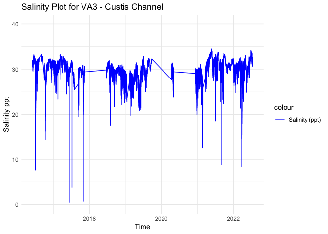
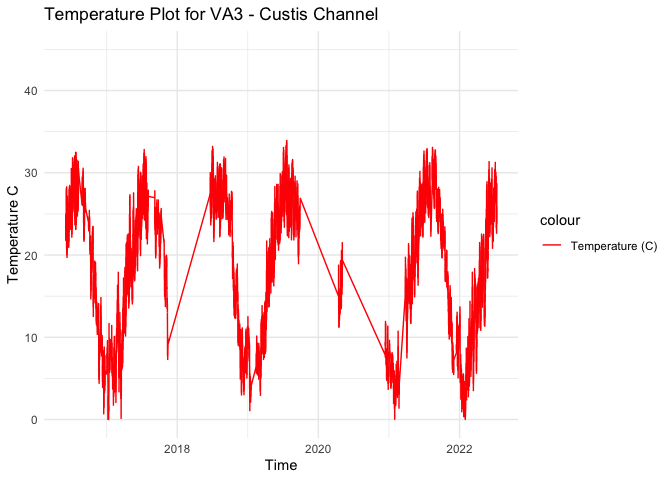
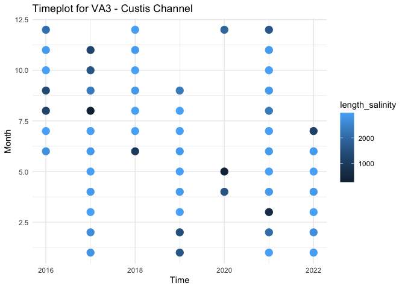

VA3 - Processed Environmental Data
================
Madeline Eppley
8/18/2023

``` r
setwd("/Users/madelineeppley/GitHub/EasternOysterEnvData/2022_SiteEnvironmentData")
```

### Load required packages.

``` r
library("dplyr") #Used for working with data frames
```

    ## 
    ## Attaching package: 'dplyr'

    ## The following objects are masked from 'package:stats':
    ## 
    ##     filter, lag

    ## The following objects are masked from 'package:base':
    ## 
    ##     intersect, setdiff, setequal, union

``` r
library("lubridate") #Used for time-date conversions
```

    ## 
    ## Attaching package: 'lubridate'

    ## The following objects are masked from 'package:base':
    ## 
    ##     date, intersect, setdiff, union

``` r
library("readr") #Used to read the CSV file
library("ggplot2") 
```

### Note the date of data download and source. All available data should be used for each site regardless of year. Note from the CSV file how often the site was sampled, and if there are replicates in the data. Also describe if the sampling occurred at only low tide, only high tide, or continuously.

``` r
#Data was downloaded on 3/29/2024
#Source - Darian Kelly, VIMS Eastern Shore Lab (see metadata in excel file)
#The site was sampled continuously, but there are some data gaps. 2016-2019 data is from Custis Channel, 2019-2022 data is from Wachapreague. 

#Create text strings with metadata information that we want to include in the final data frame. 
download_date <- ("03-29-2024")
source_description <- ("VIMS Eastern Shore Laboratory: Custis Channel/Wachapreague")
site_name <- ("VA3") #Use site code with site number based on lat position and state
collection_type <- ("continuous")
```

### Use the file path name in your working directory or desktop, see example below. Or, import data set through the “Files” window in R studio. Store the file in a variable with the “raw_ID_Site” format. If salinity and temperature data are in separate files, read in both and store them with “\_sal” or “\_temp” in the variable names.

``` r
#The file we will be working with is from Custis Channel, VA. 
raw_VA3 <- read_csv("/Users/madelineeppley/GitHub/EasternOysterEnvData/2022_SiteEnvironmentData/VA3-raw.csv")
```

    ## Rows: 137431 Columns: 7
    ## ── Column specification ────────────────────────────────────────────────────────
    ## Delimiter: ","
    ## chr  (2): MM/DD/YY, Date/Time Combined
    ## dbl  (4): Temp ('C), SpCond (ms/cm), Salinity (ppt), Battery (volts)
    ## time (1): HH:mm:SS
    ## 
    ## ℹ Use `spec()` to retrieve the full column specification for this data.
    ## ℹ Specify the column types or set `show_col_types = FALSE` to quiet this message.

``` r
# View how the data is stored. Note the variable names and the format and units that the data are stored in.  
spec(raw_VA3)
```

    ## cols(
    ##   `MM/DD/YY` = col_character(),
    ##   `HH:mm:SS` = col_time(format = ""),
    ##   `Date/Time Combined` = col_character(),
    ##   `Temp ('C)` = col_double(),
    ##   `SpCond (ms/cm)` = col_double(),
    ##   `Salinity (ppt)` = col_double(),
    ##   `Battery (volts)` = col_double()
    ## )

``` r
#View(raw_VA3)
```

### Start with the date and time of collection. We will use the lubridate package to standardize all values into the date-time format called POSIXct. This format stores the date and time in number of seconds since a past point (1/1/1970). This makes comparisons easy and helps to standardizes values.

``` r
#Convert to POSIXct format. Store it into a column named datetime in the data frame. Use the year-month-day hours:minutes:seconds format. 
raw_VA3$datetime <- as.POSIXct(raw_VA3$`Date/Time Combined`, format = "%m/%d/%y %H:%M")

#Look at the new data frame and examine to make sure the new datetime column is in the correct format. 
head(raw_VA3)
```

    ## # A tibble: 6 × 8
    ##   `MM/DD/YY` `HH:mm:SS` `Date/Time Combined` `Temp ('C)` `SpCond (ms/cm)`
    ##   <chr>      <time>     <chr>                      <dbl>            <dbl>
    ## 1 6/2/16     18:00      6/2/16 18:00                24.7             47.8
    ## 2 6/2/16     18:15      6/2/16 18:15                24.4             47.9
    ## 3 6/2/16     18:30      6/2/16 18:30                24.3             47.9
    ## 4 6/2/16     18:45      6/2/16 18:45                24.3             48.1
    ## 5 6/2/16     19:00      6/2/16 19:00                24.3             48.2
    ## 6 6/2/16     19:15      6/2/16 19:15                24.1             48.2
    ## # ℹ 3 more variables: `Salinity (ppt)` <dbl>, `Battery (volts)` <dbl>,
    ## #   datetime <dttm>

### Analyze the ranges of all of our variables of interest - time, salinity, and temperature. Make sure that the latitude and longitude values are consistent for a static collection site. This is a quick check so we can determine how to conduct the next filtering step.

``` r
#Standardize column and variable names. We will use "temp" for temperature in degrees C, "salinity" for salinity in parts per thousand (ppt), "lat" for latitude in degrees, and "lon" for longitude in degrees. 
#Use the dyplr format to rename multiple columns in the format "dataframe %>% rename("new name 1" = "old name 1", "new name 2", "old name 2")
raw_VA3 <- raw_VA3 %>% rename("temp" = "Temp ('C)", "salinity" = "Salinity (ppt)")
```

``` r
# we have NAs in the our data frame in the datetime column - need to remove these
count.nas_date <- is.na(raw_VA3$datetime) # store our NAs in a variable
summary(count.nas_date) # we have 13 NAs that are stored as "TRUE" in our count.nas
```

    ##    Mode   FALSE    TRUE 
    ## logical  137418      13

``` r
nrow(raw_VA3) # figure out how many rows we have in the original df: 137431
```

    ## [1] 137431

``` r
which(count.nas_date == TRUE) # find the number of NA rows that we need to remove: 13
```

    ##  [1]  22924  22925  22926  22927  40064  64552  64553  64554  64555 125731
    ## [11] 125732 125733 125734

``` r
raw_VA3 <- raw_VA3[-c(22924, 22925, 22926, 22927, 40064, 64552, 
                      64553, 64554, 64555, 125731, 125732, 125733, 125734), ] # remove the rows
nrow(raw_VA3) # check the new number of rows in the dataframe with the NAs removed
```

    ## [1] 137418

``` r
check_date <- 137431-137418 # the value of check should be 12
check_date # cool, we removed the 13 NA rows!
```

    ## [1] 13

``` r
# we have NAs in the our data frame in the salinity column - need to remove these
count.nas_sal <- is.na(raw_VA3$salinity) # store our NAs in a variable
summary(count.nas_sal) # we have 1360 NAs that are stored as "TRUE" in our count.nas
```

    ##    Mode   FALSE    TRUE 
    ## logical  136058    1360

``` r
raw_VA3 <- cbind(raw_VA3, count.nas_sal) # Add the TRUE/FALSE NA values to rows in a new column
raw_VA3 <- raw_VA3[!raw_VA3$count.nas_sal == "TRUE",] # remove NAs
nrow(raw_VA3) # check the number of rows left = 136057
```

    ## [1] 136058

``` r
check_sal <- 137418 - 136057
check_sal # cool, we removed the 1360 NA rows!
```

    ## [1] 1361

``` r
# check to see if there are any NAs left in the temp column of our data frame
count.nas_temp <- is.na(raw_VA3$temp) # store our NAs in a variable
summary(count.nas_temp)# we don't have any NAs left in the data set! good to go
```

    ##    Mode   FALSE 
    ## logical  136058

``` r
#Print the range (minimum and maximum) of dates of data collection. 
print(range(raw_VA3$datetime))
```

    ## [1] "2016-06-02 18:00:00 EDT" "2022-07-12 23:45:00 EDT"

``` r
#Print the range (minimum and maximum) of the salinity values. 
print(range(raw_VA3$salinity))
```

    ## [1]  0.46 34.51

``` r
#Print the range (minimum and maximum) of the temperature values.
print(range(raw_VA3$temp))
```

    ## [1] -1.714 33.929

``` r
#Store variables that we will include in the final data frame
lat <- 37.60769 # these are the Wachapreague coordinates - the Custis Channel coords are the exact same as the VA3 site
lon <- -75.6858
firstyear <- 2016
finalyear <- 2022
```

### Filter any of the variables that have data points outside of normal range. We will use 0-40 as the accepted range for salinity (ppt) and temperature (C) values. Note, in the summer, salinity values can sometimes exceed 40. Check to see if there are values above 40. In this case, adjust the range or notify someone that the site has particularly high salinity values.

``` r
#Filter the data between the values of 0 and 40 for both salinity and temperature. 
filtered_VA3 <- raw_VA3 %>%
    filter(between(salinity, 0, 40) & between(temp, 0, 40))

# Sanity check - print the ranges to ensure values are filtered properly. We can see that the ranges for both are now in the appropriate range.  
print(summary(filtered_VA3$salinity))
```

    ##    Min. 1st Qu.  Median    Mean 3rd Qu.    Max. 
    ##    0.46   29.15   30.37   30.06   31.54   34.51

``` r
print(summary(filtered_VA3$temp))
```

    ##    Min. 1st Qu.  Median    Mean 3rd Qu.    Max. 
    ##    0.00   10.20   19.09   18.01   25.52   33.93

``` r
#Store our data into a variable name with just the site name. 
VA3 <- filtered_VA3
```

### Visualize the salinity, temperature, and date ranges over time. This can help us see if there are any anomalies or gaps in the data and make sure the filtering was done correctly. Sanity check - do the temperature and salinity ranges look appropriate for the geography of the site (ex. near full ocean salinity for coastal sites, lower salinity for estuaries or near rivers)?

``` r
salplot <- ggplot(VA3, aes(x = datetime)) +
    geom_line(aes(y = salinity, color = "Salinity (ppt)")) +
    ylim(0,40) +
    labs(x = "Time", y = "Salinity ppt", title = "Salinity Plot for VA3 - Custis Channel") +
    scale_color_manual(values = c("Salinity (ppt)" = "blue")) +
    theme_minimal()

salplot
```

<!-- -->

``` r
tempplot <- ggplot(VA3, aes(x = datetime)) +
    geom_line(aes(y = temp, color = "Temperature (C)")) +
    ylim(0, 45) +
    labs(x = "Time", y = "Temperature C", title = "Temperature Plot for VA3 - Custis Channel") +
    scale_color_manual(values = c( "Temperature (C)" = "red")) +
    theme_minimal()


tempplot
```

<!-- -->

### We need to calculate the mean, maximum, and minimum values for salinity and temperature per month and year. First make two data frames to contain each of the annual and monthly averages.

``` r
#Calculate the mean, maximum, and minimum values for salinity and temperature for each month. 
VA3_envrmonth <- VA3 %>%
    mutate(year = year(datetime), month = month(datetime)) %>%
    group_by(year, month) %>%
    summarise(
      min_salinity = min(salinity),
      max_salinity = max(salinity),
      mean_salinity = mean(salinity),
      length_salinity = length(salinity),
      min_temp = min(temp),
      max_temp = max(temp),
      mean_temp = mean(temp),
      length_temp = length(temp))
```

    ## `summarise()` has grouped output by 'year'. You can override using the
    ## `.groups` argument.

``` r
print(VA3_envrmonth)
```

    ## # A tibble: 56 × 10
    ## # Groups:   year [7]
    ##     year month min_salinity max_salinity mean_salinity length_salinity min_temp
    ##    <dbl> <dbl>        <dbl>        <dbl>         <dbl>           <int>    <dbl>
    ##  1  2016     6        29.5          33.4          31.9            2712   19.7  
    ##  2  2016     7         7.65         32.4          29.8            2976   22.2  
    ##  3  2016     8        30.4          33.3          32.2            1189   24.7  
    ##  4  2016     9        28.0          33.4          32.0            1366   21.7  
    ##  5  2016    10        14.4          31.4          28.6            2974   12.5  
    ##  6  2016    11        29.6          32.3          31.6            2880    4.40 
    ##  7  2016    12        27.0          32.3          31.0            2117    0.687
    ##  8  2017     1        24.6          32.0          30.1            2785    0.003
    ##  9  2017     2        23.3          32.0          30.8            2688    1.75 
    ## 10  2017     3        27.7          33.3          32.2            2967    0.142
    ## # ℹ 46 more rows
    ## # ℹ 3 more variables: max_temp <dbl>, mean_temp <dbl>, length_temp <int>

``` r
#Calculate the mean, maximum, and minimum values for salinity and temperature for each year. 
VA3_envryear <- VA3 %>%
    mutate(year = year(datetime)) %>%
    group_by(year) %>%
    summarise(
      min_salinity = min(salinity),
      max_salinity = max(salinity),
      mean_salinity = mean(salinity),
      min_temp = min(temp),
      max_temp = max(temp),
      mean_temp = mean(temp))

print(VA3_envryear)
```

    ## # A tibble: 7 × 7
    ##    year min_salinity max_salinity mean_salinity min_temp max_temp mean_temp
    ##   <dbl>        <dbl>        <dbl>         <dbl>    <dbl>    <dbl>     <dbl>
    ## 1  2016         7.65         33.4          30.8    0.687     32.5      19.9
    ## 2  2017         0.46         33.3          30.3    0.003     32.8      17.0
    ## 3  2018        17.5          31.9          29.2    2.98      33.2      20.4
    ## 4  2019        19.8          32.8          28.8    1.08      33.9      19.5
    ## 5  2020        20.0          31.4          28.7    3.67      21.5      11.3
    ## 6  2021         8.81         34.5          30.9    0.031     33.1      18.1
    ## 7  2022         8.41         34.2          30.5    0         31.4      14.7

### Plot the months and years of data collection to check if there are any collection gaps in the data.

``` r
timeplot <- ggplot(VA3_envrmonth, aes(x = year)) +
    geom_point(aes(y = month, color = length_salinity), size = 4) +
    labs(x = "Time", y = "Month", title = "Timeplot for VA3 - Custis Channel") +
    ylim(1,12) +
    theme_minimal()

timeplot
```

<!-- -->

### We can now calculate a list of variables that we will have collected for all sites. This will allow us to compare sites easily. We will calculate the number of observations from each site, the mean annual, maximum annual, and minimum annual value for all variables.

Our list of variables includes:

- Mean_Annual_Temperature_C: average of all available data

- Mean_max_temperature_C: average of maximums for each year

- Mean_min_temperature_C: average of minimums for each year

- Temperature_st_dev: standard deviation of all available data

- Temperature_n: total number of data points

- Temperature_years: number of years in data set

- Mean_Annual_Salinity_ppt: average of all available data

- Mean_min_Salinity_ppt: average of minimums for each year

- Mean_max_Salinity_ppt: average of maximums for each year

- Salinity_st_dev: standard deviation of all available data

- Salinity_n: total number of data points

- Salinity_years: number of years in data set

``` r
#Calculate temperature variables. 
Mean_Annual_Temperature_C <- mean(VA3$temp)
Mean_max_temperature_C <- mean(VA3_envryear$max_temp)
Mean_min_temperature_C <- mean(VA3_envryear$min_temp)
Temperature_st_dev <- sd(VA3$temp)
Temperature_n <- nrow(VA3)
Temperature_years <- nrow(VA3_envryear)

#Create a data frame to store the temperature results
VA3_temp <- cbind(site_name, download_date, source_description, lat, lon, firstyear, finalyear, Mean_Annual_Temperature_C, Mean_max_temperature_C, Mean_min_temperature_C, Temperature_st_dev, Temperature_n, Temperature_years, collection_type)
print(VA3_temp)
```

    ##      site_name download_date
    ## [1,] "VA3"     "03-29-2024" 
    ##      source_description                                           lat       
    ## [1,] "VIMS Eastern Shore Laboratory: Custis Channel/Wachapreague" "37.60769"
    ##      lon        firstyear finalyear Mean_Annual_Temperature_C
    ## [1,] "-75.6858" "2016"    "2022"    "18.0111014295389"       
    ##      Mean_max_temperature_C Mean_min_temperature_C Temperature_st_dev
    ## [1,] "31.2017142857143"     "1.20714285714286"     "8.30538008385981"
    ##      Temperature_n Temperature_years collection_type
    ## [1,] "135848"      "7"               "continuous"

``` r
write.table(VA3_temp, "/Users/madelineeppley/GitHub/EasternOysterEnvData/2022_SiteEnvironmentData/Seascape_Processed/seascape_temperature.csv", sep = ",", append = TRUE, col.names = FALSE, row.names = FALSE)

# Write to a unique new CSV file
write.csv(VA3_temp, "/Users/madelineeppley/GitHub/EasternOysterEnvData/2022_SiteEnvironmentData/Seascape_Processed/VA3_temperature.csv")
```

``` r
#Calculate the salinity variables
Mean_Annual_Salinity_ppt <- mean(VA3$salinity)
Mean_max_Salinity_ppt <- mean(VA3_envryear$max_salinity)
Mean_min_Salinity_ppt <- mean(VA3_envryear$min_salinity)
Salinity_st_dev <- sd(VA3$salinity)
Salinity_n <- nrow(VA3)
Salinity_years <- nrow(VA3_envryear)


#Create a data frame to store the temperature results
VA3_salinity <- cbind(site_name, download_date, source_description, lat, lon, firstyear, finalyear, Mean_Annual_Salinity_ppt, Mean_max_Salinity_ppt, Mean_min_Salinity_ppt, Salinity_st_dev, Salinity_n, Salinity_years, collection_type)
print(VA3_salinity)
```

    ##      site_name download_date
    ## [1,] "VA3"     "03-29-2024" 
    ##      source_description                                           lat       
    ## [1,] "VIMS Eastern Shore Laboratory: Custis Channel/Wachapreague" "37.60769"
    ##      lon        firstyear finalyear Mean_Annual_Salinity_ppt
    ## [1,] "-75.6858" "2016"    "2022"    "30.0579265797067"      
    ##      Mean_max_Salinity_ppt Mean_min_Salinity_ppt Salinity_st_dev    Salinity_n
    ## [1,] "33.0628571428571"    "11.8028571428571"    "2.22572540501046" "135848"  
    ##      Salinity_years collection_type
    ## [1,] "7"            "continuous"

``` r
write.table(VA3_salinity, "/Users/madelineeppley/GitHub/EasternOysterEnvData/2022_SiteEnvironmentData/Seascape_Processed/seascape_salinity.csv", sep = ",", append = TRUE, col.names = FALSE, row.names = FALSE) 

# Write to a unique new CSV file
write.csv(VA3_salinity, "/Users/madelineeppley/GitHub/EasternOysterEnvData/2022_SiteEnvironmentData/Seascape_Processed/VA3_salinity.csv")
```
