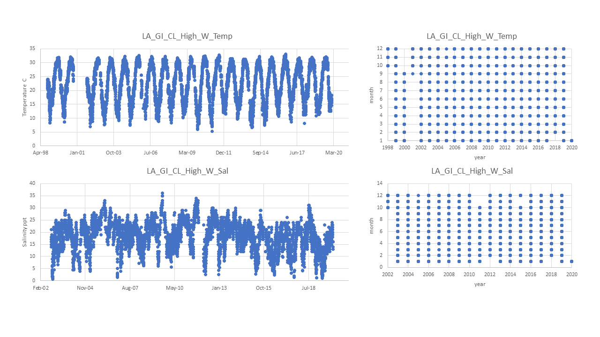

## Pop ID: LA_GI_CL_High_W

## Map: 

Lat/long for population is unknown so using lat/long of data sources which are exact. Erin/Dina's note: *APPROXIMATE-none provided by sampler, taken from USGS buoy 08017118 (where env data was collected)*

https://www.google.com/maps/d/edit?mid=18h3Ke7K1dtPntCNleEkjDlioXjJ7L4mz&ll=29.675514823263715%2C-93.3485311319538&z=10

## Summary notes:

USGS Station ID Lake Calcasieu #08017118 is ok for temperature and salinity; both temp and sal data have been flag-filtered to include approved "A" data and exclude provisional "P" data (this eliminates data that didn't pass quality control by the provider, or hasn't yet been through QC).

Data is given as Daily Mean, Max and Min; in the table below:
- Mean_all and StdDev_all were calculated from Daily Means, 
- Mean and StdDev yearly_max were calculated from Daily Maxs,
- Mean and StdDev yearly_min were calculated from Daily Mins.

## Summary table:

| Parameter             | Temp C USGS Lake Calcasieu Flag-filtered | Sal ppt USGS Lake Calcasieu Flag-filtered |
| ----------------------| :--------------------------------------: | :---------------------------------------: |
| N_all_datapoints      |                  6752                    |                   5330                    |
| Mean_all_datapoints   |                   22.4                   |                   18.3                    |
| StdDev_all_datapoints |                   6.7                    |                   5.9                     |
| N_years               |                     23                   |                    19                     |
| Mean_yearly_max       |                     32.0                 |                    31.4                   |
| StdDev_yearly_max     |                      3.8                 |                     3.2                   |
| Mean_yearly_min       |                       7.2                |                    3.0                    |
| StdDev_yearly_min     |                     2.4                  |                      2.6                  |
| Data range            |Oct 1998 to Sep 2000, Sep 2001 to Jan 2020|            Oct 2002 to Jan 2020           |
| Data frequency        |           Daily Mean, Min, Max           |             Daily Mean, Min, Max          |
| Missing winter        |           FALSE                          |                   FALSE                   |

## Data source and filenames:

Website: https://waterdata.usgs.gov/la/nwis/uv?site_no=08017118 (temp and sal)

Temp: LA_GI_CL_High_W_Temp.xlsx

Sal: LA_GI_CL_High_W_Sal.xlsx

## Plots: all data over time and data availability per month per year (this helps visualize the 'missing winter' question and other gaps in data) (simple plots made in excel).

