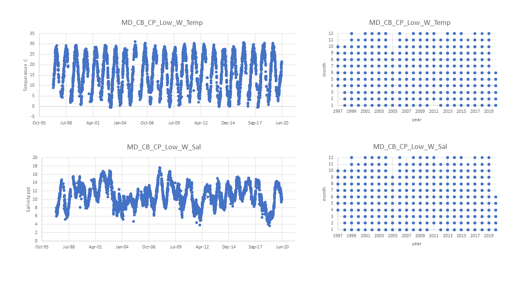

# Pop ID: MD_CB_CP_Low_W

## Map: 

Lat/long are exact for the population; Erin/Dina's notes says unknown lat/long for datasource Tobash Horn Point - but the datasource spreadsheet is named 'Horn Point', so I looked up lat/long for 'Horn Point MD' and included in the map.

https://www.google.com/maps/d/edit?mid=1plve9DbTtR5RGaxtCvS84ZtysDWnR9Dq&ll=38.83014681588834%2C-76.28455825625495&z=11

## Summary notes:

Stephanie Tobash Horn Point data 1997-2020 (HPLOH_Sal_and_Temp.xlsl) is the only datasource listed by Erin/Dina for both temperature and salinity.

Daily readings (or less frenquent) at random times (I wouldn't say they are daily means).

No flags or data quality control in this file, and units are assumed (C and ppt/psu), not given. 

# Summary table:

| Parameter             | Temp C Tobash Horn Point | Sal ppt Tobash Horn Point | 
| ----------------------| :----------------------: | :-----------------------: | 
| N_all_datapoints      |   6083                   |             6083          |  
| Mean_all_datapoints   |    17.7                  |             10.6          |
| StdDev_all_datapoints |     8.4                  |              2.4          |
| N_years               |     24                   |              24           |
| Mean_yearly_max       |     29.0                 |              14.7         |
| StdDev_yearly_min     |      1.9                 |                  1.4      |
| Mean_yearly_min       |      1.6                 |                 6.9       |
| StdDev_yearly_min     |      2.0                 |         1.9               |
| Data range1|  Apr 1997 to Jun 2020    |   Apr 1997 to Jun 2020    |
| Data frequency        |    daily ish             |   daily ish               |
| Missing winter        |    FALSE                 |       FALSE               |

 
## Data source and filenames:

Website: NA; data file probably sent directly to Erin/Dina.

Temp: MD_CB_CP_Low_W_Temp.xlsx

Sal: MD_CB_CP_Low_W_Sal.xlsx

## Plots: all data over time and data availability per month per year (this helps visualize the 'missing winter' question and other gaps in data) (simple plots made in excel).

