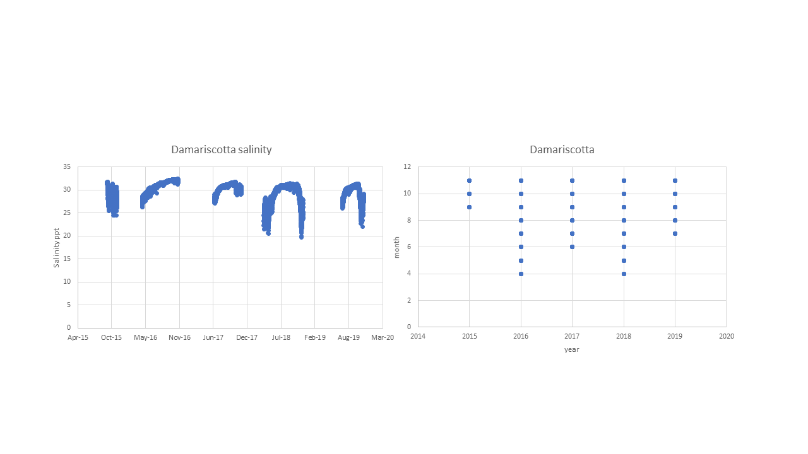

# ME Sheepscot river as a potential new collection site - Salinity data we have so far

- Data for "Sheepscot" in file Temp_Sal_Hog_Island_Sheepscot_Lewis_ME
- Data in file UpperDamariscotta_Temp_Sal

## Plot of Sheepscot salinity, all data.

## Plot of Damariscotta salinity, all data (this is the same dataset used for ME_DR_HI_High_W).

## Summary table of all salinity data for each station, and combined. 

| Parameter               | Sheepscot all yrs  | Damariscotta all yrs  | 
| ----------------------  | :----------------: | :------------------:  | 
| N_all_datapoints        |        541         |           18961       |  
| Mean_all_datapoints     |        25.04       |           29.9        |   
| StdDev_all_datapoints   |         5.2        |            1.9        |    
| N_years                 |          25        |             5         |    
| Mean_yearly_max         |           30.0     |           31.7        |   
| Mean_yearly_min         |          15.4      |            23.9       |   
| Data range & resolution | 1991-2007; monthly |  2015-2019; hourly    |   
