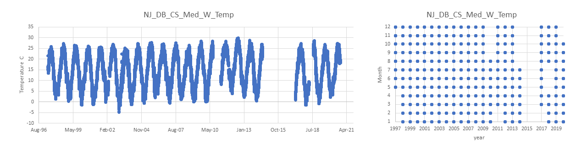

# PopID: NJ_DB_CS_Med_W

## Map:

It is unclear to me whether the lat/long for this population are exact or approximate. Erin/Dina's note: *This is a reef that is at the Cape Shore Selected Rutgers NEH farm site. So althought they are considered "wild", we may not want to consider them wild for analysis. Salinity 18-22 (Ximing)*. 

Lat/long for datasources are exact.

https://www.google.com/maps/d/edit?mid=1nn3dDjEdRucUUBBNbLN-0jViRpSoG33U&ll=39.02974046922342%2C-74.9369395&z=12

## Summary notes:

- NOAA Tides & Currents Station ID Cape May #8536110 is ok for temperature, but not for salinity according to Ximing.
  - 2005 temperature blip has been fixed (removed data from 4-7 Jul); I also cleaned up a few odd datapoints and excluded 2016, which only had data for 1 week in June. Other than that, this file has not quality control or flags from provider and has chunks of data missing (see table and plot below).
- no salinity data for this population.

## Summary table:

| Parameter             |    Temp C NOAA Cape May blip-removed  |          Sal ppt           |
| ----------------------| :-----------------------------------: | :------------------------: |
| N_all_datapoints      |                168705                 |             NA             |
| Mean_all_datapoints   |                   14.5                |             NA             |
| StdDev_all_datapoints |                     7.7               |             NA             |
| N_years               |                    22                 |             NA             |
| Mean_yearly_max       |                    27.2               |             NA             |
| StdDev_yearly_max     |                    1.1                |             NA             |
| Mean_yearly_min       |                    0.6                |             NA             |
| StdDev_yearly_min     |                    2.4                |             NA             |
| Data range            |May 1997 to Aug 2010, Mar 2011 to Jul 2014, Mar 2017 to Apr 2018, Aug 2018 to Oct 2020|    NA    |
| Data frequency        |                   hourly              |             NA             |
| Missing winter        |                   FALSE               |             NA             |

## Data source and filenames:

Website: https://tidesandcurrents.noaa.gov/stationhome.html?id=8536110 (temp only); NA for sal.

Temp: NJ_DB_CS_Med_W_Temp.xlsx

Sal: NA

## Plots: all data over time and data availability per month per year (this helps visualize the 'missing winter' question and other gaps in data) (simple plots made in excel).

