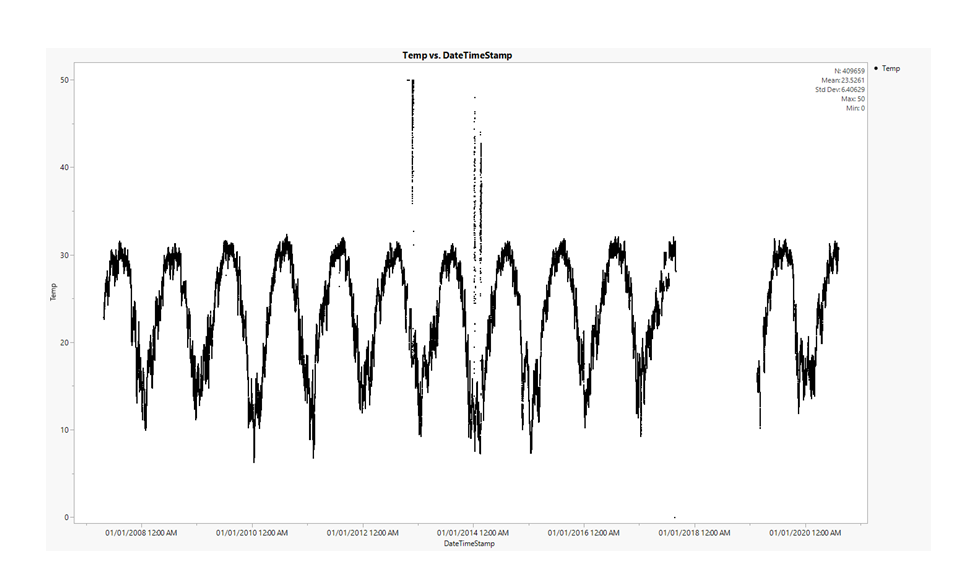
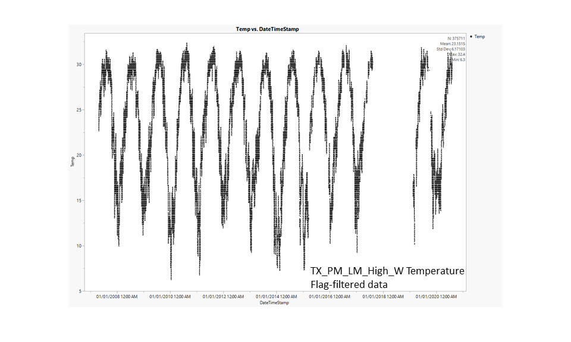
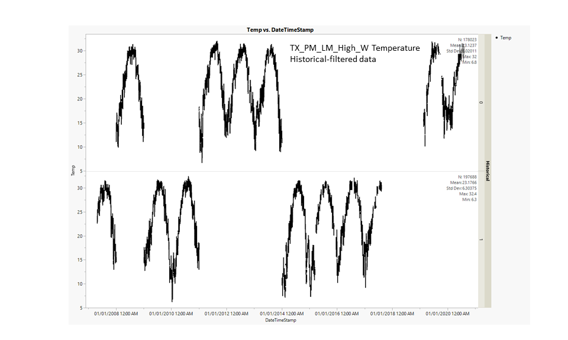

# 2020-09-29

---

# PopID: TX_PM_LM_High_W
---

**COMPARE SOURCES**

> No sources to compare, NERR Buoy MARABWQ is the only datasource listed for both temperature and salinity.

I'm using an updated version (data range: 2007-2020) of the file originally provided by Erin (data range: 2007-2017).

**BEST DATASETS**

Missing temp data ~Sep 2017-Mar 2019

## PopID: VA_CB_HC_Med_W Temperature - filtration steps to clean dataset

| Parameter      | Unfiltered | Flag-filtered | Historical-filtered | 
| ---------------| ---------- | ------------- | ------------------- | 
| N_all          | 409659     |  375711       |  197688             |  
| Mean_all       |  23.5261   | 23.1515       |  23.1766            |   
| StdDev_all     |  6.40629   |  6.17103      |  6.30375            |  
| Max_all        | 50         |  32.4         |  32.4               |  
| Min_all        | 0          |  6.3          |   6.3               |  
| N_years        |  13        |  13           |   7                 |  
| Mean_max_years | 34.45      | 31.69         |  31.77              |  
| Mean_min_years | 8.93       | 9.65          | 9.14                | 
| dd_0           |  0         |  0            |   0                 |  
| dd_15          |  360290    |  327695       |  170019             |   
| dd_30          |  56414     | 45656         |  27071              |  

Notes: 

**Flag-filtered** - *This is the most important step, gets rid of data outside of sensor range, QAQC rejected, missing data and other flagged data such as field or instrument maintenance days, cause unknown, instrument or sensor malfunction, data collected at wrong depth, etc.*

**Historical-filtered** - "A value of 0 in the historical column indicates that the data have not been through final QAQC by the CDMO. A value of 1 indicates that the data have been through final tertiary review at the CDMO and posted as the final authoritative data. (from data provider)" 
>*I think this is the final data after an annual round of QC, so the current year is likely to be filtered out (2020 in this case). For this dataset, it seems like some random years were not through the final tertiary review. I don't think we need this filter.*
