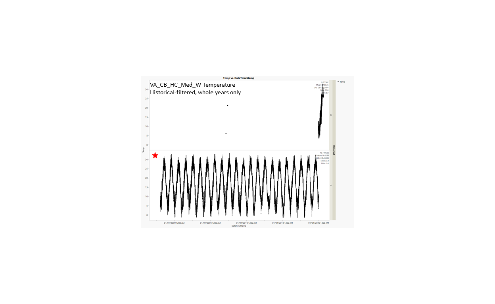

# 2020-09-25

---

## Select best temperature and salinity datasets for each popularion.

**Step 1)** For each WILD population (popID ending in _W) that have primary and secondary datasources listed in EasternOysterSeascapeData, compare primary and secondary datasets when secondary source would be preferable (more data, higher resolution, etc). 

> This is to see if data in primary and secondary sources for the same timeframe are similar enough. 
> If they are similar enough, that means the secondary dataset can be used instead of the primary dataset to represent temperature/salinity experienced by that particular population.
> If they are too different (more likely to happen for salinity - more spaciously heterogeneous than temperature) - stick with the primary source.

**Step 2)** For the timeframe that will be compared, filter out bad data according to the data provider's instructions. Compare common and clean data.

> At the end of this step, we will have selected the best temperature and salinity dataset for each population. 

**Step 3)** Using the best dataset for each population, filter the entire daataset, plot the data and calculate: N_all, Mean_all, StdDev_all, Max_all, Min_all, N_years, Mean_Max_years, Mean_Min_years, dd_00 (number of days temp below 0oC), dd_15 (number of days temp above 15oC) and dd_30 (number of days temp above 30oC). If possible, plot and calculate data for each step of filtration to see how data filtration affect those parameters.

---

# PopID: VA_CB_HC_Med_W

---

**COMPARE SOURCES**

**Primary datasource:** VIMS_Sonde_Marker_119 (Apr-Oct, missing Aug, every 15min).

**Secondary datasource:** NERR CBVGIWQ (1997-2020, every 15min)

Steps to compare primary and secondary datasources (this is done for Temperature and Salinity separately):

1) "Align" the large NERR and small VIMS datasets to end up with a timeframe for which we have data available from both stations. 

2) Clean up the large NERR dataset based on the flags/flag codes, historical and provisional flags. VIMS data did not come with quality control info.

3) Clean up the small VIMS dataset if needed to end up with exact matching dates on both datasets.

4) The common_and_clean datasets from each source are compared based on N, average, stddev, min and max (using pivot tables).

## PopID: VA_CB_HC_Med_W Temperature, both datasets in oC.

## PopID: VA_CB_HC_Med_W Salinity, NEER dataset in psu, VIMS dataset in ppt (not corrected). 

> Note: Units of Measurement - The relationship between these units is: 1 ppt = 1,000 ppm = 1000 mg/L = 0.1 percent. Salinity is also expressed in practical salinity units (psu), a measure of conductivity at a constant pressure and temperature that is about equivalent to ppt.

## PopID: VA_CB_HC_Med_W Common_clean Summary Comparison (Temp and Sal)

| Datasource    | N_all  | Mean_all | StdDev_all | Max_all | Min_all | Best dataset |
| ------------- | ------ | -------- | ---------- | ------- | ------- |:------------:|
| VIMS 1ary Temp| 15188  | 22.869   | 4.3850     |32.4     |10.9     |              |
| NERR 2ary Temp| 15188  | 22.173   | 4.4026     |32.8     |10.2     |x             |
| VIMS 1ary Sal | 15119  | 20.029   | 1.089      |22.5     |7.5      |x             |
| NERR 2ary Sal | 15119  | 30.019   | 1.505      |32.95    |19.36    |              |

---

**BEST DATASETS**

## PopID: VA_CB_HC_Med_W Temperature - filtration steps to clean dataset

| Parameter      | Unfiltered | Flag-filtered | Historical-filtered | Historical-filtered, whole years | Provisional-filtered |
| ---------------| ---------- | ------------- | ------------------- | -------------------------------- | -------------------- |
| N_all          | 781563     |  779597       |  756035             |  749522                          |  586838              |
| Mean_all       |  16.8144   | 16.8091       |  16.7756            |   16.8299                        |  16.8316             |
| StdDev_all     |  8.46408   |  8.44748      |  8.4489             |  8.45985                         | 8.53657              |
| Max_all        | 50         |  33.4         |  33.4               |  33.4                            |   33.4               |
| Min_all        | -4.2       |  -1.4         |   -1.4              |    -1.4                          |  -1.4                |
| N_years        |  24        |  24           |   23                |  22                              | 17                   |
| Mean_max_years | 32.20      | 31.41         |  31.35              |  31.97                           |  31.93               |
| Mean_min_years | -0.396     | -0.021        | -0.183              | -0.391                           | -0.571               |
| dd_0           |  1248      |  1114         |   1114              |   1114                           |  1114                |
| dd_15          | 429385     |  428201       |  415091             |   414292                         |  325801              |
| dd_30          |  9514      | 9166          |  8160               |  8160                            |  6629                |

Notes: 

**Flag-filtered** - *This is the most important step, gets rid of data outside of sensor range, QAQC rejected, missing data and other flagged data such as field or instrument maintenance days, cause unknown, etc.*

**Historical-filtered** - "A value of 0 in the historical column indicates that the data have not been through final QAQC by the CDMO. A value of 1 indicates that the data have been through final tertiary review at the CDMO and posted as the final authoritative data." 
>*I think this is the final data after an annual round of QC, so the current year is likely to be filtered out (2020 in this case). I'm not sure if we need this filter.*

**Historial-whole years only** - if there is only partial data for one or more years (e.g., there will be one or more extra winter, or one or more extra summer), this may bias Mean_max_years or Mean_min_years. 
>*This filter is not from the data-provider, I just decided to add and see if the bias was significant.*

**Provisional-filtered** - "A value of 0 in the provisional plus column indicates that the data have been through the automated flagging process (primary QAQC) ONLY and has not been checked by the Reserve; While a value of 1 in the provisional plus column indicates that the data have been through secondary QAQC at the Reserve using Excel macros (provided by the CDMO) to further QAQC the data." 
>I wonder if this was an older way of quality-controlling the data because it splits the data into before and after Year 2003. *I don't think we need to apply this filter.*

## PopID: VA_CB_HC_Med_W Salinity - filtration steps to clean dataset

> Notes from provider: 

The raw/archived data from this spreadsheet has not been subjected to VIMS ESL quality control. Questionable readings, outliers, missed readings, or gaps in the dataset may appear in the data and should be handled with appropriate caution and user discretion.

So, no data cleanup for this dataset, just showing the summary of unfiltered data here:

| Parameter      | Unfiltered | 
| ---------------| ---------- | 
| N_all          | 15226      | 
| Mean_all       |  30.02     | 
| StdDev_all     |  1.503     |  
| Max_all        | 32.95      |  
| Min_all        | 19.36      |  
| N_years        |  <1        |  
| Mean_max_years | NA         | 
| Mean_min_years | NA         | 
| dd_0           |  NA        |  
| dd_15          | NA         |  
| dd_30          |  NA        | 
