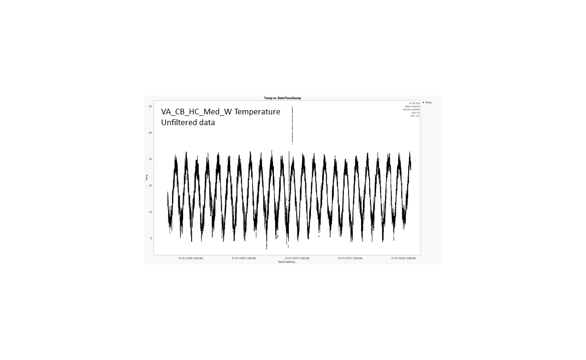
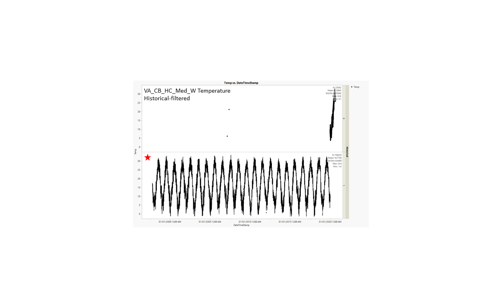
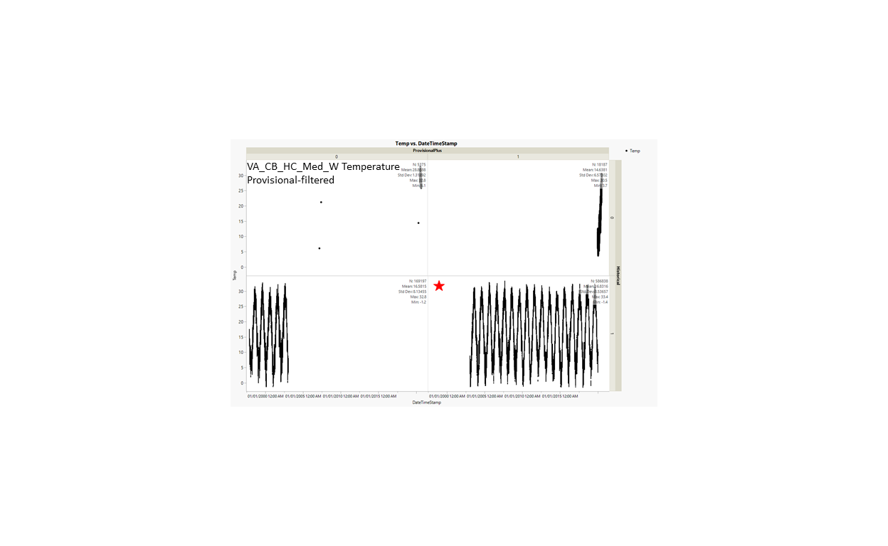

# 2020-10-30, Thais' notes following meeting:

## Pop ID: VA_CB_HC_High_W_Temp

## Map:

Lat/long for population is approximate, this is Erin's note on it: *APPROXIMATE- picture of the sampling site on a map was provided by Jess. Lat and Long approximate by Erin on google maps using this. I checked it today and got a slightly more accurate number based on the map provided.*

https://www.google.com/maps/d/edit?mid=1ggc_n7JouNgYYtTQXOugT8_ILX3KdCen&ll=37.52139233253085%2C-76.02792199999999&z=9

## Summary notes:

NERR_CBVGIWQ is ok for temperature but not for salinity; Temp data has been flag-filtered (this eliminates data that didn't pass quality control by the provider).

VIMS_Sonde_Marker_119 is ok for salinity; Sal data has not been through any quality control.

## Summary table:

| Parameter             | Temp C NERR Flag-filtered | Sal ppt VIMS Unfiltered |
| ----------------------| :-----------------------: | :---------------------: |
| N_all_datapoints      |        776466             |             15226       |
| Mean_all_datapoints   |        16.8               |             30.0        |
| StdDev_all_datapoints |          8.5              |               1.5       |
| N_years               |          24               |             0.6         |
| Mean_yearly_max       |        31.41              |             NA          |
| StdDev_yearly_max     |         3.0               |             NA          |
| Mean_yearly_min       |          -0.02            |             NA          |
| StdDev_yearly_min     |         1.5               |             NA          |
| Data range            |    Oct 1997 to Sep 2020   |        Apr to Oct 2017  |
| Data frequency        |     every 15 min          |           every 15 min  |
| Missing winter        |           FALSE           |             TRUE        |

## Data source and filenames:

Website: http://cdmo.baruch.sc.edu/dges/ (temperature only)

Temp: VA_CB_HC_High_W_Temp.xlsx

Sal: VA_CB_HC_High_W_Sal.xlsx

---

# 2020-10-29

## KEL and TB notes
- We decided the NERR data is OK for temperature but not for salinity - DONE, SEE SUMMARY TABLES ABOVE (TB)

TO DO
- N_years should be a number (no symbol like "<") - DONE, I'm using a fraction such as 7 months = 0.6 of a year (TB). This is approximate, does not mean that we have data for all days in a given month (TB).
- maybe we should add a column for whether the data is missing winter? - DONE (TB).
- we'll stick with the VIMS data for salinity, but it puts it in a "high" category whereas previosuly we measured it as medium. DOUBLE CHECK THE CALCULATIONS AND DATA SOURCES. - DONE checking calculations and sources, plus I looked through the EasternOysterSeascapeData spreadsheet version history and it looks like this location's ID was changed by KEL from VA_CB_HC_Med_W to VA_CB_HC_High_W on October 1st 2020. I'm keeping it as high here until we talk again - changed everywhere from Med to High (TB).

CHECK WITH JESS AND DINA ABOUT THIS ONE. DOUBLE CHECK THE MAP. - NOT DONE (TB)

---

# 2020-09-25

## Select best temperature and salinity datasets for each popularion.

**Step 1)** For each WILD population (popID ending in _W) that have primary and secondary datasources listed in EasternOysterSeascapeData, compare primary and secondary datasets when secondary source would be preferable (more data, higher resolution, etc). 

> This is to see if data in primary and secondary sources for the same timeframe are similar enough. 
> If they are similar enough, that means the secondary dataset can be used instead of the primary dataset to represent temperature/salinity experienced by that particular population.
> If they are too different (more likely to happen for salinity - more spaciously heterogeneous than temperature) - stick with the primary source.

**Step 2)** For the timeframe that will be compared, filter out bad data according to the data provider's instructions. Compare common and clean data.

> At the end of this step, we will have selected the best temperature and salinity dataset for each population. 

**Step 3)** Using the best dataset for each population, filter the entire daataset, plot the data and calculate: N_all, Mean_all, StdDev_all, Max_all, Min_all, N_years, Mean_Max_years, Mean_Min_years, dd_00 (number of days temp below 0oC), dd_15 (number of days temp above 15oC) and dd_30 (number of days temp above 30oC). If possible, plot and calculate data for each step of filtration to see how data filtration affect those parameters.

---

# PopID: VA_CB_HC_High_W

---

**COMPARE SOURCES**

**Primary datasource:** VIMS_Sonde_Marker_119 (Apr-Oct, missing Aug, every 15min).

**Secondary datasource:** NERR CBVGIWQ (1997-2020, every 15min).

> Note: for NERR CBVGIWQ, I'm using an updated version (data range: 1997-2020) of the file originally provided by Erin (data range: 2004-2018).

Steps to compare primary and secondary datasources (this is done for Temperature and Salinity separately):

1) "Align" the large NERR and small VIMS datasets to end up with a timeframe for which we have data available from both stations. 

2) Clean up the large NERR dataset based on the flags/flag codes, historical and provisional flags. VIMS data did not come with quality control info.

3) Clean up the small VIMS dataset if needed to end up with exact matching dates on both datasets.

4) The common_and_clean datasets from each source are compared based on N, average, stddev, min and max (using pivot tables).

## PopID: VA_CB_HC_High_W Temperature, both datasets in oC.

## PopID: VA_CB_HC_High_W Salinity, NEER dataset in psu, VIMS dataset in ppt (not corrected). 

> Note: Units of Measurement - The relationship between these units is: 1 ppt = 1,000 ppm = 1000 mg/L = 0.1 percent. Salinity is also expressed in practical salinity units (psu), a measure of conductivity at a constant pressure and temperature that is about equivalent to ppt.

## PopID: VA_CB_HC_High_W Common_clean Summary Comparison (Temp and Sal)

| Datasource    | N_all  | Mean_all | StdDev_all | Max_all | Min_all | Best dataset |
| ------------- | ------ | -------- | ---------- | ------- | ------- |:------------:|
| VIMS 1ary Temp| 15188  | 22.869   | 4.3850     |32.4     |10.9     |              |
| NERR 2ary Temp| 15188  | 22.173   | 4.4026     |32.8     |10.2     |x             |
| VIMS 1ary Sal | 15119  | 30.019   | 1.505      |32.95    |19.36    |    x         |
| NERR 2ary Sal | 15119  | 20.029   | 1.089      |22.5     |7.5      |              |

---

**BEST DATASETS**

## PopID: VA_CB_HC_High_W Temperature - filtration steps to clean dataset

| Parameter      | Unfiltered | Flag-filtered | Historical-filtered | Provisional-filtered |
| ---------------| ---------- | ------------- | ------------------- | -------------------- |
| N_all          | 781563     |  776466       |  752904             |  583707              |
| Mean_all       |  16.8144   | 16.8156       |  16.7822            |  16.8403             |
| StdDev_all     |  8.4641    |  8.4558       |  8.4575             |  8.5479              |
| Max_all        | 50         |  33.4         |  33.4               |  33.4                |
| Min_all        | -4.2       |  -1.4         |   -1.4              |  -1.4                |
| N_years        |  24        |  24           |   23                |  17                  |
| Mean_max_years | 32.20      | 31.41         |  31.35              |  31.93               |
| Mean_min_years | -0.396     | -0.021        | -0.183              | -0.571               |
| dd_0           |  1248      |  1114         |   1114              | 972                  |
| dd_15          | 429384     |  427018       |  413908             | 324618               |
| dd_30          |  9514      | 9166          |  8160               |  6629                |

Notes: 

**Flag-filtered** - *This is the most important step, gets rid of bad data such as outside of sensor range, QAQC rejected, missing data, field or instrument maintenance days, cause unknown, etc. After inspecting the metadata files, I'm only allowing data flagged as: CND/GSM-CND=new deployment begins; GSM-CRE=significant rain event; and SNV/SNV-CDF/CDF =negative value, neg value seems to fit conditions.*

**Historical-filtered** - "A value of 0 in the historical column indicates that the data have not been through final QAQC by the CDMO. A value of 1 indicates that the data have been through final tertiary review at the CDMO and posted as the final authoritative data." 
>*I think this is the final data after an annual round of QC, so the current year is likely to be filtered out (2020 in this case). I'm not sure if we need this filter.*

**Provisional-filtered** - "A value of 0 in the provisional plus column indicates that the data have been through the automated flagging process (primary QAQC) ONLY and has not been checked by the Reserve; While a value of 1 in the provisional plus column indicates that the data have been through secondary QAQC at the Reserve using Excel macros (provided by the CDMO) to further QAQC the data." 
>I wonder if this was an older way of quality-controlling the data because it splits the data into before and after Year 2003 for this dataset. *I don't think we need to apply this filter.*

## PopID: VA_CB_HC_High_W Salinity - filtration steps to clean dataset

Notes from provider: 

>"The raw/archived data from this spreadsheet has not been subjected to VIMS ESL quality control. Questionable readings, outliers, missed readings, or gaps in the dataset may appear in the data and should be handled with appropriate caution and user discretion."

So, no data cleanup for this dataset, just showing the summary of unfiltered data here:

| Parameter      | Unfiltered | 
| ---------------| ---------- | 
| N_all          | 15226      | 
| Mean_all       |  30.02     | 
| StdDev_all     |  1.503     |  
| Max_all        | 32.95      |  
| Min_all        | 19.36      |  
| N_years        |  <1        |  
| Mean_max_years | NA         | 
| Mean_min_years | NA         | 
| dd_0           |  NA        |  
| dd_15          | NA         |  
| dd_30          |  NA        | 
