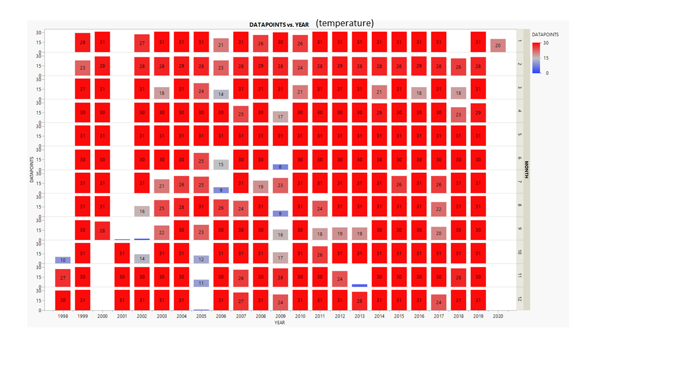
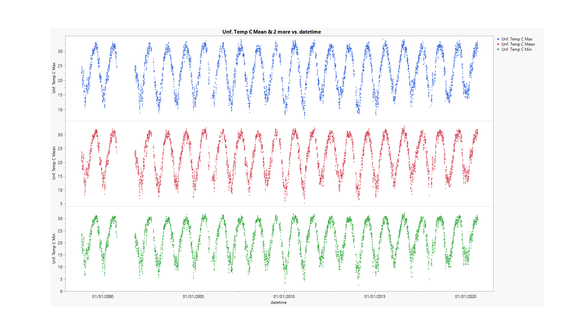
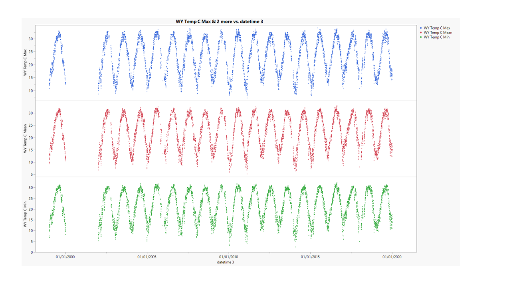
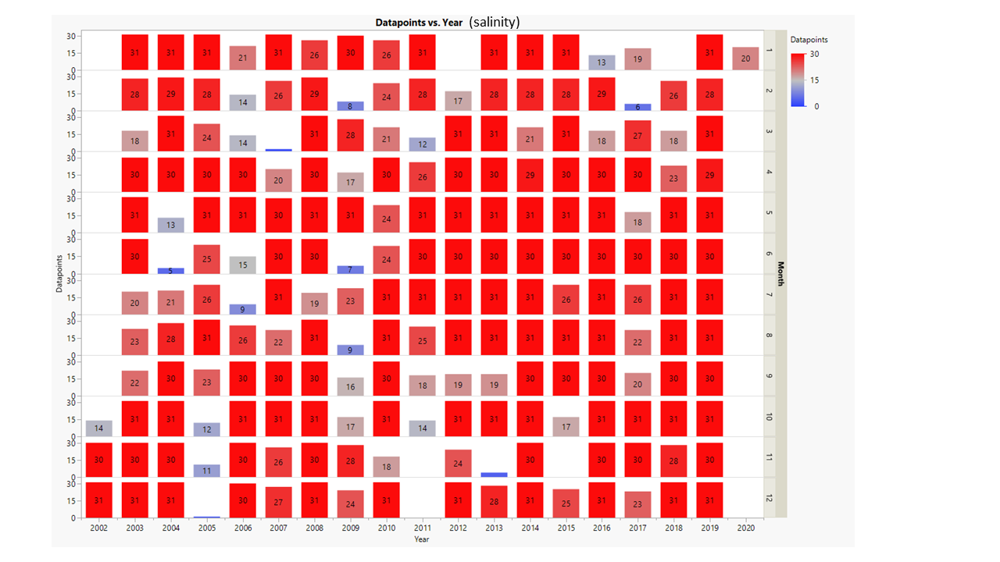
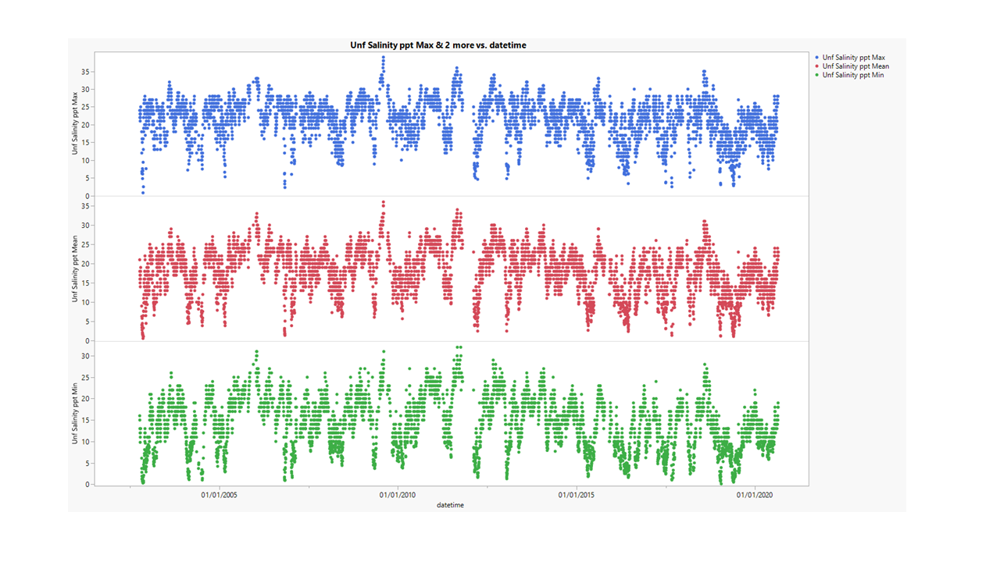
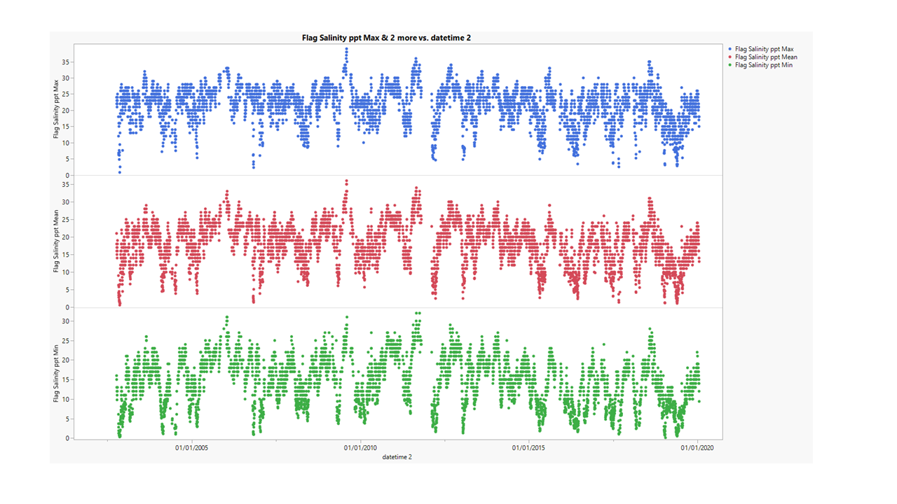

# 2020-10-01

## KEL notes
- use flag-filtered
-  The only report the daily mean, daily max, and daily min. Averages are calculated accordingly.
- Add column for "frequency" of observations and range of years

---

# PopID: LA_GI_CL_High_W
---

**COMPARE SOURCES**

> No sources to compare, USGS station 8017118 is the only datasource listed for both temperature and salinity.

I'm using an updated version (data range: 1998-2020) of the file originally provided by Erin (data range: 1999-2016).

**BEST DATASETS** - these are daily max, daily min and daily mean datasets.

## PopID: LA_GI_CL_High_W Temperature - filtration steps to clean dataset

| Parameter            | Unfiltered | Flag-filtered  | Whole-yrs only |
| ---------------------| ---------- | -------------- | -------------- |
| N_daily_mean         |  6970      |   6752         |     6300       |
| Mean_daily_means     |  22.44     |   22.38        |      22.42     |
| StdDev_daily_means   |  6.697     |   6.716        |      6.758     |
| N_years              |    23      |     23         |      19        |
| Mean_yearly_max      |  32.67     |     32.03      |     33.39      |
| Mean_yearly_min      |  7.10      |      7.2       |      6.80      |
| Mean_yearly_dd_0     |    0       |  0             |      0         |
| Mean_yearly_dd_15    |  259       |     251        |      282       |
| Mean_yearly_dd_30    |    66      |    63          |       73       |

Table notes: 

**Flag-filtered** - For USGS datasets: "Data-value qualification codes included in this output: ***  Value unavailable; A  Approved for publication -- Processing and review completed; P  Provisional data subject to revision (from provider)". *"Flag-filtered column" has data flagged "A" only (F and *** excluded).*

**Whole-yrs only** - original range: 1998-2020; years excluded 1998, 2000, 2001, 2020 (based on data map below).

---

**Plot showing data distribution by year and month - the numbers inside the boxes are the number of datapoints per month in each year; full datasets = 31 (for months with 31d), 30 (for months with 30d), 29 or 28 (for February, leap and reg years)** This is to see if there's any 'wholes' in the dataset (missing too many winters or summers, etc) that could bias the calculated means in the table above. - this is more relevant for temperature than for salinity, but I plotted for both.

---

**Plots showing data filtration steps - temperature**

---

## PopID: LA_GI_CL_High_W Salinity - filtration steps to clean dataset

| Parameter          | Unfiltered | Flag-filtered     | Whole-yrs only |
| -------------------| ---------- | ----------------- | -------------- |
| N_daily_mean       |  5548      |     5330          |     5235       |
| Mean_daily_means   |   18.14    |      18.27        |     18.37      |
| StdDev_daily_means |   5.861    |       5.895       |     5.845      |
| N_years            |   19       |         19        |      17        |
| Mean_yearly_max    |  31.47     |       31.37       |      31.88     |
| Mean_yearly_min    |    2.76    |        2.95       |      2.73      |

Table notes:

**Whole-yrs only** - original range: 2002-2020; years excluded 2002, 2020 (based on map below).

**Flag-filtered** - For USGS datasets: "Data-value qualification codes included in this output: ***  Value unavailable; A  Approved for publication -- Processing and review completed; P  Provisional data subject to revision (from provider)". *"Flag-filtered column" has data flagged "A" only (F and *** excluded).*

---

**Plot showing data distribution by year and month - the numbers inside the boxes are the number of datapoints per month in each year; full datasets = 31 (for months with 31d), 30 (for months with 30d), 29 or 28 (for February, leap and reg years)** This is to see if there's any 'wholes' in the dataset (missing too many winters or summers, etc) that could bias the calculated means in the table above. - this is more relevant for temperature than for salinity, but I plotted for both.

---

**Plots showing data filtration steps - salinity**

