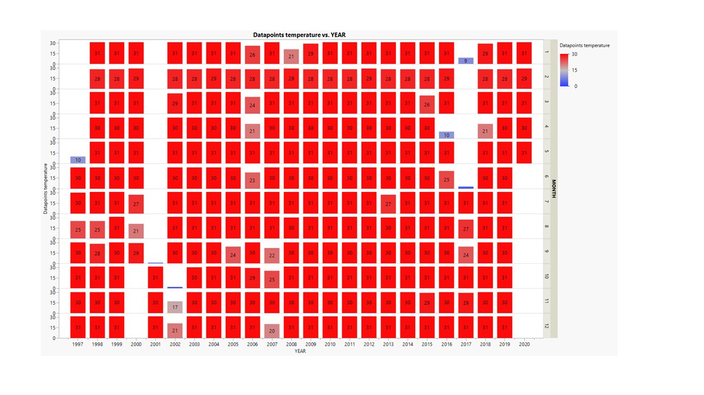
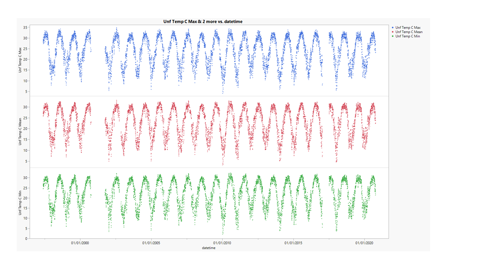
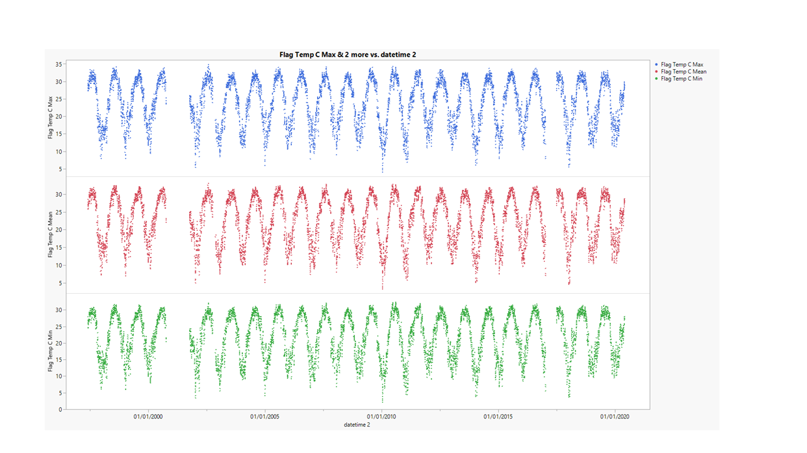
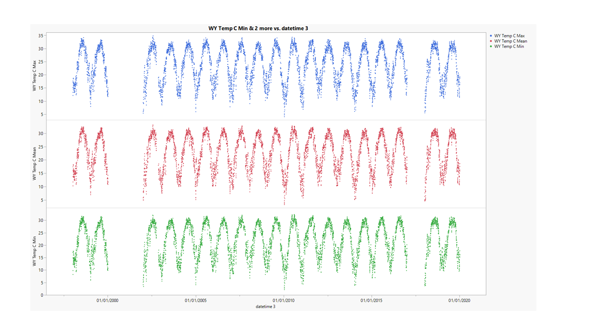
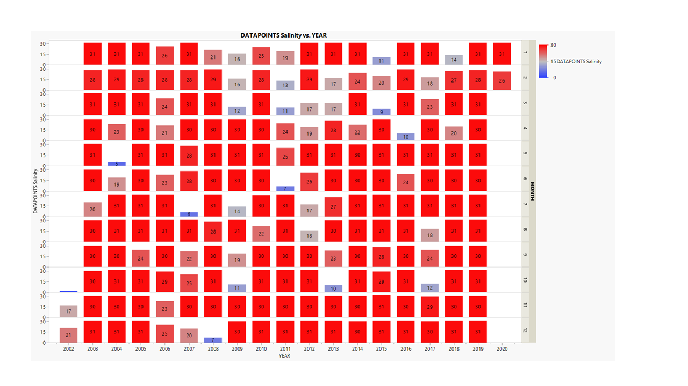
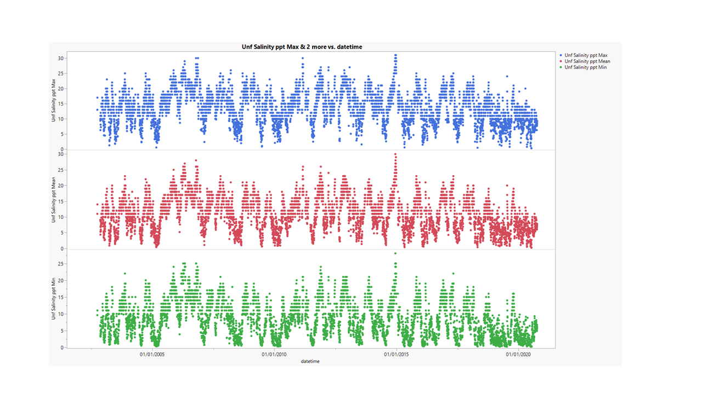
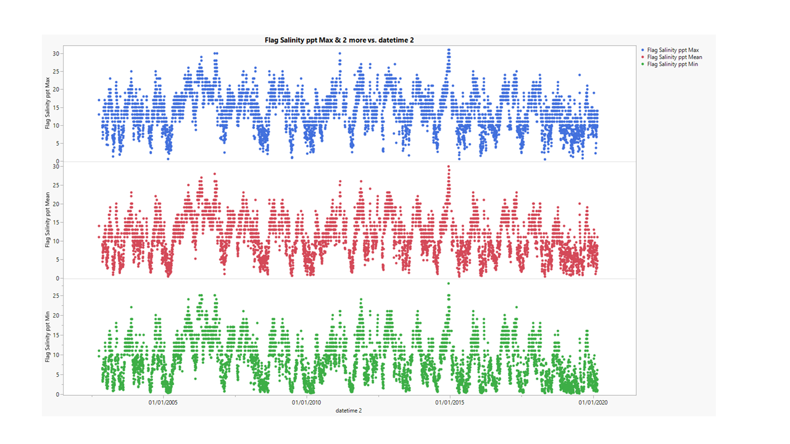
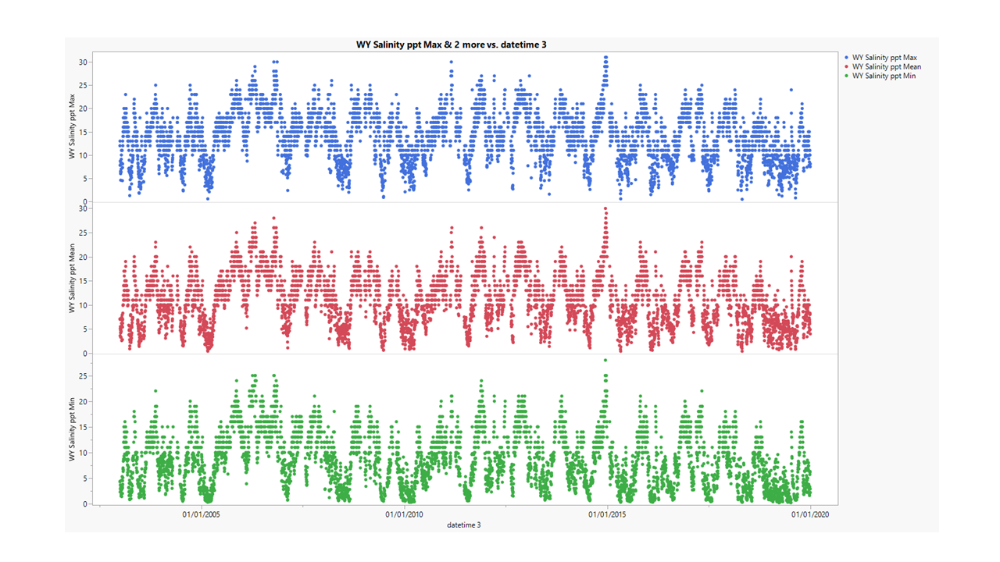

# 2020-10-06

---

# PopID: LA_CL_SL_Low_W
---

**COMPARE SOURCES**

> No sources to compare, USGS station 07381349 is the only datasource listed for both temperature and salinity.

I'm using an updated version (data range: 1997-2020) of the file originally provided by Erin (data range: 2002-2016).

**BEST DATASETS** - these are daily max, daily min and daily mean datasets.

## PopID: LA_CL_SL_Low_W Temperature - filtration steps to clean dataset

| Parameter            | Unfiltered | Flag-filtered  | Whole-yrs only |
| ---------------------| ---------- | -------------- | -------------- |
| N_daily_mean         |   7788     |     7661       |     6755       |
| Mean_daily_means     |   23.03    |     22.93      |     22.89      |
| StdDev_daily_means   |   6.647    |       6.652    |      6.710     |
| N_years              |    24      |       24       |      19        |
| Mean_yearly_max      |     33.28  |       33.15    |      33.63     |
| Mean_yearly_min      |     6.91   |       6.91     |      6.64      |
| Mean_yearly_dd_0     |      0     |       0        |       0        |
| Mean_yearly_dd_15    |     284    |       279      |      309       |
| Mean_yearly_dd_30    |     82     |       80       |       89       |

Table notes: 

**Flag-filtered** - For USGS datasets: "Data-value qualification codes included in this output: ***  Value unavailable; A  Approved for publication -- Processing and review completed; P  Provisional data subject to revision (from provider)". *"Flag-filtered column" has data flagged "A" only (F and *** excluded).*

**Whole-yrs only** - original range: 1997-2020; years excluded 1997, 2000, 2001, 2017, 2020 (based on data map below).

---

**Plot showing data distribution by year and month - the numbers inside the boxes are the number of datapoints per month in each year; full datasets = 31 (for months with 31d), 30 (for months with 30d), 29 or 28 (for February, leap and reg years)** This is to see if there's any 'wholes' in the dataset (missing too many winters or summers, etc) that could bias the calculated means in the table above. - this is more relevant for temperature than for salinity, but I plotted for both.

---

**Plots showing data filtration steps - temperature**

---

## PopID: LA_CL_SL_Low_W Salinity - filtration steps to clean dataset

| Parameter          | Unfiltered | Flag-filtered     | Whole-yrs only |
| -------------------| ---------- | ----------------- | -------------- |
| N_daily_mean       |   5838     |     5618          |     5521       |
| Mean_daily_means   |   10.93    |      11.13        |      11.19     |
| StdDev_daily_means |    5.405   |       5.392       |       5.404    |
| N_years            |        19  |        19         |       17       |
| Mean_yearly_max    |    25.21   |       25.16       |       26.0     |
| Mean_yearly_min    |    0.83    |         0.86      |        0.73    |

Table notes:

**Whole-yrs only** - original range: 2002-2020; years excluded 2002, 2020 (based on map below).

**Flag-filtered** - For USGS datasets: "Data-value qualification codes included in this output: ***  Value unavailable; A  Approved for publication -- Processing and review completed; P  Provisional data subject to revision (from provider)". *"Flag-filtered column" has data flagged "A" only (F and *** excluded).*

---

**Plot showing data distribution by year and month - the numbers inside the boxes are the number of datapoints per month in each year; full datasets = 31 (for months with 31d), 30 (for months with 30d), 29 or 28 (for February, leap and reg years)** This is to see if there's any 'wholes' in the dataset (missing too many winters or summers, etc) that could bias the calculated means in the table above. - this is more relevant for temperature than for salinity, but I plotted for both.

---

**Plots showing data filtration steps - salinity**

