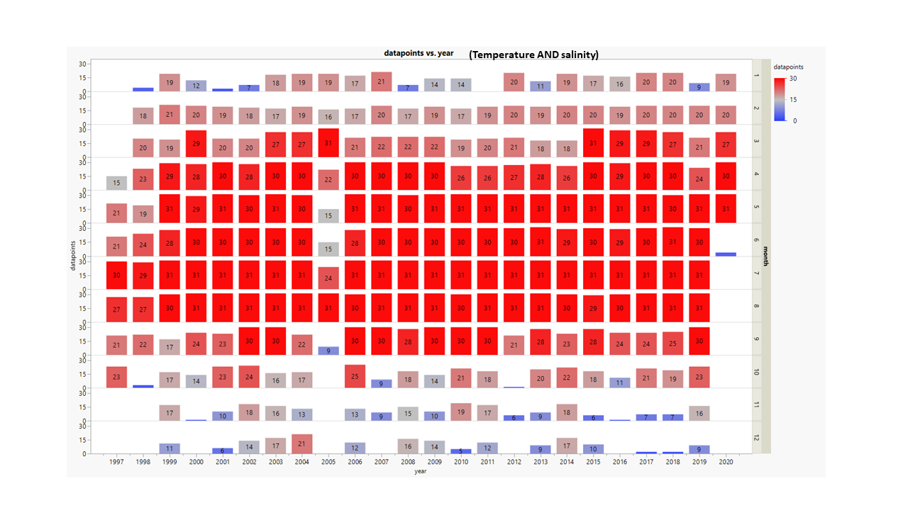
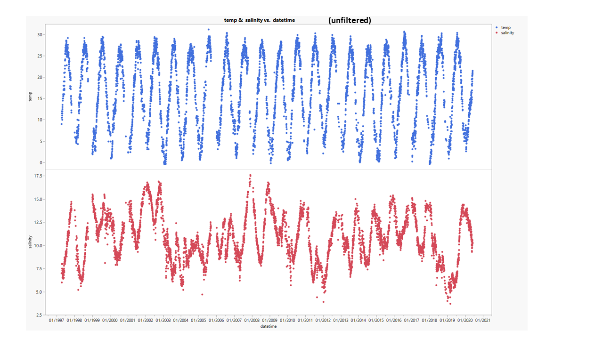
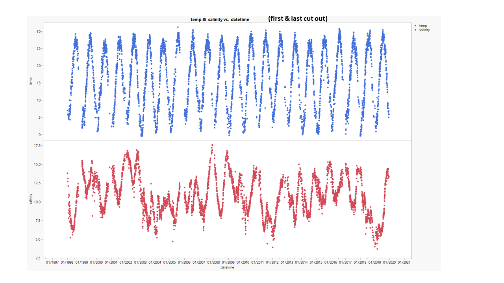
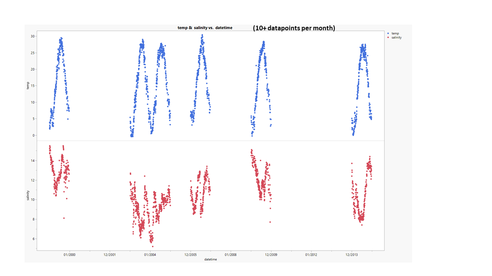
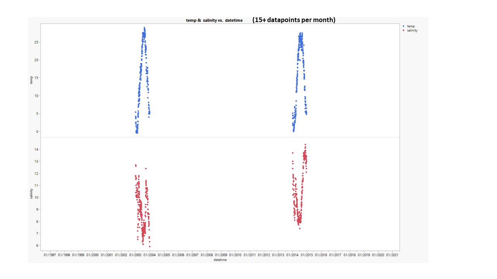

# 2020-10-07

---

# PopID: MD_CB_CP_Low_W
---

**COMPARE SOURCES**

> No sources to compare, Steph Tobash Horn Point data 1997-2020 HPLOH_Sal_and_Temp.xlsl is the only datasource listed for both temperature and salinity.

Erin's note says: "April to December" but there's some data for January-March, too (see plot below showing datapoints per month in each year) (data range: 1997-2020). Winters are clearly under-represented which may bias temperature means.

**BEST DATASETS** - these are daily readings (or less frenquent) at random times (I wouldn't say they are daily means).

## PopID: MD_CB_CP_Low_W Temperature AND salinity - filtration steps to clean dataset

> There was no data quality control in this file, and units are assumed (C and ppt/psu), not given. I deleted two dates, one that was "0" for salinity and temperature, and one that had duplicated values on the same day for both salinity and temperature.

Plot showing data distribution by year and month - the numbers inside the boxes are the number of datapoints per month in each year; full datasets = 31 (for months with 31d), 30 (for months with 30d), 29 or 28 (for February, leap and reg years) This is to see if there are any 'holes' in the dataset (missing too many winters or summers, etc) that could bias the calculated means in the table below - this bias would be more relevant for temperature than for salinity, given the seasonality of temperature. In this dataset, the number of datapoints per month in each year is **identical for temperature and salinity** (so both plots are the same).

---

Plots showing filtration steps

> Based on the plot above, I eliminated the most incomplete years incrementally to see how the lower frequency of "winter data" affected the means.

## PopID: MD_CB_CP_Low_W Temperature

| Parameter         | Unfiltered (all years) | Cut out first & last years1 | Years with 10+ datapoints/mo2 | Years with 15+ datapoints/mo3 |
| ------------------| ---------------------- | -------------------------------------- | ----------------------------------------- | --------------------------------------- |
| N_daily           |   6083                 |     5794                               |     1699                                  |               578                       |
| Mean_daily        |    17.67               |      17.71                             |       16.78                               |               16.13                     |
| StdDev_daily      |     8.405              |       8.470                            |        8.485                              |               8.924                     |
| N_years           |     24                 |        22                              |         6                                 |                 2                       |
| Mean_yearly_max   |     29.04              |      29.37                             |         28.77                             |                 28.25                   |
| Mean_yearly_min   |      1.63              |       1.25                             |         0.82                              |                 -0.20                   |
| Mean_yearly_dd_0  |      0.708             |        0.773                           |         2.17                              |                   6                     |
| Mean_yearly_dd_15 |       158              |        166                             |          167                              |                 165                     |
| Mean_yearly_dd_30 |        1               |         1                              |            1                              |                 0                       |    
  
  
## PopID: MD_CB_CP_Low_W Salinity

| Parameter         | Unfiltered (all years) | Cut out first & last years1  | Years with 10+ datapoints/mo2  | Years with 15+ datapoints/mo 3|
| ------------------| ---------------------- | --------------------------------------- | ----------------------------------------- | ----------------------------------------|
| N_daily           |       6083             |         5794                            |            1699                           |               578                       |
| Mean_daily        |        10.59           |         10.57                           |               10.60                       |                 9.50                    |
| StdDev_daily      |          2.420         |          2.431                          |               4.189                       |                 1.882                   |
| N_years           |     24                 |        22                               |                6                          |                 2                       |
| Mean_yearly_max   |       14.65            |         14.68                           |               13.75                       |               13.55                     |
| Mean_yearly_min   |          6.87          |            6.80                         |                7.08                       |                6.65                     |
  

1 first and last years are typically incomplete (based on datasets from other sources), so I kept this step as a comparison;

2 the following years meet this criteria and were **INCLUDED: 1999, 2003, 2004, 2006, 2009, 2014**;

3 the following years meet this criteria and were **INCLUDED: 2003, 2014**. No years have more then 15+ datapoints per month, so this is the 'best' datatset regarding monthly coverage.
