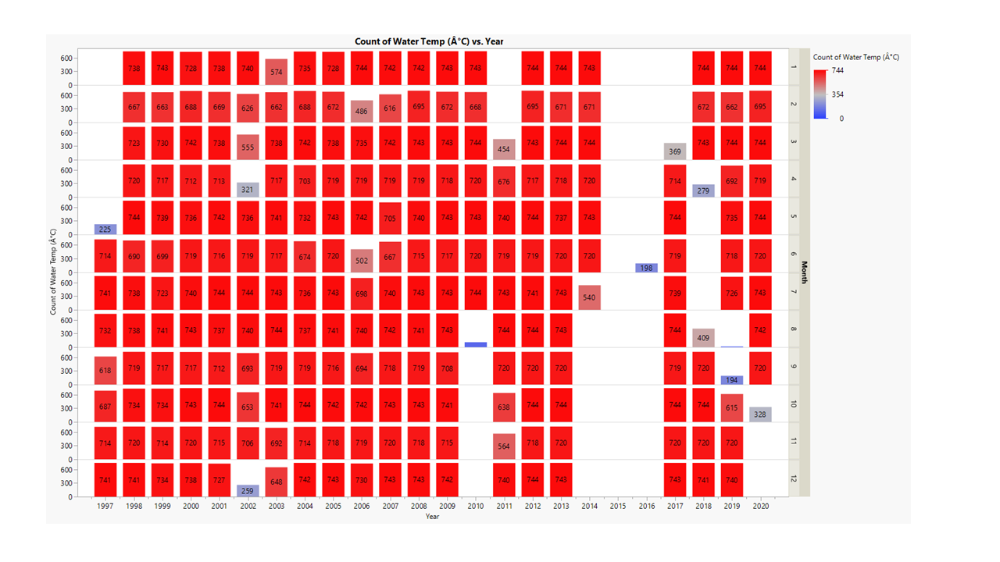
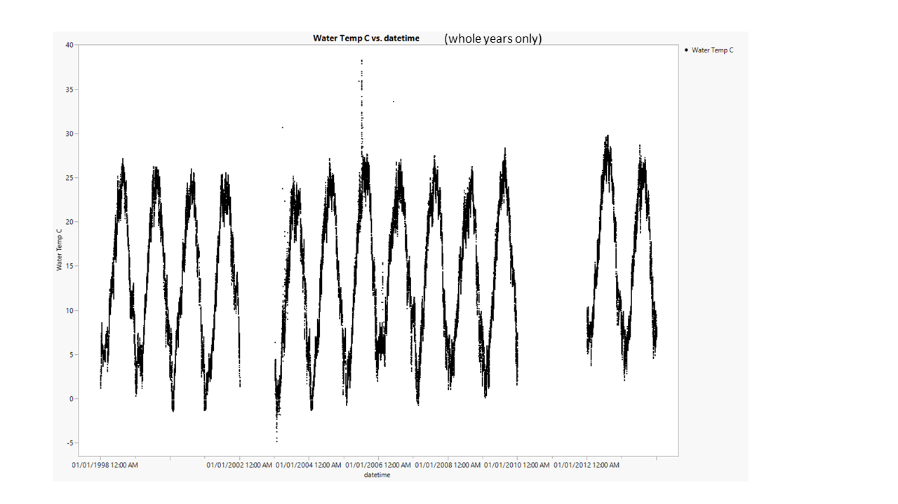
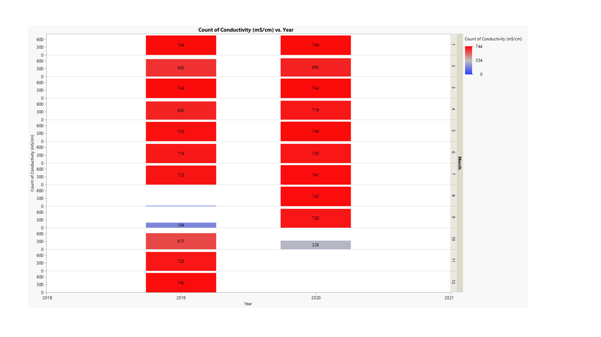
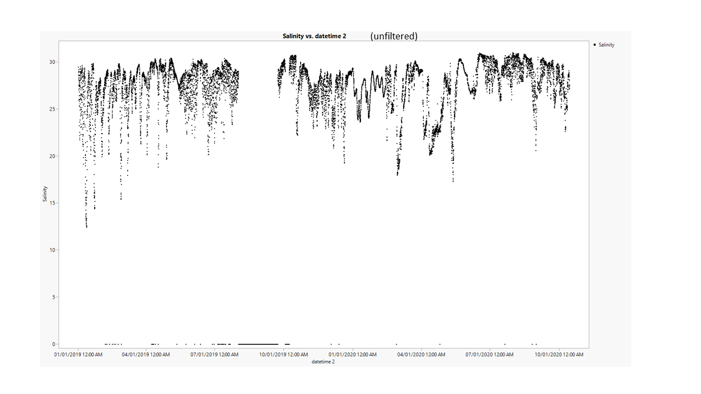
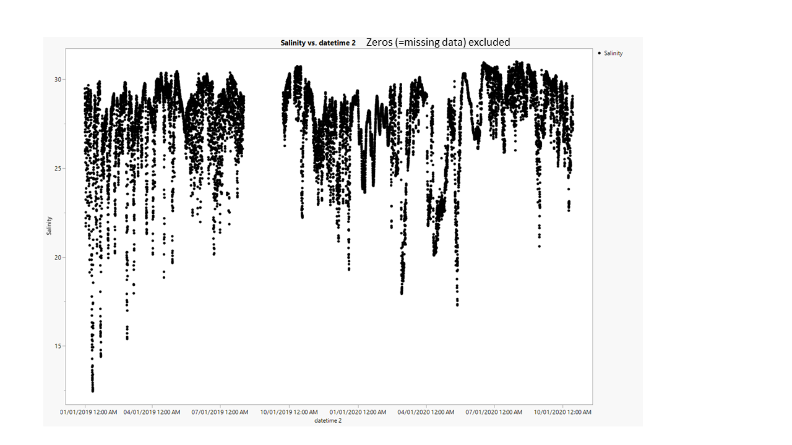

# 2020-11-02, Thais' notes after meeting:

# PopID: NJ_DB_CS_Med_W

## Map:

It is unclear to me whether the lat/long for the these populations are exact or not. Here is Erin's note on NJ_DB_CS_Med_W: *This is a reef that is at the Cape Shore Selected Rutgers NEH farm site. So althought they are considered "wild", we may not want to consider them wild for analysis. Salinity 18-22 (Ximing)*. Lat/long for datasources are exact.

https://www.google.com/maps/d/edit?mid=1Z5kZN68kcuqiC5GZ_kz6Ie35CFqTfK6l&ll=39.26905117744067%2C-75.21666149999999&z=10

## Summary notes:

- NOAA Cape May station ID 8536110 is ok for temperature, but not for salinity according to Ximing.
- 2005 temperature blip has been fixed (removed data from 4-7 Jul); I also cleaned up a few odd datapoints and excluded 2016, which only had data for 1 week in June. Other than that, this file has not quality control or flags from provider.
- no salinity data for this population.

## Summary table:

| Parameter             | Temp C NOAA blip-removed  |          Sal ppt           |
| ----------------------| :-----------------------: | :------------------------: |
| N_all_datapoints      |           168903          |             NA             |
| Mean_all_datapoints   |            14.5           |             NA             |
| StdDev_all_datapoints |             7.7           |             NA             |
| N_years               |             22            |             NA             |
| Mean_yearly_max       |             27.2          |             NA             |
| StdDev_yearly_max     |             1.1           |             NA             |
| Mean_yearly_min       |             0.6           |             NA             |
| StdDev_yearly_min     |             2.4           |             NA             |
| Data range            |May 1997 to Aug 2010, Mar 2011 to Jul 2014, Mar 2017 to Apr 2018, Aug 2018 to Oct 2020|    NA    |
| Data frequency        |            hourly         |             NA             |
| Missing winter        |            FALSE          |             NA             |

## Data source and filenames:

Website: https://tidesandcurrents.noaa.gov/stationhome.html?id=8536110

Temp: NJ_DB_CS_Med_W_Temp.xlsx

Sal: NA

---
# 2020-10-29

## KEL and TB meeting notes

TO DO:

Temp
- Use all years - it looks like there is a "blip" in the temp data after 2005 - we should remove those for calculation DONE, also removed 2016 (TB)

Salinity
- I think there is an issue with the salinity plot because the mean of 14ppt does not match the plot FIXED, I typed the data from the wrong column (TB)
- Use NA since we don't have a good salinity data for this site, "Med" based on info from Ximing DONE (TB)
- Make a list of sites we are missing good salinity data for; maybe we can still find some NOT DONE YET

---

# 2020-10-13

# PopID: NJ_DB_CS_Med_W
---

**COMPARE SOURCES**

> No sources to compare, the files inside of a folder named NOAA_8536110_Cape_May_NJ are the only datasource found for both temperature and salinity. One of the spreadsheets mentions a second source for temperature "Rutgers data: https://hsrl.rutgers.edu/HSRL%20documents/Water%20Temperature/index.temperature.html" but Erin's note says Rutgers sites need to be investigated for proximity to the oyster site (Check with Katie).

> Note from Erin "Ximing says Cape May buoy is not a good representation of salinity data here, Ship John Shoals not a good represenation". I plotted anyways but if we are to follow this note, there is no salinity data available for this population. -----> **this does not make sense given the lat and long given for the population and Cape May, so check with Katie.**

Erin's note says: "data in 15 min increments" but data are in hourly increments (see plot below showing datapoints per month in each year).
Data range temperature: 1997-2020, but missing 2015 and patch in some years.
Data range conductivity (salinity): 2019-2020

**BEST DATASETS** - these are hourly readings (i.e., up to 24 readings per day).

## PopID: NJ_DB_CS_Med_W Temperature - filtration steps to clean dataset

> There was no data quality control in this file; units not provided in Erin's files but I went to the source and downloaded the data again, with units.
> Temperature in Celsius and conductivity in mS/cm; I converted conductivity into salinity using http://salinometry.com/pss-78/

Plot showing data distribution by year and month for **temperature**- the numbers inside the boxes are the number of datapoints per month in each year, at an hourly resolution. Full datasets = 744 (for months with 31d x 24h), 720 (for months with 30d x 24h), 696 or 672 (for February, leap 29d x 24h; and reg years 28d x 24h). This is to see if there are any 'holes' in the dataset (missing too many winters or summers, etc) that could bias the calculated means in the table below - this bias would be more relevant for temperature than for salinity, given the seasonality of temperature. 

---

> Based on the plot above, I eliminated the most incomplete years to see how the lower frequency of "winter data" affected the means.

Plots showing filtration steps for temperature:

## PopID: NJ_DB_CS_Med_W Temperature

| Parameter         | Unfiltered (all years) | Whole years only1 | 
| ------------------| ---------------------- | ---------------------------- | 
| N_total           |       169034           |            112429            |     
| Mean_daily        |        14.50           |              14.34           |      
| StdDev_daily      |         7.680          |               7.659          |        
| N_years           |          23            |                 13           |        
| Mean_yearly_max   |          28.26         |                 28.89        |        
| Mean_yearly_min   |         1.40           |                0.12          |       
| Mean_yearly_dd_0  |         5.4            |                 7.9          |        
| Mean_yearly_dd_15 |          159.5         |                 184.0        |          
| Mean_yearly_dd_30 |          0.4          |                  0.6          | 

1 the following years meet this criteria and were **INCLUDED: 1998, 1999, 2000, 2001, 2003, 2004, 2005, 2006, 2007, 2008, 2009, 2012, 2013**;

---

### Note from Erin "Ximing says Cape May buoy is not a good representation of salinity data here, Ship John Shoals not a good represenation". I plotted anyways but if we are to follow this note, there is no salinity data available for this population.

Plot showing data distribution by year and month for **salinity** - given we only have 2 years worth of data and seasonality is less likely to affect salinity, I kept all the data and filtered only for zeros (missing data).

Plots showing filtration steps for salinity (zeros = missing data):

## PopID: NJ_DB_CS_Med_W Salinity NAs 

| Parameter         | Unfiltered (all datapoints) | Excludes zeros (missing data) | 
| ------------------| --------------------------- | ----------------------------- | 
| N_total           |       15664                 |      14199                    |     
| Mean_daily        |          24.9              |         27.4               |      
| StdDev_daily      |            8.3            |           2.5               |        
| N_years           |          2                  |                 2             |        
| Mean_yearly_max   |         30.86               |                 30.86         |        
| Mean_yearly_min   |         -0.002              |                14.87          |   

