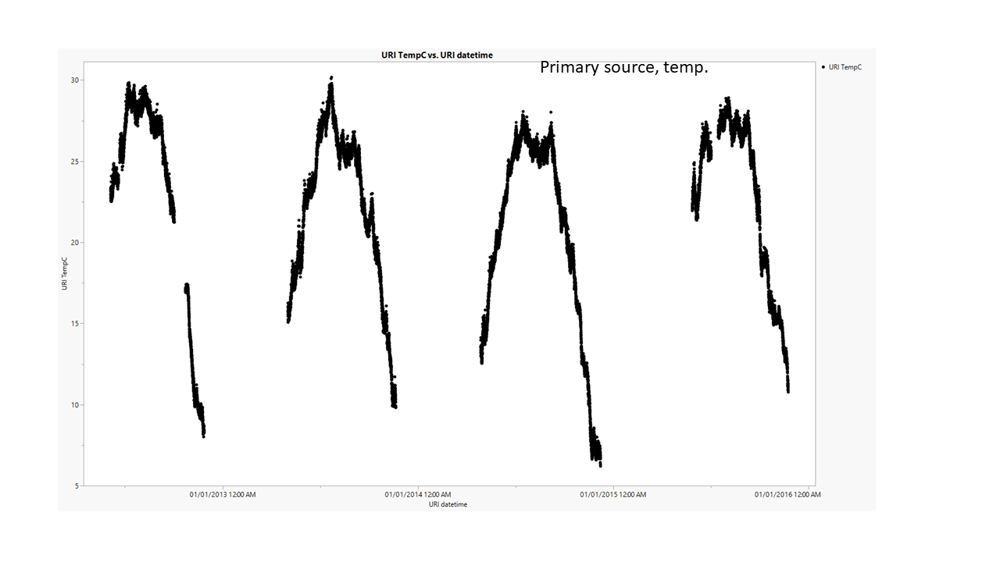
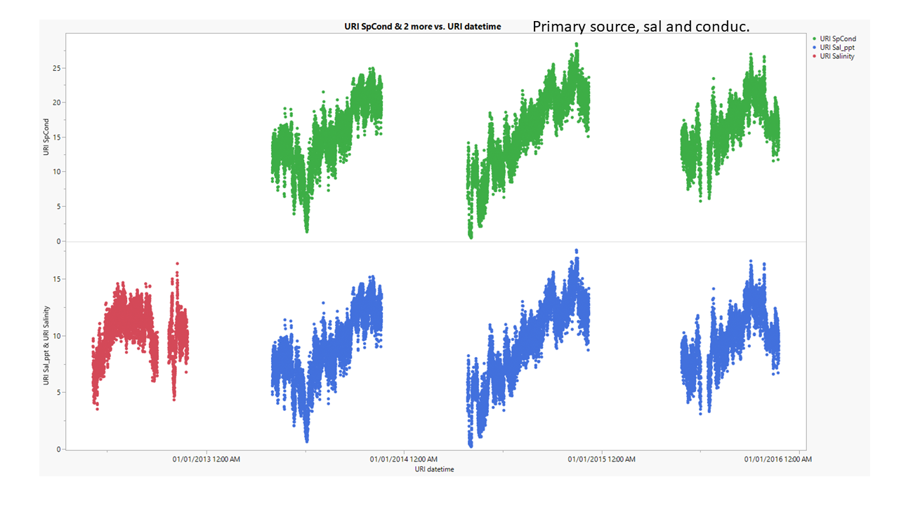
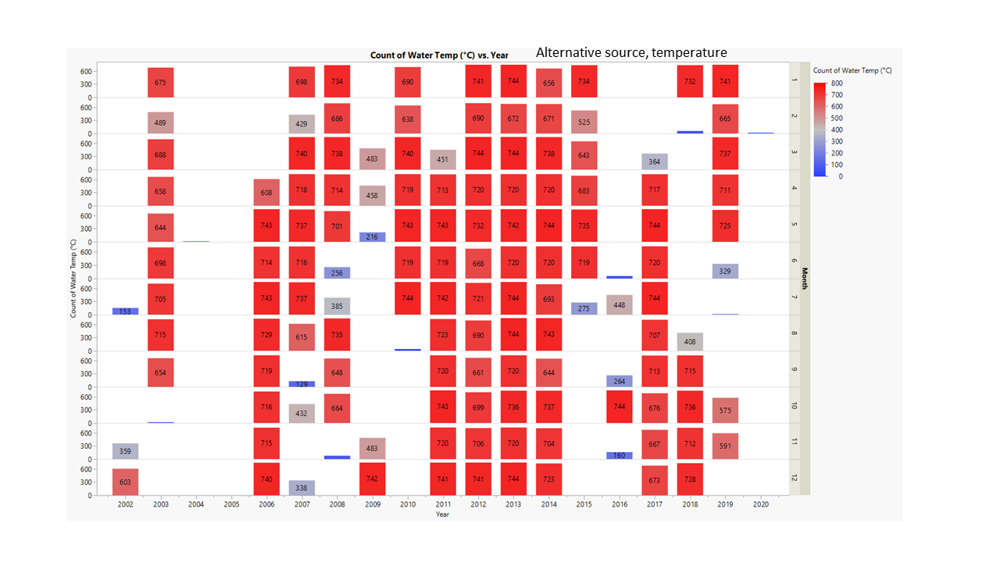
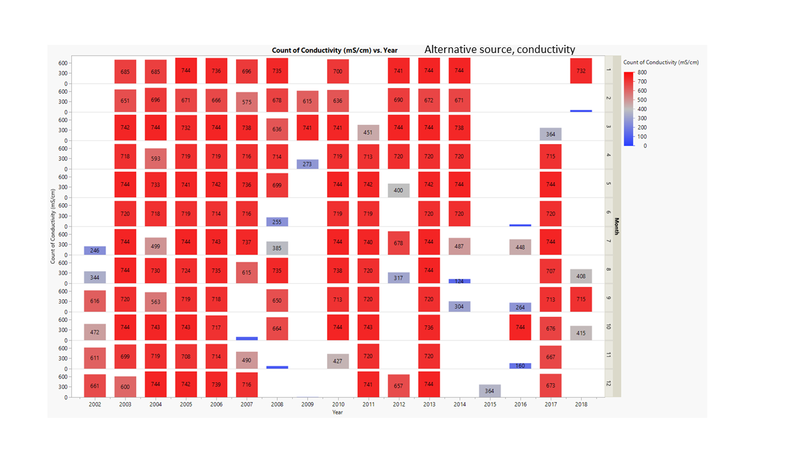
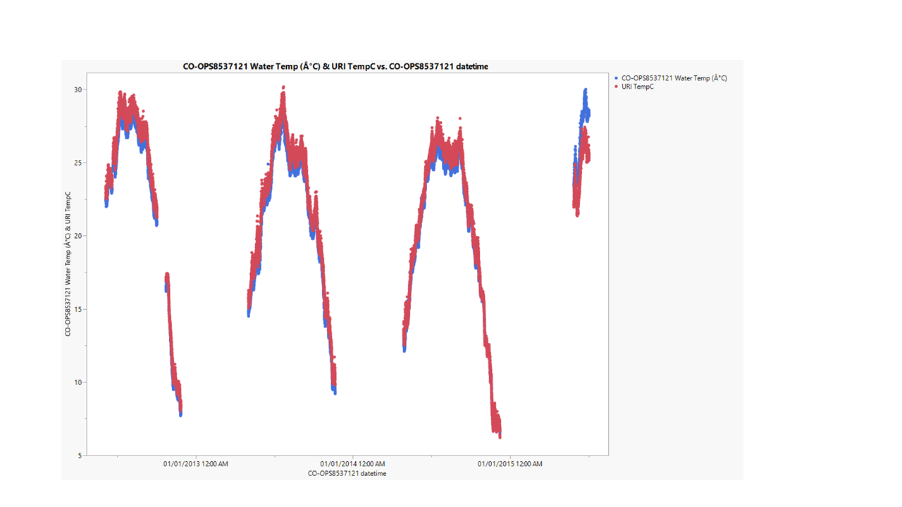
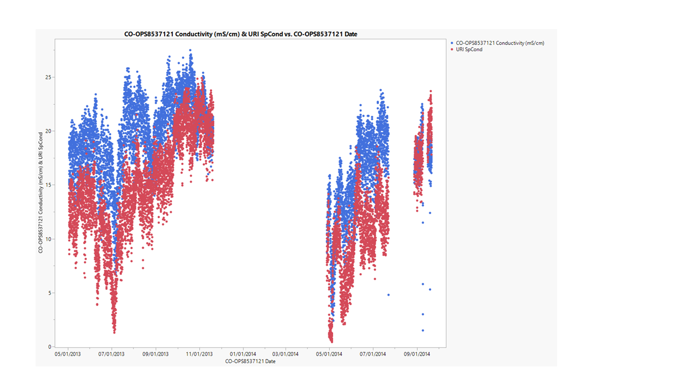
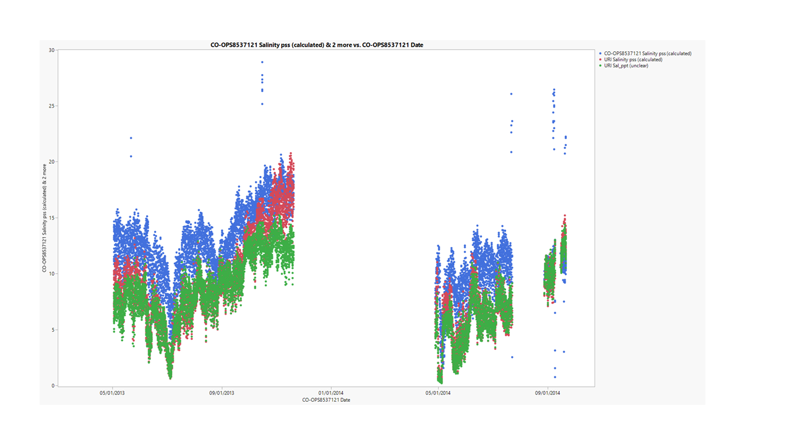

# 2020-10-16

---

# PopID: NJ_DB_HC_Low_W
---

**COMPARE SOURCES**

Notes on the data sources:

**Primary source:** URI Gomez Chiarra Hope Creek 2012-2015

> Data from each year in separate tabs, I compiled into one tab. Most of the data is in 1/2 hour resolution, with a small window (late May to late June, 2015), every hour.

**Temperature** in C for all years: 2012 June-November; 2013 May-November; 2014 April-December; 2015 May-December. **Missing coldest months.**

**Salinity**: 2012 has one column labelled salinity, no units. 2013, 2014, 2015 have two columns, one labelled SpCond (no units in 2013) and one labeled Salinity_ppt (unclear if it was measured or calculated from SpCond).

> For 2013-2015, I calculated salinity from conductivity (assuming units are mS/cm for 2013) and temperature. Those calculated salinity values are **not** an exact match to the values in the Salinity_ppt column. The Salinity_ppt column is a factor of ~1.7 of the SpConduc. I don't know if the salinity_ppt values are calculated or measured. If they are calculated, perhaps they did not take temperature brackets into account in their calculations. Can we ask Erin/Dina to ask their source. 

**Secondary source:** Rutgers data: Delaware Bay 2006-13.xlsx .( https://hsrl.rutgers.edu/HSRL%20documents/Water%20Temperature/index.temperature.html.)

> This is a secondary data source for temperature listed in EasternOysterSeascapeData but Erin's notes say "Rutgers Delaware Bay 2006-13.xlsx only spreadsheet with Hope Creek temperature data with 1/month data points and missing winter - no good - also assume in Celcius. Data is from 2011 (April-Oct, 1 data point per month), 2012 (May-Oct. 1 data point per month), 2013 (April, July-Nov, 1 data point per month)." *I'm not using it.*

**Alternative source (maybe, check with Katie).**

> I found another NOAA station (Ship John Shoal) that might work for this population and has some temp and salinity data. I am comparing this to the primary source to see if we can get a better dataset for this population.

----

Outstanding questions about data for this population:

1) There is no lat and long for the primary datasource, so it is unclear why it was selected as primary (Erin's note: "exact lat and long unknown could check with Marta for specific location"). Ask Erin/Dina.

2) It would be good to confirm the salinity units for 2012, conductivity units for 2013, and whether salinity_ppt in 2013-15 were measured or calculated from conductivity. Ask Erin/Dina.

3) The lat and long for the population and for the Alternative Source plotted on the map makes it seem like the alternative data source could be a good one. The alternative source matches the primary source relatively well, but not perfect. I think given the salinity brackets we are using, it should be fine (see plots below). But why wasn't it used by Erin? Maybe there is a reason that I don't know. Ask Katie.

---

plot comparison between primary and alternative for matching dates.

