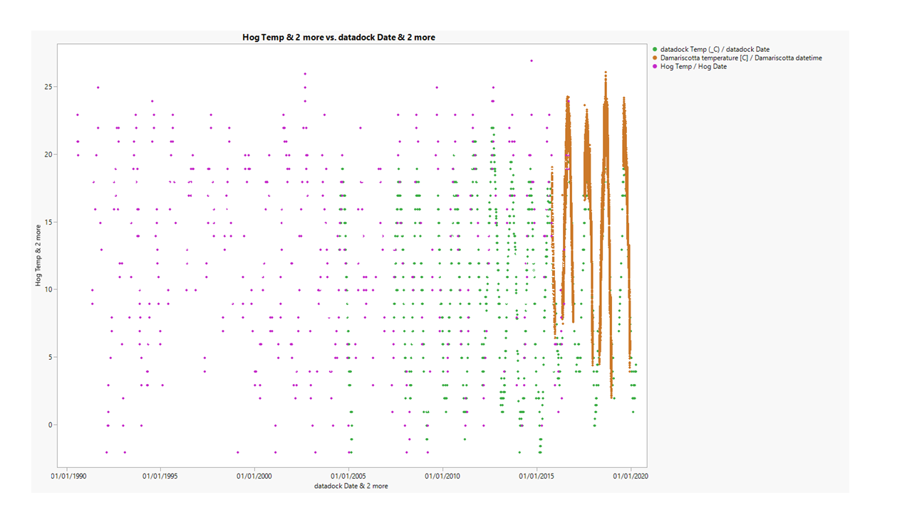
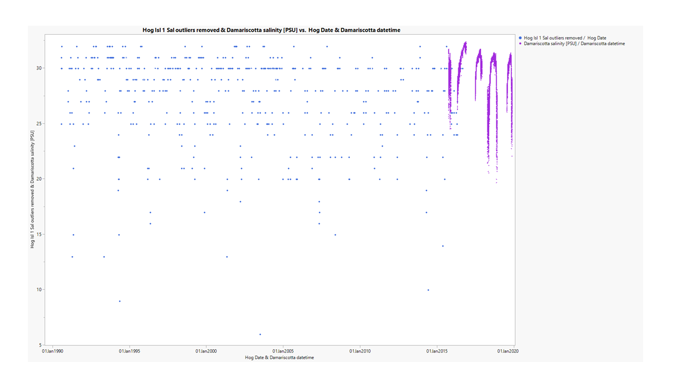
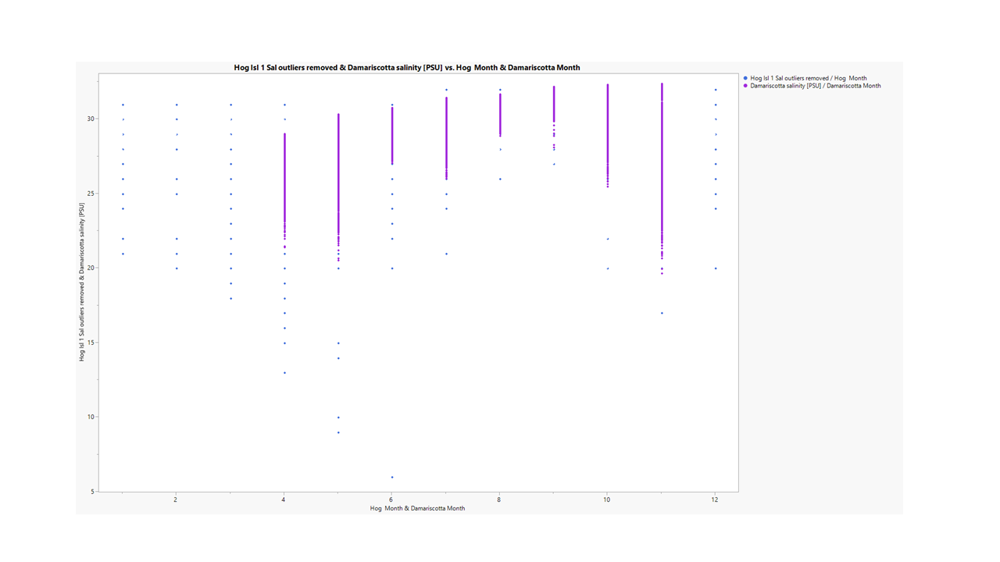

**The first half** of this file has notes on temperature and salinity datasources for both ME populations, High and Low. The datasource files for both these populations are listed several times for both populations in EasternOysterSeascape and OysterSeascape spreadsheets. So I'm listing each datasource file here separately, and going through them one by one and making notes to see what makes sense to use for each population. The map below helps to determine the proximity of the datasources to each population, High and Low.

**The second half** has temperature and salinity data comparison and parameters summary for each population, ME_DR_HI_High_W and ME_SR_SM_Low_W. You could skip to COMPARE SOURCES if you don't need to know about how datasources were chosen for comparison. 

This map includes population locations, all the datasources listed for both temperature and salinity, and an USGS station I found nearby (temp only). All locations are labelled and population lat and long are marked as "P" to make it easier to find their location relative to the datasources locations.

<iframe src="https://www.google.com/maps/d/embed?mid=1OiSklGJLcWVodJQ1RF-YQ6gr1y6NxpIh" width="640" height="480"></iframe>

# Datasources listed in the EasternOysterSeascape spreadsheet and pinned in the map above, and notes to help decide how to compare and select datasources:

# ME_DR_HI_High_W - Temperature

**Primary**

Jose Antonio Hog Island Buoy (Temp_Sal_Hog_Island_Sheepscot_Lewis_ME.xlsx)
* Erin's notes: Temperature in celsius. Data readings once per month Jan.- Nov. 1990-2016. 
* Thais's notes: Temperature in celsius. 1990-2016. This file has data for 3 locations: Hog Island, Sheepscot and Lewis. **Monthly readings; but readings for several months are missing for most years. Hog Island (3 separate stations & datasets) has 3 whole years (st1 2002 and 2004, st2 2004) and is the best datasource location-wise for the High population** (very close to the population's location, see map). Sheepscot is close enough that it could be ok for temperature, but not as good as Hog Island (see map), and no whole years available. Lewis is far away, towards the ocean and no whole years available (see map). *I'm not using Sheepscot or Lewis for temperature*.

Damian Brady Darling Marine Center (LOBO_Data_Mook_SeaFarm_UDRE.xlsx)
* Erin's notes: LOBO data has both temperature and salinity from Upper Damariscotta from April-Nov for 2015-2019.
* Thais's notes: Temperature in celsius. Data frequencies and ranges for each year are: hourly, Sept-Nov 2015; hourly, Apr-Nov 2016; hourly, Jun-Nov 2017; hourly Apr-Nov 2018; no data for 2019. **This looks like a good datasource location-wise for the High population (see map), but all years are missing several cold months. Might need to be compared to Hog Island data to capture colder months.**

UpperDamariscotta_Temp_Sal_Chla 2015-2019.txt
* Erin's notes: Sensor 066 (UpperDamariscotta_Temp_Sal_Chla 2015-2019.txt) has salinity and temp data 2015-2019 in May-Nov. Also, hints that this file is the same as the Mook_SeaFarm_UDRE file.
* Thais's notes: this file has the same data as the Mook_SeaFarm_UDRE file **plus 2019 data: hourly, Jul-Nov**. The file has also been cleaned out of other data (turbidity, nutrients, etc) so it is like a summary file. The lat/long for this location is the exact same as the Mook_SeaFarm_UDRE location. **I will use this file instead of Mook_SeaFarm to compare to Hog Island because it contains additional (2019) data.**

**Other**

Bar Harbour Bouy
* Erin's notes: Temp given in celsius. Hourly readings Jan-Dec. 2007-2019.  
* Thais's notes: The OysterSeascape data spreadsheet has the lat/long and is plotted on the map above. I think this is a high resolution dataset & reliable source, which is good, but it is too far away from the population (see map), so *I'm not using it*.

Upper Damariscotta LOBO (data_dock.csv) 
* Erin's notes: no notes.
* Thais's notes: Temperature in celsius. Data frequencies and ranges for each year are: multiple measurements per month, but not daily; Jun-Dec 2004; Jan-Feb 2005; May-Dec 2007; Mar-Dec 2008; Jan-Feb, Sept-Dec 2009; Jan-Dec 2010, 2011, 2012, 2015, 2016, 2017, 2018, 2019; Jan-Nov (2013, 2014); Jan-Mar 2020. The location is about 5.7 miles (9km) downstream from the High population's location (see map). I think this could be a good source of temperature data for the High population, given the data covers the winter months better and at a higher resolution than the primary datasources. No salinity though. **I will compare this with Hog Island and UpperDamariscotta_temp_sal_2015-19.txt**

~LOBO_Data_Mook_SeaFarm_UDRE.xlsx - this file is listed under both Primary and Other, so same notes as above.~

~UpperDamariscotta_Temp_Sal_Chla 2015-2019.txt - this file is listed under both Primary and Other, so same notes as above.~

> Based on these notes: I will compare **Hog Island, UpperDamariscotta_temp_sal_2015-19 and dockdata** to get temperature data for ME_DR_HI_High_W.

---

# ME_DR_HI_High_W - Salinity

**Primary**

Upper Damariscotta LOBO buoy (LOBO Data_Mook SeaFarm_UDRE.xlsx)
* Erin's notes: LOBO data has both temperature and salinity from Upper Damariscotta from April-Nov for 2015-2019.
* Thais's notes: Salinity in psu. Data frequencies and ranges for each year are: hourly, Sept-Nov 2015; hourly, Apr-Nov 2016; hourly, Jun-Nov 2017; hourly Apr-Nov 2018; no data for 2019. This looks like a good salinity datasource for the High population location-wise (see map), but all years are missing several months, mostly cold months - does this matter for salinity? **The location is close to the population's location (see map) and salinity does not seem to have a strong seasonal trend at first glance, so this could be a good salinity datasource for the High population.**

**Other**

~LOBO_Data_Mook SeaFarm_UDRE.xlsx~
* ~Thais's notes: this files is listed under both Primary and Other, see notes above.~

UpperDamariscotta_Temp_Sal_Chla 2015-2019.txt
* Erin's notes: UpperDamariscotta_Temp_Sal_Chla 2015-2019.txt has salinity and temp data 2015-2019 in May-Nov.
* Thais's notes: Salinity in PSU. This file has the same data as the Mook_SeaFarm_UDRE file **plus 2019 data: hourly, Jul-Nov**. The file has also been cleaned out of other data (turbidity, nutrients, etc) so it is like a summary file. The lat/long for this location is the exact same as the Mook_SeaFarm_UDRE location (see map). **The location is close to the location of the High population and has the additional 2019 data, so I will use this instead of the Mook_SeaFarm_UDRE file listed under Primary**

Temp_Sal_Hog_Island_Sheepscot_Lewis_ME.xlsx
* Erin's notes: no notes.
* Thais's notes: Salinity in pct? I'm assuming they meant ppt. 1990-2016. This file has data for 3 locations: Hog Island, Sheepscot and Lewis. **Monthly readings but readings for several months are missing for most years. HogIsland has 10 whole years (st1 1998, 1999, 2002 and 2004, st2 2002 and 2004, st3 1998, 1999, 2002 and 2004) and is the best salinity datasouce for the High population location-wise** (very close to the population location, see map). Sheepscot is close enough that it could be ok for salinity, but not as good as Hog Island, and has 2 whole years (st3 2000 and 2004). Lewis is far away, towards the ocean and no whole years. *I'm not using Lewis or Sheepscot for salinity*. **I will compare salinity data from Hog Island to Upper_Damariscotta_temp_sal_chla_2015-2019 file**.

> Based on these notes: I will compare **Hog Island and UpperDamariscotta_temp_sal_2015-2019** to get salinity data for ME_DR_HI_High_W.

---
---

# ME_SR_SM_Low_W - Temperature

* Erin's note: Site is colder than Damariscotta and fresher but still salty, would have general salinity and temp meyer report. See SHEEPSCOTT TABS IN EXCEL FILE - NOTE THAT SITE IS VERY FRESH AND THE SALINITY MAY NOT BE OK
* Thais's note: I think by "site is colder", they meant "population site", meaning the site for population ME_SR_SM_Low_W is colder and fresher but still salty in comparison to the site for population ME_DR_HI_High_W. I don't know what a general meyer report is. All primary temperature datasources for this "Low" population are the same as those listed for the "High" population - so if both populations are in sites that differ in temperature, I don't see how the same datasources can be good for both populations. In file Temp_Sal_Hog_Island_Sheepscot_Lewis_ME.xlsx, perhaps Sheepscot will be good for the Low population, based on Erin's note above and because it is closer to the Low population's location (see map).

**Primary**

Jose Antonio Hog Island Buoy (Temp_Sal_Hog_Island_Sheepscot_Lewis_ME.xlsx), 
* Erin's notes: Temperature in celsius. Data readings once per month Jan.- Nov. 1990-2016. 
* Thais's notes: Temperature in celsius. 1990-2016. This file has data for 3 locations: Hog Island, Sheepscot and Lewis. Given 1) Erin's note above that this Low population site is supposed to be colder & 2) Sheepscot seems like an ok temperature datasouce location-wise for the Low population (close to the population location, see map), *I will use Sheepscot temperature data for this Low population*. **Monthly readings, but readings for several cold months are missing for most years and it has 1 whole year (2000). I will have to combine the data for all years to get temp data that covers all seasons**.  Hog Island is good for the High population and Lewis is pretty far from both, so *I'm not using Hog Island or Lewis for temperature for this Low population*.

Damian Brady Darling Marine Center LOBO_Data_Mook SeaFarm_UDRE.xlsx, 
* Erin's note: LOBO data has both temperature and salinity from Upper Damariscotta from April-Nov for 2015-2019.
* Thais's note: Again, I don't know how this can be good for both the High and Low populations at the same time, if the Low population is known to be colder. **But might compare to Sheepscot temperature to check**

UpperDamariscotta_Temp_Sal_Chla 2015-2019.txt. 
* Erin's note: Sensor 066 (UpperDamariscotta_Temp_Sal_Chla 2015-2019.txt) has salinity and temp data 2015 -2019 in May-Nov
* Thais's note: this file has the same data as the Mook_SeaFarm_UDRE file **plus 2019 data: hourly, Jul-Nov**. The file has also been cleaned out of other data (turbidity, nutrients, etc) so it is like a summary file. The lat/long for this location is the exact same as the Mook_SeaFarm_UDRE location. Again, I don't know how this can be good for both the High and Low populations, if the Low population is known to be colder. **But might use this istead of the Mook_SeaFarm_UDRE to compare to Sheepscot temperature to check**.

**Other**

Bar Harbour Bouy
* Erin's notes: Temp given in celsius. Hourly readings Jan-Dec. 2007-2019. The OysterSeascape data spreadsheet has the lat/long and is plotted on the map above. 
* Thais's notes: I think this is a high resolution dataset from a reliable source, but it is too far away from the population (see map), so *I'm not using it*.

Upper Damariscotta LOBO (data_dock.csv)
* Erin's notes: no notes
* Thais's notes: Temperature in celsius. Data frequencies and ranges for each year are: daily-ish (lots of gaps); Jun-Dec 2004; Jan-Feb 2005; May-Dec 2007; Mar-Dec 2008; Jan-Feb, Sep-Dec 2009; every 3-4days Jan-Dec 2010, 2011, 2012, 2015, 2016, 2017, 2018, 2019; Jan-Nov (2013, 2014); Jan-Mar 2020. Again, I don't know how this can be good for both the High and Low populations at the same time, if the Low population is known to be colder. **I might still compare this with Sheepscot and UpperDamariscotta_temp_sal_2015-19.txt to check**.

USGS station - USGS 01038000 Sheepscot River at North Whitefield, Maine
* Thais's notes: I found this USGS stations, 15 miles (24k) north/upstream of the population's location. Probably a bit too far away (colder), so not good, but I might take a look at the data. Temperature only.

> Based on these notes: I will compare **Sheepscot, UpperDamariscotta_temp_sal_2015-19, dockdata and the USGS station** to get temperature data for ME_SR_SM_Low_W.

---

# ME_SR_SM_Low_W - Salinity

**Primary**

NA

**Other**

LOBO_Data_Mook SeaFarm_UDRE.xlsx
* Erin's notes: LOBO data has both temperature and salinity from Upper Damariscotta from April-Nov for 2015-2019.
* Thais's notes: Salinity in psu. Data frequencies and ranges for each year are: hourly, Sept-Nov 2015; hourly, Apr-Nov 2016; hourly, Jun-Nov 2017; hourly Apr-Nov 2018; no data for 2019. I don't see how this can be good for both the Low and High populations, especially for salinity. Salinity in this file is 25-30, definitely not Low. *I won't use it*.

UpperDamariscotta_Temp_Sal_Chla 2015-2019.txt
* Erin's note: Sensor 066 (UpperDamariscotta_Temp_Sal_Chla 2015-2019.txt) has salinity and temp data 2015 -2019 in May-Nov
* Thais's note: this file has the same data as the Mook_SeaFarm_UDRE file **plus 2019 data: hourly, Jul-Nov**. The file has also been cleaned out of other data (turbidity, nutrients, etc) so it is like a summary file. The lat/long for this location is the exact same as the Mook_SeaFarm_UDRE location. Again, I don't know how this can be good for both the High and Low populations at the same time, if the Low population is known to be fresher. *I won't use it*.

Temp_Sal_Hog_Island_Sheepscot_Lewis_ME.xlsx
* Erin's notes: no notes.
* Thais's notes: Salinity in pct? I'm assuming they meant ppt. 1990-2016. This file has data for 3 locations: Hog Island, Sheepscot and Lewis. **Monthly readings, but readings for several cold months are missing**. This is the best salinity datasouce location-wise for the Low population because Sheepscot is close to the population location; has two whole years (2000, 2004). Hog Island is close to the High population site, so probably not good. Lewis is far away, towards the ocean and no whole years. *I'm not using Lewis or Hog Island for salinity*. **I will look at Sheepscot salinity in this file**.

USGS station - USGS 01038000 Sheepscot River at North Whitefield, Maine
* Thais's notes: No salinity data.

> Based on these notes: the only datasource that could work for salinity is **Sheepscot in file Temp_Sal_Hog_Island_Sheepscot_Lewis_ME - nothing to compare it to**.

---
---
--- 

# COMPARE SOURCES

## ME_DR_HI_High_W - Temperature

> I will compare **Hog Island, UpperDamariscotta_temp_sal_2015-19 and dockdata** to get temperature data for ME_DR_HI_High_W.

# Plot of all temperature data for each location. 

Hog Island: 1990-2016, monthly (1-4 measurements per month) but many months without data - 3 whole years.

Damariscotta: 2015-2019, hourly but missing most cold months - no whole years.

Dockdata: 2004-2020, one measurement/day, multiple (10+) measurements per month but **not** daily or weekly - 8 whole years.

# Plot of all temperature data for each location per month, to make it easier to see how the locations compare.

# Summary table of all temperature data and whole years only for each location, to see how they compare. 

| Parameter               | Hog Island all yrs | Hog Island whole yrs  | Damariscotta all yrs | Damariscotta whole yrs | Dockdata all yrs         | Dockdata whole yrs          |
| ----------------------  | :----------------: | :-------------------: | :------------------: | :--------------------: | :----------------------: | :-------------------------: |
| N_all_datapoints        |      590           |      96               |      18974           |           NA           |        1198              |         693                 |
| Mean_all_datapoints     |       12.42        |      10.24            |       16.06          |           NA           |         10.92            |       11.27                 |
| StdDev_all_datapoints   |         6.937      |      7.62             |       4.963          |           NA           |         5.991            |       6.008                 |
| N_years                 |          27        |       3               |        5             |           NA           |         16               |          8                  |
| Mean_yearly_max         |          22.9      |        22.7           |       23.5           |           NA           |         17.8             |       20.3                  |
| Mean_yearly_min         |          2.2       |        -0.7           |         4.9          |           NA           |           0.8            |         1.0                 |
| Mean_yearly_dd_0        |          0.44      |        0.67           |         0            |           NA           |       1.38               |      1.13                   |
| Mean_yearly_dd_15       |          8.48      |         10            |        103           |           NA           |        22.38             |        27.63                |
| Mean_yearly_dd_30       |          0         |          0            |        0             |           NA           |        0                 |           0                 |
| Data range & resolution | 1990-2016; monthly |1992, 2002, 04; monthly|    2015-2019; hourly |           NA           |2004-05, 07-201| 2010-14, 2015-191|

* 1 data collected several times per month, but not at regular intervals.

* Some of the parameters in these datasets are difficult to compare because they are at different resolutions (monthly, hourly, muliple times per month). Hog Island and Dockdata have winter months (Damariscotta doesn't) so their Mean_all_datapoints are lower thatn the Damariscotta site and more comparable with each other, while Damariscotta has a higher Mean_all_datapoints because it is missing the coldest times of year.

* Mean_yearly_max and mean_yearly_min are the most comparable parameters, especially between the whole year datasets (Hog Island whole years and Dockdata Whole years), despite the difference in resolution because these datasets span all months. Mean_yearly_min is high for Damariscotta relative to the others because this dataset lacks winter months.

* Because the difference in resolution, dd measurements are not comparable at all between the datasets.

* Based on the above, I think either the Hog Island or the Dockdata datasets should be chosen as 'best'. Dockdata is similar enough to Hog Island (closest to the population's site), but has more data (8 vs 3 years of whole year data), so I think dockdata could be chosen as the best temperature dataset for this population - especially if the Mean_yearly_min is important in your analysis.

---

## ME_DR_HI_High_W - Salinity

> I will compare **Hog Island and UpperDamariscotta_temp_sal_2015-2019** to get salinity data for ME_DR_HI_High_W (no salinity in dockdata).

# Plot of all salinity data for each location. 

# Plot of all salinity data for each location per month, to make it easier to see how the locations compare.

# Summary tables of all salinity data and whole years only for each location, to see how the locations compare. 

| Parameter               | Hog Island all yrs | Hog Island whole yrs  | Damariscotta all yrs | Damariscotta whole yrs | 
| ----------------------  | :----------------: | :------------------:  | :------------------: | :--------------------: |
| N_all_datapoints        |       675          |         143           |       18961          |           NA           |
| Mean_all_datapoints     |        27.68       |        28.11          |         29.94        |           NA           |
| StdDev_all_datapoints   |       3.891        |        3.40           |         1.873        |           NA           |
| N_years                 |       27           |         4             |           5          |           NA           |
| Mean_yearly_max         |       31.4         |        31.8           |           31.7       |           NA           |
| Mean_yearly_min         |       18.3         |        19.0           |            23.9      |           NA           |
| Data range & resolution | 1990-2016; monthly |1992, 2002, 04; monthly|    2015-2019; hourly |           NA           |

* Note that there are 3 stations for Hog Island that I combined, so it is monthly resolution but 1-3 measurements per month (pretty much on the same day each month).

* Note that Damariscotta is higher resolution but missing winter months.

* Hog Island and Damariscotta are similar enough - the biggest difference is in the Mean_yearly_min. Mean_yearly_min is lower in the Hog Island dataset but I am having a hard time determining why. It looks like this is driven by consistently lower salinity in April and May (maybe snow melt?, see plot above) in Hog Island. There is good coverage for these months in the Damariscotta dataset as well so it could be that the Damariscotta location is far away enough that we don't see the effect of snow melt or some other kind of freshwater discharge in the data or that could be related to the accuracy/range/precision of these measurements in both locations. 

* I think having whole years is important so I'd choose Hog Island Whole Years over Damariscotta, despite the higher resolution of the latter, to represent salinity of the High population.

---
---

## ME_SR_SM_Low_W - Temperature

> Based on these notes: I will compare **Sheepscot, UpperDamariscotta_temp_sal_2015-19, dockdata and the USGS station** to get temperature data for ME_SR_SM_Low_W.
> Given the lack of Damariscotta whole years, higher max and min compared with other sources for the HIGH population, I will exclude Damariscotta for the comparisons for the LOW population, given the LOW population is know to be colder.

# Plot of all temperature data for each location. 

Sheepscot: 1991-2017, monthly (1-4 measurements per month on the same day) but many months without data - 1 whole year.

USGS Sheepscot River: 2010-2015, 15min intervals - 4 whole years.

Dockdata: 2004-2020, one measurement/day, multiple (10+) measurements per month but **not** daily or weekly - 8 whole years.

# Plot of all temperature data for each location per month, to make it easier to see how the locations compare.

# Summary table of all temperature data and whole years only for each location, to see how they compare. 

| Parameter               | Sheepscot all yrs | Sheepscot whole yrs | USGS Sheepscot River all yrs | USGS Sheepscot River whole yrs | Dockdata all yrs | Dockdata whole yrs |
| ----------------------  | :---------------: | :-----------------: | :--------------------------: | :----------------------------: | :--------------: | :----------------: |
| N_all_datapoints        |       451         |      25             |      173947                  |        139680                  |        1198      |         693        | 
| Mean_all_datapoints     |        10.7       |       9.5           |       10.8                   |        10.9                    |         10.92    |       11.27        |
| StdDev_all_datapoints   |        6.1        |          6.2        |        9.0                   |         9.0                    |         5.991    |       6.008        |
| N_years                 |        27         |           1         |         6                    |            4                   |         16       |          8         |
| Mean_yearly_max         |        18.9       |         21.0        |         27.9                 |            29.4                |         17.8     |       20.3         |
| Mean_yearly_min         |         1.8       |          -2.0       |         0                    |            0                   |           0.8    |         1.0        |
| Mean_yearly_dd_0        |          0.4      |            1        |         0                    |            0                   |       1.38       |      1.13          |
| Mean_yearly_dd_15       |          3.6      |            5        |         126.5                |            152.5               |        22.38     |        27.63       |
| Mean_yearly_dd_30       |           0       |            0        |         0.3                  |            0.5                 |        0         |           0        |
| Data range & resolution |1991-2017; monthly |   2000; monthly     |   2010-15; 15min intervals   |  2011-14; 15min intervals      |2004-05, 07-201| 2010-14, 2015-191|

---
---

## ME_SR_SM_Low_W - Salinity

> Based on these notes: the only datasource that could work for salinity is **Sheepscot in file Temp_Sal_Hog_Island_Sheepscot_Lewis_ME - nothing to compare it to**.

# Plot of Sheepscot salinity, all data.

# Summary table of all salinity data and whole years only for Sheepscot. 

| Parameter               | Sheepscot all yrs  | Sheepscot  whole yrs  | 
| ----------------------  | :----------------: | :------------------:  | 
| N_all_datapoints        |        541         |           58          |  
| Mean_all_datapoints     |        25.04       |           26.5        |   
| StdDev_all_datapoints   |         5.2        |            3.5        |    
| N_years                 |          25        |             2         |    
| Mean_yearly_max         |           30.0     |           30.5        |   
| Mean_yearly_min         |          15.4      |            17.5       |   
| Data range & resolution | 1991-2007; monthly | 2000, 2004; monthly   |   

