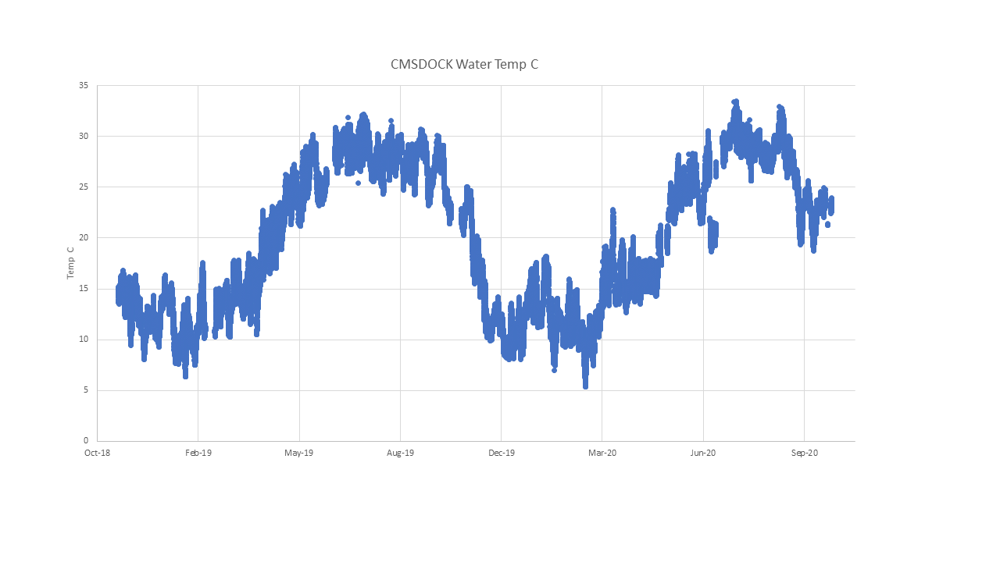
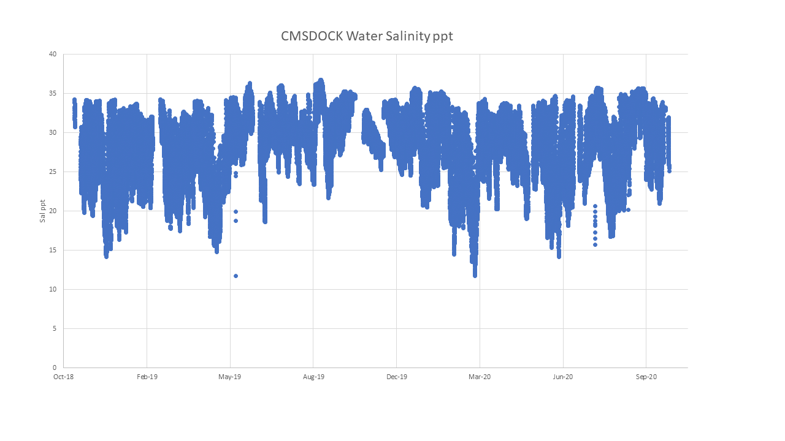
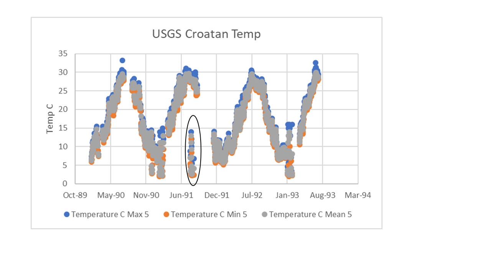
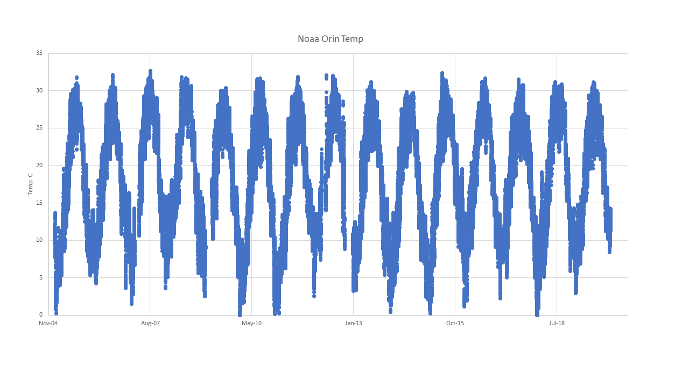
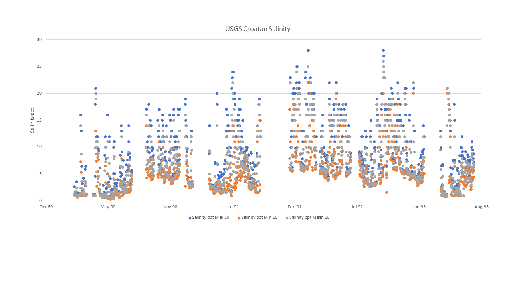

## KEL and TB meeting notes
- Delete dd data, unreliable
- for CMSDOCK use "all years" - NC_WI_HC_XXX_W is a HIGH site
- for NC_PC_CH_XXX_W use USGS Croatan all yrs for salinity, merged data for temp

TO DO:
- update NC_WI_HC_XXX_W in datasheet to HIGH
- update NC_PC_CH_XXX_W in datasheets to LOW
  - For NC_PC_CH_XXX_W, merge for Temp and calculate overall mean: USGS Croatan all yrs and NOAA Orin7 all yrs

# Map of populations (marked with a P) and datasource locations:

https://www.google.com/maps/d/edit?mid=1R5Ca6k8ODP3jSXcJY2soHCY6EmfLVFd-&usp=sharing

# PopID: NC_WI_HC_XXX_W

## COMPARE SOURCES
> The only datasource listed for this population for both temperature and salinity is UNCW_CORMP_CMSDOCK_station, so nothing to compare to.

## PopID: NC_WI_HC_XXX_W - Temperature
* Erin's notes: Temperature in Celsius, data in 15 minute increments. 2018-2020. Jan-Nov.	
* Thais's notes: Temp in Celsius, data in 15 min increments. 2018 (Nov-Dec), 2019 (Jan-Dec), 2020 (Jan-Oct) - this is an active station so data is likely to be continuously added. Quality control not included, file says "quality not evaluated". I deleted the first day of data that seemed off (9-Nov-2018), all zeros and all -6999 (probably code for missing data).

## Plot of all temperature data for this population

## Summary table of temperature data and whole years only 

| Parameter               | CMSDOCK all yrs   | CMSDOCK whole yrs  |
| ----------------------  | :---------------: | :----------------: |
| N_all_datapoints        |       61878       |          31706     |
| Mean_all_datapoints     |        19.8       |           20.2     |
| StdDev_all_datapoints   |         7.0       |            7.1     |
| N_years                 |         3         |             1      |
| Mean_yearly_max         |          27.5     |            32.1    |
| Mean_yearly_min         |          6.6      |            6.3     |
| Data range              | 2018-2020         | 2019               |
| Data frequency          |  15min            |    15 min          |

## PopID: NC_WI_HC_XXX_W - Salinity
* Erin's notes: Salinity in ppt, data in 15 minute increments. 2018-2020. Jan-Nov.
* Thais's notes: Salinity in ppt, data in 15 min increments. 2018 (Nov-Dec), 2019 (Jan-Dec), 2020 (Jan-Oct) - this is an active station so data is likely to be continuously added. I deleted all salinity values below 5 as they seemed like outliers for the location.

## Plot of all salinity data for this population

## Summary table of salinity data and whole years only 

| Parameter               | CMSDOCK all yrs   | CMSDOCK whole yrs  |
| ----------------------  | :---------------: | :----------------: |
| N_all_datapoints        |     61931         |     31707          |
| Mean_all_datapoints     |      27.4         |       28.3         |
| StdDev_all_datapoints   |       4.5         |       4.2          |
| N_years                 |         3         |             1      |
| Mean_yearly_max         |        35.6       |        36.8        |
| Mean_yearly_min         |        12.5       |        11.7        |
| Data range & resolution |  2018-2020, 15min |    2019, 15 min    |

# PopID: NC_PC_CH_XXX_W

## COMPARE SOURCES

Temperature: comparing USGS_0208117950_croatan and NOAA data buoy center Oregon Inlet 8652587. The time frame for these two datasources does not overlap, so I will plot them separately and compare them in the summary table.

Salinity: only datasource listed is USGS_0208117950_croatan, so nothing to compare.

## PopID: NC_PC_CH_XXX_W - Temperature
* Erin's notes: Croatan Temperature in Celsius, data given as daily mean, max, and min. 1990-1993. Measured elevation 5.00. Oregon inlet temperature in celsius from 2005-2019. 9 readings per hour, January-Dec.
* Thais's notes: Croatan Temperature in Celsius, data given as daily mean, max, and min (but some days/months are missing). 1990-1993. Measured elevation 5.00 - using this as elevation = 10 is not available (see salinity data from USGS Croatan). Quality control/flags are applied to this datafile but all are approved - however, when I plotted the data, it looks like there are some errors (very low temps on August 2-12 and 21, 1991. I filtered out all the data inside circles in the "USGS Croatan Temp" plot below meaning they are not included in the calculation of parameters shown in the text. Oregon inlet temperature in celsius from 2005-2019. 9 readings per hour from 2007 to 2019, Jan-Dec. This resolution of 9 readins per hour is too high and it is making it difficult to manage that much data. I am keeping one measurement per hour. 

## Plot of all temperature data from both locations for this population

**Primary**

**Other**

## Summary table of temperature all data and whole years only, from both sources

| Parameter               |Temp USGS Croatan all yrs|Temp USGS Croatan whole yrs|Temp NOAA Orin7 all yrs|Temp NOAA Orin7 whole yrs|
| ----------------------  |:-----------------------:|:-------------------------:|:---------------------:|:-----------------------:|
| N_all_datapoints        |     1006                |              352          |       119365          |         106742          |
| Mean_all_datapoints     |       17.5              |            17.0           |         18.4          |           18.1          |
| StdDev_all_datapoints   |       7.7               |              7.3          |         7.7           |           7.7           |
| N_years                 |       4                 |               1           |         15            |           13            |
| Mean_yearly_max         |      31.9               |              30.6         |          31.6         |           31.6          |
| Mean_yearly_min         |      3.0                |               5.2         |           1.6         |           1.5           |
| Data range 
resolution |    1990-93; daily       |         1992; daily       |   2005-19; hourly     |2005-08,2010-11,2013-19; hourly|

---

## PopID: NC_PC_CH_XXX_W - Salinity
* Erin's notes: Salinity in ppt, data given as daily mean, max, and min. 1990-1993. Measured elevation 5.00
* Thais's notes: Salinity in ppt, data given as daily mean, max, and min (but some days/months are missing). 1990-1993. Data given for elevation 5 and 10 (I don't know what that means - I chose elevation = 10 for salinity because there are ~30% more data available; overall average slighly higher for elevation 10 compared to elevation 5 but both are low). Quality control/flags are applied to this datafile but all are approved, so no filtration needed).

## Plot of all salinity data for this population

## Summary table of salinity data and whole years only 

| Parameter                   |USGS Croatan all yrs|USGS Croatan whole yrs|
| ----------------------------|:------------------:|:--------------------:|
| N_all_datapoints            |      944           |      325             |
| Mean_all_datapoints (mean)  |       7.2          |      10.0            |
| StdDev_all_datapoints (mean)|        5.1         |      5.1             |
| N_years                     |        4           |          1           |
| Mean_yearly_max (max)       |       23.8         |          28.0        |
| Mean_yearly_min (min)       |       0.9          |           1.6        |
| Data range & resolution     |   1990-93, daily   |   1992, daily        |

