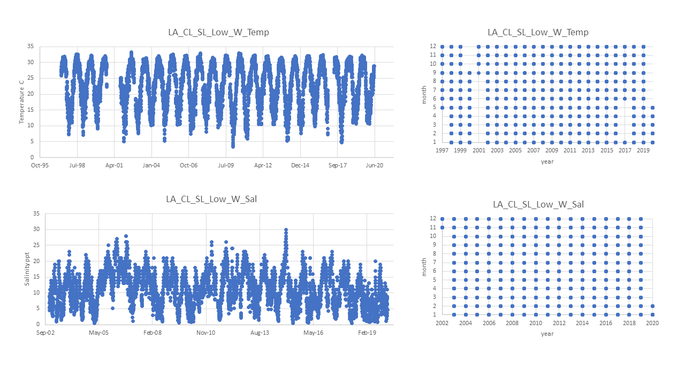

# Pop ID: LA_CL_SL_Low_W

## Map:

Lat/long for population is unknown so using lat/long of data sources. Erin's note: *APPROXIMATE-none provided by sampler, taken from USGS buoy 07381349 (where env data was collected)*

https://www.google.com/maps/d/edit?mid=1Dij67uEcaetFuvKZ4FhACEd1kSgTtCxU&ll=29.854760260024612%2C-92.27782226562499&z=9

## Summary notes:

USGS Sister Lake buoy 07381349 is ok for temperature and salinity; both temp and sal data have been flag-filtered to include approved "A" data and exclude provisional "P" data (this eliminates data that didn't pass quality control by the provider, or hasn't yet been through QC).

Data is given as Daily Mean, Max and Min; in the Summary Table below:

- Mean_all and StdDev_all were calculated from Daily Means,
- Mean and StdDev yearly_max were calculated from Daily Maxs,
- Mean and StdDev yearly_min were calculated from Daily Mins.

## Summary table:

| Parameter             | Temp C USGS 07381349 Flag-filtered | Sal ppt USGS 07381349 Flag-filtered |
| ----------------------| :--------------------------------: | :---------------------------------: |
| N_all_datapoints      |                    7661            |                    5616             |
| Mean_all_datapoints   |                     22.9           |                      11.1           |
| StdDev_all_datapoints |                      6.7           |                      5.4            |
| N_years               |                     24             |                       19            |
| Mean_yearly_max       |                      33.1          |                       25.2          |
| StdDev_yearly_max     |                      1.8           |                       3.4           |
| Mean_yearly_min       |                       6.9          |                       0.9           |
| StdDev_yearly_min     |                       2.3          |                       1.0           |
| Data range            |           May 1997 to May 2020     |             Nov 2002 to Feb 2020    |
| Data frequency        |          Daily Mean, Min, Max      |              Daily Mean, Min, Max   |
| Missing winter        |                 FALSE              |                  FALSE              |

## Data source and filenames:

Website: https://waterdata.usgs.gov/la/nwis/uv/?site_no=07381349&PARAmeter_cd=00065,72020,63160,00060

Temp: LA_CL_SL_Low_W_Temp.xlsx

Sal: LA_CL_SL_Low_W_Sal.xlsx

## Plots: all data over time and data availability per month per year (this helps visualize the 'missing winter' question and other gaps in data) (simple plots made in excel).

