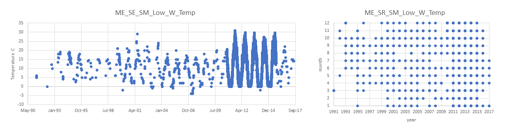

# PopID: ME_SR_SM_Low_W

## Map:

Lat/long for this population is exact; Lat/long for Sheepscot is not listed by Erin but is in the datafile so I assume it is exact; Lat/long for USGS Sheepscot River are exact.

https://www.google.com/maps/d/edit?mid=1bDW7P9ApuPxG8zARjNX5EMrpzYmVWOmT&ll=44.11443054618163%2C-69.60217945537597&z=11

## Summary notes:

**Temp: combine from 2 sources: Robledo Sheepscot and USGS Sheepscot River station (all years).**

- The overall data range is 1991-2017 and the datas sources overlap in 2010-2015.
- Data frequency for these sources are different: Sheepscot (Robledo source) is monthly with several months missing, and USGS Sheepscot River is every 15 minutes.
- A few years are missing winter data.

**Sal: we decided to use NA because the bouys were not close to the site; bAsed on location this is probably a low/med site.**

## Summary table:

| Parameter             | Temp C Sheepscot USGS combined |         Sal ppt        |
| ----------------------| :----------------------------: | :--------------------: |
| N_all_datapoints      |             174398             |          NA            |
| Mean_all_datapoints   |              10.8              |           NA           |
| StdDev_all_datapoints |              9.0               |           NA           |
| N_years               |               27               |           NA           |
| Mean_yearly_max       |                20.3            |           NA           |
| StdDev_yearly_max     |                 6.1            |             NA         |
| Mean_yearly_min       |                1.5             |             NA         |
| StdDev_yearly_min     |                 3.3            |             NA         |
| Data range            |  1991 to 2017 see summary notes|                   NA   |
| Data frequency        |monthly to 15min intervals see summary notes|       NA   |
| Missing winter        |     FALSE but see summary notes|                   NA   |

## Datasources and filenames:

Website: https://waterdata.usgs.gov/me/nwis/uv/?site_no=01038000&PARAmeter_cd=00065,00060 (USGS, temp only); NA for Sheepscot temp.

Temp: ME_SR_SM_Low_W_Temp.xlsx

Sal: NA

---

## Plots: all data over time and data availability per month per year (this helps visualize the 'missing winter' question and other gaps in data) (simple plots made in excel).

