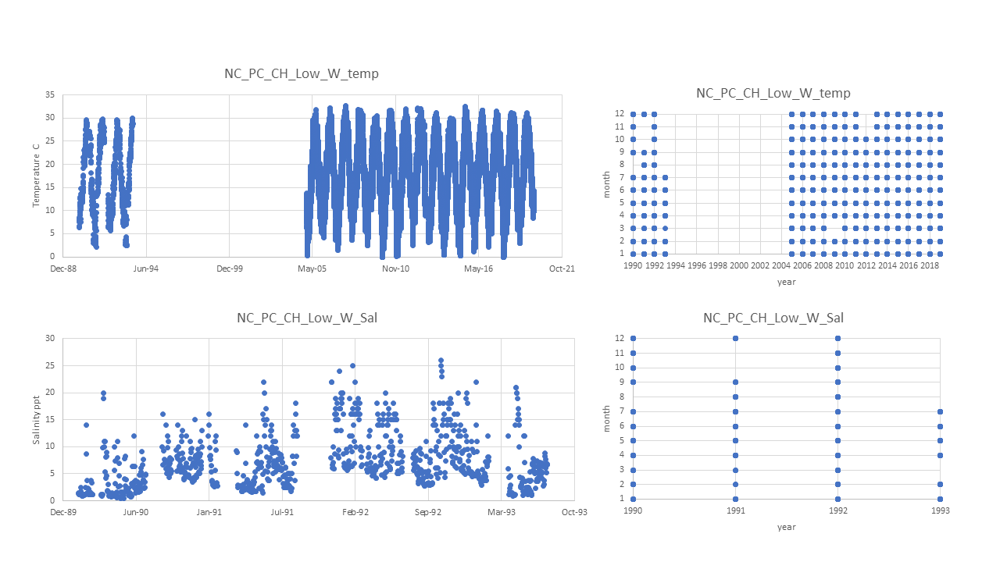

# PopID: NC_PC_CH_Low_W

## Map:

Lat/long for this population are exact; 

Lat/long for the datasource (same for temp and sal) are also exact.

https://www.google.com/maps/d/edit?mid=1S0YAe7f5lk1EZVIFnNgsjao9WFu3VWfw&ll=35.81805613340261%2C-75.79796910360672&z=12

## Summary notes:

Temp: combined USGS Croatan (station ID: 0208117950) all yrs and NOAA Orin7 all yrs.

Sal: use USGS Croatan station (ID: 0208117950) all years.

USGS data
- only using data flagged as "A" (approved); all data were "A" for the Croatan station but there were some blips that I deleted; 
- data range 1990-93; data given as daily max, min and mean. Elevation = 5 for temp and 10 for salinity (I don't know what that means). 
- some months are missing data.

NOAA data 
- data range 2005-19; data given as 9 readings per hour which was too much for excel to handle so I extracted hourly data.

To make the combined spreadsheet, I copied and pasted the hourly data from Orin7 under the columns max, mean and min from USGS.

## Summary table:

| Parameter             | Temp C USGS Croatan & Orin7 combined| Sal ppt Croatan |
| ----------------------| :---------------------------------: | :-------------: |
| N_all_datapoints      |                     120371          |        944      |
| Mean_all_datapoints   |                       18.3          |        7.2      |
| StdDev_all_datapoints |                        7.7          |        5.1      |
| N_years               |                        19           |        4        |
| Mean_yearly_max       |                        31.6         |        23.8     |
| StdDev_yearly_max     |                        0.8          |        3.1      |
| Mean_yearly_min       |                        1.9          |          0.9    |
| StdDev_yearly_min     |                        1.5          |          0.5    |
| Data range            | Jan1990 to Jul1993 and Jan2005 to Dec2019   | Jan1990 to Jul1993 |
| Data frequency        |daily max min mean or houly see summary notes| daily max min mean |
| Missing winter        |                       FALSE         | FALSE but some months missing |

## Datasources and filenames:

Website: USGS Croatan temp and sal https://waterdata.usgs.gov/nc/nwis/dv/?referred_module=qw&site_no=0208117950 NOAA temp https://www.ndbc.noaa.gov/station_page.php?station=orin7

Temp: NC_PC_CH_Low_W_Temp.xlsx

Sal: NC_PC_CH_Low_W_Sal.xlsx

## Plots: all data over time and data availability per month per year (this helps visualize the 'missing winter' question and other gaps in data) (simple plots made in excel).

