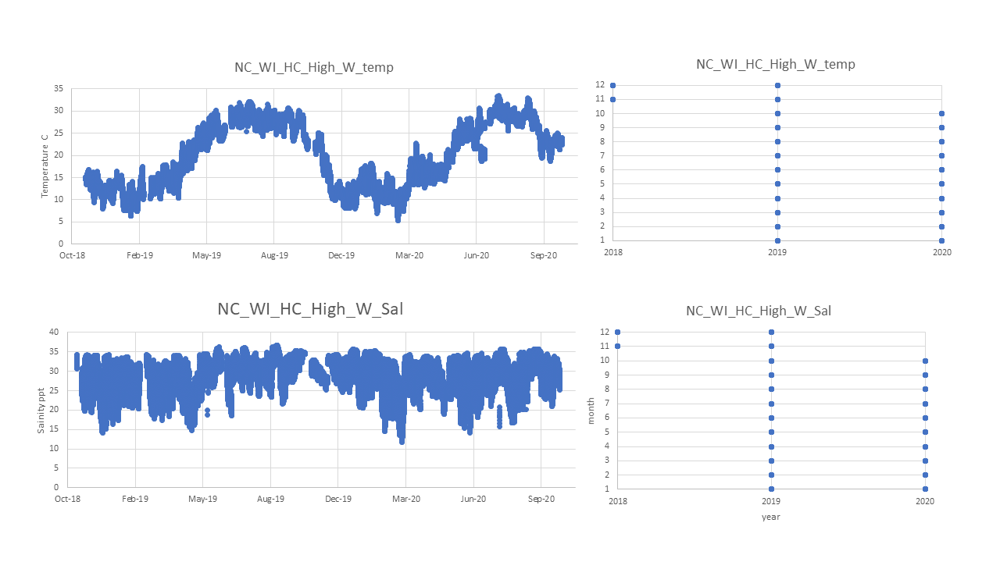

# PopID: NC_WI_HC_High_W

## Map:

Lat/long for this population are exact.

Lat/long for the datasource (same source for temp and sal) are also exact.

https://www.google.com/maps/d/edit?mid=1rEf7tvAZ_25XVQyKttSuM7aCJ4hmllf1&ll=34.16196162464634%2C-77.84918654926392&z=14

## Summary notes:

Using CMSDOCK all years for both temp and sal 

> Data quality not evaluated by provider - I deleted "-6999" values, seemed like code for missing data in the temperature dataset; and I deleted zeros in the salinity dataset.

Only one whole year - 
2018 data begins in November
2020 up until October (can probably retrieve more).

## Summary table:

| Parameter             |  Temp C CMSDOCK    | Sal ppt CMSDOCK    |
| ----------------------| :----------------: | :----------------: |
| N_all_datapoints      |        618878      |       61930        |
| Mean_all_datapoints   |        19.8        |       27.4         |
| StdDev_all_datapoints |        7.0         |       4.5          |
| N_years               |         3          |        3           |
| Mean_yearly_max       |       27.5         |     35.6           |
| StdDev_yearly_max     |        9.3         |       1.2          |
| Mean_yearly_min       |         6.6        |       12.5         |
| StdDev_yearly_min     |        1.4         |       1.4          |
| Data range            |Nov 2018 to Oct 2020|Nov 2018 to Oct 2020|
| Data frequency        |  15 min intervals  | 15 min intervals   |
| Missing winter        |       FALSE        |      FALSE         |

## Datasources and filenames:

Website: https://cormp.org/?health=Off&quality=Off&units=English&duration=3%20days&maps=storm_tracks&legend=Off&forecast=Point&hti=&nhc=undefined&nhcWinds=undefined&sst=&current=&datum=MLLW&windPrediction=wind%20speed%20prediction&region=&bbox=-83.3642578125,31.062345409804408,-72.63061523437501,36.5184659896759&iframe=null&mode=home&platform=CMSDOCK&skipState=true

Temp: NC_WI_HC_High_W_Temp.xlsx

Sal: NC_WI_HC_High_W_Sal.xlsx

## Plots: all data over time and data availability per month per year (this helps visualize the 'missing winter' question and other gaps in data) (simple plots made in excel).

