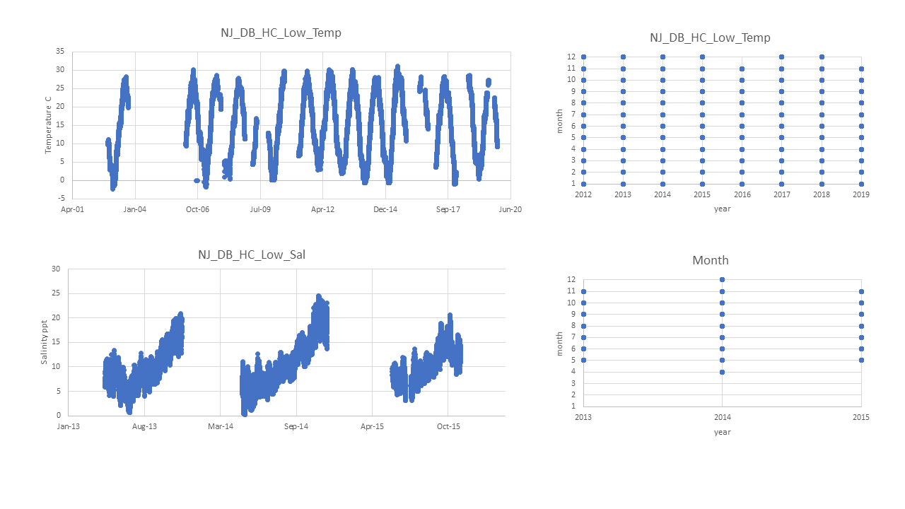

# PopID: NJ_DB_HC_Low_W

## Map:

Unclear from Erin's notes if lat/long for population are exact or approximate as there are no notes.

Lat/long for NOAA datasource (Ship J Shoal) are exact; lat/long for URI data not available, not in the map.

https://www.google.com/maps/d/edit?mid=1KyIL7K8RPJjthwQmd2DkPyaIniMr3Tk5&ll=39.402979711630664%2C-75.44722199999998&z=12

## Summary notes:

- Temp: I compared primary source (URI) with Ship J Shoal (cleaned up a bit, see notes on 2020-10-29 entry) (see KEL and TB notes from meeting on 2020-10-29) and combined them in the Summary table presented below.

- Sal: from the 2020-10-29 meeting notes, I understood we should use the salinity calculated from conductivity data from the primary source (URI) - this is what is presented in the Summary table below. Let me know if I misunderstood the meeting notes, and if I was supposed to compare/combine salinity URI with salinity Ship J Shoal instead.

## Summary table:

| Parameter         | Temp C URI & Ship J Shoal combined | Sal ppt Thais calculated from URI conductivity | 
| ------------------| :---------------------------------:| :---------------------------------------------:| 
| N_total           |                   123062           |                   27753                        | 
| Mean_daily        |                     16.8           |                     10.4                       |
| StdDev_daily      |                       8.6          |                      4.4                       |
| N_years           |                       16           |                      3                         |
| Mean_yearly_max   |                   27.2             |                      22.0                      |
| StdDev_yearly_max |                     5.3            |                       2.2                      |
| Mean_yearly_min   |                   1.7              |                       1.3                      |
| StdDev_yearly_min |                   3.9              |                        1.5                     |
| Data range        | Jun 2012 to Nov 2015 Jan 2002 to Nov 2019|        May 2013 to Nov 2015              |
| Data frequency    |       30 min to hourly intervals   |             30 min intervals                   |
| Missing winter    |         FALSE                      |                      TRUE                      |

## Data source and filename:

Website: https://tidesandcurrents.noaa.gov/stationhome.html?id=8537121 (Ship J Shoal, temp only); NA for primary source URI temp and sal.

Temp: NJ_DB_HC_Low_Temp.xlsx

Sal: NJ_DB_HC_Low_Sal.xlsx

## Plots: all data over time and data availability per month per year (this helps visualize the 'missing winter' question and other gaps in data) (simple plots made in excel).

