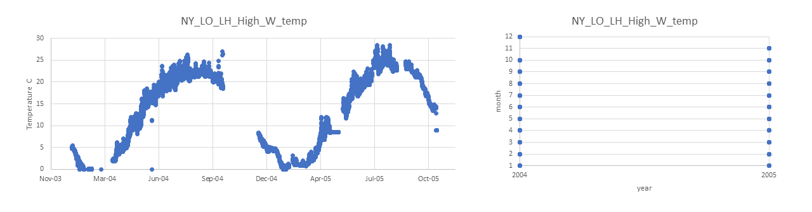

# PopID: NY_LI_LH_High_W

## Map:

Lat/long for this population - unclear whether exact or approximate; Erin's note says "farmer collected samples". 

Lat/long for datasources are exact.

https://www.google.com/maps/d/edit?mid=1UHAc9v-VUwsR3XSjI2Ifod2rbY6d_gOh&ll=40.928845298385255%2C-73.53738506317139&z=13

## Summary notes:

**Environmental data for this population are exactly the same as for population NY_LI_LH_High_W; so summary notes are the same.**

Temp: datasource is NOAA "National data Buoy center 44040 Western Long Island Sound";
- temperature data available hourly for years 2004 and 2005 (confirmed by checking the source website); 
- 2004 is missing Oct9-Dec14; 
- 2005 is missing Nov10-Dec31.

Sal: data source is "Save the Sound" https://www.savethesound.org/water-monitoring-ecological-health 2018_UWS_Data.xlsx; I believe they requested the datafile over email because I don't see a place to download data on the website. Data available May-Oct 2018, two readings per month.

Our meeting notes are confusing me re salinity - it says to label this site as "High" but also that we did not trust the salinity data and should call it NA. I did both but seems contradictory now, **ask Katie**.

## Summary table:

**Environmental data for this population are exactly the same as for population NY_LI_LH_High_W; so summary table is the same.**

| Parameter             | Temp C NOAA NDBC 44040  |      Sal ppt    |
| ----------------------| :---------------------: | :-------------: |
| N_all_datapoints      |          10863          |       NA        |
| Mean_all_datapoints   |         13.3            |       NA        |
| StdDev_all_datapoints |          8.2            |       NA        |
| N_years               |           2             |       NA        |
| Mean_yearly_max       |           27.7          |       NA        |
| StdDev_yearly_max     |            1.0          |       NA        |
| Mean_yearly_min       |            0.0          |       NA        |
| StdDev_yearly_min     |            0.0          |       NA        |
| Data range            |      2004 to 2005       |       NA        |
| Data frequency        |hourly but missing some months|    NA      |
| Missing winter        |  FALSE but see summary notes |    NA      |

## Datasources and filenames:

**Environmental data for this population are exactly the same as for population NY_LI_LH_High_W; so datasource, content of datafiles and plots below are the same.**

Website: https://www.ndbc.noaa.gov/station_page.php?station=44040 (temp only); NA for salinity.

Temp: NY_LI_LH_High_W.xlsx

Sal: NA

## Plots: all data over time and data availability per month per year (this helps visualize the 'missing winter' question and other gaps in data) (simple plots made in excel).

