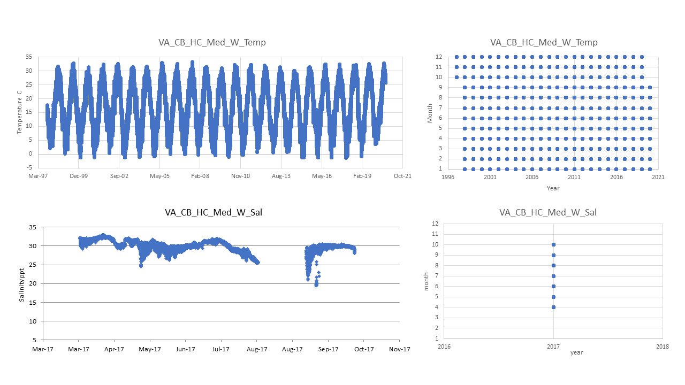

## Pop ID: VA_CB_HC_Med_W

## Map:

Lat/long for population is approximate, this is Erin's note on it: *APPROXIMATE- picture of the sampling site on a map was provided by Jess. Lat and Long approximate by Erin on google maps using this. I checked it today and got a slightly more accurate number based on the map provided.*
Lat/long for environmental data temp is exact and for sal it is the same as the populations lat/long.

https://www.google.com/maps/d/edit?mid=1ggc_n7JouNgYYtTQXOugT8_ILX3KdCen&ll=37.52139233253085%2C-76.02792199999999&z=9

## Summary notes:

NERR_CBVGIWQ is ok for temperature but not for salinity; temp data has been flag-filtered (this eliminates data that didn't pass quality control by the provider).

VIMS_Sonde_Marker_119 is ok for salinity; sal data has not been through any quality control.

## Summary table:

| Parameter             | Temp C NERR CBVGIWQ Flag-filtered | Sal ppt VIMS Unfiltered |
| ----------------------| :-------------------------------: | :---------------------: |
| N_all_datapoints      |                776466             |             15226       |
| Mean_all_datapoints   |                16.8               |             30.0        |
| StdDev_all_datapoints |                  8.5              |               1.5       |
| N_years               |                  24               |             0.6         |
| Mean_yearly_max       |                31.41              |             NA          |
| StdDev_yearly_max     |                 3.0               |             NA          |
| Mean_yearly_min       |                  -0.02            |             NA          |
| StdDev_yearly_min     |                 1.5               |             NA          |
| Data range            |            Oct 1997 to Sep 2020   |        Apr to Oct 2017  |
| Data frequency        |             every 15 min          |           every 15 min  |
| Missing winter        |                   FALSE           |             TRUE        |

## Data source and filenames:

Website: http://cdmo.baruch.sc.edu/dges/ (temperature only); NA for salinity.

Temp: VA_CB_HC_Med_W_Temp.xlsx

Sal: VA_CB_HC_Med_W_Sal.xlsx

## Plots: all data over time and data availability per month per year (this helps visualize the 'missing winter' question and other gaps in data) (simple plots made in excel).

---
